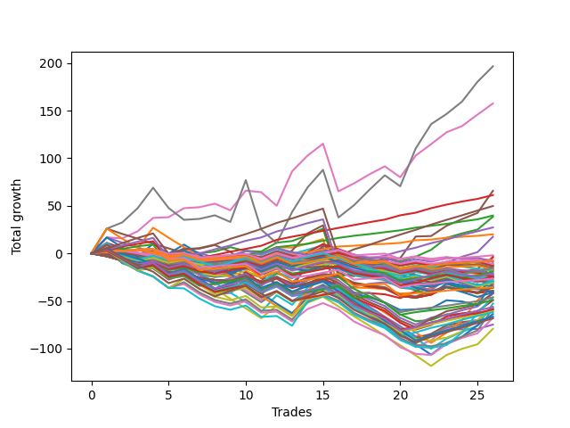

# Long Wallace 004 
- Symbol: ES_Unlimited
- Date Range: 03/18/2022 - 07/15/2022
- Trading Period: 7:20-12:30
- Number of Trades: 26



| Name | Win Percent | Profit | Avg Profit / Trade | Avg Time / Trade |      | Name | Win Percent | Profit | Avg Profit / Trade | Avg Time / Trade |
| ---- | ----------- | ------ | ------------------ | ---------------- | ---- | ---- | ----------- | ------ | ------------------ | ---------------- |
| Sorted By <br> Profit | | | | | | Sorted By <br> Win Percentage ||||
| Seven | 73.08 | 98250.00 | 3778.85 | 133:10 |     | Eighty-Three | 96.15 | 30625.00 | 1177.88 | 38:41 |
| Six | 76.92 | 78750.00 | 3028.85 | 70:48 |     | Eighty-Two | 96.15 | 19875.00 | 764.42 | 32:38 |
| Five | 69.23 | 32875.00 | 1264.42 | 66:06 |     | Eighty-One | 96.15 | 10000.00 | 384.62 | 22:29 |
| Eighty-Three | 96.15 | 30625.00 | 1177.88 | 38:41 |     | Eighty-Five | 92.31 | 24875.00 | 956.73 | 48:46 |
| Eighty-Five | 92.31 | 24875.00 | 956.73 | 48:46 |     | Eighty-Four | 92.31 | 13625.00 | 524.04 | 42:49 |
| Eighty-Two | 96.15 | 19875.00 | 764.42 | 32:38 |     | Six | 76.92 | 78750.00 | 3028.85 | 70:48 |
| Two | 69.23 | 19250.00 | 740.38 | 36:26 |     | One Hundred Sixteen | 76.92 | -3750.00 | -144.23 | 03:08 |
| Eighty-Four | 92.31 | 13625.00 | 524.04 | 42:49 |     | One Hundred Twenty-One | 76.92 | -13250.00 | -509.62 | 03:56 |
| Eighty-One | 96.15 | 10000.00 | 384.62 | 22:29 |     | One Hundred Twenty-Six | 76.92 | -17750.00 | -682.69 | 04:58 |
| Four | 65.38 | 8750.00 | 336.54 | 46:26 |     | Seven | 73.08 | 98250.00 | 3778.85 | 133:10 |
| One Hundred Eleven | 73.08 | -1000.00 | -38.46 | 02:48 |     | One Hundred Eleven | 73.08 | -1000.00 | -38.46 | 02:48 |
| Forty-Five | 26.92 | -1625.00 | -62.50 | 15:49 |     | Five | 69.23 | 32875.00 | 1264.42 | 66:06 |
| Three | 61.54 | -2125.00 | -81.73 | 29:36 |     | Two | 69.23 | 19250.00 | 740.38 | 36:26 |
| Ninety-One | 50.00 | -3625.00 | -139.42 | 01:20 |     | Four | 65.38 | 8750.00 | 336.54 | 46:26 |
| One Hundred Sixteen | 76.92 | -3750.00 | -144.23 | 03:08 |     | One Hundred Twenty-Two | 65.38 | -23125.00 | -889.42 | 05:25 |
| Ninety-Nine | 46.15 | -4500.00 | -173.08 | 02:18 |     | One Hundred Twenty-Seven | 65.38 | -24500.00 | -942.31 | 06:21 |
| One | 53.85 | -5250.00 | -201.92 | 20:31 |     | Three | 61.54 | -2125.00 | -81.73 | 29:36 |
| One Hundred One | 53.85 | -5625.00 | -216.35 | 01:37 |     | Ninety-Six | 57.69 | -6375.00 | -245.19 | 01:50 |
| Forty-Seven | 19.23 | -6000.00 | -230.77 | 30:06 |     | Zero | 57.69 | -7000.00 | -269.23 | 13:33 |
| Ninety-Six | 57.69 | -6375.00 | -245.19 | 01:50 |     | One Hundred Twelve | 57.69 | -7625.00 | -293.27 | 03:43 |
| Ninety-Eight | 46.15 | -6375.00 | -245.19 | 02:12 |     | One Hundred Six | 57.69 | -8500.00 | -326.92 | 02:02 |
| Ninety-Seven | 46.15 | -6500.00 | -250.00 | 01:58 |     | One Hundred Seventeen | 57.69 | -9625.00 | -370.19 | 03:35 |
| Ninety-Two | 38.46 | -6500.00 | -250.00 | 01:32 |     | One Hundred Twenty-Eight | 57.69 | -29375.00 | -1129.81 | 08:07 |
| Zero | 57.69 | -7000.00 | -269.23 | 13:33 |     | Sixty-Four | 57.69 | -29375.00 | -1129.81 | 08:03 |
| One Hundred Twelve | 57.69 | -7625.00 | -293.27 | 03:43 |     | One Hundred Twenty-Three | 57.69 | -30375.00 | -1168.27 | 07:23 |
| One Hundred | 46.15 | -8125.00 | -312.50 | 02:27 |     | One | 53.85 | -5250.00 | -201.92 | 20:31 |
| Forty-Two | 34.62 | -8375.00 | -322.12 | 10:14 |     | One Hundred One | 53.85 | -5625.00 | -216.35 | 01:37 |
| One Hundred Six | 57.69 | -8500.00 | -326.92 | 02:02 |     | One Hundred Twenty-Nine | 53.85 | -28125.00 | -1081.73 | 08:50 |
| Forty-One | 38.46 | -8875.00 | -341.35 | 07:19 |     | One Hundred Twenty-Four | 53.85 | -30875.00 | -1187.50 | 08:17 |
| Ninety-Four | 26.92 | -9000.00 | -346.15 | 02:09 |     | Fifty-Six | 53.85 | -37375.00 | -1437.50 | 07:32 |
| Ninety-Three | 30.77 | -9250.00 | -355.77 | 01:58 |     | Ninety-One | 50.00 | -3625.00 | -139.42 | 01:20 |
| One Hundred Seventeen | 57.69 | -9625.00 | -370.19 | 03:35 |     | Sixty-Six | 50.00 | -21125.00 | -812.50 | 12:43 |
| One Hundred Ninteen | 42.31 | -10375.00 | -399.04 | 04:50 |     | Sixty-Five | 50.00 | -24625.00 | -947.12 | 10:35 |
| One Hundred Two | 38.46 | -11000.00 | -423.08 | 01:54 |     | Fifty-Seven | 50.00 | -29250.00 | -1125.00 | 10:05 |
| One Hundred Nine | 30.77 | -11250.00 | -432.69 | 02:43 |     | One Hundred Twenty-Five | 50.00 | -33250.00 | -1278.85 | 12:02 |
| One Hundred Seven | 42.31 | -11375.00 | -437.50 | 02:15 |     | Ninety-Nine | 46.15 | -4500.00 | -173.08 | 02:18 |
| Fifty | 30.77 | -11500.00 | -442.31 | 06:35 |     | Ninety-Eight | 46.15 | -6375.00 | -245.19 | 02:12 |
| Fifty-One | 26.92 | -12125.00 | -466.35 | 06:38 |     | Ninety-Seven | 46.15 | -6500.00 | -250.00 | 01:58 |
| One Hundred Eighteen | 46.15 | -12250.00 | -471.15 | 04:36 |     | One Hundred | 46.15 | -8125.00 | -312.50 | 02:27 |
| One Hundred Eight | 34.62 | -12375.00 | -475.96 | 02:36 |     | One Hundred Eighteen | 46.15 | -12250.00 | -471.15 | 04:36 |
| Forty-Three | 30.77 | -12375.00 | -475.96 | 09:50 |     | One Hundred Thirteen | 46.15 | -15375.00 | -591.35 | 04:59 |
| Forty-Six | 23.08 | -12375.00 | -475.96 | 21:07 |     | Sixty-Seven | 46.15 | -20875.00 | -802.88 | 13:29 |
| Forty-Eight | 42.31 | -12500.00 | -480.77 | 04:33 |     | Fifty-Eight | 46.15 | -28250.00 | -1086.54 | 13:39 |
| Forty-Four | 26.92 | -13000.00 | -500.00 | 13:40 |     | Fifty-Nine | 46.15 | -29375.00 | -1129.81 | 14:19 |
| One Hundred Twenty-One | 76.92 | -13250.00 | -509.62 | 03:56 |     | One Hundred Thirty | 46.15 | -34125.00 | -1312.50 | 11:33 |
| Forty-Nine | 34.62 | -14000.00 | -538.46 | 05:49 |     | One Hundred Ninteen | 42.31 | -10375.00 | -399.04 | 04:50 |
| One Hundred Three | 30.77 | -14375.00 | -552.88 | 02:24 |     | One Hundred Seven | 42.31 | -11375.00 | -437.50 | 02:15 |
| One Hundred Four | 26.92 | -14500.00 | -557.69 | 02:35 |     | Forty-Eight | 42.31 | -12500.00 | -480.77 | 04:33 |
| One Hundred Fourteen | 42.31 | -14750.00 | -567.31 | 05:25 |     | One Hundred Fourteen | 42.31 | -14750.00 | -567.31 | 05:25 |
| Seventy-Three | 34.62 | -15000.00 | -576.92 | 09:48 |     | Forty | 42.31 | -15375.00 | -591.35 | 05:17 |
| One Hundred Thirteen | 46.15 | -15375.00 | -591.35 | 04:59 |     | Ninety-Two | 38.46 | -6500.00 | -250.00 | 01:32 |
| Forty | 42.31 | -15375.00 | -591.35 | 05:17 |     | Forty-One | 38.46 | -8875.00 | -341.35 | 07:19 |
| One Hundred Ten | 30.77 | -16125.00 | -620.19 | 02:57 |     | One Hundred Two | 38.46 | -11000.00 | -423.08 | 01:54 |
| Sixty-Three | 30.77 | -16625.00 | -639.42 | 48:32 |     | Sixty-One | 38.46 | -26375.00 | -1014.42 | 24:04 |
| Ninety-Five | 15.38 | -17375.00 | -668.27 | 03:05 |     | Sixty-Nine | 38.46 | -28875.00 | -1110.58 | 20:23 |
| One Hundred Twenty-Six | 76.92 | -17750.00 | -682.69 | 04:58 |     | Seventy | 38.46 | -29125.00 | -1120.19 | 21:03 |
| Fifty-Two | 26.92 | -17875.00 | -687.50 | 07:22 |     | Sixty-Eight | 38.46 | -33875.00 | -1302.88 | 17:49 |
| One Hundred Twenty | 26.92 | -18000.00 | -692.31 | 05:55 |     | Sixty | 38.46 | -39625.00 | -1524.04 | 20:31 |
| Fifty-Five | 26.92 | -19750.00 | -759.62 | 07:36 |     | Forty-Two | 34.62 | -8375.00 | -322.12 | 10:14 |
| Fifty-Four | 26.92 | -19750.00 | -759.62 | 07:36 |     | One Hundred Eight | 34.62 | -12375.00 | -475.96 | 02:36 |
| Fifty-Three | 26.92 | -19750.00 | -759.62 | 07:36 |     | Forty-Nine | 34.62 | -14000.00 | -538.46 | 05:49 |
| One Hundred Five | 19.23 | -20375.00 | -783.65 | 03:52 |     | Seventy-Three | 34.62 | -15000.00 | -576.92 | 09:48 |
| One Hundred Fifteen | 34.62 | -20500.00 | -788.46 | 07:33 |     | One Hundred Fifteen | 34.62 | -20500.00 | -788.46 | 07:33 |
| Sixty-Seven | 46.15 | -20875.00 | -802.88 | 13:29 |     | Seventy-One | 34.62 | -23125.00 | -889.42 | 24:33 |
| Sixty-Six | 50.00 | -21125.00 | -812.50 | 12:43 |     | Sixty-Two | 34.62 | -31875.00 | -1225.96 | 32:08 |
| One Hundred Twenty-Two | 65.38 | -23125.00 | -889.42 | 05:25 |     | Ninety-Three | 30.77 | -9250.00 | -355.77 | 01:58 |
| Seventy-One | 34.62 | -23125.00 | -889.42 | 24:33 |     | One Hundred Nine | 30.77 | -11250.00 | -432.69 | 02:43 |
| One Hundred Twenty-Seven | 65.38 | -24500.00 | -942.31 | 06:21 |     | Fifty | 30.77 | -11500.00 | -442.31 | 06:35 |
| Sixty-Five | 50.00 | -24625.00 | -947.12 | 10:35 |     | Forty-Three | 30.77 | -12375.00 | -475.96 | 09:50 |
| Sixty-One | 38.46 | -26375.00 | -1014.42 | 24:04 |     | One Hundred Three | 30.77 | -14375.00 | -552.88 | 02:24 |
| One Hundred Twenty-Nine | 53.85 | -28125.00 | -1081.73 | 08:50 |     | One Hundred Ten | 30.77 | -16125.00 | -620.19 | 02:57 |
| Fifty-Eight | 46.15 | -28250.00 | -1086.54 | 13:39 |     | Sixty-Three | 30.77 | -16625.00 | -639.42 | 48:32 |
| Sixty-Nine | 38.46 | -28875.00 | -1110.58 | 20:23 |     | Forty-Five | 26.92 | -1625.00 | -62.50 | 15:49 |
| Seventy | 38.46 | -29125.00 | -1120.19 | 21:03 |     | Ninety-Four | 26.92 | -9000.00 | -346.15 | 02:09 |
| Fifty-Seven | 50.00 | -29250.00 | -1125.00 | 10:05 |     | Fifty-One | 26.92 | -12125.00 | -466.35 | 06:38 |
| One Hundred Twenty-Eight | 57.69 | -29375.00 | -1129.81 | 08:07 |     | Forty-Four | 26.92 | -13000.00 | -500.00 | 13:40 |
| Sixty-Four | 57.69 | -29375.00 | -1129.81 | 08:03 |     | One Hundred Four | 26.92 | -14500.00 | -557.69 | 02:35 |
| Fifty-Nine | 46.15 | -29375.00 | -1129.81 | 14:19 |     | Fifty-Two | 26.92 | -17875.00 | -687.50 | 07:22 |
| One Hundred Twenty-Three | 57.69 | -30375.00 | -1168.27 | 07:23 |     | One Hundred Twenty | 26.92 | -18000.00 | -692.31 | 05:55 |
| One Hundred Twenty-Four | 53.85 | -30875.00 | -1187.50 | 08:17 |     | Fifty-Five | 26.92 | -19750.00 | -759.62 | 07:36 |
| Sixty-Two | 34.62 | -31875.00 | -1225.96 | 32:08 |     | Fifty-Four | 26.92 | -19750.00 | -759.62 | 07:36 |
| One Hundred Twenty-Five | 50.00 | -33250.00 | -1278.85 | 12:02 |     | Fifty-Three | 26.92 | -19750.00 | -759.62 | 07:36 |
| Sixty-Eight | 38.46 | -33875.00 | -1302.88 | 17:49 |     | Forty-Six | 23.08 | -12375.00 | -475.96 | 21:07 |
| One Hundred Thirty | 46.15 | -34125.00 | -1312.50 | 11:33 |     | Forty-Seven | 19.23 | -6000.00 | -230.77 | 30:06 |
| Fifty-Six | 53.85 | -37375.00 | -1437.50 | 07:32 |     | One Hundred Five | 19.23 | -20375.00 | -783.65 | 03:52 |
| Sixty | 38.46 | -39625.00 | -1524.04 | 20:31 |     | Ninety-Five | 15.38 | -17375.00 | -668.27 | 03:05 |

## NO STOPLOSS

### Test Zero
* Sell when price hits the middle line of the 20p bollinger
* No Stoploss
* Results:
```
Total Trades: 26
Percent Up: 57.69
Percent Down: 42.31
Total Points Moved Up: -14.00
Potential Profit: -7000.00
Total Points Ups: 48.50 Count Ups: 15
Total Points Downs: -62.50 Count Downs: 11
```

<details><summary>Trades</summary>

<code>In: 2022-03-25 08:30:00		Out: 2022-03-25 08:36:55		Total Position Time: 06:55		Total Move Up: 4.00		Total to Date: 4.00</code> <br />
<code>In: 2022-03-28 08:28:00		Out: 2022-03-28 09:02:00		Total Position Time: 34:00		Total Move Up: -14.25		Total to Date: -10.25</code> <br />
<code>In: 2022-03-28 08:39:00		Out: 2022-03-28 09:02:00		Total Position Time: 23:00		Total Move Up: -5.75		Total to Date: -16.00</code> <br />
<code>In: 2022-03-28 08:52:00		Out: 2022-03-28 09:02:00		Total Position Time: 10:00		Total Move Up: 0.75		Total to Date: -15.25</code> <br />
<code>In: 2022-03-30 08:03:00		Out: 2022-03-30 08:19:25		Total Position Time: 16:25		Total Move Up: -5.00		Total to Date: -20.25</code> <br />
<code>In: 2022-03-30 08:14:00		Out: 2022-03-30 08:19:25		Total Position Time: 05:25		Total Move Up: 3.75		Total to Date: -16.50</code> <br />
<code>In: 2022-03-30 12:07:00		Out: 2022-03-30 12:28:50		Total Position Time: 21:50		Total Move Up: -5.50		Total to Date: -22.00</code> <br />
<code>In: 2022-03-30 12:14:00		Out: 2022-03-30 12:28:50		Total Position Time: 14:50		Total Move Up: -2.75		Total to Date: -24.75</code> <br />
<code>In: 2022-04-12 11:35:00		Out: 2022-04-12 11:36:10		Total Position Time: 01:10		Total Move Up: 1.50		Total to Date: -23.25</code> <br />
<code>In: 2022-05-02 10:06:00		Out: 2022-05-02 10:08:15		Total Position Time: 02:15		Total Move Up: 10.50		Total to Date: -12.75</code> <br />
<code>In: 2022-05-09 07:27:00		Out: 2022-05-09 07:42:30		Total Position Time: 15:30		Total Move Up: -6.25		Total to Date: -19.00</code> <br />
<code>In: 2022-05-11 11:01:00		Out: 2022-05-11 11:02:10		Total Position Time: 01:10		Total Move Up: 6.25		Total to Date: -12.75</code> <br />
<code>In: 2022-05-12 11:35:00		Out: 2022-05-12 11:45:25		Total Position Time: 10:25		Total Move Up: 0.00		Total to Date: -12.75</code> <br />
<code>In: 2022-05-17 07:48:00		Out: 2022-05-17 07:55:15		Total Position Time: 07:15		Total Move Up: 3.00		Total to Date: -9.75</code> <br />
<code>In: 2022-06-09 08:10:00		Out: 2022-06-09 08:11:10		Total Position Time: 01:10		Total Move Up: 3.25		Total to Date: -6.50</code> <br />
<code>In: 2022-06-09 11:27:00		Out: 2022-06-09 11:28:40		Total Position Time: 01:40		Total Move Up: 3.00		Total to Date: -3.50</code> <br />
<code>In: 2022-06-14 07:32:00		Out: 2022-06-14 07:47:00		Total Position Time: 15:00		Total Move Up: -5.25		Total to Date: -8.75</code> <br />
<code>In: 2022-06-15 07:57:00		Out: 2022-06-15 08:34:25		Total Position Time: 37:25		Total Move Up: -3.50		Total to Date: -12.25</code> <br />
<code>In: 2022-06-15 07:58:00		Out: 2022-06-15 08:34:25		Total Position Time: 36:25		Total Move Up: -4.50		Total to Date: -16.75</code> <br />
<code>In: 2022-06-16 11:02:00		Out: 2022-06-16 11:40:20		Total Position Time: 38:20		Total Move Up: -7.00		Total to Date: -23.75</code> <br />
<code>In: 2022-06-17 07:38:00		Out: 2022-06-17 07:55:05		Total Position Time: 17:05		Total Move Up: -2.75		Total to Date: -26.50</code> <br />
<code>In: 2022-06-23 09:07:00		Out: 2022-06-23 09:17:45		Total Position Time: 10:45		Total Move Up: 1.25		Total to Date: -25.25</code> <br />
<code>In: 2022-06-27 12:08:00		Out: 2022-06-27 12:10:20		Total Position Time: 02:20		Total Move Up: 6.00		Total to Date: -19.25</code> <br />
<code>In: 2022-07-05 08:08:00		Out: 2022-07-05 08:15:20		Total Position Time: 07:20		Total Move Up: 0.25		Total to Date: -19.00</code> <br />
<code>In: 2022-07-06 08:35:00		Out: 2022-07-06 08:46:30		Total Position Time: 11:30		Total Move Up: 0.25		Total to Date: -18.75</code> <br />
<code>In: 2022-07-13 07:23:00		Out: 2022-07-13 07:26:25		Total Position Time: 03:25		Total Move Up: 4.75		Total to Date: -14.00</code> <br />


</details>

### Test One
* Sell when the price hits the upper line of the 20p 1std bollinger
* No Stoploss
* Results:
```
Total Trades: 26
Percent Up: 53.85
Percent Down: 46.15
Total Points Moved Up: -10.50
Potential Profit: -5250.00
Total Points Ups: 76.00 Count Ups: 14
Total Points Downs: -86.50 Count Downs: 12
```

<details><summary>Trades</summary>

<code>In: 2022-03-25 08:30:00		Out: 2022-03-25 08:41:10		Total Position Time: 11:10		Total Move Up: 5.50		Total to Date: 5.50</code> <br />
<code>In: 2022-03-28 08:28:00		Out: 2022-03-28 09:05:25		Total Position Time: 37:25		Total Move Up: -12.25		Total to Date: -6.75</code> <br />
<code>In: 2022-03-28 08:39:00		Out: 2022-03-28 09:05:25		Total Position Time: 26:25		Total Move Up: -3.75		Total to Date: -10.50</code> <br />
<code>In: 2022-03-28 08:52:00		Out: 2022-03-28 09:05:25		Total Position Time: 13:25		Total Move Up: 2.75		Total to Date: -7.75</code> <br />
<code>In: 2022-03-30 08:03:00		Out: 2022-03-30 08:34:45		Total Position Time: 31:45		Total Move Up: -5.75		Total to Date: -13.50</code> <br />
<code>In: 2022-03-30 08:14:00		Out: 2022-03-30 08:34:45		Total Position Time: 20:45		Total Move Up: 3.00		Total to Date: -10.50</code> <br />
<code>In: 2022-03-30 12:07:00		Out: 2022-03-30 12:32:20		Total Position Time: 25:20		Total Move Up: -3.50		Total to Date: -14.00</code> <br />
<code>In: 2022-03-30 12:14:00		Out: 2022-03-30 12:32:20		Total Position Time: 18:20		Total Move Up: -0.75		Total to Date: -14.75</code> <br />
<code>In: 2022-04-12 11:35:00		Out: 2022-04-12 11:37:30		Total Position Time: 02:30		Total Move Up: 3.75		Total to Date: -11.00</code> <br />
<code>In: 2022-05-02 10:06:00		Out: 2022-05-02 10:10:55		Total Position Time: 04:55		Total Move Up: 14.00		Total to Date: 3.00</code> <br />
<code>In: 2022-05-09 07:27:00		Out: 2022-05-09 07:46:10		Total Position Time: 19:10		Total Move Up: -2.75		Total to Date: 0.25</code> <br />
<code>In: 2022-05-11 11:01:00		Out: 2022-05-11 11:02:10		Total Position Time: 01:10		Total Move Up: 6.25		Total to Date: 6.50</code> <br />
<code>In: 2022-05-12 11:35:00		Out: 2022-05-12 11:52:55		Total Position Time: 17:55		Total Move Up: -0.50		Total to Date: 6.00</code> <br />
<code>In: 2022-05-17 07:48:00		Out: 2022-05-17 07:59:10		Total Position Time: 11:10		Total Move Up: 4.25		Total to Date: 10.25</code> <br />
<code>In: 2022-06-09 08:10:00		Out: 2022-06-09 08:21:10		Total Position Time: 11:10		Total Move Up: 4.75		Total to Date: 15.00</code> <br />
<code>In: 2022-06-09 11:27:00		Out: 2022-06-09 12:47:00		Total Position Time: 80:00		Total Move Up: -50.00		Total to Date: -35.00</code> <br />
<code>In: 2022-06-14 07:32:00		Out: 2022-06-14 07:47:15		Total Position Time: 15:15		Total Move Up: -1.00		Total to Date: -36.00</code> <br />
<code>In: 2022-06-15 07:57:00		Out: 2022-06-15 08:38:55		Total Position Time: 41:55		Total Move Up: -0.25		Total to Date: -36.25</code> <br />
<code>In: 2022-06-15 07:58:00		Out: 2022-06-15 08:38:55		Total Position Time: 40:55		Total Move Up: -1.25		Total to Date: -37.50</code> <br />
<code>In: 2022-06-16 11:02:00		Out: 2022-06-16 11:40:30		Total Position Time: 38:30		Total Move Up: -4.75		Total to Date: -42.25</code> <br />
<code>In: 2022-06-17 07:38:00		Out: 2022-06-17 07:56:20		Total Position Time: 18:20		Total Move Up: 1.00		Total to Date: -41.25</code> <br />
<code>In: 2022-06-23 09:07:00		Out: 2022-06-23 09:18:25		Total Position Time: 11:25		Total Move Up: 4.75		Total to Date: -36.50</code> <br />
<code>In: 2022-06-27 12:08:00		Out: 2022-06-27 12:12:10		Total Position Time: 04:10		Total Move Up: 9.00		Total to Date: -27.50</code> <br />
<code>In: 2022-07-05 08:08:00		Out: 2022-07-05 08:16:45		Total Position Time: 08:45		Total Move Up: 3.25		Total to Date: -24.25</code> <br />
<code>In: 2022-07-06 08:35:00		Out: 2022-07-06 08:48:25		Total Position Time: 13:25		Total Move Up: 2.00		Total to Date: -22.25</code> <br />
<code>In: 2022-07-13 07:23:00		Out: 2022-07-13 07:31:20		Total Position Time: 08:20		Total Move Up: 11.75		Total to Date: -10.50</code> <br />


</details>

### Test Two
* Sell when the price hits the upper line of the 20p 2std bollinger
* No Stoploss
* Results:
```
Total Trades: 26
Percent Up: 69.23
Percent Down: 30.77
Total Points Moved Up: 38.50
Potential Profit: 19250.00
Total Points Ups: 115.25 Count Ups: 18
Total Points Downs: -76.75 Count Downs: 8
```

<details><summary>Trades</summary>

<code>In: 2022-03-25 08:30:00		Out: 2022-03-25 08:41:55		Total Position Time: 11:55		Total Move Up: 9.50		Total to Date: 9.50</code> <br />
<code>In: 2022-03-28 08:28:00		Out: 2022-03-28 09:07:10		Total Position Time: 39:10		Total Move Up: -11.00		Total to Date: -1.50</code> <br />
<code>In: 2022-03-28 08:39:00		Out: 2022-03-28 09:07:10		Total Position Time: 28:10		Total Move Up: -2.50		Total to Date: -4.00</code> <br />
<code>In: 2022-03-28 08:52:00		Out: 2022-03-28 09:07:10		Total Position Time: 15:10		Total Move Up: 4.00		Total to Date: 0.00</code> <br />
<code>In: 2022-03-30 08:03:00		Out: 2022-03-30 08:35:15		Total Position Time: 32:15		Total Move Up: -4.00		Total to Date: -4.00</code> <br />
<code>In: 2022-03-30 08:14:00		Out: 2022-03-30 08:35:15		Total Position Time: 21:15		Total Move Up: 4.75		Total to Date: 0.75</code> <br />
<code>In: 2022-03-30 12:07:00		Out: 2022-03-30 12:36:20		Total Position Time: 29:20		Total Move Up: -0.75		Total to Date: 0.00</code> <br />
<code>In: 2022-03-30 12:14:00		Out: 2022-03-30 12:36:20		Total Position Time: 22:20		Total Move Up: 2.00		Total to Date: 2.00</code> <br />
<code>In: 2022-04-12 11:35:00		Out: 2022-04-12 11:47:00		Total Position Time: 12:00		Total Move Up: 4.50		Total to Date: 6.50</code> <br />
<code>In: 2022-05-02 10:06:00		Out: 2022-05-02 11:03:55		Total Position Time: 57:55		Total Move Up: -4.00		Total to Date: 2.50</code> <br />
<code>In: 2022-05-09 07:27:00		Out: 2022-05-09 07:49:10		Total Position Time: 22:10		Total Move Up: -0.50		Total to Date: 2.00</code> <br />
<code>In: 2022-05-11 11:01:00		Out: 2022-05-11 11:04:55		Total Position Time: 03:55		Total Move Up: 9.25		Total to Date: 11.25</code> <br />
<code>In: 2022-05-12 11:35:00		Out: 2022-05-12 11:53:25		Total Position Time: 18:25		Total Move Up: 1.75		Total to Date: 13.00</code> <br />
<code>In: 2022-05-17 07:48:00		Out: 2022-05-17 08:00:05		Total Position Time: 12:05		Total Move Up: 6.00		Total to Date: 19.00</code> <br />
<code>In: 2022-06-09 08:10:00		Out: 2022-06-09 08:22:35		Total Position Time: 12:35		Total Move Up: 7.00		Total to Date: 26.00</code> <br />
<code>In: 2022-06-09 11:27:00		Out: 2022-06-09 12:47:00		Total Position Time: 80:00		Total Move Up: -50.00		Total to Date: -24.00</code> <br />
<code>In: 2022-06-14 07:32:00		Out: 2022-06-14 07:48:40		Total Position Time: 16:40		Total Move Up: 2.50		Total to Date: -21.50</code> <br />
<code>In: 2022-06-15 07:57:00		Out: 2022-06-15 10:58:15		Total Position Time: 181:15		Total Move Up: 9.00		Total to Date: -12.50</code> <br />
<code>In: 2022-06-15 07:58:00		Out: 2022-06-15 10:58:15		Total Position Time: 180:15		Total Move Up: 8.00		Total to Date: -4.50</code> <br />
<code>In: 2022-06-16 11:02:00		Out: 2022-06-16 11:41:05		Total Position Time: 39:05		Total Move Up: -4.00		Total to Date: -8.50</code> <br />
<code>In: 2022-06-17 07:38:00		Out: 2022-06-17 08:02:25		Total Position Time: 24:25		Total Move Up: 5.00		Total to Date: -3.50</code> <br />
<code>In: 2022-06-23 09:07:00		Out: 2022-06-23 09:19:10		Total Position Time: 12:10		Total Move Up: 7.25		Total to Date: 3.75</code> <br />
<code>In: 2022-06-27 12:08:00		Out: 2022-06-27 12:45:40		Total Position Time: 37:40		Total Move Up: 12.50		Total to Date: 16.25</code> <br />
<code>In: 2022-07-05 08:08:00		Out: 2022-07-05 08:20:35		Total Position Time: 12:35		Total Move Up: 4.75		Total to Date: 21.00</code> <br />
<code>In: 2022-07-06 08:35:00		Out: 2022-07-06 08:51:15		Total Position Time: 16:15		Total Move Up: 4.00		Total to Date: 25.00</code> <br />
<code>In: 2022-07-13 07:23:00		Out: 2022-07-13 07:31:30		Total Position Time: 08:30		Total Move Up: 13.50		Total to Date: 38.50</code> <br />


</details>

### Test Three
* Sell when price hits the middle line of the 50p bollinger
* No Stoploss
* Results:
```
Total Trades: 26
Percent Up: 61.54
Percent Down: 38.46
Total Points Moved Up: -4.25
Potential Profit: -2125.00
Total Points Ups: 99.00 Count Ups: 16
Total Points Downs: -103.25 Count Downs: 10
```

<details><summary>Trades</summary>

<code>In: 2022-03-25 08:30:00		Out: 2022-03-25 08:53:00		Total Position Time: 23:00		Total Move Up: 8.75		Total to Date: 8.75</code> <br />
<code>In: 2022-03-28 08:28:00		Out: 2022-03-28 09:25:20		Total Position Time: 57:20		Total Move Up: -14.50		Total to Date: -5.75</code> <br />
<code>In: 2022-03-28 08:39:00		Out: 2022-03-28 09:25:20		Total Position Time: 46:20		Total Move Up: -6.00		Total to Date: -11.75</code> <br />
<code>In: 2022-03-28 08:52:00		Out: 2022-03-28 09:25:20		Total Position Time: 33:20		Total Move Up: 0.50		Total to Date: -11.25</code> <br />
<code>In: 2022-03-30 08:03:00		Out: 2022-03-30 08:35:20		Total Position Time: 32:20		Total Move Up: -3.50		Total to Date: -14.75</code> <br />
<code>In: 2022-03-30 08:14:00		Out: 2022-03-30 08:35:20		Total Position Time: 21:20		Total Move Up: 5.25		Total to Date: -9.50</code> <br />
<code>In: 2022-03-30 12:07:00		Out: 2022-03-30 12:33:40		Total Position Time: 26:40		Total Move Up: -1.75		Total to Date: -11.25</code> <br />
<code>In: 2022-03-30 12:14:00		Out: 2022-03-30 12:33:40		Total Position Time: 19:40		Total Move Up: 1.00		Total to Date: -10.25</code> <br />
<code>In: 2022-04-12 11:35:00		Out: 2022-04-12 11:47:05		Total Position Time: 12:05		Total Move Up: 6.00		Total to Date: -4.25</code> <br />
<code>In: 2022-05-02 10:06:00		Out: 2022-05-02 11:05:00		Total Position Time: 59:00		Total Move Up: -1.50		Total to Date: -5.75</code> <br />
<code>In: 2022-05-09 07:27:00		Out: 2022-05-09 08:39:00		Total Position Time: 72:00		Total Move Up: -20.50		Total to Date: -26.25</code> <br />
<code>In: 2022-05-11 11:01:00		Out: 2022-05-11 11:05:00		Total Position Time: 04:00		Total Move Up: 11.00		Total to Date: -15.25</code> <br />
<code>In: 2022-05-12 11:35:00		Out: 2022-05-12 11:53:25		Total Position Time: 18:25		Total Move Up: 1.75		Total to Date: -13.50</code> <br />
<code>In: 2022-05-17 07:48:00		Out: 2022-05-17 08:04:10		Total Position Time: 16:10		Total Move Up: 10.25		Total to Date: -3.25</code> <br />
<code>In: 2022-06-09 08:10:00		Out: 2022-06-09 08:25:35		Total Position Time: 15:35		Total Move Up: 7.25		Total to Date: 4.00</code> <br />
<code>In: 2022-06-09 11:27:00		Out: 2022-06-09 12:47:00		Total Position Time: 80:00		Total Move Up: -50.00		Total to Date: -46.00</code> <br />
<code>In: 2022-06-14 07:32:00		Out: 2022-06-14 07:50:20		Total Position Time: 18:20		Total Move Up: 4.50		Total to Date: -41.50</code> <br />
<code>In: 2022-06-15 07:57:00		Out: 2022-06-15 08:38:55		Total Position Time: 41:55		Total Move Up: -0.25		Total to Date: -41.75</code> <br />
<code>In: 2022-06-15 07:58:00		Out: 2022-06-15 08:38:55		Total Position Time: 40:55		Total Move Up: -1.25		Total to Date: -43.00</code> <br />
<code>In: 2022-06-16 11:02:00		Out: 2022-06-16 11:41:05		Total Position Time: 39:05		Total Move Up: -4.00		Total to Date: -47.00</code> <br />
<code>In: 2022-06-17 07:38:00		Out: 2022-06-17 08:02:30		Total Position Time: 24:30		Total Move Up: 7.00		Total to Date: -40.00</code> <br />
<code>In: 2022-06-23 09:07:00		Out: 2022-06-23 09:22:00		Total Position Time: 15:00		Total Move Up: 8.75		Total to Date: -31.25</code> <br />
<code>In: 2022-06-27 12:08:00		Out: 2022-06-27 12:11:50		Total Position Time: 03:50		Total Move Up: 8.00		Total to Date: -23.25</code> <br />
<code>In: 2022-07-05 08:08:00		Out: 2022-07-05 08:32:25		Total Position Time: 24:25		Total Move Up: 3.25		Total to Date: -20.00</code> <br />
<code>In: 2022-07-06 08:35:00		Out: 2022-07-06 08:51:15		Total Position Time: 16:15		Total Move Up: 4.00		Total to Date: -16.00</code> <br />
<code>In: 2022-07-13 07:23:00		Out: 2022-07-13 07:31:20		Total Position Time: 08:20		Total Move Up: 11.75		Total to Date: -4.25</code> <br />


</details>

### Test Four
* Sell when the price hits the upper line of the 50p 1std bollinger
* No Stoploss
* Results:
```
Total Trades: 26
Percent Up: 65.38
Percent Down: 34.62
Total Points Moved Up: 17.50
Potential Profit: 8750.00
Total Points Ups: 126.50 Count Ups: 17
Total Points Downs: -109.00 Count Downs: 9
```

<details><summary>Trades</summary>

<code>In: 2022-03-25 08:30:00		Out: 2022-03-25 09:08:25		Total Position Time: 38:25		Total Move Up: 8.00		Total to Date: 8.00</code> <br />
<code>In: 2022-03-28 08:28:00		Out: 2022-03-28 09:35:05		Total Position Time: 67:05		Total Move Up: -12.75		Total to Date: -4.75</code> <br />
<code>In: 2022-03-28 08:39:00		Out: 2022-03-28 09:35:05		Total Position Time: 56:05		Total Move Up: -4.25		Total to Date: -9.00</code> <br />
<code>In: 2022-03-28 08:52:00		Out: 2022-03-28 09:35:05		Total Position Time: 43:05		Total Move Up: 2.25		Total to Date: -6.75</code> <br />
<code>In: 2022-03-30 08:03:00		Out: 2022-03-30 08:57:20		Total Position Time: 54:20		Total Move Up: -4.75		Total to Date: -11.50</code> <br />
<code>In: 2022-03-30 08:14:00		Out: 2022-03-30 08:57:20		Total Position Time: 43:20		Total Move Up: 4.00		Total to Date: -7.50</code> <br />
<code>In: 2022-03-30 12:07:00		Out: 2022-03-30 12:46:25		Total Position Time: 39:25		Total Move Up: 1.50		Total to Date: -6.00</code> <br />
<code>In: 2022-03-30 12:14:00		Out: 2022-03-30 12:46:25		Total Position Time: 32:25		Total Move Up: 4.25		Total to Date: -1.75</code> <br />
<code>In: 2022-04-12 11:35:00		Out: 2022-04-12 12:47:00		Total Position Time: 72:00		Total Move Up: -7.00		Total to Date: -8.75</code> <br />
<code>In: 2022-05-02 10:06:00		Out: 2022-05-02 11:53:40		Total Position Time: 107:40		Total Move Up: -8.75		Total to Date: -17.50</code> <br />
<code>In: 2022-05-09 07:27:00		Out: 2022-05-09 08:41:35		Total Position Time: 74:35		Total Move Up: -15.50		Total to Date: -33.00</code> <br />
<code>In: 2022-05-11 11:01:00		Out: 2022-05-11 11:18:20		Total Position Time: 17:20		Total Move Up: 13.25		Total to Date: -19.75</code> <br />
<code>In: 2022-05-12 11:35:00		Out: 2022-05-12 12:04:10		Total Position Time: 29:10		Total Move Up: 6.75		Total to Date: -13.00</code> <br />
<code>In: 2022-05-17 07:48:00		Out: 2022-05-17 08:18:30		Total Position Time: 30:30		Total Move Up: 13.00		Total to Date: 0.00</code> <br />
<code>In: 2022-06-09 08:10:00		Out: 2022-06-09 08:40:10		Total Position Time: 30:10		Total Move Up: 6.25		Total to Date: 6.25</code> <br />
<code>In: 2022-06-09 11:27:00		Out: 2022-06-09 12:47:00		Total Position Time: 80:00		Total Move Up: -50.00		Total to Date: -43.75</code> <br />
<code>In: 2022-06-14 07:32:00		Out: 2022-06-14 08:02:25		Total Position Time: 30:25		Total Move Up: 9.00		Total to Date: -34.75</code> <br />
<code>In: 2022-06-15 07:57:00		Out: 2022-06-15 08:57:35		Total Position Time: 60:35		Total Move Up: 2.75		Total to Date: -32.00</code> <br />
<code>In: 2022-06-15 07:58:00		Out: 2022-06-15 08:57:35		Total Position Time: 59:35		Total Move Up: 1.75		Total to Date: -30.25</code> <br />
<code>In: 2022-06-16 11:02:00		Out: 2022-06-16 12:04:10		Total Position Time: 62:10		Total Move Up: -3.50		Total to Date: -33.75</code> <br />
<code>In: 2022-06-17 07:38:00		Out: 2022-06-17 08:06:05		Total Position Time: 28:05		Total Move Up: 14.75		Total to Date: -19.00</code> <br />
<code>In: 2022-06-23 09:07:00		Out: 2022-06-23 10:18:10		Total Position Time: 71:10		Total Move Up: -2.50		Total to Date: -21.50</code> <br />
<code>In: 2022-06-27 12:08:00		Out: 2022-06-27 12:15:30		Total Position Time: 07:30		Total Move Up: 11.50		Total to Date: -10.00</code> <br />
<code>In: 2022-07-05 08:08:00		Out: 2022-07-05 08:33:10		Total Position Time: 25:10		Total Move Up: 6.50		Total to Date: -3.50</code> <br />
<code>In: 2022-07-06 08:35:00		Out: 2022-07-06 09:13:30		Total Position Time: 38:30		Total Move Up: 4.75		Total to Date: 1.25</code> <br />
<code>In: 2022-07-13 07:23:00		Out: 2022-07-13 07:31:35		Total Position Time: 08:35		Total Move Up: 16.25		Total to Date: 17.50</code> <br />


</details>

### Test Five
* Sell when the price hits the upper line of the 50p 2std bollinger
* No Stoploss
* Results:
```
Total Trades: 26
Percent Up: 69.23
Percent Down: 30.77
Total Points Moved Up: 65.75
Potential Profit: 32875.00
Total Points Ups: 166.75 Count Ups: 18
Total Points Downs: -101.00 Count Downs: 8
```

<details><summary>Trades</summary>

<code>In: 2022-03-25 08:30:00		Out: 2022-03-25 09:11:40		Total Position Time: 41:40		Total Move Up: 11.00		Total to Date: 11.00</code> <br />
<code>In: 2022-03-28 08:28:00		Out: 2022-03-28 09:39:55		Total Position Time: 71:55		Total Move Up: -11.25		Total to Date: -0.25</code> <br />
<code>In: 2022-03-28 08:39:00		Out: 2022-03-28 09:39:55		Total Position Time: 60:55		Total Move Up: -2.75		Total to Date: -3.00</code> <br />
<code>In: 2022-03-28 08:52:00		Out: 2022-03-28 09:39:55		Total Position Time: 47:55		Total Move Up: 3.75		Total to Date: 0.75</code> <br />
<code>In: 2022-03-30 08:03:00		Out: 2022-03-30 09:00:25		Total Position Time: 57:25		Total Move Up: -2.75		Total to Date: -2.00</code> <br />
<code>In: 2022-03-30 08:14:00		Out: 2022-03-30 09:00:25		Total Position Time: 46:25		Total Move Up: 6.00		Total to Date: 4.00</code> <br />
<code>In: 2022-03-30 12:07:00		Out: 2022-03-30 12:47:00		Total Position Time: 40:00		Total Move Up: 1.00		Total to Date: 5.00</code> <br />
<code>In: 2022-03-30 12:14:00		Out: 2022-03-30 12:47:00		Total Position Time: 33:00		Total Move Up: 3.75		Total to Date: 8.75</code> <br />
<code>In: 2022-04-12 11:35:00		Out: 2022-04-12 12:47:00		Total Position Time: 72:00		Total Move Up: -7.00		Total to Date: 1.75</code> <br />
<code>In: 2022-05-02 10:06:00		Out: 2022-05-02 12:03:30		Total Position Time: 117:30		Total Move Up: -13.75		Total to Date: -12.00</code> <br />
<code>In: 2022-05-09 07:27:00		Out: 2022-05-09 08:43:15		Total Position Time: 76:15		Total Move Up: -10.00		Total to Date: -22.00</code> <br />
<code>In: 2022-05-11 11:01:00		Out: 2022-05-11 11:23:40		Total Position Time: 22:40		Total Move Up: 17.50		Total to Date: -4.50</code> <br />
<code>In: 2022-05-12 11:35:00		Out: 2022-05-12 12:17:40		Total Position Time: 42:40		Total Move Up: 7.50		Total to Date: 3.00</code> <br />
<code>In: 2022-05-17 07:48:00		Out: 2022-05-17 08:28:25		Total Position Time: 40:25		Total Move Up: 18.00		Total to Date: 21.00</code> <br />
<code>In: 2022-06-09 08:10:00		Out: 2022-06-09 08:41:45		Total Position Time: 31:45		Total Move Up: 8.50		Total to Date: 29.50</code> <br />
<code>In: 2022-06-09 11:27:00		Out: 2022-06-09 12:47:00		Total Position Time: 80:00		Total Move Up: -50.00		Total to Date: -20.50</code> <br />
<code>In: 2022-06-14 07:32:00		Out: 2022-06-14 10:08:30		Total Position Time: 156:30		Total Move Up: -3.50		Total to Date: -24.00</code> <br />
<code>In: 2022-06-15 07:57:00		Out: 2022-06-15 10:58:15		Total Position Time: 181:15		Total Move Up: 9.00		Total to Date: -15.00</code> <br />
<code>In: 2022-06-15 07:58:00		Out: 2022-06-15 10:58:15		Total Position Time: 180:15		Total Move Up: 8.00		Total to Date: -7.00</code> <br />
<code>In: 2022-06-16 11:02:00		Out: 2022-06-16 12:10:00		Total Position Time: 68:00		Total Move Up: 2.00		Total to Date: -5.00</code> <br />
<code>In: 2022-06-17 07:38:00		Out: 2022-06-17 08:07:55		Total Position Time: 29:55		Total Move Up: 22.75		Total to Date: 17.75</code> <br />
<code>In: 2022-06-23 09:07:00		Out: 2022-06-23 10:23:20		Total Position Time: 76:20		Total Move Up: 0.50		Total to Date: 18.25</code> <br />
<code>In: 2022-06-27 12:08:00		Out: 2022-06-27 12:47:00		Total Position Time: 39:00		Total Move Up: 10.75		Total to Date: 29.00</code> <br />
<code>In: 2022-07-05 08:08:00		Out: 2022-07-05 08:42:10		Total Position Time: 34:10		Total Move Up: 7.00		Total to Date: 36.00</code> <br />
<code>In: 2022-07-06 08:35:00		Out: 2022-07-06 09:35:55		Total Position Time: 60:55		Total Move Up: 6.50		Total to Date: 42.50</code> <br />
<code>In: 2022-07-13 07:23:00		Out: 2022-07-13 07:32:50		Total Position Time: 09:50		Total Move Up: 23.25		Total to Date: 65.75</code> <br />


</details>

### Test Six
* Sell when the price hits the middle line of the 1std VWAP
* No Stoploss
* Results:
```
Total Trades: 26
Percent Up: 76.92
Percent Down: 23.08
Total Points Moved Up: 157.50
Potential Profit: 78750.00
Total Points Ups: 243.00 Count Ups: 20
Total Points Downs: -85.50 Count Downs: 6
```

<details><summary>Trades</summary>

<code>In: 2022-03-25 08:30:00		Out: 2022-03-25 10:19:30		Total Position Time: 109:30		Total Move Up: 16.75		Total to Date: 16.75</code> <br />
<code>In: 2022-03-28 08:28:00		Out: 2022-03-28 10:24:25		Total Position Time: 116:25		Total Move Up: -1.00		Total to Date: 15.75</code> <br />
<code>In: 2022-03-28 08:39:00		Out: 2022-03-28 10:24:25		Total Position Time: 105:25		Total Move Up: 7.50		Total to Date: 23.25</code> <br />
<code>In: 2022-03-28 08:52:00		Out: 2022-03-28 10:24:25		Total Position Time: 92:25		Total Move Up: 14.00		Total to Date: 37.25</code> <br />
<code>In: 2022-03-30 08:03:00		Out: 2022-03-30 09:03:05		Total Position Time: 60:05		Total Move Up: 0.75		Total to Date: 38.00</code> <br />
<code>In: 2022-03-30 08:14:00		Out: 2022-03-30 09:03:05		Total Position Time: 49:05		Total Move Up: 9.50		Total to Date: 47.50</code> <br />
<code>In: 2022-03-30 12:07:00		Out: 2022-03-30 12:47:00		Total Position Time: 40:00		Total Move Up: 1.00		Total to Date: 48.50</code> <br />
<code>In: 2022-03-30 12:14:00		Out: 2022-03-30 12:47:00		Total Position Time: 33:00		Total Move Up: 3.75		Total to Date: 52.25</code> <br />
<code>In: 2022-04-12 11:35:00		Out: 2022-04-12 12:47:00		Total Position Time: 72:00		Total Move Up: -7.00		Total to Date: 45.25</code> <br />
<code>In: 2022-05-02 10:06:00		Out: 2022-05-02 12:16:15		Total Position Time: 130:15		Total Move Up: 20.75		Total to Date: 66.00</code> <br />
<code>In: 2022-05-09 07:27:00		Out: 2022-05-09 09:07:50		Total Position Time: 100:50		Total Move Up: -1.75		Total to Date: 64.25</code> <br />
<code>In: 2022-05-11 11:01:00		Out: 2022-05-11 12:47:00		Total Position Time: 106:00		Total Move Up: -14.25		Total to Date: 50.00</code> <br />
<code>In: 2022-05-12 11:35:00		Out: 2022-05-12 12:23:20		Total Position Time: 48:20		Total Move Up: 36.25		Total to Date: 86.25</code> <br />
<code>In: 2022-05-17 07:48:00		Out: 2022-05-17 08:25:20		Total Position Time: 37:20		Total Move Up: 16.50		Total to Date: 102.75</code> <br />
<code>In: 2022-06-09 08:10:00		Out: 2022-06-09 08:42:55		Total Position Time: 32:55		Total Move Up: 12.50		Total to Date: 115.25</code> <br />
<code>In: 2022-06-09 11:27:00		Out: 2022-06-09 12:47:00		Total Position Time: 80:00		Total Move Up: -50.00		Total to Date: 65.25</code> <br />
<code>In: 2022-06-14 07:32:00		Out: 2022-06-14 07:51:40		Total Position Time: 19:40		Total Move Up: 8.25		Total to Date: 73.50</code> <br />
<code>In: 2022-06-15 07:57:00		Out: 2022-06-15 09:22:15		Total Position Time: 85:15		Total Move Up: 9.50		Total to Date: 83.00</code> <br />
<code>In: 2022-06-15 07:58:00		Out: 2022-06-15 09:22:15		Total Position Time: 84:15		Total Move Up: 8.50		Total to Date: 91.50</code> <br />
<code>In: 2022-06-16 11:02:00		Out: 2022-06-16 12:47:00		Total Position Time: 105:00		Total Move Up: -11.50		Total to Date: 80.00</code> <br />
<code>In: 2022-06-17 07:38:00		Out: 2022-06-17 08:07:55		Total Position Time: 29:55		Total Move Up: 22.75		Total to Date: 102.75</code> <br />
<code>In: 2022-06-23 09:07:00		Out: 2022-06-23 11:30:55		Total Position Time: 143:55		Total Move Up: 12.00		Total to Date: 114.75</code> <br />
<code>In: 2022-06-27 12:08:00		Out: 2022-06-27 12:45:40		Total Position Time: 37:40		Total Move Up: 12.50		Total to Date: 127.25</code> <br />
<code>In: 2022-07-05 08:08:00		Out: 2022-07-05 08:33:10		Total Position Time: 25:10		Total Move Up: 6.50		Total to Date: 133.75</code> <br />
<code>In: 2022-07-06 08:35:00		Out: 2022-07-06 10:03:05		Total Position Time: 88:05		Total Move Up: 12.00		Total to Date: 145.75</code> <br />
<code>In: 2022-07-13 07:23:00		Out: 2022-07-13 07:31:20		Total Position Time: 08:20		Total Move Up: 11.75		Total to Date: 157.50</code> <br />


</details>

### Test Seven
* Sell when the price hits the upper line of the 1std VWAP
* No Stoploss
* Results:
```
Total Trades: 26
Percent Up: 73.08
Percent Down: 26.92
Total Points Moved Up: 196.50
Potential Profit: 98250.00
Total Points Ups: 365.00 Count Ups: 19
Total Points Downs: -168.50 Count Downs: 7
```

<details><summary>Trades</summary>

<code>In: 2022-03-25 08:30:00		Out: 2022-03-25 11:04:05		Total Position Time: 154:05		Total Move Up: 26.00		Total to Date: 26.00</code> <br />
<code>In: 2022-03-28 08:28:00		Out: 2022-03-28 11:29:05		Total Position Time: 181:05		Total Move Up: 6.50		Total to Date: 32.50</code> <br />
<code>In: 2022-03-28 08:39:00		Out: 2022-03-28 11:29:05		Total Position Time: 170:05		Total Move Up: 15.00		Total to Date: 47.50</code> <br />
<code>In: 2022-03-28 08:52:00		Out: 2022-03-28 11:29:05		Total Position Time: 157:05		Total Move Up: 21.50		Total to Date: 69.00</code> <br />
<code>In: 2022-03-30 08:03:00		Out: 2022-03-30 12:47:00		Total Position Time: 284:00		Total Move Up: -21.25		Total to Date: 47.75</code> <br />
<code>In: 2022-03-30 08:14:00		Out: 2022-03-30 12:47:00		Total Position Time: 273:00		Total Move Up: -12.50		Total to Date: 35.25</code> <br />
<code>In: 2022-03-30 12:07:00		Out: 2022-03-30 12:47:00		Total Position Time: 40:00		Total Move Up: 1.00		Total to Date: 36.25</code> <br />
<code>In: 2022-03-30 12:14:00		Out: 2022-03-30 12:47:00		Total Position Time: 33:00		Total Move Up: 3.75		Total to Date: 40.00</code> <br />
<code>In: 2022-04-12 11:35:00		Out: 2022-04-12 12:47:00		Total Position Time: 72:00		Total Move Up: -7.00		Total to Date: 33.00</code> <br />
<code>In: 2022-05-02 10:06:00		Out: 2022-05-02 12:30:30		Total Position Time: 144:30		Total Move Up: 44.00		Total to Date: 77.00</code> <br />
<code>In: 2022-05-09 07:27:00		Out: 2022-05-09 12:47:00		Total Position Time: 320:00		Total Move Up: -52.00		Total to Date: 25.00</code> <br />
<code>In: 2022-05-11 11:01:00		Out: 2022-05-11 12:47:00		Total Position Time: 106:00		Total Move Up: -14.25		Total to Date: 10.75</code> <br />
<code>In: 2022-05-12 11:35:00		Out: 2022-05-12 12:47:00		Total Position Time: 72:00		Total Move Up: 32.75		Total to Date: 43.50</code> <br />
<code>In: 2022-05-17 07:48:00		Out: 2022-05-17 08:33:25		Total Position Time: 45:25		Total Move Up: 25.75		Total to Date: 69.25</code> <br />
<code>In: 2022-06-09 08:10:00		Out: 2022-06-09 09:59:40		Total Position Time: 109:40		Total Move Up: 18.50		Total to Date: 87.75</code> <br />
<code>In: 2022-06-09 11:27:00		Out: 2022-06-09 12:47:00		Total Position Time: 80:00		Total Move Up: -50.00		Total to Date: 37.75</code> <br />
<code>In: 2022-06-14 07:32:00		Out: 2022-06-14 10:23:00		Total Position Time: 171:00		Total Move Up: 12.75		Total to Date: 50.50</code> <br />
<code>In: 2022-06-15 07:57:00		Out: 2022-06-15 11:00:30		Total Position Time: 183:30		Total Move Up: 16.25		Total to Date: 66.75</code> <br />
<code>In: 2022-06-15 07:58:00		Out: 2022-06-15 11:00:30		Total Position Time: 182:30		Total Move Up: 15.25		Total to Date: 82.00</code> <br />
<code>In: 2022-06-16 11:02:00		Out: 2022-06-16 12:47:00		Total Position Time: 105:00		Total Move Up: -11.50		Total to Date: 70.50</code> <br />
<code>In: 2022-06-17 07:38:00		Out: 2022-06-17 10:07:35		Total Position Time: 149:35		Total Move Up: 39.75		Total to Date: 110.25</code> <br />
<code>In: 2022-06-23 09:07:00		Out: 2022-06-23 12:27:35		Total Position Time: 200:35		Total Move Up: 25.50		Total to Date: 135.75</code> <br />
<code>In: 2022-06-27 12:08:00		Out: 2022-06-27 12:47:00		Total Position Time: 39:00		Total Move Up: 10.75		Total to Date: 146.50</code> <br />
<code>In: 2022-07-05 08:08:00		Out: 2022-07-05 08:43:25		Total Position Time: 35:25		Total Move Up: 13.00		Total to Date: 159.50</code> <br />
<code>In: 2022-07-06 08:35:00		Out: 2022-07-06 11:00:25		Total Position Time: 145:25		Total Move Up: 20.75		Total to Date: 180.25</code> <br />
<code>In: 2022-07-13 07:23:00		Out: 2022-07-13 07:31:35		Total Position Time: 08:35		Total Move Up: 16.25		Total to Date: 196.50</code> <br />


</details>

## STOPLOSS OF 5

### Test Forty
* Sell when price hits the middle line of the 20p bollinger
* Stoploss is 5 points
* Results:
```
Total Trades: 26
Percent Up: 42.31
Percent Down: 57.69
Total Points Moved Up: -30.75
Potential Profit: -15375.00
Total Points Ups: 46.75 Count Ups: 11
Total Points Downs: -77.50 Count Downs: 15
```

<details><summary>Trades</summary>

<code>In: 2022-03-25 08:30:00		Out: 2022-03-25 08:36:55		Total Position Time: 06:55		Total Move Up: 4.00		Total to Date: 4.00</code> <br />
<code>In: 2022-03-28 08:28:00		Out: 2022-03-28 08:33:25		Total Position Time: 05:25		Total Move Up: -5.50		Total to Date: -1.50</code> <br />
<code>In: 2022-03-28 08:39:00		Out: 2022-03-28 08:46:30		Total Position Time: 07:30		Total Move Up: -5.00		Total to Date: -6.50</code> <br />
<code>In: 2022-03-28 08:52:00		Out: 2022-03-28 09:02:00		Total Position Time: 10:00		Total Move Up: 0.75		Total to Date: -5.75</code> <br />
<code>In: 2022-03-30 08:03:00		Out: 2022-03-30 08:07:05		Total Position Time: 04:05		Total Move Up: -5.00		Total to Date: -10.75</code> <br />
<code>In: 2022-03-30 08:14:00		Out: 2022-03-30 08:19:25		Total Position Time: 05:25		Total Move Up: 3.75		Total to Date: -7.00</code> <br />
<code>In: 2022-03-30 12:07:00		Out: 2022-03-30 12:17:05		Total Position Time: 10:05		Total Move Up: -5.00		Total to Date: -12.00</code> <br />
<code>In: 2022-03-30 12:14:00		Out: 2022-03-30 12:19:15		Total Position Time: 05:15		Total Move Up: -5.25		Total to Date: -17.25</code> <br />
<code>In: 2022-04-12 11:35:00		Out: 2022-04-12 11:36:10		Total Position Time: 01:10		Total Move Up: 1.50		Total to Date: -15.75</code> <br />
<code>In: 2022-05-02 10:06:00		Out: 2022-05-02 10:08:15		Total Position Time: 02:15		Total Move Up: 10.50		Total to Date: -5.25</code> <br />
<code>In: 2022-05-09 07:27:00		Out: 2022-05-09 07:28:45		Total Position Time: 01:45		Total Move Up: -5.00		Total to Date: -10.25</code> <br />
<code>In: 2022-05-11 11:01:00		Out: 2022-05-11 11:02:10		Total Position Time: 01:10		Total Move Up: 6.25		Total to Date: -4.00</code> <br />
<code>In: 2022-05-12 11:35:00		Out: 2022-05-12 11:38:35		Total Position Time: 03:35		Total Move Up: -5.00		Total to Date: -9.00</code> <br />
<code>In: 2022-05-17 07:48:00		Out: 2022-05-17 07:55:15		Total Position Time: 07:15		Total Move Up: 3.00		Total to Date: -6.00</code> <br />
<code>In: 2022-06-09 08:10:00		Out: 2022-06-09 08:11:10		Total Position Time: 01:10		Total Move Up: 3.25		Total to Date: -2.75</code> <br />
<code>In: 2022-06-09 11:27:00		Out: 2022-06-09 11:28:40		Total Position Time: 01:40		Total Move Up: 3.00		Total to Date: 0.25</code> <br />
<code>In: 2022-06-14 07:32:00		Out: 2022-06-14 07:33:15		Total Position Time: 01:15		Total Move Up: -5.75		Total to Date: -5.50</code> <br />
<code>In: 2022-06-15 07:57:00		Out: 2022-06-15 08:10:15		Total Position Time: 13:15		Total Move Up: -4.75		Total to Date: -10.25</code> <br />
<code>In: 2022-06-15 07:58:00		Out: 2022-06-15 08:10:05		Total Position Time: 12:05		Total Move Up: -5.25		Total to Date: -15.50</code> <br />
<code>In: 2022-06-16 11:02:00		Out: 2022-06-16 11:05:50		Total Position Time: 03:50		Total Move Up: -5.50		Total to Date: -21.00</code> <br />
<code>In: 2022-06-17 07:38:00		Out: 2022-06-17 07:47:40		Total Position Time: 09:40		Total Move Up: -5.75		Total to Date: -26.75</code> <br />
<code>In: 2022-06-23 09:07:00		Out: 2022-06-23 09:09:30		Total Position Time: 02:30		Total Move Up: -4.50		Total to Date: -31.25</code> <br />
<code>In: 2022-06-27 12:08:00		Out: 2022-06-27 12:10:20		Total Position Time: 02:20		Total Move Up: 6.00		Total to Date: -25.25</code> <br />
<code>In: 2022-07-05 08:08:00		Out: 2022-07-05 08:12:10		Total Position Time: 04:10		Total Move Up: -5.00		Total to Date: -30.25</code> <br />
<code>In: 2022-07-06 08:35:00		Out: 2022-07-06 08:45:15		Total Position Time: 10:15		Total Move Up: -5.25		Total to Date: -35.50</code> <br />
<code>In: 2022-07-13 07:23:00		Out: 2022-07-13 07:26:25		Total Position Time: 03:25		Total Move Up: 4.75		Total to Date: -30.75</code> <br />


</details>

### Test Forty-One
* Sell when the price hits the upper line of the 20p 1std bollinger
* Stoploss is 5 points
* Results:
```
Total Trades: 26
Percent Up: 38.46
Percent Down: 61.54
Total Points Moved Up: -17.75
Potential Profit: -8875.00
Total Points Ups: 65.00 Count Ups: 10
Total Points Downs: -82.75 Count Downs: 16
```

<details><summary>Trades</summary>

<code>In: 2022-03-25 08:30:00		Out: 2022-03-25 08:41:10		Total Position Time: 11:10		Total Move Up: 5.50		Total to Date: 5.50</code> <br />
<code>In: 2022-03-28 08:28:00		Out: 2022-03-28 08:33:25		Total Position Time: 05:25		Total Move Up: -5.50		Total to Date: 0.00</code> <br />
<code>In: 2022-03-28 08:39:00		Out: 2022-03-28 08:46:30		Total Position Time: 07:30		Total Move Up: -5.00		Total to Date: -5.00</code> <br />
<code>In: 2022-03-28 08:52:00		Out: 2022-03-28 09:05:25		Total Position Time: 13:25		Total Move Up: 2.75		Total to Date: -2.25</code> <br />
<code>In: 2022-03-30 08:03:00		Out: 2022-03-30 08:07:05		Total Position Time: 04:05		Total Move Up: -5.00		Total to Date: -7.25</code> <br />
<code>In: 2022-03-30 08:14:00		Out: 2022-03-30 08:34:45		Total Position Time: 20:45		Total Move Up: 3.00		Total to Date: -4.25</code> <br />
<code>In: 2022-03-30 12:07:00		Out: 2022-03-30 12:17:05		Total Position Time: 10:05		Total Move Up: -5.00		Total to Date: -9.25</code> <br />
<code>In: 2022-03-30 12:14:00		Out: 2022-03-30 12:19:15		Total Position Time: 05:15		Total Move Up: -5.25		Total to Date: -14.50</code> <br />
<code>In: 2022-04-12 11:35:00		Out: 2022-04-12 11:37:30		Total Position Time: 02:30		Total Move Up: 3.75		Total to Date: -10.75</code> <br />
<code>In: 2022-05-02 10:06:00		Out: 2022-05-02 10:10:55		Total Position Time: 04:55		Total Move Up: 14.00		Total to Date: 3.25</code> <br />
<code>In: 2022-05-09 07:27:00		Out: 2022-05-09 07:28:45		Total Position Time: 01:45		Total Move Up: -5.00		Total to Date: -1.75</code> <br />
<code>In: 2022-05-11 11:01:00		Out: 2022-05-11 11:02:10		Total Position Time: 01:10		Total Move Up: 6.25		Total to Date: 4.50</code> <br />
<code>In: 2022-05-12 11:35:00		Out: 2022-05-12 11:38:35		Total Position Time: 03:35		Total Move Up: -5.00		Total to Date: -0.50</code> <br />
<code>In: 2022-05-17 07:48:00		Out: 2022-05-17 07:59:10		Total Position Time: 11:10		Total Move Up: 4.25		Total to Date: 3.75</code> <br />
<code>In: 2022-06-09 08:10:00		Out: 2022-06-09 08:21:10		Total Position Time: 11:10		Total Move Up: 4.75		Total to Date: 8.50</code> <br />
<code>In: 2022-06-09 11:27:00		Out: 2022-06-09 11:34:05		Total Position Time: 07:05		Total Move Up: -5.25		Total to Date: 3.25</code> <br />
<code>In: 2022-06-14 07:32:00		Out: 2022-06-14 07:33:15		Total Position Time: 01:15		Total Move Up: -5.75		Total to Date: -2.50</code> <br />
<code>In: 2022-06-15 07:57:00		Out: 2022-06-15 08:10:15		Total Position Time: 13:15		Total Move Up: -4.75		Total to Date: -7.25</code> <br />
<code>In: 2022-06-15 07:58:00		Out: 2022-06-15 08:10:05		Total Position Time: 12:05		Total Move Up: -5.25		Total to Date: -12.50</code> <br />
<code>In: 2022-06-16 11:02:00		Out: 2022-06-16 11:05:50		Total Position Time: 03:50		Total Move Up: -5.50		Total to Date: -18.00</code> <br />
<code>In: 2022-06-17 07:38:00		Out: 2022-06-17 07:47:40		Total Position Time: 09:40		Total Move Up: -5.75		Total to Date: -23.75</code> <br />
<code>In: 2022-06-23 09:07:00		Out: 2022-06-23 09:09:30		Total Position Time: 02:30		Total Move Up: -4.50		Total to Date: -28.25</code> <br />
<code>In: 2022-06-27 12:08:00		Out: 2022-06-27 12:12:10		Total Position Time: 04:10		Total Move Up: 9.00		Total to Date: -19.25</code> <br />
<code>In: 2022-07-05 08:08:00		Out: 2022-07-05 08:12:10		Total Position Time: 04:10		Total Move Up: -5.00		Total to Date: -24.25</code> <br />
<code>In: 2022-07-06 08:35:00		Out: 2022-07-06 08:45:15		Total Position Time: 10:15		Total Move Up: -5.25		Total to Date: -29.50</code> <br />
<code>In: 2022-07-13 07:23:00		Out: 2022-07-13 07:31:20		Total Position Time: 08:20		Total Move Up: 11.75		Total to Date: -17.75</code> <br />


</details>

### Test Forty-Two
* Sell when the price hits the upper line of the 20p 2std bollinger
* Stoploss is 5 points
* Results:
```
Total Trades: 26
Percent Up: 34.62
Percent Down: 65.38
Total Points Moved Up: -16.75
Potential Profit: -8375.00
Total Points Ups: 71.00 Count Ups: 9
Total Points Downs: -87.75 Count Downs: 17
```

<details><summary>Trades</summary>

<code>In: 2022-03-25 08:30:00		Out: 2022-03-25 08:41:55		Total Position Time: 11:55		Total Move Up: 9.50		Total to Date: 9.50</code> <br />
<code>In: 2022-03-28 08:28:00		Out: 2022-03-28 08:33:25		Total Position Time: 05:25		Total Move Up: -5.50		Total to Date: 4.00</code> <br />
<code>In: 2022-03-28 08:39:00		Out: 2022-03-28 08:46:30		Total Position Time: 07:30		Total Move Up: -5.00		Total to Date: -1.00</code> <br />
<code>In: 2022-03-28 08:52:00		Out: 2022-03-28 09:07:10		Total Position Time: 15:10		Total Move Up: 4.00		Total to Date: 3.00</code> <br />
<code>In: 2022-03-30 08:03:00		Out: 2022-03-30 08:07:05		Total Position Time: 04:05		Total Move Up: -5.00		Total to Date: -2.00</code> <br />
<code>In: 2022-03-30 08:14:00		Out: 2022-03-30 08:35:15		Total Position Time: 21:15		Total Move Up: 4.75		Total to Date: 2.75</code> <br />
<code>In: 2022-03-30 12:07:00		Out: 2022-03-30 12:17:05		Total Position Time: 10:05		Total Move Up: -5.00		Total to Date: -2.25</code> <br />
<code>In: 2022-03-30 12:14:00		Out: 2022-03-30 12:19:15		Total Position Time: 05:15		Total Move Up: -5.25		Total to Date: -7.50</code> <br />
<code>In: 2022-04-12 11:35:00		Out: 2022-04-12 11:47:00		Total Position Time: 12:00		Total Move Up: 4.50		Total to Date: -3.00</code> <br />
<code>In: 2022-05-02 10:06:00		Out: 2022-05-02 10:35:35		Total Position Time: 29:35		Total Move Up: -5.00		Total to Date: -8.00</code> <br />
<code>In: 2022-05-09 07:27:00		Out: 2022-05-09 07:28:45		Total Position Time: 01:45		Total Move Up: -5.00		Total to Date: -13.00</code> <br />
<code>In: 2022-05-11 11:01:00		Out: 2022-05-11 11:04:55		Total Position Time: 03:55		Total Move Up: 9.25		Total to Date: -3.75</code> <br />
<code>In: 2022-05-12 11:35:00		Out: 2022-05-12 11:38:35		Total Position Time: 03:35		Total Move Up: -5.00		Total to Date: -8.75</code> <br />
<code>In: 2022-05-17 07:48:00		Out: 2022-05-17 08:00:05		Total Position Time: 12:05		Total Move Up: 6.00		Total to Date: -2.75</code> <br />
<code>In: 2022-06-09 08:10:00		Out: 2022-06-09 08:22:35		Total Position Time: 12:35		Total Move Up: 7.00		Total to Date: 4.25</code> <br />
<code>In: 2022-06-09 11:27:00		Out: 2022-06-09 11:34:05		Total Position Time: 07:05		Total Move Up: -5.25		Total to Date: -1.00</code> <br />
<code>In: 2022-06-14 07:32:00		Out: 2022-06-14 07:33:15		Total Position Time: 01:15		Total Move Up: -5.75		Total to Date: -6.75</code> <br />
<code>In: 2022-06-15 07:57:00		Out: 2022-06-15 08:10:15		Total Position Time: 13:15		Total Move Up: -4.75		Total to Date: -11.50</code> <br />
<code>In: 2022-06-15 07:58:00		Out: 2022-06-15 08:10:05		Total Position Time: 12:05		Total Move Up: -5.25		Total to Date: -16.75</code> <br />
<code>In: 2022-06-16 11:02:00		Out: 2022-06-16 11:05:50		Total Position Time: 03:50		Total Move Up: -5.50		Total to Date: -22.25</code> <br />
<code>In: 2022-06-17 07:38:00		Out: 2022-06-17 07:47:40		Total Position Time: 09:40		Total Move Up: -5.75		Total to Date: -28.00</code> <br />
<code>In: 2022-06-23 09:07:00		Out: 2022-06-23 09:09:30		Total Position Time: 02:30		Total Move Up: -4.50		Total to Date: -32.50</code> <br />
<code>In: 2022-06-27 12:08:00		Out: 2022-06-27 12:45:40		Total Position Time: 37:40		Total Move Up: 12.50		Total to Date: -20.00</code> <br />
<code>In: 2022-07-05 08:08:00		Out: 2022-07-05 08:12:10		Total Position Time: 04:10		Total Move Up: -5.00		Total to Date: -25.00</code> <br />
<code>In: 2022-07-06 08:35:00		Out: 2022-07-06 08:45:15		Total Position Time: 10:15		Total Move Up: -5.25		Total to Date: -30.25</code> <br />
<code>In: 2022-07-13 07:23:00		Out: 2022-07-13 07:31:30		Total Position Time: 08:30		Total Move Up: 13.50		Total to Date: -16.75</code> <br />


</details>

### Test Forty-Three
* Sell when price hits the middle line of the 50p bollinger
* Stoploss is 5 points
* Results:
```
Total Trades: 26
Percent Up: 30.77
Percent Down: 69.23
Total Points Moved Up: -24.75
Potential Profit: -12375.00
Total Points Ups: 68.25 Count Ups: 8
Total Points Downs: -93.00 Count Downs: 18
```

<details><summary>Trades</summary>

<code>In: 2022-03-25 08:30:00		Out: 2022-03-25 08:53:00		Total Position Time: 23:00		Total Move Up: 8.75		Total to Date: 8.75</code> <br />
<code>In: 2022-03-28 08:28:00		Out: 2022-03-28 08:33:25		Total Position Time: 05:25		Total Move Up: -5.50		Total to Date: 3.25</code> <br />
<code>In: 2022-03-28 08:39:00		Out: 2022-03-28 08:46:30		Total Position Time: 07:30		Total Move Up: -5.00		Total to Date: -1.75</code> <br />
<code>In: 2022-03-28 08:52:00		Out: 2022-03-28 09:12:20		Total Position Time: 20:20		Total Move Up: -5.25		Total to Date: -7.00</code> <br />
<code>In: 2022-03-30 08:03:00		Out: 2022-03-30 08:07:05		Total Position Time: 04:05		Total Move Up: -5.00		Total to Date: -12.00</code> <br />
<code>In: 2022-03-30 08:14:00		Out: 2022-03-30 08:35:20		Total Position Time: 21:20		Total Move Up: 5.25		Total to Date: -6.75</code> <br />
<code>In: 2022-03-30 12:07:00		Out: 2022-03-30 12:17:05		Total Position Time: 10:05		Total Move Up: -5.00		Total to Date: -11.75</code> <br />
<code>In: 2022-03-30 12:14:00		Out: 2022-03-30 12:19:15		Total Position Time: 05:15		Total Move Up: -5.25		Total to Date: -17.00</code> <br />
<code>In: 2022-04-12 11:35:00		Out: 2022-04-12 11:47:05		Total Position Time: 12:05		Total Move Up: 6.00		Total to Date: -11.00</code> <br />
<code>In: 2022-05-02 10:06:00		Out: 2022-05-02 10:35:35		Total Position Time: 29:35		Total Move Up: -5.00		Total to Date: -16.00</code> <br />
<code>In: 2022-05-09 07:27:00		Out: 2022-05-09 07:28:45		Total Position Time: 01:45		Total Move Up: -5.00		Total to Date: -21.00</code> <br />
<code>In: 2022-05-11 11:01:00		Out: 2022-05-11 11:05:00		Total Position Time: 04:00		Total Move Up: 11.00		Total to Date: -10.00</code> <br />
<code>In: 2022-05-12 11:35:00		Out: 2022-05-12 11:38:35		Total Position Time: 03:35		Total Move Up: -5.00		Total to Date: -15.00</code> <br />
<code>In: 2022-05-17 07:48:00		Out: 2022-05-17 08:04:10		Total Position Time: 16:10		Total Move Up: 10.25		Total to Date: -4.75</code> <br />
<code>In: 2022-06-09 08:10:00		Out: 2022-06-09 08:25:35		Total Position Time: 15:35		Total Move Up: 7.25		Total to Date: 2.50</code> <br />
<code>In: 2022-06-09 11:27:00		Out: 2022-06-09 11:34:05		Total Position Time: 07:05		Total Move Up: -5.25		Total to Date: -2.75</code> <br />
<code>In: 2022-06-14 07:32:00		Out: 2022-06-14 07:33:15		Total Position Time: 01:15		Total Move Up: -5.75		Total to Date: -8.50</code> <br />
<code>In: 2022-06-15 07:57:00		Out: 2022-06-15 08:10:15		Total Position Time: 13:15		Total Move Up: -4.75		Total to Date: -13.25</code> <br />
<code>In: 2022-06-15 07:58:00		Out: 2022-06-15 08:10:05		Total Position Time: 12:05		Total Move Up: -5.25		Total to Date: -18.50</code> <br />
<code>In: 2022-06-16 11:02:00		Out: 2022-06-16 11:05:50		Total Position Time: 03:50		Total Move Up: -5.50		Total to Date: -24.00</code> <br />
<code>In: 2022-06-17 07:38:00		Out: 2022-06-17 07:47:40		Total Position Time: 09:40		Total Move Up: -5.75		Total to Date: -29.75</code> <br />
<code>In: 2022-06-23 09:07:00		Out: 2022-06-23 09:09:30		Total Position Time: 02:30		Total Move Up: -4.50		Total to Date: -34.25</code> <br />
<code>In: 2022-06-27 12:08:00		Out: 2022-06-27 12:11:50		Total Position Time: 03:50		Total Move Up: 8.00		Total to Date: -26.25</code> <br />
<code>In: 2022-07-05 08:08:00		Out: 2022-07-05 08:12:10		Total Position Time: 04:10		Total Move Up: -5.00		Total to Date: -31.25</code> <br />
<code>In: 2022-07-06 08:35:00		Out: 2022-07-06 08:45:15		Total Position Time: 10:15		Total Move Up: -5.25		Total to Date: -36.50</code> <br />
<code>In: 2022-07-13 07:23:00		Out: 2022-07-13 07:31:20		Total Position Time: 08:20		Total Move Up: 11.75		Total to Date: -24.75</code> <br />


</details>

### Test Forty-Four
* Sell when the price hits the upper line of the 50p 1std bollinger
* Stoploss is 5 points
* Results:
```
Total Trades: 26
Percent Up: 26.92
Percent Down: 73.08
Total Points Moved Up: -26.00
Potential Profit: -13000.00
Total Points Ups: 72.25 Count Ups: 7
Total Points Downs: -98.25 Count Downs: 19
```

<details><summary>Trades</summary>

<code>In: 2022-03-25 08:30:00		Out: 2022-03-25 09:08:25		Total Position Time: 38:25		Total Move Up: 8.00		Total to Date: 8.00</code> <br />
<code>In: 2022-03-28 08:28:00		Out: 2022-03-28 08:33:25		Total Position Time: 05:25		Total Move Up: -5.50		Total to Date: 2.50</code> <br />
<code>In: 2022-03-28 08:39:00		Out: 2022-03-28 08:46:30		Total Position Time: 07:30		Total Move Up: -5.00		Total to Date: -2.50</code> <br />
<code>In: 2022-03-28 08:52:00		Out: 2022-03-28 09:12:20		Total Position Time: 20:20		Total Move Up: -5.25		Total to Date: -7.75</code> <br />
<code>In: 2022-03-30 08:03:00		Out: 2022-03-30 08:07:05		Total Position Time: 04:05		Total Move Up: -5.00		Total to Date: -12.75</code> <br />
<code>In: 2022-03-30 08:14:00		Out: 2022-03-30 08:57:20		Total Position Time: 43:20		Total Move Up: 4.00		Total to Date: -8.75</code> <br />
<code>In: 2022-03-30 12:07:00		Out: 2022-03-30 12:17:05		Total Position Time: 10:05		Total Move Up: -5.00		Total to Date: -13.75</code> <br />
<code>In: 2022-03-30 12:14:00		Out: 2022-03-30 12:19:15		Total Position Time: 05:15		Total Move Up: -5.25		Total to Date: -19.00</code> <br />
<code>In: 2022-04-12 11:35:00		Out: 2022-04-12 12:03:05		Total Position Time: 28:05		Total Move Up: -5.25		Total to Date: -24.25</code> <br />
<code>In: 2022-05-02 10:06:00		Out: 2022-05-02 10:35:35		Total Position Time: 29:35		Total Move Up: -5.00		Total to Date: -29.25</code> <br />
<code>In: 2022-05-09 07:27:00		Out: 2022-05-09 07:28:45		Total Position Time: 01:45		Total Move Up: -5.00		Total to Date: -34.25</code> <br />
<code>In: 2022-05-11 11:01:00		Out: 2022-05-11 11:18:20		Total Position Time: 17:20		Total Move Up: 13.25		Total to Date: -21.00</code> <br />
<code>In: 2022-05-12 11:35:00		Out: 2022-05-12 11:38:35		Total Position Time: 03:35		Total Move Up: -5.00		Total to Date: -26.00</code> <br />
<code>In: 2022-05-17 07:48:00		Out: 2022-05-17 08:18:30		Total Position Time: 30:30		Total Move Up: 13.00		Total to Date: -13.00</code> <br />
<code>In: 2022-06-09 08:10:00		Out: 2022-06-09 08:40:10		Total Position Time: 30:10		Total Move Up: 6.25		Total to Date: -6.75</code> <br />
<code>In: 2022-06-09 11:27:00		Out: 2022-06-09 11:34:05		Total Position Time: 07:05		Total Move Up: -5.25		Total to Date: -12.00</code> <br />
<code>In: 2022-06-14 07:32:00		Out: 2022-06-14 07:33:15		Total Position Time: 01:15		Total Move Up: -5.75		Total to Date: -17.75</code> <br />
<code>In: 2022-06-15 07:57:00		Out: 2022-06-15 08:10:15		Total Position Time: 13:15		Total Move Up: -4.75		Total to Date: -22.50</code> <br />
<code>In: 2022-06-15 07:58:00		Out: 2022-06-15 08:10:05		Total Position Time: 12:05		Total Move Up: -5.25		Total to Date: -27.75</code> <br />
<code>In: 2022-06-16 11:02:00		Out: 2022-06-16 11:05:50		Total Position Time: 03:50		Total Move Up: -5.50		Total to Date: -33.25</code> <br />
<code>In: 2022-06-17 07:38:00		Out: 2022-06-17 07:47:40		Total Position Time: 09:40		Total Move Up: -5.75		Total to Date: -39.00</code> <br />
<code>In: 2022-06-23 09:07:00		Out: 2022-06-23 09:09:30		Total Position Time: 02:30		Total Move Up: -4.50		Total to Date: -43.50</code> <br />
<code>In: 2022-06-27 12:08:00		Out: 2022-06-27 12:15:30		Total Position Time: 07:30		Total Move Up: 11.50		Total to Date: -32.00</code> <br />
<code>In: 2022-07-05 08:08:00		Out: 2022-07-05 08:12:10		Total Position Time: 04:10		Total Move Up: -5.00		Total to Date: -37.00</code> <br />
<code>In: 2022-07-06 08:35:00		Out: 2022-07-06 08:45:15		Total Position Time: 10:15		Total Move Up: -5.25		Total to Date: -42.25</code> <br />
<code>In: 2022-07-13 07:23:00		Out: 2022-07-13 07:31:35		Total Position Time: 08:35		Total Move Up: 16.25		Total to Date: -26.00</code> <br />


</details>

### Test Forty-Five
* Sell when the price hits the upper line of the 50p 2std bollinger
* Stoploss is 5 points
* Results:
```
Total Trades: 26
Percent Up: 26.92
Percent Down: 73.08
Total Points Moved Up: -3.25
Potential Profit: -1625.00
Total Points Ups: 95.00 Count Ups: 7
Total Points Downs: -98.25 Count Downs: 19
```

<details><summary>Trades</summary>

<code>In: 2022-03-25 08:30:00		Out: 2022-03-25 09:11:40		Total Position Time: 41:40		Total Move Up: 11.00		Total to Date: 11.00</code> <br />
<code>In: 2022-03-28 08:28:00		Out: 2022-03-28 08:33:25		Total Position Time: 05:25		Total Move Up: -5.50		Total to Date: 5.50</code> <br />
<code>In: 2022-03-28 08:39:00		Out: 2022-03-28 08:46:30		Total Position Time: 07:30		Total Move Up: -5.00		Total to Date: 0.50</code> <br />
<code>In: 2022-03-28 08:52:00		Out: 2022-03-28 09:12:20		Total Position Time: 20:20		Total Move Up: -5.25		Total to Date: -4.75</code> <br />
<code>In: 2022-03-30 08:03:00		Out: 2022-03-30 08:07:05		Total Position Time: 04:05		Total Move Up: -5.00		Total to Date: -9.75</code> <br />
<code>In: 2022-03-30 08:14:00		Out: 2022-03-30 09:00:25		Total Position Time: 46:25		Total Move Up: 6.00		Total to Date: -3.75</code> <br />
<code>In: 2022-03-30 12:07:00		Out: 2022-03-30 12:17:05		Total Position Time: 10:05		Total Move Up: -5.00		Total to Date: -8.75</code> <br />
<code>In: 2022-03-30 12:14:00		Out: 2022-03-30 12:19:15		Total Position Time: 05:15		Total Move Up: -5.25		Total to Date: -14.00</code> <br />
<code>In: 2022-04-12 11:35:00		Out: 2022-04-12 12:03:05		Total Position Time: 28:05		Total Move Up: -5.25		Total to Date: -19.25</code> <br />
<code>In: 2022-05-02 10:06:00		Out: 2022-05-02 10:35:35		Total Position Time: 29:35		Total Move Up: -5.00		Total to Date: -24.25</code> <br />
<code>In: 2022-05-09 07:27:00		Out: 2022-05-09 07:28:45		Total Position Time: 01:45		Total Move Up: -5.00		Total to Date: -29.25</code> <br />
<code>In: 2022-05-11 11:01:00		Out: 2022-05-11 11:23:40		Total Position Time: 22:40		Total Move Up: 17.50		Total to Date: -11.75</code> <br />
<code>In: 2022-05-12 11:35:00		Out: 2022-05-12 11:38:35		Total Position Time: 03:35		Total Move Up: -5.00		Total to Date: -16.75</code> <br />
<code>In: 2022-05-17 07:48:00		Out: 2022-05-17 08:28:25		Total Position Time: 40:25		Total Move Up: 18.00		Total to Date: 1.25</code> <br />
<code>In: 2022-06-09 08:10:00		Out: 2022-06-09 08:41:45		Total Position Time: 31:45		Total Move Up: 8.50		Total to Date: 9.75</code> <br />
<code>In: 2022-06-09 11:27:00		Out: 2022-06-09 11:34:05		Total Position Time: 07:05		Total Move Up: -5.25		Total to Date: 4.50</code> <br />
<code>In: 2022-06-14 07:32:00		Out: 2022-06-14 07:33:15		Total Position Time: 01:15		Total Move Up: -5.75		Total to Date: -1.25</code> <br />
<code>In: 2022-06-15 07:57:00		Out: 2022-06-15 08:10:15		Total Position Time: 13:15		Total Move Up: -4.75		Total to Date: -6.00</code> <br />
<code>In: 2022-06-15 07:58:00		Out: 2022-06-15 08:10:05		Total Position Time: 12:05		Total Move Up: -5.25		Total to Date: -11.25</code> <br />
<code>In: 2022-06-16 11:02:00		Out: 2022-06-16 11:05:50		Total Position Time: 03:50		Total Move Up: -5.50		Total to Date: -16.75</code> <br />
<code>In: 2022-06-17 07:38:00		Out: 2022-06-17 07:47:40		Total Position Time: 09:40		Total Move Up: -5.75		Total to Date: -22.50</code> <br />
<code>In: 2022-06-23 09:07:00		Out: 2022-06-23 09:09:30		Total Position Time: 02:30		Total Move Up: -4.50		Total to Date: -27.00</code> <br />
<code>In: 2022-06-27 12:08:00		Out: 2022-06-27 12:47:00		Total Position Time: 39:00		Total Move Up: 10.75		Total to Date: -16.25</code> <br />
<code>In: 2022-07-05 08:08:00		Out: 2022-07-05 08:12:10		Total Position Time: 04:10		Total Move Up: -5.00		Total to Date: -21.25</code> <br />
<code>In: 2022-07-06 08:35:00		Out: 2022-07-06 08:45:15		Total Position Time: 10:15		Total Move Up: -5.25		Total to Date: -26.50</code> <br />
<code>In: 2022-07-13 07:23:00		Out: 2022-07-13 07:32:50		Total Position Time: 09:50		Total Move Up: 23.25		Total to Date: -3.25</code> <br />


</details>

### Test Forty-Six
* Sell when the price hits the middle line of the 1std VWAP
* Stoploss is 5 points
* Results:
```
Total Trades: 26
Percent Up: 23.08
Percent Down: 76.92
Total Points Moved Up: -24.75
Potential Profit: -12375.00
Total Points Ups: 79.50 Count Ups: 6
Total Points Downs: -104.25 Count Downs: 20
```

<details><summary>Trades</summary>

<code>In: 2022-03-25 08:30:00		Out: 2022-03-25 10:19:30		Total Position Time: 109:30		Total Move Up: 16.75		Total to Date: 16.75</code> <br />
<code>In: 2022-03-28 08:28:00		Out: 2022-03-28 08:33:25		Total Position Time: 05:25		Total Move Up: -5.50		Total to Date: 11.25</code> <br />
<code>In: 2022-03-28 08:39:00		Out: 2022-03-28 08:46:30		Total Position Time: 07:30		Total Move Up: -5.00		Total to Date: 6.25</code> <br />
<code>In: 2022-03-28 08:52:00		Out: 2022-03-28 09:12:20		Total Position Time: 20:20		Total Move Up: -5.25		Total to Date: 1.00</code> <br />
<code>In: 2022-03-30 08:03:00		Out: 2022-03-30 08:07:05		Total Position Time: 04:05		Total Move Up: -5.00		Total to Date: -4.00</code> <br />
<code>In: 2022-03-30 08:14:00		Out: 2022-03-30 09:03:05		Total Position Time: 49:05		Total Move Up: 9.50		Total to Date: 5.50</code> <br />
<code>In: 2022-03-30 12:07:00		Out: 2022-03-30 12:17:05		Total Position Time: 10:05		Total Move Up: -5.00		Total to Date: 0.50</code> <br />
<code>In: 2022-03-30 12:14:00		Out: 2022-03-30 12:19:15		Total Position Time: 05:15		Total Move Up: -5.25		Total to Date: -4.75</code> <br />
<code>In: 2022-04-12 11:35:00		Out: 2022-04-12 12:03:05		Total Position Time: 28:05		Total Move Up: -5.25		Total to Date: -10.00</code> <br />
<code>In: 2022-05-02 10:06:00		Out: 2022-05-02 10:35:35		Total Position Time: 29:35		Total Move Up: -5.00		Total to Date: -15.00</code> <br />
<code>In: 2022-05-09 07:27:00		Out: 2022-05-09 07:28:45		Total Position Time: 01:45		Total Move Up: -5.00		Total to Date: -20.00</code> <br />
<code>In: 2022-05-11 11:01:00		Out: 2022-05-11 12:35:50		Total Position Time: 94:50		Total Move Up: -6.00		Total to Date: -26.00</code> <br />
<code>In: 2022-05-12 11:35:00		Out: 2022-05-12 11:38:35		Total Position Time: 03:35		Total Move Up: -5.00		Total to Date: -31.00</code> <br />
<code>In: 2022-05-17 07:48:00		Out: 2022-05-17 08:25:20		Total Position Time: 37:20		Total Move Up: 16.50		Total to Date: -14.50</code> <br />
<code>In: 2022-06-09 08:10:00		Out: 2022-06-09 08:42:55		Total Position Time: 32:55		Total Move Up: 12.50		Total to Date: -2.00</code> <br />
<code>In: 2022-06-09 11:27:00		Out: 2022-06-09 11:34:05		Total Position Time: 07:05		Total Move Up: -5.25		Total to Date: -7.25</code> <br />
<code>In: 2022-06-14 07:32:00		Out: 2022-06-14 07:33:15		Total Position Time: 01:15		Total Move Up: -5.75		Total to Date: -13.00</code> <br />
<code>In: 2022-06-15 07:57:00		Out: 2022-06-15 08:10:15		Total Position Time: 13:15		Total Move Up: -4.75		Total to Date: -17.75</code> <br />
<code>In: 2022-06-15 07:58:00		Out: 2022-06-15 08:10:05		Total Position Time: 12:05		Total Move Up: -5.25		Total to Date: -23.00</code> <br />
<code>In: 2022-06-16 11:02:00		Out: 2022-06-16 11:05:50		Total Position Time: 03:50		Total Move Up: -5.50		Total to Date: -28.50</code> <br />
<code>In: 2022-06-17 07:38:00		Out: 2022-06-17 07:47:40		Total Position Time: 09:40		Total Move Up: -5.75		Total to Date: -34.25</code> <br />
<code>In: 2022-06-23 09:07:00		Out: 2022-06-23 09:09:30		Total Position Time: 02:30		Total Move Up: -4.50		Total to Date: -38.75</code> <br />
<code>In: 2022-06-27 12:08:00		Out: 2022-06-27 12:45:40		Total Position Time: 37:40		Total Move Up: 12.50		Total to Date: -26.25</code> <br />
<code>In: 2022-07-05 08:08:00		Out: 2022-07-05 08:12:10		Total Position Time: 04:10		Total Move Up: -5.00		Total to Date: -31.25</code> <br />
<code>In: 2022-07-06 08:35:00		Out: 2022-07-06 08:45:15		Total Position Time: 10:15		Total Move Up: -5.25		Total to Date: -36.50</code> <br />
<code>In: 2022-07-13 07:23:00		Out: 2022-07-13 07:31:20		Total Position Time: 08:20		Total Move Up: 11.75		Total to Date: -24.75</code> <br />


</details>

### Test Forty-Seven
* Sell when the price hits the upper line of the 1std VWAP
* Stoploss is 5 points
* Results:
```
Total Trades: 26
Percent Up: 19.23
Percent Down: 80.77
Total Points Moved Up: -12.00
Potential Profit: -6000.00
Total Points Ups: 97.25 Count Ups: 5
Total Points Downs: -109.25 Count Downs: 21
```

<details><summary>Trades</summary>

<code>In: 2022-03-25 08:30:00		Out: 2022-03-25 11:04:05		Total Position Time: 154:05		Total Move Up: 26.00		Total to Date: 26.00</code> <br />
<code>In: 2022-03-28 08:28:00		Out: 2022-03-28 08:33:25		Total Position Time: 05:25		Total Move Up: -5.50		Total to Date: 20.50</code> <br />
<code>In: 2022-03-28 08:39:00		Out: 2022-03-28 08:46:30		Total Position Time: 07:30		Total Move Up: -5.00		Total to Date: 15.50</code> <br />
<code>In: 2022-03-28 08:52:00		Out: 2022-03-28 09:12:20		Total Position Time: 20:20		Total Move Up: -5.25		Total to Date: 10.25</code> <br />
<code>In: 2022-03-30 08:03:00		Out: 2022-03-30 08:07:05		Total Position Time: 04:05		Total Move Up: -5.00		Total to Date: 5.25</code> <br />
<code>In: 2022-03-30 08:14:00		Out: 2022-03-30 10:45:30		Total Position Time: 151:30		Total Move Up: -5.00		Total to Date: 0.25</code> <br />
<code>In: 2022-03-30 12:07:00		Out: 2022-03-30 12:17:05		Total Position Time: 10:05		Total Move Up: -5.00		Total to Date: -4.75</code> <br />
<code>In: 2022-03-30 12:14:00		Out: 2022-03-30 12:19:15		Total Position Time: 05:15		Total Move Up: -5.25		Total to Date: -10.00</code> <br />
<code>In: 2022-04-12 11:35:00		Out: 2022-04-12 12:03:05		Total Position Time: 28:05		Total Move Up: -5.25		Total to Date: -15.25</code> <br />
<code>In: 2022-05-02 10:06:00		Out: 2022-05-02 10:35:35		Total Position Time: 29:35		Total Move Up: -5.00		Total to Date: -20.25</code> <br />
<code>In: 2022-05-09 07:27:00		Out: 2022-05-09 07:28:45		Total Position Time: 01:45		Total Move Up: -5.00		Total to Date: -25.25</code> <br />
<code>In: 2022-05-11 11:01:00		Out: 2022-05-11 12:35:50		Total Position Time: 94:50		Total Move Up: -6.00		Total to Date: -31.25</code> <br />
<code>In: 2022-05-12 11:35:00		Out: 2022-05-12 11:38:35		Total Position Time: 03:35		Total Move Up: -5.00		Total to Date: -36.25</code> <br />
<code>In: 2022-05-17 07:48:00		Out: 2022-05-17 08:33:25		Total Position Time: 45:25		Total Move Up: 25.75		Total to Date: -10.50</code> <br />
<code>In: 2022-06-09 08:10:00		Out: 2022-06-09 09:59:40		Total Position Time: 109:40		Total Move Up: 18.50		Total to Date: 8.00</code> <br />
<code>In: 2022-06-09 11:27:00		Out: 2022-06-09 11:34:05		Total Position Time: 07:05		Total Move Up: -5.25		Total to Date: 2.75</code> <br />
<code>In: 2022-06-14 07:32:00		Out: 2022-06-14 07:33:15		Total Position Time: 01:15		Total Move Up: -5.75		Total to Date: -3.00</code> <br />
<code>In: 2022-06-15 07:57:00		Out: 2022-06-15 08:10:15		Total Position Time: 13:15		Total Move Up: -4.75		Total to Date: -7.75</code> <br />
<code>In: 2022-06-15 07:58:00		Out: 2022-06-15 08:10:05		Total Position Time: 12:05		Total Move Up: -5.25		Total to Date: -13.00</code> <br />
<code>In: 2022-06-16 11:02:00		Out: 2022-06-16 11:05:50		Total Position Time: 03:50		Total Move Up: -5.50		Total to Date: -18.50</code> <br />
<code>In: 2022-06-17 07:38:00		Out: 2022-06-17 07:47:40		Total Position Time: 09:40		Total Move Up: -5.75		Total to Date: -24.25</code> <br />
<code>In: 2022-06-23 09:07:00		Out: 2022-06-23 09:09:30		Total Position Time: 02:30		Total Move Up: -4.50		Total to Date: -28.75</code> <br />
<code>In: 2022-06-27 12:08:00		Out: 2022-06-27 12:47:00		Total Position Time: 39:00		Total Move Up: 10.75		Total to Date: -18.00</code> <br />
<code>In: 2022-07-05 08:08:00		Out: 2022-07-05 08:12:10		Total Position Time: 04:10		Total Move Up: -5.00		Total to Date: -23.00</code> <br />
<code>In: 2022-07-06 08:35:00		Out: 2022-07-06 08:45:15		Total Position Time: 10:15		Total Move Up: -5.25		Total to Date: -28.25</code> <br />
<code>In: 2022-07-13 07:23:00		Out: 2022-07-13 07:31:35		Total Position Time: 08:35		Total Move Up: 16.25		Total to Date: -12.00</code> <br />


</details>

## TRAIL STOP OF 5

### Test Forty-Eight
* Sell when price hits the middle line of the 20p bollinger
* Trailing Stop is 5 points
* Results:
```
Total Trades: 26
Percent Up: 42.31
Percent Down: 57.69
Total Points Moved Up: -25.00
Potential Profit: -12500.00
Total Points Ups: 44.00 Count Ups: 11
Total Points Downs: -69.00 Count Downs: 15
```

<details><summary>Trades</summary>

<code>In: 2022-03-25 08:30:00		Out: 2022-03-25 08:32:30		Total Position Time: 02:30		Total Move Up: -3.00		Total to Date: -3.00</code> <br />
<code>In: 2022-03-28 08:28:00		Out: 2022-03-28 08:32:10		Total Position Time: 04:10		Total Move Up: -4.50		Total to Date: -7.50</code> <br />
<code>In: 2022-03-28 08:39:00		Out: 2022-03-28 08:46:25		Total Position Time: 07:25		Total Move Up: -4.50		Total to Date: -12.00</code> <br />
<code>In: 2022-03-28 08:52:00		Out: 2022-03-28 09:02:00		Total Position Time: 10:00		Total Move Up: 0.75		Total to Date: -11.25</code> <br />
<code>In: 2022-03-30 08:03:00		Out: 2022-03-30 08:08:25		Total Position Time: 05:25		Total Move Up: -7.00		Total to Date: -18.25</code> <br />
<code>In: 2022-03-30 08:14:00		Out: 2022-03-30 08:19:25		Total Position Time: 05:25		Total Move Up: 3.75		Total to Date: -14.50</code> <br />
<code>In: 2022-03-30 12:07:00		Out: 2022-03-30 12:17:40		Total Position Time: 10:40		Total Move Up: -5.25		Total to Date: -19.75</code> <br />
<code>In: 2022-03-30 12:14:00		Out: 2022-03-30 12:17:40		Total Position Time: 03:40		Total Move Up: -2.50		Total to Date: -22.25</code> <br />
<code>In: 2022-04-12 11:35:00		Out: 2022-04-12 11:36:10		Total Position Time: 01:10		Total Move Up: 1.50		Total to Date: -20.75</code> <br />
<code>In: 2022-05-02 10:06:00		Out: 2022-05-02 10:08:15		Total Position Time: 02:15		Total Move Up: 10.50		Total to Date: -10.25</code> <br />
<code>In: 2022-05-09 07:27:00		Out: 2022-05-09 07:29:05		Total Position Time: 02:05		Total Move Up: -7.25		Total to Date: -17.50</code> <br />
<code>In: 2022-05-11 11:01:00		Out: 2022-05-11 11:02:10		Total Position Time: 01:10		Total Move Up: 6.25		Total to Date: -11.25</code> <br />
<code>In: 2022-05-12 11:35:00		Out: 2022-05-12 11:39:15		Total Position Time: 04:15		Total Move Up: -7.00		Total to Date: -18.25</code> <br />
<code>In: 2022-05-17 07:48:00		Out: 2022-05-17 07:55:15		Total Position Time: 07:15		Total Move Up: 3.00		Total to Date: -15.25</code> <br />
<code>In: 2022-06-09 08:10:00		Out: 2022-06-09 08:11:10		Total Position Time: 01:10		Total Move Up: 3.25		Total to Date: -12.00</code> <br />
<code>In: 2022-06-09 11:27:00		Out: 2022-06-09 11:28:40		Total Position Time: 01:40		Total Move Up: 3.00		Total to Date: -9.00</code> <br />
<code>In: 2022-06-14 07:32:00		Out: 2022-06-14 07:33:25		Total Position Time: 01:25		Total Move Up: -7.50		Total to Date: -16.50</code> <br />
<code>In: 2022-06-15 07:57:00		Out: 2022-06-15 08:05:25		Total Position Time: 08:25		Total Move Up: -2.75		Total to Date: -19.25</code> <br />
<code>In: 2022-06-15 07:58:00		Out: 2022-06-15 08:01:25		Total Position Time: 03:25		Total Move Up: -2.00		Total to Date: -21.25</code> <br />
<code>In: 2022-06-16 11:02:00		Out: 2022-06-16 11:07:05		Total Position Time: 05:05		Total Move Up: -8.00		Total to Date: -29.25</code> <br />
<code>In: 2022-06-17 07:38:00		Out: 2022-06-17 07:40:50		Total Position Time: 02:50		Total Move Up: -1.75		Total to Date: -31.00</code> <br />
<code>In: 2022-06-23 09:07:00		Out: 2022-06-23 09:17:45		Total Position Time: 10:45		Total Move Up: 1.25		Total to Date: -29.75</code> <br />
<code>In: 2022-06-27 12:08:00		Out: 2022-06-27 12:10:20		Total Position Time: 02:20		Total Move Up: 6.00		Total to Date: -23.75</code> <br />
<code>In: 2022-07-05 08:08:00		Out: 2022-07-05 08:12:00		Total Position Time: 04:00		Total Move Up: -3.50		Total to Date: -27.25</code> <br />
<code>In: 2022-07-06 08:35:00		Out: 2022-07-06 08:41:35		Total Position Time: 06:35		Total Move Up: -2.50		Total to Date: -29.75</code> <br />
<code>In: 2022-07-13 07:23:00		Out: 2022-07-13 07:26:25		Total Position Time: 03:25		Total Move Up: 4.75		Total to Date: -25.00</code> <br />


</details>

### Test Forty-Nine
* Sell when the price hits the upper line of the 20p 1std bollinger
* Trailing Stop is 5 points
* Results:
```
Total Trades: 26
Percent Up: 34.62
Percent Down: 65.38
Total Points Moved Up: -28.00
Potential Profit: -14000.00
Total Points Ups: 43.25 Count Ups: 9
Total Points Downs: -71.25 Count Downs: 17
```

<details><summary>Trades</summary>

<code>In: 2022-03-25 08:30:00		Out: 2022-03-25 08:32:30		Total Position Time: 02:30		Total Move Up: -3.00		Total to Date: -3.00</code> <br />
<code>In: 2022-03-28 08:28:00		Out: 2022-03-28 08:32:10		Total Position Time: 04:10		Total Move Up: -4.50		Total to Date: -7.50</code> <br />
<code>In: 2022-03-28 08:39:00		Out: 2022-03-28 08:46:25		Total Position Time: 07:25		Total Move Up: -4.50		Total to Date: -12.00</code> <br />
<code>In: 2022-03-28 08:52:00		Out: 2022-03-28 09:05:25		Total Position Time: 13:25		Total Move Up: 2.75		Total to Date: -9.25</code> <br />
<code>In: 2022-03-30 08:03:00		Out: 2022-03-30 08:08:25		Total Position Time: 05:25		Total Move Up: -7.00		Total to Date: -16.25</code> <br />
<code>In: 2022-03-30 08:14:00		Out: 2022-03-30 08:27:05		Total Position Time: 13:05		Total Move Up: -0.50		Total to Date: -16.75</code> <br />
<code>In: 2022-03-30 12:07:00		Out: 2022-03-30 12:17:40		Total Position Time: 10:40		Total Move Up: -5.25		Total to Date: -22.00</code> <br />
<code>In: 2022-03-30 12:14:00		Out: 2022-03-30 12:17:40		Total Position Time: 03:40		Total Move Up: -2.50		Total to Date: -24.50</code> <br />
<code>In: 2022-04-12 11:35:00		Out: 2022-04-12 11:37:30		Total Position Time: 02:30		Total Move Up: 3.75		Total to Date: -20.75</code> <br />
<code>In: 2022-05-02 10:06:00		Out: 2022-05-02 10:09:15		Total Position Time: 03:15		Total Move Up: 5.75		Total to Date: -15.00</code> <br />
<code>In: 2022-05-09 07:27:00		Out: 2022-05-09 07:29:05		Total Position Time: 02:05		Total Move Up: -7.25		Total to Date: -22.25</code> <br />
<code>In: 2022-05-11 11:01:00		Out: 2022-05-11 11:02:10		Total Position Time: 01:10		Total Move Up: 6.25		Total to Date: -16.00</code> <br />
<code>In: 2022-05-12 11:35:00		Out: 2022-05-12 11:39:15		Total Position Time: 04:15		Total Move Up: -7.00		Total to Date: -23.00</code> <br />
<code>In: 2022-05-17 07:48:00		Out: 2022-05-17 07:59:10		Total Position Time: 11:10		Total Move Up: 4.25		Total to Date: -18.75</code> <br />
<code>In: 2022-06-09 08:10:00		Out: 2022-06-09 08:21:10		Total Position Time: 11:10		Total Move Up: 4.75		Total to Date: -14.00</code> <br />
<code>In: 2022-06-09 11:27:00		Out: 2022-06-09 11:30:35		Total Position Time: 03:35		Total Move Up: -1.75		Total to Date: -15.75</code> <br />
<code>In: 2022-06-14 07:32:00		Out: 2022-06-14 07:33:25		Total Position Time: 01:25		Total Move Up: -7.50		Total to Date: -23.25</code> <br />
<code>In: 2022-06-15 07:57:00		Out: 2022-06-15 08:05:25		Total Position Time: 08:25		Total Move Up: -2.75		Total to Date: -26.00</code> <br />
<code>In: 2022-06-15 07:58:00		Out: 2022-06-15 08:01:25		Total Position Time: 03:25		Total Move Up: -2.00		Total to Date: -28.00</code> <br />
<code>In: 2022-06-16 11:02:00		Out: 2022-06-16 11:07:05		Total Position Time: 05:05		Total Move Up: -8.00		Total to Date: -36.00</code> <br />
<code>In: 2022-06-17 07:38:00		Out: 2022-06-17 07:40:50		Total Position Time: 02:50		Total Move Up: -1.75		Total to Date: -37.75</code> <br />
<code>In: 2022-06-23 09:07:00		Out: 2022-06-23 09:18:25		Total Position Time: 11:25		Total Move Up: 4.75		Total to Date: -33.00</code> <br />
<code>In: 2022-06-27 12:08:00		Out: 2022-06-27 12:12:10		Total Position Time: 04:10		Total Move Up: 9.00		Total to Date: -24.00</code> <br />
<code>In: 2022-07-05 08:08:00		Out: 2022-07-05 08:12:00		Total Position Time: 04:00		Total Move Up: -3.50		Total to Date: -27.50</code> <br />
<code>In: 2022-07-06 08:35:00		Out: 2022-07-06 08:41:35		Total Position Time: 06:35		Total Move Up: -2.50		Total to Date: -30.00</code> <br />
<code>In: 2022-07-13 07:23:00		Out: 2022-07-13 07:27:45		Total Position Time: 04:45		Total Move Up: 2.00		Total to Date: -28.00</code> <br />


</details>

### Test Fifty
* Sell when the price hits the upper line of the 20p 2std bollinger
* Trailing Stop is 5 points
* Results:
```
Total Trades: 26
Percent Up: 30.77
Percent Down: 69.23
Total Points Moved Up: -23.00
Potential Profit: -11500.00
Total Points Ups: 49.00 Count Ups: 8
Total Points Downs: -72.00 Count Downs: 18
```

<details><summary>Trades</summary>

<code>In: 2022-03-25 08:30:00		Out: 2022-03-25 08:32:30		Total Position Time: 02:30		Total Move Up: -3.00		Total to Date: -3.00</code> <br />
<code>In: 2022-03-28 08:28:00		Out: 2022-03-28 08:32:10		Total Position Time: 04:10		Total Move Up: -4.50		Total to Date: -7.50</code> <br />
<code>In: 2022-03-28 08:39:00		Out: 2022-03-28 08:46:25		Total Position Time: 07:25		Total Move Up: -4.50		Total to Date: -12.00</code> <br />
<code>In: 2022-03-28 08:52:00		Out: 2022-03-28 09:07:10		Total Position Time: 15:10		Total Move Up: 4.00		Total to Date: -8.00</code> <br />
<code>In: 2022-03-30 08:03:00		Out: 2022-03-30 08:08:25		Total Position Time: 05:25		Total Move Up: -7.00		Total to Date: -15.00</code> <br />
<code>In: 2022-03-30 08:14:00		Out: 2022-03-30 08:27:05		Total Position Time: 13:05		Total Move Up: -0.50		Total to Date: -15.50</code> <br />
<code>In: 2022-03-30 12:07:00		Out: 2022-03-30 12:17:40		Total Position Time: 10:40		Total Move Up: -5.25		Total to Date: -20.75</code> <br />
<code>In: 2022-03-30 12:14:00		Out: 2022-03-30 12:17:40		Total Position Time: 03:40		Total Move Up: -2.50		Total to Date: -23.25</code> <br />
<code>In: 2022-04-12 11:35:00		Out: 2022-04-12 11:40:05		Total Position Time: 05:05		Total Move Up: -0.75		Total to Date: -24.00</code> <br />
<code>In: 2022-05-02 10:06:00		Out: 2022-05-02 10:09:15		Total Position Time: 03:15		Total Move Up: 5.75		Total to Date: -18.25</code> <br />
<code>In: 2022-05-09 07:27:00		Out: 2022-05-09 07:29:05		Total Position Time: 02:05		Total Move Up: -7.25		Total to Date: -25.50</code> <br />
<code>In: 2022-05-11 11:01:00		Out: 2022-05-11 11:04:55		Total Position Time: 03:55		Total Move Up: 9.25		Total to Date: -16.25</code> <br />
<code>In: 2022-05-12 11:35:00		Out: 2022-05-12 11:39:15		Total Position Time: 04:15		Total Move Up: -7.00		Total to Date: -23.25</code> <br />
<code>In: 2022-05-17 07:48:00		Out: 2022-05-17 08:00:05		Total Position Time: 12:05		Total Move Up: 6.00		Total to Date: -17.25</code> <br />
<code>In: 2022-06-09 08:10:00		Out: 2022-06-09 08:22:35		Total Position Time: 12:35		Total Move Up: 7.00		Total to Date: -10.25</code> <br />
<code>In: 2022-06-09 11:27:00		Out: 2022-06-09 11:30:35		Total Position Time: 03:35		Total Move Up: -1.75		Total to Date: -12.00</code> <br />
<code>In: 2022-06-14 07:32:00		Out: 2022-06-14 07:33:25		Total Position Time: 01:25		Total Move Up: -7.50		Total to Date: -19.50</code> <br />
<code>In: 2022-06-15 07:57:00		Out: 2022-06-15 08:05:25		Total Position Time: 08:25		Total Move Up: -2.75		Total to Date: -22.25</code> <br />
<code>In: 2022-06-15 07:58:00		Out: 2022-06-15 08:01:25		Total Position Time: 03:25		Total Move Up: -2.00		Total to Date: -24.25</code> <br />
<code>In: 2022-06-16 11:02:00		Out: 2022-06-16 11:07:05		Total Position Time: 05:05		Total Move Up: -8.00		Total to Date: -32.25</code> <br />
<code>In: 2022-06-17 07:38:00		Out: 2022-06-17 07:40:50		Total Position Time: 02:50		Total Move Up: -1.75		Total to Date: -34.00</code> <br />
<code>In: 2022-06-23 09:07:00		Out: 2022-06-23 09:19:10		Total Position Time: 12:10		Total Move Up: 7.25		Total to Date: -26.75</code> <br />
<code>In: 2022-06-27 12:08:00		Out: 2022-06-27 12:21:40		Total Position Time: 13:40		Total Move Up: 7.75		Total to Date: -19.00</code> <br />
<code>In: 2022-07-05 08:08:00		Out: 2022-07-05 08:12:00		Total Position Time: 04:00		Total Move Up: -3.50		Total to Date: -22.50</code> <br />
<code>In: 2022-07-06 08:35:00		Out: 2022-07-06 08:41:35		Total Position Time: 06:35		Total Move Up: -2.50		Total to Date: -25.00</code> <br />
<code>In: 2022-07-13 07:23:00		Out: 2022-07-13 07:27:45		Total Position Time: 04:45		Total Move Up: 2.00		Total to Date: -23.00</code> <br />


</details>

### Test Fifty-One
* Sell when price hits the middle line of the 50p bollinger
* Trailing Stop is 5 points
* Results:
```
Total Trades: 26
Percent Up: 26.92
Percent Down: 73.08
Total Points Moved Up: -24.25
Potential Profit: -12125.00
Total Points Ups: 48.50 Count Ups: 7
Total Points Downs: -72.75 Count Downs: 19
```

<details><summary>Trades</summary>

<code>In: 2022-03-25 08:30:00		Out: 2022-03-25 08:32:30		Total Position Time: 02:30		Total Move Up: -3.00		Total to Date: -3.00</code> <br />
<code>In: 2022-03-28 08:28:00		Out: 2022-03-28 08:32:10		Total Position Time: 04:10		Total Move Up: -4.50		Total to Date: -7.50</code> <br />
<code>In: 2022-03-28 08:39:00		Out: 2022-03-28 08:46:25		Total Position Time: 07:25		Total Move Up: -4.50		Total to Date: -12.00</code> <br />
<code>In: 2022-03-28 08:52:00		Out: 2022-03-28 09:10:10		Total Position Time: 18:10		Total Move Up: -0.75		Total to Date: -12.75</code> <br />
<code>In: 2022-03-30 08:03:00		Out: 2022-03-30 08:08:25		Total Position Time: 05:25		Total Move Up: -7.00		Total to Date: -19.75</code> <br />
<code>In: 2022-03-30 08:14:00		Out: 2022-03-30 08:27:05		Total Position Time: 13:05		Total Move Up: -0.50		Total to Date: -20.25</code> <br />
<code>In: 2022-03-30 12:07:00		Out: 2022-03-30 12:17:40		Total Position Time: 10:40		Total Move Up: -5.25		Total to Date: -25.50</code> <br />
<code>In: 2022-03-30 12:14:00		Out: 2022-03-30 12:17:40		Total Position Time: 03:40		Total Move Up: -2.50		Total to Date: -28.00</code> <br />
<code>In: 2022-04-12 11:35:00		Out: 2022-04-12 11:40:05		Total Position Time: 05:05		Total Move Up: -0.75		Total to Date: -28.75</code> <br />
<code>In: 2022-05-02 10:06:00		Out: 2022-05-02 10:09:15		Total Position Time: 03:15		Total Move Up: 5.75		Total to Date: -23.00</code> <br />
<code>In: 2022-05-09 07:27:00		Out: 2022-05-09 07:29:05		Total Position Time: 02:05		Total Move Up: -7.25		Total to Date: -30.25</code> <br />
<code>In: 2022-05-11 11:01:00		Out: 2022-05-11 11:05:00		Total Position Time: 04:00		Total Move Up: 11.00		Total to Date: -19.25</code> <br />
<code>In: 2022-05-12 11:35:00		Out: 2022-05-12 11:39:15		Total Position Time: 04:15		Total Move Up: -7.00		Total to Date: -26.25</code> <br />
<code>In: 2022-05-17 07:48:00		Out: 2022-05-17 08:04:10		Total Position Time: 16:10		Total Move Up: 10.25		Total to Date: -16.00</code> <br />
<code>In: 2022-06-09 08:10:00		Out: 2022-06-09 08:23:40		Total Position Time: 13:40		Total Move Up: 2.75		Total to Date: -13.25</code> <br />
<code>In: 2022-06-09 11:27:00		Out: 2022-06-09 11:30:35		Total Position Time: 03:35		Total Move Up: -1.75		Total to Date: -15.00</code> <br />
<code>In: 2022-06-14 07:32:00		Out: 2022-06-14 07:33:25		Total Position Time: 01:25		Total Move Up: -7.50		Total to Date: -22.50</code> <br />
<code>In: 2022-06-15 07:57:00		Out: 2022-06-15 08:05:25		Total Position Time: 08:25		Total Move Up: -2.75		Total to Date: -25.25</code> <br />
<code>In: 2022-06-15 07:58:00		Out: 2022-06-15 08:01:25		Total Position Time: 03:25		Total Move Up: -2.00		Total to Date: -27.25</code> <br />
<code>In: 2022-06-16 11:02:00		Out: 2022-06-16 11:07:05		Total Position Time: 05:05		Total Move Up: -8.00		Total to Date: -35.25</code> <br />
<code>In: 2022-06-17 07:38:00		Out: 2022-06-17 07:40:50		Total Position Time: 02:50		Total Move Up: -1.75		Total to Date: -37.00</code> <br />
<code>In: 2022-06-23 09:07:00		Out: 2022-06-23 09:22:00		Total Position Time: 15:00		Total Move Up: 8.75		Total to Date: -28.25</code> <br />
<code>In: 2022-06-27 12:08:00		Out: 2022-06-27 12:11:50		Total Position Time: 03:50		Total Move Up: 8.00		Total to Date: -20.25</code> <br />
<code>In: 2022-07-05 08:08:00		Out: 2022-07-05 08:12:00		Total Position Time: 04:00		Total Move Up: -3.50		Total to Date: -23.75</code> <br />
<code>In: 2022-07-06 08:35:00		Out: 2022-07-06 08:41:35		Total Position Time: 06:35		Total Move Up: -2.50		Total to Date: -26.25</code> <br />
<code>In: 2022-07-13 07:23:00		Out: 2022-07-13 07:27:45		Total Position Time: 04:45		Total Move Up: 2.00		Total to Date: -24.25</code> <br />


</details>

### Test Fifty-Two
* Sell when the price hits the upper line of the 50p 1std bollinger
* Trailing Stop is 5 points
* Results:
```
Total Trades: 26
Percent Up: 26.92
Percent Down: 73.08
Total Points Moved Up: -35.75
Potential Profit: -17875.00
Total Points Ups: 37.00 Count Ups: 7
Total Points Downs: -72.75 Count Downs: 19
```

<details><summary>Trades</summary>

<code>In: 2022-03-25 08:30:00		Out: 2022-03-25 08:32:30		Total Position Time: 02:30		Total Move Up: -3.00		Total to Date: -3.00</code> <br />
<code>In: 2022-03-28 08:28:00		Out: 2022-03-28 08:32:10		Total Position Time: 04:10		Total Move Up: -4.50		Total to Date: -7.50</code> <br />
<code>In: 2022-03-28 08:39:00		Out: 2022-03-28 08:46:25		Total Position Time: 07:25		Total Move Up: -4.50		Total to Date: -12.00</code> <br />
<code>In: 2022-03-28 08:52:00		Out: 2022-03-28 09:10:10		Total Position Time: 18:10		Total Move Up: -0.75		Total to Date: -12.75</code> <br />
<code>In: 2022-03-30 08:03:00		Out: 2022-03-30 08:08:25		Total Position Time: 05:25		Total Move Up: -7.00		Total to Date: -19.75</code> <br />
<code>In: 2022-03-30 08:14:00		Out: 2022-03-30 08:27:05		Total Position Time: 13:05		Total Move Up: -0.50		Total to Date: -20.25</code> <br />
<code>In: 2022-03-30 12:07:00		Out: 2022-03-30 12:17:40		Total Position Time: 10:40		Total Move Up: -5.25		Total to Date: -25.50</code> <br />
<code>In: 2022-03-30 12:14:00		Out: 2022-03-30 12:17:40		Total Position Time: 03:40		Total Move Up: -2.50		Total to Date: -28.00</code> <br />
<code>In: 2022-04-12 11:35:00		Out: 2022-04-12 11:40:05		Total Position Time: 05:05		Total Move Up: -0.75		Total to Date: -28.75</code> <br />
<code>In: 2022-05-02 10:06:00		Out: 2022-05-02 10:09:15		Total Position Time: 03:15		Total Move Up: 5.75		Total to Date: -23.00</code> <br />
<code>In: 2022-05-09 07:27:00		Out: 2022-05-09 07:29:05		Total Position Time: 02:05		Total Move Up: -7.25		Total to Date: -30.25</code> <br />
<code>In: 2022-05-11 11:01:00		Out: 2022-05-11 11:06:55		Total Position Time: 05:55		Total Move Up: 4.50		Total to Date: -25.75</code> <br />
<code>In: 2022-05-12 11:35:00		Out: 2022-05-12 11:39:15		Total Position Time: 04:15		Total Move Up: -7.00		Total to Date: -32.75</code> <br />
<code>In: 2022-05-17 07:48:00		Out: 2022-05-17 08:16:00		Total Position Time: 28:00		Total Move Up: 7.25		Total to Date: -25.50</code> <br />
<code>In: 2022-06-09 08:10:00		Out: 2022-06-09 08:23:40		Total Position Time: 13:40		Total Move Up: 2.75		Total to Date: -22.75</code> <br />
<code>In: 2022-06-09 11:27:00		Out: 2022-06-09 11:30:35		Total Position Time: 03:35		Total Move Up: -1.75		Total to Date: -24.50</code> <br />
<code>In: 2022-06-14 07:32:00		Out: 2022-06-14 07:33:25		Total Position Time: 01:25		Total Move Up: -7.50		Total to Date: -32.00</code> <br />
<code>In: 2022-06-15 07:57:00		Out: 2022-06-15 08:05:25		Total Position Time: 08:25		Total Move Up: -2.75		Total to Date: -34.75</code> <br />
<code>In: 2022-06-15 07:58:00		Out: 2022-06-15 08:01:25		Total Position Time: 03:25		Total Move Up: -2.00		Total to Date: -36.75</code> <br />
<code>In: 2022-06-16 11:02:00		Out: 2022-06-16 11:07:05		Total Position Time: 05:05		Total Move Up: -8.00		Total to Date: -44.75</code> <br />
<code>In: 2022-06-17 07:38:00		Out: 2022-06-17 07:40:50		Total Position Time: 02:50		Total Move Up: -1.75		Total to Date: -46.50</code> <br />
<code>In: 2022-06-23 09:07:00		Out: 2022-06-23 09:23:55		Total Position Time: 16:55		Total Move Up: 3.25		Total to Date: -43.25</code> <br />
<code>In: 2022-06-27 12:08:00		Out: 2022-06-27 12:15:30		Total Position Time: 07:30		Total Move Up: 11.50		Total to Date: -31.75</code> <br />
<code>In: 2022-07-05 08:08:00		Out: 2022-07-05 08:12:00		Total Position Time: 04:00		Total Move Up: -3.50		Total to Date: -35.25</code> <br />
<code>In: 2022-07-06 08:35:00		Out: 2022-07-06 08:41:35		Total Position Time: 06:35		Total Move Up: -2.50		Total to Date: -37.75</code> <br />
<code>In: 2022-07-13 07:23:00		Out: 2022-07-13 07:27:45		Total Position Time: 04:45		Total Move Up: 2.00		Total to Date: -35.75</code> <br />


</details>

### Test Fifty-Three
* Sell when the price hits the upper line of the 50p 2std bollinger
* Trailing Stop is 5 points
* Results:
```
Total Trades: 26
Percent Up: 26.92
Percent Down: 73.08
Total Points Moved Up: -39.50
Potential Profit: -19750.00
Total Points Ups: 33.25 Count Ups: 7
Total Points Downs: -72.75 Count Downs: 19
```

<details><summary>Trades</summary>

<code>In: 2022-03-25 08:30:00		Out: 2022-03-25 08:32:30		Total Position Time: 02:30		Total Move Up: -3.00		Total to Date: -3.00</code> <br />
<code>In: 2022-03-28 08:28:00		Out: 2022-03-28 08:32:10		Total Position Time: 04:10		Total Move Up: -4.50		Total to Date: -7.50</code> <br />
<code>In: 2022-03-28 08:39:00		Out: 2022-03-28 08:46:25		Total Position Time: 07:25		Total Move Up: -4.50		Total to Date: -12.00</code> <br />
<code>In: 2022-03-28 08:52:00		Out: 2022-03-28 09:10:10		Total Position Time: 18:10		Total Move Up: -0.75		Total to Date: -12.75</code> <br />
<code>In: 2022-03-30 08:03:00		Out: 2022-03-30 08:08:25		Total Position Time: 05:25		Total Move Up: -7.00		Total to Date: -19.75</code> <br />
<code>In: 2022-03-30 08:14:00		Out: 2022-03-30 08:27:05		Total Position Time: 13:05		Total Move Up: -0.50		Total to Date: -20.25</code> <br />
<code>In: 2022-03-30 12:07:00		Out: 2022-03-30 12:17:40		Total Position Time: 10:40		Total Move Up: -5.25		Total to Date: -25.50</code> <br />
<code>In: 2022-03-30 12:14:00		Out: 2022-03-30 12:17:40		Total Position Time: 03:40		Total Move Up: -2.50		Total to Date: -28.00</code> <br />
<code>In: 2022-04-12 11:35:00		Out: 2022-04-12 11:40:05		Total Position Time: 05:05		Total Move Up: -0.75		Total to Date: -28.75</code> <br />
<code>In: 2022-05-02 10:06:00		Out: 2022-05-02 10:09:15		Total Position Time: 03:15		Total Move Up: 5.75		Total to Date: -23.00</code> <br />
<code>In: 2022-05-09 07:27:00		Out: 2022-05-09 07:29:05		Total Position Time: 02:05		Total Move Up: -7.25		Total to Date: -30.25</code> <br />
<code>In: 2022-05-11 11:01:00		Out: 2022-05-11 11:06:55		Total Position Time: 05:55		Total Move Up: 4.50		Total to Date: -25.75</code> <br />
<code>In: 2022-05-12 11:35:00		Out: 2022-05-12 11:39:15		Total Position Time: 04:15		Total Move Up: -7.00		Total to Date: -32.75</code> <br />
<code>In: 2022-05-17 07:48:00		Out: 2022-05-17 08:16:00		Total Position Time: 28:00		Total Move Up: 7.25		Total to Date: -25.50</code> <br />
<code>In: 2022-06-09 08:10:00		Out: 2022-06-09 08:23:40		Total Position Time: 13:40		Total Move Up: 2.75		Total to Date: -22.75</code> <br />
<code>In: 2022-06-09 11:27:00		Out: 2022-06-09 11:30:35		Total Position Time: 03:35		Total Move Up: -1.75		Total to Date: -24.50</code> <br />
<code>In: 2022-06-14 07:32:00		Out: 2022-06-14 07:33:25		Total Position Time: 01:25		Total Move Up: -7.50		Total to Date: -32.00</code> <br />
<code>In: 2022-06-15 07:57:00		Out: 2022-06-15 08:05:25		Total Position Time: 08:25		Total Move Up: -2.75		Total to Date: -34.75</code> <br />
<code>In: 2022-06-15 07:58:00		Out: 2022-06-15 08:01:25		Total Position Time: 03:25		Total Move Up: -2.00		Total to Date: -36.75</code> <br />
<code>In: 2022-06-16 11:02:00		Out: 2022-06-16 11:07:05		Total Position Time: 05:05		Total Move Up: -8.00		Total to Date: -44.75</code> <br />
<code>In: 2022-06-17 07:38:00		Out: 2022-06-17 07:40:50		Total Position Time: 02:50		Total Move Up: -1.75		Total to Date: -46.50</code> <br />
<code>In: 2022-06-23 09:07:00		Out: 2022-06-23 09:23:55		Total Position Time: 16:55		Total Move Up: 3.25		Total to Date: -43.25</code> <br />
<code>In: 2022-06-27 12:08:00		Out: 2022-06-27 12:21:40		Total Position Time: 13:40		Total Move Up: 7.75		Total to Date: -35.50</code> <br />
<code>In: 2022-07-05 08:08:00		Out: 2022-07-05 08:12:00		Total Position Time: 04:00		Total Move Up: -3.50		Total to Date: -39.00</code> <br />
<code>In: 2022-07-06 08:35:00		Out: 2022-07-06 08:41:35		Total Position Time: 06:35		Total Move Up: -2.50		Total to Date: -41.50</code> <br />
<code>In: 2022-07-13 07:23:00		Out: 2022-07-13 07:27:45		Total Position Time: 04:45		Total Move Up: 2.00		Total to Date: -39.50</code> <br />


</details>

### Test Fifty-Four
* Sell when the price hits the middle line of the 1std VWAP
* Trailing Stop is 5 points
* Results:
```
Total Trades: 26
Percent Up: 26.92
Percent Down: 73.08
Total Points Moved Up: -39.50
Potential Profit: -19750.00
Total Points Ups: 33.25 Count Ups: 7
Total Points Downs: -72.75 Count Downs: 19
```

<details><summary>Trades</summary>

<code>In: 2022-03-25 08:30:00		Out: 2022-03-25 08:32:30		Total Position Time: 02:30		Total Move Up: -3.00		Total to Date: -3.00</code> <br />
<code>In: 2022-03-28 08:28:00		Out: 2022-03-28 08:32:10		Total Position Time: 04:10		Total Move Up: -4.50		Total to Date: -7.50</code> <br />
<code>In: 2022-03-28 08:39:00		Out: 2022-03-28 08:46:25		Total Position Time: 07:25		Total Move Up: -4.50		Total to Date: -12.00</code> <br />
<code>In: 2022-03-28 08:52:00		Out: 2022-03-28 09:10:10		Total Position Time: 18:10		Total Move Up: -0.75		Total to Date: -12.75</code> <br />
<code>In: 2022-03-30 08:03:00		Out: 2022-03-30 08:08:25		Total Position Time: 05:25		Total Move Up: -7.00		Total to Date: -19.75</code> <br />
<code>In: 2022-03-30 08:14:00		Out: 2022-03-30 08:27:05		Total Position Time: 13:05		Total Move Up: -0.50		Total to Date: -20.25</code> <br />
<code>In: 2022-03-30 12:07:00		Out: 2022-03-30 12:17:40		Total Position Time: 10:40		Total Move Up: -5.25		Total to Date: -25.50</code> <br />
<code>In: 2022-03-30 12:14:00		Out: 2022-03-30 12:17:40		Total Position Time: 03:40		Total Move Up: -2.50		Total to Date: -28.00</code> <br />
<code>In: 2022-04-12 11:35:00		Out: 2022-04-12 11:40:05		Total Position Time: 05:05		Total Move Up: -0.75		Total to Date: -28.75</code> <br />
<code>In: 2022-05-02 10:06:00		Out: 2022-05-02 10:09:15		Total Position Time: 03:15		Total Move Up: 5.75		Total to Date: -23.00</code> <br />
<code>In: 2022-05-09 07:27:00		Out: 2022-05-09 07:29:05		Total Position Time: 02:05		Total Move Up: -7.25		Total to Date: -30.25</code> <br />
<code>In: 2022-05-11 11:01:00		Out: 2022-05-11 11:06:55		Total Position Time: 05:55		Total Move Up: 4.50		Total to Date: -25.75</code> <br />
<code>In: 2022-05-12 11:35:00		Out: 2022-05-12 11:39:15		Total Position Time: 04:15		Total Move Up: -7.00		Total to Date: -32.75</code> <br />
<code>In: 2022-05-17 07:48:00		Out: 2022-05-17 08:16:00		Total Position Time: 28:00		Total Move Up: 7.25		Total to Date: -25.50</code> <br />
<code>In: 2022-06-09 08:10:00		Out: 2022-06-09 08:23:40		Total Position Time: 13:40		Total Move Up: 2.75		Total to Date: -22.75</code> <br />
<code>In: 2022-06-09 11:27:00		Out: 2022-06-09 11:30:35		Total Position Time: 03:35		Total Move Up: -1.75		Total to Date: -24.50</code> <br />
<code>In: 2022-06-14 07:32:00		Out: 2022-06-14 07:33:25		Total Position Time: 01:25		Total Move Up: -7.50		Total to Date: -32.00</code> <br />
<code>In: 2022-06-15 07:57:00		Out: 2022-06-15 08:05:25		Total Position Time: 08:25		Total Move Up: -2.75		Total to Date: -34.75</code> <br />
<code>In: 2022-06-15 07:58:00		Out: 2022-06-15 08:01:25		Total Position Time: 03:25		Total Move Up: -2.00		Total to Date: -36.75</code> <br />
<code>In: 2022-06-16 11:02:00		Out: 2022-06-16 11:07:05		Total Position Time: 05:05		Total Move Up: -8.00		Total to Date: -44.75</code> <br />
<code>In: 2022-06-17 07:38:00		Out: 2022-06-17 07:40:50		Total Position Time: 02:50		Total Move Up: -1.75		Total to Date: -46.50</code> <br />
<code>In: 2022-06-23 09:07:00		Out: 2022-06-23 09:23:55		Total Position Time: 16:55		Total Move Up: 3.25		Total to Date: -43.25</code> <br />
<code>In: 2022-06-27 12:08:00		Out: 2022-06-27 12:21:40		Total Position Time: 13:40		Total Move Up: 7.75		Total to Date: -35.50</code> <br />
<code>In: 2022-07-05 08:08:00		Out: 2022-07-05 08:12:00		Total Position Time: 04:00		Total Move Up: -3.50		Total to Date: -39.00</code> <br />
<code>In: 2022-07-06 08:35:00		Out: 2022-07-06 08:41:35		Total Position Time: 06:35		Total Move Up: -2.50		Total to Date: -41.50</code> <br />
<code>In: 2022-07-13 07:23:00		Out: 2022-07-13 07:27:45		Total Position Time: 04:45		Total Move Up: 2.00		Total to Date: -39.50</code> <br />


</details>

### Test Fifty-Five
* Sell when the price hits the upper line of the 1std VWAP
* Trailing Stop is 5 points
* Results:
```
Total Trades: 26
Percent Up: 26.92
Percent Down: 73.08
Total Points Moved Up: -39.50
Potential Profit: -19750.00
Total Points Ups: 33.25 Count Ups: 7
Total Points Downs: -72.75 Count Downs: 19
```

<details><summary>Trades</summary>

<code>In: 2022-03-25 08:30:00		Out: 2022-03-25 08:32:30		Total Position Time: 02:30		Total Move Up: -3.00		Total to Date: -3.00</code> <br />
<code>In: 2022-03-28 08:28:00		Out: 2022-03-28 08:32:10		Total Position Time: 04:10		Total Move Up: -4.50		Total to Date: -7.50</code> <br />
<code>In: 2022-03-28 08:39:00		Out: 2022-03-28 08:46:25		Total Position Time: 07:25		Total Move Up: -4.50		Total to Date: -12.00</code> <br />
<code>In: 2022-03-28 08:52:00		Out: 2022-03-28 09:10:10		Total Position Time: 18:10		Total Move Up: -0.75		Total to Date: -12.75</code> <br />
<code>In: 2022-03-30 08:03:00		Out: 2022-03-30 08:08:25		Total Position Time: 05:25		Total Move Up: -7.00		Total to Date: -19.75</code> <br />
<code>In: 2022-03-30 08:14:00		Out: 2022-03-30 08:27:05		Total Position Time: 13:05		Total Move Up: -0.50		Total to Date: -20.25</code> <br />
<code>In: 2022-03-30 12:07:00		Out: 2022-03-30 12:17:40		Total Position Time: 10:40		Total Move Up: -5.25		Total to Date: -25.50</code> <br />
<code>In: 2022-03-30 12:14:00		Out: 2022-03-30 12:17:40		Total Position Time: 03:40		Total Move Up: -2.50		Total to Date: -28.00</code> <br />
<code>In: 2022-04-12 11:35:00		Out: 2022-04-12 11:40:05		Total Position Time: 05:05		Total Move Up: -0.75		Total to Date: -28.75</code> <br />
<code>In: 2022-05-02 10:06:00		Out: 2022-05-02 10:09:15		Total Position Time: 03:15		Total Move Up: 5.75		Total to Date: -23.00</code> <br />
<code>In: 2022-05-09 07:27:00		Out: 2022-05-09 07:29:05		Total Position Time: 02:05		Total Move Up: -7.25		Total to Date: -30.25</code> <br />
<code>In: 2022-05-11 11:01:00		Out: 2022-05-11 11:06:55		Total Position Time: 05:55		Total Move Up: 4.50		Total to Date: -25.75</code> <br />
<code>In: 2022-05-12 11:35:00		Out: 2022-05-12 11:39:15		Total Position Time: 04:15		Total Move Up: -7.00		Total to Date: -32.75</code> <br />
<code>In: 2022-05-17 07:48:00		Out: 2022-05-17 08:16:00		Total Position Time: 28:00		Total Move Up: 7.25		Total to Date: -25.50</code> <br />
<code>In: 2022-06-09 08:10:00		Out: 2022-06-09 08:23:40		Total Position Time: 13:40		Total Move Up: 2.75		Total to Date: -22.75</code> <br />
<code>In: 2022-06-09 11:27:00		Out: 2022-06-09 11:30:35		Total Position Time: 03:35		Total Move Up: -1.75		Total to Date: -24.50</code> <br />
<code>In: 2022-06-14 07:32:00		Out: 2022-06-14 07:33:25		Total Position Time: 01:25		Total Move Up: -7.50		Total to Date: -32.00</code> <br />
<code>In: 2022-06-15 07:57:00		Out: 2022-06-15 08:05:25		Total Position Time: 08:25		Total Move Up: -2.75		Total to Date: -34.75</code> <br />
<code>In: 2022-06-15 07:58:00		Out: 2022-06-15 08:01:25		Total Position Time: 03:25		Total Move Up: -2.00		Total to Date: -36.75</code> <br />
<code>In: 2022-06-16 11:02:00		Out: 2022-06-16 11:07:05		Total Position Time: 05:05		Total Move Up: -8.00		Total to Date: -44.75</code> <br />
<code>In: 2022-06-17 07:38:00		Out: 2022-06-17 07:40:50		Total Position Time: 02:50		Total Move Up: -1.75		Total to Date: -46.50</code> <br />
<code>In: 2022-06-23 09:07:00		Out: 2022-06-23 09:23:55		Total Position Time: 16:55		Total Move Up: 3.25		Total to Date: -43.25</code> <br />
<code>In: 2022-06-27 12:08:00		Out: 2022-06-27 12:21:40		Total Position Time: 13:40		Total Move Up: 7.75		Total to Date: -35.50</code> <br />
<code>In: 2022-07-05 08:08:00		Out: 2022-07-05 08:12:00		Total Position Time: 04:00		Total Move Up: -3.50		Total to Date: -39.00</code> <br />
<code>In: 2022-07-06 08:35:00		Out: 2022-07-06 08:41:35		Total Position Time: 06:35		Total Move Up: -2.50		Total to Date: -41.50</code> <br />
<code>In: 2022-07-13 07:23:00		Out: 2022-07-13 07:27:45		Total Position Time: 04:45		Total Move Up: 2.00		Total to Date: -39.50</code> <br />


</details>

## STOPLOSS OF 10

### Test Fifty-Six
* Sell when price hits the middle line of the 20p bollinger
* Stoploss is 10 points
* Results:
```
Total Trades: 26
Percent Up: 53.85
Percent Down: 46.15
Total Points Moved Up: -74.75
Potential Profit: -37375.00
Total Points Ups: 48.50 Count Ups: 14
Total Points Downs: -123.25 Count Downs: 12
```

<details><summary>Trades</summary>

<code>In: 2022-03-25 08:30:00		Out: 2022-03-25 08:36:55		Total Position Time: 06:55		Total Move Up: 4.00		Total to Date: 4.00</code> <br />
<code>In: 2022-03-28 08:28:00		Out: 2022-03-28 08:36:20		Total Position Time: 08:20		Total Move Up: -10.50		Total to Date: -6.50</code> <br />
<code>In: 2022-03-28 08:39:00		Out: 2022-03-28 08:50:00		Total Position Time: 11:00		Total Move Up: -10.00		Total to Date: -16.50</code> <br />
<code>In: 2022-03-28 08:52:00		Out: 2022-03-28 09:02:00		Total Position Time: 10:00		Total Move Up: 0.75		Total to Date: -15.75</code> <br />
<code>In: 2022-03-30 08:03:00		Out: 2022-03-30 08:11:10		Total Position Time: 08:10		Total Move Up: -10.50		Total to Date: -26.25</code> <br />
<code>In: 2022-03-30 08:14:00		Out: 2022-03-30 08:19:25		Total Position Time: 05:25		Total Move Up: 3.75		Total to Date: -22.50</code> <br />
<code>In: 2022-03-30 12:07:00		Out: 2022-03-30 12:23:05		Total Position Time: 16:05		Total Move Up: -10.00		Total to Date: -32.50</code> <br />
<code>In: 2022-03-30 12:14:00		Out: 2022-03-30 12:24:40		Total Position Time: 10:40		Total Move Up: -10.50		Total to Date: -43.00</code> <br />
<code>In: 2022-04-12 11:35:00		Out: 2022-04-12 11:36:10		Total Position Time: 01:10		Total Move Up: 1.50		Total to Date: -41.50</code> <br />
<code>In: 2022-05-02 10:06:00		Out: 2022-05-02 10:08:15		Total Position Time: 02:15		Total Move Up: 10.50		Total to Date: -31.00</code> <br />
<code>In: 2022-05-09 07:27:00		Out: 2022-05-09 07:30:20		Total Position Time: 03:20		Total Move Up: -10.25		Total to Date: -41.25</code> <br />
<code>In: 2022-05-11 11:01:00		Out: 2022-05-11 11:02:10		Total Position Time: 01:10		Total Move Up: 6.25		Total to Date: -35.00</code> <br />
<code>In: 2022-05-12 11:35:00		Out: 2022-05-12 11:43:25		Total Position Time: 08:25		Total Move Up: -10.00		Total to Date: -45.00</code> <br />
<code>In: 2022-05-17 07:48:00		Out: 2022-05-17 07:55:15		Total Position Time: 07:15		Total Move Up: 3.00		Total to Date: -42.00</code> <br />
<code>In: 2022-06-09 08:10:00		Out: 2022-06-09 08:11:10		Total Position Time: 01:10		Total Move Up: 3.25		Total to Date: -38.75</code> <br />
<code>In: 2022-06-09 11:27:00		Out: 2022-06-09 11:28:40		Total Position Time: 01:40		Total Move Up: 3.00		Total to Date: -35.75</code> <br />
<code>In: 2022-06-14 07:32:00		Out: 2022-06-14 07:39:40		Total Position Time: 07:40		Total Move Up: -10.25		Total to Date: -46.00</code> <br />
<code>In: 2022-06-15 07:57:00		Out: 2022-06-15 08:15:20		Total Position Time: 18:20		Total Move Up: -10.00		Total to Date: -56.00</code> <br />
<code>In: 2022-06-15 07:58:00		Out: 2022-06-15 08:13:05		Total Position Time: 15:05		Total Move Up: -10.50		Total to Date: -66.50</code> <br />
<code>In: 2022-06-16 11:02:00		Out: 2022-06-16 11:08:05		Total Position Time: 06:05		Total Move Up: -10.00		Total to Date: -76.50</code> <br />
<code>In: 2022-06-17 07:38:00		Out: 2022-06-17 07:48:40		Total Position Time: 10:40		Total Move Up: -10.75		Total to Date: -87.25</code> <br />
<code>In: 2022-06-23 09:07:00		Out: 2022-06-23 09:17:45		Total Position Time: 10:45		Total Move Up: 1.25		Total to Date: -86.00</code> <br />
<code>In: 2022-06-27 12:08:00		Out: 2022-06-27 12:10:20		Total Position Time: 02:20		Total Move Up: 6.00		Total to Date: -80.00</code> <br />
<code>In: 2022-07-05 08:08:00		Out: 2022-07-05 08:15:20		Total Position Time: 07:20		Total Move Up: 0.25		Total to Date: -79.75</code> <br />
<code>In: 2022-07-06 08:35:00		Out: 2022-07-06 08:46:30		Total Position Time: 11:30		Total Move Up: 0.25		Total to Date: -79.50</code> <br />
<code>In: 2022-07-13 07:23:00		Out: 2022-07-13 07:26:25		Total Position Time: 03:25		Total Move Up: 4.75		Total to Date: -74.75</code> <br />


</details>

### Test Fifty-Seven
* Sell when the price hits the upper line of the 20p 1std bollinger
* Stoploss is 10 points
* Results:
```
Total Trades: 26
Percent Up: 50.00
Percent Down: 50.00
Total Points Moved Up: -58.50
Potential Profit: -29250.00
Total Points Ups: 75.00 Count Ups: 13
Total Points Downs: -133.50 Count Downs: 13
```

<details><summary>Trades</summary>

<code>In: 2022-03-25 08:30:00		Out: 2022-03-25 08:41:10		Total Position Time: 11:10		Total Move Up: 5.50		Total to Date: 5.50</code> <br />
<code>In: 2022-03-28 08:28:00		Out: 2022-03-28 08:36:20		Total Position Time: 08:20		Total Move Up: -10.50		Total to Date: -5.00</code> <br />
<code>In: 2022-03-28 08:39:00		Out: 2022-03-28 08:50:00		Total Position Time: 11:00		Total Move Up: -10.00		Total to Date: -15.00</code> <br />
<code>In: 2022-03-28 08:52:00		Out: 2022-03-28 09:05:25		Total Position Time: 13:25		Total Move Up: 2.75		Total to Date: -12.25</code> <br />
<code>In: 2022-03-30 08:03:00		Out: 2022-03-30 08:11:10		Total Position Time: 08:10		Total Move Up: -10.50		Total to Date: -22.75</code> <br />
<code>In: 2022-03-30 08:14:00		Out: 2022-03-30 08:34:45		Total Position Time: 20:45		Total Move Up: 3.00		Total to Date: -19.75</code> <br />
<code>In: 2022-03-30 12:07:00		Out: 2022-03-30 12:23:05		Total Position Time: 16:05		Total Move Up: -10.00		Total to Date: -29.75</code> <br />
<code>In: 2022-03-30 12:14:00		Out: 2022-03-30 12:24:40		Total Position Time: 10:40		Total Move Up: -10.50		Total to Date: -40.25</code> <br />
<code>In: 2022-04-12 11:35:00		Out: 2022-04-12 11:37:30		Total Position Time: 02:30		Total Move Up: 3.75		Total to Date: -36.50</code> <br />
<code>In: 2022-05-02 10:06:00		Out: 2022-05-02 10:10:55		Total Position Time: 04:55		Total Move Up: 14.00		Total to Date: -22.50</code> <br />
<code>In: 2022-05-09 07:27:00		Out: 2022-05-09 07:30:20		Total Position Time: 03:20		Total Move Up: -10.25		Total to Date: -32.75</code> <br />
<code>In: 2022-05-11 11:01:00		Out: 2022-05-11 11:02:10		Total Position Time: 01:10		Total Move Up: 6.25		Total to Date: -26.50</code> <br />
<code>In: 2022-05-12 11:35:00		Out: 2022-05-12 11:43:25		Total Position Time: 08:25		Total Move Up: -10.00		Total to Date: -36.50</code> <br />
<code>In: 2022-05-17 07:48:00		Out: 2022-05-17 07:59:10		Total Position Time: 11:10		Total Move Up: 4.25		Total to Date: -32.25</code> <br />
<code>In: 2022-06-09 08:10:00		Out: 2022-06-09 08:21:10		Total Position Time: 11:10		Total Move Up: 4.75		Total to Date: -27.50</code> <br />
<code>In: 2022-06-09 11:27:00		Out: 2022-06-09 11:43:10		Total Position Time: 16:10		Total Move Up: -10.25		Total to Date: -37.75</code> <br />
<code>In: 2022-06-14 07:32:00		Out: 2022-06-14 07:39:40		Total Position Time: 07:40		Total Move Up: -10.25		Total to Date: -48.00</code> <br />
<code>In: 2022-06-15 07:57:00		Out: 2022-06-15 08:15:20		Total Position Time: 18:20		Total Move Up: -10.00		Total to Date: -58.00</code> <br />
<code>In: 2022-06-15 07:58:00		Out: 2022-06-15 08:13:05		Total Position Time: 15:05		Total Move Up: -10.50		Total to Date: -68.50</code> <br />
<code>In: 2022-06-16 11:02:00		Out: 2022-06-16 11:08:05		Total Position Time: 06:05		Total Move Up: -10.00		Total to Date: -78.50</code> <br />
<code>In: 2022-06-17 07:38:00		Out: 2022-06-17 07:48:40		Total Position Time: 10:40		Total Move Up: -10.75		Total to Date: -89.25</code> <br />
<code>In: 2022-06-23 09:07:00		Out: 2022-06-23 09:18:25		Total Position Time: 11:25		Total Move Up: 4.75		Total to Date: -84.50</code> <br />
<code>In: 2022-06-27 12:08:00		Out: 2022-06-27 12:12:10		Total Position Time: 04:10		Total Move Up: 9.00		Total to Date: -75.50</code> <br />
<code>In: 2022-07-05 08:08:00		Out: 2022-07-05 08:16:45		Total Position Time: 08:45		Total Move Up: 3.25		Total to Date: -72.25</code> <br />
<code>In: 2022-07-06 08:35:00		Out: 2022-07-06 08:48:25		Total Position Time: 13:25		Total Move Up: 2.00		Total to Date: -70.25</code> <br />
<code>In: 2022-07-13 07:23:00		Out: 2022-07-13 07:31:20		Total Position Time: 08:20		Total Move Up: 11.75		Total to Date: -58.50</code> <br />


</details>

### Test Fifty-Eight
* Sell when the price hits the upper line of the 20p 2std bollinger
* Stoploss is 10 points
* Results:
```
Total Trades: 26
Percent Up: 46.15
Percent Down: 53.85
Total Points Moved Up: -56.50
Potential Profit: -28250.00
Total Points Ups: 87.00 Count Ups: 12
Total Points Downs: -143.50 Count Downs: 14
```

<details><summary>Trades</summary>

<code>In: 2022-03-25 08:30:00		Out: 2022-03-25 08:41:55		Total Position Time: 11:55		Total Move Up: 9.50		Total to Date: 9.50</code> <br />
<code>In: 2022-03-28 08:28:00		Out: 2022-03-28 08:36:20		Total Position Time: 08:20		Total Move Up: -10.50		Total to Date: -1.00</code> <br />
<code>In: 2022-03-28 08:39:00		Out: 2022-03-28 08:50:00		Total Position Time: 11:00		Total Move Up: -10.00		Total to Date: -11.00</code> <br />
<code>In: 2022-03-28 08:52:00		Out: 2022-03-28 09:07:10		Total Position Time: 15:10		Total Move Up: 4.00		Total to Date: -7.00</code> <br />
<code>In: 2022-03-30 08:03:00		Out: 2022-03-30 08:11:10		Total Position Time: 08:10		Total Move Up: -10.50		Total to Date: -17.50</code> <br />
<code>In: 2022-03-30 08:14:00		Out: 2022-03-30 08:35:15		Total Position Time: 21:15		Total Move Up: 4.75		Total to Date: -12.75</code> <br />
<code>In: 2022-03-30 12:07:00		Out: 2022-03-30 12:23:05		Total Position Time: 16:05		Total Move Up: -10.00		Total to Date: -22.75</code> <br />
<code>In: 2022-03-30 12:14:00		Out: 2022-03-30 12:24:40		Total Position Time: 10:40		Total Move Up: -10.50		Total to Date: -33.25</code> <br />
<code>In: 2022-04-12 11:35:00		Out: 2022-04-12 11:47:00		Total Position Time: 12:00		Total Move Up: 4.50		Total to Date: -28.75</code> <br />
<code>In: 2022-05-02 10:06:00		Out: 2022-05-02 10:45:00		Total Position Time: 39:00		Total Move Up: -10.00		Total to Date: -38.75</code> <br />
<code>In: 2022-05-09 07:27:00		Out: 2022-05-09 07:30:20		Total Position Time: 03:20		Total Move Up: -10.25		Total to Date: -49.00</code> <br />
<code>In: 2022-05-11 11:01:00		Out: 2022-05-11 11:04:55		Total Position Time: 03:55		Total Move Up: 9.25		Total to Date: -39.75</code> <br />
<code>In: 2022-05-12 11:35:00		Out: 2022-05-12 11:43:25		Total Position Time: 08:25		Total Move Up: -10.00		Total to Date: -49.75</code> <br />
<code>In: 2022-05-17 07:48:00		Out: 2022-05-17 08:00:05		Total Position Time: 12:05		Total Move Up: 6.00		Total to Date: -43.75</code> <br />
<code>In: 2022-06-09 08:10:00		Out: 2022-06-09 08:22:35		Total Position Time: 12:35		Total Move Up: 7.00		Total to Date: -36.75</code> <br />
<code>In: 2022-06-09 11:27:00		Out: 2022-06-09 11:43:10		Total Position Time: 16:10		Total Move Up: -10.25		Total to Date: -47.00</code> <br />
<code>In: 2022-06-14 07:32:00		Out: 2022-06-14 07:39:40		Total Position Time: 07:40		Total Move Up: -10.25		Total to Date: -57.25</code> <br />
<code>In: 2022-06-15 07:57:00		Out: 2022-06-15 08:15:20		Total Position Time: 18:20		Total Move Up: -10.00		Total to Date: -67.25</code> <br />
<code>In: 2022-06-15 07:58:00		Out: 2022-06-15 08:13:05		Total Position Time: 15:05		Total Move Up: -10.50		Total to Date: -77.75</code> <br />
<code>In: 2022-06-16 11:02:00		Out: 2022-06-16 11:08:05		Total Position Time: 06:05		Total Move Up: -10.00		Total to Date: -87.75</code> <br />
<code>In: 2022-06-17 07:38:00		Out: 2022-06-17 07:48:40		Total Position Time: 10:40		Total Move Up: -10.75		Total to Date: -98.50</code> <br />
<code>In: 2022-06-23 09:07:00		Out: 2022-06-23 09:19:10		Total Position Time: 12:10		Total Move Up: 7.25		Total to Date: -91.25</code> <br />
<code>In: 2022-06-27 12:08:00		Out: 2022-06-27 12:45:40		Total Position Time: 37:40		Total Move Up: 12.50		Total to Date: -78.75</code> <br />
<code>In: 2022-07-05 08:08:00		Out: 2022-07-05 08:20:35		Total Position Time: 12:35		Total Move Up: 4.75		Total to Date: -74.00</code> <br />
<code>In: 2022-07-06 08:35:00		Out: 2022-07-06 08:51:15		Total Position Time: 16:15		Total Move Up: 4.00		Total to Date: -70.00</code> <br />
<code>In: 2022-07-13 07:23:00		Out: 2022-07-13 07:31:30		Total Position Time: 08:30		Total Move Up: 13.50		Total to Date: -56.50</code> <br />


</details>

### Test Fifty-Nine
* Sell when price hits the middle line of the 50p bollinger
* Stoploss is 10 points
* Results:
```
Total Trades: 26
Percent Up: 46.15
Percent Down: 53.85
Total Points Moved Up: -58.75
Potential Profit: -29375.00
Total Points Ups: 84.75 Count Ups: 12
Total Points Downs: -143.50 Count Downs: 14
```

<details><summary>Trades</summary>

<code>In: 2022-03-25 08:30:00		Out: 2022-03-25 08:53:00		Total Position Time: 23:00		Total Move Up: 8.75		Total to Date: 8.75</code> <br />
<code>In: 2022-03-28 08:28:00		Out: 2022-03-28 08:36:20		Total Position Time: 08:20		Total Move Up: -10.50		Total to Date: -1.75</code> <br />
<code>In: 2022-03-28 08:39:00		Out: 2022-03-28 08:50:00		Total Position Time: 11:00		Total Move Up: -10.00		Total to Date: -11.75</code> <br />
<code>In: 2022-03-28 08:52:00		Out: 2022-03-28 09:25:20		Total Position Time: 33:20		Total Move Up: 0.50		Total to Date: -11.25</code> <br />
<code>In: 2022-03-30 08:03:00		Out: 2022-03-30 08:11:10		Total Position Time: 08:10		Total Move Up: -10.50		Total to Date: -21.75</code> <br />
<code>In: 2022-03-30 08:14:00		Out: 2022-03-30 08:35:20		Total Position Time: 21:20		Total Move Up: 5.25		Total to Date: -16.50</code> <br />
<code>In: 2022-03-30 12:07:00		Out: 2022-03-30 12:23:05		Total Position Time: 16:05		Total Move Up: -10.00		Total to Date: -26.50</code> <br />
<code>In: 2022-03-30 12:14:00		Out: 2022-03-30 12:24:40		Total Position Time: 10:40		Total Move Up: -10.50		Total to Date: -37.00</code> <br />
<code>In: 2022-04-12 11:35:00		Out: 2022-04-12 11:47:05		Total Position Time: 12:05		Total Move Up: 6.00		Total to Date: -31.00</code> <br />
<code>In: 2022-05-02 10:06:00		Out: 2022-05-02 10:45:00		Total Position Time: 39:00		Total Move Up: -10.00		Total to Date: -41.00</code> <br />
<code>In: 2022-05-09 07:27:00		Out: 2022-05-09 07:30:20		Total Position Time: 03:20		Total Move Up: -10.25		Total to Date: -51.25</code> <br />
<code>In: 2022-05-11 11:01:00		Out: 2022-05-11 11:05:00		Total Position Time: 04:00		Total Move Up: 11.00		Total to Date: -40.25</code> <br />
<code>In: 2022-05-12 11:35:00		Out: 2022-05-12 11:43:25		Total Position Time: 08:25		Total Move Up: -10.00		Total to Date: -50.25</code> <br />
<code>In: 2022-05-17 07:48:00		Out: 2022-05-17 08:04:10		Total Position Time: 16:10		Total Move Up: 10.25		Total to Date: -40.00</code> <br />
<code>In: 2022-06-09 08:10:00		Out: 2022-06-09 08:25:35		Total Position Time: 15:35		Total Move Up: 7.25		Total to Date: -32.75</code> <br />
<code>In: 2022-06-09 11:27:00		Out: 2022-06-09 11:43:10		Total Position Time: 16:10		Total Move Up: -10.25		Total to Date: -43.00</code> <br />
<code>In: 2022-06-14 07:32:00		Out: 2022-06-14 07:39:40		Total Position Time: 07:40		Total Move Up: -10.25		Total to Date: -53.25</code> <br />
<code>In: 2022-06-15 07:57:00		Out: 2022-06-15 08:15:20		Total Position Time: 18:20		Total Move Up: -10.00		Total to Date: -63.25</code> <br />
<code>In: 2022-06-15 07:58:00		Out: 2022-06-15 08:13:05		Total Position Time: 15:05		Total Move Up: -10.50		Total to Date: -73.75</code> <br />
<code>In: 2022-06-16 11:02:00		Out: 2022-06-16 11:08:05		Total Position Time: 06:05		Total Move Up: -10.00		Total to Date: -83.75</code> <br />
<code>In: 2022-06-17 07:38:00		Out: 2022-06-17 07:48:40		Total Position Time: 10:40		Total Move Up: -10.75		Total to Date: -94.50</code> <br />
<code>In: 2022-06-23 09:07:00		Out: 2022-06-23 09:22:00		Total Position Time: 15:00		Total Move Up: 8.75		Total to Date: -85.75</code> <br />
<code>In: 2022-06-27 12:08:00		Out: 2022-06-27 12:11:50		Total Position Time: 03:50		Total Move Up: 8.00		Total to Date: -77.75</code> <br />
<code>In: 2022-07-05 08:08:00		Out: 2022-07-05 08:32:25		Total Position Time: 24:25		Total Move Up: 3.25		Total to Date: -74.50</code> <br />
<code>In: 2022-07-06 08:35:00		Out: 2022-07-06 08:51:15		Total Position Time: 16:15		Total Move Up: 4.00		Total to Date: -70.50</code> <br />
<code>In: 2022-07-13 07:23:00		Out: 2022-07-13 07:31:20		Total Position Time: 08:20		Total Move Up: 11.75		Total to Date: -58.75</code> <br />


</details>

### Test Sixty
* Sell when the price hits the upper line of the 50p 1std bollinger
* Stoploss is 10 points
* Results:
```
Total Trades: 26
Percent Up: 38.46
Percent Down: 61.54
Total Points Moved Up: -79.25
Potential Profit: -39625.00
Total Points Ups: 85.75 Count Ups: 10
Total Points Downs: -165.00 Count Downs: 16
```

<details><summary>Trades</summary>

<code>In: 2022-03-25 08:30:00		Out: 2022-03-25 09:08:25		Total Position Time: 38:25		Total Move Up: 8.00		Total to Date: 8.00</code> <br />
<code>In: 2022-03-28 08:28:00		Out: 2022-03-28 08:36:20		Total Position Time: 08:20		Total Move Up: -10.50		Total to Date: -2.50</code> <br />
<code>In: 2022-03-28 08:39:00		Out: 2022-03-28 08:50:00		Total Position Time: 11:00		Total Move Up: -10.00		Total to Date: -12.50</code> <br />
<code>In: 2022-03-28 08:52:00		Out: 2022-03-28 09:35:05		Total Position Time: 43:05		Total Move Up: 2.25		Total to Date: -10.25</code> <br />
<code>In: 2022-03-30 08:03:00		Out: 2022-03-30 08:11:10		Total Position Time: 08:10		Total Move Up: -10.50		Total to Date: -20.75</code> <br />
<code>In: 2022-03-30 08:14:00		Out: 2022-03-30 08:57:20		Total Position Time: 43:20		Total Move Up: 4.00		Total to Date: -16.75</code> <br />
<code>In: 2022-03-30 12:07:00		Out: 2022-03-30 12:23:05		Total Position Time: 16:05		Total Move Up: -10.00		Total to Date: -26.75</code> <br />
<code>In: 2022-03-30 12:14:00		Out: 2022-03-30 12:24:40		Total Position Time: 10:40		Total Move Up: -10.50		Total to Date: -37.25</code> <br />
<code>In: 2022-04-12 11:35:00		Out: 2022-04-12 12:08:25		Total Position Time: 33:25		Total Move Up: -10.50		Total to Date: -47.75</code> <br />
<code>In: 2022-05-02 10:06:00		Out: 2022-05-02 10:45:00		Total Position Time: 39:00		Total Move Up: -10.00		Total to Date: -57.75</code> <br />
<code>In: 2022-05-09 07:27:00		Out: 2022-05-09 07:30:20		Total Position Time: 03:20		Total Move Up: -10.25		Total to Date: -68.00</code> <br />
<code>In: 2022-05-11 11:01:00		Out: 2022-05-11 11:18:20		Total Position Time: 17:20		Total Move Up: 13.25		Total to Date: -54.75</code> <br />
<code>In: 2022-05-12 11:35:00		Out: 2022-05-12 11:43:25		Total Position Time: 08:25		Total Move Up: -10.00		Total to Date: -64.75</code> <br />
<code>In: 2022-05-17 07:48:00		Out: 2022-05-17 08:18:30		Total Position Time: 30:30		Total Move Up: 13.00		Total to Date: -51.75</code> <br />
<code>In: 2022-06-09 08:10:00		Out: 2022-06-09 08:40:10		Total Position Time: 30:10		Total Move Up: 6.25		Total to Date: -45.50</code> <br />
<code>In: 2022-06-09 11:27:00		Out: 2022-06-09 11:43:10		Total Position Time: 16:10		Total Move Up: -10.25		Total to Date: -55.75</code> <br />
<code>In: 2022-06-14 07:32:00		Out: 2022-06-14 07:39:40		Total Position Time: 07:40		Total Move Up: -10.25		Total to Date: -66.00</code> <br />
<code>In: 2022-06-15 07:57:00		Out: 2022-06-15 08:15:20		Total Position Time: 18:20		Total Move Up: -10.00		Total to Date: -76.00</code> <br />
<code>In: 2022-06-15 07:58:00		Out: 2022-06-15 08:13:05		Total Position Time: 15:05		Total Move Up: -10.50		Total to Date: -86.50</code> <br />
<code>In: 2022-06-16 11:02:00		Out: 2022-06-16 11:08:05		Total Position Time: 06:05		Total Move Up: -10.00		Total to Date: -96.50</code> <br />
<code>In: 2022-06-17 07:38:00		Out: 2022-06-17 07:48:40		Total Position Time: 10:40		Total Move Up: -10.75		Total to Date: -107.25</code> <br />
<code>In: 2022-06-23 09:07:00		Out: 2022-06-23 09:45:45		Total Position Time: 38:45		Total Move Up: -11.00		Total to Date: -118.25</code> <br />
<code>In: 2022-06-27 12:08:00		Out: 2022-06-27 12:15:30		Total Position Time: 07:30		Total Move Up: 11.50		Total to Date: -106.75</code> <br />
<code>In: 2022-07-05 08:08:00		Out: 2022-07-05 08:33:10		Total Position Time: 25:10		Total Move Up: 6.50		Total to Date: -100.25</code> <br />
<code>In: 2022-07-06 08:35:00		Out: 2022-07-06 09:13:30		Total Position Time: 38:30		Total Move Up: 4.75		Total to Date: -95.50</code> <br />
<code>In: 2022-07-13 07:23:00		Out: 2022-07-13 07:31:35		Total Position Time: 08:35		Total Move Up: 16.25		Total to Date: -79.25</code> <br />


</details>

### Test Sixty-One
* Sell when the price hits the upper line of the 50p 2std bollinger
* Stoploss is 10 points
* Results:
```
Total Trades: 26
Percent Up: 38.46
Percent Down: 61.54
Total Points Moved Up: -52.75
Potential Profit: -26375.00
Total Points Ups: 112.25 Count Ups: 10
Total Points Downs: -165.00 Count Downs: 16
```

<details><summary>Trades</summary>

<code>In: 2022-03-25 08:30:00		Out: 2022-03-25 09:11:40		Total Position Time: 41:40		Total Move Up: 11.00		Total to Date: 11.00</code> <br />
<code>In: 2022-03-28 08:28:00		Out: 2022-03-28 08:36:20		Total Position Time: 08:20		Total Move Up: -10.50		Total to Date: 0.50</code> <br />
<code>In: 2022-03-28 08:39:00		Out: 2022-03-28 08:50:00		Total Position Time: 11:00		Total Move Up: -10.00		Total to Date: -9.50</code> <br />
<code>In: 2022-03-28 08:52:00		Out: 2022-03-28 09:39:55		Total Position Time: 47:55		Total Move Up: 3.75		Total to Date: -5.75</code> <br />
<code>In: 2022-03-30 08:03:00		Out: 2022-03-30 08:11:10		Total Position Time: 08:10		Total Move Up: -10.50		Total to Date: -16.25</code> <br />
<code>In: 2022-03-30 08:14:00		Out: 2022-03-30 09:00:25		Total Position Time: 46:25		Total Move Up: 6.00		Total to Date: -10.25</code> <br />
<code>In: 2022-03-30 12:07:00		Out: 2022-03-30 12:23:05		Total Position Time: 16:05		Total Move Up: -10.00		Total to Date: -20.25</code> <br />
<code>In: 2022-03-30 12:14:00		Out: 2022-03-30 12:24:40		Total Position Time: 10:40		Total Move Up: -10.50		Total to Date: -30.75</code> <br />
<code>In: 2022-04-12 11:35:00		Out: 2022-04-12 12:08:25		Total Position Time: 33:25		Total Move Up: -10.50		Total to Date: -41.25</code> <br />
<code>In: 2022-05-02 10:06:00		Out: 2022-05-02 10:45:00		Total Position Time: 39:00		Total Move Up: -10.00		Total to Date: -51.25</code> <br />
<code>In: 2022-05-09 07:27:00		Out: 2022-05-09 07:30:20		Total Position Time: 03:20		Total Move Up: -10.25		Total to Date: -61.50</code> <br />
<code>In: 2022-05-11 11:01:00		Out: 2022-05-11 11:23:40		Total Position Time: 22:40		Total Move Up: 17.50		Total to Date: -44.00</code> <br />
<code>In: 2022-05-12 11:35:00		Out: 2022-05-12 11:43:25		Total Position Time: 08:25		Total Move Up: -10.00		Total to Date: -54.00</code> <br />
<code>In: 2022-05-17 07:48:00		Out: 2022-05-17 08:28:25		Total Position Time: 40:25		Total Move Up: 18.00		Total to Date: -36.00</code> <br />
<code>In: 2022-06-09 08:10:00		Out: 2022-06-09 08:41:45		Total Position Time: 31:45		Total Move Up: 8.50		Total to Date: -27.50</code> <br />
<code>In: 2022-06-09 11:27:00		Out: 2022-06-09 11:43:10		Total Position Time: 16:10		Total Move Up: -10.25		Total to Date: -37.75</code> <br />
<code>In: 2022-06-14 07:32:00		Out: 2022-06-14 07:39:40		Total Position Time: 07:40		Total Move Up: -10.25		Total to Date: -48.00</code> <br />
<code>In: 2022-06-15 07:57:00		Out: 2022-06-15 08:15:20		Total Position Time: 18:20		Total Move Up: -10.00		Total to Date: -58.00</code> <br />
<code>In: 2022-06-15 07:58:00		Out: 2022-06-15 08:13:05		Total Position Time: 15:05		Total Move Up: -10.50		Total to Date: -68.50</code> <br />
<code>In: 2022-06-16 11:02:00		Out: 2022-06-16 11:08:05		Total Position Time: 06:05		Total Move Up: -10.00		Total to Date: -78.50</code> <br />
<code>In: 2022-06-17 07:38:00		Out: 2022-06-17 07:48:40		Total Position Time: 10:40		Total Move Up: -10.75		Total to Date: -89.25</code> <br />
<code>In: 2022-06-23 09:07:00		Out: 2022-06-23 09:45:45		Total Position Time: 38:45		Total Move Up: -11.00		Total to Date: -100.25</code> <br />
<code>In: 2022-06-27 12:08:00		Out: 2022-06-27 12:47:00		Total Position Time: 39:00		Total Move Up: 10.75		Total to Date: -89.50</code> <br />
<code>In: 2022-07-05 08:08:00		Out: 2022-07-05 08:42:10		Total Position Time: 34:10		Total Move Up: 7.00		Total to Date: -82.50</code> <br />
<code>In: 2022-07-06 08:35:00		Out: 2022-07-06 09:35:55		Total Position Time: 60:55		Total Move Up: 6.50		Total to Date: -76.00</code> <br />
<code>In: 2022-07-13 07:23:00		Out: 2022-07-13 07:32:50		Total Position Time: 09:50		Total Move Up: 23.25		Total to Date: -52.75</code> <br />


</details>

### Test Sixty-Two
* Sell when the price hits the middle line of the 1std VWAP
* Stoploss is 10 points
* Results:
```
Total Trades: 26
Percent Up: 34.62
Percent Down: 65.38
Total Points Moved Up: -63.75
Potential Profit: -31875.00
Total Points Ups: 112.00 Count Ups: 9
Total Points Downs: -175.75 Count Downs: 17
```

<details><summary>Trades</summary>

<code>In: 2022-03-25 08:30:00		Out: 2022-03-25 10:19:30		Total Position Time: 109:30		Total Move Up: 16.75		Total to Date: 16.75</code> <br />
<code>In: 2022-03-28 08:28:00		Out: 2022-03-28 08:36:20		Total Position Time: 08:20		Total Move Up: -10.50		Total to Date: 6.25</code> <br />
<code>In: 2022-03-28 08:39:00		Out: 2022-03-28 08:50:00		Total Position Time: 11:00		Total Move Up: -10.00		Total to Date: -3.75</code> <br />
<code>In: 2022-03-28 08:52:00		Out: 2022-03-28 10:24:25		Total Position Time: 92:25		Total Move Up: 14.00		Total to Date: 10.25</code> <br />
<code>In: 2022-03-30 08:03:00		Out: 2022-03-30 08:11:10		Total Position Time: 08:10		Total Move Up: -10.50		Total to Date: -0.25</code> <br />
<code>In: 2022-03-30 08:14:00		Out: 2022-03-30 09:03:05		Total Position Time: 49:05		Total Move Up: 9.50		Total to Date: 9.25</code> <br />
<code>In: 2022-03-30 12:07:00		Out: 2022-03-30 12:23:05		Total Position Time: 16:05		Total Move Up: -10.00		Total to Date: -0.75</code> <br />
<code>In: 2022-03-30 12:14:00		Out: 2022-03-30 12:24:40		Total Position Time: 10:40		Total Move Up: -10.50		Total to Date: -11.25</code> <br />
<code>In: 2022-04-12 11:35:00		Out: 2022-04-12 12:08:25		Total Position Time: 33:25		Total Move Up: -10.50		Total to Date: -21.75</code> <br />
<code>In: 2022-05-02 10:06:00		Out: 2022-05-02 10:45:00		Total Position Time: 39:00		Total Move Up: -10.00		Total to Date: -31.75</code> <br />
<code>In: 2022-05-09 07:27:00		Out: 2022-05-09 07:30:20		Total Position Time: 03:20		Total Move Up: -10.25		Total to Date: -42.00</code> <br />
<code>In: 2022-05-11 11:01:00		Out: 2022-05-11 12:45:05		Total Position Time: 104:05		Total Move Up: -10.75		Total to Date: -52.75</code> <br />
<code>In: 2022-05-12 11:35:00		Out: 2022-05-12 11:43:25		Total Position Time: 08:25		Total Move Up: -10.00		Total to Date: -62.75</code> <br />
<code>In: 2022-05-17 07:48:00		Out: 2022-05-17 08:25:20		Total Position Time: 37:20		Total Move Up: 16.50		Total to Date: -46.25</code> <br />
<code>In: 2022-06-09 08:10:00		Out: 2022-06-09 08:42:55		Total Position Time: 32:55		Total Move Up: 12.50		Total to Date: -33.75</code> <br />
<code>In: 2022-06-09 11:27:00		Out: 2022-06-09 11:43:10		Total Position Time: 16:10		Total Move Up: -10.25		Total to Date: -44.00</code> <br />
<code>In: 2022-06-14 07:32:00		Out: 2022-06-14 07:39:40		Total Position Time: 07:40		Total Move Up: -10.25		Total to Date: -54.25</code> <br />
<code>In: 2022-06-15 07:57:00		Out: 2022-06-15 08:15:20		Total Position Time: 18:20		Total Move Up: -10.00		Total to Date: -64.25</code> <br />
<code>In: 2022-06-15 07:58:00		Out: 2022-06-15 08:13:05		Total Position Time: 15:05		Total Move Up: -10.50		Total to Date: -74.75</code> <br />
<code>In: 2022-06-16 11:02:00		Out: 2022-06-16 11:08:05		Total Position Time: 06:05		Total Move Up: -10.00		Total to Date: -84.75</code> <br />
<code>In: 2022-06-17 07:38:00		Out: 2022-06-17 07:48:40		Total Position Time: 10:40		Total Move Up: -10.75		Total to Date: -95.50</code> <br />
<code>In: 2022-06-23 09:07:00		Out: 2022-06-23 09:45:45		Total Position Time: 38:45		Total Move Up: -11.00		Total to Date: -106.50</code> <br />
<code>In: 2022-06-27 12:08:00		Out: 2022-06-27 12:45:40		Total Position Time: 37:40		Total Move Up: 12.50		Total to Date: -94.00</code> <br />
<code>In: 2022-07-05 08:08:00		Out: 2022-07-05 08:33:10		Total Position Time: 25:10		Total Move Up: 6.50		Total to Date: -87.50</code> <br />
<code>In: 2022-07-06 08:35:00		Out: 2022-07-06 10:03:05		Total Position Time: 88:05		Total Move Up: 12.00		Total to Date: -75.50</code> <br />
<code>In: 2022-07-13 07:23:00		Out: 2022-07-13 07:31:20		Total Position Time: 08:20		Total Move Up: 11.75		Total to Date: -63.75</code> <br />


</details>

### Test Sixty-Three
* Sell when the price hits the upper line of the 1std VWAP
* Stoploss is 10 points
* Results:
```
Total Trades: 26
Percent Up: 30.77
Percent Down: 69.23
Total Points Moved Up: -33.25
Potential Profit: -16625.00
Total Points Ups: 152.50 Count Ups: 8
Total Points Downs: -185.75 Count Downs: 18
```

<details><summary>Trades</summary>

<code>In: 2022-03-25 08:30:00		Out: 2022-03-25 11:04:05		Total Position Time: 154:05		Total Move Up: 26.00		Total to Date: 26.00</code> <br />
<code>In: 2022-03-28 08:28:00		Out: 2022-03-28 08:36:20		Total Position Time: 08:20		Total Move Up: -10.50		Total to Date: 15.50</code> <br />
<code>In: 2022-03-28 08:39:00		Out: 2022-03-28 08:50:00		Total Position Time: 11:00		Total Move Up: -10.00		Total to Date: 5.50</code> <br />
<code>In: 2022-03-28 08:52:00		Out: 2022-03-28 11:29:05		Total Position Time: 157:05		Total Move Up: 21.50		Total to Date: 27.00</code> <br />
<code>In: 2022-03-30 08:03:00		Out: 2022-03-30 08:11:10		Total Position Time: 08:10		Total Move Up: -10.50		Total to Date: 16.50</code> <br />
<code>In: 2022-03-30 08:14:00		Out: 2022-03-30 11:46:15		Total Position Time: 212:15		Total Move Up: -10.00		Total to Date: 6.50</code> <br />
<code>In: 2022-03-30 12:07:00		Out: 2022-03-30 12:23:05		Total Position Time: 16:05		Total Move Up: -10.00		Total to Date: -3.50</code> <br />
<code>In: 2022-03-30 12:14:00		Out: 2022-03-30 12:24:40		Total Position Time: 10:40		Total Move Up: -10.50		Total to Date: -14.00</code> <br />
<code>In: 2022-04-12 11:35:00		Out: 2022-04-12 12:08:25		Total Position Time: 33:25		Total Move Up: -10.50		Total to Date: -24.50</code> <br />
<code>In: 2022-05-02 10:06:00		Out: 2022-05-02 10:45:00		Total Position Time: 39:00		Total Move Up: -10.00		Total to Date: -34.50</code> <br />
<code>In: 2022-05-09 07:27:00		Out: 2022-05-09 07:30:20		Total Position Time: 03:20		Total Move Up: -10.25		Total to Date: -44.75</code> <br />
<code>In: 2022-05-11 11:01:00		Out: 2022-05-11 12:45:05		Total Position Time: 104:05		Total Move Up: -10.75		Total to Date: -55.50</code> <br />
<code>In: 2022-05-12 11:35:00		Out: 2022-05-12 11:43:25		Total Position Time: 08:25		Total Move Up: -10.00		Total to Date: -65.50</code> <br />
<code>In: 2022-05-17 07:48:00		Out: 2022-05-17 08:33:25		Total Position Time: 45:25		Total Move Up: 25.75		Total to Date: -39.75</code> <br />
<code>In: 2022-06-09 08:10:00		Out: 2022-06-09 09:59:40		Total Position Time: 109:40		Total Move Up: 18.50		Total to Date: -21.25</code> <br />
<code>In: 2022-06-09 11:27:00		Out: 2022-06-09 11:43:10		Total Position Time: 16:10		Total Move Up: -10.25		Total to Date: -31.50</code> <br />
<code>In: 2022-06-14 07:32:00		Out: 2022-06-14 07:39:40		Total Position Time: 07:40		Total Move Up: -10.25		Total to Date: -41.75</code> <br />
<code>In: 2022-06-15 07:57:00		Out: 2022-06-15 08:15:20		Total Position Time: 18:20		Total Move Up: -10.00		Total to Date: -51.75</code> <br />
<code>In: 2022-06-15 07:58:00		Out: 2022-06-15 08:13:05		Total Position Time: 15:05		Total Move Up: -10.50		Total to Date: -62.25</code> <br />
<code>In: 2022-06-16 11:02:00		Out: 2022-06-16 11:08:05		Total Position Time: 06:05		Total Move Up: -10.00		Total to Date: -72.25</code> <br />
<code>In: 2022-06-17 07:38:00		Out: 2022-06-17 07:48:40		Total Position Time: 10:40		Total Move Up: -10.75		Total to Date: -83.00</code> <br />
<code>In: 2022-06-23 09:07:00		Out: 2022-06-23 09:45:45		Total Position Time: 38:45		Total Move Up: -11.00		Total to Date: -94.00</code> <br />
<code>In: 2022-06-27 12:08:00		Out: 2022-06-27 12:47:00		Total Position Time: 39:00		Total Move Up: 10.75		Total to Date: -83.25</code> <br />
<code>In: 2022-07-05 08:08:00		Out: 2022-07-05 08:43:25		Total Position Time: 35:25		Total Move Up: 13.00		Total to Date: -70.25</code> <br />
<code>In: 2022-07-06 08:35:00		Out: 2022-07-06 11:00:25		Total Position Time: 145:25		Total Move Up: 20.75		Total to Date: -49.50</code> <br />
<code>In: 2022-07-13 07:23:00		Out: 2022-07-13 07:31:35		Total Position Time: 08:35		Total Move Up: 16.25		Total to Date: -33.25</code> <br />


</details>

## TRAIL STOP OF 10

### Test Sixty-Four
* Sell when price hits the middle line of the 20p bollinger
* Trailing Stop is 10 points
* Results:
```
Total Trades: 26
Percent Up: 57.69
Percent Down: 42.31
Total Points Moved Up: -58.75
Potential Profit: -29375.00
Total Points Ups: 48.50 Count Ups: 15
Total Points Downs: -107.25 Count Downs: 11
```

<details><summary>Trades</summary>

<code>In: 2022-03-25 08:30:00		Out: 2022-03-25 08:36:55		Total Position Time: 06:55		Total Move Up: 4.00		Total to Date: 4.00</code> <br />
<code>In: 2022-03-28 08:28:00		Out: 2022-03-28 08:35:45		Total Position Time: 07:45		Total Move Up: -8.75		Total to Date: -4.75</code> <br />
<code>In: 2022-03-28 08:39:00		Out: 2022-03-28 08:49:45		Total Position Time: 10:45		Total Move Up: -9.25		Total to Date: -14.00</code> <br />
<code>In: 2022-03-28 08:52:00		Out: 2022-03-28 09:02:00		Total Position Time: 10:00		Total Move Up: 0.75		Total to Date: -13.25</code> <br />
<code>In: 2022-03-30 08:03:00		Out: 2022-03-30 08:11:15		Total Position Time: 08:15		Total Move Up: -12.00		Total to Date: -25.25</code> <br />
<code>In: 2022-03-30 08:14:00		Out: 2022-03-30 08:19:25		Total Position Time: 05:25		Total Move Up: 3.75		Total to Date: -21.50</code> <br />
<code>In: 2022-03-30 12:07:00		Out: 2022-03-30 12:23:10		Total Position Time: 16:10		Total Move Up: -10.75		Total to Date: -32.25</code> <br />
<code>In: 2022-03-30 12:14:00		Out: 2022-03-30 12:23:10		Total Position Time: 09:10		Total Move Up: -8.00		Total to Date: -40.25</code> <br />
<code>In: 2022-04-12 11:35:00		Out: 2022-04-12 11:36:10		Total Position Time: 01:10		Total Move Up: 1.50		Total to Date: -38.75</code> <br />
<code>In: 2022-05-02 10:06:00		Out: 2022-05-02 10:08:15		Total Position Time: 02:15		Total Move Up: 10.50		Total to Date: -28.25</code> <br />
<code>In: 2022-05-09 07:27:00		Out: 2022-05-09 07:33:05		Total Position Time: 06:05		Total Move Up: -12.00		Total to Date: -40.25</code> <br />
<code>In: 2022-05-11 11:01:00		Out: 2022-05-11 11:02:10		Total Position Time: 01:10		Total Move Up: 6.25		Total to Date: -34.00</code> <br />
<code>In: 2022-05-12 11:35:00		Out: 2022-05-12 11:45:25		Total Position Time: 10:25		Total Move Up: 0.00		Total to Date: -34.00</code> <br />
<code>In: 2022-05-17 07:48:00		Out: 2022-05-17 07:55:15		Total Position Time: 07:15		Total Move Up: 3.00		Total to Date: -31.00</code> <br />
<code>In: 2022-06-09 08:10:00		Out: 2022-06-09 08:11:10		Total Position Time: 01:10		Total Move Up: 3.25		Total to Date: -27.75</code> <br />
<code>In: 2022-06-09 11:27:00		Out: 2022-06-09 11:28:40		Total Position Time: 01:40		Total Move Up: 3.00		Total to Date: -24.75</code> <br />
<code>In: 2022-06-14 07:32:00		Out: 2022-06-14 07:41:30		Total Position Time: 09:30		Total Move Up: -12.50		Total to Date: -37.25</code> <br />
<code>In: 2022-06-15 07:57:00		Out: 2022-06-15 08:11:30		Total Position Time: 14:30		Total Move Up: -7.75		Total to Date: -45.00</code> <br />
<code>In: 2022-06-15 07:58:00		Out: 2022-06-15 08:11:15		Total Position Time: 13:15		Total Move Up: -6.75		Total to Date: -51.75</code> <br />
<code>In: 2022-06-16 11:02:00		Out: 2022-06-16 11:23:40		Total Position Time: 21:40		Total Move Up: -12.50		Total to Date: -64.25</code> <br />
<code>In: 2022-06-17 07:38:00		Out: 2022-06-17 07:47:45		Total Position Time: 09:45		Total Move Up: -7.00		Total to Date: -71.25</code> <br />
<code>In: 2022-06-23 09:07:00		Out: 2022-06-23 09:17:45		Total Position Time: 10:45		Total Move Up: 1.25		Total to Date: -70.00</code> <br />
<code>In: 2022-06-27 12:08:00		Out: 2022-06-27 12:10:20		Total Position Time: 02:20		Total Move Up: 6.00		Total to Date: -64.00</code> <br />
<code>In: 2022-07-05 08:08:00		Out: 2022-07-05 08:15:20		Total Position Time: 07:20		Total Move Up: 0.25		Total to Date: -63.75</code> <br />
<code>In: 2022-07-06 08:35:00		Out: 2022-07-06 08:46:30		Total Position Time: 11:30		Total Move Up: 0.25		Total to Date: -63.50</code> <br />
<code>In: 2022-07-13 07:23:00		Out: 2022-07-13 07:26:25		Total Position Time: 03:25		Total Move Up: 4.75		Total to Date: -58.75</code> <br />


</details>

### Test Sixty-Five
* Sell when the price hits the upper line of the 20p 1std bollinger
* Trailing Stop is 10 points
* Results:
```
Total Trades: 26
Percent Up: 50.00
Percent Down: 50.00
Total Points Moved Up: -49.25
Potential Profit: -24625.00
Total Points Ups: 75.00 Count Ups: 13
Total Points Downs: -124.25 Count Downs: 13
```

<details><summary>Trades</summary>

<code>In: 2022-03-25 08:30:00		Out: 2022-03-25 08:41:10		Total Position Time: 11:10		Total Move Up: 5.50		Total to Date: 5.50</code> <br />
<code>In: 2022-03-28 08:28:00		Out: 2022-03-28 08:35:45		Total Position Time: 07:45		Total Move Up: -8.75		Total to Date: -3.25</code> <br />
<code>In: 2022-03-28 08:39:00		Out: 2022-03-28 08:49:45		Total Position Time: 10:45		Total Move Up: -9.25		Total to Date: -12.50</code> <br />
<code>In: 2022-03-28 08:52:00		Out: 2022-03-28 09:05:25		Total Position Time: 13:25		Total Move Up: 2.75		Total to Date: -9.75</code> <br />
<code>In: 2022-03-30 08:03:00		Out: 2022-03-30 08:11:15		Total Position Time: 08:15		Total Move Up: -12.00		Total to Date: -21.75</code> <br />
<code>In: 2022-03-30 08:14:00		Out: 2022-03-30 08:34:45		Total Position Time: 20:45		Total Move Up: 3.00		Total to Date: -18.75</code> <br />
<code>In: 2022-03-30 12:07:00		Out: 2022-03-30 12:23:10		Total Position Time: 16:10		Total Move Up: -10.75		Total to Date: -29.50</code> <br />
<code>In: 2022-03-30 12:14:00		Out: 2022-03-30 12:23:10		Total Position Time: 09:10		Total Move Up: -8.00		Total to Date: -37.50</code> <br />
<code>In: 2022-04-12 11:35:00		Out: 2022-04-12 11:37:30		Total Position Time: 02:30		Total Move Up: 3.75		Total to Date: -33.75</code> <br />
<code>In: 2022-05-02 10:06:00		Out: 2022-05-02 10:10:55		Total Position Time: 04:55		Total Move Up: 14.00		Total to Date: -19.75</code> <br />
<code>In: 2022-05-09 07:27:00		Out: 2022-05-09 07:33:05		Total Position Time: 06:05		Total Move Up: -12.00		Total to Date: -31.75</code> <br />
<code>In: 2022-05-11 11:01:00		Out: 2022-05-11 11:02:10		Total Position Time: 01:10		Total Move Up: 6.25		Total to Date: -25.50</code> <br />
<code>In: 2022-05-12 11:35:00		Out: 2022-05-12 11:50:15		Total Position Time: 15:15		Total Move Up: -10.25		Total to Date: -35.75</code> <br />
<code>In: 2022-05-17 07:48:00		Out: 2022-05-17 07:59:10		Total Position Time: 11:10		Total Move Up: 4.25		Total to Date: -31.50</code> <br />
<code>In: 2022-06-09 08:10:00		Out: 2022-06-09 08:21:10		Total Position Time: 11:10		Total Move Up: 4.75		Total to Date: -26.75</code> <br />
<code>In: 2022-06-09 11:27:00		Out: 2022-06-09 11:38:00		Total Position Time: 11:00		Total Move Up: -6.75		Total to Date: -33.50</code> <br />
<code>In: 2022-06-14 07:32:00		Out: 2022-06-14 07:41:30		Total Position Time: 09:30		Total Move Up: -12.50		Total to Date: -46.00</code> <br />
<code>In: 2022-06-15 07:57:00		Out: 2022-06-15 08:11:30		Total Position Time: 14:30		Total Move Up: -7.75		Total to Date: -53.75</code> <br />
<code>In: 2022-06-15 07:58:00		Out: 2022-06-15 08:11:15		Total Position Time: 13:15		Total Move Up: -6.75		Total to Date: -60.50</code> <br />
<code>In: 2022-06-16 11:02:00		Out: 2022-06-16 11:23:40		Total Position Time: 21:40		Total Move Up: -12.50		Total to Date: -73.00</code> <br />
<code>In: 2022-06-17 07:38:00		Out: 2022-06-17 07:47:45		Total Position Time: 09:45		Total Move Up: -7.00		Total to Date: -80.00</code> <br />
<code>In: 2022-06-23 09:07:00		Out: 2022-06-23 09:18:25		Total Position Time: 11:25		Total Move Up: 4.75		Total to Date: -75.25</code> <br />
<code>In: 2022-06-27 12:08:00		Out: 2022-06-27 12:12:10		Total Position Time: 04:10		Total Move Up: 9.00		Total to Date: -66.25</code> <br />
<code>In: 2022-07-05 08:08:00		Out: 2022-07-05 08:16:45		Total Position Time: 08:45		Total Move Up: 3.25		Total to Date: -63.00</code> <br />
<code>In: 2022-07-06 08:35:00		Out: 2022-07-06 08:48:25		Total Position Time: 13:25		Total Move Up: 2.00		Total to Date: -61.00</code> <br />
<code>In: 2022-07-13 07:23:00		Out: 2022-07-13 07:31:20		Total Position Time: 08:20		Total Move Up: 11.75		Total to Date: -49.25</code> <br />


</details>

### Test Sixty-Six
* Sell when the price hits the upper line of the 20p 2std bollinger
* Trailing Stop is 10 points
* Results:
```
Total Trades: 26
Percent Up: 50.00
Percent Down: 50.00
Total Points Moved Up: -42.25
Potential Profit: -21125.00
Total Points Ups: 82.00 Count Ups: 13
Total Points Downs: -124.25 Count Downs: 13
```

<details><summary>Trades</summary>

<code>In: 2022-03-25 08:30:00		Out: 2022-03-25 08:41:55		Total Position Time: 11:55		Total Move Up: 9.50		Total to Date: 9.50</code> <br />
<code>In: 2022-03-28 08:28:00		Out: 2022-03-28 08:35:45		Total Position Time: 07:45		Total Move Up: -8.75		Total to Date: 0.75</code> <br />
<code>In: 2022-03-28 08:39:00		Out: 2022-03-28 08:49:45		Total Position Time: 10:45		Total Move Up: -9.25		Total to Date: -8.50</code> <br />
<code>In: 2022-03-28 08:52:00		Out: 2022-03-28 09:07:10		Total Position Time: 15:10		Total Move Up: 4.00		Total to Date: -4.50</code> <br />
<code>In: 2022-03-30 08:03:00		Out: 2022-03-30 08:11:15		Total Position Time: 08:15		Total Move Up: -12.00		Total to Date: -16.50</code> <br />
<code>In: 2022-03-30 08:14:00		Out: 2022-03-30 08:35:15		Total Position Time: 21:15		Total Move Up: 4.75		Total to Date: -11.75</code> <br />
<code>In: 2022-03-30 12:07:00		Out: 2022-03-30 12:23:10		Total Position Time: 16:10		Total Move Up: -10.75		Total to Date: -22.50</code> <br />
<code>In: 2022-03-30 12:14:00		Out: 2022-03-30 12:23:10		Total Position Time: 09:10		Total Move Up: -8.00		Total to Date: -30.50</code> <br />
<code>In: 2022-04-12 11:35:00		Out: 2022-04-12 11:47:00		Total Position Time: 12:00		Total Move Up: 4.50		Total to Date: -26.00</code> <br />
<code>In: 2022-05-02 10:06:00		Out: 2022-05-02 10:18:05		Total Position Time: 12:05		Total Move Up: 4.50		Total to Date: -21.50</code> <br />
<code>In: 2022-05-09 07:27:00		Out: 2022-05-09 07:33:05		Total Position Time: 06:05		Total Move Up: -12.00		Total to Date: -33.50</code> <br />
<code>In: 2022-05-11 11:01:00		Out: 2022-05-11 11:04:55		Total Position Time: 03:55		Total Move Up: 9.25		Total to Date: -24.25</code> <br />
<code>In: 2022-05-12 11:35:00		Out: 2022-05-12 11:50:15		Total Position Time: 15:15		Total Move Up: -10.25		Total to Date: -34.50</code> <br />
<code>In: 2022-05-17 07:48:00		Out: 2022-05-17 08:00:05		Total Position Time: 12:05		Total Move Up: 6.00		Total to Date: -28.50</code> <br />
<code>In: 2022-06-09 08:10:00		Out: 2022-06-09 08:22:35		Total Position Time: 12:35		Total Move Up: 7.00		Total to Date: -21.50</code> <br />
<code>In: 2022-06-09 11:27:00		Out: 2022-06-09 11:38:00		Total Position Time: 11:00		Total Move Up: -6.75		Total to Date: -28.25</code> <br />
<code>In: 2022-06-14 07:32:00		Out: 2022-06-14 07:41:30		Total Position Time: 09:30		Total Move Up: -12.50		Total to Date: -40.75</code> <br />
<code>In: 2022-06-15 07:57:00		Out: 2022-06-15 08:11:30		Total Position Time: 14:30		Total Move Up: -7.75		Total to Date: -48.50</code> <br />
<code>In: 2022-06-15 07:58:00		Out: 2022-06-15 08:11:15		Total Position Time: 13:15		Total Move Up: -6.75		Total to Date: -55.25</code> <br />
<code>In: 2022-06-16 11:02:00		Out: 2022-06-16 11:23:40		Total Position Time: 21:40		Total Move Up: -12.50		Total to Date: -67.75</code> <br />
<code>In: 2022-06-17 07:38:00		Out: 2022-06-17 07:47:45		Total Position Time: 09:45		Total Move Up: -7.00		Total to Date: -74.75</code> <br />
<code>In: 2022-06-23 09:07:00		Out: 2022-06-23 09:19:10		Total Position Time: 12:10		Total Move Up: 7.25		Total to Date: -67.50</code> <br />
<code>In: 2022-06-27 12:08:00		Out: 2022-06-27 12:35:15		Total Position Time: 27:15		Total Move Up: 3.00		Total to Date: -64.50</code> <br />
<code>In: 2022-07-05 08:08:00		Out: 2022-07-05 08:20:35		Total Position Time: 12:35		Total Move Up: 4.75		Total to Date: -59.75</code> <br />
<code>In: 2022-07-06 08:35:00		Out: 2022-07-06 08:51:15		Total Position Time: 16:15		Total Move Up: 4.00		Total to Date: -55.75</code> <br />
<code>In: 2022-07-13 07:23:00		Out: 2022-07-13 07:31:30		Total Position Time: 08:30		Total Move Up: 13.50		Total to Date: -42.25</code> <br />


</details>

### Test Sixty-Seven
* Sell when price hits the middle line of the 50p bollinger
* Trailing Stop is 10 points
* Results:
```
Total Trades: 26
Percent Up: 46.15
Percent Down: 53.85
Total Points Moved Up: -41.75
Potential Profit: -20875.00
Total Points Ups: 88.75 Count Ups: 12
Total Points Downs: -130.50 Count Downs: 14
```

<details><summary>Trades</summary>

<code>In: 2022-03-25 08:30:00		Out: 2022-03-25 08:53:00		Total Position Time: 23:00		Total Move Up: 8.75		Total to Date: 8.75</code> <br />
<code>In: 2022-03-28 08:28:00		Out: 2022-03-28 08:35:45		Total Position Time: 07:45		Total Move Up: -8.75		Total to Date: 0.00</code> <br />
<code>In: 2022-03-28 08:39:00		Out: 2022-03-28 08:49:45		Total Position Time: 10:45		Total Move Up: -9.25		Total to Date: -9.25</code> <br />
<code>In: 2022-03-28 08:52:00		Out: 2022-03-28 09:17:25		Total Position Time: 25:25		Total Move Up: -6.25		Total to Date: -15.50</code> <br />
<code>In: 2022-03-30 08:03:00		Out: 2022-03-30 08:11:15		Total Position Time: 08:15		Total Move Up: -12.00		Total to Date: -27.50</code> <br />
<code>In: 2022-03-30 08:14:00		Out: 2022-03-30 08:35:20		Total Position Time: 21:20		Total Move Up: 5.25		Total to Date: -22.25</code> <br />
<code>In: 2022-03-30 12:07:00		Out: 2022-03-30 12:23:10		Total Position Time: 16:10		Total Move Up: -10.75		Total to Date: -33.00</code> <br />
<code>In: 2022-03-30 12:14:00		Out: 2022-03-30 12:23:10		Total Position Time: 09:10		Total Move Up: -8.00		Total to Date: -41.00</code> <br />
<code>In: 2022-04-12 11:35:00		Out: 2022-04-12 11:47:05		Total Position Time: 12:05		Total Move Up: 6.00		Total to Date: -35.00</code> <br />
<code>In: 2022-05-02 10:06:00		Out: 2022-05-02 10:18:05		Total Position Time: 12:05		Total Move Up: 4.50		Total to Date: -30.50</code> <br />
<code>In: 2022-05-09 07:27:00		Out: 2022-05-09 07:33:05		Total Position Time: 06:05		Total Move Up: -12.00		Total to Date: -42.50</code> <br />
<code>In: 2022-05-11 11:01:00		Out: 2022-05-11 11:05:00		Total Position Time: 04:00		Total Move Up: 11.00		Total to Date: -31.50</code> <br />
<code>In: 2022-05-12 11:35:00		Out: 2022-05-12 11:50:15		Total Position Time: 15:15		Total Move Up: -10.25		Total to Date: -41.75</code> <br />
<code>In: 2022-05-17 07:48:00		Out: 2022-05-17 08:04:10		Total Position Time: 16:10		Total Move Up: 10.25		Total to Date: -31.50</code> <br />
<code>In: 2022-06-09 08:10:00		Out: 2022-06-09 08:25:35		Total Position Time: 15:35		Total Move Up: 7.25		Total to Date: -24.25</code> <br />
<code>In: 2022-06-09 11:27:00		Out: 2022-06-09 11:38:00		Total Position Time: 11:00		Total Move Up: -6.75		Total to Date: -31.00</code> <br />
<code>In: 2022-06-14 07:32:00		Out: 2022-06-14 07:41:30		Total Position Time: 09:30		Total Move Up: -12.50		Total to Date: -43.50</code> <br />
<code>In: 2022-06-15 07:57:00		Out: 2022-06-15 08:11:30		Total Position Time: 14:30		Total Move Up: -7.75		Total to Date: -51.25</code> <br />
<code>In: 2022-06-15 07:58:00		Out: 2022-06-15 08:11:15		Total Position Time: 13:15		Total Move Up: -6.75		Total to Date: -58.00</code> <br />
<code>In: 2022-06-16 11:02:00		Out: 2022-06-16 11:23:40		Total Position Time: 21:40		Total Move Up: -12.50		Total to Date: -70.50</code> <br />
<code>In: 2022-06-17 07:38:00		Out: 2022-06-17 07:47:45		Total Position Time: 09:45		Total Move Up: -7.00		Total to Date: -77.50</code> <br />
<code>In: 2022-06-23 09:07:00		Out: 2022-06-23 09:22:00		Total Position Time: 15:00		Total Move Up: 8.75		Total to Date: -68.75</code> <br />
<code>In: 2022-06-27 12:08:00		Out: 2022-06-27 12:11:50		Total Position Time: 03:50		Total Move Up: 8.00		Total to Date: -60.75</code> <br />
<code>In: 2022-07-05 08:08:00		Out: 2022-07-05 08:32:25		Total Position Time: 24:25		Total Move Up: 3.25		Total to Date: -57.50</code> <br />
<code>In: 2022-07-06 08:35:00		Out: 2022-07-06 08:51:15		Total Position Time: 16:15		Total Move Up: 4.00		Total to Date: -53.50</code> <br />
<code>In: 2022-07-13 07:23:00		Out: 2022-07-13 07:31:20		Total Position Time: 08:20		Total Move Up: 11.75		Total to Date: -41.75</code> <br />


</details>

### Test Sixty-Eight
* Sell when the price hits the upper line of the 50p 1std bollinger
* Trailing Stop is 10 points
* Results:
```
Total Trades: 26
Percent Up: 38.46
Percent Down: 61.54
Total Points Moved Up: -67.75
Potential Profit: -33875.00
Total Points Ups: 67.75 Count Ups: 10
Total Points Downs: -135.50 Count Downs: 16
```

<details><summary>Trades</summary>

<code>In: 2022-03-25 08:30:00		Out: 2022-03-25 08:57:05		Total Position Time: 27:05		Total Move Up: 0.00		Total to Date: 0.00</code> <br />
<code>In: 2022-03-28 08:28:00		Out: 2022-03-28 08:35:45		Total Position Time: 07:45		Total Move Up: -8.75		Total to Date: -8.75</code> <br />
<code>In: 2022-03-28 08:39:00		Out: 2022-03-28 08:49:45		Total Position Time: 10:45		Total Move Up: -9.25		Total to Date: -18.00</code> <br />
<code>In: 2022-03-28 08:52:00		Out: 2022-03-28 09:17:25		Total Position Time: 25:25		Total Move Up: -6.25		Total to Date: -24.25</code> <br />
<code>In: 2022-03-30 08:03:00		Out: 2022-03-30 08:11:15		Total Position Time: 08:15		Total Move Up: -12.00		Total to Date: -36.25</code> <br />
<code>In: 2022-03-30 08:14:00		Out: 2022-03-30 08:57:20		Total Position Time: 43:20		Total Move Up: 4.00		Total to Date: -32.25</code> <br />
<code>In: 2022-03-30 12:07:00		Out: 2022-03-30 12:23:10		Total Position Time: 16:10		Total Move Up: -10.75		Total to Date: -43.00</code> <br />
<code>In: 2022-03-30 12:14:00		Out: 2022-03-30 12:23:10		Total Position Time: 09:10		Total Move Up: -8.00		Total to Date: -51.00</code> <br />
<code>In: 2022-04-12 11:35:00		Out: 2022-04-12 12:02:50		Total Position Time: 27:50		Total Move Up: -3.75		Total to Date: -54.75</code> <br />
<code>In: 2022-05-02 10:06:00		Out: 2022-05-02 10:18:05		Total Position Time: 12:05		Total Move Up: 4.50		Total to Date: -50.25</code> <br />
<code>In: 2022-05-09 07:27:00		Out: 2022-05-09 07:33:05		Total Position Time: 06:05		Total Move Up: -12.00		Total to Date: -62.25</code> <br />
<code>In: 2022-05-11 11:01:00		Out: 2022-05-11 11:10:00		Total Position Time: 09:00		Total Move Up: 1.00		Total to Date: -61.25</code> <br />
<code>In: 2022-05-12 11:35:00		Out: 2022-05-12 11:50:15		Total Position Time: 15:15		Total Move Up: -10.25		Total to Date: -71.50</code> <br />
<code>In: 2022-05-17 07:48:00		Out: 2022-05-17 08:18:30		Total Position Time: 30:30		Total Move Up: 13.00		Total to Date: -58.50</code> <br />
<code>In: 2022-06-09 08:10:00		Out: 2022-06-09 08:40:10		Total Position Time: 30:10		Total Move Up: 6.25		Total to Date: -52.25</code> <br />
<code>In: 2022-06-09 11:27:00		Out: 2022-06-09 11:38:00		Total Position Time: 11:00		Total Move Up: -6.75		Total to Date: -59.00</code> <br />
<code>In: 2022-06-14 07:32:00		Out: 2022-06-14 07:41:30		Total Position Time: 09:30		Total Move Up: -12.50		Total to Date: -71.50</code> <br />
<code>In: 2022-06-15 07:57:00		Out: 2022-06-15 08:11:30		Total Position Time: 14:30		Total Move Up: -7.75		Total to Date: -79.25</code> <br />
<code>In: 2022-06-15 07:58:00		Out: 2022-06-15 08:11:15		Total Position Time: 13:15		Total Move Up: -6.75		Total to Date: -86.00</code> <br />
<code>In: 2022-06-16 11:02:00		Out: 2022-06-16 11:23:40		Total Position Time: 21:40		Total Move Up: -12.50		Total to Date: -98.50</code> <br />
<code>In: 2022-06-17 07:38:00		Out: 2022-06-17 07:47:45		Total Position Time: 09:45		Total Move Up: -7.00		Total to Date: -105.50</code> <br />
<code>In: 2022-06-23 09:07:00		Out: 2022-06-23 09:32:00		Total Position Time: 25:00		Total Move Up: -1.25		Total to Date: -106.75</code> <br />
<code>In: 2022-06-27 12:08:00		Out: 2022-06-27 12:15:30		Total Position Time: 07:30		Total Move Up: 11.50		Total to Date: -95.25</code> <br />
<code>In: 2022-07-05 08:08:00		Out: 2022-07-05 08:33:10		Total Position Time: 25:10		Total Move Up: 6.50		Total to Date: -88.75</code> <br />
<code>In: 2022-07-06 08:35:00		Out: 2022-07-06 09:13:30		Total Position Time: 38:30		Total Move Up: 4.75		Total to Date: -84.00</code> <br />
<code>In: 2022-07-13 07:23:00		Out: 2022-07-13 07:31:35		Total Position Time: 08:35		Total Move Up: 16.25		Total to Date: -67.75</code> <br />


</details>

### Test Sixty-Nine
* Sell when the price hits the upper line of the 50p 2std bollinger
* Trailing Stop is 10 points
* Results:
```
Total Trades: 26
Percent Up: 38.46
Percent Down: 61.54
Total Points Moved Up: -57.75
Potential Profit: -28875.00
Total Points Ups: 77.75 Count Ups: 10
Total Points Downs: -135.50 Count Downs: 16
```

<details><summary>Trades</summary>

<code>In: 2022-03-25 08:30:00		Out: 2022-03-25 08:57:05		Total Position Time: 27:05		Total Move Up: 0.00		Total to Date: 0.00</code> <br />
<code>In: 2022-03-28 08:28:00		Out: 2022-03-28 08:35:45		Total Position Time: 07:45		Total Move Up: -8.75		Total to Date: -8.75</code> <br />
<code>In: 2022-03-28 08:39:00		Out: 2022-03-28 08:49:45		Total Position Time: 10:45		Total Move Up: -9.25		Total to Date: -18.00</code> <br />
<code>In: 2022-03-28 08:52:00		Out: 2022-03-28 09:17:25		Total Position Time: 25:25		Total Move Up: -6.25		Total to Date: -24.25</code> <br />
<code>In: 2022-03-30 08:03:00		Out: 2022-03-30 08:11:15		Total Position Time: 08:15		Total Move Up: -12.00		Total to Date: -36.25</code> <br />
<code>In: 2022-03-30 08:14:00		Out: 2022-03-30 09:00:25		Total Position Time: 46:25		Total Move Up: 6.00		Total to Date: -30.25</code> <br />
<code>In: 2022-03-30 12:07:00		Out: 2022-03-30 12:23:10		Total Position Time: 16:10		Total Move Up: -10.75		Total to Date: -41.00</code> <br />
<code>In: 2022-03-30 12:14:00		Out: 2022-03-30 12:23:10		Total Position Time: 09:10		Total Move Up: -8.00		Total to Date: -49.00</code> <br />
<code>In: 2022-04-12 11:35:00		Out: 2022-04-12 12:02:50		Total Position Time: 27:50		Total Move Up: -3.75		Total to Date: -52.75</code> <br />
<code>In: 2022-05-02 10:06:00		Out: 2022-05-02 10:18:05		Total Position Time: 12:05		Total Move Up: 4.50		Total to Date: -48.25</code> <br />
<code>In: 2022-05-09 07:27:00		Out: 2022-05-09 07:33:05		Total Position Time: 06:05		Total Move Up: -12.00		Total to Date: -60.25</code> <br />
<code>In: 2022-05-11 11:01:00		Out: 2022-05-11 11:10:00		Total Position Time: 09:00		Total Move Up: 1.00		Total to Date: -59.25</code> <br />
<code>In: 2022-05-12 11:35:00		Out: 2022-05-12 11:50:15		Total Position Time: 15:15		Total Move Up: -10.25		Total to Date: -69.50</code> <br />
<code>In: 2022-05-17 07:48:00		Out: 2022-05-17 08:28:25		Total Position Time: 40:25		Total Move Up: 18.00		Total to Date: -51.50</code> <br />
<code>In: 2022-06-09 08:10:00		Out: 2022-06-09 08:41:45		Total Position Time: 31:45		Total Move Up: 8.50		Total to Date: -43.00</code> <br />
<code>In: 2022-06-09 11:27:00		Out: 2022-06-09 11:38:00		Total Position Time: 11:00		Total Move Up: -6.75		Total to Date: -49.75</code> <br />
<code>In: 2022-06-14 07:32:00		Out: 2022-06-14 07:41:30		Total Position Time: 09:30		Total Move Up: -12.50		Total to Date: -62.25</code> <br />
<code>In: 2022-06-15 07:57:00		Out: 2022-06-15 08:11:30		Total Position Time: 14:30		Total Move Up: -7.75		Total to Date: -70.00</code> <br />
<code>In: 2022-06-15 07:58:00		Out: 2022-06-15 08:11:15		Total Position Time: 13:15		Total Move Up: -6.75		Total to Date: -76.75</code> <br />
<code>In: 2022-06-16 11:02:00		Out: 2022-06-16 11:23:40		Total Position Time: 21:40		Total Move Up: -12.50		Total to Date: -89.25</code> <br />
<code>In: 2022-06-17 07:38:00		Out: 2022-06-17 07:47:45		Total Position Time: 09:45		Total Move Up: -7.00		Total to Date: -96.25</code> <br />
<code>In: 2022-06-23 09:07:00		Out: 2022-06-23 09:32:00		Total Position Time: 25:00		Total Move Up: -1.25		Total to Date: -97.50</code> <br />
<code>In: 2022-06-27 12:08:00		Out: 2022-06-27 12:35:15		Total Position Time: 27:15		Total Move Up: 3.00		Total to Date: -94.50</code> <br />
<code>In: 2022-07-05 08:08:00		Out: 2022-07-05 08:42:10		Total Position Time: 34:10		Total Move Up: 7.00		Total to Date: -87.50</code> <br />
<code>In: 2022-07-06 08:35:00		Out: 2022-07-06 09:35:55		Total Position Time: 60:55		Total Move Up: 6.50		Total to Date: -81.00</code> <br />
<code>In: 2022-07-13 07:23:00		Out: 2022-07-13 07:32:50		Total Position Time: 09:50		Total Move Up: 23.25		Total to Date: -57.75</code> <br />


</details>

### Test Seventy
* Sell when the price hits the middle line of the 1std VWAP
* Trailing Stop is 10 points
* Results:
```
Total Trades: 26
Percent Up: 38.46
Percent Down: 61.54
Total Points Moved Up: -58.25
Potential Profit: -29125.00
Total Points Ups: 77.25 Count Ups: 10
Total Points Downs: -135.50 Count Downs: 16
```

<details><summary>Trades</summary>

<code>In: 2022-03-25 08:30:00		Out: 2022-03-25 08:57:05		Total Position Time: 27:05		Total Move Up: 0.00		Total to Date: 0.00</code> <br />
<code>In: 2022-03-28 08:28:00		Out: 2022-03-28 08:35:45		Total Position Time: 07:45		Total Move Up: -8.75		Total to Date: -8.75</code> <br />
<code>In: 2022-03-28 08:39:00		Out: 2022-03-28 08:49:45		Total Position Time: 10:45		Total Move Up: -9.25		Total to Date: -18.00</code> <br />
<code>In: 2022-03-28 08:52:00		Out: 2022-03-28 09:17:25		Total Position Time: 25:25		Total Move Up: -6.25		Total to Date: -24.25</code> <br />
<code>In: 2022-03-30 08:03:00		Out: 2022-03-30 08:11:15		Total Position Time: 08:15		Total Move Up: -12.00		Total to Date: -36.25</code> <br />
<code>In: 2022-03-30 08:14:00		Out: 2022-03-30 09:03:05		Total Position Time: 49:05		Total Move Up: 9.50		Total to Date: -26.75</code> <br />
<code>In: 2022-03-30 12:07:00		Out: 2022-03-30 12:23:10		Total Position Time: 16:10		Total Move Up: -10.75		Total to Date: -37.50</code> <br />
<code>In: 2022-03-30 12:14:00		Out: 2022-03-30 12:23:10		Total Position Time: 09:10		Total Move Up: -8.00		Total to Date: -45.50</code> <br />
<code>In: 2022-04-12 11:35:00		Out: 2022-04-12 12:02:50		Total Position Time: 27:50		Total Move Up: -3.75		Total to Date: -49.25</code> <br />
<code>In: 2022-05-02 10:06:00		Out: 2022-05-02 10:18:05		Total Position Time: 12:05		Total Move Up: 4.50		Total to Date: -44.75</code> <br />
<code>In: 2022-05-09 07:27:00		Out: 2022-05-09 07:33:05		Total Position Time: 06:05		Total Move Up: -12.00		Total to Date: -56.75</code> <br />
<code>In: 2022-05-11 11:01:00		Out: 2022-05-11 11:10:00		Total Position Time: 09:00		Total Move Up: 1.00		Total to Date: -55.75</code> <br />
<code>In: 2022-05-12 11:35:00		Out: 2022-05-12 11:50:15		Total Position Time: 15:15		Total Move Up: -10.25		Total to Date: -66.00</code> <br />
<code>In: 2022-05-17 07:48:00		Out: 2022-05-17 08:25:20		Total Position Time: 37:20		Total Move Up: 16.50		Total to Date: -49.50</code> <br />
<code>In: 2022-06-09 08:10:00		Out: 2022-06-09 08:42:55		Total Position Time: 32:55		Total Move Up: 12.50		Total to Date: -37.00</code> <br />
<code>In: 2022-06-09 11:27:00		Out: 2022-06-09 11:38:00		Total Position Time: 11:00		Total Move Up: -6.75		Total to Date: -43.75</code> <br />
<code>In: 2022-06-14 07:32:00		Out: 2022-06-14 07:41:30		Total Position Time: 09:30		Total Move Up: -12.50		Total to Date: -56.25</code> <br />
<code>In: 2022-06-15 07:57:00		Out: 2022-06-15 08:11:30		Total Position Time: 14:30		Total Move Up: -7.75		Total to Date: -64.00</code> <br />
<code>In: 2022-06-15 07:58:00		Out: 2022-06-15 08:11:15		Total Position Time: 13:15		Total Move Up: -6.75		Total to Date: -70.75</code> <br />
<code>In: 2022-06-16 11:02:00		Out: 2022-06-16 11:23:40		Total Position Time: 21:40		Total Move Up: -12.50		Total to Date: -83.25</code> <br />
<code>In: 2022-06-17 07:38:00		Out: 2022-06-17 07:47:45		Total Position Time: 09:45		Total Move Up: -7.00		Total to Date: -90.25</code> <br />
<code>In: 2022-06-23 09:07:00		Out: 2022-06-23 09:32:00		Total Position Time: 25:00		Total Move Up: -1.25		Total to Date: -91.50</code> <br />
<code>In: 2022-06-27 12:08:00		Out: 2022-06-27 12:35:15		Total Position Time: 27:15		Total Move Up: 3.00		Total to Date: -88.50</code> <br />
<code>In: 2022-07-05 08:08:00		Out: 2022-07-05 08:33:10		Total Position Time: 25:10		Total Move Up: 6.50		Total to Date: -82.00</code> <br />
<code>In: 2022-07-06 08:35:00		Out: 2022-07-06 10:03:05		Total Position Time: 88:05		Total Move Up: 12.00		Total to Date: -70.00</code> <br />
<code>In: 2022-07-13 07:23:00		Out: 2022-07-13 07:31:20		Total Position Time: 08:20		Total Move Up: 11.75		Total to Date: -58.25</code> <br />


</details>

### Test Seventy-One
* Sell when the price hits the upper line of the 1std VWAP
* Trailing Stop is 10 points
* Results:
```
Total Trades: 26
Percent Up: 34.62
Percent Down: 65.38
Total Points Moved Up: -46.25
Potential Profit: -23125.00
Total Points Ups: 89.75 Count Ups: 9
Total Points Downs: -136.00 Count Downs: 17
```

<details><summary>Trades</summary>

<code>In: 2022-03-25 08:30:00		Out: 2022-03-25 08:57:05		Total Position Time: 27:05		Total Move Up: 0.00		Total to Date: 0.00</code> <br />
<code>In: 2022-03-28 08:28:00		Out: 2022-03-28 08:35:45		Total Position Time: 07:45		Total Move Up: -8.75		Total to Date: -8.75</code> <br />
<code>In: 2022-03-28 08:39:00		Out: 2022-03-28 08:49:45		Total Position Time: 10:45		Total Move Up: -9.25		Total to Date: -18.00</code> <br />
<code>In: 2022-03-28 08:52:00		Out: 2022-03-28 09:17:25		Total Position Time: 25:25		Total Move Up: -6.25		Total to Date: -24.25</code> <br />
<code>In: 2022-03-30 08:03:00		Out: 2022-03-30 08:11:15		Total Position Time: 08:15		Total Move Up: -12.00		Total to Date: -36.25</code> <br />
<code>In: 2022-03-30 08:14:00		Out: 2022-03-30 09:12:45		Total Position Time: 58:45		Total Move Up: -0.50		Total to Date: -36.75</code> <br />
<code>In: 2022-03-30 12:07:00		Out: 2022-03-30 12:23:10		Total Position Time: 16:10		Total Move Up: -10.75		Total to Date: -47.50</code> <br />
<code>In: 2022-03-30 12:14:00		Out: 2022-03-30 12:23:10		Total Position Time: 09:10		Total Move Up: -8.00		Total to Date: -55.50</code> <br />
<code>In: 2022-04-12 11:35:00		Out: 2022-04-12 12:02:50		Total Position Time: 27:50		Total Move Up: -3.75		Total to Date: -59.25</code> <br />
<code>In: 2022-05-02 10:06:00		Out: 2022-05-02 10:18:05		Total Position Time: 12:05		Total Move Up: 4.50		Total to Date: -54.75</code> <br />
<code>In: 2022-05-09 07:27:00		Out: 2022-05-09 07:33:05		Total Position Time: 06:05		Total Move Up: -12.00		Total to Date: -66.75</code> <br />
<code>In: 2022-05-11 11:01:00		Out: 2022-05-11 11:10:00		Total Position Time: 09:00		Total Move Up: 1.00		Total to Date: -65.75</code> <br />
<code>In: 2022-05-12 11:35:00		Out: 2022-05-12 11:50:15		Total Position Time: 15:15		Total Move Up: -10.25		Total to Date: -76.00</code> <br />
<code>In: 2022-05-17 07:48:00		Out: 2022-05-17 08:33:25		Total Position Time: 45:25		Total Move Up: 25.75		Total to Date: -50.25</code> <br />
<code>In: 2022-06-09 08:10:00		Out: 2022-06-09 08:48:20		Total Position Time: 38:20		Total Move Up: 5.50		Total to Date: -44.75</code> <br />
<code>In: 2022-06-09 11:27:00		Out: 2022-06-09 11:38:00		Total Position Time: 11:00		Total Move Up: -6.75		Total to Date: -51.50</code> <br />
<code>In: 2022-06-14 07:32:00		Out: 2022-06-14 07:41:30		Total Position Time: 09:30		Total Move Up: -12.50		Total to Date: -64.00</code> <br />
<code>In: 2022-06-15 07:57:00		Out: 2022-06-15 08:11:30		Total Position Time: 14:30		Total Move Up: -7.75		Total to Date: -71.75</code> <br />
<code>In: 2022-06-15 07:58:00		Out: 2022-06-15 08:11:15		Total Position Time: 13:15		Total Move Up: -6.75		Total to Date: -78.50</code> <br />
<code>In: 2022-06-16 11:02:00		Out: 2022-06-16 11:23:40		Total Position Time: 21:40		Total Move Up: -12.50		Total to Date: -91.00</code> <br />
<code>In: 2022-06-17 07:38:00		Out: 2022-06-17 07:47:45		Total Position Time: 09:45		Total Move Up: -7.00		Total to Date: -98.00</code> <br />
<code>In: 2022-06-23 09:07:00		Out: 2022-06-23 09:32:00		Total Position Time: 25:00		Total Move Up: -1.25		Total to Date: -99.25</code> <br />
<code>In: 2022-06-27 12:08:00		Out: 2022-06-27 12:35:15		Total Position Time: 27:15		Total Move Up: 3.00		Total to Date: -96.25</code> <br />
<code>In: 2022-07-05 08:08:00		Out: 2022-07-05 08:43:25		Total Position Time: 35:25		Total Move Up: 13.00		Total to Date: -83.25</code> <br />
<code>In: 2022-07-06 08:35:00		Out: 2022-07-06 11:00:25		Total Position Time: 145:25		Total Move Up: 20.75		Total to Date: -62.50</code> <br />
<code>In: 2022-07-13 07:23:00		Out: 2022-07-13 07:31:35		Total Position Time: 08:35		Total Move Up: 16.25		Total to Date: -46.25</code> <br />


</details>

## SPECIAL EXIT CONDITIONS 

### Test Seventy-Three
* Sell when the linear regression slope changes to negative
* No Stoploss
* Results:
```
Total Trades: 26
Percent Up: 34.62
Percent Down: 65.38
Total Points Moved Up: -30.00
Potential Profit: -15000.00
Total Points Ups: 51.50 Count Ups: 9
Total Points Downs: -81.50 Count Downs: 17
```

<details><summary>Trades</summary>

<code>In: 2022-03-25 08:30:00		Out: 2022-03-25 08:34:05		Total Position Time: 04:05		Total Move Up: -0.75		Total to Date: -0.75</code> <br />
<code>In: 2022-03-28 08:28:00		Out: 2022-03-28 08:33:05		Total Position Time: 05:05		Total Move Up: -2.50		Total to Date: -3.25</code> <br />
<code>In: 2022-03-28 08:39:00		Out: 2022-03-28 08:49:05		Total Position Time: 10:05		Total Move Up: -5.75		Total to Date: -9.00</code> <br />
<code>In: 2022-03-28 08:52:00		Out: 2022-03-28 09:12:05		Total Position Time: 20:05		Total Move Up: -4.50		Total to Date: -13.50</code> <br />
<code>In: 2022-03-30 08:03:00		Out: 2022-03-30 08:28:05		Total Position Time: 25:05		Total Move Up: -9.25		Total to Date: -22.75</code> <br />
<code>In: 2022-03-30 08:14:00		Out: 2022-03-30 08:28:05		Total Position Time: 14:05		Total Move Up: -0.50		Total to Date: -23.25</code> <br />
<code>In: 2022-03-30 12:07:00		Out: 2022-03-30 12:13:05		Total Position Time: 06:05		Total Move Up: -3.00		Total to Date: -26.25</code> <br />
<code>In: 2022-03-30 12:14:00		Out: 2022-03-30 12:19:05		Total Position Time: 05:05		Total Move Up: -4.75		Total to Date: -31.00</code> <br />
<code>In: 2022-04-12 11:35:00		Out: 2022-04-12 11:42:05		Total Position Time: 07:05		Total Move Up: 1.00		Total to Date: -30.00</code> <br />
<code>In: 2022-05-02 10:06:00		Out: 2022-05-02 10:19:05		Total Position Time: 13:05		Total Move Up: 6.50		Total to Date: -23.50</code> <br />
<code>In: 2022-05-09 07:27:00		Out: 2022-05-09 07:39:05		Total Position Time: 12:05		Total Move Up: -13.75		Total to Date: -37.25</code> <br />
<code>In: 2022-05-11 11:01:00		Out: 2022-05-11 11:12:05		Total Position Time: 11:05		Total Move Up: 4.00		Total to Date: -33.25</code> <br />
<code>In: 2022-05-12 11:35:00		Out: 2022-05-12 11:38:05		Total Position Time: 03:05		Total Move Up: -1.25		Total to Date: -34.50</code> <br />
<code>In: 2022-05-17 07:48:00		Out: 2022-05-17 07:53:05		Total Position Time: 05:05		Total Move Up: 0.75		Total to Date: -33.75</code> <br />
<code>In: 2022-06-09 08:10:00		Out: 2022-06-09 08:24:05		Total Position Time: 14:05		Total Move Up: 4.50		Total to Date: -29.25</code> <br />
<code>In: 2022-06-09 11:27:00		Out: 2022-06-09 11:33:05		Total Position Time: 06:05		Total Move Up: -4.50		Total to Date: -33.75</code> <br />
<code>In: 2022-06-14 07:32:00		Out: 2022-06-14 07:36:05		Total Position Time: 04:05		Total Move Up: -8.25		Total to Date: -42.00</code> <br />
<code>In: 2022-06-15 07:57:00		Out: 2022-06-15 08:10:05		Total Position Time: 13:05		Total Move Up: -4.25		Total to Date: -46.25</code> <br />
<code>In: 2022-06-15 07:58:00		Out: 2022-06-15 08:10:05		Total Position Time: 12:05		Total Move Up: -5.25		Total to Date: -51.50</code> <br />
<code>In: 2022-06-16 11:02:00		Out: 2022-06-16 11:07:05		Total Position Time: 05:05		Total Move Up: -8.00		Total to Date: -59.50</code> <br />
<code>In: 2022-06-17 07:38:00		Out: 2022-06-17 07:43:05		Total Position Time: 05:05		Total Move Up: 0.75		Total to Date: -58.75</code> <br />
<code>In: 2022-06-23 09:07:00		Out: 2022-06-23 09:14:05		Total Position Time: 07:05		Total Move Up: 1.00		Total to Date: -57.75</code> <br />
<code>In: 2022-06-27 12:08:00		Out: 2022-06-27 12:23:05		Total Position Time: 15:05		Total Move Up: 8.50		Total to Date: -49.25</code> <br />
<code>In: 2022-07-05 08:08:00		Out: 2022-07-05 08:13:05		Total Position Time: 05:05		Total Move Up: -1.25		Total to Date: -50.50</code> <br />
<code>In: 2022-07-06 08:35:00		Out: 2022-07-06 08:44:05		Total Position Time: 09:05		Total Move Up: -4.00		Total to Date: -54.50</code> <br />
<code>In: 2022-07-13 07:23:00		Out: 2022-07-13 07:41:05		Total Position Time: 18:05		Total Move Up: 24.50		Total to Date: -30.00</code> <br />


</details>

## TAKE PROFIT

### Test Eighty-One
* Take Profit of 1 Point
* No Stoploss
* Results:
```
Total Trades: 26
Percent Up: 96.15
Percent Down: 3.85
Total Points Moved Up: 20.00
Potential Profit: 10000.00
Total Points Ups: 41.25 Count Ups: 25
Total Points Downs: -21.25 Count Downs: 1
```

<details><summary>Trades</summary>

<code>In: 2022-03-25 08:30:00		Out: 2022-03-25 08:31:10		Total Position Time: 01:10		Total Move Up: 1.75		Total to Date: 1.75</code> <br />
<code>In: 2022-03-28 08:28:00		Out: 2022-03-28 08:29:55		Total Position Time: 01:55		Total Move Up: 1.00		Total to Date: 2.75</code> <br />
<code>In: 2022-03-28 08:39:00		Out: 2022-03-28 08:44:40		Total Position Time: 05:40		Total Move Up: 1.00		Total to Date: 3.75</code> <br />
<code>In: 2022-03-28 08:52:00		Out: 2022-03-28 09:02:00		Total Position Time: 10:00		Total Move Up: 0.75		Total to Date: 4.50</code> <br />
<code>In: 2022-03-30 08:03:00		Out: 2022-03-30 12:47:00		Total Position Time: 284:00		Total Move Up: -21.25		Total to Date: -16.75</code> <br />
<code>In: 2022-03-30 08:14:00		Out: 2022-03-30 08:15:25		Total Position Time: 01:25		Total Move Up: 1.00		Total to Date: -15.75</code> <br />
<code>In: 2022-03-30 12:07:00		Out: 2022-03-30 12:46:25		Total Position Time: 39:25		Total Move Up: 1.50		Total to Date: -14.25</code> <br />
<code>In: 2022-03-30 12:14:00		Out: 2022-03-30 12:15:10		Total Position Time: 01:10		Total Move Up: 1.25		Total to Date: -13.00</code> <br />
<code>In: 2022-04-12 11:35:00		Out: 2022-04-12 11:36:10		Total Position Time: 01:10		Total Move Up: 1.50		Total to Date: -11.50</code> <br />
<code>In: 2022-05-02 10:06:00		Out: 2022-05-02 10:07:25		Total Position Time: 01:25		Total Move Up: 1.00		Total to Date: -10.50</code> <br />
<code>In: 2022-05-09 07:27:00		Out: 2022-05-09 09:13:05		Total Position Time: 106:05		Total Move Up: 1.75		Total to Date: -8.75</code> <br />
<code>In: 2022-05-11 11:01:00		Out: 2022-05-11 11:02:10		Total Position Time: 01:10		Total Move Up: 6.25		Total to Date: -2.50</code> <br />
<code>In: 2022-05-12 11:35:00		Out: 2022-05-12 11:53:25		Total Position Time: 18:25		Total Move Up: 1.75		Total to Date: -0.75</code> <br />
<code>In: 2022-05-17 07:48:00		Out: 2022-05-17 07:52:35		Total Position Time: 04:35		Total Move Up: 1.75		Total to Date: 1.00</code> <br />
<code>In: 2022-06-09 08:10:00		Out: 2022-06-09 08:11:10		Total Position Time: 01:10		Total Move Up: 3.25		Total to Date: 4.25</code> <br />
<code>In: 2022-06-09 11:27:00		Out: 2022-06-09 11:28:10		Total Position Time: 01:10		Total Move Up: 3.00		Total to Date: 7.25</code> <br />
<code>In: 2022-06-14 07:32:00		Out: 2022-06-14 07:48:25		Total Position Time: 16:25		Total Move Up: 0.75		Total to Date: 8.00</code> <br />
<code>In: 2022-06-15 07:57:00		Out: 2022-06-15 07:59:05		Total Position Time: 02:05		Total Move Up: 1.25		Total to Date: 9.25</code> <br />
<code>In: 2022-06-15 07:58:00		Out: 2022-06-15 08:00:20		Total Position Time: 02:20		Total Move Up: 0.75		Total to Date: 10.00</code> <br />
<code>In: 2022-06-16 11:02:00		Out: 2022-06-16 12:09:50		Total Position Time: 67:50		Total Move Up: 1.00		Total to Date: 11.00</code> <br />
<code>In: 2022-06-17 07:38:00		Out: 2022-06-17 07:39:10		Total Position Time: 01:10		Total Move Up: 2.75		Total to Date: 13.75</code> <br />
<code>In: 2022-06-23 09:07:00		Out: 2022-06-23 09:13:50		Total Position Time: 06:50		Total Move Up: 0.75		Total to Date: 14.50</code> <br />
<code>In: 2022-06-27 12:08:00		Out: 2022-06-27 12:09:10		Total Position Time: 01:10		Total Move Up: 2.00		Total to Date: 16.50</code> <br />
<code>In: 2022-07-05 08:08:00		Out: 2022-07-05 08:09:55		Total Position Time: 01:55		Total Move Up: 1.00		Total to Date: 17.50</code> <br />
<code>In: 2022-07-06 08:35:00		Out: 2022-07-06 08:36:55		Total Position Time: 01:55		Total Move Up: 1.00		Total to Date: 18.50</code> <br />
<code>In: 2022-07-13 07:23:00		Out: 2022-07-13 07:26:10		Total Position Time: 03:10		Total Move Up: 1.50		Total to Date: 20.00</code> <br />


</details>

### Test Eighty-Two
* Take Profit of 2 Point
* No Stoploss
* Results:
```
Total Trades: 26
Percent Up: 96.15
Percent Down: 3.85
Total Points Moved Up: 39.75
Potential Profit: 19875.00
Total Points Ups: 61.00 Count Ups: 25
Total Points Downs: -21.25 Count Downs: 1
```

<details><summary>Trades</summary>

<code>In: 2022-03-25 08:30:00		Out: 2022-03-25 08:35:05		Total Position Time: 05:05		Total Move Up: 3.00		Total to Date: 3.00</code> <br />
<code>In: 2022-03-28 08:28:00		Out: 2022-03-28 10:27:45		Total Position Time: 119:45		Total Move Up: 1.75		Total to Date: 4.75</code> <br />
<code>In: 2022-03-28 08:39:00		Out: 2022-03-28 09:55:05		Total Position Time: 76:05		Total Move Up: 2.75		Total to Date: 7.50</code> <br />
<code>In: 2022-03-28 08:52:00		Out: 2022-03-28 09:02:25		Total Position Time: 10:25		Total Move Up: 1.75		Total to Date: 9.25</code> <br />
<code>In: 2022-03-30 08:03:00		Out: 2022-03-30 12:47:00		Total Position Time: 284:00		Total Move Up: -21.25		Total to Date: -12.00</code> <br />
<code>In: 2022-03-30 08:14:00		Out: 2022-03-30 08:15:40		Total Position Time: 01:40		Total Move Up: 2.25		Total to Date: -9.75</code> <br />
<code>In: 2022-03-30 12:07:00		Out: 2022-03-30 12:47:00		Total Position Time: 40:00		Total Move Up: 1.00		Total to Date: -8.75</code> <br />
<code>In: 2022-03-30 12:14:00		Out: 2022-03-30 12:15:20		Total Position Time: 01:20		Total Move Up: 2.00		Total to Date: -6.75</code> <br />
<code>In: 2022-04-12 11:35:00		Out: 2022-04-12 11:36:15		Total Position Time: 01:15		Total Move Up: 2.50		Total to Date: -4.25</code> <br />
<code>In: 2022-05-02 10:06:00		Out: 2022-05-02 10:07:30		Total Position Time: 01:30		Total Move Up: 2.75		Total to Date: -1.50</code> <br />
<code>In: 2022-05-09 07:27:00		Out: 2022-05-09 09:13:05		Total Position Time: 106:05		Total Move Up: 1.75		Total to Date: 0.25</code> <br />
<code>In: 2022-05-11 11:01:00		Out: 2022-05-11 11:02:10		Total Position Time: 01:10		Total Move Up: 6.25		Total to Date: 6.50</code> <br />
<code>In: 2022-05-12 11:35:00		Out: 2022-05-12 11:53:25		Total Position Time: 18:25		Total Move Up: 1.75		Total to Date: 8.25</code> <br />
<code>In: 2022-05-17 07:48:00		Out: 2022-05-17 07:52:40		Total Position Time: 04:40		Total Move Up: 1.75		Total to Date: 10.00</code> <br />
<code>In: 2022-06-09 08:10:00		Out: 2022-06-09 08:11:10		Total Position Time: 01:10		Total Move Up: 3.25		Total to Date: 13.25</code> <br />
<code>In: 2022-06-09 11:27:00		Out: 2022-06-09 11:28:10		Total Position Time: 01:10		Total Move Up: 3.00		Total to Date: 16.25</code> <br />
<code>In: 2022-06-14 07:32:00		Out: 2022-06-14 07:48:30		Total Position Time: 16:30		Total Move Up: 2.25		Total to Date: 18.50</code> <br />
<code>In: 2022-06-15 07:57:00		Out: 2022-06-15 08:00:20		Total Position Time: 03:20		Total Move Up: 1.75		Total to Date: 20.25</code> <br />
<code>In: 2022-06-15 07:58:00		Out: 2022-06-15 09:01:05		Total Position Time: 63:05		Total Move Up: 2.00		Total to Date: 22.25</code> <br />
<code>In: 2022-06-16 11:02:00		Out: 2022-06-16 12:10:00		Total Position Time: 68:00		Total Move Up: 2.00		Total to Date: 24.25</code> <br />
<code>In: 2022-06-17 07:38:00		Out: 2022-06-17 07:39:10		Total Position Time: 01:10		Total Move Up: 2.75		Total to Date: 27.00</code> <br />
<code>In: 2022-06-23 09:07:00		Out: 2022-06-23 09:14:30		Total Position Time: 07:30		Total Move Up: 2.00		Total to Date: 29.00</code> <br />
<code>In: 2022-06-27 12:08:00		Out: 2022-06-27 12:09:10		Total Position Time: 01:10		Total Move Up: 2.00		Total to Date: 31.00</code> <br />
<code>In: 2022-07-05 08:08:00		Out: 2022-07-05 08:16:40		Total Position Time: 08:40		Total Move Up: 2.50		Total to Date: 33.50</code> <br />
<code>In: 2022-07-06 08:35:00		Out: 2022-07-06 08:37:05		Total Position Time: 02:05		Total Move Up: 2.25		Total to Date: 35.75</code> <br />
<code>In: 2022-07-13 07:23:00		Out: 2022-07-13 07:26:20		Total Position Time: 03:20		Total Move Up: 4.00		Total to Date: 39.75</code> <br />


</details>

### Test Eighty-Three
* Take Profit of 3 Point
* No Stoploss
* Results:
```
Total Trades: 26
Percent Up: 96.15
Percent Down: 3.85
Total Points Moved Up: 61.25
Potential Profit: 30625.00
Total Points Ups: 82.50 Count Ups: 25
Total Points Downs: -21.25 Count Downs: 1
```

<details><summary>Trades</summary>

<code>In: 2022-03-25 08:30:00		Out: 2022-03-25 08:35:05		Total Position Time: 05:05		Total Move Up: 3.00		Total to Date: 3.00</code> <br />
<code>In: 2022-03-28 08:28:00		Out: 2022-03-28 11:03:05		Total Position Time: 155:05		Total Move Up: 4.25		Total to Date: 7.25</code> <br />
<code>In: 2022-03-28 08:39:00		Out: 2022-03-28 09:58:10		Total Position Time: 79:10		Total Move Up: 2.75		Total to Date: 10.00</code> <br />
<code>In: 2022-03-28 08:52:00		Out: 2022-03-28 09:05:30		Total Position Time: 13:30		Total Move Up: 2.75		Total to Date: 12.75</code> <br />
<code>In: 2022-03-30 08:03:00		Out: 2022-03-30 12:47:00		Total Position Time: 284:00		Total Move Up: -21.25		Total to Date: -8.50</code> <br />
<code>In: 2022-03-30 08:14:00		Out: 2022-03-30 08:19:15		Total Position Time: 05:15		Total Move Up: 2.75		Total to Date: -5.75</code> <br />
<code>In: 2022-03-30 12:07:00		Out: 2022-03-30 12:47:00		Total Position Time: 40:00		Total Move Up: 1.00		Total to Date: -4.75</code> <br />
<code>In: 2022-03-30 12:14:00		Out: 2022-03-30 12:36:55		Total Position Time: 22:55		Total Move Up: 3.00		Total to Date: -1.75</code> <br />
<code>In: 2022-04-12 11:35:00		Out: 2022-04-12 11:37:20		Total Position Time: 02:20		Total Move Up: 3.50		Total to Date: 1.75</code> <br />
<code>In: 2022-05-02 10:06:00		Out: 2022-05-02 10:07:40		Total Position Time: 01:40		Total Move Up: 3.00		Total to Date: 4.75</code> <br />
<code>In: 2022-05-09 07:27:00		Out: 2022-05-09 09:13:25		Total Position Time: 106:25		Total Move Up: 3.25		Total to Date: 8.00</code> <br />
<code>In: 2022-05-11 11:01:00		Out: 2022-05-11 11:02:10		Total Position Time: 01:10		Total Move Up: 6.25		Total to Date: 14.25</code> <br />
<code>In: 2022-05-12 11:35:00		Out: 2022-05-12 12:00:50		Total Position Time: 25:50		Total Move Up: 3.25		Total to Date: 17.50</code> <br />
<code>In: 2022-05-17 07:48:00		Out: 2022-05-17 07:55:15		Total Position Time: 07:15		Total Move Up: 3.00		Total to Date: 20.50</code> <br />
<code>In: 2022-06-09 08:10:00		Out: 2022-06-09 08:11:10		Total Position Time: 01:10		Total Move Up: 3.25		Total to Date: 23.75</code> <br />
<code>In: 2022-06-09 11:27:00		Out: 2022-06-09 11:28:10		Total Position Time: 01:10		Total Move Up: 3.00		Total to Date: 26.75</code> <br />
<code>In: 2022-06-14 07:32:00		Out: 2022-06-14 07:48:50		Total Position Time: 16:50		Total Move Up: 3.00		Total to Date: 29.75</code> <br />
<code>In: 2022-06-15 07:57:00		Out: 2022-06-15 09:01:05		Total Position Time: 64:05		Total Move Up: 3.00		Total to Date: 32.75</code> <br />
<code>In: 2022-06-15 07:58:00		Out: 2022-06-15 09:02:35		Total Position Time: 64:35		Total Move Up: 2.75		Total to Date: 35.50</code> <br />
<code>In: 2022-06-16 11:02:00		Out: 2022-06-16 12:10:05		Total Position Time: 68:05		Total Move Up: 4.50		Total to Date: 40.00</code> <br />
<code>In: 2022-06-17 07:38:00		Out: 2022-06-17 07:39:10		Total Position Time: 01:10		Total Move Up: 2.75		Total to Date: 42.75</code> <br />
<code>In: 2022-06-23 09:07:00		Out: 2022-06-23 09:18:25		Total Position Time: 11:25		Total Move Up: 4.75		Total to Date: 47.50</code> <br />
<code>In: 2022-06-27 12:08:00		Out: 2022-06-27 12:09:30		Total Position Time: 01:30		Total Move Up: 3.75		Total to Date: 51.25</code> <br />
<code>In: 2022-07-05 08:08:00		Out: 2022-07-05 08:16:45		Total Position Time: 08:45		Total Move Up: 3.25		Total to Date: 54.50</code> <br />
<code>In: 2022-07-06 08:35:00		Out: 2022-07-06 08:49:20		Total Position Time: 14:20		Total Move Up: 2.75		Total to Date: 57.25</code> <br />
<code>In: 2022-07-13 07:23:00		Out: 2022-07-13 07:26:20		Total Position Time: 03:20		Total Move Up: 4.00		Total to Date: 61.25</code> <br />


</details>

### Test Eighty-Four
* Take Profit of 4 Point
* No Stoploss
* Results:
```
Total Trades: 26
Percent Up: 92.31
Percent Down: 7.69
Total Points Moved Up: 27.25
Potential Profit: 13625.00
Total Points Ups: 98.50 Count Ups: 24
Total Points Downs: -71.25 Count Downs: 2
```

<details><summary>Trades</summary>

<code>In: 2022-03-25 08:30:00		Out: 2022-03-25 08:36:55		Total Position Time: 06:55		Total Move Up: 4.00		Total to Date: 4.00</code> <br />
<code>In: 2022-03-28 08:28:00		Out: 2022-03-28 11:03:05		Total Position Time: 155:05		Total Move Up: 4.25		Total to Date: 8.25</code> <br />
<code>In: 2022-03-28 08:39:00		Out: 2022-03-28 10:00:45		Total Position Time: 81:45		Total Move Up: 4.00		Total to Date: 12.25</code> <br />
<code>In: 2022-03-28 08:52:00		Out: 2022-03-28 09:07:10		Total Position Time: 15:10		Total Move Up: 4.00		Total to Date: 16.25</code> <br />
<code>In: 2022-03-30 08:03:00		Out: 2022-03-30 12:47:00		Total Position Time: 284:00		Total Move Up: -21.25		Total to Date: -5.00</code> <br />
<code>In: 2022-03-30 08:14:00		Out: 2022-03-30 08:19:30		Total Position Time: 05:30		Total Move Up: 4.00		Total to Date: -1.00</code> <br />
<code>In: 2022-03-30 12:07:00		Out: 2022-03-30 12:47:00		Total Position Time: 40:00		Total Move Up: 1.00		Total to Date: 0.00</code> <br />
<code>In: 2022-03-30 12:14:00		Out: 2022-03-30 12:46:25		Total Position Time: 32:25		Total Move Up: 4.25		Total to Date: 4.25</code> <br />
<code>In: 2022-04-12 11:35:00		Out: 2022-04-12 11:37:35		Total Position Time: 02:35		Total Move Up: 4.00		Total to Date: 8.25</code> <br />
<code>In: 2022-05-02 10:06:00		Out: 2022-05-02 10:07:45		Total Position Time: 01:45		Total Move Up: 5.00		Total to Date: 13.25</code> <br />
<code>In: 2022-05-09 07:27:00		Out: 2022-05-09 09:15:10		Total Position Time: 108:10		Total Move Up: 3.50		Total to Date: 16.75</code> <br />
<code>In: 2022-05-11 11:01:00		Out: 2022-05-11 11:02:10		Total Position Time: 01:10		Total Move Up: 6.25		Total to Date: 23.00</code> <br />
<code>In: 2022-05-12 11:35:00		Out: 2022-05-12 12:03:45		Total Position Time: 28:45		Total Move Up: 4.00		Total to Date: 27.00</code> <br />
<code>In: 2022-05-17 07:48:00		Out: 2022-05-17 07:56:10		Total Position Time: 08:10		Total Move Up: 4.75		Total to Date: 31.75</code> <br />
<code>In: 2022-06-09 08:10:00		Out: 2022-06-09 08:11:30		Total Position Time: 01:30		Total Move Up: 4.00		Total to Date: 35.75</code> <br />
<code>In: 2022-06-09 11:27:00		Out: 2022-06-09 12:47:00		Total Position Time: 80:00		Total Move Up: -50.00		Total to Date: -14.25</code> <br />
<code>In: 2022-06-14 07:32:00		Out: 2022-06-14 07:50:00		Total Position Time: 18:00		Total Move Up: 4.50		Total to Date: -9.75</code> <br />
<code>In: 2022-06-15 07:57:00		Out: 2022-06-15 09:02:35		Total Position Time: 65:35		Total Move Up: 3.75		Total to Date: -6.00</code> <br />
<code>In: 2022-06-15 07:58:00		Out: 2022-06-15 09:03:05		Total Position Time: 65:05		Total Move Up: 3.75		Total to Date: -2.25</code> <br />
<code>In: 2022-06-16 11:02:00		Out: 2022-06-16 12:10:05		Total Position Time: 68:05		Total Move Up: 4.50		Total to Date: 2.25</code> <br />
<code>In: 2022-06-17 07:38:00		Out: 2022-06-17 07:39:15		Total Position Time: 01:15		Total Move Up: 3.75		Total to Date: 6.00</code> <br />
<code>In: 2022-06-23 09:07:00		Out: 2022-06-23 09:18:25		Total Position Time: 11:25		Total Move Up: 4.75		Total to Date: 10.75</code> <br />
<code>In: 2022-06-27 12:08:00		Out: 2022-06-27 12:09:30		Total Position Time: 01:30		Total Move Up: 3.75		Total to Date: 14.50</code> <br />
<code>In: 2022-07-05 08:08:00		Out: 2022-07-05 08:17:50		Total Position Time: 09:50		Total Move Up: 4.75		Total to Date: 19.25</code> <br />
<code>In: 2022-07-06 08:35:00		Out: 2022-07-06 08:51:15		Total Position Time: 16:15		Total Move Up: 4.00		Total to Date: 23.25</code> <br />
<code>In: 2022-07-13 07:23:00		Out: 2022-07-13 07:26:20		Total Position Time: 03:20		Total Move Up: 4.00		Total to Date: 27.25</code> <br />


</details>

### Test Eighty-Five
* Take Profit of 5 Point
* No Stoploss
* Results:
```
Total Trades: 26
Percent Up: 92.31
Percent Down: 7.69
Total Points Moved Up: 49.75
Potential Profit: 24875.00
Total Points Ups: 121.00 Count Ups: 24
Total Points Downs: -71.25 Count Downs: 2
```

<details><summary>Trades</summary>

<code>In: 2022-03-25 08:30:00		Out: 2022-03-25 08:40:40		Total Position Time: 10:40		Total Move Up: 5.00		Total to Date: 5.00</code> <br />
<code>In: 2022-03-28 08:28:00		Out: 2022-03-28 11:10:25		Total Position Time: 162:25		Total Move Up: 5.75		Total to Date: 10.75</code> <br />
<code>In: 2022-03-28 08:39:00		Out: 2022-03-28 10:21:55		Total Position Time: 102:55		Total Move Up: 5.50		Total to Date: 16.25</code> <br />
<code>In: 2022-03-28 08:52:00		Out: 2022-03-28 09:42:55		Total Position Time: 50:55		Total Move Up: 4.75		Total to Date: 21.00</code> <br />
<code>In: 2022-03-30 08:03:00		Out: 2022-03-30 12:47:00		Total Position Time: 284:00		Total Move Up: -21.25		Total to Date: -0.25</code> <br />
<code>In: 2022-03-30 08:14:00		Out: 2022-03-30 08:35:15		Total Position Time: 21:15		Total Move Up: 4.75		Total to Date: 4.50</code> <br />
<code>In: 2022-03-30 12:07:00		Out: 2022-03-30 12:47:00		Total Position Time: 40:00		Total Move Up: 1.00		Total to Date: 5.50</code> <br />
<code>In: 2022-03-30 12:14:00		Out: 2022-03-30 12:47:00		Total Position Time: 33:00		Total Move Up: 3.75		Total to Date: 9.25</code> <br />
<code>In: 2022-04-12 11:35:00		Out: 2022-04-12 11:47:05		Total Position Time: 12:05		Total Move Up: 6.00		Total to Date: 15.25</code> <br />
<code>In: 2022-05-02 10:06:00		Out: 2022-05-02 10:07:45		Total Position Time: 01:45		Total Move Up: 5.00		Total to Date: 20.25</code> <br />
<code>In: 2022-05-09 07:27:00		Out: 2022-05-09 09:15:50		Total Position Time: 108:50		Total Move Up: 5.50		Total to Date: 25.75</code> <br />
<code>In: 2022-05-11 11:01:00		Out: 2022-05-11 11:02:10		Total Position Time: 01:10		Total Move Up: 6.25		Total to Date: 32.00</code> <br />
<code>In: 2022-05-12 11:35:00		Out: 2022-05-12 12:04:05		Total Position Time: 29:05		Total Move Up: 4.75		Total to Date: 36.75</code> <br />
<code>In: 2022-05-17 07:48:00		Out: 2022-05-17 07:59:15		Total Position Time: 11:15		Total Move Up: 5.25		Total to Date: 42.00</code> <br />
<code>In: 2022-06-09 08:10:00		Out: 2022-06-09 08:21:15		Total Position Time: 11:15		Total Move Up: 5.00		Total to Date: 47.00</code> <br />
<code>In: 2022-06-09 11:27:00		Out: 2022-06-09 12:47:00		Total Position Time: 80:00		Total Move Up: -50.00		Total to Date: -3.00</code> <br />
<code>In: 2022-06-14 07:32:00		Out: 2022-06-14 07:51:00		Total Position Time: 19:00		Total Move Up: 7.25		Total to Date: 4.25</code> <br />
<code>In: 2022-06-15 07:57:00		Out: 2022-06-15 09:03:05		Total Position Time: 66:05		Total Move Up: 4.75		Total to Date: 9.00</code> <br />
<code>In: 2022-06-15 07:58:00		Out: 2022-06-15 09:15:05		Total Position Time: 77:05		Total Move Up: 5.50		Total to Date: 14.50</code> <br />
<code>In: 2022-06-16 11:02:00		Out: 2022-06-16 12:10:10		Total Position Time: 68:10		Total Move Up: 5.25		Total to Date: 19.75</code> <br />
<code>In: 2022-06-17 07:38:00		Out: 2022-06-17 08:02:25		Total Position Time: 24:25		Total Move Up: 5.00		Total to Date: 24.75</code> <br />
<code>In: 2022-06-23 09:07:00		Out: 2022-06-23 09:18:40		Total Position Time: 11:40		Total Move Up: 5.50		Total to Date: 30.25</code> <br />
<code>In: 2022-06-27 12:08:00		Out: 2022-06-27 12:09:45		Total Position Time: 01:45		Total Move Up: 5.00		Total to Date: 35.25</code> <br />
<code>In: 2022-07-05 08:08:00		Out: 2022-07-05 08:20:45		Total Position Time: 12:45		Total Move Up: 4.75		Total to Date: 40.00</code> <br />
<code>In: 2022-07-06 08:35:00		Out: 2022-07-06 08:58:10		Total Position Time: 23:10		Total Move Up: 5.00		Total to Date: 45.00</code> <br />
<code>In: 2022-07-13 07:23:00		Out: 2022-07-13 07:26:25		Total Position Time: 03:25		Total Move Up: 4.75		Total to Date: 49.75</code> <br />


</details>

## TAKE PROFIT Stoploss of Two

### Test Ninety-One
* Take Profit of 1 Point
* Stoploss is 2 points
* Results:
```
Total Trades: 26
Percent Up: 50.00
Percent Down: 50.00
Total Points Moved Up: -7.25
Potential Profit: -3625.00
Total Points Ups: 26.50 Count Ups: 13
Total Points Downs: -33.75 Count Downs: 13
```

<details><summary>Trades</summary>

<code>In: 2022-03-25 08:30:00		Out: 2022-03-25 08:31:10		Total Position Time: 01:10		Total Move Up: 1.75		Total to Date: 1.75</code> <br />
<code>In: 2022-03-28 08:28:00		Out: 2022-03-28 08:29:55		Total Position Time: 01:55		Total Move Up: 1.00		Total to Date: 2.75</code> <br />
<code>In: 2022-03-28 08:39:00		Out: 2022-03-28 08:40:10		Total Position Time: 01:10		Total Move Up: -2.00		Total to Date: 0.75</code> <br />
<code>In: 2022-03-28 08:52:00		Out: 2022-03-28 08:53:20		Total Position Time: 01:20		Total Move Up: -2.00		Total to Date: -1.25</code> <br />
<code>In: 2022-03-30 08:03:00		Out: 2022-03-30 08:04:10		Total Position Time: 01:10		Total Move Up: -2.50		Total to Date: -3.75</code> <br />
<code>In: 2022-03-30 08:14:00		Out: 2022-03-30 08:15:25		Total Position Time: 01:25		Total Move Up: 1.00		Total to Date: -2.75</code> <br />
<code>In: 2022-03-30 12:07:00		Out: 2022-03-30 12:08:55		Total Position Time: 01:55		Total Move Up: -1.75		Total to Date: -4.50</code> <br />
<code>In: 2022-03-30 12:14:00		Out: 2022-03-30 12:15:10		Total Position Time: 01:10		Total Move Up: 1.25		Total to Date: -3.25</code> <br />
<code>In: 2022-04-12 11:35:00		Out: 2022-04-12 11:36:10		Total Position Time: 01:10		Total Move Up: 1.50		Total to Date: -1.75</code> <br />
<code>In: 2022-05-02 10:06:00		Out: 2022-05-02 10:07:25		Total Position Time: 01:25		Total Move Up: 1.00		Total to Date: -0.75</code> <br />
<code>In: 2022-05-09 07:27:00		Out: 2022-05-09 07:28:10		Total Position Time: 01:10		Total Move Up: -3.00		Total to Date: -3.75</code> <br />
<code>In: 2022-05-11 11:01:00		Out: 2022-05-11 11:02:10		Total Position Time: 01:10		Total Move Up: 6.25		Total to Date: 2.50</code> <br />
<code>In: 2022-05-12 11:35:00		Out: 2022-05-12 11:36:10		Total Position Time: 01:10		Total Move Up: -3.75		Total to Date: -1.25</code> <br />
<code>In: 2022-05-17 07:48:00		Out: 2022-05-17 07:49:10		Total Position Time: 01:10		Total Move Up: -2.00		Total to Date: -3.25</code> <br />
<code>In: 2022-06-09 08:10:00		Out: 2022-06-09 08:11:10		Total Position Time: 01:10		Total Move Up: 3.25		Total to Date: 0.00</code> <br />
<code>In: 2022-06-09 11:27:00		Out: 2022-06-09 11:28:10		Total Position Time: 01:10		Total Move Up: 3.00		Total to Date: 3.00</code> <br />
<code>In: 2022-06-14 07:32:00		Out: 2022-06-14 07:33:10		Total Position Time: 01:10		Total Move Up: -4.25		Total to Date: -1.25</code> <br />
<code>In: 2022-06-15 07:57:00		Out: 2022-06-15 07:58:10		Total Position Time: 01:10		Total Move Up: -2.75		Total to Date: -4.00</code> <br />
<code>In: 2022-06-15 07:58:00		Out: 2022-06-15 08:00:20		Total Position Time: 02:20		Total Move Up: 0.75		Total to Date: -3.25</code> <br />
<code>In: 2022-06-16 11:02:00		Out: 2022-06-16 11:03:10		Total Position Time: 01:10		Total Move Up: -3.00		Total to Date: -6.25</code> <br />
<code>In: 2022-06-17 07:38:00		Out: 2022-06-17 07:39:10		Total Position Time: 01:10		Total Move Up: 2.75		Total to Date: -3.50</code> <br />
<code>In: 2022-06-23 09:07:00		Out: 2022-06-23 09:08:30		Total Position Time: 01:30		Total Move Up: -2.25		Total to Date: -5.75</code> <br />
<code>In: 2022-06-27 12:08:00		Out: 2022-06-27 12:09:10		Total Position Time: 01:10		Total Move Up: 2.00		Total to Date: -3.75</code> <br />
<code>In: 2022-07-05 08:08:00		Out: 2022-07-05 08:09:10		Total Position Time: 01:10		Total Move Up: -2.50		Total to Date: -6.25</code> <br />
<code>In: 2022-07-06 08:35:00		Out: 2022-07-06 08:36:55		Total Position Time: 01:55		Total Move Up: 1.00		Total to Date: -5.25</code> <br />
<code>In: 2022-07-13 07:23:00		Out: 2022-07-13 07:24:10		Total Position Time: 01:10		Total Move Up: -2.00		Total to Date: -7.25</code> <br />


</details>

### Test Ninety-Two
* Take Profit of 2 Point
* Stoploss is 2 points
* Results:
```
Total Trades: 26
Percent Up: 38.46
Percent Down: 61.54
Total Points Moved Up: -13.00
Potential Profit: -6500.00
Total Points Ups: 29.00 Count Ups: 10
Total Points Downs: -42.00 Count Downs: 16
```

<details><summary>Trades</summary>

<code>In: 2022-03-25 08:30:00		Out: 2022-03-25 08:32:20		Total Position Time: 02:20		Total Move Up: -2.25		Total to Date: -2.25</code> <br />
<code>In: 2022-03-28 08:28:00		Out: 2022-03-28 08:32:05		Total Position Time: 04:05		Total Move Up: -3.25		Total to Date: -5.50</code> <br />
<code>In: 2022-03-28 08:39:00		Out: 2022-03-28 08:40:10		Total Position Time: 01:10		Total Move Up: -2.00		Total to Date: -7.50</code> <br />
<code>In: 2022-03-28 08:52:00		Out: 2022-03-28 08:53:20		Total Position Time: 01:20		Total Move Up: -2.00		Total to Date: -9.50</code> <br />
<code>In: 2022-03-30 08:03:00		Out: 2022-03-30 08:04:10		Total Position Time: 01:10		Total Move Up: -2.50		Total to Date: -12.00</code> <br />
<code>In: 2022-03-30 08:14:00		Out: 2022-03-30 08:15:40		Total Position Time: 01:40		Total Move Up: 2.25		Total to Date: -9.75</code> <br />
<code>In: 2022-03-30 12:07:00		Out: 2022-03-30 12:08:55		Total Position Time: 01:55		Total Move Up: -1.75		Total to Date: -11.50</code> <br />
<code>In: 2022-03-30 12:14:00		Out: 2022-03-30 12:15:20		Total Position Time: 01:20		Total Move Up: 2.00		Total to Date: -9.50</code> <br />
<code>In: 2022-04-12 11:35:00		Out: 2022-04-12 11:36:15		Total Position Time: 01:15		Total Move Up: 2.50		Total to Date: -7.00</code> <br />
<code>In: 2022-05-02 10:06:00		Out: 2022-05-02 10:07:30		Total Position Time: 01:30		Total Move Up: 2.75		Total to Date: -4.25</code> <br />
<code>In: 2022-05-09 07:27:00		Out: 2022-05-09 07:28:10		Total Position Time: 01:10		Total Move Up: -3.00		Total to Date: -7.25</code> <br />
<code>In: 2022-05-11 11:01:00		Out: 2022-05-11 11:02:10		Total Position Time: 01:10		Total Move Up: 6.25		Total to Date: -1.00</code> <br />
<code>In: 2022-05-12 11:35:00		Out: 2022-05-12 11:36:10		Total Position Time: 01:10		Total Move Up: -3.75		Total to Date: -4.75</code> <br />
<code>In: 2022-05-17 07:48:00		Out: 2022-05-17 07:49:10		Total Position Time: 01:10		Total Move Up: -2.00		Total to Date: -6.75</code> <br />
<code>In: 2022-06-09 08:10:00		Out: 2022-06-09 08:11:10		Total Position Time: 01:10		Total Move Up: 3.25		Total to Date: -3.50</code> <br />
<code>In: 2022-06-09 11:27:00		Out: 2022-06-09 11:28:10		Total Position Time: 01:10		Total Move Up: 3.00		Total to Date: -0.50</code> <br />
<code>In: 2022-06-14 07:32:00		Out: 2022-06-14 07:33:10		Total Position Time: 01:10		Total Move Up: -4.25		Total to Date: -4.75</code> <br />
<code>In: 2022-06-15 07:57:00		Out: 2022-06-15 07:58:10		Total Position Time: 01:10		Total Move Up: -2.75		Total to Date: -7.50</code> <br />
<code>In: 2022-06-15 07:58:00		Out: 2022-06-15 08:01:30		Total Position Time: 03:30		Total Move Up: -2.75		Total to Date: -10.25</code> <br />
<code>In: 2022-06-16 11:02:00		Out: 2022-06-16 11:03:10		Total Position Time: 01:10		Total Move Up: -3.00		Total to Date: -13.25</code> <br />
<code>In: 2022-06-17 07:38:00		Out: 2022-06-17 07:39:10		Total Position Time: 01:10		Total Move Up: 2.75		Total to Date: -10.50</code> <br />
<code>In: 2022-06-23 09:07:00		Out: 2022-06-23 09:08:30		Total Position Time: 01:30		Total Move Up: -2.25		Total to Date: -12.75</code> <br />
<code>In: 2022-06-27 12:08:00		Out: 2022-06-27 12:09:10		Total Position Time: 01:10		Total Move Up: 2.00		Total to Date: -10.75</code> <br />
<code>In: 2022-07-05 08:08:00		Out: 2022-07-05 08:09:10		Total Position Time: 01:10		Total Move Up: -2.50		Total to Date: -13.25</code> <br />
<code>In: 2022-07-06 08:35:00		Out: 2022-07-06 08:37:05		Total Position Time: 02:05		Total Move Up: 2.25		Total to Date: -11.00</code> <br />
<code>In: 2022-07-13 07:23:00		Out: 2022-07-13 07:24:10		Total Position Time: 01:10		Total Move Up: -2.00		Total to Date: -13.00</code> <br />


</details>

### Test Ninety-Three
* Take Profit of 3 Point
* Stoploss is 2 points
* Results:
```
Total Trades: 26
Percent Up: 30.77
Percent Down: 69.23
Total Points Moved Up: -18.50
Potential Profit: -9250.00
Total Points Ups: 28.25 Count Ups: 8
Total Points Downs: -46.75 Count Downs: 18
```

<details><summary>Trades</summary>

<code>In: 2022-03-25 08:30:00		Out: 2022-03-25 08:32:20		Total Position Time: 02:20		Total Move Up: -2.25		Total to Date: -2.25</code> <br />
<code>In: 2022-03-28 08:28:00		Out: 2022-03-28 08:32:05		Total Position Time: 04:05		Total Move Up: -3.25		Total to Date: -5.50</code> <br />
<code>In: 2022-03-28 08:39:00		Out: 2022-03-28 08:40:10		Total Position Time: 01:10		Total Move Up: -2.00		Total to Date: -7.50</code> <br />
<code>In: 2022-03-28 08:52:00		Out: 2022-03-28 08:53:20		Total Position Time: 01:20		Total Move Up: -2.00		Total to Date: -9.50</code> <br />
<code>In: 2022-03-30 08:03:00		Out: 2022-03-30 08:04:10		Total Position Time: 01:10		Total Move Up: -2.50		Total to Date: -12.00</code> <br />
<code>In: 2022-03-30 08:14:00		Out: 2022-03-30 08:19:15		Total Position Time: 05:15		Total Move Up: 2.75		Total to Date: -9.25</code> <br />
<code>In: 2022-03-30 12:07:00		Out: 2022-03-30 12:08:55		Total Position Time: 01:55		Total Move Up: -1.75		Total to Date: -11.00</code> <br />
<code>In: 2022-03-30 12:14:00		Out: 2022-03-30 12:17:05		Total Position Time: 03:05		Total Move Up: -2.25		Total to Date: -13.25</code> <br />
<code>In: 2022-04-12 11:35:00		Out: 2022-04-12 11:37:20		Total Position Time: 02:20		Total Move Up: 3.50		Total to Date: -9.75</code> <br />
<code>In: 2022-05-02 10:06:00		Out: 2022-05-02 10:07:40		Total Position Time: 01:40		Total Move Up: 3.00		Total to Date: -6.75</code> <br />
<code>In: 2022-05-09 07:27:00		Out: 2022-05-09 07:28:10		Total Position Time: 01:10		Total Move Up: -3.00		Total to Date: -9.75</code> <br />
<code>In: 2022-05-11 11:01:00		Out: 2022-05-11 11:02:10		Total Position Time: 01:10		Total Move Up: 6.25		Total to Date: -3.50</code> <br />
<code>In: 2022-05-12 11:35:00		Out: 2022-05-12 11:36:10		Total Position Time: 01:10		Total Move Up: -3.75		Total to Date: -7.25</code> <br />
<code>In: 2022-05-17 07:48:00		Out: 2022-05-17 07:49:10		Total Position Time: 01:10		Total Move Up: -2.00		Total to Date: -9.25</code> <br />
<code>In: 2022-06-09 08:10:00		Out: 2022-06-09 08:11:10		Total Position Time: 01:10		Total Move Up: 3.25		Total to Date: -6.00</code> <br />
<code>In: 2022-06-09 11:27:00		Out: 2022-06-09 11:28:10		Total Position Time: 01:10		Total Move Up: 3.00		Total to Date: -3.00</code> <br />
<code>In: 2022-06-14 07:32:00		Out: 2022-06-14 07:33:10		Total Position Time: 01:10		Total Move Up: -4.25		Total to Date: -7.25</code> <br />
<code>In: 2022-06-15 07:57:00		Out: 2022-06-15 07:58:10		Total Position Time: 01:10		Total Move Up: -2.75		Total to Date: -10.00</code> <br />
<code>In: 2022-06-15 07:58:00		Out: 2022-06-15 08:01:30		Total Position Time: 03:30		Total Move Up: -2.75		Total to Date: -12.75</code> <br />
<code>In: 2022-06-16 11:02:00		Out: 2022-06-16 11:03:10		Total Position Time: 01:10		Total Move Up: -3.00		Total to Date: -15.75</code> <br />
<code>In: 2022-06-17 07:38:00		Out: 2022-06-17 07:39:10		Total Position Time: 01:10		Total Move Up: 2.75		Total to Date: -13.00</code> <br />
<code>In: 2022-06-23 09:07:00		Out: 2022-06-23 09:08:30		Total Position Time: 01:30		Total Move Up: -2.25		Total to Date: -15.25</code> <br />
<code>In: 2022-06-27 12:08:00		Out: 2022-06-27 12:09:30		Total Position Time: 01:30		Total Move Up: 3.75		Total to Date: -11.50</code> <br />
<code>In: 2022-07-05 08:08:00		Out: 2022-07-05 08:09:10		Total Position Time: 01:10		Total Move Up: -2.50		Total to Date: -14.00</code> <br />
<code>In: 2022-07-06 08:35:00		Out: 2022-07-06 08:41:35		Total Position Time: 06:35		Total Move Up: -2.50		Total to Date: -16.50</code> <br />
<code>In: 2022-07-13 07:23:00		Out: 2022-07-13 07:24:10		Total Position Time: 01:10		Total Move Up: -2.00		Total to Date: -18.50</code> <br />


</details>

### Test Ninety-Four
* Take Profit of 4 Point
* Stoploss is 2 points
* Results:
```
Total Trades: 26
Percent Up: 26.92
Percent Down: 73.08
Total Points Moved Up: -18.00
Potential Profit: -9000.00
Total Points Ups: 30.75 Count Ups: 7
Total Points Downs: -48.75 Count Downs: 19
```

<details><summary>Trades</summary>

<code>In: 2022-03-25 08:30:00		Out: 2022-03-25 08:32:20		Total Position Time: 02:20		Total Move Up: -2.25		Total to Date: -2.25</code> <br />
<code>In: 2022-03-28 08:28:00		Out: 2022-03-28 08:32:05		Total Position Time: 04:05		Total Move Up: -3.25		Total to Date: -5.50</code> <br />
<code>In: 2022-03-28 08:39:00		Out: 2022-03-28 08:40:10		Total Position Time: 01:10		Total Move Up: -2.00		Total to Date: -7.50</code> <br />
<code>In: 2022-03-28 08:52:00		Out: 2022-03-28 08:53:20		Total Position Time: 01:20		Total Move Up: -2.00		Total to Date: -9.50</code> <br />
<code>In: 2022-03-30 08:03:00		Out: 2022-03-30 08:04:10		Total Position Time: 01:10		Total Move Up: -2.50		Total to Date: -12.00</code> <br />
<code>In: 2022-03-30 08:14:00		Out: 2022-03-30 08:19:30		Total Position Time: 05:30		Total Move Up: 4.00		Total to Date: -8.00</code> <br />
<code>In: 2022-03-30 12:07:00		Out: 2022-03-30 12:08:55		Total Position Time: 01:55		Total Move Up: -1.75		Total to Date: -9.75</code> <br />
<code>In: 2022-03-30 12:14:00		Out: 2022-03-30 12:17:05		Total Position Time: 03:05		Total Move Up: -2.25		Total to Date: -12.00</code> <br />
<code>In: 2022-04-12 11:35:00		Out: 2022-04-12 11:37:35		Total Position Time: 02:35		Total Move Up: 4.00		Total to Date: -8.00</code> <br />
<code>In: 2022-05-02 10:06:00		Out: 2022-05-02 10:07:45		Total Position Time: 01:45		Total Move Up: 5.00		Total to Date: -3.00</code> <br />
<code>In: 2022-05-09 07:27:00		Out: 2022-05-09 07:28:10		Total Position Time: 01:10		Total Move Up: -3.00		Total to Date: -6.00</code> <br />
<code>In: 2022-05-11 11:01:00		Out: 2022-05-11 11:02:10		Total Position Time: 01:10		Total Move Up: 6.25		Total to Date: 0.25</code> <br />
<code>In: 2022-05-12 11:35:00		Out: 2022-05-12 11:36:10		Total Position Time: 01:10		Total Move Up: -3.75		Total to Date: -3.50</code> <br />
<code>In: 2022-05-17 07:48:00		Out: 2022-05-17 07:49:10		Total Position Time: 01:10		Total Move Up: -2.00		Total to Date: -5.50</code> <br />
<code>In: 2022-06-09 08:10:00		Out: 2022-06-09 08:11:30		Total Position Time: 01:30		Total Move Up: 4.00		Total to Date: -1.50</code> <br />
<code>In: 2022-06-09 11:27:00		Out: 2022-06-09 11:31:40		Total Position Time: 04:40		Total Move Up: -2.00		Total to Date: -3.50</code> <br />
<code>In: 2022-06-14 07:32:00		Out: 2022-06-14 07:33:10		Total Position Time: 01:10		Total Move Up: -4.25		Total to Date: -7.75</code> <br />
<code>In: 2022-06-15 07:57:00		Out: 2022-06-15 07:58:10		Total Position Time: 01:10		Total Move Up: -2.75		Total to Date: -10.50</code> <br />
<code>In: 2022-06-15 07:58:00		Out: 2022-06-15 08:01:30		Total Position Time: 03:30		Total Move Up: -2.75		Total to Date: -13.25</code> <br />
<code>In: 2022-06-16 11:02:00		Out: 2022-06-16 11:03:10		Total Position Time: 01:10		Total Move Up: -3.00		Total to Date: -16.25</code> <br />
<code>In: 2022-06-17 07:38:00		Out: 2022-06-17 07:39:15		Total Position Time: 01:15		Total Move Up: 3.75		Total to Date: -12.50</code> <br />
<code>In: 2022-06-23 09:07:00		Out: 2022-06-23 09:08:30		Total Position Time: 01:30		Total Move Up: -2.25		Total to Date: -14.75</code> <br />
<code>In: 2022-06-27 12:08:00		Out: 2022-06-27 12:09:30		Total Position Time: 01:30		Total Move Up: 3.75		Total to Date: -11.00</code> <br />
<code>In: 2022-07-05 08:08:00		Out: 2022-07-05 08:09:10		Total Position Time: 01:10		Total Move Up: -2.50		Total to Date: -13.50</code> <br />
<code>In: 2022-07-06 08:35:00		Out: 2022-07-06 08:41:35		Total Position Time: 06:35		Total Move Up: -2.50		Total to Date: -16.00</code> <br />
<code>In: 2022-07-13 07:23:00		Out: 2022-07-13 07:24:10		Total Position Time: 01:10		Total Move Up: -2.00		Total to Date: -18.00</code> <br />


</details>

### Test Ninety-Five
* Take Profit of 5 Point
* Stoploss is 2 points
* Results:
```
Total Trades: 26
Percent Up: 15.38
Percent Down: 84.62
Total Points Moved Up: -34.75
Potential Profit: -17375.00
Total Points Ups: 21.25 Count Ups: 4
Total Points Downs: -56.00 Count Downs: 22
```

<details><summary>Trades</summary>

<code>In: 2022-03-25 08:30:00		Out: 2022-03-25 08:32:20		Total Position Time: 02:20		Total Move Up: -2.25		Total to Date: -2.25</code> <br />
<code>In: 2022-03-28 08:28:00		Out: 2022-03-28 08:32:05		Total Position Time: 04:05		Total Move Up: -3.25		Total to Date: -5.50</code> <br />
<code>In: 2022-03-28 08:39:00		Out: 2022-03-28 08:40:10		Total Position Time: 01:10		Total Move Up: -2.00		Total to Date: -7.50</code> <br />
<code>In: 2022-03-28 08:52:00		Out: 2022-03-28 08:53:20		Total Position Time: 01:20		Total Move Up: -2.00		Total to Date: -9.50</code> <br />
<code>In: 2022-03-30 08:03:00		Out: 2022-03-30 08:04:10		Total Position Time: 01:10		Total Move Up: -2.50		Total to Date: -12.00</code> <br />
<code>In: 2022-03-30 08:14:00		Out: 2022-03-30 08:28:50		Total Position Time: 14:50		Total Move Up: -2.50		Total to Date: -14.50</code> <br />
<code>In: 2022-03-30 12:07:00		Out: 2022-03-30 12:08:55		Total Position Time: 01:55		Total Move Up: -1.75		Total to Date: -16.25</code> <br />
<code>In: 2022-03-30 12:14:00		Out: 2022-03-30 12:17:05		Total Position Time: 03:05		Total Move Up: -2.25		Total to Date: -18.50</code> <br />
<code>In: 2022-04-12 11:35:00		Out: 2022-04-12 11:41:00		Total Position Time: 06:00		Total Move Up: -2.00		Total to Date: -20.50</code> <br />
<code>In: 2022-05-02 10:06:00		Out: 2022-05-02 10:07:45		Total Position Time: 01:45		Total Move Up: 5.00		Total to Date: -15.50</code> <br />
<code>In: 2022-05-09 07:27:00		Out: 2022-05-09 07:28:10		Total Position Time: 01:10		Total Move Up: -3.00		Total to Date: -18.50</code> <br />
<code>In: 2022-05-11 11:01:00		Out: 2022-05-11 11:02:10		Total Position Time: 01:10		Total Move Up: 6.25		Total to Date: -12.25</code> <br />
<code>In: 2022-05-12 11:35:00		Out: 2022-05-12 11:36:10		Total Position Time: 01:10		Total Move Up: -3.75		Total to Date: -16.00</code> <br />
<code>In: 2022-05-17 07:48:00		Out: 2022-05-17 07:49:10		Total Position Time: 01:10		Total Move Up: -2.00		Total to Date: -18.00</code> <br />
<code>In: 2022-06-09 08:10:00		Out: 2022-06-09 08:21:15		Total Position Time: 11:15		Total Move Up: 5.00		Total to Date: -13.00</code> <br />
<code>In: 2022-06-09 11:27:00		Out: 2022-06-09 11:31:40		Total Position Time: 04:40		Total Move Up: -2.00		Total to Date: -15.00</code> <br />
<code>In: 2022-06-14 07:32:00		Out: 2022-06-14 07:33:10		Total Position Time: 01:10		Total Move Up: -4.25		Total to Date: -19.25</code> <br />
<code>In: 2022-06-15 07:57:00		Out: 2022-06-15 07:58:10		Total Position Time: 01:10		Total Move Up: -2.75		Total to Date: -22.00</code> <br />
<code>In: 2022-06-15 07:58:00		Out: 2022-06-15 08:01:30		Total Position Time: 03:30		Total Move Up: -2.75		Total to Date: -24.75</code> <br />
<code>In: 2022-06-16 11:02:00		Out: 2022-06-16 11:03:10		Total Position Time: 01:10		Total Move Up: -3.00		Total to Date: -27.75</code> <br />
<code>In: 2022-06-17 07:38:00		Out: 2022-06-17 07:41:00		Total Position Time: 03:00		Total Move Up: -2.75		Total to Date: -30.50</code> <br />
<code>In: 2022-06-23 09:07:00		Out: 2022-06-23 09:08:30		Total Position Time: 01:30		Total Move Up: -2.25		Total to Date: -32.75</code> <br />
<code>In: 2022-06-27 12:08:00		Out: 2022-06-27 12:09:45		Total Position Time: 01:45		Total Move Up: 5.00		Total to Date: -27.75</code> <br />
<code>In: 2022-07-05 08:08:00		Out: 2022-07-05 08:09:10		Total Position Time: 01:10		Total Move Up: -2.50		Total to Date: -30.25</code> <br />
<code>In: 2022-07-06 08:35:00		Out: 2022-07-06 08:41:35		Total Position Time: 06:35		Total Move Up: -2.50		Total to Date: -32.75</code> <br />
<code>In: 2022-07-13 07:23:00		Out: 2022-07-13 07:24:10		Total Position Time: 01:10		Total Move Up: -2.00		Total to Date: -34.75</code> <br />


</details>

## TAKE PROFIT Trailstop of Two

### Test Ninety-Six
* Take Profit of 1 Point
* Trailing stop is 2 points
* Results:
```
Total Trades: 26
Percent Up: 57.69
Percent Down: 42.31
Total Points Moved Up: -12.75
Potential Profit: -6375.00
Total Points Ups: 27.75 Count Ups: 15
Total Points Downs: -40.50 Count Downs: 11
```

<details><summary>Trades</summary>

<code>In: 2022-03-25 08:30:00		Out: 2022-03-25 08:31:10		Total Position Time: 01:10		Total Move Up: 1.75		Total to Date: 1.75</code> <br />
<code>In: 2022-03-28 08:28:00		Out: 2022-03-28 08:29:55		Total Position Time: 01:55		Total Move Up: 1.00		Total to Date: 2.75</code> <br />
<code>In: 2022-03-28 08:39:00		Out: 2022-03-28 08:44:40		Total Position Time: 05:40		Total Move Up: 1.00		Total to Date: 3.75</code> <br />
<code>In: 2022-03-28 08:52:00		Out: 2022-03-28 08:53:50		Total Position Time: 01:50		Total Move Up: -2.75		Total to Date: 1.00</code> <br />
<code>In: 2022-03-30 08:03:00		Out: 2022-03-30 08:06:10		Total Position Time: 03:10		Total Move Up: -4.00		Total to Date: -3.00</code> <br />
<code>In: 2022-03-30 08:14:00		Out: 2022-03-30 08:15:25		Total Position Time: 01:25		Total Move Up: 1.00		Total to Date: -2.00</code> <br />
<code>In: 2022-03-30 12:07:00		Out: 2022-03-30 12:10:30		Total Position Time: 03:30		Total Move Up: -3.00		Total to Date: -5.00</code> <br />
<code>In: 2022-03-30 12:14:00		Out: 2022-03-30 12:15:10		Total Position Time: 01:10		Total Move Up: 1.25		Total to Date: -3.75</code> <br />
<code>In: 2022-04-12 11:35:00		Out: 2022-04-12 11:36:10		Total Position Time: 01:10		Total Move Up: 1.50		Total to Date: -2.25</code> <br />
<code>In: 2022-05-02 10:06:00		Out: 2022-05-02 10:07:25		Total Position Time: 01:25		Total Move Up: 1.00		Total to Date: -1.25</code> <br />
<code>In: 2022-05-09 07:27:00		Out: 2022-05-09 07:28:10		Total Position Time: 01:10		Total Move Up: -3.00		Total to Date: -4.25</code> <br />
<code>In: 2022-05-11 11:01:00		Out: 2022-05-11 11:02:10		Total Position Time: 01:10		Total Move Up: 6.25		Total to Date: 2.00</code> <br />
<code>In: 2022-05-12 11:35:00		Out: 2022-05-12 11:36:30		Total Position Time: 01:30		Total Move Up: -4.50		Total to Date: -2.50</code> <br />
<code>In: 2022-05-17 07:48:00		Out: 2022-05-17 07:51:00		Total Position Time: 03:00		Total Move Up: -3.00		Total to Date: -5.50</code> <br />
<code>In: 2022-06-09 08:10:00		Out: 2022-06-09 08:11:10		Total Position Time: 01:10		Total Move Up: 3.25		Total to Date: -2.25</code> <br />
<code>In: 2022-06-09 11:27:00		Out: 2022-06-09 11:28:10		Total Position Time: 01:10		Total Move Up: 3.00		Total to Date: 0.75</code> <br />
<code>In: 2022-06-14 07:32:00		Out: 2022-06-14 07:33:15		Total Position Time: 01:15		Total Move Up: -5.75		Total to Date: -5.00</code> <br />
<code>In: 2022-06-15 07:57:00		Out: 2022-06-15 07:58:10		Total Position Time: 01:10		Total Move Up: -2.75		Total to Date: -7.75</code> <br />
<code>In: 2022-06-15 07:58:00		Out: 2022-06-15 07:59:10		Total Position Time: 01:10		Total Move Up: 0.00		Total to Date: -7.75</code> <br />
<code>In: 2022-06-16 11:02:00		Out: 2022-06-16 11:05:00		Total Position Time: 03:00		Total Move Up: -4.75		Total to Date: -12.50</code> <br />
<code>In: 2022-06-17 07:38:00		Out: 2022-06-17 07:39:10		Total Position Time: 01:10		Total Move Up: 2.75		Total to Date: -9.75</code> <br />
<code>In: 2022-06-23 09:07:00		Out: 2022-06-23 09:08:40		Total Position Time: 01:40		Total Move Up: -2.75		Total to Date: -12.50</code> <br />
<code>In: 2022-06-27 12:08:00		Out: 2022-06-27 12:09:10		Total Position Time: 01:10		Total Move Up: 2.00		Total to Date: -10.50</code> <br />
<code>In: 2022-07-05 08:08:00		Out: 2022-07-05 08:09:55		Total Position Time: 01:55		Total Move Up: 1.00		Total to Date: -9.50</code> <br />
<code>In: 2022-07-06 08:35:00		Out: 2022-07-06 08:36:55		Total Position Time: 01:55		Total Move Up: 1.00		Total to Date: -8.50</code> <br />
<code>In: 2022-07-13 07:23:00		Out: 2022-07-13 07:24:40		Total Position Time: 01:40		Total Move Up: -4.25		Total to Date: -12.75</code> <br />


</details>

### Test Ninety-Seven
* Take Profit of 2 Point
* Trailing stop is 2 points
* Results:
```
Total Trades: 26
Percent Up: 46.15
Percent Down: 53.85
Total Points Moved Up: -13.00
Potential Profit: -6500.00
Total Points Ups: 29.25 Count Ups: 12
Total Points Downs: -42.25 Count Downs: 14
```

<details><summary>Trades</summary>

<code>In: 2022-03-25 08:30:00		Out: 2022-03-25 08:31:30		Total Position Time: 01:30		Total Move Up: 0.25		Total to Date: 0.25</code> <br />
<code>In: 2022-03-28 08:28:00		Out: 2022-03-28 08:31:10		Total Position Time: 03:10		Total Move Up: -0.50		Total to Date: -0.25</code> <br />
<code>In: 2022-03-28 08:39:00		Out: 2022-03-28 08:45:25		Total Position Time: 06:25		Total Move Up: -1.00		Total to Date: -1.25</code> <br />
<code>In: 2022-03-28 08:52:00		Out: 2022-03-28 08:53:50		Total Position Time: 01:50		Total Move Up: -2.75		Total to Date: -4.00</code> <br />
<code>In: 2022-03-30 08:03:00		Out: 2022-03-30 08:06:10		Total Position Time: 03:10		Total Move Up: -4.00		Total to Date: -8.00</code> <br />
<code>In: 2022-03-30 08:14:00		Out: 2022-03-30 08:15:40		Total Position Time: 01:40		Total Move Up: 2.25		Total to Date: -5.75</code> <br />
<code>In: 2022-03-30 12:07:00		Out: 2022-03-30 12:10:30		Total Position Time: 03:30		Total Move Up: -3.00		Total to Date: -8.75</code> <br />
<code>In: 2022-03-30 12:14:00		Out: 2022-03-30 12:15:20		Total Position Time: 01:20		Total Move Up: 2.00		Total to Date: -6.75</code> <br />
<code>In: 2022-04-12 11:35:00		Out: 2022-04-12 11:36:15		Total Position Time: 01:15		Total Move Up: 2.50		Total to Date: -4.25</code> <br />
<code>In: 2022-05-02 10:06:00		Out: 2022-05-02 10:07:30		Total Position Time: 01:30		Total Move Up: 2.75		Total to Date: -1.50</code> <br />
<code>In: 2022-05-09 07:27:00		Out: 2022-05-09 07:28:10		Total Position Time: 01:10		Total Move Up: -3.00		Total to Date: -4.50</code> <br />
<code>In: 2022-05-11 11:01:00		Out: 2022-05-11 11:02:10		Total Position Time: 01:10		Total Move Up: 6.25		Total to Date: 1.75</code> <br />
<code>In: 2022-05-12 11:35:00		Out: 2022-05-12 11:36:30		Total Position Time: 01:30		Total Move Up: -4.50		Total to Date: -2.75</code> <br />
<code>In: 2022-05-17 07:48:00		Out: 2022-05-17 07:51:00		Total Position Time: 03:00		Total Move Up: -3.00		Total to Date: -5.75</code> <br />
<code>In: 2022-06-09 08:10:00		Out: 2022-06-09 08:11:10		Total Position Time: 01:10		Total Move Up: 3.25		Total to Date: -2.50</code> <br />
<code>In: 2022-06-09 11:27:00		Out: 2022-06-09 11:28:10		Total Position Time: 01:10		Total Move Up: 3.00		Total to Date: 0.50</code> <br />
<code>In: 2022-06-14 07:32:00		Out: 2022-06-14 07:33:15		Total Position Time: 01:15		Total Move Up: -5.75		Total to Date: -5.25</code> <br />
<code>In: 2022-06-15 07:57:00		Out: 2022-06-15 07:58:10		Total Position Time: 01:10		Total Move Up: -2.75		Total to Date: -8.00</code> <br />
<code>In: 2022-06-15 07:58:00		Out: 2022-06-15 07:59:10		Total Position Time: 01:10		Total Move Up: 0.00		Total to Date: -8.00</code> <br />
<code>In: 2022-06-16 11:02:00		Out: 2022-06-16 11:05:00		Total Position Time: 03:00		Total Move Up: -4.75		Total to Date: -12.75</code> <br />
<code>In: 2022-06-17 07:38:00		Out: 2022-06-17 07:39:10		Total Position Time: 01:10		Total Move Up: 2.75		Total to Date: -10.00</code> <br />
<code>In: 2022-06-23 09:07:00		Out: 2022-06-23 09:08:40		Total Position Time: 01:40		Total Move Up: -2.75		Total to Date: -12.75</code> <br />
<code>In: 2022-06-27 12:08:00		Out: 2022-06-27 12:09:10		Total Position Time: 01:10		Total Move Up: 2.00		Total to Date: -10.75</code> <br />
<code>In: 2022-07-05 08:08:00		Out: 2022-07-05 08:10:25		Total Position Time: 02:25		Total Move Up: -0.25		Total to Date: -11.00</code> <br />
<code>In: 2022-07-06 08:35:00		Out: 2022-07-06 08:37:05		Total Position Time: 02:05		Total Move Up: 2.25		Total to Date: -8.75</code> <br />
<code>In: 2022-07-13 07:23:00		Out: 2022-07-13 07:24:40		Total Position Time: 01:40		Total Move Up: -4.25		Total to Date: -13.00</code> <br />


</details>

### Test Ninety-Eight
* Take Profit of 3 Point
* Trailing stop is 2 points
* Results:
```
Total Trades: 26
Percent Up: 46.15
Percent Down: 53.85
Total Points Moved Up: -12.75
Potential Profit: -6375.00
Total Points Ups: 29.50 Count Ups: 12
Total Points Downs: -42.25 Count Downs: 14
```

<details><summary>Trades</summary>

<code>In: 2022-03-25 08:30:00		Out: 2022-03-25 08:31:30		Total Position Time: 01:30		Total Move Up: 0.25		Total to Date: 0.25</code> <br />
<code>In: 2022-03-28 08:28:00		Out: 2022-03-28 08:31:10		Total Position Time: 03:10		Total Move Up: -0.50		Total to Date: -0.25</code> <br />
<code>In: 2022-03-28 08:39:00		Out: 2022-03-28 08:45:25		Total Position Time: 06:25		Total Move Up: -1.00		Total to Date: -1.25</code> <br />
<code>In: 2022-03-28 08:52:00		Out: 2022-03-28 08:53:50		Total Position Time: 01:50		Total Move Up: -2.75		Total to Date: -4.00</code> <br />
<code>In: 2022-03-30 08:03:00		Out: 2022-03-30 08:06:10		Total Position Time: 03:10		Total Move Up: -4.00		Total to Date: -8.00</code> <br />
<code>In: 2022-03-30 08:14:00		Out: 2022-03-30 08:19:15		Total Position Time: 05:15		Total Move Up: 2.75		Total to Date: -5.25</code> <br />
<code>In: 2022-03-30 12:07:00		Out: 2022-03-30 12:10:30		Total Position Time: 03:30		Total Move Up: -3.00		Total to Date: -8.25</code> <br />
<code>In: 2022-03-30 12:14:00		Out: 2022-03-30 12:15:55		Total Position Time: 01:55		Total Move Up: 0.50		Total to Date: -7.75</code> <br />
<code>In: 2022-04-12 11:35:00		Out: 2022-04-12 11:37:20		Total Position Time: 02:20		Total Move Up: 3.50		Total to Date: -4.25</code> <br />
<code>In: 2022-05-02 10:06:00		Out: 2022-05-02 10:07:40		Total Position Time: 01:40		Total Move Up: 3.00		Total to Date: -1.25</code> <br />
<code>In: 2022-05-09 07:27:00		Out: 2022-05-09 07:28:10		Total Position Time: 01:10		Total Move Up: -3.00		Total to Date: -4.25</code> <br />
<code>In: 2022-05-11 11:01:00		Out: 2022-05-11 11:02:10		Total Position Time: 01:10		Total Move Up: 6.25		Total to Date: 2.00</code> <br />
<code>In: 2022-05-12 11:35:00		Out: 2022-05-12 11:36:30		Total Position Time: 01:30		Total Move Up: -4.50		Total to Date: -2.50</code> <br />
<code>In: 2022-05-17 07:48:00		Out: 2022-05-17 07:51:00		Total Position Time: 03:00		Total Move Up: -3.00		Total to Date: -5.50</code> <br />
<code>In: 2022-06-09 08:10:00		Out: 2022-06-09 08:11:10		Total Position Time: 01:10		Total Move Up: 3.25		Total to Date: -2.25</code> <br />
<code>In: 2022-06-09 11:27:00		Out: 2022-06-09 11:28:10		Total Position Time: 01:10		Total Move Up: 3.00		Total to Date: 0.75</code> <br />
<code>In: 2022-06-14 07:32:00		Out: 2022-06-14 07:33:15		Total Position Time: 01:15		Total Move Up: -5.75		Total to Date: -5.00</code> <br />
<code>In: 2022-06-15 07:57:00		Out: 2022-06-15 07:58:10		Total Position Time: 01:10		Total Move Up: -2.75		Total to Date: -7.75</code> <br />
<code>In: 2022-06-15 07:58:00		Out: 2022-06-15 07:59:10		Total Position Time: 01:10		Total Move Up: 0.00		Total to Date: -7.75</code> <br />
<code>In: 2022-06-16 11:02:00		Out: 2022-06-16 11:05:00		Total Position Time: 03:00		Total Move Up: -4.75		Total to Date: -12.50</code> <br />
<code>In: 2022-06-17 07:38:00		Out: 2022-06-17 07:39:10		Total Position Time: 01:10		Total Move Up: 2.75		Total to Date: -9.75</code> <br />
<code>In: 2022-06-23 09:07:00		Out: 2022-06-23 09:08:40		Total Position Time: 01:40		Total Move Up: -2.75		Total to Date: -12.50</code> <br />
<code>In: 2022-06-27 12:08:00		Out: 2022-06-27 12:09:30		Total Position Time: 01:30		Total Move Up: 3.75		Total to Date: -8.75</code> <br />
<code>In: 2022-07-05 08:08:00		Out: 2022-07-05 08:10:25		Total Position Time: 02:25		Total Move Up: -0.25		Total to Date: -9.00</code> <br />
<code>In: 2022-07-06 08:35:00		Out: 2022-07-06 08:37:40		Total Position Time: 02:40		Total Move Up: 0.50		Total to Date: -8.50</code> <br />
<code>In: 2022-07-13 07:23:00		Out: 2022-07-13 07:24:40		Total Position Time: 01:40		Total Move Up: -4.25		Total to Date: -12.75</code> <br />


</details>

### Test Ninety-Nine
* Take Profit of 4 Point
* Trailing stop is 2 points
* Results:
```
Total Trades: 26
Percent Up: 46.15
Percent Down: 53.85
Total Points Moved Up: -9.00
Potential Profit: -4500.00
Total Points Ups: 33.25 Count Ups: 12
Total Points Downs: -42.25 Count Downs: 14
```

<details><summary>Trades</summary>

<code>In: 2022-03-25 08:30:00		Out: 2022-03-25 08:31:30		Total Position Time: 01:30		Total Move Up: 0.25		Total to Date: 0.25</code> <br />
<code>In: 2022-03-28 08:28:00		Out: 2022-03-28 08:31:10		Total Position Time: 03:10		Total Move Up: -0.50		Total to Date: -0.25</code> <br />
<code>In: 2022-03-28 08:39:00		Out: 2022-03-28 08:45:25		Total Position Time: 06:25		Total Move Up: -1.00		Total to Date: -1.25</code> <br />
<code>In: 2022-03-28 08:52:00		Out: 2022-03-28 08:53:50		Total Position Time: 01:50		Total Move Up: -2.75		Total to Date: -4.00</code> <br />
<code>In: 2022-03-30 08:03:00		Out: 2022-03-30 08:06:10		Total Position Time: 03:10		Total Move Up: -4.00		Total to Date: -8.00</code> <br />
<code>In: 2022-03-30 08:14:00		Out: 2022-03-30 08:19:30		Total Position Time: 05:30		Total Move Up: 4.00		Total to Date: -4.00</code> <br />
<code>In: 2022-03-30 12:07:00		Out: 2022-03-30 12:10:30		Total Position Time: 03:30		Total Move Up: -3.00		Total to Date: -7.00</code> <br />
<code>In: 2022-03-30 12:14:00		Out: 2022-03-30 12:15:55		Total Position Time: 01:55		Total Move Up: 0.50		Total to Date: -6.50</code> <br />
<code>In: 2022-04-12 11:35:00		Out: 2022-04-12 11:37:35		Total Position Time: 02:35		Total Move Up: 4.00		Total to Date: -2.50</code> <br />
<code>In: 2022-05-02 10:06:00		Out: 2022-05-02 10:07:45		Total Position Time: 01:45		Total Move Up: 5.00		Total to Date: 2.50</code> <br />
<code>In: 2022-05-09 07:27:00		Out: 2022-05-09 07:28:10		Total Position Time: 01:10		Total Move Up: -3.00		Total to Date: -0.50</code> <br />
<code>In: 2022-05-11 11:01:00		Out: 2022-05-11 11:02:10		Total Position Time: 01:10		Total Move Up: 6.25		Total to Date: 5.75</code> <br />
<code>In: 2022-05-12 11:35:00		Out: 2022-05-12 11:36:30		Total Position Time: 01:30		Total Move Up: -4.50		Total to Date: 1.25</code> <br />
<code>In: 2022-05-17 07:48:00		Out: 2022-05-17 07:51:00		Total Position Time: 03:00		Total Move Up: -3.00		Total to Date: -1.75</code> <br />
<code>In: 2022-06-09 08:10:00		Out: 2022-06-09 08:11:30		Total Position Time: 01:30		Total Move Up: 4.00		Total to Date: 2.25</code> <br />
<code>In: 2022-06-09 11:27:00		Out: 2022-06-09 11:29:45		Total Position Time: 02:45		Total Move Up: 1.25		Total to Date: 3.50</code> <br />
<code>In: 2022-06-14 07:32:00		Out: 2022-06-14 07:33:15		Total Position Time: 01:15		Total Move Up: -5.75		Total to Date: -2.25</code> <br />
<code>In: 2022-06-15 07:57:00		Out: 2022-06-15 07:58:10		Total Position Time: 01:10		Total Move Up: -2.75		Total to Date: -5.00</code> <br />
<code>In: 2022-06-15 07:58:00		Out: 2022-06-15 07:59:10		Total Position Time: 01:10		Total Move Up: 0.00		Total to Date: -5.00</code> <br />
<code>In: 2022-06-16 11:02:00		Out: 2022-06-16 11:05:00		Total Position Time: 03:00		Total Move Up: -4.75		Total to Date: -9.75</code> <br />
<code>In: 2022-06-17 07:38:00		Out: 2022-06-17 07:39:15		Total Position Time: 01:15		Total Move Up: 3.75		Total to Date: -6.00</code> <br />
<code>In: 2022-06-23 09:07:00		Out: 2022-06-23 09:08:40		Total Position Time: 01:40		Total Move Up: -2.75		Total to Date: -8.75</code> <br />
<code>In: 2022-06-27 12:08:00		Out: 2022-06-27 12:09:30		Total Position Time: 01:30		Total Move Up: 3.75		Total to Date: -5.00</code> <br />
<code>In: 2022-07-05 08:08:00		Out: 2022-07-05 08:10:25		Total Position Time: 02:25		Total Move Up: -0.25		Total to Date: -5.25</code> <br />
<code>In: 2022-07-06 08:35:00		Out: 2022-07-06 08:37:40		Total Position Time: 02:40		Total Move Up: 0.50		Total to Date: -4.75</code> <br />
<code>In: 2022-07-13 07:23:00		Out: 2022-07-13 07:24:40		Total Position Time: 01:40		Total Move Up: -4.25		Total to Date: -9.00</code> <br />


</details>

### Test One Hundred
* Take Profit of 5 Point
* Trailing stop is 2 points
* Results:
```
Total Trades: 26
Percent Up: 46.15
Percent Down: 53.85
Total Points Moved Up: -16.25
Potential Profit: -8125.00
Total Points Ups: 26.00 Count Ups: 12
Total Points Downs: -42.25 Count Downs: 14
```

<details><summary>Trades</summary>

<code>In: 2022-03-25 08:30:00		Out: 2022-03-25 08:31:30		Total Position Time: 01:30		Total Move Up: 0.25		Total to Date: 0.25</code> <br />
<code>In: 2022-03-28 08:28:00		Out: 2022-03-28 08:31:10		Total Position Time: 03:10		Total Move Up: -0.50		Total to Date: -0.25</code> <br />
<code>In: 2022-03-28 08:39:00		Out: 2022-03-28 08:45:25		Total Position Time: 06:25		Total Move Up: -1.00		Total to Date: -1.25</code> <br />
<code>In: 2022-03-28 08:52:00		Out: 2022-03-28 08:53:50		Total Position Time: 01:50		Total Move Up: -2.75		Total to Date: -4.00</code> <br />
<code>In: 2022-03-30 08:03:00		Out: 2022-03-30 08:06:10		Total Position Time: 03:10		Total Move Up: -4.00		Total to Date: -8.00</code> <br />
<code>In: 2022-03-30 08:14:00		Out: 2022-03-30 08:21:20		Total Position Time: 07:20		Total Move Up: 2.00		Total to Date: -6.00</code> <br />
<code>In: 2022-03-30 12:07:00		Out: 2022-03-30 12:10:30		Total Position Time: 03:30		Total Move Up: -3.00		Total to Date: -9.00</code> <br />
<code>In: 2022-03-30 12:14:00		Out: 2022-03-30 12:15:55		Total Position Time: 01:55		Total Move Up: 0.50		Total to Date: -8.50</code> <br />
<code>In: 2022-04-12 11:35:00		Out: 2022-04-12 11:37:50		Total Position Time: 02:50		Total Move Up: 1.75		Total to Date: -6.75</code> <br />
<code>In: 2022-05-02 10:06:00		Out: 2022-05-02 10:07:45		Total Position Time: 01:45		Total Move Up: 5.00		Total to Date: -1.75</code> <br />
<code>In: 2022-05-09 07:27:00		Out: 2022-05-09 07:28:10		Total Position Time: 01:10		Total Move Up: -3.00		Total to Date: -4.75</code> <br />
<code>In: 2022-05-11 11:01:00		Out: 2022-05-11 11:02:10		Total Position Time: 01:10		Total Move Up: 6.25		Total to Date: 1.50</code> <br />
<code>In: 2022-05-12 11:35:00		Out: 2022-05-12 11:36:30		Total Position Time: 01:30		Total Move Up: -4.50		Total to Date: -3.00</code> <br />
<code>In: 2022-05-17 07:48:00		Out: 2022-05-17 07:51:00		Total Position Time: 03:00		Total Move Up: -3.00		Total to Date: -6.00</code> <br />
<code>In: 2022-06-09 08:10:00		Out: 2022-06-09 08:12:50		Total Position Time: 02:50		Total Move Up: 2.00		Total to Date: -4.00</code> <br />
<code>In: 2022-06-09 11:27:00		Out: 2022-06-09 11:29:45		Total Position Time: 02:45		Total Move Up: 1.25		Total to Date: -2.75</code> <br />
<code>In: 2022-06-14 07:32:00		Out: 2022-06-14 07:33:15		Total Position Time: 01:15		Total Move Up: -5.75		Total to Date: -8.50</code> <br />
<code>In: 2022-06-15 07:57:00		Out: 2022-06-15 07:58:10		Total Position Time: 01:10		Total Move Up: -2.75		Total to Date: -11.25</code> <br />
<code>In: 2022-06-15 07:58:00		Out: 2022-06-15 07:59:10		Total Position Time: 01:10		Total Move Up: 0.00		Total to Date: -11.25</code> <br />
<code>In: 2022-06-16 11:02:00		Out: 2022-06-16 11:05:00		Total Position Time: 03:00		Total Move Up: -4.75		Total to Date: -16.00</code> <br />
<code>In: 2022-06-17 07:38:00		Out: 2022-06-17 07:39:25		Total Position Time: 01:25		Total Move Up: 1.50		Total to Date: -14.50</code> <br />
<code>In: 2022-06-23 09:07:00		Out: 2022-06-23 09:08:40		Total Position Time: 01:40		Total Move Up: -2.75		Total to Date: -17.25</code> <br />
<code>In: 2022-06-27 12:08:00		Out: 2022-06-27 12:09:45		Total Position Time: 01:45		Total Move Up: 5.00		Total to Date: -12.25</code> <br />
<code>In: 2022-07-05 08:08:00		Out: 2022-07-05 08:10:25		Total Position Time: 02:25		Total Move Up: -0.25		Total to Date: -12.50</code> <br />
<code>In: 2022-07-06 08:35:00		Out: 2022-07-06 08:37:40		Total Position Time: 02:40		Total Move Up: 0.50		Total to Date: -12.00</code> <br />
<code>In: 2022-07-13 07:23:00		Out: 2022-07-13 07:24:40		Total Position Time: 01:40		Total Move Up: -4.25		Total to Date: -16.25</code> <br />


</details>

## TAKE PROFIT Stoploss of Three

### Test One Hundred One
* Take Profit of 1 Point
* Stoploss is 3 points
* Results:
```
Total Trades: 26
Percent Up: 53.85
Percent Down: 46.15
Total Points Moved Up: -11.25
Potential Profit: -5625.00
Total Points Ups: 27.50 Count Ups: 14
Total Points Downs: -38.75 Count Downs: 12
```

<details><summary>Trades</summary>

<code>In: 2022-03-25 08:30:00		Out: 2022-03-25 08:31:10		Total Position Time: 01:10		Total Move Up: 1.75		Total to Date: 1.75</code> <br />
<code>In: 2022-03-28 08:28:00		Out: 2022-03-28 08:29:55		Total Position Time: 01:55		Total Move Up: 1.00		Total to Date: 2.75</code> <br />
<code>In: 2022-03-28 08:39:00		Out: 2022-03-28 08:41:25		Total Position Time: 02:25		Total Move Up: -2.75		Total to Date: 0.00</code> <br />
<code>In: 2022-03-28 08:52:00		Out: 2022-03-28 08:54:05		Total Position Time: 02:05		Total Move Up: -3.25		Total to Date: -3.25</code> <br />
<code>In: 2022-03-30 08:03:00		Out: 2022-03-30 08:04:35		Total Position Time: 01:35		Total Move Up: -3.00		Total to Date: -6.25</code> <br />
<code>In: 2022-03-30 08:14:00		Out: 2022-03-30 08:15:25		Total Position Time: 01:25		Total Move Up: 1.00		Total to Date: -5.25</code> <br />
<code>In: 2022-03-30 12:07:00		Out: 2022-03-30 12:10:30		Total Position Time: 03:30		Total Move Up: -3.00		Total to Date: -8.25</code> <br />
<code>In: 2022-03-30 12:14:00		Out: 2022-03-30 12:15:10		Total Position Time: 01:10		Total Move Up: 1.25		Total to Date: -7.00</code> <br />
<code>In: 2022-04-12 11:35:00		Out: 2022-04-12 11:36:10		Total Position Time: 01:10		Total Move Up: 1.50		Total to Date: -5.50</code> <br />
<code>In: 2022-05-02 10:06:00		Out: 2022-05-02 10:07:25		Total Position Time: 01:25		Total Move Up: 1.00		Total to Date: -4.50</code> <br />
<code>In: 2022-05-09 07:27:00		Out: 2022-05-09 07:28:10		Total Position Time: 01:10		Total Move Up: -3.00		Total to Date: -7.50</code> <br />
<code>In: 2022-05-11 11:01:00		Out: 2022-05-11 11:02:10		Total Position Time: 01:10		Total Move Up: 6.25		Total to Date: -1.25</code> <br />
<code>In: 2022-05-12 11:35:00		Out: 2022-05-12 11:36:10		Total Position Time: 01:10		Total Move Up: -3.75		Total to Date: -5.00</code> <br />
<code>In: 2022-05-17 07:48:00		Out: 2022-05-17 07:51:00		Total Position Time: 03:00		Total Move Up: -3.00		Total to Date: -8.00</code> <br />
<code>In: 2022-06-09 08:10:00		Out: 2022-06-09 08:11:10		Total Position Time: 01:10		Total Move Up: 3.25		Total to Date: -4.75</code> <br />
<code>In: 2022-06-09 11:27:00		Out: 2022-06-09 11:28:10		Total Position Time: 01:10		Total Move Up: 3.00		Total to Date: -1.75</code> <br />
<code>In: 2022-06-14 07:32:00		Out: 2022-06-14 07:33:10		Total Position Time: 01:10		Total Move Up: -4.25		Total to Date: -6.00</code> <br />
<code>In: 2022-06-15 07:57:00		Out: 2022-06-15 07:58:10		Total Position Time: 01:10		Total Move Up: -2.75		Total to Date: -8.75</code> <br />
<code>In: 2022-06-15 07:58:00		Out: 2022-06-15 08:00:20		Total Position Time: 02:20		Total Move Up: 0.75		Total to Date: -8.00</code> <br />
<code>In: 2022-06-16 11:02:00		Out: 2022-06-16 11:03:10		Total Position Time: 01:10		Total Move Up: -3.00		Total to Date: -11.00</code> <br />
<code>In: 2022-06-17 07:38:00		Out: 2022-06-17 07:39:10		Total Position Time: 01:10		Total Move Up: 2.75		Total to Date: -8.25</code> <br />
<code>In: 2022-06-23 09:07:00		Out: 2022-06-23 09:08:50		Total Position Time: 01:50		Total Move Up: -2.75		Total to Date: -11.00</code> <br />
<code>In: 2022-06-27 12:08:00		Out: 2022-06-27 12:09:10		Total Position Time: 01:10		Total Move Up: 2.00		Total to Date: -9.00</code> <br />
<code>In: 2022-07-05 08:08:00		Out: 2022-07-05 08:09:55		Total Position Time: 01:55		Total Move Up: 1.00		Total to Date: -8.00</code> <br />
<code>In: 2022-07-06 08:35:00		Out: 2022-07-06 08:36:55		Total Position Time: 01:55		Total Move Up: 1.00		Total to Date: -7.00</code> <br />
<code>In: 2022-07-13 07:23:00		Out: 2022-07-13 07:24:40		Total Position Time: 01:40		Total Move Up: -4.25		Total to Date: -11.25</code> <br />


</details>

### Test One Hundred Two
* Take Profit of 2 Point
* Stoploss is 3 points
* Results:
```
Total Trades: 26
Percent Up: 38.46
Percent Down: 61.54
Total Points Moved Up: -22.00
Potential Profit: -11000.00
Total Points Ups: 29.00 Count Ups: 10
Total Points Downs: -51.00 Count Downs: 16
```

<details><summary>Trades</summary>

<code>In: 2022-03-25 08:30:00		Out: 2022-03-25 08:32:30		Total Position Time: 02:30		Total Move Up: -3.00		Total to Date: -3.00</code> <br />
<code>In: 2022-03-28 08:28:00		Out: 2022-03-28 08:32:05		Total Position Time: 04:05		Total Move Up: -3.25		Total to Date: -6.25</code> <br />
<code>In: 2022-03-28 08:39:00		Out: 2022-03-28 08:41:25		Total Position Time: 02:25		Total Move Up: -2.75		Total to Date: -9.00</code> <br />
<code>In: 2022-03-28 08:52:00		Out: 2022-03-28 08:54:05		Total Position Time: 02:05		Total Move Up: -3.25		Total to Date: -12.25</code> <br />
<code>In: 2022-03-30 08:03:00		Out: 2022-03-30 08:04:35		Total Position Time: 01:35		Total Move Up: -3.00		Total to Date: -15.25</code> <br />
<code>In: 2022-03-30 08:14:00		Out: 2022-03-30 08:15:40		Total Position Time: 01:40		Total Move Up: 2.25		Total to Date: -13.00</code> <br />
<code>In: 2022-03-30 12:07:00		Out: 2022-03-30 12:10:30		Total Position Time: 03:30		Total Move Up: -3.00		Total to Date: -16.00</code> <br />
<code>In: 2022-03-30 12:14:00		Out: 2022-03-30 12:15:20		Total Position Time: 01:20		Total Move Up: 2.00		Total to Date: -14.00</code> <br />
<code>In: 2022-04-12 11:35:00		Out: 2022-04-12 11:36:15		Total Position Time: 01:15		Total Move Up: 2.50		Total to Date: -11.50</code> <br />
<code>In: 2022-05-02 10:06:00		Out: 2022-05-02 10:07:30		Total Position Time: 01:30		Total Move Up: 2.75		Total to Date: -8.75</code> <br />
<code>In: 2022-05-09 07:27:00		Out: 2022-05-09 07:28:10		Total Position Time: 01:10		Total Move Up: -3.00		Total to Date: -11.75</code> <br />
<code>In: 2022-05-11 11:01:00		Out: 2022-05-11 11:02:10		Total Position Time: 01:10		Total Move Up: 6.25		Total to Date: -5.50</code> <br />
<code>In: 2022-05-12 11:35:00		Out: 2022-05-12 11:36:10		Total Position Time: 01:10		Total Move Up: -3.75		Total to Date: -9.25</code> <br />
<code>In: 2022-05-17 07:48:00		Out: 2022-05-17 07:51:00		Total Position Time: 03:00		Total Move Up: -3.00		Total to Date: -12.25</code> <br />
<code>In: 2022-06-09 08:10:00		Out: 2022-06-09 08:11:10		Total Position Time: 01:10		Total Move Up: 3.25		Total to Date: -9.00</code> <br />
<code>In: 2022-06-09 11:27:00		Out: 2022-06-09 11:28:10		Total Position Time: 01:10		Total Move Up: 3.00		Total to Date: -6.00</code> <br />
<code>In: 2022-06-14 07:32:00		Out: 2022-06-14 07:33:10		Total Position Time: 01:10		Total Move Up: -4.25		Total to Date: -10.25</code> <br />
<code>In: 2022-06-15 07:57:00		Out: 2022-06-15 07:58:10		Total Position Time: 01:10		Total Move Up: -2.75		Total to Date: -13.00</code> <br />
<code>In: 2022-06-15 07:58:00		Out: 2022-06-15 08:01:30		Total Position Time: 03:30		Total Move Up: -2.75		Total to Date: -15.75</code> <br />
<code>In: 2022-06-16 11:02:00		Out: 2022-06-16 11:03:10		Total Position Time: 01:10		Total Move Up: -3.00		Total to Date: -18.75</code> <br />
<code>In: 2022-06-17 07:38:00		Out: 2022-06-17 07:39:10		Total Position Time: 01:10		Total Move Up: 2.75		Total to Date: -16.00</code> <br />
<code>In: 2022-06-23 09:07:00		Out: 2022-06-23 09:08:50		Total Position Time: 01:50		Total Move Up: -2.75		Total to Date: -18.75</code> <br />
<code>In: 2022-06-27 12:08:00		Out: 2022-06-27 12:09:10		Total Position Time: 01:10		Total Move Up: 2.00		Total to Date: -16.75</code> <br />
<code>In: 2022-07-05 08:08:00		Out: 2022-07-05 08:11:50		Total Position Time: 03:50		Total Move Up: -3.25		Total to Date: -20.00</code> <br />
<code>In: 2022-07-06 08:35:00		Out: 2022-07-06 08:37:05		Total Position Time: 02:05		Total Move Up: 2.25		Total to Date: -17.75</code> <br />
<code>In: 2022-07-13 07:23:00		Out: 2022-07-13 07:24:40		Total Position Time: 01:40		Total Move Up: -4.25		Total to Date: -22.00</code> <br />


</details>

### Test One Hundred Three
* Take Profit of 3 Point
* Stoploss is 3 points
* Results:
```
Total Trades: 26
Percent Up: 30.77
Percent Down: 69.23
Total Points Moved Up: -28.75
Potential Profit: -14375.00
Total Points Ups: 28.25 Count Ups: 8
Total Points Downs: -57.00 Count Downs: 18
```

<details><summary>Trades</summary>

<code>In: 2022-03-25 08:30:00		Out: 2022-03-25 08:32:30		Total Position Time: 02:30		Total Move Up: -3.00		Total to Date: -3.00</code> <br />
<code>In: 2022-03-28 08:28:00		Out: 2022-03-28 08:32:05		Total Position Time: 04:05		Total Move Up: -3.25		Total to Date: -6.25</code> <br />
<code>In: 2022-03-28 08:39:00		Out: 2022-03-28 08:41:25		Total Position Time: 02:25		Total Move Up: -2.75		Total to Date: -9.00</code> <br />
<code>In: 2022-03-28 08:52:00		Out: 2022-03-28 08:54:05		Total Position Time: 02:05		Total Move Up: -3.25		Total to Date: -12.25</code> <br />
<code>In: 2022-03-30 08:03:00		Out: 2022-03-30 08:04:35		Total Position Time: 01:35		Total Move Up: -3.00		Total to Date: -15.25</code> <br />
<code>In: 2022-03-30 08:14:00		Out: 2022-03-30 08:19:15		Total Position Time: 05:15		Total Move Up: 2.75		Total to Date: -12.50</code> <br />
<code>In: 2022-03-30 12:07:00		Out: 2022-03-30 12:10:30		Total Position Time: 03:30		Total Move Up: -3.00		Total to Date: -15.50</code> <br />
<code>In: 2022-03-30 12:14:00		Out: 2022-03-30 12:18:00		Total Position Time: 04:00		Total Move Up: -3.00		Total to Date: -18.50</code> <br />
<code>In: 2022-04-12 11:35:00		Out: 2022-04-12 11:37:20		Total Position Time: 02:20		Total Move Up: 3.50		Total to Date: -15.00</code> <br />
<code>In: 2022-05-02 10:06:00		Out: 2022-05-02 10:07:40		Total Position Time: 01:40		Total Move Up: 3.00		Total to Date: -12.00</code> <br />
<code>In: 2022-05-09 07:27:00		Out: 2022-05-09 07:28:10		Total Position Time: 01:10		Total Move Up: -3.00		Total to Date: -15.00</code> <br />
<code>In: 2022-05-11 11:01:00		Out: 2022-05-11 11:02:10		Total Position Time: 01:10		Total Move Up: 6.25		Total to Date: -8.75</code> <br />
<code>In: 2022-05-12 11:35:00		Out: 2022-05-12 11:36:10		Total Position Time: 01:10		Total Move Up: -3.75		Total to Date: -12.50</code> <br />
<code>In: 2022-05-17 07:48:00		Out: 2022-05-17 07:51:00		Total Position Time: 03:00		Total Move Up: -3.00		Total to Date: -15.50</code> <br />
<code>In: 2022-06-09 08:10:00		Out: 2022-06-09 08:11:10		Total Position Time: 01:10		Total Move Up: 3.25		Total to Date: -12.25</code> <br />
<code>In: 2022-06-09 11:27:00		Out: 2022-06-09 11:28:10		Total Position Time: 01:10		Total Move Up: 3.00		Total to Date: -9.25</code> <br />
<code>In: 2022-06-14 07:32:00		Out: 2022-06-14 07:33:10		Total Position Time: 01:10		Total Move Up: -4.25		Total to Date: -13.50</code> <br />
<code>In: 2022-06-15 07:57:00		Out: 2022-06-15 07:58:10		Total Position Time: 01:10		Total Move Up: -2.75		Total to Date: -16.25</code> <br />
<code>In: 2022-06-15 07:58:00		Out: 2022-06-15 08:01:30		Total Position Time: 03:30		Total Move Up: -2.75		Total to Date: -19.00</code> <br />
<code>In: 2022-06-16 11:02:00		Out: 2022-06-16 11:03:10		Total Position Time: 01:10		Total Move Up: -3.00		Total to Date: -22.00</code> <br />
<code>In: 2022-06-17 07:38:00		Out: 2022-06-17 07:39:10		Total Position Time: 01:10		Total Move Up: 2.75		Total to Date: -19.25</code> <br />
<code>In: 2022-06-23 09:07:00		Out: 2022-06-23 09:08:50		Total Position Time: 01:50		Total Move Up: -2.75		Total to Date: -22.00</code> <br />
<code>In: 2022-06-27 12:08:00		Out: 2022-06-27 12:09:30		Total Position Time: 01:30		Total Move Up: 3.75		Total to Date: -18.25</code> <br />
<code>In: 2022-07-05 08:08:00		Out: 2022-07-05 08:11:50		Total Position Time: 03:50		Total Move Up: -3.25		Total to Date: -21.50</code> <br />
<code>In: 2022-07-06 08:35:00		Out: 2022-07-06 08:42:20		Total Position Time: 07:20		Total Move Up: -3.00		Total to Date: -24.50</code> <br />
<code>In: 2022-07-13 07:23:00		Out: 2022-07-13 07:24:40		Total Position Time: 01:40		Total Move Up: -4.25		Total to Date: -28.75</code> <br />


</details>

### Test One Hundred Four
* Take Profit of 4 Point
* Stoploss is 3 points
* Results:
```
Total Trades: 26
Percent Up: 26.92
Percent Down: 73.08
Total Points Moved Up: -29.00
Potential Profit: -14500.00
Total Points Ups: 30.75 Count Ups: 7
Total Points Downs: -59.75 Count Downs: 19
```

<details><summary>Trades</summary>

<code>In: 2022-03-25 08:30:00		Out: 2022-03-25 08:32:30		Total Position Time: 02:30		Total Move Up: -3.00		Total to Date: -3.00</code> <br />
<code>In: 2022-03-28 08:28:00		Out: 2022-03-28 08:32:05		Total Position Time: 04:05		Total Move Up: -3.25		Total to Date: -6.25</code> <br />
<code>In: 2022-03-28 08:39:00		Out: 2022-03-28 08:41:25		Total Position Time: 02:25		Total Move Up: -2.75		Total to Date: -9.00</code> <br />
<code>In: 2022-03-28 08:52:00		Out: 2022-03-28 08:54:05		Total Position Time: 02:05		Total Move Up: -3.25		Total to Date: -12.25</code> <br />
<code>In: 2022-03-30 08:03:00		Out: 2022-03-30 08:04:35		Total Position Time: 01:35		Total Move Up: -3.00		Total to Date: -15.25</code> <br />
<code>In: 2022-03-30 08:14:00		Out: 2022-03-30 08:19:30		Total Position Time: 05:30		Total Move Up: 4.00		Total to Date: -11.25</code> <br />
<code>In: 2022-03-30 12:07:00		Out: 2022-03-30 12:10:30		Total Position Time: 03:30		Total Move Up: -3.00		Total to Date: -14.25</code> <br />
<code>In: 2022-03-30 12:14:00		Out: 2022-03-30 12:18:00		Total Position Time: 04:00		Total Move Up: -3.00		Total to Date: -17.25</code> <br />
<code>In: 2022-04-12 11:35:00		Out: 2022-04-12 11:37:35		Total Position Time: 02:35		Total Move Up: 4.00		Total to Date: -13.25</code> <br />
<code>In: 2022-05-02 10:06:00		Out: 2022-05-02 10:07:45		Total Position Time: 01:45		Total Move Up: 5.00		Total to Date: -8.25</code> <br />
<code>In: 2022-05-09 07:27:00		Out: 2022-05-09 07:28:10		Total Position Time: 01:10		Total Move Up: -3.00		Total to Date: -11.25</code> <br />
<code>In: 2022-05-11 11:01:00		Out: 2022-05-11 11:02:10		Total Position Time: 01:10		Total Move Up: 6.25		Total to Date: -5.00</code> <br />
<code>In: 2022-05-12 11:35:00		Out: 2022-05-12 11:36:10		Total Position Time: 01:10		Total Move Up: -3.75		Total to Date: -8.75</code> <br />
<code>In: 2022-05-17 07:48:00		Out: 2022-05-17 07:51:00		Total Position Time: 03:00		Total Move Up: -3.00		Total to Date: -11.75</code> <br />
<code>In: 2022-06-09 08:10:00		Out: 2022-06-09 08:11:30		Total Position Time: 01:30		Total Move Up: 4.00		Total to Date: -7.75</code> <br />
<code>In: 2022-06-09 11:27:00		Out: 2022-06-09 11:32:10		Total Position Time: 05:10		Total Move Up: -2.75		Total to Date: -10.50</code> <br />
<code>In: 2022-06-14 07:32:00		Out: 2022-06-14 07:33:10		Total Position Time: 01:10		Total Move Up: -4.25		Total to Date: -14.75</code> <br />
<code>In: 2022-06-15 07:57:00		Out: 2022-06-15 07:58:10		Total Position Time: 01:10		Total Move Up: -2.75		Total to Date: -17.50</code> <br />
<code>In: 2022-06-15 07:58:00		Out: 2022-06-15 08:01:30		Total Position Time: 03:30		Total Move Up: -2.75		Total to Date: -20.25</code> <br />
<code>In: 2022-06-16 11:02:00		Out: 2022-06-16 11:03:10		Total Position Time: 01:10		Total Move Up: -3.00		Total to Date: -23.25</code> <br />
<code>In: 2022-06-17 07:38:00		Out: 2022-06-17 07:39:15		Total Position Time: 01:15		Total Move Up: 3.75		Total to Date: -19.50</code> <br />
<code>In: 2022-06-23 09:07:00		Out: 2022-06-23 09:08:50		Total Position Time: 01:50		Total Move Up: -2.75		Total to Date: -22.25</code> <br />
<code>In: 2022-06-27 12:08:00		Out: 2022-06-27 12:09:30		Total Position Time: 01:30		Total Move Up: 3.75		Total to Date: -18.50</code> <br />
<code>In: 2022-07-05 08:08:00		Out: 2022-07-05 08:11:50		Total Position Time: 03:50		Total Move Up: -3.25		Total to Date: -21.75</code> <br />
<code>In: 2022-07-06 08:35:00		Out: 2022-07-06 08:42:20		Total Position Time: 07:20		Total Move Up: -3.00		Total to Date: -24.75</code> <br />
<code>In: 2022-07-13 07:23:00		Out: 2022-07-13 07:24:40		Total Position Time: 01:40		Total Move Up: -4.25		Total to Date: -29.00</code> <br />


</details>

### Test One Hundred Five
* Take Profit of 5 Point
* Stoploss is 3 points
* Results:
```
Total Trades: 26
Percent Up: 19.23
Percent Down: 80.77
Total Points Moved Up: -40.75
Potential Profit: -20375.00
Total Points Ups: 26.00 Count Ups: 5
Total Points Downs: -66.75 Count Downs: 21
```

<details><summary>Trades</summary>

<code>In: 2022-03-25 08:30:00		Out: 2022-03-25 08:32:30		Total Position Time: 02:30		Total Move Up: -3.00		Total to Date: -3.00</code> <br />
<code>In: 2022-03-28 08:28:00		Out: 2022-03-28 08:32:05		Total Position Time: 04:05		Total Move Up: -3.25		Total to Date: -6.25</code> <br />
<code>In: 2022-03-28 08:39:00		Out: 2022-03-28 08:41:25		Total Position Time: 02:25		Total Move Up: -2.75		Total to Date: -9.00</code> <br />
<code>In: 2022-03-28 08:52:00		Out: 2022-03-28 08:54:05		Total Position Time: 02:05		Total Move Up: -3.25		Total to Date: -12.25</code> <br />
<code>In: 2022-03-30 08:03:00		Out: 2022-03-30 08:04:35		Total Position Time: 01:35		Total Move Up: -3.00		Total to Date: -15.25</code> <br />
<code>In: 2022-03-30 08:14:00		Out: 2022-03-30 08:35:15		Total Position Time: 21:15		Total Move Up: 4.75		Total to Date: -10.50</code> <br />
<code>In: 2022-03-30 12:07:00		Out: 2022-03-30 12:10:30		Total Position Time: 03:30		Total Move Up: -3.00		Total to Date: -13.50</code> <br />
<code>In: 2022-03-30 12:14:00		Out: 2022-03-30 12:18:00		Total Position Time: 04:00		Total Move Up: -3.00		Total to Date: -16.50</code> <br />
<code>In: 2022-04-12 11:35:00		Out: 2022-04-12 11:43:20		Total Position Time: 08:20		Total Move Up: -3.50		Total to Date: -20.00</code> <br />
<code>In: 2022-05-02 10:06:00		Out: 2022-05-02 10:07:45		Total Position Time: 01:45		Total Move Up: 5.00		Total to Date: -15.00</code> <br />
<code>In: 2022-05-09 07:27:00		Out: 2022-05-09 07:28:10		Total Position Time: 01:10		Total Move Up: -3.00		Total to Date: -18.00</code> <br />
<code>In: 2022-05-11 11:01:00		Out: 2022-05-11 11:02:10		Total Position Time: 01:10		Total Move Up: 6.25		Total to Date: -11.75</code> <br />
<code>In: 2022-05-12 11:35:00		Out: 2022-05-12 11:36:10		Total Position Time: 01:10		Total Move Up: -3.75		Total to Date: -15.50</code> <br />
<code>In: 2022-05-17 07:48:00		Out: 2022-05-17 07:51:00		Total Position Time: 03:00		Total Move Up: -3.00		Total to Date: -18.50</code> <br />
<code>In: 2022-06-09 08:10:00		Out: 2022-06-09 08:21:15		Total Position Time: 11:15		Total Move Up: 5.00		Total to Date: -13.50</code> <br />
<code>In: 2022-06-09 11:27:00		Out: 2022-06-09 11:32:10		Total Position Time: 05:10		Total Move Up: -2.75		Total to Date: -16.25</code> <br />
<code>In: 2022-06-14 07:32:00		Out: 2022-06-14 07:33:10		Total Position Time: 01:10		Total Move Up: -4.25		Total to Date: -20.50</code> <br />
<code>In: 2022-06-15 07:57:00		Out: 2022-06-15 07:58:10		Total Position Time: 01:10		Total Move Up: -2.75		Total to Date: -23.25</code> <br />
<code>In: 2022-06-15 07:58:00		Out: 2022-06-15 08:01:30		Total Position Time: 03:30		Total Move Up: -2.75		Total to Date: -26.00</code> <br />
<code>In: 2022-06-16 11:02:00		Out: 2022-06-16 11:03:10		Total Position Time: 01:10		Total Move Up: -3.00		Total to Date: -29.00</code> <br />
<code>In: 2022-06-17 07:38:00		Out: 2022-06-17 07:41:05		Total Position Time: 03:05		Total Move Up: -3.50		Total to Date: -32.50</code> <br />
<code>In: 2022-06-23 09:07:00		Out: 2022-06-23 09:08:50		Total Position Time: 01:50		Total Move Up: -2.75		Total to Date: -35.25</code> <br />
<code>In: 2022-06-27 12:08:00		Out: 2022-06-27 12:09:45		Total Position Time: 01:45		Total Move Up: 5.00		Total to Date: -30.25</code> <br />
<code>In: 2022-07-05 08:08:00		Out: 2022-07-05 08:11:50		Total Position Time: 03:50		Total Move Up: -3.25		Total to Date: -33.50</code> <br />
<code>In: 2022-07-06 08:35:00		Out: 2022-07-06 08:42:20		Total Position Time: 07:20		Total Move Up: -3.00		Total to Date: -36.50</code> <br />
<code>In: 2022-07-13 07:23:00		Out: 2022-07-13 07:24:40		Total Position Time: 01:40		Total Move Up: -4.25		Total to Date: -40.75</code> <br />


</details>

## TAKE PROFIT Trailstop of Three

### Test One Hundred Six
* Take Profit of 1 Point
* Trailing stop is 3 points
* Results:
```
Total Trades: 26
Percent Up: 57.69
Percent Down: 42.31
Total Points Moved Up: -17.00
Potential Profit: -8500.00
Total Points Ups: 27.75 Count Ups: 15
Total Points Downs: -44.75 Count Downs: 11
```

<details><summary>Trades</summary>

<code>In: 2022-03-25 08:30:00		Out: 2022-03-25 08:31:10		Total Position Time: 01:10		Total Move Up: 1.75		Total to Date: 1.75</code> <br />
<code>In: 2022-03-28 08:28:00		Out: 2022-03-28 08:29:55		Total Position Time: 01:55		Total Move Up: 1.00		Total to Date: 2.75</code> <br />
<code>In: 2022-03-28 08:39:00		Out: 2022-03-28 08:44:40		Total Position Time: 05:40		Total Move Up: 1.00		Total to Date: 3.75</code> <br />
<code>In: 2022-03-28 08:52:00		Out: 2022-03-28 08:54:10		Total Position Time: 02:10		Total Move Up: -3.25		Total to Date: 0.50</code> <br />
<code>In: 2022-03-30 08:03:00		Out: 2022-03-30 08:07:00		Total Position Time: 04:00		Total Move Up: -4.75		Total to Date: -4.25</code> <br />
<code>In: 2022-03-30 08:14:00		Out: 2022-03-30 08:15:25		Total Position Time: 01:25		Total Move Up: 1.00		Total to Date: -3.25</code> <br />
<code>In: 2022-03-30 12:07:00		Out: 2022-03-30 12:11:45		Total Position Time: 04:45		Total Move Up: -4.25		Total to Date: -7.50</code> <br />
<code>In: 2022-03-30 12:14:00		Out: 2022-03-30 12:15:10		Total Position Time: 01:10		Total Move Up: 1.25		Total to Date: -6.25</code> <br />
<code>In: 2022-04-12 11:35:00		Out: 2022-04-12 11:36:10		Total Position Time: 01:10		Total Move Up: 1.50		Total to Date: -4.75</code> <br />
<code>In: 2022-05-02 10:06:00		Out: 2022-05-02 10:07:25		Total Position Time: 01:25		Total Move Up: 1.00		Total to Date: -3.75</code> <br />
<code>In: 2022-05-09 07:27:00		Out: 2022-05-09 07:28:15		Total Position Time: 01:15		Total Move Up: -3.75		Total to Date: -7.50</code> <br />
<code>In: 2022-05-11 11:01:00		Out: 2022-05-11 11:02:10		Total Position Time: 01:10		Total Move Up: 6.25		Total to Date: -1.25</code> <br />
<code>In: 2022-05-12 11:35:00		Out: 2022-05-12 11:38:25		Total Position Time: 03:25		Total Move Up: -3.75		Total to Date: -5.00</code> <br />
<code>In: 2022-05-17 07:48:00		Out: 2022-05-17 07:51:00		Total Position Time: 03:00		Total Move Up: -3.00		Total to Date: -8.00</code> <br />
<code>In: 2022-06-09 08:10:00		Out: 2022-06-09 08:11:10		Total Position Time: 01:10		Total Move Up: 3.25		Total to Date: -4.75</code> <br />
<code>In: 2022-06-09 11:27:00		Out: 2022-06-09 11:28:10		Total Position Time: 01:10		Total Move Up: 3.00		Total to Date: -1.75</code> <br />
<code>In: 2022-06-14 07:32:00		Out: 2022-06-14 07:33:15		Total Position Time: 01:15		Total Move Up: -5.75		Total to Date: -7.50</code> <br />
<code>In: 2022-06-15 07:57:00		Out: 2022-06-15 07:58:10		Total Position Time: 01:10		Total Move Up: -2.75		Total to Date: -10.25</code> <br />
<code>In: 2022-06-15 07:58:00		Out: 2022-06-15 07:59:10		Total Position Time: 01:10		Total Move Up: 0.00		Total to Date: -10.25</code> <br />
<code>In: 2022-06-16 11:02:00		Out: 2022-06-16 11:05:50		Total Position Time: 03:50		Total Move Up: -5.50		Total to Date: -15.75</code> <br />
<code>In: 2022-06-17 07:38:00		Out: 2022-06-17 07:39:10		Total Position Time: 01:10		Total Move Up: 2.75		Total to Date: -13.00</code> <br />
<code>In: 2022-06-23 09:07:00		Out: 2022-06-23 09:08:55		Total Position Time: 01:55		Total Move Up: -3.75		Total to Date: -16.75</code> <br />
<code>In: 2022-06-27 12:08:00		Out: 2022-06-27 12:09:10		Total Position Time: 01:10		Total Move Up: 2.00		Total to Date: -14.75</code> <br />
<code>In: 2022-07-05 08:08:00		Out: 2022-07-05 08:09:55		Total Position Time: 01:55		Total Move Up: 1.00		Total to Date: -13.75</code> <br />
<code>In: 2022-07-06 08:35:00		Out: 2022-07-06 08:36:55		Total Position Time: 01:55		Total Move Up: 1.00		Total to Date: -12.75</code> <br />
<code>In: 2022-07-13 07:23:00		Out: 2022-07-13 07:24:40		Total Position Time: 01:40		Total Move Up: -4.25		Total to Date: -17.00</code> <br />


</details>

### Test One Hundred Seven
* Take Profit of 2 Point
* Trailing stop is 3 points
* Results:
```
Total Trades: 26
Percent Up: 42.31
Percent Down: 57.69
Total Points Moved Up: -22.75
Potential Profit: -11375.00
Total Points Ups: 29.00 Count Ups: 11
Total Points Downs: -51.75 Count Downs: 15
```

<details><summary>Trades</summary>

<code>In: 2022-03-25 08:30:00		Out: 2022-03-25 08:31:50		Total Position Time: 01:50		Total Move Up: -1.25		Total to Date: -1.25</code> <br />
<code>In: 2022-03-28 08:28:00		Out: 2022-03-28 08:31:35		Total Position Time: 03:35		Total Move Up: -2.00		Total to Date: -3.25</code> <br />
<code>In: 2022-03-28 08:39:00		Out: 2022-03-28 08:45:40		Total Position Time: 06:40		Total Move Up: -1.75		Total to Date: -5.00</code> <br />
<code>In: 2022-03-28 08:52:00		Out: 2022-03-28 08:54:10		Total Position Time: 02:10		Total Move Up: -3.25		Total to Date: -8.25</code> <br />
<code>In: 2022-03-30 08:03:00		Out: 2022-03-30 08:07:00		Total Position Time: 04:00		Total Move Up: -4.75		Total to Date: -13.00</code> <br />
<code>In: 2022-03-30 08:14:00		Out: 2022-03-30 08:15:40		Total Position Time: 01:40		Total Move Up: 2.25		Total to Date: -10.75</code> <br />
<code>In: 2022-03-30 12:07:00		Out: 2022-03-30 12:11:45		Total Position Time: 04:45		Total Move Up: -4.25		Total to Date: -15.00</code> <br />
<code>In: 2022-03-30 12:14:00		Out: 2022-03-30 12:15:20		Total Position Time: 01:20		Total Move Up: 2.00		Total to Date: -13.00</code> <br />
<code>In: 2022-04-12 11:35:00		Out: 2022-04-12 11:36:15		Total Position Time: 01:15		Total Move Up: 2.50		Total to Date: -10.50</code> <br />
<code>In: 2022-05-02 10:06:00		Out: 2022-05-02 10:07:30		Total Position Time: 01:30		Total Move Up: 2.75		Total to Date: -7.75</code> <br />
<code>In: 2022-05-09 07:27:00		Out: 2022-05-09 07:28:15		Total Position Time: 01:15		Total Move Up: -3.75		Total to Date: -11.50</code> <br />
<code>In: 2022-05-11 11:01:00		Out: 2022-05-11 11:02:10		Total Position Time: 01:10		Total Move Up: 6.25		Total to Date: -5.25</code> <br />
<code>In: 2022-05-12 11:35:00		Out: 2022-05-12 11:38:25		Total Position Time: 03:25		Total Move Up: -3.75		Total to Date: -9.00</code> <br />
<code>In: 2022-05-17 07:48:00		Out: 2022-05-17 07:51:00		Total Position Time: 03:00		Total Move Up: -3.00		Total to Date: -12.00</code> <br />
<code>In: 2022-06-09 08:10:00		Out: 2022-06-09 08:11:10		Total Position Time: 01:10		Total Move Up: 3.25		Total to Date: -8.75</code> <br />
<code>In: 2022-06-09 11:27:00		Out: 2022-06-09 11:28:10		Total Position Time: 01:10		Total Move Up: 3.00		Total to Date: -5.75</code> <br />
<code>In: 2022-06-14 07:32:00		Out: 2022-06-14 07:33:15		Total Position Time: 01:15		Total Move Up: -5.75		Total to Date: -11.50</code> <br />
<code>In: 2022-06-15 07:57:00		Out: 2022-06-15 07:58:10		Total Position Time: 01:10		Total Move Up: -2.75		Total to Date: -14.25</code> <br />
<code>In: 2022-06-15 07:58:00		Out: 2022-06-15 07:59:10		Total Position Time: 01:10		Total Move Up: 0.00		Total to Date: -14.25</code> <br />
<code>In: 2022-06-16 11:02:00		Out: 2022-06-16 11:05:50		Total Position Time: 03:50		Total Move Up: -5.50		Total to Date: -19.75</code> <br />
<code>In: 2022-06-17 07:38:00		Out: 2022-06-17 07:39:10		Total Position Time: 01:10		Total Move Up: 2.75		Total to Date: -17.00</code> <br />
<code>In: 2022-06-23 09:07:00		Out: 2022-06-23 09:08:55		Total Position Time: 01:55		Total Move Up: -3.75		Total to Date: -20.75</code> <br />
<code>In: 2022-06-27 12:08:00		Out: 2022-06-27 12:09:10		Total Position Time: 01:10		Total Move Up: 2.00		Total to Date: -18.75</code> <br />
<code>In: 2022-07-05 08:08:00		Out: 2022-07-05 08:11:10		Total Position Time: 03:10		Total Move Up: -2.00		Total to Date: -20.75</code> <br />
<code>In: 2022-07-06 08:35:00		Out: 2022-07-06 08:37:05		Total Position Time: 02:05		Total Move Up: 2.25		Total to Date: -18.50</code> <br />
<code>In: 2022-07-13 07:23:00		Out: 2022-07-13 07:24:40		Total Position Time: 01:40		Total Move Up: -4.25		Total to Date: -22.75</code> <br />


</details>

### Test One Hundred Eight
* Take Profit of 3 Point
* Trailing stop is 3 points
* Results:
```
Total Trades: 26
Percent Up: 34.62
Percent Down: 65.38
Total Points Moved Up: -24.75
Potential Profit: -12375.00
Total Points Ups: 28.25 Count Ups: 9
Total Points Downs: -53.00 Count Downs: 17
```

<details><summary>Trades</summary>

<code>In: 2022-03-25 08:30:00		Out: 2022-03-25 08:31:50		Total Position Time: 01:50		Total Move Up: -1.25		Total to Date: -1.25</code> <br />
<code>In: 2022-03-28 08:28:00		Out: 2022-03-28 08:31:35		Total Position Time: 03:35		Total Move Up: -2.00		Total to Date: -3.25</code> <br />
<code>In: 2022-03-28 08:39:00		Out: 2022-03-28 08:45:40		Total Position Time: 06:40		Total Move Up: -1.75		Total to Date: -5.00</code> <br />
<code>In: 2022-03-28 08:52:00		Out: 2022-03-28 08:54:10		Total Position Time: 02:10		Total Move Up: -3.25		Total to Date: -8.25</code> <br />
<code>In: 2022-03-30 08:03:00		Out: 2022-03-30 08:07:00		Total Position Time: 04:00		Total Move Up: -4.75		Total to Date: -13.00</code> <br />
<code>In: 2022-03-30 08:14:00		Out: 2022-03-30 08:19:15		Total Position Time: 05:15		Total Move Up: 2.75		Total to Date: -10.25</code> <br />
<code>In: 2022-03-30 12:07:00		Out: 2022-03-30 12:11:45		Total Position Time: 04:45		Total Move Up: -4.25		Total to Date: -14.50</code> <br />
<code>In: 2022-03-30 12:14:00		Out: 2022-03-30 12:16:30		Total Position Time: 02:30		Total Move Up: -0.75		Total to Date: -15.25</code> <br />
<code>In: 2022-04-12 11:35:00		Out: 2022-04-12 11:37:20		Total Position Time: 02:20		Total Move Up: 3.50		Total to Date: -11.75</code> <br />
<code>In: 2022-05-02 10:06:00		Out: 2022-05-02 10:07:40		Total Position Time: 01:40		Total Move Up: 3.00		Total to Date: -8.75</code> <br />
<code>In: 2022-05-09 07:27:00		Out: 2022-05-09 07:28:15		Total Position Time: 01:15		Total Move Up: -3.75		Total to Date: -12.50</code> <br />
<code>In: 2022-05-11 11:01:00		Out: 2022-05-11 11:02:10		Total Position Time: 01:10		Total Move Up: 6.25		Total to Date: -6.25</code> <br />
<code>In: 2022-05-12 11:35:00		Out: 2022-05-12 11:38:25		Total Position Time: 03:25		Total Move Up: -3.75		Total to Date: -10.00</code> <br />
<code>In: 2022-05-17 07:48:00		Out: 2022-05-17 07:51:00		Total Position Time: 03:00		Total Move Up: -3.00		Total to Date: -13.00</code> <br />
<code>In: 2022-06-09 08:10:00		Out: 2022-06-09 08:11:10		Total Position Time: 01:10		Total Move Up: 3.25		Total to Date: -9.75</code> <br />
<code>In: 2022-06-09 11:27:00		Out: 2022-06-09 11:28:10		Total Position Time: 01:10		Total Move Up: 3.00		Total to Date: -6.75</code> <br />
<code>In: 2022-06-14 07:32:00		Out: 2022-06-14 07:33:15		Total Position Time: 01:15		Total Move Up: -5.75		Total to Date: -12.50</code> <br />
<code>In: 2022-06-15 07:57:00		Out: 2022-06-15 07:58:10		Total Position Time: 01:10		Total Move Up: -2.75		Total to Date: -15.25</code> <br />
<code>In: 2022-06-15 07:58:00		Out: 2022-06-15 07:59:10		Total Position Time: 01:10		Total Move Up: 0.00		Total to Date: -15.25</code> <br />
<code>In: 2022-06-16 11:02:00		Out: 2022-06-16 11:05:50		Total Position Time: 03:50		Total Move Up: -5.50		Total to Date: -20.75</code> <br />
<code>In: 2022-06-17 07:38:00		Out: 2022-06-17 07:39:10		Total Position Time: 01:10		Total Move Up: 2.75		Total to Date: -18.00</code> <br />
<code>In: 2022-06-23 09:07:00		Out: 2022-06-23 09:08:55		Total Position Time: 01:55		Total Move Up: -3.75		Total to Date: -21.75</code> <br />
<code>In: 2022-06-27 12:08:00		Out: 2022-06-27 12:09:30		Total Position Time: 01:30		Total Move Up: 3.75		Total to Date: -18.00</code> <br />
<code>In: 2022-07-05 08:08:00		Out: 2022-07-05 08:11:10		Total Position Time: 03:10		Total Move Up: -2.00		Total to Date: -20.00</code> <br />
<code>In: 2022-07-06 08:35:00		Out: 2022-07-06 08:40:10		Total Position Time: 05:10		Total Move Up: -0.50		Total to Date: -20.50</code> <br />
<code>In: 2022-07-13 07:23:00		Out: 2022-07-13 07:24:40		Total Position Time: 01:40		Total Move Up: -4.25		Total to Date: -24.75</code> <br />


</details>

### Test One Hundred Nine
* Take Profit of 4 Point
* Trailing stop is 3 points
* Results:
```
Total Trades: 26
Percent Up: 30.77
Percent Down: 69.23
Total Points Moved Up: -22.50
Potential Profit: -11250.00
Total Points Ups: 30.75 Count Ups: 8
Total Points Downs: -53.25 Count Downs: 18
```

<details><summary>Trades</summary>

<code>In: 2022-03-25 08:30:00		Out: 2022-03-25 08:31:50		Total Position Time: 01:50		Total Move Up: -1.25		Total to Date: -1.25</code> <br />
<code>In: 2022-03-28 08:28:00		Out: 2022-03-28 08:31:35		Total Position Time: 03:35		Total Move Up: -2.00		Total to Date: -3.25</code> <br />
<code>In: 2022-03-28 08:39:00		Out: 2022-03-28 08:45:40		Total Position Time: 06:40		Total Move Up: -1.75		Total to Date: -5.00</code> <br />
<code>In: 2022-03-28 08:52:00		Out: 2022-03-28 08:54:10		Total Position Time: 02:10		Total Move Up: -3.25		Total to Date: -8.25</code> <br />
<code>In: 2022-03-30 08:03:00		Out: 2022-03-30 08:07:00		Total Position Time: 04:00		Total Move Up: -4.75		Total to Date: -13.00</code> <br />
<code>In: 2022-03-30 08:14:00		Out: 2022-03-30 08:19:30		Total Position Time: 05:30		Total Move Up: 4.00		Total to Date: -9.00</code> <br />
<code>In: 2022-03-30 12:07:00		Out: 2022-03-30 12:11:45		Total Position Time: 04:45		Total Move Up: -4.25		Total to Date: -13.25</code> <br />
<code>In: 2022-03-30 12:14:00		Out: 2022-03-30 12:16:30		Total Position Time: 02:30		Total Move Up: -0.75		Total to Date: -14.00</code> <br />
<code>In: 2022-04-12 11:35:00		Out: 2022-04-12 11:37:35		Total Position Time: 02:35		Total Move Up: 4.00		Total to Date: -10.00</code> <br />
<code>In: 2022-05-02 10:06:00		Out: 2022-05-02 10:07:45		Total Position Time: 01:45		Total Move Up: 5.00		Total to Date: -5.00</code> <br />
<code>In: 2022-05-09 07:27:00		Out: 2022-05-09 07:28:15		Total Position Time: 01:15		Total Move Up: -3.75		Total to Date: -8.75</code> <br />
<code>In: 2022-05-11 11:01:00		Out: 2022-05-11 11:02:10		Total Position Time: 01:10		Total Move Up: 6.25		Total to Date: -2.50</code> <br />
<code>In: 2022-05-12 11:35:00		Out: 2022-05-12 11:38:25		Total Position Time: 03:25		Total Move Up: -3.75		Total to Date: -6.25</code> <br />
<code>In: 2022-05-17 07:48:00		Out: 2022-05-17 07:51:00		Total Position Time: 03:00		Total Move Up: -3.00		Total to Date: -9.25</code> <br />
<code>In: 2022-06-09 08:10:00		Out: 2022-06-09 08:11:30		Total Position Time: 01:30		Total Move Up: 4.00		Total to Date: -5.25</code> <br />
<code>In: 2022-06-09 11:27:00		Out: 2022-06-09 11:30:10		Total Position Time: 03:10		Total Move Up: -0.25		Total to Date: -5.50</code> <br />
<code>In: 2022-06-14 07:32:00		Out: 2022-06-14 07:33:15		Total Position Time: 01:15		Total Move Up: -5.75		Total to Date: -11.25</code> <br />
<code>In: 2022-06-15 07:57:00		Out: 2022-06-15 07:58:10		Total Position Time: 01:10		Total Move Up: -2.75		Total to Date: -14.00</code> <br />
<code>In: 2022-06-15 07:58:00		Out: 2022-06-15 07:59:10		Total Position Time: 01:10		Total Move Up: 0.00		Total to Date: -14.00</code> <br />
<code>In: 2022-06-16 11:02:00		Out: 2022-06-16 11:05:50		Total Position Time: 03:50		Total Move Up: -5.50		Total to Date: -19.50</code> <br />
<code>In: 2022-06-17 07:38:00		Out: 2022-06-17 07:39:15		Total Position Time: 01:15		Total Move Up: 3.75		Total to Date: -15.75</code> <br />
<code>In: 2022-06-23 09:07:00		Out: 2022-06-23 09:08:55		Total Position Time: 01:55		Total Move Up: -3.75		Total to Date: -19.50</code> <br />
<code>In: 2022-06-27 12:08:00		Out: 2022-06-27 12:09:30		Total Position Time: 01:30		Total Move Up: 3.75		Total to Date: -15.75</code> <br />
<code>In: 2022-07-05 08:08:00		Out: 2022-07-05 08:11:10		Total Position Time: 03:10		Total Move Up: -2.00		Total to Date: -17.75</code> <br />
<code>In: 2022-07-06 08:35:00		Out: 2022-07-06 08:40:10		Total Position Time: 05:10		Total Move Up: -0.50		Total to Date: -18.25</code> <br />
<code>In: 2022-07-13 07:23:00		Out: 2022-07-13 07:24:40		Total Position Time: 01:40		Total Move Up: -4.25		Total to Date: -22.50</code> <br />


</details>

### Test One Hundred Ten
* Take Profit of 5 Point
* Trailing stop is 3 points
* Results:
```
Total Trades: 26
Percent Up: 30.77
Percent Down: 69.23
Total Points Moved Up: -32.25
Potential Profit: -16125.00
Total Points Ups: 21.00 Count Ups: 8
Total Points Downs: -53.25 Count Downs: 18
```

<details><summary>Trades</summary>

<code>In: 2022-03-25 08:30:00		Out: 2022-03-25 08:31:50		Total Position Time: 01:50		Total Move Up: -1.25		Total to Date: -1.25</code> <br />
<code>In: 2022-03-28 08:28:00		Out: 2022-03-28 08:31:35		Total Position Time: 03:35		Total Move Up: -2.00		Total to Date: -3.25</code> <br />
<code>In: 2022-03-28 08:39:00		Out: 2022-03-28 08:45:40		Total Position Time: 06:40		Total Move Up: -1.75		Total to Date: -5.00</code> <br />
<code>In: 2022-03-28 08:52:00		Out: 2022-03-28 08:54:10		Total Position Time: 02:10		Total Move Up: -3.25		Total to Date: -8.25</code> <br />
<code>In: 2022-03-30 08:03:00		Out: 2022-03-30 08:07:00		Total Position Time: 04:00		Total Move Up: -4.75		Total to Date: -13.00</code> <br />
<code>In: 2022-03-30 08:14:00		Out: 2022-03-30 08:22:45		Total Position Time: 08:45		Total Move Up: 1.50		Total to Date: -11.50</code> <br />
<code>In: 2022-03-30 12:07:00		Out: 2022-03-30 12:11:45		Total Position Time: 04:45		Total Move Up: -4.25		Total to Date: -15.75</code> <br />
<code>In: 2022-03-30 12:14:00		Out: 2022-03-30 12:16:30		Total Position Time: 02:30		Total Move Up: -0.75		Total to Date: -16.50</code> <br />
<code>In: 2022-04-12 11:35:00		Out: 2022-04-12 11:38:15		Total Position Time: 03:15		Total Move Up: 1.00		Total to Date: -15.50</code> <br />
<code>In: 2022-05-02 10:06:00		Out: 2022-05-02 10:07:45		Total Position Time: 01:45		Total Move Up: 5.00		Total to Date: -10.50</code> <br />
<code>In: 2022-05-09 07:27:00		Out: 2022-05-09 07:28:15		Total Position Time: 01:15		Total Move Up: -3.75		Total to Date: -14.25</code> <br />
<code>In: 2022-05-11 11:01:00		Out: 2022-05-11 11:02:10		Total Position Time: 01:10		Total Move Up: 6.25		Total to Date: -8.00</code> <br />
<code>In: 2022-05-12 11:35:00		Out: 2022-05-12 11:38:25		Total Position Time: 03:25		Total Move Up: -3.75		Total to Date: -11.75</code> <br />
<code>In: 2022-05-17 07:48:00		Out: 2022-05-17 07:51:00		Total Position Time: 03:00		Total Move Up: -3.00		Total to Date: -14.75</code> <br />
<code>In: 2022-06-09 08:10:00		Out: 2022-06-09 08:13:00		Total Position Time: 03:00		Total Move Up: 1.00		Total to Date: -13.75</code> <br />
<code>In: 2022-06-09 11:27:00		Out: 2022-06-09 11:30:10		Total Position Time: 03:10		Total Move Up: -0.25		Total to Date: -14.00</code> <br />
<code>In: 2022-06-14 07:32:00		Out: 2022-06-14 07:33:15		Total Position Time: 01:15		Total Move Up: -5.75		Total to Date: -19.75</code> <br />
<code>In: 2022-06-15 07:57:00		Out: 2022-06-15 07:58:10		Total Position Time: 01:10		Total Move Up: -2.75		Total to Date: -22.50</code> <br />
<code>In: 2022-06-15 07:58:00		Out: 2022-06-15 07:59:10		Total Position Time: 01:10		Total Move Up: 0.00		Total to Date: -22.50</code> <br />
<code>In: 2022-06-16 11:02:00		Out: 2022-06-16 11:05:50		Total Position Time: 03:50		Total Move Up: -5.50		Total to Date: -28.00</code> <br />
<code>In: 2022-06-17 07:38:00		Out: 2022-06-17 07:39:35		Total Position Time: 01:35		Total Move Up: 1.25		Total to Date: -26.75</code> <br />
<code>In: 2022-06-23 09:07:00		Out: 2022-06-23 09:08:55		Total Position Time: 01:55		Total Move Up: -3.75		Total to Date: -30.50</code> <br />
<code>In: 2022-06-27 12:08:00		Out: 2022-06-27 12:09:45		Total Position Time: 01:45		Total Move Up: 5.00		Total to Date: -25.50</code> <br />
<code>In: 2022-07-05 08:08:00		Out: 2022-07-05 08:11:10		Total Position Time: 03:10		Total Move Up: -2.00		Total to Date: -27.50</code> <br />
<code>In: 2022-07-06 08:35:00		Out: 2022-07-06 08:40:10		Total Position Time: 05:10		Total Move Up: -0.50		Total to Date: -28.00</code> <br />
<code>In: 2022-07-13 07:23:00		Out: 2022-07-13 07:24:40		Total Position Time: 01:40		Total Move Up: -4.25		Total to Date: -32.25</code> <br />


</details>

## TAKE PROFIT Stoploss of Five

### Test One Hundred Eleven
* Take Profit of 1 Point
* Stoploss is 5 points
* Results:
```
Total Trades: 26
Percent Up: 73.08
Percent Down: 26.92
Total Points Moved Up: -2.00
Potential Profit: -1000.00
Total Points Ups: 33.75 Count Ups: 19
Total Points Downs: -35.75 Count Downs: 7
```

<details><summary>Trades</summary>

<code>In: 2022-03-25 08:30:00		Out: 2022-03-25 08:31:10		Total Position Time: 01:10		Total Move Up: 1.75		Total to Date: 1.75</code> <br />
<code>In: 2022-03-28 08:28:00		Out: 2022-03-28 08:29:55		Total Position Time: 01:55		Total Move Up: 1.00		Total to Date: 2.75</code> <br />
<code>In: 2022-03-28 08:39:00		Out: 2022-03-28 08:44:40		Total Position Time: 05:40		Total Move Up: 1.00		Total to Date: 3.75</code> <br />
<code>In: 2022-03-28 08:52:00		Out: 2022-03-28 09:02:00		Total Position Time: 10:00		Total Move Up: 0.75		Total to Date: 4.50</code> <br />
<code>In: 2022-03-30 08:03:00		Out: 2022-03-30 08:07:05		Total Position Time: 04:05		Total Move Up: -5.00		Total to Date: -0.50</code> <br />
<code>In: 2022-03-30 08:14:00		Out: 2022-03-30 08:15:25		Total Position Time: 01:25		Total Move Up: 1.00		Total to Date: 0.50</code> <br />
<code>In: 2022-03-30 12:07:00		Out: 2022-03-30 12:17:05		Total Position Time: 10:05		Total Move Up: -5.00		Total to Date: -4.50</code> <br />
<code>In: 2022-03-30 12:14:00		Out: 2022-03-30 12:15:10		Total Position Time: 01:10		Total Move Up: 1.25		Total to Date: -3.25</code> <br />
<code>In: 2022-04-12 11:35:00		Out: 2022-04-12 11:36:10		Total Position Time: 01:10		Total Move Up: 1.50		Total to Date: -1.75</code> <br />
<code>In: 2022-05-02 10:06:00		Out: 2022-05-02 10:07:25		Total Position Time: 01:25		Total Move Up: 1.00		Total to Date: -0.75</code> <br />
<code>In: 2022-05-09 07:27:00		Out: 2022-05-09 07:28:45		Total Position Time: 01:45		Total Move Up: -5.00		Total to Date: -5.75</code> <br />
<code>In: 2022-05-11 11:01:00		Out: 2022-05-11 11:02:10		Total Position Time: 01:10		Total Move Up: 6.25		Total to Date: 0.50</code> <br />
<code>In: 2022-05-12 11:35:00		Out: 2022-05-12 11:38:35		Total Position Time: 03:35		Total Move Up: -5.00		Total to Date: -4.50</code> <br />
<code>In: 2022-05-17 07:48:00		Out: 2022-05-17 07:52:35		Total Position Time: 04:35		Total Move Up: 1.75		Total to Date: -2.75</code> <br />
<code>In: 2022-06-09 08:10:00		Out: 2022-06-09 08:11:10		Total Position Time: 01:10		Total Move Up: 3.25		Total to Date: 0.50</code> <br />
<code>In: 2022-06-09 11:27:00		Out: 2022-06-09 11:28:10		Total Position Time: 01:10		Total Move Up: 3.00		Total to Date: 3.50</code> <br />
<code>In: 2022-06-14 07:32:00		Out: 2022-06-14 07:33:15		Total Position Time: 01:15		Total Move Up: -5.75		Total to Date: -2.25</code> <br />
<code>In: 2022-06-15 07:57:00		Out: 2022-06-15 07:59:05		Total Position Time: 02:05		Total Move Up: 1.25		Total to Date: -1.00</code> <br />
<code>In: 2022-06-15 07:58:00		Out: 2022-06-15 08:00:20		Total Position Time: 02:20		Total Move Up: 0.75		Total to Date: -0.25</code> <br />
<code>In: 2022-06-16 11:02:00		Out: 2022-06-16 11:05:50		Total Position Time: 03:50		Total Move Up: -5.50		Total to Date: -5.75</code> <br />
<code>In: 2022-06-17 07:38:00		Out: 2022-06-17 07:39:10		Total Position Time: 01:10		Total Move Up: 2.75		Total to Date: -3.00</code> <br />
<code>In: 2022-06-23 09:07:00		Out: 2022-06-23 09:09:30		Total Position Time: 02:30		Total Move Up: -4.50		Total to Date: -7.50</code> <br />
<code>In: 2022-06-27 12:08:00		Out: 2022-06-27 12:09:10		Total Position Time: 01:10		Total Move Up: 2.00		Total to Date: -5.50</code> <br />
<code>In: 2022-07-05 08:08:00		Out: 2022-07-05 08:09:55		Total Position Time: 01:55		Total Move Up: 1.00		Total to Date: -4.50</code> <br />
<code>In: 2022-07-06 08:35:00		Out: 2022-07-06 08:36:55		Total Position Time: 01:55		Total Move Up: 1.00		Total to Date: -3.50</code> <br />
<code>In: 2022-07-13 07:23:00		Out: 2022-07-13 07:26:10		Total Position Time: 03:10		Total Move Up: 1.50		Total to Date: -2.00</code> <br />


</details>

### Test One Hundred Twelve
* Take Profit of 2 Point
* Stoploss is 5 points
* Results:
```
Total Trades: 26
Percent Up: 57.69
Percent Down: 42.31
Total Points Moved Up: -15.25
Potential Profit: -7625.00
Total Points Ups: 41.25 Count Ups: 15
Total Points Downs: -56.50 Count Downs: 11
```

<details><summary>Trades</summary>

<code>In: 2022-03-25 08:30:00		Out: 2022-03-25 08:35:05		Total Position Time: 05:05		Total Move Up: 3.00		Total to Date: 3.00</code> <br />
<code>In: 2022-03-28 08:28:00		Out: 2022-03-28 08:33:25		Total Position Time: 05:25		Total Move Up: -5.50		Total to Date: -2.50</code> <br />
<code>In: 2022-03-28 08:39:00		Out: 2022-03-28 08:46:30		Total Position Time: 07:30		Total Move Up: -5.00		Total to Date: -7.50</code> <br />
<code>In: 2022-03-28 08:52:00		Out: 2022-03-28 09:02:25		Total Position Time: 10:25		Total Move Up: 1.75		Total to Date: -5.75</code> <br />
<code>In: 2022-03-30 08:03:00		Out: 2022-03-30 08:07:05		Total Position Time: 04:05		Total Move Up: -5.00		Total to Date: -10.75</code> <br />
<code>In: 2022-03-30 08:14:00		Out: 2022-03-30 08:15:40		Total Position Time: 01:40		Total Move Up: 2.25		Total to Date: -8.50</code> <br />
<code>In: 2022-03-30 12:07:00		Out: 2022-03-30 12:17:05		Total Position Time: 10:05		Total Move Up: -5.00		Total to Date: -13.50</code> <br />
<code>In: 2022-03-30 12:14:00		Out: 2022-03-30 12:15:20		Total Position Time: 01:20		Total Move Up: 2.00		Total to Date: -11.50</code> <br />
<code>In: 2022-04-12 11:35:00		Out: 2022-04-12 11:36:15		Total Position Time: 01:15		Total Move Up: 2.50		Total to Date: -9.00</code> <br />
<code>In: 2022-05-02 10:06:00		Out: 2022-05-02 10:07:30		Total Position Time: 01:30		Total Move Up: 2.75		Total to Date: -6.25</code> <br />
<code>In: 2022-05-09 07:27:00		Out: 2022-05-09 07:28:45		Total Position Time: 01:45		Total Move Up: -5.00		Total to Date: -11.25</code> <br />
<code>In: 2022-05-11 11:01:00		Out: 2022-05-11 11:02:10		Total Position Time: 01:10		Total Move Up: 6.25		Total to Date: -5.00</code> <br />
<code>In: 2022-05-12 11:35:00		Out: 2022-05-12 11:38:35		Total Position Time: 03:35		Total Move Up: -5.00		Total to Date: -10.00</code> <br />
<code>In: 2022-05-17 07:48:00		Out: 2022-05-17 07:52:40		Total Position Time: 04:40		Total Move Up: 1.75		Total to Date: -8.25</code> <br />
<code>In: 2022-06-09 08:10:00		Out: 2022-06-09 08:11:10		Total Position Time: 01:10		Total Move Up: 3.25		Total to Date: -5.00</code> <br />
<code>In: 2022-06-09 11:27:00		Out: 2022-06-09 11:28:10		Total Position Time: 01:10		Total Move Up: 3.00		Total to Date: -2.00</code> <br />
<code>In: 2022-06-14 07:32:00		Out: 2022-06-14 07:33:15		Total Position Time: 01:15		Total Move Up: -5.75		Total to Date: -7.75</code> <br />
<code>In: 2022-06-15 07:57:00		Out: 2022-06-15 08:00:20		Total Position Time: 03:20		Total Move Up: 1.75		Total to Date: -6.00</code> <br />
<code>In: 2022-06-15 07:58:00		Out: 2022-06-15 08:10:05		Total Position Time: 12:05		Total Move Up: -5.25		Total to Date: -11.25</code> <br />
<code>In: 2022-06-16 11:02:00		Out: 2022-06-16 11:05:50		Total Position Time: 03:50		Total Move Up: -5.50		Total to Date: -16.75</code> <br />
<code>In: 2022-06-17 07:38:00		Out: 2022-06-17 07:39:10		Total Position Time: 01:10		Total Move Up: 2.75		Total to Date: -14.00</code> <br />
<code>In: 2022-06-23 09:07:00		Out: 2022-06-23 09:09:30		Total Position Time: 02:30		Total Move Up: -4.50		Total to Date: -18.50</code> <br />
<code>In: 2022-06-27 12:08:00		Out: 2022-06-27 12:09:10		Total Position Time: 01:10		Total Move Up: 2.00		Total to Date: -16.50</code> <br />
<code>In: 2022-07-05 08:08:00		Out: 2022-07-05 08:12:10		Total Position Time: 04:10		Total Move Up: -5.00		Total to Date: -21.50</code> <br />
<code>In: 2022-07-06 08:35:00		Out: 2022-07-06 08:37:05		Total Position Time: 02:05		Total Move Up: 2.25		Total to Date: -19.25</code> <br />
<code>In: 2022-07-13 07:23:00		Out: 2022-07-13 07:26:20		Total Position Time: 03:20		Total Move Up: 4.00		Total to Date: -15.25</code> <br />


</details>

### Test One Hundred Thirteen
* Take Profit of 3 Point
* Stoploss is 5 points
* Results:
```
Total Trades: 26
Percent Up: 46.15
Percent Down: 53.85
Total Points Moved Up: -30.75
Potential Profit: -15375.00
Total Points Ups: 41.00 Count Ups: 12
Total Points Downs: -71.75 Count Downs: 14
```

<details><summary>Trades</summary>

<code>In: 2022-03-25 08:30:00		Out: 2022-03-25 08:35:05		Total Position Time: 05:05		Total Move Up: 3.00		Total to Date: 3.00</code> <br />
<code>In: 2022-03-28 08:28:00		Out: 2022-03-28 08:33:25		Total Position Time: 05:25		Total Move Up: -5.50		Total to Date: -2.50</code> <br />
<code>In: 2022-03-28 08:39:00		Out: 2022-03-28 08:46:30		Total Position Time: 07:30		Total Move Up: -5.00		Total to Date: -7.50</code> <br />
<code>In: 2022-03-28 08:52:00		Out: 2022-03-28 09:05:30		Total Position Time: 13:30		Total Move Up: 2.75		Total to Date: -4.75</code> <br />
<code>In: 2022-03-30 08:03:00		Out: 2022-03-30 08:07:05		Total Position Time: 04:05		Total Move Up: -5.00		Total to Date: -9.75</code> <br />
<code>In: 2022-03-30 08:14:00		Out: 2022-03-30 08:19:15		Total Position Time: 05:15		Total Move Up: 2.75		Total to Date: -7.00</code> <br />
<code>In: 2022-03-30 12:07:00		Out: 2022-03-30 12:17:05		Total Position Time: 10:05		Total Move Up: -5.00		Total to Date: -12.00</code> <br />
<code>In: 2022-03-30 12:14:00		Out: 2022-03-30 12:19:15		Total Position Time: 05:15		Total Move Up: -5.25		Total to Date: -17.25</code> <br />
<code>In: 2022-04-12 11:35:00		Out: 2022-04-12 11:37:20		Total Position Time: 02:20		Total Move Up: 3.50		Total to Date: -13.75</code> <br />
<code>In: 2022-05-02 10:06:00		Out: 2022-05-02 10:07:40		Total Position Time: 01:40		Total Move Up: 3.00		Total to Date: -10.75</code> <br />
<code>In: 2022-05-09 07:27:00		Out: 2022-05-09 07:28:45		Total Position Time: 01:45		Total Move Up: -5.00		Total to Date: -15.75</code> <br />
<code>In: 2022-05-11 11:01:00		Out: 2022-05-11 11:02:10		Total Position Time: 01:10		Total Move Up: 6.25		Total to Date: -9.50</code> <br />
<code>In: 2022-05-12 11:35:00		Out: 2022-05-12 11:38:35		Total Position Time: 03:35		Total Move Up: -5.00		Total to Date: -14.50</code> <br />
<code>In: 2022-05-17 07:48:00		Out: 2022-05-17 07:55:15		Total Position Time: 07:15		Total Move Up: 3.00		Total to Date: -11.50</code> <br />
<code>In: 2022-06-09 08:10:00		Out: 2022-06-09 08:11:10		Total Position Time: 01:10		Total Move Up: 3.25		Total to Date: -8.25</code> <br />
<code>In: 2022-06-09 11:27:00		Out: 2022-06-09 11:28:10		Total Position Time: 01:10		Total Move Up: 3.00		Total to Date: -5.25</code> <br />
<code>In: 2022-06-14 07:32:00		Out: 2022-06-14 07:33:15		Total Position Time: 01:15		Total Move Up: -5.75		Total to Date: -11.00</code> <br />
<code>In: 2022-06-15 07:57:00		Out: 2022-06-15 08:10:15		Total Position Time: 13:15		Total Move Up: -4.75		Total to Date: -15.75</code> <br />
<code>In: 2022-06-15 07:58:00		Out: 2022-06-15 08:10:05		Total Position Time: 12:05		Total Move Up: -5.25		Total to Date: -21.00</code> <br />
<code>In: 2022-06-16 11:02:00		Out: 2022-06-16 11:05:50		Total Position Time: 03:50		Total Move Up: -5.50		Total to Date: -26.50</code> <br />
<code>In: 2022-06-17 07:38:00		Out: 2022-06-17 07:39:10		Total Position Time: 01:10		Total Move Up: 2.75		Total to Date: -23.75</code> <br />
<code>In: 2022-06-23 09:07:00		Out: 2022-06-23 09:09:30		Total Position Time: 02:30		Total Move Up: -4.50		Total to Date: -28.25</code> <br />
<code>In: 2022-06-27 12:08:00		Out: 2022-06-27 12:09:30		Total Position Time: 01:30		Total Move Up: 3.75		Total to Date: -24.50</code> <br />
<code>In: 2022-07-05 08:08:00		Out: 2022-07-05 08:12:10		Total Position Time: 04:10		Total Move Up: -5.00		Total to Date: -29.50</code> <br />
<code>In: 2022-07-06 08:35:00		Out: 2022-07-06 08:45:15		Total Position Time: 10:15		Total Move Up: -5.25		Total to Date: -34.75</code> <br />
<code>In: 2022-07-13 07:23:00		Out: 2022-07-13 07:26:20		Total Position Time: 03:20		Total Move Up: 4.00		Total to Date: -30.75</code> <br />


</details>

### Test One Hundred Fourteen
* Take Profit of 4 Point
* Stoploss is 5 points
* Results:
```
Total Trades: 26
Percent Up: 42.31
Percent Down: 57.69
Total Points Moved Up: -29.50
Potential Profit: -14750.00
Total Points Ups: 47.50 Count Ups: 11
Total Points Downs: -77.00 Count Downs: 15
```

<details><summary>Trades</summary>

<code>In: 2022-03-25 08:30:00		Out: 2022-03-25 08:36:55		Total Position Time: 06:55		Total Move Up: 4.00		Total to Date: 4.00</code> <br />
<code>In: 2022-03-28 08:28:00		Out: 2022-03-28 08:33:25		Total Position Time: 05:25		Total Move Up: -5.50		Total to Date: -1.50</code> <br />
<code>In: 2022-03-28 08:39:00		Out: 2022-03-28 08:46:30		Total Position Time: 07:30		Total Move Up: -5.00		Total to Date: -6.50</code> <br />
<code>In: 2022-03-28 08:52:00		Out: 2022-03-28 09:07:10		Total Position Time: 15:10		Total Move Up: 4.00		Total to Date: -2.50</code> <br />
<code>In: 2022-03-30 08:03:00		Out: 2022-03-30 08:07:05		Total Position Time: 04:05		Total Move Up: -5.00		Total to Date: -7.50</code> <br />
<code>In: 2022-03-30 08:14:00		Out: 2022-03-30 08:19:30		Total Position Time: 05:30		Total Move Up: 4.00		Total to Date: -3.50</code> <br />
<code>In: 2022-03-30 12:07:00		Out: 2022-03-30 12:17:05		Total Position Time: 10:05		Total Move Up: -5.00		Total to Date: -8.50</code> <br />
<code>In: 2022-03-30 12:14:00		Out: 2022-03-30 12:19:15		Total Position Time: 05:15		Total Move Up: -5.25		Total to Date: -13.75</code> <br />
<code>In: 2022-04-12 11:35:00		Out: 2022-04-12 11:37:35		Total Position Time: 02:35		Total Move Up: 4.00		Total to Date: -9.75</code> <br />
<code>In: 2022-05-02 10:06:00		Out: 2022-05-02 10:07:45		Total Position Time: 01:45		Total Move Up: 5.00		Total to Date: -4.75</code> <br />
<code>In: 2022-05-09 07:27:00		Out: 2022-05-09 07:28:45		Total Position Time: 01:45		Total Move Up: -5.00		Total to Date: -9.75</code> <br />
<code>In: 2022-05-11 11:01:00		Out: 2022-05-11 11:02:10		Total Position Time: 01:10		Total Move Up: 6.25		Total to Date: -3.50</code> <br />
<code>In: 2022-05-12 11:35:00		Out: 2022-05-12 11:38:35		Total Position Time: 03:35		Total Move Up: -5.00		Total to Date: -8.50</code> <br />
<code>In: 2022-05-17 07:48:00		Out: 2022-05-17 07:56:10		Total Position Time: 08:10		Total Move Up: 4.75		Total to Date: -3.75</code> <br />
<code>In: 2022-06-09 08:10:00		Out: 2022-06-09 08:11:30		Total Position Time: 01:30		Total Move Up: 4.00		Total to Date: 0.25</code> <br />
<code>In: 2022-06-09 11:27:00		Out: 2022-06-09 11:34:05		Total Position Time: 07:05		Total Move Up: -5.25		Total to Date: -5.00</code> <br />
<code>In: 2022-06-14 07:32:00		Out: 2022-06-14 07:33:15		Total Position Time: 01:15		Total Move Up: -5.75		Total to Date: -10.75</code> <br />
<code>In: 2022-06-15 07:57:00		Out: 2022-06-15 08:10:15		Total Position Time: 13:15		Total Move Up: -4.75		Total to Date: -15.50</code> <br />
<code>In: 2022-06-15 07:58:00		Out: 2022-06-15 08:10:05		Total Position Time: 12:05		Total Move Up: -5.25		Total to Date: -20.75</code> <br />
<code>In: 2022-06-16 11:02:00		Out: 2022-06-16 11:05:50		Total Position Time: 03:50		Total Move Up: -5.50		Total to Date: -26.25</code> <br />
<code>In: 2022-06-17 07:38:00		Out: 2022-06-17 07:39:15		Total Position Time: 01:15		Total Move Up: 3.75		Total to Date: -22.50</code> <br />
<code>In: 2022-06-23 09:07:00		Out: 2022-06-23 09:09:30		Total Position Time: 02:30		Total Move Up: -4.50		Total to Date: -27.00</code> <br />
<code>In: 2022-06-27 12:08:00		Out: 2022-06-27 12:09:30		Total Position Time: 01:30		Total Move Up: 3.75		Total to Date: -23.25</code> <br />
<code>In: 2022-07-05 08:08:00		Out: 2022-07-05 08:12:10		Total Position Time: 04:10		Total Move Up: -5.00		Total to Date: -28.25</code> <br />
<code>In: 2022-07-06 08:35:00		Out: 2022-07-06 08:45:15		Total Position Time: 10:15		Total Move Up: -5.25		Total to Date: -33.50</code> <br />
<code>In: 2022-07-13 07:23:00		Out: 2022-07-13 07:26:20		Total Position Time: 03:20		Total Move Up: 4.00		Total to Date: -29.50</code> <br />


</details>

### Test One Hundred Fifteen
* Take Profit of 5 Point
* Stoploss is 5 points
* Results:
```
Total Trades: 26
Percent Up: 34.62
Percent Down: 65.38
Total Points Moved Up: -41.00
Potential Profit: -20500.00
Total Points Ups: 47.00 Count Ups: 9
Total Points Downs: -88.00 Count Downs: 17
```

<details><summary>Trades</summary>

<code>In: 2022-03-25 08:30:00		Out: 2022-03-25 08:40:40		Total Position Time: 10:40		Total Move Up: 5.00		Total to Date: 5.00</code> <br />
<code>In: 2022-03-28 08:28:00		Out: 2022-03-28 08:33:25		Total Position Time: 05:25		Total Move Up: -5.50		Total to Date: -0.50</code> <br />
<code>In: 2022-03-28 08:39:00		Out: 2022-03-28 08:46:30		Total Position Time: 07:30		Total Move Up: -5.00		Total to Date: -5.50</code> <br />
<code>In: 2022-03-28 08:52:00		Out: 2022-03-28 09:12:20		Total Position Time: 20:20		Total Move Up: -5.25		Total to Date: -10.75</code> <br />
<code>In: 2022-03-30 08:03:00		Out: 2022-03-30 08:07:05		Total Position Time: 04:05		Total Move Up: -5.00		Total to Date: -15.75</code> <br />
<code>In: 2022-03-30 08:14:00		Out: 2022-03-30 08:35:15		Total Position Time: 21:15		Total Move Up: 4.75		Total to Date: -11.00</code> <br />
<code>In: 2022-03-30 12:07:00		Out: 2022-03-30 12:17:05		Total Position Time: 10:05		Total Move Up: -5.00		Total to Date: -16.00</code> <br />
<code>In: 2022-03-30 12:14:00		Out: 2022-03-30 12:19:15		Total Position Time: 05:15		Total Move Up: -5.25		Total to Date: -21.25</code> <br />
<code>In: 2022-04-12 11:35:00		Out: 2022-04-12 11:47:05		Total Position Time: 12:05		Total Move Up: 6.00		Total to Date: -15.25</code> <br />
<code>In: 2022-05-02 10:06:00		Out: 2022-05-02 10:07:45		Total Position Time: 01:45		Total Move Up: 5.00		Total to Date: -10.25</code> <br />
<code>In: 2022-05-09 07:27:00		Out: 2022-05-09 07:28:45		Total Position Time: 01:45		Total Move Up: -5.00		Total to Date: -15.25</code> <br />
<code>In: 2022-05-11 11:01:00		Out: 2022-05-11 11:02:10		Total Position Time: 01:10		Total Move Up: 6.25		Total to Date: -9.00</code> <br />
<code>In: 2022-05-12 11:35:00		Out: 2022-05-12 11:38:35		Total Position Time: 03:35		Total Move Up: -5.00		Total to Date: -14.00</code> <br />
<code>In: 2022-05-17 07:48:00		Out: 2022-05-17 07:59:15		Total Position Time: 11:15		Total Move Up: 5.25		Total to Date: -8.75</code> <br />
<code>In: 2022-06-09 08:10:00		Out: 2022-06-09 08:21:15		Total Position Time: 11:15		Total Move Up: 5.00		Total to Date: -3.75</code> <br />
<code>In: 2022-06-09 11:27:00		Out: 2022-06-09 11:34:05		Total Position Time: 07:05		Total Move Up: -5.25		Total to Date: -9.00</code> <br />
<code>In: 2022-06-14 07:32:00		Out: 2022-06-14 07:33:15		Total Position Time: 01:15		Total Move Up: -5.75		Total to Date: -14.75</code> <br />
<code>In: 2022-06-15 07:57:00		Out: 2022-06-15 08:10:15		Total Position Time: 13:15		Total Move Up: -4.75		Total to Date: -19.50</code> <br />
<code>In: 2022-06-15 07:58:00		Out: 2022-06-15 08:10:05		Total Position Time: 12:05		Total Move Up: -5.25		Total to Date: -24.75</code> <br />
<code>In: 2022-06-16 11:02:00		Out: 2022-06-16 11:05:50		Total Position Time: 03:50		Total Move Up: -5.50		Total to Date: -30.25</code> <br />
<code>In: 2022-06-17 07:38:00		Out: 2022-06-17 07:47:40		Total Position Time: 09:40		Total Move Up: -5.75		Total to Date: -36.00</code> <br />
<code>In: 2022-06-23 09:07:00		Out: 2022-06-23 09:09:30		Total Position Time: 02:30		Total Move Up: -4.50		Total to Date: -40.50</code> <br />
<code>In: 2022-06-27 12:08:00		Out: 2022-06-27 12:09:45		Total Position Time: 01:45		Total Move Up: 5.00		Total to Date: -35.50</code> <br />
<code>In: 2022-07-05 08:08:00		Out: 2022-07-05 08:12:10		Total Position Time: 04:10		Total Move Up: -5.00		Total to Date: -40.50</code> <br />
<code>In: 2022-07-06 08:35:00		Out: 2022-07-06 08:45:15		Total Position Time: 10:15		Total Move Up: -5.25		Total to Date: -45.75</code> <br />
<code>In: 2022-07-13 07:23:00		Out: 2022-07-13 07:26:25		Total Position Time: 03:25		Total Move Up: 4.75		Total to Date: -41.00</code> <br />


</details>

## TAKE PROFIT Trailstop of Five

### Test One Hundred Sixteen
* Take Profit of 1 Point
* Trailing stop is 5 points
* Results:
```
Total Trades: 26
Percent Up: 76.92
Percent Down: 23.08
Total Points Moved Up: -7.50
Potential Profit: -3750.00
Total Points Ups: 34.50 Count Ups: 20
Total Points Downs: -42.00 Count Downs: 6
```

<details><summary>Trades</summary>

<code>In: 2022-03-25 08:30:00		Out: 2022-03-25 08:31:10		Total Position Time: 01:10		Total Move Up: 1.75		Total to Date: 1.75</code> <br />
<code>In: 2022-03-28 08:28:00		Out: 2022-03-28 08:29:55		Total Position Time: 01:55		Total Move Up: 1.00		Total to Date: 2.75</code> <br />
<code>In: 2022-03-28 08:39:00		Out: 2022-03-28 08:44:40		Total Position Time: 05:40		Total Move Up: 1.00		Total to Date: 3.75</code> <br />
<code>In: 2022-03-28 08:52:00		Out: 2022-03-28 09:02:00		Total Position Time: 10:00		Total Move Up: 0.75		Total to Date: 4.50</code> <br />
<code>In: 2022-03-30 08:03:00		Out: 2022-03-30 08:08:25		Total Position Time: 05:25		Total Move Up: -7.00		Total to Date: -2.50</code> <br />
<code>In: 2022-03-30 08:14:00		Out: 2022-03-30 08:15:25		Total Position Time: 01:25		Total Move Up: 1.00		Total to Date: -1.50</code> <br />
<code>In: 2022-03-30 12:07:00		Out: 2022-03-30 12:17:40		Total Position Time: 10:40		Total Move Up: -5.25		Total to Date: -6.75</code> <br />
<code>In: 2022-03-30 12:14:00		Out: 2022-03-30 12:15:10		Total Position Time: 01:10		Total Move Up: 1.25		Total to Date: -5.50</code> <br />
<code>In: 2022-04-12 11:35:00		Out: 2022-04-12 11:36:10		Total Position Time: 01:10		Total Move Up: 1.50		Total to Date: -4.00</code> <br />
<code>In: 2022-05-02 10:06:00		Out: 2022-05-02 10:07:25		Total Position Time: 01:25		Total Move Up: 1.00		Total to Date: -3.00</code> <br />
<code>In: 2022-05-09 07:27:00		Out: 2022-05-09 07:29:05		Total Position Time: 02:05		Total Move Up: -7.25		Total to Date: -10.25</code> <br />
<code>In: 2022-05-11 11:01:00		Out: 2022-05-11 11:02:10		Total Position Time: 01:10		Total Move Up: 6.25		Total to Date: -4.00</code> <br />
<code>In: 2022-05-12 11:35:00		Out: 2022-05-12 11:39:15		Total Position Time: 04:15		Total Move Up: -7.00		Total to Date: -11.00</code> <br />
<code>In: 2022-05-17 07:48:00		Out: 2022-05-17 07:52:35		Total Position Time: 04:35		Total Move Up: 1.75		Total to Date: -9.25</code> <br />
<code>In: 2022-06-09 08:10:00		Out: 2022-06-09 08:11:10		Total Position Time: 01:10		Total Move Up: 3.25		Total to Date: -6.00</code> <br />
<code>In: 2022-06-09 11:27:00		Out: 2022-06-09 11:28:10		Total Position Time: 01:10		Total Move Up: 3.00		Total to Date: -3.00</code> <br />
<code>In: 2022-06-14 07:32:00		Out: 2022-06-14 07:33:25		Total Position Time: 01:25		Total Move Up: -7.50		Total to Date: -10.50</code> <br />
<code>In: 2022-06-15 07:57:00		Out: 2022-06-15 07:59:05		Total Position Time: 02:05		Total Move Up: 1.25		Total to Date: -9.25</code> <br />
<code>In: 2022-06-15 07:58:00		Out: 2022-06-15 08:00:20		Total Position Time: 02:20		Total Move Up: 0.75		Total to Date: -8.50</code> <br />
<code>In: 2022-06-16 11:02:00		Out: 2022-06-16 11:07:05		Total Position Time: 05:05		Total Move Up: -8.00		Total to Date: -16.50</code> <br />
<code>In: 2022-06-17 07:38:00		Out: 2022-06-17 07:39:10		Total Position Time: 01:10		Total Move Up: 2.75		Total to Date: -13.75</code> <br />
<code>In: 2022-06-23 09:07:00		Out: 2022-06-23 09:13:50		Total Position Time: 06:50		Total Move Up: 0.75		Total to Date: -13.00</code> <br />
<code>In: 2022-06-27 12:08:00		Out: 2022-06-27 12:09:10		Total Position Time: 01:10		Total Move Up: 2.00		Total to Date: -11.00</code> <br />
<code>In: 2022-07-05 08:08:00		Out: 2022-07-05 08:09:55		Total Position Time: 01:55		Total Move Up: 1.00		Total to Date: -10.00</code> <br />
<code>In: 2022-07-06 08:35:00		Out: 2022-07-06 08:36:55		Total Position Time: 01:55		Total Move Up: 1.00		Total to Date: -9.00</code> <br />
<code>In: 2022-07-13 07:23:00		Out: 2022-07-13 07:26:10		Total Position Time: 03:10		Total Move Up: 1.50		Total to Date: -7.50</code> <br />


</details>

### Test One Hundred Seventeen
* Take Profit of 2 Point
* Trailing stop is 5 points
* Results:
```
Total Trades: 26
Percent Up: 57.69
Percent Down: 42.31
Total Points Moved Up: -19.25
Potential Profit: -9625.00
Total Points Ups: 40.25 Count Ups: 15
Total Points Downs: -59.50 Count Downs: 11
```

<details><summary>Trades</summary>

<code>In: 2022-03-25 08:30:00		Out: 2022-03-25 08:32:30		Total Position Time: 02:30		Total Move Up: -3.00		Total to Date: -3.00</code> <br />
<code>In: 2022-03-28 08:28:00		Out: 2022-03-28 08:32:10		Total Position Time: 04:10		Total Move Up: -4.50		Total to Date: -7.50</code> <br />
<code>In: 2022-03-28 08:39:00		Out: 2022-03-28 08:46:25		Total Position Time: 07:25		Total Move Up: -4.50		Total to Date: -12.00</code> <br />
<code>In: 2022-03-28 08:52:00		Out: 2022-03-28 09:02:25		Total Position Time: 10:25		Total Move Up: 1.75		Total to Date: -10.25</code> <br />
<code>In: 2022-03-30 08:03:00		Out: 2022-03-30 08:08:25		Total Position Time: 05:25		Total Move Up: -7.00		Total to Date: -17.25</code> <br />
<code>In: 2022-03-30 08:14:00		Out: 2022-03-30 08:15:40		Total Position Time: 01:40		Total Move Up: 2.25		Total to Date: -15.00</code> <br />
<code>In: 2022-03-30 12:07:00		Out: 2022-03-30 12:17:40		Total Position Time: 10:40		Total Move Up: -5.25		Total to Date: -20.25</code> <br />
<code>In: 2022-03-30 12:14:00		Out: 2022-03-30 12:15:20		Total Position Time: 01:20		Total Move Up: 2.00		Total to Date: -18.25</code> <br />
<code>In: 2022-04-12 11:35:00		Out: 2022-04-12 11:36:15		Total Position Time: 01:15		Total Move Up: 2.50		Total to Date: -15.75</code> <br />
<code>In: 2022-05-02 10:06:00		Out: 2022-05-02 10:07:30		Total Position Time: 01:30		Total Move Up: 2.75		Total to Date: -13.00</code> <br />
<code>In: 2022-05-09 07:27:00		Out: 2022-05-09 07:29:05		Total Position Time: 02:05		Total Move Up: -7.25		Total to Date: -20.25</code> <br />
<code>In: 2022-05-11 11:01:00		Out: 2022-05-11 11:02:10		Total Position Time: 01:10		Total Move Up: 6.25		Total to Date: -14.00</code> <br />
<code>In: 2022-05-12 11:35:00		Out: 2022-05-12 11:39:15		Total Position Time: 04:15		Total Move Up: -7.00		Total to Date: -21.00</code> <br />
<code>In: 2022-05-17 07:48:00		Out: 2022-05-17 07:52:40		Total Position Time: 04:40		Total Move Up: 1.75		Total to Date: -19.25</code> <br />
<code>In: 2022-06-09 08:10:00		Out: 2022-06-09 08:11:10		Total Position Time: 01:10		Total Move Up: 3.25		Total to Date: -16.00</code> <br />
<code>In: 2022-06-09 11:27:00		Out: 2022-06-09 11:28:10		Total Position Time: 01:10		Total Move Up: 3.00		Total to Date: -13.00</code> <br />
<code>In: 2022-06-14 07:32:00		Out: 2022-06-14 07:33:25		Total Position Time: 01:25		Total Move Up: -7.50		Total to Date: -20.50</code> <br />
<code>In: 2022-06-15 07:57:00		Out: 2022-06-15 08:00:20		Total Position Time: 03:20		Total Move Up: 1.75		Total to Date: -18.75</code> <br />
<code>In: 2022-06-15 07:58:00		Out: 2022-06-15 08:01:25		Total Position Time: 03:25		Total Move Up: -2.00		Total to Date: -20.75</code> <br />
<code>In: 2022-06-16 11:02:00		Out: 2022-06-16 11:07:05		Total Position Time: 05:05		Total Move Up: -8.00		Total to Date: -28.75</code> <br />
<code>In: 2022-06-17 07:38:00		Out: 2022-06-17 07:39:10		Total Position Time: 01:10		Total Move Up: 2.75		Total to Date: -26.00</code> <br />
<code>In: 2022-06-23 09:07:00		Out: 2022-06-23 09:14:30		Total Position Time: 07:30		Total Move Up: 2.00		Total to Date: -24.00</code> <br />
<code>In: 2022-06-27 12:08:00		Out: 2022-06-27 12:09:10		Total Position Time: 01:10		Total Move Up: 2.00		Total to Date: -22.00</code> <br />
<code>In: 2022-07-05 08:08:00		Out: 2022-07-05 08:12:00		Total Position Time: 04:00		Total Move Up: -3.50		Total to Date: -25.50</code> <br />
<code>In: 2022-07-06 08:35:00		Out: 2022-07-06 08:37:05		Total Position Time: 02:05		Total Move Up: 2.25		Total to Date: -23.25</code> <br />
<code>In: 2022-07-13 07:23:00		Out: 2022-07-13 07:26:20		Total Position Time: 03:20		Total Move Up: 4.00		Total to Date: -19.25</code> <br />


</details>

### Test One Hundred Eighteen
* Take Profit of 3 Point
* Trailing stop is 5 points
* Results:
```
Total Trades: 26
Percent Up: 46.15
Percent Down: 53.85
Total Points Moved Up: -24.50
Potential Profit: -12250.00
Total Points Ups: 42.75 Count Ups: 12
Total Points Downs: -67.25 Count Downs: 14
```

<details><summary>Trades</summary>

<code>In: 2022-03-25 08:30:00		Out: 2022-03-25 08:32:30		Total Position Time: 02:30		Total Move Up: -3.00		Total to Date: -3.00</code> <br />
<code>In: 2022-03-28 08:28:00		Out: 2022-03-28 08:32:10		Total Position Time: 04:10		Total Move Up: -4.50		Total to Date: -7.50</code> <br />
<code>In: 2022-03-28 08:39:00		Out: 2022-03-28 08:46:25		Total Position Time: 07:25		Total Move Up: -4.50		Total to Date: -12.00</code> <br />
<code>In: 2022-03-28 08:52:00		Out: 2022-03-28 09:05:30		Total Position Time: 13:30		Total Move Up: 2.75		Total to Date: -9.25</code> <br />
<code>In: 2022-03-30 08:03:00		Out: 2022-03-30 08:08:25		Total Position Time: 05:25		Total Move Up: -7.00		Total to Date: -16.25</code> <br />
<code>In: 2022-03-30 08:14:00		Out: 2022-03-30 08:19:15		Total Position Time: 05:15		Total Move Up: 2.75		Total to Date: -13.50</code> <br />
<code>In: 2022-03-30 12:07:00		Out: 2022-03-30 12:17:40		Total Position Time: 10:40		Total Move Up: -5.25		Total to Date: -18.75</code> <br />
<code>In: 2022-03-30 12:14:00		Out: 2022-03-30 12:17:40		Total Position Time: 03:40		Total Move Up: -2.50		Total to Date: -21.25</code> <br />
<code>In: 2022-04-12 11:35:00		Out: 2022-04-12 11:37:20		Total Position Time: 02:20		Total Move Up: 3.50		Total to Date: -17.75</code> <br />
<code>In: 2022-05-02 10:06:00		Out: 2022-05-02 10:07:40		Total Position Time: 01:40		Total Move Up: 3.00		Total to Date: -14.75</code> <br />
<code>In: 2022-05-09 07:27:00		Out: 2022-05-09 07:29:05		Total Position Time: 02:05		Total Move Up: -7.25		Total to Date: -22.00</code> <br />
<code>In: 2022-05-11 11:01:00		Out: 2022-05-11 11:02:10		Total Position Time: 01:10		Total Move Up: 6.25		Total to Date: -15.75</code> <br />
<code>In: 2022-05-12 11:35:00		Out: 2022-05-12 11:39:15		Total Position Time: 04:15		Total Move Up: -7.00		Total to Date: -22.75</code> <br />
<code>In: 2022-05-17 07:48:00		Out: 2022-05-17 07:55:15		Total Position Time: 07:15		Total Move Up: 3.00		Total to Date: -19.75</code> <br />
<code>In: 2022-06-09 08:10:00		Out: 2022-06-09 08:11:10		Total Position Time: 01:10		Total Move Up: 3.25		Total to Date: -16.50</code> <br />
<code>In: 2022-06-09 11:27:00		Out: 2022-06-09 11:28:10		Total Position Time: 01:10		Total Move Up: 3.00		Total to Date: -13.50</code> <br />
<code>In: 2022-06-14 07:32:00		Out: 2022-06-14 07:33:25		Total Position Time: 01:25		Total Move Up: -7.50		Total to Date: -21.00</code> <br />
<code>In: 2022-06-15 07:57:00		Out: 2022-06-15 08:05:25		Total Position Time: 08:25		Total Move Up: -2.75		Total to Date: -23.75</code> <br />
<code>In: 2022-06-15 07:58:00		Out: 2022-06-15 08:01:25		Total Position Time: 03:25		Total Move Up: -2.00		Total to Date: -25.75</code> <br />
<code>In: 2022-06-16 11:02:00		Out: 2022-06-16 11:07:05		Total Position Time: 05:05		Total Move Up: -8.00		Total to Date: -33.75</code> <br />
<code>In: 2022-06-17 07:38:00		Out: 2022-06-17 07:39:10		Total Position Time: 01:10		Total Move Up: 2.75		Total to Date: -31.00</code> <br />
<code>In: 2022-06-23 09:07:00		Out: 2022-06-23 09:18:25		Total Position Time: 11:25		Total Move Up: 4.75		Total to Date: -26.25</code> <br />
<code>In: 2022-06-27 12:08:00		Out: 2022-06-27 12:09:30		Total Position Time: 01:30		Total Move Up: 3.75		Total to Date: -22.50</code> <br />
<code>In: 2022-07-05 08:08:00		Out: 2022-07-05 08:12:00		Total Position Time: 04:00		Total Move Up: -3.50		Total to Date: -26.00</code> <br />
<code>In: 2022-07-06 08:35:00		Out: 2022-07-06 08:41:35		Total Position Time: 06:35		Total Move Up: -2.50		Total to Date: -28.50</code> <br />
<code>In: 2022-07-13 07:23:00		Out: 2022-07-13 07:26:20		Total Position Time: 03:20		Total Move Up: 4.00		Total to Date: -24.50</code> <br />


</details>

### Test One Hundred Ninteen
* Take Profit of 4 Point
* Trailing stop is 5 points
* Results:
```
Total Trades: 26
Percent Up: 42.31
Percent Down: 57.69
Total Points Moved Up: -20.75
Potential Profit: -10375.00
Total Points Ups: 48.25 Count Ups: 11
Total Points Downs: -69.00 Count Downs: 15
```

<details><summary>Trades</summary>

<code>In: 2022-03-25 08:30:00		Out: 2022-03-25 08:32:30		Total Position Time: 02:30		Total Move Up: -3.00		Total to Date: -3.00</code> <br />
<code>In: 2022-03-28 08:28:00		Out: 2022-03-28 08:32:10		Total Position Time: 04:10		Total Move Up: -4.50		Total to Date: -7.50</code> <br />
<code>In: 2022-03-28 08:39:00		Out: 2022-03-28 08:46:25		Total Position Time: 07:25		Total Move Up: -4.50		Total to Date: -12.00</code> <br />
<code>In: 2022-03-28 08:52:00		Out: 2022-03-28 09:07:10		Total Position Time: 15:10		Total Move Up: 4.00		Total to Date: -8.00</code> <br />
<code>In: 2022-03-30 08:03:00		Out: 2022-03-30 08:08:25		Total Position Time: 05:25		Total Move Up: -7.00		Total to Date: -15.00</code> <br />
<code>In: 2022-03-30 08:14:00		Out: 2022-03-30 08:19:30		Total Position Time: 05:30		Total Move Up: 4.00		Total to Date: -11.00</code> <br />
<code>In: 2022-03-30 12:07:00		Out: 2022-03-30 12:17:40		Total Position Time: 10:40		Total Move Up: -5.25		Total to Date: -16.25</code> <br />
<code>In: 2022-03-30 12:14:00		Out: 2022-03-30 12:17:40		Total Position Time: 03:40		Total Move Up: -2.50		Total to Date: -18.75</code> <br />
<code>In: 2022-04-12 11:35:00		Out: 2022-04-12 11:37:35		Total Position Time: 02:35		Total Move Up: 4.00		Total to Date: -14.75</code> <br />
<code>In: 2022-05-02 10:06:00		Out: 2022-05-02 10:07:45		Total Position Time: 01:45		Total Move Up: 5.00		Total to Date: -9.75</code> <br />
<code>In: 2022-05-09 07:27:00		Out: 2022-05-09 07:29:05		Total Position Time: 02:05		Total Move Up: -7.25		Total to Date: -17.00</code> <br />
<code>In: 2022-05-11 11:01:00		Out: 2022-05-11 11:02:10		Total Position Time: 01:10		Total Move Up: 6.25		Total to Date: -10.75</code> <br />
<code>In: 2022-05-12 11:35:00		Out: 2022-05-12 11:39:15		Total Position Time: 04:15		Total Move Up: -7.00		Total to Date: -17.75</code> <br />
<code>In: 2022-05-17 07:48:00		Out: 2022-05-17 07:56:10		Total Position Time: 08:10		Total Move Up: 4.75		Total to Date: -13.00</code> <br />
<code>In: 2022-06-09 08:10:00		Out: 2022-06-09 08:11:30		Total Position Time: 01:30		Total Move Up: 4.00		Total to Date: -9.00</code> <br />
<code>In: 2022-06-09 11:27:00		Out: 2022-06-09 11:30:35		Total Position Time: 03:35		Total Move Up: -1.75		Total to Date: -10.75</code> <br />
<code>In: 2022-06-14 07:32:00		Out: 2022-06-14 07:33:25		Total Position Time: 01:25		Total Move Up: -7.50		Total to Date: -18.25</code> <br />
<code>In: 2022-06-15 07:57:00		Out: 2022-06-15 08:05:25		Total Position Time: 08:25		Total Move Up: -2.75		Total to Date: -21.00</code> <br />
<code>In: 2022-06-15 07:58:00		Out: 2022-06-15 08:01:25		Total Position Time: 03:25		Total Move Up: -2.00		Total to Date: -23.00</code> <br />
<code>In: 2022-06-16 11:02:00		Out: 2022-06-16 11:07:05		Total Position Time: 05:05		Total Move Up: -8.00		Total to Date: -31.00</code> <br />
<code>In: 2022-06-17 07:38:00		Out: 2022-06-17 07:39:15		Total Position Time: 01:15		Total Move Up: 3.75		Total to Date: -27.25</code> <br />
<code>In: 2022-06-23 09:07:00		Out: 2022-06-23 09:18:25		Total Position Time: 11:25		Total Move Up: 4.75		Total to Date: -22.50</code> <br />
<code>In: 2022-06-27 12:08:00		Out: 2022-06-27 12:09:30		Total Position Time: 01:30		Total Move Up: 3.75		Total to Date: -18.75</code> <br />
<code>In: 2022-07-05 08:08:00		Out: 2022-07-05 08:12:00		Total Position Time: 04:00		Total Move Up: -3.50		Total to Date: -22.25</code> <br />
<code>In: 2022-07-06 08:35:00		Out: 2022-07-06 08:41:35		Total Position Time: 06:35		Total Move Up: -2.50		Total to Date: -24.75</code> <br />
<code>In: 2022-07-13 07:23:00		Out: 2022-07-13 07:26:20		Total Position Time: 03:20		Total Move Up: 4.00		Total to Date: -20.75</code> <br />


</details>

### Test One Hundred Twenty
* Take Profit of 5 Point
* Trailing stop is 5 points
* Results:
```
Total Trades: 26
Percent Up: 26.92
Percent Down: 73.08
Total Points Moved Up: -36.00
Potential Profit: -18000.00
Total Points Ups: 36.75 Count Ups: 7
Total Points Downs: -72.75 Count Downs: 19
```

<details><summary>Trades</summary>

<code>In: 2022-03-25 08:30:00		Out: 2022-03-25 08:32:30		Total Position Time: 02:30		Total Move Up: -3.00		Total to Date: -3.00</code> <br />
<code>In: 2022-03-28 08:28:00		Out: 2022-03-28 08:32:10		Total Position Time: 04:10		Total Move Up: -4.50		Total to Date: -7.50</code> <br />
<code>In: 2022-03-28 08:39:00		Out: 2022-03-28 08:46:25		Total Position Time: 07:25		Total Move Up: -4.50		Total to Date: -12.00</code> <br />
<code>In: 2022-03-28 08:52:00		Out: 2022-03-28 09:10:10		Total Position Time: 18:10		Total Move Up: -0.75		Total to Date: -12.75</code> <br />
<code>In: 2022-03-30 08:03:00		Out: 2022-03-30 08:08:25		Total Position Time: 05:25		Total Move Up: -7.00		Total to Date: -19.75</code> <br />
<code>In: 2022-03-30 08:14:00		Out: 2022-03-30 08:27:05		Total Position Time: 13:05		Total Move Up: -0.50		Total to Date: -20.25</code> <br />
<code>In: 2022-03-30 12:07:00		Out: 2022-03-30 12:17:40		Total Position Time: 10:40		Total Move Up: -5.25		Total to Date: -25.50</code> <br />
<code>In: 2022-03-30 12:14:00		Out: 2022-03-30 12:17:40		Total Position Time: 03:40		Total Move Up: -2.50		Total to Date: -28.00</code> <br />
<code>In: 2022-04-12 11:35:00		Out: 2022-04-12 11:40:05		Total Position Time: 05:05		Total Move Up: -0.75		Total to Date: -28.75</code> <br />
<code>In: 2022-05-02 10:06:00		Out: 2022-05-02 10:07:45		Total Position Time: 01:45		Total Move Up: 5.00		Total to Date: -23.75</code> <br />
<code>In: 2022-05-09 07:27:00		Out: 2022-05-09 07:29:05		Total Position Time: 02:05		Total Move Up: -7.25		Total to Date: -31.00</code> <br />
<code>In: 2022-05-11 11:01:00		Out: 2022-05-11 11:02:10		Total Position Time: 01:10		Total Move Up: 6.25		Total to Date: -24.75</code> <br />
<code>In: 2022-05-12 11:35:00		Out: 2022-05-12 11:39:15		Total Position Time: 04:15		Total Move Up: -7.00		Total to Date: -31.75</code> <br />
<code>In: 2022-05-17 07:48:00		Out: 2022-05-17 07:59:15		Total Position Time: 11:15		Total Move Up: 5.25		Total to Date: -26.50</code> <br />
<code>In: 2022-06-09 08:10:00		Out: 2022-06-09 08:21:15		Total Position Time: 11:15		Total Move Up: 5.00		Total to Date: -21.50</code> <br />
<code>In: 2022-06-09 11:27:00		Out: 2022-06-09 11:30:35		Total Position Time: 03:35		Total Move Up: -1.75		Total to Date: -23.25</code> <br />
<code>In: 2022-06-14 07:32:00		Out: 2022-06-14 07:33:25		Total Position Time: 01:25		Total Move Up: -7.50		Total to Date: -30.75</code> <br />
<code>In: 2022-06-15 07:57:00		Out: 2022-06-15 08:05:25		Total Position Time: 08:25		Total Move Up: -2.75		Total to Date: -33.50</code> <br />
<code>In: 2022-06-15 07:58:00		Out: 2022-06-15 08:01:25		Total Position Time: 03:25		Total Move Up: -2.00		Total to Date: -35.50</code> <br />
<code>In: 2022-06-16 11:02:00		Out: 2022-06-16 11:07:05		Total Position Time: 05:05		Total Move Up: -8.00		Total to Date: -43.50</code> <br />
<code>In: 2022-06-17 07:38:00		Out: 2022-06-17 07:40:50		Total Position Time: 02:50		Total Move Up: -1.75		Total to Date: -45.25</code> <br />
<code>In: 2022-06-23 09:07:00		Out: 2022-06-23 09:18:40		Total Position Time: 11:40		Total Move Up: 5.50		Total to Date: -39.75</code> <br />
<code>In: 2022-06-27 12:08:00		Out: 2022-06-27 12:09:45		Total Position Time: 01:45		Total Move Up: 5.00		Total to Date: -34.75</code> <br />
<code>In: 2022-07-05 08:08:00		Out: 2022-07-05 08:12:00		Total Position Time: 04:00		Total Move Up: -3.50		Total to Date: -38.25</code> <br />
<code>In: 2022-07-06 08:35:00		Out: 2022-07-06 08:41:35		Total Position Time: 06:35		Total Move Up: -2.50		Total to Date: -40.75</code> <br />
<code>In: 2022-07-13 07:23:00		Out: 2022-07-13 07:26:25		Total Position Time: 03:25		Total Move Up: 4.75		Total to Date: -36.00</code> <br />


</details>

## TAKE PROFIT Stoploss of Ten

### Test One Hundred Twenty-One
* Take Profit of 1 Point
* Stoploss is 10 points
* Results:
```
Total Trades: 26
Percent Up: 76.92
Percent Down: 23.08
Total Points Moved Up: -26.50
Potential Profit: -13250.00
Total Points Ups: 34.50 Count Ups: 20
Total Points Downs: -61.00 Count Downs: 6
```

<details><summary>Trades</summary>

<code>In: 2022-03-25 08:30:00		Out: 2022-03-25 08:31:10		Total Position Time: 01:10		Total Move Up: 1.75		Total to Date: 1.75</code> <br />
<code>In: 2022-03-28 08:28:00		Out: 2022-03-28 08:29:55		Total Position Time: 01:55		Total Move Up: 1.00		Total to Date: 2.75</code> <br />
<code>In: 2022-03-28 08:39:00		Out: 2022-03-28 08:44:40		Total Position Time: 05:40		Total Move Up: 1.00		Total to Date: 3.75</code> <br />
<code>In: 2022-03-28 08:52:00		Out: 2022-03-28 09:02:00		Total Position Time: 10:00		Total Move Up: 0.75		Total to Date: 4.50</code> <br />
<code>In: 2022-03-30 08:03:00		Out: 2022-03-30 08:11:10		Total Position Time: 08:10		Total Move Up: -10.50		Total to Date: -6.00</code> <br />
<code>In: 2022-03-30 08:14:00		Out: 2022-03-30 08:15:25		Total Position Time: 01:25		Total Move Up: 1.00		Total to Date: -5.00</code> <br />
<code>In: 2022-03-30 12:07:00		Out: 2022-03-30 12:23:05		Total Position Time: 16:05		Total Move Up: -10.00		Total to Date: -15.00</code> <br />
<code>In: 2022-03-30 12:14:00		Out: 2022-03-30 12:15:10		Total Position Time: 01:10		Total Move Up: 1.25		Total to Date: -13.75</code> <br />
<code>In: 2022-04-12 11:35:00		Out: 2022-04-12 11:36:10		Total Position Time: 01:10		Total Move Up: 1.50		Total to Date: -12.25</code> <br />
<code>In: 2022-05-02 10:06:00		Out: 2022-05-02 10:07:25		Total Position Time: 01:25		Total Move Up: 1.00		Total to Date: -11.25</code> <br />
<code>In: 2022-05-09 07:27:00		Out: 2022-05-09 07:30:20		Total Position Time: 03:20		Total Move Up: -10.25		Total to Date: -21.50</code> <br />
<code>In: 2022-05-11 11:01:00		Out: 2022-05-11 11:02:10		Total Position Time: 01:10		Total Move Up: 6.25		Total to Date: -15.25</code> <br />
<code>In: 2022-05-12 11:35:00		Out: 2022-05-12 11:43:25		Total Position Time: 08:25		Total Move Up: -10.00		Total to Date: -25.25</code> <br />
<code>In: 2022-05-17 07:48:00		Out: 2022-05-17 07:52:35		Total Position Time: 04:35		Total Move Up: 1.75		Total to Date: -23.50</code> <br />
<code>In: 2022-06-09 08:10:00		Out: 2022-06-09 08:11:10		Total Position Time: 01:10		Total Move Up: 3.25		Total to Date: -20.25</code> <br />
<code>In: 2022-06-09 11:27:00		Out: 2022-06-09 11:28:10		Total Position Time: 01:10		Total Move Up: 3.00		Total to Date: -17.25</code> <br />
<code>In: 2022-06-14 07:32:00		Out: 2022-06-14 07:39:40		Total Position Time: 07:40		Total Move Up: -10.25		Total to Date: -27.50</code> <br />
<code>In: 2022-06-15 07:57:00		Out: 2022-06-15 07:59:05		Total Position Time: 02:05		Total Move Up: 1.25		Total to Date: -26.25</code> <br />
<code>In: 2022-06-15 07:58:00		Out: 2022-06-15 08:00:20		Total Position Time: 02:20		Total Move Up: 0.75		Total to Date: -25.50</code> <br />
<code>In: 2022-06-16 11:02:00		Out: 2022-06-16 11:08:05		Total Position Time: 06:05		Total Move Up: -10.00		Total to Date: -35.50</code> <br />
<code>In: 2022-06-17 07:38:00		Out: 2022-06-17 07:39:10		Total Position Time: 01:10		Total Move Up: 2.75		Total to Date: -32.75</code> <br />
<code>In: 2022-06-23 09:07:00		Out: 2022-06-23 09:13:50		Total Position Time: 06:50		Total Move Up: 0.75		Total to Date: -32.00</code> <br />
<code>In: 2022-06-27 12:08:00		Out: 2022-06-27 12:09:10		Total Position Time: 01:10		Total Move Up: 2.00		Total to Date: -30.00</code> <br />
<code>In: 2022-07-05 08:08:00		Out: 2022-07-05 08:09:55		Total Position Time: 01:55		Total Move Up: 1.00		Total to Date: -29.00</code> <br />
<code>In: 2022-07-06 08:35:00		Out: 2022-07-06 08:36:55		Total Position Time: 01:55		Total Move Up: 1.00		Total to Date: -28.00</code> <br />
<code>In: 2022-07-13 07:23:00		Out: 2022-07-13 07:26:10		Total Position Time: 03:10		Total Move Up: 1.50		Total to Date: -26.50</code> <br />


</details>

### Test One Hundred Twenty-Two
* Take Profit of 2 Point
* Stoploss is 10 points
* Results:
```
Total Trades: 26
Percent Up: 65.38
Percent Down: 34.62
Total Points Moved Up: -46.25
Potential Profit: -23125.00
Total Points Ups: 45.75 Count Ups: 17
Total Points Downs: -92.00 Count Downs: 9
```

<details><summary>Trades</summary>

<code>In: 2022-03-25 08:30:00		Out: 2022-03-25 08:35:05		Total Position Time: 05:05		Total Move Up: 3.00		Total to Date: 3.00</code> <br />
<code>In: 2022-03-28 08:28:00		Out: 2022-03-28 08:36:20		Total Position Time: 08:20		Total Move Up: -10.50		Total to Date: -7.50</code> <br />
<code>In: 2022-03-28 08:39:00		Out: 2022-03-28 08:50:00		Total Position Time: 11:00		Total Move Up: -10.00		Total to Date: -17.50</code> <br />
<code>In: 2022-03-28 08:52:00		Out: 2022-03-28 09:02:25		Total Position Time: 10:25		Total Move Up: 1.75		Total to Date: -15.75</code> <br />
<code>In: 2022-03-30 08:03:00		Out: 2022-03-30 08:11:10		Total Position Time: 08:10		Total Move Up: -10.50		Total to Date: -26.25</code> <br />
<code>In: 2022-03-30 08:14:00		Out: 2022-03-30 08:15:40		Total Position Time: 01:40		Total Move Up: 2.25		Total to Date: -24.00</code> <br />
<code>In: 2022-03-30 12:07:00		Out: 2022-03-30 12:23:05		Total Position Time: 16:05		Total Move Up: -10.00		Total to Date: -34.00</code> <br />
<code>In: 2022-03-30 12:14:00		Out: 2022-03-30 12:15:20		Total Position Time: 01:20		Total Move Up: 2.00		Total to Date: -32.00</code> <br />
<code>In: 2022-04-12 11:35:00		Out: 2022-04-12 11:36:15		Total Position Time: 01:15		Total Move Up: 2.50		Total to Date: -29.50</code> <br />
<code>In: 2022-05-02 10:06:00		Out: 2022-05-02 10:07:30		Total Position Time: 01:30		Total Move Up: 2.75		Total to Date: -26.75</code> <br />
<code>In: 2022-05-09 07:27:00		Out: 2022-05-09 07:30:20		Total Position Time: 03:20		Total Move Up: -10.25		Total to Date: -37.00</code> <br />
<code>In: 2022-05-11 11:01:00		Out: 2022-05-11 11:02:10		Total Position Time: 01:10		Total Move Up: 6.25		Total to Date: -30.75</code> <br />
<code>In: 2022-05-12 11:35:00		Out: 2022-05-12 11:43:25		Total Position Time: 08:25		Total Move Up: -10.00		Total to Date: -40.75</code> <br />
<code>In: 2022-05-17 07:48:00		Out: 2022-05-17 07:52:40		Total Position Time: 04:40		Total Move Up: 1.75		Total to Date: -39.00</code> <br />
<code>In: 2022-06-09 08:10:00		Out: 2022-06-09 08:11:10		Total Position Time: 01:10		Total Move Up: 3.25		Total to Date: -35.75</code> <br />
<code>In: 2022-06-09 11:27:00		Out: 2022-06-09 11:28:10		Total Position Time: 01:10		Total Move Up: 3.00		Total to Date: -32.75</code> <br />
<code>In: 2022-06-14 07:32:00		Out: 2022-06-14 07:39:40		Total Position Time: 07:40		Total Move Up: -10.25		Total to Date: -43.00</code> <br />
<code>In: 2022-06-15 07:57:00		Out: 2022-06-15 08:00:20		Total Position Time: 03:20		Total Move Up: 1.75		Total to Date: -41.25</code> <br />
<code>In: 2022-06-15 07:58:00		Out: 2022-06-15 08:13:05		Total Position Time: 15:05		Total Move Up: -10.50		Total to Date: -51.75</code> <br />
<code>In: 2022-06-16 11:02:00		Out: 2022-06-16 11:08:05		Total Position Time: 06:05		Total Move Up: -10.00		Total to Date: -61.75</code> <br />
<code>In: 2022-06-17 07:38:00		Out: 2022-06-17 07:39:10		Total Position Time: 01:10		Total Move Up: 2.75		Total to Date: -59.00</code> <br />
<code>In: 2022-06-23 09:07:00		Out: 2022-06-23 09:14:30		Total Position Time: 07:30		Total Move Up: 2.00		Total to Date: -57.00</code> <br />
<code>In: 2022-06-27 12:08:00		Out: 2022-06-27 12:09:10		Total Position Time: 01:10		Total Move Up: 2.00		Total to Date: -55.00</code> <br />
<code>In: 2022-07-05 08:08:00		Out: 2022-07-05 08:16:40		Total Position Time: 08:40		Total Move Up: 2.50		Total to Date: -52.50</code> <br />
<code>In: 2022-07-06 08:35:00		Out: 2022-07-06 08:37:05		Total Position Time: 02:05		Total Move Up: 2.25		Total to Date: -50.25</code> <br />
<code>In: 2022-07-13 07:23:00		Out: 2022-07-13 07:26:20		Total Position Time: 03:20		Total Move Up: 4.00		Total to Date: -46.25</code> <br />


</details>

### Test One Hundred Twenty-Three
* Take Profit of 3 Point
* Stoploss is 10 points
* Results:
```
Total Trades: 26
Percent Up: 57.69
Percent Down: 42.31
Total Points Moved Up: -60.75
Potential Profit: -30375.00
Total Points Ups: 51.75 Count Ups: 15
Total Points Downs: -112.50 Count Downs: 11
```

<details><summary>Trades</summary>

<code>In: 2022-03-25 08:30:00		Out: 2022-03-25 08:35:05		Total Position Time: 05:05		Total Move Up: 3.00		Total to Date: 3.00</code> <br />
<code>In: 2022-03-28 08:28:00		Out: 2022-03-28 08:36:20		Total Position Time: 08:20		Total Move Up: -10.50		Total to Date: -7.50</code> <br />
<code>In: 2022-03-28 08:39:00		Out: 2022-03-28 08:50:00		Total Position Time: 11:00		Total Move Up: -10.00		Total to Date: -17.50</code> <br />
<code>In: 2022-03-28 08:52:00		Out: 2022-03-28 09:05:30		Total Position Time: 13:30		Total Move Up: 2.75		Total to Date: -14.75</code> <br />
<code>In: 2022-03-30 08:03:00		Out: 2022-03-30 08:11:10		Total Position Time: 08:10		Total Move Up: -10.50		Total to Date: -25.25</code> <br />
<code>In: 2022-03-30 08:14:00		Out: 2022-03-30 08:19:15		Total Position Time: 05:15		Total Move Up: 2.75		Total to Date: -22.50</code> <br />
<code>In: 2022-03-30 12:07:00		Out: 2022-03-30 12:23:05		Total Position Time: 16:05		Total Move Up: -10.00		Total to Date: -32.50</code> <br />
<code>In: 2022-03-30 12:14:00		Out: 2022-03-30 12:24:40		Total Position Time: 10:40		Total Move Up: -10.50		Total to Date: -43.00</code> <br />
<code>In: 2022-04-12 11:35:00		Out: 2022-04-12 11:37:20		Total Position Time: 02:20		Total Move Up: 3.50		Total to Date: -39.50</code> <br />
<code>In: 2022-05-02 10:06:00		Out: 2022-05-02 10:07:40		Total Position Time: 01:40		Total Move Up: 3.00		Total to Date: -36.50</code> <br />
<code>In: 2022-05-09 07:27:00		Out: 2022-05-09 07:30:20		Total Position Time: 03:20		Total Move Up: -10.25		Total to Date: -46.75</code> <br />
<code>In: 2022-05-11 11:01:00		Out: 2022-05-11 11:02:10		Total Position Time: 01:10		Total Move Up: 6.25		Total to Date: -40.50</code> <br />
<code>In: 2022-05-12 11:35:00		Out: 2022-05-12 11:43:25		Total Position Time: 08:25		Total Move Up: -10.00		Total to Date: -50.50</code> <br />
<code>In: 2022-05-17 07:48:00		Out: 2022-05-17 07:55:15		Total Position Time: 07:15		Total Move Up: 3.00		Total to Date: -47.50</code> <br />
<code>In: 2022-06-09 08:10:00		Out: 2022-06-09 08:11:10		Total Position Time: 01:10		Total Move Up: 3.25		Total to Date: -44.25</code> <br />
<code>In: 2022-06-09 11:27:00		Out: 2022-06-09 11:28:10		Total Position Time: 01:10		Total Move Up: 3.00		Total to Date: -41.25</code> <br />
<code>In: 2022-06-14 07:32:00		Out: 2022-06-14 07:39:40		Total Position Time: 07:40		Total Move Up: -10.25		Total to Date: -51.50</code> <br />
<code>In: 2022-06-15 07:57:00		Out: 2022-06-15 08:15:20		Total Position Time: 18:20		Total Move Up: -10.00		Total to Date: -61.50</code> <br />
<code>In: 2022-06-15 07:58:00		Out: 2022-06-15 08:13:05		Total Position Time: 15:05		Total Move Up: -10.50		Total to Date: -72.00</code> <br />
<code>In: 2022-06-16 11:02:00		Out: 2022-06-16 11:08:05		Total Position Time: 06:05		Total Move Up: -10.00		Total to Date: -82.00</code> <br />
<code>In: 2022-06-17 07:38:00		Out: 2022-06-17 07:39:10		Total Position Time: 01:10		Total Move Up: 2.75		Total to Date: -79.25</code> <br />
<code>In: 2022-06-23 09:07:00		Out: 2022-06-23 09:18:25		Total Position Time: 11:25		Total Move Up: 4.75		Total to Date: -74.50</code> <br />
<code>In: 2022-06-27 12:08:00		Out: 2022-06-27 12:09:30		Total Position Time: 01:30		Total Move Up: 3.75		Total to Date: -70.75</code> <br />
<code>In: 2022-07-05 08:08:00		Out: 2022-07-05 08:16:45		Total Position Time: 08:45		Total Move Up: 3.25		Total to Date: -67.50</code> <br />
<code>In: 2022-07-06 08:35:00		Out: 2022-07-06 08:49:20		Total Position Time: 14:20		Total Move Up: 2.75		Total to Date: -64.75</code> <br />
<code>In: 2022-07-13 07:23:00		Out: 2022-07-13 07:26:20		Total Position Time: 03:20		Total Move Up: 4.00		Total to Date: -60.75</code> <br />


</details>

### Test One Hundred Twenty-Four
* Take Profit of 4 Point
* Stoploss is 10 points
* Results:
```
Total Trades: 26
Percent Up: 53.85
Percent Down: 46.15
Total Points Moved Up: -61.75
Potential Profit: -30875.00
Total Points Ups: 61.00 Count Ups: 14
Total Points Downs: -122.75 Count Downs: 12
```

<details><summary>Trades</summary>

<code>In: 2022-03-25 08:30:00		Out: 2022-03-25 08:36:55		Total Position Time: 06:55		Total Move Up: 4.00		Total to Date: 4.00</code> <br />
<code>In: 2022-03-28 08:28:00		Out: 2022-03-28 08:36:20		Total Position Time: 08:20		Total Move Up: -10.50		Total to Date: -6.50</code> <br />
<code>In: 2022-03-28 08:39:00		Out: 2022-03-28 08:50:00		Total Position Time: 11:00		Total Move Up: -10.00		Total to Date: -16.50</code> <br />
<code>In: 2022-03-28 08:52:00		Out: 2022-03-28 09:07:10		Total Position Time: 15:10		Total Move Up: 4.00		Total to Date: -12.50</code> <br />
<code>In: 2022-03-30 08:03:00		Out: 2022-03-30 08:11:10		Total Position Time: 08:10		Total Move Up: -10.50		Total to Date: -23.00</code> <br />
<code>In: 2022-03-30 08:14:00		Out: 2022-03-30 08:19:30		Total Position Time: 05:30		Total Move Up: 4.00		Total to Date: -19.00</code> <br />
<code>In: 2022-03-30 12:07:00		Out: 2022-03-30 12:23:05		Total Position Time: 16:05		Total Move Up: -10.00		Total to Date: -29.00</code> <br />
<code>In: 2022-03-30 12:14:00		Out: 2022-03-30 12:24:40		Total Position Time: 10:40		Total Move Up: -10.50		Total to Date: -39.50</code> <br />
<code>In: 2022-04-12 11:35:00		Out: 2022-04-12 11:37:35		Total Position Time: 02:35		Total Move Up: 4.00		Total to Date: -35.50</code> <br />
<code>In: 2022-05-02 10:06:00		Out: 2022-05-02 10:07:45		Total Position Time: 01:45		Total Move Up: 5.00		Total to Date: -30.50</code> <br />
<code>In: 2022-05-09 07:27:00		Out: 2022-05-09 07:30:20		Total Position Time: 03:20		Total Move Up: -10.25		Total to Date: -40.75</code> <br />
<code>In: 2022-05-11 11:01:00		Out: 2022-05-11 11:02:10		Total Position Time: 01:10		Total Move Up: 6.25		Total to Date: -34.50</code> <br />
<code>In: 2022-05-12 11:35:00		Out: 2022-05-12 11:43:25		Total Position Time: 08:25		Total Move Up: -10.00		Total to Date: -44.50</code> <br />
<code>In: 2022-05-17 07:48:00		Out: 2022-05-17 07:56:10		Total Position Time: 08:10		Total Move Up: 4.75		Total to Date: -39.75</code> <br />
<code>In: 2022-06-09 08:10:00		Out: 2022-06-09 08:11:30		Total Position Time: 01:30		Total Move Up: 4.00		Total to Date: -35.75</code> <br />
<code>In: 2022-06-09 11:27:00		Out: 2022-06-09 11:43:10		Total Position Time: 16:10		Total Move Up: -10.25		Total to Date: -46.00</code> <br />
<code>In: 2022-06-14 07:32:00		Out: 2022-06-14 07:39:40		Total Position Time: 07:40		Total Move Up: -10.25		Total to Date: -56.25</code> <br />
<code>In: 2022-06-15 07:57:00		Out: 2022-06-15 08:15:20		Total Position Time: 18:20		Total Move Up: -10.00		Total to Date: -66.25</code> <br />
<code>In: 2022-06-15 07:58:00		Out: 2022-06-15 08:13:05		Total Position Time: 15:05		Total Move Up: -10.50		Total to Date: -76.75</code> <br />
<code>In: 2022-06-16 11:02:00		Out: 2022-06-16 11:08:05		Total Position Time: 06:05		Total Move Up: -10.00		Total to Date: -86.75</code> <br />
<code>In: 2022-06-17 07:38:00		Out: 2022-06-17 07:39:15		Total Position Time: 01:15		Total Move Up: 3.75		Total to Date: -83.00</code> <br />
<code>In: 2022-06-23 09:07:00		Out: 2022-06-23 09:18:25		Total Position Time: 11:25		Total Move Up: 4.75		Total to Date: -78.25</code> <br />
<code>In: 2022-06-27 12:08:00		Out: 2022-06-27 12:09:30		Total Position Time: 01:30		Total Move Up: 3.75		Total to Date: -74.50</code> <br />
<code>In: 2022-07-05 08:08:00		Out: 2022-07-05 08:17:50		Total Position Time: 09:50		Total Move Up: 4.75		Total to Date: -69.75</code> <br />
<code>In: 2022-07-06 08:35:00		Out: 2022-07-06 08:51:15		Total Position Time: 16:15		Total Move Up: 4.00		Total to Date: -65.75</code> <br />
<code>In: 2022-07-13 07:23:00		Out: 2022-07-13 07:26:20		Total Position Time: 03:20		Total Move Up: 4.00		Total to Date: -61.75</code> <br />


</details>

### Test One Hundred Twenty-Five
* Take Profit of 5 Point
* Stoploss is 10 points
* Results:
```
Total Trades: 26
Percent Up: 50.00
Percent Down: 50.00
Total Points Moved Up: -66.50
Potential Profit: -33250.00
Total Points Ups: 67.00 Count Ups: 13
Total Points Downs: -133.50 Count Downs: 13
```

<details><summary>Trades</summary>

<code>In: 2022-03-25 08:30:00		Out: 2022-03-25 08:40:40		Total Position Time: 10:40		Total Move Up: 5.00		Total to Date: 5.00</code> <br />
<code>In: 2022-03-28 08:28:00		Out: 2022-03-28 08:36:20		Total Position Time: 08:20		Total Move Up: -10.50		Total to Date: -5.50</code> <br />
<code>In: 2022-03-28 08:39:00		Out: 2022-03-28 08:50:00		Total Position Time: 11:00		Total Move Up: -10.00		Total to Date: -15.50</code> <br />
<code>In: 2022-03-28 08:52:00		Out: 2022-03-28 09:42:55		Total Position Time: 50:55		Total Move Up: 4.75		Total to Date: -10.75</code> <br />
<code>In: 2022-03-30 08:03:00		Out: 2022-03-30 08:11:10		Total Position Time: 08:10		Total Move Up: -10.50		Total to Date: -21.25</code> <br />
<code>In: 2022-03-30 08:14:00		Out: 2022-03-30 08:35:15		Total Position Time: 21:15		Total Move Up: 4.75		Total to Date: -16.50</code> <br />
<code>In: 2022-03-30 12:07:00		Out: 2022-03-30 12:23:05		Total Position Time: 16:05		Total Move Up: -10.00		Total to Date: -26.50</code> <br />
<code>In: 2022-03-30 12:14:00		Out: 2022-03-30 12:24:40		Total Position Time: 10:40		Total Move Up: -10.50		Total to Date: -37.00</code> <br />
<code>In: 2022-04-12 11:35:00		Out: 2022-04-12 11:47:05		Total Position Time: 12:05		Total Move Up: 6.00		Total to Date: -31.00</code> <br />
<code>In: 2022-05-02 10:06:00		Out: 2022-05-02 10:07:45		Total Position Time: 01:45		Total Move Up: 5.00		Total to Date: -26.00</code> <br />
<code>In: 2022-05-09 07:27:00		Out: 2022-05-09 07:30:20		Total Position Time: 03:20		Total Move Up: -10.25		Total to Date: -36.25</code> <br />
<code>In: 2022-05-11 11:01:00		Out: 2022-05-11 11:02:10		Total Position Time: 01:10		Total Move Up: 6.25		Total to Date: -30.00</code> <br />
<code>In: 2022-05-12 11:35:00		Out: 2022-05-12 11:43:25		Total Position Time: 08:25		Total Move Up: -10.00		Total to Date: -40.00</code> <br />
<code>In: 2022-05-17 07:48:00		Out: 2022-05-17 07:59:15		Total Position Time: 11:15		Total Move Up: 5.25		Total to Date: -34.75</code> <br />
<code>In: 2022-06-09 08:10:00		Out: 2022-06-09 08:21:15		Total Position Time: 11:15		Total Move Up: 5.00		Total to Date: -29.75</code> <br />
<code>In: 2022-06-09 11:27:00		Out: 2022-06-09 11:43:10		Total Position Time: 16:10		Total Move Up: -10.25		Total to Date: -40.00</code> <br />
<code>In: 2022-06-14 07:32:00		Out: 2022-06-14 07:39:40		Total Position Time: 07:40		Total Move Up: -10.25		Total to Date: -50.25</code> <br />
<code>In: 2022-06-15 07:57:00		Out: 2022-06-15 08:15:20		Total Position Time: 18:20		Total Move Up: -10.00		Total to Date: -60.25</code> <br />
<code>In: 2022-06-15 07:58:00		Out: 2022-06-15 08:13:05		Total Position Time: 15:05		Total Move Up: -10.50		Total to Date: -70.75</code> <br />
<code>In: 2022-06-16 11:02:00		Out: 2022-06-16 11:08:05		Total Position Time: 06:05		Total Move Up: -10.00		Total to Date: -80.75</code> <br />
<code>In: 2022-06-17 07:38:00		Out: 2022-06-17 07:48:40		Total Position Time: 10:40		Total Move Up: -10.75		Total to Date: -91.50</code> <br />
<code>In: 2022-06-23 09:07:00		Out: 2022-06-23 09:18:40		Total Position Time: 11:40		Total Move Up: 5.50		Total to Date: -86.00</code> <br />
<code>In: 2022-06-27 12:08:00		Out: 2022-06-27 12:09:45		Total Position Time: 01:45		Total Move Up: 5.00		Total to Date: -81.00</code> <br />
<code>In: 2022-07-05 08:08:00		Out: 2022-07-05 08:20:45		Total Position Time: 12:45		Total Move Up: 4.75		Total to Date: -76.25</code> <br />
<code>In: 2022-07-06 08:35:00		Out: 2022-07-06 08:58:10		Total Position Time: 23:10		Total Move Up: 5.00		Total to Date: -71.25</code> <br />
<code>In: 2022-07-13 07:23:00		Out: 2022-07-13 07:26:25		Total Position Time: 03:25		Total Move Up: 4.75		Total to Date: -66.50</code> <br />


</details>

## TAKE PROFIT Trailstop of Ten

### Test One Hundred Twenty-Six
* Take Profit of 1 Point
* Trailing stop is 10 points
* Results:
```
Total Trades: 26
Percent Up: 76.92
Percent Down: 23.08
Total Points Moved Up: -35.50
Potential Profit: -17750.00
Total Points Ups: 34.50 Count Ups: 20
Total Points Downs: -70.00 Count Downs: 6
```

<details><summary>Trades</summary>

<code>In: 2022-03-25 08:30:00		Out: 2022-03-25 08:31:10		Total Position Time: 01:10		Total Move Up: 1.75		Total to Date: 1.75</code> <br />
<code>In: 2022-03-28 08:28:00		Out: 2022-03-28 08:29:55		Total Position Time: 01:55		Total Move Up: 1.00		Total to Date: 2.75</code> <br />
<code>In: 2022-03-28 08:39:00		Out: 2022-03-28 08:44:40		Total Position Time: 05:40		Total Move Up: 1.00		Total to Date: 3.75</code> <br />
<code>In: 2022-03-28 08:52:00		Out: 2022-03-28 09:02:00		Total Position Time: 10:00		Total Move Up: 0.75		Total to Date: 4.50</code> <br />
<code>In: 2022-03-30 08:03:00		Out: 2022-03-30 08:11:15		Total Position Time: 08:15		Total Move Up: -12.00		Total to Date: -7.50</code> <br />
<code>In: 2022-03-30 08:14:00		Out: 2022-03-30 08:15:25		Total Position Time: 01:25		Total Move Up: 1.00		Total to Date: -6.50</code> <br />
<code>In: 2022-03-30 12:07:00		Out: 2022-03-30 12:23:10		Total Position Time: 16:10		Total Move Up: -10.75		Total to Date: -17.25</code> <br />
<code>In: 2022-03-30 12:14:00		Out: 2022-03-30 12:15:10		Total Position Time: 01:10		Total Move Up: 1.25		Total to Date: -16.00</code> <br />
<code>In: 2022-04-12 11:35:00		Out: 2022-04-12 11:36:10		Total Position Time: 01:10		Total Move Up: 1.50		Total to Date: -14.50</code> <br />
<code>In: 2022-05-02 10:06:00		Out: 2022-05-02 10:07:25		Total Position Time: 01:25		Total Move Up: 1.00		Total to Date: -13.50</code> <br />
<code>In: 2022-05-09 07:27:00		Out: 2022-05-09 07:33:05		Total Position Time: 06:05		Total Move Up: -12.00		Total to Date: -25.50</code> <br />
<code>In: 2022-05-11 11:01:00		Out: 2022-05-11 11:02:10		Total Position Time: 01:10		Total Move Up: 6.25		Total to Date: -19.25</code> <br />
<code>In: 2022-05-12 11:35:00		Out: 2022-05-12 11:50:15		Total Position Time: 15:15		Total Move Up: -10.25		Total to Date: -29.50</code> <br />
<code>In: 2022-05-17 07:48:00		Out: 2022-05-17 07:52:35		Total Position Time: 04:35		Total Move Up: 1.75		Total to Date: -27.75</code> <br />
<code>In: 2022-06-09 08:10:00		Out: 2022-06-09 08:11:10		Total Position Time: 01:10		Total Move Up: 3.25		Total to Date: -24.50</code> <br />
<code>In: 2022-06-09 11:27:00		Out: 2022-06-09 11:28:10		Total Position Time: 01:10		Total Move Up: 3.00		Total to Date: -21.50</code> <br />
<code>In: 2022-06-14 07:32:00		Out: 2022-06-14 07:41:30		Total Position Time: 09:30		Total Move Up: -12.50		Total to Date: -34.00</code> <br />
<code>In: 2022-06-15 07:57:00		Out: 2022-06-15 07:59:05		Total Position Time: 02:05		Total Move Up: 1.25		Total to Date: -32.75</code> <br />
<code>In: 2022-06-15 07:58:00		Out: 2022-06-15 08:00:20		Total Position Time: 02:20		Total Move Up: 0.75		Total to Date: -32.00</code> <br />
<code>In: 2022-06-16 11:02:00		Out: 2022-06-16 11:23:40		Total Position Time: 21:40		Total Move Up: -12.50		Total to Date: -44.50</code> <br />
<code>In: 2022-06-17 07:38:00		Out: 2022-06-17 07:39:10		Total Position Time: 01:10		Total Move Up: 2.75		Total to Date: -41.75</code> <br />
<code>In: 2022-06-23 09:07:00		Out: 2022-06-23 09:13:50		Total Position Time: 06:50		Total Move Up: 0.75		Total to Date: -41.00</code> <br />
<code>In: 2022-06-27 12:08:00		Out: 2022-06-27 12:09:10		Total Position Time: 01:10		Total Move Up: 2.00		Total to Date: -39.00</code> <br />
<code>In: 2022-07-05 08:08:00		Out: 2022-07-05 08:09:55		Total Position Time: 01:55		Total Move Up: 1.00		Total to Date: -38.00</code> <br />
<code>In: 2022-07-06 08:35:00		Out: 2022-07-06 08:36:55		Total Position Time: 01:55		Total Move Up: 1.00		Total to Date: -37.00</code> <br />
<code>In: 2022-07-13 07:23:00		Out: 2022-07-13 07:26:10		Total Position Time: 03:10		Total Move Up: 1.50		Total to Date: -35.50</code> <br />


</details>

### Test One Hundred Twenty-Seven
* Take Profit of 2 Point
* Trailing stop is 10 points
* Results:
```
Total Trades: 26
Percent Up: 65.38
Percent Down: 34.62
Total Points Moved Up: -49.00
Potential Profit: -24500.00
Total Points Ups: 45.75 Count Ups: 17
Total Points Downs: -94.75 Count Downs: 9
```

<details><summary>Trades</summary>

<code>In: 2022-03-25 08:30:00		Out: 2022-03-25 08:35:05		Total Position Time: 05:05		Total Move Up: 3.00		Total to Date: 3.00</code> <br />
<code>In: 2022-03-28 08:28:00		Out: 2022-03-28 08:35:45		Total Position Time: 07:45		Total Move Up: -8.75		Total to Date: -5.75</code> <br />
<code>In: 2022-03-28 08:39:00		Out: 2022-03-28 08:49:45		Total Position Time: 10:45		Total Move Up: -9.25		Total to Date: -15.00</code> <br />
<code>In: 2022-03-28 08:52:00		Out: 2022-03-28 09:02:25		Total Position Time: 10:25		Total Move Up: 1.75		Total to Date: -13.25</code> <br />
<code>In: 2022-03-30 08:03:00		Out: 2022-03-30 08:11:15		Total Position Time: 08:15		Total Move Up: -12.00		Total to Date: -25.25</code> <br />
<code>In: 2022-03-30 08:14:00		Out: 2022-03-30 08:15:40		Total Position Time: 01:40		Total Move Up: 2.25		Total to Date: -23.00</code> <br />
<code>In: 2022-03-30 12:07:00		Out: 2022-03-30 12:23:10		Total Position Time: 16:10		Total Move Up: -10.75		Total to Date: -33.75</code> <br />
<code>In: 2022-03-30 12:14:00		Out: 2022-03-30 12:15:20		Total Position Time: 01:20		Total Move Up: 2.00		Total to Date: -31.75</code> <br />
<code>In: 2022-04-12 11:35:00		Out: 2022-04-12 11:36:15		Total Position Time: 01:15		Total Move Up: 2.50		Total to Date: -29.25</code> <br />
<code>In: 2022-05-02 10:06:00		Out: 2022-05-02 10:07:30		Total Position Time: 01:30		Total Move Up: 2.75		Total to Date: -26.50</code> <br />
<code>In: 2022-05-09 07:27:00		Out: 2022-05-09 07:33:05		Total Position Time: 06:05		Total Move Up: -12.00		Total to Date: -38.50</code> <br />
<code>In: 2022-05-11 11:01:00		Out: 2022-05-11 11:02:10		Total Position Time: 01:10		Total Move Up: 6.25		Total to Date: -32.25</code> <br />
<code>In: 2022-05-12 11:35:00		Out: 2022-05-12 11:50:15		Total Position Time: 15:15		Total Move Up: -10.25		Total to Date: -42.50</code> <br />
<code>In: 2022-05-17 07:48:00		Out: 2022-05-17 07:52:40		Total Position Time: 04:40		Total Move Up: 1.75		Total to Date: -40.75</code> <br />
<code>In: 2022-06-09 08:10:00		Out: 2022-06-09 08:11:10		Total Position Time: 01:10		Total Move Up: 3.25		Total to Date: -37.50</code> <br />
<code>In: 2022-06-09 11:27:00		Out: 2022-06-09 11:28:10		Total Position Time: 01:10		Total Move Up: 3.00		Total to Date: -34.50</code> <br />
<code>In: 2022-06-14 07:32:00		Out: 2022-06-14 07:41:30		Total Position Time: 09:30		Total Move Up: -12.50		Total to Date: -47.00</code> <br />
<code>In: 2022-06-15 07:57:00		Out: 2022-06-15 08:00:20		Total Position Time: 03:20		Total Move Up: 1.75		Total to Date: -45.25</code> <br />
<code>In: 2022-06-15 07:58:00		Out: 2022-06-15 08:11:15		Total Position Time: 13:15		Total Move Up: -6.75		Total to Date: -52.00</code> <br />
<code>In: 2022-06-16 11:02:00		Out: 2022-06-16 11:23:40		Total Position Time: 21:40		Total Move Up: -12.50		Total to Date: -64.50</code> <br />
<code>In: 2022-06-17 07:38:00		Out: 2022-06-17 07:39:10		Total Position Time: 01:10		Total Move Up: 2.75		Total to Date: -61.75</code> <br />
<code>In: 2022-06-23 09:07:00		Out: 2022-06-23 09:14:30		Total Position Time: 07:30		Total Move Up: 2.00		Total to Date: -59.75</code> <br />
<code>In: 2022-06-27 12:08:00		Out: 2022-06-27 12:09:10		Total Position Time: 01:10		Total Move Up: 2.00		Total to Date: -57.75</code> <br />
<code>In: 2022-07-05 08:08:00		Out: 2022-07-05 08:16:40		Total Position Time: 08:40		Total Move Up: 2.50		Total to Date: -55.25</code> <br />
<code>In: 2022-07-06 08:35:00		Out: 2022-07-06 08:37:05		Total Position Time: 02:05		Total Move Up: 2.25		Total to Date: -53.00</code> <br />
<code>In: 2022-07-13 07:23:00		Out: 2022-07-13 07:26:20		Total Position Time: 03:20		Total Move Up: 4.00		Total to Date: -49.00</code> <br />


</details>

### Test One Hundred Twenty-Eight
* Take Profit of 3 Point
* Trailing stop is 10 points
* Results:
```
Total Trades: 26
Percent Up: 57.69
Percent Down: 42.31
Total Points Moved Up: -58.75
Potential Profit: -29375.00
Total Points Ups: 51.75 Count Ups: 15
Total Points Downs: -110.50 Count Downs: 11
```

<details><summary>Trades</summary>

<code>In: 2022-03-25 08:30:00		Out: 2022-03-25 08:35:05		Total Position Time: 05:05		Total Move Up: 3.00		Total to Date: 3.00</code> <br />
<code>In: 2022-03-28 08:28:00		Out: 2022-03-28 08:35:45		Total Position Time: 07:45		Total Move Up: -8.75		Total to Date: -5.75</code> <br />
<code>In: 2022-03-28 08:39:00		Out: 2022-03-28 08:49:45		Total Position Time: 10:45		Total Move Up: -9.25		Total to Date: -15.00</code> <br />
<code>In: 2022-03-28 08:52:00		Out: 2022-03-28 09:05:30		Total Position Time: 13:30		Total Move Up: 2.75		Total to Date: -12.25</code> <br />
<code>In: 2022-03-30 08:03:00		Out: 2022-03-30 08:11:15		Total Position Time: 08:15		Total Move Up: -12.00		Total to Date: -24.25</code> <br />
<code>In: 2022-03-30 08:14:00		Out: 2022-03-30 08:19:15		Total Position Time: 05:15		Total Move Up: 2.75		Total to Date: -21.50</code> <br />
<code>In: 2022-03-30 12:07:00		Out: 2022-03-30 12:23:10		Total Position Time: 16:10		Total Move Up: -10.75		Total to Date: -32.25</code> <br />
<code>In: 2022-03-30 12:14:00		Out: 2022-03-30 12:23:10		Total Position Time: 09:10		Total Move Up: -8.00		Total to Date: -40.25</code> <br />
<code>In: 2022-04-12 11:35:00		Out: 2022-04-12 11:37:20		Total Position Time: 02:20		Total Move Up: 3.50		Total to Date: -36.75</code> <br />
<code>In: 2022-05-02 10:06:00		Out: 2022-05-02 10:07:40		Total Position Time: 01:40		Total Move Up: 3.00		Total to Date: -33.75</code> <br />
<code>In: 2022-05-09 07:27:00		Out: 2022-05-09 07:33:05		Total Position Time: 06:05		Total Move Up: -12.00		Total to Date: -45.75</code> <br />
<code>In: 2022-05-11 11:01:00		Out: 2022-05-11 11:02:10		Total Position Time: 01:10		Total Move Up: 6.25		Total to Date: -39.50</code> <br />
<code>In: 2022-05-12 11:35:00		Out: 2022-05-12 11:50:15		Total Position Time: 15:15		Total Move Up: -10.25		Total to Date: -49.75</code> <br />
<code>In: 2022-05-17 07:48:00		Out: 2022-05-17 07:55:15		Total Position Time: 07:15		Total Move Up: 3.00		Total to Date: -46.75</code> <br />
<code>In: 2022-06-09 08:10:00		Out: 2022-06-09 08:11:10		Total Position Time: 01:10		Total Move Up: 3.25		Total to Date: -43.50</code> <br />
<code>In: 2022-06-09 11:27:00		Out: 2022-06-09 11:28:10		Total Position Time: 01:10		Total Move Up: 3.00		Total to Date: -40.50</code> <br />
<code>In: 2022-06-14 07:32:00		Out: 2022-06-14 07:41:30		Total Position Time: 09:30		Total Move Up: -12.50		Total to Date: -53.00</code> <br />
<code>In: 2022-06-15 07:57:00		Out: 2022-06-15 08:11:30		Total Position Time: 14:30		Total Move Up: -7.75		Total to Date: -60.75</code> <br />
<code>In: 2022-06-15 07:58:00		Out: 2022-06-15 08:11:15		Total Position Time: 13:15		Total Move Up: -6.75		Total to Date: -67.50</code> <br />
<code>In: 2022-06-16 11:02:00		Out: 2022-06-16 11:23:40		Total Position Time: 21:40		Total Move Up: -12.50		Total to Date: -80.00</code> <br />
<code>In: 2022-06-17 07:38:00		Out: 2022-06-17 07:39:10		Total Position Time: 01:10		Total Move Up: 2.75		Total to Date: -77.25</code> <br />
<code>In: 2022-06-23 09:07:00		Out: 2022-06-23 09:18:25		Total Position Time: 11:25		Total Move Up: 4.75		Total to Date: -72.50</code> <br />
<code>In: 2022-06-27 12:08:00		Out: 2022-06-27 12:09:30		Total Position Time: 01:30		Total Move Up: 3.75		Total to Date: -68.75</code> <br />
<code>In: 2022-07-05 08:08:00		Out: 2022-07-05 08:16:45		Total Position Time: 08:45		Total Move Up: 3.25		Total to Date: -65.50</code> <br />
<code>In: 2022-07-06 08:35:00		Out: 2022-07-06 08:49:20		Total Position Time: 14:20		Total Move Up: 2.75		Total to Date: -62.75</code> <br />
<code>In: 2022-07-13 07:23:00		Out: 2022-07-13 07:26:20		Total Position Time: 03:20		Total Move Up: 4.00		Total to Date: -58.75</code> <br />


</details>

### Test One Hundred Twenty-Nine
* Take Profit of 4 Point
* Trailing stop is 10 points
* Results:
```
Total Trades: 26
Percent Up: 53.85
Percent Down: 46.15
Total Points Moved Up: -56.25
Potential Profit: -28125.00
Total Points Ups: 61.00 Count Ups: 14
Total Points Downs: -117.25 Count Downs: 12
```

<details><summary>Trades</summary>

<code>In: 2022-03-25 08:30:00		Out: 2022-03-25 08:36:55		Total Position Time: 06:55		Total Move Up: 4.00		Total to Date: 4.00</code> <br />
<code>In: 2022-03-28 08:28:00		Out: 2022-03-28 08:35:45		Total Position Time: 07:45		Total Move Up: -8.75		Total to Date: -4.75</code> <br />
<code>In: 2022-03-28 08:39:00		Out: 2022-03-28 08:49:45		Total Position Time: 10:45		Total Move Up: -9.25		Total to Date: -14.00</code> <br />
<code>In: 2022-03-28 08:52:00		Out: 2022-03-28 09:07:10		Total Position Time: 15:10		Total Move Up: 4.00		Total to Date: -10.00</code> <br />
<code>In: 2022-03-30 08:03:00		Out: 2022-03-30 08:11:15		Total Position Time: 08:15		Total Move Up: -12.00		Total to Date: -22.00</code> <br />
<code>In: 2022-03-30 08:14:00		Out: 2022-03-30 08:19:30		Total Position Time: 05:30		Total Move Up: 4.00		Total to Date: -18.00</code> <br />
<code>In: 2022-03-30 12:07:00		Out: 2022-03-30 12:23:10		Total Position Time: 16:10		Total Move Up: -10.75		Total to Date: -28.75</code> <br />
<code>In: 2022-03-30 12:14:00		Out: 2022-03-30 12:23:10		Total Position Time: 09:10		Total Move Up: -8.00		Total to Date: -36.75</code> <br />
<code>In: 2022-04-12 11:35:00		Out: 2022-04-12 11:37:35		Total Position Time: 02:35		Total Move Up: 4.00		Total to Date: -32.75</code> <br />
<code>In: 2022-05-02 10:06:00		Out: 2022-05-02 10:07:45		Total Position Time: 01:45		Total Move Up: 5.00		Total to Date: -27.75</code> <br />
<code>In: 2022-05-09 07:27:00		Out: 2022-05-09 07:33:05		Total Position Time: 06:05		Total Move Up: -12.00		Total to Date: -39.75</code> <br />
<code>In: 2022-05-11 11:01:00		Out: 2022-05-11 11:02:10		Total Position Time: 01:10		Total Move Up: 6.25		Total to Date: -33.50</code> <br />
<code>In: 2022-05-12 11:35:00		Out: 2022-05-12 11:50:15		Total Position Time: 15:15		Total Move Up: -10.25		Total to Date: -43.75</code> <br />
<code>In: 2022-05-17 07:48:00		Out: 2022-05-17 07:56:10		Total Position Time: 08:10		Total Move Up: 4.75		Total to Date: -39.00</code> <br />
<code>In: 2022-06-09 08:10:00		Out: 2022-06-09 08:11:30		Total Position Time: 01:30		Total Move Up: 4.00		Total to Date: -35.00</code> <br />
<code>In: 2022-06-09 11:27:00		Out: 2022-06-09 11:38:00		Total Position Time: 11:00		Total Move Up: -6.75		Total to Date: -41.75</code> <br />
<code>In: 2022-06-14 07:32:00		Out: 2022-06-14 07:41:30		Total Position Time: 09:30		Total Move Up: -12.50		Total to Date: -54.25</code> <br />
<code>In: 2022-06-15 07:57:00		Out: 2022-06-15 08:11:30		Total Position Time: 14:30		Total Move Up: -7.75		Total to Date: -62.00</code> <br />
<code>In: 2022-06-15 07:58:00		Out: 2022-06-15 08:11:15		Total Position Time: 13:15		Total Move Up: -6.75		Total to Date: -68.75</code> <br />
<code>In: 2022-06-16 11:02:00		Out: 2022-06-16 11:23:40		Total Position Time: 21:40		Total Move Up: -12.50		Total to Date: -81.25</code> <br />
<code>In: 2022-06-17 07:38:00		Out: 2022-06-17 07:39:15		Total Position Time: 01:15		Total Move Up: 3.75		Total to Date: -77.50</code> <br />
<code>In: 2022-06-23 09:07:00		Out: 2022-06-23 09:18:25		Total Position Time: 11:25		Total Move Up: 4.75		Total to Date: -72.75</code> <br />
<code>In: 2022-06-27 12:08:00		Out: 2022-06-27 12:09:30		Total Position Time: 01:30		Total Move Up: 3.75		Total to Date: -69.00</code> <br />
<code>In: 2022-07-05 08:08:00		Out: 2022-07-05 08:17:50		Total Position Time: 09:50		Total Move Up: 4.75		Total to Date: -64.25</code> <br />
<code>In: 2022-07-06 08:35:00		Out: 2022-07-06 08:51:15		Total Position Time: 16:15		Total Move Up: 4.00		Total to Date: -60.25</code> <br />
<code>In: 2022-07-13 07:23:00		Out: 2022-07-13 07:26:20		Total Position Time: 03:20		Total Move Up: 4.00		Total to Date: -56.25</code> <br />


</details>

### Test One Hundred Thirty
* Take Profit of 5 Point
* Trailing stop is 10 points
* Results:
```
Total Trades: 26
Percent Up: 46.15
Percent Down: 53.85
Total Points Moved Up: -68.25
Potential Profit: -34125.00
Total Points Ups: 62.25 Count Ups: 12
Total Points Downs: -130.50 Count Downs: 14
```

<details><summary>Trades</summary>

<code>In: 2022-03-25 08:30:00		Out: 2022-03-25 08:40:40		Total Position Time: 10:40		Total Move Up: 5.00		Total to Date: 5.00</code> <br />
<code>In: 2022-03-28 08:28:00		Out: 2022-03-28 08:35:45		Total Position Time: 07:45		Total Move Up: -8.75		Total to Date: -3.75</code> <br />
<code>In: 2022-03-28 08:39:00		Out: 2022-03-28 08:49:45		Total Position Time: 10:45		Total Move Up: -9.25		Total to Date: -13.00</code> <br />
<code>In: 2022-03-28 08:52:00		Out: 2022-03-28 09:17:25		Total Position Time: 25:25		Total Move Up: -6.25		Total to Date: -19.25</code> <br />
<code>In: 2022-03-30 08:03:00		Out: 2022-03-30 08:11:15		Total Position Time: 08:15		Total Move Up: -12.00		Total to Date: -31.25</code> <br />
<code>In: 2022-03-30 08:14:00		Out: 2022-03-30 08:35:15		Total Position Time: 21:15		Total Move Up: 4.75		Total to Date: -26.50</code> <br />
<code>In: 2022-03-30 12:07:00		Out: 2022-03-30 12:23:10		Total Position Time: 16:10		Total Move Up: -10.75		Total to Date: -37.25</code> <br />
<code>In: 2022-03-30 12:14:00		Out: 2022-03-30 12:23:10		Total Position Time: 09:10		Total Move Up: -8.00		Total to Date: -45.25</code> <br />
<code>In: 2022-04-12 11:35:00		Out: 2022-04-12 11:47:05		Total Position Time: 12:05		Total Move Up: 6.00		Total to Date: -39.25</code> <br />
<code>In: 2022-05-02 10:06:00		Out: 2022-05-02 10:07:45		Total Position Time: 01:45		Total Move Up: 5.00		Total to Date: -34.25</code> <br />
<code>In: 2022-05-09 07:27:00		Out: 2022-05-09 07:33:05		Total Position Time: 06:05		Total Move Up: -12.00		Total to Date: -46.25</code> <br />
<code>In: 2022-05-11 11:01:00		Out: 2022-05-11 11:02:10		Total Position Time: 01:10		Total Move Up: 6.25		Total to Date: -40.00</code> <br />
<code>In: 2022-05-12 11:35:00		Out: 2022-05-12 11:50:15		Total Position Time: 15:15		Total Move Up: -10.25		Total to Date: -50.25</code> <br />
<code>In: 2022-05-17 07:48:00		Out: 2022-05-17 07:59:15		Total Position Time: 11:15		Total Move Up: 5.25		Total to Date: -45.00</code> <br />
<code>In: 2022-06-09 08:10:00		Out: 2022-06-09 08:21:15		Total Position Time: 11:15		Total Move Up: 5.00		Total to Date: -40.00</code> <br />
<code>In: 2022-06-09 11:27:00		Out: 2022-06-09 11:38:00		Total Position Time: 11:00		Total Move Up: -6.75		Total to Date: -46.75</code> <br />
<code>In: 2022-06-14 07:32:00		Out: 2022-06-14 07:41:30		Total Position Time: 09:30		Total Move Up: -12.50		Total to Date: -59.25</code> <br />
<code>In: 2022-06-15 07:57:00		Out: 2022-06-15 08:11:30		Total Position Time: 14:30		Total Move Up: -7.75		Total to Date: -67.00</code> <br />
<code>In: 2022-06-15 07:58:00		Out: 2022-06-15 08:11:15		Total Position Time: 13:15		Total Move Up: -6.75		Total to Date: -73.75</code> <br />
<code>In: 2022-06-16 11:02:00		Out: 2022-06-16 11:23:40		Total Position Time: 21:40		Total Move Up: -12.50		Total to Date: -86.25</code> <br />
<code>In: 2022-06-17 07:38:00		Out: 2022-06-17 07:47:45		Total Position Time: 09:45		Total Move Up: -7.00		Total to Date: -93.25</code> <br />
<code>In: 2022-06-23 09:07:00		Out: 2022-06-23 09:18:40		Total Position Time: 11:40		Total Move Up: 5.50		Total to Date: -87.75</code> <br />
<code>In: 2022-06-27 12:08:00		Out: 2022-06-27 12:09:45		Total Position Time: 01:45		Total Move Up: 5.00		Total to Date: -82.75</code> <br />
<code>In: 2022-07-05 08:08:00		Out: 2022-07-05 08:20:45		Total Position Time: 12:45		Total Move Up: 4.75		Total to Date: -78.00</code> <br />
<code>In: 2022-07-06 08:35:00		Out: 2022-07-06 08:58:10		Total Position Time: 23:10		Total Move Up: 5.00		Total to Date: -73.00</code> <br />
<code>In: 2022-07-13 07:23:00		Out: 2022-07-13 07:26:25		Total Position Time: 03:25		Total Move Up: 4.75		Total to Date: -68.25</code> <br />


</details>