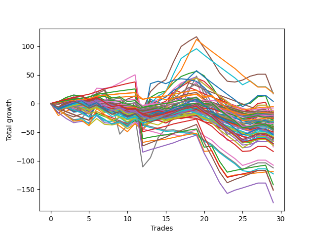

# Long Wallace Doodle 011 
- Symbol: ES_Unlimited
- Date Range: 03/18/2022 - 07/15/2022
- Trading Period: 7:20-12:30
- Number of Trades: 29



| Name | Win Percent | Profit | Avg Profit / Trade | Avg Time / Trade |      | Name | Win Percent | Profit | Avg Profit / Trade | Avg Time / Trade |
| ---- | ----------- | ------ | ------------------ | ---------------- | ---- | ---- | ----------- | ------ | ------------------ | ---------------- |
| Sorted By <br> Profit | | | | | | Sorted By <br> Win Percentage ||||
| Sixty-One | 44.83 | 9375.00 | 323.28 | 31:31 |     | Eighty-One | 86.21 | -59500.00 | -2051.72 | 47:13 |
| Sixty-Three | 37.93 | 9125.00 | 314.66 | 44:41 |     | Eighty-Two | 82.76 | -71000.00 | -2448.28 | 58:35 |
| Five | 55.17 | 8500.00 | 293.10 | 83:20 |     | One Hundred Twenty-Six | 79.31 | -12500.00 | -431.03 | 04:36 |
| Sixty-Two | 55.17 | 1875.00 | 64.66 | 30:13 |     | Eighty-Three | 79.31 | -75625.00 | -2607.76 | 75:36 |
| One Hundred Sixteen | 72.41 | -2750.00 | -94.83 | 03:04 |     | One Hundred Twenty-One | 75.86 | -17375.00 | -599.14 | 04:16 |
| One Hundred One | 62.07 | -3875.00 | -133.62 | 01:44 |     | One Hundred Sixteen | 72.41 | -2750.00 | -94.83 | 03:04 |
| Ninety-One | 51.72 | -5875.00 | -202.59 | 01:24 |     | Eighty-Five | 72.41 | -75625.00 | -2607.76 | 90:55 |
| Fifty-Eight | 51.72 | -6625.00 | -228.45 | 15:54 |     | Eighty-Four | 72.41 | -86625.00 | -2987.07 | 88:41 |
| Sixty | 48.28 | -6625.00 | -228.45 | 26:15 |     | One Hundred Twenty-Seven | 68.97 | -22250.00 | -767.24 | 10:13 |
| One Hundred Six | 62.07 | -7250.00 | -250.00 | 01:58 |     | One Hundred Twenty-Two | 68.97 | -23875.00 | -823.28 | 11:12 |
| One Hundred Ten | 34.48 | -7750.00 | -267.24 | 03:45 |     | Six | 68.97 | -37875.00 | -1306.03 | 98:23 |
| Ninety-Six | 51.72 | -8250.00 | -284.48 | 01:36 |     | One Hundred Eleven | 65.52 | -10125.00 | -349.14 | 02:40 |
| Forty-Seven | 20.69 | -8375.00 | -288.79 | 22:40 |     | One Hundred One | 62.07 | -3875.00 | -133.62 | 01:44 |
| Ninety-Two | 41.38 | -9125.00 | -314.66 | 01:49 |     | One Hundred Six | 62.07 | -7250.00 | -250.00 | 01:58 |
| Ninety-Nine | 37.93 | -9250.00 | -318.97 | 02:09 |     | Seven | 62.07 | -25750.00 | -887.93 | 145:29 |
| Ninety-Seven | 41.38 | -9500.00 | -327.59 | 01:50 |     | One Hundred Twenty-Three | 58.62 | -36625.00 | -1262.93 | 13:48 |
| One Hundred Seven | 48.28 | -10000.00 | -344.83 | 02:35 |     | Five | 55.17 | 8500.00 | 293.10 | 83:20 |
| One Hundred | 37.93 | -10000.00 | -344.83 | 02:18 |     | Sixty-Two | 55.17 | 1875.00 | 64.66 | 30:13 |
| One Hundred Eleven | 65.52 | -10125.00 | -349.14 | 02:40 |     | Two | 55.17 | -10375.00 | -357.76 | 46:17 |
| Two | 55.17 | -10375.00 | -357.76 | 46:17 |     | One Hundred Twelve | 55.17 | -16875.00 | -581.90 | 05:08 |
| One Hundred Nine | 34.48 | -10625.00 | -366.38 | 03:19 |     | One Hundred Twenty-Five | 55.17 | -27375.00 | -943.97 | 17:15 |
| Ninety-Eight | 37.93 | -10875.00 | -375.00 | 02:03 |     | Zero | 55.17 | -29625.00 | -1021.55 | 18:23 |
| Fifty-Nine | 51.72 | -11875.00 | -409.48 | 17:08 |     | One Hundred Twenty-Four | 55.17 | -34875.00 | -1202.59 | 15:19 |
| Ninety-Five | 24.14 | -11875.00 | -409.48 | 03:04 |     | One Hundred Twenty-Eight | 55.17 | -35125.00 | -1211.21 | 12:47 |
| Forty-Two | 27.59 | -12000.00 | -413.79 | 10:36 |     | Ninety-One | 51.72 | -5875.00 | -202.59 | 01:24 |
| Forty-Five | 20.69 | -12375.00 | -426.72 | 17:57 |     | Fifty-Eight | 51.72 | -6625.00 | -228.45 | 15:54 |
| One Hundred Twenty-Six | 79.31 | -12500.00 | -431.03 | 04:36 |     | Ninety-Six | 51.72 | -8250.00 | -284.48 | 01:36 |
| One Hundred Two | 44.83 | -13000.00 | -448.28 | 03:11 |     | Fifty-Nine | 51.72 | -11875.00 | -409.48 | 17:08 |
| One Hundred Eight | 34.48 | -13000.00 | -448.28 | 03:11 |     | One Hundred Seventeen | 51.72 | -14375.00 | -495.69 | 05:12 |
| Forty-Six | 31.03 | -14250.00 | -491.38 | 15:03 |     | Three | 51.72 | -16125.00 | -556.03 | 35:03 |
| One Hundred Seventeen | 51.72 | -14375.00 | -495.69 | 05:12 |     | Fifty-Seven | 51.72 | -22750.00 | -784.48 | 13:37 |
| Forty | 48.28 | -14750.00 | -508.62 | 07:12 |     | One Hundred Twenty-Nine | 51.72 | -32500.00 | -1120.69 | 13:42 |
| Ninety-Four | 24.14 | -15875.00 | -547.41 | 02:36 |     | Fifty-Six | 51.72 | -33000.00 | -1137.93 | 10:21 |
| Three | 51.72 | -16125.00 | -556.03 | 35:03 |     | One | 51.72 | -33250.00 | -1146.55 | 26:00 |
| Seventy-Three | 31.03 | -16250.00 | -560.34 | 14:25 |     | Sixty | 48.28 | -6625.00 | -228.45 | 26:15 |
| Ninety-Three | 27.59 | -16625.00 | -573.28 | 02:23 |     | One Hundred Seven | 48.28 | -10000.00 | -344.83 | 02:35 |
| One Hundred Five | 27.59 | -16750.00 | -577.59 | 04:30 |     | Forty | 48.28 | -14750.00 | -508.62 | 07:12 |
| One Hundred Twelve | 55.17 | -16875.00 | -581.90 | 05:08 |     | One Hundred Thirty | 48.28 | -30500.00 | -1051.72 | 14:54 |
| One Hundred Twenty-One | 75.86 | -17375.00 | -599.14 | 04:16 |     | Sixty-Four | 48.28 | -31125.00 | -1073.28 | 10:19 |
| Forty-Four | 24.14 | -18750.00 | -646.55 | 15:29 |     | Four | 48.28 | -36625.00 | -1262.93 | 66:09 |
| Forty-Eight | 41.38 | -19500.00 | -672.41 | 06:27 |     | Sixty-One | 44.83 | 9375.00 | 323.28 | 31:31 |
| Fifty-Four | 31.03 | -20000.00 | -689.66 | 07:20 |     | One Hundred Two | 44.83 | -13000.00 | -448.28 | 03:11 |
| Forty-Three | 27.59 | -20375.00 | -702.59 | 11:26 |     | Ninety-Two | 41.38 | -9125.00 | -314.66 | 01:49 |
| One Hundred Twenty | 27.59 | -21125.00 | -728.45 | 06:50 |     | Ninety-Seven | 41.38 | -9500.00 | -327.59 | 01:50 |
| One Hundred Four | 27.59 | -21500.00 | -741.38 | 04:00 |     | Forty-Eight | 41.38 | -19500.00 | -672.41 | 06:27 |
| One Hundred Three | 31.03 | -21750.00 | -750.00 | 03:46 |     | One Hundred Thirteen | 41.38 | -28750.00 | -991.38 | 06:44 |
| One Hundred Twenty-Seven | 68.97 | -22250.00 | -767.24 | 10:13 |     | Sixty-Seven | 41.38 | -30500.00 | -1051.72 | 16:12 |
| One Hundred Fifteen | 37.93 | -22250.00 | -767.24 | 07:35 |     | Sixty-Six | 41.38 | -35500.00 | -1224.14 | 14:52 |
| Fifty-Seven | 51.72 | -22750.00 | -784.48 | 13:37 |     | Sixty-Five | 41.38 | -41875.00 | -1443.97 | 12:50 |
| Forty-One | 31.03 | -23500.00 | -810.34 | 09:36 |     | Sixty-Three | 37.93 | 9125.00 | 314.66 | 44:41 |
| One Hundred Twenty-Two | 68.97 | -23875.00 | -823.28 | 11:12 |     | Ninety-Nine | 37.93 | -9250.00 | -318.97 | 02:09 |
| One Hundred Eighteen | 34.48 | -24750.00 | -853.45 | 06:10 |     | One Hundred | 37.93 | -10000.00 | -344.83 | 02:18 |
| Fifty | 27.59 | -25625.00 | -883.62 | 07:59 |     | Ninety-Eight | 37.93 | -10875.00 | -375.00 | 02:03 |
| Seven | 62.07 | -25750.00 | -887.93 | 145:29 |     | One Hundred Fifteen | 37.93 | -22250.00 | -767.24 | 07:35 |
| One Hundred Ninteen | 27.59 | -25875.00 | -892.24 | 06:20 |     | One Hundred Fourteen | 37.93 | -27750.00 | -956.90 | 07:00 |
| Fifty-One | 27.59 | -26500.00 | -913.79 | 07:58 |     | Seventy | 37.93 | -33250.00 | -1146.55 | 20:01 |
| Forty-Nine | 27.59 | -26625.00 | -918.10 | 07:47 |     | One Hundred Ten | 34.48 | -7750.00 | -267.24 | 03:45 |
| One Hundred Twenty-Five | 55.17 | -27375.00 | -943.97 | 17:15 |     | One Hundred Nine | 34.48 | -10625.00 | -366.38 | 03:19 |
| One Hundred Fourteen | 37.93 | -27750.00 | -956.90 | 07:00 |     | One Hundred Eight | 34.48 | -13000.00 | -448.28 | 03:11 |
| One Hundred Thirteen | 41.38 | -28750.00 | -991.38 | 06:44 |     | One Hundred Eighteen | 34.48 | -24750.00 | -853.45 | 06:10 |
| Fifty-Five | 27.59 | -29500.00 | -1017.24 | 08:22 |     | Forty-Six | 31.03 | -14250.00 | -491.38 | 15:03 |
| Fifty-Three | 27.59 | -29500.00 | -1017.24 | 08:22 |     | Seventy-Three | 31.03 | -16250.00 | -560.34 | 14:25 |
| Fifty-Two | 27.59 | -29500.00 | -1017.24 | 08:22 |     | Fifty-Four | 31.03 | -20000.00 | -689.66 | 07:20 |
| Zero | 55.17 | -29625.00 | -1021.55 | 18:23 |     | One Hundred Three | 31.03 | -21750.00 | -750.00 | 03:46 |
| One Hundred Thirty | 48.28 | -30500.00 | -1051.72 | 14:54 |     | Forty-One | 31.03 | -23500.00 | -810.34 | 09:36 |
| Sixty-Seven | 41.38 | -30500.00 | -1051.72 | 16:12 |     | Sixty-Eight | 31.03 | -53875.00 | -1857.76 | 21:18 |
| Sixty-Four | 48.28 | -31125.00 | -1073.28 | 10:19 |     | Forty-Two | 27.59 | -12000.00 | -413.79 | 10:36 |
| One Hundred Twenty-Nine | 51.72 | -32500.00 | -1120.69 | 13:42 |     | Ninety-Three | 27.59 | -16625.00 | -573.28 | 02:23 |
| Fifty-Six | 51.72 | -33000.00 | -1137.93 | 10:21 |     | One Hundred Five | 27.59 | -16750.00 | -577.59 | 04:30 |
| One | 51.72 | -33250.00 | -1146.55 | 26:00 |     | Forty-Three | 27.59 | -20375.00 | -702.59 | 11:26 |
| Seventy | 37.93 | -33250.00 | -1146.55 | 20:01 |     | One Hundred Twenty | 27.59 | -21125.00 | -728.45 | 06:50 |
| One Hundred Twenty-Four | 55.17 | -34875.00 | -1202.59 | 15:19 |     | One Hundred Four | 27.59 | -21500.00 | -741.38 | 04:00 |
| One Hundred Twenty-Eight | 55.17 | -35125.00 | -1211.21 | 12:47 |     | Fifty | 27.59 | -25625.00 | -883.62 | 07:59 |
| Sixty-Six | 41.38 | -35500.00 | -1224.14 | 14:52 |     | One Hundred Ninteen | 27.59 | -25875.00 | -892.24 | 06:20 |
| One Hundred Twenty-Three | 58.62 | -36625.00 | -1262.93 | 13:48 |     | Fifty-One | 27.59 | -26500.00 | -913.79 | 07:58 |
| Four | 48.28 | -36625.00 | -1262.93 | 66:09 |     | Forty-Nine | 27.59 | -26625.00 | -918.10 | 07:47 |
| Six | 68.97 | -37875.00 | -1306.03 | 98:23 |     | Fifty-Five | 27.59 | -29500.00 | -1017.24 | 08:22 |
| Sixty-Five | 41.38 | -41875.00 | -1443.97 | 12:50 |     | Fifty-Three | 27.59 | -29500.00 | -1017.24 | 08:22 |
| Sixty-Eight | 31.03 | -53875.00 | -1857.76 | 21:18 |     | Fifty-Two | 27.59 | -29500.00 | -1017.24 | 08:22 |
| Sixty-Nine | 24.14 | -56250.00 | -1939.66 | 22:43 |     | Ninety-Five | 24.14 | -11875.00 | -409.48 | 03:04 |
| Eighty-One | 86.21 | -59500.00 | -2051.72 | 47:13 |     | Ninety-Four | 24.14 | -15875.00 | -547.41 | 02:36 |
| Seventy-One | 20.69 | -61500.00 | -2120.69 | 24:32 |     | Forty-Four | 24.14 | -18750.00 | -646.55 | 15:29 |
| Eighty-Two | 82.76 | -71000.00 | -2448.28 | 58:35 |     | Sixty-Nine | 24.14 | -56250.00 | -1939.66 | 22:43 |
| Eighty-Three | 79.31 | -75625.00 | -2607.76 | 75:36 |     | Forty-Seven | 20.69 | -8375.00 | -288.79 | 22:40 |
| Eighty-Five | 72.41 | -75625.00 | -2607.76 | 90:55 |     | Forty-Five | 20.69 | -12375.00 | -426.72 | 17:57 |
| Eighty-Four | 72.41 | -86625.00 | -2987.07 | 88:41 |     | Seventy-One | 20.69 | -61500.00 | -2120.69 | 24:32 |

## NO STOPLOSS

### Test Zero
* Sell when price hits the middle line of the 20p bollinger
* No Stoploss
* Results:
```
Total Trades: 29
Percent Up: 55.17
Percent Down: 44.83
Total Points Moved Up: -59.25
Potential Profit: -29625.00
Total Points Ups: 56.50 Count Ups: 16
Total Points Downs: -115.75 Count Downs: 13
```

<details><summary>Trades</summary>

<code>In: 2022-03-21 09:35:00		Out: 2022-03-21 09:45:55		Total Position Time: 10:55		Total Move Up: 2.75		Total to Date: 2.75</code> <br />
<code>In: 2022-03-23 09:14:00		Out: 2022-03-23 09:19:40		Total Position Time: 05:40		Total Move Up: 7.75		Total to Date: 10.50</code> <br />
<code>In: 2022-03-23 09:47:00		Out: 2022-03-23 09:55:35		Total Position Time: 08:35		Total Move Up: 4.25		Total to Date: 14.75</code> <br />
<code>In: 2022-03-23 10:28:00		Out: 2022-03-23 10:51:10		Total Position Time: 23:10		Total Move Up: -1.50		Total to Date: 13.25</code> <br />
<code>In: 2022-03-25 08:14:00		Out: 2022-03-25 08:36:55		Total Position Time: 22:55		Total Move Up: -6.00		Total to Date: 7.25</code> <br />
<code>In: 2022-03-25 08:29:00		Out: 2022-03-25 08:36:55		Total Position Time: 07:55		Total Move Up: 8.00		Total to Date: 15.25</code> <br />
<code>In: 2022-03-28 08:27:00		Out: 2022-03-28 09:02:00		Total Position Time: 35:00		Total Move Up: -13.75		Total to Date: 1.50</code> <br />
<code>In: 2022-03-31 09:23:00		Out: 2022-03-31 09:32:50		Total Position Time: 09:50		Total Move Up: 0.00		Total to Date: 1.50</code> <br />
<code>In: 2022-04-12 07:41:00		Out: 2022-04-12 08:02:05		Total Position Time: 21:05		Total Move Up: -2.50		Total to Date: -1.00</code> <br />
<code>In: 2022-04-18 08:29:00		Out: 2022-04-18 08:55:05		Total Position Time: 26:05		Total Move Up: -4.50		Total to Date: -5.50</code> <br />
<code>In: 2022-04-20 09:14:00		Out: 2022-04-20 09:30:50		Total Position Time: 16:50		Total Move Up: 0.25		Total to Date: -5.25</code> <br />
<code>In: 2022-04-29 07:22:00		Out: 2022-04-29 07:55:15		Total Position Time: 33:15		Total Move Up: -16.00		Total to Date: -21.25</code> <br />
<code>In: 2022-05-04 11:36:00		Out: 2022-05-04 11:40:45		Total Position Time: 04:45		Total Move Up: 5.25		Total to Date: -16.00</code> <br />
<code>In: 2022-05-13 11:07:00		Out: 2022-05-13 11:19:15		Total Position Time: 12:15		Total Move Up: 2.25		Total to Date: -13.75</code> <br />
<code>In: 2022-05-16 07:55:00		Out: 2022-05-16 08:09:35		Total Position Time: 14:35		Total Move Up: -1.50		Total to Date: -15.25</code> <br />
<code>In: 2022-05-17 11:24:00		Out: 2022-05-17 11:31:40		Total Position Time: 07:40		Total Move Up: 10.50		Total to Date: -4.75</code> <br />
<code>In: 2022-05-17 11:25:00		Out: 2022-05-17 11:31:40		Total Position Time: 06:40		Total Move Up: 7.00		Total to Date: 2.25</code> <br />
<code>In: 2022-05-25 09:29:00		Out: 2022-05-25 09:41:30		Total Position Time: 12:30		Total Move Up: 1.75		Total to Date: 4.00</code> <br />
<code>In: 2022-05-25 09:30:00		Out: 2022-05-25 09:41:30		Total Position Time: 11:30		Total Move Up: 0.25		Total to Date: 4.25</code> <br />
<code>In: 2022-06-06 08:15:00		Out: 2022-06-06 08:33:05		Total Position Time: 18:05		Total Move Up: -9.00		Total to Date: -4.75</code> <br />
<code>In: 2022-06-08 09:29:00		Out: 2022-06-08 09:56:25		Total Position Time: 27:25		Total Move Up: -13.75		Total to Date: -18.50</code> <br />
<code>In: 2022-06-08 09:30:00		Out: 2022-06-08 09:56:25		Total Position Time: 26:25		Total Move Up: -16.00		Total to Date: -34.50</code> <br />
<code>In: 2022-06-08 09:35:00		Out: 2022-06-08 09:56:25		Total Position Time: 21:25		Total Move Up: -8.25		Total to Date: -42.75</code> <br />
<code>In: 2022-06-15 07:35:00		Out: 2022-06-15 08:34:25		Total Position Time: 59:25		Total Move Up: -14.00		Total to Date: -56.75</code> <br />
<code>In: 2022-06-15 07:48:00		Out: 2022-06-15 08:34:25		Total Position Time: 46:25		Total Move Up: -9.00		Total to Date: -65.75</code> <br />
<code>In: 2022-06-27 10:45:00		Out: 2022-06-27 10:53:30		Total Position Time: 08:30		Total Move Up: 1.25		Total to Date: -64.50</code> <br />
<code>In: 2022-06-29 08:25:00		Out: 2022-06-29 08:32:10		Total Position Time: 07:10		Total Move Up: 4.75		Total to Date: -59.75</code> <br />
<code>In: 2022-07-11 12:07:00		Out: 2022-07-11 12:22:10		Total Position Time: 15:10		Total Move Up: 0.00		Total to Date: -59.75</code> <br />
<code>In: 2022-07-12 11:36:00		Out: 2022-07-12 11:48:15		Total Position Time: 12:15		Total Move Up: 0.50		Total to Date: -59.25</code> <br />


</details>

### Test One
* Sell when the price hits the upper line of the 20p 1std bollinger
* No Stoploss
* Results:
```
Total Trades: 29
Percent Up: 51.72
Percent Down: 48.28
Total Points Moved Up: -66.50
Potential Profit: -33250.00
Total Points Ups: 80.00 Count Ups: 15
Total Points Downs: -146.50 Count Downs: 14
```

<details><summary>Trades</summary>

<code>In: 2022-03-21 09:35:00		Out: 2022-03-21 10:32:05		Total Position Time: 57:05		Total Move Up: -21.00		Total to Date: -21.00</code> <br />
<code>In: 2022-03-23 09:14:00		Out: 2022-03-23 09:30:05		Total Position Time: 16:05		Total Move Up: 7.50		Total to Date: -13.50</code> <br />
<code>In: 2022-03-23 09:47:00		Out: 2022-03-23 10:00:45		Total Position Time: 13:45		Total Move Up: 5.50		Total to Date: -8.00</code> <br />
<code>In: 2022-03-23 10:28:00		Out: 2022-03-23 10:51:50		Total Position Time: 23:50		Total Move Up: 0.25		Total to Date: -7.75</code> <br />
<code>In: 2022-03-25 08:14:00		Out: 2022-03-25 08:41:10		Total Position Time: 27:10		Total Move Up: -4.50		Total to Date: -12.25</code> <br />
<code>In: 2022-03-25 08:29:00		Out: 2022-03-25 08:41:10		Total Position Time: 12:10		Total Move Up: 9.50		Total to Date: -2.75</code> <br />
<code>In: 2022-03-28 08:27:00		Out: 2022-03-28 09:05:25		Total Position Time: 38:25		Total Move Up: -11.75		Total to Date: -14.50</code> <br />
<code>In: 2022-03-31 09:23:00		Out: 2022-03-31 09:41:05		Total Position Time: 18:05		Total Move Up: -0.25		Total to Date: -14.75</code> <br />
<code>In: 2022-04-12 07:41:00		Out: 2022-04-12 08:02:35		Total Position Time: 21:35		Total Move Up: -0.50		Total to Date: -15.25</code> <br />
<code>In: 2022-04-18 08:29:00		Out: 2022-04-18 08:57:20		Total Position Time: 28:20		Total Move Up: -3.00		Total to Date: -18.25</code> <br />
<code>In: 2022-04-20 09:14:00		Out: 2022-04-20 09:31:20		Total Position Time: 17:20		Total Move Up: 1.00		Total to Date: -17.25</code> <br />
<code>In: 2022-04-29 07:22:00		Out: 2022-04-29 07:55:25		Total Position Time: 33:25		Total Move Up: -14.25		Total to Date: -31.50</code> <br />
<code>In: 2022-05-04 11:36:00		Out: 2022-05-04 11:41:40		Total Position Time: 05:40		Total Move Up: 17.25		Total to Date: -14.25</code> <br />
<code>In: 2022-05-13 11:07:00		Out: 2022-05-13 11:30:55		Total Position Time: 23:55		Total Move Up: 5.00		Total to Date: -9.25</code> <br />
<code>In: 2022-05-16 07:55:00		Out: 2022-05-16 08:09:55		Total Position Time: 14:55		Total Move Up: 1.75		Total to Date: -7.50</code> <br />
<code>In: 2022-05-17 11:24:00		Out: 2022-05-17 11:39:45		Total Position Time: 15:45		Total Move Up: 10.75		Total to Date: 3.25</code> <br />
<code>In: 2022-05-17 11:25:00		Out: 2022-05-17 11:39:45		Total Position Time: 14:45		Total Move Up: 7.25		Total to Date: 10.50</code> <br />
<code>In: 2022-05-25 09:29:00		Out: 2022-05-25 09:44:30		Total Position Time: 15:30		Total Move Up: 3.50		Total to Date: 14.00</code> <br />
<code>In: 2022-05-25 09:30:00		Out: 2022-05-25 09:44:30		Total Position Time: 14:30		Total Move Up: 2.00		Total to Date: 16.00</code> <br />
<code>In: 2022-06-06 08:15:00		Out: 2022-06-06 08:39:15		Total Position Time: 24:15		Total Move Up: -10.00		Total to Date: 6.00</code> <br />
<code>In: 2022-06-08 09:29:00		Out: 2022-06-08 09:59:05		Total Position Time: 30:05		Total Move Up: -11.25		Total to Date: -5.25</code> <br />
<code>In: 2022-06-08 09:30:00		Out: 2022-06-08 09:59:05		Total Position Time: 29:05		Total Move Up: -13.50		Total to Date: -18.75</code> <br />
<code>In: 2022-06-08 09:35:00		Out: 2022-06-08 09:59:05		Total Position Time: 24:05		Total Move Up: -5.75		Total to Date: -24.50</code> <br />
<code>In: 2022-06-15 07:35:00		Out: 2022-06-15 08:38:55		Total Position Time: 63:55		Total Move Up: -10.75		Total to Date: -35.25</code> <br />
<code>In: 2022-06-15 07:48:00		Out: 2022-06-15 08:38:55		Total Position Time: 50:55		Total Move Up: -5.75		Total to Date: -41.00</code> <br />
<code>In: 2022-06-27 10:45:00		Out: 2022-06-27 11:03:15		Total Position Time: 18:15		Total Move Up: 1.00		Total to Date: -40.00</code> <br />
<code>In: 2022-06-29 08:25:00		Out: 2022-06-29 08:33:05		Total Position Time: 08:05		Total Move Up: 7.75		Total to Date: -32.25</code> <br />
<code>In: 2022-07-11 12:07:00		Out: 2022-07-11 12:29:20		Total Position Time: 22:20		Total Move Up: 0.00		Total to Date: -32.25</code> <br />
<code>In: 2022-07-12 11:36:00		Out: 2022-07-12 12:47:00		Total Position Time: 71:00		Total Move Up: -34.25		Total to Date: -66.50</code> <br />


</details>

### Test Two
* Sell when the price hits the upper line of the 20p 2std bollinger
* No Stoploss
* Results:
```
Total Trades: 29
Percent Up: 55.17
Percent Down: 44.83
Total Points Moved Up: -20.75
Potential Profit: -10375.00
Total Points Ups: 125.50 Count Ups: 16
Total Points Downs: -146.25 Count Downs: 13
```

<details><summary>Trades</summary>

<code>In: 2022-03-21 09:35:00		Out: 2022-03-21 10:34:15		Total Position Time: 59:15		Total Move Up: -17.00		Total to Date: -17.00</code> <br />
<code>In: 2022-03-23 09:14:00		Out: 2022-03-23 09:31:10		Total Position Time: 17:10		Total Move Up: 10.50		Total to Date: -6.50</code> <br />
<code>In: 2022-03-23 09:47:00		Out: 2022-03-23 10:54:30		Total Position Time: 67:30		Total Move Up: -7.00		Total to Date: -13.50</code> <br />
<code>In: 2022-03-23 10:28:00		Out: 2022-03-23 10:54:30		Total Position Time: 26:30		Total Move Up: 2.75		Total to Date: -10.75</code> <br />
<code>In: 2022-03-25 08:14:00		Out: 2022-03-25 08:41:55		Total Position Time: 27:55		Total Move Up: -0.50		Total to Date: -11.25</code> <br />
<code>In: 2022-03-25 08:29:00		Out: 2022-03-25 08:41:55		Total Position Time: 12:55		Total Move Up: 13.50		Total to Date: 2.25</code> <br />
<code>In: 2022-03-28 08:27:00		Out: 2022-03-28 09:07:10		Total Position Time: 40:10		Total Move Up: -10.50		Total to Date: -8.25</code> <br />
<code>In: 2022-03-31 09:23:00		Out: 2022-03-31 09:44:20		Total Position Time: 21:20		Total Move Up: 0.50		Total to Date: -7.75</code> <br />
<code>In: 2022-04-12 07:41:00		Out: 2022-04-12 08:15:40		Total Position Time: 34:40		Total Move Up: -0.25		Total to Date: -8.00</code> <br />
<code>In: 2022-04-18 08:29:00		Out: 2022-04-18 08:59:35		Total Position Time: 30:35		Total Move Up: -0.75		Total to Date: -8.75</code> <br />
<code>In: 2022-04-20 09:14:00		Out: 2022-04-20 09:31:35		Total Position Time: 17:35		Total Move Up: 1.75		Total to Date: -7.00</code> <br />
<code>In: 2022-04-29 07:22:00		Out: 2022-04-29 08:05:25		Total Position Time: 43:25		Total Move Up: -14.50		Total to Date: -21.50</code> <br />
<code>In: 2022-05-04 11:36:00		Out: 2022-05-04 11:43:55		Total Position Time: 07:55		Total Move Up: 32.25		Total to Date: 10.75</code> <br />
<code>In: 2022-05-13 11:07:00		Out: 2022-05-13 11:31:20		Total Position Time: 24:20		Total Move Up: 7.75		Total to Date: 18.50</code> <br />
<code>In: 2022-05-16 07:55:00		Out: 2022-05-16 08:12:00		Total Position Time: 17:00		Total Move Up: 3.25		Total to Date: 21.75</code> <br />
<code>In: 2022-05-17 11:24:00		Out: 2022-05-17 11:40:05		Total Position Time: 16:05		Total Move Up: 14.50		Total to Date: 36.25</code> <br />
<code>In: 2022-05-17 11:25:00		Out: 2022-05-17 11:40:05		Total Position Time: 15:05		Total Move Up: 11.00		Total to Date: 47.25</code> <br />
<code>In: 2022-05-25 09:29:00		Out: 2022-05-25 09:45:20		Total Position Time: 16:20		Total Move Up: 5.25		Total to Date: 52.50</code> <br />
<code>In: 2022-05-25 09:30:00		Out: 2022-05-25 09:45:20		Total Position Time: 15:20		Total Move Up: 3.75		Total to Date: 56.25</code> <br />
<code>In: 2022-06-06 08:15:00		Out: 2022-06-06 08:43:00		Total Position Time: 28:00		Total Move Up: -7.75		Total to Date: 48.50</code> <br />
<code>In: 2022-06-08 09:29:00		Out: 2022-06-08 11:03:45		Total Position Time: 94:45		Total Move Up: -18.50		Total to Date: 30.00</code> <br />
<code>In: 2022-06-08 09:30:00		Out: 2022-06-08 11:03:45		Total Position Time: 93:45		Total Move Up: -20.75		Total to Date: 9.25</code> <br />
<code>In: 2022-06-08 09:35:00		Out: 2022-06-08 11:03:45		Total Position Time: 88:45		Total Move Up: -13.00		Total to Date: -3.75</code> <br />
<code>In: 2022-06-15 07:35:00		Out: 2022-06-15 10:58:15		Total Position Time: 203:15		Total Move Up: -1.50		Total to Date: -5.25</code> <br />
<code>In: 2022-06-15 07:48:00		Out: 2022-06-15 10:58:15		Total Position Time: 190:15		Total Move Up: 3.50		Total to Date: -1.75</code> <br />
<code>In: 2022-06-27 10:45:00		Out: 2022-06-27 11:13:35		Total Position Time: 28:35		Total Move Up: 2.00		Total to Date: 0.25</code> <br />
<code>In: 2022-06-29 08:25:00		Out: 2022-06-29 08:35:35		Total Position Time: 10:35		Total Move Up: 11.75		Total to Date: 12.00</code> <br />
<code>In: 2022-07-11 12:07:00		Out: 2022-07-11 12:29:40		Total Position Time: 22:40		Total Move Up: 1.50		Total to Date: 13.50</code> <br />
<code>In: 2022-07-12 11:36:00		Out: 2022-07-12 12:47:00		Total Position Time: 71:00		Total Move Up: -34.25		Total to Date: -20.75</code> <br />


</details>

### Test Three
* Sell when price hits the middle line of the 50p bollinger
* No Stoploss
* Results:
```
Total Trades: 29
Percent Up: 51.72
Percent Down: 48.28
Total Points Moved Up: -32.25
Potential Profit: -16125.00
Total Points Ups: 111.75 Count Ups: 15
Total Points Downs: -144.00 Count Downs: 14
```

<details><summary>Trades</summary>

<code>In: 2022-03-21 09:35:00		Out: 2022-03-21 10:34:30		Total Position Time: 59:30		Total Move Up: -16.50		Total to Date: -16.50</code> <br />
<code>In: 2022-03-23 09:14:00		Out: 2022-03-23 09:30:30		Total Position Time: 16:30		Total Move Up: 8.75		Total to Date: -7.75</code> <br />
<code>In: 2022-03-23 09:47:00		Out: 2022-03-23 10:55:00		Total Position Time: 68:00		Total Move Up: -6.50		Total to Date: -14.25</code> <br />
<code>In: 2022-03-23 10:28:00		Out: 2022-03-23 10:55:00		Total Position Time: 27:00		Total Move Up: 3.25		Total to Date: -11.00</code> <br />
<code>In: 2022-03-25 08:14:00		Out: 2022-03-25 08:53:00		Total Position Time: 39:00		Total Move Up: -1.25		Total to Date: -12.25</code> <br />
<code>In: 2022-03-25 08:29:00		Out: 2022-03-25 08:53:00		Total Position Time: 24:00		Total Move Up: 12.75		Total to Date: 0.50</code> <br />
<code>In: 2022-03-28 08:27:00		Out: 2022-03-28 09:25:20		Total Position Time: 58:20		Total Move Up: -14.00		Total to Date: -13.50</code> <br />
<code>In: 2022-03-31 09:23:00		Out: 2022-03-31 09:46:15		Total Position Time: 23:15		Total Move Up: 1.25		Total to Date: -12.25</code> <br />
<code>In: 2022-04-12 07:41:00		Out: 2022-04-12 08:16:15		Total Position Time: 35:15		Total Move Up: -0.50		Total to Date: -12.75</code> <br />
<code>In: 2022-04-18 08:29:00		Out: 2022-04-18 09:07:15		Total Position Time: 38:15		Total Move Up: -1.75		Total to Date: -14.50</code> <br />
<code>In: 2022-04-20 09:14:00		Out: 2022-04-20 09:32:50		Total Position Time: 18:50		Total Move Up: 4.75		Total to Date: -9.75</code> <br />
<code>In: 2022-04-29 07:22:00		Out: 2022-04-29 08:05:45		Total Position Time: 43:45		Total Move Up: -11.25		Total to Date: -21.00</code> <br />
<code>In: 2022-05-04 11:36:00		Out: 2022-05-04 11:41:15		Total Position Time: 05:15		Total Move Up: 11.75		Total to Date: -9.25</code> <br />
<code>In: 2022-05-13 11:07:00		Out: 2022-05-13 11:31:20		Total Position Time: 24:20		Total Move Up: 7.75		Total to Date: -1.50</code> <br />
<code>In: 2022-05-16 07:55:00		Out: 2022-05-16 08:17:20		Total Position Time: 22:20		Total Move Up: 5.50		Total to Date: 4.00</code> <br />
<code>In: 2022-05-17 11:24:00		Out: 2022-05-17 11:40:05		Total Position Time: 16:05		Total Move Up: 14.50		Total to Date: 18.50</code> <br />
<code>In: 2022-05-17 11:25:00		Out: 2022-05-17 11:40:05		Total Position Time: 15:05		Total Move Up: 11.00		Total to Date: 29.50</code> <br />
<code>In: 2022-05-25 09:29:00		Out: 2022-05-25 09:49:10		Total Position Time: 20:10		Total Move Up: 8.25		Total to Date: 37.75</code> <br />
<code>In: 2022-05-25 09:30:00		Out: 2022-05-25 09:49:10		Total Position Time: 19:10		Total Move Up: 6.75		Total to Date: 44.50</code> <br />
<code>In: 2022-06-06 08:15:00		Out: 2022-06-06 08:55:30		Total Position Time: 40:30		Total Move Up: -5.75		Total to Date: 38.75</code> <br />
<code>In: 2022-06-08 09:29:00		Out: 2022-06-08 10:19:05		Total Position Time: 50:05		Total Move Up: -13.00		Total to Date: 25.75</code> <br />
<code>In: 2022-06-08 09:30:00		Out: 2022-06-08 10:19:05		Total Position Time: 49:05		Total Move Up: -15.25		Total to Date: 10.50</code> <br />
<code>In: 2022-06-08 09:35:00		Out: 2022-06-08 10:19:05		Total Position Time: 44:05		Total Move Up: -7.50		Total to Date: 3.00</code> <br />
<code>In: 2022-06-15 07:35:00		Out: 2022-06-15 08:38:55		Total Position Time: 63:55		Total Move Up: -10.75		Total to Date: -7.75</code> <br />
<code>In: 2022-06-15 07:48:00		Out: 2022-06-15 08:38:55		Total Position Time: 50:55		Total Move Up: -5.75		Total to Date: -13.50</code> <br />
<code>In: 2022-06-27 10:45:00		Out: 2022-06-27 11:13:35		Total Position Time: 28:35		Total Move Up: 2.00		Total to Date: -11.50</code> <br />
<code>In: 2022-06-29 08:25:00		Out: 2022-06-29 08:35:35		Total Position Time: 10:35		Total Move Up: 11.75		Total to Date: 0.25</code> <br />
<code>In: 2022-07-11 12:07:00		Out: 2022-07-11 12:40:45		Total Position Time: 33:45		Total Move Up: 1.75		Total to Date: 2.00</code> <br />
<code>In: 2022-07-12 11:36:00		Out: 2022-07-12 12:47:00		Total Position Time: 71:00		Total Move Up: -34.25		Total to Date: -32.25</code> <br />


</details>

### Test Four
* Sell when the price hits the upper line of the 50p 1std bollinger
* No Stoploss
* Results:
```
Total Trades: 29
Percent Up: 48.28
Percent Down: 51.72
Total Points Moved Up: -73.25
Potential Profit: -36625.00
Total Points Ups: 133.25 Count Ups: 14
Total Points Downs: -206.50 Count Downs: 15
```

<details><summary>Trades</summary>

<code>In: 2022-03-21 09:35:00		Out: 2022-03-21 10:50:05		Total Position Time: 75:05		Total Move Up: -16.00		Total to Date: -16.00</code> <br />
<code>In: 2022-03-23 09:14:00		Out: 2022-03-23 11:27:00		Total Position Time: 133:00		Total Move Up: -10.00		Total to Date: -26.00</code> <br />
<code>In: 2022-03-23 09:47:00		Out: 2022-03-23 11:27:00		Total Position Time: 100:00		Total Move Up: -7.50		Total to Date: -33.50</code> <br />
<code>In: 2022-03-23 10:28:00		Out: 2022-03-23 11:27:00		Total Position Time: 59:00		Total Move Up: 2.25		Total to Date: -31.25</code> <br />
<code>In: 2022-03-25 08:14:00		Out: 2022-03-25 09:08:25		Total Position Time: 54:25		Total Move Up: -2.00		Total to Date: -33.25</code> <br />
<code>In: 2022-03-25 08:29:00		Out: 2022-03-25 09:08:25		Total Position Time: 39:25		Total Move Up: 12.00		Total to Date: -21.25</code> <br />
<code>In: 2022-03-28 08:27:00		Out: 2022-03-28 09:35:05		Total Position Time: 68:05		Total Move Up: -12.25		Total to Date: -33.50</code> <br />
<code>In: 2022-03-31 09:23:00		Out: 2022-03-31 10:29:50		Total Position Time: 66:50		Total Move Up: -1.25		Total to Date: -34.75</code> <br />
<code>In: 2022-04-12 07:41:00		Out: 2022-04-12 08:19:50		Total Position Time: 38:50		Total Move Up: 3.25		Total to Date: -31.50</code> <br />
<code>In: 2022-04-18 08:29:00		Out: 2022-04-18 09:53:35		Total Position Time: 84:35		Total Move Up: -7.00		Total to Date: -38.50</code> <br />
<code>In: 2022-04-20 09:14:00		Out: 2022-04-20 09:36:50		Total Position Time: 22:50		Total Move Up: 8.50		Total to Date: -30.00</code> <br />
<code>In: 2022-04-29 07:22:00		Out: 2022-04-29 08:23:45		Total Position Time: 61:45		Total Move Up: -14.75		Total to Date: -44.75</code> <br />
<code>In: 2022-05-04 11:36:00		Out: 2022-05-04 11:42:00		Total Position Time: 06:00		Total Move Up: 21.25		Total to Date: -23.50</code> <br />
<code>In: 2022-05-13 11:07:00		Out: 2022-05-13 11:43:10		Total Position Time: 36:10		Total Move Up: 11.00		Total to Date: -12.50</code> <br />
<code>In: 2022-05-16 07:55:00		Out: 2022-05-16 08:34:55		Total Position Time: 39:55		Total Move Up: 5.25		Total to Date: -7.25</code> <br />
<code>In: 2022-05-17 11:24:00		Out: 2022-05-17 11:45:50		Total Position Time: 21:50		Total Move Up: 23.00		Total to Date: 15.75</code> <br />
<code>In: 2022-05-17 11:25:00		Out: 2022-05-17 11:45:50		Total Position Time: 20:50		Total Move Up: 19.50		Total to Date: 35.25</code> <br />
<code>In: 2022-05-25 09:29:00		Out: 2022-05-25 10:10:05		Total Position Time: 41:05		Total Move Up: 6.50		Total to Date: 41.75</code> <br />
<code>In: 2022-05-25 09:30:00		Out: 2022-05-25 10:10:05		Total Position Time: 40:05		Total Move Up: 5.00		Total to Date: 46.75</code> <br />
<code>In: 2022-06-06 08:15:00		Out: 2022-06-06 09:55:15		Total Position Time: 100:15		Total Move Up: -23.00		Total to Date: 23.75</code> <br />
<code>In: 2022-06-08 09:29:00		Out: 2022-06-08 12:12:35		Total Position Time: 163:35		Total Move Up: -23.75		Total to Date: 0.00</code> <br />
<code>In: 2022-06-08 09:30:00		Out: 2022-06-08 12:12:35		Total Position Time: 162:35		Total Move Up: -26.00		Total to Date: -26.00</code> <br />
<code>In: 2022-06-08 09:35:00		Out: 2022-06-08 12:12:35		Total Position Time: 157:35		Total Move Up: -18.25		Total to Date: -44.25</code> <br />
<code>In: 2022-06-15 07:35:00		Out: 2022-06-15 08:57:35		Total Position Time: 82:35		Total Move Up: -7.75		Total to Date: -52.00</code> <br />
<code>In: 2022-06-15 07:48:00		Out: 2022-06-15 08:57:35		Total Position Time: 69:35		Total Move Up: -2.75		Total to Date: -54.75</code> <br />
<code>In: 2022-06-27 10:45:00		Out: 2022-06-27 11:18:25		Total Position Time: 33:25		Total Move Up: 4.25		Total to Date: -50.50</code> <br />
<code>In: 2022-06-29 08:25:00		Out: 2022-06-29 08:53:10		Total Position Time: 28:10		Total Move Up: 11.50		Total to Date: -39.00</code> <br />
<code>In: 2022-07-11 12:07:00		Out: 2022-07-11 12:47:00		Total Position Time: 40:00		Total Move Up: 0.00		Total to Date: -39.00</code> <br />
<code>In: 2022-07-12 11:36:00		Out: 2022-07-12 12:47:00		Total Position Time: 71:00		Total Move Up: -34.25		Total to Date: -73.25</code> <br />


</details>

### Test Five
* Sell when the price hits the upper line of the 50p 2std bollinger
* No Stoploss
* Results:
```
Total Trades: 29
Percent Up: 55.17
Percent Down: 44.83
Total Points Moved Up: 17.00
Potential Profit: 8500.00
Total Points Ups: 183.00 Count Ups: 16
Total Points Downs: -166.00 Count Downs: 13
```

<details><summary>Trades</summary>

<code>In: 2022-03-21 09:35:00		Out: 2022-03-21 11:00:20		Total Position Time: 85:20		Total Move Up: -11.25		Total to Date: -11.25</code> <br />
<code>In: 2022-03-23 09:14:00		Out: 2022-03-23 11:30:00		Total Position Time: 136:00		Total Move Up: -7.25		Total to Date: -18.50</code> <br />
<code>In: 2022-03-23 09:47:00		Out: 2022-03-23 11:30:00		Total Position Time: 103:00		Total Move Up: -4.75		Total to Date: -23.25</code> <br />
<code>In: 2022-03-23 10:28:00		Out: 2022-03-23 11:30:00		Total Position Time: 62:00		Total Move Up: 5.00		Total to Date: -18.25</code> <br />
<code>In: 2022-03-25 08:14:00		Out: 2022-03-25 09:11:40		Total Position Time: 57:40		Total Move Up: 1.00		Total to Date: -17.25</code> <br />
<code>In: 2022-03-25 08:29:00		Out: 2022-03-25 09:11:40		Total Position Time: 42:40		Total Move Up: 15.00		Total to Date: -2.25</code> <br />
<code>In: 2022-03-28 08:27:00		Out: 2022-03-28 09:39:55		Total Position Time: 72:55		Total Move Up: -10.75		Total to Date: -13.00</code> <br />
<code>In: 2022-03-31 09:23:00		Out: 2022-03-31 10:46:00		Total Position Time: 83:00		Total Move Up: -0.75		Total to Date: -13.75</code> <br />
<code>In: 2022-04-12 07:41:00		Out: 2022-04-12 08:23:15		Total Position Time: 42:15		Total Move Up: 6.75		Total to Date: -7.00</code> <br />
<code>In: 2022-04-18 08:29:00		Out: 2022-04-18 09:58:15		Total Position Time: 89:15		Total Move Up: -5.25		Total to Date: -12.25</code> <br />
<code>In: 2022-04-20 09:14:00		Out: 2022-04-20 09:50:25		Total Position Time: 36:25		Total Move Up: 13.25		Total to Date: 1.00</code> <br />
<code>In: 2022-04-29 07:22:00		Out: 2022-04-29 08:30:25		Total Position Time: 68:25		Total Move Up: -12.50		Total to Date: -11.50</code> <br />
<code>In: 2022-05-04 11:36:00		Out: 2022-05-04 11:43:55		Total Position Time: 07:55		Total Move Up: 32.25		Total to Date: 20.75</code> <br />
<code>In: 2022-05-13 11:07:00		Out: 2022-05-13 11:51:25		Total Position Time: 44:25		Total Move Up: 13.25		Total to Date: 34.00</code> <br />
<code>In: 2022-05-16 07:55:00		Out: 2022-05-16 08:38:55		Total Position Time: 43:55		Total Move Up: 7.75		Total to Date: 41.75</code> <br />
<code>In: 2022-05-17 11:24:00		Out: 2022-05-17 11:48:40		Total Position Time: 24:40		Total Move Up: 30.75		Total to Date: 72.50</code> <br />
<code>In: 2022-05-17 11:25:00		Out: 2022-05-17 11:48:40		Total Position Time: 23:40		Total Move Up: 27.25		Total to Date: 99.75</code> <br />
<code>In: 2022-05-25 09:29:00		Out: 2022-05-25 10:29:35		Total Position Time: 60:35		Total Move Up: 9.25		Total to Date: 109.00</code> <br />
<code>In: 2022-05-25 09:30:00		Out: 2022-05-25 10:29:35		Total Position Time: 59:35		Total Move Up: 7.75		Total to Date: 116.75</code> <br />
<code>In: 2022-06-06 08:15:00		Out: 2022-06-06 09:56:20		Total Position Time: 101:20		Total Move Up: -20.25		Total to Date: 96.50</code> <br />
<code>In: 2022-06-08 09:29:00		Out: 2022-06-08 12:21:15		Total Position Time: 172:15		Total Move Up: -20.25		Total to Date: 76.25</code> <br />
<code>In: 2022-06-08 09:30:00		Out: 2022-06-08 12:21:15		Total Position Time: 171:15		Total Move Up: -22.50		Total to Date: 53.75</code> <br />
<code>In: 2022-06-08 09:35:00		Out: 2022-06-08 12:21:15		Total Position Time: 166:15		Total Move Up: -14.75		Total to Date: 39.00</code> <br />
<code>In: 2022-06-15 07:35:00		Out: 2022-06-15 10:58:15		Total Position Time: 203:15		Total Move Up: -1.50		Total to Date: 37.50</code> <br />
<code>In: 2022-06-15 07:48:00		Out: 2022-06-15 10:58:15		Total Position Time: 190:15		Total Move Up: 3.50		Total to Date: 41.00</code> <br />
<code>In: 2022-06-27 10:45:00		Out: 2022-06-27 11:38:15		Total Position Time: 53:15		Total Move Up: 6.75		Total to Date: 47.75</code> <br />
<code>In: 2022-06-29 08:25:00		Out: 2022-06-29 10:09:35		Total Position Time: 104:35		Total Move Up: 3.50		Total to Date: 51.25</code> <br />
<code>In: 2022-07-11 12:07:00		Out: 2022-07-11 12:47:00		Total Position Time: 40:00		Total Move Up: 0.00		Total to Date: 51.25</code> <br />
<code>In: 2022-07-12 11:36:00		Out: 2022-07-12 12:47:00		Total Position Time: 71:00		Total Move Up: -34.25		Total to Date: 17.00</code> <br />


</details>

### Test Six
* Sell when the price hits the middle line of the 1std VWAP
* No Stoploss
* Results:
```
Total Trades: 29
Percent Up: 68.97
Percent Down: 31.03
Total Points Moved Up: -75.75
Potential Profit: -37875.00
Total Points Ups: 157.00 Count Ups: 20
Total Points Downs: -232.75 Count Downs: 9
```

<details><summary>Trades</summary>

<code>In: 2022-03-21 09:35:00		Out: 2022-03-21 11:46:15		Total Position Time: 131:15		Total Move Up: 0.00		Total to Date: 0.00</code> <br />
<code>In: 2022-03-23 09:14:00		Out: 2022-03-23 09:16:05		Total Position Time: 02:05		Total Move Up: 5.50		Total to Date: 5.50</code> <br />
<code>In: 2022-03-23 09:47:00		Out: 2022-03-23 12:47:00		Total Position Time: 180:00		Total Move Up: -8.00		Total to Date: -2.50</code> <br />
<code>In: 2022-03-23 10:28:00		Out: 2022-03-23 12:47:00		Total Position Time: 139:00		Total Move Up: 1.75		Total to Date: -0.75</code> <br />
<code>In: 2022-03-25 08:14:00		Out: 2022-03-25 10:19:30		Total Position Time: 125:30		Total Move Up: 6.75		Total to Date: 6.00</code> <br />
<code>In: 2022-03-25 08:29:00		Out: 2022-03-25 10:19:30		Total Position Time: 110:30		Total Move Up: 20.75		Total to Date: 26.75</code> <br />
<code>In: 2022-03-28 08:27:00		Out: 2022-03-28 10:24:25		Total Position Time: 117:25		Total Move Up: -0.50		Total to Date: 26.25</code> <br />
<code>In: 2022-03-31 09:23:00		Out: 2022-03-31 10:52:05		Total Position Time: 89:05		Total Move Up: 3.00		Total to Date: 29.25</code> <br />
<code>In: 2022-04-12 07:41:00		Out: 2022-04-12 08:23:15		Total Position Time: 42:15		Total Move Up: 6.75		Total to Date: 36.00</code> <br />
<code>In: 2022-04-18 08:29:00		Out: 2022-04-18 10:32:10		Total Position Time: 123:10		Total Move Up: 7.50		Total to Date: 43.50</code> <br />
<code>In: 2022-04-20 09:14:00		Out: 2022-04-20 09:35:50		Total Position Time: 21:50		Total Move Up: 6.75		Total to Date: 50.25</code> <br />
<code>In: 2022-04-29 07:22:00		Out: 2022-04-29 12:47:00		Total Position Time: 325:00		Total Move Up: -87.00		Total to Date: -36.75</code> <br />
<code>In: 2022-05-04 11:36:00		Out: 2022-05-04 11:37:10		Total Position Time: 01:10		Total Move Up: 2.75		Total to Date: -34.00</code> <br />
<code>In: 2022-05-13 11:07:00		Out: 2022-05-13 11:52:35		Total Position Time: 45:35		Total Move Up: 18.00		Total to Date: -16.00</code> <br />
<code>In: 2022-05-16 07:55:00		Out: 2022-05-16 08:17:40		Total Position Time: 22:40		Total Move Up: 7.75		Total to Date: -8.25</code> <br />
<code>In: 2022-05-17 11:24:00		Out: 2022-05-17 11:27:25		Total Position Time: 03:25		Total Move Up: 11.25		Total to Date: 3.00</code> <br />
<code>In: 2022-05-17 11:25:00		Out: 2022-05-17 11:27:25		Total Position Time: 02:25		Total Move Up: 7.75		Total to Date: 10.75</code> <br />
<code>In: 2022-05-25 09:29:00		Out: 2022-05-25 10:37:05		Total Position Time: 68:05		Total Move Up: 14.25		Total to Date: 25.00</code> <br />
<code>In: 2022-05-25 09:30:00		Out: 2022-05-25 10:37:05		Total Position Time: 67:05		Total Move Up: 12.75		Total to Date: 37.75</code> <br />
<code>In: 2022-06-06 08:15:00		Out: 2022-06-06 12:47:00		Total Position Time: 272:00		Total Move Up: -31.75		Total to Date: 6.00</code> <br />
<code>In: 2022-06-08 09:29:00		Out: 2022-06-08 12:47:00		Total Position Time: 198:00		Total Move Up: -24.50		Total to Date: -18.50</code> <br />
<code>In: 2022-06-08 09:30:00		Out: 2022-06-08 12:47:00		Total Position Time: 197:00		Total Move Up: -26.75		Total to Date: -45.25</code> <br />
<code>In: 2022-06-08 09:35:00		Out: 2022-06-08 12:47:00		Total Position Time: 192:00		Total Move Up: -19.00		Total to Date: -64.25</code> <br />
<code>In: 2022-06-15 07:35:00		Out: 2022-06-15 09:22:15		Total Position Time: 107:15		Total Move Up: -1.00		Total to Date: -65.25</code> <br />
<code>In: 2022-06-15 07:48:00		Out: 2022-06-15 09:22:15		Total Position Time: 94:15		Total Move Up: 4.00		Total to Date: -61.25</code> <br />
<code>In: 2022-06-27 10:45:00		Out: 2022-06-27 11:38:50		Total Position Time: 53:50		Total Move Up: 8.00		Total to Date: -53.25</code> <br />
<code>In: 2022-06-29 08:25:00		Out: 2022-06-29 08:35:35		Total Position Time: 10:35		Total Move Up: 11.75		Total to Date: -41.50</code> <br />
<code>In: 2022-07-11 12:07:00		Out: 2022-07-11 12:47:00		Total Position Time: 40:00		Total Move Up: 0.00		Total to Date: -41.50</code> <br />
<code>In: 2022-07-12 11:36:00		Out: 2022-07-12 12:47:00		Total Position Time: 71:00		Total Move Up: -34.25		Total to Date: -75.75</code> <br />


</details>

### Test Seven
* Sell when the price hits the upper line of the 1std VWAP
* No Stoploss
* Results:
```
Total Trades: 29
Percent Up: 62.07
Percent Down: 37.93
Total Points Moved Up: -51.50
Potential Profit: -25750.00
Total Points Ups: 280.00 Count Ups: 18
Total Points Downs: -331.50 Count Downs: 11
```

<details><summary>Trades</summary>

<code>In: 2022-03-21 09:35:00		Out: 2022-03-21 12:47:00		Total Position Time: 192:00		Total Move Up: -9.75		Total to Date: -9.75</code> <br />
<code>In: 2022-03-23 09:14:00		Out: 2022-03-23 12:47:00		Total Position Time: 213:00		Total Move Up: -10.50		Total to Date: -20.25</code> <br />
<code>In: 2022-03-23 09:47:00		Out: 2022-03-23 12:47:00		Total Position Time: 180:00		Total Move Up: -8.00		Total to Date: -28.25</code> <br />
<code>In: 2022-03-23 10:28:00		Out: 2022-03-23 12:47:00		Total Position Time: 139:00		Total Move Up: 1.75		Total to Date: -26.50</code> <br />
<code>In: 2022-03-25 08:14:00		Out: 2022-03-25 11:04:05		Total Position Time: 170:05		Total Move Up: 16.00		Total to Date: -10.50</code> <br />
<code>In: 2022-03-25 08:29:00		Out: 2022-03-25 11:04:05		Total Position Time: 155:05		Total Move Up: 30.00		Total to Date: 19.50</code> <br />
<code>In: 2022-03-28 08:27:00		Out: 2022-03-28 11:29:05		Total Position Time: 182:05		Total Move Up: 7.00		Total to Date: 26.50</code> <br />
<code>In: 2022-03-31 09:23:00		Out: 2022-03-31 12:47:00		Total Position Time: 204:00		Total Move Up: -28.00		Total to Date: -1.50</code> <br />
<code>In: 2022-04-12 07:41:00		Out: 2022-04-12 12:47:00		Total Position Time: 306:00		Total Move Up: -52.00		Total to Date: -53.50</code> <br />
<code>In: 2022-04-18 08:29:00		Out: 2022-04-18 10:35:50		Total Position Time: 126:50		Total Move Up: 15.50		Total to Date: -38.00</code> <br />
<code>In: 2022-04-20 09:14:00		Out: 2022-04-20 09:52:35		Total Position Time: 38:35		Total Move Up: 14.25		Total to Date: -23.75</code> <br />
<code>In: 2022-04-29 07:22:00		Out: 2022-04-29 12:47:00		Total Position Time: 325:00		Total Move Up: -87.00		Total to Date: -110.75</code> <br />
<code>In: 2022-05-04 11:36:00		Out: 2022-05-04 11:41:35		Total Position Time: 05:35		Total Move Up: 16.00		Total to Date: -94.75</code> <br />
<code>In: 2022-05-13 11:07:00		Out: 2022-05-13 12:14:40		Total Position Time: 67:40		Total Move Up: 35.00		Total to Date: -59.75</code> <br />
<code>In: 2022-05-16 07:55:00		Out: 2022-05-16 08:45:00		Total Position Time: 50:00		Total Move Up: 16.25		Total to Date: -43.50</code> <br />
<code>In: 2022-05-17 11:24:00		Out: 2022-05-17 11:40:20		Total Position Time: 16:20		Total Move Up: 20.75		Total to Date: -22.75</code> <br />
<code>In: 2022-05-17 11:25:00		Out: 2022-05-17 11:40:20		Total Position Time: 15:20		Total Move Up: 17.25		Total to Date: -5.50</code> <br />
<code>In: 2022-05-25 09:29:00		Out: 2022-05-25 11:02:25		Total Position Time: 93:25		Total Move Up: 27.50		Total to Date: 22.00</code> <br />
<code>In: 2022-05-25 09:30:00		Out: 2022-05-25 11:02:25		Total Position Time: 92:25		Total Move Up: 26.00		Total to Date: 48.00</code> <br />
<code>In: 2022-06-06 08:15:00		Out: 2022-06-06 12:47:00		Total Position Time: 272:00		Total Move Up: -31.75		Total to Date: 16.25</code> <br />
<code>In: 2022-06-08 09:29:00		Out: 2022-06-08 12:47:00		Total Position Time: 198:00		Total Move Up: -24.50		Total to Date: -8.25</code> <br />
<code>In: 2022-06-08 09:30:00		Out: 2022-06-08 12:47:00		Total Position Time: 197:00		Total Move Up: -26.75		Total to Date: -35.00</code> <br />
<code>In: 2022-06-08 09:35:00		Out: 2022-06-08 12:47:00		Total Position Time: 192:00		Total Move Up: -19.00		Total to Date: -54.00</code> <br />
<code>In: 2022-06-15 07:35:00		Out: 2022-06-15 11:00:30		Total Position Time: 205:30		Total Move Up: 5.75		Total to Date: -48.25</code> <br />
<code>In: 2022-06-15 07:48:00		Out: 2022-06-15 11:00:30		Total Position Time: 192:30		Total Move Up: 10.75		Total to Date: -37.50</code> <br />
<code>In: 2022-06-27 10:45:00		Out: 2022-06-27 12:47:00		Total Position Time: 122:00		Total Move Up: 4.50		Total to Date: -33.00</code> <br />
<code>In: 2022-06-29 08:25:00		Out: 2022-06-29 11:02:00		Total Position Time: 157:00		Total Move Up: 15.75		Total to Date: -17.25</code> <br />
<code>In: 2022-07-11 12:07:00		Out: 2022-07-11 12:47:00		Total Position Time: 40:00		Total Move Up: 0.00		Total to Date: -17.25</code> <br />
<code>In: 2022-07-12 11:36:00		Out: 2022-07-12 12:47:00		Total Position Time: 71:00		Total Move Up: -34.25		Total to Date: -51.50</code> <br />


</details>

## STOPLOSS OF 5

### Test Forty
* Sell when price hits the middle line of the 20p bollinger
* Stoploss is 5 points
* Results:
```
Total Trades: 29
Percent Up: 48.28
Percent Down: 51.72
Total Points Moved Up: -29.50
Potential Profit: -14750.00
Total Points Ups: 53.50 Count Ups: 14
Total Points Downs: -83.00 Count Downs: 15
```

<details><summary>Trades</summary>

<code>In: 2022-03-21 09:35:00		Out: 2022-03-21 09:36:10		Total Position Time: 01:10		Total Move Up: -8.75		Total to Date: -8.75</code> <br />
<code>In: 2022-03-23 09:14:00		Out: 2022-03-23 09:19:40		Total Position Time: 05:40		Total Move Up: 7.75		Total to Date: -1.00</code> <br />
<code>In: 2022-03-23 09:47:00		Out: 2022-03-23 09:55:35		Total Position Time: 08:35		Total Move Up: 4.25		Total to Date: 3.25</code> <br />
<code>In: 2022-03-23 10:28:00		Out: 2022-03-23 10:30:15		Total Position Time: 02:15		Total Move Up: -5.25		Total to Date: -2.00</code> <br />
<code>In: 2022-03-25 08:14:00		Out: 2022-03-25 08:24:25		Total Position Time: 10:25		Total Move Up: -4.75		Total to Date: -6.75</code> <br />
<code>In: 2022-03-25 08:29:00		Out: 2022-03-25 08:36:55		Total Position Time: 07:55		Total Move Up: 8.00		Total to Date: 1.25</code> <br />
<code>In: 2022-03-28 08:27:00		Out: 2022-03-28 08:33:30		Total Position Time: 06:30		Total Move Up: -5.50		Total to Date: -4.25</code> <br />
<code>In: 2022-03-31 09:23:00		Out: 2022-03-31 09:32:50		Total Position Time: 09:50		Total Move Up: 0.00		Total to Date: -4.25</code> <br />
<code>In: 2022-04-12 07:41:00		Out: 2022-04-12 07:50:30		Total Position Time: 09:30		Total Move Up: -5.50		Total to Date: -9.75</code> <br />
<code>In: 2022-04-18 08:29:00		Out: 2022-04-18 08:39:25		Total Position Time: 10:25		Total Move Up: -5.00		Total to Date: -14.75</code> <br />
<code>In: 2022-04-20 09:14:00		Out: 2022-04-20 09:30:50		Total Position Time: 16:50		Total Move Up: 0.25		Total to Date: -14.50</code> <br />
<code>In: 2022-04-29 07:22:00		Out: 2022-04-29 07:24:05		Total Position Time: 02:05		Total Move Up: -5.75		Total to Date: -20.25</code> <br />
<code>In: 2022-05-04 11:36:00		Out: 2022-05-04 11:40:45		Total Position Time: 04:45		Total Move Up: 5.25		Total to Date: -15.00</code> <br />
<code>In: 2022-05-13 11:07:00		Out: 2022-05-13 11:19:15		Total Position Time: 12:15		Total Move Up: 2.25		Total to Date: -12.75</code> <br />
<code>In: 2022-05-16 07:55:00		Out: 2022-05-16 08:00:05		Total Position Time: 05:05		Total Move Up: -5.50		Total to Date: -18.25</code> <br />
<code>In: 2022-05-17 11:24:00		Out: 2022-05-17 11:31:40		Total Position Time: 07:40		Total Move Up: 10.50		Total to Date: -7.75</code> <br />
<code>In: 2022-05-17 11:25:00		Out: 2022-05-17 11:31:40		Total Position Time: 06:40		Total Move Up: 7.00		Total to Date: -0.75</code> <br />
<code>In: 2022-05-25 09:29:00		Out: 2022-05-25 09:41:30		Total Position Time: 12:30		Total Move Up: 1.75		Total to Date: 1.00</code> <br />
<code>In: 2022-05-25 09:30:00		Out: 2022-05-25 09:36:15		Total Position Time: 06:15		Total Move Up: -5.25		Total to Date: -4.25</code> <br />
<code>In: 2022-06-06 08:15:00		Out: 2022-06-06 08:16:50		Total Position Time: 01:50		Total Move Up: -6.00		Total to Date: -10.25</code> <br />
<code>In: 2022-06-08 09:29:00		Out: 2022-06-08 09:33:00		Total Position Time: 04:00		Total Move Up: -5.50		Total to Date: -15.75</code> <br />
<code>In: 2022-06-08 09:30:00		Out: 2022-06-08 09:32:50		Total Position Time: 02:50		Total Move Up: -5.00		Total to Date: -20.75</code> <br />
<code>In: 2022-06-08 09:35:00		Out: 2022-06-08 09:39:15		Total Position Time: 04:15		Total Move Up: -5.00		Total to Date: -25.75</code> <br />
<code>In: 2022-06-15 07:35:00		Out: 2022-06-15 07:38:40		Total Position Time: 03:40		Total Move Up: -5.00		Total to Date: -30.75</code> <br />
<code>In: 2022-06-15 07:48:00		Out: 2022-06-15 07:51:10		Total Position Time: 03:10		Total Move Up: -5.25		Total to Date: -36.00</code> <br />
<code>In: 2022-06-27 10:45:00		Out: 2022-06-27 10:53:30		Total Position Time: 08:30		Total Move Up: 1.25		Total to Date: -34.75</code> <br />
<code>In: 2022-06-29 08:25:00		Out: 2022-06-29 08:32:10		Total Position Time: 07:10		Total Move Up: 4.75		Total to Date: -30.00</code> <br />
<code>In: 2022-07-11 12:07:00		Out: 2022-07-11 12:22:10		Total Position Time: 15:10		Total Move Up: 0.00		Total to Date: -30.00</code> <br />
<code>In: 2022-07-12 11:36:00		Out: 2022-07-12 11:48:15		Total Position Time: 12:15		Total Move Up: 0.50		Total to Date: -29.50</code> <br />


</details>

### Test Forty-One
* Sell when the price hits the upper line of the 20p 1std bollinger
* Stoploss is 5 points
* Results:
```
Total Trades: 29
Percent Up: 31.03
Percent Down: 68.97
Total Points Moved Up: -47.00
Potential Profit: -23500.00
Total Points Ups: 62.75 Count Ups: 9
Total Points Downs: -109.75 Count Downs: 20
```

<details><summary>Trades</summary>

<code>In: 2022-03-21 09:35:00		Out: 2022-03-21 09:36:10		Total Position Time: 01:10		Total Move Up: -8.75		Total to Date: -8.75</code> <br />
<code>In: 2022-03-23 09:14:00		Out: 2022-03-23 09:30:05		Total Position Time: 16:05		Total Move Up: 7.50		Total to Date: -1.25</code> <br />
<code>In: 2022-03-23 09:47:00		Out: 2022-03-23 10:00:45		Total Position Time: 13:45		Total Move Up: 5.50		Total to Date: 4.25</code> <br />
<code>In: 2022-03-23 10:28:00		Out: 2022-03-23 10:30:15		Total Position Time: 02:15		Total Move Up: -5.25		Total to Date: -1.00</code> <br />
<code>In: 2022-03-25 08:14:00		Out: 2022-03-25 08:24:25		Total Position Time: 10:25		Total Move Up: -4.75		Total to Date: -5.75</code> <br />
<code>In: 2022-03-25 08:29:00		Out: 2022-03-25 08:41:10		Total Position Time: 12:10		Total Move Up: 9.50		Total to Date: 3.75</code> <br />
<code>In: 2022-03-28 08:27:00		Out: 2022-03-28 08:33:30		Total Position Time: 06:30		Total Move Up: -5.50		Total to Date: -1.75</code> <br />
<code>In: 2022-03-31 09:23:00		Out: 2022-03-31 09:35:20		Total Position Time: 12:20		Total Move Up: -5.00		Total to Date: -6.75</code> <br />
<code>In: 2022-04-12 07:41:00		Out: 2022-04-12 07:50:30		Total Position Time: 09:30		Total Move Up: -5.50		Total to Date: -12.25</code> <br />
<code>In: 2022-04-18 08:29:00		Out: 2022-04-18 08:39:25		Total Position Time: 10:25		Total Move Up: -5.00		Total to Date: -17.25</code> <br />
<code>In: 2022-04-20 09:14:00		Out: 2022-04-20 09:31:20		Total Position Time: 17:20		Total Move Up: 1.00		Total to Date: -16.25</code> <br />
<code>In: 2022-04-29 07:22:00		Out: 2022-04-29 07:24:05		Total Position Time: 02:05		Total Move Up: -5.75		Total to Date: -22.00</code> <br />
<code>In: 2022-05-04 11:36:00		Out: 2022-05-04 11:41:40		Total Position Time: 05:40		Total Move Up: 17.25		Total to Date: -4.75</code> <br />
<code>In: 2022-05-13 11:07:00		Out: 2022-05-13 11:26:55		Total Position Time: 19:55		Total Move Up: -5.00		Total to Date: -9.75</code> <br />
<code>In: 2022-05-16 07:55:00		Out: 2022-05-16 08:00:05		Total Position Time: 05:05		Total Move Up: -5.50		Total to Date: -15.25</code> <br />
<code>In: 2022-05-17 11:24:00		Out: 2022-05-17 11:39:45		Total Position Time: 15:45		Total Move Up: 10.75		Total to Date: -4.50</code> <br />
<code>In: 2022-05-17 11:25:00		Out: 2022-05-17 11:35:05		Total Position Time: 10:05		Total Move Up: -5.75		Total to Date: -10.25</code> <br />
<code>In: 2022-05-25 09:29:00		Out: 2022-05-25 09:44:30		Total Position Time: 15:30		Total Move Up: 3.50		Total to Date: -6.75</code> <br />
<code>In: 2022-05-25 09:30:00		Out: 2022-05-25 09:36:15		Total Position Time: 06:15		Total Move Up: -5.25		Total to Date: -12.00</code> <br />
<code>In: 2022-06-06 08:15:00		Out: 2022-06-06 08:16:50		Total Position Time: 01:50		Total Move Up: -6.00		Total to Date: -18.00</code> <br />
<code>In: 2022-06-08 09:29:00		Out: 2022-06-08 09:33:00		Total Position Time: 04:00		Total Move Up: -5.50		Total to Date: -23.50</code> <br />
<code>In: 2022-06-08 09:30:00		Out: 2022-06-08 09:32:50		Total Position Time: 02:50		Total Move Up: -5.00		Total to Date: -28.50</code> <br />
<code>In: 2022-06-08 09:35:00		Out: 2022-06-08 09:39:15		Total Position Time: 04:15		Total Move Up: -5.00		Total to Date: -33.50</code> <br />
<code>In: 2022-06-15 07:35:00		Out: 2022-06-15 07:38:40		Total Position Time: 03:40		Total Move Up: -5.00		Total to Date: -38.50</code> <br />
<code>In: 2022-06-15 07:48:00		Out: 2022-06-15 07:51:10		Total Position Time: 03:10		Total Move Up: -5.25		Total to Date: -43.75</code> <br />
<code>In: 2022-06-27 10:45:00		Out: 2022-06-27 11:01:05		Total Position Time: 16:05		Total Move Up: -5.00		Total to Date: -48.75</code> <br />
<code>In: 2022-06-29 08:25:00		Out: 2022-06-29 08:33:05		Total Position Time: 08:05		Total Move Up: 7.75		Total to Date: -41.00</code> <br />
<code>In: 2022-07-11 12:07:00		Out: 2022-07-11 12:29:20		Total Position Time: 22:20		Total Move Up: 0.00		Total to Date: -41.00</code> <br />
<code>In: 2022-07-12 11:36:00		Out: 2022-07-12 11:56:05		Total Position Time: 20:05		Total Move Up: -6.00		Total to Date: -47.00</code> <br />


</details>

### Test Forty-Two
* Sell when the price hits the upper line of the 20p 2std bollinger
* Stoploss is 5 points
* Results:
```
Total Trades: 29
Percent Up: 27.59
Percent Down: 72.41
Total Points Moved Up: -24.00
Potential Profit: -12000.00
Total Points Ups: 91.00 Count Ups: 8
Total Points Downs: -115.00 Count Downs: 21
```

<details><summary>Trades</summary>

<code>In: 2022-03-21 09:35:00		Out: 2022-03-21 09:36:10		Total Position Time: 01:10		Total Move Up: -8.75		Total to Date: -8.75</code> <br />
<code>In: 2022-03-23 09:14:00		Out: 2022-03-23 09:31:10		Total Position Time: 17:10		Total Move Up: 10.50		Total to Date: 1.75</code> <br />
<code>In: 2022-03-23 09:47:00		Out: 2022-03-23 10:21:35		Total Position Time: 34:35		Total Move Up: -5.25		Total to Date: -3.50</code> <br />
<code>In: 2022-03-23 10:28:00		Out: 2022-03-23 10:30:15		Total Position Time: 02:15		Total Move Up: -5.25		Total to Date: -8.75</code> <br />
<code>In: 2022-03-25 08:14:00		Out: 2022-03-25 08:24:25		Total Position Time: 10:25		Total Move Up: -4.75		Total to Date: -13.50</code> <br />
<code>In: 2022-03-25 08:29:00		Out: 2022-03-25 08:41:55		Total Position Time: 12:55		Total Move Up: 13.50		Total to Date: 0.00</code> <br />
<code>In: 2022-03-28 08:27:00		Out: 2022-03-28 08:33:30		Total Position Time: 06:30		Total Move Up: -5.50		Total to Date: -5.50</code> <br />
<code>In: 2022-03-31 09:23:00		Out: 2022-03-31 09:35:20		Total Position Time: 12:20		Total Move Up: -5.00		Total to Date: -10.50</code> <br />
<code>In: 2022-04-12 07:41:00		Out: 2022-04-12 07:50:30		Total Position Time: 09:30		Total Move Up: -5.50		Total to Date: -16.00</code> <br />
<code>In: 2022-04-18 08:29:00		Out: 2022-04-18 08:39:25		Total Position Time: 10:25		Total Move Up: -5.00		Total to Date: -21.00</code> <br />
<code>In: 2022-04-20 09:14:00		Out: 2022-04-20 09:31:35		Total Position Time: 17:35		Total Move Up: 1.75		Total to Date: -19.25</code> <br />
<code>In: 2022-04-29 07:22:00		Out: 2022-04-29 07:24:05		Total Position Time: 02:05		Total Move Up: -5.75		Total to Date: -25.00</code> <br />
<code>In: 2022-05-04 11:36:00		Out: 2022-05-04 11:43:55		Total Position Time: 07:55		Total Move Up: 32.25		Total to Date: 7.25</code> <br />
<code>In: 2022-05-13 11:07:00		Out: 2022-05-13 11:26:55		Total Position Time: 19:55		Total Move Up: -5.00		Total to Date: 2.25</code> <br />
<code>In: 2022-05-16 07:55:00		Out: 2022-05-16 08:00:05		Total Position Time: 05:05		Total Move Up: -5.50		Total to Date: -3.25</code> <br />
<code>In: 2022-05-17 11:24:00		Out: 2022-05-17 11:40:05		Total Position Time: 16:05		Total Move Up: 14.50		Total to Date: 11.25</code> <br />
<code>In: 2022-05-17 11:25:00		Out: 2022-05-17 11:35:05		Total Position Time: 10:05		Total Move Up: -5.75		Total to Date: 5.50</code> <br />
<code>In: 2022-05-25 09:29:00		Out: 2022-05-25 09:45:20		Total Position Time: 16:20		Total Move Up: 5.25		Total to Date: 10.75</code> <br />
<code>In: 2022-05-25 09:30:00		Out: 2022-05-25 09:36:15		Total Position Time: 06:15		Total Move Up: -5.25		Total to Date: 5.50</code> <br />
<code>In: 2022-06-06 08:15:00		Out: 2022-06-06 08:16:50		Total Position Time: 01:50		Total Move Up: -6.00		Total to Date: -0.50</code> <br />
<code>In: 2022-06-08 09:29:00		Out: 2022-06-08 09:33:00		Total Position Time: 04:00		Total Move Up: -5.50		Total to Date: -6.00</code> <br />
<code>In: 2022-06-08 09:30:00		Out: 2022-06-08 09:32:50		Total Position Time: 02:50		Total Move Up: -5.00		Total to Date: -11.00</code> <br />
<code>In: 2022-06-08 09:35:00		Out: 2022-06-08 09:39:15		Total Position Time: 04:15		Total Move Up: -5.00		Total to Date: -16.00</code> <br />
<code>In: 2022-06-15 07:35:00		Out: 2022-06-15 07:38:40		Total Position Time: 03:40		Total Move Up: -5.00		Total to Date: -21.00</code> <br />
<code>In: 2022-06-15 07:48:00		Out: 2022-06-15 07:51:10		Total Position Time: 03:10		Total Move Up: -5.25		Total to Date: -26.25</code> <br />
<code>In: 2022-06-27 10:45:00		Out: 2022-06-27 11:01:05		Total Position Time: 16:05		Total Move Up: -5.00		Total to Date: -31.25</code> <br />
<code>In: 2022-06-29 08:25:00		Out: 2022-06-29 08:35:35		Total Position Time: 10:35		Total Move Up: 11.75		Total to Date: -19.50</code> <br />
<code>In: 2022-07-11 12:07:00		Out: 2022-07-11 12:29:40		Total Position Time: 22:40		Total Move Up: 1.50		Total to Date: -18.00</code> <br />
<code>In: 2022-07-12 11:36:00		Out: 2022-07-12 11:56:05		Total Position Time: 20:05		Total Move Up: -6.00		Total to Date: -24.00</code> <br />


</details>

### Test Forty-Three
* Sell when price hits the middle line of the 50p bollinger
* Stoploss is 5 points
* Results:
```
Total Trades: 29
Percent Up: 27.59
Percent Down: 72.41
Total Points Moved Up: -40.75
Potential Profit: -20375.00
Total Points Ups: 74.25 Count Ups: 8
Total Points Downs: -115.00 Count Downs: 21
```

<details><summary>Trades</summary>

<code>In: 2022-03-21 09:35:00		Out: 2022-03-21 09:36:10		Total Position Time: 01:10		Total Move Up: -8.75		Total to Date: -8.75</code> <br />
<code>In: 2022-03-23 09:14:00		Out: 2022-03-23 09:30:30		Total Position Time: 16:30		Total Move Up: 8.75		Total to Date: 0.00</code> <br />
<code>In: 2022-03-23 09:47:00		Out: 2022-03-23 10:21:35		Total Position Time: 34:35		Total Move Up: -5.25		Total to Date: -5.25</code> <br />
<code>In: 2022-03-23 10:28:00		Out: 2022-03-23 10:30:15		Total Position Time: 02:15		Total Move Up: -5.25		Total to Date: -10.50</code> <br />
<code>In: 2022-03-25 08:14:00		Out: 2022-03-25 08:24:25		Total Position Time: 10:25		Total Move Up: -4.75		Total to Date: -15.25</code> <br />
<code>In: 2022-03-25 08:29:00		Out: 2022-03-25 08:53:00		Total Position Time: 24:00		Total Move Up: 12.75		Total to Date: -2.50</code> <br />
<code>In: 2022-03-28 08:27:00		Out: 2022-03-28 08:33:30		Total Position Time: 06:30		Total Move Up: -5.50		Total to Date: -8.00</code> <br />
<code>In: 2022-03-31 09:23:00		Out: 2022-03-31 09:35:20		Total Position Time: 12:20		Total Move Up: -5.00		Total to Date: -13.00</code> <br />
<code>In: 2022-04-12 07:41:00		Out: 2022-04-12 07:50:30		Total Position Time: 09:30		Total Move Up: -5.50		Total to Date: -18.50</code> <br />
<code>In: 2022-04-18 08:29:00		Out: 2022-04-18 08:39:25		Total Position Time: 10:25		Total Move Up: -5.00		Total to Date: -23.50</code> <br />
<code>In: 2022-04-20 09:14:00		Out: 2022-04-20 09:32:50		Total Position Time: 18:50		Total Move Up: 4.75		Total to Date: -18.75</code> <br />
<code>In: 2022-04-29 07:22:00		Out: 2022-04-29 07:24:05		Total Position Time: 02:05		Total Move Up: -5.75		Total to Date: -24.50</code> <br />
<code>In: 2022-05-04 11:36:00		Out: 2022-05-04 11:41:15		Total Position Time: 05:15		Total Move Up: 11.75		Total to Date: -12.75</code> <br />
<code>In: 2022-05-13 11:07:00		Out: 2022-05-13 11:26:55		Total Position Time: 19:55		Total Move Up: -5.00		Total to Date: -17.75</code> <br />
<code>In: 2022-05-16 07:55:00		Out: 2022-05-16 08:00:05		Total Position Time: 05:05		Total Move Up: -5.50		Total to Date: -23.25</code> <br />
<code>In: 2022-05-17 11:24:00		Out: 2022-05-17 11:40:05		Total Position Time: 16:05		Total Move Up: 14.50		Total to Date: -8.75</code> <br />
<code>In: 2022-05-17 11:25:00		Out: 2022-05-17 11:35:05		Total Position Time: 10:05		Total Move Up: -5.75		Total to Date: -14.50</code> <br />
<code>In: 2022-05-25 09:29:00		Out: 2022-05-25 09:49:10		Total Position Time: 20:10		Total Move Up: 8.25		Total to Date: -6.25</code> <br />
<code>In: 2022-05-25 09:30:00		Out: 2022-05-25 09:36:15		Total Position Time: 06:15		Total Move Up: -5.25		Total to Date: -11.50</code> <br />
<code>In: 2022-06-06 08:15:00		Out: 2022-06-06 08:16:50		Total Position Time: 01:50		Total Move Up: -6.00		Total to Date: -17.50</code> <br />
<code>In: 2022-06-08 09:29:00		Out: 2022-06-08 09:33:00		Total Position Time: 04:00		Total Move Up: -5.50		Total to Date: -23.00</code> <br />
<code>In: 2022-06-08 09:30:00		Out: 2022-06-08 09:32:50		Total Position Time: 02:50		Total Move Up: -5.00		Total to Date: -28.00</code> <br />
<code>In: 2022-06-08 09:35:00		Out: 2022-06-08 09:39:15		Total Position Time: 04:15		Total Move Up: -5.00		Total to Date: -33.00</code> <br />
<code>In: 2022-06-15 07:35:00		Out: 2022-06-15 07:38:40		Total Position Time: 03:40		Total Move Up: -5.00		Total to Date: -38.00</code> <br />
<code>In: 2022-06-15 07:48:00		Out: 2022-06-15 07:51:10		Total Position Time: 03:10		Total Move Up: -5.25		Total to Date: -43.25</code> <br />
<code>In: 2022-06-27 10:45:00		Out: 2022-06-27 11:01:05		Total Position Time: 16:05		Total Move Up: -5.00		Total to Date: -48.25</code> <br />
<code>In: 2022-06-29 08:25:00		Out: 2022-06-29 08:35:35		Total Position Time: 10:35		Total Move Up: 11.75		Total to Date: -36.50</code> <br />
<code>In: 2022-07-11 12:07:00		Out: 2022-07-11 12:40:45		Total Position Time: 33:45		Total Move Up: 1.75		Total to Date: -34.75</code> <br />
<code>In: 2022-07-12 11:36:00		Out: 2022-07-12 11:56:05		Total Position Time: 20:05		Total Move Up: -6.00		Total to Date: -40.75</code> <br />


</details>

### Test Forty-Four
* Sell when the price hits the upper line of the 50p 1std bollinger
* Stoploss is 5 points
* Results:
```
Total Trades: 29
Percent Up: 24.14
Percent Down: 75.86
Total Points Moved Up: -37.50
Potential Profit: -18750.00
Total Points Ups: 82.75 Count Ups: 7
Total Points Downs: -120.25 Count Downs: 22
```

<details><summary>Trades</summary>

<code>In: 2022-03-21 09:35:00		Out: 2022-03-21 09:36:10		Total Position Time: 01:10		Total Move Up: -8.75		Total to Date: -8.75</code> <br />
<code>In: 2022-03-23 09:14:00		Out: 2022-03-23 10:17:20		Total Position Time: 63:20		Total Move Up: -5.25		Total to Date: -14.00</code> <br />
<code>In: 2022-03-23 09:47:00		Out: 2022-03-23 10:21:35		Total Position Time: 34:35		Total Move Up: -5.25		Total to Date: -19.25</code> <br />
<code>In: 2022-03-23 10:28:00		Out: 2022-03-23 10:30:15		Total Position Time: 02:15		Total Move Up: -5.25		Total to Date: -24.50</code> <br />
<code>In: 2022-03-25 08:14:00		Out: 2022-03-25 08:24:25		Total Position Time: 10:25		Total Move Up: -4.75		Total to Date: -29.25</code> <br />
<code>In: 2022-03-25 08:29:00		Out: 2022-03-25 09:08:25		Total Position Time: 39:25		Total Move Up: 12.00		Total to Date: -17.25</code> <br />
<code>In: 2022-03-28 08:27:00		Out: 2022-03-28 08:33:30		Total Position Time: 06:30		Total Move Up: -5.50		Total to Date: -22.75</code> <br />
<code>In: 2022-03-31 09:23:00		Out: 2022-03-31 09:35:20		Total Position Time: 12:20		Total Move Up: -5.00		Total to Date: -27.75</code> <br />
<code>In: 2022-04-12 07:41:00		Out: 2022-04-12 07:50:30		Total Position Time: 09:30		Total Move Up: -5.50		Total to Date: -33.25</code> <br />
<code>In: 2022-04-18 08:29:00		Out: 2022-04-18 08:39:25		Total Position Time: 10:25		Total Move Up: -5.00		Total to Date: -38.25</code> <br />
<code>In: 2022-04-20 09:14:00		Out: 2022-04-20 09:36:50		Total Position Time: 22:50		Total Move Up: 8.50		Total to Date: -29.75</code> <br />
<code>In: 2022-04-29 07:22:00		Out: 2022-04-29 07:24:05		Total Position Time: 02:05		Total Move Up: -5.75		Total to Date: -35.50</code> <br />
<code>In: 2022-05-04 11:36:00		Out: 2022-05-04 11:42:00		Total Position Time: 06:00		Total Move Up: 21.25		Total to Date: -14.25</code> <br />
<code>In: 2022-05-13 11:07:00		Out: 2022-05-13 11:26:55		Total Position Time: 19:55		Total Move Up: -5.00		Total to Date: -19.25</code> <br />
<code>In: 2022-05-16 07:55:00		Out: 2022-05-16 08:00:05		Total Position Time: 05:05		Total Move Up: -5.50		Total to Date: -24.75</code> <br />
<code>In: 2022-05-17 11:24:00		Out: 2022-05-17 11:45:50		Total Position Time: 21:50		Total Move Up: 23.00		Total to Date: -1.75</code> <br />
<code>In: 2022-05-17 11:25:00		Out: 2022-05-17 11:35:05		Total Position Time: 10:05		Total Move Up: -5.75		Total to Date: -7.50</code> <br />
<code>In: 2022-05-25 09:29:00		Out: 2022-05-25 10:10:05		Total Position Time: 41:05		Total Move Up: 6.50		Total to Date: -1.00</code> <br />
<code>In: 2022-05-25 09:30:00		Out: 2022-05-25 09:36:15		Total Position Time: 06:15		Total Move Up: -5.25		Total to Date: -6.25</code> <br />
<code>In: 2022-06-06 08:15:00		Out: 2022-06-06 08:16:50		Total Position Time: 01:50		Total Move Up: -6.00		Total to Date: -12.25</code> <br />
<code>In: 2022-06-08 09:29:00		Out: 2022-06-08 09:33:00		Total Position Time: 04:00		Total Move Up: -5.50		Total to Date: -17.75</code> <br />
<code>In: 2022-06-08 09:30:00		Out: 2022-06-08 09:32:50		Total Position Time: 02:50		Total Move Up: -5.00		Total to Date: -22.75</code> <br />
<code>In: 2022-06-08 09:35:00		Out: 2022-06-08 09:39:15		Total Position Time: 04:15		Total Move Up: -5.00		Total to Date: -27.75</code> <br />
<code>In: 2022-06-15 07:35:00		Out: 2022-06-15 07:38:40		Total Position Time: 03:40		Total Move Up: -5.00		Total to Date: -32.75</code> <br />
<code>In: 2022-06-15 07:48:00		Out: 2022-06-15 07:51:10		Total Position Time: 03:10		Total Move Up: -5.25		Total to Date: -38.00</code> <br />
<code>In: 2022-06-27 10:45:00		Out: 2022-06-27 11:01:05		Total Position Time: 16:05		Total Move Up: -5.00		Total to Date: -43.00</code> <br />
<code>In: 2022-06-29 08:25:00		Out: 2022-06-29 08:53:10		Total Position Time: 28:10		Total Move Up: 11.50		Total to Date: -31.50</code> <br />
<code>In: 2022-07-11 12:07:00		Out: 2022-07-11 12:47:00		Total Position Time: 40:00		Total Move Up: 0.00		Total to Date: -31.50</code> <br />
<code>In: 2022-07-12 11:36:00		Out: 2022-07-12 11:56:05		Total Position Time: 20:05		Total Move Up: -6.00		Total to Date: -37.50</code> <br />


</details>

### Test Forty-Five
* Sell when the price hits the upper line of the 50p 2std bollinger
* Stoploss is 5 points
* Results:
```
Total Trades: 29
Percent Up: 20.69
Percent Down: 79.31
Total Points Moved Up: -24.75
Potential Profit: -12375.00
Total Points Ups: 100.50 Count Ups: 6
Total Points Downs: -125.25 Count Downs: 23
```

<details><summary>Trades</summary>

<code>In: 2022-03-21 09:35:00		Out: 2022-03-21 09:36:10		Total Position Time: 01:10		Total Move Up: -8.75		Total to Date: -8.75</code> <br />
<code>In: 2022-03-23 09:14:00		Out: 2022-03-23 10:17:20		Total Position Time: 63:20		Total Move Up: -5.25		Total to Date: -14.00</code> <br />
<code>In: 2022-03-23 09:47:00		Out: 2022-03-23 10:21:35		Total Position Time: 34:35		Total Move Up: -5.25		Total to Date: -19.25</code> <br />
<code>In: 2022-03-23 10:28:00		Out: 2022-03-23 10:30:15		Total Position Time: 02:15		Total Move Up: -5.25		Total to Date: -24.50</code> <br />
<code>In: 2022-03-25 08:14:00		Out: 2022-03-25 08:24:25		Total Position Time: 10:25		Total Move Up: -4.75		Total to Date: -29.25</code> <br />
<code>In: 2022-03-25 08:29:00		Out: 2022-03-25 09:11:40		Total Position Time: 42:40		Total Move Up: 15.00		Total to Date: -14.25</code> <br />
<code>In: 2022-03-28 08:27:00		Out: 2022-03-28 08:33:30		Total Position Time: 06:30		Total Move Up: -5.50		Total to Date: -19.75</code> <br />
<code>In: 2022-03-31 09:23:00		Out: 2022-03-31 09:35:20		Total Position Time: 12:20		Total Move Up: -5.00		Total to Date: -24.75</code> <br />
<code>In: 2022-04-12 07:41:00		Out: 2022-04-12 07:50:30		Total Position Time: 09:30		Total Move Up: -5.50		Total to Date: -30.25</code> <br />
<code>In: 2022-04-18 08:29:00		Out: 2022-04-18 08:39:25		Total Position Time: 10:25		Total Move Up: -5.00		Total to Date: -35.25</code> <br />
<code>In: 2022-04-20 09:14:00		Out: 2022-04-20 09:50:25		Total Position Time: 36:25		Total Move Up: 13.25		Total to Date: -22.00</code> <br />
<code>In: 2022-04-29 07:22:00		Out: 2022-04-29 07:24:05		Total Position Time: 02:05		Total Move Up: -5.75		Total to Date: -27.75</code> <br />
<code>In: 2022-05-04 11:36:00		Out: 2022-05-04 11:43:55		Total Position Time: 07:55		Total Move Up: 32.25		Total to Date: 4.50</code> <br />
<code>In: 2022-05-13 11:07:00		Out: 2022-05-13 11:26:55		Total Position Time: 19:55		Total Move Up: -5.00		Total to Date: -0.50</code> <br />
<code>In: 2022-05-16 07:55:00		Out: 2022-05-16 08:00:05		Total Position Time: 05:05		Total Move Up: -5.50		Total to Date: -6.00</code> <br />
<code>In: 2022-05-17 11:24:00		Out: 2022-05-17 11:48:40		Total Position Time: 24:40		Total Move Up: 30.75		Total to Date: 24.75</code> <br />
<code>In: 2022-05-17 11:25:00		Out: 2022-05-17 11:35:05		Total Position Time: 10:05		Total Move Up: -5.75		Total to Date: 19.00</code> <br />
<code>In: 2022-05-25 09:29:00		Out: 2022-05-25 10:29:35		Total Position Time: 60:35		Total Move Up: 9.25		Total to Date: 28.25</code> <br />
<code>In: 2022-05-25 09:30:00		Out: 2022-05-25 09:36:15		Total Position Time: 06:15		Total Move Up: -5.25		Total to Date: 23.00</code> <br />
<code>In: 2022-06-06 08:15:00		Out: 2022-06-06 08:16:50		Total Position Time: 01:50		Total Move Up: -6.00		Total to Date: 17.00</code> <br />
<code>In: 2022-06-08 09:29:00		Out: 2022-06-08 09:33:00		Total Position Time: 04:00		Total Move Up: -5.50		Total to Date: 11.50</code> <br />
<code>In: 2022-06-08 09:30:00		Out: 2022-06-08 09:32:50		Total Position Time: 02:50		Total Move Up: -5.00		Total to Date: 6.50</code> <br />
<code>In: 2022-06-08 09:35:00		Out: 2022-06-08 09:39:15		Total Position Time: 04:15		Total Move Up: -5.00		Total to Date: 1.50</code> <br />
<code>In: 2022-06-15 07:35:00		Out: 2022-06-15 07:38:40		Total Position Time: 03:40		Total Move Up: -5.00		Total to Date: -3.50</code> <br />
<code>In: 2022-06-15 07:48:00		Out: 2022-06-15 07:51:10		Total Position Time: 03:10		Total Move Up: -5.25		Total to Date: -8.75</code> <br />
<code>In: 2022-06-27 10:45:00		Out: 2022-06-27 11:01:05		Total Position Time: 16:05		Total Move Up: -5.00		Total to Date: -13.75</code> <br />
<code>In: 2022-06-29 08:25:00		Out: 2022-06-29 09:23:50		Total Position Time: 58:50		Total Move Up: -5.00		Total to Date: -18.75</code> <br />
<code>In: 2022-07-11 12:07:00		Out: 2022-07-11 12:47:00		Total Position Time: 40:00		Total Move Up: 0.00		Total to Date: -18.75</code> <br />
<code>In: 2022-07-12 11:36:00		Out: 2022-07-12 11:56:05		Total Position Time: 20:05		Total Move Up: -6.00		Total to Date: -24.75</code> <br />


</details>

### Test Forty-Six
* Sell when the price hits the middle line of the 1std VWAP
* Stoploss is 5 points
* Results:
```
Total Trades: 29
Percent Up: 31.03
Percent Down: 68.97
Total Points Moved Up: -28.50
Potential Profit: -14250.00
Total Points Ups: 80.75 Count Ups: 9
Total Points Downs: -109.25 Count Downs: 20
```

<details><summary>Trades</summary>

<code>In: 2022-03-21 09:35:00		Out: 2022-03-21 09:36:10		Total Position Time: 01:10		Total Move Up: -8.75		Total to Date: -8.75</code> <br />
<code>In: 2022-03-23 09:14:00		Out: 2022-03-23 09:16:05		Total Position Time: 02:05		Total Move Up: 5.50		Total to Date: -3.25</code> <br />
<code>In: 2022-03-23 09:47:00		Out: 2022-03-23 10:21:35		Total Position Time: 34:35		Total Move Up: -5.25		Total to Date: -8.50</code> <br />
<code>In: 2022-03-23 10:28:00		Out: 2022-03-23 10:30:15		Total Position Time: 02:15		Total Move Up: -5.25		Total to Date: -13.75</code> <br />
<code>In: 2022-03-25 08:14:00		Out: 2022-03-25 08:24:25		Total Position Time: 10:25		Total Move Up: -4.75		Total to Date: -18.50</code> <br />
<code>In: 2022-03-25 08:29:00		Out: 2022-03-25 10:19:30		Total Position Time: 110:30		Total Move Up: 20.75		Total to Date: 2.25</code> <br />
<code>In: 2022-03-28 08:27:00		Out: 2022-03-28 08:33:30		Total Position Time: 06:30		Total Move Up: -5.50		Total to Date: -3.25</code> <br />
<code>In: 2022-03-31 09:23:00		Out: 2022-03-31 09:35:20		Total Position Time: 12:20		Total Move Up: -5.00		Total to Date: -8.25</code> <br />
<code>In: 2022-04-12 07:41:00		Out: 2022-04-12 07:50:30		Total Position Time: 09:30		Total Move Up: -5.50		Total to Date: -13.75</code> <br />
<code>In: 2022-04-18 08:29:00		Out: 2022-04-18 08:39:25		Total Position Time: 10:25		Total Move Up: -5.00		Total to Date: -18.75</code> <br />
<code>In: 2022-04-20 09:14:00		Out: 2022-04-20 09:35:50		Total Position Time: 21:50		Total Move Up: 6.75		Total to Date: -12.00</code> <br />
<code>In: 2022-04-29 07:22:00		Out: 2022-04-29 07:24:05		Total Position Time: 02:05		Total Move Up: -5.75		Total to Date: -17.75</code> <br />
<code>In: 2022-05-04 11:36:00		Out: 2022-05-04 11:37:10		Total Position Time: 01:10		Total Move Up: 2.75		Total to Date: -15.00</code> <br />
<code>In: 2022-05-13 11:07:00		Out: 2022-05-13 11:26:55		Total Position Time: 19:55		Total Move Up: -5.00		Total to Date: -20.00</code> <br />
<code>In: 2022-05-16 07:55:00		Out: 2022-05-16 08:00:05		Total Position Time: 05:05		Total Move Up: -5.50		Total to Date: -25.50</code> <br />
<code>In: 2022-05-17 11:24:00		Out: 2022-05-17 11:27:25		Total Position Time: 03:25		Total Move Up: 11.25		Total to Date: -14.25</code> <br />
<code>In: 2022-05-17 11:25:00		Out: 2022-05-17 11:27:25		Total Position Time: 02:25		Total Move Up: 7.75		Total to Date: -6.50</code> <br />
<code>In: 2022-05-25 09:29:00		Out: 2022-05-25 10:37:05		Total Position Time: 68:05		Total Move Up: 14.25		Total to Date: 7.75</code> <br />
<code>In: 2022-05-25 09:30:00		Out: 2022-05-25 09:36:15		Total Position Time: 06:15		Total Move Up: -5.25		Total to Date: 2.50</code> <br />
<code>In: 2022-06-06 08:15:00		Out: 2022-06-06 08:16:50		Total Position Time: 01:50		Total Move Up: -6.00		Total to Date: -3.50</code> <br />
<code>In: 2022-06-08 09:29:00		Out: 2022-06-08 09:33:00		Total Position Time: 04:00		Total Move Up: -5.50		Total to Date: -9.00</code> <br />
<code>In: 2022-06-08 09:30:00		Out: 2022-06-08 09:32:50		Total Position Time: 02:50		Total Move Up: -5.00		Total to Date: -14.00</code> <br />
<code>In: 2022-06-08 09:35:00		Out: 2022-06-08 09:39:15		Total Position Time: 04:15		Total Move Up: -5.00		Total to Date: -19.00</code> <br />
<code>In: 2022-06-15 07:35:00		Out: 2022-06-15 07:38:40		Total Position Time: 03:40		Total Move Up: -5.00		Total to Date: -24.00</code> <br />
<code>In: 2022-06-15 07:48:00		Out: 2022-06-15 07:51:10		Total Position Time: 03:10		Total Move Up: -5.25		Total to Date: -29.25</code> <br />
<code>In: 2022-06-27 10:45:00		Out: 2022-06-27 11:01:05		Total Position Time: 16:05		Total Move Up: -5.00		Total to Date: -34.25</code> <br />
<code>In: 2022-06-29 08:25:00		Out: 2022-06-29 08:35:35		Total Position Time: 10:35		Total Move Up: 11.75		Total to Date: -22.50</code> <br />
<code>In: 2022-07-11 12:07:00		Out: 2022-07-11 12:47:00		Total Position Time: 40:00		Total Move Up: 0.00		Total to Date: -22.50</code> <br />
<code>In: 2022-07-12 11:36:00		Out: 2022-07-12 11:56:05		Total Position Time: 20:05		Total Move Up: -6.00		Total to Date: -28.50</code> <br />


</details>

### Test Forty-Seven
* Sell when the price hits the upper line of the 1std VWAP
* Stoploss is 5 points
* Results:
```
Total Trades: 29
Percent Up: 20.69
Percent Down: 79.31
Total Points Moved Up: -16.75
Potential Profit: -8375.00
Total Points Ups: 108.50 Count Ups: 6
Total Points Downs: -125.25 Count Downs: 23
```

<details><summary>Trades</summary>

<code>In: 2022-03-21 09:35:00		Out: 2022-03-21 09:36:10		Total Position Time: 01:10		Total Move Up: -8.75		Total to Date: -8.75</code> <br />
<code>In: 2022-03-23 09:14:00		Out: 2022-03-23 10:17:20		Total Position Time: 63:20		Total Move Up: -5.25		Total to Date: -14.00</code> <br />
<code>In: 2022-03-23 09:47:00		Out: 2022-03-23 10:21:35		Total Position Time: 34:35		Total Move Up: -5.25		Total to Date: -19.25</code> <br />
<code>In: 2022-03-23 10:28:00		Out: 2022-03-23 10:30:15		Total Position Time: 02:15		Total Move Up: -5.25		Total to Date: -24.50</code> <br />
<code>In: 2022-03-25 08:14:00		Out: 2022-03-25 08:24:25		Total Position Time: 10:25		Total Move Up: -4.75		Total to Date: -29.25</code> <br />
<code>In: 2022-03-25 08:29:00		Out: 2022-03-25 11:04:05		Total Position Time: 155:05		Total Move Up: 30.00		Total to Date: 0.75</code> <br />
<code>In: 2022-03-28 08:27:00		Out: 2022-03-28 08:33:30		Total Position Time: 06:30		Total Move Up: -5.50		Total to Date: -4.75</code> <br />
<code>In: 2022-03-31 09:23:00		Out: 2022-03-31 09:35:20		Total Position Time: 12:20		Total Move Up: -5.00		Total to Date: -9.75</code> <br />
<code>In: 2022-04-12 07:41:00		Out: 2022-04-12 07:50:30		Total Position Time: 09:30		Total Move Up: -5.50		Total to Date: -15.25</code> <br />
<code>In: 2022-04-18 08:29:00		Out: 2022-04-18 08:39:25		Total Position Time: 10:25		Total Move Up: -5.00		Total to Date: -20.25</code> <br />
<code>In: 2022-04-20 09:14:00		Out: 2022-04-20 09:52:35		Total Position Time: 38:35		Total Move Up: 14.25		Total to Date: -6.00</code> <br />
<code>In: 2022-04-29 07:22:00		Out: 2022-04-29 07:24:05		Total Position Time: 02:05		Total Move Up: -5.75		Total to Date: -11.75</code> <br />
<code>In: 2022-05-04 11:36:00		Out: 2022-05-04 11:41:35		Total Position Time: 05:35		Total Move Up: 16.00		Total to Date: 4.25</code> <br />
<code>In: 2022-05-13 11:07:00		Out: 2022-05-13 11:26:55		Total Position Time: 19:55		Total Move Up: -5.00		Total to Date: -0.75</code> <br />
<code>In: 2022-05-16 07:55:00		Out: 2022-05-16 08:00:05		Total Position Time: 05:05		Total Move Up: -5.50		Total to Date: -6.25</code> <br />
<code>In: 2022-05-17 11:24:00		Out: 2022-05-17 11:40:20		Total Position Time: 16:20		Total Move Up: 20.75		Total to Date: 14.50</code> <br />
<code>In: 2022-05-17 11:25:00		Out: 2022-05-17 11:35:05		Total Position Time: 10:05		Total Move Up: -5.75		Total to Date: 8.75</code> <br />
<code>In: 2022-05-25 09:29:00		Out: 2022-05-25 11:02:25		Total Position Time: 93:25		Total Move Up: 27.50		Total to Date: 36.25</code> <br />
<code>In: 2022-05-25 09:30:00		Out: 2022-05-25 09:36:15		Total Position Time: 06:15		Total Move Up: -5.25		Total to Date: 31.00</code> <br />
<code>In: 2022-06-06 08:15:00		Out: 2022-06-06 08:16:50		Total Position Time: 01:50		Total Move Up: -6.00		Total to Date: 25.00</code> <br />
<code>In: 2022-06-08 09:29:00		Out: 2022-06-08 09:33:00		Total Position Time: 04:00		Total Move Up: -5.50		Total to Date: 19.50</code> <br />
<code>In: 2022-06-08 09:30:00		Out: 2022-06-08 09:32:50		Total Position Time: 02:50		Total Move Up: -5.00		Total to Date: 14.50</code> <br />
<code>In: 2022-06-08 09:35:00		Out: 2022-06-08 09:39:15		Total Position Time: 04:15		Total Move Up: -5.00		Total to Date: 9.50</code> <br />
<code>In: 2022-06-15 07:35:00		Out: 2022-06-15 07:38:40		Total Position Time: 03:40		Total Move Up: -5.00		Total to Date: 4.50</code> <br />
<code>In: 2022-06-15 07:48:00		Out: 2022-06-15 07:51:10		Total Position Time: 03:10		Total Move Up: -5.25		Total to Date: -0.75</code> <br />
<code>In: 2022-06-27 10:45:00		Out: 2022-06-27 11:01:05		Total Position Time: 16:05		Total Move Up: -5.00		Total to Date: -5.75</code> <br />
<code>In: 2022-06-29 08:25:00		Out: 2022-06-29 09:23:50		Total Position Time: 58:50		Total Move Up: -5.00		Total to Date: -10.75</code> <br />
<code>In: 2022-07-11 12:07:00		Out: 2022-07-11 12:47:00		Total Position Time: 40:00		Total Move Up: 0.00		Total to Date: -10.75</code> <br />
<code>In: 2022-07-12 11:36:00		Out: 2022-07-12 11:56:05		Total Position Time: 20:05		Total Move Up: -6.00		Total to Date: -16.75</code> <br />


</details>

## TRAIL STOP OF 5

### Test Forty-Eight
* Sell when price hits the middle line of the 20p bollinger
* Trailing Stop is 5 points
* Results:
```
Total Trades: 29
Percent Up: 41.38
Percent Down: 58.62
Total Points Moved Up: -39.00
Potential Profit: -19500.00
Total Points Ups: 33.50 Count Ups: 12
Total Points Downs: -72.50 Count Downs: 17
```

<details><summary>Trades</summary>

<code>In: 2022-03-21 09:35:00		Out: 2022-03-21 09:45:55		Total Position Time: 10:55		Total Move Up: 2.75		Total to Date: 2.75</code> <br />
<code>In: 2022-03-23 09:14:00		Out: 2022-03-23 09:19:40		Total Position Time: 05:40		Total Move Up: 7.75		Total to Date: 10.50</code> <br />
<code>In: 2022-03-23 09:47:00		Out: 2022-03-23 09:55:35		Total Position Time: 08:35		Total Move Up: 4.25		Total to Date: 14.75</code> <br />
<code>In: 2022-03-23 10:28:00		Out: 2022-03-23 10:44:25		Total Position Time: 16:25		Total Move Up: -3.50		Total to Date: 11.25</code> <br />
<code>In: 2022-03-25 08:14:00		Out: 2022-03-25 08:20:40		Total Position Time: 06:40		Total Move Up: -2.50		Total to Date: 8.75</code> <br />
<code>In: 2022-03-25 08:29:00		Out: 2022-03-25 08:32:20		Total Position Time: 03:20		Total Move Up: 1.75		Total to Date: 10.50</code> <br />
<code>In: 2022-03-28 08:27:00		Out: 2022-03-28 08:32:10		Total Position Time: 05:10		Total Move Up: -4.00		Total to Date: 6.50</code> <br />
<code>In: 2022-03-31 09:23:00		Out: 2022-03-31 09:32:50		Total Position Time: 09:50		Total Move Up: 0.00		Total to Date: 6.50</code> <br />
<code>In: 2022-04-12 07:41:00		Out: 2022-04-12 07:48:15		Total Position Time: 07:15		Total Move Up: -4.00		Total to Date: 2.50</code> <br />
<code>In: 2022-04-18 08:29:00		Out: 2022-04-18 08:38:10		Total Position Time: 09:10		Total Move Up: -4.50		Total to Date: -2.00</code> <br />
<code>In: 2022-04-20 09:14:00		Out: 2022-04-20 09:28:10		Total Position Time: 14:10		Total Move Up: -3.25		Total to Date: -5.25</code> <br />
<code>In: 2022-04-29 07:22:00		Out: 2022-04-29 07:24:05		Total Position Time: 02:05		Total Move Up: -5.75		Total to Date: -11.00</code> <br />
<code>In: 2022-05-04 11:36:00		Out: 2022-05-04 11:37:15		Total Position Time: 01:15		Total Move Up: -4.00		Total to Date: -15.00</code> <br />
<code>In: 2022-05-13 11:07:00		Out: 2022-05-13 11:13:40		Total Position Time: 06:40		Total Move Up: 1.00		Total to Date: -14.00</code> <br />
<code>In: 2022-05-16 07:55:00		Out: 2022-05-16 07:58:40		Total Position Time: 03:40		Total Move Up: -4.75		Total to Date: -18.75</code> <br />
<code>In: 2022-05-17 11:24:00		Out: 2022-05-17 11:29:15		Total Position Time: 05:15		Total Move Up: 6.50		Total to Date: -12.25</code> <br />
<code>In: 2022-05-17 11:25:00		Out: 2022-05-17 11:29:15		Total Position Time: 04:15		Total Move Up: 3.00		Total to Date: -9.25</code> <br />
<code>In: 2022-05-25 09:29:00		Out: 2022-05-25 09:33:30		Total Position Time: 04:30		Total Move Up: 0.00		Total to Date: -9.25</code> <br />
<code>In: 2022-05-25 09:30:00		Out: 2022-05-25 09:33:30		Total Position Time: 03:30		Total Move Up: -1.50		Total to Date: -10.75</code> <br />
<code>In: 2022-06-06 08:15:00		Out: 2022-06-06 08:16:50		Total Position Time: 01:50		Total Move Up: -6.00		Total to Date: -16.75</code> <br />
<code>In: 2022-06-08 09:29:00		Out: 2022-06-08 09:32:50		Total Position Time: 03:50		Total Move Up: -2.75		Total to Date: -19.50</code> <br />
<code>In: 2022-06-08 09:30:00		Out: 2022-06-08 09:33:00		Total Position Time: 03:00		Total Move Up: -7.75		Total to Date: -27.25</code> <br />
<code>In: 2022-06-08 09:35:00		Out: 2022-06-08 09:39:15		Total Position Time: 04:15		Total Move Up: -5.00		Total to Date: -32.25</code> <br />
<code>In: 2022-06-15 07:35:00		Out: 2022-06-15 07:38:35		Total Position Time: 03:35		Total Move Up: -4.75		Total to Date: -37.00</code> <br />
<code>In: 2022-06-15 07:48:00		Out: 2022-06-15 07:51:10		Total Position Time: 03:10		Total Move Up: -5.25		Total to Date: -42.25</code> <br />
<code>In: 2022-06-27 10:45:00		Out: 2022-06-27 10:53:30		Total Position Time: 08:30		Total Move Up: 1.25		Total to Date: -41.00</code> <br />
<code>In: 2022-06-29 08:25:00		Out: 2022-06-29 08:32:10		Total Position Time: 07:10		Total Move Up: 4.75		Total to Date: -36.25</code> <br />
<code>In: 2022-07-11 12:07:00		Out: 2022-07-11 12:18:35		Total Position Time: 11:35		Total Move Up: -3.25		Total to Date: -39.50</code> <br />
<code>In: 2022-07-12 11:36:00		Out: 2022-07-12 11:48:15		Total Position Time: 12:15		Total Move Up: 0.50		Total to Date: -39.00</code> <br />


</details>

### Test Forty-Nine
* Sell when the price hits the upper line of the 20p 1std bollinger
* Trailing Stop is 5 points
* Results:
```
Total Trades: 29
Percent Up: 27.59
Percent Down: 72.41
Total Points Moved Up: -53.25
Potential Profit: -26625.00
Total Points Ups: 33.00 Count Ups: 8
Total Points Downs: -86.25 Count Downs: 21
```

<details><summary>Trades</summary>

<code>In: 2022-03-21 09:35:00		Out: 2022-03-21 09:50:35		Total Position Time: 15:35		Total Move Up: -1.25		Total to Date: -1.25</code> <br />
<code>In: 2022-03-23 09:14:00		Out: 2022-03-23 09:30:05		Total Position Time: 16:05		Total Move Up: 7.50		Total to Date: 6.25</code> <br />
<code>In: 2022-03-23 09:47:00		Out: 2022-03-23 10:00:45		Total Position Time: 13:45		Total Move Up: 5.50		Total to Date: 11.75</code> <br />
<code>In: 2022-03-23 10:28:00		Out: 2022-03-23 10:44:25		Total Position Time: 16:25		Total Move Up: -3.50		Total to Date: 8.25</code> <br />
<code>In: 2022-03-25 08:14:00		Out: 2022-03-25 08:20:40		Total Position Time: 06:40		Total Move Up: -2.50		Total to Date: 5.75</code> <br />
<code>In: 2022-03-25 08:29:00		Out: 2022-03-25 08:32:20		Total Position Time: 03:20		Total Move Up: 1.75		Total to Date: 7.50</code> <br />
<code>In: 2022-03-28 08:27:00		Out: 2022-03-28 08:32:10		Total Position Time: 05:10		Total Move Up: -4.00		Total to Date: 3.50</code> <br />
<code>In: 2022-03-31 09:23:00		Out: 2022-03-31 09:35:20		Total Position Time: 12:20		Total Move Up: -5.00		Total to Date: -1.50</code> <br />
<code>In: 2022-04-12 07:41:00		Out: 2022-04-12 07:48:15		Total Position Time: 07:15		Total Move Up: -4.00		Total to Date: -5.50</code> <br />
<code>In: 2022-04-18 08:29:00		Out: 2022-04-18 08:38:10		Total Position Time: 09:10		Total Move Up: -4.50		Total to Date: -10.00</code> <br />
<code>In: 2022-04-20 09:14:00		Out: 2022-04-20 09:28:10		Total Position Time: 14:10		Total Move Up: -3.25		Total to Date: -13.25</code> <br />
<code>In: 2022-04-29 07:22:00		Out: 2022-04-29 07:24:05		Total Position Time: 02:05		Total Move Up: -5.75		Total to Date: -19.00</code> <br />
<code>In: 2022-05-04 11:36:00		Out: 2022-05-04 11:37:15		Total Position Time: 01:15		Total Move Up: -4.00		Total to Date: -23.00</code> <br />
<code>In: 2022-05-13 11:07:00		Out: 2022-05-13 11:13:40		Total Position Time: 06:40		Total Move Up: 1.00		Total to Date: -22.00</code> <br />
<code>In: 2022-05-16 07:55:00		Out: 2022-05-16 07:58:40		Total Position Time: 03:40		Total Move Up: -4.75		Total to Date: -26.75</code> <br />
<code>In: 2022-05-17 11:24:00		Out: 2022-05-17 11:29:15		Total Position Time: 05:15		Total Move Up: 6.50		Total to Date: -20.25</code> <br />
<code>In: 2022-05-17 11:25:00		Out: 2022-05-17 11:29:15		Total Position Time: 04:15		Total Move Up: 3.00		Total to Date: -17.25</code> <br />
<code>In: 2022-05-25 09:29:00		Out: 2022-05-25 09:33:30		Total Position Time: 04:30		Total Move Up: 0.00		Total to Date: -17.25</code> <br />
<code>In: 2022-05-25 09:30:00		Out: 2022-05-25 09:33:30		Total Position Time: 03:30		Total Move Up: -1.50		Total to Date: -18.75</code> <br />
<code>In: 2022-06-06 08:15:00		Out: 2022-06-06 08:16:50		Total Position Time: 01:50		Total Move Up: -6.00		Total to Date: -24.75</code> <br />
<code>In: 2022-06-08 09:29:00		Out: 2022-06-08 09:32:50		Total Position Time: 03:50		Total Move Up: -2.75		Total to Date: -27.50</code> <br />
<code>In: 2022-06-08 09:30:00		Out: 2022-06-08 09:33:00		Total Position Time: 03:00		Total Move Up: -7.75		Total to Date: -35.25</code> <br />
<code>In: 2022-06-08 09:35:00		Out: 2022-06-08 09:39:15		Total Position Time: 04:15		Total Move Up: -5.00		Total to Date: -40.25</code> <br />
<code>In: 2022-06-15 07:35:00		Out: 2022-06-15 07:38:35		Total Position Time: 03:35		Total Move Up: -4.75		Total to Date: -45.00</code> <br />
<code>In: 2022-06-15 07:48:00		Out: 2022-06-15 07:51:10		Total Position Time: 03:10		Total Move Up: -5.25		Total to Date: -50.25</code> <br />
<code>In: 2022-06-27 10:45:00		Out: 2022-06-27 11:00:25		Total Position Time: 15:25		Total Move Up: -3.50		Total to Date: -53.75</code> <br />
<code>In: 2022-06-29 08:25:00		Out: 2022-06-29 08:33:05		Total Position Time: 08:05		Total Move Up: 7.75		Total to Date: -46.00</code> <br />
<code>In: 2022-07-11 12:07:00		Out: 2022-07-11 12:18:35		Total Position Time: 11:35		Total Move Up: -3.25		Total to Date: -49.25</code> <br />
<code>In: 2022-07-12 11:36:00		Out: 2022-07-12 11:55:55		Total Position Time: 19:55		Total Move Up: -4.00		Total to Date: -53.25</code> <br />


</details>

### Test Fifty
* Sell when the price hits the upper line of the 20p 2std bollinger
* Trailing Stop is 5 points
* Results:
```
Total Trades: 29
Percent Up: 27.59
Percent Down: 72.41
Total Points Moved Up: -51.25
Potential Profit: -25625.00
Total Points Ups: 35.00 Count Ups: 8
Total Points Downs: -86.25 Count Downs: 21
```

<details><summary>Trades</summary>

<code>In: 2022-03-21 09:35:00		Out: 2022-03-21 09:50:35		Total Position Time: 15:35		Total Move Up: -1.25		Total to Date: -1.25</code> <br />
<code>In: 2022-03-23 09:14:00		Out: 2022-03-23 09:31:10		Total Position Time: 17:10		Total Move Up: 10.50		Total to Date: 9.25</code> <br />
<code>In: 2022-03-23 09:47:00		Out: 2022-03-23 10:03:15		Total Position Time: 16:15		Total Move Up: 0.50		Total to Date: 9.75</code> <br />
<code>In: 2022-03-23 10:28:00		Out: 2022-03-23 10:44:25		Total Position Time: 16:25		Total Move Up: -3.50		Total to Date: 6.25</code> <br />
<code>In: 2022-03-25 08:14:00		Out: 2022-03-25 08:20:40		Total Position Time: 06:40		Total Move Up: -2.50		Total to Date: 3.75</code> <br />
<code>In: 2022-03-25 08:29:00		Out: 2022-03-25 08:32:20		Total Position Time: 03:20		Total Move Up: 1.75		Total to Date: 5.50</code> <br />
<code>In: 2022-03-28 08:27:00		Out: 2022-03-28 08:32:10		Total Position Time: 05:10		Total Move Up: -4.00		Total to Date: 1.50</code> <br />
<code>In: 2022-03-31 09:23:00		Out: 2022-03-31 09:35:20		Total Position Time: 12:20		Total Move Up: -5.00		Total to Date: -3.50</code> <br />
<code>In: 2022-04-12 07:41:00		Out: 2022-04-12 07:48:15		Total Position Time: 07:15		Total Move Up: -4.00		Total to Date: -7.50</code> <br />
<code>In: 2022-04-18 08:29:00		Out: 2022-04-18 08:38:10		Total Position Time: 09:10		Total Move Up: -4.50		Total to Date: -12.00</code> <br />
<code>In: 2022-04-20 09:14:00		Out: 2022-04-20 09:28:10		Total Position Time: 14:10		Total Move Up: -3.25		Total to Date: -15.25</code> <br />
<code>In: 2022-04-29 07:22:00		Out: 2022-04-29 07:24:05		Total Position Time: 02:05		Total Move Up: -5.75		Total to Date: -21.00</code> <br />
<code>In: 2022-05-04 11:36:00		Out: 2022-05-04 11:37:15		Total Position Time: 01:15		Total Move Up: -4.00		Total to Date: -25.00</code> <br />
<code>In: 2022-05-13 11:07:00		Out: 2022-05-13 11:13:40		Total Position Time: 06:40		Total Move Up: 1.00		Total to Date: -24.00</code> <br />
<code>In: 2022-05-16 07:55:00		Out: 2022-05-16 07:58:40		Total Position Time: 03:40		Total Move Up: -4.75		Total to Date: -28.75</code> <br />
<code>In: 2022-05-17 11:24:00		Out: 2022-05-17 11:29:15		Total Position Time: 05:15		Total Move Up: 6.50		Total to Date: -22.25</code> <br />
<code>In: 2022-05-17 11:25:00		Out: 2022-05-17 11:29:15		Total Position Time: 04:15		Total Move Up: 3.00		Total to Date: -19.25</code> <br />
<code>In: 2022-05-25 09:29:00		Out: 2022-05-25 09:33:30		Total Position Time: 04:30		Total Move Up: 0.00		Total to Date: -19.25</code> <br />
<code>In: 2022-05-25 09:30:00		Out: 2022-05-25 09:33:30		Total Position Time: 03:30		Total Move Up: -1.50		Total to Date: -20.75</code> <br />
<code>In: 2022-06-06 08:15:00		Out: 2022-06-06 08:16:50		Total Position Time: 01:50		Total Move Up: -6.00		Total to Date: -26.75</code> <br />
<code>In: 2022-06-08 09:29:00		Out: 2022-06-08 09:32:50		Total Position Time: 03:50		Total Move Up: -2.75		Total to Date: -29.50</code> <br />
<code>In: 2022-06-08 09:30:00		Out: 2022-06-08 09:33:00		Total Position Time: 03:00		Total Move Up: -7.75		Total to Date: -37.25</code> <br />
<code>In: 2022-06-08 09:35:00		Out: 2022-06-08 09:39:15		Total Position Time: 04:15		Total Move Up: -5.00		Total to Date: -42.25</code> <br />
<code>In: 2022-06-15 07:35:00		Out: 2022-06-15 07:38:35		Total Position Time: 03:35		Total Move Up: -4.75		Total to Date: -47.00</code> <br />
<code>In: 2022-06-15 07:48:00		Out: 2022-06-15 07:51:10		Total Position Time: 03:10		Total Move Up: -5.25		Total to Date: -52.25</code> <br />
<code>In: 2022-06-27 10:45:00		Out: 2022-06-27 11:00:25		Total Position Time: 15:25		Total Move Up: -3.50		Total to Date: -55.75</code> <br />
<code>In: 2022-06-29 08:25:00		Out: 2022-06-29 08:35:35		Total Position Time: 10:35		Total Move Up: 11.75		Total to Date: -44.00</code> <br />
<code>In: 2022-07-11 12:07:00		Out: 2022-07-11 12:18:35		Total Position Time: 11:35		Total Move Up: -3.25		Total to Date: -47.25</code> <br />
<code>In: 2022-07-12 11:36:00		Out: 2022-07-12 11:55:55		Total Position Time: 19:55		Total Move Up: -4.00		Total to Date: -51.25</code> <br />


</details>

### Test Fifty-One
* Sell when price hits the middle line of the 50p bollinger
* Trailing Stop is 5 points
* Results:
```
Total Trades: 29
Percent Up: 27.59
Percent Down: 72.41
Total Points Moved Up: -53.00
Potential Profit: -26500.00
Total Points Ups: 33.25 Count Ups: 8
Total Points Downs: -86.25 Count Downs: 21
```

<details><summary>Trades</summary>

<code>In: 2022-03-21 09:35:00		Out: 2022-03-21 09:50:35		Total Position Time: 15:35		Total Move Up: -1.25		Total to Date: -1.25</code> <br />
<code>In: 2022-03-23 09:14:00		Out: 2022-03-23 09:30:30		Total Position Time: 16:30		Total Move Up: 8.75		Total to Date: 7.50</code> <br />
<code>In: 2022-03-23 09:47:00		Out: 2022-03-23 10:03:15		Total Position Time: 16:15		Total Move Up: 0.50		Total to Date: 8.00</code> <br />
<code>In: 2022-03-23 10:28:00		Out: 2022-03-23 10:44:25		Total Position Time: 16:25		Total Move Up: -3.50		Total to Date: 4.50</code> <br />
<code>In: 2022-03-25 08:14:00		Out: 2022-03-25 08:20:40		Total Position Time: 06:40		Total Move Up: -2.50		Total to Date: 2.00</code> <br />
<code>In: 2022-03-25 08:29:00		Out: 2022-03-25 08:32:20		Total Position Time: 03:20		Total Move Up: 1.75		Total to Date: 3.75</code> <br />
<code>In: 2022-03-28 08:27:00		Out: 2022-03-28 08:32:10		Total Position Time: 05:10		Total Move Up: -4.00		Total to Date: -0.25</code> <br />
<code>In: 2022-03-31 09:23:00		Out: 2022-03-31 09:35:20		Total Position Time: 12:20		Total Move Up: -5.00		Total to Date: -5.25</code> <br />
<code>In: 2022-04-12 07:41:00		Out: 2022-04-12 07:48:15		Total Position Time: 07:15		Total Move Up: -4.00		Total to Date: -9.25</code> <br />
<code>In: 2022-04-18 08:29:00		Out: 2022-04-18 08:38:10		Total Position Time: 09:10		Total Move Up: -4.50		Total to Date: -13.75</code> <br />
<code>In: 2022-04-20 09:14:00		Out: 2022-04-20 09:28:10		Total Position Time: 14:10		Total Move Up: -3.25		Total to Date: -17.00</code> <br />
<code>In: 2022-04-29 07:22:00		Out: 2022-04-29 07:24:05		Total Position Time: 02:05		Total Move Up: -5.75		Total to Date: -22.75</code> <br />
<code>In: 2022-05-04 11:36:00		Out: 2022-05-04 11:37:15		Total Position Time: 01:15		Total Move Up: -4.00		Total to Date: -26.75</code> <br />
<code>In: 2022-05-13 11:07:00		Out: 2022-05-13 11:13:40		Total Position Time: 06:40		Total Move Up: 1.00		Total to Date: -25.75</code> <br />
<code>In: 2022-05-16 07:55:00		Out: 2022-05-16 07:58:40		Total Position Time: 03:40		Total Move Up: -4.75		Total to Date: -30.50</code> <br />
<code>In: 2022-05-17 11:24:00		Out: 2022-05-17 11:29:15		Total Position Time: 05:15		Total Move Up: 6.50		Total to Date: -24.00</code> <br />
<code>In: 2022-05-17 11:25:00		Out: 2022-05-17 11:29:15		Total Position Time: 04:15		Total Move Up: 3.00		Total to Date: -21.00</code> <br />
<code>In: 2022-05-25 09:29:00		Out: 2022-05-25 09:33:30		Total Position Time: 04:30		Total Move Up: 0.00		Total to Date: -21.00</code> <br />
<code>In: 2022-05-25 09:30:00		Out: 2022-05-25 09:33:30		Total Position Time: 03:30		Total Move Up: -1.50		Total to Date: -22.50</code> <br />
<code>In: 2022-06-06 08:15:00		Out: 2022-06-06 08:16:50		Total Position Time: 01:50		Total Move Up: -6.00		Total to Date: -28.50</code> <br />
<code>In: 2022-06-08 09:29:00		Out: 2022-06-08 09:32:50		Total Position Time: 03:50		Total Move Up: -2.75		Total to Date: -31.25</code> <br />
<code>In: 2022-06-08 09:30:00		Out: 2022-06-08 09:33:00		Total Position Time: 03:00		Total Move Up: -7.75		Total to Date: -39.00</code> <br />
<code>In: 2022-06-08 09:35:00		Out: 2022-06-08 09:39:15		Total Position Time: 04:15		Total Move Up: -5.00		Total to Date: -44.00</code> <br />
<code>In: 2022-06-15 07:35:00		Out: 2022-06-15 07:38:35		Total Position Time: 03:35		Total Move Up: -4.75		Total to Date: -48.75</code> <br />
<code>In: 2022-06-15 07:48:00		Out: 2022-06-15 07:51:10		Total Position Time: 03:10		Total Move Up: -5.25		Total to Date: -54.00</code> <br />
<code>In: 2022-06-27 10:45:00		Out: 2022-06-27 11:00:25		Total Position Time: 15:25		Total Move Up: -3.50		Total to Date: -57.50</code> <br />
<code>In: 2022-06-29 08:25:00		Out: 2022-06-29 08:35:35		Total Position Time: 10:35		Total Move Up: 11.75		Total to Date: -45.75</code> <br />
<code>In: 2022-07-11 12:07:00		Out: 2022-07-11 12:18:35		Total Position Time: 11:35		Total Move Up: -3.25		Total to Date: -49.00</code> <br />
<code>In: 2022-07-12 11:36:00		Out: 2022-07-12 11:55:55		Total Position Time: 19:55		Total Move Up: -4.00		Total to Date: -53.00</code> <br />


</details>

### Test Fifty-Two
* Sell when the price hits the upper line of the 50p 1std bollinger
* Trailing Stop is 5 points
* Results:
```
Total Trades: 29
Percent Up: 27.59
Percent Down: 72.41
Total Points Moved Up: -59.00
Potential Profit: -29500.00
Total Points Ups: 27.25 Count Ups: 8
Total Points Downs: -86.25 Count Downs: 21
```

<details><summary>Trades</summary>

<code>In: 2022-03-21 09:35:00		Out: 2022-03-21 09:50:35		Total Position Time: 15:35		Total Move Up: -1.25		Total to Date: -1.25</code> <br />
<code>In: 2022-03-23 09:14:00		Out: 2022-03-23 09:35:15		Total Position Time: 21:15		Total Move Up: 5.25		Total to Date: 4.00</code> <br />
<code>In: 2022-03-23 09:47:00		Out: 2022-03-23 10:03:15		Total Position Time: 16:15		Total Move Up: 0.50		Total to Date: 4.50</code> <br />
<code>In: 2022-03-23 10:28:00		Out: 2022-03-23 10:44:25		Total Position Time: 16:25		Total Move Up: -3.50		Total to Date: 1.00</code> <br />
<code>In: 2022-03-25 08:14:00		Out: 2022-03-25 08:20:40		Total Position Time: 06:40		Total Move Up: -2.50		Total to Date: -1.50</code> <br />
<code>In: 2022-03-25 08:29:00		Out: 2022-03-25 08:32:20		Total Position Time: 03:20		Total Move Up: 1.75		Total to Date: 0.25</code> <br />
<code>In: 2022-03-28 08:27:00		Out: 2022-03-28 08:32:10		Total Position Time: 05:10		Total Move Up: -4.00		Total to Date: -3.75</code> <br />
<code>In: 2022-03-31 09:23:00		Out: 2022-03-31 09:35:20		Total Position Time: 12:20		Total Move Up: -5.00		Total to Date: -8.75</code> <br />
<code>In: 2022-04-12 07:41:00		Out: 2022-04-12 07:48:15		Total Position Time: 07:15		Total Move Up: -4.00		Total to Date: -12.75</code> <br />
<code>In: 2022-04-18 08:29:00		Out: 2022-04-18 08:38:10		Total Position Time: 09:10		Total Move Up: -4.50		Total to Date: -17.25</code> <br />
<code>In: 2022-04-20 09:14:00		Out: 2022-04-20 09:28:10		Total Position Time: 14:10		Total Move Up: -3.25		Total to Date: -20.50</code> <br />
<code>In: 2022-04-29 07:22:00		Out: 2022-04-29 07:24:05		Total Position Time: 02:05		Total Move Up: -5.75		Total to Date: -26.25</code> <br />
<code>In: 2022-05-04 11:36:00		Out: 2022-05-04 11:37:15		Total Position Time: 01:15		Total Move Up: -4.00		Total to Date: -30.25</code> <br />
<code>In: 2022-05-13 11:07:00		Out: 2022-05-13 11:13:40		Total Position Time: 06:40		Total Move Up: 1.00		Total to Date: -29.25</code> <br />
<code>In: 2022-05-16 07:55:00		Out: 2022-05-16 07:58:40		Total Position Time: 03:40		Total Move Up: -4.75		Total to Date: -34.00</code> <br />
<code>In: 2022-05-17 11:24:00		Out: 2022-05-17 11:29:15		Total Position Time: 05:15		Total Move Up: 6.50		Total to Date: -27.50</code> <br />
<code>In: 2022-05-17 11:25:00		Out: 2022-05-17 11:29:15		Total Position Time: 04:15		Total Move Up: 3.00		Total to Date: -24.50</code> <br />
<code>In: 2022-05-25 09:29:00		Out: 2022-05-25 09:33:30		Total Position Time: 04:30		Total Move Up: 0.00		Total to Date: -24.50</code> <br />
<code>In: 2022-05-25 09:30:00		Out: 2022-05-25 09:33:30		Total Position Time: 03:30		Total Move Up: -1.50		Total to Date: -26.00</code> <br />
<code>In: 2022-06-06 08:15:00		Out: 2022-06-06 08:16:50		Total Position Time: 01:50		Total Move Up: -6.00		Total to Date: -32.00</code> <br />
<code>In: 2022-06-08 09:29:00		Out: 2022-06-08 09:32:50		Total Position Time: 03:50		Total Move Up: -2.75		Total to Date: -34.75</code> <br />
<code>In: 2022-06-08 09:30:00		Out: 2022-06-08 09:33:00		Total Position Time: 03:00		Total Move Up: -7.75		Total to Date: -42.50</code> <br />
<code>In: 2022-06-08 09:35:00		Out: 2022-06-08 09:39:15		Total Position Time: 04:15		Total Move Up: -5.00		Total to Date: -47.50</code> <br />
<code>In: 2022-06-15 07:35:00		Out: 2022-06-15 07:38:35		Total Position Time: 03:35		Total Move Up: -4.75		Total to Date: -52.25</code> <br />
<code>In: 2022-06-15 07:48:00		Out: 2022-06-15 07:51:10		Total Position Time: 03:10		Total Move Up: -5.25		Total to Date: -57.50</code> <br />
<code>In: 2022-06-27 10:45:00		Out: 2022-06-27 11:00:25		Total Position Time: 15:25		Total Move Up: -3.50		Total to Date: -61.00</code> <br />
<code>In: 2022-06-29 08:25:00		Out: 2022-06-29 08:42:30		Total Position Time: 17:30		Total Move Up: 9.25		Total to Date: -51.75</code> <br />
<code>In: 2022-07-11 12:07:00		Out: 2022-07-11 12:18:35		Total Position Time: 11:35		Total Move Up: -3.25		Total to Date: -55.00</code> <br />
<code>In: 2022-07-12 11:36:00		Out: 2022-07-12 11:55:55		Total Position Time: 19:55		Total Move Up: -4.00		Total to Date: -59.00</code> <br />


</details>

### Test Fifty-Three
* Sell when the price hits the upper line of the 50p 2std bollinger
* Trailing Stop is 5 points
* Results:
```
Total Trades: 29
Percent Up: 27.59
Percent Down: 72.41
Total Points Moved Up: -59.00
Potential Profit: -29500.00
Total Points Ups: 27.25 Count Ups: 8
Total Points Downs: -86.25 Count Downs: 21
```

<details><summary>Trades</summary>

<code>In: 2022-03-21 09:35:00		Out: 2022-03-21 09:50:35		Total Position Time: 15:35		Total Move Up: -1.25		Total to Date: -1.25</code> <br />
<code>In: 2022-03-23 09:14:00		Out: 2022-03-23 09:35:15		Total Position Time: 21:15		Total Move Up: 5.25		Total to Date: 4.00</code> <br />
<code>In: 2022-03-23 09:47:00		Out: 2022-03-23 10:03:15		Total Position Time: 16:15		Total Move Up: 0.50		Total to Date: 4.50</code> <br />
<code>In: 2022-03-23 10:28:00		Out: 2022-03-23 10:44:25		Total Position Time: 16:25		Total Move Up: -3.50		Total to Date: 1.00</code> <br />
<code>In: 2022-03-25 08:14:00		Out: 2022-03-25 08:20:40		Total Position Time: 06:40		Total Move Up: -2.50		Total to Date: -1.50</code> <br />
<code>In: 2022-03-25 08:29:00		Out: 2022-03-25 08:32:20		Total Position Time: 03:20		Total Move Up: 1.75		Total to Date: 0.25</code> <br />
<code>In: 2022-03-28 08:27:00		Out: 2022-03-28 08:32:10		Total Position Time: 05:10		Total Move Up: -4.00		Total to Date: -3.75</code> <br />
<code>In: 2022-03-31 09:23:00		Out: 2022-03-31 09:35:20		Total Position Time: 12:20		Total Move Up: -5.00		Total to Date: -8.75</code> <br />
<code>In: 2022-04-12 07:41:00		Out: 2022-04-12 07:48:15		Total Position Time: 07:15		Total Move Up: -4.00		Total to Date: -12.75</code> <br />
<code>In: 2022-04-18 08:29:00		Out: 2022-04-18 08:38:10		Total Position Time: 09:10		Total Move Up: -4.50		Total to Date: -17.25</code> <br />
<code>In: 2022-04-20 09:14:00		Out: 2022-04-20 09:28:10		Total Position Time: 14:10		Total Move Up: -3.25		Total to Date: -20.50</code> <br />
<code>In: 2022-04-29 07:22:00		Out: 2022-04-29 07:24:05		Total Position Time: 02:05		Total Move Up: -5.75		Total to Date: -26.25</code> <br />
<code>In: 2022-05-04 11:36:00		Out: 2022-05-04 11:37:15		Total Position Time: 01:15		Total Move Up: -4.00		Total to Date: -30.25</code> <br />
<code>In: 2022-05-13 11:07:00		Out: 2022-05-13 11:13:40		Total Position Time: 06:40		Total Move Up: 1.00		Total to Date: -29.25</code> <br />
<code>In: 2022-05-16 07:55:00		Out: 2022-05-16 07:58:40		Total Position Time: 03:40		Total Move Up: -4.75		Total to Date: -34.00</code> <br />
<code>In: 2022-05-17 11:24:00		Out: 2022-05-17 11:29:15		Total Position Time: 05:15		Total Move Up: 6.50		Total to Date: -27.50</code> <br />
<code>In: 2022-05-17 11:25:00		Out: 2022-05-17 11:29:15		Total Position Time: 04:15		Total Move Up: 3.00		Total to Date: -24.50</code> <br />
<code>In: 2022-05-25 09:29:00		Out: 2022-05-25 09:33:30		Total Position Time: 04:30		Total Move Up: 0.00		Total to Date: -24.50</code> <br />
<code>In: 2022-05-25 09:30:00		Out: 2022-05-25 09:33:30		Total Position Time: 03:30		Total Move Up: -1.50		Total to Date: -26.00</code> <br />
<code>In: 2022-06-06 08:15:00		Out: 2022-06-06 08:16:50		Total Position Time: 01:50		Total Move Up: -6.00		Total to Date: -32.00</code> <br />
<code>In: 2022-06-08 09:29:00		Out: 2022-06-08 09:32:50		Total Position Time: 03:50		Total Move Up: -2.75		Total to Date: -34.75</code> <br />
<code>In: 2022-06-08 09:30:00		Out: 2022-06-08 09:33:00		Total Position Time: 03:00		Total Move Up: -7.75		Total to Date: -42.50</code> <br />
<code>In: 2022-06-08 09:35:00		Out: 2022-06-08 09:39:15		Total Position Time: 04:15		Total Move Up: -5.00		Total to Date: -47.50</code> <br />
<code>In: 2022-06-15 07:35:00		Out: 2022-06-15 07:38:35		Total Position Time: 03:35		Total Move Up: -4.75		Total to Date: -52.25</code> <br />
<code>In: 2022-06-15 07:48:00		Out: 2022-06-15 07:51:10		Total Position Time: 03:10		Total Move Up: -5.25		Total to Date: -57.50</code> <br />
<code>In: 2022-06-27 10:45:00		Out: 2022-06-27 11:00:25		Total Position Time: 15:25		Total Move Up: -3.50		Total to Date: -61.00</code> <br />
<code>In: 2022-06-29 08:25:00		Out: 2022-06-29 08:42:30		Total Position Time: 17:30		Total Move Up: 9.25		Total to Date: -51.75</code> <br />
<code>In: 2022-07-11 12:07:00		Out: 2022-07-11 12:18:35		Total Position Time: 11:35		Total Move Up: -3.25		Total to Date: -55.00</code> <br />
<code>In: 2022-07-12 11:36:00		Out: 2022-07-12 11:55:55		Total Position Time: 19:55		Total Move Up: -4.00		Total to Date: -59.00</code> <br />


</details>

### Test Fifty-Four
* Sell when the price hits the middle line of the 1std VWAP
* Trailing Stop is 5 points
* Results:
```
Total Trades: 29
Percent Up: 31.03
Percent Down: 68.97
Total Points Moved Up: -40.00
Potential Profit: -20000.00
Total Points Ups: 42.25 Count Ups: 9
Total Points Downs: -82.25 Count Downs: 20
```

<details><summary>Trades</summary>

<code>In: 2022-03-21 09:35:00		Out: 2022-03-21 09:50:35		Total Position Time: 15:35		Total Move Up: -1.25		Total to Date: -1.25</code> <br />
<code>In: 2022-03-23 09:14:00		Out: 2022-03-23 09:16:05		Total Position Time: 02:05		Total Move Up: 5.50		Total to Date: 4.25</code> <br />
<code>In: 2022-03-23 09:47:00		Out: 2022-03-23 10:03:15		Total Position Time: 16:15		Total Move Up: 0.50		Total to Date: 4.75</code> <br />
<code>In: 2022-03-23 10:28:00		Out: 2022-03-23 10:44:25		Total Position Time: 16:25		Total Move Up: -3.50		Total to Date: 1.25</code> <br />
<code>In: 2022-03-25 08:14:00		Out: 2022-03-25 08:20:40		Total Position Time: 06:40		Total Move Up: -2.50		Total to Date: -1.25</code> <br />
<code>In: 2022-03-25 08:29:00		Out: 2022-03-25 08:32:20		Total Position Time: 03:20		Total Move Up: 1.75		Total to Date: 0.50</code> <br />
<code>In: 2022-03-28 08:27:00		Out: 2022-03-28 08:32:10		Total Position Time: 05:10		Total Move Up: -4.00		Total to Date: -3.50</code> <br />
<code>In: 2022-03-31 09:23:00		Out: 2022-03-31 09:35:20		Total Position Time: 12:20		Total Move Up: -5.00		Total to Date: -8.50</code> <br />
<code>In: 2022-04-12 07:41:00		Out: 2022-04-12 07:48:15		Total Position Time: 07:15		Total Move Up: -4.00		Total to Date: -12.50</code> <br />
<code>In: 2022-04-18 08:29:00		Out: 2022-04-18 08:38:10		Total Position Time: 09:10		Total Move Up: -4.50		Total to Date: -17.00</code> <br />
<code>In: 2022-04-20 09:14:00		Out: 2022-04-20 09:28:10		Total Position Time: 14:10		Total Move Up: -3.25		Total to Date: -20.25</code> <br />
<code>In: 2022-04-29 07:22:00		Out: 2022-04-29 07:24:05		Total Position Time: 02:05		Total Move Up: -5.75		Total to Date: -26.00</code> <br />
<code>In: 2022-05-04 11:36:00		Out: 2022-05-04 11:37:10		Total Position Time: 01:10		Total Move Up: 2.75		Total to Date: -23.25</code> <br />
<code>In: 2022-05-13 11:07:00		Out: 2022-05-13 11:13:40		Total Position Time: 06:40		Total Move Up: 1.00		Total to Date: -22.25</code> <br />
<code>In: 2022-05-16 07:55:00		Out: 2022-05-16 07:58:40		Total Position Time: 03:40		Total Move Up: -4.75		Total to Date: -27.00</code> <br />
<code>In: 2022-05-17 11:24:00		Out: 2022-05-17 11:27:25		Total Position Time: 03:25		Total Move Up: 11.25		Total to Date: -15.75</code> <br />
<code>In: 2022-05-17 11:25:00		Out: 2022-05-17 11:27:25		Total Position Time: 02:25		Total Move Up: 7.75		Total to Date: -8.00</code> <br />
<code>In: 2022-05-25 09:29:00		Out: 2022-05-25 09:33:30		Total Position Time: 04:30		Total Move Up: 0.00		Total to Date: -8.00</code> <br />
<code>In: 2022-05-25 09:30:00		Out: 2022-05-25 09:33:30		Total Position Time: 03:30		Total Move Up: -1.50		Total to Date: -9.50</code> <br />
<code>In: 2022-06-06 08:15:00		Out: 2022-06-06 08:16:50		Total Position Time: 01:50		Total Move Up: -6.00		Total to Date: -15.50</code> <br />
<code>In: 2022-06-08 09:29:00		Out: 2022-06-08 09:32:50		Total Position Time: 03:50		Total Move Up: -2.75		Total to Date: -18.25</code> <br />
<code>In: 2022-06-08 09:30:00		Out: 2022-06-08 09:33:00		Total Position Time: 03:00		Total Move Up: -7.75		Total to Date: -26.00</code> <br />
<code>In: 2022-06-08 09:35:00		Out: 2022-06-08 09:39:15		Total Position Time: 04:15		Total Move Up: -5.00		Total to Date: -31.00</code> <br />
<code>In: 2022-06-15 07:35:00		Out: 2022-06-15 07:38:35		Total Position Time: 03:35		Total Move Up: -4.75		Total to Date: -35.75</code> <br />
<code>In: 2022-06-15 07:48:00		Out: 2022-06-15 07:51:10		Total Position Time: 03:10		Total Move Up: -5.25		Total to Date: -41.00</code> <br />
<code>In: 2022-06-27 10:45:00		Out: 2022-06-27 11:00:25		Total Position Time: 15:25		Total Move Up: -3.50		Total to Date: -44.50</code> <br />
<code>In: 2022-06-29 08:25:00		Out: 2022-06-29 08:35:35		Total Position Time: 10:35		Total Move Up: 11.75		Total to Date: -32.75</code> <br />
<code>In: 2022-07-11 12:07:00		Out: 2022-07-11 12:18:35		Total Position Time: 11:35		Total Move Up: -3.25		Total to Date: -36.00</code> <br />
<code>In: 2022-07-12 11:36:00		Out: 2022-07-12 11:55:55		Total Position Time: 19:55		Total Move Up: -4.00		Total to Date: -40.00</code> <br />


</details>

### Test Fifty-Five
* Sell when the price hits the upper line of the 1std VWAP
* Trailing Stop is 5 points
* Results:
```
Total Trades: 29
Percent Up: 27.59
Percent Down: 72.41
Total Points Moved Up: -59.00
Potential Profit: -29500.00
Total Points Ups: 27.25 Count Ups: 8
Total Points Downs: -86.25 Count Downs: 21
```

<details><summary>Trades</summary>

<code>In: 2022-03-21 09:35:00		Out: 2022-03-21 09:50:35		Total Position Time: 15:35		Total Move Up: -1.25		Total to Date: -1.25</code> <br />
<code>In: 2022-03-23 09:14:00		Out: 2022-03-23 09:35:15		Total Position Time: 21:15		Total Move Up: 5.25		Total to Date: 4.00</code> <br />
<code>In: 2022-03-23 09:47:00		Out: 2022-03-23 10:03:15		Total Position Time: 16:15		Total Move Up: 0.50		Total to Date: 4.50</code> <br />
<code>In: 2022-03-23 10:28:00		Out: 2022-03-23 10:44:25		Total Position Time: 16:25		Total Move Up: -3.50		Total to Date: 1.00</code> <br />
<code>In: 2022-03-25 08:14:00		Out: 2022-03-25 08:20:40		Total Position Time: 06:40		Total Move Up: -2.50		Total to Date: -1.50</code> <br />
<code>In: 2022-03-25 08:29:00		Out: 2022-03-25 08:32:20		Total Position Time: 03:20		Total Move Up: 1.75		Total to Date: 0.25</code> <br />
<code>In: 2022-03-28 08:27:00		Out: 2022-03-28 08:32:10		Total Position Time: 05:10		Total Move Up: -4.00		Total to Date: -3.75</code> <br />
<code>In: 2022-03-31 09:23:00		Out: 2022-03-31 09:35:20		Total Position Time: 12:20		Total Move Up: -5.00		Total to Date: -8.75</code> <br />
<code>In: 2022-04-12 07:41:00		Out: 2022-04-12 07:48:15		Total Position Time: 07:15		Total Move Up: -4.00		Total to Date: -12.75</code> <br />
<code>In: 2022-04-18 08:29:00		Out: 2022-04-18 08:38:10		Total Position Time: 09:10		Total Move Up: -4.50		Total to Date: -17.25</code> <br />
<code>In: 2022-04-20 09:14:00		Out: 2022-04-20 09:28:10		Total Position Time: 14:10		Total Move Up: -3.25		Total to Date: -20.50</code> <br />
<code>In: 2022-04-29 07:22:00		Out: 2022-04-29 07:24:05		Total Position Time: 02:05		Total Move Up: -5.75		Total to Date: -26.25</code> <br />
<code>In: 2022-05-04 11:36:00		Out: 2022-05-04 11:37:15		Total Position Time: 01:15		Total Move Up: -4.00		Total to Date: -30.25</code> <br />
<code>In: 2022-05-13 11:07:00		Out: 2022-05-13 11:13:40		Total Position Time: 06:40		Total Move Up: 1.00		Total to Date: -29.25</code> <br />
<code>In: 2022-05-16 07:55:00		Out: 2022-05-16 07:58:40		Total Position Time: 03:40		Total Move Up: -4.75		Total to Date: -34.00</code> <br />
<code>In: 2022-05-17 11:24:00		Out: 2022-05-17 11:29:15		Total Position Time: 05:15		Total Move Up: 6.50		Total to Date: -27.50</code> <br />
<code>In: 2022-05-17 11:25:00		Out: 2022-05-17 11:29:15		Total Position Time: 04:15		Total Move Up: 3.00		Total to Date: -24.50</code> <br />
<code>In: 2022-05-25 09:29:00		Out: 2022-05-25 09:33:30		Total Position Time: 04:30		Total Move Up: 0.00		Total to Date: -24.50</code> <br />
<code>In: 2022-05-25 09:30:00		Out: 2022-05-25 09:33:30		Total Position Time: 03:30		Total Move Up: -1.50		Total to Date: -26.00</code> <br />
<code>In: 2022-06-06 08:15:00		Out: 2022-06-06 08:16:50		Total Position Time: 01:50		Total Move Up: -6.00		Total to Date: -32.00</code> <br />
<code>In: 2022-06-08 09:29:00		Out: 2022-06-08 09:32:50		Total Position Time: 03:50		Total Move Up: -2.75		Total to Date: -34.75</code> <br />
<code>In: 2022-06-08 09:30:00		Out: 2022-06-08 09:33:00		Total Position Time: 03:00		Total Move Up: -7.75		Total to Date: -42.50</code> <br />
<code>In: 2022-06-08 09:35:00		Out: 2022-06-08 09:39:15		Total Position Time: 04:15		Total Move Up: -5.00		Total to Date: -47.50</code> <br />
<code>In: 2022-06-15 07:35:00		Out: 2022-06-15 07:38:35		Total Position Time: 03:35		Total Move Up: -4.75		Total to Date: -52.25</code> <br />
<code>In: 2022-06-15 07:48:00		Out: 2022-06-15 07:51:10		Total Position Time: 03:10		Total Move Up: -5.25		Total to Date: -57.50</code> <br />
<code>In: 2022-06-27 10:45:00		Out: 2022-06-27 11:00:25		Total Position Time: 15:25		Total Move Up: -3.50		Total to Date: -61.00</code> <br />
<code>In: 2022-06-29 08:25:00		Out: 2022-06-29 08:42:30		Total Position Time: 17:30		Total Move Up: 9.25		Total to Date: -51.75</code> <br />
<code>In: 2022-07-11 12:07:00		Out: 2022-07-11 12:18:35		Total Position Time: 11:35		Total Move Up: -3.25		Total to Date: -55.00</code> <br />
<code>In: 2022-07-12 11:36:00		Out: 2022-07-12 11:55:55		Total Position Time: 19:55		Total Move Up: -4.00		Total to Date: -59.00</code> <br />


</details>

## STOPLOSS OF 10

### Test Fifty-Six
* Sell when price hits the middle line of the 20p bollinger
* Stoploss is 10 points
* Results:
```
Total Trades: 29
Percent Up: 51.72
Percent Down: 48.28
Total Points Moved Up: -66.00
Potential Profit: -33000.00
Total Points Ups: 53.75 Count Ups: 15
Total Points Downs: -119.75 Count Downs: 14
```

<details><summary>Trades</summary>

<code>In: 2022-03-21 09:35:00		Out: 2022-03-21 09:37:10		Total Position Time: 02:10		Total Move Up: -10.25		Total to Date: -10.25</code> <br />
<code>In: 2022-03-23 09:14:00		Out: 2022-03-23 09:19:40		Total Position Time: 05:40		Total Move Up: 7.75		Total to Date: -2.50</code> <br />
<code>In: 2022-03-23 09:47:00		Out: 2022-03-23 09:55:35		Total Position Time: 08:35		Total Move Up: 4.25		Total to Date: 1.75</code> <br />
<code>In: 2022-03-23 10:28:00		Out: 2022-03-23 10:51:10		Total Position Time: 23:10		Total Move Up: -1.50		Total to Date: 0.25</code> <br />
<code>In: 2022-03-25 08:14:00		Out: 2022-03-25 08:26:25		Total Position Time: 12:25		Total Move Up: -9.75		Total to Date: -9.50</code> <br />
<code>In: 2022-03-25 08:29:00		Out: 2022-03-25 08:36:55		Total Position Time: 07:55		Total Move Up: 8.00		Total to Date: -1.50</code> <br />
<code>In: 2022-03-28 08:27:00		Out: 2022-03-28 08:36:20		Total Position Time: 09:20		Total Move Up: -10.00		Total to Date: -11.50</code> <br />
<code>In: 2022-03-31 09:23:00		Out: 2022-03-31 09:32:50		Total Position Time: 09:50		Total Move Up: 0.00		Total to Date: -11.50</code> <br />
<code>In: 2022-04-12 07:41:00		Out: 2022-04-12 08:02:05		Total Position Time: 21:05		Total Move Up: -2.50		Total to Date: -14.00</code> <br />
<code>In: 2022-04-18 08:29:00		Out: 2022-04-18 08:49:35		Total Position Time: 20:35		Total Move Up: -9.75		Total to Date: -23.75</code> <br />
<code>In: 2022-04-20 09:14:00		Out: 2022-04-20 09:30:50		Total Position Time: 16:50		Total Move Up: 0.25		Total to Date: -23.50</code> <br />
<code>In: 2022-04-29 07:22:00		Out: 2022-04-29 07:28:25		Total Position Time: 06:25		Total Move Up: -11.50		Total to Date: -35.00</code> <br />
<code>In: 2022-05-04 11:36:00		Out: 2022-05-04 11:40:45		Total Position Time: 04:45		Total Move Up: 5.25		Total to Date: -29.75</code> <br />
<code>In: 2022-05-13 11:07:00		Out: 2022-05-13 11:19:15		Total Position Time: 12:15		Total Move Up: 2.25		Total to Date: -27.50</code> <br />
<code>In: 2022-05-16 07:55:00		Out: 2022-05-16 08:09:35		Total Position Time: 14:35		Total Move Up: -1.50		Total to Date: -29.00</code> <br />
<code>In: 2022-05-17 11:24:00		Out: 2022-05-17 11:31:40		Total Position Time: 07:40		Total Move Up: 10.50		Total to Date: -18.50</code> <br />
<code>In: 2022-05-17 11:25:00		Out: 2022-05-17 11:31:40		Total Position Time: 06:40		Total Move Up: 7.00		Total to Date: -11.50</code> <br />
<code>In: 2022-05-25 09:29:00		Out: 2022-05-25 09:41:30		Total Position Time: 12:30		Total Move Up: 1.75		Total to Date: -9.75</code> <br />
<code>In: 2022-05-25 09:30:00		Out: 2022-05-25 09:41:30		Total Position Time: 11:30		Total Move Up: 0.25		Total to Date: -9.50</code> <br />
<code>In: 2022-06-06 08:15:00		Out: 2022-06-06 08:17:30		Total Position Time: 02:30		Total Move Up: -11.00		Total to Date: -20.50</code> <br />
<code>In: 2022-06-08 09:29:00		Out: 2022-06-08 09:39:10		Total Position Time: 10:10		Total Move Up: -10.25		Total to Date: -30.75</code> <br />
<code>In: 2022-06-08 09:30:00		Out: 2022-06-08 09:37:15		Total Position Time: 07:15		Total Move Up: -10.00		Total to Date: -40.75</code> <br />
<code>In: 2022-06-08 09:35:00		Out: 2022-06-08 09:42:05		Total Position Time: 07:05		Total Move Up: -10.00		Total to Date: -50.75</code> <br />
<code>In: 2022-06-15 07:35:00		Out: 2022-06-15 07:46:05		Total Position Time: 11:05		Total Move Up: -9.75		Total to Date: -60.50</code> <br />
<code>In: 2022-06-15 07:48:00		Out: 2022-06-15 07:53:25		Total Position Time: 05:25		Total Move Up: -12.00		Total to Date: -72.50</code> <br />
<code>In: 2022-06-27 10:45:00		Out: 2022-06-27 10:53:30		Total Position Time: 08:30		Total Move Up: 1.25		Total to Date: -71.25</code> <br />
<code>In: 2022-06-29 08:25:00		Out: 2022-06-29 08:32:10		Total Position Time: 07:10		Total Move Up: 4.75		Total to Date: -66.50</code> <br />
<code>In: 2022-07-11 12:07:00		Out: 2022-07-11 12:22:10		Total Position Time: 15:10		Total Move Up: 0.00		Total to Date: -66.50</code> <br />
<code>In: 2022-07-12 11:36:00		Out: 2022-07-12 11:48:15		Total Position Time: 12:15		Total Move Up: 0.50		Total to Date: -66.00</code> <br />


</details>

### Test Fifty-Seven
* Sell when the price hits the upper line of the 20p 1std bollinger
* Stoploss is 10 points
* Results:
```
Total Trades: 29
Percent Up: 51.72
Percent Down: 48.28
Total Points Moved Up: -45.50
Potential Profit: -22750.00
Total Points Ups: 80.00 Count Ups: 15
Total Points Downs: -125.50 Count Downs: 14
```

<details><summary>Trades</summary>

<code>In: 2022-03-21 09:35:00		Out: 2022-03-21 09:37:10		Total Position Time: 02:10		Total Move Up: -10.25		Total to Date: -10.25</code> <br />
<code>In: 2022-03-23 09:14:00		Out: 2022-03-23 09:30:05		Total Position Time: 16:05		Total Move Up: 7.50		Total to Date: -2.75</code> <br />
<code>In: 2022-03-23 09:47:00		Out: 2022-03-23 10:00:45		Total Position Time: 13:45		Total Move Up: 5.50		Total to Date: 2.75</code> <br />
<code>In: 2022-03-23 10:28:00		Out: 2022-03-23 10:51:50		Total Position Time: 23:50		Total Move Up: 0.25		Total to Date: 3.00</code> <br />
<code>In: 2022-03-25 08:14:00		Out: 2022-03-25 08:26:25		Total Position Time: 12:25		Total Move Up: -9.75		Total to Date: -6.75</code> <br />
<code>In: 2022-03-25 08:29:00		Out: 2022-03-25 08:41:10		Total Position Time: 12:10		Total Move Up: 9.50		Total to Date: 2.75</code> <br />
<code>In: 2022-03-28 08:27:00		Out: 2022-03-28 08:36:20		Total Position Time: 09:20		Total Move Up: -10.00		Total to Date: -7.25</code> <br />
<code>In: 2022-03-31 09:23:00		Out: 2022-03-31 09:41:05		Total Position Time: 18:05		Total Move Up: -0.25		Total to Date: -7.50</code> <br />
<code>In: 2022-04-12 07:41:00		Out: 2022-04-12 08:02:35		Total Position Time: 21:35		Total Move Up: -0.50		Total to Date: -8.00</code> <br />
<code>In: 2022-04-18 08:29:00		Out: 2022-04-18 08:49:35		Total Position Time: 20:35		Total Move Up: -9.75		Total to Date: -17.75</code> <br />
<code>In: 2022-04-20 09:14:00		Out: 2022-04-20 09:31:20		Total Position Time: 17:20		Total Move Up: 1.00		Total to Date: -16.75</code> <br />
<code>In: 2022-04-29 07:22:00		Out: 2022-04-29 07:28:25		Total Position Time: 06:25		Total Move Up: -11.50		Total to Date: -28.25</code> <br />
<code>In: 2022-05-04 11:36:00		Out: 2022-05-04 11:41:40		Total Position Time: 05:40		Total Move Up: 17.25		Total to Date: -11.00</code> <br />
<code>In: 2022-05-13 11:07:00		Out: 2022-05-13 11:30:55		Total Position Time: 23:55		Total Move Up: 5.00		Total to Date: -6.00</code> <br />
<code>In: 2022-05-16 07:55:00		Out: 2022-05-16 08:09:55		Total Position Time: 14:55		Total Move Up: 1.75		Total to Date: -4.25</code> <br />
<code>In: 2022-05-17 11:24:00		Out: 2022-05-17 11:39:45		Total Position Time: 15:45		Total Move Up: 10.75		Total to Date: 6.50</code> <br />
<code>In: 2022-05-17 11:25:00		Out: 2022-05-17 11:39:45		Total Position Time: 14:45		Total Move Up: 7.25		Total to Date: 13.75</code> <br />
<code>In: 2022-05-25 09:29:00		Out: 2022-05-25 09:44:30		Total Position Time: 15:30		Total Move Up: 3.50		Total to Date: 17.25</code> <br />
<code>In: 2022-05-25 09:30:00		Out: 2022-05-25 09:44:30		Total Position Time: 14:30		Total Move Up: 2.00		Total to Date: 19.25</code> <br />
<code>In: 2022-06-06 08:15:00		Out: 2022-06-06 08:17:30		Total Position Time: 02:30		Total Move Up: -11.00		Total to Date: 8.25</code> <br />
<code>In: 2022-06-08 09:29:00		Out: 2022-06-08 09:39:10		Total Position Time: 10:10		Total Move Up: -10.25		Total to Date: -2.00</code> <br />
<code>In: 2022-06-08 09:30:00		Out: 2022-06-08 09:37:15		Total Position Time: 07:15		Total Move Up: -10.00		Total to Date: -12.00</code> <br />
<code>In: 2022-06-08 09:35:00		Out: 2022-06-08 09:42:05		Total Position Time: 07:05		Total Move Up: -10.00		Total to Date: -22.00</code> <br />
<code>In: 2022-06-15 07:35:00		Out: 2022-06-15 07:46:05		Total Position Time: 11:05		Total Move Up: -9.75		Total to Date: -31.75</code> <br />
<code>In: 2022-06-15 07:48:00		Out: 2022-06-15 07:53:25		Total Position Time: 05:25		Total Move Up: -12.00		Total to Date: -43.75</code> <br />
<code>In: 2022-06-27 10:45:00		Out: 2022-06-27 11:03:15		Total Position Time: 18:15		Total Move Up: 1.00		Total to Date: -42.75</code> <br />
<code>In: 2022-06-29 08:25:00		Out: 2022-06-29 08:33:05		Total Position Time: 08:05		Total Move Up: 7.75		Total to Date: -35.00</code> <br />
<code>In: 2022-07-11 12:07:00		Out: 2022-07-11 12:29:20		Total Position Time: 22:20		Total Move Up: 0.00		Total to Date: -35.00</code> <br />
<code>In: 2022-07-12 11:36:00		Out: 2022-07-12 12:00:10		Total Position Time: 24:10		Total Move Up: -10.50		Total to Date: -45.50</code> <br />


</details>

### Test Fifty-Eight
* Sell when the price hits the upper line of the 20p 2std bollinger
* Stoploss is 10 points
* Results:
```
Total Trades: 29
Percent Up: 51.72
Percent Down: 48.28
Total Points Moved Up: -13.25
Potential Profit: -6625.00
Total Points Ups: 122.00 Count Ups: 15
Total Points Downs: -135.25 Count Downs: 14
```

<details><summary>Trades</summary>

<code>In: 2022-03-21 09:35:00		Out: 2022-03-21 09:37:10		Total Position Time: 02:10		Total Move Up: -10.25		Total to Date: -10.25</code> <br />
<code>In: 2022-03-23 09:14:00		Out: 2022-03-23 09:31:10		Total Position Time: 17:10		Total Move Up: 10.50		Total to Date: 0.25</code> <br />
<code>In: 2022-03-23 09:47:00		Out: 2022-03-23 10:25:30		Total Position Time: 38:30		Total Move Up: -10.25		Total to Date: -10.00</code> <br />
<code>In: 2022-03-23 10:28:00		Out: 2022-03-23 10:54:30		Total Position Time: 26:30		Total Move Up: 2.75		Total to Date: -7.25</code> <br />
<code>In: 2022-03-25 08:14:00		Out: 2022-03-25 08:26:25		Total Position Time: 12:25		Total Move Up: -9.75		Total to Date: -17.00</code> <br />
<code>In: 2022-03-25 08:29:00		Out: 2022-03-25 08:41:55		Total Position Time: 12:55		Total Move Up: 13.50		Total to Date: -3.50</code> <br />
<code>In: 2022-03-28 08:27:00		Out: 2022-03-28 08:36:20		Total Position Time: 09:20		Total Move Up: -10.00		Total to Date: -13.50</code> <br />
<code>In: 2022-03-31 09:23:00		Out: 2022-03-31 09:44:20		Total Position Time: 21:20		Total Move Up: 0.50		Total to Date: -13.00</code> <br />
<code>In: 2022-04-12 07:41:00		Out: 2022-04-12 08:15:40		Total Position Time: 34:40		Total Move Up: -0.25		Total to Date: -13.25</code> <br />
<code>In: 2022-04-18 08:29:00		Out: 2022-04-18 08:49:35		Total Position Time: 20:35		Total Move Up: -9.75		Total to Date: -23.00</code> <br />
<code>In: 2022-04-20 09:14:00		Out: 2022-04-20 09:31:35		Total Position Time: 17:35		Total Move Up: 1.75		Total to Date: -21.25</code> <br />
<code>In: 2022-04-29 07:22:00		Out: 2022-04-29 07:28:25		Total Position Time: 06:25		Total Move Up: -11.50		Total to Date: -32.75</code> <br />
<code>In: 2022-05-04 11:36:00		Out: 2022-05-04 11:43:55		Total Position Time: 07:55		Total Move Up: 32.25		Total to Date: -0.50</code> <br />
<code>In: 2022-05-13 11:07:00		Out: 2022-05-13 11:31:20		Total Position Time: 24:20		Total Move Up: 7.75		Total to Date: 7.25</code> <br />
<code>In: 2022-05-16 07:55:00		Out: 2022-05-16 08:12:00		Total Position Time: 17:00		Total Move Up: 3.25		Total to Date: 10.50</code> <br />
<code>In: 2022-05-17 11:24:00		Out: 2022-05-17 11:40:05		Total Position Time: 16:05		Total Move Up: 14.50		Total to Date: 25.00</code> <br />
<code>In: 2022-05-17 11:25:00		Out: 2022-05-17 11:40:05		Total Position Time: 15:05		Total Move Up: 11.00		Total to Date: 36.00</code> <br />
<code>In: 2022-05-25 09:29:00		Out: 2022-05-25 09:45:20		Total Position Time: 16:20		Total Move Up: 5.25		Total to Date: 41.25</code> <br />
<code>In: 2022-05-25 09:30:00		Out: 2022-05-25 09:45:20		Total Position Time: 15:20		Total Move Up: 3.75		Total to Date: 45.00</code> <br />
<code>In: 2022-06-06 08:15:00		Out: 2022-06-06 08:17:30		Total Position Time: 02:30		Total Move Up: -11.00		Total to Date: 34.00</code> <br />
<code>In: 2022-06-08 09:29:00		Out: 2022-06-08 09:39:10		Total Position Time: 10:10		Total Move Up: -10.25		Total to Date: 23.75</code> <br />
<code>In: 2022-06-08 09:30:00		Out: 2022-06-08 09:37:15		Total Position Time: 07:15		Total Move Up: -10.00		Total to Date: 13.75</code> <br />
<code>In: 2022-06-08 09:35:00		Out: 2022-06-08 09:42:05		Total Position Time: 07:05		Total Move Up: -10.00		Total to Date: 3.75</code> <br />
<code>In: 2022-06-15 07:35:00		Out: 2022-06-15 07:46:05		Total Position Time: 11:05		Total Move Up: -9.75		Total to Date: -6.00</code> <br />
<code>In: 2022-06-15 07:48:00		Out: 2022-06-15 07:53:25		Total Position Time: 05:25		Total Move Up: -12.00		Total to Date: -18.00</code> <br />
<code>In: 2022-06-27 10:45:00		Out: 2022-06-27 11:13:35		Total Position Time: 28:35		Total Move Up: 2.00		Total to Date: -16.00</code> <br />
<code>In: 2022-06-29 08:25:00		Out: 2022-06-29 08:35:35		Total Position Time: 10:35		Total Move Up: 11.75		Total to Date: -4.25</code> <br />
<code>In: 2022-07-11 12:07:00		Out: 2022-07-11 12:29:40		Total Position Time: 22:40		Total Move Up: 1.50		Total to Date: -2.75</code> <br />
<code>In: 2022-07-12 11:36:00		Out: 2022-07-12 12:00:10		Total Position Time: 24:10		Total Move Up: -10.50		Total to Date: -13.25</code> <br />


</details>

### Test Fifty-Nine
* Sell when price hits the middle line of the 50p bollinger
* Stoploss is 10 points
* Results:
```
Total Trades: 29
Percent Up: 51.72
Percent Down: 48.28
Total Points Moved Up: -23.75
Potential Profit: -11875.00
Total Points Ups: 111.75 Count Ups: 15
Total Points Downs: -135.50 Count Downs: 14
```

<details><summary>Trades</summary>

<code>In: 2022-03-21 09:35:00		Out: 2022-03-21 09:37:10		Total Position Time: 02:10		Total Move Up: -10.25		Total to Date: -10.25</code> <br />
<code>In: 2022-03-23 09:14:00		Out: 2022-03-23 09:30:30		Total Position Time: 16:30		Total Move Up: 8.75		Total to Date: -1.50</code> <br />
<code>In: 2022-03-23 09:47:00		Out: 2022-03-23 10:25:30		Total Position Time: 38:30		Total Move Up: -10.25		Total to Date: -11.75</code> <br />
<code>In: 2022-03-23 10:28:00		Out: 2022-03-23 10:55:00		Total Position Time: 27:00		Total Move Up: 3.25		Total to Date: -8.50</code> <br />
<code>In: 2022-03-25 08:14:00		Out: 2022-03-25 08:26:25		Total Position Time: 12:25		Total Move Up: -9.75		Total to Date: -18.25</code> <br />
<code>In: 2022-03-25 08:29:00		Out: 2022-03-25 08:53:00		Total Position Time: 24:00		Total Move Up: 12.75		Total to Date: -5.50</code> <br />
<code>In: 2022-03-28 08:27:00		Out: 2022-03-28 08:36:20		Total Position Time: 09:20		Total Move Up: -10.00		Total to Date: -15.50</code> <br />
<code>In: 2022-03-31 09:23:00		Out: 2022-03-31 09:46:15		Total Position Time: 23:15		Total Move Up: 1.25		Total to Date: -14.25</code> <br />
<code>In: 2022-04-12 07:41:00		Out: 2022-04-12 08:16:15		Total Position Time: 35:15		Total Move Up: -0.50		Total to Date: -14.75</code> <br />
<code>In: 2022-04-18 08:29:00		Out: 2022-04-18 08:49:35		Total Position Time: 20:35		Total Move Up: -9.75		Total to Date: -24.50</code> <br />
<code>In: 2022-04-20 09:14:00		Out: 2022-04-20 09:32:50		Total Position Time: 18:50		Total Move Up: 4.75		Total to Date: -19.75</code> <br />
<code>In: 2022-04-29 07:22:00		Out: 2022-04-29 07:28:25		Total Position Time: 06:25		Total Move Up: -11.50		Total to Date: -31.25</code> <br />
<code>In: 2022-05-04 11:36:00		Out: 2022-05-04 11:41:15		Total Position Time: 05:15		Total Move Up: 11.75		Total to Date: -19.50</code> <br />
<code>In: 2022-05-13 11:07:00		Out: 2022-05-13 11:31:20		Total Position Time: 24:20		Total Move Up: 7.75		Total to Date: -11.75</code> <br />
<code>In: 2022-05-16 07:55:00		Out: 2022-05-16 08:17:20		Total Position Time: 22:20		Total Move Up: 5.50		Total to Date: -6.25</code> <br />
<code>In: 2022-05-17 11:24:00		Out: 2022-05-17 11:40:05		Total Position Time: 16:05		Total Move Up: 14.50		Total to Date: 8.25</code> <br />
<code>In: 2022-05-17 11:25:00		Out: 2022-05-17 11:40:05		Total Position Time: 15:05		Total Move Up: 11.00		Total to Date: 19.25</code> <br />
<code>In: 2022-05-25 09:29:00		Out: 2022-05-25 09:49:10		Total Position Time: 20:10		Total Move Up: 8.25		Total to Date: 27.50</code> <br />
<code>In: 2022-05-25 09:30:00		Out: 2022-05-25 09:49:10		Total Position Time: 19:10		Total Move Up: 6.75		Total to Date: 34.25</code> <br />
<code>In: 2022-06-06 08:15:00		Out: 2022-06-06 08:17:30		Total Position Time: 02:30		Total Move Up: -11.00		Total to Date: 23.25</code> <br />
<code>In: 2022-06-08 09:29:00		Out: 2022-06-08 09:39:10		Total Position Time: 10:10		Total Move Up: -10.25		Total to Date: 13.00</code> <br />
<code>In: 2022-06-08 09:30:00		Out: 2022-06-08 09:37:15		Total Position Time: 07:15		Total Move Up: -10.00		Total to Date: 3.00</code> <br />
<code>In: 2022-06-08 09:35:00		Out: 2022-06-08 09:42:05		Total Position Time: 07:05		Total Move Up: -10.00		Total to Date: -7.00</code> <br />
<code>In: 2022-06-15 07:35:00		Out: 2022-06-15 07:46:05		Total Position Time: 11:05		Total Move Up: -9.75		Total to Date: -16.75</code> <br />
<code>In: 2022-06-15 07:48:00		Out: 2022-06-15 07:53:25		Total Position Time: 05:25		Total Move Up: -12.00		Total to Date: -28.75</code> <br />
<code>In: 2022-06-27 10:45:00		Out: 2022-06-27 11:13:35		Total Position Time: 28:35		Total Move Up: 2.00		Total to Date: -26.75</code> <br />
<code>In: 2022-06-29 08:25:00		Out: 2022-06-29 08:35:35		Total Position Time: 10:35		Total Move Up: 11.75		Total to Date: -15.00</code> <br />
<code>In: 2022-07-11 12:07:00		Out: 2022-07-11 12:40:45		Total Position Time: 33:45		Total Move Up: 1.75		Total to Date: -13.25</code> <br />
<code>In: 2022-07-12 11:36:00		Out: 2022-07-12 12:00:10		Total Position Time: 24:10		Total Move Up: -10.50		Total to Date: -23.75</code> <br />


</details>

### Test Sixty
* Sell when the price hits the upper line of the 50p 1std bollinger
* Stoploss is 10 points
* Results:
```
Total Trades: 29
Percent Up: 48.28
Percent Down: 51.72
Total Points Moved Up: -13.25
Potential Profit: -6625.00
Total Points Ups: 133.25 Count Ups: 14
Total Points Downs: -146.50 Count Downs: 15
```

<details><summary>Trades</summary>

<code>In: 2022-03-21 09:35:00		Out: 2022-03-21 09:37:10		Total Position Time: 02:10		Total Move Up: -10.25		Total to Date: -10.25</code> <br />
<code>In: 2022-03-23 09:14:00		Out: 2022-03-23 10:24:05		Total Position Time: 70:05		Total Move Up: -10.25		Total to Date: -20.50</code> <br />
<code>In: 2022-03-23 09:47:00		Out: 2022-03-23 10:25:30		Total Position Time: 38:30		Total Move Up: -10.25		Total to Date: -30.75</code> <br />
<code>In: 2022-03-23 10:28:00		Out: 2022-03-23 11:27:00		Total Position Time: 59:00		Total Move Up: 2.25		Total to Date: -28.50</code> <br />
<code>In: 2022-03-25 08:14:00		Out: 2022-03-25 08:26:25		Total Position Time: 12:25		Total Move Up: -9.75		Total to Date: -38.25</code> <br />
<code>In: 2022-03-25 08:29:00		Out: 2022-03-25 09:08:25		Total Position Time: 39:25		Total Move Up: 12.00		Total to Date: -26.25</code> <br />
<code>In: 2022-03-28 08:27:00		Out: 2022-03-28 08:36:20		Total Position Time: 09:20		Total Move Up: -10.00		Total to Date: -36.25</code> <br />
<code>In: 2022-03-31 09:23:00		Out: 2022-03-31 10:29:50		Total Position Time: 66:50		Total Move Up: -1.25		Total to Date: -37.50</code> <br />
<code>In: 2022-04-12 07:41:00		Out: 2022-04-12 08:19:50		Total Position Time: 38:50		Total Move Up: 3.25		Total to Date: -34.25</code> <br />
<code>In: 2022-04-18 08:29:00		Out: 2022-04-18 08:49:35		Total Position Time: 20:35		Total Move Up: -9.75		Total to Date: -44.00</code> <br />
<code>In: 2022-04-20 09:14:00		Out: 2022-04-20 09:36:50		Total Position Time: 22:50		Total Move Up: 8.50		Total to Date: -35.50</code> <br />
<code>In: 2022-04-29 07:22:00		Out: 2022-04-29 07:28:25		Total Position Time: 06:25		Total Move Up: -11.50		Total to Date: -47.00</code> <br />
<code>In: 2022-05-04 11:36:00		Out: 2022-05-04 11:42:00		Total Position Time: 06:00		Total Move Up: 21.25		Total to Date: -25.75</code> <br />
<code>In: 2022-05-13 11:07:00		Out: 2022-05-13 11:43:10		Total Position Time: 36:10		Total Move Up: 11.00		Total to Date: -14.75</code> <br />
<code>In: 2022-05-16 07:55:00		Out: 2022-05-16 08:34:55		Total Position Time: 39:55		Total Move Up: 5.25		Total to Date: -9.50</code> <br />
<code>In: 2022-05-17 11:24:00		Out: 2022-05-17 11:45:50		Total Position Time: 21:50		Total Move Up: 23.00		Total to Date: 13.50</code> <br />
<code>In: 2022-05-17 11:25:00		Out: 2022-05-17 11:45:50		Total Position Time: 20:50		Total Move Up: 19.50		Total to Date: 33.00</code> <br />
<code>In: 2022-05-25 09:29:00		Out: 2022-05-25 10:10:05		Total Position Time: 41:05		Total Move Up: 6.50		Total to Date: 39.50</code> <br />
<code>In: 2022-05-25 09:30:00		Out: 2022-05-25 10:10:05		Total Position Time: 40:05		Total Move Up: 5.00		Total to Date: 44.50</code> <br />
<code>In: 2022-06-06 08:15:00		Out: 2022-06-06 08:17:30		Total Position Time: 02:30		Total Move Up: -11.00		Total to Date: 33.50</code> <br />
<code>In: 2022-06-08 09:29:00		Out: 2022-06-08 09:39:10		Total Position Time: 10:10		Total Move Up: -10.25		Total to Date: 23.25</code> <br />
<code>In: 2022-06-08 09:30:00		Out: 2022-06-08 09:37:15		Total Position Time: 07:15		Total Move Up: -10.00		Total to Date: 13.25</code> <br />
<code>In: 2022-06-08 09:35:00		Out: 2022-06-08 09:42:05		Total Position Time: 07:05		Total Move Up: -10.00		Total to Date: 3.25</code> <br />
<code>In: 2022-06-15 07:35:00		Out: 2022-06-15 07:46:05		Total Position Time: 11:05		Total Move Up: -9.75		Total to Date: -6.50</code> <br />
<code>In: 2022-06-15 07:48:00		Out: 2022-06-15 07:53:25		Total Position Time: 05:25		Total Move Up: -12.00		Total to Date: -18.50</code> <br />
<code>In: 2022-06-27 10:45:00		Out: 2022-06-27 11:18:25		Total Position Time: 33:25		Total Move Up: 4.25		Total to Date: -14.25</code> <br />
<code>In: 2022-06-29 08:25:00		Out: 2022-06-29 08:53:10		Total Position Time: 28:10		Total Move Up: 11.50		Total to Date: -2.75</code> <br />
<code>In: 2022-07-11 12:07:00		Out: 2022-07-11 12:47:00		Total Position Time: 40:00		Total Move Up: 0.00		Total to Date: -2.75</code> <br />
<code>In: 2022-07-12 11:36:00		Out: 2022-07-12 12:00:10		Total Position Time: 24:10		Total Move Up: -10.50		Total to Date: -13.25</code> <br />


</details>

### Test Sixty-One
* Sell when the price hits the upper line of the 50p 2std bollinger
* Stoploss is 10 points
* Results:
```
Total Trades: 29
Percent Up: 44.83
Percent Down: 55.17
Total Points Moved Up: 18.75
Potential Profit: 9375.00
Total Points Ups: 175.00 Count Ups: 13
Total Points Downs: -156.25 Count Downs: 16
```

<details><summary>Trades</summary>

<code>In: 2022-03-21 09:35:00		Out: 2022-03-21 09:37:10		Total Position Time: 02:10		Total Move Up: -10.25		Total to Date: -10.25</code> <br />
<code>In: 2022-03-23 09:14:00		Out: 2022-03-23 10:24:05		Total Position Time: 70:05		Total Move Up: -10.25		Total to Date: -20.50</code> <br />
<code>In: 2022-03-23 09:47:00		Out: 2022-03-23 10:25:30		Total Position Time: 38:30		Total Move Up: -10.25		Total to Date: -30.75</code> <br />
<code>In: 2022-03-23 10:28:00		Out: 2022-03-23 11:30:00		Total Position Time: 62:00		Total Move Up: 5.00		Total to Date: -25.75</code> <br />
<code>In: 2022-03-25 08:14:00		Out: 2022-03-25 08:26:25		Total Position Time: 12:25		Total Move Up: -9.75		Total to Date: -35.50</code> <br />
<code>In: 2022-03-25 08:29:00		Out: 2022-03-25 09:11:40		Total Position Time: 42:40		Total Move Up: 15.00		Total to Date: -20.50</code> <br />
<code>In: 2022-03-28 08:27:00		Out: 2022-03-28 08:36:20		Total Position Time: 09:20		Total Move Up: -10.00		Total to Date: -30.50</code> <br />
<code>In: 2022-03-31 09:23:00		Out: 2022-03-31 10:46:00		Total Position Time: 83:00		Total Move Up: -0.75		Total to Date: -31.25</code> <br />
<code>In: 2022-04-12 07:41:00		Out: 2022-04-12 08:23:15		Total Position Time: 42:15		Total Move Up: 6.75		Total to Date: -24.50</code> <br />
<code>In: 2022-04-18 08:29:00		Out: 2022-04-18 08:49:35		Total Position Time: 20:35		Total Move Up: -9.75		Total to Date: -34.25</code> <br />
<code>In: 2022-04-20 09:14:00		Out: 2022-04-20 09:50:25		Total Position Time: 36:25		Total Move Up: 13.25		Total to Date: -21.00</code> <br />
<code>In: 2022-04-29 07:22:00		Out: 2022-04-29 07:28:25		Total Position Time: 06:25		Total Move Up: -11.50		Total to Date: -32.50</code> <br />
<code>In: 2022-05-04 11:36:00		Out: 2022-05-04 11:43:55		Total Position Time: 07:55		Total Move Up: 32.25		Total to Date: -0.25</code> <br />
<code>In: 2022-05-13 11:07:00		Out: 2022-05-13 11:51:25		Total Position Time: 44:25		Total Move Up: 13.25		Total to Date: 13.00</code> <br />
<code>In: 2022-05-16 07:55:00		Out: 2022-05-16 08:38:55		Total Position Time: 43:55		Total Move Up: 7.75		Total to Date: 20.75</code> <br />
<code>In: 2022-05-17 11:24:00		Out: 2022-05-17 11:48:40		Total Position Time: 24:40		Total Move Up: 30.75		Total to Date: 51.50</code> <br />
<code>In: 2022-05-17 11:25:00		Out: 2022-05-17 11:48:40		Total Position Time: 23:40		Total Move Up: 27.25		Total to Date: 78.75</code> <br />
<code>In: 2022-05-25 09:29:00		Out: 2022-05-25 10:29:35		Total Position Time: 60:35		Total Move Up: 9.25		Total to Date: 88.00</code> <br />
<code>In: 2022-05-25 09:30:00		Out: 2022-05-25 10:29:35		Total Position Time: 59:35		Total Move Up: 7.75		Total to Date: 95.75</code> <br />
<code>In: 2022-06-06 08:15:00		Out: 2022-06-06 08:17:30		Total Position Time: 02:30		Total Move Up: -11.00		Total to Date: 84.75</code> <br />
<code>In: 2022-06-08 09:29:00		Out: 2022-06-08 09:39:10		Total Position Time: 10:10		Total Move Up: -10.25		Total to Date: 74.50</code> <br />
<code>In: 2022-06-08 09:30:00		Out: 2022-06-08 09:37:15		Total Position Time: 07:15		Total Move Up: -10.00		Total to Date: 64.50</code> <br />
<code>In: 2022-06-08 09:35:00		Out: 2022-06-08 09:42:05		Total Position Time: 07:05		Total Move Up: -10.00		Total to Date: 54.50</code> <br />
<code>In: 2022-06-15 07:35:00		Out: 2022-06-15 07:46:05		Total Position Time: 11:05		Total Move Up: -9.75		Total to Date: 44.75</code> <br />
<code>In: 2022-06-15 07:48:00		Out: 2022-06-15 07:53:25		Total Position Time: 05:25		Total Move Up: -12.00		Total to Date: 32.75</code> <br />
<code>In: 2022-06-27 10:45:00		Out: 2022-06-27 11:38:15		Total Position Time: 53:15		Total Move Up: 6.75		Total to Date: 39.50</code> <br />
<code>In: 2022-06-29 08:25:00		Out: 2022-06-29 09:27:40		Total Position Time: 62:40		Total Move Up: -10.25		Total to Date: 29.25</code> <br />
<code>In: 2022-07-11 12:07:00		Out: 2022-07-11 12:47:00		Total Position Time: 40:00		Total Move Up: 0.00		Total to Date: 29.25</code> <br />
<code>In: 2022-07-12 11:36:00		Out: 2022-07-12 12:00:10		Total Position Time: 24:10		Total Move Up: -10.50		Total to Date: 18.75</code> <br />


</details>

### Test Sixty-Two
* Sell when the price hits the middle line of the 1std VWAP
* Stoploss is 10 points
* Results:
```
Total Trades: 29
Percent Up: 55.17
Percent Down: 44.83
Total Points Moved Up: 3.75
Potential Profit: 1875.00
Total Points Ups: 138.75 Count Ups: 16
Total Points Downs: -135.00 Count Downs: 13
```

<details><summary>Trades</summary>

<code>In: 2022-03-21 09:35:00		Out: 2022-03-21 09:37:10		Total Position Time: 02:10		Total Move Up: -10.25		Total to Date: -10.25</code> <br />
<code>In: 2022-03-23 09:14:00		Out: 2022-03-23 09:16:05		Total Position Time: 02:05		Total Move Up: 5.50		Total to Date: -4.75</code> <br />
<code>In: 2022-03-23 09:47:00		Out: 2022-03-23 10:25:30		Total Position Time: 38:30		Total Move Up: -10.25		Total to Date: -15.00</code> <br />
<code>In: 2022-03-23 10:28:00		Out: 2022-03-23 12:47:00		Total Position Time: 139:00		Total Move Up: 1.75		Total to Date: -13.25</code> <br />
<code>In: 2022-03-25 08:14:00		Out: 2022-03-25 08:26:25		Total Position Time: 12:25		Total Move Up: -9.75		Total to Date: -23.00</code> <br />
<code>In: 2022-03-25 08:29:00		Out: 2022-03-25 10:19:30		Total Position Time: 110:30		Total Move Up: 20.75		Total to Date: -2.25</code> <br />
<code>In: 2022-03-28 08:27:00		Out: 2022-03-28 08:36:20		Total Position Time: 09:20		Total Move Up: -10.00		Total to Date: -12.25</code> <br />
<code>In: 2022-03-31 09:23:00		Out: 2022-03-31 10:52:05		Total Position Time: 89:05		Total Move Up: 3.00		Total to Date: -9.25</code> <br />
<code>In: 2022-04-12 07:41:00		Out: 2022-04-12 08:23:15		Total Position Time: 42:15		Total Move Up: 6.75		Total to Date: -2.50</code> <br />
<code>In: 2022-04-18 08:29:00		Out: 2022-04-18 08:49:35		Total Position Time: 20:35		Total Move Up: -9.75		Total to Date: -12.25</code> <br />
<code>In: 2022-04-20 09:14:00		Out: 2022-04-20 09:35:50		Total Position Time: 21:50		Total Move Up: 6.75		Total to Date: -5.50</code> <br />
<code>In: 2022-04-29 07:22:00		Out: 2022-04-29 07:28:25		Total Position Time: 06:25		Total Move Up: -11.50		Total to Date: -17.00</code> <br />
<code>In: 2022-05-04 11:36:00		Out: 2022-05-04 11:37:10		Total Position Time: 01:10		Total Move Up: 2.75		Total to Date: -14.25</code> <br />
<code>In: 2022-05-13 11:07:00		Out: 2022-05-13 11:52:35		Total Position Time: 45:35		Total Move Up: 18.00		Total to Date: 3.75</code> <br />
<code>In: 2022-05-16 07:55:00		Out: 2022-05-16 08:17:40		Total Position Time: 22:40		Total Move Up: 7.75		Total to Date: 11.50</code> <br />
<code>In: 2022-05-17 11:24:00		Out: 2022-05-17 11:27:25		Total Position Time: 03:25		Total Move Up: 11.25		Total to Date: 22.75</code> <br />
<code>In: 2022-05-17 11:25:00		Out: 2022-05-17 11:27:25		Total Position Time: 02:25		Total Move Up: 7.75		Total to Date: 30.50</code> <br />
<code>In: 2022-05-25 09:29:00		Out: 2022-05-25 10:37:05		Total Position Time: 68:05		Total Move Up: 14.25		Total to Date: 44.75</code> <br />
<code>In: 2022-05-25 09:30:00		Out: 2022-05-25 10:37:05		Total Position Time: 67:05		Total Move Up: 12.75		Total to Date: 57.50</code> <br />
<code>In: 2022-06-06 08:15:00		Out: 2022-06-06 08:17:30		Total Position Time: 02:30		Total Move Up: -11.00		Total to Date: 46.50</code> <br />
<code>In: 2022-06-08 09:29:00		Out: 2022-06-08 09:39:10		Total Position Time: 10:10		Total Move Up: -10.25		Total to Date: 36.25</code> <br />
<code>In: 2022-06-08 09:30:00		Out: 2022-06-08 09:37:15		Total Position Time: 07:15		Total Move Up: -10.00		Total to Date: 26.25</code> <br />
<code>In: 2022-06-08 09:35:00		Out: 2022-06-08 09:42:05		Total Position Time: 07:05		Total Move Up: -10.00		Total to Date: 16.25</code> <br />
<code>In: 2022-06-15 07:35:00		Out: 2022-06-15 07:46:05		Total Position Time: 11:05		Total Move Up: -9.75		Total to Date: 6.50</code> <br />
<code>In: 2022-06-15 07:48:00		Out: 2022-06-15 07:53:25		Total Position Time: 05:25		Total Move Up: -12.00		Total to Date: -5.50</code> <br />
<code>In: 2022-06-27 10:45:00		Out: 2022-06-27 11:38:50		Total Position Time: 53:50		Total Move Up: 8.00		Total to Date: 2.50</code> <br />
<code>In: 2022-06-29 08:25:00		Out: 2022-06-29 08:35:35		Total Position Time: 10:35		Total Move Up: 11.75		Total to Date: 14.25</code> <br />
<code>In: 2022-07-11 12:07:00		Out: 2022-07-11 12:47:00		Total Position Time: 40:00		Total Move Up: 0.00		Total to Date: 14.25</code> <br />
<code>In: 2022-07-12 11:36:00		Out: 2022-07-12 12:00:10		Total Position Time: 24:10		Total Move Up: -10.50		Total to Date: 3.75</code> <br />


</details>

### Test Sixty-Three
* Sell when the price hits the upper line of the 1std VWAP
* Stoploss is 10 points
* Results:
```
Total Trades: 29
Percent Up: 37.93
Percent Down: 62.07
Total Points Moved Up: 18.25
Potential Profit: 9125.00
Total Points Ups: 204.75 Count Ups: 11
Total Points Downs: -186.50 Count Downs: 18
```

<details><summary>Trades</summary>

<code>In: 2022-03-21 09:35:00		Out: 2022-03-21 09:37:10		Total Position Time: 02:10		Total Move Up: -10.25		Total to Date: -10.25</code> <br />
<code>In: 2022-03-23 09:14:00		Out: 2022-03-23 10:24:05		Total Position Time: 70:05		Total Move Up: -10.25		Total to Date: -20.50</code> <br />
<code>In: 2022-03-23 09:47:00		Out: 2022-03-23 10:25:30		Total Position Time: 38:30		Total Move Up: -10.25		Total to Date: -30.75</code> <br />
<code>In: 2022-03-23 10:28:00		Out: 2022-03-23 12:47:00		Total Position Time: 139:00		Total Move Up: 1.75		Total to Date: -29.00</code> <br />
<code>In: 2022-03-25 08:14:00		Out: 2022-03-25 08:26:25		Total Position Time: 12:25		Total Move Up: -9.75		Total to Date: -38.75</code> <br />
<code>In: 2022-03-25 08:29:00		Out: 2022-03-25 11:04:05		Total Position Time: 155:05		Total Move Up: 30.00		Total to Date: -8.75</code> <br />
<code>In: 2022-03-28 08:27:00		Out: 2022-03-28 08:36:20		Total Position Time: 09:20		Total Move Up: -10.00		Total to Date: -18.75</code> <br />
<code>In: 2022-03-31 09:23:00		Out: 2022-03-31 11:10:55		Total Position Time: 107:55		Total Move Up: -10.00		Total to Date: -28.75</code> <br />
<code>In: 2022-04-12 07:41:00		Out: 2022-04-12 09:25:20		Total Position Time: 104:20		Total Move Up: -10.75		Total to Date: -39.50</code> <br />
<code>In: 2022-04-18 08:29:00		Out: 2022-04-18 08:49:35		Total Position Time: 20:35		Total Move Up: -9.75		Total to Date: -49.25</code> <br />
<code>In: 2022-04-20 09:14:00		Out: 2022-04-20 09:52:35		Total Position Time: 38:35		Total Move Up: 14.25		Total to Date: -35.00</code> <br />
<code>In: 2022-04-29 07:22:00		Out: 2022-04-29 07:28:25		Total Position Time: 06:25		Total Move Up: -11.50		Total to Date: -46.50</code> <br />
<code>In: 2022-05-04 11:36:00		Out: 2022-05-04 11:41:35		Total Position Time: 05:35		Total Move Up: 16.00		Total to Date: -30.50</code> <br />
<code>In: 2022-05-13 11:07:00		Out: 2022-05-13 12:14:40		Total Position Time: 67:40		Total Move Up: 35.00		Total to Date: 4.50</code> <br />
<code>In: 2022-05-16 07:55:00		Out: 2022-05-16 08:45:00		Total Position Time: 50:00		Total Move Up: 16.25		Total to Date: 20.75</code> <br />
<code>In: 2022-05-17 11:24:00		Out: 2022-05-17 11:40:20		Total Position Time: 16:20		Total Move Up: 20.75		Total to Date: 41.50</code> <br />
<code>In: 2022-05-17 11:25:00		Out: 2022-05-17 11:40:20		Total Position Time: 15:20		Total Move Up: 17.25		Total to Date: 58.75</code> <br />
<code>In: 2022-05-25 09:29:00		Out: 2022-05-25 11:02:25		Total Position Time: 93:25		Total Move Up: 27.50		Total to Date: 86.25</code> <br />
<code>In: 2022-05-25 09:30:00		Out: 2022-05-25 11:02:25		Total Position Time: 92:25		Total Move Up: 26.00		Total to Date: 112.25</code> <br />
<code>In: 2022-06-06 08:15:00		Out: 2022-06-06 08:17:30		Total Position Time: 02:30		Total Move Up: -11.00		Total to Date: 101.25</code> <br />
<code>In: 2022-06-08 09:29:00		Out: 2022-06-08 09:39:10		Total Position Time: 10:10		Total Move Up: -10.25		Total to Date: 91.00</code> <br />
<code>In: 2022-06-08 09:30:00		Out: 2022-06-08 09:37:15		Total Position Time: 07:15		Total Move Up: -10.00		Total to Date: 81.00</code> <br />
<code>In: 2022-06-08 09:35:00		Out: 2022-06-08 09:42:05		Total Position Time: 07:05		Total Move Up: -10.00		Total to Date: 71.00</code> <br />
<code>In: 2022-06-15 07:35:00		Out: 2022-06-15 07:46:05		Total Position Time: 11:05		Total Move Up: -9.75		Total to Date: 61.25</code> <br />
<code>In: 2022-06-15 07:48:00		Out: 2022-06-15 07:53:25		Total Position Time: 05:25		Total Move Up: -12.00		Total to Date: 49.25</code> <br />
<code>In: 2022-06-27 10:45:00		Out: 2022-06-27 12:05:45		Total Position Time: 80:45		Total Move Up: -10.25		Total to Date: 39.00</code> <br />
<code>In: 2022-06-29 08:25:00		Out: 2022-06-29 09:27:40		Total Position Time: 62:40		Total Move Up: -10.25		Total to Date: 28.75</code> <br />
<code>In: 2022-07-11 12:07:00		Out: 2022-07-11 12:47:00		Total Position Time: 40:00		Total Move Up: 0.00		Total to Date: 28.75</code> <br />
<code>In: 2022-07-12 11:36:00		Out: 2022-07-12 12:00:10		Total Position Time: 24:10		Total Move Up: -10.50		Total to Date: 18.25</code> <br />


</details>

## TRAIL STOP OF 10

### Test Sixty-Four
* Sell when price hits the middle line of the 20p bollinger
* Trailing Stop is 10 points
* Results:
```
Total Trades: 29
Percent Up: 48.28
Percent Down: 51.72
Total Points Moved Up: -62.25
Potential Profit: -31125.00
Total Points Ups: 49.00 Count Ups: 14
Total Points Downs: -111.25 Count Downs: 15
```

<details><summary>Trades</summary>

<code>In: 2022-03-21 09:35:00		Out: 2022-03-21 09:45:55		Total Position Time: 10:55		Total Move Up: 2.75		Total to Date: 2.75</code> <br />
<code>In: 2022-03-23 09:14:00		Out: 2022-03-23 09:19:40		Total Position Time: 05:40		Total Move Up: 7.75		Total to Date: 10.50</code> <br />
<code>In: 2022-03-23 09:47:00		Out: 2022-03-23 09:55:35		Total Position Time: 08:35		Total Move Up: 4.25		Total to Date: 14.75</code> <br />
<code>In: 2022-03-23 10:28:00		Out: 2022-03-23 10:51:10		Total Position Time: 23:10		Total Move Up: -1.50		Total to Date: 13.25</code> <br />
<code>In: 2022-03-25 08:14:00		Out: 2022-03-25 08:25:00		Total Position Time: 11:00		Total Move Up: -7.25		Total to Date: 6.00</code> <br />
<code>In: 2022-03-25 08:29:00		Out: 2022-03-25 08:36:55		Total Position Time: 07:55		Total Move Up: 8.00		Total to Date: 14.00</code> <br />
<code>In: 2022-03-28 08:27:00		Out: 2022-03-28 08:35:45		Total Position Time: 08:45		Total Move Up: -8.25		Total to Date: 5.75</code> <br />
<code>In: 2022-03-31 09:23:00		Out: 2022-03-31 09:32:50		Total Position Time: 09:50		Total Move Up: 0.00		Total to Date: 5.75</code> <br />
<code>In: 2022-04-12 07:41:00		Out: 2022-04-12 08:02:05		Total Position Time: 21:05		Total Move Up: -2.50		Total to Date: 3.25</code> <br />
<code>In: 2022-04-18 08:29:00		Out: 2022-04-18 08:48:40		Total Position Time: 19:40		Total Move Up: -8.50		Total to Date: -5.25</code> <br />
<code>In: 2022-04-20 09:14:00		Out: 2022-04-20 09:30:50		Total Position Time: 16:50		Total Move Up: 0.25		Total to Date: -5.00</code> <br />
<code>In: 2022-04-29 07:22:00		Out: 2022-04-29 07:28:25		Total Position Time: 06:25		Total Move Up: -11.50		Total to Date: -16.50</code> <br />
<code>In: 2022-05-04 11:36:00		Out: 2022-05-04 11:37:15		Total Position Time: 01:15		Total Move Up: -4.00		Total to Date: -20.50</code> <br />
<code>In: 2022-05-13 11:07:00		Out: 2022-05-13 11:16:05		Total Position Time: 09:05		Total Move Up: -3.50		Total to Date: -24.00</code> <br />
<code>In: 2022-05-16 07:55:00		Out: 2022-05-16 08:09:35		Total Position Time: 14:35		Total Move Up: -1.50		Total to Date: -25.50</code> <br />
<code>In: 2022-05-17 11:24:00		Out: 2022-05-17 11:31:40		Total Position Time: 07:40		Total Move Up: 10.50		Total to Date: -15.00</code> <br />
<code>In: 2022-05-17 11:25:00		Out: 2022-05-17 11:31:40		Total Position Time: 06:40		Total Move Up: 7.00		Total to Date: -8.00</code> <br />
<code>In: 2022-05-25 09:29:00		Out: 2022-05-25 09:41:30		Total Position Time: 12:30		Total Move Up: 1.75		Total to Date: -6.25</code> <br />
<code>In: 2022-05-25 09:30:00		Out: 2022-05-25 09:41:30		Total Position Time: 11:30		Total Move Up: 0.25		Total to Date: -6.00</code> <br />
<code>In: 2022-06-06 08:15:00		Out: 2022-06-06 08:17:30		Total Position Time: 02:30		Total Move Up: -11.00		Total to Date: -17.00</code> <br />
<code>In: 2022-06-08 09:29:00		Out: 2022-06-08 09:37:15		Total Position Time: 08:15		Total Move Up: -7.75		Total to Date: -24.75</code> <br />
<code>In: 2022-06-08 09:30:00		Out: 2022-06-08 09:39:10		Total Position Time: 09:10		Total Move Up: -12.50		Total to Date: -37.25</code> <br />
<code>In: 2022-06-08 09:35:00		Out: 2022-06-08 09:42:05		Total Position Time: 07:05		Total Move Up: -10.00		Total to Date: -47.25</code> <br />
<code>In: 2022-06-15 07:35:00		Out: 2022-06-15 07:46:00		Total Position Time: 11:00		Total Move Up: -9.50		Total to Date: -56.75</code> <br />
<code>In: 2022-06-15 07:48:00		Out: 2022-06-15 07:53:25		Total Position Time: 05:25		Total Move Up: -12.00		Total to Date: -68.75</code> <br />
<code>In: 2022-06-27 10:45:00		Out: 2022-06-27 10:53:30		Total Position Time: 08:30		Total Move Up: 1.25		Total to Date: -67.50</code> <br />
<code>In: 2022-06-29 08:25:00		Out: 2022-06-29 08:32:10		Total Position Time: 07:10		Total Move Up: 4.75		Total to Date: -62.75</code> <br />
<code>In: 2022-07-11 12:07:00		Out: 2022-07-11 12:22:10		Total Position Time: 15:10		Total Move Up: 0.00		Total to Date: -62.75</code> <br />
<code>In: 2022-07-12 11:36:00		Out: 2022-07-12 11:48:15		Total Position Time: 12:15		Total Move Up: 0.50		Total to Date: -62.25</code> <br />


</details>

### Test Sixty-Five
* Sell when the price hits the upper line of the 20p 1std bollinger
* Trailing Stop is 10 points
* Results:
```
Total Trades: 29
Percent Up: 41.38
Percent Down: 58.62
Total Points Moved Up: -83.75
Potential Profit: -41875.00
Total Points Ups: 40.50 Count Ups: 12
Total Points Downs: -124.25 Count Downs: 17
```

<details><summary>Trades</summary>

<code>In: 2022-03-21 09:35:00		Out: 2022-03-21 09:51:50		Total Position Time: 16:50		Total Move Up: -6.25		Total to Date: -6.25</code> <br />
<code>In: 2022-03-23 09:14:00		Out: 2022-03-23 09:30:05		Total Position Time: 16:05		Total Move Up: 7.50		Total to Date: 1.25</code> <br />
<code>In: 2022-03-23 09:47:00		Out: 2022-03-23 10:00:45		Total Position Time: 13:45		Total Move Up: 5.50		Total to Date: 6.75</code> <br />
<code>In: 2022-03-23 10:28:00		Out: 2022-03-23 10:51:50		Total Position Time: 23:50		Total Move Up: 0.25		Total to Date: 7.00</code> <br />
<code>In: 2022-03-25 08:14:00		Out: 2022-03-25 08:25:00		Total Position Time: 11:00		Total Move Up: -7.25		Total to Date: -0.25</code> <br />
<code>In: 2022-03-25 08:29:00		Out: 2022-03-25 08:41:10		Total Position Time: 12:10		Total Move Up: 9.50		Total to Date: 9.25</code> <br />
<code>In: 2022-03-28 08:27:00		Out: 2022-03-28 08:35:45		Total Position Time: 08:45		Total Move Up: -8.25		Total to Date: 1.00</code> <br />
<code>In: 2022-03-31 09:23:00		Out: 2022-03-31 09:41:05		Total Position Time: 18:05		Total Move Up: -0.25		Total to Date: 0.75</code> <br />
<code>In: 2022-04-12 07:41:00		Out: 2022-04-12 08:02:35		Total Position Time: 21:35		Total Move Up: -0.50		Total to Date: 0.25</code> <br />
<code>In: 2022-04-18 08:29:00		Out: 2022-04-18 08:48:40		Total Position Time: 19:40		Total Move Up: -8.50		Total to Date: -8.25</code> <br />
<code>In: 2022-04-20 09:14:00		Out: 2022-04-20 09:31:20		Total Position Time: 17:20		Total Move Up: 1.00		Total to Date: -7.25</code> <br />
<code>In: 2022-04-29 07:22:00		Out: 2022-04-29 07:28:25		Total Position Time: 06:25		Total Move Up: -11.50		Total to Date: -18.75</code> <br />
<code>In: 2022-05-04 11:36:00		Out: 2022-05-04 11:37:15		Total Position Time: 01:15		Total Move Up: -4.00		Total to Date: -22.75</code> <br />
<code>In: 2022-05-13 11:07:00		Out: 2022-05-13 11:16:05		Total Position Time: 09:05		Total Move Up: -3.50		Total to Date: -26.25</code> <br />
<code>In: 2022-05-16 07:55:00		Out: 2022-05-16 08:09:55		Total Position Time: 14:55		Total Move Up: 1.75		Total to Date: -24.50</code> <br />
<code>In: 2022-05-17 11:24:00		Out: 2022-05-17 11:33:15		Total Position Time: 09:15		Total Move Up: 0.75		Total to Date: -23.75</code> <br />
<code>In: 2022-05-17 11:25:00		Out: 2022-05-17 11:33:15		Total Position Time: 08:15		Total Move Up: -2.75		Total to Date: -26.50</code> <br />
<code>In: 2022-05-25 09:29:00		Out: 2022-05-25 09:44:30		Total Position Time: 15:30		Total Move Up: 3.50		Total to Date: -23.00</code> <br />
<code>In: 2022-05-25 09:30:00		Out: 2022-05-25 09:44:30		Total Position Time: 14:30		Total Move Up: 2.00		Total to Date: -21.00</code> <br />
<code>In: 2022-06-06 08:15:00		Out: 2022-06-06 08:17:30		Total Position Time: 02:30		Total Move Up: -11.00		Total to Date: -32.00</code> <br />
<code>In: 2022-06-08 09:29:00		Out: 2022-06-08 09:37:15		Total Position Time: 08:15		Total Move Up: -7.75		Total to Date: -39.75</code> <br />
<code>In: 2022-06-08 09:30:00		Out: 2022-06-08 09:39:10		Total Position Time: 09:10		Total Move Up: -12.50		Total to Date: -52.25</code> <br />
<code>In: 2022-06-08 09:35:00		Out: 2022-06-08 09:42:05		Total Position Time: 07:05		Total Move Up: -10.00		Total to Date: -62.25</code> <br />
<code>In: 2022-06-15 07:35:00		Out: 2022-06-15 07:46:00		Total Position Time: 11:00		Total Move Up: -9.50		Total to Date: -71.75</code> <br />
<code>In: 2022-06-15 07:48:00		Out: 2022-06-15 07:53:25		Total Position Time: 05:25		Total Move Up: -12.00		Total to Date: -83.75</code> <br />
<code>In: 2022-06-27 10:45:00		Out: 2022-06-27 11:03:15		Total Position Time: 18:15		Total Move Up: 1.00		Total to Date: -82.75</code> <br />
<code>In: 2022-06-29 08:25:00		Out: 2022-06-29 08:33:05		Total Position Time: 08:05		Total Move Up: 7.75		Total to Date: -75.00</code> <br />
<code>In: 2022-07-11 12:07:00		Out: 2022-07-11 12:29:20		Total Position Time: 22:20		Total Move Up: 0.00		Total to Date: -75.00</code> <br />
<code>In: 2022-07-12 11:36:00		Out: 2022-07-12 11:58:10		Total Position Time: 22:10		Total Move Up: -8.75		Total to Date: -83.75</code> <br />


</details>

### Test Sixty-Six
* Sell when the price hits the upper line of the 20p 2std bollinger
* Trailing Stop is 10 points
* Results:
```
Total Trades: 29
Percent Up: 41.38
Percent Down: 58.62
Total Points Moved Up: -71.00
Potential Profit: -35500.00
Total Points Ups: 57.25 Count Ups: 12
Total Points Downs: -128.25 Count Downs: 17
```

<details><summary>Trades</summary>

<code>In: 2022-03-21 09:35:00		Out: 2022-03-21 09:51:50		Total Position Time: 16:50		Total Move Up: -6.25		Total to Date: -6.25</code> <br />
<code>In: 2022-03-23 09:14:00		Out: 2022-03-23 09:31:10		Total Position Time: 17:10		Total Move Up: 10.50		Total to Date: 4.25</code> <br />
<code>In: 2022-03-23 09:47:00		Out: 2022-03-23 10:21:30		Total Position Time: 34:30		Total Move Up: -4.50		Total to Date: -0.25</code> <br />
<code>In: 2022-03-23 10:28:00		Out: 2022-03-23 10:54:30		Total Position Time: 26:30		Total Move Up: 2.75		Total to Date: 2.50</code> <br />
<code>In: 2022-03-25 08:14:00		Out: 2022-03-25 08:25:00		Total Position Time: 11:00		Total Move Up: -7.25		Total to Date: -4.75</code> <br />
<code>In: 2022-03-25 08:29:00		Out: 2022-03-25 08:41:55		Total Position Time: 12:55		Total Move Up: 13.50		Total to Date: 8.75</code> <br />
<code>In: 2022-03-28 08:27:00		Out: 2022-03-28 08:35:45		Total Position Time: 08:45		Total Move Up: -8.25		Total to Date: 0.50</code> <br />
<code>In: 2022-03-31 09:23:00		Out: 2022-03-31 09:44:20		Total Position Time: 21:20		Total Move Up: 0.50		Total to Date: 1.00</code> <br />
<code>In: 2022-04-12 07:41:00		Out: 2022-04-12 08:15:40		Total Position Time: 34:40		Total Move Up: -0.25		Total to Date: 0.75</code> <br />
<code>In: 2022-04-18 08:29:00		Out: 2022-04-18 08:48:40		Total Position Time: 19:40		Total Move Up: -8.50		Total to Date: -7.75</code> <br />
<code>In: 2022-04-20 09:14:00		Out: 2022-04-20 09:31:35		Total Position Time: 17:35		Total Move Up: 1.75		Total to Date: -6.00</code> <br />
<code>In: 2022-04-29 07:22:00		Out: 2022-04-29 07:28:25		Total Position Time: 06:25		Total Move Up: -11.50		Total to Date: -17.50</code> <br />
<code>In: 2022-05-04 11:36:00		Out: 2022-05-04 11:37:15		Total Position Time: 01:15		Total Move Up: -4.00		Total to Date: -21.50</code> <br />
<code>In: 2022-05-13 11:07:00		Out: 2022-05-13 11:16:05		Total Position Time: 09:05		Total Move Up: -3.50		Total to Date: -25.00</code> <br />
<code>In: 2022-05-16 07:55:00		Out: 2022-05-16 08:12:00		Total Position Time: 17:00		Total Move Up: 3.25		Total to Date: -21.75</code> <br />
<code>In: 2022-05-17 11:24:00		Out: 2022-05-17 11:33:15		Total Position Time: 09:15		Total Move Up: 0.75		Total to Date: -21.00</code> <br />
<code>In: 2022-05-17 11:25:00		Out: 2022-05-17 11:33:15		Total Position Time: 08:15		Total Move Up: -2.75		Total to Date: -23.75</code> <br />
<code>In: 2022-05-25 09:29:00		Out: 2022-05-25 09:45:20		Total Position Time: 16:20		Total Move Up: 5.25		Total to Date: -18.50</code> <br />
<code>In: 2022-05-25 09:30:00		Out: 2022-05-25 09:45:20		Total Position Time: 15:20		Total Move Up: 3.75		Total to Date: -14.75</code> <br />
<code>In: 2022-06-06 08:15:00		Out: 2022-06-06 08:17:30		Total Position Time: 02:30		Total Move Up: -11.00		Total to Date: -25.75</code> <br />
<code>In: 2022-06-08 09:29:00		Out: 2022-06-08 09:37:15		Total Position Time: 08:15		Total Move Up: -7.75		Total to Date: -33.50</code> <br />
<code>In: 2022-06-08 09:30:00		Out: 2022-06-08 09:39:10		Total Position Time: 09:10		Total Move Up: -12.50		Total to Date: -46.00</code> <br />
<code>In: 2022-06-08 09:35:00		Out: 2022-06-08 09:42:05		Total Position Time: 07:05		Total Move Up: -10.00		Total to Date: -56.00</code> <br />
<code>In: 2022-06-15 07:35:00		Out: 2022-06-15 07:46:00		Total Position Time: 11:00		Total Move Up: -9.50		Total to Date: -65.50</code> <br />
<code>In: 2022-06-15 07:48:00		Out: 2022-06-15 07:53:25		Total Position Time: 05:25		Total Move Up: -12.00		Total to Date: -77.50</code> <br />
<code>In: 2022-06-27 10:45:00		Out: 2022-06-27 11:13:35		Total Position Time: 28:35		Total Move Up: 2.00		Total to Date: -75.50</code> <br />
<code>In: 2022-06-29 08:25:00		Out: 2022-06-29 08:35:35		Total Position Time: 10:35		Total Move Up: 11.75		Total to Date: -63.75</code> <br />
<code>In: 2022-07-11 12:07:00		Out: 2022-07-11 12:29:40		Total Position Time: 22:40		Total Move Up: 1.50		Total to Date: -62.25</code> <br />
<code>In: 2022-07-12 11:36:00		Out: 2022-07-12 11:58:10		Total Position Time: 22:10		Total Move Up: -8.75		Total to Date: -71.00</code> <br />


</details>

### Test Sixty-Seven
* Sell when price hits the middle line of the 50p bollinger
* Trailing Stop is 10 points
* Results:
```
Total Trades: 29
Percent Up: 41.38
Percent Down: 58.62
Total Points Moved Up: -61.00
Potential Profit: -30500.00
Total Points Ups: 67.50 Count Ups: 12
Total Points Downs: -128.50 Count Downs: 17
```

<details><summary>Trades</summary>

<code>In: 2022-03-21 09:35:00		Out: 2022-03-21 09:51:50		Total Position Time: 16:50		Total Move Up: -6.25		Total to Date: -6.25</code> <br />
<code>In: 2022-03-23 09:14:00		Out: 2022-03-23 09:30:30		Total Position Time: 16:30		Total Move Up: 8.75		Total to Date: 2.50</code> <br />
<code>In: 2022-03-23 09:47:00		Out: 2022-03-23 10:21:30		Total Position Time: 34:30		Total Move Up: -4.50		Total to Date: -2.00</code> <br />
<code>In: 2022-03-23 10:28:00		Out: 2022-03-23 10:55:00		Total Position Time: 27:00		Total Move Up: 3.25		Total to Date: 1.25</code> <br />
<code>In: 2022-03-25 08:14:00		Out: 2022-03-25 08:25:00		Total Position Time: 11:00		Total Move Up: -7.25		Total to Date: -6.00</code> <br />
<code>In: 2022-03-25 08:29:00		Out: 2022-03-25 08:53:00		Total Position Time: 24:00		Total Move Up: 12.75		Total to Date: 6.75</code> <br />
<code>In: 2022-03-28 08:27:00		Out: 2022-03-28 08:35:45		Total Position Time: 08:45		Total Move Up: -8.25		Total to Date: -1.50</code> <br />
<code>In: 2022-03-31 09:23:00		Out: 2022-03-31 09:46:15		Total Position Time: 23:15		Total Move Up: 1.25		Total to Date: -0.25</code> <br />
<code>In: 2022-04-12 07:41:00		Out: 2022-04-12 08:16:15		Total Position Time: 35:15		Total Move Up: -0.50		Total to Date: -0.75</code> <br />
<code>In: 2022-04-18 08:29:00		Out: 2022-04-18 08:48:40		Total Position Time: 19:40		Total Move Up: -8.50		Total to Date: -9.25</code> <br />
<code>In: 2022-04-20 09:14:00		Out: 2022-04-20 09:32:50		Total Position Time: 18:50		Total Move Up: 4.75		Total to Date: -4.50</code> <br />
<code>In: 2022-04-29 07:22:00		Out: 2022-04-29 07:28:25		Total Position Time: 06:25		Total Move Up: -11.50		Total to Date: -16.00</code> <br />
<code>In: 2022-05-04 11:36:00		Out: 2022-05-04 11:37:15		Total Position Time: 01:15		Total Move Up: -4.00		Total to Date: -20.00</code> <br />
<code>In: 2022-05-13 11:07:00		Out: 2022-05-13 11:16:05		Total Position Time: 09:05		Total Move Up: -3.50		Total to Date: -23.50</code> <br />
<code>In: 2022-05-16 07:55:00		Out: 2022-05-16 08:17:20		Total Position Time: 22:20		Total Move Up: 5.50		Total to Date: -18.00</code> <br />
<code>In: 2022-05-17 11:24:00		Out: 2022-05-17 11:33:15		Total Position Time: 09:15		Total Move Up: 0.75		Total to Date: -17.25</code> <br />
<code>In: 2022-05-17 11:25:00		Out: 2022-05-17 11:33:15		Total Position Time: 08:15		Total Move Up: -2.75		Total to Date: -20.00</code> <br />
<code>In: 2022-05-25 09:29:00		Out: 2022-05-25 09:49:10		Total Position Time: 20:10		Total Move Up: 8.25		Total to Date: -11.75</code> <br />
<code>In: 2022-05-25 09:30:00		Out: 2022-05-25 09:49:10		Total Position Time: 19:10		Total Move Up: 6.75		Total to Date: -5.00</code> <br />
<code>In: 2022-06-06 08:15:00		Out: 2022-06-06 08:17:30		Total Position Time: 02:30		Total Move Up: -11.00		Total to Date: -16.00</code> <br />
<code>In: 2022-06-08 09:29:00		Out: 2022-06-08 09:37:15		Total Position Time: 08:15		Total Move Up: -7.75		Total to Date: -23.75</code> <br />
<code>In: 2022-06-08 09:30:00		Out: 2022-06-08 09:39:10		Total Position Time: 09:10		Total Move Up: -12.50		Total to Date: -36.25</code> <br />
<code>In: 2022-06-08 09:35:00		Out: 2022-06-08 09:42:05		Total Position Time: 07:05		Total Move Up: -10.00		Total to Date: -46.25</code> <br />
<code>In: 2022-06-15 07:35:00		Out: 2022-06-15 07:46:00		Total Position Time: 11:00		Total Move Up: -9.50		Total to Date: -55.75</code> <br />
<code>In: 2022-06-15 07:48:00		Out: 2022-06-15 07:53:25		Total Position Time: 05:25		Total Move Up: -12.00		Total to Date: -67.75</code> <br />
<code>In: 2022-06-27 10:45:00		Out: 2022-06-27 11:13:35		Total Position Time: 28:35		Total Move Up: 2.00		Total to Date: -65.75</code> <br />
<code>In: 2022-06-29 08:25:00		Out: 2022-06-29 08:35:35		Total Position Time: 10:35		Total Move Up: 11.75		Total to Date: -54.00</code> <br />
<code>In: 2022-07-11 12:07:00		Out: 2022-07-11 12:40:45		Total Position Time: 33:45		Total Move Up: 1.75		Total to Date: -52.25</code> <br />
<code>In: 2022-07-12 11:36:00		Out: 2022-07-12 11:58:10		Total Position Time: 22:10		Total Move Up: -8.75		Total to Date: -61.00</code> <br />


</details>

### Test Sixty-Eight
* Sell when the price hits the upper line of the 50p 1std bollinger
* Trailing Stop is 10 points
* Results:
```
Total Trades: 29
Percent Up: 31.03
Percent Down: 68.97
Total Points Moved Up: -107.75
Potential Profit: -53875.00
Total Points Ups: 37.25 Count Ups: 9
Total Points Downs: -145.00 Count Downs: 20
```

<details><summary>Trades</summary>

<code>In: 2022-03-21 09:35:00		Out: 2022-03-21 09:51:50		Total Position Time: 16:50		Total Move Up: -6.25		Total to Date: -6.25</code> <br />
<code>In: 2022-03-23 09:14:00		Out: 2022-03-23 09:44:25		Total Position Time: 30:25		Total Move Up: -0.25		Total to Date: -6.50</code> <br />
<code>In: 2022-03-23 09:47:00		Out: 2022-03-23 10:21:30		Total Position Time: 34:30		Total Move Up: -4.50		Total to Date: -11.00</code> <br />
<code>In: 2022-03-23 10:28:00		Out: 2022-03-23 11:10:40		Total Position Time: 42:40		Total Move Up: -5.25		Total to Date: -16.25</code> <br />
<code>In: 2022-03-25 08:14:00		Out: 2022-03-25 08:25:00		Total Position Time: 11:00		Total Move Up: -7.25		Total to Date: -23.50</code> <br />
<code>In: 2022-03-25 08:29:00		Out: 2022-03-25 08:57:05		Total Position Time: 28:05		Total Move Up: 4.00		Total to Date: -19.50</code> <br />
<code>In: 2022-03-28 08:27:00		Out: 2022-03-28 08:35:45		Total Position Time: 08:45		Total Move Up: -8.25		Total to Date: -27.75</code> <br />
<code>In: 2022-03-31 09:23:00		Out: 2022-03-31 10:15:40		Total Position Time: 52:40		Total Move Up: -8.25		Total to Date: -36.00</code> <br />
<code>In: 2022-04-12 07:41:00		Out: 2022-04-12 08:19:50		Total Position Time: 38:50		Total Move Up: 3.25		Total to Date: -32.75</code> <br />
<code>In: 2022-04-18 08:29:00		Out: 2022-04-18 08:48:40		Total Position Time: 19:40		Total Move Up: -8.50		Total to Date: -41.25</code> <br />
<code>In: 2022-04-20 09:14:00		Out: 2022-04-20 09:36:50		Total Position Time: 22:50		Total Move Up: 8.50		Total to Date: -32.75</code> <br />
<code>In: 2022-04-29 07:22:00		Out: 2022-04-29 07:28:25		Total Position Time: 06:25		Total Move Up: -11.50		Total to Date: -44.25</code> <br />
<code>In: 2022-05-04 11:36:00		Out: 2022-05-04 11:37:15		Total Position Time: 01:15		Total Move Up: -4.00		Total to Date: -48.25</code> <br />
<code>In: 2022-05-13 11:07:00		Out: 2022-05-13 11:16:05		Total Position Time: 09:05		Total Move Up: -3.50		Total to Date: -51.75</code> <br />
<code>In: 2022-05-16 07:55:00		Out: 2022-05-16 08:32:55		Total Position Time: 37:55		Total Move Up: -3.25		Total to Date: -55.00</code> <br />
<code>In: 2022-05-17 11:24:00		Out: 2022-05-17 11:33:15		Total Position Time: 09:15		Total Move Up: 0.75		Total to Date: -54.25</code> <br />
<code>In: 2022-05-17 11:25:00		Out: 2022-05-17 11:33:15		Total Position Time: 08:15		Total Move Up: -2.75		Total to Date: -57.00</code> <br />
<code>In: 2022-05-25 09:29:00		Out: 2022-05-25 10:10:05		Total Position Time: 41:05		Total Move Up: 6.50		Total to Date: -50.50</code> <br />
<code>In: 2022-05-25 09:30:00		Out: 2022-05-25 10:10:05		Total Position Time: 40:05		Total Move Up: 5.00		Total to Date: -45.50</code> <br />
<code>In: 2022-06-06 08:15:00		Out: 2022-06-06 08:17:30		Total Position Time: 02:30		Total Move Up: -11.00		Total to Date: -56.50</code> <br />
<code>In: 2022-06-08 09:29:00		Out: 2022-06-08 09:37:15		Total Position Time: 08:15		Total Move Up: -7.75		Total to Date: -64.25</code> <br />
<code>In: 2022-06-08 09:30:00		Out: 2022-06-08 09:39:10		Total Position Time: 09:10		Total Move Up: -12.50		Total to Date: -76.75</code> <br />
<code>In: 2022-06-08 09:35:00		Out: 2022-06-08 09:42:05		Total Position Time: 07:05		Total Move Up: -10.00		Total to Date: -86.75</code> <br />
<code>In: 2022-06-15 07:35:00		Out: 2022-06-15 07:46:00		Total Position Time: 11:00		Total Move Up: -9.50		Total to Date: -96.25</code> <br />
<code>In: 2022-06-15 07:48:00		Out: 2022-06-15 07:53:25		Total Position Time: 05:25		Total Move Up: -12.00		Total to Date: -108.25</code> <br />
<code>In: 2022-06-27 10:45:00		Out: 2022-06-27 11:18:25		Total Position Time: 33:25		Total Move Up: 4.25		Total to Date: -104.00</code> <br />
<code>In: 2022-06-29 08:25:00		Out: 2022-06-29 08:44:20		Total Position Time: 19:20		Total Move Up: 5.00		Total to Date: -99.00</code> <br />
<code>In: 2022-07-11 12:07:00		Out: 2022-07-11 12:47:00		Total Position Time: 40:00		Total Move Up: 0.00		Total to Date: -99.00</code> <br />
<code>In: 2022-07-12 11:36:00		Out: 2022-07-12 11:58:10		Total Position Time: 22:10		Total Move Up: -8.75		Total to Date: -107.75</code> <br />


</details>

### Test Sixty-Nine
* Sell when the price hits the upper line of the 50p 2std bollinger
* Trailing Stop is 10 points
* Results:
```
Total Trades: 29
Percent Up: 24.14
Percent Down: 75.86
Total Points Moved Up: -112.50
Potential Profit: -56250.00
Total Points Ups: 36.50 Count Ups: 7
Total Points Downs: -149.00 Count Downs: 22
```

<details><summary>Trades</summary>

<code>In: 2022-03-21 09:35:00		Out: 2022-03-21 09:51:50		Total Position Time: 16:50		Total Move Up: -6.25		Total to Date: -6.25</code> <br />
<code>In: 2022-03-23 09:14:00		Out: 2022-03-23 09:44:25		Total Position Time: 30:25		Total Move Up: -0.25		Total to Date: -6.50</code> <br />
<code>In: 2022-03-23 09:47:00		Out: 2022-03-23 10:21:30		Total Position Time: 34:30		Total Move Up: -4.50		Total to Date: -11.00</code> <br />
<code>In: 2022-03-23 10:28:00		Out: 2022-03-23 11:10:40		Total Position Time: 42:40		Total Move Up: -5.25		Total to Date: -16.25</code> <br />
<code>In: 2022-03-25 08:14:00		Out: 2022-03-25 08:25:00		Total Position Time: 11:00		Total Move Up: -7.25		Total to Date: -23.50</code> <br />
<code>In: 2022-03-25 08:29:00		Out: 2022-03-25 08:57:05		Total Position Time: 28:05		Total Move Up: 4.00		Total to Date: -19.50</code> <br />
<code>In: 2022-03-28 08:27:00		Out: 2022-03-28 08:35:45		Total Position Time: 08:45		Total Move Up: -8.25		Total to Date: -27.75</code> <br />
<code>In: 2022-03-31 09:23:00		Out: 2022-03-31 10:15:40		Total Position Time: 52:40		Total Move Up: -8.25		Total to Date: -36.00</code> <br />
<code>In: 2022-04-12 07:41:00		Out: 2022-04-12 08:23:15		Total Position Time: 42:15		Total Move Up: 6.75		Total to Date: -29.25</code> <br />
<code>In: 2022-04-18 08:29:00		Out: 2022-04-18 08:48:40		Total Position Time: 19:40		Total Move Up: -8.50		Total to Date: -37.75</code> <br />
<code>In: 2022-04-20 09:14:00		Out: 2022-04-20 09:50:25		Total Position Time: 36:25		Total Move Up: 13.25		Total to Date: -24.50</code> <br />
<code>In: 2022-04-29 07:22:00		Out: 2022-04-29 07:28:25		Total Position Time: 06:25		Total Move Up: -11.50		Total to Date: -36.00</code> <br />
<code>In: 2022-05-04 11:36:00		Out: 2022-05-04 11:37:15		Total Position Time: 01:15		Total Move Up: -4.00		Total to Date: -40.00</code> <br />
<code>In: 2022-05-13 11:07:00		Out: 2022-05-13 11:16:05		Total Position Time: 09:05		Total Move Up: -3.50		Total to Date: -43.50</code> <br />
<code>In: 2022-05-16 07:55:00		Out: 2022-05-16 08:32:55		Total Position Time: 37:55		Total Move Up: -3.25		Total to Date: -46.75</code> <br />
<code>In: 2022-05-17 11:24:00		Out: 2022-05-17 11:33:15		Total Position Time: 09:15		Total Move Up: 0.75		Total to Date: -46.00</code> <br />
<code>In: 2022-05-17 11:25:00		Out: 2022-05-17 11:33:15		Total Position Time: 08:15		Total Move Up: -2.75		Total to Date: -48.75</code> <br />
<code>In: 2022-05-25 09:29:00		Out: 2022-05-25 10:12:10		Total Position Time: 43:10		Total Move Up: -1.25		Total to Date: -50.00</code> <br />
<code>In: 2022-05-25 09:30:00		Out: 2022-05-25 10:12:10		Total Position Time: 42:10		Total Move Up: -2.75		Total to Date: -52.75</code> <br />
<code>In: 2022-06-06 08:15:00		Out: 2022-06-06 08:17:30		Total Position Time: 02:30		Total Move Up: -11.00		Total to Date: -63.75</code> <br />
<code>In: 2022-06-08 09:29:00		Out: 2022-06-08 09:37:15		Total Position Time: 08:15		Total Move Up: -7.75		Total to Date: -71.50</code> <br />
<code>In: 2022-06-08 09:30:00		Out: 2022-06-08 09:39:10		Total Position Time: 09:10		Total Move Up: -12.50		Total to Date: -84.00</code> <br />
<code>In: 2022-06-08 09:35:00		Out: 2022-06-08 09:42:05		Total Position Time: 07:05		Total Move Up: -10.00		Total to Date: -94.00</code> <br />
<code>In: 2022-06-15 07:35:00		Out: 2022-06-15 07:46:00		Total Position Time: 11:00		Total Move Up: -9.50		Total to Date: -103.50</code> <br />
<code>In: 2022-06-15 07:48:00		Out: 2022-06-15 07:53:25		Total Position Time: 05:25		Total Move Up: -12.00		Total to Date: -115.50</code> <br />
<code>In: 2022-06-27 10:45:00		Out: 2022-06-27 11:38:15		Total Position Time: 53:15		Total Move Up: 6.75		Total to Date: -108.75</code> <br />
<code>In: 2022-06-29 08:25:00		Out: 2022-06-29 08:44:20		Total Position Time: 19:20		Total Move Up: 5.00		Total to Date: -103.75</code> <br />
<code>In: 2022-07-11 12:07:00		Out: 2022-07-11 12:47:00		Total Position Time: 40:00		Total Move Up: 0.00		Total to Date: -103.75</code> <br />
<code>In: 2022-07-12 11:36:00		Out: 2022-07-12 11:58:10		Total Position Time: 22:10		Total Move Up: -8.75		Total to Date: -112.50</code> <br />


</details>

### Test Seventy
* Sell when the price hits the middle line of the 1std VWAP
* Trailing Stop is 10 points
* Results:
```
Total Trades: 29
Percent Up: 37.93
Percent Down: 62.07
Total Points Moved Up: -66.50
Potential Profit: -33250.00
Total Points Ups: 72.25 Count Ups: 11
Total Points Downs: -138.75 Count Downs: 18
```

<details><summary>Trades</summary>

<code>In: 2022-03-21 09:35:00		Out: 2022-03-21 09:51:50		Total Position Time: 16:50		Total Move Up: -6.25		Total to Date: -6.25</code> <br />
<code>In: 2022-03-23 09:14:00		Out: 2022-03-23 09:16:05		Total Position Time: 02:05		Total Move Up: 5.50		Total to Date: -0.75</code> <br />
<code>In: 2022-03-23 09:47:00		Out: 2022-03-23 10:21:30		Total Position Time: 34:30		Total Move Up: -4.50		Total to Date: -5.25</code> <br />
<code>In: 2022-03-23 10:28:00		Out: 2022-03-23 11:10:40		Total Position Time: 42:40		Total Move Up: -5.25		Total to Date: -10.50</code> <br />
<code>In: 2022-03-25 08:14:00		Out: 2022-03-25 08:25:00		Total Position Time: 11:00		Total Move Up: -7.25		Total to Date: -17.75</code> <br />
<code>In: 2022-03-25 08:29:00		Out: 2022-03-25 08:57:05		Total Position Time: 28:05		Total Move Up: 4.00		Total to Date: -13.75</code> <br />
<code>In: 2022-03-28 08:27:00		Out: 2022-03-28 08:35:45		Total Position Time: 08:45		Total Move Up: -8.25		Total to Date: -22.00</code> <br />
<code>In: 2022-03-31 09:23:00		Out: 2022-03-31 10:15:40		Total Position Time: 52:40		Total Move Up: -8.25		Total to Date: -30.25</code> <br />
<code>In: 2022-04-12 07:41:00		Out: 2022-04-12 08:23:15		Total Position Time: 42:15		Total Move Up: 6.75		Total to Date: -23.50</code> <br />
<code>In: 2022-04-18 08:29:00		Out: 2022-04-18 08:48:40		Total Position Time: 19:40		Total Move Up: -8.50		Total to Date: -32.00</code> <br />
<code>In: 2022-04-20 09:14:00		Out: 2022-04-20 09:35:50		Total Position Time: 21:50		Total Move Up: 6.75		Total to Date: -25.25</code> <br />
<code>In: 2022-04-29 07:22:00		Out: 2022-04-29 07:28:25		Total Position Time: 06:25		Total Move Up: -11.50		Total to Date: -36.75</code> <br />
<code>In: 2022-05-04 11:36:00		Out: 2022-05-04 11:37:10		Total Position Time: 01:10		Total Move Up: 2.75		Total to Date: -34.00</code> <br />
<code>In: 2022-05-13 11:07:00		Out: 2022-05-13 11:16:05		Total Position Time: 09:05		Total Move Up: -3.50		Total to Date: -37.50</code> <br />
<code>In: 2022-05-16 07:55:00		Out: 2022-05-16 08:17:40		Total Position Time: 22:40		Total Move Up: 7.75		Total to Date: -29.75</code> <br />
<code>In: 2022-05-17 11:24:00		Out: 2022-05-17 11:27:25		Total Position Time: 03:25		Total Move Up: 11.25		Total to Date: -18.50</code> <br />
<code>In: 2022-05-17 11:25:00		Out: 2022-05-17 11:27:25		Total Position Time: 02:25		Total Move Up: 7.75		Total to Date: -10.75</code> <br />
<code>In: 2022-05-25 09:29:00		Out: 2022-05-25 10:12:10		Total Position Time: 43:10		Total Move Up: -1.25		Total to Date: -12.00</code> <br />
<code>In: 2022-05-25 09:30:00		Out: 2022-05-25 10:12:10		Total Position Time: 42:10		Total Move Up: -2.75		Total to Date: -14.75</code> <br />
<code>In: 2022-06-06 08:15:00		Out: 2022-06-06 08:17:30		Total Position Time: 02:30		Total Move Up: -11.00		Total to Date: -25.75</code> <br />
<code>In: 2022-06-08 09:29:00		Out: 2022-06-08 09:37:15		Total Position Time: 08:15		Total Move Up: -7.75		Total to Date: -33.50</code> <br />
<code>In: 2022-06-08 09:30:00		Out: 2022-06-08 09:39:10		Total Position Time: 09:10		Total Move Up: -12.50		Total to Date: -46.00</code> <br />
<code>In: 2022-06-08 09:35:00		Out: 2022-06-08 09:42:05		Total Position Time: 07:05		Total Move Up: -10.00		Total to Date: -56.00</code> <br />
<code>In: 2022-06-15 07:35:00		Out: 2022-06-15 07:46:00		Total Position Time: 11:00		Total Move Up: -9.50		Total to Date: -65.50</code> <br />
<code>In: 2022-06-15 07:48:00		Out: 2022-06-15 07:53:25		Total Position Time: 05:25		Total Move Up: -12.00		Total to Date: -77.50</code> <br />
<code>In: 2022-06-27 10:45:00		Out: 2022-06-27 11:38:50		Total Position Time: 53:50		Total Move Up: 8.00		Total to Date: -69.50</code> <br />
<code>In: 2022-06-29 08:25:00		Out: 2022-06-29 08:35:35		Total Position Time: 10:35		Total Move Up: 11.75		Total to Date: -57.75</code> <br />
<code>In: 2022-07-11 12:07:00		Out: 2022-07-11 12:47:00		Total Position Time: 40:00		Total Move Up: 0.00		Total to Date: -57.75</code> <br />
<code>In: 2022-07-12 11:36:00		Out: 2022-07-12 11:58:10		Total Position Time: 22:10		Total Move Up: -8.75		Total to Date: -66.50</code> <br />


</details>

### Test Seventy-One
* Sell when the price hits the upper line of the 1std VWAP
* Trailing Stop is 10 points
* Results:
```
Total Trades: 29
Percent Up: 20.69
Percent Down: 79.31
Total Points Moved Up: -123.00
Potential Profit: -61500.00
Total Points Ups: 27.75 Count Ups: 6
Total Points Downs: -150.75 Count Downs: 23
```

<details><summary>Trades</summary>

<code>In: 2022-03-21 09:35:00		Out: 2022-03-21 09:51:50		Total Position Time: 16:50		Total Move Up: -6.25		Total to Date: -6.25</code> <br />
<code>In: 2022-03-23 09:14:00		Out: 2022-03-23 09:44:25		Total Position Time: 30:25		Total Move Up: -0.25		Total to Date: -6.50</code> <br />
<code>In: 2022-03-23 09:47:00		Out: 2022-03-23 10:21:30		Total Position Time: 34:30		Total Move Up: -4.50		Total to Date: -11.00</code> <br />
<code>In: 2022-03-23 10:28:00		Out: 2022-03-23 11:10:40		Total Position Time: 42:40		Total Move Up: -5.25		Total to Date: -16.25</code> <br />
<code>In: 2022-03-25 08:14:00		Out: 2022-03-25 08:25:00		Total Position Time: 11:00		Total Move Up: -7.25		Total to Date: -23.50</code> <br />
<code>In: 2022-03-25 08:29:00		Out: 2022-03-25 08:57:05		Total Position Time: 28:05		Total Move Up: 4.00		Total to Date: -19.50</code> <br />
<code>In: 2022-03-28 08:27:00		Out: 2022-03-28 08:35:45		Total Position Time: 08:45		Total Move Up: -8.25		Total to Date: -27.75</code> <br />
<code>In: 2022-03-31 09:23:00		Out: 2022-03-31 10:15:40		Total Position Time: 52:40		Total Move Up: -8.25		Total to Date: -36.00</code> <br />
<code>In: 2022-04-12 07:41:00		Out: 2022-04-12 08:50:30		Total Position Time: 69:30		Total Move Up: 3.75		Total to Date: -32.25</code> <br />
<code>In: 2022-04-18 08:29:00		Out: 2022-04-18 08:48:40		Total Position Time: 19:40		Total Move Up: -8.50		Total to Date: -40.75</code> <br />
<code>In: 2022-04-20 09:14:00		Out: 2022-04-20 09:52:35		Total Position Time: 38:35		Total Move Up: 14.25		Total to Date: -26.50</code> <br />
<code>In: 2022-04-29 07:22:00		Out: 2022-04-29 07:28:25		Total Position Time: 06:25		Total Move Up: -11.50		Total to Date: -38.00</code> <br />
<code>In: 2022-05-04 11:36:00		Out: 2022-05-04 11:37:15		Total Position Time: 01:15		Total Move Up: -4.00		Total to Date: -42.00</code> <br />
<code>In: 2022-05-13 11:07:00		Out: 2022-05-13 11:16:05		Total Position Time: 09:05		Total Move Up: -3.50		Total to Date: -45.50</code> <br />
<code>In: 2022-05-16 07:55:00		Out: 2022-05-16 08:32:55		Total Position Time: 37:55		Total Move Up: -3.25		Total to Date: -48.75</code> <br />
<code>In: 2022-05-17 11:24:00		Out: 2022-05-17 11:33:15		Total Position Time: 09:15		Total Move Up: 0.75		Total to Date: -48.00</code> <br />
<code>In: 2022-05-17 11:25:00		Out: 2022-05-17 11:33:15		Total Position Time: 08:15		Total Move Up: -2.75		Total to Date: -50.75</code> <br />
<code>In: 2022-05-25 09:29:00		Out: 2022-05-25 10:12:10		Total Position Time: 43:10		Total Move Up: -1.25		Total to Date: -52.00</code> <br />
<code>In: 2022-05-25 09:30:00		Out: 2022-05-25 10:12:10		Total Position Time: 42:10		Total Move Up: -2.75		Total to Date: -54.75</code> <br />
<code>In: 2022-06-06 08:15:00		Out: 2022-06-06 08:17:30		Total Position Time: 02:30		Total Move Up: -11.00		Total to Date: -65.75</code> <br />
<code>In: 2022-06-08 09:29:00		Out: 2022-06-08 09:37:15		Total Position Time: 08:15		Total Move Up: -7.75		Total to Date: -73.50</code> <br />
<code>In: 2022-06-08 09:30:00		Out: 2022-06-08 09:39:10		Total Position Time: 09:10		Total Move Up: -12.50		Total to Date: -86.00</code> <br />
<code>In: 2022-06-08 09:35:00		Out: 2022-06-08 09:42:05		Total Position Time: 07:05		Total Move Up: -10.00		Total to Date: -96.00</code> <br />
<code>In: 2022-06-15 07:35:00		Out: 2022-06-15 07:46:00		Total Position Time: 11:00		Total Move Up: -9.50		Total to Date: -105.50</code> <br />
<code>In: 2022-06-15 07:48:00		Out: 2022-06-15 07:53:25		Total Position Time: 05:25		Total Move Up: -12.00		Total to Date: -117.50</code> <br />
<code>In: 2022-06-27 10:45:00		Out: 2022-06-27 12:01:30		Total Position Time: 76:30		Total Move Up: -1.75		Total to Date: -119.25</code> <br />
<code>In: 2022-06-29 08:25:00		Out: 2022-06-29 08:44:20		Total Position Time: 19:20		Total Move Up: 5.00		Total to Date: -114.25</code> <br />
<code>In: 2022-07-11 12:07:00		Out: 2022-07-11 12:47:00		Total Position Time: 40:00		Total Move Up: 0.00		Total to Date: -114.25</code> <br />
<code>In: 2022-07-12 11:36:00		Out: 2022-07-12 11:58:10		Total Position Time: 22:10		Total Move Up: -8.75		Total to Date: -123.00</code> <br />


</details>

## SPECIAL EXIT CONDITIONS 

### Test Seventy-Three
* Sell when the linear regression slope changes to negative
* No Stoploss
* Results:
```
Total Trades: 29
Percent Up: 31.03
Percent Down: 68.97
Total Points Moved Up: -32.50
Potential Profit: -16250.00
Total Points Ups: 102.50 Count Ups: 9
Total Points Downs: -135.00 Count Downs: 20
```

<details><summary>Trades</summary>

<code>In: 2022-03-21 09:35:00		Out: 2022-03-21 09:53:05		Total Position Time: 18:05		Total Move Up: -7.25		Total to Date: -7.25</code> <br />
<code>In: 2022-03-23 09:14:00		Out: 2022-03-23 09:28:05		Total Position Time: 14:05		Total Move Up: 6.50		Total to Date: -0.75</code> <br />
<code>In: 2022-03-23 09:47:00		Out: 2022-03-23 09:52:05		Total Position Time: 05:05		Total Move Up: 1.25		Total to Date: 0.50</code> <br />
<code>In: 2022-03-23 10:28:00		Out: 2022-03-23 10:43:05		Total Position Time: 15:05		Total Move Up: -2.25		Total to Date: -1.75</code> <br />
<code>In: 2022-03-25 08:14:00		Out: 2022-03-25 08:26:05		Total Position Time: 12:05		Total Move Up: -8.00		Total to Date: -9.75</code> <br />
<code>In: 2022-03-25 08:29:00		Out: 2022-03-25 08:34:05		Total Position Time: 05:05		Total Move Up: 3.25		Total to Date: -6.50</code> <br />
<code>In: 2022-03-28 08:27:00		Out: 2022-03-28 08:33:05		Total Position Time: 06:05		Total Move Up: -2.00		Total to Date: -8.50</code> <br />
<code>In: 2022-03-31 09:23:00		Out: 2022-03-31 09:37:05		Total Position Time: 14:05		Total Move Up: -1.00		Total to Date: -9.50</code> <br />
<code>In: 2022-04-12 07:41:00		Out: 2022-04-12 07:51:05		Total Position Time: 10:05		Total Move Up: -6.75		Total to Date: -16.25</code> <br />
<code>In: 2022-04-18 08:29:00		Out: 2022-04-18 08:39:05		Total Position Time: 10:05		Total Move Up: -3.25		Total to Date: -19.50</code> <br />
<code>In: 2022-04-20 09:14:00		Out: 2022-04-20 09:28:05		Total Position Time: 14:05		Total Move Up: -2.25		Total to Date: -21.75</code> <br />
<code>In: 2022-04-29 07:22:00		Out: 2022-04-29 07:44:05		Total Position Time: 22:05		Total Move Up: -16.75		Total to Date: -38.50</code> <br />
<code>In: 2022-05-04 11:36:00		Out: 2022-05-04 12:00:05		Total Position Time: 24:05		Total Move Up: 73.25		Total to Date: 34.75</code> <br />
<code>In: 2022-05-13 11:07:00		Out: 2022-05-13 11:20:05		Total Position Time: 13:05		Total Move Up: 4.25		Total to Date: 39.00</code> <br />
<code>In: 2022-05-16 07:55:00		Out: 2022-05-16 08:01:05		Total Position Time: 06:05		Total Move Up: -4.25		Total to Date: 34.75</code> <br />
<code>In: 2022-05-17 11:24:00		Out: 2022-05-17 11:37:05		Total Position Time: 13:05		Total Move Up: 6.00		Total to Date: 40.75</code> <br />
<code>In: 2022-05-17 11:25:00		Out: 2022-05-17 11:37:05		Total Position Time: 12:05		Total Move Up: 2.50		Total to Date: 43.25</code> <br />
<code>In: 2022-05-25 09:29:00		Out: 2022-05-25 09:38:05		Total Position Time: 09:05		Total Move Up: -1.50		Total to Date: 41.75</code> <br />
<code>In: 2022-05-25 09:30:00		Out: 2022-05-25 09:38:05		Total Position Time: 08:05		Total Move Up: -3.00		Total to Date: 38.75</code> <br />
<code>In: 2022-06-06 08:15:00		Out: 2022-06-06 08:36:05		Total Position Time: 21:05		Total Move Up: -10.75		Total to Date: 28.00</code> <br />
<code>In: 2022-06-08 09:29:00		Out: 2022-06-08 10:01:05		Total Position Time: 32:05		Total Move Up: -14.00		Total to Date: 14.00</code> <br />
<code>In: 2022-06-08 09:30:00		Out: 2022-06-08 10:01:05		Total Position Time: 31:05		Total Move Up: -16.25		Total to Date: -2.25</code> <br />
<code>In: 2022-06-08 09:35:00		Out: 2022-06-08 10:01:05		Total Position Time: 26:05		Total Move Up: -8.50		Total to Date: -10.75</code> <br />
<code>In: 2022-06-15 07:35:00		Out: 2022-06-15 07:47:05		Total Position Time: 12:05		Total Move Up: -11.25		Total to Date: -22.00</code> <br />
<code>In: 2022-06-15 07:48:00		Out: 2022-06-15 07:54:05		Total Position Time: 06:05		Total Move Up: -11.50		Total to Date: -33.50</code> <br />
<code>In: 2022-06-27 10:45:00		Out: 2022-06-27 11:02:05		Total Position Time: 17:05		Total Move Up: -3.00		Total to Date: -36.50</code> <br />
<code>In: 2022-06-29 08:25:00		Out: 2022-06-29 08:45:05		Total Position Time: 20:05		Total Move Up: 5.50		Total to Date: -31.00</code> <br />
<code>In: 2022-07-11 12:07:00		Out: 2022-07-11 12:16:05		Total Position Time: 09:05		Total Move Up: -1.50		Total to Date: -32.50</code> <br />
<code>In: 2022-07-12 11:36:00		Out: 2022-07-12 11:48:05		Total Position Time: 12:05		Total Move Up: 0.00		Total to Date: -32.50</code> <br />


</details>

## TAKE PROFIT

### Test Eighty-One
* Take Profit of 1 Point
* No Stoploss
* Results:
```
Total Trades: 29
Percent Up: 86.21
Percent Down: 13.79
Total Points Moved Up: -119.00
Potential Profit: -59500.00
Total Points Ups: 45.50 Count Ups: 25
Total Points Downs: -164.50 Count Downs: 4
```

<details><summary>Trades</summary>

<code>In: 2022-03-21 09:35:00		Out: 2022-03-21 09:44:55		Total Position Time: 09:55		Total Move Up: 1.75		Total to Date: 1.75</code> <br />
<code>In: 2022-03-23 09:14:00		Out: 2022-03-23 09:15:10		Total Position Time: 01:10		Total Move Up: 2.75		Total to Date: 4.50</code> <br />
<code>In: 2022-03-23 09:47:00		Out: 2022-03-23 09:48:10		Total Position Time: 01:10		Total Move Up: 1.75		Total to Date: 6.25</code> <br />
<code>In: 2022-03-23 10:28:00		Out: 2022-03-23 10:34:30		Total Position Time: 06:30		Total Move Up: 0.75		Total to Date: 7.00</code> <br />
<code>In: 2022-03-25 08:14:00		Out: 2022-03-25 08:15:50		Total Position Time: 01:50		Total Move Up: 1.25		Total to Date: 8.25</code> <br />
<code>In: 2022-03-25 08:29:00		Out: 2022-03-25 08:30:10		Total Position Time: 01:10		Total Move Up: 4.50		Total to Date: 12.75</code> <br />
<code>In: 2022-03-28 08:27:00		Out: 2022-03-28 08:28:10		Total Position Time: 01:10		Total Move Up: 2.00		Total to Date: 14.75</code> <br />
<code>In: 2022-03-31 09:23:00		Out: 2022-03-31 09:44:50		Total Position Time: 21:50		Total Move Up: 1.00		Total to Date: 15.75</code> <br />
<code>In: 2022-04-12 07:41:00		Out: 2022-04-12 07:46:15		Total Position Time: 05:15		Total Move Up: 1.25		Total to Date: 17.00</code> <br />
<code>In: 2022-04-18 08:29:00		Out: 2022-04-18 08:30:15		Total Position Time: 01:15		Total Move Up: 1.00		Total to Date: 18.00</code> <br />
<code>In: 2022-04-20 09:14:00		Out: 2022-04-20 09:18:50		Total Position Time: 04:50		Total Move Up: 1.00		Total to Date: 19.00</code> <br />
<code>In: 2022-04-29 07:22:00		Out: 2022-04-29 12:47:00		Total Position Time: 325:00		Total Move Up: -87.00		Total to Date: -68.00</code> <br />
<code>In: 2022-05-04 11:36:00		Out: 2022-05-04 11:37:10		Total Position Time: 01:10		Total Move Up: 2.75		Total to Date: -65.25</code> <br />
<code>In: 2022-05-13 11:07:00		Out: 2022-05-13 11:09:25		Total Position Time: 02:25		Total Move Up: 1.25		Total to Date: -64.00</code> <br />
<code>In: 2022-05-16 07:55:00		Out: 2022-05-16 08:09:55		Total Position Time: 14:55		Total Move Up: 1.75		Total to Date: -62.25</code> <br />
<code>In: 2022-05-17 11:24:00		Out: 2022-05-17 11:25:10		Total Position Time: 01:10		Total Move Up: 2.75		Total to Date: -59.50</code> <br />
<code>In: 2022-05-17 11:25:00		Out: 2022-05-17 11:26:40		Total Position Time: 01:40		Total Move Up: 3.00		Total to Date: -56.50</code> <br />
<code>In: 2022-05-25 09:29:00		Out: 2022-05-25 09:30:10		Total Position Time: 01:10		Total Move Up: 2.50		Total to Date: -54.00</code> <br />
<code>In: 2022-05-25 09:30:00		Out: 2022-05-25 09:31:10		Total Position Time: 01:10		Total Move Up: 2.00		Total to Date: -52.00</code> <br />
<code>In: 2022-06-06 08:15:00		Out: 2022-06-06 12:47:00		Total Position Time: 272:00		Total Move Up: -31.75		Total to Date: -83.75</code> <br />
<code>In: 2022-06-08 09:29:00		Out: 2022-06-08 09:30:10		Total Position Time: 01:10		Total Move Up: 1.50		Total to Date: -82.25</code> <br />
<code>In: 2022-06-08 09:30:00		Out: 2022-06-08 12:47:00		Total Position Time: 197:00		Total Move Up: -26.75		Total to Date: -109.00</code> <br />
<code>In: 2022-06-08 09:35:00		Out: 2022-06-08 12:47:00		Total Position Time: 192:00		Total Move Up: -19.00		Total to Date: -128.00</code> <br />
<code>In: 2022-06-15 07:35:00		Out: 2022-06-15 10:59:35		Total Position Time: 204:35		Total Move Up: 3.00		Total to Date: -125.00</code> <br />
<code>In: 2022-06-15 07:48:00		Out: 2022-06-15 09:15:05		Total Position Time: 87:05		Total Move Up: 1.00		Total to Date: -124.00</code> <br />
<code>In: 2022-06-27 10:45:00		Out: 2022-06-27 10:51:15		Total Position Time: 06:15		Total Move Up: 1.25		Total to Date: -122.75</code> <br />
<code>In: 2022-06-29 08:25:00		Out: 2022-06-29 08:26:10		Total Position Time: 01:10		Total Move Up: 1.75		Total to Date: -121.00</code> <br />
<code>In: 2022-07-11 12:07:00		Out: 2022-07-11 12:08:45		Total Position Time: 01:45		Total Move Up: 1.25		Total to Date: -119.75</code> <br />
<code>In: 2022-07-12 11:36:00		Out: 2022-07-12 11:37:55		Total Position Time: 01:55		Total Move Up: 0.75		Total to Date: -119.00</code> <br />


</details>

### Test Eighty-Two
* Take Profit of 2 Point
* No Stoploss
* Results:
```
Total Trades: 29
Percent Up: 82.76
Percent Down: 17.24
Total Points Moved Up: -142.00
Potential Profit: -71000.00
Total Points Ups: 56.75 Count Ups: 24
Total Points Downs: -198.75 Count Downs: 5
```

<details><summary>Trades</summary>

<code>In: 2022-03-21 09:35:00		Out: 2022-03-21 09:45:00		Total Position Time: 10:00		Total Move Up: 2.50		Total to Date: 2.50</code> <br />
<code>In: 2022-03-23 09:14:00		Out: 2022-03-23 09:15:10		Total Position Time: 01:10		Total Move Up: 2.75		Total to Date: 5.25</code> <br />
<code>In: 2022-03-23 09:47:00		Out: 2022-03-23 09:48:20		Total Position Time: 01:20		Total Move Up: 2.00		Total to Date: 7.25</code> <br />
<code>In: 2022-03-23 10:28:00		Out: 2022-03-23 10:54:25		Total Position Time: 26:25		Total Move Up: 2.00		Total to Date: 9.25</code> <br />
<code>In: 2022-03-25 08:14:00		Out: 2022-03-25 08:16:05		Total Position Time: 02:05		Total Move Up: 2.25		Total to Date: 11.50</code> <br />
<code>In: 2022-03-25 08:29:00		Out: 2022-03-25 08:30:10		Total Position Time: 01:10		Total Move Up: 4.50		Total to Date: 16.00</code> <br />
<code>In: 2022-03-28 08:27:00		Out: 2022-03-28 08:28:10		Total Position Time: 01:10		Total Move Up: 2.00		Total to Date: 18.00</code> <br />
<code>In: 2022-03-31 09:23:00		Out: 2022-03-31 10:51:00		Total Position Time: 88:00		Total Move Up: 2.00		Total to Date: 20.00</code> <br />
<code>In: 2022-04-12 07:41:00		Out: 2022-04-12 08:19:45		Total Position Time: 38:45		Total Move Up: 2.00		Total to Date: 22.00</code> <br />
<code>In: 2022-04-18 08:29:00		Out: 2022-04-18 10:10:40		Total Position Time: 101:40		Total Move Up: 1.75		Total to Date: 23.75</code> <br />
<code>In: 2022-04-20 09:14:00		Out: 2022-04-20 09:31:35		Total Position Time: 17:35		Total Move Up: 1.75		Total to Date: 25.50</code> <br />
<code>In: 2022-04-29 07:22:00		Out: 2022-04-29 12:47:00		Total Position Time: 325:00		Total Move Up: -87.00		Total to Date: -61.50</code> <br />
<code>In: 2022-05-04 11:36:00		Out: 2022-05-04 11:37:10		Total Position Time: 01:10		Total Move Up: 2.75		Total to Date: -58.75</code> <br />
<code>In: 2022-05-13 11:07:00		Out: 2022-05-13 11:09:30		Total Position Time: 02:30		Total Move Up: 2.25		Total to Date: -56.50</code> <br />
<code>In: 2022-05-16 07:55:00		Out: 2022-05-16 08:09:55		Total Position Time: 14:55		Total Move Up: 1.75		Total to Date: -54.75</code> <br />
<code>In: 2022-05-17 11:24:00		Out: 2022-05-17 11:25:10		Total Position Time: 01:10		Total Move Up: 2.75		Total to Date: -52.00</code> <br />
<code>In: 2022-05-17 11:25:00		Out: 2022-05-17 11:26:40		Total Position Time: 01:40		Total Move Up: 3.00		Total to Date: -49.00</code> <br />
<code>In: 2022-05-25 09:29:00		Out: 2022-05-25 09:30:10		Total Position Time: 01:10		Total Move Up: 2.50		Total to Date: -46.50</code> <br />
<code>In: 2022-05-25 09:30:00		Out: 2022-05-25 09:31:10		Total Position Time: 01:10		Total Move Up: 2.00		Total to Date: -44.50</code> <br />
<code>In: 2022-06-06 08:15:00		Out: 2022-06-06 12:47:00		Total Position Time: 272:00		Total Move Up: -31.75		Total to Date: -76.25</code> <br />
<code>In: 2022-06-08 09:29:00		Out: 2022-06-08 09:30:20		Total Position Time: 01:20		Total Move Up: 2.00		Total to Date: -74.25</code> <br />
<code>In: 2022-06-08 09:30:00		Out: 2022-06-08 12:47:00		Total Position Time: 197:00		Total Move Up: -26.75		Total to Date: -101.00</code> <br />
<code>In: 2022-06-08 09:35:00		Out: 2022-06-08 12:47:00		Total Position Time: 192:00		Total Move Up: -19.00		Total to Date: -120.00</code> <br />
<code>In: 2022-06-15 07:35:00		Out: 2022-06-15 10:59:35		Total Position Time: 204:35		Total Move Up: 3.00		Total to Date: -117.00</code> <br />
<code>In: 2022-06-15 07:48:00		Out: 2022-06-15 09:15:35		Total Position Time: 87:35		Total Move Up: 2.50		Total to Date: -114.50</code> <br />
<code>In: 2022-06-27 10:45:00		Out: 2022-06-27 10:54:20		Total Position Time: 09:20		Total Move Up: 2.50		Total to Date: -112.00</code> <br />
<code>In: 2022-06-29 08:25:00		Out: 2022-06-29 08:27:15		Total Position Time: 02:15		Total Move Up: 2.25		Total to Date: -109.75</code> <br />
<code>In: 2022-07-11 12:07:00		Out: 2022-07-11 12:31:10		Total Position Time: 24:10		Total Move Up: 2.00		Total to Date: -107.75</code> <br />
<code>In: 2022-07-12 11:36:00		Out: 2022-07-12 12:47:00		Total Position Time: 71:00		Total Move Up: -34.25		Total to Date: -142.00</code> <br />


</details>

### Test Eighty-Three
* Take Profit of 3 Point
* No Stoploss
* Results:
```
Total Trades: 29
Percent Up: 79.31
Percent Down: 20.69
Total Points Moved Up: -151.25
Potential Profit: -75625.00
Total Points Ups: 72.00 Count Ups: 23
Total Points Downs: -223.25 Count Downs: 6
```

<details><summary>Trades</summary>

<code>In: 2022-03-21 09:35:00		Out: 2022-03-21 09:49:45		Total Position Time: 14:45		Total Move Up: 3.75		Total to Date: 3.75</code> <br />
<code>In: 2022-03-23 09:14:00		Out: 2022-03-23 09:15:15		Total Position Time: 01:15		Total Move Up: 3.25		Total to Date: 7.00</code> <br />
<code>In: 2022-03-23 09:47:00		Out: 2022-03-23 09:52:30		Total Position Time: 05:30		Total Move Up: 3.50		Total to Date: 10.50</code> <br />
<code>In: 2022-03-23 10:28:00		Out: 2022-03-23 10:54:50		Total Position Time: 26:50		Total Move Up: 3.00		Total to Date: 13.50</code> <br />
<code>In: 2022-03-25 08:14:00		Out: 2022-03-25 09:21:20		Total Position Time: 67:20		Total Move Up: 2.75		Total to Date: 16.25</code> <br />
<code>In: 2022-03-25 08:29:00		Out: 2022-03-25 08:30:10		Total Position Time: 01:10		Total Move Up: 4.50		Total to Date: 20.75</code> <br />
<code>In: 2022-03-28 08:27:00		Out: 2022-03-28 11:03:05		Total Position Time: 156:05		Total Move Up: 4.75		Total to Date: 25.50</code> <br />
<code>In: 2022-03-31 09:23:00		Out: 2022-03-31 10:52:05		Total Position Time: 89:05		Total Move Up: 3.00		Total to Date: 28.50</code> <br />
<code>In: 2022-04-12 07:41:00		Out: 2022-04-12 08:19:50		Total Position Time: 38:50		Total Move Up: 3.25		Total to Date: 31.75</code> <br />
<code>In: 2022-04-18 08:29:00		Out: 2022-04-18 10:31:35		Total Position Time: 122:35		Total Move Up: 3.25		Total to Date: 35.00</code> <br />
<code>In: 2022-04-20 09:14:00		Out: 2022-04-20 09:32:30		Total Position Time: 18:30		Total Move Up: 2.75		Total to Date: 37.75</code> <br />
<code>In: 2022-04-29 07:22:00		Out: 2022-04-29 12:47:00		Total Position Time: 325:00		Total Move Up: -87.00		Total to Date: -49.25</code> <br />
<code>In: 2022-05-04 11:36:00		Out: 2022-05-04 11:38:00		Total Position Time: 02:00		Total Move Up: 3.25		Total to Date: -46.00</code> <br />
<code>In: 2022-05-13 11:07:00		Out: 2022-05-13 11:09:35		Total Position Time: 02:35		Total Move Up: 3.00		Total to Date: -43.00</code> <br />
<code>In: 2022-05-16 07:55:00		Out: 2022-05-16 08:11:35		Total Position Time: 16:35		Total Move Up: 3.25		Total to Date: -39.75</code> <br />
<code>In: 2022-05-17 11:24:00		Out: 2022-05-17 11:25:15		Total Position Time: 01:15		Total Move Up: 4.00		Total to Date: -35.75</code> <br />
<code>In: 2022-05-17 11:25:00		Out: 2022-05-17 11:26:40		Total Position Time: 01:40		Total Move Up: 3.00		Total to Date: -32.75</code> <br />
<code>In: 2022-05-25 09:29:00		Out: 2022-05-25 09:30:15		Total Position Time: 01:15		Total Move Up: 2.75		Total to Date: -30.00</code> <br />
<code>In: 2022-05-25 09:30:00		Out: 2022-05-25 09:31:45		Total Position Time: 01:45		Total Move Up: 3.00		Total to Date: -27.00</code> <br />
<code>In: 2022-06-06 08:15:00		Out: 2022-06-06 12:47:00		Total Position Time: 272:00		Total Move Up: -31.75		Total to Date: -58.75</code> <br />
<code>In: 2022-06-08 09:29:00		Out: 2022-06-08 12:47:00		Total Position Time: 198:00		Total Move Up: -24.50		Total to Date: -83.25</code> <br />
<code>In: 2022-06-08 09:30:00		Out: 2022-06-08 12:47:00		Total Position Time: 197:00		Total Move Up: -26.75		Total to Date: -110.00</code> <br />
<code>In: 2022-06-08 09:35:00		Out: 2022-06-08 12:47:00		Total Position Time: 192:00		Total Move Up: -19.00		Total to Date: -129.00</code> <br />
<code>In: 2022-06-15 07:35:00		Out: 2022-06-15 10:59:35		Total Position Time: 204:35		Total Move Up: 3.00		Total to Date: -126.00</code> <br />
<code>In: 2022-06-15 07:48:00		Out: 2022-06-15 09:18:15		Total Position Time: 90:15		Total Move Up: 3.00		Total to Date: -123.00</code> <br />
<code>In: 2022-06-27 10:45:00		Out: 2022-06-27 11:15:35		Total Position Time: 30:35		Total Move Up: 2.75		Total to Date: -120.25</code> <br />
<code>In: 2022-06-29 08:25:00		Out: 2022-06-29 08:28:05		Total Position Time: 03:05		Total Move Up: 3.25		Total to Date: -117.00</code> <br />
<code>In: 2022-07-11 12:07:00		Out: 2022-07-11 12:47:00		Total Position Time: 40:00		Total Move Up: 0.00		Total to Date: -117.00</code> <br />
<code>In: 2022-07-12 11:36:00		Out: 2022-07-12 12:47:00		Total Position Time: 71:00		Total Move Up: -34.25		Total to Date: -151.25</code> <br />


</details>

### Test Eighty-Four
* Take Profit of 4 Point
* No Stoploss
* Results:
```
Total Trades: 29
Percent Up: 72.41
Percent Down: 27.59
Total Points Moved Up: -173.25
Potential Profit: -86625.00
Total Points Ups: 87.75 Count Ups: 21
Total Points Downs: -261.00 Count Downs: 8
```

<details><summary>Trades</summary>

<code>In: 2022-03-21 09:35:00		Out: 2022-03-21 12:47:00		Total Position Time: 192:00		Total Move Up: -9.75		Total to Date: -9.75</code> <br />
<code>In: 2022-03-23 09:14:00		Out: 2022-03-23 09:15:45		Total Position Time: 01:45		Total Move Up: 4.50		Total to Date: -5.25</code> <br />
<code>In: 2022-03-23 09:47:00		Out: 2022-03-23 09:52:50		Total Position Time: 05:50		Total Move Up: 4.25		Total to Date: -1.00</code> <br />
<code>In: 2022-03-23 10:28:00		Out: 2022-03-23 10:55:05		Total Position Time: 27:05		Total Move Up: 4.00		Total to Date: 3.00</code> <br />
<code>In: 2022-03-25 08:14:00		Out: 2022-03-25 10:18:40		Total Position Time: 124:40		Total Move Up: 4.25		Total to Date: 7.25</code> <br />
<code>In: 2022-03-25 08:29:00		Out: 2022-03-25 08:30:10		Total Position Time: 01:10		Total Move Up: 4.50		Total to Date: 11.75</code> <br />
<code>In: 2022-03-28 08:27:00		Out: 2022-03-28 11:03:05		Total Position Time: 156:05		Total Move Up: 4.75		Total to Date: 16.50</code> <br />
<code>In: 2022-03-31 09:23:00		Out: 2022-03-31 12:47:00		Total Position Time: 204:00		Total Move Up: -28.00		Total to Date: -11.50</code> <br />
<code>In: 2022-04-12 07:41:00		Out: 2022-04-12 08:20:35		Total Position Time: 39:35		Total Move Up: 5.00		Total to Date: -6.50</code> <br />
<code>In: 2022-04-18 08:29:00		Out: 2022-04-18 10:31:40		Total Position Time: 122:40		Total Move Up: 4.00		Total to Date: -2.50</code> <br />
<code>In: 2022-04-20 09:14:00		Out: 2022-04-20 09:32:40		Total Position Time: 18:40		Total Move Up: 4.50		Total to Date: 2.00</code> <br />
<code>In: 2022-04-29 07:22:00		Out: 2022-04-29 12:47:00		Total Position Time: 325:00		Total Move Up: -87.00		Total to Date: -85.00</code> <br />
<code>In: 2022-05-04 11:36:00		Out: 2022-05-04 11:38:40		Total Position Time: 02:40		Total Move Up: 4.50		Total to Date: -80.50</code> <br />
<code>In: 2022-05-13 11:07:00		Out: 2022-05-13 11:10:20		Total Position Time: 03:20		Total Move Up: 3.75		Total to Date: -76.75</code> <br />
<code>In: 2022-05-16 07:55:00		Out: 2022-05-16 08:13:10		Total Position Time: 18:10		Total Move Up: 4.00		Total to Date: -72.75</code> <br />
<code>In: 2022-05-17 11:24:00		Out: 2022-05-17 11:25:15		Total Position Time: 01:15		Total Move Up: 4.00		Total to Date: -68.75</code> <br />
<code>In: 2022-05-17 11:25:00		Out: 2022-05-17 11:27:05		Total Position Time: 02:05		Total Move Up: 5.25		Total to Date: -63.50</code> <br />
<code>In: 2022-05-25 09:29:00		Out: 2022-05-25 09:30:30		Total Position Time: 01:30		Total Move Up: 4.00		Total to Date: -59.50</code> <br />
<code>In: 2022-05-25 09:30:00		Out: 2022-05-25 09:48:10		Total Position Time: 18:10		Total Move Up: 4.25		Total to Date: -55.25</code> <br />
<code>In: 2022-06-06 08:15:00		Out: 2022-06-06 12:47:00		Total Position Time: 272:00		Total Move Up: -31.75		Total to Date: -87.00</code> <br />
<code>In: 2022-06-08 09:29:00		Out: 2022-06-08 12:47:00		Total Position Time: 198:00		Total Move Up: -24.50		Total to Date: -111.50</code> <br />
<code>In: 2022-06-08 09:30:00		Out: 2022-06-08 12:47:00		Total Position Time: 197:00		Total Move Up: -26.75		Total to Date: -138.25</code> <br />
<code>In: 2022-06-08 09:35:00		Out: 2022-06-08 12:47:00		Total Position Time: 192:00		Total Move Up: -19.00		Total to Date: -157.25</code> <br />
<code>In: 2022-06-15 07:35:00		Out: 2022-06-15 11:00:30		Total Position Time: 205:30		Total Move Up: 5.75		Total to Date: -151.50</code> <br />
<code>In: 2022-06-15 07:48:00		Out: 2022-06-15 09:22:25		Total Position Time: 94:25		Total Move Up: 4.00		Total to Date: -147.50</code> <br />
<code>In: 2022-06-27 10:45:00		Out: 2022-06-27 11:18:25		Total Position Time: 33:25		Total Move Up: 4.25		Total to Date: -143.25</code> <br />
<code>In: 2022-06-29 08:25:00		Out: 2022-06-29 08:28:15		Total Position Time: 03:15		Total Move Up: 4.25		Total to Date: -139.00</code> <br />
<code>In: 2022-07-11 12:07:00		Out: 2022-07-11 12:47:00		Total Position Time: 40:00		Total Move Up: 0.00		Total to Date: -139.00</code> <br />
<code>In: 2022-07-12 11:36:00		Out: 2022-07-12 12:47:00		Total Position Time: 71:00		Total Move Up: -34.25		Total to Date: -173.25</code> <br />


</details>

### Test Eighty-Five
* Take Profit of 5 Point
* No Stoploss
* Results:
```
Total Trades: 29
Percent Up: 72.41
Percent Down: 27.59
Total Points Moved Up: -151.25
Potential Profit: -75625.00
Total Points Ups: 109.75 Count Ups: 21
Total Points Downs: -261.00 Count Downs: 8
```

<details><summary>Trades</summary>

<code>In: 2022-03-21 09:35:00		Out: 2022-03-21 12:47:00		Total Position Time: 192:00		Total Move Up: -9.75		Total to Date: -9.75</code> <br />
<code>In: 2022-03-23 09:14:00		Out: 2022-03-23 09:16:05		Total Position Time: 02:05		Total Move Up: 5.50		Total to Date: -4.25</code> <br />
<code>In: 2022-03-23 09:47:00		Out: 2022-03-23 09:59:10		Total Position Time: 12:10		Total Move Up: 5.25		Total to Date: 1.00</code> <br />
<code>In: 2022-03-23 10:28:00		Out: 2022-03-23 11:30:00		Total Position Time: 62:00		Total Move Up: 5.00		Total to Date: 6.00</code> <br />
<code>In: 2022-03-25 08:14:00		Out: 2022-03-25 10:18:45		Total Position Time: 124:45		Total Move Up: 5.50		Total to Date: 11.50</code> <br />
<code>In: 2022-03-25 08:29:00		Out: 2022-03-25 08:30:20		Total Position Time: 01:20		Total Move Up: 5.50		Total to Date: 17.00</code> <br />
<code>In: 2022-03-28 08:27:00		Out: 2022-03-28 11:10:25		Total Position Time: 163:25		Total Move Up: 6.25		Total to Date: 23.25</code> <br />
<code>In: 2022-03-31 09:23:00		Out: 2022-03-31 12:47:00		Total Position Time: 204:00		Total Move Up: -28.00		Total to Date: -4.75</code> <br />
<code>In: 2022-04-12 07:41:00		Out: 2022-04-12 08:20:35		Total Position Time: 39:35		Total Move Up: 5.00		Total to Date: 0.25</code> <br />
<code>In: 2022-04-18 08:29:00		Out: 2022-04-18 10:32:10		Total Position Time: 123:10		Total Move Up: 7.50		Total to Date: 7.75</code> <br />
<code>In: 2022-04-20 09:14:00		Out: 2022-04-20 09:32:55		Total Position Time: 18:55		Total Move Up: 5.25		Total to Date: 13.00</code> <br />
<code>In: 2022-04-29 07:22:00		Out: 2022-04-29 12:47:00		Total Position Time: 325:00		Total Move Up: -87.00		Total to Date: -74.00</code> <br />
<code>In: 2022-05-04 11:36:00		Out: 2022-05-04 11:40:45		Total Position Time: 04:45		Total Move Up: 5.25		Total to Date: -68.75</code> <br />
<code>In: 2022-05-13 11:07:00		Out: 2022-05-13 11:10:50		Total Position Time: 03:50		Total Move Up: 5.25		Total to Date: -63.50</code> <br />
<code>In: 2022-05-16 07:55:00		Out: 2022-05-16 08:16:30		Total Position Time: 21:30		Total Move Up: 4.75		Total to Date: -58.75</code> <br />
<code>In: 2022-05-17 11:24:00		Out: 2022-05-17 11:26:40		Total Position Time: 02:40		Total Move Up: 6.50		Total to Date: -52.25</code> <br />
<code>In: 2022-05-17 11:25:00		Out: 2022-05-17 11:27:05		Total Position Time: 02:05		Total Move Up: 5.25		Total to Date: -47.00</code> <br />
<code>In: 2022-05-25 09:29:00		Out: 2022-05-25 09:32:10		Total Position Time: 03:10		Total Move Up: 5.00		Total to Date: -42.00</code> <br />
<code>In: 2022-05-25 09:30:00		Out: 2022-05-25 09:48:50		Total Position Time: 18:50		Total Move Up: 5.50		Total to Date: -36.50</code> <br />
<code>In: 2022-06-06 08:15:00		Out: 2022-06-06 12:47:00		Total Position Time: 272:00		Total Move Up: -31.75		Total to Date: -68.25</code> <br />
<code>In: 2022-06-08 09:29:00		Out: 2022-06-08 12:47:00		Total Position Time: 198:00		Total Move Up: -24.50		Total to Date: -92.75</code> <br />
<code>In: 2022-06-08 09:30:00		Out: 2022-06-08 12:47:00		Total Position Time: 197:00		Total Move Up: -26.75		Total to Date: -119.50</code> <br />
<code>In: 2022-06-08 09:35:00		Out: 2022-06-08 12:47:00		Total Position Time: 192:00		Total Move Up: -19.00		Total to Date: -138.50</code> <br />
<code>In: 2022-06-15 07:35:00		Out: 2022-06-15 11:00:30		Total Position Time: 205:30		Total Move Up: 5.75		Total to Date: -132.75</code> <br />
<code>In: 2022-06-15 07:48:00		Out: 2022-06-15 09:22:45		Total Position Time: 94:45		Total Move Up: 4.75		Total to Date: -128.00</code> <br />
<code>In: 2022-06-27 10:45:00		Out: 2022-06-27 11:19:00		Total Position Time: 34:00		Total Move Up: 5.25		Total to Date: -122.75</code> <br />
<code>In: 2022-06-29 08:25:00		Out: 2022-06-29 08:32:15		Total Position Time: 07:15		Total Move Up: 5.75		Total to Date: -117.00</code> <br />
<code>In: 2022-07-11 12:07:00		Out: 2022-07-11 12:47:00		Total Position Time: 40:00		Total Move Up: 0.00		Total to Date: -117.00</code> <br />
<code>In: 2022-07-12 11:36:00		Out: 2022-07-12 12:47:00		Total Position Time: 71:00		Total Move Up: -34.25		Total to Date: -151.25</code> <br />


</details>

## TAKE PROFIT Stoploss of Two

### Test Ninety-One
* Take Profit of 1 Point
* Stoploss is 2 points
* Results:
```
Total Trades: 29
Percent Up: 51.72
Percent Down: 48.28
Total Points Moved Up: -11.75
Potential Profit: -5875.00
Total Points Ups: 31.50 Count Ups: 15
Total Points Downs: -43.25 Count Downs: 14
```

<details><summary>Trades</summary>

<code>In: 2022-03-21 09:35:00		Out: 2022-03-21 09:36:10		Total Position Time: 01:10		Total Move Up: -8.75		Total to Date: -8.75</code> <br />
<code>In: 2022-03-23 09:14:00		Out: 2022-03-23 09:15:10		Total Position Time: 01:10		Total Move Up: 2.75		Total to Date: -6.00</code> <br />
<code>In: 2022-03-23 09:47:00		Out: 2022-03-23 09:48:10		Total Position Time: 01:10		Total Move Up: 1.75		Total to Date: -4.25</code> <br />
<code>In: 2022-03-23 10:28:00		Out: 2022-03-23 10:29:10		Total Position Time: 01:10		Total Move Up: -2.25		Total to Date: -6.50</code> <br />
<code>In: 2022-03-25 08:14:00		Out: 2022-03-25 08:15:50		Total Position Time: 01:50		Total Move Up: 1.25		Total to Date: -5.25</code> <br />
<code>In: 2022-03-25 08:29:00		Out: 2022-03-25 08:30:10		Total Position Time: 01:10		Total Move Up: 4.50		Total to Date: -0.75</code> <br />
<code>In: 2022-03-28 08:27:00		Out: 2022-03-28 08:28:10		Total Position Time: 01:10		Total Move Up: 2.00		Total to Date: 1.25</code> <br />
<code>In: 2022-03-31 09:23:00		Out: 2022-03-31 09:24:55		Total Position Time: 01:55		Total Move Up: -2.25		Total to Date: -1.00</code> <br />
<code>In: 2022-04-12 07:41:00		Out: 2022-04-12 07:44:10		Total Position Time: 03:10		Total Move Up: -2.50		Total to Date: -3.50</code> <br />
<code>In: 2022-04-18 08:29:00		Out: 2022-04-18 08:30:15		Total Position Time: 01:15		Total Move Up: 1.00		Total to Date: -2.50</code> <br />
<code>In: 2022-04-20 09:14:00		Out: 2022-04-20 09:15:35		Total Position Time: 01:35		Total Move Up: -2.00		Total to Date: -4.50</code> <br />
<code>In: 2022-04-29 07:22:00		Out: 2022-04-29 07:23:20		Total Position Time: 01:20		Total Move Up: -2.00		Total to Date: -6.50</code> <br />
<code>In: 2022-05-04 11:36:00		Out: 2022-05-04 11:37:10		Total Position Time: 01:10		Total Move Up: 2.75		Total to Date: -3.75</code> <br />
<code>In: 2022-05-13 11:07:00		Out: 2022-05-13 11:08:10		Total Position Time: 01:10		Total Move Up: -2.75		Total to Date: -6.50</code> <br />
<code>In: 2022-05-16 07:55:00		Out: 2022-05-16 07:56:10		Total Position Time: 01:10		Total Move Up: -2.75		Total to Date: -9.25</code> <br />
<code>In: 2022-05-17 11:24:00		Out: 2022-05-17 11:25:10		Total Position Time: 01:10		Total Move Up: 2.75		Total to Date: -6.50</code> <br />
<code>In: 2022-05-17 11:25:00		Out: 2022-05-17 11:26:40		Total Position Time: 01:40		Total Move Up: 3.00		Total to Date: -3.50</code> <br />
<code>In: 2022-05-25 09:29:00		Out: 2022-05-25 09:30:10		Total Position Time: 01:10		Total Move Up: 2.50		Total to Date: -1.00</code> <br />
<code>In: 2022-05-25 09:30:00		Out: 2022-05-25 09:31:10		Total Position Time: 01:10		Total Move Up: 2.00		Total to Date: 1.00</code> <br />
<code>In: 2022-06-06 08:15:00		Out: 2022-06-06 08:16:10		Total Position Time: 01:10		Total Move Up: -2.25		Total to Date: -1.25</code> <br />
<code>In: 2022-06-08 09:29:00		Out: 2022-06-08 09:30:10		Total Position Time: 01:10		Total Move Up: 1.50		Total to Date: 0.25</code> <br />
<code>In: 2022-06-08 09:30:00		Out: 2022-06-08 09:31:10		Total Position Time: 01:10		Total Move Up: -2.00		Total to Date: -1.75</code> <br />
<code>In: 2022-06-08 09:35:00		Out: 2022-06-08 09:37:15		Total Position Time: 02:15		Total Move Up: -2.25		Total to Date: -4.00</code> <br />
<code>In: 2022-06-15 07:35:00		Out: 2022-06-15 07:36:10		Total Position Time: 01:10		Total Move Up: -4.25		Total to Date: -8.25</code> <br />
<code>In: 2022-06-15 07:48:00		Out: 2022-06-15 07:49:10		Total Position Time: 01:10		Total Move Up: -4.25		Total to Date: -12.50</code> <br />
<code>In: 2022-06-27 10:45:00		Out: 2022-06-27 10:46:10		Total Position Time: 01:10		Total Move Up: -3.00		Total to Date: -15.50</code> <br />
<code>In: 2022-06-29 08:25:00		Out: 2022-06-29 08:26:10		Total Position Time: 01:10		Total Move Up: 1.75		Total to Date: -13.75</code> <br />
<code>In: 2022-07-11 12:07:00		Out: 2022-07-11 12:08:45		Total Position Time: 01:45		Total Move Up: 1.25		Total to Date: -12.50</code> <br />
<code>In: 2022-07-12 11:36:00		Out: 2022-07-12 11:37:55		Total Position Time: 01:55		Total Move Up: 0.75		Total to Date: -11.75</code> <br />


</details>

### Test Ninety-Two
* Take Profit of 2 Point
* Stoploss is 2 points
* Results:
```
Total Trades: 29
Percent Up: 41.38
Percent Down: 58.62
Total Points Moved Up: -18.25
Potential Profit: -9125.00
Total Points Ups: 30.75 Count Ups: 12
Total Points Downs: -49.00 Count Downs: 17
```

<details><summary>Trades</summary>

<code>In: 2022-03-21 09:35:00		Out: 2022-03-21 09:36:10		Total Position Time: 01:10		Total Move Up: -8.75		Total to Date: -8.75</code> <br />
<code>In: 2022-03-23 09:14:00		Out: 2022-03-23 09:15:10		Total Position Time: 01:10		Total Move Up: 2.75		Total to Date: -6.00</code> <br />
<code>In: 2022-03-23 09:47:00		Out: 2022-03-23 09:48:20		Total Position Time: 01:20		Total Move Up: 2.00		Total to Date: -4.00</code> <br />
<code>In: 2022-03-23 10:28:00		Out: 2022-03-23 10:29:10		Total Position Time: 01:10		Total Move Up: -2.25		Total to Date: -6.25</code> <br />
<code>In: 2022-03-25 08:14:00		Out: 2022-03-25 08:16:05		Total Position Time: 02:05		Total Move Up: 2.25		Total to Date: -4.00</code> <br />
<code>In: 2022-03-25 08:29:00		Out: 2022-03-25 08:30:10		Total Position Time: 01:10		Total Move Up: 4.50		Total to Date: 0.50</code> <br />
<code>In: 2022-03-28 08:27:00		Out: 2022-03-28 08:28:10		Total Position Time: 01:10		Total Move Up: 2.00		Total to Date: 2.50</code> <br />
<code>In: 2022-03-31 09:23:00		Out: 2022-03-31 09:24:55		Total Position Time: 01:55		Total Move Up: -2.25		Total to Date: 0.25</code> <br />
<code>In: 2022-04-12 07:41:00		Out: 2022-04-12 07:44:10		Total Position Time: 03:10		Total Move Up: -2.50		Total to Date: -2.25</code> <br />
<code>In: 2022-04-18 08:29:00		Out: 2022-04-18 08:33:05		Total Position Time: 04:05		Total Move Up: -1.75		Total to Date: -4.00</code> <br />
<code>In: 2022-04-20 09:14:00		Out: 2022-04-20 09:15:35		Total Position Time: 01:35		Total Move Up: -2.00		Total to Date: -6.00</code> <br />
<code>In: 2022-04-29 07:22:00		Out: 2022-04-29 07:23:20		Total Position Time: 01:20		Total Move Up: -2.00		Total to Date: -8.00</code> <br />
<code>In: 2022-05-04 11:36:00		Out: 2022-05-04 11:37:10		Total Position Time: 01:10		Total Move Up: 2.75		Total to Date: -5.25</code> <br />
<code>In: 2022-05-13 11:07:00		Out: 2022-05-13 11:08:10		Total Position Time: 01:10		Total Move Up: -2.75		Total to Date: -8.00</code> <br />
<code>In: 2022-05-16 07:55:00		Out: 2022-05-16 07:56:10		Total Position Time: 01:10		Total Move Up: -2.75		Total to Date: -10.75</code> <br />
<code>In: 2022-05-17 11:24:00		Out: 2022-05-17 11:25:10		Total Position Time: 01:10		Total Move Up: 2.75		Total to Date: -8.00</code> <br />
<code>In: 2022-05-17 11:25:00		Out: 2022-05-17 11:26:40		Total Position Time: 01:40		Total Move Up: 3.00		Total to Date: -5.00</code> <br />
<code>In: 2022-05-25 09:29:00		Out: 2022-05-25 09:30:10		Total Position Time: 01:10		Total Move Up: 2.50		Total to Date: -2.50</code> <br />
<code>In: 2022-05-25 09:30:00		Out: 2022-05-25 09:31:10		Total Position Time: 01:10		Total Move Up: 2.00		Total to Date: -0.50</code> <br />
<code>In: 2022-06-06 08:15:00		Out: 2022-06-06 08:16:10		Total Position Time: 01:10		Total Move Up: -2.25		Total to Date: -2.75</code> <br />
<code>In: 2022-06-08 09:29:00		Out: 2022-06-08 09:30:20		Total Position Time: 01:20		Total Move Up: 2.00		Total to Date: -0.75</code> <br />
<code>In: 2022-06-08 09:30:00		Out: 2022-06-08 09:31:10		Total Position Time: 01:10		Total Move Up: -2.00		Total to Date: -2.75</code> <br />
<code>In: 2022-06-08 09:35:00		Out: 2022-06-08 09:37:15		Total Position Time: 02:15		Total Move Up: -2.25		Total to Date: -5.00</code> <br />
<code>In: 2022-06-15 07:35:00		Out: 2022-06-15 07:36:10		Total Position Time: 01:10		Total Move Up: -4.25		Total to Date: -9.25</code> <br />
<code>In: 2022-06-15 07:48:00		Out: 2022-06-15 07:49:10		Total Position Time: 01:10		Total Move Up: -4.25		Total to Date: -13.50</code> <br />
<code>In: 2022-06-27 10:45:00		Out: 2022-06-27 10:46:10		Total Position Time: 01:10		Total Move Up: -3.00		Total to Date: -16.50</code> <br />
<code>In: 2022-06-29 08:25:00		Out: 2022-06-29 08:27:15		Total Position Time: 02:15		Total Move Up: 2.25		Total to Date: -14.25</code> <br />
<code>In: 2022-07-11 12:07:00		Out: 2022-07-11 12:13:25		Total Position Time: 06:25		Total Move Up: -2.00		Total to Date: -16.25</code> <br />
<code>In: 2022-07-12 11:36:00		Out: 2022-07-12 11:41:00		Total Position Time: 05:00		Total Move Up: -2.00		Total to Date: -18.25</code> <br />


</details>

### Test Ninety-Three
* Take Profit of 3 Point
* Stoploss is 2 points
* Results:
```
Total Trades: 29
Percent Up: 27.59
Percent Down: 72.41
Total Points Moved Up: -33.25
Potential Profit: -16625.00
Total Points Ups: 27.25 Count Ups: 8
Total Points Downs: -60.50 Count Downs: 21
```

<details><summary>Trades</summary>

<code>In: 2022-03-21 09:35:00		Out: 2022-03-21 09:36:10		Total Position Time: 01:10		Total Move Up: -8.75		Total to Date: -8.75</code> <br />
<code>In: 2022-03-23 09:14:00		Out: 2022-03-23 09:15:15		Total Position Time: 01:15		Total Move Up: 3.25		Total to Date: -5.50</code> <br />
<code>In: 2022-03-23 09:47:00		Out: 2022-03-23 09:52:30		Total Position Time: 05:30		Total Move Up: 3.50		Total to Date: -2.00</code> <br />
<code>In: 2022-03-23 10:28:00		Out: 2022-03-23 10:29:10		Total Position Time: 01:10		Total Move Up: -2.25		Total to Date: -4.25</code> <br />
<code>In: 2022-03-25 08:14:00		Out: 2022-03-25 08:20:40		Total Position Time: 06:40		Total Move Up: -2.50		Total to Date: -6.75</code> <br />
<code>In: 2022-03-25 08:29:00		Out: 2022-03-25 08:30:10		Total Position Time: 01:10		Total Move Up: 4.50		Total to Date: -2.25</code> <br />
<code>In: 2022-03-28 08:27:00		Out: 2022-03-28 08:32:05		Total Position Time: 05:05		Total Move Up: -2.75		Total to Date: -5.00</code> <br />
<code>In: 2022-03-31 09:23:00		Out: 2022-03-31 09:24:55		Total Position Time: 01:55		Total Move Up: -2.25		Total to Date: -7.25</code> <br />
<code>In: 2022-04-12 07:41:00		Out: 2022-04-12 07:44:10		Total Position Time: 03:10		Total Move Up: -2.50		Total to Date: -9.75</code> <br />
<code>In: 2022-04-18 08:29:00		Out: 2022-04-18 08:33:05		Total Position Time: 04:05		Total Move Up: -1.75		Total to Date: -11.50</code> <br />
<code>In: 2022-04-20 09:14:00		Out: 2022-04-20 09:15:35		Total Position Time: 01:35		Total Move Up: -2.00		Total to Date: -13.50</code> <br />
<code>In: 2022-04-29 07:22:00		Out: 2022-04-29 07:23:20		Total Position Time: 01:20		Total Move Up: -2.00		Total to Date: -15.50</code> <br />
<code>In: 2022-05-04 11:36:00		Out: 2022-05-04 11:37:15		Total Position Time: 01:15		Total Move Up: -4.00		Total to Date: -19.50</code> <br />
<code>In: 2022-05-13 11:07:00		Out: 2022-05-13 11:08:10		Total Position Time: 01:10		Total Move Up: -2.75		Total to Date: -22.25</code> <br />
<code>In: 2022-05-16 07:55:00		Out: 2022-05-16 07:56:10		Total Position Time: 01:10		Total Move Up: -2.75		Total to Date: -25.00</code> <br />
<code>In: 2022-05-17 11:24:00		Out: 2022-05-17 11:25:15		Total Position Time: 01:15		Total Move Up: 4.00		Total to Date: -21.00</code> <br />
<code>In: 2022-05-17 11:25:00		Out: 2022-05-17 11:26:40		Total Position Time: 01:40		Total Move Up: 3.00		Total to Date: -18.00</code> <br />
<code>In: 2022-05-25 09:29:00		Out: 2022-05-25 09:30:15		Total Position Time: 01:15		Total Move Up: 2.75		Total to Date: -15.25</code> <br />
<code>In: 2022-05-25 09:30:00		Out: 2022-05-25 09:31:45		Total Position Time: 01:45		Total Move Up: 3.00		Total to Date: -12.25</code> <br />
<code>In: 2022-06-06 08:15:00		Out: 2022-06-06 08:16:10		Total Position Time: 01:10		Total Move Up: -2.25		Total to Date: -14.50</code> <br />
<code>In: 2022-06-08 09:29:00		Out: 2022-06-08 09:32:25		Total Position Time: 03:25		Total Move Up: -2.25		Total to Date: -16.75</code> <br />
<code>In: 2022-06-08 09:30:00		Out: 2022-06-08 09:31:10		Total Position Time: 01:10		Total Move Up: -2.00		Total to Date: -18.75</code> <br />
<code>In: 2022-06-08 09:35:00		Out: 2022-06-08 09:37:15		Total Position Time: 02:15		Total Move Up: -2.25		Total to Date: -21.00</code> <br />
<code>In: 2022-06-15 07:35:00		Out: 2022-06-15 07:36:10		Total Position Time: 01:10		Total Move Up: -4.25		Total to Date: -25.25</code> <br />
<code>In: 2022-06-15 07:48:00		Out: 2022-06-15 07:49:10		Total Position Time: 01:10		Total Move Up: -4.25		Total to Date: -29.50</code> <br />
<code>In: 2022-06-27 10:45:00		Out: 2022-06-27 10:46:10		Total Position Time: 01:10		Total Move Up: -3.00		Total to Date: -32.50</code> <br />
<code>In: 2022-06-29 08:25:00		Out: 2022-06-29 08:28:05		Total Position Time: 03:05		Total Move Up: 3.25		Total to Date: -29.25</code> <br />
<code>In: 2022-07-11 12:07:00		Out: 2022-07-11 12:13:25		Total Position Time: 06:25		Total Move Up: -2.00		Total to Date: -31.25</code> <br />
<code>In: 2022-07-12 11:36:00		Out: 2022-07-12 11:41:00		Total Position Time: 05:00		Total Move Up: -2.00		Total to Date: -33.25</code> <br />


</details>

### Test Ninety-Four
* Take Profit of 4 Point
* Stoploss is 2 points
* Results:
```
Total Trades: 29
Percent Up: 24.14
Percent Down: 75.86
Total Points Moved Up: -31.75
Potential Profit: -15875.00
Total Points Ups: 30.75 Count Ups: 7
Total Points Downs: -62.50 Count Downs: 22
```

<details><summary>Trades</summary>

<code>In: 2022-03-21 09:35:00		Out: 2022-03-21 09:36:10		Total Position Time: 01:10		Total Move Up: -8.75		Total to Date: -8.75</code> <br />
<code>In: 2022-03-23 09:14:00		Out: 2022-03-23 09:15:45		Total Position Time: 01:45		Total Move Up: 4.50		Total to Date: -4.25</code> <br />
<code>In: 2022-03-23 09:47:00		Out: 2022-03-23 09:52:50		Total Position Time: 05:50		Total Move Up: 4.25		Total to Date: 0.00</code> <br />
<code>In: 2022-03-23 10:28:00		Out: 2022-03-23 10:29:10		Total Position Time: 01:10		Total Move Up: -2.25		Total to Date: -2.25</code> <br />
<code>In: 2022-03-25 08:14:00		Out: 2022-03-25 08:20:40		Total Position Time: 06:40		Total Move Up: -2.50		Total to Date: -4.75</code> <br />
<code>In: 2022-03-25 08:29:00		Out: 2022-03-25 08:30:10		Total Position Time: 01:10		Total Move Up: 4.50		Total to Date: -0.25</code> <br />
<code>In: 2022-03-28 08:27:00		Out: 2022-03-28 08:32:05		Total Position Time: 05:05		Total Move Up: -2.75		Total to Date: -3.00</code> <br />
<code>In: 2022-03-31 09:23:00		Out: 2022-03-31 09:24:55		Total Position Time: 01:55		Total Move Up: -2.25		Total to Date: -5.25</code> <br />
<code>In: 2022-04-12 07:41:00		Out: 2022-04-12 07:44:10		Total Position Time: 03:10		Total Move Up: -2.50		Total to Date: -7.75</code> <br />
<code>In: 2022-04-18 08:29:00		Out: 2022-04-18 08:33:05		Total Position Time: 04:05		Total Move Up: -1.75		Total to Date: -9.50</code> <br />
<code>In: 2022-04-20 09:14:00		Out: 2022-04-20 09:15:35		Total Position Time: 01:35		Total Move Up: -2.00		Total to Date: -11.50</code> <br />
<code>In: 2022-04-29 07:22:00		Out: 2022-04-29 07:23:20		Total Position Time: 01:20		Total Move Up: -2.00		Total to Date: -13.50</code> <br />
<code>In: 2022-05-04 11:36:00		Out: 2022-05-04 11:37:15		Total Position Time: 01:15		Total Move Up: -4.00		Total to Date: -17.50</code> <br />
<code>In: 2022-05-13 11:07:00		Out: 2022-05-13 11:08:10		Total Position Time: 01:10		Total Move Up: -2.75		Total to Date: -20.25</code> <br />
<code>In: 2022-05-16 07:55:00		Out: 2022-05-16 07:56:10		Total Position Time: 01:10		Total Move Up: -2.75		Total to Date: -23.00</code> <br />
<code>In: 2022-05-17 11:24:00		Out: 2022-05-17 11:25:15		Total Position Time: 01:15		Total Move Up: 4.00		Total to Date: -19.00</code> <br />
<code>In: 2022-05-17 11:25:00		Out: 2022-05-17 11:27:05		Total Position Time: 02:05		Total Move Up: 5.25		Total to Date: -13.75</code> <br />
<code>In: 2022-05-25 09:29:00		Out: 2022-05-25 09:30:30		Total Position Time: 01:30		Total Move Up: 4.00		Total to Date: -9.75</code> <br />
<code>In: 2022-05-25 09:30:00		Out: 2022-05-25 09:35:55		Total Position Time: 05:55		Total Move Up: -2.00		Total to Date: -11.75</code> <br />
<code>In: 2022-06-06 08:15:00		Out: 2022-06-06 08:16:10		Total Position Time: 01:10		Total Move Up: -2.25		Total to Date: -14.00</code> <br />
<code>In: 2022-06-08 09:29:00		Out: 2022-06-08 09:32:25		Total Position Time: 03:25		Total Move Up: -2.25		Total to Date: -16.25</code> <br />
<code>In: 2022-06-08 09:30:00		Out: 2022-06-08 09:31:10		Total Position Time: 01:10		Total Move Up: -2.00		Total to Date: -18.25</code> <br />
<code>In: 2022-06-08 09:35:00		Out: 2022-06-08 09:37:15		Total Position Time: 02:15		Total Move Up: -2.25		Total to Date: -20.50</code> <br />
<code>In: 2022-06-15 07:35:00		Out: 2022-06-15 07:36:10		Total Position Time: 01:10		Total Move Up: -4.25		Total to Date: -24.75</code> <br />
<code>In: 2022-06-15 07:48:00		Out: 2022-06-15 07:49:10		Total Position Time: 01:10		Total Move Up: -4.25		Total to Date: -29.00</code> <br />
<code>In: 2022-06-27 10:45:00		Out: 2022-06-27 10:46:10		Total Position Time: 01:10		Total Move Up: -3.00		Total to Date: -32.00</code> <br />
<code>In: 2022-06-29 08:25:00		Out: 2022-06-29 08:28:15		Total Position Time: 03:15		Total Move Up: 4.25		Total to Date: -27.75</code> <br />
<code>In: 2022-07-11 12:07:00		Out: 2022-07-11 12:13:25		Total Position Time: 06:25		Total Move Up: -2.00		Total to Date: -29.75</code> <br />
<code>In: 2022-07-12 11:36:00		Out: 2022-07-12 11:41:00		Total Position Time: 05:00		Total Move Up: -2.00		Total to Date: -31.75</code> <br />


</details>

### Test Ninety-Five
* Take Profit of 5 Point
* Stoploss is 2 points
* Results:
```
Total Trades: 29
Percent Up: 24.14
Percent Down: 75.86
Total Points Moved Up: -23.75
Potential Profit: -11875.00
Total Points Ups: 38.75 Count Ups: 7
Total Points Downs: -62.50 Count Downs: 22
```

<details><summary>Trades</summary>

<code>In: 2022-03-21 09:35:00		Out: 2022-03-21 09:36:10		Total Position Time: 01:10		Total Move Up: -8.75		Total to Date: -8.75</code> <br />
<code>In: 2022-03-23 09:14:00		Out: 2022-03-23 09:16:05		Total Position Time: 02:05		Total Move Up: 5.50		Total to Date: -3.25</code> <br />
<code>In: 2022-03-23 09:47:00		Out: 2022-03-23 09:59:10		Total Position Time: 12:10		Total Move Up: 5.25		Total to Date: 2.00</code> <br />
<code>In: 2022-03-23 10:28:00		Out: 2022-03-23 10:29:10		Total Position Time: 01:10		Total Move Up: -2.25		Total to Date: -0.25</code> <br />
<code>In: 2022-03-25 08:14:00		Out: 2022-03-25 08:20:40		Total Position Time: 06:40		Total Move Up: -2.50		Total to Date: -2.75</code> <br />
<code>In: 2022-03-25 08:29:00		Out: 2022-03-25 08:30:20		Total Position Time: 01:20		Total Move Up: 5.50		Total to Date: 2.75</code> <br />
<code>In: 2022-03-28 08:27:00		Out: 2022-03-28 08:32:05		Total Position Time: 05:05		Total Move Up: -2.75		Total to Date: 0.00</code> <br />
<code>In: 2022-03-31 09:23:00		Out: 2022-03-31 09:24:55		Total Position Time: 01:55		Total Move Up: -2.25		Total to Date: -2.25</code> <br />
<code>In: 2022-04-12 07:41:00		Out: 2022-04-12 07:44:10		Total Position Time: 03:10		Total Move Up: -2.50		Total to Date: -4.75</code> <br />
<code>In: 2022-04-18 08:29:00		Out: 2022-04-18 08:33:05		Total Position Time: 04:05		Total Move Up: -1.75		Total to Date: -6.50</code> <br />
<code>In: 2022-04-20 09:14:00		Out: 2022-04-20 09:15:35		Total Position Time: 01:35		Total Move Up: -2.00		Total to Date: -8.50</code> <br />
<code>In: 2022-04-29 07:22:00		Out: 2022-04-29 07:23:20		Total Position Time: 01:20		Total Move Up: -2.00		Total to Date: -10.50</code> <br />
<code>In: 2022-05-04 11:36:00		Out: 2022-05-04 11:37:15		Total Position Time: 01:15		Total Move Up: -4.00		Total to Date: -14.50</code> <br />
<code>In: 2022-05-13 11:07:00		Out: 2022-05-13 11:08:10		Total Position Time: 01:10		Total Move Up: -2.75		Total to Date: -17.25</code> <br />
<code>In: 2022-05-16 07:55:00		Out: 2022-05-16 07:56:10		Total Position Time: 01:10		Total Move Up: -2.75		Total to Date: -20.00</code> <br />
<code>In: 2022-05-17 11:24:00		Out: 2022-05-17 11:26:40		Total Position Time: 02:40		Total Move Up: 6.50		Total to Date: -13.50</code> <br />
<code>In: 2022-05-17 11:25:00		Out: 2022-05-17 11:27:05		Total Position Time: 02:05		Total Move Up: 5.25		Total to Date: -8.25</code> <br />
<code>In: 2022-05-25 09:29:00		Out: 2022-05-25 09:32:10		Total Position Time: 03:10		Total Move Up: 5.00		Total to Date: -3.25</code> <br />
<code>In: 2022-05-25 09:30:00		Out: 2022-05-25 09:35:55		Total Position Time: 05:55		Total Move Up: -2.00		Total to Date: -5.25</code> <br />
<code>In: 2022-06-06 08:15:00		Out: 2022-06-06 08:16:10		Total Position Time: 01:10		Total Move Up: -2.25		Total to Date: -7.50</code> <br />
<code>In: 2022-06-08 09:29:00		Out: 2022-06-08 09:32:25		Total Position Time: 03:25		Total Move Up: -2.25		Total to Date: -9.75</code> <br />
<code>In: 2022-06-08 09:30:00		Out: 2022-06-08 09:31:10		Total Position Time: 01:10		Total Move Up: -2.00		Total to Date: -11.75</code> <br />
<code>In: 2022-06-08 09:35:00		Out: 2022-06-08 09:37:15		Total Position Time: 02:15		Total Move Up: -2.25		Total to Date: -14.00</code> <br />
<code>In: 2022-06-15 07:35:00		Out: 2022-06-15 07:36:10		Total Position Time: 01:10		Total Move Up: -4.25		Total to Date: -18.25</code> <br />
<code>In: 2022-06-15 07:48:00		Out: 2022-06-15 07:49:10		Total Position Time: 01:10		Total Move Up: -4.25		Total to Date: -22.50</code> <br />
<code>In: 2022-06-27 10:45:00		Out: 2022-06-27 10:46:10		Total Position Time: 01:10		Total Move Up: -3.00		Total to Date: -25.50</code> <br />
<code>In: 2022-06-29 08:25:00		Out: 2022-06-29 08:32:15		Total Position Time: 07:15		Total Move Up: 5.75		Total to Date: -19.75</code> <br />
<code>In: 2022-07-11 12:07:00		Out: 2022-07-11 12:13:25		Total Position Time: 06:25		Total Move Up: -2.00		Total to Date: -21.75</code> <br />
<code>In: 2022-07-12 11:36:00		Out: 2022-07-12 11:41:00		Total Position Time: 05:00		Total Move Up: -2.00		Total to Date: -23.75</code> <br />


</details>

## TAKE PROFIT Trailstop of Two

### Test Ninety-Six
* Take Profit of 1 Point
* Trailing stop is 2 points
* Results:
```
Total Trades: 29
Percent Up: 51.72
Percent Down: 48.28
Total Points Moved Up: -16.50
Potential Profit: -8250.00
Total Points Ups: 31.50 Count Ups: 15
Total Points Downs: -48.00 Count Downs: 14
```

<details><summary>Trades</summary>

<code>In: 2022-03-21 09:35:00		Out: 2022-03-21 09:36:10		Total Position Time: 01:10		Total Move Up: -8.75		Total to Date: -8.75</code> <br />
<code>In: 2022-03-23 09:14:00		Out: 2022-03-23 09:15:10		Total Position Time: 01:10		Total Move Up: 2.75		Total to Date: -6.00</code> <br />
<code>In: 2022-03-23 09:47:00		Out: 2022-03-23 09:48:10		Total Position Time: 01:10		Total Move Up: 1.75		Total to Date: -4.25</code> <br />
<code>In: 2022-03-23 10:28:00		Out: 2022-03-23 10:29:35		Total Position Time: 01:35		Total Move Up: -3.50		Total to Date: -7.75</code> <br />
<code>In: 2022-03-25 08:14:00		Out: 2022-03-25 08:15:50		Total Position Time: 01:50		Total Move Up: 1.25		Total to Date: -6.50</code> <br />
<code>In: 2022-03-25 08:29:00		Out: 2022-03-25 08:30:10		Total Position Time: 01:10		Total Move Up: 4.50		Total to Date: -2.00</code> <br />
<code>In: 2022-03-28 08:27:00		Out: 2022-03-28 08:28:10		Total Position Time: 01:10		Total Move Up: 2.00		Total to Date: 0.00</code> <br />
<code>In: 2022-03-31 09:23:00		Out: 2022-03-31 09:24:55		Total Position Time: 01:55		Total Move Up: -2.25		Total to Date: -2.25</code> <br />
<code>In: 2022-04-12 07:41:00		Out: 2022-04-12 07:43:05		Total Position Time: 02:05		Total Move Up: -1.50		Total to Date: -3.75</code> <br />
<code>In: 2022-04-18 08:29:00		Out: 2022-04-18 08:30:15		Total Position Time: 01:15		Total Move Up: 1.00		Total to Date: -2.75</code> <br />
<code>In: 2022-04-20 09:14:00		Out: 2022-04-20 09:17:10		Total Position Time: 03:10		Total Move Up: -1.75		Total to Date: -4.50</code> <br />
<code>In: 2022-04-29 07:22:00		Out: 2022-04-29 07:23:40		Total Position Time: 01:40		Total Move Up: -2.75		Total to Date: -7.25</code> <br />
<code>In: 2022-05-04 11:36:00		Out: 2022-05-04 11:37:10		Total Position Time: 01:10		Total Move Up: 2.75		Total to Date: -4.50</code> <br />
<code>In: 2022-05-13 11:07:00		Out: 2022-05-13 11:08:10		Total Position Time: 01:10		Total Move Up: -2.75		Total to Date: -7.25</code> <br />
<code>In: 2022-05-16 07:55:00		Out: 2022-05-16 07:56:55		Total Position Time: 01:55		Total Move Up: -2.75		Total to Date: -10.00</code> <br />
<code>In: 2022-05-17 11:24:00		Out: 2022-05-17 11:25:10		Total Position Time: 01:10		Total Move Up: 2.75		Total to Date: -7.25</code> <br />
<code>In: 2022-05-17 11:25:00		Out: 2022-05-17 11:26:40		Total Position Time: 01:40		Total Move Up: 3.00		Total to Date: -4.25</code> <br />
<code>In: 2022-05-25 09:29:00		Out: 2022-05-25 09:30:10		Total Position Time: 01:10		Total Move Up: 2.50		Total to Date: -1.75</code> <br />
<code>In: 2022-05-25 09:30:00		Out: 2022-05-25 09:31:10		Total Position Time: 01:10		Total Move Up: 2.00		Total to Date: 0.25</code> <br />
<code>In: 2022-06-06 08:15:00		Out: 2022-06-06 08:16:15		Total Position Time: 01:15		Total Move Up: -3.00		Total to Date: -2.75</code> <br />
<code>In: 2022-06-08 09:29:00		Out: 2022-06-08 09:30:10		Total Position Time: 01:10		Total Move Up: 1.50		Total to Date: -1.25</code> <br />
<code>In: 2022-06-08 09:30:00		Out: 2022-06-08 09:32:05		Total Position Time: 02:05		Total Move Up: -4.00		Total to Date: -5.25</code> <br />
<code>In: 2022-06-08 09:35:00		Out: 2022-06-08 09:37:15		Total Position Time: 02:15		Total Move Up: -2.25		Total to Date: -7.50</code> <br />
<code>In: 2022-06-15 07:35:00		Out: 2022-06-15 07:36:10		Total Position Time: 01:10		Total Move Up: -4.25		Total to Date: -11.75</code> <br />
<code>In: 2022-06-15 07:48:00		Out: 2022-06-15 07:49:10		Total Position Time: 01:10		Total Move Up: -4.25		Total to Date: -16.00</code> <br />
<code>In: 2022-06-27 10:45:00		Out: 2022-06-27 10:48:55		Total Position Time: 03:55		Total Move Up: -4.25		Total to Date: -20.25</code> <br />
<code>In: 2022-06-29 08:25:00		Out: 2022-06-29 08:26:10		Total Position Time: 01:10		Total Move Up: 1.75		Total to Date: -18.50</code> <br />
<code>In: 2022-07-11 12:07:00		Out: 2022-07-11 12:08:45		Total Position Time: 01:45		Total Move Up: 1.25		Total to Date: -17.25</code> <br />
<code>In: 2022-07-12 11:36:00		Out: 2022-07-12 11:37:55		Total Position Time: 01:55		Total Move Up: 0.75		Total to Date: -16.50</code> <br />


</details>

### Test Ninety-Seven
* Take Profit of 2 Point
* Trailing stop is 2 points
* Results:
```
Total Trades: 29
Percent Up: 41.38
Percent Down: 58.62
Total Points Moved Up: -19.00
Potential Profit: -9500.00
Total Points Ups: 30.75 Count Ups: 12
Total Points Downs: -49.75 Count Downs: 17
```

<details><summary>Trades</summary>

<code>In: 2022-03-21 09:35:00		Out: 2022-03-21 09:36:10		Total Position Time: 01:10		Total Move Up: -8.75		Total to Date: -8.75</code> <br />
<code>In: 2022-03-23 09:14:00		Out: 2022-03-23 09:15:10		Total Position Time: 01:10		Total Move Up: 2.75		Total to Date: -6.00</code> <br />
<code>In: 2022-03-23 09:47:00		Out: 2022-03-23 09:48:20		Total Position Time: 01:20		Total Move Up: 2.00		Total to Date: -4.00</code> <br />
<code>In: 2022-03-23 10:28:00		Out: 2022-03-23 10:29:35		Total Position Time: 01:35		Total Move Up: -3.50		Total to Date: -7.50</code> <br />
<code>In: 2022-03-25 08:14:00		Out: 2022-03-25 08:16:05		Total Position Time: 02:05		Total Move Up: 2.25		Total to Date: -5.25</code> <br />
<code>In: 2022-03-25 08:29:00		Out: 2022-03-25 08:30:10		Total Position Time: 01:10		Total Move Up: 4.50		Total to Date: -0.75</code> <br />
<code>In: 2022-03-28 08:27:00		Out: 2022-03-28 08:28:10		Total Position Time: 01:10		Total Move Up: 2.00		Total to Date: 1.25</code> <br />
<code>In: 2022-03-31 09:23:00		Out: 2022-03-31 09:24:55		Total Position Time: 01:55		Total Move Up: -2.25		Total to Date: -1.00</code> <br />
<code>In: 2022-04-12 07:41:00		Out: 2022-04-12 07:43:05		Total Position Time: 02:05		Total Move Up: -1.50		Total to Date: -2.50</code> <br />
<code>In: 2022-04-18 08:29:00		Out: 2022-04-18 08:32:50		Total Position Time: 03:50		Total Move Up: -0.75		Total to Date: -3.25</code> <br />
<code>In: 2022-04-20 09:14:00		Out: 2022-04-20 09:17:10		Total Position Time: 03:10		Total Move Up: -1.75		Total to Date: -5.00</code> <br />
<code>In: 2022-04-29 07:22:00		Out: 2022-04-29 07:23:40		Total Position Time: 01:40		Total Move Up: -2.75		Total to Date: -7.75</code> <br />
<code>In: 2022-05-04 11:36:00		Out: 2022-05-04 11:37:10		Total Position Time: 01:10		Total Move Up: 2.75		Total to Date: -5.00</code> <br />
<code>In: 2022-05-13 11:07:00		Out: 2022-05-13 11:08:10		Total Position Time: 01:10		Total Move Up: -2.75		Total to Date: -7.75</code> <br />
<code>In: 2022-05-16 07:55:00		Out: 2022-05-16 07:56:55		Total Position Time: 01:55		Total Move Up: -2.75		Total to Date: -10.50</code> <br />
<code>In: 2022-05-17 11:24:00		Out: 2022-05-17 11:25:10		Total Position Time: 01:10		Total Move Up: 2.75		Total to Date: -7.75</code> <br />
<code>In: 2022-05-17 11:25:00		Out: 2022-05-17 11:26:40		Total Position Time: 01:40		Total Move Up: 3.00		Total to Date: -4.75</code> <br />
<code>In: 2022-05-25 09:29:00		Out: 2022-05-25 09:30:10		Total Position Time: 01:10		Total Move Up: 2.50		Total to Date: -2.25</code> <br />
<code>In: 2022-05-25 09:30:00		Out: 2022-05-25 09:31:10		Total Position Time: 01:10		Total Move Up: 2.00		Total to Date: -0.25</code> <br />
<code>In: 2022-06-06 08:15:00		Out: 2022-06-06 08:16:15		Total Position Time: 01:15		Total Move Up: -3.00		Total to Date: -3.25</code> <br />
<code>In: 2022-06-08 09:29:00		Out: 2022-06-08 09:30:20		Total Position Time: 01:20		Total Move Up: 2.00		Total to Date: -1.25</code> <br />
<code>In: 2022-06-08 09:30:00		Out: 2022-06-08 09:32:05		Total Position Time: 02:05		Total Move Up: -4.00		Total to Date: -5.25</code> <br />
<code>In: 2022-06-08 09:35:00		Out: 2022-06-08 09:37:15		Total Position Time: 02:15		Total Move Up: -2.25		Total to Date: -7.50</code> <br />
<code>In: 2022-06-15 07:35:00		Out: 2022-06-15 07:36:10		Total Position Time: 01:10		Total Move Up: -4.25		Total to Date: -11.75</code> <br />
<code>In: 2022-06-15 07:48:00		Out: 2022-06-15 07:49:10		Total Position Time: 01:10		Total Move Up: -4.25		Total to Date: -16.00</code> <br />
<code>In: 2022-06-27 10:45:00		Out: 2022-06-27 10:48:55		Total Position Time: 03:55		Total Move Up: -4.25		Total to Date: -20.25</code> <br />
<code>In: 2022-06-29 08:25:00		Out: 2022-06-29 08:27:15		Total Position Time: 02:15		Total Move Up: 2.25		Total to Date: -18.00</code> <br />
<code>In: 2022-07-11 12:07:00		Out: 2022-07-11 12:09:25		Total Position Time: 02:25		Total Move Up: -0.25		Total to Date: -18.25</code> <br />
<code>In: 2022-07-12 11:36:00		Out: 2022-07-12 11:39:50		Total Position Time: 03:50		Total Move Up: -0.75		Total to Date: -19.00</code> <br />


</details>

### Test Ninety-Eight
* Take Profit of 3 Point
* Trailing stop is 2 points
* Results:
```
Total Trades: 29
Percent Up: 37.93
Percent Down: 62.07
Total Points Moved Up: -21.75
Potential Profit: -10875.00
Total Points Ups: 28.25 Count Ups: 11
Total Points Downs: -50.00 Count Downs: 18
```

<details><summary>Trades</summary>

<code>In: 2022-03-21 09:35:00		Out: 2022-03-21 09:36:10		Total Position Time: 01:10		Total Move Up: -8.75		Total to Date: -8.75</code> <br />
<code>In: 2022-03-23 09:14:00		Out: 2022-03-23 09:15:15		Total Position Time: 01:15		Total Move Up: 3.25		Total to Date: -5.50</code> <br />
<code>In: 2022-03-23 09:47:00		Out: 2022-03-23 09:50:05		Total Position Time: 03:05		Total Move Up: 0.75		Total to Date: -4.75</code> <br />
<code>In: 2022-03-23 10:28:00		Out: 2022-03-23 10:29:35		Total Position Time: 01:35		Total Move Up: -3.50		Total to Date: -8.25</code> <br />
<code>In: 2022-03-25 08:14:00		Out: 2022-03-25 08:17:20		Total Position Time: 03:20		Total Move Up: 0.75		Total to Date: -7.50</code> <br />
<code>In: 2022-03-25 08:29:00		Out: 2022-03-25 08:30:10		Total Position Time: 01:10		Total Move Up: 4.50		Total to Date: -3.00</code> <br />
<code>In: 2022-03-28 08:27:00		Out: 2022-03-28 08:29:05		Total Position Time: 02:05		Total Move Up: -0.25		Total to Date: -3.25</code> <br />
<code>In: 2022-03-31 09:23:00		Out: 2022-03-31 09:24:55		Total Position Time: 01:55		Total Move Up: -2.25		Total to Date: -5.50</code> <br />
<code>In: 2022-04-12 07:41:00		Out: 2022-04-12 07:43:05		Total Position Time: 02:05		Total Move Up: -1.50		Total to Date: -7.00</code> <br />
<code>In: 2022-04-18 08:29:00		Out: 2022-04-18 08:32:50		Total Position Time: 03:50		Total Move Up: -0.75		Total to Date: -7.75</code> <br />
<code>In: 2022-04-20 09:14:00		Out: 2022-04-20 09:17:10		Total Position Time: 03:10		Total Move Up: -1.75		Total to Date: -9.50</code> <br />
<code>In: 2022-04-29 07:22:00		Out: 2022-04-29 07:23:40		Total Position Time: 01:40		Total Move Up: -2.75		Total to Date: -12.25</code> <br />
<code>In: 2022-05-04 11:36:00		Out: 2022-05-04 11:37:10		Total Position Time: 01:10		Total Move Up: 2.75		Total to Date: -9.50</code> <br />
<code>In: 2022-05-13 11:07:00		Out: 2022-05-13 11:08:10		Total Position Time: 01:10		Total Move Up: -2.75		Total to Date: -12.25</code> <br />
<code>In: 2022-05-16 07:55:00		Out: 2022-05-16 07:56:55		Total Position Time: 01:55		Total Move Up: -2.75		Total to Date: -15.00</code> <br />
<code>In: 2022-05-17 11:24:00		Out: 2022-05-17 11:25:15		Total Position Time: 01:15		Total Move Up: 4.00		Total to Date: -11.00</code> <br />
<code>In: 2022-05-17 11:25:00		Out: 2022-05-17 11:26:40		Total Position Time: 01:40		Total Move Up: 3.00		Total to Date: -8.00</code> <br />
<code>In: 2022-05-25 09:29:00		Out: 2022-05-25 09:30:15		Total Position Time: 01:15		Total Move Up: 2.75		Total to Date: -5.25</code> <br />
<code>In: 2022-05-25 09:30:00		Out: 2022-05-25 09:31:45		Total Position Time: 01:45		Total Move Up: 3.00		Total to Date: -2.25</code> <br />
<code>In: 2022-06-06 08:15:00		Out: 2022-06-06 08:16:15		Total Position Time: 01:15		Total Move Up: -3.00		Total to Date: -5.25</code> <br />
<code>In: 2022-06-08 09:29:00		Out: 2022-06-08 09:31:10		Total Position Time: 02:10		Total Move Up: 0.25		Total to Date: -5.00</code> <br />
<code>In: 2022-06-08 09:30:00		Out: 2022-06-08 09:32:05		Total Position Time: 02:05		Total Move Up: -4.00		Total to Date: -9.00</code> <br />
<code>In: 2022-06-08 09:35:00		Out: 2022-06-08 09:37:15		Total Position Time: 02:15		Total Move Up: -2.25		Total to Date: -11.25</code> <br />
<code>In: 2022-06-15 07:35:00		Out: 2022-06-15 07:36:10		Total Position Time: 01:10		Total Move Up: -4.25		Total to Date: -15.50</code> <br />
<code>In: 2022-06-15 07:48:00		Out: 2022-06-15 07:49:10		Total Position Time: 01:10		Total Move Up: -4.25		Total to Date: -19.75</code> <br />
<code>In: 2022-06-27 10:45:00		Out: 2022-06-27 10:48:55		Total Position Time: 03:55		Total Move Up: -4.25		Total to Date: -24.00</code> <br />
<code>In: 2022-06-29 08:25:00		Out: 2022-06-29 08:28:05		Total Position Time: 03:05		Total Move Up: 3.25		Total to Date: -20.75</code> <br />
<code>In: 2022-07-11 12:07:00		Out: 2022-07-11 12:09:25		Total Position Time: 02:25		Total Move Up: -0.25		Total to Date: -21.00</code> <br />
<code>In: 2022-07-12 11:36:00		Out: 2022-07-12 11:39:50		Total Position Time: 03:50		Total Move Up: -0.75		Total to Date: -21.75</code> <br />


</details>

### Test Ninety-Nine
* Take Profit of 4 Point
* Trailing stop is 2 points
* Results:
```
Total Trades: 29
Percent Up: 37.93
Percent Down: 62.07
Total Points Moved Up: -18.50
Potential Profit: -9250.00
Total Points Ups: 31.50 Count Ups: 11
Total Points Downs: -50.00 Count Downs: 18
```

<details><summary>Trades</summary>

<code>In: 2022-03-21 09:35:00		Out: 2022-03-21 09:36:10		Total Position Time: 01:10		Total Move Up: -8.75		Total to Date: -8.75</code> <br />
<code>In: 2022-03-23 09:14:00		Out: 2022-03-23 09:15:45		Total Position Time: 01:45		Total Move Up: 4.50		Total to Date: -4.25</code> <br />
<code>In: 2022-03-23 09:47:00		Out: 2022-03-23 09:50:05		Total Position Time: 03:05		Total Move Up: 0.75		Total to Date: -3.50</code> <br />
<code>In: 2022-03-23 10:28:00		Out: 2022-03-23 10:29:35		Total Position Time: 01:35		Total Move Up: -3.50		Total to Date: -7.00</code> <br />
<code>In: 2022-03-25 08:14:00		Out: 2022-03-25 08:17:20		Total Position Time: 03:20		Total Move Up: 0.75		Total to Date: -6.25</code> <br />
<code>In: 2022-03-25 08:29:00		Out: 2022-03-25 08:30:10		Total Position Time: 01:10		Total Move Up: 4.50		Total to Date: -1.75</code> <br />
<code>In: 2022-03-28 08:27:00		Out: 2022-03-28 08:29:05		Total Position Time: 02:05		Total Move Up: -0.25		Total to Date: -2.00</code> <br />
<code>In: 2022-03-31 09:23:00		Out: 2022-03-31 09:24:55		Total Position Time: 01:55		Total Move Up: -2.25		Total to Date: -4.25</code> <br />
<code>In: 2022-04-12 07:41:00		Out: 2022-04-12 07:43:05		Total Position Time: 02:05		Total Move Up: -1.50		Total to Date: -5.75</code> <br />
<code>In: 2022-04-18 08:29:00		Out: 2022-04-18 08:32:50		Total Position Time: 03:50		Total Move Up: -0.75		Total to Date: -6.50</code> <br />
<code>In: 2022-04-20 09:14:00		Out: 2022-04-20 09:17:10		Total Position Time: 03:10		Total Move Up: -1.75		Total to Date: -8.25</code> <br />
<code>In: 2022-04-29 07:22:00		Out: 2022-04-29 07:23:40		Total Position Time: 01:40		Total Move Up: -2.75		Total to Date: -11.00</code> <br />
<code>In: 2022-05-04 11:36:00		Out: 2022-05-04 11:37:10		Total Position Time: 01:10		Total Move Up: 2.75		Total to Date: -8.25</code> <br />
<code>In: 2022-05-13 11:07:00		Out: 2022-05-13 11:08:10		Total Position Time: 01:10		Total Move Up: -2.75		Total to Date: -11.00</code> <br />
<code>In: 2022-05-16 07:55:00		Out: 2022-05-16 07:56:55		Total Position Time: 01:55		Total Move Up: -2.75		Total to Date: -13.75</code> <br />
<code>In: 2022-05-17 11:24:00		Out: 2022-05-17 11:25:15		Total Position Time: 01:15		Total Move Up: 4.00		Total to Date: -9.75</code> <br />
<code>In: 2022-05-17 11:25:00		Out: 2022-05-17 11:27:05		Total Position Time: 02:05		Total Move Up: 5.25		Total to Date: -4.50</code> <br />
<code>In: 2022-05-25 09:29:00		Out: 2022-05-25 09:30:30		Total Position Time: 01:30		Total Move Up: 4.00		Total to Date: -0.50</code> <br />
<code>In: 2022-05-25 09:30:00		Out: 2022-05-25 09:33:05		Total Position Time: 03:05		Total Move Up: 0.50		Total to Date: 0.00</code> <br />
<code>In: 2022-06-06 08:15:00		Out: 2022-06-06 08:16:15		Total Position Time: 01:15		Total Move Up: -3.00		Total to Date: -3.00</code> <br />
<code>In: 2022-06-08 09:29:00		Out: 2022-06-08 09:31:10		Total Position Time: 02:10		Total Move Up: 0.25		Total to Date: -2.75</code> <br />
<code>In: 2022-06-08 09:30:00		Out: 2022-06-08 09:32:05		Total Position Time: 02:05		Total Move Up: -4.00		Total to Date: -6.75</code> <br />
<code>In: 2022-06-08 09:35:00		Out: 2022-06-08 09:37:15		Total Position Time: 02:15		Total Move Up: -2.25		Total to Date: -9.00</code> <br />
<code>In: 2022-06-15 07:35:00		Out: 2022-06-15 07:36:10		Total Position Time: 01:10		Total Move Up: -4.25		Total to Date: -13.25</code> <br />
<code>In: 2022-06-15 07:48:00		Out: 2022-06-15 07:49:10		Total Position Time: 01:10		Total Move Up: -4.25		Total to Date: -17.50</code> <br />
<code>In: 2022-06-27 10:45:00		Out: 2022-06-27 10:48:55		Total Position Time: 03:55		Total Move Up: -4.25		Total to Date: -21.75</code> <br />
<code>In: 2022-06-29 08:25:00		Out: 2022-06-29 08:28:15		Total Position Time: 03:15		Total Move Up: 4.25		Total to Date: -17.50</code> <br />
<code>In: 2022-07-11 12:07:00		Out: 2022-07-11 12:09:25		Total Position Time: 02:25		Total Move Up: -0.25		Total to Date: -17.75</code> <br />
<code>In: 2022-07-12 11:36:00		Out: 2022-07-12 11:39:50		Total Position Time: 03:50		Total Move Up: -0.75		Total to Date: -18.50</code> <br />


</details>

### Test One Hundred
* Take Profit of 5 Point
* Trailing stop is 2 points
* Results:
```
Total Trades: 29
Percent Up: 37.93
Percent Down: 62.07
Total Points Moved Up: -20.00
Potential Profit: -10000.00
Total Points Ups: 30.00 Count Ups: 11
Total Points Downs: -50.00 Count Downs: 18
```

<details><summary>Trades</summary>

<code>In: 2022-03-21 09:35:00		Out: 2022-03-21 09:36:10		Total Position Time: 01:10		Total Move Up: -8.75		Total to Date: -8.75</code> <br />
<code>In: 2022-03-23 09:14:00		Out: 2022-03-23 09:16:05		Total Position Time: 02:05		Total Move Up: 5.50		Total to Date: -3.25</code> <br />
<code>In: 2022-03-23 09:47:00		Out: 2022-03-23 09:50:05		Total Position Time: 03:05		Total Move Up: 0.75		Total to Date: -2.50</code> <br />
<code>In: 2022-03-23 10:28:00		Out: 2022-03-23 10:29:35		Total Position Time: 01:35		Total Move Up: -3.50		Total to Date: -6.00</code> <br />
<code>In: 2022-03-25 08:14:00		Out: 2022-03-25 08:17:20		Total Position Time: 03:20		Total Move Up: 0.75		Total to Date: -5.25</code> <br />
<code>In: 2022-03-25 08:29:00		Out: 2022-03-25 08:30:20		Total Position Time: 01:20		Total Move Up: 5.50		Total to Date: 0.25</code> <br />
<code>In: 2022-03-28 08:27:00		Out: 2022-03-28 08:29:05		Total Position Time: 02:05		Total Move Up: -0.25		Total to Date: 0.00</code> <br />
<code>In: 2022-03-31 09:23:00		Out: 2022-03-31 09:24:55		Total Position Time: 01:55		Total Move Up: -2.25		Total to Date: -2.25</code> <br />
<code>In: 2022-04-12 07:41:00		Out: 2022-04-12 07:43:05		Total Position Time: 02:05		Total Move Up: -1.50		Total to Date: -3.75</code> <br />
<code>In: 2022-04-18 08:29:00		Out: 2022-04-18 08:32:50		Total Position Time: 03:50		Total Move Up: -0.75		Total to Date: -4.50</code> <br />
<code>In: 2022-04-20 09:14:00		Out: 2022-04-20 09:17:10		Total Position Time: 03:10		Total Move Up: -1.75		Total to Date: -6.25</code> <br />
<code>In: 2022-04-29 07:22:00		Out: 2022-04-29 07:23:40		Total Position Time: 01:40		Total Move Up: -2.75		Total to Date: -9.00</code> <br />
<code>In: 2022-05-04 11:36:00		Out: 2022-05-04 11:37:10		Total Position Time: 01:10		Total Move Up: 2.75		Total to Date: -6.25</code> <br />
<code>In: 2022-05-13 11:07:00		Out: 2022-05-13 11:08:10		Total Position Time: 01:10		Total Move Up: -2.75		Total to Date: -9.00</code> <br />
<code>In: 2022-05-16 07:55:00		Out: 2022-05-16 07:56:55		Total Position Time: 01:55		Total Move Up: -2.75		Total to Date: -11.75</code> <br />
<code>In: 2022-05-17 11:24:00		Out: 2022-05-17 11:25:30		Total Position Time: 01:30		Total Move Up: 1.50		Total to Date: -10.25</code> <br />
<code>In: 2022-05-17 11:25:00		Out: 2022-05-17 11:27:05		Total Position Time: 02:05		Total Move Up: 5.25		Total to Date: -5.00</code> <br />
<code>In: 2022-05-25 09:29:00		Out: 2022-05-25 09:32:10		Total Position Time: 03:10		Total Move Up: 5.00		Total to Date: 0.00</code> <br />
<code>In: 2022-05-25 09:30:00		Out: 2022-05-25 09:33:05		Total Position Time: 03:05		Total Move Up: 0.50		Total to Date: 0.50</code> <br />
<code>In: 2022-06-06 08:15:00		Out: 2022-06-06 08:16:15		Total Position Time: 01:15		Total Move Up: -3.00		Total to Date: -2.50</code> <br />
<code>In: 2022-06-08 09:29:00		Out: 2022-06-08 09:31:10		Total Position Time: 02:10		Total Move Up: 0.25		Total to Date: -2.25</code> <br />
<code>In: 2022-06-08 09:30:00		Out: 2022-06-08 09:32:05		Total Position Time: 02:05		Total Move Up: -4.00		Total to Date: -6.25</code> <br />
<code>In: 2022-06-08 09:35:00		Out: 2022-06-08 09:37:15		Total Position Time: 02:15		Total Move Up: -2.25		Total to Date: -8.50</code> <br />
<code>In: 2022-06-15 07:35:00		Out: 2022-06-15 07:36:10		Total Position Time: 01:10		Total Move Up: -4.25		Total to Date: -12.75</code> <br />
<code>In: 2022-06-15 07:48:00		Out: 2022-06-15 07:49:10		Total Position Time: 01:10		Total Move Up: -4.25		Total to Date: -17.00</code> <br />
<code>In: 2022-06-27 10:45:00		Out: 2022-06-27 10:48:55		Total Position Time: 03:55		Total Move Up: -4.25		Total to Date: -21.25</code> <br />
<code>In: 2022-06-29 08:25:00		Out: 2022-06-29 08:30:15		Total Position Time: 05:15		Total Move Up: 2.25		Total to Date: -19.00</code> <br />
<code>In: 2022-07-11 12:07:00		Out: 2022-07-11 12:09:25		Total Position Time: 02:25		Total Move Up: -0.25		Total to Date: -19.25</code> <br />
<code>In: 2022-07-12 11:36:00		Out: 2022-07-12 11:39:50		Total Position Time: 03:50		Total Move Up: -0.75		Total to Date: -20.00</code> <br />


</details>

## TAKE PROFIT Stoploss of Three

### Test One Hundred One
* Take Profit of 1 Point
* Stoploss is 3 points
* Results:
```
Total Trades: 29
Percent Up: 62.07
Percent Down: 37.93
Total Points Moved Up: -7.75
Potential Profit: -3875.00
Total Points Ups: 35.00 Count Ups: 18
Total Points Downs: -42.75 Count Downs: 11
```

<details><summary>Trades</summary>

<code>In: 2022-03-21 09:35:00		Out: 2022-03-21 09:36:10		Total Position Time: 01:10		Total Move Up: -8.75		Total to Date: -8.75</code> <br />
<code>In: 2022-03-23 09:14:00		Out: 2022-03-23 09:15:10		Total Position Time: 01:10		Total Move Up: 2.75		Total to Date: -6.00</code> <br />
<code>In: 2022-03-23 09:47:00		Out: 2022-03-23 09:48:10		Total Position Time: 01:10		Total Move Up: 1.75		Total to Date: -4.25</code> <br />
<code>In: 2022-03-23 10:28:00		Out: 2022-03-23 10:29:35		Total Position Time: 01:35		Total Move Up: -3.50		Total to Date: -7.75</code> <br />
<code>In: 2022-03-25 08:14:00		Out: 2022-03-25 08:15:50		Total Position Time: 01:50		Total Move Up: 1.25		Total to Date: -6.50</code> <br />
<code>In: 2022-03-25 08:29:00		Out: 2022-03-25 08:30:10		Total Position Time: 01:10		Total Move Up: 4.50		Total to Date: -2.00</code> <br />
<code>In: 2022-03-28 08:27:00		Out: 2022-03-28 08:28:10		Total Position Time: 01:10		Total Move Up: 2.00		Total to Date: 0.00</code> <br />
<code>In: 2022-03-31 09:23:00		Out: 2022-03-31 09:25:55		Total Position Time: 02:55		Total Move Up: -3.00		Total to Date: -3.00</code> <br />
<code>In: 2022-04-12 07:41:00		Out: 2022-04-12 07:46:15		Total Position Time: 05:15		Total Move Up: 1.25		Total to Date: -1.75</code> <br />
<code>In: 2022-04-18 08:29:00		Out: 2022-04-18 08:30:15		Total Position Time: 01:15		Total Move Up: 1.00		Total to Date: -0.75</code> <br />
<code>In: 2022-04-20 09:14:00		Out: 2022-04-20 09:18:50		Total Position Time: 04:50		Total Move Up: 1.00		Total to Date: 0.25</code> <br />
<code>In: 2022-04-29 07:22:00		Out: 2022-04-29 07:23:50		Total Position Time: 01:50		Total Move Up: -3.50		Total to Date: -3.25</code> <br />
<code>In: 2022-05-04 11:36:00		Out: 2022-05-04 11:37:10		Total Position Time: 01:10		Total Move Up: 2.75		Total to Date: -0.50</code> <br />
<code>In: 2022-05-13 11:07:00		Out: 2022-05-13 11:09:25		Total Position Time: 02:25		Total Move Up: 1.25		Total to Date: 0.75</code> <br />
<code>In: 2022-05-16 07:55:00		Out: 2022-05-16 07:56:15		Total Position Time: 01:15		Total Move Up: -3.75		Total to Date: -3.00</code> <br />
<code>In: 2022-05-17 11:24:00		Out: 2022-05-17 11:25:10		Total Position Time: 01:10		Total Move Up: 2.75		Total to Date: -0.25</code> <br />
<code>In: 2022-05-17 11:25:00		Out: 2022-05-17 11:26:40		Total Position Time: 01:40		Total Move Up: 3.00		Total to Date: 2.75</code> <br />
<code>In: 2022-05-25 09:29:00		Out: 2022-05-25 09:30:10		Total Position Time: 01:10		Total Move Up: 2.50		Total to Date: 5.25</code> <br />
<code>In: 2022-05-25 09:30:00		Out: 2022-05-25 09:31:10		Total Position Time: 01:10		Total Move Up: 2.00		Total to Date: 7.25</code> <br />
<code>In: 2022-06-06 08:15:00		Out: 2022-06-06 08:16:15		Total Position Time: 01:15		Total Move Up: -3.00		Total to Date: 4.25</code> <br />
<code>In: 2022-06-08 09:29:00		Out: 2022-06-08 09:30:10		Total Position Time: 01:10		Total Move Up: 1.50		Total to Date: 5.75</code> <br />
<code>In: 2022-06-08 09:30:00		Out: 2022-06-08 09:31:55		Total Position Time: 01:55		Total Move Up: -2.75		Total to Date: 3.00</code> <br />
<code>In: 2022-06-08 09:35:00		Out: 2022-06-08 09:37:25		Total Position Time: 02:25		Total Move Up: -3.00		Total to Date: 0.00</code> <br />
<code>In: 2022-06-15 07:35:00		Out: 2022-06-15 07:36:10		Total Position Time: 01:10		Total Move Up: -4.25		Total to Date: -4.25</code> <br />
<code>In: 2022-06-15 07:48:00		Out: 2022-06-15 07:49:10		Total Position Time: 01:10		Total Move Up: -4.25		Total to Date: -8.50</code> <br />
<code>In: 2022-06-27 10:45:00		Out: 2022-06-27 10:46:10		Total Position Time: 01:10		Total Move Up: -3.00		Total to Date: -11.50</code> <br />
<code>In: 2022-06-29 08:25:00		Out: 2022-06-29 08:26:10		Total Position Time: 01:10		Total Move Up: 1.75		Total to Date: -9.75</code> <br />
<code>In: 2022-07-11 12:07:00		Out: 2022-07-11 12:08:45		Total Position Time: 01:45		Total Move Up: 1.25		Total to Date: -8.50</code> <br />
<code>In: 2022-07-12 11:36:00		Out: 2022-07-12 11:37:55		Total Position Time: 01:55		Total Move Up: 0.75		Total to Date: -7.75</code> <br />


</details>

### Test One Hundred Two
* Take Profit of 2 Point
* Stoploss is 3 points
* Results:
```
Total Trades: 29
Percent Up: 44.83
Percent Down: 55.17
Total Points Moved Up: -26.00
Potential Profit: -13000.00
Total Points Ups: 33.00 Count Ups: 13
Total Points Downs: -59.00 Count Downs: 16
```

<details><summary>Trades</summary>

<code>In: 2022-03-21 09:35:00		Out: 2022-03-21 09:36:10		Total Position Time: 01:10		Total Move Up: -8.75		Total to Date: -8.75</code> <br />
<code>In: 2022-03-23 09:14:00		Out: 2022-03-23 09:15:10		Total Position Time: 01:10		Total Move Up: 2.75		Total to Date: -6.00</code> <br />
<code>In: 2022-03-23 09:47:00		Out: 2022-03-23 09:48:20		Total Position Time: 01:20		Total Move Up: 2.00		Total to Date: -4.00</code> <br />
<code>In: 2022-03-23 10:28:00		Out: 2022-03-23 10:29:35		Total Position Time: 01:35		Total Move Up: -3.50		Total to Date: -7.50</code> <br />
<code>In: 2022-03-25 08:14:00		Out: 2022-03-25 08:16:05		Total Position Time: 02:05		Total Move Up: 2.25		Total to Date: -5.25</code> <br />
<code>In: 2022-03-25 08:29:00		Out: 2022-03-25 08:30:10		Total Position Time: 01:10		Total Move Up: 4.50		Total to Date: -0.75</code> <br />
<code>In: 2022-03-28 08:27:00		Out: 2022-03-28 08:28:10		Total Position Time: 01:10		Total Move Up: 2.00		Total to Date: 1.25</code> <br />
<code>In: 2022-03-31 09:23:00		Out: 2022-03-31 09:25:55		Total Position Time: 02:55		Total Move Up: -3.00		Total to Date: -1.75</code> <br />
<code>In: 2022-04-12 07:41:00		Out: 2022-04-12 07:48:15		Total Position Time: 07:15		Total Move Up: -4.00		Total to Date: -5.75</code> <br />
<code>In: 2022-04-18 08:29:00		Out: 2022-04-18 08:33:50		Total Position Time: 04:50		Total Move Up: -2.75		Total to Date: -8.50</code> <br />
<code>In: 2022-04-20 09:14:00		Out: 2022-04-20 09:28:10		Total Position Time: 14:10		Total Move Up: -3.25		Total to Date: -11.75</code> <br />
<code>In: 2022-04-29 07:22:00		Out: 2022-04-29 07:23:50		Total Position Time: 01:50		Total Move Up: -3.50		Total to Date: -15.25</code> <br />
<code>In: 2022-05-04 11:36:00		Out: 2022-05-04 11:37:10		Total Position Time: 01:10		Total Move Up: 2.75		Total to Date: -12.50</code> <br />
<code>In: 2022-05-13 11:07:00		Out: 2022-05-13 11:09:30		Total Position Time: 02:30		Total Move Up: 2.25		Total to Date: -10.25</code> <br />
<code>In: 2022-05-16 07:55:00		Out: 2022-05-16 07:56:15		Total Position Time: 01:15		Total Move Up: -3.75		Total to Date: -14.00</code> <br />
<code>In: 2022-05-17 11:24:00		Out: 2022-05-17 11:25:10		Total Position Time: 01:10		Total Move Up: 2.75		Total to Date: -11.25</code> <br />
<code>In: 2022-05-17 11:25:00		Out: 2022-05-17 11:26:40		Total Position Time: 01:40		Total Move Up: 3.00		Total to Date: -8.25</code> <br />
<code>In: 2022-05-25 09:29:00		Out: 2022-05-25 09:30:10		Total Position Time: 01:10		Total Move Up: 2.50		Total to Date: -5.75</code> <br />
<code>In: 2022-05-25 09:30:00		Out: 2022-05-25 09:31:10		Total Position Time: 01:10		Total Move Up: 2.00		Total to Date: -3.75</code> <br />
<code>In: 2022-06-06 08:15:00		Out: 2022-06-06 08:16:15		Total Position Time: 01:15		Total Move Up: -3.00		Total to Date: -6.75</code> <br />
<code>In: 2022-06-08 09:29:00		Out: 2022-06-08 09:30:20		Total Position Time: 01:20		Total Move Up: 2.00		Total to Date: -4.75</code> <br />
<code>In: 2022-06-08 09:30:00		Out: 2022-06-08 09:31:55		Total Position Time: 01:55		Total Move Up: -2.75		Total to Date: -7.50</code> <br />
<code>In: 2022-06-08 09:35:00		Out: 2022-06-08 09:37:25		Total Position Time: 02:25		Total Move Up: -3.00		Total to Date: -10.50</code> <br />
<code>In: 2022-06-15 07:35:00		Out: 2022-06-15 07:36:10		Total Position Time: 01:10		Total Move Up: -4.25		Total to Date: -14.75</code> <br />
<code>In: 2022-06-15 07:48:00		Out: 2022-06-15 07:49:10		Total Position Time: 01:10		Total Move Up: -4.25		Total to Date: -19.00</code> <br />
<code>In: 2022-06-27 10:45:00		Out: 2022-06-27 10:46:10		Total Position Time: 01:10		Total Move Up: -3.00		Total to Date: -22.00</code> <br />
<code>In: 2022-06-29 08:25:00		Out: 2022-06-29 08:27:15		Total Position Time: 02:15		Total Move Up: 2.25		Total to Date: -19.75</code> <br />
<code>In: 2022-07-11 12:07:00		Out: 2022-07-11 12:18:35		Total Position Time: 11:35		Total Move Up: -3.25		Total to Date: -23.00</code> <br />
<code>In: 2022-07-12 11:36:00		Out: 2022-07-12 11:53:20		Total Position Time: 17:20		Total Move Up: -3.00		Total to Date: -26.00</code> <br />


</details>

### Test One Hundred Three
* Take Profit of 3 Point
* Stoploss is 3 points
* Results:
```
Total Trades: 29
Percent Up: 31.03
Percent Down: 68.97
Total Points Moved Up: -43.50
Potential Profit: -21750.00
Total Points Ups: 30.25 Count Ups: 9
Total Points Downs: -73.75 Count Downs: 20
```

<details><summary>Trades</summary>

<code>In: 2022-03-21 09:35:00		Out: 2022-03-21 09:36:10		Total Position Time: 01:10		Total Move Up: -8.75		Total to Date: -8.75</code> <br />
<code>In: 2022-03-23 09:14:00		Out: 2022-03-23 09:15:15		Total Position Time: 01:15		Total Move Up: 3.25		Total to Date: -5.50</code> <br />
<code>In: 2022-03-23 09:47:00		Out: 2022-03-23 09:52:30		Total Position Time: 05:30		Total Move Up: 3.50		Total to Date: -2.00</code> <br />
<code>In: 2022-03-23 10:28:00		Out: 2022-03-23 10:29:35		Total Position Time: 01:35		Total Move Up: -3.50		Total to Date: -5.50</code> <br />
<code>In: 2022-03-25 08:14:00		Out: 2022-03-25 08:20:45		Total Position Time: 06:45		Total Move Up: -3.00		Total to Date: -8.50</code> <br />
<code>In: 2022-03-25 08:29:00		Out: 2022-03-25 08:30:10		Total Position Time: 01:10		Total Move Up: 4.50		Total to Date: -4.00</code> <br />
<code>In: 2022-03-28 08:27:00		Out: 2022-03-28 08:32:10		Total Position Time: 05:10		Total Move Up: -4.00		Total to Date: -8.00</code> <br />
<code>In: 2022-03-31 09:23:00		Out: 2022-03-31 09:25:55		Total Position Time: 02:55		Total Move Up: -3.00		Total to Date: -11.00</code> <br />
<code>In: 2022-04-12 07:41:00		Out: 2022-04-12 07:48:15		Total Position Time: 07:15		Total Move Up: -4.00		Total to Date: -15.00</code> <br />
<code>In: 2022-04-18 08:29:00		Out: 2022-04-18 08:33:50		Total Position Time: 04:50		Total Move Up: -2.75		Total to Date: -17.75</code> <br />
<code>In: 2022-04-20 09:14:00		Out: 2022-04-20 09:28:10		Total Position Time: 14:10		Total Move Up: -3.25		Total to Date: -21.00</code> <br />
<code>In: 2022-04-29 07:22:00		Out: 2022-04-29 07:23:50		Total Position Time: 01:50		Total Move Up: -3.50		Total to Date: -24.50</code> <br />
<code>In: 2022-05-04 11:36:00		Out: 2022-05-04 11:37:15		Total Position Time: 01:15		Total Move Up: -4.00		Total to Date: -28.50</code> <br />
<code>In: 2022-05-13 11:07:00		Out: 2022-05-13 11:09:35		Total Position Time: 02:35		Total Move Up: 3.00		Total to Date: -25.50</code> <br />
<code>In: 2022-05-16 07:55:00		Out: 2022-05-16 07:56:15		Total Position Time: 01:15		Total Move Up: -3.75		Total to Date: -29.25</code> <br />
<code>In: 2022-05-17 11:24:00		Out: 2022-05-17 11:25:15		Total Position Time: 01:15		Total Move Up: 4.00		Total to Date: -25.25</code> <br />
<code>In: 2022-05-17 11:25:00		Out: 2022-05-17 11:26:40		Total Position Time: 01:40		Total Move Up: 3.00		Total to Date: -22.25</code> <br />
<code>In: 2022-05-25 09:29:00		Out: 2022-05-25 09:30:15		Total Position Time: 01:15		Total Move Up: 2.75		Total to Date: -19.50</code> <br />
<code>In: 2022-05-25 09:30:00		Out: 2022-05-25 09:31:45		Total Position Time: 01:45		Total Move Up: 3.00		Total to Date: -16.50</code> <br />
<code>In: 2022-06-06 08:15:00		Out: 2022-06-06 08:16:15		Total Position Time: 01:15		Total Move Up: -3.00		Total to Date: -19.50</code> <br />
<code>In: 2022-06-08 09:29:00		Out: 2022-06-08 09:32:55		Total Position Time: 03:55		Total Move Up: -3.75		Total to Date: -23.25</code> <br />
<code>In: 2022-06-08 09:30:00		Out: 2022-06-08 09:31:55		Total Position Time: 01:55		Total Move Up: -2.75		Total to Date: -26.00</code> <br />
<code>In: 2022-06-08 09:35:00		Out: 2022-06-08 09:37:25		Total Position Time: 02:25		Total Move Up: -3.00		Total to Date: -29.00</code> <br />
<code>In: 2022-06-15 07:35:00		Out: 2022-06-15 07:36:10		Total Position Time: 01:10		Total Move Up: -4.25		Total to Date: -33.25</code> <br />
<code>In: 2022-06-15 07:48:00		Out: 2022-06-15 07:49:10		Total Position Time: 01:10		Total Move Up: -4.25		Total to Date: -37.50</code> <br />
<code>In: 2022-06-27 10:45:00		Out: 2022-06-27 10:46:10		Total Position Time: 01:10		Total Move Up: -3.00		Total to Date: -40.50</code> <br />
<code>In: 2022-06-29 08:25:00		Out: 2022-06-29 08:28:05		Total Position Time: 03:05		Total Move Up: 3.25		Total to Date: -37.25</code> <br />
<code>In: 2022-07-11 12:07:00		Out: 2022-07-11 12:18:35		Total Position Time: 11:35		Total Move Up: -3.25		Total to Date: -40.50</code> <br />
<code>In: 2022-07-12 11:36:00		Out: 2022-07-12 11:53:20		Total Position Time: 17:20		Total Move Up: -3.00		Total to Date: -43.50</code> <br />


</details>

### Test One Hundred Four
* Take Profit of 4 Point
* Stoploss is 3 points
* Results:
```
Total Trades: 29
Percent Up: 27.59
Percent Down: 72.41
Total Points Moved Up: -43.00
Potential Profit: -21500.00
Total Points Ups: 34.50 Count Ups: 8
Total Points Downs: -77.50 Count Downs: 21
```

<details><summary>Trades</summary>

<code>In: 2022-03-21 09:35:00		Out: 2022-03-21 09:36:10		Total Position Time: 01:10		Total Move Up: -8.75		Total to Date: -8.75</code> <br />
<code>In: 2022-03-23 09:14:00		Out: 2022-03-23 09:15:45		Total Position Time: 01:45		Total Move Up: 4.50		Total to Date: -4.25</code> <br />
<code>In: 2022-03-23 09:47:00		Out: 2022-03-23 09:52:50		Total Position Time: 05:50		Total Move Up: 4.25		Total to Date: 0.00</code> <br />
<code>In: 2022-03-23 10:28:00		Out: 2022-03-23 10:29:35		Total Position Time: 01:35		Total Move Up: -3.50		Total to Date: -3.50</code> <br />
<code>In: 2022-03-25 08:14:00		Out: 2022-03-25 08:20:45		Total Position Time: 06:45		Total Move Up: -3.00		Total to Date: -6.50</code> <br />
<code>In: 2022-03-25 08:29:00		Out: 2022-03-25 08:30:10		Total Position Time: 01:10		Total Move Up: 4.50		Total to Date: -2.00</code> <br />
<code>In: 2022-03-28 08:27:00		Out: 2022-03-28 08:32:10		Total Position Time: 05:10		Total Move Up: -4.00		Total to Date: -6.00</code> <br />
<code>In: 2022-03-31 09:23:00		Out: 2022-03-31 09:25:55		Total Position Time: 02:55		Total Move Up: -3.00		Total to Date: -9.00</code> <br />
<code>In: 2022-04-12 07:41:00		Out: 2022-04-12 07:48:15		Total Position Time: 07:15		Total Move Up: -4.00		Total to Date: -13.00</code> <br />
<code>In: 2022-04-18 08:29:00		Out: 2022-04-18 08:33:50		Total Position Time: 04:50		Total Move Up: -2.75		Total to Date: -15.75</code> <br />
<code>In: 2022-04-20 09:14:00		Out: 2022-04-20 09:28:10		Total Position Time: 14:10		Total Move Up: -3.25		Total to Date: -19.00</code> <br />
<code>In: 2022-04-29 07:22:00		Out: 2022-04-29 07:23:50		Total Position Time: 01:50		Total Move Up: -3.50		Total to Date: -22.50</code> <br />
<code>In: 2022-05-04 11:36:00		Out: 2022-05-04 11:37:15		Total Position Time: 01:15		Total Move Up: -4.00		Total to Date: -26.50</code> <br />
<code>In: 2022-05-13 11:07:00		Out: 2022-05-13 11:10:20		Total Position Time: 03:20		Total Move Up: 3.75		Total to Date: -22.75</code> <br />
<code>In: 2022-05-16 07:55:00		Out: 2022-05-16 07:56:15		Total Position Time: 01:15		Total Move Up: -3.75		Total to Date: -26.50</code> <br />
<code>In: 2022-05-17 11:24:00		Out: 2022-05-17 11:25:15		Total Position Time: 01:15		Total Move Up: 4.00		Total to Date: -22.50</code> <br />
<code>In: 2022-05-17 11:25:00		Out: 2022-05-17 11:27:05		Total Position Time: 02:05		Total Move Up: 5.25		Total to Date: -17.25</code> <br />
<code>In: 2022-05-25 09:29:00		Out: 2022-05-25 09:30:30		Total Position Time: 01:30		Total Move Up: 4.00		Total to Date: -13.25</code> <br />
<code>In: 2022-05-25 09:30:00		Out: 2022-05-25 09:36:05		Total Position Time: 06:05		Total Move Up: -3.75		Total to Date: -17.00</code> <br />
<code>In: 2022-06-06 08:15:00		Out: 2022-06-06 08:16:15		Total Position Time: 01:15		Total Move Up: -3.00		Total to Date: -20.00</code> <br />
<code>In: 2022-06-08 09:29:00		Out: 2022-06-08 09:32:55		Total Position Time: 03:55		Total Move Up: -3.75		Total to Date: -23.75</code> <br />
<code>In: 2022-06-08 09:30:00		Out: 2022-06-08 09:31:55		Total Position Time: 01:55		Total Move Up: -2.75		Total to Date: -26.50</code> <br />
<code>In: 2022-06-08 09:35:00		Out: 2022-06-08 09:37:25		Total Position Time: 02:25		Total Move Up: -3.00		Total to Date: -29.50</code> <br />
<code>In: 2022-06-15 07:35:00		Out: 2022-06-15 07:36:10		Total Position Time: 01:10		Total Move Up: -4.25		Total to Date: -33.75</code> <br />
<code>In: 2022-06-15 07:48:00		Out: 2022-06-15 07:49:10		Total Position Time: 01:10		Total Move Up: -4.25		Total to Date: -38.00</code> <br />
<code>In: 2022-06-27 10:45:00		Out: 2022-06-27 10:46:10		Total Position Time: 01:10		Total Move Up: -3.00		Total to Date: -41.00</code> <br />
<code>In: 2022-06-29 08:25:00		Out: 2022-06-29 08:28:15		Total Position Time: 03:15		Total Move Up: 4.25		Total to Date: -36.75</code> <br />
<code>In: 2022-07-11 12:07:00		Out: 2022-07-11 12:18:35		Total Position Time: 11:35		Total Move Up: -3.25		Total to Date: -40.00</code> <br />
<code>In: 2022-07-12 11:36:00		Out: 2022-07-12 11:53:20		Total Position Time: 17:20		Total Move Up: -3.00		Total to Date: -43.00</code> <br />


</details>

### Test One Hundred Five
* Take Profit of 5 Point
* Stoploss is 3 points
* Results:
```
Total Trades: 29
Percent Up: 27.59
Percent Down: 72.41
Total Points Moved Up: -33.50
Potential Profit: -16750.00
Total Points Ups: 44.00 Count Ups: 8
Total Points Downs: -77.50 Count Downs: 21
```

<details><summary>Trades</summary>

<code>In: 2022-03-21 09:35:00		Out: 2022-03-21 09:36:10		Total Position Time: 01:10		Total Move Up: -8.75		Total to Date: -8.75</code> <br />
<code>In: 2022-03-23 09:14:00		Out: 2022-03-23 09:16:05		Total Position Time: 02:05		Total Move Up: 5.50		Total to Date: -3.25</code> <br />
<code>In: 2022-03-23 09:47:00		Out: 2022-03-23 09:59:10		Total Position Time: 12:10		Total Move Up: 5.25		Total to Date: 2.00</code> <br />
<code>In: 2022-03-23 10:28:00		Out: 2022-03-23 10:29:35		Total Position Time: 01:35		Total Move Up: -3.50		Total to Date: -1.50</code> <br />
<code>In: 2022-03-25 08:14:00		Out: 2022-03-25 08:20:45		Total Position Time: 06:45		Total Move Up: -3.00		Total to Date: -4.50</code> <br />
<code>In: 2022-03-25 08:29:00		Out: 2022-03-25 08:30:20		Total Position Time: 01:20		Total Move Up: 5.50		Total to Date: 1.00</code> <br />
<code>In: 2022-03-28 08:27:00		Out: 2022-03-28 08:32:10		Total Position Time: 05:10		Total Move Up: -4.00		Total to Date: -3.00</code> <br />
<code>In: 2022-03-31 09:23:00		Out: 2022-03-31 09:25:55		Total Position Time: 02:55		Total Move Up: -3.00		Total to Date: -6.00</code> <br />
<code>In: 2022-04-12 07:41:00		Out: 2022-04-12 07:48:15		Total Position Time: 07:15		Total Move Up: -4.00		Total to Date: -10.00</code> <br />
<code>In: 2022-04-18 08:29:00		Out: 2022-04-18 08:33:50		Total Position Time: 04:50		Total Move Up: -2.75		Total to Date: -12.75</code> <br />
<code>In: 2022-04-20 09:14:00		Out: 2022-04-20 09:28:10		Total Position Time: 14:10		Total Move Up: -3.25		Total to Date: -16.00</code> <br />
<code>In: 2022-04-29 07:22:00		Out: 2022-04-29 07:23:50		Total Position Time: 01:50		Total Move Up: -3.50		Total to Date: -19.50</code> <br />
<code>In: 2022-05-04 11:36:00		Out: 2022-05-04 11:37:15		Total Position Time: 01:15		Total Move Up: -4.00		Total to Date: -23.50</code> <br />
<code>In: 2022-05-13 11:07:00		Out: 2022-05-13 11:10:50		Total Position Time: 03:50		Total Move Up: 5.25		Total to Date: -18.25</code> <br />
<code>In: 2022-05-16 07:55:00		Out: 2022-05-16 07:56:15		Total Position Time: 01:15		Total Move Up: -3.75		Total to Date: -22.00</code> <br />
<code>In: 2022-05-17 11:24:00		Out: 2022-05-17 11:26:40		Total Position Time: 02:40		Total Move Up: 6.50		Total to Date: -15.50</code> <br />
<code>In: 2022-05-17 11:25:00		Out: 2022-05-17 11:27:05		Total Position Time: 02:05		Total Move Up: 5.25		Total to Date: -10.25</code> <br />
<code>In: 2022-05-25 09:29:00		Out: 2022-05-25 09:32:10		Total Position Time: 03:10		Total Move Up: 5.00		Total to Date: -5.25</code> <br />
<code>In: 2022-05-25 09:30:00		Out: 2022-05-25 09:36:05		Total Position Time: 06:05		Total Move Up: -3.75		Total to Date: -9.00</code> <br />
<code>In: 2022-06-06 08:15:00		Out: 2022-06-06 08:16:15		Total Position Time: 01:15		Total Move Up: -3.00		Total to Date: -12.00</code> <br />
<code>In: 2022-06-08 09:29:00		Out: 2022-06-08 09:32:55		Total Position Time: 03:55		Total Move Up: -3.75		Total to Date: -15.75</code> <br />
<code>In: 2022-06-08 09:30:00		Out: 2022-06-08 09:31:55		Total Position Time: 01:55		Total Move Up: -2.75		Total to Date: -18.50</code> <br />
<code>In: 2022-06-08 09:35:00		Out: 2022-06-08 09:37:25		Total Position Time: 02:25		Total Move Up: -3.00		Total to Date: -21.50</code> <br />
<code>In: 2022-06-15 07:35:00		Out: 2022-06-15 07:36:10		Total Position Time: 01:10		Total Move Up: -4.25		Total to Date: -25.75</code> <br />
<code>In: 2022-06-15 07:48:00		Out: 2022-06-15 07:49:10		Total Position Time: 01:10		Total Move Up: -4.25		Total to Date: -30.00</code> <br />
<code>In: 2022-06-27 10:45:00		Out: 2022-06-27 10:46:10		Total Position Time: 01:10		Total Move Up: -3.00		Total to Date: -33.00</code> <br />
<code>In: 2022-06-29 08:25:00		Out: 2022-06-29 08:32:15		Total Position Time: 07:15		Total Move Up: 5.75		Total to Date: -27.25</code> <br />
<code>In: 2022-07-11 12:07:00		Out: 2022-07-11 12:18:35		Total Position Time: 11:35		Total Move Up: -3.25		Total to Date: -30.50</code> <br />
<code>In: 2022-07-12 11:36:00		Out: 2022-07-12 11:53:20		Total Position Time: 17:20		Total Move Up: -3.00		Total to Date: -33.50</code> <br />


</details>

## TAKE PROFIT Trailstop of Three

### Test One Hundred Six
* Take Profit of 1 Point
* Trailing stop is 3 points
* Results:
```
Total Trades: 29
Percent Up: 62.07
Percent Down: 37.93
Total Points Moved Up: -14.50
Potential Profit: -7250.00
Total Points Ups: 35.00 Count Ups: 18
Total Points Downs: -49.50 Count Downs: 11
```

<details><summary>Trades</summary>

<code>In: 2022-03-21 09:35:00		Out: 2022-03-21 09:37:10		Total Position Time: 02:10		Total Move Up: -10.25		Total to Date: -10.25</code> <br />
<code>In: 2022-03-23 09:14:00		Out: 2022-03-23 09:15:10		Total Position Time: 01:10		Total Move Up: 2.75		Total to Date: -7.50</code> <br />
<code>In: 2022-03-23 09:47:00		Out: 2022-03-23 09:48:10		Total Position Time: 01:10		Total Move Up: 1.75		Total to Date: -5.75</code> <br />
<code>In: 2022-03-23 10:28:00		Out: 2022-03-23 10:29:40		Total Position Time: 01:40		Total Move Up: -4.25		Total to Date: -10.00</code> <br />
<code>In: 2022-03-25 08:14:00		Out: 2022-03-25 08:15:50		Total Position Time: 01:50		Total Move Up: 1.25		Total to Date: -8.75</code> <br />
<code>In: 2022-03-25 08:29:00		Out: 2022-03-25 08:30:10		Total Position Time: 01:10		Total Move Up: 4.50		Total to Date: -4.25</code> <br />
<code>In: 2022-03-28 08:27:00		Out: 2022-03-28 08:28:10		Total Position Time: 01:10		Total Move Up: 2.00		Total to Date: -2.25</code> <br />
<code>In: 2022-03-31 09:23:00		Out: 2022-03-31 09:25:55		Total Position Time: 02:55		Total Move Up: -3.00		Total to Date: -5.25</code> <br />
<code>In: 2022-04-12 07:41:00		Out: 2022-04-12 07:44:20		Total Position Time: 03:20		Total Move Up: -2.75		Total to Date: -8.00</code> <br />
<code>In: 2022-04-18 08:29:00		Out: 2022-04-18 08:30:15		Total Position Time: 01:15		Total Move Up: 1.00		Total to Date: -7.00</code> <br />
<code>In: 2022-04-20 09:14:00		Out: 2022-04-20 09:18:50		Total Position Time: 04:50		Total Move Up: 1.00		Total to Date: -6.00</code> <br />
<code>In: 2022-04-29 07:22:00		Out: 2022-04-29 07:23:50		Total Position Time: 01:50		Total Move Up: -3.50		Total to Date: -9.50</code> <br />
<code>In: 2022-05-04 11:36:00		Out: 2022-05-04 11:37:10		Total Position Time: 01:10		Total Move Up: 2.75		Total to Date: -6.75</code> <br />
<code>In: 2022-05-13 11:07:00		Out: 2022-05-13 11:09:25		Total Position Time: 02:25		Total Move Up: 1.25		Total to Date: -5.50</code> <br />
<code>In: 2022-05-16 07:55:00		Out: 2022-05-16 07:57:20		Total Position Time: 02:20		Total Move Up: -4.50		Total to Date: -10.00</code> <br />
<code>In: 2022-05-17 11:24:00		Out: 2022-05-17 11:25:10		Total Position Time: 01:10		Total Move Up: 2.75		Total to Date: -7.25</code> <br />
<code>In: 2022-05-17 11:25:00		Out: 2022-05-17 11:26:40		Total Position Time: 01:40		Total Move Up: 3.00		Total to Date: -4.25</code> <br />
<code>In: 2022-05-25 09:29:00		Out: 2022-05-25 09:30:10		Total Position Time: 01:10		Total Move Up: 2.50		Total to Date: -1.75</code> <br />
<code>In: 2022-05-25 09:30:00		Out: 2022-05-25 09:31:10		Total Position Time: 01:10		Total Move Up: 2.00		Total to Date: 0.25</code> <br />
<code>In: 2022-06-06 08:15:00		Out: 2022-06-06 08:16:45		Total Position Time: 01:45		Total Move Up: -4.75		Total to Date: -4.50</code> <br />
<code>In: 2022-06-08 09:29:00		Out: 2022-06-08 09:30:10		Total Position Time: 01:10		Total Move Up: 1.50		Total to Date: -3.00</code> <br />
<code>In: 2022-06-08 09:30:00		Out: 2022-06-08 09:32:50		Total Position Time: 02:50		Total Move Up: -5.00		Total to Date: -8.00</code> <br />
<code>In: 2022-06-08 09:35:00		Out: 2022-06-08 09:37:25		Total Position Time: 02:25		Total Move Up: -3.00		Total to Date: -11.00</code> <br />
<code>In: 2022-06-15 07:35:00		Out: 2022-06-15 07:36:10		Total Position Time: 01:10		Total Move Up: -4.25		Total to Date: -15.25</code> <br />
<code>In: 2022-06-15 07:48:00		Out: 2022-06-15 07:49:10		Total Position Time: 01:10		Total Move Up: -4.25		Total to Date: -19.50</code> <br />
<code>In: 2022-06-27 10:45:00		Out: 2022-06-27 10:51:15		Total Position Time: 06:15		Total Move Up: 1.25		Total to Date: -18.25</code> <br />
<code>In: 2022-06-29 08:25:00		Out: 2022-06-29 08:26:10		Total Position Time: 01:10		Total Move Up: 1.75		Total to Date: -16.50</code> <br />
<code>In: 2022-07-11 12:07:00		Out: 2022-07-11 12:08:45		Total Position Time: 01:45		Total Move Up: 1.25		Total to Date: -15.25</code> <br />
<code>In: 2022-07-12 11:36:00		Out: 2022-07-12 11:37:55		Total Position Time: 01:55		Total Move Up: 0.75		Total to Date: -14.50</code> <br />


</details>

### Test One Hundred Seven
* Take Profit of 2 Point
* Trailing stop is 3 points
* Results:
```
Total Trades: 29
Percent Up: 48.28
Percent Down: 51.72
Total Points Moved Up: -20.00
Potential Profit: -10000.00
Total Points Ups: 35.50 Count Ups: 14
Total Points Downs: -55.50 Count Downs: 15
```

<details><summary>Trades</summary>

<code>In: 2022-03-21 09:35:00		Out: 2022-03-21 09:37:10		Total Position Time: 02:10		Total Move Up: -10.25		Total to Date: -10.25</code> <br />
<code>In: 2022-03-23 09:14:00		Out: 2022-03-23 09:15:10		Total Position Time: 01:10		Total Move Up: 2.75		Total to Date: -7.50</code> <br />
<code>In: 2022-03-23 09:47:00		Out: 2022-03-23 09:48:20		Total Position Time: 01:20		Total Move Up: 2.00		Total to Date: -5.50</code> <br />
<code>In: 2022-03-23 10:28:00		Out: 2022-03-23 10:29:40		Total Position Time: 01:40		Total Move Up: -4.25		Total to Date: -9.75</code> <br />
<code>In: 2022-03-25 08:14:00		Out: 2022-03-25 08:16:05		Total Position Time: 02:05		Total Move Up: 2.25		Total to Date: -7.50</code> <br />
<code>In: 2022-03-25 08:29:00		Out: 2022-03-25 08:30:10		Total Position Time: 01:10		Total Move Up: 4.50		Total to Date: -3.00</code> <br />
<code>In: 2022-03-28 08:27:00		Out: 2022-03-28 08:28:10		Total Position Time: 01:10		Total Move Up: 2.00		Total to Date: -1.00</code> <br />
<code>In: 2022-03-31 09:23:00		Out: 2022-03-31 09:25:55		Total Position Time: 02:55		Total Move Up: -3.00		Total to Date: -4.00</code> <br />
<code>In: 2022-04-12 07:41:00		Out: 2022-04-12 07:44:20		Total Position Time: 03:20		Total Move Up: -2.75		Total to Date: -6.75</code> <br />
<code>In: 2022-04-18 08:29:00		Out: 2022-04-18 08:33:05		Total Position Time: 04:05		Total Move Up: -1.75		Total to Date: -8.50</code> <br />
<code>In: 2022-04-20 09:14:00		Out: 2022-04-20 09:21:50		Total Position Time: 07:50		Total Move Up: -1.25		Total to Date: -9.75</code> <br />
<code>In: 2022-04-29 07:22:00		Out: 2022-04-29 07:23:50		Total Position Time: 01:50		Total Move Up: -3.50		Total to Date: -13.25</code> <br />
<code>In: 2022-05-04 11:36:00		Out: 2022-05-04 11:37:10		Total Position Time: 01:10		Total Move Up: 2.75		Total to Date: -10.50</code> <br />
<code>In: 2022-05-13 11:07:00		Out: 2022-05-13 11:09:30		Total Position Time: 02:30		Total Move Up: 2.25		Total to Date: -8.25</code> <br />
<code>In: 2022-05-16 07:55:00		Out: 2022-05-16 07:57:20		Total Position Time: 02:20		Total Move Up: -4.50		Total to Date: -12.75</code> <br />
<code>In: 2022-05-17 11:24:00		Out: 2022-05-17 11:25:10		Total Position Time: 01:10		Total Move Up: 2.75		Total to Date: -10.00</code> <br />
<code>In: 2022-05-17 11:25:00		Out: 2022-05-17 11:26:40		Total Position Time: 01:40		Total Move Up: 3.00		Total to Date: -7.00</code> <br />
<code>In: 2022-05-25 09:29:00		Out: 2022-05-25 09:30:10		Total Position Time: 01:10		Total Move Up: 2.50		Total to Date: -4.50</code> <br />
<code>In: 2022-05-25 09:30:00		Out: 2022-05-25 09:31:10		Total Position Time: 01:10		Total Move Up: 2.00		Total to Date: -2.50</code> <br />
<code>In: 2022-06-06 08:15:00		Out: 2022-06-06 08:16:45		Total Position Time: 01:45		Total Move Up: -4.75		Total to Date: -7.25</code> <br />
<code>In: 2022-06-08 09:29:00		Out: 2022-06-08 09:30:20		Total Position Time: 01:20		Total Move Up: 2.00		Total to Date: -5.25</code> <br />
<code>In: 2022-06-08 09:30:00		Out: 2022-06-08 09:32:50		Total Position Time: 02:50		Total Move Up: -5.00		Total to Date: -10.25</code> <br />
<code>In: 2022-06-08 09:35:00		Out: 2022-06-08 09:37:25		Total Position Time: 02:25		Total Move Up: -3.00		Total to Date: -13.25</code> <br />
<code>In: 2022-06-15 07:35:00		Out: 2022-06-15 07:36:10		Total Position Time: 01:10		Total Move Up: -4.25		Total to Date: -17.50</code> <br />
<code>In: 2022-06-15 07:48:00		Out: 2022-06-15 07:49:10		Total Position Time: 01:10		Total Move Up: -4.25		Total to Date: -21.75</code> <br />
<code>In: 2022-06-27 10:45:00		Out: 2022-06-27 10:54:20		Total Position Time: 09:20		Total Move Up: 2.50		Total to Date: -19.25</code> <br />
<code>In: 2022-06-29 08:25:00		Out: 2022-06-29 08:27:15		Total Position Time: 02:15		Total Move Up: 2.25		Total to Date: -17.00</code> <br />
<code>In: 2022-07-11 12:07:00		Out: 2022-07-11 12:13:05		Total Position Time: 06:05		Total Move Up: -1.50		Total to Date: -18.50</code> <br />
<code>In: 2022-07-12 11:36:00		Out: 2022-07-12 11:40:50		Total Position Time: 04:50		Total Move Up: -1.50		Total to Date: -20.00</code> <br />


</details>

### Test One Hundred Eight
* Take Profit of 3 Point
* Trailing stop is 3 points
* Results:
```
Total Trades: 29
Percent Up: 34.48
Percent Down: 65.52
Total Points Moved Up: -26.00
Potential Profit: -13000.00
Total Points Ups: 33.00 Count Ups: 10
Total Points Downs: -59.00 Count Downs: 19
```

<details><summary>Trades</summary>

<code>In: 2022-03-21 09:35:00		Out: 2022-03-21 09:37:10		Total Position Time: 02:10		Total Move Up: -10.25		Total to Date: -10.25</code> <br />
<code>In: 2022-03-23 09:14:00		Out: 2022-03-23 09:15:15		Total Position Time: 01:15		Total Move Up: 3.25		Total to Date: -7.00</code> <br />
<code>In: 2022-03-23 09:47:00		Out: 2022-03-23 09:52:30		Total Position Time: 05:30		Total Move Up: 3.50		Total to Date: -3.50</code> <br />
<code>In: 2022-03-23 10:28:00		Out: 2022-03-23 10:29:40		Total Position Time: 01:40		Total Move Up: -4.25		Total to Date: -7.75</code> <br />
<code>In: 2022-03-25 08:14:00		Out: 2022-03-25 08:19:35		Total Position Time: 05:35		Total Move Up: -0.75		Total to Date: -8.50</code> <br />
<code>In: 2022-03-25 08:29:00		Out: 2022-03-25 08:30:10		Total Position Time: 01:10		Total Move Up: 4.50		Total to Date: -4.00</code> <br />
<code>In: 2022-03-28 08:27:00		Out: 2022-03-28 08:31:35		Total Position Time: 04:35		Total Move Up: -1.50		Total to Date: -5.50</code> <br />
<code>In: 2022-03-31 09:23:00		Out: 2022-03-31 09:25:55		Total Position Time: 02:55		Total Move Up: -3.00		Total to Date: -8.50</code> <br />
<code>In: 2022-04-12 07:41:00		Out: 2022-04-12 07:44:20		Total Position Time: 03:20		Total Move Up: -2.75		Total to Date: -11.25</code> <br />
<code>In: 2022-04-18 08:29:00		Out: 2022-04-18 08:33:05		Total Position Time: 04:05		Total Move Up: -1.75		Total to Date: -13.00</code> <br />
<code>In: 2022-04-20 09:14:00		Out: 2022-04-20 09:21:50		Total Position Time: 07:50		Total Move Up: -1.25		Total to Date: -14.25</code> <br />
<code>In: 2022-04-29 07:22:00		Out: 2022-04-29 07:23:50		Total Position Time: 01:50		Total Move Up: -3.50		Total to Date: -17.75</code> <br />
<code>In: 2022-05-04 11:36:00		Out: 2022-05-04 11:37:10		Total Position Time: 01:10		Total Move Up: 2.75		Total to Date: -15.00</code> <br />
<code>In: 2022-05-13 11:07:00		Out: 2022-05-13 11:09:35		Total Position Time: 02:35		Total Move Up: 3.00		Total to Date: -12.00</code> <br />
<code>In: 2022-05-16 07:55:00		Out: 2022-05-16 07:57:20		Total Position Time: 02:20		Total Move Up: -4.50		Total to Date: -16.50</code> <br />
<code>In: 2022-05-17 11:24:00		Out: 2022-05-17 11:25:15		Total Position Time: 01:15		Total Move Up: 4.00		Total to Date: -12.50</code> <br />
<code>In: 2022-05-17 11:25:00		Out: 2022-05-17 11:26:40		Total Position Time: 01:40		Total Move Up: 3.00		Total to Date: -9.50</code> <br />
<code>In: 2022-05-25 09:29:00		Out: 2022-05-25 09:30:15		Total Position Time: 01:15		Total Move Up: 2.75		Total to Date: -6.75</code> <br />
<code>In: 2022-05-25 09:30:00		Out: 2022-05-25 09:31:45		Total Position Time: 01:45		Total Move Up: 3.00		Total to Date: -3.75</code> <br />
<code>In: 2022-06-06 08:15:00		Out: 2022-06-06 08:16:45		Total Position Time: 01:45		Total Move Up: -4.75		Total to Date: -8.50</code> <br />
<code>In: 2022-06-08 09:29:00		Out: 2022-06-08 09:31:55		Total Position Time: 02:55		Total Move Up: -0.50		Total to Date: -9.00</code> <br />
<code>In: 2022-06-08 09:30:00		Out: 2022-06-08 09:32:50		Total Position Time: 02:50		Total Move Up: -5.00		Total to Date: -14.00</code> <br />
<code>In: 2022-06-08 09:35:00		Out: 2022-06-08 09:37:25		Total Position Time: 02:25		Total Move Up: -3.00		Total to Date: -17.00</code> <br />
<code>In: 2022-06-15 07:35:00		Out: 2022-06-15 07:36:10		Total Position Time: 01:10		Total Move Up: -4.25		Total to Date: -21.25</code> <br />
<code>In: 2022-06-15 07:48:00		Out: 2022-06-15 07:49:10		Total Position Time: 01:10		Total Move Up: -4.25		Total to Date: -25.50</code> <br />
<code>In: 2022-06-27 10:45:00		Out: 2022-06-27 10:57:25		Total Position Time: 12:25		Total Move Up: -0.75		Total to Date: -26.25</code> <br />
<code>In: 2022-06-29 08:25:00		Out: 2022-06-29 08:28:05		Total Position Time: 03:05		Total Move Up: 3.25		Total to Date: -23.00</code> <br />
<code>In: 2022-07-11 12:07:00		Out: 2022-07-11 12:13:05		Total Position Time: 06:05		Total Move Up: -1.50		Total to Date: -24.50</code> <br />
<code>In: 2022-07-12 11:36:00		Out: 2022-07-12 11:40:50		Total Position Time: 04:50		Total Move Up: -1.50		Total to Date: -26.00</code> <br />


</details>

### Test One Hundred Nine
* Take Profit of 4 Point
* Trailing stop is 3 points
* Results:
```
Total Trades: 29
Percent Up: 34.48
Percent Down: 65.52
Total Points Moved Up: -21.25
Potential Profit: -10625.00
Total Points Ups: 37.75 Count Ups: 10
Total Points Downs: -59.00 Count Downs: 19
```

<details><summary>Trades</summary>

<code>In: 2022-03-21 09:35:00		Out: 2022-03-21 09:37:10		Total Position Time: 02:10		Total Move Up: -10.25		Total to Date: -10.25</code> <br />
<code>In: 2022-03-23 09:14:00		Out: 2022-03-23 09:15:45		Total Position Time: 01:45		Total Move Up: 4.50		Total to Date: -5.75</code> <br />
<code>In: 2022-03-23 09:47:00		Out: 2022-03-23 09:52:50		Total Position Time: 05:50		Total Move Up: 4.25		Total to Date: -1.50</code> <br />
<code>In: 2022-03-23 10:28:00		Out: 2022-03-23 10:29:40		Total Position Time: 01:40		Total Move Up: -4.25		Total to Date: -5.75</code> <br />
<code>In: 2022-03-25 08:14:00		Out: 2022-03-25 08:19:35		Total Position Time: 05:35		Total Move Up: -0.75		Total to Date: -6.50</code> <br />
<code>In: 2022-03-25 08:29:00		Out: 2022-03-25 08:30:10		Total Position Time: 01:10		Total Move Up: 4.50		Total to Date: -2.00</code> <br />
<code>In: 2022-03-28 08:27:00		Out: 2022-03-28 08:31:35		Total Position Time: 04:35		Total Move Up: -1.50		Total to Date: -3.50</code> <br />
<code>In: 2022-03-31 09:23:00		Out: 2022-03-31 09:25:55		Total Position Time: 02:55		Total Move Up: -3.00		Total to Date: -6.50</code> <br />
<code>In: 2022-04-12 07:41:00		Out: 2022-04-12 07:44:20		Total Position Time: 03:20		Total Move Up: -2.75		Total to Date: -9.25</code> <br />
<code>In: 2022-04-18 08:29:00		Out: 2022-04-18 08:33:05		Total Position Time: 04:05		Total Move Up: -1.75		Total to Date: -11.00</code> <br />
<code>In: 2022-04-20 09:14:00		Out: 2022-04-20 09:21:50		Total Position Time: 07:50		Total Move Up: -1.25		Total to Date: -12.25</code> <br />
<code>In: 2022-04-29 07:22:00		Out: 2022-04-29 07:23:50		Total Position Time: 01:50		Total Move Up: -3.50		Total to Date: -15.75</code> <br />
<code>In: 2022-05-04 11:36:00		Out: 2022-05-04 11:37:10		Total Position Time: 01:10		Total Move Up: 2.75		Total to Date: -13.00</code> <br />
<code>In: 2022-05-13 11:07:00		Out: 2022-05-13 11:10:20		Total Position Time: 03:20		Total Move Up: 3.75		Total to Date: -9.25</code> <br />
<code>In: 2022-05-16 07:55:00		Out: 2022-05-16 07:57:20		Total Position Time: 02:20		Total Move Up: -4.50		Total to Date: -13.75</code> <br />
<code>In: 2022-05-17 11:24:00		Out: 2022-05-17 11:25:15		Total Position Time: 01:15		Total Move Up: 4.00		Total to Date: -9.75</code> <br />
<code>In: 2022-05-17 11:25:00		Out: 2022-05-17 11:27:05		Total Position Time: 02:05		Total Move Up: 5.25		Total to Date: -4.50</code> <br />
<code>In: 2022-05-25 09:29:00		Out: 2022-05-25 09:30:30		Total Position Time: 01:30		Total Move Up: 4.00		Total to Date: -0.50</code> <br />
<code>In: 2022-05-25 09:30:00		Out: 2022-05-25 09:33:05		Total Position Time: 03:05		Total Move Up: 0.50		Total to Date: 0.00</code> <br />
<code>In: 2022-06-06 08:15:00		Out: 2022-06-06 08:16:45		Total Position Time: 01:45		Total Move Up: -4.75		Total to Date: -4.75</code> <br />
<code>In: 2022-06-08 09:29:00		Out: 2022-06-08 09:31:55		Total Position Time: 02:55		Total Move Up: -0.50		Total to Date: -5.25</code> <br />
<code>In: 2022-06-08 09:30:00		Out: 2022-06-08 09:32:50		Total Position Time: 02:50		Total Move Up: -5.00		Total to Date: -10.25</code> <br />
<code>In: 2022-06-08 09:35:00		Out: 2022-06-08 09:37:25		Total Position Time: 02:25		Total Move Up: -3.00		Total to Date: -13.25</code> <br />
<code>In: 2022-06-15 07:35:00		Out: 2022-06-15 07:36:10		Total Position Time: 01:10		Total Move Up: -4.25		Total to Date: -17.50</code> <br />
<code>In: 2022-06-15 07:48:00		Out: 2022-06-15 07:49:10		Total Position Time: 01:10		Total Move Up: -4.25		Total to Date: -21.75</code> <br />
<code>In: 2022-06-27 10:45:00		Out: 2022-06-27 10:57:25		Total Position Time: 12:25		Total Move Up: -0.75		Total to Date: -22.50</code> <br />
<code>In: 2022-06-29 08:25:00		Out: 2022-06-29 08:28:15		Total Position Time: 03:15		Total Move Up: 4.25		Total to Date: -18.25</code> <br />
<code>In: 2022-07-11 12:07:00		Out: 2022-07-11 12:13:05		Total Position Time: 06:05		Total Move Up: -1.50		Total to Date: -19.75</code> <br />
<code>In: 2022-07-12 11:36:00		Out: 2022-07-12 11:40:50		Total Position Time: 04:50		Total Move Up: -1.50		Total to Date: -21.25</code> <br />


</details>

### Test One Hundred Ten
* Take Profit of 5 Point
* Trailing stop is 3 points
* Results:
```
Total Trades: 29
Percent Up: 34.48
Percent Down: 65.52
Total Points Moved Up: -15.50
Potential Profit: -7750.00
Total Points Ups: 43.50 Count Ups: 10
Total Points Downs: -59.00 Count Downs: 19
```

<details><summary>Trades</summary>

<code>In: 2022-03-21 09:35:00		Out: 2022-03-21 09:37:10		Total Position Time: 02:10		Total Move Up: -10.25		Total to Date: -10.25</code> <br />
<code>In: 2022-03-23 09:14:00		Out: 2022-03-23 09:16:05		Total Position Time: 02:05		Total Move Up: 5.50		Total to Date: -4.75</code> <br />
<code>In: 2022-03-23 09:47:00		Out: 2022-03-23 09:59:10		Total Position Time: 12:10		Total Move Up: 5.25		Total to Date: 0.50</code> <br />
<code>In: 2022-03-23 10:28:00		Out: 2022-03-23 10:29:40		Total Position Time: 01:40		Total Move Up: -4.25		Total to Date: -3.75</code> <br />
<code>In: 2022-03-25 08:14:00		Out: 2022-03-25 08:19:35		Total Position Time: 05:35		Total Move Up: -0.75		Total to Date: -4.50</code> <br />
<code>In: 2022-03-25 08:29:00		Out: 2022-03-25 08:30:20		Total Position Time: 01:20		Total Move Up: 5.50		Total to Date: 1.00</code> <br />
<code>In: 2022-03-28 08:27:00		Out: 2022-03-28 08:31:35		Total Position Time: 04:35		Total Move Up: -1.50		Total to Date: -0.50</code> <br />
<code>In: 2022-03-31 09:23:00		Out: 2022-03-31 09:25:55		Total Position Time: 02:55		Total Move Up: -3.00		Total to Date: -3.50</code> <br />
<code>In: 2022-04-12 07:41:00		Out: 2022-04-12 07:44:20		Total Position Time: 03:20		Total Move Up: -2.75		Total to Date: -6.25</code> <br />
<code>In: 2022-04-18 08:29:00		Out: 2022-04-18 08:33:05		Total Position Time: 04:05		Total Move Up: -1.75		Total to Date: -8.00</code> <br />
<code>In: 2022-04-20 09:14:00		Out: 2022-04-20 09:21:50		Total Position Time: 07:50		Total Move Up: -1.25		Total to Date: -9.25</code> <br />
<code>In: 2022-04-29 07:22:00		Out: 2022-04-29 07:23:50		Total Position Time: 01:50		Total Move Up: -3.50		Total to Date: -12.75</code> <br />
<code>In: 2022-05-04 11:36:00		Out: 2022-05-04 11:37:10		Total Position Time: 01:10		Total Move Up: 2.75		Total to Date: -10.00</code> <br />
<code>In: 2022-05-13 11:07:00		Out: 2022-05-13 11:10:50		Total Position Time: 03:50		Total Move Up: 5.25		Total to Date: -4.75</code> <br />
<code>In: 2022-05-16 07:55:00		Out: 2022-05-16 07:57:20		Total Position Time: 02:20		Total Move Up: -4.50		Total to Date: -9.25</code> <br />
<code>In: 2022-05-17 11:24:00		Out: 2022-05-17 11:26:40		Total Position Time: 02:40		Total Move Up: 6.50		Total to Date: -2.75</code> <br />
<code>In: 2022-05-17 11:25:00		Out: 2022-05-17 11:27:05		Total Position Time: 02:05		Total Move Up: 5.25		Total to Date: 2.50</code> <br />
<code>In: 2022-05-25 09:29:00		Out: 2022-05-25 09:32:10		Total Position Time: 03:10		Total Move Up: 5.00		Total to Date: 7.50</code> <br />
<code>In: 2022-05-25 09:30:00		Out: 2022-05-25 09:33:05		Total Position Time: 03:05		Total Move Up: 0.50		Total to Date: 8.00</code> <br />
<code>In: 2022-06-06 08:15:00		Out: 2022-06-06 08:16:45		Total Position Time: 01:45		Total Move Up: -4.75		Total to Date: 3.25</code> <br />
<code>In: 2022-06-08 09:29:00		Out: 2022-06-08 09:31:55		Total Position Time: 02:55		Total Move Up: -0.50		Total to Date: 2.75</code> <br />
<code>In: 2022-06-08 09:30:00		Out: 2022-06-08 09:32:50		Total Position Time: 02:50		Total Move Up: -5.00		Total to Date: -2.25</code> <br />
<code>In: 2022-06-08 09:35:00		Out: 2022-06-08 09:37:25		Total Position Time: 02:25		Total Move Up: -3.00		Total to Date: -5.25</code> <br />
<code>In: 2022-06-15 07:35:00		Out: 2022-06-15 07:36:10		Total Position Time: 01:10		Total Move Up: -4.25		Total to Date: -9.50</code> <br />
<code>In: 2022-06-15 07:48:00		Out: 2022-06-15 07:49:10		Total Position Time: 01:10		Total Move Up: -4.25		Total to Date: -13.75</code> <br />
<code>In: 2022-06-27 10:45:00		Out: 2022-06-27 10:57:25		Total Position Time: 12:25		Total Move Up: -0.75		Total to Date: -14.50</code> <br />
<code>In: 2022-06-29 08:25:00		Out: 2022-06-29 08:30:20		Total Position Time: 05:20		Total Move Up: 2.00		Total to Date: -12.50</code> <br />
<code>In: 2022-07-11 12:07:00		Out: 2022-07-11 12:13:05		Total Position Time: 06:05		Total Move Up: -1.50		Total to Date: -14.00</code> <br />
<code>In: 2022-07-12 11:36:00		Out: 2022-07-12 11:40:50		Total Position Time: 04:50		Total Move Up: -1.50		Total to Date: -15.50</code> <br />


</details>

## TAKE PROFIT Stoploss of Five

### Test One Hundred Eleven
* Take Profit of 1 Point
* Stoploss is 5 points
* Results:
```
Total Trades: 29
Percent Up: 65.52
Percent Down: 34.48
Total Points Moved Up: -20.25
Potential Profit: -10125.00
Total Points Ups: 36.25 Count Ups: 19
Total Points Downs: -56.50 Count Downs: 10
```

<details><summary>Trades</summary>

<code>In: 2022-03-21 09:35:00		Out: 2022-03-21 09:36:10		Total Position Time: 01:10		Total Move Up: -8.75		Total to Date: -8.75</code> <br />
<code>In: 2022-03-23 09:14:00		Out: 2022-03-23 09:15:10		Total Position Time: 01:10		Total Move Up: 2.75		Total to Date: -6.00</code> <br />
<code>In: 2022-03-23 09:47:00		Out: 2022-03-23 09:48:10		Total Position Time: 01:10		Total Move Up: 1.75		Total to Date: -4.25</code> <br />
<code>In: 2022-03-23 10:28:00		Out: 2022-03-23 10:30:15		Total Position Time: 02:15		Total Move Up: -5.25		Total to Date: -9.50</code> <br />
<code>In: 2022-03-25 08:14:00		Out: 2022-03-25 08:15:50		Total Position Time: 01:50		Total Move Up: 1.25		Total to Date: -8.25</code> <br />
<code>In: 2022-03-25 08:29:00		Out: 2022-03-25 08:30:10		Total Position Time: 01:10		Total Move Up: 4.50		Total to Date: -3.75</code> <br />
<code>In: 2022-03-28 08:27:00		Out: 2022-03-28 08:28:10		Total Position Time: 01:10		Total Move Up: 2.00		Total to Date: -1.75</code> <br />
<code>In: 2022-03-31 09:23:00		Out: 2022-03-31 09:35:20		Total Position Time: 12:20		Total Move Up: -5.00		Total to Date: -6.75</code> <br />
<code>In: 2022-04-12 07:41:00		Out: 2022-04-12 07:46:15		Total Position Time: 05:15		Total Move Up: 1.25		Total to Date: -5.50</code> <br />
<code>In: 2022-04-18 08:29:00		Out: 2022-04-18 08:30:15		Total Position Time: 01:15		Total Move Up: 1.00		Total to Date: -4.50</code> <br />
<code>In: 2022-04-20 09:14:00		Out: 2022-04-20 09:18:50		Total Position Time: 04:50		Total Move Up: 1.00		Total to Date: -3.50</code> <br />
<code>In: 2022-04-29 07:22:00		Out: 2022-04-29 07:24:05		Total Position Time: 02:05		Total Move Up: -5.75		Total to Date: -9.25</code> <br />
<code>In: 2022-05-04 11:36:00		Out: 2022-05-04 11:37:10		Total Position Time: 01:10		Total Move Up: 2.75		Total to Date: -6.50</code> <br />
<code>In: 2022-05-13 11:07:00		Out: 2022-05-13 11:09:25		Total Position Time: 02:25		Total Move Up: 1.25		Total to Date: -5.25</code> <br />
<code>In: 2022-05-16 07:55:00		Out: 2022-05-16 08:00:05		Total Position Time: 05:05		Total Move Up: -5.50		Total to Date: -10.75</code> <br />
<code>In: 2022-05-17 11:24:00		Out: 2022-05-17 11:25:10		Total Position Time: 01:10		Total Move Up: 2.75		Total to Date: -8.00</code> <br />
<code>In: 2022-05-17 11:25:00		Out: 2022-05-17 11:26:40		Total Position Time: 01:40		Total Move Up: 3.00		Total to Date: -5.00</code> <br />
<code>In: 2022-05-25 09:29:00		Out: 2022-05-25 09:30:10		Total Position Time: 01:10		Total Move Up: 2.50		Total to Date: -2.50</code> <br />
<code>In: 2022-05-25 09:30:00		Out: 2022-05-25 09:31:10		Total Position Time: 01:10		Total Move Up: 2.00		Total to Date: -0.50</code> <br />
<code>In: 2022-06-06 08:15:00		Out: 2022-06-06 08:16:50		Total Position Time: 01:50		Total Move Up: -6.00		Total to Date: -6.50</code> <br />
<code>In: 2022-06-08 09:29:00		Out: 2022-06-08 09:30:10		Total Position Time: 01:10		Total Move Up: 1.50		Total to Date: -5.00</code> <br />
<code>In: 2022-06-08 09:30:00		Out: 2022-06-08 09:32:50		Total Position Time: 02:50		Total Move Up: -5.00		Total to Date: -10.00</code> <br />
<code>In: 2022-06-08 09:35:00		Out: 2022-06-08 09:39:15		Total Position Time: 04:15		Total Move Up: -5.00		Total to Date: -15.00</code> <br />
<code>In: 2022-06-15 07:35:00		Out: 2022-06-15 07:38:40		Total Position Time: 03:40		Total Move Up: -5.00		Total to Date: -20.00</code> <br />
<code>In: 2022-06-15 07:48:00		Out: 2022-06-15 07:51:10		Total Position Time: 03:10		Total Move Up: -5.25		Total to Date: -25.25</code> <br />
<code>In: 2022-06-27 10:45:00		Out: 2022-06-27 10:51:15		Total Position Time: 06:15		Total Move Up: 1.25		Total to Date: -24.00</code> <br />
<code>In: 2022-06-29 08:25:00		Out: 2022-06-29 08:26:10		Total Position Time: 01:10		Total Move Up: 1.75		Total to Date: -22.25</code> <br />
<code>In: 2022-07-11 12:07:00		Out: 2022-07-11 12:08:45		Total Position Time: 01:45		Total Move Up: 1.25		Total to Date: -21.00</code> <br />
<code>In: 2022-07-12 11:36:00		Out: 2022-07-12 11:37:55		Total Position Time: 01:55		Total Move Up: 0.75		Total to Date: -20.25</code> <br />


</details>

### Test One Hundred Twelve
* Take Profit of 2 Point
* Stoploss is 5 points
* Results:
```
Total Trades: 29
Percent Up: 55.17
Percent Down: 44.83
Total Points Moved Up: -33.75
Potential Profit: -16875.00
Total Points Ups: 39.25 Count Ups: 16
Total Points Downs: -73.00 Count Downs: 13
```

<details><summary>Trades</summary>

<code>In: 2022-03-21 09:35:00		Out: 2022-03-21 09:36:10		Total Position Time: 01:10		Total Move Up: -8.75		Total to Date: -8.75</code> <br />
<code>In: 2022-03-23 09:14:00		Out: 2022-03-23 09:15:10		Total Position Time: 01:10		Total Move Up: 2.75		Total to Date: -6.00</code> <br />
<code>In: 2022-03-23 09:47:00		Out: 2022-03-23 09:48:20		Total Position Time: 01:20		Total Move Up: 2.00		Total to Date: -4.00</code> <br />
<code>In: 2022-03-23 10:28:00		Out: 2022-03-23 10:30:15		Total Position Time: 02:15		Total Move Up: -5.25		Total to Date: -9.25</code> <br />
<code>In: 2022-03-25 08:14:00		Out: 2022-03-25 08:16:05		Total Position Time: 02:05		Total Move Up: 2.25		Total to Date: -7.00</code> <br />
<code>In: 2022-03-25 08:29:00		Out: 2022-03-25 08:30:10		Total Position Time: 01:10		Total Move Up: 4.50		Total to Date: -2.50</code> <br />
<code>In: 2022-03-28 08:27:00		Out: 2022-03-28 08:28:10		Total Position Time: 01:10		Total Move Up: 2.00		Total to Date: -0.50</code> <br />
<code>In: 2022-03-31 09:23:00		Out: 2022-03-31 09:35:20		Total Position Time: 12:20		Total Move Up: -5.00		Total to Date: -5.50</code> <br />
<code>In: 2022-04-12 07:41:00		Out: 2022-04-12 07:50:30		Total Position Time: 09:30		Total Move Up: -5.50		Total to Date: -11.00</code> <br />
<code>In: 2022-04-18 08:29:00		Out: 2022-04-18 08:39:25		Total Position Time: 10:25		Total Move Up: -5.00		Total to Date: -16.00</code> <br />
<code>In: 2022-04-20 09:14:00		Out: 2022-04-20 09:31:35		Total Position Time: 17:35		Total Move Up: 1.75		Total to Date: -14.25</code> <br />
<code>In: 2022-04-29 07:22:00		Out: 2022-04-29 07:24:05		Total Position Time: 02:05		Total Move Up: -5.75		Total to Date: -20.00</code> <br />
<code>In: 2022-05-04 11:36:00		Out: 2022-05-04 11:37:10		Total Position Time: 01:10		Total Move Up: 2.75		Total to Date: -17.25</code> <br />
<code>In: 2022-05-13 11:07:00		Out: 2022-05-13 11:09:30		Total Position Time: 02:30		Total Move Up: 2.25		Total to Date: -15.00</code> <br />
<code>In: 2022-05-16 07:55:00		Out: 2022-05-16 08:00:05		Total Position Time: 05:05		Total Move Up: -5.50		Total to Date: -20.50</code> <br />
<code>In: 2022-05-17 11:24:00		Out: 2022-05-17 11:25:10		Total Position Time: 01:10		Total Move Up: 2.75		Total to Date: -17.75</code> <br />
<code>In: 2022-05-17 11:25:00		Out: 2022-05-17 11:26:40		Total Position Time: 01:40		Total Move Up: 3.00		Total to Date: -14.75</code> <br />
<code>In: 2022-05-25 09:29:00		Out: 2022-05-25 09:30:10		Total Position Time: 01:10		Total Move Up: 2.50		Total to Date: -12.25</code> <br />
<code>In: 2022-05-25 09:30:00		Out: 2022-05-25 09:31:10		Total Position Time: 01:10		Total Move Up: 2.00		Total to Date: -10.25</code> <br />
<code>In: 2022-06-06 08:15:00		Out: 2022-06-06 08:16:50		Total Position Time: 01:50		Total Move Up: -6.00		Total to Date: -16.25</code> <br />
<code>In: 2022-06-08 09:29:00		Out: 2022-06-08 09:30:20		Total Position Time: 01:20		Total Move Up: 2.00		Total to Date: -14.25</code> <br />
<code>In: 2022-06-08 09:30:00		Out: 2022-06-08 09:32:50		Total Position Time: 02:50		Total Move Up: -5.00		Total to Date: -19.25</code> <br />
<code>In: 2022-06-08 09:35:00		Out: 2022-06-08 09:39:15		Total Position Time: 04:15		Total Move Up: -5.00		Total to Date: -24.25</code> <br />
<code>In: 2022-06-15 07:35:00		Out: 2022-06-15 07:38:40		Total Position Time: 03:40		Total Move Up: -5.00		Total to Date: -29.25</code> <br />
<code>In: 2022-06-15 07:48:00		Out: 2022-06-15 07:51:10		Total Position Time: 03:10		Total Move Up: -5.25		Total to Date: -34.50</code> <br />
<code>In: 2022-06-27 10:45:00		Out: 2022-06-27 10:54:20		Total Position Time: 09:20		Total Move Up: 2.50		Total to Date: -32.00</code> <br />
<code>In: 2022-06-29 08:25:00		Out: 2022-06-29 08:27:15		Total Position Time: 02:15		Total Move Up: 2.25		Total to Date: -29.75</code> <br />
<code>In: 2022-07-11 12:07:00		Out: 2022-07-11 12:31:10		Total Position Time: 24:10		Total Move Up: 2.00		Total to Date: -27.75</code> <br />
<code>In: 2022-07-12 11:36:00		Out: 2022-07-12 11:56:05		Total Position Time: 20:05		Total Move Up: -6.00		Total to Date: -33.75</code> <br />


</details>

### Test One Hundred Thirteen
* Take Profit of 3 Point
* Stoploss is 5 points
* Results:
```
Total Trades: 29
Percent Up: 41.38
Percent Down: 58.62
Total Points Moved Up: -57.50
Potential Profit: -28750.00
Total Points Ups: 36.25 Count Ups: 12
Total Points Downs: -93.75 Count Downs: 17
```

<details><summary>Trades</summary>

<code>In: 2022-03-21 09:35:00		Out: 2022-03-21 09:36:10		Total Position Time: 01:10		Total Move Up: -8.75		Total to Date: -8.75</code> <br />
<code>In: 2022-03-23 09:14:00		Out: 2022-03-23 09:15:15		Total Position Time: 01:15		Total Move Up: 3.25		Total to Date: -5.50</code> <br />
<code>In: 2022-03-23 09:47:00		Out: 2022-03-23 09:52:30		Total Position Time: 05:30		Total Move Up: 3.50		Total to Date: -2.00</code> <br />
<code>In: 2022-03-23 10:28:00		Out: 2022-03-23 10:30:15		Total Position Time: 02:15		Total Move Up: -5.25		Total to Date: -7.25</code> <br />
<code>In: 2022-03-25 08:14:00		Out: 2022-03-25 08:24:25		Total Position Time: 10:25		Total Move Up: -4.75		Total to Date: -12.00</code> <br />
<code>In: 2022-03-25 08:29:00		Out: 2022-03-25 08:30:10		Total Position Time: 01:10		Total Move Up: 4.50		Total to Date: -7.50</code> <br />
<code>In: 2022-03-28 08:27:00		Out: 2022-03-28 08:33:30		Total Position Time: 06:30		Total Move Up: -5.50		Total to Date: -13.00</code> <br />
<code>In: 2022-03-31 09:23:00		Out: 2022-03-31 09:35:20		Total Position Time: 12:20		Total Move Up: -5.00		Total to Date: -18.00</code> <br />
<code>In: 2022-04-12 07:41:00		Out: 2022-04-12 07:50:30		Total Position Time: 09:30		Total Move Up: -5.50		Total to Date: -23.50</code> <br />
<code>In: 2022-04-18 08:29:00		Out: 2022-04-18 08:39:25		Total Position Time: 10:25		Total Move Up: -5.00		Total to Date: -28.50</code> <br />
<code>In: 2022-04-20 09:14:00		Out: 2022-04-20 09:32:30		Total Position Time: 18:30		Total Move Up: 2.75		Total to Date: -25.75</code> <br />
<code>In: 2022-04-29 07:22:00		Out: 2022-04-29 07:24:05		Total Position Time: 02:05		Total Move Up: -5.75		Total to Date: -31.50</code> <br />
<code>In: 2022-05-04 11:36:00		Out: 2022-05-04 11:38:00		Total Position Time: 02:00		Total Move Up: 3.25		Total to Date: -28.25</code> <br />
<code>In: 2022-05-13 11:07:00		Out: 2022-05-13 11:09:35		Total Position Time: 02:35		Total Move Up: 3.00		Total to Date: -25.25</code> <br />
<code>In: 2022-05-16 07:55:00		Out: 2022-05-16 08:00:05		Total Position Time: 05:05		Total Move Up: -5.50		Total to Date: -30.75</code> <br />
<code>In: 2022-05-17 11:24:00		Out: 2022-05-17 11:25:15		Total Position Time: 01:15		Total Move Up: 4.00		Total to Date: -26.75</code> <br />
<code>In: 2022-05-17 11:25:00		Out: 2022-05-17 11:26:40		Total Position Time: 01:40		Total Move Up: 3.00		Total to Date: -23.75</code> <br />
<code>In: 2022-05-25 09:29:00		Out: 2022-05-25 09:30:15		Total Position Time: 01:15		Total Move Up: 2.75		Total to Date: -21.00</code> <br />
<code>In: 2022-05-25 09:30:00		Out: 2022-05-25 09:31:45		Total Position Time: 01:45		Total Move Up: 3.00		Total to Date: -18.00</code> <br />
<code>In: 2022-06-06 08:15:00		Out: 2022-06-06 08:16:50		Total Position Time: 01:50		Total Move Up: -6.00		Total to Date: -24.00</code> <br />
<code>In: 2022-06-08 09:29:00		Out: 2022-06-08 09:33:00		Total Position Time: 04:00		Total Move Up: -5.50		Total to Date: -29.50</code> <br />
<code>In: 2022-06-08 09:30:00		Out: 2022-06-08 09:32:50		Total Position Time: 02:50		Total Move Up: -5.00		Total to Date: -34.50</code> <br />
<code>In: 2022-06-08 09:35:00		Out: 2022-06-08 09:39:15		Total Position Time: 04:15		Total Move Up: -5.00		Total to Date: -39.50</code> <br />
<code>In: 2022-06-15 07:35:00		Out: 2022-06-15 07:38:40		Total Position Time: 03:40		Total Move Up: -5.00		Total to Date: -44.50</code> <br />
<code>In: 2022-06-15 07:48:00		Out: 2022-06-15 07:51:10		Total Position Time: 03:10		Total Move Up: -5.25		Total to Date: -49.75</code> <br />
<code>In: 2022-06-27 10:45:00		Out: 2022-06-27 11:01:05		Total Position Time: 16:05		Total Move Up: -5.00		Total to Date: -54.75</code> <br />
<code>In: 2022-06-29 08:25:00		Out: 2022-06-29 08:28:05		Total Position Time: 03:05		Total Move Up: 3.25		Total to Date: -51.50</code> <br />
<code>In: 2022-07-11 12:07:00		Out: 2022-07-11 12:47:00		Total Position Time: 40:00		Total Move Up: 0.00		Total to Date: -51.50</code> <br />
<code>In: 2022-07-12 11:36:00		Out: 2022-07-12 11:56:05		Total Position Time: 20:05		Total Move Up: -6.00		Total to Date: -57.50</code> <br />


</details>

### Test One Hundred Fourteen
* Take Profit of 4 Point
* Stoploss is 5 points
* Results:
```
Total Trades: 29
Percent Up: 37.93
Percent Down: 62.07
Total Points Moved Up: -55.50
Potential Profit: -27750.00
Total Points Ups: 43.50 Count Ups: 11
Total Points Downs: -99.00 Count Downs: 18
```

<details><summary>Trades</summary>

<code>In: 2022-03-21 09:35:00		Out: 2022-03-21 09:36:10		Total Position Time: 01:10		Total Move Up: -8.75		Total to Date: -8.75</code> <br />
<code>In: 2022-03-23 09:14:00		Out: 2022-03-23 09:15:45		Total Position Time: 01:45		Total Move Up: 4.50		Total to Date: -4.25</code> <br />
<code>In: 2022-03-23 09:47:00		Out: 2022-03-23 09:52:50		Total Position Time: 05:50		Total Move Up: 4.25		Total to Date: 0.00</code> <br />
<code>In: 2022-03-23 10:28:00		Out: 2022-03-23 10:30:15		Total Position Time: 02:15		Total Move Up: -5.25		Total to Date: -5.25</code> <br />
<code>In: 2022-03-25 08:14:00		Out: 2022-03-25 08:24:25		Total Position Time: 10:25		Total Move Up: -4.75		Total to Date: -10.00</code> <br />
<code>In: 2022-03-25 08:29:00		Out: 2022-03-25 08:30:10		Total Position Time: 01:10		Total Move Up: 4.50		Total to Date: -5.50</code> <br />
<code>In: 2022-03-28 08:27:00		Out: 2022-03-28 08:33:30		Total Position Time: 06:30		Total Move Up: -5.50		Total to Date: -11.00</code> <br />
<code>In: 2022-03-31 09:23:00		Out: 2022-03-31 09:35:20		Total Position Time: 12:20		Total Move Up: -5.00		Total to Date: -16.00</code> <br />
<code>In: 2022-04-12 07:41:00		Out: 2022-04-12 07:50:30		Total Position Time: 09:30		Total Move Up: -5.50		Total to Date: -21.50</code> <br />
<code>In: 2022-04-18 08:29:00		Out: 2022-04-18 08:39:25		Total Position Time: 10:25		Total Move Up: -5.00		Total to Date: -26.50</code> <br />
<code>In: 2022-04-20 09:14:00		Out: 2022-04-20 09:32:40		Total Position Time: 18:40		Total Move Up: 4.50		Total to Date: -22.00</code> <br />
<code>In: 2022-04-29 07:22:00		Out: 2022-04-29 07:24:05		Total Position Time: 02:05		Total Move Up: -5.75		Total to Date: -27.75</code> <br />
<code>In: 2022-05-04 11:36:00		Out: 2022-05-04 11:38:40		Total Position Time: 02:40		Total Move Up: 4.50		Total to Date: -23.25</code> <br />
<code>In: 2022-05-13 11:07:00		Out: 2022-05-13 11:10:20		Total Position Time: 03:20		Total Move Up: 3.75		Total to Date: -19.50</code> <br />
<code>In: 2022-05-16 07:55:00		Out: 2022-05-16 08:00:05		Total Position Time: 05:05		Total Move Up: -5.50		Total to Date: -25.00</code> <br />
<code>In: 2022-05-17 11:24:00		Out: 2022-05-17 11:25:15		Total Position Time: 01:15		Total Move Up: 4.00		Total to Date: -21.00</code> <br />
<code>In: 2022-05-17 11:25:00		Out: 2022-05-17 11:27:05		Total Position Time: 02:05		Total Move Up: 5.25		Total to Date: -15.75</code> <br />
<code>In: 2022-05-25 09:29:00		Out: 2022-05-25 09:30:30		Total Position Time: 01:30		Total Move Up: 4.00		Total to Date: -11.75</code> <br />
<code>In: 2022-05-25 09:30:00		Out: 2022-05-25 09:36:15		Total Position Time: 06:15		Total Move Up: -5.25		Total to Date: -17.00</code> <br />
<code>In: 2022-06-06 08:15:00		Out: 2022-06-06 08:16:50		Total Position Time: 01:50		Total Move Up: -6.00		Total to Date: -23.00</code> <br />
<code>In: 2022-06-08 09:29:00		Out: 2022-06-08 09:33:00		Total Position Time: 04:00		Total Move Up: -5.50		Total to Date: -28.50</code> <br />
<code>In: 2022-06-08 09:30:00		Out: 2022-06-08 09:32:50		Total Position Time: 02:50		Total Move Up: -5.00		Total to Date: -33.50</code> <br />
<code>In: 2022-06-08 09:35:00		Out: 2022-06-08 09:39:15		Total Position Time: 04:15		Total Move Up: -5.00		Total to Date: -38.50</code> <br />
<code>In: 2022-06-15 07:35:00		Out: 2022-06-15 07:38:40		Total Position Time: 03:40		Total Move Up: -5.00		Total to Date: -43.50</code> <br />
<code>In: 2022-06-15 07:48:00		Out: 2022-06-15 07:51:10		Total Position Time: 03:10		Total Move Up: -5.25		Total to Date: -48.75</code> <br />
<code>In: 2022-06-27 10:45:00		Out: 2022-06-27 11:01:05		Total Position Time: 16:05		Total Move Up: -5.00		Total to Date: -53.75</code> <br />
<code>In: 2022-06-29 08:25:00		Out: 2022-06-29 08:28:15		Total Position Time: 03:15		Total Move Up: 4.25		Total to Date: -49.50</code> <br />
<code>In: 2022-07-11 12:07:00		Out: 2022-07-11 12:47:00		Total Position Time: 40:00		Total Move Up: 0.00		Total to Date: -49.50</code> <br />
<code>In: 2022-07-12 11:36:00		Out: 2022-07-12 11:56:05		Total Position Time: 20:05		Total Move Up: -6.00		Total to Date: -55.50</code> <br />


</details>

### Test One Hundred Fifteen
* Take Profit of 5 Point
* Stoploss is 5 points
* Results:
```
Total Trades: 29
Percent Up: 37.93
Percent Down: 62.07
Total Points Moved Up: -44.50
Potential Profit: -22250.00
Total Points Ups: 54.50 Count Ups: 11
Total Points Downs: -99.00 Count Downs: 18
```

<details><summary>Trades</summary>

<code>In: 2022-03-21 09:35:00		Out: 2022-03-21 09:36:10		Total Position Time: 01:10		Total Move Up: -8.75		Total to Date: -8.75</code> <br />
<code>In: 2022-03-23 09:14:00		Out: 2022-03-23 09:16:05		Total Position Time: 02:05		Total Move Up: 5.50		Total to Date: -3.25</code> <br />
<code>In: 2022-03-23 09:47:00		Out: 2022-03-23 09:59:10		Total Position Time: 12:10		Total Move Up: 5.25		Total to Date: 2.00</code> <br />
<code>In: 2022-03-23 10:28:00		Out: 2022-03-23 10:30:15		Total Position Time: 02:15		Total Move Up: -5.25		Total to Date: -3.25</code> <br />
<code>In: 2022-03-25 08:14:00		Out: 2022-03-25 08:24:25		Total Position Time: 10:25		Total Move Up: -4.75		Total to Date: -8.00</code> <br />
<code>In: 2022-03-25 08:29:00		Out: 2022-03-25 08:30:20		Total Position Time: 01:20		Total Move Up: 5.50		Total to Date: -2.50</code> <br />
<code>In: 2022-03-28 08:27:00		Out: 2022-03-28 08:33:30		Total Position Time: 06:30		Total Move Up: -5.50		Total to Date: -8.00</code> <br />
<code>In: 2022-03-31 09:23:00		Out: 2022-03-31 09:35:20		Total Position Time: 12:20		Total Move Up: -5.00		Total to Date: -13.00</code> <br />
<code>In: 2022-04-12 07:41:00		Out: 2022-04-12 07:50:30		Total Position Time: 09:30		Total Move Up: -5.50		Total to Date: -18.50</code> <br />
<code>In: 2022-04-18 08:29:00		Out: 2022-04-18 08:39:25		Total Position Time: 10:25		Total Move Up: -5.00		Total to Date: -23.50</code> <br />
<code>In: 2022-04-20 09:14:00		Out: 2022-04-20 09:32:55		Total Position Time: 18:55		Total Move Up: 5.25		Total to Date: -18.25</code> <br />
<code>In: 2022-04-29 07:22:00		Out: 2022-04-29 07:24:05		Total Position Time: 02:05		Total Move Up: -5.75		Total to Date: -24.00</code> <br />
<code>In: 2022-05-04 11:36:00		Out: 2022-05-04 11:40:45		Total Position Time: 04:45		Total Move Up: 5.25		Total to Date: -18.75</code> <br />
<code>In: 2022-05-13 11:07:00		Out: 2022-05-13 11:10:50		Total Position Time: 03:50		Total Move Up: 5.25		Total to Date: -13.50</code> <br />
<code>In: 2022-05-16 07:55:00		Out: 2022-05-16 08:00:05		Total Position Time: 05:05		Total Move Up: -5.50		Total to Date: -19.00</code> <br />
<code>In: 2022-05-17 11:24:00		Out: 2022-05-17 11:26:40		Total Position Time: 02:40		Total Move Up: 6.50		Total to Date: -12.50</code> <br />
<code>In: 2022-05-17 11:25:00		Out: 2022-05-17 11:27:05		Total Position Time: 02:05		Total Move Up: 5.25		Total to Date: -7.25</code> <br />
<code>In: 2022-05-25 09:29:00		Out: 2022-05-25 09:32:10		Total Position Time: 03:10		Total Move Up: 5.00		Total to Date: -2.25</code> <br />
<code>In: 2022-05-25 09:30:00		Out: 2022-05-25 09:36:15		Total Position Time: 06:15		Total Move Up: -5.25		Total to Date: -7.50</code> <br />
<code>In: 2022-06-06 08:15:00		Out: 2022-06-06 08:16:50		Total Position Time: 01:50		Total Move Up: -6.00		Total to Date: -13.50</code> <br />
<code>In: 2022-06-08 09:29:00		Out: 2022-06-08 09:33:00		Total Position Time: 04:00		Total Move Up: -5.50		Total to Date: -19.00</code> <br />
<code>In: 2022-06-08 09:30:00		Out: 2022-06-08 09:32:50		Total Position Time: 02:50		Total Move Up: -5.00		Total to Date: -24.00</code> <br />
<code>In: 2022-06-08 09:35:00		Out: 2022-06-08 09:39:15		Total Position Time: 04:15		Total Move Up: -5.00		Total to Date: -29.00</code> <br />
<code>In: 2022-06-15 07:35:00		Out: 2022-06-15 07:38:40		Total Position Time: 03:40		Total Move Up: -5.00		Total to Date: -34.00</code> <br />
<code>In: 2022-06-15 07:48:00		Out: 2022-06-15 07:51:10		Total Position Time: 03:10		Total Move Up: -5.25		Total to Date: -39.25</code> <br />
<code>In: 2022-06-27 10:45:00		Out: 2022-06-27 11:01:05		Total Position Time: 16:05		Total Move Up: -5.00		Total to Date: -44.25</code> <br />
<code>In: 2022-06-29 08:25:00		Out: 2022-06-29 08:32:15		Total Position Time: 07:15		Total Move Up: 5.75		Total to Date: -38.50</code> <br />
<code>In: 2022-07-11 12:07:00		Out: 2022-07-11 12:47:00		Total Position Time: 40:00		Total Move Up: 0.00		Total to Date: -38.50</code> <br />
<code>In: 2022-07-12 11:36:00		Out: 2022-07-12 11:56:05		Total Position Time: 20:05		Total Move Up: -6.00		Total to Date: -44.50</code> <br />


</details>

## TAKE PROFIT Trailstop of Five

### Test One Hundred Sixteen
* Take Profit of 1 Point
* Trailing stop is 5 points
* Results:
```
Total Trades: 29
Percent Up: 72.41
Percent Down: 27.59
Total Points Moved Up: -5.50
Potential Profit: -2750.00
Total Points Ups: 38.75 Count Ups: 21
Total Points Downs: -44.25 Count Downs: 8
```

<details><summary>Trades</summary>

<code>In: 2022-03-21 09:35:00		Out: 2022-03-21 09:44:55		Total Position Time: 09:55		Total Move Up: 1.75		Total to Date: 1.75</code> <br />
<code>In: 2022-03-23 09:14:00		Out: 2022-03-23 09:15:10		Total Position Time: 01:10		Total Move Up: 2.75		Total to Date: 4.50</code> <br />
<code>In: 2022-03-23 09:47:00		Out: 2022-03-23 09:48:10		Total Position Time: 01:10		Total Move Up: 1.75		Total to Date: 6.25</code> <br />
<code>In: 2022-03-23 10:28:00		Out: 2022-03-23 10:34:30		Total Position Time: 06:30		Total Move Up: 0.75		Total to Date: 7.00</code> <br />
<code>In: 2022-03-25 08:14:00		Out: 2022-03-25 08:15:50		Total Position Time: 01:50		Total Move Up: 1.25		Total to Date: 8.25</code> <br />
<code>In: 2022-03-25 08:29:00		Out: 2022-03-25 08:30:10		Total Position Time: 01:10		Total Move Up: 4.50		Total to Date: 12.75</code> <br />
<code>In: 2022-03-28 08:27:00		Out: 2022-03-28 08:28:10		Total Position Time: 01:10		Total Move Up: 2.00		Total to Date: 14.75</code> <br />
<code>In: 2022-03-31 09:23:00		Out: 2022-03-31 09:35:20		Total Position Time: 12:20		Total Move Up: -5.00		Total to Date: 9.75</code> <br />
<code>In: 2022-04-12 07:41:00		Out: 2022-04-12 07:46:15		Total Position Time: 05:15		Total Move Up: 1.25		Total to Date: 11.00</code> <br />
<code>In: 2022-04-18 08:29:00		Out: 2022-04-18 08:30:15		Total Position Time: 01:15		Total Move Up: 1.00		Total to Date: 12.00</code> <br />
<code>In: 2022-04-20 09:14:00		Out: 2022-04-20 09:18:50		Total Position Time: 04:50		Total Move Up: 1.00		Total to Date: 13.00</code> <br />
<code>In: 2022-04-29 07:22:00		Out: 2022-04-29 07:24:05		Total Position Time: 02:05		Total Move Up: -5.75		Total to Date: 7.25</code> <br />
<code>In: 2022-05-04 11:36:00		Out: 2022-05-04 11:37:10		Total Position Time: 01:10		Total Move Up: 2.75		Total to Date: 10.00</code> <br />
<code>In: 2022-05-13 11:07:00		Out: 2022-05-13 11:09:25		Total Position Time: 02:25		Total Move Up: 1.25		Total to Date: 11.25</code> <br />
<code>In: 2022-05-16 07:55:00		Out: 2022-05-16 07:58:40		Total Position Time: 03:40		Total Move Up: -4.75		Total to Date: 6.50</code> <br />
<code>In: 2022-05-17 11:24:00		Out: 2022-05-17 11:25:10		Total Position Time: 01:10		Total Move Up: 2.75		Total to Date: 9.25</code> <br />
<code>In: 2022-05-17 11:25:00		Out: 2022-05-17 11:26:40		Total Position Time: 01:40		Total Move Up: 3.00		Total to Date: 12.25</code> <br />
<code>In: 2022-05-25 09:29:00		Out: 2022-05-25 09:30:10		Total Position Time: 01:10		Total Move Up: 2.50		Total to Date: 14.75</code> <br />
<code>In: 2022-05-25 09:30:00		Out: 2022-05-25 09:31:10		Total Position Time: 01:10		Total Move Up: 2.00		Total to Date: 16.75</code> <br />
<code>In: 2022-06-06 08:15:00		Out: 2022-06-06 08:16:50		Total Position Time: 01:50		Total Move Up: -6.00		Total to Date: 10.75</code> <br />
<code>In: 2022-06-08 09:29:00		Out: 2022-06-08 09:30:10		Total Position Time: 01:10		Total Move Up: 1.50		Total to Date: 12.25</code> <br />
<code>In: 2022-06-08 09:30:00		Out: 2022-06-08 09:33:00		Total Position Time: 03:00		Total Move Up: -7.75		Total to Date: 4.50</code> <br />
<code>In: 2022-06-08 09:35:00		Out: 2022-06-08 09:39:15		Total Position Time: 04:15		Total Move Up: -5.00		Total to Date: -0.50</code> <br />
<code>In: 2022-06-15 07:35:00		Out: 2022-06-15 07:38:35		Total Position Time: 03:35		Total Move Up: -4.75		Total to Date: -5.25</code> <br />
<code>In: 2022-06-15 07:48:00		Out: 2022-06-15 07:51:10		Total Position Time: 03:10		Total Move Up: -5.25		Total to Date: -10.50</code> <br />
<code>In: 2022-06-27 10:45:00		Out: 2022-06-27 10:51:15		Total Position Time: 06:15		Total Move Up: 1.25		Total to Date: -9.25</code> <br />
<code>In: 2022-06-29 08:25:00		Out: 2022-06-29 08:26:10		Total Position Time: 01:10		Total Move Up: 1.75		Total to Date: -7.50</code> <br />
<code>In: 2022-07-11 12:07:00		Out: 2022-07-11 12:08:45		Total Position Time: 01:45		Total Move Up: 1.25		Total to Date: -6.25</code> <br />
<code>In: 2022-07-12 11:36:00		Out: 2022-07-12 11:37:55		Total Position Time: 01:55		Total Move Up: 0.75		Total to Date: -5.50</code> <br />


</details>

### Test One Hundred Seventeen
* Take Profit of 2 Point
* Trailing stop is 5 points
* Results:
```
Total Trades: 29
Percent Up: 51.72
Percent Down: 48.28
Total Points Moved Up: -28.75
Potential Profit: -14375.00
Total Points Ups: 38.00 Count Ups: 15
Total Points Downs: -66.75 Count Downs: 14
```

<details><summary>Trades</summary>

<code>In: 2022-03-21 09:35:00		Out: 2022-03-21 09:45:00		Total Position Time: 10:00		Total Move Up: 2.50		Total to Date: 2.50</code> <br />
<code>In: 2022-03-23 09:14:00		Out: 2022-03-23 09:15:10		Total Position Time: 01:10		Total Move Up: 2.75		Total to Date: 5.25</code> <br />
<code>In: 2022-03-23 09:47:00		Out: 2022-03-23 09:48:20		Total Position Time: 01:20		Total Move Up: 2.00		Total to Date: 7.25</code> <br />
<code>In: 2022-03-23 10:28:00		Out: 2022-03-23 10:44:25		Total Position Time: 16:25		Total Move Up: -3.50		Total to Date: 3.75</code> <br />
<code>In: 2022-03-25 08:14:00		Out: 2022-03-25 08:16:05		Total Position Time: 02:05		Total Move Up: 2.25		Total to Date: 6.00</code> <br />
<code>In: 2022-03-25 08:29:00		Out: 2022-03-25 08:30:10		Total Position Time: 01:10		Total Move Up: 4.50		Total to Date: 10.50</code> <br />
<code>In: 2022-03-28 08:27:00		Out: 2022-03-28 08:28:10		Total Position Time: 01:10		Total Move Up: 2.00		Total to Date: 12.50</code> <br />
<code>In: 2022-03-31 09:23:00		Out: 2022-03-31 09:35:20		Total Position Time: 12:20		Total Move Up: -5.00		Total to Date: 7.50</code> <br />
<code>In: 2022-04-12 07:41:00		Out: 2022-04-12 07:48:15		Total Position Time: 07:15		Total Move Up: -4.00		Total to Date: 3.50</code> <br />
<code>In: 2022-04-18 08:29:00		Out: 2022-04-18 08:38:10		Total Position Time: 09:10		Total Move Up: -4.50		Total to Date: -1.00</code> <br />
<code>In: 2022-04-20 09:14:00		Out: 2022-04-20 09:28:10		Total Position Time: 14:10		Total Move Up: -3.25		Total to Date: -4.25</code> <br />
<code>In: 2022-04-29 07:22:00		Out: 2022-04-29 07:24:05		Total Position Time: 02:05		Total Move Up: -5.75		Total to Date: -10.00</code> <br />
<code>In: 2022-05-04 11:36:00		Out: 2022-05-04 11:37:10		Total Position Time: 01:10		Total Move Up: 2.75		Total to Date: -7.25</code> <br />
<code>In: 2022-05-13 11:07:00		Out: 2022-05-13 11:09:30		Total Position Time: 02:30		Total Move Up: 2.25		Total to Date: -5.00</code> <br />
<code>In: 2022-05-16 07:55:00		Out: 2022-05-16 07:58:40		Total Position Time: 03:40		Total Move Up: -4.75		Total to Date: -9.75</code> <br />
<code>In: 2022-05-17 11:24:00		Out: 2022-05-17 11:25:10		Total Position Time: 01:10		Total Move Up: 2.75		Total to Date: -7.00</code> <br />
<code>In: 2022-05-17 11:25:00		Out: 2022-05-17 11:26:40		Total Position Time: 01:40		Total Move Up: 3.00		Total to Date: -4.00</code> <br />
<code>In: 2022-05-25 09:29:00		Out: 2022-05-25 09:30:10		Total Position Time: 01:10		Total Move Up: 2.50		Total to Date: -1.50</code> <br />
<code>In: 2022-05-25 09:30:00		Out: 2022-05-25 09:31:10		Total Position Time: 01:10		Total Move Up: 2.00		Total to Date: 0.50</code> <br />
<code>In: 2022-06-06 08:15:00		Out: 2022-06-06 08:16:50		Total Position Time: 01:50		Total Move Up: -6.00		Total to Date: -5.50</code> <br />
<code>In: 2022-06-08 09:29:00		Out: 2022-06-08 09:30:20		Total Position Time: 01:20		Total Move Up: 2.00		Total to Date: -3.50</code> <br />
<code>In: 2022-06-08 09:30:00		Out: 2022-06-08 09:33:00		Total Position Time: 03:00		Total Move Up: -7.75		Total to Date: -11.25</code> <br />
<code>In: 2022-06-08 09:35:00		Out: 2022-06-08 09:39:15		Total Position Time: 04:15		Total Move Up: -5.00		Total to Date: -16.25</code> <br />
<code>In: 2022-06-15 07:35:00		Out: 2022-06-15 07:38:35		Total Position Time: 03:35		Total Move Up: -4.75		Total to Date: -21.00</code> <br />
<code>In: 2022-06-15 07:48:00		Out: 2022-06-15 07:51:10		Total Position Time: 03:10		Total Move Up: -5.25		Total to Date: -26.25</code> <br />
<code>In: 2022-06-27 10:45:00		Out: 2022-06-27 10:54:20		Total Position Time: 09:20		Total Move Up: 2.50		Total to Date: -23.75</code> <br />
<code>In: 2022-06-29 08:25:00		Out: 2022-06-29 08:27:15		Total Position Time: 02:15		Total Move Up: 2.25		Total to Date: -21.50</code> <br />
<code>In: 2022-07-11 12:07:00		Out: 2022-07-11 12:18:35		Total Position Time: 11:35		Total Move Up: -3.25		Total to Date: -24.75</code> <br />
<code>In: 2022-07-12 11:36:00		Out: 2022-07-12 11:55:55		Total Position Time: 19:55		Total Move Up: -4.00		Total to Date: -28.75</code> <br />


</details>

### Test One Hundred Eighteen
* Take Profit of 3 Point
* Trailing stop is 5 points
* Results:
```
Total Trades: 29
Percent Up: 34.48
Percent Down: 65.52
Total Points Moved Up: -49.50
Potential Profit: -24750.00
Total Points Ups: 34.00 Count Ups: 10
Total Points Downs: -83.50 Count Downs: 19
```

<details><summary>Trades</summary>

<code>In: 2022-03-21 09:35:00		Out: 2022-03-21 09:49:45		Total Position Time: 14:45		Total Move Up: 3.75		Total to Date: 3.75</code> <br />
<code>In: 2022-03-23 09:14:00		Out: 2022-03-23 09:15:15		Total Position Time: 01:15		Total Move Up: 3.25		Total to Date: 7.00</code> <br />
<code>In: 2022-03-23 09:47:00		Out: 2022-03-23 09:52:30		Total Position Time: 05:30		Total Move Up: 3.50		Total to Date: 10.50</code> <br />
<code>In: 2022-03-23 10:28:00		Out: 2022-03-23 10:44:25		Total Position Time: 16:25		Total Move Up: -3.50		Total to Date: 7.00</code> <br />
<code>In: 2022-03-25 08:14:00		Out: 2022-03-25 08:20:40		Total Position Time: 06:40		Total Move Up: -2.50		Total to Date: 4.50</code> <br />
<code>In: 2022-03-25 08:29:00		Out: 2022-03-25 08:30:10		Total Position Time: 01:10		Total Move Up: 4.50		Total to Date: 9.00</code> <br />
<code>In: 2022-03-28 08:27:00		Out: 2022-03-28 08:32:10		Total Position Time: 05:10		Total Move Up: -4.00		Total to Date: 5.00</code> <br />
<code>In: 2022-03-31 09:23:00		Out: 2022-03-31 09:35:20		Total Position Time: 12:20		Total Move Up: -5.00		Total to Date: 0.00</code> <br />
<code>In: 2022-04-12 07:41:00		Out: 2022-04-12 07:48:15		Total Position Time: 07:15		Total Move Up: -4.00		Total to Date: -4.00</code> <br />
<code>In: 2022-04-18 08:29:00		Out: 2022-04-18 08:38:10		Total Position Time: 09:10		Total Move Up: -4.50		Total to Date: -8.50</code> <br />
<code>In: 2022-04-20 09:14:00		Out: 2022-04-20 09:28:10		Total Position Time: 14:10		Total Move Up: -3.25		Total to Date: -11.75</code> <br />
<code>In: 2022-04-29 07:22:00		Out: 2022-04-29 07:24:05		Total Position Time: 02:05		Total Move Up: -5.75		Total to Date: -17.50</code> <br />
<code>In: 2022-05-04 11:36:00		Out: 2022-05-04 11:37:15		Total Position Time: 01:15		Total Move Up: -4.00		Total to Date: -21.50</code> <br />
<code>In: 2022-05-13 11:07:00		Out: 2022-05-13 11:09:35		Total Position Time: 02:35		Total Move Up: 3.00		Total to Date: -18.50</code> <br />
<code>In: 2022-05-16 07:55:00		Out: 2022-05-16 07:58:40		Total Position Time: 03:40		Total Move Up: -4.75		Total to Date: -23.25</code> <br />
<code>In: 2022-05-17 11:24:00		Out: 2022-05-17 11:25:15		Total Position Time: 01:15		Total Move Up: 4.00		Total to Date: -19.25</code> <br />
<code>In: 2022-05-17 11:25:00		Out: 2022-05-17 11:26:40		Total Position Time: 01:40		Total Move Up: 3.00		Total to Date: -16.25</code> <br />
<code>In: 2022-05-25 09:29:00		Out: 2022-05-25 09:30:15		Total Position Time: 01:15		Total Move Up: 2.75		Total to Date: -13.50</code> <br />
<code>In: 2022-05-25 09:30:00		Out: 2022-05-25 09:31:45		Total Position Time: 01:45		Total Move Up: 3.00		Total to Date: -10.50</code> <br />
<code>In: 2022-06-06 08:15:00		Out: 2022-06-06 08:16:50		Total Position Time: 01:50		Total Move Up: -6.00		Total to Date: -16.50</code> <br />
<code>In: 2022-06-08 09:29:00		Out: 2022-06-08 09:32:50		Total Position Time: 03:50		Total Move Up: -2.75		Total to Date: -19.25</code> <br />
<code>In: 2022-06-08 09:30:00		Out: 2022-06-08 09:33:00		Total Position Time: 03:00		Total Move Up: -7.75		Total to Date: -27.00</code> <br />
<code>In: 2022-06-08 09:35:00		Out: 2022-06-08 09:39:15		Total Position Time: 04:15		Total Move Up: -5.00		Total to Date: -32.00</code> <br />
<code>In: 2022-06-15 07:35:00		Out: 2022-06-15 07:38:35		Total Position Time: 03:35		Total Move Up: -4.75		Total to Date: -36.75</code> <br />
<code>In: 2022-06-15 07:48:00		Out: 2022-06-15 07:51:10		Total Position Time: 03:10		Total Move Up: -5.25		Total to Date: -42.00</code> <br />
<code>In: 2022-06-27 10:45:00		Out: 2022-06-27 11:00:25		Total Position Time: 15:25		Total Move Up: -3.50		Total to Date: -45.50</code> <br />
<code>In: 2022-06-29 08:25:00		Out: 2022-06-29 08:28:05		Total Position Time: 03:05		Total Move Up: 3.25		Total to Date: -42.25</code> <br />
<code>In: 2022-07-11 12:07:00		Out: 2022-07-11 12:18:35		Total Position Time: 11:35		Total Move Up: -3.25		Total to Date: -45.50</code> <br />
<code>In: 2022-07-12 11:36:00		Out: 2022-07-12 11:55:55		Total Position Time: 19:55		Total Move Up: -4.00		Total to Date: -49.50</code> <br />


</details>

### Test One Hundred Ninteen
* Take Profit of 4 Point
* Trailing stop is 5 points
* Results:
```
Total Trades: 29
Percent Up: 27.59
Percent Down: 72.41
Total Points Moved Up: -51.75
Potential Profit: -25875.00
Total Points Ups: 34.50 Count Ups: 8
Total Points Downs: -86.25 Count Downs: 21
```

<details><summary>Trades</summary>

<code>In: 2022-03-21 09:35:00		Out: 2022-03-21 09:50:35		Total Position Time: 15:35		Total Move Up: -1.25		Total to Date: -1.25</code> <br />
<code>In: 2022-03-23 09:14:00		Out: 2022-03-23 09:15:45		Total Position Time: 01:45		Total Move Up: 4.50		Total to Date: 3.25</code> <br />
<code>In: 2022-03-23 09:47:00		Out: 2022-03-23 09:52:50		Total Position Time: 05:50		Total Move Up: 4.25		Total to Date: 7.50</code> <br />
<code>In: 2022-03-23 10:28:00		Out: 2022-03-23 10:44:25		Total Position Time: 16:25		Total Move Up: -3.50		Total to Date: 4.00</code> <br />
<code>In: 2022-03-25 08:14:00		Out: 2022-03-25 08:20:40		Total Position Time: 06:40		Total Move Up: -2.50		Total to Date: 1.50</code> <br />
<code>In: 2022-03-25 08:29:00		Out: 2022-03-25 08:30:10		Total Position Time: 01:10		Total Move Up: 4.50		Total to Date: 6.00</code> <br />
<code>In: 2022-03-28 08:27:00		Out: 2022-03-28 08:32:10		Total Position Time: 05:10		Total Move Up: -4.00		Total to Date: 2.00</code> <br />
<code>In: 2022-03-31 09:23:00		Out: 2022-03-31 09:35:20		Total Position Time: 12:20		Total Move Up: -5.00		Total to Date: -3.00</code> <br />
<code>In: 2022-04-12 07:41:00		Out: 2022-04-12 07:48:15		Total Position Time: 07:15		Total Move Up: -4.00		Total to Date: -7.00</code> <br />
<code>In: 2022-04-18 08:29:00		Out: 2022-04-18 08:38:10		Total Position Time: 09:10		Total Move Up: -4.50		Total to Date: -11.50</code> <br />
<code>In: 2022-04-20 09:14:00		Out: 2022-04-20 09:28:10		Total Position Time: 14:10		Total Move Up: -3.25		Total to Date: -14.75</code> <br />
<code>In: 2022-04-29 07:22:00		Out: 2022-04-29 07:24:05		Total Position Time: 02:05		Total Move Up: -5.75		Total to Date: -20.50</code> <br />
<code>In: 2022-05-04 11:36:00		Out: 2022-05-04 11:37:15		Total Position Time: 01:15		Total Move Up: -4.00		Total to Date: -24.50</code> <br />
<code>In: 2022-05-13 11:07:00		Out: 2022-05-13 11:10:20		Total Position Time: 03:20		Total Move Up: 3.75		Total to Date: -20.75</code> <br />
<code>In: 2022-05-16 07:55:00		Out: 2022-05-16 07:58:40		Total Position Time: 03:40		Total Move Up: -4.75		Total to Date: -25.50</code> <br />
<code>In: 2022-05-17 11:24:00		Out: 2022-05-17 11:25:15		Total Position Time: 01:15		Total Move Up: 4.00		Total to Date: -21.50</code> <br />
<code>In: 2022-05-17 11:25:00		Out: 2022-05-17 11:27:05		Total Position Time: 02:05		Total Move Up: 5.25		Total to Date: -16.25</code> <br />
<code>In: 2022-05-25 09:29:00		Out: 2022-05-25 09:30:30		Total Position Time: 01:30		Total Move Up: 4.00		Total to Date: -12.25</code> <br />
<code>In: 2022-05-25 09:30:00		Out: 2022-05-25 09:33:30		Total Position Time: 03:30		Total Move Up: -1.50		Total to Date: -13.75</code> <br />
<code>In: 2022-06-06 08:15:00		Out: 2022-06-06 08:16:50		Total Position Time: 01:50		Total Move Up: -6.00		Total to Date: -19.75</code> <br />
<code>In: 2022-06-08 09:29:00		Out: 2022-06-08 09:32:50		Total Position Time: 03:50		Total Move Up: -2.75		Total to Date: -22.50</code> <br />
<code>In: 2022-06-08 09:30:00		Out: 2022-06-08 09:33:00		Total Position Time: 03:00		Total Move Up: -7.75		Total to Date: -30.25</code> <br />
<code>In: 2022-06-08 09:35:00		Out: 2022-06-08 09:39:15		Total Position Time: 04:15		Total Move Up: -5.00		Total to Date: -35.25</code> <br />
<code>In: 2022-06-15 07:35:00		Out: 2022-06-15 07:38:35		Total Position Time: 03:35		Total Move Up: -4.75		Total to Date: -40.00</code> <br />
<code>In: 2022-06-15 07:48:00		Out: 2022-06-15 07:51:10		Total Position Time: 03:10		Total Move Up: -5.25		Total to Date: -45.25</code> <br />
<code>In: 2022-06-27 10:45:00		Out: 2022-06-27 11:00:25		Total Position Time: 15:25		Total Move Up: -3.50		Total to Date: -48.75</code> <br />
<code>In: 2022-06-29 08:25:00		Out: 2022-06-29 08:28:15		Total Position Time: 03:15		Total Move Up: 4.25		Total to Date: -44.50</code> <br />
<code>In: 2022-07-11 12:07:00		Out: 2022-07-11 12:18:35		Total Position Time: 11:35		Total Move Up: -3.25		Total to Date: -47.75</code> <br />
<code>In: 2022-07-12 11:36:00		Out: 2022-07-12 11:55:55		Total Position Time: 19:55		Total Move Up: -4.00		Total to Date: -51.75</code> <br />


</details>

### Test One Hundred Twenty
* Take Profit of 5 Point
* Trailing stop is 5 points
* Results:
```
Total Trades: 29
Percent Up: 27.59
Percent Down: 72.41
Total Points Moved Up: -42.25
Potential Profit: -21125.00
Total Points Ups: 44.00 Count Ups: 8
Total Points Downs: -86.25 Count Downs: 21
```

<details><summary>Trades</summary>

<code>In: 2022-03-21 09:35:00		Out: 2022-03-21 09:50:35		Total Position Time: 15:35		Total Move Up: -1.25		Total to Date: -1.25</code> <br />
<code>In: 2022-03-23 09:14:00		Out: 2022-03-23 09:16:05		Total Position Time: 02:05		Total Move Up: 5.50		Total to Date: 4.25</code> <br />
<code>In: 2022-03-23 09:47:00		Out: 2022-03-23 09:59:10		Total Position Time: 12:10		Total Move Up: 5.25		Total to Date: 9.50</code> <br />
<code>In: 2022-03-23 10:28:00		Out: 2022-03-23 10:44:25		Total Position Time: 16:25		Total Move Up: -3.50		Total to Date: 6.00</code> <br />
<code>In: 2022-03-25 08:14:00		Out: 2022-03-25 08:20:40		Total Position Time: 06:40		Total Move Up: -2.50		Total to Date: 3.50</code> <br />
<code>In: 2022-03-25 08:29:00		Out: 2022-03-25 08:30:20		Total Position Time: 01:20		Total Move Up: 5.50		Total to Date: 9.00</code> <br />
<code>In: 2022-03-28 08:27:00		Out: 2022-03-28 08:32:10		Total Position Time: 05:10		Total Move Up: -4.00		Total to Date: 5.00</code> <br />
<code>In: 2022-03-31 09:23:00		Out: 2022-03-31 09:35:20		Total Position Time: 12:20		Total Move Up: -5.00		Total to Date: 0.00</code> <br />
<code>In: 2022-04-12 07:41:00		Out: 2022-04-12 07:48:15		Total Position Time: 07:15		Total Move Up: -4.00		Total to Date: -4.00</code> <br />
<code>In: 2022-04-18 08:29:00		Out: 2022-04-18 08:38:10		Total Position Time: 09:10		Total Move Up: -4.50		Total to Date: -8.50</code> <br />
<code>In: 2022-04-20 09:14:00		Out: 2022-04-20 09:28:10		Total Position Time: 14:10		Total Move Up: -3.25		Total to Date: -11.75</code> <br />
<code>In: 2022-04-29 07:22:00		Out: 2022-04-29 07:24:05		Total Position Time: 02:05		Total Move Up: -5.75		Total to Date: -17.50</code> <br />
<code>In: 2022-05-04 11:36:00		Out: 2022-05-04 11:37:15		Total Position Time: 01:15		Total Move Up: -4.00		Total to Date: -21.50</code> <br />
<code>In: 2022-05-13 11:07:00		Out: 2022-05-13 11:10:50		Total Position Time: 03:50		Total Move Up: 5.25		Total to Date: -16.25</code> <br />
<code>In: 2022-05-16 07:55:00		Out: 2022-05-16 07:58:40		Total Position Time: 03:40		Total Move Up: -4.75		Total to Date: -21.00</code> <br />
<code>In: 2022-05-17 11:24:00		Out: 2022-05-17 11:26:40		Total Position Time: 02:40		Total Move Up: 6.50		Total to Date: -14.50</code> <br />
<code>In: 2022-05-17 11:25:00		Out: 2022-05-17 11:27:05		Total Position Time: 02:05		Total Move Up: 5.25		Total to Date: -9.25</code> <br />
<code>In: 2022-05-25 09:29:00		Out: 2022-05-25 09:32:10		Total Position Time: 03:10		Total Move Up: 5.00		Total to Date: -4.25</code> <br />
<code>In: 2022-05-25 09:30:00		Out: 2022-05-25 09:33:30		Total Position Time: 03:30		Total Move Up: -1.50		Total to Date: -5.75</code> <br />
<code>In: 2022-06-06 08:15:00		Out: 2022-06-06 08:16:50		Total Position Time: 01:50		Total Move Up: -6.00		Total to Date: -11.75</code> <br />
<code>In: 2022-06-08 09:29:00		Out: 2022-06-08 09:32:50		Total Position Time: 03:50		Total Move Up: -2.75		Total to Date: -14.50</code> <br />
<code>In: 2022-06-08 09:30:00		Out: 2022-06-08 09:33:00		Total Position Time: 03:00		Total Move Up: -7.75		Total to Date: -22.25</code> <br />
<code>In: 2022-06-08 09:35:00		Out: 2022-06-08 09:39:15		Total Position Time: 04:15		Total Move Up: -5.00		Total to Date: -27.25</code> <br />
<code>In: 2022-06-15 07:35:00		Out: 2022-06-15 07:38:35		Total Position Time: 03:35		Total Move Up: -4.75		Total to Date: -32.00</code> <br />
<code>In: 2022-06-15 07:48:00		Out: 2022-06-15 07:51:10		Total Position Time: 03:10		Total Move Up: -5.25		Total to Date: -37.25</code> <br />
<code>In: 2022-06-27 10:45:00		Out: 2022-06-27 11:00:25		Total Position Time: 15:25		Total Move Up: -3.50		Total to Date: -40.75</code> <br />
<code>In: 2022-06-29 08:25:00		Out: 2022-06-29 08:32:15		Total Position Time: 07:15		Total Move Up: 5.75		Total to Date: -35.00</code> <br />
<code>In: 2022-07-11 12:07:00		Out: 2022-07-11 12:18:35		Total Position Time: 11:35		Total Move Up: -3.25		Total to Date: -38.25</code> <br />
<code>In: 2022-07-12 11:36:00		Out: 2022-07-12 11:55:55		Total Position Time: 19:55		Total Move Up: -4.00		Total to Date: -42.25</code> <br />


</details>

## TAKE PROFIT Stoploss of Ten

### Test One Hundred Twenty-One
* Take Profit of 1 Point
* Stoploss is 10 points
* Results:
```
Total Trades: 29
Percent Up: 75.86
Percent Down: 24.14
Total Points Moved Up: -34.75
Potential Profit: -17375.00
Total Points Ups: 39.75 Count Ups: 22
Total Points Downs: -74.50 Count Downs: 7
```

<details><summary>Trades</summary>

<code>In: 2022-03-21 09:35:00		Out: 2022-03-21 09:37:10		Total Position Time: 02:10		Total Move Up: -10.25		Total to Date: -10.25</code> <br />
<code>In: 2022-03-23 09:14:00		Out: 2022-03-23 09:15:10		Total Position Time: 01:10		Total Move Up: 2.75		Total to Date: -7.50</code> <br />
<code>In: 2022-03-23 09:47:00		Out: 2022-03-23 09:48:10		Total Position Time: 01:10		Total Move Up: 1.75		Total to Date: -5.75</code> <br />
<code>In: 2022-03-23 10:28:00		Out: 2022-03-23 10:34:30		Total Position Time: 06:30		Total Move Up: 0.75		Total to Date: -5.00</code> <br />
<code>In: 2022-03-25 08:14:00		Out: 2022-03-25 08:15:50		Total Position Time: 01:50		Total Move Up: 1.25		Total to Date: -3.75</code> <br />
<code>In: 2022-03-25 08:29:00		Out: 2022-03-25 08:30:10		Total Position Time: 01:10		Total Move Up: 4.50		Total to Date: 0.75</code> <br />
<code>In: 2022-03-28 08:27:00		Out: 2022-03-28 08:28:10		Total Position Time: 01:10		Total Move Up: 2.00		Total to Date: 2.75</code> <br />
<code>In: 2022-03-31 09:23:00		Out: 2022-03-31 09:44:50		Total Position Time: 21:50		Total Move Up: 1.00		Total to Date: 3.75</code> <br />
<code>In: 2022-04-12 07:41:00		Out: 2022-04-12 07:46:15		Total Position Time: 05:15		Total Move Up: 1.25		Total to Date: 5.00</code> <br />
<code>In: 2022-04-18 08:29:00		Out: 2022-04-18 08:30:15		Total Position Time: 01:15		Total Move Up: 1.00		Total to Date: 6.00</code> <br />
<code>In: 2022-04-20 09:14:00		Out: 2022-04-20 09:18:50		Total Position Time: 04:50		Total Move Up: 1.00		Total to Date: 7.00</code> <br />
<code>In: 2022-04-29 07:22:00		Out: 2022-04-29 07:28:25		Total Position Time: 06:25		Total Move Up: -11.50		Total to Date: -4.50</code> <br />
<code>In: 2022-05-04 11:36:00		Out: 2022-05-04 11:37:10		Total Position Time: 01:10		Total Move Up: 2.75		Total to Date: -1.75</code> <br />
<code>In: 2022-05-13 11:07:00		Out: 2022-05-13 11:09:25		Total Position Time: 02:25		Total Move Up: 1.25		Total to Date: -0.50</code> <br />
<code>In: 2022-05-16 07:55:00		Out: 2022-05-16 08:09:55		Total Position Time: 14:55		Total Move Up: 1.75		Total to Date: 1.25</code> <br />
<code>In: 2022-05-17 11:24:00		Out: 2022-05-17 11:25:10		Total Position Time: 01:10		Total Move Up: 2.75		Total to Date: 4.00</code> <br />
<code>In: 2022-05-17 11:25:00		Out: 2022-05-17 11:26:40		Total Position Time: 01:40		Total Move Up: 3.00		Total to Date: 7.00</code> <br />
<code>In: 2022-05-25 09:29:00		Out: 2022-05-25 09:30:10		Total Position Time: 01:10		Total Move Up: 2.50		Total to Date: 9.50</code> <br />
<code>In: 2022-05-25 09:30:00		Out: 2022-05-25 09:31:10		Total Position Time: 01:10		Total Move Up: 2.00		Total to Date: 11.50</code> <br />
<code>In: 2022-06-06 08:15:00		Out: 2022-06-06 08:17:30		Total Position Time: 02:30		Total Move Up: -11.00		Total to Date: 0.50</code> <br />
<code>In: 2022-06-08 09:29:00		Out: 2022-06-08 09:30:10		Total Position Time: 01:10		Total Move Up: 1.50		Total to Date: 2.00</code> <br />
<code>In: 2022-06-08 09:30:00		Out: 2022-06-08 09:37:15		Total Position Time: 07:15		Total Move Up: -10.00		Total to Date: -8.00</code> <br />
<code>In: 2022-06-08 09:35:00		Out: 2022-06-08 09:42:05		Total Position Time: 07:05		Total Move Up: -10.00		Total to Date: -18.00</code> <br />
<code>In: 2022-06-15 07:35:00		Out: 2022-06-15 07:46:05		Total Position Time: 11:05		Total Move Up: -9.75		Total to Date: -27.75</code> <br />
<code>In: 2022-06-15 07:48:00		Out: 2022-06-15 07:53:25		Total Position Time: 05:25		Total Move Up: -12.00		Total to Date: -39.75</code> <br />
<code>In: 2022-06-27 10:45:00		Out: 2022-06-27 10:51:15		Total Position Time: 06:15		Total Move Up: 1.25		Total to Date: -38.50</code> <br />
<code>In: 2022-06-29 08:25:00		Out: 2022-06-29 08:26:10		Total Position Time: 01:10		Total Move Up: 1.75		Total to Date: -36.75</code> <br />
<code>In: 2022-07-11 12:07:00		Out: 2022-07-11 12:08:45		Total Position Time: 01:45		Total Move Up: 1.25		Total to Date: -35.50</code> <br />
<code>In: 2022-07-12 11:36:00		Out: 2022-07-12 11:37:55		Total Position Time: 01:55		Total Move Up: 0.75		Total to Date: -34.75</code> <br />


</details>

### Test One Hundred Twenty-Two
* Take Profit of 2 Point
* Stoploss is 10 points
* Results:
```
Total Trades: 29
Percent Up: 68.97
Percent Down: 31.03
Total Points Moved Up: -47.75
Potential Profit: -23875.00
Total Points Ups: 47.00 Count Ups: 20
Total Points Downs: -94.75 Count Downs: 9
```

<details><summary>Trades</summary>

<code>In: 2022-03-21 09:35:00		Out: 2022-03-21 09:37:10		Total Position Time: 02:10		Total Move Up: -10.25		Total to Date: -10.25</code> <br />
<code>In: 2022-03-23 09:14:00		Out: 2022-03-23 09:15:10		Total Position Time: 01:10		Total Move Up: 2.75		Total to Date: -7.50</code> <br />
<code>In: 2022-03-23 09:47:00		Out: 2022-03-23 09:48:20		Total Position Time: 01:20		Total Move Up: 2.00		Total to Date: -5.50</code> <br />
<code>In: 2022-03-23 10:28:00		Out: 2022-03-23 10:54:25		Total Position Time: 26:25		Total Move Up: 2.00		Total to Date: -3.50</code> <br />
<code>In: 2022-03-25 08:14:00		Out: 2022-03-25 08:16:05		Total Position Time: 02:05		Total Move Up: 2.25		Total to Date: -1.25</code> <br />
<code>In: 2022-03-25 08:29:00		Out: 2022-03-25 08:30:10		Total Position Time: 01:10		Total Move Up: 4.50		Total to Date: 3.25</code> <br />
<code>In: 2022-03-28 08:27:00		Out: 2022-03-28 08:28:10		Total Position Time: 01:10		Total Move Up: 2.00		Total to Date: 5.25</code> <br />
<code>In: 2022-03-31 09:23:00		Out: 2022-03-31 10:51:00		Total Position Time: 88:00		Total Move Up: 2.00		Total to Date: 7.25</code> <br />
<code>In: 2022-04-12 07:41:00		Out: 2022-04-12 08:19:45		Total Position Time: 38:45		Total Move Up: 2.00		Total to Date: 9.25</code> <br />
<code>In: 2022-04-18 08:29:00		Out: 2022-04-18 08:49:35		Total Position Time: 20:35		Total Move Up: -9.75		Total to Date: -0.50</code> <br />
<code>In: 2022-04-20 09:14:00		Out: 2022-04-20 09:31:35		Total Position Time: 17:35		Total Move Up: 1.75		Total to Date: 1.25</code> <br />
<code>In: 2022-04-29 07:22:00		Out: 2022-04-29 07:28:25		Total Position Time: 06:25		Total Move Up: -11.50		Total to Date: -10.25</code> <br />
<code>In: 2022-05-04 11:36:00		Out: 2022-05-04 11:37:10		Total Position Time: 01:10		Total Move Up: 2.75		Total to Date: -7.50</code> <br />
<code>In: 2022-05-13 11:07:00		Out: 2022-05-13 11:09:30		Total Position Time: 02:30		Total Move Up: 2.25		Total to Date: -5.25</code> <br />
<code>In: 2022-05-16 07:55:00		Out: 2022-05-16 08:09:55		Total Position Time: 14:55		Total Move Up: 1.75		Total to Date: -3.50</code> <br />
<code>In: 2022-05-17 11:24:00		Out: 2022-05-17 11:25:10		Total Position Time: 01:10		Total Move Up: 2.75		Total to Date: -0.75</code> <br />
<code>In: 2022-05-17 11:25:00		Out: 2022-05-17 11:26:40		Total Position Time: 01:40		Total Move Up: 3.00		Total to Date: 2.25</code> <br />
<code>In: 2022-05-25 09:29:00		Out: 2022-05-25 09:30:10		Total Position Time: 01:10		Total Move Up: 2.50		Total to Date: 4.75</code> <br />
<code>In: 2022-05-25 09:30:00		Out: 2022-05-25 09:31:10		Total Position Time: 01:10		Total Move Up: 2.00		Total to Date: 6.75</code> <br />
<code>In: 2022-06-06 08:15:00		Out: 2022-06-06 08:17:30		Total Position Time: 02:30		Total Move Up: -11.00		Total to Date: -4.25</code> <br />
<code>In: 2022-06-08 09:29:00		Out: 2022-06-08 09:30:20		Total Position Time: 01:20		Total Move Up: 2.00		Total to Date: -2.25</code> <br />
<code>In: 2022-06-08 09:30:00		Out: 2022-06-08 09:37:15		Total Position Time: 07:15		Total Move Up: -10.00		Total to Date: -12.25</code> <br />
<code>In: 2022-06-08 09:35:00		Out: 2022-06-08 09:42:05		Total Position Time: 07:05		Total Move Up: -10.00		Total to Date: -22.25</code> <br />
<code>In: 2022-06-15 07:35:00		Out: 2022-06-15 07:46:05		Total Position Time: 11:05		Total Move Up: -9.75		Total to Date: -32.00</code> <br />
<code>In: 2022-06-15 07:48:00		Out: 2022-06-15 07:53:25		Total Position Time: 05:25		Total Move Up: -12.00		Total to Date: -44.00</code> <br />
<code>In: 2022-06-27 10:45:00		Out: 2022-06-27 10:54:20		Total Position Time: 09:20		Total Move Up: 2.50		Total to Date: -41.50</code> <br />
<code>In: 2022-06-29 08:25:00		Out: 2022-06-29 08:27:15		Total Position Time: 02:15		Total Move Up: 2.25		Total to Date: -39.25</code> <br />
<code>In: 2022-07-11 12:07:00		Out: 2022-07-11 12:31:10		Total Position Time: 24:10		Total Move Up: 2.00		Total to Date: -37.25</code> <br />
<code>In: 2022-07-12 11:36:00		Out: 2022-07-12 12:00:10		Total Position Time: 24:10		Total Move Up: -10.50		Total to Date: -47.75</code> <br />


</details>

### Test One Hundred Twenty-Three
* Take Profit of 3 Point
* Stoploss is 10 points
* Results:
```
Total Trades: 29
Percent Up: 58.62
Percent Down: 41.38
Total Points Moved Up: -73.25
Potential Profit: -36625.00
Total Points Ups: 51.50 Count Ups: 17
Total Points Downs: -124.75 Count Downs: 12
```

<details><summary>Trades</summary>

<code>In: 2022-03-21 09:35:00		Out: 2022-03-21 09:37:10		Total Position Time: 02:10		Total Move Up: -10.25		Total to Date: -10.25</code> <br />
<code>In: 2022-03-23 09:14:00		Out: 2022-03-23 09:15:15		Total Position Time: 01:15		Total Move Up: 3.25		Total to Date: -7.00</code> <br />
<code>In: 2022-03-23 09:47:00		Out: 2022-03-23 09:52:30		Total Position Time: 05:30		Total Move Up: 3.50		Total to Date: -3.50</code> <br />
<code>In: 2022-03-23 10:28:00		Out: 2022-03-23 10:54:50		Total Position Time: 26:50		Total Move Up: 3.00		Total to Date: -0.50</code> <br />
<code>In: 2022-03-25 08:14:00		Out: 2022-03-25 08:26:25		Total Position Time: 12:25		Total Move Up: -9.75		Total to Date: -10.25</code> <br />
<code>In: 2022-03-25 08:29:00		Out: 2022-03-25 08:30:10		Total Position Time: 01:10		Total Move Up: 4.50		Total to Date: -5.75</code> <br />
<code>In: 2022-03-28 08:27:00		Out: 2022-03-28 08:36:20		Total Position Time: 09:20		Total Move Up: -10.00		Total to Date: -15.75</code> <br />
<code>In: 2022-03-31 09:23:00		Out: 2022-03-31 10:52:05		Total Position Time: 89:05		Total Move Up: 3.00		Total to Date: -12.75</code> <br />
<code>In: 2022-04-12 07:41:00		Out: 2022-04-12 08:19:50		Total Position Time: 38:50		Total Move Up: 3.25		Total to Date: -9.50</code> <br />
<code>In: 2022-04-18 08:29:00		Out: 2022-04-18 08:49:35		Total Position Time: 20:35		Total Move Up: -9.75		Total to Date: -19.25</code> <br />
<code>In: 2022-04-20 09:14:00		Out: 2022-04-20 09:32:30		Total Position Time: 18:30		Total Move Up: 2.75		Total to Date: -16.50</code> <br />
<code>In: 2022-04-29 07:22:00		Out: 2022-04-29 07:28:25		Total Position Time: 06:25		Total Move Up: -11.50		Total to Date: -28.00</code> <br />
<code>In: 2022-05-04 11:36:00		Out: 2022-05-04 11:38:00		Total Position Time: 02:00		Total Move Up: 3.25		Total to Date: -24.75</code> <br />
<code>In: 2022-05-13 11:07:00		Out: 2022-05-13 11:09:35		Total Position Time: 02:35		Total Move Up: 3.00		Total to Date: -21.75</code> <br />
<code>In: 2022-05-16 07:55:00		Out: 2022-05-16 08:11:35		Total Position Time: 16:35		Total Move Up: 3.25		Total to Date: -18.50</code> <br />
<code>In: 2022-05-17 11:24:00		Out: 2022-05-17 11:25:15		Total Position Time: 01:15		Total Move Up: 4.00		Total to Date: -14.50</code> <br />
<code>In: 2022-05-17 11:25:00		Out: 2022-05-17 11:26:40		Total Position Time: 01:40		Total Move Up: 3.00		Total to Date: -11.50</code> <br />
<code>In: 2022-05-25 09:29:00		Out: 2022-05-25 09:30:15		Total Position Time: 01:15		Total Move Up: 2.75		Total to Date: -8.75</code> <br />
<code>In: 2022-05-25 09:30:00		Out: 2022-05-25 09:31:45		Total Position Time: 01:45		Total Move Up: 3.00		Total to Date: -5.75</code> <br />
<code>In: 2022-06-06 08:15:00		Out: 2022-06-06 08:17:30		Total Position Time: 02:30		Total Move Up: -11.00		Total to Date: -16.75</code> <br />
<code>In: 2022-06-08 09:29:00		Out: 2022-06-08 09:39:10		Total Position Time: 10:10		Total Move Up: -10.25		Total to Date: -27.00</code> <br />
<code>In: 2022-06-08 09:30:00		Out: 2022-06-08 09:37:15		Total Position Time: 07:15		Total Move Up: -10.00		Total to Date: -37.00</code> <br />
<code>In: 2022-06-08 09:35:00		Out: 2022-06-08 09:42:05		Total Position Time: 07:05		Total Move Up: -10.00		Total to Date: -47.00</code> <br />
<code>In: 2022-06-15 07:35:00		Out: 2022-06-15 07:46:05		Total Position Time: 11:05		Total Move Up: -9.75		Total to Date: -56.75</code> <br />
<code>In: 2022-06-15 07:48:00		Out: 2022-06-15 07:53:25		Total Position Time: 05:25		Total Move Up: -12.00		Total to Date: -68.75</code> <br />
<code>In: 2022-06-27 10:45:00		Out: 2022-06-27 11:15:35		Total Position Time: 30:35		Total Move Up: 2.75		Total to Date: -66.00</code> <br />
<code>In: 2022-06-29 08:25:00		Out: 2022-06-29 08:28:05		Total Position Time: 03:05		Total Move Up: 3.25		Total to Date: -62.75</code> <br />
<code>In: 2022-07-11 12:07:00		Out: 2022-07-11 12:47:00		Total Position Time: 40:00		Total Move Up: 0.00		Total to Date: -62.75</code> <br />
<code>In: 2022-07-12 11:36:00		Out: 2022-07-12 12:00:10		Total Position Time: 24:10		Total Move Up: -10.50		Total to Date: -73.25</code> <br />


</details>

### Test One Hundred Twenty-Four
* Take Profit of 4 Point
* Stoploss is 10 points
* Results:
```
Total Trades: 29
Percent Up: 55.17
Percent Down: 44.83
Total Points Moved Up: -69.75
Potential Profit: -34875.00
Total Points Ups: 65.00 Count Ups: 16
Total Points Downs: -134.75 Count Downs: 13
```

<details><summary>Trades</summary>

<code>In: 2022-03-21 09:35:00		Out: 2022-03-21 09:37:10		Total Position Time: 02:10		Total Move Up: -10.25		Total to Date: -10.25</code> <br />
<code>In: 2022-03-23 09:14:00		Out: 2022-03-23 09:15:45		Total Position Time: 01:45		Total Move Up: 4.50		Total to Date: -5.75</code> <br />
<code>In: 2022-03-23 09:47:00		Out: 2022-03-23 09:52:50		Total Position Time: 05:50		Total Move Up: 4.25		Total to Date: -1.50</code> <br />
<code>In: 2022-03-23 10:28:00		Out: 2022-03-23 10:55:05		Total Position Time: 27:05		Total Move Up: 4.00		Total to Date: 2.50</code> <br />
<code>In: 2022-03-25 08:14:00		Out: 2022-03-25 08:26:25		Total Position Time: 12:25		Total Move Up: -9.75		Total to Date: -7.25</code> <br />
<code>In: 2022-03-25 08:29:00		Out: 2022-03-25 08:30:10		Total Position Time: 01:10		Total Move Up: 4.50		Total to Date: -2.75</code> <br />
<code>In: 2022-03-28 08:27:00		Out: 2022-03-28 08:36:20		Total Position Time: 09:20		Total Move Up: -10.00		Total to Date: -12.75</code> <br />
<code>In: 2022-03-31 09:23:00		Out: 2022-03-31 11:10:55		Total Position Time: 107:55		Total Move Up: -10.00		Total to Date: -22.75</code> <br />
<code>In: 2022-04-12 07:41:00		Out: 2022-04-12 08:20:35		Total Position Time: 39:35		Total Move Up: 5.00		Total to Date: -17.75</code> <br />
<code>In: 2022-04-18 08:29:00		Out: 2022-04-18 08:49:35		Total Position Time: 20:35		Total Move Up: -9.75		Total to Date: -27.50</code> <br />
<code>In: 2022-04-20 09:14:00		Out: 2022-04-20 09:32:40		Total Position Time: 18:40		Total Move Up: 4.50		Total to Date: -23.00</code> <br />
<code>In: 2022-04-29 07:22:00		Out: 2022-04-29 07:28:25		Total Position Time: 06:25		Total Move Up: -11.50		Total to Date: -34.50</code> <br />
<code>In: 2022-05-04 11:36:00		Out: 2022-05-04 11:38:40		Total Position Time: 02:40		Total Move Up: 4.50		Total to Date: -30.00</code> <br />
<code>In: 2022-05-13 11:07:00		Out: 2022-05-13 11:10:20		Total Position Time: 03:20		Total Move Up: 3.75		Total to Date: -26.25</code> <br />
<code>In: 2022-05-16 07:55:00		Out: 2022-05-16 08:13:10		Total Position Time: 18:10		Total Move Up: 4.00		Total to Date: -22.25</code> <br />
<code>In: 2022-05-17 11:24:00		Out: 2022-05-17 11:25:15		Total Position Time: 01:15		Total Move Up: 4.00		Total to Date: -18.25</code> <br />
<code>In: 2022-05-17 11:25:00		Out: 2022-05-17 11:27:05		Total Position Time: 02:05		Total Move Up: 5.25		Total to Date: -13.00</code> <br />
<code>In: 2022-05-25 09:29:00		Out: 2022-05-25 09:30:30		Total Position Time: 01:30		Total Move Up: 4.00		Total to Date: -9.00</code> <br />
<code>In: 2022-05-25 09:30:00		Out: 2022-05-25 09:48:10		Total Position Time: 18:10		Total Move Up: 4.25		Total to Date: -4.75</code> <br />
<code>In: 2022-06-06 08:15:00		Out: 2022-06-06 08:17:30		Total Position Time: 02:30		Total Move Up: -11.00		Total to Date: -15.75</code> <br />
<code>In: 2022-06-08 09:29:00		Out: 2022-06-08 09:39:10		Total Position Time: 10:10		Total Move Up: -10.25		Total to Date: -26.00</code> <br />
<code>In: 2022-06-08 09:30:00		Out: 2022-06-08 09:37:15		Total Position Time: 07:15		Total Move Up: -10.00		Total to Date: -36.00</code> <br />
<code>In: 2022-06-08 09:35:00		Out: 2022-06-08 09:42:05		Total Position Time: 07:05		Total Move Up: -10.00		Total to Date: -46.00</code> <br />
<code>In: 2022-06-15 07:35:00		Out: 2022-06-15 07:46:05		Total Position Time: 11:05		Total Move Up: -9.75		Total to Date: -55.75</code> <br />
<code>In: 2022-06-15 07:48:00		Out: 2022-06-15 07:53:25		Total Position Time: 05:25		Total Move Up: -12.00		Total to Date: -67.75</code> <br />
<code>In: 2022-06-27 10:45:00		Out: 2022-06-27 11:18:25		Total Position Time: 33:25		Total Move Up: 4.25		Total to Date: -63.50</code> <br />
<code>In: 2022-06-29 08:25:00		Out: 2022-06-29 08:28:15		Total Position Time: 03:15		Total Move Up: 4.25		Total to Date: -59.25</code> <br />
<code>In: 2022-07-11 12:07:00		Out: 2022-07-11 12:47:00		Total Position Time: 40:00		Total Move Up: 0.00		Total to Date: -59.25</code> <br />
<code>In: 2022-07-12 11:36:00		Out: 2022-07-12 12:00:10		Total Position Time: 24:10		Total Move Up: -10.50		Total to Date: -69.75</code> <br />


</details>

### Test One Hundred Twenty-Five
* Take Profit of 5 Point
* Stoploss is 10 points
* Results:
```
Total Trades: 29
Percent Up: 55.17
Percent Down: 44.83
Total Points Moved Up: -54.75
Potential Profit: -27375.00
Total Points Ups: 80.00 Count Ups: 16
Total Points Downs: -134.75 Count Downs: 13
```

<details><summary>Trades</summary>

<code>In: 2022-03-21 09:35:00		Out: 2022-03-21 09:37:10		Total Position Time: 02:10		Total Move Up: -10.25		Total to Date: -10.25</code> <br />
<code>In: 2022-03-23 09:14:00		Out: 2022-03-23 09:16:05		Total Position Time: 02:05		Total Move Up: 5.50		Total to Date: -4.75</code> <br />
<code>In: 2022-03-23 09:47:00		Out: 2022-03-23 09:59:10		Total Position Time: 12:10		Total Move Up: 5.25		Total to Date: 0.50</code> <br />
<code>In: 2022-03-23 10:28:00		Out: 2022-03-23 11:30:00		Total Position Time: 62:00		Total Move Up: 5.00		Total to Date: 5.50</code> <br />
<code>In: 2022-03-25 08:14:00		Out: 2022-03-25 08:26:25		Total Position Time: 12:25		Total Move Up: -9.75		Total to Date: -4.25</code> <br />
<code>In: 2022-03-25 08:29:00		Out: 2022-03-25 08:30:20		Total Position Time: 01:20		Total Move Up: 5.50		Total to Date: 1.25</code> <br />
<code>In: 2022-03-28 08:27:00		Out: 2022-03-28 08:36:20		Total Position Time: 09:20		Total Move Up: -10.00		Total to Date: -8.75</code> <br />
<code>In: 2022-03-31 09:23:00		Out: 2022-03-31 11:10:55		Total Position Time: 107:55		Total Move Up: -10.00		Total to Date: -18.75</code> <br />
<code>In: 2022-04-12 07:41:00		Out: 2022-04-12 08:20:35		Total Position Time: 39:35		Total Move Up: 5.00		Total to Date: -13.75</code> <br />
<code>In: 2022-04-18 08:29:00		Out: 2022-04-18 08:49:35		Total Position Time: 20:35		Total Move Up: -9.75		Total to Date: -23.50</code> <br />
<code>In: 2022-04-20 09:14:00		Out: 2022-04-20 09:32:55		Total Position Time: 18:55		Total Move Up: 5.25		Total to Date: -18.25</code> <br />
<code>In: 2022-04-29 07:22:00		Out: 2022-04-29 07:28:25		Total Position Time: 06:25		Total Move Up: -11.50		Total to Date: -29.75</code> <br />
<code>In: 2022-05-04 11:36:00		Out: 2022-05-04 11:40:45		Total Position Time: 04:45		Total Move Up: 5.25		Total to Date: -24.50</code> <br />
<code>In: 2022-05-13 11:07:00		Out: 2022-05-13 11:10:50		Total Position Time: 03:50		Total Move Up: 5.25		Total to Date: -19.25</code> <br />
<code>In: 2022-05-16 07:55:00		Out: 2022-05-16 08:16:30		Total Position Time: 21:30		Total Move Up: 4.75		Total to Date: -14.50</code> <br />
<code>In: 2022-05-17 11:24:00		Out: 2022-05-17 11:26:40		Total Position Time: 02:40		Total Move Up: 6.50		Total to Date: -8.00</code> <br />
<code>In: 2022-05-17 11:25:00		Out: 2022-05-17 11:27:05		Total Position Time: 02:05		Total Move Up: 5.25		Total to Date: -2.75</code> <br />
<code>In: 2022-05-25 09:29:00		Out: 2022-05-25 09:32:10		Total Position Time: 03:10		Total Move Up: 5.00		Total to Date: 2.25</code> <br />
<code>In: 2022-05-25 09:30:00		Out: 2022-05-25 09:48:50		Total Position Time: 18:50		Total Move Up: 5.50		Total to Date: 7.75</code> <br />
<code>In: 2022-06-06 08:15:00		Out: 2022-06-06 08:17:30		Total Position Time: 02:30		Total Move Up: -11.00		Total to Date: -3.25</code> <br />
<code>In: 2022-06-08 09:29:00		Out: 2022-06-08 09:39:10		Total Position Time: 10:10		Total Move Up: -10.25		Total to Date: -13.50</code> <br />
<code>In: 2022-06-08 09:30:00		Out: 2022-06-08 09:37:15		Total Position Time: 07:15		Total Move Up: -10.00		Total to Date: -23.50</code> <br />
<code>In: 2022-06-08 09:35:00		Out: 2022-06-08 09:42:05		Total Position Time: 07:05		Total Move Up: -10.00		Total to Date: -33.50</code> <br />
<code>In: 2022-06-15 07:35:00		Out: 2022-06-15 07:46:05		Total Position Time: 11:05		Total Move Up: -9.75		Total to Date: -43.25</code> <br />
<code>In: 2022-06-15 07:48:00		Out: 2022-06-15 07:53:25		Total Position Time: 05:25		Total Move Up: -12.00		Total to Date: -55.25</code> <br />
<code>In: 2022-06-27 10:45:00		Out: 2022-06-27 11:19:00		Total Position Time: 34:00		Total Move Up: 5.25		Total to Date: -50.00</code> <br />
<code>In: 2022-06-29 08:25:00		Out: 2022-06-29 08:32:15		Total Position Time: 07:15		Total Move Up: 5.75		Total to Date: -44.25</code> <br />
<code>In: 2022-07-11 12:07:00		Out: 2022-07-11 12:47:00		Total Position Time: 40:00		Total Move Up: 0.00		Total to Date: -44.25</code> <br />
<code>In: 2022-07-12 11:36:00		Out: 2022-07-12 12:00:10		Total Position Time: 24:10		Total Move Up: -10.50		Total to Date: -54.75</code> <br />


</details>

## TAKE PROFIT Trailstop of Ten

### Test One Hundred Twenty-Six
* Take Profit of 1 Point
* Trailing stop is 10 points
* Results:
```
Total Trades: 29
Percent Up: 79.31
Percent Down: 20.69
Total Points Moved Up: -25.00
Potential Profit: -12500.00
Total Points Ups: 41.50 Count Ups: 23
Total Points Downs: -66.50 Count Downs: 6
```

<details><summary>Trades</summary>

<code>In: 2022-03-21 09:35:00		Out: 2022-03-21 09:44:55		Total Position Time: 09:55		Total Move Up: 1.75		Total to Date: 1.75</code> <br />
<code>In: 2022-03-23 09:14:00		Out: 2022-03-23 09:15:10		Total Position Time: 01:10		Total Move Up: 2.75		Total to Date: 4.50</code> <br />
<code>In: 2022-03-23 09:47:00		Out: 2022-03-23 09:48:10		Total Position Time: 01:10		Total Move Up: 1.75		Total to Date: 6.25</code> <br />
<code>In: 2022-03-23 10:28:00		Out: 2022-03-23 10:34:30		Total Position Time: 06:30		Total Move Up: 0.75		Total to Date: 7.00</code> <br />
<code>In: 2022-03-25 08:14:00		Out: 2022-03-25 08:15:50		Total Position Time: 01:50		Total Move Up: 1.25		Total to Date: 8.25</code> <br />
<code>In: 2022-03-25 08:29:00		Out: 2022-03-25 08:30:10		Total Position Time: 01:10		Total Move Up: 4.50		Total to Date: 12.75</code> <br />
<code>In: 2022-03-28 08:27:00		Out: 2022-03-28 08:28:10		Total Position Time: 01:10		Total Move Up: 2.00		Total to Date: 14.75</code> <br />
<code>In: 2022-03-31 09:23:00		Out: 2022-03-31 09:44:50		Total Position Time: 21:50		Total Move Up: 1.00		Total to Date: 15.75</code> <br />
<code>In: 2022-04-12 07:41:00		Out: 2022-04-12 07:46:15		Total Position Time: 05:15		Total Move Up: 1.25		Total to Date: 17.00</code> <br />
<code>In: 2022-04-18 08:29:00		Out: 2022-04-18 08:30:15		Total Position Time: 01:15		Total Move Up: 1.00		Total to Date: 18.00</code> <br />
<code>In: 2022-04-20 09:14:00		Out: 2022-04-20 09:18:50		Total Position Time: 04:50		Total Move Up: 1.00		Total to Date: 19.00</code> <br />
<code>In: 2022-04-29 07:22:00		Out: 2022-04-29 07:28:25		Total Position Time: 06:25		Total Move Up: -11.50		Total to Date: 7.50</code> <br />
<code>In: 2022-05-04 11:36:00		Out: 2022-05-04 11:37:10		Total Position Time: 01:10		Total Move Up: 2.75		Total to Date: 10.25</code> <br />
<code>In: 2022-05-13 11:07:00		Out: 2022-05-13 11:09:25		Total Position Time: 02:25		Total Move Up: 1.25		Total to Date: 11.50</code> <br />
<code>In: 2022-05-16 07:55:00		Out: 2022-05-16 08:09:55		Total Position Time: 14:55		Total Move Up: 1.75		Total to Date: 13.25</code> <br />
<code>In: 2022-05-17 11:24:00		Out: 2022-05-17 11:25:10		Total Position Time: 01:10		Total Move Up: 2.75		Total to Date: 16.00</code> <br />
<code>In: 2022-05-17 11:25:00		Out: 2022-05-17 11:26:40		Total Position Time: 01:40		Total Move Up: 3.00		Total to Date: 19.00</code> <br />
<code>In: 2022-05-25 09:29:00		Out: 2022-05-25 09:30:10		Total Position Time: 01:10		Total Move Up: 2.50		Total to Date: 21.50</code> <br />
<code>In: 2022-05-25 09:30:00		Out: 2022-05-25 09:31:10		Total Position Time: 01:10		Total Move Up: 2.00		Total to Date: 23.50</code> <br />
<code>In: 2022-06-06 08:15:00		Out: 2022-06-06 08:17:30		Total Position Time: 02:30		Total Move Up: -11.00		Total to Date: 12.50</code> <br />
<code>In: 2022-06-08 09:29:00		Out: 2022-06-08 09:30:10		Total Position Time: 01:10		Total Move Up: 1.50		Total to Date: 14.00</code> <br />
<code>In: 2022-06-08 09:30:00		Out: 2022-06-08 09:39:10		Total Position Time: 09:10		Total Move Up: -12.50		Total to Date: 1.50</code> <br />
<code>In: 2022-06-08 09:35:00		Out: 2022-06-08 09:42:05		Total Position Time: 07:05		Total Move Up: -10.00		Total to Date: -8.50</code> <br />
<code>In: 2022-06-15 07:35:00		Out: 2022-06-15 07:46:00		Total Position Time: 11:00		Total Move Up: -9.50		Total to Date: -18.00</code> <br />
<code>In: 2022-06-15 07:48:00		Out: 2022-06-15 07:53:25		Total Position Time: 05:25		Total Move Up: -12.00		Total to Date: -30.00</code> <br />
<code>In: 2022-06-27 10:45:00		Out: 2022-06-27 10:51:15		Total Position Time: 06:15		Total Move Up: 1.25		Total to Date: -28.75</code> <br />
<code>In: 2022-06-29 08:25:00		Out: 2022-06-29 08:26:10		Total Position Time: 01:10		Total Move Up: 1.75		Total to Date: -27.00</code> <br />
<code>In: 2022-07-11 12:07:00		Out: 2022-07-11 12:08:45		Total Position Time: 01:45		Total Move Up: 1.25		Total to Date: -25.75</code> <br />
<code>In: 2022-07-12 11:36:00		Out: 2022-07-12 11:37:55		Total Position Time: 01:55		Total Move Up: 0.75		Total to Date: -25.00</code> <br />


</details>

### Test One Hundred Twenty-Seven
* Take Profit of 2 Point
* Trailing stop is 10 points
* Results:
```
Total Trades: 29
Percent Up: 68.97
Percent Down: 31.03
Total Points Moved Up: -44.50
Potential Profit: -22250.00
Total Points Ups: 47.50 Count Ups: 20
Total Points Downs: -92.00 Count Downs: 9
```

<details><summary>Trades</summary>

<code>In: 2022-03-21 09:35:00		Out: 2022-03-21 09:45:00		Total Position Time: 10:00		Total Move Up: 2.50		Total to Date: 2.50</code> <br />
<code>In: 2022-03-23 09:14:00		Out: 2022-03-23 09:15:10		Total Position Time: 01:10		Total Move Up: 2.75		Total to Date: 5.25</code> <br />
<code>In: 2022-03-23 09:47:00		Out: 2022-03-23 09:48:20		Total Position Time: 01:20		Total Move Up: 2.00		Total to Date: 7.25</code> <br />
<code>In: 2022-03-23 10:28:00		Out: 2022-03-23 10:54:25		Total Position Time: 26:25		Total Move Up: 2.00		Total to Date: 9.25</code> <br />
<code>In: 2022-03-25 08:14:00		Out: 2022-03-25 08:16:05		Total Position Time: 02:05		Total Move Up: 2.25		Total to Date: 11.50</code> <br />
<code>In: 2022-03-25 08:29:00		Out: 2022-03-25 08:30:10		Total Position Time: 01:10		Total Move Up: 4.50		Total to Date: 16.00</code> <br />
<code>In: 2022-03-28 08:27:00		Out: 2022-03-28 08:28:10		Total Position Time: 01:10		Total Move Up: 2.00		Total to Date: 18.00</code> <br />
<code>In: 2022-03-31 09:23:00		Out: 2022-03-31 10:15:40		Total Position Time: 52:40		Total Move Up: -8.25		Total to Date: 9.75</code> <br />
<code>In: 2022-04-12 07:41:00		Out: 2022-04-12 08:19:45		Total Position Time: 38:45		Total Move Up: 2.00		Total to Date: 11.75</code> <br />
<code>In: 2022-04-18 08:29:00		Out: 2022-04-18 08:48:40		Total Position Time: 19:40		Total Move Up: -8.50		Total to Date: 3.25</code> <br />
<code>In: 2022-04-20 09:14:00		Out: 2022-04-20 09:31:35		Total Position Time: 17:35		Total Move Up: 1.75		Total to Date: 5.00</code> <br />
<code>In: 2022-04-29 07:22:00		Out: 2022-04-29 07:28:25		Total Position Time: 06:25		Total Move Up: -11.50		Total to Date: -6.50</code> <br />
<code>In: 2022-05-04 11:36:00		Out: 2022-05-04 11:37:10		Total Position Time: 01:10		Total Move Up: 2.75		Total to Date: -3.75</code> <br />
<code>In: 2022-05-13 11:07:00		Out: 2022-05-13 11:09:30		Total Position Time: 02:30		Total Move Up: 2.25		Total to Date: -1.50</code> <br />
<code>In: 2022-05-16 07:55:00		Out: 2022-05-16 08:09:55		Total Position Time: 14:55		Total Move Up: 1.75		Total to Date: 0.25</code> <br />
<code>In: 2022-05-17 11:24:00		Out: 2022-05-17 11:25:10		Total Position Time: 01:10		Total Move Up: 2.75		Total to Date: 3.00</code> <br />
<code>In: 2022-05-17 11:25:00		Out: 2022-05-17 11:26:40		Total Position Time: 01:40		Total Move Up: 3.00		Total to Date: 6.00</code> <br />
<code>In: 2022-05-25 09:29:00		Out: 2022-05-25 09:30:10		Total Position Time: 01:10		Total Move Up: 2.50		Total to Date: 8.50</code> <br />
<code>In: 2022-05-25 09:30:00		Out: 2022-05-25 09:31:10		Total Position Time: 01:10		Total Move Up: 2.00		Total to Date: 10.50</code> <br />
<code>In: 2022-06-06 08:15:00		Out: 2022-06-06 08:17:30		Total Position Time: 02:30		Total Move Up: -11.00		Total to Date: -0.50</code> <br />
<code>In: 2022-06-08 09:29:00		Out: 2022-06-08 09:30:20		Total Position Time: 01:20		Total Move Up: 2.00		Total to Date: 1.50</code> <br />
<code>In: 2022-06-08 09:30:00		Out: 2022-06-08 09:39:10		Total Position Time: 09:10		Total Move Up: -12.50		Total to Date: -11.00</code> <br />
<code>In: 2022-06-08 09:35:00		Out: 2022-06-08 09:42:05		Total Position Time: 07:05		Total Move Up: -10.00		Total to Date: -21.00</code> <br />
<code>In: 2022-06-15 07:35:00		Out: 2022-06-15 07:46:00		Total Position Time: 11:00		Total Move Up: -9.50		Total to Date: -30.50</code> <br />
<code>In: 2022-06-15 07:48:00		Out: 2022-06-15 07:53:25		Total Position Time: 05:25		Total Move Up: -12.00		Total to Date: -42.50</code> <br />
<code>In: 2022-06-27 10:45:00		Out: 2022-06-27 10:54:20		Total Position Time: 09:20		Total Move Up: 2.50		Total to Date: -40.00</code> <br />
<code>In: 2022-06-29 08:25:00		Out: 2022-06-29 08:27:15		Total Position Time: 02:15		Total Move Up: 2.25		Total to Date: -37.75</code> <br />
<code>In: 2022-07-11 12:07:00		Out: 2022-07-11 12:31:10		Total Position Time: 24:10		Total Move Up: 2.00		Total to Date: -35.75</code> <br />
<code>In: 2022-07-12 11:36:00		Out: 2022-07-12 11:58:10		Total Position Time: 22:10		Total Move Up: -8.75		Total to Date: -44.50</code> <br />


</details>

### Test One Hundred Twenty-Eight
* Take Profit of 3 Point
* Trailing stop is 10 points
* Results:
```
Total Trades: 29
Percent Up: 55.17
Percent Down: 44.83
Total Points Moved Up: -70.25
Potential Profit: -35125.00
Total Points Ups: 49.00 Count Ups: 16
Total Points Downs: -119.25 Count Downs: 13
```

<details><summary>Trades</summary>

<code>In: 2022-03-21 09:35:00		Out: 2022-03-21 09:49:45		Total Position Time: 14:45		Total Move Up: 3.75		Total to Date: 3.75</code> <br />
<code>In: 2022-03-23 09:14:00		Out: 2022-03-23 09:15:15		Total Position Time: 01:15		Total Move Up: 3.25		Total to Date: 7.00</code> <br />
<code>In: 2022-03-23 09:47:00		Out: 2022-03-23 09:52:30		Total Position Time: 05:30		Total Move Up: 3.50		Total to Date: 10.50</code> <br />
<code>In: 2022-03-23 10:28:00		Out: 2022-03-23 10:54:50		Total Position Time: 26:50		Total Move Up: 3.00		Total to Date: 13.50</code> <br />
<code>In: 2022-03-25 08:14:00		Out: 2022-03-25 08:25:00		Total Position Time: 11:00		Total Move Up: -7.25		Total to Date: 6.25</code> <br />
<code>In: 2022-03-25 08:29:00		Out: 2022-03-25 08:30:10		Total Position Time: 01:10		Total Move Up: 4.50		Total to Date: 10.75</code> <br />
<code>In: 2022-03-28 08:27:00		Out: 2022-03-28 08:35:45		Total Position Time: 08:45		Total Move Up: -8.25		Total to Date: 2.50</code> <br />
<code>In: 2022-03-31 09:23:00		Out: 2022-03-31 10:15:40		Total Position Time: 52:40		Total Move Up: -8.25		Total to Date: -5.75</code> <br />
<code>In: 2022-04-12 07:41:00		Out: 2022-04-12 08:19:50		Total Position Time: 38:50		Total Move Up: 3.25		Total to Date: -2.50</code> <br />
<code>In: 2022-04-18 08:29:00		Out: 2022-04-18 08:48:40		Total Position Time: 19:40		Total Move Up: -8.50		Total to Date: -11.00</code> <br />
<code>In: 2022-04-20 09:14:00		Out: 2022-04-20 09:32:30		Total Position Time: 18:30		Total Move Up: 2.75		Total to Date: -8.25</code> <br />
<code>In: 2022-04-29 07:22:00		Out: 2022-04-29 07:28:25		Total Position Time: 06:25		Total Move Up: -11.50		Total to Date: -19.75</code> <br />
<code>In: 2022-05-04 11:36:00		Out: 2022-05-04 11:37:15		Total Position Time: 01:15		Total Move Up: -4.00		Total to Date: -23.75</code> <br />
<code>In: 2022-05-13 11:07:00		Out: 2022-05-13 11:09:35		Total Position Time: 02:35		Total Move Up: 3.00		Total to Date: -20.75</code> <br />
<code>In: 2022-05-16 07:55:00		Out: 2022-05-16 08:11:35		Total Position Time: 16:35		Total Move Up: 3.25		Total to Date: -17.50</code> <br />
<code>In: 2022-05-17 11:24:00		Out: 2022-05-17 11:25:15		Total Position Time: 01:15		Total Move Up: 4.00		Total to Date: -13.50</code> <br />
<code>In: 2022-05-17 11:25:00		Out: 2022-05-17 11:26:40		Total Position Time: 01:40		Total Move Up: 3.00		Total to Date: -10.50</code> <br />
<code>In: 2022-05-25 09:29:00		Out: 2022-05-25 09:30:15		Total Position Time: 01:15		Total Move Up: 2.75		Total to Date: -7.75</code> <br />
<code>In: 2022-05-25 09:30:00		Out: 2022-05-25 09:31:45		Total Position Time: 01:45		Total Move Up: 3.00		Total to Date: -4.75</code> <br />
<code>In: 2022-06-06 08:15:00		Out: 2022-06-06 08:17:30		Total Position Time: 02:30		Total Move Up: -11.00		Total to Date: -15.75</code> <br />
<code>In: 2022-06-08 09:29:00		Out: 2022-06-08 09:37:15		Total Position Time: 08:15		Total Move Up: -7.75		Total to Date: -23.50</code> <br />
<code>In: 2022-06-08 09:30:00		Out: 2022-06-08 09:39:10		Total Position Time: 09:10		Total Move Up: -12.50		Total to Date: -36.00</code> <br />
<code>In: 2022-06-08 09:35:00		Out: 2022-06-08 09:42:05		Total Position Time: 07:05		Total Move Up: -10.00		Total to Date: -46.00</code> <br />
<code>In: 2022-06-15 07:35:00		Out: 2022-06-15 07:46:00		Total Position Time: 11:00		Total Move Up: -9.50		Total to Date: -55.50</code> <br />
<code>In: 2022-06-15 07:48:00		Out: 2022-06-15 07:53:25		Total Position Time: 05:25		Total Move Up: -12.00		Total to Date: -67.50</code> <br />
<code>In: 2022-06-27 10:45:00		Out: 2022-06-27 11:15:35		Total Position Time: 30:35		Total Move Up: 2.75		Total to Date: -64.75</code> <br />
<code>In: 2022-06-29 08:25:00		Out: 2022-06-29 08:28:05		Total Position Time: 03:05		Total Move Up: 3.25		Total to Date: -61.50</code> <br />
<code>In: 2022-07-11 12:07:00		Out: 2022-07-11 12:47:00		Total Position Time: 40:00		Total Move Up: 0.00		Total to Date: -61.50</code> <br />
<code>In: 2022-07-12 11:36:00		Out: 2022-07-12 11:58:10		Total Position Time: 22:10		Total Move Up: -8.75		Total to Date: -70.25</code> <br />


</details>

### Test One Hundred Twenty-Nine
* Take Profit of 4 Point
* Trailing stop is 10 points
* Results:
```
Total Trades: 29
Percent Up: 51.72
Percent Down: 48.28
Total Points Moved Up: -65.00
Potential Profit: -32500.00
Total Points Ups: 60.50 Count Ups: 15
Total Points Downs: -125.50 Count Downs: 14
```

<details><summary>Trades</summary>

<code>In: 2022-03-21 09:35:00		Out: 2022-03-21 09:51:50		Total Position Time: 16:50		Total Move Up: -6.25		Total to Date: -6.25</code> <br />
<code>In: 2022-03-23 09:14:00		Out: 2022-03-23 09:15:45		Total Position Time: 01:45		Total Move Up: 4.50		Total to Date: -1.75</code> <br />
<code>In: 2022-03-23 09:47:00		Out: 2022-03-23 09:52:50		Total Position Time: 05:50		Total Move Up: 4.25		Total to Date: 2.50</code> <br />
<code>In: 2022-03-23 10:28:00		Out: 2022-03-23 10:55:05		Total Position Time: 27:05		Total Move Up: 4.00		Total to Date: 6.50</code> <br />
<code>In: 2022-03-25 08:14:00		Out: 2022-03-25 08:25:00		Total Position Time: 11:00		Total Move Up: -7.25		Total to Date: -0.75</code> <br />
<code>In: 2022-03-25 08:29:00		Out: 2022-03-25 08:30:10		Total Position Time: 01:10		Total Move Up: 4.50		Total to Date: 3.75</code> <br />
<code>In: 2022-03-28 08:27:00		Out: 2022-03-28 08:35:45		Total Position Time: 08:45		Total Move Up: -8.25		Total to Date: -4.50</code> <br />
<code>In: 2022-03-31 09:23:00		Out: 2022-03-31 10:15:40		Total Position Time: 52:40		Total Move Up: -8.25		Total to Date: -12.75</code> <br />
<code>In: 2022-04-12 07:41:00		Out: 2022-04-12 08:20:35		Total Position Time: 39:35		Total Move Up: 5.00		Total to Date: -7.75</code> <br />
<code>In: 2022-04-18 08:29:00		Out: 2022-04-18 08:48:40		Total Position Time: 19:40		Total Move Up: -8.50		Total to Date: -16.25</code> <br />
<code>In: 2022-04-20 09:14:00		Out: 2022-04-20 09:32:40		Total Position Time: 18:40		Total Move Up: 4.50		Total to Date: -11.75</code> <br />
<code>In: 2022-04-29 07:22:00		Out: 2022-04-29 07:28:25		Total Position Time: 06:25		Total Move Up: -11.50		Total to Date: -23.25</code> <br />
<code>In: 2022-05-04 11:36:00		Out: 2022-05-04 11:37:15		Total Position Time: 01:15		Total Move Up: -4.00		Total to Date: -27.25</code> <br />
<code>In: 2022-05-13 11:07:00		Out: 2022-05-13 11:10:20		Total Position Time: 03:20		Total Move Up: 3.75		Total to Date: -23.50</code> <br />
<code>In: 2022-05-16 07:55:00		Out: 2022-05-16 08:13:10		Total Position Time: 18:10		Total Move Up: 4.00		Total to Date: -19.50</code> <br />
<code>In: 2022-05-17 11:24:00		Out: 2022-05-17 11:25:15		Total Position Time: 01:15		Total Move Up: 4.00		Total to Date: -15.50</code> <br />
<code>In: 2022-05-17 11:25:00		Out: 2022-05-17 11:27:05		Total Position Time: 02:05		Total Move Up: 5.25		Total to Date: -10.25</code> <br />
<code>In: 2022-05-25 09:29:00		Out: 2022-05-25 09:30:30		Total Position Time: 01:30		Total Move Up: 4.00		Total to Date: -6.25</code> <br />
<code>In: 2022-05-25 09:30:00		Out: 2022-05-25 09:48:10		Total Position Time: 18:10		Total Move Up: 4.25		Total to Date: -2.00</code> <br />
<code>In: 2022-06-06 08:15:00		Out: 2022-06-06 08:17:30		Total Position Time: 02:30		Total Move Up: -11.00		Total to Date: -13.00</code> <br />
<code>In: 2022-06-08 09:29:00		Out: 2022-06-08 09:37:15		Total Position Time: 08:15		Total Move Up: -7.75		Total to Date: -20.75</code> <br />
<code>In: 2022-06-08 09:30:00		Out: 2022-06-08 09:39:10		Total Position Time: 09:10		Total Move Up: -12.50		Total to Date: -33.25</code> <br />
<code>In: 2022-06-08 09:35:00		Out: 2022-06-08 09:42:05		Total Position Time: 07:05		Total Move Up: -10.00		Total to Date: -43.25</code> <br />
<code>In: 2022-06-15 07:35:00		Out: 2022-06-15 07:46:00		Total Position Time: 11:00		Total Move Up: -9.50		Total to Date: -52.75</code> <br />
<code>In: 2022-06-15 07:48:00		Out: 2022-06-15 07:53:25		Total Position Time: 05:25		Total Move Up: -12.00		Total to Date: -64.75</code> <br />
<code>In: 2022-06-27 10:45:00		Out: 2022-06-27 11:18:25		Total Position Time: 33:25		Total Move Up: 4.25		Total to Date: -60.50</code> <br />
<code>In: 2022-06-29 08:25:00		Out: 2022-06-29 08:28:15		Total Position Time: 03:15		Total Move Up: 4.25		Total to Date: -56.25</code> <br />
<code>In: 2022-07-11 12:07:00		Out: 2022-07-11 12:47:00		Total Position Time: 40:00		Total Move Up: 0.00		Total to Date: -56.25</code> <br />
<code>In: 2022-07-12 11:36:00		Out: 2022-07-12 11:58:10		Total Position Time: 22:10		Total Move Up: -8.75		Total to Date: -65.00</code> <br />


</details>

### Test One Hundred Thirty
* Take Profit of 5 Point
* Trailing stop is 10 points
* Results:
```
Total Trades: 29
Percent Up: 48.28
Percent Down: 51.72
Total Points Moved Up: -61.00
Potential Profit: -30500.00
Total Points Ups: 69.75 Count Ups: 14
Total Points Downs: -130.75 Count Downs: 15
```

<details><summary>Trades</summary>

<code>In: 2022-03-21 09:35:00		Out: 2022-03-21 09:51:50		Total Position Time: 16:50		Total Move Up: -6.25		Total to Date: -6.25</code> <br />
<code>In: 2022-03-23 09:14:00		Out: 2022-03-23 09:16:05		Total Position Time: 02:05		Total Move Up: 5.50		Total to Date: -0.75</code> <br />
<code>In: 2022-03-23 09:47:00		Out: 2022-03-23 09:59:10		Total Position Time: 12:10		Total Move Up: 5.25		Total to Date: 4.50</code> <br />
<code>In: 2022-03-23 10:28:00		Out: 2022-03-23 11:10:40		Total Position Time: 42:40		Total Move Up: -5.25		Total to Date: -0.75</code> <br />
<code>In: 2022-03-25 08:14:00		Out: 2022-03-25 08:25:00		Total Position Time: 11:00		Total Move Up: -7.25		Total to Date: -8.00</code> <br />
<code>In: 2022-03-25 08:29:00		Out: 2022-03-25 08:30:20		Total Position Time: 01:20		Total Move Up: 5.50		Total to Date: -2.50</code> <br />
<code>In: 2022-03-28 08:27:00		Out: 2022-03-28 08:35:45		Total Position Time: 08:45		Total Move Up: -8.25		Total to Date: -10.75</code> <br />
<code>In: 2022-03-31 09:23:00		Out: 2022-03-31 10:15:40		Total Position Time: 52:40		Total Move Up: -8.25		Total to Date: -19.00</code> <br />
<code>In: 2022-04-12 07:41:00		Out: 2022-04-12 08:20:35		Total Position Time: 39:35		Total Move Up: 5.00		Total to Date: -14.00</code> <br />
<code>In: 2022-04-18 08:29:00		Out: 2022-04-18 08:48:40		Total Position Time: 19:40		Total Move Up: -8.50		Total to Date: -22.50</code> <br />
<code>In: 2022-04-20 09:14:00		Out: 2022-04-20 09:32:55		Total Position Time: 18:55		Total Move Up: 5.25		Total to Date: -17.25</code> <br />
<code>In: 2022-04-29 07:22:00		Out: 2022-04-29 07:28:25		Total Position Time: 06:25		Total Move Up: -11.50		Total to Date: -28.75</code> <br />
<code>In: 2022-05-04 11:36:00		Out: 2022-05-04 11:37:15		Total Position Time: 01:15		Total Move Up: -4.00		Total to Date: -32.75</code> <br />
<code>In: 2022-05-13 11:07:00		Out: 2022-05-13 11:10:50		Total Position Time: 03:50		Total Move Up: 5.25		Total to Date: -27.50</code> <br />
<code>In: 2022-05-16 07:55:00		Out: 2022-05-16 08:16:30		Total Position Time: 21:30		Total Move Up: 4.75		Total to Date: -22.75</code> <br />
<code>In: 2022-05-17 11:24:00		Out: 2022-05-17 11:26:40		Total Position Time: 02:40		Total Move Up: 6.50		Total to Date: -16.25</code> <br />
<code>In: 2022-05-17 11:25:00		Out: 2022-05-17 11:27:05		Total Position Time: 02:05		Total Move Up: 5.25		Total to Date: -11.00</code> <br />
<code>In: 2022-05-25 09:29:00		Out: 2022-05-25 09:32:10		Total Position Time: 03:10		Total Move Up: 5.00		Total to Date: -6.00</code> <br />
<code>In: 2022-05-25 09:30:00		Out: 2022-05-25 09:48:50		Total Position Time: 18:50		Total Move Up: 5.50		Total to Date: -0.50</code> <br />
<code>In: 2022-06-06 08:15:00		Out: 2022-06-06 08:17:30		Total Position Time: 02:30		Total Move Up: -11.00		Total to Date: -11.50</code> <br />
<code>In: 2022-06-08 09:29:00		Out: 2022-06-08 09:37:15		Total Position Time: 08:15		Total Move Up: -7.75		Total to Date: -19.25</code> <br />
<code>In: 2022-06-08 09:30:00		Out: 2022-06-08 09:39:10		Total Position Time: 09:10		Total Move Up: -12.50		Total to Date: -31.75</code> <br />
<code>In: 2022-06-08 09:35:00		Out: 2022-06-08 09:42:05		Total Position Time: 07:05		Total Move Up: -10.00		Total to Date: -41.75</code> <br />
<code>In: 2022-06-15 07:35:00		Out: 2022-06-15 07:46:00		Total Position Time: 11:00		Total Move Up: -9.50		Total to Date: -51.25</code> <br />
<code>In: 2022-06-15 07:48:00		Out: 2022-06-15 07:53:25		Total Position Time: 05:25		Total Move Up: -12.00		Total to Date: -63.25</code> <br />
<code>In: 2022-06-27 10:45:00		Out: 2022-06-27 11:19:00		Total Position Time: 34:00		Total Move Up: 5.25		Total to Date: -58.00</code> <br />
<code>In: 2022-06-29 08:25:00		Out: 2022-06-29 08:32:15		Total Position Time: 07:15		Total Move Up: 5.75		Total to Date: -52.25</code> <br />
<code>In: 2022-07-11 12:07:00		Out: 2022-07-11 12:47:00		Total Position Time: 40:00		Total Move Up: 0.00		Total to Date: -52.25</code> <br />
<code>In: 2022-07-12 11:36:00		Out: 2022-07-12 11:58:10		Total Position Time: 22:10		Total Move Up: -8.75		Total to Date: -61.00</code> <br />


</details>