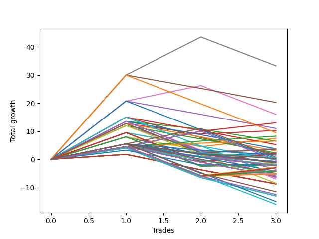

# Long Wallace Doodle 015 
- Symbol: ES_Unlimited
- Date Range: 03/18/2022 - 07/15/2022
- Trading Period: 7:20-12:30
- Number of Trades: 3



| Name | Win Percent | Profit | Avg Profit / Trade | Avg Time / Trade |      | Name | Win Percent | Profit | Avg Profit / Trade | Avg Time / Trade |
| ---- | ----------- | ------ | ------------------ | ---------------- | ---- | ---- | ----------- | ------ | ------------------ | ---------------- |
| Sorted By <br> Profit | | | | | | Sorted By <br> Win Percentage ||||
| Seven | 66.67 | 16625.00 | 5541.67 | 156:58 |     | Eighty-Three | 100.00 | 6500.00 | 2166.67 | 48:28 |
| Forty-Seven | 33.33 | 10125.00 | 3375.00 | 55:33 |     | Eighty-Two | 100.00 | 4125.00 | 1375.00 | 47:40 |
| Six | 66.67 | 8000.00 | 2666.67 | 140:53 |     | Eighty-One | 100.00 | 3250.00 | 1083.33 | 46:01 |
| Eighty-Three | 100.00 | 6500.00 | 2166.67 | 48:28 |     | Seven | 66.67 | 16625.00 | 5541.67 | 156:58 |
| Forty-Six | 33.33 | 5500.00 | 1833.33 | 40:41 |     | Six | 66.67 | 8000.00 | 2666.67 | 140:53 |
| Three | 66.67 | 5125.00 | 1708.33 | 34:26 |     | Three | 66.67 | 5125.00 | 1708.33 | 34:26 |
| Sixty-Three | 33.33 | 4750.00 | 1583.33 | 75:45 |     | One | 66.67 | 3750.00 | 1250.00 | 20:31 |
| Eighty-Two | 100.00 | 4125.00 | 1375.00 | 47:40 |     | Fifty-Nine | 66.67 | 1875.00 | 625.00 | 28:08 |
| One | 66.67 | 3750.00 | 1250.00 | 20:31 |     | Sixty-Seven | 66.67 | 1750.00 | 583.33 | 28:15 |
| Eighty-One | 100.00 | 3250.00 | 1083.33 | 46:01 |     | Fifty-Seven | 66.67 | 1125.00 | 375.00 | 17:31 |
| Two | 33.33 | 3250.00 | 1083.33 | 43:05 |     | Sixty-Five | 66.67 | 1000.00 | 333.33 | 17:38 |
| Forty-Five | 33.33 | 2625.00 | 875.00 | 18:05 |     | Zero | 66.67 | 1000.00 | 333.33 | 17:28 |
| Fifty-Nine | 66.67 | 1875.00 | 625.00 | 28:08 |     | Eighty-Five | 66.67 | 375.00 | 125.00 | 104:30 |
| Forty-Two | 33.33 | 1875.00 | 625.00 | 08:10 |     | Eighty-Four | 66.67 | -125.00 | -41.67 | 104:26 |
| Sixty-Seven | 66.67 | 1750.00 | 583.33 | 28:15 |     | Seventy-Three | 66.67 | -875.00 | -291.67 | 12:45 |
| Forty-Three | 33.33 | 1500.00 | 500.00 | 11:51 |     | Fifty-Six | 66.67 | -875.00 | -291.67 | 15:13 |
| Fifty-Seven | 66.67 | 1125.00 | 375.00 | 17:31 |     | Sixty-Four | 66.67 | -1000.00 | -333.33 | 15:20 |
| Forty-Four | 33.33 | 1125.00 | 375.00 | 17:00 |     | One Hundred Twenty-Three | 66.67 | -1375.00 | -458.33 | 13:51 |
| Sixty-Five | 66.67 | 1000.00 | 333.33 | 17:38 |     | One Hundred Twenty-Eight | 66.67 | -1500.00 | -500.00 | 13:58 |
| Zero | 66.67 | 1000.00 | 333.33 | 17:28 |     | One Hundred Twenty-Two | 66.67 | -2000.00 | -666.67 | 13:13 |
| Five | 33.33 | 875.00 | 291.67 | 98:23 |     | One Hundred Twenty-Seven | 66.67 | -2125.00 | -708.33 | 13:20 |
| Ninety-Five | 33.33 | 750.00 | 250.00 | 01:20 |     | One Hundred Twenty-One | 66.67 | -2500.00 | -833.33 | 11:36 |
| Eighty-Five | 66.67 | 375.00 | 125.00 | 104:30 |     | One Hundred Twenty-Six | 66.67 | -2625.00 | -875.00 | 11:43 |
| Ninety-Four | 33.33 | 250.00 | 83.33 | 01:16 |     | Forty-Seven | 33.33 | 10125.00 | 3375.00 | 55:33 |
| Ninety-Three | 33.33 | 250.00 | 83.33 | 01:16 |     | Forty-Six | 33.33 | 5500.00 | 1833.33 | 40:41 |
| Ninety-Two | 33.33 | 250.00 | 83.33 | 01:16 |     | Sixty-Three | 33.33 | 4750.00 | 1583.33 | 75:45 |
| Ninety-One | 33.33 | 250.00 | 83.33 | 01:16 |     | Two | 33.33 | 3250.00 | 1083.33 | 43:05 |
| One Hundred | 33.33 | 125.00 | 41.67 | 01:31 |     | Forty-Five | 33.33 | 2625.00 | 875.00 | 18:05 |
| Sixty-Two | 33.33 | 125.00 | 41.67 | 60:53 |     | Forty-Two | 33.33 | 1875.00 | 625.00 | 08:10 |
| Eighty-Four | 66.67 | -125.00 | -41.67 | 104:26 |     | Forty-Three | 33.33 | 1500.00 | 500.00 | 11:51 |
| Forty-One | 33.33 | -125.00 | -41.67 | 07:55 |     | Forty-Four | 33.33 | 1125.00 | 375.00 | 17:00 |
| Ninety-Nine | 33.33 | -375.00 | -125.00 | 01:28 |     | Five | 33.33 | 875.00 | 291.67 | 98:23 |
| Ninety-Eight | 33.33 | -375.00 | -125.00 | 01:28 |     | Ninety-Five | 33.33 | 750.00 | 250.00 | 01:20 |
| Ninety-Seven | 33.33 | -375.00 | -125.00 | 01:28 |     | Ninety-Four | 33.33 | 250.00 | 83.33 | 01:16 |
| Ninety-Six | 33.33 | -375.00 | -125.00 | 01:28 |     | Ninety-Three | 33.33 | 250.00 | 83.33 | 01:16 |
| One Hundred Five | 33.33 | -500.00 | -166.67 | 01:46 |     | Ninety-Two | 33.33 | 250.00 | 83.33 | 01:16 |
| One Hundred Ten | 33.33 | -625.00 | -208.33 | 03:31 |     | Ninety-One | 33.33 | 250.00 | 83.33 | 01:16 |
| Seventy-Three | 66.67 | -875.00 | -291.67 | 12:45 |     | One Hundred | 33.33 | 125.00 | 41.67 | 01:31 |
| Fifty-Six | 66.67 | -875.00 | -291.67 | 15:13 |     | Sixty-Two | 33.33 | 125.00 | 41.67 | 60:53 |
| Forty | 33.33 | -875.00 | -291.67 | 06:30 |     | Forty-One | 33.33 | -125.00 | -41.67 | 07:55 |
| Sixty-Four | 66.67 | -1000.00 | -333.33 | 15:20 |     | Ninety-Nine | 33.33 | -375.00 | -125.00 | 01:28 |
| One Hundred Four | 33.33 | -1000.00 | -333.33 | 01:43 |     | Ninety-Eight | 33.33 | -375.00 | -125.00 | 01:28 |
| One Hundred Three | 33.33 | -1000.00 | -333.33 | 01:43 |     | Ninety-Seven | 33.33 | -375.00 | -125.00 | 01:28 |
| One Hundred Two | 33.33 | -1000.00 | -333.33 | 01:43 |     | Ninety-Six | 33.33 | -375.00 | -125.00 | 01:28 |
| One Hundred One | 33.33 | -1000.00 | -333.33 | 01:43 |     | One Hundred Five | 33.33 | -500.00 | -166.67 | 01:46 |
| One Hundred Nine | 33.33 | -1125.00 | -375.00 | 03:28 |     | One Hundred Ten | 33.33 | -625.00 | -208.33 | 03:31 |
| One Hundred Eight | 33.33 | -1125.00 | -375.00 | 03:28 |     | Forty | 33.33 | -875.00 | -291.67 | 06:30 |
| One Hundred Seven | 33.33 | -1125.00 | -375.00 | 03:28 |     | One Hundred Four | 33.33 | -1000.00 | -333.33 | 01:43 |
| One Hundred Six | 33.33 | -1125.00 | -375.00 | 03:28 |     | One Hundred Three | 33.33 | -1000.00 | -333.33 | 01:43 |
| One Hundred Twenty-Three | 66.67 | -1375.00 | -458.33 | 13:51 |     | One Hundred Two | 33.33 | -1000.00 | -333.33 | 01:43 |
| One Hundred Twenty-Eight | 66.67 | -1500.00 | -500.00 | 13:58 |     | One Hundred One | 33.33 | -1000.00 | -333.33 | 01:43 |
| Sixty-Six | 33.33 | -1750.00 | -583.33 | 28:13 |     | One Hundred Nine | 33.33 | -1125.00 | -375.00 | 03:28 |
| One Hundred Twenty-Two | 66.67 | -2000.00 | -666.67 | 13:13 |     | One Hundred Eight | 33.33 | -1125.00 | -375.00 | 03:28 |
| One Hundred Twenty-Seven | 66.67 | -2125.00 | -708.33 | 13:20 |     | One Hundred Seven | 33.33 | -1125.00 | -375.00 | 03:28 |
| One Hundred Fifteen | 33.33 | -2125.00 | -708.33 | 04:18 |     | One Hundred Six | 33.33 | -1125.00 | -375.00 | 03:28 |
| One Hundred Twenty-One | 66.67 | -2500.00 | -833.33 | 11:36 |     | Sixty-Six | 33.33 | -1750.00 | -583.33 | 28:13 |
| One Hundred Twenty | 33.33 | -2500.00 | -833.33 | 05:18 |     | One Hundred Fifteen | 33.33 | -2125.00 | -708.33 | 04:18 |
| One Hundred Twenty-Six | 66.67 | -2625.00 | -875.00 | 11:43 |     | One Hundred Twenty | 33.33 | -2500.00 | -833.33 | 05:18 |
| One Hundred Fourteen | 33.33 | -2625.00 | -875.00 | 04:15 |     | One Hundred Fourteen | 33.33 | -2625.00 | -875.00 | 04:15 |
| One Hundred Thirteen | 33.33 | -2625.00 | -875.00 | 04:15 |     | One Hundred Thirteen | 33.33 | -2625.00 | -875.00 | 04:15 |
| One Hundred Twelve | 33.33 | -2625.00 | -875.00 | 04:15 |     | One Hundred Twelve | 33.33 | -2625.00 | -875.00 | 04:15 |
| One Hundred Eleven | 33.33 | -2625.00 | -875.00 | 04:15 |     | One Hundred Eleven | 33.33 | -2625.00 | -875.00 | 04:15 |
| Sixty-One | 33.33 | -2750.00 | -916.67 | 38:16 |     | Sixty-One | 33.33 | -2750.00 | -916.67 | 38:16 |
| One Hundred Ninteen | 33.33 | -3000.00 | -1000.00 | 05:15 |     | One Hundred Ninteen | 33.33 | -3000.00 | -1000.00 | 05:15 |
| One Hundred Eighteen | 33.33 | -3000.00 | -1000.00 | 05:15 |     | One Hundred Eighteen | 33.33 | -3000.00 | -1000.00 | 05:15 |
| One Hundred Seventeen | 33.33 | -3000.00 | -1000.00 | 05:15 |     | One Hundred Seventeen | 33.33 | -3000.00 | -1000.00 | 05:15 |
| One Hundred Sixteen | 33.33 | -3000.00 | -1000.00 | 05:15 |     | One Hundred Sixteen | 33.33 | -3000.00 | -1000.00 | 05:15 |
| Four | 33.33 | -3250.00 | -1083.33 | 92:51 |     | Four | 33.33 | -3250.00 | -1083.33 | 92:51 |
| Fifty-Eight | 33.33 | -3500.00 | -1166.67 | 28:21 |     | Fifty-Eight | 33.33 | -3500.00 | -1166.67 | 28:21 |
| Sixty | 33.33 | -4250.00 | -1416.67 | 37:11 |     | Sixty | 33.33 | -4250.00 | -1416.67 | 37:11 |
| Fifty-Five | 33.33 | -4375.00 | -1458.33 | 05:58 |     | Fifty-Five | 33.33 | -4375.00 | -1458.33 | 05:58 |
| Fifty-Four | 33.33 | -4375.00 | -1458.33 | 05:58 |     | Fifty-Four | 33.33 | -4375.00 | -1458.33 | 05:58 |
| Fifty-Three | 33.33 | -4375.00 | -1458.33 | 05:58 |     | Fifty-Three | 33.33 | -4375.00 | -1458.33 | 05:58 |
| Fifty-Two | 33.33 | -4375.00 | -1458.33 | 05:58 |     | Fifty-Two | 33.33 | -4375.00 | -1458.33 | 05:58 |
| Fifty-One | 33.33 | -4375.00 | -1458.33 | 05:58 |     | Fifty-One | 33.33 | -4375.00 | -1458.33 | 05:58 |
| Fifty | 33.33 | -4375.00 | -1458.33 | 05:58 |     | Fifty | 33.33 | -4375.00 | -1458.33 | 05:58 |
| Forty-Nine | 33.33 | -4375.00 | -1458.33 | 05:58 |     | Forty-Nine | 33.33 | -4375.00 | -1458.33 | 05:58 |
| Forty-Eight | 33.33 | -4375.00 | -1458.33 | 05:58 |     | Forty-Eight | 33.33 | -4375.00 | -1458.33 | 05:58 |
| One Hundred Thirty | 33.33 | -5750.00 | -1916.67 | 24:21 |     | One Hundred Thirty | 33.33 | -5750.00 | -1916.67 | 24:21 |
| One Hundred Twenty-Nine | 33.33 | -6250.00 | -2083.33 | 24:18 |     | One Hundred Twenty-Nine | 33.33 | -6250.00 | -2083.33 | 24:18 |
| Seventy-One | 33.33 | -6500.00 | -2166.67 | 33:16 |     | Seventy-One | 33.33 | -6500.00 | -2166.67 | 33:16 |
| Seventy | 33.33 | -6500.00 | -2166.67 | 33:16 |     | Seventy | 33.33 | -6500.00 | -2166.67 | 33:16 |
| Sixty-Nine | 33.33 | -6500.00 | -2166.67 | 33:16 |     | Sixty-Nine | 33.33 | -6500.00 | -2166.67 | 33:16 |
| Sixty-Eight | 33.33 | -6500.00 | -2166.67 | 33:16 |     | Sixty-Eight | 33.33 | -6500.00 | -2166.67 | 33:16 |
| One Hundred Twenty-Five | 33.33 | -7500.00 | -2500.00 | 24:30 |     | One Hundred Twenty-Five | 33.33 | -7500.00 | -2500.00 | 24:30 |
| One Hundred Twenty-Four | 33.33 | -8000.00 | -2666.67 | 24:26 |     | One Hundred Twenty-Four | 33.33 | -8000.00 | -2666.67 | 24:26 |

## NO STOPLOSS

### Test Zero
* Sell when price hits the middle line of the 20p bollinger
* No Stoploss
* Results:
```
Total Trades: 3
Percent Up: 66.67
Percent Down: 33.33
Total Points Moved Up: 2.00
Potential Profit: 1000.00
Total Points Ups: 8.50 Count Ups: 2
Total Points Downs: -6.50 Count Downs: 1
```

<details><summary>Trades</summary>

<code>In: 2022-03-25 08:29:00		Out: 2022-03-25 08:36:55		Total Position Time: 07:55		Total Move Up: 8.00		Total to Date: 8.00</code> <br />
<code>In: 2022-04-18 08:26:00		Out: 2022-04-18 08:55:05		Total Position Time: 29:05		Total Move Up: -6.50		Total to Date: 1.50</code> <br />
<code>In: 2022-06-08 09:41:00		Out: 2022-06-08 09:56:25		Total Position Time: 15:25		Total Move Up: 0.50		Total to Date: 2.00</code> <br />


</details>

### Test One
* Sell when the price hits the upper line of the 20p 1std bollinger
* No Stoploss
* Results:
```
Total Trades: 3
Percent Up: 66.67
Percent Down: 33.33
Total Points Moved Up: 7.50
Potential Profit: 3750.00
Total Points Ups: 12.50 Count Ups: 2
Total Points Downs: -5.00 Count Downs: 1
```

<details><summary>Trades</summary>

<code>In: 2022-03-25 08:29:00		Out: 2022-03-25 08:41:10		Total Position Time: 12:10		Total Move Up: 9.50		Total to Date: 9.50</code> <br />
<code>In: 2022-04-18 08:26:00		Out: 2022-04-18 08:57:20		Total Position Time: 31:20		Total Move Up: -5.00		Total to Date: 4.50</code> <br />
<code>In: 2022-06-08 09:41:00		Out: 2022-06-08 09:59:05		Total Position Time: 18:05		Total Move Up: 3.00		Total to Date: 7.50</code> <br />


</details>

### Test Two
* Sell when the price hits the upper line of the 20p 2std bollinger
* No Stoploss
* Results:
```
Total Trades: 3
Percent Up: 33.33
Percent Down: 66.67
Total Points Moved Up: 6.50
Potential Profit: 3250.00
Total Points Ups: 13.50 Count Ups: 1
Total Points Downs: -7.00 Count Downs: 2
```

<details><summary>Trades</summary>

<code>In: 2022-03-25 08:29:00		Out: 2022-03-25 08:41:55		Total Position Time: 12:55		Total Move Up: 13.50		Total to Date: 13.50</code> <br />
<code>In: 2022-04-18 08:26:00		Out: 2022-04-18 08:59:35		Total Position Time: 33:35		Total Move Up: -2.75		Total to Date: 10.75</code> <br />
<code>In: 2022-06-08 09:41:00		Out: 2022-06-08 11:03:45		Total Position Time: 82:45		Total Move Up: -4.25		Total to Date: 6.50</code> <br />


</details>

### Test Three
* Sell when price hits the middle line of the 50p bollinger
* No Stoploss
* Results:
```
Total Trades: 3
Percent Up: 66.67
Percent Down: 33.33
Total Points Moved Up: 10.25
Potential Profit: 5125.00
Total Points Ups: 14.00 Count Ups: 2
Total Points Downs: -3.75 Count Downs: 1
```

<details><summary>Trades</summary>

<code>In: 2022-03-25 08:29:00		Out: 2022-03-25 08:53:00		Total Position Time: 24:00		Total Move Up: 12.75		Total to Date: 12.75</code> <br />
<code>In: 2022-04-18 08:26:00		Out: 2022-04-18 09:07:15		Total Position Time: 41:15		Total Move Up: -3.75		Total to Date: 9.00</code> <br />
<code>In: 2022-06-08 09:41:00		Out: 2022-06-08 10:19:05		Total Position Time: 38:05		Total Move Up: 1.25		Total to Date: 10.25</code> <br />


</details>

### Test Four
* Sell when the price hits the upper line of the 50p 1std bollinger
* No Stoploss
* Results:
```
Total Trades: 3
Percent Up: 33.33
Percent Down: 66.67
Total Points Moved Up: -6.50
Potential Profit: -3250.00
Total Points Ups: 12.00 Count Ups: 1
Total Points Downs: -18.50 Count Downs: 2
```

<details><summary>Trades</summary>

<code>In: 2022-03-25 08:29:00		Out: 2022-03-25 09:08:25		Total Position Time: 39:25		Total Move Up: 12.00		Total to Date: 12.00</code> <br />
<code>In: 2022-04-18 08:26:00		Out: 2022-04-18 09:53:35		Total Position Time: 87:35		Total Move Up: -9.00		Total to Date: 3.00</code> <br />
<code>In: 2022-06-08 09:41:00		Out: 2022-06-08 12:12:35		Total Position Time: 151:35		Total Move Up: -9.50		Total to Date: -6.50</code> <br />


</details>

### Test Five
* Sell when the price hits the upper line of the 50p 2std bollinger
* No Stoploss
* Results:
```
Total Trades: 3
Percent Up: 33.33
Percent Down: 66.67
Total Points Moved Up: 1.75
Potential Profit: 875.00
Total Points Ups: 15.00 Count Ups: 1
Total Points Downs: -13.25 Count Downs: 2
```

<details><summary>Trades</summary>

<code>In: 2022-03-25 08:29:00		Out: 2022-03-25 09:11:40		Total Position Time: 42:40		Total Move Up: 15.00		Total to Date: 15.00</code> <br />
<code>In: 2022-04-18 08:26:00		Out: 2022-04-18 09:58:15		Total Position Time: 92:15		Total Move Up: -7.25		Total to Date: 7.75</code> <br />
<code>In: 2022-06-08 09:41:00		Out: 2022-06-08 12:21:15		Total Position Time: 160:15		Total Move Up: -6.00		Total to Date: 1.75</code> <br />


</details>

### Test Six
* Sell when the price hits the middle line of the 1std VWAP
* No Stoploss
* Results:
```
Total Trades: 3
Percent Up: 66.67
Percent Down: 33.33
Total Points Moved Up: 16.00
Potential Profit: 8000.00
Total Points Ups: 26.25 Count Ups: 2
Total Points Downs: -10.25 Count Downs: 1
```

<details><summary>Trades</summary>

<code>In: 2022-03-25 08:29:00		Out: 2022-03-25 10:19:30		Total Position Time: 110:30		Total Move Up: 20.75		Total to Date: 20.75</code> <br />
<code>In: 2022-04-18 08:26:00		Out: 2022-04-18 10:32:10		Total Position Time: 126:10		Total Move Up: 5.50		Total to Date: 26.25</code> <br />
<code>In: 2022-06-08 09:41:00		Out: 2022-06-08 12:47:00		Total Position Time: 186:00		Total Move Up: -10.25		Total to Date: 16.00</code> <br />


</details>

### Test Seven
* Sell when the price hits the upper line of the 1std VWAP
* No Stoploss
* Results:
```
Total Trades: 3
Percent Up: 66.67
Percent Down: 33.33
Total Points Moved Up: 33.25
Potential Profit: 16625.00
Total Points Ups: 43.50 Count Ups: 2
Total Points Downs: -10.25 Count Downs: 1
```

<details><summary>Trades</summary>

<code>In: 2022-03-25 08:29:00		Out: 2022-03-25 11:04:05		Total Position Time: 155:05		Total Move Up: 30.00		Total to Date: 30.00</code> <br />
<code>In: 2022-04-18 08:26:00		Out: 2022-04-18 10:35:50		Total Position Time: 129:50		Total Move Up: 13.50		Total to Date: 43.50</code> <br />
<code>In: 2022-06-08 09:41:00		Out: 2022-06-08 12:47:00		Total Position Time: 186:00		Total Move Up: -10.25		Total to Date: 33.25</code> <br />


</details>

## STOPLOSS OF 5

### Test Forty
* Sell when price hits the middle line of the 20p bollinger
* Stoploss is 5 points
* Results:
```
Total Trades: 3
Percent Up: 33.33
Percent Down: 66.67
Total Points Moved Up: -1.75
Potential Profit: -875.00
Total Points Ups: 8.00 Count Ups: 1
Total Points Downs: -9.75 Count Downs: 2
```

<details><summary>Trades</summary>

<code>In: 2022-03-25 08:29:00		Out: 2022-03-25 08:36:55		Total Position Time: 07:55		Total Move Up: 8.00		Total to Date: 8.00</code> <br />
<code>In: 2022-04-18 08:26:00		Out: 2022-04-18 08:33:50		Total Position Time: 07:50		Total Move Up: -4.75		Total to Date: 3.25</code> <br />
<code>In: 2022-06-08 09:41:00		Out: 2022-06-08 09:44:45		Total Position Time: 03:45		Total Move Up: -5.00		Total to Date: -1.75</code> <br />


</details>

### Test Forty-One
* Sell when the price hits the upper line of the 20p 1std bollinger
* Stoploss is 5 points
* Results:
```
Total Trades: 3
Percent Up: 33.33
Percent Down: 66.67
Total Points Moved Up: -0.25
Potential Profit: -125.00
Total Points Ups: 9.50 Count Ups: 1
Total Points Downs: -9.75 Count Downs: 2
```

<details><summary>Trades</summary>

<code>In: 2022-03-25 08:29:00		Out: 2022-03-25 08:41:10		Total Position Time: 12:10		Total Move Up: 9.50		Total to Date: 9.50</code> <br />
<code>In: 2022-04-18 08:26:00		Out: 2022-04-18 08:33:50		Total Position Time: 07:50		Total Move Up: -4.75		Total to Date: 4.75</code> <br />
<code>In: 2022-06-08 09:41:00		Out: 2022-06-08 09:44:45		Total Position Time: 03:45		Total Move Up: -5.00		Total to Date: -0.25</code> <br />


</details>

### Test Forty-Two
* Sell when the price hits the upper line of the 20p 2std bollinger
* Stoploss is 5 points
* Results:
```
Total Trades: 3
Percent Up: 33.33
Percent Down: 66.67
Total Points Moved Up: 3.75
Potential Profit: 1875.00
Total Points Ups: 13.50 Count Ups: 1
Total Points Downs: -9.75 Count Downs: 2
```

<details><summary>Trades</summary>

<code>In: 2022-03-25 08:29:00		Out: 2022-03-25 08:41:55		Total Position Time: 12:55		Total Move Up: 13.50		Total to Date: 13.50</code> <br />
<code>In: 2022-04-18 08:26:00		Out: 2022-04-18 08:33:50		Total Position Time: 07:50		Total Move Up: -4.75		Total to Date: 8.75</code> <br />
<code>In: 2022-06-08 09:41:00		Out: 2022-06-08 09:44:45		Total Position Time: 03:45		Total Move Up: -5.00		Total to Date: 3.75</code> <br />


</details>

### Test Forty-Three
* Sell when price hits the middle line of the 50p bollinger
* Stoploss is 5 points
* Results:
```
Total Trades: 3
Percent Up: 33.33
Percent Down: 66.67
Total Points Moved Up: 3.00
Potential Profit: 1500.00
Total Points Ups: 12.75 Count Ups: 1
Total Points Downs: -9.75 Count Downs: 2
```

<details><summary>Trades</summary>

<code>In: 2022-03-25 08:29:00		Out: 2022-03-25 08:53:00		Total Position Time: 24:00		Total Move Up: 12.75		Total to Date: 12.75</code> <br />
<code>In: 2022-04-18 08:26:00		Out: 2022-04-18 08:33:50		Total Position Time: 07:50		Total Move Up: -4.75		Total to Date: 8.00</code> <br />
<code>In: 2022-06-08 09:41:00		Out: 2022-06-08 09:44:45		Total Position Time: 03:45		Total Move Up: -5.00		Total to Date: 3.00</code> <br />


</details>

### Test Forty-Four
* Sell when the price hits the upper line of the 50p 1std bollinger
* Stoploss is 5 points
* Results:
```
Total Trades: 3
Percent Up: 33.33
Percent Down: 66.67
Total Points Moved Up: 2.25
Potential Profit: 1125.00
Total Points Ups: 12.00 Count Ups: 1
Total Points Downs: -9.75 Count Downs: 2
```

<details><summary>Trades</summary>

<code>In: 2022-03-25 08:29:00		Out: 2022-03-25 09:08:25		Total Position Time: 39:25		Total Move Up: 12.00		Total to Date: 12.00</code> <br />
<code>In: 2022-04-18 08:26:00		Out: 2022-04-18 08:33:50		Total Position Time: 07:50		Total Move Up: -4.75		Total to Date: 7.25</code> <br />
<code>In: 2022-06-08 09:41:00		Out: 2022-06-08 09:44:45		Total Position Time: 03:45		Total Move Up: -5.00		Total to Date: 2.25</code> <br />


</details>

### Test Forty-Five
* Sell when the price hits the upper line of the 50p 2std bollinger
* Stoploss is 5 points
* Results:
```
Total Trades: 3
Percent Up: 33.33
Percent Down: 66.67
Total Points Moved Up: 5.25
Potential Profit: 2625.00
Total Points Ups: 15.00 Count Ups: 1
Total Points Downs: -9.75 Count Downs: 2
```

<details><summary>Trades</summary>

<code>In: 2022-03-25 08:29:00		Out: 2022-03-25 09:11:40		Total Position Time: 42:40		Total Move Up: 15.00		Total to Date: 15.00</code> <br />
<code>In: 2022-04-18 08:26:00		Out: 2022-04-18 08:33:50		Total Position Time: 07:50		Total Move Up: -4.75		Total to Date: 10.25</code> <br />
<code>In: 2022-06-08 09:41:00		Out: 2022-06-08 09:44:45		Total Position Time: 03:45		Total Move Up: -5.00		Total to Date: 5.25</code> <br />


</details>

### Test Forty-Six
* Sell when the price hits the middle line of the 1std VWAP
* Stoploss is 5 points
* Results:
```
Total Trades: 3
Percent Up: 33.33
Percent Down: 66.67
Total Points Moved Up: 11.00
Potential Profit: 5500.00
Total Points Ups: 20.75 Count Ups: 1
Total Points Downs: -9.75 Count Downs: 2
```

<details><summary>Trades</summary>

<code>In: 2022-03-25 08:29:00		Out: 2022-03-25 10:19:30		Total Position Time: 110:30		Total Move Up: 20.75		Total to Date: 20.75</code> <br />
<code>In: 2022-04-18 08:26:00		Out: 2022-04-18 08:33:50		Total Position Time: 07:50		Total Move Up: -4.75		Total to Date: 16.00</code> <br />
<code>In: 2022-06-08 09:41:00		Out: 2022-06-08 09:44:45		Total Position Time: 03:45		Total Move Up: -5.00		Total to Date: 11.00</code> <br />


</details>

### Test Forty-Seven
* Sell when the price hits the upper line of the 1std VWAP
* Stoploss is 5 points
* Results:
```
Total Trades: 3
Percent Up: 33.33
Percent Down: 66.67
Total Points Moved Up: 20.25
Potential Profit: 10125.00
Total Points Ups: 30.00 Count Ups: 1
Total Points Downs: -9.75 Count Downs: 2
```

<details><summary>Trades</summary>

<code>In: 2022-03-25 08:29:00		Out: 2022-03-25 11:04:05		Total Position Time: 155:05		Total Move Up: 30.00		Total to Date: 30.00</code> <br />
<code>In: 2022-04-18 08:26:00		Out: 2022-04-18 08:33:50		Total Position Time: 07:50		Total Move Up: -4.75		Total to Date: 25.25</code> <br />
<code>In: 2022-06-08 09:41:00		Out: 2022-06-08 09:44:45		Total Position Time: 03:45		Total Move Up: -5.00		Total to Date: 20.25</code> <br />


</details>

## TRAIL STOP OF 5

### Test Forty-Eight
* Sell when price hits the middle line of the 20p bollinger
* Trailing Stop is 5 points
* Results:
```
Total Trades: 3
Percent Up: 33.33
Percent Down: 66.67
Total Points Moved Up: -8.75
Potential Profit: -4375.00
Total Points Ups: 1.75 Count Ups: 1
Total Points Downs: -10.50 Count Downs: 2
```

<details><summary>Trades</summary>

<code>In: 2022-03-25 08:29:00		Out: 2022-03-25 08:32:20		Total Position Time: 03:20		Total Move Up: 1.75		Total to Date: 1.75</code> <br />
<code>In: 2022-04-18 08:26:00		Out: 2022-04-18 08:36:50		Total Position Time: 10:50		Total Move Up: -5.50		Total to Date: -3.75</code> <br />
<code>In: 2022-06-08 09:41:00		Out: 2022-06-08 09:44:45		Total Position Time: 03:45		Total Move Up: -5.00		Total to Date: -8.75</code> <br />


</details>

### Test Forty-Nine
* Sell when the price hits the upper line of the 20p 1std bollinger
* Trailing Stop is 5 points
* Results:
```
Total Trades: 3
Percent Up: 33.33
Percent Down: 66.67
Total Points Moved Up: -8.75
Potential Profit: -4375.00
Total Points Ups: 1.75 Count Ups: 1
Total Points Downs: -10.50 Count Downs: 2
```

<details><summary>Trades</summary>

<code>In: 2022-03-25 08:29:00		Out: 2022-03-25 08:32:20		Total Position Time: 03:20		Total Move Up: 1.75		Total to Date: 1.75</code> <br />
<code>In: 2022-04-18 08:26:00		Out: 2022-04-18 08:36:50		Total Position Time: 10:50		Total Move Up: -5.50		Total to Date: -3.75</code> <br />
<code>In: 2022-06-08 09:41:00		Out: 2022-06-08 09:44:45		Total Position Time: 03:45		Total Move Up: -5.00		Total to Date: -8.75</code> <br />


</details>

### Test Fifty
* Sell when the price hits the upper line of the 20p 2std bollinger
* Trailing Stop is 5 points
* Results:
```
Total Trades: 3
Percent Up: 33.33
Percent Down: 66.67
Total Points Moved Up: -8.75
Potential Profit: -4375.00
Total Points Ups: 1.75 Count Ups: 1
Total Points Downs: -10.50 Count Downs: 2
```

<details><summary>Trades</summary>

<code>In: 2022-03-25 08:29:00		Out: 2022-03-25 08:32:20		Total Position Time: 03:20		Total Move Up: 1.75		Total to Date: 1.75</code> <br />
<code>In: 2022-04-18 08:26:00		Out: 2022-04-18 08:36:50		Total Position Time: 10:50		Total Move Up: -5.50		Total to Date: -3.75</code> <br />
<code>In: 2022-06-08 09:41:00		Out: 2022-06-08 09:44:45		Total Position Time: 03:45		Total Move Up: -5.00		Total to Date: -8.75</code> <br />


</details>

### Test Fifty-One
* Sell when price hits the middle line of the 50p bollinger
* Trailing Stop is 5 points
* Results:
```
Total Trades: 3
Percent Up: 33.33
Percent Down: 66.67
Total Points Moved Up: -8.75
Potential Profit: -4375.00
Total Points Ups: 1.75 Count Ups: 1
Total Points Downs: -10.50 Count Downs: 2
```

<details><summary>Trades</summary>

<code>In: 2022-03-25 08:29:00		Out: 2022-03-25 08:32:20		Total Position Time: 03:20		Total Move Up: 1.75		Total to Date: 1.75</code> <br />
<code>In: 2022-04-18 08:26:00		Out: 2022-04-18 08:36:50		Total Position Time: 10:50		Total Move Up: -5.50		Total to Date: -3.75</code> <br />
<code>In: 2022-06-08 09:41:00		Out: 2022-06-08 09:44:45		Total Position Time: 03:45		Total Move Up: -5.00		Total to Date: -8.75</code> <br />


</details>

### Test Fifty-Two
* Sell when the price hits the upper line of the 50p 1std bollinger
* Trailing Stop is 5 points
* Results:
```
Total Trades: 3
Percent Up: 33.33
Percent Down: 66.67
Total Points Moved Up: -8.75
Potential Profit: -4375.00
Total Points Ups: 1.75 Count Ups: 1
Total Points Downs: -10.50 Count Downs: 2
```

<details><summary>Trades</summary>

<code>In: 2022-03-25 08:29:00		Out: 2022-03-25 08:32:20		Total Position Time: 03:20		Total Move Up: 1.75		Total to Date: 1.75</code> <br />
<code>In: 2022-04-18 08:26:00		Out: 2022-04-18 08:36:50		Total Position Time: 10:50		Total Move Up: -5.50		Total to Date: -3.75</code> <br />
<code>In: 2022-06-08 09:41:00		Out: 2022-06-08 09:44:45		Total Position Time: 03:45		Total Move Up: -5.00		Total to Date: -8.75</code> <br />


</details>

### Test Fifty-Three
* Sell when the price hits the upper line of the 50p 2std bollinger
* Trailing Stop is 5 points
* Results:
```
Total Trades: 3
Percent Up: 33.33
Percent Down: 66.67
Total Points Moved Up: -8.75
Potential Profit: -4375.00
Total Points Ups: 1.75 Count Ups: 1
Total Points Downs: -10.50 Count Downs: 2
```

<details><summary>Trades</summary>

<code>In: 2022-03-25 08:29:00		Out: 2022-03-25 08:32:20		Total Position Time: 03:20		Total Move Up: 1.75		Total to Date: 1.75</code> <br />
<code>In: 2022-04-18 08:26:00		Out: 2022-04-18 08:36:50		Total Position Time: 10:50		Total Move Up: -5.50		Total to Date: -3.75</code> <br />
<code>In: 2022-06-08 09:41:00		Out: 2022-06-08 09:44:45		Total Position Time: 03:45		Total Move Up: -5.00		Total to Date: -8.75</code> <br />


</details>

### Test Fifty-Four
* Sell when the price hits the middle line of the 1std VWAP
* Trailing Stop is 5 points
* Results:
```
Total Trades: 3
Percent Up: 33.33
Percent Down: 66.67
Total Points Moved Up: -8.75
Potential Profit: -4375.00
Total Points Ups: 1.75 Count Ups: 1
Total Points Downs: -10.50 Count Downs: 2
```

<details><summary>Trades</summary>

<code>In: 2022-03-25 08:29:00		Out: 2022-03-25 08:32:20		Total Position Time: 03:20		Total Move Up: 1.75		Total to Date: 1.75</code> <br />
<code>In: 2022-04-18 08:26:00		Out: 2022-04-18 08:36:50		Total Position Time: 10:50		Total Move Up: -5.50		Total to Date: -3.75</code> <br />
<code>In: 2022-06-08 09:41:00		Out: 2022-06-08 09:44:45		Total Position Time: 03:45		Total Move Up: -5.00		Total to Date: -8.75</code> <br />


</details>

### Test Fifty-Five
* Sell when the price hits the upper line of the 1std VWAP
* Trailing Stop is 5 points
* Results:
```
Total Trades: 3
Percent Up: 33.33
Percent Down: 66.67
Total Points Moved Up: -8.75
Potential Profit: -4375.00
Total Points Ups: 1.75 Count Ups: 1
Total Points Downs: -10.50 Count Downs: 2
```

<details><summary>Trades</summary>

<code>In: 2022-03-25 08:29:00		Out: 2022-03-25 08:32:20		Total Position Time: 03:20		Total Move Up: 1.75		Total to Date: 1.75</code> <br />
<code>In: 2022-04-18 08:26:00		Out: 2022-04-18 08:36:50		Total Position Time: 10:50		Total Move Up: -5.50		Total to Date: -3.75</code> <br />
<code>In: 2022-06-08 09:41:00		Out: 2022-06-08 09:44:45		Total Position Time: 03:45		Total Move Up: -5.00		Total to Date: -8.75</code> <br />


</details>

## STOPLOSS OF 10

### Test Fifty-Six
* Sell when price hits the middle line of the 20p bollinger
* Stoploss is 10 points
* Results:
```
Total Trades: 3
Percent Up: 66.67
Percent Down: 33.33
Total Points Moved Up: -1.75
Potential Profit: -875.00
Total Points Ups: 8.50 Count Ups: 2
Total Points Downs: -10.25 Count Downs: 1
```

<details><summary>Trades</summary>

<code>In: 2022-03-25 08:29:00		Out: 2022-03-25 08:36:55		Total Position Time: 07:55		Total Move Up: 8.00		Total to Date: 8.00</code> <br />
<code>In: 2022-04-18 08:26:00		Out: 2022-04-18 08:48:20		Total Position Time: 22:20		Total Move Up: -10.25		Total to Date: -2.25</code> <br />
<code>In: 2022-06-08 09:41:00		Out: 2022-06-08 09:56:25		Total Position Time: 15:25		Total Move Up: 0.50		Total to Date: -1.75</code> <br />


</details>

### Test Fifty-Seven
* Sell when the price hits the upper line of the 20p 1std bollinger
* Stoploss is 10 points
* Results:
```
Total Trades: 3
Percent Up: 66.67
Percent Down: 33.33
Total Points Moved Up: 2.25
Potential Profit: 1125.00
Total Points Ups: 12.50 Count Ups: 2
Total Points Downs: -10.25 Count Downs: 1
```

<details><summary>Trades</summary>

<code>In: 2022-03-25 08:29:00		Out: 2022-03-25 08:41:10		Total Position Time: 12:10		Total Move Up: 9.50		Total to Date: 9.50</code> <br />
<code>In: 2022-04-18 08:26:00		Out: 2022-04-18 08:48:20		Total Position Time: 22:20		Total Move Up: -10.25		Total to Date: -0.75</code> <br />
<code>In: 2022-06-08 09:41:00		Out: 2022-06-08 09:59:05		Total Position Time: 18:05		Total Move Up: 3.00		Total to Date: 2.25</code> <br />


</details>

### Test Fifty-Eight
* Sell when the price hits the upper line of the 20p 2std bollinger
* Stoploss is 10 points
* Results:
```
Total Trades: 3
Percent Up: 33.33
Percent Down: 66.67
Total Points Moved Up: -7.00
Potential Profit: -3500.00
Total Points Ups: 13.50 Count Ups: 1
Total Points Downs: -20.50 Count Downs: 2
```

<details><summary>Trades</summary>

<code>In: 2022-03-25 08:29:00		Out: 2022-03-25 08:41:55		Total Position Time: 12:55		Total Move Up: 13.50		Total to Date: 13.50</code> <br />
<code>In: 2022-04-18 08:26:00		Out: 2022-04-18 08:48:20		Total Position Time: 22:20		Total Move Up: -10.25		Total to Date: 3.25</code> <br />
<code>In: 2022-06-08 09:41:00		Out: 2022-06-08 10:30:50		Total Position Time: 49:50		Total Move Up: -10.25		Total to Date: -7.00</code> <br />


</details>

### Test Fifty-Nine
* Sell when price hits the middle line of the 50p bollinger
* Stoploss is 10 points
* Results:
```
Total Trades: 3
Percent Up: 66.67
Percent Down: 33.33
Total Points Moved Up: 3.75
Potential Profit: 1875.00
Total Points Ups: 14.00 Count Ups: 2
Total Points Downs: -10.25 Count Downs: 1
```

<details><summary>Trades</summary>

<code>In: 2022-03-25 08:29:00		Out: 2022-03-25 08:53:00		Total Position Time: 24:00		Total Move Up: 12.75		Total to Date: 12.75</code> <br />
<code>In: 2022-04-18 08:26:00		Out: 2022-04-18 08:48:20		Total Position Time: 22:20		Total Move Up: -10.25		Total to Date: 2.50</code> <br />
<code>In: 2022-06-08 09:41:00		Out: 2022-06-08 10:19:05		Total Position Time: 38:05		Total Move Up: 1.25		Total to Date: 3.75</code> <br />


</details>

### Test Sixty
* Sell when the price hits the upper line of the 50p 1std bollinger
* Stoploss is 10 points
* Results:
```
Total Trades: 3
Percent Up: 33.33
Percent Down: 66.67
Total Points Moved Up: -8.50
Potential Profit: -4250.00
Total Points Ups: 12.00 Count Ups: 1
Total Points Downs: -20.50 Count Downs: 2
```

<details><summary>Trades</summary>

<code>In: 2022-03-25 08:29:00		Out: 2022-03-25 09:08:25		Total Position Time: 39:25		Total Move Up: 12.00		Total to Date: 12.00</code> <br />
<code>In: 2022-04-18 08:26:00		Out: 2022-04-18 08:48:20		Total Position Time: 22:20		Total Move Up: -10.25		Total to Date: 1.75</code> <br />
<code>In: 2022-06-08 09:41:00		Out: 2022-06-08 10:30:50		Total Position Time: 49:50		Total Move Up: -10.25		Total to Date: -8.50</code> <br />


</details>

### Test Sixty-One
* Sell when the price hits the upper line of the 50p 2std bollinger
* Stoploss is 10 points
* Results:
```
Total Trades: 3
Percent Up: 33.33
Percent Down: 66.67
Total Points Moved Up: -5.50
Potential Profit: -2750.00
Total Points Ups: 15.00 Count Ups: 1
Total Points Downs: -20.50 Count Downs: 2
```

<details><summary>Trades</summary>

<code>In: 2022-03-25 08:29:00		Out: 2022-03-25 09:11:40		Total Position Time: 42:40		Total Move Up: 15.00		Total to Date: 15.00</code> <br />
<code>In: 2022-04-18 08:26:00		Out: 2022-04-18 08:48:20		Total Position Time: 22:20		Total Move Up: -10.25		Total to Date: 4.75</code> <br />
<code>In: 2022-06-08 09:41:00		Out: 2022-06-08 10:30:50		Total Position Time: 49:50		Total Move Up: -10.25		Total to Date: -5.50</code> <br />


</details>

### Test Sixty-Two
* Sell when the price hits the middle line of the 1std VWAP
* Stoploss is 10 points
* Results:
```
Total Trades: 3
Percent Up: 33.33
Percent Down: 66.67
Total Points Moved Up: 0.25
Potential Profit: 125.00
Total Points Ups: 20.75 Count Ups: 1
Total Points Downs: -20.50 Count Downs: 2
```

<details><summary>Trades</summary>

<code>In: 2022-03-25 08:29:00		Out: 2022-03-25 10:19:30		Total Position Time: 110:30		Total Move Up: 20.75		Total to Date: 20.75</code> <br />
<code>In: 2022-04-18 08:26:00		Out: 2022-04-18 08:48:20		Total Position Time: 22:20		Total Move Up: -10.25		Total to Date: 10.50</code> <br />
<code>In: 2022-06-08 09:41:00		Out: 2022-06-08 10:30:50		Total Position Time: 49:50		Total Move Up: -10.25		Total to Date: 0.25</code> <br />


</details>

### Test Sixty-Three
* Sell when the price hits the upper line of the 1std VWAP
* Stoploss is 10 points
* Results:
```
Total Trades: 3
Percent Up: 33.33
Percent Down: 66.67
Total Points Moved Up: 9.50
Potential Profit: 4750.00
Total Points Ups: 30.00 Count Ups: 1
Total Points Downs: -20.50 Count Downs: 2
```

<details><summary>Trades</summary>

<code>In: 2022-03-25 08:29:00		Out: 2022-03-25 11:04:05		Total Position Time: 155:05		Total Move Up: 30.00		Total to Date: 30.00</code> <br />
<code>In: 2022-04-18 08:26:00		Out: 2022-04-18 08:48:20		Total Position Time: 22:20		Total Move Up: -10.25		Total to Date: 19.75</code> <br />
<code>In: 2022-06-08 09:41:00		Out: 2022-06-08 10:30:50		Total Position Time: 49:50		Total Move Up: -10.25		Total to Date: 9.50</code> <br />


</details>

## TRAIL STOP OF 10

### Test Sixty-Four
* Sell when price hits the middle line of the 20p bollinger
* Trailing Stop is 10 points
* Results:
```
Total Trades: 3
Percent Up: 66.67
Percent Down: 33.33
Total Points Moved Up: -2.00
Potential Profit: -1000.00
Total Points Ups: 8.50 Count Ups: 2
Total Points Downs: -10.50 Count Downs: 1
```

<details><summary>Trades</summary>

<code>In: 2022-03-25 08:29:00		Out: 2022-03-25 08:36:55		Total Position Time: 07:55		Total Move Up: 8.00		Total to Date: 8.00</code> <br />
<code>In: 2022-04-18 08:26:00		Out: 2022-04-18 08:48:40		Total Position Time: 22:40		Total Move Up: -10.50		Total to Date: -2.50</code> <br />
<code>In: 2022-06-08 09:41:00		Out: 2022-06-08 09:56:25		Total Position Time: 15:25		Total Move Up: 0.50		Total to Date: -2.00</code> <br />


</details>

### Test Sixty-Five
* Sell when the price hits the upper line of the 20p 1std bollinger
* Trailing Stop is 10 points
* Results:
```
Total Trades: 3
Percent Up: 66.67
Percent Down: 33.33
Total Points Moved Up: 2.00
Potential Profit: 1000.00
Total Points Ups: 12.50 Count Ups: 2
Total Points Downs: -10.50 Count Downs: 1
```

<details><summary>Trades</summary>

<code>In: 2022-03-25 08:29:00		Out: 2022-03-25 08:41:10		Total Position Time: 12:10		Total Move Up: 9.50		Total to Date: 9.50</code> <br />
<code>In: 2022-04-18 08:26:00		Out: 2022-04-18 08:48:40		Total Position Time: 22:40		Total Move Up: -10.50		Total to Date: -1.00</code> <br />
<code>In: 2022-06-08 09:41:00		Out: 2022-06-08 09:59:05		Total Position Time: 18:05		Total Move Up: 3.00		Total to Date: 2.00</code> <br />


</details>

### Test Sixty-Six
* Sell when the price hits the upper line of the 20p 2std bollinger
* Trailing Stop is 10 points
* Results:
```
Total Trades: 3
Percent Up: 33.33
Percent Down: 66.67
Total Points Moved Up: -3.50
Potential Profit: -1750.00
Total Points Ups: 13.50 Count Ups: 1
Total Points Downs: -17.00 Count Downs: 2
```

<details><summary>Trades</summary>

<code>In: 2022-03-25 08:29:00		Out: 2022-03-25 08:41:55		Total Position Time: 12:55		Total Move Up: 13.50		Total to Date: 13.50</code> <br />
<code>In: 2022-04-18 08:26:00		Out: 2022-04-18 08:48:40		Total Position Time: 22:40		Total Move Up: -10.50		Total to Date: 3.00</code> <br />
<code>In: 2022-06-08 09:41:00		Out: 2022-06-08 10:30:05		Total Position Time: 49:05		Total Move Up: -6.50		Total to Date: -3.50</code> <br />


</details>

### Test Sixty-Seven
* Sell when price hits the middle line of the 50p bollinger
* Trailing Stop is 10 points
* Results:
```
Total Trades: 3
Percent Up: 66.67
Percent Down: 33.33
Total Points Moved Up: 3.50
Potential Profit: 1750.00
Total Points Ups: 14.00 Count Ups: 2
Total Points Downs: -10.50 Count Downs: 1
```

<details><summary>Trades</summary>

<code>In: 2022-03-25 08:29:00		Out: 2022-03-25 08:53:00		Total Position Time: 24:00		Total Move Up: 12.75		Total to Date: 12.75</code> <br />
<code>In: 2022-04-18 08:26:00		Out: 2022-04-18 08:48:40		Total Position Time: 22:40		Total Move Up: -10.50		Total to Date: 2.25</code> <br />
<code>In: 2022-06-08 09:41:00		Out: 2022-06-08 10:19:05		Total Position Time: 38:05		Total Move Up: 1.25		Total to Date: 3.50</code> <br />


</details>

### Test Sixty-Eight
* Sell when the price hits the upper line of the 50p 1std bollinger
* Trailing Stop is 10 points
* Results:
```
Total Trades: 3
Percent Up: 33.33
Percent Down: 66.67
Total Points Moved Up: -13.00
Potential Profit: -6500.00
Total Points Ups: 4.00 Count Ups: 1
Total Points Downs: -17.00 Count Downs: 2
```

<details><summary>Trades</summary>

<code>In: 2022-03-25 08:29:00		Out: 2022-03-25 08:57:05		Total Position Time: 28:05		Total Move Up: 4.00		Total to Date: 4.00</code> <br />
<code>In: 2022-04-18 08:26:00		Out: 2022-04-18 08:48:40		Total Position Time: 22:40		Total Move Up: -10.50		Total to Date: -6.50</code> <br />
<code>In: 2022-06-08 09:41:00		Out: 2022-06-08 10:30:05		Total Position Time: 49:05		Total Move Up: -6.50		Total to Date: -13.00</code> <br />


</details>

### Test Sixty-Nine
* Sell when the price hits the upper line of the 50p 2std bollinger
* Trailing Stop is 10 points
* Results:
```
Total Trades: 3
Percent Up: 33.33
Percent Down: 66.67
Total Points Moved Up: -13.00
Potential Profit: -6500.00
Total Points Ups: 4.00 Count Ups: 1
Total Points Downs: -17.00 Count Downs: 2
```

<details><summary>Trades</summary>

<code>In: 2022-03-25 08:29:00		Out: 2022-03-25 08:57:05		Total Position Time: 28:05		Total Move Up: 4.00		Total to Date: 4.00</code> <br />
<code>In: 2022-04-18 08:26:00		Out: 2022-04-18 08:48:40		Total Position Time: 22:40		Total Move Up: -10.50		Total to Date: -6.50</code> <br />
<code>In: 2022-06-08 09:41:00		Out: 2022-06-08 10:30:05		Total Position Time: 49:05		Total Move Up: -6.50		Total to Date: -13.00</code> <br />


</details>

### Test Seventy
* Sell when the price hits the middle line of the 1std VWAP
* Trailing Stop is 10 points
* Results:
```
Total Trades: 3
Percent Up: 33.33
Percent Down: 66.67
Total Points Moved Up: -13.00
Potential Profit: -6500.00
Total Points Ups: 4.00 Count Ups: 1
Total Points Downs: -17.00 Count Downs: 2
```

<details><summary>Trades</summary>

<code>In: 2022-03-25 08:29:00		Out: 2022-03-25 08:57:05		Total Position Time: 28:05		Total Move Up: 4.00		Total to Date: 4.00</code> <br />
<code>In: 2022-04-18 08:26:00		Out: 2022-04-18 08:48:40		Total Position Time: 22:40		Total Move Up: -10.50		Total to Date: -6.50</code> <br />
<code>In: 2022-06-08 09:41:00		Out: 2022-06-08 10:30:05		Total Position Time: 49:05		Total Move Up: -6.50		Total to Date: -13.00</code> <br />


</details>

### Test Seventy-One
* Sell when the price hits the upper line of the 1std VWAP
* Trailing Stop is 10 points
* Results:
```
Total Trades: 3
Percent Up: 33.33
Percent Down: 66.67
Total Points Moved Up: -13.00
Potential Profit: -6500.00
Total Points Ups: 4.00 Count Ups: 1
Total Points Downs: -17.00 Count Downs: 2
```

<details><summary>Trades</summary>

<code>In: 2022-03-25 08:29:00		Out: 2022-03-25 08:57:05		Total Position Time: 28:05		Total Move Up: 4.00		Total to Date: 4.00</code> <br />
<code>In: 2022-04-18 08:26:00		Out: 2022-04-18 08:48:40		Total Position Time: 22:40		Total Move Up: -10.50		Total to Date: -6.50</code> <br />
<code>In: 2022-06-08 09:41:00		Out: 2022-06-08 10:30:05		Total Position Time: 49:05		Total Move Up: -6.50		Total to Date: -13.00</code> <br />


</details>

## SPECIAL EXIT CONDITIONS 

### Test Seventy-Three
* Sell when the linear regression slope changes to negative
* No Stoploss
* Results:
```
Total Trades: 3
Percent Up: 66.67
Percent Down: 33.33
Total Points Moved Up: -1.75
Potential Profit: -875.00
Total Points Ups: 3.50 Count Ups: 2
Total Points Downs: -5.25 Count Downs: 1
```

<details><summary>Trades</summary>

<code>In: 2022-03-25 08:29:00		Out: 2022-03-25 08:34:05		Total Position Time: 05:05		Total Move Up: 3.25		Total to Date: 3.25</code> <br />
<code>In: 2022-04-18 08:26:00		Out: 2022-04-18 08:39:05		Total Position Time: 13:05		Total Move Up: -5.25		Total to Date: -2.00</code> <br />
<code>In: 2022-06-08 09:41:00		Out: 2022-06-08 10:01:05		Total Position Time: 20:05		Total Move Up: 0.25		Total to Date: -1.75</code> <br />


</details>

## TAKE PROFIT

### Test Eighty-One
* Take Profit of 1 Point
* No Stoploss
* Results:
```
Total Trades: 3
Percent Up: 100.00
Percent Down: 0.00
Total Points Moved Up: 6.50
Potential Profit: 3250.00
Total Points Ups: 6.50 Count Ups: 3
Total Points Downs: 0.00 Count Downs: 0
```

<details><summary>Trades</summary>

<code>In: 2022-03-25 08:29:00		Out: 2022-03-25 08:30:10		Total Position Time: 01:10		Total Move Up: 4.50		Total to Date: 4.50</code> <br />
<code>In: 2022-04-18 08:26:00		Out: 2022-04-18 10:31:35		Total Position Time: 125:35		Total Move Up: 1.25		Total to Date: 5.75</code> <br />
<code>In: 2022-06-08 09:41:00		Out: 2022-06-08 09:52:20		Total Position Time: 11:20		Total Move Up: 0.75		Total to Date: 6.50</code> <br />


</details>

### Test Eighty-Two
* Take Profit of 2 Point
* No Stoploss
* Results:
```
Total Trades: 3
Percent Up: 100.00
Percent Down: 0.00
Total Points Moved Up: 8.25
Potential Profit: 4125.00
Total Points Ups: 8.25 Count Ups: 3
Total Points Downs: 0.00 Count Downs: 0
```

<details><summary>Trades</summary>

<code>In: 2022-03-25 08:29:00		Out: 2022-03-25 08:30:10		Total Position Time: 01:10		Total Move Up: 4.50		Total to Date: 4.50</code> <br />
<code>In: 2022-04-18 08:26:00		Out: 2022-04-18 10:31:40		Total Position Time: 125:40		Total Move Up: 2.00		Total to Date: 6.50</code> <br />
<code>In: 2022-06-08 09:41:00		Out: 2022-06-08 09:57:10		Total Position Time: 16:10		Total Move Up: 1.75		Total to Date: 8.25</code> <br />


</details>

### Test Eighty-Three
* Take Profit of 3 Point
* No Stoploss
* Results:
```
Total Trades: 3
Percent Up: 100.00
Percent Down: 0.00
Total Points Moved Up: 13.00
Potential Profit: 6500.00
Total Points Ups: 13.00 Count Ups: 3
Total Points Downs: 0.00 Count Downs: 0
```

<details><summary>Trades</summary>

<code>In: 2022-03-25 08:29:00		Out: 2022-03-25 08:30:10		Total Position Time: 01:10		Total Move Up: 4.50		Total to Date: 4.50</code> <br />
<code>In: 2022-04-18 08:26:00		Out: 2022-04-18 10:32:10		Total Position Time: 126:10		Total Move Up: 5.50		Total to Date: 10.00</code> <br />
<code>In: 2022-06-08 09:41:00		Out: 2022-06-08 09:59:05		Total Position Time: 18:05		Total Move Up: 3.00		Total to Date: 13.00</code> <br />


</details>

### Test Eighty-Four
* Take Profit of 4 Point
* No Stoploss
* Results:
```
Total Trades: 3
Percent Up: 66.67
Percent Down: 33.33
Total Points Moved Up: -0.25
Potential Profit: -125.00
Total Points Ups: 10.00 Count Ups: 2
Total Points Downs: -10.25 Count Downs: 1
```

<details><summary>Trades</summary>

<code>In: 2022-03-25 08:29:00		Out: 2022-03-25 08:30:10		Total Position Time: 01:10		Total Move Up: 4.50		Total to Date: 4.50</code> <br />
<code>In: 2022-04-18 08:26:00		Out: 2022-04-18 10:32:10		Total Position Time: 126:10		Total Move Up: 5.50		Total to Date: 10.00</code> <br />
<code>In: 2022-06-08 09:41:00		Out: 2022-06-08 12:47:00		Total Position Time: 186:00		Total Move Up: -10.25		Total to Date: -0.25</code> <br />


</details>

### Test Eighty-Five
* Take Profit of 5 Point
* No Stoploss
* Results:
```
Total Trades: 3
Percent Up: 66.67
Percent Down: 33.33
Total Points Moved Up: 0.75
Potential Profit: 375.00
Total Points Ups: 11.00 Count Ups: 2
Total Points Downs: -10.25 Count Downs: 1
```

<details><summary>Trades</summary>

<code>In: 2022-03-25 08:29:00		Out: 2022-03-25 08:30:20		Total Position Time: 01:20		Total Move Up: 5.50		Total to Date: 5.50</code> <br />
<code>In: 2022-04-18 08:26:00		Out: 2022-04-18 10:32:10		Total Position Time: 126:10		Total Move Up: 5.50		Total to Date: 11.00</code> <br />
<code>In: 2022-06-08 09:41:00		Out: 2022-06-08 12:47:00		Total Position Time: 186:00		Total Move Up: -10.25		Total to Date: 0.75</code> <br />


</details>

## TAKE PROFIT Stoploss of Two

### Test Ninety-One
* Take Profit of 1 Point
* Stoploss is 2 points
* Results:
```
Total Trades: 3
Percent Up: 33.33
Percent Down: 66.67
Total Points Moved Up: 0.50
Potential Profit: 250.00
Total Points Ups: 4.50 Count Ups: 1
Total Points Downs: -4.00 Count Downs: 2
```

<details><summary>Trades</summary>

<code>In: 2022-03-25 08:29:00		Out: 2022-03-25 08:30:10		Total Position Time: 01:10		Total Move Up: 4.50		Total to Date: 4.50</code> <br />
<code>In: 2022-04-18 08:26:00		Out: 2022-04-18 08:27:15		Total Position Time: 01:15		Total Move Up: -2.25		Total to Date: 2.25</code> <br />
<code>In: 2022-06-08 09:41:00		Out: 2022-06-08 09:42:25		Total Position Time: 01:25		Total Move Up: -1.75		Total to Date: 0.50</code> <br />


</details>

### Test Ninety-Two
* Take Profit of 2 Point
* Stoploss is 2 points
* Results:
```
Total Trades: 3
Percent Up: 33.33
Percent Down: 66.67
Total Points Moved Up: 0.50
Potential Profit: 250.00
Total Points Ups: 4.50 Count Ups: 1
Total Points Downs: -4.00 Count Downs: 2
```

<details><summary>Trades</summary>

<code>In: 2022-03-25 08:29:00		Out: 2022-03-25 08:30:10		Total Position Time: 01:10		Total Move Up: 4.50		Total to Date: 4.50</code> <br />
<code>In: 2022-04-18 08:26:00		Out: 2022-04-18 08:27:15		Total Position Time: 01:15		Total Move Up: -2.25		Total to Date: 2.25</code> <br />
<code>In: 2022-06-08 09:41:00		Out: 2022-06-08 09:42:25		Total Position Time: 01:25		Total Move Up: -1.75		Total to Date: 0.50</code> <br />


</details>

### Test Ninety-Three
* Take Profit of 3 Point
* Stoploss is 2 points
* Results:
```
Total Trades: 3
Percent Up: 33.33
Percent Down: 66.67
Total Points Moved Up: 0.50
Potential Profit: 250.00
Total Points Ups: 4.50 Count Ups: 1
Total Points Downs: -4.00 Count Downs: 2
```

<details><summary>Trades</summary>

<code>In: 2022-03-25 08:29:00		Out: 2022-03-25 08:30:10		Total Position Time: 01:10		Total Move Up: 4.50		Total to Date: 4.50</code> <br />
<code>In: 2022-04-18 08:26:00		Out: 2022-04-18 08:27:15		Total Position Time: 01:15		Total Move Up: -2.25		Total to Date: 2.25</code> <br />
<code>In: 2022-06-08 09:41:00		Out: 2022-06-08 09:42:25		Total Position Time: 01:25		Total Move Up: -1.75		Total to Date: 0.50</code> <br />


</details>

### Test Ninety-Four
* Take Profit of 4 Point
* Stoploss is 2 points
* Results:
```
Total Trades: 3
Percent Up: 33.33
Percent Down: 66.67
Total Points Moved Up: 0.50
Potential Profit: 250.00
Total Points Ups: 4.50 Count Ups: 1
Total Points Downs: -4.00 Count Downs: 2
```

<details><summary>Trades</summary>

<code>In: 2022-03-25 08:29:00		Out: 2022-03-25 08:30:10		Total Position Time: 01:10		Total Move Up: 4.50		Total to Date: 4.50</code> <br />
<code>In: 2022-04-18 08:26:00		Out: 2022-04-18 08:27:15		Total Position Time: 01:15		Total Move Up: -2.25		Total to Date: 2.25</code> <br />
<code>In: 2022-06-08 09:41:00		Out: 2022-06-08 09:42:25		Total Position Time: 01:25		Total Move Up: -1.75		Total to Date: 0.50</code> <br />


</details>

### Test Ninety-Five
* Take Profit of 5 Point
* Stoploss is 2 points
* Results:
```
Total Trades: 3
Percent Up: 33.33
Percent Down: 66.67
Total Points Moved Up: 1.50
Potential Profit: 750.00
Total Points Ups: 5.50 Count Ups: 1
Total Points Downs: -4.00 Count Downs: 2
```

<details><summary>Trades</summary>

<code>In: 2022-03-25 08:29:00		Out: 2022-03-25 08:30:20		Total Position Time: 01:20		Total Move Up: 5.50		Total to Date: 5.50</code> <br />
<code>In: 2022-04-18 08:26:00		Out: 2022-04-18 08:27:15		Total Position Time: 01:15		Total Move Up: -2.25		Total to Date: 3.25</code> <br />
<code>In: 2022-06-08 09:41:00		Out: 2022-06-08 09:42:25		Total Position Time: 01:25		Total Move Up: -1.75		Total to Date: 1.50</code> <br />


</details>

## TAKE PROFIT Trailstop of Two

### Test Ninety-Six
* Take Profit of 1 Point
* Trailing stop is 2 points
* Results:
```
Total Trades: 3
Percent Up: 33.33
Percent Down: 66.67
Total Points Moved Up: -0.75
Potential Profit: -375.00
Total Points Ups: 4.50 Count Ups: 1
Total Points Downs: -5.25 Count Downs: 2
```

<details><summary>Trades</summary>

<code>In: 2022-03-25 08:29:00		Out: 2022-03-25 08:30:10		Total Position Time: 01:10		Total Move Up: 4.50		Total to Date: 4.50</code> <br />
<code>In: 2022-04-18 08:26:00		Out: 2022-04-18 08:27:50		Total Position Time: 01:50		Total Move Up: -3.50		Total to Date: 1.00</code> <br />
<code>In: 2022-06-08 09:41:00		Out: 2022-06-08 09:42:25		Total Position Time: 01:25		Total Move Up: -1.75		Total to Date: -0.75</code> <br />


</details>

### Test Ninety-Seven
* Take Profit of 2 Point
* Trailing stop is 2 points
* Results:
```
Total Trades: 3
Percent Up: 33.33
Percent Down: 66.67
Total Points Moved Up: -0.75
Potential Profit: -375.00
Total Points Ups: 4.50 Count Ups: 1
Total Points Downs: -5.25 Count Downs: 2
```

<details><summary>Trades</summary>

<code>In: 2022-03-25 08:29:00		Out: 2022-03-25 08:30:10		Total Position Time: 01:10		Total Move Up: 4.50		Total to Date: 4.50</code> <br />
<code>In: 2022-04-18 08:26:00		Out: 2022-04-18 08:27:50		Total Position Time: 01:50		Total Move Up: -3.50		Total to Date: 1.00</code> <br />
<code>In: 2022-06-08 09:41:00		Out: 2022-06-08 09:42:25		Total Position Time: 01:25		Total Move Up: -1.75		Total to Date: -0.75</code> <br />


</details>

### Test Ninety-Eight
* Take Profit of 3 Point
* Trailing stop is 2 points
* Results:
```
Total Trades: 3
Percent Up: 33.33
Percent Down: 66.67
Total Points Moved Up: -0.75
Potential Profit: -375.00
Total Points Ups: 4.50 Count Ups: 1
Total Points Downs: -5.25 Count Downs: 2
```

<details><summary>Trades</summary>

<code>In: 2022-03-25 08:29:00		Out: 2022-03-25 08:30:10		Total Position Time: 01:10		Total Move Up: 4.50		Total to Date: 4.50</code> <br />
<code>In: 2022-04-18 08:26:00		Out: 2022-04-18 08:27:50		Total Position Time: 01:50		Total Move Up: -3.50		Total to Date: 1.00</code> <br />
<code>In: 2022-06-08 09:41:00		Out: 2022-06-08 09:42:25		Total Position Time: 01:25		Total Move Up: -1.75		Total to Date: -0.75</code> <br />


</details>

### Test Ninety-Nine
* Take Profit of 4 Point
* Trailing stop is 2 points
* Results:
```
Total Trades: 3
Percent Up: 33.33
Percent Down: 66.67
Total Points Moved Up: -0.75
Potential Profit: -375.00
Total Points Ups: 4.50 Count Ups: 1
Total Points Downs: -5.25 Count Downs: 2
```

<details><summary>Trades</summary>

<code>In: 2022-03-25 08:29:00		Out: 2022-03-25 08:30:10		Total Position Time: 01:10		Total Move Up: 4.50		Total to Date: 4.50</code> <br />
<code>In: 2022-04-18 08:26:00		Out: 2022-04-18 08:27:50		Total Position Time: 01:50		Total Move Up: -3.50		Total to Date: 1.00</code> <br />
<code>In: 2022-06-08 09:41:00		Out: 2022-06-08 09:42:25		Total Position Time: 01:25		Total Move Up: -1.75		Total to Date: -0.75</code> <br />


</details>

### Test One Hundred
* Take Profit of 5 Point
* Trailing stop is 2 points
* Results:
```
Total Trades: 3
Percent Up: 33.33
Percent Down: 66.67
Total Points Moved Up: 0.25
Potential Profit: 125.00
Total Points Ups: 5.50 Count Ups: 1
Total Points Downs: -5.25 Count Downs: 2
```

<details><summary>Trades</summary>

<code>In: 2022-03-25 08:29:00		Out: 2022-03-25 08:30:20		Total Position Time: 01:20		Total Move Up: 5.50		Total to Date: 5.50</code> <br />
<code>In: 2022-04-18 08:26:00		Out: 2022-04-18 08:27:50		Total Position Time: 01:50		Total Move Up: -3.50		Total to Date: 2.00</code> <br />
<code>In: 2022-06-08 09:41:00		Out: 2022-06-08 09:42:25		Total Position Time: 01:25		Total Move Up: -1.75		Total to Date: 0.25</code> <br />


</details>

## TAKE PROFIT Stoploss of Three

### Test One Hundred One
* Take Profit of 1 Point
* Stoploss is 3 points
* Results:
```
Total Trades: 3
Percent Up: 33.33
Percent Down: 66.67
Total Points Moved Up: -2.00
Potential Profit: -1000.00
Total Points Ups: 4.50 Count Ups: 1
Total Points Downs: -6.50 Count Downs: 2
```

<details><summary>Trades</summary>

<code>In: 2022-03-25 08:29:00		Out: 2022-03-25 08:30:10		Total Position Time: 01:10		Total Move Up: 4.50		Total to Date: 4.50</code> <br />
<code>In: 2022-04-18 08:26:00		Out: 2022-04-18 08:27:50		Total Position Time: 01:50		Total Move Up: -3.50		Total to Date: 1.00</code> <br />
<code>In: 2022-06-08 09:41:00		Out: 2022-06-08 09:43:10		Total Position Time: 02:10		Total Move Up: -3.00		Total to Date: -2.00</code> <br />


</details>

### Test One Hundred Two
* Take Profit of 2 Point
* Stoploss is 3 points
* Results:
```
Total Trades: 3
Percent Up: 33.33
Percent Down: 66.67
Total Points Moved Up: -2.00
Potential Profit: -1000.00
Total Points Ups: 4.50 Count Ups: 1
Total Points Downs: -6.50 Count Downs: 2
```

<details><summary>Trades</summary>

<code>In: 2022-03-25 08:29:00		Out: 2022-03-25 08:30:10		Total Position Time: 01:10		Total Move Up: 4.50		Total to Date: 4.50</code> <br />
<code>In: 2022-04-18 08:26:00		Out: 2022-04-18 08:27:50		Total Position Time: 01:50		Total Move Up: -3.50		Total to Date: 1.00</code> <br />
<code>In: 2022-06-08 09:41:00		Out: 2022-06-08 09:43:10		Total Position Time: 02:10		Total Move Up: -3.00		Total to Date: -2.00</code> <br />


</details>

### Test One Hundred Three
* Take Profit of 3 Point
* Stoploss is 3 points
* Results:
```
Total Trades: 3
Percent Up: 33.33
Percent Down: 66.67
Total Points Moved Up: -2.00
Potential Profit: -1000.00
Total Points Ups: 4.50 Count Ups: 1
Total Points Downs: -6.50 Count Downs: 2
```

<details><summary>Trades</summary>

<code>In: 2022-03-25 08:29:00		Out: 2022-03-25 08:30:10		Total Position Time: 01:10		Total Move Up: 4.50		Total to Date: 4.50</code> <br />
<code>In: 2022-04-18 08:26:00		Out: 2022-04-18 08:27:50		Total Position Time: 01:50		Total Move Up: -3.50		Total to Date: 1.00</code> <br />
<code>In: 2022-06-08 09:41:00		Out: 2022-06-08 09:43:10		Total Position Time: 02:10		Total Move Up: -3.00		Total to Date: -2.00</code> <br />


</details>

### Test One Hundred Four
* Take Profit of 4 Point
* Stoploss is 3 points
* Results:
```
Total Trades: 3
Percent Up: 33.33
Percent Down: 66.67
Total Points Moved Up: -2.00
Potential Profit: -1000.00
Total Points Ups: 4.50 Count Ups: 1
Total Points Downs: -6.50 Count Downs: 2
```

<details><summary>Trades</summary>

<code>In: 2022-03-25 08:29:00		Out: 2022-03-25 08:30:10		Total Position Time: 01:10		Total Move Up: 4.50		Total to Date: 4.50</code> <br />
<code>In: 2022-04-18 08:26:00		Out: 2022-04-18 08:27:50		Total Position Time: 01:50		Total Move Up: -3.50		Total to Date: 1.00</code> <br />
<code>In: 2022-06-08 09:41:00		Out: 2022-06-08 09:43:10		Total Position Time: 02:10		Total Move Up: -3.00		Total to Date: -2.00</code> <br />


</details>

### Test One Hundred Five
* Take Profit of 5 Point
* Stoploss is 3 points
* Results:
```
Total Trades: 3
Percent Up: 33.33
Percent Down: 66.67
Total Points Moved Up: -1.00
Potential Profit: -500.00
Total Points Ups: 5.50 Count Ups: 1
Total Points Downs: -6.50 Count Downs: 2
```

<details><summary>Trades</summary>

<code>In: 2022-03-25 08:29:00		Out: 2022-03-25 08:30:20		Total Position Time: 01:20		Total Move Up: 5.50		Total to Date: 5.50</code> <br />
<code>In: 2022-04-18 08:26:00		Out: 2022-04-18 08:27:50		Total Position Time: 01:50		Total Move Up: -3.50		Total to Date: 2.00</code> <br />
<code>In: 2022-06-08 09:41:00		Out: 2022-06-08 09:43:10		Total Position Time: 02:10		Total Move Up: -3.00		Total to Date: -1.00</code> <br />


</details>

## TAKE PROFIT Trailstop of Three

### Test One Hundred Six
* Take Profit of 1 Point
* Trailing stop is 3 points
* Results:
```
Total Trades: 3
Percent Up: 33.33
Percent Down: 66.67
Total Points Moved Up: -2.25
Potential Profit: -1125.00
Total Points Ups: 4.50 Count Ups: 1
Total Points Downs: -6.75 Count Downs: 2
```

<details><summary>Trades</summary>

<code>In: 2022-03-25 08:29:00		Out: 2022-03-25 08:30:10		Total Position Time: 01:10		Total Move Up: 4.50		Total to Date: 4.50</code> <br />
<code>In: 2022-04-18 08:26:00		Out: 2022-04-18 08:33:05		Total Position Time: 07:05		Total Move Up: -3.75		Total to Date: 0.75</code> <br />
<code>In: 2022-06-08 09:41:00		Out: 2022-06-08 09:43:10		Total Position Time: 02:10		Total Move Up: -3.00		Total to Date: -2.25</code> <br />


</details>

### Test One Hundred Seven
* Take Profit of 2 Point
* Trailing stop is 3 points
* Results:
```
Total Trades: 3
Percent Up: 33.33
Percent Down: 66.67
Total Points Moved Up: -2.25
Potential Profit: -1125.00
Total Points Ups: 4.50 Count Ups: 1
Total Points Downs: -6.75 Count Downs: 2
```

<details><summary>Trades</summary>

<code>In: 2022-03-25 08:29:00		Out: 2022-03-25 08:30:10		Total Position Time: 01:10		Total Move Up: 4.50		Total to Date: 4.50</code> <br />
<code>In: 2022-04-18 08:26:00		Out: 2022-04-18 08:33:05		Total Position Time: 07:05		Total Move Up: -3.75		Total to Date: 0.75</code> <br />
<code>In: 2022-06-08 09:41:00		Out: 2022-06-08 09:43:10		Total Position Time: 02:10		Total Move Up: -3.00		Total to Date: -2.25</code> <br />


</details>

### Test One Hundred Eight
* Take Profit of 3 Point
* Trailing stop is 3 points
* Results:
```
Total Trades: 3
Percent Up: 33.33
Percent Down: 66.67
Total Points Moved Up: -2.25
Potential Profit: -1125.00
Total Points Ups: 4.50 Count Ups: 1
Total Points Downs: -6.75 Count Downs: 2
```

<details><summary>Trades</summary>

<code>In: 2022-03-25 08:29:00		Out: 2022-03-25 08:30:10		Total Position Time: 01:10		Total Move Up: 4.50		Total to Date: 4.50</code> <br />
<code>In: 2022-04-18 08:26:00		Out: 2022-04-18 08:33:05		Total Position Time: 07:05		Total Move Up: -3.75		Total to Date: 0.75</code> <br />
<code>In: 2022-06-08 09:41:00		Out: 2022-06-08 09:43:10		Total Position Time: 02:10		Total Move Up: -3.00		Total to Date: -2.25</code> <br />


</details>

### Test One Hundred Nine
* Take Profit of 4 Point
* Trailing stop is 3 points
* Results:
```
Total Trades: 3
Percent Up: 33.33
Percent Down: 66.67
Total Points Moved Up: -2.25
Potential Profit: -1125.00
Total Points Ups: 4.50 Count Ups: 1
Total Points Downs: -6.75 Count Downs: 2
```

<details><summary>Trades</summary>

<code>In: 2022-03-25 08:29:00		Out: 2022-03-25 08:30:10		Total Position Time: 01:10		Total Move Up: 4.50		Total to Date: 4.50</code> <br />
<code>In: 2022-04-18 08:26:00		Out: 2022-04-18 08:33:05		Total Position Time: 07:05		Total Move Up: -3.75		Total to Date: 0.75</code> <br />
<code>In: 2022-06-08 09:41:00		Out: 2022-06-08 09:43:10		Total Position Time: 02:10		Total Move Up: -3.00		Total to Date: -2.25</code> <br />


</details>

### Test One Hundred Ten
* Take Profit of 5 Point
* Trailing stop is 3 points
* Results:
```
Total Trades: 3
Percent Up: 33.33
Percent Down: 66.67
Total Points Moved Up: -1.25
Potential Profit: -625.00
Total Points Ups: 5.50 Count Ups: 1
Total Points Downs: -6.75 Count Downs: 2
```

<details><summary>Trades</summary>

<code>In: 2022-03-25 08:29:00		Out: 2022-03-25 08:30:20		Total Position Time: 01:20		Total Move Up: 5.50		Total to Date: 5.50</code> <br />
<code>In: 2022-04-18 08:26:00		Out: 2022-04-18 08:33:05		Total Position Time: 07:05		Total Move Up: -3.75		Total to Date: 1.75</code> <br />
<code>In: 2022-06-08 09:41:00		Out: 2022-06-08 09:43:10		Total Position Time: 02:10		Total Move Up: -3.00		Total to Date: -1.25</code> <br />


</details>

## TAKE PROFIT Stoploss of Five

### Test One Hundred Eleven
* Take Profit of 1 Point
* Stoploss is 5 points
* Results:
```
Total Trades: 3
Percent Up: 33.33
Percent Down: 66.67
Total Points Moved Up: -5.25
Potential Profit: -2625.00
Total Points Ups: 4.50 Count Ups: 1
Total Points Downs: -9.75 Count Downs: 2
```

<details><summary>Trades</summary>

<code>In: 2022-03-25 08:29:00		Out: 2022-03-25 08:30:10		Total Position Time: 01:10		Total Move Up: 4.50		Total to Date: 4.50</code> <br />
<code>In: 2022-04-18 08:26:00		Out: 2022-04-18 08:33:50		Total Position Time: 07:50		Total Move Up: -4.75		Total to Date: -0.25</code> <br />
<code>In: 2022-06-08 09:41:00		Out: 2022-06-08 09:44:45		Total Position Time: 03:45		Total Move Up: -5.00		Total to Date: -5.25</code> <br />


</details>

### Test One Hundred Twelve
* Take Profit of 2 Point
* Stoploss is 5 points
* Results:
```
Total Trades: 3
Percent Up: 33.33
Percent Down: 66.67
Total Points Moved Up: -5.25
Potential Profit: -2625.00
Total Points Ups: 4.50 Count Ups: 1
Total Points Downs: -9.75 Count Downs: 2
```

<details><summary>Trades</summary>

<code>In: 2022-03-25 08:29:00		Out: 2022-03-25 08:30:10		Total Position Time: 01:10		Total Move Up: 4.50		Total to Date: 4.50</code> <br />
<code>In: 2022-04-18 08:26:00		Out: 2022-04-18 08:33:50		Total Position Time: 07:50		Total Move Up: -4.75		Total to Date: -0.25</code> <br />
<code>In: 2022-06-08 09:41:00		Out: 2022-06-08 09:44:45		Total Position Time: 03:45		Total Move Up: -5.00		Total to Date: -5.25</code> <br />


</details>

### Test One Hundred Thirteen
* Take Profit of 3 Point
* Stoploss is 5 points
* Results:
```
Total Trades: 3
Percent Up: 33.33
Percent Down: 66.67
Total Points Moved Up: -5.25
Potential Profit: -2625.00
Total Points Ups: 4.50 Count Ups: 1
Total Points Downs: -9.75 Count Downs: 2
```

<details><summary>Trades</summary>

<code>In: 2022-03-25 08:29:00		Out: 2022-03-25 08:30:10		Total Position Time: 01:10		Total Move Up: 4.50		Total to Date: 4.50</code> <br />
<code>In: 2022-04-18 08:26:00		Out: 2022-04-18 08:33:50		Total Position Time: 07:50		Total Move Up: -4.75		Total to Date: -0.25</code> <br />
<code>In: 2022-06-08 09:41:00		Out: 2022-06-08 09:44:45		Total Position Time: 03:45		Total Move Up: -5.00		Total to Date: -5.25</code> <br />


</details>

### Test One Hundred Fourteen
* Take Profit of 4 Point
* Stoploss is 5 points
* Results:
```
Total Trades: 3
Percent Up: 33.33
Percent Down: 66.67
Total Points Moved Up: -5.25
Potential Profit: -2625.00
Total Points Ups: 4.50 Count Ups: 1
Total Points Downs: -9.75 Count Downs: 2
```

<details><summary>Trades</summary>

<code>In: 2022-03-25 08:29:00		Out: 2022-03-25 08:30:10		Total Position Time: 01:10		Total Move Up: 4.50		Total to Date: 4.50</code> <br />
<code>In: 2022-04-18 08:26:00		Out: 2022-04-18 08:33:50		Total Position Time: 07:50		Total Move Up: -4.75		Total to Date: -0.25</code> <br />
<code>In: 2022-06-08 09:41:00		Out: 2022-06-08 09:44:45		Total Position Time: 03:45		Total Move Up: -5.00		Total to Date: -5.25</code> <br />


</details>

### Test One Hundred Fifteen
* Take Profit of 5 Point
* Stoploss is 5 points
* Results:
```
Total Trades: 3
Percent Up: 33.33
Percent Down: 66.67
Total Points Moved Up: -4.25
Potential Profit: -2125.00
Total Points Ups: 5.50 Count Ups: 1
Total Points Downs: -9.75 Count Downs: 2
```

<details><summary>Trades</summary>

<code>In: 2022-03-25 08:29:00		Out: 2022-03-25 08:30:20		Total Position Time: 01:20		Total Move Up: 5.50		Total to Date: 5.50</code> <br />
<code>In: 2022-04-18 08:26:00		Out: 2022-04-18 08:33:50		Total Position Time: 07:50		Total Move Up: -4.75		Total to Date: 0.75</code> <br />
<code>In: 2022-06-08 09:41:00		Out: 2022-06-08 09:44:45		Total Position Time: 03:45		Total Move Up: -5.00		Total to Date: -4.25</code> <br />


</details>

## TAKE PROFIT Trailstop of Five

### Test One Hundred Sixteen
* Take Profit of 1 Point
* Trailing stop is 5 points
* Results:
```
Total Trades: 3
Percent Up: 33.33
Percent Down: 66.67
Total Points Moved Up: -6.00
Potential Profit: -3000.00
Total Points Ups: 4.50 Count Ups: 1
Total Points Downs: -10.50 Count Downs: 2
```

<details><summary>Trades</summary>

<code>In: 2022-03-25 08:29:00		Out: 2022-03-25 08:30:10		Total Position Time: 01:10		Total Move Up: 4.50		Total to Date: 4.50</code> <br />
<code>In: 2022-04-18 08:26:00		Out: 2022-04-18 08:36:50		Total Position Time: 10:50		Total Move Up: -5.50		Total to Date: -1.00</code> <br />
<code>In: 2022-06-08 09:41:00		Out: 2022-06-08 09:44:45		Total Position Time: 03:45		Total Move Up: -5.00		Total to Date: -6.00</code> <br />


</details>

### Test One Hundred Seventeen
* Take Profit of 2 Point
* Trailing stop is 5 points
* Results:
```
Total Trades: 3
Percent Up: 33.33
Percent Down: 66.67
Total Points Moved Up: -6.00
Potential Profit: -3000.00
Total Points Ups: 4.50 Count Ups: 1
Total Points Downs: -10.50 Count Downs: 2
```

<details><summary>Trades</summary>

<code>In: 2022-03-25 08:29:00		Out: 2022-03-25 08:30:10		Total Position Time: 01:10		Total Move Up: 4.50		Total to Date: 4.50</code> <br />
<code>In: 2022-04-18 08:26:00		Out: 2022-04-18 08:36:50		Total Position Time: 10:50		Total Move Up: -5.50		Total to Date: -1.00</code> <br />
<code>In: 2022-06-08 09:41:00		Out: 2022-06-08 09:44:45		Total Position Time: 03:45		Total Move Up: -5.00		Total to Date: -6.00</code> <br />


</details>

### Test One Hundred Eighteen
* Take Profit of 3 Point
* Trailing stop is 5 points
* Results:
```
Total Trades: 3
Percent Up: 33.33
Percent Down: 66.67
Total Points Moved Up: -6.00
Potential Profit: -3000.00
Total Points Ups: 4.50 Count Ups: 1
Total Points Downs: -10.50 Count Downs: 2
```

<details><summary>Trades</summary>

<code>In: 2022-03-25 08:29:00		Out: 2022-03-25 08:30:10		Total Position Time: 01:10		Total Move Up: 4.50		Total to Date: 4.50</code> <br />
<code>In: 2022-04-18 08:26:00		Out: 2022-04-18 08:36:50		Total Position Time: 10:50		Total Move Up: -5.50		Total to Date: -1.00</code> <br />
<code>In: 2022-06-08 09:41:00		Out: 2022-06-08 09:44:45		Total Position Time: 03:45		Total Move Up: -5.00		Total to Date: -6.00</code> <br />


</details>

### Test One Hundred Ninteen
* Take Profit of 4 Point
* Trailing stop is 5 points
* Results:
```
Total Trades: 3
Percent Up: 33.33
Percent Down: 66.67
Total Points Moved Up: -6.00
Potential Profit: -3000.00
Total Points Ups: 4.50 Count Ups: 1
Total Points Downs: -10.50 Count Downs: 2
```

<details><summary>Trades</summary>

<code>In: 2022-03-25 08:29:00		Out: 2022-03-25 08:30:10		Total Position Time: 01:10		Total Move Up: 4.50		Total to Date: 4.50</code> <br />
<code>In: 2022-04-18 08:26:00		Out: 2022-04-18 08:36:50		Total Position Time: 10:50		Total Move Up: -5.50		Total to Date: -1.00</code> <br />
<code>In: 2022-06-08 09:41:00		Out: 2022-06-08 09:44:45		Total Position Time: 03:45		Total Move Up: -5.00		Total to Date: -6.00</code> <br />


</details>

### Test One Hundred Twenty
* Take Profit of 5 Point
* Trailing stop is 5 points
* Results:
```
Total Trades: 3
Percent Up: 33.33
Percent Down: 66.67
Total Points Moved Up: -5.00
Potential Profit: -2500.00
Total Points Ups: 5.50 Count Ups: 1
Total Points Downs: -10.50 Count Downs: 2
```

<details><summary>Trades</summary>

<code>In: 2022-03-25 08:29:00		Out: 2022-03-25 08:30:20		Total Position Time: 01:20		Total Move Up: 5.50		Total to Date: 5.50</code> <br />
<code>In: 2022-04-18 08:26:00		Out: 2022-04-18 08:36:50		Total Position Time: 10:50		Total Move Up: -5.50		Total to Date: 0.00</code> <br />
<code>In: 2022-06-08 09:41:00		Out: 2022-06-08 09:44:45		Total Position Time: 03:45		Total Move Up: -5.00		Total to Date: -5.00</code> <br />


</details>

## TAKE PROFIT Stoploss of Ten

### Test One Hundred Twenty-One
* Take Profit of 1 Point
* Stoploss is 10 points
* Results:
```
Total Trades: 3
Percent Up: 66.67
Percent Down: 33.33
Total Points Moved Up: -5.00
Potential Profit: -2500.00
Total Points Ups: 5.25 Count Ups: 2
Total Points Downs: -10.25 Count Downs: 1
```

<details><summary>Trades</summary>

<code>In: 2022-03-25 08:29:00		Out: 2022-03-25 08:30:10		Total Position Time: 01:10		Total Move Up: 4.50		Total to Date: 4.50</code> <br />
<code>In: 2022-04-18 08:26:00		Out: 2022-04-18 08:48:20		Total Position Time: 22:20		Total Move Up: -10.25		Total to Date: -5.75</code> <br />
<code>In: 2022-06-08 09:41:00		Out: 2022-06-08 09:52:20		Total Position Time: 11:20		Total Move Up: 0.75		Total to Date: -5.00</code> <br />


</details>

### Test One Hundred Twenty-Two
* Take Profit of 2 Point
* Stoploss is 10 points
* Results:
```
Total Trades: 3
Percent Up: 66.67
Percent Down: 33.33
Total Points Moved Up: -4.00
Potential Profit: -2000.00
Total Points Ups: 6.25 Count Ups: 2
Total Points Downs: -10.25 Count Downs: 1
```

<details><summary>Trades</summary>

<code>In: 2022-03-25 08:29:00		Out: 2022-03-25 08:30:10		Total Position Time: 01:10		Total Move Up: 4.50		Total to Date: 4.50</code> <br />
<code>In: 2022-04-18 08:26:00		Out: 2022-04-18 08:48:20		Total Position Time: 22:20		Total Move Up: -10.25		Total to Date: -5.75</code> <br />
<code>In: 2022-06-08 09:41:00		Out: 2022-06-08 09:57:10		Total Position Time: 16:10		Total Move Up: 1.75		Total to Date: -4.00</code> <br />


</details>

### Test One Hundred Twenty-Three
* Take Profit of 3 Point
* Stoploss is 10 points
* Results:
```
Total Trades: 3
Percent Up: 66.67
Percent Down: 33.33
Total Points Moved Up: -2.75
Potential Profit: -1375.00
Total Points Ups: 7.50 Count Ups: 2
Total Points Downs: -10.25 Count Downs: 1
```

<details><summary>Trades</summary>

<code>In: 2022-03-25 08:29:00		Out: 2022-03-25 08:30:10		Total Position Time: 01:10		Total Move Up: 4.50		Total to Date: 4.50</code> <br />
<code>In: 2022-04-18 08:26:00		Out: 2022-04-18 08:48:20		Total Position Time: 22:20		Total Move Up: -10.25		Total to Date: -5.75</code> <br />
<code>In: 2022-06-08 09:41:00		Out: 2022-06-08 09:59:05		Total Position Time: 18:05		Total Move Up: 3.00		Total to Date: -2.75</code> <br />


</details>

### Test One Hundred Twenty-Four
* Take Profit of 4 Point
* Stoploss is 10 points
* Results:
```
Total Trades: 3
Percent Up: 33.33
Percent Down: 66.67
Total Points Moved Up: -16.00
Potential Profit: -8000.00
Total Points Ups: 4.50 Count Ups: 1
Total Points Downs: -20.50 Count Downs: 2
```

<details><summary>Trades</summary>

<code>In: 2022-03-25 08:29:00		Out: 2022-03-25 08:30:10		Total Position Time: 01:10		Total Move Up: 4.50		Total to Date: 4.50</code> <br />
<code>In: 2022-04-18 08:26:00		Out: 2022-04-18 08:48:20		Total Position Time: 22:20		Total Move Up: -10.25		Total to Date: -5.75</code> <br />
<code>In: 2022-06-08 09:41:00		Out: 2022-06-08 10:30:50		Total Position Time: 49:50		Total Move Up: -10.25		Total to Date: -16.00</code> <br />


</details>

### Test One Hundred Twenty-Five
* Take Profit of 5 Point
* Stoploss is 10 points
* Results:
```
Total Trades: 3
Percent Up: 33.33
Percent Down: 66.67
Total Points Moved Up: -15.00
Potential Profit: -7500.00
Total Points Ups: 5.50 Count Ups: 1
Total Points Downs: -20.50 Count Downs: 2
```

<details><summary>Trades</summary>

<code>In: 2022-03-25 08:29:00		Out: 2022-03-25 08:30:20		Total Position Time: 01:20		Total Move Up: 5.50		Total to Date: 5.50</code> <br />
<code>In: 2022-04-18 08:26:00		Out: 2022-04-18 08:48:20		Total Position Time: 22:20		Total Move Up: -10.25		Total to Date: -4.75</code> <br />
<code>In: 2022-06-08 09:41:00		Out: 2022-06-08 10:30:50		Total Position Time: 49:50		Total Move Up: -10.25		Total to Date: -15.00</code> <br />


</details>

## TAKE PROFIT Trailstop of Ten

### Test One Hundred Twenty-Six
* Take Profit of 1 Point
* Trailing stop is 10 points
* Results:
```
Total Trades: 3
Percent Up: 66.67
Percent Down: 33.33
Total Points Moved Up: -5.25
Potential Profit: -2625.00
Total Points Ups: 5.25 Count Ups: 2
Total Points Downs: -10.50 Count Downs: 1
```

<details><summary>Trades</summary>

<code>In: 2022-03-25 08:29:00		Out: 2022-03-25 08:30:10		Total Position Time: 01:10		Total Move Up: 4.50		Total to Date: 4.50</code> <br />
<code>In: 2022-04-18 08:26:00		Out: 2022-04-18 08:48:40		Total Position Time: 22:40		Total Move Up: -10.50		Total to Date: -6.00</code> <br />
<code>In: 2022-06-08 09:41:00		Out: 2022-06-08 09:52:20		Total Position Time: 11:20		Total Move Up: 0.75		Total to Date: -5.25</code> <br />


</details>

### Test One Hundred Twenty-Seven
* Take Profit of 2 Point
* Trailing stop is 10 points
* Results:
```
Total Trades: 3
Percent Up: 66.67
Percent Down: 33.33
Total Points Moved Up: -4.25
Potential Profit: -2125.00
Total Points Ups: 6.25 Count Ups: 2
Total Points Downs: -10.50 Count Downs: 1
```

<details><summary>Trades</summary>

<code>In: 2022-03-25 08:29:00		Out: 2022-03-25 08:30:10		Total Position Time: 01:10		Total Move Up: 4.50		Total to Date: 4.50</code> <br />
<code>In: 2022-04-18 08:26:00		Out: 2022-04-18 08:48:40		Total Position Time: 22:40		Total Move Up: -10.50		Total to Date: -6.00</code> <br />
<code>In: 2022-06-08 09:41:00		Out: 2022-06-08 09:57:10		Total Position Time: 16:10		Total Move Up: 1.75		Total to Date: -4.25</code> <br />


</details>

### Test One Hundred Twenty-Eight
* Take Profit of 3 Point
* Trailing stop is 10 points
* Results:
```
Total Trades: 3
Percent Up: 66.67
Percent Down: 33.33
Total Points Moved Up: -3.00
Potential Profit: -1500.00
Total Points Ups: 7.50 Count Ups: 2
Total Points Downs: -10.50 Count Downs: 1
```

<details><summary>Trades</summary>

<code>In: 2022-03-25 08:29:00		Out: 2022-03-25 08:30:10		Total Position Time: 01:10		Total Move Up: 4.50		Total to Date: 4.50</code> <br />
<code>In: 2022-04-18 08:26:00		Out: 2022-04-18 08:48:40		Total Position Time: 22:40		Total Move Up: -10.50		Total to Date: -6.00</code> <br />
<code>In: 2022-06-08 09:41:00		Out: 2022-06-08 09:59:05		Total Position Time: 18:05		Total Move Up: 3.00		Total to Date: -3.00</code> <br />


</details>

### Test One Hundred Twenty-Nine
* Take Profit of 4 Point
* Trailing stop is 10 points
* Results:
```
Total Trades: 3
Percent Up: 33.33
Percent Down: 66.67
Total Points Moved Up: -12.50
Potential Profit: -6250.00
Total Points Ups: 4.50 Count Ups: 1
Total Points Downs: -17.00 Count Downs: 2
```

<details><summary>Trades</summary>

<code>In: 2022-03-25 08:29:00		Out: 2022-03-25 08:30:10		Total Position Time: 01:10		Total Move Up: 4.50		Total to Date: 4.50</code> <br />
<code>In: 2022-04-18 08:26:00		Out: 2022-04-18 08:48:40		Total Position Time: 22:40		Total Move Up: -10.50		Total to Date: -6.00</code> <br />
<code>In: 2022-06-08 09:41:00		Out: 2022-06-08 10:30:05		Total Position Time: 49:05		Total Move Up: -6.50		Total to Date: -12.50</code> <br />


</details>

### Test One Hundred Thirty
* Take Profit of 5 Point
* Trailing stop is 10 points
* Results:
```
Total Trades: 3
Percent Up: 33.33
Percent Down: 66.67
Total Points Moved Up: -11.50
Potential Profit: -5750.00
Total Points Ups: 5.50 Count Ups: 1
Total Points Downs: -17.00 Count Downs: 2
```

<details><summary>Trades</summary>

<code>In: 2022-03-25 08:29:00		Out: 2022-03-25 08:30:20		Total Position Time: 01:20		Total Move Up: 5.50		Total to Date: 5.50</code> <br />
<code>In: 2022-04-18 08:26:00		Out: 2022-04-18 08:48:40		Total Position Time: 22:40		Total Move Up: -10.50		Total to Date: -5.00</code> <br />
<code>In: 2022-06-08 09:41:00		Out: 2022-06-08 10:30:05		Total Position Time: 49:05		Total Move Up: -6.50		Total to Date: -11.50</code> <br />


</details>