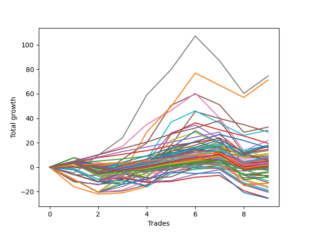

# Long Wallace Doodle 016 
- Symbol: ES_Unlimited
- Date Range: 03/18/2022 - 07/15/2022
- Trading Period: 7:20-12:30
- Number of Trades: 9



| Name | Win Percent | Profit | Avg Profit / Trade | Avg Time / Trade |      | Name | Win Percent | Profit | Avg Profit / Trade | Avg Time / Trade |
| ---- | ----------- | ------ | ------------------ | ---------------- | ---- | ---- | ----------- | ------ | ------------------ | ---------------- |
| Sorted By <br> Profit | | | | | | Sorted By <br> Win Percentage ||||
| Seven | 66.67 | 37250.00 | 4138.89 | 127:51 |     | Eighty-Five | 88.89 | 8375.00 | 930.56 | 46:05 |
| Sixty-Three | 55.56 | 35625.00 | 3958.33 | 45:38 |     | One Hundred Eleven | 88.89 | 4375.00 | 486.11 | 01:44 |
| Five | 55.56 | 16375.00 | 1819.44 | 67:29 |     | One Hundred Six | 88.89 | 3625.00 | 402.78 | 01:43 |
| Sixty-One | 55.56 | 15125.00 | 1680.56 | 31:26 |     | One Hundred Sixteen | 88.89 | 3000.00 | 333.33 | 01:45 |
| Forty-Seven | 33.33 | 14375.00 | 1597.22 | 26:02 |     | Eighty-Four | 88.89 | 3000.00 | 333.33 | 40:30 |
| Six | 77.78 | 10875.00 | 1208.33 | 99:03 |     | One Hundred Twenty-One | 88.89 | 1875.00 | 208.33 | 02:13 |
| Forty-Five | 33.33 | 9750.00 | 1083.33 | 23:04 |     | One Hundred Twenty-Six | 88.89 | 625.00 | 69.44 | 02:26 |
| Sixty-Two | 55.56 | 9000.00 | 1000.00 | 28:33 |     | Eighty-Three | 88.89 | -250.00 | -27.78 | 38:55 |
| One Hundred Twenty-Five | 77.78 | 8875.00 | 986.11 | 12:26 |     | Eighty-Two | 88.89 | -4000.00 | -444.44 | 31:59 |
| One Hundred Fourteen | 77.78 | 8875.00 | 986.11 | 05:56 |     | Eighty-One | 88.89 | -6500.00 | -722.22 | 23:18 |
| Eighty-Five | 88.89 | 8375.00 | 930.56 | 46:05 |     | Six | 77.78 | 10875.00 | 1208.33 | 99:03 |
| One Hundred Fifteen | 66.67 | 7875.00 | 875.00 | 07:13 |     | One Hundred Twenty-Five | 77.78 | 8875.00 | 986.11 | 12:26 |
| Three | 66.67 | 7250.00 | 805.56 | 30:47 |     | One Hundred Fourteen | 77.78 | 8875.00 | 986.11 | 05:56 |
| Fifty-Nine | 66.67 | 6750.00 | 750.00 | 19:03 |     | One Hundred Thirteen | 77.78 | 5625.00 | 625.00 | 04:21 |
| One Hundred Thirteen | 77.78 | 5625.00 | 625.00 | 04:21 |     | One Hundred Twenty-Four | 77.78 | 4125.00 | 458.33 | 06:55 |
| Sixty | 55.56 | 5250.00 | 583.33 | 26:21 |     | One Hundred Twenty-Nine | 77.78 | 3750.00 | 416.67 | 06:59 |
| One Hundred Ten | 55.56 | 4625.00 | 513.89 | 03:31 |     | One Hundred One | 77.78 | 3375.00 | 375.00 | 01:29 |
| One Hundred Eleven | 88.89 | 4375.00 | 486.11 | 01:44 |     | One Hundred Twelve | 77.78 | 2875.00 | 319.44 | 03:47 |
| One Hundred Twenty-Four | 77.78 | 4125.00 | 458.33 | 06:55 |     | Ninety-Six | 77.78 | 2250.00 | 250.00 | 01:30 |
| Forty | 66.67 | 4000.00 | 444.44 | 08:35 |     | One Hundred Twenty-Three | 77.78 | 875.00 | 97.22 | 05:21 |
| One Hundred Four | 55.56 | 4000.00 | 444.44 | 03:03 |     | One Hundred Twenty-Eight | 77.78 | 500.00 | 55.56 | 05:25 |
| One Hundred Twenty-Nine | 77.78 | 3750.00 | 416.67 | 06:59 |     | One Hundred Twenty-Two | 77.78 | -1875.00 | -208.33 | 04:46 |
| One Hundred Six | 88.89 | 3625.00 | 402.78 | 01:43 |     | One Hundred Twenty-Seven | 77.78 | -2250.00 | -250.00 | 04:50 |
| One Hundred Nine | 55.56 | 3500.00 | 388.89 | 02:50 |     | Seven | 66.67 | 37250.00 | 4138.89 | 127:51 |
| One Hundred One | 77.78 | 3375.00 | 375.00 | 01:29 |     | One Hundred Fifteen | 66.67 | 7875.00 | 875.00 | 07:13 |
| One Hundred Sixteen | 88.89 | 3000.00 | 333.33 | 01:45 |     | Three | 66.67 | 7250.00 | 805.56 | 30:47 |
| Eighty-Four | 88.89 | 3000.00 | 333.33 | 40:30 |     | Fifty-Nine | 66.67 | 6750.00 | 750.00 | 19:03 |
| One Hundred Five | 44.44 | 3000.00 | 333.33 | 04:14 |     | Forty | 66.67 | 4000.00 | 444.44 | 08:35 |
| One Hundred Twelve | 77.78 | 2875.00 | 319.44 | 03:47 |     | One Hundred Thirty | 66.67 | 2750.00 | 305.56 | 08:16 |
| One Hundred Thirty | 66.67 | 2750.00 | 305.56 | 08:16 |     | Fifty-Eight | 66.67 | 2625.00 | 291.67 | 16:46 |
| Fifty-Eight | 66.67 | 2625.00 | 291.67 | 16:46 |     | One Hundred Eighteen | 66.67 | 2250.00 | 250.00 | 03:46 |
| Ninety-Nine | 55.56 | 2625.00 | 291.67 | 02:14 |     | Ninety-One | 66.67 | 1875.00 | 208.33 | 01:15 |
| Forty-Three | 44.44 | 2625.00 | 291.67 | 14:52 |     | One Hundred Seven | 66.67 | 1750.00 | 194.44 | 02:21 |
| Ninety-Four | 44.44 | 2375.00 | 263.89 | 02:12 |     | Fifty-Six | 66.67 | 1750.00 | 194.44 | 10:20 |
| Ninety-Six | 77.78 | 2250.00 | 250.00 | 01:30 |     | Two | 66.67 | 500.00 | 55.56 | 32:12 |
| One Hundred Eighteen | 66.67 | 2250.00 | 250.00 | 03:46 |     | Zero | 66.67 | 250.00 | 27.78 | 13:38 |
| One Hundred Three | 55.56 | 2125.00 | 236.11 | 02:54 |     | One Hundred Seventeen | 66.67 | 0.00 | 0.00 | 03:17 |
| Forty-Four | 33.33 | 2125.00 | 236.11 | 19:05 |     | Fifty-Seven | 66.67 | -4125.00 | -458.33 | 16:00 |
| One Hundred Twenty-One | 88.89 | 1875.00 | 208.33 | 02:13 |     | One | 66.67 | -6625.00 | -736.11 | 23:55 |
| Ninety-One | 66.67 | 1875.00 | 208.33 | 01:15 |     | Sixty-Three | 55.56 | 35625.00 | 3958.33 | 45:38 |
| One Hundred Eight | 55.56 | 1875.00 | 208.33 | 02:41 |     | Five | 55.56 | 16375.00 | 1819.44 | 67:29 |
| One Hundred Seven | 66.67 | 1750.00 | 194.44 | 02:21 |     | Sixty-One | 55.56 | 15125.00 | 1680.56 | 31:26 |
| Fifty-Six | 66.67 | 1750.00 | 194.44 | 10:20 |     | Sixty-Two | 55.56 | 9000.00 | 1000.00 | 28:33 |
| One Hundred Twenty | 44.44 | 1625.00 | 180.56 | 05:17 |     | Sixty | 55.56 | 5250.00 | 583.33 | 26:21 |
| One Hundred Ninteen | 55.56 | 1375.00 | 152.78 | 04:20 |     | One Hundred Ten | 55.56 | 4625.00 | 513.89 | 03:31 |
| Ninety-Eight | 55.56 | 1375.00 | 152.78 | 02:11 |     | One Hundred Four | 55.56 | 4000.00 | 444.44 | 03:03 |
| Ninety-Five | 33.33 | 1375.00 | 152.78 | 03:09 |     | One Hundred Nine | 55.56 | 3500.00 | 388.89 | 02:50 |
| One Hundred | 55.56 | 1125.00 | 125.00 | 02:31 |     | Ninety-Nine | 55.56 | 2625.00 | 291.67 | 02:14 |
| Ninety-Seven | 55.56 | 1125.00 | 125.00 | 01:57 |     | One Hundred Three | 55.56 | 2125.00 | 236.11 | 02:54 |
| One Hundred Twenty-Three | 77.78 | 875.00 | 97.22 | 05:21 |     | One Hundred Eight | 55.56 | 1875.00 | 208.33 | 02:41 |
| Forty-Eight | 55.56 | 875.00 | 97.22 | 06:08 |     | One Hundred Ninteen | 55.56 | 1375.00 | 152.78 | 04:20 |
| Ninety-Three | 44.44 | 875.00 | 97.22 | 02:08 |     | Ninety-Eight | 55.56 | 1375.00 | 152.78 | 02:11 |
| One Hundred Twenty-Six | 88.89 | 625.00 | 69.44 | 02:26 |     | One Hundred | 55.56 | 1125.00 | 125.00 | 02:31 |
| One Hundred Twenty-Eight | 77.78 | 500.00 | 55.56 | 05:25 |     | Ninety-Seven | 55.56 | 1125.00 | 125.00 | 01:57 |
| Two | 66.67 | 500.00 | 55.56 | 32:12 |     | Forty-Eight | 55.56 | 875.00 | 97.22 | 06:08 |
| One Hundred Two | 55.56 | 375.00 | 41.67 | 02:51 |     | One Hundred Two | 55.56 | 375.00 | 41.67 | 02:51 |
| Zero | 66.67 | 250.00 | 27.78 | 13:38 |     | Four | 55.56 | -500.00 | -55.56 | 59:49 |
| One Hundred Seventeen | 66.67 | 0.00 | 0.00 | 03:17 |     | Sixty-Four | 55.56 | -4000.00 | -444.44 | 09:17 |
| Eighty-Three | 88.89 | -250.00 | -27.78 | 38:55 |     | One Hundred Five | 44.44 | 3000.00 | 333.33 | 04:14 |
| Four | 55.56 | -500.00 | -55.56 | 59:49 |     | Forty-Three | 44.44 | 2625.00 | 291.67 | 14:52 |
| Ninety-Two | 44.44 | -500.00 | -55.56 | 02:06 |     | Ninety-Four | 44.44 | 2375.00 | 263.89 | 02:12 |
| Forty-Six | 33.33 | -750.00 | -83.33 | 19:55 |     | One Hundred Twenty | 44.44 | 1625.00 | 180.56 | 05:17 |
| Fifty-Four | 44.44 | -1125.00 | -125.00 | 06:41 |     | Ninety-Three | 44.44 | 875.00 | 97.22 | 02:08 |
| Forty-Two | 44.44 | -1375.00 | -152.78 | 12:55 |     | Ninety-Two | 44.44 | -500.00 | -55.56 | 02:06 |
| One Hundred Twenty-Two | 77.78 | -1875.00 | -208.33 | 04:46 |     | Fifty-Four | 44.44 | -1125.00 | -125.00 | 06:41 |
| One Hundred Twenty-Seven | 77.78 | -2250.00 | -250.00 | 04:50 |     | Forty-Two | 44.44 | -1375.00 | -152.78 | 12:55 |
| Fifty-Five | 44.44 | -3500.00 | -388.89 | 06:53 |     | Fifty-Five | 44.44 | -3500.00 | -388.89 | 06:53 |
| Fifty-Three | 44.44 | -3500.00 | -388.89 | 06:53 |     | Fifty-Three | 44.44 | -3500.00 | -388.89 | 06:53 |
| Fifty-Two | 44.44 | -3500.00 | -388.89 | 06:53 |     | Fifty-Two | 44.44 | -3500.00 | -388.89 | 06:53 |
| Fifty-One | 44.44 | -3500.00 | -388.89 | 06:53 |     | Fifty-One | 44.44 | -3500.00 | -388.89 | 06:53 |
| Fifty | 44.44 | -3500.00 | -388.89 | 06:53 |     | Fifty | 44.44 | -3500.00 | -388.89 | 06:53 |
| Forty-Nine | 44.44 | -3500.00 | -388.89 | 06:53 |     | Forty-Nine | 44.44 | -3500.00 | -388.89 | 06:53 |
| Eighty-Two | 88.89 | -4000.00 | -444.44 | 31:59 |     | Forty-One | 44.44 | -5625.00 | -625.00 | 12:21 |
| Sixty-Four | 55.56 | -4000.00 | -444.44 | 09:17 |     | Sixty-Seven | 44.44 | -6250.00 | -694.44 | 13:41 |
| Fifty-Seven | 66.67 | -4125.00 | -458.33 | 16:00 |     | Sixty-Six | 44.44 | -10250.00 | -1138.89 | 11:44 |
| Forty-One | 44.44 | -5625.00 | -625.00 | 12:21 |     | Sixty-Five | 44.44 | -12625.00 | -1402.78 | 11:12 |
| Sixty-Seven | 44.44 | -6250.00 | -694.44 | 13:41 |     | Forty-Seven | 33.33 | 14375.00 | 1597.22 | 26:02 |
| Eighty-One | 88.89 | -6500.00 | -722.22 | 23:18 |     | Forty-Five | 33.33 | 9750.00 | 1083.33 | 23:04 |
| One | 66.67 | -6625.00 | -736.11 | 23:55 |     | Forty-Four | 33.33 | 2125.00 | 236.11 | 19:05 |
| Seventy | 22.22 | -7875.00 | -875.00 | 16:38 |     | Ninety-Five | 33.33 | 1375.00 | 152.78 | 03:09 |
| Sixty-Eight | 33.33 | -8375.00 | -930.56 | 17:10 |     | Forty-Six | 33.33 | -750.00 | -83.33 | 19:55 |
| Seventy-One | 22.22 | -9375.00 | -1041.67 | 19:09 |     | Sixty-Eight | 33.33 | -8375.00 | -930.56 | 17:10 |
| Sixty-Nine | 22.22 | -9875.00 | -1097.22 | 18:55 |     | Seventy-Three | 33.33 | -12750.00 | -1416.67 | 13:31 |
| Sixty-Six | 44.44 | -10250.00 | -1138.89 | 11:44 |     | Seventy | 22.22 | -7875.00 | -875.00 | 16:38 |
| Sixty-Five | 44.44 | -12625.00 | -1402.78 | 11:12 |     | Seventy-One | 22.22 | -9375.00 | -1041.67 | 19:09 |
| Seventy-Three | 33.33 | -12750.00 | -1416.67 | 13:31 |     | Sixty-Nine | 22.22 | -9875.00 | -1097.22 | 18:55 |

## NO STOPLOSS

### Test Zero
* Sell when price hits the middle line of the 20p bollinger
* No Stoploss
* Results:
```
Total Trades: 9
Percent Up: 66.67
Percent Down: 33.33
Total Points Moved Up: 0.50
Potential Profit: 250.00
Total Points Ups: 25.00 Count Ups: 6
Total Points Downs: -24.50 Count Downs: 3
```

<details><summary>Trades</summary>

<code>In: 2022-03-21 09:40:00		Out: 2022-03-21 09:45:55		Total Position Time: 05:55		Total Move Up: 7.75		Total to Date: 7.75</code> <br />
<code>In: 2022-03-25 08:16:00		Out: 2022-03-25 08:36:55		Total Position Time: 20:55		Total Move Up: -7.50		Total to Date: 0.25</code> <br />
<code>In: 2022-04-20 09:18:00		Out: 2022-04-20 09:30:50		Total Position Time: 12:50		Total Move Up: 0.25		Total to Date: 0.50</code> <br />
<code>In: 2022-05-13 11:07:00		Out: 2022-05-13 11:19:15		Total Position Time: 12:15		Total Move Up: 2.25		Total to Date: 2.75</code> <br />
<code>In: 2022-05-17 11:24:00		Out: 2022-05-17 11:31:40		Total Position Time: 07:40		Total Move Up: 10.50		Total to Date: 13.25</code> <br />
<code>In: 2022-05-25 09:29:00		Out: 2022-05-25 09:41:30		Total Position Time: 12:30		Total Move Up: 1.75		Total to Date: 15.00</code> <br />
<code>In: 2022-06-06 08:24:00		Out: 2022-06-06 08:33:05		Total Position Time: 09:05		Total Move Up: 2.50		Total to Date: 17.50</code> <br />
<code>In: 2022-06-08 09:30:00		Out: 2022-06-08 09:56:25		Total Position Time: 26:25		Total Move Up: -16.00		Total to Date: 1.50</code> <br />
<code>In: 2022-06-09 07:56:00		Out: 2022-06-09 08:11:10		Total Position Time: 15:10		Total Move Up: -1.00		Total to Date: 0.50</code> <br />


</details>

### Test One
* Sell when the price hits the upper line of the 20p 1std bollinger
* No Stoploss
* Results:
```
Total Trades: 9
Percent Up: 66.67
Percent Down: 33.33
Total Points Moved Up: -13.25
Potential Profit: -6625.00
Total Points Ups: 22.25 Count Ups: 6
Total Points Downs: -35.50 Count Downs: 3
```

<details><summary>Trades</summary>

<code>In: 2022-03-21 09:40:00		Out: 2022-03-21 10:32:05		Total Position Time: 52:05		Total Move Up: -16.00		Total to Date: -16.00</code> <br />
<code>In: 2022-03-25 08:16:00		Out: 2022-03-25 08:41:10		Total Position Time: 25:10		Total Move Up: -6.00		Total to Date: -22.00</code> <br />
<code>In: 2022-04-20 09:18:00		Out: 2022-04-20 09:31:20		Total Position Time: 13:20		Total Move Up: 1.00		Total to Date: -21.00</code> <br />
<code>In: 2022-05-13 11:07:00		Out: 2022-05-13 11:30:55		Total Position Time: 23:55		Total Move Up: 5.00		Total to Date: -16.00</code> <br />
<code>In: 2022-05-17 11:24:00		Out: 2022-05-17 11:39:45		Total Position Time: 15:45		Total Move Up: 10.75		Total to Date: -5.25</code> <br />
<code>In: 2022-05-25 09:29:00		Out: 2022-05-25 09:44:30		Total Position Time: 15:30		Total Move Up: 3.50		Total to Date: -1.75</code> <br />
<code>In: 2022-06-06 08:24:00		Out: 2022-06-06 08:39:15		Total Position Time: 15:15		Total Move Up: 1.50		Total to Date: -0.25</code> <br />
<code>In: 2022-06-08 09:30:00		Out: 2022-06-08 09:59:05		Total Position Time: 29:05		Total Move Up: -13.50		Total to Date: -13.75</code> <br />
<code>In: 2022-06-09 07:56:00		Out: 2022-06-09 08:21:10		Total Position Time: 25:10		Total Move Up: 0.50		Total to Date: -13.25</code> <br />


</details>

### Test Two
* Sell when the price hits the upper line of the 20p 2std bollinger
* No Stoploss
* Results:
```
Total Trades: 9
Percent Up: 66.67
Percent Down: 33.33
Total Points Moved Up: 1.00
Potential Profit: 500.00
Total Points Ups: 35.75 Count Ups: 6
Total Points Downs: -34.75 Count Downs: 3
```

<details><summary>Trades</summary>

<code>In: 2022-03-21 09:40:00		Out: 2022-03-21 10:34:15		Total Position Time: 54:15		Total Move Up: -12.00		Total to Date: -12.00</code> <br />
<code>In: 2022-03-25 08:16:00		Out: 2022-03-25 08:41:55		Total Position Time: 25:55		Total Move Up: -2.00		Total to Date: -14.00</code> <br />
<code>In: 2022-04-20 09:18:00		Out: 2022-04-20 09:31:35		Total Position Time: 13:35		Total Move Up: 1.75		Total to Date: -12.25</code> <br />
<code>In: 2022-05-13 11:07:00		Out: 2022-05-13 11:31:20		Total Position Time: 24:20		Total Move Up: 7.75		Total to Date: -4.50</code> <br />
<code>In: 2022-05-17 11:24:00		Out: 2022-05-17 11:40:05		Total Position Time: 16:05		Total Move Up: 14.50		Total to Date: 10.00</code> <br />
<code>In: 2022-05-25 09:29:00		Out: 2022-05-25 09:45:20		Total Position Time: 16:20		Total Move Up: 5.25		Total to Date: 15.25</code> <br />
<code>In: 2022-06-06 08:24:00		Out: 2022-06-06 08:43:00		Total Position Time: 19:00		Total Move Up: 3.75		Total to Date: 19.00</code> <br />
<code>In: 2022-06-08 09:30:00		Out: 2022-06-08 11:03:45		Total Position Time: 93:45		Total Move Up: -20.75		Total to Date: -1.75</code> <br />
<code>In: 2022-06-09 07:56:00		Out: 2022-06-09 08:22:35		Total Position Time: 26:35		Total Move Up: 2.75		Total to Date: 1.00</code> <br />


</details>

### Test Three
* Sell when price hits the middle line of the 50p bollinger
* No Stoploss
* Results:
```
Total Trades: 9
Percent Up: 66.67
Percent Down: 33.33
Total Points Moved Up: 14.50
Potential Profit: 7250.00
Total Points Ups: 44.00 Count Ups: 6
Total Points Downs: -29.50 Count Downs: 3
```

<details><summary>Trades</summary>

<code>In: 2022-03-21 09:40:00		Out: 2022-03-21 10:34:30		Total Position Time: 54:30		Total Move Up: -11.50		Total to Date: -11.50</code> <br />
<code>In: 2022-03-25 08:16:00		Out: 2022-03-25 08:53:00		Total Position Time: 37:00		Total Move Up: -2.75		Total to Date: -14.25</code> <br />
<code>In: 2022-04-20 09:18:00		Out: 2022-04-20 09:32:50		Total Position Time: 14:50		Total Move Up: 4.75		Total to Date: -9.50</code> <br />
<code>In: 2022-05-13 11:07:00		Out: 2022-05-13 11:31:20		Total Position Time: 24:20		Total Move Up: 7.75		Total to Date: -1.75</code> <br />
<code>In: 2022-05-17 11:24:00		Out: 2022-05-17 11:40:05		Total Position Time: 16:05		Total Move Up: 14.50		Total to Date: 12.75</code> <br />
<code>In: 2022-05-25 09:29:00		Out: 2022-05-25 09:49:10		Total Position Time: 20:10		Total Move Up: 8.25		Total to Date: 21.00</code> <br />
<code>In: 2022-06-06 08:24:00		Out: 2022-06-06 08:55:30		Total Position Time: 31:30		Total Move Up: 5.75		Total to Date: 26.75</code> <br />
<code>In: 2022-06-08 09:30:00		Out: 2022-06-08 10:19:05		Total Position Time: 49:05		Total Move Up: -15.25		Total to Date: 11.50</code> <br />
<code>In: 2022-06-09 07:56:00		Out: 2022-06-09 08:25:35		Total Position Time: 29:35		Total Move Up: 3.00		Total to Date: 14.50</code> <br />


</details>

### Test Four
* Sell when the price hits the upper line of the 50p 1std bollinger
* No Stoploss
* Results:
```
Total Trades: 9
Percent Up: 55.56
Percent Down: 44.44
Total Points Moved Up: -1.00
Potential Profit: -500.00
Total Points Ups: 51.00 Count Ups: 5
Total Points Downs: -52.00 Count Downs: 4
```

<details><summary>Trades</summary>

<code>In: 2022-03-21 09:40:00		Out: 2022-03-21 10:50:05		Total Position Time: 70:05		Total Move Up: -11.00		Total to Date: -11.00</code> <br />
<code>In: 2022-03-25 08:16:00		Out: 2022-03-25 09:08:25		Total Position Time: 52:25		Total Move Up: -3.50		Total to Date: -14.50</code> <br />
<code>In: 2022-04-20 09:18:00		Out: 2022-04-20 09:36:50		Total Position Time: 18:50		Total Move Up: 8.50		Total to Date: -6.00</code> <br />
<code>In: 2022-05-13 11:07:00		Out: 2022-05-13 11:43:10		Total Position Time: 36:10		Total Move Up: 11.00		Total to Date: 5.00</code> <br />
<code>In: 2022-05-17 11:24:00		Out: 2022-05-17 11:45:50		Total Position Time: 21:50		Total Move Up: 23.00		Total to Date: 28.00</code> <br />
<code>In: 2022-05-25 09:29:00		Out: 2022-05-25 10:10:05		Total Position Time: 41:05		Total Move Up: 6.50		Total to Date: 34.50</code> <br />
<code>In: 2022-06-06 08:24:00		Out: 2022-06-06 09:55:15		Total Position Time: 91:15		Total Move Up: -11.50		Total to Date: 23.00</code> <br />
<code>In: 2022-06-08 09:30:00		Out: 2022-06-08 12:12:35		Total Position Time: 162:35		Total Move Up: -26.00		Total to Date: -3.00</code> <br />
<code>In: 2022-06-09 07:56:00		Out: 2022-06-09 08:40:10		Total Position Time: 44:10		Total Move Up: 2.00		Total to Date: -1.00</code> <br />


</details>

### Test Five
* Sell when the price hits the upper line of the 50p 2std bollinger
* No Stoploss
* Results:
```
Total Trades: 9
Percent Up: 55.56
Percent Down: 44.44
Total Points Moved Up: 32.75
Potential Profit: 16375.00
Total Points Ups: 70.75 Count Ups: 5
Total Points Downs: -38.00 Count Downs: 4
```

<details><summary>Trades</summary>

<code>In: 2022-03-21 09:40:00		Out: 2022-03-21 11:00:20		Total Position Time: 80:20		Total Move Up: -6.25		Total to Date: -6.25</code> <br />
<code>In: 2022-03-25 08:16:00		Out: 2022-03-25 09:11:40		Total Position Time: 55:40		Total Move Up: -0.50		Total to Date: -6.75</code> <br />
<code>In: 2022-04-20 09:18:00		Out: 2022-04-20 09:50:25		Total Position Time: 32:25		Total Move Up: 13.25		Total to Date: 6.50</code> <br />
<code>In: 2022-05-13 11:07:00		Out: 2022-05-13 11:51:25		Total Position Time: 44:25		Total Move Up: 13.25		Total to Date: 19.75</code> <br />
<code>In: 2022-05-17 11:24:00		Out: 2022-05-17 11:48:40		Total Position Time: 24:40		Total Move Up: 30.75		Total to Date: 50.50</code> <br />
<code>In: 2022-05-25 09:29:00		Out: 2022-05-25 10:29:35		Total Position Time: 60:35		Total Move Up: 9.25		Total to Date: 59.75</code> <br />
<code>In: 2022-06-06 08:24:00		Out: 2022-06-06 09:56:20		Total Position Time: 92:20		Total Move Up: -8.75		Total to Date: 51.00</code> <br />
<code>In: 2022-06-08 09:30:00		Out: 2022-06-08 12:21:15		Total Position Time: 171:15		Total Move Up: -22.50		Total to Date: 28.50</code> <br />
<code>In: 2022-06-09 07:56:00		Out: 2022-06-09 08:41:45		Total Position Time: 45:45		Total Move Up: 4.25		Total to Date: 32.75</code> <br />


</details>

### Test Six
* Sell when the price hits the middle line of the 1std VWAP
* No Stoploss
* Results:
```
Total Trades: 9
Percent Up: 77.78
Percent Down: 22.22
Total Points Moved Up: 21.75
Potential Profit: 10875.00
Total Points Ups: 68.75 Count Ups: 7
Total Points Downs: -47.00 Count Downs: 2
```

<details><summary>Trades</summary>

<code>In: 2022-03-21 09:40:00		Out: 2022-03-21 11:46:15		Total Position Time: 126:15		Total Move Up: 5.00		Total to Date: 5.00</code> <br />
<code>In: 2022-03-25 08:16:00		Out: 2022-03-25 10:19:30		Total Position Time: 123:30		Total Move Up: 5.25		Total to Date: 10.25</code> <br />
<code>In: 2022-04-20 09:18:00		Out: 2022-04-20 09:35:50		Total Position Time: 17:50		Total Move Up: 6.75		Total to Date: 17.00</code> <br />
<code>In: 2022-05-13 11:07:00		Out: 2022-05-13 11:52:35		Total Position Time: 45:35		Total Move Up: 18.00		Total to Date: 35.00</code> <br />
<code>In: 2022-05-17 11:24:00		Out: 2022-05-17 11:27:25		Total Position Time: 03:25		Total Move Up: 11.25		Total to Date: 46.25</code> <br />
<code>In: 2022-05-25 09:29:00		Out: 2022-05-25 10:37:05		Total Position Time: 68:05		Total Move Up: 14.25		Total to Date: 60.50</code> <br />
<code>In: 2022-06-06 08:24:00		Out: 2022-06-06 12:47:00		Total Position Time: 263:00		Total Move Up: -20.25		Total to Date: 40.25</code> <br />
<code>In: 2022-06-08 09:30:00		Out: 2022-06-08 12:47:00		Total Position Time: 197:00		Total Move Up: -26.75		Total to Date: 13.50</code> <br />
<code>In: 2022-06-09 07:56:00		Out: 2022-06-09 08:42:55		Total Position Time: 46:55		Total Move Up: 8.25		Total to Date: 21.75</code> <br />


</details>

### Test Seven
* Sell when the price hits the upper line of the 1std VWAP
* No Stoploss
* Results:
```
Total Trades: 9
Percent Up: 66.67
Percent Down: 33.33
Total Points Moved Up: 74.50
Potential Profit: 37250.00
Total Points Ups: 126.25 Count Ups: 6
Total Points Downs: -51.75 Count Downs: 3
```

<details><summary>Trades</summary>

<code>In: 2022-03-21 09:40:00		Out: 2022-03-21 12:47:00		Total Position Time: 187:00		Total Move Up: -4.75		Total to Date: -4.75</code> <br />
<code>In: 2022-03-25 08:16:00		Out: 2022-03-25 11:04:05		Total Position Time: 168:05		Total Move Up: 14.50		Total to Date: 9.75</code> <br />
<code>In: 2022-04-20 09:18:00		Out: 2022-04-20 09:52:35		Total Position Time: 34:35		Total Move Up: 14.25		Total to Date: 24.00</code> <br />
<code>In: 2022-05-13 11:07:00		Out: 2022-05-13 12:14:40		Total Position Time: 67:40		Total Move Up: 35.00		Total to Date: 59.00</code> <br />
<code>In: 2022-05-17 11:24:00		Out: 2022-05-17 11:40:20		Total Position Time: 16:20		Total Move Up: 20.75		Total to Date: 79.75</code> <br />
<code>In: 2022-05-25 09:29:00		Out: 2022-05-25 11:02:25		Total Position Time: 93:25		Total Move Up: 27.50		Total to Date: 107.25</code> <br />
<code>In: 2022-06-06 08:24:00		Out: 2022-06-06 12:47:00		Total Position Time: 263:00		Total Move Up: -20.25		Total to Date: 87.00</code> <br />
<code>In: 2022-06-08 09:30:00		Out: 2022-06-08 12:47:00		Total Position Time: 197:00		Total Move Up: -26.75		Total to Date: 60.25</code> <br />
<code>In: 2022-06-09 07:56:00		Out: 2022-06-09 09:59:40		Total Position Time: 123:40		Total Move Up: 14.25		Total to Date: 74.50</code> <br />


</details>

## STOPLOSS OF 5

### Test Forty
* Sell when price hits the middle line of the 20p bollinger
* Stoploss is 5 points
* Results:
```
Total Trades: 9
Percent Up: 66.67
Percent Down: 33.33
Total Points Moved Up: 8.00
Potential Profit: 4000.00
Total Points Ups: 25.00 Count Ups: 6
Total Points Downs: -17.00 Count Downs: 3
```

<details><summary>Trades</summary>

<code>In: 2022-03-21 09:40:00		Out: 2022-03-21 09:45:55		Total Position Time: 05:55		Total Move Up: 7.75		Total to Date: 7.75</code> <br />
<code>In: 2022-03-25 08:16:00		Out: 2022-03-25 08:21:50		Total Position Time: 05:50		Total Move Up: -6.00		Total to Date: 1.75</code> <br />
<code>In: 2022-04-20 09:18:00		Out: 2022-04-20 09:30:50		Total Position Time: 12:50		Total Move Up: 0.25		Total to Date: 2.00</code> <br />
<code>In: 2022-05-13 11:07:00		Out: 2022-05-13 11:19:15		Total Position Time: 12:15		Total Move Up: 2.25		Total to Date: 4.25</code> <br />
<code>In: 2022-05-17 11:24:00		Out: 2022-05-17 11:31:40		Total Position Time: 07:40		Total Move Up: 10.50		Total to Date: 14.75</code> <br />
<code>In: 2022-05-25 09:29:00		Out: 2022-05-25 09:41:30		Total Position Time: 12:30		Total Move Up: 1.75		Total to Date: 16.50</code> <br />
<code>In: 2022-06-06 08:24:00		Out: 2022-06-06 08:33:05		Total Position Time: 09:05		Total Move Up: 2.50		Total to Date: 19.00</code> <br />
<code>In: 2022-06-08 09:30:00		Out: 2022-06-08 09:32:50		Total Position Time: 02:50		Total Move Up: -5.00		Total to Date: 14.00</code> <br />
<code>In: 2022-06-09 07:56:00		Out: 2022-06-09 08:04:25		Total Position Time: 08:25		Total Move Up: -6.00		Total to Date: 8.00</code> <br />


</details>

### Test Forty-One
* Sell when the price hits the upper line of the 20p 1std bollinger
* Stoploss is 5 points
* Results:
```
Total Trades: 9
Percent Up: 44.44
Percent Down: 55.56
Total Points Moved Up: -11.25
Potential Profit: -5625.00
Total Points Ups: 16.75 Count Ups: 4
Total Points Downs: -28.00 Count Downs: 5
```

<details><summary>Trades</summary>

<code>In: 2022-03-21 09:40:00		Out: 2022-03-21 09:54:20		Total Position Time: 14:20		Total Move Up: -6.00		Total to Date: -6.00</code> <br />
<code>In: 2022-03-25 08:16:00		Out: 2022-03-25 08:21:50		Total Position Time: 05:50		Total Move Up: -6.00		Total to Date: -12.00</code> <br />
<code>In: 2022-04-20 09:18:00		Out: 2022-04-20 09:31:20		Total Position Time: 13:20		Total Move Up: 1.00		Total to Date: -11.00</code> <br />
<code>In: 2022-05-13 11:07:00		Out: 2022-05-13 11:26:55		Total Position Time: 19:55		Total Move Up: -5.00		Total to Date: -16.00</code> <br />
<code>In: 2022-05-17 11:24:00		Out: 2022-05-17 11:39:45		Total Position Time: 15:45		Total Move Up: 10.75		Total to Date: -5.25</code> <br />
<code>In: 2022-05-25 09:29:00		Out: 2022-05-25 09:44:30		Total Position Time: 15:30		Total Move Up: 3.50		Total to Date: -1.75</code> <br />
<code>In: 2022-06-06 08:24:00		Out: 2022-06-06 08:39:15		Total Position Time: 15:15		Total Move Up: 1.50		Total to Date: -0.25</code> <br />
<code>In: 2022-06-08 09:30:00		Out: 2022-06-08 09:32:50		Total Position Time: 02:50		Total Move Up: -5.00		Total to Date: -5.25</code> <br />
<code>In: 2022-06-09 07:56:00		Out: 2022-06-09 08:04:25		Total Position Time: 08:25		Total Move Up: -6.00		Total to Date: -11.25</code> <br />


</details>

### Test Forty-Two
* Sell when the price hits the upper line of the 20p 2std bollinger
* Stoploss is 5 points
* Results:
```
Total Trades: 9
Percent Up: 44.44
Percent Down: 55.56
Total Points Moved Up: -2.75
Potential Profit: -1375.00
Total Points Ups: 25.25 Count Ups: 4
Total Points Downs: -28.00 Count Downs: 5
```

<details><summary>Trades</summary>

<code>In: 2022-03-21 09:40:00		Out: 2022-03-21 09:54:20		Total Position Time: 14:20		Total Move Up: -6.00		Total to Date: -6.00</code> <br />
<code>In: 2022-03-25 08:16:00		Out: 2022-03-25 08:21:50		Total Position Time: 05:50		Total Move Up: -6.00		Total to Date: -12.00</code> <br />
<code>In: 2022-04-20 09:18:00		Out: 2022-04-20 09:31:35		Total Position Time: 13:35		Total Move Up: 1.75		Total to Date: -10.25</code> <br />
<code>In: 2022-05-13 11:07:00		Out: 2022-05-13 11:26:55		Total Position Time: 19:55		Total Move Up: -5.00		Total to Date: -15.25</code> <br />
<code>In: 2022-05-17 11:24:00		Out: 2022-05-17 11:40:05		Total Position Time: 16:05		Total Move Up: 14.50		Total to Date: -0.75</code> <br />
<code>In: 2022-05-25 09:29:00		Out: 2022-05-25 09:45:20		Total Position Time: 16:20		Total Move Up: 5.25		Total to Date: 4.50</code> <br />
<code>In: 2022-06-06 08:24:00		Out: 2022-06-06 08:43:00		Total Position Time: 19:00		Total Move Up: 3.75		Total to Date: 8.25</code> <br />
<code>In: 2022-06-08 09:30:00		Out: 2022-06-08 09:32:50		Total Position Time: 02:50		Total Move Up: -5.00		Total to Date: 3.25</code> <br />
<code>In: 2022-06-09 07:56:00		Out: 2022-06-09 08:04:25		Total Position Time: 08:25		Total Move Up: -6.00		Total to Date: -2.75</code> <br />


</details>

### Test Forty-Three
* Sell when price hits the middle line of the 50p bollinger
* Stoploss is 5 points
* Results:
```
Total Trades: 9
Percent Up: 44.44
Percent Down: 55.56
Total Points Moved Up: 5.25
Potential Profit: 2625.00
Total Points Ups: 33.25 Count Ups: 4
Total Points Downs: -28.00 Count Downs: 5
```

<details><summary>Trades</summary>

<code>In: 2022-03-21 09:40:00		Out: 2022-03-21 09:54:20		Total Position Time: 14:20		Total Move Up: -6.00		Total to Date: -6.00</code> <br />
<code>In: 2022-03-25 08:16:00		Out: 2022-03-25 08:21:50		Total Position Time: 05:50		Total Move Up: -6.00		Total to Date: -12.00</code> <br />
<code>In: 2022-04-20 09:18:00		Out: 2022-04-20 09:32:50		Total Position Time: 14:50		Total Move Up: 4.75		Total to Date: -7.25</code> <br />
<code>In: 2022-05-13 11:07:00		Out: 2022-05-13 11:26:55		Total Position Time: 19:55		Total Move Up: -5.00		Total to Date: -12.25</code> <br />
<code>In: 2022-05-17 11:24:00		Out: 2022-05-17 11:40:05		Total Position Time: 16:05		Total Move Up: 14.50		Total to Date: 2.25</code> <br />
<code>In: 2022-05-25 09:29:00		Out: 2022-05-25 09:49:10		Total Position Time: 20:10		Total Move Up: 8.25		Total to Date: 10.50</code> <br />
<code>In: 2022-06-06 08:24:00		Out: 2022-06-06 08:55:30		Total Position Time: 31:30		Total Move Up: 5.75		Total to Date: 16.25</code> <br />
<code>In: 2022-06-08 09:30:00		Out: 2022-06-08 09:32:50		Total Position Time: 02:50		Total Move Up: -5.00		Total to Date: 11.25</code> <br />
<code>In: 2022-06-09 07:56:00		Out: 2022-06-09 08:04:25		Total Position Time: 08:25		Total Move Up: -6.00		Total to Date: 5.25</code> <br />


</details>

### Test Forty-Four
* Sell when the price hits the upper line of the 50p 1std bollinger
* Stoploss is 5 points
* Results:
```
Total Trades: 9
Percent Up: 33.33
Percent Down: 66.67
Total Points Moved Up: 4.25
Potential Profit: 2125.00
Total Points Ups: 38.00 Count Ups: 3
Total Points Downs: -33.75 Count Downs: 6
```

<details><summary>Trades</summary>

<code>In: 2022-03-21 09:40:00		Out: 2022-03-21 09:54:20		Total Position Time: 14:20		Total Move Up: -6.00		Total to Date: -6.00</code> <br />
<code>In: 2022-03-25 08:16:00		Out: 2022-03-25 08:21:50		Total Position Time: 05:50		Total Move Up: -6.00		Total to Date: -12.00</code> <br />
<code>In: 2022-04-20 09:18:00		Out: 2022-04-20 09:36:50		Total Position Time: 18:50		Total Move Up: 8.50		Total to Date: -3.50</code> <br />
<code>In: 2022-05-13 11:07:00		Out: 2022-05-13 11:26:55		Total Position Time: 19:55		Total Move Up: -5.00		Total to Date: -8.50</code> <br />
<code>In: 2022-05-17 11:24:00		Out: 2022-05-17 11:45:50		Total Position Time: 21:50		Total Move Up: 23.00		Total to Date: 14.50</code> <br />
<code>In: 2022-05-25 09:29:00		Out: 2022-05-25 10:10:05		Total Position Time: 41:05		Total Move Up: 6.50		Total to Date: 21.00</code> <br />
<code>In: 2022-06-06 08:24:00		Out: 2022-06-06 09:02:40		Total Position Time: 38:40		Total Move Up: -5.75		Total to Date: 15.25</code> <br />
<code>In: 2022-06-08 09:30:00		Out: 2022-06-08 09:32:50		Total Position Time: 02:50		Total Move Up: -5.00		Total to Date: 10.25</code> <br />
<code>In: 2022-06-09 07:56:00		Out: 2022-06-09 08:04:25		Total Position Time: 08:25		Total Move Up: -6.00		Total to Date: 4.25</code> <br />


</details>

### Test Forty-Five
* Sell when the price hits the upper line of the 50p 2std bollinger
* Stoploss is 5 points
* Results:
```
Total Trades: 9
Percent Up: 33.33
Percent Down: 66.67
Total Points Moved Up: 19.50
Potential Profit: 9750.00
Total Points Ups: 53.25 Count Ups: 3
Total Points Downs: -33.75 Count Downs: 6
```

<details><summary>Trades</summary>

<code>In: 2022-03-21 09:40:00		Out: 2022-03-21 09:54:20		Total Position Time: 14:20		Total Move Up: -6.00		Total to Date: -6.00</code> <br />
<code>In: 2022-03-25 08:16:00		Out: 2022-03-25 08:21:50		Total Position Time: 05:50		Total Move Up: -6.00		Total to Date: -12.00</code> <br />
<code>In: 2022-04-20 09:18:00		Out: 2022-04-20 09:50:25		Total Position Time: 32:25		Total Move Up: 13.25		Total to Date: 1.25</code> <br />
<code>In: 2022-05-13 11:07:00		Out: 2022-05-13 11:26:55		Total Position Time: 19:55		Total Move Up: -5.00		Total to Date: -3.75</code> <br />
<code>In: 2022-05-17 11:24:00		Out: 2022-05-17 11:48:40		Total Position Time: 24:40		Total Move Up: 30.75		Total to Date: 27.00</code> <br />
<code>In: 2022-05-25 09:29:00		Out: 2022-05-25 10:29:35		Total Position Time: 60:35		Total Move Up: 9.25		Total to Date: 36.25</code> <br />
<code>In: 2022-06-06 08:24:00		Out: 2022-06-06 09:02:40		Total Position Time: 38:40		Total Move Up: -5.75		Total to Date: 30.50</code> <br />
<code>In: 2022-06-08 09:30:00		Out: 2022-06-08 09:32:50		Total Position Time: 02:50		Total Move Up: -5.00		Total to Date: 25.50</code> <br />
<code>In: 2022-06-09 07:56:00		Out: 2022-06-09 08:04:25		Total Position Time: 08:25		Total Move Up: -6.00		Total to Date: 19.50</code> <br />


</details>

### Test Forty-Six
* Sell when the price hits the middle line of the 1std VWAP
* Stoploss is 5 points
* Results:
```
Total Trades: 9
Percent Up: 33.33
Percent Down: 66.67
Total Points Moved Up: -1.50
Potential Profit: -750.00
Total Points Ups: 32.25 Count Ups: 3
Total Points Downs: -33.75 Count Downs: 6
```

<details><summary>Trades</summary>

<code>In: 2022-03-21 09:40:00		Out: 2022-03-21 09:54:20		Total Position Time: 14:20		Total Move Up: -6.00		Total to Date: -6.00</code> <br />
<code>In: 2022-03-25 08:16:00		Out: 2022-03-25 08:21:50		Total Position Time: 05:50		Total Move Up: -6.00		Total to Date: -12.00</code> <br />
<code>In: 2022-04-20 09:18:00		Out: 2022-04-20 09:35:50		Total Position Time: 17:50		Total Move Up: 6.75		Total to Date: -5.25</code> <br />
<code>In: 2022-05-13 11:07:00		Out: 2022-05-13 11:26:55		Total Position Time: 19:55		Total Move Up: -5.00		Total to Date: -10.25</code> <br />
<code>In: 2022-05-17 11:24:00		Out: 2022-05-17 11:27:25		Total Position Time: 03:25		Total Move Up: 11.25		Total to Date: 1.00</code> <br />
<code>In: 2022-05-25 09:29:00		Out: 2022-05-25 10:37:05		Total Position Time: 68:05		Total Move Up: 14.25		Total to Date: 15.25</code> <br />
<code>In: 2022-06-06 08:24:00		Out: 2022-06-06 09:02:40		Total Position Time: 38:40		Total Move Up: -5.75		Total to Date: 9.50</code> <br />
<code>In: 2022-06-08 09:30:00		Out: 2022-06-08 09:32:50		Total Position Time: 02:50		Total Move Up: -5.00		Total to Date: 4.50</code> <br />
<code>In: 2022-06-09 07:56:00		Out: 2022-06-09 08:04:25		Total Position Time: 08:25		Total Move Up: -6.00		Total to Date: -1.50</code> <br />


</details>

### Test Forty-Seven
* Sell when the price hits the upper line of the 1std VWAP
* Stoploss is 5 points
* Results:
```
Total Trades: 9
Percent Up: 33.33
Percent Down: 66.67
Total Points Moved Up: 28.75
Potential Profit: 14375.00
Total Points Ups: 62.50 Count Ups: 3
Total Points Downs: -33.75 Count Downs: 6
```

<details><summary>Trades</summary>

<code>In: 2022-03-21 09:40:00		Out: 2022-03-21 09:54:20		Total Position Time: 14:20		Total Move Up: -6.00		Total to Date: -6.00</code> <br />
<code>In: 2022-03-25 08:16:00		Out: 2022-03-25 08:21:50		Total Position Time: 05:50		Total Move Up: -6.00		Total to Date: -12.00</code> <br />
<code>In: 2022-04-20 09:18:00		Out: 2022-04-20 09:52:35		Total Position Time: 34:35		Total Move Up: 14.25		Total to Date: 2.25</code> <br />
<code>In: 2022-05-13 11:07:00		Out: 2022-05-13 11:26:55		Total Position Time: 19:55		Total Move Up: -5.00		Total to Date: -2.75</code> <br />
<code>In: 2022-05-17 11:24:00		Out: 2022-05-17 11:40:20		Total Position Time: 16:20		Total Move Up: 20.75		Total to Date: 18.00</code> <br />
<code>In: 2022-05-25 09:29:00		Out: 2022-05-25 11:02:25		Total Position Time: 93:25		Total Move Up: 27.50		Total to Date: 45.50</code> <br />
<code>In: 2022-06-06 08:24:00		Out: 2022-06-06 09:02:40		Total Position Time: 38:40		Total Move Up: -5.75		Total to Date: 39.75</code> <br />
<code>In: 2022-06-08 09:30:00		Out: 2022-06-08 09:32:50		Total Position Time: 02:50		Total Move Up: -5.00		Total to Date: 34.75</code> <br />
<code>In: 2022-06-09 07:56:00		Out: 2022-06-09 08:04:25		Total Position Time: 08:25		Total Move Up: -6.00		Total to Date: 28.75</code> <br />


</details>

## TRAIL STOP OF 5

### Test Forty-Eight
* Sell when price hits the middle line of the 20p bollinger
* Trailing Stop is 5 points
* Results:
```
Total Trades: 9
Percent Up: 55.56
Percent Down: 44.44
Total Points Moved Up: 1.75
Potential Profit: 875.00
Total Points Ups: 17.75 Count Ups: 5
Total Points Downs: -16.00 Count Downs: 4
```

<details><summary>Trades</summary>

<code>In: 2022-03-21 09:40:00		Out: 2022-03-21 09:45:55		Total Position Time: 05:55		Total Move Up: 7.75		Total to Date: 7.75</code> <br />
<code>In: 2022-03-25 08:16:00		Out: 2022-03-25 08:20:40		Total Position Time: 04:40		Total Move Up: -4.00		Total to Date: 3.75</code> <br />
<code>In: 2022-04-20 09:18:00		Out: 2022-04-20 09:28:10		Total Position Time: 10:10		Total Move Up: -3.25		Total to Date: 0.50</code> <br />
<code>In: 2022-05-13 11:07:00		Out: 2022-05-13 11:13:40		Total Position Time: 06:40		Total Move Up: 1.00		Total to Date: 1.50</code> <br />
<code>In: 2022-05-17 11:24:00		Out: 2022-05-17 11:29:15		Total Position Time: 05:15		Total Move Up: 6.50		Total to Date: 8.00</code> <br />
<code>In: 2022-05-25 09:29:00		Out: 2022-05-25 09:33:30		Total Position Time: 04:30		Total Move Up: 0.00		Total to Date: 8.00</code> <br />
<code>In: 2022-06-06 08:24:00		Out: 2022-06-06 08:33:05		Total Position Time: 09:05		Total Move Up: 2.50		Total to Date: 10.50</code> <br />
<code>In: 2022-06-08 09:30:00		Out: 2022-06-08 09:33:00		Total Position Time: 03:00		Total Move Up: -7.75		Total to Date: 2.75</code> <br />
<code>In: 2022-06-09 07:56:00		Out: 2022-06-09 08:02:00		Total Position Time: 06:00		Total Move Up: -1.00		Total to Date: 1.75</code> <br />


</details>

### Test Forty-Nine
* Sell when the price hits the upper line of the 20p 1std bollinger
* Trailing Stop is 5 points
* Results:
```
Total Trades: 9
Percent Up: 44.44
Percent Down: 55.56
Total Points Moved Up: -7.00
Potential Profit: -3500.00
Total Points Ups: 11.25 Count Ups: 4
Total Points Downs: -18.25 Count Downs: 5
```

<details><summary>Trades</summary>

<code>In: 2022-03-21 09:40:00		Out: 2022-03-21 09:50:35		Total Position Time: 10:35		Total Move Up: 3.75		Total to Date: 3.75</code> <br />
<code>In: 2022-03-25 08:16:00		Out: 2022-03-25 08:20:40		Total Position Time: 04:40		Total Move Up: -4.00		Total to Date: -0.25</code> <br />
<code>In: 2022-04-20 09:18:00		Out: 2022-04-20 09:28:10		Total Position Time: 10:10		Total Move Up: -3.25		Total to Date: -3.50</code> <br />
<code>In: 2022-05-13 11:07:00		Out: 2022-05-13 11:13:40		Total Position Time: 06:40		Total Move Up: 1.00		Total to Date: -2.50</code> <br />
<code>In: 2022-05-17 11:24:00		Out: 2022-05-17 11:29:15		Total Position Time: 05:15		Total Move Up: 6.50		Total to Date: 4.00</code> <br />
<code>In: 2022-05-25 09:29:00		Out: 2022-05-25 09:33:30		Total Position Time: 04:30		Total Move Up: 0.00		Total to Date: 4.00</code> <br />
<code>In: 2022-06-06 08:24:00		Out: 2022-06-06 08:35:15		Total Position Time: 11:15		Total Move Up: -2.25		Total to Date: 1.75</code> <br />
<code>In: 2022-06-08 09:30:00		Out: 2022-06-08 09:33:00		Total Position Time: 03:00		Total Move Up: -7.75		Total to Date: -6.00</code> <br />
<code>In: 2022-06-09 07:56:00		Out: 2022-06-09 08:02:00		Total Position Time: 06:00		Total Move Up: -1.00		Total to Date: -7.00</code> <br />


</details>

### Test Fifty
* Sell when the price hits the upper line of the 20p 2std bollinger
* Trailing Stop is 5 points
* Results:
```
Total Trades: 9
Percent Up: 44.44
Percent Down: 55.56
Total Points Moved Up: -7.00
Potential Profit: -3500.00
Total Points Ups: 11.25 Count Ups: 4
Total Points Downs: -18.25 Count Downs: 5
```

<details><summary>Trades</summary>

<code>In: 2022-03-21 09:40:00		Out: 2022-03-21 09:50:35		Total Position Time: 10:35		Total Move Up: 3.75		Total to Date: 3.75</code> <br />
<code>In: 2022-03-25 08:16:00		Out: 2022-03-25 08:20:40		Total Position Time: 04:40		Total Move Up: -4.00		Total to Date: -0.25</code> <br />
<code>In: 2022-04-20 09:18:00		Out: 2022-04-20 09:28:10		Total Position Time: 10:10		Total Move Up: -3.25		Total to Date: -3.50</code> <br />
<code>In: 2022-05-13 11:07:00		Out: 2022-05-13 11:13:40		Total Position Time: 06:40		Total Move Up: 1.00		Total to Date: -2.50</code> <br />
<code>In: 2022-05-17 11:24:00		Out: 2022-05-17 11:29:15		Total Position Time: 05:15		Total Move Up: 6.50		Total to Date: 4.00</code> <br />
<code>In: 2022-05-25 09:29:00		Out: 2022-05-25 09:33:30		Total Position Time: 04:30		Total Move Up: 0.00		Total to Date: 4.00</code> <br />
<code>In: 2022-06-06 08:24:00		Out: 2022-06-06 08:35:15		Total Position Time: 11:15		Total Move Up: -2.25		Total to Date: 1.75</code> <br />
<code>In: 2022-06-08 09:30:00		Out: 2022-06-08 09:33:00		Total Position Time: 03:00		Total Move Up: -7.75		Total to Date: -6.00</code> <br />
<code>In: 2022-06-09 07:56:00		Out: 2022-06-09 08:02:00		Total Position Time: 06:00		Total Move Up: -1.00		Total to Date: -7.00</code> <br />


</details>

### Test Fifty-One
* Sell when price hits the middle line of the 50p bollinger
* Trailing Stop is 5 points
* Results:
```
Total Trades: 9
Percent Up: 44.44
Percent Down: 55.56
Total Points Moved Up: -7.00
Potential Profit: -3500.00
Total Points Ups: 11.25 Count Ups: 4
Total Points Downs: -18.25 Count Downs: 5
```

<details><summary>Trades</summary>

<code>In: 2022-03-21 09:40:00		Out: 2022-03-21 09:50:35		Total Position Time: 10:35		Total Move Up: 3.75		Total to Date: 3.75</code> <br />
<code>In: 2022-03-25 08:16:00		Out: 2022-03-25 08:20:40		Total Position Time: 04:40		Total Move Up: -4.00		Total to Date: -0.25</code> <br />
<code>In: 2022-04-20 09:18:00		Out: 2022-04-20 09:28:10		Total Position Time: 10:10		Total Move Up: -3.25		Total to Date: -3.50</code> <br />
<code>In: 2022-05-13 11:07:00		Out: 2022-05-13 11:13:40		Total Position Time: 06:40		Total Move Up: 1.00		Total to Date: -2.50</code> <br />
<code>In: 2022-05-17 11:24:00		Out: 2022-05-17 11:29:15		Total Position Time: 05:15		Total Move Up: 6.50		Total to Date: 4.00</code> <br />
<code>In: 2022-05-25 09:29:00		Out: 2022-05-25 09:33:30		Total Position Time: 04:30		Total Move Up: 0.00		Total to Date: 4.00</code> <br />
<code>In: 2022-06-06 08:24:00		Out: 2022-06-06 08:35:15		Total Position Time: 11:15		Total Move Up: -2.25		Total to Date: 1.75</code> <br />
<code>In: 2022-06-08 09:30:00		Out: 2022-06-08 09:33:00		Total Position Time: 03:00		Total Move Up: -7.75		Total to Date: -6.00</code> <br />
<code>In: 2022-06-09 07:56:00		Out: 2022-06-09 08:02:00		Total Position Time: 06:00		Total Move Up: -1.00		Total to Date: -7.00</code> <br />


</details>

### Test Fifty-Two
* Sell when the price hits the upper line of the 50p 1std bollinger
* Trailing Stop is 5 points
* Results:
```
Total Trades: 9
Percent Up: 44.44
Percent Down: 55.56
Total Points Moved Up: -7.00
Potential Profit: -3500.00
Total Points Ups: 11.25 Count Ups: 4
Total Points Downs: -18.25 Count Downs: 5
```

<details><summary>Trades</summary>

<code>In: 2022-03-21 09:40:00		Out: 2022-03-21 09:50:35		Total Position Time: 10:35		Total Move Up: 3.75		Total to Date: 3.75</code> <br />
<code>In: 2022-03-25 08:16:00		Out: 2022-03-25 08:20:40		Total Position Time: 04:40		Total Move Up: -4.00		Total to Date: -0.25</code> <br />
<code>In: 2022-04-20 09:18:00		Out: 2022-04-20 09:28:10		Total Position Time: 10:10		Total Move Up: -3.25		Total to Date: -3.50</code> <br />
<code>In: 2022-05-13 11:07:00		Out: 2022-05-13 11:13:40		Total Position Time: 06:40		Total Move Up: 1.00		Total to Date: -2.50</code> <br />
<code>In: 2022-05-17 11:24:00		Out: 2022-05-17 11:29:15		Total Position Time: 05:15		Total Move Up: 6.50		Total to Date: 4.00</code> <br />
<code>In: 2022-05-25 09:29:00		Out: 2022-05-25 09:33:30		Total Position Time: 04:30		Total Move Up: 0.00		Total to Date: 4.00</code> <br />
<code>In: 2022-06-06 08:24:00		Out: 2022-06-06 08:35:15		Total Position Time: 11:15		Total Move Up: -2.25		Total to Date: 1.75</code> <br />
<code>In: 2022-06-08 09:30:00		Out: 2022-06-08 09:33:00		Total Position Time: 03:00		Total Move Up: -7.75		Total to Date: -6.00</code> <br />
<code>In: 2022-06-09 07:56:00		Out: 2022-06-09 08:02:00		Total Position Time: 06:00		Total Move Up: -1.00		Total to Date: -7.00</code> <br />


</details>

### Test Fifty-Three
* Sell when the price hits the upper line of the 50p 2std bollinger
* Trailing Stop is 5 points
* Results:
```
Total Trades: 9
Percent Up: 44.44
Percent Down: 55.56
Total Points Moved Up: -7.00
Potential Profit: -3500.00
Total Points Ups: 11.25 Count Ups: 4
Total Points Downs: -18.25 Count Downs: 5
```

<details><summary>Trades</summary>

<code>In: 2022-03-21 09:40:00		Out: 2022-03-21 09:50:35		Total Position Time: 10:35		Total Move Up: 3.75		Total to Date: 3.75</code> <br />
<code>In: 2022-03-25 08:16:00		Out: 2022-03-25 08:20:40		Total Position Time: 04:40		Total Move Up: -4.00		Total to Date: -0.25</code> <br />
<code>In: 2022-04-20 09:18:00		Out: 2022-04-20 09:28:10		Total Position Time: 10:10		Total Move Up: -3.25		Total to Date: -3.50</code> <br />
<code>In: 2022-05-13 11:07:00		Out: 2022-05-13 11:13:40		Total Position Time: 06:40		Total Move Up: 1.00		Total to Date: -2.50</code> <br />
<code>In: 2022-05-17 11:24:00		Out: 2022-05-17 11:29:15		Total Position Time: 05:15		Total Move Up: 6.50		Total to Date: 4.00</code> <br />
<code>In: 2022-05-25 09:29:00		Out: 2022-05-25 09:33:30		Total Position Time: 04:30		Total Move Up: 0.00		Total to Date: 4.00</code> <br />
<code>In: 2022-06-06 08:24:00		Out: 2022-06-06 08:35:15		Total Position Time: 11:15		Total Move Up: -2.25		Total to Date: 1.75</code> <br />
<code>In: 2022-06-08 09:30:00		Out: 2022-06-08 09:33:00		Total Position Time: 03:00		Total Move Up: -7.75		Total to Date: -6.00</code> <br />
<code>In: 2022-06-09 07:56:00		Out: 2022-06-09 08:02:00		Total Position Time: 06:00		Total Move Up: -1.00		Total to Date: -7.00</code> <br />


</details>

### Test Fifty-Four
* Sell when the price hits the middle line of the 1std VWAP
* Trailing Stop is 5 points
* Results:
```
Total Trades: 9
Percent Up: 44.44
Percent Down: 55.56
Total Points Moved Up: -2.25
Potential Profit: -1125.00
Total Points Ups: 16.00 Count Ups: 4
Total Points Downs: -18.25 Count Downs: 5
```

<details><summary>Trades</summary>

<code>In: 2022-03-21 09:40:00		Out: 2022-03-21 09:50:35		Total Position Time: 10:35		Total Move Up: 3.75		Total to Date: 3.75</code> <br />
<code>In: 2022-03-25 08:16:00		Out: 2022-03-25 08:20:40		Total Position Time: 04:40		Total Move Up: -4.00		Total to Date: -0.25</code> <br />
<code>In: 2022-04-20 09:18:00		Out: 2022-04-20 09:28:10		Total Position Time: 10:10		Total Move Up: -3.25		Total to Date: -3.50</code> <br />
<code>In: 2022-05-13 11:07:00		Out: 2022-05-13 11:13:40		Total Position Time: 06:40		Total Move Up: 1.00		Total to Date: -2.50</code> <br />
<code>In: 2022-05-17 11:24:00		Out: 2022-05-17 11:27:25		Total Position Time: 03:25		Total Move Up: 11.25		Total to Date: 8.75</code> <br />
<code>In: 2022-05-25 09:29:00		Out: 2022-05-25 09:33:30		Total Position Time: 04:30		Total Move Up: 0.00		Total to Date: 8.75</code> <br />
<code>In: 2022-06-06 08:24:00		Out: 2022-06-06 08:35:15		Total Position Time: 11:15		Total Move Up: -2.25		Total to Date: 6.50</code> <br />
<code>In: 2022-06-08 09:30:00		Out: 2022-06-08 09:33:00		Total Position Time: 03:00		Total Move Up: -7.75		Total to Date: -1.25</code> <br />
<code>In: 2022-06-09 07:56:00		Out: 2022-06-09 08:02:00		Total Position Time: 06:00		Total Move Up: -1.00		Total to Date: -2.25</code> <br />


</details>

### Test Fifty-Five
* Sell when the price hits the upper line of the 1std VWAP
* Trailing Stop is 5 points
* Results:
```
Total Trades: 9
Percent Up: 44.44
Percent Down: 55.56
Total Points Moved Up: -7.00
Potential Profit: -3500.00
Total Points Ups: 11.25 Count Ups: 4
Total Points Downs: -18.25 Count Downs: 5
```

<details><summary>Trades</summary>

<code>In: 2022-03-21 09:40:00		Out: 2022-03-21 09:50:35		Total Position Time: 10:35		Total Move Up: 3.75		Total to Date: 3.75</code> <br />
<code>In: 2022-03-25 08:16:00		Out: 2022-03-25 08:20:40		Total Position Time: 04:40		Total Move Up: -4.00		Total to Date: -0.25</code> <br />
<code>In: 2022-04-20 09:18:00		Out: 2022-04-20 09:28:10		Total Position Time: 10:10		Total Move Up: -3.25		Total to Date: -3.50</code> <br />
<code>In: 2022-05-13 11:07:00		Out: 2022-05-13 11:13:40		Total Position Time: 06:40		Total Move Up: 1.00		Total to Date: -2.50</code> <br />
<code>In: 2022-05-17 11:24:00		Out: 2022-05-17 11:29:15		Total Position Time: 05:15		Total Move Up: 6.50		Total to Date: 4.00</code> <br />
<code>In: 2022-05-25 09:29:00		Out: 2022-05-25 09:33:30		Total Position Time: 04:30		Total Move Up: 0.00		Total to Date: 4.00</code> <br />
<code>In: 2022-06-06 08:24:00		Out: 2022-06-06 08:35:15		Total Position Time: 11:15		Total Move Up: -2.25		Total to Date: 1.75</code> <br />
<code>In: 2022-06-08 09:30:00		Out: 2022-06-08 09:33:00		Total Position Time: 03:00		Total Move Up: -7.75		Total to Date: -6.00</code> <br />
<code>In: 2022-06-09 07:56:00		Out: 2022-06-09 08:02:00		Total Position Time: 06:00		Total Move Up: -1.00		Total to Date: -7.00</code> <br />


</details>

## STOPLOSS OF 10

### Test Fifty-Six
* Sell when price hits the middle line of the 20p bollinger
* Stoploss is 10 points
* Results:
```
Total Trades: 9
Percent Up: 66.67
Percent Down: 33.33
Total Points Moved Up: 3.50
Potential Profit: 1750.00
Total Points Ups: 25.00 Count Ups: 6
Total Points Downs: -21.50 Count Downs: 3
```

<details><summary>Trades</summary>

<code>In: 2022-03-21 09:40:00		Out: 2022-03-21 09:45:55		Total Position Time: 05:55		Total Move Up: 7.75		Total to Date: 7.75</code> <br />
<code>In: 2022-03-25 08:16:00		Out: 2022-03-25 08:26:20		Total Position Time: 10:20		Total Move Up: -10.50		Total to Date: -2.75</code> <br />
<code>In: 2022-04-20 09:18:00		Out: 2022-04-20 09:30:50		Total Position Time: 12:50		Total Move Up: 0.25		Total to Date: -2.50</code> <br />
<code>In: 2022-05-13 11:07:00		Out: 2022-05-13 11:19:15		Total Position Time: 12:15		Total Move Up: 2.25		Total to Date: -0.25</code> <br />
<code>In: 2022-05-17 11:24:00		Out: 2022-05-17 11:31:40		Total Position Time: 07:40		Total Move Up: 10.50		Total to Date: 10.25</code> <br />
<code>In: 2022-05-25 09:29:00		Out: 2022-05-25 09:41:30		Total Position Time: 12:30		Total Move Up: 1.75		Total to Date: 12.00</code> <br />
<code>In: 2022-06-06 08:24:00		Out: 2022-06-06 08:33:05		Total Position Time: 09:05		Total Move Up: 2.50		Total to Date: 14.50</code> <br />
<code>In: 2022-06-08 09:30:00		Out: 2022-06-08 09:37:15		Total Position Time: 07:15		Total Move Up: -10.00		Total to Date: 4.50</code> <br />
<code>In: 2022-06-09 07:56:00		Out: 2022-06-09 08:11:10		Total Position Time: 15:10		Total Move Up: -1.00		Total to Date: 3.50</code> <br />


</details>

### Test Fifty-Seven
* Sell when the price hits the upper line of the 20p 1std bollinger
* Stoploss is 10 points
* Results:
```
Total Trades: 9
Percent Up: 66.67
Percent Down: 33.33
Total Points Moved Up: -8.25
Potential Profit: -4125.00
Total Points Ups: 22.25 Count Ups: 6
Total Points Downs: -30.50 Count Downs: 3
```

<details><summary>Trades</summary>

<code>In: 2022-03-21 09:40:00		Out: 2022-03-21 09:57:30		Total Position Time: 17:30		Total Move Up: -10.00		Total to Date: -10.00</code> <br />
<code>In: 2022-03-25 08:16:00		Out: 2022-03-25 08:26:20		Total Position Time: 10:20		Total Move Up: -10.50		Total to Date: -20.50</code> <br />
<code>In: 2022-04-20 09:18:00		Out: 2022-04-20 09:31:20		Total Position Time: 13:20		Total Move Up: 1.00		Total to Date: -19.50</code> <br />
<code>In: 2022-05-13 11:07:00		Out: 2022-05-13 11:30:55		Total Position Time: 23:55		Total Move Up: 5.00		Total to Date: -14.50</code> <br />
<code>In: 2022-05-17 11:24:00		Out: 2022-05-17 11:39:45		Total Position Time: 15:45		Total Move Up: 10.75		Total to Date: -3.75</code> <br />
<code>In: 2022-05-25 09:29:00		Out: 2022-05-25 09:44:30		Total Position Time: 15:30		Total Move Up: 3.50		Total to Date: -0.25</code> <br />
<code>In: 2022-06-06 08:24:00		Out: 2022-06-06 08:39:15		Total Position Time: 15:15		Total Move Up: 1.50		Total to Date: 1.25</code> <br />
<code>In: 2022-06-08 09:30:00		Out: 2022-06-08 09:37:15		Total Position Time: 07:15		Total Move Up: -10.00		Total to Date: -8.75</code> <br />
<code>In: 2022-06-09 07:56:00		Out: 2022-06-09 08:21:10		Total Position Time: 25:10		Total Move Up: 0.50		Total to Date: -8.25</code> <br />


</details>

### Test Fifty-Eight
* Sell when the price hits the upper line of the 20p 2std bollinger
* Stoploss is 10 points
* Results:
```
Total Trades: 9
Percent Up: 66.67
Percent Down: 33.33
Total Points Moved Up: 5.25
Potential Profit: 2625.00
Total Points Ups: 35.75 Count Ups: 6
Total Points Downs: -30.50 Count Downs: 3
```

<details><summary>Trades</summary>

<code>In: 2022-03-21 09:40:00		Out: 2022-03-21 09:57:30		Total Position Time: 17:30		Total Move Up: -10.00		Total to Date: -10.00</code> <br />
<code>In: 2022-03-25 08:16:00		Out: 2022-03-25 08:26:20		Total Position Time: 10:20		Total Move Up: -10.50		Total to Date: -20.50</code> <br />
<code>In: 2022-04-20 09:18:00		Out: 2022-04-20 09:31:35		Total Position Time: 13:35		Total Move Up: 1.75		Total to Date: -18.75</code> <br />
<code>In: 2022-05-13 11:07:00		Out: 2022-05-13 11:31:20		Total Position Time: 24:20		Total Move Up: 7.75		Total to Date: -11.00</code> <br />
<code>In: 2022-05-17 11:24:00		Out: 2022-05-17 11:40:05		Total Position Time: 16:05		Total Move Up: 14.50		Total to Date: 3.50</code> <br />
<code>In: 2022-05-25 09:29:00		Out: 2022-05-25 09:45:20		Total Position Time: 16:20		Total Move Up: 5.25		Total to Date: 8.75</code> <br />
<code>In: 2022-06-06 08:24:00		Out: 2022-06-06 08:43:00		Total Position Time: 19:00		Total Move Up: 3.75		Total to Date: 12.50</code> <br />
<code>In: 2022-06-08 09:30:00		Out: 2022-06-08 09:37:15		Total Position Time: 07:15		Total Move Up: -10.00		Total to Date: 2.50</code> <br />
<code>In: 2022-06-09 07:56:00		Out: 2022-06-09 08:22:35		Total Position Time: 26:35		Total Move Up: 2.75		Total to Date: 5.25</code> <br />


</details>

### Test Fifty-Nine
* Sell when price hits the middle line of the 50p bollinger
* Stoploss is 10 points
* Results:
```
Total Trades: 9
Percent Up: 66.67
Percent Down: 33.33
Total Points Moved Up: 13.50
Potential Profit: 6750.00
Total Points Ups: 44.00 Count Ups: 6
Total Points Downs: -30.50 Count Downs: 3
```

<details><summary>Trades</summary>

<code>In: 2022-03-21 09:40:00		Out: 2022-03-21 09:57:30		Total Position Time: 17:30		Total Move Up: -10.00		Total to Date: -10.00</code> <br />
<code>In: 2022-03-25 08:16:00		Out: 2022-03-25 08:26:20		Total Position Time: 10:20		Total Move Up: -10.50		Total to Date: -20.50</code> <br />
<code>In: 2022-04-20 09:18:00		Out: 2022-04-20 09:32:50		Total Position Time: 14:50		Total Move Up: 4.75		Total to Date: -15.75</code> <br />
<code>In: 2022-05-13 11:07:00		Out: 2022-05-13 11:31:20		Total Position Time: 24:20		Total Move Up: 7.75		Total to Date: -8.00</code> <br />
<code>In: 2022-05-17 11:24:00		Out: 2022-05-17 11:40:05		Total Position Time: 16:05		Total Move Up: 14.50		Total to Date: 6.50</code> <br />
<code>In: 2022-05-25 09:29:00		Out: 2022-05-25 09:49:10		Total Position Time: 20:10		Total Move Up: 8.25		Total to Date: 14.75</code> <br />
<code>In: 2022-06-06 08:24:00		Out: 2022-06-06 08:55:30		Total Position Time: 31:30		Total Move Up: 5.75		Total to Date: 20.50</code> <br />
<code>In: 2022-06-08 09:30:00		Out: 2022-06-08 09:37:15		Total Position Time: 07:15		Total Move Up: -10.00		Total to Date: 10.50</code> <br />
<code>In: 2022-06-09 07:56:00		Out: 2022-06-09 08:25:35		Total Position Time: 29:35		Total Move Up: 3.00		Total to Date: 13.50</code> <br />


</details>

### Test Sixty
* Sell when the price hits the upper line of the 50p 1std bollinger
* Stoploss is 10 points
* Results:
```
Total Trades: 9
Percent Up: 55.56
Percent Down: 44.44
Total Points Moved Up: 10.50
Potential Profit: 5250.00
Total Points Ups: 51.00 Count Ups: 5
Total Points Downs: -40.50 Count Downs: 4
```

<details><summary>Trades</summary>

<code>In: 2022-03-21 09:40:00		Out: 2022-03-21 09:57:30		Total Position Time: 17:30		Total Move Up: -10.00		Total to Date: -10.00</code> <br />
<code>In: 2022-03-25 08:16:00		Out: 2022-03-25 08:26:20		Total Position Time: 10:20		Total Move Up: -10.50		Total to Date: -20.50</code> <br />
<code>In: 2022-04-20 09:18:00		Out: 2022-04-20 09:36:50		Total Position Time: 18:50		Total Move Up: 8.50		Total to Date: -12.00</code> <br />
<code>In: 2022-05-13 11:07:00		Out: 2022-05-13 11:43:10		Total Position Time: 36:10		Total Move Up: 11.00		Total to Date: -1.00</code> <br />
<code>In: 2022-05-17 11:24:00		Out: 2022-05-17 11:45:50		Total Position Time: 21:50		Total Move Up: 23.00		Total to Date: 22.00</code> <br />
<code>In: 2022-05-25 09:29:00		Out: 2022-05-25 10:10:05		Total Position Time: 41:05		Total Move Up: 6.50		Total to Date: 28.50</code> <br />
<code>In: 2022-06-06 08:24:00		Out: 2022-06-06 09:04:05		Total Position Time: 40:05		Total Move Up: -10.00		Total to Date: 18.50</code> <br />
<code>In: 2022-06-08 09:30:00		Out: 2022-06-08 09:37:15		Total Position Time: 07:15		Total Move Up: -10.00		Total to Date: 8.50</code> <br />
<code>In: 2022-06-09 07:56:00		Out: 2022-06-09 08:40:10		Total Position Time: 44:10		Total Move Up: 2.00		Total to Date: 10.50</code> <br />


</details>

### Test Sixty-One
* Sell when the price hits the upper line of the 50p 2std bollinger
* Stoploss is 10 points
* Results:
```
Total Trades: 9
Percent Up: 55.56
Percent Down: 44.44
Total Points Moved Up: 30.25
Potential Profit: 15125.00
Total Points Ups: 70.75 Count Ups: 5
Total Points Downs: -40.50 Count Downs: 4
```

<details><summary>Trades</summary>

<code>In: 2022-03-21 09:40:00		Out: 2022-03-21 09:57:30		Total Position Time: 17:30		Total Move Up: -10.00		Total to Date: -10.00</code> <br />
<code>In: 2022-03-25 08:16:00		Out: 2022-03-25 08:26:20		Total Position Time: 10:20		Total Move Up: -10.50		Total to Date: -20.50</code> <br />
<code>In: 2022-04-20 09:18:00		Out: 2022-04-20 09:50:25		Total Position Time: 32:25		Total Move Up: 13.25		Total to Date: -7.25</code> <br />
<code>In: 2022-05-13 11:07:00		Out: 2022-05-13 11:51:25		Total Position Time: 44:25		Total Move Up: 13.25		Total to Date: 6.00</code> <br />
<code>In: 2022-05-17 11:24:00		Out: 2022-05-17 11:48:40		Total Position Time: 24:40		Total Move Up: 30.75		Total to Date: 36.75</code> <br />
<code>In: 2022-05-25 09:29:00		Out: 2022-05-25 10:29:35		Total Position Time: 60:35		Total Move Up: 9.25		Total to Date: 46.00</code> <br />
<code>In: 2022-06-06 08:24:00		Out: 2022-06-06 09:04:05		Total Position Time: 40:05		Total Move Up: -10.00		Total to Date: 36.00</code> <br />
<code>In: 2022-06-08 09:30:00		Out: 2022-06-08 09:37:15		Total Position Time: 07:15		Total Move Up: -10.00		Total to Date: 26.00</code> <br />
<code>In: 2022-06-09 07:56:00		Out: 2022-06-09 08:41:45		Total Position Time: 45:45		Total Move Up: 4.25		Total to Date: 30.25</code> <br />


</details>

### Test Sixty-Two
* Sell when the price hits the middle line of the 1std VWAP
* Stoploss is 10 points
* Results:
```
Total Trades: 9
Percent Up: 55.56
Percent Down: 44.44
Total Points Moved Up: 18.00
Potential Profit: 9000.00
Total Points Ups: 58.50 Count Ups: 5
Total Points Downs: -40.50 Count Downs: 4
```

<details><summary>Trades</summary>

<code>In: 2022-03-21 09:40:00		Out: 2022-03-21 09:57:30		Total Position Time: 17:30		Total Move Up: -10.00		Total to Date: -10.00</code> <br />
<code>In: 2022-03-25 08:16:00		Out: 2022-03-25 08:26:20		Total Position Time: 10:20		Total Move Up: -10.50		Total to Date: -20.50</code> <br />
<code>In: 2022-04-20 09:18:00		Out: 2022-04-20 09:35:50		Total Position Time: 17:50		Total Move Up: 6.75		Total to Date: -13.75</code> <br />
<code>In: 2022-05-13 11:07:00		Out: 2022-05-13 11:52:35		Total Position Time: 45:35		Total Move Up: 18.00		Total to Date: 4.25</code> <br />
<code>In: 2022-05-17 11:24:00		Out: 2022-05-17 11:27:25		Total Position Time: 03:25		Total Move Up: 11.25		Total to Date: 15.50</code> <br />
<code>In: 2022-05-25 09:29:00		Out: 2022-05-25 10:37:05		Total Position Time: 68:05		Total Move Up: 14.25		Total to Date: 29.75</code> <br />
<code>In: 2022-06-06 08:24:00		Out: 2022-06-06 09:04:05		Total Position Time: 40:05		Total Move Up: -10.00		Total to Date: 19.75</code> <br />
<code>In: 2022-06-08 09:30:00		Out: 2022-06-08 09:37:15		Total Position Time: 07:15		Total Move Up: -10.00		Total to Date: 9.75</code> <br />
<code>In: 2022-06-09 07:56:00		Out: 2022-06-09 08:42:55		Total Position Time: 46:55		Total Move Up: 8.25		Total to Date: 18.00</code> <br />


</details>

### Test Sixty-Three
* Sell when the price hits the upper line of the 1std VWAP
* Stoploss is 10 points
* Results:
```
Total Trades: 9
Percent Up: 55.56
Percent Down: 44.44
Total Points Moved Up: 71.25
Potential Profit: 35625.00
Total Points Ups: 111.75 Count Ups: 5
Total Points Downs: -40.50 Count Downs: 4
```

<details><summary>Trades</summary>

<code>In: 2022-03-21 09:40:00		Out: 2022-03-21 09:57:30		Total Position Time: 17:30		Total Move Up: -10.00		Total to Date: -10.00</code> <br />
<code>In: 2022-03-25 08:16:00		Out: 2022-03-25 08:26:20		Total Position Time: 10:20		Total Move Up: -10.50		Total to Date: -20.50</code> <br />
<code>In: 2022-04-20 09:18:00		Out: 2022-04-20 09:52:35		Total Position Time: 34:35		Total Move Up: 14.25		Total to Date: -6.25</code> <br />
<code>In: 2022-05-13 11:07:00		Out: 2022-05-13 12:14:40		Total Position Time: 67:40		Total Move Up: 35.00		Total to Date: 28.75</code> <br />
<code>In: 2022-05-17 11:24:00		Out: 2022-05-17 11:40:20		Total Position Time: 16:20		Total Move Up: 20.75		Total to Date: 49.50</code> <br />
<code>In: 2022-05-25 09:29:00		Out: 2022-05-25 11:02:25		Total Position Time: 93:25		Total Move Up: 27.50		Total to Date: 77.00</code> <br />
<code>In: 2022-06-06 08:24:00		Out: 2022-06-06 09:04:05		Total Position Time: 40:05		Total Move Up: -10.00		Total to Date: 67.00</code> <br />
<code>In: 2022-06-08 09:30:00		Out: 2022-06-08 09:37:15		Total Position Time: 07:15		Total Move Up: -10.00		Total to Date: 57.00</code> <br />
<code>In: 2022-06-09 07:56:00		Out: 2022-06-09 09:59:40		Total Position Time: 123:40		Total Move Up: 14.25		Total to Date: 71.25</code> <br />


</details>

## TRAIL STOP OF 10

### Test Sixty-Four
* Sell when price hits the middle line of the 20p bollinger
* Trailing Stop is 10 points
* Results:
```
Total Trades: 9
Percent Up: 55.56
Percent Down: 44.44
Total Points Moved Up: -8.00
Potential Profit: -4000.00
Total Points Ups: 22.75 Count Ups: 5
Total Points Downs: -30.75 Count Downs: 4
```

<details><summary>Trades</summary>

<code>In: 2022-03-21 09:40:00		Out: 2022-03-21 09:45:55		Total Position Time: 05:55		Total Move Up: 7.75		Total to Date: 7.75</code> <br />
<code>In: 2022-03-25 08:16:00		Out: 2022-03-25 08:25:00		Total Position Time: 09:00		Total Move Up: -8.75		Total to Date: -1.00</code> <br />
<code>In: 2022-04-20 09:18:00		Out: 2022-04-20 09:30:50		Total Position Time: 12:50		Total Move Up: 0.25		Total to Date: -0.75</code> <br />
<code>In: 2022-05-13 11:07:00		Out: 2022-05-13 11:16:05		Total Position Time: 09:05		Total Move Up: -3.50		Total to Date: -4.25</code> <br />
<code>In: 2022-05-17 11:24:00		Out: 2022-05-17 11:31:40		Total Position Time: 07:40		Total Move Up: 10.50		Total to Date: 6.25</code> <br />
<code>In: 2022-05-25 09:29:00		Out: 2022-05-25 09:41:30		Total Position Time: 12:30		Total Move Up: 1.75		Total to Date: 8.00</code> <br />
<code>In: 2022-06-06 08:24:00		Out: 2022-06-06 08:33:05		Total Position Time: 09:05		Total Move Up: 2.50		Total to Date: 10.50</code> <br />
<code>In: 2022-06-08 09:30:00		Out: 2022-06-08 09:39:10		Total Position Time: 09:10		Total Move Up: -12.50		Total to Date: -2.00</code> <br />
<code>In: 2022-06-09 07:56:00		Out: 2022-06-09 08:04:25		Total Position Time: 08:25		Total Move Up: -6.00		Total to Date: -8.00</code> <br />


</details>

### Test Sixty-Five
* Sell when the price hits the upper line of the 20p 1std bollinger
* Trailing Stop is 10 points
* Results:
```
Total Trades: 9
Percent Up: 44.44
Percent Down: 55.56
Total Points Moved Up: -25.25
Potential Profit: -12625.00
Total Points Ups: 6.75 Count Ups: 4
Total Points Downs: -32.00 Count Downs: 5
```

<details><summary>Trades</summary>

<code>In: 2022-03-21 09:40:00		Out: 2022-03-21 09:51:50		Total Position Time: 11:50		Total Move Up: -1.25		Total to Date: -1.25</code> <br />
<code>In: 2022-03-25 08:16:00		Out: 2022-03-25 08:25:00		Total Position Time: 09:00		Total Move Up: -8.75		Total to Date: -10.00</code> <br />
<code>In: 2022-04-20 09:18:00		Out: 2022-04-20 09:31:20		Total Position Time: 13:20		Total Move Up: 1.00		Total to Date: -9.00</code> <br />
<code>In: 2022-05-13 11:07:00		Out: 2022-05-13 11:16:05		Total Position Time: 09:05		Total Move Up: -3.50		Total to Date: -12.50</code> <br />
<code>In: 2022-05-17 11:24:00		Out: 2022-05-17 11:33:15		Total Position Time: 09:15		Total Move Up: 0.75		Total to Date: -11.75</code> <br />
<code>In: 2022-05-25 09:29:00		Out: 2022-05-25 09:44:30		Total Position Time: 15:30		Total Move Up: 3.50		Total to Date: -8.25</code> <br />
<code>In: 2022-06-06 08:24:00		Out: 2022-06-06 08:39:15		Total Position Time: 15:15		Total Move Up: 1.50		Total to Date: -6.75</code> <br />
<code>In: 2022-06-08 09:30:00		Out: 2022-06-08 09:39:10		Total Position Time: 09:10		Total Move Up: -12.50		Total to Date: -19.25</code> <br />
<code>In: 2022-06-09 07:56:00		Out: 2022-06-09 08:04:25		Total Position Time: 08:25		Total Move Up: -6.00		Total to Date: -25.25</code> <br />


</details>

### Test Sixty-Six
* Sell when the price hits the upper line of the 20p 2std bollinger
* Trailing Stop is 10 points
* Results:
```
Total Trades: 9
Percent Up: 44.44
Percent Down: 55.56
Total Points Moved Up: -20.50
Potential Profit: -10250.00
Total Points Ups: 11.50 Count Ups: 4
Total Points Downs: -32.00 Count Downs: 5
```

<details><summary>Trades</summary>

<code>In: 2022-03-21 09:40:00		Out: 2022-03-21 09:51:50		Total Position Time: 11:50		Total Move Up: -1.25		Total to Date: -1.25</code> <br />
<code>In: 2022-03-25 08:16:00		Out: 2022-03-25 08:25:00		Total Position Time: 09:00		Total Move Up: -8.75		Total to Date: -10.00</code> <br />
<code>In: 2022-04-20 09:18:00		Out: 2022-04-20 09:31:35		Total Position Time: 13:35		Total Move Up: 1.75		Total to Date: -8.25</code> <br />
<code>In: 2022-05-13 11:07:00		Out: 2022-05-13 11:16:05		Total Position Time: 09:05		Total Move Up: -3.50		Total to Date: -11.75</code> <br />
<code>In: 2022-05-17 11:24:00		Out: 2022-05-17 11:33:15		Total Position Time: 09:15		Total Move Up: 0.75		Total to Date: -11.00</code> <br />
<code>In: 2022-05-25 09:29:00		Out: 2022-05-25 09:45:20		Total Position Time: 16:20		Total Move Up: 5.25		Total to Date: -5.75</code> <br />
<code>In: 2022-06-06 08:24:00		Out: 2022-06-06 08:43:00		Total Position Time: 19:00		Total Move Up: 3.75		Total to Date: -2.00</code> <br />
<code>In: 2022-06-08 09:30:00		Out: 2022-06-08 09:39:10		Total Position Time: 09:10		Total Move Up: -12.50		Total to Date: -14.50</code> <br />
<code>In: 2022-06-09 07:56:00		Out: 2022-06-09 08:04:25		Total Position Time: 08:25		Total Move Up: -6.00		Total to Date: -20.50</code> <br />


</details>

### Test Sixty-Seven
* Sell when price hits the middle line of the 50p bollinger
* Trailing Stop is 10 points
* Results:
```
Total Trades: 9
Percent Up: 44.44
Percent Down: 55.56
Total Points Moved Up: -12.50
Potential Profit: -6250.00
Total Points Ups: 19.50 Count Ups: 4
Total Points Downs: -32.00 Count Downs: 5
```

<details><summary>Trades</summary>

<code>In: 2022-03-21 09:40:00		Out: 2022-03-21 09:51:50		Total Position Time: 11:50		Total Move Up: -1.25		Total to Date: -1.25</code> <br />
<code>In: 2022-03-25 08:16:00		Out: 2022-03-25 08:25:00		Total Position Time: 09:00		Total Move Up: -8.75		Total to Date: -10.00</code> <br />
<code>In: 2022-04-20 09:18:00		Out: 2022-04-20 09:32:50		Total Position Time: 14:50		Total Move Up: 4.75		Total to Date: -5.25</code> <br />
<code>In: 2022-05-13 11:07:00		Out: 2022-05-13 11:16:05		Total Position Time: 09:05		Total Move Up: -3.50		Total to Date: -8.75</code> <br />
<code>In: 2022-05-17 11:24:00		Out: 2022-05-17 11:33:15		Total Position Time: 09:15		Total Move Up: 0.75		Total to Date: -8.00</code> <br />
<code>In: 2022-05-25 09:29:00		Out: 2022-05-25 09:49:10		Total Position Time: 20:10		Total Move Up: 8.25		Total to Date: 0.25</code> <br />
<code>In: 2022-06-06 08:24:00		Out: 2022-06-06 08:55:30		Total Position Time: 31:30		Total Move Up: 5.75		Total to Date: 6.00</code> <br />
<code>In: 2022-06-08 09:30:00		Out: 2022-06-08 09:39:10		Total Position Time: 09:10		Total Move Up: -12.50		Total to Date: -6.50</code> <br />
<code>In: 2022-06-09 07:56:00		Out: 2022-06-09 08:04:25		Total Position Time: 08:25		Total Move Up: -6.00		Total to Date: -12.50</code> <br />


</details>

### Test Sixty-Eight
* Sell when the price hits the upper line of the 50p 1std bollinger
* Trailing Stop is 10 points
* Results:
```
Total Trades: 9
Percent Up: 33.33
Percent Down: 66.67
Total Points Moved Up: -16.75
Potential Profit: -8375.00
Total Points Ups: 15.75 Count Ups: 3
Total Points Downs: -32.50 Count Downs: 6
```

<details><summary>Trades</summary>

<code>In: 2022-03-21 09:40:00		Out: 2022-03-21 09:51:50		Total Position Time: 11:50		Total Move Up: -1.25		Total to Date: -1.25</code> <br />
<code>In: 2022-03-25 08:16:00		Out: 2022-03-25 08:25:00		Total Position Time: 09:00		Total Move Up: -8.75		Total to Date: -10.00</code> <br />
<code>In: 2022-04-20 09:18:00		Out: 2022-04-20 09:36:50		Total Position Time: 18:50		Total Move Up: 8.50		Total to Date: -1.50</code> <br />
<code>In: 2022-05-13 11:07:00		Out: 2022-05-13 11:16:05		Total Position Time: 09:05		Total Move Up: -3.50		Total to Date: -5.00</code> <br />
<code>In: 2022-05-17 11:24:00		Out: 2022-05-17 11:33:15		Total Position Time: 09:15		Total Move Up: 0.75		Total to Date: -4.25</code> <br />
<code>In: 2022-05-25 09:29:00		Out: 2022-05-25 10:10:05		Total Position Time: 41:05		Total Move Up: 6.50		Total to Date: 2.25</code> <br />
<code>In: 2022-06-06 08:24:00		Out: 2022-06-06 09:01:55		Total Position Time: 37:55		Total Move Up: -0.50		Total to Date: 1.75</code> <br />
<code>In: 2022-06-08 09:30:00		Out: 2022-06-08 09:39:10		Total Position Time: 09:10		Total Move Up: -12.50		Total to Date: -10.75</code> <br />
<code>In: 2022-06-09 07:56:00		Out: 2022-06-09 08:04:25		Total Position Time: 08:25		Total Move Up: -6.00		Total to Date: -16.75</code> <br />


</details>

### Test Sixty-Nine
* Sell when the price hits the upper line of the 50p 2std bollinger
* Trailing Stop is 10 points
* Results:
```
Total Trades: 9
Percent Up: 22.22
Percent Down: 77.78
Total Points Moved Up: -19.75
Potential Profit: -9875.00
Total Points Ups: 14.00 Count Ups: 2
Total Points Downs: -33.75 Count Downs: 7
```

<details><summary>Trades</summary>

<code>In: 2022-03-21 09:40:00		Out: 2022-03-21 09:51:50		Total Position Time: 11:50		Total Move Up: -1.25		Total to Date: -1.25</code> <br />
<code>In: 2022-03-25 08:16:00		Out: 2022-03-25 08:25:00		Total Position Time: 09:00		Total Move Up: -8.75		Total to Date: -10.00</code> <br />
<code>In: 2022-04-20 09:18:00		Out: 2022-04-20 09:50:25		Total Position Time: 32:25		Total Move Up: 13.25		Total to Date: 3.25</code> <br />
<code>In: 2022-05-13 11:07:00		Out: 2022-05-13 11:16:05		Total Position Time: 09:05		Total Move Up: -3.50		Total to Date: -0.25</code> <br />
<code>In: 2022-05-17 11:24:00		Out: 2022-05-17 11:33:15		Total Position Time: 09:15		Total Move Up: 0.75		Total to Date: 0.50</code> <br />
<code>In: 2022-05-25 09:29:00		Out: 2022-05-25 10:12:10		Total Position Time: 43:10		Total Move Up: -1.25		Total to Date: -0.75</code> <br />
<code>In: 2022-06-06 08:24:00		Out: 2022-06-06 09:01:55		Total Position Time: 37:55		Total Move Up: -0.50		Total to Date: -1.25</code> <br />
<code>In: 2022-06-08 09:30:00		Out: 2022-06-08 09:39:10		Total Position Time: 09:10		Total Move Up: -12.50		Total to Date: -13.75</code> <br />
<code>In: 2022-06-09 07:56:00		Out: 2022-06-09 08:04:25		Total Position Time: 08:25		Total Move Up: -6.00		Total to Date: -19.75</code> <br />


</details>

### Test Seventy
* Sell when the price hits the middle line of the 1std VWAP
* Trailing Stop is 10 points
* Results:
```
Total Trades: 9
Percent Up: 22.22
Percent Down: 77.78
Total Points Moved Up: -15.75
Potential Profit: -7875.00
Total Points Ups: 18.00 Count Ups: 2
Total Points Downs: -33.75 Count Downs: 7
```

<details><summary>Trades</summary>

<code>In: 2022-03-21 09:40:00		Out: 2022-03-21 09:51:50		Total Position Time: 11:50		Total Move Up: -1.25		Total to Date: -1.25</code> <br />
<code>In: 2022-03-25 08:16:00		Out: 2022-03-25 08:25:00		Total Position Time: 09:00		Total Move Up: -8.75		Total to Date: -10.00</code> <br />
<code>In: 2022-04-20 09:18:00		Out: 2022-04-20 09:35:50		Total Position Time: 17:50		Total Move Up: 6.75		Total to Date: -3.25</code> <br />
<code>In: 2022-05-13 11:07:00		Out: 2022-05-13 11:16:05		Total Position Time: 09:05		Total Move Up: -3.50		Total to Date: -6.75</code> <br />
<code>In: 2022-05-17 11:24:00		Out: 2022-05-17 11:27:25		Total Position Time: 03:25		Total Move Up: 11.25		Total to Date: 4.50</code> <br />
<code>In: 2022-05-25 09:29:00		Out: 2022-05-25 10:12:10		Total Position Time: 43:10		Total Move Up: -1.25		Total to Date: 3.25</code> <br />
<code>In: 2022-06-06 08:24:00		Out: 2022-06-06 09:01:55		Total Position Time: 37:55		Total Move Up: -0.50		Total to Date: 2.75</code> <br />
<code>In: 2022-06-08 09:30:00		Out: 2022-06-08 09:39:10		Total Position Time: 09:10		Total Move Up: -12.50		Total to Date: -9.75</code> <br />
<code>In: 2022-06-09 07:56:00		Out: 2022-06-09 08:04:25		Total Position Time: 08:25		Total Move Up: -6.00		Total to Date: -15.75</code> <br />


</details>

### Test Seventy-One
* Sell when the price hits the upper line of the 1std VWAP
* Trailing Stop is 10 points
* Results:
```
Total Trades: 9
Percent Up: 22.22
Percent Down: 77.78
Total Points Moved Up: -18.75
Potential Profit: -9375.00
Total Points Ups: 15.00 Count Ups: 2
Total Points Downs: -33.75 Count Downs: 7
```

<details><summary>Trades</summary>

<code>In: 2022-03-21 09:40:00		Out: 2022-03-21 09:51:50		Total Position Time: 11:50		Total Move Up: -1.25		Total to Date: -1.25</code> <br />
<code>In: 2022-03-25 08:16:00		Out: 2022-03-25 08:25:00		Total Position Time: 09:00		Total Move Up: -8.75		Total to Date: -10.00</code> <br />
<code>In: 2022-04-20 09:18:00		Out: 2022-04-20 09:52:35		Total Position Time: 34:35		Total Move Up: 14.25		Total to Date: 4.25</code> <br />
<code>In: 2022-05-13 11:07:00		Out: 2022-05-13 11:16:05		Total Position Time: 09:05		Total Move Up: -3.50		Total to Date: 0.75</code> <br />
<code>In: 2022-05-17 11:24:00		Out: 2022-05-17 11:33:15		Total Position Time: 09:15		Total Move Up: 0.75		Total to Date: 1.50</code> <br />
<code>In: 2022-05-25 09:29:00		Out: 2022-05-25 10:12:10		Total Position Time: 43:10		Total Move Up: -1.25		Total to Date: 0.25</code> <br />
<code>In: 2022-06-06 08:24:00		Out: 2022-06-06 09:01:55		Total Position Time: 37:55		Total Move Up: -0.50		Total to Date: -0.25</code> <br />
<code>In: 2022-06-08 09:30:00		Out: 2022-06-08 09:39:10		Total Position Time: 09:10		Total Move Up: -12.50		Total to Date: -12.75</code> <br />
<code>In: 2022-06-09 07:56:00		Out: 2022-06-09 08:04:25		Total Position Time: 08:25		Total Move Up: -6.00		Total to Date: -18.75</code> <br />


</details>

## SPECIAL EXIT CONDITIONS 

### Test Seventy-Three
* Sell when the linear regression slope changes to negative
* No Stoploss
* Results:
```
Total Trades: 9
Percent Up: 33.33
Percent Down: 66.67
Total Points Moved Up: -25.50
Potential Profit: -12750.00
Total Points Ups: 11.00 Count Ups: 3
Total Points Downs: -36.50 Count Downs: 6
```

<details><summary>Trades</summary>

<code>In: 2022-03-21 09:40:00		Out: 2022-03-21 09:53:05		Total Position Time: 13:05		Total Move Up: -2.25		Total to Date: -2.25</code> <br />
<code>In: 2022-03-25 08:16:00		Out: 2022-03-25 08:26:05		Total Position Time: 10:05		Total Move Up: -9.50		Total to Date: -11.75</code> <br />
<code>In: 2022-04-20 09:18:00		Out: 2022-04-20 09:28:05		Total Position Time: 10:05		Total Move Up: -2.25		Total to Date: -14.00</code> <br />
<code>In: 2022-05-13 11:07:00		Out: 2022-05-13 11:20:05		Total Position Time: 13:05		Total Move Up: 4.25		Total to Date: -9.75</code> <br />
<code>In: 2022-05-17 11:24:00		Out: 2022-05-17 11:37:05		Total Position Time: 13:05		Total Move Up: 6.00		Total to Date: -3.75</code> <br />
<code>In: 2022-05-25 09:29:00		Out: 2022-05-25 09:38:05		Total Position Time: 09:05		Total Move Up: -1.50		Total to Date: -5.25</code> <br />
<code>In: 2022-06-06 08:24:00		Out: 2022-06-06 08:36:05		Total Position Time: 12:05		Total Move Up: 0.75		Total to Date: -4.50</code> <br />
<code>In: 2022-06-08 09:30:00		Out: 2022-06-08 10:01:05		Total Position Time: 31:05		Total Move Up: -16.25		Total to Date: -20.75</code> <br />
<code>In: 2022-06-09 07:56:00		Out: 2022-06-09 08:06:05		Total Position Time: 10:05		Total Move Up: -4.75		Total to Date: -25.50</code> <br />


</details>

## TAKE PROFIT

### Test Eighty-One
* Take Profit of 1 Point
* No Stoploss
* Results:
```
Total Trades: 9
Percent Up: 88.89
Percent Down: 11.11
Total Points Moved Up: -13.00
Potential Profit: -6500.00
Total Points Ups: 13.75 Count Ups: 8
Total Points Downs: -26.75 Count Downs: 1
```

<details><summary>Trades</summary>

<code>In: 2022-03-21 09:40:00		Out: 2022-03-21 09:41:20		Total Position Time: 01:20		Total Move Up: 1.50		Total to Date: 1.50</code> <br />
<code>In: 2022-03-25 08:16:00		Out: 2022-03-25 08:17:50		Total Position Time: 01:50		Total Move Up: 1.25		Total to Date: 2.75</code> <br />
<code>In: 2022-04-20 09:18:00		Out: 2022-04-20 09:19:10		Total Position Time: 01:10		Total Move Up: 1.00		Total to Date: 3.75</code> <br />
<code>In: 2022-05-13 11:07:00		Out: 2022-05-13 11:09:25		Total Position Time: 02:25		Total Move Up: 1.25		Total to Date: 5.00</code> <br />
<code>In: 2022-05-17 11:24:00		Out: 2022-05-17 11:25:10		Total Position Time: 01:10		Total Move Up: 2.75		Total to Date: 7.75</code> <br />
<code>In: 2022-05-25 09:29:00		Out: 2022-05-25 09:30:10		Total Position Time: 01:10		Total Move Up: 2.50		Total to Date: 10.25</code> <br />
<code>In: 2022-06-06 08:24:00		Out: 2022-06-06 08:26:35		Total Position Time: 02:35		Total Move Up: 1.25		Total to Date: 11.50</code> <br />
<code>In: 2022-06-08 09:30:00		Out: 2022-06-08 12:47:00		Total Position Time: 197:00		Total Move Up: -26.75		Total to Date: -15.25</code> <br />
<code>In: 2022-06-09 07:56:00		Out: 2022-06-09 07:57:10		Total Position Time: 01:10		Total Move Up: 2.25		Total to Date: -13.00</code> <br />


</details>

### Test Eighty-Two
* Take Profit of 2 Point
* No Stoploss
* Results:
```
Total Trades: 9
Percent Up: 88.89
Percent Down: 11.11
Total Points Moved Up: -8.00
Potential Profit: -4000.00
Total Points Ups: 18.75 Count Ups: 8
Total Points Downs: -26.75 Count Downs: 1
```

<details><summary>Trades</summary>

<code>In: 2022-03-21 09:40:00		Out: 2022-03-21 09:42:05		Total Position Time: 02:05		Total Move Up: 3.00		Total to Date: 3.00</code> <br />
<code>In: 2022-03-25 08:16:00		Out: 2022-03-25 09:21:30		Total Position Time: 65:30		Total Move Up: 2.00		Total to Date: 5.00</code> <br />
<code>In: 2022-04-20 09:18:00		Out: 2022-04-20 09:31:35		Total Position Time: 13:35		Total Move Up: 1.75		Total to Date: 6.75</code> <br />
<code>In: 2022-05-13 11:07:00		Out: 2022-05-13 11:09:30		Total Position Time: 02:30		Total Move Up: 2.25		Total to Date: 9.00</code> <br />
<code>In: 2022-05-17 11:24:00		Out: 2022-05-17 11:25:10		Total Position Time: 01:10		Total Move Up: 2.75		Total to Date: 11.75</code> <br />
<code>In: 2022-05-25 09:29:00		Out: 2022-05-25 09:30:10		Total Position Time: 01:10		Total Move Up: 2.50		Total to Date: 14.25</code> <br />
<code>In: 2022-06-06 08:24:00		Out: 2022-06-06 08:27:45		Total Position Time: 03:45		Total Move Up: 2.25		Total to Date: 16.50</code> <br />
<code>In: 2022-06-08 09:30:00		Out: 2022-06-08 12:47:00		Total Position Time: 197:00		Total Move Up: -26.75		Total to Date: -10.25</code> <br />
<code>In: 2022-06-09 07:56:00		Out: 2022-06-09 07:57:10		Total Position Time: 01:10		Total Move Up: 2.25		Total to Date: -8.00</code> <br />


</details>

### Test Eighty-Three
* Take Profit of 3 Point
* No Stoploss
* Results:
```
Total Trades: 9
Percent Up: 88.89
Percent Down: 11.11
Total Points Moved Up: -0.50
Potential Profit: -250.00
Total Points Ups: 26.25 Count Ups: 8
Total Points Downs: -26.75 Count Downs: 1
```

<details><summary>Trades</summary>

<code>In: 2022-03-21 09:40:00		Out: 2022-03-21 09:42:10		Total Position Time: 02:10		Total Move Up: 3.75		Total to Date: 3.75</code> <br />
<code>In: 2022-03-25 08:16:00		Out: 2022-03-25 10:18:45		Total Position Time: 122:45		Total Move Up: 4.00		Total to Date: 7.75</code> <br />
<code>In: 2022-04-20 09:18:00		Out: 2022-04-20 09:32:30		Total Position Time: 14:30		Total Move Up: 2.75		Total to Date: 10.50</code> <br />
<code>In: 2022-05-13 11:07:00		Out: 2022-05-13 11:09:35		Total Position Time: 02:35		Total Move Up: 3.00		Total to Date: 13.50</code> <br />
<code>In: 2022-05-17 11:24:00		Out: 2022-05-17 11:25:15		Total Position Time: 01:15		Total Move Up: 4.00		Total to Date: 17.50</code> <br />
<code>In: 2022-05-25 09:29:00		Out: 2022-05-25 09:30:15		Total Position Time: 01:15		Total Move Up: 2.75		Total to Date: 20.25</code> <br />
<code>In: 2022-06-06 08:24:00		Out: 2022-06-06 08:31:35		Total Position Time: 07:35		Total Move Up: 3.25		Total to Date: 23.50</code> <br />
<code>In: 2022-06-08 09:30:00		Out: 2022-06-08 12:47:00		Total Position Time: 197:00		Total Move Up: -26.75		Total to Date: -3.25</code> <br />
<code>In: 2022-06-09 07:56:00		Out: 2022-06-09 07:57:15		Total Position Time: 01:15		Total Move Up: 2.75		Total to Date: -0.50</code> <br />


</details>

### Test Eighty-Four
* Take Profit of 4 Point
* No Stoploss
* Results:
```
Total Trades: 9
Percent Up: 88.89
Percent Down: 11.11
Total Points Moved Up: 6.00
Potential Profit: 3000.00
Total Points Ups: 32.75 Count Ups: 8
Total Points Downs: -26.75 Count Downs: 1
```

<details><summary>Trades</summary>

<code>In: 2022-03-21 09:40:00		Out: 2022-03-21 09:42:20		Total Position Time: 02:20		Total Move Up: 4.25		Total to Date: 4.25</code> <br />
<code>In: 2022-03-25 08:16:00		Out: 2022-03-25 10:18:45		Total Position Time: 122:45		Total Move Up: 4.00		Total to Date: 8.25</code> <br />
<code>In: 2022-04-20 09:18:00		Out: 2022-04-20 09:32:40		Total Position Time: 14:40		Total Move Up: 4.50		Total to Date: 12.75</code> <br />
<code>In: 2022-05-13 11:07:00		Out: 2022-05-13 11:10:20		Total Position Time: 03:20		Total Move Up: 3.75		Total to Date: 16.50</code> <br />
<code>In: 2022-05-17 11:24:00		Out: 2022-05-17 11:25:15		Total Position Time: 01:15		Total Move Up: 4.00		Total to Date: 20.50</code> <br />
<code>In: 2022-05-25 09:29:00		Out: 2022-05-25 09:30:30		Total Position Time: 01:30		Total Move Up: 4.00		Total to Date: 24.50</code> <br />
<code>In: 2022-06-06 08:24:00		Out: 2022-06-06 08:44:10		Total Position Time: 20:10		Total Move Up: 4.25		Total to Date: 28.75</code> <br />
<code>In: 2022-06-08 09:30:00		Out: 2022-06-08 12:47:00		Total Position Time: 197:00		Total Move Up: -26.75		Total to Date: 2.00</code> <br />
<code>In: 2022-06-09 07:56:00		Out: 2022-06-09 07:57:30		Total Position Time: 01:30		Total Move Up: 4.00		Total to Date: 6.00</code> <br />


</details>

### Test Eighty-Five
* Take Profit of 5 Point
* No Stoploss
* Results:
```
Total Trades: 9
Percent Up: 88.89
Percent Down: 11.11
Total Points Moved Up: 16.75
Potential Profit: 8375.00
Total Points Ups: 43.50 Count Ups: 8
Total Points Downs: -26.75 Count Downs: 1
```

<details><summary>Trades</summary>

<code>In: 2022-03-21 09:40:00		Out: 2022-03-21 09:42:50		Total Position Time: 02:50		Total Move Up: 4.75		Total to Date: 4.75</code> <br />
<code>In: 2022-03-25 08:16:00		Out: 2022-03-25 10:19:30		Total Position Time: 123:30		Total Move Up: 5.25		Total to Date: 10.00</code> <br />
<code>In: 2022-04-20 09:18:00		Out: 2022-04-20 09:32:55		Total Position Time: 14:55		Total Move Up: 5.25		Total to Date: 15.25</code> <br />
<code>In: 2022-05-13 11:07:00		Out: 2022-05-13 11:10:50		Total Position Time: 03:50		Total Move Up: 5.25		Total to Date: 20.50</code> <br />
<code>In: 2022-05-17 11:24:00		Out: 2022-05-17 11:26:40		Total Position Time: 02:40		Total Move Up: 6.50		Total to Date: 27.00</code> <br />
<code>In: 2022-05-25 09:29:00		Out: 2022-05-25 09:32:10		Total Position Time: 03:10		Total Move Up: 5.00		Total to Date: 32.00</code> <br />
<code>In: 2022-06-06 08:24:00		Out: 2022-06-06 08:44:30		Total Position Time: 20:30		Total Move Up: 6.00		Total to Date: 38.00</code> <br />
<code>In: 2022-06-08 09:30:00		Out: 2022-06-08 12:47:00		Total Position Time: 197:00		Total Move Up: -26.75		Total to Date: 11.25</code> <br />
<code>In: 2022-06-09 07:56:00		Out: 2022-06-09 08:42:25		Total Position Time: 46:25		Total Move Up: 5.50		Total to Date: 16.75</code> <br />


</details>

## TAKE PROFIT Stoploss of Two

### Test Ninety-One
* Take Profit of 1 Point
* Stoploss is 2 points
* Results:
```
Total Trades: 9
Percent Up: 66.67
Percent Down: 33.33
Total Points Moved Up: 3.75
Potential Profit: 1875.00
Total Points Ups: 11.25 Count Ups: 6
Total Points Downs: -7.50 Count Downs: 3
```

<details><summary>Trades</summary>

<code>In: 2022-03-21 09:40:00		Out: 2022-03-21 09:41:20		Total Position Time: 01:20		Total Move Up: 1.50		Total to Date: 1.50</code> <br />
<code>In: 2022-03-25 08:16:00		Out: 2022-03-25 08:17:50		Total Position Time: 01:50		Total Move Up: 1.25		Total to Date: 2.75</code> <br />
<code>In: 2022-04-20 09:18:00		Out: 2022-04-20 09:19:10		Total Position Time: 01:10		Total Move Up: 1.00		Total to Date: 3.75</code> <br />
<code>In: 2022-05-13 11:07:00		Out: 2022-05-13 11:08:10		Total Position Time: 01:10		Total Move Up: -2.75		Total to Date: 1.00</code> <br />
<code>In: 2022-05-17 11:24:00		Out: 2022-05-17 11:25:10		Total Position Time: 01:10		Total Move Up: 2.75		Total to Date: 3.75</code> <br />
<code>In: 2022-05-25 09:29:00		Out: 2022-05-25 09:30:10		Total Position Time: 01:10		Total Move Up: 2.50		Total to Date: 6.25</code> <br />
<code>In: 2022-06-06 08:24:00		Out: 2022-06-06 08:25:10		Total Position Time: 01:10		Total Move Up: -2.75		Total to Date: 3.50</code> <br />
<code>In: 2022-06-08 09:30:00		Out: 2022-06-08 09:31:10		Total Position Time: 01:10		Total Move Up: -2.00		Total to Date: 1.50</code> <br />
<code>In: 2022-06-09 07:56:00		Out: 2022-06-09 07:57:10		Total Position Time: 01:10		Total Move Up: 2.25		Total to Date: 3.75</code> <br />


</details>

### Test Ninety-Two
* Take Profit of 2 Point
* Stoploss is 2 points
* Results:
```
Total Trades: 9
Percent Up: 44.44
Percent Down: 55.56
Total Points Moved Up: -1.00
Potential Profit: -500.00
Total Points Ups: 10.50 Count Ups: 4
Total Points Downs: -11.50 Count Downs: 5
```

<details><summary>Trades</summary>

<code>In: 2022-03-21 09:40:00		Out: 2022-03-21 09:42:05		Total Position Time: 02:05		Total Move Up: 3.00		Total to Date: 3.00</code> <br />
<code>In: 2022-03-25 08:16:00		Out: 2022-03-25 08:19:35		Total Position Time: 03:35		Total Move Up: -2.25		Total to Date: 0.75</code> <br />
<code>In: 2022-04-20 09:18:00		Out: 2022-04-20 09:24:15		Total Position Time: 06:15		Total Move Up: -1.75		Total to Date: -1.00</code> <br />
<code>In: 2022-05-13 11:07:00		Out: 2022-05-13 11:08:10		Total Position Time: 01:10		Total Move Up: -2.75		Total to Date: -3.75</code> <br />
<code>In: 2022-05-17 11:24:00		Out: 2022-05-17 11:25:10		Total Position Time: 01:10		Total Move Up: 2.75		Total to Date: -1.00</code> <br />
<code>In: 2022-05-25 09:29:00		Out: 2022-05-25 09:30:10		Total Position Time: 01:10		Total Move Up: 2.50		Total to Date: 1.50</code> <br />
<code>In: 2022-06-06 08:24:00		Out: 2022-06-06 08:25:10		Total Position Time: 01:10		Total Move Up: -2.75		Total to Date: -1.25</code> <br />
<code>In: 2022-06-08 09:30:00		Out: 2022-06-08 09:31:10		Total Position Time: 01:10		Total Move Up: -2.00		Total to Date: -3.25</code> <br />
<code>In: 2022-06-09 07:56:00		Out: 2022-06-09 07:57:10		Total Position Time: 01:10		Total Move Up: 2.25		Total to Date: -1.00</code> <br />


</details>

### Test Ninety-Three
* Take Profit of 3 Point
* Stoploss is 2 points
* Results:
```
Total Trades: 9
Percent Up: 44.44
Percent Down: 55.56
Total Points Moved Up: 1.75
Potential Profit: 875.00
Total Points Ups: 13.25 Count Ups: 4
Total Points Downs: -11.50 Count Downs: 5
```

<details><summary>Trades</summary>

<code>In: 2022-03-21 09:40:00		Out: 2022-03-21 09:42:10		Total Position Time: 02:10		Total Move Up: 3.75		Total to Date: 3.75</code> <br />
<code>In: 2022-03-25 08:16:00		Out: 2022-03-25 08:19:35		Total Position Time: 03:35		Total Move Up: -2.25		Total to Date: 1.50</code> <br />
<code>In: 2022-04-20 09:18:00		Out: 2022-04-20 09:24:15		Total Position Time: 06:15		Total Move Up: -1.75		Total to Date: -0.25</code> <br />
<code>In: 2022-05-13 11:07:00		Out: 2022-05-13 11:08:10		Total Position Time: 01:10		Total Move Up: -2.75		Total to Date: -3.00</code> <br />
<code>In: 2022-05-17 11:24:00		Out: 2022-05-17 11:25:15		Total Position Time: 01:15		Total Move Up: 4.00		Total to Date: 1.00</code> <br />
<code>In: 2022-05-25 09:29:00		Out: 2022-05-25 09:30:15		Total Position Time: 01:15		Total Move Up: 2.75		Total to Date: 3.75</code> <br />
<code>In: 2022-06-06 08:24:00		Out: 2022-06-06 08:25:10		Total Position Time: 01:10		Total Move Up: -2.75		Total to Date: 1.00</code> <br />
<code>In: 2022-06-08 09:30:00		Out: 2022-06-08 09:31:10		Total Position Time: 01:10		Total Move Up: -2.00		Total to Date: -1.00</code> <br />
<code>In: 2022-06-09 07:56:00		Out: 2022-06-09 07:57:15		Total Position Time: 01:15		Total Move Up: 2.75		Total to Date: 1.75</code> <br />


</details>

### Test Ninety-Four
* Take Profit of 4 Point
* Stoploss is 2 points
* Results:
```
Total Trades: 9
Percent Up: 44.44
Percent Down: 55.56
Total Points Moved Up: 4.75
Potential Profit: 2375.00
Total Points Ups: 16.25 Count Ups: 4
Total Points Downs: -11.50 Count Downs: 5
```

<details><summary>Trades</summary>

<code>In: 2022-03-21 09:40:00		Out: 2022-03-21 09:42:20		Total Position Time: 02:20		Total Move Up: 4.25		Total to Date: 4.25</code> <br />
<code>In: 2022-03-25 08:16:00		Out: 2022-03-25 08:19:35		Total Position Time: 03:35		Total Move Up: -2.25		Total to Date: 2.00</code> <br />
<code>In: 2022-04-20 09:18:00		Out: 2022-04-20 09:24:15		Total Position Time: 06:15		Total Move Up: -1.75		Total to Date: 0.25</code> <br />
<code>In: 2022-05-13 11:07:00		Out: 2022-05-13 11:08:10		Total Position Time: 01:10		Total Move Up: -2.75		Total to Date: -2.50</code> <br />
<code>In: 2022-05-17 11:24:00		Out: 2022-05-17 11:25:15		Total Position Time: 01:15		Total Move Up: 4.00		Total to Date: 1.50</code> <br />
<code>In: 2022-05-25 09:29:00		Out: 2022-05-25 09:30:30		Total Position Time: 01:30		Total Move Up: 4.00		Total to Date: 5.50</code> <br />
<code>In: 2022-06-06 08:24:00		Out: 2022-06-06 08:25:10		Total Position Time: 01:10		Total Move Up: -2.75		Total to Date: 2.75</code> <br />
<code>In: 2022-06-08 09:30:00		Out: 2022-06-08 09:31:10		Total Position Time: 01:10		Total Move Up: -2.00		Total to Date: 0.75</code> <br />
<code>In: 2022-06-09 07:56:00		Out: 2022-06-09 07:57:30		Total Position Time: 01:30		Total Move Up: 4.00		Total to Date: 4.75</code> <br />


</details>

### Test Ninety-Five
* Take Profit of 5 Point
* Stoploss is 2 points
* Results:
```
Total Trades: 9
Percent Up: 33.33
Percent Down: 66.67
Total Points Moved Up: 2.75
Potential Profit: 1375.00
Total Points Ups: 16.25 Count Ups: 3
Total Points Downs: -13.50 Count Downs: 6
```

<details><summary>Trades</summary>

<code>In: 2022-03-21 09:40:00		Out: 2022-03-21 09:42:50		Total Position Time: 02:50		Total Move Up: 4.75		Total to Date: 4.75</code> <br />
<code>In: 2022-03-25 08:16:00		Out: 2022-03-25 08:19:35		Total Position Time: 03:35		Total Move Up: -2.25		Total to Date: 2.50</code> <br />
<code>In: 2022-04-20 09:18:00		Out: 2022-04-20 09:24:15		Total Position Time: 06:15		Total Move Up: -1.75		Total to Date: 0.75</code> <br />
<code>In: 2022-05-13 11:07:00		Out: 2022-05-13 11:08:10		Total Position Time: 01:10		Total Move Up: -2.75		Total to Date: -2.00</code> <br />
<code>In: 2022-05-17 11:24:00		Out: 2022-05-17 11:26:40		Total Position Time: 02:40		Total Move Up: 6.50		Total to Date: 4.50</code> <br />
<code>In: 2022-05-25 09:29:00		Out: 2022-05-25 09:32:10		Total Position Time: 03:10		Total Move Up: 5.00		Total to Date: 9.50</code> <br />
<code>In: 2022-06-06 08:24:00		Out: 2022-06-06 08:25:10		Total Position Time: 01:10		Total Move Up: -2.75		Total to Date: 6.75</code> <br />
<code>In: 2022-06-08 09:30:00		Out: 2022-06-08 09:31:10		Total Position Time: 01:10		Total Move Up: -2.00		Total to Date: 4.75</code> <br />
<code>In: 2022-06-09 07:56:00		Out: 2022-06-09 08:02:25		Total Position Time: 06:25		Total Move Up: -2.00		Total to Date: 2.75</code> <br />


</details>

## TAKE PROFIT Trailstop of Two

### Test Ninety-Six
* Take Profit of 1 Point
* Trailing stop is 2 points
* Results:
```
Total Trades: 9
Percent Up: 77.78
Percent Down: 22.22
Total Points Moved Up: 4.50
Potential Profit: 2250.00
Total Points Ups: 11.25 Count Ups: 7
Total Points Downs: -6.75 Count Downs: 2
```

<details><summary>Trades</summary>

<code>In: 2022-03-21 09:40:00		Out: 2022-03-21 09:41:10		Total Position Time: 01:10		Total Move Up: 0.25		Total to Date: 0.25</code> <br />
<code>In: 2022-03-25 08:16:00		Out: 2022-03-25 08:17:50		Total Position Time: 01:50		Total Move Up: 1.25		Total to Date: 1.50</code> <br />
<code>In: 2022-04-20 09:18:00		Out: 2022-04-20 09:19:10		Total Position Time: 01:10		Total Move Up: 1.00		Total to Date: 2.50</code> <br />
<code>In: 2022-05-13 11:07:00		Out: 2022-05-13 11:08:10		Total Position Time: 01:10		Total Move Up: -2.75		Total to Date: -0.25</code> <br />
<code>In: 2022-05-17 11:24:00		Out: 2022-05-17 11:25:10		Total Position Time: 01:10		Total Move Up: 2.75		Total to Date: 2.50</code> <br />
<code>In: 2022-05-25 09:29:00		Out: 2022-05-25 09:30:10		Total Position Time: 01:10		Total Move Up: 2.50		Total to Date: 5.00</code> <br />
<code>In: 2022-06-06 08:24:00		Out: 2022-06-06 08:26:35		Total Position Time: 02:35		Total Move Up: 1.25		Total to Date: 6.25</code> <br />
<code>In: 2022-06-08 09:30:00		Out: 2022-06-08 09:32:05		Total Position Time: 02:05		Total Move Up: -4.00		Total to Date: 2.25</code> <br />
<code>In: 2022-06-09 07:56:00		Out: 2022-06-09 07:57:10		Total Position Time: 01:10		Total Move Up: 2.25		Total to Date: 4.50</code> <br />


</details>

### Test Ninety-Seven
* Take Profit of 2 Point
* Trailing stop is 2 points
* Results:
```
Total Trades: 9
Percent Up: 55.56
Percent Down: 44.44
Total Points Moved Up: 2.25
Potential Profit: 1125.00
Total Points Ups: 10.00 Count Ups: 5
Total Points Downs: -7.75 Count Downs: 4
```

<details><summary>Trades</summary>

<code>In: 2022-03-21 09:40:00		Out: 2022-03-21 09:41:10		Total Position Time: 01:10		Total Move Up: 0.25		Total to Date: 0.25</code> <br />
<code>In: 2022-03-25 08:16:00		Out: 2022-03-25 08:19:10		Total Position Time: 03:10		Total Move Up: -0.75		Total to Date: -0.50</code> <br />
<code>In: 2022-04-20 09:18:00		Out: 2022-04-20 09:20:50		Total Position Time: 02:50		Total Move Up: -0.25		Total to Date: -0.75</code> <br />
<code>In: 2022-05-13 11:07:00		Out: 2022-05-13 11:08:10		Total Position Time: 01:10		Total Move Up: -2.75		Total to Date: -3.50</code> <br />
<code>In: 2022-05-17 11:24:00		Out: 2022-05-17 11:25:10		Total Position Time: 01:10		Total Move Up: 2.75		Total to Date: -0.75</code> <br />
<code>In: 2022-05-25 09:29:00		Out: 2022-05-25 09:30:10		Total Position Time: 01:10		Total Move Up: 2.50		Total to Date: 1.75</code> <br />
<code>In: 2022-06-06 08:24:00		Out: 2022-06-06 08:27:45		Total Position Time: 03:45		Total Move Up: 2.25		Total to Date: 4.00</code> <br />
<code>In: 2022-06-08 09:30:00		Out: 2022-06-08 09:32:05		Total Position Time: 02:05		Total Move Up: -4.00		Total to Date: 0.00</code> <br />
<code>In: 2022-06-09 07:56:00		Out: 2022-06-09 07:57:10		Total Position Time: 01:10		Total Move Up: 2.25		Total to Date: 2.25</code> <br />


</details>

### Test Ninety-Eight
* Take Profit of 3 Point
* Trailing stop is 2 points
* Results:
```
Total Trades: 9
Percent Up: 55.56
Percent Down: 44.44
Total Points Moved Up: 2.75
Potential Profit: 1375.00
Total Points Ups: 10.50 Count Ups: 5
Total Points Downs: -7.75 Count Downs: 4
```

<details><summary>Trades</summary>

<code>In: 2022-03-21 09:40:00		Out: 2022-03-21 09:41:10		Total Position Time: 01:10		Total Move Up: 0.25		Total to Date: 0.25</code> <br />
<code>In: 2022-03-25 08:16:00		Out: 2022-03-25 08:19:10		Total Position Time: 03:10		Total Move Up: -0.75		Total to Date: -0.50</code> <br />
<code>In: 2022-04-20 09:18:00		Out: 2022-04-20 09:20:50		Total Position Time: 02:50		Total Move Up: -0.25		Total to Date: -0.75</code> <br />
<code>In: 2022-05-13 11:07:00		Out: 2022-05-13 11:08:10		Total Position Time: 01:10		Total Move Up: -2.75		Total to Date: -3.50</code> <br />
<code>In: 2022-05-17 11:24:00		Out: 2022-05-17 11:25:15		Total Position Time: 01:15		Total Move Up: 4.00		Total to Date: 0.50</code> <br />
<code>In: 2022-05-25 09:29:00		Out: 2022-05-25 09:30:15		Total Position Time: 01:15		Total Move Up: 2.75		Total to Date: 3.25</code> <br />
<code>In: 2022-06-06 08:24:00		Out: 2022-06-06 08:29:30		Total Position Time: 05:30		Total Move Up: 0.75		Total to Date: 4.00</code> <br />
<code>In: 2022-06-08 09:30:00		Out: 2022-06-08 09:32:05		Total Position Time: 02:05		Total Move Up: -4.00		Total to Date: 0.00</code> <br />
<code>In: 2022-06-09 07:56:00		Out: 2022-06-09 07:57:15		Total Position Time: 01:15		Total Move Up: 2.75		Total to Date: 2.75</code> <br />


</details>

### Test Ninety-Nine
* Take Profit of 4 Point
* Trailing stop is 2 points
* Results:
```
Total Trades: 9
Percent Up: 55.56
Percent Down: 44.44
Total Points Moved Up: 5.25
Potential Profit: 2625.00
Total Points Ups: 13.00 Count Ups: 5
Total Points Downs: -7.75 Count Downs: 4
```

<details><summary>Trades</summary>

<code>In: 2022-03-21 09:40:00		Out: 2022-03-21 09:41:10		Total Position Time: 01:10		Total Move Up: 0.25		Total to Date: 0.25</code> <br />
<code>In: 2022-03-25 08:16:00		Out: 2022-03-25 08:19:10		Total Position Time: 03:10		Total Move Up: -0.75		Total to Date: -0.50</code> <br />
<code>In: 2022-04-20 09:18:00		Out: 2022-04-20 09:20:50		Total Position Time: 02:50		Total Move Up: -0.25		Total to Date: -0.75</code> <br />
<code>In: 2022-05-13 11:07:00		Out: 2022-05-13 11:08:10		Total Position Time: 01:10		Total Move Up: -2.75		Total to Date: -3.50</code> <br />
<code>In: 2022-05-17 11:24:00		Out: 2022-05-17 11:25:15		Total Position Time: 01:15		Total Move Up: 4.00		Total to Date: 0.50</code> <br />
<code>In: 2022-05-25 09:29:00		Out: 2022-05-25 09:30:30		Total Position Time: 01:30		Total Move Up: 4.00		Total to Date: 4.50</code> <br />
<code>In: 2022-06-06 08:24:00		Out: 2022-06-06 08:29:30		Total Position Time: 05:30		Total Move Up: 0.75		Total to Date: 5.25</code> <br />
<code>In: 2022-06-08 09:30:00		Out: 2022-06-08 09:32:05		Total Position Time: 02:05		Total Move Up: -4.00		Total to Date: 1.25</code> <br />
<code>In: 2022-06-09 07:56:00		Out: 2022-06-09 07:57:30		Total Position Time: 01:30		Total Move Up: 4.00		Total to Date: 5.25</code> <br />


</details>

### Test One Hundred
* Take Profit of 5 Point
* Trailing stop is 2 points
* Results:
```
Total Trades: 9
Percent Up: 55.56
Percent Down: 44.44
Total Points Moved Up: 2.25
Potential Profit: 1125.00
Total Points Ups: 10.00 Count Ups: 5
Total Points Downs: -7.75 Count Downs: 4
```

<details><summary>Trades</summary>

<code>In: 2022-03-21 09:40:00		Out: 2022-03-21 09:41:10		Total Position Time: 01:10		Total Move Up: 0.25		Total to Date: 0.25</code> <br />
<code>In: 2022-03-25 08:16:00		Out: 2022-03-25 08:19:10		Total Position Time: 03:10		Total Move Up: -0.75		Total to Date: -0.50</code> <br />
<code>In: 2022-04-20 09:18:00		Out: 2022-04-20 09:20:50		Total Position Time: 02:50		Total Move Up: -0.25		Total to Date: -0.75</code> <br />
<code>In: 2022-05-13 11:07:00		Out: 2022-05-13 11:08:10		Total Position Time: 01:10		Total Move Up: -2.75		Total to Date: -3.50</code> <br />
<code>In: 2022-05-17 11:24:00		Out: 2022-05-17 11:25:30		Total Position Time: 01:30		Total Move Up: 1.50		Total to Date: -2.00</code> <br />
<code>In: 2022-05-25 09:29:00		Out: 2022-05-25 09:32:10		Total Position Time: 03:10		Total Move Up: 5.00		Total to Date: 3.00</code> <br />
<code>In: 2022-06-06 08:24:00		Out: 2022-06-06 08:29:30		Total Position Time: 05:30		Total Move Up: 0.75		Total to Date: 3.75</code> <br />
<code>In: 2022-06-08 09:30:00		Out: 2022-06-08 09:32:05		Total Position Time: 02:05		Total Move Up: -4.00		Total to Date: -0.25</code> <br />
<code>In: 2022-06-09 07:56:00		Out: 2022-06-09 07:58:10		Total Position Time: 02:10		Total Move Up: 2.50		Total to Date: 2.25</code> <br />


</details>

## TAKE PROFIT Stoploss of Three

### Test One Hundred One
* Take Profit of 1 Point
* Stoploss is 3 points
* Results:
```
Total Trades: 9
Percent Up: 77.78
Percent Down: 22.22
Total Points Moved Up: 6.75
Potential Profit: 3375.00
Total Points Ups: 12.50 Count Ups: 7
Total Points Downs: -5.75 Count Downs: 2
```

<details><summary>Trades</summary>

<code>In: 2022-03-21 09:40:00		Out: 2022-03-21 09:41:20		Total Position Time: 01:20		Total Move Up: 1.50		Total to Date: 1.50</code> <br />
<code>In: 2022-03-25 08:16:00		Out: 2022-03-25 08:17:50		Total Position Time: 01:50		Total Move Up: 1.25		Total to Date: 2.75</code> <br />
<code>In: 2022-04-20 09:18:00		Out: 2022-04-20 09:19:10		Total Position Time: 01:10		Total Move Up: 1.00		Total to Date: 3.75</code> <br />
<code>In: 2022-05-13 11:07:00		Out: 2022-05-13 11:09:25		Total Position Time: 02:25		Total Move Up: 1.25		Total to Date: 5.00</code> <br />
<code>In: 2022-05-17 11:24:00		Out: 2022-05-17 11:25:10		Total Position Time: 01:10		Total Move Up: 2.75		Total to Date: 7.75</code> <br />
<code>In: 2022-05-25 09:29:00		Out: 2022-05-25 09:30:10		Total Position Time: 01:10		Total Move Up: 2.50		Total to Date: 10.25</code> <br />
<code>In: 2022-06-06 08:24:00		Out: 2022-06-06 08:25:15		Total Position Time: 01:15		Total Move Up: -3.00		Total to Date: 7.25</code> <br />
<code>In: 2022-06-08 09:30:00		Out: 2022-06-08 09:31:55		Total Position Time: 01:55		Total Move Up: -2.75		Total to Date: 4.50</code> <br />
<code>In: 2022-06-09 07:56:00		Out: 2022-06-09 07:57:10		Total Position Time: 01:10		Total Move Up: 2.25		Total to Date: 6.75</code> <br />


</details>

### Test One Hundred Two
* Take Profit of 2 Point
* Stoploss is 3 points
* Results:
```
Total Trades: 9
Percent Up: 55.56
Percent Down: 44.44
Total Points Moved Up: 0.75
Potential Profit: 375.00
Total Points Ups: 12.75 Count Ups: 5
Total Points Downs: -12.00 Count Downs: 4
```

<details><summary>Trades</summary>

<code>In: 2022-03-21 09:40:00		Out: 2022-03-21 09:42:05		Total Position Time: 02:05		Total Move Up: 3.00		Total to Date: 3.00</code> <br />
<code>In: 2022-03-25 08:16:00		Out: 2022-03-25 08:20:20		Total Position Time: 04:20		Total Move Up: -3.00		Total to Date: 0.00</code> <br />
<code>In: 2022-04-20 09:18:00		Out: 2022-04-20 09:28:10		Total Position Time: 10:10		Total Move Up: -3.25		Total to Date: -3.25</code> <br />
<code>In: 2022-05-13 11:07:00		Out: 2022-05-13 11:09:30		Total Position Time: 02:30		Total Move Up: 2.25		Total to Date: -1.00</code> <br />
<code>In: 2022-05-17 11:24:00		Out: 2022-05-17 11:25:10		Total Position Time: 01:10		Total Move Up: 2.75		Total to Date: 1.75</code> <br />
<code>In: 2022-05-25 09:29:00		Out: 2022-05-25 09:30:10		Total Position Time: 01:10		Total Move Up: 2.50		Total to Date: 4.25</code> <br />
<code>In: 2022-06-06 08:24:00		Out: 2022-06-06 08:25:15		Total Position Time: 01:15		Total Move Up: -3.00		Total to Date: 1.25</code> <br />
<code>In: 2022-06-08 09:30:00		Out: 2022-06-08 09:31:55		Total Position Time: 01:55		Total Move Up: -2.75		Total to Date: -1.50</code> <br />
<code>In: 2022-06-09 07:56:00		Out: 2022-06-09 07:57:10		Total Position Time: 01:10		Total Move Up: 2.25		Total to Date: 0.75</code> <br />


</details>

### Test One Hundred Three
* Take Profit of 3 Point
* Stoploss is 3 points
* Results:
```
Total Trades: 9
Percent Up: 55.56
Percent Down: 44.44
Total Points Moved Up: 4.25
Potential Profit: 2125.00
Total Points Ups: 16.25 Count Ups: 5
Total Points Downs: -12.00 Count Downs: 4
```

<details><summary>Trades</summary>

<code>In: 2022-03-21 09:40:00		Out: 2022-03-21 09:42:10		Total Position Time: 02:10		Total Move Up: 3.75		Total to Date: 3.75</code> <br />
<code>In: 2022-03-25 08:16:00		Out: 2022-03-25 08:20:20		Total Position Time: 04:20		Total Move Up: -3.00		Total to Date: 0.75</code> <br />
<code>In: 2022-04-20 09:18:00		Out: 2022-04-20 09:28:10		Total Position Time: 10:10		Total Move Up: -3.25		Total to Date: -2.50</code> <br />
<code>In: 2022-05-13 11:07:00		Out: 2022-05-13 11:09:35		Total Position Time: 02:35		Total Move Up: 3.00		Total to Date: 0.50</code> <br />
<code>In: 2022-05-17 11:24:00		Out: 2022-05-17 11:25:15		Total Position Time: 01:15		Total Move Up: 4.00		Total to Date: 4.50</code> <br />
<code>In: 2022-05-25 09:29:00		Out: 2022-05-25 09:30:15		Total Position Time: 01:15		Total Move Up: 2.75		Total to Date: 7.25</code> <br />
<code>In: 2022-06-06 08:24:00		Out: 2022-06-06 08:25:15		Total Position Time: 01:15		Total Move Up: -3.00		Total to Date: 4.25</code> <br />
<code>In: 2022-06-08 09:30:00		Out: 2022-06-08 09:31:55		Total Position Time: 01:55		Total Move Up: -2.75		Total to Date: 1.50</code> <br />
<code>In: 2022-06-09 07:56:00		Out: 2022-06-09 07:57:15		Total Position Time: 01:15		Total Move Up: 2.75		Total to Date: 4.25</code> <br />


</details>

### Test One Hundred Four
* Take Profit of 4 Point
* Stoploss is 3 points
* Results:
```
Total Trades: 9
Percent Up: 55.56
Percent Down: 44.44
Total Points Moved Up: 8.00
Potential Profit: 4000.00
Total Points Ups: 20.00 Count Ups: 5
Total Points Downs: -12.00 Count Downs: 4
```

<details><summary>Trades</summary>

<code>In: 2022-03-21 09:40:00		Out: 2022-03-21 09:42:20		Total Position Time: 02:20		Total Move Up: 4.25		Total to Date: 4.25</code> <br />
<code>In: 2022-03-25 08:16:00		Out: 2022-03-25 08:20:20		Total Position Time: 04:20		Total Move Up: -3.00		Total to Date: 1.25</code> <br />
<code>In: 2022-04-20 09:18:00		Out: 2022-04-20 09:28:10		Total Position Time: 10:10		Total Move Up: -3.25		Total to Date: -2.00</code> <br />
<code>In: 2022-05-13 11:07:00		Out: 2022-05-13 11:10:20		Total Position Time: 03:20		Total Move Up: 3.75		Total to Date: 1.75</code> <br />
<code>In: 2022-05-17 11:24:00		Out: 2022-05-17 11:25:15		Total Position Time: 01:15		Total Move Up: 4.00		Total to Date: 5.75</code> <br />
<code>In: 2022-05-25 09:29:00		Out: 2022-05-25 09:30:30		Total Position Time: 01:30		Total Move Up: 4.00		Total to Date: 9.75</code> <br />
<code>In: 2022-06-06 08:24:00		Out: 2022-06-06 08:25:15		Total Position Time: 01:15		Total Move Up: -3.00		Total to Date: 6.75</code> <br />
<code>In: 2022-06-08 09:30:00		Out: 2022-06-08 09:31:55		Total Position Time: 01:55		Total Move Up: -2.75		Total to Date: 4.00</code> <br />
<code>In: 2022-06-09 07:56:00		Out: 2022-06-09 07:57:30		Total Position Time: 01:30		Total Move Up: 4.00		Total to Date: 8.00</code> <br />


</details>

### Test One Hundred Five
* Take Profit of 5 Point
* Stoploss is 3 points
* Results:
```
Total Trades: 9
Percent Up: 44.44
Percent Down: 55.56
Total Points Moved Up: 6.00
Potential Profit: 3000.00
Total Points Ups: 21.50 Count Ups: 4
Total Points Downs: -15.50 Count Downs: 5
```

<details><summary>Trades</summary>

<code>In: 2022-03-21 09:40:00		Out: 2022-03-21 09:42:50		Total Position Time: 02:50		Total Move Up: 4.75		Total to Date: 4.75</code> <br />
<code>In: 2022-03-25 08:16:00		Out: 2022-03-25 08:20:20		Total Position Time: 04:20		Total Move Up: -3.00		Total to Date: 1.75</code> <br />
<code>In: 2022-04-20 09:18:00		Out: 2022-04-20 09:28:10		Total Position Time: 10:10		Total Move Up: -3.25		Total to Date: -1.50</code> <br />
<code>In: 2022-05-13 11:07:00		Out: 2022-05-13 11:10:50		Total Position Time: 03:50		Total Move Up: 5.25		Total to Date: 3.75</code> <br />
<code>In: 2022-05-17 11:24:00		Out: 2022-05-17 11:26:40		Total Position Time: 02:40		Total Move Up: 6.50		Total to Date: 10.25</code> <br />
<code>In: 2022-05-25 09:29:00		Out: 2022-05-25 09:32:10		Total Position Time: 03:10		Total Move Up: 5.00		Total to Date: 15.25</code> <br />
<code>In: 2022-06-06 08:24:00		Out: 2022-06-06 08:25:15		Total Position Time: 01:15		Total Move Up: -3.00		Total to Date: 12.25</code> <br />
<code>In: 2022-06-08 09:30:00		Out: 2022-06-08 09:31:55		Total Position Time: 01:55		Total Move Up: -2.75		Total to Date: 9.50</code> <br />
<code>In: 2022-06-09 07:56:00		Out: 2022-06-09 08:04:00		Total Position Time: 08:00		Total Move Up: -3.50		Total to Date: 6.00</code> <br />


</details>

## TAKE PROFIT Trailstop of Three

### Test One Hundred Six
* Take Profit of 1 Point
* Trailing stop is 3 points
* Results:
```
Total Trades: 9
Percent Up: 88.89
Percent Down: 11.11
Total Points Moved Up: 7.25
Potential Profit: 3625.00
Total Points Ups: 12.25 Count Ups: 8
Total Points Downs: -5.00 Count Downs: 1
```

<details><summary>Trades</summary>

<code>In: 2022-03-21 09:40:00		Out: 2022-03-21 09:41:15		Total Position Time: 01:15		Total Move Up: 0.00		Total to Date: 0.00</code> <br />
<code>In: 2022-03-25 08:16:00		Out: 2022-03-25 08:17:50		Total Position Time: 01:50		Total Move Up: 1.25		Total to Date: 1.25</code> <br />
<code>In: 2022-04-20 09:18:00		Out: 2022-04-20 09:19:10		Total Position Time: 01:10		Total Move Up: 1.00		Total to Date: 2.25</code> <br />
<code>In: 2022-05-13 11:07:00		Out: 2022-05-13 11:09:25		Total Position Time: 02:25		Total Move Up: 1.25		Total to Date: 3.50</code> <br />
<code>In: 2022-05-17 11:24:00		Out: 2022-05-17 11:25:10		Total Position Time: 01:10		Total Move Up: 2.75		Total to Date: 6.25</code> <br />
<code>In: 2022-05-25 09:29:00		Out: 2022-05-25 09:30:10		Total Position Time: 01:10		Total Move Up: 2.50		Total to Date: 8.75</code> <br />
<code>In: 2022-06-06 08:24:00		Out: 2022-06-06 08:26:35		Total Position Time: 02:35		Total Move Up: 1.25		Total to Date: 10.00</code> <br />
<code>In: 2022-06-08 09:30:00		Out: 2022-06-08 09:32:50		Total Position Time: 02:50		Total Move Up: -5.00		Total to Date: 5.00</code> <br />
<code>In: 2022-06-09 07:56:00		Out: 2022-06-09 07:57:10		Total Position Time: 01:10		Total Move Up: 2.25		Total to Date: 7.25</code> <br />


</details>

### Test One Hundred Seven
* Take Profit of 2 Point
* Trailing stop is 3 points
* Results:
```
Total Trades: 9
Percent Up: 66.67
Percent Down: 33.33
Total Points Moved Up: 3.50
Potential Profit: 1750.00
Total Points Ups: 12.00 Count Ups: 6
Total Points Downs: -8.50 Count Downs: 3
```

<details><summary>Trades</summary>

<code>In: 2022-03-21 09:40:00		Out: 2022-03-21 09:41:15		Total Position Time: 01:15		Total Move Up: 0.00		Total to Date: 0.00</code> <br />
<code>In: 2022-03-25 08:16:00		Out: 2022-03-25 08:19:35		Total Position Time: 03:35		Total Move Up: -2.25		Total to Date: -2.25</code> <br />
<code>In: 2022-04-20 09:18:00		Out: 2022-04-20 09:21:50		Total Position Time: 03:50		Total Move Up: -1.25		Total to Date: -3.50</code> <br />
<code>In: 2022-05-13 11:07:00		Out: 2022-05-13 11:09:30		Total Position Time: 02:30		Total Move Up: 2.25		Total to Date: -1.25</code> <br />
<code>In: 2022-05-17 11:24:00		Out: 2022-05-17 11:25:10		Total Position Time: 01:10		Total Move Up: 2.75		Total to Date: 1.50</code> <br />
<code>In: 2022-05-25 09:29:00		Out: 2022-05-25 09:30:10		Total Position Time: 01:10		Total Move Up: 2.50		Total to Date: 4.00</code> <br />
<code>In: 2022-06-06 08:24:00		Out: 2022-06-06 08:27:45		Total Position Time: 03:45		Total Move Up: 2.25		Total to Date: 6.25</code> <br />
<code>In: 2022-06-08 09:30:00		Out: 2022-06-08 09:32:50		Total Position Time: 02:50		Total Move Up: -5.00		Total to Date: 1.25</code> <br />
<code>In: 2022-06-09 07:56:00		Out: 2022-06-09 07:57:10		Total Position Time: 01:10		Total Move Up: 2.25		Total to Date: 3.50</code> <br />


</details>

### Test One Hundred Eight
* Take Profit of 3 Point
* Trailing stop is 3 points
* Results:
```
Total Trades: 9
Percent Up: 55.56
Percent Down: 44.44
Total Points Moved Up: 3.75
Potential Profit: 1875.00
Total Points Ups: 12.50 Count Ups: 5
Total Points Downs: -8.75 Count Downs: 4
```

<details><summary>Trades</summary>

<code>In: 2022-03-21 09:40:00		Out: 2022-03-21 09:41:15		Total Position Time: 01:15		Total Move Up: 0.00		Total to Date: 0.00</code> <br />
<code>In: 2022-03-25 08:16:00		Out: 2022-03-25 08:19:35		Total Position Time: 03:35		Total Move Up: -2.25		Total to Date: -2.25</code> <br />
<code>In: 2022-04-20 09:18:00		Out: 2022-04-20 09:21:50		Total Position Time: 03:50		Total Move Up: -1.25		Total to Date: -3.50</code> <br />
<code>In: 2022-05-13 11:07:00		Out: 2022-05-13 11:09:35		Total Position Time: 02:35		Total Move Up: 3.00		Total to Date: -0.50</code> <br />
<code>In: 2022-05-17 11:24:00		Out: 2022-05-17 11:25:15		Total Position Time: 01:15		Total Move Up: 4.00		Total to Date: 3.50</code> <br />
<code>In: 2022-05-25 09:29:00		Out: 2022-05-25 09:30:15		Total Position Time: 01:15		Total Move Up: 2.75		Total to Date: 6.25</code> <br />
<code>In: 2022-06-06 08:24:00		Out: 2022-06-06 08:30:25		Total Position Time: 06:25		Total Move Up: -0.25		Total to Date: 6.00</code> <br />
<code>In: 2022-06-08 09:30:00		Out: 2022-06-08 09:32:50		Total Position Time: 02:50		Total Move Up: -5.00		Total to Date: 1.00</code> <br />
<code>In: 2022-06-09 07:56:00		Out: 2022-06-09 07:57:15		Total Position Time: 01:15		Total Move Up: 2.75		Total to Date: 3.75</code> <br />


</details>

### Test One Hundred Nine
* Take Profit of 4 Point
* Trailing stop is 3 points
* Results:
```
Total Trades: 9
Percent Up: 55.56
Percent Down: 44.44
Total Points Moved Up: 7.00
Potential Profit: 3500.00
Total Points Ups: 15.75 Count Ups: 5
Total Points Downs: -8.75 Count Downs: 4
```

<details><summary>Trades</summary>

<code>In: 2022-03-21 09:40:00		Out: 2022-03-21 09:41:15		Total Position Time: 01:15		Total Move Up: 0.00		Total to Date: 0.00</code> <br />
<code>In: 2022-03-25 08:16:00		Out: 2022-03-25 08:19:35		Total Position Time: 03:35		Total Move Up: -2.25		Total to Date: -2.25</code> <br />
<code>In: 2022-04-20 09:18:00		Out: 2022-04-20 09:21:50		Total Position Time: 03:50		Total Move Up: -1.25		Total to Date: -3.50</code> <br />
<code>In: 2022-05-13 11:07:00		Out: 2022-05-13 11:10:20		Total Position Time: 03:20		Total Move Up: 3.75		Total to Date: 0.25</code> <br />
<code>In: 2022-05-17 11:24:00		Out: 2022-05-17 11:25:15		Total Position Time: 01:15		Total Move Up: 4.00		Total to Date: 4.25</code> <br />
<code>In: 2022-05-25 09:29:00		Out: 2022-05-25 09:30:30		Total Position Time: 01:30		Total Move Up: 4.00		Total to Date: 8.25</code> <br />
<code>In: 2022-06-06 08:24:00		Out: 2022-06-06 08:30:25		Total Position Time: 06:25		Total Move Up: -0.25		Total to Date: 8.00</code> <br />
<code>In: 2022-06-08 09:30:00		Out: 2022-06-08 09:32:50		Total Position Time: 02:50		Total Move Up: -5.00		Total to Date: 3.00</code> <br />
<code>In: 2022-06-09 07:56:00		Out: 2022-06-09 07:57:30		Total Position Time: 01:30		Total Move Up: 4.00		Total to Date: 7.00</code> <br />


</details>

### Test One Hundred Ten
* Take Profit of 5 Point
* Trailing stop is 3 points
* Results:
```
Total Trades: 9
Percent Up: 55.56
Percent Down: 44.44
Total Points Moved Up: 9.25
Potential Profit: 4625.00
Total Points Ups: 18.00 Count Ups: 5
Total Points Downs: -8.75 Count Downs: 4
```

<details><summary>Trades</summary>

<code>In: 2022-03-21 09:40:00		Out: 2022-03-21 09:41:15		Total Position Time: 01:15		Total Move Up: 0.00		Total to Date: 0.00</code> <br />
<code>In: 2022-03-25 08:16:00		Out: 2022-03-25 08:19:35		Total Position Time: 03:35		Total Move Up: -2.25		Total to Date: -2.25</code> <br />
<code>In: 2022-04-20 09:18:00		Out: 2022-04-20 09:21:50		Total Position Time: 03:50		Total Move Up: -1.25		Total to Date: -3.50</code> <br />
<code>In: 2022-05-13 11:07:00		Out: 2022-05-13 11:10:50		Total Position Time: 03:50		Total Move Up: 5.25		Total to Date: 1.75</code> <br />
<code>In: 2022-05-17 11:24:00		Out: 2022-05-17 11:26:40		Total Position Time: 02:40		Total Move Up: 6.50		Total to Date: 8.25</code> <br />
<code>In: 2022-05-25 09:29:00		Out: 2022-05-25 09:32:10		Total Position Time: 03:10		Total Move Up: 5.00		Total to Date: 13.25</code> <br />
<code>In: 2022-06-06 08:24:00		Out: 2022-06-06 08:30:25		Total Position Time: 06:25		Total Move Up: -0.25		Total to Date: 13.00</code> <br />
<code>In: 2022-06-08 09:30:00		Out: 2022-06-08 09:32:50		Total Position Time: 02:50		Total Move Up: -5.00		Total to Date: 8.00</code> <br />
<code>In: 2022-06-09 07:56:00		Out: 2022-06-09 08:00:05		Total Position Time: 04:05		Total Move Up: 1.25		Total to Date: 9.25</code> <br />


</details>

## TAKE PROFIT Stoploss of Five

### Test One Hundred Eleven
* Take Profit of 1 Point
* Stoploss is 5 points
* Results:
```
Total Trades: 9
Percent Up: 88.89
Percent Down: 11.11
Total Points Moved Up: 8.75
Potential Profit: 4375.00
Total Points Ups: 13.75 Count Ups: 8
Total Points Downs: -5.00 Count Downs: 1
```

<details><summary>Trades</summary>

<code>In: 2022-03-21 09:40:00		Out: 2022-03-21 09:41:20		Total Position Time: 01:20		Total Move Up: 1.50		Total to Date: 1.50</code> <br />
<code>In: 2022-03-25 08:16:00		Out: 2022-03-25 08:17:50		Total Position Time: 01:50		Total Move Up: 1.25		Total to Date: 2.75</code> <br />
<code>In: 2022-04-20 09:18:00		Out: 2022-04-20 09:19:10		Total Position Time: 01:10		Total Move Up: 1.00		Total to Date: 3.75</code> <br />
<code>In: 2022-05-13 11:07:00		Out: 2022-05-13 11:09:25		Total Position Time: 02:25		Total Move Up: 1.25		Total to Date: 5.00</code> <br />
<code>In: 2022-05-17 11:24:00		Out: 2022-05-17 11:25:10		Total Position Time: 01:10		Total Move Up: 2.75		Total to Date: 7.75</code> <br />
<code>In: 2022-05-25 09:29:00		Out: 2022-05-25 09:30:10		Total Position Time: 01:10		Total Move Up: 2.50		Total to Date: 10.25</code> <br />
<code>In: 2022-06-06 08:24:00		Out: 2022-06-06 08:26:35		Total Position Time: 02:35		Total Move Up: 1.25		Total to Date: 11.50</code> <br />
<code>In: 2022-06-08 09:30:00		Out: 2022-06-08 09:32:50		Total Position Time: 02:50		Total Move Up: -5.00		Total to Date: 6.50</code> <br />
<code>In: 2022-06-09 07:56:00		Out: 2022-06-09 07:57:10		Total Position Time: 01:10		Total Move Up: 2.25		Total to Date: 8.75</code> <br />


</details>

### Test One Hundred Twelve
* Take Profit of 2 Point
* Stoploss is 5 points
* Results:
```
Total Trades: 9
Percent Up: 77.78
Percent Down: 22.22
Total Points Moved Up: 5.75
Potential Profit: 2875.00
Total Points Ups: 16.75 Count Ups: 7
Total Points Downs: -11.00 Count Downs: 2
```

<details><summary>Trades</summary>

<code>In: 2022-03-21 09:40:00		Out: 2022-03-21 09:42:05		Total Position Time: 02:05		Total Move Up: 3.00		Total to Date: 3.00</code> <br />
<code>In: 2022-03-25 08:16:00		Out: 2022-03-25 08:21:50		Total Position Time: 05:50		Total Move Up: -6.00		Total to Date: -3.00</code> <br />
<code>In: 2022-04-20 09:18:00		Out: 2022-04-20 09:31:35		Total Position Time: 13:35		Total Move Up: 1.75		Total to Date: -1.25</code> <br />
<code>In: 2022-05-13 11:07:00		Out: 2022-05-13 11:09:30		Total Position Time: 02:30		Total Move Up: 2.25		Total to Date: 1.00</code> <br />
<code>In: 2022-05-17 11:24:00		Out: 2022-05-17 11:25:10		Total Position Time: 01:10		Total Move Up: 2.75		Total to Date: 3.75</code> <br />
<code>In: 2022-05-25 09:29:00		Out: 2022-05-25 09:30:10		Total Position Time: 01:10		Total Move Up: 2.50		Total to Date: 6.25</code> <br />
<code>In: 2022-06-06 08:24:00		Out: 2022-06-06 08:27:45		Total Position Time: 03:45		Total Move Up: 2.25		Total to Date: 8.50</code> <br />
<code>In: 2022-06-08 09:30:00		Out: 2022-06-08 09:32:50		Total Position Time: 02:50		Total Move Up: -5.00		Total to Date: 3.50</code> <br />
<code>In: 2022-06-09 07:56:00		Out: 2022-06-09 07:57:10		Total Position Time: 01:10		Total Move Up: 2.25		Total to Date: 5.75</code> <br />


</details>

### Test One Hundred Thirteen
* Take Profit of 3 Point
* Stoploss is 5 points
* Results:
```
Total Trades: 9
Percent Up: 77.78
Percent Down: 22.22
Total Points Moved Up: 11.25
Potential Profit: 5625.00
Total Points Ups: 22.25 Count Ups: 7
Total Points Downs: -11.00 Count Downs: 2
```

<details><summary>Trades</summary>

<code>In: 2022-03-21 09:40:00		Out: 2022-03-21 09:42:10		Total Position Time: 02:10		Total Move Up: 3.75		Total to Date: 3.75</code> <br />
<code>In: 2022-03-25 08:16:00		Out: 2022-03-25 08:21:50		Total Position Time: 05:50		Total Move Up: -6.00		Total to Date: -2.25</code> <br />
<code>In: 2022-04-20 09:18:00		Out: 2022-04-20 09:32:30		Total Position Time: 14:30		Total Move Up: 2.75		Total to Date: 0.50</code> <br />
<code>In: 2022-05-13 11:07:00		Out: 2022-05-13 11:09:35		Total Position Time: 02:35		Total Move Up: 3.00		Total to Date: 3.50</code> <br />
<code>In: 2022-05-17 11:24:00		Out: 2022-05-17 11:25:15		Total Position Time: 01:15		Total Move Up: 4.00		Total to Date: 7.50</code> <br />
<code>In: 2022-05-25 09:29:00		Out: 2022-05-25 09:30:15		Total Position Time: 01:15		Total Move Up: 2.75		Total to Date: 10.25</code> <br />
<code>In: 2022-06-06 08:24:00		Out: 2022-06-06 08:31:35		Total Position Time: 07:35		Total Move Up: 3.25		Total to Date: 13.50</code> <br />
<code>In: 2022-06-08 09:30:00		Out: 2022-06-08 09:32:50		Total Position Time: 02:50		Total Move Up: -5.00		Total to Date: 8.50</code> <br />
<code>In: 2022-06-09 07:56:00		Out: 2022-06-09 07:57:15		Total Position Time: 01:15		Total Move Up: 2.75		Total to Date: 11.25</code> <br />


</details>

### Test One Hundred Fourteen
* Take Profit of 4 Point
* Stoploss is 5 points
* Results:
```
Total Trades: 9
Percent Up: 77.78
Percent Down: 22.22
Total Points Moved Up: 17.75
Potential Profit: 8875.00
Total Points Ups: 28.75 Count Ups: 7
Total Points Downs: -11.00 Count Downs: 2
```

<details><summary>Trades</summary>

<code>In: 2022-03-21 09:40:00		Out: 2022-03-21 09:42:20		Total Position Time: 02:20		Total Move Up: 4.25		Total to Date: 4.25</code> <br />
<code>In: 2022-03-25 08:16:00		Out: 2022-03-25 08:21:50		Total Position Time: 05:50		Total Move Up: -6.00		Total to Date: -1.75</code> <br />
<code>In: 2022-04-20 09:18:00		Out: 2022-04-20 09:32:40		Total Position Time: 14:40		Total Move Up: 4.50		Total to Date: 2.75</code> <br />
<code>In: 2022-05-13 11:07:00		Out: 2022-05-13 11:10:20		Total Position Time: 03:20		Total Move Up: 3.75		Total to Date: 6.50</code> <br />
<code>In: 2022-05-17 11:24:00		Out: 2022-05-17 11:25:15		Total Position Time: 01:15		Total Move Up: 4.00		Total to Date: 10.50</code> <br />
<code>In: 2022-05-25 09:29:00		Out: 2022-05-25 09:30:30		Total Position Time: 01:30		Total Move Up: 4.00		Total to Date: 14.50</code> <br />
<code>In: 2022-06-06 08:24:00		Out: 2022-06-06 08:44:10		Total Position Time: 20:10		Total Move Up: 4.25		Total to Date: 18.75</code> <br />
<code>In: 2022-06-08 09:30:00		Out: 2022-06-08 09:32:50		Total Position Time: 02:50		Total Move Up: -5.00		Total to Date: 13.75</code> <br />
<code>In: 2022-06-09 07:56:00		Out: 2022-06-09 07:57:30		Total Position Time: 01:30		Total Move Up: 4.00		Total to Date: 17.75</code> <br />


</details>

### Test One Hundred Fifteen
* Take Profit of 5 Point
* Stoploss is 5 points
* Results:
```
Total Trades: 9
Percent Up: 66.67
Percent Down: 33.33
Total Points Moved Up: 15.75
Potential Profit: 7875.00
Total Points Ups: 32.75 Count Ups: 6
Total Points Downs: -17.00 Count Downs: 3
```

<details><summary>Trades</summary>

<code>In: 2022-03-21 09:40:00		Out: 2022-03-21 09:42:50		Total Position Time: 02:50		Total Move Up: 4.75		Total to Date: 4.75</code> <br />
<code>In: 2022-03-25 08:16:00		Out: 2022-03-25 08:21:50		Total Position Time: 05:50		Total Move Up: -6.00		Total to Date: -1.25</code> <br />
<code>In: 2022-04-20 09:18:00		Out: 2022-04-20 09:32:55		Total Position Time: 14:55		Total Move Up: 5.25		Total to Date: 4.00</code> <br />
<code>In: 2022-05-13 11:07:00		Out: 2022-05-13 11:10:50		Total Position Time: 03:50		Total Move Up: 5.25		Total to Date: 9.25</code> <br />
<code>In: 2022-05-17 11:24:00		Out: 2022-05-17 11:26:40		Total Position Time: 02:40		Total Move Up: 6.50		Total to Date: 15.75</code> <br />
<code>In: 2022-05-25 09:29:00		Out: 2022-05-25 09:32:10		Total Position Time: 03:10		Total Move Up: 5.00		Total to Date: 20.75</code> <br />
<code>In: 2022-06-06 08:24:00		Out: 2022-06-06 08:44:30		Total Position Time: 20:30		Total Move Up: 6.00		Total to Date: 26.75</code> <br />
<code>In: 2022-06-08 09:30:00		Out: 2022-06-08 09:32:50		Total Position Time: 02:50		Total Move Up: -5.00		Total to Date: 21.75</code> <br />
<code>In: 2022-06-09 07:56:00		Out: 2022-06-09 08:04:25		Total Position Time: 08:25		Total Move Up: -6.00		Total to Date: 15.75</code> <br />


</details>

## TAKE PROFIT Trailstop of Five

### Test One Hundred Sixteen
* Take Profit of 1 Point
* Trailing stop is 5 points
* Results:
```
Total Trades: 9
Percent Up: 88.89
Percent Down: 11.11
Total Points Moved Up: 6.00
Potential Profit: 3000.00
Total Points Ups: 13.75 Count Ups: 8
Total Points Downs: -7.75 Count Downs: 1
```

<details><summary>Trades</summary>

<code>In: 2022-03-21 09:40:00		Out: 2022-03-21 09:41:20		Total Position Time: 01:20		Total Move Up: 1.50		Total to Date: 1.50</code> <br />
<code>In: 2022-03-25 08:16:00		Out: 2022-03-25 08:17:50		Total Position Time: 01:50		Total Move Up: 1.25		Total to Date: 2.75</code> <br />
<code>In: 2022-04-20 09:18:00		Out: 2022-04-20 09:19:10		Total Position Time: 01:10		Total Move Up: 1.00		Total to Date: 3.75</code> <br />
<code>In: 2022-05-13 11:07:00		Out: 2022-05-13 11:09:25		Total Position Time: 02:25		Total Move Up: 1.25		Total to Date: 5.00</code> <br />
<code>In: 2022-05-17 11:24:00		Out: 2022-05-17 11:25:10		Total Position Time: 01:10		Total Move Up: 2.75		Total to Date: 7.75</code> <br />
<code>In: 2022-05-25 09:29:00		Out: 2022-05-25 09:30:10		Total Position Time: 01:10		Total Move Up: 2.50		Total to Date: 10.25</code> <br />
<code>In: 2022-06-06 08:24:00		Out: 2022-06-06 08:26:35		Total Position Time: 02:35		Total Move Up: 1.25		Total to Date: 11.50</code> <br />
<code>In: 2022-06-08 09:30:00		Out: 2022-06-08 09:33:00		Total Position Time: 03:00		Total Move Up: -7.75		Total to Date: 3.75</code> <br />
<code>In: 2022-06-09 07:56:00		Out: 2022-06-09 07:57:10		Total Position Time: 01:10		Total Move Up: 2.25		Total to Date: 6.00</code> <br />


</details>

### Test One Hundred Seventeen
* Take Profit of 2 Point
* Trailing stop is 5 points
* Results:
```
Total Trades: 9
Percent Up: 66.67
Percent Down: 33.33
Total Points Moved Up: 0.00
Potential Profit: 0.00
Total Points Ups: 15.00 Count Ups: 6
Total Points Downs: -15.00 Count Downs: 3
```

<details><summary>Trades</summary>

<code>In: 2022-03-21 09:40:00		Out: 2022-03-21 09:42:05		Total Position Time: 02:05		Total Move Up: 3.00		Total to Date: 3.00</code> <br />
<code>In: 2022-03-25 08:16:00		Out: 2022-03-25 08:20:40		Total Position Time: 04:40		Total Move Up: -4.00		Total to Date: -1.00</code> <br />
<code>In: 2022-04-20 09:18:00		Out: 2022-04-20 09:28:10		Total Position Time: 10:10		Total Move Up: -3.25		Total to Date: -4.25</code> <br />
<code>In: 2022-05-13 11:07:00		Out: 2022-05-13 11:09:30		Total Position Time: 02:30		Total Move Up: 2.25		Total to Date: -2.00</code> <br />
<code>In: 2022-05-17 11:24:00		Out: 2022-05-17 11:25:10		Total Position Time: 01:10		Total Move Up: 2.75		Total to Date: 0.75</code> <br />
<code>In: 2022-05-25 09:29:00		Out: 2022-05-25 09:30:10		Total Position Time: 01:10		Total Move Up: 2.50		Total to Date: 3.25</code> <br />
<code>In: 2022-06-06 08:24:00		Out: 2022-06-06 08:27:45		Total Position Time: 03:45		Total Move Up: 2.25		Total to Date: 5.50</code> <br />
<code>In: 2022-06-08 09:30:00		Out: 2022-06-08 09:33:00		Total Position Time: 03:00		Total Move Up: -7.75		Total to Date: -2.25</code> <br />
<code>In: 2022-06-09 07:56:00		Out: 2022-06-09 07:57:10		Total Position Time: 01:10		Total Move Up: 2.25		Total to Date: 0.00</code> <br />


</details>

### Test One Hundred Eighteen
* Take Profit of 3 Point
* Trailing stop is 5 points
* Results:
```
Total Trades: 9
Percent Up: 66.67
Percent Down: 33.33
Total Points Moved Up: 4.50
Potential Profit: 2250.00
Total Points Ups: 19.50 Count Ups: 6
Total Points Downs: -15.00 Count Downs: 3
```

<details><summary>Trades</summary>

<code>In: 2022-03-21 09:40:00		Out: 2022-03-21 09:42:10		Total Position Time: 02:10		Total Move Up: 3.75		Total to Date: 3.75</code> <br />
<code>In: 2022-03-25 08:16:00		Out: 2022-03-25 08:20:40		Total Position Time: 04:40		Total Move Up: -4.00		Total to Date: -0.25</code> <br />
<code>In: 2022-04-20 09:18:00		Out: 2022-04-20 09:28:10		Total Position Time: 10:10		Total Move Up: -3.25		Total to Date: -3.50</code> <br />
<code>In: 2022-05-13 11:07:00		Out: 2022-05-13 11:09:35		Total Position Time: 02:35		Total Move Up: 3.00		Total to Date: -0.50</code> <br />
<code>In: 2022-05-17 11:24:00		Out: 2022-05-17 11:25:15		Total Position Time: 01:15		Total Move Up: 4.00		Total to Date: 3.50</code> <br />
<code>In: 2022-05-25 09:29:00		Out: 2022-05-25 09:30:15		Total Position Time: 01:15		Total Move Up: 2.75		Total to Date: 6.25</code> <br />
<code>In: 2022-06-06 08:24:00		Out: 2022-06-06 08:31:35		Total Position Time: 07:35		Total Move Up: 3.25		Total to Date: 9.50</code> <br />
<code>In: 2022-06-08 09:30:00		Out: 2022-06-08 09:33:00		Total Position Time: 03:00		Total Move Up: -7.75		Total to Date: 1.75</code> <br />
<code>In: 2022-06-09 07:56:00		Out: 2022-06-09 07:57:15		Total Position Time: 01:15		Total Move Up: 2.75		Total to Date: 4.50</code> <br />


</details>

### Test One Hundred Ninteen
* Take Profit of 4 Point
* Trailing stop is 5 points
* Results:
```
Total Trades: 9
Percent Up: 55.56
Percent Down: 44.44
Total Points Moved Up: 2.75
Potential Profit: 1375.00
Total Points Ups: 20.00 Count Ups: 5
Total Points Downs: -17.25 Count Downs: 4
```

<details><summary>Trades</summary>

<code>In: 2022-03-21 09:40:00		Out: 2022-03-21 09:42:20		Total Position Time: 02:20		Total Move Up: 4.25		Total to Date: 4.25</code> <br />
<code>In: 2022-03-25 08:16:00		Out: 2022-03-25 08:20:40		Total Position Time: 04:40		Total Move Up: -4.00		Total to Date: 0.25</code> <br />
<code>In: 2022-04-20 09:18:00		Out: 2022-04-20 09:28:10		Total Position Time: 10:10		Total Move Up: -3.25		Total to Date: -3.00</code> <br />
<code>In: 2022-05-13 11:07:00		Out: 2022-05-13 11:10:20		Total Position Time: 03:20		Total Move Up: 3.75		Total to Date: 0.75</code> <br />
<code>In: 2022-05-17 11:24:00		Out: 2022-05-17 11:25:15		Total Position Time: 01:15		Total Move Up: 4.00		Total to Date: 4.75</code> <br />
<code>In: 2022-05-25 09:29:00		Out: 2022-05-25 09:30:30		Total Position Time: 01:30		Total Move Up: 4.00		Total to Date: 8.75</code> <br />
<code>In: 2022-06-06 08:24:00		Out: 2022-06-06 08:35:15		Total Position Time: 11:15		Total Move Up: -2.25		Total to Date: 6.50</code> <br />
<code>In: 2022-06-08 09:30:00		Out: 2022-06-08 09:33:00		Total Position Time: 03:00		Total Move Up: -7.75		Total to Date: -1.25</code> <br />
<code>In: 2022-06-09 07:56:00		Out: 2022-06-09 07:57:30		Total Position Time: 01:30		Total Move Up: 4.00		Total to Date: 2.75</code> <br />


</details>

### Test One Hundred Twenty
* Take Profit of 5 Point
* Trailing stop is 5 points
* Results:
```
Total Trades: 9
Percent Up: 44.44
Percent Down: 55.56
Total Points Moved Up: 3.25
Potential Profit: 1625.00
Total Points Ups: 21.50 Count Ups: 4
Total Points Downs: -18.25 Count Downs: 5
```

<details><summary>Trades</summary>

<code>In: 2022-03-21 09:40:00		Out: 2022-03-21 09:42:50		Total Position Time: 02:50		Total Move Up: 4.75		Total to Date: 4.75</code> <br />
<code>In: 2022-03-25 08:16:00		Out: 2022-03-25 08:20:40		Total Position Time: 04:40		Total Move Up: -4.00		Total to Date: 0.75</code> <br />
<code>In: 2022-04-20 09:18:00		Out: 2022-04-20 09:28:10		Total Position Time: 10:10		Total Move Up: -3.25		Total to Date: -2.50</code> <br />
<code>In: 2022-05-13 11:07:00		Out: 2022-05-13 11:10:50		Total Position Time: 03:50		Total Move Up: 5.25		Total to Date: 2.75</code> <br />
<code>In: 2022-05-17 11:24:00		Out: 2022-05-17 11:26:40		Total Position Time: 02:40		Total Move Up: 6.50		Total to Date: 9.25</code> <br />
<code>In: 2022-05-25 09:29:00		Out: 2022-05-25 09:32:10		Total Position Time: 03:10		Total Move Up: 5.00		Total to Date: 14.25</code> <br />
<code>In: 2022-06-06 08:24:00		Out: 2022-06-06 08:35:15		Total Position Time: 11:15		Total Move Up: -2.25		Total to Date: 12.00</code> <br />
<code>In: 2022-06-08 09:30:00		Out: 2022-06-08 09:33:00		Total Position Time: 03:00		Total Move Up: -7.75		Total to Date: 4.25</code> <br />
<code>In: 2022-06-09 07:56:00		Out: 2022-06-09 08:02:00		Total Position Time: 06:00		Total Move Up: -1.00		Total to Date: 3.25</code> <br />


</details>

## TAKE PROFIT Stoploss of Ten

### Test One Hundred Twenty-One
* Take Profit of 1 Point
* Stoploss is 10 points
* Results:
```
Total Trades: 9
Percent Up: 88.89
Percent Down: 11.11
Total Points Moved Up: 3.75
Potential Profit: 1875.00
Total Points Ups: 13.75 Count Ups: 8
Total Points Downs: -10.00 Count Downs: 1
```

<details><summary>Trades</summary>

<code>In: 2022-03-21 09:40:00		Out: 2022-03-21 09:41:20		Total Position Time: 01:20		Total Move Up: 1.50		Total to Date: 1.50</code> <br />
<code>In: 2022-03-25 08:16:00		Out: 2022-03-25 08:17:50		Total Position Time: 01:50		Total Move Up: 1.25		Total to Date: 2.75</code> <br />
<code>In: 2022-04-20 09:18:00		Out: 2022-04-20 09:19:10		Total Position Time: 01:10		Total Move Up: 1.00		Total to Date: 3.75</code> <br />
<code>In: 2022-05-13 11:07:00		Out: 2022-05-13 11:09:25		Total Position Time: 02:25		Total Move Up: 1.25		Total to Date: 5.00</code> <br />
<code>In: 2022-05-17 11:24:00		Out: 2022-05-17 11:25:10		Total Position Time: 01:10		Total Move Up: 2.75		Total to Date: 7.75</code> <br />
<code>In: 2022-05-25 09:29:00		Out: 2022-05-25 09:30:10		Total Position Time: 01:10		Total Move Up: 2.50		Total to Date: 10.25</code> <br />
<code>In: 2022-06-06 08:24:00		Out: 2022-06-06 08:26:35		Total Position Time: 02:35		Total Move Up: 1.25		Total to Date: 11.50</code> <br />
<code>In: 2022-06-08 09:30:00		Out: 2022-06-08 09:37:15		Total Position Time: 07:15		Total Move Up: -10.00		Total to Date: 1.50</code> <br />
<code>In: 2022-06-09 07:56:00		Out: 2022-06-09 07:57:10		Total Position Time: 01:10		Total Move Up: 2.25		Total to Date: 3.75</code> <br />


</details>

### Test One Hundred Twenty-Two
* Take Profit of 2 Point
* Stoploss is 10 points
* Results:
```
Total Trades: 9
Percent Up: 77.78
Percent Down: 22.22
Total Points Moved Up: -3.75
Potential Profit: -1875.00
Total Points Ups: 16.75 Count Ups: 7
Total Points Downs: -20.50 Count Downs: 2
```

<details><summary>Trades</summary>

<code>In: 2022-03-21 09:40:00		Out: 2022-03-21 09:42:05		Total Position Time: 02:05		Total Move Up: 3.00		Total to Date: 3.00</code> <br />
<code>In: 2022-03-25 08:16:00		Out: 2022-03-25 08:26:20		Total Position Time: 10:20		Total Move Up: -10.50		Total to Date: -7.50</code> <br />
<code>In: 2022-04-20 09:18:00		Out: 2022-04-20 09:31:35		Total Position Time: 13:35		Total Move Up: 1.75		Total to Date: -5.75</code> <br />
<code>In: 2022-05-13 11:07:00		Out: 2022-05-13 11:09:30		Total Position Time: 02:30		Total Move Up: 2.25		Total to Date: -3.50</code> <br />
<code>In: 2022-05-17 11:24:00		Out: 2022-05-17 11:25:10		Total Position Time: 01:10		Total Move Up: 2.75		Total to Date: -0.75</code> <br />
<code>In: 2022-05-25 09:29:00		Out: 2022-05-25 09:30:10		Total Position Time: 01:10		Total Move Up: 2.50		Total to Date: 1.75</code> <br />
<code>In: 2022-06-06 08:24:00		Out: 2022-06-06 08:27:45		Total Position Time: 03:45		Total Move Up: 2.25		Total to Date: 4.00</code> <br />
<code>In: 2022-06-08 09:30:00		Out: 2022-06-08 09:37:15		Total Position Time: 07:15		Total Move Up: -10.00		Total to Date: -6.00</code> <br />
<code>In: 2022-06-09 07:56:00		Out: 2022-06-09 07:57:10		Total Position Time: 01:10		Total Move Up: 2.25		Total to Date: -3.75</code> <br />


</details>

### Test One Hundred Twenty-Three
* Take Profit of 3 Point
* Stoploss is 10 points
* Results:
```
Total Trades: 9
Percent Up: 77.78
Percent Down: 22.22
Total Points Moved Up: 1.75
Potential Profit: 875.00
Total Points Ups: 22.25 Count Ups: 7
Total Points Downs: -20.50 Count Downs: 2
```

<details><summary>Trades</summary>

<code>In: 2022-03-21 09:40:00		Out: 2022-03-21 09:42:10		Total Position Time: 02:10		Total Move Up: 3.75		Total to Date: 3.75</code> <br />
<code>In: 2022-03-25 08:16:00		Out: 2022-03-25 08:26:20		Total Position Time: 10:20		Total Move Up: -10.50		Total to Date: -6.75</code> <br />
<code>In: 2022-04-20 09:18:00		Out: 2022-04-20 09:32:30		Total Position Time: 14:30		Total Move Up: 2.75		Total to Date: -4.00</code> <br />
<code>In: 2022-05-13 11:07:00		Out: 2022-05-13 11:09:35		Total Position Time: 02:35		Total Move Up: 3.00		Total to Date: -1.00</code> <br />
<code>In: 2022-05-17 11:24:00		Out: 2022-05-17 11:25:15		Total Position Time: 01:15		Total Move Up: 4.00		Total to Date: 3.00</code> <br />
<code>In: 2022-05-25 09:29:00		Out: 2022-05-25 09:30:15		Total Position Time: 01:15		Total Move Up: 2.75		Total to Date: 5.75</code> <br />
<code>In: 2022-06-06 08:24:00		Out: 2022-06-06 08:31:35		Total Position Time: 07:35		Total Move Up: 3.25		Total to Date: 9.00</code> <br />
<code>In: 2022-06-08 09:30:00		Out: 2022-06-08 09:37:15		Total Position Time: 07:15		Total Move Up: -10.00		Total to Date: -1.00</code> <br />
<code>In: 2022-06-09 07:56:00		Out: 2022-06-09 07:57:15		Total Position Time: 01:15		Total Move Up: 2.75		Total to Date: 1.75</code> <br />


</details>

### Test One Hundred Twenty-Four
* Take Profit of 4 Point
* Stoploss is 10 points
* Results:
```
Total Trades: 9
Percent Up: 77.78
Percent Down: 22.22
Total Points Moved Up: 8.25
Potential Profit: 4125.00
Total Points Ups: 28.75 Count Ups: 7
Total Points Downs: -20.50 Count Downs: 2
```

<details><summary>Trades</summary>

<code>In: 2022-03-21 09:40:00		Out: 2022-03-21 09:42:20		Total Position Time: 02:20		Total Move Up: 4.25		Total to Date: 4.25</code> <br />
<code>In: 2022-03-25 08:16:00		Out: 2022-03-25 08:26:20		Total Position Time: 10:20		Total Move Up: -10.50		Total to Date: -6.25</code> <br />
<code>In: 2022-04-20 09:18:00		Out: 2022-04-20 09:32:40		Total Position Time: 14:40		Total Move Up: 4.50		Total to Date: -1.75</code> <br />
<code>In: 2022-05-13 11:07:00		Out: 2022-05-13 11:10:20		Total Position Time: 03:20		Total Move Up: 3.75		Total to Date: 2.00</code> <br />
<code>In: 2022-05-17 11:24:00		Out: 2022-05-17 11:25:15		Total Position Time: 01:15		Total Move Up: 4.00		Total to Date: 6.00</code> <br />
<code>In: 2022-05-25 09:29:00		Out: 2022-05-25 09:30:30		Total Position Time: 01:30		Total Move Up: 4.00		Total to Date: 10.00</code> <br />
<code>In: 2022-06-06 08:24:00		Out: 2022-06-06 08:44:10		Total Position Time: 20:10		Total Move Up: 4.25		Total to Date: 14.25</code> <br />
<code>In: 2022-06-08 09:30:00		Out: 2022-06-08 09:37:15		Total Position Time: 07:15		Total Move Up: -10.00		Total to Date: 4.25</code> <br />
<code>In: 2022-06-09 07:56:00		Out: 2022-06-09 07:57:30		Total Position Time: 01:30		Total Move Up: 4.00		Total to Date: 8.25</code> <br />


</details>

### Test One Hundred Twenty-Five
* Take Profit of 5 Point
* Stoploss is 10 points
* Results:
```
Total Trades: 9
Percent Up: 77.78
Percent Down: 22.22
Total Points Moved Up: 17.75
Potential Profit: 8875.00
Total Points Ups: 38.25 Count Ups: 7
Total Points Downs: -20.50 Count Downs: 2
```

<details><summary>Trades</summary>

<code>In: 2022-03-21 09:40:00		Out: 2022-03-21 09:42:50		Total Position Time: 02:50		Total Move Up: 4.75		Total to Date: 4.75</code> <br />
<code>In: 2022-03-25 08:16:00		Out: 2022-03-25 08:26:20		Total Position Time: 10:20		Total Move Up: -10.50		Total to Date: -5.75</code> <br />
<code>In: 2022-04-20 09:18:00		Out: 2022-04-20 09:32:55		Total Position Time: 14:55		Total Move Up: 5.25		Total to Date: -0.50</code> <br />
<code>In: 2022-05-13 11:07:00		Out: 2022-05-13 11:10:50		Total Position Time: 03:50		Total Move Up: 5.25		Total to Date: 4.75</code> <br />
<code>In: 2022-05-17 11:24:00		Out: 2022-05-17 11:26:40		Total Position Time: 02:40		Total Move Up: 6.50		Total to Date: 11.25</code> <br />
<code>In: 2022-05-25 09:29:00		Out: 2022-05-25 09:32:10		Total Position Time: 03:10		Total Move Up: 5.00		Total to Date: 16.25</code> <br />
<code>In: 2022-06-06 08:24:00		Out: 2022-06-06 08:44:30		Total Position Time: 20:30		Total Move Up: 6.00		Total to Date: 22.25</code> <br />
<code>In: 2022-06-08 09:30:00		Out: 2022-06-08 09:37:15		Total Position Time: 07:15		Total Move Up: -10.00		Total to Date: 12.25</code> <br />
<code>In: 2022-06-09 07:56:00		Out: 2022-06-09 08:42:25		Total Position Time: 46:25		Total Move Up: 5.50		Total to Date: 17.75</code> <br />


</details>

## TAKE PROFIT Trailstop of Ten

### Test One Hundred Twenty-Six
* Take Profit of 1 Point
* Trailing stop is 10 points
* Results:
```
Total Trades: 9
Percent Up: 88.89
Percent Down: 11.11
Total Points Moved Up: 1.25
Potential Profit: 625.00
Total Points Ups: 13.75 Count Ups: 8
Total Points Downs: -12.50 Count Downs: 1
```

<details><summary>Trades</summary>

<code>In: 2022-03-21 09:40:00		Out: 2022-03-21 09:41:20		Total Position Time: 01:20		Total Move Up: 1.50		Total to Date: 1.50</code> <br />
<code>In: 2022-03-25 08:16:00		Out: 2022-03-25 08:17:50		Total Position Time: 01:50		Total Move Up: 1.25		Total to Date: 2.75</code> <br />
<code>In: 2022-04-20 09:18:00		Out: 2022-04-20 09:19:10		Total Position Time: 01:10		Total Move Up: 1.00		Total to Date: 3.75</code> <br />
<code>In: 2022-05-13 11:07:00		Out: 2022-05-13 11:09:25		Total Position Time: 02:25		Total Move Up: 1.25		Total to Date: 5.00</code> <br />
<code>In: 2022-05-17 11:24:00		Out: 2022-05-17 11:25:10		Total Position Time: 01:10		Total Move Up: 2.75		Total to Date: 7.75</code> <br />
<code>In: 2022-05-25 09:29:00		Out: 2022-05-25 09:30:10		Total Position Time: 01:10		Total Move Up: 2.50		Total to Date: 10.25</code> <br />
<code>In: 2022-06-06 08:24:00		Out: 2022-06-06 08:26:35		Total Position Time: 02:35		Total Move Up: 1.25		Total to Date: 11.50</code> <br />
<code>In: 2022-06-08 09:30:00		Out: 2022-06-08 09:39:10		Total Position Time: 09:10		Total Move Up: -12.50		Total to Date: -1.00</code> <br />
<code>In: 2022-06-09 07:56:00		Out: 2022-06-09 07:57:10		Total Position Time: 01:10		Total Move Up: 2.25		Total to Date: 1.25</code> <br />


</details>

### Test One Hundred Twenty-Seven
* Take Profit of 2 Point
* Trailing stop is 10 points
* Results:
```
Total Trades: 9
Percent Up: 77.78
Percent Down: 22.22
Total Points Moved Up: -4.50
Potential Profit: -2250.00
Total Points Ups: 16.75 Count Ups: 7
Total Points Downs: -21.25 Count Downs: 2
```

<details><summary>Trades</summary>

<code>In: 2022-03-21 09:40:00		Out: 2022-03-21 09:42:05		Total Position Time: 02:05		Total Move Up: 3.00		Total to Date: 3.00</code> <br />
<code>In: 2022-03-25 08:16:00		Out: 2022-03-25 08:25:00		Total Position Time: 09:00		Total Move Up: -8.75		Total to Date: -5.75</code> <br />
<code>In: 2022-04-20 09:18:00		Out: 2022-04-20 09:31:35		Total Position Time: 13:35		Total Move Up: 1.75		Total to Date: -4.00</code> <br />
<code>In: 2022-05-13 11:07:00		Out: 2022-05-13 11:09:30		Total Position Time: 02:30		Total Move Up: 2.25		Total to Date: -1.75</code> <br />
<code>In: 2022-05-17 11:24:00		Out: 2022-05-17 11:25:10		Total Position Time: 01:10		Total Move Up: 2.75		Total to Date: 1.00</code> <br />
<code>In: 2022-05-25 09:29:00		Out: 2022-05-25 09:30:10		Total Position Time: 01:10		Total Move Up: 2.50		Total to Date: 3.50</code> <br />
<code>In: 2022-06-06 08:24:00		Out: 2022-06-06 08:27:45		Total Position Time: 03:45		Total Move Up: 2.25		Total to Date: 5.75</code> <br />
<code>In: 2022-06-08 09:30:00		Out: 2022-06-08 09:39:10		Total Position Time: 09:10		Total Move Up: -12.50		Total to Date: -6.75</code> <br />
<code>In: 2022-06-09 07:56:00		Out: 2022-06-09 07:57:10		Total Position Time: 01:10		Total Move Up: 2.25		Total to Date: -4.50</code> <br />


</details>

### Test One Hundred Twenty-Eight
* Take Profit of 3 Point
* Trailing stop is 10 points
* Results:
```
Total Trades: 9
Percent Up: 77.78
Percent Down: 22.22
Total Points Moved Up: 1.00
Potential Profit: 500.00
Total Points Ups: 22.25 Count Ups: 7
Total Points Downs: -21.25 Count Downs: 2
```

<details><summary>Trades</summary>

<code>In: 2022-03-21 09:40:00		Out: 2022-03-21 09:42:10		Total Position Time: 02:10		Total Move Up: 3.75		Total to Date: 3.75</code> <br />
<code>In: 2022-03-25 08:16:00		Out: 2022-03-25 08:25:00		Total Position Time: 09:00		Total Move Up: -8.75		Total to Date: -5.00</code> <br />
<code>In: 2022-04-20 09:18:00		Out: 2022-04-20 09:32:30		Total Position Time: 14:30		Total Move Up: 2.75		Total to Date: -2.25</code> <br />
<code>In: 2022-05-13 11:07:00		Out: 2022-05-13 11:09:35		Total Position Time: 02:35		Total Move Up: 3.00		Total to Date: 0.75</code> <br />
<code>In: 2022-05-17 11:24:00		Out: 2022-05-17 11:25:15		Total Position Time: 01:15		Total Move Up: 4.00		Total to Date: 4.75</code> <br />
<code>In: 2022-05-25 09:29:00		Out: 2022-05-25 09:30:15		Total Position Time: 01:15		Total Move Up: 2.75		Total to Date: 7.50</code> <br />
<code>In: 2022-06-06 08:24:00		Out: 2022-06-06 08:31:35		Total Position Time: 07:35		Total Move Up: 3.25		Total to Date: 10.75</code> <br />
<code>In: 2022-06-08 09:30:00		Out: 2022-06-08 09:39:10		Total Position Time: 09:10		Total Move Up: -12.50		Total to Date: -1.75</code> <br />
<code>In: 2022-06-09 07:56:00		Out: 2022-06-09 07:57:15		Total Position Time: 01:15		Total Move Up: 2.75		Total to Date: 1.00</code> <br />


</details>

### Test One Hundred Twenty-Nine
* Take Profit of 4 Point
* Trailing stop is 10 points
* Results:
```
Total Trades: 9
Percent Up: 77.78
Percent Down: 22.22
Total Points Moved Up: 7.50
Potential Profit: 3750.00
Total Points Ups: 28.75 Count Ups: 7
Total Points Downs: -21.25 Count Downs: 2
```

<details><summary>Trades</summary>

<code>In: 2022-03-21 09:40:00		Out: 2022-03-21 09:42:20		Total Position Time: 02:20		Total Move Up: 4.25		Total to Date: 4.25</code> <br />
<code>In: 2022-03-25 08:16:00		Out: 2022-03-25 08:25:00		Total Position Time: 09:00		Total Move Up: -8.75		Total to Date: -4.50</code> <br />
<code>In: 2022-04-20 09:18:00		Out: 2022-04-20 09:32:40		Total Position Time: 14:40		Total Move Up: 4.50		Total to Date: 0.00</code> <br />
<code>In: 2022-05-13 11:07:00		Out: 2022-05-13 11:10:20		Total Position Time: 03:20		Total Move Up: 3.75		Total to Date: 3.75</code> <br />
<code>In: 2022-05-17 11:24:00		Out: 2022-05-17 11:25:15		Total Position Time: 01:15		Total Move Up: 4.00		Total to Date: 7.75</code> <br />
<code>In: 2022-05-25 09:29:00		Out: 2022-05-25 09:30:30		Total Position Time: 01:30		Total Move Up: 4.00		Total to Date: 11.75</code> <br />
<code>In: 2022-06-06 08:24:00		Out: 2022-06-06 08:44:10		Total Position Time: 20:10		Total Move Up: 4.25		Total to Date: 16.00</code> <br />
<code>In: 2022-06-08 09:30:00		Out: 2022-06-08 09:39:10		Total Position Time: 09:10		Total Move Up: -12.50		Total to Date: 3.50</code> <br />
<code>In: 2022-06-09 07:56:00		Out: 2022-06-09 07:57:30		Total Position Time: 01:30		Total Move Up: 4.00		Total to Date: 7.50</code> <br />


</details>

### Test One Hundred Thirty
* Take Profit of 5 Point
* Trailing stop is 10 points
* Results:
```
Total Trades: 9
Percent Up: 66.67
Percent Down: 33.33
Total Points Moved Up: 5.50
Potential Profit: 2750.00
Total Points Ups: 32.75 Count Ups: 6
Total Points Downs: -27.25 Count Downs: 3
```

<details><summary>Trades</summary>

<code>In: 2022-03-21 09:40:00		Out: 2022-03-21 09:42:50		Total Position Time: 02:50		Total Move Up: 4.75		Total to Date: 4.75</code> <br />
<code>In: 2022-03-25 08:16:00		Out: 2022-03-25 08:25:00		Total Position Time: 09:00		Total Move Up: -8.75		Total to Date: -4.00</code> <br />
<code>In: 2022-04-20 09:18:00		Out: 2022-04-20 09:32:55		Total Position Time: 14:55		Total Move Up: 5.25		Total to Date: 1.25</code> <br />
<code>In: 2022-05-13 11:07:00		Out: 2022-05-13 11:10:50		Total Position Time: 03:50		Total Move Up: 5.25		Total to Date: 6.50</code> <br />
<code>In: 2022-05-17 11:24:00		Out: 2022-05-17 11:26:40		Total Position Time: 02:40		Total Move Up: 6.50		Total to Date: 13.00</code> <br />
<code>In: 2022-05-25 09:29:00		Out: 2022-05-25 09:32:10		Total Position Time: 03:10		Total Move Up: 5.00		Total to Date: 18.00</code> <br />
<code>In: 2022-06-06 08:24:00		Out: 2022-06-06 08:44:30		Total Position Time: 20:30		Total Move Up: 6.00		Total to Date: 24.00</code> <br />
<code>In: 2022-06-08 09:30:00		Out: 2022-06-08 09:39:10		Total Position Time: 09:10		Total Move Up: -12.50		Total to Date: 11.50</code> <br />
<code>In: 2022-06-09 07:56:00		Out: 2022-06-09 08:04:25		Total Position Time: 08:25		Total Move Up: -6.00		Total to Date: 5.50</code> <br />


</details>