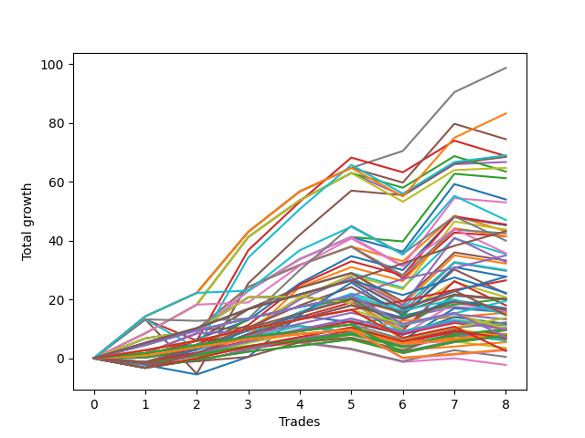

# Long Wallace Doodle 012 
- Symbol: ES_Unlimited
- Date Range: 03/18/2022 - 07/15/2022
- Trading Period: 7:20-12:30
- Number of Trades: 8



| Name | Win Percent | Profit | Avg Profit / Trade | Avg Time / Trade |      | Name | Win Percent | Profit | Avg Profit / Trade | Avg Time / Trade |
| ---- | ----------- | ------ | ------------------ | ---------------- | ---- | ---- | ----------- | ------ | ------------------ | ---------------- |
| Sorted By <br> Profit | | | | | | Sorted By <br> Win Percentage ||||
| Seven | 100.00 | 49375.00 | 6171.88 | 47:08 |     | Seven | 100.00 | 49375.00 | 6171.88 | 47:08 |
| Sixty-Three | 87.50 | 41625.00 | 5203.12 | 22:50 |     | Eighty-Five | 100.00 | 21625.00 | 2703.12 | 38:51 |
| Forty-Seven | 75.00 | 37250.00 | 4656.25 | 14:30 |     | Eighty-Four | 100.00 | 17500.00 | 2187.50 | 36:24 |
| Sixty-One | 75.00 | 34500.00 | 4312.50 | 29:03 |     | Eighty-Three | 100.00 | 13250.00 | 1656.25 | 35:45 |
| Forty-Five | 62.50 | 34375.00 | 4296.88 | 23:21 |     | Eighty-Two | 100.00 | 10125.00 | 1265.62 | 29:30 |
| Five | 75.00 | 34250.00 | 4281.25 | 59:37 |     | Eighty-One | 100.00 | 7750.00 | 968.75 | 27:37 |
| Four | 87.50 | 33375.00 | 4171.88 | 28:46 |     | Sixty-Three | 87.50 | 41625.00 | 5203.12 | 22:50 |
| Sixty | 87.50 | 32375.00 | 4046.88 | 19:50 |     | Four | 87.50 | 33375.00 | 4171.88 | 28:46 |
| Forty-Four | 75.00 | 31750.00 | 3968.75 | 15:37 |     | Sixty | 87.50 | 32375.00 | 4046.88 | 19:50 |
| Two | 75.00 | 30625.00 | 3828.12 | 37:55 |     | One Hundred Twenty-Five | 87.50 | 13875.00 | 1734.38 | 14:33 |
| Forty-Two | 75.00 | 27000.00 | 3375.00 | 10:28 |     | One Hundred Twenty-Four | 87.50 | 9750.00 | 1218.75 | 12:06 |
| Fifty-Eight | 75.00 | 26500.00 | 3312.50 | 13:53 |     | One Hundred Twenty-Three | 87.50 | 6875.00 | 859.38 | 11:33 |
| Seventy-One | 75.00 | 23500.00 | 2937.50 | 15:56 |     | One Hundred Twelve | 87.50 | 6125.00 | 765.62 | 04:23 |
| Fifty-Five | 62.50 | 22750.00 | 2843.75 | 09:13 |     | One Hundred Six | 87.50 | 4125.00 | 515.62 | 02:11 |
| Fifty-Two | 62.50 | 22625.00 | 2828.12 | 09:18 |     | One Hundred One | 87.50 | 4125.00 | 515.62 | 02:11 |
| Fifty | 62.50 | 21875.00 | 2734.38 | 07:50 |     | One Hundred Twenty-Seven | 87.50 | 3875.00 | 484.38 | 05:18 |
| Eighty-Five | 100.00 | 21625.00 | 2703.12 | 38:51 |     | One Hundred Sixteen | 87.50 | 3875.00 | 484.38 | 02:30 |
| Forty-Three | 75.00 | 21625.00 | 2703.12 | 09:46 |     | One Hundred Twenty-Two | 87.50 | 3750.00 | 468.75 | 05:18 |
| Fifty-Nine | 75.00 | 21250.00 | 2656.25 | 13:13 |     | One Hundred Eleven | 87.50 | 3750.00 | 468.75 | 02:30 |
| Three | 75.00 | 20750.00 | 2593.75 | 19:50 |     | One Hundred Twenty-Six | 87.50 | 1500.00 | 187.50 | 03:25 |
| Fifty-Three | 62.50 | 20750.00 | 2593.75 | 12:10 |     | One Hundred Twenty-One | 87.50 | 1375.00 | 171.88 | 03:26 |
| Sixty-Nine | 62.50 | 20000.00 | 2500.00 | 21:21 |     | Forty-Seven | 75.00 | 37250.00 | 4656.25 | 14:30 |
| Sixty-Eight | 75.00 | 17875.00 | 2234.38 | 14:30 |     | Sixty-One | 75.00 | 34500.00 | 4312.50 | 29:03 |
| Forty-One | 75.00 | 17750.00 | 2218.75 | 09:33 |     | Five | 75.00 | 34250.00 | 4281.25 | 59:37 |
| Eighty-Four | 100.00 | 17500.00 | 2187.50 | 36:24 |     | Forty-Four | 75.00 | 31750.00 | 3968.75 | 15:37 |
| Fifty-Seven | 75.00 | 16625.00 | 2078.12 | 12:43 |     | Two | 75.00 | 30625.00 | 3828.12 | 37:55 |
| Sixty-Six | 75.00 | 16375.00 | 2046.88 | 11:56 |     | Forty-Two | 75.00 | 27000.00 | 3375.00 | 10:28 |
| One | 75.00 | 16125.00 | 2015.62 | 19:20 |     | Fifty-Eight | 75.00 | 26500.00 | 3312.50 | 13:53 |
| Fifty-One | 62.50 | 15000.00 | 1875.00 | 07:00 |     | Seventy-One | 75.00 | 23500.00 | 2937.50 | 15:56 |
| Forty-Nine | 62.50 | 14875.00 | 1859.38 | 07:00 |     | Forty-Three | 75.00 | 21625.00 | 2703.12 | 09:46 |
| One Hundred Twenty-Five | 87.50 | 13875.00 | 1734.38 | 14:33 |     | Fifty-Nine | 75.00 | 21250.00 | 2656.25 | 13:13 |
| Seventy-Three | 50.00 | 13875.00 | 1734.38 | 14:50 |     | Three | 75.00 | 20750.00 | 2593.75 | 19:50 |
| Eighty-Three | 100.00 | 13250.00 | 1656.25 | 35:45 |     | Sixty-Eight | 75.00 | 17875.00 | 2234.38 | 14:30 |
| One Hundred Fifteen | 75.00 | 11125.00 | 1390.62 | 06:51 |     | Forty-One | 75.00 | 17750.00 | 2218.75 | 09:33 |
| Sixty-Seven | 75.00 | 11000.00 | 1375.00 | 11:15 |     | Fifty-Seven | 75.00 | 16625.00 | 2078.12 | 12:43 |
| Forty | 75.00 | 10375.00 | 1296.88 | 06:46 |     | Sixty-Six | 75.00 | 16375.00 | 2046.88 | 11:56 |
| Eighty-Two | 100.00 | 10125.00 | 1265.62 | 29:30 |     | One | 75.00 | 16125.00 | 2015.62 | 19:20 |
| Sixty-Four | 75.00 | 10125.00 | 1265.62 | 07:59 |     | One Hundred Fifteen | 75.00 | 11125.00 | 1390.62 | 06:51 |
| Fifty-Six | 75.00 | 10000.00 | 1250.00 | 08:00 |     | Sixty-Seven | 75.00 | 11000.00 | 1375.00 | 11:15 |
| One Hundred Ten | 62.50 | 10000.00 | 1250.00 | 04:03 |     | Forty | 75.00 | 10375.00 | 1296.88 | 06:46 |
| Six | 62.50 | 10000.00 | 1250.00 | 17:28 |     | Sixty-Four | 75.00 | 10125.00 | 1265.62 | 07:59 |
| One Hundred Twenty-Four | 87.50 | 9750.00 | 1218.75 | 12:06 |     | Fifty-Six | 75.00 | 10000.00 | 1250.00 | 08:00 |
| Sixty-Five | 75.00 | 9000.00 | 1125.00 | 11:04 |     | Sixty-Five | 75.00 | 9000.00 | 1125.00 | 11:04 |
| One Hundred Five | 62.50 | 8500.00 | 1062.50 | 05:06 |     | Zero | 75.00 | 7875.00 | 984.38 | 14:02 |
| One Hundred Twenty | 62.50 | 8250.00 | 1031.25 | 05:25 |     | One Hundred Thirty | 75.00 | 7375.00 | 921.88 | 09:10 |
| Forty-Eight | 62.50 | 8000.00 | 1000.00 | 05:17 |     | One Hundred Fourteen | 75.00 | 7375.00 | 921.88 | 06:23 |
| Forty-Six | 62.50 | 8000.00 | 1000.00 | 04:31 |     | One Hundred Thirteen | 75.00 | 5000.00 | 625.00 | 05:56 |
| Zero | 75.00 | 7875.00 | 984.38 | 14:02 |     | One Hundred Seven | 75.00 | 5000.00 | 625.00 | 02:51 |
| Eighty-One | 100.00 | 7750.00 | 968.75 | 27:37 |     | Ninety-Seven | 75.00 | 4750.00 | 593.75 | 02:16 |
| One Hundred Thirty | 75.00 | 7375.00 | 921.88 | 09:10 |     | One Hundred Two | 75.00 | 4000.00 | 500.00 | 03:38 |
| One Hundred Fourteen | 75.00 | 7375.00 | 921.88 | 06:23 |     | One Hundred Seventeen | 75.00 | 3750.00 | 468.75 | 03:56 |
| One Hundred Twenty-Three | 87.50 | 6875.00 | 859.38 | 11:33 |     | One Hundred Twenty-Nine | 75.00 | 3625.00 | 453.12 | 08:43 |
| One Hundred Nine | 62.50 | 6625.00 | 828.12 | 03:38 |     | Ninety-Six | 75.00 | 2750.00 | 343.75 | 01:59 |
| One Hundred Twelve | 87.50 | 6125.00 | 765.62 | 04:23 |     | One Hundred Twenty-Eight | 75.00 | 1250.00 | 156.25 | 08:15 |
| Ninety-Five | 50.00 | 5875.00 | 734.38 | 02:12 |     | Forty-Five | 62.50 | 34375.00 | 4296.88 | 23:21 |
| Seventy | 62.50 | 5750.00 | 718.75 | 05:26 |     | Fifty-Five | 62.50 | 22750.00 | 2843.75 | 09:13 |
| Sixty-Two | 62.50 | 5625.00 | 703.12 | 05:26 |     | Fifty-Two | 62.50 | 22625.00 | 2828.12 | 09:18 |
| One Hundred Eight | 62.50 | 5125.00 | 640.62 | 03:11 |     | Fifty | 62.50 | 21875.00 | 2734.38 | 07:50 |
| One Hundred Four | 62.50 | 5125.00 | 640.62 | 04:41 |     | Fifty-Three | 62.50 | 20750.00 | 2593.75 | 12:10 |
| One Hundred Thirteen | 75.00 | 5000.00 | 625.00 | 05:56 |     | Sixty-Nine | 62.50 | 20000.00 | 2500.00 | 21:21 |
| One Hundred Seven | 75.00 | 5000.00 | 625.00 | 02:51 |     | Fifty-One | 62.50 | 15000.00 | 1875.00 | 07:00 |
| One Hundred Ninteen | 62.50 | 4875.00 | 609.38 | 04:59 |     | Forty-Nine | 62.50 | 14875.00 | 1859.38 | 07:00 |
| Ninety-Seven | 75.00 | 4750.00 | 593.75 | 02:16 |     | One Hundred Ten | 62.50 | 10000.00 | 1250.00 | 04:03 |
| One Hundred Six | 87.50 | 4125.00 | 515.62 | 02:11 |     | Six | 62.50 | 10000.00 | 1250.00 | 17:28 |
| One Hundred One | 87.50 | 4125.00 | 515.62 | 02:11 |     | One Hundred Five | 62.50 | 8500.00 | 1062.50 | 05:06 |
| Ninety-Eight | 62.50 | 4125.00 | 515.62 | 02:33 |     | One Hundred Twenty | 62.50 | 8250.00 | 1031.25 | 05:25 |
| One Hundred Two | 75.00 | 4000.00 | 500.00 | 03:38 |     | Forty-Eight | 62.50 | 8000.00 | 1000.00 | 05:17 |
| One Hundred | 62.50 | 4000.00 | 500.00 | 03:03 |     | Forty-Six | 62.50 | 8000.00 | 1000.00 | 04:31 |
| One Hundred Twenty-Seven | 87.50 | 3875.00 | 484.38 | 05:18 |     | One Hundred Nine | 62.50 | 6625.00 | 828.12 | 03:38 |
| One Hundred Sixteen | 87.50 | 3875.00 | 484.38 | 02:30 |     | Seventy | 62.50 | 5750.00 | 718.75 | 05:26 |
| One Hundred Twenty-Two | 87.50 | 3750.00 | 468.75 | 05:18 |     | Sixty-Two | 62.50 | 5625.00 | 703.12 | 05:26 |
| One Hundred Eleven | 87.50 | 3750.00 | 468.75 | 02:30 |     | One Hundred Eight | 62.50 | 5125.00 | 640.62 | 03:11 |
| One Hundred Seventeen | 75.00 | 3750.00 | 468.75 | 03:56 |     | One Hundred Four | 62.50 | 5125.00 | 640.62 | 04:41 |
| One Hundred Twenty-Nine | 75.00 | 3625.00 | 453.12 | 08:43 |     | One Hundred Ninteen | 62.50 | 4875.00 | 609.38 | 04:59 |
| One Hundred Three | 62.50 | 3625.00 | 453.12 | 04:15 |     | Ninety-Eight | 62.50 | 4125.00 | 515.62 | 02:33 |
| Ninety-Nine | 62.50 | 3625.00 | 453.12 | 02:53 |     | One Hundred | 62.50 | 4000.00 | 500.00 | 03:03 |
| One Hundred Eighteen | 62.50 | 3375.00 | 421.88 | 04:33 |     | One Hundred Three | 62.50 | 3625.00 | 453.12 | 04:15 |
| Fifty-Four | 50.00 | 3125.00 | 390.62 | 03:33 |     | Ninety-Nine | 62.50 | 3625.00 | 453.12 | 02:53 |
| Ninety-Four | 50.00 | 3000.00 | 375.00 | 01:54 |     | One Hundred Eighteen | 62.50 | 3375.00 | 421.88 | 04:33 |
| Ninety-Six | 75.00 | 2750.00 | 343.75 | 01:59 |     | Seventy-Three | 50.00 | 13875.00 | 1734.38 | 14:50 |
| Ninety-Three | 50.00 | 1750.00 | 218.75 | 01:49 |     | Ninety-Five | 50.00 | 5875.00 | 734.38 | 02:12 |
| One Hundred Twenty-Six | 87.50 | 1500.00 | 187.50 | 03:25 |     | Fifty-Four | 50.00 | 3125.00 | 390.62 | 03:33 |
| One Hundred Twenty-One | 87.50 | 1375.00 | 171.88 | 03:26 |     | Ninety-Four | 50.00 | 3000.00 | 375.00 | 01:54 |
| One Hundred Twenty-Eight | 75.00 | 1250.00 | 156.25 | 08:15 |     | Ninety-Three | 50.00 | 1750.00 | 218.75 | 01:49 |
| Ninety-Two | 50.00 | 250.00 | 31.25 | 01:37 |     | Ninety-Two | 50.00 | 250.00 | 31.25 | 01:37 |
| Ninety-One | 50.00 | -1125.00 | -140.62 | 01:27 |     | Ninety-One | 50.00 | -1125.00 | -140.62 | 01:27 |

## NO STOPLOSS

### Test Zero
* Sell when price hits the middle line of the 20p bollinger
* No Stoploss
* Results:
```
Total Trades: 8
Percent Up: 75.00
Percent Down: 25.00
Total Points Moved Up: 15.75
Potential Profit: 7875.00
Total Points Ups: 31.00 Count Ups: 6
Total Points Downs: -15.25 Count Downs: 2
```

<details><summary>Trades</summary>

<code>In: 2022-04-20 09:14:00		Out: 2022-04-20 09:30:50		Total Position Time: 16:50		Total Move Up: 0.25		Total to Date: 0.25</code> <br />
<code>In: 2022-04-27 11:40:00		Out: 2022-04-27 11:41:10		Total Position Time: 01:10		Total Move Up: 2.75		Total to Date: 3.00</code> <br />
<code>In: 2022-05-17 11:24:00		Out: 2022-05-17 11:31:40		Total Position Time: 07:40		Total Move Up: 10.50		Total to Date: 13.50</code> <br />
<code>In: 2022-05-23 10:23:00		Out: 2022-05-23 10:26:30		Total Position Time: 03:30		Total Move Up: 4.00		Total to Date: 17.50</code> <br />
<code>In: 2022-05-27 08:04:00		Out: 2022-05-27 08:06:55		Total Position Time: 02:55		Total Move Up: 2.75		Total to Date: 20.25</code> <br />
<code>In: 2022-06-15 07:35:00		Out: 2022-06-15 08:34:25		Total Position Time: 59:25		Total Move Up: -14.00		Total to Date: 6.25</code> <br />
<code>In: 2022-06-17 12:15:00		Out: 2022-06-17 12:20:30		Total Position Time: 05:30		Total Move Up: 10.75		Total to Date: 17.00</code> <br />
<code>In: 2022-06-21 08:47:00		Out: 2022-06-21 09:02:20		Total Position Time: 15:20		Total Move Up: -1.25		Total to Date: 15.75</code> <br />


</details>

### Test One
* Sell when the price hits the upper line of the 20p 1std bollinger
* No Stoploss
* Results:
```
Total Trades: 8
Percent Up: 75.00
Percent Down: 25.00
Total Points Moved Up: 32.25
Potential Profit: 16125.00
Total Points Ups: 45.75 Count Ups: 6
Total Points Downs: -13.50 Count Downs: 2
```

<details><summary>Trades</summary>

<code>In: 2022-04-20 09:14:00		Out: 2022-04-20 09:31:20		Total Position Time: 17:20		Total Move Up: 1.00		Total to Date: 1.00</code> <br />
<code>In: 2022-04-27 11:40:00		Out: 2022-04-27 11:42:35		Total Position Time: 02:35		Total Move Up: 5.00		Total to Date: 6.00</code> <br />
<code>In: 2022-05-17 11:24:00		Out: 2022-05-17 11:39:45		Total Position Time: 15:45		Total Move Up: 10.75		Total to Date: 16.75</code> <br />
<code>In: 2022-05-23 10:23:00		Out: 2022-05-23 10:32:50		Total Position Time: 09:50		Total Move Up: 7.25		Total to Date: 24.00</code> <br />
<code>In: 2022-05-27 08:04:00		Out: 2022-05-27 08:11:05		Total Position Time: 07:05		Total Move Up: 5.00		Total to Date: 29.00</code> <br />
<code>In: 2022-06-15 07:35:00		Out: 2022-06-15 08:38:55		Total Position Time: 63:55		Total Move Up: -10.75		Total to Date: 18.25</code> <br />
<code>In: 2022-06-17 12:15:00		Out: 2022-06-17 12:22:20		Total Position Time: 07:20		Total Move Up: 16.75		Total to Date: 35.00</code> <br />
<code>In: 2022-06-21 08:47:00		Out: 2022-06-21 09:17:50		Total Position Time: 30:50		Total Move Up: -2.75		Total to Date: 32.25</code> <br />


</details>

### Test Two
* Sell when the price hits the upper line of the 20p 2std bollinger
* No Stoploss
* Results:
```
Total Trades: 8
Percent Up: 75.00
Percent Down: 25.00
Total Points Moved Up: 61.25
Potential Profit: 30625.00
Total Points Ups: 64.25 Count Ups: 6
Total Points Downs: -3.00 Count Downs: 2
```

<details><summary>Trades</summary>

<code>In: 2022-04-20 09:14:00		Out: 2022-04-20 09:31:35		Total Position Time: 17:35		Total Move Up: 1.75		Total to Date: 1.75</code> <br />
<code>In: 2022-04-27 11:40:00		Out: 2022-04-27 11:42:45		Total Position Time: 02:45		Total Move Up: 6.75		Total to Date: 8.50</code> <br />
<code>In: 2022-05-17 11:24:00		Out: 2022-05-17 11:40:05		Total Position Time: 16:05		Total Move Up: 14.50		Total to Date: 23.00</code> <br />
<code>In: 2022-05-23 10:23:00		Out: 2022-05-23 10:33:15		Total Position Time: 10:15		Total Move Up: 10.75		Total to Date: 33.75</code> <br />
<code>In: 2022-05-27 08:04:00		Out: 2022-05-27 08:12:15		Total Position Time: 08:15		Total Move Up: 7.50		Total to Date: 41.25</code> <br />
<code>In: 2022-06-15 07:35:00		Out: 2022-06-15 10:58:15		Total Position Time: 203:15		Total Move Up: -1.50		Total to Date: 39.75</code> <br />
<code>In: 2022-06-17 12:15:00		Out: 2022-06-17 12:27:15		Total Position Time: 12:15		Total Move Up: 23.00		Total to Date: 62.75</code> <br />
<code>In: 2022-06-21 08:47:00		Out: 2022-06-21 09:19:55		Total Position Time: 32:55		Total Move Up: -1.50		Total to Date: 61.25</code> <br />


</details>

### Test Three
* Sell when price hits the middle line of the 50p bollinger
* No Stoploss
* Results:
```
Total Trades: 8
Percent Up: 75.00
Percent Down: 25.00
Total Points Moved Up: 41.50
Potential Profit: 20750.00
Total Points Ups: 53.50 Count Ups: 6
Total Points Downs: -12.00 Count Downs: 2
```

<details><summary>Trades</summary>

<code>In: 2022-04-20 09:14:00		Out: 2022-04-20 09:32:50		Total Position Time: 18:50		Total Move Up: 4.75		Total to Date: 4.75</code> <br />
<code>In: 2022-04-27 11:40:00		Out: 2022-04-27 11:42:35		Total Position Time: 02:35		Total Move Up: 5.00		Total to Date: 9.75</code> <br />
<code>In: 2022-05-17 11:24:00		Out: 2022-05-17 11:40:05		Total Position Time: 16:05		Total Move Up: 14.50		Total to Date: 24.25</code> <br />
<code>In: 2022-05-23 10:23:00		Out: 2022-05-23 10:33:05		Total Position Time: 10:05		Total Move Up: 7.50		Total to Date: 31.75</code> <br />
<code>In: 2022-05-27 08:04:00		Out: 2022-05-27 08:11:40		Total Position Time: 07:40		Total Move Up: 6.25		Total to Date: 38.00</code> <br />
<code>In: 2022-06-15 07:35:00		Out: 2022-06-15 08:38:55		Total Position Time: 63:55		Total Move Up: -10.75		Total to Date: 27.25</code> <br />
<code>In: 2022-06-17 12:15:00		Out: 2022-06-17 12:21:25		Total Position Time: 06:25		Total Move Up: 15.50		Total to Date: 42.75</code> <br />
<code>In: 2022-06-21 08:47:00		Out: 2022-06-21 09:20:05		Total Position Time: 33:05		Total Move Up: -1.25		Total to Date: 41.50</code> <br />


</details>

### Test Four
* Sell when the price hits the upper line of the 50p 1std bollinger
* No Stoploss
* Results:
```
Total Trades: 8
Percent Up: 87.50
Percent Down: 12.50
Total Points Moved Up: 66.75
Potential Profit: 33375.00
Total Points Ups: 74.50 Count Ups: 7
Total Points Downs: -7.75 Count Downs: 1
```

<details><summary>Trades</summary>

<code>In: 2022-04-20 09:14:00		Out: 2022-04-20 09:36:50		Total Position Time: 22:50		Total Move Up: 8.50		Total to Date: 8.50</code> <br />
<code>In: 2022-04-27 11:40:00		Out: 2022-04-27 11:45:50		Total Position Time: 05:50		Total Move Up: 9.75		Total to Date: 18.25</code> <br />
<code>In: 2022-05-17 11:24:00		Out: 2022-05-17 11:45:50		Total Position Time: 21:50		Total Move Up: 23.00		Total to Date: 41.25</code> <br />
<code>In: 2022-05-23 10:23:00		Out: 2022-05-23 10:36:45		Total Position Time: 13:45		Total Move Up: 12.50		Total to Date: 53.75</code> <br />
<code>In: 2022-05-27 08:04:00		Out: 2022-05-27 08:16:10		Total Position Time: 12:10		Total Move Up: 9.25		Total to Date: 63.00</code> <br />
<code>In: 2022-06-15 07:35:00		Out: 2022-06-15 08:57:35		Total Position Time: 82:35		Total Move Up: -7.75		Total to Date: 55.25</code> <br />
<code>In: 2022-06-17 12:15:00		Out: 2022-06-17 12:47:00		Total Position Time: 32:00		Total Move Up: 10.75		Total to Date: 66.00</code> <br />
<code>In: 2022-06-21 08:47:00		Out: 2022-06-21 09:26:10		Total Position Time: 39:10		Total Move Up: 0.75		Total to Date: 66.75</code> <br />


</details>

### Test Five
* Sell when the price hits the upper line of the 50p 2std bollinger
* No Stoploss
* Results:
```
Total Trades: 8
Percent Up: 75.00
Percent Down: 25.00
Total Points Moved Up: 68.50
Potential Profit: 34250.00
Total Points Ups: 88.50 Count Ups: 6
Total Points Downs: -20.00 Count Downs: 2
```

<details><summary>Trades</summary>

<code>In: 2022-04-20 09:14:00		Out: 2022-04-20 09:50:25		Total Position Time: 36:25		Total Move Up: 13.25		Total to Date: 13.25</code> <br />
<code>In: 2022-04-27 11:40:00		Out: 2022-04-27 12:47:00		Total Position Time: 67:00		Total Move Up: -18.50		Total to Date: -5.25</code> <br />
<code>In: 2022-05-17 11:24:00		Out: 2022-05-17 11:48:40		Total Position Time: 24:40		Total Move Up: 30.75		Total to Date: 25.50</code> <br />
<code>In: 2022-05-23 10:23:00		Out: 2022-05-23 10:47:45		Total Position Time: 24:45		Total Move Up: 16.50		Total to Date: 42.00</code> <br />
<code>In: 2022-05-27 08:04:00		Out: 2022-05-27 08:43:55		Total Position Time: 39:55		Total Move Up: 15.00		Total to Date: 57.00</code> <br />
<code>In: 2022-06-15 07:35:00		Out: 2022-06-15 10:58:15		Total Position Time: 203:15		Total Move Up: -1.50		Total to Date: 55.50</code> <br />
<code>In: 2022-06-17 12:15:00		Out: 2022-06-17 12:47:00		Total Position Time: 32:00		Total Move Up: 10.75		Total to Date: 66.25</code> <br />
<code>In: 2022-06-21 08:47:00		Out: 2022-06-21 09:36:00		Total Position Time: 49:00		Total Move Up: 2.25		Total to Date: 68.50</code> <br />


</details>

### Test Six
* Sell when the price hits the middle line of the 1std VWAP
* No Stoploss
* Results:
```
Total Trades: 8
Percent Up: 62.50
Percent Down: 37.50
Total Points Moved Up: 20.00
Potential Profit: 10000.00
Total Points Ups: 24.75 Count Ups: 5
Total Points Downs: -4.75 Count Downs: 3
```

<details><summary>Trades</summary>

<code>In: 2022-04-20 09:14:00		Out: 2022-04-20 09:35:50		Total Position Time: 21:50		Total Move Up: 6.75		Total to Date: 6.75</code> <br />
<code>In: 2022-04-27 11:40:00		Out: 2022-04-27 11:41:10		Total Position Time: 01:10		Total Move Up: 2.75		Total to Date: 9.50</code> <br />
<code>In: 2022-05-17 11:24:00		Out: 2022-05-17 11:27:25		Total Position Time: 03:25		Total Move Up: 11.25		Total to Date: 20.75</code> <br />
<code>In: 2022-05-23 10:23:00		Out: 2022-05-23 10:24:10		Total Position Time: 01:10		Total Move Up: 0.25		Total to Date: 21.00</code> <br />
<code>In: 2022-05-27 08:04:00		Out: 2022-05-27 08:05:10		Total Position Time: 01:10		Total Move Up: -2.25		Total to Date: 18.75</code> <br />
<code>In: 2022-06-15 07:35:00		Out: 2022-06-15 09:22:15		Total Position Time: 107:15		Total Move Up: -1.00		Total to Date: 17.75</code> <br />
<code>In: 2022-06-17 12:15:00		Out: 2022-06-17 12:17:35		Total Position Time: 02:35		Total Move Up: 3.75		Total to Date: 21.50</code> <br />
<code>In: 2022-06-21 08:47:00		Out: 2022-06-21 08:48:10		Total Position Time: 01:10		Total Move Up: -1.50		Total to Date: 20.00</code> <br />


</details>

### Test Seven
* Sell when the price hits the upper line of the 1std VWAP
* No Stoploss
* Results:
```
Total Trades: 8
Percent Up: 100.00
Percent Down: 0.00
Total Points Moved Up: 98.75
Potential Profit: 49375.00
Total Points Ups: 98.75 Count Ups: 8
Total Points Downs: 0.00 Count Downs: 0
```

<details><summary>Trades</summary>

<code>In: 2022-04-20 09:14:00		Out: 2022-04-20 09:52:35		Total Position Time: 38:35		Total Move Up: 14.25		Total to Date: 14.25</code> <br />
<code>In: 2022-04-27 11:40:00		Out: 2022-04-27 11:44:15		Total Position Time: 04:15		Total Move Up: 8.00		Total to Date: 22.25</code> <br />
<code>In: 2022-05-17 11:24:00		Out: 2022-05-17 11:40:20		Total Position Time: 16:20		Total Move Up: 20.75		Total to Date: 43.00</code> <br />
<code>In: 2022-05-23 10:23:00		Out: 2022-05-23 10:42:15		Total Position Time: 19:15		Total Move Up: 13.75		Total to Date: 56.75</code> <br />
<code>In: 2022-05-27 08:04:00		Out: 2022-05-27 08:13:35		Total Position Time: 09:35		Total Move Up: 8.00		Total to Date: 64.75</code> <br />
<code>In: 2022-06-15 07:35:00		Out: 2022-06-15 11:00:30		Total Position Time: 205:30		Total Move Up: 5.75		Total to Date: 70.50</code> <br />
<code>In: 2022-06-17 12:15:00		Out: 2022-06-17 12:26:30		Total Position Time: 11:30		Total Move Up: 20.00		Total to Date: 90.50</code> <br />
<code>In: 2022-06-21 08:47:00		Out: 2022-06-21 09:59:10		Total Position Time: 72:10		Total Move Up: 8.25		Total to Date: 98.75</code> <br />


</details>

## STOPLOSS OF 5

### Test Forty
* Sell when price hits the middle line of the 20p bollinger
* Stoploss is 5 points
* Results:
```
Total Trades: 8
Percent Up: 75.00
Percent Down: 25.00
Total Points Moved Up: 20.75
Potential Profit: 10375.00
Total Points Ups: 31.00 Count Ups: 6
Total Points Downs: -10.25 Count Downs: 2
```

<details><summary>Trades</summary>

<code>In: 2022-04-20 09:14:00		Out: 2022-04-20 09:30:50		Total Position Time: 16:50		Total Move Up: 0.25		Total to Date: 0.25</code> <br />
<code>In: 2022-04-27 11:40:00		Out: 2022-04-27 11:41:10		Total Position Time: 01:10		Total Move Up: 2.75		Total to Date: 3.00</code> <br />
<code>In: 2022-05-17 11:24:00		Out: 2022-05-17 11:31:40		Total Position Time: 07:40		Total Move Up: 10.50		Total to Date: 13.50</code> <br />
<code>In: 2022-05-23 10:23:00		Out: 2022-05-23 10:26:30		Total Position Time: 03:30		Total Move Up: 4.00		Total to Date: 17.50</code> <br />
<code>In: 2022-05-27 08:04:00		Out: 2022-05-27 08:06:55		Total Position Time: 02:55		Total Move Up: 2.75		Total to Date: 20.25</code> <br />
<code>In: 2022-06-15 07:35:00		Out: 2022-06-15 07:38:40		Total Position Time: 03:40		Total Move Up: -5.00		Total to Date: 15.25</code> <br />
<code>In: 2022-06-17 12:15:00		Out: 2022-06-17 12:20:30		Total Position Time: 05:30		Total Move Up: 10.75		Total to Date: 26.00</code> <br />
<code>In: 2022-06-21 08:47:00		Out: 2022-06-21 08:59:55		Total Position Time: 12:55		Total Move Up: -5.25		Total to Date: 20.75</code> <br />


</details>

### Test Forty-One
* Sell when the price hits the upper line of the 20p 1std bollinger
* Stoploss is 5 points
* Results:
```
Total Trades: 8
Percent Up: 75.00
Percent Down: 25.00
Total Points Moved Up: 35.50
Potential Profit: 17750.00
Total Points Ups: 45.75 Count Ups: 6
Total Points Downs: -10.25 Count Downs: 2
```

<details><summary>Trades</summary>

<code>In: 2022-04-20 09:14:00		Out: 2022-04-20 09:31:20		Total Position Time: 17:20		Total Move Up: 1.00		Total to Date: 1.00</code> <br />
<code>In: 2022-04-27 11:40:00		Out: 2022-04-27 11:42:35		Total Position Time: 02:35		Total Move Up: 5.00		Total to Date: 6.00</code> <br />
<code>In: 2022-05-17 11:24:00		Out: 2022-05-17 11:39:45		Total Position Time: 15:45		Total Move Up: 10.75		Total to Date: 16.75</code> <br />
<code>In: 2022-05-23 10:23:00		Out: 2022-05-23 10:32:50		Total Position Time: 09:50		Total Move Up: 7.25		Total to Date: 24.00</code> <br />
<code>In: 2022-05-27 08:04:00		Out: 2022-05-27 08:11:05		Total Position Time: 07:05		Total Move Up: 5.00		Total to Date: 29.00</code> <br />
<code>In: 2022-06-15 07:35:00		Out: 2022-06-15 07:38:40		Total Position Time: 03:40		Total Move Up: -5.00		Total to Date: 24.00</code> <br />
<code>In: 2022-06-17 12:15:00		Out: 2022-06-17 12:22:20		Total Position Time: 07:20		Total Move Up: 16.75		Total to Date: 40.75</code> <br />
<code>In: 2022-06-21 08:47:00		Out: 2022-06-21 08:59:55		Total Position Time: 12:55		Total Move Up: -5.25		Total to Date: 35.50</code> <br />


</details>

### Test Forty-Two
* Sell when the price hits the upper line of the 20p 2std bollinger
* Stoploss is 5 points
* Results:
```
Total Trades: 8
Percent Up: 75.00
Percent Down: 25.00
Total Points Moved Up: 54.00
Potential Profit: 27000.00
Total Points Ups: 64.25 Count Ups: 6
Total Points Downs: -10.25 Count Downs: 2
```

<details><summary>Trades</summary>

<code>In: 2022-04-20 09:14:00		Out: 2022-04-20 09:31:35		Total Position Time: 17:35		Total Move Up: 1.75		Total to Date: 1.75</code> <br />
<code>In: 2022-04-27 11:40:00		Out: 2022-04-27 11:42:45		Total Position Time: 02:45		Total Move Up: 6.75		Total to Date: 8.50</code> <br />
<code>In: 2022-05-17 11:24:00		Out: 2022-05-17 11:40:05		Total Position Time: 16:05		Total Move Up: 14.50		Total to Date: 23.00</code> <br />
<code>In: 2022-05-23 10:23:00		Out: 2022-05-23 10:33:15		Total Position Time: 10:15		Total Move Up: 10.75		Total to Date: 33.75</code> <br />
<code>In: 2022-05-27 08:04:00		Out: 2022-05-27 08:12:15		Total Position Time: 08:15		Total Move Up: 7.50		Total to Date: 41.25</code> <br />
<code>In: 2022-06-15 07:35:00		Out: 2022-06-15 07:38:40		Total Position Time: 03:40		Total Move Up: -5.00		Total to Date: 36.25</code> <br />
<code>In: 2022-06-17 12:15:00		Out: 2022-06-17 12:27:15		Total Position Time: 12:15		Total Move Up: 23.00		Total to Date: 59.25</code> <br />
<code>In: 2022-06-21 08:47:00		Out: 2022-06-21 08:59:55		Total Position Time: 12:55		Total Move Up: -5.25		Total to Date: 54.00</code> <br />


</details>

### Test Forty-Three
* Sell when price hits the middle line of the 50p bollinger
* Stoploss is 5 points
* Results:
```
Total Trades: 8
Percent Up: 75.00
Percent Down: 25.00
Total Points Moved Up: 43.25
Potential Profit: 21625.00
Total Points Ups: 53.50 Count Ups: 6
Total Points Downs: -10.25 Count Downs: 2
```

<details><summary>Trades</summary>

<code>In: 2022-04-20 09:14:00		Out: 2022-04-20 09:32:50		Total Position Time: 18:50		Total Move Up: 4.75		Total to Date: 4.75</code> <br />
<code>In: 2022-04-27 11:40:00		Out: 2022-04-27 11:42:35		Total Position Time: 02:35		Total Move Up: 5.00		Total to Date: 9.75</code> <br />
<code>In: 2022-05-17 11:24:00		Out: 2022-05-17 11:40:05		Total Position Time: 16:05		Total Move Up: 14.50		Total to Date: 24.25</code> <br />
<code>In: 2022-05-23 10:23:00		Out: 2022-05-23 10:33:05		Total Position Time: 10:05		Total Move Up: 7.50		Total to Date: 31.75</code> <br />
<code>In: 2022-05-27 08:04:00		Out: 2022-05-27 08:11:40		Total Position Time: 07:40		Total Move Up: 6.25		Total to Date: 38.00</code> <br />
<code>In: 2022-06-15 07:35:00		Out: 2022-06-15 07:38:40		Total Position Time: 03:40		Total Move Up: -5.00		Total to Date: 33.00</code> <br />
<code>In: 2022-06-17 12:15:00		Out: 2022-06-17 12:21:25		Total Position Time: 06:25		Total Move Up: 15.50		Total to Date: 48.50</code> <br />
<code>In: 2022-06-21 08:47:00		Out: 2022-06-21 08:59:55		Total Position Time: 12:55		Total Move Up: -5.25		Total to Date: 43.25</code> <br />


</details>

### Test Forty-Four
* Sell when the price hits the upper line of the 50p 1std bollinger
* Stoploss is 5 points
* Results:
```
Total Trades: 8
Percent Up: 75.00
Percent Down: 25.00
Total Points Moved Up: 63.50
Potential Profit: 31750.00
Total Points Ups: 73.75 Count Ups: 6
Total Points Downs: -10.25 Count Downs: 2
```

<details><summary>Trades</summary>

<code>In: 2022-04-20 09:14:00		Out: 2022-04-20 09:36:50		Total Position Time: 22:50		Total Move Up: 8.50		Total to Date: 8.50</code> <br />
<code>In: 2022-04-27 11:40:00		Out: 2022-04-27 11:45:50		Total Position Time: 05:50		Total Move Up: 9.75		Total to Date: 18.25</code> <br />
<code>In: 2022-05-17 11:24:00		Out: 2022-05-17 11:45:50		Total Position Time: 21:50		Total Move Up: 23.00		Total to Date: 41.25</code> <br />
<code>In: 2022-05-23 10:23:00		Out: 2022-05-23 10:36:45		Total Position Time: 13:45		Total Move Up: 12.50		Total to Date: 53.75</code> <br />
<code>In: 2022-05-27 08:04:00		Out: 2022-05-27 08:16:10		Total Position Time: 12:10		Total Move Up: 9.25		Total to Date: 63.00</code> <br />
<code>In: 2022-06-15 07:35:00		Out: 2022-06-15 07:38:40		Total Position Time: 03:40		Total Move Up: -5.00		Total to Date: 58.00</code> <br />
<code>In: 2022-06-17 12:15:00		Out: 2022-06-17 12:47:00		Total Position Time: 32:00		Total Move Up: 10.75		Total to Date: 68.75</code> <br />
<code>In: 2022-06-21 08:47:00		Out: 2022-06-21 08:59:55		Total Position Time: 12:55		Total Move Up: -5.25		Total to Date: 63.50</code> <br />


</details>

### Test Forty-Five
* Sell when the price hits the upper line of the 50p 2std bollinger
* Stoploss is 5 points
* Results:
```
Total Trades: 8
Percent Up: 62.50
Percent Down: 37.50
Total Points Moved Up: 68.75
Potential Profit: 34375.00
Total Points Ups: 86.25 Count Ups: 5
Total Points Downs: -17.50 Count Downs: 3
```

<details><summary>Trades</summary>

<code>In: 2022-04-20 09:14:00		Out: 2022-04-20 09:50:25		Total Position Time: 36:25		Total Move Up: 13.25		Total to Date: 13.25</code> <br />
<code>In: 2022-04-27 11:40:00		Out: 2022-04-27 11:52:30		Total Position Time: 12:30		Total Move Up: -7.25		Total to Date: 6.00</code> <br />
<code>In: 2022-05-17 11:24:00		Out: 2022-05-17 11:48:40		Total Position Time: 24:40		Total Move Up: 30.75		Total to Date: 36.75</code> <br />
<code>In: 2022-05-23 10:23:00		Out: 2022-05-23 10:47:45		Total Position Time: 24:45		Total Move Up: 16.50		Total to Date: 53.25</code> <br />
<code>In: 2022-05-27 08:04:00		Out: 2022-05-27 08:43:55		Total Position Time: 39:55		Total Move Up: 15.00		Total to Date: 68.25</code> <br />
<code>In: 2022-06-15 07:35:00		Out: 2022-06-15 07:38:40		Total Position Time: 03:40		Total Move Up: -5.00		Total to Date: 63.25</code> <br />
<code>In: 2022-06-17 12:15:00		Out: 2022-06-17 12:47:00		Total Position Time: 32:00		Total Move Up: 10.75		Total to Date: 74.00</code> <br />
<code>In: 2022-06-21 08:47:00		Out: 2022-06-21 08:59:55		Total Position Time: 12:55		Total Move Up: -5.25		Total to Date: 68.75</code> <br />


</details>

### Test Forty-Six
* Sell when the price hits the middle line of the 1std VWAP
* Stoploss is 5 points
* Results:
```
Total Trades: 8
Percent Up: 62.50
Percent Down: 37.50
Total Points Moved Up: 16.00
Potential Profit: 8000.00
Total Points Ups: 24.75 Count Ups: 5
Total Points Downs: -8.75 Count Downs: 3
```

<details><summary>Trades</summary>

<code>In: 2022-04-20 09:14:00		Out: 2022-04-20 09:35:50		Total Position Time: 21:50		Total Move Up: 6.75		Total to Date: 6.75</code> <br />
<code>In: 2022-04-27 11:40:00		Out: 2022-04-27 11:41:10		Total Position Time: 01:10		Total Move Up: 2.75		Total to Date: 9.50</code> <br />
<code>In: 2022-05-17 11:24:00		Out: 2022-05-17 11:27:25		Total Position Time: 03:25		Total Move Up: 11.25		Total to Date: 20.75</code> <br />
<code>In: 2022-05-23 10:23:00		Out: 2022-05-23 10:24:10		Total Position Time: 01:10		Total Move Up: 0.25		Total to Date: 21.00</code> <br />
<code>In: 2022-05-27 08:04:00		Out: 2022-05-27 08:05:10		Total Position Time: 01:10		Total Move Up: -2.25		Total to Date: 18.75</code> <br />
<code>In: 2022-06-15 07:35:00		Out: 2022-06-15 07:38:40		Total Position Time: 03:40		Total Move Up: -5.00		Total to Date: 13.75</code> <br />
<code>In: 2022-06-17 12:15:00		Out: 2022-06-17 12:17:35		Total Position Time: 02:35		Total Move Up: 3.75		Total to Date: 17.50</code> <br />
<code>In: 2022-06-21 08:47:00		Out: 2022-06-21 08:48:10		Total Position Time: 01:10		Total Move Up: -1.50		Total to Date: 16.00</code> <br />


</details>

### Test Forty-Seven
* Sell when the price hits the upper line of the 1std VWAP
* Stoploss is 5 points
* Results:
```
Total Trades: 8
Percent Up: 75.00
Percent Down: 25.00
Total Points Moved Up: 74.50
Potential Profit: 37250.00
Total Points Ups: 84.75 Count Ups: 6
Total Points Downs: -10.25 Count Downs: 2
```

<details><summary>Trades</summary>

<code>In: 2022-04-20 09:14:00		Out: 2022-04-20 09:52:35		Total Position Time: 38:35		Total Move Up: 14.25		Total to Date: 14.25</code> <br />
<code>In: 2022-04-27 11:40:00		Out: 2022-04-27 11:44:15		Total Position Time: 04:15		Total Move Up: 8.00		Total to Date: 22.25</code> <br />
<code>In: 2022-05-17 11:24:00		Out: 2022-05-17 11:40:20		Total Position Time: 16:20		Total Move Up: 20.75		Total to Date: 43.00</code> <br />
<code>In: 2022-05-23 10:23:00		Out: 2022-05-23 10:42:15		Total Position Time: 19:15		Total Move Up: 13.75		Total to Date: 56.75</code> <br />
<code>In: 2022-05-27 08:04:00		Out: 2022-05-27 08:13:35		Total Position Time: 09:35		Total Move Up: 8.00		Total to Date: 64.75</code> <br />
<code>In: 2022-06-15 07:35:00		Out: 2022-06-15 07:38:40		Total Position Time: 03:40		Total Move Up: -5.00		Total to Date: 59.75</code> <br />
<code>In: 2022-06-17 12:15:00		Out: 2022-06-17 12:26:30		Total Position Time: 11:30		Total Move Up: 20.00		Total to Date: 79.75</code> <br />
<code>In: 2022-06-21 08:47:00		Out: 2022-06-21 08:59:55		Total Position Time: 12:55		Total Move Up: -5.25		Total to Date: 74.50</code> <br />


</details>

## TRAIL STOP OF 5

### Test Forty-Eight
* Sell when price hits the middle line of the 20p bollinger
* Trailing Stop is 5 points
* Results:
```
Total Trades: 8
Percent Up: 62.50
Percent Down: 37.50
Total Points Moved Up: 16.00
Potential Profit: 8000.00
Total Points Ups: 26.75 Count Ups: 5
Total Points Downs: -10.75 Count Downs: 3
```

<details><summary>Trades</summary>

<code>In: 2022-04-20 09:14:00		Out: 2022-04-20 09:28:10		Total Position Time: 14:10		Total Move Up: -3.25		Total to Date: -3.25</code> <br />
<code>In: 2022-04-27 11:40:00		Out: 2022-04-27 11:41:10		Total Position Time: 01:10		Total Move Up: 2.75		Total to Date: -0.50</code> <br />
<code>In: 2022-05-17 11:24:00		Out: 2022-05-17 11:29:15		Total Position Time: 05:15		Total Move Up: 6.50		Total to Date: 6.00</code> <br />
<code>In: 2022-05-23 10:23:00		Out: 2022-05-23 10:26:30		Total Position Time: 03:30		Total Move Up: 4.00		Total to Date: 10.00</code> <br />
<code>In: 2022-05-27 08:04:00		Out: 2022-05-27 08:06:55		Total Position Time: 02:55		Total Move Up: 2.75		Total to Date: 12.75</code> <br />
<code>In: 2022-06-15 07:35:00		Out: 2022-06-15 07:38:35		Total Position Time: 03:35		Total Move Up: -4.75		Total to Date: 8.00</code> <br />
<code>In: 2022-06-17 12:15:00		Out: 2022-06-17 12:20:30		Total Position Time: 05:30		Total Move Up: 10.75		Total to Date: 18.75</code> <br />
<code>In: 2022-06-21 08:47:00		Out: 2022-06-21 08:53:15		Total Position Time: 06:15		Total Move Up: -2.75		Total to Date: 16.00</code> <br />


</details>

### Test Forty-Nine
* Sell when the price hits the upper line of the 20p 1std bollinger
* Trailing Stop is 5 points
* Results:
```
Total Trades: 8
Percent Up: 62.50
Percent Down: 37.50
Total Points Moved Up: 29.75
Potential Profit: 14875.00
Total Points Ups: 40.50 Count Ups: 5
Total Points Downs: -10.75 Count Downs: 3
```

<details><summary>Trades</summary>

<code>In: 2022-04-20 09:14:00		Out: 2022-04-20 09:28:10		Total Position Time: 14:10		Total Move Up: -3.25		Total to Date: -3.25</code> <br />
<code>In: 2022-04-27 11:40:00		Out: 2022-04-27 11:42:35		Total Position Time: 02:35		Total Move Up: 5.00		Total to Date: 1.75</code> <br />
<code>In: 2022-05-17 11:24:00		Out: 2022-05-17 11:29:15		Total Position Time: 05:15		Total Move Up: 6.50		Total to Date: 8.25</code> <br />
<code>In: 2022-05-23 10:23:00		Out: 2022-05-23 10:32:50		Total Position Time: 09:50		Total Move Up: 7.25		Total to Date: 15.50</code> <br />
<code>In: 2022-05-27 08:04:00		Out: 2022-05-27 08:11:05		Total Position Time: 07:05		Total Move Up: 5.00		Total to Date: 20.50</code> <br />
<code>In: 2022-06-15 07:35:00		Out: 2022-06-15 07:38:35		Total Position Time: 03:35		Total Move Up: -4.75		Total to Date: 15.75</code> <br />
<code>In: 2022-06-17 12:15:00		Out: 2022-06-17 12:22:20		Total Position Time: 07:20		Total Move Up: 16.75		Total to Date: 32.50</code> <br />
<code>In: 2022-06-21 08:47:00		Out: 2022-06-21 08:53:15		Total Position Time: 06:15		Total Move Up: -2.75		Total to Date: 29.75</code> <br />


</details>

### Test Fifty
* Sell when the price hits the upper line of the 20p 2std bollinger
* Trailing Stop is 5 points
* Results:
```
Total Trades: 8
Percent Up: 62.50
Percent Down: 37.50
Total Points Moved Up: 43.75
Potential Profit: 21875.00
Total Points Ups: 54.50 Count Ups: 5
Total Points Downs: -10.75 Count Downs: 3
```

<details><summary>Trades</summary>

<code>In: 2022-04-20 09:14:00		Out: 2022-04-20 09:28:10		Total Position Time: 14:10		Total Move Up: -3.25		Total to Date: -3.25</code> <br />
<code>In: 2022-04-27 11:40:00		Out: 2022-04-27 11:42:45		Total Position Time: 02:45		Total Move Up: 6.75		Total to Date: 3.50</code> <br />
<code>In: 2022-05-17 11:24:00		Out: 2022-05-17 11:29:15		Total Position Time: 05:15		Total Move Up: 6.50		Total to Date: 10.00</code> <br />
<code>In: 2022-05-23 10:23:00		Out: 2022-05-23 10:33:15		Total Position Time: 10:15		Total Move Up: 10.75		Total to Date: 20.75</code> <br />
<code>In: 2022-05-27 08:04:00		Out: 2022-05-27 08:12:15		Total Position Time: 08:15		Total Move Up: 7.50		Total to Date: 28.25</code> <br />
<code>In: 2022-06-15 07:35:00		Out: 2022-06-15 07:38:35		Total Position Time: 03:35		Total Move Up: -4.75		Total to Date: 23.50</code> <br />
<code>In: 2022-06-17 12:15:00		Out: 2022-06-17 12:27:15		Total Position Time: 12:15		Total Move Up: 23.00		Total to Date: 46.50</code> <br />
<code>In: 2022-06-21 08:47:00		Out: 2022-06-21 08:53:15		Total Position Time: 06:15		Total Move Up: -2.75		Total to Date: 43.75</code> <br />


</details>

### Test Fifty-One
* Sell when price hits the middle line of the 50p bollinger
* Trailing Stop is 5 points
* Results:
```
Total Trades: 8
Percent Up: 62.50
Percent Down: 37.50
Total Points Moved Up: 30.00
Potential Profit: 15000.00
Total Points Ups: 40.75 Count Ups: 5
Total Points Downs: -10.75 Count Downs: 3
```

<details><summary>Trades</summary>

<code>In: 2022-04-20 09:14:00		Out: 2022-04-20 09:28:10		Total Position Time: 14:10		Total Move Up: -3.25		Total to Date: -3.25</code> <br />
<code>In: 2022-04-27 11:40:00		Out: 2022-04-27 11:42:35		Total Position Time: 02:35		Total Move Up: 5.00		Total to Date: 1.75</code> <br />
<code>In: 2022-05-17 11:24:00		Out: 2022-05-17 11:29:15		Total Position Time: 05:15		Total Move Up: 6.50		Total to Date: 8.25</code> <br />
<code>In: 2022-05-23 10:23:00		Out: 2022-05-23 10:33:05		Total Position Time: 10:05		Total Move Up: 7.50		Total to Date: 15.75</code> <br />
<code>In: 2022-05-27 08:04:00		Out: 2022-05-27 08:11:40		Total Position Time: 07:40		Total Move Up: 6.25		Total to Date: 22.00</code> <br />
<code>In: 2022-06-15 07:35:00		Out: 2022-06-15 07:38:35		Total Position Time: 03:35		Total Move Up: -4.75		Total to Date: 17.25</code> <br />
<code>In: 2022-06-17 12:15:00		Out: 2022-06-17 12:21:25		Total Position Time: 06:25		Total Move Up: 15.50		Total to Date: 32.75</code> <br />
<code>In: 2022-06-21 08:47:00		Out: 2022-06-21 08:53:15		Total Position Time: 06:15		Total Move Up: -2.75		Total to Date: 30.00</code> <br />


</details>

### Test Fifty-Two
* Sell when the price hits the upper line of the 50p 1std bollinger
* Trailing Stop is 5 points
* Results:
```
Total Trades: 8
Percent Up: 62.50
Percent Down: 37.50
Total Points Moved Up: 45.25
Potential Profit: 22625.00
Total Points Ups: 56.00 Count Ups: 5
Total Points Downs: -10.75 Count Downs: 3
```

<details><summary>Trades</summary>

<code>In: 2022-04-20 09:14:00		Out: 2022-04-20 09:28:10		Total Position Time: 14:10		Total Move Up: -3.25		Total to Date: -3.25</code> <br />
<code>In: 2022-04-27 11:40:00		Out: 2022-04-27 11:45:50		Total Position Time: 05:50		Total Move Up: 9.75		Total to Date: 6.50</code> <br />
<code>In: 2022-05-17 11:24:00		Out: 2022-05-17 11:29:15		Total Position Time: 05:15		Total Move Up: 6.50		Total to Date: 13.00</code> <br />
<code>In: 2022-05-23 10:23:00		Out: 2022-05-23 10:36:45		Total Position Time: 13:45		Total Move Up: 12.50		Total to Date: 25.50</code> <br />
<code>In: 2022-05-27 08:04:00		Out: 2022-05-27 08:16:10		Total Position Time: 12:10		Total Move Up: 9.25		Total to Date: 34.75</code> <br />
<code>In: 2022-06-15 07:35:00		Out: 2022-06-15 07:38:35		Total Position Time: 03:35		Total Move Up: -4.75		Total to Date: 30.00</code> <br />
<code>In: 2022-06-17 12:15:00		Out: 2022-06-17 12:28:25		Total Position Time: 13:25		Total Move Up: 18.00		Total to Date: 48.00</code> <br />
<code>In: 2022-06-21 08:47:00		Out: 2022-06-21 08:53:15		Total Position Time: 06:15		Total Move Up: -2.75		Total to Date: 45.25</code> <br />


</details>

### Test Fifty-Three
* Sell when the price hits the upper line of the 50p 2std bollinger
* Trailing Stop is 5 points
* Results:
```
Total Trades: 8
Percent Up: 62.50
Percent Down: 37.50
Total Points Moved Up: 41.50
Potential Profit: 20750.00
Total Points Ups: 52.25 Count Ups: 5
Total Points Downs: -10.75 Count Downs: 3
```

<details><summary>Trades</summary>

<code>In: 2022-04-20 09:14:00		Out: 2022-04-20 09:28:10		Total Position Time: 14:10		Total Move Up: -3.25		Total to Date: -3.25</code> <br />
<code>In: 2022-04-27 11:40:00		Out: 2022-04-27 11:47:10		Total Position Time: 07:10		Total Move Up: 4.50		Total to Date: 1.25</code> <br />
<code>In: 2022-05-17 11:24:00		Out: 2022-05-17 11:29:15		Total Position Time: 05:15		Total Move Up: 6.50		Total to Date: 7.75</code> <br />
<code>In: 2022-05-23 10:23:00		Out: 2022-05-23 10:47:45		Total Position Time: 24:45		Total Move Up: 16.50		Total to Date: 24.25</code> <br />
<code>In: 2022-05-27 08:04:00		Out: 2022-05-27 08:26:50		Total Position Time: 22:50		Total Move Up: 6.75		Total to Date: 31.00</code> <br />
<code>In: 2022-06-15 07:35:00		Out: 2022-06-15 07:38:35		Total Position Time: 03:35		Total Move Up: -4.75		Total to Date: 26.25</code> <br />
<code>In: 2022-06-17 12:15:00		Out: 2022-06-17 12:28:25		Total Position Time: 13:25		Total Move Up: 18.00		Total to Date: 44.25</code> <br />
<code>In: 2022-06-21 08:47:00		Out: 2022-06-21 08:53:15		Total Position Time: 06:15		Total Move Up: -2.75		Total to Date: 41.50</code> <br />


</details>

### Test Fifty-Four
* Sell when the price hits the middle line of the 1std VWAP
* Trailing Stop is 5 points
* Results:
```
Total Trades: 8
Percent Up: 50.00
Percent Down: 50.00
Total Points Moved Up: 6.25
Potential Profit: 3125.00
Total Points Ups: 18.00 Count Ups: 4
Total Points Downs: -11.75 Count Downs: 4
```

<details><summary>Trades</summary>

<code>In: 2022-04-20 09:14:00		Out: 2022-04-20 09:28:10		Total Position Time: 14:10		Total Move Up: -3.25		Total to Date: -3.25</code> <br />
<code>In: 2022-04-27 11:40:00		Out: 2022-04-27 11:41:10		Total Position Time: 01:10		Total Move Up: 2.75		Total to Date: -0.50</code> <br />
<code>In: 2022-05-17 11:24:00		Out: 2022-05-17 11:27:25		Total Position Time: 03:25		Total Move Up: 11.25		Total to Date: 10.75</code> <br />
<code>In: 2022-05-23 10:23:00		Out: 2022-05-23 10:24:10		Total Position Time: 01:10		Total Move Up: 0.25		Total to Date: 11.00</code> <br />
<code>In: 2022-05-27 08:04:00		Out: 2022-05-27 08:05:10		Total Position Time: 01:10		Total Move Up: -2.25		Total to Date: 8.75</code> <br />
<code>In: 2022-06-15 07:35:00		Out: 2022-06-15 07:38:35		Total Position Time: 03:35		Total Move Up: -4.75		Total to Date: 4.00</code> <br />
<code>In: 2022-06-17 12:15:00		Out: 2022-06-17 12:17:35		Total Position Time: 02:35		Total Move Up: 3.75		Total to Date: 7.75</code> <br />
<code>In: 2022-06-21 08:47:00		Out: 2022-06-21 08:48:10		Total Position Time: 01:10		Total Move Up: -1.50		Total to Date: 6.25</code> <br />


</details>

### Test Fifty-Five
* Sell when the price hits the upper line of the 1std VWAP
* Trailing Stop is 5 points
* Results:
```
Total Trades: 8
Percent Up: 62.50
Percent Down: 37.50
Total Points Moved Up: 45.50
Potential Profit: 22750.00
Total Points Ups: 56.25 Count Ups: 5
Total Points Downs: -10.75 Count Downs: 3
```

<details><summary>Trades</summary>

<code>In: 2022-04-20 09:14:00		Out: 2022-04-20 09:28:10		Total Position Time: 14:10		Total Move Up: -3.25		Total to Date: -3.25</code> <br />
<code>In: 2022-04-27 11:40:00		Out: 2022-04-27 11:44:15		Total Position Time: 04:15		Total Move Up: 8.00		Total to Date: 4.75</code> <br />
<code>In: 2022-05-17 11:24:00		Out: 2022-05-17 11:29:15		Total Position Time: 05:15		Total Move Up: 6.50		Total to Date: 11.25</code> <br />
<code>In: 2022-05-23 10:23:00		Out: 2022-05-23 10:42:15		Total Position Time: 19:15		Total Move Up: 13.75		Total to Date: 25.00</code> <br />
<code>In: 2022-05-27 08:04:00		Out: 2022-05-27 08:13:35		Total Position Time: 09:35		Total Move Up: 8.00		Total to Date: 33.00</code> <br />
<code>In: 2022-06-15 07:35:00		Out: 2022-06-15 07:38:35		Total Position Time: 03:35		Total Move Up: -4.75		Total to Date: 28.25</code> <br />
<code>In: 2022-06-17 12:15:00		Out: 2022-06-17 12:26:30		Total Position Time: 11:30		Total Move Up: 20.00		Total to Date: 48.25</code> <br />
<code>In: 2022-06-21 08:47:00		Out: 2022-06-21 08:53:15		Total Position Time: 06:15		Total Move Up: -2.75		Total to Date: 45.50</code> <br />


</details>

## STOPLOSS OF 10

### Test Fifty-Six
* Sell when price hits the middle line of the 20p bollinger
* Stoploss is 10 points
* Results:
```
Total Trades: 8
Percent Up: 75.00
Percent Down: 25.00
Total Points Moved Up: 20.00
Potential Profit: 10000.00
Total Points Ups: 31.00 Count Ups: 6
Total Points Downs: -11.00 Count Downs: 2
```

<details><summary>Trades</summary>

<code>In: 2022-04-20 09:14:00		Out: 2022-04-20 09:30:50		Total Position Time: 16:50		Total Move Up: 0.25		Total to Date: 0.25</code> <br />
<code>In: 2022-04-27 11:40:00		Out: 2022-04-27 11:41:10		Total Position Time: 01:10		Total Move Up: 2.75		Total to Date: 3.00</code> <br />
<code>In: 2022-05-17 11:24:00		Out: 2022-05-17 11:31:40		Total Position Time: 07:40		Total Move Up: 10.50		Total to Date: 13.50</code> <br />
<code>In: 2022-05-23 10:23:00		Out: 2022-05-23 10:26:30		Total Position Time: 03:30		Total Move Up: 4.00		Total to Date: 17.50</code> <br />
<code>In: 2022-05-27 08:04:00		Out: 2022-05-27 08:06:55		Total Position Time: 02:55		Total Move Up: 2.75		Total to Date: 20.25</code> <br />
<code>In: 2022-06-15 07:35:00		Out: 2022-06-15 07:46:05		Total Position Time: 11:05		Total Move Up: -9.75		Total to Date: 10.50</code> <br />
<code>In: 2022-06-17 12:15:00		Out: 2022-06-17 12:20:30		Total Position Time: 05:30		Total Move Up: 10.75		Total to Date: 21.25</code> <br />
<code>In: 2022-06-21 08:47:00		Out: 2022-06-21 09:02:20		Total Position Time: 15:20		Total Move Up: -1.25		Total to Date: 20.00</code> <br />


</details>

### Test Fifty-Seven
* Sell when the price hits the upper line of the 20p 1std bollinger
* Stoploss is 10 points
* Results:
```
Total Trades: 8
Percent Up: 75.00
Percent Down: 25.00
Total Points Moved Up: 33.25
Potential Profit: 16625.00
Total Points Ups: 45.75 Count Ups: 6
Total Points Downs: -12.50 Count Downs: 2
```

<details><summary>Trades</summary>

<code>In: 2022-04-20 09:14:00		Out: 2022-04-20 09:31:20		Total Position Time: 17:20		Total Move Up: 1.00		Total to Date: 1.00</code> <br />
<code>In: 2022-04-27 11:40:00		Out: 2022-04-27 11:42:35		Total Position Time: 02:35		Total Move Up: 5.00		Total to Date: 6.00</code> <br />
<code>In: 2022-05-17 11:24:00		Out: 2022-05-17 11:39:45		Total Position Time: 15:45		Total Move Up: 10.75		Total to Date: 16.75</code> <br />
<code>In: 2022-05-23 10:23:00		Out: 2022-05-23 10:32:50		Total Position Time: 09:50		Total Move Up: 7.25		Total to Date: 24.00</code> <br />
<code>In: 2022-05-27 08:04:00		Out: 2022-05-27 08:11:05		Total Position Time: 07:05		Total Move Up: 5.00		Total to Date: 29.00</code> <br />
<code>In: 2022-06-15 07:35:00		Out: 2022-06-15 07:46:05		Total Position Time: 11:05		Total Move Up: -9.75		Total to Date: 19.25</code> <br />
<code>In: 2022-06-17 12:15:00		Out: 2022-06-17 12:22:20		Total Position Time: 07:20		Total Move Up: 16.75		Total to Date: 36.00</code> <br />
<code>In: 2022-06-21 08:47:00		Out: 2022-06-21 09:17:50		Total Position Time: 30:50		Total Move Up: -2.75		Total to Date: 33.25</code> <br />


</details>

### Test Fifty-Eight
* Sell when the price hits the upper line of the 20p 2std bollinger
* Stoploss is 10 points
* Results:
```
Total Trades: 8
Percent Up: 75.00
Percent Down: 25.00
Total Points Moved Up: 53.00
Potential Profit: 26500.00
Total Points Ups: 64.25 Count Ups: 6
Total Points Downs: -11.25 Count Downs: 2
```

<details><summary>Trades</summary>

<code>In: 2022-04-20 09:14:00		Out: 2022-04-20 09:31:35		Total Position Time: 17:35		Total Move Up: 1.75		Total to Date: 1.75</code> <br />
<code>In: 2022-04-27 11:40:00		Out: 2022-04-27 11:42:45		Total Position Time: 02:45		Total Move Up: 6.75		Total to Date: 8.50</code> <br />
<code>In: 2022-05-17 11:24:00		Out: 2022-05-17 11:40:05		Total Position Time: 16:05		Total Move Up: 14.50		Total to Date: 23.00</code> <br />
<code>In: 2022-05-23 10:23:00		Out: 2022-05-23 10:33:15		Total Position Time: 10:15		Total Move Up: 10.75		Total to Date: 33.75</code> <br />
<code>In: 2022-05-27 08:04:00		Out: 2022-05-27 08:12:15		Total Position Time: 08:15		Total Move Up: 7.50		Total to Date: 41.25</code> <br />
<code>In: 2022-06-15 07:35:00		Out: 2022-06-15 07:46:05		Total Position Time: 11:05		Total Move Up: -9.75		Total to Date: 31.50</code> <br />
<code>In: 2022-06-17 12:15:00		Out: 2022-06-17 12:27:15		Total Position Time: 12:15		Total Move Up: 23.00		Total to Date: 54.50</code> <br />
<code>In: 2022-06-21 08:47:00		Out: 2022-06-21 09:19:55		Total Position Time: 32:55		Total Move Up: -1.50		Total to Date: 53.00</code> <br />


</details>

### Test Fifty-Nine
* Sell when price hits the middle line of the 50p bollinger
* Stoploss is 10 points
* Results:
```
Total Trades: 8
Percent Up: 75.00
Percent Down: 25.00
Total Points Moved Up: 42.50
Potential Profit: 21250.00
Total Points Ups: 53.50 Count Ups: 6
Total Points Downs: -11.00 Count Downs: 2
```

<details><summary>Trades</summary>

<code>In: 2022-04-20 09:14:00		Out: 2022-04-20 09:32:50		Total Position Time: 18:50		Total Move Up: 4.75		Total to Date: 4.75</code> <br />
<code>In: 2022-04-27 11:40:00		Out: 2022-04-27 11:42:35		Total Position Time: 02:35		Total Move Up: 5.00		Total to Date: 9.75</code> <br />
<code>In: 2022-05-17 11:24:00		Out: 2022-05-17 11:40:05		Total Position Time: 16:05		Total Move Up: 14.50		Total to Date: 24.25</code> <br />
<code>In: 2022-05-23 10:23:00		Out: 2022-05-23 10:33:05		Total Position Time: 10:05		Total Move Up: 7.50		Total to Date: 31.75</code> <br />
<code>In: 2022-05-27 08:04:00		Out: 2022-05-27 08:11:40		Total Position Time: 07:40		Total Move Up: 6.25		Total to Date: 38.00</code> <br />
<code>In: 2022-06-15 07:35:00		Out: 2022-06-15 07:46:05		Total Position Time: 11:05		Total Move Up: -9.75		Total to Date: 28.25</code> <br />
<code>In: 2022-06-17 12:15:00		Out: 2022-06-17 12:21:25		Total Position Time: 06:25		Total Move Up: 15.50		Total to Date: 43.75</code> <br />
<code>In: 2022-06-21 08:47:00		Out: 2022-06-21 09:20:05		Total Position Time: 33:05		Total Move Up: -1.25		Total to Date: 42.50</code> <br />


</details>

### Test Sixty
* Sell when the price hits the upper line of the 50p 1std bollinger
* Stoploss is 10 points
* Results:
```
Total Trades: 8
Percent Up: 87.50
Percent Down: 12.50
Total Points Moved Up: 64.75
Potential Profit: 32375.00
Total Points Ups: 74.50 Count Ups: 7
Total Points Downs: -9.75 Count Downs: 1
```

<details><summary>Trades</summary>

<code>In: 2022-04-20 09:14:00		Out: 2022-04-20 09:36:50		Total Position Time: 22:50		Total Move Up: 8.50		Total to Date: 8.50</code> <br />
<code>In: 2022-04-27 11:40:00		Out: 2022-04-27 11:45:50		Total Position Time: 05:50		Total Move Up: 9.75		Total to Date: 18.25</code> <br />
<code>In: 2022-05-17 11:24:00		Out: 2022-05-17 11:45:50		Total Position Time: 21:50		Total Move Up: 23.00		Total to Date: 41.25</code> <br />
<code>In: 2022-05-23 10:23:00		Out: 2022-05-23 10:36:45		Total Position Time: 13:45		Total Move Up: 12.50		Total to Date: 53.75</code> <br />
<code>In: 2022-05-27 08:04:00		Out: 2022-05-27 08:16:10		Total Position Time: 12:10		Total Move Up: 9.25		Total to Date: 63.00</code> <br />
<code>In: 2022-06-15 07:35:00		Out: 2022-06-15 07:46:05		Total Position Time: 11:05		Total Move Up: -9.75		Total to Date: 53.25</code> <br />
<code>In: 2022-06-17 12:15:00		Out: 2022-06-17 12:47:00		Total Position Time: 32:00		Total Move Up: 10.75		Total to Date: 64.00</code> <br />
<code>In: 2022-06-21 08:47:00		Out: 2022-06-21 09:26:10		Total Position Time: 39:10		Total Move Up: 0.75		Total to Date: 64.75</code> <br />


</details>

### Test Sixty-One
* Sell when the price hits the upper line of the 50p 2std bollinger
* Stoploss is 10 points
* Results:
```
Total Trades: 8
Percent Up: 75.00
Percent Down: 25.00
Total Points Moved Up: 69.00
Potential Profit: 34500.00
Total Points Ups: 88.50 Count Ups: 6
Total Points Downs: -19.50 Count Downs: 2
```

<details><summary>Trades</summary>

<code>In: 2022-04-20 09:14:00		Out: 2022-04-20 09:50:25		Total Position Time: 36:25		Total Move Up: 13.25		Total to Date: 13.25</code> <br />
<code>In: 2022-04-27 11:40:00		Out: 2022-04-27 11:54:40		Total Position Time: 14:40		Total Move Up: -9.75		Total to Date: 3.50</code> <br />
<code>In: 2022-05-17 11:24:00		Out: 2022-05-17 11:48:40		Total Position Time: 24:40		Total Move Up: 30.75		Total to Date: 34.25</code> <br />
<code>In: 2022-05-23 10:23:00		Out: 2022-05-23 10:47:45		Total Position Time: 24:45		Total Move Up: 16.50		Total to Date: 50.75</code> <br />
<code>In: 2022-05-27 08:04:00		Out: 2022-05-27 08:43:55		Total Position Time: 39:55		Total Move Up: 15.00		Total to Date: 65.75</code> <br />
<code>In: 2022-06-15 07:35:00		Out: 2022-06-15 07:46:05		Total Position Time: 11:05		Total Move Up: -9.75		Total to Date: 56.00</code> <br />
<code>In: 2022-06-17 12:15:00		Out: 2022-06-17 12:47:00		Total Position Time: 32:00		Total Move Up: 10.75		Total to Date: 66.75</code> <br />
<code>In: 2022-06-21 08:47:00		Out: 2022-06-21 09:36:00		Total Position Time: 49:00		Total Move Up: 2.25		Total to Date: 69.00</code> <br />


</details>

### Test Sixty-Two
* Sell when the price hits the middle line of the 1std VWAP
* Stoploss is 10 points
* Results:
```
Total Trades: 8
Percent Up: 62.50
Percent Down: 37.50
Total Points Moved Up: 11.25
Potential Profit: 5625.00
Total Points Ups: 24.75 Count Ups: 5
Total Points Downs: -13.50 Count Downs: 3
```

<details><summary>Trades</summary>

<code>In: 2022-04-20 09:14:00		Out: 2022-04-20 09:35:50		Total Position Time: 21:50		Total Move Up: 6.75		Total to Date: 6.75</code> <br />
<code>In: 2022-04-27 11:40:00		Out: 2022-04-27 11:41:10		Total Position Time: 01:10		Total Move Up: 2.75		Total to Date: 9.50</code> <br />
<code>In: 2022-05-17 11:24:00		Out: 2022-05-17 11:27:25		Total Position Time: 03:25		Total Move Up: 11.25		Total to Date: 20.75</code> <br />
<code>In: 2022-05-23 10:23:00		Out: 2022-05-23 10:24:10		Total Position Time: 01:10		Total Move Up: 0.25		Total to Date: 21.00</code> <br />
<code>In: 2022-05-27 08:04:00		Out: 2022-05-27 08:05:10		Total Position Time: 01:10		Total Move Up: -2.25		Total to Date: 18.75</code> <br />
<code>In: 2022-06-15 07:35:00		Out: 2022-06-15 07:46:05		Total Position Time: 11:05		Total Move Up: -9.75		Total to Date: 9.00</code> <br />
<code>In: 2022-06-17 12:15:00		Out: 2022-06-17 12:17:35		Total Position Time: 02:35		Total Move Up: 3.75		Total to Date: 12.75</code> <br />
<code>In: 2022-06-21 08:47:00		Out: 2022-06-21 08:48:10		Total Position Time: 01:10		Total Move Up: -1.50		Total to Date: 11.25</code> <br />


</details>

### Test Sixty-Three
* Sell when the price hits the upper line of the 1std VWAP
* Stoploss is 10 points
* Results:
```
Total Trades: 8
Percent Up: 87.50
Percent Down: 12.50
Total Points Moved Up: 83.25
Potential Profit: 41625.00
Total Points Ups: 93.00 Count Ups: 7
Total Points Downs: -9.75 Count Downs: 1
```

<details><summary>Trades</summary>

<code>In: 2022-04-20 09:14:00		Out: 2022-04-20 09:52:35		Total Position Time: 38:35		Total Move Up: 14.25		Total to Date: 14.25</code> <br />
<code>In: 2022-04-27 11:40:00		Out: 2022-04-27 11:44:15		Total Position Time: 04:15		Total Move Up: 8.00		Total to Date: 22.25</code> <br />
<code>In: 2022-05-17 11:24:00		Out: 2022-05-17 11:40:20		Total Position Time: 16:20		Total Move Up: 20.75		Total to Date: 43.00</code> <br />
<code>In: 2022-05-23 10:23:00		Out: 2022-05-23 10:42:15		Total Position Time: 19:15		Total Move Up: 13.75		Total to Date: 56.75</code> <br />
<code>In: 2022-05-27 08:04:00		Out: 2022-05-27 08:13:35		Total Position Time: 09:35		Total Move Up: 8.00		Total to Date: 64.75</code> <br />
<code>In: 2022-06-15 07:35:00		Out: 2022-06-15 07:46:05		Total Position Time: 11:05		Total Move Up: -9.75		Total to Date: 55.00</code> <br />
<code>In: 2022-06-17 12:15:00		Out: 2022-06-17 12:26:30		Total Position Time: 11:30		Total Move Up: 20.00		Total to Date: 75.00</code> <br />
<code>In: 2022-06-21 08:47:00		Out: 2022-06-21 09:59:10		Total Position Time: 72:10		Total Move Up: 8.25		Total to Date: 83.25</code> <br />


</details>

## TRAIL STOP OF 10

### Test Sixty-Four
* Sell when price hits the middle line of the 20p bollinger
* Trailing Stop is 10 points
* Results:
```
Total Trades: 8
Percent Up: 75.00
Percent Down: 25.00
Total Points Moved Up: 20.25
Potential Profit: 10125.00
Total Points Ups: 31.00 Count Ups: 6
Total Points Downs: -10.75 Count Downs: 2
```

<details><summary>Trades</summary>

<code>In: 2022-04-20 09:14:00		Out: 2022-04-20 09:30:50		Total Position Time: 16:50		Total Move Up: 0.25		Total to Date: 0.25</code> <br />
<code>In: 2022-04-27 11:40:00		Out: 2022-04-27 11:41:10		Total Position Time: 01:10		Total Move Up: 2.75		Total to Date: 3.00</code> <br />
<code>In: 2022-05-17 11:24:00		Out: 2022-05-17 11:31:40		Total Position Time: 07:40		Total Move Up: 10.50		Total to Date: 13.50</code> <br />
<code>In: 2022-05-23 10:23:00		Out: 2022-05-23 10:26:30		Total Position Time: 03:30		Total Move Up: 4.00		Total to Date: 17.50</code> <br />
<code>In: 2022-05-27 08:04:00		Out: 2022-05-27 08:06:55		Total Position Time: 02:55		Total Move Up: 2.75		Total to Date: 20.25</code> <br />
<code>In: 2022-06-15 07:35:00		Out: 2022-06-15 07:46:00		Total Position Time: 11:00		Total Move Up: -9.50		Total to Date: 10.75</code> <br />
<code>In: 2022-06-17 12:15:00		Out: 2022-06-17 12:20:30		Total Position Time: 05:30		Total Move Up: 10.75		Total to Date: 21.50</code> <br />
<code>In: 2022-06-21 08:47:00		Out: 2022-06-21 09:02:20		Total Position Time: 15:20		Total Move Up: -1.25		Total to Date: 20.25</code> <br />


</details>

### Test Sixty-Five
* Sell when the price hits the upper line of the 20p 1std bollinger
* Trailing Stop is 10 points
* Results:
```
Total Trades: 8
Percent Up: 75.00
Percent Down: 25.00
Total Points Moved Up: 18.00
Potential Profit: 9000.00
Total Points Ups: 35.75 Count Ups: 6
Total Points Downs: -17.75 Count Downs: 2
```

<details><summary>Trades</summary>

<code>In: 2022-04-20 09:14:00		Out: 2022-04-20 09:31:20		Total Position Time: 17:20		Total Move Up: 1.00		Total to Date: 1.00</code> <br />
<code>In: 2022-04-27 11:40:00		Out: 2022-04-27 11:42:35		Total Position Time: 02:35		Total Move Up: 5.00		Total to Date: 6.00</code> <br />
<code>In: 2022-05-17 11:24:00		Out: 2022-05-17 11:33:15		Total Position Time: 09:15		Total Move Up: 0.75		Total to Date: 6.75</code> <br />
<code>In: 2022-05-23 10:23:00		Out: 2022-05-23 10:32:50		Total Position Time: 09:50		Total Move Up: 7.25		Total to Date: 14.00</code> <br />
<code>In: 2022-05-27 08:04:00		Out: 2022-05-27 08:11:05		Total Position Time: 07:05		Total Move Up: 5.00		Total to Date: 19.00</code> <br />
<code>In: 2022-06-15 07:35:00		Out: 2022-06-15 07:46:00		Total Position Time: 11:00		Total Move Up: -9.50		Total to Date: 9.50</code> <br />
<code>In: 2022-06-17 12:15:00		Out: 2022-06-17 12:22:20		Total Position Time: 07:20		Total Move Up: 16.75		Total to Date: 26.25</code> <br />
<code>In: 2022-06-21 08:47:00		Out: 2022-06-21 09:11:10		Total Position Time: 24:10		Total Move Up: -8.25		Total to Date: 18.00</code> <br />


</details>

### Test Sixty-Six
* Sell when the price hits the upper line of the 20p 2std bollinger
* Trailing Stop is 10 points
* Results:
```
Total Trades: 8
Percent Up: 75.00
Percent Down: 25.00
Total Points Moved Up: 32.75
Potential Profit: 16375.00
Total Points Ups: 50.50 Count Ups: 6
Total Points Downs: -17.75 Count Downs: 2
```

<details><summary>Trades</summary>

<code>In: 2022-04-20 09:14:00		Out: 2022-04-20 09:31:35		Total Position Time: 17:35		Total Move Up: 1.75		Total to Date: 1.75</code> <br />
<code>In: 2022-04-27 11:40:00		Out: 2022-04-27 11:42:45		Total Position Time: 02:45		Total Move Up: 6.75		Total to Date: 8.50</code> <br />
<code>In: 2022-05-17 11:24:00		Out: 2022-05-17 11:33:15		Total Position Time: 09:15		Total Move Up: 0.75		Total to Date: 9.25</code> <br />
<code>In: 2022-05-23 10:23:00		Out: 2022-05-23 10:33:15		Total Position Time: 10:15		Total Move Up: 10.75		Total to Date: 20.00</code> <br />
<code>In: 2022-05-27 08:04:00		Out: 2022-05-27 08:12:15		Total Position Time: 08:15		Total Move Up: 7.50		Total to Date: 27.50</code> <br />
<code>In: 2022-06-15 07:35:00		Out: 2022-06-15 07:46:00		Total Position Time: 11:00		Total Move Up: -9.50		Total to Date: 18.00</code> <br />
<code>In: 2022-06-17 12:15:00		Out: 2022-06-17 12:27:15		Total Position Time: 12:15		Total Move Up: 23.00		Total to Date: 41.00</code> <br />
<code>In: 2022-06-21 08:47:00		Out: 2022-06-21 09:11:10		Total Position Time: 24:10		Total Move Up: -8.25		Total to Date: 32.75</code> <br />


</details>

### Test Sixty-Seven
* Sell when price hits the middle line of the 50p bollinger
* Trailing Stop is 10 points
* Results:
```
Total Trades: 8
Percent Up: 75.00
Percent Down: 25.00
Total Points Moved Up: 22.00
Potential Profit: 11000.00
Total Points Ups: 39.75 Count Ups: 6
Total Points Downs: -17.75 Count Downs: 2
```

<details><summary>Trades</summary>

<code>In: 2022-04-20 09:14:00		Out: 2022-04-20 09:32:50		Total Position Time: 18:50		Total Move Up: 4.75		Total to Date: 4.75</code> <br />
<code>In: 2022-04-27 11:40:00		Out: 2022-04-27 11:42:35		Total Position Time: 02:35		Total Move Up: 5.00		Total to Date: 9.75</code> <br />
<code>In: 2022-05-17 11:24:00		Out: 2022-05-17 11:33:15		Total Position Time: 09:15		Total Move Up: 0.75		Total to Date: 10.50</code> <br />
<code>In: 2022-05-23 10:23:00		Out: 2022-05-23 10:33:05		Total Position Time: 10:05		Total Move Up: 7.50		Total to Date: 18.00</code> <br />
<code>In: 2022-05-27 08:04:00		Out: 2022-05-27 08:11:40		Total Position Time: 07:40		Total Move Up: 6.25		Total to Date: 24.25</code> <br />
<code>In: 2022-06-15 07:35:00		Out: 2022-06-15 07:46:00		Total Position Time: 11:00		Total Move Up: -9.50		Total to Date: 14.75</code> <br />
<code>In: 2022-06-17 12:15:00		Out: 2022-06-17 12:21:25		Total Position Time: 06:25		Total Move Up: 15.50		Total to Date: 30.25</code> <br />
<code>In: 2022-06-21 08:47:00		Out: 2022-06-21 09:11:10		Total Position Time: 24:10		Total Move Up: -8.25		Total to Date: 22.00</code> <br />


</details>

### Test Sixty-Eight
* Sell when the price hits the upper line of the 50p 1std bollinger
* Trailing Stop is 10 points
* Results:
```
Total Trades: 8
Percent Up: 75.00
Percent Down: 25.00
Total Points Moved Up: 35.75
Potential Profit: 17875.00
Total Points Ups: 53.50 Count Ups: 6
Total Points Downs: -17.75 Count Downs: 2
```

<details><summary>Trades</summary>

<code>In: 2022-04-20 09:14:00		Out: 2022-04-20 09:36:50		Total Position Time: 22:50		Total Move Up: 8.50		Total to Date: 8.50</code> <br />
<code>In: 2022-04-27 11:40:00		Out: 2022-04-27 11:45:50		Total Position Time: 05:50		Total Move Up: 9.75		Total to Date: 18.25</code> <br />
<code>In: 2022-05-17 11:24:00		Out: 2022-05-17 11:33:15		Total Position Time: 09:15		Total Move Up: 0.75		Total to Date: 19.00</code> <br />
<code>In: 2022-05-23 10:23:00		Out: 2022-05-23 10:36:45		Total Position Time: 13:45		Total Move Up: 12.50		Total to Date: 31.50</code> <br />
<code>In: 2022-05-27 08:04:00		Out: 2022-05-27 08:16:10		Total Position Time: 12:10		Total Move Up: 9.25		Total to Date: 40.75</code> <br />
<code>In: 2022-06-15 07:35:00		Out: 2022-06-15 07:46:00		Total Position Time: 11:00		Total Move Up: -9.50		Total to Date: 31.25</code> <br />
<code>In: 2022-06-17 12:15:00		Out: 2022-06-17 12:32:05		Total Position Time: 17:05		Total Move Up: 12.75		Total to Date: 44.00</code> <br />
<code>In: 2022-06-21 08:47:00		Out: 2022-06-21 09:11:10		Total Position Time: 24:10		Total Move Up: -8.25		Total to Date: 35.75</code> <br />


</details>

### Test Sixty-Nine
* Sell when the price hits the upper line of the 50p 2std bollinger
* Trailing Stop is 10 points
* Results:
```
Total Trades: 8
Percent Up: 62.50
Percent Down: 37.50
Total Points Moved Up: 40.00
Potential Profit: 20000.00
Total Points Ups: 58.25 Count Ups: 5
Total Points Downs: -18.25 Count Downs: 3
```

<details><summary>Trades</summary>

<code>In: 2022-04-20 09:14:00		Out: 2022-04-20 09:50:25		Total Position Time: 36:25		Total Move Up: 13.25		Total to Date: 13.25</code> <br />
<code>In: 2022-04-27 11:40:00		Out: 2022-04-27 11:48:15		Total Position Time: 08:15		Total Move Up: -0.50		Total to Date: 12.75</code> <br />
<code>In: 2022-05-17 11:24:00		Out: 2022-05-17 11:33:15		Total Position Time: 09:15		Total Move Up: 0.75		Total to Date: 13.50</code> <br />
<code>In: 2022-05-23 10:23:00		Out: 2022-05-23 10:47:45		Total Position Time: 24:45		Total Move Up: 16.50		Total to Date: 30.00</code> <br />
<code>In: 2022-05-27 08:04:00		Out: 2022-05-27 08:43:55		Total Position Time: 39:55		Total Move Up: 15.00		Total to Date: 45.00</code> <br />
<code>In: 2022-06-15 07:35:00		Out: 2022-06-15 07:46:00		Total Position Time: 11:00		Total Move Up: -9.50		Total to Date: 35.50</code> <br />
<code>In: 2022-06-17 12:15:00		Out: 2022-06-17 12:32:05		Total Position Time: 17:05		Total Move Up: 12.75		Total to Date: 48.25</code> <br />
<code>In: 2022-06-21 08:47:00		Out: 2022-06-21 09:11:10		Total Position Time: 24:10		Total Move Up: -8.25		Total to Date: 40.00</code> <br />


</details>

### Test Seventy
* Sell when the price hits the middle line of the 1std VWAP
* Trailing Stop is 10 points
* Results:
```
Total Trades: 8
Percent Up: 62.50
Percent Down: 37.50
Total Points Moved Up: 11.50
Potential Profit: 5750.00
Total Points Ups: 24.75 Count Ups: 5
Total Points Downs: -13.25 Count Downs: 3
```

<details><summary>Trades</summary>

<code>In: 2022-04-20 09:14:00		Out: 2022-04-20 09:35:50		Total Position Time: 21:50		Total Move Up: 6.75		Total to Date: 6.75</code> <br />
<code>In: 2022-04-27 11:40:00		Out: 2022-04-27 11:41:10		Total Position Time: 01:10		Total Move Up: 2.75		Total to Date: 9.50</code> <br />
<code>In: 2022-05-17 11:24:00		Out: 2022-05-17 11:27:25		Total Position Time: 03:25		Total Move Up: 11.25		Total to Date: 20.75</code> <br />
<code>In: 2022-05-23 10:23:00		Out: 2022-05-23 10:24:10		Total Position Time: 01:10		Total Move Up: 0.25		Total to Date: 21.00</code> <br />
<code>In: 2022-05-27 08:04:00		Out: 2022-05-27 08:05:10		Total Position Time: 01:10		Total Move Up: -2.25		Total to Date: 18.75</code> <br />
<code>In: 2022-06-15 07:35:00		Out: 2022-06-15 07:46:00		Total Position Time: 11:00		Total Move Up: -9.50		Total to Date: 9.25</code> <br />
<code>In: 2022-06-17 12:15:00		Out: 2022-06-17 12:17:35		Total Position Time: 02:35		Total Move Up: 3.75		Total to Date: 13.00</code> <br />
<code>In: 2022-06-21 08:47:00		Out: 2022-06-21 08:48:10		Total Position Time: 01:10		Total Move Up: -1.50		Total to Date: 11.50</code> <br />


</details>

### Test Seventy-One
* Sell when the price hits the upper line of the 1std VWAP
* Trailing Stop is 10 points
* Results:
```
Total Trades: 8
Percent Up: 75.00
Percent Down: 25.00
Total Points Moved Up: 47.00
Potential Profit: 23500.00
Total Points Ups: 64.75 Count Ups: 6
Total Points Downs: -17.75 Count Downs: 2
```

<details><summary>Trades</summary>

<code>In: 2022-04-20 09:14:00		Out: 2022-04-20 09:52:35		Total Position Time: 38:35		Total Move Up: 14.25		Total to Date: 14.25</code> <br />
<code>In: 2022-04-27 11:40:00		Out: 2022-04-27 11:44:15		Total Position Time: 04:15		Total Move Up: 8.00		Total to Date: 22.25</code> <br />
<code>In: 2022-05-17 11:24:00		Out: 2022-05-17 11:33:15		Total Position Time: 09:15		Total Move Up: 0.75		Total to Date: 23.00</code> <br />
<code>In: 2022-05-23 10:23:00		Out: 2022-05-23 10:42:15		Total Position Time: 19:15		Total Move Up: 13.75		Total to Date: 36.75</code> <br />
<code>In: 2022-05-27 08:04:00		Out: 2022-05-27 08:13:35		Total Position Time: 09:35		Total Move Up: 8.00		Total to Date: 44.75</code> <br />
<code>In: 2022-06-15 07:35:00		Out: 2022-06-15 07:46:00		Total Position Time: 11:00		Total Move Up: -9.50		Total to Date: 35.25</code> <br />
<code>In: 2022-06-17 12:15:00		Out: 2022-06-17 12:26:30		Total Position Time: 11:30		Total Move Up: 20.00		Total to Date: 55.25</code> <br />
<code>In: 2022-06-21 08:47:00		Out: 2022-06-21 09:11:10		Total Position Time: 24:10		Total Move Up: -8.25		Total to Date: 47.00</code> <br />


</details>

## SPECIAL EXIT CONDITIONS 

### Test Seventy-Three
* Sell when the linear regression slope changes to negative
* No Stoploss
* Results:
```
Total Trades: 8
Percent Up: 50.00
Percent Down: 50.00
Total Points Moved Up: 27.75
Potential Profit: 13875.00
Total Points Ups: 47.75 Count Ups: 4
Total Points Downs: -20.00 Count Downs: 4
```

<details><summary>Trades</summary>

<code>In: 2022-04-20 09:14:00		Out: 2022-04-20 09:28:05		Total Position Time: 14:05		Total Move Up: -2.25		Total to Date: -2.25</code> <br />
<code>In: 2022-04-27 11:40:00		Out: 2022-04-27 11:51:05		Total Position Time: 11:05		Total Move Up: -3.25		Total to Date: -5.50</code> <br />
<code>In: 2022-05-17 11:24:00		Out: 2022-05-17 11:37:05		Total Position Time: 13:05		Total Move Up: 6.00		Total to Date: 0.50</code> <br />
<code>In: 2022-05-23 10:23:00		Out: 2022-05-23 10:47:05		Total Position Time: 24:05		Total Move Up: 14.25		Total to Date: 14.75</code> <br />
<code>In: 2022-05-27 08:04:00		Out: 2022-05-27 08:23:05		Total Position Time: 19:05		Total Move Up: 11.00		Total to Date: 25.75</code> <br />
<code>In: 2022-06-15 07:35:00		Out: 2022-06-15 07:47:05		Total Position Time: 12:05		Total Move Up: -11.25		Total to Date: 14.50</code> <br />
<code>In: 2022-06-17 12:15:00		Out: 2022-06-17 12:33:05		Total Position Time: 18:05		Total Move Up: 16.50		Total to Date: 31.00</code> <br />
<code>In: 2022-06-21 08:47:00		Out: 2022-06-21 08:54:05		Total Position Time: 07:05		Total Move Up: -3.25		Total to Date: 27.75</code> <br />


</details>

## TAKE PROFIT

### Test Eighty-One
* Take Profit of 1 Point
* No Stoploss
* Results:
```
Total Trades: 8
Percent Up: 100.00
Percent Down: 0.00
Total Points Moved Up: 15.50
Potential Profit: 7750.00
Total Points Ups: 15.50 Count Ups: 8
Total Points Downs: 0.00 Count Downs: 0
```

<details><summary>Trades</summary>

<code>In: 2022-04-20 09:14:00		Out: 2022-04-20 09:18:50		Total Position Time: 04:50		Total Move Up: 1.00		Total to Date: 1.00</code> <br />
<code>In: 2022-04-27 11:40:00		Out: 2022-04-27 11:41:10		Total Position Time: 01:10		Total Move Up: 2.75		Total to Date: 3.75</code> <br />
<code>In: 2022-05-17 11:24:00		Out: 2022-05-17 11:25:10		Total Position Time: 01:10		Total Move Up: 2.75		Total to Date: 6.50</code> <br />
<code>In: 2022-05-23 10:23:00		Out: 2022-05-23 10:24:30		Total Position Time: 01:30		Total Move Up: 1.75		Total to Date: 8.25</code> <br />
<code>In: 2022-05-27 08:04:00		Out: 2022-05-27 08:06:15		Total Position Time: 02:15		Total Move Up: 1.50		Total to Date: 9.75</code> <br />
<code>In: 2022-06-15 07:35:00		Out: 2022-06-15 10:59:35		Total Position Time: 204:35		Total Move Up: 3.00		Total to Date: 12.75</code> <br />
<code>In: 2022-06-17 12:15:00		Out: 2022-06-17 12:17:30		Total Position Time: 02:30		Total Move Up: 1.25		Total to Date: 14.00</code> <br />
<code>In: 2022-06-21 08:47:00		Out: 2022-06-21 08:50:00		Total Position Time: 03:00		Total Move Up: 1.50		Total to Date: 15.50</code> <br />


</details>

### Test Eighty-Two
* Take Profit of 2 Point
* No Stoploss
* Results:
```
Total Trades: 8
Percent Up: 100.00
Percent Down: 0.00
Total Points Moved Up: 20.25
Potential Profit: 10125.00
Total Points Ups: 20.25 Count Ups: 8
Total Points Downs: 0.00 Count Downs: 0
```

<details><summary>Trades</summary>

<code>In: 2022-04-20 09:14:00		Out: 2022-04-20 09:31:35		Total Position Time: 17:35		Total Move Up: 1.75		Total to Date: 1.75</code> <br />
<code>In: 2022-04-27 11:40:00		Out: 2022-04-27 11:41:10		Total Position Time: 01:10		Total Move Up: 2.75		Total to Date: 4.50</code> <br />
<code>In: 2022-05-17 11:24:00		Out: 2022-05-17 11:25:10		Total Position Time: 01:10		Total Move Up: 2.75		Total to Date: 7.25</code> <br />
<code>In: 2022-05-23 10:23:00		Out: 2022-05-23 10:25:45		Total Position Time: 02:45		Total Move Up: 2.00		Total to Date: 9.25</code> <br />
<code>In: 2022-05-27 08:04:00		Out: 2022-05-27 08:06:50		Total Position Time: 02:50		Total Move Up: 2.25		Total to Date: 11.50</code> <br />
<code>In: 2022-06-15 07:35:00		Out: 2022-06-15 10:59:35		Total Position Time: 204:35		Total Move Up: 3.00		Total to Date: 14.50</code> <br />
<code>In: 2022-06-17 12:15:00		Out: 2022-06-17 12:17:35		Total Position Time: 02:35		Total Move Up: 3.75		Total to Date: 18.25</code> <br />
<code>In: 2022-06-21 08:47:00		Out: 2022-06-21 08:50:20		Total Position Time: 03:20		Total Move Up: 2.00		Total to Date: 20.25</code> <br />


</details>

### Test Eighty-Three
* Take Profit of 3 Point
* No Stoploss
* Results:
```
Total Trades: 8
Percent Up: 100.00
Percent Down: 0.00
Total Points Moved Up: 26.50
Potential Profit: 13250.00
Total Points Ups: 26.50 Count Ups: 8
Total Points Downs: 0.00 Count Downs: 0
```

<details><summary>Trades</summary>

<code>In: 2022-04-20 09:14:00		Out: 2022-04-20 09:32:30		Total Position Time: 18:30		Total Move Up: 2.75		Total to Date: 2.75</code> <br />
<code>In: 2022-04-27 11:40:00		Out: 2022-04-27 11:42:30		Total Position Time: 02:30		Total Move Up: 3.25		Total to Date: 6.00</code> <br />
<code>In: 2022-05-17 11:24:00		Out: 2022-05-17 11:25:15		Total Position Time: 01:15		Total Move Up: 4.00		Total to Date: 10.00</code> <br />
<code>In: 2022-05-23 10:23:00		Out: 2022-05-23 10:25:55		Total Position Time: 02:55		Total Move Up: 3.25		Total to Date: 13.25</code> <br />
<code>In: 2022-05-27 08:04:00		Out: 2022-05-27 08:07:10		Total Position Time: 03:10		Total Move Up: 3.25		Total to Date: 16.50</code> <br />
<code>In: 2022-06-15 07:35:00		Out: 2022-06-15 10:59:35		Total Position Time: 204:35		Total Move Up: 3.00		Total to Date: 19.50</code> <br />
<code>In: 2022-06-17 12:15:00		Out: 2022-06-17 12:17:35		Total Position Time: 02:35		Total Move Up: 3.75		Total to Date: 23.25</code> <br />
<code>In: 2022-06-21 08:47:00		Out: 2022-06-21 09:37:30		Total Position Time: 50:30		Total Move Up: 3.25		Total to Date: 26.50</code> <br />


</details>

### Test Eighty-Four
* Take Profit of 4 Point
* No Stoploss
* Results:
```
Total Trades: 8
Percent Up: 100.00
Percent Down: 0.00
Total Points Moved Up: 35.00
Potential Profit: 17500.00
Total Points Ups: 35.00 Count Ups: 8
Total Points Downs: 0.00 Count Downs: 0
```

<details><summary>Trades</summary>

<code>In: 2022-04-20 09:14:00		Out: 2022-04-20 09:32:40		Total Position Time: 18:40		Total Move Up: 4.50		Total to Date: 4.50</code> <br />
<code>In: 2022-04-27 11:40:00		Out: 2022-04-27 11:42:35		Total Position Time: 02:35		Total Move Up: 5.00		Total to Date: 9.50</code> <br />
<code>In: 2022-05-17 11:24:00		Out: 2022-05-17 11:25:15		Total Position Time: 01:15		Total Move Up: 4.00		Total to Date: 13.50</code> <br />
<code>In: 2022-05-23 10:23:00		Out: 2022-05-23 10:26:30		Total Position Time: 03:30		Total Move Up: 4.00		Total to Date: 17.50</code> <br />
<code>In: 2022-05-27 08:04:00		Out: 2022-05-27 08:10:00		Total Position Time: 06:00		Total Move Up: 3.75		Total to Date: 21.25</code> <br />
<code>In: 2022-06-15 07:35:00		Out: 2022-06-15 11:00:30		Total Position Time: 205:30		Total Move Up: 5.75		Total to Date: 27.00</code> <br />
<code>In: 2022-06-17 12:15:00		Out: 2022-06-17 12:17:35		Total Position Time: 02:35		Total Move Up: 3.75		Total to Date: 30.75</code> <br />
<code>In: 2022-06-21 08:47:00		Out: 2022-06-21 09:38:10		Total Position Time: 51:10		Total Move Up: 4.25		Total to Date: 35.00</code> <br />


</details>

### Test Eighty-Five
* Take Profit of 5 Point
* No Stoploss
* Results:
```
Total Trades: 8
Percent Up: 100.00
Percent Down: 0.00
Total Points Moved Up: 43.25
Potential Profit: 21625.00
Total Points Ups: 43.25 Count Ups: 8
Total Points Downs: 0.00 Count Downs: 0
```

<details><summary>Trades</summary>

<code>In: 2022-04-20 09:14:00		Out: 2022-04-20 09:32:55		Total Position Time: 18:55		Total Move Up: 5.25		Total to Date: 5.25</code> <br />
<code>In: 2022-04-27 11:40:00		Out: 2022-04-27 11:42:35		Total Position Time: 02:35		Total Move Up: 5.00		Total to Date: 10.25</code> <br />
<code>In: 2022-05-17 11:24:00		Out: 2022-05-17 11:26:40		Total Position Time: 02:40		Total Move Up: 6.50		Total to Date: 16.75</code> <br />
<code>In: 2022-05-23 10:23:00		Out: 2022-05-23 10:27:00		Total Position Time: 04:00		Total Move Up: 5.00		Total to Date: 21.75</code> <br />
<code>In: 2022-05-27 08:04:00		Out: 2022-05-27 08:11:00		Total Position Time: 07:00		Total Move Up: 4.75		Total to Date: 26.50</code> <br />
<code>In: 2022-06-15 07:35:00		Out: 2022-06-15 11:00:30		Total Position Time: 205:30		Total Move Up: 5.75		Total to Date: 32.25</code> <br />
<code>In: 2022-06-17 12:15:00		Out: 2022-06-17 12:18:05		Total Position Time: 03:05		Total Move Up: 6.00		Total to Date: 38.25</code> <br />
<code>In: 2022-06-21 08:47:00		Out: 2022-06-21 09:54:10		Total Position Time: 67:10		Total Move Up: 5.00		Total to Date: 43.25</code> <br />


</details>

## TAKE PROFIT Stoploss of Two

### Test Ninety-One
* Take Profit of 1 Point
* Stoploss is 2 points
* Results:
```
Total Trades: 8
Percent Up: 50.00
Percent Down: 50.00
Total Points Moved Up: -2.25
Potential Profit: -1125.00
Total Points Ups: 8.50 Count Ups: 4
Total Points Downs: -10.75 Count Downs: 4
```

<details><summary>Trades</summary>

<code>In: 2022-04-20 09:14:00		Out: 2022-04-20 09:15:35		Total Position Time: 01:35		Total Move Up: -2.00		Total to Date: -2.00</code> <br />
<code>In: 2022-04-27 11:40:00		Out: 2022-04-27 11:41:10		Total Position Time: 01:10		Total Move Up: 2.75		Total to Date: 0.75</code> <br />
<code>In: 2022-05-17 11:24:00		Out: 2022-05-17 11:25:10		Total Position Time: 01:10		Total Move Up: 2.75		Total to Date: 3.50</code> <br />
<code>In: 2022-05-23 10:23:00		Out: 2022-05-23 10:24:30		Total Position Time: 01:30		Total Move Up: 1.75		Total to Date: 5.25</code> <br />
<code>In: 2022-05-27 08:04:00		Out: 2022-05-27 08:05:10		Total Position Time: 01:10		Total Move Up: -2.25		Total to Date: 3.00</code> <br />
<code>In: 2022-06-15 07:35:00		Out: 2022-06-15 07:36:10		Total Position Time: 01:10		Total Move Up: -4.25		Total to Date: -1.25</code> <br />
<code>In: 2022-06-17 12:15:00		Out: 2022-06-17 12:17:30		Total Position Time: 02:30		Total Move Up: 1.25		Total to Date: 0.00</code> <br />
<code>In: 2022-06-21 08:47:00		Out: 2022-06-21 08:48:25		Total Position Time: 01:25		Total Move Up: -2.25		Total to Date: -2.25</code> <br />


</details>

### Test Ninety-Two
* Take Profit of 2 Point
* Stoploss is 2 points
* Results:
```
Total Trades: 8
Percent Up: 50.00
Percent Down: 50.00
Total Points Moved Up: 0.50
Potential Profit: 250.00
Total Points Ups: 11.25 Count Ups: 4
Total Points Downs: -10.75 Count Downs: 4
```

<details><summary>Trades</summary>

<code>In: 2022-04-20 09:14:00		Out: 2022-04-20 09:15:35		Total Position Time: 01:35		Total Move Up: -2.00		Total to Date: -2.00</code> <br />
<code>In: 2022-04-27 11:40:00		Out: 2022-04-27 11:41:10		Total Position Time: 01:10		Total Move Up: 2.75		Total to Date: 0.75</code> <br />
<code>In: 2022-05-17 11:24:00		Out: 2022-05-17 11:25:10		Total Position Time: 01:10		Total Move Up: 2.75		Total to Date: 3.50</code> <br />
<code>In: 2022-05-23 10:23:00		Out: 2022-05-23 10:25:45		Total Position Time: 02:45		Total Move Up: 2.00		Total to Date: 5.50</code> <br />
<code>In: 2022-05-27 08:04:00		Out: 2022-05-27 08:05:10		Total Position Time: 01:10		Total Move Up: -2.25		Total to Date: 3.25</code> <br />
<code>In: 2022-06-15 07:35:00		Out: 2022-06-15 07:36:10		Total Position Time: 01:10		Total Move Up: -4.25		Total to Date: -1.00</code> <br />
<code>In: 2022-06-17 12:15:00		Out: 2022-06-17 12:17:35		Total Position Time: 02:35		Total Move Up: 3.75		Total to Date: 2.75</code> <br />
<code>In: 2022-06-21 08:47:00		Out: 2022-06-21 08:48:25		Total Position Time: 01:25		Total Move Up: -2.25		Total to Date: 0.50</code> <br />


</details>

### Test Ninety-Three
* Take Profit of 3 Point
* Stoploss is 2 points
* Results:
```
Total Trades: 8
Percent Up: 50.00
Percent Down: 50.00
Total Points Moved Up: 3.50
Potential Profit: 1750.00
Total Points Ups: 14.25 Count Ups: 4
Total Points Downs: -10.75 Count Downs: 4
```

<details><summary>Trades</summary>

<code>In: 2022-04-20 09:14:00		Out: 2022-04-20 09:15:35		Total Position Time: 01:35		Total Move Up: -2.00		Total to Date: -2.00</code> <br />
<code>In: 2022-04-27 11:40:00		Out: 2022-04-27 11:42:30		Total Position Time: 02:30		Total Move Up: 3.25		Total to Date: 1.25</code> <br />
<code>In: 2022-05-17 11:24:00		Out: 2022-05-17 11:25:15		Total Position Time: 01:15		Total Move Up: 4.00		Total to Date: 5.25</code> <br />
<code>In: 2022-05-23 10:23:00		Out: 2022-05-23 10:25:55		Total Position Time: 02:55		Total Move Up: 3.25		Total to Date: 8.50</code> <br />
<code>In: 2022-05-27 08:04:00		Out: 2022-05-27 08:05:10		Total Position Time: 01:10		Total Move Up: -2.25		Total to Date: 6.25</code> <br />
<code>In: 2022-06-15 07:35:00		Out: 2022-06-15 07:36:10		Total Position Time: 01:10		Total Move Up: -4.25		Total to Date: 2.00</code> <br />
<code>In: 2022-06-17 12:15:00		Out: 2022-06-17 12:17:35		Total Position Time: 02:35		Total Move Up: 3.75		Total to Date: 5.75</code> <br />
<code>In: 2022-06-21 08:47:00		Out: 2022-06-21 08:48:25		Total Position Time: 01:25		Total Move Up: -2.25		Total to Date: 3.50</code> <br />


</details>

### Test Ninety-Four
* Take Profit of 4 Point
* Stoploss is 2 points
* Results:
```
Total Trades: 8
Percent Up: 50.00
Percent Down: 50.00
Total Points Moved Up: 6.00
Potential Profit: 3000.00
Total Points Ups: 16.75 Count Ups: 4
Total Points Downs: -10.75 Count Downs: 4
```

<details><summary>Trades</summary>

<code>In: 2022-04-20 09:14:00		Out: 2022-04-20 09:15:35		Total Position Time: 01:35		Total Move Up: -2.00		Total to Date: -2.00</code> <br />
<code>In: 2022-04-27 11:40:00		Out: 2022-04-27 11:42:35		Total Position Time: 02:35		Total Move Up: 5.00		Total to Date: 3.00</code> <br />
<code>In: 2022-05-17 11:24:00		Out: 2022-05-17 11:25:15		Total Position Time: 01:15		Total Move Up: 4.00		Total to Date: 7.00</code> <br />
<code>In: 2022-05-23 10:23:00		Out: 2022-05-23 10:26:30		Total Position Time: 03:30		Total Move Up: 4.00		Total to Date: 11.00</code> <br />
<code>In: 2022-05-27 08:04:00		Out: 2022-05-27 08:05:10		Total Position Time: 01:10		Total Move Up: -2.25		Total to Date: 8.75</code> <br />
<code>In: 2022-06-15 07:35:00		Out: 2022-06-15 07:36:10		Total Position Time: 01:10		Total Move Up: -4.25		Total to Date: 4.50</code> <br />
<code>In: 2022-06-17 12:15:00		Out: 2022-06-17 12:17:35		Total Position Time: 02:35		Total Move Up: 3.75		Total to Date: 8.25</code> <br />
<code>In: 2022-06-21 08:47:00		Out: 2022-06-21 08:48:25		Total Position Time: 01:25		Total Move Up: -2.25		Total to Date: 6.00</code> <br />


</details>

### Test Ninety-Five
* Take Profit of 5 Point
* Stoploss is 2 points
* Results:
```
Total Trades: 8
Percent Up: 50.00
Percent Down: 50.00
Total Points Moved Up: 11.75
Potential Profit: 5875.00
Total Points Ups: 22.50 Count Ups: 4
Total Points Downs: -10.75 Count Downs: 4
```

<details><summary>Trades</summary>

<code>In: 2022-04-20 09:14:00		Out: 2022-04-20 09:15:35		Total Position Time: 01:35		Total Move Up: -2.00		Total to Date: -2.00</code> <br />
<code>In: 2022-04-27 11:40:00		Out: 2022-04-27 11:42:35		Total Position Time: 02:35		Total Move Up: 5.00		Total to Date: 3.00</code> <br />
<code>In: 2022-05-17 11:24:00		Out: 2022-05-17 11:26:40		Total Position Time: 02:40		Total Move Up: 6.50		Total to Date: 9.50</code> <br />
<code>In: 2022-05-23 10:23:00		Out: 2022-05-23 10:27:00		Total Position Time: 04:00		Total Move Up: 5.00		Total to Date: 14.50</code> <br />
<code>In: 2022-05-27 08:04:00		Out: 2022-05-27 08:05:10		Total Position Time: 01:10		Total Move Up: -2.25		Total to Date: 12.25</code> <br />
<code>In: 2022-06-15 07:35:00		Out: 2022-06-15 07:36:10		Total Position Time: 01:10		Total Move Up: -4.25		Total to Date: 8.00</code> <br />
<code>In: 2022-06-17 12:15:00		Out: 2022-06-17 12:18:05		Total Position Time: 03:05		Total Move Up: 6.00		Total to Date: 14.00</code> <br />
<code>In: 2022-06-21 08:47:00		Out: 2022-06-21 08:48:25		Total Position Time: 01:25		Total Move Up: -2.25		Total to Date: 11.75</code> <br />


</details>

## TAKE PROFIT Trailstop of Two

### Test Ninety-Six
* Take Profit of 1 Point
* Trailing stop is 2 points
* Results:
```
Total Trades: 8
Percent Up: 75.00
Percent Down: 25.00
Total Points Moved Up: 5.50
Potential Profit: 2750.00
Total Points Ups: 11.50 Count Ups: 6
Total Points Downs: -6.00 Count Downs: 2
```

<details><summary>Trades</summary>

<code>In: 2022-04-20 09:14:00		Out: 2022-04-20 09:17:10		Total Position Time: 03:10		Total Move Up: -1.75		Total to Date: -1.75</code> <br />
<code>In: 2022-04-27 11:40:00		Out: 2022-04-27 11:41:10		Total Position Time: 01:10		Total Move Up: 2.75		Total to Date: 1.00</code> <br />
<code>In: 2022-05-17 11:24:00		Out: 2022-05-17 11:25:10		Total Position Time: 01:10		Total Move Up: 2.75		Total to Date: 3.75</code> <br />
<code>In: 2022-05-23 10:23:00		Out: 2022-05-23 10:24:30		Total Position Time: 01:30		Total Move Up: 1.75		Total to Date: 5.50</code> <br />
<code>In: 2022-05-27 08:04:00		Out: 2022-05-27 08:06:15		Total Position Time: 02:15		Total Move Up: 1.50		Total to Date: 7.00</code> <br />
<code>In: 2022-06-15 07:35:00		Out: 2022-06-15 07:36:10		Total Position Time: 01:10		Total Move Up: -4.25		Total to Date: 2.75</code> <br />
<code>In: 2022-06-17 12:15:00		Out: 2022-06-17 12:17:30		Total Position Time: 02:30		Total Move Up: 1.25		Total to Date: 4.00</code> <br />
<code>In: 2022-06-21 08:47:00		Out: 2022-06-21 08:50:00		Total Position Time: 03:00		Total Move Up: 1.50		Total to Date: 5.50</code> <br />


</details>

### Test Ninety-Seven
* Take Profit of 2 Point
* Trailing stop is 2 points
* Results:
```
Total Trades: 8
Percent Up: 75.00
Percent Down: 25.00
Total Points Moved Up: 9.50
Potential Profit: 4750.00
Total Points Ups: 15.50 Count Ups: 6
Total Points Downs: -6.00 Count Downs: 2
```

<details><summary>Trades</summary>

<code>In: 2022-04-20 09:14:00		Out: 2022-04-20 09:17:10		Total Position Time: 03:10		Total Move Up: -1.75		Total to Date: -1.75</code> <br />
<code>In: 2022-04-27 11:40:00		Out: 2022-04-27 11:41:10		Total Position Time: 01:10		Total Move Up: 2.75		Total to Date: 1.00</code> <br />
<code>In: 2022-05-17 11:24:00		Out: 2022-05-17 11:25:10		Total Position Time: 01:10		Total Move Up: 2.75		Total to Date: 3.75</code> <br />
<code>In: 2022-05-23 10:23:00		Out: 2022-05-23 10:25:45		Total Position Time: 02:45		Total Move Up: 2.00		Total to Date: 5.75</code> <br />
<code>In: 2022-05-27 08:04:00		Out: 2022-05-27 08:06:50		Total Position Time: 02:50		Total Move Up: 2.25		Total to Date: 8.00</code> <br />
<code>In: 2022-06-15 07:35:00		Out: 2022-06-15 07:36:10		Total Position Time: 01:10		Total Move Up: -4.25		Total to Date: 3.75</code> <br />
<code>In: 2022-06-17 12:15:00		Out: 2022-06-17 12:17:35		Total Position Time: 02:35		Total Move Up: 3.75		Total to Date: 7.50</code> <br />
<code>In: 2022-06-21 08:47:00		Out: 2022-06-21 08:50:20		Total Position Time: 03:20		Total Move Up: 2.00		Total to Date: 9.50</code> <br />


</details>

### Test Ninety-Eight
* Take Profit of 3 Point
* Trailing stop is 2 points
* Results:
```
Total Trades: 8
Percent Up: 62.50
Percent Down: 37.50
Total Points Moved Up: 8.25
Potential Profit: 4125.00
Total Points Ups: 15.00 Count Ups: 5
Total Points Downs: -6.75 Count Downs: 3
```

<details><summary>Trades</summary>

<code>In: 2022-04-20 09:14:00		Out: 2022-04-20 09:17:10		Total Position Time: 03:10		Total Move Up: -1.75		Total to Date: -1.75</code> <br />
<code>In: 2022-04-27 11:40:00		Out: 2022-04-27 11:42:05		Total Position Time: 02:05		Total Move Up: 0.75		Total to Date: -1.00</code> <br />
<code>In: 2022-05-17 11:24:00		Out: 2022-05-17 11:25:15		Total Position Time: 01:15		Total Move Up: 4.00		Total to Date: 3.00</code> <br />
<code>In: 2022-05-23 10:23:00		Out: 2022-05-23 10:25:55		Total Position Time: 02:55		Total Move Up: 3.25		Total to Date: 6.25</code> <br />
<code>In: 2022-05-27 08:04:00		Out: 2022-05-27 08:07:10		Total Position Time: 03:10		Total Move Up: 3.25		Total to Date: 9.50</code> <br />
<code>In: 2022-06-15 07:35:00		Out: 2022-06-15 07:36:10		Total Position Time: 01:10		Total Move Up: -4.25		Total to Date: 5.25</code> <br />
<code>In: 2022-06-17 12:15:00		Out: 2022-06-17 12:17:35		Total Position Time: 02:35		Total Move Up: 3.75		Total to Date: 9.00</code> <br />
<code>In: 2022-06-21 08:47:00		Out: 2022-06-21 08:51:05		Total Position Time: 04:05		Total Move Up: -0.75		Total to Date: 8.25</code> <br />


</details>

### Test Ninety-Nine
* Take Profit of 4 Point
* Trailing stop is 2 points
* Results:
```
Total Trades: 8
Percent Up: 62.50
Percent Down: 37.50
Total Points Moved Up: 7.25
Potential Profit: 3625.00
Total Points Ups: 14.00 Count Ups: 5
Total Points Downs: -6.75 Count Downs: 3
```

<details><summary>Trades</summary>

<code>In: 2022-04-20 09:14:00		Out: 2022-04-20 09:17:10		Total Position Time: 03:10		Total Move Up: -1.75		Total to Date: -1.75</code> <br />
<code>In: 2022-04-27 11:40:00		Out: 2022-04-27 11:42:05		Total Position Time: 02:05		Total Move Up: 0.75		Total to Date: -1.00</code> <br />
<code>In: 2022-05-17 11:24:00		Out: 2022-05-17 11:25:15		Total Position Time: 01:15		Total Move Up: 4.00		Total to Date: 3.00</code> <br />
<code>In: 2022-05-23 10:23:00		Out: 2022-05-23 10:26:30		Total Position Time: 03:30		Total Move Up: 4.00		Total to Date: 7.00</code> <br />
<code>In: 2022-05-27 08:04:00		Out: 2022-05-27 08:09:20		Total Position Time: 05:20		Total Move Up: 1.50		Total to Date: 8.50</code> <br />
<code>In: 2022-06-15 07:35:00		Out: 2022-06-15 07:36:10		Total Position Time: 01:10		Total Move Up: -4.25		Total to Date: 4.25</code> <br />
<code>In: 2022-06-17 12:15:00		Out: 2022-06-17 12:17:35		Total Position Time: 02:35		Total Move Up: 3.75		Total to Date: 8.00</code> <br />
<code>In: 2022-06-21 08:47:00		Out: 2022-06-21 08:51:05		Total Position Time: 04:05		Total Move Up: -0.75		Total to Date: 7.25</code> <br />


</details>

### Test One Hundred
* Take Profit of 5 Point
* Trailing stop is 2 points
* Results:
```
Total Trades: 8
Percent Up: 62.50
Percent Down: 37.50
Total Points Moved Up: 8.00
Potential Profit: 4000.00
Total Points Ups: 14.75 Count Ups: 5
Total Points Downs: -6.75 Count Downs: 3
```

<details><summary>Trades</summary>

<code>In: 2022-04-20 09:14:00		Out: 2022-04-20 09:17:10		Total Position Time: 03:10		Total Move Up: -1.75		Total to Date: -1.75</code> <br />
<code>In: 2022-04-27 11:40:00		Out: 2022-04-27 11:42:05		Total Position Time: 02:05		Total Move Up: 0.75		Total to Date: -1.00</code> <br />
<code>In: 2022-05-17 11:24:00		Out: 2022-05-17 11:25:30		Total Position Time: 01:30		Total Move Up: 1.50		Total to Date: 0.50</code> <br />
<code>In: 2022-05-23 10:23:00		Out: 2022-05-23 10:27:00		Total Position Time: 04:00		Total Move Up: 5.00		Total to Date: 5.50</code> <br />
<code>In: 2022-05-27 08:04:00		Out: 2022-05-27 08:09:20		Total Position Time: 05:20		Total Move Up: 1.50		Total to Date: 7.00</code> <br />
<code>In: 2022-06-15 07:35:00		Out: 2022-06-15 07:36:10		Total Position Time: 01:10		Total Move Up: -4.25		Total to Date: 2.75</code> <br />
<code>In: 2022-06-17 12:15:00		Out: 2022-06-17 12:18:05		Total Position Time: 03:05		Total Move Up: 6.00		Total to Date: 8.75</code> <br />
<code>In: 2022-06-21 08:47:00		Out: 2022-06-21 08:51:05		Total Position Time: 04:05		Total Move Up: -0.75		Total to Date: 8.00</code> <br />


</details>

## TAKE PROFIT Stoploss of Three

### Test One Hundred One
* Take Profit of 1 Point
* Stoploss is 3 points
* Results:
```
Total Trades: 8
Percent Up: 87.50
Percent Down: 12.50
Total Points Moved Up: 8.25
Potential Profit: 4125.00
Total Points Ups: 12.50 Count Ups: 7
Total Points Downs: -4.25 Count Downs: 1
```

<details><summary>Trades</summary>

<code>In: 2022-04-20 09:14:00		Out: 2022-04-20 09:18:50		Total Position Time: 04:50		Total Move Up: 1.00		Total to Date: 1.00</code> <br />
<code>In: 2022-04-27 11:40:00		Out: 2022-04-27 11:41:10		Total Position Time: 01:10		Total Move Up: 2.75		Total to Date: 3.75</code> <br />
<code>In: 2022-05-17 11:24:00		Out: 2022-05-17 11:25:10		Total Position Time: 01:10		Total Move Up: 2.75		Total to Date: 6.50</code> <br />
<code>In: 2022-05-23 10:23:00		Out: 2022-05-23 10:24:30		Total Position Time: 01:30		Total Move Up: 1.75		Total to Date: 8.25</code> <br />
<code>In: 2022-05-27 08:04:00		Out: 2022-05-27 08:06:15		Total Position Time: 02:15		Total Move Up: 1.50		Total to Date: 9.75</code> <br />
<code>In: 2022-06-15 07:35:00		Out: 2022-06-15 07:36:10		Total Position Time: 01:10		Total Move Up: -4.25		Total to Date: 5.50</code> <br />
<code>In: 2022-06-17 12:15:00		Out: 2022-06-17 12:17:30		Total Position Time: 02:30		Total Move Up: 1.25		Total to Date: 6.75</code> <br />
<code>In: 2022-06-21 08:47:00		Out: 2022-06-21 08:50:00		Total Position Time: 03:00		Total Move Up: 1.50		Total to Date: 8.25</code> <br />


</details>

### Test One Hundred Two
* Take Profit of 2 Point
* Stoploss is 3 points
* Results:
```
Total Trades: 8
Percent Up: 75.00
Percent Down: 25.00
Total Points Moved Up: 8.00
Potential Profit: 4000.00
Total Points Ups: 15.50 Count Ups: 6
Total Points Downs: -7.50 Count Downs: 2
```

<details><summary>Trades</summary>

<code>In: 2022-04-20 09:14:00		Out: 2022-04-20 09:28:10		Total Position Time: 14:10		Total Move Up: -3.25		Total to Date: -3.25</code> <br />
<code>In: 2022-04-27 11:40:00		Out: 2022-04-27 11:41:10		Total Position Time: 01:10		Total Move Up: 2.75		Total to Date: -0.50</code> <br />
<code>In: 2022-05-17 11:24:00		Out: 2022-05-17 11:25:10		Total Position Time: 01:10		Total Move Up: 2.75		Total to Date: 2.25</code> <br />
<code>In: 2022-05-23 10:23:00		Out: 2022-05-23 10:25:45		Total Position Time: 02:45		Total Move Up: 2.00		Total to Date: 4.25</code> <br />
<code>In: 2022-05-27 08:04:00		Out: 2022-05-27 08:06:50		Total Position Time: 02:50		Total Move Up: 2.25		Total to Date: 6.50</code> <br />
<code>In: 2022-06-15 07:35:00		Out: 2022-06-15 07:36:10		Total Position Time: 01:10		Total Move Up: -4.25		Total to Date: 2.25</code> <br />
<code>In: 2022-06-17 12:15:00		Out: 2022-06-17 12:17:35		Total Position Time: 02:35		Total Move Up: 3.75		Total to Date: 6.00</code> <br />
<code>In: 2022-06-21 08:47:00		Out: 2022-06-21 08:50:20		Total Position Time: 03:20		Total Move Up: 2.00		Total to Date: 8.00</code> <br />


</details>

### Test One Hundred Three
* Take Profit of 3 Point
* Stoploss is 3 points
* Results:
```
Total Trades: 8
Percent Up: 62.50
Percent Down: 37.50
Total Points Moved Up: 7.25
Potential Profit: 3625.00
Total Points Ups: 17.50 Count Ups: 5
Total Points Downs: -10.25 Count Downs: 3
```

<details><summary>Trades</summary>

<code>In: 2022-04-20 09:14:00		Out: 2022-04-20 09:28:10		Total Position Time: 14:10		Total Move Up: -3.25		Total to Date: -3.25</code> <br />
<code>In: 2022-04-27 11:40:00		Out: 2022-04-27 11:42:30		Total Position Time: 02:30		Total Move Up: 3.25		Total to Date: 0.00</code> <br />
<code>In: 2022-05-17 11:24:00		Out: 2022-05-17 11:25:15		Total Position Time: 01:15		Total Move Up: 4.00		Total to Date: 4.00</code> <br />
<code>In: 2022-05-23 10:23:00		Out: 2022-05-23 10:25:55		Total Position Time: 02:55		Total Move Up: 3.25		Total to Date: 7.25</code> <br />
<code>In: 2022-05-27 08:04:00		Out: 2022-05-27 08:07:10		Total Position Time: 03:10		Total Move Up: 3.25		Total to Date: 10.50</code> <br />
<code>In: 2022-06-15 07:35:00		Out: 2022-06-15 07:36:10		Total Position Time: 01:10		Total Move Up: -4.25		Total to Date: 6.25</code> <br />
<code>In: 2022-06-17 12:15:00		Out: 2022-06-17 12:17:35		Total Position Time: 02:35		Total Move Up: 3.75		Total to Date: 10.00</code> <br />
<code>In: 2022-06-21 08:47:00		Out: 2022-06-21 08:53:15		Total Position Time: 06:15		Total Move Up: -2.75		Total to Date: 7.25</code> <br />


</details>

### Test One Hundred Four
* Take Profit of 4 Point
* Stoploss is 3 points
* Results:
```
Total Trades: 8
Percent Up: 62.50
Percent Down: 37.50
Total Points Moved Up: 10.25
Potential Profit: 5125.00
Total Points Ups: 20.50 Count Ups: 5
Total Points Downs: -10.25 Count Downs: 3
```

<details><summary>Trades</summary>

<code>In: 2022-04-20 09:14:00		Out: 2022-04-20 09:28:10		Total Position Time: 14:10		Total Move Up: -3.25		Total to Date: -3.25</code> <br />
<code>In: 2022-04-27 11:40:00		Out: 2022-04-27 11:42:35		Total Position Time: 02:35		Total Move Up: 5.00		Total to Date: 1.75</code> <br />
<code>In: 2022-05-17 11:24:00		Out: 2022-05-17 11:25:15		Total Position Time: 01:15		Total Move Up: 4.00		Total to Date: 5.75</code> <br />
<code>In: 2022-05-23 10:23:00		Out: 2022-05-23 10:26:30		Total Position Time: 03:30		Total Move Up: 4.00		Total to Date: 9.75</code> <br />
<code>In: 2022-05-27 08:04:00		Out: 2022-05-27 08:10:00		Total Position Time: 06:00		Total Move Up: 3.75		Total to Date: 13.50</code> <br />
<code>In: 2022-06-15 07:35:00		Out: 2022-06-15 07:36:10		Total Position Time: 01:10		Total Move Up: -4.25		Total to Date: 9.25</code> <br />
<code>In: 2022-06-17 12:15:00		Out: 2022-06-17 12:17:35		Total Position Time: 02:35		Total Move Up: 3.75		Total to Date: 13.00</code> <br />
<code>In: 2022-06-21 08:47:00		Out: 2022-06-21 08:53:15		Total Position Time: 06:15		Total Move Up: -2.75		Total to Date: 10.25</code> <br />


</details>

### Test One Hundred Five
* Take Profit of 5 Point
* Stoploss is 3 points
* Results:
```
Total Trades: 8
Percent Up: 62.50
Percent Down: 37.50
Total Points Moved Up: 17.00
Potential Profit: 8500.00
Total Points Ups: 27.25 Count Ups: 5
Total Points Downs: -10.25 Count Downs: 3
```

<details><summary>Trades</summary>

<code>In: 2022-04-20 09:14:00		Out: 2022-04-20 09:28:10		Total Position Time: 14:10		Total Move Up: -3.25		Total to Date: -3.25</code> <br />
<code>In: 2022-04-27 11:40:00		Out: 2022-04-27 11:42:35		Total Position Time: 02:35		Total Move Up: 5.00		Total to Date: 1.75</code> <br />
<code>In: 2022-05-17 11:24:00		Out: 2022-05-17 11:26:40		Total Position Time: 02:40		Total Move Up: 6.50		Total to Date: 8.25</code> <br />
<code>In: 2022-05-23 10:23:00		Out: 2022-05-23 10:27:00		Total Position Time: 04:00		Total Move Up: 5.00		Total to Date: 13.25</code> <br />
<code>In: 2022-05-27 08:04:00		Out: 2022-05-27 08:11:00		Total Position Time: 07:00		Total Move Up: 4.75		Total to Date: 18.00</code> <br />
<code>In: 2022-06-15 07:35:00		Out: 2022-06-15 07:36:10		Total Position Time: 01:10		Total Move Up: -4.25		Total to Date: 13.75</code> <br />
<code>In: 2022-06-17 12:15:00		Out: 2022-06-17 12:18:05		Total Position Time: 03:05		Total Move Up: 6.00		Total to Date: 19.75</code> <br />
<code>In: 2022-06-21 08:47:00		Out: 2022-06-21 08:53:15		Total Position Time: 06:15		Total Move Up: -2.75		Total to Date: 17.00</code> <br />


</details>

## TAKE PROFIT Trailstop of Three

### Test One Hundred Six
* Take Profit of 1 Point
* Trailing stop is 3 points
* Results:
```
Total Trades: 8
Percent Up: 87.50
Percent Down: 12.50
Total Points Moved Up: 8.25
Potential Profit: 4125.00
Total Points Ups: 12.50 Count Ups: 7
Total Points Downs: -4.25 Count Downs: 1
```

<details><summary>Trades</summary>

<code>In: 2022-04-20 09:14:00		Out: 2022-04-20 09:18:50		Total Position Time: 04:50		Total Move Up: 1.00		Total to Date: 1.00</code> <br />
<code>In: 2022-04-27 11:40:00		Out: 2022-04-27 11:41:10		Total Position Time: 01:10		Total Move Up: 2.75		Total to Date: 3.75</code> <br />
<code>In: 2022-05-17 11:24:00		Out: 2022-05-17 11:25:10		Total Position Time: 01:10		Total Move Up: 2.75		Total to Date: 6.50</code> <br />
<code>In: 2022-05-23 10:23:00		Out: 2022-05-23 10:24:30		Total Position Time: 01:30		Total Move Up: 1.75		Total to Date: 8.25</code> <br />
<code>In: 2022-05-27 08:04:00		Out: 2022-05-27 08:06:15		Total Position Time: 02:15		Total Move Up: 1.50		Total to Date: 9.75</code> <br />
<code>In: 2022-06-15 07:35:00		Out: 2022-06-15 07:36:10		Total Position Time: 01:10		Total Move Up: -4.25		Total to Date: 5.50</code> <br />
<code>In: 2022-06-17 12:15:00		Out: 2022-06-17 12:17:30		Total Position Time: 02:30		Total Move Up: 1.25		Total to Date: 6.75</code> <br />
<code>In: 2022-06-21 08:47:00		Out: 2022-06-21 08:50:00		Total Position Time: 03:00		Total Move Up: 1.50		Total to Date: 8.25</code> <br />


</details>

### Test One Hundred Seven
* Take Profit of 2 Point
* Trailing stop is 3 points
* Results:
```
Total Trades: 8
Percent Up: 75.00
Percent Down: 25.00
Total Points Moved Up: 10.00
Potential Profit: 5000.00
Total Points Ups: 15.50 Count Ups: 6
Total Points Downs: -5.50 Count Downs: 2
```

<details><summary>Trades</summary>

<code>In: 2022-04-20 09:14:00		Out: 2022-04-20 09:21:50		Total Position Time: 07:50		Total Move Up: -1.25		Total to Date: -1.25</code> <br />
<code>In: 2022-04-27 11:40:00		Out: 2022-04-27 11:41:10		Total Position Time: 01:10		Total Move Up: 2.75		Total to Date: 1.50</code> <br />
<code>In: 2022-05-17 11:24:00		Out: 2022-05-17 11:25:10		Total Position Time: 01:10		Total Move Up: 2.75		Total to Date: 4.25</code> <br />
<code>In: 2022-05-23 10:23:00		Out: 2022-05-23 10:25:45		Total Position Time: 02:45		Total Move Up: 2.00		Total to Date: 6.25</code> <br />
<code>In: 2022-05-27 08:04:00		Out: 2022-05-27 08:06:50		Total Position Time: 02:50		Total Move Up: 2.25		Total to Date: 8.50</code> <br />
<code>In: 2022-06-15 07:35:00		Out: 2022-06-15 07:36:10		Total Position Time: 01:10		Total Move Up: -4.25		Total to Date: 4.25</code> <br />
<code>In: 2022-06-17 12:15:00		Out: 2022-06-17 12:17:35		Total Position Time: 02:35		Total Move Up: 3.75		Total to Date: 8.00</code> <br />
<code>In: 2022-06-21 08:47:00		Out: 2022-06-21 08:50:20		Total Position Time: 03:20		Total Move Up: 2.00		Total to Date: 10.00</code> <br />


</details>

### Test One Hundred Eight
* Take Profit of 3 Point
* Trailing stop is 3 points
* Results:
```
Total Trades: 8
Percent Up: 62.50
Percent Down: 37.50
Total Points Moved Up: 10.25
Potential Profit: 5125.00
Total Points Ups: 17.50 Count Ups: 5
Total Points Downs: -7.25 Count Downs: 3
```

<details><summary>Trades</summary>

<code>In: 2022-04-20 09:14:00		Out: 2022-04-20 09:21:50		Total Position Time: 07:50		Total Move Up: -1.25		Total to Date: -1.25</code> <br />
<code>In: 2022-04-27 11:40:00		Out: 2022-04-27 11:42:30		Total Position Time: 02:30		Total Move Up: 3.25		Total to Date: 2.00</code> <br />
<code>In: 2022-05-17 11:24:00		Out: 2022-05-17 11:25:15		Total Position Time: 01:15		Total Move Up: 4.00		Total to Date: 6.00</code> <br />
<code>In: 2022-05-23 10:23:00		Out: 2022-05-23 10:25:55		Total Position Time: 02:55		Total Move Up: 3.25		Total to Date: 9.25</code> <br />
<code>In: 2022-05-27 08:04:00		Out: 2022-05-27 08:07:10		Total Position Time: 03:10		Total Move Up: 3.25		Total to Date: 12.50</code> <br />
<code>In: 2022-06-15 07:35:00		Out: 2022-06-15 07:36:10		Total Position Time: 01:10		Total Move Up: -4.25		Total to Date: 8.25</code> <br />
<code>In: 2022-06-17 12:15:00		Out: 2022-06-17 12:17:35		Total Position Time: 02:35		Total Move Up: 3.75		Total to Date: 12.00</code> <br />
<code>In: 2022-06-21 08:47:00		Out: 2022-06-21 08:51:10		Total Position Time: 04:10		Total Move Up: -1.75		Total to Date: 10.25</code> <br />


</details>

### Test One Hundred Nine
* Take Profit of 4 Point
* Trailing stop is 3 points
* Results:
```
Total Trades: 8
Percent Up: 62.50
Percent Down: 37.50
Total Points Moved Up: 13.25
Potential Profit: 6625.00
Total Points Ups: 20.50 Count Ups: 5
Total Points Downs: -7.25 Count Downs: 3
```

<details><summary>Trades</summary>

<code>In: 2022-04-20 09:14:00		Out: 2022-04-20 09:21:50		Total Position Time: 07:50		Total Move Up: -1.25		Total to Date: -1.25</code> <br />
<code>In: 2022-04-27 11:40:00		Out: 2022-04-27 11:42:35		Total Position Time: 02:35		Total Move Up: 5.00		Total to Date: 3.75</code> <br />
<code>In: 2022-05-17 11:24:00		Out: 2022-05-17 11:25:15		Total Position Time: 01:15		Total Move Up: 4.00		Total to Date: 7.75</code> <br />
<code>In: 2022-05-23 10:23:00		Out: 2022-05-23 10:26:30		Total Position Time: 03:30		Total Move Up: 4.00		Total to Date: 11.75</code> <br />
<code>In: 2022-05-27 08:04:00		Out: 2022-05-27 08:10:00		Total Position Time: 06:00		Total Move Up: 3.75		Total to Date: 15.50</code> <br />
<code>In: 2022-06-15 07:35:00		Out: 2022-06-15 07:36:10		Total Position Time: 01:10		Total Move Up: -4.25		Total to Date: 11.25</code> <br />
<code>In: 2022-06-17 12:15:00		Out: 2022-06-17 12:17:35		Total Position Time: 02:35		Total Move Up: 3.75		Total to Date: 15.00</code> <br />
<code>In: 2022-06-21 08:47:00		Out: 2022-06-21 08:51:10		Total Position Time: 04:10		Total Move Up: -1.75		Total to Date: 13.25</code> <br />


</details>

### Test One Hundred Ten
* Take Profit of 5 Point
* Trailing stop is 3 points
* Results:
```
Total Trades: 8
Percent Up: 62.50
Percent Down: 37.50
Total Points Moved Up: 20.00
Potential Profit: 10000.00
Total Points Ups: 27.25 Count Ups: 5
Total Points Downs: -7.25 Count Downs: 3
```

<details><summary>Trades</summary>

<code>In: 2022-04-20 09:14:00		Out: 2022-04-20 09:21:50		Total Position Time: 07:50		Total Move Up: -1.25		Total to Date: -1.25</code> <br />
<code>In: 2022-04-27 11:40:00		Out: 2022-04-27 11:42:35		Total Position Time: 02:35		Total Move Up: 5.00		Total to Date: 3.75</code> <br />
<code>In: 2022-05-17 11:24:00		Out: 2022-05-17 11:26:40		Total Position Time: 02:40		Total Move Up: 6.50		Total to Date: 10.25</code> <br />
<code>In: 2022-05-23 10:23:00		Out: 2022-05-23 10:27:00		Total Position Time: 04:00		Total Move Up: 5.00		Total to Date: 15.25</code> <br />
<code>In: 2022-05-27 08:04:00		Out: 2022-05-27 08:11:00		Total Position Time: 07:00		Total Move Up: 4.75		Total to Date: 20.00</code> <br />
<code>In: 2022-06-15 07:35:00		Out: 2022-06-15 07:36:10		Total Position Time: 01:10		Total Move Up: -4.25		Total to Date: 15.75</code> <br />
<code>In: 2022-06-17 12:15:00		Out: 2022-06-17 12:18:05		Total Position Time: 03:05		Total Move Up: 6.00		Total to Date: 21.75</code> <br />
<code>In: 2022-06-21 08:47:00		Out: 2022-06-21 08:51:10		Total Position Time: 04:10		Total Move Up: -1.75		Total to Date: 20.00</code> <br />


</details>

## TAKE PROFIT Stoploss of Five

### Test One Hundred Eleven
* Take Profit of 1 Point
* Stoploss is 5 points
* Results:
```
Total Trades: 8
Percent Up: 87.50
Percent Down: 12.50
Total Points Moved Up: 7.50
Potential Profit: 3750.00
Total Points Ups: 12.50 Count Ups: 7
Total Points Downs: -5.00 Count Downs: 1
```

<details><summary>Trades</summary>

<code>In: 2022-04-20 09:14:00		Out: 2022-04-20 09:18:50		Total Position Time: 04:50		Total Move Up: 1.00		Total to Date: 1.00</code> <br />
<code>In: 2022-04-27 11:40:00		Out: 2022-04-27 11:41:10		Total Position Time: 01:10		Total Move Up: 2.75		Total to Date: 3.75</code> <br />
<code>In: 2022-05-17 11:24:00		Out: 2022-05-17 11:25:10		Total Position Time: 01:10		Total Move Up: 2.75		Total to Date: 6.50</code> <br />
<code>In: 2022-05-23 10:23:00		Out: 2022-05-23 10:24:30		Total Position Time: 01:30		Total Move Up: 1.75		Total to Date: 8.25</code> <br />
<code>In: 2022-05-27 08:04:00		Out: 2022-05-27 08:06:15		Total Position Time: 02:15		Total Move Up: 1.50		Total to Date: 9.75</code> <br />
<code>In: 2022-06-15 07:35:00		Out: 2022-06-15 07:38:40		Total Position Time: 03:40		Total Move Up: -5.00		Total to Date: 4.75</code> <br />
<code>In: 2022-06-17 12:15:00		Out: 2022-06-17 12:17:30		Total Position Time: 02:30		Total Move Up: 1.25		Total to Date: 6.00</code> <br />
<code>In: 2022-06-21 08:47:00		Out: 2022-06-21 08:50:00		Total Position Time: 03:00		Total Move Up: 1.50		Total to Date: 7.50</code> <br />


</details>

### Test One Hundred Twelve
* Take Profit of 2 Point
* Stoploss is 5 points
* Results:
```
Total Trades: 8
Percent Up: 87.50
Percent Down: 12.50
Total Points Moved Up: 12.25
Potential Profit: 6125.00
Total Points Ups: 17.25 Count Ups: 7
Total Points Downs: -5.00 Count Downs: 1
```

<details><summary>Trades</summary>

<code>In: 2022-04-20 09:14:00		Out: 2022-04-20 09:31:35		Total Position Time: 17:35		Total Move Up: 1.75		Total to Date: 1.75</code> <br />
<code>In: 2022-04-27 11:40:00		Out: 2022-04-27 11:41:10		Total Position Time: 01:10		Total Move Up: 2.75		Total to Date: 4.50</code> <br />
<code>In: 2022-05-17 11:24:00		Out: 2022-05-17 11:25:10		Total Position Time: 01:10		Total Move Up: 2.75		Total to Date: 7.25</code> <br />
<code>In: 2022-05-23 10:23:00		Out: 2022-05-23 10:25:45		Total Position Time: 02:45		Total Move Up: 2.00		Total to Date: 9.25</code> <br />
<code>In: 2022-05-27 08:04:00		Out: 2022-05-27 08:06:50		Total Position Time: 02:50		Total Move Up: 2.25		Total to Date: 11.50</code> <br />
<code>In: 2022-06-15 07:35:00		Out: 2022-06-15 07:38:40		Total Position Time: 03:40		Total Move Up: -5.00		Total to Date: 6.50</code> <br />
<code>In: 2022-06-17 12:15:00		Out: 2022-06-17 12:17:35		Total Position Time: 02:35		Total Move Up: 3.75		Total to Date: 10.25</code> <br />
<code>In: 2022-06-21 08:47:00		Out: 2022-06-21 08:50:20		Total Position Time: 03:20		Total Move Up: 2.00		Total to Date: 12.25</code> <br />


</details>

### Test One Hundred Thirteen
* Take Profit of 3 Point
* Stoploss is 5 points
* Results:
```
Total Trades: 8
Percent Up: 75.00
Percent Down: 25.00
Total Points Moved Up: 10.00
Potential Profit: 5000.00
Total Points Ups: 20.25 Count Ups: 6
Total Points Downs: -10.25 Count Downs: 2
```

<details><summary>Trades</summary>

<code>In: 2022-04-20 09:14:00		Out: 2022-04-20 09:32:30		Total Position Time: 18:30		Total Move Up: 2.75		Total to Date: 2.75</code> <br />
<code>In: 2022-04-27 11:40:00		Out: 2022-04-27 11:42:30		Total Position Time: 02:30		Total Move Up: 3.25		Total to Date: 6.00</code> <br />
<code>In: 2022-05-17 11:24:00		Out: 2022-05-17 11:25:15		Total Position Time: 01:15		Total Move Up: 4.00		Total to Date: 10.00</code> <br />
<code>In: 2022-05-23 10:23:00		Out: 2022-05-23 10:25:55		Total Position Time: 02:55		Total Move Up: 3.25		Total to Date: 13.25</code> <br />
<code>In: 2022-05-27 08:04:00		Out: 2022-05-27 08:07:10		Total Position Time: 03:10		Total Move Up: 3.25		Total to Date: 16.50</code> <br />
<code>In: 2022-06-15 07:35:00		Out: 2022-06-15 07:38:40		Total Position Time: 03:40		Total Move Up: -5.00		Total to Date: 11.50</code> <br />
<code>In: 2022-06-17 12:15:00		Out: 2022-06-17 12:17:35		Total Position Time: 02:35		Total Move Up: 3.75		Total to Date: 15.25</code> <br />
<code>In: 2022-06-21 08:47:00		Out: 2022-06-21 08:59:55		Total Position Time: 12:55		Total Move Up: -5.25		Total to Date: 10.00</code> <br />


</details>

### Test One Hundred Fourteen
* Take Profit of 4 Point
* Stoploss is 5 points
* Results:
```
Total Trades: 8
Percent Up: 75.00
Percent Down: 25.00
Total Points Moved Up: 14.75
Potential Profit: 7375.00
Total Points Ups: 25.00 Count Ups: 6
Total Points Downs: -10.25 Count Downs: 2
```

<details><summary>Trades</summary>

<code>In: 2022-04-20 09:14:00		Out: 2022-04-20 09:32:40		Total Position Time: 18:40		Total Move Up: 4.50		Total to Date: 4.50</code> <br />
<code>In: 2022-04-27 11:40:00		Out: 2022-04-27 11:42:35		Total Position Time: 02:35		Total Move Up: 5.00		Total to Date: 9.50</code> <br />
<code>In: 2022-05-17 11:24:00		Out: 2022-05-17 11:25:15		Total Position Time: 01:15		Total Move Up: 4.00		Total to Date: 13.50</code> <br />
<code>In: 2022-05-23 10:23:00		Out: 2022-05-23 10:26:30		Total Position Time: 03:30		Total Move Up: 4.00		Total to Date: 17.50</code> <br />
<code>In: 2022-05-27 08:04:00		Out: 2022-05-27 08:10:00		Total Position Time: 06:00		Total Move Up: 3.75		Total to Date: 21.25</code> <br />
<code>In: 2022-06-15 07:35:00		Out: 2022-06-15 07:38:40		Total Position Time: 03:40		Total Move Up: -5.00		Total to Date: 16.25</code> <br />
<code>In: 2022-06-17 12:15:00		Out: 2022-06-17 12:17:35		Total Position Time: 02:35		Total Move Up: 3.75		Total to Date: 20.00</code> <br />
<code>In: 2022-06-21 08:47:00		Out: 2022-06-21 08:59:55		Total Position Time: 12:55		Total Move Up: -5.25		Total to Date: 14.75</code> <br />


</details>

### Test One Hundred Fifteen
* Take Profit of 5 Point
* Stoploss is 5 points
* Results:
```
Total Trades: 8
Percent Up: 75.00
Percent Down: 25.00
Total Points Moved Up: 22.25
Potential Profit: 11125.00
Total Points Ups: 32.50 Count Ups: 6
Total Points Downs: -10.25 Count Downs: 2
```

<details><summary>Trades</summary>

<code>In: 2022-04-20 09:14:00		Out: 2022-04-20 09:32:55		Total Position Time: 18:55		Total Move Up: 5.25		Total to Date: 5.25</code> <br />
<code>In: 2022-04-27 11:40:00		Out: 2022-04-27 11:42:35		Total Position Time: 02:35		Total Move Up: 5.00		Total to Date: 10.25</code> <br />
<code>In: 2022-05-17 11:24:00		Out: 2022-05-17 11:26:40		Total Position Time: 02:40		Total Move Up: 6.50		Total to Date: 16.75</code> <br />
<code>In: 2022-05-23 10:23:00		Out: 2022-05-23 10:27:00		Total Position Time: 04:00		Total Move Up: 5.00		Total to Date: 21.75</code> <br />
<code>In: 2022-05-27 08:04:00		Out: 2022-05-27 08:11:00		Total Position Time: 07:00		Total Move Up: 4.75		Total to Date: 26.50</code> <br />
<code>In: 2022-06-15 07:35:00		Out: 2022-06-15 07:38:40		Total Position Time: 03:40		Total Move Up: -5.00		Total to Date: 21.50</code> <br />
<code>In: 2022-06-17 12:15:00		Out: 2022-06-17 12:18:05		Total Position Time: 03:05		Total Move Up: 6.00		Total to Date: 27.50</code> <br />
<code>In: 2022-06-21 08:47:00		Out: 2022-06-21 08:59:55		Total Position Time: 12:55		Total Move Up: -5.25		Total to Date: 22.25</code> <br />


</details>

## TAKE PROFIT Trailstop of Five

### Test One Hundred Sixteen
* Take Profit of 1 Point
* Trailing stop is 5 points
* Results:
```
Total Trades: 8
Percent Up: 87.50
Percent Down: 12.50
Total Points Moved Up: 7.75
Potential Profit: 3875.00
Total Points Ups: 12.50 Count Ups: 7
Total Points Downs: -4.75 Count Downs: 1
```

<details><summary>Trades</summary>

<code>In: 2022-04-20 09:14:00		Out: 2022-04-20 09:18:50		Total Position Time: 04:50		Total Move Up: 1.00		Total to Date: 1.00</code> <br />
<code>In: 2022-04-27 11:40:00		Out: 2022-04-27 11:41:10		Total Position Time: 01:10		Total Move Up: 2.75		Total to Date: 3.75</code> <br />
<code>In: 2022-05-17 11:24:00		Out: 2022-05-17 11:25:10		Total Position Time: 01:10		Total Move Up: 2.75		Total to Date: 6.50</code> <br />
<code>In: 2022-05-23 10:23:00		Out: 2022-05-23 10:24:30		Total Position Time: 01:30		Total Move Up: 1.75		Total to Date: 8.25</code> <br />
<code>In: 2022-05-27 08:04:00		Out: 2022-05-27 08:06:15		Total Position Time: 02:15		Total Move Up: 1.50		Total to Date: 9.75</code> <br />
<code>In: 2022-06-15 07:35:00		Out: 2022-06-15 07:38:35		Total Position Time: 03:35		Total Move Up: -4.75		Total to Date: 5.00</code> <br />
<code>In: 2022-06-17 12:15:00		Out: 2022-06-17 12:17:30		Total Position Time: 02:30		Total Move Up: 1.25		Total to Date: 6.25</code> <br />
<code>In: 2022-06-21 08:47:00		Out: 2022-06-21 08:50:00		Total Position Time: 03:00		Total Move Up: 1.50		Total to Date: 7.75</code> <br />


</details>

### Test One Hundred Seventeen
* Take Profit of 2 Point
* Trailing stop is 5 points
* Results:
```
Total Trades: 8
Percent Up: 75.00
Percent Down: 25.00
Total Points Moved Up: 7.50
Potential Profit: 3750.00
Total Points Ups: 15.50 Count Ups: 6
Total Points Downs: -8.00 Count Downs: 2
```

<details><summary>Trades</summary>

<code>In: 2022-04-20 09:14:00		Out: 2022-04-20 09:28:10		Total Position Time: 14:10		Total Move Up: -3.25		Total to Date: -3.25</code> <br />
<code>In: 2022-04-27 11:40:00		Out: 2022-04-27 11:41:10		Total Position Time: 01:10		Total Move Up: 2.75		Total to Date: -0.50</code> <br />
<code>In: 2022-05-17 11:24:00		Out: 2022-05-17 11:25:10		Total Position Time: 01:10		Total Move Up: 2.75		Total to Date: 2.25</code> <br />
<code>In: 2022-05-23 10:23:00		Out: 2022-05-23 10:25:45		Total Position Time: 02:45		Total Move Up: 2.00		Total to Date: 4.25</code> <br />
<code>In: 2022-05-27 08:04:00		Out: 2022-05-27 08:06:50		Total Position Time: 02:50		Total Move Up: 2.25		Total to Date: 6.50</code> <br />
<code>In: 2022-06-15 07:35:00		Out: 2022-06-15 07:38:35		Total Position Time: 03:35		Total Move Up: -4.75		Total to Date: 1.75</code> <br />
<code>In: 2022-06-17 12:15:00		Out: 2022-06-17 12:17:35		Total Position Time: 02:35		Total Move Up: 3.75		Total to Date: 5.50</code> <br />
<code>In: 2022-06-21 08:47:00		Out: 2022-06-21 08:50:20		Total Position Time: 03:20		Total Move Up: 2.00		Total to Date: 7.50</code> <br />


</details>

### Test One Hundred Eighteen
* Take Profit of 3 Point
* Trailing stop is 5 points
* Results:
```
Total Trades: 8
Percent Up: 62.50
Percent Down: 37.50
Total Points Moved Up: 6.75
Potential Profit: 3375.00
Total Points Ups: 17.50 Count Ups: 5
Total Points Downs: -10.75 Count Downs: 3
```

<details><summary>Trades</summary>

<code>In: 2022-04-20 09:14:00		Out: 2022-04-20 09:28:10		Total Position Time: 14:10		Total Move Up: -3.25		Total to Date: -3.25</code> <br />
<code>In: 2022-04-27 11:40:00		Out: 2022-04-27 11:42:30		Total Position Time: 02:30		Total Move Up: 3.25		Total to Date: 0.00</code> <br />
<code>In: 2022-05-17 11:24:00		Out: 2022-05-17 11:25:15		Total Position Time: 01:15		Total Move Up: 4.00		Total to Date: 4.00</code> <br />
<code>In: 2022-05-23 10:23:00		Out: 2022-05-23 10:25:55		Total Position Time: 02:55		Total Move Up: 3.25		Total to Date: 7.25</code> <br />
<code>In: 2022-05-27 08:04:00		Out: 2022-05-27 08:07:10		Total Position Time: 03:10		Total Move Up: 3.25		Total to Date: 10.50</code> <br />
<code>In: 2022-06-15 07:35:00		Out: 2022-06-15 07:38:35		Total Position Time: 03:35		Total Move Up: -4.75		Total to Date: 5.75</code> <br />
<code>In: 2022-06-17 12:15:00		Out: 2022-06-17 12:17:35		Total Position Time: 02:35		Total Move Up: 3.75		Total to Date: 9.50</code> <br />
<code>In: 2022-06-21 08:47:00		Out: 2022-06-21 08:53:15		Total Position Time: 06:15		Total Move Up: -2.75		Total to Date: 6.75</code> <br />


</details>

### Test One Hundred Ninteen
* Take Profit of 4 Point
* Trailing stop is 5 points
* Results:
```
Total Trades: 8
Percent Up: 62.50
Percent Down: 37.50
Total Points Moved Up: 9.75
Potential Profit: 4875.00
Total Points Ups: 20.50 Count Ups: 5
Total Points Downs: -10.75 Count Downs: 3
```

<details><summary>Trades</summary>

<code>In: 2022-04-20 09:14:00		Out: 2022-04-20 09:28:10		Total Position Time: 14:10		Total Move Up: -3.25		Total to Date: -3.25</code> <br />
<code>In: 2022-04-27 11:40:00		Out: 2022-04-27 11:42:35		Total Position Time: 02:35		Total Move Up: 5.00		Total to Date: 1.75</code> <br />
<code>In: 2022-05-17 11:24:00		Out: 2022-05-17 11:25:15		Total Position Time: 01:15		Total Move Up: 4.00		Total to Date: 5.75</code> <br />
<code>In: 2022-05-23 10:23:00		Out: 2022-05-23 10:26:30		Total Position Time: 03:30		Total Move Up: 4.00		Total to Date: 9.75</code> <br />
<code>In: 2022-05-27 08:04:00		Out: 2022-05-27 08:10:00		Total Position Time: 06:00		Total Move Up: 3.75		Total to Date: 13.50</code> <br />
<code>In: 2022-06-15 07:35:00		Out: 2022-06-15 07:38:35		Total Position Time: 03:35		Total Move Up: -4.75		Total to Date: 8.75</code> <br />
<code>In: 2022-06-17 12:15:00		Out: 2022-06-17 12:17:35		Total Position Time: 02:35		Total Move Up: 3.75		Total to Date: 12.50</code> <br />
<code>In: 2022-06-21 08:47:00		Out: 2022-06-21 08:53:15		Total Position Time: 06:15		Total Move Up: -2.75		Total to Date: 9.75</code> <br />


</details>

### Test One Hundred Twenty
* Take Profit of 5 Point
* Trailing stop is 5 points
* Results:
```
Total Trades: 8
Percent Up: 62.50
Percent Down: 37.50
Total Points Moved Up: 16.50
Potential Profit: 8250.00
Total Points Ups: 27.25 Count Ups: 5
Total Points Downs: -10.75 Count Downs: 3
```

<details><summary>Trades</summary>

<code>In: 2022-04-20 09:14:00		Out: 2022-04-20 09:28:10		Total Position Time: 14:10		Total Move Up: -3.25		Total to Date: -3.25</code> <br />
<code>In: 2022-04-27 11:40:00		Out: 2022-04-27 11:42:35		Total Position Time: 02:35		Total Move Up: 5.00		Total to Date: 1.75</code> <br />
<code>In: 2022-05-17 11:24:00		Out: 2022-05-17 11:26:40		Total Position Time: 02:40		Total Move Up: 6.50		Total to Date: 8.25</code> <br />
<code>In: 2022-05-23 10:23:00		Out: 2022-05-23 10:27:00		Total Position Time: 04:00		Total Move Up: 5.00		Total to Date: 13.25</code> <br />
<code>In: 2022-05-27 08:04:00		Out: 2022-05-27 08:11:00		Total Position Time: 07:00		Total Move Up: 4.75		Total to Date: 18.00</code> <br />
<code>In: 2022-06-15 07:35:00		Out: 2022-06-15 07:38:35		Total Position Time: 03:35		Total Move Up: -4.75		Total to Date: 13.25</code> <br />
<code>In: 2022-06-17 12:15:00		Out: 2022-06-17 12:18:05		Total Position Time: 03:05		Total Move Up: 6.00		Total to Date: 19.25</code> <br />
<code>In: 2022-06-21 08:47:00		Out: 2022-06-21 08:53:15		Total Position Time: 06:15		Total Move Up: -2.75		Total to Date: 16.50</code> <br />


</details>

## TAKE PROFIT Stoploss of Ten

### Test One Hundred Twenty-One
* Take Profit of 1 Point
* Stoploss is 10 points
* Results:
```
Total Trades: 8
Percent Up: 87.50
Percent Down: 12.50
Total Points Moved Up: 2.75
Potential Profit: 1375.00
Total Points Ups: 12.50 Count Ups: 7
Total Points Downs: -9.75 Count Downs: 1
```

<details><summary>Trades</summary>

<code>In: 2022-04-20 09:14:00		Out: 2022-04-20 09:18:50		Total Position Time: 04:50		Total Move Up: 1.00		Total to Date: 1.00</code> <br />
<code>In: 2022-04-27 11:40:00		Out: 2022-04-27 11:41:10		Total Position Time: 01:10		Total Move Up: 2.75		Total to Date: 3.75</code> <br />
<code>In: 2022-05-17 11:24:00		Out: 2022-05-17 11:25:10		Total Position Time: 01:10		Total Move Up: 2.75		Total to Date: 6.50</code> <br />
<code>In: 2022-05-23 10:23:00		Out: 2022-05-23 10:24:30		Total Position Time: 01:30		Total Move Up: 1.75		Total to Date: 8.25</code> <br />
<code>In: 2022-05-27 08:04:00		Out: 2022-05-27 08:06:15		Total Position Time: 02:15		Total Move Up: 1.50		Total to Date: 9.75</code> <br />
<code>In: 2022-06-15 07:35:00		Out: 2022-06-15 07:46:05		Total Position Time: 11:05		Total Move Up: -9.75		Total to Date: 0.00</code> <br />
<code>In: 2022-06-17 12:15:00		Out: 2022-06-17 12:17:30		Total Position Time: 02:30		Total Move Up: 1.25		Total to Date: 1.25</code> <br />
<code>In: 2022-06-21 08:47:00		Out: 2022-06-21 08:50:00		Total Position Time: 03:00		Total Move Up: 1.50		Total to Date: 2.75</code> <br />


</details>

### Test One Hundred Twenty-Two
* Take Profit of 2 Point
* Stoploss is 10 points
* Results:
```
Total Trades: 8
Percent Up: 87.50
Percent Down: 12.50
Total Points Moved Up: 7.50
Potential Profit: 3750.00
Total Points Ups: 17.25 Count Ups: 7
Total Points Downs: -9.75 Count Downs: 1
```

<details><summary>Trades</summary>

<code>In: 2022-04-20 09:14:00		Out: 2022-04-20 09:31:35		Total Position Time: 17:35		Total Move Up: 1.75		Total to Date: 1.75</code> <br />
<code>In: 2022-04-27 11:40:00		Out: 2022-04-27 11:41:10		Total Position Time: 01:10		Total Move Up: 2.75		Total to Date: 4.50</code> <br />
<code>In: 2022-05-17 11:24:00		Out: 2022-05-17 11:25:10		Total Position Time: 01:10		Total Move Up: 2.75		Total to Date: 7.25</code> <br />
<code>In: 2022-05-23 10:23:00		Out: 2022-05-23 10:25:45		Total Position Time: 02:45		Total Move Up: 2.00		Total to Date: 9.25</code> <br />
<code>In: 2022-05-27 08:04:00		Out: 2022-05-27 08:06:50		Total Position Time: 02:50		Total Move Up: 2.25		Total to Date: 11.50</code> <br />
<code>In: 2022-06-15 07:35:00		Out: 2022-06-15 07:46:05		Total Position Time: 11:05		Total Move Up: -9.75		Total to Date: 1.75</code> <br />
<code>In: 2022-06-17 12:15:00		Out: 2022-06-17 12:17:35		Total Position Time: 02:35		Total Move Up: 3.75		Total to Date: 5.50</code> <br />
<code>In: 2022-06-21 08:47:00		Out: 2022-06-21 08:50:20		Total Position Time: 03:20		Total Move Up: 2.00		Total to Date: 7.50</code> <br />


</details>

### Test One Hundred Twenty-Three
* Take Profit of 3 Point
* Stoploss is 10 points
* Results:
```
Total Trades: 8
Percent Up: 87.50
Percent Down: 12.50
Total Points Moved Up: 13.75
Potential Profit: 6875.00
Total Points Ups: 23.50 Count Ups: 7
Total Points Downs: -9.75 Count Downs: 1
```

<details><summary>Trades</summary>

<code>In: 2022-04-20 09:14:00		Out: 2022-04-20 09:32:30		Total Position Time: 18:30		Total Move Up: 2.75		Total to Date: 2.75</code> <br />
<code>In: 2022-04-27 11:40:00		Out: 2022-04-27 11:42:30		Total Position Time: 02:30		Total Move Up: 3.25		Total to Date: 6.00</code> <br />
<code>In: 2022-05-17 11:24:00		Out: 2022-05-17 11:25:15		Total Position Time: 01:15		Total Move Up: 4.00		Total to Date: 10.00</code> <br />
<code>In: 2022-05-23 10:23:00		Out: 2022-05-23 10:25:55		Total Position Time: 02:55		Total Move Up: 3.25		Total to Date: 13.25</code> <br />
<code>In: 2022-05-27 08:04:00		Out: 2022-05-27 08:07:10		Total Position Time: 03:10		Total Move Up: 3.25		Total to Date: 16.50</code> <br />
<code>In: 2022-06-15 07:35:00		Out: 2022-06-15 07:46:05		Total Position Time: 11:05		Total Move Up: -9.75		Total to Date: 6.75</code> <br />
<code>In: 2022-06-17 12:15:00		Out: 2022-06-17 12:17:35		Total Position Time: 02:35		Total Move Up: 3.75		Total to Date: 10.50</code> <br />
<code>In: 2022-06-21 08:47:00		Out: 2022-06-21 09:37:30		Total Position Time: 50:30		Total Move Up: 3.25		Total to Date: 13.75</code> <br />


</details>

### Test One Hundred Twenty-Four
* Take Profit of 4 Point
* Stoploss is 10 points
* Results:
```
Total Trades: 8
Percent Up: 87.50
Percent Down: 12.50
Total Points Moved Up: 19.50
Potential Profit: 9750.00
Total Points Ups: 29.25 Count Ups: 7
Total Points Downs: -9.75 Count Downs: 1
```

<details><summary>Trades</summary>

<code>In: 2022-04-20 09:14:00		Out: 2022-04-20 09:32:40		Total Position Time: 18:40		Total Move Up: 4.50		Total to Date: 4.50</code> <br />
<code>In: 2022-04-27 11:40:00		Out: 2022-04-27 11:42:35		Total Position Time: 02:35		Total Move Up: 5.00		Total to Date: 9.50</code> <br />
<code>In: 2022-05-17 11:24:00		Out: 2022-05-17 11:25:15		Total Position Time: 01:15		Total Move Up: 4.00		Total to Date: 13.50</code> <br />
<code>In: 2022-05-23 10:23:00		Out: 2022-05-23 10:26:30		Total Position Time: 03:30		Total Move Up: 4.00		Total to Date: 17.50</code> <br />
<code>In: 2022-05-27 08:04:00		Out: 2022-05-27 08:10:00		Total Position Time: 06:00		Total Move Up: 3.75		Total to Date: 21.25</code> <br />
<code>In: 2022-06-15 07:35:00		Out: 2022-06-15 07:46:05		Total Position Time: 11:05		Total Move Up: -9.75		Total to Date: 11.50</code> <br />
<code>In: 2022-06-17 12:15:00		Out: 2022-06-17 12:17:35		Total Position Time: 02:35		Total Move Up: 3.75		Total to Date: 15.25</code> <br />
<code>In: 2022-06-21 08:47:00		Out: 2022-06-21 09:38:10		Total Position Time: 51:10		Total Move Up: 4.25		Total to Date: 19.50</code> <br />


</details>

### Test One Hundred Twenty-Five
* Take Profit of 5 Point
* Stoploss is 10 points
* Results:
```
Total Trades: 8
Percent Up: 87.50
Percent Down: 12.50
Total Points Moved Up: 27.75
Potential Profit: 13875.00
Total Points Ups: 37.50 Count Ups: 7
Total Points Downs: -9.75 Count Downs: 1
```

<details><summary>Trades</summary>

<code>In: 2022-04-20 09:14:00		Out: 2022-04-20 09:32:55		Total Position Time: 18:55		Total Move Up: 5.25		Total to Date: 5.25</code> <br />
<code>In: 2022-04-27 11:40:00		Out: 2022-04-27 11:42:35		Total Position Time: 02:35		Total Move Up: 5.00		Total to Date: 10.25</code> <br />
<code>In: 2022-05-17 11:24:00		Out: 2022-05-17 11:26:40		Total Position Time: 02:40		Total Move Up: 6.50		Total to Date: 16.75</code> <br />
<code>In: 2022-05-23 10:23:00		Out: 2022-05-23 10:27:00		Total Position Time: 04:00		Total Move Up: 5.00		Total to Date: 21.75</code> <br />
<code>In: 2022-05-27 08:04:00		Out: 2022-05-27 08:11:00		Total Position Time: 07:00		Total Move Up: 4.75		Total to Date: 26.50</code> <br />
<code>In: 2022-06-15 07:35:00		Out: 2022-06-15 07:46:05		Total Position Time: 11:05		Total Move Up: -9.75		Total to Date: 16.75</code> <br />
<code>In: 2022-06-17 12:15:00		Out: 2022-06-17 12:18:05		Total Position Time: 03:05		Total Move Up: 6.00		Total to Date: 22.75</code> <br />
<code>In: 2022-06-21 08:47:00		Out: 2022-06-21 09:54:10		Total Position Time: 67:10		Total Move Up: 5.00		Total to Date: 27.75</code> <br />


</details>

## TAKE PROFIT Trailstop of Ten

### Test One Hundred Twenty-Six
* Take Profit of 1 Point
* Trailing stop is 10 points
* Results:
```
Total Trades: 8
Percent Up: 87.50
Percent Down: 12.50
Total Points Moved Up: 3.00
Potential Profit: 1500.00
Total Points Ups: 12.50 Count Ups: 7
Total Points Downs: -9.50 Count Downs: 1
```

<details><summary>Trades</summary>

<code>In: 2022-04-20 09:14:00		Out: 2022-04-20 09:18:50		Total Position Time: 04:50		Total Move Up: 1.00		Total to Date: 1.00</code> <br />
<code>In: 2022-04-27 11:40:00		Out: 2022-04-27 11:41:10		Total Position Time: 01:10		Total Move Up: 2.75		Total to Date: 3.75</code> <br />
<code>In: 2022-05-17 11:24:00		Out: 2022-05-17 11:25:10		Total Position Time: 01:10		Total Move Up: 2.75		Total to Date: 6.50</code> <br />
<code>In: 2022-05-23 10:23:00		Out: 2022-05-23 10:24:30		Total Position Time: 01:30		Total Move Up: 1.75		Total to Date: 8.25</code> <br />
<code>In: 2022-05-27 08:04:00		Out: 2022-05-27 08:06:15		Total Position Time: 02:15		Total Move Up: 1.50		Total to Date: 9.75</code> <br />
<code>In: 2022-06-15 07:35:00		Out: 2022-06-15 07:46:00		Total Position Time: 11:00		Total Move Up: -9.50		Total to Date: 0.25</code> <br />
<code>In: 2022-06-17 12:15:00		Out: 2022-06-17 12:17:30		Total Position Time: 02:30		Total Move Up: 1.25		Total to Date: 1.50</code> <br />
<code>In: 2022-06-21 08:47:00		Out: 2022-06-21 08:50:00		Total Position Time: 03:00		Total Move Up: 1.50		Total to Date: 3.00</code> <br />


</details>

### Test One Hundred Twenty-Seven
* Take Profit of 2 Point
* Trailing stop is 10 points
* Results:
```
Total Trades: 8
Percent Up: 87.50
Percent Down: 12.50
Total Points Moved Up: 7.75
Potential Profit: 3875.00
Total Points Ups: 17.25 Count Ups: 7
Total Points Downs: -9.50 Count Downs: 1
```

<details><summary>Trades</summary>

<code>In: 2022-04-20 09:14:00		Out: 2022-04-20 09:31:35		Total Position Time: 17:35		Total Move Up: 1.75		Total to Date: 1.75</code> <br />
<code>In: 2022-04-27 11:40:00		Out: 2022-04-27 11:41:10		Total Position Time: 01:10		Total Move Up: 2.75		Total to Date: 4.50</code> <br />
<code>In: 2022-05-17 11:24:00		Out: 2022-05-17 11:25:10		Total Position Time: 01:10		Total Move Up: 2.75		Total to Date: 7.25</code> <br />
<code>In: 2022-05-23 10:23:00		Out: 2022-05-23 10:25:45		Total Position Time: 02:45		Total Move Up: 2.00		Total to Date: 9.25</code> <br />
<code>In: 2022-05-27 08:04:00		Out: 2022-05-27 08:06:50		Total Position Time: 02:50		Total Move Up: 2.25		Total to Date: 11.50</code> <br />
<code>In: 2022-06-15 07:35:00		Out: 2022-06-15 07:46:00		Total Position Time: 11:00		Total Move Up: -9.50		Total to Date: 2.00</code> <br />
<code>In: 2022-06-17 12:15:00		Out: 2022-06-17 12:17:35		Total Position Time: 02:35		Total Move Up: 3.75		Total to Date: 5.75</code> <br />
<code>In: 2022-06-21 08:47:00		Out: 2022-06-21 08:50:20		Total Position Time: 03:20		Total Move Up: 2.00		Total to Date: 7.75</code> <br />


</details>

### Test One Hundred Twenty-Eight
* Take Profit of 3 Point
* Trailing stop is 10 points
* Results:
```
Total Trades: 8
Percent Up: 75.00
Percent Down: 25.00
Total Points Moved Up: 2.50
Potential Profit: 1250.00
Total Points Ups: 20.25 Count Ups: 6
Total Points Downs: -17.75 Count Downs: 2
```

<details><summary>Trades</summary>

<code>In: 2022-04-20 09:14:00		Out: 2022-04-20 09:32:30		Total Position Time: 18:30		Total Move Up: 2.75		Total to Date: 2.75</code> <br />
<code>In: 2022-04-27 11:40:00		Out: 2022-04-27 11:42:30		Total Position Time: 02:30		Total Move Up: 3.25		Total to Date: 6.00</code> <br />
<code>In: 2022-05-17 11:24:00		Out: 2022-05-17 11:25:15		Total Position Time: 01:15		Total Move Up: 4.00		Total to Date: 10.00</code> <br />
<code>In: 2022-05-23 10:23:00		Out: 2022-05-23 10:25:55		Total Position Time: 02:55		Total Move Up: 3.25		Total to Date: 13.25</code> <br />
<code>In: 2022-05-27 08:04:00		Out: 2022-05-27 08:07:10		Total Position Time: 03:10		Total Move Up: 3.25		Total to Date: 16.50</code> <br />
<code>In: 2022-06-15 07:35:00		Out: 2022-06-15 07:46:00		Total Position Time: 11:00		Total Move Up: -9.50		Total to Date: 7.00</code> <br />
<code>In: 2022-06-17 12:15:00		Out: 2022-06-17 12:17:35		Total Position Time: 02:35		Total Move Up: 3.75		Total to Date: 10.75</code> <br />
<code>In: 2022-06-21 08:47:00		Out: 2022-06-21 09:11:10		Total Position Time: 24:10		Total Move Up: -8.25		Total to Date: 2.50</code> <br />


</details>

### Test One Hundred Twenty-Nine
* Take Profit of 4 Point
* Trailing stop is 10 points
* Results:
```
Total Trades: 8
Percent Up: 75.00
Percent Down: 25.00
Total Points Moved Up: 7.25
Potential Profit: 3625.00
Total Points Ups: 25.00 Count Ups: 6
Total Points Downs: -17.75 Count Downs: 2
```

<details><summary>Trades</summary>

<code>In: 2022-04-20 09:14:00		Out: 2022-04-20 09:32:40		Total Position Time: 18:40		Total Move Up: 4.50		Total to Date: 4.50</code> <br />
<code>In: 2022-04-27 11:40:00		Out: 2022-04-27 11:42:35		Total Position Time: 02:35		Total Move Up: 5.00		Total to Date: 9.50</code> <br />
<code>In: 2022-05-17 11:24:00		Out: 2022-05-17 11:25:15		Total Position Time: 01:15		Total Move Up: 4.00		Total to Date: 13.50</code> <br />
<code>In: 2022-05-23 10:23:00		Out: 2022-05-23 10:26:30		Total Position Time: 03:30		Total Move Up: 4.00		Total to Date: 17.50</code> <br />
<code>In: 2022-05-27 08:04:00		Out: 2022-05-27 08:10:00		Total Position Time: 06:00		Total Move Up: 3.75		Total to Date: 21.25</code> <br />
<code>In: 2022-06-15 07:35:00		Out: 2022-06-15 07:46:00		Total Position Time: 11:00		Total Move Up: -9.50		Total to Date: 11.75</code> <br />
<code>In: 2022-06-17 12:15:00		Out: 2022-06-17 12:17:35		Total Position Time: 02:35		Total Move Up: 3.75		Total to Date: 15.50</code> <br />
<code>In: 2022-06-21 08:47:00		Out: 2022-06-21 09:11:10		Total Position Time: 24:10		Total Move Up: -8.25		Total to Date: 7.25</code> <br />


</details>

### Test One Hundred Thirty
* Take Profit of 5 Point
* Trailing stop is 10 points
* Results:
```
Total Trades: 8
Percent Up: 75.00
Percent Down: 25.00
Total Points Moved Up: 14.75
Potential Profit: 7375.00
Total Points Ups: 32.50 Count Ups: 6
Total Points Downs: -17.75 Count Downs: 2
```

<details><summary>Trades</summary>

<code>In: 2022-04-20 09:14:00		Out: 2022-04-20 09:32:55		Total Position Time: 18:55		Total Move Up: 5.25		Total to Date: 5.25</code> <br />
<code>In: 2022-04-27 11:40:00		Out: 2022-04-27 11:42:35		Total Position Time: 02:35		Total Move Up: 5.00		Total to Date: 10.25</code> <br />
<code>In: 2022-05-17 11:24:00		Out: 2022-05-17 11:26:40		Total Position Time: 02:40		Total Move Up: 6.50		Total to Date: 16.75</code> <br />
<code>In: 2022-05-23 10:23:00		Out: 2022-05-23 10:27:00		Total Position Time: 04:00		Total Move Up: 5.00		Total to Date: 21.75</code> <br />
<code>In: 2022-05-27 08:04:00		Out: 2022-05-27 08:11:00		Total Position Time: 07:00		Total Move Up: 4.75		Total to Date: 26.50</code> <br />
<code>In: 2022-06-15 07:35:00		Out: 2022-06-15 07:46:00		Total Position Time: 11:00		Total Move Up: -9.50		Total to Date: 17.00</code> <br />
<code>In: 2022-06-17 12:15:00		Out: 2022-06-17 12:18:05		Total Position Time: 03:05		Total Move Up: 6.00		Total to Date: 23.00</code> <br />
<code>In: 2022-06-21 08:47:00		Out: 2022-06-21 09:11:10		Total Position Time: 24:10		Total Move Up: -8.25		Total to Date: 14.75</code> <br />


</details>