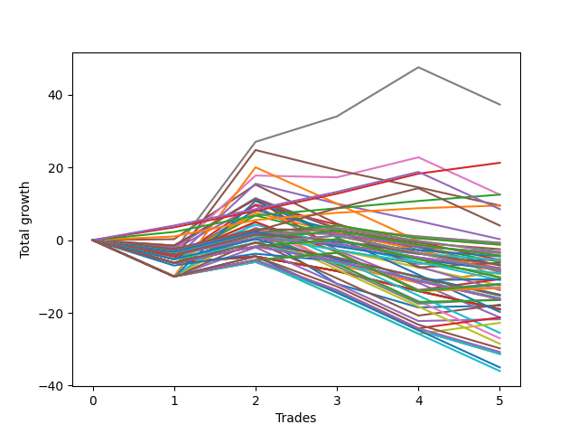

# Long Wallace Doodle 013 
- Symbol: ES_Unlimited
- Date Range: 03/18/2022 - 07/15/2022
- Trading Period: 7:20-12:30
- Number of Trades: 5



| Name | Win Percent | Profit | Avg Profit / Trade | Avg Time / Trade |      | Name | Win Percent | Profit | Avg Profit / Trade | Avg Time / Trade |
| ---- | ----------- | ------ | ------------------ | ---------------- | ---- | ---- | ----------- | ------ | ------------------ | ---------------- |
| Sorted By <br> Profit | | | | | | Sorted By <br> Win Percentage ||||
| Seven | 60.00 | 18625.00 | 3725.00 | 159:24 |     | Eighty-Three | 100.00 | 10625.00 | 2125.00 | 77:30 |
| Eighty-Three | 100.00 | 10625.00 | 2125.00 | 77:30 |     | Eighty-Two | 100.00 | 6250.00 | 1250.00 | 45:57 |
| Eighty-Two | 100.00 | 6250.00 | 1250.00 | 45:57 |     | Eighty-One | 100.00 | 4750.00 | 950.00 | 44:28 |
| Six | 40.00 | 6250.00 | 1250.00 | 136:49 |     | Eighty-Four | 80.00 | 4250.00 | 850.00 | 111:12 |
| Eighty-One | 100.00 | 4750.00 | 950.00 | 44:28 |     | Seven | 60.00 | 18625.00 | 3725.00 | 159:24 |
| Forty-Seven | 20.00 | 4750.00 | 950.00 | 35:08 |     | Eighty-Five | 60.00 | 2000.00 | 400.00 | 124:11 |
| Eighty-Four | 80.00 | 4250.00 | 850.00 | 111:12 |     | One Hundred Twenty-Two | 60.00 | -6000.00 | -1200.00 | 09:37 |
| Eighty-Five | 60.00 | 2000.00 | 400.00 | 124:11 |     | One Hundred Twenty-Seven | 60.00 | -6125.00 | -1225.00 | 17:46 |
| Forty-Six | 20.00 | 125.00 | 25.00 | 26:13 |     | One Hundred Twenty-One | 60.00 | -6500.00 | -1300.00 | 08:39 |
| Ninety-Two | 40.00 | -375.00 | -75.00 | 01:14 |     | One Hundred Twenty-Six | 60.00 | -6625.00 | -1325.00 | 16:48 |
| Ninety-One | 40.00 | -375.00 | -75.00 | 01:14 |     | Six | 40.00 | 6250.00 | 1250.00 | 136:49 |
| Ninety-Seven | 40.00 | -625.00 | -125.00 | 01:27 |     | Ninety-Two | 40.00 | -375.00 | -75.00 | 01:14 |
| Ninety-Six | 40.00 | -625.00 | -125.00 | 01:27 |     | Ninety-One | 40.00 | -375.00 | -75.00 | 01:14 |
| One Hundred | 20.00 | -1250.00 | -250.00 | 01:40 |     | Ninety-Seven | 40.00 | -625.00 | -125.00 | 01:27 |
| One Hundred Two | 40.00 | -1625.00 | -325.00 | 01:30 |     | Ninety-Six | 40.00 | -625.00 | -125.00 | 01:27 |
| One Hundred One | 40.00 | -1625.00 | -325.00 | 01:30 |     | One Hundred Two | 40.00 | -1625.00 | -325.00 | 01:30 |
| Ninety-Nine | 20.00 | -1750.00 | -350.00 | 01:38 |     | One Hundred One | 40.00 | -1625.00 | -325.00 | 01:30 |
| Ninety-Eight | 20.00 | -1750.00 | -350.00 | 01:38 |     | One Hundred Seven | 40.00 | -2125.00 | -425.00 | 02:44 |
| One Hundred Seven | 40.00 | -2125.00 | -425.00 | 02:44 |     | One Hundred Six | 40.00 | -2125.00 | -425.00 | 02:44 |
| One Hundred Six | 40.00 | -2125.00 | -425.00 | 02:44 |     | Three | 40.00 | -2625.00 | -525.00 | 38:44 |
| Ninety-Five | 20.00 | -2250.00 | -450.00 | 02:03 |     | Sixty-Seven | 40.00 | -3125.00 | -625.00 | 25:06 |
| Three | 40.00 | -2625.00 | -525.00 | 38:44 |     | One Hundred Twelve | 40.00 | -4250.00 | -850.00 | 03:17 |
| Ninety-Four | 20.00 | -2750.00 | -550.00 | 02:01 |     | One Hundred Eleven | 40.00 | -4250.00 | -850.00 | 03:17 |
| Ninety-Three | 20.00 | -2750.00 | -550.00 | 02:01 |     | Five | 40.00 | -4375.00 | -875.00 | 87:01 |
| Forty-Five | 20.00 | -2750.00 | -550.00 | 12:39 |     | One | 40.00 | -4375.00 | -875.00 | 25:46 |
| Two | 20.00 | -3000.00 | -600.00 | 40:11 |     | One Hundred Seventeen | 40.00 | -5125.00 | -1025.00 | 03:57 |
| Sixty-Seven | 40.00 | -3125.00 | -625.00 | 25:06 |     | One Hundred Sixteen | 40.00 | -5125.00 | -1025.00 | 03:57 |
| One Hundred Ten | 20.00 | -3375.00 | -675.00 | 03:27 |     | Seventy-Three | 40.00 | -5375.00 | -1075.00 | 12:53 |
| Forty-Two | 20.00 | -3500.00 | -700.00 | 06:42 |     | Sixty-Five | 40.00 | -5375.00 | -1075.00 | 18:06 |
| One Hundred Nine | 20.00 | -3875.00 | -775.00 | 03:25 |     | Fifty-Nine | 40.00 | -8125.00 | -1625.00 | 20:12 |
| One Hundred Eight | 20.00 | -3875.00 | -775.00 | 03:25 |     | Sixty-Four | 40.00 | -8250.00 | -1650.00 | 16:35 |
| Forty-Three | 20.00 | -3875.00 | -775.00 | 08:55 |     | Fifty-Seven | 40.00 | -8875.00 | -1775.00 | 13:50 |
| One Hundred Five | 20.00 | -4125.00 | -825.00 | 02:20 |     | Zero | 40.00 | -9000.00 | -1800.00 | 23:07 |
| One Hundred Twelve | 40.00 | -4250.00 | -850.00 | 03:17 |     | One Hundred Twenty-Eight | 40.00 | -10625.00 | -2125.00 | 19:40 |
| One Hundred Eleven | 40.00 | -4250.00 | -850.00 | 03:17 |     | Fifty-Six | 40.00 | -10875.00 | -2175.00 | 12:27 |
| Forty-Four | 20.00 | -4250.00 | -850.00 | 12:00 |     | One Hundred Twenty-Three | 40.00 | -11375.00 | -2275.00 | 11:38 |
| Five | 40.00 | -4375.00 | -875.00 | 87:01 |     | Forty-Seven | 20.00 | 4750.00 | 950.00 | 35:08 |
| One | 40.00 | -4375.00 | -875.00 | 25:46 |     | Forty-Six | 20.00 | 125.00 | 25.00 | 26:13 |
| One Hundred Four | 20.00 | -4625.00 | -925.00 | 02:18 |     | One Hundred | 20.00 | -1250.00 | -250.00 | 01:40 |
| One Hundred Three | 20.00 | -4625.00 | -925.00 | 02:18 |     | Ninety-Nine | 20.00 | -1750.00 | -350.00 | 01:38 |
| One Hundred Seventeen | 40.00 | -5125.00 | -1025.00 | 03:57 |     | Ninety-Eight | 20.00 | -1750.00 | -350.00 | 01:38 |
| One Hundred Sixteen | 40.00 | -5125.00 | -1025.00 | 03:57 |     | Ninety-Five | 20.00 | -2250.00 | -450.00 | 02:03 |
| Sixty-Three | 20.00 | -5250.00 | -1050.00 | 48:46 |     | Ninety-Four | 20.00 | -2750.00 | -550.00 | 02:01 |
| Seventy-Three | 40.00 | -5375.00 | -1075.00 | 12:53 |     | Ninety-Three | 20.00 | -2750.00 | -550.00 | 02:01 |
| Sixty-Five | 40.00 | -5375.00 | -1075.00 | 18:06 |     | Forty-Five | 20.00 | -2750.00 | -550.00 | 12:39 |
| Forty-One | 20.00 | -5500.00 | -1100.00 | 06:33 |     | Two | 20.00 | -3000.00 | -600.00 | 40:11 |
| One Hundred Twenty-Two | 60.00 | -6000.00 | -1200.00 | 09:37 |     | One Hundred Ten | 20.00 | -3375.00 | -675.00 | 03:27 |
| One Hundred Twenty-Seven | 60.00 | -6125.00 | -1225.00 | 17:46 |     | Forty-Two | 20.00 | -3500.00 | -700.00 | 06:42 |
| Forty | 20.00 | -6250.00 | -1250.00 | 05:42 |     | One Hundred Nine | 20.00 | -3875.00 | -775.00 | 03:25 |
| One Hundred Twenty-One | 60.00 | -6500.00 | -1300.00 | 08:39 |     | One Hundred Eight | 20.00 | -3875.00 | -775.00 | 03:25 |
| One Hundred Twenty-Six | 60.00 | -6625.00 | -1325.00 | 16:48 |     | Forty-Three | 20.00 | -3875.00 | -775.00 | 08:55 |
| Sixty-Six | 20.00 | -6875.00 | -1375.00 | 24:59 |     | One Hundred Five | 20.00 | -4125.00 | -825.00 | 02:20 |
| One Hundred Fifteen | 20.00 | -7500.00 | -1500.00 | 04:23 |     | Forty-Four | 20.00 | -4250.00 | -850.00 | 12:00 |
| One Hundred Twenty | 20.00 | -7625.00 | -1525.00 | 04:47 |     | One Hundred Four | 20.00 | -4625.00 | -925.00 | 02:18 |
| One Hundred Fourteen | 20.00 | -8000.00 | -1600.00 | 04:21 |     | One Hundred Three | 20.00 | -4625.00 | -925.00 | 02:18 |
| One Hundred Thirteen | 20.00 | -8000.00 | -1600.00 | 04:21 |     | Sixty-Three | 20.00 | -5250.00 | -1050.00 | 48:46 |
| Fifty-Nine | 40.00 | -8125.00 | -1625.00 | 20:12 |     | Forty-One | 20.00 | -5500.00 | -1100.00 | 06:33 |
| One Hundred Ninteen | 20.00 | -8125.00 | -1625.00 | 04:45 |     | Forty | 20.00 | -6250.00 | -1250.00 | 05:42 |
| One Hundred Eighteen | 20.00 | -8125.00 | -1625.00 | 04:45 |     | Sixty-Six | 20.00 | -6875.00 | -1375.00 | 24:59 |
| Sixty-Four | 40.00 | -8250.00 | -1650.00 | 16:35 |     | One Hundred Fifteen | 20.00 | -7500.00 | -1500.00 | 04:23 |
| Fifty-Seven | 40.00 | -8875.00 | -1775.00 | 13:50 |     | One Hundred Twenty | 20.00 | -7625.00 | -1525.00 | 04:47 |
| Zero | 40.00 | -9000.00 | -1800.00 | 23:07 |     | One Hundred Fourteen | 20.00 | -8000.00 | -1600.00 | 04:21 |
| Fifty-Five | 20.00 | -9500.00 | -1900.00 | 05:11 |     | One Hundred Thirteen | 20.00 | -8000.00 | -1600.00 | 04:21 |
| Fifty-Four | 20.00 | -9500.00 | -1900.00 | 05:11 |     | One Hundred Ninteen | 20.00 | -8125.00 | -1625.00 | 04:45 |
| Fifty-Three | 20.00 | -9500.00 | -1900.00 | 05:11 |     | One Hundred Eighteen | 20.00 | -8125.00 | -1625.00 | 04:45 |
| Fifty-Two | 20.00 | -9500.00 | -1900.00 | 05:11 |     | Fifty-Five | 20.00 | -9500.00 | -1900.00 | 05:11 |
| Fifty-One | 20.00 | -9500.00 | -1900.00 | 05:11 |     | Fifty-Four | 20.00 | -9500.00 | -1900.00 | 05:11 |
| Fifty | 20.00 | -9500.00 | -1900.00 | 05:11 |     | Fifty-Three | 20.00 | -9500.00 | -1900.00 | 05:11 |
| Forty-Nine | 20.00 | -9500.00 | -1900.00 | 05:11 |     | Fifty-Two | 20.00 | -9500.00 | -1900.00 | 05:11 |
| Forty-Eight | 20.00 | -9500.00 | -1900.00 | 05:11 |     | Fifty-One | 20.00 | -9500.00 | -1900.00 | 05:11 |
| Sixty-Two | 20.00 | -9875.00 | -1975.00 | 39:51 |     | Fifty | 20.00 | -9500.00 | -1900.00 | 05:11 |
| One Hundred Twenty-Eight | 40.00 | -10625.00 | -2125.00 | 19:40 |     | Forty-Nine | 20.00 | -9500.00 | -1900.00 | 05:11 |
| Four | 20.00 | -10625.00 | -2125.00 | 82:08 |     | Forty-Eight | 20.00 | -9500.00 | -1900.00 | 05:11 |
| Fifty-Six | 40.00 | -10875.00 | -2175.00 | 12:27 |     | Sixty-Two | 20.00 | -9875.00 | -1975.00 | 39:51 |
| One Hundred Twenty-Three | 40.00 | -11375.00 | -2275.00 | 11:38 |     | Four | 20.00 | -10625.00 | -2125.00 | 82:08 |
| Sixty-One | 20.00 | -12750.00 | -2550.00 | 26:17 |     | Sixty-One | 20.00 | -12750.00 | -2550.00 | 26:17 |
| Fifty-Eight | 20.00 | -13500.00 | -2700.00 | 20:20 |     | Fifty-Eight | 20.00 | -13500.00 | -2700.00 | 20:20 |
| Sixty | 20.00 | -14250.00 | -2850.00 | 25:38 |     | Sixty | 20.00 | -14250.00 | -2850.00 | 25:38 |
| One Hundred Thirty | 20.00 | -14875.00 | -2975.00 | 25:54 |     | One Hundred Thirty | 20.00 | -14875.00 | -2975.00 | 25:54 |
| One Hundred Twenty-Nine | 20.00 | -15375.00 | -3075.00 | 25:52 |     | One Hundred Twenty-Nine | 20.00 | -15375.00 | -3075.00 | 25:52 |
| Seventy-One | 20.00 | -15625.00 | -3125.00 | 31:15 |     | Seventy-One | 20.00 | -15625.00 | -3125.00 | 31:15 |
| Seventy | 20.00 | -15625.00 | -3125.00 | 31:15 |     | Seventy | 20.00 | -15625.00 | -3125.00 | 31:15 |
| Sixty-Nine | 20.00 | -15625.00 | -3125.00 | 31:15 |     | Sixty-Nine | 20.00 | -15625.00 | -3125.00 | 31:15 |
| Sixty-Eight | 20.00 | -15625.00 | -3125.00 | 31:15 |     | Sixty-Eight | 20.00 | -15625.00 | -3125.00 | 31:15 |
| One Hundred Twenty-Five | 20.00 | -17500.00 | -3500.00 | 18:01 |     | One Hundred Twenty-Five | 20.00 | -17500.00 | -3500.00 | 18:01 |
| One Hundred Twenty-Four | 20.00 | -18000.00 | -3600.00 | 17:59 |     | One Hundred Twenty-Four | 20.00 | -18000.00 | -3600.00 | 17:59 |

## NO STOPLOSS

### Test Zero
* Sell when price hits the middle line of the 20p bollinger
* No Stoploss
* Results:
```
Total Trades: 5
Percent Up: 40.00
Percent Down: 60.00
Total Points Moved Up: -18.00
Potential Profit: -9000.00
Total Points Ups: 8.50 Count Ups: 2
Total Points Downs: -26.50 Count Downs: 3
```

<details><summary>Trades</summary>

<code>In: 2022-03-23 10:23:00		Out: 2022-03-23 10:51:10		Total Position Time: 28:10		Total Move Up: -6.25		Total to Date: -6.25</code> <br />
<code>In: 2022-03-25 08:29:00		Out: 2022-03-25 08:36:55		Total Position Time: 07:55		Total Move Up: 8.00		Total to Date: 1.75</code> <br />
<code>In: 2022-03-28 08:27:00		Out: 2022-03-28 09:02:00		Total Position Time: 35:00		Total Move Up: -13.75		Total to Date: -12.00</code> <br />
<code>In: 2022-04-18 08:26:00		Out: 2022-04-18 08:55:05		Total Position Time: 29:05		Total Move Up: -6.50		Total to Date: -18.50</code> <br />
<code>In: 2022-06-08 09:41:00		Out: 2022-06-08 09:56:25		Total Position Time: 15:25		Total Move Up: 0.50		Total to Date: -18.00</code> <br />


</details>

### Test One
* Sell when the price hits the upper line of the 20p 1std bollinger
* No Stoploss
* Results:
```
Total Trades: 5
Percent Up: 40.00
Percent Down: 60.00
Total Points Moved Up: -8.75
Potential Profit: -4375.00
Total Points Ups: 12.50 Count Ups: 2
Total Points Downs: -21.25 Count Downs: 3
```

<details><summary>Trades</summary>

<code>In: 2022-03-23 10:23:00		Out: 2022-03-23 10:51:50		Total Position Time: 28:50		Total Move Up: -4.50		Total to Date: -4.50</code> <br />
<code>In: 2022-03-25 08:29:00		Out: 2022-03-25 08:41:10		Total Position Time: 12:10		Total Move Up: 9.50		Total to Date: 5.00</code> <br />
<code>In: 2022-03-28 08:27:00		Out: 2022-03-28 09:05:25		Total Position Time: 38:25		Total Move Up: -11.75		Total to Date: -6.75</code> <br />
<code>In: 2022-04-18 08:26:00		Out: 2022-04-18 08:57:20		Total Position Time: 31:20		Total Move Up: -5.00		Total to Date: -11.75</code> <br />
<code>In: 2022-06-08 09:41:00		Out: 2022-06-08 09:59:05		Total Position Time: 18:05		Total Move Up: 3.00		Total to Date: -8.75</code> <br />


</details>

### Test Two
* Sell when the price hits the upper line of the 20p 2std bollinger
* No Stoploss
* Results:
```
Total Trades: 5
Percent Up: 20.00
Percent Down: 80.00
Total Points Moved Up: -6.00
Potential Profit: -3000.00
Total Points Ups: 13.50 Count Ups: 1
Total Points Downs: -19.50 Count Downs: 4
```

<details><summary>Trades</summary>

<code>In: 2022-03-23 10:23:00		Out: 2022-03-23 10:54:30		Total Position Time: 31:30		Total Move Up: -2.00		Total to Date: -2.00</code> <br />
<code>In: 2022-03-25 08:29:00		Out: 2022-03-25 08:41:55		Total Position Time: 12:55		Total Move Up: 13.50		Total to Date: 11.50</code> <br />
<code>In: 2022-03-28 08:27:00		Out: 2022-03-28 09:07:10		Total Position Time: 40:10		Total Move Up: -10.50		Total to Date: 1.00</code> <br />
<code>In: 2022-04-18 08:26:00		Out: 2022-04-18 08:59:35		Total Position Time: 33:35		Total Move Up: -2.75		Total to Date: -1.75</code> <br />
<code>In: 2022-06-08 09:41:00		Out: 2022-06-08 11:03:45		Total Position Time: 82:45		Total Move Up: -4.25		Total to Date: -6.00</code> <br />


</details>

### Test Three
* Sell when price hits the middle line of the 50p bollinger
* No Stoploss
* Results:
```
Total Trades: 5
Percent Up: 40.00
Percent Down: 60.00
Total Points Moved Up: -5.25
Potential Profit: -2625.00
Total Points Ups: 14.00 Count Ups: 2
Total Points Downs: -19.25 Count Downs: 3
```

<details><summary>Trades</summary>

<code>In: 2022-03-23 10:23:00		Out: 2022-03-23 10:55:00		Total Position Time: 32:00		Total Move Up: -1.50		Total to Date: -1.50</code> <br />
<code>In: 2022-03-25 08:29:00		Out: 2022-03-25 08:53:00		Total Position Time: 24:00		Total Move Up: 12.75		Total to Date: 11.25</code> <br />
<code>In: 2022-03-28 08:27:00		Out: 2022-03-28 09:25:20		Total Position Time: 58:20		Total Move Up: -14.00		Total to Date: -2.75</code> <br />
<code>In: 2022-04-18 08:26:00		Out: 2022-04-18 09:07:15		Total Position Time: 41:15		Total Move Up: -3.75		Total to Date: -6.50</code> <br />
<code>In: 2022-06-08 09:41:00		Out: 2022-06-08 10:19:05		Total Position Time: 38:05		Total Move Up: 1.25		Total to Date: -5.25</code> <br />


</details>

### Test Four
* Sell when the price hits the upper line of the 50p 1std bollinger
* No Stoploss
* Results:
```
Total Trades: 5
Percent Up: 20.00
Percent Down: 80.00
Total Points Moved Up: -21.25
Potential Profit: -10625.00
Total Points Ups: 12.00 Count Ups: 1
Total Points Downs: -33.25 Count Downs: 4
```

<details><summary>Trades</summary>

<code>In: 2022-03-23 10:23:00		Out: 2022-03-23 11:27:00		Total Position Time: 64:00		Total Move Up: -2.50		Total to Date: -2.50</code> <br />
<code>In: 2022-03-25 08:29:00		Out: 2022-03-25 09:08:25		Total Position Time: 39:25		Total Move Up: 12.00		Total to Date: 9.50</code> <br />
<code>In: 2022-03-28 08:27:00		Out: 2022-03-28 09:35:05		Total Position Time: 68:05		Total Move Up: -12.25		Total to Date: -2.75</code> <br />
<code>In: 2022-04-18 08:26:00		Out: 2022-04-18 09:53:35		Total Position Time: 87:35		Total Move Up: -9.00		Total to Date: -11.75</code> <br />
<code>In: 2022-06-08 09:41:00		Out: 2022-06-08 12:12:35		Total Position Time: 151:35		Total Move Up: -9.50		Total to Date: -21.25</code> <br />


</details>

### Test Five
* Sell when the price hits the upper line of the 50p 2std bollinger
* No Stoploss
* Results:
```
Total Trades: 5
Percent Up: 40.00
Percent Down: 60.00
Total Points Moved Up: -8.75
Potential Profit: -4375.00
Total Points Ups: 15.25 Count Ups: 2
Total Points Downs: -24.00 Count Downs: 3
```

<details><summary>Trades</summary>

<code>In: 2022-03-23 10:23:00		Out: 2022-03-23 11:30:00		Total Position Time: 67:00		Total Move Up: 0.25		Total to Date: 0.25</code> <br />
<code>In: 2022-03-25 08:29:00		Out: 2022-03-25 09:11:40		Total Position Time: 42:40		Total Move Up: 15.00		Total to Date: 15.25</code> <br />
<code>In: 2022-03-28 08:27:00		Out: 2022-03-28 09:39:55		Total Position Time: 72:55		Total Move Up: -10.75		Total to Date: 4.50</code> <br />
<code>In: 2022-04-18 08:26:00		Out: 2022-04-18 09:58:15		Total Position Time: 92:15		Total Move Up: -7.25		Total to Date: -2.75</code> <br />
<code>In: 2022-06-08 09:41:00		Out: 2022-06-08 12:21:15		Total Position Time: 160:15		Total Move Up: -6.00		Total to Date: -8.75</code> <br />


</details>

### Test Six
* Sell when the price hits the middle line of the 1std VWAP
* No Stoploss
* Results:
```
Total Trades: 5
Percent Up: 40.00
Percent Down: 60.00
Total Points Moved Up: 12.50
Potential Profit: 6250.00
Total Points Ups: 26.25 Count Ups: 2
Total Points Downs: -13.75 Count Downs: 3
```

<details><summary>Trades</summary>

<code>In: 2022-03-23 10:23:00		Out: 2022-03-23 12:47:00		Total Position Time: 144:00		Total Move Up: -3.00		Total to Date: -3.00</code> <br />
<code>In: 2022-03-25 08:29:00		Out: 2022-03-25 10:19:30		Total Position Time: 110:30		Total Move Up: 20.75		Total to Date: 17.75</code> <br />
<code>In: 2022-03-28 08:27:00		Out: 2022-03-28 10:24:25		Total Position Time: 117:25		Total Move Up: -0.50		Total to Date: 17.25</code> <br />
<code>In: 2022-04-18 08:26:00		Out: 2022-04-18 10:32:10		Total Position Time: 126:10		Total Move Up: 5.50		Total to Date: 22.75</code> <br />
<code>In: 2022-06-08 09:41:00		Out: 2022-06-08 12:47:00		Total Position Time: 186:00		Total Move Up: -10.25		Total to Date: 12.50</code> <br />


</details>

### Test Seven
* Sell when the price hits the upper line of the 1std VWAP
* No Stoploss
* Results:
```
Total Trades: 5
Percent Up: 60.00
Percent Down: 40.00
Total Points Moved Up: 37.25
Potential Profit: 18625.00
Total Points Ups: 50.50 Count Ups: 3
Total Points Downs: -13.25 Count Downs: 2
```

<details><summary>Trades</summary>

<code>In: 2022-03-23 10:23:00		Out: 2022-03-23 12:47:00		Total Position Time: 144:00		Total Move Up: -3.00		Total to Date: -3.00</code> <br />
<code>In: 2022-03-25 08:29:00		Out: 2022-03-25 11:04:05		Total Position Time: 155:05		Total Move Up: 30.00		Total to Date: 27.00</code> <br />
<code>In: 2022-03-28 08:27:00		Out: 2022-03-28 11:29:05		Total Position Time: 182:05		Total Move Up: 7.00		Total to Date: 34.00</code> <br />
<code>In: 2022-04-18 08:26:00		Out: 2022-04-18 10:35:50		Total Position Time: 129:50		Total Move Up: 13.50		Total to Date: 47.50</code> <br />
<code>In: 2022-06-08 09:41:00		Out: 2022-06-08 12:47:00		Total Position Time: 186:00		Total Move Up: -10.25		Total to Date: 37.25</code> <br />


</details>

## STOPLOSS OF 5

### Test Forty
* Sell when price hits the middle line of the 20p bollinger
* Stoploss is 5 points
* Results:
```
Total Trades: 5
Percent Up: 20.00
Percent Down: 80.00
Total Points Moved Up: -12.50
Potential Profit: -6250.00
Total Points Ups: 8.00 Count Ups: 1
Total Points Downs: -20.50 Count Downs: 4
```

<details><summary>Trades</summary>

<code>In: 2022-03-23 10:23:00		Out: 2022-03-23 10:25:30		Total Position Time: 02:30		Total Move Up: -5.25		Total to Date: -5.25</code> <br />
<code>In: 2022-03-25 08:29:00		Out: 2022-03-25 08:36:55		Total Position Time: 07:55		Total Move Up: 8.00		Total to Date: 2.75</code> <br />
<code>In: 2022-03-28 08:27:00		Out: 2022-03-28 08:33:30		Total Position Time: 06:30		Total Move Up: -5.50		Total to Date: -2.75</code> <br />
<code>In: 2022-04-18 08:26:00		Out: 2022-04-18 08:33:50		Total Position Time: 07:50		Total Move Up: -4.75		Total to Date: -7.50</code> <br />
<code>In: 2022-06-08 09:41:00		Out: 2022-06-08 09:44:45		Total Position Time: 03:45		Total Move Up: -5.00		Total to Date: -12.50</code> <br />


</details>

### Test Forty-One
* Sell when the price hits the upper line of the 20p 1std bollinger
* Stoploss is 5 points
* Results:
```
Total Trades: 5
Percent Up: 20.00
Percent Down: 80.00
Total Points Moved Up: -11.00
Potential Profit: -5500.00
Total Points Ups: 9.50 Count Ups: 1
Total Points Downs: -20.50 Count Downs: 4
```

<details><summary>Trades</summary>

<code>In: 2022-03-23 10:23:00		Out: 2022-03-23 10:25:30		Total Position Time: 02:30		Total Move Up: -5.25		Total to Date: -5.25</code> <br />
<code>In: 2022-03-25 08:29:00		Out: 2022-03-25 08:41:10		Total Position Time: 12:10		Total Move Up: 9.50		Total to Date: 4.25</code> <br />
<code>In: 2022-03-28 08:27:00		Out: 2022-03-28 08:33:30		Total Position Time: 06:30		Total Move Up: -5.50		Total to Date: -1.25</code> <br />
<code>In: 2022-04-18 08:26:00		Out: 2022-04-18 08:33:50		Total Position Time: 07:50		Total Move Up: -4.75		Total to Date: -6.00</code> <br />
<code>In: 2022-06-08 09:41:00		Out: 2022-06-08 09:44:45		Total Position Time: 03:45		Total Move Up: -5.00		Total to Date: -11.00</code> <br />


</details>

### Test Forty-Two
* Sell when the price hits the upper line of the 20p 2std bollinger
* Stoploss is 5 points
* Results:
```
Total Trades: 5
Percent Up: 20.00
Percent Down: 80.00
Total Points Moved Up: -7.00
Potential Profit: -3500.00
Total Points Ups: 13.50 Count Ups: 1
Total Points Downs: -20.50 Count Downs: 4
```

<details><summary>Trades</summary>

<code>In: 2022-03-23 10:23:00		Out: 2022-03-23 10:25:30		Total Position Time: 02:30		Total Move Up: -5.25		Total to Date: -5.25</code> <br />
<code>In: 2022-03-25 08:29:00		Out: 2022-03-25 08:41:55		Total Position Time: 12:55		Total Move Up: 13.50		Total to Date: 8.25</code> <br />
<code>In: 2022-03-28 08:27:00		Out: 2022-03-28 08:33:30		Total Position Time: 06:30		Total Move Up: -5.50		Total to Date: 2.75</code> <br />
<code>In: 2022-04-18 08:26:00		Out: 2022-04-18 08:33:50		Total Position Time: 07:50		Total Move Up: -4.75		Total to Date: -2.00</code> <br />
<code>In: 2022-06-08 09:41:00		Out: 2022-06-08 09:44:45		Total Position Time: 03:45		Total Move Up: -5.00		Total to Date: -7.00</code> <br />


</details>

### Test Forty-Three
* Sell when price hits the middle line of the 50p bollinger
* Stoploss is 5 points
* Results:
```
Total Trades: 5
Percent Up: 20.00
Percent Down: 80.00
Total Points Moved Up: -7.75
Potential Profit: -3875.00
Total Points Ups: 12.75 Count Ups: 1
Total Points Downs: -20.50 Count Downs: 4
```

<details><summary>Trades</summary>

<code>In: 2022-03-23 10:23:00		Out: 2022-03-23 10:25:30		Total Position Time: 02:30		Total Move Up: -5.25		Total to Date: -5.25</code> <br />
<code>In: 2022-03-25 08:29:00		Out: 2022-03-25 08:53:00		Total Position Time: 24:00		Total Move Up: 12.75		Total to Date: 7.50</code> <br />
<code>In: 2022-03-28 08:27:00		Out: 2022-03-28 08:33:30		Total Position Time: 06:30		Total Move Up: -5.50		Total to Date: 2.00</code> <br />
<code>In: 2022-04-18 08:26:00		Out: 2022-04-18 08:33:50		Total Position Time: 07:50		Total Move Up: -4.75		Total to Date: -2.75</code> <br />
<code>In: 2022-06-08 09:41:00		Out: 2022-06-08 09:44:45		Total Position Time: 03:45		Total Move Up: -5.00		Total to Date: -7.75</code> <br />


</details>

### Test Forty-Four
* Sell when the price hits the upper line of the 50p 1std bollinger
* Stoploss is 5 points
* Results:
```
Total Trades: 5
Percent Up: 20.00
Percent Down: 80.00
Total Points Moved Up: -8.50
Potential Profit: -4250.00
Total Points Ups: 12.00 Count Ups: 1
Total Points Downs: -20.50 Count Downs: 4
```

<details><summary>Trades</summary>

<code>In: 2022-03-23 10:23:00		Out: 2022-03-23 10:25:30		Total Position Time: 02:30		Total Move Up: -5.25		Total to Date: -5.25</code> <br />
<code>In: 2022-03-25 08:29:00		Out: 2022-03-25 09:08:25		Total Position Time: 39:25		Total Move Up: 12.00		Total to Date: 6.75</code> <br />
<code>In: 2022-03-28 08:27:00		Out: 2022-03-28 08:33:30		Total Position Time: 06:30		Total Move Up: -5.50		Total to Date: 1.25</code> <br />
<code>In: 2022-04-18 08:26:00		Out: 2022-04-18 08:33:50		Total Position Time: 07:50		Total Move Up: -4.75		Total to Date: -3.50</code> <br />
<code>In: 2022-06-08 09:41:00		Out: 2022-06-08 09:44:45		Total Position Time: 03:45		Total Move Up: -5.00		Total to Date: -8.50</code> <br />


</details>

### Test Forty-Five
* Sell when the price hits the upper line of the 50p 2std bollinger
* Stoploss is 5 points
* Results:
```
Total Trades: 5
Percent Up: 20.00
Percent Down: 80.00
Total Points Moved Up: -5.50
Potential Profit: -2750.00
Total Points Ups: 15.00 Count Ups: 1
Total Points Downs: -20.50 Count Downs: 4
```

<details><summary>Trades</summary>

<code>In: 2022-03-23 10:23:00		Out: 2022-03-23 10:25:30		Total Position Time: 02:30		Total Move Up: -5.25		Total to Date: -5.25</code> <br />
<code>In: 2022-03-25 08:29:00		Out: 2022-03-25 09:11:40		Total Position Time: 42:40		Total Move Up: 15.00		Total to Date: 9.75</code> <br />
<code>In: 2022-03-28 08:27:00		Out: 2022-03-28 08:33:30		Total Position Time: 06:30		Total Move Up: -5.50		Total to Date: 4.25</code> <br />
<code>In: 2022-04-18 08:26:00		Out: 2022-04-18 08:33:50		Total Position Time: 07:50		Total Move Up: -4.75		Total to Date: -0.50</code> <br />
<code>In: 2022-06-08 09:41:00		Out: 2022-06-08 09:44:45		Total Position Time: 03:45		Total Move Up: -5.00		Total to Date: -5.50</code> <br />


</details>

### Test Forty-Six
* Sell when the price hits the middle line of the 1std VWAP
* Stoploss is 5 points
* Results:
```
Total Trades: 5
Percent Up: 20.00
Percent Down: 80.00
Total Points Moved Up: 0.25
Potential Profit: 125.00
Total Points Ups: 20.75 Count Ups: 1
Total Points Downs: -20.50 Count Downs: 4
```

<details><summary>Trades</summary>

<code>In: 2022-03-23 10:23:00		Out: 2022-03-23 10:25:30		Total Position Time: 02:30		Total Move Up: -5.25		Total to Date: -5.25</code> <br />
<code>In: 2022-03-25 08:29:00		Out: 2022-03-25 10:19:30		Total Position Time: 110:30		Total Move Up: 20.75		Total to Date: 15.50</code> <br />
<code>In: 2022-03-28 08:27:00		Out: 2022-03-28 08:33:30		Total Position Time: 06:30		Total Move Up: -5.50		Total to Date: 10.00</code> <br />
<code>In: 2022-04-18 08:26:00		Out: 2022-04-18 08:33:50		Total Position Time: 07:50		Total Move Up: -4.75		Total to Date: 5.25</code> <br />
<code>In: 2022-06-08 09:41:00		Out: 2022-06-08 09:44:45		Total Position Time: 03:45		Total Move Up: -5.00		Total to Date: 0.25</code> <br />


</details>

### Test Forty-Seven
* Sell when the price hits the upper line of the 1std VWAP
* Stoploss is 5 points
* Results:
```
Total Trades: 5
Percent Up: 20.00
Percent Down: 80.00
Total Points Moved Up: 9.50
Potential Profit: 4750.00
Total Points Ups: 30.00 Count Ups: 1
Total Points Downs: -20.50 Count Downs: 4
```

<details><summary>Trades</summary>

<code>In: 2022-03-23 10:23:00		Out: 2022-03-23 10:25:30		Total Position Time: 02:30		Total Move Up: -5.25		Total to Date: -5.25</code> <br />
<code>In: 2022-03-25 08:29:00		Out: 2022-03-25 11:04:05		Total Position Time: 155:05		Total Move Up: 30.00		Total to Date: 24.75</code> <br />
<code>In: 2022-03-28 08:27:00		Out: 2022-03-28 08:33:30		Total Position Time: 06:30		Total Move Up: -5.50		Total to Date: 19.25</code> <br />
<code>In: 2022-04-18 08:26:00		Out: 2022-04-18 08:33:50		Total Position Time: 07:50		Total Move Up: -4.75		Total to Date: 14.50</code> <br />
<code>In: 2022-06-08 09:41:00		Out: 2022-06-08 09:44:45		Total Position Time: 03:45		Total Move Up: -5.00		Total to Date: 9.50</code> <br />


</details>

## TRAIL STOP OF 5

### Test Forty-Eight
* Sell when price hits the middle line of the 20p bollinger
* Trailing Stop is 5 points
* Results:
```
Total Trades: 5
Percent Up: 20.00
Percent Down: 80.00
Total Points Moved Up: -19.00
Potential Profit: -9500.00
Total Points Ups: 1.75 Count Ups: 1
Total Points Downs: -20.75 Count Downs: 4
```

<details><summary>Trades</summary>

<code>In: 2022-03-23 10:23:00		Out: 2022-03-23 10:25:50		Total Position Time: 02:50		Total Move Up: -6.25		Total to Date: -6.25</code> <br />
<code>In: 2022-03-25 08:29:00		Out: 2022-03-25 08:32:20		Total Position Time: 03:20		Total Move Up: 1.75		Total to Date: -4.50</code> <br />
<code>In: 2022-03-28 08:27:00		Out: 2022-03-28 08:32:10		Total Position Time: 05:10		Total Move Up: -4.00		Total to Date: -8.50</code> <br />
<code>In: 2022-04-18 08:26:00		Out: 2022-04-18 08:36:50		Total Position Time: 10:50		Total Move Up: -5.50		Total to Date: -14.00</code> <br />
<code>In: 2022-06-08 09:41:00		Out: 2022-06-08 09:44:45		Total Position Time: 03:45		Total Move Up: -5.00		Total to Date: -19.00</code> <br />


</details>

### Test Forty-Nine
* Sell when the price hits the upper line of the 20p 1std bollinger
* Trailing Stop is 5 points
* Results:
```
Total Trades: 5
Percent Up: 20.00
Percent Down: 80.00
Total Points Moved Up: -19.00
Potential Profit: -9500.00
Total Points Ups: 1.75 Count Ups: 1
Total Points Downs: -20.75 Count Downs: 4
```

<details><summary>Trades</summary>

<code>In: 2022-03-23 10:23:00		Out: 2022-03-23 10:25:50		Total Position Time: 02:50		Total Move Up: -6.25		Total to Date: -6.25</code> <br />
<code>In: 2022-03-25 08:29:00		Out: 2022-03-25 08:32:20		Total Position Time: 03:20		Total Move Up: 1.75		Total to Date: -4.50</code> <br />
<code>In: 2022-03-28 08:27:00		Out: 2022-03-28 08:32:10		Total Position Time: 05:10		Total Move Up: -4.00		Total to Date: -8.50</code> <br />
<code>In: 2022-04-18 08:26:00		Out: 2022-04-18 08:36:50		Total Position Time: 10:50		Total Move Up: -5.50		Total to Date: -14.00</code> <br />
<code>In: 2022-06-08 09:41:00		Out: 2022-06-08 09:44:45		Total Position Time: 03:45		Total Move Up: -5.00		Total to Date: -19.00</code> <br />


</details>

### Test Fifty
* Sell when the price hits the upper line of the 20p 2std bollinger
* Trailing Stop is 5 points
* Results:
```
Total Trades: 5
Percent Up: 20.00
Percent Down: 80.00
Total Points Moved Up: -19.00
Potential Profit: -9500.00
Total Points Ups: 1.75 Count Ups: 1
Total Points Downs: -20.75 Count Downs: 4
```

<details><summary>Trades</summary>

<code>In: 2022-03-23 10:23:00		Out: 2022-03-23 10:25:50		Total Position Time: 02:50		Total Move Up: -6.25		Total to Date: -6.25</code> <br />
<code>In: 2022-03-25 08:29:00		Out: 2022-03-25 08:32:20		Total Position Time: 03:20		Total Move Up: 1.75		Total to Date: -4.50</code> <br />
<code>In: 2022-03-28 08:27:00		Out: 2022-03-28 08:32:10		Total Position Time: 05:10		Total Move Up: -4.00		Total to Date: -8.50</code> <br />
<code>In: 2022-04-18 08:26:00		Out: 2022-04-18 08:36:50		Total Position Time: 10:50		Total Move Up: -5.50		Total to Date: -14.00</code> <br />
<code>In: 2022-06-08 09:41:00		Out: 2022-06-08 09:44:45		Total Position Time: 03:45		Total Move Up: -5.00		Total to Date: -19.00</code> <br />


</details>

### Test Fifty-One
* Sell when price hits the middle line of the 50p bollinger
* Trailing Stop is 5 points
* Results:
```
Total Trades: 5
Percent Up: 20.00
Percent Down: 80.00
Total Points Moved Up: -19.00
Potential Profit: -9500.00
Total Points Ups: 1.75 Count Ups: 1
Total Points Downs: -20.75 Count Downs: 4
```

<details><summary>Trades</summary>

<code>In: 2022-03-23 10:23:00		Out: 2022-03-23 10:25:50		Total Position Time: 02:50		Total Move Up: -6.25		Total to Date: -6.25</code> <br />
<code>In: 2022-03-25 08:29:00		Out: 2022-03-25 08:32:20		Total Position Time: 03:20		Total Move Up: 1.75		Total to Date: -4.50</code> <br />
<code>In: 2022-03-28 08:27:00		Out: 2022-03-28 08:32:10		Total Position Time: 05:10		Total Move Up: -4.00		Total to Date: -8.50</code> <br />
<code>In: 2022-04-18 08:26:00		Out: 2022-04-18 08:36:50		Total Position Time: 10:50		Total Move Up: -5.50		Total to Date: -14.00</code> <br />
<code>In: 2022-06-08 09:41:00		Out: 2022-06-08 09:44:45		Total Position Time: 03:45		Total Move Up: -5.00		Total to Date: -19.00</code> <br />


</details>

### Test Fifty-Two
* Sell when the price hits the upper line of the 50p 1std bollinger
* Trailing Stop is 5 points
* Results:
```
Total Trades: 5
Percent Up: 20.00
Percent Down: 80.00
Total Points Moved Up: -19.00
Potential Profit: -9500.00
Total Points Ups: 1.75 Count Ups: 1
Total Points Downs: -20.75 Count Downs: 4
```

<details><summary>Trades</summary>

<code>In: 2022-03-23 10:23:00		Out: 2022-03-23 10:25:50		Total Position Time: 02:50		Total Move Up: -6.25		Total to Date: -6.25</code> <br />
<code>In: 2022-03-25 08:29:00		Out: 2022-03-25 08:32:20		Total Position Time: 03:20		Total Move Up: 1.75		Total to Date: -4.50</code> <br />
<code>In: 2022-03-28 08:27:00		Out: 2022-03-28 08:32:10		Total Position Time: 05:10		Total Move Up: -4.00		Total to Date: -8.50</code> <br />
<code>In: 2022-04-18 08:26:00		Out: 2022-04-18 08:36:50		Total Position Time: 10:50		Total Move Up: -5.50		Total to Date: -14.00</code> <br />
<code>In: 2022-06-08 09:41:00		Out: 2022-06-08 09:44:45		Total Position Time: 03:45		Total Move Up: -5.00		Total to Date: -19.00</code> <br />


</details>

### Test Fifty-Three
* Sell when the price hits the upper line of the 50p 2std bollinger
* Trailing Stop is 5 points
* Results:
```
Total Trades: 5
Percent Up: 20.00
Percent Down: 80.00
Total Points Moved Up: -19.00
Potential Profit: -9500.00
Total Points Ups: 1.75 Count Ups: 1
Total Points Downs: -20.75 Count Downs: 4
```

<details><summary>Trades</summary>

<code>In: 2022-03-23 10:23:00		Out: 2022-03-23 10:25:50		Total Position Time: 02:50		Total Move Up: -6.25		Total to Date: -6.25</code> <br />
<code>In: 2022-03-25 08:29:00		Out: 2022-03-25 08:32:20		Total Position Time: 03:20		Total Move Up: 1.75		Total to Date: -4.50</code> <br />
<code>In: 2022-03-28 08:27:00		Out: 2022-03-28 08:32:10		Total Position Time: 05:10		Total Move Up: -4.00		Total to Date: -8.50</code> <br />
<code>In: 2022-04-18 08:26:00		Out: 2022-04-18 08:36:50		Total Position Time: 10:50		Total Move Up: -5.50		Total to Date: -14.00</code> <br />
<code>In: 2022-06-08 09:41:00		Out: 2022-06-08 09:44:45		Total Position Time: 03:45		Total Move Up: -5.00		Total to Date: -19.00</code> <br />


</details>

### Test Fifty-Four
* Sell when the price hits the middle line of the 1std VWAP
* Trailing Stop is 5 points
* Results:
```
Total Trades: 5
Percent Up: 20.00
Percent Down: 80.00
Total Points Moved Up: -19.00
Potential Profit: -9500.00
Total Points Ups: 1.75 Count Ups: 1
Total Points Downs: -20.75 Count Downs: 4
```

<details><summary>Trades</summary>

<code>In: 2022-03-23 10:23:00		Out: 2022-03-23 10:25:50		Total Position Time: 02:50		Total Move Up: -6.25		Total to Date: -6.25</code> <br />
<code>In: 2022-03-25 08:29:00		Out: 2022-03-25 08:32:20		Total Position Time: 03:20		Total Move Up: 1.75		Total to Date: -4.50</code> <br />
<code>In: 2022-03-28 08:27:00		Out: 2022-03-28 08:32:10		Total Position Time: 05:10		Total Move Up: -4.00		Total to Date: -8.50</code> <br />
<code>In: 2022-04-18 08:26:00		Out: 2022-04-18 08:36:50		Total Position Time: 10:50		Total Move Up: -5.50		Total to Date: -14.00</code> <br />
<code>In: 2022-06-08 09:41:00		Out: 2022-06-08 09:44:45		Total Position Time: 03:45		Total Move Up: -5.00		Total to Date: -19.00</code> <br />


</details>

### Test Fifty-Five
* Sell when the price hits the upper line of the 1std VWAP
* Trailing Stop is 5 points
* Results:
```
Total Trades: 5
Percent Up: 20.00
Percent Down: 80.00
Total Points Moved Up: -19.00
Potential Profit: -9500.00
Total Points Ups: 1.75 Count Ups: 1
Total Points Downs: -20.75 Count Downs: 4
```

<details><summary>Trades</summary>

<code>In: 2022-03-23 10:23:00		Out: 2022-03-23 10:25:50		Total Position Time: 02:50		Total Move Up: -6.25		Total to Date: -6.25</code> <br />
<code>In: 2022-03-25 08:29:00		Out: 2022-03-25 08:32:20		Total Position Time: 03:20		Total Move Up: 1.75		Total to Date: -4.50</code> <br />
<code>In: 2022-03-28 08:27:00		Out: 2022-03-28 08:32:10		Total Position Time: 05:10		Total Move Up: -4.00		Total to Date: -8.50</code> <br />
<code>In: 2022-04-18 08:26:00		Out: 2022-04-18 08:36:50		Total Position Time: 10:50		Total Move Up: -5.50		Total to Date: -14.00</code> <br />
<code>In: 2022-06-08 09:41:00		Out: 2022-06-08 09:44:45		Total Position Time: 03:45		Total Move Up: -5.00		Total to Date: -19.00</code> <br />


</details>

## STOPLOSS OF 10

### Test Fifty-Six
* Sell when price hits the middle line of the 20p bollinger
* Stoploss is 10 points
* Results:
```
Total Trades: 5
Percent Up: 40.00
Percent Down: 60.00
Total Points Moved Up: -21.75
Potential Profit: -10875.00
Total Points Ups: 8.50 Count Ups: 2
Total Points Downs: -30.25 Count Downs: 3
```

<details><summary>Trades</summary>

<code>In: 2022-03-23 10:23:00		Out: 2022-03-23 10:30:15		Total Position Time: 07:15		Total Move Up: -10.00		Total to Date: -10.00</code> <br />
<code>In: 2022-03-25 08:29:00		Out: 2022-03-25 08:36:55		Total Position Time: 07:55		Total Move Up: 8.00		Total to Date: -2.00</code> <br />
<code>In: 2022-03-28 08:27:00		Out: 2022-03-28 08:36:20		Total Position Time: 09:20		Total Move Up: -10.00		Total to Date: -12.00</code> <br />
<code>In: 2022-04-18 08:26:00		Out: 2022-04-18 08:48:20		Total Position Time: 22:20		Total Move Up: -10.25		Total to Date: -22.25</code> <br />
<code>In: 2022-06-08 09:41:00		Out: 2022-06-08 09:56:25		Total Position Time: 15:25		Total Move Up: 0.50		Total to Date: -21.75</code> <br />


</details>

### Test Fifty-Seven
* Sell when the price hits the upper line of the 20p 1std bollinger
* Stoploss is 10 points
* Results:
```
Total Trades: 5
Percent Up: 40.00
Percent Down: 60.00
Total Points Moved Up: -17.75
Potential Profit: -8875.00
Total Points Ups: 12.50 Count Ups: 2
Total Points Downs: -30.25 Count Downs: 3
```

<details><summary>Trades</summary>

<code>In: 2022-03-23 10:23:00		Out: 2022-03-23 10:30:15		Total Position Time: 07:15		Total Move Up: -10.00		Total to Date: -10.00</code> <br />
<code>In: 2022-03-25 08:29:00		Out: 2022-03-25 08:41:10		Total Position Time: 12:10		Total Move Up: 9.50		Total to Date: -0.50</code> <br />
<code>In: 2022-03-28 08:27:00		Out: 2022-03-28 08:36:20		Total Position Time: 09:20		Total Move Up: -10.00		Total to Date: -10.50</code> <br />
<code>In: 2022-04-18 08:26:00		Out: 2022-04-18 08:48:20		Total Position Time: 22:20		Total Move Up: -10.25		Total to Date: -20.75</code> <br />
<code>In: 2022-06-08 09:41:00		Out: 2022-06-08 09:59:05		Total Position Time: 18:05		Total Move Up: 3.00		Total to Date: -17.75</code> <br />


</details>

### Test Fifty-Eight
* Sell when the price hits the upper line of the 20p 2std bollinger
* Stoploss is 10 points
* Results:
```
Total Trades: 5
Percent Up: 20.00
Percent Down: 80.00
Total Points Moved Up: -27.00
Potential Profit: -13500.00
Total Points Ups: 13.50 Count Ups: 1
Total Points Downs: -40.50 Count Downs: 4
```

<details><summary>Trades</summary>

<code>In: 2022-03-23 10:23:00		Out: 2022-03-23 10:30:15		Total Position Time: 07:15		Total Move Up: -10.00		Total to Date: -10.00</code> <br />
<code>In: 2022-03-25 08:29:00		Out: 2022-03-25 08:41:55		Total Position Time: 12:55		Total Move Up: 13.50		Total to Date: 3.50</code> <br />
<code>In: 2022-03-28 08:27:00		Out: 2022-03-28 08:36:20		Total Position Time: 09:20		Total Move Up: -10.00		Total to Date: -6.50</code> <br />
<code>In: 2022-04-18 08:26:00		Out: 2022-04-18 08:48:20		Total Position Time: 22:20		Total Move Up: -10.25		Total to Date: -16.75</code> <br />
<code>In: 2022-06-08 09:41:00		Out: 2022-06-08 10:30:50		Total Position Time: 49:50		Total Move Up: -10.25		Total to Date: -27.00</code> <br />


</details>

### Test Fifty-Nine
* Sell when price hits the middle line of the 50p bollinger
* Stoploss is 10 points
* Results:
```
Total Trades: 5
Percent Up: 40.00
Percent Down: 60.00
Total Points Moved Up: -16.25
Potential Profit: -8125.00
Total Points Ups: 14.00 Count Ups: 2
Total Points Downs: -30.25 Count Downs: 3
```

<details><summary>Trades</summary>

<code>In: 2022-03-23 10:23:00		Out: 2022-03-23 10:30:15		Total Position Time: 07:15		Total Move Up: -10.00		Total to Date: -10.00</code> <br />
<code>In: 2022-03-25 08:29:00		Out: 2022-03-25 08:53:00		Total Position Time: 24:00		Total Move Up: 12.75		Total to Date: 2.75</code> <br />
<code>In: 2022-03-28 08:27:00		Out: 2022-03-28 08:36:20		Total Position Time: 09:20		Total Move Up: -10.00		Total to Date: -7.25</code> <br />
<code>In: 2022-04-18 08:26:00		Out: 2022-04-18 08:48:20		Total Position Time: 22:20		Total Move Up: -10.25		Total to Date: -17.50</code> <br />
<code>In: 2022-06-08 09:41:00		Out: 2022-06-08 10:19:05		Total Position Time: 38:05		Total Move Up: 1.25		Total to Date: -16.25</code> <br />


</details>

### Test Sixty
* Sell when the price hits the upper line of the 50p 1std bollinger
* Stoploss is 10 points
* Results:
```
Total Trades: 5
Percent Up: 20.00
Percent Down: 80.00
Total Points Moved Up: -28.50
Potential Profit: -14250.00
Total Points Ups: 12.00 Count Ups: 1
Total Points Downs: -40.50 Count Downs: 4
```

<details><summary>Trades</summary>

<code>In: 2022-03-23 10:23:00		Out: 2022-03-23 10:30:15		Total Position Time: 07:15		Total Move Up: -10.00		Total to Date: -10.00</code> <br />
<code>In: 2022-03-25 08:29:00		Out: 2022-03-25 09:08:25		Total Position Time: 39:25		Total Move Up: 12.00		Total to Date: 2.00</code> <br />
<code>In: 2022-03-28 08:27:00		Out: 2022-03-28 08:36:20		Total Position Time: 09:20		Total Move Up: -10.00		Total to Date: -8.00</code> <br />
<code>In: 2022-04-18 08:26:00		Out: 2022-04-18 08:48:20		Total Position Time: 22:20		Total Move Up: -10.25		Total to Date: -18.25</code> <br />
<code>In: 2022-06-08 09:41:00		Out: 2022-06-08 10:30:50		Total Position Time: 49:50		Total Move Up: -10.25		Total to Date: -28.50</code> <br />


</details>

### Test Sixty-One
* Sell when the price hits the upper line of the 50p 2std bollinger
* Stoploss is 10 points
* Results:
```
Total Trades: 5
Percent Up: 20.00
Percent Down: 80.00
Total Points Moved Up: -25.50
Potential Profit: -12750.00
Total Points Ups: 15.00 Count Ups: 1
Total Points Downs: -40.50 Count Downs: 4
```

<details><summary>Trades</summary>

<code>In: 2022-03-23 10:23:00		Out: 2022-03-23 10:30:15		Total Position Time: 07:15		Total Move Up: -10.00		Total to Date: -10.00</code> <br />
<code>In: 2022-03-25 08:29:00		Out: 2022-03-25 09:11:40		Total Position Time: 42:40		Total Move Up: 15.00		Total to Date: 5.00</code> <br />
<code>In: 2022-03-28 08:27:00		Out: 2022-03-28 08:36:20		Total Position Time: 09:20		Total Move Up: -10.00		Total to Date: -5.00</code> <br />
<code>In: 2022-04-18 08:26:00		Out: 2022-04-18 08:48:20		Total Position Time: 22:20		Total Move Up: -10.25		Total to Date: -15.25</code> <br />
<code>In: 2022-06-08 09:41:00		Out: 2022-06-08 10:30:50		Total Position Time: 49:50		Total Move Up: -10.25		Total to Date: -25.50</code> <br />


</details>

### Test Sixty-Two
* Sell when the price hits the middle line of the 1std VWAP
* Stoploss is 10 points
* Results:
```
Total Trades: 5
Percent Up: 20.00
Percent Down: 80.00
Total Points Moved Up: -19.75
Potential Profit: -9875.00
Total Points Ups: 20.75 Count Ups: 1
Total Points Downs: -40.50 Count Downs: 4
```

<details><summary>Trades</summary>

<code>In: 2022-03-23 10:23:00		Out: 2022-03-23 10:30:15		Total Position Time: 07:15		Total Move Up: -10.00		Total to Date: -10.00</code> <br />
<code>In: 2022-03-25 08:29:00		Out: 2022-03-25 10:19:30		Total Position Time: 110:30		Total Move Up: 20.75		Total to Date: 10.75</code> <br />
<code>In: 2022-03-28 08:27:00		Out: 2022-03-28 08:36:20		Total Position Time: 09:20		Total Move Up: -10.00		Total to Date: 0.75</code> <br />
<code>In: 2022-04-18 08:26:00		Out: 2022-04-18 08:48:20		Total Position Time: 22:20		Total Move Up: -10.25		Total to Date: -9.50</code> <br />
<code>In: 2022-06-08 09:41:00		Out: 2022-06-08 10:30:50		Total Position Time: 49:50		Total Move Up: -10.25		Total to Date: -19.75</code> <br />


</details>

### Test Sixty-Three
* Sell when the price hits the upper line of the 1std VWAP
* Stoploss is 10 points
* Results:
```
Total Trades: 5
Percent Up: 20.00
Percent Down: 80.00
Total Points Moved Up: -10.50
Potential Profit: -5250.00
Total Points Ups: 30.00 Count Ups: 1
Total Points Downs: -40.50 Count Downs: 4
```

<details><summary>Trades</summary>

<code>In: 2022-03-23 10:23:00		Out: 2022-03-23 10:30:15		Total Position Time: 07:15		Total Move Up: -10.00		Total to Date: -10.00</code> <br />
<code>In: 2022-03-25 08:29:00		Out: 2022-03-25 11:04:05		Total Position Time: 155:05		Total Move Up: 30.00		Total to Date: 20.00</code> <br />
<code>In: 2022-03-28 08:27:00		Out: 2022-03-28 08:36:20		Total Position Time: 09:20		Total Move Up: -10.00		Total to Date: 10.00</code> <br />
<code>In: 2022-04-18 08:26:00		Out: 2022-04-18 08:48:20		Total Position Time: 22:20		Total Move Up: -10.25		Total to Date: -0.25</code> <br />
<code>In: 2022-06-08 09:41:00		Out: 2022-06-08 10:30:50		Total Position Time: 49:50		Total Move Up: -10.25		Total to Date: -10.50</code> <br />


</details>

## TRAIL STOP OF 10

### Test Sixty-Four
* Sell when price hits the middle line of the 20p bollinger
* Trailing Stop is 10 points
* Results:
```
Total Trades: 5
Percent Up: 40.00
Percent Down: 60.00
Total Points Moved Up: -16.50
Potential Profit: -8250.00
Total Points Ups: 8.50 Count Ups: 2
Total Points Downs: -25.00 Count Downs: 3
```

<details><summary>Trades</summary>

<code>In: 2022-03-23 10:23:00		Out: 2022-03-23 10:51:10		Total Position Time: 28:10		Total Move Up: -6.25		Total to Date: -6.25</code> <br />
<code>In: 2022-03-25 08:29:00		Out: 2022-03-25 08:36:55		Total Position Time: 07:55		Total Move Up: 8.00		Total to Date: 1.75</code> <br />
<code>In: 2022-03-28 08:27:00		Out: 2022-03-28 08:35:45		Total Position Time: 08:45		Total Move Up: -8.25		Total to Date: -6.50</code> <br />
<code>In: 2022-04-18 08:26:00		Out: 2022-04-18 08:48:40		Total Position Time: 22:40		Total Move Up: -10.50		Total to Date: -17.00</code> <br />
<code>In: 2022-06-08 09:41:00		Out: 2022-06-08 09:56:25		Total Position Time: 15:25		Total Move Up: 0.50		Total to Date: -16.50</code> <br />


</details>

### Test Sixty-Five
* Sell when the price hits the upper line of the 20p 1std bollinger
* Trailing Stop is 10 points
* Results:
```
Total Trades: 5
Percent Up: 40.00
Percent Down: 60.00
Total Points Moved Up: -10.75
Potential Profit: -5375.00
Total Points Ups: 12.50 Count Ups: 2
Total Points Downs: -23.25 Count Downs: 3
```

<details><summary>Trades</summary>

<code>In: 2022-03-23 10:23:00		Out: 2022-03-23 10:51:50		Total Position Time: 28:50		Total Move Up: -4.50		Total to Date: -4.50</code> <br />
<code>In: 2022-03-25 08:29:00		Out: 2022-03-25 08:41:10		Total Position Time: 12:10		Total Move Up: 9.50		Total to Date: 5.00</code> <br />
<code>In: 2022-03-28 08:27:00		Out: 2022-03-28 08:35:45		Total Position Time: 08:45		Total Move Up: -8.25		Total to Date: -3.25</code> <br />
<code>In: 2022-04-18 08:26:00		Out: 2022-04-18 08:48:40		Total Position Time: 22:40		Total Move Up: -10.50		Total to Date: -13.75</code> <br />
<code>In: 2022-06-08 09:41:00		Out: 2022-06-08 09:59:05		Total Position Time: 18:05		Total Move Up: 3.00		Total to Date: -10.75</code> <br />


</details>

### Test Sixty-Six
* Sell when the price hits the upper line of the 20p 2std bollinger
* Trailing Stop is 10 points
* Results:
```
Total Trades: 5
Percent Up: 20.00
Percent Down: 80.00
Total Points Moved Up: -13.75
Potential Profit: -6875.00
Total Points Ups: 13.50 Count Ups: 1
Total Points Downs: -27.25 Count Downs: 4
```

<details><summary>Trades</summary>

<code>In: 2022-03-23 10:23:00		Out: 2022-03-23 10:54:30		Total Position Time: 31:30		Total Move Up: -2.00		Total to Date: -2.00</code> <br />
<code>In: 2022-03-25 08:29:00		Out: 2022-03-25 08:41:55		Total Position Time: 12:55		Total Move Up: 13.50		Total to Date: 11.50</code> <br />
<code>In: 2022-03-28 08:27:00		Out: 2022-03-28 08:35:45		Total Position Time: 08:45		Total Move Up: -8.25		Total to Date: 3.25</code> <br />
<code>In: 2022-04-18 08:26:00		Out: 2022-04-18 08:48:40		Total Position Time: 22:40		Total Move Up: -10.50		Total to Date: -7.25</code> <br />
<code>In: 2022-06-08 09:41:00		Out: 2022-06-08 10:30:05		Total Position Time: 49:05		Total Move Up: -6.50		Total to Date: -13.75</code> <br />


</details>

### Test Sixty-Seven
* Sell when price hits the middle line of the 50p bollinger
* Trailing Stop is 10 points
* Results:
```
Total Trades: 5
Percent Up: 40.00
Percent Down: 60.00
Total Points Moved Up: -6.25
Potential Profit: -3125.00
Total Points Ups: 14.00 Count Ups: 2
Total Points Downs: -20.25 Count Downs: 3
```

<details><summary>Trades</summary>

<code>In: 2022-03-23 10:23:00		Out: 2022-03-23 10:55:00		Total Position Time: 32:00		Total Move Up: -1.50		Total to Date: -1.50</code> <br />
<code>In: 2022-03-25 08:29:00		Out: 2022-03-25 08:53:00		Total Position Time: 24:00		Total Move Up: 12.75		Total to Date: 11.25</code> <br />
<code>In: 2022-03-28 08:27:00		Out: 2022-03-28 08:35:45		Total Position Time: 08:45		Total Move Up: -8.25		Total to Date: 3.00</code> <br />
<code>In: 2022-04-18 08:26:00		Out: 2022-04-18 08:48:40		Total Position Time: 22:40		Total Move Up: -10.50		Total to Date: -7.50</code> <br />
<code>In: 2022-06-08 09:41:00		Out: 2022-06-08 10:19:05		Total Position Time: 38:05		Total Move Up: 1.25		Total to Date: -6.25</code> <br />


</details>

### Test Sixty-Eight
* Sell when the price hits the upper line of the 50p 1std bollinger
* Trailing Stop is 10 points
* Results:
```
Total Trades: 5
Percent Up: 20.00
Percent Down: 80.00
Total Points Moved Up: -31.25
Potential Profit: -15625.00
Total Points Ups: 4.00 Count Ups: 1
Total Points Downs: -35.25 Count Downs: 4
```

<details><summary>Trades</summary>

<code>In: 2022-03-23 10:23:00		Out: 2022-03-23 11:10:40		Total Position Time: 47:40		Total Move Up: -10.00		Total to Date: -10.00</code> <br />
<code>In: 2022-03-25 08:29:00		Out: 2022-03-25 08:57:05		Total Position Time: 28:05		Total Move Up: 4.00		Total to Date: -6.00</code> <br />
<code>In: 2022-03-28 08:27:00		Out: 2022-03-28 08:35:45		Total Position Time: 08:45		Total Move Up: -8.25		Total to Date: -14.25</code> <br />
<code>In: 2022-04-18 08:26:00		Out: 2022-04-18 08:48:40		Total Position Time: 22:40		Total Move Up: -10.50		Total to Date: -24.75</code> <br />
<code>In: 2022-06-08 09:41:00		Out: 2022-06-08 10:30:05		Total Position Time: 49:05		Total Move Up: -6.50		Total to Date: -31.25</code> <br />


</details>

### Test Sixty-Nine
* Sell when the price hits the upper line of the 50p 2std bollinger
* Trailing Stop is 10 points
* Results:
```
Total Trades: 5
Percent Up: 20.00
Percent Down: 80.00
Total Points Moved Up: -31.25
Potential Profit: -15625.00
Total Points Ups: 4.00 Count Ups: 1
Total Points Downs: -35.25 Count Downs: 4
```

<details><summary>Trades</summary>

<code>In: 2022-03-23 10:23:00		Out: 2022-03-23 11:10:40		Total Position Time: 47:40		Total Move Up: -10.00		Total to Date: -10.00</code> <br />
<code>In: 2022-03-25 08:29:00		Out: 2022-03-25 08:57:05		Total Position Time: 28:05		Total Move Up: 4.00		Total to Date: -6.00</code> <br />
<code>In: 2022-03-28 08:27:00		Out: 2022-03-28 08:35:45		Total Position Time: 08:45		Total Move Up: -8.25		Total to Date: -14.25</code> <br />
<code>In: 2022-04-18 08:26:00		Out: 2022-04-18 08:48:40		Total Position Time: 22:40		Total Move Up: -10.50		Total to Date: -24.75</code> <br />
<code>In: 2022-06-08 09:41:00		Out: 2022-06-08 10:30:05		Total Position Time: 49:05		Total Move Up: -6.50		Total to Date: -31.25</code> <br />


</details>

### Test Seventy
* Sell when the price hits the middle line of the 1std VWAP
* Trailing Stop is 10 points
* Results:
```
Total Trades: 5
Percent Up: 20.00
Percent Down: 80.00
Total Points Moved Up: -31.25
Potential Profit: -15625.00
Total Points Ups: 4.00 Count Ups: 1
Total Points Downs: -35.25 Count Downs: 4
```

<details><summary>Trades</summary>

<code>In: 2022-03-23 10:23:00		Out: 2022-03-23 11:10:40		Total Position Time: 47:40		Total Move Up: -10.00		Total to Date: -10.00</code> <br />
<code>In: 2022-03-25 08:29:00		Out: 2022-03-25 08:57:05		Total Position Time: 28:05		Total Move Up: 4.00		Total to Date: -6.00</code> <br />
<code>In: 2022-03-28 08:27:00		Out: 2022-03-28 08:35:45		Total Position Time: 08:45		Total Move Up: -8.25		Total to Date: -14.25</code> <br />
<code>In: 2022-04-18 08:26:00		Out: 2022-04-18 08:48:40		Total Position Time: 22:40		Total Move Up: -10.50		Total to Date: -24.75</code> <br />
<code>In: 2022-06-08 09:41:00		Out: 2022-06-08 10:30:05		Total Position Time: 49:05		Total Move Up: -6.50		Total to Date: -31.25</code> <br />


</details>

### Test Seventy-One
* Sell when the price hits the upper line of the 1std VWAP
* Trailing Stop is 10 points
* Results:
```
Total Trades: 5
Percent Up: 20.00
Percent Down: 80.00
Total Points Moved Up: -31.25
Potential Profit: -15625.00
Total Points Ups: 4.00 Count Ups: 1
Total Points Downs: -35.25 Count Downs: 4
```

<details><summary>Trades</summary>

<code>In: 2022-03-23 10:23:00		Out: 2022-03-23 11:10:40		Total Position Time: 47:40		Total Move Up: -10.00		Total to Date: -10.00</code> <br />
<code>In: 2022-03-25 08:29:00		Out: 2022-03-25 08:57:05		Total Position Time: 28:05		Total Move Up: 4.00		Total to Date: -6.00</code> <br />
<code>In: 2022-03-28 08:27:00		Out: 2022-03-28 08:35:45		Total Position Time: 08:45		Total Move Up: -8.25		Total to Date: -14.25</code> <br />
<code>In: 2022-04-18 08:26:00		Out: 2022-04-18 08:48:40		Total Position Time: 22:40		Total Move Up: -10.50		Total to Date: -24.75</code> <br />
<code>In: 2022-06-08 09:41:00		Out: 2022-06-08 10:30:05		Total Position Time: 49:05		Total Move Up: -6.50		Total to Date: -31.25</code> <br />


</details>

## SPECIAL EXIT CONDITIONS 

### Test Seventy-Three
* Sell when the linear regression slope changes to negative
* No Stoploss
* Results:
```
Total Trades: 5
Percent Up: 40.00
Percent Down: 60.00
Total Points Moved Up: -10.75
Potential Profit: -5375.00
Total Points Ups: 3.50 Count Ups: 2
Total Points Downs: -14.25 Count Downs: 3
```

<details><summary>Trades</summary>

<code>In: 2022-03-23 10:23:00		Out: 2022-03-23 10:43:05		Total Position Time: 20:05		Total Move Up: -7.00		Total to Date: -7.00</code> <br />
<code>In: 2022-03-25 08:29:00		Out: 2022-03-25 08:34:05		Total Position Time: 05:05		Total Move Up: 3.25		Total to Date: -3.75</code> <br />
<code>In: 2022-03-28 08:27:00		Out: 2022-03-28 08:33:05		Total Position Time: 06:05		Total Move Up: -2.00		Total to Date: -5.75</code> <br />
<code>In: 2022-04-18 08:26:00		Out: 2022-04-18 08:39:05		Total Position Time: 13:05		Total Move Up: -5.25		Total to Date: -11.00</code> <br />
<code>In: 2022-06-08 09:41:00		Out: 2022-06-08 10:01:05		Total Position Time: 20:05		Total Move Up: 0.25		Total to Date: -10.75</code> <br />


</details>

## TAKE PROFIT

### Test Eighty-One
* Take Profit of 1 Point
* No Stoploss
* Results:
```
Total Trades: 5
Percent Up: 100.00
Percent Down: 0.00
Total Points Moved Up: 9.50
Potential Profit: 4750.00
Total Points Ups: 9.50 Count Ups: 5
Total Points Downs: 0.00 Count Downs: 0
```

<details><summary>Trades</summary>

<code>In: 2022-03-23 10:23:00		Out: 2022-03-23 11:46:05		Total Position Time: 83:05		Total Move Up: 1.00		Total to Date: 1.00</code> <br />
<code>In: 2022-03-25 08:29:00		Out: 2022-03-25 08:30:10		Total Position Time: 01:10		Total Move Up: 4.50		Total to Date: 5.50</code> <br />
<code>In: 2022-03-28 08:27:00		Out: 2022-03-28 08:28:10		Total Position Time: 01:10		Total Move Up: 2.00		Total to Date: 7.50</code> <br />
<code>In: 2022-04-18 08:26:00		Out: 2022-04-18 10:31:35		Total Position Time: 125:35		Total Move Up: 1.25		Total to Date: 8.75</code> <br />
<code>In: 2022-06-08 09:41:00		Out: 2022-06-08 09:52:20		Total Position Time: 11:20		Total Move Up: 0.75		Total to Date: 9.50</code> <br />


</details>

### Test Eighty-Two
* Take Profit of 2 Point
* No Stoploss
* Results:
```
Total Trades: 5
Percent Up: 100.00
Percent Down: 0.00
Total Points Moved Up: 12.50
Potential Profit: 6250.00
Total Points Ups: 12.50 Count Ups: 5
Total Points Downs: 0.00 Count Downs: 0
```

<details><summary>Trades</summary>

<code>In: 2022-03-23 10:23:00		Out: 2022-03-23 11:48:35		Total Position Time: 85:35		Total Move Up: 2.25		Total to Date: 2.25</code> <br />
<code>In: 2022-03-25 08:29:00		Out: 2022-03-25 08:30:10		Total Position Time: 01:10		Total Move Up: 4.50		Total to Date: 6.75</code> <br />
<code>In: 2022-03-28 08:27:00		Out: 2022-03-28 08:28:10		Total Position Time: 01:10		Total Move Up: 2.00		Total to Date: 8.75</code> <br />
<code>In: 2022-04-18 08:26:00		Out: 2022-04-18 10:31:40		Total Position Time: 125:40		Total Move Up: 2.00		Total to Date: 10.75</code> <br />
<code>In: 2022-06-08 09:41:00		Out: 2022-06-08 09:57:10		Total Position Time: 16:10		Total Move Up: 1.75		Total to Date: 12.50</code> <br />


</details>

### Test Eighty-Three
* Take Profit of 3 Point
* No Stoploss
* Results:
```
Total Trades: 5
Percent Up: 100.00
Percent Down: 0.00
Total Points Moved Up: 21.25
Potential Profit: 10625.00
Total Points Ups: 21.25 Count Ups: 5
Total Points Downs: 0.00 Count Downs: 0
```

<details><summary>Trades</summary>

<code>In: 2022-03-23 10:23:00		Out: 2022-03-23 11:49:00		Total Position Time: 86:00		Total Move Up: 3.50		Total to Date: 3.50</code> <br />
<code>In: 2022-03-25 08:29:00		Out: 2022-03-25 08:30:10		Total Position Time: 01:10		Total Move Up: 4.50		Total to Date: 8.00</code> <br />
<code>In: 2022-03-28 08:27:00		Out: 2022-03-28 11:03:05		Total Position Time: 156:05		Total Move Up: 4.75		Total to Date: 12.75</code> <br />
<code>In: 2022-04-18 08:26:00		Out: 2022-04-18 10:32:10		Total Position Time: 126:10		Total Move Up: 5.50		Total to Date: 18.25</code> <br />
<code>In: 2022-06-08 09:41:00		Out: 2022-06-08 09:59:05		Total Position Time: 18:05		Total Move Up: 3.00		Total to Date: 21.25</code> <br />


</details>

### Test Eighty-Four
* Take Profit of 4 Point
* No Stoploss
* Results:
```
Total Trades: 5
Percent Up: 80.00
Percent Down: 20.00
Total Points Moved Up: 8.50
Potential Profit: 4250.00
Total Points Ups: 18.75 Count Ups: 4
Total Points Downs: -10.25 Count Downs: 1
```

<details><summary>Trades</summary>

<code>In: 2022-03-23 10:23:00		Out: 2022-03-23 11:49:35		Total Position Time: 86:35		Total Move Up: 4.00		Total to Date: 4.00</code> <br />
<code>In: 2022-03-25 08:29:00		Out: 2022-03-25 08:30:10		Total Position Time: 01:10		Total Move Up: 4.50		Total to Date: 8.50</code> <br />
<code>In: 2022-03-28 08:27:00		Out: 2022-03-28 11:03:05		Total Position Time: 156:05		Total Move Up: 4.75		Total to Date: 13.25</code> <br />
<code>In: 2022-04-18 08:26:00		Out: 2022-04-18 10:32:10		Total Position Time: 126:10		Total Move Up: 5.50		Total to Date: 18.75</code> <br />
<code>In: 2022-06-08 09:41:00		Out: 2022-06-08 12:47:00		Total Position Time: 186:00		Total Move Up: -10.25		Total to Date: 8.50</code> <br />


</details>

### Test Eighty-Five
* Take Profit of 5 Point
* No Stoploss
* Results:
```
Total Trades: 5
Percent Up: 60.00
Percent Down: 40.00
Total Points Moved Up: 4.00
Potential Profit: 2000.00
Total Points Ups: 17.25 Count Ups: 3
Total Points Downs: -13.25 Count Downs: 2
```

<details><summary>Trades</summary>

<code>In: 2022-03-23 10:23:00		Out: 2022-03-23 12:47:00		Total Position Time: 144:00		Total Move Up: -3.00		Total to Date: -3.00</code> <br />
<code>In: 2022-03-25 08:29:00		Out: 2022-03-25 08:30:20		Total Position Time: 01:20		Total Move Up: 5.50		Total to Date: 2.50</code> <br />
<code>In: 2022-03-28 08:27:00		Out: 2022-03-28 11:10:25		Total Position Time: 163:25		Total Move Up: 6.25		Total to Date: 8.75</code> <br />
<code>In: 2022-04-18 08:26:00		Out: 2022-04-18 10:32:10		Total Position Time: 126:10		Total Move Up: 5.50		Total to Date: 14.25</code> <br />
<code>In: 2022-06-08 09:41:00		Out: 2022-06-08 12:47:00		Total Position Time: 186:00		Total Move Up: -10.25		Total to Date: 4.00</code> <br />


</details>

## TAKE PROFIT Stoploss of Two

### Test Ninety-One
* Take Profit of 1 Point
* Stoploss is 2 points
* Results:
```
Total Trades: 5
Percent Up: 40.00
Percent Down: 60.00
Total Points Moved Up: -0.75
Potential Profit: -375.00
Total Points Ups: 6.50 Count Ups: 2
Total Points Downs: -7.25 Count Downs: 3
```

<details><summary>Trades</summary>

<code>In: 2022-03-23 10:23:00		Out: 2022-03-23 10:24:10		Total Position Time: 01:10		Total Move Up: -3.25		Total to Date: -3.25</code> <br />
<code>In: 2022-03-25 08:29:00		Out: 2022-03-25 08:30:10		Total Position Time: 01:10		Total Move Up: 4.50		Total to Date: 1.25</code> <br />
<code>In: 2022-03-28 08:27:00		Out: 2022-03-28 08:28:10		Total Position Time: 01:10		Total Move Up: 2.00		Total to Date: 3.25</code> <br />
<code>In: 2022-04-18 08:26:00		Out: 2022-04-18 08:27:15		Total Position Time: 01:15		Total Move Up: -2.25		Total to Date: 1.00</code> <br />
<code>In: 2022-06-08 09:41:00		Out: 2022-06-08 09:42:25		Total Position Time: 01:25		Total Move Up: -1.75		Total to Date: -0.75</code> <br />


</details>

### Test Ninety-Two
* Take Profit of 2 Point
* Stoploss is 2 points
* Results:
```
Total Trades: 5
Percent Up: 40.00
Percent Down: 60.00
Total Points Moved Up: -0.75
Potential Profit: -375.00
Total Points Ups: 6.50 Count Ups: 2
Total Points Downs: -7.25 Count Downs: 3
```

<details><summary>Trades</summary>

<code>In: 2022-03-23 10:23:00		Out: 2022-03-23 10:24:10		Total Position Time: 01:10		Total Move Up: -3.25		Total to Date: -3.25</code> <br />
<code>In: 2022-03-25 08:29:00		Out: 2022-03-25 08:30:10		Total Position Time: 01:10		Total Move Up: 4.50		Total to Date: 1.25</code> <br />
<code>In: 2022-03-28 08:27:00		Out: 2022-03-28 08:28:10		Total Position Time: 01:10		Total Move Up: 2.00		Total to Date: 3.25</code> <br />
<code>In: 2022-04-18 08:26:00		Out: 2022-04-18 08:27:15		Total Position Time: 01:15		Total Move Up: -2.25		Total to Date: 1.00</code> <br />
<code>In: 2022-06-08 09:41:00		Out: 2022-06-08 09:42:25		Total Position Time: 01:25		Total Move Up: -1.75		Total to Date: -0.75</code> <br />


</details>

### Test Ninety-Three
* Take Profit of 3 Point
* Stoploss is 2 points
* Results:
```
Total Trades: 5
Percent Up: 20.00
Percent Down: 80.00
Total Points Moved Up: -5.50
Potential Profit: -2750.00
Total Points Ups: 4.50 Count Ups: 1
Total Points Downs: -10.00 Count Downs: 4
```

<details><summary>Trades</summary>

<code>In: 2022-03-23 10:23:00		Out: 2022-03-23 10:24:10		Total Position Time: 01:10		Total Move Up: -3.25		Total to Date: -3.25</code> <br />
<code>In: 2022-03-25 08:29:00		Out: 2022-03-25 08:30:10		Total Position Time: 01:10		Total Move Up: 4.50		Total to Date: 1.25</code> <br />
<code>In: 2022-03-28 08:27:00		Out: 2022-03-28 08:32:05		Total Position Time: 05:05		Total Move Up: -2.75		Total to Date: -1.50</code> <br />
<code>In: 2022-04-18 08:26:00		Out: 2022-04-18 08:27:15		Total Position Time: 01:15		Total Move Up: -2.25		Total to Date: -3.75</code> <br />
<code>In: 2022-06-08 09:41:00		Out: 2022-06-08 09:42:25		Total Position Time: 01:25		Total Move Up: -1.75		Total to Date: -5.50</code> <br />


</details>

### Test Ninety-Four
* Take Profit of 4 Point
* Stoploss is 2 points
* Results:
```
Total Trades: 5
Percent Up: 20.00
Percent Down: 80.00
Total Points Moved Up: -5.50
Potential Profit: -2750.00
Total Points Ups: 4.50 Count Ups: 1
Total Points Downs: -10.00 Count Downs: 4
```

<details><summary>Trades</summary>

<code>In: 2022-03-23 10:23:00		Out: 2022-03-23 10:24:10		Total Position Time: 01:10		Total Move Up: -3.25		Total to Date: -3.25</code> <br />
<code>In: 2022-03-25 08:29:00		Out: 2022-03-25 08:30:10		Total Position Time: 01:10		Total Move Up: 4.50		Total to Date: 1.25</code> <br />
<code>In: 2022-03-28 08:27:00		Out: 2022-03-28 08:32:05		Total Position Time: 05:05		Total Move Up: -2.75		Total to Date: -1.50</code> <br />
<code>In: 2022-04-18 08:26:00		Out: 2022-04-18 08:27:15		Total Position Time: 01:15		Total Move Up: -2.25		Total to Date: -3.75</code> <br />
<code>In: 2022-06-08 09:41:00		Out: 2022-06-08 09:42:25		Total Position Time: 01:25		Total Move Up: -1.75		Total to Date: -5.50</code> <br />


</details>

### Test Ninety-Five
* Take Profit of 5 Point
* Stoploss is 2 points
* Results:
```
Total Trades: 5
Percent Up: 20.00
Percent Down: 80.00
Total Points Moved Up: -4.50
Potential Profit: -2250.00
Total Points Ups: 5.50 Count Ups: 1
Total Points Downs: -10.00 Count Downs: 4
```

<details><summary>Trades</summary>

<code>In: 2022-03-23 10:23:00		Out: 2022-03-23 10:24:10		Total Position Time: 01:10		Total Move Up: -3.25		Total to Date: -3.25</code> <br />
<code>In: 2022-03-25 08:29:00		Out: 2022-03-25 08:30:20		Total Position Time: 01:20		Total Move Up: 5.50		Total to Date: 2.25</code> <br />
<code>In: 2022-03-28 08:27:00		Out: 2022-03-28 08:32:05		Total Position Time: 05:05		Total Move Up: -2.75		Total to Date: -0.50</code> <br />
<code>In: 2022-04-18 08:26:00		Out: 2022-04-18 08:27:15		Total Position Time: 01:15		Total Move Up: -2.25		Total to Date: -2.75</code> <br />
<code>In: 2022-06-08 09:41:00		Out: 2022-06-08 09:42:25		Total Position Time: 01:25		Total Move Up: -1.75		Total to Date: -4.50</code> <br />


</details>

## TAKE PROFIT Trailstop of Two

### Test Ninety-Six
* Take Profit of 1 Point
* Trailing stop is 2 points
* Results:
```
Total Trades: 5
Percent Up: 40.00
Percent Down: 60.00
Total Points Moved Up: -1.25
Potential Profit: -625.00
Total Points Ups: 6.50 Count Ups: 2
Total Points Downs: -7.75 Count Downs: 3
```

<details><summary>Trades</summary>

<code>In: 2022-03-23 10:23:00		Out: 2022-03-23 10:24:40		Total Position Time: 01:40		Total Move Up: -2.50		Total to Date: -2.50</code> <br />
<code>In: 2022-03-25 08:29:00		Out: 2022-03-25 08:30:10		Total Position Time: 01:10		Total Move Up: 4.50		Total to Date: 2.00</code> <br />
<code>In: 2022-03-28 08:27:00		Out: 2022-03-28 08:28:10		Total Position Time: 01:10		Total Move Up: 2.00		Total to Date: 4.00</code> <br />
<code>In: 2022-04-18 08:26:00		Out: 2022-04-18 08:27:50		Total Position Time: 01:50		Total Move Up: -3.50		Total to Date: 0.50</code> <br />
<code>In: 2022-06-08 09:41:00		Out: 2022-06-08 09:42:25		Total Position Time: 01:25		Total Move Up: -1.75		Total to Date: -1.25</code> <br />


</details>

### Test Ninety-Seven
* Take Profit of 2 Point
* Trailing stop is 2 points
* Results:
```
Total Trades: 5
Percent Up: 40.00
Percent Down: 60.00
Total Points Moved Up: -1.25
Potential Profit: -625.00
Total Points Ups: 6.50 Count Ups: 2
Total Points Downs: -7.75 Count Downs: 3
```

<details><summary>Trades</summary>

<code>In: 2022-03-23 10:23:00		Out: 2022-03-23 10:24:40		Total Position Time: 01:40		Total Move Up: -2.50		Total to Date: -2.50</code> <br />
<code>In: 2022-03-25 08:29:00		Out: 2022-03-25 08:30:10		Total Position Time: 01:10		Total Move Up: 4.50		Total to Date: 2.00</code> <br />
<code>In: 2022-03-28 08:27:00		Out: 2022-03-28 08:28:10		Total Position Time: 01:10		Total Move Up: 2.00		Total to Date: 4.00</code> <br />
<code>In: 2022-04-18 08:26:00		Out: 2022-04-18 08:27:50		Total Position Time: 01:50		Total Move Up: -3.50		Total to Date: 0.50</code> <br />
<code>In: 2022-06-08 09:41:00		Out: 2022-06-08 09:42:25		Total Position Time: 01:25		Total Move Up: -1.75		Total to Date: -1.25</code> <br />


</details>

### Test Ninety-Eight
* Take Profit of 3 Point
* Trailing stop is 2 points
* Results:
```
Total Trades: 5
Percent Up: 20.00
Percent Down: 80.00
Total Points Moved Up: -3.50
Potential Profit: -1750.00
Total Points Ups: 4.50 Count Ups: 1
Total Points Downs: -8.00 Count Downs: 4
```

<details><summary>Trades</summary>

<code>In: 2022-03-23 10:23:00		Out: 2022-03-23 10:24:40		Total Position Time: 01:40		Total Move Up: -2.50		Total to Date: -2.50</code> <br />
<code>In: 2022-03-25 08:29:00		Out: 2022-03-25 08:30:10		Total Position Time: 01:10		Total Move Up: 4.50		Total to Date: 2.00</code> <br />
<code>In: 2022-03-28 08:27:00		Out: 2022-03-28 08:29:05		Total Position Time: 02:05		Total Move Up: -0.25		Total to Date: 1.75</code> <br />
<code>In: 2022-04-18 08:26:00		Out: 2022-04-18 08:27:50		Total Position Time: 01:50		Total Move Up: -3.50		Total to Date: -1.75</code> <br />
<code>In: 2022-06-08 09:41:00		Out: 2022-06-08 09:42:25		Total Position Time: 01:25		Total Move Up: -1.75		Total to Date: -3.50</code> <br />


</details>

### Test Ninety-Nine
* Take Profit of 4 Point
* Trailing stop is 2 points
* Results:
```
Total Trades: 5
Percent Up: 20.00
Percent Down: 80.00
Total Points Moved Up: -3.50
Potential Profit: -1750.00
Total Points Ups: 4.50 Count Ups: 1
Total Points Downs: -8.00 Count Downs: 4
```

<details><summary>Trades</summary>

<code>In: 2022-03-23 10:23:00		Out: 2022-03-23 10:24:40		Total Position Time: 01:40		Total Move Up: -2.50		Total to Date: -2.50</code> <br />
<code>In: 2022-03-25 08:29:00		Out: 2022-03-25 08:30:10		Total Position Time: 01:10		Total Move Up: 4.50		Total to Date: 2.00</code> <br />
<code>In: 2022-03-28 08:27:00		Out: 2022-03-28 08:29:05		Total Position Time: 02:05		Total Move Up: -0.25		Total to Date: 1.75</code> <br />
<code>In: 2022-04-18 08:26:00		Out: 2022-04-18 08:27:50		Total Position Time: 01:50		Total Move Up: -3.50		Total to Date: -1.75</code> <br />
<code>In: 2022-06-08 09:41:00		Out: 2022-06-08 09:42:25		Total Position Time: 01:25		Total Move Up: -1.75		Total to Date: -3.50</code> <br />


</details>

### Test One Hundred
* Take Profit of 5 Point
* Trailing stop is 2 points
* Results:
```
Total Trades: 5
Percent Up: 20.00
Percent Down: 80.00
Total Points Moved Up: -2.50
Potential Profit: -1250.00
Total Points Ups: 5.50 Count Ups: 1
Total Points Downs: -8.00 Count Downs: 4
```

<details><summary>Trades</summary>

<code>In: 2022-03-23 10:23:00		Out: 2022-03-23 10:24:40		Total Position Time: 01:40		Total Move Up: -2.50		Total to Date: -2.50</code> <br />
<code>In: 2022-03-25 08:29:00		Out: 2022-03-25 08:30:20		Total Position Time: 01:20		Total Move Up: 5.50		Total to Date: 3.00</code> <br />
<code>In: 2022-03-28 08:27:00		Out: 2022-03-28 08:29:05		Total Position Time: 02:05		Total Move Up: -0.25		Total to Date: 2.75</code> <br />
<code>In: 2022-04-18 08:26:00		Out: 2022-04-18 08:27:50		Total Position Time: 01:50		Total Move Up: -3.50		Total to Date: -0.75</code> <br />
<code>In: 2022-06-08 09:41:00		Out: 2022-06-08 09:42:25		Total Position Time: 01:25		Total Move Up: -1.75		Total to Date: -2.50</code> <br />


</details>

## TAKE PROFIT Stoploss of Three

### Test One Hundred One
* Take Profit of 1 Point
* Stoploss is 3 points
* Results:
```
Total Trades: 5
Percent Up: 40.00
Percent Down: 60.00
Total Points Moved Up: -3.25
Potential Profit: -1625.00
Total Points Ups: 6.50 Count Ups: 2
Total Points Downs: -9.75 Count Downs: 3
```

<details><summary>Trades</summary>

<code>In: 2022-03-23 10:23:00		Out: 2022-03-23 10:24:10		Total Position Time: 01:10		Total Move Up: -3.25		Total to Date: -3.25</code> <br />
<code>In: 2022-03-25 08:29:00		Out: 2022-03-25 08:30:10		Total Position Time: 01:10		Total Move Up: 4.50		Total to Date: 1.25</code> <br />
<code>In: 2022-03-28 08:27:00		Out: 2022-03-28 08:28:10		Total Position Time: 01:10		Total Move Up: 2.00		Total to Date: 3.25</code> <br />
<code>In: 2022-04-18 08:26:00		Out: 2022-04-18 08:27:50		Total Position Time: 01:50		Total Move Up: -3.50		Total to Date: -0.25</code> <br />
<code>In: 2022-06-08 09:41:00		Out: 2022-06-08 09:43:10		Total Position Time: 02:10		Total Move Up: -3.00		Total to Date: -3.25</code> <br />


</details>

### Test One Hundred Two
* Take Profit of 2 Point
* Stoploss is 3 points
* Results:
```
Total Trades: 5
Percent Up: 40.00
Percent Down: 60.00
Total Points Moved Up: -3.25
Potential Profit: -1625.00
Total Points Ups: 6.50 Count Ups: 2
Total Points Downs: -9.75 Count Downs: 3
```

<details><summary>Trades</summary>

<code>In: 2022-03-23 10:23:00		Out: 2022-03-23 10:24:10		Total Position Time: 01:10		Total Move Up: -3.25		Total to Date: -3.25</code> <br />
<code>In: 2022-03-25 08:29:00		Out: 2022-03-25 08:30:10		Total Position Time: 01:10		Total Move Up: 4.50		Total to Date: 1.25</code> <br />
<code>In: 2022-03-28 08:27:00		Out: 2022-03-28 08:28:10		Total Position Time: 01:10		Total Move Up: 2.00		Total to Date: 3.25</code> <br />
<code>In: 2022-04-18 08:26:00		Out: 2022-04-18 08:27:50		Total Position Time: 01:50		Total Move Up: -3.50		Total to Date: -0.25</code> <br />
<code>In: 2022-06-08 09:41:00		Out: 2022-06-08 09:43:10		Total Position Time: 02:10		Total Move Up: -3.00		Total to Date: -3.25</code> <br />


</details>

### Test One Hundred Three
* Take Profit of 3 Point
* Stoploss is 3 points
* Results:
```
Total Trades: 5
Percent Up: 20.00
Percent Down: 80.00
Total Points Moved Up: -9.25
Potential Profit: -4625.00
Total Points Ups: 4.50 Count Ups: 1
Total Points Downs: -13.75 Count Downs: 4
```

<details><summary>Trades</summary>

<code>In: 2022-03-23 10:23:00		Out: 2022-03-23 10:24:10		Total Position Time: 01:10		Total Move Up: -3.25		Total to Date: -3.25</code> <br />
<code>In: 2022-03-25 08:29:00		Out: 2022-03-25 08:30:10		Total Position Time: 01:10		Total Move Up: 4.50		Total to Date: 1.25</code> <br />
<code>In: 2022-03-28 08:27:00		Out: 2022-03-28 08:32:10		Total Position Time: 05:10		Total Move Up: -4.00		Total to Date: -2.75</code> <br />
<code>In: 2022-04-18 08:26:00		Out: 2022-04-18 08:27:50		Total Position Time: 01:50		Total Move Up: -3.50		Total to Date: -6.25</code> <br />
<code>In: 2022-06-08 09:41:00		Out: 2022-06-08 09:43:10		Total Position Time: 02:10		Total Move Up: -3.00		Total to Date: -9.25</code> <br />


</details>

### Test One Hundred Four
* Take Profit of 4 Point
* Stoploss is 3 points
* Results:
```
Total Trades: 5
Percent Up: 20.00
Percent Down: 80.00
Total Points Moved Up: -9.25
Potential Profit: -4625.00
Total Points Ups: 4.50 Count Ups: 1
Total Points Downs: -13.75 Count Downs: 4
```

<details><summary>Trades</summary>

<code>In: 2022-03-23 10:23:00		Out: 2022-03-23 10:24:10		Total Position Time: 01:10		Total Move Up: -3.25		Total to Date: -3.25</code> <br />
<code>In: 2022-03-25 08:29:00		Out: 2022-03-25 08:30:10		Total Position Time: 01:10		Total Move Up: 4.50		Total to Date: 1.25</code> <br />
<code>In: 2022-03-28 08:27:00		Out: 2022-03-28 08:32:10		Total Position Time: 05:10		Total Move Up: -4.00		Total to Date: -2.75</code> <br />
<code>In: 2022-04-18 08:26:00		Out: 2022-04-18 08:27:50		Total Position Time: 01:50		Total Move Up: -3.50		Total to Date: -6.25</code> <br />
<code>In: 2022-06-08 09:41:00		Out: 2022-06-08 09:43:10		Total Position Time: 02:10		Total Move Up: -3.00		Total to Date: -9.25</code> <br />


</details>

### Test One Hundred Five
* Take Profit of 5 Point
* Stoploss is 3 points
* Results:
```
Total Trades: 5
Percent Up: 20.00
Percent Down: 80.00
Total Points Moved Up: -8.25
Potential Profit: -4125.00
Total Points Ups: 5.50 Count Ups: 1
Total Points Downs: -13.75 Count Downs: 4
```

<details><summary>Trades</summary>

<code>In: 2022-03-23 10:23:00		Out: 2022-03-23 10:24:10		Total Position Time: 01:10		Total Move Up: -3.25		Total to Date: -3.25</code> <br />
<code>In: 2022-03-25 08:29:00		Out: 2022-03-25 08:30:20		Total Position Time: 01:20		Total Move Up: 5.50		Total to Date: 2.25</code> <br />
<code>In: 2022-03-28 08:27:00		Out: 2022-03-28 08:32:10		Total Position Time: 05:10		Total Move Up: -4.00		Total to Date: -1.75</code> <br />
<code>In: 2022-04-18 08:26:00		Out: 2022-04-18 08:27:50		Total Position Time: 01:50		Total Move Up: -3.50		Total to Date: -5.25</code> <br />
<code>In: 2022-06-08 09:41:00		Out: 2022-06-08 09:43:10		Total Position Time: 02:10		Total Move Up: -3.00		Total to Date: -8.25</code> <br />


</details>

## TAKE PROFIT Trailstop of Three

### Test One Hundred Six
* Take Profit of 1 Point
* Trailing stop is 3 points
* Results:
```
Total Trades: 5
Percent Up: 40.00
Percent Down: 60.00
Total Points Moved Up: -4.25
Potential Profit: -2125.00
Total Points Ups: 6.50 Count Ups: 2
Total Points Downs: -10.75 Count Downs: 3
```

<details><summary>Trades</summary>

<code>In: 2022-03-23 10:23:00		Out: 2022-03-23 10:25:05		Total Position Time: 02:05		Total Move Up: -4.00		Total to Date: -4.00</code> <br />
<code>In: 2022-03-25 08:29:00		Out: 2022-03-25 08:30:10		Total Position Time: 01:10		Total Move Up: 4.50		Total to Date: 0.50</code> <br />
<code>In: 2022-03-28 08:27:00		Out: 2022-03-28 08:28:10		Total Position Time: 01:10		Total Move Up: 2.00		Total to Date: 2.50</code> <br />
<code>In: 2022-04-18 08:26:00		Out: 2022-04-18 08:33:05		Total Position Time: 07:05		Total Move Up: -3.75		Total to Date: -1.25</code> <br />
<code>In: 2022-06-08 09:41:00		Out: 2022-06-08 09:43:10		Total Position Time: 02:10		Total Move Up: -3.00		Total to Date: -4.25</code> <br />


</details>

### Test One Hundred Seven
* Take Profit of 2 Point
* Trailing stop is 3 points
* Results:
```
Total Trades: 5
Percent Up: 40.00
Percent Down: 60.00
Total Points Moved Up: -4.25
Potential Profit: -2125.00
Total Points Ups: 6.50 Count Ups: 2
Total Points Downs: -10.75 Count Downs: 3
```

<details><summary>Trades</summary>

<code>In: 2022-03-23 10:23:00		Out: 2022-03-23 10:25:05		Total Position Time: 02:05		Total Move Up: -4.00		Total to Date: -4.00</code> <br />
<code>In: 2022-03-25 08:29:00		Out: 2022-03-25 08:30:10		Total Position Time: 01:10		Total Move Up: 4.50		Total to Date: 0.50</code> <br />
<code>In: 2022-03-28 08:27:00		Out: 2022-03-28 08:28:10		Total Position Time: 01:10		Total Move Up: 2.00		Total to Date: 2.50</code> <br />
<code>In: 2022-04-18 08:26:00		Out: 2022-04-18 08:33:05		Total Position Time: 07:05		Total Move Up: -3.75		Total to Date: -1.25</code> <br />
<code>In: 2022-06-08 09:41:00		Out: 2022-06-08 09:43:10		Total Position Time: 02:10		Total Move Up: -3.00		Total to Date: -4.25</code> <br />


</details>

### Test One Hundred Eight
* Take Profit of 3 Point
* Trailing stop is 3 points
* Results:
```
Total Trades: 5
Percent Up: 20.00
Percent Down: 80.00
Total Points Moved Up: -7.75
Potential Profit: -3875.00
Total Points Ups: 4.50 Count Ups: 1
Total Points Downs: -12.25 Count Downs: 4
```

<details><summary>Trades</summary>

<code>In: 2022-03-23 10:23:00		Out: 2022-03-23 10:25:05		Total Position Time: 02:05		Total Move Up: -4.00		Total to Date: -4.00</code> <br />
<code>In: 2022-03-25 08:29:00		Out: 2022-03-25 08:30:10		Total Position Time: 01:10		Total Move Up: 4.50		Total to Date: 0.50</code> <br />
<code>In: 2022-03-28 08:27:00		Out: 2022-03-28 08:31:35		Total Position Time: 04:35		Total Move Up: -1.50		Total to Date: -1.00</code> <br />
<code>In: 2022-04-18 08:26:00		Out: 2022-04-18 08:33:05		Total Position Time: 07:05		Total Move Up: -3.75		Total to Date: -4.75</code> <br />
<code>In: 2022-06-08 09:41:00		Out: 2022-06-08 09:43:10		Total Position Time: 02:10		Total Move Up: -3.00		Total to Date: -7.75</code> <br />


</details>

### Test One Hundred Nine
* Take Profit of 4 Point
* Trailing stop is 3 points
* Results:
```
Total Trades: 5
Percent Up: 20.00
Percent Down: 80.00
Total Points Moved Up: -7.75
Potential Profit: -3875.00
Total Points Ups: 4.50 Count Ups: 1
Total Points Downs: -12.25 Count Downs: 4
```

<details><summary>Trades</summary>

<code>In: 2022-03-23 10:23:00		Out: 2022-03-23 10:25:05		Total Position Time: 02:05		Total Move Up: -4.00		Total to Date: -4.00</code> <br />
<code>In: 2022-03-25 08:29:00		Out: 2022-03-25 08:30:10		Total Position Time: 01:10		Total Move Up: 4.50		Total to Date: 0.50</code> <br />
<code>In: 2022-03-28 08:27:00		Out: 2022-03-28 08:31:35		Total Position Time: 04:35		Total Move Up: -1.50		Total to Date: -1.00</code> <br />
<code>In: 2022-04-18 08:26:00		Out: 2022-04-18 08:33:05		Total Position Time: 07:05		Total Move Up: -3.75		Total to Date: -4.75</code> <br />
<code>In: 2022-06-08 09:41:00		Out: 2022-06-08 09:43:10		Total Position Time: 02:10		Total Move Up: -3.00		Total to Date: -7.75</code> <br />


</details>

### Test One Hundred Ten
* Take Profit of 5 Point
* Trailing stop is 3 points
* Results:
```
Total Trades: 5
Percent Up: 20.00
Percent Down: 80.00
Total Points Moved Up: -6.75
Potential Profit: -3375.00
Total Points Ups: 5.50 Count Ups: 1
Total Points Downs: -12.25 Count Downs: 4
```

<details><summary>Trades</summary>

<code>In: 2022-03-23 10:23:00		Out: 2022-03-23 10:25:05		Total Position Time: 02:05		Total Move Up: -4.00		Total to Date: -4.00</code> <br />
<code>In: 2022-03-25 08:29:00		Out: 2022-03-25 08:30:20		Total Position Time: 01:20		Total Move Up: 5.50		Total to Date: 1.50</code> <br />
<code>In: 2022-03-28 08:27:00		Out: 2022-03-28 08:31:35		Total Position Time: 04:35		Total Move Up: -1.50		Total to Date: 0.00</code> <br />
<code>In: 2022-04-18 08:26:00		Out: 2022-04-18 08:33:05		Total Position Time: 07:05		Total Move Up: -3.75		Total to Date: -3.75</code> <br />
<code>In: 2022-06-08 09:41:00		Out: 2022-06-08 09:43:10		Total Position Time: 02:10		Total Move Up: -3.00		Total to Date: -6.75</code> <br />


</details>

## TAKE PROFIT Stoploss of Five

### Test One Hundred Eleven
* Take Profit of 1 Point
* Stoploss is 5 points
* Results:
```
Total Trades: 5
Percent Up: 40.00
Percent Down: 60.00
Total Points Moved Up: -8.50
Potential Profit: -4250.00
Total Points Ups: 6.50 Count Ups: 2
Total Points Downs: -15.00 Count Downs: 3
```

<details><summary>Trades</summary>

<code>In: 2022-03-23 10:23:00		Out: 2022-03-23 10:25:30		Total Position Time: 02:30		Total Move Up: -5.25		Total to Date: -5.25</code> <br />
<code>In: 2022-03-25 08:29:00		Out: 2022-03-25 08:30:10		Total Position Time: 01:10		Total Move Up: 4.50		Total to Date: -0.75</code> <br />
<code>In: 2022-03-28 08:27:00		Out: 2022-03-28 08:28:10		Total Position Time: 01:10		Total Move Up: 2.00		Total to Date: 1.25</code> <br />
<code>In: 2022-04-18 08:26:00		Out: 2022-04-18 08:33:50		Total Position Time: 07:50		Total Move Up: -4.75		Total to Date: -3.50</code> <br />
<code>In: 2022-06-08 09:41:00		Out: 2022-06-08 09:44:45		Total Position Time: 03:45		Total Move Up: -5.00		Total to Date: -8.50</code> <br />


</details>

### Test One Hundred Twelve
* Take Profit of 2 Point
* Stoploss is 5 points
* Results:
```
Total Trades: 5
Percent Up: 40.00
Percent Down: 60.00
Total Points Moved Up: -8.50
Potential Profit: -4250.00
Total Points Ups: 6.50 Count Ups: 2
Total Points Downs: -15.00 Count Downs: 3
```

<details><summary>Trades</summary>

<code>In: 2022-03-23 10:23:00		Out: 2022-03-23 10:25:30		Total Position Time: 02:30		Total Move Up: -5.25		Total to Date: -5.25</code> <br />
<code>In: 2022-03-25 08:29:00		Out: 2022-03-25 08:30:10		Total Position Time: 01:10		Total Move Up: 4.50		Total to Date: -0.75</code> <br />
<code>In: 2022-03-28 08:27:00		Out: 2022-03-28 08:28:10		Total Position Time: 01:10		Total Move Up: 2.00		Total to Date: 1.25</code> <br />
<code>In: 2022-04-18 08:26:00		Out: 2022-04-18 08:33:50		Total Position Time: 07:50		Total Move Up: -4.75		Total to Date: -3.50</code> <br />
<code>In: 2022-06-08 09:41:00		Out: 2022-06-08 09:44:45		Total Position Time: 03:45		Total Move Up: -5.00		Total to Date: -8.50</code> <br />


</details>

### Test One Hundred Thirteen
* Take Profit of 3 Point
* Stoploss is 5 points
* Results:
```
Total Trades: 5
Percent Up: 20.00
Percent Down: 80.00
Total Points Moved Up: -16.00
Potential Profit: -8000.00
Total Points Ups: 4.50 Count Ups: 1
Total Points Downs: -20.50 Count Downs: 4
```

<details><summary>Trades</summary>

<code>In: 2022-03-23 10:23:00		Out: 2022-03-23 10:25:30		Total Position Time: 02:30		Total Move Up: -5.25		Total to Date: -5.25</code> <br />
<code>In: 2022-03-25 08:29:00		Out: 2022-03-25 08:30:10		Total Position Time: 01:10		Total Move Up: 4.50		Total to Date: -0.75</code> <br />
<code>In: 2022-03-28 08:27:00		Out: 2022-03-28 08:33:30		Total Position Time: 06:30		Total Move Up: -5.50		Total to Date: -6.25</code> <br />
<code>In: 2022-04-18 08:26:00		Out: 2022-04-18 08:33:50		Total Position Time: 07:50		Total Move Up: -4.75		Total to Date: -11.00</code> <br />
<code>In: 2022-06-08 09:41:00		Out: 2022-06-08 09:44:45		Total Position Time: 03:45		Total Move Up: -5.00		Total to Date: -16.00</code> <br />


</details>

### Test One Hundred Fourteen
* Take Profit of 4 Point
* Stoploss is 5 points
* Results:
```
Total Trades: 5
Percent Up: 20.00
Percent Down: 80.00
Total Points Moved Up: -16.00
Potential Profit: -8000.00
Total Points Ups: 4.50 Count Ups: 1
Total Points Downs: -20.50 Count Downs: 4
```

<details><summary>Trades</summary>

<code>In: 2022-03-23 10:23:00		Out: 2022-03-23 10:25:30		Total Position Time: 02:30		Total Move Up: -5.25		Total to Date: -5.25</code> <br />
<code>In: 2022-03-25 08:29:00		Out: 2022-03-25 08:30:10		Total Position Time: 01:10		Total Move Up: 4.50		Total to Date: -0.75</code> <br />
<code>In: 2022-03-28 08:27:00		Out: 2022-03-28 08:33:30		Total Position Time: 06:30		Total Move Up: -5.50		Total to Date: -6.25</code> <br />
<code>In: 2022-04-18 08:26:00		Out: 2022-04-18 08:33:50		Total Position Time: 07:50		Total Move Up: -4.75		Total to Date: -11.00</code> <br />
<code>In: 2022-06-08 09:41:00		Out: 2022-06-08 09:44:45		Total Position Time: 03:45		Total Move Up: -5.00		Total to Date: -16.00</code> <br />


</details>

### Test One Hundred Fifteen
* Take Profit of 5 Point
* Stoploss is 5 points
* Results:
```
Total Trades: 5
Percent Up: 20.00
Percent Down: 80.00
Total Points Moved Up: -15.00
Potential Profit: -7500.00
Total Points Ups: 5.50 Count Ups: 1
Total Points Downs: -20.50 Count Downs: 4
```

<details><summary>Trades</summary>

<code>In: 2022-03-23 10:23:00		Out: 2022-03-23 10:25:30		Total Position Time: 02:30		Total Move Up: -5.25		Total to Date: -5.25</code> <br />
<code>In: 2022-03-25 08:29:00		Out: 2022-03-25 08:30:20		Total Position Time: 01:20		Total Move Up: 5.50		Total to Date: 0.25</code> <br />
<code>In: 2022-03-28 08:27:00		Out: 2022-03-28 08:33:30		Total Position Time: 06:30		Total Move Up: -5.50		Total to Date: -5.25</code> <br />
<code>In: 2022-04-18 08:26:00		Out: 2022-04-18 08:33:50		Total Position Time: 07:50		Total Move Up: -4.75		Total to Date: -10.00</code> <br />
<code>In: 2022-06-08 09:41:00		Out: 2022-06-08 09:44:45		Total Position Time: 03:45		Total Move Up: -5.00		Total to Date: -15.00</code> <br />


</details>

## TAKE PROFIT Trailstop of Five

### Test One Hundred Sixteen
* Take Profit of 1 Point
* Trailing stop is 5 points
* Results:
```
Total Trades: 5
Percent Up: 40.00
Percent Down: 60.00
Total Points Moved Up: -10.25
Potential Profit: -5125.00
Total Points Ups: 6.50 Count Ups: 2
Total Points Downs: -16.75 Count Downs: 3
```

<details><summary>Trades</summary>

<code>In: 2022-03-23 10:23:00		Out: 2022-03-23 10:25:50		Total Position Time: 02:50		Total Move Up: -6.25		Total to Date: -6.25</code> <br />
<code>In: 2022-03-25 08:29:00		Out: 2022-03-25 08:30:10		Total Position Time: 01:10		Total Move Up: 4.50		Total to Date: -1.75</code> <br />
<code>In: 2022-03-28 08:27:00		Out: 2022-03-28 08:28:10		Total Position Time: 01:10		Total Move Up: 2.00		Total to Date: 0.25</code> <br />
<code>In: 2022-04-18 08:26:00		Out: 2022-04-18 08:36:50		Total Position Time: 10:50		Total Move Up: -5.50		Total to Date: -5.25</code> <br />
<code>In: 2022-06-08 09:41:00		Out: 2022-06-08 09:44:45		Total Position Time: 03:45		Total Move Up: -5.00		Total to Date: -10.25</code> <br />


</details>

### Test One Hundred Seventeen
* Take Profit of 2 Point
* Trailing stop is 5 points
* Results:
```
Total Trades: 5
Percent Up: 40.00
Percent Down: 60.00
Total Points Moved Up: -10.25
Potential Profit: -5125.00
Total Points Ups: 6.50 Count Ups: 2
Total Points Downs: -16.75 Count Downs: 3
```

<details><summary>Trades</summary>

<code>In: 2022-03-23 10:23:00		Out: 2022-03-23 10:25:50		Total Position Time: 02:50		Total Move Up: -6.25		Total to Date: -6.25</code> <br />
<code>In: 2022-03-25 08:29:00		Out: 2022-03-25 08:30:10		Total Position Time: 01:10		Total Move Up: 4.50		Total to Date: -1.75</code> <br />
<code>In: 2022-03-28 08:27:00		Out: 2022-03-28 08:28:10		Total Position Time: 01:10		Total Move Up: 2.00		Total to Date: 0.25</code> <br />
<code>In: 2022-04-18 08:26:00		Out: 2022-04-18 08:36:50		Total Position Time: 10:50		Total Move Up: -5.50		Total to Date: -5.25</code> <br />
<code>In: 2022-06-08 09:41:00		Out: 2022-06-08 09:44:45		Total Position Time: 03:45		Total Move Up: -5.00		Total to Date: -10.25</code> <br />


</details>

### Test One Hundred Eighteen
* Take Profit of 3 Point
* Trailing stop is 5 points
* Results:
```
Total Trades: 5
Percent Up: 20.00
Percent Down: 80.00
Total Points Moved Up: -16.25
Potential Profit: -8125.00
Total Points Ups: 4.50 Count Ups: 1
Total Points Downs: -20.75 Count Downs: 4
```

<details><summary>Trades</summary>

<code>In: 2022-03-23 10:23:00		Out: 2022-03-23 10:25:50		Total Position Time: 02:50		Total Move Up: -6.25		Total to Date: -6.25</code> <br />
<code>In: 2022-03-25 08:29:00		Out: 2022-03-25 08:30:10		Total Position Time: 01:10		Total Move Up: 4.50		Total to Date: -1.75</code> <br />
<code>In: 2022-03-28 08:27:00		Out: 2022-03-28 08:32:10		Total Position Time: 05:10		Total Move Up: -4.00		Total to Date: -5.75</code> <br />
<code>In: 2022-04-18 08:26:00		Out: 2022-04-18 08:36:50		Total Position Time: 10:50		Total Move Up: -5.50		Total to Date: -11.25</code> <br />
<code>In: 2022-06-08 09:41:00		Out: 2022-06-08 09:44:45		Total Position Time: 03:45		Total Move Up: -5.00		Total to Date: -16.25</code> <br />


</details>

### Test One Hundred Ninteen
* Take Profit of 4 Point
* Trailing stop is 5 points
* Results:
```
Total Trades: 5
Percent Up: 20.00
Percent Down: 80.00
Total Points Moved Up: -16.25
Potential Profit: -8125.00
Total Points Ups: 4.50 Count Ups: 1
Total Points Downs: -20.75 Count Downs: 4
```

<details><summary>Trades</summary>

<code>In: 2022-03-23 10:23:00		Out: 2022-03-23 10:25:50		Total Position Time: 02:50		Total Move Up: -6.25		Total to Date: -6.25</code> <br />
<code>In: 2022-03-25 08:29:00		Out: 2022-03-25 08:30:10		Total Position Time: 01:10		Total Move Up: 4.50		Total to Date: -1.75</code> <br />
<code>In: 2022-03-28 08:27:00		Out: 2022-03-28 08:32:10		Total Position Time: 05:10		Total Move Up: -4.00		Total to Date: -5.75</code> <br />
<code>In: 2022-04-18 08:26:00		Out: 2022-04-18 08:36:50		Total Position Time: 10:50		Total Move Up: -5.50		Total to Date: -11.25</code> <br />
<code>In: 2022-06-08 09:41:00		Out: 2022-06-08 09:44:45		Total Position Time: 03:45		Total Move Up: -5.00		Total to Date: -16.25</code> <br />


</details>

### Test One Hundred Twenty
* Take Profit of 5 Point
* Trailing stop is 5 points
* Results:
```
Total Trades: 5
Percent Up: 20.00
Percent Down: 80.00
Total Points Moved Up: -15.25
Potential Profit: -7625.00
Total Points Ups: 5.50 Count Ups: 1
Total Points Downs: -20.75 Count Downs: 4
```

<details><summary>Trades</summary>

<code>In: 2022-03-23 10:23:00		Out: 2022-03-23 10:25:50		Total Position Time: 02:50		Total Move Up: -6.25		Total to Date: -6.25</code> <br />
<code>In: 2022-03-25 08:29:00		Out: 2022-03-25 08:30:20		Total Position Time: 01:20		Total Move Up: 5.50		Total to Date: -0.75</code> <br />
<code>In: 2022-03-28 08:27:00		Out: 2022-03-28 08:32:10		Total Position Time: 05:10		Total Move Up: -4.00		Total to Date: -4.75</code> <br />
<code>In: 2022-04-18 08:26:00		Out: 2022-04-18 08:36:50		Total Position Time: 10:50		Total Move Up: -5.50		Total to Date: -10.25</code> <br />
<code>In: 2022-06-08 09:41:00		Out: 2022-06-08 09:44:45		Total Position Time: 03:45		Total Move Up: -5.00		Total to Date: -15.25</code> <br />


</details>

## TAKE PROFIT Stoploss of Ten

### Test One Hundred Twenty-One
* Take Profit of 1 Point
* Stoploss is 10 points
* Results:
```
Total Trades: 5
Percent Up: 60.00
Percent Down: 40.00
Total Points Moved Up: -13.00
Potential Profit: -6500.00
Total Points Ups: 7.25 Count Ups: 3
Total Points Downs: -20.25 Count Downs: 2
```

<details><summary>Trades</summary>

<code>In: 2022-03-23 10:23:00		Out: 2022-03-23 10:30:15		Total Position Time: 07:15		Total Move Up: -10.00		Total to Date: -10.00</code> <br />
<code>In: 2022-03-25 08:29:00		Out: 2022-03-25 08:30:10		Total Position Time: 01:10		Total Move Up: 4.50		Total to Date: -5.50</code> <br />
<code>In: 2022-03-28 08:27:00		Out: 2022-03-28 08:28:10		Total Position Time: 01:10		Total Move Up: 2.00		Total to Date: -3.50</code> <br />
<code>In: 2022-04-18 08:26:00		Out: 2022-04-18 08:48:20		Total Position Time: 22:20		Total Move Up: -10.25		Total to Date: -13.75</code> <br />
<code>In: 2022-06-08 09:41:00		Out: 2022-06-08 09:52:20		Total Position Time: 11:20		Total Move Up: 0.75		Total to Date: -13.00</code> <br />


</details>

### Test One Hundred Twenty-Two
* Take Profit of 2 Point
* Stoploss is 10 points
* Results:
```
Total Trades: 5
Percent Up: 60.00
Percent Down: 40.00
Total Points Moved Up: -12.00
Potential Profit: -6000.00
Total Points Ups: 8.25 Count Ups: 3
Total Points Downs: -20.25 Count Downs: 2
```

<details><summary>Trades</summary>

<code>In: 2022-03-23 10:23:00		Out: 2022-03-23 10:30:15		Total Position Time: 07:15		Total Move Up: -10.00		Total to Date: -10.00</code> <br />
<code>In: 2022-03-25 08:29:00		Out: 2022-03-25 08:30:10		Total Position Time: 01:10		Total Move Up: 4.50		Total to Date: -5.50</code> <br />
<code>In: 2022-03-28 08:27:00		Out: 2022-03-28 08:28:10		Total Position Time: 01:10		Total Move Up: 2.00		Total to Date: -3.50</code> <br />
<code>In: 2022-04-18 08:26:00		Out: 2022-04-18 08:48:20		Total Position Time: 22:20		Total Move Up: -10.25		Total to Date: -13.75</code> <br />
<code>In: 2022-06-08 09:41:00		Out: 2022-06-08 09:57:10		Total Position Time: 16:10		Total Move Up: 1.75		Total to Date: -12.00</code> <br />


</details>

### Test One Hundred Twenty-Three
* Take Profit of 3 Point
* Stoploss is 10 points
* Results:
```
Total Trades: 5
Percent Up: 40.00
Percent Down: 60.00
Total Points Moved Up: -22.75
Potential Profit: -11375.00
Total Points Ups: 7.50 Count Ups: 2
Total Points Downs: -30.25 Count Downs: 3
```

<details><summary>Trades</summary>

<code>In: 2022-03-23 10:23:00		Out: 2022-03-23 10:30:15		Total Position Time: 07:15		Total Move Up: -10.00		Total to Date: -10.00</code> <br />
<code>In: 2022-03-25 08:29:00		Out: 2022-03-25 08:30:10		Total Position Time: 01:10		Total Move Up: 4.50		Total to Date: -5.50</code> <br />
<code>In: 2022-03-28 08:27:00		Out: 2022-03-28 08:36:20		Total Position Time: 09:20		Total Move Up: -10.00		Total to Date: -15.50</code> <br />
<code>In: 2022-04-18 08:26:00		Out: 2022-04-18 08:48:20		Total Position Time: 22:20		Total Move Up: -10.25		Total to Date: -25.75</code> <br />
<code>In: 2022-06-08 09:41:00		Out: 2022-06-08 09:59:05		Total Position Time: 18:05		Total Move Up: 3.00		Total to Date: -22.75</code> <br />


</details>

### Test One Hundred Twenty-Four
* Take Profit of 4 Point
* Stoploss is 10 points
* Results:
```
Total Trades: 5
Percent Up: 20.00
Percent Down: 80.00
Total Points Moved Up: -36.00
Potential Profit: -18000.00
Total Points Ups: 4.50 Count Ups: 1
Total Points Downs: -40.50 Count Downs: 4
```

<details><summary>Trades</summary>

<code>In: 2022-03-23 10:23:00		Out: 2022-03-23 10:30:15		Total Position Time: 07:15		Total Move Up: -10.00		Total to Date: -10.00</code> <br />
<code>In: 2022-03-25 08:29:00		Out: 2022-03-25 08:30:10		Total Position Time: 01:10		Total Move Up: 4.50		Total to Date: -5.50</code> <br />
<code>In: 2022-03-28 08:27:00		Out: 2022-03-28 08:36:20		Total Position Time: 09:20		Total Move Up: -10.00		Total to Date: -15.50</code> <br />
<code>In: 2022-04-18 08:26:00		Out: 2022-04-18 08:48:20		Total Position Time: 22:20		Total Move Up: -10.25		Total to Date: -25.75</code> <br />
<code>In: 2022-06-08 09:41:00		Out: 2022-06-08 10:30:50		Total Position Time: 49:50		Total Move Up: -10.25		Total to Date: -36.00</code> <br />


</details>

### Test One Hundred Twenty-Five
* Take Profit of 5 Point
* Stoploss is 10 points
* Results:
```
Total Trades: 5
Percent Up: 20.00
Percent Down: 80.00
Total Points Moved Up: -35.00
Potential Profit: -17500.00
Total Points Ups: 5.50 Count Ups: 1
Total Points Downs: -40.50 Count Downs: 4
```

<details><summary>Trades</summary>

<code>In: 2022-03-23 10:23:00		Out: 2022-03-23 10:30:15		Total Position Time: 07:15		Total Move Up: -10.00		Total to Date: -10.00</code> <br />
<code>In: 2022-03-25 08:29:00		Out: 2022-03-25 08:30:20		Total Position Time: 01:20		Total Move Up: 5.50		Total to Date: -4.50</code> <br />
<code>In: 2022-03-28 08:27:00		Out: 2022-03-28 08:36:20		Total Position Time: 09:20		Total Move Up: -10.00		Total to Date: -14.50</code> <br />
<code>In: 2022-04-18 08:26:00		Out: 2022-04-18 08:48:20		Total Position Time: 22:20		Total Move Up: -10.25		Total to Date: -24.75</code> <br />
<code>In: 2022-06-08 09:41:00		Out: 2022-06-08 10:30:50		Total Position Time: 49:50		Total Move Up: -10.25		Total to Date: -35.00</code> <br />


</details>

## TAKE PROFIT Trailstop of Ten

### Test One Hundred Twenty-Six
* Take Profit of 1 Point
* Trailing stop is 10 points
* Results:
```
Total Trades: 5
Percent Up: 60.00
Percent Down: 40.00
Total Points Moved Up: -13.25
Potential Profit: -6625.00
Total Points Ups: 7.25 Count Ups: 3
Total Points Downs: -20.50 Count Downs: 2
```

<details><summary>Trades</summary>

<code>In: 2022-03-23 10:23:00		Out: 2022-03-23 11:10:40		Total Position Time: 47:40		Total Move Up: -10.00		Total to Date: -10.00</code> <br />
<code>In: 2022-03-25 08:29:00		Out: 2022-03-25 08:30:10		Total Position Time: 01:10		Total Move Up: 4.50		Total to Date: -5.50</code> <br />
<code>In: 2022-03-28 08:27:00		Out: 2022-03-28 08:28:10		Total Position Time: 01:10		Total Move Up: 2.00		Total to Date: -3.50</code> <br />
<code>In: 2022-04-18 08:26:00		Out: 2022-04-18 08:48:40		Total Position Time: 22:40		Total Move Up: -10.50		Total to Date: -14.00</code> <br />
<code>In: 2022-06-08 09:41:00		Out: 2022-06-08 09:52:20		Total Position Time: 11:20		Total Move Up: 0.75		Total to Date: -13.25</code> <br />


</details>

### Test One Hundred Twenty-Seven
* Take Profit of 2 Point
* Trailing stop is 10 points
* Results:
```
Total Trades: 5
Percent Up: 60.00
Percent Down: 40.00
Total Points Moved Up: -12.25
Potential Profit: -6125.00
Total Points Ups: 8.25 Count Ups: 3
Total Points Downs: -20.50 Count Downs: 2
```

<details><summary>Trades</summary>

<code>In: 2022-03-23 10:23:00		Out: 2022-03-23 11:10:40		Total Position Time: 47:40		Total Move Up: -10.00		Total to Date: -10.00</code> <br />
<code>In: 2022-03-25 08:29:00		Out: 2022-03-25 08:30:10		Total Position Time: 01:10		Total Move Up: 4.50		Total to Date: -5.50</code> <br />
<code>In: 2022-03-28 08:27:00		Out: 2022-03-28 08:28:10		Total Position Time: 01:10		Total Move Up: 2.00		Total to Date: -3.50</code> <br />
<code>In: 2022-04-18 08:26:00		Out: 2022-04-18 08:48:40		Total Position Time: 22:40		Total Move Up: -10.50		Total to Date: -14.00</code> <br />
<code>In: 2022-06-08 09:41:00		Out: 2022-06-08 09:57:10		Total Position Time: 16:10		Total Move Up: 1.75		Total to Date: -12.25</code> <br />


</details>

### Test One Hundred Twenty-Eight
* Take Profit of 3 Point
* Trailing stop is 10 points
* Results:
```
Total Trades: 5
Percent Up: 40.00
Percent Down: 60.00
Total Points Moved Up: -21.25
Potential Profit: -10625.00
Total Points Ups: 7.50 Count Ups: 2
Total Points Downs: -28.75 Count Downs: 3
```

<details><summary>Trades</summary>

<code>In: 2022-03-23 10:23:00		Out: 2022-03-23 11:10:40		Total Position Time: 47:40		Total Move Up: -10.00		Total to Date: -10.00</code> <br />
<code>In: 2022-03-25 08:29:00		Out: 2022-03-25 08:30:10		Total Position Time: 01:10		Total Move Up: 4.50		Total to Date: -5.50</code> <br />
<code>In: 2022-03-28 08:27:00		Out: 2022-03-28 08:35:45		Total Position Time: 08:45		Total Move Up: -8.25		Total to Date: -13.75</code> <br />
<code>In: 2022-04-18 08:26:00		Out: 2022-04-18 08:48:40		Total Position Time: 22:40		Total Move Up: -10.50		Total to Date: -24.25</code> <br />
<code>In: 2022-06-08 09:41:00		Out: 2022-06-08 09:59:05		Total Position Time: 18:05		Total Move Up: 3.00		Total to Date: -21.25</code> <br />


</details>

### Test One Hundred Twenty-Nine
* Take Profit of 4 Point
* Trailing stop is 10 points
* Results:
```
Total Trades: 5
Percent Up: 20.00
Percent Down: 80.00
Total Points Moved Up: -30.75
Potential Profit: -15375.00
Total Points Ups: 4.50 Count Ups: 1
Total Points Downs: -35.25 Count Downs: 4
```

<details><summary>Trades</summary>

<code>In: 2022-03-23 10:23:00		Out: 2022-03-23 11:10:40		Total Position Time: 47:40		Total Move Up: -10.00		Total to Date: -10.00</code> <br />
<code>In: 2022-03-25 08:29:00		Out: 2022-03-25 08:30:10		Total Position Time: 01:10		Total Move Up: 4.50		Total to Date: -5.50</code> <br />
<code>In: 2022-03-28 08:27:00		Out: 2022-03-28 08:35:45		Total Position Time: 08:45		Total Move Up: -8.25		Total to Date: -13.75</code> <br />
<code>In: 2022-04-18 08:26:00		Out: 2022-04-18 08:48:40		Total Position Time: 22:40		Total Move Up: -10.50		Total to Date: -24.25</code> <br />
<code>In: 2022-06-08 09:41:00		Out: 2022-06-08 10:30:05		Total Position Time: 49:05		Total Move Up: -6.50		Total to Date: -30.75</code> <br />


</details>

### Test One Hundred Thirty
* Take Profit of 5 Point
* Trailing stop is 10 points
* Results:
```
Total Trades: 5
Percent Up: 20.00
Percent Down: 80.00
Total Points Moved Up: -29.75
Potential Profit: -14875.00
Total Points Ups: 5.50 Count Ups: 1
Total Points Downs: -35.25 Count Downs: 4
```

<details><summary>Trades</summary>

<code>In: 2022-03-23 10:23:00		Out: 2022-03-23 11:10:40		Total Position Time: 47:40		Total Move Up: -10.00		Total to Date: -10.00</code> <br />
<code>In: 2022-03-25 08:29:00		Out: 2022-03-25 08:30:20		Total Position Time: 01:20		Total Move Up: 5.50		Total to Date: -4.50</code> <br />
<code>In: 2022-03-28 08:27:00		Out: 2022-03-28 08:35:45		Total Position Time: 08:45		Total Move Up: -8.25		Total to Date: -12.75</code> <br />
<code>In: 2022-04-18 08:26:00		Out: 2022-04-18 08:48:40		Total Position Time: 22:40		Total Move Up: -10.50		Total to Date: -23.25</code> <br />
<code>In: 2022-06-08 09:41:00		Out: 2022-06-08 10:30:05		Total Position Time: 49:05		Total Move Up: -6.50		Total to Date: -29.75</code> <br />


</details>