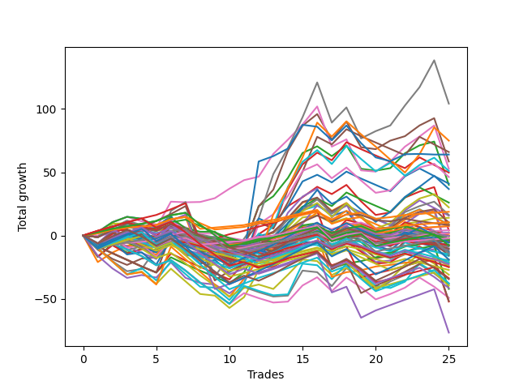

# Long Wallace Doodle 014 
- Symbol: ES_Unlimited
- Date Range: 03/18/2022 - 07/15/2022
- Trading Period: 7:20-12:30
- Number of Trades: 25



| Name | Win Percent | Profit | Avg Profit / Trade | Avg Time / Trade |      | Name | Win Percent | Profit | Avg Profit / Trade | Avg Time / Trade |
| ---- | ----------- | ------ | ------------------ | ---------------- | ---- | ---- | ----------- | ------ | ------------------ | ---------------- |
| Sorted By <br> Profit | | | | | | Sorted By <br> Win Percentage ||||
| Seven | 68.00 | 52125.00 | 2085.00 | 127:02 |     | Eighty-One | 92.00 | -9500.00 | -380.00 | 30:23 |
| Sixty-Three | 44.00 | 37500.00 | 1500.00 | 47:13 |     | One Hundred Twenty-Six | 88.00 | 5250.00 | 210.00 | 05:39 |
| Forty-Seven | 32.00 | 33000.00 | 1320.00 | 26:23 |     | Eighty-Two | 88.00 | -21125.00 | -845.00 | 41:32 |
| Seventy-Three | 48.00 | 32000.00 | 1280.00 | 13:45 |     | One Hundred Sixteen | 84.00 | 9375.00 | 375.00 | 03:04 |
| Five | 56.00 | 29250.00 | 1170.00 | 71:58 |     | One Hundred Twenty-One | 84.00 | -1125.00 | -45.00 | 05:22 |
| Six | 76.00 | 26375.00 | 1055.00 | 82:01 |     | Eighty-Three | 84.00 | -26125.00 | -1045.00 | 60:28 |
| Sixty-One | 48.00 | 25500.00 | 1020.00 | 33:19 |     | Six | 76.00 | 26375.00 | 1055.00 | 82:01 |
| Forty-Five | 32.00 | 24875.00 | 995.00 | 20:52 |     | One Hundred Six | 76.00 | 3750.00 | 150.00 | 01:56 |
| Fifty-Eight | 60.00 | 23125.00 | 925.00 | 16:37 |     | One Hundred Eleven | 76.00 | 1000.00 | 40.00 | 02:33 |
| Forty-Two | 40.00 | 20500.00 | 820.00 | 12:02 |     | One Hundred Twenty-Seven | 76.00 | -3875.00 | -155.00 | 10:10 |
| Two | 60.00 | 20000.00 | 800.00 | 36:17 |     | One Hundred Twenty-Two | 76.00 | -7000.00 | -280.00 | 11:24 |
| Sixty-Two | 60.00 | 18375.00 | 735.00 | 32:39 |     | Eighty-Five | 76.00 | -25875.00 | -1035.00 | 78:40 |
| Forty-Four | 36.00 | 13000.00 | 520.00 | 17:31 |     | Eighty-Four | 76.00 | -38375.00 | -1535.00 | 75:50 |
| Sixty | 52.00 | 11125.00 | 445.00 | 27:53 |     | One Hundred One | 72.00 | 3625.00 | 145.00 | 01:41 |
| One Hundred Sixteen | 84.00 | 9375.00 | 375.00 | 03:04 |     | Seven | 68.00 | 52125.00 | 2085.00 | 127:02 |
| Fifty-Nine | 60.00 | 8125.00 | 325.00 | 17:34 |     | Zero | 68.00 | 1125.00 | 45.00 | 15:06 |
| Forty-Six | 40.00 | 7875.00 | 315.00 | 17:09 |     | One Hundred Twelve | 68.00 | -1375.00 | -55.00 | 04:35 |
| Forty | 64.00 | 7000.00 | 280.00 | 07:29 |     | Forty | 64.00 | 7000.00 | 280.00 | 07:29 |
| One Hundred Twenty-Six | 88.00 | 5250.00 | 210.00 | 05:39 |     | Ninety-One | 64.00 | 2125.00 | 85.00 | 01:25 |
| Fifty-Seven | 60.00 | 5125.00 | 205.00 | 14:09 |     | Ninety-Six | 64.00 | 625.00 | 25.00 | 01:35 |
| Forty-One | 44.00 | 4375.00 | 175.00 | 10:35 |     | Fifty-Six | 64.00 | -5125.00 | -205.00 | 09:50 |
| Forty-Three | 40.00 | 4250.00 | 170.00 | 12:49 |     | One Hundred Twenty-Three | 64.00 | -19875.00 | -795.00 | 13:44 |
| One Hundred Ten | 40.00 | 4125.00 | 165.00 | 04:00 |     | Fifty-Eight | 60.00 | 23125.00 | 925.00 | 16:37 |
| One Hundred Six | 76.00 | 3750.00 | 150.00 | 01:56 |     | Two | 60.00 | 20000.00 | 800.00 | 36:17 |
| One Hundred One | 72.00 | 3625.00 | 145.00 | 01:41 |     | Sixty-Two | 60.00 | 18375.00 | 735.00 | 32:39 |
| Ninety-One | 64.00 | 2125.00 | 85.00 | 01:25 |     | Fifty-Nine | 60.00 | 8125.00 | 325.00 | 17:34 |
| Three | 60.00 | 2000.00 | 80.00 | 31:53 |     | Fifty-Seven | 60.00 | 5125.00 | 205.00 | 14:09 |
| Zero | 68.00 | 1125.00 | 45.00 | 15:06 |     | Three | 60.00 | 2000.00 | 80.00 | 31:53 |
| One Hundred Eleven | 76.00 | 1000.00 | 40.00 | 02:33 |     | One Hundred Seventeen | 60.00 | -1625.00 | -65.00 | 05:10 |
| Ninety-Six | 64.00 | 625.00 | 25.00 | 01:35 |     | Sixty-Four | 60.00 | -2000.00 | -80.00 | 09:44 |
| One Hundred Nine | 40.00 | -125.00 | -5.00 | 03:29 |     | One | 60.00 | -7500.00 | -300.00 | 24:04 |
| Fifty-Five | 36.00 | -125.00 | -5.00 | 09:12 |     | One Hundred Twenty-Five | 60.00 | -9500.00 | -380.00 | 18:21 |
| One Hundred Seven | 56.00 | -250.00 | -10.00 | 02:32 |     | One Hundred Twenty-Eight | 60.00 | -16875.00 | -675.00 | 12:27 |
| Fifty | 36.00 | -250.00 | -10.00 | 08:38 |     | One Hundred Twenty-Four | 60.00 | -18875.00 | -755.00 | 15:50 |
| One Hundred Twenty-One | 84.00 | -1125.00 | -45.00 | 05:22 |     | Five | 56.00 | 29250.00 | 1170.00 | 71:58 |
| Forty-Eight | 52.00 | -1250.00 | -50.00 | 06:38 |     | One Hundred Seven | 56.00 | -250.00 | -10.00 | 02:32 |
| Fifty-Three | 36.00 | -1250.00 | -50.00 | 09:13 |     | Sixty | 52.00 | 11125.00 | 445.00 | 27:53 |
| One Hundred Twelve | 68.00 | -1375.00 | -55.00 | 04:35 |     | Forty-Eight | 52.00 | -1250.00 | -50.00 | 06:38 |
| One Hundred Seventeen | 60.00 | -1625.00 | -65.00 | 05:10 |     | One Hundred Two | 52.00 | -4375.00 | -175.00 | 02:57 |
| Sixty-Four | 60.00 | -2000.00 | -80.00 | 09:44 |     | Four | 52.00 | -6750.00 | -270.00 | 57:51 |
| Ninety-Seven | 48.00 | -2000.00 | -80.00 | 01:53 |     | One Hundred Thirteen | 52.00 | -12000.00 | -480.00 | 05:49 |
| Ninety-Five | 32.00 | -2000.00 | -80.00 | 03:14 |     | One Hundred Twenty-Nine | 52.00 | -20750.00 | -830.00 | 13:33 |
| Fifty-Four | 40.00 | -2250.00 | -90.00 | 07:48 |     | Seventy-Three | 48.00 | 32000.00 | 1280.00 | 13:45 |
| One Hundred | 44.00 | -2500.00 | -100.00 | 02:21 |     | Sixty-One | 48.00 | 25500.00 | 1020.00 | 33:19 |
| Ninety-Nine | 44.00 | -2500.00 | -100.00 | 02:10 |     | Ninety-Seven | 48.00 | -2000.00 | -80.00 | 01:53 |
| Ninety-Two | 48.00 | -2625.00 | -105.00 | 01:47 |     | Ninety-Two | 48.00 | -2625.00 | -105.00 | 01:47 |
| Sixty-Six | 48.00 | -2750.00 | -110.00 | 15:21 |     | Sixty-Six | 48.00 | -2750.00 | -110.00 | 15:21 |
| One Hundred Fifteen | 48.00 | -2875.00 | -115.00 | 07:49 |     | One Hundred Fifteen | 48.00 | -2875.00 | -115.00 | 07:49 |
| One Hundred Eight | 40.00 | -3750.00 | -150.00 | 03:13 |     | Sixty-Seven | 48.00 | -7750.00 | -310.00 | 16:24 |
| One Hundred Twenty-Seven | 76.00 | -3875.00 | -155.00 | 10:10 |     | One Hundred Fourteen | 48.00 | -10875.00 | -435.00 | 06:45 |
| Ninety-Eight | 44.00 | -3875.00 | -155.00 | 02:07 |     | Sixty-Five | 48.00 | -12375.00 | -495.00 | 13:14 |
| One Hundred Five | 36.00 | -3875.00 | -155.00 | 04:29 |     | One Hundred Thirty | 48.00 | -17250.00 | -690.00 | 15:11 |
| One Hundred Two | 52.00 | -4375.00 | -175.00 | 02:57 |     | Sixty-Three | 44.00 | 37500.00 | 1500.00 | 47:13 |
| Fifty-Six | 64.00 | -5125.00 | -205.00 | 09:50 |     | Forty-One | 44.00 | 4375.00 | 175.00 | 10:35 |
| One Hundred Twenty | 36.00 | -5250.00 | -210.00 | 07:09 |     | One Hundred | 44.00 | -2500.00 | -100.00 | 02:21 |
| Forty-Nine | 36.00 | -5875.00 | -235.00 | 08:15 |     | Ninety-Nine | 44.00 | -2500.00 | -100.00 | 02:10 |
| Fifty-Two | 36.00 | -6500.00 | -260.00 | 09:05 |     | Ninety-Eight | 44.00 | -3875.00 | -155.00 | 02:07 |
| Four | 52.00 | -6750.00 | -270.00 | 57:51 |     | Forty-Two | 40.00 | 20500.00 | 820.00 | 12:02 |
| One Hundred Twenty-Two | 76.00 | -7000.00 | -280.00 | 11:24 |     | Forty-Six | 40.00 | 7875.00 | 315.00 | 17:09 |
| Ninety-Four | 32.00 | -7375.00 | -295.00 | 02:39 |     | Forty-Three | 40.00 | 4250.00 | 170.00 | 12:49 |
| One | 60.00 | -7500.00 | -300.00 | 24:04 |     | One Hundred Ten | 40.00 | 4125.00 | 165.00 | 04:00 |
| Sixty-Seven | 48.00 | -7750.00 | -310.00 | 16:24 |     | One Hundred Nine | 40.00 | -125.00 | -5.00 | 03:29 |
| Fifty-One | 36.00 | -8125.00 | -325.00 | 08:24 |     | Fifty-Four | 40.00 | -2250.00 | -90.00 | 07:48 |
| Eighty-One | 92.00 | -9500.00 | -380.00 | 30:23 |     | One Hundred Eight | 40.00 | -3750.00 | -150.00 | 03:13 |
| One Hundred Twenty-Five | 60.00 | -9500.00 | -380.00 | 18:21 |     | One Hundred Eighteen | 40.00 | -12500.00 | -500.00 | 06:15 |
| One Hundred Four | 36.00 | -10000.00 | -400.00 | 03:53 |     | Seventy | 40.00 | -15500.00 | -620.00 | 20:43 |
| Ninety-Three | 32.00 | -10625.00 | -425.00 | 02:25 |     | Forty-Four | 36.00 | 13000.00 | 520.00 | 17:31 |
| One Hundred Fourteen | 48.00 | -10875.00 | -435.00 | 06:45 |     | Fifty-Five | 36.00 | -125.00 | -5.00 | 09:12 |
| One Hundred Ninteen | 36.00 | -11375.00 | -455.00 | 06:33 |     | Fifty | 36.00 | -250.00 | -10.00 | 08:38 |
| One Hundred Thirteen | 52.00 | -12000.00 | -480.00 | 05:49 |     | Fifty-Three | 36.00 | -1250.00 | -50.00 | 09:13 |
| Sixty-Five | 48.00 | -12375.00 | -495.00 | 13:14 |     | One Hundred Five | 36.00 | -3875.00 | -155.00 | 04:29 |
| One Hundred Eighteen | 40.00 | -12500.00 | -500.00 | 06:15 |     | One Hundred Twenty | 36.00 | -5250.00 | -210.00 | 07:09 |
| One Hundred Three | 36.00 | -13625.00 | -545.00 | 03:37 |     | Forty-Nine | 36.00 | -5875.00 | -235.00 | 08:15 |
| Seventy | 40.00 | -15500.00 | -620.00 | 20:43 |     | Fifty-Two | 36.00 | -6500.00 | -260.00 | 09:05 |
| One Hundred Twenty-Eight | 60.00 | -16875.00 | -675.00 | 12:27 |     | Fifty-One | 36.00 | -8125.00 | -325.00 | 08:24 |
| One Hundred Thirty | 48.00 | -17250.00 | -690.00 | 15:11 |     | One Hundred Four | 36.00 | -10000.00 | -400.00 | 03:53 |
| One Hundred Twenty-Four | 60.00 | -18875.00 | -755.00 | 15:50 |     | One Hundred Ninteen | 36.00 | -11375.00 | -455.00 | 06:33 |
| Seventy-One | 28.00 | -19000.00 | -760.00 | 24:43 |     | One Hundred Three | 36.00 | -13625.00 | -545.00 | 03:37 |
| Sixty-Nine | 32.00 | -19375.00 | -775.00 | 23:40 |     | Sixty-Eight | 36.00 | -24625.00 | -985.00 | 21:45 |
| One Hundred Twenty-Three | 64.00 | -19875.00 | -795.00 | 13:44 |     | Forty-Seven | 32.00 | 33000.00 | 1320.00 | 26:23 |
| One Hundred Twenty-Nine | 52.00 | -20750.00 | -830.00 | 13:33 |     | Forty-Five | 32.00 | 24875.00 | 995.00 | 20:52 |
| Eighty-Two | 88.00 | -21125.00 | -845.00 | 41:32 |     | Ninety-Five | 32.00 | -2000.00 | -80.00 | 03:14 |
| Sixty-Eight | 36.00 | -24625.00 | -985.00 | 21:45 |     | Ninety-Four | 32.00 | -7375.00 | -295.00 | 02:39 |
| Eighty-Five | 76.00 | -25875.00 | -1035.00 | 78:40 |     | Ninety-Three | 32.00 | -10625.00 | -425.00 | 02:25 |
| Eighty-Three | 84.00 | -26125.00 | -1045.00 | 60:28 |     | Sixty-Nine | 32.00 | -19375.00 | -775.00 | 23:40 |
| Eighty-Four | 76.00 | -38375.00 | -1535.00 | 75:50 |     | Seventy-One | 28.00 | -19000.00 | -760.00 | 24:43 |

## NO STOPLOSS

### Test Zero
* Sell when price hits the middle line of the 20p bollinger
* No Stoploss
* Results:
```
Total Trades: 25
Percent Up: 68.00
Percent Down: 32.00
Total Points Moved Up: 2.25
Potential Profit: 1125.00
Total Points Ups: 67.50 Count Ups: 17
Total Points Downs: -65.25 Count Downs: 8
```

<details><summary>Trades</summary>

<code>In: 2022-03-21 09:35:00		Out: 2022-03-21 09:45:55		Total Position Time: 10:55		Total Move Up: 2.75		Total to Date: 2.75</code> <br />
<code>In: 2022-03-23 09:14:00		Out: 2022-03-23 09:19:40		Total Position Time: 05:40		Total Move Up: 7.75		Total to Date: 10.50</code> <br />
<code>In: 2022-03-23 09:47:00		Out: 2022-03-23 09:55:35		Total Position Time: 08:35		Total Move Up: 4.25		Total to Date: 14.75</code> <br />
<code>In: 2022-03-23 10:28:00		Out: 2022-03-23 10:51:10		Total Position Time: 23:10		Total Move Up: -1.50		Total to Date: 13.25</code> <br />
<code>In: 2022-03-25 08:14:00		Out: 2022-03-25 08:36:55		Total Position Time: 22:55		Total Move Up: -6.00		Total to Date: 7.25</code> <br />
<code>In: 2022-03-25 08:29:00		Out: 2022-03-25 08:36:55		Total Position Time: 07:55		Total Move Up: 8.00		Total to Date: 15.25</code> <br />
<code>In: 2022-03-28 08:27:00		Out: 2022-03-28 09:02:00		Total Position Time: 35:00		Total Move Up: -13.75		Total to Date: 1.50</code> <br />
<code>In: 2022-03-31 09:16:00		Out: 2022-03-31 09:32:50		Total Position Time: 16:50		Total Move Up: -2.75		Total to Date: -1.25</code> <br />
<code>In: 2022-03-31 09:23:00		Out: 2022-03-31 09:32:50		Total Position Time: 09:50		Total Move Up: 0.00		Total to Date: -1.25</code> <br />
<code>In: 2022-04-18 08:29:00		Out: 2022-04-18 08:55:05		Total Position Time: 26:05		Total Move Up: -4.50		Total to Date: -5.75</code> <br />
<code>In: 2022-04-20 09:14:00		Out: 2022-04-20 09:30:50		Total Position Time: 16:50		Total Move Up: 0.25		Total to Date: -5.50</code> <br />
<code>In: 2022-05-04 11:36:00		Out: 2022-05-04 11:40:45		Total Position Time: 04:45		Total Move Up: 5.25		Total to Date: -0.25</code> <br />
<code>In: 2022-05-13 11:07:00		Out: 2022-05-13 11:19:15		Total Position Time: 12:15		Total Move Up: 2.25		Total to Date: 2.00</code> <br />
<code>In: 2022-05-17 11:24:00		Out: 2022-05-17 11:31:40		Total Position Time: 07:40		Total Move Up: 10.50		Total to Date: 12.50</code> <br />
<code>In: 2022-05-19 10:51:00		Out: 2022-05-19 10:52:55		Total Position Time: 01:55		Total Move Up: 10.25		Total to Date: 22.75</code> <br />
<code>In: 2022-05-25 09:29:00		Out: 2022-05-25 09:41:30		Total Position Time: 12:30		Total Move Up: 1.75		Total to Date: 24.50</code> <br />
<code>In: 2022-06-06 08:15:00		Out: 2022-06-06 08:33:05		Total Position Time: 18:05		Total Move Up: -9.00		Total to Date: 15.50</code> <br />
<code>In: 2022-06-08 08:05:00		Out: 2022-06-08 08:10:40		Total Position Time: 05:40		Total Move Up: 3.75		Total to Date: 19.25</code> <br />
<code>In: 2022-06-08 09:29:00		Out: 2022-06-08 09:56:25		Total Position Time: 27:25		Total Move Up: -13.75		Total to Date: 5.50</code> <br />
<code>In: 2022-06-15 07:35:00		Out: 2022-06-15 08:34:25		Total Position Time: 59:25		Total Move Up: -14.00		Total to Date: -8.50</code> <br />
<code>In: 2022-06-27 10:45:00		Out: 2022-06-27 10:53:30		Total Position Time: 08:30		Total Move Up: 1.25		Total to Date: -7.25</code> <br />
<code>In: 2022-06-29 08:25:00		Out: 2022-06-29 08:32:10		Total Position Time: 07:10		Total Move Up: 4.75		Total to Date: -2.50</code> <br />
<code>In: 2022-07-05 08:04:00		Out: 2022-07-05 08:15:20		Total Position Time: 11:20		Total Move Up: 1.75		Total to Date: -0.75</code> <br />
<code>In: 2022-07-08 09:44:00		Out: 2022-07-08 09:49:05		Total Position Time: 05:05		Total Move Up: 2.50		Total to Date: 1.75</code> <br />
<code>In: 2022-07-12 11:36:00		Out: 2022-07-12 11:48:15		Total Position Time: 12:15		Total Move Up: 0.50		Total to Date: 2.25</code> <br />


</details>

### Test One
* Sell when the price hits the upper line of the 20p 1std bollinger
* No Stoploss
* Results:
```
Total Trades: 25
Percent Up: 60.00
Percent Down: 40.00
Total Points Moved Up: -15.00
Potential Profit: -7500.00
Total Points Ups: 94.75 Count Ups: 15
Total Points Downs: -109.75 Count Downs: 10
```

<details><summary>Trades</summary>

<code>In: 2022-03-21 09:35:00		Out: 2022-03-21 10:32:05		Total Position Time: 57:05		Total Move Up: -21.00		Total to Date: -21.00</code> <br />
<code>In: 2022-03-23 09:14:00		Out: 2022-03-23 09:30:05		Total Position Time: 16:05		Total Move Up: 7.50		Total to Date: -13.50</code> <br />
<code>In: 2022-03-23 09:47:00		Out: 2022-03-23 10:00:45		Total Position Time: 13:45		Total Move Up: 5.50		Total to Date: -8.00</code> <br />
<code>In: 2022-03-23 10:28:00		Out: 2022-03-23 10:51:50		Total Position Time: 23:50		Total Move Up: 0.25		Total to Date: -7.75</code> <br />
<code>In: 2022-03-25 08:14:00		Out: 2022-03-25 08:41:10		Total Position Time: 27:10		Total Move Up: -4.50		Total to Date: -12.25</code> <br />
<code>In: 2022-03-25 08:29:00		Out: 2022-03-25 08:41:10		Total Position Time: 12:10		Total Move Up: 9.50		Total to Date: -2.75</code> <br />
<code>In: 2022-03-28 08:27:00		Out: 2022-03-28 09:05:25		Total Position Time: 38:25		Total Move Up: -11.75		Total to Date: -14.50</code> <br />
<code>In: 2022-03-31 09:16:00		Out: 2022-03-31 09:41:05		Total Position Time: 25:05		Total Move Up: -3.00		Total to Date: -17.50</code> <br />
<code>In: 2022-03-31 09:23:00		Out: 2022-03-31 09:41:05		Total Position Time: 18:05		Total Move Up: -0.25		Total to Date: -17.75</code> <br />
<code>In: 2022-04-18 08:29:00		Out: 2022-04-18 08:57:20		Total Position Time: 28:20		Total Move Up: -3.00		Total to Date: -20.75</code> <br />
<code>In: 2022-04-20 09:14:00		Out: 2022-04-20 09:31:20		Total Position Time: 17:20		Total Move Up: 1.00		Total to Date: -19.75</code> <br />
<code>In: 2022-05-04 11:36:00		Out: 2022-05-04 11:41:40		Total Position Time: 05:40		Total Move Up: 17.25		Total to Date: -2.50</code> <br />
<code>In: 2022-05-13 11:07:00		Out: 2022-05-13 11:30:55		Total Position Time: 23:55		Total Move Up: 5.00		Total to Date: 2.50</code> <br />
<code>In: 2022-05-17 11:24:00		Out: 2022-05-17 11:39:45		Total Position Time: 15:45		Total Move Up: 10.75		Total to Date: 13.25</code> <br />
<code>In: 2022-05-19 10:51:00		Out: 2022-05-19 10:54:25		Total Position Time: 03:25		Total Move Up: 12.75		Total to Date: 26.00</code> <br />
<code>In: 2022-05-25 09:29:00		Out: 2022-05-25 09:44:30		Total Position Time: 15:30		Total Move Up: 3.50		Total to Date: 29.50</code> <br />
<code>In: 2022-06-06 08:15:00		Out: 2022-06-06 08:39:15		Total Position Time: 24:15		Total Move Up: -10.00		Total to Date: 19.50</code> <br />
<code>In: 2022-06-08 08:05:00		Out: 2022-06-08 08:11:15		Total Position Time: 06:15		Total Move Up: 6.25		Total to Date: 25.75</code> <br />
<code>In: 2022-06-08 09:29:00		Out: 2022-06-08 09:59:05		Total Position Time: 30:05		Total Move Up: -11.25		Total to Date: 14.50</code> <br />
<code>In: 2022-06-15 07:35:00		Out: 2022-06-15 08:38:55		Total Position Time: 63:55		Total Move Up: -10.75		Total to Date: 3.75</code> <br />
<code>In: 2022-06-27 10:45:00		Out: 2022-06-27 11:03:15		Total Position Time: 18:15		Total Move Up: 1.00		Total to Date: 4.75</code> <br />
<code>In: 2022-06-29 08:25:00		Out: 2022-06-29 08:33:05		Total Position Time: 08:05		Total Move Up: 7.75		Total to Date: 12.50</code> <br />
<code>In: 2022-07-05 08:04:00		Out: 2022-07-05 08:16:45		Total Position Time: 12:45		Total Move Up: 4.75		Total to Date: 17.25</code> <br />
<code>In: 2022-07-08 09:44:00		Out: 2022-07-08 10:09:40		Total Position Time: 25:40		Total Move Up: 2.00		Total to Date: 19.25</code> <br />
<code>In: 2022-07-12 11:36:00		Out: 2022-07-12 12:47:00		Total Position Time: 71:00		Total Move Up: -34.25		Total to Date: -15.00</code> <br />


</details>

### Test Two
* Sell when the price hits the upper line of the 20p 2std bollinger
* No Stoploss
* Results:
```
Total Trades: 25
Percent Up: 60.00
Percent Down: 40.00
Total Points Moved Up: 40.00
Potential Profit: 20000.00
Total Points Ups: 140.00 Count Ups: 15
Total Points Downs: -100.00 Count Downs: 10
```

<details><summary>Trades</summary>

<code>In: 2022-03-21 09:35:00		Out: 2022-03-21 10:34:15		Total Position Time: 59:15		Total Move Up: -17.00		Total to Date: -17.00</code> <br />
<code>In: 2022-03-23 09:14:00		Out: 2022-03-23 09:31:10		Total Position Time: 17:10		Total Move Up: 10.50		Total to Date: -6.50</code> <br />
<code>In: 2022-03-23 09:47:00		Out: 2022-03-23 10:54:30		Total Position Time: 67:30		Total Move Up: -7.00		Total to Date: -13.50</code> <br />
<code>In: 2022-03-23 10:28:00		Out: 2022-03-23 10:54:30		Total Position Time: 26:30		Total Move Up: 2.75		Total to Date: -10.75</code> <br />
<code>In: 2022-03-25 08:14:00		Out: 2022-03-25 08:41:55		Total Position Time: 27:55		Total Move Up: -0.50		Total to Date: -11.25</code> <br />
<code>In: 2022-03-25 08:29:00		Out: 2022-03-25 08:41:55		Total Position Time: 12:55		Total Move Up: 13.50		Total to Date: 2.25</code> <br />
<code>In: 2022-03-28 08:27:00		Out: 2022-03-28 09:07:10		Total Position Time: 40:10		Total Move Up: -10.50		Total to Date: -8.25</code> <br />
<code>In: 2022-03-31 09:16:00		Out: 2022-03-31 09:44:20		Total Position Time: 28:20		Total Move Up: -2.25		Total to Date: -10.50</code> <br />
<code>In: 2022-03-31 09:23:00		Out: 2022-03-31 09:44:20		Total Position Time: 21:20		Total Move Up: 0.50		Total to Date: -10.00</code> <br />
<code>In: 2022-04-18 08:29:00		Out: 2022-04-18 08:59:35		Total Position Time: 30:35		Total Move Up: -0.75		Total to Date: -10.75</code> <br />
<code>In: 2022-04-20 09:14:00		Out: 2022-04-20 09:31:35		Total Position Time: 17:35		Total Move Up: 1.75		Total to Date: -9.00</code> <br />
<code>In: 2022-05-04 11:36:00		Out: 2022-05-04 11:43:55		Total Position Time: 07:55		Total Move Up: 32.25		Total to Date: 23.25</code> <br />
<code>In: 2022-05-13 11:07:00		Out: 2022-05-13 11:31:20		Total Position Time: 24:20		Total Move Up: 7.75		Total to Date: 31.00</code> <br />
<code>In: 2022-05-17 11:24:00		Out: 2022-05-17 11:40:05		Total Position Time: 16:05		Total Move Up: 14.50		Total to Date: 45.50</code> <br />
<code>In: 2022-05-19 10:51:00		Out: 2022-05-19 10:55:15		Total Position Time: 04:15		Total Move Up: 19.75		Total to Date: 65.25</code> <br />
<code>In: 2022-05-25 09:29:00		Out: 2022-05-25 09:45:20		Total Position Time: 16:20		Total Move Up: 5.25		Total to Date: 70.50</code> <br />
<code>In: 2022-06-06 08:15:00		Out: 2022-06-06 08:43:00		Total Position Time: 28:00		Total Move Up: -7.75		Total to Date: 62.75</code> <br />
<code>In: 2022-06-08 08:05:00		Out: 2022-06-08 08:14:10		Total Position Time: 09:10		Total Move Up: 8.50		Total to Date: 71.25</code> <br />
<code>In: 2022-06-08 09:29:00		Out: 2022-06-08 11:03:45		Total Position Time: 94:45		Total Move Up: -18.50		Total to Date: 52.75</code> <br />
<code>In: 2022-06-15 07:35:00		Out: 2022-06-15 10:58:15		Total Position Time: 203:15		Total Move Up: -1.50		Total to Date: 51.25</code> <br />
<code>In: 2022-06-27 10:45:00		Out: 2022-06-27 11:13:35		Total Position Time: 28:35		Total Move Up: 2.00		Total to Date: 53.25</code> <br />
<code>In: 2022-06-29 08:25:00		Out: 2022-06-29 08:35:35		Total Position Time: 10:35		Total Move Up: 11.75		Total to Date: 65.00</code> <br />
<code>In: 2022-07-05 08:04:00		Out: 2022-07-05 08:20:35		Total Position Time: 16:35		Total Move Up: 6.25		Total to Date: 71.25</code> <br />
<code>In: 2022-07-08 09:44:00		Out: 2022-07-08 10:11:05		Total Position Time: 27:05		Total Move Up: 3.00		Total to Date: 74.25</code> <br />
<code>In: 2022-07-12 11:36:00		Out: 2022-07-12 12:47:00		Total Position Time: 71:00		Total Move Up: -34.25		Total to Date: 40.00</code> <br />


</details>

### Test Three
* Sell when price hits the middle line of the 50p bollinger
* No Stoploss
* Results:
```
Total Trades: 25
Percent Up: 60.00
Percent Down: 40.00
Total Points Moved Up: 4.00
Potential Profit: 2000.00
Total Points Ups: 109.25 Count Ups: 15
Total Points Downs: -105.25 Count Downs: 10
```

<details><summary>Trades</summary>

<code>In: 2022-03-21 09:35:00		Out: 2022-03-21 10:34:30		Total Position Time: 59:30		Total Move Up: -16.50		Total to Date: -16.50</code> <br />
<code>In: 2022-03-23 09:14:00		Out: 2022-03-23 09:30:30		Total Position Time: 16:30		Total Move Up: 8.75		Total to Date: -7.75</code> <br />
<code>In: 2022-03-23 09:47:00		Out: 2022-03-23 10:55:00		Total Position Time: 68:00		Total Move Up: -6.50		Total to Date: -14.25</code> <br />
<code>In: 2022-03-23 10:28:00		Out: 2022-03-23 10:55:00		Total Position Time: 27:00		Total Move Up: 3.25		Total to Date: -11.00</code> <br />
<code>In: 2022-03-25 08:14:00		Out: 2022-03-25 08:53:00		Total Position Time: 39:00		Total Move Up: -1.25		Total to Date: -12.25</code> <br />
<code>In: 2022-03-25 08:29:00		Out: 2022-03-25 08:53:00		Total Position Time: 24:00		Total Move Up: 12.75		Total to Date: 0.50</code> <br />
<code>In: 2022-03-28 08:27:00		Out: 2022-03-28 09:25:20		Total Position Time: 58:20		Total Move Up: -14.00		Total to Date: -13.50</code> <br />
<code>In: 2022-03-31 09:16:00		Out: 2022-03-31 09:46:15		Total Position Time: 30:15		Total Move Up: -1.50		Total to Date: -15.00</code> <br />
<code>In: 2022-03-31 09:23:00		Out: 2022-03-31 09:46:15		Total Position Time: 23:15		Total Move Up: 1.25		Total to Date: -13.75</code> <br />
<code>In: 2022-04-18 08:29:00		Out: 2022-04-18 09:07:15		Total Position Time: 38:15		Total Move Up: -1.75		Total to Date: -15.50</code> <br />
<code>In: 2022-04-20 09:14:00		Out: 2022-04-20 09:32:50		Total Position Time: 18:50		Total Move Up: 4.75		Total to Date: -10.75</code> <br />
<code>In: 2022-05-04 11:36:00		Out: 2022-05-04 11:41:15		Total Position Time: 05:15		Total Move Up: 11.75		Total to Date: 1.00</code> <br />
<code>In: 2022-05-13 11:07:00		Out: 2022-05-13 11:31:20		Total Position Time: 24:20		Total Move Up: 7.75		Total to Date: 8.75</code> <br />
<code>In: 2022-05-17 11:24:00		Out: 2022-05-17 11:40:05		Total Position Time: 16:05		Total Move Up: 14.50		Total to Date: 23.25</code> <br />
<code>In: 2022-05-19 10:51:00		Out: 2022-05-19 10:52:40		Total Position Time: 01:40		Total Move Up: 7.00		Total to Date: 30.25</code> <br />
<code>In: 2022-05-25 09:29:00		Out: 2022-05-25 09:49:10		Total Position Time: 20:10		Total Move Up: 8.25		Total to Date: 38.50</code> <br />
<code>In: 2022-06-06 08:15:00		Out: 2022-06-06 08:55:30		Total Position Time: 40:30		Total Move Up: -5.75		Total to Date: 32.75</code> <br />
<code>In: 2022-06-08 08:05:00		Out: 2022-06-08 08:11:20		Total Position Time: 06:20		Total Move Up: 7.25		Total to Date: 40.00</code> <br />
<code>In: 2022-06-08 09:29:00		Out: 2022-06-08 10:19:05		Total Position Time: 50:05		Total Move Up: -13.00		Total to Date: 27.00</code> <br />
<code>In: 2022-06-15 07:35:00		Out: 2022-06-15 08:38:55		Total Position Time: 63:55		Total Move Up: -10.75		Total to Date: 16.25</code> <br />
<code>In: 2022-06-27 10:45:00		Out: 2022-06-27 11:13:35		Total Position Time: 28:35		Total Move Up: 2.00		Total to Date: 18.25</code> <br />
<code>In: 2022-06-29 08:25:00		Out: 2022-06-29 08:35:35		Total Position Time: 10:35		Total Move Up: 11.75		Total to Date: 30.00</code> <br />
<code>In: 2022-07-05 08:04:00		Out: 2022-07-05 08:32:25		Total Position Time: 28:25		Total Move Up: 4.75		Total to Date: 34.75</code> <br />
<code>In: 2022-07-08 09:44:00		Out: 2022-07-08 10:11:15		Total Position Time: 27:15		Total Move Up: 3.50		Total to Date: 38.25</code> <br />
<code>In: 2022-07-12 11:36:00		Out: 2022-07-12 12:47:00		Total Position Time: 71:00		Total Move Up: -34.25		Total to Date: 4.00</code> <br />


</details>

### Test Four
* Sell when the price hits the upper line of the 50p 1std bollinger
* No Stoploss
* Results:
```
Total Trades: 25
Percent Up: 52.00
Percent Down: 48.00
Total Points Moved Up: -13.50
Potential Profit: -6750.00
Total Points Ups: 135.25 Count Ups: 13
Total Points Downs: -148.75 Count Downs: 12
```

<details><summary>Trades</summary>

<code>In: 2022-03-21 09:35:00		Out: 2022-03-21 10:50:05		Total Position Time: 75:05		Total Move Up: -16.00		Total to Date: -16.00</code> <br />
<code>In: 2022-03-23 09:14:00		Out: 2022-03-23 11:27:00		Total Position Time: 133:00		Total Move Up: -10.00		Total to Date: -26.00</code> <br />
<code>In: 2022-03-23 09:47:00		Out: 2022-03-23 11:27:00		Total Position Time: 100:00		Total Move Up: -7.50		Total to Date: -33.50</code> <br />
<code>In: 2022-03-23 10:28:00		Out: 2022-03-23 11:27:00		Total Position Time: 59:00		Total Move Up: 2.25		Total to Date: -31.25</code> <br />
<code>In: 2022-03-25 08:14:00		Out: 2022-03-25 09:08:25		Total Position Time: 54:25		Total Move Up: -2.00		Total to Date: -33.25</code> <br />
<code>In: 2022-03-25 08:29:00		Out: 2022-03-25 09:08:25		Total Position Time: 39:25		Total Move Up: 12.00		Total to Date: -21.25</code> <br />
<code>In: 2022-03-28 08:27:00		Out: 2022-03-28 09:35:05		Total Position Time: 68:05		Total Move Up: -12.25		Total to Date: -33.50</code> <br />
<code>In: 2022-03-31 09:16:00		Out: 2022-03-31 10:29:50		Total Position Time: 73:50		Total Move Up: -4.00		Total to Date: -37.50</code> <br />
<code>In: 2022-03-31 09:23:00		Out: 2022-03-31 10:29:50		Total Position Time: 66:50		Total Move Up: -1.25		Total to Date: -38.75</code> <br />
<code>In: 2022-04-18 08:29:00		Out: 2022-04-18 09:53:35		Total Position Time: 84:35		Total Move Up: -7.00		Total to Date: -45.75</code> <br />
<code>In: 2022-04-20 09:14:00		Out: 2022-04-20 09:36:50		Total Position Time: 22:50		Total Move Up: 8.50		Total to Date: -37.25</code> <br />
<code>In: 2022-05-04 11:36:00		Out: 2022-05-04 11:42:00		Total Position Time: 06:00		Total Move Up: 21.25		Total to Date: -16.00</code> <br />
<code>In: 2022-05-13 11:07:00		Out: 2022-05-13 11:43:10		Total Position Time: 36:10		Total Move Up: 11.00		Total to Date: -5.00</code> <br />
<code>In: 2022-05-17 11:24:00		Out: 2022-05-17 11:45:50		Total Position Time: 21:50		Total Move Up: 23.00		Total to Date: 18.00</code> <br />
<code>In: 2022-05-19 10:51:00		Out: 2022-05-19 10:54:25		Total Position Time: 03:25		Total Move Up: 12.75		Total to Date: 30.75</code> <br />
<code>In: 2022-05-25 09:29:00		Out: 2022-05-25 10:10:05		Total Position Time: 41:05		Total Move Up: 6.50		Total to Date: 37.25</code> <br />
<code>In: 2022-06-06 08:15:00		Out: 2022-06-06 09:55:15		Total Position Time: 100:15		Total Move Up: -23.00		Total to Date: 14.25</code> <br />
<code>In: 2022-06-08 08:05:00		Out: 2022-06-08 08:15:05		Total Position Time: 10:05		Total Move Up: 10.75		Total to Date: 25.00</code> <br />
<code>In: 2022-06-08 09:29:00		Out: 2022-06-08 12:12:35		Total Position Time: 163:35		Total Move Up: -23.75		Total to Date: 1.25</code> <br />
<code>In: 2022-06-15 07:35:00		Out: 2022-06-15 08:57:35		Total Position Time: 82:35		Total Move Up: -7.75		Total to Date: -6.50</code> <br />
<code>In: 2022-06-27 10:45:00		Out: 2022-06-27 11:18:25		Total Position Time: 33:25		Total Move Up: 4.25		Total to Date: -2.25</code> <br />
<code>In: 2022-06-29 08:25:00		Out: 2022-06-29 08:53:10		Total Position Time: 28:10		Total Move Up: 11.50		Total to Date: 9.25</code> <br />
<code>In: 2022-07-05 08:04:00		Out: 2022-07-05 08:33:10		Total Position Time: 29:10		Total Move Up: 8.00		Total to Date: 17.25</code> <br />
<code>In: 2022-07-08 09:44:00		Out: 2022-07-08 10:26:30		Total Position Time: 42:30		Total Move Up: 3.50		Total to Date: 20.75</code> <br />
<code>In: 2022-07-12 11:36:00		Out: 2022-07-12 12:47:00		Total Position Time: 71:00		Total Move Up: -34.25		Total to Date: -13.50</code> <br />


</details>

### Test Five
* Sell when the price hits the upper line of the 50p 2std bollinger
* No Stoploss
* Results:
```
Total Trades: 25
Percent Up: 56.00
Percent Down: 44.00
Total Points Moved Up: 58.50
Potential Profit: 29250.00
Total Points Ups: 178.25 Count Ups: 14
Total Points Downs: -119.75 Count Downs: 11
```

<details><summary>Trades</summary>

<code>In: 2022-03-21 09:35:00		Out: 2022-03-21 11:00:20		Total Position Time: 85:20		Total Move Up: -11.25		Total to Date: -11.25</code> <br />
<code>In: 2022-03-23 09:14:00		Out: 2022-03-23 11:30:00		Total Position Time: 136:00		Total Move Up: -7.25		Total to Date: -18.50</code> <br />
<code>In: 2022-03-23 09:47:00		Out: 2022-03-23 11:30:00		Total Position Time: 103:00		Total Move Up: -4.75		Total to Date: -23.25</code> <br />
<code>In: 2022-03-23 10:28:00		Out: 2022-03-23 11:30:00		Total Position Time: 62:00		Total Move Up: 5.00		Total to Date: -18.25</code> <br />
<code>In: 2022-03-25 08:14:00		Out: 2022-03-25 09:11:40		Total Position Time: 57:40		Total Move Up: 1.00		Total to Date: -17.25</code> <br />
<code>In: 2022-03-25 08:29:00		Out: 2022-03-25 09:11:40		Total Position Time: 42:40		Total Move Up: 15.00		Total to Date: -2.25</code> <br />
<code>In: 2022-03-28 08:27:00		Out: 2022-03-28 09:39:55		Total Position Time: 72:55		Total Move Up: -10.75		Total to Date: -13.00</code> <br />
<code>In: 2022-03-31 09:16:00		Out: 2022-03-31 10:46:00		Total Position Time: 90:00		Total Move Up: -3.50		Total to Date: -16.50</code> <br />
<code>In: 2022-03-31 09:23:00		Out: 2022-03-31 10:46:00		Total Position Time: 83:00		Total Move Up: -0.75		Total to Date: -17.25</code> <br />
<code>In: 2022-04-18 08:29:00		Out: 2022-04-18 09:58:15		Total Position Time: 89:15		Total Move Up: -5.25		Total to Date: -22.50</code> <br />
<code>In: 2022-04-20 09:14:00		Out: 2022-04-20 09:50:25		Total Position Time: 36:25		Total Move Up: 13.25		Total to Date: -9.25</code> <br />
<code>In: 2022-05-04 11:36:00		Out: 2022-05-04 11:43:55		Total Position Time: 07:55		Total Move Up: 32.25		Total to Date: 23.00</code> <br />
<code>In: 2022-05-13 11:07:00		Out: 2022-05-13 11:51:25		Total Position Time: 44:25		Total Move Up: 13.25		Total to Date: 36.25</code> <br />
<code>In: 2022-05-17 11:24:00		Out: 2022-05-17 11:48:40		Total Position Time: 24:40		Total Move Up: 30.75		Total to Date: 67.00</code> <br />
<code>In: 2022-05-19 10:51:00		Out: 2022-05-19 10:55:15		Total Position Time: 04:15		Total Move Up: 19.75		Total to Date: 86.75</code> <br />
<code>In: 2022-05-25 09:29:00		Out: 2022-05-25 10:29:35		Total Position Time: 60:35		Total Move Up: 9.25		Total to Date: 96.00</code> <br />
<code>In: 2022-06-06 08:15:00		Out: 2022-06-06 09:56:20		Total Position Time: 101:20		Total Move Up: -20.25		Total to Date: 75.75</code> <br />
<code>In: 2022-06-08 08:05:00		Out: 2022-06-08 08:17:35		Total Position Time: 12:35		Total Move Up: 14.25		Total to Date: 90.00</code> <br />
<code>In: 2022-06-08 09:29:00		Out: 2022-06-08 12:21:15		Total Position Time: 172:15		Total Move Up: -20.25		Total to Date: 69.75</code> <br />
<code>In: 2022-06-15 07:35:00		Out: 2022-06-15 10:58:15		Total Position Time: 203:15		Total Move Up: -1.50		Total to Date: 68.25</code> <br />
<code>In: 2022-06-27 10:45:00		Out: 2022-06-27 11:38:15		Total Position Time: 53:15		Total Move Up: 6.75		Total to Date: 75.00</code> <br />
<code>In: 2022-06-29 08:25:00		Out: 2022-06-29 10:09:35		Total Position Time: 104:35		Total Move Up: 3.50		Total to Date: 78.50</code> <br />
<code>In: 2022-07-05 08:04:00		Out: 2022-07-05 08:42:10		Total Position Time: 38:10		Total Move Up: 8.50		Total to Date: 87.00</code> <br />
<code>In: 2022-07-08 09:44:00		Out: 2022-07-08 10:27:00		Total Position Time: 43:00		Total Move Up: 5.75		Total to Date: 92.75</code> <br />
<code>In: 2022-07-12 11:36:00		Out: 2022-07-12 12:47:00		Total Position Time: 71:00		Total Move Up: -34.25		Total to Date: 58.50</code> <br />


</details>

### Test Six
* Sell when the price hits the middle line of the 1std VWAP
* No Stoploss
* Results:
```
Total Trades: 25
Percent Up: 76.00
Percent Down: 24.00
Total Points Moved Up: 52.75
Potential Profit: 26375.00
Total Points Ups: 152.75 Count Ups: 19
Total Points Downs: -100.00 Count Downs: 6
```

<details><summary>Trades</summary>

<code>In: 2022-03-21 09:35:00		Out: 2022-03-21 11:46:15		Total Position Time: 131:15		Total Move Up: 0.00		Total to Date: 0.00</code> <br />
<code>In: 2022-03-23 09:14:00		Out: 2022-03-23 09:16:05		Total Position Time: 02:05		Total Move Up: 5.50		Total to Date: 5.50</code> <br />
<code>In: 2022-03-23 09:47:00		Out: 2022-03-23 12:47:00		Total Position Time: 180:00		Total Move Up: -8.00		Total to Date: -2.50</code> <br />
<code>In: 2022-03-23 10:28:00		Out: 2022-03-23 12:47:00		Total Position Time: 139:00		Total Move Up: 1.75		Total to Date: -0.75</code> <br />
<code>In: 2022-03-25 08:14:00		Out: 2022-03-25 10:19:30		Total Position Time: 125:30		Total Move Up: 6.75		Total to Date: 6.00</code> <br />
<code>In: 2022-03-25 08:29:00		Out: 2022-03-25 10:19:30		Total Position Time: 110:30		Total Move Up: 20.75		Total to Date: 26.75</code> <br />
<code>In: 2022-03-28 08:27:00		Out: 2022-03-28 10:24:25		Total Position Time: 117:25		Total Move Up: -0.50		Total to Date: 26.25</code> <br />
<code>In: 2022-03-31 09:16:00		Out: 2022-03-31 10:52:05		Total Position Time: 96:05		Total Move Up: 0.25		Total to Date: 26.50</code> <br />
<code>In: 2022-03-31 09:23:00		Out: 2022-03-31 10:52:05		Total Position Time: 89:05		Total Move Up: 3.00		Total to Date: 29.50</code> <br />
<code>In: 2022-04-18 08:29:00		Out: 2022-04-18 10:32:10		Total Position Time: 123:10		Total Move Up: 7.50		Total to Date: 37.00</code> <br />
<code>In: 2022-04-20 09:14:00		Out: 2022-04-20 09:35:50		Total Position Time: 21:50		Total Move Up: 6.75		Total to Date: 43.75</code> <br />
<code>In: 2022-05-04 11:36:00		Out: 2022-05-04 11:37:10		Total Position Time: 01:10		Total Move Up: 2.75		Total to Date: 46.50</code> <br />
<code>In: 2022-05-13 11:07:00		Out: 2022-05-13 11:52:35		Total Position Time: 45:35		Total Move Up: 18.00		Total to Date: 64.50</code> <br />
<code>In: 2022-05-17 11:24:00		Out: 2022-05-17 11:27:25		Total Position Time: 03:25		Total Move Up: 11.25		Total to Date: 75.75</code> <br />
<code>In: 2022-05-19 10:51:00		Out: 2022-05-19 10:54:15		Total Position Time: 03:15		Total Move Up: 12.00		Total to Date: 87.75</code> <br />
<code>In: 2022-05-25 09:29:00		Out: 2022-05-25 10:37:05		Total Position Time: 68:05		Total Move Up: 14.25		Total to Date: 102.00</code> <br />
<code>In: 2022-06-06 08:15:00		Out: 2022-06-06 12:47:00		Total Position Time: 272:00		Total Move Up: -31.75		Total to Date: 70.25</code> <br />
<code>In: 2022-06-08 08:05:00		Out: 2022-06-08 08:11:05		Total Position Time: 06:05		Total Move Up: 5.75		Total to Date: 76.00</code> <br />
<code>In: 2022-06-08 09:29:00		Out: 2022-06-08 12:47:00		Total Position Time: 198:00		Total Move Up: -24.50		Total to Date: 51.50</code> <br />
<code>In: 2022-06-15 07:35:00		Out: 2022-06-15 09:22:15		Total Position Time: 107:15		Total Move Up: -1.00		Total to Date: 50.50</code> <br />
<code>In: 2022-06-27 10:45:00		Out: 2022-06-27 11:38:50		Total Position Time: 53:50		Total Move Up: 8.00		Total to Date: 58.50</code> <br />
<code>In: 2022-06-29 08:25:00		Out: 2022-06-29 08:35:35		Total Position Time: 10:35		Total Move Up: 11.75		Total to Date: 70.25</code> <br />
<code>In: 2022-07-05 08:04:00		Out: 2022-07-05 08:33:10		Total Position Time: 29:10		Total Move Up: 8.00		Total to Date: 78.25</code> <br />
<code>In: 2022-07-08 09:44:00		Out: 2022-07-08 10:29:10		Total Position Time: 45:10		Total Move Up: 8.75		Total to Date: 87.00</code> <br />
<code>In: 2022-07-12 11:36:00		Out: 2022-07-12 12:47:00		Total Position Time: 71:00		Total Move Up: -34.25		Total to Date: 52.75</code> <br />


</details>

### Test Seven
* Sell when the price hits the upper line of the 1std VWAP
* No Stoploss
* Results:
```
Total Trades: 25
Percent Up: 68.00
Percent Down: 32.00
Total Points Moved Up: 104.25
Potential Profit: 52125.00
Total Points Ups: 281.75 Count Ups: 17
Total Points Downs: -177.50 Count Downs: 8
```

<details><summary>Trades</summary>

<code>In: 2022-03-21 09:35:00		Out: 2022-03-21 12:47:00		Total Position Time: 192:00		Total Move Up: -9.75		Total to Date: -9.75</code> <br />
<code>In: 2022-03-23 09:14:00		Out: 2022-03-23 12:47:00		Total Position Time: 213:00		Total Move Up: -10.50		Total to Date: -20.25</code> <br />
<code>In: 2022-03-23 09:47:00		Out: 2022-03-23 12:47:00		Total Position Time: 180:00		Total Move Up: -8.00		Total to Date: -28.25</code> <br />
<code>In: 2022-03-23 10:28:00		Out: 2022-03-23 12:47:00		Total Position Time: 139:00		Total Move Up: 1.75		Total to Date: -26.50</code> <br />
<code>In: 2022-03-25 08:14:00		Out: 2022-03-25 11:04:05		Total Position Time: 170:05		Total Move Up: 16.00		Total to Date: -10.50</code> <br />
<code>In: 2022-03-25 08:29:00		Out: 2022-03-25 11:04:05		Total Position Time: 155:05		Total Move Up: 30.00		Total to Date: 19.50</code> <br />
<code>In: 2022-03-28 08:27:00		Out: 2022-03-28 11:29:05		Total Position Time: 182:05		Total Move Up: 7.00		Total to Date: 26.50</code> <br />
<code>In: 2022-03-31 09:16:00		Out: 2022-03-31 12:47:00		Total Position Time: 211:00		Total Move Up: -30.75		Total to Date: -4.25</code> <br />
<code>In: 2022-03-31 09:23:00		Out: 2022-03-31 12:47:00		Total Position Time: 204:00		Total Move Up: -28.00		Total to Date: -32.25</code> <br />
<code>In: 2022-04-18 08:29:00		Out: 2022-04-18 10:35:50		Total Position Time: 126:50		Total Move Up: 15.50		Total to Date: -16.75</code> <br />
<code>In: 2022-04-20 09:14:00		Out: 2022-04-20 09:52:35		Total Position Time: 38:35		Total Move Up: 14.25		Total to Date: -2.50</code> <br />
<code>In: 2022-05-04 11:36:00		Out: 2022-05-04 11:41:35		Total Position Time: 05:35		Total Move Up: 16.00		Total to Date: 13.50</code> <br />
<code>In: 2022-05-13 11:07:00		Out: 2022-05-13 12:14:40		Total Position Time: 67:40		Total Move Up: 35.00		Total to Date: 48.50</code> <br />
<code>In: 2022-05-17 11:24:00		Out: 2022-05-17 11:40:20		Total Position Time: 16:20		Total Move Up: 20.75		Total to Date: 69.25</code> <br />
<code>In: 2022-05-19 10:51:00		Out: 2022-05-19 10:56:05		Total Position Time: 05:05		Total Move Up: 24.25		Total to Date: 93.50</code> <br />
<code>In: 2022-05-25 09:29:00		Out: 2022-05-25 11:02:25		Total Position Time: 93:25		Total Move Up: 27.50		Total to Date: 121.00</code> <br />
<code>In: 2022-06-06 08:15:00		Out: 2022-06-06 12:47:00		Total Position Time: 272:00		Total Move Up: -31.75		Total to Date: 89.25</code> <br />
<code>In: 2022-06-08 08:05:00		Out: 2022-06-08 08:16:30		Total Position Time: 11:30		Total Move Up: 12.00		Total to Date: 101.25</code> <br />
<code>In: 2022-06-08 09:29:00		Out: 2022-06-08 12:47:00		Total Position Time: 198:00		Total Move Up: -24.50		Total to Date: 76.75</code> <br />
<code>In: 2022-06-15 07:35:00		Out: 2022-06-15 11:00:30		Total Position Time: 205:30		Total Move Up: 5.75		Total to Date: 82.50</code> <br />
<code>In: 2022-06-27 10:45:00		Out: 2022-06-27 12:47:00		Total Position Time: 122:00		Total Move Up: 4.50		Total to Date: 87.00</code> <br />
<code>In: 2022-06-29 08:25:00		Out: 2022-06-29 11:02:00		Total Position Time: 157:00		Total Move Up: 15.75		Total to Date: 102.75</code> <br />
<code>In: 2022-07-05 08:04:00		Out: 2022-07-05 08:43:25		Total Position Time: 39:25		Total Move Up: 14.50		Total to Date: 117.25</code> <br />
<code>In: 2022-07-08 09:44:00		Out: 2022-07-08 11:24:00		Total Position Time: 100:00		Total Move Up: 21.25		Total to Date: 138.50</code> <br />
<code>In: 2022-07-12 11:36:00		Out: 2022-07-12 12:47:00		Total Position Time: 71:00		Total Move Up: -34.25		Total to Date: 104.25</code> <br />


</details>

## STOPLOSS OF 5

### Test Forty
* Sell when price hits the middle line of the 20p bollinger
* Stoploss is 5 points
* Results:
```
Total Trades: 25
Percent Up: 64.00
Percent Down: 36.00
Total Points Moved Up: 14.00
Potential Profit: 7000.00
Total Points Ups: 64.75 Count Ups: 16
Total Points Downs: -50.75 Count Downs: 9
```

<details><summary>Trades</summary>

<code>In: 2022-03-21 09:35:00		Out: 2022-03-21 09:36:10		Total Position Time: 01:10		Total Move Up: -8.75		Total to Date: -8.75</code> <br />
<code>In: 2022-03-23 09:14:00		Out: 2022-03-23 09:19:40		Total Position Time: 05:40		Total Move Up: 7.75		Total to Date: -1.00</code> <br />
<code>In: 2022-03-23 09:47:00		Out: 2022-03-23 09:55:35		Total Position Time: 08:35		Total Move Up: 4.25		Total to Date: 3.25</code> <br />
<code>In: 2022-03-23 10:28:00		Out: 2022-03-23 10:30:15		Total Position Time: 02:15		Total Move Up: -5.25		Total to Date: -2.00</code> <br />
<code>In: 2022-03-25 08:14:00		Out: 2022-03-25 08:24:25		Total Position Time: 10:25		Total Move Up: -4.75		Total to Date: -6.75</code> <br />
<code>In: 2022-03-25 08:29:00		Out: 2022-03-25 08:36:55		Total Position Time: 07:55		Total Move Up: 8.00		Total to Date: 1.25</code> <br />
<code>In: 2022-03-28 08:27:00		Out: 2022-03-28 08:33:30		Total Position Time: 06:30		Total Move Up: -5.50		Total to Date: -4.25</code> <br />
<code>In: 2022-03-31 09:16:00		Out: 2022-03-31 09:25:00		Total Position Time: 09:00		Total Move Up: -5.00		Total to Date: -9.25</code> <br />
<code>In: 2022-03-31 09:23:00		Out: 2022-03-31 09:32:50		Total Position Time: 09:50		Total Move Up: 0.00		Total to Date: -9.25</code> <br />
<code>In: 2022-04-18 08:29:00		Out: 2022-04-18 08:39:25		Total Position Time: 10:25		Total Move Up: -5.00		Total to Date: -14.25</code> <br />
<code>In: 2022-04-20 09:14:00		Out: 2022-04-20 09:30:50		Total Position Time: 16:50		Total Move Up: 0.25		Total to Date: -14.00</code> <br />
<code>In: 2022-05-04 11:36:00		Out: 2022-05-04 11:40:45		Total Position Time: 04:45		Total Move Up: 5.25		Total to Date: -8.75</code> <br />
<code>In: 2022-05-13 11:07:00		Out: 2022-05-13 11:19:15		Total Position Time: 12:15		Total Move Up: 2.25		Total to Date: -6.50</code> <br />
<code>In: 2022-05-17 11:24:00		Out: 2022-05-17 11:31:40		Total Position Time: 07:40		Total Move Up: 10.50		Total to Date: 4.00</code> <br />
<code>In: 2022-05-19 10:51:00		Out: 2022-05-19 10:52:55		Total Position Time: 01:55		Total Move Up: 10.25		Total to Date: 14.25</code> <br />
<code>In: 2022-05-25 09:29:00		Out: 2022-05-25 09:41:30		Total Position Time: 12:30		Total Move Up: 1.75		Total to Date: 16.00</code> <br />
<code>In: 2022-06-06 08:15:00		Out: 2022-06-06 08:16:50		Total Position Time: 01:50		Total Move Up: -6.00		Total to Date: 10.00</code> <br />
<code>In: 2022-06-08 08:05:00		Out: 2022-06-08 08:10:40		Total Position Time: 05:40		Total Move Up: 3.75		Total to Date: 13.75</code> <br />
<code>In: 2022-06-08 09:29:00		Out: 2022-06-08 09:33:00		Total Position Time: 04:00		Total Move Up: -5.50		Total to Date: 8.25</code> <br />
<code>In: 2022-06-15 07:35:00		Out: 2022-06-15 07:38:40		Total Position Time: 03:40		Total Move Up: -5.00		Total to Date: 3.25</code> <br />
<code>In: 2022-06-27 10:45:00		Out: 2022-06-27 10:53:30		Total Position Time: 08:30		Total Move Up: 1.25		Total to Date: 4.50</code> <br />
<code>In: 2022-06-29 08:25:00		Out: 2022-06-29 08:32:10		Total Position Time: 07:10		Total Move Up: 4.75		Total to Date: 9.25</code> <br />
<code>In: 2022-07-05 08:04:00		Out: 2022-07-05 08:15:20		Total Position Time: 11:20		Total Move Up: 1.75		Total to Date: 11.00</code> <br />
<code>In: 2022-07-08 09:44:00		Out: 2022-07-08 09:49:05		Total Position Time: 05:05		Total Move Up: 2.50		Total to Date: 13.50</code> <br />
<code>In: 2022-07-12 11:36:00		Out: 2022-07-12 11:48:15		Total Position Time: 12:15		Total Move Up: 0.50		Total to Date: 14.00</code> <br />


</details>

### Test Forty-One
* Sell when the price hits the upper line of the 20p 1std bollinger
* Stoploss is 5 points
* Results:
```
Total Trades: 25
Percent Up: 44.00
Percent Down: 56.00
Total Points Moved Up: 8.75
Potential Profit: 4375.00
Total Points Ups: 86.50 Count Ups: 11
Total Points Downs: -77.75 Count Downs: 14
```

<details><summary>Trades</summary>

<code>In: 2022-03-21 09:35:00		Out: 2022-03-21 09:36:10		Total Position Time: 01:10		Total Move Up: -8.75		Total to Date: -8.75</code> <br />
<code>In: 2022-03-23 09:14:00		Out: 2022-03-23 09:30:05		Total Position Time: 16:05		Total Move Up: 7.50		Total to Date: -1.25</code> <br />
<code>In: 2022-03-23 09:47:00		Out: 2022-03-23 10:00:45		Total Position Time: 13:45		Total Move Up: 5.50		Total to Date: 4.25</code> <br />
<code>In: 2022-03-23 10:28:00		Out: 2022-03-23 10:30:15		Total Position Time: 02:15		Total Move Up: -5.25		Total to Date: -1.00</code> <br />
<code>In: 2022-03-25 08:14:00		Out: 2022-03-25 08:24:25		Total Position Time: 10:25		Total Move Up: -4.75		Total to Date: -5.75</code> <br />
<code>In: 2022-03-25 08:29:00		Out: 2022-03-25 08:41:10		Total Position Time: 12:10		Total Move Up: 9.50		Total to Date: 3.75</code> <br />
<code>In: 2022-03-28 08:27:00		Out: 2022-03-28 08:33:30		Total Position Time: 06:30		Total Move Up: -5.50		Total to Date: -1.75</code> <br />
<code>In: 2022-03-31 09:16:00		Out: 2022-03-31 09:25:00		Total Position Time: 09:00		Total Move Up: -5.00		Total to Date: -6.75</code> <br />
<code>In: 2022-03-31 09:23:00		Out: 2022-03-31 09:35:20		Total Position Time: 12:20		Total Move Up: -5.00		Total to Date: -11.75</code> <br />
<code>In: 2022-04-18 08:29:00		Out: 2022-04-18 08:39:25		Total Position Time: 10:25		Total Move Up: -5.00		Total to Date: -16.75</code> <br />
<code>In: 2022-04-20 09:14:00		Out: 2022-04-20 09:31:20		Total Position Time: 17:20		Total Move Up: 1.00		Total to Date: -15.75</code> <br />
<code>In: 2022-05-04 11:36:00		Out: 2022-05-04 11:41:40		Total Position Time: 05:40		Total Move Up: 17.25		Total to Date: 1.50</code> <br />
<code>In: 2022-05-13 11:07:00		Out: 2022-05-13 11:26:55		Total Position Time: 19:55		Total Move Up: -5.00		Total to Date: -3.50</code> <br />
<code>In: 2022-05-17 11:24:00		Out: 2022-05-17 11:39:45		Total Position Time: 15:45		Total Move Up: 10.75		Total to Date: 7.25</code> <br />
<code>In: 2022-05-19 10:51:00		Out: 2022-05-19 10:54:25		Total Position Time: 03:25		Total Move Up: 12.75		Total to Date: 20.00</code> <br />
<code>In: 2022-05-25 09:29:00		Out: 2022-05-25 09:44:30		Total Position Time: 15:30		Total Move Up: 3.50		Total to Date: 23.50</code> <br />
<code>In: 2022-06-06 08:15:00		Out: 2022-06-06 08:16:50		Total Position Time: 01:50		Total Move Up: -6.00		Total to Date: 17.50</code> <br />
<code>In: 2022-06-08 08:05:00		Out: 2022-06-08 08:11:15		Total Position Time: 06:15		Total Move Up: 6.25		Total to Date: 23.75</code> <br />
<code>In: 2022-06-08 09:29:00		Out: 2022-06-08 09:33:00		Total Position Time: 04:00		Total Move Up: -5.50		Total to Date: 18.25</code> <br />
<code>In: 2022-06-15 07:35:00		Out: 2022-06-15 07:38:40		Total Position Time: 03:40		Total Move Up: -5.00		Total to Date: 13.25</code> <br />
<code>In: 2022-06-27 10:45:00		Out: 2022-06-27 11:01:05		Total Position Time: 16:05		Total Move Up: -5.00		Total to Date: 8.25</code> <br />
<code>In: 2022-06-29 08:25:00		Out: 2022-06-29 08:33:05		Total Position Time: 08:05		Total Move Up: 7.75		Total to Date: 16.00</code> <br />
<code>In: 2022-07-05 08:04:00		Out: 2022-07-05 08:16:45		Total Position Time: 12:45		Total Move Up: 4.75		Total to Date: 20.75</code> <br />
<code>In: 2022-07-08 09:44:00		Out: 2022-07-08 10:04:20		Total Position Time: 20:20		Total Move Up: -6.00		Total to Date: 14.75</code> <br />
<code>In: 2022-07-12 11:36:00		Out: 2022-07-12 11:56:05		Total Position Time: 20:05		Total Move Up: -6.00		Total to Date: 8.75</code> <br />


</details>

### Test Forty-Two
* Sell when the price hits the upper line of the 20p 2std bollinger
* Stoploss is 5 points
* Results:
```
Total Trades: 25
Percent Up: 40.00
Percent Down: 60.00
Total Points Moved Up: 41.00
Potential Profit: 20500.00
Total Points Ups: 124.00 Count Ups: 10
Total Points Downs: -83.00 Count Downs: 15
```

<details><summary>Trades</summary>

<code>In: 2022-03-21 09:35:00		Out: 2022-03-21 09:36:10		Total Position Time: 01:10		Total Move Up: -8.75		Total to Date: -8.75</code> <br />
<code>In: 2022-03-23 09:14:00		Out: 2022-03-23 09:31:10		Total Position Time: 17:10		Total Move Up: 10.50		Total to Date: 1.75</code> <br />
<code>In: 2022-03-23 09:47:00		Out: 2022-03-23 10:21:35		Total Position Time: 34:35		Total Move Up: -5.25		Total to Date: -3.50</code> <br />
<code>In: 2022-03-23 10:28:00		Out: 2022-03-23 10:30:15		Total Position Time: 02:15		Total Move Up: -5.25		Total to Date: -8.75</code> <br />
<code>In: 2022-03-25 08:14:00		Out: 2022-03-25 08:24:25		Total Position Time: 10:25		Total Move Up: -4.75		Total to Date: -13.50</code> <br />
<code>In: 2022-03-25 08:29:00		Out: 2022-03-25 08:41:55		Total Position Time: 12:55		Total Move Up: 13.50		Total to Date: 0.00</code> <br />
<code>In: 2022-03-28 08:27:00		Out: 2022-03-28 08:33:30		Total Position Time: 06:30		Total Move Up: -5.50		Total to Date: -5.50</code> <br />
<code>In: 2022-03-31 09:16:00		Out: 2022-03-31 09:25:00		Total Position Time: 09:00		Total Move Up: -5.00		Total to Date: -10.50</code> <br />
<code>In: 2022-03-31 09:23:00		Out: 2022-03-31 09:35:20		Total Position Time: 12:20		Total Move Up: -5.00		Total to Date: -15.50</code> <br />
<code>In: 2022-04-18 08:29:00		Out: 2022-04-18 08:39:25		Total Position Time: 10:25		Total Move Up: -5.00		Total to Date: -20.50</code> <br />
<code>In: 2022-04-20 09:14:00		Out: 2022-04-20 09:31:35		Total Position Time: 17:35		Total Move Up: 1.75		Total to Date: -18.75</code> <br />
<code>In: 2022-05-04 11:36:00		Out: 2022-05-04 11:43:55		Total Position Time: 07:55		Total Move Up: 32.25		Total to Date: 13.50</code> <br />
<code>In: 2022-05-13 11:07:00		Out: 2022-05-13 11:26:55		Total Position Time: 19:55		Total Move Up: -5.00		Total to Date: 8.50</code> <br />
<code>In: 2022-05-17 11:24:00		Out: 2022-05-17 11:40:05		Total Position Time: 16:05		Total Move Up: 14.50		Total to Date: 23.00</code> <br />
<code>In: 2022-05-19 10:51:00		Out: 2022-05-19 10:55:15		Total Position Time: 04:15		Total Move Up: 19.75		Total to Date: 42.75</code> <br />
<code>In: 2022-05-25 09:29:00		Out: 2022-05-25 09:45:20		Total Position Time: 16:20		Total Move Up: 5.25		Total to Date: 48.00</code> <br />
<code>In: 2022-06-06 08:15:00		Out: 2022-06-06 08:16:50		Total Position Time: 01:50		Total Move Up: -6.00		Total to Date: 42.00</code> <br />
<code>In: 2022-06-08 08:05:00		Out: 2022-06-08 08:14:10		Total Position Time: 09:10		Total Move Up: 8.50		Total to Date: 50.50</code> <br />
<code>In: 2022-06-08 09:29:00		Out: 2022-06-08 09:33:00		Total Position Time: 04:00		Total Move Up: -5.50		Total to Date: 45.00</code> <br />
<code>In: 2022-06-15 07:35:00		Out: 2022-06-15 07:38:40		Total Position Time: 03:40		Total Move Up: -5.00		Total to Date: 40.00</code> <br />
<code>In: 2022-06-27 10:45:00		Out: 2022-06-27 11:01:05		Total Position Time: 16:05		Total Move Up: -5.00		Total to Date: 35.00</code> <br />
<code>In: 2022-06-29 08:25:00		Out: 2022-06-29 08:35:35		Total Position Time: 10:35		Total Move Up: 11.75		Total to Date: 46.75</code> <br />
<code>In: 2022-07-05 08:04:00		Out: 2022-07-05 08:20:35		Total Position Time: 16:35		Total Move Up: 6.25		Total to Date: 53.00</code> <br />
<code>In: 2022-07-08 09:44:00		Out: 2022-07-08 10:04:20		Total Position Time: 20:20		Total Move Up: -6.00		Total to Date: 47.00</code> <br />
<code>In: 2022-07-12 11:36:00		Out: 2022-07-12 11:56:05		Total Position Time: 20:05		Total Move Up: -6.00		Total to Date: 41.00</code> <br />


</details>

### Test Forty-Three
* Sell when price hits the middle line of the 50p bollinger
* Stoploss is 5 points
* Results:
```
Total Trades: 25
Percent Up: 40.00
Percent Down: 60.00
Total Points Moved Up: 8.50
Potential Profit: 4250.00
Total Points Ups: 91.50 Count Ups: 10
Total Points Downs: -83.00 Count Downs: 15
```

<details><summary>Trades</summary>

<code>In: 2022-03-21 09:35:00		Out: 2022-03-21 09:36:10		Total Position Time: 01:10		Total Move Up: -8.75		Total to Date: -8.75</code> <br />
<code>In: 2022-03-23 09:14:00		Out: 2022-03-23 09:30:30		Total Position Time: 16:30		Total Move Up: 8.75		Total to Date: 0.00</code> <br />
<code>In: 2022-03-23 09:47:00		Out: 2022-03-23 10:21:35		Total Position Time: 34:35		Total Move Up: -5.25		Total to Date: -5.25</code> <br />
<code>In: 2022-03-23 10:28:00		Out: 2022-03-23 10:30:15		Total Position Time: 02:15		Total Move Up: -5.25		Total to Date: -10.50</code> <br />
<code>In: 2022-03-25 08:14:00		Out: 2022-03-25 08:24:25		Total Position Time: 10:25		Total Move Up: -4.75		Total to Date: -15.25</code> <br />
<code>In: 2022-03-25 08:29:00		Out: 2022-03-25 08:53:00		Total Position Time: 24:00		Total Move Up: 12.75		Total to Date: -2.50</code> <br />
<code>In: 2022-03-28 08:27:00		Out: 2022-03-28 08:33:30		Total Position Time: 06:30		Total Move Up: -5.50		Total to Date: -8.00</code> <br />
<code>In: 2022-03-31 09:16:00		Out: 2022-03-31 09:25:00		Total Position Time: 09:00		Total Move Up: -5.00		Total to Date: -13.00</code> <br />
<code>In: 2022-03-31 09:23:00		Out: 2022-03-31 09:35:20		Total Position Time: 12:20		Total Move Up: -5.00		Total to Date: -18.00</code> <br />
<code>In: 2022-04-18 08:29:00		Out: 2022-04-18 08:39:25		Total Position Time: 10:25		Total Move Up: -5.00		Total to Date: -23.00</code> <br />
<code>In: 2022-04-20 09:14:00		Out: 2022-04-20 09:32:50		Total Position Time: 18:50		Total Move Up: 4.75		Total to Date: -18.25</code> <br />
<code>In: 2022-05-04 11:36:00		Out: 2022-05-04 11:41:15		Total Position Time: 05:15		Total Move Up: 11.75		Total to Date: -6.50</code> <br />
<code>In: 2022-05-13 11:07:00		Out: 2022-05-13 11:26:55		Total Position Time: 19:55		Total Move Up: -5.00		Total to Date: -11.50</code> <br />
<code>In: 2022-05-17 11:24:00		Out: 2022-05-17 11:40:05		Total Position Time: 16:05		Total Move Up: 14.50		Total to Date: 3.00</code> <br />
<code>In: 2022-05-19 10:51:00		Out: 2022-05-19 10:52:40		Total Position Time: 01:40		Total Move Up: 7.00		Total to Date: 10.00</code> <br />
<code>In: 2022-05-25 09:29:00		Out: 2022-05-25 09:49:10		Total Position Time: 20:10		Total Move Up: 8.25		Total to Date: 18.25</code> <br />
<code>In: 2022-06-06 08:15:00		Out: 2022-06-06 08:16:50		Total Position Time: 01:50		Total Move Up: -6.00		Total to Date: 12.25</code> <br />
<code>In: 2022-06-08 08:05:00		Out: 2022-06-08 08:11:20		Total Position Time: 06:20		Total Move Up: 7.25		Total to Date: 19.50</code> <br />
<code>In: 2022-06-08 09:29:00		Out: 2022-06-08 09:33:00		Total Position Time: 04:00		Total Move Up: -5.50		Total to Date: 14.00</code> <br />
<code>In: 2022-06-15 07:35:00		Out: 2022-06-15 07:38:40		Total Position Time: 03:40		Total Move Up: -5.00		Total to Date: 9.00</code> <br />
<code>In: 2022-06-27 10:45:00		Out: 2022-06-27 11:01:05		Total Position Time: 16:05		Total Move Up: -5.00		Total to Date: 4.00</code> <br />
<code>In: 2022-06-29 08:25:00		Out: 2022-06-29 08:35:35		Total Position Time: 10:35		Total Move Up: 11.75		Total to Date: 15.75</code> <br />
<code>In: 2022-07-05 08:04:00		Out: 2022-07-05 08:32:25		Total Position Time: 28:25		Total Move Up: 4.75		Total to Date: 20.50</code> <br />
<code>In: 2022-07-08 09:44:00		Out: 2022-07-08 10:04:20		Total Position Time: 20:20		Total Move Up: -6.00		Total to Date: 14.50</code> <br />
<code>In: 2022-07-12 11:36:00		Out: 2022-07-12 11:56:05		Total Position Time: 20:05		Total Move Up: -6.00		Total to Date: 8.50</code> <br />


</details>

### Test Forty-Four
* Sell when the price hits the upper line of the 50p 1std bollinger
* Stoploss is 5 points
* Results:
```
Total Trades: 25
Percent Up: 36.00
Percent Down: 64.00
Total Points Moved Up: 26.00
Potential Profit: 13000.00
Total Points Ups: 114.25 Count Ups: 9
Total Points Downs: -88.25 Count Downs: 16
```

<details><summary>Trades</summary>

<code>In: 2022-03-21 09:35:00		Out: 2022-03-21 09:36:10		Total Position Time: 01:10		Total Move Up: -8.75		Total to Date: -8.75</code> <br />
<code>In: 2022-03-23 09:14:00		Out: 2022-03-23 10:17:20		Total Position Time: 63:20		Total Move Up: -5.25		Total to Date: -14.00</code> <br />
<code>In: 2022-03-23 09:47:00		Out: 2022-03-23 10:21:35		Total Position Time: 34:35		Total Move Up: -5.25		Total to Date: -19.25</code> <br />
<code>In: 2022-03-23 10:28:00		Out: 2022-03-23 10:30:15		Total Position Time: 02:15		Total Move Up: -5.25		Total to Date: -24.50</code> <br />
<code>In: 2022-03-25 08:14:00		Out: 2022-03-25 08:24:25		Total Position Time: 10:25		Total Move Up: -4.75		Total to Date: -29.25</code> <br />
<code>In: 2022-03-25 08:29:00		Out: 2022-03-25 09:08:25		Total Position Time: 39:25		Total Move Up: 12.00		Total to Date: -17.25</code> <br />
<code>In: 2022-03-28 08:27:00		Out: 2022-03-28 08:33:30		Total Position Time: 06:30		Total Move Up: -5.50		Total to Date: -22.75</code> <br />
<code>In: 2022-03-31 09:16:00		Out: 2022-03-31 09:25:00		Total Position Time: 09:00		Total Move Up: -5.00		Total to Date: -27.75</code> <br />
<code>In: 2022-03-31 09:23:00		Out: 2022-03-31 09:35:20		Total Position Time: 12:20		Total Move Up: -5.00		Total to Date: -32.75</code> <br />
<code>In: 2022-04-18 08:29:00		Out: 2022-04-18 08:39:25		Total Position Time: 10:25		Total Move Up: -5.00		Total to Date: -37.75</code> <br />
<code>In: 2022-04-20 09:14:00		Out: 2022-04-20 09:36:50		Total Position Time: 22:50		Total Move Up: 8.50		Total to Date: -29.25</code> <br />
<code>In: 2022-05-04 11:36:00		Out: 2022-05-04 11:42:00		Total Position Time: 06:00		Total Move Up: 21.25		Total to Date: -8.00</code> <br />
<code>In: 2022-05-13 11:07:00		Out: 2022-05-13 11:26:55		Total Position Time: 19:55		Total Move Up: -5.00		Total to Date: -13.00</code> <br />
<code>In: 2022-05-17 11:24:00		Out: 2022-05-17 11:45:50		Total Position Time: 21:50		Total Move Up: 23.00		Total to Date: 10.00</code> <br />
<code>In: 2022-05-19 10:51:00		Out: 2022-05-19 10:54:25		Total Position Time: 03:25		Total Move Up: 12.75		Total to Date: 22.75</code> <br />
<code>In: 2022-05-25 09:29:00		Out: 2022-05-25 10:10:05		Total Position Time: 41:05		Total Move Up: 6.50		Total to Date: 29.25</code> <br />
<code>In: 2022-06-06 08:15:00		Out: 2022-06-06 08:16:50		Total Position Time: 01:50		Total Move Up: -6.00		Total to Date: 23.25</code> <br />
<code>In: 2022-06-08 08:05:00		Out: 2022-06-08 08:15:05		Total Position Time: 10:05		Total Move Up: 10.75		Total to Date: 34.00</code> <br />
<code>In: 2022-06-08 09:29:00		Out: 2022-06-08 09:33:00		Total Position Time: 04:00		Total Move Up: -5.50		Total to Date: 28.50</code> <br />
<code>In: 2022-06-15 07:35:00		Out: 2022-06-15 07:38:40		Total Position Time: 03:40		Total Move Up: -5.00		Total to Date: 23.50</code> <br />
<code>In: 2022-06-27 10:45:00		Out: 2022-06-27 11:01:05		Total Position Time: 16:05		Total Move Up: -5.00		Total to Date: 18.50</code> <br />
<code>In: 2022-06-29 08:25:00		Out: 2022-06-29 08:53:10		Total Position Time: 28:10		Total Move Up: 11.50		Total to Date: 30.00</code> <br />
<code>In: 2022-07-05 08:04:00		Out: 2022-07-05 08:33:10		Total Position Time: 29:10		Total Move Up: 8.00		Total to Date: 38.00</code> <br />
<code>In: 2022-07-08 09:44:00		Out: 2022-07-08 10:04:20		Total Position Time: 20:20		Total Move Up: -6.00		Total to Date: 32.00</code> <br />
<code>In: 2022-07-12 11:36:00		Out: 2022-07-12 11:56:05		Total Position Time: 20:05		Total Move Up: -6.00		Total to Date: 26.00</code> <br />


</details>

### Test Forty-Five
* Sell when the price hits the upper line of the 50p 2std bollinger
* Stoploss is 5 points
* Results:
```
Total Trades: 25
Percent Up: 32.00
Percent Down: 68.00
Total Points Moved Up: 49.75
Potential Profit: 24875.00
Total Points Ups: 143.00 Count Ups: 8
Total Points Downs: -93.25 Count Downs: 17
```

<details><summary>Trades</summary>

<code>In: 2022-03-21 09:35:00		Out: 2022-03-21 09:36:10		Total Position Time: 01:10		Total Move Up: -8.75		Total to Date: -8.75</code> <br />
<code>In: 2022-03-23 09:14:00		Out: 2022-03-23 10:17:20		Total Position Time: 63:20		Total Move Up: -5.25		Total to Date: -14.00</code> <br />
<code>In: 2022-03-23 09:47:00		Out: 2022-03-23 10:21:35		Total Position Time: 34:35		Total Move Up: -5.25		Total to Date: -19.25</code> <br />
<code>In: 2022-03-23 10:28:00		Out: 2022-03-23 10:30:15		Total Position Time: 02:15		Total Move Up: -5.25		Total to Date: -24.50</code> <br />
<code>In: 2022-03-25 08:14:00		Out: 2022-03-25 08:24:25		Total Position Time: 10:25		Total Move Up: -4.75		Total to Date: -29.25</code> <br />
<code>In: 2022-03-25 08:29:00		Out: 2022-03-25 09:11:40		Total Position Time: 42:40		Total Move Up: 15.00		Total to Date: -14.25</code> <br />
<code>In: 2022-03-28 08:27:00		Out: 2022-03-28 08:33:30		Total Position Time: 06:30		Total Move Up: -5.50		Total to Date: -19.75</code> <br />
<code>In: 2022-03-31 09:16:00		Out: 2022-03-31 09:25:00		Total Position Time: 09:00		Total Move Up: -5.00		Total to Date: -24.75</code> <br />
<code>In: 2022-03-31 09:23:00		Out: 2022-03-31 09:35:20		Total Position Time: 12:20		Total Move Up: -5.00		Total to Date: -29.75</code> <br />
<code>In: 2022-04-18 08:29:00		Out: 2022-04-18 08:39:25		Total Position Time: 10:25		Total Move Up: -5.00		Total to Date: -34.75</code> <br />
<code>In: 2022-04-20 09:14:00		Out: 2022-04-20 09:50:25		Total Position Time: 36:25		Total Move Up: 13.25		Total to Date: -21.50</code> <br />
<code>In: 2022-05-04 11:36:00		Out: 2022-05-04 11:43:55		Total Position Time: 07:55		Total Move Up: 32.25		Total to Date: 10.75</code> <br />
<code>In: 2022-05-13 11:07:00		Out: 2022-05-13 11:26:55		Total Position Time: 19:55		Total Move Up: -5.00		Total to Date: 5.75</code> <br />
<code>In: 2022-05-17 11:24:00		Out: 2022-05-17 11:48:40		Total Position Time: 24:40		Total Move Up: 30.75		Total to Date: 36.50</code> <br />
<code>In: 2022-05-19 10:51:00		Out: 2022-05-19 10:55:15		Total Position Time: 04:15		Total Move Up: 19.75		Total to Date: 56.25</code> <br />
<code>In: 2022-05-25 09:29:00		Out: 2022-05-25 10:29:35		Total Position Time: 60:35		Total Move Up: 9.25		Total to Date: 65.50</code> <br />
<code>In: 2022-06-06 08:15:00		Out: 2022-06-06 08:16:50		Total Position Time: 01:50		Total Move Up: -6.00		Total to Date: 59.50</code> <br />
<code>In: 2022-06-08 08:05:00		Out: 2022-06-08 08:17:35		Total Position Time: 12:35		Total Move Up: 14.25		Total to Date: 73.75</code> <br />
<code>In: 2022-06-08 09:29:00		Out: 2022-06-08 09:33:00		Total Position Time: 04:00		Total Move Up: -5.50		Total to Date: 68.25</code> <br />
<code>In: 2022-06-15 07:35:00		Out: 2022-06-15 07:38:40		Total Position Time: 03:40		Total Move Up: -5.00		Total to Date: 63.25</code> <br />
<code>In: 2022-06-27 10:45:00		Out: 2022-06-27 11:01:05		Total Position Time: 16:05		Total Move Up: -5.00		Total to Date: 58.25</code> <br />
<code>In: 2022-06-29 08:25:00		Out: 2022-06-29 09:23:50		Total Position Time: 58:50		Total Move Up: -5.00		Total to Date: 53.25</code> <br />
<code>In: 2022-07-05 08:04:00		Out: 2022-07-05 08:42:10		Total Position Time: 38:10		Total Move Up: 8.50		Total to Date: 61.75</code> <br />
<code>In: 2022-07-08 09:44:00		Out: 2022-07-08 10:04:20		Total Position Time: 20:20		Total Move Up: -6.00		Total to Date: 55.75</code> <br />
<code>In: 2022-07-12 11:36:00		Out: 2022-07-12 11:56:05		Total Position Time: 20:05		Total Move Up: -6.00		Total to Date: 49.75</code> <br />


</details>

### Test Forty-Six
* Sell when the price hits the middle line of the 1std VWAP
* Stoploss is 5 points
* Results:
```
Total Trades: 25
Percent Up: 40.00
Percent Down: 60.00
Total Points Moved Up: 15.75
Potential Profit: 7875.00
Total Points Ups: 98.75 Count Ups: 10
Total Points Downs: -83.00 Count Downs: 15
```

<details><summary>Trades</summary>

<code>In: 2022-03-21 09:35:00		Out: 2022-03-21 09:36:10		Total Position Time: 01:10		Total Move Up: -8.75		Total to Date: -8.75</code> <br />
<code>In: 2022-03-23 09:14:00		Out: 2022-03-23 09:16:05		Total Position Time: 02:05		Total Move Up: 5.50		Total to Date: -3.25</code> <br />
<code>In: 2022-03-23 09:47:00		Out: 2022-03-23 10:21:35		Total Position Time: 34:35		Total Move Up: -5.25		Total to Date: -8.50</code> <br />
<code>In: 2022-03-23 10:28:00		Out: 2022-03-23 10:30:15		Total Position Time: 02:15		Total Move Up: -5.25		Total to Date: -13.75</code> <br />
<code>In: 2022-03-25 08:14:00		Out: 2022-03-25 08:24:25		Total Position Time: 10:25		Total Move Up: -4.75		Total to Date: -18.50</code> <br />
<code>In: 2022-03-25 08:29:00		Out: 2022-03-25 10:19:30		Total Position Time: 110:30		Total Move Up: 20.75		Total to Date: 2.25</code> <br />
<code>In: 2022-03-28 08:27:00		Out: 2022-03-28 08:33:30		Total Position Time: 06:30		Total Move Up: -5.50		Total to Date: -3.25</code> <br />
<code>In: 2022-03-31 09:16:00		Out: 2022-03-31 09:25:00		Total Position Time: 09:00		Total Move Up: -5.00		Total to Date: -8.25</code> <br />
<code>In: 2022-03-31 09:23:00		Out: 2022-03-31 09:35:20		Total Position Time: 12:20		Total Move Up: -5.00		Total to Date: -13.25</code> <br />
<code>In: 2022-04-18 08:29:00		Out: 2022-04-18 08:39:25		Total Position Time: 10:25		Total Move Up: -5.00		Total to Date: -18.25</code> <br />
<code>In: 2022-04-20 09:14:00		Out: 2022-04-20 09:35:50		Total Position Time: 21:50		Total Move Up: 6.75		Total to Date: -11.50</code> <br />
<code>In: 2022-05-04 11:36:00		Out: 2022-05-04 11:37:10		Total Position Time: 01:10		Total Move Up: 2.75		Total to Date: -8.75</code> <br />
<code>In: 2022-05-13 11:07:00		Out: 2022-05-13 11:26:55		Total Position Time: 19:55		Total Move Up: -5.00		Total to Date: -13.75</code> <br />
<code>In: 2022-05-17 11:24:00		Out: 2022-05-17 11:27:25		Total Position Time: 03:25		Total Move Up: 11.25		Total to Date: -2.50</code> <br />
<code>In: 2022-05-19 10:51:00		Out: 2022-05-19 10:54:15		Total Position Time: 03:15		Total Move Up: 12.00		Total to Date: 9.50</code> <br />
<code>In: 2022-05-25 09:29:00		Out: 2022-05-25 10:37:05		Total Position Time: 68:05		Total Move Up: 14.25		Total to Date: 23.75</code> <br />
<code>In: 2022-06-06 08:15:00		Out: 2022-06-06 08:16:50		Total Position Time: 01:50		Total Move Up: -6.00		Total to Date: 17.75</code> <br />
<code>In: 2022-06-08 08:05:00		Out: 2022-06-08 08:11:05		Total Position Time: 06:05		Total Move Up: 5.75		Total to Date: 23.50</code> <br />
<code>In: 2022-06-08 09:29:00		Out: 2022-06-08 09:33:00		Total Position Time: 04:00		Total Move Up: -5.50		Total to Date: 18.00</code> <br />
<code>In: 2022-06-15 07:35:00		Out: 2022-06-15 07:38:40		Total Position Time: 03:40		Total Move Up: -5.00		Total to Date: 13.00</code> <br />
<code>In: 2022-06-27 10:45:00		Out: 2022-06-27 11:01:05		Total Position Time: 16:05		Total Move Up: -5.00		Total to Date: 8.00</code> <br />
<code>In: 2022-06-29 08:25:00		Out: 2022-06-29 08:35:35		Total Position Time: 10:35		Total Move Up: 11.75		Total to Date: 19.75</code> <br />
<code>In: 2022-07-05 08:04:00		Out: 2022-07-05 08:33:10		Total Position Time: 29:10		Total Move Up: 8.00		Total to Date: 27.75</code> <br />
<code>In: 2022-07-08 09:44:00		Out: 2022-07-08 10:04:20		Total Position Time: 20:20		Total Move Up: -6.00		Total to Date: 21.75</code> <br />
<code>In: 2022-07-12 11:36:00		Out: 2022-07-12 11:56:05		Total Position Time: 20:05		Total Move Up: -6.00		Total to Date: 15.75</code> <br />


</details>

### Test Forty-Seven
* Sell when the price hits the upper line of the 1std VWAP
* Stoploss is 5 points
* Results:
```
Total Trades: 25
Percent Up: 32.00
Percent Down: 68.00
Total Points Moved Up: 66.00
Potential Profit: 33000.00
Total Points Ups: 159.25 Count Ups: 8
Total Points Downs: -93.25 Count Downs: 17
```

<details><summary>Trades</summary>

<code>In: 2022-03-21 09:35:00		Out: 2022-03-21 09:36:10		Total Position Time: 01:10		Total Move Up: -8.75		Total to Date: -8.75</code> <br />
<code>In: 2022-03-23 09:14:00		Out: 2022-03-23 10:17:20		Total Position Time: 63:20		Total Move Up: -5.25		Total to Date: -14.00</code> <br />
<code>In: 2022-03-23 09:47:00		Out: 2022-03-23 10:21:35		Total Position Time: 34:35		Total Move Up: -5.25		Total to Date: -19.25</code> <br />
<code>In: 2022-03-23 10:28:00		Out: 2022-03-23 10:30:15		Total Position Time: 02:15		Total Move Up: -5.25		Total to Date: -24.50</code> <br />
<code>In: 2022-03-25 08:14:00		Out: 2022-03-25 08:24:25		Total Position Time: 10:25		Total Move Up: -4.75		Total to Date: -29.25</code> <br />
<code>In: 2022-03-25 08:29:00		Out: 2022-03-25 11:04:05		Total Position Time: 155:05		Total Move Up: 30.00		Total to Date: 0.75</code> <br />
<code>In: 2022-03-28 08:27:00		Out: 2022-03-28 08:33:30		Total Position Time: 06:30		Total Move Up: -5.50		Total to Date: -4.75</code> <br />
<code>In: 2022-03-31 09:16:00		Out: 2022-03-31 09:25:00		Total Position Time: 09:00		Total Move Up: -5.00		Total to Date: -9.75</code> <br />
<code>In: 2022-03-31 09:23:00		Out: 2022-03-31 09:35:20		Total Position Time: 12:20		Total Move Up: -5.00		Total to Date: -14.75</code> <br />
<code>In: 2022-04-18 08:29:00		Out: 2022-04-18 08:39:25		Total Position Time: 10:25		Total Move Up: -5.00		Total to Date: -19.75</code> <br />
<code>In: 2022-04-20 09:14:00		Out: 2022-04-20 09:52:35		Total Position Time: 38:35		Total Move Up: 14.25		Total to Date: -5.50</code> <br />
<code>In: 2022-05-04 11:36:00		Out: 2022-05-04 11:41:35		Total Position Time: 05:35		Total Move Up: 16.00		Total to Date: 10.50</code> <br />
<code>In: 2022-05-13 11:07:00		Out: 2022-05-13 11:26:55		Total Position Time: 19:55		Total Move Up: -5.00		Total to Date: 5.50</code> <br />
<code>In: 2022-05-17 11:24:00		Out: 2022-05-17 11:40:20		Total Position Time: 16:20		Total Move Up: 20.75		Total to Date: 26.25</code> <br />
<code>In: 2022-05-19 10:51:00		Out: 2022-05-19 10:56:05		Total Position Time: 05:05		Total Move Up: 24.25		Total to Date: 50.50</code> <br />
<code>In: 2022-05-25 09:29:00		Out: 2022-05-25 11:02:25		Total Position Time: 93:25		Total Move Up: 27.50		Total to Date: 78.00</code> <br />
<code>In: 2022-06-06 08:15:00		Out: 2022-06-06 08:16:50		Total Position Time: 01:50		Total Move Up: -6.00		Total to Date: 72.00</code> <br />
<code>In: 2022-06-08 08:05:00		Out: 2022-06-08 08:16:30		Total Position Time: 11:30		Total Move Up: 12.00		Total to Date: 84.00</code> <br />
<code>In: 2022-06-08 09:29:00		Out: 2022-06-08 09:33:00		Total Position Time: 04:00		Total Move Up: -5.50		Total to Date: 78.50</code> <br />
<code>In: 2022-06-15 07:35:00		Out: 2022-06-15 07:38:40		Total Position Time: 03:40		Total Move Up: -5.00		Total to Date: 73.50</code> <br />
<code>In: 2022-06-27 10:45:00		Out: 2022-06-27 11:01:05		Total Position Time: 16:05		Total Move Up: -5.00		Total to Date: 68.50</code> <br />
<code>In: 2022-06-29 08:25:00		Out: 2022-06-29 09:23:50		Total Position Time: 58:50		Total Move Up: -5.00		Total to Date: 63.50</code> <br />
<code>In: 2022-07-05 08:04:00		Out: 2022-07-05 08:43:25		Total Position Time: 39:25		Total Move Up: 14.50		Total to Date: 78.00</code> <br />
<code>In: 2022-07-08 09:44:00		Out: 2022-07-08 10:04:20		Total Position Time: 20:20		Total Move Up: -6.00		Total to Date: 72.00</code> <br />
<code>In: 2022-07-12 11:36:00		Out: 2022-07-12 11:56:05		Total Position Time: 20:05		Total Move Up: -6.00		Total to Date: 66.00</code> <br />


</details>

## TRAIL STOP OF 5

### Test Forty-Eight
* Sell when price hits the middle line of the 20p bollinger
* Trailing Stop is 5 points
* Results:
```
Total Trades: 25
Percent Up: 52.00
Percent Down: 48.00
Total Points Moved Up: -2.50
Potential Profit: -1250.00
Total Points Ups: 44.50 Count Ups: 13
Total Points Downs: -47.00 Count Downs: 12
```

<details><summary>Trades</summary>

<code>In: 2022-03-21 09:35:00		Out: 2022-03-21 09:45:55		Total Position Time: 10:55		Total Move Up: 2.75		Total to Date: 2.75</code> <br />
<code>In: 2022-03-23 09:14:00		Out: 2022-03-23 09:19:40		Total Position Time: 05:40		Total Move Up: 7.75		Total to Date: 10.50</code> <br />
<code>In: 2022-03-23 09:47:00		Out: 2022-03-23 09:55:35		Total Position Time: 08:35		Total Move Up: 4.25		Total to Date: 14.75</code> <br />
<code>In: 2022-03-23 10:28:00		Out: 2022-03-23 10:44:25		Total Position Time: 16:25		Total Move Up: -3.50		Total to Date: 11.25</code> <br />
<code>In: 2022-03-25 08:14:00		Out: 2022-03-25 08:20:40		Total Position Time: 06:40		Total Move Up: -2.50		Total to Date: 8.75</code> <br />
<code>In: 2022-03-25 08:29:00		Out: 2022-03-25 08:32:20		Total Position Time: 03:20		Total Move Up: 1.75		Total to Date: 10.50</code> <br />
<code>In: 2022-03-28 08:27:00		Out: 2022-03-28 08:32:10		Total Position Time: 05:10		Total Move Up: -4.00		Total to Date: 6.50</code> <br />
<code>In: 2022-03-31 09:16:00		Out: 2022-03-31 09:24:55		Total Position Time: 08:55		Total Move Up: -5.00		Total to Date: 1.50</code> <br />
<code>In: 2022-03-31 09:23:00		Out: 2022-03-31 09:32:50		Total Position Time: 09:50		Total Move Up: 0.00		Total to Date: 1.50</code> <br />
<code>In: 2022-04-18 08:29:00		Out: 2022-04-18 08:38:10		Total Position Time: 09:10		Total Move Up: -4.50		Total to Date: -3.00</code> <br />
<code>In: 2022-04-20 09:14:00		Out: 2022-04-20 09:28:10		Total Position Time: 14:10		Total Move Up: -3.25		Total to Date: -6.25</code> <br />
<code>In: 2022-05-04 11:36:00		Out: 2022-05-04 11:37:15		Total Position Time: 01:15		Total Move Up: -4.00		Total to Date: -10.25</code> <br />
<code>In: 2022-05-13 11:07:00		Out: 2022-05-13 11:13:40		Total Position Time: 06:40		Total Move Up: 1.00		Total to Date: -9.25</code> <br />
<code>In: 2022-05-17 11:24:00		Out: 2022-05-17 11:29:15		Total Position Time: 05:15		Total Move Up: 6.50		Total to Date: -2.75</code> <br />
<code>In: 2022-05-19 10:51:00		Out: 2022-05-19 10:52:55		Total Position Time: 01:55		Total Move Up: 10.25		Total to Date: 7.50</code> <br />
<code>In: 2022-05-25 09:29:00		Out: 2022-05-25 09:33:30		Total Position Time: 04:30		Total Move Up: 0.00		Total to Date: 7.50</code> <br />
<code>In: 2022-06-06 08:15:00		Out: 2022-06-06 08:16:50		Total Position Time: 01:50		Total Move Up: -6.00		Total to Date: 1.50</code> <br />
<code>In: 2022-06-08 08:05:00		Out: 2022-06-08 08:10:40		Total Position Time: 05:40		Total Move Up: 3.75		Total to Date: 5.25</code> <br />
<code>In: 2022-06-08 09:29:00		Out: 2022-06-08 09:32:50		Total Position Time: 03:50		Total Move Up: -2.75		Total to Date: 2.50</code> <br />
<code>In: 2022-06-15 07:35:00		Out: 2022-06-15 07:38:35		Total Position Time: 03:35		Total Move Up: -4.75		Total to Date: -2.25</code> <br />
<code>In: 2022-06-27 10:45:00		Out: 2022-06-27 10:53:30		Total Position Time: 08:30		Total Move Up: 1.25		Total to Date: -1.00</code> <br />
<code>In: 2022-06-29 08:25:00		Out: 2022-06-29 08:32:10		Total Position Time: 07:10		Total Move Up: 4.75		Total to Date: 3.75</code> <br />
<code>In: 2022-07-05 08:04:00		Out: 2022-07-05 08:06:20		Total Position Time: 02:20		Total Move Up: -3.75		Total to Date: 0.00</code> <br />
<code>In: 2022-07-08 09:44:00		Out: 2022-07-08 09:46:25		Total Position Time: 02:25		Total Move Up: -3.00		Total to Date: -3.00</code> <br />
<code>In: 2022-07-12 11:36:00		Out: 2022-07-12 11:48:15		Total Position Time: 12:15		Total Move Up: 0.50		Total to Date: -2.50</code> <br />


</details>

### Test Forty-Nine
* Sell when the price hits the upper line of the 20p 1std bollinger
* Trailing Stop is 5 points
* Results:
```
Total Trades: 25
Percent Up: 36.00
Percent Down: 64.00
Total Points Moved Up: -11.75
Potential Profit: -5875.00
Total Points Ups: 49.00 Count Ups: 9
Total Points Downs: -60.75 Count Downs: 16
```

<details><summary>Trades</summary>

<code>In: 2022-03-21 09:35:00		Out: 2022-03-21 09:50:35		Total Position Time: 15:35		Total Move Up: -1.25		Total to Date: -1.25</code> <br />
<code>In: 2022-03-23 09:14:00		Out: 2022-03-23 09:30:05		Total Position Time: 16:05		Total Move Up: 7.50		Total to Date: 6.25</code> <br />
<code>In: 2022-03-23 09:47:00		Out: 2022-03-23 10:00:45		Total Position Time: 13:45		Total Move Up: 5.50		Total to Date: 11.75</code> <br />
<code>In: 2022-03-23 10:28:00		Out: 2022-03-23 10:44:25		Total Position Time: 16:25		Total Move Up: -3.50		Total to Date: 8.25</code> <br />
<code>In: 2022-03-25 08:14:00		Out: 2022-03-25 08:20:40		Total Position Time: 06:40		Total Move Up: -2.50		Total to Date: 5.75</code> <br />
<code>In: 2022-03-25 08:29:00		Out: 2022-03-25 08:32:20		Total Position Time: 03:20		Total Move Up: 1.75		Total to Date: 7.50</code> <br />
<code>In: 2022-03-28 08:27:00		Out: 2022-03-28 08:32:10		Total Position Time: 05:10		Total Move Up: -4.00		Total to Date: 3.50</code> <br />
<code>In: 2022-03-31 09:16:00		Out: 2022-03-31 09:24:55		Total Position Time: 08:55		Total Move Up: -5.00		Total to Date: -1.50</code> <br />
<code>In: 2022-03-31 09:23:00		Out: 2022-03-31 09:35:20		Total Position Time: 12:20		Total Move Up: -5.00		Total to Date: -6.50</code> <br />
<code>In: 2022-04-18 08:29:00		Out: 2022-04-18 08:38:10		Total Position Time: 09:10		Total Move Up: -4.50		Total to Date: -11.00</code> <br />
<code>In: 2022-04-20 09:14:00		Out: 2022-04-20 09:28:10		Total Position Time: 14:10		Total Move Up: -3.25		Total to Date: -14.25</code> <br />
<code>In: 2022-05-04 11:36:00		Out: 2022-05-04 11:37:15		Total Position Time: 01:15		Total Move Up: -4.00		Total to Date: -18.25</code> <br />
<code>In: 2022-05-13 11:07:00		Out: 2022-05-13 11:13:40		Total Position Time: 06:40		Total Move Up: 1.00		Total to Date: -17.25</code> <br />
<code>In: 2022-05-17 11:24:00		Out: 2022-05-17 11:29:15		Total Position Time: 05:15		Total Move Up: 6.50		Total to Date: -10.75</code> <br />
<code>In: 2022-05-19 10:51:00		Out: 2022-05-19 10:54:25		Total Position Time: 03:25		Total Move Up: 12.75		Total to Date: 2.00</code> <br />
<code>In: 2022-05-25 09:29:00		Out: 2022-05-25 09:33:30		Total Position Time: 04:30		Total Move Up: 0.00		Total to Date: 2.00</code> <br />
<code>In: 2022-06-06 08:15:00		Out: 2022-06-06 08:16:50		Total Position Time: 01:50		Total Move Up: -6.00		Total to Date: -4.00</code> <br />
<code>In: 2022-06-08 08:05:00		Out: 2022-06-08 08:11:15		Total Position Time: 06:15		Total Move Up: 6.25		Total to Date: 2.25</code> <br />
<code>In: 2022-06-08 09:29:00		Out: 2022-06-08 09:32:50		Total Position Time: 03:50		Total Move Up: -2.75		Total to Date: -0.50</code> <br />
<code>In: 2022-06-15 07:35:00		Out: 2022-06-15 07:38:35		Total Position Time: 03:35		Total Move Up: -4.75		Total to Date: -5.25</code> <br />
<code>In: 2022-06-27 10:45:00		Out: 2022-06-27 11:00:25		Total Position Time: 15:25		Total Move Up: -3.50		Total to Date: -8.75</code> <br />
<code>In: 2022-06-29 08:25:00		Out: 2022-06-29 08:33:05		Total Position Time: 08:05		Total Move Up: 7.75		Total to Date: -1.00</code> <br />
<code>In: 2022-07-05 08:04:00		Out: 2022-07-05 08:06:20		Total Position Time: 02:20		Total Move Up: -3.75		Total to Date: -4.75</code> <br />
<code>In: 2022-07-08 09:44:00		Out: 2022-07-08 09:46:25		Total Position Time: 02:25		Total Move Up: -3.00		Total to Date: -7.75</code> <br />
<code>In: 2022-07-12 11:36:00		Out: 2022-07-12 11:55:55		Total Position Time: 19:55		Total Move Up: -4.00		Total to Date: -11.75</code> <br />


</details>

### Test Fifty
* Sell when the price hits the upper line of the 20p 2std bollinger
* Trailing Stop is 5 points
* Results:
```
Total Trades: 25
Percent Up: 36.00
Percent Down: 64.00
Total Points Moved Up: -0.50
Potential Profit: -250.00
Total Points Ups: 60.25 Count Ups: 9
Total Points Downs: -60.75 Count Downs: 16
```

<details><summary>Trades</summary>

<code>In: 2022-03-21 09:35:00		Out: 2022-03-21 09:50:35		Total Position Time: 15:35		Total Move Up: -1.25		Total to Date: -1.25</code> <br />
<code>In: 2022-03-23 09:14:00		Out: 2022-03-23 09:31:10		Total Position Time: 17:10		Total Move Up: 10.50		Total to Date: 9.25</code> <br />
<code>In: 2022-03-23 09:47:00		Out: 2022-03-23 10:03:15		Total Position Time: 16:15		Total Move Up: 0.50		Total to Date: 9.75</code> <br />
<code>In: 2022-03-23 10:28:00		Out: 2022-03-23 10:44:25		Total Position Time: 16:25		Total Move Up: -3.50		Total to Date: 6.25</code> <br />
<code>In: 2022-03-25 08:14:00		Out: 2022-03-25 08:20:40		Total Position Time: 06:40		Total Move Up: -2.50		Total to Date: 3.75</code> <br />
<code>In: 2022-03-25 08:29:00		Out: 2022-03-25 08:32:20		Total Position Time: 03:20		Total Move Up: 1.75		Total to Date: 5.50</code> <br />
<code>In: 2022-03-28 08:27:00		Out: 2022-03-28 08:32:10		Total Position Time: 05:10		Total Move Up: -4.00		Total to Date: 1.50</code> <br />
<code>In: 2022-03-31 09:16:00		Out: 2022-03-31 09:24:55		Total Position Time: 08:55		Total Move Up: -5.00		Total to Date: -3.50</code> <br />
<code>In: 2022-03-31 09:23:00		Out: 2022-03-31 09:35:20		Total Position Time: 12:20		Total Move Up: -5.00		Total to Date: -8.50</code> <br />
<code>In: 2022-04-18 08:29:00		Out: 2022-04-18 08:38:10		Total Position Time: 09:10		Total Move Up: -4.50		Total to Date: -13.00</code> <br />
<code>In: 2022-04-20 09:14:00		Out: 2022-04-20 09:28:10		Total Position Time: 14:10		Total Move Up: -3.25		Total to Date: -16.25</code> <br />
<code>In: 2022-05-04 11:36:00		Out: 2022-05-04 11:37:15		Total Position Time: 01:15		Total Move Up: -4.00		Total to Date: -20.25</code> <br />
<code>In: 2022-05-13 11:07:00		Out: 2022-05-13 11:13:40		Total Position Time: 06:40		Total Move Up: 1.00		Total to Date: -19.25</code> <br />
<code>In: 2022-05-17 11:24:00		Out: 2022-05-17 11:29:15		Total Position Time: 05:15		Total Move Up: 6.50		Total to Date: -12.75</code> <br />
<code>In: 2022-05-19 10:51:00		Out: 2022-05-19 10:55:15		Total Position Time: 04:15		Total Move Up: 19.75		Total to Date: 7.00</code> <br />
<code>In: 2022-05-25 09:29:00		Out: 2022-05-25 09:33:30		Total Position Time: 04:30		Total Move Up: 0.00		Total to Date: 7.00</code> <br />
<code>In: 2022-06-06 08:15:00		Out: 2022-06-06 08:16:50		Total Position Time: 01:50		Total Move Up: -6.00		Total to Date: 1.00</code> <br />
<code>In: 2022-06-08 08:05:00		Out: 2022-06-08 08:14:10		Total Position Time: 09:10		Total Move Up: 8.50		Total to Date: 9.50</code> <br />
<code>In: 2022-06-08 09:29:00		Out: 2022-06-08 09:32:50		Total Position Time: 03:50		Total Move Up: -2.75		Total to Date: 6.75</code> <br />
<code>In: 2022-06-15 07:35:00		Out: 2022-06-15 07:38:35		Total Position Time: 03:35		Total Move Up: -4.75		Total to Date: 2.00</code> <br />
<code>In: 2022-06-27 10:45:00		Out: 2022-06-27 11:00:25		Total Position Time: 15:25		Total Move Up: -3.50		Total to Date: -1.50</code> <br />
<code>In: 2022-06-29 08:25:00		Out: 2022-06-29 08:35:35		Total Position Time: 10:35		Total Move Up: 11.75		Total to Date: 10.25</code> <br />
<code>In: 2022-07-05 08:04:00		Out: 2022-07-05 08:06:20		Total Position Time: 02:20		Total Move Up: -3.75		Total to Date: 6.50</code> <br />
<code>In: 2022-07-08 09:44:00		Out: 2022-07-08 09:46:25		Total Position Time: 02:25		Total Move Up: -3.00		Total to Date: 3.50</code> <br />
<code>In: 2022-07-12 11:36:00		Out: 2022-07-12 11:55:55		Total Position Time: 19:55		Total Move Up: -4.00		Total to Date: -0.50</code> <br />


</details>

### Test Fifty-One
* Sell when price hits the middle line of the 50p bollinger
* Trailing Stop is 5 points
* Results:
```
Total Trades: 25
Percent Up: 36.00
Percent Down: 64.00
Total Points Moved Up: -16.25
Potential Profit: -8125.00
Total Points Ups: 44.50 Count Ups: 9
Total Points Downs: -60.75 Count Downs: 16
```

<details><summary>Trades</summary>

<code>In: 2022-03-21 09:35:00		Out: 2022-03-21 09:50:35		Total Position Time: 15:35		Total Move Up: -1.25		Total to Date: -1.25</code> <br />
<code>In: 2022-03-23 09:14:00		Out: 2022-03-23 09:30:30		Total Position Time: 16:30		Total Move Up: 8.75		Total to Date: 7.50</code> <br />
<code>In: 2022-03-23 09:47:00		Out: 2022-03-23 10:03:15		Total Position Time: 16:15		Total Move Up: 0.50		Total to Date: 8.00</code> <br />
<code>In: 2022-03-23 10:28:00		Out: 2022-03-23 10:44:25		Total Position Time: 16:25		Total Move Up: -3.50		Total to Date: 4.50</code> <br />
<code>In: 2022-03-25 08:14:00		Out: 2022-03-25 08:20:40		Total Position Time: 06:40		Total Move Up: -2.50		Total to Date: 2.00</code> <br />
<code>In: 2022-03-25 08:29:00		Out: 2022-03-25 08:32:20		Total Position Time: 03:20		Total Move Up: 1.75		Total to Date: 3.75</code> <br />
<code>In: 2022-03-28 08:27:00		Out: 2022-03-28 08:32:10		Total Position Time: 05:10		Total Move Up: -4.00		Total to Date: -0.25</code> <br />
<code>In: 2022-03-31 09:16:00		Out: 2022-03-31 09:24:55		Total Position Time: 08:55		Total Move Up: -5.00		Total to Date: -5.25</code> <br />
<code>In: 2022-03-31 09:23:00		Out: 2022-03-31 09:35:20		Total Position Time: 12:20		Total Move Up: -5.00		Total to Date: -10.25</code> <br />
<code>In: 2022-04-18 08:29:00		Out: 2022-04-18 08:38:10		Total Position Time: 09:10		Total Move Up: -4.50		Total to Date: -14.75</code> <br />
<code>In: 2022-04-20 09:14:00		Out: 2022-04-20 09:28:10		Total Position Time: 14:10		Total Move Up: -3.25		Total to Date: -18.00</code> <br />
<code>In: 2022-05-04 11:36:00		Out: 2022-05-04 11:37:15		Total Position Time: 01:15		Total Move Up: -4.00		Total to Date: -22.00</code> <br />
<code>In: 2022-05-13 11:07:00		Out: 2022-05-13 11:13:40		Total Position Time: 06:40		Total Move Up: 1.00		Total to Date: -21.00</code> <br />
<code>In: 2022-05-17 11:24:00		Out: 2022-05-17 11:29:15		Total Position Time: 05:15		Total Move Up: 6.50		Total to Date: -14.50</code> <br />
<code>In: 2022-05-19 10:51:00		Out: 2022-05-19 10:52:40		Total Position Time: 01:40		Total Move Up: 7.00		Total to Date: -7.50</code> <br />
<code>In: 2022-05-25 09:29:00		Out: 2022-05-25 09:33:30		Total Position Time: 04:30		Total Move Up: 0.00		Total to Date: -7.50</code> <br />
<code>In: 2022-06-06 08:15:00		Out: 2022-06-06 08:16:50		Total Position Time: 01:50		Total Move Up: -6.00		Total to Date: -13.50</code> <br />
<code>In: 2022-06-08 08:05:00		Out: 2022-06-08 08:11:20		Total Position Time: 06:20		Total Move Up: 7.25		Total to Date: -6.25</code> <br />
<code>In: 2022-06-08 09:29:00		Out: 2022-06-08 09:32:50		Total Position Time: 03:50		Total Move Up: -2.75		Total to Date: -9.00</code> <br />
<code>In: 2022-06-15 07:35:00		Out: 2022-06-15 07:38:35		Total Position Time: 03:35		Total Move Up: -4.75		Total to Date: -13.75</code> <br />
<code>In: 2022-06-27 10:45:00		Out: 2022-06-27 11:00:25		Total Position Time: 15:25		Total Move Up: -3.50		Total to Date: -17.25</code> <br />
<code>In: 2022-06-29 08:25:00		Out: 2022-06-29 08:35:35		Total Position Time: 10:35		Total Move Up: 11.75		Total to Date: -5.50</code> <br />
<code>In: 2022-07-05 08:04:00		Out: 2022-07-05 08:06:20		Total Position Time: 02:20		Total Move Up: -3.75		Total to Date: -9.25</code> <br />
<code>In: 2022-07-08 09:44:00		Out: 2022-07-08 09:46:25		Total Position Time: 02:25		Total Move Up: -3.00		Total to Date: -12.25</code> <br />
<code>In: 2022-07-12 11:36:00		Out: 2022-07-12 11:55:55		Total Position Time: 19:55		Total Move Up: -4.00		Total to Date: -16.25</code> <br />


</details>

### Test Fifty-Two
* Sell when the price hits the upper line of the 50p 1std bollinger
* Trailing Stop is 5 points
* Results:
```
Total Trades: 25
Percent Up: 36.00
Percent Down: 64.00
Total Points Moved Up: -13.00
Potential Profit: -6500.00
Total Points Ups: 47.75 Count Ups: 9
Total Points Downs: -60.75 Count Downs: 16
```

<details><summary>Trades</summary>

<code>In: 2022-03-21 09:35:00		Out: 2022-03-21 09:50:35		Total Position Time: 15:35		Total Move Up: -1.25		Total to Date: -1.25</code> <br />
<code>In: 2022-03-23 09:14:00		Out: 2022-03-23 09:35:15		Total Position Time: 21:15		Total Move Up: 5.25		Total to Date: 4.00</code> <br />
<code>In: 2022-03-23 09:47:00		Out: 2022-03-23 10:03:15		Total Position Time: 16:15		Total Move Up: 0.50		Total to Date: 4.50</code> <br />
<code>In: 2022-03-23 10:28:00		Out: 2022-03-23 10:44:25		Total Position Time: 16:25		Total Move Up: -3.50		Total to Date: 1.00</code> <br />
<code>In: 2022-03-25 08:14:00		Out: 2022-03-25 08:20:40		Total Position Time: 06:40		Total Move Up: -2.50		Total to Date: -1.50</code> <br />
<code>In: 2022-03-25 08:29:00		Out: 2022-03-25 08:32:20		Total Position Time: 03:20		Total Move Up: 1.75		Total to Date: 0.25</code> <br />
<code>In: 2022-03-28 08:27:00		Out: 2022-03-28 08:32:10		Total Position Time: 05:10		Total Move Up: -4.00		Total to Date: -3.75</code> <br />
<code>In: 2022-03-31 09:16:00		Out: 2022-03-31 09:24:55		Total Position Time: 08:55		Total Move Up: -5.00		Total to Date: -8.75</code> <br />
<code>In: 2022-03-31 09:23:00		Out: 2022-03-31 09:35:20		Total Position Time: 12:20		Total Move Up: -5.00		Total to Date: -13.75</code> <br />
<code>In: 2022-04-18 08:29:00		Out: 2022-04-18 08:38:10		Total Position Time: 09:10		Total Move Up: -4.50		Total to Date: -18.25</code> <br />
<code>In: 2022-04-20 09:14:00		Out: 2022-04-20 09:28:10		Total Position Time: 14:10		Total Move Up: -3.25		Total to Date: -21.50</code> <br />
<code>In: 2022-05-04 11:36:00		Out: 2022-05-04 11:37:15		Total Position Time: 01:15		Total Move Up: -4.00		Total to Date: -25.50</code> <br />
<code>In: 2022-05-13 11:07:00		Out: 2022-05-13 11:13:40		Total Position Time: 06:40		Total Move Up: 1.00		Total to Date: -24.50</code> <br />
<code>In: 2022-05-17 11:24:00		Out: 2022-05-17 11:29:15		Total Position Time: 05:15		Total Move Up: 6.50		Total to Date: -18.00</code> <br />
<code>In: 2022-05-19 10:51:00		Out: 2022-05-19 10:54:25		Total Position Time: 03:25		Total Move Up: 12.75		Total to Date: -5.25</code> <br />
<code>In: 2022-05-25 09:29:00		Out: 2022-05-25 09:33:30		Total Position Time: 04:30		Total Move Up: 0.00		Total to Date: -5.25</code> <br />
<code>In: 2022-06-06 08:15:00		Out: 2022-06-06 08:16:50		Total Position Time: 01:50		Total Move Up: -6.00		Total to Date: -11.25</code> <br />
<code>In: 2022-06-08 08:05:00		Out: 2022-06-08 08:15:05		Total Position Time: 10:05		Total Move Up: 10.75		Total to Date: -0.50</code> <br />
<code>In: 2022-06-08 09:29:00		Out: 2022-06-08 09:32:50		Total Position Time: 03:50		Total Move Up: -2.75		Total to Date: -3.25</code> <br />
<code>In: 2022-06-15 07:35:00		Out: 2022-06-15 07:38:35		Total Position Time: 03:35		Total Move Up: -4.75		Total to Date: -8.00</code> <br />
<code>In: 2022-06-27 10:45:00		Out: 2022-06-27 11:00:25		Total Position Time: 15:25		Total Move Up: -3.50		Total to Date: -11.50</code> <br />
<code>In: 2022-06-29 08:25:00		Out: 2022-06-29 08:42:30		Total Position Time: 17:30		Total Move Up: 9.25		Total to Date: -2.25</code> <br />
<code>In: 2022-07-05 08:04:00		Out: 2022-07-05 08:06:20		Total Position Time: 02:20		Total Move Up: -3.75		Total to Date: -6.00</code> <br />
<code>In: 2022-07-08 09:44:00		Out: 2022-07-08 09:46:25		Total Position Time: 02:25		Total Move Up: -3.00		Total to Date: -9.00</code> <br />
<code>In: 2022-07-12 11:36:00		Out: 2022-07-12 11:55:55		Total Position Time: 19:55		Total Move Up: -4.00		Total to Date: -13.00</code> <br />


</details>

### Test Fifty-Three
* Sell when the price hits the upper line of the 50p 2std bollinger
* Trailing Stop is 5 points
* Results:
```
Total Trades: 25
Percent Up: 36.00
Percent Down: 64.00
Total Points Moved Up: -2.50
Potential Profit: -1250.00
Total Points Ups: 58.25 Count Ups: 9
Total Points Downs: -60.75 Count Downs: 16
```

<details><summary>Trades</summary>

<code>In: 2022-03-21 09:35:00		Out: 2022-03-21 09:50:35		Total Position Time: 15:35		Total Move Up: -1.25		Total to Date: -1.25</code> <br />
<code>In: 2022-03-23 09:14:00		Out: 2022-03-23 09:35:15		Total Position Time: 21:15		Total Move Up: 5.25		Total to Date: 4.00</code> <br />
<code>In: 2022-03-23 09:47:00		Out: 2022-03-23 10:03:15		Total Position Time: 16:15		Total Move Up: 0.50		Total to Date: 4.50</code> <br />
<code>In: 2022-03-23 10:28:00		Out: 2022-03-23 10:44:25		Total Position Time: 16:25		Total Move Up: -3.50		Total to Date: 1.00</code> <br />
<code>In: 2022-03-25 08:14:00		Out: 2022-03-25 08:20:40		Total Position Time: 06:40		Total Move Up: -2.50		Total to Date: -1.50</code> <br />
<code>In: 2022-03-25 08:29:00		Out: 2022-03-25 08:32:20		Total Position Time: 03:20		Total Move Up: 1.75		Total to Date: 0.25</code> <br />
<code>In: 2022-03-28 08:27:00		Out: 2022-03-28 08:32:10		Total Position Time: 05:10		Total Move Up: -4.00		Total to Date: -3.75</code> <br />
<code>In: 2022-03-31 09:16:00		Out: 2022-03-31 09:24:55		Total Position Time: 08:55		Total Move Up: -5.00		Total to Date: -8.75</code> <br />
<code>In: 2022-03-31 09:23:00		Out: 2022-03-31 09:35:20		Total Position Time: 12:20		Total Move Up: -5.00		Total to Date: -13.75</code> <br />
<code>In: 2022-04-18 08:29:00		Out: 2022-04-18 08:38:10		Total Position Time: 09:10		Total Move Up: -4.50		Total to Date: -18.25</code> <br />
<code>In: 2022-04-20 09:14:00		Out: 2022-04-20 09:28:10		Total Position Time: 14:10		Total Move Up: -3.25		Total to Date: -21.50</code> <br />
<code>In: 2022-05-04 11:36:00		Out: 2022-05-04 11:37:15		Total Position Time: 01:15		Total Move Up: -4.00		Total to Date: -25.50</code> <br />
<code>In: 2022-05-13 11:07:00		Out: 2022-05-13 11:13:40		Total Position Time: 06:40		Total Move Up: 1.00		Total to Date: -24.50</code> <br />
<code>In: 2022-05-17 11:24:00		Out: 2022-05-17 11:29:15		Total Position Time: 05:15		Total Move Up: 6.50		Total to Date: -18.00</code> <br />
<code>In: 2022-05-19 10:51:00		Out: 2022-05-19 10:55:15		Total Position Time: 04:15		Total Move Up: 19.75		Total to Date: 1.75</code> <br />
<code>In: 2022-05-25 09:29:00		Out: 2022-05-25 09:33:30		Total Position Time: 04:30		Total Move Up: 0.00		Total to Date: 1.75</code> <br />
<code>In: 2022-06-06 08:15:00		Out: 2022-06-06 08:16:50		Total Position Time: 01:50		Total Move Up: -6.00		Total to Date: -4.25</code> <br />
<code>In: 2022-06-08 08:05:00		Out: 2022-06-08 08:17:35		Total Position Time: 12:35		Total Move Up: 14.25		Total to Date: 10.00</code> <br />
<code>In: 2022-06-08 09:29:00		Out: 2022-06-08 09:32:50		Total Position Time: 03:50		Total Move Up: -2.75		Total to Date: 7.25</code> <br />
<code>In: 2022-06-15 07:35:00		Out: 2022-06-15 07:38:35		Total Position Time: 03:35		Total Move Up: -4.75		Total to Date: 2.50</code> <br />
<code>In: 2022-06-27 10:45:00		Out: 2022-06-27 11:00:25		Total Position Time: 15:25		Total Move Up: -3.50		Total to Date: -1.00</code> <br />
<code>In: 2022-06-29 08:25:00		Out: 2022-06-29 08:42:30		Total Position Time: 17:30		Total Move Up: 9.25		Total to Date: 8.25</code> <br />
<code>In: 2022-07-05 08:04:00		Out: 2022-07-05 08:06:20		Total Position Time: 02:20		Total Move Up: -3.75		Total to Date: 4.50</code> <br />
<code>In: 2022-07-08 09:44:00		Out: 2022-07-08 09:46:25		Total Position Time: 02:25		Total Move Up: -3.00		Total to Date: 1.50</code> <br />
<code>In: 2022-07-12 11:36:00		Out: 2022-07-12 11:55:55		Total Position Time: 19:55		Total Move Up: -4.00		Total to Date: -2.50</code> <br />


</details>

### Test Fifty-Four
* Sell when the price hits the middle line of the 1std VWAP
* Trailing Stop is 5 points
* Results:
```
Total Trades: 25
Percent Up: 40.00
Percent Down: 60.00
Total Points Moved Up: -4.50
Potential Profit: -2250.00
Total Points Ups: 52.25 Count Ups: 10
Total Points Downs: -56.75 Count Downs: 15
```

<details><summary>Trades</summary>

<code>In: 2022-03-21 09:35:00		Out: 2022-03-21 09:50:35		Total Position Time: 15:35		Total Move Up: -1.25		Total to Date: -1.25</code> <br />
<code>In: 2022-03-23 09:14:00		Out: 2022-03-23 09:16:05		Total Position Time: 02:05		Total Move Up: 5.50		Total to Date: 4.25</code> <br />
<code>In: 2022-03-23 09:47:00		Out: 2022-03-23 10:03:15		Total Position Time: 16:15		Total Move Up: 0.50		Total to Date: 4.75</code> <br />
<code>In: 2022-03-23 10:28:00		Out: 2022-03-23 10:44:25		Total Position Time: 16:25		Total Move Up: -3.50		Total to Date: 1.25</code> <br />
<code>In: 2022-03-25 08:14:00		Out: 2022-03-25 08:20:40		Total Position Time: 06:40		Total Move Up: -2.50		Total to Date: -1.25</code> <br />
<code>In: 2022-03-25 08:29:00		Out: 2022-03-25 08:32:20		Total Position Time: 03:20		Total Move Up: 1.75		Total to Date: 0.50</code> <br />
<code>In: 2022-03-28 08:27:00		Out: 2022-03-28 08:32:10		Total Position Time: 05:10		Total Move Up: -4.00		Total to Date: -3.50</code> <br />
<code>In: 2022-03-31 09:16:00		Out: 2022-03-31 09:24:55		Total Position Time: 08:55		Total Move Up: -5.00		Total to Date: -8.50</code> <br />
<code>In: 2022-03-31 09:23:00		Out: 2022-03-31 09:35:20		Total Position Time: 12:20		Total Move Up: -5.00		Total to Date: -13.50</code> <br />
<code>In: 2022-04-18 08:29:00		Out: 2022-04-18 08:38:10		Total Position Time: 09:10		Total Move Up: -4.50		Total to Date: -18.00</code> <br />
<code>In: 2022-04-20 09:14:00		Out: 2022-04-20 09:28:10		Total Position Time: 14:10		Total Move Up: -3.25		Total to Date: -21.25</code> <br />
<code>In: 2022-05-04 11:36:00		Out: 2022-05-04 11:37:10		Total Position Time: 01:10		Total Move Up: 2.75		Total to Date: -18.50</code> <br />
<code>In: 2022-05-13 11:07:00		Out: 2022-05-13 11:13:40		Total Position Time: 06:40		Total Move Up: 1.00		Total to Date: -17.50</code> <br />
<code>In: 2022-05-17 11:24:00		Out: 2022-05-17 11:27:25		Total Position Time: 03:25		Total Move Up: 11.25		Total to Date: -6.25</code> <br />
<code>In: 2022-05-19 10:51:00		Out: 2022-05-19 10:54:15		Total Position Time: 03:15		Total Move Up: 12.00		Total to Date: 5.75</code> <br />
<code>In: 2022-05-25 09:29:00		Out: 2022-05-25 09:33:30		Total Position Time: 04:30		Total Move Up: 0.00		Total to Date: 5.75</code> <br />
<code>In: 2022-06-06 08:15:00		Out: 2022-06-06 08:16:50		Total Position Time: 01:50		Total Move Up: -6.00		Total to Date: -0.25</code> <br />
<code>In: 2022-06-08 08:05:00		Out: 2022-06-08 08:11:05		Total Position Time: 06:05		Total Move Up: 5.75		Total to Date: 5.50</code> <br />
<code>In: 2022-06-08 09:29:00		Out: 2022-06-08 09:32:50		Total Position Time: 03:50		Total Move Up: -2.75		Total to Date: 2.75</code> <br />
<code>In: 2022-06-15 07:35:00		Out: 2022-06-15 07:38:35		Total Position Time: 03:35		Total Move Up: -4.75		Total to Date: -2.00</code> <br />
<code>In: 2022-06-27 10:45:00		Out: 2022-06-27 11:00:25		Total Position Time: 15:25		Total Move Up: -3.50		Total to Date: -5.50</code> <br />
<code>In: 2022-06-29 08:25:00		Out: 2022-06-29 08:35:35		Total Position Time: 10:35		Total Move Up: 11.75		Total to Date: 6.25</code> <br />
<code>In: 2022-07-05 08:04:00		Out: 2022-07-05 08:06:20		Total Position Time: 02:20		Total Move Up: -3.75		Total to Date: 2.50</code> <br />
<code>In: 2022-07-08 09:44:00		Out: 2022-07-08 09:46:25		Total Position Time: 02:25		Total Move Up: -3.00		Total to Date: -0.50</code> <br />
<code>In: 2022-07-12 11:36:00		Out: 2022-07-12 11:55:55		Total Position Time: 19:55		Total Move Up: -4.00		Total to Date: -4.50</code> <br />


</details>

### Test Fifty-Five
* Sell when the price hits the upper line of the 1std VWAP
* Trailing Stop is 5 points
* Results:
```
Total Trades: 25
Percent Up: 36.00
Percent Down: 64.00
Total Points Moved Up: -0.25
Potential Profit: -125.00
Total Points Ups: 60.50 Count Ups: 9
Total Points Downs: -60.75 Count Downs: 16
```

<details><summary>Trades</summary>

<code>In: 2022-03-21 09:35:00		Out: 2022-03-21 09:50:35		Total Position Time: 15:35		Total Move Up: -1.25		Total to Date: -1.25</code> <br />
<code>In: 2022-03-23 09:14:00		Out: 2022-03-23 09:35:15		Total Position Time: 21:15		Total Move Up: 5.25		Total to Date: 4.00</code> <br />
<code>In: 2022-03-23 09:47:00		Out: 2022-03-23 10:03:15		Total Position Time: 16:15		Total Move Up: 0.50		Total to Date: 4.50</code> <br />
<code>In: 2022-03-23 10:28:00		Out: 2022-03-23 10:44:25		Total Position Time: 16:25		Total Move Up: -3.50		Total to Date: 1.00</code> <br />
<code>In: 2022-03-25 08:14:00		Out: 2022-03-25 08:20:40		Total Position Time: 06:40		Total Move Up: -2.50		Total to Date: -1.50</code> <br />
<code>In: 2022-03-25 08:29:00		Out: 2022-03-25 08:32:20		Total Position Time: 03:20		Total Move Up: 1.75		Total to Date: 0.25</code> <br />
<code>In: 2022-03-28 08:27:00		Out: 2022-03-28 08:32:10		Total Position Time: 05:10		Total Move Up: -4.00		Total to Date: -3.75</code> <br />
<code>In: 2022-03-31 09:16:00		Out: 2022-03-31 09:24:55		Total Position Time: 08:55		Total Move Up: -5.00		Total to Date: -8.75</code> <br />
<code>In: 2022-03-31 09:23:00		Out: 2022-03-31 09:35:20		Total Position Time: 12:20		Total Move Up: -5.00		Total to Date: -13.75</code> <br />
<code>In: 2022-04-18 08:29:00		Out: 2022-04-18 08:38:10		Total Position Time: 09:10		Total Move Up: -4.50		Total to Date: -18.25</code> <br />
<code>In: 2022-04-20 09:14:00		Out: 2022-04-20 09:28:10		Total Position Time: 14:10		Total Move Up: -3.25		Total to Date: -21.50</code> <br />
<code>In: 2022-05-04 11:36:00		Out: 2022-05-04 11:37:15		Total Position Time: 01:15		Total Move Up: -4.00		Total to Date: -25.50</code> <br />
<code>In: 2022-05-13 11:07:00		Out: 2022-05-13 11:13:40		Total Position Time: 06:40		Total Move Up: 1.00		Total to Date: -24.50</code> <br />
<code>In: 2022-05-17 11:24:00		Out: 2022-05-17 11:29:15		Total Position Time: 05:15		Total Move Up: 6.50		Total to Date: -18.00</code> <br />
<code>In: 2022-05-19 10:51:00		Out: 2022-05-19 10:56:05		Total Position Time: 05:05		Total Move Up: 24.25		Total to Date: 6.25</code> <br />
<code>In: 2022-05-25 09:29:00		Out: 2022-05-25 09:33:30		Total Position Time: 04:30		Total Move Up: 0.00		Total to Date: 6.25</code> <br />
<code>In: 2022-06-06 08:15:00		Out: 2022-06-06 08:16:50		Total Position Time: 01:50		Total Move Up: -6.00		Total to Date: 0.25</code> <br />
<code>In: 2022-06-08 08:05:00		Out: 2022-06-08 08:16:30		Total Position Time: 11:30		Total Move Up: 12.00		Total to Date: 12.25</code> <br />
<code>In: 2022-06-08 09:29:00		Out: 2022-06-08 09:32:50		Total Position Time: 03:50		Total Move Up: -2.75		Total to Date: 9.50</code> <br />
<code>In: 2022-06-15 07:35:00		Out: 2022-06-15 07:38:35		Total Position Time: 03:35		Total Move Up: -4.75		Total to Date: 4.75</code> <br />
<code>In: 2022-06-27 10:45:00		Out: 2022-06-27 11:00:25		Total Position Time: 15:25		Total Move Up: -3.50		Total to Date: 1.25</code> <br />
<code>In: 2022-06-29 08:25:00		Out: 2022-06-29 08:42:30		Total Position Time: 17:30		Total Move Up: 9.25		Total to Date: 10.50</code> <br />
<code>In: 2022-07-05 08:04:00		Out: 2022-07-05 08:06:20		Total Position Time: 02:20		Total Move Up: -3.75		Total to Date: 6.75</code> <br />
<code>In: 2022-07-08 09:44:00		Out: 2022-07-08 09:46:25		Total Position Time: 02:25		Total Move Up: -3.00		Total to Date: 3.75</code> <br />
<code>In: 2022-07-12 11:36:00		Out: 2022-07-12 11:55:55		Total Position Time: 19:55		Total Move Up: -4.00		Total to Date: -0.25</code> <br />


</details>

## STOPLOSS OF 10

### Test Fifty-Six
* Sell when price hits the middle line of the 20p bollinger
* Stoploss is 10 points
* Results:
```
Total Trades: 25
Percent Up: 64.00
Percent Down: 36.00
Total Points Moved Up: -10.25
Potential Profit: -5125.00
Total Points Ups: 64.75 Count Ups: 16
Total Points Downs: -75.00 Count Downs: 9
```

<details><summary>Trades</summary>

<code>In: 2022-03-21 09:35:00		Out: 2022-03-21 09:37:10		Total Position Time: 02:10		Total Move Up: -10.25		Total to Date: -10.25</code> <br />
<code>In: 2022-03-23 09:14:00		Out: 2022-03-23 09:19:40		Total Position Time: 05:40		Total Move Up: 7.75		Total to Date: -2.50</code> <br />
<code>In: 2022-03-23 09:47:00		Out: 2022-03-23 09:55:35		Total Position Time: 08:35		Total Move Up: 4.25		Total to Date: 1.75</code> <br />
<code>In: 2022-03-23 10:28:00		Out: 2022-03-23 10:51:10		Total Position Time: 23:10		Total Move Up: -1.50		Total to Date: 0.25</code> <br />
<code>In: 2022-03-25 08:14:00		Out: 2022-03-25 08:26:25		Total Position Time: 12:25		Total Move Up: -9.75		Total to Date: -9.50</code> <br />
<code>In: 2022-03-25 08:29:00		Out: 2022-03-25 08:36:55		Total Position Time: 07:55		Total Move Up: 8.00		Total to Date: -1.50</code> <br />
<code>In: 2022-03-28 08:27:00		Out: 2022-03-28 08:36:20		Total Position Time: 09:20		Total Move Up: -10.00		Total to Date: -11.50</code> <br />
<code>In: 2022-03-31 09:16:00		Out: 2022-03-31 09:32:50		Total Position Time: 16:50		Total Move Up: -2.75		Total to Date: -14.25</code> <br />
<code>In: 2022-03-31 09:23:00		Out: 2022-03-31 09:32:50		Total Position Time: 09:50		Total Move Up: 0.00		Total to Date: -14.25</code> <br />
<code>In: 2022-04-18 08:29:00		Out: 2022-04-18 08:49:35		Total Position Time: 20:35		Total Move Up: -9.75		Total to Date: -24.00</code> <br />
<code>In: 2022-04-20 09:14:00		Out: 2022-04-20 09:30:50		Total Position Time: 16:50		Total Move Up: 0.25		Total to Date: -23.75</code> <br />
<code>In: 2022-05-04 11:36:00		Out: 2022-05-04 11:40:45		Total Position Time: 04:45		Total Move Up: 5.25		Total to Date: -18.50</code> <br />
<code>In: 2022-05-13 11:07:00		Out: 2022-05-13 11:19:15		Total Position Time: 12:15		Total Move Up: 2.25		Total to Date: -16.25</code> <br />
<code>In: 2022-05-17 11:24:00		Out: 2022-05-17 11:31:40		Total Position Time: 07:40		Total Move Up: 10.50		Total to Date: -5.75</code> <br />
<code>In: 2022-05-19 10:51:00		Out: 2022-05-19 10:52:55		Total Position Time: 01:55		Total Move Up: 10.25		Total to Date: 4.50</code> <br />
<code>In: 2022-05-25 09:29:00		Out: 2022-05-25 09:41:30		Total Position Time: 12:30		Total Move Up: 1.75		Total to Date: 6.25</code> <br />
<code>In: 2022-06-06 08:15:00		Out: 2022-06-06 08:17:30		Total Position Time: 02:30		Total Move Up: -11.00		Total to Date: -4.75</code> <br />
<code>In: 2022-06-08 08:05:00		Out: 2022-06-08 08:10:40		Total Position Time: 05:40		Total Move Up: 3.75		Total to Date: -1.00</code> <br />
<code>In: 2022-06-08 09:29:00		Out: 2022-06-08 09:39:10		Total Position Time: 10:10		Total Move Up: -10.25		Total to Date: -11.25</code> <br />
<code>In: 2022-06-15 07:35:00		Out: 2022-06-15 07:46:05		Total Position Time: 11:05		Total Move Up: -9.75		Total to Date: -21.00</code> <br />
<code>In: 2022-06-27 10:45:00		Out: 2022-06-27 10:53:30		Total Position Time: 08:30		Total Move Up: 1.25		Total to Date: -19.75</code> <br />
<code>In: 2022-06-29 08:25:00		Out: 2022-06-29 08:32:10		Total Position Time: 07:10		Total Move Up: 4.75		Total to Date: -15.00</code> <br />
<code>In: 2022-07-05 08:04:00		Out: 2022-07-05 08:15:20		Total Position Time: 11:20		Total Move Up: 1.75		Total to Date: -13.25</code> <br />
<code>In: 2022-07-08 09:44:00		Out: 2022-07-08 09:49:05		Total Position Time: 05:05		Total Move Up: 2.50		Total to Date: -10.75</code> <br />
<code>In: 2022-07-12 11:36:00		Out: 2022-07-12 11:48:15		Total Position Time: 12:15		Total Move Up: 0.50		Total to Date: -10.25</code> <br />


</details>

### Test Fifty-Seven
* Sell when the price hits the upper line of the 20p 1std bollinger
* Stoploss is 10 points
* Results:
```
Total Trades: 25
Percent Up: 60.00
Percent Down: 40.00
Total Points Moved Up: 10.25
Potential Profit: 5125.00
Total Points Ups: 94.75 Count Ups: 15
Total Points Downs: -84.50 Count Downs: 10
```

<details><summary>Trades</summary>

<code>In: 2022-03-21 09:35:00		Out: 2022-03-21 09:37:10		Total Position Time: 02:10		Total Move Up: -10.25		Total to Date: -10.25</code> <br />
<code>In: 2022-03-23 09:14:00		Out: 2022-03-23 09:30:05		Total Position Time: 16:05		Total Move Up: 7.50		Total to Date: -2.75</code> <br />
<code>In: 2022-03-23 09:47:00		Out: 2022-03-23 10:00:45		Total Position Time: 13:45		Total Move Up: 5.50		Total to Date: 2.75</code> <br />
<code>In: 2022-03-23 10:28:00		Out: 2022-03-23 10:51:50		Total Position Time: 23:50		Total Move Up: 0.25		Total to Date: 3.00</code> <br />
<code>In: 2022-03-25 08:14:00		Out: 2022-03-25 08:26:25		Total Position Time: 12:25		Total Move Up: -9.75		Total to Date: -6.75</code> <br />
<code>In: 2022-03-25 08:29:00		Out: 2022-03-25 08:41:10		Total Position Time: 12:10		Total Move Up: 9.50		Total to Date: 2.75</code> <br />
<code>In: 2022-03-28 08:27:00		Out: 2022-03-28 08:36:20		Total Position Time: 09:20		Total Move Up: -10.00		Total to Date: -7.25</code> <br />
<code>In: 2022-03-31 09:16:00		Out: 2022-03-31 09:41:05		Total Position Time: 25:05		Total Move Up: -3.00		Total to Date: -10.25</code> <br />
<code>In: 2022-03-31 09:23:00		Out: 2022-03-31 09:41:05		Total Position Time: 18:05		Total Move Up: -0.25		Total to Date: -10.50</code> <br />
<code>In: 2022-04-18 08:29:00		Out: 2022-04-18 08:49:35		Total Position Time: 20:35		Total Move Up: -9.75		Total to Date: -20.25</code> <br />
<code>In: 2022-04-20 09:14:00		Out: 2022-04-20 09:31:20		Total Position Time: 17:20		Total Move Up: 1.00		Total to Date: -19.25</code> <br />
<code>In: 2022-05-04 11:36:00		Out: 2022-05-04 11:41:40		Total Position Time: 05:40		Total Move Up: 17.25		Total to Date: -2.00</code> <br />
<code>In: 2022-05-13 11:07:00		Out: 2022-05-13 11:30:55		Total Position Time: 23:55		Total Move Up: 5.00		Total to Date: 3.00</code> <br />
<code>In: 2022-05-17 11:24:00		Out: 2022-05-17 11:39:45		Total Position Time: 15:45		Total Move Up: 10.75		Total to Date: 13.75</code> <br />
<code>In: 2022-05-19 10:51:00		Out: 2022-05-19 10:54:25		Total Position Time: 03:25		Total Move Up: 12.75		Total to Date: 26.50</code> <br />
<code>In: 2022-05-25 09:29:00		Out: 2022-05-25 09:44:30		Total Position Time: 15:30		Total Move Up: 3.50		Total to Date: 30.00</code> <br />
<code>In: 2022-06-06 08:15:00		Out: 2022-06-06 08:17:30		Total Position Time: 02:30		Total Move Up: -11.00		Total to Date: 19.00</code> <br />
<code>In: 2022-06-08 08:05:00		Out: 2022-06-08 08:11:15		Total Position Time: 06:15		Total Move Up: 6.25		Total to Date: 25.25</code> <br />
<code>In: 2022-06-08 09:29:00		Out: 2022-06-08 09:39:10		Total Position Time: 10:10		Total Move Up: -10.25		Total to Date: 15.00</code> <br />
<code>In: 2022-06-15 07:35:00		Out: 2022-06-15 07:46:05		Total Position Time: 11:05		Total Move Up: -9.75		Total to Date: 5.25</code> <br />
<code>In: 2022-06-27 10:45:00		Out: 2022-06-27 11:03:15		Total Position Time: 18:15		Total Move Up: 1.00		Total to Date: 6.25</code> <br />
<code>In: 2022-06-29 08:25:00		Out: 2022-06-29 08:33:05		Total Position Time: 08:05		Total Move Up: 7.75		Total to Date: 14.00</code> <br />
<code>In: 2022-07-05 08:04:00		Out: 2022-07-05 08:16:45		Total Position Time: 12:45		Total Move Up: 4.75		Total to Date: 18.75</code> <br />
<code>In: 2022-07-08 09:44:00		Out: 2022-07-08 10:09:40		Total Position Time: 25:40		Total Move Up: 2.00		Total to Date: 20.75</code> <br />
<code>In: 2022-07-12 11:36:00		Out: 2022-07-12 12:00:10		Total Position Time: 24:10		Total Move Up: -10.50		Total to Date: 10.25</code> <br />


</details>

### Test Fifty-Eight
* Sell when the price hits the upper line of the 20p 2std bollinger
* Stoploss is 10 points
* Results:
```
Total Trades: 25
Percent Up: 60.00
Percent Down: 40.00
Total Points Moved Up: 46.25
Potential Profit: 23125.00
Total Points Ups: 140.00 Count Ups: 15
Total Points Downs: -93.75 Count Downs: 10
```

<details><summary>Trades</summary>

<code>In: 2022-03-21 09:35:00		Out: 2022-03-21 09:37:10		Total Position Time: 02:10		Total Move Up: -10.25		Total to Date: -10.25</code> <br />
<code>In: 2022-03-23 09:14:00		Out: 2022-03-23 09:31:10		Total Position Time: 17:10		Total Move Up: 10.50		Total to Date: 0.25</code> <br />
<code>In: 2022-03-23 09:47:00		Out: 2022-03-23 10:25:30		Total Position Time: 38:30		Total Move Up: -10.25		Total to Date: -10.00</code> <br />
<code>In: 2022-03-23 10:28:00		Out: 2022-03-23 10:54:30		Total Position Time: 26:30		Total Move Up: 2.75		Total to Date: -7.25</code> <br />
<code>In: 2022-03-25 08:14:00		Out: 2022-03-25 08:26:25		Total Position Time: 12:25		Total Move Up: -9.75		Total to Date: -17.00</code> <br />
<code>In: 2022-03-25 08:29:00		Out: 2022-03-25 08:41:55		Total Position Time: 12:55		Total Move Up: 13.50		Total to Date: -3.50</code> <br />
<code>In: 2022-03-28 08:27:00		Out: 2022-03-28 08:36:20		Total Position Time: 09:20		Total Move Up: -10.00		Total to Date: -13.50</code> <br />
<code>In: 2022-03-31 09:16:00		Out: 2022-03-31 09:44:20		Total Position Time: 28:20		Total Move Up: -2.25		Total to Date: -15.75</code> <br />
<code>In: 2022-03-31 09:23:00		Out: 2022-03-31 09:44:20		Total Position Time: 21:20		Total Move Up: 0.50		Total to Date: -15.25</code> <br />
<code>In: 2022-04-18 08:29:00		Out: 2022-04-18 08:49:35		Total Position Time: 20:35		Total Move Up: -9.75		Total to Date: -25.00</code> <br />
<code>In: 2022-04-20 09:14:00		Out: 2022-04-20 09:31:35		Total Position Time: 17:35		Total Move Up: 1.75		Total to Date: -23.25</code> <br />
<code>In: 2022-05-04 11:36:00		Out: 2022-05-04 11:43:55		Total Position Time: 07:55		Total Move Up: 32.25		Total to Date: 9.00</code> <br />
<code>In: 2022-05-13 11:07:00		Out: 2022-05-13 11:31:20		Total Position Time: 24:20		Total Move Up: 7.75		Total to Date: 16.75</code> <br />
<code>In: 2022-05-17 11:24:00		Out: 2022-05-17 11:40:05		Total Position Time: 16:05		Total Move Up: 14.50		Total to Date: 31.25</code> <br />
<code>In: 2022-05-19 10:51:00		Out: 2022-05-19 10:55:15		Total Position Time: 04:15		Total Move Up: 19.75		Total to Date: 51.00</code> <br />
<code>In: 2022-05-25 09:29:00		Out: 2022-05-25 09:45:20		Total Position Time: 16:20		Total Move Up: 5.25		Total to Date: 56.25</code> <br />
<code>In: 2022-06-06 08:15:00		Out: 2022-06-06 08:17:30		Total Position Time: 02:30		Total Move Up: -11.00		Total to Date: 45.25</code> <br />
<code>In: 2022-06-08 08:05:00		Out: 2022-06-08 08:14:10		Total Position Time: 09:10		Total Move Up: 8.50		Total to Date: 53.75</code> <br />
<code>In: 2022-06-08 09:29:00		Out: 2022-06-08 09:39:10		Total Position Time: 10:10		Total Move Up: -10.25		Total to Date: 43.50</code> <br />
<code>In: 2022-06-15 07:35:00		Out: 2022-06-15 07:46:05		Total Position Time: 11:05		Total Move Up: -9.75		Total to Date: 33.75</code> <br />
<code>In: 2022-06-27 10:45:00		Out: 2022-06-27 11:13:35		Total Position Time: 28:35		Total Move Up: 2.00		Total to Date: 35.75</code> <br />
<code>In: 2022-06-29 08:25:00		Out: 2022-06-29 08:35:35		Total Position Time: 10:35		Total Move Up: 11.75		Total to Date: 47.50</code> <br />
<code>In: 2022-07-05 08:04:00		Out: 2022-07-05 08:20:35		Total Position Time: 16:35		Total Move Up: 6.25		Total to Date: 53.75</code> <br />
<code>In: 2022-07-08 09:44:00		Out: 2022-07-08 10:11:05		Total Position Time: 27:05		Total Move Up: 3.00		Total to Date: 56.75</code> <br />
<code>In: 2022-07-12 11:36:00		Out: 2022-07-12 12:00:10		Total Position Time: 24:10		Total Move Up: -10.50		Total to Date: 46.25</code> <br />


</details>

### Test Fifty-Nine
* Sell when price hits the middle line of the 50p bollinger
* Stoploss is 10 points
* Results:
```
Total Trades: 25
Percent Up: 60.00
Percent Down: 40.00
Total Points Moved Up: 16.25
Potential Profit: 8125.00
Total Points Ups: 109.25 Count Ups: 15
Total Points Downs: -93.00 Count Downs: 10
```

<details><summary>Trades</summary>

<code>In: 2022-03-21 09:35:00		Out: 2022-03-21 09:37:10		Total Position Time: 02:10		Total Move Up: -10.25		Total to Date: -10.25</code> <br />
<code>In: 2022-03-23 09:14:00		Out: 2022-03-23 09:30:30		Total Position Time: 16:30		Total Move Up: 8.75		Total to Date: -1.50</code> <br />
<code>In: 2022-03-23 09:47:00		Out: 2022-03-23 10:25:30		Total Position Time: 38:30		Total Move Up: -10.25		Total to Date: -11.75</code> <br />
<code>In: 2022-03-23 10:28:00		Out: 2022-03-23 10:55:00		Total Position Time: 27:00		Total Move Up: 3.25		Total to Date: -8.50</code> <br />
<code>In: 2022-03-25 08:14:00		Out: 2022-03-25 08:26:25		Total Position Time: 12:25		Total Move Up: -9.75		Total to Date: -18.25</code> <br />
<code>In: 2022-03-25 08:29:00		Out: 2022-03-25 08:53:00		Total Position Time: 24:00		Total Move Up: 12.75		Total to Date: -5.50</code> <br />
<code>In: 2022-03-28 08:27:00		Out: 2022-03-28 08:36:20		Total Position Time: 09:20		Total Move Up: -10.00		Total to Date: -15.50</code> <br />
<code>In: 2022-03-31 09:16:00		Out: 2022-03-31 09:46:15		Total Position Time: 30:15		Total Move Up: -1.50		Total to Date: -17.00</code> <br />
<code>In: 2022-03-31 09:23:00		Out: 2022-03-31 09:46:15		Total Position Time: 23:15		Total Move Up: 1.25		Total to Date: -15.75</code> <br />
<code>In: 2022-04-18 08:29:00		Out: 2022-04-18 08:49:35		Total Position Time: 20:35		Total Move Up: -9.75		Total to Date: -25.50</code> <br />
<code>In: 2022-04-20 09:14:00		Out: 2022-04-20 09:32:50		Total Position Time: 18:50		Total Move Up: 4.75		Total to Date: -20.75</code> <br />
<code>In: 2022-05-04 11:36:00		Out: 2022-05-04 11:41:15		Total Position Time: 05:15		Total Move Up: 11.75		Total to Date: -9.00</code> <br />
<code>In: 2022-05-13 11:07:00		Out: 2022-05-13 11:31:20		Total Position Time: 24:20		Total Move Up: 7.75		Total to Date: -1.25</code> <br />
<code>In: 2022-05-17 11:24:00		Out: 2022-05-17 11:40:05		Total Position Time: 16:05		Total Move Up: 14.50		Total to Date: 13.25</code> <br />
<code>In: 2022-05-19 10:51:00		Out: 2022-05-19 10:52:40		Total Position Time: 01:40		Total Move Up: 7.00		Total to Date: 20.25</code> <br />
<code>In: 2022-05-25 09:29:00		Out: 2022-05-25 09:49:10		Total Position Time: 20:10		Total Move Up: 8.25		Total to Date: 28.50</code> <br />
<code>In: 2022-06-06 08:15:00		Out: 2022-06-06 08:17:30		Total Position Time: 02:30		Total Move Up: -11.00		Total to Date: 17.50</code> <br />
<code>In: 2022-06-08 08:05:00		Out: 2022-06-08 08:11:20		Total Position Time: 06:20		Total Move Up: 7.25		Total to Date: 24.75</code> <br />
<code>In: 2022-06-08 09:29:00		Out: 2022-06-08 09:39:10		Total Position Time: 10:10		Total Move Up: -10.25		Total to Date: 14.50</code> <br />
<code>In: 2022-06-15 07:35:00		Out: 2022-06-15 07:46:05		Total Position Time: 11:05		Total Move Up: -9.75		Total to Date: 4.75</code> <br />
<code>In: 2022-06-27 10:45:00		Out: 2022-06-27 11:13:35		Total Position Time: 28:35		Total Move Up: 2.00		Total to Date: 6.75</code> <br />
<code>In: 2022-06-29 08:25:00		Out: 2022-06-29 08:35:35		Total Position Time: 10:35		Total Move Up: 11.75		Total to Date: 18.50</code> <br />
<code>In: 2022-07-05 08:04:00		Out: 2022-07-05 08:32:25		Total Position Time: 28:25		Total Move Up: 4.75		Total to Date: 23.25</code> <br />
<code>In: 2022-07-08 09:44:00		Out: 2022-07-08 10:11:15		Total Position Time: 27:15		Total Move Up: 3.50		Total to Date: 26.75</code> <br />
<code>In: 2022-07-12 11:36:00		Out: 2022-07-12 12:00:10		Total Position Time: 24:10		Total Move Up: -10.50		Total to Date: 16.25</code> <br />


</details>

### Test Sixty
* Sell when the price hits the upper line of the 50p 1std bollinger
* Stoploss is 10 points
* Results:
```
Total Trades: 25
Percent Up: 52.00
Percent Down: 48.00
Total Points Moved Up: 22.25
Potential Profit: 11125.00
Total Points Ups: 135.25 Count Ups: 13
Total Points Downs: -113.00 Count Downs: 12
```

<details><summary>Trades</summary>

<code>In: 2022-03-21 09:35:00		Out: 2022-03-21 09:37:10		Total Position Time: 02:10		Total Move Up: -10.25		Total to Date: -10.25</code> <br />
<code>In: 2022-03-23 09:14:00		Out: 2022-03-23 10:24:05		Total Position Time: 70:05		Total Move Up: -10.25		Total to Date: -20.50</code> <br />
<code>In: 2022-03-23 09:47:00		Out: 2022-03-23 10:25:30		Total Position Time: 38:30		Total Move Up: -10.25		Total to Date: -30.75</code> <br />
<code>In: 2022-03-23 10:28:00		Out: 2022-03-23 11:27:00		Total Position Time: 59:00		Total Move Up: 2.25		Total to Date: -28.50</code> <br />
<code>In: 2022-03-25 08:14:00		Out: 2022-03-25 08:26:25		Total Position Time: 12:25		Total Move Up: -9.75		Total to Date: -38.25</code> <br />
<code>In: 2022-03-25 08:29:00		Out: 2022-03-25 09:08:25		Total Position Time: 39:25		Total Move Up: 12.00		Total to Date: -26.25</code> <br />
<code>In: 2022-03-28 08:27:00		Out: 2022-03-28 08:36:20		Total Position Time: 09:20		Total Move Up: -10.00		Total to Date: -36.25</code> <br />
<code>In: 2022-03-31 09:16:00		Out: 2022-03-31 10:12:30		Total Position Time: 56:30		Total Move Up: -10.00		Total to Date: -46.25</code> <br />
<code>In: 2022-03-31 09:23:00		Out: 2022-03-31 10:29:50		Total Position Time: 66:50		Total Move Up: -1.25		Total to Date: -47.50</code> <br />
<code>In: 2022-04-18 08:29:00		Out: 2022-04-18 08:49:35		Total Position Time: 20:35		Total Move Up: -9.75		Total to Date: -57.25</code> <br />
<code>In: 2022-04-20 09:14:00		Out: 2022-04-20 09:36:50		Total Position Time: 22:50		Total Move Up: 8.50		Total to Date: -48.75</code> <br />
<code>In: 2022-05-04 11:36:00		Out: 2022-05-04 11:42:00		Total Position Time: 06:00		Total Move Up: 21.25		Total to Date: -27.50</code> <br />
<code>In: 2022-05-13 11:07:00		Out: 2022-05-13 11:43:10		Total Position Time: 36:10		Total Move Up: 11.00		Total to Date: -16.50</code> <br />
<code>In: 2022-05-17 11:24:00		Out: 2022-05-17 11:45:50		Total Position Time: 21:50		Total Move Up: 23.00		Total to Date: 6.50</code> <br />
<code>In: 2022-05-19 10:51:00		Out: 2022-05-19 10:54:25		Total Position Time: 03:25		Total Move Up: 12.75		Total to Date: 19.25</code> <br />
<code>In: 2022-05-25 09:29:00		Out: 2022-05-25 10:10:05		Total Position Time: 41:05		Total Move Up: 6.50		Total to Date: 25.75</code> <br />
<code>In: 2022-06-06 08:15:00		Out: 2022-06-06 08:17:30		Total Position Time: 02:30		Total Move Up: -11.00		Total to Date: 14.75</code> <br />
<code>In: 2022-06-08 08:05:00		Out: 2022-06-08 08:15:05		Total Position Time: 10:05		Total Move Up: 10.75		Total to Date: 25.50</code> <br />
<code>In: 2022-06-08 09:29:00		Out: 2022-06-08 09:39:10		Total Position Time: 10:10		Total Move Up: -10.25		Total to Date: 15.25</code> <br />
<code>In: 2022-06-15 07:35:00		Out: 2022-06-15 07:46:05		Total Position Time: 11:05		Total Move Up: -9.75		Total to Date: 5.50</code> <br />
<code>In: 2022-06-27 10:45:00		Out: 2022-06-27 11:18:25		Total Position Time: 33:25		Total Move Up: 4.25		Total to Date: 9.75</code> <br />
<code>In: 2022-06-29 08:25:00		Out: 2022-06-29 08:53:10		Total Position Time: 28:10		Total Move Up: 11.50		Total to Date: 21.25</code> <br />
<code>In: 2022-07-05 08:04:00		Out: 2022-07-05 08:33:10		Total Position Time: 29:10		Total Move Up: 8.00		Total to Date: 29.25</code> <br />
<code>In: 2022-07-08 09:44:00		Out: 2022-07-08 10:26:30		Total Position Time: 42:30		Total Move Up: 3.50		Total to Date: 32.75</code> <br />
<code>In: 2022-07-12 11:36:00		Out: 2022-07-12 12:00:10		Total Position Time: 24:10		Total Move Up: -10.50		Total to Date: 22.25</code> <br />


</details>

### Test Sixty-One
* Sell when the price hits the upper line of the 50p 2std bollinger
* Stoploss is 10 points
* Results:
```
Total Trades: 25
Percent Up: 48.00
Percent Down: 52.00
Total Points Moved Up: 51.00
Potential Profit: 25500.00
Total Points Ups: 173.75 Count Ups: 12
Total Points Downs: -122.75 Count Downs: 13
```

<details><summary>Trades</summary>

<code>In: 2022-03-21 09:35:00		Out: 2022-03-21 09:37:10		Total Position Time: 02:10		Total Move Up: -10.25		Total to Date: -10.25</code> <br />
<code>In: 2022-03-23 09:14:00		Out: 2022-03-23 10:24:05		Total Position Time: 70:05		Total Move Up: -10.25		Total to Date: -20.50</code> <br />
<code>In: 2022-03-23 09:47:00		Out: 2022-03-23 10:25:30		Total Position Time: 38:30		Total Move Up: -10.25		Total to Date: -30.75</code> <br />
<code>In: 2022-03-23 10:28:00		Out: 2022-03-23 11:30:00		Total Position Time: 62:00		Total Move Up: 5.00		Total to Date: -25.75</code> <br />
<code>In: 2022-03-25 08:14:00		Out: 2022-03-25 08:26:25		Total Position Time: 12:25		Total Move Up: -9.75		Total to Date: -35.50</code> <br />
<code>In: 2022-03-25 08:29:00		Out: 2022-03-25 09:11:40		Total Position Time: 42:40		Total Move Up: 15.00		Total to Date: -20.50</code> <br />
<code>In: 2022-03-28 08:27:00		Out: 2022-03-28 08:36:20		Total Position Time: 09:20		Total Move Up: -10.00		Total to Date: -30.50</code> <br />
<code>In: 2022-03-31 09:16:00		Out: 2022-03-31 10:12:30		Total Position Time: 56:30		Total Move Up: -10.00		Total to Date: -40.50</code> <br />
<code>In: 2022-03-31 09:23:00		Out: 2022-03-31 10:46:00		Total Position Time: 83:00		Total Move Up: -0.75		Total to Date: -41.25</code> <br />
<code>In: 2022-04-18 08:29:00		Out: 2022-04-18 08:49:35		Total Position Time: 20:35		Total Move Up: -9.75		Total to Date: -51.00</code> <br />
<code>In: 2022-04-20 09:14:00		Out: 2022-04-20 09:50:25		Total Position Time: 36:25		Total Move Up: 13.25		Total to Date: -37.75</code> <br />
<code>In: 2022-05-04 11:36:00		Out: 2022-05-04 11:43:55		Total Position Time: 07:55		Total Move Up: 32.25		Total to Date: -5.50</code> <br />
<code>In: 2022-05-13 11:07:00		Out: 2022-05-13 11:51:25		Total Position Time: 44:25		Total Move Up: 13.25		Total to Date: 7.75</code> <br />
<code>In: 2022-05-17 11:24:00		Out: 2022-05-17 11:48:40		Total Position Time: 24:40		Total Move Up: 30.75		Total to Date: 38.50</code> <br />
<code>In: 2022-05-19 10:51:00		Out: 2022-05-19 10:55:15		Total Position Time: 04:15		Total Move Up: 19.75		Total to Date: 58.25</code> <br />
<code>In: 2022-05-25 09:29:00		Out: 2022-05-25 10:29:35		Total Position Time: 60:35		Total Move Up: 9.25		Total to Date: 67.50</code> <br />
<code>In: 2022-06-06 08:15:00		Out: 2022-06-06 08:17:30		Total Position Time: 02:30		Total Move Up: -11.00		Total to Date: 56.50</code> <br />
<code>In: 2022-06-08 08:05:00		Out: 2022-06-08 08:17:35		Total Position Time: 12:35		Total Move Up: 14.25		Total to Date: 70.75</code> <br />
<code>In: 2022-06-08 09:29:00		Out: 2022-06-08 09:39:10		Total Position Time: 10:10		Total Move Up: -10.25		Total to Date: 60.50</code> <br />
<code>In: 2022-06-15 07:35:00		Out: 2022-06-15 07:46:05		Total Position Time: 11:05		Total Move Up: -9.75		Total to Date: 50.75</code> <br />
<code>In: 2022-06-27 10:45:00		Out: 2022-06-27 11:38:15		Total Position Time: 53:15		Total Move Up: 6.75		Total to Date: 57.50</code> <br />
<code>In: 2022-06-29 08:25:00		Out: 2022-06-29 09:27:40		Total Position Time: 62:40		Total Move Up: -10.25		Total to Date: 47.25</code> <br />
<code>In: 2022-07-05 08:04:00		Out: 2022-07-05 08:42:10		Total Position Time: 38:10		Total Move Up: 8.50		Total to Date: 55.75</code> <br />
<code>In: 2022-07-08 09:44:00		Out: 2022-07-08 10:27:00		Total Position Time: 43:00		Total Move Up: 5.75		Total to Date: 61.50</code> <br />
<code>In: 2022-07-12 11:36:00		Out: 2022-07-12 12:00:10		Total Position Time: 24:10		Total Move Up: -10.50		Total to Date: 51.00</code> <br />


</details>

### Test Sixty-Two
* Sell when the price hits the middle line of the 1std VWAP
* Stoploss is 10 points
* Results:
```
Total Trades: 25
Percent Up: 60.00
Percent Down: 40.00
Total Points Moved Up: 36.75
Potential Profit: 18375.00
Total Points Ups: 138.25 Count Ups: 15
Total Points Downs: -101.50 Count Downs: 10
```

<details><summary>Trades</summary>

<code>In: 2022-03-21 09:35:00		Out: 2022-03-21 09:37:10		Total Position Time: 02:10		Total Move Up: -10.25		Total to Date: -10.25</code> <br />
<code>In: 2022-03-23 09:14:00		Out: 2022-03-23 09:16:05		Total Position Time: 02:05		Total Move Up: 5.50		Total to Date: -4.75</code> <br />
<code>In: 2022-03-23 09:47:00		Out: 2022-03-23 10:25:30		Total Position Time: 38:30		Total Move Up: -10.25		Total to Date: -15.00</code> <br />
<code>In: 2022-03-23 10:28:00		Out: 2022-03-23 12:47:00		Total Position Time: 139:00		Total Move Up: 1.75		Total to Date: -13.25</code> <br />
<code>In: 2022-03-25 08:14:00		Out: 2022-03-25 08:26:25		Total Position Time: 12:25		Total Move Up: -9.75		Total to Date: -23.00</code> <br />
<code>In: 2022-03-25 08:29:00		Out: 2022-03-25 10:19:30		Total Position Time: 110:30		Total Move Up: 20.75		Total to Date: -2.25</code> <br />
<code>In: 2022-03-28 08:27:00		Out: 2022-03-28 08:36:20		Total Position Time: 09:20		Total Move Up: -10.00		Total to Date: -12.25</code> <br />
<code>In: 2022-03-31 09:16:00		Out: 2022-03-31 10:12:30		Total Position Time: 56:30		Total Move Up: -10.00		Total to Date: -22.25</code> <br />
<code>In: 2022-03-31 09:23:00		Out: 2022-03-31 10:52:05		Total Position Time: 89:05		Total Move Up: 3.00		Total to Date: -19.25</code> <br />
<code>In: 2022-04-18 08:29:00		Out: 2022-04-18 08:49:35		Total Position Time: 20:35		Total Move Up: -9.75		Total to Date: -29.00</code> <br />
<code>In: 2022-04-20 09:14:00		Out: 2022-04-20 09:35:50		Total Position Time: 21:50		Total Move Up: 6.75		Total to Date: -22.25</code> <br />
<code>In: 2022-05-04 11:36:00		Out: 2022-05-04 11:37:10		Total Position Time: 01:10		Total Move Up: 2.75		Total to Date: -19.50</code> <br />
<code>In: 2022-05-13 11:07:00		Out: 2022-05-13 11:52:35		Total Position Time: 45:35		Total Move Up: 18.00		Total to Date: -1.50</code> <br />
<code>In: 2022-05-17 11:24:00		Out: 2022-05-17 11:27:25		Total Position Time: 03:25		Total Move Up: 11.25		Total to Date: 9.75</code> <br />
<code>In: 2022-05-19 10:51:00		Out: 2022-05-19 10:54:15		Total Position Time: 03:15		Total Move Up: 12.00		Total to Date: 21.75</code> <br />
<code>In: 2022-05-25 09:29:00		Out: 2022-05-25 10:37:05		Total Position Time: 68:05		Total Move Up: 14.25		Total to Date: 36.00</code> <br />
<code>In: 2022-06-06 08:15:00		Out: 2022-06-06 08:17:30		Total Position Time: 02:30		Total Move Up: -11.00		Total to Date: 25.00</code> <br />
<code>In: 2022-06-08 08:05:00		Out: 2022-06-08 08:11:05		Total Position Time: 06:05		Total Move Up: 5.75		Total to Date: 30.75</code> <br />
<code>In: 2022-06-08 09:29:00		Out: 2022-06-08 09:39:10		Total Position Time: 10:10		Total Move Up: -10.25		Total to Date: 20.50</code> <br />
<code>In: 2022-06-15 07:35:00		Out: 2022-06-15 07:46:05		Total Position Time: 11:05		Total Move Up: -9.75		Total to Date: 10.75</code> <br />
<code>In: 2022-06-27 10:45:00		Out: 2022-06-27 11:38:50		Total Position Time: 53:50		Total Move Up: 8.00		Total to Date: 18.75</code> <br />
<code>In: 2022-06-29 08:25:00		Out: 2022-06-29 08:35:35		Total Position Time: 10:35		Total Move Up: 11.75		Total to Date: 30.50</code> <br />
<code>In: 2022-07-05 08:04:00		Out: 2022-07-05 08:33:10		Total Position Time: 29:10		Total Move Up: 8.00		Total to Date: 38.50</code> <br />
<code>In: 2022-07-08 09:44:00		Out: 2022-07-08 10:29:10		Total Position Time: 45:10		Total Move Up: 8.75		Total to Date: 47.25</code> <br />
<code>In: 2022-07-12 11:36:00		Out: 2022-07-12 12:00:10		Total Position Time: 24:10		Total Move Up: -10.50		Total to Date: 36.75</code> <br />


</details>

### Test Sixty-Three
* Sell when the price hits the upper line of the 1std VWAP
* Stoploss is 10 points
* Results:
```
Total Trades: 25
Percent Up: 44.00
Percent Down: 56.00
Total Points Moved Up: 75.00
Potential Profit: 37500.00
Total Points Ups: 217.25 Count Ups: 11
Total Points Downs: -142.25 Count Downs: 14
```

<details><summary>Trades</summary>

<code>In: 2022-03-21 09:35:00		Out: 2022-03-21 09:37:10		Total Position Time: 02:10		Total Move Up: -10.25		Total to Date: -10.25</code> <br />
<code>In: 2022-03-23 09:14:00		Out: 2022-03-23 10:24:05		Total Position Time: 70:05		Total Move Up: -10.25		Total to Date: -20.50</code> <br />
<code>In: 2022-03-23 09:47:00		Out: 2022-03-23 10:25:30		Total Position Time: 38:30		Total Move Up: -10.25		Total to Date: -30.75</code> <br />
<code>In: 2022-03-23 10:28:00		Out: 2022-03-23 12:47:00		Total Position Time: 139:00		Total Move Up: 1.75		Total to Date: -29.00</code> <br />
<code>In: 2022-03-25 08:14:00		Out: 2022-03-25 08:26:25		Total Position Time: 12:25		Total Move Up: -9.75		Total to Date: -38.75</code> <br />
<code>In: 2022-03-25 08:29:00		Out: 2022-03-25 11:04:05		Total Position Time: 155:05		Total Move Up: 30.00		Total to Date: -8.75</code> <br />
<code>In: 2022-03-28 08:27:00		Out: 2022-03-28 08:36:20		Total Position Time: 09:20		Total Move Up: -10.00		Total to Date: -18.75</code> <br />
<code>In: 2022-03-31 09:16:00		Out: 2022-03-31 10:12:30		Total Position Time: 56:30		Total Move Up: -10.00		Total to Date: -28.75</code> <br />
<code>In: 2022-03-31 09:23:00		Out: 2022-03-31 11:10:55		Total Position Time: 107:55		Total Move Up: -10.00		Total to Date: -38.75</code> <br />
<code>In: 2022-04-18 08:29:00		Out: 2022-04-18 08:49:35		Total Position Time: 20:35		Total Move Up: -9.75		Total to Date: -48.50</code> <br />
<code>In: 2022-04-20 09:14:00		Out: 2022-04-20 09:52:35		Total Position Time: 38:35		Total Move Up: 14.25		Total to Date: -34.25</code> <br />
<code>In: 2022-05-04 11:36:00		Out: 2022-05-04 11:41:35		Total Position Time: 05:35		Total Move Up: 16.00		Total to Date: -18.25</code> <br />
<code>In: 2022-05-13 11:07:00		Out: 2022-05-13 12:14:40		Total Position Time: 67:40		Total Move Up: 35.00		Total to Date: 16.75</code> <br />
<code>In: 2022-05-17 11:24:00		Out: 2022-05-17 11:40:20		Total Position Time: 16:20		Total Move Up: 20.75		Total to Date: 37.50</code> <br />
<code>In: 2022-05-19 10:51:00		Out: 2022-05-19 10:56:05		Total Position Time: 05:05		Total Move Up: 24.25		Total to Date: 61.75</code> <br />
<code>In: 2022-05-25 09:29:00		Out: 2022-05-25 11:02:25		Total Position Time: 93:25		Total Move Up: 27.50		Total to Date: 89.25</code> <br />
<code>In: 2022-06-06 08:15:00		Out: 2022-06-06 08:17:30		Total Position Time: 02:30		Total Move Up: -11.00		Total to Date: 78.25</code> <br />
<code>In: 2022-06-08 08:05:00		Out: 2022-06-08 08:16:30		Total Position Time: 11:30		Total Move Up: 12.00		Total to Date: 90.25</code> <br />
<code>In: 2022-06-08 09:29:00		Out: 2022-06-08 09:39:10		Total Position Time: 10:10		Total Move Up: -10.25		Total to Date: 80.00</code> <br />
<code>In: 2022-06-15 07:35:00		Out: 2022-06-15 07:46:05		Total Position Time: 11:05		Total Move Up: -9.75		Total to Date: 70.25</code> <br />
<code>In: 2022-06-27 10:45:00		Out: 2022-06-27 12:05:45		Total Position Time: 80:45		Total Move Up: -10.25		Total to Date: 60.00</code> <br />
<code>In: 2022-06-29 08:25:00		Out: 2022-06-29 09:27:40		Total Position Time: 62:40		Total Move Up: -10.25		Total to Date: 49.75</code> <br />
<code>In: 2022-07-05 08:04:00		Out: 2022-07-05 08:43:25		Total Position Time: 39:25		Total Move Up: 14.50		Total to Date: 64.25</code> <br />
<code>In: 2022-07-08 09:44:00		Out: 2022-07-08 11:24:00		Total Position Time: 100:00		Total Move Up: 21.25		Total to Date: 85.50</code> <br />
<code>In: 2022-07-12 11:36:00		Out: 2022-07-12 12:00:10		Total Position Time: 24:10		Total Move Up: -10.50		Total to Date: 75.00</code> <br />


</details>

## TRAIL STOP OF 10

### Test Sixty-Four
* Sell when price hits the middle line of the 20p bollinger
* Trailing Stop is 10 points
* Results:
```
Total Trades: 25
Percent Up: 60.00
Percent Down: 40.00
Total Points Moved Up: -4.00
Potential Profit: -2000.00
Total Points Ups: 60.00 Count Ups: 15
Total Points Downs: -64.00 Count Downs: 10
```

<details><summary>Trades</summary>

<code>In: 2022-03-21 09:35:00		Out: 2022-03-21 09:45:55		Total Position Time: 10:55		Total Move Up: 2.75		Total to Date: 2.75</code> <br />
<code>In: 2022-03-23 09:14:00		Out: 2022-03-23 09:19:40		Total Position Time: 05:40		Total Move Up: 7.75		Total to Date: 10.50</code> <br />
<code>In: 2022-03-23 09:47:00		Out: 2022-03-23 09:55:35		Total Position Time: 08:35		Total Move Up: 4.25		Total to Date: 14.75</code> <br />
<code>In: 2022-03-23 10:28:00		Out: 2022-03-23 10:51:10		Total Position Time: 23:10		Total Move Up: -1.50		Total to Date: 13.25</code> <br />
<code>In: 2022-03-25 08:14:00		Out: 2022-03-25 08:25:00		Total Position Time: 11:00		Total Move Up: -7.25		Total to Date: 6.00</code> <br />
<code>In: 2022-03-25 08:29:00		Out: 2022-03-25 08:36:55		Total Position Time: 07:55		Total Move Up: 8.00		Total to Date: 14.00</code> <br />
<code>In: 2022-03-28 08:27:00		Out: 2022-03-28 08:35:45		Total Position Time: 08:45		Total Move Up: -8.25		Total to Date: 5.75</code> <br />
<code>In: 2022-03-31 09:16:00		Out: 2022-03-31 09:32:50		Total Position Time: 16:50		Total Move Up: -2.75		Total to Date: 3.00</code> <br />
<code>In: 2022-03-31 09:23:00		Out: 2022-03-31 09:32:50		Total Position Time: 09:50		Total Move Up: 0.00		Total to Date: 3.00</code> <br />
<code>In: 2022-04-18 08:29:00		Out: 2022-04-18 08:48:40		Total Position Time: 19:40		Total Move Up: -8.50		Total to Date: -5.50</code> <br />
<code>In: 2022-04-20 09:14:00		Out: 2022-04-20 09:30:50		Total Position Time: 16:50		Total Move Up: 0.25		Total to Date: -5.25</code> <br />
<code>In: 2022-05-04 11:36:00		Out: 2022-05-04 11:37:15		Total Position Time: 01:15		Total Move Up: -4.00		Total to Date: -9.25</code> <br />
<code>In: 2022-05-13 11:07:00		Out: 2022-05-13 11:16:05		Total Position Time: 09:05		Total Move Up: -3.50		Total to Date: -12.75</code> <br />
<code>In: 2022-05-17 11:24:00		Out: 2022-05-17 11:31:40		Total Position Time: 07:40		Total Move Up: 10.50		Total to Date: -2.25</code> <br />
<code>In: 2022-05-19 10:51:00		Out: 2022-05-19 10:52:55		Total Position Time: 01:55		Total Move Up: 10.25		Total to Date: 8.00</code> <br />
<code>In: 2022-05-25 09:29:00		Out: 2022-05-25 09:41:30		Total Position Time: 12:30		Total Move Up: 1.75		Total to Date: 9.75</code> <br />
<code>In: 2022-06-06 08:15:00		Out: 2022-06-06 08:17:30		Total Position Time: 02:30		Total Move Up: -11.00		Total to Date: -1.25</code> <br />
<code>In: 2022-06-08 08:05:00		Out: 2022-06-08 08:10:40		Total Position Time: 05:40		Total Move Up: 3.75		Total to Date: 2.50</code> <br />
<code>In: 2022-06-08 09:29:00		Out: 2022-06-08 09:37:15		Total Position Time: 08:15		Total Move Up: -7.75		Total to Date: -5.25</code> <br />
<code>In: 2022-06-15 07:35:00		Out: 2022-06-15 07:46:00		Total Position Time: 11:00		Total Move Up: -9.50		Total to Date: -14.75</code> <br />
<code>In: 2022-06-27 10:45:00		Out: 2022-06-27 10:53:30		Total Position Time: 08:30		Total Move Up: 1.25		Total to Date: -13.50</code> <br />
<code>In: 2022-06-29 08:25:00		Out: 2022-06-29 08:32:10		Total Position Time: 07:10		Total Move Up: 4.75		Total to Date: -8.75</code> <br />
<code>In: 2022-07-05 08:04:00		Out: 2022-07-05 08:15:20		Total Position Time: 11:20		Total Move Up: 1.75		Total to Date: -7.00</code> <br />
<code>In: 2022-07-08 09:44:00		Out: 2022-07-08 09:49:05		Total Position Time: 05:05		Total Move Up: 2.50		Total to Date: -4.50</code> <br />
<code>In: 2022-07-12 11:36:00		Out: 2022-07-12 11:48:15		Total Position Time: 12:15		Total Move Up: 0.50		Total to Date: -4.00</code> <br />


</details>

### Test Sixty-Five
* Sell when the price hits the upper line of the 20p 1std bollinger
* Trailing Stop is 10 points
* Results:
```
Total Trades: 25
Percent Up: 48.00
Percent Down: 52.00
Total Points Moved Up: -24.75
Potential Profit: -12375.00
Total Points Ups: 60.50 Count Ups: 12
Total Points Downs: -85.25 Count Downs: 13
```

<details><summary>Trades</summary>

<code>In: 2022-03-21 09:35:00		Out: 2022-03-21 09:51:50		Total Position Time: 16:50		Total Move Up: -6.25		Total to Date: -6.25</code> <br />
<code>In: 2022-03-23 09:14:00		Out: 2022-03-23 09:30:05		Total Position Time: 16:05		Total Move Up: 7.50		Total to Date: 1.25</code> <br />
<code>In: 2022-03-23 09:47:00		Out: 2022-03-23 10:00:45		Total Position Time: 13:45		Total Move Up: 5.50		Total to Date: 6.75</code> <br />
<code>In: 2022-03-23 10:28:00		Out: 2022-03-23 10:51:50		Total Position Time: 23:50		Total Move Up: 0.25		Total to Date: 7.00</code> <br />
<code>In: 2022-03-25 08:14:00		Out: 2022-03-25 08:25:00		Total Position Time: 11:00		Total Move Up: -7.25		Total to Date: -0.25</code> <br />
<code>In: 2022-03-25 08:29:00		Out: 2022-03-25 08:41:10		Total Position Time: 12:10		Total Move Up: 9.50		Total to Date: 9.25</code> <br />
<code>In: 2022-03-28 08:27:00		Out: 2022-03-28 08:35:45		Total Position Time: 08:45		Total Move Up: -8.25		Total to Date: 1.00</code> <br />
<code>In: 2022-03-31 09:16:00		Out: 2022-03-31 09:41:05		Total Position Time: 25:05		Total Move Up: -3.00		Total to Date: -2.00</code> <br />
<code>In: 2022-03-31 09:23:00		Out: 2022-03-31 09:41:05		Total Position Time: 18:05		Total Move Up: -0.25		Total to Date: -2.25</code> <br />
<code>In: 2022-04-18 08:29:00		Out: 2022-04-18 08:48:40		Total Position Time: 19:40		Total Move Up: -8.50		Total to Date: -10.75</code> <br />
<code>In: 2022-04-20 09:14:00		Out: 2022-04-20 09:31:20		Total Position Time: 17:20		Total Move Up: 1.00		Total to Date: -9.75</code> <br />
<code>In: 2022-05-04 11:36:00		Out: 2022-05-04 11:37:15		Total Position Time: 01:15		Total Move Up: -4.00		Total to Date: -13.75</code> <br />
<code>In: 2022-05-13 11:07:00		Out: 2022-05-13 11:16:05		Total Position Time: 09:05		Total Move Up: -3.50		Total to Date: -17.25</code> <br />
<code>In: 2022-05-17 11:24:00		Out: 2022-05-17 11:33:15		Total Position Time: 09:15		Total Move Up: 0.75		Total to Date: -16.50</code> <br />
<code>In: 2022-05-19 10:51:00		Out: 2022-05-19 10:54:25		Total Position Time: 03:25		Total Move Up: 12.75		Total to Date: -3.75</code> <br />
<code>In: 2022-05-25 09:29:00		Out: 2022-05-25 09:44:30		Total Position Time: 15:30		Total Move Up: 3.50		Total to Date: -0.25</code> <br />
<code>In: 2022-06-06 08:15:00		Out: 2022-06-06 08:17:30		Total Position Time: 02:30		Total Move Up: -11.00		Total to Date: -11.25</code> <br />
<code>In: 2022-06-08 08:05:00		Out: 2022-06-08 08:11:15		Total Position Time: 06:15		Total Move Up: 6.25		Total to Date: -5.00</code> <br />
<code>In: 2022-06-08 09:29:00		Out: 2022-06-08 09:37:15		Total Position Time: 08:15		Total Move Up: -7.75		Total to Date: -12.75</code> <br />
<code>In: 2022-06-15 07:35:00		Out: 2022-06-15 07:46:00		Total Position Time: 11:00		Total Move Up: -9.50		Total to Date: -22.25</code> <br />
<code>In: 2022-06-27 10:45:00		Out: 2022-06-27 11:03:15		Total Position Time: 18:15		Total Move Up: 1.00		Total to Date: -21.25</code> <br />
<code>In: 2022-06-29 08:25:00		Out: 2022-06-29 08:33:05		Total Position Time: 08:05		Total Move Up: 7.75		Total to Date: -13.50</code> <br />
<code>In: 2022-07-05 08:04:00		Out: 2022-07-05 08:16:45		Total Position Time: 12:45		Total Move Up: 4.75		Total to Date: -8.75</code> <br />
<code>In: 2022-07-08 09:44:00		Out: 2022-07-08 10:04:30		Total Position Time: 20:30		Total Move Up: -7.25		Total to Date: -16.00</code> <br />
<code>In: 2022-07-12 11:36:00		Out: 2022-07-12 11:58:10		Total Position Time: 22:10		Total Move Up: -8.75		Total to Date: -24.75</code> <br />


</details>

### Test Sixty-Six
* Sell when the price hits the upper line of the 20p 2std bollinger
* Trailing Stop is 10 points
* Results:
```
Total Trades: 25
Percent Up: 48.00
Percent Down: 52.00
Total Points Moved Up: -5.50
Potential Profit: -2750.00
Total Points Ups: 83.25 Count Ups: 12
Total Points Downs: -88.75 Count Downs: 13
```

<details><summary>Trades</summary>

<code>In: 2022-03-21 09:35:00		Out: 2022-03-21 09:51:50		Total Position Time: 16:50		Total Move Up: -6.25		Total to Date: -6.25</code> <br />
<code>In: 2022-03-23 09:14:00		Out: 2022-03-23 09:31:10		Total Position Time: 17:10		Total Move Up: 10.50		Total to Date: 4.25</code> <br />
<code>In: 2022-03-23 09:47:00		Out: 2022-03-23 10:21:30		Total Position Time: 34:30		Total Move Up: -4.50		Total to Date: -0.25</code> <br />
<code>In: 2022-03-23 10:28:00		Out: 2022-03-23 10:54:30		Total Position Time: 26:30		Total Move Up: 2.75		Total to Date: 2.50</code> <br />
<code>In: 2022-03-25 08:14:00		Out: 2022-03-25 08:25:00		Total Position Time: 11:00		Total Move Up: -7.25		Total to Date: -4.75</code> <br />
<code>In: 2022-03-25 08:29:00		Out: 2022-03-25 08:41:55		Total Position Time: 12:55		Total Move Up: 13.50		Total to Date: 8.75</code> <br />
<code>In: 2022-03-28 08:27:00		Out: 2022-03-28 08:35:45		Total Position Time: 08:45		Total Move Up: -8.25		Total to Date: 0.50</code> <br />
<code>In: 2022-03-31 09:16:00		Out: 2022-03-31 09:44:20		Total Position Time: 28:20		Total Move Up: -2.25		Total to Date: -1.75</code> <br />
<code>In: 2022-03-31 09:23:00		Out: 2022-03-31 09:44:20		Total Position Time: 21:20		Total Move Up: 0.50		Total to Date: -1.25</code> <br />
<code>In: 2022-04-18 08:29:00		Out: 2022-04-18 08:48:40		Total Position Time: 19:40		Total Move Up: -8.50		Total to Date: -9.75</code> <br />
<code>In: 2022-04-20 09:14:00		Out: 2022-04-20 09:31:35		Total Position Time: 17:35		Total Move Up: 1.75		Total to Date: -8.00</code> <br />
<code>In: 2022-05-04 11:36:00		Out: 2022-05-04 11:37:15		Total Position Time: 01:15		Total Move Up: -4.00		Total to Date: -12.00</code> <br />
<code>In: 2022-05-13 11:07:00		Out: 2022-05-13 11:16:05		Total Position Time: 09:05		Total Move Up: -3.50		Total to Date: -15.50</code> <br />
<code>In: 2022-05-17 11:24:00		Out: 2022-05-17 11:33:15		Total Position Time: 09:15		Total Move Up: 0.75		Total to Date: -14.75</code> <br />
<code>In: 2022-05-19 10:51:00		Out: 2022-05-19 10:55:15		Total Position Time: 04:15		Total Move Up: 19.75		Total to Date: 5.00</code> <br />
<code>In: 2022-05-25 09:29:00		Out: 2022-05-25 09:45:20		Total Position Time: 16:20		Total Move Up: 5.25		Total to Date: 10.25</code> <br />
<code>In: 2022-06-06 08:15:00		Out: 2022-06-06 08:17:30		Total Position Time: 02:30		Total Move Up: -11.00		Total to Date: -0.75</code> <br />
<code>In: 2022-06-08 08:05:00		Out: 2022-06-08 08:14:10		Total Position Time: 09:10		Total Move Up: 8.50		Total to Date: 7.75</code> <br />
<code>In: 2022-06-08 09:29:00		Out: 2022-06-08 09:37:15		Total Position Time: 08:15		Total Move Up: -7.75		Total to Date: 0.00</code> <br />
<code>In: 2022-06-15 07:35:00		Out: 2022-06-15 07:46:00		Total Position Time: 11:00		Total Move Up: -9.50		Total to Date: -9.50</code> <br />
<code>In: 2022-06-27 10:45:00		Out: 2022-06-27 11:13:35		Total Position Time: 28:35		Total Move Up: 2.00		Total to Date: -7.50</code> <br />
<code>In: 2022-06-29 08:25:00		Out: 2022-06-29 08:35:35		Total Position Time: 10:35		Total Move Up: 11.75		Total to Date: 4.25</code> <br />
<code>In: 2022-07-05 08:04:00		Out: 2022-07-05 08:20:35		Total Position Time: 16:35		Total Move Up: 6.25		Total to Date: 10.50</code> <br />
<code>In: 2022-07-08 09:44:00		Out: 2022-07-08 10:04:30		Total Position Time: 20:30		Total Move Up: -7.25		Total to Date: 3.25</code> <br />
<code>In: 2022-07-12 11:36:00		Out: 2022-07-12 11:58:10		Total Position Time: 22:10		Total Move Up: -8.75		Total to Date: -5.50</code> <br />


</details>

### Test Sixty-Seven
* Sell when price hits the middle line of the 50p bollinger
* Trailing Stop is 10 points
* Results:
```
Total Trades: 25
Percent Up: 48.00
Percent Down: 52.00
Total Points Moved Up: -15.50
Potential Profit: -7750.00
Total Points Ups: 72.50 Count Ups: 12
Total Points Downs: -88.00 Count Downs: 13
```

<details><summary>Trades</summary>

<code>In: 2022-03-21 09:35:00		Out: 2022-03-21 09:51:50		Total Position Time: 16:50		Total Move Up: -6.25		Total to Date: -6.25</code> <br />
<code>In: 2022-03-23 09:14:00		Out: 2022-03-23 09:30:30		Total Position Time: 16:30		Total Move Up: 8.75		Total to Date: 2.50</code> <br />
<code>In: 2022-03-23 09:47:00		Out: 2022-03-23 10:21:30		Total Position Time: 34:30		Total Move Up: -4.50		Total to Date: -2.00</code> <br />
<code>In: 2022-03-23 10:28:00		Out: 2022-03-23 10:55:00		Total Position Time: 27:00		Total Move Up: 3.25		Total to Date: 1.25</code> <br />
<code>In: 2022-03-25 08:14:00		Out: 2022-03-25 08:25:00		Total Position Time: 11:00		Total Move Up: -7.25		Total to Date: -6.00</code> <br />
<code>In: 2022-03-25 08:29:00		Out: 2022-03-25 08:53:00		Total Position Time: 24:00		Total Move Up: 12.75		Total to Date: 6.75</code> <br />
<code>In: 2022-03-28 08:27:00		Out: 2022-03-28 08:35:45		Total Position Time: 08:45		Total Move Up: -8.25		Total to Date: -1.50</code> <br />
<code>In: 2022-03-31 09:16:00		Out: 2022-03-31 09:46:15		Total Position Time: 30:15		Total Move Up: -1.50		Total to Date: -3.00</code> <br />
<code>In: 2022-03-31 09:23:00		Out: 2022-03-31 09:46:15		Total Position Time: 23:15		Total Move Up: 1.25		Total to Date: -1.75</code> <br />
<code>In: 2022-04-18 08:29:00		Out: 2022-04-18 08:48:40		Total Position Time: 19:40		Total Move Up: -8.50		Total to Date: -10.25</code> <br />
<code>In: 2022-04-20 09:14:00		Out: 2022-04-20 09:32:50		Total Position Time: 18:50		Total Move Up: 4.75		Total to Date: -5.50</code> <br />
<code>In: 2022-05-04 11:36:00		Out: 2022-05-04 11:37:15		Total Position Time: 01:15		Total Move Up: -4.00		Total to Date: -9.50</code> <br />
<code>In: 2022-05-13 11:07:00		Out: 2022-05-13 11:16:05		Total Position Time: 09:05		Total Move Up: -3.50		Total to Date: -13.00</code> <br />
<code>In: 2022-05-17 11:24:00		Out: 2022-05-17 11:33:15		Total Position Time: 09:15		Total Move Up: 0.75		Total to Date: -12.25</code> <br />
<code>In: 2022-05-19 10:51:00		Out: 2022-05-19 10:52:40		Total Position Time: 01:40		Total Move Up: 7.00		Total to Date: -5.25</code> <br />
<code>In: 2022-05-25 09:29:00		Out: 2022-05-25 09:49:10		Total Position Time: 20:10		Total Move Up: 8.25		Total to Date: 3.00</code> <br />
<code>In: 2022-06-06 08:15:00		Out: 2022-06-06 08:17:30		Total Position Time: 02:30		Total Move Up: -11.00		Total to Date: -8.00</code> <br />
<code>In: 2022-06-08 08:05:00		Out: 2022-06-08 08:11:20		Total Position Time: 06:20		Total Move Up: 7.25		Total to Date: -0.75</code> <br />
<code>In: 2022-06-08 09:29:00		Out: 2022-06-08 09:37:15		Total Position Time: 08:15		Total Move Up: -7.75		Total to Date: -8.50</code> <br />
<code>In: 2022-06-15 07:35:00		Out: 2022-06-15 07:46:00		Total Position Time: 11:00		Total Move Up: -9.50		Total to Date: -18.00</code> <br />
<code>In: 2022-06-27 10:45:00		Out: 2022-06-27 11:13:35		Total Position Time: 28:35		Total Move Up: 2.00		Total to Date: -16.00</code> <br />
<code>In: 2022-06-29 08:25:00		Out: 2022-06-29 08:35:35		Total Position Time: 10:35		Total Move Up: 11.75		Total to Date: -4.25</code> <br />
<code>In: 2022-07-05 08:04:00		Out: 2022-07-05 08:32:25		Total Position Time: 28:25		Total Move Up: 4.75		Total to Date: 0.50</code> <br />
<code>In: 2022-07-08 09:44:00		Out: 2022-07-08 10:04:30		Total Position Time: 20:30		Total Move Up: -7.25		Total to Date: -6.75</code> <br />
<code>In: 2022-07-12 11:36:00		Out: 2022-07-12 11:58:10		Total Position Time: 22:10		Total Move Up: -8.75		Total to Date: -15.50</code> <br />


</details>

### Test Sixty-Eight
* Sell when the price hits the upper line of the 50p 1std bollinger
* Trailing Stop is 10 points
* Results:
```
Total Trades: 25
Percent Up: 36.00
Percent Down: 64.00
Total Points Moved Up: -49.25
Potential Profit: -24625.00
Total Points Ups: 60.50 Count Ups: 9
Total Points Downs: -109.75 Count Downs: 16
```

<details><summary>Trades</summary>

<code>In: 2022-03-21 09:35:00		Out: 2022-03-21 09:51:50		Total Position Time: 16:50		Total Move Up: -6.25		Total to Date: -6.25</code> <br />
<code>In: 2022-03-23 09:14:00		Out: 2022-03-23 09:44:25		Total Position Time: 30:25		Total Move Up: -0.25		Total to Date: -6.50</code> <br />
<code>In: 2022-03-23 09:47:00		Out: 2022-03-23 10:21:30		Total Position Time: 34:30		Total Move Up: -4.50		Total to Date: -11.00</code> <br />
<code>In: 2022-03-23 10:28:00		Out: 2022-03-23 11:10:40		Total Position Time: 42:40		Total Move Up: -5.25		Total to Date: -16.25</code> <br />
<code>In: 2022-03-25 08:14:00		Out: 2022-03-25 08:25:00		Total Position Time: 11:00		Total Move Up: -7.25		Total to Date: -23.50</code> <br />
<code>In: 2022-03-25 08:29:00		Out: 2022-03-25 08:57:05		Total Position Time: 28:05		Total Move Up: 4.00		Total to Date: -19.50</code> <br />
<code>In: 2022-03-28 08:27:00		Out: 2022-03-28 08:35:45		Total Position Time: 08:45		Total Move Up: -8.25		Total to Date: -27.75</code> <br />
<code>In: 2022-03-31 09:16:00		Out: 2022-03-31 10:11:55		Total Position Time: 55:55		Total Move Up: -9.50		Total to Date: -37.25</code> <br />
<code>In: 2022-03-31 09:23:00		Out: 2022-03-31 10:15:40		Total Position Time: 52:40		Total Move Up: -8.25		Total to Date: -45.50</code> <br />
<code>In: 2022-04-18 08:29:00		Out: 2022-04-18 08:48:40		Total Position Time: 19:40		Total Move Up: -8.50		Total to Date: -54.00</code> <br />
<code>In: 2022-04-20 09:14:00		Out: 2022-04-20 09:36:50		Total Position Time: 22:50		Total Move Up: 8.50		Total to Date: -45.50</code> <br />
<code>In: 2022-05-04 11:36:00		Out: 2022-05-04 11:37:15		Total Position Time: 01:15		Total Move Up: -4.00		Total to Date: -49.50</code> <br />
<code>In: 2022-05-13 11:07:00		Out: 2022-05-13 11:16:05		Total Position Time: 09:05		Total Move Up: -3.50		Total to Date: -53.00</code> <br />
<code>In: 2022-05-17 11:24:00		Out: 2022-05-17 11:33:15		Total Position Time: 09:15		Total Move Up: 0.75		Total to Date: -52.25</code> <br />
<code>In: 2022-05-19 10:51:00		Out: 2022-05-19 10:54:25		Total Position Time: 03:25		Total Move Up: 12.75		Total to Date: -39.50</code> <br />
<code>In: 2022-05-25 09:29:00		Out: 2022-05-25 10:10:05		Total Position Time: 41:05		Total Move Up: 6.50		Total to Date: -33.00</code> <br />
<code>In: 2022-06-06 08:15:00		Out: 2022-06-06 08:17:30		Total Position Time: 02:30		Total Move Up: -11.00		Total to Date: -44.00</code> <br />
<code>In: 2022-06-08 08:05:00		Out: 2022-06-08 08:15:05		Total Position Time: 10:05		Total Move Up: 10.75		Total to Date: -33.25</code> <br />
<code>In: 2022-06-08 09:29:00		Out: 2022-06-08 09:37:15		Total Position Time: 08:15		Total Move Up: -7.75		Total to Date: -41.00</code> <br />
<code>In: 2022-06-15 07:35:00		Out: 2022-06-15 07:46:00		Total Position Time: 11:00		Total Move Up: -9.50		Total to Date: -50.50</code> <br />
<code>In: 2022-06-27 10:45:00		Out: 2022-06-27 11:18:25		Total Position Time: 33:25		Total Move Up: 4.25		Total to Date: -46.25</code> <br />
<code>In: 2022-06-29 08:25:00		Out: 2022-06-29 08:44:20		Total Position Time: 19:20		Total Move Up: 5.00		Total to Date: -41.25</code> <br />
<code>In: 2022-07-05 08:04:00		Out: 2022-07-05 08:33:10		Total Position Time: 29:10		Total Move Up: 8.00		Total to Date: -33.25</code> <br />
<code>In: 2022-07-08 09:44:00		Out: 2022-07-08 10:04:30		Total Position Time: 20:30		Total Move Up: -7.25		Total to Date: -40.50</code> <br />
<code>In: 2022-07-12 11:36:00		Out: 2022-07-12 11:58:10		Total Position Time: 22:10		Total Move Up: -8.75		Total to Date: -49.25</code> <br />


</details>

### Test Sixty-Nine
* Sell when the price hits the upper line of the 50p 2std bollinger
* Trailing Stop is 10 points
* Results:
```
Total Trades: 25
Percent Up: 32.00
Percent Down: 68.00
Total Points Moved Up: -38.75
Potential Profit: -19375.00
Total Points Ups: 72.25 Count Ups: 8
Total Points Downs: -111.00 Count Downs: 17
```

<details><summary>Trades</summary>

<code>In: 2022-03-21 09:35:00		Out: 2022-03-21 09:51:50		Total Position Time: 16:50		Total Move Up: -6.25		Total to Date: -6.25</code> <br />
<code>In: 2022-03-23 09:14:00		Out: 2022-03-23 09:44:25		Total Position Time: 30:25		Total Move Up: -0.25		Total to Date: -6.50</code> <br />
<code>In: 2022-03-23 09:47:00		Out: 2022-03-23 10:21:30		Total Position Time: 34:30		Total Move Up: -4.50		Total to Date: -11.00</code> <br />
<code>In: 2022-03-23 10:28:00		Out: 2022-03-23 11:10:40		Total Position Time: 42:40		Total Move Up: -5.25		Total to Date: -16.25</code> <br />
<code>In: 2022-03-25 08:14:00		Out: 2022-03-25 08:25:00		Total Position Time: 11:00		Total Move Up: -7.25		Total to Date: -23.50</code> <br />
<code>In: 2022-03-25 08:29:00		Out: 2022-03-25 08:57:05		Total Position Time: 28:05		Total Move Up: 4.00		Total to Date: -19.50</code> <br />
<code>In: 2022-03-28 08:27:00		Out: 2022-03-28 08:35:45		Total Position Time: 08:45		Total Move Up: -8.25		Total to Date: -27.75</code> <br />
<code>In: 2022-03-31 09:16:00		Out: 2022-03-31 10:11:55		Total Position Time: 55:55		Total Move Up: -9.50		Total to Date: -37.25</code> <br />
<code>In: 2022-03-31 09:23:00		Out: 2022-03-31 10:15:40		Total Position Time: 52:40		Total Move Up: -8.25		Total to Date: -45.50</code> <br />
<code>In: 2022-04-18 08:29:00		Out: 2022-04-18 08:48:40		Total Position Time: 19:40		Total Move Up: -8.50		Total to Date: -54.00</code> <br />
<code>In: 2022-04-20 09:14:00		Out: 2022-04-20 09:50:25		Total Position Time: 36:25		Total Move Up: 13.25		Total to Date: -40.75</code> <br />
<code>In: 2022-05-04 11:36:00		Out: 2022-05-04 11:37:15		Total Position Time: 01:15		Total Move Up: -4.00		Total to Date: -44.75</code> <br />
<code>In: 2022-05-13 11:07:00		Out: 2022-05-13 11:16:05		Total Position Time: 09:05		Total Move Up: -3.50		Total to Date: -48.25</code> <br />
<code>In: 2022-05-17 11:24:00		Out: 2022-05-17 11:33:15		Total Position Time: 09:15		Total Move Up: 0.75		Total to Date: -47.50</code> <br />
<code>In: 2022-05-19 10:51:00		Out: 2022-05-19 10:55:15		Total Position Time: 04:15		Total Move Up: 19.75		Total to Date: -27.75</code> <br />
<code>In: 2022-05-25 09:29:00		Out: 2022-05-25 10:12:10		Total Position Time: 43:10		Total Move Up: -1.25		Total to Date: -29.00</code> <br />
<code>In: 2022-06-06 08:15:00		Out: 2022-06-06 08:17:30		Total Position Time: 02:30		Total Move Up: -11.00		Total to Date: -40.00</code> <br />
<code>In: 2022-06-08 08:05:00		Out: 2022-06-08 08:17:35		Total Position Time: 12:35		Total Move Up: 14.25		Total to Date: -25.75</code> <br />
<code>In: 2022-06-08 09:29:00		Out: 2022-06-08 09:37:15		Total Position Time: 08:15		Total Move Up: -7.75		Total to Date: -33.50</code> <br />
<code>In: 2022-06-15 07:35:00		Out: 2022-06-15 07:46:00		Total Position Time: 11:00		Total Move Up: -9.50		Total to Date: -43.00</code> <br />
<code>In: 2022-06-27 10:45:00		Out: 2022-06-27 11:38:15		Total Position Time: 53:15		Total Move Up: 6.75		Total to Date: -36.25</code> <br />
<code>In: 2022-06-29 08:25:00		Out: 2022-06-29 08:44:20		Total Position Time: 19:20		Total Move Up: 5.00		Total to Date: -31.25</code> <br />
<code>In: 2022-07-05 08:04:00		Out: 2022-07-05 08:42:10		Total Position Time: 38:10		Total Move Up: 8.50		Total to Date: -22.75</code> <br />
<code>In: 2022-07-08 09:44:00		Out: 2022-07-08 10:04:30		Total Position Time: 20:30		Total Move Up: -7.25		Total to Date: -30.00</code> <br />
<code>In: 2022-07-12 11:36:00		Out: 2022-07-12 11:58:10		Total Position Time: 22:10		Total Move Up: -8.75		Total to Date: -38.75</code> <br />


</details>

### Test Seventy
* Sell when the price hits the middle line of the 1std VWAP
* Trailing Stop is 10 points
* Results:
```
Total Trades: 25
Percent Up: 40.00
Percent Down: 60.00
Total Points Moved Up: -31.00
Potential Profit: -15500.00
Total Points Ups: 75.75 Count Ups: 10
Total Points Downs: -106.75 Count Downs: 15
```

<details><summary>Trades</summary>

<code>In: 2022-03-21 09:35:00		Out: 2022-03-21 09:51:50		Total Position Time: 16:50		Total Move Up: -6.25		Total to Date: -6.25</code> <br />
<code>In: 2022-03-23 09:14:00		Out: 2022-03-23 09:16:05		Total Position Time: 02:05		Total Move Up: 5.50		Total to Date: -0.75</code> <br />
<code>In: 2022-03-23 09:47:00		Out: 2022-03-23 10:21:30		Total Position Time: 34:30		Total Move Up: -4.50		Total to Date: -5.25</code> <br />
<code>In: 2022-03-23 10:28:00		Out: 2022-03-23 11:10:40		Total Position Time: 42:40		Total Move Up: -5.25		Total to Date: -10.50</code> <br />
<code>In: 2022-03-25 08:14:00		Out: 2022-03-25 08:25:00		Total Position Time: 11:00		Total Move Up: -7.25		Total to Date: -17.75</code> <br />
<code>In: 2022-03-25 08:29:00		Out: 2022-03-25 08:57:05		Total Position Time: 28:05		Total Move Up: 4.00		Total to Date: -13.75</code> <br />
<code>In: 2022-03-28 08:27:00		Out: 2022-03-28 08:35:45		Total Position Time: 08:45		Total Move Up: -8.25		Total to Date: -22.00</code> <br />
<code>In: 2022-03-31 09:16:00		Out: 2022-03-31 10:11:55		Total Position Time: 55:55		Total Move Up: -9.50		Total to Date: -31.50</code> <br />
<code>In: 2022-03-31 09:23:00		Out: 2022-03-31 10:15:40		Total Position Time: 52:40		Total Move Up: -8.25		Total to Date: -39.75</code> <br />
<code>In: 2022-04-18 08:29:00		Out: 2022-04-18 08:48:40		Total Position Time: 19:40		Total Move Up: -8.50		Total to Date: -48.25</code> <br />
<code>In: 2022-04-20 09:14:00		Out: 2022-04-20 09:35:50		Total Position Time: 21:50		Total Move Up: 6.75		Total to Date: -41.50</code> <br />
<code>In: 2022-05-04 11:36:00		Out: 2022-05-04 11:37:10		Total Position Time: 01:10		Total Move Up: 2.75		Total to Date: -38.75</code> <br />
<code>In: 2022-05-13 11:07:00		Out: 2022-05-13 11:16:05		Total Position Time: 09:05		Total Move Up: -3.50		Total to Date: -42.25</code> <br />
<code>In: 2022-05-17 11:24:00		Out: 2022-05-17 11:27:25		Total Position Time: 03:25		Total Move Up: 11.25		Total to Date: -31.00</code> <br />
<code>In: 2022-05-19 10:51:00		Out: 2022-05-19 10:54:15		Total Position Time: 03:15		Total Move Up: 12.00		Total to Date: -19.00</code> <br />
<code>In: 2022-05-25 09:29:00		Out: 2022-05-25 10:12:10		Total Position Time: 43:10		Total Move Up: -1.25		Total to Date: -20.25</code> <br />
<code>In: 2022-06-06 08:15:00		Out: 2022-06-06 08:17:30		Total Position Time: 02:30		Total Move Up: -11.00		Total to Date: -31.25</code> <br />
<code>In: 2022-06-08 08:05:00		Out: 2022-06-08 08:11:05		Total Position Time: 06:05		Total Move Up: 5.75		Total to Date: -25.50</code> <br />
<code>In: 2022-06-08 09:29:00		Out: 2022-06-08 09:37:15		Total Position Time: 08:15		Total Move Up: -7.75		Total to Date: -33.25</code> <br />
<code>In: 2022-06-15 07:35:00		Out: 2022-06-15 07:46:00		Total Position Time: 11:00		Total Move Up: -9.50		Total to Date: -42.75</code> <br />
<code>In: 2022-06-27 10:45:00		Out: 2022-06-27 11:38:50		Total Position Time: 53:50		Total Move Up: 8.00		Total to Date: -34.75</code> <br />
<code>In: 2022-06-29 08:25:00		Out: 2022-06-29 08:35:35		Total Position Time: 10:35		Total Move Up: 11.75		Total to Date: -23.00</code> <br />
<code>In: 2022-07-05 08:04:00		Out: 2022-07-05 08:33:10		Total Position Time: 29:10		Total Move Up: 8.00		Total to Date: -15.00</code> <br />
<code>In: 2022-07-08 09:44:00		Out: 2022-07-08 10:04:30		Total Position Time: 20:30		Total Move Up: -7.25		Total to Date: -22.25</code> <br />
<code>In: 2022-07-12 11:36:00		Out: 2022-07-12 11:58:10		Total Position Time: 22:10		Total Move Up: -8.75		Total to Date: -31.00</code> <br />


</details>

### Test Seventy-One
* Sell when the price hits the upper line of the 1std VWAP
* Trailing Stop is 10 points
* Results:
```
Total Trades: 25
Percent Up: 28.00
Percent Down: 72.00
Total Points Moved Up: -38.00
Potential Profit: -19000.00
Total Points Ups: 74.75 Count Ups: 7
Total Points Downs: -112.75 Count Downs: 18
```

<details><summary>Trades</summary>

<code>In: 2022-03-21 09:35:00		Out: 2022-03-21 09:51:50		Total Position Time: 16:50		Total Move Up: -6.25		Total to Date: -6.25</code> <br />
<code>In: 2022-03-23 09:14:00		Out: 2022-03-23 09:44:25		Total Position Time: 30:25		Total Move Up: -0.25		Total to Date: -6.50</code> <br />
<code>In: 2022-03-23 09:47:00		Out: 2022-03-23 10:21:30		Total Position Time: 34:30		Total Move Up: -4.50		Total to Date: -11.00</code> <br />
<code>In: 2022-03-23 10:28:00		Out: 2022-03-23 11:10:40		Total Position Time: 42:40		Total Move Up: -5.25		Total to Date: -16.25</code> <br />
<code>In: 2022-03-25 08:14:00		Out: 2022-03-25 08:25:00		Total Position Time: 11:00		Total Move Up: -7.25		Total to Date: -23.50</code> <br />
<code>In: 2022-03-25 08:29:00		Out: 2022-03-25 08:57:05		Total Position Time: 28:05		Total Move Up: 4.00		Total to Date: -19.50</code> <br />
<code>In: 2022-03-28 08:27:00		Out: 2022-03-28 08:35:45		Total Position Time: 08:45		Total Move Up: -8.25		Total to Date: -27.75</code> <br />
<code>In: 2022-03-31 09:16:00		Out: 2022-03-31 10:11:55		Total Position Time: 55:55		Total Move Up: -9.50		Total to Date: -37.25</code> <br />
<code>In: 2022-03-31 09:23:00		Out: 2022-03-31 10:15:40		Total Position Time: 52:40		Total Move Up: -8.25		Total to Date: -45.50</code> <br />
<code>In: 2022-04-18 08:29:00		Out: 2022-04-18 08:48:40		Total Position Time: 19:40		Total Move Up: -8.50		Total to Date: -54.00</code> <br />
<code>In: 2022-04-20 09:14:00		Out: 2022-04-20 09:52:35		Total Position Time: 38:35		Total Move Up: 14.25		Total to Date: -39.75</code> <br />
<code>In: 2022-05-04 11:36:00		Out: 2022-05-04 11:37:15		Total Position Time: 01:15		Total Move Up: -4.00		Total to Date: -43.75</code> <br />
<code>In: 2022-05-13 11:07:00		Out: 2022-05-13 11:16:05		Total Position Time: 09:05		Total Move Up: -3.50		Total to Date: -47.25</code> <br />
<code>In: 2022-05-17 11:24:00		Out: 2022-05-17 11:33:15		Total Position Time: 09:15		Total Move Up: 0.75		Total to Date: -46.50</code> <br />
<code>In: 2022-05-19 10:51:00		Out: 2022-05-19 10:56:05		Total Position Time: 05:05		Total Move Up: 24.25		Total to Date: -22.25</code> <br />
<code>In: 2022-05-25 09:29:00		Out: 2022-05-25 10:12:10		Total Position Time: 43:10		Total Move Up: -1.25		Total to Date: -23.50</code> <br />
<code>In: 2022-06-06 08:15:00		Out: 2022-06-06 08:17:30		Total Position Time: 02:30		Total Move Up: -11.00		Total to Date: -34.50</code> <br />
<code>In: 2022-06-08 08:05:00		Out: 2022-06-08 08:16:30		Total Position Time: 11:30		Total Move Up: 12.00		Total to Date: -22.50</code> <br />
<code>In: 2022-06-08 09:29:00		Out: 2022-06-08 09:37:15		Total Position Time: 08:15		Total Move Up: -7.75		Total to Date: -30.25</code> <br />
<code>In: 2022-06-15 07:35:00		Out: 2022-06-15 07:46:00		Total Position Time: 11:00		Total Move Up: -9.50		Total to Date: -39.75</code> <br />
<code>In: 2022-06-27 10:45:00		Out: 2022-06-27 12:01:30		Total Position Time: 76:30		Total Move Up: -1.75		Total to Date: -41.50</code> <br />
<code>In: 2022-06-29 08:25:00		Out: 2022-06-29 08:44:20		Total Position Time: 19:20		Total Move Up: 5.00		Total to Date: -36.50</code> <br />
<code>In: 2022-07-05 08:04:00		Out: 2022-07-05 08:43:25		Total Position Time: 39:25		Total Move Up: 14.50		Total to Date: -22.00</code> <br />
<code>In: 2022-07-08 09:44:00		Out: 2022-07-08 10:04:30		Total Position Time: 20:30		Total Move Up: -7.25		Total to Date: -29.25</code> <br />
<code>In: 2022-07-12 11:36:00		Out: 2022-07-12 11:58:10		Total Position Time: 22:10		Total Move Up: -8.75		Total to Date: -38.00</code> <br />


</details>

## SPECIAL EXIT CONDITIONS 

### Test Seventy-Three
* Sell when the linear regression slope changes to negative
* No Stoploss
* Results:
```
Total Trades: 25
Percent Up: 48.00
Percent Down: 52.00
Total Points Moved Up: 64.00
Potential Profit: 32000.00
Total Points Ups: 131.00 Count Ups: 12
Total Points Downs: -67.00 Count Downs: 13
```

<details><summary>Trades</summary>

<code>In: 2022-03-21 09:35:00		Out: 2022-03-21 09:53:05		Total Position Time: 18:05		Total Move Up: -7.25		Total to Date: -7.25</code> <br />
<code>In: 2022-03-23 09:14:00		Out: 2022-03-23 09:28:05		Total Position Time: 14:05		Total Move Up: 6.50		Total to Date: -0.75</code> <br />
<code>In: 2022-03-23 09:47:00		Out: 2022-03-23 09:52:05		Total Position Time: 05:05		Total Move Up: 1.25		Total to Date: 0.50</code> <br />
<code>In: 2022-03-23 10:28:00		Out: 2022-03-23 10:43:05		Total Position Time: 15:05		Total Move Up: -2.25		Total to Date: -1.75</code> <br />
<code>In: 2022-03-25 08:14:00		Out: 2022-03-25 08:26:05		Total Position Time: 12:05		Total Move Up: -8.00		Total to Date: -9.75</code> <br />
<code>In: 2022-03-25 08:29:00		Out: 2022-03-25 08:34:05		Total Position Time: 05:05		Total Move Up: 3.25		Total to Date: -6.50</code> <br />
<code>In: 2022-03-28 08:27:00		Out: 2022-03-28 08:33:05		Total Position Time: 06:05		Total Move Up: -2.00		Total to Date: -8.50</code> <br />
<code>In: 2022-03-31 09:16:00		Out: 2022-03-31 09:19:05		Total Position Time: 03:05		Total Move Up: 0.25		Total to Date: -8.25</code> <br />
<code>In: 2022-03-31 09:23:00		Out: 2022-03-31 09:37:05		Total Position Time: 14:05		Total Move Up: -1.00		Total to Date: -9.25</code> <br />
<code>In: 2022-04-18 08:29:00		Out: 2022-04-18 08:39:05		Total Position Time: 10:05		Total Move Up: -3.25		Total to Date: -12.50</code> <br />
<code>In: 2022-04-20 09:14:00		Out: 2022-04-20 09:28:05		Total Position Time: 14:05		Total Move Up: -2.25		Total to Date: -14.75</code> <br />
<code>In: 2022-05-04 11:36:00		Out: 2022-05-04 12:00:05		Total Position Time: 24:05		Total Move Up: 73.25		Total to Date: 58.50</code> <br />
<code>In: 2022-05-13 11:07:00		Out: 2022-05-13 11:20:05		Total Position Time: 13:05		Total Move Up: 4.25		Total to Date: 62.75</code> <br />
<code>In: 2022-05-17 11:24:00		Out: 2022-05-17 11:37:05		Total Position Time: 13:05		Total Move Up: 6.00		Total to Date: 68.75</code> <br />
<code>In: 2022-05-19 10:51:00		Out: 2022-05-19 11:04:05		Total Position Time: 13:05		Total Move Up: 18.75		Total to Date: 87.50</code> <br />
<code>In: 2022-05-25 09:29:00		Out: 2022-05-25 09:38:05		Total Position Time: 09:05		Total Move Up: -1.50		Total to Date: 86.00</code> <br />
<code>In: 2022-06-06 08:15:00		Out: 2022-06-06 08:36:05		Total Position Time: 21:05		Total Move Up: -10.75		Total to Date: 75.25</code> <br />
<code>In: 2022-06-08 08:05:00		Out: 2022-06-08 08:25:05		Total Position Time: 20:05		Total Move Up: 11.75		Total to Date: 87.00</code> <br />
<code>In: 2022-06-08 09:29:00		Out: 2022-06-08 10:01:05		Total Position Time: 32:05		Total Move Up: -14.00		Total to Date: 73.00</code> <br />
<code>In: 2022-06-15 07:35:00		Out: 2022-06-15 07:47:05		Total Position Time: 12:05		Total Move Up: -11.25		Total to Date: 61.75</code> <br />
<code>In: 2022-06-27 10:45:00		Out: 2022-06-27 11:02:05		Total Position Time: 17:05		Total Move Up: -3.00		Total to Date: 58.75</code> <br />
<code>In: 2022-06-29 08:25:00		Out: 2022-06-29 08:45:05		Total Position Time: 20:05		Total Move Up: 5.50		Total to Date: 64.25</code> <br />
<code>In: 2022-07-05 08:04:00		Out: 2022-07-05 08:13:05		Total Position Time: 09:05		Total Move Up: 0.25		Total to Date: 64.50</code> <br />
<code>In: 2022-07-08 09:44:00		Out: 2022-07-08 09:55:05		Total Position Time: 11:05		Total Move Up: -0.50		Total to Date: 64.00</code> <br />
<code>In: 2022-07-12 11:36:00		Out: 2022-07-12 11:48:05		Total Position Time: 12:05		Total Move Up: 0.00		Total to Date: 64.00</code> <br />


</details>

## TAKE PROFIT

### Test Eighty-One
* Take Profit of 1 Point
* No Stoploss
* Results:
```
Total Trades: 25
Percent Up: 92.00
Percent Down: 8.00
Total Points Moved Up: -19.00
Potential Profit: -9500.00
Total Points Ups: 43.50 Count Ups: 23
Total Points Downs: -62.50 Count Downs: 2
```

<details><summary>Trades</summary>

<code>In: 2022-03-21 09:35:00		Out: 2022-03-21 09:44:55		Total Position Time: 09:55		Total Move Up: 1.75		Total to Date: 1.75</code> <br />
<code>In: 2022-03-23 09:14:00		Out: 2022-03-23 09:15:10		Total Position Time: 01:10		Total Move Up: 2.75		Total to Date: 4.50</code> <br />
<code>In: 2022-03-23 09:47:00		Out: 2022-03-23 09:48:10		Total Position Time: 01:10		Total Move Up: 1.75		Total to Date: 6.25</code> <br />
<code>In: 2022-03-23 10:28:00		Out: 2022-03-23 10:34:30		Total Position Time: 06:30		Total Move Up: 0.75		Total to Date: 7.00</code> <br />
<code>In: 2022-03-25 08:14:00		Out: 2022-03-25 08:15:50		Total Position Time: 01:50		Total Move Up: 1.25		Total to Date: 8.25</code> <br />
<code>In: 2022-03-25 08:29:00		Out: 2022-03-25 08:30:10		Total Position Time: 01:10		Total Move Up: 4.50		Total to Date: 12.75</code> <br />
<code>In: 2022-03-28 08:27:00		Out: 2022-03-28 08:28:10		Total Position Time: 01:10		Total Move Up: 2.00		Total to Date: 14.75</code> <br />
<code>In: 2022-03-31 09:16:00		Out: 2022-03-31 12:47:00		Total Position Time: 211:00		Total Move Up: -30.75		Total to Date: -16.00</code> <br />
<code>In: 2022-03-31 09:23:00		Out: 2022-03-31 09:44:50		Total Position Time: 21:50		Total Move Up: 1.00		Total to Date: -15.00</code> <br />
<code>In: 2022-04-18 08:29:00		Out: 2022-04-18 08:30:15		Total Position Time: 01:15		Total Move Up: 1.00		Total to Date: -14.00</code> <br />
<code>In: 2022-04-20 09:14:00		Out: 2022-04-20 09:18:50		Total Position Time: 04:50		Total Move Up: 1.00		Total to Date: -13.00</code> <br />
<code>In: 2022-05-04 11:36:00		Out: 2022-05-04 11:37:10		Total Position Time: 01:10		Total Move Up: 2.75		Total to Date: -10.25</code> <br />
<code>In: 2022-05-13 11:07:00		Out: 2022-05-13 11:09:25		Total Position Time: 02:25		Total Move Up: 1.25		Total to Date: -9.00</code> <br />
<code>In: 2022-05-17 11:24:00		Out: 2022-05-17 11:25:10		Total Position Time: 01:10		Total Move Up: 2.75		Total to Date: -6.25</code> <br />
<code>In: 2022-05-19 10:51:00		Out: 2022-05-19 10:52:10		Total Position Time: 01:10		Total Move Up: 2.75		Total to Date: -3.50</code> <br />
<code>In: 2022-05-25 09:29:00		Out: 2022-05-25 09:30:10		Total Position Time: 01:10		Total Move Up: 2.50		Total to Date: -1.00</code> <br />
<code>In: 2022-06-06 08:15:00		Out: 2022-06-06 12:47:00		Total Position Time: 272:00		Total Move Up: -31.75		Total to Date: -32.75</code> <br />
<code>In: 2022-06-08 08:05:00		Out: 2022-06-08 08:06:10		Total Position Time: 01:10		Total Move Up: 3.75		Total to Date: -29.00</code> <br />
<code>In: 2022-06-08 09:29:00		Out: 2022-06-08 09:30:10		Total Position Time: 01:10		Total Move Up: 1.50		Total to Date: -27.50</code> <br />
<code>In: 2022-06-15 07:35:00		Out: 2022-06-15 10:59:35		Total Position Time: 204:35		Total Move Up: 3.00		Total to Date: -24.50</code> <br />
<code>In: 2022-06-27 10:45:00		Out: 2022-06-27 10:51:15		Total Position Time: 06:15		Total Move Up: 1.25		Total to Date: -23.25</code> <br />
<code>In: 2022-06-29 08:25:00		Out: 2022-06-29 08:26:10		Total Position Time: 01:10		Total Move Up: 1.75		Total to Date: -21.50</code> <br />
<code>In: 2022-07-05 08:04:00		Out: 2022-07-05 08:05:20		Total Position Time: 01:20		Total Move Up: 0.75		Total to Date: -20.75</code> <br />
<code>In: 2022-07-08 09:44:00		Out: 2022-07-08 09:45:10		Total Position Time: 01:10		Total Move Up: 1.00		Total to Date: -19.75</code> <br />
<code>In: 2022-07-12 11:36:00		Out: 2022-07-12 11:37:55		Total Position Time: 01:55		Total Move Up: 0.75		Total to Date: -19.00</code> <br />


</details>

### Test Eighty-Two
* Take Profit of 2 Point
* No Stoploss
* Results:
```
Total Trades: 25
Percent Up: 88.00
Percent Down: 12.00
Total Points Moved Up: -42.25
Potential Profit: -21125.00
Total Points Ups: 54.50 Count Ups: 22
Total Points Downs: -96.75 Count Downs: 3
```

<details><summary>Trades</summary>

<code>In: 2022-03-21 09:35:00		Out: 2022-03-21 09:45:00		Total Position Time: 10:00		Total Move Up: 2.50		Total to Date: 2.50</code> <br />
<code>In: 2022-03-23 09:14:00		Out: 2022-03-23 09:15:10		Total Position Time: 01:10		Total Move Up: 2.75		Total to Date: 5.25</code> <br />
<code>In: 2022-03-23 09:47:00		Out: 2022-03-23 09:48:20		Total Position Time: 01:20		Total Move Up: 2.00		Total to Date: 7.25</code> <br />
<code>In: 2022-03-23 10:28:00		Out: 2022-03-23 10:54:25		Total Position Time: 26:25		Total Move Up: 2.00		Total to Date: 9.25</code> <br />
<code>In: 2022-03-25 08:14:00		Out: 2022-03-25 08:16:05		Total Position Time: 02:05		Total Move Up: 2.25		Total to Date: 11.50</code> <br />
<code>In: 2022-03-25 08:29:00		Out: 2022-03-25 08:30:10		Total Position Time: 01:10		Total Move Up: 4.50		Total to Date: 16.00</code> <br />
<code>In: 2022-03-28 08:27:00		Out: 2022-03-28 08:28:10		Total Position Time: 01:10		Total Move Up: 2.00		Total to Date: 18.00</code> <br />
<code>In: 2022-03-31 09:16:00		Out: 2022-03-31 12:47:00		Total Position Time: 211:00		Total Move Up: -30.75		Total to Date: -12.75</code> <br />
<code>In: 2022-03-31 09:23:00		Out: 2022-03-31 10:51:00		Total Position Time: 88:00		Total Move Up: 2.00		Total to Date: -10.75</code> <br />
<code>In: 2022-04-18 08:29:00		Out: 2022-04-18 10:10:40		Total Position Time: 101:40		Total Move Up: 1.75		Total to Date: -9.00</code> <br />
<code>In: 2022-04-20 09:14:00		Out: 2022-04-20 09:31:35		Total Position Time: 17:35		Total Move Up: 1.75		Total to Date: -7.25</code> <br />
<code>In: 2022-05-04 11:36:00		Out: 2022-05-04 11:37:10		Total Position Time: 01:10		Total Move Up: 2.75		Total to Date: -4.50</code> <br />
<code>In: 2022-05-13 11:07:00		Out: 2022-05-13 11:09:30		Total Position Time: 02:30		Total Move Up: 2.25		Total to Date: -2.25</code> <br />
<code>In: 2022-05-17 11:24:00		Out: 2022-05-17 11:25:10		Total Position Time: 01:10		Total Move Up: 2.75		Total to Date: 0.50</code> <br />
<code>In: 2022-05-19 10:51:00		Out: 2022-05-19 10:52:10		Total Position Time: 01:10		Total Move Up: 2.75		Total to Date: 3.25</code> <br />
<code>In: 2022-05-25 09:29:00		Out: 2022-05-25 09:30:10		Total Position Time: 01:10		Total Move Up: 2.50		Total to Date: 5.75</code> <br />
<code>In: 2022-06-06 08:15:00		Out: 2022-06-06 12:47:00		Total Position Time: 272:00		Total Move Up: -31.75		Total to Date: -26.00</code> <br />
<code>In: 2022-06-08 08:05:00		Out: 2022-06-08 08:06:10		Total Position Time: 01:10		Total Move Up: 3.75		Total to Date: -22.25</code> <br />
<code>In: 2022-06-08 09:29:00		Out: 2022-06-08 09:30:20		Total Position Time: 01:20		Total Move Up: 2.00		Total to Date: -20.25</code> <br />
<code>In: 2022-06-15 07:35:00		Out: 2022-06-15 10:59:35		Total Position Time: 204:35		Total Move Up: 3.00		Total to Date: -17.25</code> <br />
<code>In: 2022-06-27 10:45:00		Out: 2022-06-27 10:54:20		Total Position Time: 09:20		Total Move Up: 2.50		Total to Date: -14.75</code> <br />
<code>In: 2022-06-29 08:25:00		Out: 2022-06-29 08:27:15		Total Position Time: 02:15		Total Move Up: 2.25		Total to Date: -12.50</code> <br />
<code>In: 2022-07-05 08:04:00		Out: 2022-07-05 08:07:35		Total Position Time: 03:35		Total Move Up: 2.25		Total to Date: -10.25</code> <br />
<code>In: 2022-07-08 09:44:00		Out: 2022-07-08 09:48:35		Total Position Time: 04:35		Total Move Up: 2.25		Total to Date: -8.00</code> <br />
<code>In: 2022-07-12 11:36:00		Out: 2022-07-12 12:47:00		Total Position Time: 71:00		Total Move Up: -34.25		Total to Date: -42.25</code> <br />


</details>

### Test Eighty-Three
* Take Profit of 3 Point
* No Stoploss
* Results:
```
Total Trades: 25
Percent Up: 84.00
Percent Down: 16.00
Total Points Moved Up: -52.25
Potential Profit: -26125.00
Total Points Ups: 69.00 Count Ups: 21
Total Points Downs: -121.25 Count Downs: 4
```

<details><summary>Trades</summary>

<code>In: 2022-03-21 09:35:00		Out: 2022-03-21 09:49:45		Total Position Time: 14:45		Total Move Up: 3.75		Total to Date: 3.75</code> <br />
<code>In: 2022-03-23 09:14:00		Out: 2022-03-23 09:15:15		Total Position Time: 01:15		Total Move Up: 3.25		Total to Date: 7.00</code> <br />
<code>In: 2022-03-23 09:47:00		Out: 2022-03-23 09:52:30		Total Position Time: 05:30		Total Move Up: 3.50		Total to Date: 10.50</code> <br />
<code>In: 2022-03-23 10:28:00		Out: 2022-03-23 10:54:50		Total Position Time: 26:50		Total Move Up: 3.00		Total to Date: 13.50</code> <br />
<code>In: 2022-03-25 08:14:00		Out: 2022-03-25 09:21:20		Total Position Time: 67:20		Total Move Up: 2.75		Total to Date: 16.25</code> <br />
<code>In: 2022-03-25 08:29:00		Out: 2022-03-25 08:30:10		Total Position Time: 01:10		Total Move Up: 4.50		Total to Date: 20.75</code> <br />
<code>In: 2022-03-28 08:27:00		Out: 2022-03-28 11:03:05		Total Position Time: 156:05		Total Move Up: 4.75		Total to Date: 25.50</code> <br />
<code>In: 2022-03-31 09:16:00		Out: 2022-03-31 12:47:00		Total Position Time: 211:00		Total Move Up: -30.75		Total to Date: -5.25</code> <br />
<code>In: 2022-03-31 09:23:00		Out: 2022-03-31 10:52:05		Total Position Time: 89:05		Total Move Up: 3.00		Total to Date: -2.25</code> <br />
<code>In: 2022-04-18 08:29:00		Out: 2022-04-18 10:31:35		Total Position Time: 122:35		Total Move Up: 3.25		Total to Date: 1.00</code> <br />
<code>In: 2022-04-20 09:14:00		Out: 2022-04-20 09:32:30		Total Position Time: 18:30		Total Move Up: 2.75		Total to Date: 3.75</code> <br />
<code>In: 2022-05-04 11:36:00		Out: 2022-05-04 11:38:00		Total Position Time: 02:00		Total Move Up: 3.25		Total to Date: 7.00</code> <br />
<code>In: 2022-05-13 11:07:00		Out: 2022-05-13 11:09:35		Total Position Time: 02:35		Total Move Up: 3.00		Total to Date: 10.00</code> <br />
<code>In: 2022-05-17 11:24:00		Out: 2022-05-17 11:25:15		Total Position Time: 01:15		Total Move Up: 4.00		Total to Date: 14.00</code> <br />
<code>In: 2022-05-19 10:51:00		Out: 2022-05-19 10:52:10		Total Position Time: 01:10		Total Move Up: 2.75		Total to Date: 16.75</code> <br />
<code>In: 2022-05-25 09:29:00		Out: 2022-05-25 09:30:15		Total Position Time: 01:15		Total Move Up: 2.75		Total to Date: 19.50</code> <br />
<code>In: 2022-06-06 08:15:00		Out: 2022-06-06 12:47:00		Total Position Time: 272:00		Total Move Up: -31.75		Total to Date: -12.25</code> <br />
<code>In: 2022-06-08 08:05:00		Out: 2022-06-08 08:06:10		Total Position Time: 01:10		Total Move Up: 3.75		Total to Date: -8.50</code> <br />
<code>In: 2022-06-08 09:29:00		Out: 2022-06-08 12:47:00		Total Position Time: 198:00		Total Move Up: -24.50		Total to Date: -33.00</code> <br />
<code>In: 2022-06-15 07:35:00		Out: 2022-06-15 10:59:35		Total Position Time: 204:35		Total Move Up: 3.00		Total to Date: -30.00</code> <br />
<code>In: 2022-06-27 10:45:00		Out: 2022-06-27 11:15:35		Total Position Time: 30:35		Total Move Up: 2.75		Total to Date: -27.25</code> <br />
<code>In: 2022-06-29 08:25:00		Out: 2022-06-29 08:28:05		Total Position Time: 03:05		Total Move Up: 3.25		Total to Date: -24.00</code> <br />
<code>In: 2022-07-05 08:04:00		Out: 2022-07-05 08:07:50		Total Position Time: 03:50		Total Move Up: 3.00		Total to Date: -21.00</code> <br />
<code>In: 2022-07-08 09:44:00		Out: 2022-07-08 09:49:10		Total Position Time: 05:10		Total Move Up: 3.00		Total to Date: -18.00</code> <br />
<code>In: 2022-07-12 11:36:00		Out: 2022-07-12 12:47:00		Total Position Time: 71:00		Total Move Up: -34.25		Total to Date: -52.25</code> <br />


</details>

### Test Eighty-Four
* Take Profit of 4 Point
* No Stoploss
* Results:
```
Total Trades: 25
Percent Up: 76.00
Percent Down: 24.00
Total Points Moved Up: -76.75
Potential Profit: -38375.00
Total Points Ups: 82.25 Count Ups: 19
Total Points Downs: -159.00 Count Downs: 6
```

<details><summary>Trades</summary>

<code>In: 2022-03-21 09:35:00		Out: 2022-03-21 12:47:00		Total Position Time: 192:00		Total Move Up: -9.75		Total to Date: -9.75</code> <br />
<code>In: 2022-03-23 09:14:00		Out: 2022-03-23 09:15:45		Total Position Time: 01:45		Total Move Up: 4.50		Total to Date: -5.25</code> <br />
<code>In: 2022-03-23 09:47:00		Out: 2022-03-23 09:52:50		Total Position Time: 05:50		Total Move Up: 4.25		Total to Date: -1.00</code> <br />
<code>In: 2022-03-23 10:28:00		Out: 2022-03-23 10:55:05		Total Position Time: 27:05		Total Move Up: 4.00		Total to Date: 3.00</code> <br />
<code>In: 2022-03-25 08:14:00		Out: 2022-03-25 10:18:40		Total Position Time: 124:40		Total Move Up: 4.25		Total to Date: 7.25</code> <br />
<code>In: 2022-03-25 08:29:00		Out: 2022-03-25 08:30:10		Total Position Time: 01:10		Total Move Up: 4.50		Total to Date: 11.75</code> <br />
<code>In: 2022-03-28 08:27:00		Out: 2022-03-28 11:03:05		Total Position Time: 156:05		Total Move Up: 4.75		Total to Date: 16.50</code> <br />
<code>In: 2022-03-31 09:16:00		Out: 2022-03-31 12:47:00		Total Position Time: 211:00		Total Move Up: -30.75		Total to Date: -14.25</code> <br />
<code>In: 2022-03-31 09:23:00		Out: 2022-03-31 12:47:00		Total Position Time: 204:00		Total Move Up: -28.00		Total to Date: -42.25</code> <br />
<code>In: 2022-04-18 08:29:00		Out: 2022-04-18 10:31:40		Total Position Time: 122:40		Total Move Up: 4.00		Total to Date: -38.25</code> <br />
<code>In: 2022-04-20 09:14:00		Out: 2022-04-20 09:32:40		Total Position Time: 18:40		Total Move Up: 4.50		Total to Date: -33.75</code> <br />
<code>In: 2022-05-04 11:36:00		Out: 2022-05-04 11:38:40		Total Position Time: 02:40		Total Move Up: 4.50		Total to Date: -29.25</code> <br />
<code>In: 2022-05-13 11:07:00		Out: 2022-05-13 11:10:20		Total Position Time: 03:20		Total Move Up: 3.75		Total to Date: -25.50</code> <br />
<code>In: 2022-05-17 11:24:00		Out: 2022-05-17 11:25:15		Total Position Time: 01:15		Total Move Up: 4.00		Total to Date: -21.50</code> <br />
<code>In: 2022-05-19 10:51:00		Out: 2022-05-19 10:52:15		Total Position Time: 01:15		Total Move Up: 4.25		Total to Date: -17.25</code> <br />
<code>In: 2022-05-25 09:29:00		Out: 2022-05-25 09:30:30		Total Position Time: 01:30		Total Move Up: 4.00		Total to Date: -13.25</code> <br />
<code>In: 2022-06-06 08:15:00		Out: 2022-06-06 12:47:00		Total Position Time: 272:00		Total Move Up: -31.75		Total to Date: -45.00</code> <br />
<code>In: 2022-06-08 08:05:00		Out: 2022-06-08 08:10:45		Total Position Time: 05:45		Total Move Up: 4.50		Total to Date: -40.50</code> <br />
<code>In: 2022-06-08 09:29:00		Out: 2022-06-08 12:47:00		Total Position Time: 198:00		Total Move Up: -24.50		Total to Date: -65.00</code> <br />
<code>In: 2022-06-15 07:35:00		Out: 2022-06-15 11:00:30		Total Position Time: 205:30		Total Move Up: 5.75		Total to Date: -59.25</code> <br />
<code>In: 2022-06-27 10:45:00		Out: 2022-06-27 11:18:25		Total Position Time: 33:25		Total Move Up: 4.25		Total to Date: -55.00</code> <br />
<code>In: 2022-06-29 08:25:00		Out: 2022-06-29 08:28:15		Total Position Time: 03:15		Total Move Up: 4.25		Total to Date: -50.75</code> <br />
<code>In: 2022-07-05 08:04:00		Out: 2022-07-05 08:08:20		Total Position Time: 04:20		Total Move Up: 4.00		Total to Date: -46.75</code> <br />
<code>In: 2022-07-08 09:44:00		Out: 2022-07-08 10:12:00		Total Position Time: 28:00		Total Move Up: 4.25		Total to Date: -42.50</code> <br />
<code>In: 2022-07-12 11:36:00		Out: 2022-07-12 12:47:00		Total Position Time: 71:00		Total Move Up: -34.25		Total to Date: -76.75</code> <br />


</details>

### Test Eighty-Five
* Take Profit of 5 Point
* No Stoploss
* Results:
```
Total Trades: 25
Percent Up: 76.00
Percent Down: 24.00
Total Points Moved Up: -51.75
Potential Profit: -25875.00
Total Points Ups: 107.25 Count Ups: 19
Total Points Downs: -159.00 Count Downs: 6
```

<details><summary>Trades</summary>

<code>In: 2022-03-21 09:35:00		Out: 2022-03-21 12:47:00		Total Position Time: 192:00		Total Move Up: -9.75		Total to Date: -9.75</code> <br />
<code>In: 2022-03-23 09:14:00		Out: 2022-03-23 09:16:05		Total Position Time: 02:05		Total Move Up: 5.50		Total to Date: -4.25</code> <br />
<code>In: 2022-03-23 09:47:00		Out: 2022-03-23 09:59:10		Total Position Time: 12:10		Total Move Up: 5.25		Total to Date: 1.00</code> <br />
<code>In: 2022-03-23 10:28:00		Out: 2022-03-23 11:30:00		Total Position Time: 62:00		Total Move Up: 5.00		Total to Date: 6.00</code> <br />
<code>In: 2022-03-25 08:14:00		Out: 2022-03-25 10:18:45		Total Position Time: 124:45		Total Move Up: 5.50		Total to Date: 11.50</code> <br />
<code>In: 2022-03-25 08:29:00		Out: 2022-03-25 08:30:20		Total Position Time: 01:20		Total Move Up: 5.50		Total to Date: 17.00</code> <br />
<code>In: 2022-03-28 08:27:00		Out: 2022-03-28 11:10:25		Total Position Time: 163:25		Total Move Up: 6.25		Total to Date: 23.25</code> <br />
<code>In: 2022-03-31 09:16:00		Out: 2022-03-31 12:47:00		Total Position Time: 211:00		Total Move Up: -30.75		Total to Date: -7.50</code> <br />
<code>In: 2022-03-31 09:23:00		Out: 2022-03-31 12:47:00		Total Position Time: 204:00		Total Move Up: -28.00		Total to Date: -35.50</code> <br />
<code>In: 2022-04-18 08:29:00		Out: 2022-04-18 10:32:10		Total Position Time: 123:10		Total Move Up: 7.50		Total to Date: -28.00</code> <br />
<code>In: 2022-04-20 09:14:00		Out: 2022-04-20 09:32:55		Total Position Time: 18:55		Total Move Up: 5.25		Total to Date: -22.75</code> <br />
<code>In: 2022-05-04 11:36:00		Out: 2022-05-04 11:40:45		Total Position Time: 04:45		Total Move Up: 5.25		Total to Date: -17.50</code> <br />
<code>In: 2022-05-13 11:07:00		Out: 2022-05-13 11:10:50		Total Position Time: 03:50		Total Move Up: 5.25		Total to Date: -12.25</code> <br />
<code>In: 2022-05-17 11:24:00		Out: 2022-05-17 11:26:40		Total Position Time: 02:40		Total Move Up: 6.50		Total to Date: -5.75</code> <br />
<code>In: 2022-05-19 10:51:00		Out: 2022-05-19 10:52:20		Total Position Time: 01:20		Total Move Up: 5.75		Total to Date: 0.00</code> <br />
<code>In: 2022-05-25 09:29:00		Out: 2022-05-25 09:32:10		Total Position Time: 03:10		Total Move Up: 5.00		Total to Date: 5.00</code> <br />
<code>In: 2022-06-06 08:15:00		Out: 2022-06-06 12:47:00		Total Position Time: 272:00		Total Move Up: -31.75		Total to Date: -26.75</code> <br />
<code>In: 2022-06-08 08:05:00		Out: 2022-06-08 08:11:05		Total Position Time: 06:05		Total Move Up: 5.75		Total to Date: -21.00</code> <br />
<code>In: 2022-06-08 09:29:00		Out: 2022-06-08 12:47:00		Total Position Time: 198:00		Total Move Up: -24.50		Total to Date: -45.50</code> <br />
<code>In: 2022-06-15 07:35:00		Out: 2022-06-15 11:00:30		Total Position Time: 205:30		Total Move Up: 5.75		Total to Date: -39.75</code> <br />
<code>In: 2022-06-27 10:45:00		Out: 2022-06-27 11:19:00		Total Position Time: 34:00		Total Move Up: 5.25		Total to Date: -34.50</code> <br />
<code>In: 2022-06-29 08:25:00		Out: 2022-06-29 08:32:15		Total Position Time: 07:15		Total Move Up: 5.75		Total to Date: -28.75</code> <br />
<code>In: 2022-07-05 08:04:00		Out: 2022-07-05 08:17:50		Total Position Time: 13:50		Total Move Up: 6.25		Total to Date: -22.50</code> <br />
<code>In: 2022-07-08 09:44:00		Out: 2022-07-08 10:12:45		Total Position Time: 28:45		Total Move Up: 5.00		Total to Date: -17.50</code> <br />
<code>In: 2022-07-12 11:36:00		Out: 2022-07-12 12:47:00		Total Position Time: 71:00		Total Move Up: -34.25		Total to Date: -51.75</code> <br />


</details>

## TAKE PROFIT Stoploss of Two

### Test Ninety-One
* Take Profit of 1 Point
* Stoploss is 2 points
* Results:
```
Total Trades: 25
Percent Up: 64.00
Percent Down: 36.00
Total Points Moved Up: 4.25
Potential Profit: 2125.00
Total Points Ups: 33.50 Count Ups: 16
Total Points Downs: -29.25 Count Downs: 9
```

<details><summary>Trades</summary>

<code>In: 2022-03-21 09:35:00		Out: 2022-03-21 09:36:10		Total Position Time: 01:10		Total Move Up: -8.75		Total to Date: -8.75</code> <br />
<code>In: 2022-03-23 09:14:00		Out: 2022-03-23 09:15:10		Total Position Time: 01:10		Total Move Up: 2.75		Total to Date: -6.00</code> <br />
<code>In: 2022-03-23 09:47:00		Out: 2022-03-23 09:48:10		Total Position Time: 01:10		Total Move Up: 1.75		Total to Date: -4.25</code> <br />
<code>In: 2022-03-23 10:28:00		Out: 2022-03-23 10:29:10		Total Position Time: 01:10		Total Move Up: -2.25		Total to Date: -6.50</code> <br />
<code>In: 2022-03-25 08:14:00		Out: 2022-03-25 08:15:50		Total Position Time: 01:50		Total Move Up: 1.25		Total to Date: -5.25</code> <br />
<code>In: 2022-03-25 08:29:00		Out: 2022-03-25 08:30:10		Total Position Time: 01:10		Total Move Up: 4.50		Total to Date: -0.75</code> <br />
<code>In: 2022-03-28 08:27:00		Out: 2022-03-28 08:28:10		Total Position Time: 01:10		Total Move Up: 2.00		Total to Date: 1.25</code> <br />
<code>In: 2022-03-31 09:16:00		Out: 2022-03-31 09:20:35		Total Position Time: 04:35		Total Move Up: -1.75		Total to Date: -0.50</code> <br />
<code>In: 2022-03-31 09:23:00		Out: 2022-03-31 09:24:55		Total Position Time: 01:55		Total Move Up: -2.25		Total to Date: -2.75</code> <br />
<code>In: 2022-04-18 08:29:00		Out: 2022-04-18 08:30:15		Total Position Time: 01:15		Total Move Up: 1.00		Total to Date: -1.75</code> <br />
<code>In: 2022-04-20 09:14:00		Out: 2022-04-20 09:15:35		Total Position Time: 01:35		Total Move Up: -2.00		Total to Date: -3.75</code> <br />
<code>In: 2022-05-04 11:36:00		Out: 2022-05-04 11:37:10		Total Position Time: 01:10		Total Move Up: 2.75		Total to Date: -1.00</code> <br />
<code>In: 2022-05-13 11:07:00		Out: 2022-05-13 11:08:10		Total Position Time: 01:10		Total Move Up: -2.75		Total to Date: -3.75</code> <br />
<code>In: 2022-05-17 11:24:00		Out: 2022-05-17 11:25:10		Total Position Time: 01:10		Total Move Up: 2.75		Total to Date: -1.00</code> <br />
<code>In: 2022-05-19 10:51:00		Out: 2022-05-19 10:52:10		Total Position Time: 01:10		Total Move Up: 2.75		Total to Date: 1.75</code> <br />
<code>In: 2022-05-25 09:29:00		Out: 2022-05-25 09:30:10		Total Position Time: 01:10		Total Move Up: 2.50		Total to Date: 4.25</code> <br />
<code>In: 2022-06-06 08:15:00		Out: 2022-06-06 08:16:10		Total Position Time: 01:10		Total Move Up: -2.25		Total to Date: 2.00</code> <br />
<code>In: 2022-06-08 08:05:00		Out: 2022-06-08 08:06:10		Total Position Time: 01:10		Total Move Up: 3.75		Total to Date: 5.75</code> <br />
<code>In: 2022-06-08 09:29:00		Out: 2022-06-08 09:30:10		Total Position Time: 01:10		Total Move Up: 1.50		Total to Date: 7.25</code> <br />
<code>In: 2022-06-15 07:35:00		Out: 2022-06-15 07:36:10		Total Position Time: 01:10		Total Move Up: -4.25		Total to Date: 3.00</code> <br />
<code>In: 2022-06-27 10:45:00		Out: 2022-06-27 10:46:10		Total Position Time: 01:10		Total Move Up: -3.00		Total to Date: 0.00</code> <br />
<code>In: 2022-06-29 08:25:00		Out: 2022-06-29 08:26:10		Total Position Time: 01:10		Total Move Up: 1.75		Total to Date: 1.75</code> <br />
<code>In: 2022-07-05 08:04:00		Out: 2022-07-05 08:05:20		Total Position Time: 01:20		Total Move Up: 0.75		Total to Date: 2.50</code> <br />
<code>In: 2022-07-08 09:44:00		Out: 2022-07-08 09:45:10		Total Position Time: 01:10		Total Move Up: 1.00		Total to Date: 3.50</code> <br />
<code>In: 2022-07-12 11:36:00		Out: 2022-07-12 11:37:55		Total Position Time: 01:55		Total Move Up: 0.75		Total to Date: 4.25</code> <br />


</details>

### Test Ninety-Two
* Take Profit of 2 Point
* Stoploss is 2 points
* Results:
```
Total Trades: 25
Percent Up: 48.00
Percent Down: 52.00
Total Points Moved Up: -5.25
Potential Profit: -2625.00
Total Points Ups: 32.25 Count Ups: 12
Total Points Downs: -37.50 Count Downs: 13
```

<details><summary>Trades</summary>

<code>In: 2022-03-21 09:35:00		Out: 2022-03-21 09:36:10		Total Position Time: 01:10		Total Move Up: -8.75		Total to Date: -8.75</code> <br />
<code>In: 2022-03-23 09:14:00		Out: 2022-03-23 09:15:10		Total Position Time: 01:10		Total Move Up: 2.75		Total to Date: -6.00</code> <br />
<code>In: 2022-03-23 09:47:00		Out: 2022-03-23 09:48:20		Total Position Time: 01:20		Total Move Up: 2.00		Total to Date: -4.00</code> <br />
<code>In: 2022-03-23 10:28:00		Out: 2022-03-23 10:29:10		Total Position Time: 01:10		Total Move Up: -2.25		Total to Date: -6.25</code> <br />
<code>In: 2022-03-25 08:14:00		Out: 2022-03-25 08:16:05		Total Position Time: 02:05		Total Move Up: 2.25		Total to Date: -4.00</code> <br />
<code>In: 2022-03-25 08:29:00		Out: 2022-03-25 08:30:10		Total Position Time: 01:10		Total Move Up: 4.50		Total to Date: 0.50</code> <br />
<code>In: 2022-03-28 08:27:00		Out: 2022-03-28 08:28:10		Total Position Time: 01:10		Total Move Up: 2.00		Total to Date: 2.50</code> <br />
<code>In: 2022-03-31 09:16:00		Out: 2022-03-31 09:20:35		Total Position Time: 04:35		Total Move Up: -1.75		Total to Date: 0.75</code> <br />
<code>In: 2022-03-31 09:23:00		Out: 2022-03-31 09:24:55		Total Position Time: 01:55		Total Move Up: -2.25		Total to Date: -1.50</code> <br />
<code>In: 2022-04-18 08:29:00		Out: 2022-04-18 08:33:05		Total Position Time: 04:05		Total Move Up: -1.75		Total to Date: -3.25</code> <br />
<code>In: 2022-04-20 09:14:00		Out: 2022-04-20 09:15:35		Total Position Time: 01:35		Total Move Up: -2.00		Total to Date: -5.25</code> <br />
<code>In: 2022-05-04 11:36:00		Out: 2022-05-04 11:37:10		Total Position Time: 01:10		Total Move Up: 2.75		Total to Date: -2.50</code> <br />
<code>In: 2022-05-13 11:07:00		Out: 2022-05-13 11:08:10		Total Position Time: 01:10		Total Move Up: -2.75		Total to Date: -5.25</code> <br />
<code>In: 2022-05-17 11:24:00		Out: 2022-05-17 11:25:10		Total Position Time: 01:10		Total Move Up: 2.75		Total to Date: -2.50</code> <br />
<code>In: 2022-05-19 10:51:00		Out: 2022-05-19 10:52:10		Total Position Time: 01:10		Total Move Up: 2.75		Total to Date: 0.25</code> <br />
<code>In: 2022-05-25 09:29:00		Out: 2022-05-25 09:30:10		Total Position Time: 01:10		Total Move Up: 2.50		Total to Date: 2.75</code> <br />
<code>In: 2022-06-06 08:15:00		Out: 2022-06-06 08:16:10		Total Position Time: 01:10		Total Move Up: -2.25		Total to Date: 0.50</code> <br />
<code>In: 2022-06-08 08:05:00		Out: 2022-06-08 08:06:10		Total Position Time: 01:10		Total Move Up: 3.75		Total to Date: 4.25</code> <br />
<code>In: 2022-06-08 09:29:00		Out: 2022-06-08 09:30:20		Total Position Time: 01:20		Total Move Up: 2.00		Total to Date: 6.25</code> <br />
<code>In: 2022-06-15 07:35:00		Out: 2022-06-15 07:36:10		Total Position Time: 01:10		Total Move Up: -4.25		Total to Date: 2.00</code> <br />
<code>In: 2022-06-27 10:45:00		Out: 2022-06-27 10:46:10		Total Position Time: 01:10		Total Move Up: -3.00		Total to Date: -1.00</code> <br />
<code>In: 2022-06-29 08:25:00		Out: 2022-06-29 08:27:15		Total Position Time: 02:15		Total Move Up: 2.25		Total to Date: 1.25</code> <br />
<code>In: 2022-07-05 08:04:00		Out: 2022-07-05 08:05:50		Total Position Time: 01:50		Total Move Up: -2.00		Total to Date: -0.75</code> <br />
<code>In: 2022-07-08 09:44:00		Out: 2022-07-08 09:46:20		Total Position Time: 02:20		Total Move Up: -2.50		Total to Date: -3.25</code> <br />
<code>In: 2022-07-12 11:36:00		Out: 2022-07-12 11:41:00		Total Position Time: 05:00		Total Move Up: -2.00		Total to Date: -5.25</code> <br />


</details>

### Test Ninety-Three
* Take Profit of 3 Point
* Stoploss is 2 points
* Results:
```
Total Trades: 25
Percent Up: 32.00
Percent Down: 68.00
Total Points Moved Up: -21.25
Potential Profit: -10625.00
Total Points Ups: 27.75 Count Ups: 8
Total Points Downs: -49.00 Count Downs: 17
```

<details><summary>Trades</summary>

<code>In: 2022-03-21 09:35:00		Out: 2022-03-21 09:36:10		Total Position Time: 01:10		Total Move Up: -8.75		Total to Date: -8.75</code> <br />
<code>In: 2022-03-23 09:14:00		Out: 2022-03-23 09:15:15		Total Position Time: 01:15		Total Move Up: 3.25		Total to Date: -5.50</code> <br />
<code>In: 2022-03-23 09:47:00		Out: 2022-03-23 09:52:30		Total Position Time: 05:30		Total Move Up: 3.50		Total to Date: -2.00</code> <br />
<code>In: 2022-03-23 10:28:00		Out: 2022-03-23 10:29:10		Total Position Time: 01:10		Total Move Up: -2.25		Total to Date: -4.25</code> <br />
<code>In: 2022-03-25 08:14:00		Out: 2022-03-25 08:20:40		Total Position Time: 06:40		Total Move Up: -2.50		Total to Date: -6.75</code> <br />
<code>In: 2022-03-25 08:29:00		Out: 2022-03-25 08:30:10		Total Position Time: 01:10		Total Move Up: 4.50		Total to Date: -2.25</code> <br />
<code>In: 2022-03-28 08:27:00		Out: 2022-03-28 08:32:05		Total Position Time: 05:05		Total Move Up: -2.75		Total to Date: -5.00</code> <br />
<code>In: 2022-03-31 09:16:00		Out: 2022-03-31 09:20:35		Total Position Time: 04:35		Total Move Up: -1.75		Total to Date: -6.75</code> <br />
<code>In: 2022-03-31 09:23:00		Out: 2022-03-31 09:24:55		Total Position Time: 01:55		Total Move Up: -2.25		Total to Date: -9.00</code> <br />
<code>In: 2022-04-18 08:29:00		Out: 2022-04-18 08:33:05		Total Position Time: 04:05		Total Move Up: -1.75		Total to Date: -10.75</code> <br />
<code>In: 2022-04-20 09:14:00		Out: 2022-04-20 09:15:35		Total Position Time: 01:35		Total Move Up: -2.00		Total to Date: -12.75</code> <br />
<code>In: 2022-05-04 11:36:00		Out: 2022-05-04 11:37:15		Total Position Time: 01:15		Total Move Up: -4.00		Total to Date: -16.75</code> <br />
<code>In: 2022-05-13 11:07:00		Out: 2022-05-13 11:08:10		Total Position Time: 01:10		Total Move Up: -2.75		Total to Date: -19.50</code> <br />
<code>In: 2022-05-17 11:24:00		Out: 2022-05-17 11:25:15		Total Position Time: 01:15		Total Move Up: 4.00		Total to Date: -15.50</code> <br />
<code>In: 2022-05-19 10:51:00		Out: 2022-05-19 10:52:10		Total Position Time: 01:10		Total Move Up: 2.75		Total to Date: -12.75</code> <br />
<code>In: 2022-05-25 09:29:00		Out: 2022-05-25 09:30:15		Total Position Time: 01:15		Total Move Up: 2.75		Total to Date: -10.00</code> <br />
<code>In: 2022-06-06 08:15:00		Out: 2022-06-06 08:16:10		Total Position Time: 01:10		Total Move Up: -2.25		Total to Date: -12.25</code> <br />
<code>In: 2022-06-08 08:05:00		Out: 2022-06-08 08:06:10		Total Position Time: 01:10		Total Move Up: 3.75		Total to Date: -8.50</code> <br />
<code>In: 2022-06-08 09:29:00		Out: 2022-06-08 09:32:25		Total Position Time: 03:25		Total Move Up: -2.25		Total to Date: -10.75</code> <br />
<code>In: 2022-06-15 07:35:00		Out: 2022-06-15 07:36:10		Total Position Time: 01:10		Total Move Up: -4.25		Total to Date: -15.00</code> <br />
<code>In: 2022-06-27 10:45:00		Out: 2022-06-27 10:46:10		Total Position Time: 01:10		Total Move Up: -3.00		Total to Date: -18.00</code> <br />
<code>In: 2022-06-29 08:25:00		Out: 2022-06-29 08:28:05		Total Position Time: 03:05		Total Move Up: 3.25		Total to Date: -14.75</code> <br />
<code>In: 2022-07-05 08:04:00		Out: 2022-07-05 08:05:50		Total Position Time: 01:50		Total Move Up: -2.00		Total to Date: -16.75</code> <br />
<code>In: 2022-07-08 09:44:00		Out: 2022-07-08 09:46:20		Total Position Time: 02:20		Total Move Up: -2.50		Total to Date: -19.25</code> <br />
<code>In: 2022-07-12 11:36:00		Out: 2022-07-12 11:41:00		Total Position Time: 05:00		Total Move Up: -2.00		Total to Date: -21.25</code> <br />


</details>

### Test Ninety-Four
* Take Profit of 4 Point
* Stoploss is 2 points
* Results:
```
Total Trades: 25
Percent Up: 32.00
Percent Down: 68.00
Total Points Moved Up: -14.75
Potential Profit: -7375.00
Total Points Ups: 34.25 Count Ups: 8
Total Points Downs: -49.00 Count Downs: 17
```

<details><summary>Trades</summary>

<code>In: 2022-03-21 09:35:00		Out: 2022-03-21 09:36:10		Total Position Time: 01:10		Total Move Up: -8.75		Total to Date: -8.75</code> <br />
<code>In: 2022-03-23 09:14:00		Out: 2022-03-23 09:15:45		Total Position Time: 01:45		Total Move Up: 4.50		Total to Date: -4.25</code> <br />
<code>In: 2022-03-23 09:47:00		Out: 2022-03-23 09:52:50		Total Position Time: 05:50		Total Move Up: 4.25		Total to Date: 0.00</code> <br />
<code>In: 2022-03-23 10:28:00		Out: 2022-03-23 10:29:10		Total Position Time: 01:10		Total Move Up: -2.25		Total to Date: -2.25</code> <br />
<code>In: 2022-03-25 08:14:00		Out: 2022-03-25 08:20:40		Total Position Time: 06:40		Total Move Up: -2.50		Total to Date: -4.75</code> <br />
<code>In: 2022-03-25 08:29:00		Out: 2022-03-25 08:30:10		Total Position Time: 01:10		Total Move Up: 4.50		Total to Date: -0.25</code> <br />
<code>In: 2022-03-28 08:27:00		Out: 2022-03-28 08:32:05		Total Position Time: 05:05		Total Move Up: -2.75		Total to Date: -3.00</code> <br />
<code>In: 2022-03-31 09:16:00		Out: 2022-03-31 09:20:35		Total Position Time: 04:35		Total Move Up: -1.75		Total to Date: -4.75</code> <br />
<code>In: 2022-03-31 09:23:00		Out: 2022-03-31 09:24:55		Total Position Time: 01:55		Total Move Up: -2.25		Total to Date: -7.00</code> <br />
<code>In: 2022-04-18 08:29:00		Out: 2022-04-18 08:33:05		Total Position Time: 04:05		Total Move Up: -1.75		Total to Date: -8.75</code> <br />
<code>In: 2022-04-20 09:14:00		Out: 2022-04-20 09:15:35		Total Position Time: 01:35		Total Move Up: -2.00		Total to Date: -10.75</code> <br />
<code>In: 2022-05-04 11:36:00		Out: 2022-05-04 11:37:15		Total Position Time: 01:15		Total Move Up: -4.00		Total to Date: -14.75</code> <br />
<code>In: 2022-05-13 11:07:00		Out: 2022-05-13 11:08:10		Total Position Time: 01:10		Total Move Up: -2.75		Total to Date: -17.50</code> <br />
<code>In: 2022-05-17 11:24:00		Out: 2022-05-17 11:25:15		Total Position Time: 01:15		Total Move Up: 4.00		Total to Date: -13.50</code> <br />
<code>In: 2022-05-19 10:51:00		Out: 2022-05-19 10:52:15		Total Position Time: 01:15		Total Move Up: 4.25		Total to Date: -9.25</code> <br />
<code>In: 2022-05-25 09:29:00		Out: 2022-05-25 09:30:30		Total Position Time: 01:30		Total Move Up: 4.00		Total to Date: -5.25</code> <br />
<code>In: 2022-06-06 08:15:00		Out: 2022-06-06 08:16:10		Total Position Time: 01:10		Total Move Up: -2.25		Total to Date: -7.50</code> <br />
<code>In: 2022-06-08 08:05:00		Out: 2022-06-08 08:10:45		Total Position Time: 05:45		Total Move Up: 4.50		Total to Date: -3.00</code> <br />
<code>In: 2022-06-08 09:29:00		Out: 2022-06-08 09:32:25		Total Position Time: 03:25		Total Move Up: -2.25		Total to Date: -5.25</code> <br />
<code>In: 2022-06-15 07:35:00		Out: 2022-06-15 07:36:10		Total Position Time: 01:10		Total Move Up: -4.25		Total to Date: -9.50</code> <br />
<code>In: 2022-06-27 10:45:00		Out: 2022-06-27 10:46:10		Total Position Time: 01:10		Total Move Up: -3.00		Total to Date: -12.50</code> <br />
<code>In: 2022-06-29 08:25:00		Out: 2022-06-29 08:28:15		Total Position Time: 03:15		Total Move Up: 4.25		Total to Date: -8.25</code> <br />
<code>In: 2022-07-05 08:04:00		Out: 2022-07-05 08:05:50		Total Position Time: 01:50		Total Move Up: -2.00		Total to Date: -10.25</code> <br />
<code>In: 2022-07-08 09:44:00		Out: 2022-07-08 09:46:20		Total Position Time: 02:20		Total Move Up: -2.50		Total to Date: -12.75</code> <br />
<code>In: 2022-07-12 11:36:00		Out: 2022-07-12 11:41:00		Total Position Time: 05:00		Total Move Up: -2.00		Total to Date: -14.75</code> <br />


</details>

### Test Ninety-Five
* Take Profit of 5 Point
* Stoploss is 2 points
* Results:
```
Total Trades: 25
Percent Up: 32.00
Percent Down: 68.00
Total Points Moved Up: -4.00
Potential Profit: -2000.00
Total Points Ups: 45.00 Count Ups: 8
Total Points Downs: -49.00 Count Downs: 17
```

<details><summary>Trades</summary>

<code>In: 2022-03-21 09:35:00		Out: 2022-03-21 09:36:10		Total Position Time: 01:10		Total Move Up: -8.75		Total to Date: -8.75</code> <br />
<code>In: 2022-03-23 09:14:00		Out: 2022-03-23 09:16:05		Total Position Time: 02:05		Total Move Up: 5.50		Total to Date: -3.25</code> <br />
<code>In: 2022-03-23 09:47:00		Out: 2022-03-23 09:59:10		Total Position Time: 12:10		Total Move Up: 5.25		Total to Date: 2.00</code> <br />
<code>In: 2022-03-23 10:28:00		Out: 2022-03-23 10:29:10		Total Position Time: 01:10		Total Move Up: -2.25		Total to Date: -0.25</code> <br />
<code>In: 2022-03-25 08:14:00		Out: 2022-03-25 08:20:40		Total Position Time: 06:40		Total Move Up: -2.50		Total to Date: -2.75</code> <br />
<code>In: 2022-03-25 08:29:00		Out: 2022-03-25 08:30:20		Total Position Time: 01:20		Total Move Up: 5.50		Total to Date: 2.75</code> <br />
<code>In: 2022-03-28 08:27:00		Out: 2022-03-28 08:32:05		Total Position Time: 05:05		Total Move Up: -2.75		Total to Date: 0.00</code> <br />
<code>In: 2022-03-31 09:16:00		Out: 2022-03-31 09:20:35		Total Position Time: 04:35		Total Move Up: -1.75		Total to Date: -1.75</code> <br />
<code>In: 2022-03-31 09:23:00		Out: 2022-03-31 09:24:55		Total Position Time: 01:55		Total Move Up: -2.25		Total to Date: -4.00</code> <br />
<code>In: 2022-04-18 08:29:00		Out: 2022-04-18 08:33:05		Total Position Time: 04:05		Total Move Up: -1.75		Total to Date: -5.75</code> <br />
<code>In: 2022-04-20 09:14:00		Out: 2022-04-20 09:15:35		Total Position Time: 01:35		Total Move Up: -2.00		Total to Date: -7.75</code> <br />
<code>In: 2022-05-04 11:36:00		Out: 2022-05-04 11:37:15		Total Position Time: 01:15		Total Move Up: -4.00		Total to Date: -11.75</code> <br />
<code>In: 2022-05-13 11:07:00		Out: 2022-05-13 11:08:10		Total Position Time: 01:10		Total Move Up: -2.75		Total to Date: -14.50</code> <br />
<code>In: 2022-05-17 11:24:00		Out: 2022-05-17 11:26:40		Total Position Time: 02:40		Total Move Up: 6.50		Total to Date: -8.00</code> <br />
<code>In: 2022-05-19 10:51:00		Out: 2022-05-19 10:52:20		Total Position Time: 01:20		Total Move Up: 5.75		Total to Date: -2.25</code> <br />
<code>In: 2022-05-25 09:29:00		Out: 2022-05-25 09:32:10		Total Position Time: 03:10		Total Move Up: 5.00		Total to Date: 2.75</code> <br />
<code>In: 2022-06-06 08:15:00		Out: 2022-06-06 08:16:10		Total Position Time: 01:10		Total Move Up: -2.25		Total to Date: 0.50</code> <br />
<code>In: 2022-06-08 08:05:00		Out: 2022-06-08 08:11:05		Total Position Time: 06:05		Total Move Up: 5.75		Total to Date: 6.25</code> <br />
<code>In: 2022-06-08 09:29:00		Out: 2022-06-08 09:32:25		Total Position Time: 03:25		Total Move Up: -2.25		Total to Date: 4.00</code> <br />
<code>In: 2022-06-15 07:35:00		Out: 2022-06-15 07:36:10		Total Position Time: 01:10		Total Move Up: -4.25		Total to Date: -0.25</code> <br />
<code>In: 2022-06-27 10:45:00		Out: 2022-06-27 10:46:10		Total Position Time: 01:10		Total Move Up: -3.00		Total to Date: -3.25</code> <br />
<code>In: 2022-06-29 08:25:00		Out: 2022-06-29 08:32:15		Total Position Time: 07:15		Total Move Up: 5.75		Total to Date: 2.50</code> <br />
<code>In: 2022-07-05 08:04:00		Out: 2022-07-05 08:05:50		Total Position Time: 01:50		Total Move Up: -2.00		Total to Date: 0.50</code> <br />
<code>In: 2022-07-08 09:44:00		Out: 2022-07-08 09:46:20		Total Position Time: 02:20		Total Move Up: -2.50		Total to Date: -2.00</code> <br />
<code>In: 2022-07-12 11:36:00		Out: 2022-07-12 11:41:00		Total Position Time: 05:00		Total Move Up: -2.00		Total to Date: -4.00</code> <br />


</details>

## TAKE PROFIT Trailstop of Two

### Test Ninety-Six
* Take Profit of 1 Point
* Trailing stop is 2 points
* Results:
```
Total Trades: 25
Percent Up: 64.00
Percent Down: 36.00
Total Points Moved Up: 1.25
Potential Profit: 625.00
Total Points Ups: 33.50 Count Ups: 16
Total Points Downs: -32.25 Count Downs: 9
```

<details><summary>Trades</summary>

<code>In: 2022-03-21 09:35:00		Out: 2022-03-21 09:36:10		Total Position Time: 01:10		Total Move Up: -8.75		Total to Date: -8.75</code> <br />
<code>In: 2022-03-23 09:14:00		Out: 2022-03-23 09:15:10		Total Position Time: 01:10		Total Move Up: 2.75		Total to Date: -6.00</code> <br />
<code>In: 2022-03-23 09:47:00		Out: 2022-03-23 09:48:10		Total Position Time: 01:10		Total Move Up: 1.75		Total to Date: -4.25</code> <br />
<code>In: 2022-03-23 10:28:00		Out: 2022-03-23 10:29:35		Total Position Time: 01:35		Total Move Up: -3.50		Total to Date: -7.75</code> <br />
<code>In: 2022-03-25 08:14:00		Out: 2022-03-25 08:15:50		Total Position Time: 01:50		Total Move Up: 1.25		Total to Date: -6.50</code> <br />
<code>In: 2022-03-25 08:29:00		Out: 2022-03-25 08:30:10		Total Position Time: 01:10		Total Move Up: 4.50		Total to Date: -2.00</code> <br />
<code>In: 2022-03-28 08:27:00		Out: 2022-03-28 08:28:10		Total Position Time: 01:10		Total Move Up: 2.00		Total to Date: 0.00</code> <br />
<code>In: 2022-03-31 09:16:00		Out: 2022-03-31 09:20:05		Total Position Time: 04:05		Total Move Up: -1.75		Total to Date: -1.75</code> <br />
<code>In: 2022-03-31 09:23:00		Out: 2022-03-31 09:24:55		Total Position Time: 01:55		Total Move Up: -2.25		Total to Date: -4.00</code> <br />
<code>In: 2022-04-18 08:29:00		Out: 2022-04-18 08:30:15		Total Position Time: 01:15		Total Move Up: 1.00		Total to Date: -3.00</code> <br />
<code>In: 2022-04-20 09:14:00		Out: 2022-04-20 09:17:10		Total Position Time: 03:10		Total Move Up: -1.75		Total to Date: -4.75</code> <br />
<code>In: 2022-05-04 11:36:00		Out: 2022-05-04 11:37:10		Total Position Time: 01:10		Total Move Up: 2.75		Total to Date: -2.00</code> <br />
<code>In: 2022-05-13 11:07:00		Out: 2022-05-13 11:08:10		Total Position Time: 01:10		Total Move Up: -2.75		Total to Date: -4.75</code> <br />
<code>In: 2022-05-17 11:24:00		Out: 2022-05-17 11:25:10		Total Position Time: 01:10		Total Move Up: 2.75		Total to Date: -2.00</code> <br />
<code>In: 2022-05-19 10:51:00		Out: 2022-05-19 10:52:10		Total Position Time: 01:10		Total Move Up: 2.75		Total to Date: 0.75</code> <br />
<code>In: 2022-05-25 09:29:00		Out: 2022-05-25 09:30:10		Total Position Time: 01:10		Total Move Up: 2.50		Total to Date: 3.25</code> <br />
<code>In: 2022-06-06 08:15:00		Out: 2022-06-06 08:16:15		Total Position Time: 01:15		Total Move Up: -3.00		Total to Date: 0.25</code> <br />
<code>In: 2022-06-08 08:05:00		Out: 2022-06-08 08:06:10		Total Position Time: 01:10		Total Move Up: 3.75		Total to Date: 4.00</code> <br />
<code>In: 2022-06-08 09:29:00		Out: 2022-06-08 09:30:10		Total Position Time: 01:10		Total Move Up: 1.50		Total to Date: 5.50</code> <br />
<code>In: 2022-06-15 07:35:00		Out: 2022-06-15 07:36:10		Total Position Time: 01:10		Total Move Up: -4.25		Total to Date: 1.25</code> <br />
<code>In: 2022-06-27 10:45:00		Out: 2022-06-27 10:48:55		Total Position Time: 03:55		Total Move Up: -4.25		Total to Date: -3.00</code> <br />
<code>In: 2022-06-29 08:25:00		Out: 2022-06-29 08:26:10		Total Position Time: 01:10		Total Move Up: 1.75		Total to Date: -1.25</code> <br />
<code>In: 2022-07-05 08:04:00		Out: 2022-07-05 08:05:20		Total Position Time: 01:20		Total Move Up: 0.75		Total to Date: -0.50</code> <br />
<code>In: 2022-07-08 09:44:00		Out: 2022-07-08 09:45:10		Total Position Time: 01:10		Total Move Up: 1.00		Total to Date: 0.50</code> <br />
<code>In: 2022-07-12 11:36:00		Out: 2022-07-12 11:37:55		Total Position Time: 01:55		Total Move Up: 0.75		Total to Date: 1.25</code> <br />


</details>

### Test Ninety-Seven
* Take Profit of 2 Point
* Trailing stop is 2 points
* Results:
```
Total Trades: 25
Percent Up: 48.00
Percent Down: 52.00
Total Points Moved Up: -4.00
Potential Profit: -2000.00
Total Points Ups: 32.25 Count Ups: 12
Total Points Downs: -36.25 Count Downs: 13
```

<details><summary>Trades</summary>

<code>In: 2022-03-21 09:35:00		Out: 2022-03-21 09:36:10		Total Position Time: 01:10		Total Move Up: -8.75		Total to Date: -8.75</code> <br />
<code>In: 2022-03-23 09:14:00		Out: 2022-03-23 09:15:10		Total Position Time: 01:10		Total Move Up: 2.75		Total to Date: -6.00</code> <br />
<code>In: 2022-03-23 09:47:00		Out: 2022-03-23 09:48:20		Total Position Time: 01:20		Total Move Up: 2.00		Total to Date: -4.00</code> <br />
<code>In: 2022-03-23 10:28:00		Out: 2022-03-23 10:29:35		Total Position Time: 01:35		Total Move Up: -3.50		Total to Date: -7.50</code> <br />
<code>In: 2022-03-25 08:14:00		Out: 2022-03-25 08:16:05		Total Position Time: 02:05		Total Move Up: 2.25		Total to Date: -5.25</code> <br />
<code>In: 2022-03-25 08:29:00		Out: 2022-03-25 08:30:10		Total Position Time: 01:10		Total Move Up: 4.50		Total to Date: -0.75</code> <br />
<code>In: 2022-03-28 08:27:00		Out: 2022-03-28 08:28:10		Total Position Time: 01:10		Total Move Up: 2.00		Total to Date: 1.25</code> <br />
<code>In: 2022-03-31 09:16:00		Out: 2022-03-31 09:20:05		Total Position Time: 04:05		Total Move Up: -1.75		Total to Date: -0.50</code> <br />
<code>In: 2022-03-31 09:23:00		Out: 2022-03-31 09:24:55		Total Position Time: 01:55		Total Move Up: -2.25		Total to Date: -2.75</code> <br />
<code>In: 2022-04-18 08:29:00		Out: 2022-04-18 08:32:50		Total Position Time: 03:50		Total Move Up: -0.75		Total to Date: -3.50</code> <br />
<code>In: 2022-04-20 09:14:00		Out: 2022-04-20 09:17:10		Total Position Time: 03:10		Total Move Up: -1.75		Total to Date: -5.25</code> <br />
<code>In: 2022-05-04 11:36:00		Out: 2022-05-04 11:37:10		Total Position Time: 01:10		Total Move Up: 2.75		Total to Date: -2.50</code> <br />
<code>In: 2022-05-13 11:07:00		Out: 2022-05-13 11:08:10		Total Position Time: 01:10		Total Move Up: -2.75		Total to Date: -5.25</code> <br />
<code>In: 2022-05-17 11:24:00		Out: 2022-05-17 11:25:10		Total Position Time: 01:10		Total Move Up: 2.75		Total to Date: -2.50</code> <br />
<code>In: 2022-05-19 10:51:00		Out: 2022-05-19 10:52:10		Total Position Time: 01:10		Total Move Up: 2.75		Total to Date: 0.25</code> <br />
<code>In: 2022-05-25 09:29:00		Out: 2022-05-25 09:30:10		Total Position Time: 01:10		Total Move Up: 2.50		Total to Date: 2.75</code> <br />
<code>In: 2022-06-06 08:15:00		Out: 2022-06-06 08:16:15		Total Position Time: 01:15		Total Move Up: -3.00		Total to Date: -0.25</code> <br />
<code>In: 2022-06-08 08:05:00		Out: 2022-06-08 08:06:10		Total Position Time: 01:10		Total Move Up: 3.75		Total to Date: 3.50</code> <br />
<code>In: 2022-06-08 09:29:00		Out: 2022-06-08 09:30:20		Total Position Time: 01:20		Total Move Up: 2.00		Total to Date: 5.50</code> <br />
<code>In: 2022-06-15 07:35:00		Out: 2022-06-15 07:36:10		Total Position Time: 01:10		Total Move Up: -4.25		Total to Date: 1.25</code> <br />
<code>In: 2022-06-27 10:45:00		Out: 2022-06-27 10:48:55		Total Position Time: 03:55		Total Move Up: -4.25		Total to Date: -3.00</code> <br />
<code>In: 2022-06-29 08:25:00		Out: 2022-06-29 08:27:15		Total Position Time: 02:15		Total Move Up: 2.25		Total to Date: -0.75</code> <br />
<code>In: 2022-07-05 08:04:00		Out: 2022-07-05 08:05:50		Total Position Time: 01:50		Total Move Up: -2.00		Total to Date: -2.75</code> <br />
<code>In: 2022-07-08 09:44:00		Out: 2022-07-08 09:46:00		Total Position Time: 02:00		Total Move Up: -0.50		Total to Date: -3.25</code> <br />
<code>In: 2022-07-12 11:36:00		Out: 2022-07-12 11:39:50		Total Position Time: 03:50		Total Move Up: -0.75		Total to Date: -4.00</code> <br />


</details>

### Test Ninety-Eight
* Take Profit of 3 Point
* Trailing stop is 2 points
* Results:
```
Total Trades: 25
Percent Up: 44.00
Percent Down: 56.00
Total Points Moved Up: -7.75
Potential Profit: -3875.00
Total Points Ups: 28.75 Count Ups: 11
Total Points Downs: -36.50 Count Downs: 14
```

<details><summary>Trades</summary>

<code>In: 2022-03-21 09:35:00		Out: 2022-03-21 09:36:10		Total Position Time: 01:10		Total Move Up: -8.75		Total to Date: -8.75</code> <br />
<code>In: 2022-03-23 09:14:00		Out: 2022-03-23 09:15:15		Total Position Time: 01:15		Total Move Up: 3.25		Total to Date: -5.50</code> <br />
<code>In: 2022-03-23 09:47:00		Out: 2022-03-23 09:50:05		Total Position Time: 03:05		Total Move Up: 0.75		Total to Date: -4.75</code> <br />
<code>In: 2022-03-23 10:28:00		Out: 2022-03-23 10:29:35		Total Position Time: 01:35		Total Move Up: -3.50		Total to Date: -8.25</code> <br />
<code>In: 2022-03-25 08:14:00		Out: 2022-03-25 08:17:20		Total Position Time: 03:20		Total Move Up: 0.75		Total to Date: -7.50</code> <br />
<code>In: 2022-03-25 08:29:00		Out: 2022-03-25 08:30:10		Total Position Time: 01:10		Total Move Up: 4.50		Total to Date: -3.00</code> <br />
<code>In: 2022-03-28 08:27:00		Out: 2022-03-28 08:29:05		Total Position Time: 02:05		Total Move Up: -0.25		Total to Date: -3.25</code> <br />
<code>In: 2022-03-31 09:16:00		Out: 2022-03-31 09:20:05		Total Position Time: 04:05		Total Move Up: -1.75		Total to Date: -5.00</code> <br />
<code>In: 2022-03-31 09:23:00		Out: 2022-03-31 09:24:55		Total Position Time: 01:55		Total Move Up: -2.25		Total to Date: -7.25</code> <br />
<code>In: 2022-04-18 08:29:00		Out: 2022-04-18 08:32:50		Total Position Time: 03:50		Total Move Up: -0.75		Total to Date: -8.00</code> <br />
<code>In: 2022-04-20 09:14:00		Out: 2022-04-20 09:17:10		Total Position Time: 03:10		Total Move Up: -1.75		Total to Date: -9.75</code> <br />
<code>In: 2022-05-04 11:36:00		Out: 2022-05-04 11:37:10		Total Position Time: 01:10		Total Move Up: 2.75		Total to Date: -7.00</code> <br />
<code>In: 2022-05-13 11:07:00		Out: 2022-05-13 11:08:10		Total Position Time: 01:10		Total Move Up: -2.75		Total to Date: -9.75</code> <br />
<code>In: 2022-05-17 11:24:00		Out: 2022-05-17 11:25:15		Total Position Time: 01:15		Total Move Up: 4.00		Total to Date: -5.75</code> <br />
<code>In: 2022-05-19 10:51:00		Out: 2022-05-19 10:52:10		Total Position Time: 01:10		Total Move Up: 2.75		Total to Date: -3.00</code> <br />
<code>In: 2022-05-25 09:29:00		Out: 2022-05-25 09:30:15		Total Position Time: 01:15		Total Move Up: 2.75		Total to Date: -0.25</code> <br />
<code>In: 2022-06-06 08:15:00		Out: 2022-06-06 08:16:15		Total Position Time: 01:15		Total Move Up: -3.00		Total to Date: -3.25</code> <br />
<code>In: 2022-06-08 08:05:00		Out: 2022-06-08 08:06:10		Total Position Time: 01:10		Total Move Up: 3.75		Total to Date: 0.50</code> <br />
<code>In: 2022-06-08 09:29:00		Out: 2022-06-08 09:31:10		Total Position Time: 02:10		Total Move Up: 0.25		Total to Date: 0.75</code> <br />
<code>In: 2022-06-15 07:35:00		Out: 2022-06-15 07:36:10		Total Position Time: 01:10		Total Move Up: -4.25		Total to Date: -3.50</code> <br />
<code>In: 2022-06-27 10:45:00		Out: 2022-06-27 10:48:55		Total Position Time: 03:55		Total Move Up: -4.25		Total to Date: -7.75</code> <br />
<code>In: 2022-06-29 08:25:00		Out: 2022-06-29 08:28:05		Total Position Time: 03:05		Total Move Up: 3.25		Total to Date: -4.50</code> <br />
<code>In: 2022-07-05 08:04:00		Out: 2022-07-05 08:05:50		Total Position Time: 01:50		Total Move Up: -2.00		Total to Date: -6.50</code> <br />
<code>In: 2022-07-08 09:44:00		Out: 2022-07-08 09:46:00		Total Position Time: 02:00		Total Move Up: -0.50		Total to Date: -7.00</code> <br />
<code>In: 2022-07-12 11:36:00		Out: 2022-07-12 11:39:50		Total Position Time: 03:50		Total Move Up: -0.75		Total to Date: -7.75</code> <br />


</details>

### Test Ninety-Nine
* Take Profit of 4 Point
* Trailing stop is 2 points
* Results:
```
Total Trades: 25
Percent Up: 44.00
Percent Down: 56.00
Total Points Moved Up: -5.00
Potential Profit: -2500.00
Total Points Ups: 31.50 Count Ups: 11
Total Points Downs: -36.50 Count Downs: 14
```

<details><summary>Trades</summary>

<code>In: 2022-03-21 09:35:00		Out: 2022-03-21 09:36:10		Total Position Time: 01:10		Total Move Up: -8.75		Total to Date: -8.75</code> <br />
<code>In: 2022-03-23 09:14:00		Out: 2022-03-23 09:15:45		Total Position Time: 01:45		Total Move Up: 4.50		Total to Date: -4.25</code> <br />
<code>In: 2022-03-23 09:47:00		Out: 2022-03-23 09:50:05		Total Position Time: 03:05		Total Move Up: 0.75		Total to Date: -3.50</code> <br />
<code>In: 2022-03-23 10:28:00		Out: 2022-03-23 10:29:35		Total Position Time: 01:35		Total Move Up: -3.50		Total to Date: -7.00</code> <br />
<code>In: 2022-03-25 08:14:00		Out: 2022-03-25 08:17:20		Total Position Time: 03:20		Total Move Up: 0.75		Total to Date: -6.25</code> <br />
<code>In: 2022-03-25 08:29:00		Out: 2022-03-25 08:30:10		Total Position Time: 01:10		Total Move Up: 4.50		Total to Date: -1.75</code> <br />
<code>In: 2022-03-28 08:27:00		Out: 2022-03-28 08:29:05		Total Position Time: 02:05		Total Move Up: -0.25		Total to Date: -2.00</code> <br />
<code>In: 2022-03-31 09:16:00		Out: 2022-03-31 09:20:05		Total Position Time: 04:05		Total Move Up: -1.75		Total to Date: -3.75</code> <br />
<code>In: 2022-03-31 09:23:00		Out: 2022-03-31 09:24:55		Total Position Time: 01:55		Total Move Up: -2.25		Total to Date: -6.00</code> <br />
<code>In: 2022-04-18 08:29:00		Out: 2022-04-18 08:32:50		Total Position Time: 03:50		Total Move Up: -0.75		Total to Date: -6.75</code> <br />
<code>In: 2022-04-20 09:14:00		Out: 2022-04-20 09:17:10		Total Position Time: 03:10		Total Move Up: -1.75		Total to Date: -8.50</code> <br />
<code>In: 2022-05-04 11:36:00		Out: 2022-05-04 11:37:10		Total Position Time: 01:10		Total Move Up: 2.75		Total to Date: -5.75</code> <br />
<code>In: 2022-05-13 11:07:00		Out: 2022-05-13 11:08:10		Total Position Time: 01:10		Total Move Up: -2.75		Total to Date: -8.50</code> <br />
<code>In: 2022-05-17 11:24:00		Out: 2022-05-17 11:25:15		Total Position Time: 01:15		Total Move Up: 4.00		Total to Date: -4.50</code> <br />
<code>In: 2022-05-19 10:51:00		Out: 2022-05-19 10:52:15		Total Position Time: 01:15		Total Move Up: 4.25		Total to Date: -0.25</code> <br />
<code>In: 2022-05-25 09:29:00		Out: 2022-05-25 09:30:30		Total Position Time: 01:30		Total Move Up: 4.00		Total to Date: 3.75</code> <br />
<code>In: 2022-06-06 08:15:00		Out: 2022-06-06 08:16:15		Total Position Time: 01:15		Total Move Up: -3.00		Total to Date: 0.75</code> <br />
<code>In: 2022-06-08 08:05:00		Out: 2022-06-08 08:06:35		Total Position Time: 01:35		Total Move Up: 1.50		Total to Date: 2.25</code> <br />
<code>In: 2022-06-08 09:29:00		Out: 2022-06-08 09:31:10		Total Position Time: 02:10		Total Move Up: 0.25		Total to Date: 2.50</code> <br />
<code>In: 2022-06-15 07:35:00		Out: 2022-06-15 07:36:10		Total Position Time: 01:10		Total Move Up: -4.25		Total to Date: -1.75</code> <br />
<code>In: 2022-06-27 10:45:00		Out: 2022-06-27 10:48:55		Total Position Time: 03:55		Total Move Up: -4.25		Total to Date: -6.00</code> <br />
<code>In: 2022-06-29 08:25:00		Out: 2022-06-29 08:28:15		Total Position Time: 03:15		Total Move Up: 4.25		Total to Date: -1.75</code> <br />
<code>In: 2022-07-05 08:04:00		Out: 2022-07-05 08:05:50		Total Position Time: 01:50		Total Move Up: -2.00		Total to Date: -3.75</code> <br />
<code>In: 2022-07-08 09:44:00		Out: 2022-07-08 09:46:00		Total Position Time: 02:00		Total Move Up: -0.50		Total to Date: -4.25</code> <br />
<code>In: 2022-07-12 11:36:00		Out: 2022-07-12 11:39:50		Total Position Time: 03:50		Total Move Up: -0.75		Total to Date: -5.00</code> <br />


</details>

### Test One Hundred
* Take Profit of 5 Point
* Trailing stop is 2 points
* Results:
```
Total Trades: 25
Percent Up: 44.00
Percent Down: 56.00
Total Points Moved Up: -5.00
Potential Profit: -2500.00
Total Points Ups: 31.50 Count Ups: 11
Total Points Downs: -36.50 Count Downs: 14
```

<details><summary>Trades</summary>

<code>In: 2022-03-21 09:35:00		Out: 2022-03-21 09:36:10		Total Position Time: 01:10		Total Move Up: -8.75		Total to Date: -8.75</code> <br />
<code>In: 2022-03-23 09:14:00		Out: 2022-03-23 09:16:05		Total Position Time: 02:05		Total Move Up: 5.50		Total to Date: -3.25</code> <br />
<code>In: 2022-03-23 09:47:00		Out: 2022-03-23 09:50:05		Total Position Time: 03:05		Total Move Up: 0.75		Total to Date: -2.50</code> <br />
<code>In: 2022-03-23 10:28:00		Out: 2022-03-23 10:29:35		Total Position Time: 01:35		Total Move Up: -3.50		Total to Date: -6.00</code> <br />
<code>In: 2022-03-25 08:14:00		Out: 2022-03-25 08:17:20		Total Position Time: 03:20		Total Move Up: 0.75		Total to Date: -5.25</code> <br />
<code>In: 2022-03-25 08:29:00		Out: 2022-03-25 08:30:20		Total Position Time: 01:20		Total Move Up: 5.50		Total to Date: 0.25</code> <br />
<code>In: 2022-03-28 08:27:00		Out: 2022-03-28 08:29:05		Total Position Time: 02:05		Total Move Up: -0.25		Total to Date: 0.00</code> <br />
<code>In: 2022-03-31 09:16:00		Out: 2022-03-31 09:20:05		Total Position Time: 04:05		Total Move Up: -1.75		Total to Date: -1.75</code> <br />
<code>In: 2022-03-31 09:23:00		Out: 2022-03-31 09:24:55		Total Position Time: 01:55		Total Move Up: -2.25		Total to Date: -4.00</code> <br />
<code>In: 2022-04-18 08:29:00		Out: 2022-04-18 08:32:50		Total Position Time: 03:50		Total Move Up: -0.75		Total to Date: -4.75</code> <br />
<code>In: 2022-04-20 09:14:00		Out: 2022-04-20 09:17:10		Total Position Time: 03:10		Total Move Up: -1.75		Total to Date: -6.50</code> <br />
<code>In: 2022-05-04 11:36:00		Out: 2022-05-04 11:37:10		Total Position Time: 01:10		Total Move Up: 2.75		Total to Date: -3.75</code> <br />
<code>In: 2022-05-13 11:07:00		Out: 2022-05-13 11:08:10		Total Position Time: 01:10		Total Move Up: -2.75		Total to Date: -6.50</code> <br />
<code>In: 2022-05-17 11:24:00		Out: 2022-05-17 11:25:30		Total Position Time: 01:30		Total Move Up: 1.50		Total to Date: -5.00</code> <br />
<code>In: 2022-05-19 10:51:00		Out: 2022-05-19 10:52:20		Total Position Time: 01:20		Total Move Up: 5.75		Total to Date: 0.75</code> <br />
<code>In: 2022-05-25 09:29:00		Out: 2022-05-25 09:32:10		Total Position Time: 03:10		Total Move Up: 5.00		Total to Date: 5.75</code> <br />
<code>In: 2022-06-06 08:15:00		Out: 2022-06-06 08:16:15		Total Position Time: 01:15		Total Move Up: -3.00		Total to Date: 2.75</code> <br />
<code>In: 2022-06-08 08:05:00		Out: 2022-06-08 08:06:35		Total Position Time: 01:35		Total Move Up: 1.50		Total to Date: 4.25</code> <br />
<code>In: 2022-06-08 09:29:00		Out: 2022-06-08 09:31:10		Total Position Time: 02:10		Total Move Up: 0.25		Total to Date: 4.50</code> <br />
<code>In: 2022-06-15 07:35:00		Out: 2022-06-15 07:36:10		Total Position Time: 01:10		Total Move Up: -4.25		Total to Date: 0.25</code> <br />
<code>In: 2022-06-27 10:45:00		Out: 2022-06-27 10:48:55		Total Position Time: 03:55		Total Move Up: -4.25		Total to Date: -4.00</code> <br />
<code>In: 2022-06-29 08:25:00		Out: 2022-06-29 08:30:15		Total Position Time: 05:15		Total Move Up: 2.25		Total to Date: -1.75</code> <br />
<code>In: 2022-07-05 08:04:00		Out: 2022-07-05 08:05:50		Total Position Time: 01:50		Total Move Up: -2.00		Total to Date: -3.75</code> <br />
<code>In: 2022-07-08 09:44:00		Out: 2022-07-08 09:46:00		Total Position Time: 02:00		Total Move Up: -0.50		Total to Date: -4.25</code> <br />
<code>In: 2022-07-12 11:36:00		Out: 2022-07-12 11:39:50		Total Position Time: 03:50		Total Move Up: -0.75		Total to Date: -5.00</code> <br />


</details>

## TAKE PROFIT Stoploss of Three

### Test One Hundred One
* Take Profit of 1 Point
* Stoploss is 3 points
* Results:
```
Total Trades: 25
Percent Up: 72.00
Percent Down: 28.00
Total Points Moved Up: 7.25
Potential Profit: 3625.00
Total Points Ups: 35.75 Count Ups: 18
Total Points Downs: -28.50 Count Downs: 7
```

<details><summary>Trades</summary>

<code>In: 2022-03-21 09:35:00		Out: 2022-03-21 09:36:10		Total Position Time: 01:10		Total Move Up: -8.75		Total to Date: -8.75</code> <br />
<code>In: 2022-03-23 09:14:00		Out: 2022-03-23 09:15:10		Total Position Time: 01:10		Total Move Up: 2.75		Total to Date: -6.00</code> <br />
<code>In: 2022-03-23 09:47:00		Out: 2022-03-23 09:48:10		Total Position Time: 01:10		Total Move Up: 1.75		Total to Date: -4.25</code> <br />
<code>In: 2022-03-23 10:28:00		Out: 2022-03-23 10:29:35		Total Position Time: 01:35		Total Move Up: -3.50		Total to Date: -7.75</code> <br />
<code>In: 2022-03-25 08:14:00		Out: 2022-03-25 08:15:50		Total Position Time: 01:50		Total Move Up: 1.25		Total to Date: -6.50</code> <br />
<code>In: 2022-03-25 08:29:00		Out: 2022-03-25 08:30:10		Total Position Time: 01:10		Total Move Up: 4.50		Total to Date: -2.00</code> <br />
<code>In: 2022-03-28 08:27:00		Out: 2022-03-28 08:28:10		Total Position Time: 01:10		Total Move Up: 2.00		Total to Date: 0.00</code> <br />
<code>In: 2022-03-31 09:16:00		Out: 2022-03-31 09:21:20		Total Position Time: 05:20		Total Move Up: -3.00		Total to Date: -3.00</code> <br />
<code>In: 2022-03-31 09:23:00		Out: 2022-03-31 09:25:55		Total Position Time: 02:55		Total Move Up: -3.00		Total to Date: -6.00</code> <br />
<code>In: 2022-04-18 08:29:00		Out: 2022-04-18 08:30:15		Total Position Time: 01:15		Total Move Up: 1.00		Total to Date: -5.00</code> <br />
<code>In: 2022-04-20 09:14:00		Out: 2022-04-20 09:18:50		Total Position Time: 04:50		Total Move Up: 1.00		Total to Date: -4.00</code> <br />
<code>In: 2022-05-04 11:36:00		Out: 2022-05-04 11:37:10		Total Position Time: 01:10		Total Move Up: 2.75		Total to Date: -1.25</code> <br />
<code>In: 2022-05-13 11:07:00		Out: 2022-05-13 11:09:25		Total Position Time: 02:25		Total Move Up: 1.25		Total to Date: 0.00</code> <br />
<code>In: 2022-05-17 11:24:00		Out: 2022-05-17 11:25:10		Total Position Time: 01:10		Total Move Up: 2.75		Total to Date: 2.75</code> <br />
<code>In: 2022-05-19 10:51:00		Out: 2022-05-19 10:52:10		Total Position Time: 01:10		Total Move Up: 2.75		Total to Date: 5.50</code> <br />
<code>In: 2022-05-25 09:29:00		Out: 2022-05-25 09:30:10		Total Position Time: 01:10		Total Move Up: 2.50		Total to Date: 8.00</code> <br />
<code>In: 2022-06-06 08:15:00		Out: 2022-06-06 08:16:15		Total Position Time: 01:15		Total Move Up: -3.00		Total to Date: 5.00</code> <br />
<code>In: 2022-06-08 08:05:00		Out: 2022-06-08 08:06:10		Total Position Time: 01:10		Total Move Up: 3.75		Total to Date: 8.75</code> <br />
<code>In: 2022-06-08 09:29:00		Out: 2022-06-08 09:30:10		Total Position Time: 01:10		Total Move Up: 1.50		Total to Date: 10.25</code> <br />
<code>In: 2022-06-15 07:35:00		Out: 2022-06-15 07:36:10		Total Position Time: 01:10		Total Move Up: -4.25		Total to Date: 6.00</code> <br />
<code>In: 2022-06-27 10:45:00		Out: 2022-06-27 10:46:10		Total Position Time: 01:10		Total Move Up: -3.00		Total to Date: 3.00</code> <br />
<code>In: 2022-06-29 08:25:00		Out: 2022-06-29 08:26:10		Total Position Time: 01:10		Total Move Up: 1.75		Total to Date: 4.75</code> <br />
<code>In: 2022-07-05 08:04:00		Out: 2022-07-05 08:05:20		Total Position Time: 01:20		Total Move Up: 0.75		Total to Date: 5.50</code> <br />
<code>In: 2022-07-08 09:44:00		Out: 2022-07-08 09:45:10		Total Position Time: 01:10		Total Move Up: 1.00		Total to Date: 6.50</code> <br />
<code>In: 2022-07-12 11:36:00		Out: 2022-07-12 11:37:55		Total Position Time: 01:55		Total Move Up: 0.75		Total to Date: 7.25</code> <br />


</details>

### Test One Hundred Two
* Take Profit of 2 Point
* Stoploss is 3 points
* Results:
```
Total Trades: 25
Percent Up: 52.00
Percent Down: 48.00
Total Points Moved Up: -8.75
Potential Profit: -4375.00
Total Points Ups: 34.50 Count Ups: 13
Total Points Downs: -43.25 Count Downs: 12
```

<details><summary>Trades</summary>

<code>In: 2022-03-21 09:35:00		Out: 2022-03-21 09:36:10		Total Position Time: 01:10		Total Move Up: -8.75		Total to Date: -8.75</code> <br />
<code>In: 2022-03-23 09:14:00		Out: 2022-03-23 09:15:10		Total Position Time: 01:10		Total Move Up: 2.75		Total to Date: -6.00</code> <br />
<code>In: 2022-03-23 09:47:00		Out: 2022-03-23 09:48:20		Total Position Time: 01:20		Total Move Up: 2.00		Total to Date: -4.00</code> <br />
<code>In: 2022-03-23 10:28:00		Out: 2022-03-23 10:29:35		Total Position Time: 01:35		Total Move Up: -3.50		Total to Date: -7.50</code> <br />
<code>In: 2022-03-25 08:14:00		Out: 2022-03-25 08:16:05		Total Position Time: 02:05		Total Move Up: 2.25		Total to Date: -5.25</code> <br />
<code>In: 2022-03-25 08:29:00		Out: 2022-03-25 08:30:10		Total Position Time: 01:10		Total Move Up: 4.50		Total to Date: -0.75</code> <br />
<code>In: 2022-03-28 08:27:00		Out: 2022-03-28 08:28:10		Total Position Time: 01:10		Total Move Up: 2.00		Total to Date: 1.25</code> <br />
<code>In: 2022-03-31 09:16:00		Out: 2022-03-31 09:21:20		Total Position Time: 05:20		Total Move Up: -3.00		Total to Date: -1.75</code> <br />
<code>In: 2022-03-31 09:23:00		Out: 2022-03-31 09:25:55		Total Position Time: 02:55		Total Move Up: -3.00		Total to Date: -4.75</code> <br />
<code>In: 2022-04-18 08:29:00		Out: 2022-04-18 08:33:50		Total Position Time: 04:50		Total Move Up: -2.75		Total to Date: -7.50</code> <br />
<code>In: 2022-04-20 09:14:00		Out: 2022-04-20 09:28:10		Total Position Time: 14:10		Total Move Up: -3.25		Total to Date: -10.75</code> <br />
<code>In: 2022-05-04 11:36:00		Out: 2022-05-04 11:37:10		Total Position Time: 01:10		Total Move Up: 2.75		Total to Date: -8.00</code> <br />
<code>In: 2022-05-13 11:07:00		Out: 2022-05-13 11:09:30		Total Position Time: 02:30		Total Move Up: 2.25		Total to Date: -5.75</code> <br />
<code>In: 2022-05-17 11:24:00		Out: 2022-05-17 11:25:10		Total Position Time: 01:10		Total Move Up: 2.75		Total to Date: -3.00</code> <br />
<code>In: 2022-05-19 10:51:00		Out: 2022-05-19 10:52:10		Total Position Time: 01:10		Total Move Up: 2.75		Total to Date: -0.25</code> <br />
<code>In: 2022-05-25 09:29:00		Out: 2022-05-25 09:30:10		Total Position Time: 01:10		Total Move Up: 2.50		Total to Date: 2.25</code> <br />
<code>In: 2022-06-06 08:15:00		Out: 2022-06-06 08:16:15		Total Position Time: 01:15		Total Move Up: -3.00		Total to Date: -0.75</code> <br />
<code>In: 2022-06-08 08:05:00		Out: 2022-06-08 08:06:10		Total Position Time: 01:10		Total Move Up: 3.75		Total to Date: 3.00</code> <br />
<code>In: 2022-06-08 09:29:00		Out: 2022-06-08 09:30:20		Total Position Time: 01:20		Total Move Up: 2.00		Total to Date: 5.00</code> <br />
<code>In: 2022-06-15 07:35:00		Out: 2022-06-15 07:36:10		Total Position Time: 01:10		Total Move Up: -4.25		Total to Date: 0.75</code> <br />
<code>In: 2022-06-27 10:45:00		Out: 2022-06-27 10:46:10		Total Position Time: 01:10		Total Move Up: -3.00		Total to Date: -2.25</code> <br />
<code>In: 2022-06-29 08:25:00		Out: 2022-06-29 08:27:15		Total Position Time: 02:15		Total Move Up: 2.25		Total to Date: 0.00</code> <br />
<code>In: 2022-07-05 08:04:00		Out: 2022-07-05 08:05:55		Total Position Time: 01:55		Total Move Up: -2.75		Total to Date: -2.75</code> <br />
<code>In: 2022-07-08 09:44:00		Out: 2022-07-08 09:46:25		Total Position Time: 02:25		Total Move Up: -3.00		Total to Date: -5.75</code> <br />
<code>In: 2022-07-12 11:36:00		Out: 2022-07-12 11:53:20		Total Position Time: 17:20		Total Move Up: -3.00		Total to Date: -8.75</code> <br />


</details>

### Test One Hundred Three
* Take Profit of 3 Point
* Stoploss is 3 points
* Results:
```
Total Trades: 25
Percent Up: 36.00
Percent Down: 64.00
Total Points Moved Up: -27.25
Potential Profit: -13625.00
Total Points Ups: 30.75 Count Ups: 9
Total Points Downs: -58.00 Count Downs: 16
```

<details><summary>Trades</summary>

<code>In: 2022-03-21 09:35:00		Out: 2022-03-21 09:36:10		Total Position Time: 01:10		Total Move Up: -8.75		Total to Date: -8.75</code> <br />
<code>In: 2022-03-23 09:14:00		Out: 2022-03-23 09:15:15		Total Position Time: 01:15		Total Move Up: 3.25		Total to Date: -5.50</code> <br />
<code>In: 2022-03-23 09:47:00		Out: 2022-03-23 09:52:30		Total Position Time: 05:30		Total Move Up: 3.50		Total to Date: -2.00</code> <br />
<code>In: 2022-03-23 10:28:00		Out: 2022-03-23 10:29:35		Total Position Time: 01:35		Total Move Up: -3.50		Total to Date: -5.50</code> <br />
<code>In: 2022-03-25 08:14:00		Out: 2022-03-25 08:20:45		Total Position Time: 06:45		Total Move Up: -3.00		Total to Date: -8.50</code> <br />
<code>In: 2022-03-25 08:29:00		Out: 2022-03-25 08:30:10		Total Position Time: 01:10		Total Move Up: 4.50		Total to Date: -4.00</code> <br />
<code>In: 2022-03-28 08:27:00		Out: 2022-03-28 08:32:10		Total Position Time: 05:10		Total Move Up: -4.00		Total to Date: -8.00</code> <br />
<code>In: 2022-03-31 09:16:00		Out: 2022-03-31 09:21:20		Total Position Time: 05:20		Total Move Up: -3.00		Total to Date: -11.00</code> <br />
<code>In: 2022-03-31 09:23:00		Out: 2022-03-31 09:25:55		Total Position Time: 02:55		Total Move Up: -3.00		Total to Date: -14.00</code> <br />
<code>In: 2022-04-18 08:29:00		Out: 2022-04-18 08:33:50		Total Position Time: 04:50		Total Move Up: -2.75		Total to Date: -16.75</code> <br />
<code>In: 2022-04-20 09:14:00		Out: 2022-04-20 09:28:10		Total Position Time: 14:10		Total Move Up: -3.25		Total to Date: -20.00</code> <br />
<code>In: 2022-05-04 11:36:00		Out: 2022-05-04 11:37:15		Total Position Time: 01:15		Total Move Up: -4.00		Total to Date: -24.00</code> <br />
<code>In: 2022-05-13 11:07:00		Out: 2022-05-13 11:09:35		Total Position Time: 02:35		Total Move Up: 3.00		Total to Date: -21.00</code> <br />
<code>In: 2022-05-17 11:24:00		Out: 2022-05-17 11:25:15		Total Position Time: 01:15		Total Move Up: 4.00		Total to Date: -17.00</code> <br />
<code>In: 2022-05-19 10:51:00		Out: 2022-05-19 10:52:10		Total Position Time: 01:10		Total Move Up: 2.75		Total to Date: -14.25</code> <br />
<code>In: 2022-05-25 09:29:00		Out: 2022-05-25 09:30:15		Total Position Time: 01:15		Total Move Up: 2.75		Total to Date: -11.50</code> <br />
<code>In: 2022-06-06 08:15:00		Out: 2022-06-06 08:16:15		Total Position Time: 01:15		Total Move Up: -3.00		Total to Date: -14.50</code> <br />
<code>In: 2022-06-08 08:05:00		Out: 2022-06-08 08:06:10		Total Position Time: 01:10		Total Move Up: 3.75		Total to Date: -10.75</code> <br />
<code>In: 2022-06-08 09:29:00		Out: 2022-06-08 09:32:55		Total Position Time: 03:55		Total Move Up: -3.75		Total to Date: -14.50</code> <br />
<code>In: 2022-06-15 07:35:00		Out: 2022-06-15 07:36:10		Total Position Time: 01:10		Total Move Up: -4.25		Total to Date: -18.75</code> <br />
<code>In: 2022-06-27 10:45:00		Out: 2022-06-27 10:46:10		Total Position Time: 01:10		Total Move Up: -3.00		Total to Date: -21.75</code> <br />
<code>In: 2022-06-29 08:25:00		Out: 2022-06-29 08:28:05		Total Position Time: 03:05		Total Move Up: 3.25		Total to Date: -18.50</code> <br />
<code>In: 2022-07-05 08:04:00		Out: 2022-07-05 08:05:55		Total Position Time: 01:55		Total Move Up: -2.75		Total to Date: -21.25</code> <br />
<code>In: 2022-07-08 09:44:00		Out: 2022-07-08 09:46:25		Total Position Time: 02:25		Total Move Up: -3.00		Total to Date: -24.25</code> <br />
<code>In: 2022-07-12 11:36:00		Out: 2022-07-12 11:53:20		Total Position Time: 17:20		Total Move Up: -3.00		Total to Date: -27.25</code> <br />


</details>

### Test One Hundred Four
* Take Profit of 4 Point
* Stoploss is 3 points
* Results:
```
Total Trades: 25
Percent Up: 36.00
Percent Down: 64.00
Total Points Moved Up: -20.00
Potential Profit: -10000.00
Total Points Ups: 38.00 Count Ups: 9
Total Points Downs: -58.00 Count Downs: 16
```

<details><summary>Trades</summary>

<code>In: 2022-03-21 09:35:00		Out: 2022-03-21 09:36:10		Total Position Time: 01:10		Total Move Up: -8.75		Total to Date: -8.75</code> <br />
<code>In: 2022-03-23 09:14:00		Out: 2022-03-23 09:15:45		Total Position Time: 01:45		Total Move Up: 4.50		Total to Date: -4.25</code> <br />
<code>In: 2022-03-23 09:47:00		Out: 2022-03-23 09:52:50		Total Position Time: 05:50		Total Move Up: 4.25		Total to Date: 0.00</code> <br />
<code>In: 2022-03-23 10:28:00		Out: 2022-03-23 10:29:35		Total Position Time: 01:35		Total Move Up: -3.50		Total to Date: -3.50</code> <br />
<code>In: 2022-03-25 08:14:00		Out: 2022-03-25 08:20:45		Total Position Time: 06:45		Total Move Up: -3.00		Total to Date: -6.50</code> <br />
<code>In: 2022-03-25 08:29:00		Out: 2022-03-25 08:30:10		Total Position Time: 01:10		Total Move Up: 4.50		Total to Date: -2.00</code> <br />
<code>In: 2022-03-28 08:27:00		Out: 2022-03-28 08:32:10		Total Position Time: 05:10		Total Move Up: -4.00		Total to Date: -6.00</code> <br />
<code>In: 2022-03-31 09:16:00		Out: 2022-03-31 09:21:20		Total Position Time: 05:20		Total Move Up: -3.00		Total to Date: -9.00</code> <br />
<code>In: 2022-03-31 09:23:00		Out: 2022-03-31 09:25:55		Total Position Time: 02:55		Total Move Up: -3.00		Total to Date: -12.00</code> <br />
<code>In: 2022-04-18 08:29:00		Out: 2022-04-18 08:33:50		Total Position Time: 04:50		Total Move Up: -2.75		Total to Date: -14.75</code> <br />
<code>In: 2022-04-20 09:14:00		Out: 2022-04-20 09:28:10		Total Position Time: 14:10		Total Move Up: -3.25		Total to Date: -18.00</code> <br />
<code>In: 2022-05-04 11:36:00		Out: 2022-05-04 11:37:15		Total Position Time: 01:15		Total Move Up: -4.00		Total to Date: -22.00</code> <br />
<code>In: 2022-05-13 11:07:00		Out: 2022-05-13 11:10:20		Total Position Time: 03:20		Total Move Up: 3.75		Total to Date: -18.25</code> <br />
<code>In: 2022-05-17 11:24:00		Out: 2022-05-17 11:25:15		Total Position Time: 01:15		Total Move Up: 4.00		Total to Date: -14.25</code> <br />
<code>In: 2022-05-19 10:51:00		Out: 2022-05-19 10:52:15		Total Position Time: 01:15		Total Move Up: 4.25		Total to Date: -10.00</code> <br />
<code>In: 2022-05-25 09:29:00		Out: 2022-05-25 09:30:30		Total Position Time: 01:30		Total Move Up: 4.00		Total to Date: -6.00</code> <br />
<code>In: 2022-06-06 08:15:00		Out: 2022-06-06 08:16:15		Total Position Time: 01:15		Total Move Up: -3.00		Total to Date: -9.00</code> <br />
<code>In: 2022-06-08 08:05:00		Out: 2022-06-08 08:10:45		Total Position Time: 05:45		Total Move Up: 4.50		Total to Date: -4.50</code> <br />
<code>In: 2022-06-08 09:29:00		Out: 2022-06-08 09:32:55		Total Position Time: 03:55		Total Move Up: -3.75		Total to Date: -8.25</code> <br />
<code>In: 2022-06-15 07:35:00		Out: 2022-06-15 07:36:10		Total Position Time: 01:10		Total Move Up: -4.25		Total to Date: -12.50</code> <br />
<code>In: 2022-06-27 10:45:00		Out: 2022-06-27 10:46:10		Total Position Time: 01:10		Total Move Up: -3.00		Total to Date: -15.50</code> <br />
<code>In: 2022-06-29 08:25:00		Out: 2022-06-29 08:28:15		Total Position Time: 03:15		Total Move Up: 4.25		Total to Date: -11.25</code> <br />
<code>In: 2022-07-05 08:04:00		Out: 2022-07-05 08:05:55		Total Position Time: 01:55		Total Move Up: -2.75		Total to Date: -14.00</code> <br />
<code>In: 2022-07-08 09:44:00		Out: 2022-07-08 09:46:25		Total Position Time: 02:25		Total Move Up: -3.00		Total to Date: -17.00</code> <br />
<code>In: 2022-07-12 11:36:00		Out: 2022-07-12 11:53:20		Total Position Time: 17:20		Total Move Up: -3.00		Total to Date: -20.00</code> <br />


</details>

### Test One Hundred Five
* Take Profit of 5 Point
* Stoploss is 3 points
* Results:
```
Total Trades: 25
Percent Up: 36.00
Percent Down: 64.00
Total Points Moved Up: -7.75
Potential Profit: -3875.00
Total Points Ups: 50.25 Count Ups: 9
Total Points Downs: -58.00 Count Downs: 16
```

<details><summary>Trades</summary>

<code>In: 2022-03-21 09:35:00		Out: 2022-03-21 09:36:10		Total Position Time: 01:10		Total Move Up: -8.75		Total to Date: -8.75</code> <br />
<code>In: 2022-03-23 09:14:00		Out: 2022-03-23 09:16:05		Total Position Time: 02:05		Total Move Up: 5.50		Total to Date: -3.25</code> <br />
<code>In: 2022-03-23 09:47:00		Out: 2022-03-23 09:59:10		Total Position Time: 12:10		Total Move Up: 5.25		Total to Date: 2.00</code> <br />
<code>In: 2022-03-23 10:28:00		Out: 2022-03-23 10:29:35		Total Position Time: 01:35		Total Move Up: -3.50		Total to Date: -1.50</code> <br />
<code>In: 2022-03-25 08:14:00		Out: 2022-03-25 08:20:45		Total Position Time: 06:45		Total Move Up: -3.00		Total to Date: -4.50</code> <br />
<code>In: 2022-03-25 08:29:00		Out: 2022-03-25 08:30:20		Total Position Time: 01:20		Total Move Up: 5.50		Total to Date: 1.00</code> <br />
<code>In: 2022-03-28 08:27:00		Out: 2022-03-28 08:32:10		Total Position Time: 05:10		Total Move Up: -4.00		Total to Date: -3.00</code> <br />
<code>In: 2022-03-31 09:16:00		Out: 2022-03-31 09:21:20		Total Position Time: 05:20		Total Move Up: -3.00		Total to Date: -6.00</code> <br />
<code>In: 2022-03-31 09:23:00		Out: 2022-03-31 09:25:55		Total Position Time: 02:55		Total Move Up: -3.00		Total to Date: -9.00</code> <br />
<code>In: 2022-04-18 08:29:00		Out: 2022-04-18 08:33:50		Total Position Time: 04:50		Total Move Up: -2.75		Total to Date: -11.75</code> <br />
<code>In: 2022-04-20 09:14:00		Out: 2022-04-20 09:28:10		Total Position Time: 14:10		Total Move Up: -3.25		Total to Date: -15.00</code> <br />
<code>In: 2022-05-04 11:36:00		Out: 2022-05-04 11:37:15		Total Position Time: 01:15		Total Move Up: -4.00		Total to Date: -19.00</code> <br />
<code>In: 2022-05-13 11:07:00		Out: 2022-05-13 11:10:50		Total Position Time: 03:50		Total Move Up: 5.25		Total to Date: -13.75</code> <br />
<code>In: 2022-05-17 11:24:00		Out: 2022-05-17 11:26:40		Total Position Time: 02:40		Total Move Up: 6.50		Total to Date: -7.25</code> <br />
<code>In: 2022-05-19 10:51:00		Out: 2022-05-19 10:52:20		Total Position Time: 01:20		Total Move Up: 5.75		Total to Date: -1.50</code> <br />
<code>In: 2022-05-25 09:29:00		Out: 2022-05-25 09:32:10		Total Position Time: 03:10		Total Move Up: 5.00		Total to Date: 3.50</code> <br />
<code>In: 2022-06-06 08:15:00		Out: 2022-06-06 08:16:15		Total Position Time: 01:15		Total Move Up: -3.00		Total to Date: 0.50</code> <br />
<code>In: 2022-06-08 08:05:00		Out: 2022-06-08 08:11:05		Total Position Time: 06:05		Total Move Up: 5.75		Total to Date: 6.25</code> <br />
<code>In: 2022-06-08 09:29:00		Out: 2022-06-08 09:32:55		Total Position Time: 03:55		Total Move Up: -3.75		Total to Date: 2.50</code> <br />
<code>In: 2022-06-15 07:35:00		Out: 2022-06-15 07:36:10		Total Position Time: 01:10		Total Move Up: -4.25		Total to Date: -1.75</code> <br />
<code>In: 2022-06-27 10:45:00		Out: 2022-06-27 10:46:10		Total Position Time: 01:10		Total Move Up: -3.00		Total to Date: -4.75</code> <br />
<code>In: 2022-06-29 08:25:00		Out: 2022-06-29 08:32:15		Total Position Time: 07:15		Total Move Up: 5.75		Total to Date: 1.00</code> <br />
<code>In: 2022-07-05 08:04:00		Out: 2022-07-05 08:05:55		Total Position Time: 01:55		Total Move Up: -2.75		Total to Date: -1.75</code> <br />
<code>In: 2022-07-08 09:44:00		Out: 2022-07-08 09:46:25		Total Position Time: 02:25		Total Move Up: -3.00		Total to Date: -4.75</code> <br />
<code>In: 2022-07-12 11:36:00		Out: 2022-07-12 11:53:20		Total Position Time: 17:20		Total Move Up: -3.00		Total to Date: -7.75</code> <br />


</details>

## TAKE PROFIT Trailstop of Three

### Test One Hundred Six
* Take Profit of 1 Point
* Trailing stop is 3 points
* Results:
```
Total Trades: 25
Percent Up: 76.00
Percent Down: 24.00
Total Points Moved Up: 7.50
Potential Profit: 3750.00
Total Points Ups: 37.00 Count Ups: 19
Total Points Downs: -29.50 Count Downs: 6
```

<details><summary>Trades</summary>

<code>In: 2022-03-21 09:35:00		Out: 2022-03-21 09:37:10		Total Position Time: 02:10		Total Move Up: -10.25		Total to Date: -10.25</code> <br />
<code>In: 2022-03-23 09:14:00		Out: 2022-03-23 09:15:10		Total Position Time: 01:10		Total Move Up: 2.75		Total to Date: -7.50</code> <br />
<code>In: 2022-03-23 09:47:00		Out: 2022-03-23 09:48:10		Total Position Time: 01:10		Total Move Up: 1.75		Total to Date: -5.75</code> <br />
<code>In: 2022-03-23 10:28:00		Out: 2022-03-23 10:29:40		Total Position Time: 01:40		Total Move Up: -4.25		Total to Date: -10.00</code> <br />
<code>In: 2022-03-25 08:14:00		Out: 2022-03-25 08:15:50		Total Position Time: 01:50		Total Move Up: 1.25		Total to Date: -8.75</code> <br />
<code>In: 2022-03-25 08:29:00		Out: 2022-03-25 08:30:10		Total Position Time: 01:10		Total Move Up: 4.50		Total to Date: -4.25</code> <br />
<code>In: 2022-03-28 08:27:00		Out: 2022-03-28 08:28:10		Total Position Time: 01:10		Total Move Up: 2.00		Total to Date: -2.25</code> <br />
<code>In: 2022-03-31 09:16:00		Out: 2022-03-31 09:21:00		Total Position Time: 05:00		Total Move Up: -3.00		Total to Date: -5.25</code> <br />
<code>In: 2022-03-31 09:23:00		Out: 2022-03-31 09:25:55		Total Position Time: 02:55		Total Move Up: -3.00		Total to Date: -8.25</code> <br />
<code>In: 2022-04-18 08:29:00		Out: 2022-04-18 08:30:15		Total Position Time: 01:15		Total Move Up: 1.00		Total to Date: -7.25</code> <br />
<code>In: 2022-04-20 09:14:00		Out: 2022-04-20 09:18:50		Total Position Time: 04:50		Total Move Up: 1.00		Total to Date: -6.25</code> <br />
<code>In: 2022-05-04 11:36:00		Out: 2022-05-04 11:37:10		Total Position Time: 01:10		Total Move Up: 2.75		Total to Date: -3.50</code> <br />
<code>In: 2022-05-13 11:07:00		Out: 2022-05-13 11:09:25		Total Position Time: 02:25		Total Move Up: 1.25		Total to Date: -2.25</code> <br />
<code>In: 2022-05-17 11:24:00		Out: 2022-05-17 11:25:10		Total Position Time: 01:10		Total Move Up: 2.75		Total to Date: 0.50</code> <br />
<code>In: 2022-05-19 10:51:00		Out: 2022-05-19 10:52:10		Total Position Time: 01:10		Total Move Up: 2.75		Total to Date: 3.25</code> <br />
<code>In: 2022-05-25 09:29:00		Out: 2022-05-25 09:30:10		Total Position Time: 01:10		Total Move Up: 2.50		Total to Date: 5.75</code> <br />
<code>In: 2022-06-06 08:15:00		Out: 2022-06-06 08:16:45		Total Position Time: 01:45		Total Move Up: -4.75		Total to Date: 1.00</code> <br />
<code>In: 2022-06-08 08:05:00		Out: 2022-06-08 08:06:10		Total Position Time: 01:10		Total Move Up: 3.75		Total to Date: 4.75</code> <br />
<code>In: 2022-06-08 09:29:00		Out: 2022-06-08 09:30:10		Total Position Time: 01:10		Total Move Up: 1.50		Total to Date: 6.25</code> <br />
<code>In: 2022-06-15 07:35:00		Out: 2022-06-15 07:36:10		Total Position Time: 01:10		Total Move Up: -4.25		Total to Date: 2.00</code> <br />
<code>In: 2022-06-27 10:45:00		Out: 2022-06-27 10:51:15		Total Position Time: 06:15		Total Move Up: 1.25		Total to Date: 3.25</code> <br />
<code>In: 2022-06-29 08:25:00		Out: 2022-06-29 08:26:10		Total Position Time: 01:10		Total Move Up: 1.75		Total to Date: 5.00</code> <br />
<code>In: 2022-07-05 08:04:00		Out: 2022-07-05 08:05:20		Total Position Time: 01:20		Total Move Up: 0.75		Total to Date: 5.75</code> <br />
<code>In: 2022-07-08 09:44:00		Out: 2022-07-08 09:45:10		Total Position Time: 01:10		Total Move Up: 1.00		Total to Date: 6.75</code> <br />
<code>In: 2022-07-12 11:36:00		Out: 2022-07-12 11:37:55		Total Position Time: 01:55		Total Move Up: 0.75		Total to Date: 7.50</code> <br />


</details>

### Test One Hundred Seven
* Take Profit of 2 Point
* Trailing stop is 3 points
* Results:
```
Total Trades: 25
Percent Up: 56.00
Percent Down: 44.00
Total Points Moved Up: -0.50
Potential Profit: -250.00
Total Points Ups: 37.00 Count Ups: 14
Total Points Downs: -37.50 Count Downs: 11
```

<details><summary>Trades</summary>

<code>In: 2022-03-21 09:35:00		Out: 2022-03-21 09:37:10		Total Position Time: 02:10		Total Move Up: -10.25		Total to Date: -10.25</code> <br />
<code>In: 2022-03-23 09:14:00		Out: 2022-03-23 09:15:10		Total Position Time: 01:10		Total Move Up: 2.75		Total to Date: -7.50</code> <br />
<code>In: 2022-03-23 09:47:00		Out: 2022-03-23 09:48:20		Total Position Time: 01:20		Total Move Up: 2.00		Total to Date: -5.50</code> <br />
<code>In: 2022-03-23 10:28:00		Out: 2022-03-23 10:29:40		Total Position Time: 01:40		Total Move Up: -4.25		Total to Date: -9.75</code> <br />
<code>In: 2022-03-25 08:14:00		Out: 2022-03-25 08:16:05		Total Position Time: 02:05		Total Move Up: 2.25		Total to Date: -7.50</code> <br />
<code>In: 2022-03-25 08:29:00		Out: 2022-03-25 08:30:10		Total Position Time: 01:10		Total Move Up: 4.50		Total to Date: -3.00</code> <br />
<code>In: 2022-03-28 08:27:00		Out: 2022-03-28 08:28:10		Total Position Time: 01:10		Total Move Up: 2.00		Total to Date: -1.00</code> <br />
<code>In: 2022-03-31 09:16:00		Out: 2022-03-31 09:21:00		Total Position Time: 05:00		Total Move Up: -3.00		Total to Date: -4.00</code> <br />
<code>In: 2022-03-31 09:23:00		Out: 2022-03-31 09:25:55		Total Position Time: 02:55		Total Move Up: -3.00		Total to Date: -7.00</code> <br />
<code>In: 2022-04-18 08:29:00		Out: 2022-04-18 08:33:05		Total Position Time: 04:05		Total Move Up: -1.75		Total to Date: -8.75</code> <br />
<code>In: 2022-04-20 09:14:00		Out: 2022-04-20 09:21:50		Total Position Time: 07:50		Total Move Up: -1.25		Total to Date: -10.00</code> <br />
<code>In: 2022-05-04 11:36:00		Out: 2022-05-04 11:37:10		Total Position Time: 01:10		Total Move Up: 2.75		Total to Date: -7.25</code> <br />
<code>In: 2022-05-13 11:07:00		Out: 2022-05-13 11:09:30		Total Position Time: 02:30		Total Move Up: 2.25		Total to Date: -5.00</code> <br />
<code>In: 2022-05-17 11:24:00		Out: 2022-05-17 11:25:10		Total Position Time: 01:10		Total Move Up: 2.75		Total to Date: -2.25</code> <br />
<code>In: 2022-05-19 10:51:00		Out: 2022-05-19 10:52:10		Total Position Time: 01:10		Total Move Up: 2.75		Total to Date: 0.50</code> <br />
<code>In: 2022-05-25 09:29:00		Out: 2022-05-25 09:30:10		Total Position Time: 01:10		Total Move Up: 2.50		Total to Date: 3.00</code> <br />
<code>In: 2022-06-06 08:15:00		Out: 2022-06-06 08:16:45		Total Position Time: 01:45		Total Move Up: -4.75		Total to Date: -1.75</code> <br />
<code>In: 2022-06-08 08:05:00		Out: 2022-06-08 08:06:10		Total Position Time: 01:10		Total Move Up: 3.75		Total to Date: 2.00</code> <br />
<code>In: 2022-06-08 09:29:00		Out: 2022-06-08 09:30:20		Total Position Time: 01:20		Total Move Up: 2.00		Total to Date: 4.00</code> <br />
<code>In: 2022-06-15 07:35:00		Out: 2022-06-15 07:36:10		Total Position Time: 01:10		Total Move Up: -4.25		Total to Date: -0.25</code> <br />
<code>In: 2022-06-27 10:45:00		Out: 2022-06-27 10:54:20		Total Position Time: 09:20		Total Move Up: 2.50		Total to Date: 2.25</code> <br />
<code>In: 2022-06-29 08:25:00		Out: 2022-06-29 08:27:15		Total Position Time: 02:15		Total Move Up: 2.25		Total to Date: 4.50</code> <br />
<code>In: 2022-07-05 08:04:00		Out: 2022-07-05 08:05:50		Total Position Time: 01:50		Total Move Up: -2.00		Total to Date: 2.50</code> <br />
<code>In: 2022-07-08 09:44:00		Out: 2022-07-08 09:46:15		Total Position Time: 02:15		Total Move Up: -1.50		Total to Date: 1.00</code> <br />
<code>In: 2022-07-12 11:36:00		Out: 2022-07-12 11:40:50		Total Position Time: 04:50		Total Move Up: -1.50		Total to Date: -0.50</code> <br />


</details>

### Test One Hundred Eight
* Take Profit of 3 Point
* Trailing stop is 3 points
* Results:
```
Total Trades: 25
Percent Up: 40.00
Percent Down: 60.00
Total Points Moved Up: -7.50
Potential Profit: -3750.00
Total Points Ups: 33.50 Count Ups: 10
Total Points Downs: -41.00 Count Downs: 15
```

<details><summary>Trades</summary>

<code>In: 2022-03-21 09:35:00		Out: 2022-03-21 09:37:10		Total Position Time: 02:10		Total Move Up: -10.25		Total to Date: -10.25</code> <br />
<code>In: 2022-03-23 09:14:00		Out: 2022-03-23 09:15:15		Total Position Time: 01:15		Total Move Up: 3.25		Total to Date: -7.00</code> <br />
<code>In: 2022-03-23 09:47:00		Out: 2022-03-23 09:52:30		Total Position Time: 05:30		Total Move Up: 3.50		Total to Date: -3.50</code> <br />
<code>In: 2022-03-23 10:28:00		Out: 2022-03-23 10:29:40		Total Position Time: 01:40		Total Move Up: -4.25		Total to Date: -7.75</code> <br />
<code>In: 2022-03-25 08:14:00		Out: 2022-03-25 08:19:35		Total Position Time: 05:35		Total Move Up: -0.75		Total to Date: -8.50</code> <br />
<code>In: 2022-03-25 08:29:00		Out: 2022-03-25 08:30:10		Total Position Time: 01:10		Total Move Up: 4.50		Total to Date: -4.00</code> <br />
<code>In: 2022-03-28 08:27:00		Out: 2022-03-28 08:31:35		Total Position Time: 04:35		Total Move Up: -1.50		Total to Date: -5.50</code> <br />
<code>In: 2022-03-31 09:16:00		Out: 2022-03-31 09:21:00		Total Position Time: 05:00		Total Move Up: -3.00		Total to Date: -8.50</code> <br />
<code>In: 2022-03-31 09:23:00		Out: 2022-03-31 09:25:55		Total Position Time: 02:55		Total Move Up: -3.00		Total to Date: -11.50</code> <br />
<code>In: 2022-04-18 08:29:00		Out: 2022-04-18 08:33:05		Total Position Time: 04:05		Total Move Up: -1.75		Total to Date: -13.25</code> <br />
<code>In: 2022-04-20 09:14:00		Out: 2022-04-20 09:21:50		Total Position Time: 07:50		Total Move Up: -1.25		Total to Date: -14.50</code> <br />
<code>In: 2022-05-04 11:36:00		Out: 2022-05-04 11:37:10		Total Position Time: 01:10		Total Move Up: 2.75		Total to Date: -11.75</code> <br />
<code>In: 2022-05-13 11:07:00		Out: 2022-05-13 11:09:35		Total Position Time: 02:35		Total Move Up: 3.00		Total to Date: -8.75</code> <br />
<code>In: 2022-05-17 11:24:00		Out: 2022-05-17 11:25:15		Total Position Time: 01:15		Total Move Up: 4.00		Total to Date: -4.75</code> <br />
<code>In: 2022-05-19 10:51:00		Out: 2022-05-19 10:52:10		Total Position Time: 01:10		Total Move Up: 2.75		Total to Date: -2.00</code> <br />
<code>In: 2022-05-25 09:29:00		Out: 2022-05-25 09:30:15		Total Position Time: 01:15		Total Move Up: 2.75		Total to Date: 0.75</code> <br />
<code>In: 2022-06-06 08:15:00		Out: 2022-06-06 08:16:45		Total Position Time: 01:45		Total Move Up: -4.75		Total to Date: -4.00</code> <br />
<code>In: 2022-06-08 08:05:00		Out: 2022-06-08 08:06:10		Total Position Time: 01:10		Total Move Up: 3.75		Total to Date: -0.25</code> <br />
<code>In: 2022-06-08 09:29:00		Out: 2022-06-08 09:31:55		Total Position Time: 02:55		Total Move Up: -0.50		Total to Date: -0.75</code> <br />
<code>In: 2022-06-15 07:35:00		Out: 2022-06-15 07:36:10		Total Position Time: 01:10		Total Move Up: -4.25		Total to Date: -5.00</code> <br />
<code>In: 2022-06-27 10:45:00		Out: 2022-06-27 10:57:25		Total Position Time: 12:25		Total Move Up: -0.75		Total to Date: -5.75</code> <br />
<code>In: 2022-06-29 08:25:00		Out: 2022-06-29 08:28:05		Total Position Time: 03:05		Total Move Up: 3.25		Total to Date: -2.50</code> <br />
<code>In: 2022-07-05 08:04:00		Out: 2022-07-05 08:05:50		Total Position Time: 01:50		Total Move Up: -2.00		Total to Date: -4.50</code> <br />
<code>In: 2022-07-08 09:44:00		Out: 2022-07-08 09:46:15		Total Position Time: 02:15		Total Move Up: -1.50		Total to Date: -6.00</code> <br />
<code>In: 2022-07-12 11:36:00		Out: 2022-07-12 11:40:50		Total Position Time: 04:50		Total Move Up: -1.50		Total to Date: -7.50</code> <br />


</details>

### Test One Hundred Nine
* Take Profit of 4 Point
* Trailing stop is 3 points
* Results:
```
Total Trades: 25
Percent Up: 40.00
Percent Down: 60.00
Total Points Moved Up: -0.25
Potential Profit: -125.00
Total Points Ups: 40.75 Count Ups: 10
Total Points Downs: -41.00 Count Downs: 15
```

<details><summary>Trades</summary>

<code>In: 2022-03-21 09:35:00		Out: 2022-03-21 09:37:10		Total Position Time: 02:10		Total Move Up: -10.25		Total to Date: -10.25</code> <br />
<code>In: 2022-03-23 09:14:00		Out: 2022-03-23 09:15:45		Total Position Time: 01:45		Total Move Up: 4.50		Total to Date: -5.75</code> <br />
<code>In: 2022-03-23 09:47:00		Out: 2022-03-23 09:52:50		Total Position Time: 05:50		Total Move Up: 4.25		Total to Date: -1.50</code> <br />
<code>In: 2022-03-23 10:28:00		Out: 2022-03-23 10:29:40		Total Position Time: 01:40		Total Move Up: -4.25		Total to Date: -5.75</code> <br />
<code>In: 2022-03-25 08:14:00		Out: 2022-03-25 08:19:35		Total Position Time: 05:35		Total Move Up: -0.75		Total to Date: -6.50</code> <br />
<code>In: 2022-03-25 08:29:00		Out: 2022-03-25 08:30:10		Total Position Time: 01:10		Total Move Up: 4.50		Total to Date: -2.00</code> <br />
<code>In: 2022-03-28 08:27:00		Out: 2022-03-28 08:31:35		Total Position Time: 04:35		Total Move Up: -1.50		Total to Date: -3.50</code> <br />
<code>In: 2022-03-31 09:16:00		Out: 2022-03-31 09:21:00		Total Position Time: 05:00		Total Move Up: -3.00		Total to Date: -6.50</code> <br />
<code>In: 2022-03-31 09:23:00		Out: 2022-03-31 09:25:55		Total Position Time: 02:55		Total Move Up: -3.00		Total to Date: -9.50</code> <br />
<code>In: 2022-04-18 08:29:00		Out: 2022-04-18 08:33:05		Total Position Time: 04:05		Total Move Up: -1.75		Total to Date: -11.25</code> <br />
<code>In: 2022-04-20 09:14:00		Out: 2022-04-20 09:21:50		Total Position Time: 07:50		Total Move Up: -1.25		Total to Date: -12.50</code> <br />
<code>In: 2022-05-04 11:36:00		Out: 2022-05-04 11:37:10		Total Position Time: 01:10		Total Move Up: 2.75		Total to Date: -9.75</code> <br />
<code>In: 2022-05-13 11:07:00		Out: 2022-05-13 11:10:20		Total Position Time: 03:20		Total Move Up: 3.75		Total to Date: -6.00</code> <br />
<code>In: 2022-05-17 11:24:00		Out: 2022-05-17 11:25:15		Total Position Time: 01:15		Total Move Up: 4.00		Total to Date: -2.00</code> <br />
<code>In: 2022-05-19 10:51:00		Out: 2022-05-19 10:52:15		Total Position Time: 01:15		Total Move Up: 4.25		Total to Date: 2.25</code> <br />
<code>In: 2022-05-25 09:29:00		Out: 2022-05-25 09:30:30		Total Position Time: 01:30		Total Move Up: 4.00		Total to Date: 6.25</code> <br />
<code>In: 2022-06-06 08:15:00		Out: 2022-06-06 08:16:45		Total Position Time: 01:45		Total Move Up: -4.75		Total to Date: 1.50</code> <br />
<code>In: 2022-06-08 08:05:00		Out: 2022-06-08 08:10:45		Total Position Time: 05:45		Total Move Up: 4.50		Total to Date: 6.00</code> <br />
<code>In: 2022-06-08 09:29:00		Out: 2022-06-08 09:31:55		Total Position Time: 02:55		Total Move Up: -0.50		Total to Date: 5.50</code> <br />
<code>In: 2022-06-15 07:35:00		Out: 2022-06-15 07:36:10		Total Position Time: 01:10		Total Move Up: -4.25		Total to Date: 1.25</code> <br />
<code>In: 2022-06-27 10:45:00		Out: 2022-06-27 10:57:25		Total Position Time: 12:25		Total Move Up: -0.75		Total to Date: 0.50</code> <br />
<code>In: 2022-06-29 08:25:00		Out: 2022-06-29 08:28:15		Total Position Time: 03:15		Total Move Up: 4.25		Total to Date: 4.75</code> <br />
<code>In: 2022-07-05 08:04:00		Out: 2022-07-05 08:05:50		Total Position Time: 01:50		Total Move Up: -2.00		Total to Date: 2.75</code> <br />
<code>In: 2022-07-08 09:44:00		Out: 2022-07-08 09:46:15		Total Position Time: 02:15		Total Move Up: -1.50		Total to Date: 1.25</code> <br />
<code>In: 2022-07-12 11:36:00		Out: 2022-07-12 11:40:50		Total Position Time: 04:50		Total Move Up: -1.50		Total to Date: -0.25</code> <br />


</details>

### Test One Hundred Ten
* Take Profit of 5 Point
* Trailing stop is 3 points
* Results:
```
Total Trades: 25
Percent Up: 40.00
Percent Down: 60.00
Total Points Moved Up: 8.25
Potential Profit: 4125.00
Total Points Ups: 49.25 Count Ups: 10
Total Points Downs: -41.00 Count Downs: 15
```

<details><summary>Trades</summary>

<code>In: 2022-03-21 09:35:00		Out: 2022-03-21 09:37:10		Total Position Time: 02:10		Total Move Up: -10.25		Total to Date: -10.25</code> <br />
<code>In: 2022-03-23 09:14:00		Out: 2022-03-23 09:16:05		Total Position Time: 02:05		Total Move Up: 5.50		Total to Date: -4.75</code> <br />
<code>In: 2022-03-23 09:47:00		Out: 2022-03-23 09:59:10		Total Position Time: 12:10		Total Move Up: 5.25		Total to Date: 0.50</code> <br />
<code>In: 2022-03-23 10:28:00		Out: 2022-03-23 10:29:40		Total Position Time: 01:40		Total Move Up: -4.25		Total to Date: -3.75</code> <br />
<code>In: 2022-03-25 08:14:00		Out: 2022-03-25 08:19:35		Total Position Time: 05:35		Total Move Up: -0.75		Total to Date: -4.50</code> <br />
<code>In: 2022-03-25 08:29:00		Out: 2022-03-25 08:30:20		Total Position Time: 01:20		Total Move Up: 5.50		Total to Date: 1.00</code> <br />
<code>In: 2022-03-28 08:27:00		Out: 2022-03-28 08:31:35		Total Position Time: 04:35		Total Move Up: -1.50		Total to Date: -0.50</code> <br />
<code>In: 2022-03-31 09:16:00		Out: 2022-03-31 09:21:00		Total Position Time: 05:00		Total Move Up: -3.00		Total to Date: -3.50</code> <br />
<code>In: 2022-03-31 09:23:00		Out: 2022-03-31 09:25:55		Total Position Time: 02:55		Total Move Up: -3.00		Total to Date: -6.50</code> <br />
<code>In: 2022-04-18 08:29:00		Out: 2022-04-18 08:33:05		Total Position Time: 04:05		Total Move Up: -1.75		Total to Date: -8.25</code> <br />
<code>In: 2022-04-20 09:14:00		Out: 2022-04-20 09:21:50		Total Position Time: 07:50		Total Move Up: -1.25		Total to Date: -9.50</code> <br />
<code>In: 2022-05-04 11:36:00		Out: 2022-05-04 11:37:10		Total Position Time: 01:10		Total Move Up: 2.75		Total to Date: -6.75</code> <br />
<code>In: 2022-05-13 11:07:00		Out: 2022-05-13 11:10:50		Total Position Time: 03:50		Total Move Up: 5.25		Total to Date: -1.50</code> <br />
<code>In: 2022-05-17 11:24:00		Out: 2022-05-17 11:26:40		Total Position Time: 02:40		Total Move Up: 6.50		Total to Date: 5.00</code> <br />
<code>In: 2022-05-19 10:51:00		Out: 2022-05-19 10:52:20		Total Position Time: 01:20		Total Move Up: 5.75		Total to Date: 10.75</code> <br />
<code>In: 2022-05-25 09:29:00		Out: 2022-05-25 09:32:10		Total Position Time: 03:10		Total Move Up: 5.00		Total to Date: 15.75</code> <br />
<code>In: 2022-06-06 08:15:00		Out: 2022-06-06 08:16:45		Total Position Time: 01:45		Total Move Up: -4.75		Total to Date: 11.00</code> <br />
<code>In: 2022-06-08 08:05:00		Out: 2022-06-08 08:11:05		Total Position Time: 06:05		Total Move Up: 5.75		Total to Date: 16.75</code> <br />
<code>In: 2022-06-08 09:29:00		Out: 2022-06-08 09:31:55		Total Position Time: 02:55		Total Move Up: -0.50		Total to Date: 16.25</code> <br />
<code>In: 2022-06-15 07:35:00		Out: 2022-06-15 07:36:10		Total Position Time: 01:10		Total Move Up: -4.25		Total to Date: 12.00</code> <br />
<code>In: 2022-06-27 10:45:00		Out: 2022-06-27 10:57:25		Total Position Time: 12:25		Total Move Up: -0.75		Total to Date: 11.25</code> <br />
<code>In: 2022-06-29 08:25:00		Out: 2022-06-29 08:30:20		Total Position Time: 05:20		Total Move Up: 2.00		Total to Date: 13.25</code> <br />
<code>In: 2022-07-05 08:04:00		Out: 2022-07-05 08:05:50		Total Position Time: 01:50		Total Move Up: -2.00		Total to Date: 11.25</code> <br />
<code>In: 2022-07-08 09:44:00		Out: 2022-07-08 09:46:15		Total Position Time: 02:15		Total Move Up: -1.50		Total to Date: 9.75</code> <br />
<code>In: 2022-07-12 11:36:00		Out: 2022-07-12 11:40:50		Total Position Time: 04:50		Total Move Up: -1.50		Total to Date: 8.25</code> <br />


</details>

## TAKE PROFIT Stoploss of Five

### Test One Hundred Eleven
* Take Profit of 1 Point
* Stoploss is 5 points
* Results:
```
Total Trades: 25
Percent Up: 76.00
Percent Down: 24.00
Total Points Moved Up: 2.00
Potential Profit: 1000.00
Total Points Ups: 37.00 Count Ups: 19
Total Points Downs: -35.00 Count Downs: 6
```

<details><summary>Trades</summary>

<code>In: 2022-03-21 09:35:00		Out: 2022-03-21 09:36:10		Total Position Time: 01:10		Total Move Up: -8.75		Total to Date: -8.75</code> <br />
<code>In: 2022-03-23 09:14:00		Out: 2022-03-23 09:15:10		Total Position Time: 01:10		Total Move Up: 2.75		Total to Date: -6.00</code> <br />
<code>In: 2022-03-23 09:47:00		Out: 2022-03-23 09:48:10		Total Position Time: 01:10		Total Move Up: 1.75		Total to Date: -4.25</code> <br />
<code>In: 2022-03-23 10:28:00		Out: 2022-03-23 10:30:15		Total Position Time: 02:15		Total Move Up: -5.25		Total to Date: -9.50</code> <br />
<code>In: 2022-03-25 08:14:00		Out: 2022-03-25 08:15:50		Total Position Time: 01:50		Total Move Up: 1.25		Total to Date: -8.25</code> <br />
<code>In: 2022-03-25 08:29:00		Out: 2022-03-25 08:30:10		Total Position Time: 01:10		Total Move Up: 4.50		Total to Date: -3.75</code> <br />
<code>In: 2022-03-28 08:27:00		Out: 2022-03-28 08:28:10		Total Position Time: 01:10		Total Move Up: 2.00		Total to Date: -1.75</code> <br />
<code>In: 2022-03-31 09:16:00		Out: 2022-03-31 09:25:00		Total Position Time: 09:00		Total Move Up: -5.00		Total to Date: -6.75</code> <br />
<code>In: 2022-03-31 09:23:00		Out: 2022-03-31 09:35:20		Total Position Time: 12:20		Total Move Up: -5.00		Total to Date: -11.75</code> <br />
<code>In: 2022-04-18 08:29:00		Out: 2022-04-18 08:30:15		Total Position Time: 01:15		Total Move Up: 1.00		Total to Date: -10.75</code> <br />
<code>In: 2022-04-20 09:14:00		Out: 2022-04-20 09:18:50		Total Position Time: 04:50		Total Move Up: 1.00		Total to Date: -9.75</code> <br />
<code>In: 2022-05-04 11:36:00		Out: 2022-05-04 11:37:10		Total Position Time: 01:10		Total Move Up: 2.75		Total to Date: -7.00</code> <br />
<code>In: 2022-05-13 11:07:00		Out: 2022-05-13 11:09:25		Total Position Time: 02:25		Total Move Up: 1.25		Total to Date: -5.75</code> <br />
<code>In: 2022-05-17 11:24:00		Out: 2022-05-17 11:25:10		Total Position Time: 01:10		Total Move Up: 2.75		Total to Date: -3.00</code> <br />
<code>In: 2022-05-19 10:51:00		Out: 2022-05-19 10:52:10		Total Position Time: 01:10		Total Move Up: 2.75		Total to Date: -0.25</code> <br />
<code>In: 2022-05-25 09:29:00		Out: 2022-05-25 09:30:10		Total Position Time: 01:10		Total Move Up: 2.50		Total to Date: 2.25</code> <br />
<code>In: 2022-06-06 08:15:00		Out: 2022-06-06 08:16:50		Total Position Time: 01:50		Total Move Up: -6.00		Total to Date: -3.75</code> <br />
<code>In: 2022-06-08 08:05:00		Out: 2022-06-08 08:06:10		Total Position Time: 01:10		Total Move Up: 3.75		Total to Date: 0.00</code> <br />
<code>In: 2022-06-08 09:29:00		Out: 2022-06-08 09:30:10		Total Position Time: 01:10		Total Move Up: 1.50		Total to Date: 1.50</code> <br />
<code>In: 2022-06-15 07:35:00		Out: 2022-06-15 07:38:40		Total Position Time: 03:40		Total Move Up: -5.00		Total to Date: -3.50</code> <br />
<code>In: 2022-06-27 10:45:00		Out: 2022-06-27 10:51:15		Total Position Time: 06:15		Total Move Up: 1.25		Total to Date: -2.25</code> <br />
<code>In: 2022-06-29 08:25:00		Out: 2022-06-29 08:26:10		Total Position Time: 01:10		Total Move Up: 1.75		Total to Date: -0.50</code> <br />
<code>In: 2022-07-05 08:04:00		Out: 2022-07-05 08:05:20		Total Position Time: 01:20		Total Move Up: 0.75		Total to Date: 0.25</code> <br />
<code>In: 2022-07-08 09:44:00		Out: 2022-07-08 09:45:10		Total Position Time: 01:10		Total Move Up: 1.00		Total to Date: 1.25</code> <br />
<code>In: 2022-07-12 11:36:00		Out: 2022-07-12 11:37:55		Total Position Time: 01:55		Total Move Up: 0.75		Total to Date: 2.00</code> <br />


</details>

### Test One Hundred Twelve
* Take Profit of 2 Point
* Stoploss is 5 points
* Results:
```
Total Trades: 25
Percent Up: 68.00
Percent Down: 32.00
Total Points Moved Up: -2.75
Potential Profit: -1375.00
Total Points Ups: 43.25 Count Ups: 17
Total Points Downs: -46.00 Count Downs: 8
```

<details><summary>Trades</summary>

<code>In: 2022-03-21 09:35:00		Out: 2022-03-21 09:36:10		Total Position Time: 01:10		Total Move Up: -8.75		Total to Date: -8.75</code> <br />
<code>In: 2022-03-23 09:14:00		Out: 2022-03-23 09:15:10		Total Position Time: 01:10		Total Move Up: 2.75		Total to Date: -6.00</code> <br />
<code>In: 2022-03-23 09:47:00		Out: 2022-03-23 09:48:20		Total Position Time: 01:20		Total Move Up: 2.00		Total to Date: -4.00</code> <br />
<code>In: 2022-03-23 10:28:00		Out: 2022-03-23 10:30:15		Total Position Time: 02:15		Total Move Up: -5.25		Total to Date: -9.25</code> <br />
<code>In: 2022-03-25 08:14:00		Out: 2022-03-25 08:16:05		Total Position Time: 02:05		Total Move Up: 2.25		Total to Date: -7.00</code> <br />
<code>In: 2022-03-25 08:29:00		Out: 2022-03-25 08:30:10		Total Position Time: 01:10		Total Move Up: 4.50		Total to Date: -2.50</code> <br />
<code>In: 2022-03-28 08:27:00		Out: 2022-03-28 08:28:10		Total Position Time: 01:10		Total Move Up: 2.00		Total to Date: -0.50</code> <br />
<code>In: 2022-03-31 09:16:00		Out: 2022-03-31 09:25:00		Total Position Time: 09:00		Total Move Up: -5.00		Total to Date: -5.50</code> <br />
<code>In: 2022-03-31 09:23:00		Out: 2022-03-31 09:35:20		Total Position Time: 12:20		Total Move Up: -5.00		Total to Date: -10.50</code> <br />
<code>In: 2022-04-18 08:29:00		Out: 2022-04-18 08:39:25		Total Position Time: 10:25		Total Move Up: -5.00		Total to Date: -15.50</code> <br />
<code>In: 2022-04-20 09:14:00		Out: 2022-04-20 09:31:35		Total Position Time: 17:35		Total Move Up: 1.75		Total to Date: -13.75</code> <br />
<code>In: 2022-05-04 11:36:00		Out: 2022-05-04 11:37:10		Total Position Time: 01:10		Total Move Up: 2.75		Total to Date: -11.00</code> <br />
<code>In: 2022-05-13 11:07:00		Out: 2022-05-13 11:09:30		Total Position Time: 02:30		Total Move Up: 2.25		Total to Date: -8.75</code> <br />
<code>In: 2022-05-17 11:24:00		Out: 2022-05-17 11:25:10		Total Position Time: 01:10		Total Move Up: 2.75		Total to Date: -6.00</code> <br />
<code>In: 2022-05-19 10:51:00		Out: 2022-05-19 10:52:10		Total Position Time: 01:10		Total Move Up: 2.75		Total to Date: -3.25</code> <br />
<code>In: 2022-05-25 09:29:00		Out: 2022-05-25 09:30:10		Total Position Time: 01:10		Total Move Up: 2.50		Total to Date: -0.75</code> <br />
<code>In: 2022-06-06 08:15:00		Out: 2022-06-06 08:16:50		Total Position Time: 01:50		Total Move Up: -6.00		Total to Date: -6.75</code> <br />
<code>In: 2022-06-08 08:05:00		Out: 2022-06-08 08:06:10		Total Position Time: 01:10		Total Move Up: 3.75		Total to Date: -3.00</code> <br />
<code>In: 2022-06-08 09:29:00		Out: 2022-06-08 09:30:20		Total Position Time: 01:20		Total Move Up: 2.00		Total to Date: -1.00</code> <br />
<code>In: 2022-06-15 07:35:00		Out: 2022-06-15 07:38:40		Total Position Time: 03:40		Total Move Up: -5.00		Total to Date: -6.00</code> <br />
<code>In: 2022-06-27 10:45:00		Out: 2022-06-27 10:54:20		Total Position Time: 09:20		Total Move Up: 2.50		Total to Date: -3.50</code> <br />
<code>In: 2022-06-29 08:25:00		Out: 2022-06-29 08:27:15		Total Position Time: 02:15		Total Move Up: 2.25		Total to Date: -1.25</code> <br />
<code>In: 2022-07-05 08:04:00		Out: 2022-07-05 08:07:35		Total Position Time: 03:35		Total Move Up: 2.25		Total to Date: 1.00</code> <br />
<code>In: 2022-07-08 09:44:00		Out: 2022-07-08 09:48:35		Total Position Time: 04:35		Total Move Up: 2.25		Total to Date: 3.25</code> <br />
<code>In: 2022-07-12 11:36:00		Out: 2022-07-12 11:56:05		Total Position Time: 20:05		Total Move Up: -6.00		Total to Date: -2.75</code> <br />


</details>

### Test One Hundred Thirteen
* Take Profit of 3 Point
* Stoploss is 5 points
* Results:
```
Total Trades: 25
Percent Up: 52.00
Percent Down: 48.00
Total Points Moved Up: -24.00
Potential Profit: -12000.00
Total Points Ups: 42.75 Count Ups: 13
Total Points Downs: -66.75 Count Downs: 12
```

<details><summary>Trades</summary>

<code>In: 2022-03-21 09:35:00		Out: 2022-03-21 09:36:10		Total Position Time: 01:10		Total Move Up: -8.75		Total to Date: -8.75</code> <br />
<code>In: 2022-03-23 09:14:00		Out: 2022-03-23 09:15:15		Total Position Time: 01:15		Total Move Up: 3.25		Total to Date: -5.50</code> <br />
<code>In: 2022-03-23 09:47:00		Out: 2022-03-23 09:52:30		Total Position Time: 05:30		Total Move Up: 3.50		Total to Date: -2.00</code> <br />
<code>In: 2022-03-23 10:28:00		Out: 2022-03-23 10:30:15		Total Position Time: 02:15		Total Move Up: -5.25		Total to Date: -7.25</code> <br />
<code>In: 2022-03-25 08:14:00		Out: 2022-03-25 08:24:25		Total Position Time: 10:25		Total Move Up: -4.75		Total to Date: -12.00</code> <br />
<code>In: 2022-03-25 08:29:00		Out: 2022-03-25 08:30:10		Total Position Time: 01:10		Total Move Up: 4.50		Total to Date: -7.50</code> <br />
<code>In: 2022-03-28 08:27:00		Out: 2022-03-28 08:33:30		Total Position Time: 06:30		Total Move Up: -5.50		Total to Date: -13.00</code> <br />
<code>In: 2022-03-31 09:16:00		Out: 2022-03-31 09:25:00		Total Position Time: 09:00		Total Move Up: -5.00		Total to Date: -18.00</code> <br />
<code>In: 2022-03-31 09:23:00		Out: 2022-03-31 09:35:20		Total Position Time: 12:20		Total Move Up: -5.00		Total to Date: -23.00</code> <br />
<code>In: 2022-04-18 08:29:00		Out: 2022-04-18 08:39:25		Total Position Time: 10:25		Total Move Up: -5.00		Total to Date: -28.00</code> <br />
<code>In: 2022-04-20 09:14:00		Out: 2022-04-20 09:32:30		Total Position Time: 18:30		Total Move Up: 2.75		Total to Date: -25.25</code> <br />
<code>In: 2022-05-04 11:36:00		Out: 2022-05-04 11:38:00		Total Position Time: 02:00		Total Move Up: 3.25		Total to Date: -22.00</code> <br />
<code>In: 2022-05-13 11:07:00		Out: 2022-05-13 11:09:35		Total Position Time: 02:35		Total Move Up: 3.00		Total to Date: -19.00</code> <br />
<code>In: 2022-05-17 11:24:00		Out: 2022-05-17 11:25:15		Total Position Time: 01:15		Total Move Up: 4.00		Total to Date: -15.00</code> <br />
<code>In: 2022-05-19 10:51:00		Out: 2022-05-19 10:52:10		Total Position Time: 01:10		Total Move Up: 2.75		Total to Date: -12.25</code> <br />
<code>In: 2022-05-25 09:29:00		Out: 2022-05-25 09:30:15		Total Position Time: 01:15		Total Move Up: 2.75		Total to Date: -9.50</code> <br />
<code>In: 2022-06-06 08:15:00		Out: 2022-06-06 08:16:50		Total Position Time: 01:50		Total Move Up: -6.00		Total to Date: -15.50</code> <br />
<code>In: 2022-06-08 08:05:00		Out: 2022-06-08 08:06:10		Total Position Time: 01:10		Total Move Up: 3.75		Total to Date: -11.75</code> <br />
<code>In: 2022-06-08 09:29:00		Out: 2022-06-08 09:33:00		Total Position Time: 04:00		Total Move Up: -5.50		Total to Date: -17.25</code> <br />
<code>In: 2022-06-15 07:35:00		Out: 2022-06-15 07:38:40		Total Position Time: 03:40		Total Move Up: -5.00		Total to Date: -22.25</code> <br />
<code>In: 2022-06-27 10:45:00		Out: 2022-06-27 11:01:05		Total Position Time: 16:05		Total Move Up: -5.00		Total to Date: -27.25</code> <br />
<code>In: 2022-06-29 08:25:00		Out: 2022-06-29 08:28:05		Total Position Time: 03:05		Total Move Up: 3.25		Total to Date: -24.00</code> <br />
<code>In: 2022-07-05 08:04:00		Out: 2022-07-05 08:07:50		Total Position Time: 03:50		Total Move Up: 3.00		Total to Date: -21.00</code> <br />
<code>In: 2022-07-08 09:44:00		Out: 2022-07-08 09:49:10		Total Position Time: 05:10		Total Move Up: 3.00		Total to Date: -18.00</code> <br />
<code>In: 2022-07-12 11:36:00		Out: 2022-07-12 11:56:05		Total Position Time: 20:05		Total Move Up: -6.00		Total to Date: -24.00</code> <br />


</details>

### Test One Hundred Fourteen
* Take Profit of 4 Point
* Stoploss is 5 points
* Results:
```
Total Trades: 25
Percent Up: 48.00
Percent Down: 52.00
Total Points Moved Up: -21.75
Potential Profit: -10875.00
Total Points Ups: 51.00 Count Ups: 12
Total Points Downs: -72.75 Count Downs: 13
```

<details><summary>Trades</summary>

<code>In: 2022-03-21 09:35:00		Out: 2022-03-21 09:36:10		Total Position Time: 01:10		Total Move Up: -8.75		Total to Date: -8.75</code> <br />
<code>In: 2022-03-23 09:14:00		Out: 2022-03-23 09:15:45		Total Position Time: 01:45		Total Move Up: 4.50		Total to Date: -4.25</code> <br />
<code>In: 2022-03-23 09:47:00		Out: 2022-03-23 09:52:50		Total Position Time: 05:50		Total Move Up: 4.25		Total to Date: 0.00</code> <br />
<code>In: 2022-03-23 10:28:00		Out: 2022-03-23 10:30:15		Total Position Time: 02:15		Total Move Up: -5.25		Total to Date: -5.25</code> <br />
<code>In: 2022-03-25 08:14:00		Out: 2022-03-25 08:24:25		Total Position Time: 10:25		Total Move Up: -4.75		Total to Date: -10.00</code> <br />
<code>In: 2022-03-25 08:29:00		Out: 2022-03-25 08:30:10		Total Position Time: 01:10		Total Move Up: 4.50		Total to Date: -5.50</code> <br />
<code>In: 2022-03-28 08:27:00		Out: 2022-03-28 08:33:30		Total Position Time: 06:30		Total Move Up: -5.50		Total to Date: -11.00</code> <br />
<code>In: 2022-03-31 09:16:00		Out: 2022-03-31 09:25:00		Total Position Time: 09:00		Total Move Up: -5.00		Total to Date: -16.00</code> <br />
<code>In: 2022-03-31 09:23:00		Out: 2022-03-31 09:35:20		Total Position Time: 12:20		Total Move Up: -5.00		Total to Date: -21.00</code> <br />
<code>In: 2022-04-18 08:29:00		Out: 2022-04-18 08:39:25		Total Position Time: 10:25		Total Move Up: -5.00		Total to Date: -26.00</code> <br />
<code>In: 2022-04-20 09:14:00		Out: 2022-04-20 09:32:40		Total Position Time: 18:40		Total Move Up: 4.50		Total to Date: -21.50</code> <br />
<code>In: 2022-05-04 11:36:00		Out: 2022-05-04 11:38:40		Total Position Time: 02:40		Total Move Up: 4.50		Total to Date: -17.00</code> <br />
<code>In: 2022-05-13 11:07:00		Out: 2022-05-13 11:10:20		Total Position Time: 03:20		Total Move Up: 3.75		Total to Date: -13.25</code> <br />
<code>In: 2022-05-17 11:24:00		Out: 2022-05-17 11:25:15		Total Position Time: 01:15		Total Move Up: 4.00		Total to Date: -9.25</code> <br />
<code>In: 2022-05-19 10:51:00		Out: 2022-05-19 10:52:15		Total Position Time: 01:15		Total Move Up: 4.25		Total to Date: -5.00</code> <br />
<code>In: 2022-05-25 09:29:00		Out: 2022-05-25 09:30:30		Total Position Time: 01:30		Total Move Up: 4.00		Total to Date: -1.00</code> <br />
<code>In: 2022-06-06 08:15:00		Out: 2022-06-06 08:16:50		Total Position Time: 01:50		Total Move Up: -6.00		Total to Date: -7.00</code> <br />
<code>In: 2022-06-08 08:05:00		Out: 2022-06-08 08:10:45		Total Position Time: 05:45		Total Move Up: 4.50		Total to Date: -2.50</code> <br />
<code>In: 2022-06-08 09:29:00		Out: 2022-06-08 09:33:00		Total Position Time: 04:00		Total Move Up: -5.50		Total to Date: -8.00</code> <br />
<code>In: 2022-06-15 07:35:00		Out: 2022-06-15 07:38:40		Total Position Time: 03:40		Total Move Up: -5.00		Total to Date: -13.00</code> <br />
<code>In: 2022-06-27 10:45:00		Out: 2022-06-27 11:01:05		Total Position Time: 16:05		Total Move Up: -5.00		Total to Date: -18.00</code> <br />
<code>In: 2022-06-29 08:25:00		Out: 2022-06-29 08:28:15		Total Position Time: 03:15		Total Move Up: 4.25		Total to Date: -13.75</code> <br />
<code>In: 2022-07-05 08:04:00		Out: 2022-07-05 08:08:20		Total Position Time: 04:20		Total Move Up: 4.00		Total to Date: -9.75</code> <br />
<code>In: 2022-07-08 09:44:00		Out: 2022-07-08 10:04:20		Total Position Time: 20:20		Total Move Up: -6.00		Total to Date: -15.75</code> <br />
<code>In: 2022-07-12 11:36:00		Out: 2022-07-12 11:56:05		Total Position Time: 20:05		Total Move Up: -6.00		Total to Date: -21.75</code> <br />


</details>

### Test One Hundred Fifteen
* Take Profit of 5 Point
* Stoploss is 5 points
* Results:
```
Total Trades: 25
Percent Up: 48.00
Percent Down: 52.00
Total Points Moved Up: -5.75
Potential Profit: -2875.00
Total Points Ups: 67.00 Count Ups: 12
Total Points Downs: -72.75 Count Downs: 13
```

<details><summary>Trades</summary>

<code>In: 2022-03-21 09:35:00		Out: 2022-03-21 09:36:10		Total Position Time: 01:10		Total Move Up: -8.75		Total to Date: -8.75</code> <br />
<code>In: 2022-03-23 09:14:00		Out: 2022-03-23 09:16:05		Total Position Time: 02:05		Total Move Up: 5.50		Total to Date: -3.25</code> <br />
<code>In: 2022-03-23 09:47:00		Out: 2022-03-23 09:59:10		Total Position Time: 12:10		Total Move Up: 5.25		Total to Date: 2.00</code> <br />
<code>In: 2022-03-23 10:28:00		Out: 2022-03-23 10:30:15		Total Position Time: 02:15		Total Move Up: -5.25		Total to Date: -3.25</code> <br />
<code>In: 2022-03-25 08:14:00		Out: 2022-03-25 08:24:25		Total Position Time: 10:25		Total Move Up: -4.75		Total to Date: -8.00</code> <br />
<code>In: 2022-03-25 08:29:00		Out: 2022-03-25 08:30:20		Total Position Time: 01:20		Total Move Up: 5.50		Total to Date: -2.50</code> <br />
<code>In: 2022-03-28 08:27:00		Out: 2022-03-28 08:33:30		Total Position Time: 06:30		Total Move Up: -5.50		Total to Date: -8.00</code> <br />
<code>In: 2022-03-31 09:16:00		Out: 2022-03-31 09:25:00		Total Position Time: 09:00		Total Move Up: -5.00		Total to Date: -13.00</code> <br />
<code>In: 2022-03-31 09:23:00		Out: 2022-03-31 09:35:20		Total Position Time: 12:20		Total Move Up: -5.00		Total to Date: -18.00</code> <br />
<code>In: 2022-04-18 08:29:00		Out: 2022-04-18 08:39:25		Total Position Time: 10:25		Total Move Up: -5.00		Total to Date: -23.00</code> <br />
<code>In: 2022-04-20 09:14:00		Out: 2022-04-20 09:32:55		Total Position Time: 18:55		Total Move Up: 5.25		Total to Date: -17.75</code> <br />
<code>In: 2022-05-04 11:36:00		Out: 2022-05-04 11:40:45		Total Position Time: 04:45		Total Move Up: 5.25		Total to Date: -12.50</code> <br />
<code>In: 2022-05-13 11:07:00		Out: 2022-05-13 11:10:50		Total Position Time: 03:50		Total Move Up: 5.25		Total to Date: -7.25</code> <br />
<code>In: 2022-05-17 11:24:00		Out: 2022-05-17 11:26:40		Total Position Time: 02:40		Total Move Up: 6.50		Total to Date: -0.75</code> <br />
<code>In: 2022-05-19 10:51:00		Out: 2022-05-19 10:52:20		Total Position Time: 01:20		Total Move Up: 5.75		Total to Date: 5.00</code> <br />
<code>In: 2022-05-25 09:29:00		Out: 2022-05-25 09:32:10		Total Position Time: 03:10		Total Move Up: 5.00		Total to Date: 10.00</code> <br />
<code>In: 2022-06-06 08:15:00		Out: 2022-06-06 08:16:50		Total Position Time: 01:50		Total Move Up: -6.00		Total to Date: 4.00</code> <br />
<code>In: 2022-06-08 08:05:00		Out: 2022-06-08 08:11:05		Total Position Time: 06:05		Total Move Up: 5.75		Total to Date: 9.75</code> <br />
<code>In: 2022-06-08 09:29:00		Out: 2022-06-08 09:33:00		Total Position Time: 04:00		Total Move Up: -5.50		Total to Date: 4.25</code> <br />
<code>In: 2022-06-15 07:35:00		Out: 2022-06-15 07:38:40		Total Position Time: 03:40		Total Move Up: -5.00		Total to Date: -0.75</code> <br />
<code>In: 2022-06-27 10:45:00		Out: 2022-06-27 11:01:05		Total Position Time: 16:05		Total Move Up: -5.00		Total to Date: -5.75</code> <br />
<code>In: 2022-06-29 08:25:00		Out: 2022-06-29 08:32:15		Total Position Time: 07:15		Total Move Up: 5.75		Total to Date: 0.00</code> <br />
<code>In: 2022-07-05 08:04:00		Out: 2022-07-05 08:17:50		Total Position Time: 13:50		Total Move Up: 6.25		Total to Date: 6.25</code> <br />
<code>In: 2022-07-08 09:44:00		Out: 2022-07-08 10:04:20		Total Position Time: 20:20		Total Move Up: -6.00		Total to Date: 0.25</code> <br />
<code>In: 2022-07-12 11:36:00		Out: 2022-07-12 11:56:05		Total Position Time: 20:05		Total Move Up: -6.00		Total to Date: -5.75</code> <br />


</details>

## TAKE PROFIT Trailstop of Five

### Test One Hundred Sixteen
* Take Profit of 1 Point
* Trailing stop is 5 points
* Results:
```
Total Trades: 25
Percent Up: 84.00
Percent Down: 16.00
Total Points Moved Up: 18.75
Potential Profit: 9375.00
Total Points Ups: 39.50 Count Ups: 21
Total Points Downs: -20.75 Count Downs: 4
```

<details><summary>Trades</summary>

<code>In: 2022-03-21 09:35:00		Out: 2022-03-21 09:44:55		Total Position Time: 09:55		Total Move Up: 1.75		Total to Date: 1.75</code> <br />
<code>In: 2022-03-23 09:14:00		Out: 2022-03-23 09:15:10		Total Position Time: 01:10		Total Move Up: 2.75		Total to Date: 4.50</code> <br />
<code>In: 2022-03-23 09:47:00		Out: 2022-03-23 09:48:10		Total Position Time: 01:10		Total Move Up: 1.75		Total to Date: 6.25</code> <br />
<code>In: 2022-03-23 10:28:00		Out: 2022-03-23 10:34:30		Total Position Time: 06:30		Total Move Up: 0.75		Total to Date: 7.00</code> <br />
<code>In: 2022-03-25 08:14:00		Out: 2022-03-25 08:15:50		Total Position Time: 01:50		Total Move Up: 1.25		Total to Date: 8.25</code> <br />
<code>In: 2022-03-25 08:29:00		Out: 2022-03-25 08:30:10		Total Position Time: 01:10		Total Move Up: 4.50		Total to Date: 12.75</code> <br />
<code>In: 2022-03-28 08:27:00		Out: 2022-03-28 08:28:10		Total Position Time: 01:10		Total Move Up: 2.00		Total to Date: 14.75</code> <br />
<code>In: 2022-03-31 09:16:00		Out: 2022-03-31 09:24:55		Total Position Time: 08:55		Total Move Up: -5.00		Total to Date: 9.75</code> <br />
<code>In: 2022-03-31 09:23:00		Out: 2022-03-31 09:35:20		Total Position Time: 12:20		Total Move Up: -5.00		Total to Date: 4.75</code> <br />
<code>In: 2022-04-18 08:29:00		Out: 2022-04-18 08:30:15		Total Position Time: 01:15		Total Move Up: 1.00		Total to Date: 5.75</code> <br />
<code>In: 2022-04-20 09:14:00		Out: 2022-04-20 09:18:50		Total Position Time: 04:50		Total Move Up: 1.00		Total to Date: 6.75</code> <br />
<code>In: 2022-05-04 11:36:00		Out: 2022-05-04 11:37:10		Total Position Time: 01:10		Total Move Up: 2.75		Total to Date: 9.50</code> <br />
<code>In: 2022-05-13 11:07:00		Out: 2022-05-13 11:09:25		Total Position Time: 02:25		Total Move Up: 1.25		Total to Date: 10.75</code> <br />
<code>In: 2022-05-17 11:24:00		Out: 2022-05-17 11:25:10		Total Position Time: 01:10		Total Move Up: 2.75		Total to Date: 13.50</code> <br />
<code>In: 2022-05-19 10:51:00		Out: 2022-05-19 10:52:10		Total Position Time: 01:10		Total Move Up: 2.75		Total to Date: 16.25</code> <br />
<code>In: 2022-05-25 09:29:00		Out: 2022-05-25 09:30:10		Total Position Time: 01:10		Total Move Up: 2.50		Total to Date: 18.75</code> <br />
<code>In: 2022-06-06 08:15:00		Out: 2022-06-06 08:16:50		Total Position Time: 01:50		Total Move Up: -6.00		Total to Date: 12.75</code> <br />
<code>In: 2022-06-08 08:05:00		Out: 2022-06-08 08:06:10		Total Position Time: 01:10		Total Move Up: 3.75		Total to Date: 16.50</code> <br />
<code>In: 2022-06-08 09:29:00		Out: 2022-06-08 09:30:10		Total Position Time: 01:10		Total Move Up: 1.50		Total to Date: 18.00</code> <br />
<code>In: 2022-06-15 07:35:00		Out: 2022-06-15 07:38:35		Total Position Time: 03:35		Total Move Up: -4.75		Total to Date: 13.25</code> <br />
<code>In: 2022-06-27 10:45:00		Out: 2022-06-27 10:51:15		Total Position Time: 06:15		Total Move Up: 1.25		Total to Date: 14.50</code> <br />
<code>In: 2022-06-29 08:25:00		Out: 2022-06-29 08:26:10		Total Position Time: 01:10		Total Move Up: 1.75		Total to Date: 16.25</code> <br />
<code>In: 2022-07-05 08:04:00		Out: 2022-07-05 08:05:20		Total Position Time: 01:20		Total Move Up: 0.75		Total to Date: 17.00</code> <br />
<code>In: 2022-07-08 09:44:00		Out: 2022-07-08 09:45:10		Total Position Time: 01:10		Total Move Up: 1.00		Total to Date: 18.00</code> <br />
<code>In: 2022-07-12 11:36:00		Out: 2022-07-12 11:37:55		Total Position Time: 01:55		Total Move Up: 0.75		Total to Date: 18.75</code> <br />


</details>

### Test One Hundred Seventeen
* Take Profit of 2 Point
* Trailing stop is 5 points
* Results:
```
Total Trades: 25
Percent Up: 60.00
Percent Down: 40.00
Total Points Moved Up: -3.25
Potential Profit: -1625.00
Total Points Ups: 39.50 Count Ups: 15
Total Points Downs: -42.75 Count Downs: 10
```

<details><summary>Trades</summary>

<code>In: 2022-03-21 09:35:00		Out: 2022-03-21 09:45:00		Total Position Time: 10:00		Total Move Up: 2.50		Total to Date: 2.50</code> <br />
<code>In: 2022-03-23 09:14:00		Out: 2022-03-23 09:15:10		Total Position Time: 01:10		Total Move Up: 2.75		Total to Date: 5.25</code> <br />
<code>In: 2022-03-23 09:47:00		Out: 2022-03-23 09:48:20		Total Position Time: 01:20		Total Move Up: 2.00		Total to Date: 7.25</code> <br />
<code>In: 2022-03-23 10:28:00		Out: 2022-03-23 10:44:25		Total Position Time: 16:25		Total Move Up: -3.50		Total to Date: 3.75</code> <br />
<code>In: 2022-03-25 08:14:00		Out: 2022-03-25 08:16:05		Total Position Time: 02:05		Total Move Up: 2.25		Total to Date: 6.00</code> <br />
<code>In: 2022-03-25 08:29:00		Out: 2022-03-25 08:30:10		Total Position Time: 01:10		Total Move Up: 4.50		Total to Date: 10.50</code> <br />
<code>In: 2022-03-28 08:27:00		Out: 2022-03-28 08:28:10		Total Position Time: 01:10		Total Move Up: 2.00		Total to Date: 12.50</code> <br />
<code>In: 2022-03-31 09:16:00		Out: 2022-03-31 09:24:55		Total Position Time: 08:55		Total Move Up: -5.00		Total to Date: 7.50</code> <br />
<code>In: 2022-03-31 09:23:00		Out: 2022-03-31 09:35:20		Total Position Time: 12:20		Total Move Up: -5.00		Total to Date: 2.50</code> <br />
<code>In: 2022-04-18 08:29:00		Out: 2022-04-18 08:38:10		Total Position Time: 09:10		Total Move Up: -4.50		Total to Date: -2.00</code> <br />
<code>In: 2022-04-20 09:14:00		Out: 2022-04-20 09:28:10		Total Position Time: 14:10		Total Move Up: -3.25		Total to Date: -5.25</code> <br />
<code>In: 2022-05-04 11:36:00		Out: 2022-05-04 11:37:10		Total Position Time: 01:10		Total Move Up: 2.75		Total to Date: -2.50</code> <br />
<code>In: 2022-05-13 11:07:00		Out: 2022-05-13 11:09:30		Total Position Time: 02:30		Total Move Up: 2.25		Total to Date: -0.25</code> <br />
<code>In: 2022-05-17 11:24:00		Out: 2022-05-17 11:25:10		Total Position Time: 01:10		Total Move Up: 2.75		Total to Date: 2.50</code> <br />
<code>In: 2022-05-19 10:51:00		Out: 2022-05-19 10:52:10		Total Position Time: 01:10		Total Move Up: 2.75		Total to Date: 5.25</code> <br />
<code>In: 2022-05-25 09:29:00		Out: 2022-05-25 09:30:10		Total Position Time: 01:10		Total Move Up: 2.50		Total to Date: 7.75</code> <br />
<code>In: 2022-06-06 08:15:00		Out: 2022-06-06 08:16:50		Total Position Time: 01:50		Total Move Up: -6.00		Total to Date: 1.75</code> <br />
<code>In: 2022-06-08 08:05:00		Out: 2022-06-08 08:06:10		Total Position Time: 01:10		Total Move Up: 3.75		Total to Date: 5.50</code> <br />
<code>In: 2022-06-08 09:29:00		Out: 2022-06-08 09:30:20		Total Position Time: 01:20		Total Move Up: 2.00		Total to Date: 7.50</code> <br />
<code>In: 2022-06-15 07:35:00		Out: 2022-06-15 07:38:35		Total Position Time: 03:35		Total Move Up: -4.75		Total to Date: 2.75</code> <br />
<code>In: 2022-06-27 10:45:00		Out: 2022-06-27 10:54:20		Total Position Time: 09:20		Total Move Up: 2.50		Total to Date: 5.25</code> <br />
<code>In: 2022-06-29 08:25:00		Out: 2022-06-29 08:27:15		Total Position Time: 02:15		Total Move Up: 2.25		Total to Date: 7.50</code> <br />
<code>In: 2022-07-05 08:04:00		Out: 2022-07-05 08:06:20		Total Position Time: 02:20		Total Move Up: -3.75		Total to Date: 3.75</code> <br />
<code>In: 2022-07-08 09:44:00		Out: 2022-07-08 09:46:25		Total Position Time: 02:25		Total Move Up: -3.00		Total to Date: 0.75</code> <br />
<code>In: 2022-07-12 11:36:00		Out: 2022-07-12 11:55:55		Total Position Time: 19:55		Total Move Up: -4.00		Total to Date: -3.25</code> <br />


</details>

### Test One Hundred Eighteen
* Take Profit of 3 Point
* Trailing stop is 5 points
* Results:
```
Total Trades: 25
Percent Up: 40.00
Percent Down: 60.00
Total Points Moved Up: -25.00
Potential Profit: -12500.00
Total Points Ups: 34.50 Count Ups: 10
Total Points Downs: -59.50 Count Downs: 15
```

<details><summary>Trades</summary>

<code>In: 2022-03-21 09:35:00		Out: 2022-03-21 09:49:45		Total Position Time: 14:45		Total Move Up: 3.75		Total to Date: 3.75</code> <br />
<code>In: 2022-03-23 09:14:00		Out: 2022-03-23 09:15:15		Total Position Time: 01:15		Total Move Up: 3.25		Total to Date: 7.00</code> <br />
<code>In: 2022-03-23 09:47:00		Out: 2022-03-23 09:52:30		Total Position Time: 05:30		Total Move Up: 3.50		Total to Date: 10.50</code> <br />
<code>In: 2022-03-23 10:28:00		Out: 2022-03-23 10:44:25		Total Position Time: 16:25		Total Move Up: -3.50		Total to Date: 7.00</code> <br />
<code>In: 2022-03-25 08:14:00		Out: 2022-03-25 08:20:40		Total Position Time: 06:40		Total Move Up: -2.50		Total to Date: 4.50</code> <br />
<code>In: 2022-03-25 08:29:00		Out: 2022-03-25 08:30:10		Total Position Time: 01:10		Total Move Up: 4.50		Total to Date: 9.00</code> <br />
<code>In: 2022-03-28 08:27:00		Out: 2022-03-28 08:32:10		Total Position Time: 05:10		Total Move Up: -4.00		Total to Date: 5.00</code> <br />
<code>In: 2022-03-31 09:16:00		Out: 2022-03-31 09:24:55		Total Position Time: 08:55		Total Move Up: -5.00		Total to Date: 0.00</code> <br />
<code>In: 2022-03-31 09:23:00		Out: 2022-03-31 09:35:20		Total Position Time: 12:20		Total Move Up: -5.00		Total to Date: -5.00</code> <br />
<code>In: 2022-04-18 08:29:00		Out: 2022-04-18 08:38:10		Total Position Time: 09:10		Total Move Up: -4.50		Total to Date: -9.50</code> <br />
<code>In: 2022-04-20 09:14:00		Out: 2022-04-20 09:28:10		Total Position Time: 14:10		Total Move Up: -3.25		Total to Date: -12.75</code> <br />
<code>In: 2022-05-04 11:36:00		Out: 2022-05-04 11:37:15		Total Position Time: 01:15		Total Move Up: -4.00		Total to Date: -16.75</code> <br />
<code>In: 2022-05-13 11:07:00		Out: 2022-05-13 11:09:35		Total Position Time: 02:35		Total Move Up: 3.00		Total to Date: -13.75</code> <br />
<code>In: 2022-05-17 11:24:00		Out: 2022-05-17 11:25:15		Total Position Time: 01:15		Total Move Up: 4.00		Total to Date: -9.75</code> <br />
<code>In: 2022-05-19 10:51:00		Out: 2022-05-19 10:52:10		Total Position Time: 01:10		Total Move Up: 2.75		Total to Date: -7.00</code> <br />
<code>In: 2022-05-25 09:29:00		Out: 2022-05-25 09:30:15		Total Position Time: 01:15		Total Move Up: 2.75		Total to Date: -4.25</code> <br />
<code>In: 2022-06-06 08:15:00		Out: 2022-06-06 08:16:50		Total Position Time: 01:50		Total Move Up: -6.00		Total to Date: -10.25</code> <br />
<code>In: 2022-06-08 08:05:00		Out: 2022-06-08 08:06:10		Total Position Time: 01:10		Total Move Up: 3.75		Total to Date: -6.50</code> <br />
<code>In: 2022-06-08 09:29:00		Out: 2022-06-08 09:32:50		Total Position Time: 03:50		Total Move Up: -2.75		Total to Date: -9.25</code> <br />
<code>In: 2022-06-15 07:35:00		Out: 2022-06-15 07:38:35		Total Position Time: 03:35		Total Move Up: -4.75		Total to Date: -14.00</code> <br />
<code>In: 2022-06-27 10:45:00		Out: 2022-06-27 11:00:25		Total Position Time: 15:25		Total Move Up: -3.50		Total to Date: -17.50</code> <br />
<code>In: 2022-06-29 08:25:00		Out: 2022-06-29 08:28:05		Total Position Time: 03:05		Total Move Up: 3.25		Total to Date: -14.25</code> <br />
<code>In: 2022-07-05 08:04:00		Out: 2022-07-05 08:06:20		Total Position Time: 02:20		Total Move Up: -3.75		Total to Date: -18.00</code> <br />
<code>In: 2022-07-08 09:44:00		Out: 2022-07-08 09:46:25		Total Position Time: 02:25		Total Move Up: -3.00		Total to Date: -21.00</code> <br />
<code>In: 2022-07-12 11:36:00		Out: 2022-07-12 11:55:55		Total Position Time: 19:55		Total Move Up: -4.00		Total to Date: -25.00</code> <br />


</details>

### Test One Hundred Ninteen
* Take Profit of 4 Point
* Trailing stop is 5 points
* Results:
```
Total Trades: 25
Percent Up: 36.00
Percent Down: 64.00
Total Points Moved Up: -22.75
Potential Profit: -11375.00
Total Points Ups: 38.00 Count Ups: 9
Total Points Downs: -60.75 Count Downs: 16
```

<details><summary>Trades</summary>

<code>In: 2022-03-21 09:35:00		Out: 2022-03-21 09:50:35		Total Position Time: 15:35		Total Move Up: -1.25		Total to Date: -1.25</code> <br />
<code>In: 2022-03-23 09:14:00		Out: 2022-03-23 09:15:45		Total Position Time: 01:45		Total Move Up: 4.50		Total to Date: 3.25</code> <br />
<code>In: 2022-03-23 09:47:00		Out: 2022-03-23 09:52:50		Total Position Time: 05:50		Total Move Up: 4.25		Total to Date: 7.50</code> <br />
<code>In: 2022-03-23 10:28:00		Out: 2022-03-23 10:44:25		Total Position Time: 16:25		Total Move Up: -3.50		Total to Date: 4.00</code> <br />
<code>In: 2022-03-25 08:14:00		Out: 2022-03-25 08:20:40		Total Position Time: 06:40		Total Move Up: -2.50		Total to Date: 1.50</code> <br />
<code>In: 2022-03-25 08:29:00		Out: 2022-03-25 08:30:10		Total Position Time: 01:10		Total Move Up: 4.50		Total to Date: 6.00</code> <br />
<code>In: 2022-03-28 08:27:00		Out: 2022-03-28 08:32:10		Total Position Time: 05:10		Total Move Up: -4.00		Total to Date: 2.00</code> <br />
<code>In: 2022-03-31 09:16:00		Out: 2022-03-31 09:24:55		Total Position Time: 08:55		Total Move Up: -5.00		Total to Date: -3.00</code> <br />
<code>In: 2022-03-31 09:23:00		Out: 2022-03-31 09:35:20		Total Position Time: 12:20		Total Move Up: -5.00		Total to Date: -8.00</code> <br />
<code>In: 2022-04-18 08:29:00		Out: 2022-04-18 08:38:10		Total Position Time: 09:10		Total Move Up: -4.50		Total to Date: -12.50</code> <br />
<code>In: 2022-04-20 09:14:00		Out: 2022-04-20 09:28:10		Total Position Time: 14:10		Total Move Up: -3.25		Total to Date: -15.75</code> <br />
<code>In: 2022-05-04 11:36:00		Out: 2022-05-04 11:37:15		Total Position Time: 01:15		Total Move Up: -4.00		Total to Date: -19.75</code> <br />
<code>In: 2022-05-13 11:07:00		Out: 2022-05-13 11:10:20		Total Position Time: 03:20		Total Move Up: 3.75		Total to Date: -16.00</code> <br />
<code>In: 2022-05-17 11:24:00		Out: 2022-05-17 11:25:15		Total Position Time: 01:15		Total Move Up: 4.00		Total to Date: -12.00</code> <br />
<code>In: 2022-05-19 10:51:00		Out: 2022-05-19 10:52:15		Total Position Time: 01:15		Total Move Up: 4.25		Total to Date: -7.75</code> <br />
<code>In: 2022-05-25 09:29:00		Out: 2022-05-25 09:30:30		Total Position Time: 01:30		Total Move Up: 4.00		Total to Date: -3.75</code> <br />
<code>In: 2022-06-06 08:15:00		Out: 2022-06-06 08:16:50		Total Position Time: 01:50		Total Move Up: -6.00		Total to Date: -9.75</code> <br />
<code>In: 2022-06-08 08:05:00		Out: 2022-06-08 08:10:45		Total Position Time: 05:45		Total Move Up: 4.50		Total to Date: -5.25</code> <br />
<code>In: 2022-06-08 09:29:00		Out: 2022-06-08 09:32:50		Total Position Time: 03:50		Total Move Up: -2.75		Total to Date: -8.00</code> <br />
<code>In: 2022-06-15 07:35:00		Out: 2022-06-15 07:38:35		Total Position Time: 03:35		Total Move Up: -4.75		Total to Date: -12.75</code> <br />
<code>In: 2022-06-27 10:45:00		Out: 2022-06-27 11:00:25		Total Position Time: 15:25		Total Move Up: -3.50		Total to Date: -16.25</code> <br />
<code>In: 2022-06-29 08:25:00		Out: 2022-06-29 08:28:15		Total Position Time: 03:15		Total Move Up: 4.25		Total to Date: -12.00</code> <br />
<code>In: 2022-07-05 08:04:00		Out: 2022-07-05 08:06:20		Total Position Time: 02:20		Total Move Up: -3.75		Total to Date: -15.75</code> <br />
<code>In: 2022-07-08 09:44:00		Out: 2022-07-08 09:46:25		Total Position Time: 02:25		Total Move Up: -3.00		Total to Date: -18.75</code> <br />
<code>In: 2022-07-12 11:36:00		Out: 2022-07-12 11:55:55		Total Position Time: 19:55		Total Move Up: -4.00		Total to Date: -22.75</code> <br />


</details>

### Test One Hundred Twenty
* Take Profit of 5 Point
* Trailing stop is 5 points
* Results:
```
Total Trades: 25
Percent Up: 36.00
Percent Down: 64.00
Total Points Moved Up: -10.50
Potential Profit: -5250.00
Total Points Ups: 50.25 Count Ups: 9
Total Points Downs: -60.75 Count Downs: 16
```

<details><summary>Trades</summary>

<code>In: 2022-03-21 09:35:00		Out: 2022-03-21 09:50:35		Total Position Time: 15:35		Total Move Up: -1.25		Total to Date: -1.25</code> <br />
<code>In: 2022-03-23 09:14:00		Out: 2022-03-23 09:16:05		Total Position Time: 02:05		Total Move Up: 5.50		Total to Date: 4.25</code> <br />
<code>In: 2022-03-23 09:47:00		Out: 2022-03-23 09:59:10		Total Position Time: 12:10		Total Move Up: 5.25		Total to Date: 9.50</code> <br />
<code>In: 2022-03-23 10:28:00		Out: 2022-03-23 10:44:25		Total Position Time: 16:25		Total Move Up: -3.50		Total to Date: 6.00</code> <br />
<code>In: 2022-03-25 08:14:00		Out: 2022-03-25 08:20:40		Total Position Time: 06:40		Total Move Up: -2.50		Total to Date: 3.50</code> <br />
<code>In: 2022-03-25 08:29:00		Out: 2022-03-25 08:30:20		Total Position Time: 01:20		Total Move Up: 5.50		Total to Date: 9.00</code> <br />
<code>In: 2022-03-28 08:27:00		Out: 2022-03-28 08:32:10		Total Position Time: 05:10		Total Move Up: -4.00		Total to Date: 5.00</code> <br />
<code>In: 2022-03-31 09:16:00		Out: 2022-03-31 09:24:55		Total Position Time: 08:55		Total Move Up: -5.00		Total to Date: 0.00</code> <br />
<code>In: 2022-03-31 09:23:00		Out: 2022-03-31 09:35:20		Total Position Time: 12:20		Total Move Up: -5.00		Total to Date: -5.00</code> <br />
<code>In: 2022-04-18 08:29:00		Out: 2022-04-18 08:38:10		Total Position Time: 09:10		Total Move Up: -4.50		Total to Date: -9.50</code> <br />
<code>In: 2022-04-20 09:14:00		Out: 2022-04-20 09:28:10		Total Position Time: 14:10		Total Move Up: -3.25		Total to Date: -12.75</code> <br />
<code>In: 2022-05-04 11:36:00		Out: 2022-05-04 11:37:15		Total Position Time: 01:15		Total Move Up: -4.00		Total to Date: -16.75</code> <br />
<code>In: 2022-05-13 11:07:00		Out: 2022-05-13 11:10:50		Total Position Time: 03:50		Total Move Up: 5.25		Total to Date: -11.50</code> <br />
<code>In: 2022-05-17 11:24:00		Out: 2022-05-17 11:26:40		Total Position Time: 02:40		Total Move Up: 6.50		Total to Date: -5.00</code> <br />
<code>In: 2022-05-19 10:51:00		Out: 2022-05-19 10:52:20		Total Position Time: 01:20		Total Move Up: 5.75		Total to Date: 0.75</code> <br />
<code>In: 2022-05-25 09:29:00		Out: 2022-05-25 09:32:10		Total Position Time: 03:10		Total Move Up: 5.00		Total to Date: 5.75</code> <br />
<code>In: 2022-06-06 08:15:00		Out: 2022-06-06 08:16:50		Total Position Time: 01:50		Total Move Up: -6.00		Total to Date: -0.25</code> <br />
<code>In: 2022-06-08 08:05:00		Out: 2022-06-08 08:11:05		Total Position Time: 06:05		Total Move Up: 5.75		Total to Date: 5.50</code> <br />
<code>In: 2022-06-08 09:29:00		Out: 2022-06-08 09:32:50		Total Position Time: 03:50		Total Move Up: -2.75		Total to Date: 2.75</code> <br />
<code>In: 2022-06-15 07:35:00		Out: 2022-06-15 07:38:35		Total Position Time: 03:35		Total Move Up: -4.75		Total to Date: -2.00</code> <br />
<code>In: 2022-06-27 10:45:00		Out: 2022-06-27 11:00:25		Total Position Time: 15:25		Total Move Up: -3.50		Total to Date: -5.50</code> <br />
<code>In: 2022-06-29 08:25:00		Out: 2022-06-29 08:32:15		Total Position Time: 07:15		Total Move Up: 5.75		Total to Date: 0.25</code> <br />
<code>In: 2022-07-05 08:04:00		Out: 2022-07-05 08:06:20		Total Position Time: 02:20		Total Move Up: -3.75		Total to Date: -3.50</code> <br />
<code>In: 2022-07-08 09:44:00		Out: 2022-07-08 09:46:25		Total Position Time: 02:25		Total Move Up: -3.00		Total to Date: -6.50</code> <br />
<code>In: 2022-07-12 11:36:00		Out: 2022-07-12 11:55:55		Total Position Time: 19:55		Total Move Up: -4.00		Total to Date: -10.50</code> <br />


</details>

## TAKE PROFIT Stoploss of Ten

### Test One Hundred Twenty-One
* Take Profit of 1 Point
* Stoploss is 10 points
* Results:
```
Total Trades: 25
Percent Up: 84.00
Percent Down: 16.00
Total Points Moved Up: -2.25
Potential Profit: -1125.00
Total Points Ups: 38.75 Count Ups: 21
Total Points Downs: -41.00 Count Downs: 4
```

<details><summary>Trades</summary>

<code>In: 2022-03-21 09:35:00		Out: 2022-03-21 09:37:10		Total Position Time: 02:10		Total Move Up: -10.25		Total to Date: -10.25</code> <br />
<code>In: 2022-03-23 09:14:00		Out: 2022-03-23 09:15:10		Total Position Time: 01:10		Total Move Up: 2.75		Total to Date: -7.50</code> <br />
<code>In: 2022-03-23 09:47:00		Out: 2022-03-23 09:48:10		Total Position Time: 01:10		Total Move Up: 1.75		Total to Date: -5.75</code> <br />
<code>In: 2022-03-23 10:28:00		Out: 2022-03-23 10:34:30		Total Position Time: 06:30		Total Move Up: 0.75		Total to Date: -5.00</code> <br />
<code>In: 2022-03-25 08:14:00		Out: 2022-03-25 08:15:50		Total Position Time: 01:50		Total Move Up: 1.25		Total to Date: -3.75</code> <br />
<code>In: 2022-03-25 08:29:00		Out: 2022-03-25 08:30:10		Total Position Time: 01:10		Total Move Up: 4.50		Total to Date: 0.75</code> <br />
<code>In: 2022-03-28 08:27:00		Out: 2022-03-28 08:28:10		Total Position Time: 01:10		Total Move Up: 2.00		Total to Date: 2.75</code> <br />
<code>In: 2022-03-31 09:16:00		Out: 2022-03-31 10:12:30		Total Position Time: 56:30		Total Move Up: -10.00		Total to Date: -7.25</code> <br />
<code>In: 2022-03-31 09:23:00		Out: 2022-03-31 09:44:50		Total Position Time: 21:50		Total Move Up: 1.00		Total to Date: -6.25</code> <br />
<code>In: 2022-04-18 08:29:00		Out: 2022-04-18 08:30:15		Total Position Time: 01:15		Total Move Up: 1.00		Total to Date: -5.25</code> <br />
<code>In: 2022-04-20 09:14:00		Out: 2022-04-20 09:18:50		Total Position Time: 04:50		Total Move Up: 1.00		Total to Date: -4.25</code> <br />
<code>In: 2022-05-04 11:36:00		Out: 2022-05-04 11:37:10		Total Position Time: 01:10		Total Move Up: 2.75		Total to Date: -1.50</code> <br />
<code>In: 2022-05-13 11:07:00		Out: 2022-05-13 11:09:25		Total Position Time: 02:25		Total Move Up: 1.25		Total to Date: -0.25</code> <br />
<code>In: 2022-05-17 11:24:00		Out: 2022-05-17 11:25:10		Total Position Time: 01:10		Total Move Up: 2.75		Total to Date: 2.50</code> <br />
<code>In: 2022-05-19 10:51:00		Out: 2022-05-19 10:52:10		Total Position Time: 01:10		Total Move Up: 2.75		Total to Date: 5.25</code> <br />
<code>In: 2022-05-25 09:29:00		Out: 2022-05-25 09:30:10		Total Position Time: 01:10		Total Move Up: 2.50		Total to Date: 7.75</code> <br />
<code>In: 2022-06-06 08:15:00		Out: 2022-06-06 08:17:30		Total Position Time: 02:30		Total Move Up: -11.00		Total to Date: -3.25</code> <br />
<code>In: 2022-06-08 08:05:00		Out: 2022-06-08 08:06:10		Total Position Time: 01:10		Total Move Up: 3.75		Total to Date: 0.50</code> <br />
<code>In: 2022-06-08 09:29:00		Out: 2022-06-08 09:30:10		Total Position Time: 01:10		Total Move Up: 1.50		Total to Date: 2.00</code> <br />
<code>In: 2022-06-15 07:35:00		Out: 2022-06-15 07:46:05		Total Position Time: 11:05		Total Move Up: -9.75		Total to Date: -7.75</code> <br />
<code>In: 2022-06-27 10:45:00		Out: 2022-06-27 10:51:15		Total Position Time: 06:15		Total Move Up: 1.25		Total to Date: -6.50</code> <br />
<code>In: 2022-06-29 08:25:00		Out: 2022-06-29 08:26:10		Total Position Time: 01:10		Total Move Up: 1.75		Total to Date: -4.75</code> <br />
<code>In: 2022-07-05 08:04:00		Out: 2022-07-05 08:05:20		Total Position Time: 01:20		Total Move Up: 0.75		Total to Date: -4.00</code> <br />
<code>In: 2022-07-08 09:44:00		Out: 2022-07-08 09:45:10		Total Position Time: 01:10		Total Move Up: 1.00		Total to Date: -3.00</code> <br />
<code>In: 2022-07-12 11:36:00		Out: 2022-07-12 11:37:55		Total Position Time: 01:55		Total Move Up: 0.75		Total to Date: -2.25</code> <br />


</details>

### Test One Hundred Twenty-Two
* Take Profit of 2 Point
* Stoploss is 10 points
* Results:
```
Total Trades: 25
Percent Up: 76.00
Percent Down: 24.00
Total Points Moved Up: -14.00
Potential Profit: -7000.00
Total Points Ups: 47.25 Count Ups: 19
Total Points Downs: -61.25 Count Downs: 6
```

<details><summary>Trades</summary>

<code>In: 2022-03-21 09:35:00		Out: 2022-03-21 09:37:10		Total Position Time: 02:10		Total Move Up: -10.25		Total to Date: -10.25</code> <br />
<code>In: 2022-03-23 09:14:00		Out: 2022-03-23 09:15:10		Total Position Time: 01:10		Total Move Up: 2.75		Total to Date: -7.50</code> <br />
<code>In: 2022-03-23 09:47:00		Out: 2022-03-23 09:48:20		Total Position Time: 01:20		Total Move Up: 2.00		Total to Date: -5.50</code> <br />
<code>In: 2022-03-23 10:28:00		Out: 2022-03-23 10:54:25		Total Position Time: 26:25		Total Move Up: 2.00		Total to Date: -3.50</code> <br />
<code>In: 2022-03-25 08:14:00		Out: 2022-03-25 08:16:05		Total Position Time: 02:05		Total Move Up: 2.25		Total to Date: -1.25</code> <br />
<code>In: 2022-03-25 08:29:00		Out: 2022-03-25 08:30:10		Total Position Time: 01:10		Total Move Up: 4.50		Total to Date: 3.25</code> <br />
<code>In: 2022-03-28 08:27:00		Out: 2022-03-28 08:28:10		Total Position Time: 01:10		Total Move Up: 2.00		Total to Date: 5.25</code> <br />
<code>In: 2022-03-31 09:16:00		Out: 2022-03-31 10:12:30		Total Position Time: 56:30		Total Move Up: -10.00		Total to Date: -4.75</code> <br />
<code>In: 2022-03-31 09:23:00		Out: 2022-03-31 10:51:00		Total Position Time: 88:00		Total Move Up: 2.00		Total to Date: -2.75</code> <br />
<code>In: 2022-04-18 08:29:00		Out: 2022-04-18 08:49:35		Total Position Time: 20:35		Total Move Up: -9.75		Total to Date: -12.50</code> <br />
<code>In: 2022-04-20 09:14:00		Out: 2022-04-20 09:31:35		Total Position Time: 17:35		Total Move Up: 1.75		Total to Date: -10.75</code> <br />
<code>In: 2022-05-04 11:36:00		Out: 2022-05-04 11:37:10		Total Position Time: 01:10		Total Move Up: 2.75		Total to Date: -8.00</code> <br />
<code>In: 2022-05-13 11:07:00		Out: 2022-05-13 11:09:30		Total Position Time: 02:30		Total Move Up: 2.25		Total to Date: -5.75</code> <br />
<code>In: 2022-05-17 11:24:00		Out: 2022-05-17 11:25:10		Total Position Time: 01:10		Total Move Up: 2.75		Total to Date: -3.00</code> <br />
<code>In: 2022-05-19 10:51:00		Out: 2022-05-19 10:52:10		Total Position Time: 01:10		Total Move Up: 2.75		Total to Date: -0.25</code> <br />
<code>In: 2022-05-25 09:29:00		Out: 2022-05-25 09:30:10		Total Position Time: 01:10		Total Move Up: 2.50		Total to Date: 2.25</code> <br />
<code>In: 2022-06-06 08:15:00		Out: 2022-06-06 08:17:30		Total Position Time: 02:30		Total Move Up: -11.00		Total to Date: -8.75</code> <br />
<code>In: 2022-06-08 08:05:00		Out: 2022-06-08 08:06:10		Total Position Time: 01:10		Total Move Up: 3.75		Total to Date: -5.00</code> <br />
<code>In: 2022-06-08 09:29:00		Out: 2022-06-08 09:30:20		Total Position Time: 01:20		Total Move Up: 2.00		Total to Date: -3.00</code> <br />
<code>In: 2022-06-15 07:35:00		Out: 2022-06-15 07:46:05		Total Position Time: 11:05		Total Move Up: -9.75		Total to Date: -12.75</code> <br />
<code>In: 2022-06-27 10:45:00		Out: 2022-06-27 10:54:20		Total Position Time: 09:20		Total Move Up: 2.50		Total to Date: -10.25</code> <br />
<code>In: 2022-06-29 08:25:00		Out: 2022-06-29 08:27:15		Total Position Time: 02:15		Total Move Up: 2.25		Total to Date: -8.00</code> <br />
<code>In: 2022-07-05 08:04:00		Out: 2022-07-05 08:07:35		Total Position Time: 03:35		Total Move Up: 2.25		Total to Date: -5.75</code> <br />
<code>In: 2022-07-08 09:44:00		Out: 2022-07-08 09:48:35		Total Position Time: 04:35		Total Move Up: 2.25		Total to Date: -3.50</code> <br />
<code>In: 2022-07-12 11:36:00		Out: 2022-07-12 12:00:10		Total Position Time: 24:10		Total Move Up: -10.50		Total to Date: -14.00</code> <br />


</details>

### Test One Hundred Twenty-Three
* Take Profit of 3 Point
* Stoploss is 10 points
* Results:
```
Total Trades: 25
Percent Up: 64.00
Percent Down: 36.00
Total Points Moved Up: -39.75
Potential Profit: -19875.00
Total Points Ups: 51.50 Count Ups: 16
Total Points Downs: -91.25 Count Downs: 9
```

<details><summary>Trades</summary>

<code>In: 2022-03-21 09:35:00		Out: 2022-03-21 09:37:10		Total Position Time: 02:10		Total Move Up: -10.25		Total to Date: -10.25</code> <br />
<code>In: 2022-03-23 09:14:00		Out: 2022-03-23 09:15:15		Total Position Time: 01:15		Total Move Up: 3.25		Total to Date: -7.00</code> <br />
<code>In: 2022-03-23 09:47:00		Out: 2022-03-23 09:52:30		Total Position Time: 05:30		Total Move Up: 3.50		Total to Date: -3.50</code> <br />
<code>In: 2022-03-23 10:28:00		Out: 2022-03-23 10:54:50		Total Position Time: 26:50		Total Move Up: 3.00		Total to Date: -0.50</code> <br />
<code>In: 2022-03-25 08:14:00		Out: 2022-03-25 08:26:25		Total Position Time: 12:25		Total Move Up: -9.75		Total to Date: -10.25</code> <br />
<code>In: 2022-03-25 08:29:00		Out: 2022-03-25 08:30:10		Total Position Time: 01:10		Total Move Up: 4.50		Total to Date: -5.75</code> <br />
<code>In: 2022-03-28 08:27:00		Out: 2022-03-28 08:36:20		Total Position Time: 09:20		Total Move Up: -10.00		Total to Date: -15.75</code> <br />
<code>In: 2022-03-31 09:16:00		Out: 2022-03-31 10:12:30		Total Position Time: 56:30		Total Move Up: -10.00		Total to Date: -25.75</code> <br />
<code>In: 2022-03-31 09:23:00		Out: 2022-03-31 10:52:05		Total Position Time: 89:05		Total Move Up: 3.00		Total to Date: -22.75</code> <br />
<code>In: 2022-04-18 08:29:00		Out: 2022-04-18 08:49:35		Total Position Time: 20:35		Total Move Up: -9.75		Total to Date: -32.50</code> <br />
<code>In: 2022-04-20 09:14:00		Out: 2022-04-20 09:32:30		Total Position Time: 18:30		Total Move Up: 2.75		Total to Date: -29.75</code> <br />
<code>In: 2022-05-04 11:36:00		Out: 2022-05-04 11:38:00		Total Position Time: 02:00		Total Move Up: 3.25		Total to Date: -26.50</code> <br />
<code>In: 2022-05-13 11:07:00		Out: 2022-05-13 11:09:35		Total Position Time: 02:35		Total Move Up: 3.00		Total to Date: -23.50</code> <br />
<code>In: 2022-05-17 11:24:00		Out: 2022-05-17 11:25:15		Total Position Time: 01:15		Total Move Up: 4.00		Total to Date: -19.50</code> <br />
<code>In: 2022-05-19 10:51:00		Out: 2022-05-19 10:52:10		Total Position Time: 01:10		Total Move Up: 2.75		Total to Date: -16.75</code> <br />
<code>In: 2022-05-25 09:29:00		Out: 2022-05-25 09:30:15		Total Position Time: 01:15		Total Move Up: 2.75		Total to Date: -14.00</code> <br />
<code>In: 2022-06-06 08:15:00		Out: 2022-06-06 08:17:30		Total Position Time: 02:30		Total Move Up: -11.00		Total to Date: -25.00</code> <br />
<code>In: 2022-06-08 08:05:00		Out: 2022-06-08 08:06:10		Total Position Time: 01:10		Total Move Up: 3.75		Total to Date: -21.25</code> <br />
<code>In: 2022-06-08 09:29:00		Out: 2022-06-08 09:39:10		Total Position Time: 10:10		Total Move Up: -10.25		Total to Date: -31.50</code> <br />
<code>In: 2022-06-15 07:35:00		Out: 2022-06-15 07:46:05		Total Position Time: 11:05		Total Move Up: -9.75		Total to Date: -41.25</code> <br />
<code>In: 2022-06-27 10:45:00		Out: 2022-06-27 11:15:35		Total Position Time: 30:35		Total Move Up: 2.75		Total to Date: -38.50</code> <br />
<code>In: 2022-06-29 08:25:00		Out: 2022-06-29 08:28:05		Total Position Time: 03:05		Total Move Up: 3.25		Total to Date: -35.25</code> <br />
<code>In: 2022-07-05 08:04:00		Out: 2022-07-05 08:07:50		Total Position Time: 03:50		Total Move Up: 3.00		Total to Date: -32.25</code> <br />
<code>In: 2022-07-08 09:44:00		Out: 2022-07-08 09:49:10		Total Position Time: 05:10		Total Move Up: 3.00		Total to Date: -29.25</code> <br />
<code>In: 2022-07-12 11:36:00		Out: 2022-07-12 12:00:10		Total Position Time: 24:10		Total Move Up: -10.50		Total to Date: -39.75</code> <br />


</details>

### Test One Hundred Twenty-Four
* Take Profit of 4 Point
* Stoploss is 10 points
* Results:
```
Total Trades: 25
Percent Up: 60.00
Percent Down: 40.00
Total Points Moved Up: -37.75
Potential Profit: -18875.00
Total Points Ups: 63.50 Count Ups: 15
Total Points Downs: -101.25 Count Downs: 10
```

<details><summary>Trades</summary>

<code>In: 2022-03-21 09:35:00		Out: 2022-03-21 09:37:10		Total Position Time: 02:10		Total Move Up: -10.25		Total to Date: -10.25</code> <br />
<code>In: 2022-03-23 09:14:00		Out: 2022-03-23 09:15:45		Total Position Time: 01:45		Total Move Up: 4.50		Total to Date: -5.75</code> <br />
<code>In: 2022-03-23 09:47:00		Out: 2022-03-23 09:52:50		Total Position Time: 05:50		Total Move Up: 4.25		Total to Date: -1.50</code> <br />
<code>In: 2022-03-23 10:28:00		Out: 2022-03-23 10:55:05		Total Position Time: 27:05		Total Move Up: 4.00		Total to Date: 2.50</code> <br />
<code>In: 2022-03-25 08:14:00		Out: 2022-03-25 08:26:25		Total Position Time: 12:25		Total Move Up: -9.75		Total to Date: -7.25</code> <br />
<code>In: 2022-03-25 08:29:00		Out: 2022-03-25 08:30:10		Total Position Time: 01:10		Total Move Up: 4.50		Total to Date: -2.75</code> <br />
<code>In: 2022-03-28 08:27:00		Out: 2022-03-28 08:36:20		Total Position Time: 09:20		Total Move Up: -10.00		Total to Date: -12.75</code> <br />
<code>In: 2022-03-31 09:16:00		Out: 2022-03-31 10:12:30		Total Position Time: 56:30		Total Move Up: -10.00		Total to Date: -22.75</code> <br />
<code>In: 2022-03-31 09:23:00		Out: 2022-03-31 11:10:55		Total Position Time: 107:55		Total Move Up: -10.00		Total to Date: -32.75</code> <br />
<code>In: 2022-04-18 08:29:00		Out: 2022-04-18 08:49:35		Total Position Time: 20:35		Total Move Up: -9.75		Total to Date: -42.50</code> <br />
<code>In: 2022-04-20 09:14:00		Out: 2022-04-20 09:32:40		Total Position Time: 18:40		Total Move Up: 4.50		Total to Date: -38.00</code> <br />
<code>In: 2022-05-04 11:36:00		Out: 2022-05-04 11:38:40		Total Position Time: 02:40		Total Move Up: 4.50		Total to Date: -33.50</code> <br />
<code>In: 2022-05-13 11:07:00		Out: 2022-05-13 11:10:20		Total Position Time: 03:20		Total Move Up: 3.75		Total to Date: -29.75</code> <br />
<code>In: 2022-05-17 11:24:00		Out: 2022-05-17 11:25:15		Total Position Time: 01:15		Total Move Up: 4.00		Total to Date: -25.75</code> <br />
<code>In: 2022-05-19 10:51:00		Out: 2022-05-19 10:52:15		Total Position Time: 01:15		Total Move Up: 4.25		Total to Date: -21.50</code> <br />
<code>In: 2022-05-25 09:29:00		Out: 2022-05-25 09:30:30		Total Position Time: 01:30		Total Move Up: 4.00		Total to Date: -17.50</code> <br />
<code>In: 2022-06-06 08:15:00		Out: 2022-06-06 08:17:30		Total Position Time: 02:30		Total Move Up: -11.00		Total to Date: -28.50</code> <br />
<code>In: 2022-06-08 08:05:00		Out: 2022-06-08 08:10:45		Total Position Time: 05:45		Total Move Up: 4.50		Total to Date: -24.00</code> <br />
<code>In: 2022-06-08 09:29:00		Out: 2022-06-08 09:39:10		Total Position Time: 10:10		Total Move Up: -10.25		Total to Date: -34.25</code> <br />
<code>In: 2022-06-15 07:35:00		Out: 2022-06-15 07:46:05		Total Position Time: 11:05		Total Move Up: -9.75		Total to Date: -44.00</code> <br />
<code>In: 2022-06-27 10:45:00		Out: 2022-06-27 11:18:25		Total Position Time: 33:25		Total Move Up: 4.25		Total to Date: -39.75</code> <br />
<code>In: 2022-06-29 08:25:00		Out: 2022-06-29 08:28:15		Total Position Time: 03:15		Total Move Up: 4.25		Total to Date: -35.50</code> <br />
<code>In: 2022-07-05 08:04:00		Out: 2022-07-05 08:08:20		Total Position Time: 04:20		Total Move Up: 4.00		Total to Date: -31.50</code> <br />
<code>In: 2022-07-08 09:44:00		Out: 2022-07-08 10:12:00		Total Position Time: 28:00		Total Move Up: 4.25		Total to Date: -27.25</code> <br />
<code>In: 2022-07-12 11:36:00		Out: 2022-07-12 12:00:10		Total Position Time: 24:10		Total Move Up: -10.50		Total to Date: -37.75</code> <br />


</details>

### Test One Hundred Twenty-Five
* Take Profit of 5 Point
* Stoploss is 10 points
* Results:
```
Total Trades: 25
Percent Up: 60.00
Percent Down: 40.00
Total Points Moved Up: -19.00
Potential Profit: -9500.00
Total Points Ups: 82.25 Count Ups: 15
Total Points Downs: -101.25 Count Downs: 10
```

<details><summary>Trades</summary>

<code>In: 2022-03-21 09:35:00		Out: 2022-03-21 09:37:10		Total Position Time: 02:10		Total Move Up: -10.25		Total to Date: -10.25</code> <br />
<code>In: 2022-03-23 09:14:00		Out: 2022-03-23 09:16:05		Total Position Time: 02:05		Total Move Up: 5.50		Total to Date: -4.75</code> <br />
<code>In: 2022-03-23 09:47:00		Out: 2022-03-23 09:59:10		Total Position Time: 12:10		Total Move Up: 5.25		Total to Date: 0.50</code> <br />
<code>In: 2022-03-23 10:28:00		Out: 2022-03-23 11:30:00		Total Position Time: 62:00		Total Move Up: 5.00		Total to Date: 5.50</code> <br />
<code>In: 2022-03-25 08:14:00		Out: 2022-03-25 08:26:25		Total Position Time: 12:25		Total Move Up: -9.75		Total to Date: -4.25</code> <br />
<code>In: 2022-03-25 08:29:00		Out: 2022-03-25 08:30:20		Total Position Time: 01:20		Total Move Up: 5.50		Total to Date: 1.25</code> <br />
<code>In: 2022-03-28 08:27:00		Out: 2022-03-28 08:36:20		Total Position Time: 09:20		Total Move Up: -10.00		Total to Date: -8.75</code> <br />
<code>In: 2022-03-31 09:16:00		Out: 2022-03-31 10:12:30		Total Position Time: 56:30		Total Move Up: -10.00		Total to Date: -18.75</code> <br />
<code>In: 2022-03-31 09:23:00		Out: 2022-03-31 11:10:55		Total Position Time: 107:55		Total Move Up: -10.00		Total to Date: -28.75</code> <br />
<code>In: 2022-04-18 08:29:00		Out: 2022-04-18 08:49:35		Total Position Time: 20:35		Total Move Up: -9.75		Total to Date: -38.50</code> <br />
<code>In: 2022-04-20 09:14:00		Out: 2022-04-20 09:32:55		Total Position Time: 18:55		Total Move Up: 5.25		Total to Date: -33.25</code> <br />
<code>In: 2022-05-04 11:36:00		Out: 2022-05-04 11:40:45		Total Position Time: 04:45		Total Move Up: 5.25		Total to Date: -28.00</code> <br />
<code>In: 2022-05-13 11:07:00		Out: 2022-05-13 11:10:50		Total Position Time: 03:50		Total Move Up: 5.25		Total to Date: -22.75</code> <br />
<code>In: 2022-05-17 11:24:00		Out: 2022-05-17 11:26:40		Total Position Time: 02:40		Total Move Up: 6.50		Total to Date: -16.25</code> <br />
<code>In: 2022-05-19 10:51:00		Out: 2022-05-19 10:52:20		Total Position Time: 01:20		Total Move Up: 5.75		Total to Date: -10.50</code> <br />
<code>In: 2022-05-25 09:29:00		Out: 2022-05-25 09:32:10		Total Position Time: 03:10		Total Move Up: 5.00		Total to Date: -5.50</code> <br />
<code>In: 2022-06-06 08:15:00		Out: 2022-06-06 08:17:30		Total Position Time: 02:30		Total Move Up: -11.00		Total to Date: -16.50</code> <br />
<code>In: 2022-06-08 08:05:00		Out: 2022-06-08 08:11:05		Total Position Time: 06:05		Total Move Up: 5.75		Total to Date: -10.75</code> <br />
<code>In: 2022-06-08 09:29:00		Out: 2022-06-08 09:39:10		Total Position Time: 10:10		Total Move Up: -10.25		Total to Date: -21.00</code> <br />
<code>In: 2022-06-15 07:35:00		Out: 2022-06-15 07:46:05		Total Position Time: 11:05		Total Move Up: -9.75		Total to Date: -30.75</code> <br />
<code>In: 2022-06-27 10:45:00		Out: 2022-06-27 11:19:00		Total Position Time: 34:00		Total Move Up: 5.25		Total to Date: -25.50</code> <br />
<code>In: 2022-06-29 08:25:00		Out: 2022-06-29 08:32:15		Total Position Time: 07:15		Total Move Up: 5.75		Total to Date: -19.75</code> <br />
<code>In: 2022-07-05 08:04:00		Out: 2022-07-05 08:17:50		Total Position Time: 13:50		Total Move Up: 6.25		Total to Date: -13.50</code> <br />
<code>In: 2022-07-08 09:44:00		Out: 2022-07-08 10:12:45		Total Position Time: 28:45		Total Move Up: 5.00		Total to Date: -8.50</code> <br />
<code>In: 2022-07-12 11:36:00		Out: 2022-07-12 12:00:10		Total Position Time: 24:10		Total Move Up: -10.50		Total to Date: -19.00</code> <br />


</details>

## TAKE PROFIT Trailstop of Ten

### Test One Hundred Twenty-Six
* Take Profit of 1 Point
* Trailing stop is 10 points
* Results:
```
Total Trades: 25
Percent Up: 88.00
Percent Down: 12.00
Total Points Moved Up: 10.50
Potential Profit: 5250.00
Total Points Ups: 40.50 Count Ups: 22
Total Points Downs: -30.00 Count Downs: 3
```

<details><summary>Trades</summary>

<code>In: 2022-03-21 09:35:00		Out: 2022-03-21 09:44:55		Total Position Time: 09:55		Total Move Up: 1.75		Total to Date: 1.75</code> <br />
<code>In: 2022-03-23 09:14:00		Out: 2022-03-23 09:15:10		Total Position Time: 01:10		Total Move Up: 2.75		Total to Date: 4.50</code> <br />
<code>In: 2022-03-23 09:47:00		Out: 2022-03-23 09:48:10		Total Position Time: 01:10		Total Move Up: 1.75		Total to Date: 6.25</code> <br />
<code>In: 2022-03-23 10:28:00		Out: 2022-03-23 10:34:30		Total Position Time: 06:30		Total Move Up: 0.75		Total to Date: 7.00</code> <br />
<code>In: 2022-03-25 08:14:00		Out: 2022-03-25 08:15:50		Total Position Time: 01:50		Total Move Up: 1.25		Total to Date: 8.25</code> <br />
<code>In: 2022-03-25 08:29:00		Out: 2022-03-25 08:30:10		Total Position Time: 01:10		Total Move Up: 4.50		Total to Date: 12.75</code> <br />
<code>In: 2022-03-28 08:27:00		Out: 2022-03-28 08:28:10		Total Position Time: 01:10		Total Move Up: 2.00		Total to Date: 14.75</code> <br />
<code>In: 2022-03-31 09:16:00		Out: 2022-03-31 10:11:55		Total Position Time: 55:55		Total Move Up: -9.50		Total to Date: 5.25</code> <br />
<code>In: 2022-03-31 09:23:00		Out: 2022-03-31 09:44:50		Total Position Time: 21:50		Total Move Up: 1.00		Total to Date: 6.25</code> <br />
<code>In: 2022-04-18 08:29:00		Out: 2022-04-18 08:30:15		Total Position Time: 01:15		Total Move Up: 1.00		Total to Date: 7.25</code> <br />
<code>In: 2022-04-20 09:14:00		Out: 2022-04-20 09:18:50		Total Position Time: 04:50		Total Move Up: 1.00		Total to Date: 8.25</code> <br />
<code>In: 2022-05-04 11:36:00		Out: 2022-05-04 11:37:10		Total Position Time: 01:10		Total Move Up: 2.75		Total to Date: 11.00</code> <br />
<code>In: 2022-05-13 11:07:00		Out: 2022-05-13 11:09:25		Total Position Time: 02:25		Total Move Up: 1.25		Total to Date: 12.25</code> <br />
<code>In: 2022-05-17 11:24:00		Out: 2022-05-17 11:25:10		Total Position Time: 01:10		Total Move Up: 2.75		Total to Date: 15.00</code> <br />
<code>In: 2022-05-19 10:51:00		Out: 2022-05-19 10:52:10		Total Position Time: 01:10		Total Move Up: 2.75		Total to Date: 17.75</code> <br />
<code>In: 2022-05-25 09:29:00		Out: 2022-05-25 09:30:10		Total Position Time: 01:10		Total Move Up: 2.50		Total to Date: 20.25</code> <br />
<code>In: 2022-06-06 08:15:00		Out: 2022-06-06 08:17:30		Total Position Time: 02:30		Total Move Up: -11.00		Total to Date: 9.25</code> <br />
<code>In: 2022-06-08 08:05:00		Out: 2022-06-08 08:06:10		Total Position Time: 01:10		Total Move Up: 3.75		Total to Date: 13.00</code> <br />
<code>In: 2022-06-08 09:29:00		Out: 2022-06-08 09:30:10		Total Position Time: 01:10		Total Move Up: 1.50		Total to Date: 14.50</code> <br />
<code>In: 2022-06-15 07:35:00		Out: 2022-06-15 07:46:00		Total Position Time: 11:00		Total Move Up: -9.50		Total to Date: 5.00</code> <br />
<code>In: 2022-06-27 10:45:00		Out: 2022-06-27 10:51:15		Total Position Time: 06:15		Total Move Up: 1.25		Total to Date: 6.25</code> <br />
<code>In: 2022-06-29 08:25:00		Out: 2022-06-29 08:26:10		Total Position Time: 01:10		Total Move Up: 1.75		Total to Date: 8.00</code> <br />
<code>In: 2022-07-05 08:04:00		Out: 2022-07-05 08:05:20		Total Position Time: 01:20		Total Move Up: 0.75		Total to Date: 8.75</code> <br />
<code>In: 2022-07-08 09:44:00		Out: 2022-07-08 09:45:10		Total Position Time: 01:10		Total Move Up: 1.00		Total to Date: 9.75</code> <br />
<code>In: 2022-07-12 11:36:00		Out: 2022-07-12 11:37:55		Total Position Time: 01:55		Total Move Up: 0.75		Total to Date: 10.50</code> <br />


</details>

### Test One Hundred Twenty-Seven
* Take Profit of 2 Point
* Trailing stop is 10 points
* Results:
```
Total Trades: 25
Percent Up: 76.00
Percent Down: 24.00
Total Points Moved Up: -7.75
Potential Profit: -3875.00
Total Points Ups: 47.75 Count Ups: 19
Total Points Downs: -55.50 Count Downs: 6
```

<details><summary>Trades</summary>

<code>In: 2022-03-21 09:35:00		Out: 2022-03-21 09:45:00		Total Position Time: 10:00		Total Move Up: 2.50		Total to Date: 2.50</code> <br />
<code>In: 2022-03-23 09:14:00		Out: 2022-03-23 09:15:10		Total Position Time: 01:10		Total Move Up: 2.75		Total to Date: 5.25</code> <br />
<code>In: 2022-03-23 09:47:00		Out: 2022-03-23 09:48:20		Total Position Time: 01:20		Total Move Up: 2.00		Total to Date: 7.25</code> <br />
<code>In: 2022-03-23 10:28:00		Out: 2022-03-23 10:54:25		Total Position Time: 26:25		Total Move Up: 2.00		Total to Date: 9.25</code> <br />
<code>In: 2022-03-25 08:14:00		Out: 2022-03-25 08:16:05		Total Position Time: 02:05		Total Move Up: 2.25		Total to Date: 11.50</code> <br />
<code>In: 2022-03-25 08:29:00		Out: 2022-03-25 08:30:10		Total Position Time: 01:10		Total Move Up: 4.50		Total to Date: 16.00</code> <br />
<code>In: 2022-03-28 08:27:00		Out: 2022-03-28 08:28:10		Total Position Time: 01:10		Total Move Up: 2.00		Total to Date: 18.00</code> <br />
<code>In: 2022-03-31 09:16:00		Out: 2022-03-31 10:11:55		Total Position Time: 55:55		Total Move Up: -9.50		Total to Date: 8.50</code> <br />
<code>In: 2022-03-31 09:23:00		Out: 2022-03-31 10:15:40		Total Position Time: 52:40		Total Move Up: -8.25		Total to Date: 0.25</code> <br />
<code>In: 2022-04-18 08:29:00		Out: 2022-04-18 08:48:40		Total Position Time: 19:40		Total Move Up: -8.50		Total to Date: -8.25</code> <br />
<code>In: 2022-04-20 09:14:00		Out: 2022-04-20 09:31:35		Total Position Time: 17:35		Total Move Up: 1.75		Total to Date: -6.50</code> <br />
<code>In: 2022-05-04 11:36:00		Out: 2022-05-04 11:37:10		Total Position Time: 01:10		Total Move Up: 2.75		Total to Date: -3.75</code> <br />
<code>In: 2022-05-13 11:07:00		Out: 2022-05-13 11:09:30		Total Position Time: 02:30		Total Move Up: 2.25		Total to Date: -1.50</code> <br />
<code>In: 2022-05-17 11:24:00		Out: 2022-05-17 11:25:10		Total Position Time: 01:10		Total Move Up: 2.75		Total to Date: 1.25</code> <br />
<code>In: 2022-05-19 10:51:00		Out: 2022-05-19 10:52:10		Total Position Time: 01:10		Total Move Up: 2.75		Total to Date: 4.00</code> <br />
<code>In: 2022-05-25 09:29:00		Out: 2022-05-25 09:30:10		Total Position Time: 01:10		Total Move Up: 2.50		Total to Date: 6.50</code> <br />
<code>In: 2022-06-06 08:15:00		Out: 2022-06-06 08:17:30		Total Position Time: 02:30		Total Move Up: -11.00		Total to Date: -4.50</code> <br />
<code>In: 2022-06-08 08:05:00		Out: 2022-06-08 08:06:10		Total Position Time: 01:10		Total Move Up: 3.75		Total to Date: -0.75</code> <br />
<code>In: 2022-06-08 09:29:00		Out: 2022-06-08 09:30:20		Total Position Time: 01:20		Total Move Up: 2.00		Total to Date: 1.25</code> <br />
<code>In: 2022-06-15 07:35:00		Out: 2022-06-15 07:46:00		Total Position Time: 11:00		Total Move Up: -9.50		Total to Date: -8.25</code> <br />
<code>In: 2022-06-27 10:45:00		Out: 2022-06-27 10:54:20		Total Position Time: 09:20		Total Move Up: 2.50		Total to Date: -5.75</code> <br />
<code>In: 2022-06-29 08:25:00		Out: 2022-06-29 08:27:15		Total Position Time: 02:15		Total Move Up: 2.25		Total to Date: -3.50</code> <br />
<code>In: 2022-07-05 08:04:00		Out: 2022-07-05 08:07:35		Total Position Time: 03:35		Total Move Up: 2.25		Total to Date: -1.25</code> <br />
<code>In: 2022-07-08 09:44:00		Out: 2022-07-08 09:48:35		Total Position Time: 04:35		Total Move Up: 2.25		Total to Date: 1.00</code> <br />
<code>In: 2022-07-12 11:36:00		Out: 2022-07-12 11:58:10		Total Position Time: 22:10		Total Move Up: -8.75		Total to Date: -7.75</code> <br />


</details>

### Test One Hundred Twenty-Eight
* Take Profit of 3 Point
* Trailing stop is 10 points
* Results:
```
Total Trades: 25
Percent Up: 60.00
Percent Down: 40.00
Total Points Moved Up: -33.75
Potential Profit: -16875.00
Total Points Ups: 49.00 Count Ups: 15
Total Points Downs: -82.75 Count Downs: 10
```

<details><summary>Trades</summary>

<code>In: 2022-03-21 09:35:00		Out: 2022-03-21 09:49:45		Total Position Time: 14:45		Total Move Up: 3.75		Total to Date: 3.75</code> <br />
<code>In: 2022-03-23 09:14:00		Out: 2022-03-23 09:15:15		Total Position Time: 01:15		Total Move Up: 3.25		Total to Date: 7.00</code> <br />
<code>In: 2022-03-23 09:47:00		Out: 2022-03-23 09:52:30		Total Position Time: 05:30		Total Move Up: 3.50		Total to Date: 10.50</code> <br />
<code>In: 2022-03-23 10:28:00		Out: 2022-03-23 10:54:50		Total Position Time: 26:50		Total Move Up: 3.00		Total to Date: 13.50</code> <br />
<code>In: 2022-03-25 08:14:00		Out: 2022-03-25 08:25:00		Total Position Time: 11:00		Total Move Up: -7.25		Total to Date: 6.25</code> <br />
<code>In: 2022-03-25 08:29:00		Out: 2022-03-25 08:30:10		Total Position Time: 01:10		Total Move Up: 4.50		Total to Date: 10.75</code> <br />
<code>In: 2022-03-28 08:27:00		Out: 2022-03-28 08:35:45		Total Position Time: 08:45		Total Move Up: -8.25		Total to Date: 2.50</code> <br />
<code>In: 2022-03-31 09:16:00		Out: 2022-03-31 10:11:55		Total Position Time: 55:55		Total Move Up: -9.50		Total to Date: -7.00</code> <br />
<code>In: 2022-03-31 09:23:00		Out: 2022-03-31 10:15:40		Total Position Time: 52:40		Total Move Up: -8.25		Total to Date: -15.25</code> <br />
<code>In: 2022-04-18 08:29:00		Out: 2022-04-18 08:48:40		Total Position Time: 19:40		Total Move Up: -8.50		Total to Date: -23.75</code> <br />
<code>In: 2022-04-20 09:14:00		Out: 2022-04-20 09:32:30		Total Position Time: 18:30		Total Move Up: 2.75		Total to Date: -21.00</code> <br />
<code>In: 2022-05-04 11:36:00		Out: 2022-05-04 11:37:15		Total Position Time: 01:15		Total Move Up: -4.00		Total to Date: -25.00</code> <br />
<code>In: 2022-05-13 11:07:00		Out: 2022-05-13 11:09:35		Total Position Time: 02:35		Total Move Up: 3.00		Total to Date: -22.00</code> <br />
<code>In: 2022-05-17 11:24:00		Out: 2022-05-17 11:25:15		Total Position Time: 01:15		Total Move Up: 4.00		Total to Date: -18.00</code> <br />
<code>In: 2022-05-19 10:51:00		Out: 2022-05-19 10:52:10		Total Position Time: 01:10		Total Move Up: 2.75		Total to Date: -15.25</code> <br />
<code>In: 2022-05-25 09:29:00		Out: 2022-05-25 09:30:15		Total Position Time: 01:15		Total Move Up: 2.75		Total to Date: -12.50</code> <br />
<code>In: 2022-06-06 08:15:00		Out: 2022-06-06 08:17:30		Total Position Time: 02:30		Total Move Up: -11.00		Total to Date: -23.50</code> <br />
<code>In: 2022-06-08 08:05:00		Out: 2022-06-08 08:06:10		Total Position Time: 01:10		Total Move Up: 3.75		Total to Date: -19.75</code> <br />
<code>In: 2022-06-08 09:29:00		Out: 2022-06-08 09:37:15		Total Position Time: 08:15		Total Move Up: -7.75		Total to Date: -27.50</code> <br />
<code>In: 2022-06-15 07:35:00		Out: 2022-06-15 07:46:00		Total Position Time: 11:00		Total Move Up: -9.50		Total to Date: -37.00</code> <br />
<code>In: 2022-06-27 10:45:00		Out: 2022-06-27 11:15:35		Total Position Time: 30:35		Total Move Up: 2.75		Total to Date: -34.25</code> <br />
<code>In: 2022-06-29 08:25:00		Out: 2022-06-29 08:28:05		Total Position Time: 03:05		Total Move Up: 3.25		Total to Date: -31.00</code> <br />
<code>In: 2022-07-05 08:04:00		Out: 2022-07-05 08:07:50		Total Position Time: 03:50		Total Move Up: 3.00		Total to Date: -28.00</code> <br />
<code>In: 2022-07-08 09:44:00		Out: 2022-07-08 09:49:10		Total Position Time: 05:10		Total Move Up: 3.00		Total to Date: -25.00</code> <br />
<code>In: 2022-07-12 11:36:00		Out: 2022-07-12 11:58:10		Total Position Time: 22:10		Total Move Up: -8.75		Total to Date: -33.75</code> <br />


</details>

### Test One Hundred Twenty-Nine
* Take Profit of 4 Point
* Trailing stop is 10 points
* Results:
```
Total Trades: 25
Percent Up: 52.00
Percent Down: 48.00
Total Points Moved Up: -41.50
Potential Profit: -20750.00
Total Points Ups: 54.75 Count Ups: 13
Total Points Downs: -96.25 Count Downs: 12
```

<details><summary>Trades</summary>

<code>In: 2022-03-21 09:35:00		Out: 2022-03-21 09:51:50		Total Position Time: 16:50		Total Move Up: -6.25		Total to Date: -6.25</code> <br />
<code>In: 2022-03-23 09:14:00		Out: 2022-03-23 09:15:45		Total Position Time: 01:45		Total Move Up: 4.50		Total to Date: -1.75</code> <br />
<code>In: 2022-03-23 09:47:00		Out: 2022-03-23 09:52:50		Total Position Time: 05:50		Total Move Up: 4.25		Total to Date: 2.50</code> <br />
<code>In: 2022-03-23 10:28:00		Out: 2022-03-23 10:55:05		Total Position Time: 27:05		Total Move Up: 4.00		Total to Date: 6.50</code> <br />
<code>In: 2022-03-25 08:14:00		Out: 2022-03-25 08:25:00		Total Position Time: 11:00		Total Move Up: -7.25		Total to Date: -0.75</code> <br />
<code>In: 2022-03-25 08:29:00		Out: 2022-03-25 08:30:10		Total Position Time: 01:10		Total Move Up: 4.50		Total to Date: 3.75</code> <br />
<code>In: 2022-03-28 08:27:00		Out: 2022-03-28 08:35:45		Total Position Time: 08:45		Total Move Up: -8.25		Total to Date: -4.50</code> <br />
<code>In: 2022-03-31 09:16:00		Out: 2022-03-31 10:11:55		Total Position Time: 55:55		Total Move Up: -9.50		Total to Date: -14.00</code> <br />
<code>In: 2022-03-31 09:23:00		Out: 2022-03-31 10:15:40		Total Position Time: 52:40		Total Move Up: -8.25		Total to Date: -22.25</code> <br />
<code>In: 2022-04-18 08:29:00		Out: 2022-04-18 08:48:40		Total Position Time: 19:40		Total Move Up: -8.50		Total to Date: -30.75</code> <br />
<code>In: 2022-04-20 09:14:00		Out: 2022-04-20 09:32:40		Total Position Time: 18:40		Total Move Up: 4.50		Total to Date: -26.25</code> <br />
<code>In: 2022-05-04 11:36:00		Out: 2022-05-04 11:37:15		Total Position Time: 01:15		Total Move Up: -4.00		Total to Date: -30.25</code> <br />
<code>In: 2022-05-13 11:07:00		Out: 2022-05-13 11:10:20		Total Position Time: 03:20		Total Move Up: 3.75		Total to Date: -26.50</code> <br />
<code>In: 2022-05-17 11:24:00		Out: 2022-05-17 11:25:15		Total Position Time: 01:15		Total Move Up: 4.00		Total to Date: -22.50</code> <br />
<code>In: 2022-05-19 10:51:00		Out: 2022-05-19 10:52:15		Total Position Time: 01:15		Total Move Up: 4.25		Total to Date: -18.25</code> <br />
<code>In: 2022-05-25 09:29:00		Out: 2022-05-25 09:30:30		Total Position Time: 01:30		Total Move Up: 4.00		Total to Date: -14.25</code> <br />
<code>In: 2022-06-06 08:15:00		Out: 2022-06-06 08:17:30		Total Position Time: 02:30		Total Move Up: -11.00		Total to Date: -25.25</code> <br />
<code>In: 2022-06-08 08:05:00		Out: 2022-06-08 08:10:45		Total Position Time: 05:45		Total Move Up: 4.50		Total to Date: -20.75</code> <br />
<code>In: 2022-06-08 09:29:00		Out: 2022-06-08 09:37:15		Total Position Time: 08:15		Total Move Up: -7.75		Total to Date: -28.50</code> <br />
<code>In: 2022-06-15 07:35:00		Out: 2022-06-15 07:46:00		Total Position Time: 11:00		Total Move Up: -9.50		Total to Date: -38.00</code> <br />
<code>In: 2022-06-27 10:45:00		Out: 2022-06-27 11:18:25		Total Position Time: 33:25		Total Move Up: 4.25		Total to Date: -33.75</code> <br />
<code>In: 2022-06-29 08:25:00		Out: 2022-06-29 08:28:15		Total Position Time: 03:15		Total Move Up: 4.25		Total to Date: -29.50</code> <br />
<code>In: 2022-07-05 08:04:00		Out: 2022-07-05 08:08:20		Total Position Time: 04:20		Total Move Up: 4.00		Total to Date: -25.50</code> <br />
<code>In: 2022-07-08 09:44:00		Out: 2022-07-08 10:04:30		Total Position Time: 20:30		Total Move Up: -7.25		Total to Date: -32.75</code> <br />
<code>In: 2022-07-12 11:36:00		Out: 2022-07-12 11:58:10		Total Position Time: 22:10		Total Move Up: -8.75		Total to Date: -41.50</code> <br />


</details>

### Test One Hundred Thirty
* Take Profit of 5 Point
* Trailing stop is 10 points
* Results:
```
Total Trades: 25
Percent Up: 48.00
Percent Down: 52.00
Total Points Moved Up: -34.50
Potential Profit: -17250.00
Total Points Ups: 67.00 Count Ups: 12
Total Points Downs: -101.50 Count Downs: 13
```

<details><summary>Trades</summary>

<code>In: 2022-03-21 09:35:00		Out: 2022-03-21 09:51:50		Total Position Time: 16:50		Total Move Up: -6.25		Total to Date: -6.25</code> <br />
<code>In: 2022-03-23 09:14:00		Out: 2022-03-23 09:16:05		Total Position Time: 02:05		Total Move Up: 5.50		Total to Date: -0.75</code> <br />
<code>In: 2022-03-23 09:47:00		Out: 2022-03-23 09:59:10		Total Position Time: 12:10		Total Move Up: 5.25		Total to Date: 4.50</code> <br />
<code>In: 2022-03-23 10:28:00		Out: 2022-03-23 11:10:40		Total Position Time: 42:40		Total Move Up: -5.25		Total to Date: -0.75</code> <br />
<code>In: 2022-03-25 08:14:00		Out: 2022-03-25 08:25:00		Total Position Time: 11:00		Total Move Up: -7.25		Total to Date: -8.00</code> <br />
<code>In: 2022-03-25 08:29:00		Out: 2022-03-25 08:30:20		Total Position Time: 01:20		Total Move Up: 5.50		Total to Date: -2.50</code> <br />
<code>In: 2022-03-28 08:27:00		Out: 2022-03-28 08:35:45		Total Position Time: 08:45		Total Move Up: -8.25		Total to Date: -10.75</code> <br />
<code>In: 2022-03-31 09:16:00		Out: 2022-03-31 10:11:55		Total Position Time: 55:55		Total Move Up: -9.50		Total to Date: -20.25</code> <br />
<code>In: 2022-03-31 09:23:00		Out: 2022-03-31 10:15:40		Total Position Time: 52:40		Total Move Up: -8.25		Total to Date: -28.50</code> <br />
<code>In: 2022-04-18 08:29:00		Out: 2022-04-18 08:48:40		Total Position Time: 19:40		Total Move Up: -8.50		Total to Date: -37.00</code> <br />
<code>In: 2022-04-20 09:14:00		Out: 2022-04-20 09:32:55		Total Position Time: 18:55		Total Move Up: 5.25		Total to Date: -31.75</code> <br />
<code>In: 2022-05-04 11:36:00		Out: 2022-05-04 11:37:15		Total Position Time: 01:15		Total Move Up: -4.00		Total to Date: -35.75</code> <br />
<code>In: 2022-05-13 11:07:00		Out: 2022-05-13 11:10:50		Total Position Time: 03:50		Total Move Up: 5.25		Total to Date: -30.50</code> <br />
<code>In: 2022-05-17 11:24:00		Out: 2022-05-17 11:26:40		Total Position Time: 02:40		Total Move Up: 6.50		Total to Date: -24.00</code> <br />
<code>In: 2022-05-19 10:51:00		Out: 2022-05-19 10:52:20		Total Position Time: 01:20		Total Move Up: 5.75		Total to Date: -18.25</code> <br />
<code>In: 2022-05-25 09:29:00		Out: 2022-05-25 09:32:10		Total Position Time: 03:10		Total Move Up: 5.00		Total to Date: -13.25</code> <br />
<code>In: 2022-06-06 08:15:00		Out: 2022-06-06 08:17:30		Total Position Time: 02:30		Total Move Up: -11.00		Total to Date: -24.25</code> <br />
<code>In: 2022-06-08 08:05:00		Out: 2022-06-08 08:11:05		Total Position Time: 06:05		Total Move Up: 5.75		Total to Date: -18.50</code> <br />
<code>In: 2022-06-08 09:29:00		Out: 2022-06-08 09:37:15		Total Position Time: 08:15		Total Move Up: -7.75		Total to Date: -26.25</code> <br />
<code>In: 2022-06-15 07:35:00		Out: 2022-06-15 07:46:00		Total Position Time: 11:00		Total Move Up: -9.50		Total to Date: -35.75</code> <br />
<code>In: 2022-06-27 10:45:00		Out: 2022-06-27 11:19:00		Total Position Time: 34:00		Total Move Up: 5.25		Total to Date: -30.50</code> <br />
<code>In: 2022-06-29 08:25:00		Out: 2022-06-29 08:32:15		Total Position Time: 07:15		Total Move Up: 5.75		Total to Date: -24.75</code> <br />
<code>In: 2022-07-05 08:04:00		Out: 2022-07-05 08:17:50		Total Position Time: 13:50		Total Move Up: 6.25		Total to Date: -18.50</code> <br />
<code>In: 2022-07-08 09:44:00		Out: 2022-07-08 10:04:30		Total Position Time: 20:30		Total Move Up: -7.25		Total to Date: -25.75</code> <br />
<code>In: 2022-07-12 11:36:00		Out: 2022-07-12 11:58:10		Total Position Time: 22:10		Total Move Up: -8.75		Total to Date: -34.50</code> <br />


</details>