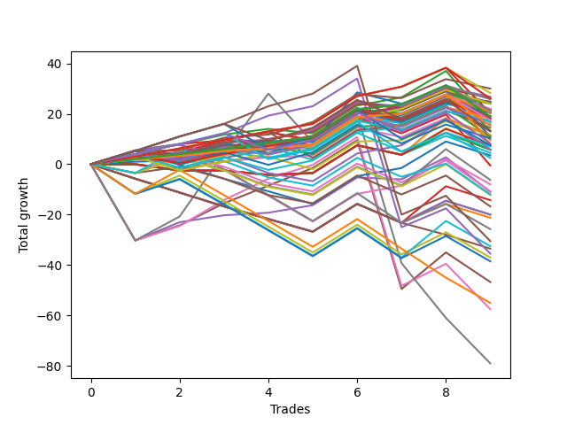

# Short Bulldog 001 
- Symbol: ES_Unlimited
- Date Range: 03/18/2022 - 07/15/2022
- Trading Period: 7:20-12:30
- Number of Trades: 9



| Name | Win Percent | Profit | Avg Profit / Trade | Avg Time / Trade |      | Name | Win Percent | Profit | Avg Profit / Trade | Avg Time / Trade |
| ---- | ----------- | ------ | ------------------ | ---------------- | ---- | ---- | ----------- | ------ | ------------------ | ---------------- |
| Sorted By <br> Profit | | | | | | Sorted By <br> Win Percentage ||||
| One Hundred | 77.78 | 15000.00 | 1666.67 | 02:32 |     | One Hundred Twenty-Three | 88.89 | 14125.00 | 1569.44 | 06:22 |
| One Hundred Twenty-Three | 88.89 | 14125.00 | 1569.44 | 06:22 |     | One Hundred Twenty-Eight | 88.89 | 13000.00 | 1444.44 | 06:23 |
| Ninety-Nine | 77.78 | 13375.00 | 1486.11 | 02:26 |     | One Hundred Twelve | 88.89 | 12875.00 | 1430.56 | 03:10 |
| Ninety-Eight | 77.78 | 13125.00 | 1458.33 | 02:00 |     | One Hundred Eleven | 88.89 | 11000.00 | 1222.22 | 01:45 |
| One Hundred Twenty-Eight | 88.89 | 13000.00 | 1444.44 | 06:23 |     | One Hundred Twenty-Two | 88.89 | 10625.00 | 1180.56 | 03:25 |
| One Hundred Twelve | 88.89 | 12875.00 | 1430.56 | 03:10 |     | One Hundred Sixteen | 88.89 | 10375.00 | 1152.78 | 01:47 |
| Ninety-Two | 77.78 | 12375.00 | 1375.00 | 01:36 |     | Eighty-Three | 88.89 | 10125.00 | 1125.00 | 40:14 |
| Ninety-Three | 66.67 | 12375.00 | 1375.00 | 02:32 |     | One Hundred Twenty-Seven | 88.89 | 9500.00 | 1055.56 | 03:27 |
| Ninety-Five | 55.56 | 12375.00 | 1375.00 | 03:32 |     | One Hundred Twenty-One | 88.89 | 8750.00 | 972.22 | 02:00 |
| One Hundred Ten | 66.67 | 12250.00 | 1361.11 | 03:11 |     | One Hundred Twenty-Six | 88.89 | 7625.00 | 847.22 | 02:01 |
| One Hundred Thirteen | 77.78 | 12000.00 | 1333.33 | 04:46 |     | Eighty-Two | 88.89 | 6625.00 | 736.11 | 37:17 |
| Ninety-Seven | 77.78 | 12000.00 | 1333.33 | 01:35 |     | Eighty-One | 88.89 | 4750.00 | 527.78 | 35:52 |
| One Hundred Eleven | 88.89 | 11000.00 | 1222.22 | 01:45 |     | One Hundred | 77.78 | 15000.00 | 1666.67 | 02:32 |
| One Hundred Two | 77.78 | 10875.00 | 1208.33 | 01:38 |     | Ninety-Nine | 77.78 | 13375.00 | 1486.11 | 02:26 |
| Ninety-One | 77.78 | 10875.00 | 1208.33 | 01:24 |     | Ninety-Eight | 77.78 | 13125.00 | 1458.33 | 02:00 |
| One Hundred Eight | 66.67 | 10750.00 | 1194.44 | 02:38 |     | Ninety-Two | 77.78 | 12375.00 | 1375.00 | 01:36 |
| Seventy-Three | 66.67 | 10750.00 | 1194.44 | 08:18 |     | One Hundred Thirteen | 77.78 | 12000.00 | 1333.33 | 04:46 |
| Ninety-Four | 55.56 | 10750.00 | 1194.44 | 03:26 |     | Ninety-Seven | 77.78 | 12000.00 | 1333.33 | 01:35 |
| One Hundred Twenty-Two | 88.89 | 10625.00 | 1180.56 | 03:25 |     | One Hundred Two | 77.78 | 10875.00 | 1208.33 | 01:38 |
| One Hundred Nine | 66.67 | 10625.00 | 1180.56 | 03:05 |     | Ninety-One | 77.78 | 10875.00 | 1208.33 | 01:24 |
| One Hundred Seven | 77.78 | 10500.00 | 1166.67 | 01:43 |     | One Hundred Seven | 77.78 | 10500.00 | 1166.67 | 01:43 |
| Ninety-Six | 77.78 | 10500.00 | 1166.67 | 01:23 |     | Ninety-Six | 77.78 | 10500.00 | 1166.67 | 01:23 |
| One Hundred Sixteen | 88.89 | 10375.00 | 1152.78 | 01:47 |     | Fifty-Six | 77.78 | 9500.00 | 1055.56 | 07:48 |
| One Hundred Three | 66.67 | 10375.00 | 1152.78 | 03:10 |     | One Hundred Seventeen | 77.78 | 9375.00 | 1041.67 | 02:13 |
| One Hundred Five | 55.56 | 10250.00 | 1138.89 | 04:10 |     | One Hundred One | 77.78 | 9375.00 | 1041.67 | 01:26 |
| Eighty-Three | 88.89 | 10125.00 | 1125.00 | 40:14 |     | One Hundred Six | 77.78 | 9000.00 | 1000.00 | 01:31 |
| One Hundred Twenty-Seven | 88.89 | 9500.00 | 1055.56 | 03:27 |     | Sixty-Five | 77.78 | 8875.00 | 986.11 | 08:29 |
| Fifty-Six | 77.78 | 9500.00 | 1055.56 | 07:48 |     | Two | 77.78 | 8375.00 | 930.56 | 23:02 |
| One Hundred Twenty | 55.56 | 9500.00 | 1055.56 | 04:09 |     | Fifty-Seven | 77.78 | 6500.00 | 722.22 | 10:11 |
| One Hundred Seventeen | 77.78 | 9375.00 | 1041.67 | 02:13 |     | Zero | 77.78 | 5500.00 | 611.11 | 09:56 |
| One Hundred One | 77.78 | 9375.00 | 1041.67 | 01:26 |     | One | 77.78 | 3875.00 | 430.56 | 16:36 |
| One Hundred Eighteen | 66.67 | 9125.00 | 1013.89 | 03:11 |     | Eighty-Five | 77.78 | -15250.00 | -1694.44 | 74:39 |
| One Hundred Six | 77.78 | 9000.00 | 1000.00 | 01:31 |     | Eighty-Four | 77.78 | -17750.00 | -1972.22 | 74:27 |
| Sixty-Five | 77.78 | 8875.00 | 986.11 | 08:29 |     | Ninety-Three | 66.67 | 12375.00 | 1375.00 | 02:32 |
| One Hundred Twenty-One | 88.89 | 8750.00 | 972.22 | 02:00 |     | One Hundred Ten | 66.67 | 12250.00 | 1361.11 | 03:11 |
| One Hundred Four | 55.56 | 8625.00 | 958.33 | 04:03 |     | One Hundred Eight | 66.67 | 10750.00 | 1194.44 | 02:38 |
| Two | 77.78 | 8375.00 | 930.56 | 23:02 |     | Seventy-Three | 66.67 | 10750.00 | 1194.44 | 08:18 |
| Forty-One | 66.67 | 8375.00 | 930.56 | 06:58 |     | One Hundred Nine | 66.67 | 10625.00 | 1180.56 | 03:05 |
| One Hundred Ninteen | 55.56 | 7875.00 | 875.00 | 04:03 |     | One Hundred Three | 66.67 | 10375.00 | 1152.78 | 03:10 |
| One Hundred Twenty-Six | 88.89 | 7625.00 | 847.22 | 02:01 |     | One Hundred Eighteen | 66.67 | 9125.00 | 1013.89 | 03:11 |
| Forty-Nine | 55.56 | 7250.00 | 805.56 | 04:08 |     | Forty-One | 66.67 | 8375.00 | 930.56 | 06:58 |
| Eighty-Two | 88.89 | 6625.00 | 736.11 | 37:17 |     | One Hundred Thirty | 66.67 | 6625.00 | 736.11 | 08:46 |
| One Hundred Thirty | 66.67 | 6625.00 | 736.11 | 08:46 |     | Forty | 66.67 | 5750.00 | 638.89 | 06:15 |
| Fifty-Seven | 77.78 | 6500.00 | 722.22 | 10:11 |     | Sixty-Four | 66.67 | 5375.00 | 597.22 | 07:09 |
| Forty | 66.67 | 5750.00 | 638.89 | 06:15 |     | One Hundred Twenty-Nine | 66.67 | 4125.00 | 458.33 | 08:35 |
| Forty-Eight | 55.56 | 5750.00 | 638.89 | 03:46 |     | One Hundred Twenty-Five | 66.67 | 3750.00 | 416.67 | 10:45 |
| Fifty-Three | 33.33 | 5750.00 | 638.89 | 05:28 |     | One Hundred Twenty-Four | 66.67 | 1250.00 | 138.89 | 10:33 |
| Zero | 77.78 | 5500.00 | 611.11 | 09:56 |     | Four | 66.67 | -5500.00 | -611.11 | 43:15 |
| Sixty-Four | 66.67 | 5375.00 | 597.22 | 07:09 |     | Five | 66.67 | -23375.00 | -2597.22 | 74:33 |
| One Hundred Fifteen | 55.56 | 5125.00 | 569.44 | 06:46 |     | Six | 66.67 | -28750.00 | -3194.44 | 103:00 |
| Eighty-One | 88.89 | 4750.00 | 527.78 | 35:52 |     | Ninety-Five | 55.56 | 12375.00 | 1375.00 | 03:32 |
| One Hundred Twenty-Nine | 66.67 | 4125.00 | 458.33 | 08:35 |     | Ninety-Four | 55.56 | 10750.00 | 1194.44 | 03:26 |
| One | 77.78 | 3875.00 | 430.56 | 16:36 |     | One Hundred Five | 55.56 | 10250.00 | 1138.89 | 04:10 |
| One Hundred Twenty-Five | 66.67 | 3750.00 | 416.67 | 10:45 |     | One Hundred Twenty | 55.56 | 9500.00 | 1055.56 | 04:09 |
| Fifty | 33.33 | 3750.00 | 416.67 | 05:25 |     | One Hundred Four | 55.56 | 8625.00 | 958.33 | 04:03 |
| Fifty-Five | 33.33 | 3625.00 | 402.78 | 05:33 |     | One Hundred Ninteen | 55.56 | 7875.00 | 875.00 | 04:03 |
| One Hundred Fourteen | 55.56 | 3500.00 | 388.89 | 06:40 |     | Forty-Nine | 55.56 | 7250.00 | 805.56 | 04:08 |
| Sixty-Six | 55.56 | 2875.00 | 319.44 | 10:43 |     | Forty-Eight | 55.56 | 5750.00 | 638.89 | 03:46 |
| Fifty-Four | 33.33 | 2875.00 | 319.44 | 05:23 |     | One Hundred Fifteen | 55.56 | 5125.00 | 569.44 | 06:46 |
| Fifty-Two | 33.33 | 2875.00 | 319.44 | 05:23 |     | One Hundred Fourteen | 55.56 | 3500.00 | 388.89 | 06:40 |
| Fifty-One | 33.33 | 2250.00 | 250.00 | 05:21 |     | Sixty-Six | 55.56 | 2875.00 | 319.44 | 10:43 |
| Forty-Two | 44.44 | 1750.00 | 194.44 | 09:18 |     | Three | 55.56 | -250.00 | -27.78 | 28:51 |
| One Hundred Twenty-Four | 66.67 | 1250.00 | 138.89 | 10:33 |     | Fifty-Eight | 55.56 | -4000.00 | -444.44 | 13:50 |
| Three | 55.56 | -250.00 | -27.78 | 28:51 |     | Forty-Two | 44.44 | 1750.00 | 194.44 | 09:18 |
| Sixty-Nine | 33.33 | -3125.00 | -347.22 | 14:53 |     | Fifty-Nine | 44.44 | -12875.00 | -1430.56 | 17:28 |
| Fifty-Eight | 55.56 | -4000.00 | -444.44 | 13:50 |     | Seven | 44.44 | -39500.00 | -4388.89 | 149:35 |
| Sixty-Eight | 33.33 | -5375.00 | -597.22 | 12:43 |     | Fifty-Three | 33.33 | 5750.00 | 638.89 | 05:28 |
| Four | 66.67 | -5500.00 | -611.11 | 43:15 |     | Fifty | 33.33 | 3750.00 | 416.67 | 05:25 |
| Seventy-One | 33.33 | -6000.00 | -666.67 | 15:21 |     | Fifty-Five | 33.33 | 3625.00 | 402.78 | 05:33 |
| Seventy | 33.33 | -6125.00 | -680.56 | 12:31 |     | Fifty-Four | 33.33 | 2875.00 | 319.44 | 05:23 |
| Forty-Five | 22.22 | -7125.00 | -791.67 | 10:53 |     | Fifty-Two | 33.33 | 2875.00 | 319.44 | 05:23 |
| Sixty-Seven | 33.33 | -8375.00 | -930.56 | 12:08 |     | Fifty-One | 33.33 | 2250.00 | 250.00 | 05:21 |
| Forty-Six | 22.22 | -10000.00 | -1111.11 | 10:48 |     | Sixty-Nine | 33.33 | -3125.00 | -347.22 | 14:53 |
| Forty-Four | 22.22 | -10000.00 | -1111.11 | 10:48 |     | Sixty-Eight | 33.33 | -5375.00 | -597.22 | 12:43 |
| Forty-Three | 22.22 | -10625.00 | -1180.56 | 10:46 |     | Seventy-One | 33.33 | -6000.00 | -666.67 | 15:21 |
| Fifty-Nine | 44.44 | -12875.00 | -1430.56 | 17:28 |     | Seventy | 33.33 | -6125.00 | -680.56 | 12:31 |
| Eighty-Five | 77.78 | -15250.00 | -1694.44 | 74:39 |     | Sixty-Seven | 33.33 | -8375.00 | -930.56 | 12:08 |
| Sixty-One | 33.33 | -16250.00 | -1805.56 | 22:36 |     | Sixty-One | 33.33 | -16250.00 | -1805.56 | 22:36 |
| Forty-Seven | 11.11 | -16750.00 | -1861.11 | 12:41 |     | Sixty | 33.33 | -18500.00 | -2055.56 | 20:27 |
| Eighty-Four | 77.78 | -17750.00 | -1972.22 | 74:27 |     | Sixty-Two | 33.33 | -19250.00 | -2138.89 | 20:15 |
| Sixty | 33.33 | -18500.00 | -2055.56 | 20:27 |     | Forty-Five | 22.22 | -7125.00 | -791.67 | 10:53 |
| Sixty-Two | 33.33 | -19250.00 | -2138.89 | 20:15 |     | Forty-Six | 22.22 | -10000.00 | -1111.11 | 10:48 |
| Five | 66.67 | -23375.00 | -2597.22 | 74:33 |     | Forty-Four | 22.22 | -10000.00 | -1111.11 | 10:48 |
| Sixty-Three | 22.22 | -27500.00 | -3055.56 | 24:56 |     | Forty-Three | 22.22 | -10625.00 | -1180.56 | 10:46 |
| Six | 66.67 | -28750.00 | -3194.44 | 103:00 |     | Sixty-Three | 22.22 | -27500.00 | -3055.56 | 24:56 |
| Seven | 44.44 | -39500.00 | -4388.89 | 149:35 |     | Forty-Seven | 11.11 | -16750.00 | -1861.11 | 12:41 |

## NO STOPLOSS

### Test Zero
* Sell when price hits the middle line of the 20p bollinger
* No Stoploss
* Results:
```
Total Trades: 9
Percent Up: 22.22
Percent Down: 77.78
Total Points Moved Down: 11.00
Potential Profit: 5500.00
Total Points Ups: 19.25 Count Ups: 2
Total Points Downs: 30.25 Count Downs: 7
```

<details><summary>Trades</summary>

<code>In: 2022-04-07 11:04:00		Out: 2022-04-07 11:15:20		Total Position Time: 11:20		Total Move Down: 3.25		Total to Date: 3.25</code> <br />
<code>In: 2022-04-18 07:28:00		Out: 2022-04-18 07:46:00		Total Position Time: 18:00		Total Move Down: -1.25		Total to Date: 2.00</code> <br />
<code>In: 2022-05-04 09:42:00		Out: 2022-05-04 09:45:30		Total Position Time: 03:30		Total Move Down: 3.50		Total to Date: 5.50</code> <br />
<code>In: 2022-05-04 09:43:00		Out: 2022-05-04 09:45:30		Total Position Time: 02:30		Total Move Down: 1.75		Total to Date: 7.25</code> <br />
<code>In: 2022-05-31 07:24:00		Out: 2022-05-31 07:37:30		Total Position Time: 13:30		Total Move Down: 2.75		Total to Date: 10.00</code> <br />
<code>In: 2022-06-15 11:02:00		Out: 2022-06-15 11:03:10		Total Position Time: 01:10		Total Move Down: 11.00		Total to Date: 21.00</code> <br />
<code>In: 2022-07-05 08:49:00		Out: 2022-07-05 09:03:00		Total Position Time: 14:00		Total Move Down: 0.50		Total to Date: 21.50</code> <br />
<code>In: 2022-07-06 11:10:00		Out: 2022-07-06 11:11:10		Total Position Time: 01:10		Total Move Down: 7.50		Total to Date: 29.00</code> <br />
<code>In: 2022-07-13 07:37:00		Out: 2022-07-13 08:01:20		Total Position Time: 24:20		Total Move Down: -18.00		Total to Date: 11.00</code> <br />


</details>

### Test One
* Sell when the price hits the upper line of the 20p 1std bollinger
* No Stoploss
* Results:
```
Total Trades: 9
Percent Up: 22.22
Percent Down: 77.78
Total Points Moved Down: 7.75
Potential Profit: 3875.00
Total Points Ups: 25.50 Count Ups: 2
Total Points Downs: 33.25 Count Downs: 7
```

<details><summary>Trades</summary>

<code>In: 2022-04-07 11:04:00		Out: 2022-04-07 11:18:00		Total Position Time: 14:00		Total Move Down: 4.00		Total to Date: 4.00</code> <br />
<code>In: 2022-04-18 07:28:00		Out: 2022-04-18 07:51:30		Total Position Time: 23:30		Total Move Down: 0.50		Total to Date: 4.50</code> <br />
<code>In: 2022-05-04 09:42:00		Out: 2022-05-04 09:47:10		Total Position Time: 05:10		Total Move Down: 5.00		Total to Date: 9.50</code> <br />
<code>In: 2022-05-04 09:43:00		Out: 2022-05-04 09:47:10		Total Position Time: 04:10		Total Move Down: 3.25		Total to Date: 12.75</code> <br />
<code>In: 2022-05-31 07:24:00		Out: 2022-05-31 08:07:20		Total Position Time: 43:20		Total Move Down: -3.75		Total to Date: 9.00</code> <br />
<code>In: 2022-06-15 11:02:00		Out: 2022-06-15 11:03:10		Total Position Time: 01:10		Total Move Down: 11.00		Total to Date: 20.00</code> <br />
<code>In: 2022-07-05 08:49:00		Out: 2022-07-05 09:03:30		Total Position Time: 14:30		Total Move Down: 2.00		Total to Date: 22.00</code> <br />
<code>In: 2022-07-06 11:10:00		Out: 2022-07-06 11:11:10		Total Position Time: 01:10		Total Move Down: 7.50		Total to Date: 29.50</code> <br />
<code>In: 2022-07-13 07:37:00		Out: 2022-07-13 08:19:25		Total Position Time: 42:25		Total Move Down: -21.75		Total to Date: 7.75</code> <br />


</details>

### Test Two
* Sell when the price hits the upper line of the 20p 2std bollinger
* No Stoploss
* Results:
```
Total Trades: 9
Percent Up: 22.22
Percent Down: 77.78
Total Points Moved Down: 16.75
Potential Profit: 8375.00
Total Points Ups: 22.00 Count Ups: 2
Total Points Downs: 38.75 Count Downs: 7
```

<details><summary>Trades</summary>

<code>In: 2022-04-07 11:04:00		Out: 2022-04-07 11:18:20		Total Position Time: 14:20		Total Move Down: 5.25		Total to Date: 5.25</code> <br />
<code>In: 2022-04-18 07:28:00		Out: 2022-04-18 07:51:45		Total Position Time: 23:45		Total Move Down: 2.50		Total to Date: 7.75</code> <br />
<code>In: 2022-05-04 09:42:00		Out: 2022-05-04 10:11:30		Total Position Time: 29:30		Total Move Down: 4.00		Total to Date: 11.75</code> <br />
<code>In: 2022-05-04 09:43:00		Out: 2022-05-04 10:11:30		Total Position Time: 28:30		Total Move Down: 2.25		Total to Date: 14.00</code> <br />
<code>In: 2022-05-31 07:24:00		Out: 2022-05-31 08:07:30		Total Position Time: 43:30		Total Move Down: -1.75		Total to Date: 12.25</code> <br />
<code>In: 2022-06-15 11:02:00		Out: 2022-06-15 11:03:10		Total Position Time: 01:10		Total Move Down: 11.00		Total to Date: 23.25</code> <br />
<code>In: 2022-07-05 08:49:00		Out: 2022-07-05 09:05:50		Total Position Time: 16:50		Total Move Down: 3.25		Total to Date: 26.50</code> <br />
<code>In: 2022-07-06 11:10:00		Out: 2022-07-06 11:11:45		Total Position Time: 01:45		Total Move Down: 10.50		Total to Date: 37.00</code> <br />
<code>In: 2022-07-13 07:37:00		Out: 2022-07-13 08:25:05		Total Position Time: 48:05		Total Move Down: -20.25		Total to Date: 16.75</code> <br />


</details>

### Test Three
* Sell when price hits the middle line of the 50p bollinger
* No Stoploss
* Results:
```
Total Trades: 9
Percent Up: 44.44
Percent Down: 55.56
Total Points Moved Down: -0.50
Potential Profit: -250.00
Total Points Ups: 28.50 Count Ups: 4
Total Points Downs: 28.00 Count Downs: 5
```

<details><summary>Trades</summary>

<code>In: 2022-04-07 11:04:00		Out: 2022-04-07 11:33:40		Total Position Time: 29:40		Total Move Down: 5.50		Total to Date: 5.50</code> <br />
<code>In: 2022-04-18 07:28:00		Out: 2022-04-18 07:52:15		Total Position Time: 24:15		Total Move Down: 2.50		Total to Date: 8.00</code> <br />
<code>In: 2022-05-04 09:42:00		Out: 2022-05-04 10:11:05		Total Position Time: 29:05		Total Move Down: 1.50		Total to Date: 9.50</code> <br />
<code>In: 2022-05-04 09:43:00		Out: 2022-05-04 10:11:05		Total Position Time: 28:05		Total Move Down: -0.25		Total to Date: 9.25</code> <br />
<code>In: 2022-05-31 07:24:00		Out: 2022-05-31 08:07:30		Total Position Time: 43:30		Total Move Down: -1.75		Total to Date: 7.50</code> <br />
<code>In: 2022-06-15 11:02:00		Out: 2022-06-15 11:03:10		Total Position Time: 01:10		Total Move Down: 11.00		Total to Date: 18.50</code> <br />
<code>In: 2022-07-05 08:49:00		Out: 2022-07-05 09:43:40		Total Position Time: 54:40		Total Move Down: -6.25		Total to Date: 12.25</code> <br />
<code>In: 2022-07-06 11:10:00		Out: 2022-07-06 11:11:10		Total Position Time: 01:10		Total Move Down: 7.50		Total to Date: 19.75</code> <br />
<code>In: 2022-07-13 07:37:00		Out: 2022-07-13 08:25:05		Total Position Time: 48:05		Total Move Down: -20.25		Total to Date: -0.50</code> <br />


</details>

### Test Four
* Sell when the price hits the upper line of the 50p 1std bollinger
* No Stoploss
* Results:
```
Total Trades: 9
Percent Up: 33.33
Percent Down: 66.67
Total Points Moved Down: -11.00
Potential Profit: -5500.00
Total Points Ups: 44.75 Count Ups: 3
Total Points Downs: 33.75 Count Downs: 6
```

<details><summary>Trades</summary>

<code>In: 2022-04-07 11:04:00		Out: 2022-04-07 12:47:00		Total Position Time: 103:00		Total Move Down: -30.25		Total to Date: -30.25</code> <br />
<code>In: 2022-04-18 07:28:00		Out: 2022-04-18 07:57:05		Total Position Time: 29:05		Total Move Down: 7.25		Total to Date: -23.00</code> <br />
<code>In: 2022-05-04 09:42:00		Out: 2022-05-04 10:30:25		Total Position Time: 48:25		Total Move Down: 2.75		Total to Date: -20.25</code> <br />
<code>In: 2022-05-04 09:43:00		Out: 2022-05-04 10:30:25		Total Position Time: 47:25		Total Move Down: 1.00		Total to Date: -19.25</code> <br />
<code>In: 2022-05-31 07:24:00		Out: 2022-05-31 08:08:45		Total Position Time: 44:45		Total Move Down: 3.00		Total to Date: -16.25</code> <br />
<code>In: 2022-06-15 11:02:00		Out: 2022-06-15 11:03:10		Total Position Time: 01:10		Total Move Down: 11.00		Total to Date: -5.25</code> <br />
<code>In: 2022-07-05 08:49:00		Out: 2022-07-05 09:51:05		Total Position Time: 62:05		Total Move Down: -0.75		Total to Date: -6.00</code> <br />
<code>In: 2022-07-06 11:10:00		Out: 2022-07-06 11:11:35		Total Position Time: 01:35		Total Move Down: 8.75		Total to Date: 2.75</code> <br />
<code>In: 2022-07-13 07:37:00		Out: 2022-07-13 08:28:45		Total Position Time: 51:45		Total Move Down: -13.75		Total to Date: -11.00</code> <br />


</details>

### Test Five
* Sell when the price hits the upper line of the 50p 2std bollinger
* No Stoploss
* Results:
```
Total Trades: 9
Percent Up: 33.33
Percent Down: 66.67
Total Points Moved Down: -46.75
Potential Profit: -23375.00
Total Points Ups: 101.00 Count Ups: 3
Total Points Downs: 54.25 Count Downs: 6
```

<details><summary>Trades</summary>

<code>In: 2022-04-07 11:04:00		Out: 2022-04-07 12:47:00		Total Position Time: 103:00		Total Move Down: -30.25		Total to Date: -30.25</code> <br />
<code>In: 2022-04-18 07:28:00		Out: 2022-04-18 08:15:50		Total Position Time: 47:50		Total Move Down: 6.00		Total to Date: -24.25</code> <br />
<code>In: 2022-05-04 09:42:00		Out: 2022-05-04 11:07:40		Total Position Time: 85:40		Total Move Down: 8.75		Total to Date: -15.50</code> <br />
<code>In: 2022-05-04 09:43:00		Out: 2022-05-04 11:07:40		Total Position Time: 84:40		Total Move Down: 7.00		Total to Date: -8.50</code> <br />
<code>In: 2022-05-31 07:24:00		Out: 2022-05-31 08:14:30		Total Position Time: 50:30		Total Move Down: 7.00		Total to Date: -1.50</code> <br />
<code>In: 2022-06-15 11:02:00		Out: 2022-06-15 11:03:10		Total Position Time: 01:10		Total Move Down: 11.00		Total to Date: 9.50</code> <br />
<code>In: 2022-07-05 08:49:00		Out: 2022-07-05 12:47:00		Total Position Time: 238:00		Total Move Down: -59.00		Total to Date: -49.50</code> <br />
<code>In: 2022-07-06 11:10:00		Out: 2022-07-06 11:12:15		Total Position Time: 02:15		Total Move Down: 14.50		Total to Date: -35.00</code> <br />
<code>In: 2022-07-13 07:37:00		Out: 2022-07-13 08:34:55		Total Position Time: 57:55		Total Move Down: -11.75		Total to Date: -46.75</code> <br />


</details>

### Test Six
* Sell when the price hits the middle line of the 1std VWAP
* No Stoploss
* Results:
```
Total Trades: 9
Percent Up: 33.33
Percent Down: 66.67
Total Points Moved Down: -57.50
Potential Profit: -28750.00
Total Points Ups: 107.25 Count Ups: 3
Total Points Downs: 49.75 Count Downs: 6
```

<details><summary>Trades</summary>

<code>In: 2022-04-07 11:04:00		Out: 2022-04-07 12:47:00		Total Position Time: 103:00		Total Move Down: -30.25		Total to Date: -30.25</code> <br />
<code>In: 2022-04-18 07:28:00		Out: 2022-04-18 07:55:15		Total Position Time: 27:15		Total Move Down: 5.75		Total to Date: -24.50</code> <br />
<code>In: 2022-05-04 09:42:00		Out: 2022-05-04 11:20:20		Total Position Time: 98:20		Total Move Down: 10.25		Total to Date: -14.25</code> <br />
<code>In: 2022-05-04 09:43:00		Out: 2022-05-04 11:20:20		Total Position Time: 97:20		Total Move Down: 8.50		Total to Date: -5.75</code> <br />
<code>In: 2022-05-31 07:24:00		Out: 2022-05-31 08:14:20		Total Position Time: 50:20		Total Move Down: 5.50		Total to Date: -0.25</code> <br />
<code>In: 2022-06-15 11:02:00		Out: 2022-06-15 11:03:10		Total Position Time: 01:10		Total Move Down: 11.00		Total to Date: 10.75</code> <br />
<code>In: 2022-07-05 08:49:00		Out: 2022-07-05 12:47:00		Total Position Time: 238:00		Total Move Down: -59.00		Total to Date: -48.25</code> <br />
<code>In: 2022-07-06 11:10:00		Out: 2022-07-06 11:11:35		Total Position Time: 01:35		Total Move Down: 8.75		Total to Date: -39.50</code> <br />
<code>In: 2022-07-13 07:37:00		Out: 2022-07-13 12:47:00		Total Position Time: 310:00		Total Move Down: -18.00		Total to Date: -57.50</code> <br />


</details>

### Test Seven
* Sell when the price hits the upper line of the 1std VWAP
* No Stoploss
* Results:
```
Total Trades: 9
Percent Up: 55.56
Percent Down: 44.44
Total Points Moved Down: -79.00
Potential Profit: -39500.00
Total Points Ups: 148.25 Count Ups: 5
Total Points Downs: 69.25 Count Downs: 4
```

<details><summary>Trades</summary>

<code>In: 2022-04-07 11:04:00		Out: 2022-04-07 12:47:00		Total Position Time: 103:00		Total Move Down: -30.25		Total to Date: -30.25</code> <br />
<code>In: 2022-04-18 07:28:00		Out: 2022-04-18 08:18:55		Total Position Time: 50:55		Total Move Down: 9.50		Total to Date: -20.75</code> <br />
<code>In: 2022-05-04 09:42:00		Out: 2022-05-04 11:34:05		Total Position Time: 112:05		Total Move Down: 25.25		Total to Date: 4.50</code> <br />
<code>In: 2022-05-04 09:43:00		Out: 2022-05-04 11:34:05		Total Position Time: 111:05		Total Move Down: 23.50		Total to Date: 28.00</code> <br />
<code>In: 2022-05-31 07:24:00		Out: 2022-05-31 12:47:00		Total Position Time: 323:00		Total Move Down: -19.25		Total to Date: 8.75</code> <br />
<code>In: 2022-06-15 11:02:00		Out: 2022-06-15 11:03:10		Total Position Time: 01:10		Total Move Down: 11.00		Total to Date: 19.75</code> <br />
<code>In: 2022-07-05 08:49:00		Out: 2022-07-05 12:47:00		Total Position Time: 238:00		Total Move Down: -59.00		Total to Date: -39.25</code> <br />
<code>In: 2022-07-06 11:10:00		Out: 2022-07-06 12:47:00		Total Position Time: 97:00		Total Move Down: -21.75		Total to Date: -61.00</code> <br />
<code>In: 2022-07-13 07:37:00		Out: 2022-07-13 12:47:00		Total Position Time: 310:00		Total Move Down: -18.00		Total to Date: -79.00</code> <br />


</details>

## STOPLOSS OF 5

### Test Forty
* Sell when price hits the middle line of the 20p bollinger
* Stoploss is -5 points
* Results:
```
Total Trades: 9
Percent Up: 33.33
Percent Down: 66.67
Total Points Moved Down: 11.50
Potential Profit: 5750.00
Total Points Ups: 16.00 Count Ups: 3
Total Points Downs: 27.50 Count Downs: 6
```

<details><summary>Trades</summary>

<code>In: 2022-04-07 11:04:00		Out: 2022-04-07 11:15:20		Total Position Time: 11:20		Total Move Down: 3.25		Total to Date: 3.25</code> <br />
<code>In: 2022-04-18 07:28:00		Out: 2022-04-18 07:40:15		Total Position Time: 12:15		Total Move Down: -5.50		Total to Date: -2.25</code> <br />
<code>In: 2022-05-04 09:42:00		Out: 2022-05-04 09:45:30		Total Position Time: 03:30		Total Move Down: 3.50		Total to Date: 1.25</code> <br />
<code>In: 2022-05-04 09:43:00		Out: 2022-05-04 09:45:30		Total Position Time: 02:30		Total Move Down: 1.75		Total to Date: 3.00</code> <br />
<code>In: 2022-05-31 07:24:00		Out: 2022-05-31 07:31:25		Total Position Time: 07:25		Total Move Down: -5.00		Total to Date: -2.00</code> <br />
<code>In: 2022-06-15 11:02:00		Out: 2022-06-15 11:03:10		Total Position Time: 01:10		Total Move Down: 11.00		Total to Date: 9.00</code> <br />
<code>In: 2022-07-05 08:49:00		Out: 2022-07-05 09:03:00		Total Position Time: 14:00		Total Move Down: 0.50		Total to Date: 9.50</code> <br />
<code>In: 2022-07-06 11:10:00		Out: 2022-07-06 11:11:10		Total Position Time: 01:10		Total Move Down: 7.50		Total to Date: 17.00</code> <br />
<code>In: 2022-07-13 07:37:00		Out: 2022-07-13 07:39:55		Total Position Time: 02:55		Total Move Down: -5.50		Total to Date: 11.50</code> <br />


</details>

### Test Forty-One
* Sell when the price hits the upper line of the 20p 1std bollinger
* Stoploss is -5 points
* Results:
```
Total Trades: 9
Percent Up: 33.33
Percent Down: 66.67
Total Points Moved Down: 16.75
Potential Profit: 8375.00
Total Points Ups: 16.00 Count Ups: 3
Total Points Downs: 32.75 Count Downs: 6
```

<details><summary>Trades</summary>

<code>In: 2022-04-07 11:04:00		Out: 2022-04-07 11:18:00		Total Position Time: 14:00		Total Move Down: 4.00		Total to Date: 4.00</code> <br />
<code>In: 2022-04-18 07:28:00		Out: 2022-04-18 07:40:15		Total Position Time: 12:15		Total Move Down: -5.50		Total to Date: -1.50</code> <br />
<code>In: 2022-05-04 09:42:00		Out: 2022-05-04 09:47:10		Total Position Time: 05:10		Total Move Down: 5.00		Total to Date: 3.50</code> <br />
<code>In: 2022-05-04 09:43:00		Out: 2022-05-04 09:47:10		Total Position Time: 04:10		Total Move Down: 3.25		Total to Date: 6.75</code> <br />
<code>In: 2022-05-31 07:24:00		Out: 2022-05-31 07:31:25		Total Position Time: 07:25		Total Move Down: -5.00		Total to Date: 1.75</code> <br />
<code>In: 2022-06-15 11:02:00		Out: 2022-06-15 11:03:10		Total Position Time: 01:10		Total Move Down: 11.00		Total to Date: 12.75</code> <br />
<code>In: 2022-07-05 08:49:00		Out: 2022-07-05 09:03:30		Total Position Time: 14:30		Total Move Down: 2.00		Total to Date: 14.75</code> <br />
<code>In: 2022-07-06 11:10:00		Out: 2022-07-06 11:11:10		Total Position Time: 01:10		Total Move Down: 7.50		Total to Date: 22.25</code> <br />
<code>In: 2022-07-13 07:37:00		Out: 2022-07-13 07:39:55		Total Position Time: 02:55		Total Move Down: -5.50		Total to Date: 16.75</code> <br />


</details>

### Test Forty-Two
* Sell when the price hits the upper line of the 20p 2std bollinger
* Stoploss is -5 points
* Results:
```
Total Trades: 9
Percent Up: 55.56
Percent Down: 44.44
Total Points Moved Down: 3.50
Potential Profit: 1750.00
Total Points Ups: 26.50 Count Ups: 5
Total Points Downs: 30.00 Count Downs: 4
```

<details><summary>Trades</summary>

<code>In: 2022-04-07 11:04:00		Out: 2022-04-07 11:18:20		Total Position Time: 14:20		Total Move Down: 5.25		Total to Date: 5.25</code> <br />
<code>In: 2022-04-18 07:28:00		Out: 2022-04-18 07:40:15		Total Position Time: 12:15		Total Move Down: -5.50		Total to Date: -0.25</code> <br />
<code>In: 2022-05-04 09:42:00		Out: 2022-05-04 09:57:05		Total Position Time: 15:05		Total Move Down: -5.50		Total to Date: -5.75</code> <br />
<code>In: 2022-05-04 09:43:00		Out: 2022-05-04 09:55:00		Total Position Time: 12:00		Total Move Down: -5.00		Total to Date: -10.75</code> <br />
<code>In: 2022-05-31 07:24:00		Out: 2022-05-31 07:31:25		Total Position Time: 07:25		Total Move Down: -5.00		Total to Date: -15.75</code> <br />
<code>In: 2022-06-15 11:02:00		Out: 2022-06-15 11:03:10		Total Position Time: 01:10		Total Move Down: 11.00		Total to Date: -4.75</code> <br />
<code>In: 2022-07-05 08:49:00		Out: 2022-07-05 09:05:50		Total Position Time: 16:50		Total Move Down: 3.25		Total to Date: -1.50</code> <br />
<code>In: 2022-07-06 11:10:00		Out: 2022-07-06 11:11:45		Total Position Time: 01:45		Total Move Down: 10.50		Total to Date: 9.00</code> <br />
<code>In: 2022-07-13 07:37:00		Out: 2022-07-13 07:39:55		Total Position Time: 02:55		Total Move Down: -5.50		Total to Date: 3.50</code> <br />


</details>

### Test Forty-Three
* Sell when price hits the middle line of the 50p bollinger
* Stoploss is -5 points
* Results:
```
Total Trades: 9
Percent Up: 77.78
Percent Down: 22.22
Total Points Moved Down: -21.25
Potential Profit: -10625.00
Total Points Ups: 39.75 Count Ups: 7
Total Points Downs: 18.50 Count Downs: 2
```

<details><summary>Trades</summary>

<code>In: 2022-04-07 11:04:00		Out: 2022-04-07 11:27:05		Total Position Time: 23:05		Total Move Down: -5.75		Total to Date: -5.75</code> <br />
<code>In: 2022-04-18 07:28:00		Out: 2022-04-18 07:40:15		Total Position Time: 12:15		Total Move Down: -5.50		Total to Date: -11.25</code> <br />
<code>In: 2022-05-04 09:42:00		Out: 2022-05-04 09:57:05		Total Position Time: 15:05		Total Move Down: -5.50		Total to Date: -16.75</code> <br />
<code>In: 2022-05-04 09:43:00		Out: 2022-05-04 09:55:00		Total Position Time: 12:00		Total Move Down: -5.00		Total to Date: -21.75</code> <br />
<code>In: 2022-05-31 07:24:00		Out: 2022-05-31 07:31:25		Total Position Time: 07:25		Total Move Down: -5.00		Total to Date: -26.75</code> <br />
<code>In: 2022-06-15 11:02:00		Out: 2022-06-15 11:03:10		Total Position Time: 01:10		Total Move Down: 11.00		Total to Date: -15.75</code> <br />
<code>In: 2022-07-05 08:49:00		Out: 2022-07-05 09:10:50		Total Position Time: 21:50		Total Move Down: -7.50		Total to Date: -23.25</code> <br />
<code>In: 2022-07-06 11:10:00		Out: 2022-07-06 11:11:10		Total Position Time: 01:10		Total Move Down: 7.50		Total to Date: -15.75</code> <br />
<code>In: 2022-07-13 07:37:00		Out: 2022-07-13 07:39:55		Total Position Time: 02:55		Total Move Down: -5.50		Total to Date: -21.25</code> <br />


</details>

### Test Forty-Four
* Sell when the price hits the upper line of the 50p 1std bollinger
* Stoploss is -5 points
* Results:
```
Total Trades: 9
Percent Up: 77.78
Percent Down: 22.22
Total Points Moved Down: -20.00
Potential Profit: -10000.00
Total Points Ups: 39.75 Count Ups: 7
Total Points Downs: 19.75 Count Downs: 2
```

<details><summary>Trades</summary>

<code>In: 2022-04-07 11:04:00		Out: 2022-04-07 11:27:05		Total Position Time: 23:05		Total Move Down: -5.75		Total to Date: -5.75</code> <br />
<code>In: 2022-04-18 07:28:00		Out: 2022-04-18 07:40:15		Total Position Time: 12:15		Total Move Down: -5.50		Total to Date: -11.25</code> <br />
<code>In: 2022-05-04 09:42:00		Out: 2022-05-04 09:57:05		Total Position Time: 15:05		Total Move Down: -5.50		Total to Date: -16.75</code> <br />
<code>In: 2022-05-04 09:43:00		Out: 2022-05-04 09:55:00		Total Position Time: 12:00		Total Move Down: -5.00		Total to Date: -21.75</code> <br />
<code>In: 2022-05-31 07:24:00		Out: 2022-05-31 07:31:25		Total Position Time: 07:25		Total Move Down: -5.00		Total to Date: -26.75</code> <br />
<code>In: 2022-06-15 11:02:00		Out: 2022-06-15 11:03:10		Total Position Time: 01:10		Total Move Down: 11.00		Total to Date: -15.75</code> <br />
<code>In: 2022-07-05 08:49:00		Out: 2022-07-05 09:10:50		Total Position Time: 21:50		Total Move Down: -7.50		Total to Date: -23.25</code> <br />
<code>In: 2022-07-06 11:10:00		Out: 2022-07-06 11:11:35		Total Position Time: 01:35		Total Move Down: 8.75		Total to Date: -14.50</code> <br />
<code>In: 2022-07-13 07:37:00		Out: 2022-07-13 07:39:55		Total Position Time: 02:55		Total Move Down: -5.50		Total to Date: -20.00</code> <br />


</details>

### Test Forty-Five
* Sell when the price hits the upper line of the 50p 2std bollinger
* Stoploss is -5 points
* Results:
```
Total Trades: 9
Percent Up: 77.78
Percent Down: 22.22
Total Points Moved Down: -14.25
Potential Profit: -7125.00
Total Points Ups: 39.75 Count Ups: 7
Total Points Downs: 25.50 Count Downs: 2
```

<details><summary>Trades</summary>

<code>In: 2022-04-07 11:04:00		Out: 2022-04-07 11:27:05		Total Position Time: 23:05		Total Move Down: -5.75		Total to Date: -5.75</code> <br />
<code>In: 2022-04-18 07:28:00		Out: 2022-04-18 07:40:15		Total Position Time: 12:15		Total Move Down: -5.50		Total to Date: -11.25</code> <br />
<code>In: 2022-05-04 09:42:00		Out: 2022-05-04 09:57:05		Total Position Time: 15:05		Total Move Down: -5.50		Total to Date: -16.75</code> <br />
<code>In: 2022-05-04 09:43:00		Out: 2022-05-04 09:55:00		Total Position Time: 12:00		Total Move Down: -5.00		Total to Date: -21.75</code> <br />
<code>In: 2022-05-31 07:24:00		Out: 2022-05-31 07:31:25		Total Position Time: 07:25		Total Move Down: -5.00		Total to Date: -26.75</code> <br />
<code>In: 2022-06-15 11:02:00		Out: 2022-06-15 11:03:10		Total Position Time: 01:10		Total Move Down: 11.00		Total to Date: -15.75</code> <br />
<code>In: 2022-07-05 08:49:00		Out: 2022-07-05 09:10:50		Total Position Time: 21:50		Total Move Down: -7.50		Total to Date: -23.25</code> <br />
<code>In: 2022-07-06 11:10:00		Out: 2022-07-06 11:12:15		Total Position Time: 02:15		Total Move Down: 14.50		Total to Date: -8.75</code> <br />
<code>In: 2022-07-13 07:37:00		Out: 2022-07-13 07:39:55		Total Position Time: 02:55		Total Move Down: -5.50		Total to Date: -14.25</code> <br />


</details>

### Test Forty-Six
* Sell when the price hits the middle line of the 1std VWAP
* Stoploss is -5 points
* Results:
```
Total Trades: 9
Percent Up: 77.78
Percent Down: 22.22
Total Points Moved Down: -20.00
Potential Profit: -10000.00
Total Points Ups: 39.75 Count Ups: 7
Total Points Downs: 19.75 Count Downs: 2
```

<details><summary>Trades</summary>

<code>In: 2022-04-07 11:04:00		Out: 2022-04-07 11:27:05		Total Position Time: 23:05		Total Move Down: -5.75		Total to Date: -5.75</code> <br />
<code>In: 2022-04-18 07:28:00		Out: 2022-04-18 07:40:15		Total Position Time: 12:15		Total Move Down: -5.50		Total to Date: -11.25</code> <br />
<code>In: 2022-05-04 09:42:00		Out: 2022-05-04 09:57:05		Total Position Time: 15:05		Total Move Down: -5.50		Total to Date: -16.75</code> <br />
<code>In: 2022-05-04 09:43:00		Out: 2022-05-04 09:55:00		Total Position Time: 12:00		Total Move Down: -5.00		Total to Date: -21.75</code> <br />
<code>In: 2022-05-31 07:24:00		Out: 2022-05-31 07:31:25		Total Position Time: 07:25		Total Move Down: -5.00		Total to Date: -26.75</code> <br />
<code>In: 2022-06-15 11:02:00		Out: 2022-06-15 11:03:10		Total Position Time: 01:10		Total Move Down: 11.00		Total to Date: -15.75</code> <br />
<code>In: 2022-07-05 08:49:00		Out: 2022-07-05 09:10:50		Total Position Time: 21:50		Total Move Down: -7.50		Total to Date: -23.25</code> <br />
<code>In: 2022-07-06 11:10:00		Out: 2022-07-06 11:11:35		Total Position Time: 01:35		Total Move Down: 8.75		Total to Date: -14.50</code> <br />
<code>In: 2022-07-13 07:37:00		Out: 2022-07-13 07:39:55		Total Position Time: 02:55		Total Move Down: -5.50		Total to Date: -20.00</code> <br />


</details>

### Test Forty-Seven
* Sell when the price hits the upper line of the 1std VWAP
* Stoploss is -5 points
* Results:
```
Total Trades: 9
Percent Up: 88.89
Percent Down: 11.11
Total Points Moved Down: -33.50
Potential Profit: -16750.00
Total Points Ups: 44.50 Count Ups: 8
Total Points Downs: 11.00 Count Downs: 1
```

<details><summary>Trades</summary>

<code>In: 2022-04-07 11:04:00		Out: 2022-04-07 11:27:05		Total Position Time: 23:05		Total Move Down: -5.75		Total to Date: -5.75</code> <br />
<code>In: 2022-04-18 07:28:00		Out: 2022-04-18 07:40:15		Total Position Time: 12:15		Total Move Down: -5.50		Total to Date: -11.25</code> <br />
<code>In: 2022-05-04 09:42:00		Out: 2022-05-04 09:57:05		Total Position Time: 15:05		Total Move Down: -5.50		Total to Date: -16.75</code> <br />
<code>In: 2022-05-04 09:43:00		Out: 2022-05-04 09:55:00		Total Position Time: 12:00		Total Move Down: -5.00		Total to Date: -21.75</code> <br />
<code>In: 2022-05-31 07:24:00		Out: 2022-05-31 07:31:25		Total Position Time: 07:25		Total Move Down: -5.00		Total to Date: -26.75</code> <br />
<code>In: 2022-06-15 11:02:00		Out: 2022-06-15 11:03:10		Total Position Time: 01:10		Total Move Down: 11.00		Total to Date: -15.75</code> <br />
<code>In: 2022-07-05 08:49:00		Out: 2022-07-05 09:10:50		Total Position Time: 21:50		Total Move Down: -7.50		Total to Date: -23.25</code> <br />
<code>In: 2022-07-06 11:10:00		Out: 2022-07-06 11:28:30		Total Position Time: 18:30		Total Move Down: -4.75		Total to Date: -28.00</code> <br />
<code>In: 2022-07-13 07:37:00		Out: 2022-07-13 07:39:55		Total Position Time: 02:55		Total Move Down: -5.50		Total to Date: -33.50</code> <br />


</details>

## TRAIL STOP OF 5

### Test Forty-Eight
* Sell when price hits the middle line of the 20p bollinger
* Trailing Stop is -5 points
* Results:
```
Total Trades: 9
Percent Up: 44.44
Percent Down: 55.56
Total Points Moved Down: 11.50
Potential Profit: 5750.00
Total Points Ups: 13.00 Count Ups: 4
Total Points Downs: 24.50 Count Downs: 5
```

<details><summary>Trades</summary>

<code>In: 2022-04-07 11:04:00		Out: 2022-04-07 11:09:45		Total Position Time: 05:45		Total Move Down: -0.00		Total to Date: 0.00</code> <br />
<code>In: 2022-04-18 07:28:00		Out: 2022-04-18 07:35:00		Total Position Time: 07:00		Total Move Down: -2.50		Total to Date: -2.50</code> <br />
<code>In: 2022-05-04 09:42:00		Out: 2022-05-04 09:45:30		Total Position Time: 03:30		Total Move Down: 3.50		Total to Date: 1.00</code> <br />
<code>In: 2022-05-04 09:43:00		Out: 2022-05-04 09:45:30		Total Position Time: 02:30		Total Move Down: 1.75		Total to Date: 2.75</code> <br />
<code>In: 2022-05-31 07:24:00		Out: 2022-05-31 07:28:05		Total Position Time: 04:05		Total Move Down: 0.75		Total to Date: 3.50</code> <br />
<code>In: 2022-06-15 11:02:00		Out: 2022-06-15 11:03:10		Total Position Time: 01:10		Total Move Down: 11.00		Total to Date: 14.50</code> <br />
<code>In: 2022-07-05 08:49:00		Out: 2022-07-05 08:54:35		Total Position Time: 05:35		Total Move Down: -3.75		Total to Date: 10.75</code> <br />
<code>In: 2022-07-06 11:10:00		Out: 2022-07-06 11:11:10		Total Position Time: 01:10		Total Move Down: 7.50		Total to Date: 18.25</code> <br />
<code>In: 2022-07-13 07:37:00		Out: 2022-07-13 07:40:15		Total Position Time: 03:15		Total Move Down: -6.75		Total to Date: 11.50</code> <br />


</details>

### Test Forty-Nine
* Sell when the price hits the upper line of the 20p 1std bollinger
* Trailing Stop is -5 points
* Results:
```
Total Trades: 9
Percent Up: 44.44
Percent Down: 55.56
Total Points Moved Down: 14.50
Potential Profit: 7250.00
Total Points Ups: 13.00 Count Ups: 4
Total Points Downs: 27.50 Count Downs: 5
```

<details><summary>Trades</summary>

<code>In: 2022-04-07 11:04:00		Out: 2022-04-07 11:09:45		Total Position Time: 05:45		Total Move Down: -0.00		Total to Date: 0.00</code> <br />
<code>In: 2022-04-18 07:28:00		Out: 2022-04-18 07:35:00		Total Position Time: 07:00		Total Move Down: -2.50		Total to Date: -2.50</code> <br />
<code>In: 2022-05-04 09:42:00		Out: 2022-05-04 09:47:10		Total Position Time: 05:10		Total Move Down: 5.00		Total to Date: 2.50</code> <br />
<code>In: 2022-05-04 09:43:00		Out: 2022-05-04 09:47:10		Total Position Time: 04:10		Total Move Down: 3.25		Total to Date: 5.75</code> <br />
<code>In: 2022-05-31 07:24:00		Out: 2022-05-31 07:28:05		Total Position Time: 04:05		Total Move Down: 0.75		Total to Date: 6.50</code> <br />
<code>In: 2022-06-15 11:02:00		Out: 2022-06-15 11:03:10		Total Position Time: 01:10		Total Move Down: 11.00		Total to Date: 17.50</code> <br />
<code>In: 2022-07-05 08:49:00		Out: 2022-07-05 08:54:35		Total Position Time: 05:35		Total Move Down: -3.75		Total to Date: 13.75</code> <br />
<code>In: 2022-07-06 11:10:00		Out: 2022-07-06 11:11:10		Total Position Time: 01:10		Total Move Down: 7.50		Total to Date: 21.25</code> <br />
<code>In: 2022-07-13 07:37:00		Out: 2022-07-13 07:40:15		Total Position Time: 03:15		Total Move Down: -6.75		Total to Date: 14.50</code> <br />


</details>

### Test Fifty
* Sell when the price hits the upper line of the 20p 2std bollinger
* Trailing Stop is -5 points
* Results:
```
Total Trades: 9
Percent Up: 66.67
Percent Down: 33.33
Total Points Moved Down: 7.50
Potential Profit: 3750.00
Total Points Ups: 14.75 Count Ups: 6
Total Points Downs: 22.25 Count Downs: 3
```

<details><summary>Trades</summary>

<code>In: 2022-04-07 11:04:00		Out: 2022-04-07 11:09:45		Total Position Time: 05:45		Total Move Down: -0.00		Total to Date: 0.00</code> <br />
<code>In: 2022-04-18 07:28:00		Out: 2022-04-18 07:35:00		Total Position Time: 07:00		Total Move Down: -2.50		Total to Date: -2.50</code> <br />
<code>In: 2022-05-04 09:42:00		Out: 2022-05-04 09:52:35		Total Position Time: 10:35		Total Move Down: -0.00		Total to Date: -2.50</code> <br />
<code>In: 2022-05-04 09:43:00		Out: 2022-05-04 09:52:35		Total Position Time: 09:35		Total Move Down: -1.75		Total to Date: -4.25</code> <br />
<code>In: 2022-05-31 07:24:00		Out: 2022-05-31 07:28:05		Total Position Time: 04:05		Total Move Down: 0.75		Total to Date: -3.50</code> <br />
<code>In: 2022-06-15 11:02:00		Out: 2022-06-15 11:03:10		Total Position Time: 01:10		Total Move Down: 11.00		Total to Date: 7.50</code> <br />
<code>In: 2022-07-05 08:49:00		Out: 2022-07-05 08:54:35		Total Position Time: 05:35		Total Move Down: -3.75		Total to Date: 3.75</code> <br />
<code>In: 2022-07-06 11:10:00		Out: 2022-07-06 11:11:45		Total Position Time: 01:45		Total Move Down: 10.50		Total to Date: 14.25</code> <br />
<code>In: 2022-07-13 07:37:00		Out: 2022-07-13 07:40:15		Total Position Time: 03:15		Total Move Down: -6.75		Total to Date: 7.50</code> <br />


</details>

### Test Fifty-One
* Sell when price hits the middle line of the 50p bollinger
* Trailing Stop is -5 points
* Results:
```
Total Trades: 9
Percent Up: 66.67
Percent Down: 33.33
Total Points Moved Down: 4.50
Potential Profit: 2250.00
Total Points Ups: 14.75 Count Ups: 6
Total Points Downs: 19.25 Count Downs: 3
```

<details><summary>Trades</summary>

<code>In: 2022-04-07 11:04:00		Out: 2022-04-07 11:09:45		Total Position Time: 05:45		Total Move Down: -0.00		Total to Date: 0.00</code> <br />
<code>In: 2022-04-18 07:28:00		Out: 2022-04-18 07:35:00		Total Position Time: 07:00		Total Move Down: -2.50		Total to Date: -2.50</code> <br />
<code>In: 2022-05-04 09:42:00		Out: 2022-05-04 09:52:35		Total Position Time: 10:35		Total Move Down: -0.00		Total to Date: -2.50</code> <br />
<code>In: 2022-05-04 09:43:00		Out: 2022-05-04 09:52:35		Total Position Time: 09:35		Total Move Down: -1.75		Total to Date: -4.25</code> <br />
<code>In: 2022-05-31 07:24:00		Out: 2022-05-31 07:28:05		Total Position Time: 04:05		Total Move Down: 0.75		Total to Date: -3.50</code> <br />
<code>In: 2022-06-15 11:02:00		Out: 2022-06-15 11:03:10		Total Position Time: 01:10		Total Move Down: 11.00		Total to Date: 7.50</code> <br />
<code>In: 2022-07-05 08:49:00		Out: 2022-07-05 08:54:35		Total Position Time: 05:35		Total Move Down: -3.75		Total to Date: 3.75</code> <br />
<code>In: 2022-07-06 11:10:00		Out: 2022-07-06 11:11:10		Total Position Time: 01:10		Total Move Down: 7.50		Total to Date: 11.25</code> <br />
<code>In: 2022-07-13 07:37:00		Out: 2022-07-13 07:40:15		Total Position Time: 03:15		Total Move Down: -6.75		Total to Date: 4.50</code> <br />


</details>

### Test Fifty-Two
* Sell when the price hits the upper line of the 50p 1std bollinger
* Trailing Stop is -5 points
* Results:
```
Total Trades: 9
Percent Up: 66.67
Percent Down: 33.33
Total Points Moved Down: 5.75
Potential Profit: 2875.00
Total Points Ups: 14.75 Count Ups: 6
Total Points Downs: 20.50 Count Downs: 3
```

<details><summary>Trades</summary>

<code>In: 2022-04-07 11:04:00		Out: 2022-04-07 11:09:45		Total Position Time: 05:45		Total Move Down: -0.00		Total to Date: 0.00</code> <br />
<code>In: 2022-04-18 07:28:00		Out: 2022-04-18 07:35:00		Total Position Time: 07:00		Total Move Down: -2.50		Total to Date: -2.50</code> <br />
<code>In: 2022-05-04 09:42:00		Out: 2022-05-04 09:52:35		Total Position Time: 10:35		Total Move Down: -0.00		Total to Date: -2.50</code> <br />
<code>In: 2022-05-04 09:43:00		Out: 2022-05-04 09:52:35		Total Position Time: 09:35		Total Move Down: -1.75		Total to Date: -4.25</code> <br />
<code>In: 2022-05-31 07:24:00		Out: 2022-05-31 07:28:05		Total Position Time: 04:05		Total Move Down: 0.75		Total to Date: -3.50</code> <br />
<code>In: 2022-06-15 11:02:00		Out: 2022-06-15 11:03:10		Total Position Time: 01:10		Total Move Down: 11.00		Total to Date: 7.50</code> <br />
<code>In: 2022-07-05 08:49:00		Out: 2022-07-05 08:54:35		Total Position Time: 05:35		Total Move Down: -3.75		Total to Date: 3.75</code> <br />
<code>In: 2022-07-06 11:10:00		Out: 2022-07-06 11:11:35		Total Position Time: 01:35		Total Move Down: 8.75		Total to Date: 12.50</code> <br />
<code>In: 2022-07-13 07:37:00		Out: 2022-07-13 07:40:15		Total Position Time: 03:15		Total Move Down: -6.75		Total to Date: 5.75</code> <br />


</details>

### Test Fifty-Three
* Sell when the price hits the upper line of the 50p 2std bollinger
* Trailing Stop is -5 points
* Results:
```
Total Trades: 9
Percent Up: 66.67
Percent Down: 33.33
Total Points Moved Down: 11.50
Potential Profit: 5750.00
Total Points Ups: 14.75 Count Ups: 6
Total Points Downs: 26.25 Count Downs: 3
```

<details><summary>Trades</summary>

<code>In: 2022-04-07 11:04:00		Out: 2022-04-07 11:09:45		Total Position Time: 05:45		Total Move Down: -0.00		Total to Date: 0.00</code> <br />
<code>In: 2022-04-18 07:28:00		Out: 2022-04-18 07:35:00		Total Position Time: 07:00		Total Move Down: -2.50		Total to Date: -2.50</code> <br />
<code>In: 2022-05-04 09:42:00		Out: 2022-05-04 09:52:35		Total Position Time: 10:35		Total Move Down: -0.00		Total to Date: -2.50</code> <br />
<code>In: 2022-05-04 09:43:00		Out: 2022-05-04 09:52:35		Total Position Time: 09:35		Total Move Down: -1.75		Total to Date: -4.25</code> <br />
<code>In: 2022-05-31 07:24:00		Out: 2022-05-31 07:28:05		Total Position Time: 04:05		Total Move Down: 0.75		Total to Date: -3.50</code> <br />
<code>In: 2022-06-15 11:02:00		Out: 2022-06-15 11:03:10		Total Position Time: 01:10		Total Move Down: 11.00		Total to Date: 7.50</code> <br />
<code>In: 2022-07-05 08:49:00		Out: 2022-07-05 08:54:35		Total Position Time: 05:35		Total Move Down: -3.75		Total to Date: 3.75</code> <br />
<code>In: 2022-07-06 11:10:00		Out: 2022-07-06 11:12:15		Total Position Time: 02:15		Total Move Down: 14.50		Total to Date: 18.25</code> <br />
<code>In: 2022-07-13 07:37:00		Out: 2022-07-13 07:40:15		Total Position Time: 03:15		Total Move Down: -6.75		Total to Date: 11.50</code> <br />


</details>

### Test Fifty-Four
* Sell when the price hits the middle line of the 1std VWAP
* Trailing Stop is -5 points
* Results:
```
Total Trades: 9
Percent Up: 66.67
Percent Down: 33.33
Total Points Moved Down: 5.75
Potential Profit: 2875.00
Total Points Ups: 14.75 Count Ups: 6
Total Points Downs: 20.50 Count Downs: 3
```

<details><summary>Trades</summary>

<code>In: 2022-04-07 11:04:00		Out: 2022-04-07 11:09:45		Total Position Time: 05:45		Total Move Down: -0.00		Total to Date: 0.00</code> <br />
<code>In: 2022-04-18 07:28:00		Out: 2022-04-18 07:35:00		Total Position Time: 07:00		Total Move Down: -2.50		Total to Date: -2.50</code> <br />
<code>In: 2022-05-04 09:42:00		Out: 2022-05-04 09:52:35		Total Position Time: 10:35		Total Move Down: -0.00		Total to Date: -2.50</code> <br />
<code>In: 2022-05-04 09:43:00		Out: 2022-05-04 09:52:35		Total Position Time: 09:35		Total Move Down: -1.75		Total to Date: -4.25</code> <br />
<code>In: 2022-05-31 07:24:00		Out: 2022-05-31 07:28:05		Total Position Time: 04:05		Total Move Down: 0.75		Total to Date: -3.50</code> <br />
<code>In: 2022-06-15 11:02:00		Out: 2022-06-15 11:03:10		Total Position Time: 01:10		Total Move Down: 11.00		Total to Date: 7.50</code> <br />
<code>In: 2022-07-05 08:49:00		Out: 2022-07-05 08:54:35		Total Position Time: 05:35		Total Move Down: -3.75		Total to Date: 3.75</code> <br />
<code>In: 2022-07-06 11:10:00		Out: 2022-07-06 11:11:35		Total Position Time: 01:35		Total Move Down: 8.75		Total to Date: 12.50</code> <br />
<code>In: 2022-07-13 07:37:00		Out: 2022-07-13 07:40:15		Total Position Time: 03:15		Total Move Down: -6.75		Total to Date: 5.75</code> <br />


</details>

### Test Fifty-Five
* Sell when the price hits the upper line of the 1std VWAP
* Trailing Stop is -5 points
* Results:
```
Total Trades: 9
Percent Up: 66.67
Percent Down: 33.33
Total Points Moved Down: 7.25
Potential Profit: 3625.00
Total Points Ups: 14.75 Count Ups: 6
Total Points Downs: 22.00 Count Downs: 3
```

<details><summary>Trades</summary>

<code>In: 2022-04-07 11:04:00		Out: 2022-04-07 11:09:45		Total Position Time: 05:45		Total Move Down: -0.00		Total to Date: 0.00</code> <br />
<code>In: 2022-04-18 07:28:00		Out: 2022-04-18 07:35:00		Total Position Time: 07:00		Total Move Down: -2.50		Total to Date: -2.50</code> <br />
<code>In: 2022-05-04 09:42:00		Out: 2022-05-04 09:52:35		Total Position Time: 10:35		Total Move Down: -0.00		Total to Date: -2.50</code> <br />
<code>In: 2022-05-04 09:43:00		Out: 2022-05-04 09:52:35		Total Position Time: 09:35		Total Move Down: -1.75		Total to Date: -4.25</code> <br />
<code>In: 2022-05-31 07:24:00		Out: 2022-05-31 07:28:05		Total Position Time: 04:05		Total Move Down: 0.75		Total to Date: -3.50</code> <br />
<code>In: 2022-06-15 11:02:00		Out: 2022-06-15 11:03:10		Total Position Time: 01:10		Total Move Down: 11.00		Total to Date: 7.50</code> <br />
<code>In: 2022-07-05 08:49:00		Out: 2022-07-05 08:54:35		Total Position Time: 05:35		Total Move Down: -3.75		Total to Date: 3.75</code> <br />
<code>In: 2022-07-06 11:10:00		Out: 2022-07-06 11:13:00		Total Position Time: 03:00		Total Move Down: 10.25		Total to Date: 14.00</code> <br />
<code>In: 2022-07-13 07:37:00		Out: 2022-07-13 07:40:15		Total Position Time: 03:15		Total Move Down: -6.75		Total to Date: 7.25</code> <br />


</details>

## STOPLOSS OF 10

### Test Fifty-Six
* Sell when price hits the middle line of the 20p bollinger
* Stoploss is -10 points
* Results:
```
Total Trades: 9
Percent Up: 22.22
Percent Down: 77.78
Total Points Moved Down: 19.00
Potential Profit: 9500.00
Total Points Ups: 11.25 Count Ups: 2
Total Points Downs: 30.25 Count Downs: 7
```

<details><summary>Trades</summary>

<code>In: 2022-04-07 11:04:00		Out: 2022-04-07 11:15:20		Total Position Time: 11:20		Total Move Down: 3.25		Total to Date: 3.25</code> <br />
<code>In: 2022-04-18 07:28:00		Out: 2022-04-18 07:46:00		Total Position Time: 18:00		Total Move Down: -1.25		Total to Date: 2.00</code> <br />
<code>In: 2022-05-04 09:42:00		Out: 2022-05-04 09:45:30		Total Position Time: 03:30		Total Move Down: 3.50		Total to Date: 5.50</code> <br />
<code>In: 2022-05-04 09:43:00		Out: 2022-05-04 09:45:30		Total Position Time: 02:30		Total Move Down: 1.75		Total to Date: 7.25</code> <br />
<code>In: 2022-05-31 07:24:00		Out: 2022-05-31 07:37:30		Total Position Time: 13:30		Total Move Down: 2.75		Total to Date: 10.00</code> <br />
<code>In: 2022-06-15 11:02:00		Out: 2022-06-15 11:03:10		Total Position Time: 01:10		Total Move Down: 11.00		Total to Date: 21.00</code> <br />
<code>In: 2022-07-05 08:49:00		Out: 2022-07-05 09:03:00		Total Position Time: 14:00		Total Move Down: 0.50		Total to Date: 21.50</code> <br />
<code>In: 2022-07-06 11:10:00		Out: 2022-07-06 11:11:10		Total Position Time: 01:10		Total Move Down: 7.50		Total to Date: 29.00</code> <br />
<code>In: 2022-07-13 07:37:00		Out: 2022-07-13 07:42:10		Total Position Time: 05:10		Total Move Down: -10.00		Total to Date: 19.00</code> <br />


</details>

### Test Fifty-Seven
* Sell when the price hits the upper line of the 20p 1std bollinger
* Stoploss is -10 points
* Results:
```
Total Trades: 9
Percent Up: 22.22
Percent Down: 77.78
Total Points Moved Down: 13.00
Potential Profit: 6500.00
Total Points Ups: 20.25 Count Ups: 2
Total Points Downs: 33.25 Count Downs: 7
```

<details><summary>Trades</summary>

<code>In: 2022-04-07 11:04:00		Out: 2022-04-07 11:18:00		Total Position Time: 14:00		Total Move Down: 4.00		Total to Date: 4.00</code> <br />
<code>In: 2022-04-18 07:28:00		Out: 2022-04-18 07:51:30		Total Position Time: 23:30		Total Move Down: 0.50		Total to Date: 4.50</code> <br />
<code>In: 2022-05-04 09:42:00		Out: 2022-05-04 09:47:10		Total Position Time: 05:10		Total Move Down: 5.00		Total to Date: 9.50</code> <br />
<code>In: 2022-05-04 09:43:00		Out: 2022-05-04 09:47:10		Total Position Time: 04:10		Total Move Down: 3.25		Total to Date: 12.75</code> <br />
<code>In: 2022-05-31 07:24:00		Out: 2022-05-31 07:46:55		Total Position Time: 22:55		Total Move Down: -10.25		Total to Date: 2.50</code> <br />
<code>In: 2022-06-15 11:02:00		Out: 2022-06-15 11:03:10		Total Position Time: 01:10		Total Move Down: 11.00		Total to Date: 13.50</code> <br />
<code>In: 2022-07-05 08:49:00		Out: 2022-07-05 09:03:30		Total Position Time: 14:30		Total Move Down: 2.00		Total to Date: 15.50</code> <br />
<code>In: 2022-07-06 11:10:00		Out: 2022-07-06 11:11:10		Total Position Time: 01:10		Total Move Down: 7.50		Total to Date: 23.00</code> <br />
<code>In: 2022-07-13 07:37:00		Out: 2022-07-13 07:42:10		Total Position Time: 05:10		Total Move Down: -10.00		Total to Date: 13.00</code> <br />


</details>

### Test Fifty-Eight
* Sell when the price hits the upper line of the 20p 2std bollinger
* Stoploss is -10 points
* Results:
```
Total Trades: 9
Percent Up: 44.44
Percent Down: 55.56
Total Points Moved Down: -8.00
Potential Profit: -4000.00
Total Points Ups: 40.50 Count Ups: 4
Total Points Downs: 32.50 Count Downs: 5
```

<details><summary>Trades</summary>

<code>In: 2022-04-07 11:04:00		Out: 2022-04-07 11:18:20		Total Position Time: 14:20		Total Move Down: 5.25		Total to Date: 5.25</code> <br />
<code>In: 2022-04-18 07:28:00		Out: 2022-04-18 07:51:45		Total Position Time: 23:45		Total Move Down: 2.50		Total to Date: 7.75</code> <br />
<code>In: 2022-05-04 09:42:00		Out: 2022-05-04 10:02:35		Total Position Time: 20:35		Total Move Down: -10.00		Total to Date: -2.25</code> <br />
<code>In: 2022-05-04 09:43:00		Out: 2022-05-04 10:01:05		Total Position Time: 18:05		Total Move Down: -10.25		Total to Date: -12.50</code> <br />
<code>In: 2022-05-31 07:24:00		Out: 2022-05-31 07:46:55		Total Position Time: 22:55		Total Move Down: -10.25		Total to Date: -22.75</code> <br />
<code>In: 2022-06-15 11:02:00		Out: 2022-06-15 11:03:10		Total Position Time: 01:10		Total Move Down: 11.00		Total to Date: -11.75</code> <br />
<code>In: 2022-07-05 08:49:00		Out: 2022-07-05 09:05:50		Total Position Time: 16:50		Total Move Down: 3.25		Total to Date: -8.50</code> <br />
<code>In: 2022-07-06 11:10:00		Out: 2022-07-06 11:11:45		Total Position Time: 01:45		Total Move Down: 10.50		Total to Date: 2.00</code> <br />
<code>In: 2022-07-13 07:37:00		Out: 2022-07-13 07:42:10		Total Position Time: 05:10		Total Move Down: -10.00		Total to Date: -8.00</code> <br />


</details>

### Test Fifty-Nine
* Sell when price hits the middle line of the 50p bollinger
* Stoploss is -10 points
* Results:
```
Total Trades: 9
Percent Up: 55.56
Percent Down: 44.44
Total Points Moved Down: -25.75
Potential Profit: -12875.00
Total Points Ups: 52.25 Count Ups: 5
Total Points Downs: 26.50 Count Downs: 4
```

<details><summary>Trades</summary>

<code>In: 2022-04-07 11:04:00		Out: 2022-04-07 11:33:40		Total Position Time: 29:40		Total Move Down: 5.50		Total to Date: 5.50</code> <br />
<code>In: 2022-04-18 07:28:00		Out: 2022-04-18 07:52:15		Total Position Time: 24:15		Total Move Down: 2.50		Total to Date: 8.00</code> <br />
<code>In: 2022-05-04 09:42:00		Out: 2022-05-04 10:02:35		Total Position Time: 20:35		Total Move Down: -10.00		Total to Date: -2.00</code> <br />
<code>In: 2022-05-04 09:43:00		Out: 2022-05-04 10:01:05		Total Position Time: 18:05		Total Move Down: -10.25		Total to Date: -12.25</code> <br />
<code>In: 2022-05-31 07:24:00		Out: 2022-05-31 07:46:55		Total Position Time: 22:55		Total Move Down: -10.25		Total to Date: -22.50</code> <br />
<code>In: 2022-06-15 11:02:00		Out: 2022-06-15 11:03:10		Total Position Time: 01:10		Total Move Down: 11.00		Total to Date: -11.50</code> <br />
<code>In: 2022-07-05 08:49:00		Out: 2022-07-05 09:23:20		Total Position Time: 34:20		Total Move Down: -11.75		Total to Date: -23.25</code> <br />
<code>In: 2022-07-06 11:10:00		Out: 2022-07-06 11:11:10		Total Position Time: 01:10		Total Move Down: 7.50		Total to Date: -15.75</code> <br />
<code>In: 2022-07-13 07:37:00		Out: 2022-07-13 07:42:10		Total Position Time: 05:10		Total Move Down: -10.00		Total to Date: -25.75</code> <br />


</details>

### Test Sixty
* Sell when the price hits the upper line of the 50p 1std bollinger
* Stoploss is -10 points
* Results:
```
Total Trades: 9
Percent Up: 66.67
Percent Down: 33.33
Total Points Moved Down: -37.00
Potential Profit: -18500.00
Total Points Ups: 64.00 Count Ups: 6
Total Points Downs: 27.00 Count Downs: 3
```

<details><summary>Trades</summary>

<code>In: 2022-04-07 11:04:00		Out: 2022-04-07 11:55:10		Total Position Time: 51:10		Total Move Down: -11.75		Total to Date: -11.75</code> <br />
<code>In: 2022-04-18 07:28:00		Out: 2022-04-18 07:57:05		Total Position Time: 29:05		Total Move Down: 7.25		Total to Date: -4.50</code> <br />
<code>In: 2022-05-04 09:42:00		Out: 2022-05-04 10:02:35		Total Position Time: 20:35		Total Move Down: -10.00		Total to Date: -14.50</code> <br />
<code>In: 2022-05-04 09:43:00		Out: 2022-05-04 10:01:05		Total Position Time: 18:05		Total Move Down: -10.25		Total to Date: -24.75</code> <br />
<code>In: 2022-05-31 07:24:00		Out: 2022-05-31 07:46:55		Total Position Time: 22:55		Total Move Down: -10.25		Total to Date: -35.00</code> <br />
<code>In: 2022-06-15 11:02:00		Out: 2022-06-15 11:03:10		Total Position Time: 01:10		Total Move Down: 11.00		Total to Date: -24.00</code> <br />
<code>In: 2022-07-05 08:49:00		Out: 2022-07-05 09:23:20		Total Position Time: 34:20		Total Move Down: -11.75		Total to Date: -35.75</code> <br />
<code>In: 2022-07-06 11:10:00		Out: 2022-07-06 11:11:35		Total Position Time: 01:35		Total Move Down: 8.75		Total to Date: -27.00</code> <br />
<code>In: 2022-07-13 07:37:00		Out: 2022-07-13 07:42:10		Total Position Time: 05:10		Total Move Down: -10.00		Total to Date: -37.00</code> <br />


</details>

### Test Sixty-One
* Sell when the price hits the upper line of the 50p 2std bollinger
* Stoploss is -10 points
* Results:
```
Total Trades: 9
Percent Up: 66.67
Percent Down: 33.33
Total Points Moved Down: -32.50
Potential Profit: -16250.00
Total Points Ups: 64.00 Count Ups: 6
Total Points Downs: 31.50 Count Downs: 3
```

<details><summary>Trades</summary>

<code>In: 2022-04-07 11:04:00		Out: 2022-04-07 11:55:10		Total Position Time: 51:10		Total Move Down: -11.75		Total to Date: -11.75</code> <br />
<code>In: 2022-04-18 07:28:00		Out: 2022-04-18 08:15:50		Total Position Time: 47:50		Total Move Down: 6.00		Total to Date: -5.75</code> <br />
<code>In: 2022-05-04 09:42:00		Out: 2022-05-04 10:02:35		Total Position Time: 20:35		Total Move Down: -10.00		Total to Date: -15.75</code> <br />
<code>In: 2022-05-04 09:43:00		Out: 2022-05-04 10:01:05		Total Position Time: 18:05		Total Move Down: -10.25		Total to Date: -26.00</code> <br />
<code>In: 2022-05-31 07:24:00		Out: 2022-05-31 07:46:55		Total Position Time: 22:55		Total Move Down: -10.25		Total to Date: -36.25</code> <br />
<code>In: 2022-06-15 11:02:00		Out: 2022-06-15 11:03:10		Total Position Time: 01:10		Total Move Down: 11.00		Total to Date: -25.25</code> <br />
<code>In: 2022-07-05 08:49:00		Out: 2022-07-05 09:23:20		Total Position Time: 34:20		Total Move Down: -11.75		Total to Date: -37.00</code> <br />
<code>In: 2022-07-06 11:10:00		Out: 2022-07-06 11:12:15		Total Position Time: 02:15		Total Move Down: 14.50		Total to Date: -22.50</code> <br />
<code>In: 2022-07-13 07:37:00		Out: 2022-07-13 07:42:10		Total Position Time: 05:10		Total Move Down: -10.00		Total to Date: -32.50</code> <br />


</details>

### Test Sixty-Two
* Sell when the price hits the middle line of the 1std VWAP
* Stoploss is -10 points
* Results:
```
Total Trades: 9
Percent Up: 66.67
Percent Down: 33.33
Total Points Moved Down: -38.50
Potential Profit: -19250.00
Total Points Ups: 64.00 Count Ups: 6
Total Points Downs: 25.50 Count Downs: 3
```

<details><summary>Trades</summary>

<code>In: 2022-04-07 11:04:00		Out: 2022-04-07 11:55:10		Total Position Time: 51:10		Total Move Down: -11.75		Total to Date: -11.75</code> <br />
<code>In: 2022-04-18 07:28:00		Out: 2022-04-18 07:55:15		Total Position Time: 27:15		Total Move Down: 5.75		Total to Date: -6.00</code> <br />
<code>In: 2022-05-04 09:42:00		Out: 2022-05-04 10:02:35		Total Position Time: 20:35		Total Move Down: -10.00		Total to Date: -16.00</code> <br />
<code>In: 2022-05-04 09:43:00		Out: 2022-05-04 10:01:05		Total Position Time: 18:05		Total Move Down: -10.25		Total to Date: -26.25</code> <br />
<code>In: 2022-05-31 07:24:00		Out: 2022-05-31 07:46:55		Total Position Time: 22:55		Total Move Down: -10.25		Total to Date: -36.50</code> <br />
<code>In: 2022-06-15 11:02:00		Out: 2022-06-15 11:03:10		Total Position Time: 01:10		Total Move Down: 11.00		Total to Date: -25.50</code> <br />
<code>In: 2022-07-05 08:49:00		Out: 2022-07-05 09:23:20		Total Position Time: 34:20		Total Move Down: -11.75		Total to Date: -37.25</code> <br />
<code>In: 2022-07-06 11:10:00		Out: 2022-07-06 11:11:35		Total Position Time: 01:35		Total Move Down: 8.75		Total to Date: -28.50</code> <br />
<code>In: 2022-07-13 07:37:00		Out: 2022-07-13 07:42:10		Total Position Time: 05:10		Total Move Down: -10.00		Total to Date: -38.50</code> <br />


</details>

### Test Sixty-Three
* Sell when the price hits the upper line of the 1std VWAP
* Stoploss is -10 points
* Results:
```
Total Trades: 9
Percent Up: 77.78
Percent Down: 22.22
Total Points Moved Down: -55.00
Potential Profit: -27500.00
Total Points Ups: 75.50 Count Ups: 7
Total Points Downs: 20.50 Count Downs: 2
```

<details><summary>Trades</summary>

<code>In: 2022-04-07 11:04:00		Out: 2022-04-07 11:55:10		Total Position Time: 51:10		Total Move Down: -11.75		Total to Date: -11.75</code> <br />
<code>In: 2022-04-18 07:28:00		Out: 2022-04-18 08:18:55		Total Position Time: 50:55		Total Move Down: 9.50		Total to Date: -2.25</code> <br />
<code>In: 2022-05-04 09:42:00		Out: 2022-05-04 10:02:35		Total Position Time: 20:35		Total Move Down: -10.00		Total to Date: -12.25</code> <br />
<code>In: 2022-05-04 09:43:00		Out: 2022-05-04 10:01:05		Total Position Time: 18:05		Total Move Down: -10.25		Total to Date: -22.50</code> <br />
<code>In: 2022-05-31 07:24:00		Out: 2022-05-31 07:46:55		Total Position Time: 22:55		Total Move Down: -10.25		Total to Date: -32.75</code> <br />
<code>In: 2022-06-15 11:02:00		Out: 2022-06-15 11:03:10		Total Position Time: 01:10		Total Move Down: 11.00		Total to Date: -21.75</code> <br />
<code>In: 2022-07-05 08:49:00		Out: 2022-07-05 09:23:20		Total Position Time: 34:20		Total Move Down: -11.75		Total to Date: -33.50</code> <br />
<code>In: 2022-07-06 11:10:00		Out: 2022-07-06 11:30:05		Total Position Time: 20:05		Total Move Down: -11.50		Total to Date: -45.00</code> <br />
<code>In: 2022-07-13 07:37:00		Out: 2022-07-13 07:42:10		Total Position Time: 05:10		Total Move Down: -10.00		Total to Date: -55.00</code> <br />


</details>

## TRAIL STOP OF 10

### Test Sixty-Four
* Sell when price hits the middle line of the 20p bollinger
* Trailing Stop is -10 points
* Results:
```
Total Trades: 9
Percent Up: 33.33
Percent Down: 66.67
Total Points Moved Down: 10.75
Potential Profit: 5375.00
Total Points Ups: 16.75 Count Ups: 3
Total Points Downs: 27.50 Count Downs: 6
```

<details><summary>Trades</summary>

<code>In: 2022-04-07 11:04:00		Out: 2022-04-07 11:15:20		Total Position Time: 11:20		Total Move Down: 3.25		Total to Date: 3.25</code> <br />
<code>In: 2022-04-18 07:28:00		Out: 2022-04-18 07:46:00		Total Position Time: 18:00		Total Move Down: -1.25		Total to Date: 2.00</code> <br />
<code>In: 2022-05-04 09:42:00		Out: 2022-05-04 09:45:30		Total Position Time: 03:30		Total Move Down: 3.50		Total to Date: 5.50</code> <br />
<code>In: 2022-05-04 09:43:00		Out: 2022-05-04 09:45:30		Total Position Time: 02:30		Total Move Down: 1.75		Total to Date: 7.25</code> <br />
<code>In: 2022-05-31 07:24:00		Out: 2022-05-31 07:31:20		Total Position Time: 07:20		Total Move Down: -3.25		Total to Date: 4.00</code> <br />
<code>In: 2022-06-15 11:02:00		Out: 2022-06-15 11:03:10		Total Position Time: 01:10		Total Move Down: 11.00		Total to Date: 15.00</code> <br />
<code>In: 2022-07-05 08:49:00		Out: 2022-07-05 09:03:00		Total Position Time: 14:00		Total Move Down: 0.50		Total to Date: 15.50</code> <br />
<code>In: 2022-07-06 11:10:00		Out: 2022-07-06 11:11:10		Total Position Time: 01:10		Total Move Down: 7.50		Total to Date: 23.00</code> <br />
<code>In: 2022-07-13 07:37:00		Out: 2022-07-13 07:42:25		Total Position Time: 05:25		Total Move Down: -12.25		Total to Date: 10.75</code> <br />


</details>

### Test Sixty-Five
* Sell when the price hits the upper line of the 20p 1std bollinger
* Trailing Stop is -10 points
* Results:
```
Total Trades: 9
Percent Up: 22.22
Percent Down: 77.78
Total Points Moved Down: 17.75
Potential Profit: 8875.00
Total Points Ups: 15.50 Count Ups: 2
Total Points Downs: 33.25 Count Downs: 7
```

<details><summary>Trades</summary>

<code>In: 2022-04-07 11:04:00		Out: 2022-04-07 11:18:00		Total Position Time: 14:00		Total Move Down: 4.00		Total to Date: 4.00</code> <br />
<code>In: 2022-04-18 07:28:00		Out: 2022-04-18 07:51:30		Total Position Time: 23:30		Total Move Down: 0.50		Total to Date: 4.50</code> <br />
<code>In: 2022-05-04 09:42:00		Out: 2022-05-04 09:47:10		Total Position Time: 05:10		Total Move Down: 5.00		Total to Date: 9.50</code> <br />
<code>In: 2022-05-04 09:43:00		Out: 2022-05-04 09:47:10		Total Position Time: 04:10		Total Move Down: 3.25		Total to Date: 12.75</code> <br />
<code>In: 2022-05-31 07:24:00		Out: 2022-05-31 07:31:20		Total Position Time: 07:20		Total Move Down: -3.25		Total to Date: 9.50</code> <br />
<code>In: 2022-06-15 11:02:00		Out: 2022-06-15 11:03:10		Total Position Time: 01:10		Total Move Down: 11.00		Total to Date: 20.50</code> <br />
<code>In: 2022-07-05 08:49:00		Out: 2022-07-05 09:03:30		Total Position Time: 14:30		Total Move Down: 2.00		Total to Date: 22.50</code> <br />
<code>In: 2022-07-06 11:10:00		Out: 2022-07-06 11:11:10		Total Position Time: 01:10		Total Move Down: 7.50		Total to Date: 30.00</code> <br />
<code>In: 2022-07-13 07:37:00		Out: 2022-07-13 07:42:25		Total Position Time: 05:25		Total Move Down: -12.25		Total to Date: 17.75</code> <br />


</details>

### Test Sixty-Six
* Sell when the price hits the upper line of the 20p 2std bollinger
* Trailing Stop is -10 points
* Results:
```
Total Trades: 9
Percent Up: 44.44
Percent Down: 55.56
Total Points Moved Down: 5.75
Potential Profit: 2875.00
Total Points Ups: 26.75 Count Ups: 4
Total Points Downs: 32.50 Count Downs: 5
```

<details><summary>Trades</summary>

<code>In: 2022-04-07 11:04:00		Out: 2022-04-07 11:18:20		Total Position Time: 14:20		Total Move Down: 5.25		Total to Date: 5.25</code> <br />
<code>In: 2022-04-18 07:28:00		Out: 2022-04-18 07:51:45		Total Position Time: 23:45		Total Move Down: 2.50		Total to Date: 7.75</code> <br />
<code>In: 2022-05-04 09:42:00		Out: 2022-05-04 09:55:30		Total Position Time: 13:30		Total Move Down: -4.75		Total to Date: 3.00</code> <br />
<code>In: 2022-05-04 09:43:00		Out: 2022-05-04 09:55:30		Total Position Time: 12:30		Total Move Down: -6.50		Total to Date: -3.50</code> <br />
<code>In: 2022-05-31 07:24:00		Out: 2022-05-31 07:31:20		Total Position Time: 07:20		Total Move Down: -3.25		Total to Date: -6.75</code> <br />
<code>In: 2022-06-15 11:02:00		Out: 2022-06-15 11:03:10		Total Position Time: 01:10		Total Move Down: 11.00		Total to Date: 4.25</code> <br />
<code>In: 2022-07-05 08:49:00		Out: 2022-07-05 09:05:50		Total Position Time: 16:50		Total Move Down: 3.25		Total to Date: 7.50</code> <br />
<code>In: 2022-07-06 11:10:00		Out: 2022-07-06 11:11:45		Total Position Time: 01:45		Total Move Down: 10.50		Total to Date: 18.00</code> <br />
<code>In: 2022-07-13 07:37:00		Out: 2022-07-13 07:42:25		Total Position Time: 05:25		Total Move Down: -12.25		Total to Date: 5.75</code> <br />


</details>

### Test Sixty-Seven
* Sell when price hits the middle line of the 50p bollinger
* Trailing Stop is -10 points
* Results:
```
Total Trades: 9
Percent Up: 66.67
Percent Down: 33.33
Total Points Moved Down: -16.75
Potential Profit: -8375.00
Total Points Ups: 37.75 Count Ups: 6
Total Points Downs: 21.00 Count Downs: 3
```

<details><summary>Trades</summary>

<code>In: 2022-04-07 11:04:00		Out: 2022-04-07 11:26:10		Total Position Time: 22:10		Total Move Down: -3.50		Total to Date: -3.50</code> <br />
<code>In: 2022-04-18 07:28:00		Out: 2022-04-18 07:52:15		Total Position Time: 24:15		Total Move Down: 2.50		Total to Date: -1.00</code> <br />
<code>In: 2022-05-04 09:42:00		Out: 2022-05-04 09:55:30		Total Position Time: 13:30		Total Move Down: -4.75		Total to Date: -5.75</code> <br />
<code>In: 2022-05-04 09:43:00		Out: 2022-05-04 09:55:30		Total Position Time: 12:30		Total Move Down: -6.50		Total to Date: -12.25</code> <br />
<code>In: 2022-05-31 07:24:00		Out: 2022-05-31 07:31:20		Total Position Time: 07:20		Total Move Down: -3.25		Total to Date: -15.50</code> <br />
<code>In: 2022-06-15 11:02:00		Out: 2022-06-15 11:03:10		Total Position Time: 01:10		Total Move Down: 11.00		Total to Date: -4.50</code> <br />
<code>In: 2022-07-05 08:49:00		Out: 2022-07-05 09:10:50		Total Position Time: 21:50		Total Move Down: -7.50		Total to Date: -12.00</code> <br />
<code>In: 2022-07-06 11:10:00		Out: 2022-07-06 11:11:10		Total Position Time: 01:10		Total Move Down: 7.50		Total to Date: -4.50</code> <br />
<code>In: 2022-07-13 07:37:00		Out: 2022-07-13 07:42:25		Total Position Time: 05:25		Total Move Down: -12.25		Total to Date: -16.75</code> <br />


</details>

### Test Sixty-Eight
* Sell when the price hits the upper line of the 50p 1std bollinger
* Trailing Stop is -10 points
* Results:
```
Total Trades: 9
Percent Up: 66.67
Percent Down: 33.33
Total Points Moved Down: -10.75
Potential Profit: -5375.00
Total Points Ups: 37.75 Count Ups: 6
Total Points Downs: 27.00 Count Downs: 3
```

<details><summary>Trades</summary>

<code>In: 2022-04-07 11:04:00		Out: 2022-04-07 11:26:10		Total Position Time: 22:10		Total Move Down: -3.50		Total to Date: -3.50</code> <br />
<code>In: 2022-04-18 07:28:00		Out: 2022-04-18 07:57:05		Total Position Time: 29:05		Total Move Down: 7.25		Total to Date: 3.75</code> <br />
<code>In: 2022-05-04 09:42:00		Out: 2022-05-04 09:55:30		Total Position Time: 13:30		Total Move Down: -4.75		Total to Date: -1.00</code> <br />
<code>In: 2022-05-04 09:43:00		Out: 2022-05-04 09:55:30		Total Position Time: 12:30		Total Move Down: -6.50		Total to Date: -7.50</code> <br />
<code>In: 2022-05-31 07:24:00		Out: 2022-05-31 07:31:20		Total Position Time: 07:20		Total Move Down: -3.25		Total to Date: -10.75</code> <br />
<code>In: 2022-06-15 11:02:00		Out: 2022-06-15 11:03:10		Total Position Time: 01:10		Total Move Down: 11.00		Total to Date: 0.25</code> <br />
<code>In: 2022-07-05 08:49:00		Out: 2022-07-05 09:10:50		Total Position Time: 21:50		Total Move Down: -7.50		Total to Date: -7.25</code> <br />
<code>In: 2022-07-06 11:10:00		Out: 2022-07-06 11:11:35		Total Position Time: 01:35		Total Move Down: 8.75		Total to Date: 1.50</code> <br />
<code>In: 2022-07-13 07:37:00		Out: 2022-07-13 07:42:25		Total Position Time: 05:25		Total Move Down: -12.25		Total to Date: -10.75</code> <br />


</details>

### Test Sixty-Nine
* Sell when the price hits the upper line of the 50p 2std bollinger
* Trailing Stop is -10 points
* Results:
```
Total Trades: 9
Percent Up: 66.67
Percent Down: 33.33
Total Points Moved Down: -6.25
Potential Profit: -3125.00
Total Points Ups: 37.75 Count Ups: 6
Total Points Downs: 31.50 Count Downs: 3
```

<details><summary>Trades</summary>

<code>In: 2022-04-07 11:04:00		Out: 2022-04-07 11:26:10		Total Position Time: 22:10		Total Move Down: -3.50		Total to Date: -3.50</code> <br />
<code>In: 2022-04-18 07:28:00		Out: 2022-04-18 08:15:50		Total Position Time: 47:50		Total Move Down: 6.00		Total to Date: 2.50</code> <br />
<code>In: 2022-05-04 09:42:00		Out: 2022-05-04 09:55:30		Total Position Time: 13:30		Total Move Down: -4.75		Total to Date: -2.25</code> <br />
<code>In: 2022-05-04 09:43:00		Out: 2022-05-04 09:55:30		Total Position Time: 12:30		Total Move Down: -6.50		Total to Date: -8.75</code> <br />
<code>In: 2022-05-31 07:24:00		Out: 2022-05-31 07:31:20		Total Position Time: 07:20		Total Move Down: -3.25		Total to Date: -12.00</code> <br />
<code>In: 2022-06-15 11:02:00		Out: 2022-06-15 11:03:10		Total Position Time: 01:10		Total Move Down: 11.00		Total to Date: -1.00</code> <br />
<code>In: 2022-07-05 08:49:00		Out: 2022-07-05 09:10:50		Total Position Time: 21:50		Total Move Down: -7.50		Total to Date: -8.50</code> <br />
<code>In: 2022-07-06 11:10:00		Out: 2022-07-06 11:12:15		Total Position Time: 02:15		Total Move Down: 14.50		Total to Date: 6.00</code> <br />
<code>In: 2022-07-13 07:37:00		Out: 2022-07-13 07:42:25		Total Position Time: 05:25		Total Move Down: -12.25		Total to Date: -6.25</code> <br />


</details>

### Test Seventy
* Sell when the price hits the middle line of the 1std VWAP
* Trailing Stop is -10 points
* Results:
```
Total Trades: 9
Percent Up: 66.67
Percent Down: 33.33
Total Points Moved Down: -12.25
Potential Profit: -6125.00
Total Points Ups: 37.75 Count Ups: 6
Total Points Downs: 25.50 Count Downs: 3
```

<details><summary>Trades</summary>

<code>In: 2022-04-07 11:04:00		Out: 2022-04-07 11:26:10		Total Position Time: 22:10		Total Move Down: -3.50		Total to Date: -3.50</code> <br />
<code>In: 2022-04-18 07:28:00		Out: 2022-04-18 07:55:15		Total Position Time: 27:15		Total Move Down: 5.75		Total to Date: 2.25</code> <br />
<code>In: 2022-05-04 09:42:00		Out: 2022-05-04 09:55:30		Total Position Time: 13:30		Total Move Down: -4.75		Total to Date: -2.50</code> <br />
<code>In: 2022-05-04 09:43:00		Out: 2022-05-04 09:55:30		Total Position Time: 12:30		Total Move Down: -6.50		Total to Date: -9.00</code> <br />
<code>In: 2022-05-31 07:24:00		Out: 2022-05-31 07:31:20		Total Position Time: 07:20		Total Move Down: -3.25		Total to Date: -12.25</code> <br />
<code>In: 2022-06-15 11:02:00		Out: 2022-06-15 11:03:10		Total Position Time: 01:10		Total Move Down: 11.00		Total to Date: -1.25</code> <br />
<code>In: 2022-07-05 08:49:00		Out: 2022-07-05 09:10:50		Total Position Time: 21:50		Total Move Down: -7.50		Total to Date: -8.75</code> <br />
<code>In: 2022-07-06 11:10:00		Out: 2022-07-06 11:11:35		Total Position Time: 01:35		Total Move Down: 8.75		Total to Date: 0.00</code> <br />
<code>In: 2022-07-13 07:37:00		Out: 2022-07-13 07:42:25		Total Position Time: 05:25		Total Move Down: -12.25		Total to Date: -12.25</code> <br />


</details>

### Test Seventy-One
* Sell when the price hits the upper line of the 1std VWAP
* Trailing Stop is -10 points
* Results:
```
Total Trades: 9
Percent Up: 66.67
Percent Down: 33.33
Total Points Moved Down: -12.00
Potential Profit: -6000.00
Total Points Ups: 37.75 Count Ups: 6
Total Points Downs: 25.75 Count Downs: 3
```

<details><summary>Trades</summary>

<code>In: 2022-04-07 11:04:00		Out: 2022-04-07 11:26:10		Total Position Time: 22:10		Total Move Down: -3.50		Total to Date: -3.50</code> <br />
<code>In: 2022-04-18 07:28:00		Out: 2022-04-18 08:18:55		Total Position Time: 50:55		Total Move Down: 9.50		Total to Date: 6.00</code> <br />
<code>In: 2022-05-04 09:42:00		Out: 2022-05-04 09:55:30		Total Position Time: 13:30		Total Move Down: -4.75		Total to Date: 1.25</code> <br />
<code>In: 2022-05-04 09:43:00		Out: 2022-05-04 09:55:30		Total Position Time: 12:30		Total Move Down: -6.50		Total to Date: -5.25</code> <br />
<code>In: 2022-05-31 07:24:00		Out: 2022-05-31 07:31:20		Total Position Time: 07:20		Total Move Down: -3.25		Total to Date: -8.50</code> <br />
<code>In: 2022-06-15 11:02:00		Out: 2022-06-15 11:03:10		Total Position Time: 01:10		Total Move Down: 11.00		Total to Date: 2.50</code> <br />
<code>In: 2022-07-05 08:49:00		Out: 2022-07-05 09:10:50		Total Position Time: 21:50		Total Move Down: -7.50		Total to Date: -5.00</code> <br />
<code>In: 2022-07-06 11:10:00		Out: 2022-07-06 11:13:25		Total Position Time: 03:25		Total Move Down: 5.25		Total to Date: 0.25</code> <br />
<code>In: 2022-07-13 07:37:00		Out: 2022-07-13 07:42:25		Total Position Time: 05:25		Total Move Down: -12.25		Total to Date: -12.00</code> <br />


</details>

## SPECIAL EXIT CONDITIONS 

### Test Seventy-Three
* Sell when the linear regression slope changes to negative
* No Stoploss
* Results:
```
Total Trades: 9
Percent Up: 33.33
Percent Down: 66.67
Total Points Moved Down: 21.50
Potential Profit: 10750.00
Total Points Ups: 13.25 Count Ups: 3
Total Points Downs: 34.75 Count Downs: 6
```

<details><summary>Trades</summary>

<code>In: 2022-04-07 11:04:00		Out: 2022-04-07 11:12:05		Total Position Time: 08:05		Total Move Down: 1.00		Total to Date: 1.00</code> <br />
<code>In: 2022-04-18 07:28:00		Out: 2022-04-18 07:37:05		Total Position Time: 09:05		Total Move Down: 0.50		Total to Date: 1.50</code> <br />
<code>In: 2022-05-04 09:42:00		Out: 2022-05-04 09:47:05		Total Position Time: 05:05		Total Move Down: 4.75		Total to Date: 6.25</code> <br />
<code>In: 2022-05-04 09:43:00		Out: 2022-05-04 09:47:05		Total Position Time: 04:05		Total Move Down: 3.00		Total to Date: 9.25</code> <br />
<code>In: 2022-05-31 07:24:00		Out: 2022-05-31 07:34:05		Total Position Time: 10:05		Total Move Down: -0.50		Total to Date: 8.75</code> <br />
<code>In: 2022-06-15 11:02:00		Out: 2022-06-15 11:14:05		Total Position Time: 12:05		Total Move Down: 19.75		Total to Date: 28.50</code> <br />
<code>In: 2022-07-05 08:49:00		Out: 2022-07-05 08:57:05		Total Position Time: 08:05		Total Move Down: -4.50		Total to Date: 24.00</code> <br />
<code>In: 2022-07-06 11:10:00		Out: 2022-07-06 11:23:05		Total Position Time: 13:05		Total Move Down: 5.75		Total to Date: 29.75</code> <br />
<code>In: 2022-07-13 07:37:00		Out: 2022-07-13 07:42:05		Total Position Time: 05:05		Total Move Down: -8.25		Total to Date: 21.50</code> <br />


</details>

## TAKE PROFIT

### Test Eighty-One
* Take Profit of 1 Point
* No Stoploss
* Results:
```
Total Trades: 9
Percent Up: 11.11
Percent Down: 88.89
Total Points Moved Down: 9.50
Potential Profit: 4750.00
Total Points Ups: 18.00 Count Ups: 1
Total Points Downs: 27.50 Count Downs: 8
```

<details><summary>Trades</summary>

<code>In: 2022-04-07 11:04:00		Out: 2022-04-07 11:05:10		Total Position Time: 01:10		Total Move Down: 2.00		Total to Date: 2.00</code> <br />
<code>In: 2022-04-18 07:28:00		Out: 2022-04-18 07:29:10		Total Position Time: 01:10		Total Move Down: 1.25		Total to Date: 3.25</code> <br />
<code>In: 2022-05-04 09:42:00		Out: 2022-05-04 09:43:10		Total Position Time: 01:10		Total Move Down: 2.00		Total to Date: 5.25</code> <br />
<code>In: 2022-05-04 09:43:00		Out: 2022-05-04 09:45:25		Total Position Time: 02:25		Total Move Down: 1.00		Total to Date: 6.25</code> <br />
<code>In: 2022-05-31 07:24:00		Out: 2022-05-31 07:25:10		Total Position Time: 01:10		Total Move Down: 1.50		Total to Date: 7.75</code> <br />
<code>In: 2022-06-15 11:02:00		Out: 2022-06-15 11:03:10		Total Position Time: 01:10		Total Move Down: 11.00		Total to Date: 18.75</code> <br />
<code>In: 2022-07-05 08:49:00		Out: 2022-07-05 08:52:25		Total Position Time: 03:25		Total Move Down: 1.25		Total to Date: 20.00</code> <br />
<code>In: 2022-07-06 11:10:00		Out: 2022-07-06 11:11:10		Total Position Time: 01:10		Total Move Down: 7.50		Total to Date: 27.50</code> <br />
<code>In: 2022-07-13 07:37:00		Out: 2022-07-13 12:47:00		Total Position Time: 310:00		Total Move Down: -18.00		Total to Date: 9.50</code> <br />


</details>

### Test Eighty-Two
* Take Profit of 2 Point
* No Stoploss
* Results:
```
Total Trades: 9
Percent Up: 11.11
Percent Down: 88.89
Total Points Moved Down: 13.25
Potential Profit: 6625.00
Total Points Ups: 18.00 Count Ups: 1
Total Points Downs: 31.25 Count Downs: 8
```

<details><summary>Trades</summary>

<code>In: 2022-04-07 11:04:00		Out: 2022-04-07 11:05:10		Total Position Time: 01:10		Total Move Down: 2.00		Total to Date: 2.00</code> <br />
<code>In: 2022-04-18 07:28:00		Out: 2022-04-18 07:29:50		Total Position Time: 01:50		Total Move Down: 2.00		Total to Date: 4.00</code> <br />
<code>In: 2022-05-04 09:42:00		Out: 2022-05-04 09:43:10		Total Position Time: 01:10		Total Move Down: 2.00		Total to Date: 6.00</code> <br />
<code>In: 2022-05-04 09:43:00		Out: 2022-05-04 09:46:15		Total Position Time: 03:15		Total Move Down: 2.50		Total to Date: 8.50</code> <br />
<code>In: 2022-05-31 07:24:00		Out: 2022-05-31 07:25:25		Total Position Time: 01:25		Total Move Down: 2.25		Total to Date: 10.75</code> <br />
<code>In: 2022-06-15 11:02:00		Out: 2022-06-15 11:03:10		Total Position Time: 01:10		Total Move Down: 11.00		Total to Date: 21.75</code> <br />
<code>In: 2022-07-05 08:49:00		Out: 2022-07-05 09:03:30		Total Position Time: 14:30		Total Move Down: 2.00		Total to Date: 23.75</code> <br />
<code>In: 2022-07-06 11:10:00		Out: 2022-07-06 11:11:10		Total Position Time: 01:10		Total Move Down: 7.50		Total to Date: 31.25</code> <br />
<code>In: 2022-07-13 07:37:00		Out: 2022-07-13 12:47:00		Total Position Time: 310:00		Total Move Down: -18.00		Total to Date: 13.25</code> <br />


</details>

### Test Eighty-Three
* Take Profit of 3 Point
* No Stoploss
* Results:
```
Total Trades: 9
Percent Up: 11.11
Percent Down: 88.89
Total Points Moved Down: 20.25
Potential Profit: 10125.00
Total Points Ups: 18.00 Count Ups: 1
Total Points Downs: 38.25 Count Downs: 8
```

<details><summary>Trades</summary>

<code>In: 2022-04-07 11:04:00		Out: 2022-04-07 11:06:00		Total Position Time: 02:00		Total Move Down: 3.00		Total to Date: 3.00</code> <br />
<code>In: 2022-04-18 07:28:00		Out: 2022-04-18 07:52:25		Total Position Time: 24:25		Total Move Down: 3.25		Total to Date: 6.25</code> <br />
<code>In: 2022-05-04 09:42:00		Out: 2022-05-04 09:45:30		Total Position Time: 03:30		Total Move Down: 3.50		Total to Date: 9.75</code> <br />
<code>In: 2022-05-04 09:43:00		Out: 2022-05-04 09:46:30		Total Position Time: 03:30		Total Move Down: 3.25		Total to Date: 13.00</code> <br />
<code>In: 2022-05-31 07:24:00		Out: 2022-05-31 07:25:35		Total Position Time: 01:35		Total Move Down: 3.00		Total to Date: 16.00</code> <br />
<code>In: 2022-06-15 11:02:00		Out: 2022-06-15 11:03:10		Total Position Time: 01:10		Total Move Down: 11.00		Total to Date: 27.00</code> <br />
<code>In: 2022-07-05 08:49:00		Out: 2022-07-05 09:03:50		Total Position Time: 14:50		Total Move Down: 3.75		Total to Date: 30.75</code> <br />
<code>In: 2022-07-06 11:10:00		Out: 2022-07-06 11:11:10		Total Position Time: 01:10		Total Move Down: 7.50		Total to Date: 38.25</code> <br />
<code>In: 2022-07-13 07:37:00		Out: 2022-07-13 12:47:00		Total Position Time: 310:00		Total Move Down: -18.00		Total to Date: 20.25</code> <br />


</details>

### Test Eighty-Four
* Take Profit of 4 Point
* No Stoploss
* Results:
```
Total Trades: 9
Percent Up: 22.22
Percent Down: 77.78
Total Points Moved Down: -35.50
Potential Profit: -17750.00
Total Points Ups: 77.00 Count Ups: 2
Total Points Downs: 41.50 Count Downs: 7
```

<details><summary>Trades</summary>

<code>In: 2022-04-07 11:04:00		Out: 2022-04-07 11:06:15		Total Position Time: 02:15		Total Move Down: 4.00		Total to Date: 4.00</code> <br />
<code>In: 2022-04-18 07:28:00		Out: 2022-04-18 07:54:25		Total Position Time: 26:25		Total Move Down: 4.00		Total to Date: 8.00</code> <br />
<code>In: 2022-05-04 09:42:00		Out: 2022-05-04 09:46:15		Total Position Time: 04:15		Total Move Down: 4.25		Total to Date: 12.25</code> <br />
<code>In: 2022-05-04 09:43:00		Out: 2022-05-04 11:07:40		Total Position Time: 84:40		Total Move Down: 7.00		Total to Date: 19.25</code> <br />
<code>In: 2022-05-31 07:24:00		Out: 2022-05-31 07:26:15		Total Position Time: 02:15		Total Move Down: 3.75		Total to Date: 23.00</code> <br />
<code>In: 2022-06-15 11:02:00		Out: 2022-06-15 11:03:10		Total Position Time: 01:10		Total Move Down: 11.00		Total to Date: 34.00</code> <br />
<code>In: 2022-07-05 08:49:00		Out: 2022-07-05 12:47:00		Total Position Time: 238:00		Total Move Down: -59.00		Total to Date: -25.00</code> <br />
<code>In: 2022-07-06 11:10:00		Out: 2022-07-06 11:11:10		Total Position Time: 01:10		Total Move Down: 7.50		Total to Date: -17.50</code> <br />
<code>In: 2022-07-13 07:37:00		Out: 2022-07-13 12:47:00		Total Position Time: 310:00		Total Move Down: -18.00		Total to Date: -35.50</code> <br />


</details>

### Test Eighty-Five
* Take Profit of 5 Point
* No Stoploss
* Results:
```
Total Trades: 9
Percent Up: 22.22
Percent Down: 77.78
Total Points Moved Down: -30.50
Potential Profit: -15250.00
Total Points Ups: 77.00 Count Ups: 2
Total Points Downs: 46.50 Count Downs: 7
```

<details><summary>Trades</summary>

<code>In: 2022-04-07 11:04:00		Out: 2022-04-07 11:06:40		Total Position Time: 02:40		Total Move Down: 5.25		Total to Date: 5.25</code> <br />
<code>In: 2022-04-18 07:28:00		Out: 2022-04-18 07:55:15		Total Position Time: 27:15		Total Move Down: 5.75		Total to Date: 11.00</code> <br />
<code>In: 2022-05-04 09:42:00		Out: 2022-05-04 09:46:30		Total Position Time: 04:30		Total Move Down: 5.00		Total to Date: 16.00</code> <br />
<code>In: 2022-05-04 09:43:00		Out: 2022-05-04 11:07:40		Total Position Time: 84:40		Total Move Down: 7.00		Total to Date: 23.00</code> <br />
<code>In: 2022-05-31 07:24:00		Out: 2022-05-31 07:26:30		Total Position Time: 02:30		Total Move Down: 5.00		Total to Date: 28.00</code> <br />
<code>In: 2022-06-15 11:02:00		Out: 2022-06-15 11:03:10		Total Position Time: 01:10		Total Move Down: 11.00		Total to Date: 39.00</code> <br />
<code>In: 2022-07-05 08:49:00		Out: 2022-07-05 12:47:00		Total Position Time: 238:00		Total Move Down: -59.00		Total to Date: -20.00</code> <br />
<code>In: 2022-07-06 11:10:00		Out: 2022-07-06 11:11:10		Total Position Time: 01:10		Total Move Down: 7.50		Total to Date: -12.50</code> <br />
<code>In: 2022-07-13 07:37:00		Out: 2022-07-13 12:47:00		Total Position Time: 310:00		Total Move Down: -18.00		Total to Date: -30.50</code> <br />


</details>

## TAKE PROFIT Stoploss of Two

### Test Ninety-One
* Take Profit of 1 Point
* Stoploss is -2 points
* Results:
```
Total Trades: 9
Percent Up: 22.22
Percent Down: 77.78
Total Points Moved Down: 21.75
Potential Profit: 10875.00
Total Points Ups: 4.50 Count Ups: 2
Total Points Downs: 26.25 Count Downs: 7
```

<details><summary>Trades</summary>

<code>In: 2022-04-07 11:04:00		Out: 2022-04-07 11:05:10		Total Position Time: 01:10		Total Move Down: 2.00		Total to Date: 2.00</code> <br />
<code>In: 2022-04-18 07:28:00		Out: 2022-04-18 07:29:10		Total Position Time: 01:10		Total Move Down: 1.25		Total to Date: 3.25</code> <br />
<code>In: 2022-05-04 09:42:00		Out: 2022-05-04 09:43:10		Total Position Time: 01:10		Total Move Down: 2.00		Total to Date: 5.25</code> <br />
<code>In: 2022-05-04 09:43:00		Out: 2022-05-04 09:45:25		Total Position Time: 02:25		Total Move Down: 1.00		Total to Date: 6.25</code> <br />
<code>In: 2022-05-31 07:24:00		Out: 2022-05-31 07:25:10		Total Position Time: 01:10		Total Move Down: 1.50		Total to Date: 7.75</code> <br />
<code>In: 2022-06-15 11:02:00		Out: 2022-06-15 11:03:10		Total Position Time: 01:10		Total Move Down: 11.00		Total to Date: 18.75</code> <br />
<code>In: 2022-07-05 08:49:00		Out: 2022-07-05 08:51:05		Total Position Time: 02:05		Total Move Down: -2.25		Total to Date: 16.50</code> <br />
<code>In: 2022-07-06 11:10:00		Out: 2022-07-06 11:11:10		Total Position Time: 01:10		Total Move Down: 7.50		Total to Date: 24.00</code> <br />
<code>In: 2022-07-13 07:37:00		Out: 2022-07-13 07:38:10		Total Position Time: 01:10		Total Move Down: -2.25		Total to Date: 21.75</code> <br />


</details>

### Test Ninety-Two
* Take Profit of 2 Point
* Stoploss is -2 points
* Results:
```
Total Trades: 9
Percent Up: 22.22
Percent Down: 77.78
Total Points Moved Down: 24.75
Potential Profit: 12375.00
Total Points Ups: 4.50 Count Ups: 2
Total Points Downs: 29.25 Count Downs: 7
```

<details><summary>Trades</summary>

<code>In: 2022-04-07 11:04:00		Out: 2022-04-07 11:05:10		Total Position Time: 01:10		Total Move Down: 2.00		Total to Date: 2.00</code> <br />
<code>In: 2022-04-18 07:28:00		Out: 2022-04-18 07:29:50		Total Position Time: 01:50		Total Move Down: 2.00		Total to Date: 4.00</code> <br />
<code>In: 2022-05-04 09:42:00		Out: 2022-05-04 09:43:10		Total Position Time: 01:10		Total Move Down: 2.00		Total to Date: 6.00</code> <br />
<code>In: 2022-05-04 09:43:00		Out: 2022-05-04 09:46:15		Total Position Time: 03:15		Total Move Down: 2.50		Total to Date: 8.50</code> <br />
<code>In: 2022-05-31 07:24:00		Out: 2022-05-31 07:25:25		Total Position Time: 01:25		Total Move Down: 2.25		Total to Date: 10.75</code> <br />
<code>In: 2022-06-15 11:02:00		Out: 2022-06-15 11:03:10		Total Position Time: 01:10		Total Move Down: 11.00		Total to Date: 21.75</code> <br />
<code>In: 2022-07-05 08:49:00		Out: 2022-07-05 08:51:05		Total Position Time: 02:05		Total Move Down: -2.25		Total to Date: 19.50</code> <br />
<code>In: 2022-07-06 11:10:00		Out: 2022-07-06 11:11:10		Total Position Time: 01:10		Total Move Down: 7.50		Total to Date: 27.00</code> <br />
<code>In: 2022-07-13 07:37:00		Out: 2022-07-13 07:38:10		Total Position Time: 01:10		Total Move Down: -2.25		Total to Date: 24.75</code> <br />


</details>

### Test Ninety-Three
* Take Profit of 3 Point
* Stoploss is -2 points
* Results:
```
Total Trades: 9
Percent Up: 33.33
Percent Down: 66.67
Total Points Moved Down: 24.75
Potential Profit: 12375.00
Total Points Ups: 6.50 Count Ups: 3
Total Points Downs: 31.25 Count Downs: 6
```

<details><summary>Trades</summary>

<code>In: 2022-04-07 11:04:00		Out: 2022-04-07 11:06:00		Total Position Time: 02:00		Total Move Down: 3.00		Total to Date: 3.00</code> <br />
<code>In: 2022-04-18 07:28:00		Out: 2022-04-18 07:34:45		Total Position Time: 06:45		Total Move Down: -2.00		Total to Date: 1.00</code> <br />
<code>In: 2022-05-04 09:42:00		Out: 2022-05-04 09:45:30		Total Position Time: 03:30		Total Move Down: 3.50		Total to Date: 4.50</code> <br />
<code>In: 2022-05-04 09:43:00		Out: 2022-05-04 09:46:30		Total Position Time: 03:30		Total Move Down: 3.25		Total to Date: 7.75</code> <br />
<code>In: 2022-05-31 07:24:00		Out: 2022-05-31 07:25:35		Total Position Time: 01:35		Total Move Down: 3.00		Total to Date: 10.75</code> <br />
<code>In: 2022-06-15 11:02:00		Out: 2022-06-15 11:03:10		Total Position Time: 01:10		Total Move Down: 11.00		Total to Date: 21.75</code> <br />
<code>In: 2022-07-05 08:49:00		Out: 2022-07-05 08:51:05		Total Position Time: 02:05		Total Move Down: -2.25		Total to Date: 19.50</code> <br />
<code>In: 2022-07-06 11:10:00		Out: 2022-07-06 11:11:10		Total Position Time: 01:10		Total Move Down: 7.50		Total to Date: 27.00</code> <br />
<code>In: 2022-07-13 07:37:00		Out: 2022-07-13 07:38:10		Total Position Time: 01:10		Total Move Down: -2.25		Total to Date: 24.75</code> <br />


</details>

### Test Ninety-Four
* Take Profit of 4 Point
* Stoploss is -2 points
* Results:
```
Total Trades: 9
Percent Up: 44.44
Percent Down: 55.56
Total Points Moved Down: 21.50
Potential Profit: 10750.00
Total Points Ups: 9.00 Count Ups: 4
Total Points Downs: 30.50 Count Downs: 5
```

<details><summary>Trades</summary>

<code>In: 2022-04-07 11:04:00		Out: 2022-04-07 11:06:15		Total Position Time: 02:15		Total Move Down: 4.00		Total to Date: 4.00</code> <br />
<code>In: 2022-04-18 07:28:00		Out: 2022-04-18 07:34:45		Total Position Time: 06:45		Total Move Down: -2.00		Total to Date: 2.00</code> <br />
<code>In: 2022-05-04 09:42:00		Out: 2022-05-04 09:46:15		Total Position Time: 04:15		Total Move Down: 4.25		Total to Date: 6.25</code> <br />
<code>In: 2022-05-04 09:43:00		Out: 2022-05-04 09:52:50		Total Position Time: 09:50		Total Move Down: -2.50		Total to Date: 3.75</code> <br />
<code>In: 2022-05-31 07:24:00		Out: 2022-05-31 07:26:15		Total Position Time: 02:15		Total Move Down: 3.75		Total to Date: 7.50</code> <br />
<code>In: 2022-06-15 11:02:00		Out: 2022-06-15 11:03:10		Total Position Time: 01:10		Total Move Down: 11.00		Total to Date: 18.50</code> <br />
<code>In: 2022-07-05 08:49:00		Out: 2022-07-05 08:51:05		Total Position Time: 02:05		Total Move Down: -2.25		Total to Date: 16.25</code> <br />
<code>In: 2022-07-06 11:10:00		Out: 2022-07-06 11:11:10		Total Position Time: 01:10		Total Move Down: 7.50		Total to Date: 23.75</code> <br />
<code>In: 2022-07-13 07:37:00		Out: 2022-07-13 07:38:10		Total Position Time: 01:10		Total Move Down: -2.25		Total to Date: 21.50</code> <br />


</details>

### Test Ninety-Five
* Take Profit of 5 Point
* Stoploss is -2 points
* Results:
```
Total Trades: 9
Percent Up: 44.44
Percent Down: 55.56
Total Points Moved Down: 24.75
Potential Profit: 12375.00
Total Points Ups: 9.00 Count Ups: 4
Total Points Downs: 33.75 Count Downs: 5
```

<details><summary>Trades</summary>

<code>In: 2022-04-07 11:04:00		Out: 2022-04-07 11:06:40		Total Position Time: 02:40		Total Move Down: 5.25		Total to Date: 5.25</code> <br />
<code>In: 2022-04-18 07:28:00		Out: 2022-04-18 07:34:45		Total Position Time: 06:45		Total Move Down: -2.00		Total to Date: 3.25</code> <br />
<code>In: 2022-05-04 09:42:00		Out: 2022-05-04 09:46:30		Total Position Time: 04:30		Total Move Down: 5.00		Total to Date: 8.25</code> <br />
<code>In: 2022-05-04 09:43:00		Out: 2022-05-04 09:52:50		Total Position Time: 09:50		Total Move Down: -2.50		Total to Date: 5.75</code> <br />
<code>In: 2022-05-31 07:24:00		Out: 2022-05-31 07:26:30		Total Position Time: 02:30		Total Move Down: 5.00		Total to Date: 10.75</code> <br />
<code>In: 2022-06-15 11:02:00		Out: 2022-06-15 11:03:10		Total Position Time: 01:10		Total Move Down: 11.00		Total to Date: 21.75</code> <br />
<code>In: 2022-07-05 08:49:00		Out: 2022-07-05 08:51:05		Total Position Time: 02:05		Total Move Down: -2.25		Total to Date: 19.50</code> <br />
<code>In: 2022-07-06 11:10:00		Out: 2022-07-06 11:11:10		Total Position Time: 01:10		Total Move Down: 7.50		Total to Date: 27.00</code> <br />
<code>In: 2022-07-13 07:37:00		Out: 2022-07-13 07:38:10		Total Position Time: 01:10		Total Move Down: -2.25		Total to Date: 24.75</code> <br />


</details>

## TAKE PROFIT Trailstop of Two

### Test Ninety-Six
* Take Profit of 1 Point
* Trailing stop is -2 points
* Results:
```
Total Trades: 9
Percent Up: 22.22
Percent Down: 77.78
Total Points Moved Down: 21.00
Potential Profit: 10500.00
Total Points Ups: 5.25 Count Ups: 2
Total Points Downs: 26.25 Count Downs: 7
```

<details><summary>Trades</summary>

<code>In: 2022-04-07 11:04:00		Out: 2022-04-07 11:05:10		Total Position Time: 01:10		Total Move Down: 2.00		Total to Date: 2.00</code> <br />
<code>In: 2022-04-18 07:28:00		Out: 2022-04-18 07:29:10		Total Position Time: 01:10		Total Move Down: 1.25		Total to Date: 3.25</code> <br />
<code>In: 2022-05-04 09:42:00		Out: 2022-05-04 09:43:10		Total Position Time: 01:10		Total Move Down: 2.00		Total to Date: 5.25</code> <br />
<code>In: 2022-05-04 09:43:00		Out: 2022-05-04 09:45:25		Total Position Time: 02:25		Total Move Down: 1.00		Total to Date: 6.25</code> <br />
<code>In: 2022-05-31 07:24:00		Out: 2022-05-31 07:25:10		Total Position Time: 01:10		Total Move Down: 1.50		Total to Date: 7.75</code> <br />
<code>In: 2022-06-15 11:02:00		Out: 2022-06-15 11:03:10		Total Position Time: 01:10		Total Move Down: 11.00		Total to Date: 18.75</code> <br />
<code>In: 2022-07-05 08:49:00		Out: 2022-07-05 08:50:40		Total Position Time: 01:40		Total Move Down: -1.50		Total to Date: 17.25</code> <br />
<code>In: 2022-07-06 11:10:00		Out: 2022-07-06 11:11:10		Total Position Time: 01:10		Total Move Down: 7.50		Total to Date: 24.75</code> <br />
<code>In: 2022-07-13 07:37:00		Out: 2022-07-13 07:38:25		Total Position Time: 01:25		Total Move Down: -3.75		Total to Date: 21.00</code> <br />


</details>

### Test Ninety-Seven
* Take Profit of 2 Point
* Trailing stop is -2 points
* Results:
```
Total Trades: 9
Percent Up: 22.22
Percent Down: 77.78
Total Points Moved Down: 24.00
Potential Profit: 12000.00
Total Points Ups: 5.25 Count Ups: 2
Total Points Downs: 29.25 Count Downs: 7
```

<details><summary>Trades</summary>

<code>In: 2022-04-07 11:04:00		Out: 2022-04-07 11:05:10		Total Position Time: 01:10		Total Move Down: 2.00		Total to Date: 2.00</code> <br />
<code>In: 2022-04-18 07:28:00		Out: 2022-04-18 07:29:50		Total Position Time: 01:50		Total Move Down: 2.00		Total to Date: 4.00</code> <br />
<code>In: 2022-05-04 09:42:00		Out: 2022-05-04 09:43:10		Total Position Time: 01:10		Total Move Down: 2.00		Total to Date: 6.00</code> <br />
<code>In: 2022-05-04 09:43:00		Out: 2022-05-04 09:46:15		Total Position Time: 03:15		Total Move Down: 2.50		Total to Date: 8.50</code> <br />
<code>In: 2022-05-31 07:24:00		Out: 2022-05-31 07:25:25		Total Position Time: 01:25		Total Move Down: 2.25		Total to Date: 10.75</code> <br />
<code>In: 2022-06-15 11:02:00		Out: 2022-06-15 11:03:10		Total Position Time: 01:10		Total Move Down: 11.00		Total to Date: 21.75</code> <br />
<code>In: 2022-07-05 08:49:00		Out: 2022-07-05 08:50:40		Total Position Time: 01:40		Total Move Down: -1.50		Total to Date: 20.25</code> <br />
<code>In: 2022-07-06 11:10:00		Out: 2022-07-06 11:11:10		Total Position Time: 01:10		Total Move Down: 7.50		Total to Date: 27.75</code> <br />
<code>In: 2022-07-13 07:37:00		Out: 2022-07-13 07:38:25		Total Position Time: 01:25		Total Move Down: -3.75		Total to Date: 24.00</code> <br />


</details>

### Test Ninety-Eight
* Take Profit of 3 Point
* Trailing stop is -2 points
* Results:
```
Total Trades: 9
Percent Up: 22.22
Percent Down: 77.78
Total Points Moved Down: 26.25
Potential Profit: 13125.00
Total Points Ups: 5.25 Count Ups: 2
Total Points Downs: 31.50 Count Downs: 7
```

<details><summary>Trades</summary>

<code>In: 2022-04-07 11:04:00		Out: 2022-04-07 11:06:00		Total Position Time: 02:00		Total Move Down: 3.00		Total to Date: 3.00</code> <br />
<code>In: 2022-04-18 07:28:00		Out: 2022-04-18 07:30:05		Total Position Time: 02:05		Total Move Down: 0.25		Total to Date: 3.25</code> <br />
<code>In: 2022-05-04 09:42:00		Out: 2022-05-04 09:45:30		Total Position Time: 03:30		Total Move Down: 3.50		Total to Date: 6.75</code> <br />
<code>In: 2022-05-04 09:43:00		Out: 2022-05-04 09:46:30		Total Position Time: 03:30		Total Move Down: 3.25		Total to Date: 10.00</code> <br />
<code>In: 2022-05-31 07:24:00		Out: 2022-05-31 07:25:35		Total Position Time: 01:35		Total Move Down: 3.00		Total to Date: 13.00</code> <br />
<code>In: 2022-06-15 11:02:00		Out: 2022-06-15 11:03:10		Total Position Time: 01:10		Total Move Down: 11.00		Total to Date: 24.00</code> <br />
<code>In: 2022-07-05 08:49:00		Out: 2022-07-05 08:50:40		Total Position Time: 01:40		Total Move Down: -1.50		Total to Date: 22.50</code> <br />
<code>In: 2022-07-06 11:10:00		Out: 2022-07-06 11:11:10		Total Position Time: 01:10		Total Move Down: 7.50		Total to Date: 30.00</code> <br />
<code>In: 2022-07-13 07:37:00		Out: 2022-07-13 07:38:25		Total Position Time: 01:25		Total Move Down: -3.75		Total to Date: 26.25</code> <br />


</details>

### Test Ninety-Nine
* Take Profit of 4 Point
* Trailing stop is -2 points
* Results:
```
Total Trades: 9
Percent Up: 22.22
Percent Down: 77.78
Total Points Moved Down: 26.75
Potential Profit: 13375.00
Total Points Ups: 5.25 Count Ups: 2
Total Points Downs: 32.00 Count Downs: 7
```

<details><summary>Trades</summary>

<code>In: 2022-04-07 11:04:00		Out: 2022-04-07 11:06:15		Total Position Time: 02:15		Total Move Down: 4.00		Total to Date: 4.00</code> <br />
<code>In: 2022-04-18 07:28:00		Out: 2022-04-18 07:30:05		Total Position Time: 02:05		Total Move Down: 0.25		Total to Date: 4.25</code> <br />
<code>In: 2022-05-04 09:42:00		Out: 2022-05-04 09:46:15		Total Position Time: 04:15		Total Move Down: 4.25		Total to Date: 8.50</code> <br />
<code>In: 2022-05-04 09:43:00		Out: 2022-05-04 09:48:40		Total Position Time: 05:40		Total Move Down: 1.25		Total to Date: 9.75</code> <br />
<code>In: 2022-05-31 07:24:00		Out: 2022-05-31 07:26:15		Total Position Time: 02:15		Total Move Down: 3.75		Total to Date: 13.50</code> <br />
<code>In: 2022-06-15 11:02:00		Out: 2022-06-15 11:03:10		Total Position Time: 01:10		Total Move Down: 11.00		Total to Date: 24.50</code> <br />
<code>In: 2022-07-05 08:49:00		Out: 2022-07-05 08:50:40		Total Position Time: 01:40		Total Move Down: -1.50		Total to Date: 23.00</code> <br />
<code>In: 2022-07-06 11:10:00		Out: 2022-07-06 11:11:10		Total Position Time: 01:10		Total Move Down: 7.50		Total to Date: 30.50</code> <br />
<code>In: 2022-07-13 07:37:00		Out: 2022-07-13 07:38:25		Total Position Time: 01:25		Total Move Down: -3.75		Total to Date: 26.75</code> <br />


</details>

### Test One Hundred
* Take Profit of 5 Point
* Trailing stop is -2 points
* Results:
```
Total Trades: 9
Percent Up: 22.22
Percent Down: 77.78
Total Points Moved Down: 30.00
Potential Profit: 15000.00
Total Points Ups: 5.25 Count Ups: 2
Total Points Downs: 35.25 Count Downs: 7
```

<details><summary>Trades</summary>

<code>In: 2022-04-07 11:04:00		Out: 2022-04-07 11:06:40		Total Position Time: 02:40		Total Move Down: 5.25		Total to Date: 5.25</code> <br />
<code>In: 2022-04-18 07:28:00		Out: 2022-04-18 07:30:05		Total Position Time: 02:05		Total Move Down: 0.25		Total to Date: 5.50</code> <br />
<code>In: 2022-05-04 09:42:00		Out: 2022-05-04 09:46:30		Total Position Time: 04:30		Total Move Down: 5.00		Total to Date: 10.50</code> <br />
<code>In: 2022-05-04 09:43:00		Out: 2022-05-04 09:48:40		Total Position Time: 05:40		Total Move Down: 1.25		Total to Date: 11.75</code> <br />
<code>In: 2022-05-31 07:24:00		Out: 2022-05-31 07:26:30		Total Position Time: 02:30		Total Move Down: 5.00		Total to Date: 16.75</code> <br />
<code>In: 2022-06-15 11:02:00		Out: 2022-06-15 11:03:10		Total Position Time: 01:10		Total Move Down: 11.00		Total to Date: 27.75</code> <br />
<code>In: 2022-07-05 08:49:00		Out: 2022-07-05 08:50:40		Total Position Time: 01:40		Total Move Down: -1.50		Total to Date: 26.25</code> <br />
<code>In: 2022-07-06 11:10:00		Out: 2022-07-06 11:11:10		Total Position Time: 01:10		Total Move Down: 7.50		Total to Date: 33.75</code> <br />
<code>In: 2022-07-13 07:37:00		Out: 2022-07-13 07:38:25		Total Position Time: 01:25		Total Move Down: -3.75		Total to Date: 30.00</code> <br />


</details>

## TAKE PROFIT Stoploss of Three

### Test One Hundred One
* Take Profit of 1 Point
* Stoploss is -3 points
* Results:
```
Total Trades: 9
Percent Up: 22.22
Percent Down: 77.78
Total Points Moved Down: 18.75
Potential Profit: 9375.00
Total Points Ups: 7.50 Count Ups: 2
Total Points Downs: 26.25 Count Downs: 7
```

<details><summary>Trades</summary>

<code>In: 2022-04-07 11:04:00		Out: 2022-04-07 11:05:10		Total Position Time: 01:10		Total Move Down: 2.00		Total to Date: 2.00</code> <br />
<code>In: 2022-04-18 07:28:00		Out: 2022-04-18 07:29:10		Total Position Time: 01:10		Total Move Down: 1.25		Total to Date: 3.25</code> <br />
<code>In: 2022-05-04 09:42:00		Out: 2022-05-04 09:43:10		Total Position Time: 01:10		Total Move Down: 2.00		Total to Date: 5.25</code> <br />
<code>In: 2022-05-04 09:43:00		Out: 2022-05-04 09:45:25		Total Position Time: 02:25		Total Move Down: 1.00		Total to Date: 6.25</code> <br />
<code>In: 2022-05-31 07:24:00		Out: 2022-05-31 07:25:10		Total Position Time: 01:10		Total Move Down: 1.50		Total to Date: 7.75</code> <br />
<code>In: 2022-06-15 11:02:00		Out: 2022-06-15 11:03:10		Total Position Time: 01:10		Total Move Down: 11.00		Total to Date: 18.75</code> <br />
<code>In: 2022-07-05 08:49:00		Out: 2022-07-05 08:51:10		Total Position Time: 02:10		Total Move Down: -3.75		Total to Date: 15.00</code> <br />
<code>In: 2022-07-06 11:10:00		Out: 2022-07-06 11:11:10		Total Position Time: 01:10		Total Move Down: 7.50		Total to Date: 22.50</code> <br />
<code>In: 2022-07-13 07:37:00		Out: 2022-07-13 07:38:25		Total Position Time: 01:25		Total Move Down: -3.75		Total to Date: 18.75</code> <br />


</details>

### Test One Hundred Two
* Take Profit of 2 Point
* Stoploss is -3 points
* Results:
```
Total Trades: 9
Percent Up: 22.22
Percent Down: 77.78
Total Points Moved Down: 21.75
Potential Profit: 10875.00
Total Points Ups: 7.50 Count Ups: 2
Total Points Downs: 29.25 Count Downs: 7
```

<details><summary>Trades</summary>

<code>In: 2022-04-07 11:04:00		Out: 2022-04-07 11:05:10		Total Position Time: 01:10		Total Move Down: 2.00		Total to Date: 2.00</code> <br />
<code>In: 2022-04-18 07:28:00		Out: 2022-04-18 07:29:50		Total Position Time: 01:50		Total Move Down: 2.00		Total to Date: 4.00</code> <br />
<code>In: 2022-05-04 09:42:00		Out: 2022-05-04 09:43:10		Total Position Time: 01:10		Total Move Down: 2.00		Total to Date: 6.00</code> <br />
<code>In: 2022-05-04 09:43:00		Out: 2022-05-04 09:46:15		Total Position Time: 03:15		Total Move Down: 2.50		Total to Date: 8.50</code> <br />
<code>In: 2022-05-31 07:24:00		Out: 2022-05-31 07:25:25		Total Position Time: 01:25		Total Move Down: 2.25		Total to Date: 10.75</code> <br />
<code>In: 2022-06-15 11:02:00		Out: 2022-06-15 11:03:10		Total Position Time: 01:10		Total Move Down: 11.00		Total to Date: 21.75</code> <br />
<code>In: 2022-07-05 08:49:00		Out: 2022-07-05 08:51:10		Total Position Time: 02:10		Total Move Down: -3.75		Total to Date: 18.00</code> <br />
<code>In: 2022-07-06 11:10:00		Out: 2022-07-06 11:11:10		Total Position Time: 01:10		Total Move Down: 7.50		Total to Date: 25.50</code> <br />
<code>In: 2022-07-13 07:37:00		Out: 2022-07-13 07:38:25		Total Position Time: 01:25		Total Move Down: -3.75		Total to Date: 21.75</code> <br />


</details>

### Test One Hundred Three
* Take Profit of 3 Point
* Stoploss is -3 points
* Results:
```
Total Trades: 9
Percent Up: 33.33
Percent Down: 66.67
Total Points Moved Down: 20.75
Potential Profit: 10375.00
Total Points Ups: 10.50 Count Ups: 3
Total Points Downs: 31.25 Count Downs: 6
```

<details><summary>Trades</summary>

<code>In: 2022-04-07 11:04:00		Out: 2022-04-07 11:06:00		Total Position Time: 02:00		Total Move Down: 3.00		Total to Date: 3.00</code> <br />
<code>In: 2022-04-18 07:28:00		Out: 2022-04-18 07:40:00		Total Position Time: 12:00		Total Move Down: -3.00		Total to Date: 0.00</code> <br />
<code>In: 2022-05-04 09:42:00		Out: 2022-05-04 09:45:30		Total Position Time: 03:30		Total Move Down: 3.50		Total to Date: 3.50</code> <br />
<code>In: 2022-05-04 09:43:00		Out: 2022-05-04 09:46:30		Total Position Time: 03:30		Total Move Down: 3.25		Total to Date: 6.75</code> <br />
<code>In: 2022-05-31 07:24:00		Out: 2022-05-31 07:25:35		Total Position Time: 01:35		Total Move Down: 3.00		Total to Date: 9.75</code> <br />
<code>In: 2022-06-15 11:02:00		Out: 2022-06-15 11:03:10		Total Position Time: 01:10		Total Move Down: 11.00		Total to Date: 20.75</code> <br />
<code>In: 2022-07-05 08:49:00		Out: 2022-07-05 08:51:10		Total Position Time: 02:10		Total Move Down: -3.75		Total to Date: 17.00</code> <br />
<code>In: 2022-07-06 11:10:00		Out: 2022-07-06 11:11:10		Total Position Time: 01:10		Total Move Down: 7.50		Total to Date: 24.50</code> <br />
<code>In: 2022-07-13 07:37:00		Out: 2022-07-13 07:38:25		Total Position Time: 01:25		Total Move Down: -3.75		Total to Date: 20.75</code> <br />


</details>

### Test One Hundred Four
* Take Profit of 4 Point
* Stoploss is -3 points
* Results:
```
Total Trades: 9
Percent Up: 44.44
Percent Down: 55.56
Total Points Moved Down: 17.25
Potential Profit: 8625.00
Total Points Ups: 13.25 Count Ups: 4
Total Points Downs: 30.50 Count Downs: 5
```

<details><summary>Trades</summary>

<code>In: 2022-04-07 11:04:00		Out: 2022-04-07 11:06:15		Total Position Time: 02:15		Total Move Down: 4.00		Total to Date: 4.00</code> <br />
<code>In: 2022-04-18 07:28:00		Out: 2022-04-18 07:40:00		Total Position Time: 12:00		Total Move Down: -3.00		Total to Date: 1.00</code> <br />
<code>In: 2022-05-04 09:42:00		Out: 2022-05-04 09:46:15		Total Position Time: 04:15		Total Move Down: 4.25		Total to Date: 5.25</code> <br />
<code>In: 2022-05-04 09:43:00		Out: 2022-05-04 09:52:55		Total Position Time: 09:55		Total Move Down: -2.75		Total to Date: 2.50</code> <br />
<code>In: 2022-05-31 07:24:00		Out: 2022-05-31 07:26:15		Total Position Time: 02:15		Total Move Down: 3.75		Total to Date: 6.25</code> <br />
<code>In: 2022-06-15 11:02:00		Out: 2022-06-15 11:03:10		Total Position Time: 01:10		Total Move Down: 11.00		Total to Date: 17.25</code> <br />
<code>In: 2022-07-05 08:49:00		Out: 2022-07-05 08:51:10		Total Position Time: 02:10		Total Move Down: -3.75		Total to Date: 13.50</code> <br />
<code>In: 2022-07-06 11:10:00		Out: 2022-07-06 11:11:10		Total Position Time: 01:10		Total Move Down: 7.50		Total to Date: 21.00</code> <br />
<code>In: 2022-07-13 07:37:00		Out: 2022-07-13 07:38:25		Total Position Time: 01:25		Total Move Down: -3.75		Total to Date: 17.25</code> <br />


</details>

### Test One Hundred Five
* Take Profit of 5 Point
* Stoploss is -3 points
* Results:
```
Total Trades: 9
Percent Up: 44.44
Percent Down: 55.56
Total Points Moved Down: 20.50
Potential Profit: 10250.00
Total Points Ups: 13.25 Count Ups: 4
Total Points Downs: 33.75 Count Downs: 5
```

<details><summary>Trades</summary>

<code>In: 2022-04-07 11:04:00		Out: 2022-04-07 11:06:40		Total Position Time: 02:40		Total Move Down: 5.25		Total to Date: 5.25</code> <br />
<code>In: 2022-04-18 07:28:00		Out: 2022-04-18 07:40:00		Total Position Time: 12:00		Total Move Down: -3.00		Total to Date: 2.25</code> <br />
<code>In: 2022-05-04 09:42:00		Out: 2022-05-04 09:46:30		Total Position Time: 04:30		Total Move Down: 5.00		Total to Date: 7.25</code> <br />
<code>In: 2022-05-04 09:43:00		Out: 2022-05-04 09:52:55		Total Position Time: 09:55		Total Move Down: -2.75		Total to Date: 4.50</code> <br />
<code>In: 2022-05-31 07:24:00		Out: 2022-05-31 07:26:30		Total Position Time: 02:30		Total Move Down: 5.00		Total to Date: 9.50</code> <br />
<code>In: 2022-06-15 11:02:00		Out: 2022-06-15 11:03:10		Total Position Time: 01:10		Total Move Down: 11.00		Total to Date: 20.50</code> <br />
<code>In: 2022-07-05 08:49:00		Out: 2022-07-05 08:51:10		Total Position Time: 02:10		Total Move Down: -3.75		Total to Date: 16.75</code> <br />
<code>In: 2022-07-06 11:10:00		Out: 2022-07-06 11:11:10		Total Position Time: 01:10		Total Move Down: 7.50		Total to Date: 24.25</code> <br />
<code>In: 2022-07-13 07:37:00		Out: 2022-07-13 07:38:25		Total Position Time: 01:25		Total Move Down: -3.75		Total to Date: 20.50</code> <br />


</details>

## TAKE PROFIT Trailstop of Three

### Test One Hundred Six
* Take Profit of 1 Point
* Trailing stop is -3 points
* Results:
```
Total Trades: 9
Percent Up: 22.22
Percent Down: 77.78
Total Points Moved Down: 18.00
Potential Profit: 9000.00
Total Points Ups: 8.25 Count Ups: 2
Total Points Downs: 26.25 Count Downs: 7
```

<details><summary>Trades</summary>

<code>In: 2022-04-07 11:04:00		Out: 2022-04-07 11:05:10		Total Position Time: 01:10		Total Move Down: 2.00		Total to Date: 2.00</code> <br />
<code>In: 2022-04-18 07:28:00		Out: 2022-04-18 07:29:10		Total Position Time: 01:10		Total Move Down: 1.25		Total to Date: 3.25</code> <br />
<code>In: 2022-05-04 09:42:00		Out: 2022-05-04 09:43:10		Total Position Time: 01:10		Total Move Down: 2.00		Total to Date: 5.25</code> <br />
<code>In: 2022-05-04 09:43:00		Out: 2022-05-04 09:45:25		Total Position Time: 02:25		Total Move Down: 1.00		Total to Date: 6.25</code> <br />
<code>In: 2022-05-31 07:24:00		Out: 2022-05-31 07:25:10		Total Position Time: 01:10		Total Move Down: 1.50		Total to Date: 7.75</code> <br />
<code>In: 2022-06-15 11:02:00		Out: 2022-06-15 11:03:10		Total Position Time: 01:10		Total Move Down: 11.00		Total to Date: 18.75</code> <br />
<code>In: 2022-07-05 08:49:00		Out: 2022-07-05 08:51:10		Total Position Time: 02:10		Total Move Down: -3.75		Total to Date: 15.00</code> <br />
<code>In: 2022-07-06 11:10:00		Out: 2022-07-06 11:11:10		Total Position Time: 01:10		Total Move Down: 7.50		Total to Date: 22.50</code> <br />
<code>In: 2022-07-13 07:37:00		Out: 2022-07-13 07:39:10		Total Position Time: 02:10		Total Move Down: -4.50		Total to Date: 18.00</code> <br />


</details>

### Test One Hundred Seven
* Take Profit of 2 Point
* Trailing stop is -3 points
* Results:
```
Total Trades: 9
Percent Up: 22.22
Percent Down: 77.78
Total Points Moved Down: 21.00
Potential Profit: 10500.00
Total Points Ups: 8.25 Count Ups: 2
Total Points Downs: 29.25 Count Downs: 7
```

<details><summary>Trades</summary>

<code>In: 2022-04-07 11:04:00		Out: 2022-04-07 11:05:10		Total Position Time: 01:10		Total Move Down: 2.00		Total to Date: 2.00</code> <br />
<code>In: 2022-04-18 07:28:00		Out: 2022-04-18 07:29:50		Total Position Time: 01:50		Total Move Down: 2.00		Total to Date: 4.00</code> <br />
<code>In: 2022-05-04 09:42:00		Out: 2022-05-04 09:43:10		Total Position Time: 01:10		Total Move Down: 2.00		Total to Date: 6.00</code> <br />
<code>In: 2022-05-04 09:43:00		Out: 2022-05-04 09:46:15		Total Position Time: 03:15		Total Move Down: 2.50		Total to Date: 8.50</code> <br />
<code>In: 2022-05-31 07:24:00		Out: 2022-05-31 07:25:25		Total Position Time: 01:25		Total Move Down: 2.25		Total to Date: 10.75</code> <br />
<code>In: 2022-06-15 11:02:00		Out: 2022-06-15 11:03:10		Total Position Time: 01:10		Total Move Down: 11.00		Total to Date: 21.75</code> <br />
<code>In: 2022-07-05 08:49:00		Out: 2022-07-05 08:51:10		Total Position Time: 02:10		Total Move Down: -3.75		Total to Date: 18.00</code> <br />
<code>In: 2022-07-06 11:10:00		Out: 2022-07-06 11:11:10		Total Position Time: 01:10		Total Move Down: 7.50		Total to Date: 25.50</code> <br />
<code>In: 2022-07-13 07:37:00		Out: 2022-07-13 07:39:10		Total Position Time: 02:10		Total Move Down: -4.50		Total to Date: 21.00</code> <br />


</details>

### Test One Hundred Eight
* Take Profit of 3 Point
* Trailing stop is -3 points
* Results:
```
Total Trades: 9
Percent Up: 33.33
Percent Down: 66.67
Total Points Moved Down: 21.50
Potential Profit: 10750.00
Total Points Ups: 9.75 Count Ups: 3
Total Points Downs: 31.25 Count Downs: 6
```

<details><summary>Trades</summary>

<code>In: 2022-04-07 11:04:00		Out: 2022-04-07 11:06:00		Total Position Time: 02:00		Total Move Down: 3.00		Total to Date: 3.00</code> <br />
<code>In: 2022-04-18 07:28:00		Out: 2022-04-18 07:34:30		Total Position Time: 06:30		Total Move Down: -1.50		Total to Date: 1.50</code> <br />
<code>In: 2022-05-04 09:42:00		Out: 2022-05-04 09:45:30		Total Position Time: 03:30		Total Move Down: 3.50		Total to Date: 5.00</code> <br />
<code>In: 2022-05-04 09:43:00		Out: 2022-05-04 09:46:30		Total Position Time: 03:30		Total Move Down: 3.25		Total to Date: 8.25</code> <br />
<code>In: 2022-05-31 07:24:00		Out: 2022-05-31 07:25:35		Total Position Time: 01:35		Total Move Down: 3.00		Total to Date: 11.25</code> <br />
<code>In: 2022-06-15 11:02:00		Out: 2022-06-15 11:03:10		Total Position Time: 01:10		Total Move Down: 11.00		Total to Date: 22.25</code> <br />
<code>In: 2022-07-05 08:49:00		Out: 2022-07-05 08:51:10		Total Position Time: 02:10		Total Move Down: -3.75		Total to Date: 18.50</code> <br />
<code>In: 2022-07-06 11:10:00		Out: 2022-07-06 11:11:10		Total Position Time: 01:10		Total Move Down: 7.50		Total to Date: 26.00</code> <br />
<code>In: 2022-07-13 07:37:00		Out: 2022-07-13 07:39:10		Total Position Time: 02:10		Total Move Down: -4.50		Total to Date: 21.50</code> <br />


</details>

### Test One Hundred Nine
* Take Profit of 4 Point
* Trailing stop is -3 points
* Results:
```
Total Trades: 9
Percent Up: 33.33
Percent Down: 66.67
Total Points Moved Down: 21.25
Potential Profit: 10625.00
Total Points Ups: 9.75 Count Ups: 3
Total Points Downs: 31.00 Count Downs: 6
```

<details><summary>Trades</summary>

<code>In: 2022-04-07 11:04:00		Out: 2022-04-07 11:06:15		Total Position Time: 02:15		Total Move Down: 4.00		Total to Date: 4.00</code> <br />
<code>In: 2022-04-18 07:28:00		Out: 2022-04-18 07:34:30		Total Position Time: 06:30		Total Move Down: -1.50		Total to Date: 2.50</code> <br />
<code>In: 2022-05-04 09:42:00		Out: 2022-05-04 09:46:15		Total Position Time: 04:15		Total Move Down: 4.25		Total to Date: 6.75</code> <br />
<code>In: 2022-05-04 09:43:00		Out: 2022-05-04 09:48:50		Total Position Time: 05:50		Total Move Down: 0.50		Total to Date: 7.25</code> <br />
<code>In: 2022-05-31 07:24:00		Out: 2022-05-31 07:26:15		Total Position Time: 02:15		Total Move Down: 3.75		Total to Date: 11.00</code> <br />
<code>In: 2022-06-15 11:02:00		Out: 2022-06-15 11:03:10		Total Position Time: 01:10		Total Move Down: 11.00		Total to Date: 22.00</code> <br />
<code>In: 2022-07-05 08:49:00		Out: 2022-07-05 08:51:10		Total Position Time: 02:10		Total Move Down: -3.75		Total to Date: 18.25</code> <br />
<code>In: 2022-07-06 11:10:00		Out: 2022-07-06 11:11:10		Total Position Time: 01:10		Total Move Down: 7.50		Total to Date: 25.75</code> <br />
<code>In: 2022-07-13 07:37:00		Out: 2022-07-13 07:39:10		Total Position Time: 02:10		Total Move Down: -4.50		Total to Date: 21.25</code> <br />


</details>

### Test One Hundred Ten
* Take Profit of 5 Point
* Trailing stop is -3 points
* Results:
```
Total Trades: 9
Percent Up: 33.33
Percent Down: 66.67
Total Points Moved Down: 24.50
Potential Profit: 12250.00
Total Points Ups: 9.75 Count Ups: 3
Total Points Downs: 34.25 Count Downs: 6
```

<details><summary>Trades</summary>

<code>In: 2022-04-07 11:04:00		Out: 2022-04-07 11:06:40		Total Position Time: 02:40		Total Move Down: 5.25		Total to Date: 5.25</code> <br />
<code>In: 2022-04-18 07:28:00		Out: 2022-04-18 07:34:30		Total Position Time: 06:30		Total Move Down: -1.50		Total to Date: 3.75</code> <br />
<code>In: 2022-05-04 09:42:00		Out: 2022-05-04 09:46:30		Total Position Time: 04:30		Total Move Down: 5.00		Total to Date: 8.75</code> <br />
<code>In: 2022-05-04 09:43:00		Out: 2022-05-04 09:48:50		Total Position Time: 05:50		Total Move Down: 0.50		Total to Date: 9.25</code> <br />
<code>In: 2022-05-31 07:24:00		Out: 2022-05-31 07:26:30		Total Position Time: 02:30		Total Move Down: 5.00		Total to Date: 14.25</code> <br />
<code>In: 2022-06-15 11:02:00		Out: 2022-06-15 11:03:10		Total Position Time: 01:10		Total Move Down: 11.00		Total to Date: 25.25</code> <br />
<code>In: 2022-07-05 08:49:00		Out: 2022-07-05 08:51:10		Total Position Time: 02:10		Total Move Down: -3.75		Total to Date: 21.50</code> <br />
<code>In: 2022-07-06 11:10:00		Out: 2022-07-06 11:11:10		Total Position Time: 01:10		Total Move Down: 7.50		Total to Date: 29.00</code> <br />
<code>In: 2022-07-13 07:37:00		Out: 2022-07-13 07:39:10		Total Position Time: 02:10		Total Move Down: -4.50		Total to Date: 24.50</code> <br />


</details>

## TAKE PROFIT Stoploss of Five

### Test One Hundred Eleven
* Take Profit of 1 Point
* Stoploss is -5 points
* Results:
```
Total Trades: 9
Percent Up: 11.11
Percent Down: 88.89
Total Points Moved Down: 22.00
Potential Profit: 11000.00
Total Points Ups: 5.50 Count Ups: 1
Total Points Downs: 27.50 Count Downs: 8
```

<details><summary>Trades</summary>

<code>In: 2022-04-07 11:04:00		Out: 2022-04-07 11:05:10		Total Position Time: 01:10		Total Move Down: 2.00		Total to Date: 2.00</code> <br />
<code>In: 2022-04-18 07:28:00		Out: 2022-04-18 07:29:10		Total Position Time: 01:10		Total Move Down: 1.25		Total to Date: 3.25</code> <br />
<code>In: 2022-05-04 09:42:00		Out: 2022-05-04 09:43:10		Total Position Time: 01:10		Total Move Down: 2.00		Total to Date: 5.25</code> <br />
<code>In: 2022-05-04 09:43:00		Out: 2022-05-04 09:45:25		Total Position Time: 02:25		Total Move Down: 1.00		Total to Date: 6.25</code> <br />
<code>In: 2022-05-31 07:24:00		Out: 2022-05-31 07:25:10		Total Position Time: 01:10		Total Move Down: 1.50		Total to Date: 7.75</code> <br />
<code>In: 2022-06-15 11:02:00		Out: 2022-06-15 11:03:10		Total Position Time: 01:10		Total Move Down: 11.00		Total to Date: 18.75</code> <br />
<code>In: 2022-07-05 08:49:00		Out: 2022-07-05 08:52:25		Total Position Time: 03:25		Total Move Down: 1.25		Total to Date: 20.00</code> <br />
<code>In: 2022-07-06 11:10:00		Out: 2022-07-06 11:11:10		Total Position Time: 01:10		Total Move Down: 7.50		Total to Date: 27.50</code> <br />
<code>In: 2022-07-13 07:37:00		Out: 2022-07-13 07:39:55		Total Position Time: 02:55		Total Move Down: -5.50		Total to Date: 22.00</code> <br />


</details>

### Test One Hundred Twelve
* Take Profit of 2 Point
* Stoploss is -5 points
* Results:
```
Total Trades: 9
Percent Up: 11.11
Percent Down: 88.89
Total Points Moved Down: 25.75
Potential Profit: 12875.00
Total Points Ups: 5.50 Count Ups: 1
Total Points Downs: 31.25 Count Downs: 8
```

<details><summary>Trades</summary>

<code>In: 2022-04-07 11:04:00		Out: 2022-04-07 11:05:10		Total Position Time: 01:10		Total Move Down: 2.00		Total to Date: 2.00</code> <br />
<code>In: 2022-04-18 07:28:00		Out: 2022-04-18 07:29:50		Total Position Time: 01:50		Total Move Down: 2.00		Total to Date: 4.00</code> <br />
<code>In: 2022-05-04 09:42:00		Out: 2022-05-04 09:43:10		Total Position Time: 01:10		Total Move Down: 2.00		Total to Date: 6.00</code> <br />
<code>In: 2022-05-04 09:43:00		Out: 2022-05-04 09:46:15		Total Position Time: 03:15		Total Move Down: 2.50		Total to Date: 8.50</code> <br />
<code>In: 2022-05-31 07:24:00		Out: 2022-05-31 07:25:25		Total Position Time: 01:25		Total Move Down: 2.25		Total to Date: 10.75</code> <br />
<code>In: 2022-06-15 11:02:00		Out: 2022-06-15 11:03:10		Total Position Time: 01:10		Total Move Down: 11.00		Total to Date: 21.75</code> <br />
<code>In: 2022-07-05 08:49:00		Out: 2022-07-05 09:03:30		Total Position Time: 14:30		Total Move Down: 2.00		Total to Date: 23.75</code> <br />
<code>In: 2022-07-06 11:10:00		Out: 2022-07-06 11:11:10		Total Position Time: 01:10		Total Move Down: 7.50		Total to Date: 31.25</code> <br />
<code>In: 2022-07-13 07:37:00		Out: 2022-07-13 07:39:55		Total Position Time: 02:55		Total Move Down: -5.50		Total to Date: 25.75</code> <br />


</details>

### Test One Hundred Thirteen
* Take Profit of 3 Point
* Stoploss is -5 points
* Results:
```
Total Trades: 9
Percent Up: 22.22
Percent Down: 77.78
Total Points Moved Down: 24.00
Potential Profit: 12000.00
Total Points Ups: 11.00 Count Ups: 2
Total Points Downs: 35.00 Count Downs: 7
```

<details><summary>Trades</summary>

<code>In: 2022-04-07 11:04:00		Out: 2022-04-07 11:06:00		Total Position Time: 02:00		Total Move Down: 3.00		Total to Date: 3.00</code> <br />
<code>In: 2022-04-18 07:28:00		Out: 2022-04-18 07:40:15		Total Position Time: 12:15		Total Move Down: -5.50		Total to Date: -2.50</code> <br />
<code>In: 2022-05-04 09:42:00		Out: 2022-05-04 09:45:30		Total Position Time: 03:30		Total Move Down: 3.50		Total to Date: 1.00</code> <br />
<code>In: 2022-05-04 09:43:00		Out: 2022-05-04 09:46:30		Total Position Time: 03:30		Total Move Down: 3.25		Total to Date: 4.25</code> <br />
<code>In: 2022-05-31 07:24:00		Out: 2022-05-31 07:25:35		Total Position Time: 01:35		Total Move Down: 3.00		Total to Date: 7.25</code> <br />
<code>In: 2022-06-15 11:02:00		Out: 2022-06-15 11:03:10		Total Position Time: 01:10		Total Move Down: 11.00		Total to Date: 18.25</code> <br />
<code>In: 2022-07-05 08:49:00		Out: 2022-07-05 09:03:50		Total Position Time: 14:50		Total Move Down: 3.75		Total to Date: 22.00</code> <br />
<code>In: 2022-07-06 11:10:00		Out: 2022-07-06 11:11:10		Total Position Time: 01:10		Total Move Down: 7.50		Total to Date: 29.50</code> <br />
<code>In: 2022-07-13 07:37:00		Out: 2022-07-13 07:39:55		Total Position Time: 02:55		Total Move Down: -5.50		Total to Date: 24.00</code> <br />


</details>

### Test One Hundred Fourteen
* Take Profit of 4 Point
* Stoploss is -5 points
* Results:
```
Total Trades: 9
Percent Up: 44.44
Percent Down: 55.56
Total Points Moved Down: 7.00
Potential Profit: 3500.00
Total Points Ups: 23.50 Count Ups: 4
Total Points Downs: 30.50 Count Downs: 5
```

<details><summary>Trades</summary>

<code>In: 2022-04-07 11:04:00		Out: 2022-04-07 11:06:15		Total Position Time: 02:15		Total Move Down: 4.00		Total to Date: 4.00</code> <br />
<code>In: 2022-04-18 07:28:00		Out: 2022-04-18 07:40:15		Total Position Time: 12:15		Total Move Down: -5.50		Total to Date: -1.50</code> <br />
<code>In: 2022-05-04 09:42:00		Out: 2022-05-04 09:46:15		Total Position Time: 04:15		Total Move Down: 4.25		Total to Date: 2.75</code> <br />
<code>In: 2022-05-04 09:43:00		Out: 2022-05-04 09:55:00		Total Position Time: 12:00		Total Move Down: -5.00		Total to Date: -2.25</code> <br />
<code>In: 2022-05-31 07:24:00		Out: 2022-05-31 07:26:15		Total Position Time: 02:15		Total Move Down: 3.75		Total to Date: 1.50</code> <br />
<code>In: 2022-06-15 11:02:00		Out: 2022-06-15 11:03:10		Total Position Time: 01:10		Total Move Down: 11.00		Total to Date: 12.50</code> <br />
<code>In: 2022-07-05 08:49:00		Out: 2022-07-05 09:10:50		Total Position Time: 21:50		Total Move Down: -7.50		Total to Date: 5.00</code> <br />
<code>In: 2022-07-06 11:10:00		Out: 2022-07-06 11:11:10		Total Position Time: 01:10		Total Move Down: 7.50		Total to Date: 12.50</code> <br />
<code>In: 2022-07-13 07:37:00		Out: 2022-07-13 07:39:55		Total Position Time: 02:55		Total Move Down: -5.50		Total to Date: 7.00</code> <br />


</details>

### Test One Hundred Fifteen
* Take Profit of 5 Point
* Stoploss is -5 points
* Results:
```
Total Trades: 9
Percent Up: 44.44
Percent Down: 55.56
Total Points Moved Down: 10.25
Potential Profit: 5125.00
Total Points Ups: 23.50 Count Ups: 4
Total Points Downs: 33.75 Count Downs: 5
```

<details><summary>Trades</summary>

<code>In: 2022-04-07 11:04:00		Out: 2022-04-07 11:06:40		Total Position Time: 02:40		Total Move Down: 5.25		Total to Date: 5.25</code> <br />
<code>In: 2022-04-18 07:28:00		Out: 2022-04-18 07:40:15		Total Position Time: 12:15		Total Move Down: -5.50		Total to Date: -0.25</code> <br />
<code>In: 2022-05-04 09:42:00		Out: 2022-05-04 09:46:30		Total Position Time: 04:30		Total Move Down: 5.00		Total to Date: 4.75</code> <br />
<code>In: 2022-05-04 09:43:00		Out: 2022-05-04 09:55:00		Total Position Time: 12:00		Total Move Down: -5.00		Total to Date: -0.25</code> <br />
<code>In: 2022-05-31 07:24:00		Out: 2022-05-31 07:26:30		Total Position Time: 02:30		Total Move Down: 5.00		Total to Date: 4.75</code> <br />
<code>In: 2022-06-15 11:02:00		Out: 2022-06-15 11:03:10		Total Position Time: 01:10		Total Move Down: 11.00		Total to Date: 15.75</code> <br />
<code>In: 2022-07-05 08:49:00		Out: 2022-07-05 09:10:50		Total Position Time: 21:50		Total Move Down: -7.50		Total to Date: 8.25</code> <br />
<code>In: 2022-07-06 11:10:00		Out: 2022-07-06 11:11:10		Total Position Time: 01:10		Total Move Down: 7.50		Total to Date: 15.75</code> <br />
<code>In: 2022-07-13 07:37:00		Out: 2022-07-13 07:39:55		Total Position Time: 02:55		Total Move Down: -5.50		Total to Date: 10.25</code> <br />


</details>

## TAKE PROFIT Trailstop of Five

### Test One Hundred Sixteen
* Take Profit of 1 Point
* Trailing stop is -5 points
* Results:
```
Total Trades: 9
Percent Up: 11.11
Percent Down: 88.89
Total Points Moved Down: 20.75
Potential Profit: 10375.00
Total Points Ups: 6.75 Count Ups: 1
Total Points Downs: 27.50 Count Downs: 8
```

<details><summary>Trades</summary>

<code>In: 2022-04-07 11:04:00		Out: 2022-04-07 11:05:10		Total Position Time: 01:10		Total Move Down: 2.00		Total to Date: 2.00</code> <br />
<code>In: 2022-04-18 07:28:00		Out: 2022-04-18 07:29:10		Total Position Time: 01:10		Total Move Down: 1.25		Total to Date: 3.25</code> <br />
<code>In: 2022-05-04 09:42:00		Out: 2022-05-04 09:43:10		Total Position Time: 01:10		Total Move Down: 2.00		Total to Date: 5.25</code> <br />
<code>In: 2022-05-04 09:43:00		Out: 2022-05-04 09:45:25		Total Position Time: 02:25		Total Move Down: 1.00		Total to Date: 6.25</code> <br />
<code>In: 2022-05-31 07:24:00		Out: 2022-05-31 07:25:10		Total Position Time: 01:10		Total Move Down: 1.50		Total to Date: 7.75</code> <br />
<code>In: 2022-06-15 11:02:00		Out: 2022-06-15 11:03:10		Total Position Time: 01:10		Total Move Down: 11.00		Total to Date: 18.75</code> <br />
<code>In: 2022-07-05 08:49:00		Out: 2022-07-05 08:52:25		Total Position Time: 03:25		Total Move Down: 1.25		Total to Date: 20.00</code> <br />
<code>In: 2022-07-06 11:10:00		Out: 2022-07-06 11:11:10		Total Position Time: 01:10		Total Move Down: 7.50		Total to Date: 27.50</code> <br />
<code>In: 2022-07-13 07:37:00		Out: 2022-07-13 07:40:15		Total Position Time: 03:15		Total Move Down: -6.75		Total to Date: 20.75</code> <br />


</details>

### Test One Hundred Seventeen
* Take Profit of 2 Point
* Trailing stop is -5 points
* Results:
```
Total Trades: 9
Percent Up: 22.22
Percent Down: 77.78
Total Points Moved Down: 18.75
Potential Profit: 9375.00
Total Points Ups: 10.50 Count Ups: 2
Total Points Downs: 29.25 Count Downs: 7
```

<details><summary>Trades</summary>

<code>In: 2022-04-07 11:04:00		Out: 2022-04-07 11:05:10		Total Position Time: 01:10		Total Move Down: 2.00		Total to Date: 2.00</code> <br />
<code>In: 2022-04-18 07:28:00		Out: 2022-04-18 07:29:50		Total Position Time: 01:50		Total Move Down: 2.00		Total to Date: 4.00</code> <br />
<code>In: 2022-05-04 09:42:00		Out: 2022-05-04 09:43:10		Total Position Time: 01:10		Total Move Down: 2.00		Total to Date: 6.00</code> <br />
<code>In: 2022-05-04 09:43:00		Out: 2022-05-04 09:46:15		Total Position Time: 03:15		Total Move Down: 2.50		Total to Date: 8.50</code> <br />
<code>In: 2022-05-31 07:24:00		Out: 2022-05-31 07:25:25		Total Position Time: 01:25		Total Move Down: 2.25		Total to Date: 10.75</code> <br />
<code>In: 2022-06-15 11:02:00		Out: 2022-06-15 11:03:10		Total Position Time: 01:10		Total Move Down: 11.00		Total to Date: 21.75</code> <br />
<code>In: 2022-07-05 08:49:00		Out: 2022-07-05 08:54:35		Total Position Time: 05:35		Total Move Down: -3.75		Total to Date: 18.00</code> <br />
<code>In: 2022-07-06 11:10:00		Out: 2022-07-06 11:11:10		Total Position Time: 01:10		Total Move Down: 7.50		Total to Date: 25.50</code> <br />
<code>In: 2022-07-13 07:37:00		Out: 2022-07-13 07:40:15		Total Position Time: 03:15		Total Move Down: -6.75		Total to Date: 18.75</code> <br />


</details>

### Test One Hundred Eighteen
* Take Profit of 3 Point
* Trailing stop is -5 points
* Results:
```
Total Trades: 9
Percent Up: 33.33
Percent Down: 66.67
Total Points Moved Down: 18.25
Potential Profit: 9125.00
Total Points Ups: 13.00 Count Ups: 3
Total Points Downs: 31.25 Count Downs: 6
```

<details><summary>Trades</summary>

<code>In: 2022-04-07 11:04:00		Out: 2022-04-07 11:06:00		Total Position Time: 02:00		Total Move Down: 3.00		Total to Date: 3.00</code> <br />
<code>In: 2022-04-18 07:28:00		Out: 2022-04-18 07:35:00		Total Position Time: 07:00		Total Move Down: -2.50		Total to Date: 0.50</code> <br />
<code>In: 2022-05-04 09:42:00		Out: 2022-05-04 09:45:30		Total Position Time: 03:30		Total Move Down: 3.50		Total to Date: 4.00</code> <br />
<code>In: 2022-05-04 09:43:00		Out: 2022-05-04 09:46:30		Total Position Time: 03:30		Total Move Down: 3.25		Total to Date: 7.25</code> <br />
<code>In: 2022-05-31 07:24:00		Out: 2022-05-31 07:25:35		Total Position Time: 01:35		Total Move Down: 3.00		Total to Date: 10.25</code> <br />
<code>In: 2022-06-15 11:02:00		Out: 2022-06-15 11:03:10		Total Position Time: 01:10		Total Move Down: 11.00		Total to Date: 21.25</code> <br />
<code>In: 2022-07-05 08:49:00		Out: 2022-07-05 08:54:35		Total Position Time: 05:35		Total Move Down: -3.75		Total to Date: 17.50</code> <br />
<code>In: 2022-07-06 11:10:00		Out: 2022-07-06 11:11:10		Total Position Time: 01:10		Total Move Down: 7.50		Total to Date: 25.00</code> <br />
<code>In: 2022-07-13 07:37:00		Out: 2022-07-13 07:40:15		Total Position Time: 03:15		Total Move Down: -6.75		Total to Date: 18.25</code> <br />


</details>

### Test One Hundred Ninteen
* Take Profit of 4 Point
* Trailing stop is -5 points
* Results:
```
Total Trades: 9
Percent Up: 44.44
Percent Down: 55.56
Total Points Moved Down: 15.75
Potential Profit: 7875.00
Total Points Ups: 14.75 Count Ups: 4
Total Points Downs: 30.50 Count Downs: 5
```

<details><summary>Trades</summary>

<code>In: 2022-04-07 11:04:00		Out: 2022-04-07 11:06:15		Total Position Time: 02:15		Total Move Down: 4.00		Total to Date: 4.00</code> <br />
<code>In: 2022-04-18 07:28:00		Out: 2022-04-18 07:35:00		Total Position Time: 07:00		Total Move Down: -2.50		Total to Date: 1.50</code> <br />
<code>In: 2022-05-04 09:42:00		Out: 2022-05-04 09:46:15		Total Position Time: 04:15		Total Move Down: 4.25		Total to Date: 5.75</code> <br />
<code>In: 2022-05-04 09:43:00		Out: 2022-05-04 09:52:35		Total Position Time: 09:35		Total Move Down: -1.75		Total to Date: 4.00</code> <br />
<code>In: 2022-05-31 07:24:00		Out: 2022-05-31 07:26:15		Total Position Time: 02:15		Total Move Down: 3.75		Total to Date: 7.75</code> <br />
<code>In: 2022-06-15 11:02:00		Out: 2022-06-15 11:03:10		Total Position Time: 01:10		Total Move Down: 11.00		Total to Date: 18.75</code> <br />
<code>In: 2022-07-05 08:49:00		Out: 2022-07-05 08:54:35		Total Position Time: 05:35		Total Move Down: -3.75		Total to Date: 15.00</code> <br />
<code>In: 2022-07-06 11:10:00		Out: 2022-07-06 11:11:10		Total Position Time: 01:10		Total Move Down: 7.50		Total to Date: 22.50</code> <br />
<code>In: 2022-07-13 07:37:00		Out: 2022-07-13 07:40:15		Total Position Time: 03:15		Total Move Down: -6.75		Total to Date: 15.75</code> <br />


</details>

### Test One Hundred Twenty
* Take Profit of 5 Point
* Trailing stop is -5 points
* Results:
```
Total Trades: 9
Percent Up: 44.44
Percent Down: 55.56
Total Points Moved Down: 19.00
Potential Profit: 9500.00
Total Points Ups: 14.75 Count Ups: 4
Total Points Downs: 33.75 Count Downs: 5
```

<details><summary>Trades</summary>

<code>In: 2022-04-07 11:04:00		Out: 2022-04-07 11:06:40		Total Position Time: 02:40		Total Move Down: 5.25		Total to Date: 5.25</code> <br />
<code>In: 2022-04-18 07:28:00		Out: 2022-04-18 07:35:00		Total Position Time: 07:00		Total Move Down: -2.50		Total to Date: 2.75</code> <br />
<code>In: 2022-05-04 09:42:00		Out: 2022-05-04 09:46:30		Total Position Time: 04:30		Total Move Down: 5.00		Total to Date: 7.75</code> <br />
<code>In: 2022-05-04 09:43:00		Out: 2022-05-04 09:52:35		Total Position Time: 09:35		Total Move Down: -1.75		Total to Date: 6.00</code> <br />
<code>In: 2022-05-31 07:24:00		Out: 2022-05-31 07:26:30		Total Position Time: 02:30		Total Move Down: 5.00		Total to Date: 11.00</code> <br />
<code>In: 2022-06-15 11:02:00		Out: 2022-06-15 11:03:10		Total Position Time: 01:10		Total Move Down: 11.00		Total to Date: 22.00</code> <br />
<code>In: 2022-07-05 08:49:00		Out: 2022-07-05 08:54:35		Total Position Time: 05:35		Total Move Down: -3.75		Total to Date: 18.25</code> <br />
<code>In: 2022-07-06 11:10:00		Out: 2022-07-06 11:11:10		Total Position Time: 01:10		Total Move Down: 7.50		Total to Date: 25.75</code> <br />
<code>In: 2022-07-13 07:37:00		Out: 2022-07-13 07:40:15		Total Position Time: 03:15		Total Move Down: -6.75		Total to Date: 19.00</code> <br />


</details>

## TAKE PROFIT Stoploss of Ten

### Test One Hundred Twenty-One
* Take Profit of 1 Point
* Stoploss is -10 points
* Results:
```
Total Trades: 9
Percent Up: 11.11
Percent Down: 88.89
Total Points Moved Down: 17.50
Potential Profit: 8750.00
Total Points Ups: 10.00 Count Ups: 1
Total Points Downs: 27.50 Count Downs: 8
```

<details><summary>Trades</summary>

<code>In: 2022-04-07 11:04:00		Out: 2022-04-07 11:05:10		Total Position Time: 01:10		Total Move Down: 2.00		Total to Date: 2.00</code> <br />
<code>In: 2022-04-18 07:28:00		Out: 2022-04-18 07:29:10		Total Position Time: 01:10		Total Move Down: 1.25		Total to Date: 3.25</code> <br />
<code>In: 2022-05-04 09:42:00		Out: 2022-05-04 09:43:10		Total Position Time: 01:10		Total Move Down: 2.00		Total to Date: 5.25</code> <br />
<code>In: 2022-05-04 09:43:00		Out: 2022-05-04 09:45:25		Total Position Time: 02:25		Total Move Down: 1.00		Total to Date: 6.25</code> <br />
<code>In: 2022-05-31 07:24:00		Out: 2022-05-31 07:25:10		Total Position Time: 01:10		Total Move Down: 1.50		Total to Date: 7.75</code> <br />
<code>In: 2022-06-15 11:02:00		Out: 2022-06-15 11:03:10		Total Position Time: 01:10		Total Move Down: 11.00		Total to Date: 18.75</code> <br />
<code>In: 2022-07-05 08:49:00		Out: 2022-07-05 08:52:25		Total Position Time: 03:25		Total Move Down: 1.25		Total to Date: 20.00</code> <br />
<code>In: 2022-07-06 11:10:00		Out: 2022-07-06 11:11:10		Total Position Time: 01:10		Total Move Down: 7.50		Total to Date: 27.50</code> <br />
<code>In: 2022-07-13 07:37:00		Out: 2022-07-13 07:42:10		Total Position Time: 05:10		Total Move Down: -10.00		Total to Date: 17.50</code> <br />


</details>

### Test One Hundred Twenty-Two
* Take Profit of 2 Point
* Stoploss is -10 points
* Results:
```
Total Trades: 9
Percent Up: 11.11
Percent Down: 88.89
Total Points Moved Down: 21.25
Potential Profit: 10625.00
Total Points Ups: 10.00 Count Ups: 1
Total Points Downs: 31.25 Count Downs: 8
```

<details><summary>Trades</summary>

<code>In: 2022-04-07 11:04:00		Out: 2022-04-07 11:05:10		Total Position Time: 01:10		Total Move Down: 2.00		Total to Date: 2.00</code> <br />
<code>In: 2022-04-18 07:28:00		Out: 2022-04-18 07:29:50		Total Position Time: 01:50		Total Move Down: 2.00		Total to Date: 4.00</code> <br />
<code>In: 2022-05-04 09:42:00		Out: 2022-05-04 09:43:10		Total Position Time: 01:10		Total Move Down: 2.00		Total to Date: 6.00</code> <br />
<code>In: 2022-05-04 09:43:00		Out: 2022-05-04 09:46:15		Total Position Time: 03:15		Total Move Down: 2.50		Total to Date: 8.50</code> <br />
<code>In: 2022-05-31 07:24:00		Out: 2022-05-31 07:25:25		Total Position Time: 01:25		Total Move Down: 2.25		Total to Date: 10.75</code> <br />
<code>In: 2022-06-15 11:02:00		Out: 2022-06-15 11:03:10		Total Position Time: 01:10		Total Move Down: 11.00		Total to Date: 21.75</code> <br />
<code>In: 2022-07-05 08:49:00		Out: 2022-07-05 09:03:30		Total Position Time: 14:30		Total Move Down: 2.00		Total to Date: 23.75</code> <br />
<code>In: 2022-07-06 11:10:00		Out: 2022-07-06 11:11:10		Total Position Time: 01:10		Total Move Down: 7.50		Total to Date: 31.25</code> <br />
<code>In: 2022-07-13 07:37:00		Out: 2022-07-13 07:42:10		Total Position Time: 05:10		Total Move Down: -10.00		Total to Date: 21.25</code> <br />


</details>

### Test One Hundred Twenty-Three
* Take Profit of 3 Point
* Stoploss is -10 points
* Results:
```
Total Trades: 9
Percent Up: 11.11
Percent Down: 88.89
Total Points Moved Down: 28.25
Potential Profit: 14125.00
Total Points Ups: 10.00 Count Ups: 1
Total Points Downs: 38.25 Count Downs: 8
```

<details><summary>Trades</summary>

<code>In: 2022-04-07 11:04:00		Out: 2022-04-07 11:06:00		Total Position Time: 02:00		Total Move Down: 3.00		Total to Date: 3.00</code> <br />
<code>In: 2022-04-18 07:28:00		Out: 2022-04-18 07:52:25		Total Position Time: 24:25		Total Move Down: 3.25		Total to Date: 6.25</code> <br />
<code>In: 2022-05-04 09:42:00		Out: 2022-05-04 09:45:30		Total Position Time: 03:30		Total Move Down: 3.50		Total to Date: 9.75</code> <br />
<code>In: 2022-05-04 09:43:00		Out: 2022-05-04 09:46:30		Total Position Time: 03:30		Total Move Down: 3.25		Total to Date: 13.00</code> <br />
<code>In: 2022-05-31 07:24:00		Out: 2022-05-31 07:25:35		Total Position Time: 01:35		Total Move Down: 3.00		Total to Date: 16.00</code> <br />
<code>In: 2022-06-15 11:02:00		Out: 2022-06-15 11:03:10		Total Position Time: 01:10		Total Move Down: 11.00		Total to Date: 27.00</code> <br />
<code>In: 2022-07-05 08:49:00		Out: 2022-07-05 09:03:50		Total Position Time: 14:50		Total Move Down: 3.75		Total to Date: 30.75</code> <br />
<code>In: 2022-07-06 11:10:00		Out: 2022-07-06 11:11:10		Total Position Time: 01:10		Total Move Down: 7.50		Total to Date: 38.25</code> <br />
<code>In: 2022-07-13 07:37:00		Out: 2022-07-13 07:42:10		Total Position Time: 05:10		Total Move Down: -10.00		Total to Date: 28.25</code> <br />


</details>

### Test One Hundred Twenty-Four
* Take Profit of 4 Point
* Stoploss is -10 points
* Results:
```
Total Trades: 9
Percent Up: 33.33
Percent Down: 66.67
Total Points Moved Down: 2.50
Potential Profit: 1250.00
Total Points Ups: 32.00 Count Ups: 3
Total Points Downs: 34.50 Count Downs: 6
```

<details><summary>Trades</summary>

<code>In: 2022-04-07 11:04:00		Out: 2022-04-07 11:06:15		Total Position Time: 02:15		Total Move Down: 4.00		Total to Date: 4.00</code> <br />
<code>In: 2022-04-18 07:28:00		Out: 2022-04-18 07:54:25		Total Position Time: 26:25		Total Move Down: 4.00		Total to Date: 8.00</code> <br />
<code>In: 2022-05-04 09:42:00		Out: 2022-05-04 09:46:15		Total Position Time: 04:15		Total Move Down: 4.25		Total to Date: 12.25</code> <br />
<code>In: 2022-05-04 09:43:00		Out: 2022-05-04 10:01:05		Total Position Time: 18:05		Total Move Down: -10.25		Total to Date: 2.00</code> <br />
<code>In: 2022-05-31 07:24:00		Out: 2022-05-31 07:26:15		Total Position Time: 02:15		Total Move Down: 3.75		Total to Date: 5.75</code> <br />
<code>In: 2022-06-15 11:02:00		Out: 2022-06-15 11:03:10		Total Position Time: 01:10		Total Move Down: 11.00		Total to Date: 16.75</code> <br />
<code>In: 2022-07-05 08:49:00		Out: 2022-07-05 09:23:20		Total Position Time: 34:20		Total Move Down: -11.75		Total to Date: 5.00</code> <br />
<code>In: 2022-07-06 11:10:00		Out: 2022-07-06 11:11:10		Total Position Time: 01:10		Total Move Down: 7.50		Total to Date: 12.50</code> <br />
<code>In: 2022-07-13 07:37:00		Out: 2022-07-13 07:42:10		Total Position Time: 05:10		Total Move Down: -10.00		Total to Date: 2.50</code> <br />


</details>

### Test One Hundred Twenty-Five
* Take Profit of 5 Point
* Stoploss is -10 points
* Results:
```
Total Trades: 9
Percent Up: 33.33
Percent Down: 66.67
Total Points Moved Down: 7.50
Potential Profit: 3750.00
Total Points Ups: 32.00 Count Ups: 3
Total Points Downs: 39.50 Count Downs: 6
```

<details><summary>Trades</summary>

<code>In: 2022-04-07 11:04:00		Out: 2022-04-07 11:06:40		Total Position Time: 02:40		Total Move Down: 5.25		Total to Date: 5.25</code> <br />
<code>In: 2022-04-18 07:28:00		Out: 2022-04-18 07:55:15		Total Position Time: 27:15		Total Move Down: 5.75		Total to Date: 11.00</code> <br />
<code>In: 2022-05-04 09:42:00		Out: 2022-05-04 09:46:30		Total Position Time: 04:30		Total Move Down: 5.00		Total to Date: 16.00</code> <br />
<code>In: 2022-05-04 09:43:00		Out: 2022-05-04 10:01:05		Total Position Time: 18:05		Total Move Down: -10.25		Total to Date: 5.75</code> <br />
<code>In: 2022-05-31 07:24:00		Out: 2022-05-31 07:26:30		Total Position Time: 02:30		Total Move Down: 5.00		Total to Date: 10.75</code> <br />
<code>In: 2022-06-15 11:02:00		Out: 2022-06-15 11:03:10		Total Position Time: 01:10		Total Move Down: 11.00		Total to Date: 21.75</code> <br />
<code>In: 2022-07-05 08:49:00		Out: 2022-07-05 09:23:20		Total Position Time: 34:20		Total Move Down: -11.75		Total to Date: 10.00</code> <br />
<code>In: 2022-07-06 11:10:00		Out: 2022-07-06 11:11:10		Total Position Time: 01:10		Total Move Down: 7.50		Total to Date: 17.50</code> <br />
<code>In: 2022-07-13 07:37:00		Out: 2022-07-13 07:42:10		Total Position Time: 05:10		Total Move Down: -10.00		Total to Date: 7.50</code> <br />


</details>

## TAKE PROFIT Trailstop of Ten

### Test One Hundred Twenty-Six
* Take Profit of 1 Point
* Trailing stop is -10 points
* Results:
```
Total Trades: 9
Percent Up: 11.11
Percent Down: 88.89
Total Points Moved Down: 15.25
Potential Profit: 7625.00
Total Points Ups: 12.25 Count Ups: 1
Total Points Downs: 27.50 Count Downs: 8
```

<details><summary>Trades</summary>

<code>In: 2022-04-07 11:04:00		Out: 2022-04-07 11:05:10		Total Position Time: 01:10		Total Move Down: 2.00		Total to Date: 2.00</code> <br />
<code>In: 2022-04-18 07:28:00		Out: 2022-04-18 07:29:10		Total Position Time: 01:10		Total Move Down: 1.25		Total to Date: 3.25</code> <br />
<code>In: 2022-05-04 09:42:00		Out: 2022-05-04 09:43:10		Total Position Time: 01:10		Total Move Down: 2.00		Total to Date: 5.25</code> <br />
<code>In: 2022-05-04 09:43:00		Out: 2022-05-04 09:45:25		Total Position Time: 02:25		Total Move Down: 1.00		Total to Date: 6.25</code> <br />
<code>In: 2022-05-31 07:24:00		Out: 2022-05-31 07:25:10		Total Position Time: 01:10		Total Move Down: 1.50		Total to Date: 7.75</code> <br />
<code>In: 2022-06-15 11:02:00		Out: 2022-06-15 11:03:10		Total Position Time: 01:10		Total Move Down: 11.00		Total to Date: 18.75</code> <br />
<code>In: 2022-07-05 08:49:00		Out: 2022-07-05 08:52:25		Total Position Time: 03:25		Total Move Down: 1.25		Total to Date: 20.00</code> <br />
<code>In: 2022-07-06 11:10:00		Out: 2022-07-06 11:11:10		Total Position Time: 01:10		Total Move Down: 7.50		Total to Date: 27.50</code> <br />
<code>In: 2022-07-13 07:37:00		Out: 2022-07-13 07:42:25		Total Position Time: 05:25		Total Move Down: -12.25		Total to Date: 15.25</code> <br />


</details>

### Test One Hundred Twenty-Seven
* Take Profit of 2 Point
* Trailing stop is -10 points
* Results:
```
Total Trades: 9
Percent Up: 11.11
Percent Down: 88.89
Total Points Moved Down: 19.00
Potential Profit: 9500.00
Total Points Ups: 12.25 Count Ups: 1
Total Points Downs: 31.25 Count Downs: 8
```

<details><summary>Trades</summary>

<code>In: 2022-04-07 11:04:00		Out: 2022-04-07 11:05:10		Total Position Time: 01:10		Total Move Down: 2.00		Total to Date: 2.00</code> <br />
<code>In: 2022-04-18 07:28:00		Out: 2022-04-18 07:29:50		Total Position Time: 01:50		Total Move Down: 2.00		Total to Date: 4.00</code> <br />
<code>In: 2022-05-04 09:42:00		Out: 2022-05-04 09:43:10		Total Position Time: 01:10		Total Move Down: 2.00		Total to Date: 6.00</code> <br />
<code>In: 2022-05-04 09:43:00		Out: 2022-05-04 09:46:15		Total Position Time: 03:15		Total Move Down: 2.50		Total to Date: 8.50</code> <br />
<code>In: 2022-05-31 07:24:00		Out: 2022-05-31 07:25:25		Total Position Time: 01:25		Total Move Down: 2.25		Total to Date: 10.75</code> <br />
<code>In: 2022-06-15 11:02:00		Out: 2022-06-15 11:03:10		Total Position Time: 01:10		Total Move Down: 11.00		Total to Date: 21.75</code> <br />
<code>In: 2022-07-05 08:49:00		Out: 2022-07-05 09:03:30		Total Position Time: 14:30		Total Move Down: 2.00		Total to Date: 23.75</code> <br />
<code>In: 2022-07-06 11:10:00		Out: 2022-07-06 11:11:10		Total Position Time: 01:10		Total Move Down: 7.50		Total to Date: 31.25</code> <br />
<code>In: 2022-07-13 07:37:00		Out: 2022-07-13 07:42:25		Total Position Time: 05:25		Total Move Down: -12.25		Total to Date: 19.00</code> <br />


</details>

### Test One Hundred Twenty-Eight
* Take Profit of 3 Point
* Trailing stop is -10 points
* Results:
```
Total Trades: 9
Percent Up: 11.11
Percent Down: 88.89
Total Points Moved Down: 26.00
Potential Profit: 13000.00
Total Points Ups: 12.25 Count Ups: 1
Total Points Downs: 38.25 Count Downs: 8
```

<details><summary>Trades</summary>

<code>In: 2022-04-07 11:04:00		Out: 2022-04-07 11:06:00		Total Position Time: 02:00		Total Move Down: 3.00		Total to Date: 3.00</code> <br />
<code>In: 2022-04-18 07:28:00		Out: 2022-04-18 07:52:25		Total Position Time: 24:25		Total Move Down: 3.25		Total to Date: 6.25</code> <br />
<code>In: 2022-05-04 09:42:00		Out: 2022-05-04 09:45:30		Total Position Time: 03:30		Total Move Down: 3.50		Total to Date: 9.75</code> <br />
<code>In: 2022-05-04 09:43:00		Out: 2022-05-04 09:46:30		Total Position Time: 03:30		Total Move Down: 3.25		Total to Date: 13.00</code> <br />
<code>In: 2022-05-31 07:24:00		Out: 2022-05-31 07:25:35		Total Position Time: 01:35		Total Move Down: 3.00		Total to Date: 16.00</code> <br />
<code>In: 2022-06-15 11:02:00		Out: 2022-06-15 11:03:10		Total Position Time: 01:10		Total Move Down: 11.00		Total to Date: 27.00</code> <br />
<code>In: 2022-07-05 08:49:00		Out: 2022-07-05 09:03:50		Total Position Time: 14:50		Total Move Down: 3.75		Total to Date: 30.75</code> <br />
<code>In: 2022-07-06 11:10:00		Out: 2022-07-06 11:11:10		Total Position Time: 01:10		Total Move Down: 7.50		Total to Date: 38.25</code> <br />
<code>In: 2022-07-13 07:37:00		Out: 2022-07-13 07:42:25		Total Position Time: 05:25		Total Move Down: -12.25		Total to Date: 26.00</code> <br />


</details>

### Test One Hundred Twenty-Nine
* Take Profit of 4 Point
* Trailing stop is -10 points
* Results:
```
Total Trades: 9
Percent Up: 33.33
Percent Down: 66.67
Total Points Moved Down: 8.25
Potential Profit: 4125.00
Total Points Ups: 26.25 Count Ups: 3
Total Points Downs: 34.50 Count Downs: 6
```

<details><summary>Trades</summary>

<code>In: 2022-04-07 11:04:00		Out: 2022-04-07 11:06:15		Total Position Time: 02:15		Total Move Down: 4.00		Total to Date: 4.00</code> <br />
<code>In: 2022-04-18 07:28:00		Out: 2022-04-18 07:54:25		Total Position Time: 26:25		Total Move Down: 4.00		Total to Date: 8.00</code> <br />
<code>In: 2022-05-04 09:42:00		Out: 2022-05-04 09:46:15		Total Position Time: 04:15		Total Move Down: 4.25		Total to Date: 12.25</code> <br />
<code>In: 2022-05-04 09:43:00		Out: 2022-05-04 09:55:30		Total Position Time: 12:30		Total Move Down: -6.50		Total to Date: 5.75</code> <br />
<code>In: 2022-05-31 07:24:00		Out: 2022-05-31 07:26:15		Total Position Time: 02:15		Total Move Down: 3.75		Total to Date: 9.50</code> <br />
<code>In: 2022-06-15 11:02:00		Out: 2022-06-15 11:03:10		Total Position Time: 01:10		Total Move Down: 11.00		Total to Date: 20.50</code> <br />
<code>In: 2022-07-05 08:49:00		Out: 2022-07-05 09:10:50		Total Position Time: 21:50		Total Move Down: -7.50		Total to Date: 13.00</code> <br />
<code>In: 2022-07-06 11:10:00		Out: 2022-07-06 11:11:10		Total Position Time: 01:10		Total Move Down: 7.50		Total to Date: 20.50</code> <br />
<code>In: 2022-07-13 07:37:00		Out: 2022-07-13 07:42:25		Total Position Time: 05:25		Total Move Down: -12.25		Total to Date: 8.25</code> <br />


</details>

### Test One Hundred Thirty
* Take Profit of 5 Point
* Trailing stop is -10 points
* Results:
```
Total Trades: 9
Percent Up: 33.33
Percent Down: 66.67
Total Points Moved Down: 13.25
Potential Profit: 6625.00
Total Points Ups: 26.25 Count Ups: 3
Total Points Downs: 39.50 Count Downs: 6
```

<details><summary>Trades</summary>

<code>In: 2022-04-07 11:04:00		Out: 2022-04-07 11:06:40		Total Position Time: 02:40		Total Move Down: 5.25		Total to Date: 5.25</code> <br />
<code>In: 2022-04-18 07:28:00		Out: 2022-04-18 07:55:15		Total Position Time: 27:15		Total Move Down: 5.75		Total to Date: 11.00</code> <br />
<code>In: 2022-05-04 09:42:00		Out: 2022-05-04 09:46:30		Total Position Time: 04:30		Total Move Down: 5.00		Total to Date: 16.00</code> <br />
<code>In: 2022-05-04 09:43:00		Out: 2022-05-04 09:55:30		Total Position Time: 12:30		Total Move Down: -6.50		Total to Date: 9.50</code> <br />
<code>In: 2022-05-31 07:24:00		Out: 2022-05-31 07:26:30		Total Position Time: 02:30		Total Move Down: 5.00		Total to Date: 14.50</code> <br />
<code>In: 2022-06-15 11:02:00		Out: 2022-06-15 11:03:10		Total Position Time: 01:10		Total Move Down: 11.00		Total to Date: 25.50</code> <br />
<code>In: 2022-07-05 08:49:00		Out: 2022-07-05 09:10:50		Total Position Time: 21:50		Total Move Down: -7.50		Total to Date: 18.00</code> <br />
<code>In: 2022-07-06 11:10:00		Out: 2022-07-06 11:11:10		Total Position Time: 01:10		Total Move Down: 7.50		Total to Date: 25.50</code> <br />
<code>In: 2022-07-13 07:37:00		Out: 2022-07-13 07:42:25		Total Position Time: 05:25		Total Move Down: -12.25		Total to Date: 13.25</code> <br />


</details>