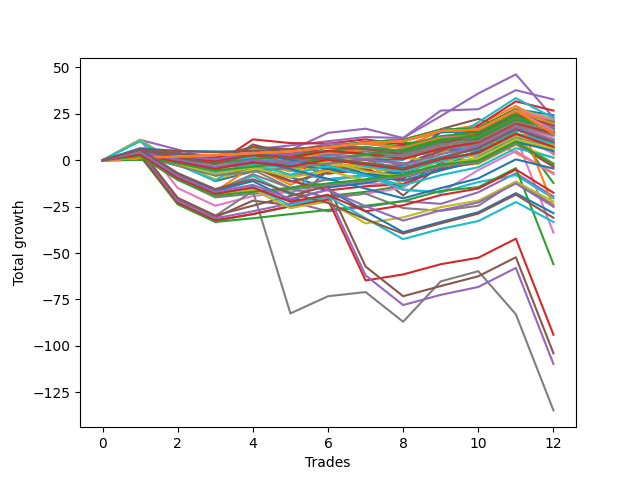

# Short Bulldog 004 
- Symbol: ES_Unlimited
- Date Range: 03/18/2022 - 07/15/2022
- Trading Period: 7:20-12:30
- Number of Trades: 12



| Name | Win Percent | Profit | Avg Profit / Trade | Avg Time / Trade |      | Name | Win Percent | Profit | Avg Profit / Trade | Avg Time / Trade |
| ---- | ----------- | ------ | ------------------ | ---------------- | ---- | ---- | ----------- | ------ | ------------------ | ---------------- |
| Sorted By <br> Profit | | | | | | Sorted By <br> Win Percentage ||||
| Forty-Six | 66.67 | 16375.00 | 1364.58 | 07:43 |     | One Hundred Eleven | 91.67 | 10875.00 | 906.25 | 02:21 |
| Forty-Five | 50.00 | 13375.00 | 1114.58 | 11:45 |     | One Hundred Sixteen | 91.67 | 9875.00 | 822.92 | 02:39 |
| Zero | 83.33 | 12125.00 | 1010.42 | 03:50 |     | One Hundred Twenty-One | 91.67 | 8000.00 | 666.67 | 02:50 |
| Four | 75.00 | 11500.00 | 958.33 | 23:26 |     | One Hundred Twenty-Six | 91.67 | 7125.00 | 593.75 | 02:55 |
| Sixty-One | 58.33 | 11375.00 | 947.92 | 17:34 |     | Eighty-One | 91.67 | -12500.00 | -1041.67 | 25:55 |
| Forty | 83.33 | 11250.00 | 937.50 | 02:52 |     | Zero | 83.33 | 12125.00 | 1010.42 | 03:50 |
| One Hundred Eleven | 91.67 | 10875.00 | 906.25 | 02:21 |     | Forty | 83.33 | 11250.00 | 937.50 | 02:52 |
| Forty-Three | 66.67 | 10750.00 | 895.83 | 05:42 |     | Forty-Eight | 83.33 | 10250.00 | 854.17 | 03:10 |
| Forty-Four | 58.33 | 10625.00 | 885.42 | 07:57 |     | Ninety-Six | 83.33 | 9625.00 | 802.08 | 02:20 |
| Ninety-Seven | 66.67 | 10375.00 | 864.58 | 03:00 |     | One Hundred One | 83.33 | 9000.00 | 750.00 | 02:17 |
| Forty-Eight | 83.33 | 10250.00 | 854.17 | 03:10 |     | One Hundred Six | 83.33 | 8750.00 | 729.17 | 02:29 |
| One Hundred Sixteen | 91.67 | 9875.00 | 822.92 | 02:39 |     | Fifty-Six | 83.33 | 8375.00 | 697.92 | 03:21 |
| Ninety-Six | 83.33 | 9625.00 | 802.08 | 02:20 |     | Sixty-Four | 83.33 | 7500.00 | 625.00 | 03:27 |
| Ninety-Eight | 58.33 | 9625.00 | 802.08 | 03:16 |     | Four | 75.00 | 11500.00 | 958.33 | 23:26 |
| Ninety-Nine | 58.33 | 9500.00 | 791.67 | 03:21 |     | One | 75.00 | 9375.00 | 781.25 | 11:00 |
| One | 75.00 | 9375.00 | 781.25 | 11:00 |     | One Hundred Seventeen | 75.00 | 8250.00 | 687.50 | 04:58 |
| One Hundred Ten | 50.00 | 9375.00 | 781.25 | 04:16 |     | One Hundred Twelve | 75.00 | 7875.00 | 656.25 | 04:55 |
| One Hundred One | 83.33 | 9000.00 | 750.00 | 02:17 |     | Fifty-Seven | 75.00 | 4375.00 | 364.58 | 08:18 |
| One Hundred Nine | 50.00 | 9000.00 | 750.00 | 04:06 |     | Three | 75.00 | 1625.00 | 135.42 | 15:42 |
| One Hundred Six | 83.33 | 8750.00 | 729.17 | 02:29 |     | One Hundred Twenty-Two | 75.00 | -875.00 | -72.92 | 08:37 |
| One Hundred | 58.33 | 8625.00 | 718.75 | 03:23 |     | One Hundred Twenty-Seven | 75.00 | -1250.00 | -104.17 | 07:41 |
| Fifty-Six | 83.33 | 8375.00 | 697.92 | 03:21 |     | Two | 75.00 | -6125.00 | -510.42 | 24:53 |
| One Hundred Seven | 66.67 | 8375.00 | 697.92 | 03:32 |     | Eighty-Two | 75.00 | -28000.00 | -2333.33 | 36:55 |
| Fifty-Five | 50.00 | 8375.00 | 697.92 | 09:06 |     | Forty-Six | 66.67 | 16375.00 | 1364.58 | 07:43 |
| One Hundred Seventeen | 75.00 | 8250.00 | 687.50 | 04:58 |     | Forty-Three | 66.67 | 10750.00 | 895.83 | 05:42 |
| One Hundred Twenty-One | 91.67 | 8000.00 | 666.67 | 02:50 |     | Ninety-Seven | 66.67 | 10375.00 | 864.58 | 03:00 |
| One Hundred Twelve | 75.00 | 7875.00 | 656.25 | 04:55 |     | One Hundred Seven | 66.67 | 8375.00 | 697.92 | 03:32 |
| Sixty-Two | 66.67 | 7625.00 | 635.42 | 11:25 |     | Sixty-Two | 66.67 | 7625.00 | 635.42 | 11:25 |
| Sixty-Four | 83.33 | 7500.00 | 625.00 | 03:27 |     | Sixty | 66.67 | 7500.00 | 625.00 | 11:34 |
| Sixty | 66.67 | 7500.00 | 625.00 | 11:34 |     | One Hundred Two | 66.67 | 7375.00 | 614.58 | 03:43 |
| Forty-Two | 58.33 | 7500.00 | 625.00 | 08:15 |     | Fifty-Four | 66.67 | 7125.00 | 593.75 | 06:01 |
| One Hundred Two | 66.67 | 7375.00 | 614.58 | 03:43 |     | Ninety-One | 66.67 | 6375.00 | 531.25 | 01:27 |
| One Hundred Eight | 50.00 | 7250.00 | 604.17 | 03:56 |     | Forty-One | 66.67 | 4750.00 | 395.83 | 05:42 |
| One Hundred Twenty-Six | 91.67 | 7125.00 | 593.75 | 02:55 |     | Sixty-Seven | 66.67 | 4250.00 | 354.17 | 07:12 |
| Fifty-Four | 66.67 | 7125.00 | 593.75 | 06:01 |     | Fifty-Nine | 66.67 | 3375.00 | 281.25 | 08:28 |
| Ninety-Two | 58.33 | 6750.00 | 562.50 | 02:25 |     | Fifty-Eight | 66.67 | 1750.00 | 145.83 | 12:49 |
| Fifty-One | 58.33 | 6500.00 | 541.67 | 05:11 |     | Sixty-Five | 66.67 | -1750.00 | -145.83 | 07:12 |
| Ninety-One | 66.67 | 6375.00 | 531.25 | 01:27 |     | Six | 66.67 | -19500.00 | -1625.00 | 39:43 |
| Fifty-Three | 50.00 | 5625.00 | 468.75 | 07:01 |     | Eighty-Three | 66.67 | -47000.00 | -3916.67 | 48:40 |
| Ninety-Four | 41.67 | 5625.00 | 468.75 | 02:45 |     | Sixty-One | 58.33 | 11375.00 | 947.92 | 17:34 |
| Forty-Seven | 41.67 | 5625.00 | 468.75 | 15:46 |     | Forty-Four | 58.33 | 10625.00 | 885.42 | 07:57 |
| One Hundred Ninteen | 50.00 | 5375.00 | 447.92 | 05:47 |     | Ninety-Eight | 58.33 | 9625.00 | 802.08 | 03:16 |
| One Hundred Twenty | 41.67 | 4875.00 | 406.25 | 05:58 |     | Ninety-Nine | 58.33 | 9500.00 | 791.67 | 03:21 |
| Forty-One | 66.67 | 4750.00 | 395.83 | 05:42 |     | One Hundred | 58.33 | 8625.00 | 718.75 | 03:23 |
| Fifty-Two | 58.33 | 4750.00 | 395.83 | 05:39 |     | Forty-Two | 58.33 | 7500.00 | 625.00 | 08:15 |
| One Hundred Four | 50.00 | 4500.00 | 375.00 | 04:21 |     | Ninety-Two | 58.33 | 6750.00 | 562.50 | 02:25 |
| Fifty-Seven | 75.00 | 4375.00 | 364.58 | 08:18 |     | Fifty-One | 58.33 | 6500.00 | 541.67 | 05:11 |
| Sixty-Seven | 66.67 | 4250.00 | 354.17 | 07:12 |     | Fifty-Two | 58.33 | 4750.00 | 395.83 | 05:39 |
| Ninety-Three | 41.67 | 4125.00 | 343.75 | 02:35 |     | One Hundred Thirteen | 58.33 | 3250.00 | 270.83 | 06:03 |
| One Hundred Eighteen | 50.00 | 3625.00 | 302.08 | 05:37 |     | Forty-Nine | 58.33 | 3125.00 | 260.42 | 04:38 |
| Fifty-Nine | 66.67 | 3375.00 | 281.25 | 08:28 |     | Five | 58.33 | 2125.00 | 177.08 | 43:24 |
| Seventy-Three | 50.00 | 3375.00 | 281.25 | 08:05 |     | Seventy | 58.33 | -875.00 | -72.92 | 09:56 |
| Ninety-Five | 33.33 | 3375.00 | 281.25 | 03:05 |     | One Hundred Twenty-Eight | 58.33 | -8750.00 | -729.17 | 08:57 |
| One Hundred Thirteen | 58.33 | 3250.00 | 270.83 | 06:03 |     | One Hundred Twenty-Three | 58.33 | -11125.00 | -927.08 | 10:14 |
| Forty-Nine | 58.33 | 3125.00 | 260.42 | 04:38 |     | Eighty-Five | 58.33 | -52000.00 | -4333.33 | 57:19 |
| One Hundred Three | 50.00 | 2750.00 | 229.17 | 04:11 |     | Eighty-Four | 58.33 | -54875.00 | -4572.92 | 56:07 |
| One Hundred Five | 41.67 | 2500.00 | 208.33 | 04:55 |     | Forty-Five | 50.00 | 13375.00 | 1114.58 | 11:45 |
| Five | 58.33 | 2125.00 | 177.08 | 43:24 |     | One Hundred Ten | 50.00 | 9375.00 | 781.25 | 04:16 |
| Fifty-Eight | 66.67 | 1750.00 | 145.83 | 12:49 |     | One Hundred Nine | 50.00 | 9000.00 | 750.00 | 04:06 |
| Three | 75.00 | 1625.00 | 135.42 | 15:42 |     | Fifty-Five | 50.00 | 8375.00 | 697.92 | 09:06 |
| One Hundred Fourteen | 50.00 | 750.00 | 62.50 | 06:30 |     | One Hundred Eight | 50.00 | 7250.00 | 604.17 | 03:56 |
| Fifty | 50.00 | 625.00 | 52.08 | 06:12 |     | Fifty-Three | 50.00 | 5625.00 | 468.75 | 07:01 |
| One Hundred Twenty-Two | 75.00 | -875.00 | -72.92 | 08:37 |     | One Hundred Ninteen | 50.00 | 5375.00 | 447.92 | 05:47 |
| Seventy | 58.33 | -875.00 | -72.92 | 09:56 |     | One Hundred Four | 50.00 | 4500.00 | 375.00 | 04:21 |
| One Hundred Twenty-Seven | 75.00 | -1250.00 | -104.17 | 07:41 |     | One Hundred Eighteen | 50.00 | 3625.00 | 302.08 | 05:37 |
| Sixty-Five | 66.67 | -1750.00 | -145.83 | 07:12 |     | Seventy-Three | 50.00 | 3375.00 | 281.25 | 08:05 |
| One Hundred Fifteen | 41.67 | -2250.00 | -187.50 | 07:09 |     | One Hundred Three | 50.00 | 2750.00 | 229.17 | 04:11 |
| Sixty-Three | 50.00 | -3375.00 | -281.25 | 20:48 |     | One Hundred Fourteen | 50.00 | 750.00 | 62.50 | 06:30 |
| Sixty-Eight | 50.00 | -3750.00 | -312.50 | 09:01 |     | Fifty | 50.00 | 625.00 | 52.08 | 06:12 |
| Two | 75.00 | -6125.00 | -510.42 | 24:53 |     | Sixty-Three | 50.00 | -3375.00 | -281.25 | 20:48 |
| One Hundred Twenty-Eight | 58.33 | -8750.00 | -729.17 | 08:57 |     | Sixty-Eight | 50.00 | -3750.00 | -312.50 | 09:01 |
| Sixty-Six | 50.00 | -9750.00 | -812.50 | 10:32 |     | Sixty-Six | 50.00 | -9750.00 | -812.50 | 10:32 |
| Seventy-One | 41.67 | -10250.00 | -854.17 | 16:05 |     | One Hundred Twenty-Nine | 50.00 | -12500.00 | -1041.67 | 09:25 |
| One Hundred Twenty-Three | 58.33 | -11125.00 | -927.08 | 10:14 |     | One Hundred Twenty-Five | 50.00 | -14250.00 | -1187.50 | 11:53 |
| Sixty-Nine | 41.67 | -12000.00 | -1000.00 | 13:12 |     | One Hundred Twenty-Four | 50.00 | -16625.00 | -1385.42 | 10:43 |
| Eighty-One | 91.67 | -12500.00 | -1041.67 | 25:55 |     | Seven | 50.00 | -67375.00 | -5614.58 | 78:22 |
| One Hundred Twenty-Nine | 50.00 | -12500.00 | -1041.67 | 09:25 |     | Ninety-Four | 41.67 | 5625.00 | 468.75 | 02:45 |
| One Hundred Twenty-Five | 50.00 | -14250.00 | -1187.50 | 11:53 |     | Forty-Seven | 41.67 | 5625.00 | 468.75 | 15:46 |
| One Hundred Thirty | 41.67 | -15500.00 | -1291.67 | 10:04 |     | One Hundred Twenty | 41.67 | 4875.00 | 406.25 | 05:58 |
| One Hundred Twenty-Four | 50.00 | -16625.00 | -1385.42 | 10:43 |     | Ninety-Three | 41.67 | 4125.00 | 343.75 | 02:35 |
| Six | 66.67 | -19500.00 | -1625.00 | 39:43 |     | One Hundred Five | 41.67 | 2500.00 | 208.33 | 04:55 |
| Eighty-Two | 75.00 | -28000.00 | -2333.33 | 36:55 |     | One Hundred Fifteen | 41.67 | -2250.00 | -187.50 | 07:09 |
| Eighty-Three | 66.67 | -47000.00 | -3916.67 | 48:40 |     | Seventy-One | 41.67 | -10250.00 | -854.17 | 16:05 |
| Eighty-Five | 58.33 | -52000.00 | -4333.33 | 57:19 |     | Sixty-Nine | 41.67 | -12000.00 | -1000.00 | 13:12 |
| Eighty-Four | 58.33 | -54875.00 | -4572.92 | 56:07 |     | One Hundred Thirty | 41.67 | -15500.00 | -1291.67 | 10:04 |
| Seven | 50.00 | -67375.00 | -5614.58 | 78:22 |     | Ninety-Five | 33.33 | 3375.00 | 281.25 | 03:05 |

## NO STOPLOSS

### Test Zero
* Sell when price hits the middle line of the 20p bollinger
* No Stoploss
* Results:
```
Total Trades: 12
Percent Up: 16.67
Percent Down: 83.33
Total Points Moved Down: 24.25
Potential Profit: 12125.00
Total Points Ups: 4.00 Count Ups: 2
Total Points Downs: 28.25 Count Downs: 10
```

<details><summary>Trades</summary>

<code>In: 2022-03-25 11:58:00		Out: 2022-03-25 12:00:30		Total Position Time: 02:30		Total Move Down: 0.25		Total to Date: 0.25</code> <br />
<code>In: 2022-03-28 11:13:00		Out: 2022-03-28 11:18:05		Total Position Time: 05:05		Total Move Down: -0.75		Total to Date: -0.50</code> <br />
<code>In: 2022-03-28 12:02:00		Out: 2022-03-28 12:12:55		Total Position Time: 10:55		Total Move Down: 0.25		Total to Date: -0.25</code> <br />
<code>In: 2022-03-29 08:53:00		Out: 2022-03-29 08:56:35		Total Position Time: 03:35		Total Move Down: 0.75		Total to Date: 0.50</code> <br />
<code>In: 2022-04-25 09:29:00		Out: 2022-04-25 09:31:10		Total Position Time: 02:10		Total Move Down: 2.25		Total to Date: 2.75</code> <br />
<code>In: 2022-05-02 09:26:00		Out: 2022-05-02 09:27:20		Total Position Time: 01:20		Total Move Down: 4.75		Total to Date: 7.50</code> <br />
<code>In: 2022-05-25 11:07:00		Out: 2022-05-25 11:08:10		Total Position Time: 01:10		Total Move Down: 2.25		Total to Date: 9.75</code> <br />
<code>In: 2022-06-01 11:08:00		Out: 2022-06-01 11:11:10		Total Position Time: 03:10		Total Move Down: 1.25		Total to Date: 11.00</code> <br />
<code>In: 2022-06-10 12:30:00		Out: 2022-06-10 12:31:10		Total Position Time: 01:10		Total Move Down: 5.50		Total to Date: 16.50</code> <br />
<code>In: 2022-06-16 08:31:00		Out: 2022-06-16 08:32:10		Total Position Time: 01:10		Total Move Down: 0.75		Total to Date: 17.25</code> <br />
<code>In: 2022-07-06 11:11:00		Out: 2022-07-06 11:12:10		Total Position Time: 01:10		Total Move Down: 10.25		Total to Date: 27.50</code> <br />
<code>In: 2022-07-14 08:03:00		Out: 2022-07-14 08:15:45		Total Position Time: 12:45		Total Move Down: -3.25		Total to Date: 24.25</code> <br />


</details>

### Test One
* Sell when the price hits the upper line of the 20p 1std bollinger
* No Stoploss
* Results:
```
Total Trades: 12
Percent Up: 25.00
Percent Down: 75.00
Total Points Moved Down: 18.75
Potential Profit: 9375.00
Total Points Ups: 14.50 Count Ups: 3
Total Points Downs: 33.25 Count Downs: 9
```

<details><summary>Trades</summary>

<code>In: 2022-03-25 11:58:00		Out: 2022-03-25 12:00:50		Total Position Time: 02:50		Total Move Down: 2.25		Total to Date: 2.25</code> <br />
<code>In: 2022-03-28 11:13:00		Out: 2022-03-28 11:19:35		Total Position Time: 06:35		Total Move Down: 0.50		Total to Date: 2.75</code> <br />
<code>In: 2022-03-28 12:02:00		Out: 2022-03-28 12:41:10		Total Position Time: 39:10		Total Move Down: -3.75		Total to Date: -1.00</code> <br />
<code>In: 2022-03-29 08:53:00		Out: 2022-03-29 08:58:40		Total Position Time: 05:40		Total Move Down: 2.25		Total to Date: 1.25</code> <br />
<code>In: 2022-04-25 09:29:00		Out: 2022-04-25 09:42:45		Total Position Time: 13:45		Total Move Down: -0.25		Total to Date: 1.00</code> <br />
<code>In: 2022-05-02 09:26:00		Out: 2022-05-02 09:37:10		Total Position Time: 11:10		Total Move Down: 3.00		Total to Date: 4.00</code> <br />
<code>In: 2022-05-25 11:07:00		Out: 2022-05-25 11:08:10		Total Position Time: 01:10		Total Move Down: 2.25		Total to Date: 6.25</code> <br />
<code>In: 2022-06-01 11:08:00		Out: 2022-06-01 11:18:15		Total Position Time: 10:15		Total Move Down: 1.00		Total to Date: 7.25</code> <br />
<code>In: 2022-06-10 12:30:00		Out: 2022-06-10 12:35:45		Total Position Time: 05:45		Total Move Down: 8.25		Total to Date: 15.50</code> <br />
<code>In: 2022-06-16 08:31:00		Out: 2022-06-16 08:32:30		Total Position Time: 01:30		Total Move Down: 3.50		Total to Date: 19.00</code> <br />
<code>In: 2022-07-06 11:11:00		Out: 2022-07-06 11:12:10		Total Position Time: 01:10		Total Move Down: 10.25		Total to Date: 29.25</code> <br />
<code>In: 2022-07-14 08:03:00		Out: 2022-07-14 08:36:05		Total Position Time: 33:05		Total Move Down: -10.50		Total to Date: 18.75</code> <br />


</details>

### Test Two
* Sell when the price hits the upper line of the 20p 2std bollinger
* No Stoploss
* Results:
```
Total Trades: 12
Percent Up: 25.00
Percent Down: 75.00
Total Points Moved Down: -12.25
Potential Profit: -6125.00
Total Points Ups: 63.00 Count Ups: 3
Total Points Downs: 50.75 Count Downs: 9
```

<details><summary>Trades</summary>

<code>In: 2022-03-25 11:58:00		Out: 2022-03-25 12:01:15		Total Position Time: 03:15		Total Move Down: 2.75		Total to Date: 2.75</code> <br />
<code>In: 2022-03-28 11:13:00		Out: 2022-03-28 12:47:00		Total Position Time: 94:00		Total Move Down: -26.00		Total to Date: -23.25</code> <br />
<code>In: 2022-03-28 12:02:00		Out: 2022-03-28 12:47:00		Total Position Time: 45:00		Total Move Down: -9.50		Total to Date: -32.75</code> <br />
<code>In: 2022-03-29 08:53:00		Out: 2022-03-29 09:01:40		Total Position Time: 08:40		Total Move Down: 3.75		Total to Date: -29.00</code> <br />
<code>In: 2022-04-25 09:29:00		Out: 2022-04-25 10:01:20		Total Position Time: 32:20		Total Move Down: 4.25		Total to Date: -24.75</code> <br />
<code>In: 2022-05-02 09:26:00		Out: 2022-05-02 09:39:35		Total Position Time: 13:35		Total Move Down: 5.50		Total to Date: -19.25</code> <br />
<code>In: 2022-05-25 11:07:00		Out: 2022-05-25 11:08:10		Total Position Time: 01:10		Total Move Down: 2.25		Total to Date: -17.00</code> <br />
<code>In: 2022-06-01 11:08:00		Out: 2022-06-01 11:19:20		Total Position Time: 11:20		Total Move Down: 3.25		Total to Date: -13.75</code> <br />
<code>In: 2022-06-10 12:30:00		Out: 2022-06-10 12:43:10		Total Position Time: 13:10		Total Move Down: 12.50		Total to Date: -1.25</code> <br />
<code>In: 2022-06-16 08:31:00		Out: 2022-06-16 08:41:35		Total Position Time: 10:35		Total Move Down: 6.25		Total to Date: 5.00</code> <br />
<code>In: 2022-07-06 11:11:00		Out: 2022-07-06 11:12:10		Total Position Time: 01:10		Total Move Down: 10.25		Total to Date: 15.25</code> <br />
<code>In: 2022-07-14 08:03:00		Out: 2022-07-14 09:07:30		Total Position Time: 64:30		Total Move Down: -27.50		Total to Date: -12.25</code> <br />


</details>

### Test Three
* Sell when price hits the middle line of the 50p bollinger
* No Stoploss
* Results:
```
Total Trades: 12
Percent Up: 25.00
Percent Down: 75.00
Total Points Moved Down: 3.25
Potential Profit: 1625.00
Total Points Ups: 34.00 Count Ups: 3
Total Points Downs: 37.25 Count Downs: 9
```

<details><summary>Trades</summary>

<code>In: 2022-03-25 11:58:00		Out: 2022-03-25 12:00:45		Total Position Time: 02:45		Total Move Down: 1.25		Total to Date: 1.25</code> <br />
<code>In: 2022-03-28 11:13:00		Out: 2022-03-28 11:19:20		Total Position Time: 06:20		Total Move Down: -0.00		Total to Date: 1.25</code> <br />
<code>In: 2022-03-28 12:02:00		Out: 2022-03-28 12:47:00		Total Position Time: 45:00		Total Move Down: -9.50		Total to Date: -8.25</code> <br />
<code>In: 2022-03-29 08:53:00		Out: 2022-03-29 09:01:35		Total Position Time: 08:35		Total Move Down: 3.25		Total to Date: -5.00</code> <br />
<code>In: 2022-04-25 09:29:00		Out: 2022-04-25 09:56:20		Total Position Time: 27:20		Total Move Down: 0.25		Total to Date: -4.75</code> <br />
<code>In: 2022-05-02 09:26:00		Out: 2022-05-02 09:27:20		Total Position Time: 01:20		Total Move Down: 4.75		Total to Date: 0.00</code> <br />
<code>In: 2022-05-25 11:07:00		Out: 2022-05-25 11:08:10		Total Position Time: 01:10		Total Move Down: 2.25		Total to Date: 2.25</code> <br />
<code>In: 2022-06-01 11:08:00		Out: 2022-06-01 11:19:10		Total Position Time: 11:10		Total Move Down: 2.00		Total to Date: 4.25</code> <br />
<code>In: 2022-06-10 12:30:00		Out: 2022-06-10 12:33:40		Total Position Time: 03:40		Total Move Down: 7.50		Total to Date: 11.75</code> <br />
<code>In: 2022-06-16 08:31:00		Out: 2022-06-16 08:37:05		Total Position Time: 06:05		Total Move Down: 5.75		Total to Date: 17.50</code> <br />
<code>In: 2022-07-06 11:11:00		Out: 2022-07-06 11:12:10		Total Position Time: 01:10		Total Move Down: 10.25		Total to Date: 27.75</code> <br />
<code>In: 2022-07-14 08:03:00		Out: 2022-07-14 09:17:00		Total Position Time: 74:00		Total Move Down: -24.50		Total to Date: 3.25</code> <br />


</details>

### Test Four
* Sell when the price hits the upper line of the 50p 1std bollinger
* No Stoploss
* Results:
```
Total Trades: 12
Percent Up: 25.00
Percent Down: 75.00
Total Points Moved Down: 23.00
Potential Profit: 11500.00
Total Points Ups: 37.75 Count Ups: 3
Total Points Downs: 60.75 Count Downs: 9
```

<details><summary>Trades</summary>

<code>In: 2022-03-25 11:58:00		Out: 2022-03-25 12:01:40		Total Position Time: 03:40		Total Move Down: 3.25		Total to Date: 3.25</code> <br />
<code>In: 2022-03-28 11:13:00		Out: 2022-03-28 11:20:40		Total Position Time: 07:40		Total Move Down: 0.75		Total to Date: 4.00</code> <br />
<code>In: 2022-03-28 12:02:00		Out: 2022-03-28 12:47:00		Total Position Time: 45:00		Total Move Down: -9.50		Total to Date: -5.50</code> <br />
<code>In: 2022-03-29 08:53:00		Out: 2022-03-29 09:02:15		Total Position Time: 09:15		Total Move Down: 6.75		Total to Date: 1.25</code> <br />
<code>In: 2022-04-25 09:29:00		Out: 2022-04-25 10:01:20		Total Position Time: 32:20		Total Move Down: 4.25		Total to Date: 5.50</code> <br />
<code>In: 2022-05-02 09:26:00		Out: 2022-05-02 09:43:15		Total Position Time: 17:15		Total Move Down: 9.25		Total to Date: 14.75</code> <br />
<code>In: 2022-05-25 11:07:00		Out: 2022-05-25 11:08:10		Total Position Time: 01:10		Total Move Down: 2.25		Total to Date: 17.00</code> <br />
<code>In: 2022-06-01 11:08:00		Out: 2022-06-01 12:03:40		Total Position Time: 55:40		Total Move Down: -5.00		Total to Date: 12.00</code> <br />
<code>In: 2022-06-10 12:30:00		Out: 2022-06-10 12:42:40		Total Position Time: 12:40		Total Move Down: 11.75		Total to Date: 23.75</code> <br />
<code>In: 2022-06-16 08:31:00		Out: 2022-06-16 08:42:25		Total Position Time: 11:25		Total Move Down: 12.25		Total to Date: 36.00</code> <br />
<code>In: 2022-07-06 11:11:00		Out: 2022-07-06 11:12:10		Total Position Time: 01:10		Total Move Down: 10.25		Total to Date: 46.25</code> <br />
<code>In: 2022-07-14 08:03:00		Out: 2022-07-14 09:27:05		Total Position Time: 84:05		Total Move Down: -23.25		Total to Date: 23.00</code> <br />


</details>

### Test Five
* Sell when the price hits the upper line of the 50p 2std bollinger
* No Stoploss
* Results:
```
Total Trades: 12
Percent Up: 41.67
Percent Down: 58.33
Total Points Moved Down: 4.25
Potential Profit: 2125.00
Total Points Ups: 72.75 Count Ups: 5
Total Points Downs: 77.00 Count Downs: 7
```

<details><summary>Trades</summary>

<code>In: 2022-03-25 11:58:00		Out: 2022-03-25 12:01:55		Total Position Time: 03:55		Total Move Down: 4.75		Total to Date: 4.75</code> <br />
<code>In: 2022-03-28 11:13:00		Out: 2022-03-28 12:47:00		Total Position Time: 94:00		Total Move Down: -26.00		Total to Date: -21.25</code> <br />
<code>In: 2022-03-28 12:02:00		Out: 2022-03-28 12:47:00		Total Position Time: 45:00		Total Move Down: -9.50		Total to Date: -30.75</code> <br />
<code>In: 2022-03-29 08:53:00		Out: 2022-03-29 09:10:50		Total Position Time: 17:50		Total Move Down: 9.00		Total to Date: -21.75</code> <br />
<code>In: 2022-04-25 09:29:00		Out: 2022-04-25 11:01:35		Total Position Time: 92:35		Total Move Down: -2.50		Total to Date: -24.25</code> <br />
<code>In: 2022-05-02 09:26:00		Out: 2022-05-02 09:54:10		Total Position Time: 28:10		Total Move Down: 19.00		Total to Date: -5.25</code> <br />
<code>In: 2022-05-25 11:07:00		Out: 2022-05-25 11:08:10		Total Position Time: 01:10		Total Move Down: 2.25		Total to Date: -3.00</code> <br />
<code>In: 2022-06-01 11:08:00		Out: 2022-06-01 12:47:00		Total Position Time: 99:00		Total Move Down: -16.00		Total to Date: -19.00</code> <br />
<code>In: 2022-06-10 12:30:00		Out: 2022-06-10 12:45:40		Total Position Time: 15:40		Total Move Down: 16.75		Total to Date: -2.25</code> <br />
<code>In: 2022-06-16 08:31:00		Out: 2022-06-16 09:07:40		Total Position Time: 36:40		Total Move Down: 12.25		Total to Date: 10.00</code> <br />
<code>In: 2022-07-06 11:11:00		Out: 2022-07-06 11:12:15		Total Position Time: 01:15		Total Move Down: 13.00		Total to Date: 23.00</code> <br />
<code>In: 2022-07-14 08:03:00		Out: 2022-07-14 09:28:35		Total Position Time: 85:35		Total Move Down: -18.75		Total to Date: 4.25</code> <br />


</details>

### Test Six
* Sell when the price hits the middle line of the 1std VWAP
* No Stoploss
* Results:
```
Total Trades: 12
Percent Up: 33.33
Percent Down: 66.67
Total Points Moved Down: -39.00
Potential Profit: -19500.00
Total Points Ups: 87.75 Count Ups: 4
Total Points Downs: 48.75 Count Downs: 8
```

<details><summary>Trades</summary>

<code>In: 2022-03-25 11:58:00		Out: 2022-03-25 12:20:30		Total Position Time: 22:30		Total Move Down: 11.00		Total to Date: 11.00</code> <br />
<code>In: 2022-03-28 11:13:00		Out: 2022-03-28 12:47:00		Total Position Time: 94:00		Total Move Down: -26.00		Total to Date: -15.00</code> <br />
<code>In: 2022-03-28 12:02:00		Out: 2022-03-28 12:47:00		Total Position Time: 45:00		Total Move Down: -9.50		Total to Date: -24.50</code> <br />
<code>In: 2022-03-29 08:53:00		Out: 2022-03-29 09:02:10		Total Position Time: 09:10		Total Move Down: 5.25		Total to Date: -19.25</code> <br />
<code>In: 2022-04-25 09:29:00		Out: 2022-04-25 09:31:10		Total Position Time: 02:10		Total Move Down: 2.25		Total to Date: -17.00</code> <br />
<code>In: 2022-05-02 09:26:00		Out: 2022-05-02 09:27:10		Total Position Time: 01:10		Total Move Down: 2.25		Total to Date: -14.75</code> <br />
<code>In: 2022-05-25 11:07:00		Out: 2022-05-25 11:08:10		Total Position Time: 01:10		Total Move Down: 2.25		Total to Date: -12.50</code> <br />
<code>In: 2022-06-01 11:08:00		Out: 2022-06-01 11:09:10		Total Position Time: 01:10		Total Move Down: -0.50		Total to Date: -13.00</code> <br />
<code>In: 2022-06-10 12:30:00		Out: 2022-06-10 12:44:00		Total Position Time: 14:00		Total Move Down: 14.75		Total to Date: 1.75</code> <br />
<code>In: 2022-06-16 08:31:00		Out: 2022-06-16 08:32:10		Total Position Time: 01:10		Total Move Down: 0.75		Total to Date: 2.50</code> <br />
<code>In: 2022-07-06 11:11:00		Out: 2022-07-06 11:12:10		Total Position Time: 01:10		Total Move Down: 10.25		Total to Date: 12.75</code> <br />
<code>In: 2022-07-14 08:03:00		Out: 2022-07-14 12:47:00		Total Position Time: 284:00		Total Move Down: -51.75		Total to Date: -39.00</code> <br />


</details>

### Test Seven
* Sell when the price hits the upper line of the 1std VWAP
* No Stoploss
* Results:
```
Total Trades: 12
Percent Up: 50.00
Percent Down: 50.00
Total Points Moved Down: -134.75
Potential Profit: -67375.00
Total Points Ups: 192.50 Count Ups: 6
Total Points Downs: 57.75 Count Downs: 6
```

<details><summary>Trades</summary>

<code>In: 2022-03-25 11:58:00		Out: 2022-03-25 12:47:00		Total Position Time: 49:00		Total Move Down: 5.50		Total to Date: 5.50</code> <br />
<code>In: 2022-03-28 11:13:00		Out: 2022-03-28 12:47:00		Total Position Time: 94:00		Total Move Down: -26.00		Total to Date: -20.50</code> <br />
<code>In: 2022-03-28 12:02:00		Out: 2022-03-28 12:47:00		Total Position Time: 45:00		Total Move Down: -9.50		Total to Date: -30.00</code> <br />
<code>In: 2022-03-29 08:53:00		Out: 2022-03-29 09:27:55		Total Position Time: 34:55		Total Move Down: 13.50		Total to Date: -16.50</code> <br />
<code>In: 2022-04-25 09:29:00		Out: 2022-04-25 12:47:00		Total Position Time: 198:00		Total Move Down: -66.00		Total to Date: -82.50</code> <br />
<code>In: 2022-05-02 09:26:00		Out: 2022-05-02 09:43:15		Total Position Time: 17:15		Total Move Down: 9.25		Total to Date: -73.25</code> <br />
<code>In: 2022-05-25 11:07:00		Out: 2022-05-25 11:08:10		Total Position Time: 01:10		Total Move Down: 2.25		Total to Date: -71.00</code> <br />
<code>In: 2022-06-01 11:08:00		Out: 2022-06-01 12:47:00		Total Position Time: 99:00		Total Move Down: -16.00		Total to Date: -87.00</code> <br />
<code>In: 2022-06-10 12:30:00		Out: 2022-06-10 12:47:00		Total Position Time: 17:00		Total Move Down: 21.75		Total to Date: -65.25</code> <br />
<code>In: 2022-06-16 08:31:00		Out: 2022-06-16 08:36:15		Total Position Time: 05:15		Total Move Down: 5.50		Total to Date: -59.75</code> <br />
<code>In: 2022-07-06 11:11:00		Out: 2022-07-06 12:47:00		Total Position Time: 96:00		Total Move Down: -23.25		Total to Date: -83.00</code> <br />
<code>In: 2022-07-14 08:03:00		Out: 2022-07-14 12:47:00		Total Position Time: 284:00		Total Move Down: -51.75		Total to Date: -134.75</code> <br />


</details>

## STOPLOSS OF 5

### Test Forty
* Sell when price hits the middle line of the 20p bollinger
* Stoploss is -5 points
* Results:
```
Total Trades: 12
Percent Up: 16.67
Percent Down: 83.33
Total Points Moved Down: 22.50
Potential Profit: 11250.00
Total Points Ups: 5.75 Count Ups: 2
Total Points Downs: 28.25 Count Downs: 10
```

<details><summary>Trades</summary>

<code>In: 2022-03-25 11:58:00		Out: 2022-03-25 12:00:30		Total Position Time: 02:30		Total Move Down: 0.25		Total to Date: 0.25</code> <br />
<code>In: 2022-03-28 11:13:00		Out: 2022-03-28 11:18:05		Total Position Time: 05:05		Total Move Down: -0.75		Total to Date: -0.50</code> <br />
<code>In: 2022-03-28 12:02:00		Out: 2022-03-28 12:12:55		Total Position Time: 10:55		Total Move Down: 0.25		Total to Date: -0.25</code> <br />
<code>In: 2022-03-29 08:53:00		Out: 2022-03-29 08:56:35		Total Position Time: 03:35		Total Move Down: 0.75		Total to Date: 0.50</code> <br />
<code>In: 2022-04-25 09:29:00		Out: 2022-04-25 09:31:10		Total Position Time: 02:10		Total Move Down: 2.25		Total to Date: 2.75</code> <br />
<code>In: 2022-05-02 09:26:00		Out: 2022-05-02 09:27:20		Total Position Time: 01:20		Total Move Down: 4.75		Total to Date: 7.50</code> <br />
<code>In: 2022-05-25 11:07:00		Out: 2022-05-25 11:08:10		Total Position Time: 01:10		Total Move Down: 2.25		Total to Date: 9.75</code> <br />
<code>In: 2022-06-01 11:08:00		Out: 2022-06-01 11:11:10		Total Position Time: 03:10		Total Move Down: 1.25		Total to Date: 11.00</code> <br />
<code>In: 2022-06-10 12:30:00		Out: 2022-06-10 12:31:10		Total Position Time: 01:10		Total Move Down: 5.50		Total to Date: 16.50</code> <br />
<code>In: 2022-06-16 08:31:00		Out: 2022-06-16 08:32:10		Total Position Time: 01:10		Total Move Down: 0.75		Total to Date: 17.25</code> <br />
<code>In: 2022-07-06 11:11:00		Out: 2022-07-06 11:12:10		Total Position Time: 01:10		Total Move Down: 10.25		Total to Date: 27.50</code> <br />
<code>In: 2022-07-14 08:03:00		Out: 2022-07-14 08:04:10		Total Position Time: 01:10		Total Move Down: -5.00		Total to Date: 22.50</code> <br />


</details>

### Test Forty-One
* Sell when the price hits the upper line of the 20p 1std bollinger
* Stoploss is -5 points
* Results:
```
Total Trades: 12
Percent Up: 33.33
Percent Down: 66.67
Total Points Moved Down: 9.50
Potential Profit: 4750.00
Total Points Ups: 20.75 Count Ups: 4
Total Points Downs: 30.25 Count Downs: 8
```

<details><summary>Trades</summary>

<code>In: 2022-03-25 11:58:00		Out: 2022-03-25 12:00:50		Total Position Time: 02:50		Total Move Down: 2.25		Total to Date: 2.25</code> <br />
<code>In: 2022-03-28 11:13:00		Out: 2022-03-28 11:19:35		Total Position Time: 06:35		Total Move Down: 0.50		Total to Date: 2.75</code> <br />
<code>In: 2022-03-28 12:02:00		Out: 2022-03-28 12:23:50		Total Position Time: 21:50		Total Move Down: -5.25		Total to Date: -2.50</code> <br />
<code>In: 2022-03-29 08:53:00		Out: 2022-03-29 08:58:40		Total Position Time: 05:40		Total Move Down: 2.25		Total to Date: -0.25</code> <br />
<code>In: 2022-04-25 09:29:00		Out: 2022-04-25 09:32:20		Total Position Time: 03:20		Total Move Down: -5.25		Total to Date: -5.50</code> <br />
<code>In: 2022-05-02 09:26:00		Out: 2022-05-02 09:33:20		Total Position Time: 07:20		Total Move Down: -5.25		Total to Date: -10.75</code> <br />
<code>In: 2022-05-25 11:07:00		Out: 2022-05-25 11:08:10		Total Position Time: 01:10		Total Move Down: 2.25		Total to Date: -8.50</code> <br />
<code>In: 2022-06-01 11:08:00		Out: 2022-06-01 11:18:15		Total Position Time: 10:15		Total Move Down: 1.00		Total to Date: -7.50</code> <br />
<code>In: 2022-06-10 12:30:00		Out: 2022-06-10 12:35:45		Total Position Time: 05:45		Total Move Down: 8.25		Total to Date: 0.75</code> <br />
<code>In: 2022-06-16 08:31:00		Out: 2022-06-16 08:32:30		Total Position Time: 01:30		Total Move Down: 3.50		Total to Date: 4.25</code> <br />
<code>In: 2022-07-06 11:11:00		Out: 2022-07-06 11:12:10		Total Position Time: 01:10		Total Move Down: 10.25		Total to Date: 14.50</code> <br />
<code>In: 2022-07-14 08:03:00		Out: 2022-07-14 08:04:10		Total Position Time: 01:10		Total Move Down: -5.00		Total to Date: 9.50</code> <br />


</details>

### Test Forty-Two
* Sell when the price hits the upper line of the 20p 2std bollinger
* Stoploss is -5 points
* Results:
```
Total Trades: 12
Percent Up: 41.67
Percent Down: 58.33
Total Points Moved Down: 15.00
Potential Profit: 7500.00
Total Points Ups: 26.00 Count Ups: 5
Total Points Downs: 41.00 Count Downs: 7
```

<details><summary>Trades</summary>

<code>In: 2022-03-25 11:58:00		Out: 2022-03-25 12:01:15		Total Position Time: 03:15		Total Move Down: 2.75		Total to Date: 2.75</code> <br />
<code>In: 2022-03-28 11:13:00		Out: 2022-03-28 11:29:05		Total Position Time: 16:05		Total Move Down: -5.25		Total to Date: -2.50</code> <br />
<code>In: 2022-03-28 12:02:00		Out: 2022-03-28 12:23:50		Total Position Time: 21:50		Total Move Down: -5.25		Total to Date: -7.75</code> <br />
<code>In: 2022-03-29 08:53:00		Out: 2022-03-29 09:01:40		Total Position Time: 08:40		Total Move Down: 3.75		Total to Date: -4.00</code> <br />
<code>In: 2022-04-25 09:29:00		Out: 2022-04-25 09:32:20		Total Position Time: 03:20		Total Move Down: -5.25		Total to Date: -9.25</code> <br />
<code>In: 2022-05-02 09:26:00		Out: 2022-05-02 09:33:20		Total Position Time: 07:20		Total Move Down: -5.25		Total to Date: -14.50</code> <br />
<code>In: 2022-05-25 11:07:00		Out: 2022-05-25 11:08:10		Total Position Time: 01:10		Total Move Down: 2.25		Total to Date: -12.25</code> <br />
<code>In: 2022-06-01 11:08:00		Out: 2022-06-01 11:19:20		Total Position Time: 11:20		Total Move Down: 3.25		Total to Date: -9.00</code> <br />
<code>In: 2022-06-10 12:30:00		Out: 2022-06-10 12:43:10		Total Position Time: 13:10		Total Move Down: 12.50		Total to Date: 3.50</code> <br />
<code>In: 2022-06-16 08:31:00		Out: 2022-06-16 08:41:35		Total Position Time: 10:35		Total Move Down: 6.25		Total to Date: 9.75</code> <br />
<code>In: 2022-07-06 11:11:00		Out: 2022-07-06 11:12:10		Total Position Time: 01:10		Total Move Down: 10.25		Total to Date: 20.00</code> <br />
<code>In: 2022-07-14 08:03:00		Out: 2022-07-14 08:04:10		Total Position Time: 01:10		Total Move Down: -5.00		Total to Date: 15.00</code> <br />


</details>

### Test Forty-Three
* Sell when price hits the middle line of the 50p bollinger
* Stoploss is -5 points
* Results:
```
Total Trades: 12
Percent Up: 33.33
Percent Down: 66.67
Total Points Moved Down: 21.50
Potential Profit: 10750.00
Total Points Ups: 15.50 Count Ups: 4
Total Points Downs: 37.00 Count Downs: 8
```

<details><summary>Trades</summary>

<code>In: 2022-03-25 11:58:00		Out: 2022-03-25 12:00:45		Total Position Time: 02:45		Total Move Down: 1.25		Total to Date: 1.25</code> <br />
<code>In: 2022-03-28 11:13:00		Out: 2022-03-28 11:19:20		Total Position Time: 06:20		Total Move Down: -0.00		Total to Date: 1.25</code> <br />
<code>In: 2022-03-28 12:02:00		Out: 2022-03-28 12:23:50		Total Position Time: 21:50		Total Move Down: -5.25		Total to Date: -4.00</code> <br />
<code>In: 2022-03-29 08:53:00		Out: 2022-03-29 09:01:35		Total Position Time: 08:35		Total Move Down: 3.25		Total to Date: -0.75</code> <br />
<code>In: 2022-04-25 09:29:00		Out: 2022-04-25 09:32:20		Total Position Time: 03:20		Total Move Down: -5.25		Total to Date: -6.00</code> <br />
<code>In: 2022-05-02 09:26:00		Out: 2022-05-02 09:27:20		Total Position Time: 01:20		Total Move Down: 4.75		Total to Date: -1.25</code> <br />
<code>In: 2022-05-25 11:07:00		Out: 2022-05-25 11:08:10		Total Position Time: 01:10		Total Move Down: 2.25		Total to Date: 1.00</code> <br />
<code>In: 2022-06-01 11:08:00		Out: 2022-06-01 11:19:10		Total Position Time: 11:10		Total Move Down: 2.00		Total to Date: 3.00</code> <br />
<code>In: 2022-06-10 12:30:00		Out: 2022-06-10 12:33:40		Total Position Time: 03:40		Total Move Down: 7.50		Total to Date: 10.50</code> <br />
<code>In: 2022-06-16 08:31:00		Out: 2022-06-16 08:37:05		Total Position Time: 06:05		Total Move Down: 5.75		Total to Date: 16.25</code> <br />
<code>In: 2022-07-06 11:11:00		Out: 2022-07-06 11:12:10		Total Position Time: 01:10		Total Move Down: 10.25		Total to Date: 26.50</code> <br />
<code>In: 2022-07-14 08:03:00		Out: 2022-07-14 08:04:10		Total Position Time: 01:10		Total Move Down: -5.00		Total to Date: 21.50</code> <br />


</details>

### Test Forty-Four
* Sell when the price hits the upper line of the 50p 1std bollinger
* Stoploss is -5 points
* Results:
```
Total Trades: 12
Percent Up: 41.67
Percent Down: 58.33
Total Points Moved Down: 21.25
Potential Profit: 10625.00
Total Points Ups: 26.00 Count Ups: 5
Total Points Downs: 47.25 Count Downs: 7
```

<details><summary>Trades</summary>

<code>In: 2022-03-25 11:58:00		Out: 2022-03-25 12:01:40		Total Position Time: 03:40		Total Move Down: 3.25		Total to Date: 3.25</code> <br />
<code>In: 2022-03-28 11:13:00		Out: 2022-03-28 11:20:40		Total Position Time: 07:40		Total Move Down: 0.75		Total to Date: 4.00</code> <br />
<code>In: 2022-03-28 12:02:00		Out: 2022-03-28 12:23:50		Total Position Time: 21:50		Total Move Down: -5.25		Total to Date: -1.25</code> <br />
<code>In: 2022-03-29 08:53:00		Out: 2022-03-29 09:02:15		Total Position Time: 09:15		Total Move Down: 6.75		Total to Date: 5.50</code> <br />
<code>In: 2022-04-25 09:29:00		Out: 2022-04-25 09:32:20		Total Position Time: 03:20		Total Move Down: -5.25		Total to Date: 0.25</code> <br />
<code>In: 2022-05-02 09:26:00		Out: 2022-05-02 09:33:20		Total Position Time: 07:20		Total Move Down: -5.25		Total to Date: -5.00</code> <br />
<code>In: 2022-05-25 11:07:00		Out: 2022-05-25 11:08:10		Total Position Time: 01:10		Total Move Down: 2.25		Total to Date: -2.75</code> <br />
<code>In: 2022-06-01 11:08:00		Out: 2022-06-01 11:22:50		Total Position Time: 14:50		Total Move Down: -5.25		Total to Date: -8.00</code> <br />
<code>In: 2022-06-10 12:30:00		Out: 2022-06-10 12:42:40		Total Position Time: 12:40		Total Move Down: 11.75		Total to Date: 3.75</code> <br />
<code>In: 2022-06-16 08:31:00		Out: 2022-06-16 08:42:25		Total Position Time: 11:25		Total Move Down: 12.25		Total to Date: 16.00</code> <br />
<code>In: 2022-07-06 11:11:00		Out: 2022-07-06 11:12:10		Total Position Time: 01:10		Total Move Down: 10.25		Total to Date: 26.25</code> <br />
<code>In: 2022-07-14 08:03:00		Out: 2022-07-14 08:04:10		Total Position Time: 01:10		Total Move Down: -5.00		Total to Date: 21.25</code> <br />


</details>

### Test Forty-Five
* Sell when the price hits the upper line of the 50p 2std bollinger
* Stoploss is -5 points
* Results:
```
Total Trades: 12
Percent Up: 50.00
Percent Down: 50.00
Total Points Moved Down: 26.75
Potential Profit: 13375.00
Total Points Ups: 31.25 Count Ups: 6
Total Points Downs: 58.00 Count Downs: 6
```

<details><summary>Trades</summary>

<code>In: 2022-03-25 11:58:00		Out: 2022-03-25 12:01:55		Total Position Time: 03:55		Total Move Down: 4.75		Total to Date: 4.75</code> <br />
<code>In: 2022-03-28 11:13:00		Out: 2022-03-28 11:29:05		Total Position Time: 16:05		Total Move Down: -5.25		Total to Date: -0.50</code> <br />
<code>In: 2022-03-28 12:02:00		Out: 2022-03-28 12:23:50		Total Position Time: 21:50		Total Move Down: -5.25		Total to Date: -5.75</code> <br />
<code>In: 2022-03-29 08:53:00		Out: 2022-03-29 09:10:50		Total Position Time: 17:50		Total Move Down: 9.00		Total to Date: 3.25</code> <br />
<code>In: 2022-04-25 09:29:00		Out: 2022-04-25 09:32:20		Total Position Time: 03:20		Total Move Down: -5.25		Total to Date: -2.00</code> <br />
<code>In: 2022-05-02 09:26:00		Out: 2022-05-02 09:33:20		Total Position Time: 07:20		Total Move Down: -5.25		Total to Date: -7.25</code> <br />
<code>In: 2022-05-25 11:07:00		Out: 2022-05-25 11:08:10		Total Position Time: 01:10		Total Move Down: 2.25		Total to Date: -5.00</code> <br />
<code>In: 2022-06-01 11:08:00		Out: 2022-06-01 11:22:50		Total Position Time: 14:50		Total Move Down: -5.25		Total to Date: -10.25</code> <br />
<code>In: 2022-06-10 12:30:00		Out: 2022-06-10 12:45:40		Total Position Time: 15:40		Total Move Down: 16.75		Total to Date: 6.50</code> <br />
<code>In: 2022-06-16 08:31:00		Out: 2022-06-16 09:07:40		Total Position Time: 36:40		Total Move Down: 12.25		Total to Date: 18.75</code> <br />
<code>In: 2022-07-06 11:11:00		Out: 2022-07-06 11:12:15		Total Position Time: 01:15		Total Move Down: 13.00		Total to Date: 31.75</code> <br />
<code>In: 2022-07-14 08:03:00		Out: 2022-07-14 08:04:10		Total Position Time: 01:10		Total Move Down: -5.00		Total to Date: 26.75</code> <br />


</details>

### Test Forty-Six
* Sell when the price hits the middle line of the 1std VWAP
* Stoploss is -5 points
* Results:
```
Total Trades: 12
Percent Up: 33.33
Percent Down: 66.67
Total Points Moved Down: 32.75
Potential Profit: 16375.00
Total Points Ups: 16.00 Count Ups: 4
Total Points Downs: 48.75 Count Downs: 8
```

<details><summary>Trades</summary>

<code>In: 2022-03-25 11:58:00		Out: 2022-03-25 12:20:30		Total Position Time: 22:30		Total Move Down: 11.00		Total to Date: 11.00</code> <br />
<code>In: 2022-03-28 11:13:00		Out: 2022-03-28 11:29:05		Total Position Time: 16:05		Total Move Down: -5.25		Total to Date: 5.75</code> <br />
<code>In: 2022-03-28 12:02:00		Out: 2022-03-28 12:23:50		Total Position Time: 21:50		Total Move Down: -5.25		Total to Date: 0.50</code> <br />
<code>In: 2022-03-29 08:53:00		Out: 2022-03-29 09:02:10		Total Position Time: 09:10		Total Move Down: 5.25		Total to Date: 5.75</code> <br />
<code>In: 2022-04-25 09:29:00		Out: 2022-04-25 09:31:10		Total Position Time: 02:10		Total Move Down: 2.25		Total to Date: 8.00</code> <br />
<code>In: 2022-05-02 09:26:00		Out: 2022-05-02 09:27:10		Total Position Time: 01:10		Total Move Down: 2.25		Total to Date: 10.25</code> <br />
<code>In: 2022-05-25 11:07:00		Out: 2022-05-25 11:08:10		Total Position Time: 01:10		Total Move Down: 2.25		Total to Date: 12.50</code> <br />
<code>In: 2022-06-01 11:08:00		Out: 2022-06-01 11:09:10		Total Position Time: 01:10		Total Move Down: -0.50		Total to Date: 12.00</code> <br />
<code>In: 2022-06-10 12:30:00		Out: 2022-06-10 12:44:00		Total Position Time: 14:00		Total Move Down: 14.75		Total to Date: 26.75</code> <br />
<code>In: 2022-06-16 08:31:00		Out: 2022-06-16 08:32:10		Total Position Time: 01:10		Total Move Down: 0.75		Total to Date: 27.50</code> <br />
<code>In: 2022-07-06 11:11:00		Out: 2022-07-06 11:12:10		Total Position Time: 01:10		Total Move Down: 10.25		Total to Date: 37.75</code> <br />
<code>In: 2022-07-14 08:03:00		Out: 2022-07-14 08:04:10		Total Position Time: 01:10		Total Move Down: -5.00		Total to Date: 32.75</code> <br />


</details>

### Test Forty-Seven
* Sell when the price hits the upper line of the 1std VWAP
* Stoploss is -5 points
* Results:
```
Total Trades: 12
Percent Up: 58.33
Percent Down: 41.67
Total Points Moved Down: 11.25
Potential Profit: 5625.00
Total Points Ups: 37.25 Count Ups: 7
Total Points Downs: 48.50 Count Downs: 5
```

<details><summary>Trades</summary>

<code>In: 2022-03-25 11:58:00		Out: 2022-03-25 12:47:00		Total Position Time: 49:00		Total Move Down: 5.50		Total to Date: 5.50</code> <br />
<code>In: 2022-03-28 11:13:00		Out: 2022-03-28 11:29:05		Total Position Time: 16:05		Total Move Down: -5.25		Total to Date: 0.25</code> <br />
<code>In: 2022-03-28 12:02:00		Out: 2022-03-28 12:23:50		Total Position Time: 21:50		Total Move Down: -5.25		Total to Date: -5.00</code> <br />
<code>In: 2022-03-29 08:53:00		Out: 2022-03-29 09:27:55		Total Position Time: 34:55		Total Move Down: 13.50		Total to Date: 8.50</code> <br />
<code>In: 2022-04-25 09:29:00		Out: 2022-04-25 09:32:20		Total Position Time: 03:20		Total Move Down: -5.25		Total to Date: 3.25</code> <br />
<code>In: 2022-05-02 09:26:00		Out: 2022-05-02 09:33:20		Total Position Time: 07:20		Total Move Down: -5.25		Total to Date: -2.00</code> <br />
<code>In: 2022-05-25 11:07:00		Out: 2022-05-25 11:08:10		Total Position Time: 01:10		Total Move Down: 2.25		Total to Date: 0.25</code> <br />
<code>In: 2022-06-01 11:08:00		Out: 2022-06-01 11:22:50		Total Position Time: 14:50		Total Move Down: -5.25		Total to Date: -5.00</code> <br />
<code>In: 2022-06-10 12:30:00		Out: 2022-06-10 12:47:00		Total Position Time: 17:00		Total Move Down: 21.75		Total to Date: 16.75</code> <br />
<code>In: 2022-06-16 08:31:00		Out: 2022-06-16 08:36:15		Total Position Time: 05:15		Total Move Down: 5.50		Total to Date: 22.25</code> <br />
<code>In: 2022-07-06 11:11:00		Out: 2022-07-06 11:28:25		Total Position Time: 17:25		Total Move Down: -6.00		Total to Date: 16.25</code> <br />
<code>In: 2022-07-14 08:03:00		Out: 2022-07-14 08:04:10		Total Position Time: 01:10		Total Move Down: -5.00		Total to Date: 11.25</code> <br />


</details>

## TRAIL STOP OF 5

### Test Forty-Eight
* Sell when price hits the middle line of the 20p bollinger
* Trailing Stop is -5 points
* Results:
```
Total Trades: 12
Percent Up: 16.67
Percent Down: 83.33
Total Points Moved Down: 20.50
Potential Profit: 10250.00
Total Points Ups: 7.75 Count Ups: 2
Total Points Downs: 28.25 Count Downs: 10
```

<details><summary>Trades</summary>

<code>In: 2022-03-25 11:58:00		Out: 2022-03-25 12:00:30		Total Position Time: 02:30		Total Move Down: 0.25		Total to Date: 0.25</code> <br />
<code>In: 2022-03-28 11:13:00		Out: 2022-03-28 11:18:05		Total Position Time: 05:05		Total Move Down: -0.75		Total to Date: -0.50</code> <br />
<code>In: 2022-03-28 12:02:00		Out: 2022-03-28 12:12:55		Total Position Time: 10:55		Total Move Down: 0.25		Total to Date: -0.25</code> <br />
<code>In: 2022-03-29 08:53:00		Out: 2022-03-29 08:56:35		Total Position Time: 03:35		Total Move Down: 0.75		Total to Date: 0.50</code> <br />
<code>In: 2022-04-25 09:29:00		Out: 2022-04-25 09:31:10		Total Position Time: 02:10		Total Move Down: 2.25		Total to Date: 2.75</code> <br />
<code>In: 2022-05-02 09:26:00		Out: 2022-05-02 09:27:20		Total Position Time: 01:20		Total Move Down: 4.75		Total to Date: 7.50</code> <br />
<code>In: 2022-05-25 11:07:00		Out: 2022-05-25 11:08:10		Total Position Time: 01:10		Total Move Down: 2.25		Total to Date: 9.75</code> <br />
<code>In: 2022-06-01 11:08:00		Out: 2022-06-01 11:11:10		Total Position Time: 03:10		Total Move Down: 1.25		Total to Date: 11.00</code> <br />
<code>In: 2022-06-10 12:30:00		Out: 2022-06-10 12:31:10		Total Position Time: 01:10		Total Move Down: 5.50		Total to Date: 16.50</code> <br />
<code>In: 2022-06-16 08:31:00		Out: 2022-06-16 08:32:10		Total Position Time: 01:10		Total Move Down: 0.75		Total to Date: 17.25</code> <br />
<code>In: 2022-07-06 11:11:00		Out: 2022-07-06 11:12:10		Total Position Time: 01:10		Total Move Down: 10.25		Total to Date: 27.50</code> <br />
<code>In: 2022-07-14 08:03:00		Out: 2022-07-14 08:07:40		Total Position Time: 04:40		Total Move Down: -7.00		Total to Date: 20.50</code> <br />


</details>

### Test Forty-Nine
* Sell when the price hits the upper line of the 20p 1std bollinger
* Trailing Stop is -5 points
* Results:
```
Total Trades: 12
Percent Up: 41.67
Percent Down: 58.33
Total Points Moved Down: 6.25
Potential Profit: 3125.00
Total Points Ups: 15.75 Count Ups: 5
Total Points Downs: 22.00 Count Downs: 7
```

<details><summary>Trades</summary>

<code>In: 2022-03-25 11:58:00		Out: 2022-03-25 12:00:50		Total Position Time: 02:50		Total Move Down: 2.25		Total to Date: 2.25</code> <br />
<code>In: 2022-03-28 11:13:00		Out: 2022-03-28 11:19:35		Total Position Time: 06:35		Total Move Down: 0.50		Total to Date: 2.75</code> <br />
<code>In: 2022-03-28 12:02:00		Out: 2022-03-28 12:21:45		Total Position Time: 19:45		Total Move Down: -3.75		Total to Date: -1.00</code> <br />
<code>In: 2022-03-29 08:53:00		Out: 2022-03-29 08:58:40		Total Position Time: 05:40		Total Move Down: 2.25		Total to Date: 1.25</code> <br />
<code>In: 2022-04-25 09:29:00		Out: 2022-04-25 09:31:45		Total Position Time: 02:45		Total Move Down: -2.00		Total to Date: -0.75</code> <br />
<code>In: 2022-05-02 09:26:00		Out: 2022-05-02 09:27:55		Total Position Time: 01:55		Total Move Down: -0.25		Total to Date: -1.00</code> <br />
<code>In: 2022-05-25 11:07:00		Out: 2022-05-25 11:08:10		Total Position Time: 01:10		Total Move Down: 2.25		Total to Date: 1.25</code> <br />
<code>In: 2022-06-01 11:08:00		Out: 2022-06-01 11:14:10		Total Position Time: 06:10		Total Move Down: -2.75		Total to Date: -1.50</code> <br />
<code>In: 2022-06-10 12:30:00		Out: 2022-06-10 12:31:30		Total Position Time: 01:30		Total Move Down: 1.00		Total to Date: -0.50</code> <br />
<code>In: 2022-06-16 08:31:00		Out: 2022-06-16 08:32:30		Total Position Time: 01:30		Total Move Down: 3.50		Total to Date: 3.00</code> <br />
<code>In: 2022-07-06 11:11:00		Out: 2022-07-06 11:12:10		Total Position Time: 01:10		Total Move Down: 10.25		Total to Date: 13.25</code> <br />
<code>In: 2022-07-14 08:03:00		Out: 2022-07-14 08:07:40		Total Position Time: 04:40		Total Move Down: -7.00		Total to Date: 6.25</code> <br />


</details>

### Test Fifty
* Sell when the price hits the upper line of the 20p 2std bollinger
* Trailing Stop is -5 points
* Results:
```
Total Trades: 12
Percent Up: 50.00
Percent Down: 50.00
Total Points Moved Down: 1.25
Potential Profit: 625.00
Total Points Ups: 19.75 Count Ups: 6
Total Points Downs: 21.00 Count Downs: 6
```

<details><summary>Trades</summary>

<code>In: 2022-03-25 11:58:00		Out: 2022-03-25 12:01:15		Total Position Time: 03:15		Total Move Down: 2.75		Total to Date: 2.75</code> <br />
<code>In: 2022-03-28 11:13:00		Out: 2022-03-28 11:28:15		Total Position Time: 15:15		Total Move Down: -4.00		Total to Date: -1.25</code> <br />
<code>In: 2022-03-28 12:02:00		Out: 2022-03-28 12:21:45		Total Position Time: 19:45		Total Move Down: -3.75		Total to Date: -5.00</code> <br />
<code>In: 2022-03-29 08:53:00		Out: 2022-03-29 09:01:40		Total Position Time: 08:40		Total Move Down: 3.75		Total to Date: -1.25</code> <br />
<code>In: 2022-04-25 09:29:00		Out: 2022-04-25 09:31:45		Total Position Time: 02:45		Total Move Down: -2.00		Total to Date: -3.25</code> <br />
<code>In: 2022-05-02 09:26:00		Out: 2022-05-02 09:27:55		Total Position Time: 01:55		Total Move Down: -0.25		Total to Date: -3.50</code> <br />
<code>In: 2022-05-25 11:07:00		Out: 2022-05-25 11:08:10		Total Position Time: 01:10		Total Move Down: 2.25		Total to Date: -1.25</code> <br />
<code>In: 2022-06-01 11:08:00		Out: 2022-06-01 11:14:10		Total Position Time: 06:10		Total Move Down: -2.75		Total to Date: -4.00</code> <br />
<code>In: 2022-06-10 12:30:00		Out: 2022-06-10 12:31:30		Total Position Time: 01:30		Total Move Down: 1.00		Total to Date: -3.00</code> <br />
<code>In: 2022-06-16 08:31:00		Out: 2022-06-16 08:39:10		Total Position Time: 08:10		Total Move Down: 1.00		Total to Date: -2.00</code> <br />
<code>In: 2022-07-06 11:11:00		Out: 2022-07-06 11:12:10		Total Position Time: 01:10		Total Move Down: 10.25		Total to Date: 8.25</code> <br />
<code>In: 2022-07-14 08:03:00		Out: 2022-07-14 08:07:40		Total Position Time: 04:40		Total Move Down: -7.00		Total to Date: 1.25</code> <br />


</details>

### Test Fifty-One
* Sell when price hits the middle line of the 50p bollinger
* Trailing Stop is -5 points
* Results:
```
Total Trades: 12
Percent Up: 41.67
Percent Down: 58.33
Total Points Moved Down: 13.00
Potential Profit: 6500.00
Total Points Ups: 15.50 Count Ups: 5
Total Points Downs: 28.50 Count Downs: 7
```

<details><summary>Trades</summary>

<code>In: 2022-03-25 11:58:00		Out: 2022-03-25 12:00:45		Total Position Time: 02:45		Total Move Down: 1.25		Total to Date: 1.25</code> <br />
<code>In: 2022-03-28 11:13:00		Out: 2022-03-28 11:19:20		Total Position Time: 06:20		Total Move Down: -0.00		Total to Date: 1.25</code> <br />
<code>In: 2022-03-28 12:02:00		Out: 2022-03-28 12:21:45		Total Position Time: 19:45		Total Move Down: -3.75		Total to Date: -2.50</code> <br />
<code>In: 2022-03-29 08:53:00		Out: 2022-03-29 09:01:35		Total Position Time: 08:35		Total Move Down: 3.25		Total to Date: 0.75</code> <br />
<code>In: 2022-04-25 09:29:00		Out: 2022-04-25 09:31:45		Total Position Time: 02:45		Total Move Down: -2.00		Total to Date: -1.25</code> <br />
<code>In: 2022-05-02 09:26:00		Out: 2022-05-02 09:27:20		Total Position Time: 01:20		Total Move Down: 4.75		Total to Date: 3.50</code> <br />
<code>In: 2022-05-25 11:07:00		Out: 2022-05-25 11:08:10		Total Position Time: 01:10		Total Move Down: 2.25		Total to Date: 5.75</code> <br />
<code>In: 2022-06-01 11:08:00		Out: 2022-06-01 11:14:10		Total Position Time: 06:10		Total Move Down: -2.75		Total to Date: 3.00</code> <br />
<code>In: 2022-06-10 12:30:00		Out: 2022-06-10 12:31:30		Total Position Time: 01:30		Total Move Down: 1.00		Total to Date: 4.00</code> <br />
<code>In: 2022-06-16 08:31:00		Out: 2022-06-16 08:37:05		Total Position Time: 06:05		Total Move Down: 5.75		Total to Date: 9.75</code> <br />
<code>In: 2022-07-06 11:11:00		Out: 2022-07-06 11:12:10		Total Position Time: 01:10		Total Move Down: 10.25		Total to Date: 20.00</code> <br />
<code>In: 2022-07-14 08:03:00		Out: 2022-07-14 08:07:40		Total Position Time: 04:40		Total Move Down: -7.00		Total to Date: 13.00</code> <br />


</details>

### Test Fifty-Two
* Sell when the price hits the upper line of the 50p 1std bollinger
* Trailing Stop is -5 points
* Results:
```
Total Trades: 12
Percent Up: 41.67
Percent Down: 58.33
Total Points Moved Down: 9.50
Potential Profit: 4750.00
Total Points Ups: 15.75 Count Ups: 5
Total Points Downs: 25.25 Count Downs: 7
```

<details><summary>Trades</summary>

<code>In: 2022-03-25 11:58:00		Out: 2022-03-25 12:01:40		Total Position Time: 03:40		Total Move Down: 3.25		Total to Date: 3.25</code> <br />
<code>In: 2022-03-28 11:13:00		Out: 2022-03-28 11:20:40		Total Position Time: 07:40		Total Move Down: 0.75		Total to Date: 4.00</code> <br />
<code>In: 2022-03-28 12:02:00		Out: 2022-03-28 12:21:45		Total Position Time: 19:45		Total Move Down: -3.75		Total to Date: 0.25</code> <br />
<code>In: 2022-03-29 08:53:00		Out: 2022-03-29 09:02:15		Total Position Time: 09:15		Total Move Down: 6.75		Total to Date: 7.00</code> <br />
<code>In: 2022-04-25 09:29:00		Out: 2022-04-25 09:31:45		Total Position Time: 02:45		Total Move Down: -2.00		Total to Date: 5.00</code> <br />
<code>In: 2022-05-02 09:26:00		Out: 2022-05-02 09:27:55		Total Position Time: 01:55		Total Move Down: -0.25		Total to Date: 4.75</code> <br />
<code>In: 2022-05-25 11:07:00		Out: 2022-05-25 11:08:10		Total Position Time: 01:10		Total Move Down: 2.25		Total to Date: 7.00</code> <br />
<code>In: 2022-06-01 11:08:00		Out: 2022-06-01 11:14:10		Total Position Time: 06:10		Total Move Down: -2.75		Total to Date: 4.25</code> <br />
<code>In: 2022-06-10 12:30:00		Out: 2022-06-10 12:31:30		Total Position Time: 01:30		Total Move Down: 1.00		Total to Date: 5.25</code> <br />
<code>In: 2022-06-16 08:31:00		Out: 2022-06-16 08:39:10		Total Position Time: 08:10		Total Move Down: 1.00		Total to Date: 6.25</code> <br />
<code>In: 2022-07-06 11:11:00		Out: 2022-07-06 11:12:10		Total Position Time: 01:10		Total Move Down: 10.25		Total to Date: 16.50</code> <br />
<code>In: 2022-07-14 08:03:00		Out: 2022-07-14 08:07:40		Total Position Time: 04:40		Total Move Down: -7.00		Total to Date: 9.50</code> <br />


</details>

### Test Fifty-Three
* Sell when the price hits the upper line of the 50p 2std bollinger
* Trailing Stop is -5 points
* Results:
```
Total Trades: 12
Percent Up: 50.00
Percent Down: 50.00
Total Points Moved Down: 11.25
Potential Profit: 5625.00
Total Points Ups: 19.75 Count Ups: 6
Total Points Downs: 31.00 Count Downs: 6
```

<details><summary>Trades</summary>

<code>In: 2022-03-25 11:58:00		Out: 2022-03-25 12:01:55		Total Position Time: 03:55		Total Move Down: 4.75		Total to Date: 4.75</code> <br />
<code>In: 2022-03-28 11:13:00		Out: 2022-03-28 11:28:15		Total Position Time: 15:15		Total Move Down: -4.00		Total to Date: 0.75</code> <br />
<code>In: 2022-03-28 12:02:00		Out: 2022-03-28 12:21:45		Total Position Time: 19:45		Total Move Down: -3.75		Total to Date: -3.00</code> <br />
<code>In: 2022-03-29 08:53:00		Out: 2022-03-29 09:10:50		Total Position Time: 17:50		Total Move Down: 9.00		Total to Date: 6.00</code> <br />
<code>In: 2022-04-25 09:29:00		Out: 2022-04-25 09:31:45		Total Position Time: 02:45		Total Move Down: -2.00		Total to Date: 4.00</code> <br />
<code>In: 2022-05-02 09:26:00		Out: 2022-05-02 09:27:55		Total Position Time: 01:55		Total Move Down: -0.25		Total to Date: 3.75</code> <br />
<code>In: 2022-05-25 11:07:00		Out: 2022-05-25 11:08:10		Total Position Time: 01:10		Total Move Down: 2.25		Total to Date: 6.00</code> <br />
<code>In: 2022-06-01 11:08:00		Out: 2022-06-01 11:14:10		Total Position Time: 06:10		Total Move Down: -2.75		Total to Date: 3.25</code> <br />
<code>In: 2022-06-10 12:30:00		Out: 2022-06-10 12:31:30		Total Position Time: 01:30		Total Move Down: 1.00		Total to Date: 4.25</code> <br />
<code>In: 2022-06-16 08:31:00		Out: 2022-06-16 08:39:10		Total Position Time: 08:10		Total Move Down: 1.00		Total to Date: 5.25</code> <br />
<code>In: 2022-07-06 11:11:00		Out: 2022-07-06 11:12:15		Total Position Time: 01:15		Total Move Down: 13.00		Total to Date: 18.25</code> <br />
<code>In: 2022-07-14 08:03:00		Out: 2022-07-14 08:07:40		Total Position Time: 04:40		Total Move Down: -7.00		Total to Date: 11.25</code> <br />


</details>

### Test Fifty-Four
* Sell when the price hits the middle line of the 1std VWAP
* Trailing Stop is -5 points
* Results:
```
Total Trades: 12
Percent Up: 33.33
Percent Down: 66.67
Total Points Moved Down: 14.25
Potential Profit: 7125.00
Total Points Ups: 15.25 Count Ups: 4
Total Points Downs: 29.50 Count Downs: 8
```

<details><summary>Trades</summary>

<code>In: 2022-03-25 11:58:00		Out: 2022-03-25 12:12:00		Total Position Time: 14:00		Total Move Down: 5.50		Total to Date: 5.50</code> <br />
<code>In: 2022-03-28 11:13:00		Out: 2022-03-28 11:28:15		Total Position Time: 15:15		Total Move Down: -4.00		Total to Date: 1.50</code> <br />
<code>In: 2022-03-28 12:02:00		Out: 2022-03-28 12:21:45		Total Position Time: 19:45		Total Move Down: -3.75		Total to Date: -2.25</code> <br />
<code>In: 2022-03-29 08:53:00		Out: 2022-03-29 09:02:10		Total Position Time: 09:10		Total Move Down: 5.25		Total to Date: 3.00</code> <br />
<code>In: 2022-04-25 09:29:00		Out: 2022-04-25 09:31:10		Total Position Time: 02:10		Total Move Down: 2.25		Total to Date: 5.25</code> <br />
<code>In: 2022-05-02 09:26:00		Out: 2022-05-02 09:27:10		Total Position Time: 01:10		Total Move Down: 2.25		Total to Date: 7.50</code> <br />
<code>In: 2022-05-25 11:07:00		Out: 2022-05-25 11:08:10		Total Position Time: 01:10		Total Move Down: 2.25		Total to Date: 9.75</code> <br />
<code>In: 2022-06-01 11:08:00		Out: 2022-06-01 11:09:10		Total Position Time: 01:10		Total Move Down: -0.50		Total to Date: 9.25</code> <br />
<code>In: 2022-06-10 12:30:00		Out: 2022-06-10 12:31:30		Total Position Time: 01:30		Total Move Down: 1.00		Total to Date: 10.25</code> <br />
<code>In: 2022-06-16 08:31:00		Out: 2022-06-16 08:32:10		Total Position Time: 01:10		Total Move Down: 0.75		Total to Date: 11.00</code> <br />
<code>In: 2022-07-06 11:11:00		Out: 2022-07-06 11:12:10		Total Position Time: 01:10		Total Move Down: 10.25		Total to Date: 21.25</code> <br />
<code>In: 2022-07-14 08:03:00		Out: 2022-07-14 08:07:40		Total Position Time: 04:40		Total Move Down: -7.00		Total to Date: 14.25</code> <br />


</details>

### Test Fifty-Five
* Sell when the price hits the upper line of the 1std VWAP
* Trailing Stop is -5 points
* Results:
```
Total Trades: 12
Percent Up: 50.00
Percent Down: 50.00
Total Points Moved Down: 16.75
Potential Profit: 8375.00
Total Points Ups: 19.75 Count Ups: 6
Total Points Downs: 36.50 Count Downs: 6
```

<details><summary>Trades</summary>

<code>In: 2022-03-25 11:58:00		Out: 2022-03-25 12:12:00		Total Position Time: 14:00		Total Move Down: 5.50		Total to Date: 5.50</code> <br />
<code>In: 2022-03-28 11:13:00		Out: 2022-03-28 11:28:15		Total Position Time: 15:15		Total Move Down: -4.00		Total to Date: 1.50</code> <br />
<code>In: 2022-03-28 12:02:00		Out: 2022-03-28 12:21:45		Total Position Time: 19:45		Total Move Down: -3.75		Total to Date: -2.25</code> <br />
<code>In: 2022-03-29 08:53:00		Out: 2022-03-29 09:27:55		Total Position Time: 34:55		Total Move Down: 13.50		Total to Date: 11.25</code> <br />
<code>In: 2022-04-25 09:29:00		Out: 2022-04-25 09:31:45		Total Position Time: 02:45		Total Move Down: -2.00		Total to Date: 9.25</code> <br />
<code>In: 2022-05-02 09:26:00		Out: 2022-05-02 09:27:55		Total Position Time: 01:55		Total Move Down: -0.25		Total to Date: 9.00</code> <br />
<code>In: 2022-05-25 11:07:00		Out: 2022-05-25 11:08:10		Total Position Time: 01:10		Total Move Down: 2.25		Total to Date: 11.25</code> <br />
<code>In: 2022-06-01 11:08:00		Out: 2022-06-01 11:14:10		Total Position Time: 06:10		Total Move Down: -2.75		Total to Date: 8.50</code> <br />
<code>In: 2022-06-10 12:30:00		Out: 2022-06-10 12:31:30		Total Position Time: 01:30		Total Move Down: 1.00		Total to Date: 9.50</code> <br />
<code>In: 2022-06-16 08:31:00		Out: 2022-06-16 08:36:15		Total Position Time: 05:15		Total Move Down: 5.50		Total to Date: 15.00</code> <br />
<code>In: 2022-07-06 11:11:00		Out: 2022-07-06 11:13:00		Total Position Time: 02:00		Total Move Down: 8.75		Total to Date: 23.75</code> <br />
<code>In: 2022-07-14 08:03:00		Out: 2022-07-14 08:07:40		Total Position Time: 04:40		Total Move Down: -7.00		Total to Date: 16.75</code> <br />


</details>

## STOPLOSS OF 10

### Test Fifty-Six
* Sell when price hits the middle line of the 20p bollinger
* Stoploss is -10 points
* Results:
```
Total Trades: 12
Percent Up: 16.67
Percent Down: 83.33
Total Points Moved Down: 16.75
Potential Profit: 8375.00
Total Points Ups: 11.50 Count Ups: 2
Total Points Downs: 28.25 Count Downs: 10
```

<details><summary>Trades</summary>

<code>In: 2022-03-25 11:58:00		Out: 2022-03-25 12:00:30		Total Position Time: 02:30		Total Move Down: 0.25		Total to Date: 0.25</code> <br />
<code>In: 2022-03-28 11:13:00		Out: 2022-03-28 11:18:05		Total Position Time: 05:05		Total Move Down: -0.75		Total to Date: -0.50</code> <br />
<code>In: 2022-03-28 12:02:00		Out: 2022-03-28 12:12:55		Total Position Time: 10:55		Total Move Down: 0.25		Total to Date: -0.25</code> <br />
<code>In: 2022-03-29 08:53:00		Out: 2022-03-29 08:56:35		Total Position Time: 03:35		Total Move Down: 0.75		Total to Date: 0.50</code> <br />
<code>In: 2022-04-25 09:29:00		Out: 2022-04-25 09:31:10		Total Position Time: 02:10		Total Move Down: 2.25		Total to Date: 2.75</code> <br />
<code>In: 2022-05-02 09:26:00		Out: 2022-05-02 09:27:20		Total Position Time: 01:20		Total Move Down: 4.75		Total to Date: 7.50</code> <br />
<code>In: 2022-05-25 11:07:00		Out: 2022-05-25 11:08:10		Total Position Time: 01:10		Total Move Down: 2.25		Total to Date: 9.75</code> <br />
<code>In: 2022-06-01 11:08:00		Out: 2022-06-01 11:11:10		Total Position Time: 03:10		Total Move Down: 1.25		Total to Date: 11.00</code> <br />
<code>In: 2022-06-10 12:30:00		Out: 2022-06-10 12:31:10		Total Position Time: 01:10		Total Move Down: 5.50		Total to Date: 16.50</code> <br />
<code>In: 2022-06-16 08:31:00		Out: 2022-06-16 08:32:10		Total Position Time: 01:10		Total Move Down: 0.75		Total to Date: 17.25</code> <br />
<code>In: 2022-07-06 11:11:00		Out: 2022-07-06 11:12:10		Total Position Time: 01:10		Total Move Down: 10.25		Total to Date: 27.50</code> <br />
<code>In: 2022-07-14 08:03:00		Out: 2022-07-14 08:09:50		Total Position Time: 06:50		Total Move Down: -10.75		Total to Date: 16.75</code> <br />


</details>

### Test Fifty-Seven
* Sell when the price hits the upper line of the 20p 1std bollinger
* Stoploss is -10 points
* Results:
```
Total Trades: 12
Percent Up: 25.00
Percent Down: 75.00
Total Points Moved Down: 8.75
Potential Profit: 4375.00
Total Points Ups: 24.50 Count Ups: 3
Total Points Downs: 33.25 Count Downs: 9
```

<details><summary>Trades</summary>

<code>In: 2022-03-25 11:58:00		Out: 2022-03-25 12:00:50		Total Position Time: 02:50		Total Move Down: 2.25		Total to Date: 2.25</code> <br />
<code>In: 2022-03-28 11:13:00		Out: 2022-03-28 11:19:35		Total Position Time: 06:35		Total Move Down: 0.50		Total to Date: 2.75</code> <br />
<code>In: 2022-03-28 12:02:00		Out: 2022-03-28 12:41:10		Total Position Time: 39:10		Total Move Down: -3.75		Total to Date: -1.00</code> <br />
<code>In: 2022-03-29 08:53:00		Out: 2022-03-29 08:58:40		Total Position Time: 05:40		Total Move Down: 2.25		Total to Date: 1.25</code> <br />
<code>In: 2022-04-25 09:29:00		Out: 2022-04-25 09:36:35		Total Position Time: 07:35		Total Move Down: -10.00		Total to Date: -8.75</code> <br />
<code>In: 2022-05-02 09:26:00		Out: 2022-05-02 09:37:10		Total Position Time: 11:10		Total Move Down: 3.00		Total to Date: -5.75</code> <br />
<code>In: 2022-05-25 11:07:00		Out: 2022-05-25 11:08:10		Total Position Time: 01:10		Total Move Down: 2.25		Total to Date: -3.50</code> <br />
<code>In: 2022-06-01 11:08:00		Out: 2022-06-01 11:18:15		Total Position Time: 10:15		Total Move Down: 1.00		Total to Date: -2.50</code> <br />
<code>In: 2022-06-10 12:30:00		Out: 2022-06-10 12:35:45		Total Position Time: 05:45		Total Move Down: 8.25		Total to Date: 5.75</code> <br />
<code>In: 2022-06-16 08:31:00		Out: 2022-06-16 08:32:30		Total Position Time: 01:30		Total Move Down: 3.50		Total to Date: 9.25</code> <br />
<code>In: 2022-07-06 11:11:00		Out: 2022-07-06 11:12:10		Total Position Time: 01:10		Total Move Down: 10.25		Total to Date: 19.50</code> <br />
<code>In: 2022-07-14 08:03:00		Out: 2022-07-14 08:09:50		Total Position Time: 06:50		Total Move Down: -10.75		Total to Date: 8.75</code> <br />


</details>

### Test Fifty-Eight
* Sell when the price hits the upper line of the 20p 2std bollinger
* Stoploss is -10 points
* Results:
```
Total Trades: 12
Percent Up: 33.33
Percent Down: 66.67
Total Points Moved Down: 3.50
Potential Profit: 1750.00
Total Points Ups: 43.00 Count Ups: 4
Total Points Downs: 46.50 Count Downs: 8
```

<details><summary>Trades</summary>

<code>In: 2022-03-25 11:58:00		Out: 2022-03-25 12:01:15		Total Position Time: 03:15		Total Move Down: 2.75		Total to Date: 2.75</code> <br />
<code>In: 2022-03-28 11:13:00		Out: 2022-03-28 11:44:35		Total Position Time: 31:35		Total Move Down: -12.75		Total to Date: -10.00</code> <br />
<code>In: 2022-03-28 12:02:00		Out: 2022-03-28 12:47:00		Total Position Time: 45:00		Total Move Down: -9.50		Total to Date: -19.50</code> <br />
<code>In: 2022-03-29 08:53:00		Out: 2022-03-29 09:01:40		Total Position Time: 08:40		Total Move Down: 3.75		Total to Date: -15.75</code> <br />
<code>In: 2022-04-25 09:29:00		Out: 2022-04-25 09:36:35		Total Position Time: 07:35		Total Move Down: -10.00		Total to Date: -25.75</code> <br />
<code>In: 2022-05-02 09:26:00		Out: 2022-05-02 09:39:35		Total Position Time: 13:35		Total Move Down: 5.50		Total to Date: -20.25</code> <br />
<code>In: 2022-05-25 11:07:00		Out: 2022-05-25 11:08:10		Total Position Time: 01:10		Total Move Down: 2.25		Total to Date: -18.00</code> <br />
<code>In: 2022-06-01 11:08:00		Out: 2022-06-01 11:19:20		Total Position Time: 11:20		Total Move Down: 3.25		Total to Date: -14.75</code> <br />
<code>In: 2022-06-10 12:30:00		Out: 2022-06-10 12:43:10		Total Position Time: 13:10		Total Move Down: 12.50		Total to Date: -2.25</code> <br />
<code>In: 2022-06-16 08:31:00		Out: 2022-06-16 08:41:35		Total Position Time: 10:35		Total Move Down: 6.25		Total to Date: 4.00</code> <br />
<code>In: 2022-07-06 11:11:00		Out: 2022-07-06 11:12:10		Total Position Time: 01:10		Total Move Down: 10.25		Total to Date: 14.25</code> <br />
<code>In: 2022-07-14 08:03:00		Out: 2022-07-14 08:09:50		Total Position Time: 06:50		Total Move Down: -10.75		Total to Date: 3.50</code> <br />


</details>

### Test Fifty-Nine
* Sell when price hits the middle line of the 50p bollinger
* Stoploss is -10 points
* Results:
```
Total Trades: 12
Percent Up: 33.33
Percent Down: 66.67
Total Points Moved Down: 6.75
Potential Profit: 3375.00
Total Points Ups: 30.25 Count Ups: 4
Total Points Downs: 37.00 Count Downs: 8
```

<details><summary>Trades</summary>

<code>In: 2022-03-25 11:58:00		Out: 2022-03-25 12:00:45		Total Position Time: 02:45		Total Move Down: 1.25		Total to Date: 1.25</code> <br />
<code>In: 2022-03-28 11:13:00		Out: 2022-03-28 11:19:20		Total Position Time: 06:20		Total Move Down: -0.00		Total to Date: 1.25</code> <br />
<code>In: 2022-03-28 12:02:00		Out: 2022-03-28 12:47:00		Total Position Time: 45:00		Total Move Down: -9.50		Total to Date: -8.25</code> <br />
<code>In: 2022-03-29 08:53:00		Out: 2022-03-29 09:01:35		Total Position Time: 08:35		Total Move Down: 3.25		Total to Date: -5.00</code> <br />
<code>In: 2022-04-25 09:29:00		Out: 2022-04-25 09:36:35		Total Position Time: 07:35		Total Move Down: -10.00		Total to Date: -15.00</code> <br />
<code>In: 2022-05-02 09:26:00		Out: 2022-05-02 09:27:20		Total Position Time: 01:20		Total Move Down: 4.75		Total to Date: -10.25</code> <br />
<code>In: 2022-05-25 11:07:00		Out: 2022-05-25 11:08:10		Total Position Time: 01:10		Total Move Down: 2.25		Total to Date: -8.00</code> <br />
<code>In: 2022-06-01 11:08:00		Out: 2022-06-01 11:19:10		Total Position Time: 11:10		Total Move Down: 2.00		Total to Date: -6.00</code> <br />
<code>In: 2022-06-10 12:30:00		Out: 2022-06-10 12:33:40		Total Position Time: 03:40		Total Move Down: 7.50		Total to Date: 1.50</code> <br />
<code>In: 2022-06-16 08:31:00		Out: 2022-06-16 08:37:05		Total Position Time: 06:05		Total Move Down: 5.75		Total to Date: 7.25</code> <br />
<code>In: 2022-07-06 11:11:00		Out: 2022-07-06 11:12:10		Total Position Time: 01:10		Total Move Down: 10.25		Total to Date: 17.50</code> <br />
<code>In: 2022-07-14 08:03:00		Out: 2022-07-14 08:09:50		Total Position Time: 06:50		Total Move Down: -10.75		Total to Date: 6.75</code> <br />


</details>

### Test Sixty
* Sell when the price hits the upper line of the 50p 1std bollinger
* Stoploss is -10 points
* Results:
```
Total Trades: 12
Percent Up: 33.33
Percent Down: 66.67
Total Points Moved Down: 15.00
Potential Profit: 7500.00
Total Points Ups: 41.50 Count Ups: 4
Total Points Downs: 56.50 Count Downs: 8
```

<details><summary>Trades</summary>

<code>In: 2022-03-25 11:58:00		Out: 2022-03-25 12:01:40		Total Position Time: 03:40		Total Move Down: 3.25		Total to Date: 3.25</code> <br />
<code>In: 2022-03-28 11:13:00		Out: 2022-03-28 11:20:40		Total Position Time: 07:40		Total Move Down: 0.75		Total to Date: 4.00</code> <br />
<code>In: 2022-03-28 12:02:00		Out: 2022-03-28 12:47:00		Total Position Time: 45:00		Total Move Down: -9.50		Total to Date: -5.50</code> <br />
<code>In: 2022-03-29 08:53:00		Out: 2022-03-29 09:02:15		Total Position Time: 09:15		Total Move Down: 6.75		Total to Date: 1.25</code> <br />
<code>In: 2022-04-25 09:29:00		Out: 2022-04-25 09:36:35		Total Position Time: 07:35		Total Move Down: -10.00		Total to Date: -8.75</code> <br />
<code>In: 2022-05-02 09:26:00		Out: 2022-05-02 09:43:15		Total Position Time: 17:15		Total Move Down: 9.25		Total to Date: 0.50</code> <br />
<code>In: 2022-05-25 11:07:00		Out: 2022-05-25 11:08:10		Total Position Time: 01:10		Total Move Down: 2.25		Total to Date: 2.75</code> <br />
<code>In: 2022-06-01 11:08:00		Out: 2022-06-01 11:23:10		Total Position Time: 15:10		Total Move Down: -11.25		Total to Date: -8.50</code> <br />
<code>In: 2022-06-10 12:30:00		Out: 2022-06-10 12:42:40		Total Position Time: 12:40		Total Move Down: 11.75		Total to Date: 3.25</code> <br />
<code>In: 2022-06-16 08:31:00		Out: 2022-06-16 08:42:25		Total Position Time: 11:25		Total Move Down: 12.25		Total to Date: 15.50</code> <br />
<code>In: 2022-07-06 11:11:00		Out: 2022-07-06 11:12:10		Total Position Time: 01:10		Total Move Down: 10.25		Total to Date: 25.75</code> <br />
<code>In: 2022-07-14 08:03:00		Out: 2022-07-14 08:09:50		Total Position Time: 06:50		Total Move Down: -10.75		Total to Date: 15.00</code> <br />


</details>

### Test Sixty-One
* Sell when the price hits the upper line of the 50p 2std bollinger
* Stoploss is -10 points
* Results:
```
Total Trades: 12
Percent Up: 41.67
Percent Down: 58.33
Total Points Moved Down: 22.75
Potential Profit: 11375.00
Total Points Ups: 54.25 Count Ups: 5
Total Points Downs: 77.00 Count Downs: 7
```

<details><summary>Trades</summary>

<code>In: 2022-03-25 11:58:00		Out: 2022-03-25 12:01:55		Total Position Time: 03:55		Total Move Down: 4.75		Total to Date: 4.75</code> <br />
<code>In: 2022-03-28 11:13:00		Out: 2022-03-28 11:44:35		Total Position Time: 31:35		Total Move Down: -12.75		Total to Date: -8.00</code> <br />
<code>In: 2022-03-28 12:02:00		Out: 2022-03-28 12:47:00		Total Position Time: 45:00		Total Move Down: -9.50		Total to Date: -17.50</code> <br />
<code>In: 2022-03-29 08:53:00		Out: 2022-03-29 09:10:50		Total Position Time: 17:50		Total Move Down: 9.00		Total to Date: -8.50</code> <br />
<code>In: 2022-04-25 09:29:00		Out: 2022-04-25 09:36:35		Total Position Time: 07:35		Total Move Down: -10.00		Total to Date: -18.50</code> <br />
<code>In: 2022-05-02 09:26:00		Out: 2022-05-02 09:54:10		Total Position Time: 28:10		Total Move Down: 19.00		Total to Date: 0.50</code> <br />
<code>In: 2022-05-25 11:07:00		Out: 2022-05-25 11:08:10		Total Position Time: 01:10		Total Move Down: 2.25		Total to Date: 2.75</code> <br />
<code>In: 2022-06-01 11:08:00		Out: 2022-06-01 11:23:10		Total Position Time: 15:10		Total Move Down: -11.25		Total to Date: -8.50</code> <br />
<code>In: 2022-06-10 12:30:00		Out: 2022-06-10 12:45:40		Total Position Time: 15:40		Total Move Down: 16.75		Total to Date: 8.25</code> <br />
<code>In: 2022-06-16 08:31:00		Out: 2022-06-16 09:07:40		Total Position Time: 36:40		Total Move Down: 12.25		Total to Date: 20.50</code> <br />
<code>In: 2022-07-06 11:11:00		Out: 2022-07-06 11:12:15		Total Position Time: 01:15		Total Move Down: 13.00		Total to Date: 33.50</code> <br />
<code>In: 2022-07-14 08:03:00		Out: 2022-07-14 08:09:50		Total Position Time: 06:50		Total Move Down: -10.75		Total to Date: 22.75</code> <br />


</details>

### Test Sixty-Two
* Sell when the price hits the middle line of the 1std VWAP
* Stoploss is -10 points
* Results:
```
Total Trades: 12
Percent Up: 33.33
Percent Down: 66.67
Total Points Moved Down: 15.25
Potential Profit: 7625.00
Total Points Ups: 33.50 Count Ups: 4
Total Points Downs: 48.75 Count Downs: 8
```

<details><summary>Trades</summary>

<code>In: 2022-03-25 11:58:00		Out: 2022-03-25 12:20:30		Total Position Time: 22:30		Total Move Down: 11.00		Total to Date: 11.00</code> <br />
<code>In: 2022-03-28 11:13:00		Out: 2022-03-28 11:44:35		Total Position Time: 31:35		Total Move Down: -12.75		Total to Date: -1.75</code> <br />
<code>In: 2022-03-28 12:02:00		Out: 2022-03-28 12:47:00		Total Position Time: 45:00		Total Move Down: -9.50		Total to Date: -11.25</code> <br />
<code>In: 2022-03-29 08:53:00		Out: 2022-03-29 09:02:10		Total Position Time: 09:10		Total Move Down: 5.25		Total to Date: -6.00</code> <br />
<code>In: 2022-04-25 09:29:00		Out: 2022-04-25 09:31:10		Total Position Time: 02:10		Total Move Down: 2.25		Total to Date: -3.75</code> <br />
<code>In: 2022-05-02 09:26:00		Out: 2022-05-02 09:27:10		Total Position Time: 01:10		Total Move Down: 2.25		Total to Date: -1.50</code> <br />
<code>In: 2022-05-25 11:07:00		Out: 2022-05-25 11:08:10		Total Position Time: 01:10		Total Move Down: 2.25		Total to Date: 0.75</code> <br />
<code>In: 2022-06-01 11:08:00		Out: 2022-06-01 11:09:10		Total Position Time: 01:10		Total Move Down: -0.50		Total to Date: 0.25</code> <br />
<code>In: 2022-06-10 12:30:00		Out: 2022-06-10 12:44:00		Total Position Time: 14:00		Total Move Down: 14.75		Total to Date: 15.00</code> <br />
<code>In: 2022-06-16 08:31:00		Out: 2022-06-16 08:32:10		Total Position Time: 01:10		Total Move Down: 0.75		Total to Date: 15.75</code> <br />
<code>In: 2022-07-06 11:11:00		Out: 2022-07-06 11:12:10		Total Position Time: 01:10		Total Move Down: 10.25		Total to Date: 26.00</code> <br />
<code>In: 2022-07-14 08:03:00		Out: 2022-07-14 08:09:50		Total Position Time: 06:50		Total Move Down: -10.75		Total to Date: 15.25</code> <br />


</details>

### Test Sixty-Three
* Sell when the price hits the upper line of the 1std VWAP
* Stoploss is -10 points
* Results:
```
Total Trades: 12
Percent Up: 50.00
Percent Down: 50.00
Total Points Moved Down: -6.75
Potential Profit: -3375.00
Total Points Ups: 64.50 Count Ups: 6
Total Points Downs: 57.75 Count Downs: 6
```

<details><summary>Trades</summary>

<code>In: 2022-03-25 11:58:00		Out: 2022-03-25 12:47:00		Total Position Time: 49:00		Total Move Down: 5.50		Total to Date: 5.50</code> <br />
<code>In: 2022-03-28 11:13:00		Out: 2022-03-28 11:44:35		Total Position Time: 31:35		Total Move Down: -12.75		Total to Date: -7.25</code> <br />
<code>In: 2022-03-28 12:02:00		Out: 2022-03-28 12:47:00		Total Position Time: 45:00		Total Move Down: -9.50		Total to Date: -16.75</code> <br />
<code>In: 2022-03-29 08:53:00		Out: 2022-03-29 09:27:55		Total Position Time: 34:55		Total Move Down: 13.50		Total to Date: -3.25</code> <br />
<code>In: 2022-04-25 09:29:00		Out: 2022-04-25 09:36:35		Total Position Time: 07:35		Total Move Down: -10.00		Total to Date: -13.25</code> <br />
<code>In: 2022-05-02 09:26:00		Out: 2022-05-02 09:43:15		Total Position Time: 17:15		Total Move Down: 9.25		Total to Date: -4.00</code> <br />
<code>In: 2022-05-25 11:07:00		Out: 2022-05-25 11:08:10		Total Position Time: 01:10		Total Move Down: 2.25		Total to Date: -1.75</code> <br />
<code>In: 2022-06-01 11:08:00		Out: 2022-06-01 11:23:10		Total Position Time: 15:10		Total Move Down: -11.25		Total to Date: -13.00</code> <br />
<code>In: 2022-06-10 12:30:00		Out: 2022-06-10 12:47:00		Total Position Time: 17:00		Total Move Down: 21.75		Total to Date: 8.75</code> <br />
<code>In: 2022-06-16 08:31:00		Out: 2022-06-16 08:36:15		Total Position Time: 05:15		Total Move Down: 5.50		Total to Date: 14.25</code> <br />
<code>In: 2022-07-06 11:11:00		Out: 2022-07-06 11:29:55		Total Position Time: 18:55		Total Move Down: -10.25		Total to Date: 4.00</code> <br />
<code>In: 2022-07-14 08:03:00		Out: 2022-07-14 08:09:50		Total Position Time: 06:50		Total Move Down: -10.75		Total to Date: -6.75</code> <br />


</details>

## TRAIL STOP OF 10

### Test Sixty-Four
* Sell when price hits the middle line of the 20p bollinger
* Trailing Stop is -10 points
* Results:
```
Total Trades: 12
Percent Up: 16.67
Percent Down: 83.33
Total Points Moved Down: 15.00
Potential Profit: 7500.00
Total Points Ups: 13.25 Count Ups: 2
Total Points Downs: 28.25 Count Downs: 10
```

<details><summary>Trades</summary>

<code>In: 2022-03-25 11:58:00		Out: 2022-03-25 12:00:30		Total Position Time: 02:30		Total Move Down: 0.25		Total to Date: 0.25</code> <br />
<code>In: 2022-03-28 11:13:00		Out: 2022-03-28 11:18:05		Total Position Time: 05:05		Total Move Down: -0.75		Total to Date: -0.50</code> <br />
<code>In: 2022-03-28 12:02:00		Out: 2022-03-28 12:12:55		Total Position Time: 10:55		Total Move Down: 0.25		Total to Date: -0.25</code> <br />
<code>In: 2022-03-29 08:53:00		Out: 2022-03-29 08:56:35		Total Position Time: 03:35		Total Move Down: 0.75		Total to Date: 0.50</code> <br />
<code>In: 2022-04-25 09:29:00		Out: 2022-04-25 09:31:10		Total Position Time: 02:10		Total Move Down: 2.25		Total to Date: 2.75</code> <br />
<code>In: 2022-05-02 09:26:00		Out: 2022-05-02 09:27:20		Total Position Time: 01:20		Total Move Down: 4.75		Total to Date: 7.50</code> <br />
<code>In: 2022-05-25 11:07:00		Out: 2022-05-25 11:08:10		Total Position Time: 01:10		Total Move Down: 2.25		Total to Date: 9.75</code> <br />
<code>In: 2022-06-01 11:08:00		Out: 2022-06-01 11:11:10		Total Position Time: 03:10		Total Move Down: 1.25		Total to Date: 11.00</code> <br />
<code>In: 2022-06-10 12:30:00		Out: 2022-06-10 12:31:10		Total Position Time: 01:10		Total Move Down: 5.50		Total to Date: 16.50</code> <br />
<code>In: 2022-06-16 08:31:00		Out: 2022-06-16 08:32:10		Total Position Time: 01:10		Total Move Down: 0.75		Total to Date: 17.25</code> <br />
<code>In: 2022-07-06 11:11:00		Out: 2022-07-06 11:12:10		Total Position Time: 01:10		Total Move Down: 10.25		Total to Date: 27.50</code> <br />
<code>In: 2022-07-14 08:03:00		Out: 2022-07-14 08:11:00		Total Position Time: 08:00		Total Move Down: -12.50		Total to Date: 15.00</code> <br />


</details>

### Test Sixty-Five
* Sell when the price hits the upper line of the 20p 1std bollinger
* Trailing Stop is -10 points
* Results:
```
Total Trades: 12
Percent Up: 33.33
Percent Down: 66.67
Total Points Moved Down: -3.50
Potential Profit: -1750.00
Total Points Ups: 33.75 Count Ups: 4
Total Points Downs: 30.25 Count Downs: 8
```

<details><summary>Trades</summary>

<code>In: 2022-03-25 11:58:00		Out: 2022-03-25 12:00:50		Total Position Time: 02:50		Total Move Down: 2.25		Total to Date: 2.25</code> <br />
<code>In: 2022-03-28 11:13:00		Out: 2022-03-28 11:19:35		Total Position Time: 06:35		Total Move Down: 0.50		Total to Date: 2.75</code> <br />
<code>In: 2022-03-28 12:02:00		Out: 2022-03-28 12:34:40		Total Position Time: 32:40		Total Move Down: -8.50		Total to Date: -5.75</code> <br />
<code>In: 2022-03-29 08:53:00		Out: 2022-03-29 08:58:40		Total Position Time: 05:40		Total Move Down: 2.25		Total to Date: -3.50</code> <br />
<code>In: 2022-04-25 09:29:00		Out: 2022-04-25 09:32:30		Total Position Time: 03:30		Total Move Down: -7.50		Total to Date: -11.00</code> <br />
<code>In: 2022-05-02 09:26:00		Out: 2022-05-02 09:33:20		Total Position Time: 07:20		Total Move Down: -5.25		Total to Date: -16.25</code> <br />
<code>In: 2022-05-25 11:07:00		Out: 2022-05-25 11:08:10		Total Position Time: 01:10		Total Move Down: 2.25		Total to Date: -14.00</code> <br />
<code>In: 2022-06-01 11:08:00		Out: 2022-06-01 11:18:15		Total Position Time: 10:15		Total Move Down: 1.00		Total to Date: -13.00</code> <br />
<code>In: 2022-06-10 12:30:00		Out: 2022-06-10 12:35:45		Total Position Time: 05:45		Total Move Down: 8.25		Total to Date: -4.75</code> <br />
<code>In: 2022-06-16 08:31:00		Out: 2022-06-16 08:32:30		Total Position Time: 01:30		Total Move Down: 3.50		Total to Date: -1.25</code> <br />
<code>In: 2022-07-06 11:11:00		Out: 2022-07-06 11:12:10		Total Position Time: 01:10		Total Move Down: 10.25		Total to Date: 9.00</code> <br />
<code>In: 2022-07-14 08:03:00		Out: 2022-07-14 08:11:00		Total Position Time: 08:00		Total Move Down: -12.50		Total to Date: -3.50</code> <br />


</details>

### Test Sixty-Six
* Sell when the price hits the upper line of the 20p 2std bollinger
* Trailing Stop is -10 points
* Results:
```
Total Trades: 12
Percent Up: 50.00
Percent Down: 50.00
Total Points Moved Down: -19.50
Potential Profit: -9750.00
Total Points Ups: 48.00 Count Ups: 6
Total Points Downs: 28.50 Count Downs: 6
```

<details><summary>Trades</summary>

<code>In: 2022-03-25 11:58:00		Out: 2022-03-25 12:01:15		Total Position Time: 03:15		Total Move Down: 2.75		Total to Date: 2.75</code> <br />
<code>In: 2022-03-28 11:13:00		Out: 2022-03-28 11:44:35		Total Position Time: 31:35		Total Move Down: -12.75		Total to Date: -10.00</code> <br />
<code>In: 2022-03-28 12:02:00		Out: 2022-03-28 12:34:40		Total Position Time: 32:40		Total Move Down: -8.50		Total to Date: -18.50</code> <br />
<code>In: 2022-03-29 08:53:00		Out: 2022-03-29 09:01:40		Total Position Time: 08:40		Total Move Down: 3.75		Total to Date: -14.75</code> <br />
<code>In: 2022-04-25 09:29:00		Out: 2022-04-25 09:32:30		Total Position Time: 03:30		Total Move Down: -7.50		Total to Date: -22.25</code> <br />
<code>In: 2022-05-02 09:26:00		Out: 2022-05-02 09:33:20		Total Position Time: 07:20		Total Move Down: -5.25		Total to Date: -27.50</code> <br />
<code>In: 2022-05-25 11:07:00		Out: 2022-05-25 11:08:10		Total Position Time: 01:10		Total Move Down: 2.25		Total to Date: -25.25</code> <br />
<code>In: 2022-06-01 11:08:00		Out: 2022-06-01 11:19:20		Total Position Time: 11:20		Total Move Down: 3.25		Total to Date: -22.00</code> <br />
<code>In: 2022-06-10 12:30:00		Out: 2022-06-10 12:37:20		Total Position Time: 07:20		Total Move Down: -1.50		Total to Date: -23.50</code> <br />
<code>In: 2022-06-16 08:31:00		Out: 2022-06-16 08:41:35		Total Position Time: 10:35		Total Move Down: 6.25		Total to Date: -17.25</code> <br />
<code>In: 2022-07-06 11:11:00		Out: 2022-07-06 11:12:10		Total Position Time: 01:10		Total Move Down: 10.25		Total to Date: -7.00</code> <br />
<code>In: 2022-07-14 08:03:00		Out: 2022-07-14 08:11:00		Total Position Time: 08:00		Total Move Down: -12.50		Total to Date: -19.50</code> <br />


</details>

### Test Sixty-Seven
* Sell when price hits the middle line of the 50p bollinger
* Trailing Stop is -10 points
* Results:
```
Total Trades: 12
Percent Up: 33.33
Percent Down: 66.67
Total Points Moved Down: 8.50
Potential Profit: 4250.00
Total Points Ups: 28.50 Count Ups: 4
Total Points Downs: 37.00 Count Downs: 8
```

<details><summary>Trades</summary>

<code>In: 2022-03-25 11:58:00		Out: 2022-03-25 12:00:45		Total Position Time: 02:45		Total Move Down: 1.25		Total to Date: 1.25</code> <br />
<code>In: 2022-03-28 11:13:00		Out: 2022-03-28 11:19:20		Total Position Time: 06:20		Total Move Down: -0.00		Total to Date: 1.25</code> <br />
<code>In: 2022-03-28 12:02:00		Out: 2022-03-28 12:34:40		Total Position Time: 32:40		Total Move Down: -8.50		Total to Date: -7.25</code> <br />
<code>In: 2022-03-29 08:53:00		Out: 2022-03-29 09:01:35		Total Position Time: 08:35		Total Move Down: 3.25		Total to Date: -4.00</code> <br />
<code>In: 2022-04-25 09:29:00		Out: 2022-04-25 09:32:30		Total Position Time: 03:30		Total Move Down: -7.50		Total to Date: -11.50</code> <br />
<code>In: 2022-05-02 09:26:00		Out: 2022-05-02 09:27:20		Total Position Time: 01:20		Total Move Down: 4.75		Total to Date: -6.75</code> <br />
<code>In: 2022-05-25 11:07:00		Out: 2022-05-25 11:08:10		Total Position Time: 01:10		Total Move Down: 2.25		Total to Date: -4.50</code> <br />
<code>In: 2022-06-01 11:08:00		Out: 2022-06-01 11:19:10		Total Position Time: 11:10		Total Move Down: 2.00		Total to Date: -2.50</code> <br />
<code>In: 2022-06-10 12:30:00		Out: 2022-06-10 12:33:40		Total Position Time: 03:40		Total Move Down: 7.50		Total to Date: 5.00</code> <br />
<code>In: 2022-06-16 08:31:00		Out: 2022-06-16 08:37:05		Total Position Time: 06:05		Total Move Down: 5.75		Total to Date: 10.75</code> <br />
<code>In: 2022-07-06 11:11:00		Out: 2022-07-06 11:12:10		Total Position Time: 01:10		Total Move Down: 10.25		Total to Date: 21.00</code> <br />
<code>In: 2022-07-14 08:03:00		Out: 2022-07-14 08:11:00		Total Position Time: 08:00		Total Move Down: -12.50		Total to Date: 8.50</code> <br />


</details>

### Test Sixty-Eight
* Sell when the price hits the upper line of the 50p 1std bollinger
* Trailing Stop is -10 points
* Results:
```
Total Trades: 12
Percent Up: 50.00
Percent Down: 50.00
Total Points Moved Down: -7.50
Potential Profit: -3750.00
Total Points Ups: 43.00 Count Ups: 6
Total Points Downs: 35.50 Count Downs: 6
```

<details><summary>Trades</summary>

<code>In: 2022-03-25 11:58:00		Out: 2022-03-25 12:01:40		Total Position Time: 03:40		Total Move Down: 3.25		Total to Date: 3.25</code> <br />
<code>In: 2022-03-28 11:13:00		Out: 2022-03-28 11:20:40		Total Position Time: 07:40		Total Move Down: 0.75		Total to Date: 4.00</code> <br />
<code>In: 2022-03-28 12:02:00		Out: 2022-03-28 12:34:40		Total Position Time: 32:40		Total Move Down: -8.50		Total to Date: -4.50</code> <br />
<code>In: 2022-03-29 08:53:00		Out: 2022-03-29 09:02:15		Total Position Time: 09:15		Total Move Down: 6.75		Total to Date: 2.25</code> <br />
<code>In: 2022-04-25 09:29:00		Out: 2022-04-25 09:32:30		Total Position Time: 03:30		Total Move Down: -7.50		Total to Date: -5.25</code> <br />
<code>In: 2022-05-02 09:26:00		Out: 2022-05-02 09:33:20		Total Position Time: 07:20		Total Move Down: -5.25		Total to Date: -10.50</code> <br />
<code>In: 2022-05-25 11:07:00		Out: 2022-05-25 11:08:10		Total Position Time: 01:10		Total Move Down: 2.25		Total to Date: -8.25</code> <br />
<code>In: 2022-06-01 11:08:00		Out: 2022-06-01 11:23:05		Total Position Time: 15:05		Total Move Down: -7.75		Total to Date: -16.00</code> <br />
<code>In: 2022-06-10 12:30:00		Out: 2022-06-10 12:37:20		Total Position Time: 07:20		Total Move Down: -1.50		Total to Date: -17.50</code> <br />
<code>In: 2022-06-16 08:31:00		Out: 2022-06-16 08:42:25		Total Position Time: 11:25		Total Move Down: 12.25		Total to Date: -5.25</code> <br />
<code>In: 2022-07-06 11:11:00		Out: 2022-07-06 11:12:10		Total Position Time: 01:10		Total Move Down: 10.25		Total to Date: 5.00</code> <br />
<code>In: 2022-07-14 08:03:00		Out: 2022-07-14 08:11:00		Total Position Time: 08:00		Total Move Down: -12.50		Total to Date: -7.50</code> <br />


</details>

### Test Sixty-Nine
* Sell when the price hits the upper line of the 50p 2std bollinger
* Trailing Stop is -10 points
* Results:
```
Total Trades: 12
Percent Up: 58.33
Percent Down: 41.67
Total Points Moved Down: -24.00
Potential Profit: -12000.00
Total Points Ups: 55.75 Count Ups: 7
Total Points Downs: 31.75 Count Downs: 5
```

<details><summary>Trades</summary>

<code>In: 2022-03-25 11:58:00		Out: 2022-03-25 12:01:55		Total Position Time: 03:55		Total Move Down: 4.75		Total to Date: 4.75</code> <br />
<code>In: 2022-03-28 11:13:00		Out: 2022-03-28 11:44:35		Total Position Time: 31:35		Total Move Down: -12.75		Total to Date: -8.00</code> <br />
<code>In: 2022-03-28 12:02:00		Out: 2022-03-28 12:34:40		Total Position Time: 32:40		Total Move Down: -8.50		Total to Date: -16.50</code> <br />
<code>In: 2022-03-29 08:53:00		Out: 2022-03-29 09:10:50		Total Position Time: 17:50		Total Move Down: 9.00		Total to Date: -7.50</code> <br />
<code>In: 2022-04-25 09:29:00		Out: 2022-04-25 09:32:30		Total Position Time: 03:30		Total Move Down: -7.50		Total to Date: -15.00</code> <br />
<code>In: 2022-05-02 09:26:00		Out: 2022-05-02 09:33:20		Total Position Time: 07:20		Total Move Down: -5.25		Total to Date: -20.25</code> <br />
<code>In: 2022-05-25 11:07:00		Out: 2022-05-25 11:08:10		Total Position Time: 01:10		Total Move Down: 2.25		Total to Date: -18.00</code> <br />
<code>In: 2022-06-01 11:08:00		Out: 2022-06-01 11:23:05		Total Position Time: 15:05		Total Move Down: -7.75		Total to Date: -25.75</code> <br />
<code>In: 2022-06-10 12:30:00		Out: 2022-06-10 12:37:20		Total Position Time: 07:20		Total Move Down: -1.50		Total to Date: -27.25</code> <br />
<code>In: 2022-06-16 08:31:00		Out: 2022-06-16 08:59:45		Total Position Time: 28:45		Total Move Down: 2.75		Total to Date: -24.50</code> <br />
<code>In: 2022-07-06 11:11:00		Out: 2022-07-06 11:12:15		Total Position Time: 01:15		Total Move Down: 13.00		Total to Date: -11.50</code> <br />
<code>In: 2022-07-14 08:03:00		Out: 2022-07-14 08:11:00		Total Position Time: 08:00		Total Move Down: -12.50		Total to Date: -24.00</code> <br />


</details>

### Test Seventy
* Sell when the price hits the middle line of the 1std VWAP
* Trailing Stop is -10 points
* Results:
```
Total Trades: 12
Percent Up: 41.67
Percent Down: 58.33
Total Points Moved Down: -1.75
Potential Profit: -875.00
Total Points Ups: 35.75 Count Ups: 5
Total Points Downs: 34.00 Count Downs: 7
```

<details><summary>Trades</summary>

<code>In: 2022-03-25 11:58:00		Out: 2022-03-25 12:20:30		Total Position Time: 22:30		Total Move Down: 11.00		Total to Date: 11.00</code> <br />
<code>In: 2022-03-28 11:13:00		Out: 2022-03-28 11:44:35		Total Position Time: 31:35		Total Move Down: -12.75		Total to Date: -1.75</code> <br />
<code>In: 2022-03-28 12:02:00		Out: 2022-03-28 12:34:40		Total Position Time: 32:40		Total Move Down: -8.50		Total to Date: -10.25</code> <br />
<code>In: 2022-03-29 08:53:00		Out: 2022-03-29 09:02:10		Total Position Time: 09:10		Total Move Down: 5.25		Total to Date: -5.00</code> <br />
<code>In: 2022-04-25 09:29:00		Out: 2022-04-25 09:31:10		Total Position Time: 02:10		Total Move Down: 2.25		Total to Date: -2.75</code> <br />
<code>In: 2022-05-02 09:26:00		Out: 2022-05-02 09:27:10		Total Position Time: 01:10		Total Move Down: 2.25		Total to Date: -0.50</code> <br />
<code>In: 2022-05-25 11:07:00		Out: 2022-05-25 11:08:10		Total Position Time: 01:10		Total Move Down: 2.25		Total to Date: 1.75</code> <br />
<code>In: 2022-06-01 11:08:00		Out: 2022-06-01 11:09:10		Total Position Time: 01:10		Total Move Down: -0.50		Total to Date: 1.25</code> <br />
<code>In: 2022-06-10 12:30:00		Out: 2022-06-10 12:37:20		Total Position Time: 07:20		Total Move Down: -1.50		Total to Date: -0.25</code> <br />
<code>In: 2022-06-16 08:31:00		Out: 2022-06-16 08:32:10		Total Position Time: 01:10		Total Move Down: 0.75		Total to Date: 0.50</code> <br />
<code>In: 2022-07-06 11:11:00		Out: 2022-07-06 11:12:10		Total Position Time: 01:10		Total Move Down: 10.25		Total to Date: 10.75</code> <br />
<code>In: 2022-07-14 08:03:00		Out: 2022-07-14 08:11:00		Total Position Time: 08:00		Total Move Down: -12.50		Total to Date: -1.75</code> <br />


</details>

### Test Seventy-One
* Sell when the price hits the upper line of the 1std VWAP
* Trailing Stop is -10 points
* Results:
```
Total Trades: 12
Percent Up: 58.33
Percent Down: 41.67
Total Points Moved Down: -20.50
Potential Profit: -10250.00
Total Points Ups: 55.75 Count Ups: 7
Total Points Downs: 35.25 Count Downs: 5
```

<details><summary>Trades</summary>

<code>In: 2022-03-25 11:58:00		Out: 2022-03-25 12:41:55		Total Position Time: 43:55		Total Move Down: 10.25		Total to Date: 10.25</code> <br />
<code>In: 2022-03-28 11:13:00		Out: 2022-03-28 11:44:35		Total Position Time: 31:35		Total Move Down: -12.75		Total to Date: -2.50</code> <br />
<code>In: 2022-03-28 12:02:00		Out: 2022-03-28 12:34:40		Total Position Time: 32:40		Total Move Down: -8.50		Total to Date: -11.00</code> <br />
<code>In: 2022-03-29 08:53:00		Out: 2022-03-29 09:27:55		Total Position Time: 34:55		Total Move Down: 13.50		Total to Date: 2.50</code> <br />
<code>In: 2022-04-25 09:29:00		Out: 2022-04-25 09:32:30		Total Position Time: 03:30		Total Move Down: -7.50		Total to Date: -5.00</code> <br />
<code>In: 2022-05-02 09:26:00		Out: 2022-05-02 09:33:20		Total Position Time: 07:20		Total Move Down: -5.25		Total to Date: -10.25</code> <br />
<code>In: 2022-05-25 11:07:00		Out: 2022-05-25 11:08:10		Total Position Time: 01:10		Total Move Down: 2.25		Total to Date: -8.00</code> <br />
<code>In: 2022-06-01 11:08:00		Out: 2022-06-01 11:23:05		Total Position Time: 15:05		Total Move Down: -7.75		Total to Date: -15.75</code> <br />
<code>In: 2022-06-10 12:30:00		Out: 2022-06-10 12:37:20		Total Position Time: 07:20		Total Move Down: -1.50		Total to Date: -17.25</code> <br />
<code>In: 2022-06-16 08:31:00		Out: 2022-06-16 08:36:15		Total Position Time: 05:15		Total Move Down: 5.50		Total to Date: -11.75</code> <br />
<code>In: 2022-07-06 11:11:00		Out: 2022-07-06 11:13:25		Total Position Time: 02:25		Total Move Down: 3.75		Total to Date: -8.00</code> <br />
<code>In: 2022-07-14 08:03:00		Out: 2022-07-14 08:11:00		Total Position Time: 08:00		Total Move Down: -12.50		Total to Date: -20.50</code> <br />


</details>

## SPECIAL EXIT CONDITIONS 

### Test Seventy-Three
* Sell when the linear regression slope changes to negative
* No Stoploss
* Results:
```
Total Trades: 12
Percent Up: 50.00
Percent Down: 50.00
Total Points Moved Down: 6.75
Potential Profit: 3375.00
Total Points Ups: 18.00 Count Ups: 6
Total Points Downs: 24.75 Count Downs: 6
```

<details><summary>Trades</summary>

<code>In: 2022-03-25 11:58:00		Out: 2022-03-25 12:14:05		Total Position Time: 16:05		Total Move Down: 6.50		Total to Date: 6.50</code> <br />
<code>In: 2022-03-28 11:13:00		Out: 2022-03-28 11:16:05		Total Position Time: 03:05		Total Move Down: -1.50		Total to Date: 5.00</code> <br />
<code>In: 2022-03-28 12:02:00		Out: 2022-03-28 12:13:05		Total Position Time: 11:05		Total Move Down: -0.25		Total to Date: 4.75</code> <br />
<code>In: 2022-03-29 08:53:00		Out: 2022-03-29 08:56:05		Total Position Time: 03:05		Total Move Down: -0.00		Total to Date: 4.75</code> <br />
<code>In: 2022-04-25 09:29:00		Out: 2022-04-25 09:35:05		Total Position Time: 06:05		Total Move Down: -5.00		Total to Date: -0.25</code> <br />
<code>In: 2022-05-02 09:26:00		Out: 2022-05-02 09:36:05		Total Position Time: 10:05		Total Move Down: 1.00		Total to Date: 0.75</code> <br />
<code>In: 2022-05-25 11:07:00		Out: 2022-05-25 11:13:05		Total Position Time: 06:05		Total Move Down: -8.50		Total to Date: -7.75</code> <br />
<code>In: 2022-06-01 11:08:00		Out: 2022-06-01 11:12:05		Total Position Time: 04:05		Total Move Down: 1.25		Total to Date: -6.50</code> <br />
<code>In: 2022-06-10 12:30:00		Out: 2022-06-10 12:41:05		Total Position Time: 11:05		Total Move Down: 2.50		Total to Date: -4.00</code> <br />
<code>In: 2022-06-16 08:31:00		Out: 2022-06-16 08:42:05		Total Position Time: 11:05		Total Move Down: 9.25		Total to Date: 5.25</code> <br />
<code>In: 2022-07-06 11:11:00		Out: 2022-07-06 11:23:05		Total Position Time: 12:05		Total Move Down: 4.25		Total to Date: 9.50</code> <br />
<code>In: 2022-07-14 08:03:00		Out: 2022-07-14 08:06:05		Total Position Time: 03:05		Total Move Down: -2.75		Total to Date: 6.75</code> <br />


</details>

## TAKE PROFIT

### Test Eighty-One
* Take Profit of 1 Point
* No Stoploss
* Results:
```
Total Trades: 12
Percent Up: 8.33
Percent Down: 91.67
Total Points Moved Down: -25.00
Potential Profit: -12500.00
Total Points Ups: 51.75 Count Ups: 1
Total Points Downs: 26.75 Count Downs: 11
```

<details><summary>Trades</summary>

<code>In: 2022-03-25 11:58:00		Out: 2022-03-25 12:00:45		Total Position Time: 02:45		Total Move Down: 1.25		Total to Date: 1.25</code> <br />
<code>In: 2022-03-28 11:13:00		Out: 2022-03-28 11:20:40		Total Position Time: 07:40		Total Move Down: 0.75		Total to Date: 2.00</code> <br />
<code>In: 2022-03-28 12:02:00		Out: 2022-03-28 12:03:10		Total Position Time: 01:10		Total Move Down: 0.75		Total to Date: 2.75</code> <br />
<code>In: 2022-03-29 08:53:00		Out: 2022-03-29 08:57:35		Total Position Time: 04:35		Total Move Down: 1.00		Total to Date: 3.75</code> <br />
<code>In: 2022-04-25 09:29:00		Out: 2022-04-25 09:31:05		Total Position Time: 02:05		Total Move Down: 1.00		Total to Date: 4.75</code> <br />
<code>In: 2022-05-02 09:26:00		Out: 2022-05-02 09:27:10		Total Position Time: 01:10		Total Move Down: 2.25		Total to Date: 7.00</code> <br />
<code>In: 2022-05-25 11:07:00		Out: 2022-05-25 11:08:10		Total Position Time: 01:10		Total Move Down: 2.25		Total to Date: 9.25</code> <br />
<code>In: 2022-06-01 11:08:00		Out: 2022-06-01 11:11:05		Total Position Time: 03:05		Total Move Down: 1.00		Total to Date: 10.25</code> <br />
<code>In: 2022-06-10 12:30:00		Out: 2022-06-10 12:31:10		Total Position Time: 01:10		Total Move Down: 5.50		Total to Date: 15.75</code> <br />
<code>In: 2022-06-16 08:31:00		Out: 2022-06-16 08:32:10		Total Position Time: 01:10		Total Move Down: 0.75		Total to Date: 16.50</code> <br />
<code>In: 2022-07-06 11:11:00		Out: 2022-07-06 11:12:10		Total Position Time: 01:10		Total Move Down: 10.25		Total to Date: 26.75</code> <br />
<code>In: 2022-07-14 08:03:00		Out: 2022-07-14 12:47:00		Total Position Time: 284:00		Total Move Down: -51.75		Total to Date: -25.00</code> <br />


</details>

### Test Eighty-Two
* Take Profit of 2 Point
* No Stoploss
* Results:
```
Total Trades: 12
Percent Up: 25.00
Percent Down: 75.00
Total Points Moved Down: -56.00
Potential Profit: -28000.00
Total Points Ups: 87.25 Count Ups: 3
Total Points Downs: 31.25 Count Downs: 9
```

<details><summary>Trades</summary>

<code>In: 2022-03-25 11:58:00		Out: 2022-03-25 12:00:50		Total Position Time: 02:50		Total Move Down: 2.25		Total to Date: 2.25</code> <br />
<code>In: 2022-03-28 11:13:00		Out: 2022-03-28 12:47:00		Total Position Time: 94:00		Total Move Down: -26.00		Total to Date: -23.75</code> <br />
<code>In: 2022-03-28 12:02:00		Out: 2022-03-28 12:47:00		Total Position Time: 45:00		Total Move Down: -9.50		Total to Date: -33.25</code> <br />
<code>In: 2022-03-29 08:53:00		Out: 2022-03-29 08:58:35		Total Position Time: 05:35		Total Move Down: 2.00		Total to Date: -31.25</code> <br />
<code>In: 2022-04-25 09:29:00		Out: 2022-04-25 09:31:10		Total Position Time: 02:10		Total Move Down: 2.25		Total to Date: -29.00</code> <br />
<code>In: 2022-05-02 09:26:00		Out: 2022-05-02 09:27:10		Total Position Time: 01:10		Total Move Down: 2.25		Total to Date: -26.75</code> <br />
<code>In: 2022-05-25 11:07:00		Out: 2022-05-25 11:08:10		Total Position Time: 01:10		Total Move Down: 2.25		Total to Date: -24.50</code> <br />
<code>In: 2022-06-01 11:08:00		Out: 2022-06-01 11:11:30		Total Position Time: 03:30		Total Move Down: 2.50		Total to Date: -22.00</code> <br />
<code>In: 2022-06-10 12:30:00		Out: 2022-06-10 12:31:10		Total Position Time: 01:10		Total Move Down: 5.50		Total to Date: -16.50</code> <br />
<code>In: 2022-06-16 08:31:00		Out: 2022-06-16 08:32:20		Total Position Time: 01:20		Total Move Down: 2.00		Total to Date: -14.50</code> <br />
<code>In: 2022-07-06 11:11:00		Out: 2022-07-06 11:12:10		Total Position Time: 01:10		Total Move Down: 10.25		Total to Date: -4.25</code> <br />
<code>In: 2022-07-14 08:03:00		Out: 2022-07-14 12:47:00		Total Position Time: 284:00		Total Move Down: -51.75		Total to Date: -56.00</code> <br />


</details>

### Test Eighty-Three
* Take Profit of 3 Point
* No Stoploss
* Results:
```
Total Trades: 12
Percent Up: 33.33
Percent Down: 66.67
Total Points Moved Down: -94.00
Potential Profit: -47000.00
Total Points Ups: 130.75 Count Ups: 4
Total Points Downs: 36.75 Count Downs: 8
```

<details><summary>Trades</summary>

<code>In: 2022-03-25 11:58:00		Out: 2022-03-25 12:01:40		Total Position Time: 03:40		Total Move Down: 3.25		Total to Date: 3.25</code> <br />
<code>In: 2022-03-28 11:13:00		Out: 2022-03-28 12:47:00		Total Position Time: 94:00		Total Move Down: -26.00		Total to Date: -22.75</code> <br />
<code>In: 2022-03-28 12:02:00		Out: 2022-03-28 12:47:00		Total Position Time: 45:00		Total Move Down: -9.50		Total to Date: -32.25</code> <br />
<code>In: 2022-03-29 08:53:00		Out: 2022-03-29 09:01:35		Total Position Time: 08:35		Total Move Down: 3.25		Total to Date: -29.00</code> <br />
<code>In: 2022-04-25 09:29:00		Out: 2022-04-25 10:01:20		Total Position Time: 32:20		Total Move Down: 4.25		Total to Date: -24.75</code> <br />
<code>In: 2022-05-02 09:26:00		Out: 2022-05-02 09:27:15		Total Position Time: 01:15		Total Move Down: 3.50		Total to Date: -21.25</code> <br />
<code>In: 2022-05-25 11:07:00		Out: 2022-05-25 12:47:00		Total Position Time: 100:00		Total Move Down: -43.50		Total to Date: -64.75</code> <br />
<code>In: 2022-06-01 11:08:00		Out: 2022-06-01 11:19:20		Total Position Time: 11:20		Total Move Down: 3.25		Total to Date: -61.50</code> <br />
<code>In: 2022-06-10 12:30:00		Out: 2022-06-10 12:31:10		Total Position Time: 01:10		Total Move Down: 5.50		Total to Date: -56.00</code> <br />
<code>In: 2022-06-16 08:31:00		Out: 2022-06-16 08:32:30		Total Position Time: 01:30		Total Move Down: 3.50		Total to Date: -52.50</code> <br />
<code>In: 2022-07-06 11:11:00		Out: 2022-07-06 11:12:10		Total Position Time: 01:10		Total Move Down: 10.25		Total to Date: -42.25</code> <br />
<code>In: 2022-07-14 08:03:00		Out: 2022-07-14 12:47:00		Total Position Time: 284:00		Total Move Down: -51.75		Total to Date: -94.00</code> <br />


</details>

### Test Eighty-Four
* Take Profit of 4 Point
* No Stoploss
* Results:
```
Total Trades: 12
Percent Up: 41.67
Percent Down: 58.33
Total Points Moved Down: -109.75
Potential Profit: -54875.00
Total Points Ups: 146.75 Count Ups: 5
Total Points Downs: 37.00 Count Downs: 7
```

<details><summary>Trades</summary>

<code>In: 2022-03-25 11:58:00		Out: 2022-03-25 12:01:50		Total Position Time: 03:50		Total Move Down: 4.25		Total to Date: 4.25</code> <br />
<code>In: 2022-03-28 11:13:00		Out: 2022-03-28 12:47:00		Total Position Time: 94:00		Total Move Down: -26.00		Total to Date: -21.75</code> <br />
<code>In: 2022-03-28 12:02:00		Out: 2022-03-28 12:47:00		Total Position Time: 45:00		Total Move Down: -9.50		Total to Date: -31.25</code> <br />
<code>In: 2022-03-29 08:53:00		Out: 2022-03-29 09:01:40		Total Position Time: 08:40		Total Move Down: 3.75		Total to Date: -27.50</code> <br />
<code>In: 2022-04-25 09:29:00		Out: 2022-04-25 10:01:20		Total Position Time: 32:20		Total Move Down: 4.25		Total to Date: -23.25</code> <br />
<code>In: 2022-05-02 09:26:00		Out: 2022-05-02 09:27:20		Total Position Time: 01:20		Total Move Down: 4.75		Total to Date: -18.50</code> <br />
<code>In: 2022-05-25 11:07:00		Out: 2022-05-25 12:47:00		Total Position Time: 100:00		Total Move Down: -43.50		Total to Date: -62.00</code> <br />
<code>In: 2022-06-01 11:08:00		Out: 2022-06-01 12:47:00		Total Position Time: 99:00		Total Move Down: -16.00		Total to Date: -78.00</code> <br />
<code>In: 2022-06-10 12:30:00		Out: 2022-06-10 12:31:10		Total Position Time: 01:10		Total Move Down: 5.50		Total to Date: -72.50</code> <br />
<code>In: 2022-06-16 08:31:00		Out: 2022-06-16 08:34:05		Total Position Time: 03:05		Total Move Down: 4.25		Total to Date: -68.25</code> <br />
<code>In: 2022-07-06 11:11:00		Out: 2022-07-06 11:12:10		Total Position Time: 01:10		Total Move Down: 10.25		Total to Date: -58.00</code> <br />
<code>In: 2022-07-14 08:03:00		Out: 2022-07-14 12:47:00		Total Position Time: 284:00		Total Move Down: -51.75		Total to Date: -109.75</code> <br />


</details>

### Test Eighty-Five
* Take Profit of 5 Point
* No Stoploss
* Results:
```
Total Trades: 12
Percent Up: 41.67
Percent Down: 58.33
Total Points Moved Down: -104.00
Potential Profit: -52000.00
Total Points Ups: 146.75 Count Ups: 5
Total Points Downs: 42.75 Count Downs: 7
```

<details><summary>Trades</summary>

<code>In: 2022-03-25 11:58:00		Out: 2022-03-25 12:02:00		Total Position Time: 04:00		Total Move Down: 5.75		Total to Date: 5.75</code> <br />
<code>In: 2022-03-28 11:13:00		Out: 2022-03-28 12:47:00		Total Position Time: 94:00		Total Move Down: -26.00		Total to Date: -20.25</code> <br />
<code>In: 2022-03-28 12:02:00		Out: 2022-03-28 12:47:00		Total Position Time: 45:00		Total Move Down: -9.50		Total to Date: -29.75</code> <br />
<code>In: 2022-03-29 08:53:00		Out: 2022-03-29 09:02:10		Total Position Time: 09:10		Total Move Down: 5.25		Total to Date: -24.50</code> <br />
<code>In: 2022-04-25 09:29:00		Out: 2022-04-25 10:01:40		Total Position Time: 32:40		Total Move Down: 5.25		Total to Date: -19.25</code> <br />
<code>In: 2022-05-02 09:26:00		Out: 2022-05-02 09:39:35		Total Position Time: 13:35		Total Move Down: 5.50		Total to Date: -13.75</code> <br />
<code>In: 2022-05-25 11:07:00		Out: 2022-05-25 12:47:00		Total Position Time: 100:00		Total Move Down: -43.50		Total to Date: -57.25</code> <br />
<code>In: 2022-06-01 11:08:00		Out: 2022-06-01 12:47:00		Total Position Time: 99:00		Total Move Down: -16.00		Total to Date: -73.25</code> <br />
<code>In: 2022-06-10 12:30:00		Out: 2022-06-10 12:31:10		Total Position Time: 01:10		Total Move Down: 5.50		Total to Date: -67.75</code> <br />
<code>In: 2022-06-16 08:31:00		Out: 2022-06-16 08:35:10		Total Position Time: 04:10		Total Move Down: 5.25		Total to Date: -62.50</code> <br />
<code>In: 2022-07-06 11:11:00		Out: 2022-07-06 11:12:10		Total Position Time: 01:10		Total Move Down: 10.25		Total to Date: -52.25</code> <br />
<code>In: 2022-07-14 08:03:00		Out: 2022-07-14 12:47:00		Total Position Time: 284:00		Total Move Down: -51.75		Total to Date: -104.00</code> <br />


</details>

## TAKE PROFIT Stoploss of Two

### Test Ninety-One
* Take Profit of 1 Point
* Stoploss is -2 points
* Results:
```
Total Trades: 12
Percent Up: 33.33
Percent Down: 66.67
Total Points Moved Down: 12.75
Potential Profit: 6375.00
Total Points Ups: 11.25 Count Ups: 4
Total Points Downs: 24.00 Count Downs: 8
```

<details><summary>Trades</summary>

<code>In: 2022-03-25 11:58:00		Out: 2022-03-25 12:00:45		Total Position Time: 02:45		Total Move Down: 1.25		Total to Date: 1.25</code> <br />
<code>In: 2022-03-28 11:13:00		Out: 2022-03-28 11:14:35		Total Position Time: 01:35		Total Move Down: -2.25		Total to Date: -1.00</code> <br />
<code>In: 2022-03-28 12:02:00		Out: 2022-03-28 12:03:10		Total Position Time: 01:10		Total Move Down: 0.75		Total to Date: -0.25</code> <br />
<code>In: 2022-03-29 08:53:00		Out: 2022-03-29 08:54:15		Total Position Time: 01:15		Total Move Down: -2.00		Total to Date: -2.25</code> <br />
<code>In: 2022-04-25 09:29:00		Out: 2022-04-25 09:31:05		Total Position Time: 02:05		Total Move Down: 1.00		Total to Date: -1.25</code> <br />
<code>In: 2022-05-02 09:26:00		Out: 2022-05-02 09:27:10		Total Position Time: 01:10		Total Move Down: 2.25		Total to Date: 1.00</code> <br />
<code>In: 2022-05-25 11:07:00		Out: 2022-05-25 11:08:10		Total Position Time: 01:10		Total Move Down: 2.25		Total to Date: 3.25</code> <br />
<code>In: 2022-06-01 11:08:00		Out: 2022-06-01 11:09:45		Total Position Time: 01:45		Total Move Down: -2.00		Total to Date: 1.25</code> <br />
<code>In: 2022-06-10 12:30:00		Out: 2022-06-10 12:31:10		Total Position Time: 01:10		Total Move Down: 5.50		Total to Date: 6.75</code> <br />
<code>In: 2022-06-16 08:31:00		Out: 2022-06-16 08:32:10		Total Position Time: 01:10		Total Move Down: 0.75		Total to Date: 7.50</code> <br />
<code>In: 2022-07-06 11:11:00		Out: 2022-07-06 11:12:10		Total Position Time: 01:10		Total Move Down: 10.25		Total to Date: 17.75</code> <br />
<code>In: 2022-07-14 08:03:00		Out: 2022-07-14 08:04:10		Total Position Time: 01:10		Total Move Down: -5.00		Total to Date: 12.75</code> <br />


</details>

### Test Ninety-Two
* Take Profit of 2 Point
* Stoploss is -2 points
* Results:
```
Total Trades: 12
Percent Up: 41.67
Percent Down: 58.33
Total Points Moved Down: 13.50
Potential Profit: 6750.00
Total Points Ups: 13.25 Count Ups: 5
Total Points Downs: 26.75 Count Downs: 7
```

<details><summary>Trades</summary>

<code>In: 2022-03-25 11:58:00		Out: 2022-03-25 12:00:50		Total Position Time: 02:50		Total Move Down: 2.25		Total to Date: 2.25</code> <br />
<code>In: 2022-03-28 11:13:00		Out: 2022-03-28 11:14:35		Total Position Time: 01:35		Total Move Down: -2.25		Total to Date: 0.00</code> <br />
<code>In: 2022-03-28 12:02:00		Out: 2022-03-28 12:14:20		Total Position Time: 12:20		Total Move Down: -2.00		Total to Date: -2.00</code> <br />
<code>In: 2022-03-29 08:53:00		Out: 2022-03-29 08:54:15		Total Position Time: 01:15		Total Move Down: -2.00		Total to Date: -4.00</code> <br />
<code>In: 2022-04-25 09:29:00		Out: 2022-04-25 09:31:10		Total Position Time: 02:10		Total Move Down: 2.25		Total to Date: -1.75</code> <br />
<code>In: 2022-05-02 09:26:00		Out: 2022-05-02 09:27:10		Total Position Time: 01:10		Total Move Down: 2.25		Total to Date: 0.50</code> <br />
<code>In: 2022-05-25 11:07:00		Out: 2022-05-25 11:08:10		Total Position Time: 01:10		Total Move Down: 2.25		Total to Date: 2.75</code> <br />
<code>In: 2022-06-01 11:08:00		Out: 2022-06-01 11:09:45		Total Position Time: 01:45		Total Move Down: -2.00		Total to Date: 0.75</code> <br />
<code>In: 2022-06-10 12:30:00		Out: 2022-06-10 12:31:10		Total Position Time: 01:10		Total Move Down: 5.50		Total to Date: 6.25</code> <br />
<code>In: 2022-06-16 08:31:00		Out: 2022-06-16 08:32:20		Total Position Time: 01:20		Total Move Down: 2.00		Total to Date: 8.25</code> <br />
<code>In: 2022-07-06 11:11:00		Out: 2022-07-06 11:12:10		Total Position Time: 01:10		Total Move Down: 10.25		Total to Date: 18.50</code> <br />
<code>In: 2022-07-14 08:03:00		Out: 2022-07-14 08:04:10		Total Position Time: 01:10		Total Move Down: -5.00		Total to Date: 13.50</code> <br />


</details>

### Test Ninety-Three
* Take Profit of 3 Point
* Stoploss is -2 points
* Results:
```
Total Trades: 12
Percent Up: 58.33
Percent Down: 41.67
Total Points Moved Down: 8.25
Potential Profit: 4125.00
Total Points Ups: 17.75 Count Ups: 7
Total Points Downs: 26.00 Count Downs: 5
```

<details><summary>Trades</summary>

<code>In: 2022-03-25 11:58:00		Out: 2022-03-25 12:01:40		Total Position Time: 03:40		Total Move Down: 3.25		Total to Date: 3.25</code> <br />
<code>In: 2022-03-28 11:13:00		Out: 2022-03-28 11:14:35		Total Position Time: 01:35		Total Move Down: -2.25		Total to Date: 1.00</code> <br />
<code>In: 2022-03-28 12:02:00		Out: 2022-03-28 12:14:20		Total Position Time: 12:20		Total Move Down: -2.00		Total to Date: -1.00</code> <br />
<code>In: 2022-03-29 08:53:00		Out: 2022-03-29 08:54:15		Total Position Time: 01:15		Total Move Down: -2.00		Total to Date: -3.00</code> <br />
<code>In: 2022-04-25 09:29:00		Out: 2022-04-25 09:31:45		Total Position Time: 02:45		Total Move Down: -2.00		Total to Date: -5.00</code> <br />
<code>In: 2022-05-02 09:26:00		Out: 2022-05-02 09:27:15		Total Position Time: 01:15		Total Move Down: 3.50		Total to Date: -1.50</code> <br />
<code>In: 2022-05-25 11:07:00		Out: 2022-05-25 11:08:35		Total Position Time: 01:35		Total Move Down: -2.50		Total to Date: -4.00</code> <br />
<code>In: 2022-06-01 11:08:00		Out: 2022-06-01 11:09:45		Total Position Time: 01:45		Total Move Down: -2.00		Total to Date: -6.00</code> <br />
<code>In: 2022-06-10 12:30:00		Out: 2022-06-10 12:31:10		Total Position Time: 01:10		Total Move Down: 5.50		Total to Date: -0.50</code> <br />
<code>In: 2022-06-16 08:31:00		Out: 2022-06-16 08:32:30		Total Position Time: 01:30		Total Move Down: 3.50		Total to Date: 3.00</code> <br />
<code>In: 2022-07-06 11:11:00		Out: 2022-07-06 11:12:10		Total Position Time: 01:10		Total Move Down: 10.25		Total to Date: 13.25</code> <br />
<code>In: 2022-07-14 08:03:00		Out: 2022-07-14 08:04:10		Total Position Time: 01:10		Total Move Down: -5.00		Total to Date: 8.25</code> <br />


</details>

### Test Ninety-Four
* Take Profit of 4 Point
* Stoploss is -2 points
* Results:
```
Total Trades: 12
Percent Up: 58.33
Percent Down: 41.67
Total Points Moved Down: 11.25
Potential Profit: 5625.00
Total Points Ups: 17.75 Count Ups: 7
Total Points Downs: 29.00 Count Downs: 5
```

<details><summary>Trades</summary>

<code>In: 2022-03-25 11:58:00		Out: 2022-03-25 12:01:50		Total Position Time: 03:50		Total Move Down: 4.25		Total to Date: 4.25</code> <br />
<code>In: 2022-03-28 11:13:00		Out: 2022-03-28 11:14:35		Total Position Time: 01:35		Total Move Down: -2.25		Total to Date: 2.00</code> <br />
<code>In: 2022-03-28 12:02:00		Out: 2022-03-28 12:14:20		Total Position Time: 12:20		Total Move Down: -2.00		Total to Date: 0.00</code> <br />
<code>In: 2022-03-29 08:53:00		Out: 2022-03-29 08:54:15		Total Position Time: 01:15		Total Move Down: -2.00		Total to Date: -2.00</code> <br />
<code>In: 2022-04-25 09:29:00		Out: 2022-04-25 09:31:45		Total Position Time: 02:45		Total Move Down: -2.00		Total to Date: -4.00</code> <br />
<code>In: 2022-05-02 09:26:00		Out: 2022-05-02 09:27:20		Total Position Time: 01:20		Total Move Down: 4.75		Total to Date: 0.75</code> <br />
<code>In: 2022-05-25 11:07:00		Out: 2022-05-25 11:08:35		Total Position Time: 01:35		Total Move Down: -2.50		Total to Date: -1.75</code> <br />
<code>In: 2022-06-01 11:08:00		Out: 2022-06-01 11:09:45		Total Position Time: 01:45		Total Move Down: -2.00		Total to Date: -3.75</code> <br />
<code>In: 2022-06-10 12:30:00		Out: 2022-06-10 12:31:10		Total Position Time: 01:10		Total Move Down: 5.50		Total to Date: 1.75</code> <br />
<code>In: 2022-06-16 08:31:00		Out: 2022-06-16 08:34:05		Total Position Time: 03:05		Total Move Down: 4.25		Total to Date: 6.00</code> <br />
<code>In: 2022-07-06 11:11:00		Out: 2022-07-06 11:12:10		Total Position Time: 01:10		Total Move Down: 10.25		Total to Date: 16.25</code> <br />
<code>In: 2022-07-14 08:03:00		Out: 2022-07-14 08:04:10		Total Position Time: 01:10		Total Move Down: -5.00		Total to Date: 11.25</code> <br />


</details>

### Test Ninety-Five
* Take Profit of 5 Point
* Stoploss is -2 points
* Results:
```
Total Trades: 12
Percent Up: 66.67
Percent Down: 33.33
Total Points Moved Down: 6.75
Potential Profit: 3375.00
Total Points Ups: 20.00 Count Ups: 8
Total Points Downs: 26.75 Count Downs: 4
```

<details><summary>Trades</summary>

<code>In: 2022-03-25 11:58:00		Out: 2022-03-25 12:02:00		Total Position Time: 04:00		Total Move Down: 5.75		Total to Date: 5.75</code> <br />
<code>In: 2022-03-28 11:13:00		Out: 2022-03-28 11:14:35		Total Position Time: 01:35		Total Move Down: -2.25		Total to Date: 3.50</code> <br />
<code>In: 2022-03-28 12:02:00		Out: 2022-03-28 12:14:20		Total Position Time: 12:20		Total Move Down: -2.00		Total to Date: 1.50</code> <br />
<code>In: 2022-03-29 08:53:00		Out: 2022-03-29 08:54:15		Total Position Time: 01:15		Total Move Down: -2.00		Total to Date: -0.50</code> <br />
<code>In: 2022-04-25 09:29:00		Out: 2022-04-25 09:31:45		Total Position Time: 02:45		Total Move Down: -2.00		Total to Date: -2.50</code> <br />
<code>In: 2022-05-02 09:26:00		Out: 2022-05-02 09:30:05		Total Position Time: 04:05		Total Move Down: -2.25		Total to Date: -4.75</code> <br />
<code>In: 2022-05-25 11:07:00		Out: 2022-05-25 11:08:35		Total Position Time: 01:35		Total Move Down: -2.50		Total to Date: -7.25</code> <br />
<code>In: 2022-06-01 11:08:00		Out: 2022-06-01 11:09:45		Total Position Time: 01:45		Total Move Down: -2.00		Total to Date: -9.25</code> <br />
<code>In: 2022-06-10 12:30:00		Out: 2022-06-10 12:31:10		Total Position Time: 01:10		Total Move Down: 5.50		Total to Date: -3.75</code> <br />
<code>In: 2022-06-16 08:31:00		Out: 2022-06-16 08:35:10		Total Position Time: 04:10		Total Move Down: 5.25		Total to Date: 1.50</code> <br />
<code>In: 2022-07-06 11:11:00		Out: 2022-07-06 11:12:10		Total Position Time: 01:10		Total Move Down: 10.25		Total to Date: 11.75</code> <br />
<code>In: 2022-07-14 08:03:00		Out: 2022-07-14 08:04:10		Total Position Time: 01:10		Total Move Down: -5.00		Total to Date: 6.75</code> <br />


</details>

## TAKE PROFIT Trailstop of Two

### Test Ninety-Six
* Take Profit of 1 Point
* Trailing stop is -2 points
* Results:
```
Total Trades: 12
Percent Up: 16.67
Percent Down: 83.33
Total Points Moved Down: 19.25
Potential Profit: 9625.00
Total Points Ups: 6.50 Count Ups: 2
Total Points Downs: 25.75 Count Downs: 10
```

<details><summary>Trades</summary>

<code>In: 2022-03-25 11:58:00		Out: 2022-03-25 12:00:45		Total Position Time: 02:45		Total Move Down: 1.25		Total to Date: 1.25</code> <br />
<code>In: 2022-03-28 11:13:00		Out: 2022-03-28 11:20:40		Total Position Time: 07:40		Total Move Down: 0.75		Total to Date: 2.00</code> <br />
<code>In: 2022-03-28 12:02:00		Out: 2022-03-28 12:03:10		Total Position Time: 01:10		Total Move Down: 0.75		Total to Date: 2.75</code> <br />
<code>In: 2022-03-29 08:53:00		Out: 2022-03-29 08:57:35		Total Position Time: 04:35		Total Move Down: 1.00		Total to Date: 3.75</code> <br />
<code>In: 2022-04-25 09:29:00		Out: 2022-04-25 09:31:05		Total Position Time: 02:05		Total Move Down: 1.00		Total to Date: 4.75</code> <br />
<code>In: 2022-05-02 09:26:00		Out: 2022-05-02 09:27:10		Total Position Time: 01:10		Total Move Down: 2.25		Total to Date: 7.00</code> <br />
<code>In: 2022-05-25 11:07:00		Out: 2022-05-25 11:08:10		Total Position Time: 01:10		Total Move Down: 2.25		Total to Date: 9.25</code> <br />
<code>In: 2022-06-01 11:08:00		Out: 2022-06-01 11:09:45		Total Position Time: 01:45		Total Move Down: -2.00		Total to Date: 7.25</code> <br />
<code>In: 2022-06-10 12:30:00		Out: 2022-06-10 12:31:10		Total Position Time: 01:10		Total Move Down: 5.50		Total to Date: 12.75</code> <br />
<code>In: 2022-06-16 08:31:00		Out: 2022-06-16 08:32:10		Total Position Time: 01:10		Total Move Down: 0.75		Total to Date: 13.50</code> <br />
<code>In: 2022-07-06 11:11:00		Out: 2022-07-06 11:12:10		Total Position Time: 01:10		Total Move Down: 10.25		Total to Date: 23.75</code> <br />
<code>In: 2022-07-14 08:03:00		Out: 2022-07-14 08:05:20		Total Position Time: 02:20		Total Move Down: -4.50		Total to Date: 19.25</code> <br />


</details>

### Test Ninety-Seven
* Take Profit of 2 Point
* Trailing stop is -2 points
* Results:
```
Total Trades: 12
Percent Up: 33.33
Percent Down: 66.67
Total Points Moved Down: 20.75
Potential Profit: 10375.00
Total Points Ups: 8.00 Count Ups: 4
Total Points Downs: 28.75 Count Downs: 8
```

<details><summary>Trades</summary>

<code>In: 2022-03-25 11:58:00		Out: 2022-03-25 12:00:50		Total Position Time: 02:50		Total Move Down: 2.25		Total to Date: 2.25</code> <br />
<code>In: 2022-03-28 11:13:00		Out: 2022-03-28 11:21:05		Total Position Time: 08:05		Total Move Down: -0.75		Total to Date: 1.50</code> <br />
<code>In: 2022-03-28 12:02:00		Out: 2022-03-28 12:09:20		Total Position Time: 07:20		Total Move Down: -0.75		Total to Date: 0.75</code> <br />
<code>In: 2022-03-29 08:53:00		Out: 2022-03-29 08:58:35		Total Position Time: 05:35		Total Move Down: 2.00		Total to Date: 2.75</code> <br />
<code>In: 2022-04-25 09:29:00		Out: 2022-04-25 09:31:10		Total Position Time: 02:10		Total Move Down: 2.25		Total to Date: 5.00</code> <br />
<code>In: 2022-05-02 09:26:00		Out: 2022-05-02 09:27:10		Total Position Time: 01:10		Total Move Down: 2.25		Total to Date: 7.25</code> <br />
<code>In: 2022-05-25 11:07:00		Out: 2022-05-25 11:08:10		Total Position Time: 01:10		Total Move Down: 2.25		Total to Date: 9.50</code> <br />
<code>In: 2022-06-01 11:08:00		Out: 2022-06-01 11:09:45		Total Position Time: 01:45		Total Move Down: -2.00		Total to Date: 7.50</code> <br />
<code>In: 2022-06-10 12:30:00		Out: 2022-06-10 12:31:10		Total Position Time: 01:10		Total Move Down: 5.50		Total to Date: 13.00</code> <br />
<code>In: 2022-06-16 08:31:00		Out: 2022-06-16 08:32:20		Total Position Time: 01:20		Total Move Down: 2.00		Total to Date: 15.00</code> <br />
<code>In: 2022-07-06 11:11:00		Out: 2022-07-06 11:12:10		Total Position Time: 01:10		Total Move Down: 10.25		Total to Date: 25.25</code> <br />
<code>In: 2022-07-14 08:03:00		Out: 2022-07-14 08:05:20		Total Position Time: 02:20		Total Move Down: -4.50		Total to Date: 20.75</code> <br />


</details>

### Test Ninety-Eight
* Take Profit of 3 Point
* Trailing stop is -2 points
* Results:
```
Total Trades: 12
Percent Up: 41.67
Percent Down: 58.33
Total Points Moved Down: 19.25
Potential Profit: 9625.00
Total Points Ups: 8.25 Count Ups: 5
Total Points Downs: 27.50 Count Downs: 7
```

<details><summary>Trades</summary>

<code>In: 2022-03-25 11:58:00		Out: 2022-03-25 12:01:40		Total Position Time: 03:40		Total Move Down: 3.25		Total to Date: 3.25</code> <br />
<code>In: 2022-03-28 11:13:00		Out: 2022-03-28 11:21:05		Total Position Time: 08:05		Total Move Down: -0.75		Total to Date: 2.50</code> <br />
<code>In: 2022-03-28 12:02:00		Out: 2022-03-28 12:09:20		Total Position Time: 07:20		Total Move Down: -0.75		Total to Date: 1.75</code> <br />
<code>In: 2022-03-29 08:53:00		Out: 2022-03-29 09:00:10		Total Position Time: 07:10		Total Move Down: 0.75		Total to Date: 2.50</code> <br />
<code>In: 2022-04-25 09:29:00		Out: 2022-04-25 09:31:30		Total Position Time: 02:30		Total Move Down: 0.75		Total to Date: 3.25</code> <br />
<code>In: 2022-05-02 09:26:00		Out: 2022-05-02 09:27:15		Total Position Time: 01:15		Total Move Down: 3.50		Total to Date: 6.75</code> <br />
<code>In: 2022-05-25 11:07:00		Out: 2022-05-25 11:08:20		Total Position Time: 01:20		Total Move Down: -0.25		Total to Date: 6.50</code> <br />
<code>In: 2022-06-01 11:08:00		Out: 2022-06-01 11:09:45		Total Position Time: 01:45		Total Move Down: -2.00		Total to Date: 4.50</code> <br />
<code>In: 2022-06-10 12:30:00		Out: 2022-06-10 12:31:10		Total Position Time: 01:10		Total Move Down: 5.50		Total to Date: 10.00</code> <br />
<code>In: 2022-06-16 08:31:00		Out: 2022-06-16 08:32:30		Total Position Time: 01:30		Total Move Down: 3.50		Total to Date: 13.50</code> <br />
<code>In: 2022-07-06 11:11:00		Out: 2022-07-06 11:12:10		Total Position Time: 01:10		Total Move Down: 10.25		Total to Date: 23.75</code> <br />
<code>In: 2022-07-14 08:03:00		Out: 2022-07-14 08:05:20		Total Position Time: 02:20		Total Move Down: -4.50		Total to Date: 19.25</code> <br />


</details>

### Test Ninety-Nine
* Take Profit of 4 Point
* Trailing stop is -2 points
* Results:
```
Total Trades: 12
Percent Up: 41.67
Percent Down: 58.33
Total Points Moved Down: 19.00
Potential Profit: 9500.00
Total Points Ups: 8.25 Count Ups: 5
Total Points Downs: 27.25 Count Downs: 7
```

<details><summary>Trades</summary>

<code>In: 2022-03-25 11:58:00		Out: 2022-03-25 12:01:50		Total Position Time: 03:50		Total Move Down: 4.25		Total to Date: 4.25</code> <br />
<code>In: 2022-03-28 11:13:00		Out: 2022-03-28 11:21:05		Total Position Time: 08:05		Total Move Down: -0.75		Total to Date: 3.50</code> <br />
<code>In: 2022-03-28 12:02:00		Out: 2022-03-28 12:09:20		Total Position Time: 07:20		Total Move Down: -0.75		Total to Date: 2.75</code> <br />
<code>In: 2022-03-29 08:53:00		Out: 2022-03-29 09:00:10		Total Position Time: 07:10		Total Move Down: 0.75		Total to Date: 3.50</code> <br />
<code>In: 2022-04-25 09:29:00		Out: 2022-04-25 09:31:30		Total Position Time: 02:30		Total Move Down: 0.75		Total to Date: 4.25</code> <br />
<code>In: 2022-05-02 09:26:00		Out: 2022-05-02 09:27:20		Total Position Time: 01:20		Total Move Down: 4.75		Total to Date: 9.00</code> <br />
<code>In: 2022-05-25 11:07:00		Out: 2022-05-25 11:08:20		Total Position Time: 01:20		Total Move Down: -0.25		Total to Date: 8.75</code> <br />
<code>In: 2022-06-01 11:08:00		Out: 2022-06-01 11:09:45		Total Position Time: 01:45		Total Move Down: -2.00		Total to Date: 6.75</code> <br />
<code>In: 2022-06-10 12:30:00		Out: 2022-06-10 12:31:10		Total Position Time: 01:10		Total Move Down: 5.50		Total to Date: 12.25</code> <br />
<code>In: 2022-06-16 08:31:00		Out: 2022-06-16 08:33:20		Total Position Time: 02:20		Total Move Down: 1.00		Total to Date: 13.25</code> <br />
<code>In: 2022-07-06 11:11:00		Out: 2022-07-06 11:12:10		Total Position Time: 01:10		Total Move Down: 10.25		Total to Date: 23.50</code> <br />
<code>In: 2022-07-14 08:03:00		Out: 2022-07-14 08:05:20		Total Position Time: 02:20		Total Move Down: -4.50		Total to Date: 19.00</code> <br />


</details>

### Test One Hundred
* Take Profit of 5 Point
* Trailing stop is -2 points
* Results:
```
Total Trades: 12
Percent Up: 41.67
Percent Down: 58.33
Total Points Moved Down: 17.25
Potential Profit: 8625.00
Total Points Ups: 8.25 Count Ups: 5
Total Points Downs: 25.50 Count Downs: 7
```

<details><summary>Trades</summary>

<code>In: 2022-03-25 11:58:00		Out: 2022-03-25 12:02:00		Total Position Time: 04:00		Total Move Down: 5.75		Total to Date: 5.75</code> <br />
<code>In: 2022-03-28 11:13:00		Out: 2022-03-28 11:21:05		Total Position Time: 08:05		Total Move Down: -0.75		Total to Date: 5.00</code> <br />
<code>In: 2022-03-28 12:02:00		Out: 2022-03-28 12:09:20		Total Position Time: 07:20		Total Move Down: -0.75		Total to Date: 4.25</code> <br />
<code>In: 2022-03-29 08:53:00		Out: 2022-03-29 09:00:10		Total Position Time: 07:10		Total Move Down: 0.75		Total to Date: 5.00</code> <br />
<code>In: 2022-04-25 09:29:00		Out: 2022-04-25 09:31:30		Total Position Time: 02:30		Total Move Down: 0.75		Total to Date: 5.75</code> <br />
<code>In: 2022-05-02 09:26:00		Out: 2022-05-02 09:27:35		Total Position Time: 01:35		Total Move Down: 1.50		Total to Date: 7.25</code> <br />
<code>In: 2022-05-25 11:07:00		Out: 2022-05-25 11:08:20		Total Position Time: 01:20		Total Move Down: -0.25		Total to Date: 7.00</code> <br />
<code>In: 2022-06-01 11:08:00		Out: 2022-06-01 11:09:45		Total Position Time: 01:45		Total Move Down: -2.00		Total to Date: 5.00</code> <br />
<code>In: 2022-06-10 12:30:00		Out: 2022-06-10 12:31:10		Total Position Time: 01:10		Total Move Down: 5.50		Total to Date: 10.50</code> <br />
<code>In: 2022-06-16 08:31:00		Out: 2022-06-16 08:33:20		Total Position Time: 02:20		Total Move Down: 1.00		Total to Date: 11.50</code> <br />
<code>In: 2022-07-06 11:11:00		Out: 2022-07-06 11:12:10		Total Position Time: 01:10		Total Move Down: 10.25		Total to Date: 21.75</code> <br />
<code>In: 2022-07-14 08:03:00		Out: 2022-07-14 08:05:20		Total Position Time: 02:20		Total Move Down: -4.50		Total to Date: 17.25</code> <br />


</details>

## TAKE PROFIT Stoploss of Three

### Test One Hundred One
* Take Profit of 1 Point
* Stoploss is -3 points
* Results:
```
Total Trades: 12
Percent Up: 16.67
Percent Down: 83.33
Total Points Moved Down: 18.00
Potential Profit: 9000.00
Total Points Ups: 7.75 Count Ups: 2
Total Points Downs: 25.75 Count Downs: 10
```

<details><summary>Trades</summary>

<code>In: 2022-03-25 11:58:00		Out: 2022-03-25 12:00:45		Total Position Time: 02:45		Total Move Down: 1.25		Total to Date: 1.25</code> <br />
<code>In: 2022-03-28 11:13:00		Out: 2022-03-28 11:20:40		Total Position Time: 07:40		Total Move Down: 0.75		Total to Date: 2.00</code> <br />
<code>In: 2022-03-28 12:02:00		Out: 2022-03-28 12:03:10		Total Position Time: 01:10		Total Move Down: 0.75		Total to Date: 2.75</code> <br />
<code>In: 2022-03-29 08:53:00		Out: 2022-03-29 08:57:35		Total Position Time: 04:35		Total Move Down: 1.00		Total to Date: 3.75</code> <br />
<code>In: 2022-04-25 09:29:00		Out: 2022-04-25 09:31:05		Total Position Time: 02:05		Total Move Down: 1.00		Total to Date: 4.75</code> <br />
<code>In: 2022-05-02 09:26:00		Out: 2022-05-02 09:27:10		Total Position Time: 01:10		Total Move Down: 2.25		Total to Date: 7.00</code> <br />
<code>In: 2022-05-25 11:07:00		Out: 2022-05-25 11:08:10		Total Position Time: 01:10		Total Move Down: 2.25		Total to Date: 9.25</code> <br />
<code>In: 2022-06-01 11:08:00		Out: 2022-06-01 11:10:20		Total Position Time: 02:20		Total Move Down: -2.75		Total to Date: 6.50</code> <br />
<code>In: 2022-06-10 12:30:00		Out: 2022-06-10 12:31:10		Total Position Time: 01:10		Total Move Down: 5.50		Total to Date: 12.00</code> <br />
<code>In: 2022-06-16 08:31:00		Out: 2022-06-16 08:32:10		Total Position Time: 01:10		Total Move Down: 0.75		Total to Date: 12.75</code> <br />
<code>In: 2022-07-06 11:11:00		Out: 2022-07-06 11:12:10		Total Position Time: 01:10		Total Move Down: 10.25		Total to Date: 23.00</code> <br />
<code>In: 2022-07-14 08:03:00		Out: 2022-07-14 08:04:10		Total Position Time: 01:10		Total Move Down: -5.00		Total to Date: 18.00</code> <br />


</details>

### Test One Hundred Two
* Take Profit of 2 Point
* Stoploss is -3 points
* Results:
```
Total Trades: 12
Percent Up: 33.33
Percent Down: 66.67
Total Points Moved Down: 14.75
Potential Profit: 7375.00
Total Points Ups: 14.00 Count Ups: 4
Total Points Downs: 28.75 Count Downs: 8
```

<details><summary>Trades</summary>

<code>In: 2022-03-25 11:58:00		Out: 2022-03-25 12:00:50		Total Position Time: 02:50		Total Move Down: 2.25		Total to Date: 2.25</code> <br />
<code>In: 2022-03-28 11:13:00		Out: 2022-03-28 11:24:25		Total Position Time: 11:25		Total Move Down: -3.00		Total to Date: -0.75</code> <br />
<code>In: 2022-03-28 12:02:00		Out: 2022-03-28 12:15:15		Total Position Time: 13:15		Total Move Down: -3.25		Total to Date: -4.00</code> <br />
<code>In: 2022-03-29 08:53:00		Out: 2022-03-29 08:58:35		Total Position Time: 05:35		Total Move Down: 2.00		Total to Date: -2.00</code> <br />
<code>In: 2022-04-25 09:29:00		Out: 2022-04-25 09:31:10		Total Position Time: 02:10		Total Move Down: 2.25		Total to Date: 0.25</code> <br />
<code>In: 2022-05-02 09:26:00		Out: 2022-05-02 09:27:10		Total Position Time: 01:10		Total Move Down: 2.25		Total to Date: 2.50</code> <br />
<code>In: 2022-05-25 11:07:00		Out: 2022-05-25 11:08:10		Total Position Time: 01:10		Total Move Down: 2.25		Total to Date: 4.75</code> <br />
<code>In: 2022-06-01 11:08:00		Out: 2022-06-01 11:10:20		Total Position Time: 02:20		Total Move Down: -2.75		Total to Date: 2.00</code> <br />
<code>In: 2022-06-10 12:30:00		Out: 2022-06-10 12:31:10		Total Position Time: 01:10		Total Move Down: 5.50		Total to Date: 7.50</code> <br />
<code>In: 2022-06-16 08:31:00		Out: 2022-06-16 08:32:20		Total Position Time: 01:20		Total Move Down: 2.00		Total to Date: 9.50</code> <br />
<code>In: 2022-07-06 11:11:00		Out: 2022-07-06 11:12:10		Total Position Time: 01:10		Total Move Down: 10.25		Total to Date: 19.75</code> <br />
<code>In: 2022-07-14 08:03:00		Out: 2022-07-14 08:04:10		Total Position Time: 01:10		Total Move Down: -5.00		Total to Date: 14.75</code> <br />


</details>

### Test One Hundred Three
* Take Profit of 3 Point
* Stoploss is -3 points
* Results:
```
Total Trades: 12
Percent Up: 50.00
Percent Down: 50.00
Total Points Moved Down: 5.50
Potential Profit: 2750.00
Total Points Ups: 23.75 Count Ups: 6
Total Points Downs: 29.25 Count Downs: 6
```

<details><summary>Trades</summary>

<code>In: 2022-03-25 11:58:00		Out: 2022-03-25 12:01:40		Total Position Time: 03:40		Total Move Down: 3.25		Total to Date: 3.25</code> <br />
<code>In: 2022-03-28 11:13:00		Out: 2022-03-28 11:24:25		Total Position Time: 11:25		Total Move Down: -3.00		Total to Date: 0.25</code> <br />
<code>In: 2022-03-28 12:02:00		Out: 2022-03-28 12:15:15		Total Position Time: 13:15		Total Move Down: -3.25		Total to Date: -3.00</code> <br />
<code>In: 2022-03-29 08:53:00		Out: 2022-03-29 09:01:35		Total Position Time: 08:35		Total Move Down: 3.25		Total to Date: 0.25</code> <br />
<code>In: 2022-04-25 09:29:00		Out: 2022-04-25 09:32:10		Total Position Time: 03:10		Total Move Down: -4.50		Total to Date: -4.25</code> <br />
<code>In: 2022-05-02 09:26:00		Out: 2022-05-02 09:27:15		Total Position Time: 01:15		Total Move Down: 3.50		Total to Date: -0.75</code> <br />
<code>In: 2022-05-25 11:07:00		Out: 2022-05-25 11:08:40		Total Position Time: 01:40		Total Move Down: -5.25		Total to Date: -6.00</code> <br />
<code>In: 2022-06-01 11:08:00		Out: 2022-06-01 11:10:20		Total Position Time: 02:20		Total Move Down: -2.75		Total to Date: -8.75</code> <br />
<code>In: 2022-06-10 12:30:00		Out: 2022-06-10 12:31:10		Total Position Time: 01:10		Total Move Down: 5.50		Total to Date: -3.25</code> <br />
<code>In: 2022-06-16 08:31:00		Out: 2022-06-16 08:32:30		Total Position Time: 01:30		Total Move Down: 3.50		Total to Date: 0.25</code> <br />
<code>In: 2022-07-06 11:11:00		Out: 2022-07-06 11:12:10		Total Position Time: 01:10		Total Move Down: 10.25		Total to Date: 10.50</code> <br />
<code>In: 2022-07-14 08:03:00		Out: 2022-07-14 08:04:10		Total Position Time: 01:10		Total Move Down: -5.00		Total to Date: 5.50</code> <br />


</details>

### Test One Hundred Four
* Take Profit of 4 Point
* Stoploss is -3 points
* Results:
```
Total Trades: 12
Percent Up: 50.00
Percent Down: 50.00
Total Points Moved Down: 9.00
Potential Profit: 4500.00
Total Points Ups: 23.75 Count Ups: 6
Total Points Downs: 32.75 Count Downs: 6
```

<details><summary>Trades</summary>

<code>In: 2022-03-25 11:58:00		Out: 2022-03-25 12:01:50		Total Position Time: 03:50		Total Move Down: 4.25		Total to Date: 4.25</code> <br />
<code>In: 2022-03-28 11:13:00		Out: 2022-03-28 11:24:25		Total Position Time: 11:25		Total Move Down: -3.00		Total to Date: 1.25</code> <br />
<code>In: 2022-03-28 12:02:00		Out: 2022-03-28 12:15:15		Total Position Time: 13:15		Total Move Down: -3.25		Total to Date: -2.00</code> <br />
<code>In: 2022-03-29 08:53:00		Out: 2022-03-29 09:01:40		Total Position Time: 08:40		Total Move Down: 3.75		Total to Date: 1.75</code> <br />
<code>In: 2022-04-25 09:29:00		Out: 2022-04-25 09:32:10		Total Position Time: 03:10		Total Move Down: -4.50		Total to Date: -2.75</code> <br />
<code>In: 2022-05-02 09:26:00		Out: 2022-05-02 09:27:20		Total Position Time: 01:20		Total Move Down: 4.75		Total to Date: 2.00</code> <br />
<code>In: 2022-05-25 11:07:00		Out: 2022-05-25 11:08:40		Total Position Time: 01:40		Total Move Down: -5.25		Total to Date: -3.25</code> <br />
<code>In: 2022-06-01 11:08:00		Out: 2022-06-01 11:10:20		Total Position Time: 02:20		Total Move Down: -2.75		Total to Date: -6.00</code> <br />
<code>In: 2022-06-10 12:30:00		Out: 2022-06-10 12:31:10		Total Position Time: 01:10		Total Move Down: 5.50		Total to Date: -0.50</code> <br />
<code>In: 2022-06-16 08:31:00		Out: 2022-06-16 08:34:05		Total Position Time: 03:05		Total Move Down: 4.25		Total to Date: 3.75</code> <br />
<code>In: 2022-07-06 11:11:00		Out: 2022-07-06 11:12:10		Total Position Time: 01:10		Total Move Down: 10.25		Total to Date: 14.00</code> <br />
<code>In: 2022-07-14 08:03:00		Out: 2022-07-14 08:04:10		Total Position Time: 01:10		Total Move Down: -5.00		Total to Date: 9.00</code> <br />


</details>

### Test One Hundred Five
* Take Profit of 5 Point
* Stoploss is -3 points
* Results:
```
Total Trades: 12
Percent Up: 58.33
Percent Down: 41.67
Total Points Moved Down: 5.00
Potential Profit: 2500.00
Total Points Ups: 27.00 Count Ups: 7
Total Points Downs: 32.00 Count Downs: 5
```

<details><summary>Trades</summary>

<code>In: 2022-03-25 11:58:00		Out: 2022-03-25 12:02:00		Total Position Time: 04:00		Total Move Down: 5.75		Total to Date: 5.75</code> <br />
<code>In: 2022-03-28 11:13:00		Out: 2022-03-28 11:24:25		Total Position Time: 11:25		Total Move Down: -3.00		Total to Date: 2.75</code> <br />
<code>In: 2022-03-28 12:02:00		Out: 2022-03-28 12:15:15		Total Position Time: 13:15		Total Move Down: -3.25		Total to Date: -0.50</code> <br />
<code>In: 2022-03-29 08:53:00		Out: 2022-03-29 09:02:10		Total Position Time: 09:10		Total Move Down: 5.25		Total to Date: 4.75</code> <br />
<code>In: 2022-04-25 09:29:00		Out: 2022-04-25 09:32:10		Total Position Time: 03:10		Total Move Down: -4.50		Total to Date: 0.25</code> <br />
<code>In: 2022-05-02 09:26:00		Out: 2022-05-02 09:32:30		Total Position Time: 06:30		Total Move Down: -3.25		Total to Date: -3.00</code> <br />
<code>In: 2022-05-25 11:07:00		Out: 2022-05-25 11:08:40		Total Position Time: 01:40		Total Move Down: -5.25		Total to Date: -8.25</code> <br />
<code>In: 2022-06-01 11:08:00		Out: 2022-06-01 11:10:20		Total Position Time: 02:20		Total Move Down: -2.75		Total to Date: -11.00</code> <br />
<code>In: 2022-06-10 12:30:00		Out: 2022-06-10 12:31:10		Total Position Time: 01:10		Total Move Down: 5.50		Total to Date: -5.50</code> <br />
<code>In: 2022-06-16 08:31:00		Out: 2022-06-16 08:35:10		Total Position Time: 04:10		Total Move Down: 5.25		Total to Date: -0.25</code> <br />
<code>In: 2022-07-06 11:11:00		Out: 2022-07-06 11:12:10		Total Position Time: 01:10		Total Move Down: 10.25		Total to Date: 10.00</code> <br />
<code>In: 2022-07-14 08:03:00		Out: 2022-07-14 08:04:10		Total Position Time: 01:10		Total Move Down: -5.00		Total to Date: 5.00</code> <br />


</details>

## TAKE PROFIT Trailstop of Three

### Test One Hundred Six
* Take Profit of 1 Point
* Trailing stop is -3 points
* Results:
```
Total Trades: 12
Percent Up: 16.67
Percent Down: 83.33
Total Points Moved Down: 17.50
Potential Profit: 8750.00
Total Points Ups: 8.25 Count Ups: 2
Total Points Downs: 25.75 Count Downs: 10
```

<details><summary>Trades</summary>

<code>In: 2022-03-25 11:58:00		Out: 2022-03-25 12:00:45		Total Position Time: 02:45		Total Move Down: 1.25		Total to Date: 1.25</code> <br />
<code>In: 2022-03-28 11:13:00		Out: 2022-03-28 11:20:40		Total Position Time: 07:40		Total Move Down: 0.75		Total to Date: 2.00</code> <br />
<code>In: 2022-03-28 12:02:00		Out: 2022-03-28 12:03:10		Total Position Time: 01:10		Total Move Down: 0.75		Total to Date: 2.75</code> <br />
<code>In: 2022-03-29 08:53:00		Out: 2022-03-29 08:57:35		Total Position Time: 04:35		Total Move Down: 1.00		Total to Date: 3.75</code> <br />
<code>In: 2022-04-25 09:29:00		Out: 2022-04-25 09:31:05		Total Position Time: 02:05		Total Move Down: 1.00		Total to Date: 4.75</code> <br />
<code>In: 2022-05-02 09:26:00		Out: 2022-05-02 09:27:10		Total Position Time: 01:10		Total Move Down: 2.25		Total to Date: 7.00</code> <br />
<code>In: 2022-05-25 11:07:00		Out: 2022-05-25 11:08:10		Total Position Time: 01:10		Total Move Down: 2.25		Total to Date: 9.25</code> <br />
<code>In: 2022-06-01 11:08:00		Out: 2022-06-01 11:10:20		Total Position Time: 02:20		Total Move Down: -2.75		Total to Date: 6.50</code> <br />
<code>In: 2022-06-10 12:30:00		Out: 2022-06-10 12:31:10		Total Position Time: 01:10		Total Move Down: 5.50		Total to Date: 12.00</code> <br />
<code>In: 2022-06-16 08:31:00		Out: 2022-06-16 08:32:10		Total Position Time: 01:10		Total Move Down: 0.75		Total to Date: 12.75</code> <br />
<code>In: 2022-07-06 11:11:00		Out: 2022-07-06 11:12:10		Total Position Time: 01:10		Total Move Down: 10.25		Total to Date: 23.00</code> <br />
<code>In: 2022-07-14 08:03:00		Out: 2022-07-14 08:06:25		Total Position Time: 03:25		Total Move Down: -5.50		Total to Date: 17.50</code> <br />


</details>

### Test One Hundred Seven
* Take Profit of 2 Point
* Trailing stop is -3 points
* Results:
```
Total Trades: 12
Percent Up: 33.33
Percent Down: 66.67
Total Points Moved Down: 16.75
Potential Profit: 8375.00
Total Points Ups: 12.00 Count Ups: 4
Total Points Downs: 28.75 Count Downs: 8
```

<details><summary>Trades</summary>

<code>In: 2022-03-25 11:58:00		Out: 2022-03-25 12:00:50		Total Position Time: 02:50		Total Move Down: 2.25		Total to Date: 2.25</code> <br />
<code>In: 2022-03-28 11:13:00		Out: 2022-03-28 11:23:50		Total Position Time: 10:50		Total Move Down: -2.00		Total to Date: 0.25</code> <br />
<code>In: 2022-03-28 12:02:00		Out: 2022-03-28 12:11:15		Total Position Time: 09:15		Total Move Down: -1.75		Total to Date: -1.50</code> <br />
<code>In: 2022-03-29 08:53:00		Out: 2022-03-29 08:58:35		Total Position Time: 05:35		Total Move Down: 2.00		Total to Date: 0.50</code> <br />
<code>In: 2022-04-25 09:29:00		Out: 2022-04-25 09:31:10		Total Position Time: 02:10		Total Move Down: 2.25		Total to Date: 2.75</code> <br />
<code>In: 2022-05-02 09:26:00		Out: 2022-05-02 09:27:10		Total Position Time: 01:10		Total Move Down: 2.25		Total to Date: 5.00</code> <br />
<code>In: 2022-05-25 11:07:00		Out: 2022-05-25 11:08:10		Total Position Time: 01:10		Total Move Down: 2.25		Total to Date: 7.25</code> <br />
<code>In: 2022-06-01 11:08:00		Out: 2022-06-01 11:10:20		Total Position Time: 02:20		Total Move Down: -2.75		Total to Date: 4.50</code> <br />
<code>In: 2022-06-10 12:30:00		Out: 2022-06-10 12:31:10		Total Position Time: 01:10		Total Move Down: 5.50		Total to Date: 10.00</code> <br />
<code>In: 2022-06-16 08:31:00		Out: 2022-06-16 08:32:20		Total Position Time: 01:20		Total Move Down: 2.00		Total to Date: 12.00</code> <br />
<code>In: 2022-07-06 11:11:00		Out: 2022-07-06 11:12:10		Total Position Time: 01:10		Total Move Down: 10.25		Total to Date: 22.25</code> <br />
<code>In: 2022-07-14 08:03:00		Out: 2022-07-14 08:06:25		Total Position Time: 03:25		Total Move Down: -5.50		Total to Date: 16.75</code> <br />


</details>

### Test One Hundred Eight
* Take Profit of 3 Point
* Trailing stop is -3 points
* Results:
```
Total Trades: 12
Percent Up: 50.00
Percent Down: 50.00
Total Points Moved Down: 14.50
Potential Profit: 7250.00
Total Points Ups: 14.75 Count Ups: 6
Total Points Downs: 29.25 Count Downs: 6
```

<details><summary>Trades</summary>

<code>In: 2022-03-25 11:58:00		Out: 2022-03-25 12:01:40		Total Position Time: 03:40		Total Move Down: 3.25		Total to Date: 3.25</code> <br />
<code>In: 2022-03-28 11:13:00		Out: 2022-03-28 11:23:50		Total Position Time: 10:50		Total Move Down: -2.00		Total to Date: 1.25</code> <br />
<code>In: 2022-03-28 12:02:00		Out: 2022-03-28 12:11:15		Total Position Time: 09:15		Total Move Down: -1.75		Total to Date: -0.50</code> <br />
<code>In: 2022-03-29 08:53:00		Out: 2022-03-29 09:01:35		Total Position Time: 08:35		Total Move Down: 3.25		Total to Date: 2.75</code> <br />
<code>In: 2022-04-25 09:29:00		Out: 2022-04-25 09:31:40		Total Position Time: 02:40		Total Move Down: -1.25		Total to Date: 1.50</code> <br />
<code>In: 2022-05-02 09:26:00		Out: 2022-05-02 09:27:15		Total Position Time: 01:15		Total Move Down: 3.50		Total to Date: 5.00</code> <br />
<code>In: 2022-05-25 11:07:00		Out: 2022-05-25 11:08:30		Total Position Time: 01:30		Total Move Down: -1.50		Total to Date: 3.50</code> <br />
<code>In: 2022-06-01 11:08:00		Out: 2022-06-01 11:10:20		Total Position Time: 02:20		Total Move Down: -2.75		Total to Date: 0.75</code> <br />
<code>In: 2022-06-10 12:30:00		Out: 2022-06-10 12:31:10		Total Position Time: 01:10		Total Move Down: 5.50		Total to Date: 6.25</code> <br />
<code>In: 2022-06-16 08:31:00		Out: 2022-06-16 08:32:30		Total Position Time: 01:30		Total Move Down: 3.50		Total to Date: 9.75</code> <br />
<code>In: 2022-07-06 11:11:00		Out: 2022-07-06 11:12:10		Total Position Time: 01:10		Total Move Down: 10.25		Total to Date: 20.00</code> <br />
<code>In: 2022-07-14 08:03:00		Out: 2022-07-14 08:06:25		Total Position Time: 03:25		Total Move Down: -5.50		Total to Date: 14.50</code> <br />


</details>

### Test One Hundred Nine
* Take Profit of 4 Point
* Trailing stop is -3 points
* Results:
```
Total Trades: 12
Percent Up: 50.00
Percent Down: 50.00
Total Points Moved Down: 18.00
Potential Profit: 9000.00
Total Points Ups: 14.75 Count Ups: 6
Total Points Downs: 32.75 Count Downs: 6
```

<details><summary>Trades</summary>

<code>In: 2022-03-25 11:58:00		Out: 2022-03-25 12:01:50		Total Position Time: 03:50		Total Move Down: 4.25		Total to Date: 4.25</code> <br />
<code>In: 2022-03-28 11:13:00		Out: 2022-03-28 11:23:50		Total Position Time: 10:50		Total Move Down: -2.00		Total to Date: 2.25</code> <br />
<code>In: 2022-03-28 12:02:00		Out: 2022-03-28 12:11:15		Total Position Time: 09:15		Total Move Down: -1.75		Total to Date: 0.50</code> <br />
<code>In: 2022-03-29 08:53:00		Out: 2022-03-29 09:01:40		Total Position Time: 08:40		Total Move Down: 3.75		Total to Date: 4.25</code> <br />
<code>In: 2022-04-25 09:29:00		Out: 2022-04-25 09:31:40		Total Position Time: 02:40		Total Move Down: -1.25		Total to Date: 3.00</code> <br />
<code>In: 2022-05-02 09:26:00		Out: 2022-05-02 09:27:20		Total Position Time: 01:20		Total Move Down: 4.75		Total to Date: 7.75</code> <br />
<code>In: 2022-05-25 11:07:00		Out: 2022-05-25 11:08:30		Total Position Time: 01:30		Total Move Down: -1.50		Total to Date: 6.25</code> <br />
<code>In: 2022-06-01 11:08:00		Out: 2022-06-01 11:10:20		Total Position Time: 02:20		Total Move Down: -2.75		Total to Date: 3.50</code> <br />
<code>In: 2022-06-10 12:30:00		Out: 2022-06-10 12:31:10		Total Position Time: 01:10		Total Move Down: 5.50		Total to Date: 9.00</code> <br />
<code>In: 2022-06-16 08:31:00		Out: 2022-06-16 08:34:05		Total Position Time: 03:05		Total Move Down: 4.25		Total to Date: 13.25</code> <br />
<code>In: 2022-07-06 11:11:00		Out: 2022-07-06 11:12:10		Total Position Time: 01:10		Total Move Down: 10.25		Total to Date: 23.50</code> <br />
<code>In: 2022-07-14 08:03:00		Out: 2022-07-14 08:06:25		Total Position Time: 03:25		Total Move Down: -5.50		Total to Date: 18.00</code> <br />


</details>

### Test One Hundred Ten
* Take Profit of 5 Point
* Trailing stop is -3 points
* Results:
```
Total Trades: 12
Percent Up: 50.00
Percent Down: 50.00
Total Points Moved Down: 18.75
Potential Profit: 9375.00
Total Points Ups: 14.75 Count Ups: 6
Total Points Downs: 33.50 Count Downs: 6
```

<details><summary>Trades</summary>

<code>In: 2022-03-25 11:58:00		Out: 2022-03-25 12:02:00		Total Position Time: 04:00		Total Move Down: 5.75		Total to Date: 5.75</code> <br />
<code>In: 2022-03-28 11:13:00		Out: 2022-03-28 11:23:50		Total Position Time: 10:50		Total Move Down: -2.00		Total to Date: 3.75</code> <br />
<code>In: 2022-03-28 12:02:00		Out: 2022-03-28 12:11:15		Total Position Time: 09:15		Total Move Down: -1.75		Total to Date: 2.00</code> <br />
<code>In: 2022-03-29 08:53:00		Out: 2022-03-29 09:02:10		Total Position Time: 09:10		Total Move Down: 5.25		Total to Date: 7.25</code> <br />
<code>In: 2022-04-25 09:29:00		Out: 2022-04-25 09:31:40		Total Position Time: 02:40		Total Move Down: -1.25		Total to Date: 6.00</code> <br />
<code>In: 2022-05-02 09:26:00		Out: 2022-05-02 09:27:35		Total Position Time: 01:35		Total Move Down: 1.50		Total to Date: 7.50</code> <br />
<code>In: 2022-05-25 11:07:00		Out: 2022-05-25 11:08:30		Total Position Time: 01:30		Total Move Down: -1.50		Total to Date: 6.00</code> <br />
<code>In: 2022-06-01 11:08:00		Out: 2022-06-01 11:10:20		Total Position Time: 02:20		Total Move Down: -2.75		Total to Date: 3.25</code> <br />
<code>In: 2022-06-10 12:30:00		Out: 2022-06-10 12:31:10		Total Position Time: 01:10		Total Move Down: 5.50		Total to Date: 8.75</code> <br />
<code>In: 2022-06-16 08:31:00		Out: 2022-06-16 08:35:10		Total Position Time: 04:10		Total Move Down: 5.25		Total to Date: 14.00</code> <br />
<code>In: 2022-07-06 11:11:00		Out: 2022-07-06 11:12:10		Total Position Time: 01:10		Total Move Down: 10.25		Total to Date: 24.25</code> <br />
<code>In: 2022-07-14 08:03:00		Out: 2022-07-14 08:06:25		Total Position Time: 03:25		Total Move Down: -5.50		Total to Date: 18.75</code> <br />


</details>

## TAKE PROFIT Stoploss of Five

### Test One Hundred Eleven
* Take Profit of 1 Point
* Stoploss is -5 points
* Results:
```
Total Trades: 12
Percent Up: 8.33
Percent Down: 91.67
Total Points Moved Down: 21.75
Potential Profit: 10875.00
Total Points Ups: 5.00 Count Ups: 1
Total Points Downs: 26.75 Count Downs: 11
```

<details><summary>Trades</summary>

<code>In: 2022-03-25 11:58:00		Out: 2022-03-25 12:00:45		Total Position Time: 02:45		Total Move Down: 1.25		Total to Date: 1.25</code> <br />
<code>In: 2022-03-28 11:13:00		Out: 2022-03-28 11:20:40		Total Position Time: 07:40		Total Move Down: 0.75		Total to Date: 2.00</code> <br />
<code>In: 2022-03-28 12:02:00		Out: 2022-03-28 12:03:10		Total Position Time: 01:10		Total Move Down: 0.75		Total to Date: 2.75</code> <br />
<code>In: 2022-03-29 08:53:00		Out: 2022-03-29 08:57:35		Total Position Time: 04:35		Total Move Down: 1.00		Total to Date: 3.75</code> <br />
<code>In: 2022-04-25 09:29:00		Out: 2022-04-25 09:31:05		Total Position Time: 02:05		Total Move Down: 1.00		Total to Date: 4.75</code> <br />
<code>In: 2022-05-02 09:26:00		Out: 2022-05-02 09:27:10		Total Position Time: 01:10		Total Move Down: 2.25		Total to Date: 7.00</code> <br />
<code>In: 2022-05-25 11:07:00		Out: 2022-05-25 11:08:10		Total Position Time: 01:10		Total Move Down: 2.25		Total to Date: 9.25</code> <br />
<code>In: 2022-06-01 11:08:00		Out: 2022-06-01 11:11:05		Total Position Time: 03:05		Total Move Down: 1.00		Total to Date: 10.25</code> <br />
<code>In: 2022-06-10 12:30:00		Out: 2022-06-10 12:31:10		Total Position Time: 01:10		Total Move Down: 5.50		Total to Date: 15.75</code> <br />
<code>In: 2022-06-16 08:31:00		Out: 2022-06-16 08:32:10		Total Position Time: 01:10		Total Move Down: 0.75		Total to Date: 16.50</code> <br />
<code>In: 2022-07-06 11:11:00		Out: 2022-07-06 11:12:10		Total Position Time: 01:10		Total Move Down: 10.25		Total to Date: 26.75</code> <br />
<code>In: 2022-07-14 08:03:00		Out: 2022-07-14 08:04:10		Total Position Time: 01:10		Total Move Down: -5.00		Total to Date: 21.75</code> <br />


</details>

### Test One Hundred Twelve
* Take Profit of 2 Point
* Stoploss is -5 points
* Results:
```
Total Trades: 12
Percent Up: 25.00
Percent Down: 75.00
Total Points Moved Down: 15.75
Potential Profit: 7875.00
Total Points Ups: 15.50 Count Ups: 3
Total Points Downs: 31.25 Count Downs: 9
```

<details><summary>Trades</summary>

<code>In: 2022-03-25 11:58:00		Out: 2022-03-25 12:00:50		Total Position Time: 02:50		Total Move Down: 2.25		Total to Date: 2.25</code> <br />
<code>In: 2022-03-28 11:13:00		Out: 2022-03-28 11:29:05		Total Position Time: 16:05		Total Move Down: -5.25		Total to Date: -3.00</code> <br />
<code>In: 2022-03-28 12:02:00		Out: 2022-03-28 12:23:50		Total Position Time: 21:50		Total Move Down: -5.25		Total to Date: -8.25</code> <br />
<code>In: 2022-03-29 08:53:00		Out: 2022-03-29 08:58:35		Total Position Time: 05:35		Total Move Down: 2.00		Total to Date: -6.25</code> <br />
<code>In: 2022-04-25 09:29:00		Out: 2022-04-25 09:31:10		Total Position Time: 02:10		Total Move Down: 2.25		Total to Date: -4.00</code> <br />
<code>In: 2022-05-02 09:26:00		Out: 2022-05-02 09:27:10		Total Position Time: 01:10		Total Move Down: 2.25		Total to Date: -1.75</code> <br />
<code>In: 2022-05-25 11:07:00		Out: 2022-05-25 11:08:10		Total Position Time: 01:10		Total Move Down: 2.25		Total to Date: 0.50</code> <br />
<code>In: 2022-06-01 11:08:00		Out: 2022-06-01 11:11:30		Total Position Time: 03:30		Total Move Down: 2.50		Total to Date: 3.00</code> <br />
<code>In: 2022-06-10 12:30:00		Out: 2022-06-10 12:31:10		Total Position Time: 01:10		Total Move Down: 5.50		Total to Date: 8.50</code> <br />
<code>In: 2022-06-16 08:31:00		Out: 2022-06-16 08:32:20		Total Position Time: 01:20		Total Move Down: 2.00		Total to Date: 10.50</code> <br />
<code>In: 2022-07-06 11:11:00		Out: 2022-07-06 11:12:10		Total Position Time: 01:10		Total Move Down: 10.25		Total to Date: 20.75</code> <br />
<code>In: 2022-07-14 08:03:00		Out: 2022-07-14 08:04:10		Total Position Time: 01:10		Total Move Down: -5.00		Total to Date: 15.75</code> <br />


</details>

### Test One Hundred Thirteen
* Take Profit of 3 Point
* Stoploss is -5 points
* Results:
```
Total Trades: 12
Percent Up: 41.67
Percent Down: 58.33
Total Points Moved Down: 6.50
Potential Profit: 3250.00
Total Points Ups: 26.00 Count Ups: 5
Total Points Downs: 32.50 Count Downs: 7
```

<details><summary>Trades</summary>

<code>In: 2022-03-25 11:58:00		Out: 2022-03-25 12:01:40		Total Position Time: 03:40		Total Move Down: 3.25		Total to Date: 3.25</code> <br />
<code>In: 2022-03-28 11:13:00		Out: 2022-03-28 11:29:05		Total Position Time: 16:05		Total Move Down: -5.25		Total to Date: -2.00</code> <br />
<code>In: 2022-03-28 12:02:00		Out: 2022-03-28 12:23:50		Total Position Time: 21:50		Total Move Down: -5.25		Total to Date: -7.25</code> <br />
<code>In: 2022-03-29 08:53:00		Out: 2022-03-29 09:01:35		Total Position Time: 08:35		Total Move Down: 3.25		Total to Date: -4.00</code> <br />
<code>In: 2022-04-25 09:29:00		Out: 2022-04-25 09:32:20		Total Position Time: 03:20		Total Move Down: -5.25		Total to Date: -9.25</code> <br />
<code>In: 2022-05-02 09:26:00		Out: 2022-05-02 09:27:15		Total Position Time: 01:15		Total Move Down: 3.50		Total to Date: -5.75</code> <br />
<code>In: 2022-05-25 11:07:00		Out: 2022-05-25 11:08:40		Total Position Time: 01:40		Total Move Down: -5.25		Total to Date: -11.00</code> <br />
<code>In: 2022-06-01 11:08:00		Out: 2022-06-01 11:19:20		Total Position Time: 11:20		Total Move Down: 3.25		Total to Date: -7.75</code> <br />
<code>In: 2022-06-10 12:30:00		Out: 2022-06-10 12:31:10		Total Position Time: 01:10		Total Move Down: 5.50		Total to Date: -2.25</code> <br />
<code>In: 2022-06-16 08:31:00		Out: 2022-06-16 08:32:30		Total Position Time: 01:30		Total Move Down: 3.50		Total to Date: 1.25</code> <br />
<code>In: 2022-07-06 11:11:00		Out: 2022-07-06 11:12:10		Total Position Time: 01:10		Total Move Down: 10.25		Total to Date: 11.50</code> <br />
<code>In: 2022-07-14 08:03:00		Out: 2022-07-14 08:04:10		Total Position Time: 01:10		Total Move Down: -5.00		Total to Date: 6.50</code> <br />


</details>

### Test One Hundred Fourteen
* Take Profit of 4 Point
* Stoploss is -5 points
* Results:
```
Total Trades: 12
Percent Up: 50.00
Percent Down: 50.00
Total Points Moved Down: 1.50
Potential Profit: 750.00
Total Points Ups: 31.25 Count Ups: 6
Total Points Downs: 32.75 Count Downs: 6
```

<details><summary>Trades</summary>

<code>In: 2022-03-25 11:58:00		Out: 2022-03-25 12:01:50		Total Position Time: 03:50		Total Move Down: 4.25		Total to Date: 4.25</code> <br />
<code>In: 2022-03-28 11:13:00		Out: 2022-03-28 11:29:05		Total Position Time: 16:05		Total Move Down: -5.25		Total to Date: -1.00</code> <br />
<code>In: 2022-03-28 12:02:00		Out: 2022-03-28 12:23:50		Total Position Time: 21:50		Total Move Down: -5.25		Total to Date: -6.25</code> <br />
<code>In: 2022-03-29 08:53:00		Out: 2022-03-29 09:01:40		Total Position Time: 08:40		Total Move Down: 3.75		Total to Date: -2.50</code> <br />
<code>In: 2022-04-25 09:29:00		Out: 2022-04-25 09:32:20		Total Position Time: 03:20		Total Move Down: -5.25		Total to Date: -7.75</code> <br />
<code>In: 2022-05-02 09:26:00		Out: 2022-05-02 09:27:20		Total Position Time: 01:20		Total Move Down: 4.75		Total to Date: -3.00</code> <br />
<code>In: 2022-05-25 11:07:00		Out: 2022-05-25 11:08:40		Total Position Time: 01:40		Total Move Down: -5.25		Total to Date: -8.25</code> <br />
<code>In: 2022-06-01 11:08:00		Out: 2022-06-01 11:22:50		Total Position Time: 14:50		Total Move Down: -5.25		Total to Date: -13.50</code> <br />
<code>In: 2022-06-10 12:30:00		Out: 2022-06-10 12:31:10		Total Position Time: 01:10		Total Move Down: 5.50		Total to Date: -8.00</code> <br />
<code>In: 2022-06-16 08:31:00		Out: 2022-06-16 08:34:05		Total Position Time: 03:05		Total Move Down: 4.25		Total to Date: -3.75</code> <br />
<code>In: 2022-07-06 11:11:00		Out: 2022-07-06 11:12:10		Total Position Time: 01:10		Total Move Down: 10.25		Total to Date: 6.50</code> <br />
<code>In: 2022-07-14 08:03:00		Out: 2022-07-14 08:04:10		Total Position Time: 01:10		Total Move Down: -5.00		Total to Date: 1.50</code> <br />


</details>

### Test One Hundred Fifteen
* Take Profit of 5 Point
* Stoploss is -5 points
* Results:
```
Total Trades: 12
Percent Up: 58.33
Percent Down: 41.67
Total Points Moved Down: -4.50
Potential Profit: -2250.00
Total Points Ups: 36.50 Count Ups: 7
Total Points Downs: 32.00 Count Downs: 5
```

<details><summary>Trades</summary>

<code>In: 2022-03-25 11:58:00		Out: 2022-03-25 12:02:00		Total Position Time: 04:00		Total Move Down: 5.75		Total to Date: 5.75</code> <br />
<code>In: 2022-03-28 11:13:00		Out: 2022-03-28 11:29:05		Total Position Time: 16:05		Total Move Down: -5.25		Total to Date: 0.50</code> <br />
<code>In: 2022-03-28 12:02:00		Out: 2022-03-28 12:23:50		Total Position Time: 21:50		Total Move Down: -5.25		Total to Date: -4.75</code> <br />
<code>In: 2022-03-29 08:53:00		Out: 2022-03-29 09:02:10		Total Position Time: 09:10		Total Move Down: 5.25		Total to Date: 0.50</code> <br />
<code>In: 2022-04-25 09:29:00		Out: 2022-04-25 09:32:20		Total Position Time: 03:20		Total Move Down: -5.25		Total to Date: -4.75</code> <br />
<code>In: 2022-05-02 09:26:00		Out: 2022-05-02 09:33:20		Total Position Time: 07:20		Total Move Down: -5.25		Total to Date: -10.00</code> <br />
<code>In: 2022-05-25 11:07:00		Out: 2022-05-25 11:08:40		Total Position Time: 01:40		Total Move Down: -5.25		Total to Date: -15.25</code> <br />
<code>In: 2022-06-01 11:08:00		Out: 2022-06-01 11:22:50		Total Position Time: 14:50		Total Move Down: -5.25		Total to Date: -20.50</code> <br />
<code>In: 2022-06-10 12:30:00		Out: 2022-06-10 12:31:10		Total Position Time: 01:10		Total Move Down: 5.50		Total to Date: -15.00</code> <br />
<code>In: 2022-06-16 08:31:00		Out: 2022-06-16 08:35:10		Total Position Time: 04:10		Total Move Down: 5.25		Total to Date: -9.75</code> <br />
<code>In: 2022-07-06 11:11:00		Out: 2022-07-06 11:12:10		Total Position Time: 01:10		Total Move Down: 10.25		Total to Date: 0.50</code> <br />
<code>In: 2022-07-14 08:03:00		Out: 2022-07-14 08:04:10		Total Position Time: 01:10		Total Move Down: -5.00		Total to Date: -4.50</code> <br />


</details>

## TAKE PROFIT Trailstop of Five

### Test One Hundred Sixteen
* Take Profit of 1 Point
* Trailing stop is -5 points
* Results:
```
Total Trades: 12
Percent Up: 8.33
Percent Down: 91.67
Total Points Moved Down: 19.75
Potential Profit: 9875.00
Total Points Ups: 7.00 Count Ups: 1
Total Points Downs: 26.75 Count Downs: 11
```

<details><summary>Trades</summary>

<code>In: 2022-03-25 11:58:00		Out: 2022-03-25 12:00:45		Total Position Time: 02:45		Total Move Down: 1.25		Total to Date: 1.25</code> <br />
<code>In: 2022-03-28 11:13:00		Out: 2022-03-28 11:20:40		Total Position Time: 07:40		Total Move Down: 0.75		Total to Date: 2.00</code> <br />
<code>In: 2022-03-28 12:02:00		Out: 2022-03-28 12:03:10		Total Position Time: 01:10		Total Move Down: 0.75		Total to Date: 2.75</code> <br />
<code>In: 2022-03-29 08:53:00		Out: 2022-03-29 08:57:35		Total Position Time: 04:35		Total Move Down: 1.00		Total to Date: 3.75</code> <br />
<code>In: 2022-04-25 09:29:00		Out: 2022-04-25 09:31:05		Total Position Time: 02:05		Total Move Down: 1.00		Total to Date: 4.75</code> <br />
<code>In: 2022-05-02 09:26:00		Out: 2022-05-02 09:27:10		Total Position Time: 01:10		Total Move Down: 2.25		Total to Date: 7.00</code> <br />
<code>In: 2022-05-25 11:07:00		Out: 2022-05-25 11:08:10		Total Position Time: 01:10		Total Move Down: 2.25		Total to Date: 9.25</code> <br />
<code>In: 2022-06-01 11:08:00		Out: 2022-06-01 11:11:05		Total Position Time: 03:05		Total Move Down: 1.00		Total to Date: 10.25</code> <br />
<code>In: 2022-06-10 12:30:00		Out: 2022-06-10 12:31:10		Total Position Time: 01:10		Total Move Down: 5.50		Total to Date: 15.75</code> <br />
<code>In: 2022-06-16 08:31:00		Out: 2022-06-16 08:32:10		Total Position Time: 01:10		Total Move Down: 0.75		Total to Date: 16.50</code> <br />
<code>In: 2022-07-06 11:11:00		Out: 2022-07-06 11:12:10		Total Position Time: 01:10		Total Move Down: 10.25		Total to Date: 26.75</code> <br />
<code>In: 2022-07-14 08:03:00		Out: 2022-07-14 08:07:40		Total Position Time: 04:40		Total Move Down: -7.00		Total to Date: 19.75</code> <br />


</details>

### Test One Hundred Seventeen
* Take Profit of 2 Point
* Trailing stop is -5 points
* Results:
```
Total Trades: 12
Percent Up: 25.00
Percent Down: 75.00
Total Points Moved Down: 16.50
Potential Profit: 8250.00
Total Points Ups: 14.75 Count Ups: 3
Total Points Downs: 31.25 Count Downs: 9
```

<details><summary>Trades</summary>

<code>In: 2022-03-25 11:58:00		Out: 2022-03-25 12:00:50		Total Position Time: 02:50		Total Move Down: 2.25		Total to Date: 2.25</code> <br />
<code>In: 2022-03-28 11:13:00		Out: 2022-03-28 11:28:15		Total Position Time: 15:15		Total Move Down: -4.00		Total to Date: -1.75</code> <br />
<code>In: 2022-03-28 12:02:00		Out: 2022-03-28 12:21:45		Total Position Time: 19:45		Total Move Down: -3.75		Total to Date: -5.50</code> <br />
<code>In: 2022-03-29 08:53:00		Out: 2022-03-29 08:58:35		Total Position Time: 05:35		Total Move Down: 2.00		Total to Date: -3.50</code> <br />
<code>In: 2022-04-25 09:29:00		Out: 2022-04-25 09:31:10		Total Position Time: 02:10		Total Move Down: 2.25		Total to Date: -1.25</code> <br />
<code>In: 2022-05-02 09:26:00		Out: 2022-05-02 09:27:10		Total Position Time: 01:10		Total Move Down: 2.25		Total to Date: 1.00</code> <br />
<code>In: 2022-05-25 11:07:00		Out: 2022-05-25 11:08:10		Total Position Time: 01:10		Total Move Down: 2.25		Total to Date: 3.25</code> <br />
<code>In: 2022-06-01 11:08:00		Out: 2022-06-01 11:11:30		Total Position Time: 03:30		Total Move Down: 2.50		Total to Date: 5.75</code> <br />
<code>In: 2022-06-10 12:30:00		Out: 2022-06-10 12:31:10		Total Position Time: 01:10		Total Move Down: 5.50		Total to Date: 11.25</code> <br />
<code>In: 2022-06-16 08:31:00		Out: 2022-06-16 08:32:20		Total Position Time: 01:20		Total Move Down: 2.00		Total to Date: 13.25</code> <br />
<code>In: 2022-07-06 11:11:00		Out: 2022-07-06 11:12:10		Total Position Time: 01:10		Total Move Down: 10.25		Total to Date: 23.50</code> <br />
<code>In: 2022-07-14 08:03:00		Out: 2022-07-14 08:07:40		Total Position Time: 04:40		Total Move Down: -7.00		Total to Date: 16.50</code> <br />


</details>

### Test One Hundred Eighteen
* Take Profit of 3 Point
* Trailing stop is -5 points
* Results:
```
Total Trades: 12
Percent Up: 50.00
Percent Down: 50.00
Total Points Moved Down: 7.25
Potential Profit: 3625.00
Total Points Ups: 22.00 Count Ups: 6
Total Points Downs: 29.25 Count Downs: 6
```

<details><summary>Trades</summary>

<code>In: 2022-03-25 11:58:00		Out: 2022-03-25 12:01:40		Total Position Time: 03:40		Total Move Down: 3.25		Total to Date: 3.25</code> <br />
<code>In: 2022-03-28 11:13:00		Out: 2022-03-28 11:28:15		Total Position Time: 15:15		Total Move Down: -4.00		Total to Date: -0.75</code> <br />
<code>In: 2022-03-28 12:02:00		Out: 2022-03-28 12:21:45		Total Position Time: 19:45		Total Move Down: -3.75		Total to Date: -4.50</code> <br />
<code>In: 2022-03-29 08:53:00		Out: 2022-03-29 09:01:35		Total Position Time: 08:35		Total Move Down: 3.25		Total to Date: -1.25</code> <br />
<code>In: 2022-04-25 09:29:00		Out: 2022-04-25 09:31:45		Total Position Time: 02:45		Total Move Down: -2.00		Total to Date: -3.25</code> <br />
<code>In: 2022-05-02 09:26:00		Out: 2022-05-02 09:27:15		Total Position Time: 01:15		Total Move Down: 3.50		Total to Date: 0.25</code> <br />
<code>In: 2022-05-25 11:07:00		Out: 2022-05-25 11:08:35		Total Position Time: 01:35		Total Move Down: -2.50		Total to Date: -2.25</code> <br />
<code>In: 2022-06-01 11:08:00		Out: 2022-06-01 11:14:10		Total Position Time: 06:10		Total Move Down: -2.75		Total to Date: -5.00</code> <br />
<code>In: 2022-06-10 12:30:00		Out: 2022-06-10 12:31:10		Total Position Time: 01:10		Total Move Down: 5.50		Total to Date: 0.50</code> <br />
<code>In: 2022-06-16 08:31:00		Out: 2022-06-16 08:32:30		Total Position Time: 01:30		Total Move Down: 3.50		Total to Date: 4.00</code> <br />
<code>In: 2022-07-06 11:11:00		Out: 2022-07-06 11:12:10		Total Position Time: 01:10		Total Move Down: 10.25		Total to Date: 14.25</code> <br />
<code>In: 2022-07-14 08:03:00		Out: 2022-07-14 08:07:40		Total Position Time: 04:40		Total Move Down: -7.00		Total to Date: 7.25</code> <br />


</details>

### Test One Hundred Ninteen
* Take Profit of 4 Point
* Trailing stop is -5 points
* Results:
```
Total Trades: 12
Percent Up: 50.00
Percent Down: 50.00
Total Points Moved Down: 10.75
Potential Profit: 5375.00
Total Points Ups: 22.00 Count Ups: 6
Total Points Downs: 32.75 Count Downs: 6
```

<details><summary>Trades</summary>

<code>In: 2022-03-25 11:58:00		Out: 2022-03-25 12:01:50		Total Position Time: 03:50		Total Move Down: 4.25		Total to Date: 4.25</code> <br />
<code>In: 2022-03-28 11:13:00		Out: 2022-03-28 11:28:15		Total Position Time: 15:15		Total Move Down: -4.00		Total to Date: 0.25</code> <br />
<code>In: 2022-03-28 12:02:00		Out: 2022-03-28 12:21:45		Total Position Time: 19:45		Total Move Down: -3.75		Total to Date: -3.50</code> <br />
<code>In: 2022-03-29 08:53:00		Out: 2022-03-29 09:01:40		Total Position Time: 08:40		Total Move Down: 3.75		Total to Date: 0.25</code> <br />
<code>In: 2022-04-25 09:29:00		Out: 2022-04-25 09:31:45		Total Position Time: 02:45		Total Move Down: -2.00		Total to Date: -1.75</code> <br />
<code>In: 2022-05-02 09:26:00		Out: 2022-05-02 09:27:20		Total Position Time: 01:20		Total Move Down: 4.75		Total to Date: 3.00</code> <br />
<code>In: 2022-05-25 11:07:00		Out: 2022-05-25 11:08:35		Total Position Time: 01:35		Total Move Down: -2.50		Total to Date: 0.50</code> <br />
<code>In: 2022-06-01 11:08:00		Out: 2022-06-01 11:14:10		Total Position Time: 06:10		Total Move Down: -2.75		Total to Date: -2.25</code> <br />
<code>In: 2022-06-10 12:30:00		Out: 2022-06-10 12:31:10		Total Position Time: 01:10		Total Move Down: 5.50		Total to Date: 3.25</code> <br />
<code>In: 2022-06-16 08:31:00		Out: 2022-06-16 08:34:05		Total Position Time: 03:05		Total Move Down: 4.25		Total to Date: 7.50</code> <br />
<code>In: 2022-07-06 11:11:00		Out: 2022-07-06 11:12:10		Total Position Time: 01:10		Total Move Down: 10.25		Total to Date: 17.75</code> <br />
<code>In: 2022-07-14 08:03:00		Out: 2022-07-14 08:07:40		Total Position Time: 04:40		Total Move Down: -7.00		Total to Date: 10.75</code> <br />


</details>

### Test One Hundred Twenty
* Take Profit of 5 Point
* Trailing stop is -5 points
* Results:
```
Total Trades: 12
Percent Up: 58.33
Percent Down: 41.67
Total Points Moved Down: 9.75
Potential Profit: 4875.00
Total Points Ups: 22.25 Count Ups: 7
Total Points Downs: 32.00 Count Downs: 5
```

<details><summary>Trades</summary>

<code>In: 2022-03-25 11:58:00		Out: 2022-03-25 12:02:00		Total Position Time: 04:00		Total Move Down: 5.75		Total to Date: 5.75</code> <br />
<code>In: 2022-03-28 11:13:00		Out: 2022-03-28 11:28:15		Total Position Time: 15:15		Total Move Down: -4.00		Total to Date: 1.75</code> <br />
<code>In: 2022-03-28 12:02:00		Out: 2022-03-28 12:21:45		Total Position Time: 19:45		Total Move Down: -3.75		Total to Date: -2.00</code> <br />
<code>In: 2022-03-29 08:53:00		Out: 2022-03-29 09:02:10		Total Position Time: 09:10		Total Move Down: 5.25		Total to Date: 3.25</code> <br />
<code>In: 2022-04-25 09:29:00		Out: 2022-04-25 09:31:45		Total Position Time: 02:45		Total Move Down: -2.00		Total to Date: 1.25</code> <br />
<code>In: 2022-05-02 09:26:00		Out: 2022-05-02 09:27:55		Total Position Time: 01:55		Total Move Down: -0.25		Total to Date: 1.00</code> <br />
<code>In: 2022-05-25 11:07:00		Out: 2022-05-25 11:08:35		Total Position Time: 01:35		Total Move Down: -2.50		Total to Date: -1.50</code> <br />
<code>In: 2022-06-01 11:08:00		Out: 2022-06-01 11:14:10		Total Position Time: 06:10		Total Move Down: -2.75		Total to Date: -4.25</code> <br />
<code>In: 2022-06-10 12:30:00		Out: 2022-06-10 12:31:10		Total Position Time: 01:10		Total Move Down: 5.50		Total to Date: 1.25</code> <br />
<code>In: 2022-06-16 08:31:00		Out: 2022-06-16 08:35:10		Total Position Time: 04:10		Total Move Down: 5.25		Total to Date: 6.50</code> <br />
<code>In: 2022-07-06 11:11:00		Out: 2022-07-06 11:12:10		Total Position Time: 01:10		Total Move Down: 10.25		Total to Date: 16.75</code> <br />
<code>In: 2022-07-14 08:03:00		Out: 2022-07-14 08:07:40		Total Position Time: 04:40		Total Move Down: -7.00		Total to Date: 9.75</code> <br />


</details>

## TAKE PROFIT Stoploss of Ten

### Test One Hundred Twenty-One
* Take Profit of 1 Point
* Stoploss is -10 points
* Results:
```
Total Trades: 12
Percent Up: 8.33
Percent Down: 91.67
Total Points Moved Down: 16.00
Potential Profit: 8000.00
Total Points Ups: 10.75 Count Ups: 1
Total Points Downs: 26.75 Count Downs: 11
```

<details><summary>Trades</summary>

<code>In: 2022-03-25 11:58:00		Out: 2022-03-25 12:00:45		Total Position Time: 02:45		Total Move Down: 1.25		Total to Date: 1.25</code> <br />
<code>In: 2022-03-28 11:13:00		Out: 2022-03-28 11:20:40		Total Position Time: 07:40		Total Move Down: 0.75		Total to Date: 2.00</code> <br />
<code>In: 2022-03-28 12:02:00		Out: 2022-03-28 12:03:10		Total Position Time: 01:10		Total Move Down: 0.75		Total to Date: 2.75</code> <br />
<code>In: 2022-03-29 08:53:00		Out: 2022-03-29 08:57:35		Total Position Time: 04:35		Total Move Down: 1.00		Total to Date: 3.75</code> <br />
<code>In: 2022-04-25 09:29:00		Out: 2022-04-25 09:31:05		Total Position Time: 02:05		Total Move Down: 1.00		Total to Date: 4.75</code> <br />
<code>In: 2022-05-02 09:26:00		Out: 2022-05-02 09:27:10		Total Position Time: 01:10		Total Move Down: 2.25		Total to Date: 7.00</code> <br />
<code>In: 2022-05-25 11:07:00		Out: 2022-05-25 11:08:10		Total Position Time: 01:10		Total Move Down: 2.25		Total to Date: 9.25</code> <br />
<code>In: 2022-06-01 11:08:00		Out: 2022-06-01 11:11:05		Total Position Time: 03:05		Total Move Down: 1.00		Total to Date: 10.25</code> <br />
<code>In: 2022-06-10 12:30:00		Out: 2022-06-10 12:31:10		Total Position Time: 01:10		Total Move Down: 5.50		Total to Date: 15.75</code> <br />
<code>In: 2022-06-16 08:31:00		Out: 2022-06-16 08:32:10		Total Position Time: 01:10		Total Move Down: 0.75		Total to Date: 16.50</code> <br />
<code>In: 2022-07-06 11:11:00		Out: 2022-07-06 11:12:10		Total Position Time: 01:10		Total Move Down: 10.25		Total to Date: 26.75</code> <br />
<code>In: 2022-07-14 08:03:00		Out: 2022-07-14 08:09:50		Total Position Time: 06:50		Total Move Down: -10.75		Total to Date: 16.00</code> <br />


</details>

### Test One Hundred Twenty-Two
* Take Profit of 2 Point
* Stoploss is -10 points
* Results:
```
Total Trades: 12
Percent Up: 25.00
Percent Down: 75.00
Total Points Moved Down: -1.75
Potential Profit: -875.00
Total Points Ups: 33.00 Count Ups: 3
Total Points Downs: 31.25 Count Downs: 9
```

<details><summary>Trades</summary>

<code>In: 2022-03-25 11:58:00		Out: 2022-03-25 12:00:50		Total Position Time: 02:50		Total Move Down: 2.25		Total to Date: 2.25</code> <br />
<code>In: 2022-03-28 11:13:00		Out: 2022-03-28 11:44:35		Total Position Time: 31:35		Total Move Down: -12.75		Total to Date: -10.50</code> <br />
<code>In: 2022-03-28 12:02:00		Out: 2022-03-28 12:47:00		Total Position Time: 45:00		Total Move Down: -9.50		Total to Date: -20.00</code> <br />
<code>In: 2022-03-29 08:53:00		Out: 2022-03-29 08:58:35		Total Position Time: 05:35		Total Move Down: 2.00		Total to Date: -18.00</code> <br />
<code>In: 2022-04-25 09:29:00		Out: 2022-04-25 09:31:10		Total Position Time: 02:10		Total Move Down: 2.25		Total to Date: -15.75</code> <br />
<code>In: 2022-05-02 09:26:00		Out: 2022-05-02 09:27:10		Total Position Time: 01:10		Total Move Down: 2.25		Total to Date: -13.50</code> <br />
<code>In: 2022-05-25 11:07:00		Out: 2022-05-25 11:08:10		Total Position Time: 01:10		Total Move Down: 2.25		Total to Date: -11.25</code> <br />
<code>In: 2022-06-01 11:08:00		Out: 2022-06-01 11:11:30		Total Position Time: 03:30		Total Move Down: 2.50		Total to Date: -8.75</code> <br />
<code>In: 2022-06-10 12:30:00		Out: 2022-06-10 12:31:10		Total Position Time: 01:10		Total Move Down: 5.50		Total to Date: -3.25</code> <br />
<code>In: 2022-06-16 08:31:00		Out: 2022-06-16 08:32:20		Total Position Time: 01:20		Total Move Down: 2.00		Total to Date: -1.25</code> <br />
<code>In: 2022-07-06 11:11:00		Out: 2022-07-06 11:12:10		Total Position Time: 01:10		Total Move Down: 10.25		Total to Date: 9.00</code> <br />
<code>In: 2022-07-14 08:03:00		Out: 2022-07-14 08:09:50		Total Position Time: 06:50		Total Move Down: -10.75		Total to Date: -1.75</code> <br />


</details>

### Test One Hundred Twenty-Three
* Take Profit of 3 Point
* Stoploss is -10 points
* Results:
```
Total Trades: 12
Percent Up: 41.67
Percent Down: 58.33
Total Points Moved Down: -22.25
Potential Profit: -11125.00
Total Points Ups: 54.75 Count Ups: 5
Total Points Downs: 32.50 Count Downs: 7
```

<details><summary>Trades</summary>

<code>In: 2022-03-25 11:58:00		Out: 2022-03-25 12:01:40		Total Position Time: 03:40		Total Move Down: 3.25		Total to Date: 3.25</code> <br />
<code>In: 2022-03-28 11:13:00		Out: 2022-03-28 11:44:35		Total Position Time: 31:35		Total Move Down: -12.75		Total to Date: -9.50</code> <br />
<code>In: 2022-03-28 12:02:00		Out: 2022-03-28 12:47:00		Total Position Time: 45:00		Total Move Down: -9.50		Total to Date: -19.00</code> <br />
<code>In: 2022-03-29 08:53:00		Out: 2022-03-29 09:01:35		Total Position Time: 08:35		Total Move Down: 3.25		Total to Date: -15.75</code> <br />
<code>In: 2022-04-25 09:29:00		Out: 2022-04-25 09:36:35		Total Position Time: 07:35		Total Move Down: -10.00		Total to Date: -25.75</code> <br />
<code>In: 2022-05-02 09:26:00		Out: 2022-05-02 09:27:15		Total Position Time: 01:15		Total Move Down: 3.50		Total to Date: -22.25</code> <br />
<code>In: 2022-05-25 11:07:00		Out: 2022-05-25 11:10:15		Total Position Time: 03:15		Total Move Down: -11.75		Total to Date: -34.00</code> <br />
<code>In: 2022-06-01 11:08:00		Out: 2022-06-01 11:19:20		Total Position Time: 11:20		Total Move Down: 3.25		Total to Date: -30.75</code> <br />
<code>In: 2022-06-10 12:30:00		Out: 2022-06-10 12:31:10		Total Position Time: 01:10		Total Move Down: 5.50		Total to Date: -25.25</code> <br />
<code>In: 2022-06-16 08:31:00		Out: 2022-06-16 08:32:30		Total Position Time: 01:30		Total Move Down: 3.50		Total to Date: -21.75</code> <br />
<code>In: 2022-07-06 11:11:00		Out: 2022-07-06 11:12:10		Total Position Time: 01:10		Total Move Down: 10.25		Total to Date: -11.50</code> <br />
<code>In: 2022-07-14 08:03:00		Out: 2022-07-14 08:09:50		Total Position Time: 06:50		Total Move Down: -10.75		Total to Date: -22.25</code> <br />


</details>

### Test One Hundred Twenty-Four
* Take Profit of 4 Point
* Stoploss is -10 points
* Results:
```
Total Trades: 12
Percent Up: 50.00
Percent Down: 50.00
Total Points Moved Down: -33.25
Potential Profit: -16625.00
Total Points Ups: 66.00 Count Ups: 6
Total Points Downs: 32.75 Count Downs: 6
```

<details><summary>Trades</summary>

<code>In: 2022-03-25 11:58:00		Out: 2022-03-25 12:01:50		Total Position Time: 03:50		Total Move Down: 4.25		Total to Date: 4.25</code> <br />
<code>In: 2022-03-28 11:13:00		Out: 2022-03-28 11:44:35		Total Position Time: 31:35		Total Move Down: -12.75		Total to Date: -8.50</code> <br />
<code>In: 2022-03-28 12:02:00		Out: 2022-03-28 12:47:00		Total Position Time: 45:00		Total Move Down: -9.50		Total to Date: -18.00</code> <br />
<code>In: 2022-03-29 08:53:00		Out: 2022-03-29 09:01:40		Total Position Time: 08:40		Total Move Down: 3.75		Total to Date: -14.25</code> <br />
<code>In: 2022-04-25 09:29:00		Out: 2022-04-25 09:36:35		Total Position Time: 07:35		Total Move Down: -10.00		Total to Date: -24.25</code> <br />
<code>In: 2022-05-02 09:26:00		Out: 2022-05-02 09:27:20		Total Position Time: 01:20		Total Move Down: 4.75		Total to Date: -19.50</code> <br />
<code>In: 2022-05-25 11:07:00		Out: 2022-05-25 11:10:15		Total Position Time: 03:15		Total Move Down: -11.75		Total to Date: -31.25</code> <br />
<code>In: 2022-06-01 11:08:00		Out: 2022-06-01 11:23:10		Total Position Time: 15:10		Total Move Down: -11.25		Total to Date: -42.50</code> <br />
<code>In: 2022-06-10 12:30:00		Out: 2022-06-10 12:31:10		Total Position Time: 01:10		Total Move Down: 5.50		Total to Date: -37.00</code> <br />
<code>In: 2022-06-16 08:31:00		Out: 2022-06-16 08:34:05		Total Position Time: 03:05		Total Move Down: 4.25		Total to Date: -32.75</code> <br />
<code>In: 2022-07-06 11:11:00		Out: 2022-07-06 11:12:10		Total Position Time: 01:10		Total Move Down: 10.25		Total to Date: -22.50</code> <br />
<code>In: 2022-07-14 08:03:00		Out: 2022-07-14 08:09:50		Total Position Time: 06:50		Total Move Down: -10.75		Total to Date: -33.25</code> <br />


</details>

### Test One Hundred Twenty-Five
* Take Profit of 5 Point
* Stoploss is -10 points
* Results:
```
Total Trades: 12
Percent Up: 50.00
Percent Down: 50.00
Total Points Moved Down: -28.50
Potential Profit: -14250.00
Total Points Ups: 66.00 Count Ups: 6
Total Points Downs: 37.50 Count Downs: 6
```

<details><summary>Trades</summary>

<code>In: 2022-03-25 11:58:00		Out: 2022-03-25 12:02:00		Total Position Time: 04:00		Total Move Down: 5.75		Total to Date: 5.75</code> <br />
<code>In: 2022-03-28 11:13:00		Out: 2022-03-28 11:44:35		Total Position Time: 31:35		Total Move Down: -12.75		Total to Date: -7.00</code> <br />
<code>In: 2022-03-28 12:02:00		Out: 2022-03-28 12:47:00		Total Position Time: 45:00		Total Move Down: -9.50		Total to Date: -16.50</code> <br />
<code>In: 2022-03-29 08:53:00		Out: 2022-03-29 09:02:10		Total Position Time: 09:10		Total Move Down: 5.25		Total to Date: -11.25</code> <br />
<code>In: 2022-04-25 09:29:00		Out: 2022-04-25 09:36:35		Total Position Time: 07:35		Total Move Down: -10.00		Total to Date: -21.25</code> <br />
<code>In: 2022-05-02 09:26:00		Out: 2022-05-02 09:39:35		Total Position Time: 13:35		Total Move Down: 5.50		Total to Date: -15.75</code> <br />
<code>In: 2022-05-25 11:07:00		Out: 2022-05-25 11:10:15		Total Position Time: 03:15		Total Move Down: -11.75		Total to Date: -27.50</code> <br />
<code>In: 2022-06-01 11:08:00		Out: 2022-06-01 11:23:10		Total Position Time: 15:10		Total Move Down: -11.25		Total to Date: -38.75</code> <br />
<code>In: 2022-06-10 12:30:00		Out: 2022-06-10 12:31:10		Total Position Time: 01:10		Total Move Down: 5.50		Total to Date: -33.25</code> <br />
<code>In: 2022-06-16 08:31:00		Out: 2022-06-16 08:35:10		Total Position Time: 04:10		Total Move Down: 5.25		Total to Date: -28.00</code> <br />
<code>In: 2022-07-06 11:11:00		Out: 2022-07-06 11:12:10		Total Position Time: 01:10		Total Move Down: 10.25		Total to Date: -17.75</code> <br />
<code>In: 2022-07-14 08:03:00		Out: 2022-07-14 08:09:50		Total Position Time: 06:50		Total Move Down: -10.75		Total to Date: -28.50</code> <br />


</details>

## TAKE PROFIT Trailstop of Ten

### Test One Hundred Twenty-Six
* Take Profit of 1 Point
* Trailing stop is -10 points
* Results:
```
Total Trades: 12
Percent Up: 8.33
Percent Down: 91.67
Total Points Moved Down: 14.25
Potential Profit: 7125.00
Total Points Ups: 12.50 Count Ups: 1
Total Points Downs: 26.75 Count Downs: 11
```

<details><summary>Trades</summary>

<code>In: 2022-03-25 11:58:00		Out: 2022-03-25 12:00:45		Total Position Time: 02:45		Total Move Down: 1.25		Total to Date: 1.25</code> <br />
<code>In: 2022-03-28 11:13:00		Out: 2022-03-28 11:20:40		Total Position Time: 07:40		Total Move Down: 0.75		Total to Date: 2.00</code> <br />
<code>In: 2022-03-28 12:02:00		Out: 2022-03-28 12:03:10		Total Position Time: 01:10		Total Move Down: 0.75		Total to Date: 2.75</code> <br />
<code>In: 2022-03-29 08:53:00		Out: 2022-03-29 08:57:35		Total Position Time: 04:35		Total Move Down: 1.00		Total to Date: 3.75</code> <br />
<code>In: 2022-04-25 09:29:00		Out: 2022-04-25 09:31:05		Total Position Time: 02:05		Total Move Down: 1.00		Total to Date: 4.75</code> <br />
<code>In: 2022-05-02 09:26:00		Out: 2022-05-02 09:27:10		Total Position Time: 01:10		Total Move Down: 2.25		Total to Date: 7.00</code> <br />
<code>In: 2022-05-25 11:07:00		Out: 2022-05-25 11:08:10		Total Position Time: 01:10		Total Move Down: 2.25		Total to Date: 9.25</code> <br />
<code>In: 2022-06-01 11:08:00		Out: 2022-06-01 11:11:05		Total Position Time: 03:05		Total Move Down: 1.00		Total to Date: 10.25</code> <br />
<code>In: 2022-06-10 12:30:00		Out: 2022-06-10 12:31:10		Total Position Time: 01:10		Total Move Down: 5.50		Total to Date: 15.75</code> <br />
<code>In: 2022-06-16 08:31:00		Out: 2022-06-16 08:32:10		Total Position Time: 01:10		Total Move Down: 0.75		Total to Date: 16.50</code> <br />
<code>In: 2022-07-06 11:11:00		Out: 2022-07-06 11:12:10		Total Position Time: 01:10		Total Move Down: 10.25		Total to Date: 26.75</code> <br />
<code>In: 2022-07-14 08:03:00		Out: 2022-07-14 08:11:00		Total Position Time: 08:00		Total Move Down: -12.50		Total to Date: 14.25</code> <br />


</details>

### Test One Hundred Twenty-Seven
* Take Profit of 2 Point
* Trailing stop is -10 points
* Results:
```
Total Trades: 12
Percent Up: 25.00
Percent Down: 75.00
Total Points Moved Down: -2.50
Potential Profit: -1250.00
Total Points Ups: 33.75 Count Ups: 3
Total Points Downs: 31.25 Count Downs: 9
```

<details><summary>Trades</summary>

<code>In: 2022-03-25 11:58:00		Out: 2022-03-25 12:00:50		Total Position Time: 02:50		Total Move Down: 2.25		Total to Date: 2.25</code> <br />
<code>In: 2022-03-28 11:13:00		Out: 2022-03-28 11:44:35		Total Position Time: 31:35		Total Move Down: -12.75		Total to Date: -10.50</code> <br />
<code>In: 2022-03-28 12:02:00		Out: 2022-03-28 12:34:40		Total Position Time: 32:40		Total Move Down: -8.50		Total to Date: -19.00</code> <br />
<code>In: 2022-03-29 08:53:00		Out: 2022-03-29 08:58:35		Total Position Time: 05:35		Total Move Down: 2.00		Total to Date: -17.00</code> <br />
<code>In: 2022-04-25 09:29:00		Out: 2022-04-25 09:31:10		Total Position Time: 02:10		Total Move Down: 2.25		Total to Date: -14.75</code> <br />
<code>In: 2022-05-02 09:26:00		Out: 2022-05-02 09:27:10		Total Position Time: 01:10		Total Move Down: 2.25		Total to Date: -12.50</code> <br />
<code>In: 2022-05-25 11:07:00		Out: 2022-05-25 11:08:10		Total Position Time: 01:10		Total Move Down: 2.25		Total to Date: -10.25</code> <br />
<code>In: 2022-06-01 11:08:00		Out: 2022-06-01 11:11:30		Total Position Time: 03:30		Total Move Down: 2.50		Total to Date: -7.75</code> <br />
<code>In: 2022-06-10 12:30:00		Out: 2022-06-10 12:31:10		Total Position Time: 01:10		Total Move Down: 5.50		Total to Date: -2.25</code> <br />
<code>In: 2022-06-16 08:31:00		Out: 2022-06-16 08:32:20		Total Position Time: 01:20		Total Move Down: 2.00		Total to Date: -0.25</code> <br />
<code>In: 2022-07-06 11:11:00		Out: 2022-07-06 11:12:10		Total Position Time: 01:10		Total Move Down: 10.25		Total to Date: 10.00</code> <br />
<code>In: 2022-07-14 08:03:00		Out: 2022-07-14 08:11:00		Total Position Time: 08:00		Total Move Down: -12.50		Total to Date: -2.50</code> <br />


</details>

### Test One Hundred Twenty-Eight
* Take Profit of 3 Point
* Trailing stop is -10 points
* Results:
```
Total Trades: 12
Percent Up: 41.67
Percent Down: 58.33
Total Points Moved Down: -17.50
Potential Profit: -8750.00
Total Points Ups: 50.00 Count Ups: 5
Total Points Downs: 32.50 Count Downs: 7
```

<details><summary>Trades</summary>

<code>In: 2022-03-25 11:58:00		Out: 2022-03-25 12:01:40		Total Position Time: 03:40		Total Move Down: 3.25		Total to Date: 3.25</code> <br />
<code>In: 2022-03-28 11:13:00		Out: 2022-03-28 11:44:35		Total Position Time: 31:35		Total Move Down: -12.75		Total to Date: -9.50</code> <br />
<code>In: 2022-03-28 12:02:00		Out: 2022-03-28 12:34:40		Total Position Time: 32:40		Total Move Down: -8.50		Total to Date: -18.00</code> <br />
<code>In: 2022-03-29 08:53:00		Out: 2022-03-29 09:01:35		Total Position Time: 08:35		Total Move Down: 3.25		Total to Date: -14.75</code> <br />
<code>In: 2022-04-25 09:29:00		Out: 2022-04-25 09:32:30		Total Position Time: 03:30		Total Move Down: -7.50		Total to Date: -22.25</code> <br />
<code>In: 2022-05-02 09:26:00		Out: 2022-05-02 09:27:15		Total Position Time: 01:15		Total Move Down: 3.50		Total to Date: -18.75</code> <br />
<code>In: 2022-05-25 11:07:00		Out: 2022-05-25 11:10:05		Total Position Time: 03:05		Total Move Down: -8.75		Total to Date: -27.50</code> <br />
<code>In: 2022-06-01 11:08:00		Out: 2022-06-01 11:19:20		Total Position Time: 11:20		Total Move Down: 3.25		Total to Date: -24.25</code> <br />
<code>In: 2022-06-10 12:30:00		Out: 2022-06-10 12:31:10		Total Position Time: 01:10		Total Move Down: 5.50		Total to Date: -18.75</code> <br />
<code>In: 2022-06-16 08:31:00		Out: 2022-06-16 08:32:30		Total Position Time: 01:30		Total Move Down: 3.50		Total to Date: -15.25</code> <br />
<code>In: 2022-07-06 11:11:00		Out: 2022-07-06 11:12:10		Total Position Time: 01:10		Total Move Down: 10.25		Total to Date: -5.00</code> <br />
<code>In: 2022-07-14 08:03:00		Out: 2022-07-14 08:11:00		Total Position Time: 08:00		Total Move Down: -12.50		Total to Date: -17.50</code> <br />


</details>

### Test One Hundred Twenty-Nine
* Take Profit of 4 Point
* Trailing stop is -10 points
* Results:
```
Total Trades: 12
Percent Up: 50.00
Percent Down: 50.00
Total Points Moved Down: -25.00
Potential Profit: -12500.00
Total Points Ups: 57.75 Count Ups: 6
Total Points Downs: 32.75 Count Downs: 6
```

<details><summary>Trades</summary>

<code>In: 2022-03-25 11:58:00		Out: 2022-03-25 12:01:50		Total Position Time: 03:50		Total Move Down: 4.25		Total to Date: 4.25</code> <br />
<code>In: 2022-03-28 11:13:00		Out: 2022-03-28 11:44:35		Total Position Time: 31:35		Total Move Down: -12.75		Total to Date: -8.50</code> <br />
<code>In: 2022-03-28 12:02:00		Out: 2022-03-28 12:34:40		Total Position Time: 32:40		Total Move Down: -8.50		Total to Date: -17.00</code> <br />
<code>In: 2022-03-29 08:53:00		Out: 2022-03-29 09:01:40		Total Position Time: 08:40		Total Move Down: 3.75		Total to Date: -13.25</code> <br />
<code>In: 2022-04-25 09:29:00		Out: 2022-04-25 09:32:30		Total Position Time: 03:30		Total Move Down: -7.50		Total to Date: -20.75</code> <br />
<code>In: 2022-05-02 09:26:00		Out: 2022-05-02 09:27:20		Total Position Time: 01:20		Total Move Down: 4.75		Total to Date: -16.00</code> <br />
<code>In: 2022-05-25 11:07:00		Out: 2022-05-25 11:10:05		Total Position Time: 03:05		Total Move Down: -8.75		Total to Date: -24.75</code> <br />
<code>In: 2022-06-01 11:08:00		Out: 2022-06-01 11:23:05		Total Position Time: 15:05		Total Move Down: -7.75		Total to Date: -32.50</code> <br />
<code>In: 2022-06-10 12:30:00		Out: 2022-06-10 12:31:10		Total Position Time: 01:10		Total Move Down: 5.50		Total to Date: -27.00</code> <br />
<code>In: 2022-06-16 08:31:00		Out: 2022-06-16 08:34:05		Total Position Time: 03:05		Total Move Down: 4.25		Total to Date: -22.75</code> <br />
<code>In: 2022-07-06 11:11:00		Out: 2022-07-06 11:12:10		Total Position Time: 01:10		Total Move Down: 10.25		Total to Date: -12.50</code> <br />
<code>In: 2022-07-14 08:03:00		Out: 2022-07-14 08:11:00		Total Position Time: 08:00		Total Move Down: -12.50		Total to Date: -25.00</code> <br />


</details>

### Test One Hundred Thirty
* Take Profit of 5 Point
* Trailing stop is -10 points
* Results:
```
Total Trades: 12
Percent Up: 58.33
Percent Down: 41.67
Total Points Moved Down: -31.00
Potential Profit: -15500.00
Total Points Ups: 63.00 Count Ups: 7
Total Points Downs: 32.00 Count Downs: 5
```

<details><summary>Trades</summary>

<code>In: 2022-03-25 11:58:00		Out: 2022-03-25 12:02:00		Total Position Time: 04:00		Total Move Down: 5.75		Total to Date: 5.75</code> <br />
<code>In: 2022-03-28 11:13:00		Out: 2022-03-28 11:44:35		Total Position Time: 31:35		Total Move Down: -12.75		Total to Date: -7.00</code> <br />
<code>In: 2022-03-28 12:02:00		Out: 2022-03-28 12:34:40		Total Position Time: 32:40		Total Move Down: -8.50		Total to Date: -15.50</code> <br />
<code>In: 2022-03-29 08:53:00		Out: 2022-03-29 09:02:10		Total Position Time: 09:10		Total Move Down: 5.25		Total to Date: -10.25</code> <br />
<code>In: 2022-04-25 09:29:00		Out: 2022-04-25 09:32:30		Total Position Time: 03:30		Total Move Down: -7.50		Total to Date: -17.75</code> <br />
<code>In: 2022-05-02 09:26:00		Out: 2022-05-02 09:33:20		Total Position Time: 07:20		Total Move Down: -5.25		Total to Date: -23.00</code> <br />
<code>In: 2022-05-25 11:07:00		Out: 2022-05-25 11:10:05		Total Position Time: 03:05		Total Move Down: -8.75		Total to Date: -31.75</code> <br />
<code>In: 2022-06-01 11:08:00		Out: 2022-06-01 11:23:05		Total Position Time: 15:05		Total Move Down: -7.75		Total to Date: -39.50</code> <br />
<code>In: 2022-06-10 12:30:00		Out: 2022-06-10 12:31:10		Total Position Time: 01:10		Total Move Down: 5.50		Total to Date: -34.00</code> <br />
<code>In: 2022-06-16 08:31:00		Out: 2022-06-16 08:35:10		Total Position Time: 04:10		Total Move Down: 5.25		Total to Date: -28.75</code> <br />
<code>In: 2022-07-06 11:11:00		Out: 2022-07-06 11:12:10		Total Position Time: 01:10		Total Move Down: 10.25		Total to Date: -18.50</code> <br />
<code>In: 2022-07-14 08:03:00		Out: 2022-07-14 08:11:00		Total Position Time: 08:00		Total Move Down: -12.50		Total to Date: -31.00</code> <br />


</details>