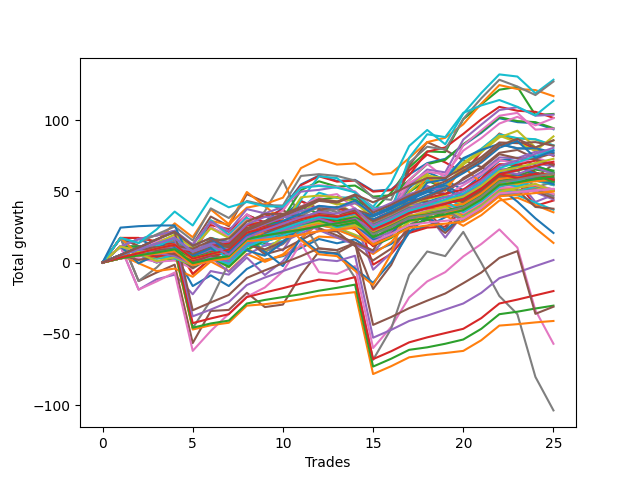

# Short Bulldog 006 
- Symbol: ES_Unlimited
- Date Range: 03/18/2022 - 07/15/2022
- Trading Period: 7:20-12:30
- Number of Trades: 25



| Name | Win Percent | Profit | Avg Profit / Trade | Avg Time / Trade |      | Name | Win Percent | Profit | Avg Profit / Trade | Avg Time / Trade |
| ---- | ----------- | ------ | ------------------ | ---------------- | ---- | ---- | ----------- | ------ | ------------------ | ---------------- |
| Sorted By <br> Profit | | | | | | Sorted By <br> Win Percentage ||||
| Sixty-One | 60.00 | 64125.00 | 2565.00 | 25:41 |     | One Hundred Twenty-Two | 92.00 | 31250.00 | 1250.00 | 03:49 |
| Sixty-Nine | 52.00 | 63500.00 | 2540.00 | 16:47 |     | One Hundred Six | 92.00 | 31000.00 | 1240.00 | 01:56 |
| Fifty-Three | 60.00 | 58375.00 | 2335.00 | 07:14 |     | One Hundred Twenty-Seven | 92.00 | 30250.00 | 1210.00 | 03:51 |
| Seventy-One | 52.00 | 56750.00 | 2270.00 | 21:37 |     | One Hundred Sixteen | 92.00 | 29000.00 | 1160.00 | 01:58 |
| Two | 72.00 | 52125.00 | 2085.00 | 21:32 |     | One Hundred Twenty-One | 92.00 | 25875.00 | 1035.00 | 02:04 |
| Sixty-Six | 68.00 | 51875.00 | 2075.00 | 11:35 |     | One Hundred Twenty-Six | 92.00 | 24875.00 | 995.00 | 02:07 |
| Fifty-Five | 60.00 | 50750.00 | 2030.00 | 07:54 |     | Eighty-Two | 92.00 | -15125.00 | -605.00 | 18:30 |
| Sixty-Eight | 60.00 | 50625.00 | 2025.00 | 12:58 |     | Eighty-One | 92.00 | -20500.00 | -820.00 | 16:46 |
| Fifty-Four | 60.00 | 47125.00 | 1885.00 | 06:46 |     | One Hundred Twenty-Three | 88.00 | 36375.00 | 1455.00 | 06:26 |
| Fifty-Eight | 72.00 | 47000.00 | 1880.00 | 14:31 |     | One Hundred Twenty-Eight | 88.00 | 35375.00 | 1415.00 | 06:29 |
| Fifty-Two | 60.00 | 46750.00 | 1870.00 | 06:33 |     | One Hundred Eleven | 88.00 | 25750.00 | 1030.00 | 01:54 |
| Seventy | 52.00 | 44250.00 | 1770.00 | 16:53 |     | Eighty-Four | 88.00 | 875.00 | 35.00 | 25:22 |
| One Hundred Thirty | 80.00 | 42875.00 | 1715.00 | 09:19 |     | Eighty-Three | 88.00 | -10000.00 | -400.00 | 21:08 |
| Sixty | 64.00 | 42875.00 | 1715.00 | 17:05 |     | One Hundred Twenty-Nine | 84.00 | 40250.00 | 1610.00 | 08:38 |
| Fifty-One | 64.00 | 41125.00 | 1645.00 | 05:20 |     | One Hundred Twenty-Four | 84.00 | 39500.00 | 1580.00 | 08:58 |
| One Hundred Ten | 72.00 | 41000.00 | 1640.00 | 03:45 |     | One Hundred Seven | 84.00 | 32250.00 | 1290.00 | 02:14 |
| Fifty | 60.00 | 41000.00 | 1640.00 | 06:41 |     | One Hundred Seventeen | 84.00 | 28375.00 | 1135.00 | 02:27 |
| One Hundred Twenty-Nine | 84.00 | 40250.00 | 1610.00 | 08:38 |     | One Hundred One | 84.00 | 25625.00 | 1025.00 | 01:44 |
| One Hundred Twenty-Four | 84.00 | 39500.00 | 1580.00 | 08:58 |     | Eighty-Five | 84.00 | -15500.00 | -620.00 | 36:48 |
| One Hundred Twenty-Five | 80.00 | 39250.00 | 1570.00 | 09:50 |     | One Hundred Thirty | 80.00 | 42875.00 | 1715.00 | 09:19 |
| Seventy-Three | 60.00 | 38625.00 | 1545.00 | 12:38 |     | One Hundred Twenty-Five | 80.00 | 39250.00 | 1570.00 | 09:50 |
| Sixty-Seven | 68.00 | 38375.00 | 1535.00 | 09:43 |     | One Hundred Two | 80.00 | 27125.00 | 1085.00 | 02:07 |
| One Hundred Nine | 72.00 | 37625.00 | 1505.00 | 03:36 |     | One Hundred Twelve | 80.00 | 23250.00 | 930.00 | 02:29 |
| Forty-Nine | 64.00 | 37625.00 | 1505.00 | 05:21 |     | One Hundred Eight | 76.00 | 34500.00 | 1380.00 | 02:58 |
| Forty-Five | 40.00 | 37375.00 | 1495.00 | 13:28 |     | One Hundred Eighteen | 76.00 | 29000.00 | 1160.00 | 03:18 |
| One Hundred Twenty-Three | 88.00 | 36375.00 | 1455.00 | 06:26 |     | Ninety-Six | 76.00 | 25250.00 | 1010.00 | 01:42 |
| One Hundred Twenty-Eight | 88.00 | 35375.00 | 1415.00 | 06:29 |     | One Hundred Thirteen | 76.00 | 25125.00 | 1005.00 | 04:15 |
| Forty-Eight | 68.00 | 34750.00 | 1390.00 | 03:55 |     | Ninety-One | 76.00 | 24000.00 | 960.00 | 01:39 |
| One Hundred Eight | 76.00 | 34500.00 | 1380.00 | 02:58 |     | Three | 76.00 | 21750.00 | 870.00 | 23:59 |
| Five | 68.00 | 34500.00 | 1380.00 | 48:46 |     | Two | 72.00 | 52125.00 | 2085.00 | 21:32 |
| One Hundred Twenty | 64.00 | 34125.00 | 1365.00 | 04:20 |     | Fifty-Eight | 72.00 | 47000.00 | 1880.00 | 14:31 |
| Fifty-Six | 72.00 | 33750.00 | 1350.00 | 06:36 |     | One Hundred Ten | 72.00 | 41000.00 | 1640.00 | 03:45 |
| One Hundred Seven | 84.00 | 32250.00 | 1290.00 | 02:14 |     | One Hundred Nine | 72.00 | 37625.00 | 1505.00 | 03:36 |
| Forty-Two | 52.00 | 31625.00 | 1265.00 | 09:55 |     | Fifty-Six | 72.00 | 33750.00 | 1350.00 | 06:36 |
| Sixty-Four | 68.00 | 31500.00 | 1260.00 | 06:01 |     | Zero | 72.00 | 29375.00 | 1175.00 | 08:40 |
| One Hundred Twenty-Two | 92.00 | 31250.00 | 1250.00 | 03:49 |     | Ninety-Eight | 72.00 | 28625.00 | 1145.00 | 02:13 |
| One Hundred Ninteen | 68.00 | 31125.00 | 1245.00 | 04:09 |     | One Hundred Fourteen | 72.00 | 28375.00 | 1135.00 | 05:38 |
| One Hundred Six | 92.00 | 31000.00 | 1240.00 | 01:56 |     | Fifty-Nine | 72.00 | 28250.00 | 1130.00 | 11:54 |
| Sixty-Five | 64.00 | 30750.00 | 1230.00 | 08:52 |     | Ninety-Seven | 72.00 | 27875.00 | 1115.00 | 01:50 |
| One Hundred Twenty-Seven | 92.00 | 30250.00 | 1210.00 | 03:51 |     | One Hundred Three | 72.00 | 27250.00 | 1090.00 | 03:10 |
| One Hundred | 68.00 | 29750.00 | 1190.00 | 02:30 |     | Ninety-Two | 72.00 | 25125.00 | 1005.00 | 01:55 |
| Zero | 72.00 | 29375.00 | 1175.00 | 08:40 |     | Sixty-Six | 68.00 | 51875.00 | 2075.00 | 11:35 |
| Ninety-Nine | 68.00 | 29125.00 | 1165.00 | 02:27 |     | Sixty-Seven | 68.00 | 38375.00 | 1535.00 | 09:43 |
| One | 64.00 | 29125.00 | 1165.00 | 15:53 |     | Forty-Eight | 68.00 | 34750.00 | 1390.00 | 03:55 |
| Forty-Four | 48.00 | 29125.00 | 1165.00 | 10:08 |     | Five | 68.00 | 34500.00 | 1380.00 | 48:46 |
| One Hundred Sixteen | 92.00 | 29000.00 | 1160.00 | 01:58 |     | Sixty-Four | 68.00 | 31500.00 | 1260.00 | 06:01 |
| One Hundred Eighteen | 76.00 | 29000.00 | 1160.00 | 03:18 |     | One Hundred Ninteen | 68.00 | 31125.00 | 1245.00 | 04:09 |
| Ninety-Eight | 72.00 | 28625.00 | 1145.00 | 02:13 |     | One Hundred | 68.00 | 29750.00 | 1190.00 | 02:30 |
| One Hundred Fifteen | 68.00 | 28625.00 | 1145.00 | 06:15 |     | Ninety-Nine | 68.00 | 29125.00 | 1165.00 | 02:27 |
| One Hundred Seventeen | 84.00 | 28375.00 | 1135.00 | 02:27 |     | One Hundred Fifteen | 68.00 | 28625.00 | 1145.00 | 06:15 |
| One Hundred Fourteen | 72.00 | 28375.00 | 1135.00 | 05:38 |     | Four | 68.00 | 23750.00 | 950.00 | 37:21 |
| Fifty-Nine | 72.00 | 28250.00 | 1130.00 | 11:54 |     | Six | 68.00 | -28500.00 | -1140.00 | 88:38 |
| Ninety-Seven | 72.00 | 27875.00 | 1115.00 | 01:50 |     | Sixty | 64.00 | 42875.00 | 1715.00 | 17:05 |
| One Hundred Five | 60.00 | 27500.00 | 1100.00 | 04:13 |     | Fifty-One | 64.00 | 41125.00 | 1645.00 | 05:20 |
| One Hundred Three | 72.00 | 27250.00 | 1090.00 | 03:10 |     | Forty-Nine | 64.00 | 37625.00 | 1505.00 | 05:21 |
| One Hundred Four | 64.00 | 27250.00 | 1090.00 | 04:01 |     | One Hundred Twenty | 64.00 | 34125.00 | 1365.00 | 04:20 |
| One Hundred Two | 80.00 | 27125.00 | 1085.00 | 02:07 |     | Sixty-Five | 64.00 | 30750.00 | 1230.00 | 08:52 |
| One Hundred Twenty-One | 92.00 | 25875.00 | 1035.00 | 02:04 |     | One | 64.00 | 29125.00 | 1165.00 | 15:53 |
| One Hundred Eleven | 88.00 | 25750.00 | 1030.00 | 01:54 |     | One Hundred Four | 64.00 | 27250.00 | 1090.00 | 04:01 |
| One Hundred One | 84.00 | 25625.00 | 1025.00 | 01:44 |     | Ninety-Three | 64.00 | 25125.00 | 1005.00 | 02:43 |
| Ninety-Five | 52.00 | 25625.00 | 1025.00 | 03:40 |     | Forty | 64.00 | 24000.00 | 960.00 | 04:45 |
| Ninety-Four | 56.00 | 25500.00 | 1020.00 | 03:31 |     | Fifty-Seven | 64.00 | 18875.00 | 755.00 | 11:04 |
| Ninety-Six | 76.00 | 25250.00 | 1010.00 | 01:42 |     | Sixty-One | 60.00 | 64125.00 | 2565.00 | 25:41 |
| One Hundred Thirteen | 76.00 | 25125.00 | 1005.00 | 04:15 |     | Fifty-Three | 60.00 | 58375.00 | 2335.00 | 07:14 |
| Ninety-Two | 72.00 | 25125.00 | 1005.00 | 01:55 |     | Fifty-Five | 60.00 | 50750.00 | 2030.00 | 07:54 |
| Ninety-Three | 64.00 | 25125.00 | 1005.00 | 02:43 |     | Sixty-Eight | 60.00 | 50625.00 | 2025.00 | 12:58 |
| One Hundred Twenty-Six | 92.00 | 24875.00 | 995.00 | 02:07 |     | Fifty-Four | 60.00 | 47125.00 | 1885.00 | 06:46 |
| Ninety-One | 76.00 | 24000.00 | 960.00 | 01:39 |     | Fifty-Two | 60.00 | 46750.00 | 1870.00 | 06:33 |
| Forty | 64.00 | 24000.00 | 960.00 | 04:45 |     | Fifty | 60.00 | 41000.00 | 1640.00 | 06:41 |
| Four | 68.00 | 23750.00 | 950.00 | 37:21 |     | Seventy-Three | 60.00 | 38625.00 | 1545.00 | 12:38 |
| One Hundred Twelve | 80.00 | 23250.00 | 930.00 | 02:29 |     | One Hundred Five | 60.00 | 27500.00 | 1100.00 | 04:13 |
| Forty-Seven | 28.00 | 22625.00 | 905.00 | 20:39 |     | Ninety-Four | 56.00 | 25500.00 | 1020.00 | 03:31 |
| Forty-Six | 40.00 | 22125.00 | 885.00 | 12:59 |     | Forty-One | 56.00 | 18500.00 | 740.00 | 07:36 |
| Three | 76.00 | 21750.00 | 870.00 | 23:59 |     | Sixty-Nine | 52.00 | 63500.00 | 2540.00 | 16:47 |
| Fifty-Seven | 64.00 | 18875.00 | 755.00 | 11:04 |     | Seventy-One | 52.00 | 56750.00 | 2270.00 | 21:37 |
| Forty-One | 56.00 | 18500.00 | 740.00 | 07:36 |     | Seventy | 52.00 | 44250.00 | 1770.00 | 16:53 |
| Forty-Three | 52.00 | 17625.00 | 705.00 | 07:35 |     | Forty-Two | 52.00 | 31625.00 | 1265.00 | 09:55 |
| Sixty-Two | 48.00 | 10375.00 | 415.00 | 32:04 |     | Ninety-Five | 52.00 | 25625.00 | 1025.00 | 03:40 |
| Sixty-Three | 36.00 | 6875.00 | 275.00 | 41:19 |     | Forty-Three | 52.00 | 17625.00 | 705.00 | 07:35 |
| Eighty-Four | 88.00 | 875.00 | 35.00 | 25:22 |     | Forty-Four | 48.00 | 29125.00 | 1165.00 | 10:08 |
| Eighty-Three | 88.00 | -10000.00 | -400.00 | 21:08 |     | Sixty-Two | 48.00 | 10375.00 | 415.00 | 32:04 |
| Eighty-Two | 92.00 | -15125.00 | -605.00 | 18:30 |     | Seven | 48.00 | -51875.00 | -2075.00 | 122:22 |
| Eighty-Five | 84.00 | -15500.00 | -620.00 | 36:48 |     | Forty-Five | 40.00 | 37375.00 | 1495.00 | 13:28 |
| Eighty-One | 92.00 | -20500.00 | -820.00 | 16:46 |     | Forty-Six | 40.00 | 22125.00 | 885.00 | 12:59 |
| Six | 68.00 | -28500.00 | -1140.00 | 88:38 |     | Sixty-Three | 36.00 | 6875.00 | 275.00 | 41:19 |
| Seven | 48.00 | -51875.00 | -2075.00 | 122:22 |     | Forty-Seven | 28.00 | 22625.00 | 905.00 | 20:39 |

## NO STOPLOSS

### Test Zero
* Sell when price hits the middle line of the 20p bollinger
* No Stoploss
* Results:
```
Total Trades: 25
Percent Up: 28.00
Percent Down: 72.00
Total Points Moved Down: 58.75
Potential Profit: 29375.00
Total Points Ups: 45.50 Count Ups: 7
Total Points Downs: 104.25 Count Downs: 18
```

<details><summary>Trades</summary>

<code>In: 2022-04-06 11:06:00		Out: 2022-04-06 11:07:10		Total Position Time: 01:10		Total Move Down: 3.00		Total to Date: 3.00</code> <br />
<code>In: 2022-04-07 11:04:00		Out: 2022-04-07 11:15:20		Total Position Time: 11:20		Total Move Down: 3.25		Total to Date: 6.25</code> <br />
<code>In: 2022-04-18 07:28:00		Out: 2022-04-18 07:46:00		Total Position Time: 18:00		Total Move Down: -1.25		Total to Date: 5.00</code> <br />
<code>In: 2022-04-20 10:50:00		Out: 2022-04-20 10:51:10		Total Position Time: 01:10		Total Move Down: 1.00		Total to Date: 6.00</code> <br />
<code>In: 2022-04-25 11:12:00		Out: 2022-04-25 11:40:00		Total Position Time: 28:00		Total Move Down: -22.50		Total to Date: -16.50</code> <br />
<code>In: 2022-05-03 07:36:00		Out: 2022-05-03 07:38:45		Total Position Time: 02:45		Total Move Down: 7.50		Total to Date: -9.00</code> <br />
<code>In: 2022-05-03 08:11:00		Out: 2022-05-03 08:35:55		Total Position Time: 24:55		Total Move Down: -7.50		Total to Date: -16.50</code> <br />
<code>In: 2022-05-04 11:31:00		Out: 2022-05-04 11:32:10		Total Position Time: 01:10		Total Move Down: 12.00		Total to Date: -4.50</code> <br />
<code>In: 2022-05-16 10:16:00		Out: 2022-05-16 10:19:50		Total Position Time: 03:50		Total Move Down: 6.50		Total to Date: 2.00</code> <br />
<code>In: 2022-05-17 09:49:00		Out: 2022-05-17 09:53:50		Total Position Time: 04:50		Total Move Down: 2.50		Total to Date: 4.50</code> <br />
<code>In: 2022-05-24 09:18:00		Out: 2022-05-24 09:22:10		Total Position Time: 04:10		Total Move Down: 5.75		Total to Date: 10.25</code> <br />
<code>In: 2022-05-24 11:15:00		Out: 2022-05-24 11:18:25		Total Position Time: 03:25		Total Move Down: 6.25		Total to Date: 16.50</code> <br />
<code>In: 2022-05-27 12:11:00		Out: 2022-05-27 12:35:00		Total Position Time: 24:00		Total Move Down: -3.00		Total to Date: 13.50</code> <br />
<code>In: 2022-05-31 07:24:00		Out: 2022-05-31 07:37:30		Total Position Time: 13:30		Total Move Down: 2.75		Total to Date: 16.25</code> <br />
<code>In: 2022-06-02 08:06:00		Out: 2022-06-02 08:27:20		Total Position Time: 21:20		Total Move Down: -8.75		Total to Date: 7.50</code> <br />
<code>In: 2022-06-10 12:30:00		Out: 2022-06-10 12:31:10		Total Position Time: 01:10		Total Move Down: 5.50		Total to Date: 13.00</code> <br />
<code>In: 2022-06-13 09:41:00		Out: 2022-06-13 09:44:05		Total Position Time: 03:05		Total Move Down: 9.00		Total to Date: 22.00</code> <br />
<code>In: 2022-06-23 08:16:00		Out: 2022-06-23 08:21:05		Total Position Time: 05:05		Total Move Down: 3.50		Total to Date: 25.50</code> <br />
<code>In: 2022-06-30 08:30:00		Out: 2022-06-30 08:35:20		Total Position Time: 05:20		Total Move Down: 6.25		Total to Date: 31.75</code> <br />
<code>In: 2022-07-05 07:41:00		Out: 2022-07-05 07:44:30		Total Position Time: 03:30		Total Move Down: 7.25		Total to Date: 39.00</code> <br />
<code>In: 2022-07-06 11:10:00		Out: 2022-07-06 11:11:10		Total Position Time: 01:10		Total Move Down: 7.50		Total to Date: 46.50</code> <br />
<code>In: 2022-07-06 11:11:00		Out: 2022-07-06 11:12:10		Total Position Time: 01:10		Total Move Down: 10.25		Total to Date: 56.75</code> <br />
<code>In: 2022-07-07 07:57:00		Out: 2022-07-07 08:11:15		Total Position Time: 14:15		Total Move Down: -0.25		Total to Date: 56.50</code> <br />
<code>In: 2022-07-14 08:13:00		Out: 2022-07-14 08:15:45		Total Position Time: 02:45		Total Move Down: 4.50		Total to Date: 61.00</code> <br />
<code>In: 2022-07-14 08:46:00		Out: 2022-07-14 09:01:55		Total Position Time: 15:55		Total Move Down: -2.25		Total to Date: 58.75</code> <br />


</details>

### Test One
* Sell when the price hits the upper line of the 20p 1std bollinger
* No Stoploss
* Results:
```
Total Trades: 25
Percent Up: 36.00
Percent Down: 64.00
Total Points Moved Down: 58.25
Potential Profit: 29125.00
Total Points Ups: 53.50 Count Ups: 9
Total Points Downs: 111.75 Count Downs: 16
```

<details><summary>Trades</summary>

<code>In: 2022-04-06 11:06:00		Out: 2022-04-06 11:07:20		Total Position Time: 01:20		Total Move Down: 5.25		Total to Date: 5.25</code> <br />
<code>In: 2022-04-07 11:04:00		Out: 2022-04-07 11:18:00		Total Position Time: 14:00		Total Move Down: 4.00		Total to Date: 9.25</code> <br />
<code>In: 2022-04-18 07:28:00		Out: 2022-04-18 07:51:30		Total Position Time: 23:30		Total Move Down: 0.50		Total to Date: 9.75</code> <br />
<code>In: 2022-04-20 10:50:00		Out: 2022-04-20 10:55:05		Total Position Time: 05:05		Total Move Down: 2.75		Total to Date: 12.50</code> <br />
<code>In: 2022-04-25 11:12:00		Out: 2022-04-25 11:44:45		Total Position Time: 32:45		Total Move Down: -20.75		Total to Date: -8.25</code> <br />
<code>In: 2022-05-03 07:36:00		Out: 2022-05-03 07:41:55		Total Position Time: 05:55		Total Move Down: 11.25		Total to Date: 3.00</code> <br />
<code>In: 2022-05-03 08:11:00		Out: 2022-05-03 08:38:55		Total Position Time: 27:55		Total Move Down: -4.75		Total to Date: -1.75</code> <br />
<code>In: 2022-05-04 11:31:00		Out: 2022-05-04 11:32:10		Total Position Time: 01:10		Total Move Down: 12.00		Total to Date: 10.25</code> <br />
<code>In: 2022-05-16 10:16:00		Out: 2022-05-16 10:46:30		Total Position Time: 30:30		Total Move Down: -8.75		Total to Date: 1.50</code> <br />
<code>In: 2022-05-17 09:49:00		Out: 2022-05-17 09:56:30		Total Position Time: 07:30		Total Move Down: 3.50		Total to Date: 5.00</code> <br />
<code>In: 2022-05-24 09:18:00		Out: 2022-05-24 09:29:20		Total Position Time: 11:20		Total Move Down: 6.50		Total to Date: 11.50</code> <br />
<code>In: 2022-05-24 11:15:00		Out: 2022-05-24 11:31:25		Total Position Time: 16:25		Total Move Down: 6.75		Total to Date: 18.25</code> <br />
<code>In: 2022-05-27 12:11:00		Out: 2022-05-27 12:35:55		Total Position Time: 24:55		Total Move Down: -0.75		Total to Date: 17.50</code> <br />
<code>In: 2022-05-31 07:24:00		Out: 2022-05-31 08:07:20		Total Position Time: 43:20		Total Move Down: -3.75		Total to Date: 13.75</code> <br />
<code>In: 2022-06-02 08:06:00		Out: 2022-06-02 08:29:05		Total Position Time: 23:05		Total Move Down: -7.75		Total to Date: 6.00</code> <br />
<code>In: 2022-06-10 12:30:00		Out: 2022-06-10 12:35:45		Total Position Time: 05:45		Total Move Down: 8.25		Total to Date: 14.25</code> <br />
<code>In: 2022-06-13 09:41:00		Out: 2022-06-13 09:47:55		Total Position Time: 06:55		Total Move Down: 14.75		Total to Date: 29.00</code> <br />
<code>In: 2022-06-23 08:16:00		Out: 2022-06-23 08:23:30		Total Position Time: 07:30		Total Move Down: 6.25		Total to Date: 35.25</code> <br />
<code>In: 2022-06-30 08:30:00		Out: 2022-06-30 09:05:50		Total Position Time: 35:50		Total Move Down: -3.00		Total to Date: 32.25</code> <br />
<code>In: 2022-07-05 07:41:00		Out: 2022-07-05 07:45:55		Total Position Time: 04:55		Total Move Down: 12.00		Total to Date: 44.25</code> <br />
<code>In: 2022-07-06 11:10:00		Out: 2022-07-06 11:11:10		Total Position Time: 01:10		Total Move Down: 7.50		Total to Date: 51.75</code> <br />
<code>In: 2022-07-06 11:11:00		Out: 2022-07-06 11:12:10		Total Position Time: 01:10		Total Move Down: 10.25		Total to Date: 62.00</code> <br />
<code>In: 2022-07-07 07:57:00		Out: 2022-07-07 08:20:05		Total Position Time: 23:05		Total Move Down: 0.25		Total to Date: 62.25</code> <br />
<code>In: 2022-07-14 08:13:00		Out: 2022-07-14 08:36:05		Total Position Time: 23:05		Total Move Down: -2.75		Total to Date: 59.50</code> <br />
<code>In: 2022-07-14 08:46:00		Out: 2022-07-14 09:05:15		Total Position Time: 19:15		Total Move Down: -1.25		Total to Date: 58.25</code> <br />


</details>

### Test Two
* Sell when the price hits the upper line of the 20p 2std bollinger
* No Stoploss
* Results:
```
Total Trades: 25
Percent Up: 28.00
Percent Down: 72.00
Total Points Moved Down: 104.25
Potential Profit: 52125.00
Total Points Ups: 61.75 Count Ups: 7
Total Points Downs: 166.00 Count Downs: 18
```

<details><summary>Trades</summary>

<code>In: 2022-04-06 11:06:00		Out: 2022-04-06 11:08:10		Total Position Time: 02:10		Total Move Down: 11.25		Total to Date: 11.25</code> <br />
<code>In: 2022-04-07 11:04:00		Out: 2022-04-07 11:18:20		Total Position Time: 14:20		Total Move Down: 5.25		Total to Date: 16.50</code> <br />
<code>In: 2022-04-18 07:28:00		Out: 2022-04-18 07:51:45		Total Position Time: 23:45		Total Move Down: 2.50		Total to Date: 19.00</code> <br />
<code>In: 2022-04-20 10:50:00		Out: 2022-04-20 11:14:05		Total Position Time: 24:05		Total Move Down: 3.25		Total to Date: 22.25</code> <br />
<code>In: 2022-04-25 11:12:00		Out: 2022-04-25 12:02:05		Total Position Time: 50:05		Total Move Down: -21.25		Total to Date: 1.00</code> <br />
<code>In: 2022-05-03 07:36:00		Out: 2022-05-03 07:43:50		Total Position Time: 07:50		Total Move Down: 16.25		Total to Date: 17.25</code> <br />
<code>In: 2022-05-03 08:11:00		Out: 2022-05-03 08:39:10		Total Position Time: 28:10		Total Move Down: -3.00		Total to Date: 14.25</code> <br />
<code>In: 2022-05-04 11:31:00		Out: 2022-05-04 11:32:25		Total Position Time: 01:25		Total Move Down: 15.50		Total to Date: 29.75</code> <br />
<code>In: 2022-05-16 10:16:00		Out: 2022-05-16 10:49:05		Total Position Time: 33:05		Total Move Down: -7.75		Total to Date: 22.00</code> <br />
<code>In: 2022-05-17 09:49:00		Out: 2022-05-17 10:01:20		Total Position Time: 12:20		Total Move Down: 4.50		Total to Date: 26.50</code> <br />
<code>In: 2022-05-24 09:18:00		Out: 2022-05-24 09:31:25		Total Position Time: 13:25		Total Move Down: 10.75		Total to Date: 37.25</code> <br />
<code>In: 2022-05-24 11:15:00		Out: 2022-05-24 11:44:00		Total Position Time: 29:00		Total Move Down: 6.75		Total to Date: 44.00</code> <br />
<code>In: 2022-05-27 12:11:00		Out: 2022-05-27 12:38:10		Total Position Time: 27:10		Total Move Down: 2.00		Total to Date: 46.00</code> <br />
<code>In: 2022-05-31 07:24:00		Out: 2022-05-31 08:07:30		Total Position Time: 43:30		Total Move Down: -1.75		Total to Date: 44.25</code> <br />
<code>In: 2022-06-02 08:06:00		Out: 2022-06-02 08:31:25		Total Position Time: 25:25		Total Move Down: -7.75		Total to Date: 36.50</code> <br />
<code>In: 2022-06-10 12:30:00		Out: 2022-06-10 12:43:10		Total Position Time: 13:10		Total Move Down: 12.50		Total to Date: 49.00</code> <br />
<code>In: 2022-06-13 09:41:00		Out: 2022-06-13 09:54:15		Total Position Time: 13:15		Total Move Down: 17.75		Total to Date: 66.75</code> <br />
<code>In: 2022-06-23 08:16:00		Out: 2022-06-23 08:31:10		Total Position Time: 15:10		Total Move Down: 11.25		Total to Date: 78.00</code> <br />
<code>In: 2022-06-30 08:30:00		Out: 2022-06-30 09:06:15		Total Position Time: 36:15		Total Move Down: -0.50		Total to Date: 77.50</code> <br />
<code>In: 2022-07-05 07:41:00		Out: 2022-07-05 08:01:10		Total Position Time: 20:10		Total Move Down: 23.00		Total to Date: 100.50</code> <br />
<code>In: 2022-07-06 11:10:00		Out: 2022-07-06 11:11:45		Total Position Time: 01:45		Total Move Down: 10.50		Total to Date: 111.00</code> <br />
<code>In: 2022-07-06 11:11:00		Out: 2022-07-06 11:12:10		Total Position Time: 01:10		Total Move Down: 10.25		Total to Date: 121.25</code> <br />
<code>In: 2022-07-07 07:57:00		Out: 2022-07-07 08:22:45		Total Position Time: 25:45		Total Move Down: 2.00		Total to Date: 123.25</code> <br />
<code>In: 2022-07-14 08:13:00		Out: 2022-07-14 09:07:30		Total Position Time: 54:30		Total Move Down: -19.75		Total to Date: 103.50</code> <br />
<code>In: 2022-07-14 08:46:00		Out: 2022-07-14 09:07:30		Total Position Time: 21:30		Total Move Down: 0.75		Total to Date: 104.25</code> <br />


</details>

### Test Three
* Sell when price hits the middle line of the 50p bollinger
* No Stoploss
* Results:
```
Total Trades: 25
Percent Up: 24.00
Percent Down: 76.00
Total Points Moved Down: 43.50
Potential Profit: 21750.00
Total Points Ups: 85.75 Count Ups: 6
Total Points Downs: 129.25 Count Downs: 19
```

<details><summary>Trades</summary>

<code>In: 2022-04-06 11:06:00		Out: 2022-04-06 11:07:20		Total Position Time: 01:20		Total Move Down: 5.25		Total to Date: 5.25</code> <br />
<code>In: 2022-04-07 11:04:00		Out: 2022-04-07 11:33:40		Total Position Time: 29:40		Total Move Down: 5.50		Total to Date: 10.75</code> <br />
<code>In: 2022-04-18 07:28:00		Out: 2022-04-18 07:52:15		Total Position Time: 24:15		Total Move Down: 2.50		Total to Date: 13.25</code> <br />
<code>In: 2022-04-20 10:50:00		Out: 2022-04-20 10:51:25		Total Position Time: 01:25		Total Move Down: 1.75		Total to Date: 15.00</code> <br />
<code>In: 2022-04-25 11:12:00		Out: 2022-04-25 12:01:25		Total Position Time: 49:25		Total Move Down: -23.00		Total to Date: -8.00</code> <br />
<code>In: 2022-05-03 07:36:00		Out: 2022-05-03 07:40:40		Total Position Time: 04:40		Total Move Down: 10.75		Total to Date: 2.75</code> <br />
<code>In: 2022-05-03 08:11:00		Out: 2022-05-03 08:46:10		Total Position Time: 35:10		Total Move Down: -0.75		Total to Date: 2.00</code> <br />
<code>In: 2022-05-04 11:31:00		Out: 2022-05-04 11:32:10		Total Position Time: 01:10		Total Move Down: 12.00		Total to Date: 14.00</code> <br />
<code>In: 2022-05-16 10:16:00		Out: 2022-05-16 10:59:10		Total Position Time: 43:10		Total Move Down: -6.25		Total to Date: 7.75</code> <br />
<code>In: 2022-05-17 09:49:00		Out: 2022-05-17 10:01:30		Total Position Time: 12:30		Total Move Down: 5.25		Total to Date: 13.00</code> <br />
<code>In: 2022-05-24 09:18:00		Out: 2022-05-24 09:31:20		Total Position Time: 13:20		Total Move Down: 10.75		Total to Date: 23.75</code> <br />
<code>In: 2022-05-24 11:15:00		Out: 2022-05-24 11:20:25		Total Position Time: 05:25		Total Move Down: 11.75		Total to Date: 35.50</code> <br />
<code>In: 2022-05-27 12:11:00		Out: 2022-05-27 12:38:10		Total Position Time: 27:10		Total Move Down: 2.00		Total to Date: 37.50</code> <br />
<code>In: 2022-05-31 07:24:00		Out: 2022-05-31 08:07:30		Total Position Time: 43:30		Total Move Down: -1.75		Total to Date: 35.75</code> <br />
<code>In: 2022-06-02 08:06:00		Out: 2022-06-02 10:12:25		Total Position Time: 126:25		Total Move Down: -37.25		Total to Date: -1.50</code> <br />
<code>In: 2022-06-10 12:30:00		Out: 2022-06-10 12:33:40		Total Position Time: 03:40		Total Move Down: 7.50		Total to Date: 6.00</code> <br />
<code>In: 2022-06-13 09:41:00		Out: 2022-06-13 09:47:55		Total Position Time: 06:55		Total Move Down: 14.75		Total to Date: 20.75</code> <br />
<code>In: 2022-06-23 08:16:00		Out: 2022-06-23 08:22:20		Total Position Time: 06:20		Total Move Down: 3.75		Total to Date: 24.50</code> <br />
<code>In: 2022-06-30 08:30:00		Out: 2022-06-30 09:06:20		Total Position Time: 36:20		Total Move Down: 0.75		Total to Date: 25.25</code> <br />
<code>In: 2022-07-05 07:41:00		Out: 2022-07-05 07:45:50		Total Position Time: 04:50		Total Move Down: 11.50		Total to Date: 36.75</code> <br />
<code>In: 2022-07-06 11:10:00		Out: 2022-07-06 11:11:10		Total Position Time: 01:10		Total Move Down: 7.50		Total to Date: 44.25</code> <br />
<code>In: 2022-07-06 11:11:00		Out: 2022-07-06 11:12:10		Total Position Time: 01:10		Total Move Down: 10.25		Total to Date: 54.50</code> <br />
<code>In: 2022-07-07 07:57:00		Out: 2022-07-07 08:22:45		Total Position Time: 25:45		Total Move Down: 2.00		Total to Date: 56.50</code> <br />
<code>In: 2022-07-14 08:13:00		Out: 2022-07-14 09:17:00		Total Position Time: 64:00		Total Move Down: -16.75		Total to Date: 39.75</code> <br />
<code>In: 2022-07-14 08:46:00		Out: 2022-07-14 09:17:00		Total Position Time: 31:00		Total Move Down: 3.75		Total to Date: 43.50</code> <br />


</details>

### Test Four
* Sell when the price hits the upper line of the 50p 1std bollinger
* No Stoploss
* Results:
```
Total Trades: 25
Percent Up: 32.00
Percent Down: 68.00
Total Points Moved Down: 47.50
Potential Profit: 23750.00
Total Points Ups: 126.25 Count Ups: 8
Total Points Downs: 173.75 Count Downs: 17
```

<details><summary>Trades</summary>

<code>In: 2022-04-06 11:06:00		Out: 2022-04-06 11:08:10		Total Position Time: 02:10		Total Move Down: 11.25		Total to Date: 11.25</code> <br />
<code>In: 2022-04-07 11:04:00		Out: 2022-04-07 12:47:00		Total Position Time: 103:00		Total Move Down: -30.25		Total to Date: -19.00</code> <br />
<code>In: 2022-04-18 07:28:00		Out: 2022-04-18 07:57:05		Total Position Time: 29:05		Total Move Down: 7.25		Total to Date: -11.75</code> <br />
<code>In: 2022-04-20 10:50:00		Out: 2022-04-20 11:14:05		Total Position Time: 24:05		Total Move Down: 3.25		Total to Date: -8.50</code> <br />
<code>In: 2022-04-25 11:12:00		Out: 2022-04-25 12:04:05		Total Position Time: 52:05		Total Move Down: -13.75		Total to Date: -22.25</code> <br />
<code>In: 2022-05-03 07:36:00		Out: 2022-05-03 07:43:50		Total Position Time: 07:50		Total Move Down: 16.25		Total to Date: -6.00</code> <br />
<code>In: 2022-05-03 08:11:00		Out: 2022-05-03 09:05:55		Total Position Time: 54:55		Total Move Down: -2.50		Total to Date: -8.50</code> <br />
<code>In: 2022-05-04 11:31:00		Out: 2022-05-04 11:32:10		Total Position Time: 01:10		Total Move Down: 12.00		Total to Date: 3.50</code> <br />
<code>In: 2022-05-16 10:16:00		Out: 2022-05-16 11:52:30		Total Position Time: 96:30		Total Move Down: -12.25		Total to Date: -8.75</code> <br />
<code>In: 2022-05-17 09:49:00		Out: 2022-05-17 10:02:20		Total Position Time: 13:20		Total Move Down: 9.75		Total to Date: 1.00</code> <br />
<code>In: 2022-05-24 09:18:00		Out: 2022-05-24 09:34:40		Total Position Time: 16:40		Total Move Down: 16.25		Total to Date: 17.25</code> <br />
<code>In: 2022-05-24 11:15:00		Out: 2022-05-24 11:45:05		Total Position Time: 30:05		Total Move Down: 10.00		Total to Date: 27.25</code> <br />
<code>In: 2022-05-27 12:11:00		Out: 2022-05-27 12:47:00		Total Position Time: 36:00		Total Move Down: -1.25		Total to Date: 26.00</code> <br />
<code>In: 2022-05-31 07:24:00		Out: 2022-05-31 08:08:45		Total Position Time: 44:45		Total Move Down: 3.00		Total to Date: 29.00</code> <br />
<code>In: 2022-06-02 08:06:00		Out: 2022-06-02 10:14:00		Total Position Time: 128:00		Total Move Down: -34.00		Total to Date: -5.00</code> <br />
<code>In: 2022-06-10 12:30:00		Out: 2022-06-10 12:42:40		Total Position Time: 12:40		Total Move Down: 11.75		Total to Date: 6.75</code> <br />
<code>In: 2022-06-13 09:41:00		Out: 2022-06-13 09:54:40		Total Position Time: 13:40		Total Move Down: 19.50		Total to Date: 26.25</code> <br />
<code>In: 2022-06-23 08:16:00		Out: 2022-06-23 08:23:40		Total Position Time: 07:40		Total Move Down: 8.00		Total to Date: 34.25</code> <br />
<code>In: 2022-06-30 08:30:00		Out: 2022-06-30 10:10:15		Total Position Time: 100:15		Total Move Down: -16.75		Total to Date: 17.50</code> <br />
<code>In: 2022-07-05 07:41:00		Out: 2022-07-05 07:56:40		Total Position Time: 15:40		Total Move Down: 16.75		Total to Date: 34.25</code> <br />
<code>In: 2022-07-06 11:10:00		Out: 2022-07-06 11:11:35		Total Position Time: 01:35		Total Move Down: 8.75		Total to Date: 43.00</code> <br />
<code>In: 2022-07-06 11:11:00		Out: 2022-07-06 11:12:10		Total Position Time: 01:10		Total Move Down: 10.25		Total to Date: 53.25</code> <br />
<code>In: 2022-07-07 07:57:00		Out: 2022-07-07 08:23:20		Total Position Time: 26:20		Total Move Down: 4.75		Total to Date: 58.00</code> <br />
<code>In: 2022-07-14 08:13:00		Out: 2022-07-14 09:27:05		Total Position Time: 74:05		Total Move Down: -15.50		Total to Date: 42.50</code> <br />
<code>In: 2022-07-14 08:46:00		Out: 2022-07-14 09:27:05		Total Position Time: 41:05		Total Move Down: 5.00		Total to Date: 47.50</code> <br />


</details>

### Test Five
* Sell when the price hits the upper line of the 50p 2std bollinger
* No Stoploss
* Results:
```
Total Trades: 25
Percent Up: 32.00
Percent Down: 68.00
Total Points Moved Down: 69.00
Potential Profit: 34500.00
Total Points Ups: 153.50 Count Ups: 8
Total Points Downs: 222.50 Count Downs: 17
```

<details><summary>Trades</summary>

<code>In: 2022-04-06 11:06:00		Out: 2022-04-06 11:09:40		Total Position Time: 03:40		Total Move Down: 17.25		Total to Date: 17.25</code> <br />
<code>In: 2022-04-07 11:04:00		Out: 2022-04-07 12:47:00		Total Position Time: 103:00		Total Move Down: -30.25		Total to Date: -13.00</code> <br />
<code>In: 2022-04-18 07:28:00		Out: 2022-04-18 08:15:50		Total Position Time: 47:50		Total Move Down: 6.00		Total to Date: -7.00</code> <br />
<code>In: 2022-04-20 10:50:00		Out: 2022-04-20 11:18:05		Total Position Time: 28:05		Total Move Down: 5.50		Total to Date: -1.50</code> <br />
<code>In: 2022-04-25 11:12:00		Out: 2022-04-25 12:47:00		Total Position Time: 95:00		Total Move Down: -55.00		Total to Date: -56.50</code> <br />
<code>In: 2022-05-03 07:36:00		Out: 2022-05-03 07:47:05		Total Position Time: 11:05		Total Move Down: 22.50		Total to Date: -34.00</code> <br />
<code>In: 2022-05-03 08:11:00		Out: 2022-05-03 09:06:15		Total Position Time: 55:15		Total Move Down: 0.75		Total to Date: -33.25</code> <br />
<code>In: 2022-05-04 11:31:00		Out: 2022-05-04 11:32:10		Total Position Time: 01:10		Total Move Down: 12.00		Total to Date: -21.25</code> <br />
<code>In: 2022-05-16 10:16:00		Out: 2022-05-16 12:10:10		Total Position Time: 114:10		Total Move Down: -10.00		Total to Date: -31.25</code> <br />
<code>In: 2022-05-17 09:49:00		Out: 2022-05-17 10:59:45		Total Position Time: 70:45		Total Move Down: 1.75		Total to Date: -29.50</code> <br />
<code>In: 2022-05-24 09:18:00		Out: 2022-05-24 09:37:00		Total Position Time: 19:00		Total Move Down: 20.75		Total to Date: -8.75</code> <br />
<code>In: 2022-05-24 11:15:00		Out: 2022-05-24 11:49:15		Total Position Time: 34:15		Total Move Down: 16.50		Total to Date: 7.75</code> <br />
<code>In: 2022-05-27 12:11:00		Out: 2022-05-27 12:47:00		Total Position Time: 36:00		Total Move Down: -1.25		Total to Date: 6.50</code> <br />
<code>In: 2022-05-31 07:24:00		Out: 2022-05-31 08:14:30		Total Position Time: 50:30		Total Move Down: 7.00		Total to Date: 13.50</code> <br />
<code>In: 2022-06-02 08:06:00		Out: 2022-06-02 10:14:30		Total Position Time: 128:30		Total Move Down: -32.00		Total to Date: -18.50</code> <br />
<code>In: 2022-06-10 12:30:00		Out: 2022-06-10 12:45:40		Total Position Time: 15:40		Total Move Down: 16.75		Total to Date: -1.75</code> <br />
<code>In: 2022-06-13 09:41:00		Out: 2022-06-13 09:58:15		Total Position Time: 17:15		Total Move Down: 26.00		Total to Date: 24.25</code> <br />
<code>In: 2022-06-23 08:16:00		Out: 2022-06-23 08:31:10		Total Position Time: 15:10		Total Move Down: 11.25		Total to Date: 35.50</code> <br />
<code>In: 2022-06-30 08:30:00		Out: 2022-06-30 10:12:00		Total Position Time: 102:00		Total Move Down: -12.50		Total to Date: 23.00</code> <br />
<code>In: 2022-07-05 07:41:00		Out: 2022-07-05 08:01:05		Total Position Time: 20:05		Total Move Down: 21.50		Total to Date: 44.50</code> <br />
<code>In: 2022-07-06 11:10:00		Out: 2022-07-06 11:12:15		Total Position Time: 02:15		Total Move Down: 14.50		Total to Date: 59.00</code> <br />
<code>In: 2022-07-06 11:11:00		Out: 2022-07-06 11:12:15		Total Position Time: 01:15		Total Move Down: 13.00		Total to Date: 72.00</code> <br />
<code>In: 2022-07-07 07:57:00		Out: 2022-07-07 10:06:20		Total Position Time: 129:20		Total Move Down: -1.50		Total to Date: 70.50</code> <br />
<code>In: 2022-07-14 08:13:00		Out: 2022-07-14 09:28:35		Total Position Time: 75:35		Total Move Down: -11.00		Total to Date: 59.50</code> <br />
<code>In: 2022-07-14 08:46:00		Out: 2022-07-14 09:28:35		Total Position Time: 42:35		Total Move Down: 9.50		Total to Date: 69.00</code> <br />


</details>

### Test Six
* Sell when the price hits the middle line of the 1std VWAP
* No Stoploss
* Results:
```
Total Trades: 25
Percent Up: 32.00
Percent Down: 68.00
Total Points Moved Down: -57.00
Potential Profit: -28500.00
Total Points Ups: 244.50 Count Ups: 8
Total Points Downs: 187.50 Count Downs: 17
```

<details><summary>Trades</summary>

<code>In: 2022-04-06 11:06:00		Out: 2022-04-06 11:08:10		Total Position Time: 02:10		Total Move Down: 11.25		Total to Date: 11.25</code> <br />
<code>In: 2022-04-07 11:04:00		Out: 2022-04-07 12:47:00		Total Position Time: 103:00		Total Move Down: -30.25		Total to Date: -19.00</code> <br />
<code>In: 2022-04-18 07:28:00		Out: 2022-04-18 07:55:15		Total Position Time: 27:15		Total Move Down: 5.75		Total to Date: -13.25</code> <br />
<code>In: 2022-04-20 10:50:00		Out: 2022-04-20 11:18:20		Total Position Time: 28:20		Total Move Down: 6.25		Total to Date: -7.00</code> <br />
<code>In: 2022-04-25 11:12:00		Out: 2022-04-25 12:47:00		Total Position Time: 95:00		Total Move Down: -55.00		Total to Date: -62.00</code> <br />
<code>In: 2022-05-03 07:36:00		Out: 2022-05-03 07:42:15		Total Position Time: 06:15		Total Move Down: 14.00		Total to Date: -48.00</code> <br />
<code>In: 2022-05-03 08:11:00		Out: 2022-05-03 11:12:00		Total Position Time: 181:00		Total Move Down: 12.00		Total to Date: -36.00</code> <br />
<code>In: 2022-05-04 11:31:00		Out: 2022-05-04 11:32:10		Total Position Time: 01:10		Total Move Down: 12.00		Total to Date: -24.00</code> <br />
<code>In: 2022-05-16 10:16:00		Out: 2022-05-16 12:34:05		Total Position Time: 138:05		Total Move Down: 6.50		Total to Date: -17.50</code> <br />
<code>In: 2022-05-17 09:49:00		Out: 2022-05-17 11:13:30		Total Position Time: 84:30		Total Move Down: 11.25		Total to Date: -6.25</code> <br />
<code>In: 2022-05-24 09:18:00		Out: 2022-05-24 09:36:45		Total Position Time: 18:45		Total Move Down: 19.75		Total to Date: 13.50</code> <br />
<code>In: 2022-05-24 11:15:00		Out: 2022-05-24 12:47:00		Total Position Time: 92:00		Total Move Down: -20.25		Total to Date: -6.75</code> <br />
<code>In: 2022-05-27 12:11:00		Out: 2022-05-27 12:47:00		Total Position Time: 36:00		Total Move Down: -1.25		Total to Date: -8.00</code> <br />
<code>In: 2022-05-31 07:24:00		Out: 2022-05-31 08:14:20		Total Position Time: 50:20		Total Move Down: 5.50		Total to Date: -2.50</code> <br />
<code>In: 2022-06-02 08:06:00		Out: 2022-06-02 12:47:00		Total Position Time: 281:00		Total Move Down: -57.50		Total to Date: -60.00</code> <br />
<code>In: 2022-06-10 12:30:00		Out: 2022-06-10 12:44:00		Total Position Time: 14:00		Total Move Down: 14.75		Total to Date: -45.25</code> <br />
<code>In: 2022-06-13 09:41:00		Out: 2022-06-13 09:55:05		Total Position Time: 14:05		Total Move Down: 20.75		Total to Date: -24.50</code> <br />
<code>In: 2022-06-23 08:16:00		Out: 2022-06-23 08:31:10		Total Position Time: 15:10		Total Move Down: 11.25		Total to Date: -13.25</code> <br />
<code>In: 2022-06-30 08:30:00		Out: 2022-06-30 12:05:35		Total Position Time: 215:35		Total Move Down: 6.50		Total to Date: -6.75</code> <br />
<code>In: 2022-07-05 07:41:00		Out: 2022-07-05 07:45:30		Total Position Time: 04:30		Total Move Down: 11.00		Total to Date: 4.25</code> <br />
<code>In: 2022-07-06 11:10:00		Out: 2022-07-06 11:11:35		Total Position Time: 01:35		Total Move Down: 8.75		Total to Date: 13.00</code> <br />
<code>In: 2022-07-06 11:11:00		Out: 2022-07-06 11:12:10		Total Position Time: 01:10		Total Move Down: 10.25		Total to Date: 23.25</code> <br />
<code>In: 2022-07-07 07:57:00		Out: 2022-07-07 12:47:00		Total Position Time: 290:00		Total Move Down: -12.75		Total to Date: 10.50</code> <br />
<code>In: 2022-07-14 08:13:00		Out: 2022-07-14 12:47:00		Total Position Time: 274:00		Total Move Down: -44.00		Total to Date: -33.50</code> <br />
<code>In: 2022-07-14 08:46:00		Out: 2022-07-14 12:47:00		Total Position Time: 241:00		Total Move Down: -23.50		Total to Date: -57.00</code> <br />


</details>

### Test Seven
* Sell when the price hits the upper line of the 1std VWAP
* No Stoploss
* Results:
```
Total Trades: 25
Percent Up: 52.00
Percent Down: 48.00
Total Points Moved Down: -103.75
Potential Profit: -51875.00
Total Points Ups: 339.75 Count Ups: 13
Total Points Downs: 236.00 Count Downs: 12
```

<details><summary>Trades</summary>

<code>In: 2022-04-06 11:06:00		Out: 2022-04-06 11:09:40		Total Position Time: 03:40		Total Move Down: 17.25		Total to Date: 17.25</code> <br />
<code>In: 2022-04-07 11:04:00		Out: 2022-04-07 12:47:00		Total Position Time: 103:00		Total Move Down: -30.25		Total to Date: -13.00</code> <br />
<code>In: 2022-04-18 07:28:00		Out: 2022-04-18 08:18:55		Total Position Time: 50:55		Total Move Down: 9.50		Total to Date: -3.50</code> <br />
<code>In: 2022-04-20 10:50:00		Out: 2022-04-20 11:30:15		Total Position Time: 40:15		Total Move Down: 12.50		Total to Date: 9.00</code> <br />
<code>In: 2022-04-25 11:12:00		Out: 2022-04-25 12:47:00		Total Position Time: 95:00		Total Move Down: -55.00		Total to Date: -46.00</code> <br />
<code>In: 2022-05-03 07:36:00		Out: 2022-05-03 07:46:45		Total Position Time: 10:45		Total Move Down: 19.50		Total to Date: -26.50</code> <br />
<code>In: 2022-05-03 08:11:00		Out: 2022-05-03 11:40:15		Total Position Time: 209:15		Total Move Down: 26.00		Total to Date: -0.50</code> <br />
<code>In: 2022-05-04 11:31:00		Out: 2022-05-04 11:34:05		Total Position Time: 03:05		Total Move Down: 22.50		Total to Date: 22.00</code> <br />
<code>In: 2022-05-16 10:16:00		Out: 2022-05-16 12:47:00		Total Position Time: 151:00		Total Move Down: 14.00		Total to Date: 36.00</code> <br />
<code>In: 2022-05-17 09:49:00		Out: 2022-05-17 11:20:25		Total Position Time: 91:25		Total Move Down: 21.75		Total to Date: 57.75</code> <br />
<code>In: 2022-05-24 09:18:00		Out: 2022-05-24 12:47:00		Total Position Time: 209:00		Total Move Down: -27.75		Total to Date: 30.00</code> <br />
<code>In: 2022-05-24 11:15:00		Out: 2022-05-24 12:47:00		Total Position Time: 92:00		Total Move Down: -20.25		Total to Date: 9.75</code> <br />
<code>In: 2022-05-27 12:11:00		Out: 2022-05-27 12:47:00		Total Position Time: 36:00		Total Move Down: -1.25		Total to Date: 8.50</code> <br />
<code>In: 2022-05-31 07:24:00		Out: 2022-05-31 12:47:00		Total Position Time: 323:00		Total Move Down: -19.25		Total to Date: -10.75</code> <br />
<code>In: 2022-06-02 08:06:00		Out: 2022-06-02 12:47:00		Total Position Time: 281:00		Total Move Down: -57.50		Total to Date: -68.25</code> <br />
<code>In: 2022-06-10 12:30:00		Out: 2022-06-10 12:47:00		Total Position Time: 17:00		Total Move Down: 21.75		Total to Date: -46.50</code> <br />
<code>In: 2022-06-13 09:41:00		Out: 2022-06-13 10:33:35		Total Position Time: 52:35		Total Move Down: 37.75		Total to Date: -8.75</code> <br />
<code>In: 2022-06-23 08:16:00		Out: 2022-06-23 08:35:20		Total Position Time: 19:20		Total Move Down: 16.50		Total to Date: 7.75</code> <br />
<code>In: 2022-06-30 08:30:00		Out: 2022-06-30 12:47:00		Total Position Time: 257:00		Total Move Down: -3.25		Total to Date: 4.50</code> <br />
<code>In: 2022-07-05 07:41:00		Out: 2022-07-05 07:57:05		Total Position Time: 16:05		Total Move Down: 17.00		Total to Date: 21.50</code> <br />
<code>In: 2022-07-06 11:10:00		Out: 2022-07-06 12:47:00		Total Position Time: 97:00		Total Move Down: -21.75		Total to Date: -0.25</code> <br />
<code>In: 2022-07-06 11:11:00		Out: 2022-07-06 12:47:00		Total Position Time: 96:00		Total Move Down: -23.25		Total to Date: -23.50</code> <br />
<code>In: 2022-07-07 07:57:00		Out: 2022-07-07 12:47:00		Total Position Time: 290:00		Total Move Down: -12.75		Total to Date: -36.25</code> <br />
<code>In: 2022-07-14 08:13:00		Out: 2022-07-14 12:47:00		Total Position Time: 274:00		Total Move Down: -44.00		Total to Date: -80.25</code> <br />
<code>In: 2022-07-14 08:46:00		Out: 2022-07-14 12:47:00		Total Position Time: 241:00		Total Move Down: -23.50		Total to Date: -103.75</code> <br />


</details>

## STOPLOSS OF 5

### Test Forty
* Sell when price hits the middle line of the 20p bollinger
* Stoploss is -5 points
* Results:
```
Total Trades: 25
Percent Up: 36.00
Percent Down: 64.00
Total Points Moved Down: 48.00
Potential Profit: 24000.00
Total Points Ups: 46.25 Count Ups: 9
Total Points Downs: 94.25 Count Downs: 16
```

<details><summary>Trades</summary>

<code>In: 2022-04-06 11:06:00		Out: 2022-04-06 11:07:10		Total Position Time: 01:10		Total Move Down: 3.00		Total to Date: 3.00</code> <br />
<code>In: 2022-04-07 11:04:00		Out: 2022-04-07 11:15:20		Total Position Time: 11:20		Total Move Down: 3.25		Total to Date: 6.25</code> <br />
<code>In: 2022-04-18 07:28:00		Out: 2022-04-18 07:40:15		Total Position Time: 12:15		Total Move Down: -5.50		Total to Date: 0.75</code> <br />
<code>In: 2022-04-20 10:50:00		Out: 2022-04-20 10:51:10		Total Position Time: 01:10		Total Move Down: 1.00		Total to Date: 1.75</code> <br />
<code>In: 2022-04-25 11:12:00		Out: 2022-04-25 11:13:35		Total Position Time: 01:35		Total Move Down: -5.75		Total to Date: -4.00</code> <br />
<code>In: 2022-05-03 07:36:00		Out: 2022-05-03 07:38:45		Total Position Time: 02:45		Total Move Down: 7.50		Total to Date: 3.50</code> <br />
<code>In: 2022-05-03 08:11:00		Out: 2022-05-03 08:15:05		Total Position Time: 04:05		Total Move Down: -6.75		Total to Date: -3.25</code> <br />
<code>In: 2022-05-04 11:31:00		Out: 2022-05-04 11:32:10		Total Position Time: 01:10		Total Move Down: 12.00		Total to Date: 8.75</code> <br />
<code>In: 2022-05-16 10:16:00		Out: 2022-05-16 10:19:50		Total Position Time: 03:50		Total Move Down: 6.50		Total to Date: 15.25</code> <br />
<code>In: 2022-05-17 09:49:00		Out: 2022-05-17 09:53:50		Total Position Time: 04:50		Total Move Down: 2.50		Total to Date: 17.75</code> <br />
<code>In: 2022-05-24 09:18:00		Out: 2022-05-24 09:22:10		Total Position Time: 04:10		Total Move Down: 5.75		Total to Date: 23.50</code> <br />
<code>In: 2022-05-24 11:15:00		Out: 2022-05-24 11:18:25		Total Position Time: 03:25		Total Move Down: 6.25		Total to Date: 29.75</code> <br />
<code>In: 2022-05-27 12:11:00		Out: 2022-05-27 12:25:25		Total Position Time: 14:25		Total Move Down: -5.25		Total to Date: 24.50</code> <br />
<code>In: 2022-05-31 07:24:00		Out: 2022-05-31 07:31:25		Total Position Time: 07:25		Total Move Down: -5.00		Total to Date: 19.50</code> <br />
<code>In: 2022-06-02 08:06:00		Out: 2022-06-02 08:09:35		Total Position Time: 03:35		Total Move Down: -5.50		Total to Date: 14.00</code> <br />
<code>In: 2022-06-10 12:30:00		Out: 2022-06-10 12:31:10		Total Position Time: 01:10		Total Move Down: 5.50		Total to Date: 19.50</code> <br />
<code>In: 2022-06-13 09:41:00		Out: 2022-06-13 09:44:05		Total Position Time: 03:05		Total Move Down: 9.00		Total to Date: 28.50</code> <br />
<code>In: 2022-06-23 08:16:00		Out: 2022-06-23 08:21:05		Total Position Time: 05:05		Total Move Down: 3.50		Total to Date: 32.00</code> <br />
<code>In: 2022-06-30 08:30:00		Out: 2022-06-30 08:35:20		Total Position Time: 05:20		Total Move Down: 6.25		Total to Date: 38.25</code> <br />
<code>In: 2022-07-05 07:41:00		Out: 2022-07-05 07:42:10		Total Position Time: 01:10		Total Move Down: -7.25		Total to Date: 31.00</code> <br />
<code>In: 2022-07-06 11:10:00		Out: 2022-07-06 11:11:10		Total Position Time: 01:10		Total Move Down: 7.50		Total to Date: 38.50</code> <br />
<code>In: 2022-07-06 11:11:00		Out: 2022-07-06 11:12:10		Total Position Time: 01:10		Total Move Down: 10.25		Total to Date: 48.75</code> <br />
<code>In: 2022-07-07 07:57:00		Out: 2022-07-07 08:11:15		Total Position Time: 14:15		Total Move Down: -0.25		Total to Date: 48.50</code> <br />
<code>In: 2022-07-14 08:13:00		Out: 2022-07-14 08:15:45		Total Position Time: 02:45		Total Move Down: 4.50		Total to Date: 53.00</code> <br />
<code>In: 2022-07-14 08:46:00		Out: 2022-07-14 08:52:40		Total Position Time: 06:40		Total Move Down: -5.00		Total to Date: 48.00</code> <br />


</details>

### Test Forty-One
* Sell when the price hits the upper line of the 20p 1std bollinger
* Stoploss is -5 points
* Results:
```
Total Trades: 25
Percent Up: 44.00
Percent Down: 56.00
Total Points Moved Down: 37.00
Potential Profit: 18500.00
Total Points Ups: 62.25 Count Ups: 11
Total Points Downs: 99.25 Count Downs: 14
```

<details><summary>Trades</summary>

<code>In: 2022-04-06 11:06:00		Out: 2022-04-06 11:07:20		Total Position Time: 01:20		Total Move Down: 5.25		Total to Date: 5.25</code> <br />
<code>In: 2022-04-07 11:04:00		Out: 2022-04-07 11:18:00		Total Position Time: 14:00		Total Move Down: 4.00		Total to Date: 9.25</code> <br />
<code>In: 2022-04-18 07:28:00		Out: 2022-04-18 07:40:15		Total Position Time: 12:15		Total Move Down: -5.50		Total to Date: 3.75</code> <br />
<code>In: 2022-04-20 10:50:00		Out: 2022-04-20 10:55:05		Total Position Time: 05:05		Total Move Down: 2.75		Total to Date: 6.50</code> <br />
<code>In: 2022-04-25 11:12:00		Out: 2022-04-25 11:13:35		Total Position Time: 01:35		Total Move Down: -5.75		Total to Date: 0.75</code> <br />
<code>In: 2022-05-03 07:36:00		Out: 2022-05-03 07:41:55		Total Position Time: 05:55		Total Move Down: 11.25		Total to Date: 12.00</code> <br />
<code>In: 2022-05-03 08:11:00		Out: 2022-05-03 08:15:05		Total Position Time: 04:05		Total Move Down: -6.75		Total to Date: 5.25</code> <br />
<code>In: 2022-05-04 11:31:00		Out: 2022-05-04 11:32:10		Total Position Time: 01:10		Total Move Down: 12.00		Total to Date: 17.25</code> <br />
<code>In: 2022-05-16 10:16:00		Out: 2022-05-16 10:24:00		Total Position Time: 08:00		Total Move Down: -5.50		Total to Date: 11.75</code> <br />
<code>In: 2022-05-17 09:49:00		Out: 2022-05-17 09:56:30		Total Position Time: 07:30		Total Move Down: 3.50		Total to Date: 15.25</code> <br />
<code>In: 2022-05-24 09:18:00		Out: 2022-05-24 09:29:20		Total Position Time: 11:20		Total Move Down: 6.50		Total to Date: 21.75</code> <br />
<code>In: 2022-05-24 11:15:00		Out: 2022-05-24 11:31:25		Total Position Time: 16:25		Total Move Down: 6.75		Total to Date: 28.50</code> <br />
<code>In: 2022-05-27 12:11:00		Out: 2022-05-27 12:25:25		Total Position Time: 14:25		Total Move Down: -5.25		Total to Date: 23.25</code> <br />
<code>In: 2022-05-31 07:24:00		Out: 2022-05-31 07:31:25		Total Position Time: 07:25		Total Move Down: -5.00		Total to Date: 18.25</code> <br />
<code>In: 2022-06-02 08:06:00		Out: 2022-06-02 08:09:35		Total Position Time: 03:35		Total Move Down: -5.50		Total to Date: 12.75</code> <br />
<code>In: 2022-06-10 12:30:00		Out: 2022-06-10 12:35:45		Total Position Time: 05:45		Total Move Down: 8.25		Total to Date: 21.00</code> <br />
<code>In: 2022-06-13 09:41:00		Out: 2022-06-13 09:47:55		Total Position Time: 06:55		Total Move Down: 14.75		Total to Date: 35.75</code> <br />
<code>In: 2022-06-23 08:16:00		Out: 2022-06-23 08:23:30		Total Position Time: 07:30		Total Move Down: 6.25		Total to Date: 42.00</code> <br />
<code>In: 2022-06-30 08:30:00		Out: 2022-06-30 08:47:25		Total Position Time: 17:25		Total Move Down: -5.50		Total to Date: 36.50</code> <br />
<code>In: 2022-07-05 07:41:00		Out: 2022-07-05 07:42:10		Total Position Time: 01:10		Total Move Down: -7.25		Total to Date: 29.25</code> <br />
<code>In: 2022-07-06 11:10:00		Out: 2022-07-06 11:11:10		Total Position Time: 01:10		Total Move Down: 7.50		Total to Date: 36.75</code> <br />
<code>In: 2022-07-06 11:11:00		Out: 2022-07-06 11:12:10		Total Position Time: 01:10		Total Move Down: 10.25		Total to Date: 47.00</code> <br />
<code>In: 2022-07-07 07:57:00		Out: 2022-07-07 08:20:05		Total Position Time: 23:05		Total Move Down: 0.25		Total to Date: 47.25</code> <br />
<code>In: 2022-07-14 08:13:00		Out: 2022-07-14 08:18:05		Total Position Time: 05:05		Total Move Down: -5.25		Total to Date: 42.00</code> <br />
<code>In: 2022-07-14 08:46:00		Out: 2022-07-14 08:52:40		Total Position Time: 06:40		Total Move Down: -5.00		Total to Date: 37.00</code> <br />


</details>

### Test Forty-Two
* Sell when the price hits the upper line of the 20p 2std bollinger
* Stoploss is -5 points
* Results:
```
Total Trades: 25
Percent Up: 48.00
Percent Down: 52.00
Total Points Moved Down: 63.25
Potential Profit: 31625.00
Total Points Ups: 67.75 Count Ups: 12
Total Points Downs: 131.00 Count Downs: 13
```

<details><summary>Trades</summary>

<code>In: 2022-04-06 11:06:00		Out: 2022-04-06 11:08:10		Total Position Time: 02:10		Total Move Down: 11.25		Total to Date: 11.25</code> <br />
<code>In: 2022-04-07 11:04:00		Out: 2022-04-07 11:18:20		Total Position Time: 14:20		Total Move Down: 5.25		Total to Date: 16.50</code> <br />
<code>In: 2022-04-18 07:28:00		Out: 2022-04-18 07:40:15		Total Position Time: 12:15		Total Move Down: -5.50		Total to Date: 11.00</code> <br />
<code>In: 2022-04-20 10:50:00		Out: 2022-04-20 11:14:05		Total Position Time: 24:05		Total Move Down: 3.25		Total to Date: 14.25</code> <br />
<code>In: 2022-04-25 11:12:00		Out: 2022-04-25 11:13:35		Total Position Time: 01:35		Total Move Down: -5.75		Total to Date: 8.50</code> <br />
<code>In: 2022-05-03 07:36:00		Out: 2022-05-03 07:43:50		Total Position Time: 07:50		Total Move Down: 16.25		Total to Date: 24.75</code> <br />
<code>In: 2022-05-03 08:11:00		Out: 2022-05-03 08:15:05		Total Position Time: 04:05		Total Move Down: -6.75		Total to Date: 18.00</code> <br />
<code>In: 2022-05-04 11:31:00		Out: 2022-05-04 11:32:25		Total Position Time: 01:25		Total Move Down: 15.50		Total to Date: 33.50</code> <br />
<code>In: 2022-05-16 10:16:00		Out: 2022-05-16 10:24:00		Total Position Time: 08:00		Total Move Down: -5.50		Total to Date: 28.00</code> <br />
<code>In: 2022-05-17 09:49:00		Out: 2022-05-17 10:01:20		Total Position Time: 12:20		Total Move Down: 4.50		Total to Date: 32.50</code> <br />
<code>In: 2022-05-24 09:18:00		Out: 2022-05-24 09:31:25		Total Position Time: 13:25		Total Move Down: 10.75		Total to Date: 43.25</code> <br />
<code>In: 2022-05-24 11:15:00		Out: 2022-05-24 11:35:30		Total Position Time: 20:30		Total Move Down: -5.50		Total to Date: 37.75</code> <br />
<code>In: 2022-05-27 12:11:00		Out: 2022-05-27 12:25:25		Total Position Time: 14:25		Total Move Down: -5.25		Total to Date: 32.50</code> <br />
<code>In: 2022-05-31 07:24:00		Out: 2022-05-31 07:31:25		Total Position Time: 07:25		Total Move Down: -5.00		Total to Date: 27.50</code> <br />
<code>In: 2022-06-02 08:06:00		Out: 2022-06-02 08:09:35		Total Position Time: 03:35		Total Move Down: -5.50		Total to Date: 22.00</code> <br />
<code>In: 2022-06-10 12:30:00		Out: 2022-06-10 12:43:10		Total Position Time: 13:10		Total Move Down: 12.50		Total to Date: 34.50</code> <br />
<code>In: 2022-06-13 09:41:00		Out: 2022-06-13 09:54:15		Total Position Time: 13:15		Total Move Down: 17.75		Total to Date: 52.25</code> <br />
<code>In: 2022-06-23 08:16:00		Out: 2022-06-23 08:31:10		Total Position Time: 15:10		Total Move Down: 11.25		Total to Date: 63.50</code> <br />
<code>In: 2022-06-30 08:30:00		Out: 2022-06-30 08:47:25		Total Position Time: 17:25		Total Move Down: -5.50		Total to Date: 58.00</code> <br />
<code>In: 2022-07-05 07:41:00		Out: 2022-07-05 07:42:10		Total Position Time: 01:10		Total Move Down: -7.25		Total to Date: 50.75</code> <br />
<code>In: 2022-07-06 11:10:00		Out: 2022-07-06 11:11:45		Total Position Time: 01:45		Total Move Down: 10.50		Total to Date: 61.25</code> <br />
<code>In: 2022-07-06 11:11:00		Out: 2022-07-06 11:12:10		Total Position Time: 01:10		Total Move Down: 10.25		Total to Date: 71.50</code> <br />
<code>In: 2022-07-07 07:57:00		Out: 2022-07-07 08:22:45		Total Position Time: 25:45		Total Move Down: 2.00		Total to Date: 73.50</code> <br />
<code>In: 2022-07-14 08:13:00		Out: 2022-07-14 08:18:05		Total Position Time: 05:05		Total Move Down: -5.25		Total to Date: 68.25</code> <br />
<code>In: 2022-07-14 08:46:00		Out: 2022-07-14 08:52:40		Total Position Time: 06:40		Total Move Down: -5.00		Total to Date: 63.25</code> <br />


</details>

### Test Forty-Three
* Sell when price hits the middle line of the 50p bollinger
* Stoploss is -5 points
* Results:
```
Total Trades: 25
Percent Up: 48.00
Percent Down: 52.00
Total Points Moved Down: 35.25
Potential Profit: 17625.00
Total Points Ups: 68.00 Count Ups: 12
Total Points Downs: 103.25 Count Downs: 13
```

<details><summary>Trades</summary>

<code>In: 2022-04-06 11:06:00		Out: 2022-04-06 11:07:20		Total Position Time: 01:20		Total Move Down: 5.25		Total to Date: 5.25</code> <br />
<code>In: 2022-04-07 11:04:00		Out: 2022-04-07 11:27:05		Total Position Time: 23:05		Total Move Down: -5.75		Total to Date: -0.50</code> <br />
<code>In: 2022-04-18 07:28:00		Out: 2022-04-18 07:40:15		Total Position Time: 12:15		Total Move Down: -5.50		Total to Date: -6.00</code> <br />
<code>In: 2022-04-20 10:50:00		Out: 2022-04-20 10:51:25		Total Position Time: 01:25		Total Move Down: 1.75		Total to Date: -4.25</code> <br />
<code>In: 2022-04-25 11:12:00		Out: 2022-04-25 11:13:35		Total Position Time: 01:35		Total Move Down: -5.75		Total to Date: -10.00</code> <br />
<code>In: 2022-05-03 07:36:00		Out: 2022-05-03 07:40:40		Total Position Time: 04:40		Total Move Down: 10.75		Total to Date: 0.75</code> <br />
<code>In: 2022-05-03 08:11:00		Out: 2022-05-03 08:15:05		Total Position Time: 04:05		Total Move Down: -6.75		Total to Date: -6.00</code> <br />
<code>In: 2022-05-04 11:31:00		Out: 2022-05-04 11:32:10		Total Position Time: 01:10		Total Move Down: 12.00		Total to Date: 6.00</code> <br />
<code>In: 2022-05-16 10:16:00		Out: 2022-05-16 10:24:00		Total Position Time: 08:00		Total Move Down: -5.50		Total to Date: 0.50</code> <br />
<code>In: 2022-05-17 09:49:00		Out: 2022-05-17 10:01:30		Total Position Time: 12:30		Total Move Down: 5.25		Total to Date: 5.75</code> <br />
<code>In: 2022-05-24 09:18:00		Out: 2022-05-24 09:31:20		Total Position Time: 13:20		Total Move Down: 10.75		Total to Date: 16.50</code> <br />
<code>In: 2022-05-24 11:15:00		Out: 2022-05-24 11:20:25		Total Position Time: 05:25		Total Move Down: 11.75		Total to Date: 28.25</code> <br />
<code>In: 2022-05-27 12:11:00		Out: 2022-05-27 12:25:25		Total Position Time: 14:25		Total Move Down: -5.25		Total to Date: 23.00</code> <br />
<code>In: 2022-05-31 07:24:00		Out: 2022-05-31 07:31:25		Total Position Time: 07:25		Total Move Down: -5.00		Total to Date: 18.00</code> <br />
<code>In: 2022-06-02 08:06:00		Out: 2022-06-02 08:09:35		Total Position Time: 03:35		Total Move Down: -5.50		Total to Date: 12.50</code> <br />
<code>In: 2022-06-10 12:30:00		Out: 2022-06-10 12:33:40		Total Position Time: 03:40		Total Move Down: 7.50		Total to Date: 20.00</code> <br />
<code>In: 2022-06-13 09:41:00		Out: 2022-06-13 09:47:55		Total Position Time: 06:55		Total Move Down: 14.75		Total to Date: 34.75</code> <br />
<code>In: 2022-06-23 08:16:00		Out: 2022-06-23 08:22:20		Total Position Time: 06:20		Total Move Down: 3.75		Total to Date: 38.50</code> <br />
<code>In: 2022-06-30 08:30:00		Out: 2022-06-30 08:47:25		Total Position Time: 17:25		Total Move Down: -5.50		Total to Date: 33.00</code> <br />
<code>In: 2022-07-05 07:41:00		Out: 2022-07-05 07:42:10		Total Position Time: 01:10		Total Move Down: -7.25		Total to Date: 25.75</code> <br />
<code>In: 2022-07-06 11:10:00		Out: 2022-07-06 11:11:10		Total Position Time: 01:10		Total Move Down: 7.50		Total to Date: 33.25</code> <br />
<code>In: 2022-07-06 11:11:00		Out: 2022-07-06 11:12:10		Total Position Time: 01:10		Total Move Down: 10.25		Total to Date: 43.50</code> <br />
<code>In: 2022-07-07 07:57:00		Out: 2022-07-07 08:22:45		Total Position Time: 25:45		Total Move Down: 2.00		Total to Date: 45.50</code> <br />
<code>In: 2022-07-14 08:13:00		Out: 2022-07-14 08:18:05		Total Position Time: 05:05		Total Move Down: -5.25		Total to Date: 40.25</code> <br />
<code>In: 2022-07-14 08:46:00		Out: 2022-07-14 08:52:40		Total Position Time: 06:40		Total Move Down: -5.00		Total to Date: 35.25</code> <br />


</details>

### Test Forty-Four
* Sell when the price hits the upper line of the 50p 1std bollinger
* Stoploss is -5 points
* Results:
```
Total Trades: 25
Percent Up: 52.00
Percent Down: 48.00
Total Points Moved Down: 58.25
Potential Profit: 29125.00
Total Points Ups: 73.50 Count Ups: 13
Total Points Downs: 131.75 Count Downs: 12
```

<details><summary>Trades</summary>

<code>In: 2022-04-06 11:06:00		Out: 2022-04-06 11:08:10		Total Position Time: 02:10		Total Move Down: 11.25		Total to Date: 11.25</code> <br />
<code>In: 2022-04-07 11:04:00		Out: 2022-04-07 11:27:05		Total Position Time: 23:05		Total Move Down: -5.75		Total to Date: 5.50</code> <br />
<code>In: 2022-04-18 07:28:00		Out: 2022-04-18 07:40:15		Total Position Time: 12:15		Total Move Down: -5.50		Total to Date: 0.00</code> <br />
<code>In: 2022-04-20 10:50:00		Out: 2022-04-20 11:14:05		Total Position Time: 24:05		Total Move Down: 3.25		Total to Date: 3.25</code> <br />
<code>In: 2022-04-25 11:12:00		Out: 2022-04-25 11:13:35		Total Position Time: 01:35		Total Move Down: -5.75		Total to Date: -2.50</code> <br />
<code>In: 2022-05-03 07:36:00		Out: 2022-05-03 07:43:50		Total Position Time: 07:50		Total Move Down: 16.25		Total to Date: 13.75</code> <br />
<code>In: 2022-05-03 08:11:00		Out: 2022-05-03 08:15:05		Total Position Time: 04:05		Total Move Down: -6.75		Total to Date: 7.00</code> <br />
<code>In: 2022-05-04 11:31:00		Out: 2022-05-04 11:32:10		Total Position Time: 01:10		Total Move Down: 12.00		Total to Date: 19.00</code> <br />
<code>In: 2022-05-16 10:16:00		Out: 2022-05-16 10:24:00		Total Position Time: 08:00		Total Move Down: -5.50		Total to Date: 13.50</code> <br />
<code>In: 2022-05-17 09:49:00		Out: 2022-05-17 10:02:20		Total Position Time: 13:20		Total Move Down: 9.75		Total to Date: 23.25</code> <br />
<code>In: 2022-05-24 09:18:00		Out: 2022-05-24 09:34:40		Total Position Time: 16:40		Total Move Down: 16.25		Total to Date: 39.50</code> <br />
<code>In: 2022-05-24 11:15:00		Out: 2022-05-24 11:35:30		Total Position Time: 20:30		Total Move Down: -5.50		Total to Date: 34.00</code> <br />
<code>In: 2022-05-27 12:11:00		Out: 2022-05-27 12:25:25		Total Position Time: 14:25		Total Move Down: -5.25		Total to Date: 28.75</code> <br />
<code>In: 2022-05-31 07:24:00		Out: 2022-05-31 07:31:25		Total Position Time: 07:25		Total Move Down: -5.00		Total to Date: 23.75</code> <br />
<code>In: 2022-06-02 08:06:00		Out: 2022-06-02 08:09:35		Total Position Time: 03:35		Total Move Down: -5.50		Total to Date: 18.25</code> <br />
<code>In: 2022-06-10 12:30:00		Out: 2022-06-10 12:42:40		Total Position Time: 12:40		Total Move Down: 11.75		Total to Date: 30.00</code> <br />
<code>In: 2022-06-13 09:41:00		Out: 2022-06-13 09:54:40		Total Position Time: 13:40		Total Move Down: 19.50		Total to Date: 49.50</code> <br />
<code>In: 2022-06-23 08:16:00		Out: 2022-06-23 08:23:40		Total Position Time: 07:40		Total Move Down: 8.00		Total to Date: 57.50</code> <br />
<code>In: 2022-06-30 08:30:00		Out: 2022-06-30 08:47:25		Total Position Time: 17:25		Total Move Down: -5.50		Total to Date: 52.00</code> <br />
<code>In: 2022-07-05 07:41:00		Out: 2022-07-05 07:42:10		Total Position Time: 01:10		Total Move Down: -7.25		Total to Date: 44.75</code> <br />
<code>In: 2022-07-06 11:10:00		Out: 2022-07-06 11:11:35		Total Position Time: 01:35		Total Move Down: 8.75		Total to Date: 53.50</code> <br />
<code>In: 2022-07-06 11:11:00		Out: 2022-07-06 11:12:10		Total Position Time: 01:10		Total Move Down: 10.25		Total to Date: 63.75</code> <br />
<code>In: 2022-07-07 07:57:00		Out: 2022-07-07 08:23:20		Total Position Time: 26:20		Total Move Down: 4.75		Total to Date: 68.50</code> <br />
<code>In: 2022-07-14 08:13:00		Out: 2022-07-14 08:18:05		Total Position Time: 05:05		Total Move Down: -5.25		Total to Date: 63.25</code> <br />
<code>In: 2022-07-14 08:46:00		Out: 2022-07-14 08:52:40		Total Position Time: 06:40		Total Move Down: -5.00		Total to Date: 58.25</code> <br />


</details>

### Test Forty-Five
* Sell when the price hits the upper line of the 50p 2std bollinger
* Stoploss is -5 points
* Results:
```
Total Trades: 25
Percent Up: 60.00
Percent Down: 40.00
Total Points Moved Down: 74.75
Potential Profit: 37375.00
Total Points Ups: 84.75 Count Ups: 15
Total Points Downs: 159.50 Count Downs: 10
```

<details><summary>Trades</summary>

<code>In: 2022-04-06 11:06:00		Out: 2022-04-06 11:09:40		Total Position Time: 03:40		Total Move Down: 17.25		Total to Date: 17.25</code> <br />
<code>In: 2022-04-07 11:04:00		Out: 2022-04-07 11:27:05		Total Position Time: 23:05		Total Move Down: -5.75		Total to Date: 11.50</code> <br />
<code>In: 2022-04-18 07:28:00		Out: 2022-04-18 07:40:15		Total Position Time: 12:15		Total Move Down: -5.50		Total to Date: 6.00</code> <br />
<code>In: 2022-04-20 10:50:00		Out: 2022-04-20 11:18:05		Total Position Time: 28:05		Total Move Down: 5.50		Total to Date: 11.50</code> <br />
<code>In: 2022-04-25 11:12:00		Out: 2022-04-25 11:13:35		Total Position Time: 01:35		Total Move Down: -5.75		Total to Date: 5.75</code> <br />
<code>In: 2022-05-03 07:36:00		Out: 2022-05-03 07:47:05		Total Position Time: 11:05		Total Move Down: 22.50		Total to Date: 28.25</code> <br />
<code>In: 2022-05-03 08:11:00		Out: 2022-05-03 08:15:05		Total Position Time: 04:05		Total Move Down: -6.75		Total to Date: 21.50</code> <br />
<code>In: 2022-05-04 11:31:00		Out: 2022-05-04 11:32:10		Total Position Time: 01:10		Total Move Down: 12.00		Total to Date: 33.50</code> <br />
<code>In: 2022-05-16 10:16:00		Out: 2022-05-16 10:24:00		Total Position Time: 08:00		Total Move Down: -5.50		Total to Date: 28.00</code> <br />
<code>In: 2022-05-17 09:49:00		Out: 2022-05-17 10:15:45		Total Position Time: 26:45		Total Move Down: -5.75		Total to Date: 22.25</code> <br />
<code>In: 2022-05-24 09:18:00		Out: 2022-05-24 09:37:00		Total Position Time: 19:00		Total Move Down: 20.75		Total to Date: 43.00</code> <br />
<code>In: 2022-05-24 11:15:00		Out: 2022-05-24 11:35:30		Total Position Time: 20:30		Total Move Down: -5.50		Total to Date: 37.50</code> <br />
<code>In: 2022-05-27 12:11:00		Out: 2022-05-27 12:25:25		Total Position Time: 14:25		Total Move Down: -5.25		Total to Date: 32.25</code> <br />
<code>In: 2022-05-31 07:24:00		Out: 2022-05-31 07:31:25		Total Position Time: 07:25		Total Move Down: -5.00		Total to Date: 27.25</code> <br />
<code>In: 2022-06-02 08:06:00		Out: 2022-06-02 08:09:35		Total Position Time: 03:35		Total Move Down: -5.50		Total to Date: 21.75</code> <br />
<code>In: 2022-06-10 12:30:00		Out: 2022-06-10 12:45:40		Total Position Time: 15:40		Total Move Down: 16.75		Total to Date: 38.50</code> <br />
<code>In: 2022-06-13 09:41:00		Out: 2022-06-13 09:58:15		Total Position Time: 17:15		Total Move Down: 26.00		Total to Date: 64.50</code> <br />
<code>In: 2022-06-23 08:16:00		Out: 2022-06-23 08:31:10		Total Position Time: 15:10		Total Move Down: 11.25		Total to Date: 75.75</code> <br />
<code>In: 2022-06-30 08:30:00		Out: 2022-06-30 08:47:25		Total Position Time: 17:25		Total Move Down: -5.50		Total to Date: 70.25</code> <br />
<code>In: 2022-07-05 07:41:00		Out: 2022-07-05 07:42:10		Total Position Time: 01:10		Total Move Down: -7.25		Total to Date: 63.00</code> <br />
<code>In: 2022-07-06 11:10:00		Out: 2022-07-06 11:12:15		Total Position Time: 02:15		Total Move Down: 14.50		Total to Date: 77.50</code> <br />
<code>In: 2022-07-06 11:11:00		Out: 2022-07-06 11:12:15		Total Position Time: 01:15		Total Move Down: 13.00		Total to Date: 90.50</code> <br />
<code>In: 2022-07-07 07:57:00		Out: 2022-07-07 09:07:15		Total Position Time: 70:15		Total Move Down: -5.50		Total to Date: 85.00</code> <br />
<code>In: 2022-07-14 08:13:00		Out: 2022-07-14 08:18:05		Total Position Time: 05:05		Total Move Down: -5.25		Total to Date: 79.75</code> <br />
<code>In: 2022-07-14 08:46:00		Out: 2022-07-14 08:52:40		Total Position Time: 06:40		Total Move Down: -5.00		Total to Date: 74.75</code> <br />


</details>

### Test Forty-Six
* Sell when the price hits the middle line of the 1std VWAP
* Stoploss is -5 points
* Results:
```
Total Trades: 25
Percent Up: 60.00
Percent Down: 40.00
Total Points Moved Down: 44.25
Potential Profit: 22125.00
Total Points Ups: 84.75 Count Ups: 15
Total Points Downs: 129.00 Count Downs: 10
```

<details><summary>Trades</summary>

<code>In: 2022-04-06 11:06:00		Out: 2022-04-06 11:08:10		Total Position Time: 02:10		Total Move Down: 11.25		Total to Date: 11.25</code> <br />
<code>In: 2022-04-07 11:04:00		Out: 2022-04-07 11:27:05		Total Position Time: 23:05		Total Move Down: -5.75		Total to Date: 5.50</code> <br />
<code>In: 2022-04-18 07:28:00		Out: 2022-04-18 07:40:15		Total Position Time: 12:15		Total Move Down: -5.50		Total to Date: 0.00</code> <br />
<code>In: 2022-04-20 10:50:00		Out: 2022-04-20 11:18:20		Total Position Time: 28:20		Total Move Down: 6.25		Total to Date: 6.25</code> <br />
<code>In: 2022-04-25 11:12:00		Out: 2022-04-25 11:13:35		Total Position Time: 01:35		Total Move Down: -5.75		Total to Date: 0.50</code> <br />
<code>In: 2022-05-03 07:36:00		Out: 2022-05-03 07:42:15		Total Position Time: 06:15		Total Move Down: 14.00		Total to Date: 14.50</code> <br />
<code>In: 2022-05-03 08:11:00		Out: 2022-05-03 08:15:05		Total Position Time: 04:05		Total Move Down: -6.75		Total to Date: 7.75</code> <br />
<code>In: 2022-05-04 11:31:00		Out: 2022-05-04 11:32:10		Total Position Time: 01:10		Total Move Down: 12.00		Total to Date: 19.75</code> <br />
<code>In: 2022-05-16 10:16:00		Out: 2022-05-16 10:24:00		Total Position Time: 08:00		Total Move Down: -5.50		Total to Date: 14.25</code> <br />
<code>In: 2022-05-17 09:49:00		Out: 2022-05-17 10:15:45		Total Position Time: 26:45		Total Move Down: -5.75		Total to Date: 8.50</code> <br />
<code>In: 2022-05-24 09:18:00		Out: 2022-05-24 09:36:45		Total Position Time: 18:45		Total Move Down: 19.75		Total to Date: 28.25</code> <br />
<code>In: 2022-05-24 11:15:00		Out: 2022-05-24 11:35:30		Total Position Time: 20:30		Total Move Down: -5.50		Total to Date: 22.75</code> <br />
<code>In: 2022-05-27 12:11:00		Out: 2022-05-27 12:25:25		Total Position Time: 14:25		Total Move Down: -5.25		Total to Date: 17.50</code> <br />
<code>In: 2022-05-31 07:24:00		Out: 2022-05-31 07:31:25		Total Position Time: 07:25		Total Move Down: -5.00		Total to Date: 12.50</code> <br />
<code>In: 2022-06-02 08:06:00		Out: 2022-06-02 08:09:35		Total Position Time: 03:35		Total Move Down: -5.50		Total to Date: 7.00</code> <br />
<code>In: 2022-06-10 12:30:00		Out: 2022-06-10 12:44:00		Total Position Time: 14:00		Total Move Down: 14.75		Total to Date: 21.75</code> <br />
<code>In: 2022-06-13 09:41:00		Out: 2022-06-13 09:55:05		Total Position Time: 14:05		Total Move Down: 20.75		Total to Date: 42.50</code> <br />
<code>In: 2022-06-23 08:16:00		Out: 2022-06-23 08:31:10		Total Position Time: 15:10		Total Move Down: 11.25		Total to Date: 53.75</code> <br />
<code>In: 2022-06-30 08:30:00		Out: 2022-06-30 08:47:25		Total Position Time: 17:25		Total Move Down: -5.50		Total to Date: 48.25</code> <br />
<code>In: 2022-07-05 07:41:00		Out: 2022-07-05 07:42:10		Total Position Time: 01:10		Total Move Down: -7.25		Total to Date: 41.00</code> <br />
<code>In: 2022-07-06 11:10:00		Out: 2022-07-06 11:11:35		Total Position Time: 01:35		Total Move Down: 8.75		Total to Date: 49.75</code> <br />
<code>In: 2022-07-06 11:11:00		Out: 2022-07-06 11:12:10		Total Position Time: 01:10		Total Move Down: 10.25		Total to Date: 60.00</code> <br />
<code>In: 2022-07-07 07:57:00		Out: 2022-07-07 09:07:15		Total Position Time: 70:15		Total Move Down: -5.50		Total to Date: 54.50</code> <br />
<code>In: 2022-07-14 08:13:00		Out: 2022-07-14 08:18:05		Total Position Time: 05:05		Total Move Down: -5.25		Total to Date: 49.25</code> <br />
<code>In: 2022-07-14 08:46:00		Out: 2022-07-14 08:52:40		Total Position Time: 06:40		Total Move Down: -5.00		Total to Date: 44.25</code> <br />


</details>

### Test Forty-Seven
* Sell when the price hits the upper line of the 1std VWAP
* Stoploss is -5 points
* Results:
```
Total Trades: 25
Percent Up: 72.00
Percent Down: 28.00
Total Points Moved Down: 45.25
Potential Profit: 22625.00
Total Points Ups: 102.50 Count Ups: 18
Total Points Downs: 147.75 Count Downs: 7
```

<details><summary>Trades</summary>

<code>In: 2022-04-06 11:06:00		Out: 2022-04-06 11:09:40		Total Position Time: 03:40		Total Move Down: 17.25		Total to Date: 17.25</code> <br />
<code>In: 2022-04-07 11:04:00		Out: 2022-04-07 11:27:05		Total Position Time: 23:05		Total Move Down: -5.75		Total to Date: 11.50</code> <br />
<code>In: 2022-04-18 07:28:00		Out: 2022-04-18 07:40:15		Total Position Time: 12:15		Total Move Down: -5.50		Total to Date: 6.00</code> <br />
<code>In: 2022-04-20 10:50:00		Out: 2022-04-20 11:30:15		Total Position Time: 40:15		Total Move Down: 12.50		Total to Date: 18.50</code> <br />
<code>In: 2022-04-25 11:12:00		Out: 2022-04-25 11:13:35		Total Position Time: 01:35		Total Move Down: -5.75		Total to Date: 12.75</code> <br />
<code>In: 2022-05-03 07:36:00		Out: 2022-05-03 07:46:45		Total Position Time: 10:45		Total Move Down: 19.50		Total to Date: 32.25</code> <br />
<code>In: 2022-05-03 08:11:00		Out: 2022-05-03 08:15:05		Total Position Time: 04:05		Total Move Down: -6.75		Total to Date: 25.50</code> <br />
<code>In: 2022-05-04 11:31:00		Out: 2022-05-04 11:34:05		Total Position Time: 03:05		Total Move Down: 22.50		Total to Date: 48.00</code> <br />
<code>In: 2022-05-16 10:16:00		Out: 2022-05-16 10:24:00		Total Position Time: 08:00		Total Move Down: -5.50		Total to Date: 42.50</code> <br />
<code>In: 2022-05-17 09:49:00		Out: 2022-05-17 10:15:45		Total Position Time: 26:45		Total Move Down: -5.75		Total to Date: 36.75</code> <br />
<code>In: 2022-05-24 09:18:00		Out: 2022-05-24 11:09:30		Total Position Time: 111:30		Total Move Down: -7.00		Total to Date: 29.75</code> <br />
<code>In: 2022-05-24 11:15:00		Out: 2022-05-24 11:35:30		Total Position Time: 20:30		Total Move Down: -5.50		Total to Date: 24.25</code> <br />
<code>In: 2022-05-27 12:11:00		Out: 2022-05-27 12:25:25		Total Position Time: 14:25		Total Move Down: -5.25		Total to Date: 19.00</code> <br />
<code>In: 2022-05-31 07:24:00		Out: 2022-05-31 07:31:25		Total Position Time: 07:25		Total Move Down: -5.00		Total to Date: 14.00</code> <br />
<code>In: 2022-06-02 08:06:00		Out: 2022-06-02 08:09:35		Total Position Time: 03:35		Total Move Down: -5.50		Total to Date: 8.50</code> <br />
<code>In: 2022-06-10 12:30:00		Out: 2022-06-10 12:47:00		Total Position Time: 17:00		Total Move Down: 21.75		Total to Date: 30.25</code> <br />
<code>In: 2022-06-13 09:41:00		Out: 2022-06-13 10:33:35		Total Position Time: 52:35		Total Move Down: 37.75		Total to Date: 68.00</code> <br />
<code>In: 2022-06-23 08:16:00		Out: 2022-06-23 08:35:20		Total Position Time: 19:20		Total Move Down: 16.50		Total to Date: 84.50</code> <br />
<code>In: 2022-06-30 08:30:00		Out: 2022-06-30 08:47:25		Total Position Time: 17:25		Total Move Down: -5.50		Total to Date: 79.00</code> <br />
<code>In: 2022-07-05 07:41:00		Out: 2022-07-05 07:42:10		Total Position Time: 01:10		Total Move Down: -7.25		Total to Date: 71.75</code> <br />
<code>In: 2022-07-06 11:10:00		Out: 2022-07-06 11:28:30		Total Position Time: 18:30		Total Move Down: -4.75		Total to Date: 67.00</code> <br />
<code>In: 2022-07-06 11:11:00		Out: 2022-07-06 11:28:25		Total Position Time: 17:25		Total Move Down: -6.00		Total to Date: 61.00</code> <br />
<code>In: 2022-07-07 07:57:00		Out: 2022-07-07 09:07:15		Total Position Time: 70:15		Total Move Down: -5.50		Total to Date: 55.50</code> <br />
<code>In: 2022-07-14 08:13:00		Out: 2022-07-14 08:18:05		Total Position Time: 05:05		Total Move Down: -5.25		Total to Date: 50.25</code> <br />
<code>In: 2022-07-14 08:46:00		Out: 2022-07-14 08:52:40		Total Position Time: 06:40		Total Move Down: -5.00		Total to Date: 45.25</code> <br />


</details>

## TRAIL STOP OF 5

### Test Forty-Eight
* Sell when price hits the middle line of the 20p bollinger
* Trailing Stop is -5 points
* Results:
```
Total Trades: 25
Percent Up: 32.00
Percent Down: 68.00
Total Points Moved Down: 69.50
Potential Profit: 34750.00
Total Points Ups: 29.50 Count Ups: 8
Total Points Downs: 99.00 Count Downs: 17
```

<details><summary>Trades</summary>

<code>In: 2022-04-06 11:06:00		Out: 2022-04-06 11:07:10		Total Position Time: 01:10		Total Move Down: 3.00		Total to Date: 3.00</code> <br />
<code>In: 2022-04-07 11:04:00		Out: 2022-04-07 11:09:45		Total Position Time: 05:45		Total Move Down: -0.00		Total to Date: 3.00</code> <br />
<code>In: 2022-04-18 07:28:00		Out: 2022-04-18 07:35:00		Total Position Time: 07:00		Total Move Down: -2.50		Total to Date: 0.50</code> <br />
<code>In: 2022-04-20 10:50:00		Out: 2022-04-20 10:51:10		Total Position Time: 01:10		Total Move Down: 1.00		Total to Date: 1.50</code> <br />
<code>In: 2022-04-25 11:12:00		Out: 2022-04-25 11:13:35		Total Position Time: 01:35		Total Move Down: -5.75		Total to Date: -4.25</code> <br />
<code>In: 2022-05-03 07:36:00		Out: 2022-05-03 07:38:45		Total Position Time: 02:45		Total Move Down: 7.50		Total to Date: 3.25</code> <br />
<code>In: 2022-05-03 08:11:00		Out: 2022-05-03 08:14:55		Total Position Time: 03:55		Total Move Down: -2.75		Total to Date: 0.50</code> <br />
<code>In: 2022-05-04 11:31:00		Out: 2022-05-04 11:32:10		Total Position Time: 01:10		Total Move Down: 12.00		Total to Date: 12.50</code> <br />
<code>In: 2022-05-16 10:16:00		Out: 2022-05-16 10:19:50		Total Position Time: 03:50		Total Move Down: 6.50		Total to Date: 19.00</code> <br />
<code>In: 2022-05-17 09:49:00		Out: 2022-05-17 09:53:50		Total Position Time: 04:50		Total Move Down: 2.50		Total to Date: 21.50</code> <br />
<code>In: 2022-05-24 09:18:00		Out: 2022-05-24 09:22:10		Total Position Time: 04:10		Total Move Down: 5.75		Total to Date: 27.25</code> <br />
<code>In: 2022-05-24 11:15:00		Out: 2022-05-24 11:18:25		Total Position Time: 03:25		Total Move Down: 6.25		Total to Date: 33.50</code> <br />
<code>In: 2022-05-27 12:11:00		Out: 2022-05-27 12:23:35		Total Position Time: 12:35		Total Move Down: -3.75		Total to Date: 29.75</code> <br />
<code>In: 2022-05-31 07:24:00		Out: 2022-05-31 07:28:05		Total Position Time: 04:05		Total Move Down: 0.75		Total to Date: 30.50</code> <br />
<code>In: 2022-06-02 08:06:00		Out: 2022-06-02 08:10:20		Total Position Time: 04:20		Total Move Down: -7.75		Total to Date: 22.75</code> <br />
<code>In: 2022-06-10 12:30:00		Out: 2022-06-10 12:31:10		Total Position Time: 01:10		Total Move Down: 5.50		Total to Date: 28.25</code> <br />
<code>In: 2022-06-13 09:41:00		Out: 2022-06-13 09:44:05		Total Position Time: 03:05		Total Move Down: 9.00		Total to Date: 37.25</code> <br />
<code>In: 2022-06-23 08:16:00		Out: 2022-06-23 08:21:05		Total Position Time: 05:05		Total Move Down: 3.50		Total to Date: 40.75</code> <br />
<code>In: 2022-06-30 08:30:00		Out: 2022-06-30 08:35:20		Total Position Time: 05:20		Total Move Down: 6.25		Total to Date: 47.00</code> <br />
<code>In: 2022-07-05 07:41:00		Out: 2022-07-05 07:44:30		Total Position Time: 03:30		Total Move Down: 7.25		Total to Date: 54.25</code> <br />
<code>In: 2022-07-06 11:10:00		Out: 2022-07-06 11:11:10		Total Position Time: 01:10		Total Move Down: 7.50		Total to Date: 61.75</code> <br />
<code>In: 2022-07-06 11:11:00		Out: 2022-07-06 11:12:10		Total Position Time: 01:10		Total Move Down: 10.25		Total to Date: 72.00</code> <br />
<code>In: 2022-07-07 07:57:00		Out: 2022-07-07 08:04:45		Total Position Time: 07:45		Total Move Down: -2.75		Total to Date: 69.25</code> <br />
<code>In: 2022-07-14 08:13:00		Out: 2022-07-14 08:15:45		Total Position Time: 02:45		Total Move Down: 4.50		Total to Date: 73.75</code> <br />
<code>In: 2022-07-14 08:46:00		Out: 2022-07-14 08:51:10		Total Position Time: 05:10		Total Move Down: -4.25		Total to Date: 69.50</code> <br />


</details>

### Test Forty-Nine
* Sell when the price hits the upper line of the 20p 1std bollinger
* Trailing Stop is -5 points
* Results:
```
Total Trades: 25
Percent Up: 36.00
Percent Down: 64.00
Total Points Moved Down: 75.25
Potential Profit: 37625.00
Total Points Ups: 30.25 Count Ups: 9
Total Points Downs: 105.50 Count Downs: 16
```

<details><summary>Trades</summary>

<code>In: 2022-04-06 11:06:00		Out: 2022-04-06 11:07:20		Total Position Time: 01:20		Total Move Down: 5.25		Total to Date: 5.25</code> <br />
<code>In: 2022-04-07 11:04:00		Out: 2022-04-07 11:09:45		Total Position Time: 05:45		Total Move Down: -0.00		Total to Date: 5.25</code> <br />
<code>In: 2022-04-18 07:28:00		Out: 2022-04-18 07:35:00		Total Position Time: 07:00		Total Move Down: -2.50		Total to Date: 2.75</code> <br />
<code>In: 2022-04-20 10:50:00		Out: 2022-04-20 10:55:05		Total Position Time: 05:05		Total Move Down: 2.75		Total to Date: 5.50</code> <br />
<code>In: 2022-04-25 11:12:00		Out: 2022-04-25 11:13:35		Total Position Time: 01:35		Total Move Down: -5.75		Total to Date: -0.25</code> <br />
<code>In: 2022-05-03 07:36:00		Out: 2022-05-03 07:41:55		Total Position Time: 05:55		Total Move Down: 11.25		Total to Date: 11.00</code> <br />
<code>In: 2022-05-03 08:11:00		Out: 2022-05-03 08:14:55		Total Position Time: 03:55		Total Move Down: -2.75		Total to Date: 8.25</code> <br />
<code>In: 2022-05-04 11:31:00		Out: 2022-05-04 11:32:10		Total Position Time: 01:10		Total Move Down: 12.00		Total to Date: 20.25</code> <br />
<code>In: 2022-05-16 10:16:00		Out: 2022-05-16 10:21:55		Total Position Time: 05:55		Total Move Down: 2.50		Total to Date: 22.75</code> <br />
<code>In: 2022-05-17 09:49:00		Out: 2022-05-17 09:56:30		Total Position Time: 07:30		Total Move Down: 3.50		Total to Date: 26.25</code> <br />
<code>In: 2022-05-24 09:18:00		Out: 2022-05-24 09:29:20		Total Position Time: 11:20		Total Move Down: 6.50		Total to Date: 32.75</code> <br />
<code>In: 2022-05-24 11:15:00		Out: 2022-05-24 11:21:25		Total Position Time: 06:25		Total Move Down: 6.25		Total to Date: 39.00</code> <br />
<code>In: 2022-05-27 12:11:00		Out: 2022-05-27 12:23:35		Total Position Time: 12:35		Total Move Down: -3.75		Total to Date: 35.25</code> <br />
<code>In: 2022-05-31 07:24:00		Out: 2022-05-31 07:28:05		Total Position Time: 04:05		Total Move Down: 0.75		Total to Date: 36.00</code> <br />
<code>In: 2022-06-02 08:06:00		Out: 2022-06-02 08:10:20		Total Position Time: 04:20		Total Move Down: -7.75		Total to Date: 28.25</code> <br />
<code>In: 2022-06-10 12:30:00		Out: 2022-06-10 12:31:30		Total Position Time: 01:30		Total Move Down: 1.00		Total to Date: 29.25</code> <br />
<code>In: 2022-06-13 09:41:00		Out: 2022-06-13 09:47:55		Total Position Time: 06:55		Total Move Down: 14.75		Total to Date: 44.00</code> <br />
<code>In: 2022-06-23 08:16:00		Out: 2022-06-23 08:23:30		Total Position Time: 07:30		Total Move Down: 6.25		Total to Date: 50.25</code> <br />
<code>In: 2022-06-30 08:30:00		Out: 2022-06-30 08:39:30		Total Position Time: 09:30		Total Move Down: 3.00		Total to Date: 53.25</code> <br />
<code>In: 2022-07-05 07:41:00		Out: 2022-07-05 07:45:55		Total Position Time: 04:55		Total Move Down: 12.00		Total to Date: 65.25</code> <br />
<code>In: 2022-07-06 11:10:00		Out: 2022-07-06 11:11:10		Total Position Time: 01:10		Total Move Down: 7.50		Total to Date: 72.75</code> <br />
<code>In: 2022-07-06 11:11:00		Out: 2022-07-06 11:12:10		Total Position Time: 01:10		Total Move Down: 10.25		Total to Date: 83.00</code> <br />
<code>In: 2022-07-07 07:57:00		Out: 2022-07-07 08:04:45		Total Position Time: 07:45		Total Move Down: -2.75		Total to Date: 80.25</code> <br />
<code>In: 2022-07-14 08:13:00		Out: 2022-07-14 08:17:15		Total Position Time: 04:15		Total Move Down: -0.75		Total to Date: 79.50</code> <br />
<code>In: 2022-07-14 08:46:00		Out: 2022-07-14 08:51:10		Total Position Time: 05:10		Total Move Down: -4.25		Total to Date: 75.25</code> <br />


</details>

### Test Fifty
* Sell when the price hits the upper line of the 20p 2std bollinger
* Trailing Stop is -5 points
* Results:
```
Total Trades: 25
Percent Up: 40.00
Percent Down: 60.00
Total Points Moved Down: 82.00
Potential Profit: 41000.00
Total Points Ups: 32.50 Count Ups: 10
Total Points Downs: 114.50 Count Downs: 15
```

<details><summary>Trades</summary>

<code>In: 2022-04-06 11:06:00		Out: 2022-04-06 11:08:10		Total Position Time: 02:10		Total Move Down: 11.25		Total to Date: 11.25</code> <br />
<code>In: 2022-04-07 11:04:00		Out: 2022-04-07 11:09:45		Total Position Time: 05:45		Total Move Down: -0.00		Total to Date: 11.25</code> <br />
<code>In: 2022-04-18 07:28:00		Out: 2022-04-18 07:35:00		Total Position Time: 07:00		Total Move Down: -2.50		Total to Date: 8.75</code> <br />
<code>In: 2022-04-20 10:50:00		Out: 2022-04-20 11:01:40		Total Position Time: 11:40		Total Move Down: -2.25		Total to Date: 6.50</code> <br />
<code>In: 2022-04-25 11:12:00		Out: 2022-04-25 11:13:35		Total Position Time: 01:35		Total Move Down: -5.75		Total to Date: 0.75</code> <br />
<code>In: 2022-05-03 07:36:00		Out: 2022-05-03 07:43:50		Total Position Time: 07:50		Total Move Down: 16.25		Total to Date: 17.00</code> <br />
<code>In: 2022-05-03 08:11:00		Out: 2022-05-03 08:14:55		Total Position Time: 03:55		Total Move Down: -2.75		Total to Date: 14.25</code> <br />
<code>In: 2022-05-04 11:31:00		Out: 2022-05-04 11:32:15		Total Position Time: 01:15		Total Move Down: 6.25		Total to Date: 20.50</code> <br />
<code>In: 2022-05-16 10:16:00		Out: 2022-05-16 10:21:55		Total Position Time: 05:55		Total Move Down: 2.50		Total to Date: 23.00</code> <br />
<code>In: 2022-05-17 09:49:00		Out: 2022-05-17 10:01:20		Total Position Time: 12:20		Total Move Down: 4.50		Total to Date: 27.50</code> <br />
<code>In: 2022-05-24 09:18:00		Out: 2022-05-24 09:31:25		Total Position Time: 13:25		Total Move Down: 10.75		Total to Date: 38.25</code> <br />
<code>In: 2022-05-24 11:15:00		Out: 2022-05-24 11:21:25		Total Position Time: 06:25		Total Move Down: 6.25		Total to Date: 44.50</code> <br />
<code>In: 2022-05-27 12:11:00		Out: 2022-05-27 12:23:35		Total Position Time: 12:35		Total Move Down: -3.75		Total to Date: 40.75</code> <br />
<code>In: 2022-05-31 07:24:00		Out: 2022-05-31 07:28:05		Total Position Time: 04:05		Total Move Down: 0.75		Total to Date: 41.50</code> <br />
<code>In: 2022-06-02 08:06:00		Out: 2022-06-02 08:10:20		Total Position Time: 04:20		Total Move Down: -7.75		Total to Date: 33.75</code> <br />
<code>In: 2022-06-10 12:30:00		Out: 2022-06-10 12:31:30		Total Position Time: 01:30		Total Move Down: 1.00		Total to Date: 34.75</code> <br />
<code>In: 2022-06-13 09:41:00		Out: 2022-06-13 09:53:00		Total Position Time: 12:00		Total Move Down: 10.50		Total to Date: 45.25</code> <br />
<code>In: 2022-06-23 08:16:00		Out: 2022-06-23 08:31:10		Total Position Time: 15:10		Total Move Down: 11.25		Total to Date: 56.50</code> <br />
<code>In: 2022-06-30 08:30:00		Out: 2022-06-30 08:39:30		Total Position Time: 09:30		Total Move Down: 3.00		Total to Date: 59.50</code> <br />
<code>In: 2022-07-05 07:41:00		Out: 2022-07-05 07:49:45		Total Position Time: 08:45		Total Move Down: 9.50		Total to Date: 69.00</code> <br />
<code>In: 2022-07-06 11:10:00		Out: 2022-07-06 11:11:45		Total Position Time: 01:45		Total Move Down: 10.50		Total to Date: 79.50</code> <br />
<code>In: 2022-07-06 11:11:00		Out: 2022-07-06 11:12:10		Total Position Time: 01:10		Total Move Down: 10.25		Total to Date: 89.75</code> <br />
<code>In: 2022-07-07 07:57:00		Out: 2022-07-07 08:04:45		Total Position Time: 07:45		Total Move Down: -2.75		Total to Date: 87.00</code> <br />
<code>In: 2022-07-14 08:13:00		Out: 2022-07-14 08:17:15		Total Position Time: 04:15		Total Move Down: -0.75		Total to Date: 86.25</code> <br />
<code>In: 2022-07-14 08:46:00		Out: 2022-07-14 08:51:10		Total Position Time: 05:10		Total Move Down: -4.25		Total to Date: 82.00</code> <br />


</details>

### Test Fifty-One
* Sell when price hits the middle line of the 50p bollinger
* Trailing Stop is -5 points
* Results:
```
Total Trades: 25
Percent Up: 36.00
Percent Down: 64.00
Total Points Moved Down: 82.25
Potential Profit: 41125.00
Total Points Ups: 30.25 Count Ups: 9
Total Points Downs: 112.50 Count Downs: 16
```

<details><summary>Trades</summary>

<code>In: 2022-04-06 11:06:00		Out: 2022-04-06 11:07:20		Total Position Time: 01:20		Total Move Down: 5.25		Total to Date: 5.25</code> <br />
<code>In: 2022-04-07 11:04:00		Out: 2022-04-07 11:09:45		Total Position Time: 05:45		Total Move Down: -0.00		Total to Date: 5.25</code> <br />
<code>In: 2022-04-18 07:28:00		Out: 2022-04-18 07:35:00		Total Position Time: 07:00		Total Move Down: -2.50		Total to Date: 2.75</code> <br />
<code>In: 2022-04-20 10:50:00		Out: 2022-04-20 10:51:25		Total Position Time: 01:25		Total Move Down: 1.75		Total to Date: 4.50</code> <br />
<code>In: 2022-04-25 11:12:00		Out: 2022-04-25 11:13:35		Total Position Time: 01:35		Total Move Down: -5.75		Total to Date: -1.25</code> <br />
<code>In: 2022-05-03 07:36:00		Out: 2022-05-03 07:40:40		Total Position Time: 04:40		Total Move Down: 10.75		Total to Date: 9.50</code> <br />
<code>In: 2022-05-03 08:11:00		Out: 2022-05-03 08:14:55		Total Position Time: 03:55		Total Move Down: -2.75		Total to Date: 6.75</code> <br />
<code>In: 2022-05-04 11:31:00		Out: 2022-05-04 11:32:10		Total Position Time: 01:10		Total Move Down: 12.00		Total to Date: 18.75</code> <br />
<code>In: 2022-05-16 10:16:00		Out: 2022-05-16 10:21:55		Total Position Time: 05:55		Total Move Down: 2.50		Total to Date: 21.25</code> <br />
<code>In: 2022-05-17 09:49:00		Out: 2022-05-17 10:01:30		Total Position Time: 12:30		Total Move Down: 5.25		Total to Date: 26.50</code> <br />
<code>In: 2022-05-24 09:18:00		Out: 2022-05-24 09:31:20		Total Position Time: 13:20		Total Move Down: 10.75		Total to Date: 37.25</code> <br />
<code>In: 2022-05-24 11:15:00		Out: 2022-05-24 11:20:25		Total Position Time: 05:25		Total Move Down: 11.75		Total to Date: 49.00</code> <br />
<code>In: 2022-05-27 12:11:00		Out: 2022-05-27 12:23:35		Total Position Time: 12:35		Total Move Down: -3.75		Total to Date: 45.25</code> <br />
<code>In: 2022-05-31 07:24:00		Out: 2022-05-31 07:28:05		Total Position Time: 04:05		Total Move Down: 0.75		Total to Date: 46.00</code> <br />
<code>In: 2022-06-02 08:06:00		Out: 2022-06-02 08:10:20		Total Position Time: 04:20		Total Move Down: -7.75		Total to Date: 38.25</code> <br />
<code>In: 2022-06-10 12:30:00		Out: 2022-06-10 12:31:30		Total Position Time: 01:30		Total Move Down: 1.00		Total to Date: 39.25</code> <br />
<code>In: 2022-06-13 09:41:00		Out: 2022-06-13 09:47:55		Total Position Time: 06:55		Total Move Down: 14.75		Total to Date: 54.00</code> <br />
<code>In: 2022-06-23 08:16:00		Out: 2022-06-23 08:22:20		Total Position Time: 06:20		Total Move Down: 3.75		Total to Date: 57.75</code> <br />
<code>In: 2022-06-30 08:30:00		Out: 2022-06-30 08:39:30		Total Position Time: 09:30		Total Move Down: 3.00		Total to Date: 60.75</code> <br />
<code>In: 2022-07-05 07:41:00		Out: 2022-07-05 07:45:50		Total Position Time: 04:50		Total Move Down: 11.50		Total to Date: 72.25</code> <br />
<code>In: 2022-07-06 11:10:00		Out: 2022-07-06 11:11:10		Total Position Time: 01:10		Total Move Down: 7.50		Total to Date: 79.75</code> <br />
<code>In: 2022-07-06 11:11:00		Out: 2022-07-06 11:12:10		Total Position Time: 01:10		Total Move Down: 10.25		Total to Date: 90.00</code> <br />
<code>In: 2022-07-07 07:57:00		Out: 2022-07-07 08:04:45		Total Position Time: 07:45		Total Move Down: -2.75		Total to Date: 87.25</code> <br />
<code>In: 2022-07-14 08:13:00		Out: 2022-07-14 08:17:15		Total Position Time: 04:15		Total Move Down: -0.75		Total to Date: 86.50</code> <br />
<code>In: 2022-07-14 08:46:00		Out: 2022-07-14 08:51:10		Total Position Time: 05:10		Total Move Down: -4.25		Total to Date: 82.25</code> <br />


</details>

### Test Fifty-Two
* Sell when the price hits the upper line of the 50p 1std bollinger
* Trailing Stop is -5 points
* Results:
```
Total Trades: 25
Percent Up: 40.00
Percent Down: 60.00
Total Points Moved Down: 93.50
Potential Profit: 46750.00
Total Points Ups: 32.50 Count Ups: 10
Total Points Downs: 126.00 Count Downs: 15
```

<details><summary>Trades</summary>

<code>In: 2022-04-06 11:06:00		Out: 2022-04-06 11:08:10		Total Position Time: 02:10		Total Move Down: 11.25		Total to Date: 11.25</code> <br />
<code>In: 2022-04-07 11:04:00		Out: 2022-04-07 11:09:45		Total Position Time: 05:45		Total Move Down: -0.00		Total to Date: 11.25</code> <br />
<code>In: 2022-04-18 07:28:00		Out: 2022-04-18 07:35:00		Total Position Time: 07:00		Total Move Down: -2.50		Total to Date: 8.75</code> <br />
<code>In: 2022-04-20 10:50:00		Out: 2022-04-20 11:01:40		Total Position Time: 11:40		Total Move Down: -2.25		Total to Date: 6.50</code> <br />
<code>In: 2022-04-25 11:12:00		Out: 2022-04-25 11:13:35		Total Position Time: 01:35		Total Move Down: -5.75		Total to Date: 0.75</code> <br />
<code>In: 2022-05-03 07:36:00		Out: 2022-05-03 07:43:50		Total Position Time: 07:50		Total Move Down: 16.25		Total to Date: 17.00</code> <br />
<code>In: 2022-05-03 08:11:00		Out: 2022-05-03 08:14:55		Total Position Time: 03:55		Total Move Down: -2.75		Total to Date: 14.25</code> <br />
<code>In: 2022-05-04 11:31:00		Out: 2022-05-04 11:32:10		Total Position Time: 01:10		Total Move Down: 12.00		Total to Date: 26.25</code> <br />
<code>In: 2022-05-16 10:16:00		Out: 2022-05-16 10:21:55		Total Position Time: 05:55		Total Move Down: 2.50		Total to Date: 28.75</code> <br />
<code>In: 2022-05-17 09:49:00		Out: 2022-05-17 10:02:20		Total Position Time: 13:20		Total Move Down: 9.75		Total to Date: 38.50</code> <br />
<code>In: 2022-05-24 09:18:00		Out: 2022-05-24 09:34:40		Total Position Time: 16:40		Total Move Down: 16.25		Total to Date: 54.75</code> <br />
<code>In: 2022-05-24 11:15:00		Out: 2022-05-24 11:21:25		Total Position Time: 06:25		Total Move Down: 6.25		Total to Date: 61.00</code> <br />
<code>In: 2022-05-27 12:11:00		Out: 2022-05-27 12:23:35		Total Position Time: 12:35		Total Move Down: -3.75		Total to Date: 57.25</code> <br />
<code>In: 2022-05-31 07:24:00		Out: 2022-05-31 07:28:05		Total Position Time: 04:05		Total Move Down: 0.75		Total to Date: 58.00</code> <br />
<code>In: 2022-06-02 08:06:00		Out: 2022-06-02 08:10:20		Total Position Time: 04:20		Total Move Down: -7.75		Total to Date: 50.25</code> <br />
<code>In: 2022-06-10 12:30:00		Out: 2022-06-10 12:31:30		Total Position Time: 01:30		Total Move Down: 1.00		Total to Date: 51.25</code> <br />
<code>In: 2022-06-13 09:41:00		Out: 2022-06-13 09:53:00		Total Position Time: 12:00		Total Move Down: 10.50		Total to Date: 61.75</code> <br />
<code>In: 2022-06-23 08:16:00		Out: 2022-06-23 08:23:40		Total Position Time: 07:40		Total Move Down: 8.00		Total to Date: 69.75</code> <br />
<code>In: 2022-06-30 08:30:00		Out: 2022-06-30 08:39:30		Total Position Time: 09:30		Total Move Down: 3.00		Total to Date: 72.75</code> <br />
<code>In: 2022-07-05 07:41:00		Out: 2022-07-05 07:49:45		Total Position Time: 08:45		Total Move Down: 9.50		Total to Date: 82.25</code> <br />
<code>In: 2022-07-06 11:10:00		Out: 2022-07-06 11:11:35		Total Position Time: 01:35		Total Move Down: 8.75		Total to Date: 91.00</code> <br />
<code>In: 2022-07-06 11:11:00		Out: 2022-07-06 11:12:10		Total Position Time: 01:10		Total Move Down: 10.25		Total to Date: 101.25</code> <br />
<code>In: 2022-07-07 07:57:00		Out: 2022-07-07 08:04:45		Total Position Time: 07:45		Total Move Down: -2.75		Total to Date: 98.50</code> <br />
<code>In: 2022-07-14 08:13:00		Out: 2022-07-14 08:17:15		Total Position Time: 04:15		Total Move Down: -0.75		Total to Date: 97.75</code> <br />
<code>In: 2022-07-14 08:46:00		Out: 2022-07-14 08:51:10		Total Position Time: 05:10		Total Move Down: -4.25		Total to Date: 93.50</code> <br />


</details>

### Test Fifty-Three
* Sell when the price hits the upper line of the 50p 2std bollinger
* Trailing Stop is -5 points
* Results:
```
Total Trades: 25
Percent Up: 40.00
Percent Down: 60.00
Total Points Moved Down: 116.75
Potential Profit: 58375.00
Total Points Ups: 32.50 Count Ups: 10
Total Points Downs: 149.25 Count Downs: 15
```

<details><summary>Trades</summary>

<code>In: 2022-04-06 11:06:00		Out: 2022-04-06 11:09:40		Total Position Time: 03:40		Total Move Down: 17.25		Total to Date: 17.25</code> <br />
<code>In: 2022-04-07 11:04:00		Out: 2022-04-07 11:09:45		Total Position Time: 05:45		Total Move Down: -0.00		Total to Date: 17.25</code> <br />
<code>In: 2022-04-18 07:28:00		Out: 2022-04-18 07:35:00		Total Position Time: 07:00		Total Move Down: -2.50		Total to Date: 14.75</code> <br />
<code>In: 2022-04-20 10:50:00		Out: 2022-04-20 11:01:40		Total Position Time: 11:40		Total Move Down: -2.25		Total to Date: 12.50</code> <br />
<code>In: 2022-04-25 11:12:00		Out: 2022-04-25 11:13:35		Total Position Time: 01:35		Total Move Down: -5.75		Total to Date: 6.75</code> <br />
<code>In: 2022-05-03 07:36:00		Out: 2022-05-03 07:47:05		Total Position Time: 11:05		Total Move Down: 22.50		Total to Date: 29.25</code> <br />
<code>In: 2022-05-03 08:11:00		Out: 2022-05-03 08:14:55		Total Position Time: 03:55		Total Move Down: -2.75		Total to Date: 26.50</code> <br />
<code>In: 2022-05-04 11:31:00		Out: 2022-05-04 11:32:10		Total Position Time: 01:10		Total Move Down: 12.00		Total to Date: 38.50</code> <br />
<code>In: 2022-05-16 10:16:00		Out: 2022-05-16 10:21:55		Total Position Time: 05:55		Total Move Down: 2.50		Total to Date: 41.00</code> <br />
<code>In: 2022-05-17 09:49:00		Out: 2022-05-17 10:04:10		Total Position Time: 15:10		Total Move Down: 4.50		Total to Date: 45.50</code> <br />
<code>In: 2022-05-24 09:18:00		Out: 2022-05-24 09:37:00		Total Position Time: 19:00		Total Move Down: 20.75		Total to Date: 66.25</code> <br />
<code>In: 2022-05-24 11:15:00		Out: 2022-05-24 11:21:25		Total Position Time: 06:25		Total Move Down: 6.25		Total to Date: 72.50</code> <br />
<code>In: 2022-05-27 12:11:00		Out: 2022-05-27 12:23:35		Total Position Time: 12:35		Total Move Down: -3.75		Total to Date: 68.75</code> <br />
<code>In: 2022-05-31 07:24:00		Out: 2022-05-31 07:28:05		Total Position Time: 04:05		Total Move Down: 0.75		Total to Date: 69.50</code> <br />
<code>In: 2022-06-02 08:06:00		Out: 2022-06-02 08:10:20		Total Position Time: 04:20		Total Move Down: -7.75		Total to Date: 61.75</code> <br />
<code>In: 2022-06-10 12:30:00		Out: 2022-06-10 12:31:30		Total Position Time: 01:30		Total Move Down: 1.00		Total to Date: 62.75</code> <br />
<code>In: 2022-06-13 09:41:00		Out: 2022-06-13 09:53:00		Total Position Time: 12:00		Total Move Down: 10.50		Total to Date: 73.25</code> <br />
<code>In: 2022-06-23 08:16:00		Out: 2022-06-23 08:31:10		Total Position Time: 15:10		Total Move Down: 11.25		Total to Date: 84.50</code> <br />
<code>In: 2022-06-30 08:30:00		Out: 2022-06-30 08:39:30		Total Position Time: 09:30		Total Move Down: 3.00		Total to Date: 87.50</code> <br />
<code>In: 2022-07-05 07:41:00		Out: 2022-07-05 07:49:45		Total Position Time: 08:45		Total Move Down: 9.50		Total to Date: 97.00</code> <br />
<code>In: 2022-07-06 11:10:00		Out: 2022-07-06 11:12:15		Total Position Time: 02:15		Total Move Down: 14.50		Total to Date: 111.50</code> <br />
<code>In: 2022-07-06 11:11:00		Out: 2022-07-06 11:12:15		Total Position Time: 01:15		Total Move Down: 13.00		Total to Date: 124.50</code> <br />
<code>In: 2022-07-07 07:57:00		Out: 2022-07-07 08:04:45		Total Position Time: 07:45		Total Move Down: -2.75		Total to Date: 121.75</code> <br />
<code>In: 2022-07-14 08:13:00		Out: 2022-07-14 08:17:15		Total Position Time: 04:15		Total Move Down: -0.75		Total to Date: 121.00</code> <br />
<code>In: 2022-07-14 08:46:00		Out: 2022-07-14 08:51:10		Total Position Time: 05:10		Total Move Down: -4.25		Total to Date: 116.75</code> <br />


</details>

### Test Fifty-Four
* Sell when the price hits the middle line of the 1std VWAP
* Trailing Stop is -5 points
* Results:
```
Total Trades: 25
Percent Up: 40.00
Percent Down: 60.00
Total Points Moved Down: 94.25
Potential Profit: 47125.00
Total Points Ups: 32.50 Count Ups: 10
Total Points Downs: 126.75 Count Downs: 15
```

<details><summary>Trades</summary>

<code>In: 2022-04-06 11:06:00		Out: 2022-04-06 11:08:10		Total Position Time: 02:10		Total Move Down: 11.25		Total to Date: 11.25</code> <br />
<code>In: 2022-04-07 11:04:00		Out: 2022-04-07 11:09:45		Total Position Time: 05:45		Total Move Down: -0.00		Total to Date: 11.25</code> <br />
<code>In: 2022-04-18 07:28:00		Out: 2022-04-18 07:35:00		Total Position Time: 07:00		Total Move Down: -2.50		Total to Date: 8.75</code> <br />
<code>In: 2022-04-20 10:50:00		Out: 2022-04-20 11:01:40		Total Position Time: 11:40		Total Move Down: -2.25		Total to Date: 6.50</code> <br />
<code>In: 2022-04-25 11:12:00		Out: 2022-04-25 11:13:35		Total Position Time: 01:35		Total Move Down: -5.75		Total to Date: 0.75</code> <br />
<code>In: 2022-05-03 07:36:00		Out: 2022-05-03 07:42:15		Total Position Time: 06:15		Total Move Down: 14.00		Total to Date: 14.75</code> <br />
<code>In: 2022-05-03 08:11:00		Out: 2022-05-03 08:14:55		Total Position Time: 03:55		Total Move Down: -2.75		Total to Date: 12.00</code> <br />
<code>In: 2022-05-04 11:31:00		Out: 2022-05-04 11:32:10		Total Position Time: 01:10		Total Move Down: 12.00		Total to Date: 24.00</code> <br />
<code>In: 2022-05-16 10:16:00		Out: 2022-05-16 10:21:55		Total Position Time: 05:55		Total Move Down: 2.50		Total to Date: 26.50</code> <br />
<code>In: 2022-05-17 09:49:00		Out: 2022-05-17 10:04:10		Total Position Time: 15:10		Total Move Down: 4.50		Total to Date: 31.00</code> <br />
<code>In: 2022-05-24 09:18:00		Out: 2022-05-24 09:36:45		Total Position Time: 18:45		Total Move Down: 19.75		Total to Date: 50.75</code> <br />
<code>In: 2022-05-24 11:15:00		Out: 2022-05-24 11:21:25		Total Position Time: 06:25		Total Move Down: 6.25		Total to Date: 57.00</code> <br />
<code>In: 2022-05-27 12:11:00		Out: 2022-05-27 12:23:35		Total Position Time: 12:35		Total Move Down: -3.75		Total to Date: 53.25</code> <br />
<code>In: 2022-05-31 07:24:00		Out: 2022-05-31 07:28:05		Total Position Time: 04:05		Total Move Down: 0.75		Total to Date: 54.00</code> <br />
<code>In: 2022-06-02 08:06:00		Out: 2022-06-02 08:10:20		Total Position Time: 04:20		Total Move Down: -7.75		Total to Date: 46.25</code> <br />
<code>In: 2022-06-10 12:30:00		Out: 2022-06-10 12:31:30		Total Position Time: 01:30		Total Move Down: 1.00		Total to Date: 47.25</code> <br />
<code>In: 2022-06-13 09:41:00		Out: 2022-06-13 09:53:00		Total Position Time: 12:00		Total Move Down: 10.50		Total to Date: 57.75</code> <br />
<code>In: 2022-06-23 08:16:00		Out: 2022-06-23 08:31:10		Total Position Time: 15:10		Total Move Down: 11.25		Total to Date: 69.00</code> <br />
<code>In: 2022-06-30 08:30:00		Out: 2022-06-30 08:39:30		Total Position Time: 09:30		Total Move Down: 3.00		Total to Date: 72.00</code> <br />
<code>In: 2022-07-05 07:41:00		Out: 2022-07-05 07:45:30		Total Position Time: 04:30		Total Move Down: 11.00		Total to Date: 83.00</code> <br />
<code>In: 2022-07-06 11:10:00		Out: 2022-07-06 11:11:35		Total Position Time: 01:35		Total Move Down: 8.75		Total to Date: 91.75</code> <br />
<code>In: 2022-07-06 11:11:00		Out: 2022-07-06 11:12:10		Total Position Time: 01:10		Total Move Down: 10.25		Total to Date: 102.00</code> <br />
<code>In: 2022-07-07 07:57:00		Out: 2022-07-07 08:04:45		Total Position Time: 07:45		Total Move Down: -2.75		Total to Date: 99.25</code> <br />
<code>In: 2022-07-14 08:13:00		Out: 2022-07-14 08:17:15		Total Position Time: 04:15		Total Move Down: -0.75		Total to Date: 98.50</code> <br />
<code>In: 2022-07-14 08:46:00		Out: 2022-07-14 08:51:10		Total Position Time: 05:10		Total Move Down: -4.25		Total to Date: 94.25</code> <br />


</details>

### Test Fifty-Five
* Sell when the price hits the upper line of the 1std VWAP
* Trailing Stop is -5 points
* Results:
```
Total Trades: 25
Percent Up: 40.00
Percent Down: 60.00
Total Points Moved Down: 101.50
Potential Profit: 50750.00
Total Points Ups: 32.50 Count Ups: 10
Total Points Downs: 134.00 Count Downs: 15
```

<details><summary>Trades</summary>

<code>In: 2022-04-06 11:06:00		Out: 2022-04-06 11:09:40		Total Position Time: 03:40		Total Move Down: 17.25		Total to Date: 17.25</code> <br />
<code>In: 2022-04-07 11:04:00		Out: 2022-04-07 11:09:45		Total Position Time: 05:45		Total Move Down: -0.00		Total to Date: 17.25</code> <br />
<code>In: 2022-04-18 07:28:00		Out: 2022-04-18 07:35:00		Total Position Time: 07:00		Total Move Down: -2.50		Total to Date: 14.75</code> <br />
<code>In: 2022-04-20 10:50:00		Out: 2022-04-20 11:01:40		Total Position Time: 11:40		Total Move Down: -2.25		Total to Date: 12.50</code> <br />
<code>In: 2022-04-25 11:12:00		Out: 2022-04-25 11:13:35		Total Position Time: 01:35		Total Move Down: -5.75		Total to Date: 6.75</code> <br />
<code>In: 2022-05-03 07:36:00		Out: 2022-05-03 07:46:45		Total Position Time: 10:45		Total Move Down: 19.50		Total to Date: 26.25</code> <br />
<code>In: 2022-05-03 08:11:00		Out: 2022-05-03 08:14:55		Total Position Time: 03:55		Total Move Down: -2.75		Total to Date: 23.50</code> <br />
<code>In: 2022-05-04 11:31:00		Out: 2022-05-04 11:32:15		Total Position Time: 01:15		Total Move Down: 6.25		Total to Date: 29.75</code> <br />
<code>In: 2022-05-16 10:16:00		Out: 2022-05-16 10:21:55		Total Position Time: 05:55		Total Move Down: 2.50		Total to Date: 32.25</code> <br />
<code>In: 2022-05-17 09:49:00		Out: 2022-05-17 10:04:10		Total Position Time: 15:10		Total Move Down: 4.50		Total to Date: 36.75</code> <br />
<code>In: 2022-05-24 09:18:00		Out: 2022-05-24 09:48:20		Total Position Time: 30:20		Total Move Down: 17.50		Total to Date: 54.25</code> <br />
<code>In: 2022-05-24 11:15:00		Out: 2022-05-24 11:21:25		Total Position Time: 06:25		Total Move Down: 6.25		Total to Date: 60.50</code> <br />
<code>In: 2022-05-27 12:11:00		Out: 2022-05-27 12:23:35		Total Position Time: 12:35		Total Move Down: -3.75		Total to Date: 56.75</code> <br />
<code>In: 2022-05-31 07:24:00		Out: 2022-05-31 07:28:05		Total Position Time: 04:05		Total Move Down: 0.75		Total to Date: 57.50</code> <br />
<code>In: 2022-06-02 08:06:00		Out: 2022-06-02 08:10:20		Total Position Time: 04:20		Total Move Down: -7.75		Total to Date: 49.75</code> <br />
<code>In: 2022-06-10 12:30:00		Out: 2022-06-10 12:31:30		Total Position Time: 01:30		Total Move Down: 1.00		Total to Date: 50.75</code> <br />
<code>In: 2022-06-13 09:41:00		Out: 2022-06-13 09:53:00		Total Position Time: 12:00		Total Move Down: 10.50		Total to Date: 61.25</code> <br />
<code>In: 2022-06-23 08:16:00		Out: 2022-06-23 08:35:20		Total Position Time: 19:20		Total Move Down: 16.50		Total to Date: 77.75</code> <br />
<code>In: 2022-06-30 08:30:00		Out: 2022-06-30 08:39:30		Total Position Time: 09:30		Total Move Down: 3.00		Total to Date: 80.75</code> <br />
<code>In: 2022-07-05 07:41:00		Out: 2022-07-05 07:49:45		Total Position Time: 08:45		Total Move Down: 9.50		Total to Date: 90.25</code> <br />
<code>In: 2022-07-06 11:10:00		Out: 2022-07-06 11:13:00		Total Position Time: 03:00		Total Move Down: 10.25		Total to Date: 100.50</code> <br />
<code>In: 2022-07-06 11:11:00		Out: 2022-07-06 11:13:00		Total Position Time: 02:00		Total Move Down: 8.75		Total to Date: 109.25</code> <br />
<code>In: 2022-07-07 07:57:00		Out: 2022-07-07 08:04:45		Total Position Time: 07:45		Total Move Down: -2.75		Total to Date: 106.50</code> <br />
<code>In: 2022-07-14 08:13:00		Out: 2022-07-14 08:17:15		Total Position Time: 04:15		Total Move Down: -0.75		Total to Date: 105.75</code> <br />
<code>In: 2022-07-14 08:46:00		Out: 2022-07-14 08:51:10		Total Position Time: 05:10		Total Move Down: -4.25		Total to Date: 101.50</code> <br />


</details>

## STOPLOSS OF 10

### Test Fifty-Six
* Sell when price hits the middle line of the 20p bollinger
* Stoploss is -10 points
* Results:
```
Total Trades: 25
Percent Up: 28.00
Percent Down: 72.00
Total Points Moved Down: 67.50
Potential Profit: 33750.00
Total Points Ups: 36.75 Count Ups: 7
Total Points Downs: 104.25 Count Downs: 18
```

<details><summary>Trades</summary>

<code>In: 2022-04-06 11:06:00		Out: 2022-04-06 11:07:10		Total Position Time: 01:10		Total Move Down: 3.00		Total to Date: 3.00</code> <br />
<code>In: 2022-04-07 11:04:00		Out: 2022-04-07 11:15:20		Total Position Time: 11:20		Total Move Down: 3.25		Total to Date: 6.25</code> <br />
<code>In: 2022-04-18 07:28:00		Out: 2022-04-18 07:46:00		Total Position Time: 18:00		Total Move Down: -1.25		Total to Date: 5.00</code> <br />
<code>In: 2022-04-20 10:50:00		Out: 2022-04-20 10:51:10		Total Position Time: 01:10		Total Move Down: 1.00		Total to Date: 6.00</code> <br />
<code>In: 2022-04-25 11:12:00		Out: 2022-04-25 11:15:55		Total Position Time: 03:55		Total Move Down: -9.75		Total to Date: -3.75</code> <br />
<code>In: 2022-05-03 07:36:00		Out: 2022-05-03 07:38:45		Total Position Time: 02:45		Total Move Down: 7.50		Total to Date: 3.75</code> <br />
<code>In: 2022-05-03 08:11:00		Out: 2022-05-03 08:24:40		Total Position Time: 13:40		Total Move Down: -10.25		Total to Date: -6.50</code> <br />
<code>In: 2022-05-04 11:31:00		Out: 2022-05-04 11:32:10		Total Position Time: 01:10		Total Move Down: 12.00		Total to Date: 5.50</code> <br />
<code>In: 2022-05-16 10:16:00		Out: 2022-05-16 10:19:50		Total Position Time: 03:50		Total Move Down: 6.50		Total to Date: 12.00</code> <br />
<code>In: 2022-05-17 09:49:00		Out: 2022-05-17 09:53:50		Total Position Time: 04:50		Total Move Down: 2.50		Total to Date: 14.50</code> <br />
<code>In: 2022-05-24 09:18:00		Out: 2022-05-24 09:22:10		Total Position Time: 04:10		Total Move Down: 5.75		Total to Date: 20.25</code> <br />
<code>In: 2022-05-24 11:15:00		Out: 2022-05-24 11:18:25		Total Position Time: 03:25		Total Move Down: 6.25		Total to Date: 26.50</code> <br />
<code>In: 2022-05-27 12:11:00		Out: 2022-05-27 12:35:00		Total Position Time: 24:00		Total Move Down: -3.00		Total to Date: 23.50</code> <br />
<code>In: 2022-05-31 07:24:00		Out: 2022-05-31 07:37:30		Total Position Time: 13:30		Total Move Down: 2.75		Total to Date: 26.25</code> <br />
<code>In: 2022-06-02 08:06:00		Out: 2022-06-02 08:10:45		Total Position Time: 04:45		Total Move Down: -10.00		Total to Date: 16.25</code> <br />
<code>In: 2022-06-10 12:30:00		Out: 2022-06-10 12:31:10		Total Position Time: 01:10		Total Move Down: 5.50		Total to Date: 21.75</code> <br />
<code>In: 2022-06-13 09:41:00		Out: 2022-06-13 09:44:05		Total Position Time: 03:05		Total Move Down: 9.00		Total to Date: 30.75</code> <br />
<code>In: 2022-06-23 08:16:00		Out: 2022-06-23 08:21:05		Total Position Time: 05:05		Total Move Down: 3.50		Total to Date: 34.25</code> <br />
<code>In: 2022-06-30 08:30:00		Out: 2022-06-30 08:35:20		Total Position Time: 05:20		Total Move Down: 6.25		Total to Date: 40.50</code> <br />
<code>In: 2022-07-05 07:41:00		Out: 2022-07-05 07:44:30		Total Position Time: 03:30		Total Move Down: 7.25		Total to Date: 47.75</code> <br />
<code>In: 2022-07-06 11:10:00		Out: 2022-07-06 11:11:10		Total Position Time: 01:10		Total Move Down: 7.50		Total to Date: 55.25</code> <br />
<code>In: 2022-07-06 11:11:00		Out: 2022-07-06 11:12:10		Total Position Time: 01:10		Total Move Down: 10.25		Total to Date: 65.50</code> <br />
<code>In: 2022-07-07 07:57:00		Out: 2022-07-07 08:11:15		Total Position Time: 14:15		Total Move Down: -0.25		Total to Date: 65.25</code> <br />
<code>In: 2022-07-14 08:13:00		Out: 2022-07-14 08:15:45		Total Position Time: 02:45		Total Move Down: 4.50		Total to Date: 69.75</code> <br />
<code>In: 2022-07-14 08:46:00		Out: 2022-07-14 09:01:55		Total Position Time: 15:55		Total Move Down: -2.25		Total to Date: 67.50</code> <br />


</details>

### Test Fifty-Seven
* Sell when the price hits the upper line of the 20p 1std bollinger
* Stoploss is -10 points
* Results:
```
Total Trades: 25
Percent Up: 36.00
Percent Down: 64.00
Total Points Moved Down: 37.75
Potential Profit: 18875.00
Total Points Ups: 74.00 Count Ups: 9
Total Points Downs: 111.75 Count Downs: 16
```

<details><summary>Trades</summary>

<code>In: 2022-04-06 11:06:00		Out: 2022-04-06 11:07:20		Total Position Time: 01:20		Total Move Down: 5.25		Total to Date: 5.25</code> <br />
<code>In: 2022-04-07 11:04:00		Out: 2022-04-07 11:18:00		Total Position Time: 14:00		Total Move Down: 4.00		Total to Date: 9.25</code> <br />
<code>In: 2022-04-18 07:28:00		Out: 2022-04-18 07:51:30		Total Position Time: 23:30		Total Move Down: 0.50		Total to Date: 9.75</code> <br />
<code>In: 2022-04-20 10:50:00		Out: 2022-04-20 10:55:05		Total Position Time: 05:05		Total Move Down: 2.75		Total to Date: 12.50</code> <br />
<code>In: 2022-04-25 11:12:00		Out: 2022-04-25 11:15:55		Total Position Time: 03:55		Total Move Down: -9.75		Total to Date: 2.75</code> <br />
<code>In: 2022-05-03 07:36:00		Out: 2022-05-03 07:41:55		Total Position Time: 05:55		Total Move Down: 11.25		Total to Date: 14.00</code> <br />
<code>In: 2022-05-03 08:11:00		Out: 2022-05-03 08:24:40		Total Position Time: 13:40		Total Move Down: -10.25		Total to Date: 3.75</code> <br />
<code>In: 2022-05-04 11:31:00		Out: 2022-05-04 11:32:10		Total Position Time: 01:10		Total Move Down: 12.00		Total to Date: 15.75</code> <br />
<code>In: 2022-05-16 10:16:00		Out: 2022-05-16 10:28:15		Total Position Time: 12:15		Total Move Down: -10.00		Total to Date: 5.75</code> <br />
<code>In: 2022-05-17 09:49:00		Out: 2022-05-17 09:56:30		Total Position Time: 07:30		Total Move Down: 3.50		Total to Date: 9.25</code> <br />
<code>In: 2022-05-24 09:18:00		Out: 2022-05-24 09:29:20		Total Position Time: 11:20		Total Move Down: 6.50		Total to Date: 15.75</code> <br />
<code>In: 2022-05-24 11:15:00		Out: 2022-05-24 11:31:25		Total Position Time: 16:25		Total Move Down: 6.75		Total to Date: 22.50</code> <br />
<code>In: 2022-05-27 12:11:00		Out: 2022-05-27 12:35:55		Total Position Time: 24:55		Total Move Down: -0.75		Total to Date: 21.75</code> <br />
<code>In: 2022-05-31 07:24:00		Out: 2022-05-31 07:46:55		Total Position Time: 22:55		Total Move Down: -10.25		Total to Date: 11.50</code> <br />
<code>In: 2022-06-02 08:06:00		Out: 2022-06-02 08:10:45		Total Position Time: 04:45		Total Move Down: -10.00		Total to Date: 1.50</code> <br />
<code>In: 2022-06-10 12:30:00		Out: 2022-06-10 12:35:45		Total Position Time: 05:45		Total Move Down: 8.25		Total to Date: 9.75</code> <br />
<code>In: 2022-06-13 09:41:00		Out: 2022-06-13 09:47:55		Total Position Time: 06:55		Total Move Down: 14.75		Total to Date: 24.50</code> <br />
<code>In: 2022-06-23 08:16:00		Out: 2022-06-23 08:23:30		Total Position Time: 07:30		Total Move Down: 6.25		Total to Date: 30.75</code> <br />
<code>In: 2022-06-30 08:30:00		Out: 2022-06-30 08:58:40		Total Position Time: 28:40		Total Move Down: -10.00		Total to Date: 20.75</code> <br />
<code>In: 2022-07-05 07:41:00		Out: 2022-07-05 07:45:55		Total Position Time: 04:55		Total Move Down: 12.00		Total to Date: 32.75</code> <br />
<code>In: 2022-07-06 11:10:00		Out: 2022-07-06 11:11:10		Total Position Time: 01:10		Total Move Down: 7.50		Total to Date: 40.25</code> <br />
<code>In: 2022-07-06 11:11:00		Out: 2022-07-06 11:12:10		Total Position Time: 01:10		Total Move Down: 10.25		Total to Date: 50.50</code> <br />
<code>In: 2022-07-07 07:57:00		Out: 2022-07-07 08:20:05		Total Position Time: 23:05		Total Move Down: 0.25		Total to Date: 50.75</code> <br />
<code>In: 2022-07-14 08:13:00		Out: 2022-07-14 08:22:35		Total Position Time: 09:35		Total Move Down: -11.75		Total to Date: 39.00</code> <br />
<code>In: 2022-07-14 08:46:00		Out: 2022-07-14 09:05:15		Total Position Time: 19:15		Total Move Down: -1.25		Total to Date: 37.75</code> <br />


</details>

### Test Fifty-Eight
* Sell when the price hits the upper line of the 20p 2std bollinger
* Stoploss is -10 points
* Results:
```
Total Trades: 25
Percent Up: 28.00
Percent Down: 72.00
Total Points Moved Down: 94.00
Potential Profit: 47000.00
Total Points Ups: 72.00 Count Ups: 7
Total Points Downs: 166.00 Count Downs: 18
```

<details><summary>Trades</summary>

<code>In: 2022-04-06 11:06:00		Out: 2022-04-06 11:08:10		Total Position Time: 02:10		Total Move Down: 11.25		Total to Date: 11.25</code> <br />
<code>In: 2022-04-07 11:04:00		Out: 2022-04-07 11:18:20		Total Position Time: 14:20		Total Move Down: 5.25		Total to Date: 16.50</code> <br />
<code>In: 2022-04-18 07:28:00		Out: 2022-04-18 07:51:45		Total Position Time: 23:45		Total Move Down: 2.50		Total to Date: 19.00</code> <br />
<code>In: 2022-04-20 10:50:00		Out: 2022-04-20 11:14:05		Total Position Time: 24:05		Total Move Down: 3.25		Total to Date: 22.25</code> <br />
<code>In: 2022-04-25 11:12:00		Out: 2022-04-25 11:15:55		Total Position Time: 03:55		Total Move Down: -9.75		Total to Date: 12.50</code> <br />
<code>In: 2022-05-03 07:36:00		Out: 2022-05-03 07:43:50		Total Position Time: 07:50		Total Move Down: 16.25		Total to Date: 28.75</code> <br />
<code>In: 2022-05-03 08:11:00		Out: 2022-05-03 08:24:40		Total Position Time: 13:40		Total Move Down: -10.25		Total to Date: 18.50</code> <br />
<code>In: 2022-05-04 11:31:00		Out: 2022-05-04 11:32:25		Total Position Time: 01:25		Total Move Down: 15.50		Total to Date: 34.00</code> <br />
<code>In: 2022-05-16 10:16:00		Out: 2022-05-16 10:28:15		Total Position Time: 12:15		Total Move Down: -10.00		Total to Date: 24.00</code> <br />
<code>In: 2022-05-17 09:49:00		Out: 2022-05-17 10:01:20		Total Position Time: 12:20		Total Move Down: 4.50		Total to Date: 28.50</code> <br />
<code>In: 2022-05-24 09:18:00		Out: 2022-05-24 09:31:25		Total Position Time: 13:25		Total Move Down: 10.75		Total to Date: 39.25</code> <br />
<code>In: 2022-05-24 11:15:00		Out: 2022-05-24 11:44:00		Total Position Time: 29:00		Total Move Down: 6.75		Total to Date: 46.00</code> <br />
<code>In: 2022-05-27 12:11:00		Out: 2022-05-27 12:38:10		Total Position Time: 27:10		Total Move Down: 2.00		Total to Date: 48.00</code> <br />
<code>In: 2022-05-31 07:24:00		Out: 2022-05-31 07:46:55		Total Position Time: 22:55		Total Move Down: -10.25		Total to Date: 37.75</code> <br />
<code>In: 2022-06-02 08:06:00		Out: 2022-06-02 08:10:45		Total Position Time: 04:45		Total Move Down: -10.00		Total to Date: 27.75</code> <br />
<code>In: 2022-06-10 12:30:00		Out: 2022-06-10 12:43:10		Total Position Time: 13:10		Total Move Down: 12.50		Total to Date: 40.25</code> <br />
<code>In: 2022-06-13 09:41:00		Out: 2022-06-13 09:54:15		Total Position Time: 13:15		Total Move Down: 17.75		Total to Date: 58.00</code> <br />
<code>In: 2022-06-23 08:16:00		Out: 2022-06-23 08:31:10		Total Position Time: 15:10		Total Move Down: 11.25		Total to Date: 69.25</code> <br />
<code>In: 2022-06-30 08:30:00		Out: 2022-06-30 08:58:40		Total Position Time: 28:40		Total Move Down: -10.00		Total to Date: 59.25</code> <br />
<code>In: 2022-07-05 07:41:00		Out: 2022-07-05 08:01:10		Total Position Time: 20:10		Total Move Down: 23.00		Total to Date: 82.25</code> <br />
<code>In: 2022-07-06 11:10:00		Out: 2022-07-06 11:11:45		Total Position Time: 01:45		Total Move Down: 10.50		Total to Date: 92.75</code> <br />
<code>In: 2022-07-06 11:11:00		Out: 2022-07-06 11:12:10		Total Position Time: 01:10		Total Move Down: 10.25		Total to Date: 103.00</code> <br />
<code>In: 2022-07-07 07:57:00		Out: 2022-07-07 08:22:45		Total Position Time: 25:45		Total Move Down: 2.00		Total to Date: 105.00</code> <br />
<code>In: 2022-07-14 08:13:00		Out: 2022-07-14 08:22:35		Total Position Time: 09:35		Total Move Down: -11.75		Total to Date: 93.25</code> <br />
<code>In: 2022-07-14 08:46:00		Out: 2022-07-14 09:07:30		Total Position Time: 21:30		Total Move Down: 0.75		Total to Date: 94.00</code> <br />


</details>

### Test Fifty-Nine
* Sell when price hits the middle line of the 50p bollinger
* Stoploss is -10 points
* Results:
```
Total Trades: 25
Percent Up: 28.00
Percent Down: 72.00
Total Points Moved Down: 56.50
Potential Profit: 28250.00
Total Points Ups: 72.00 Count Ups: 7
Total Points Downs: 128.50 Count Downs: 18
```

<details><summary>Trades</summary>

<code>In: 2022-04-06 11:06:00		Out: 2022-04-06 11:07:20		Total Position Time: 01:20		Total Move Down: 5.25		Total to Date: 5.25</code> <br />
<code>In: 2022-04-07 11:04:00		Out: 2022-04-07 11:33:40		Total Position Time: 29:40		Total Move Down: 5.50		Total to Date: 10.75</code> <br />
<code>In: 2022-04-18 07:28:00		Out: 2022-04-18 07:52:15		Total Position Time: 24:15		Total Move Down: 2.50		Total to Date: 13.25</code> <br />
<code>In: 2022-04-20 10:50:00		Out: 2022-04-20 10:51:25		Total Position Time: 01:25		Total Move Down: 1.75		Total to Date: 15.00</code> <br />
<code>In: 2022-04-25 11:12:00		Out: 2022-04-25 11:15:55		Total Position Time: 03:55		Total Move Down: -9.75		Total to Date: 5.25</code> <br />
<code>In: 2022-05-03 07:36:00		Out: 2022-05-03 07:40:40		Total Position Time: 04:40		Total Move Down: 10.75		Total to Date: 16.00</code> <br />
<code>In: 2022-05-03 08:11:00		Out: 2022-05-03 08:24:40		Total Position Time: 13:40		Total Move Down: -10.25		Total to Date: 5.75</code> <br />
<code>In: 2022-05-04 11:31:00		Out: 2022-05-04 11:32:10		Total Position Time: 01:10		Total Move Down: 12.00		Total to Date: 17.75</code> <br />
<code>In: 2022-05-16 10:16:00		Out: 2022-05-16 10:28:15		Total Position Time: 12:15		Total Move Down: -10.00		Total to Date: 7.75</code> <br />
<code>In: 2022-05-17 09:49:00		Out: 2022-05-17 10:01:30		Total Position Time: 12:30		Total Move Down: 5.25		Total to Date: 13.00</code> <br />
<code>In: 2022-05-24 09:18:00		Out: 2022-05-24 09:31:20		Total Position Time: 13:20		Total Move Down: 10.75		Total to Date: 23.75</code> <br />
<code>In: 2022-05-24 11:15:00		Out: 2022-05-24 11:20:25		Total Position Time: 05:25		Total Move Down: 11.75		Total to Date: 35.50</code> <br />
<code>In: 2022-05-27 12:11:00		Out: 2022-05-27 12:38:10		Total Position Time: 27:10		Total Move Down: 2.00		Total to Date: 37.50</code> <br />
<code>In: 2022-05-31 07:24:00		Out: 2022-05-31 07:46:55		Total Position Time: 22:55		Total Move Down: -10.25		Total to Date: 27.25</code> <br />
<code>In: 2022-06-02 08:06:00		Out: 2022-06-02 08:10:45		Total Position Time: 04:45		Total Move Down: -10.00		Total to Date: 17.25</code> <br />
<code>In: 2022-06-10 12:30:00		Out: 2022-06-10 12:33:40		Total Position Time: 03:40		Total Move Down: 7.50		Total to Date: 24.75</code> <br />
<code>In: 2022-06-13 09:41:00		Out: 2022-06-13 09:47:55		Total Position Time: 06:55		Total Move Down: 14.75		Total to Date: 39.50</code> <br />
<code>In: 2022-06-23 08:16:00		Out: 2022-06-23 08:22:20		Total Position Time: 06:20		Total Move Down: 3.75		Total to Date: 43.25</code> <br />
<code>In: 2022-06-30 08:30:00		Out: 2022-06-30 08:58:40		Total Position Time: 28:40		Total Move Down: -10.00		Total to Date: 33.25</code> <br />
<code>In: 2022-07-05 07:41:00		Out: 2022-07-05 07:45:50		Total Position Time: 04:50		Total Move Down: 11.50		Total to Date: 44.75</code> <br />
<code>In: 2022-07-06 11:10:00		Out: 2022-07-06 11:11:10		Total Position Time: 01:10		Total Move Down: 7.50		Total to Date: 52.25</code> <br />
<code>In: 2022-07-06 11:11:00		Out: 2022-07-06 11:12:10		Total Position Time: 01:10		Total Move Down: 10.25		Total to Date: 62.50</code> <br />
<code>In: 2022-07-07 07:57:00		Out: 2022-07-07 08:22:45		Total Position Time: 25:45		Total Move Down: 2.00		Total to Date: 64.50</code> <br />
<code>In: 2022-07-14 08:13:00		Out: 2022-07-14 08:22:35		Total Position Time: 09:35		Total Move Down: -11.75		Total to Date: 52.75</code> <br />
<code>In: 2022-07-14 08:46:00		Out: 2022-07-14 09:17:00		Total Position Time: 31:00		Total Move Down: 3.75		Total to Date: 56.50</code> <br />


</details>

### Test Sixty
* Sell when the price hits the upper line of the 50p 1std bollinger
* Stoploss is -10 points
* Results:
```
Total Trades: 25
Percent Up: 36.00
Percent Down: 64.00
Total Points Moved Down: 85.75
Potential Profit: 42875.00
Total Points Ups: 85.00 Count Ups: 9
Total Points Downs: 170.75 Count Downs: 16
```

<details><summary>Trades</summary>

<code>In: 2022-04-06 11:06:00		Out: 2022-04-06 11:08:10		Total Position Time: 02:10		Total Move Down: 11.25		Total to Date: 11.25</code> <br />
<code>In: 2022-04-07 11:04:00		Out: 2022-04-07 11:55:10		Total Position Time: 51:10		Total Move Down: -11.75		Total to Date: -0.50</code> <br />
<code>In: 2022-04-18 07:28:00		Out: 2022-04-18 07:57:05		Total Position Time: 29:05		Total Move Down: 7.25		Total to Date: 6.75</code> <br />
<code>In: 2022-04-20 10:50:00		Out: 2022-04-20 11:14:05		Total Position Time: 24:05		Total Move Down: 3.25		Total to Date: 10.00</code> <br />
<code>In: 2022-04-25 11:12:00		Out: 2022-04-25 11:15:55		Total Position Time: 03:55		Total Move Down: -9.75		Total to Date: 0.25</code> <br />
<code>In: 2022-05-03 07:36:00		Out: 2022-05-03 07:43:50		Total Position Time: 07:50		Total Move Down: 16.25		Total to Date: 16.50</code> <br />
<code>In: 2022-05-03 08:11:00		Out: 2022-05-03 08:24:40		Total Position Time: 13:40		Total Move Down: -10.25		Total to Date: 6.25</code> <br />
<code>In: 2022-05-04 11:31:00		Out: 2022-05-04 11:32:10		Total Position Time: 01:10		Total Move Down: 12.00		Total to Date: 18.25</code> <br />
<code>In: 2022-05-16 10:16:00		Out: 2022-05-16 10:28:15		Total Position Time: 12:15		Total Move Down: -10.00		Total to Date: 8.25</code> <br />
<code>In: 2022-05-17 09:49:00		Out: 2022-05-17 10:02:20		Total Position Time: 13:20		Total Move Down: 9.75		Total to Date: 18.00</code> <br />
<code>In: 2022-05-24 09:18:00		Out: 2022-05-24 09:34:40		Total Position Time: 16:40		Total Move Down: 16.25		Total to Date: 34.25</code> <br />
<code>In: 2022-05-24 11:15:00		Out: 2022-05-24 11:45:05		Total Position Time: 30:05		Total Move Down: 10.00		Total to Date: 44.25</code> <br />
<code>In: 2022-05-27 12:11:00		Out: 2022-05-27 12:47:00		Total Position Time: 36:00		Total Move Down: -1.25		Total to Date: 43.00</code> <br />
<code>In: 2022-05-31 07:24:00		Out: 2022-05-31 07:46:55		Total Position Time: 22:55		Total Move Down: -10.25		Total to Date: 32.75</code> <br />
<code>In: 2022-06-02 08:06:00		Out: 2022-06-02 08:10:45		Total Position Time: 04:45		Total Move Down: -10.00		Total to Date: 22.75</code> <br />
<code>In: 2022-06-10 12:30:00		Out: 2022-06-10 12:42:40		Total Position Time: 12:40		Total Move Down: 11.75		Total to Date: 34.50</code> <br />
<code>In: 2022-06-13 09:41:00		Out: 2022-06-13 09:54:40		Total Position Time: 13:40		Total Move Down: 19.50		Total to Date: 54.00</code> <br />
<code>In: 2022-06-23 08:16:00		Out: 2022-06-23 08:23:40		Total Position Time: 07:40		Total Move Down: 8.00		Total to Date: 62.00</code> <br />
<code>In: 2022-06-30 08:30:00		Out: 2022-06-30 08:58:40		Total Position Time: 28:40		Total Move Down: -10.00		Total to Date: 52.00</code> <br />
<code>In: 2022-07-05 07:41:00		Out: 2022-07-05 07:56:40		Total Position Time: 15:40		Total Move Down: 16.75		Total to Date: 68.75</code> <br />
<code>In: 2022-07-06 11:10:00		Out: 2022-07-06 11:11:35		Total Position Time: 01:35		Total Move Down: 8.75		Total to Date: 77.50</code> <br />
<code>In: 2022-07-06 11:11:00		Out: 2022-07-06 11:12:10		Total Position Time: 01:10		Total Move Down: 10.25		Total to Date: 87.75</code> <br />
<code>In: 2022-07-07 07:57:00		Out: 2022-07-07 08:23:20		Total Position Time: 26:20		Total Move Down: 4.75		Total to Date: 92.50</code> <br />
<code>In: 2022-07-14 08:13:00		Out: 2022-07-14 08:22:35		Total Position Time: 09:35		Total Move Down: -11.75		Total to Date: 80.75</code> <br />
<code>In: 2022-07-14 08:46:00		Out: 2022-07-14 09:27:05		Total Position Time: 41:05		Total Move Down: 5.00		Total to Date: 85.75</code> <br />


</details>

### Test Sixty-One
* Sell when the price hits the upper line of the 50p 2std bollinger
* Stoploss is -10 points
* Results:
```
Total Trades: 25
Percent Up: 40.00
Percent Down: 60.00
Total Points Moved Down: 128.25
Potential Profit: 64125.00
Total Points Ups: 86.50 Count Ups: 10
Total Points Downs: 214.75 Count Downs: 15
```

<details><summary>Trades</summary>

<code>In: 2022-04-06 11:06:00		Out: 2022-04-06 11:09:40		Total Position Time: 03:40		Total Move Down: 17.25		Total to Date: 17.25</code> <br />
<code>In: 2022-04-07 11:04:00		Out: 2022-04-07 11:55:10		Total Position Time: 51:10		Total Move Down: -11.75		Total to Date: 5.50</code> <br />
<code>In: 2022-04-18 07:28:00		Out: 2022-04-18 08:15:50		Total Position Time: 47:50		Total Move Down: 6.00		Total to Date: 11.50</code> <br />
<code>In: 2022-04-20 10:50:00		Out: 2022-04-20 11:18:05		Total Position Time: 28:05		Total Move Down: 5.50		Total to Date: 17.00</code> <br />
<code>In: 2022-04-25 11:12:00		Out: 2022-04-25 11:15:55		Total Position Time: 03:55		Total Move Down: -9.75		Total to Date: 7.25</code> <br />
<code>In: 2022-05-03 07:36:00		Out: 2022-05-03 07:47:05		Total Position Time: 11:05		Total Move Down: 22.50		Total to Date: 29.75</code> <br />
<code>In: 2022-05-03 08:11:00		Out: 2022-05-03 08:24:40		Total Position Time: 13:40		Total Move Down: -10.25		Total to Date: 19.50</code> <br />
<code>In: 2022-05-04 11:31:00		Out: 2022-05-04 11:32:10		Total Position Time: 01:10		Total Move Down: 12.00		Total to Date: 31.50</code> <br />
<code>In: 2022-05-16 10:16:00		Out: 2022-05-16 10:28:15		Total Position Time: 12:15		Total Move Down: -10.00		Total to Date: 21.50</code> <br />
<code>In: 2022-05-17 09:49:00		Out: 2022-05-17 10:59:45		Total Position Time: 70:45		Total Move Down: 1.75		Total to Date: 23.25</code> <br />
<code>In: 2022-05-24 09:18:00		Out: 2022-05-24 09:37:00		Total Position Time: 19:00		Total Move Down: 20.75		Total to Date: 44.00</code> <br />
<code>In: 2022-05-24 11:15:00		Out: 2022-05-24 11:49:15		Total Position Time: 34:15		Total Move Down: 16.50		Total to Date: 60.50</code> <br />
<code>In: 2022-05-27 12:11:00		Out: 2022-05-27 12:47:00		Total Position Time: 36:00		Total Move Down: -1.25		Total to Date: 59.25</code> <br />
<code>In: 2022-05-31 07:24:00		Out: 2022-05-31 07:46:55		Total Position Time: 22:55		Total Move Down: -10.25		Total to Date: 49.00</code> <br />
<code>In: 2022-06-02 08:06:00		Out: 2022-06-02 08:10:45		Total Position Time: 04:45		Total Move Down: -10.00		Total to Date: 39.00</code> <br />
<code>In: 2022-06-10 12:30:00		Out: 2022-06-10 12:45:40		Total Position Time: 15:40		Total Move Down: 16.75		Total to Date: 55.75</code> <br />
<code>In: 2022-06-13 09:41:00		Out: 2022-06-13 09:58:15		Total Position Time: 17:15		Total Move Down: 26.00		Total to Date: 81.75</code> <br />
<code>In: 2022-06-23 08:16:00		Out: 2022-06-23 08:31:10		Total Position Time: 15:10		Total Move Down: 11.25		Total to Date: 93.00</code> <br />
<code>In: 2022-06-30 08:30:00		Out: 2022-06-30 08:58:40		Total Position Time: 28:40		Total Move Down: -10.00		Total to Date: 83.00</code> <br />
<code>In: 2022-07-05 07:41:00		Out: 2022-07-05 08:01:05		Total Position Time: 20:05		Total Move Down: 21.50		Total to Date: 104.50</code> <br />
<code>In: 2022-07-06 11:10:00		Out: 2022-07-06 11:12:15		Total Position Time: 02:15		Total Move Down: 14.50		Total to Date: 119.00</code> <br />
<code>In: 2022-07-06 11:11:00		Out: 2022-07-06 11:12:15		Total Position Time: 01:15		Total Move Down: 13.00		Total to Date: 132.00</code> <br />
<code>In: 2022-07-07 07:57:00		Out: 2022-07-07 10:06:20		Total Position Time: 129:20		Total Move Down: -1.50		Total to Date: 130.50</code> <br />
<code>In: 2022-07-14 08:13:00		Out: 2022-07-14 08:22:35		Total Position Time: 09:35		Total Move Down: -11.75		Total to Date: 118.75</code> <br />
<code>In: 2022-07-14 08:46:00		Out: 2022-07-14 09:28:35		Total Position Time: 42:35		Total Move Down: 9.50		Total to Date: 128.25</code> <br />


</details>

### Test Sixty-Two
* Sell when the price hits the middle line of the 1std VWAP
* Stoploss is -10 points
* Results:
```
Total Trades: 25
Percent Up: 52.00
Percent Down: 48.00
Total Points Moved Down: 20.75
Potential Profit: 10375.00
Total Points Ups: 125.00 Count Ups: 13
Total Points Downs: 145.75 Count Downs: 12
```

<details><summary>Trades</summary>

<code>In: 2022-04-06 11:06:00		Out: 2022-04-06 11:08:10		Total Position Time: 02:10		Total Move Down: 11.25		Total to Date: 11.25</code> <br />
<code>In: 2022-04-07 11:04:00		Out: 2022-04-07 11:55:10		Total Position Time: 51:10		Total Move Down: -11.75		Total to Date: -0.50</code> <br />
<code>In: 2022-04-18 07:28:00		Out: 2022-04-18 07:55:15		Total Position Time: 27:15		Total Move Down: 5.75		Total to Date: 5.25</code> <br />
<code>In: 2022-04-20 10:50:00		Out: 2022-04-20 11:18:20		Total Position Time: 28:20		Total Move Down: 6.25		Total to Date: 11.50</code> <br />
<code>In: 2022-04-25 11:12:00		Out: 2022-04-25 11:15:55		Total Position Time: 03:55		Total Move Down: -9.75		Total to Date: 1.75</code> <br />
<code>In: 2022-05-03 07:36:00		Out: 2022-05-03 07:42:15		Total Position Time: 06:15		Total Move Down: 14.00		Total to Date: 15.75</code> <br />
<code>In: 2022-05-03 08:11:00		Out: 2022-05-03 08:24:40		Total Position Time: 13:40		Total Move Down: -10.25		Total to Date: 5.50</code> <br />
<code>In: 2022-05-04 11:31:00		Out: 2022-05-04 11:32:10		Total Position Time: 01:10		Total Move Down: 12.00		Total to Date: 17.50</code> <br />
<code>In: 2022-05-16 10:16:00		Out: 2022-05-16 10:28:15		Total Position Time: 12:15		Total Move Down: -10.00		Total to Date: 7.50</code> <br />
<code>In: 2022-05-17 09:49:00		Out: 2022-05-17 11:08:55		Total Position Time: 79:55		Total Move Down: -10.00		Total to Date: -2.50</code> <br />
<code>In: 2022-05-24 09:18:00		Out: 2022-05-24 09:36:45		Total Position Time: 18:45		Total Move Down: 19.75		Total to Date: 17.25</code> <br />
<code>In: 2022-05-24 11:15:00		Out: 2022-05-24 12:35:10		Total Position Time: 80:10		Total Move Down: -10.00		Total to Date: 7.25</code> <br />
<code>In: 2022-05-27 12:11:00		Out: 2022-05-27 12:47:00		Total Position Time: 36:00		Total Move Down: -1.25		Total to Date: 6.00</code> <br />
<code>In: 2022-05-31 07:24:00		Out: 2022-05-31 07:46:55		Total Position Time: 22:55		Total Move Down: -10.25		Total to Date: -4.25</code> <br />
<code>In: 2022-06-02 08:06:00		Out: 2022-06-02 08:10:45		Total Position Time: 04:45		Total Move Down: -10.00		Total to Date: -14.25</code> <br />
<code>In: 2022-06-10 12:30:00		Out: 2022-06-10 12:44:00		Total Position Time: 14:00		Total Move Down: 14.75		Total to Date: 0.50</code> <br />
<code>In: 2022-06-13 09:41:00		Out: 2022-06-13 09:55:05		Total Position Time: 14:05		Total Move Down: 20.75		Total to Date: 21.25</code> <br />
<code>In: 2022-06-23 08:16:00		Out: 2022-06-23 08:31:10		Total Position Time: 15:10		Total Move Down: 11.25		Total to Date: 32.50</code> <br />
<code>In: 2022-06-30 08:30:00		Out: 2022-06-30 08:58:40		Total Position Time: 28:40		Total Move Down: -10.00		Total to Date: 22.50</code> <br />
<code>In: 2022-07-05 07:41:00		Out: 2022-07-05 07:45:30		Total Position Time: 04:30		Total Move Down: 11.00		Total to Date: 33.50</code> <br />
<code>In: 2022-07-06 11:10:00		Out: 2022-07-06 11:11:35		Total Position Time: 01:35		Total Move Down: 8.75		Total to Date: 42.25</code> <br />
<code>In: 2022-07-06 11:11:00		Out: 2022-07-06 11:12:10		Total Position Time: 01:10		Total Move Down: 10.25		Total to Date: 52.50</code> <br />
<code>In: 2022-07-07 07:57:00		Out: 2022-07-07 11:00:35		Total Position Time: 183:35		Total Move Down: -9.75		Total to Date: 42.75</code> <br />
<code>In: 2022-07-14 08:13:00		Out: 2022-07-14 08:22:35		Total Position Time: 09:35		Total Move Down: -11.75		Total to Date: 31.00</code> <br />
<code>In: 2022-07-14 08:46:00		Out: 2022-07-14 11:06:55		Total Position Time: 140:55		Total Move Down: -10.25		Total to Date: 20.75</code> <br />


</details>

### Test Sixty-Three
* Sell when the price hits the upper line of the 1std VWAP
* Stoploss is -10 points
* Results:
```
Total Trades: 25
Percent Up: 64.00
Percent Down: 36.00
Total Points Moved Down: 13.75
Potential Profit: 6875.00
Total Points Ups: 160.50 Count Ups: 16
Total Points Downs: 174.25 Count Downs: 9
```

<details><summary>Trades</summary>

<code>In: 2022-04-06 11:06:00		Out: 2022-04-06 11:09:40		Total Position Time: 03:40		Total Move Down: 17.25		Total to Date: 17.25</code> <br />
<code>In: 2022-04-07 11:04:00		Out: 2022-04-07 11:55:10		Total Position Time: 51:10		Total Move Down: -11.75		Total to Date: 5.50</code> <br />
<code>In: 2022-04-18 07:28:00		Out: 2022-04-18 08:18:55		Total Position Time: 50:55		Total Move Down: 9.50		Total to Date: 15.00</code> <br />
<code>In: 2022-04-20 10:50:00		Out: 2022-04-20 11:30:15		Total Position Time: 40:15		Total Move Down: 12.50		Total to Date: 27.50</code> <br />
<code>In: 2022-04-25 11:12:00		Out: 2022-04-25 11:15:55		Total Position Time: 03:55		Total Move Down: -9.75		Total to Date: 17.75</code> <br />
<code>In: 2022-05-03 07:36:00		Out: 2022-05-03 07:46:45		Total Position Time: 10:45		Total Move Down: 19.50		Total to Date: 37.25</code> <br />
<code>In: 2022-05-03 08:11:00		Out: 2022-05-03 08:24:40		Total Position Time: 13:40		Total Move Down: -10.25		Total to Date: 27.00</code> <br />
<code>In: 2022-05-04 11:31:00		Out: 2022-05-04 11:34:05		Total Position Time: 03:05		Total Move Down: 22.50		Total to Date: 49.50</code> <br />
<code>In: 2022-05-16 10:16:00		Out: 2022-05-16 10:28:15		Total Position Time: 12:15		Total Move Down: -10.00		Total to Date: 39.50</code> <br />
<code>In: 2022-05-17 09:49:00		Out: 2022-05-17 11:08:55		Total Position Time: 79:55		Total Move Down: -10.00		Total to Date: 29.50</code> <br />
<code>In: 2022-05-24 09:18:00		Out: 2022-05-24 11:11:05		Total Position Time: 113:05		Total Move Down: -13.75		Total to Date: 15.75</code> <br />
<code>In: 2022-05-24 11:15:00		Out: 2022-05-24 12:35:10		Total Position Time: 80:10		Total Move Down: -10.00		Total to Date: 5.75</code> <br />
<code>In: 2022-05-27 12:11:00		Out: 2022-05-27 12:47:00		Total Position Time: 36:00		Total Move Down: -1.25		Total to Date: 4.50</code> <br />
<code>In: 2022-05-31 07:24:00		Out: 2022-05-31 07:46:55		Total Position Time: 22:55		Total Move Down: -10.25		Total to Date: -5.75</code> <br />
<code>In: 2022-06-02 08:06:00		Out: 2022-06-02 08:10:45		Total Position Time: 04:45		Total Move Down: -10.00		Total to Date: -15.75</code> <br />
<code>In: 2022-06-10 12:30:00		Out: 2022-06-10 12:47:00		Total Position Time: 17:00		Total Move Down: 21.75		Total to Date: 6.00</code> <br />
<code>In: 2022-06-13 09:41:00		Out: 2022-06-13 10:33:35		Total Position Time: 52:35		Total Move Down: 37.75		Total to Date: 43.75</code> <br />
<code>In: 2022-06-23 08:16:00		Out: 2022-06-23 08:35:20		Total Position Time: 19:20		Total Move Down: 16.50		Total to Date: 60.25</code> <br />
<code>In: 2022-06-30 08:30:00		Out: 2022-06-30 08:58:40		Total Position Time: 28:40		Total Move Down: -10.00		Total to Date: 50.25</code> <br />
<code>In: 2022-07-05 07:41:00		Out: 2022-07-05 07:57:05		Total Position Time: 16:05		Total Move Down: 17.00		Total to Date: 67.25</code> <br />
<code>In: 2022-07-06 11:10:00		Out: 2022-07-06 11:30:05		Total Position Time: 20:05		Total Move Down: -11.50		Total to Date: 55.75</code> <br />
<code>In: 2022-07-06 11:11:00		Out: 2022-07-06 11:29:55		Total Position Time: 18:55		Total Move Down: -10.25		Total to Date: 45.50</code> <br />
<code>In: 2022-07-07 07:57:00		Out: 2022-07-07 11:00:35		Total Position Time: 183:35		Total Move Down: -9.75		Total to Date: 35.75</code> <br />
<code>In: 2022-07-14 08:13:00		Out: 2022-07-14 08:22:35		Total Position Time: 09:35		Total Move Down: -11.75		Total to Date: 24.00</code> <br />
<code>In: 2022-07-14 08:46:00		Out: 2022-07-14 11:06:55		Total Position Time: 140:55		Total Move Down: -10.25		Total to Date: 13.75</code> <br />


</details>

## TRAIL STOP OF 10

### Test Sixty-Four
* Sell when price hits the middle line of the 20p bollinger
* Trailing Stop is -10 points
* Results:
```
Total Trades: 25
Percent Up: 32.00
Percent Down: 68.00
Total Points Moved Down: 63.00
Potential Profit: 31500.00
Total Points Ups: 38.50 Count Ups: 8
Total Points Downs: 101.50 Count Downs: 17
```

<details><summary>Trades</summary>

<code>In: 2022-04-06 11:06:00		Out: 2022-04-06 11:07:10		Total Position Time: 01:10		Total Move Down: 3.00		Total to Date: 3.00</code> <br />
<code>In: 2022-04-07 11:04:00		Out: 2022-04-07 11:15:20		Total Position Time: 11:20		Total Move Down: 3.25		Total to Date: 6.25</code> <br />
<code>In: 2022-04-18 07:28:00		Out: 2022-04-18 07:46:00		Total Position Time: 18:00		Total Move Down: -1.25		Total to Date: 5.00</code> <br />
<code>In: 2022-04-20 10:50:00		Out: 2022-04-20 10:51:10		Total Position Time: 01:10		Total Move Down: 1.00		Total to Date: 6.00</code> <br />
<code>In: 2022-04-25 11:12:00		Out: 2022-04-25 11:15:55		Total Position Time: 03:55		Total Move Down: -9.75		Total to Date: -3.75</code> <br />
<code>In: 2022-05-03 07:36:00		Out: 2022-05-03 07:38:45		Total Position Time: 02:45		Total Move Down: 7.50		Total to Date: 3.75</code> <br />
<code>In: 2022-05-03 08:11:00		Out: 2022-05-03 08:15:05		Total Position Time: 04:05		Total Move Down: -6.75		Total to Date: -3.00</code> <br />
<code>In: 2022-05-04 11:31:00		Out: 2022-05-04 11:32:10		Total Position Time: 01:10		Total Move Down: 12.00		Total to Date: 9.00</code> <br />
<code>In: 2022-05-16 10:16:00		Out: 2022-05-16 10:19:50		Total Position Time: 03:50		Total Move Down: 6.50		Total to Date: 15.50</code> <br />
<code>In: 2022-05-17 09:49:00		Out: 2022-05-17 09:53:50		Total Position Time: 04:50		Total Move Down: 2.50		Total to Date: 18.00</code> <br />
<code>In: 2022-05-24 09:18:00		Out: 2022-05-24 09:22:10		Total Position Time: 04:10		Total Move Down: 5.75		Total to Date: 23.75</code> <br />
<code>In: 2022-05-24 11:15:00		Out: 2022-05-24 11:18:25		Total Position Time: 03:25		Total Move Down: 6.25		Total to Date: 30.00</code> <br />
<code>In: 2022-05-27 12:11:00		Out: 2022-05-27 12:35:00		Total Position Time: 24:00		Total Move Down: -3.00		Total to Date: 27.00</code> <br />
<code>In: 2022-05-31 07:24:00		Out: 2022-05-31 07:31:20		Total Position Time: 07:20		Total Move Down: -3.25		Total to Date: 23.75</code> <br />
<code>In: 2022-06-02 08:06:00		Out: 2022-06-02 08:11:50		Total Position Time: 05:50		Total Move Down: -12.00		Total to Date: 11.75</code> <br />
<code>In: 2022-06-10 12:30:00		Out: 2022-06-10 12:31:10		Total Position Time: 01:10		Total Move Down: 5.50		Total to Date: 17.25</code> <br />
<code>In: 2022-06-13 09:41:00		Out: 2022-06-13 09:44:05		Total Position Time: 03:05		Total Move Down: 9.00		Total to Date: 26.25</code> <br />
<code>In: 2022-06-23 08:16:00		Out: 2022-06-23 08:21:05		Total Position Time: 05:05		Total Move Down: 3.50		Total to Date: 29.75</code> <br />
<code>In: 2022-06-30 08:30:00		Out: 2022-06-30 08:35:20		Total Position Time: 05:20		Total Move Down: 6.25		Total to Date: 36.00</code> <br />
<code>In: 2022-07-05 07:41:00		Out: 2022-07-05 07:44:30		Total Position Time: 03:30		Total Move Down: 7.25		Total to Date: 43.25</code> <br />
<code>In: 2022-07-06 11:10:00		Out: 2022-07-06 11:11:10		Total Position Time: 01:10		Total Move Down: 7.50		Total to Date: 50.75</code> <br />
<code>In: 2022-07-06 11:11:00		Out: 2022-07-06 11:12:10		Total Position Time: 01:10		Total Move Down: 10.25		Total to Date: 61.00</code> <br />
<code>In: 2022-07-07 07:57:00		Out: 2022-07-07 08:11:15		Total Position Time: 14:15		Total Move Down: -0.25		Total to Date: 60.75</code> <br />
<code>In: 2022-07-14 08:13:00		Out: 2022-07-14 08:15:45		Total Position Time: 02:45		Total Move Down: 4.50		Total to Date: 65.25</code> <br />
<code>In: 2022-07-14 08:46:00		Out: 2022-07-14 09:01:55		Total Position Time: 15:55		Total Move Down: -2.25		Total to Date: 63.00</code> <br />


</details>

### Test Sixty-Five
* Sell when the price hits the upper line of the 20p 1std bollinger
* Trailing Stop is -10 points
* Results:
```
Total Trades: 25
Percent Up: 36.00
Percent Down: 64.00
Total Points Moved Down: 61.50
Potential Profit: 30750.00
Total Points Ups: 44.75 Count Ups: 9
Total Points Downs: 106.25 Count Downs: 16
```

<details><summary>Trades</summary>

<code>In: 2022-04-06 11:06:00		Out: 2022-04-06 11:07:20		Total Position Time: 01:20		Total Move Down: 5.25		Total to Date: 5.25</code> <br />
<code>In: 2022-04-07 11:04:00		Out: 2022-04-07 11:18:00		Total Position Time: 14:00		Total Move Down: 4.00		Total to Date: 9.25</code> <br />
<code>In: 2022-04-18 07:28:00		Out: 2022-04-18 07:51:30		Total Position Time: 23:30		Total Move Down: 0.50		Total to Date: 9.75</code> <br />
<code>In: 2022-04-20 10:50:00		Out: 2022-04-20 10:55:05		Total Position Time: 05:05		Total Move Down: 2.75		Total to Date: 12.50</code> <br />
<code>In: 2022-04-25 11:12:00		Out: 2022-04-25 11:15:55		Total Position Time: 03:55		Total Move Down: -9.75		Total to Date: 2.75</code> <br />
<code>In: 2022-05-03 07:36:00		Out: 2022-05-03 07:41:55		Total Position Time: 05:55		Total Move Down: 11.25		Total to Date: 14.00</code> <br />
<code>In: 2022-05-03 08:11:00		Out: 2022-05-03 08:15:05		Total Position Time: 04:05		Total Move Down: -6.75		Total to Date: 7.25</code> <br />
<code>In: 2022-05-04 11:31:00		Out: 2022-05-04 11:32:10		Total Position Time: 01:10		Total Move Down: 12.00		Total to Date: 19.25</code> <br />
<code>In: 2022-05-16 10:16:00		Out: 2022-05-16 10:23:45		Total Position Time: 07:45		Total Move Down: -3.00		Total to Date: 16.25</code> <br />
<code>In: 2022-05-17 09:49:00		Out: 2022-05-17 09:56:30		Total Position Time: 07:30		Total Move Down: 3.50		Total to Date: 19.75</code> <br />
<code>In: 2022-05-24 09:18:00		Out: 2022-05-24 09:29:20		Total Position Time: 11:20		Total Move Down: 6.50		Total to Date: 26.25</code> <br />
<code>In: 2022-05-24 11:15:00		Out: 2022-05-24 11:23:25		Total Position Time: 08:25		Total Move Down: 1.25		Total to Date: 27.50</code> <br />
<code>In: 2022-05-27 12:11:00		Out: 2022-05-27 12:35:55		Total Position Time: 24:55		Total Move Down: -0.75		Total to Date: 26.75</code> <br />
<code>In: 2022-05-31 07:24:00		Out: 2022-05-31 07:31:20		Total Position Time: 07:20		Total Move Down: -3.25		Total to Date: 23.50</code> <br />
<code>In: 2022-06-02 08:06:00		Out: 2022-06-02 08:11:50		Total Position Time: 05:50		Total Move Down: -12.00		Total to Date: 11.50</code> <br />
<code>In: 2022-06-10 12:30:00		Out: 2022-06-10 12:35:45		Total Position Time: 05:45		Total Move Down: 8.25		Total to Date: 19.75</code> <br />
<code>In: 2022-06-13 09:41:00		Out: 2022-06-13 09:47:55		Total Position Time: 06:55		Total Move Down: 14.75		Total to Date: 34.50</code> <br />
<code>In: 2022-06-23 08:16:00		Out: 2022-06-23 08:23:30		Total Position Time: 07:30		Total Move Down: 6.25		Total to Date: 40.75</code> <br />
<code>In: 2022-06-30 08:30:00		Out: 2022-06-30 08:44:50		Total Position Time: 14:50		Total Move Down: -2.00		Total to Date: 38.75</code> <br />
<code>In: 2022-07-05 07:41:00		Out: 2022-07-05 07:45:55		Total Position Time: 04:55		Total Move Down: 12.00		Total to Date: 50.75</code> <br />
<code>In: 2022-07-06 11:10:00		Out: 2022-07-06 11:11:10		Total Position Time: 01:10		Total Move Down: 7.50		Total to Date: 58.25</code> <br />
<code>In: 2022-07-06 11:11:00		Out: 2022-07-06 11:12:10		Total Position Time: 01:10		Total Move Down: 10.25		Total to Date: 68.50</code> <br />
<code>In: 2022-07-07 07:57:00		Out: 2022-07-07 08:20:05		Total Position Time: 23:05		Total Move Down: 0.25		Total to Date: 68.75</code> <br />
<code>In: 2022-07-14 08:13:00		Out: 2022-07-14 08:18:10		Total Position Time: 05:10		Total Move Down: -6.00		Total to Date: 62.75</code> <br />
<code>In: 2022-07-14 08:46:00		Out: 2022-07-14 09:05:15		Total Position Time: 19:15		Total Move Down: -1.25		Total to Date: 61.50</code> <br />


</details>

### Test Sixty-Six
* Sell when the price hits the upper line of the 20p 2std bollinger
* Trailing Stop is -10 points
* Results:
```
Total Trades: 25
Percent Up: 32.00
Percent Down: 68.00
Total Points Moved Down: 103.75
Potential Profit: 51875.00
Total Points Ups: 44.25 Count Ups: 8
Total Points Downs: 148.00 Count Downs: 17
```

<details><summary>Trades</summary>

<code>In: 2022-04-06 11:06:00		Out: 2022-04-06 11:08:10		Total Position Time: 02:10		Total Move Down: 11.25		Total to Date: 11.25</code> <br />
<code>In: 2022-04-07 11:04:00		Out: 2022-04-07 11:18:20		Total Position Time: 14:20		Total Move Down: 5.25		Total to Date: 16.50</code> <br />
<code>In: 2022-04-18 07:28:00		Out: 2022-04-18 07:51:45		Total Position Time: 23:45		Total Move Down: 2.50		Total to Date: 19.00</code> <br />
<code>In: 2022-04-20 10:50:00		Out: 2022-04-20 11:14:05		Total Position Time: 24:05		Total Move Down: 3.25		Total to Date: 22.25</code> <br />
<code>In: 2022-04-25 11:12:00		Out: 2022-04-25 11:15:55		Total Position Time: 03:55		Total Move Down: -9.75		Total to Date: 12.50</code> <br />
<code>In: 2022-05-03 07:36:00		Out: 2022-05-03 07:43:50		Total Position Time: 07:50		Total Move Down: 16.25		Total to Date: 28.75</code> <br />
<code>In: 2022-05-03 08:11:00		Out: 2022-05-03 08:15:05		Total Position Time: 04:05		Total Move Down: -6.75		Total to Date: 22.00</code> <br />
<code>In: 2022-05-04 11:31:00		Out: 2022-05-04 11:32:25		Total Position Time: 01:25		Total Move Down: 15.50		Total to Date: 37.50</code> <br />
<code>In: 2022-05-16 10:16:00		Out: 2022-05-16 10:23:45		Total Position Time: 07:45		Total Move Down: -3.00		Total to Date: 34.50</code> <br />
<code>In: 2022-05-17 09:49:00		Out: 2022-05-17 10:01:20		Total Position Time: 12:20		Total Move Down: 4.50		Total to Date: 39.00</code> <br />
<code>In: 2022-05-24 09:18:00		Out: 2022-05-24 09:31:25		Total Position Time: 13:25		Total Move Down: 10.75		Total to Date: 49.75</code> <br />
<code>In: 2022-05-24 11:15:00		Out: 2022-05-24 11:23:25		Total Position Time: 08:25		Total Move Down: 1.25		Total to Date: 51.00</code> <br />
<code>In: 2022-05-27 12:11:00		Out: 2022-05-27 12:38:10		Total Position Time: 27:10		Total Move Down: 2.00		Total to Date: 53.00</code> <br />
<code>In: 2022-05-31 07:24:00		Out: 2022-05-31 07:31:20		Total Position Time: 07:20		Total Move Down: -3.25		Total to Date: 49.75</code> <br />
<code>In: 2022-06-02 08:06:00		Out: 2022-06-02 08:11:50		Total Position Time: 05:50		Total Move Down: -12.00		Total to Date: 37.75</code> <br />
<code>In: 2022-06-10 12:30:00		Out: 2022-06-10 12:37:20		Total Position Time: 07:20		Total Move Down: -1.50		Total to Date: 36.25</code> <br />
<code>In: 2022-06-13 09:41:00		Out: 2022-06-13 09:54:15		Total Position Time: 13:15		Total Move Down: 17.75		Total to Date: 54.00</code> <br />
<code>In: 2022-06-23 08:16:00		Out: 2022-06-23 08:31:10		Total Position Time: 15:10		Total Move Down: 11.25		Total to Date: 65.25</code> <br />
<code>In: 2022-06-30 08:30:00		Out: 2022-06-30 08:44:50		Total Position Time: 14:50		Total Move Down: -2.00		Total to Date: 63.25</code> <br />
<code>In: 2022-07-05 07:41:00		Out: 2022-07-05 08:01:10		Total Position Time: 20:10		Total Move Down: 23.00		Total to Date: 86.25</code> <br />
<code>In: 2022-07-06 11:10:00		Out: 2022-07-06 11:11:45		Total Position Time: 01:45		Total Move Down: 10.50		Total to Date: 96.75</code> <br />
<code>In: 2022-07-06 11:11:00		Out: 2022-07-06 11:12:10		Total Position Time: 01:10		Total Move Down: 10.25		Total to Date: 107.00</code> <br />
<code>In: 2022-07-07 07:57:00		Out: 2022-07-07 08:22:45		Total Position Time: 25:45		Total Move Down: 2.00		Total to Date: 109.00</code> <br />
<code>In: 2022-07-14 08:13:00		Out: 2022-07-14 08:18:10		Total Position Time: 05:10		Total Move Down: -6.00		Total to Date: 103.00</code> <br />
<code>In: 2022-07-14 08:46:00		Out: 2022-07-14 09:07:30		Total Position Time: 21:30		Total Move Down: 0.75		Total to Date: 103.75</code> <br />


</details>

### Test Sixty-Seven
* Sell when price hits the middle line of the 50p bollinger
* Trailing Stop is -10 points
* Results:
```
Total Trades: 25
Percent Up: 32.00
Percent Down: 68.00
Total Points Moved Down: 76.75
Potential Profit: 38375.00
Total Points Ups: 46.25 Count Ups: 8
Total Points Downs: 123.00 Count Downs: 17
```

<details><summary>Trades</summary>

<code>In: 2022-04-06 11:06:00		Out: 2022-04-06 11:07:20		Total Position Time: 01:20		Total Move Down: 5.25		Total to Date: 5.25</code> <br />
<code>In: 2022-04-07 11:04:00		Out: 2022-04-07 11:26:10		Total Position Time: 22:10		Total Move Down: -3.50		Total to Date: 1.75</code> <br />
<code>In: 2022-04-18 07:28:00		Out: 2022-04-18 07:52:15		Total Position Time: 24:15		Total Move Down: 2.50		Total to Date: 4.25</code> <br />
<code>In: 2022-04-20 10:50:00		Out: 2022-04-20 10:51:25		Total Position Time: 01:25		Total Move Down: 1.75		Total to Date: 6.00</code> <br />
<code>In: 2022-04-25 11:12:00		Out: 2022-04-25 11:15:55		Total Position Time: 03:55		Total Move Down: -9.75		Total to Date: -3.75</code> <br />
<code>In: 2022-05-03 07:36:00		Out: 2022-05-03 07:40:40		Total Position Time: 04:40		Total Move Down: 10.75		Total to Date: 7.00</code> <br />
<code>In: 2022-05-03 08:11:00		Out: 2022-05-03 08:15:05		Total Position Time: 04:05		Total Move Down: -6.75		Total to Date: 0.25</code> <br />
<code>In: 2022-05-04 11:31:00		Out: 2022-05-04 11:32:10		Total Position Time: 01:10		Total Move Down: 12.00		Total to Date: 12.25</code> <br />
<code>In: 2022-05-16 10:16:00		Out: 2022-05-16 10:23:45		Total Position Time: 07:45		Total Move Down: -3.00		Total to Date: 9.25</code> <br />
<code>In: 2022-05-17 09:49:00		Out: 2022-05-17 10:01:30		Total Position Time: 12:30		Total Move Down: 5.25		Total to Date: 14.50</code> <br />
<code>In: 2022-05-24 09:18:00		Out: 2022-05-24 09:31:20		Total Position Time: 13:20		Total Move Down: 10.75		Total to Date: 25.25</code> <br />
<code>In: 2022-05-24 11:15:00		Out: 2022-05-24 11:20:25		Total Position Time: 05:25		Total Move Down: 11.75		Total to Date: 37.00</code> <br />
<code>In: 2022-05-27 12:11:00		Out: 2022-05-27 12:38:10		Total Position Time: 27:10		Total Move Down: 2.00		Total to Date: 39.00</code> <br />
<code>In: 2022-05-31 07:24:00		Out: 2022-05-31 07:31:20		Total Position Time: 07:20		Total Move Down: -3.25		Total to Date: 35.75</code> <br />
<code>In: 2022-06-02 08:06:00		Out: 2022-06-02 08:11:50		Total Position Time: 05:50		Total Move Down: -12.00		Total to Date: 23.75</code> <br />
<code>In: 2022-06-10 12:30:00		Out: 2022-06-10 12:33:40		Total Position Time: 03:40		Total Move Down: 7.50		Total to Date: 31.25</code> <br />
<code>In: 2022-06-13 09:41:00		Out: 2022-06-13 09:47:55		Total Position Time: 06:55		Total Move Down: 14.75		Total to Date: 46.00</code> <br />
<code>In: 2022-06-23 08:16:00		Out: 2022-06-23 08:22:20		Total Position Time: 06:20		Total Move Down: 3.75		Total to Date: 49.75</code> <br />
<code>In: 2022-06-30 08:30:00		Out: 2022-06-30 08:44:50		Total Position Time: 14:50		Total Move Down: -2.00		Total to Date: 47.75</code> <br />
<code>In: 2022-07-05 07:41:00		Out: 2022-07-05 07:45:50		Total Position Time: 04:50		Total Move Down: 11.50		Total to Date: 59.25</code> <br />
<code>In: 2022-07-06 11:10:00		Out: 2022-07-06 11:11:10		Total Position Time: 01:10		Total Move Down: 7.50		Total to Date: 66.75</code> <br />
<code>In: 2022-07-06 11:11:00		Out: 2022-07-06 11:12:10		Total Position Time: 01:10		Total Move Down: 10.25		Total to Date: 77.00</code> <br />
<code>In: 2022-07-07 07:57:00		Out: 2022-07-07 08:22:45		Total Position Time: 25:45		Total Move Down: 2.00		Total to Date: 79.00</code> <br />
<code>In: 2022-07-14 08:13:00		Out: 2022-07-14 08:18:10		Total Position Time: 05:10		Total Move Down: -6.00		Total to Date: 73.00</code> <br />
<code>In: 2022-07-14 08:46:00		Out: 2022-07-14 09:17:00		Total Position Time: 31:00		Total Move Down: 3.75		Total to Date: 76.75</code> <br />


</details>

### Test Sixty-Eight
* Sell when the price hits the upper line of the 50p 1std bollinger
* Trailing Stop is -10 points
* Results:
```
Total Trades: 25
Percent Up: 40.00
Percent Down: 60.00
Total Points Moved Down: 101.25
Potential Profit: 50625.00
Total Points Ups: 49.00 Count Ups: 10
Total Points Downs: 150.25 Count Downs: 15
```

<details><summary>Trades</summary>

<code>In: 2022-04-06 11:06:00		Out: 2022-04-06 11:08:10		Total Position Time: 02:10		Total Move Down: 11.25		Total to Date: 11.25</code> <br />
<code>In: 2022-04-07 11:04:00		Out: 2022-04-07 11:26:10		Total Position Time: 22:10		Total Move Down: -3.50		Total to Date: 7.75</code> <br />
<code>In: 2022-04-18 07:28:00		Out: 2022-04-18 07:57:05		Total Position Time: 29:05		Total Move Down: 7.25		Total to Date: 15.00</code> <br />
<code>In: 2022-04-20 10:50:00		Out: 2022-04-20 11:14:05		Total Position Time: 24:05		Total Move Down: 3.25		Total to Date: 18.25</code> <br />
<code>In: 2022-04-25 11:12:00		Out: 2022-04-25 11:15:55		Total Position Time: 03:55		Total Move Down: -9.75		Total to Date: 8.50</code> <br />
<code>In: 2022-05-03 07:36:00		Out: 2022-05-03 07:43:50		Total Position Time: 07:50		Total Move Down: 16.25		Total to Date: 24.75</code> <br />
<code>In: 2022-05-03 08:11:00		Out: 2022-05-03 08:15:05		Total Position Time: 04:05		Total Move Down: -6.75		Total to Date: 18.00</code> <br />
<code>In: 2022-05-04 11:31:00		Out: 2022-05-04 11:32:10		Total Position Time: 01:10		Total Move Down: 12.00		Total to Date: 30.00</code> <br />
<code>In: 2022-05-16 10:16:00		Out: 2022-05-16 10:23:45		Total Position Time: 07:45		Total Move Down: -3.00		Total to Date: 27.00</code> <br />
<code>In: 2022-05-17 09:49:00		Out: 2022-05-17 10:02:20		Total Position Time: 13:20		Total Move Down: 9.75		Total to Date: 36.75</code> <br />
<code>In: 2022-05-24 09:18:00		Out: 2022-05-24 09:34:40		Total Position Time: 16:40		Total Move Down: 16.25		Total to Date: 53.00</code> <br />
<code>In: 2022-05-24 11:15:00		Out: 2022-05-24 11:23:25		Total Position Time: 08:25		Total Move Down: 1.25		Total to Date: 54.25</code> <br />
<code>In: 2022-05-27 12:11:00		Out: 2022-05-27 12:47:00		Total Position Time: 36:00		Total Move Down: -1.25		Total to Date: 53.00</code> <br />
<code>In: 2022-05-31 07:24:00		Out: 2022-05-31 07:31:20		Total Position Time: 07:20		Total Move Down: -3.25		Total to Date: 49.75</code> <br />
<code>In: 2022-06-02 08:06:00		Out: 2022-06-02 08:11:50		Total Position Time: 05:50		Total Move Down: -12.00		Total to Date: 37.75</code> <br />
<code>In: 2022-06-10 12:30:00		Out: 2022-06-10 12:37:20		Total Position Time: 07:20		Total Move Down: -1.50		Total to Date: 36.25</code> <br />
<code>In: 2022-06-13 09:41:00		Out: 2022-06-13 09:54:40		Total Position Time: 13:40		Total Move Down: 19.50		Total to Date: 55.75</code> <br />
<code>In: 2022-06-23 08:16:00		Out: 2022-06-23 08:23:40		Total Position Time: 07:40		Total Move Down: 8.00		Total to Date: 63.75</code> <br />
<code>In: 2022-06-30 08:30:00		Out: 2022-06-30 08:44:50		Total Position Time: 14:50		Total Move Down: -2.00		Total to Date: 61.75</code> <br />
<code>In: 2022-07-05 07:41:00		Out: 2022-07-05 07:56:40		Total Position Time: 15:40		Total Move Down: 16.75		Total to Date: 78.50</code> <br />
<code>In: 2022-07-06 11:10:00		Out: 2022-07-06 11:11:35		Total Position Time: 01:35		Total Move Down: 8.75		Total to Date: 87.25</code> <br />
<code>In: 2022-07-06 11:11:00		Out: 2022-07-06 11:12:10		Total Position Time: 01:10		Total Move Down: 10.25		Total to Date: 97.50</code> <br />
<code>In: 2022-07-07 07:57:00		Out: 2022-07-07 08:23:20		Total Position Time: 26:20		Total Move Down: 4.75		Total to Date: 102.25</code> <br />
<code>In: 2022-07-14 08:13:00		Out: 2022-07-14 08:18:10		Total Position Time: 05:10		Total Move Down: -6.00		Total to Date: 96.25</code> <br />
<code>In: 2022-07-14 08:46:00		Out: 2022-07-14 09:27:05		Total Position Time: 41:05		Total Move Down: 5.00		Total to Date: 101.25</code> <br />


</details>

### Test Sixty-Nine
* Sell when the price hits the upper line of the 50p 2std bollinger
* Trailing Stop is -10 points
* Results:
```
Total Trades: 25
Percent Up: 48.00
Percent Down: 52.00
Total Points Moved Down: 127.00
Potential Profit: 63500.00
Total Points Ups: 54.00 Count Ups: 12
Total Points Downs: 181.00 Count Downs: 13
```

<details><summary>Trades</summary>

<code>In: 2022-04-06 11:06:00		Out: 2022-04-06 11:09:40		Total Position Time: 03:40		Total Move Down: 17.25		Total to Date: 17.25</code> <br />
<code>In: 2022-04-07 11:04:00		Out: 2022-04-07 11:26:10		Total Position Time: 22:10		Total Move Down: -3.50		Total to Date: 13.75</code> <br />
<code>In: 2022-04-18 07:28:00		Out: 2022-04-18 08:15:50		Total Position Time: 47:50		Total Move Down: 6.00		Total to Date: 19.75</code> <br />
<code>In: 2022-04-20 10:50:00		Out: 2022-04-20 11:18:05		Total Position Time: 28:05		Total Move Down: 5.50		Total to Date: 25.25</code> <br />
<code>In: 2022-04-25 11:12:00		Out: 2022-04-25 11:15:55		Total Position Time: 03:55		Total Move Down: -9.75		Total to Date: 15.50</code> <br />
<code>In: 2022-05-03 07:36:00		Out: 2022-05-03 07:47:05		Total Position Time: 11:05		Total Move Down: 22.50		Total to Date: 38.00</code> <br />
<code>In: 2022-05-03 08:11:00		Out: 2022-05-03 08:15:05		Total Position Time: 04:05		Total Move Down: -6.75		Total to Date: 31.25</code> <br />
<code>In: 2022-05-04 11:31:00		Out: 2022-05-04 11:32:10		Total Position Time: 01:10		Total Move Down: 12.00		Total to Date: 43.25</code> <br />
<code>In: 2022-05-16 10:16:00		Out: 2022-05-16 10:23:45		Total Position Time: 07:45		Total Move Down: -3.00		Total to Date: 40.25</code> <br />
<code>In: 2022-05-17 09:49:00		Out: 2022-05-17 10:06:45		Total Position Time: 17:45		Total Move Down: -0.25		Total to Date: 40.00</code> <br />
<code>In: 2022-05-24 09:18:00		Out: 2022-05-24 09:37:00		Total Position Time: 19:00		Total Move Down: 20.75		Total to Date: 60.75</code> <br />
<code>In: 2022-05-24 11:15:00		Out: 2022-05-24 11:23:25		Total Position Time: 08:25		Total Move Down: 1.25		Total to Date: 62.00</code> <br />
<code>In: 2022-05-27 12:11:00		Out: 2022-05-27 12:47:00		Total Position Time: 36:00		Total Move Down: -1.25		Total to Date: 60.75</code> <br />
<code>In: 2022-05-31 07:24:00		Out: 2022-05-31 07:31:20		Total Position Time: 07:20		Total Move Down: -3.25		Total to Date: 57.50</code> <br />
<code>In: 2022-06-02 08:06:00		Out: 2022-06-02 08:11:50		Total Position Time: 05:50		Total Move Down: -12.00		Total to Date: 45.50</code> <br />
<code>In: 2022-06-10 12:30:00		Out: 2022-06-10 12:37:20		Total Position Time: 07:20		Total Move Down: -1.50		Total to Date: 44.00</code> <br />
<code>In: 2022-06-13 09:41:00		Out: 2022-06-13 09:58:15		Total Position Time: 17:15		Total Move Down: 26.00		Total to Date: 70.00</code> <br />
<code>In: 2022-06-23 08:16:00		Out: 2022-06-23 08:31:10		Total Position Time: 15:10		Total Move Down: 11.25		Total to Date: 81.25</code> <br />
<code>In: 2022-06-30 08:30:00		Out: 2022-06-30 08:44:50		Total Position Time: 14:50		Total Move Down: -2.00		Total to Date: 79.25</code> <br />
<code>In: 2022-07-05 07:41:00		Out: 2022-07-05 08:01:05		Total Position Time: 20:05		Total Move Down: 21.50		Total to Date: 100.75</code> <br />
<code>In: 2022-07-06 11:10:00		Out: 2022-07-06 11:12:15		Total Position Time: 02:15		Total Move Down: 14.50		Total to Date: 115.25</code> <br />
<code>In: 2022-07-06 11:11:00		Out: 2022-07-06 11:12:15		Total Position Time: 01:15		Total Move Down: 13.00		Total to Date: 128.25</code> <br />
<code>In: 2022-07-07 07:57:00		Out: 2022-07-07 09:06:45		Total Position Time: 69:45		Total Move Down: -4.75		Total to Date: 123.50</code> <br />
<code>In: 2022-07-14 08:13:00		Out: 2022-07-14 08:18:10		Total Position Time: 05:10		Total Move Down: -6.00		Total to Date: 117.50</code> <br />
<code>In: 2022-07-14 08:46:00		Out: 2022-07-14 09:28:35		Total Position Time: 42:35		Total Move Down: 9.50		Total to Date: 127.00</code> <br />


</details>

### Test Seventy
* Sell when the price hits the middle line of the 1std VWAP
* Trailing Stop is -10 points
* Results:
```
Total Trades: 25
Percent Up: 48.00
Percent Down: 52.00
Total Points Moved Down: 88.50
Potential Profit: 44250.00
Total Points Ups: 54.00 Count Ups: 12
Total Points Downs: 142.50 Count Downs: 13
```

<details><summary>Trades</summary>

<code>In: 2022-04-06 11:06:00		Out: 2022-04-06 11:08:10		Total Position Time: 02:10		Total Move Down: 11.25		Total to Date: 11.25</code> <br />
<code>In: 2022-04-07 11:04:00		Out: 2022-04-07 11:26:10		Total Position Time: 22:10		Total Move Down: -3.50		Total to Date: 7.75</code> <br />
<code>In: 2022-04-18 07:28:00		Out: 2022-04-18 07:55:15		Total Position Time: 27:15		Total Move Down: 5.75		Total to Date: 13.50</code> <br />
<code>In: 2022-04-20 10:50:00		Out: 2022-04-20 11:18:20		Total Position Time: 28:20		Total Move Down: 6.25		Total to Date: 19.75</code> <br />
<code>In: 2022-04-25 11:12:00		Out: 2022-04-25 11:15:55		Total Position Time: 03:55		Total Move Down: -9.75		Total to Date: 10.00</code> <br />
<code>In: 2022-05-03 07:36:00		Out: 2022-05-03 07:42:15		Total Position Time: 06:15		Total Move Down: 14.00		Total to Date: 24.00</code> <br />
<code>In: 2022-05-03 08:11:00		Out: 2022-05-03 08:15:05		Total Position Time: 04:05		Total Move Down: -6.75		Total to Date: 17.25</code> <br />
<code>In: 2022-05-04 11:31:00		Out: 2022-05-04 11:32:10		Total Position Time: 01:10		Total Move Down: 12.00		Total to Date: 29.25</code> <br />
<code>In: 2022-05-16 10:16:00		Out: 2022-05-16 10:23:45		Total Position Time: 07:45		Total Move Down: -3.00		Total to Date: 26.25</code> <br />
<code>In: 2022-05-17 09:49:00		Out: 2022-05-17 10:06:45		Total Position Time: 17:45		Total Move Down: -0.25		Total to Date: 26.00</code> <br />
<code>In: 2022-05-24 09:18:00		Out: 2022-05-24 09:36:45		Total Position Time: 18:45		Total Move Down: 19.75		Total to Date: 45.75</code> <br />
<code>In: 2022-05-24 11:15:00		Out: 2022-05-24 11:23:25		Total Position Time: 08:25		Total Move Down: 1.25		Total to Date: 47.00</code> <br />
<code>In: 2022-05-27 12:11:00		Out: 2022-05-27 12:47:00		Total Position Time: 36:00		Total Move Down: -1.25		Total to Date: 45.75</code> <br />
<code>In: 2022-05-31 07:24:00		Out: 2022-05-31 07:31:20		Total Position Time: 07:20		Total Move Down: -3.25		Total to Date: 42.50</code> <br />
<code>In: 2022-06-02 08:06:00		Out: 2022-06-02 08:11:50		Total Position Time: 05:50		Total Move Down: -12.00		Total to Date: 30.50</code> <br />
<code>In: 2022-06-10 12:30:00		Out: 2022-06-10 12:37:20		Total Position Time: 07:20		Total Move Down: -1.50		Total to Date: 29.00</code> <br />
<code>In: 2022-06-13 09:41:00		Out: 2022-06-13 09:55:05		Total Position Time: 14:05		Total Move Down: 20.75		Total to Date: 49.75</code> <br />
<code>In: 2022-06-23 08:16:00		Out: 2022-06-23 08:31:10		Total Position Time: 15:10		Total Move Down: 11.25		Total to Date: 61.00</code> <br />
<code>In: 2022-06-30 08:30:00		Out: 2022-06-30 08:44:50		Total Position Time: 14:50		Total Move Down: -2.00		Total to Date: 59.00</code> <br />
<code>In: 2022-07-05 07:41:00		Out: 2022-07-05 07:45:30		Total Position Time: 04:30		Total Move Down: 11.00		Total to Date: 70.00</code> <br />
<code>In: 2022-07-06 11:10:00		Out: 2022-07-06 11:11:35		Total Position Time: 01:35		Total Move Down: 8.75		Total to Date: 78.75</code> <br />
<code>In: 2022-07-06 11:11:00		Out: 2022-07-06 11:12:10		Total Position Time: 01:10		Total Move Down: 10.25		Total to Date: 89.00</code> <br />
<code>In: 2022-07-07 07:57:00		Out: 2022-07-07 09:06:45		Total Position Time: 69:45		Total Move Down: -4.75		Total to Date: 84.25</code> <br />
<code>In: 2022-07-14 08:13:00		Out: 2022-07-14 08:18:10		Total Position Time: 05:10		Total Move Down: -6.00		Total to Date: 78.25</code> <br />
<code>In: 2022-07-14 08:46:00		Out: 2022-07-14 10:17:35		Total Position Time: 91:35		Total Move Down: 10.25		Total to Date: 88.50</code> <br />


</details>

### Test Seventy-One
* Sell when the price hits the upper line of the 1std VWAP
* Trailing Stop is -10 points
* Results:
```
Total Trades: 25
Percent Up: 48.00
Percent Down: 52.00
Total Points Moved Down: 113.50
Potential Profit: 56750.00
Total Points Ups: 54.00 Count Ups: 12
Total Points Downs: 167.50 Count Downs: 13
```

<details><summary>Trades</summary>

<code>In: 2022-04-06 11:06:00		Out: 2022-04-06 11:09:40		Total Position Time: 03:40		Total Move Down: 17.25		Total to Date: 17.25</code> <br />
<code>In: 2022-04-07 11:04:00		Out: 2022-04-07 11:26:10		Total Position Time: 22:10		Total Move Down: -3.50		Total to Date: 13.75</code> <br />
<code>In: 2022-04-18 07:28:00		Out: 2022-04-18 08:18:55		Total Position Time: 50:55		Total Move Down: 9.50		Total to Date: 23.25</code> <br />
<code>In: 2022-04-20 10:50:00		Out: 2022-04-20 11:30:15		Total Position Time: 40:15		Total Move Down: 12.50		Total to Date: 35.75</code> <br />
<code>In: 2022-04-25 11:12:00		Out: 2022-04-25 11:15:55		Total Position Time: 03:55		Total Move Down: -9.75		Total to Date: 26.00</code> <br />
<code>In: 2022-05-03 07:36:00		Out: 2022-05-03 07:46:45		Total Position Time: 10:45		Total Move Down: 19.50		Total to Date: 45.50</code> <br />
<code>In: 2022-05-03 08:11:00		Out: 2022-05-03 08:15:05		Total Position Time: 04:05		Total Move Down: -6.75		Total to Date: 38.75</code> <br />
<code>In: 2022-05-04 11:31:00		Out: 2022-05-04 11:32:55		Total Position Time: 01:55		Total Move Down: 3.75		Total to Date: 42.50</code> <br />
<code>In: 2022-05-16 10:16:00		Out: 2022-05-16 10:23:45		Total Position Time: 07:45		Total Move Down: -3.00		Total to Date: 39.50</code> <br />
<code>In: 2022-05-17 09:49:00		Out: 2022-05-17 10:06:45		Total Position Time: 17:45		Total Move Down: -0.25		Total to Date: 39.25</code> <br />
<code>In: 2022-05-24 09:18:00		Out: 2022-05-24 09:55:30		Total Position Time: 37:30		Total Move Down: 13.25		Total to Date: 52.50</code> <br />
<code>In: 2022-05-24 11:15:00		Out: 2022-05-24 11:23:25		Total Position Time: 08:25		Total Move Down: 1.25		Total to Date: 53.75</code> <br />
<code>In: 2022-05-27 12:11:00		Out: 2022-05-27 12:47:00		Total Position Time: 36:00		Total Move Down: -1.25		Total to Date: 52.50</code> <br />
<code>In: 2022-05-31 07:24:00		Out: 2022-05-31 07:31:20		Total Position Time: 07:20		Total Move Down: -3.25		Total to Date: 49.25</code> <br />
<code>In: 2022-06-02 08:06:00		Out: 2022-06-02 08:11:50		Total Position Time: 05:50		Total Move Down: -12.00		Total to Date: 37.25</code> <br />
<code>In: 2022-06-10 12:30:00		Out: 2022-06-10 12:37:20		Total Position Time: 07:20		Total Move Down: -1.50		Total to Date: 35.75</code> <br />
<code>In: 2022-06-13 09:41:00		Out: 2022-06-13 10:33:35		Total Position Time: 52:35		Total Move Down: 37.75		Total to Date: 73.50</code> <br />
<code>In: 2022-06-23 08:16:00		Out: 2022-06-23 08:35:20		Total Position Time: 19:20		Total Move Down: 16.50		Total to Date: 90.00</code> <br />
<code>In: 2022-06-30 08:30:00		Out: 2022-06-30 08:44:50		Total Position Time: 14:50		Total Move Down: -2.00		Total to Date: 88.00</code> <br />
<code>In: 2022-07-05 07:41:00		Out: 2022-07-05 07:57:05		Total Position Time: 16:05		Total Move Down: 17.00		Total to Date: 105.00</code> <br />
<code>In: 2022-07-06 11:10:00		Out: 2022-07-06 11:13:25		Total Position Time: 03:25		Total Move Down: 5.25		Total to Date: 110.25</code> <br />
<code>In: 2022-07-06 11:11:00		Out: 2022-07-06 11:13:25		Total Position Time: 02:25		Total Move Down: 3.75		Total to Date: 114.00</code> <br />
<code>In: 2022-07-07 07:57:00		Out: 2022-07-07 09:06:45		Total Position Time: 69:45		Total Move Down: -4.75		Total to Date: 109.25</code> <br />
<code>In: 2022-07-14 08:13:00		Out: 2022-07-14 08:18:10		Total Position Time: 05:10		Total Move Down: -6.00		Total to Date: 103.25</code> <br />
<code>In: 2022-07-14 08:46:00		Out: 2022-07-14 10:17:35		Total Position Time: 91:35		Total Move Down: 10.25		Total to Date: 113.50</code> <br />


</details>

## SPECIAL EXIT CONDITIONS 

### Test Seventy-Three
* Sell when the linear regression slope changes to negative
* No Stoploss
* Results:
```
Total Trades: 25
Percent Up: 40.00
Percent Down: 60.00
Total Points Moved Down: 77.25
Potential Profit: 38625.00
Total Points Ups: 55.25 Count Ups: 10
Total Points Downs: 132.50 Count Downs: 15
```

<details><summary>Trades</summary>

<code>In: 2022-04-06 11:06:00		Out: 2022-04-06 11:23:05		Total Position Time: 17:05		Total Move Down: 24.50		Total to Date: 24.50</code> <br />
<code>In: 2022-04-07 11:04:00		Out: 2022-04-07 11:12:05		Total Position Time: 08:05		Total Move Down: 1.00		Total to Date: 25.50</code> <br />
<code>In: 2022-04-18 07:28:00		Out: 2022-04-18 07:37:05		Total Position Time: 09:05		Total Move Down: 0.50		Total to Date: 26.00</code> <br />
<code>In: 2022-04-20 10:50:00		Out: 2022-04-20 11:00:05		Total Position Time: 10:05		Total Move Down: -0.00		Total to Date: 26.00</code> <br />
<code>In: 2022-04-25 11:12:00		Out: 2022-04-25 11:30:05		Total Position Time: 18:05		Total Move Down: -28.25		Total to Date: -2.25</code> <br />
<code>In: 2022-05-03 07:36:00		Out: 2022-05-03 07:53:05		Total Position Time: 17:05		Total Move Down: 16.50		Total to Date: 14.25</code> <br />
<code>In: 2022-05-03 08:11:00		Out: 2022-05-03 08:17:05		Total Position Time: 06:05		Total Move Down: -2.75		Total to Date: 11.50</code> <br />
<code>In: 2022-05-04 11:31:00		Out: 2022-05-04 11:43:05		Total Position Time: 12:05		Total Move Down: -3.00		Total to Date: 8.50</code> <br />
<code>In: 2022-05-16 10:16:00		Out: 2022-05-16 10:25:05		Total Position Time: 09:05		Total Move Down: -3.75		Total to Date: 4.75</code> <br />
<code>In: 2022-05-17 09:49:00		Out: 2022-05-17 10:03:05		Total Position Time: 14:05		Total Move Down: 9.25		Total to Date: 14.00</code> <br />
<code>In: 2022-05-24 09:18:00		Out: 2022-05-24 09:32:05		Total Position Time: 14:05		Total Move Down: 11.50		Total to Date: 25.50</code> <br />
<code>In: 2022-05-24 11:15:00		Out: 2022-05-24 11:27:05		Total Position Time: 12:05		Total Move Down: 1.75		Total to Date: 27.25</code> <br />
<code>In: 2022-05-27 12:11:00		Out: 2022-05-27 12:22:05		Total Position Time: 11:05		Total Move Down: -1.00		Total to Date: 26.25</code> <br />
<code>In: 2022-05-31 07:24:00		Out: 2022-05-31 07:34:05		Total Position Time: 10:05		Total Move Down: -0.50		Total to Date: 25.75</code> <br />
<code>In: 2022-06-02 08:06:00		Out: 2022-06-02 08:21:05		Total Position Time: 15:05		Total Move Down: -9.75		Total to Date: 16.00</code> <br />
<code>In: 2022-06-10 12:30:00		Out: 2022-06-10 12:41:05		Total Position Time: 11:05		Total Move Down: 2.50		Total to Date: 18.50</code> <br />
<code>In: 2022-06-13 09:41:00		Out: 2022-06-13 09:55:05		Total Position Time: 14:05		Total Move Down: 20.75		Total to Date: 39.25</code> <br />
<code>In: 2022-06-23 08:16:00		Out: 2022-06-23 08:45:05		Total Position Time: 29:05		Total Move Down: 16.75		Total to Date: 56.00</code> <br />
<code>In: 2022-06-30 08:30:00		Out: 2022-06-30 08:42:05		Total Position Time: 12:05		Total Move Down: 2.25		Total to Date: 58.25</code> <br />
<code>In: 2022-07-05 07:41:00		Out: 2022-07-05 07:56:05		Total Position Time: 15:05		Total Move Down: 15.00		Total to Date: 73.25</code> <br />
<code>In: 2022-07-06 11:10:00		Out: 2022-07-06 11:23:05		Total Position Time: 13:05		Total Move Down: 5.75		Total to Date: 79.00</code> <br />
<code>In: 2022-07-06 11:11:00		Out: 2022-07-06 11:23:05		Total Position Time: 12:05		Total Move Down: 4.25		Total to Date: 83.25</code> <br />
<code>In: 2022-07-07 07:57:00		Out: 2022-07-07 08:06:05		Total Position Time: 09:05		Total Move Down: -3.25		Total to Date: 80.00</code> <br />
<code>In: 2022-07-14 08:13:00		Out: 2022-07-14 08:17:05		Total Position Time: 04:05		Total Move Down: 0.25		Total to Date: 80.25</code> <br />
<code>In: 2022-07-14 08:46:00		Out: 2022-07-14 08:59:05		Total Position Time: 13:05		Total Move Down: -3.00		Total to Date: 77.25</code> <br />


</details>

## TAKE PROFIT

### Test Eighty-One
* Take Profit of 1 Point
* No Stoploss
* Results:
```
Total Trades: 25
Percent Up: 8.00
Percent Down: 92.00
Total Points Moved Down: -41.00
Potential Profit: -20500.00
Total Points Ups: 112.50 Count Ups: 2
Total Points Downs: 71.50 Count Downs: 23
```

<details><summary>Trades</summary>

<code>In: 2022-04-06 11:06:00		Out: 2022-04-06 11:07:10		Total Position Time: 01:10		Total Move Down: 3.00		Total to Date: 3.00</code> <br />
<code>In: 2022-04-07 11:04:00		Out: 2022-04-07 11:05:10		Total Position Time: 01:10		Total Move Down: 2.00		Total to Date: 5.00</code> <br />
<code>In: 2022-04-18 07:28:00		Out: 2022-04-18 07:29:10		Total Position Time: 01:10		Total Move Down: 1.25		Total to Date: 6.25</code> <br />
<code>In: 2022-04-20 10:50:00		Out: 2022-04-20 10:51:25		Total Position Time: 01:25		Total Move Down: 1.75		Total to Date: 8.00</code> <br />
<code>In: 2022-04-25 11:12:00		Out: 2022-04-25 12:47:00		Total Position Time: 95:00		Total Move Down: -55.00		Total to Date: -47.00</code> <br />
<code>In: 2022-05-03 07:36:00		Out: 2022-05-03 07:37:10		Total Position Time: 01:10		Total Move Down: 3.00		Total to Date: -44.00</code> <br />
<code>In: 2022-05-03 08:11:00		Out: 2022-05-03 08:13:00		Total Position Time: 02:00		Total Move Down: 1.75		Total to Date: -42.25</code> <br />
<code>In: 2022-05-04 11:31:00		Out: 2022-05-04 11:32:10		Total Position Time: 01:10		Total Move Down: 12.00		Total to Date: -30.25</code> <br />
<code>In: 2022-05-16 10:16:00		Out: 2022-05-16 10:17:55		Total Position Time: 01:55		Total Move Down: 1.00		Total to Date: -29.25</code> <br />
<code>In: 2022-05-17 09:49:00		Out: 2022-05-17 09:51:10		Total Position Time: 02:10		Total Move Down: 1.50		Total to Date: -27.75</code> <br />
<code>In: 2022-05-24 09:18:00		Out: 2022-05-24 09:20:10		Total Position Time: 02:10		Total Move Down: 2.00		Total to Date: -25.75</code> <br />
<code>In: 2022-05-24 11:15:00		Out: 2022-05-24 11:16:10		Total Position Time: 01:10		Total Move Down: 2.50		Total to Date: -23.25</code> <br />
<code>In: 2022-05-27 12:11:00		Out: 2022-05-27 12:16:20		Total Position Time: 05:20		Total Move Down: 1.00		Total to Date: -22.25</code> <br />
<code>In: 2022-05-31 07:24:00		Out: 2022-05-31 07:25:10		Total Position Time: 01:10		Total Move Down: 1.50		Total to Date: -20.75</code> <br />
<code>In: 2022-06-02 08:06:00		Out: 2022-06-02 12:47:00		Total Position Time: 281:00		Total Move Down: -57.50		Total to Date: -78.25</code> <br />
<code>In: 2022-06-10 12:30:00		Out: 2022-06-10 12:31:10		Total Position Time: 01:10		Total Move Down: 5.50		Total to Date: -72.75</code> <br />
<code>In: 2022-06-13 09:41:00		Out: 2022-06-13 09:42:10		Total Position Time: 01:10		Total Move Down: 6.25		Total to Date: -66.50</code> <br />
<code>In: 2022-06-23 08:16:00		Out: 2022-06-23 08:21:00		Total Position Time: 05:00		Total Move Down: 1.75		Total to Date: -64.75</code> <br />
<code>In: 2022-06-30 08:30:00		Out: 2022-06-30 08:31:35		Total Position Time: 01:35		Total Move Down: 1.25		Total to Date: -63.50</code> <br />
<code>In: 2022-07-05 07:41:00		Out: 2022-07-05 07:43:00		Total Position Time: 02:00		Total Move Down: 1.50		Total to Date: -62.00</code> <br />
<code>In: 2022-07-06 11:10:00		Out: 2022-07-06 11:11:10		Total Position Time: 01:10		Total Move Down: 7.50		Total to Date: -54.50</code> <br />
<code>In: 2022-07-06 11:11:00		Out: 2022-07-06 11:12:10		Total Position Time: 01:10		Total Move Down: 10.25		Total to Date: -44.25</code> <br />
<code>In: 2022-07-07 07:57:00		Out: 2022-07-07 07:58:10		Total Position Time: 01:10		Total Move Down: 1.00		Total to Date: -43.25</code> <br />
<code>In: 2022-07-14 08:13:00		Out: 2022-07-14 08:14:30		Total Position Time: 01:30		Total Move Down: 1.25		Total to Date: -42.00</code> <br />
<code>In: 2022-07-14 08:46:00		Out: 2022-07-14 08:50:15		Total Position Time: 04:15		Total Move Down: 1.00		Total to Date: -41.00</code> <br />


</details>

### Test Eighty-Two
* Take Profit of 2 Point
* No Stoploss
* Results:
```
Total Trades: 25
Percent Up: 8.00
Percent Down: 92.00
Total Points Moved Down: -30.25
Potential Profit: -15125.00
Total Points Ups: 112.50 Count Ups: 2
Total Points Downs: 82.25 Count Downs: 23
```

<details><summary>Trades</summary>

<code>In: 2022-04-06 11:06:00		Out: 2022-04-06 11:07:10		Total Position Time: 01:10		Total Move Down: 3.00		Total to Date: 3.00</code> <br />
<code>In: 2022-04-07 11:04:00		Out: 2022-04-07 11:05:10		Total Position Time: 01:10		Total Move Down: 2.00		Total to Date: 5.00</code> <br />
<code>In: 2022-04-18 07:28:00		Out: 2022-04-18 07:29:50		Total Position Time: 01:50		Total Move Down: 2.00		Total to Date: 7.00</code> <br />
<code>In: 2022-04-20 10:50:00		Out: 2022-04-20 10:51:30		Total Position Time: 01:30		Total Move Down: 2.25		Total to Date: 9.25</code> <br />
<code>In: 2022-04-25 11:12:00		Out: 2022-04-25 12:47:00		Total Position Time: 95:00		Total Move Down: -55.00		Total to Date: -45.75</code> <br />
<code>In: 2022-05-03 07:36:00		Out: 2022-05-03 07:37:10		Total Position Time: 01:10		Total Move Down: 3.00		Total to Date: -42.75</code> <br />
<code>In: 2022-05-03 08:11:00		Out: 2022-05-03 08:13:20		Total Position Time: 02:20		Total Move Down: 2.00		Total to Date: -40.75</code> <br />
<code>In: 2022-05-04 11:31:00		Out: 2022-05-04 11:32:10		Total Position Time: 01:10		Total Move Down: 12.00		Total to Date: -28.75</code> <br />
<code>In: 2022-05-16 10:16:00		Out: 2022-05-16 10:18:00		Total Position Time: 02:00		Total Move Down: 2.50		Total to Date: -26.25</code> <br />
<code>In: 2022-05-17 09:49:00		Out: 2022-05-17 09:51:20		Total Position Time: 02:20		Total Move Down: 2.00		Total to Date: -24.25</code> <br />
<code>In: 2022-05-24 09:18:00		Out: 2022-05-24 09:20:10		Total Position Time: 02:10		Total Move Down: 2.00		Total to Date: -22.25</code> <br />
<code>In: 2022-05-24 11:15:00		Out: 2022-05-24 11:16:10		Total Position Time: 01:10		Total Move Down: 2.50		Total to Date: -19.75</code> <br />
<code>In: 2022-05-27 12:11:00		Out: 2022-05-27 12:38:10		Total Position Time: 27:10		Total Move Down: 2.00		Total to Date: -17.75</code> <br />
<code>In: 2022-05-31 07:24:00		Out: 2022-05-31 07:25:25		Total Position Time: 01:25		Total Move Down: 2.25		Total to Date: -15.50</code> <br />
<code>In: 2022-06-02 08:06:00		Out: 2022-06-02 12:47:00		Total Position Time: 281:00		Total Move Down: -57.50		Total to Date: -73.00</code> <br />
<code>In: 2022-06-10 12:30:00		Out: 2022-06-10 12:31:10		Total Position Time: 01:10		Total Move Down: 5.50		Total to Date: -67.50</code> <br />
<code>In: 2022-06-13 09:41:00		Out: 2022-06-13 09:42:10		Total Position Time: 01:10		Total Move Down: 6.25		Total to Date: -61.25</code> <br />
<code>In: 2022-06-23 08:16:00		Out: 2022-06-23 08:21:00		Total Position Time: 05:00		Total Move Down: 1.75		Total to Date: -59.50</code> <br />
<code>In: 2022-06-30 08:30:00		Out: 2022-06-30 08:32:00		Total Position Time: 02:00		Total Move Down: 2.50		Total to Date: -57.00</code> <br />
<code>In: 2022-07-05 07:41:00		Out: 2022-07-05 07:44:00		Total Position Time: 03:00		Total Move Down: 3.00		Total to Date: -54.00</code> <br />
<code>In: 2022-07-06 11:10:00		Out: 2022-07-06 11:11:10		Total Position Time: 01:10		Total Move Down: 7.50		Total to Date: -46.50</code> <br />
<code>In: 2022-07-06 11:11:00		Out: 2022-07-06 11:12:10		Total Position Time: 01:10		Total Move Down: 10.25		Total to Date: -36.25</code> <br />
<code>In: 2022-07-07 07:57:00		Out: 2022-07-07 07:58:25		Total Position Time: 01:25		Total Move Down: 1.75		Total to Date: -34.50</code> <br />
<code>In: 2022-07-14 08:13:00		Out: 2022-07-14 08:15:15		Total Position Time: 02:15		Total Move Down: 2.25		Total to Date: -32.25</code> <br />
<code>In: 2022-07-14 08:46:00		Out: 2022-07-14 09:07:50		Total Position Time: 21:50		Total Move Down: 2.00		Total to Date: -30.25</code> <br />


</details>

### Test Eighty-Three
* Take Profit of 3 Point
* No Stoploss
* Results:
```
Total Trades: 25
Percent Up: 12.00
Percent Down: 88.00
Total Points Moved Down: -20.00
Potential Profit: -10000.00
Total Points Ups: 113.75 Count Ups: 3
Total Points Downs: 93.75 Count Downs: 22
```

<details><summary>Trades</summary>

<code>In: 2022-04-06 11:06:00		Out: 2022-04-06 11:07:15		Total Position Time: 01:15		Total Move Down: 3.50		Total to Date: 3.50</code> <br />
<code>In: 2022-04-07 11:04:00		Out: 2022-04-07 11:06:00		Total Position Time: 02:00		Total Move Down: 3.00		Total to Date: 6.50</code> <br />
<code>In: 2022-04-18 07:28:00		Out: 2022-04-18 07:52:25		Total Position Time: 24:25		Total Move Down: 3.25		Total to Date: 9.75</code> <br />
<code>In: 2022-04-20 10:50:00		Out: 2022-04-20 10:55:05		Total Position Time: 05:05		Total Move Down: 2.75		Total to Date: 12.50</code> <br />
<code>In: 2022-04-25 11:12:00		Out: 2022-04-25 12:47:00		Total Position Time: 95:00		Total Move Down: -55.00		Total to Date: -42.50</code> <br />
<code>In: 2022-05-03 07:36:00		Out: 2022-05-03 07:37:25		Total Position Time: 01:25		Total Move Down: 3.25		Total to Date: -39.25</code> <br />
<code>In: 2022-05-03 08:11:00		Out: 2022-05-03 08:13:25		Total Position Time: 02:25		Total Move Down: 3.00		Total to Date: -36.25</code> <br />
<code>In: 2022-05-04 11:31:00		Out: 2022-05-04 11:32:10		Total Position Time: 01:10		Total Move Down: 12.00		Total to Date: -24.25</code> <br />
<code>In: 2022-05-16 10:16:00		Out: 2022-05-16 10:18:05		Total Position Time: 02:05		Total Move Down: 3.25		Total to Date: -21.00</code> <br />
<code>In: 2022-05-17 09:49:00		Out: 2022-05-17 09:54:25		Total Position Time: 05:25		Total Move Down: 3.00		Total to Date: -18.00</code> <br />
<code>In: 2022-05-24 09:18:00		Out: 2022-05-24 09:21:05		Total Position Time: 03:05		Total Move Down: 3.25		Total to Date: -14.75</code> <br />
<code>In: 2022-05-24 11:15:00		Out: 2022-05-24 11:16:15		Total Position Time: 01:15		Total Move Down: 2.75		Total to Date: -12.00</code> <br />
<code>In: 2022-05-27 12:11:00		Out: 2022-05-27 12:47:00		Total Position Time: 36:00		Total Move Down: -1.25		Total to Date: -13.25</code> <br />
<code>In: 2022-05-31 07:24:00		Out: 2022-05-31 07:25:35		Total Position Time: 01:35		Total Move Down: 3.00		Total to Date: -10.25</code> <br />
<code>In: 2022-06-02 08:06:00		Out: 2022-06-02 12:47:00		Total Position Time: 281:00		Total Move Down: -57.50		Total to Date: -67.75</code> <br />
<code>In: 2022-06-10 12:30:00		Out: 2022-06-10 12:31:10		Total Position Time: 01:10		Total Move Down: 5.50		Total to Date: -62.25</code> <br />
<code>In: 2022-06-13 09:41:00		Out: 2022-06-13 09:42:10		Total Position Time: 01:10		Total Move Down: 6.25		Total to Date: -56.00</code> <br />
<code>In: 2022-06-23 08:16:00		Out: 2022-06-23 08:21:05		Total Position Time: 05:05		Total Move Down: 3.50		Total to Date: -52.50</code> <br />
<code>In: 2022-06-30 08:30:00		Out: 2022-06-30 08:32:10		Total Position Time: 02:10		Total Move Down: 3.00		Total to Date: -49.50</code> <br />
<code>In: 2022-07-05 07:41:00		Out: 2022-07-05 07:44:00		Total Position Time: 03:00		Total Move Down: 3.00		Total to Date: -46.50</code> <br />
<code>In: 2022-07-06 11:10:00		Out: 2022-07-06 11:11:10		Total Position Time: 01:10		Total Move Down: 7.50		Total to Date: -39.00</code> <br />
<code>In: 2022-07-06 11:11:00		Out: 2022-07-06 11:12:10		Total Position Time: 01:10		Total Move Down: 10.25		Total to Date: -28.75</code> <br />
<code>In: 2022-07-07 07:57:00		Out: 2022-07-07 08:22:50		Total Position Time: 25:50		Total Move Down: 2.75		Total to Date: -26.00</code> <br />
<code>In: 2022-07-14 08:13:00		Out: 2022-07-14 08:15:25		Total Position Time: 02:25		Total Move Down: 3.00		Total to Date: -23.00</code> <br />
<code>In: 2022-07-14 08:46:00		Out: 2022-07-14 09:08:10		Total Position Time: 22:10		Total Move Down: 3.00		Total to Date: -20.00</code> <br />


</details>

### Test Eighty-Four
* Take Profit of 4 Point
* No Stoploss
* Results:
```
Total Trades: 25
Percent Up: 12.00
Percent Down: 88.00
Total Points Moved Down: 1.75
Potential Profit: 875.00
Total Points Ups: 113.75 Count Ups: 3
Total Points Downs: 115.50 Count Downs: 22
```

<details><summary>Trades</summary>

<code>In: 2022-04-06 11:06:00		Out: 2022-04-06 11:07:20		Total Position Time: 01:20		Total Move Down: 5.25		Total to Date: 5.25</code> <br />
<code>In: 2022-04-07 11:04:00		Out: 2022-04-07 11:06:15		Total Position Time: 02:15		Total Move Down: 4.00		Total to Date: 9.25</code> <br />
<code>In: 2022-04-18 07:28:00		Out: 2022-04-18 07:54:25		Total Position Time: 26:25		Total Move Down: 4.00		Total to Date: 13.25</code> <br />
<code>In: 2022-04-20 10:50:00		Out: 2022-04-20 11:14:30		Total Position Time: 24:30		Total Move Down: 4.00		Total to Date: 17.25</code> <br />
<code>In: 2022-04-25 11:12:00		Out: 2022-04-25 12:47:00		Total Position Time: 95:00		Total Move Down: -55.00		Total to Date: -37.75</code> <br />
<code>In: 2022-05-03 07:36:00		Out: 2022-05-03 07:37:35		Total Position Time: 01:35		Total Move Down: 4.75		Total to Date: -33.00</code> <br />
<code>In: 2022-05-03 08:11:00		Out: 2022-05-03 09:07:05		Total Position Time: 56:05		Total Move Down: 5.25		Total to Date: -27.75</code> <br />
<code>In: 2022-05-04 11:31:00		Out: 2022-05-04 11:32:10		Total Position Time: 01:10		Total Move Down: 12.00		Total to Date: -15.75</code> <br />
<code>In: 2022-05-16 10:16:00		Out: 2022-05-16 10:18:15		Total Position Time: 02:15		Total Move Down: 5.25		Total to Date: -10.50</code> <br />
<code>In: 2022-05-17 09:49:00		Out: 2022-05-17 10:01:10		Total Position Time: 12:10		Total Move Down: 4.50		Total to Date: -6.00</code> <br />
<code>In: 2022-05-24 09:18:00		Out: 2022-05-24 09:21:15		Total Position Time: 03:15		Total Move Down: 4.50		Total to Date: -1.50</code> <br />
<code>In: 2022-05-24 11:15:00		Out: 2022-05-24 11:17:45		Total Position Time: 02:45		Total Move Down: 3.75		Total to Date: 2.25</code> <br />
<code>In: 2022-05-27 12:11:00		Out: 2022-05-27 12:47:00		Total Position Time: 36:00		Total Move Down: -1.25		Total to Date: 1.00</code> <br />
<code>In: 2022-05-31 07:24:00		Out: 2022-05-31 07:26:15		Total Position Time: 02:15		Total Move Down: 3.75		Total to Date: 4.75</code> <br />
<code>In: 2022-06-02 08:06:00		Out: 2022-06-02 12:47:00		Total Position Time: 281:00		Total Move Down: -57.50		Total to Date: -52.75</code> <br />
<code>In: 2022-06-10 12:30:00		Out: 2022-06-10 12:31:10		Total Position Time: 01:10		Total Move Down: 5.50		Total to Date: -47.25</code> <br />
<code>In: 2022-06-13 09:41:00		Out: 2022-06-13 09:42:10		Total Position Time: 01:10		Total Move Down: 6.25		Total to Date: -41.00</code> <br />
<code>In: 2022-06-23 08:16:00		Out: 2022-06-23 08:22:20		Total Position Time: 06:20		Total Move Down: 3.75		Total to Date: -37.25</code> <br />
<code>In: 2022-06-30 08:30:00		Out: 2022-06-30 08:33:55		Total Position Time: 03:55		Total Move Down: 4.25		Total to Date: -33.00</code> <br />
<code>In: 2022-07-05 07:41:00		Out: 2022-07-05 07:44:20		Total Position Time: 03:20		Total Move Down: 4.25		Total to Date: -28.75</code> <br />
<code>In: 2022-07-06 11:10:00		Out: 2022-07-06 11:11:10		Total Position Time: 01:10		Total Move Down: 7.50		Total to Date: -21.25</code> <br />
<code>In: 2022-07-06 11:11:00		Out: 2022-07-06 11:12:10		Total Position Time: 01:10		Total Move Down: 10.25		Total to Date: -11.00</code> <br />
<code>In: 2022-07-07 07:57:00		Out: 2022-07-07 08:23:05		Total Position Time: 26:05		Total Move Down: 4.00		Total to Date: -7.00</code> <br />
<code>In: 2022-07-14 08:13:00		Out: 2022-07-14 08:15:45		Total Position Time: 02:45		Total Move Down: 4.50		Total to Date: -2.50</code> <br />
<code>In: 2022-07-14 08:46:00		Out: 2022-07-14 09:25:10		Total Position Time: 39:10		Total Move Down: 4.25		Total to Date: 1.75</code> <br />


</details>

### Test Eighty-Five
* Take Profit of 5 Point
* No Stoploss
* Results:
```
Total Trades: 25
Percent Up: 16.00
Percent Down: 84.00
Total Points Moved Down: -31.00
Potential Profit: -15500.00
Total Points Ups: 157.75 Count Ups: 4
Total Points Downs: 126.75 Count Downs: 21
```

<details><summary>Trades</summary>

<code>In: 2022-04-06 11:06:00		Out: 2022-04-06 11:07:20		Total Position Time: 01:20		Total Move Down: 5.25		Total to Date: 5.25</code> <br />
<code>In: 2022-04-07 11:04:00		Out: 2022-04-07 11:06:40		Total Position Time: 02:40		Total Move Down: 5.25		Total to Date: 10.50</code> <br />
<code>In: 2022-04-18 07:28:00		Out: 2022-04-18 07:55:15		Total Position Time: 27:15		Total Move Down: 5.75		Total to Date: 16.25</code> <br />
<code>In: 2022-04-20 10:50:00		Out: 2022-04-20 11:17:15		Total Position Time: 27:15		Total Move Down: 5.25		Total to Date: 21.50</code> <br />
<code>In: 2022-04-25 11:12:00		Out: 2022-04-25 12:47:00		Total Position Time: 95:00		Total Move Down: -55.00		Total to Date: -33.50</code> <br />
<code>In: 2022-05-03 07:36:00		Out: 2022-05-03 07:37:40		Total Position Time: 01:40		Total Move Down: 5.50		Total to Date: -28.00</code> <br />
<code>In: 2022-05-03 08:11:00		Out: 2022-05-03 09:07:05		Total Position Time: 56:05		Total Move Down: 5.25		Total to Date: -22.75</code> <br />
<code>In: 2022-05-04 11:31:00		Out: 2022-05-04 11:32:10		Total Position Time: 01:10		Total Move Down: 12.00		Total to Date: -10.75</code> <br />
<code>In: 2022-05-16 10:16:00		Out: 2022-05-16 10:18:15		Total Position Time: 02:15		Total Move Down: 5.25		Total to Date: -5.50</code> <br />
<code>In: 2022-05-17 09:49:00		Out: 2022-05-17 10:01:25		Total Position Time: 12:25		Total Move Down: 5.00		Total to Date: -0.50</code> <br />
<code>In: 2022-05-24 09:18:00		Out: 2022-05-24 09:21:30		Total Position Time: 03:30		Total Move Down: 5.00		Total to Date: 4.50</code> <br />
<code>In: 2022-05-24 11:15:00		Out: 2022-05-24 11:18:20		Total Position Time: 03:20		Total Move Down: 5.50		Total to Date: 10.00</code> <br />
<code>In: 2022-05-27 12:11:00		Out: 2022-05-27 12:47:00		Total Position Time: 36:00		Total Move Down: -1.25		Total to Date: 8.75</code> <br />
<code>In: 2022-05-31 07:24:00		Out: 2022-05-31 07:26:30		Total Position Time: 02:30		Total Move Down: 5.00		Total to Date: 13.75</code> <br />
<code>In: 2022-06-02 08:06:00		Out: 2022-06-02 12:47:00		Total Position Time: 281:00		Total Move Down: -57.50		Total to Date: -43.75</code> <br />
<code>In: 2022-06-10 12:30:00		Out: 2022-06-10 12:31:10		Total Position Time: 01:10		Total Move Down: 5.50		Total to Date: -38.25</code> <br />
<code>In: 2022-06-13 09:41:00		Out: 2022-06-13 09:42:10		Total Position Time: 01:10		Total Move Down: 6.25		Total to Date: -32.00</code> <br />
<code>In: 2022-06-23 08:16:00		Out: 2022-06-23 08:23:25		Total Position Time: 07:25		Total Move Down: 5.25		Total to Date: -26.75</code> <br />
<code>In: 2022-06-30 08:30:00		Out: 2022-06-30 08:34:00		Total Position Time: 04:00		Total Move Down: 5.00		Total to Date: -21.75</code> <br />
<code>In: 2022-07-05 07:41:00		Out: 2022-07-05 07:44:30		Total Position Time: 03:30		Total Move Down: 7.25		Total to Date: -14.50</code> <br />
<code>In: 2022-07-06 11:10:00		Out: 2022-07-06 11:11:10		Total Position Time: 01:10		Total Move Down: 7.50		Total to Date: -7.00</code> <br />
<code>In: 2022-07-06 11:11:00		Out: 2022-07-06 11:12:10		Total Position Time: 01:10		Total Move Down: 10.25		Total to Date: 3.25</code> <br />
<code>In: 2022-07-07 07:57:00		Out: 2022-07-07 08:30:15		Total Position Time: 33:15		Total Move Down: 4.75		Total to Date: 8.00</code> <br />
<code>In: 2022-07-14 08:13:00		Out: 2022-07-14 12:47:00		Total Position Time: 274:00		Total Move Down: -44.00		Total to Date: -36.00</code> <br />
<code>In: 2022-07-14 08:46:00		Out: 2022-07-14 09:26:00		Total Position Time: 40:00		Total Move Down: 5.00		Total to Date: -31.00</code> <br />


</details>

## TAKE PROFIT Stoploss of Two

### Test Ninety-One
* Take Profit of 1 Point
* Stoploss is -2 points
* Results:
```
Total Trades: 25
Percent Up: 24.00
Percent Down: 76.00
Total Points Moved Down: 48.00
Potential Profit: 24000.00
Total Points Ups: 18.25 Count Ups: 6
Total Points Downs: 66.25 Count Downs: 19
```

<details><summary>Trades</summary>

<code>In: 2022-04-06 11:06:00		Out: 2022-04-06 11:07:10		Total Position Time: 01:10		Total Move Down: 3.00		Total to Date: 3.00</code> <br />
<code>In: 2022-04-07 11:04:00		Out: 2022-04-07 11:05:10		Total Position Time: 01:10		Total Move Down: 2.00		Total to Date: 5.00</code> <br />
<code>In: 2022-04-18 07:28:00		Out: 2022-04-18 07:29:10		Total Position Time: 01:10		Total Move Down: 1.25		Total to Date: 6.25</code> <br />
<code>In: 2022-04-20 10:50:00		Out: 2022-04-20 10:51:25		Total Position Time: 01:25		Total Move Down: 1.75		Total to Date: 8.00</code> <br />
<code>In: 2022-04-25 11:12:00		Out: 2022-04-25 11:13:20		Total Position Time: 01:20		Total Move Down: -2.00		Total to Date: 6.00</code> <br />
<code>In: 2022-05-03 07:36:00		Out: 2022-05-03 07:37:10		Total Position Time: 01:10		Total Move Down: 3.00		Total to Date: 9.00</code> <br />
<code>In: 2022-05-03 08:11:00		Out: 2022-05-03 08:13:00		Total Position Time: 02:00		Total Move Down: 1.75		Total to Date: 10.75</code> <br />
<code>In: 2022-05-04 11:31:00		Out: 2022-05-04 11:32:10		Total Position Time: 01:10		Total Move Down: 12.00		Total to Date: 22.75</code> <br />
<code>In: 2022-05-16 10:16:00		Out: 2022-05-16 10:17:30		Total Position Time: 01:30		Total Move Down: -2.50		Total to Date: 20.25</code> <br />
<code>In: 2022-05-17 09:49:00		Out: 2022-05-17 09:51:10		Total Position Time: 02:10		Total Move Down: 1.50		Total to Date: 21.75</code> <br />
<code>In: 2022-05-24 09:18:00		Out: 2022-05-24 09:20:10		Total Position Time: 02:10		Total Move Down: 2.00		Total to Date: 23.75</code> <br />
<code>In: 2022-05-24 11:15:00		Out: 2022-05-24 11:16:10		Total Position Time: 01:10		Total Move Down: 2.50		Total to Date: 26.25</code> <br />
<code>In: 2022-05-27 12:11:00		Out: 2022-05-27 12:16:20		Total Position Time: 05:20		Total Move Down: 1.00		Total to Date: 27.25</code> <br />
<code>In: 2022-05-31 07:24:00		Out: 2022-05-31 07:25:10		Total Position Time: 01:10		Total Move Down: 1.50		Total to Date: 28.75</code> <br />
<code>In: 2022-06-02 08:06:00		Out: 2022-06-02 08:07:10		Total Position Time: 01:10		Total Move Down: -2.00		Total to Date: 26.75</code> <br />
<code>In: 2022-06-10 12:30:00		Out: 2022-06-10 12:31:10		Total Position Time: 01:10		Total Move Down: 5.50		Total to Date: 32.25</code> <br />
<code>In: 2022-06-13 09:41:00		Out: 2022-06-13 09:42:10		Total Position Time: 01:10		Total Move Down: 6.25		Total to Date: 38.50</code> <br />
<code>In: 2022-06-23 08:16:00		Out: 2022-06-23 08:20:45		Total Position Time: 04:45		Total Move Down: -2.00		Total to Date: 36.50</code> <br />
<code>In: 2022-06-30 08:30:00		Out: 2022-06-30 08:31:35		Total Position Time: 01:35		Total Move Down: 1.25		Total to Date: 37.75</code> <br />
<code>In: 2022-07-05 07:41:00		Out: 2022-07-05 07:42:10		Total Position Time: 01:10		Total Move Down: -7.25		Total to Date: 30.50</code> <br />
<code>In: 2022-07-06 11:10:00		Out: 2022-07-06 11:11:10		Total Position Time: 01:10		Total Move Down: 7.50		Total to Date: 38.00</code> <br />
<code>In: 2022-07-06 11:11:00		Out: 2022-07-06 11:12:10		Total Position Time: 01:10		Total Move Down: 10.25		Total to Date: 48.25</code> <br />
<code>In: 2022-07-07 07:57:00		Out: 2022-07-07 07:58:10		Total Position Time: 01:10		Total Move Down: 1.00		Total to Date: 49.25</code> <br />
<code>In: 2022-07-14 08:13:00		Out: 2022-07-14 08:14:30		Total Position Time: 01:30		Total Move Down: 1.25		Total to Date: 50.50</code> <br />
<code>In: 2022-07-14 08:46:00		Out: 2022-07-14 08:47:10		Total Position Time: 01:10		Total Move Down: -2.50		Total to Date: 48.00</code> <br />


</details>

### Test Ninety-Two
* Take Profit of 2 Point
* Stoploss is -2 points
* Results:
```
Total Trades: 25
Percent Up: 28.00
Percent Down: 72.00
Total Points Moved Down: 50.25
Potential Profit: 25125.00
Total Points Ups: 20.75 Count Ups: 7
Total Points Downs: 71.00 Count Downs: 18
```

<details><summary>Trades</summary>

<code>In: 2022-04-06 11:06:00		Out: 2022-04-06 11:07:10		Total Position Time: 01:10		Total Move Down: 3.00		Total to Date: 3.00</code> <br />
<code>In: 2022-04-07 11:04:00		Out: 2022-04-07 11:05:10		Total Position Time: 01:10		Total Move Down: 2.00		Total to Date: 5.00</code> <br />
<code>In: 2022-04-18 07:28:00		Out: 2022-04-18 07:29:50		Total Position Time: 01:50		Total Move Down: 2.00		Total to Date: 7.00</code> <br />
<code>In: 2022-04-20 10:50:00		Out: 2022-04-20 10:51:30		Total Position Time: 01:30		Total Move Down: 2.25		Total to Date: 9.25</code> <br />
<code>In: 2022-04-25 11:12:00		Out: 2022-04-25 11:13:20		Total Position Time: 01:20		Total Move Down: -2.00		Total to Date: 7.25</code> <br />
<code>In: 2022-05-03 07:36:00		Out: 2022-05-03 07:37:10		Total Position Time: 01:10		Total Move Down: 3.00		Total to Date: 10.25</code> <br />
<code>In: 2022-05-03 08:11:00		Out: 2022-05-03 08:13:20		Total Position Time: 02:20		Total Move Down: 2.00		Total to Date: 12.25</code> <br />
<code>In: 2022-05-04 11:31:00		Out: 2022-05-04 11:32:10		Total Position Time: 01:10		Total Move Down: 12.00		Total to Date: 24.25</code> <br />
<code>In: 2022-05-16 10:16:00		Out: 2022-05-16 10:17:30		Total Position Time: 01:30		Total Move Down: -2.50		Total to Date: 21.75</code> <br />
<code>In: 2022-05-17 09:49:00		Out: 2022-05-17 09:51:20		Total Position Time: 02:20		Total Move Down: 2.00		Total to Date: 23.75</code> <br />
<code>In: 2022-05-24 09:18:00		Out: 2022-05-24 09:20:10		Total Position Time: 02:10		Total Move Down: 2.00		Total to Date: 25.75</code> <br />
<code>In: 2022-05-24 11:15:00		Out: 2022-05-24 11:16:10		Total Position Time: 01:10		Total Move Down: 2.50		Total to Date: 28.25</code> <br />
<code>In: 2022-05-27 12:11:00		Out: 2022-05-27 12:20:25		Total Position Time: 09:25		Total Move Down: -2.50		Total to Date: 25.75</code> <br />
<code>In: 2022-05-31 07:24:00		Out: 2022-05-31 07:25:25		Total Position Time: 01:25		Total Move Down: 2.25		Total to Date: 28.00</code> <br />
<code>In: 2022-06-02 08:06:00		Out: 2022-06-02 08:07:10		Total Position Time: 01:10		Total Move Down: -2.00		Total to Date: 26.00</code> <br />
<code>In: 2022-06-10 12:30:00		Out: 2022-06-10 12:31:10		Total Position Time: 01:10		Total Move Down: 5.50		Total to Date: 31.50</code> <br />
<code>In: 2022-06-13 09:41:00		Out: 2022-06-13 09:42:10		Total Position Time: 01:10		Total Move Down: 6.25		Total to Date: 37.75</code> <br />
<code>In: 2022-06-23 08:16:00		Out: 2022-06-23 08:20:45		Total Position Time: 04:45		Total Move Down: -2.00		Total to Date: 35.75</code> <br />
<code>In: 2022-06-30 08:30:00		Out: 2022-06-30 08:32:00		Total Position Time: 02:00		Total Move Down: 2.50		Total to Date: 38.25</code> <br />
<code>In: 2022-07-05 07:41:00		Out: 2022-07-05 07:42:10		Total Position Time: 01:10		Total Move Down: -7.25		Total to Date: 31.00</code> <br />
<code>In: 2022-07-06 11:10:00		Out: 2022-07-06 11:11:10		Total Position Time: 01:10		Total Move Down: 7.50		Total to Date: 38.50</code> <br />
<code>In: 2022-07-06 11:11:00		Out: 2022-07-06 11:12:10		Total Position Time: 01:10		Total Move Down: 10.25		Total to Date: 48.75</code> <br />
<code>In: 2022-07-07 07:57:00		Out: 2022-07-07 07:58:25		Total Position Time: 01:25		Total Move Down: 1.75		Total to Date: 50.50</code> <br />
<code>In: 2022-07-14 08:13:00		Out: 2022-07-14 08:15:15		Total Position Time: 02:15		Total Move Down: 2.25		Total to Date: 52.75</code> <br />
<code>In: 2022-07-14 08:46:00		Out: 2022-07-14 08:47:10		Total Position Time: 01:10		Total Move Down: -2.50		Total to Date: 50.25</code> <br />


</details>

### Test Ninety-Three
* Take Profit of 3 Point
* Stoploss is -2 points
* Results:
```
Total Trades: 25
Percent Up: 36.00
Percent Down: 64.00
Total Points Moved Down: 50.25
Potential Profit: 25125.00
Total Points Ups: 24.75 Count Ups: 9
Total Points Downs: 75.00 Count Downs: 16
```

<details><summary>Trades</summary>

<code>In: 2022-04-06 11:06:00		Out: 2022-04-06 11:07:15		Total Position Time: 01:15		Total Move Down: 3.50		Total to Date: 3.50</code> <br />
<code>In: 2022-04-07 11:04:00		Out: 2022-04-07 11:06:00		Total Position Time: 02:00		Total Move Down: 3.00		Total to Date: 6.50</code> <br />
<code>In: 2022-04-18 07:28:00		Out: 2022-04-18 07:34:45		Total Position Time: 06:45		Total Move Down: -2.00		Total to Date: 4.50</code> <br />
<code>In: 2022-04-20 10:50:00		Out: 2022-04-20 10:55:05		Total Position Time: 05:05		Total Move Down: 2.75		Total to Date: 7.25</code> <br />
<code>In: 2022-04-25 11:12:00		Out: 2022-04-25 11:13:20		Total Position Time: 01:20		Total Move Down: -2.00		Total to Date: 5.25</code> <br />
<code>In: 2022-05-03 07:36:00		Out: 2022-05-03 07:37:25		Total Position Time: 01:25		Total Move Down: 3.25		Total to Date: 8.50</code> <br />
<code>In: 2022-05-03 08:11:00		Out: 2022-05-03 08:13:25		Total Position Time: 02:25		Total Move Down: 3.00		Total to Date: 11.50</code> <br />
<code>In: 2022-05-04 11:31:00		Out: 2022-05-04 11:32:10		Total Position Time: 01:10		Total Move Down: 12.00		Total to Date: 23.50</code> <br />
<code>In: 2022-05-16 10:16:00		Out: 2022-05-16 10:17:30		Total Position Time: 01:30		Total Move Down: -2.50		Total to Date: 21.00</code> <br />
<code>In: 2022-05-17 09:49:00		Out: 2022-05-17 09:54:25		Total Position Time: 05:25		Total Move Down: 3.00		Total to Date: 24.00</code> <br />
<code>In: 2022-05-24 09:18:00		Out: 2022-05-24 09:21:05		Total Position Time: 03:05		Total Move Down: 3.25		Total to Date: 27.25</code> <br />
<code>In: 2022-05-24 11:15:00		Out: 2022-05-24 11:16:15		Total Position Time: 01:15		Total Move Down: 2.75		Total to Date: 30.00</code> <br />
<code>In: 2022-05-27 12:11:00		Out: 2022-05-27 12:20:25		Total Position Time: 09:25		Total Move Down: -2.50		Total to Date: 27.50</code> <br />
<code>In: 2022-05-31 07:24:00		Out: 2022-05-31 07:25:35		Total Position Time: 01:35		Total Move Down: 3.00		Total to Date: 30.50</code> <br />
<code>In: 2022-06-02 08:06:00		Out: 2022-06-02 08:07:10		Total Position Time: 01:10		Total Move Down: -2.00		Total to Date: 28.50</code> <br />
<code>In: 2022-06-10 12:30:00		Out: 2022-06-10 12:31:10		Total Position Time: 01:10		Total Move Down: 5.50		Total to Date: 34.00</code> <br />
<code>In: 2022-06-13 09:41:00		Out: 2022-06-13 09:42:10		Total Position Time: 01:10		Total Move Down: 6.25		Total to Date: 40.25</code> <br />
<code>In: 2022-06-23 08:16:00		Out: 2022-06-23 08:20:45		Total Position Time: 04:45		Total Move Down: -2.00		Total to Date: 38.25</code> <br />
<code>In: 2022-06-30 08:30:00		Out: 2022-06-30 08:32:10		Total Position Time: 02:10		Total Move Down: 3.00		Total to Date: 41.25</code> <br />
<code>In: 2022-07-05 07:41:00		Out: 2022-07-05 07:42:10		Total Position Time: 01:10		Total Move Down: -7.25		Total to Date: 34.00</code> <br />
<code>In: 2022-07-06 11:10:00		Out: 2022-07-06 11:11:10		Total Position Time: 01:10		Total Move Down: 7.50		Total to Date: 41.50</code> <br />
<code>In: 2022-07-06 11:11:00		Out: 2022-07-06 11:12:10		Total Position Time: 01:10		Total Move Down: 10.25		Total to Date: 51.75</code> <br />
<code>In: 2022-07-07 07:57:00		Out: 2022-07-07 08:04:00		Total Position Time: 07:00		Total Move Down: -2.00		Total to Date: 49.75</code> <br />
<code>In: 2022-07-14 08:13:00		Out: 2022-07-14 08:15:25		Total Position Time: 02:25		Total Move Down: 3.00		Total to Date: 52.75</code> <br />
<code>In: 2022-07-14 08:46:00		Out: 2022-07-14 08:47:10		Total Position Time: 01:10		Total Move Down: -2.50		Total to Date: 50.25</code> <br />


</details>

### Test Ninety-Four
* Take Profit of 4 Point
* Stoploss is -2 points
* Results:
```
Total Trades: 25
Percent Up: 44.00
Percent Down: 56.00
Total Points Moved Down: 51.00
Potential Profit: 25500.00
Total Points Ups: 29.75 Count Ups: 11
Total Points Downs: 80.75 Count Downs: 14
```

<details><summary>Trades</summary>

<code>In: 2022-04-06 11:06:00		Out: 2022-04-06 11:07:20		Total Position Time: 01:20		Total Move Down: 5.25		Total to Date: 5.25</code> <br />
<code>In: 2022-04-07 11:04:00		Out: 2022-04-07 11:06:15		Total Position Time: 02:15		Total Move Down: 4.00		Total to Date: 9.25</code> <br />
<code>In: 2022-04-18 07:28:00		Out: 2022-04-18 07:34:45		Total Position Time: 06:45		Total Move Down: -2.00		Total to Date: 7.25</code> <br />
<code>In: 2022-04-20 10:50:00		Out: 2022-04-20 11:01:40		Total Position Time: 11:40		Total Move Down: -2.25		Total to Date: 5.00</code> <br />
<code>In: 2022-04-25 11:12:00		Out: 2022-04-25 11:13:20		Total Position Time: 01:20		Total Move Down: -2.00		Total to Date: 3.00</code> <br />
<code>In: 2022-05-03 07:36:00		Out: 2022-05-03 07:37:35		Total Position Time: 01:35		Total Move Down: 4.75		Total to Date: 7.75</code> <br />
<code>In: 2022-05-03 08:11:00		Out: 2022-05-03 08:14:55		Total Position Time: 03:55		Total Move Down: -2.75		Total to Date: 5.00</code> <br />
<code>In: 2022-05-04 11:31:00		Out: 2022-05-04 11:32:10		Total Position Time: 01:10		Total Move Down: 12.00		Total to Date: 17.00</code> <br />
<code>In: 2022-05-16 10:16:00		Out: 2022-05-16 10:17:30		Total Position Time: 01:30		Total Move Down: -2.50		Total to Date: 14.50</code> <br />
<code>In: 2022-05-17 09:49:00		Out: 2022-05-17 10:01:10		Total Position Time: 12:10		Total Move Down: 4.50		Total to Date: 19.00</code> <br />
<code>In: 2022-05-24 09:18:00		Out: 2022-05-24 09:21:15		Total Position Time: 03:15		Total Move Down: 4.50		Total to Date: 23.50</code> <br />
<code>In: 2022-05-24 11:15:00		Out: 2022-05-24 11:17:45		Total Position Time: 02:45		Total Move Down: 3.75		Total to Date: 27.25</code> <br />
<code>In: 2022-05-27 12:11:00		Out: 2022-05-27 12:20:25		Total Position Time: 09:25		Total Move Down: -2.50		Total to Date: 24.75</code> <br />
<code>In: 2022-05-31 07:24:00		Out: 2022-05-31 07:26:15		Total Position Time: 02:15		Total Move Down: 3.75		Total to Date: 28.50</code> <br />
<code>In: 2022-06-02 08:06:00		Out: 2022-06-02 08:07:10		Total Position Time: 01:10		Total Move Down: -2.00		Total to Date: 26.50</code> <br />
<code>In: 2022-06-10 12:30:00		Out: 2022-06-10 12:31:10		Total Position Time: 01:10		Total Move Down: 5.50		Total to Date: 32.00</code> <br />
<code>In: 2022-06-13 09:41:00		Out: 2022-06-13 09:42:10		Total Position Time: 01:10		Total Move Down: 6.25		Total to Date: 38.25</code> <br />
<code>In: 2022-06-23 08:16:00		Out: 2022-06-23 08:20:45		Total Position Time: 04:45		Total Move Down: -2.00		Total to Date: 36.25</code> <br />
<code>In: 2022-06-30 08:30:00		Out: 2022-06-30 08:33:55		Total Position Time: 03:55		Total Move Down: 4.25		Total to Date: 40.50</code> <br />
<code>In: 2022-07-05 07:41:00		Out: 2022-07-05 07:42:10		Total Position Time: 01:10		Total Move Down: -7.25		Total to Date: 33.25</code> <br />
<code>In: 2022-07-06 11:10:00		Out: 2022-07-06 11:11:10		Total Position Time: 01:10		Total Move Down: 7.50		Total to Date: 40.75</code> <br />
<code>In: 2022-07-06 11:11:00		Out: 2022-07-06 11:12:10		Total Position Time: 01:10		Total Move Down: 10.25		Total to Date: 51.00</code> <br />
<code>In: 2022-07-07 07:57:00		Out: 2022-07-07 08:04:00		Total Position Time: 07:00		Total Move Down: -2.00		Total to Date: 49.00</code> <br />
<code>In: 2022-07-14 08:13:00		Out: 2022-07-14 08:15:45		Total Position Time: 02:45		Total Move Down: 4.50		Total to Date: 53.50</code> <br />
<code>In: 2022-07-14 08:46:00		Out: 2022-07-14 08:47:10		Total Position Time: 01:10		Total Move Down: -2.50		Total to Date: 51.00</code> <br />


</details>

### Test Ninety-Five
* Take Profit of 5 Point
* Stoploss is -2 points
* Results:
```
Total Trades: 25
Percent Up: 48.00
Percent Down: 52.00
Total Points Moved Down: 51.25
Potential Profit: 25625.00
Total Points Ups: 31.75 Count Ups: 12
Total Points Downs: 83.00 Count Downs: 13
```

<details><summary>Trades</summary>

<code>In: 2022-04-06 11:06:00		Out: 2022-04-06 11:07:20		Total Position Time: 01:20		Total Move Down: 5.25		Total to Date: 5.25</code> <br />
<code>In: 2022-04-07 11:04:00		Out: 2022-04-07 11:06:40		Total Position Time: 02:40		Total Move Down: 5.25		Total to Date: 10.50</code> <br />
<code>In: 2022-04-18 07:28:00		Out: 2022-04-18 07:34:45		Total Position Time: 06:45		Total Move Down: -2.00		Total to Date: 8.50</code> <br />
<code>In: 2022-04-20 10:50:00		Out: 2022-04-20 11:01:40		Total Position Time: 11:40		Total Move Down: -2.25		Total to Date: 6.25</code> <br />
<code>In: 2022-04-25 11:12:00		Out: 2022-04-25 11:13:20		Total Position Time: 01:20		Total Move Down: -2.00		Total to Date: 4.25</code> <br />
<code>In: 2022-05-03 07:36:00		Out: 2022-05-03 07:37:40		Total Position Time: 01:40		Total Move Down: 5.50		Total to Date: 9.75</code> <br />
<code>In: 2022-05-03 08:11:00		Out: 2022-05-03 08:14:55		Total Position Time: 03:55		Total Move Down: -2.75		Total to Date: 7.00</code> <br />
<code>In: 2022-05-04 11:31:00		Out: 2022-05-04 11:32:10		Total Position Time: 01:10		Total Move Down: 12.00		Total to Date: 19.00</code> <br />
<code>In: 2022-05-16 10:16:00		Out: 2022-05-16 10:17:30		Total Position Time: 01:30		Total Move Down: -2.50		Total to Date: 16.50</code> <br />
<code>In: 2022-05-17 09:49:00		Out: 2022-05-17 10:01:25		Total Position Time: 12:25		Total Move Down: 5.00		Total to Date: 21.50</code> <br />
<code>In: 2022-05-24 09:18:00		Out: 2022-05-24 09:21:30		Total Position Time: 03:30		Total Move Down: 5.00		Total to Date: 26.50</code> <br />
<code>In: 2022-05-24 11:15:00		Out: 2022-05-24 11:18:20		Total Position Time: 03:20		Total Move Down: 5.50		Total to Date: 32.00</code> <br />
<code>In: 2022-05-27 12:11:00		Out: 2022-05-27 12:20:25		Total Position Time: 09:25		Total Move Down: -2.50		Total to Date: 29.50</code> <br />
<code>In: 2022-05-31 07:24:00		Out: 2022-05-31 07:26:30		Total Position Time: 02:30		Total Move Down: 5.00		Total to Date: 34.50</code> <br />
<code>In: 2022-06-02 08:06:00		Out: 2022-06-02 08:07:10		Total Position Time: 01:10		Total Move Down: -2.00		Total to Date: 32.50</code> <br />
<code>In: 2022-06-10 12:30:00		Out: 2022-06-10 12:31:10		Total Position Time: 01:10		Total Move Down: 5.50		Total to Date: 38.00</code> <br />
<code>In: 2022-06-13 09:41:00		Out: 2022-06-13 09:42:10		Total Position Time: 01:10		Total Move Down: 6.25		Total to Date: 44.25</code> <br />
<code>In: 2022-06-23 08:16:00		Out: 2022-06-23 08:20:45		Total Position Time: 04:45		Total Move Down: -2.00		Total to Date: 42.25</code> <br />
<code>In: 2022-06-30 08:30:00		Out: 2022-06-30 08:34:00		Total Position Time: 04:00		Total Move Down: 5.00		Total to Date: 47.25</code> <br />
<code>In: 2022-07-05 07:41:00		Out: 2022-07-05 07:42:10		Total Position Time: 01:10		Total Move Down: -7.25		Total to Date: 40.00</code> <br />
<code>In: 2022-07-06 11:10:00		Out: 2022-07-06 11:11:10		Total Position Time: 01:10		Total Move Down: 7.50		Total to Date: 47.50</code> <br />
<code>In: 2022-07-06 11:11:00		Out: 2022-07-06 11:12:10		Total Position Time: 01:10		Total Move Down: 10.25		Total to Date: 57.75</code> <br />
<code>In: 2022-07-07 07:57:00		Out: 2022-07-07 08:04:00		Total Position Time: 07:00		Total Move Down: -2.00		Total to Date: 55.75</code> <br />
<code>In: 2022-07-14 08:13:00		Out: 2022-07-14 08:17:35		Total Position Time: 04:35		Total Move Down: -2.00		Total to Date: 53.75</code> <br />
<code>In: 2022-07-14 08:46:00		Out: 2022-07-14 08:47:10		Total Position Time: 01:10		Total Move Down: -2.50		Total to Date: 51.25</code> <br />


</details>

## TAKE PROFIT Trailstop of Two

### Test Ninety-Six
* Take Profit of 1 Point
* Trailing stop is -2 points
* Results:
```
Total Trades: 25
Percent Up: 24.00
Percent Down: 76.00
Total Points Moved Down: 50.50
Potential Profit: 25250.00
Total Points Ups: 15.25 Count Ups: 6
Total Points Downs: 65.75 Count Downs: 19
```

<details><summary>Trades</summary>

<code>In: 2022-04-06 11:06:00		Out: 2022-04-06 11:07:10		Total Position Time: 01:10		Total Move Down: 3.00		Total to Date: 3.00</code> <br />
<code>In: 2022-04-07 11:04:00		Out: 2022-04-07 11:05:10		Total Position Time: 01:10		Total Move Down: 2.00		Total to Date: 5.00</code> <br />
<code>In: 2022-04-18 07:28:00		Out: 2022-04-18 07:29:10		Total Position Time: 01:10		Total Move Down: 1.25		Total to Date: 6.25</code> <br />
<code>In: 2022-04-20 10:50:00		Out: 2022-04-20 10:51:25		Total Position Time: 01:25		Total Move Down: 1.75		Total to Date: 8.00</code> <br />
<code>In: 2022-04-25 11:12:00		Out: 2022-04-25 11:13:20		Total Position Time: 01:20		Total Move Down: -2.00		Total to Date: 6.00</code> <br />
<code>In: 2022-05-03 07:36:00		Out: 2022-05-03 07:37:10		Total Position Time: 01:10		Total Move Down: 3.00		Total to Date: 9.00</code> <br />
<code>In: 2022-05-03 08:11:00		Out: 2022-05-03 08:13:00		Total Position Time: 02:00		Total Move Down: 1.75		Total to Date: 10.75</code> <br />
<code>In: 2022-05-04 11:31:00		Out: 2022-05-04 11:32:10		Total Position Time: 01:10		Total Move Down: 12.00		Total to Date: 22.75</code> <br />
<code>In: 2022-05-16 10:16:00		Out: 2022-05-16 10:17:55		Total Position Time: 01:55		Total Move Down: 1.00		Total to Date: 23.75</code> <br />
<code>In: 2022-05-17 09:49:00		Out: 2022-05-17 09:51:10		Total Position Time: 02:10		Total Move Down: 1.50		Total to Date: 25.25</code> <br />
<code>In: 2022-05-24 09:18:00		Out: 2022-05-24 09:19:15		Total Position Time: 01:15		Total Move Down: -1.75		Total to Date: 23.50</code> <br />
<code>In: 2022-05-24 11:15:00		Out: 2022-05-24 11:16:10		Total Position Time: 01:10		Total Move Down: 2.50		Total to Date: 26.00</code> <br />
<code>In: 2022-05-27 12:11:00		Out: 2022-05-27 12:15:15		Total Position Time: 04:15		Total Move Down: -1.75		Total to Date: 24.25</code> <br />
<code>In: 2022-05-31 07:24:00		Out: 2022-05-31 07:25:10		Total Position Time: 01:10		Total Move Down: 1.50		Total to Date: 25.75</code> <br />
<code>In: 2022-06-02 08:06:00		Out: 2022-06-02 08:08:45		Total Position Time: 02:45		Total Move Down: -4.25		Total to Date: 21.50</code> <br />
<code>In: 2022-06-10 12:30:00		Out: 2022-06-10 12:31:10		Total Position Time: 01:10		Total Move Down: 5.50		Total to Date: 27.00</code> <br />
<code>In: 2022-06-13 09:41:00		Out: 2022-06-13 09:42:10		Total Position Time: 01:10		Total Move Down: 6.25		Total to Date: 33.25</code> <br />
<code>In: 2022-06-23 08:16:00		Out: 2022-06-23 08:20:45		Total Position Time: 04:45		Total Move Down: -2.00		Total to Date: 31.25</code> <br />
<code>In: 2022-06-30 08:30:00		Out: 2022-06-30 08:31:35		Total Position Time: 01:35		Total Move Down: 1.25		Total to Date: 32.50</code> <br />
<code>In: 2022-07-05 07:41:00		Out: 2022-07-05 07:43:00		Total Position Time: 02:00		Total Move Down: 1.50		Total to Date: 34.00</code> <br />
<code>In: 2022-07-06 11:10:00		Out: 2022-07-06 11:11:10		Total Position Time: 01:10		Total Move Down: 7.50		Total to Date: 41.50</code> <br />
<code>In: 2022-07-06 11:11:00		Out: 2022-07-06 11:12:10		Total Position Time: 01:10		Total Move Down: 10.25		Total to Date: 51.75</code> <br />
<code>In: 2022-07-07 07:57:00		Out: 2022-07-07 07:58:10		Total Position Time: 01:10		Total Move Down: 1.00		Total to Date: 52.75</code> <br />
<code>In: 2022-07-14 08:13:00		Out: 2022-07-14 08:14:30		Total Position Time: 01:30		Total Move Down: 1.25		Total to Date: 54.00</code> <br />
<code>In: 2022-07-14 08:46:00		Out: 2022-07-14 08:47:45		Total Position Time: 01:45		Total Move Down: -3.50		Total to Date: 50.50</code> <br />


</details>

### Test Ninety-Seven
* Take Profit of 2 Point
* Trailing stop is -2 points
* Results:
```
Total Trades: 25
Percent Up: 28.00
Percent Down: 72.00
Total Points Moved Down: 55.75
Potential Profit: 27875.00
Total Points Ups: 15.75 Count Ups: 7
Total Points Downs: 71.50 Count Downs: 18
```

<details><summary>Trades</summary>

<code>In: 2022-04-06 11:06:00		Out: 2022-04-06 11:07:10		Total Position Time: 01:10		Total Move Down: 3.00		Total to Date: 3.00</code> <br />
<code>In: 2022-04-07 11:04:00		Out: 2022-04-07 11:05:10		Total Position Time: 01:10		Total Move Down: 2.00		Total to Date: 5.00</code> <br />
<code>In: 2022-04-18 07:28:00		Out: 2022-04-18 07:29:50		Total Position Time: 01:50		Total Move Down: 2.00		Total to Date: 7.00</code> <br />
<code>In: 2022-04-20 10:50:00		Out: 2022-04-20 10:51:30		Total Position Time: 01:30		Total Move Down: 2.25		Total to Date: 9.25</code> <br />
<code>In: 2022-04-25 11:12:00		Out: 2022-04-25 11:13:20		Total Position Time: 01:20		Total Move Down: -2.00		Total to Date: 7.25</code> <br />
<code>In: 2022-05-03 07:36:00		Out: 2022-05-03 07:37:10		Total Position Time: 01:10		Total Move Down: 3.00		Total to Date: 10.25</code> <br />
<code>In: 2022-05-03 08:11:00		Out: 2022-05-03 08:13:20		Total Position Time: 02:20		Total Move Down: 2.00		Total to Date: 12.25</code> <br />
<code>In: 2022-05-04 11:31:00		Out: 2022-05-04 11:32:10		Total Position Time: 01:10		Total Move Down: 12.00		Total to Date: 24.25</code> <br />
<code>In: 2022-05-16 10:16:00		Out: 2022-05-16 10:18:00		Total Position Time: 02:00		Total Move Down: 2.50		Total to Date: 26.75</code> <br />
<code>In: 2022-05-17 09:49:00		Out: 2022-05-17 09:51:20		Total Position Time: 02:20		Total Move Down: 2.00		Total to Date: 28.75</code> <br />
<code>In: 2022-05-24 09:18:00		Out: 2022-05-24 09:19:15		Total Position Time: 01:15		Total Move Down: -1.75		Total to Date: 27.00</code> <br />
<code>In: 2022-05-24 11:15:00		Out: 2022-05-24 11:16:10		Total Position Time: 01:10		Total Move Down: 2.50		Total to Date: 29.50</code> <br />
<code>In: 2022-05-27 12:11:00		Out: 2022-05-27 12:15:15		Total Position Time: 04:15		Total Move Down: -1.75		Total to Date: 27.75</code> <br />
<code>In: 2022-05-31 07:24:00		Out: 2022-05-31 07:25:25		Total Position Time: 01:25		Total Move Down: 2.25		Total to Date: 30.00</code> <br />
<code>In: 2022-06-02 08:06:00		Out: 2022-06-02 08:08:45		Total Position Time: 02:45		Total Move Down: -4.25		Total to Date: 25.75</code> <br />
<code>In: 2022-06-10 12:30:00		Out: 2022-06-10 12:31:10		Total Position Time: 01:10		Total Move Down: 5.50		Total to Date: 31.25</code> <br />
<code>In: 2022-06-13 09:41:00		Out: 2022-06-13 09:42:10		Total Position Time: 01:10		Total Move Down: 6.25		Total to Date: 37.50</code> <br />
<code>In: 2022-06-23 08:16:00		Out: 2022-06-23 08:20:45		Total Position Time: 04:45		Total Move Down: -2.00		Total to Date: 35.50</code> <br />
<code>In: 2022-06-30 08:30:00		Out: 2022-06-30 08:32:00		Total Position Time: 02:00		Total Move Down: 2.50		Total to Date: 38.00</code> <br />
<code>In: 2022-07-05 07:41:00		Out: 2022-07-05 07:43:25		Total Position Time: 02:25		Total Move Down: -0.50		Total to Date: 37.50</code> <br />
<code>In: 2022-07-06 11:10:00		Out: 2022-07-06 11:11:10		Total Position Time: 01:10		Total Move Down: 7.50		Total to Date: 45.00</code> <br />
<code>In: 2022-07-06 11:11:00		Out: 2022-07-06 11:12:10		Total Position Time: 01:10		Total Move Down: 10.25		Total to Date: 55.25</code> <br />
<code>In: 2022-07-07 07:57:00		Out: 2022-07-07 07:58:25		Total Position Time: 01:25		Total Move Down: 1.75		Total to Date: 57.00</code> <br />
<code>In: 2022-07-14 08:13:00		Out: 2022-07-14 08:15:15		Total Position Time: 02:15		Total Move Down: 2.25		Total to Date: 59.25</code> <br />
<code>In: 2022-07-14 08:46:00		Out: 2022-07-14 08:47:45		Total Position Time: 01:45		Total Move Down: -3.50		Total to Date: 55.75</code> <br />


</details>

### Test Ninety-Eight
* Take Profit of 3 Point
* Trailing stop is -2 points
* Results:
```
Total Trades: 25
Percent Up: 28.00
Percent Down: 72.00
Total Points Moved Down: 57.25
Potential Profit: 28625.00
Total Points Ups: 15.75 Count Ups: 7
Total Points Downs: 73.00 Count Downs: 18
```

<details><summary>Trades</summary>

<code>In: 2022-04-06 11:06:00		Out: 2022-04-06 11:07:15		Total Position Time: 01:15		Total Move Down: 3.50		Total to Date: 3.50</code> <br />
<code>In: 2022-04-07 11:04:00		Out: 2022-04-07 11:06:00		Total Position Time: 02:00		Total Move Down: 3.00		Total to Date: 6.50</code> <br />
<code>In: 2022-04-18 07:28:00		Out: 2022-04-18 07:30:05		Total Position Time: 02:05		Total Move Down: 0.25		Total to Date: 6.75</code> <br />
<code>In: 2022-04-20 10:50:00		Out: 2022-04-20 10:55:05		Total Position Time: 05:05		Total Move Down: 2.75		Total to Date: 9.50</code> <br />
<code>In: 2022-04-25 11:12:00		Out: 2022-04-25 11:13:20		Total Position Time: 01:20		Total Move Down: -2.00		Total to Date: 7.50</code> <br />
<code>In: 2022-05-03 07:36:00		Out: 2022-05-03 07:37:25		Total Position Time: 01:25		Total Move Down: 3.25		Total to Date: 10.75</code> <br />
<code>In: 2022-05-03 08:11:00		Out: 2022-05-03 08:13:25		Total Position Time: 02:25		Total Move Down: 3.00		Total to Date: 13.75</code> <br />
<code>In: 2022-05-04 11:31:00		Out: 2022-05-04 11:32:10		Total Position Time: 01:10		Total Move Down: 12.00		Total to Date: 25.75</code> <br />
<code>In: 2022-05-16 10:16:00		Out: 2022-05-16 10:18:05		Total Position Time: 02:05		Total Move Down: 3.25		Total to Date: 29.00</code> <br />
<code>In: 2022-05-17 09:49:00		Out: 2022-05-17 09:52:10		Total Position Time: 03:10		Total Move Down: 0.25		Total to Date: 29.25</code> <br />
<code>In: 2022-05-24 09:18:00		Out: 2022-05-24 09:19:15		Total Position Time: 01:15		Total Move Down: -1.75		Total to Date: 27.50</code> <br />
<code>In: 2022-05-24 11:15:00		Out: 2022-05-24 11:16:15		Total Position Time: 01:15		Total Move Down: 2.75		Total to Date: 30.25</code> <br />
<code>In: 2022-05-27 12:11:00		Out: 2022-05-27 12:15:15		Total Position Time: 04:15		Total Move Down: -1.75		Total to Date: 28.50</code> <br />
<code>In: 2022-05-31 07:24:00		Out: 2022-05-31 07:25:35		Total Position Time: 01:35		Total Move Down: 3.00		Total to Date: 31.50</code> <br />
<code>In: 2022-06-02 08:06:00		Out: 2022-06-02 08:08:45		Total Position Time: 02:45		Total Move Down: -4.25		Total to Date: 27.25</code> <br />
<code>In: 2022-06-10 12:30:00		Out: 2022-06-10 12:31:10		Total Position Time: 01:10		Total Move Down: 5.50		Total to Date: 32.75</code> <br />
<code>In: 2022-06-13 09:41:00		Out: 2022-06-13 09:42:10		Total Position Time: 01:10		Total Move Down: 6.25		Total to Date: 39.00</code> <br />
<code>In: 2022-06-23 08:16:00		Out: 2022-06-23 08:20:45		Total Position Time: 04:45		Total Move Down: -2.00		Total to Date: 37.00</code> <br />
<code>In: 2022-06-30 08:30:00		Out: 2022-06-30 08:32:10		Total Position Time: 02:10		Total Move Down: 3.00		Total to Date: 40.00</code> <br />
<code>In: 2022-07-05 07:41:00		Out: 2022-07-05 07:43:25		Total Position Time: 02:25		Total Move Down: -0.50		Total to Date: 39.50</code> <br />
<code>In: 2022-07-06 11:10:00		Out: 2022-07-06 11:11:10		Total Position Time: 01:10		Total Move Down: 7.50		Total to Date: 47.00</code> <br />
<code>In: 2022-07-06 11:11:00		Out: 2022-07-06 11:12:10		Total Position Time: 01:10		Total Move Down: 10.25		Total to Date: 57.25</code> <br />
<code>In: 2022-07-07 07:57:00		Out: 2022-07-07 08:01:20		Total Position Time: 04:20		Total Move Down: 0.50		Total to Date: 57.75</code> <br />
<code>In: 2022-07-14 08:13:00		Out: 2022-07-14 08:15:25		Total Position Time: 02:25		Total Move Down: 3.00		Total to Date: 60.75</code> <br />
<code>In: 2022-07-14 08:46:00		Out: 2022-07-14 08:47:45		Total Position Time: 01:45		Total Move Down: -3.50		Total to Date: 57.25</code> <br />


</details>

### Test Ninety-Nine
* Take Profit of 4 Point
* Trailing stop is -2 points
* Results:
```
Total Trades: 25
Percent Up: 32.00
Percent Down: 68.00
Total Points Moved Down: 58.25
Potential Profit: 29125.00
Total Points Ups: 15.75 Count Ups: 8
Total Points Downs: 74.00 Count Downs: 17
```

<details><summary>Trades</summary>

<code>In: 2022-04-06 11:06:00		Out: 2022-04-06 11:07:20		Total Position Time: 01:20		Total Move Down: 5.25		Total to Date: 5.25</code> <br />
<code>In: 2022-04-07 11:04:00		Out: 2022-04-07 11:06:15		Total Position Time: 02:15		Total Move Down: 4.00		Total to Date: 9.25</code> <br />
<code>In: 2022-04-18 07:28:00		Out: 2022-04-18 07:30:05		Total Position Time: 02:05		Total Move Down: 0.25		Total to Date: 9.50</code> <br />
<code>In: 2022-04-20 10:50:00		Out: 2022-04-20 10:57:00		Total Position Time: 07:00		Total Move Down: 1.00		Total to Date: 10.50</code> <br />
<code>In: 2022-04-25 11:12:00		Out: 2022-04-25 11:13:20		Total Position Time: 01:20		Total Move Down: -2.00		Total to Date: 8.50</code> <br />
<code>In: 2022-05-03 07:36:00		Out: 2022-05-03 07:37:35		Total Position Time: 01:35		Total Move Down: 4.75		Total to Date: 13.25</code> <br />
<code>In: 2022-05-03 08:11:00		Out: 2022-05-03 08:14:25		Total Position Time: 03:25		Total Move Down: 1.50		Total to Date: 14.75</code> <br />
<code>In: 2022-05-04 11:31:00		Out: 2022-05-04 11:32:10		Total Position Time: 01:10		Total Move Down: 12.00		Total to Date: 26.75</code> <br />
<code>In: 2022-05-16 10:16:00		Out: 2022-05-16 10:18:15		Total Position Time: 02:15		Total Move Down: 5.25		Total to Date: 32.00</code> <br />
<code>In: 2022-05-17 09:49:00		Out: 2022-05-17 09:52:10		Total Position Time: 03:10		Total Move Down: 0.25		Total to Date: 32.25</code> <br />
<code>In: 2022-05-24 09:18:00		Out: 2022-05-24 09:19:15		Total Position Time: 01:15		Total Move Down: -1.75		Total to Date: 30.50</code> <br />
<code>In: 2022-05-24 11:15:00		Out: 2022-05-24 11:16:55		Total Position Time: 01:55		Total Move Down: 1.50		Total to Date: 32.00</code> <br />
<code>In: 2022-05-27 12:11:00		Out: 2022-05-27 12:15:15		Total Position Time: 04:15		Total Move Down: -1.75		Total to Date: 30.25</code> <br />
<code>In: 2022-05-31 07:24:00		Out: 2022-05-31 07:26:15		Total Position Time: 02:15		Total Move Down: 3.75		Total to Date: 34.00</code> <br />
<code>In: 2022-06-02 08:06:00		Out: 2022-06-02 08:08:45		Total Position Time: 02:45		Total Move Down: -4.25		Total to Date: 29.75</code> <br />
<code>In: 2022-06-10 12:30:00		Out: 2022-06-10 12:31:10		Total Position Time: 01:10		Total Move Down: 5.50		Total to Date: 35.25</code> <br />
<code>In: 2022-06-13 09:41:00		Out: 2022-06-13 09:42:10		Total Position Time: 01:10		Total Move Down: 6.25		Total to Date: 41.50</code> <br />
<code>In: 2022-06-23 08:16:00		Out: 2022-06-23 08:20:45		Total Position Time: 04:45		Total Move Down: -2.00		Total to Date: 39.50</code> <br />
<code>In: 2022-06-30 08:30:00		Out: 2022-06-30 08:32:35		Total Position Time: 02:35		Total Move Down: -0.00		Total to Date: 39.50</code> <br />
<code>In: 2022-07-05 07:41:00		Out: 2022-07-05 07:43:25		Total Position Time: 02:25		Total Move Down: -0.50		Total to Date: 39.00</code> <br />
<code>In: 2022-07-06 11:10:00		Out: 2022-07-06 11:11:10		Total Position Time: 01:10		Total Move Down: 7.50		Total to Date: 46.50</code> <br />
<code>In: 2022-07-06 11:11:00		Out: 2022-07-06 11:12:10		Total Position Time: 01:10		Total Move Down: 10.25		Total to Date: 56.75</code> <br />
<code>In: 2022-07-07 07:57:00		Out: 2022-07-07 08:01:20		Total Position Time: 04:20		Total Move Down: 0.50		Total to Date: 57.25</code> <br />
<code>In: 2022-07-14 08:13:00		Out: 2022-07-14 08:15:45		Total Position Time: 02:45		Total Move Down: 4.50		Total to Date: 61.75</code> <br />
<code>In: 2022-07-14 08:46:00		Out: 2022-07-14 08:47:45		Total Position Time: 01:45		Total Move Down: -3.50		Total to Date: 58.25</code> <br />


</details>

### Test One Hundred
* Take Profit of 5 Point
* Trailing stop is -2 points
* Results:
```
Total Trades: 25
Percent Up: 32.00
Percent Down: 68.00
Total Points Moved Down: 59.50
Potential Profit: 29750.00
Total Points Ups: 15.75 Count Ups: 8
Total Points Downs: 75.25 Count Downs: 17
```

<details><summary>Trades</summary>

<code>In: 2022-04-06 11:06:00		Out: 2022-04-06 11:07:20		Total Position Time: 01:20		Total Move Down: 5.25		Total to Date: 5.25</code> <br />
<code>In: 2022-04-07 11:04:00		Out: 2022-04-07 11:06:40		Total Position Time: 02:40		Total Move Down: 5.25		Total to Date: 10.50</code> <br />
<code>In: 2022-04-18 07:28:00		Out: 2022-04-18 07:30:05		Total Position Time: 02:05		Total Move Down: 0.25		Total to Date: 10.75</code> <br />
<code>In: 2022-04-20 10:50:00		Out: 2022-04-20 10:57:00		Total Position Time: 07:00		Total Move Down: 1.00		Total to Date: 11.75</code> <br />
<code>In: 2022-04-25 11:12:00		Out: 2022-04-25 11:13:20		Total Position Time: 01:20		Total Move Down: -2.00		Total to Date: 9.75</code> <br />
<code>In: 2022-05-03 07:36:00		Out: 2022-05-03 07:37:40		Total Position Time: 01:40		Total Move Down: 5.50		Total to Date: 15.25</code> <br />
<code>In: 2022-05-03 08:11:00		Out: 2022-05-03 08:14:25		Total Position Time: 03:25		Total Move Down: 1.50		Total to Date: 16.75</code> <br />
<code>In: 2022-05-04 11:31:00		Out: 2022-05-04 11:32:10		Total Position Time: 01:10		Total Move Down: 12.00		Total to Date: 28.75</code> <br />
<code>In: 2022-05-16 10:16:00		Out: 2022-05-16 10:18:15		Total Position Time: 02:15		Total Move Down: 5.25		Total to Date: 34.00</code> <br />
<code>In: 2022-05-17 09:49:00		Out: 2022-05-17 09:52:10		Total Position Time: 03:10		Total Move Down: 0.25		Total to Date: 34.25</code> <br />
<code>In: 2022-05-24 09:18:00		Out: 2022-05-24 09:19:15		Total Position Time: 01:15		Total Move Down: -1.75		Total to Date: 32.50</code> <br />
<code>In: 2022-05-24 11:15:00		Out: 2022-05-24 11:16:55		Total Position Time: 01:55		Total Move Down: 1.50		Total to Date: 34.00</code> <br />
<code>In: 2022-05-27 12:11:00		Out: 2022-05-27 12:15:15		Total Position Time: 04:15		Total Move Down: -1.75		Total to Date: 32.25</code> <br />
<code>In: 2022-05-31 07:24:00		Out: 2022-05-31 07:26:30		Total Position Time: 02:30		Total Move Down: 5.00		Total to Date: 37.25</code> <br />
<code>In: 2022-06-02 08:06:00		Out: 2022-06-02 08:08:45		Total Position Time: 02:45		Total Move Down: -4.25		Total to Date: 33.00</code> <br />
<code>In: 2022-06-10 12:30:00		Out: 2022-06-10 12:31:10		Total Position Time: 01:10		Total Move Down: 5.50		Total to Date: 38.50</code> <br />
<code>In: 2022-06-13 09:41:00		Out: 2022-06-13 09:42:10		Total Position Time: 01:10		Total Move Down: 6.25		Total to Date: 44.75</code> <br />
<code>In: 2022-06-23 08:16:00		Out: 2022-06-23 08:20:45		Total Position Time: 04:45		Total Move Down: -2.00		Total to Date: 42.75</code> <br />
<code>In: 2022-06-30 08:30:00		Out: 2022-06-30 08:32:35		Total Position Time: 02:35		Total Move Down: -0.00		Total to Date: 42.75</code> <br />
<code>In: 2022-07-05 07:41:00		Out: 2022-07-05 07:43:25		Total Position Time: 02:25		Total Move Down: -0.50		Total to Date: 42.25</code> <br />
<code>In: 2022-07-06 11:10:00		Out: 2022-07-06 11:11:10		Total Position Time: 01:10		Total Move Down: 7.50		Total to Date: 49.75</code> <br />
<code>In: 2022-07-06 11:11:00		Out: 2022-07-06 11:12:10		Total Position Time: 01:10		Total Move Down: 10.25		Total to Date: 60.00</code> <br />
<code>In: 2022-07-07 07:57:00		Out: 2022-07-07 08:01:20		Total Position Time: 04:20		Total Move Down: 0.50		Total to Date: 60.50</code> <br />
<code>In: 2022-07-14 08:13:00		Out: 2022-07-14 08:16:25		Total Position Time: 03:25		Total Move Down: 2.50		Total to Date: 63.00</code> <br />
<code>In: 2022-07-14 08:46:00		Out: 2022-07-14 08:47:45		Total Position Time: 01:45		Total Move Down: -3.50		Total to Date: 59.50</code> <br />


</details>

## TAKE PROFIT Stoploss of Three

### Test One Hundred One
* Take Profit of 1 Point
* Stoploss is -3 points
* Results:
```
Total Trades: 25
Percent Up: 16.00
Percent Down: 84.00
Total Points Moved Down: 51.25
Potential Profit: 25625.00
Total Points Ups: 17.75 Count Ups: 4
Total Points Downs: 69.00 Count Downs: 21
```

<details><summary>Trades</summary>

<code>In: 2022-04-06 11:06:00		Out: 2022-04-06 11:07:10		Total Position Time: 01:10		Total Move Down: 3.00		Total to Date: 3.00</code> <br />
<code>In: 2022-04-07 11:04:00		Out: 2022-04-07 11:05:10		Total Position Time: 01:10		Total Move Down: 2.00		Total to Date: 5.00</code> <br />
<code>In: 2022-04-18 07:28:00		Out: 2022-04-18 07:29:10		Total Position Time: 01:10		Total Move Down: 1.25		Total to Date: 6.25</code> <br />
<code>In: 2022-04-20 10:50:00		Out: 2022-04-20 10:51:25		Total Position Time: 01:25		Total Move Down: 1.75		Total to Date: 8.00</code> <br />
<code>In: 2022-04-25 11:12:00		Out: 2022-04-25 11:13:25		Total Position Time: 01:25		Total Move Down: -4.00		Total to Date: 4.00</code> <br />
<code>In: 2022-05-03 07:36:00		Out: 2022-05-03 07:37:10		Total Position Time: 01:10		Total Move Down: 3.00		Total to Date: 7.00</code> <br />
<code>In: 2022-05-03 08:11:00		Out: 2022-05-03 08:13:00		Total Position Time: 02:00		Total Move Down: 1.75		Total to Date: 8.75</code> <br />
<code>In: 2022-05-04 11:31:00		Out: 2022-05-04 11:32:10		Total Position Time: 01:10		Total Move Down: 12.00		Total to Date: 20.75</code> <br />
<code>In: 2022-05-16 10:16:00		Out: 2022-05-16 10:17:55		Total Position Time: 01:55		Total Move Down: 1.00		Total to Date: 21.75</code> <br />
<code>In: 2022-05-17 09:49:00		Out: 2022-05-17 09:51:10		Total Position Time: 02:10		Total Move Down: 1.50		Total to Date: 23.25</code> <br />
<code>In: 2022-05-24 09:18:00		Out: 2022-05-24 09:20:10		Total Position Time: 02:10		Total Move Down: 2.00		Total to Date: 25.25</code> <br />
<code>In: 2022-05-24 11:15:00		Out: 2022-05-24 11:16:10		Total Position Time: 01:10		Total Move Down: 2.50		Total to Date: 27.75</code> <br />
<code>In: 2022-05-27 12:11:00		Out: 2022-05-27 12:16:20		Total Position Time: 05:20		Total Move Down: 1.00		Total to Date: 28.75</code> <br />
<code>In: 2022-05-31 07:24:00		Out: 2022-05-31 07:25:10		Total Position Time: 01:10		Total Move Down: 1.50		Total to Date: 30.25</code> <br />
<code>In: 2022-06-02 08:06:00		Out: 2022-06-02 08:08:35		Total Position Time: 02:35		Total Move Down: -3.25		Total to Date: 27.00</code> <br />
<code>In: 2022-06-10 12:30:00		Out: 2022-06-10 12:31:10		Total Position Time: 01:10		Total Move Down: 5.50		Total to Date: 32.50</code> <br />
<code>In: 2022-06-13 09:41:00		Out: 2022-06-13 09:42:10		Total Position Time: 01:10		Total Move Down: 6.25		Total to Date: 38.75</code> <br />
<code>In: 2022-06-23 08:16:00		Out: 2022-06-23 08:21:00		Total Position Time: 05:00		Total Move Down: 1.75		Total to Date: 40.50</code> <br />
<code>In: 2022-06-30 08:30:00		Out: 2022-06-30 08:31:35		Total Position Time: 01:35		Total Move Down: 1.25		Total to Date: 41.75</code> <br />
<code>In: 2022-07-05 07:41:00		Out: 2022-07-05 07:42:10		Total Position Time: 01:10		Total Move Down: -7.25		Total to Date: 34.50</code> <br />
<code>In: 2022-07-06 11:10:00		Out: 2022-07-06 11:11:10		Total Position Time: 01:10		Total Move Down: 7.50		Total to Date: 42.00</code> <br />
<code>In: 2022-07-06 11:11:00		Out: 2022-07-06 11:12:10		Total Position Time: 01:10		Total Move Down: 10.25		Total to Date: 52.25</code> <br />
<code>In: 2022-07-07 07:57:00		Out: 2022-07-07 07:58:10		Total Position Time: 01:10		Total Move Down: 1.00		Total to Date: 53.25</code> <br />
<code>In: 2022-07-14 08:13:00		Out: 2022-07-14 08:14:30		Total Position Time: 01:30		Total Move Down: 1.25		Total to Date: 54.50</code> <br />
<code>In: 2022-07-14 08:46:00		Out: 2022-07-14 08:47:20		Total Position Time: 01:20		Total Move Down: -3.25		Total to Date: 51.25</code> <br />


</details>

### Test One Hundred Two
* Take Profit of 2 Point
* Stoploss is -3 points
* Results:
```
Total Trades: 25
Percent Up: 20.00
Percent Down: 80.00
Total Points Moved Down: 54.25
Potential Profit: 27125.00
Total Points Ups: 21.00 Count Ups: 5
Total Points Downs: 75.25 Count Downs: 20
```

<details><summary>Trades</summary>

<code>In: 2022-04-06 11:06:00		Out: 2022-04-06 11:07:10		Total Position Time: 01:10		Total Move Down: 3.00		Total to Date: 3.00</code> <br />
<code>In: 2022-04-07 11:04:00		Out: 2022-04-07 11:05:10		Total Position Time: 01:10		Total Move Down: 2.00		Total to Date: 5.00</code> <br />
<code>In: 2022-04-18 07:28:00		Out: 2022-04-18 07:29:50		Total Position Time: 01:50		Total Move Down: 2.00		Total to Date: 7.00</code> <br />
<code>In: 2022-04-20 10:50:00		Out: 2022-04-20 10:51:30		Total Position Time: 01:30		Total Move Down: 2.25		Total to Date: 9.25</code> <br />
<code>In: 2022-04-25 11:12:00		Out: 2022-04-25 11:13:25		Total Position Time: 01:25		Total Move Down: -4.00		Total to Date: 5.25</code> <br />
<code>In: 2022-05-03 07:36:00		Out: 2022-05-03 07:37:10		Total Position Time: 01:10		Total Move Down: 3.00		Total to Date: 8.25</code> <br />
<code>In: 2022-05-03 08:11:00		Out: 2022-05-03 08:13:20		Total Position Time: 02:20		Total Move Down: 2.00		Total to Date: 10.25</code> <br />
<code>In: 2022-05-04 11:31:00		Out: 2022-05-04 11:32:10		Total Position Time: 01:10		Total Move Down: 12.00		Total to Date: 22.25</code> <br />
<code>In: 2022-05-16 10:16:00		Out: 2022-05-16 10:18:00		Total Position Time: 02:00		Total Move Down: 2.50		Total to Date: 24.75</code> <br />
<code>In: 2022-05-17 09:49:00		Out: 2022-05-17 09:51:20		Total Position Time: 02:20		Total Move Down: 2.00		Total to Date: 26.75</code> <br />
<code>In: 2022-05-24 09:18:00		Out: 2022-05-24 09:20:10		Total Position Time: 02:10		Total Move Down: 2.00		Total to Date: 28.75</code> <br />
<code>In: 2022-05-24 11:15:00		Out: 2022-05-24 11:16:10		Total Position Time: 01:10		Total Move Down: 2.50		Total to Date: 31.25</code> <br />
<code>In: 2022-05-27 12:11:00		Out: 2022-05-27 12:22:50		Total Position Time: 11:50		Total Move Down: -3.25		Total to Date: 28.00</code> <br />
<code>In: 2022-05-31 07:24:00		Out: 2022-05-31 07:25:25		Total Position Time: 01:25		Total Move Down: 2.25		Total to Date: 30.25</code> <br />
<code>In: 2022-06-02 08:06:00		Out: 2022-06-02 08:08:35		Total Position Time: 02:35		Total Move Down: -3.25		Total to Date: 27.00</code> <br />
<code>In: 2022-06-10 12:30:00		Out: 2022-06-10 12:31:10		Total Position Time: 01:10		Total Move Down: 5.50		Total to Date: 32.50</code> <br />
<code>In: 2022-06-13 09:41:00		Out: 2022-06-13 09:42:10		Total Position Time: 01:10		Total Move Down: 6.25		Total to Date: 38.75</code> <br />
<code>In: 2022-06-23 08:16:00		Out: 2022-06-23 08:21:00		Total Position Time: 05:00		Total Move Down: 1.75		Total to Date: 40.50</code> <br />
<code>In: 2022-06-30 08:30:00		Out: 2022-06-30 08:32:00		Total Position Time: 02:00		Total Move Down: 2.50		Total to Date: 43.00</code> <br />
<code>In: 2022-07-05 07:41:00		Out: 2022-07-05 07:42:10		Total Position Time: 01:10		Total Move Down: -7.25		Total to Date: 35.75</code> <br />
<code>In: 2022-07-06 11:10:00		Out: 2022-07-06 11:11:10		Total Position Time: 01:10		Total Move Down: 7.50		Total to Date: 43.25</code> <br />
<code>In: 2022-07-06 11:11:00		Out: 2022-07-06 11:12:10		Total Position Time: 01:10		Total Move Down: 10.25		Total to Date: 53.50</code> <br />
<code>In: 2022-07-07 07:57:00		Out: 2022-07-07 07:58:25		Total Position Time: 01:25		Total Move Down: 1.75		Total to Date: 55.25</code> <br />
<code>In: 2022-07-14 08:13:00		Out: 2022-07-14 08:15:15		Total Position Time: 02:15		Total Move Down: 2.25		Total to Date: 57.50</code> <br />
<code>In: 2022-07-14 08:46:00		Out: 2022-07-14 08:47:20		Total Position Time: 01:20		Total Move Down: -3.25		Total to Date: 54.25</code> <br />


</details>

### Test One Hundred Three
* Take Profit of 3 Point
* Stoploss is -3 points
* Results:
```
Total Trades: 25
Percent Up: 28.00
Percent Down: 72.00
Total Points Moved Down: 54.50
Potential Profit: 27250.00
Total Points Ups: 27.25 Count Ups: 7
Total Points Downs: 81.75 Count Downs: 18
```

<details><summary>Trades</summary>

<code>In: 2022-04-06 11:06:00		Out: 2022-04-06 11:07:15		Total Position Time: 01:15		Total Move Down: 3.50		Total to Date: 3.50</code> <br />
<code>In: 2022-04-07 11:04:00		Out: 2022-04-07 11:06:00		Total Position Time: 02:00		Total Move Down: 3.00		Total to Date: 6.50</code> <br />
<code>In: 2022-04-18 07:28:00		Out: 2022-04-18 07:40:00		Total Position Time: 12:00		Total Move Down: -3.00		Total to Date: 3.50</code> <br />
<code>In: 2022-04-20 10:50:00		Out: 2022-04-20 10:55:05		Total Position Time: 05:05		Total Move Down: 2.75		Total to Date: 6.25</code> <br />
<code>In: 2022-04-25 11:12:00		Out: 2022-04-25 11:13:25		Total Position Time: 01:25		Total Move Down: -4.00		Total to Date: 2.25</code> <br />
<code>In: 2022-05-03 07:36:00		Out: 2022-05-03 07:37:25		Total Position Time: 01:25		Total Move Down: 3.25		Total to Date: 5.50</code> <br />
<code>In: 2022-05-03 08:11:00		Out: 2022-05-03 08:13:25		Total Position Time: 02:25		Total Move Down: 3.00		Total to Date: 8.50</code> <br />
<code>In: 2022-05-04 11:31:00		Out: 2022-05-04 11:32:10		Total Position Time: 01:10		Total Move Down: 12.00		Total to Date: 20.50</code> <br />
<code>In: 2022-05-16 10:16:00		Out: 2022-05-16 10:18:05		Total Position Time: 02:05		Total Move Down: 3.25		Total to Date: 23.75</code> <br />
<code>In: 2022-05-17 09:49:00		Out: 2022-05-17 09:54:25		Total Position Time: 05:25		Total Move Down: 3.00		Total to Date: 26.75</code> <br />
<code>In: 2022-05-24 09:18:00		Out: 2022-05-24 09:21:05		Total Position Time: 03:05		Total Move Down: 3.25		Total to Date: 30.00</code> <br />
<code>In: 2022-05-24 11:15:00		Out: 2022-05-24 11:16:15		Total Position Time: 01:15		Total Move Down: 2.75		Total to Date: 32.75</code> <br />
<code>In: 2022-05-27 12:11:00		Out: 2022-05-27 12:22:50		Total Position Time: 11:50		Total Move Down: -3.25		Total to Date: 29.50</code> <br />
<code>In: 2022-05-31 07:24:00		Out: 2022-05-31 07:25:35		Total Position Time: 01:35		Total Move Down: 3.00		Total to Date: 32.50</code> <br />
<code>In: 2022-06-02 08:06:00		Out: 2022-06-02 08:08:35		Total Position Time: 02:35		Total Move Down: -3.25		Total to Date: 29.25</code> <br />
<code>In: 2022-06-10 12:30:00		Out: 2022-06-10 12:31:10		Total Position Time: 01:10		Total Move Down: 5.50		Total to Date: 34.75</code> <br />
<code>In: 2022-06-13 09:41:00		Out: 2022-06-13 09:42:10		Total Position Time: 01:10		Total Move Down: 6.25		Total to Date: 41.00</code> <br />
<code>In: 2022-06-23 08:16:00		Out: 2022-06-23 08:21:05		Total Position Time: 05:05		Total Move Down: 3.50		Total to Date: 44.50</code> <br />
<code>In: 2022-06-30 08:30:00		Out: 2022-06-30 08:32:10		Total Position Time: 02:10		Total Move Down: 3.00		Total to Date: 47.50</code> <br />
<code>In: 2022-07-05 07:41:00		Out: 2022-07-05 07:42:10		Total Position Time: 01:10		Total Move Down: -7.25		Total to Date: 40.25</code> <br />
<code>In: 2022-07-06 11:10:00		Out: 2022-07-06 11:11:10		Total Position Time: 01:10		Total Move Down: 7.50		Total to Date: 47.75</code> <br />
<code>In: 2022-07-06 11:11:00		Out: 2022-07-06 11:12:10		Total Position Time: 01:10		Total Move Down: 10.25		Total to Date: 58.00</code> <br />
<code>In: 2022-07-07 07:57:00		Out: 2022-07-07 08:04:50		Total Position Time: 07:50		Total Move Down: -3.25		Total to Date: 54.75</code> <br />
<code>In: 2022-07-14 08:13:00		Out: 2022-07-14 08:15:25		Total Position Time: 02:25		Total Move Down: 3.00		Total to Date: 57.75</code> <br />
<code>In: 2022-07-14 08:46:00		Out: 2022-07-14 08:47:20		Total Position Time: 01:20		Total Move Down: -3.25		Total to Date: 54.50</code> <br />


</details>

### Test One Hundred Four
* Take Profit of 4 Point
* Stoploss is -3 points
* Results:
```
Total Trades: 25
Percent Up: 36.00
Percent Down: 64.00
Total Points Moved Down: 54.50
Potential Profit: 27250.00
Total Points Ups: 35.25 Count Ups: 9
Total Points Downs: 89.75 Count Downs: 16
```

<details><summary>Trades</summary>

<code>In: 2022-04-06 11:06:00		Out: 2022-04-06 11:07:20		Total Position Time: 01:20		Total Move Down: 5.25		Total to Date: 5.25</code> <br />
<code>In: 2022-04-07 11:04:00		Out: 2022-04-07 11:06:15		Total Position Time: 02:15		Total Move Down: 4.00		Total to Date: 9.25</code> <br />
<code>In: 2022-04-18 07:28:00		Out: 2022-04-18 07:40:00		Total Position Time: 12:00		Total Move Down: -3.00		Total to Date: 6.25</code> <br />
<code>In: 2022-04-20 10:50:00		Out: 2022-04-20 11:01:45		Total Position Time: 11:45		Total Move Down: -3.50		Total to Date: 2.75</code> <br />
<code>In: 2022-04-25 11:12:00		Out: 2022-04-25 11:13:25		Total Position Time: 01:25		Total Move Down: -4.00		Total to Date: -1.25</code> <br />
<code>In: 2022-05-03 07:36:00		Out: 2022-05-03 07:37:35		Total Position Time: 01:35		Total Move Down: 4.75		Total to Date: 3.50</code> <br />
<code>In: 2022-05-03 08:11:00		Out: 2022-05-03 08:15:00		Total Position Time: 04:00		Total Move Down: -4.50		Total to Date: -1.00</code> <br />
<code>In: 2022-05-04 11:31:00		Out: 2022-05-04 11:32:10		Total Position Time: 01:10		Total Move Down: 12.00		Total to Date: 11.00</code> <br />
<code>In: 2022-05-16 10:16:00		Out: 2022-05-16 10:18:15		Total Position Time: 02:15		Total Move Down: 5.25		Total to Date: 16.25</code> <br />
<code>In: 2022-05-17 09:49:00		Out: 2022-05-17 10:01:10		Total Position Time: 12:10		Total Move Down: 4.50		Total to Date: 20.75</code> <br />
<code>In: 2022-05-24 09:18:00		Out: 2022-05-24 09:21:15		Total Position Time: 03:15		Total Move Down: 4.50		Total to Date: 25.25</code> <br />
<code>In: 2022-05-24 11:15:00		Out: 2022-05-24 11:17:45		Total Position Time: 02:45		Total Move Down: 3.75		Total to Date: 29.00</code> <br />
<code>In: 2022-05-27 12:11:00		Out: 2022-05-27 12:22:50		Total Position Time: 11:50		Total Move Down: -3.25		Total to Date: 25.75</code> <br />
<code>In: 2022-05-31 07:24:00		Out: 2022-05-31 07:26:15		Total Position Time: 02:15		Total Move Down: 3.75		Total to Date: 29.50</code> <br />
<code>In: 2022-06-02 08:06:00		Out: 2022-06-02 08:08:35		Total Position Time: 02:35		Total Move Down: -3.25		Total to Date: 26.25</code> <br />
<code>In: 2022-06-10 12:30:00		Out: 2022-06-10 12:31:10		Total Position Time: 01:10		Total Move Down: 5.50		Total to Date: 31.75</code> <br />
<code>In: 2022-06-13 09:41:00		Out: 2022-06-13 09:42:10		Total Position Time: 01:10		Total Move Down: 6.25		Total to Date: 38.00</code> <br />
<code>In: 2022-06-23 08:16:00		Out: 2022-06-23 08:22:20		Total Position Time: 06:20		Total Move Down: 3.75		Total to Date: 41.75</code> <br />
<code>In: 2022-06-30 08:30:00		Out: 2022-06-30 08:33:55		Total Position Time: 03:55		Total Move Down: 4.25		Total to Date: 46.00</code> <br />
<code>In: 2022-07-05 07:41:00		Out: 2022-07-05 07:42:10		Total Position Time: 01:10		Total Move Down: -7.25		Total to Date: 38.75</code> <br />
<code>In: 2022-07-06 11:10:00		Out: 2022-07-06 11:11:10		Total Position Time: 01:10		Total Move Down: 7.50		Total to Date: 46.25</code> <br />
<code>In: 2022-07-06 11:11:00		Out: 2022-07-06 11:12:10		Total Position Time: 01:10		Total Move Down: 10.25		Total to Date: 56.50</code> <br />
<code>In: 2022-07-07 07:57:00		Out: 2022-07-07 08:04:50		Total Position Time: 07:50		Total Move Down: -3.25		Total to Date: 53.25</code> <br />
<code>In: 2022-07-14 08:13:00		Out: 2022-07-14 08:15:45		Total Position Time: 02:45		Total Move Down: 4.50		Total to Date: 57.75</code> <br />
<code>In: 2022-07-14 08:46:00		Out: 2022-07-14 08:47:20		Total Position Time: 01:20		Total Move Down: -3.25		Total to Date: 54.50</code> <br />


</details>

### Test One Hundred Five
* Take Profit of 5 Point
* Stoploss is -3 points
* Results:
```
Total Trades: 25
Percent Up: 40.00
Percent Down: 60.00
Total Points Moved Down: 55.00
Potential Profit: 27500.00
Total Points Ups: 38.50 Count Ups: 10
Total Points Downs: 93.50 Count Downs: 15
```

<details><summary>Trades</summary>

<code>In: 2022-04-06 11:06:00		Out: 2022-04-06 11:07:20		Total Position Time: 01:20		Total Move Down: 5.25		Total to Date: 5.25</code> <br />
<code>In: 2022-04-07 11:04:00		Out: 2022-04-07 11:06:40		Total Position Time: 02:40		Total Move Down: 5.25		Total to Date: 10.50</code> <br />
<code>In: 2022-04-18 07:28:00		Out: 2022-04-18 07:40:00		Total Position Time: 12:00		Total Move Down: -3.00		Total to Date: 7.50</code> <br />
<code>In: 2022-04-20 10:50:00		Out: 2022-04-20 11:01:45		Total Position Time: 11:45		Total Move Down: -3.50		Total to Date: 4.00</code> <br />
<code>In: 2022-04-25 11:12:00		Out: 2022-04-25 11:13:25		Total Position Time: 01:25		Total Move Down: -4.00		Total to Date: 0.00</code> <br />
<code>In: 2022-05-03 07:36:00		Out: 2022-05-03 07:37:40		Total Position Time: 01:40		Total Move Down: 5.50		Total to Date: 5.50</code> <br />
<code>In: 2022-05-03 08:11:00		Out: 2022-05-03 08:15:00		Total Position Time: 04:00		Total Move Down: -4.50		Total to Date: 1.00</code> <br />
<code>In: 2022-05-04 11:31:00		Out: 2022-05-04 11:32:10		Total Position Time: 01:10		Total Move Down: 12.00		Total to Date: 13.00</code> <br />
<code>In: 2022-05-16 10:16:00		Out: 2022-05-16 10:18:15		Total Position Time: 02:15		Total Move Down: 5.25		Total to Date: 18.25</code> <br />
<code>In: 2022-05-17 09:49:00		Out: 2022-05-17 10:01:25		Total Position Time: 12:25		Total Move Down: 5.00		Total to Date: 23.25</code> <br />
<code>In: 2022-05-24 09:18:00		Out: 2022-05-24 09:21:30		Total Position Time: 03:30		Total Move Down: 5.00		Total to Date: 28.25</code> <br />
<code>In: 2022-05-24 11:15:00		Out: 2022-05-24 11:18:20		Total Position Time: 03:20		Total Move Down: 5.50		Total to Date: 33.75</code> <br />
<code>In: 2022-05-27 12:11:00		Out: 2022-05-27 12:22:50		Total Position Time: 11:50		Total Move Down: -3.25		Total to Date: 30.50</code> <br />
<code>In: 2022-05-31 07:24:00		Out: 2022-05-31 07:26:30		Total Position Time: 02:30		Total Move Down: 5.00		Total to Date: 35.50</code> <br />
<code>In: 2022-06-02 08:06:00		Out: 2022-06-02 08:08:35		Total Position Time: 02:35		Total Move Down: -3.25		Total to Date: 32.25</code> <br />
<code>In: 2022-06-10 12:30:00		Out: 2022-06-10 12:31:10		Total Position Time: 01:10		Total Move Down: 5.50		Total to Date: 37.75</code> <br />
<code>In: 2022-06-13 09:41:00		Out: 2022-06-13 09:42:10		Total Position Time: 01:10		Total Move Down: 6.25		Total to Date: 44.00</code> <br />
<code>In: 2022-06-23 08:16:00		Out: 2022-06-23 08:23:25		Total Position Time: 07:25		Total Move Down: 5.25		Total to Date: 49.25</code> <br />
<code>In: 2022-06-30 08:30:00		Out: 2022-06-30 08:34:00		Total Position Time: 04:00		Total Move Down: 5.00		Total to Date: 54.25</code> <br />
<code>In: 2022-07-05 07:41:00		Out: 2022-07-05 07:42:10		Total Position Time: 01:10		Total Move Down: -7.25		Total to Date: 47.00</code> <br />
<code>In: 2022-07-06 11:10:00		Out: 2022-07-06 11:11:10		Total Position Time: 01:10		Total Move Down: 7.50		Total to Date: 54.50</code> <br />
<code>In: 2022-07-06 11:11:00		Out: 2022-07-06 11:12:10		Total Position Time: 01:10		Total Move Down: 10.25		Total to Date: 64.75</code> <br />
<code>In: 2022-07-07 07:57:00		Out: 2022-07-07 08:04:50		Total Position Time: 07:50		Total Move Down: -3.25		Total to Date: 61.50</code> <br />
<code>In: 2022-07-14 08:13:00		Out: 2022-07-14 08:17:50		Total Position Time: 04:50		Total Move Down: -3.25		Total to Date: 58.25</code> <br />
<code>In: 2022-07-14 08:46:00		Out: 2022-07-14 08:47:20		Total Position Time: 01:20		Total Move Down: -3.25		Total to Date: 55.00</code> <br />


</details>

## TAKE PROFIT Trailstop of Three

### Test One Hundred Six
* Take Profit of 1 Point
* Trailing stop is -3 points
* Results:
```
Total Trades: 25
Percent Up: 8.00
Percent Down: 92.00
Total Points Moved Down: 62.00
Potential Profit: 31000.00
Total Points Ups: 9.50 Count Ups: 2
Total Points Downs: 71.50 Count Downs: 23
```

<details><summary>Trades</summary>

<code>In: 2022-04-06 11:06:00		Out: 2022-04-06 11:07:10		Total Position Time: 01:10		Total Move Down: 3.00		Total to Date: 3.00</code> <br />
<code>In: 2022-04-07 11:04:00		Out: 2022-04-07 11:05:10		Total Position Time: 01:10		Total Move Down: 2.00		Total to Date: 5.00</code> <br />
<code>In: 2022-04-18 07:28:00		Out: 2022-04-18 07:29:10		Total Position Time: 01:10		Total Move Down: 1.25		Total to Date: 6.25</code> <br />
<code>In: 2022-04-20 10:50:00		Out: 2022-04-20 10:51:25		Total Position Time: 01:25		Total Move Down: 1.75		Total to Date: 8.00</code> <br />
<code>In: 2022-04-25 11:12:00		Out: 2022-04-25 11:13:25		Total Position Time: 01:25		Total Move Down: -4.00		Total to Date: 4.00</code> <br />
<code>In: 2022-05-03 07:36:00		Out: 2022-05-03 07:37:10		Total Position Time: 01:10		Total Move Down: 3.00		Total to Date: 7.00</code> <br />
<code>In: 2022-05-03 08:11:00		Out: 2022-05-03 08:13:00		Total Position Time: 02:00		Total Move Down: 1.75		Total to Date: 8.75</code> <br />
<code>In: 2022-05-04 11:31:00		Out: 2022-05-04 11:32:10		Total Position Time: 01:10		Total Move Down: 12.00		Total to Date: 20.75</code> <br />
<code>In: 2022-05-16 10:16:00		Out: 2022-05-16 10:17:55		Total Position Time: 01:55		Total Move Down: 1.00		Total to Date: 21.75</code> <br />
<code>In: 2022-05-17 09:49:00		Out: 2022-05-17 09:51:10		Total Position Time: 02:10		Total Move Down: 1.50		Total to Date: 23.25</code> <br />
<code>In: 2022-05-24 09:18:00		Out: 2022-05-24 09:20:10		Total Position Time: 02:10		Total Move Down: 2.00		Total to Date: 25.25</code> <br />
<code>In: 2022-05-24 11:15:00		Out: 2022-05-24 11:16:10		Total Position Time: 01:10		Total Move Down: 2.50		Total to Date: 27.75</code> <br />
<code>In: 2022-05-27 12:11:00		Out: 2022-05-27 12:16:20		Total Position Time: 05:20		Total Move Down: 1.00		Total to Date: 28.75</code> <br />
<code>In: 2022-05-31 07:24:00		Out: 2022-05-31 07:25:10		Total Position Time: 01:10		Total Move Down: 1.50		Total to Date: 30.25</code> <br />
<code>In: 2022-06-02 08:06:00		Out: 2022-06-02 08:09:35		Total Position Time: 03:35		Total Move Down: -5.50		Total to Date: 24.75</code> <br />
<code>In: 2022-06-10 12:30:00		Out: 2022-06-10 12:31:10		Total Position Time: 01:10		Total Move Down: 5.50		Total to Date: 30.25</code> <br />
<code>In: 2022-06-13 09:41:00		Out: 2022-06-13 09:42:10		Total Position Time: 01:10		Total Move Down: 6.25		Total to Date: 36.50</code> <br />
<code>In: 2022-06-23 08:16:00		Out: 2022-06-23 08:21:00		Total Position Time: 05:00		Total Move Down: 1.75		Total to Date: 38.25</code> <br />
<code>In: 2022-06-30 08:30:00		Out: 2022-06-30 08:31:35		Total Position Time: 01:35		Total Move Down: 1.25		Total to Date: 39.50</code> <br />
<code>In: 2022-07-05 07:41:00		Out: 2022-07-05 07:43:00		Total Position Time: 02:00		Total Move Down: 1.50		Total to Date: 41.00</code> <br />
<code>In: 2022-07-06 11:10:00		Out: 2022-07-06 11:11:10		Total Position Time: 01:10		Total Move Down: 7.50		Total to Date: 48.50</code> <br />
<code>In: 2022-07-06 11:11:00		Out: 2022-07-06 11:12:10		Total Position Time: 01:10		Total Move Down: 10.25		Total to Date: 58.75</code> <br />
<code>In: 2022-07-07 07:57:00		Out: 2022-07-07 07:58:10		Total Position Time: 01:10		Total Move Down: 1.00		Total to Date: 59.75</code> <br />
<code>In: 2022-07-14 08:13:00		Out: 2022-07-14 08:14:30		Total Position Time: 01:30		Total Move Down: 1.25		Total to Date: 61.00</code> <br />
<code>In: 2022-07-14 08:46:00		Out: 2022-07-14 08:50:15		Total Position Time: 04:15		Total Move Down: 1.00		Total to Date: 62.00</code> <br />


</details>

### Test One Hundred Seven
* Take Profit of 2 Point
* Trailing stop is -3 points
* Results:
```
Total Trades: 25
Percent Up: 16.00
Percent Down: 84.00
Total Points Moved Down: 64.50
Potential Profit: 32250.00
Total Points Ups: 13.75 Count Ups: 4
Total Points Downs: 78.25 Count Downs: 21
```

<details><summary>Trades</summary>

<code>In: 2022-04-06 11:06:00		Out: 2022-04-06 11:07:10		Total Position Time: 01:10		Total Move Down: 3.00		Total to Date: 3.00</code> <br />
<code>In: 2022-04-07 11:04:00		Out: 2022-04-07 11:05:10		Total Position Time: 01:10		Total Move Down: 2.00		Total to Date: 5.00</code> <br />
<code>In: 2022-04-18 07:28:00		Out: 2022-04-18 07:29:50		Total Position Time: 01:50		Total Move Down: 2.00		Total to Date: 7.00</code> <br />
<code>In: 2022-04-20 10:50:00		Out: 2022-04-20 10:51:30		Total Position Time: 01:30		Total Move Down: 2.25		Total to Date: 9.25</code> <br />
<code>In: 2022-04-25 11:12:00		Out: 2022-04-25 11:13:25		Total Position Time: 01:25		Total Move Down: -4.00		Total to Date: 5.25</code> <br />
<code>In: 2022-05-03 07:36:00		Out: 2022-05-03 07:37:10		Total Position Time: 01:10		Total Move Down: 3.00		Total to Date: 8.25</code> <br />
<code>In: 2022-05-03 08:11:00		Out: 2022-05-03 08:13:20		Total Position Time: 02:20		Total Move Down: 2.00		Total to Date: 10.25</code> <br />
<code>In: 2022-05-04 11:31:00		Out: 2022-05-04 11:32:10		Total Position Time: 01:10		Total Move Down: 12.00		Total to Date: 22.25</code> <br />
<code>In: 2022-05-16 10:16:00		Out: 2022-05-16 10:18:00		Total Position Time: 02:00		Total Move Down: 2.50		Total to Date: 24.75</code> <br />
<code>In: 2022-05-17 09:49:00		Out: 2022-05-17 09:51:20		Total Position Time: 02:20		Total Move Down: 2.00		Total to Date: 26.75</code> <br />
<code>In: 2022-05-24 09:18:00		Out: 2022-05-24 09:20:10		Total Position Time: 02:10		Total Move Down: 2.00		Total to Date: 28.75</code> <br />
<code>In: 2022-05-24 11:15:00		Out: 2022-05-24 11:16:10		Total Position Time: 01:10		Total Move Down: 2.50		Total to Date: 31.25</code> <br />
<code>In: 2022-05-27 12:11:00		Out: 2022-05-27 12:19:25		Total Position Time: 08:25		Total Move Down: -1.75		Total to Date: 29.50</code> <br />
<code>In: 2022-05-31 07:24:00		Out: 2022-05-31 07:25:25		Total Position Time: 01:25		Total Move Down: 2.25		Total to Date: 31.75</code> <br />
<code>In: 2022-06-02 08:06:00		Out: 2022-06-02 08:09:35		Total Position Time: 03:35		Total Move Down: -5.50		Total to Date: 26.25</code> <br />
<code>In: 2022-06-10 12:30:00		Out: 2022-06-10 12:31:10		Total Position Time: 01:10		Total Move Down: 5.50		Total to Date: 31.75</code> <br />
<code>In: 2022-06-13 09:41:00		Out: 2022-06-13 09:42:10		Total Position Time: 01:10		Total Move Down: 6.25		Total to Date: 38.00</code> <br />
<code>In: 2022-06-23 08:16:00		Out: 2022-06-23 08:21:00		Total Position Time: 05:00		Total Move Down: 1.75		Total to Date: 39.75</code> <br />
<code>In: 2022-06-30 08:30:00		Out: 2022-06-30 08:32:00		Total Position Time: 02:00		Total Move Down: 2.50		Total to Date: 42.25</code> <br />
<code>In: 2022-07-05 07:41:00		Out: 2022-07-05 07:44:00		Total Position Time: 03:00		Total Move Down: 3.00		Total to Date: 45.25</code> <br />
<code>In: 2022-07-06 11:10:00		Out: 2022-07-06 11:11:10		Total Position Time: 01:10		Total Move Down: 7.50		Total to Date: 52.75</code> <br />
<code>In: 2022-07-06 11:11:00		Out: 2022-07-06 11:12:10		Total Position Time: 01:10		Total Move Down: 10.25		Total to Date: 63.00</code> <br />
<code>In: 2022-07-07 07:57:00		Out: 2022-07-07 07:58:25		Total Position Time: 01:25		Total Move Down: 1.75		Total to Date: 64.75</code> <br />
<code>In: 2022-07-14 08:13:00		Out: 2022-07-14 08:15:15		Total Position Time: 02:15		Total Move Down: 2.25		Total to Date: 67.00</code> <br />
<code>In: 2022-07-14 08:46:00		Out: 2022-07-14 08:50:40		Total Position Time: 04:40		Total Move Down: -2.50		Total to Date: 64.50</code> <br />


</details>

### Test One Hundred Eight
* Take Profit of 3 Point
* Trailing stop is -3 points
* Results:
```
Total Trades: 25
Percent Up: 24.00
Percent Down: 76.00
Total Points Moved Down: 69.00
Potential Profit: 34500.00
Total Points Ups: 15.75 Count Ups: 6
Total Points Downs: 84.75 Count Downs: 19
```

<details><summary>Trades</summary>

<code>In: 2022-04-06 11:06:00		Out: 2022-04-06 11:07:15		Total Position Time: 01:15		Total Move Down: 3.50		Total to Date: 3.50</code> <br />
<code>In: 2022-04-07 11:04:00		Out: 2022-04-07 11:06:00		Total Position Time: 02:00		Total Move Down: 3.00		Total to Date: 6.50</code> <br />
<code>In: 2022-04-18 07:28:00		Out: 2022-04-18 07:34:30		Total Position Time: 06:30		Total Move Down: -1.50		Total to Date: 5.00</code> <br />
<code>In: 2022-04-20 10:50:00		Out: 2022-04-20 10:55:05		Total Position Time: 05:05		Total Move Down: 2.75		Total to Date: 7.75</code> <br />
<code>In: 2022-04-25 11:12:00		Out: 2022-04-25 11:13:25		Total Position Time: 01:25		Total Move Down: -4.00		Total to Date: 3.75</code> <br />
<code>In: 2022-05-03 07:36:00		Out: 2022-05-03 07:37:25		Total Position Time: 01:25		Total Move Down: 3.25		Total to Date: 7.00</code> <br />
<code>In: 2022-05-03 08:11:00		Out: 2022-05-03 08:13:25		Total Position Time: 02:25		Total Move Down: 3.00		Total to Date: 10.00</code> <br />
<code>In: 2022-05-04 11:31:00		Out: 2022-05-04 11:32:10		Total Position Time: 01:10		Total Move Down: 12.00		Total to Date: 22.00</code> <br />
<code>In: 2022-05-16 10:16:00		Out: 2022-05-16 10:18:05		Total Position Time: 02:05		Total Move Down: 3.25		Total to Date: 25.25</code> <br />
<code>In: 2022-05-17 09:49:00		Out: 2022-05-17 09:54:25		Total Position Time: 05:25		Total Move Down: 3.00		Total to Date: 28.25</code> <br />
<code>In: 2022-05-24 09:18:00		Out: 2022-05-24 09:21:05		Total Position Time: 03:05		Total Move Down: 3.25		Total to Date: 31.50</code> <br />
<code>In: 2022-05-24 11:15:00		Out: 2022-05-24 11:16:15		Total Position Time: 01:15		Total Move Down: 2.75		Total to Date: 34.25</code> <br />
<code>In: 2022-05-27 12:11:00		Out: 2022-05-27 12:19:25		Total Position Time: 08:25		Total Move Down: -1.75		Total to Date: 32.50</code> <br />
<code>In: 2022-05-31 07:24:00		Out: 2022-05-31 07:25:35		Total Position Time: 01:35		Total Move Down: 3.00		Total to Date: 35.50</code> <br />
<code>In: 2022-06-02 08:06:00		Out: 2022-06-02 08:09:35		Total Position Time: 03:35		Total Move Down: -5.50		Total to Date: 30.00</code> <br />
<code>In: 2022-06-10 12:30:00		Out: 2022-06-10 12:31:10		Total Position Time: 01:10		Total Move Down: 5.50		Total to Date: 35.50</code> <br />
<code>In: 2022-06-13 09:41:00		Out: 2022-06-13 09:42:10		Total Position Time: 01:10		Total Move Down: 6.25		Total to Date: 41.75</code> <br />
<code>In: 2022-06-23 08:16:00		Out: 2022-06-23 08:21:05		Total Position Time: 05:05		Total Move Down: 3.50		Total to Date: 45.25</code> <br />
<code>In: 2022-06-30 08:30:00		Out: 2022-06-30 08:32:10		Total Position Time: 02:10		Total Move Down: 3.00		Total to Date: 48.25</code> <br />
<code>In: 2022-07-05 07:41:00		Out: 2022-07-05 07:44:00		Total Position Time: 03:00		Total Move Down: 3.00		Total to Date: 51.25</code> <br />
<code>In: 2022-07-06 11:10:00		Out: 2022-07-06 11:11:10		Total Position Time: 01:10		Total Move Down: 7.50		Total to Date: 58.75</code> <br />
<code>In: 2022-07-06 11:11:00		Out: 2022-07-06 11:12:10		Total Position Time: 01:10		Total Move Down: 10.25		Total to Date: 69.00</code> <br />
<code>In: 2022-07-07 07:57:00		Out: 2022-07-07 08:02:40		Total Position Time: 05:40		Total Move Down: -0.50		Total to Date: 68.50</code> <br />
<code>In: 2022-07-14 08:13:00		Out: 2022-07-14 08:15:25		Total Position Time: 02:25		Total Move Down: 3.00		Total to Date: 71.50</code> <br />
<code>In: 2022-07-14 08:46:00		Out: 2022-07-14 08:50:40		Total Position Time: 04:40		Total Move Down: -2.50		Total to Date: 69.00</code> <br />


</details>

### Test One Hundred Nine
* Take Profit of 4 Point
* Trailing stop is -3 points
* Results:
```
Total Trades: 25
Percent Up: 28.00
Percent Down: 72.00
Total Points Moved Down: 75.25
Potential Profit: 37625.00
Total Points Ups: 15.75 Count Ups: 7
Total Points Downs: 91.00 Count Downs: 18
```

<details><summary>Trades</summary>

<code>In: 2022-04-06 11:06:00		Out: 2022-04-06 11:07:20		Total Position Time: 01:20		Total Move Down: 5.25		Total to Date: 5.25</code> <br />
<code>In: 2022-04-07 11:04:00		Out: 2022-04-07 11:06:15		Total Position Time: 02:15		Total Move Down: 4.00		Total to Date: 9.25</code> <br />
<code>In: 2022-04-18 07:28:00		Out: 2022-04-18 07:34:30		Total Position Time: 06:30		Total Move Down: -1.50		Total to Date: 7.75</code> <br />
<code>In: 2022-04-20 10:50:00		Out: 2022-04-20 10:57:30		Total Position Time: 07:30		Total Move Down: 0.50		Total to Date: 8.25</code> <br />
<code>In: 2022-04-25 11:12:00		Out: 2022-04-25 11:13:25		Total Position Time: 01:25		Total Move Down: -4.00		Total to Date: 4.25</code> <br />
<code>In: 2022-05-03 07:36:00		Out: 2022-05-03 07:37:35		Total Position Time: 01:35		Total Move Down: 4.75		Total to Date: 9.00</code> <br />
<code>In: 2022-05-03 08:11:00		Out: 2022-05-03 08:14:45		Total Position Time: 03:45		Total Move Down: 0.75		Total to Date: 9.75</code> <br />
<code>In: 2022-05-04 11:31:00		Out: 2022-05-04 11:32:10		Total Position Time: 01:10		Total Move Down: 12.00		Total to Date: 21.75</code> <br />
<code>In: 2022-05-16 10:16:00		Out: 2022-05-16 10:18:15		Total Position Time: 02:15		Total Move Down: 5.25		Total to Date: 27.00</code> <br />
<code>In: 2022-05-17 09:49:00		Out: 2022-05-17 10:01:10		Total Position Time: 12:10		Total Move Down: 4.50		Total to Date: 31.50</code> <br />
<code>In: 2022-05-24 09:18:00		Out: 2022-05-24 09:21:15		Total Position Time: 03:15		Total Move Down: 4.50		Total to Date: 36.00</code> <br />
<code>In: 2022-05-24 11:15:00		Out: 2022-05-24 11:17:45		Total Position Time: 02:45		Total Move Down: 3.75		Total to Date: 39.75</code> <br />
<code>In: 2022-05-27 12:11:00		Out: 2022-05-27 12:19:25		Total Position Time: 08:25		Total Move Down: -1.75		Total to Date: 38.00</code> <br />
<code>In: 2022-05-31 07:24:00		Out: 2022-05-31 07:26:15		Total Position Time: 02:15		Total Move Down: 3.75		Total to Date: 41.75</code> <br />
<code>In: 2022-06-02 08:06:00		Out: 2022-06-02 08:09:35		Total Position Time: 03:35		Total Move Down: -5.50		Total to Date: 36.25</code> <br />
<code>In: 2022-06-10 12:30:00		Out: 2022-06-10 12:31:10		Total Position Time: 01:10		Total Move Down: 5.50		Total to Date: 41.75</code> <br />
<code>In: 2022-06-13 09:41:00		Out: 2022-06-13 09:42:10		Total Position Time: 01:10		Total Move Down: 6.25		Total to Date: 48.00</code> <br />
<code>In: 2022-06-23 08:16:00		Out: 2022-06-23 08:22:20		Total Position Time: 06:20		Total Move Down: 3.75		Total to Date: 51.75</code> <br />
<code>In: 2022-06-30 08:30:00		Out: 2022-06-30 08:32:35		Total Position Time: 02:35		Total Move Down: -0.00		Total to Date: 51.75</code> <br />
<code>In: 2022-07-05 07:41:00		Out: 2022-07-05 07:44:20		Total Position Time: 03:20		Total Move Down: 4.25		Total to Date: 56.00</code> <br />
<code>In: 2022-07-06 11:10:00		Out: 2022-07-06 11:11:10		Total Position Time: 01:10		Total Move Down: 7.50		Total to Date: 63.50</code> <br />
<code>In: 2022-07-06 11:11:00		Out: 2022-07-06 11:12:10		Total Position Time: 01:10		Total Move Down: 10.25		Total to Date: 73.75</code> <br />
<code>In: 2022-07-07 07:57:00		Out: 2022-07-07 08:02:40		Total Position Time: 05:40		Total Move Down: -0.50		Total to Date: 73.25</code> <br />
<code>In: 2022-07-14 08:13:00		Out: 2022-07-14 08:15:45		Total Position Time: 02:45		Total Move Down: 4.50		Total to Date: 77.75</code> <br />
<code>In: 2022-07-14 08:46:00		Out: 2022-07-14 08:50:40		Total Position Time: 04:40		Total Move Down: -2.50		Total to Date: 75.25</code> <br />


</details>

### Test One Hundred Ten
* Take Profit of 5 Point
* Trailing stop is -3 points
* Results:
```
Total Trades: 25
Percent Up: 28.00
Percent Down: 72.00
Total Points Moved Down: 82.00
Potential Profit: 41000.00
Total Points Ups: 15.75 Count Ups: 7
Total Points Downs: 97.75 Count Downs: 18
```

<details><summary>Trades</summary>

<code>In: 2022-04-06 11:06:00		Out: 2022-04-06 11:07:20		Total Position Time: 01:20		Total Move Down: 5.25		Total to Date: 5.25</code> <br />
<code>In: 2022-04-07 11:04:00		Out: 2022-04-07 11:06:40		Total Position Time: 02:40		Total Move Down: 5.25		Total to Date: 10.50</code> <br />
<code>In: 2022-04-18 07:28:00		Out: 2022-04-18 07:34:30		Total Position Time: 06:30		Total Move Down: -1.50		Total to Date: 9.00</code> <br />
<code>In: 2022-04-20 10:50:00		Out: 2022-04-20 10:57:30		Total Position Time: 07:30		Total Move Down: 0.50		Total to Date: 9.50</code> <br />
<code>In: 2022-04-25 11:12:00		Out: 2022-04-25 11:13:25		Total Position Time: 01:25		Total Move Down: -4.00		Total to Date: 5.50</code> <br />
<code>In: 2022-05-03 07:36:00		Out: 2022-05-03 07:37:40		Total Position Time: 01:40		Total Move Down: 5.50		Total to Date: 11.00</code> <br />
<code>In: 2022-05-03 08:11:00		Out: 2022-05-03 08:14:45		Total Position Time: 03:45		Total Move Down: 0.75		Total to Date: 11.75</code> <br />
<code>In: 2022-05-04 11:31:00		Out: 2022-05-04 11:32:10		Total Position Time: 01:10		Total Move Down: 12.00		Total to Date: 23.75</code> <br />
<code>In: 2022-05-16 10:16:00		Out: 2022-05-16 10:18:15		Total Position Time: 02:15		Total Move Down: 5.25		Total to Date: 29.00</code> <br />
<code>In: 2022-05-17 09:49:00		Out: 2022-05-17 10:01:25		Total Position Time: 12:25		Total Move Down: 5.00		Total to Date: 34.00</code> <br />
<code>In: 2022-05-24 09:18:00		Out: 2022-05-24 09:21:30		Total Position Time: 03:30		Total Move Down: 5.00		Total to Date: 39.00</code> <br />
<code>In: 2022-05-24 11:15:00		Out: 2022-05-24 11:18:20		Total Position Time: 03:20		Total Move Down: 5.50		Total to Date: 44.50</code> <br />
<code>In: 2022-05-27 12:11:00		Out: 2022-05-27 12:19:25		Total Position Time: 08:25		Total Move Down: -1.75		Total to Date: 42.75</code> <br />
<code>In: 2022-05-31 07:24:00		Out: 2022-05-31 07:26:30		Total Position Time: 02:30		Total Move Down: 5.00		Total to Date: 47.75</code> <br />
<code>In: 2022-06-02 08:06:00		Out: 2022-06-02 08:09:35		Total Position Time: 03:35		Total Move Down: -5.50		Total to Date: 42.25</code> <br />
<code>In: 2022-06-10 12:30:00		Out: 2022-06-10 12:31:10		Total Position Time: 01:10		Total Move Down: 5.50		Total to Date: 47.75</code> <br />
<code>In: 2022-06-13 09:41:00		Out: 2022-06-13 09:42:10		Total Position Time: 01:10		Total Move Down: 6.25		Total to Date: 54.00</code> <br />
<code>In: 2022-06-23 08:16:00		Out: 2022-06-23 08:23:25		Total Position Time: 07:25		Total Move Down: 5.25		Total to Date: 59.25</code> <br />
<code>In: 2022-06-30 08:30:00		Out: 2022-06-30 08:32:35		Total Position Time: 02:35		Total Move Down: -0.00		Total to Date: 59.25</code> <br />
<code>In: 2022-07-05 07:41:00		Out: 2022-07-05 07:44:30		Total Position Time: 03:30		Total Move Down: 7.25		Total to Date: 66.50</code> <br />
<code>In: 2022-07-06 11:10:00		Out: 2022-07-06 11:11:10		Total Position Time: 01:10		Total Move Down: 7.50		Total to Date: 74.00</code> <br />
<code>In: 2022-07-06 11:11:00		Out: 2022-07-06 11:12:10		Total Position Time: 01:10		Total Move Down: 10.25		Total to Date: 84.25</code> <br />
<code>In: 2022-07-07 07:57:00		Out: 2022-07-07 08:02:40		Total Position Time: 05:40		Total Move Down: -0.50		Total to Date: 83.75</code> <br />
<code>In: 2022-07-14 08:13:00		Out: 2022-07-14 08:16:35		Total Position Time: 03:35		Total Move Down: 0.75		Total to Date: 84.50</code> <br />
<code>In: 2022-07-14 08:46:00		Out: 2022-07-14 08:50:40		Total Position Time: 04:40		Total Move Down: -2.50		Total to Date: 82.00</code> <br />


</details>

## TAKE PROFIT Stoploss of Five

### Test One Hundred Eleven
* Take Profit of 1 Point
* Stoploss is -5 points
* Results:
```
Total Trades: 25
Percent Up: 12.00
Percent Down: 88.00
Total Points Moved Down: 51.50
Potential Profit: 25750.00
Total Points Ups: 18.50 Count Ups: 3
Total Points Downs: 70.00 Count Downs: 22
```

<details><summary>Trades</summary>

<code>In: 2022-04-06 11:06:00		Out: 2022-04-06 11:07:10		Total Position Time: 01:10		Total Move Down: 3.00		Total to Date: 3.00</code> <br />
<code>In: 2022-04-07 11:04:00		Out: 2022-04-07 11:05:10		Total Position Time: 01:10		Total Move Down: 2.00		Total to Date: 5.00</code> <br />
<code>In: 2022-04-18 07:28:00		Out: 2022-04-18 07:29:10		Total Position Time: 01:10		Total Move Down: 1.25		Total to Date: 6.25</code> <br />
<code>In: 2022-04-20 10:50:00		Out: 2022-04-20 10:51:25		Total Position Time: 01:25		Total Move Down: 1.75		Total to Date: 8.00</code> <br />
<code>In: 2022-04-25 11:12:00		Out: 2022-04-25 11:13:35		Total Position Time: 01:35		Total Move Down: -5.75		Total to Date: 2.25</code> <br />
<code>In: 2022-05-03 07:36:00		Out: 2022-05-03 07:37:10		Total Position Time: 01:10		Total Move Down: 3.00		Total to Date: 5.25</code> <br />
<code>In: 2022-05-03 08:11:00		Out: 2022-05-03 08:13:00		Total Position Time: 02:00		Total Move Down: 1.75		Total to Date: 7.00</code> <br />
<code>In: 2022-05-04 11:31:00		Out: 2022-05-04 11:32:10		Total Position Time: 01:10		Total Move Down: 12.00		Total to Date: 19.00</code> <br />
<code>In: 2022-05-16 10:16:00		Out: 2022-05-16 10:17:55		Total Position Time: 01:55		Total Move Down: 1.00		Total to Date: 20.00</code> <br />
<code>In: 2022-05-17 09:49:00		Out: 2022-05-17 09:51:10		Total Position Time: 02:10		Total Move Down: 1.50		Total to Date: 21.50</code> <br />
<code>In: 2022-05-24 09:18:00		Out: 2022-05-24 09:20:10		Total Position Time: 02:10		Total Move Down: 2.00		Total to Date: 23.50</code> <br />
<code>In: 2022-05-24 11:15:00		Out: 2022-05-24 11:16:10		Total Position Time: 01:10		Total Move Down: 2.50		Total to Date: 26.00</code> <br />
<code>In: 2022-05-27 12:11:00		Out: 2022-05-27 12:16:20		Total Position Time: 05:20		Total Move Down: 1.00		Total to Date: 27.00</code> <br />
<code>In: 2022-05-31 07:24:00		Out: 2022-05-31 07:25:10		Total Position Time: 01:10		Total Move Down: 1.50		Total to Date: 28.50</code> <br />
<code>In: 2022-06-02 08:06:00		Out: 2022-06-02 08:09:35		Total Position Time: 03:35		Total Move Down: -5.50		Total to Date: 23.00</code> <br />
<code>In: 2022-06-10 12:30:00		Out: 2022-06-10 12:31:10		Total Position Time: 01:10		Total Move Down: 5.50		Total to Date: 28.50</code> <br />
<code>In: 2022-06-13 09:41:00		Out: 2022-06-13 09:42:10		Total Position Time: 01:10		Total Move Down: 6.25		Total to Date: 34.75</code> <br />
<code>In: 2022-06-23 08:16:00		Out: 2022-06-23 08:21:00		Total Position Time: 05:00		Total Move Down: 1.75		Total to Date: 36.50</code> <br />
<code>In: 2022-06-30 08:30:00		Out: 2022-06-30 08:31:35		Total Position Time: 01:35		Total Move Down: 1.25		Total to Date: 37.75</code> <br />
<code>In: 2022-07-05 07:41:00		Out: 2022-07-05 07:42:10		Total Position Time: 01:10		Total Move Down: -7.25		Total to Date: 30.50</code> <br />
<code>In: 2022-07-06 11:10:00		Out: 2022-07-06 11:11:10		Total Position Time: 01:10		Total Move Down: 7.50		Total to Date: 38.00</code> <br />
<code>In: 2022-07-06 11:11:00		Out: 2022-07-06 11:12:10		Total Position Time: 01:10		Total Move Down: 10.25		Total to Date: 48.25</code> <br />
<code>In: 2022-07-07 07:57:00		Out: 2022-07-07 07:58:10		Total Position Time: 01:10		Total Move Down: 1.00		Total to Date: 49.25</code> <br />
<code>In: 2022-07-14 08:13:00		Out: 2022-07-14 08:14:30		Total Position Time: 01:30		Total Move Down: 1.25		Total to Date: 50.50</code> <br />
<code>In: 2022-07-14 08:46:00		Out: 2022-07-14 08:50:15		Total Position Time: 04:15		Total Move Down: 1.00		Total to Date: 51.50</code> <br />


</details>

### Test One Hundred Twelve
* Take Profit of 2 Point
* Stoploss is -5 points
* Results:
```
Total Trades: 25
Percent Up: 20.00
Percent Down: 80.00
Total Points Moved Down: 46.50
Potential Profit: 23250.00
Total Points Ups: 28.75 Count Ups: 5
Total Points Downs: 75.25 Count Downs: 20
```

<details><summary>Trades</summary>

<code>In: 2022-04-06 11:06:00		Out: 2022-04-06 11:07:10		Total Position Time: 01:10		Total Move Down: 3.00		Total to Date: 3.00</code> <br />
<code>In: 2022-04-07 11:04:00		Out: 2022-04-07 11:05:10		Total Position Time: 01:10		Total Move Down: 2.00		Total to Date: 5.00</code> <br />
<code>In: 2022-04-18 07:28:00		Out: 2022-04-18 07:29:50		Total Position Time: 01:50		Total Move Down: 2.00		Total to Date: 7.00</code> <br />
<code>In: 2022-04-20 10:50:00		Out: 2022-04-20 10:51:30		Total Position Time: 01:30		Total Move Down: 2.25		Total to Date: 9.25</code> <br />
<code>In: 2022-04-25 11:12:00		Out: 2022-04-25 11:13:35		Total Position Time: 01:35		Total Move Down: -5.75		Total to Date: 3.50</code> <br />
<code>In: 2022-05-03 07:36:00		Out: 2022-05-03 07:37:10		Total Position Time: 01:10		Total Move Down: 3.00		Total to Date: 6.50</code> <br />
<code>In: 2022-05-03 08:11:00		Out: 2022-05-03 08:13:20		Total Position Time: 02:20		Total Move Down: 2.00		Total to Date: 8.50</code> <br />
<code>In: 2022-05-04 11:31:00		Out: 2022-05-04 11:32:10		Total Position Time: 01:10		Total Move Down: 12.00		Total to Date: 20.50</code> <br />
<code>In: 2022-05-16 10:16:00		Out: 2022-05-16 10:18:00		Total Position Time: 02:00		Total Move Down: 2.50		Total to Date: 23.00</code> <br />
<code>In: 2022-05-17 09:49:00		Out: 2022-05-17 09:51:20		Total Position Time: 02:20		Total Move Down: 2.00		Total to Date: 25.00</code> <br />
<code>In: 2022-05-24 09:18:00		Out: 2022-05-24 09:20:10		Total Position Time: 02:10		Total Move Down: 2.00		Total to Date: 27.00</code> <br />
<code>In: 2022-05-24 11:15:00		Out: 2022-05-24 11:16:10		Total Position Time: 01:10		Total Move Down: 2.50		Total to Date: 29.50</code> <br />
<code>In: 2022-05-27 12:11:00		Out: 2022-05-27 12:25:25		Total Position Time: 14:25		Total Move Down: -5.25		Total to Date: 24.25</code> <br />
<code>In: 2022-05-31 07:24:00		Out: 2022-05-31 07:25:25		Total Position Time: 01:25		Total Move Down: 2.25		Total to Date: 26.50</code> <br />
<code>In: 2022-06-02 08:06:00		Out: 2022-06-02 08:09:35		Total Position Time: 03:35		Total Move Down: -5.50		Total to Date: 21.00</code> <br />
<code>In: 2022-06-10 12:30:00		Out: 2022-06-10 12:31:10		Total Position Time: 01:10		Total Move Down: 5.50		Total to Date: 26.50</code> <br />
<code>In: 2022-06-13 09:41:00		Out: 2022-06-13 09:42:10		Total Position Time: 01:10		Total Move Down: 6.25		Total to Date: 32.75</code> <br />
<code>In: 2022-06-23 08:16:00		Out: 2022-06-23 08:21:00		Total Position Time: 05:00		Total Move Down: 1.75		Total to Date: 34.50</code> <br />
<code>In: 2022-06-30 08:30:00		Out: 2022-06-30 08:32:00		Total Position Time: 02:00		Total Move Down: 2.50		Total to Date: 37.00</code> <br />
<code>In: 2022-07-05 07:41:00		Out: 2022-07-05 07:42:10		Total Position Time: 01:10		Total Move Down: -7.25		Total to Date: 29.75</code> <br />
<code>In: 2022-07-06 11:10:00		Out: 2022-07-06 11:11:10		Total Position Time: 01:10		Total Move Down: 7.50		Total to Date: 37.25</code> <br />
<code>In: 2022-07-06 11:11:00		Out: 2022-07-06 11:12:10		Total Position Time: 01:10		Total Move Down: 10.25		Total to Date: 47.50</code> <br />
<code>In: 2022-07-07 07:57:00		Out: 2022-07-07 07:58:25		Total Position Time: 01:25		Total Move Down: 1.75		Total to Date: 49.25</code> <br />
<code>In: 2022-07-14 08:13:00		Out: 2022-07-14 08:15:15		Total Position Time: 02:15		Total Move Down: 2.25		Total to Date: 51.50</code> <br />
<code>In: 2022-07-14 08:46:00		Out: 2022-07-14 08:52:40		Total Position Time: 06:40		Total Move Down: -5.00		Total to Date: 46.50</code> <br />


</details>

### Test One Hundred Thirteen
* Take Profit of 3 Point
* Stoploss is -5 points
* Results:
```
Total Trades: 25
Percent Up: 24.00
Percent Down: 76.00
Total Points Moved Down: 50.25
Potential Profit: 25125.00
Total Points Ups: 34.25 Count Ups: 6
Total Points Downs: 84.50 Count Downs: 19
```

<details><summary>Trades</summary>

<code>In: 2022-04-06 11:06:00		Out: 2022-04-06 11:07:15		Total Position Time: 01:15		Total Move Down: 3.50		Total to Date: 3.50</code> <br />
<code>In: 2022-04-07 11:04:00		Out: 2022-04-07 11:06:00		Total Position Time: 02:00		Total Move Down: 3.00		Total to Date: 6.50</code> <br />
<code>In: 2022-04-18 07:28:00		Out: 2022-04-18 07:40:15		Total Position Time: 12:15		Total Move Down: -5.50		Total to Date: 1.00</code> <br />
<code>In: 2022-04-20 10:50:00		Out: 2022-04-20 10:55:05		Total Position Time: 05:05		Total Move Down: 2.75		Total to Date: 3.75</code> <br />
<code>In: 2022-04-25 11:12:00		Out: 2022-04-25 11:13:35		Total Position Time: 01:35		Total Move Down: -5.75		Total to Date: -2.00</code> <br />
<code>In: 2022-05-03 07:36:00		Out: 2022-05-03 07:37:25		Total Position Time: 01:25		Total Move Down: 3.25		Total to Date: 1.25</code> <br />
<code>In: 2022-05-03 08:11:00		Out: 2022-05-03 08:13:25		Total Position Time: 02:25		Total Move Down: 3.00		Total to Date: 4.25</code> <br />
<code>In: 2022-05-04 11:31:00		Out: 2022-05-04 11:32:10		Total Position Time: 01:10		Total Move Down: 12.00		Total to Date: 16.25</code> <br />
<code>In: 2022-05-16 10:16:00		Out: 2022-05-16 10:18:05		Total Position Time: 02:05		Total Move Down: 3.25		Total to Date: 19.50</code> <br />
<code>In: 2022-05-17 09:49:00		Out: 2022-05-17 09:54:25		Total Position Time: 05:25		Total Move Down: 3.00		Total to Date: 22.50</code> <br />
<code>In: 2022-05-24 09:18:00		Out: 2022-05-24 09:21:05		Total Position Time: 03:05		Total Move Down: 3.25		Total to Date: 25.75</code> <br />
<code>In: 2022-05-24 11:15:00		Out: 2022-05-24 11:16:15		Total Position Time: 01:15		Total Move Down: 2.75		Total to Date: 28.50</code> <br />
<code>In: 2022-05-27 12:11:00		Out: 2022-05-27 12:25:25		Total Position Time: 14:25		Total Move Down: -5.25		Total to Date: 23.25</code> <br />
<code>In: 2022-05-31 07:24:00		Out: 2022-05-31 07:25:35		Total Position Time: 01:35		Total Move Down: 3.00		Total to Date: 26.25</code> <br />
<code>In: 2022-06-02 08:06:00		Out: 2022-06-02 08:09:35		Total Position Time: 03:35		Total Move Down: -5.50		Total to Date: 20.75</code> <br />
<code>In: 2022-06-10 12:30:00		Out: 2022-06-10 12:31:10		Total Position Time: 01:10		Total Move Down: 5.50		Total to Date: 26.25</code> <br />
<code>In: 2022-06-13 09:41:00		Out: 2022-06-13 09:42:10		Total Position Time: 01:10		Total Move Down: 6.25		Total to Date: 32.50</code> <br />
<code>In: 2022-06-23 08:16:00		Out: 2022-06-23 08:21:05		Total Position Time: 05:05		Total Move Down: 3.50		Total to Date: 36.00</code> <br />
<code>In: 2022-06-30 08:30:00		Out: 2022-06-30 08:32:10		Total Position Time: 02:10		Total Move Down: 3.00		Total to Date: 39.00</code> <br />
<code>In: 2022-07-05 07:41:00		Out: 2022-07-05 07:42:10		Total Position Time: 01:10		Total Move Down: -7.25		Total to Date: 31.75</code> <br />
<code>In: 2022-07-06 11:10:00		Out: 2022-07-06 11:11:10		Total Position Time: 01:10		Total Move Down: 7.50		Total to Date: 39.25</code> <br />
<code>In: 2022-07-06 11:11:00		Out: 2022-07-06 11:12:10		Total Position Time: 01:10		Total Move Down: 10.25		Total to Date: 49.50</code> <br />
<code>In: 2022-07-07 07:57:00		Out: 2022-07-07 08:22:50		Total Position Time: 25:50		Total Move Down: 2.75		Total to Date: 52.25</code> <br />
<code>In: 2022-07-14 08:13:00		Out: 2022-07-14 08:15:25		Total Position Time: 02:25		Total Move Down: 3.00		Total to Date: 55.25</code> <br />
<code>In: 2022-07-14 08:46:00		Out: 2022-07-14 08:52:40		Total Position Time: 06:40		Total Move Down: -5.00		Total to Date: 50.25</code> <br />


</details>

### Test One Hundred Fourteen
* Take Profit of 4 Point
* Stoploss is -5 points
* Results:
```
Total Trades: 25
Percent Up: 28.00
Percent Down: 72.00
Total Points Moved Down: 56.75
Potential Profit: 28375.00
Total Points Ups: 41.00 Count Ups: 7
Total Points Downs: 97.75 Count Downs: 18
```

<details><summary>Trades</summary>

<code>In: 2022-04-06 11:06:00		Out: 2022-04-06 11:07:20		Total Position Time: 01:20		Total Move Down: 5.25		Total to Date: 5.25</code> <br />
<code>In: 2022-04-07 11:04:00		Out: 2022-04-07 11:06:15		Total Position Time: 02:15		Total Move Down: 4.00		Total to Date: 9.25</code> <br />
<code>In: 2022-04-18 07:28:00		Out: 2022-04-18 07:40:15		Total Position Time: 12:15		Total Move Down: -5.50		Total to Date: 3.75</code> <br />
<code>In: 2022-04-20 10:50:00		Out: 2022-04-20 11:14:30		Total Position Time: 24:30		Total Move Down: 4.00		Total to Date: 7.75</code> <br />
<code>In: 2022-04-25 11:12:00		Out: 2022-04-25 11:13:35		Total Position Time: 01:35		Total Move Down: -5.75		Total to Date: 2.00</code> <br />
<code>In: 2022-05-03 07:36:00		Out: 2022-05-03 07:37:35		Total Position Time: 01:35		Total Move Down: 4.75		Total to Date: 6.75</code> <br />
<code>In: 2022-05-03 08:11:00		Out: 2022-05-03 08:15:05		Total Position Time: 04:05		Total Move Down: -6.75		Total to Date: 0.00</code> <br />
<code>In: 2022-05-04 11:31:00		Out: 2022-05-04 11:32:10		Total Position Time: 01:10		Total Move Down: 12.00		Total to Date: 12.00</code> <br />
<code>In: 2022-05-16 10:16:00		Out: 2022-05-16 10:18:15		Total Position Time: 02:15		Total Move Down: 5.25		Total to Date: 17.25</code> <br />
<code>In: 2022-05-17 09:49:00		Out: 2022-05-17 10:01:10		Total Position Time: 12:10		Total Move Down: 4.50		Total to Date: 21.75</code> <br />
<code>In: 2022-05-24 09:18:00		Out: 2022-05-24 09:21:15		Total Position Time: 03:15		Total Move Down: 4.50		Total to Date: 26.25</code> <br />
<code>In: 2022-05-24 11:15:00		Out: 2022-05-24 11:17:45		Total Position Time: 02:45		Total Move Down: 3.75		Total to Date: 30.00</code> <br />
<code>In: 2022-05-27 12:11:00		Out: 2022-05-27 12:25:25		Total Position Time: 14:25		Total Move Down: -5.25		Total to Date: 24.75</code> <br />
<code>In: 2022-05-31 07:24:00		Out: 2022-05-31 07:26:15		Total Position Time: 02:15		Total Move Down: 3.75		Total to Date: 28.50</code> <br />
<code>In: 2022-06-02 08:06:00		Out: 2022-06-02 08:09:35		Total Position Time: 03:35		Total Move Down: -5.50		Total to Date: 23.00</code> <br />
<code>In: 2022-06-10 12:30:00		Out: 2022-06-10 12:31:10		Total Position Time: 01:10		Total Move Down: 5.50		Total to Date: 28.50</code> <br />
<code>In: 2022-06-13 09:41:00		Out: 2022-06-13 09:42:10		Total Position Time: 01:10		Total Move Down: 6.25		Total to Date: 34.75</code> <br />
<code>In: 2022-06-23 08:16:00		Out: 2022-06-23 08:22:20		Total Position Time: 06:20		Total Move Down: 3.75		Total to Date: 38.50</code> <br />
<code>In: 2022-06-30 08:30:00		Out: 2022-06-30 08:33:55		Total Position Time: 03:55		Total Move Down: 4.25		Total to Date: 42.75</code> <br />
<code>In: 2022-07-05 07:41:00		Out: 2022-07-05 07:42:10		Total Position Time: 01:10		Total Move Down: -7.25		Total to Date: 35.50</code> <br />
<code>In: 2022-07-06 11:10:00		Out: 2022-07-06 11:11:10		Total Position Time: 01:10		Total Move Down: 7.50		Total to Date: 43.00</code> <br />
<code>In: 2022-07-06 11:11:00		Out: 2022-07-06 11:12:10		Total Position Time: 01:10		Total Move Down: 10.25		Total to Date: 53.25</code> <br />
<code>In: 2022-07-07 07:57:00		Out: 2022-07-07 08:23:05		Total Position Time: 26:05		Total Move Down: 4.00		Total to Date: 57.25</code> <br />
<code>In: 2022-07-14 08:13:00		Out: 2022-07-14 08:15:45		Total Position Time: 02:45		Total Move Down: 4.50		Total to Date: 61.75</code> <br />
<code>In: 2022-07-14 08:46:00		Out: 2022-07-14 08:52:40		Total Position Time: 06:40		Total Move Down: -5.00		Total to Date: 56.75</code> <br />


</details>

### Test One Hundred Fifteen
* Take Profit of 5 Point
* Stoploss is -5 points
* Results:
```
Total Trades: 25
Percent Up: 32.00
Percent Down: 68.00
Total Points Moved Down: 57.25
Potential Profit: 28625.00
Total Points Ups: 46.25 Count Ups: 8
Total Points Downs: 103.50 Count Downs: 17
```

<details><summary>Trades</summary>

<code>In: 2022-04-06 11:06:00		Out: 2022-04-06 11:07:20		Total Position Time: 01:20		Total Move Down: 5.25		Total to Date: 5.25</code> <br />
<code>In: 2022-04-07 11:04:00		Out: 2022-04-07 11:06:40		Total Position Time: 02:40		Total Move Down: 5.25		Total to Date: 10.50</code> <br />
<code>In: 2022-04-18 07:28:00		Out: 2022-04-18 07:40:15		Total Position Time: 12:15		Total Move Down: -5.50		Total to Date: 5.00</code> <br />
<code>In: 2022-04-20 10:50:00		Out: 2022-04-20 11:17:15		Total Position Time: 27:15		Total Move Down: 5.25		Total to Date: 10.25</code> <br />
<code>In: 2022-04-25 11:12:00		Out: 2022-04-25 11:13:35		Total Position Time: 01:35		Total Move Down: -5.75		Total to Date: 4.50</code> <br />
<code>In: 2022-05-03 07:36:00		Out: 2022-05-03 07:37:40		Total Position Time: 01:40		Total Move Down: 5.50		Total to Date: 10.00</code> <br />
<code>In: 2022-05-03 08:11:00		Out: 2022-05-03 08:15:05		Total Position Time: 04:05		Total Move Down: -6.75		Total to Date: 3.25</code> <br />
<code>In: 2022-05-04 11:31:00		Out: 2022-05-04 11:32:10		Total Position Time: 01:10		Total Move Down: 12.00		Total to Date: 15.25</code> <br />
<code>In: 2022-05-16 10:16:00		Out: 2022-05-16 10:18:15		Total Position Time: 02:15		Total Move Down: 5.25		Total to Date: 20.50</code> <br />
<code>In: 2022-05-17 09:49:00		Out: 2022-05-17 10:01:25		Total Position Time: 12:25		Total Move Down: 5.00		Total to Date: 25.50</code> <br />
<code>In: 2022-05-24 09:18:00		Out: 2022-05-24 09:21:30		Total Position Time: 03:30		Total Move Down: 5.00		Total to Date: 30.50</code> <br />
<code>In: 2022-05-24 11:15:00		Out: 2022-05-24 11:18:20		Total Position Time: 03:20		Total Move Down: 5.50		Total to Date: 36.00</code> <br />
<code>In: 2022-05-27 12:11:00		Out: 2022-05-27 12:25:25		Total Position Time: 14:25		Total Move Down: -5.25		Total to Date: 30.75</code> <br />
<code>In: 2022-05-31 07:24:00		Out: 2022-05-31 07:26:30		Total Position Time: 02:30		Total Move Down: 5.00		Total to Date: 35.75</code> <br />
<code>In: 2022-06-02 08:06:00		Out: 2022-06-02 08:09:35		Total Position Time: 03:35		Total Move Down: -5.50		Total to Date: 30.25</code> <br />
<code>In: 2022-06-10 12:30:00		Out: 2022-06-10 12:31:10		Total Position Time: 01:10		Total Move Down: 5.50		Total to Date: 35.75</code> <br />
<code>In: 2022-06-13 09:41:00		Out: 2022-06-13 09:42:10		Total Position Time: 01:10		Total Move Down: 6.25		Total to Date: 42.00</code> <br />
<code>In: 2022-06-23 08:16:00		Out: 2022-06-23 08:23:25		Total Position Time: 07:25		Total Move Down: 5.25		Total to Date: 47.25</code> <br />
<code>In: 2022-06-30 08:30:00		Out: 2022-06-30 08:34:00		Total Position Time: 04:00		Total Move Down: 5.00		Total to Date: 52.25</code> <br />
<code>In: 2022-07-05 07:41:00		Out: 2022-07-05 07:42:10		Total Position Time: 01:10		Total Move Down: -7.25		Total to Date: 45.00</code> <br />
<code>In: 2022-07-06 11:10:00		Out: 2022-07-06 11:11:10		Total Position Time: 01:10		Total Move Down: 7.50		Total to Date: 52.50</code> <br />
<code>In: 2022-07-06 11:11:00		Out: 2022-07-06 11:12:10		Total Position Time: 01:10		Total Move Down: 10.25		Total to Date: 62.75</code> <br />
<code>In: 2022-07-07 07:57:00		Out: 2022-07-07 08:30:15		Total Position Time: 33:15		Total Move Down: 4.75		Total to Date: 67.50</code> <br />
<code>In: 2022-07-14 08:13:00		Out: 2022-07-14 08:18:05		Total Position Time: 05:05		Total Move Down: -5.25		Total to Date: 62.25</code> <br />
<code>In: 2022-07-14 08:46:00		Out: 2022-07-14 08:52:40		Total Position Time: 06:40		Total Move Down: -5.00		Total to Date: 57.25</code> <br />


</details>

## TAKE PROFIT Trailstop of Five

### Test One Hundred Sixteen
* Take Profit of 1 Point
* Trailing stop is -5 points
* Results:
```
Total Trades: 25
Percent Up: 8.00
Percent Down: 92.00
Total Points Moved Down: 58.00
Potential Profit: 29000.00
Total Points Ups: 13.50 Count Ups: 2
Total Points Downs: 71.50 Count Downs: 23
```

<details><summary>Trades</summary>

<code>In: 2022-04-06 11:06:00		Out: 2022-04-06 11:07:10		Total Position Time: 01:10		Total Move Down: 3.00		Total to Date: 3.00</code> <br />
<code>In: 2022-04-07 11:04:00		Out: 2022-04-07 11:05:10		Total Position Time: 01:10		Total Move Down: 2.00		Total to Date: 5.00</code> <br />
<code>In: 2022-04-18 07:28:00		Out: 2022-04-18 07:29:10		Total Position Time: 01:10		Total Move Down: 1.25		Total to Date: 6.25</code> <br />
<code>In: 2022-04-20 10:50:00		Out: 2022-04-20 10:51:25		Total Position Time: 01:25		Total Move Down: 1.75		Total to Date: 8.00</code> <br />
<code>In: 2022-04-25 11:12:00		Out: 2022-04-25 11:13:35		Total Position Time: 01:35		Total Move Down: -5.75		Total to Date: 2.25</code> <br />
<code>In: 2022-05-03 07:36:00		Out: 2022-05-03 07:37:10		Total Position Time: 01:10		Total Move Down: 3.00		Total to Date: 5.25</code> <br />
<code>In: 2022-05-03 08:11:00		Out: 2022-05-03 08:13:00		Total Position Time: 02:00		Total Move Down: 1.75		Total to Date: 7.00</code> <br />
<code>In: 2022-05-04 11:31:00		Out: 2022-05-04 11:32:10		Total Position Time: 01:10		Total Move Down: 12.00		Total to Date: 19.00</code> <br />
<code>In: 2022-05-16 10:16:00		Out: 2022-05-16 10:17:55		Total Position Time: 01:55		Total Move Down: 1.00		Total to Date: 20.00</code> <br />
<code>In: 2022-05-17 09:49:00		Out: 2022-05-17 09:51:10		Total Position Time: 02:10		Total Move Down: 1.50		Total to Date: 21.50</code> <br />
<code>In: 2022-05-24 09:18:00		Out: 2022-05-24 09:20:10		Total Position Time: 02:10		Total Move Down: 2.00		Total to Date: 23.50</code> <br />
<code>In: 2022-05-24 11:15:00		Out: 2022-05-24 11:16:10		Total Position Time: 01:10		Total Move Down: 2.50		Total to Date: 26.00</code> <br />
<code>In: 2022-05-27 12:11:00		Out: 2022-05-27 12:16:20		Total Position Time: 05:20		Total Move Down: 1.00		Total to Date: 27.00</code> <br />
<code>In: 2022-05-31 07:24:00		Out: 2022-05-31 07:25:10		Total Position Time: 01:10		Total Move Down: 1.50		Total to Date: 28.50</code> <br />
<code>In: 2022-06-02 08:06:00		Out: 2022-06-02 08:10:20		Total Position Time: 04:20		Total Move Down: -7.75		Total to Date: 20.75</code> <br />
<code>In: 2022-06-10 12:30:00		Out: 2022-06-10 12:31:10		Total Position Time: 01:10		Total Move Down: 5.50		Total to Date: 26.25</code> <br />
<code>In: 2022-06-13 09:41:00		Out: 2022-06-13 09:42:10		Total Position Time: 01:10		Total Move Down: 6.25		Total to Date: 32.50</code> <br />
<code>In: 2022-06-23 08:16:00		Out: 2022-06-23 08:21:00		Total Position Time: 05:00		Total Move Down: 1.75		Total to Date: 34.25</code> <br />
<code>In: 2022-06-30 08:30:00		Out: 2022-06-30 08:31:35		Total Position Time: 01:35		Total Move Down: 1.25		Total to Date: 35.50</code> <br />
<code>In: 2022-07-05 07:41:00		Out: 2022-07-05 07:43:00		Total Position Time: 02:00		Total Move Down: 1.50		Total to Date: 37.00</code> <br />
<code>In: 2022-07-06 11:10:00		Out: 2022-07-06 11:11:10		Total Position Time: 01:10		Total Move Down: 7.50		Total to Date: 44.50</code> <br />
<code>In: 2022-07-06 11:11:00		Out: 2022-07-06 11:12:10		Total Position Time: 01:10		Total Move Down: 10.25		Total to Date: 54.75</code> <br />
<code>In: 2022-07-07 07:57:00		Out: 2022-07-07 07:58:10		Total Position Time: 01:10		Total Move Down: 1.00		Total to Date: 55.75</code> <br />
<code>In: 2022-07-14 08:13:00		Out: 2022-07-14 08:14:30		Total Position Time: 01:30		Total Move Down: 1.25		Total to Date: 57.00</code> <br />
<code>In: 2022-07-14 08:46:00		Out: 2022-07-14 08:50:15		Total Position Time: 04:15		Total Move Down: 1.00		Total to Date: 58.00</code> <br />


</details>

### Test One Hundred Seventeen
* Take Profit of 2 Point
* Trailing stop is -5 points
* Results:
```
Total Trades: 25
Percent Up: 16.00
Percent Down: 84.00
Total Points Moved Down: 56.75
Potential Profit: 28375.00
Total Points Ups: 21.50 Count Ups: 4
Total Points Downs: 78.25 Count Downs: 21
```

<details><summary>Trades</summary>

<code>In: 2022-04-06 11:06:00		Out: 2022-04-06 11:07:10		Total Position Time: 01:10		Total Move Down: 3.00		Total to Date: 3.00</code> <br />
<code>In: 2022-04-07 11:04:00		Out: 2022-04-07 11:05:10		Total Position Time: 01:10		Total Move Down: 2.00		Total to Date: 5.00</code> <br />
<code>In: 2022-04-18 07:28:00		Out: 2022-04-18 07:29:50		Total Position Time: 01:50		Total Move Down: 2.00		Total to Date: 7.00</code> <br />
<code>In: 2022-04-20 10:50:00		Out: 2022-04-20 10:51:30		Total Position Time: 01:30		Total Move Down: 2.25		Total to Date: 9.25</code> <br />
<code>In: 2022-04-25 11:12:00		Out: 2022-04-25 11:13:35		Total Position Time: 01:35		Total Move Down: -5.75		Total to Date: 3.50</code> <br />
<code>In: 2022-05-03 07:36:00		Out: 2022-05-03 07:37:10		Total Position Time: 01:10		Total Move Down: 3.00		Total to Date: 6.50</code> <br />
<code>In: 2022-05-03 08:11:00		Out: 2022-05-03 08:13:20		Total Position Time: 02:20		Total Move Down: 2.00		Total to Date: 8.50</code> <br />
<code>In: 2022-05-04 11:31:00		Out: 2022-05-04 11:32:10		Total Position Time: 01:10		Total Move Down: 12.00		Total to Date: 20.50</code> <br />
<code>In: 2022-05-16 10:16:00		Out: 2022-05-16 10:18:00		Total Position Time: 02:00		Total Move Down: 2.50		Total to Date: 23.00</code> <br />
<code>In: 2022-05-17 09:49:00		Out: 2022-05-17 09:51:20		Total Position Time: 02:20		Total Move Down: 2.00		Total to Date: 25.00</code> <br />
<code>In: 2022-05-24 09:18:00		Out: 2022-05-24 09:20:10		Total Position Time: 02:10		Total Move Down: 2.00		Total to Date: 27.00</code> <br />
<code>In: 2022-05-24 11:15:00		Out: 2022-05-24 11:16:10		Total Position Time: 01:10		Total Move Down: 2.50		Total to Date: 29.50</code> <br />
<code>In: 2022-05-27 12:11:00		Out: 2022-05-27 12:23:35		Total Position Time: 12:35		Total Move Down: -3.75		Total to Date: 25.75</code> <br />
<code>In: 2022-05-31 07:24:00		Out: 2022-05-31 07:25:25		Total Position Time: 01:25		Total Move Down: 2.25		Total to Date: 28.00</code> <br />
<code>In: 2022-06-02 08:06:00		Out: 2022-06-02 08:10:20		Total Position Time: 04:20		Total Move Down: -7.75		Total to Date: 20.25</code> <br />
<code>In: 2022-06-10 12:30:00		Out: 2022-06-10 12:31:10		Total Position Time: 01:10		Total Move Down: 5.50		Total to Date: 25.75</code> <br />
<code>In: 2022-06-13 09:41:00		Out: 2022-06-13 09:42:10		Total Position Time: 01:10		Total Move Down: 6.25		Total to Date: 32.00</code> <br />
<code>In: 2022-06-23 08:16:00		Out: 2022-06-23 08:21:00		Total Position Time: 05:00		Total Move Down: 1.75		Total to Date: 33.75</code> <br />
<code>In: 2022-06-30 08:30:00		Out: 2022-06-30 08:32:00		Total Position Time: 02:00		Total Move Down: 2.50		Total to Date: 36.25</code> <br />
<code>In: 2022-07-05 07:41:00		Out: 2022-07-05 07:44:00		Total Position Time: 03:00		Total Move Down: 3.00		Total to Date: 39.25</code> <br />
<code>In: 2022-07-06 11:10:00		Out: 2022-07-06 11:11:10		Total Position Time: 01:10		Total Move Down: 7.50		Total to Date: 46.75</code> <br />
<code>In: 2022-07-06 11:11:00		Out: 2022-07-06 11:12:10		Total Position Time: 01:10		Total Move Down: 10.25		Total to Date: 57.00</code> <br />
<code>In: 2022-07-07 07:57:00		Out: 2022-07-07 07:58:25		Total Position Time: 01:25		Total Move Down: 1.75		Total to Date: 58.75</code> <br />
<code>In: 2022-07-14 08:13:00		Out: 2022-07-14 08:15:15		Total Position Time: 02:15		Total Move Down: 2.25		Total to Date: 61.00</code> <br />
<code>In: 2022-07-14 08:46:00		Out: 2022-07-14 08:51:10		Total Position Time: 05:10		Total Move Down: -4.25		Total to Date: 56.75</code> <br />


</details>

### Test One Hundred Eighteen
* Take Profit of 3 Point
* Trailing stop is -5 points
* Results:
```
Total Trades: 25
Percent Up: 24.00
Percent Down: 76.00
Total Points Moved Down: 58.00
Potential Profit: 29000.00
Total Points Ups: 26.75 Count Ups: 6
Total Points Downs: 84.75 Count Downs: 19
```

<details><summary>Trades</summary>

<code>In: 2022-04-06 11:06:00		Out: 2022-04-06 11:07:15		Total Position Time: 01:15		Total Move Down: 3.50		Total to Date: 3.50</code> <br />
<code>In: 2022-04-07 11:04:00		Out: 2022-04-07 11:06:00		Total Position Time: 02:00		Total Move Down: 3.00		Total to Date: 6.50</code> <br />
<code>In: 2022-04-18 07:28:00		Out: 2022-04-18 07:35:00		Total Position Time: 07:00		Total Move Down: -2.50		Total to Date: 4.00</code> <br />
<code>In: 2022-04-20 10:50:00		Out: 2022-04-20 10:55:05		Total Position Time: 05:05		Total Move Down: 2.75		Total to Date: 6.75</code> <br />
<code>In: 2022-04-25 11:12:00		Out: 2022-04-25 11:13:35		Total Position Time: 01:35		Total Move Down: -5.75		Total to Date: 1.00</code> <br />
<code>In: 2022-05-03 07:36:00		Out: 2022-05-03 07:37:25		Total Position Time: 01:25		Total Move Down: 3.25		Total to Date: 4.25</code> <br />
<code>In: 2022-05-03 08:11:00		Out: 2022-05-03 08:13:25		Total Position Time: 02:25		Total Move Down: 3.00		Total to Date: 7.25</code> <br />
<code>In: 2022-05-04 11:31:00		Out: 2022-05-04 11:32:10		Total Position Time: 01:10		Total Move Down: 12.00		Total to Date: 19.25</code> <br />
<code>In: 2022-05-16 10:16:00		Out: 2022-05-16 10:18:05		Total Position Time: 02:05		Total Move Down: 3.25		Total to Date: 22.50</code> <br />
<code>In: 2022-05-17 09:49:00		Out: 2022-05-17 09:54:25		Total Position Time: 05:25		Total Move Down: 3.00		Total to Date: 25.50</code> <br />
<code>In: 2022-05-24 09:18:00		Out: 2022-05-24 09:21:05		Total Position Time: 03:05		Total Move Down: 3.25		Total to Date: 28.75</code> <br />
<code>In: 2022-05-24 11:15:00		Out: 2022-05-24 11:16:15		Total Position Time: 01:15		Total Move Down: 2.75		Total to Date: 31.50</code> <br />
<code>In: 2022-05-27 12:11:00		Out: 2022-05-27 12:23:35		Total Position Time: 12:35		Total Move Down: -3.75		Total to Date: 27.75</code> <br />
<code>In: 2022-05-31 07:24:00		Out: 2022-05-31 07:25:35		Total Position Time: 01:35		Total Move Down: 3.00		Total to Date: 30.75</code> <br />
<code>In: 2022-06-02 08:06:00		Out: 2022-06-02 08:10:20		Total Position Time: 04:20		Total Move Down: -7.75		Total to Date: 23.00</code> <br />
<code>In: 2022-06-10 12:30:00		Out: 2022-06-10 12:31:10		Total Position Time: 01:10		Total Move Down: 5.50		Total to Date: 28.50</code> <br />
<code>In: 2022-06-13 09:41:00		Out: 2022-06-13 09:42:10		Total Position Time: 01:10		Total Move Down: 6.25		Total to Date: 34.75</code> <br />
<code>In: 2022-06-23 08:16:00		Out: 2022-06-23 08:21:05		Total Position Time: 05:05		Total Move Down: 3.50		Total to Date: 38.25</code> <br />
<code>In: 2022-06-30 08:30:00		Out: 2022-06-30 08:32:10		Total Position Time: 02:10		Total Move Down: 3.00		Total to Date: 41.25</code> <br />
<code>In: 2022-07-05 07:41:00		Out: 2022-07-05 07:44:00		Total Position Time: 03:00		Total Move Down: 3.00		Total to Date: 44.25</code> <br />
<code>In: 2022-07-06 11:10:00		Out: 2022-07-06 11:11:10		Total Position Time: 01:10		Total Move Down: 7.50		Total to Date: 51.75</code> <br />
<code>In: 2022-07-06 11:11:00		Out: 2022-07-06 11:12:10		Total Position Time: 01:10		Total Move Down: 10.25		Total to Date: 62.00</code> <br />
<code>In: 2022-07-07 07:57:00		Out: 2022-07-07 08:04:45		Total Position Time: 07:45		Total Move Down: -2.75		Total to Date: 59.25</code> <br />
<code>In: 2022-07-14 08:13:00		Out: 2022-07-14 08:15:25		Total Position Time: 02:25		Total Move Down: 3.00		Total to Date: 62.25</code> <br />
<code>In: 2022-07-14 08:46:00		Out: 2022-07-14 08:51:10		Total Position Time: 05:10		Total Move Down: -4.25		Total to Date: 58.00</code> <br />


</details>

### Test One Hundred Ninteen
* Take Profit of 4 Point
* Trailing stop is -5 points
* Results:
```
Total Trades: 25
Percent Up: 32.00
Percent Down: 68.00
Total Points Moved Down: 62.25
Potential Profit: 31125.00
Total Points Ups: 31.75 Count Ups: 8
Total Points Downs: 94.00 Count Downs: 17
```

<details><summary>Trades</summary>

<code>In: 2022-04-06 11:06:00		Out: 2022-04-06 11:07:20		Total Position Time: 01:20		Total Move Down: 5.25		Total to Date: 5.25</code> <br />
<code>In: 2022-04-07 11:04:00		Out: 2022-04-07 11:06:15		Total Position Time: 02:15		Total Move Down: 4.00		Total to Date: 9.25</code> <br />
<code>In: 2022-04-18 07:28:00		Out: 2022-04-18 07:35:00		Total Position Time: 07:00		Total Move Down: -2.50		Total to Date: 6.75</code> <br />
<code>In: 2022-04-20 10:50:00		Out: 2022-04-20 11:01:40		Total Position Time: 11:40		Total Move Down: -2.25		Total to Date: 4.50</code> <br />
<code>In: 2022-04-25 11:12:00		Out: 2022-04-25 11:13:35		Total Position Time: 01:35		Total Move Down: -5.75		Total to Date: -1.25</code> <br />
<code>In: 2022-05-03 07:36:00		Out: 2022-05-03 07:37:35		Total Position Time: 01:35		Total Move Down: 4.75		Total to Date: 3.50</code> <br />
<code>In: 2022-05-03 08:11:00		Out: 2022-05-03 08:14:55		Total Position Time: 03:55		Total Move Down: -2.75		Total to Date: 0.75</code> <br />
<code>In: 2022-05-04 11:31:00		Out: 2022-05-04 11:32:10		Total Position Time: 01:10		Total Move Down: 12.00		Total to Date: 12.75</code> <br />
<code>In: 2022-05-16 10:16:00		Out: 2022-05-16 10:18:15		Total Position Time: 02:15		Total Move Down: 5.25		Total to Date: 18.00</code> <br />
<code>In: 2022-05-17 09:49:00		Out: 2022-05-17 10:01:10		Total Position Time: 12:10		Total Move Down: 4.50		Total to Date: 22.50</code> <br />
<code>In: 2022-05-24 09:18:00		Out: 2022-05-24 09:21:15		Total Position Time: 03:15		Total Move Down: 4.50		Total to Date: 27.00</code> <br />
<code>In: 2022-05-24 11:15:00		Out: 2022-05-24 11:17:45		Total Position Time: 02:45		Total Move Down: 3.75		Total to Date: 30.75</code> <br />
<code>In: 2022-05-27 12:11:00		Out: 2022-05-27 12:23:35		Total Position Time: 12:35		Total Move Down: -3.75		Total to Date: 27.00</code> <br />
<code>In: 2022-05-31 07:24:00		Out: 2022-05-31 07:26:15		Total Position Time: 02:15		Total Move Down: 3.75		Total to Date: 30.75</code> <br />
<code>In: 2022-06-02 08:06:00		Out: 2022-06-02 08:10:20		Total Position Time: 04:20		Total Move Down: -7.75		Total to Date: 23.00</code> <br />
<code>In: 2022-06-10 12:30:00		Out: 2022-06-10 12:31:10		Total Position Time: 01:10		Total Move Down: 5.50		Total to Date: 28.50</code> <br />
<code>In: 2022-06-13 09:41:00		Out: 2022-06-13 09:42:10		Total Position Time: 01:10		Total Move Down: 6.25		Total to Date: 34.75</code> <br />
<code>In: 2022-06-23 08:16:00		Out: 2022-06-23 08:22:20		Total Position Time: 06:20		Total Move Down: 3.75		Total to Date: 38.50</code> <br />
<code>In: 2022-06-30 08:30:00		Out: 2022-06-30 08:33:55		Total Position Time: 03:55		Total Move Down: 4.25		Total to Date: 42.75</code> <br />
<code>In: 2022-07-05 07:41:00		Out: 2022-07-05 07:44:20		Total Position Time: 03:20		Total Move Down: 4.25		Total to Date: 47.00</code> <br />
<code>In: 2022-07-06 11:10:00		Out: 2022-07-06 11:11:10		Total Position Time: 01:10		Total Move Down: 7.50		Total to Date: 54.50</code> <br />
<code>In: 2022-07-06 11:11:00		Out: 2022-07-06 11:12:10		Total Position Time: 01:10		Total Move Down: 10.25		Total to Date: 64.75</code> <br />
<code>In: 2022-07-07 07:57:00		Out: 2022-07-07 08:04:45		Total Position Time: 07:45		Total Move Down: -2.75		Total to Date: 62.00</code> <br />
<code>In: 2022-07-14 08:13:00		Out: 2022-07-14 08:15:45		Total Position Time: 02:45		Total Move Down: 4.50		Total to Date: 66.50</code> <br />
<code>In: 2022-07-14 08:46:00		Out: 2022-07-14 08:51:10		Total Position Time: 05:10		Total Move Down: -4.25		Total to Date: 62.25</code> <br />


</details>

### Test One Hundred Twenty
* Take Profit of 5 Point
* Trailing stop is -5 points
* Results:
```
Total Trades: 25
Percent Up: 36.00
Percent Down: 64.00
Total Points Moved Down: 68.25
Potential Profit: 34125.00
Total Points Ups: 32.50 Count Ups: 9
Total Points Downs: 100.75 Count Downs: 16
```

<details><summary>Trades</summary>

<code>In: 2022-04-06 11:06:00		Out: 2022-04-06 11:07:20		Total Position Time: 01:20		Total Move Down: 5.25		Total to Date: 5.25</code> <br />
<code>In: 2022-04-07 11:04:00		Out: 2022-04-07 11:06:40		Total Position Time: 02:40		Total Move Down: 5.25		Total to Date: 10.50</code> <br />
<code>In: 2022-04-18 07:28:00		Out: 2022-04-18 07:35:00		Total Position Time: 07:00		Total Move Down: -2.50		Total to Date: 8.00</code> <br />
<code>In: 2022-04-20 10:50:00		Out: 2022-04-20 11:01:40		Total Position Time: 11:40		Total Move Down: -2.25		Total to Date: 5.75</code> <br />
<code>In: 2022-04-25 11:12:00		Out: 2022-04-25 11:13:35		Total Position Time: 01:35		Total Move Down: -5.75		Total to Date: 0.00</code> <br />
<code>In: 2022-05-03 07:36:00		Out: 2022-05-03 07:37:40		Total Position Time: 01:40		Total Move Down: 5.50		Total to Date: 5.50</code> <br />
<code>In: 2022-05-03 08:11:00		Out: 2022-05-03 08:14:55		Total Position Time: 03:55		Total Move Down: -2.75		Total to Date: 2.75</code> <br />
<code>In: 2022-05-04 11:31:00		Out: 2022-05-04 11:32:10		Total Position Time: 01:10		Total Move Down: 12.00		Total to Date: 14.75</code> <br />
<code>In: 2022-05-16 10:16:00		Out: 2022-05-16 10:18:15		Total Position Time: 02:15		Total Move Down: 5.25		Total to Date: 20.00</code> <br />
<code>In: 2022-05-17 09:49:00		Out: 2022-05-17 10:01:25		Total Position Time: 12:25		Total Move Down: 5.00		Total to Date: 25.00</code> <br />
<code>In: 2022-05-24 09:18:00		Out: 2022-05-24 09:21:30		Total Position Time: 03:30		Total Move Down: 5.00		Total to Date: 30.00</code> <br />
<code>In: 2022-05-24 11:15:00		Out: 2022-05-24 11:18:20		Total Position Time: 03:20		Total Move Down: 5.50		Total to Date: 35.50</code> <br />
<code>In: 2022-05-27 12:11:00		Out: 2022-05-27 12:23:35		Total Position Time: 12:35		Total Move Down: -3.75		Total to Date: 31.75</code> <br />
<code>In: 2022-05-31 07:24:00		Out: 2022-05-31 07:26:30		Total Position Time: 02:30		Total Move Down: 5.00		Total to Date: 36.75</code> <br />
<code>In: 2022-06-02 08:06:00		Out: 2022-06-02 08:10:20		Total Position Time: 04:20		Total Move Down: -7.75		Total to Date: 29.00</code> <br />
<code>In: 2022-06-10 12:30:00		Out: 2022-06-10 12:31:10		Total Position Time: 01:10		Total Move Down: 5.50		Total to Date: 34.50</code> <br />
<code>In: 2022-06-13 09:41:00		Out: 2022-06-13 09:42:10		Total Position Time: 01:10		Total Move Down: 6.25		Total to Date: 40.75</code> <br />
<code>In: 2022-06-23 08:16:00		Out: 2022-06-23 08:23:25		Total Position Time: 07:25		Total Move Down: 5.25		Total to Date: 46.00</code> <br />
<code>In: 2022-06-30 08:30:00		Out: 2022-06-30 08:34:00		Total Position Time: 04:00		Total Move Down: 5.00		Total to Date: 51.00</code> <br />
<code>In: 2022-07-05 07:41:00		Out: 2022-07-05 07:44:30		Total Position Time: 03:30		Total Move Down: 7.25		Total to Date: 58.25</code> <br />
<code>In: 2022-07-06 11:10:00		Out: 2022-07-06 11:11:10		Total Position Time: 01:10		Total Move Down: 7.50		Total to Date: 65.75</code> <br />
<code>In: 2022-07-06 11:11:00		Out: 2022-07-06 11:12:10		Total Position Time: 01:10		Total Move Down: 10.25		Total to Date: 76.00</code> <br />
<code>In: 2022-07-07 07:57:00		Out: 2022-07-07 08:04:45		Total Position Time: 07:45		Total Move Down: -2.75		Total to Date: 73.25</code> <br />
<code>In: 2022-07-14 08:13:00		Out: 2022-07-14 08:17:15		Total Position Time: 04:15		Total Move Down: -0.75		Total to Date: 72.50</code> <br />
<code>In: 2022-07-14 08:46:00		Out: 2022-07-14 08:51:10		Total Position Time: 05:10		Total Move Down: -4.25		Total to Date: 68.25</code> <br />


</details>

## TAKE PROFIT Stoploss of Ten

### Test One Hundred Twenty-One
* Take Profit of 1 Point
* Stoploss is -10 points
* Results:
```
Total Trades: 25
Percent Up: 8.00
Percent Down: 92.00
Total Points Moved Down: 51.75
Potential Profit: 25875.00
Total Points Ups: 19.75 Count Ups: 2
Total Points Downs: 71.50 Count Downs: 23
```

<details><summary>Trades</summary>

<code>In: 2022-04-06 11:06:00		Out: 2022-04-06 11:07:10		Total Position Time: 01:10		Total Move Down: 3.00		Total to Date: 3.00</code> <br />
<code>In: 2022-04-07 11:04:00		Out: 2022-04-07 11:05:10		Total Position Time: 01:10		Total Move Down: 2.00		Total to Date: 5.00</code> <br />
<code>In: 2022-04-18 07:28:00		Out: 2022-04-18 07:29:10		Total Position Time: 01:10		Total Move Down: 1.25		Total to Date: 6.25</code> <br />
<code>In: 2022-04-20 10:50:00		Out: 2022-04-20 10:51:25		Total Position Time: 01:25		Total Move Down: 1.75		Total to Date: 8.00</code> <br />
<code>In: 2022-04-25 11:12:00		Out: 2022-04-25 11:15:55		Total Position Time: 03:55		Total Move Down: -9.75		Total to Date: -1.75</code> <br />
<code>In: 2022-05-03 07:36:00		Out: 2022-05-03 07:37:10		Total Position Time: 01:10		Total Move Down: 3.00		Total to Date: 1.25</code> <br />
<code>In: 2022-05-03 08:11:00		Out: 2022-05-03 08:13:00		Total Position Time: 02:00		Total Move Down: 1.75		Total to Date: 3.00</code> <br />
<code>In: 2022-05-04 11:31:00		Out: 2022-05-04 11:32:10		Total Position Time: 01:10		Total Move Down: 12.00		Total to Date: 15.00</code> <br />
<code>In: 2022-05-16 10:16:00		Out: 2022-05-16 10:17:55		Total Position Time: 01:55		Total Move Down: 1.00		Total to Date: 16.00</code> <br />
<code>In: 2022-05-17 09:49:00		Out: 2022-05-17 09:51:10		Total Position Time: 02:10		Total Move Down: 1.50		Total to Date: 17.50</code> <br />
<code>In: 2022-05-24 09:18:00		Out: 2022-05-24 09:20:10		Total Position Time: 02:10		Total Move Down: 2.00		Total to Date: 19.50</code> <br />
<code>In: 2022-05-24 11:15:00		Out: 2022-05-24 11:16:10		Total Position Time: 01:10		Total Move Down: 2.50		Total to Date: 22.00</code> <br />
<code>In: 2022-05-27 12:11:00		Out: 2022-05-27 12:16:20		Total Position Time: 05:20		Total Move Down: 1.00		Total to Date: 23.00</code> <br />
<code>In: 2022-05-31 07:24:00		Out: 2022-05-31 07:25:10		Total Position Time: 01:10		Total Move Down: 1.50		Total to Date: 24.50</code> <br />
<code>In: 2022-06-02 08:06:00		Out: 2022-06-02 08:10:45		Total Position Time: 04:45		Total Move Down: -10.00		Total to Date: 14.50</code> <br />
<code>In: 2022-06-10 12:30:00		Out: 2022-06-10 12:31:10		Total Position Time: 01:10		Total Move Down: 5.50		Total to Date: 20.00</code> <br />
<code>In: 2022-06-13 09:41:00		Out: 2022-06-13 09:42:10		Total Position Time: 01:10		Total Move Down: 6.25		Total to Date: 26.25</code> <br />
<code>In: 2022-06-23 08:16:00		Out: 2022-06-23 08:21:00		Total Position Time: 05:00		Total Move Down: 1.75		Total to Date: 28.00</code> <br />
<code>In: 2022-06-30 08:30:00		Out: 2022-06-30 08:31:35		Total Position Time: 01:35		Total Move Down: 1.25		Total to Date: 29.25</code> <br />
<code>In: 2022-07-05 07:41:00		Out: 2022-07-05 07:43:00		Total Position Time: 02:00		Total Move Down: 1.50		Total to Date: 30.75</code> <br />
<code>In: 2022-07-06 11:10:00		Out: 2022-07-06 11:11:10		Total Position Time: 01:10		Total Move Down: 7.50		Total to Date: 38.25</code> <br />
<code>In: 2022-07-06 11:11:00		Out: 2022-07-06 11:12:10		Total Position Time: 01:10		Total Move Down: 10.25		Total to Date: 48.50</code> <br />
<code>In: 2022-07-07 07:57:00		Out: 2022-07-07 07:58:10		Total Position Time: 01:10		Total Move Down: 1.00		Total to Date: 49.50</code> <br />
<code>In: 2022-07-14 08:13:00		Out: 2022-07-14 08:14:30		Total Position Time: 01:30		Total Move Down: 1.25		Total to Date: 50.75</code> <br />
<code>In: 2022-07-14 08:46:00		Out: 2022-07-14 08:50:15		Total Position Time: 04:15		Total Move Down: 1.00		Total to Date: 51.75</code> <br />


</details>

### Test One Hundred Twenty-Two
* Take Profit of 2 Point
* Stoploss is -10 points
* Results:
```
Total Trades: 25
Percent Up: 8.00
Percent Down: 92.00
Total Points Moved Down: 62.50
Potential Profit: 31250.00
Total Points Ups: 19.75 Count Ups: 2
Total Points Downs: 82.25 Count Downs: 23
```

<details><summary>Trades</summary>

<code>In: 2022-04-06 11:06:00		Out: 2022-04-06 11:07:10		Total Position Time: 01:10		Total Move Down: 3.00		Total to Date: 3.00</code> <br />
<code>In: 2022-04-07 11:04:00		Out: 2022-04-07 11:05:10		Total Position Time: 01:10		Total Move Down: 2.00		Total to Date: 5.00</code> <br />
<code>In: 2022-04-18 07:28:00		Out: 2022-04-18 07:29:50		Total Position Time: 01:50		Total Move Down: 2.00		Total to Date: 7.00</code> <br />
<code>In: 2022-04-20 10:50:00		Out: 2022-04-20 10:51:30		Total Position Time: 01:30		Total Move Down: 2.25		Total to Date: 9.25</code> <br />
<code>In: 2022-04-25 11:12:00		Out: 2022-04-25 11:15:55		Total Position Time: 03:55		Total Move Down: -9.75		Total to Date: -0.50</code> <br />
<code>In: 2022-05-03 07:36:00		Out: 2022-05-03 07:37:10		Total Position Time: 01:10		Total Move Down: 3.00		Total to Date: 2.50</code> <br />
<code>In: 2022-05-03 08:11:00		Out: 2022-05-03 08:13:20		Total Position Time: 02:20		Total Move Down: 2.00		Total to Date: 4.50</code> <br />
<code>In: 2022-05-04 11:31:00		Out: 2022-05-04 11:32:10		Total Position Time: 01:10		Total Move Down: 12.00		Total to Date: 16.50</code> <br />
<code>In: 2022-05-16 10:16:00		Out: 2022-05-16 10:18:00		Total Position Time: 02:00		Total Move Down: 2.50		Total to Date: 19.00</code> <br />
<code>In: 2022-05-17 09:49:00		Out: 2022-05-17 09:51:20		Total Position Time: 02:20		Total Move Down: 2.00		Total to Date: 21.00</code> <br />
<code>In: 2022-05-24 09:18:00		Out: 2022-05-24 09:20:10		Total Position Time: 02:10		Total Move Down: 2.00		Total to Date: 23.00</code> <br />
<code>In: 2022-05-24 11:15:00		Out: 2022-05-24 11:16:10		Total Position Time: 01:10		Total Move Down: 2.50		Total to Date: 25.50</code> <br />
<code>In: 2022-05-27 12:11:00		Out: 2022-05-27 12:38:10		Total Position Time: 27:10		Total Move Down: 2.00		Total to Date: 27.50</code> <br />
<code>In: 2022-05-31 07:24:00		Out: 2022-05-31 07:25:25		Total Position Time: 01:25		Total Move Down: 2.25		Total to Date: 29.75</code> <br />
<code>In: 2022-06-02 08:06:00		Out: 2022-06-02 08:10:45		Total Position Time: 04:45		Total Move Down: -10.00		Total to Date: 19.75</code> <br />
<code>In: 2022-06-10 12:30:00		Out: 2022-06-10 12:31:10		Total Position Time: 01:10		Total Move Down: 5.50		Total to Date: 25.25</code> <br />
<code>In: 2022-06-13 09:41:00		Out: 2022-06-13 09:42:10		Total Position Time: 01:10		Total Move Down: 6.25		Total to Date: 31.50</code> <br />
<code>In: 2022-06-23 08:16:00		Out: 2022-06-23 08:21:00		Total Position Time: 05:00		Total Move Down: 1.75		Total to Date: 33.25</code> <br />
<code>In: 2022-06-30 08:30:00		Out: 2022-06-30 08:32:00		Total Position Time: 02:00		Total Move Down: 2.50		Total to Date: 35.75</code> <br />
<code>In: 2022-07-05 07:41:00		Out: 2022-07-05 07:44:00		Total Position Time: 03:00		Total Move Down: 3.00		Total to Date: 38.75</code> <br />
<code>In: 2022-07-06 11:10:00		Out: 2022-07-06 11:11:10		Total Position Time: 01:10		Total Move Down: 7.50		Total to Date: 46.25</code> <br />
<code>In: 2022-07-06 11:11:00		Out: 2022-07-06 11:12:10		Total Position Time: 01:10		Total Move Down: 10.25		Total to Date: 56.50</code> <br />
<code>In: 2022-07-07 07:57:00		Out: 2022-07-07 07:58:25		Total Position Time: 01:25		Total Move Down: 1.75		Total to Date: 58.25</code> <br />
<code>In: 2022-07-14 08:13:00		Out: 2022-07-14 08:15:15		Total Position Time: 02:15		Total Move Down: 2.25		Total to Date: 60.50</code> <br />
<code>In: 2022-07-14 08:46:00		Out: 2022-07-14 09:07:50		Total Position Time: 21:50		Total Move Down: 2.00		Total to Date: 62.50</code> <br />


</details>

### Test One Hundred Twenty-Three
* Take Profit of 3 Point
* Stoploss is -10 points
* Results:
```
Total Trades: 25
Percent Up: 12.00
Percent Down: 88.00
Total Points Moved Down: 72.75
Potential Profit: 36375.00
Total Points Ups: 21.00 Count Ups: 3
Total Points Downs: 93.75 Count Downs: 22
```

<details><summary>Trades</summary>

<code>In: 2022-04-06 11:06:00		Out: 2022-04-06 11:07:15		Total Position Time: 01:15		Total Move Down: 3.50		Total to Date: 3.50</code> <br />
<code>In: 2022-04-07 11:04:00		Out: 2022-04-07 11:06:00		Total Position Time: 02:00		Total Move Down: 3.00		Total to Date: 6.50</code> <br />
<code>In: 2022-04-18 07:28:00		Out: 2022-04-18 07:52:25		Total Position Time: 24:25		Total Move Down: 3.25		Total to Date: 9.75</code> <br />
<code>In: 2022-04-20 10:50:00		Out: 2022-04-20 10:55:05		Total Position Time: 05:05		Total Move Down: 2.75		Total to Date: 12.50</code> <br />
<code>In: 2022-04-25 11:12:00		Out: 2022-04-25 11:15:55		Total Position Time: 03:55		Total Move Down: -9.75		Total to Date: 2.75</code> <br />
<code>In: 2022-05-03 07:36:00		Out: 2022-05-03 07:37:25		Total Position Time: 01:25		Total Move Down: 3.25		Total to Date: 6.00</code> <br />
<code>In: 2022-05-03 08:11:00		Out: 2022-05-03 08:13:25		Total Position Time: 02:25		Total Move Down: 3.00		Total to Date: 9.00</code> <br />
<code>In: 2022-05-04 11:31:00		Out: 2022-05-04 11:32:10		Total Position Time: 01:10		Total Move Down: 12.00		Total to Date: 21.00</code> <br />
<code>In: 2022-05-16 10:16:00		Out: 2022-05-16 10:18:05		Total Position Time: 02:05		Total Move Down: 3.25		Total to Date: 24.25</code> <br />
<code>In: 2022-05-17 09:49:00		Out: 2022-05-17 09:54:25		Total Position Time: 05:25		Total Move Down: 3.00		Total to Date: 27.25</code> <br />
<code>In: 2022-05-24 09:18:00		Out: 2022-05-24 09:21:05		Total Position Time: 03:05		Total Move Down: 3.25		Total to Date: 30.50</code> <br />
<code>In: 2022-05-24 11:15:00		Out: 2022-05-24 11:16:15		Total Position Time: 01:15		Total Move Down: 2.75		Total to Date: 33.25</code> <br />
<code>In: 2022-05-27 12:11:00		Out: 2022-05-27 12:47:00		Total Position Time: 36:00		Total Move Down: -1.25		Total to Date: 32.00</code> <br />
<code>In: 2022-05-31 07:24:00		Out: 2022-05-31 07:25:35		Total Position Time: 01:35		Total Move Down: 3.00		Total to Date: 35.00</code> <br />
<code>In: 2022-06-02 08:06:00		Out: 2022-06-02 08:10:45		Total Position Time: 04:45		Total Move Down: -10.00		Total to Date: 25.00</code> <br />
<code>In: 2022-06-10 12:30:00		Out: 2022-06-10 12:31:10		Total Position Time: 01:10		Total Move Down: 5.50		Total to Date: 30.50</code> <br />
<code>In: 2022-06-13 09:41:00		Out: 2022-06-13 09:42:10		Total Position Time: 01:10		Total Move Down: 6.25		Total to Date: 36.75</code> <br />
<code>In: 2022-06-23 08:16:00		Out: 2022-06-23 08:21:05		Total Position Time: 05:05		Total Move Down: 3.50		Total to Date: 40.25</code> <br />
<code>In: 2022-06-30 08:30:00		Out: 2022-06-30 08:32:10		Total Position Time: 02:10		Total Move Down: 3.00		Total to Date: 43.25</code> <br />
<code>In: 2022-07-05 07:41:00		Out: 2022-07-05 07:44:00		Total Position Time: 03:00		Total Move Down: 3.00		Total to Date: 46.25</code> <br />
<code>In: 2022-07-06 11:10:00		Out: 2022-07-06 11:11:10		Total Position Time: 01:10		Total Move Down: 7.50		Total to Date: 53.75</code> <br />
<code>In: 2022-07-06 11:11:00		Out: 2022-07-06 11:12:10		Total Position Time: 01:10		Total Move Down: 10.25		Total to Date: 64.00</code> <br />
<code>In: 2022-07-07 07:57:00		Out: 2022-07-07 08:22:50		Total Position Time: 25:50		Total Move Down: 2.75		Total to Date: 66.75</code> <br />
<code>In: 2022-07-14 08:13:00		Out: 2022-07-14 08:15:25		Total Position Time: 02:25		Total Move Down: 3.00		Total to Date: 69.75</code> <br />
<code>In: 2022-07-14 08:46:00		Out: 2022-07-14 09:08:10		Total Position Time: 22:10		Total Move Down: 3.00		Total to Date: 72.75</code> <br />


</details>

### Test One Hundred Twenty-Four
* Take Profit of 4 Point
* Stoploss is -10 points
* Results:
```
Total Trades: 25
Percent Up: 16.00
Percent Down: 84.00
Total Points Moved Down: 79.00
Potential Profit: 39500.00
Total Points Ups: 31.25 Count Ups: 4
Total Points Downs: 110.25 Count Downs: 21
```

<details><summary>Trades</summary>

<code>In: 2022-04-06 11:06:00		Out: 2022-04-06 11:07:20		Total Position Time: 01:20		Total Move Down: 5.25		Total to Date: 5.25</code> <br />
<code>In: 2022-04-07 11:04:00		Out: 2022-04-07 11:06:15		Total Position Time: 02:15		Total Move Down: 4.00		Total to Date: 9.25</code> <br />
<code>In: 2022-04-18 07:28:00		Out: 2022-04-18 07:54:25		Total Position Time: 26:25		Total Move Down: 4.00		Total to Date: 13.25</code> <br />
<code>In: 2022-04-20 10:50:00		Out: 2022-04-20 11:14:30		Total Position Time: 24:30		Total Move Down: 4.00		Total to Date: 17.25</code> <br />
<code>In: 2022-04-25 11:12:00		Out: 2022-04-25 11:15:55		Total Position Time: 03:55		Total Move Down: -9.75		Total to Date: 7.50</code> <br />
<code>In: 2022-05-03 07:36:00		Out: 2022-05-03 07:37:35		Total Position Time: 01:35		Total Move Down: 4.75		Total to Date: 12.25</code> <br />
<code>In: 2022-05-03 08:11:00		Out: 2022-05-03 08:24:40		Total Position Time: 13:40		Total Move Down: -10.25		Total to Date: 2.00</code> <br />
<code>In: 2022-05-04 11:31:00		Out: 2022-05-04 11:32:10		Total Position Time: 01:10		Total Move Down: 12.00		Total to Date: 14.00</code> <br />
<code>In: 2022-05-16 10:16:00		Out: 2022-05-16 10:18:15		Total Position Time: 02:15		Total Move Down: 5.25		Total to Date: 19.25</code> <br />
<code>In: 2022-05-17 09:49:00		Out: 2022-05-17 10:01:10		Total Position Time: 12:10		Total Move Down: 4.50		Total to Date: 23.75</code> <br />
<code>In: 2022-05-24 09:18:00		Out: 2022-05-24 09:21:15		Total Position Time: 03:15		Total Move Down: 4.50		Total to Date: 28.25</code> <br />
<code>In: 2022-05-24 11:15:00		Out: 2022-05-24 11:17:45		Total Position Time: 02:45		Total Move Down: 3.75		Total to Date: 32.00</code> <br />
<code>In: 2022-05-27 12:11:00		Out: 2022-05-27 12:47:00		Total Position Time: 36:00		Total Move Down: -1.25		Total to Date: 30.75</code> <br />
<code>In: 2022-05-31 07:24:00		Out: 2022-05-31 07:26:15		Total Position Time: 02:15		Total Move Down: 3.75		Total to Date: 34.50</code> <br />
<code>In: 2022-06-02 08:06:00		Out: 2022-06-02 08:10:45		Total Position Time: 04:45		Total Move Down: -10.00		Total to Date: 24.50</code> <br />
<code>In: 2022-06-10 12:30:00		Out: 2022-06-10 12:31:10		Total Position Time: 01:10		Total Move Down: 5.50		Total to Date: 30.00</code> <br />
<code>In: 2022-06-13 09:41:00		Out: 2022-06-13 09:42:10		Total Position Time: 01:10		Total Move Down: 6.25		Total to Date: 36.25</code> <br />
<code>In: 2022-06-23 08:16:00		Out: 2022-06-23 08:22:20		Total Position Time: 06:20		Total Move Down: 3.75		Total to Date: 40.00</code> <br />
<code>In: 2022-06-30 08:30:00		Out: 2022-06-30 08:33:55		Total Position Time: 03:55		Total Move Down: 4.25		Total to Date: 44.25</code> <br />
<code>In: 2022-07-05 07:41:00		Out: 2022-07-05 07:44:20		Total Position Time: 03:20		Total Move Down: 4.25		Total to Date: 48.50</code> <br />
<code>In: 2022-07-06 11:10:00		Out: 2022-07-06 11:11:10		Total Position Time: 01:10		Total Move Down: 7.50		Total to Date: 56.00</code> <br />
<code>In: 2022-07-06 11:11:00		Out: 2022-07-06 11:12:10		Total Position Time: 01:10		Total Move Down: 10.25		Total to Date: 66.25</code> <br />
<code>In: 2022-07-07 07:57:00		Out: 2022-07-07 08:23:05		Total Position Time: 26:05		Total Move Down: 4.00		Total to Date: 70.25</code> <br />
<code>In: 2022-07-14 08:13:00		Out: 2022-07-14 08:15:45		Total Position Time: 02:45		Total Move Down: 4.50		Total to Date: 74.75</code> <br />
<code>In: 2022-07-14 08:46:00		Out: 2022-07-14 09:25:10		Total Position Time: 39:10		Total Move Down: 4.25		Total to Date: 79.00</code> <br />


</details>

### Test One Hundred Twenty-Five
* Take Profit of 5 Point
* Stoploss is -10 points
* Results:
```
Total Trades: 25
Percent Up: 20.00
Percent Down: 80.00
Total Points Moved Down: 78.50
Potential Profit: 39250.00
Total Points Ups: 43.00 Count Ups: 5
Total Points Downs: 121.50 Count Downs: 20
```

<details><summary>Trades</summary>

<code>In: 2022-04-06 11:06:00		Out: 2022-04-06 11:07:20		Total Position Time: 01:20		Total Move Down: 5.25		Total to Date: 5.25</code> <br />
<code>In: 2022-04-07 11:04:00		Out: 2022-04-07 11:06:40		Total Position Time: 02:40		Total Move Down: 5.25		Total to Date: 10.50</code> <br />
<code>In: 2022-04-18 07:28:00		Out: 2022-04-18 07:55:15		Total Position Time: 27:15		Total Move Down: 5.75		Total to Date: 16.25</code> <br />
<code>In: 2022-04-20 10:50:00		Out: 2022-04-20 11:17:15		Total Position Time: 27:15		Total Move Down: 5.25		Total to Date: 21.50</code> <br />
<code>In: 2022-04-25 11:12:00		Out: 2022-04-25 11:15:55		Total Position Time: 03:55		Total Move Down: -9.75		Total to Date: 11.75</code> <br />
<code>In: 2022-05-03 07:36:00		Out: 2022-05-03 07:37:40		Total Position Time: 01:40		Total Move Down: 5.50		Total to Date: 17.25</code> <br />
<code>In: 2022-05-03 08:11:00		Out: 2022-05-03 08:24:40		Total Position Time: 13:40		Total Move Down: -10.25		Total to Date: 7.00</code> <br />
<code>In: 2022-05-04 11:31:00		Out: 2022-05-04 11:32:10		Total Position Time: 01:10		Total Move Down: 12.00		Total to Date: 19.00</code> <br />
<code>In: 2022-05-16 10:16:00		Out: 2022-05-16 10:18:15		Total Position Time: 02:15		Total Move Down: 5.25		Total to Date: 24.25</code> <br />
<code>In: 2022-05-17 09:49:00		Out: 2022-05-17 10:01:25		Total Position Time: 12:25		Total Move Down: 5.00		Total to Date: 29.25</code> <br />
<code>In: 2022-05-24 09:18:00		Out: 2022-05-24 09:21:30		Total Position Time: 03:30		Total Move Down: 5.00		Total to Date: 34.25</code> <br />
<code>In: 2022-05-24 11:15:00		Out: 2022-05-24 11:18:20		Total Position Time: 03:20		Total Move Down: 5.50		Total to Date: 39.75</code> <br />
<code>In: 2022-05-27 12:11:00		Out: 2022-05-27 12:47:00		Total Position Time: 36:00		Total Move Down: -1.25		Total to Date: 38.50</code> <br />
<code>In: 2022-05-31 07:24:00		Out: 2022-05-31 07:26:30		Total Position Time: 02:30		Total Move Down: 5.00		Total to Date: 43.50</code> <br />
<code>In: 2022-06-02 08:06:00		Out: 2022-06-02 08:10:45		Total Position Time: 04:45		Total Move Down: -10.00		Total to Date: 33.50</code> <br />
<code>In: 2022-06-10 12:30:00		Out: 2022-06-10 12:31:10		Total Position Time: 01:10		Total Move Down: 5.50		Total to Date: 39.00</code> <br />
<code>In: 2022-06-13 09:41:00		Out: 2022-06-13 09:42:10		Total Position Time: 01:10		Total Move Down: 6.25		Total to Date: 45.25</code> <br />
<code>In: 2022-06-23 08:16:00		Out: 2022-06-23 08:23:25		Total Position Time: 07:25		Total Move Down: 5.25		Total to Date: 50.50</code> <br />
<code>In: 2022-06-30 08:30:00		Out: 2022-06-30 08:34:00		Total Position Time: 04:00		Total Move Down: 5.00		Total to Date: 55.50</code> <br />
<code>In: 2022-07-05 07:41:00		Out: 2022-07-05 07:44:30		Total Position Time: 03:30		Total Move Down: 7.25		Total to Date: 62.75</code> <br />
<code>In: 2022-07-06 11:10:00		Out: 2022-07-06 11:11:10		Total Position Time: 01:10		Total Move Down: 7.50		Total to Date: 70.25</code> <br />
<code>In: 2022-07-06 11:11:00		Out: 2022-07-06 11:12:10		Total Position Time: 01:10		Total Move Down: 10.25		Total to Date: 80.50</code> <br />
<code>In: 2022-07-07 07:57:00		Out: 2022-07-07 08:30:15		Total Position Time: 33:15		Total Move Down: 4.75		Total to Date: 85.25</code> <br />
<code>In: 2022-07-14 08:13:00		Out: 2022-07-14 08:22:35		Total Position Time: 09:35		Total Move Down: -11.75		Total to Date: 73.50</code> <br />
<code>In: 2022-07-14 08:46:00		Out: 2022-07-14 09:26:00		Total Position Time: 40:00		Total Move Down: 5.00		Total to Date: 78.50</code> <br />


</details>

## TAKE PROFIT Trailstop of Ten

### Test One Hundred Twenty-Six
* Take Profit of 1 Point
* Trailing stop is -10 points
* Results:
```
Total Trades: 25
Percent Up: 8.00
Percent Down: 92.00
Total Points Moved Down: 49.75
Potential Profit: 24875.00
Total Points Ups: 21.75 Count Ups: 2
Total Points Downs: 71.50 Count Downs: 23
```

<details><summary>Trades</summary>

<code>In: 2022-04-06 11:06:00		Out: 2022-04-06 11:07:10		Total Position Time: 01:10		Total Move Down: 3.00		Total to Date: 3.00</code> <br />
<code>In: 2022-04-07 11:04:00		Out: 2022-04-07 11:05:10		Total Position Time: 01:10		Total Move Down: 2.00		Total to Date: 5.00</code> <br />
<code>In: 2022-04-18 07:28:00		Out: 2022-04-18 07:29:10		Total Position Time: 01:10		Total Move Down: 1.25		Total to Date: 6.25</code> <br />
<code>In: 2022-04-20 10:50:00		Out: 2022-04-20 10:51:25		Total Position Time: 01:25		Total Move Down: 1.75		Total to Date: 8.00</code> <br />
<code>In: 2022-04-25 11:12:00		Out: 2022-04-25 11:15:55		Total Position Time: 03:55		Total Move Down: -9.75		Total to Date: -1.75</code> <br />
<code>In: 2022-05-03 07:36:00		Out: 2022-05-03 07:37:10		Total Position Time: 01:10		Total Move Down: 3.00		Total to Date: 1.25</code> <br />
<code>In: 2022-05-03 08:11:00		Out: 2022-05-03 08:13:00		Total Position Time: 02:00		Total Move Down: 1.75		Total to Date: 3.00</code> <br />
<code>In: 2022-05-04 11:31:00		Out: 2022-05-04 11:32:10		Total Position Time: 01:10		Total Move Down: 12.00		Total to Date: 15.00</code> <br />
<code>In: 2022-05-16 10:16:00		Out: 2022-05-16 10:17:55		Total Position Time: 01:55		Total Move Down: 1.00		Total to Date: 16.00</code> <br />
<code>In: 2022-05-17 09:49:00		Out: 2022-05-17 09:51:10		Total Position Time: 02:10		Total Move Down: 1.50		Total to Date: 17.50</code> <br />
<code>In: 2022-05-24 09:18:00		Out: 2022-05-24 09:20:10		Total Position Time: 02:10		Total Move Down: 2.00		Total to Date: 19.50</code> <br />
<code>In: 2022-05-24 11:15:00		Out: 2022-05-24 11:16:10		Total Position Time: 01:10		Total Move Down: 2.50		Total to Date: 22.00</code> <br />
<code>In: 2022-05-27 12:11:00		Out: 2022-05-27 12:16:20		Total Position Time: 05:20		Total Move Down: 1.00		Total to Date: 23.00</code> <br />
<code>In: 2022-05-31 07:24:00		Out: 2022-05-31 07:25:10		Total Position Time: 01:10		Total Move Down: 1.50		Total to Date: 24.50</code> <br />
<code>In: 2022-06-02 08:06:00		Out: 2022-06-02 08:11:50		Total Position Time: 05:50		Total Move Down: -12.00		Total to Date: 12.50</code> <br />
<code>In: 2022-06-10 12:30:00		Out: 2022-06-10 12:31:10		Total Position Time: 01:10		Total Move Down: 5.50		Total to Date: 18.00</code> <br />
<code>In: 2022-06-13 09:41:00		Out: 2022-06-13 09:42:10		Total Position Time: 01:10		Total Move Down: 6.25		Total to Date: 24.25</code> <br />
<code>In: 2022-06-23 08:16:00		Out: 2022-06-23 08:21:00		Total Position Time: 05:00		Total Move Down: 1.75		Total to Date: 26.00</code> <br />
<code>In: 2022-06-30 08:30:00		Out: 2022-06-30 08:31:35		Total Position Time: 01:35		Total Move Down: 1.25		Total to Date: 27.25</code> <br />
<code>In: 2022-07-05 07:41:00		Out: 2022-07-05 07:43:00		Total Position Time: 02:00		Total Move Down: 1.50		Total to Date: 28.75</code> <br />
<code>In: 2022-07-06 11:10:00		Out: 2022-07-06 11:11:10		Total Position Time: 01:10		Total Move Down: 7.50		Total to Date: 36.25</code> <br />
<code>In: 2022-07-06 11:11:00		Out: 2022-07-06 11:12:10		Total Position Time: 01:10		Total Move Down: 10.25		Total to Date: 46.50</code> <br />
<code>In: 2022-07-07 07:57:00		Out: 2022-07-07 07:58:10		Total Position Time: 01:10		Total Move Down: 1.00		Total to Date: 47.50</code> <br />
<code>In: 2022-07-14 08:13:00		Out: 2022-07-14 08:14:30		Total Position Time: 01:30		Total Move Down: 1.25		Total to Date: 48.75</code> <br />
<code>In: 2022-07-14 08:46:00		Out: 2022-07-14 08:50:15		Total Position Time: 04:15		Total Move Down: 1.00		Total to Date: 49.75</code> <br />


</details>

### Test One Hundred Twenty-Seven
* Take Profit of 2 Point
* Trailing stop is -10 points
* Results:
```
Total Trades: 25
Percent Up: 8.00
Percent Down: 92.00
Total Points Moved Down: 60.50
Potential Profit: 30250.00
Total Points Ups: 21.75 Count Ups: 2
Total Points Downs: 82.25 Count Downs: 23
```

<details><summary>Trades</summary>

<code>In: 2022-04-06 11:06:00		Out: 2022-04-06 11:07:10		Total Position Time: 01:10		Total Move Down: 3.00		Total to Date: 3.00</code> <br />
<code>In: 2022-04-07 11:04:00		Out: 2022-04-07 11:05:10		Total Position Time: 01:10		Total Move Down: 2.00		Total to Date: 5.00</code> <br />
<code>In: 2022-04-18 07:28:00		Out: 2022-04-18 07:29:50		Total Position Time: 01:50		Total Move Down: 2.00		Total to Date: 7.00</code> <br />
<code>In: 2022-04-20 10:50:00		Out: 2022-04-20 10:51:30		Total Position Time: 01:30		Total Move Down: 2.25		Total to Date: 9.25</code> <br />
<code>In: 2022-04-25 11:12:00		Out: 2022-04-25 11:15:55		Total Position Time: 03:55		Total Move Down: -9.75		Total to Date: -0.50</code> <br />
<code>In: 2022-05-03 07:36:00		Out: 2022-05-03 07:37:10		Total Position Time: 01:10		Total Move Down: 3.00		Total to Date: 2.50</code> <br />
<code>In: 2022-05-03 08:11:00		Out: 2022-05-03 08:13:20		Total Position Time: 02:20		Total Move Down: 2.00		Total to Date: 4.50</code> <br />
<code>In: 2022-05-04 11:31:00		Out: 2022-05-04 11:32:10		Total Position Time: 01:10		Total Move Down: 12.00		Total to Date: 16.50</code> <br />
<code>In: 2022-05-16 10:16:00		Out: 2022-05-16 10:18:00		Total Position Time: 02:00		Total Move Down: 2.50		Total to Date: 19.00</code> <br />
<code>In: 2022-05-17 09:49:00		Out: 2022-05-17 09:51:20		Total Position Time: 02:20		Total Move Down: 2.00		Total to Date: 21.00</code> <br />
<code>In: 2022-05-24 09:18:00		Out: 2022-05-24 09:20:10		Total Position Time: 02:10		Total Move Down: 2.00		Total to Date: 23.00</code> <br />
<code>In: 2022-05-24 11:15:00		Out: 2022-05-24 11:16:10		Total Position Time: 01:10		Total Move Down: 2.50		Total to Date: 25.50</code> <br />
<code>In: 2022-05-27 12:11:00		Out: 2022-05-27 12:38:10		Total Position Time: 27:10		Total Move Down: 2.00		Total to Date: 27.50</code> <br />
<code>In: 2022-05-31 07:24:00		Out: 2022-05-31 07:25:25		Total Position Time: 01:25		Total Move Down: 2.25		Total to Date: 29.75</code> <br />
<code>In: 2022-06-02 08:06:00		Out: 2022-06-02 08:11:50		Total Position Time: 05:50		Total Move Down: -12.00		Total to Date: 17.75</code> <br />
<code>In: 2022-06-10 12:30:00		Out: 2022-06-10 12:31:10		Total Position Time: 01:10		Total Move Down: 5.50		Total to Date: 23.25</code> <br />
<code>In: 2022-06-13 09:41:00		Out: 2022-06-13 09:42:10		Total Position Time: 01:10		Total Move Down: 6.25		Total to Date: 29.50</code> <br />
<code>In: 2022-06-23 08:16:00		Out: 2022-06-23 08:21:00		Total Position Time: 05:00		Total Move Down: 1.75		Total to Date: 31.25</code> <br />
<code>In: 2022-06-30 08:30:00		Out: 2022-06-30 08:32:00		Total Position Time: 02:00		Total Move Down: 2.50		Total to Date: 33.75</code> <br />
<code>In: 2022-07-05 07:41:00		Out: 2022-07-05 07:44:00		Total Position Time: 03:00		Total Move Down: 3.00		Total to Date: 36.75</code> <br />
<code>In: 2022-07-06 11:10:00		Out: 2022-07-06 11:11:10		Total Position Time: 01:10		Total Move Down: 7.50		Total to Date: 44.25</code> <br />
<code>In: 2022-07-06 11:11:00		Out: 2022-07-06 11:12:10		Total Position Time: 01:10		Total Move Down: 10.25		Total to Date: 54.50</code> <br />
<code>In: 2022-07-07 07:57:00		Out: 2022-07-07 07:58:25		Total Position Time: 01:25		Total Move Down: 1.75		Total to Date: 56.25</code> <br />
<code>In: 2022-07-14 08:13:00		Out: 2022-07-14 08:15:15		Total Position Time: 02:15		Total Move Down: 2.25		Total to Date: 58.50</code> <br />
<code>In: 2022-07-14 08:46:00		Out: 2022-07-14 09:07:50		Total Position Time: 21:50		Total Move Down: 2.00		Total to Date: 60.50</code> <br />


</details>

### Test One Hundred Twenty-Eight
* Take Profit of 3 Point
* Trailing stop is -10 points
* Results:
```
Total Trades: 25
Percent Up: 12.00
Percent Down: 88.00
Total Points Moved Down: 70.75
Potential Profit: 35375.00
Total Points Ups: 23.00 Count Ups: 3
Total Points Downs: 93.75 Count Downs: 22
```

<details><summary>Trades</summary>

<code>In: 2022-04-06 11:06:00		Out: 2022-04-06 11:07:15		Total Position Time: 01:15		Total Move Down: 3.50		Total to Date: 3.50</code> <br />
<code>In: 2022-04-07 11:04:00		Out: 2022-04-07 11:06:00		Total Position Time: 02:00		Total Move Down: 3.00		Total to Date: 6.50</code> <br />
<code>In: 2022-04-18 07:28:00		Out: 2022-04-18 07:52:25		Total Position Time: 24:25		Total Move Down: 3.25		Total to Date: 9.75</code> <br />
<code>In: 2022-04-20 10:50:00		Out: 2022-04-20 10:55:05		Total Position Time: 05:05		Total Move Down: 2.75		Total to Date: 12.50</code> <br />
<code>In: 2022-04-25 11:12:00		Out: 2022-04-25 11:15:55		Total Position Time: 03:55		Total Move Down: -9.75		Total to Date: 2.75</code> <br />
<code>In: 2022-05-03 07:36:00		Out: 2022-05-03 07:37:25		Total Position Time: 01:25		Total Move Down: 3.25		Total to Date: 6.00</code> <br />
<code>In: 2022-05-03 08:11:00		Out: 2022-05-03 08:13:25		Total Position Time: 02:25		Total Move Down: 3.00		Total to Date: 9.00</code> <br />
<code>In: 2022-05-04 11:31:00		Out: 2022-05-04 11:32:10		Total Position Time: 01:10		Total Move Down: 12.00		Total to Date: 21.00</code> <br />
<code>In: 2022-05-16 10:16:00		Out: 2022-05-16 10:18:05		Total Position Time: 02:05		Total Move Down: 3.25		Total to Date: 24.25</code> <br />
<code>In: 2022-05-17 09:49:00		Out: 2022-05-17 09:54:25		Total Position Time: 05:25		Total Move Down: 3.00		Total to Date: 27.25</code> <br />
<code>In: 2022-05-24 09:18:00		Out: 2022-05-24 09:21:05		Total Position Time: 03:05		Total Move Down: 3.25		Total to Date: 30.50</code> <br />
<code>In: 2022-05-24 11:15:00		Out: 2022-05-24 11:16:15		Total Position Time: 01:15		Total Move Down: 2.75		Total to Date: 33.25</code> <br />
<code>In: 2022-05-27 12:11:00		Out: 2022-05-27 12:47:00		Total Position Time: 36:00		Total Move Down: -1.25		Total to Date: 32.00</code> <br />
<code>In: 2022-05-31 07:24:00		Out: 2022-05-31 07:25:35		Total Position Time: 01:35		Total Move Down: 3.00		Total to Date: 35.00</code> <br />
<code>In: 2022-06-02 08:06:00		Out: 2022-06-02 08:11:50		Total Position Time: 05:50		Total Move Down: -12.00		Total to Date: 23.00</code> <br />
<code>In: 2022-06-10 12:30:00		Out: 2022-06-10 12:31:10		Total Position Time: 01:10		Total Move Down: 5.50		Total to Date: 28.50</code> <br />
<code>In: 2022-06-13 09:41:00		Out: 2022-06-13 09:42:10		Total Position Time: 01:10		Total Move Down: 6.25		Total to Date: 34.75</code> <br />
<code>In: 2022-06-23 08:16:00		Out: 2022-06-23 08:21:05		Total Position Time: 05:05		Total Move Down: 3.50		Total to Date: 38.25</code> <br />
<code>In: 2022-06-30 08:30:00		Out: 2022-06-30 08:32:10		Total Position Time: 02:10		Total Move Down: 3.00		Total to Date: 41.25</code> <br />
<code>In: 2022-07-05 07:41:00		Out: 2022-07-05 07:44:00		Total Position Time: 03:00		Total Move Down: 3.00		Total to Date: 44.25</code> <br />
<code>In: 2022-07-06 11:10:00		Out: 2022-07-06 11:11:10		Total Position Time: 01:10		Total Move Down: 7.50		Total to Date: 51.75</code> <br />
<code>In: 2022-07-06 11:11:00		Out: 2022-07-06 11:12:10		Total Position Time: 01:10		Total Move Down: 10.25		Total to Date: 62.00</code> <br />
<code>In: 2022-07-07 07:57:00		Out: 2022-07-07 08:22:50		Total Position Time: 25:50		Total Move Down: 2.75		Total to Date: 64.75</code> <br />
<code>In: 2022-07-14 08:13:00		Out: 2022-07-14 08:15:25		Total Position Time: 02:25		Total Move Down: 3.00		Total to Date: 67.75</code> <br />
<code>In: 2022-07-14 08:46:00		Out: 2022-07-14 09:08:10		Total Position Time: 22:10		Total Move Down: 3.00		Total to Date: 70.75</code> <br />


</details>

### Test One Hundred Twenty-Nine
* Take Profit of 4 Point
* Trailing stop is -10 points
* Results:
```
Total Trades: 25
Percent Up: 16.00
Percent Down: 84.00
Total Points Moved Down: 80.50
Potential Profit: 40250.00
Total Points Ups: 29.75 Count Ups: 4
Total Points Downs: 110.25 Count Downs: 21
```

<details><summary>Trades</summary>

<code>In: 2022-04-06 11:06:00		Out: 2022-04-06 11:07:20		Total Position Time: 01:20		Total Move Down: 5.25		Total to Date: 5.25</code> <br />
<code>In: 2022-04-07 11:04:00		Out: 2022-04-07 11:06:15		Total Position Time: 02:15		Total Move Down: 4.00		Total to Date: 9.25</code> <br />
<code>In: 2022-04-18 07:28:00		Out: 2022-04-18 07:54:25		Total Position Time: 26:25		Total Move Down: 4.00		Total to Date: 13.25</code> <br />
<code>In: 2022-04-20 10:50:00		Out: 2022-04-20 11:14:30		Total Position Time: 24:30		Total Move Down: 4.00		Total to Date: 17.25</code> <br />
<code>In: 2022-04-25 11:12:00		Out: 2022-04-25 11:15:55		Total Position Time: 03:55		Total Move Down: -9.75		Total to Date: 7.50</code> <br />
<code>In: 2022-05-03 07:36:00		Out: 2022-05-03 07:37:35		Total Position Time: 01:35		Total Move Down: 4.75		Total to Date: 12.25</code> <br />
<code>In: 2022-05-03 08:11:00		Out: 2022-05-03 08:15:05		Total Position Time: 04:05		Total Move Down: -6.75		Total to Date: 5.50</code> <br />
<code>In: 2022-05-04 11:31:00		Out: 2022-05-04 11:32:10		Total Position Time: 01:10		Total Move Down: 12.00		Total to Date: 17.50</code> <br />
<code>In: 2022-05-16 10:16:00		Out: 2022-05-16 10:18:15		Total Position Time: 02:15		Total Move Down: 5.25		Total to Date: 22.75</code> <br />
<code>In: 2022-05-17 09:49:00		Out: 2022-05-17 10:01:10		Total Position Time: 12:10		Total Move Down: 4.50		Total to Date: 27.25</code> <br />
<code>In: 2022-05-24 09:18:00		Out: 2022-05-24 09:21:15		Total Position Time: 03:15		Total Move Down: 4.50		Total to Date: 31.75</code> <br />
<code>In: 2022-05-24 11:15:00		Out: 2022-05-24 11:17:45		Total Position Time: 02:45		Total Move Down: 3.75		Total to Date: 35.50</code> <br />
<code>In: 2022-05-27 12:11:00		Out: 2022-05-27 12:47:00		Total Position Time: 36:00		Total Move Down: -1.25		Total to Date: 34.25</code> <br />
<code>In: 2022-05-31 07:24:00		Out: 2022-05-31 07:26:15		Total Position Time: 02:15		Total Move Down: 3.75		Total to Date: 38.00</code> <br />
<code>In: 2022-06-02 08:06:00		Out: 2022-06-02 08:11:50		Total Position Time: 05:50		Total Move Down: -12.00		Total to Date: 26.00</code> <br />
<code>In: 2022-06-10 12:30:00		Out: 2022-06-10 12:31:10		Total Position Time: 01:10		Total Move Down: 5.50		Total to Date: 31.50</code> <br />
<code>In: 2022-06-13 09:41:00		Out: 2022-06-13 09:42:10		Total Position Time: 01:10		Total Move Down: 6.25		Total to Date: 37.75</code> <br />
<code>In: 2022-06-23 08:16:00		Out: 2022-06-23 08:22:20		Total Position Time: 06:20		Total Move Down: 3.75		Total to Date: 41.50</code> <br />
<code>In: 2022-06-30 08:30:00		Out: 2022-06-30 08:33:55		Total Position Time: 03:55		Total Move Down: 4.25		Total to Date: 45.75</code> <br />
<code>In: 2022-07-05 07:41:00		Out: 2022-07-05 07:44:20		Total Position Time: 03:20		Total Move Down: 4.25		Total to Date: 50.00</code> <br />
<code>In: 2022-07-06 11:10:00		Out: 2022-07-06 11:11:10		Total Position Time: 01:10		Total Move Down: 7.50		Total to Date: 57.50</code> <br />
<code>In: 2022-07-06 11:11:00		Out: 2022-07-06 11:12:10		Total Position Time: 01:10		Total Move Down: 10.25		Total to Date: 67.75</code> <br />
<code>In: 2022-07-07 07:57:00		Out: 2022-07-07 08:23:05		Total Position Time: 26:05		Total Move Down: 4.00		Total to Date: 71.75</code> <br />
<code>In: 2022-07-14 08:13:00		Out: 2022-07-14 08:15:45		Total Position Time: 02:45		Total Move Down: 4.50		Total to Date: 76.25</code> <br />
<code>In: 2022-07-14 08:46:00		Out: 2022-07-14 09:25:10		Total Position Time: 39:10		Total Move Down: 4.25		Total to Date: 80.50</code> <br />


</details>

### Test One Hundred Thirty
* Take Profit of 5 Point
* Trailing stop is -10 points
* Results:
```
Total Trades: 25
Percent Up: 20.00
Percent Down: 80.00
Total Points Moved Down: 85.75
Potential Profit: 42875.00
Total Points Ups: 35.75 Count Ups: 5
Total Points Downs: 121.50 Count Downs: 20
```

<details><summary>Trades</summary>

<code>In: 2022-04-06 11:06:00		Out: 2022-04-06 11:07:20		Total Position Time: 01:20		Total Move Down: 5.25		Total to Date: 5.25</code> <br />
<code>In: 2022-04-07 11:04:00		Out: 2022-04-07 11:06:40		Total Position Time: 02:40		Total Move Down: 5.25		Total to Date: 10.50</code> <br />
<code>In: 2022-04-18 07:28:00		Out: 2022-04-18 07:55:15		Total Position Time: 27:15		Total Move Down: 5.75		Total to Date: 16.25</code> <br />
<code>In: 2022-04-20 10:50:00		Out: 2022-04-20 11:17:15		Total Position Time: 27:15		Total Move Down: 5.25		Total to Date: 21.50</code> <br />
<code>In: 2022-04-25 11:12:00		Out: 2022-04-25 11:15:55		Total Position Time: 03:55		Total Move Down: -9.75		Total to Date: 11.75</code> <br />
<code>In: 2022-05-03 07:36:00		Out: 2022-05-03 07:37:40		Total Position Time: 01:40		Total Move Down: 5.50		Total to Date: 17.25</code> <br />
<code>In: 2022-05-03 08:11:00		Out: 2022-05-03 08:15:05		Total Position Time: 04:05		Total Move Down: -6.75		Total to Date: 10.50</code> <br />
<code>In: 2022-05-04 11:31:00		Out: 2022-05-04 11:32:10		Total Position Time: 01:10		Total Move Down: 12.00		Total to Date: 22.50</code> <br />
<code>In: 2022-05-16 10:16:00		Out: 2022-05-16 10:18:15		Total Position Time: 02:15		Total Move Down: 5.25		Total to Date: 27.75</code> <br />
<code>In: 2022-05-17 09:49:00		Out: 2022-05-17 10:01:25		Total Position Time: 12:25		Total Move Down: 5.00		Total to Date: 32.75</code> <br />
<code>In: 2022-05-24 09:18:00		Out: 2022-05-24 09:21:30		Total Position Time: 03:30		Total Move Down: 5.00		Total to Date: 37.75</code> <br />
<code>In: 2022-05-24 11:15:00		Out: 2022-05-24 11:18:20		Total Position Time: 03:20		Total Move Down: 5.50		Total to Date: 43.25</code> <br />
<code>In: 2022-05-27 12:11:00		Out: 2022-05-27 12:47:00		Total Position Time: 36:00		Total Move Down: -1.25		Total to Date: 42.00</code> <br />
<code>In: 2022-05-31 07:24:00		Out: 2022-05-31 07:26:30		Total Position Time: 02:30		Total Move Down: 5.00		Total to Date: 47.00</code> <br />
<code>In: 2022-06-02 08:06:00		Out: 2022-06-02 08:11:50		Total Position Time: 05:50		Total Move Down: -12.00		Total to Date: 35.00</code> <br />
<code>In: 2022-06-10 12:30:00		Out: 2022-06-10 12:31:10		Total Position Time: 01:10		Total Move Down: 5.50		Total to Date: 40.50</code> <br />
<code>In: 2022-06-13 09:41:00		Out: 2022-06-13 09:42:10		Total Position Time: 01:10		Total Move Down: 6.25		Total to Date: 46.75</code> <br />
<code>In: 2022-06-23 08:16:00		Out: 2022-06-23 08:23:25		Total Position Time: 07:25		Total Move Down: 5.25		Total to Date: 52.00</code> <br />
<code>In: 2022-06-30 08:30:00		Out: 2022-06-30 08:34:00		Total Position Time: 04:00		Total Move Down: 5.00		Total to Date: 57.00</code> <br />
<code>In: 2022-07-05 07:41:00		Out: 2022-07-05 07:44:30		Total Position Time: 03:30		Total Move Down: 7.25		Total to Date: 64.25</code> <br />
<code>In: 2022-07-06 11:10:00		Out: 2022-07-06 11:11:10		Total Position Time: 01:10		Total Move Down: 7.50		Total to Date: 71.75</code> <br />
<code>In: 2022-07-06 11:11:00		Out: 2022-07-06 11:12:10		Total Position Time: 01:10		Total Move Down: 10.25		Total to Date: 82.00</code> <br />
<code>In: 2022-07-07 07:57:00		Out: 2022-07-07 08:30:15		Total Position Time: 33:15		Total Move Down: 4.75		Total to Date: 86.75</code> <br />
<code>In: 2022-07-14 08:13:00		Out: 2022-07-14 08:18:10		Total Position Time: 05:10		Total Move Down: -6.00		Total to Date: 80.75</code> <br />
<code>In: 2022-07-14 08:46:00		Out: 2022-07-14 09:26:00		Total Position Time: 40:00		Total Move Down: 5.00		Total to Date: 85.75</code> <br />


</details>