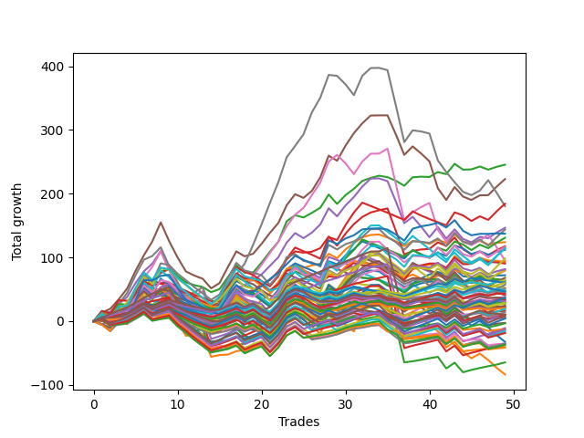

# Short Bulldog 003 
- Symbol: ES_Unlimited
- Date Range: 03/18/2022 - 07/15/2022
- Trading Period: 7:20-12:30
- Number of Trades: 49



| Name | Win Percent | Profit | Avg Profit / Trade | Avg Time / Trade |      | Name | Win Percent | Profit | Avg Profit / Trade | Avg Time / Trade |
| ---- | ----------- | ------ | ------------------ | ---------------- | ---- | ---- | ----------- | ------ | ------------------ | ---------------- |
| Sorted By <br> Profit | | | | | | Sorted By <br> Win Percentage ||||
| Two | 67.35 | 122750.00 | 2505.10 | 21:43 |     | Eighty-One | 87.76 | -20250.00 | -413.27 | 28:11 |
| Five | 63.27 | 111500.00 | 2275.51 | 55:59 |     | Eighty-Five | 85.71 | 12250.00 | 250.00 | 51:08 |
| Forty-Five | 38.78 | 92125.00 | 1880.10 | 15:02 |     | Eighty-Four | 85.71 | -5500.00 | -112.24 | 43:33 |
| Seven | 59.18 | 90250.00 | 1841.84 | 118:26 |     | Eighty-Three | 85.71 | -17875.00 | -364.80 | 38:40 |
| Four | 63.27 | 73250.00 | 1494.90 | 42:47 |     | Eighty-Two | 85.71 | -32375.00 | -660.71 | 37:42 |
| Sixty-Nine | 48.98 | 71875.00 | 1466.84 | 16:51 |     | One Hundred Twenty-Six | 71.43 | -20875.00 | -426.02 | 04:24 |
| Seventy-Three | 57.14 | 68625.00 | 1400.51 | 15:38 |     | Three | 69.39 | 58750.00 | 1198.98 | 30:47 |
| Forty-Four | 40.82 | 65375.00 | 1334.18 | 12:07 |     | Six | 69.39 | 47500.00 | 969.39 | 96:30 |
| One | 59.18 | 62000.00 | 1265.31 | 18:25 |     | One Hundred Twenty-One | 69.39 | -17625.00 | -359.69 | 03:53 |
| Three | 69.39 | 58750.00 | 1198.98 | 30:47 |     | Two | 67.35 | 122750.00 | 2505.10 | 21:43 |
| Sixty-Eight | 51.02 | 58125.00 | 1186.22 | 14:29 |     | One Hundred Twenty-Eight | 67.35 | -9375.00 | -191.33 | 05:26 |
| Seventy-One | 48.98 | 57250.00 | 1168.37 | 20:21 |     | One Hundred Twenty-Seven | 67.35 | -18625.00 | -380.10 | 05:02 |
| Sixty-One | 44.90 | 57250.00 | 1168.37 | 20:56 |     | One Hundred Thirty | 65.31 | 4000.00 | 81.63 | 08:21 |
| Forty-Two | 44.90 | 56000.00 | 1142.86 | 09:37 |     | One Hundred Twenty-Nine | 65.31 | -6500.00 | -132.65 | 07:13 |
| Seventy | 48.98 | 49125.00 | 1002.55 | 18:50 |     | One Hundred Twenty-Three | 65.31 | -9000.00 | -183.67 | 04:57 |
| Six | 69.39 | 47500.00 | 969.39 | 96:30 |     | One Hundred Twenty-Two | 65.31 | -17500.00 | -357.14 | 04:33 |
| Fifty-Three | 42.86 | 46500.00 | 948.98 | 07:30 |     | Five | 63.27 | 111500.00 | 2275.51 | 55:59 |
| Fifty-Five | 42.86 | 45250.00 | 923.47 | 08:02 |     | Four | 63.27 | 73250.00 | 1494.90 | 42:47 |
| Sixty-Six | 53.06 | 40750.00 | 831.63 | 11:17 |     | Zero | 63.27 | 36000.00 | 734.69 | 12:36 |
| Sixty | 48.98 | 40625.00 | 829.08 | 17:14 |     | One Hundred Six | 63.27 | 10250.00 | 209.18 | 02:04 |
| Forty-Three | 42.86 | 39625.00 | 808.67 | 09:35 |     | One Hundred Eleven | 63.27 | 5000.00 | 102.04 | 02:33 |
| Zero | 63.27 | 36000.00 | 734.69 | 12:36 |     | One Hundred Twenty-Five | 63.27 | 2000.00 | 40.82 | 08:11 |
| Sixty-Seven | 51.02 | 34000.00 | 693.88 | 12:30 |     | One Hundred Sixteen | 63.27 | -6375.00 | -130.10 | 02:43 |
| Ninety-Three | 53.06 | 32250.00 | 658.16 | 02:09 |     | One Hundred Twenty-Four | 63.27 | -7875.00 | -160.71 | 07:03 |
| Fifty-Four | 42.86 | 32125.00 | 655.61 | 07:40 |     | One Hundred One | 61.22 | 18875.00 | 385.20 | 01:42 |
| Fifty-Two | 42.86 | 31000.00 | 632.65 | 06:41 |     | Seven | 59.18 | 90250.00 | 1841.84 | 118:26 |
| Ninety-Four | 46.94 | 30125.00 | 614.80 | 02:43 |     | One | 59.18 | 62000.00 | 1265.31 | 18:25 |
| One Hundred Three | 57.14 | 30000.00 | 612.24 | 02:31 |     | One Hundred Thirteen | 59.18 | 14500.00 | 295.92 | 03:24 |
| Ninety-Five | 42.86 | 30000.00 | 612.24 | 03:12 |     | One Hundred Twelve | 59.18 | 6875.00 | 140.31 | 03:01 |
| Forty-Six | 30.61 | 29500.00 | 602.04 | 24:15 |     | One Hundred Eighteen | 59.18 | 5125.00 | 104.59 | 03:32 |
| Fifty-Nine | 55.10 | 28500.00 | 581.63 | 13:32 |     | Sixty-Four | 59.18 | 3000.00 | 61.22 | 08:00 |
| Fifty | 42.86 | 26250.00 | 535.71 | 06:22 |     | Fifty-Six | 59.18 | 2500.00 | 51.02 | 08:14 |
| Ninety-Two | 53.06 | 25500.00 | 520.41 | 01:46 |     | One Hundred Seventeen | 59.18 | -1750.00 | -35.71 | 03:10 |
| Fifty-Eight | 53.06 | 25500.00 | 520.41 | 13:13 |     | Seventy-Three | 57.14 | 68625.00 | 1400.51 | 15:38 |
| One Hundred Four | 48.98 | 24000.00 | 489.80 | 03:17 |     | One Hundred Three | 57.14 | 30000.00 | 612.24 | 02:31 |
| Forty-One | 44.90 | 23625.00 | 482.14 | 08:14 |     | One Hundred Two | 57.14 | 23125.00 | 471.94 | 02:08 |
| One Hundred Five | 44.90 | 23250.00 | 474.49 | 03:51 |     | Ninety-One | 57.14 | 22000.00 | 448.98 | 01:23 |
| One Hundred Two | 57.14 | 23125.00 | 471.94 | 02:08 |     | One Hundred Eight | 57.14 | 21375.00 | 436.22 | 02:48 |
| Ninety-One | 57.14 | 22000.00 | 448.98 | 01:23 |     | One Hundred Seven | 57.14 | 14500.00 | 295.92 | 02:25 |
| One Hundred Eight | 57.14 | 21375.00 | 436.22 | 02:48 |     | Ninety-Six | 57.14 | 11250.00 | 229.59 | 01:36 |
| Forty-Seven | 22.45 | 20250.00 | 413.27 | 28:07 |     | Fifty-Nine | 55.10 | 28500.00 | 581.63 | 13:32 |
| One Hundred One | 61.22 | 18875.00 | 385.20 | 01:42 |     | Sixty-Five | 55.10 | 8125.00 | 165.82 | 10:16 |
| One Hundred Fifteen | 53.06 | 18375.00 | 375.00 | 05:41 |     | Sixty-Six | 53.06 | 40750.00 | 831.63 | 11:17 |
| One Hundred Ten | 51.02 | 18125.00 | 369.90 | 03:23 |     | Ninety-Three | 53.06 | 32250.00 | 658.16 | 02:09 |
| Ninety-Eight | 51.02 | 16875.00 | 344.39 | 01:57 |     | Ninety-Two | 53.06 | 25500.00 | 520.41 | 01:46 |
| Fifty-One | 42.86 | 16875.00 | 344.39 | 06:18 |     | Fifty-Eight | 53.06 | 25500.00 | 520.41 | 13:13 |
| Forty-Nine | 42.86 | 16750.00 | 341.84 | 05:50 |     | One Hundred Fifteen | 53.06 | 18375.00 | 375.00 | 05:41 |
| One Hundred Nine | 51.02 | 15625.00 | 318.88 | 03:12 |     | One Hundred Fourteen | 53.06 | 9500.00 | 193.88 | 04:43 |
| Ninety-Seven | 51.02 | 14750.00 | 301.02 | 01:49 |     | Fifty-Seven | 53.06 | -1375.00 | -28.06 | 11:42 |
| One Hundred Thirteen | 59.18 | 14500.00 | 295.92 | 03:24 |     | Sixty-Eight | 51.02 | 58125.00 | 1186.22 | 14:29 |
| One Hundred Seven | 57.14 | 14500.00 | 295.92 | 02:25 |     | Sixty-Seven | 51.02 | 34000.00 | 693.88 | 12:30 |
| Forty | 51.02 | 13250.00 | 270.41 | 06:08 |     | One Hundred Ten | 51.02 | 18125.00 | 369.90 | 03:23 |
| Eighty-Five | 85.71 | 12250.00 | 250.00 | 51:08 |     | Ninety-Eight | 51.02 | 16875.00 | 344.39 | 01:57 |
| One Hundred | 48.98 | 11375.00 | 232.14 | 02:10 |     | One Hundred Nine | 51.02 | 15625.00 | 318.88 | 03:12 |
| Ninety-Six | 57.14 | 11250.00 | 229.59 | 01:36 |     | Ninety-Seven | 51.02 | 14750.00 | 301.02 | 01:49 |
| Ninety-Nine | 48.98 | 10625.00 | 216.84 | 02:06 |     | Forty | 51.02 | 13250.00 | 270.41 | 06:08 |
| One Hundred Six | 63.27 | 10250.00 | 209.18 | 02:04 |     | One Hundred Ninteen | 51.02 | 2250.00 | 45.92 | 04:13 |
| Forty-Eight | 44.90 | 9750.00 | 198.98 | 04:53 |     | Sixty-Nine | 48.98 | 71875.00 | 1466.84 | 16:51 |
| One Hundred Fourteen | 53.06 | 9500.00 | 193.88 | 04:43 |     | Seventy-One | 48.98 | 57250.00 | 1168.37 | 20:21 |
| Sixty-Five | 55.10 | 8125.00 | 165.82 | 10:16 |     | Seventy | 48.98 | 49125.00 | 1002.55 | 18:50 |
| One Hundred Twelve | 59.18 | 6875.00 | 140.31 | 03:01 |     | Sixty | 48.98 | 40625.00 | 829.08 | 17:14 |
| One Hundred Eighteen | 59.18 | 5125.00 | 104.59 | 03:32 |     | One Hundred Four | 48.98 | 24000.00 | 489.80 | 03:17 |
| One Hundred Eleven | 63.27 | 5000.00 | 102.04 | 02:33 |     | One Hundred | 48.98 | 11375.00 | 232.14 | 02:10 |
| One Hundred Twenty | 46.94 | 5000.00 | 102.04 | 04:29 |     | Ninety-Nine | 48.98 | 10625.00 | 216.84 | 02:06 |
| One Hundred Thirty | 65.31 | 4000.00 | 81.63 | 08:21 |     | Ninety-Four | 46.94 | 30125.00 | 614.80 | 02:43 |
| Sixty-Four | 59.18 | 3000.00 | 61.22 | 08:00 |     | One Hundred Twenty | 46.94 | 5000.00 | 102.04 | 04:29 |
| Fifty-Six | 59.18 | 2500.00 | 51.02 | 08:14 |     | Sixty-One | 44.90 | 57250.00 | 1168.37 | 20:56 |
| One Hundred Ninteen | 51.02 | 2250.00 | 45.92 | 04:13 |     | Forty-Two | 44.90 | 56000.00 | 1142.86 | 09:37 |
| One Hundred Twenty-Five | 63.27 | 2000.00 | 40.82 | 08:11 |     | Forty-One | 44.90 | 23625.00 | 482.14 | 08:14 |
| Fifty-Seven | 53.06 | -1375.00 | -28.06 | 11:42 |     | One Hundred Five | 44.90 | 23250.00 | 474.49 | 03:51 |
| One Hundred Seventeen | 59.18 | -1750.00 | -35.71 | 03:10 |     | Forty-Eight | 44.90 | 9750.00 | 198.98 | 04:53 |
| Eighty-Four | 85.71 | -5500.00 | -112.24 | 43:33 |     | Fifty-Three | 42.86 | 46500.00 | 948.98 | 07:30 |
| One Hundred Sixteen | 63.27 | -6375.00 | -130.10 | 02:43 |     | Fifty-Five | 42.86 | 45250.00 | 923.47 | 08:02 |
| One Hundred Twenty-Nine | 65.31 | -6500.00 | -132.65 | 07:13 |     | Forty-Three | 42.86 | 39625.00 | 808.67 | 09:35 |
| One Hundred Twenty-Four | 63.27 | -7875.00 | -160.71 | 07:03 |     | Fifty-Four | 42.86 | 32125.00 | 655.61 | 07:40 |
| One Hundred Twenty-Three | 65.31 | -9000.00 | -183.67 | 04:57 |     | Fifty-Two | 42.86 | 31000.00 | 632.65 | 06:41 |
| One Hundred Twenty-Eight | 67.35 | -9375.00 | -191.33 | 05:26 |     | Ninety-Five | 42.86 | 30000.00 | 612.24 | 03:12 |
| Sixty-Two | 36.73 | -16250.00 | -331.63 | 31:00 |     | Fifty | 42.86 | 26250.00 | 535.71 | 06:22 |
| One Hundred Twenty-Two | 65.31 | -17500.00 | -357.14 | 04:33 |     | Fifty-One | 42.86 | 16875.00 | 344.39 | 06:18 |
| One Hundred Twenty-One | 69.39 | -17625.00 | -359.69 | 03:53 |     | Forty-Nine | 42.86 | 16750.00 | 341.84 | 05:50 |
| Eighty-Three | 85.71 | -17875.00 | -364.80 | 38:40 |     | Forty-Four | 40.82 | 65375.00 | 1334.18 | 12:07 |
| One Hundred Twenty-Seven | 67.35 | -18625.00 | -380.10 | 05:02 |     | Forty-Five | 38.78 | 92125.00 | 1880.10 | 15:02 |
| Eighty-One | 87.76 | -20250.00 | -413.27 | 28:11 |     | Sixty-Two | 36.73 | -16250.00 | -331.63 | 31:00 |
| One Hundred Twenty-Six | 71.43 | -20875.00 | -426.02 | 04:24 |     | Forty-Six | 30.61 | 29500.00 | 602.04 | 24:15 |
| Eighty-Two | 85.71 | -32375.00 | -660.71 | 37:42 |     | Sixty-Three | 28.57 | -41875.00 | -854.59 | 35:25 |
| Sixty-Three | 28.57 | -41875.00 | -854.59 | 35:25 |     | Forty-Seven | 22.45 | 20250.00 | 413.27 | 28:07 |

## NO STOPLOSS

### Test Zero
* Sell when price hits the middle line of the 20p bollinger
* No Stoploss
* Results:
```
Total Trades: 49
Percent Up: 36.73
Percent Down: 63.27
Total Points Moved Down: 72.00
Potential Profit: 36000.00
Total Points Ups: 130.00 Count Ups: 18
Total Points Downs: 202.00 Count Downs: 31
```

<details><summary>Trades</summary>

<code>In: 2022-03-24 08:44:00		Out: 2022-03-24 08:50:10		Total Position Time: 06:10		Total Move Down: 4.75		Total to Date: 4.75</code> <br />
<code>In: 2022-03-25 07:26:00		Out: 2022-03-25 07:51:10		Total Position Time: 25:10		Total Move Down: -5.50		Total to Date: -0.75</code> <br />
<code>In: 2022-03-25 07:44:00		Out: 2022-03-25 07:51:10		Total Position Time: 07:10		Total Move Down: 3.00		Total to Date: 2.25</code> <br />
<code>In: 2022-04-06 10:43:00		Out: 2022-04-06 10:55:55		Total Position Time: 12:55		Total Move Down: 2.25		Total to Date: 4.50</code> <br />
<code>In: 2022-04-06 11:04:00		Out: 2022-04-06 11:05:55		Total Position Time: 01:55		Total Move Down: 11.25		Total to Date: 15.75</code> <br />
<code>In: 2022-04-06 11:05:00		Out: 2022-04-06 11:06:10		Total Position Time: 01:10		Total Move Down: 7.75		Total to Date: 23.50</code> <br />
<code>In: 2022-04-06 11:57:00		Out: 2022-04-06 12:08:05		Total Position Time: 11:05		Total Move Down: 1.75		Total to Date: 25.25</code> <br />
<code>In: 2022-04-06 12:02:00		Out: 2022-04-06 12:08:05		Total Position Time: 06:05		Total Move Down: 9.75		Total to Date: 35.00</code> <br />
<code>In: 2022-04-07 11:03:00		Out: 2022-04-07 11:15:20		Total Position Time: 12:20		Total Move Down: 4.00		Total to Date: 39.00</code> <br />
<code>In: 2022-04-07 11:50:00		Out: 2022-04-07 12:19:15		Total Position Time: 29:15		Total Move Down: -18.00		Total to Date: 21.00</code> <br />
<code>In: 2022-04-07 11:54:00		Out: 2022-04-07 12:19:15		Total Position Time: 25:15		Total Move Down: -14.50		Total to Date: 6.50</code> <br />
<code>In: 2022-04-08 07:54:00		Out: 2022-04-08 08:15:35		Total Position Time: 21:35		Total Move Down: -6.75		Total to Date: -0.25</code> <br />
<code>In: 2022-04-08 07:57:00		Out: 2022-04-08 08:15:35		Total Position Time: 18:35		Total Move Down: -5.25		Total to Date: -5.50</code> <br />
<code>In: 2022-04-13 08:06:00		Out: 2022-04-13 08:37:40		Total Position Time: 31:40		Total Move Down: -8.75		Total to Date: -14.25</code> <br />
<code>In: 2022-04-18 07:27:00		Out: 2022-04-18 07:46:00		Total Position Time: 19:00		Total Move Down: 1.00		Total to Date: -13.25</code> <br />
<code>In: 2022-05-03 07:34:00		Out: 2022-05-03 07:38:45		Total Position Time: 04:45		Total Move Down: 10.25		Total to Date: -3.00</code> <br />
<code>In: 2022-05-03 07:35:00		Out: 2022-05-03 07:38:45		Total Position Time: 03:45		Total Move Down: 9.50		Total to Date: 6.50</code> <br />
<code>In: 2022-05-03 08:06:00		Out: 2022-05-03 08:35:55		Total Position Time: 29:55		Total Move Down: -16.00		Total to Date: -9.50</code> <br />
<code>In: 2022-05-03 08:10:00		Out: 2022-05-03 08:35:55		Total Position Time: 25:55		Total Move Down: -4.25		Total to Date: -13.75</code> <br />
<code>In: 2022-05-04 10:59:00		Out: 2022-05-04 11:00:25		Total Position Time: 01:25		Total Move Down: 9.50		Total to Date: -4.25</code> <br />
<code>In: 2022-05-04 11:03:00		Out: 2022-05-04 11:07:05		Total Position Time: 04:05		Total Move Down: 5.75		Total to Date: 1.50</code> <br />
<code>In: 2022-05-04 11:07:00		Out: 2022-05-04 11:08:10		Total Position Time: 01:10		Total Move Down: 13.50		Total to Date: 15.00</code> <br />
<code>In: 2022-05-04 11:30:00		Out: 2022-05-04 11:31:10		Total Position Time: 01:10		Total Move Down: 19.00		Total to Date: 34.00</code> <br />
<code>In: 2022-05-16 09:05:00		Out: 2022-05-16 09:06:10		Total Position Time: 01:10		Total Move Down: 7.00		Total to Date: 41.00</code> <br />
<code>In: 2022-05-16 10:25:00		Out: 2022-05-16 10:42:15		Total Position Time: 17:15		Total Move Down: -5.25		Total to Date: 35.75</code> <br />
<code>In: 2022-05-19 08:40:00		Out: 2022-05-19 08:54:00		Total Position Time: 14:00		Total Move Down: -1.50		Total to Date: 34.25</code> <br />
<code>In: 2022-05-19 11:52:00		Out: 2022-05-19 11:57:55		Total Position Time: 05:55		Total Move Down: 5.50		Total to Date: 39.75</code> <br />
<code>In: 2022-05-19 12:05:00		Out: 2022-05-19 12:09:45		Total Position Time: 04:45		Total Move Down: 8.75		Total to Date: 48.50</code> <br />
<code>In: 2022-05-23 08:07:00		Out: 2022-05-23 08:23:45		Total Position Time: 16:45		Total Move Down: -1.00		Total to Date: 47.50</code> <br />
<code>In: 2022-05-24 11:13:00		Out: 2022-05-24 11:18:25		Total Position Time: 05:25		Total Move Down: 13.25		Total to Date: 60.75</code> <br />
<code>In: 2022-05-24 11:14:00		Out: 2022-05-24 11:18:25		Total Position Time: 04:25		Total Move Down: 9.50		Total to Date: 70.25</code> <br />
<code>In: 2022-05-25 07:36:00		Out: 2022-05-25 07:42:15		Total Position Time: 06:15		Total Move Down: 6.75		Total to Date: 77.00</code> <br />
<code>In: 2022-05-25 12:05:00		Out: 2022-05-25 12:18:05		Total Position Time: 13:05		Total Move Down: 2.50		Total to Date: 79.50</code> <br />
<code>In: 2022-05-27 12:10:00		Out: 2022-05-27 12:35:00		Total Position Time: 25:00		Total Move Down: -1.50		Total to Date: 78.00</code> <br />
<code>In: 2022-05-31 08:53:00		Out: 2022-05-31 09:14:05		Total Position Time: 21:05		Total Move Down: -8.75		Total to Date: 69.25</code> <br />
<code>In: 2022-06-02 08:05:00		Out: 2022-06-02 08:27:20		Total Position Time: 22:20		Total Move Down: -6.75		Total to Date: 62.50</code> <br />
<code>In: 2022-06-02 08:06:00		Out: 2022-06-02 08:27:20		Total Position Time: 21:20		Total Move Down: -8.75		Total to Date: 53.75</code> <br />
<code>In: 2022-06-23 08:15:00		Out: 2022-06-23 08:21:05		Total Position Time: 06:05		Total Move Down: 5.50		Total to Date: 59.25</code> <br />
<code>In: 2022-06-30 08:29:00		Out: 2022-06-30 08:35:20		Total Position Time: 06:20		Total Move Down: 7.75		Total to Date: 67.00</code> <br />
<code>In: 2022-06-30 08:30:00		Out: 2022-06-30 08:35:20		Total Position Time: 05:20		Total Move Down: 6.25		Total to Date: 73.25</code> <br />
<code>In: 2022-07-05 09:27:00		Out: 2022-07-05 09:41:35		Total Position Time: 14:35		Total Move Down: 4.00		Total to Date: 77.25</code> <br />
<code>In: 2022-07-05 11:34:00		Out: 2022-07-05 11:48:10		Total Position Time: 14:10		Total Move Down: -4.25		Total to Date: 73.00</code> <br />
<code>In: 2022-07-06 11:09:00		Out: 2022-07-06 11:10:10		Total Position Time: 01:10		Total Move Down: 9.00		Total to Date: 82.00</code> <br />
<code>In: 2022-07-06 11:31:00		Out: 2022-07-06 11:50:05		Total Position Time: 19:05		Total Move Down: -11.50		Total to Date: 70.50</code> <br />
<code>In: 2022-07-06 11:35:00		Out: 2022-07-06 11:50:05		Total Position Time: 15:05		Total Move Down: -1.75		Total to Date: 68.75</code> <br />
<code>In: 2022-07-07 12:18:00		Out: 2022-07-07 12:24:25		Total Position Time: 06:25		Total Move Down: 1.25		Total to Date: 70.00</code> <br />
<code>In: 2022-07-11 10:09:00		Out: 2022-07-11 10:23:10		Total Position Time: 14:10		Total Move Down: 0.25		Total to Date: 70.25</code> <br />
<code>In: 2022-07-14 08:44:00		Out: 2022-07-14 09:01:55		Total Position Time: 17:55		Total Move Down: 1.50		Total to Date: 71.75</code> <br />
<code>In: 2022-07-14 08:45:00		Out: 2022-07-14 09:01:55		Total Position Time: 16:55		Total Move Down: 0.25		Total to Date: 72.00</code> <br />


</details>

### Test One
* Sell when the price hits the upper line of the 20p 1std bollinger
* No Stoploss
* Results:
```
Total Trades: 49
Percent Up: 40.82
Percent Down: 59.18
Total Points Moved Down: 124.00
Potential Profit: 62000.00
Total Points Ups: 121.00 Count Ups: 20
Total Points Downs: 245.00 Count Downs: 29
```

<details><summary>Trades</summary>

<code>In: 2022-03-24 08:44:00		Out: 2022-03-24 08:53:50		Total Position Time: 09:50		Total Move Down: 6.25		Total to Date: 6.25</code> <br />
<code>In: 2022-03-25 07:26:00		Out: 2022-03-25 07:54:00		Total Position Time: 28:00		Total Move Down: -4.50		Total to Date: 1.75</code> <br />
<code>In: 2022-03-25 07:44:00		Out: 2022-03-25 07:54:00		Total Position Time: 10:00		Total Move Down: 4.00		Total to Date: 5.75</code> <br />
<code>In: 2022-04-06 10:43:00		Out: 2022-04-06 10:57:10		Total Position Time: 14:10		Total Move Down: 4.50		Total to Date: 10.25</code> <br />
<code>In: 2022-04-06 11:04:00		Out: 2022-04-06 11:07:20		Total Position Time: 03:20		Total Move Down: 15.75		Total to Date: 26.00</code> <br />
<code>In: 2022-04-06 11:05:00		Out: 2022-04-06 11:07:20		Total Position Time: 02:20		Total Move Down: 12.50		Total to Date: 38.50</code> <br />
<code>In: 2022-04-06 11:57:00		Out: 2022-04-06 12:17:50		Total Position Time: 20:50		Total Move Down: -0.00		Total to Date: 38.50</code> <br />
<code>In: 2022-04-06 12:02:00		Out: 2022-04-06 12:17:50		Total Position Time: 15:50		Total Move Down: 8.00		Total to Date: 46.50</code> <br />
<code>In: 2022-04-07 11:03:00		Out: 2022-04-07 11:18:00		Total Position Time: 15:00		Total Move Down: 4.75		Total to Date: 51.25</code> <br />
<code>In: 2022-04-07 11:50:00		Out: 2022-04-07 12:21:05		Total Position Time: 31:05		Total Move Down: -15.50		Total to Date: 35.75</code> <br />
<code>In: 2022-04-07 11:54:00		Out: 2022-04-07 12:21:05		Total Position Time: 27:05		Total Move Down: -12.00		Total to Date: 23.75</code> <br />
<code>In: 2022-04-08 07:54:00		Out: 2022-04-08 08:17:10		Total Position Time: 23:10		Total Move Down: -5.00		Total to Date: 18.75</code> <br />
<code>In: 2022-04-08 07:57:00		Out: 2022-04-08 08:17:10		Total Position Time: 20:10		Total Move Down: -3.50		Total to Date: 15.25</code> <br />
<code>In: 2022-04-13 08:06:00		Out: 2022-04-13 08:41:50		Total Position Time: 35:50		Total Move Down: -7.75		Total to Date: 7.50</code> <br />
<code>In: 2022-04-18 07:27:00		Out: 2022-04-18 07:51:30		Total Position Time: 24:30		Total Move Down: 2.75		Total to Date: 10.25</code> <br />
<code>In: 2022-05-03 07:34:00		Out: 2022-05-03 07:41:55		Total Position Time: 07:55		Total Move Down: 14.00		Total to Date: 24.25</code> <br />
<code>In: 2022-05-03 07:35:00		Out: 2022-05-03 07:41:55		Total Position Time: 06:55		Total Move Down: 13.25		Total to Date: 37.50</code> <br />
<code>In: 2022-05-03 08:06:00		Out: 2022-05-03 08:38:55		Total Position Time: 32:55		Total Move Down: -13.25		Total to Date: 24.25</code> <br />
<code>In: 2022-05-03 08:10:00		Out: 2022-05-03 08:38:55		Total Position Time: 28:55		Total Move Down: -1.50		Total to Date: 22.75</code> <br />
<code>In: 2022-05-04 10:59:00		Out: 2022-05-04 11:00:25		Total Position Time: 01:25		Total Move Down: 9.50		Total to Date: 32.25</code> <br />
<code>In: 2022-05-04 11:03:00		Out: 2022-05-04 11:07:20		Total Position Time: 04:20		Total Move Down: 10.75		Total to Date: 43.00</code> <br />
<code>In: 2022-05-04 11:07:00		Out: 2022-05-04 11:08:10		Total Position Time: 01:10		Total Move Down: 13.50		Total to Date: 56.50</code> <br />
<code>In: 2022-05-04 11:30:00		Out: 2022-05-04 11:31:20		Total Position Time: 01:20		Total Move Down: 23.00		Total to Date: 79.50</code> <br />
<code>In: 2022-05-16 09:05:00		Out: 2022-05-16 09:06:25		Total Position Time: 01:25		Total Move Down: 8.50		Total to Date: 88.00</code> <br />
<code>In: 2022-05-16 10:25:00		Out: 2022-05-16 10:46:30		Total Position Time: 21:30		Total Move Down: -4.50		Total to Date: 83.50</code> <br />
<code>In: 2022-05-19 08:40:00		Out: 2022-05-19 08:55:10		Total Position Time: 15:10		Total Move Down: 4.00		Total to Date: 87.50</code> <br />
<code>In: 2022-05-19 11:52:00		Out: 2022-05-19 12:10:15		Total Position Time: 18:15		Total Move Down: 2.75		Total to Date: 90.25</code> <br />
<code>In: 2022-05-19 12:05:00		Out: 2022-05-19 12:10:15		Total Position Time: 05:15		Total Move Down: 15.50		Total to Date: 105.75</code> <br />
<code>In: 2022-05-23 08:07:00		Out: 2022-05-23 08:48:25		Total Position Time: 41:25		Total Move Down: -7.00		Total to Date: 98.75</code> <br />
<code>In: 2022-05-24 11:13:00		Out: 2022-05-24 11:31:25		Total Position Time: 18:25		Total Move Down: 13.75		Total to Date: 112.50</code> <br />
<code>In: 2022-05-24 11:14:00		Out: 2022-05-24 11:31:25		Total Position Time: 17:25		Total Move Down: 10.00		Total to Date: 122.50</code> <br />
<code>In: 2022-05-25 07:36:00		Out: 2022-05-25 07:47:20		Total Position Time: 11:20		Total Move Down: 9.00		Total to Date: 131.50</code> <br />
<code>In: 2022-05-25 12:05:00		Out: 2022-05-25 12:22:50		Total Position Time: 17:50		Total Move Down: 3.75		Total to Date: 135.25</code> <br />
<code>In: 2022-05-27 12:10:00		Out: 2022-05-27 12:35:55		Total Position Time: 25:55		Total Move Down: 0.75		Total to Date: 136.00</code> <br />
<code>In: 2022-05-31 08:53:00		Out: 2022-05-31 09:14:40		Total Position Time: 21:40		Total Move Down: -4.75		Total to Date: 131.25</code> <br />
<code>In: 2022-06-02 08:05:00		Out: 2022-06-02 08:29:05		Total Position Time: 24:05		Total Move Down: -5.75		Total to Date: 125.50</code> <br />
<code>In: 2022-06-02 08:06:00		Out: 2022-06-02 08:29:05		Total Position Time: 23:05		Total Move Down: -7.75		Total to Date: 117.75</code> <br />
<code>In: 2022-06-23 08:15:00		Out: 2022-06-23 08:23:30		Total Position Time: 08:30		Total Move Down: 8.25		Total to Date: 126.00</code> <br />
<code>In: 2022-06-30 08:29:00		Out: 2022-06-30 09:05:50		Total Position Time: 36:50		Total Move Down: -1.50		Total to Date: 124.50</code> <br />
<code>In: 2022-06-30 08:30:00		Out: 2022-06-30 09:05:50		Total Position Time: 35:50		Total Move Down: -3.00		Total to Date: 121.50</code> <br />
<code>In: 2022-07-05 09:27:00		Out: 2022-07-05 09:42:20		Total Position Time: 15:20		Total Move Down: 6.25		Total to Date: 127.75</code> <br />
<code>In: 2022-07-05 11:34:00		Out: 2022-07-05 12:01:00		Total Position Time: 27:00		Total Move Down: -5.00		Total to Date: 122.75</code> <br />
<code>In: 2022-07-06 11:09:00		Out: 2022-07-06 11:11:10		Total Position Time: 02:10		Total Move Down: 13.25		Total to Date: 136.00</code> <br />
<code>In: 2022-07-06 11:31:00		Out: 2022-07-06 12:00:50		Total Position Time: 29:50		Total Move Down: -11.50		Total to Date: 124.50</code> <br />
<code>In: 2022-07-06 11:35:00		Out: 2022-07-06 12:00:50		Total Position Time: 25:50		Total Move Down: -1.75		Total to Date: 122.75</code> <br />
<code>In: 2022-07-07 12:18:00		Out: 2022-07-07 12:27:30		Total Position Time: 09:30		Total Move Down: 3.00		Total to Date: 125.75</code> <br />
<code>In: 2022-07-11 10:09:00		Out: 2022-07-11 10:50:15		Total Position Time: 41:15		Total Move Down: -5.50		Total to Date: 120.25</code> <br />
<code>In: 2022-07-14 08:44:00		Out: 2022-07-14 09:05:15		Total Position Time: 21:15		Total Move Down: 2.50		Total to Date: 122.75</code> <br />
<code>In: 2022-07-14 08:45:00		Out: 2022-07-14 09:05:15		Total Position Time: 20:15		Total Move Down: 1.25		Total to Date: 124.00</code> <br />


</details>

### Test Two
* Sell when the price hits the upper line of the 20p 2std bollinger
* No Stoploss
* Results:
```
Total Trades: 49
Percent Up: 32.65
Percent Down: 67.35
Total Points Moved Down: 245.50
Potential Profit: 122750.00
Total Points Ups: 104.25 Count Ups: 16
Total Points Downs: 349.75 Count Downs: 33
```

<details><summary>Trades</summary>

<code>In: 2022-03-24 08:44:00		Out: 2022-03-24 09:03:05		Total Position Time: 19:05		Total Move Down: 7.00		Total to Date: 7.00</code> <br />
<code>In: 2022-03-25 07:26:00		Out: 2022-03-25 07:54:15		Total Position Time: 28:15		Total Move Down: -2.75		Total to Date: 4.25</code> <br />
<code>In: 2022-03-25 07:44:00		Out: 2022-03-25 07:54:15		Total Position Time: 10:15		Total Move Down: 5.75		Total to Date: 10.00</code> <br />
<code>In: 2022-04-06 10:43:00		Out: 2022-04-06 10:58:05		Total Position Time: 15:05		Total Move Down: 5.75		Total to Date: 15.75</code> <br />
<code>In: 2022-04-06 11:04:00		Out: 2022-04-06 11:08:10		Total Position Time: 04:10		Total Move Down: 21.75		Total to Date: 37.50</code> <br />
<code>In: 2022-04-06 11:05:00		Out: 2022-04-06 11:08:10		Total Position Time: 03:10		Total Move Down: 18.50		Total to Date: 56.00</code> <br />
<code>In: 2022-04-06 11:57:00		Out: 2022-04-06 12:20:25		Total Position Time: 23:25		Total Move Down: 6.75		Total to Date: 62.75</code> <br />
<code>In: 2022-04-06 12:02:00		Out: 2022-04-06 12:20:25		Total Position Time: 18:25		Total Move Down: 14.75		Total to Date: 77.50</code> <br />
<code>In: 2022-04-07 11:03:00		Out: 2022-04-07 11:18:20		Total Position Time: 15:20		Total Move Down: 6.00		Total to Date: 83.50</code> <br />
<code>In: 2022-04-07 11:50:00		Out: 2022-04-07 12:22:45		Total Position Time: 32:45		Total Move Down: -13.00		Total to Date: 70.50</code> <br />
<code>In: 2022-04-07 11:54:00		Out: 2022-04-07 12:22:45		Total Position Time: 28:45		Total Move Down: -9.50		Total to Date: 61.00</code> <br />
<code>In: 2022-04-08 07:54:00		Out: 2022-04-08 08:20:05		Total Position Time: 26:05		Total Move Down: -4.50		Total to Date: 56.50</code> <br />
<code>In: 2022-04-08 07:57:00		Out: 2022-04-08 08:20:05		Total Position Time: 23:05		Total Move Down: -3.00		Total to Date: 53.50</code> <br />
<code>In: 2022-04-13 08:06:00		Out: 2022-04-13 08:45:15		Total Position Time: 39:15		Total Move Down: -8.00		Total to Date: 45.50</code> <br />
<code>In: 2022-04-18 07:27:00		Out: 2022-04-18 07:51:45		Total Position Time: 24:45		Total Move Down: 4.75		Total to Date: 50.25</code> <br />
<code>In: 2022-05-03 07:34:00		Out: 2022-05-03 07:43:50		Total Position Time: 09:50		Total Move Down: 19.00		Total to Date: 69.25</code> <br />
<code>In: 2022-05-03 07:35:00		Out: 2022-05-03 07:43:50		Total Position Time: 08:50		Total Move Down: 18.25		Total to Date: 87.50</code> <br />
<code>In: 2022-05-03 08:06:00		Out: 2022-05-03 08:39:10		Total Position Time: 33:10		Total Move Down: -11.50		Total to Date: 76.00</code> <br />
<code>In: 2022-05-03 08:10:00		Out: 2022-05-03 08:39:10		Total Position Time: 29:10		Total Move Down: 0.25		Total to Date: 76.25</code> <br />
<code>In: 2022-05-04 10:59:00		Out: 2022-05-04 11:07:40		Total Position Time: 08:40		Total Move Down: 15.50		Total to Date: 91.75</code> <br />
<code>In: 2022-05-04 11:03:00		Out: 2022-05-04 11:07:40		Total Position Time: 04:40		Total Move Down: 17.25		Total to Date: 109.00</code> <br />
<code>In: 2022-05-04 11:07:00		Out: 2022-05-04 11:08:15		Total Position Time: 01:15		Total Move Down: 15.50		Total to Date: 124.50</code> <br />
<code>In: 2022-05-04 11:30:00		Out: 2022-05-04 11:32:25		Total Position Time: 02:25		Total Move Down: 32.25		Total to Date: 156.75</code> <br />
<code>In: 2022-05-16 09:05:00		Out: 2022-05-16 09:11:45		Total Position Time: 06:45		Total Move Down: 9.50		Total to Date: 166.25</code> <br />
<code>In: 2022-05-16 10:25:00		Out: 2022-05-16 10:49:05		Total Position Time: 24:05		Total Move Down: -3.50		Total to Date: 162.75</code> <br />
<code>In: 2022-05-19 08:40:00		Out: 2022-05-19 08:56:50		Total Position Time: 16:50		Total Move Down: 7.25		Total to Date: 170.00</code> <br />
<code>In: 2022-05-19 11:52:00		Out: 2022-05-19 12:14:05		Total Position Time: 22:05		Total Move Down: 8.00		Total to Date: 178.00</code> <br />
<code>In: 2022-05-19 12:05:00		Out: 2022-05-19 12:14:05		Total Position Time: 09:05		Total Move Down: 20.75		Total to Date: 198.75</code> <br />
<code>In: 2022-05-23 08:07:00		Out: 2022-05-23 09:28:05		Total Position Time: 81:05		Total Move Down: -14.75		Total to Date: 184.00</code> <br />
<code>In: 2022-05-24 11:13:00		Out: 2022-05-24 11:44:00		Total Position Time: 31:00		Total Move Down: 13.75		Total to Date: 197.75</code> <br />
<code>In: 2022-05-24 11:14:00		Out: 2022-05-24 11:44:00		Total Position Time: 30:00		Total Move Down: 10.00		Total to Date: 207.75</code> <br />
<code>In: 2022-05-25 07:36:00		Out: 2022-05-25 07:48:10		Total Position Time: 12:10		Total Move Down: 12.25		Total to Date: 220.00</code> <br />
<code>In: 2022-05-25 12:05:00		Out: 2022-05-25 12:23:00		Total Position Time: 18:00		Total Move Down: 4.75		Total to Date: 224.75</code> <br />
<code>In: 2022-05-27 12:10:00		Out: 2022-05-27 12:38:10		Total Position Time: 28:10		Total Move Down: 3.50		Total to Date: 228.25</code> <br />
<code>In: 2022-05-31 08:53:00		Out: 2022-05-31 09:15:10		Total Position Time: 22:10		Total Move Down: -2.25		Total to Date: 226.00</code> <br />
<code>In: 2022-06-02 08:05:00		Out: 2022-06-02 08:31:25		Total Position Time: 26:25		Total Move Down: -5.75		Total to Date: 220.25</code> <br />
<code>In: 2022-06-02 08:06:00		Out: 2022-06-02 08:31:25		Total Position Time: 25:25		Total Move Down: -7.75		Total to Date: 212.50</code> <br />
<code>In: 2022-06-23 08:15:00		Out: 2022-06-23 08:31:10		Total Position Time: 16:10		Total Move Down: 13.25		Total to Date: 225.75</code> <br />
<code>In: 2022-06-30 08:29:00		Out: 2022-06-30 09:06:15		Total Position Time: 37:15		Total Move Down: 1.00		Total to Date: 226.75</code> <br />
<code>In: 2022-06-30 08:30:00		Out: 2022-06-30 09:06:15		Total Position Time: 36:15		Total Move Down: -0.50		Total to Date: 226.25</code> <br />
<code>In: 2022-07-05 09:27:00		Out: 2022-07-05 09:43:30		Total Position Time: 16:30		Total Move Down: 7.75		Total to Date: 234.00</code> <br />
<code>In: 2022-07-05 11:34:00		Out: 2022-07-05 12:01:25		Total Position Time: 27:25		Total Move Down: -3.25		Total to Date: 230.75</code> <br />
<code>In: 2022-07-06 11:09:00		Out: 2022-07-06 11:11:45		Total Position Time: 02:45		Total Move Down: 16.25		Total to Date: 247.00</code> <br />
<code>In: 2022-07-06 11:31:00		Out: 2022-07-06 12:01:25		Total Position Time: 30:25		Total Move Down: -9.25		Total to Date: 237.75</code> <br />
<code>In: 2022-07-06 11:35:00		Out: 2022-07-06 12:01:25		Total Position Time: 26:25		Total Move Down: 0.50		Total to Date: 238.25</code> <br />
<code>In: 2022-07-07 12:18:00		Out: 2022-07-07 12:28:30		Total Position Time: 10:30		Total Move Down: 4.50		Total to Date: 242.75</code> <br />
<code>In: 2022-07-11 10:09:00		Out: 2022-07-11 11:00:50		Total Position Time: 51:50		Total Move Down: -5.00		Total to Date: 237.75</code> <br />
<code>In: 2022-07-14 08:44:00		Out: 2022-07-14 09:07:30		Total Position Time: 23:30		Total Move Down: 4.50		Total to Date: 242.25</code> <br />
<code>In: 2022-07-14 08:45:00		Out: 2022-07-14 09:07:30		Total Position Time: 22:30		Total Move Down: 3.25		Total to Date: 245.50</code> <br />


</details>

### Test Three
* Sell when price hits the middle line of the 50p bollinger
* No Stoploss
* Results:
```
Total Trades: 49
Percent Up: 30.61
Percent Down: 69.39
Total Points Moved Down: 117.50
Potential Profit: 58750.00
Total Points Ups: 195.00 Count Ups: 15
Total Points Downs: 312.50 Count Downs: 34
```

<details><summary>Trades</summary>

<code>In: 2022-03-24 08:44:00		Out: 2022-03-24 09:03:10		Total Position Time: 19:10		Total Move Down: 8.00		Total to Date: 8.00</code> <br />
<code>In: 2022-03-25 07:26:00		Out: 2022-03-25 08:00:45		Total Position Time: 34:45		Total Move Down: -1.75		Total to Date: 6.25</code> <br />
<code>In: 2022-03-25 07:44:00		Out: 2022-03-25 08:00:45		Total Position Time: 16:45		Total Move Down: 6.75		Total to Date: 13.00</code> <br />
<code>In: 2022-04-06 10:43:00		Out: 2022-04-06 11:00:10		Total Position Time: 17:10		Total Move Down: 12.75		Total to Date: 25.75</code> <br />
<code>In: 2022-04-06 11:04:00		Out: 2022-04-06 11:07:20		Total Position Time: 03:20		Total Move Down: 15.75		Total to Date: 41.50</code> <br />
<code>In: 2022-04-06 11:05:00		Out: 2022-04-06 11:07:20		Total Position Time: 02:20		Total Move Down: 12.50		Total to Date: 54.00</code> <br />
<code>In: 2022-04-06 11:57:00		Out: 2022-04-06 12:20:25		Total Position Time: 23:25		Total Move Down: 6.75		Total to Date: 60.75</code> <br />
<code>In: 2022-04-06 12:02:00		Out: 2022-04-06 12:20:25		Total Position Time: 18:25		Total Move Down: 14.75		Total to Date: 75.50</code> <br />
<code>In: 2022-04-07 11:03:00		Out: 2022-04-07 11:33:40		Total Position Time: 30:40		Total Move Down: 6.25		Total to Date: 81.75</code> <br />
<code>In: 2022-04-07 11:50:00		Out: 2022-04-07 12:47:00		Total Position Time: 57:00		Total Move Down: -25.50		Total to Date: 56.25</code> <br />
<code>In: 2022-04-07 11:54:00		Out: 2022-04-07 12:47:00		Total Position Time: 53:00		Total Move Down: -22.00		Total to Date: 34.25</code> <br />
<code>In: 2022-04-08 07:54:00		Out: 2022-04-08 08:36:15		Total Position Time: 42:15		Total Move Down: -3.00		Total to Date: 31.25</code> <br />
<code>In: 2022-04-08 07:57:00		Out: 2022-04-08 08:36:15		Total Position Time: 39:15		Total Move Down: -1.50		Total to Date: 29.75</code> <br />
<code>In: 2022-04-13 08:06:00		Out: 2022-04-13 08:50:25		Total Position Time: 44:25		Total Move Down: -5.75		Total to Date: 24.00</code> <br />
<code>In: 2022-04-18 07:27:00		Out: 2022-04-18 07:52:15		Total Position Time: 25:15		Total Move Down: 4.75		Total to Date: 28.75</code> <br />
<code>In: 2022-05-03 07:34:00		Out: 2022-05-03 07:40:40		Total Position Time: 06:40		Total Move Down: 13.50		Total to Date: 42.25</code> <br />
<code>In: 2022-05-03 07:35:00		Out: 2022-05-03 07:40:40		Total Position Time: 05:40		Total Move Down: 12.75		Total to Date: 55.00</code> <br />
<code>In: 2022-05-03 08:06:00		Out: 2022-05-03 08:46:10		Total Position Time: 40:10		Total Move Down: -9.25		Total to Date: 45.75</code> <br />
<code>In: 2022-05-03 08:10:00		Out: 2022-05-03 08:46:10		Total Position Time: 36:10		Total Move Down: 2.50		Total to Date: 48.25</code> <br />
<code>In: 2022-05-04 10:59:00		Out: 2022-05-04 11:00:25		Total Position Time: 01:25		Total Move Down: 9.50		Total to Date: 57.75</code> <br />
<code>In: 2022-05-04 11:03:00		Out: 2022-05-04 11:07:15		Total Position Time: 04:15		Total Move Down: 6.75		Total to Date: 64.50</code> <br />
<code>In: 2022-05-04 11:07:00		Out: 2022-05-04 11:08:10		Total Position Time: 01:10		Total Move Down: 13.50		Total to Date: 78.00</code> <br />
<code>In: 2022-05-04 11:30:00		Out: 2022-05-04 11:31:10		Total Position Time: 01:10		Total Move Down: 19.00		Total to Date: 97.00</code> <br />
<code>In: 2022-05-16 09:05:00		Out: 2022-05-16 09:15:55		Total Position Time: 10:55		Total Move Down: 12.50		Total to Date: 109.50</code> <br />
<code>In: 2022-05-16 10:25:00		Out: 2022-05-16 10:59:10		Total Position Time: 34:10		Total Move Down: -2.00		Total to Date: 107.50</code> <br />
<code>In: 2022-05-19 08:40:00		Out: 2022-05-19 09:19:40		Total Position Time: 39:40		Total Move Down: 1.50		Total to Date: 109.00</code> <br />
<code>In: 2022-05-19 11:52:00		Out: 2022-05-19 12:14:00		Total Position Time: 22:00		Total Move Down: 5.50		Total to Date: 114.50</code> <br />
<code>In: 2022-05-19 12:05:00		Out: 2022-05-19 12:14:00		Total Position Time: 09:00		Total Move Down: 18.25		Total to Date: 132.75</code> <br />
<code>In: 2022-05-23 08:07:00		Out: 2022-05-23 09:17:10		Total Position Time: 70:10		Total Move Down: -14.25		Total to Date: 118.50</code> <br />
<code>In: 2022-05-24 11:13:00		Out: 2022-05-24 11:20:25		Total Position Time: 07:25		Total Move Down: 18.75		Total to Date: 137.25</code> <br />
<code>In: 2022-05-24 11:14:00		Out: 2022-05-24 11:20:25		Total Position Time: 06:25		Total Move Down: 15.00		Total to Date: 152.25</code> <br />
<code>In: 2022-05-25 07:36:00		Out: 2022-05-25 08:02:10		Total Position Time: 26:10		Total Move Down: 11.25		Total to Date: 163.50</code> <br />
<code>In: 2022-05-25 12:05:00		Out: 2022-05-25 12:34:25		Total Position Time: 29:25		Total Move Down: 7.00		Total to Date: 170.50</code> <br />
<code>In: 2022-05-27 12:10:00		Out: 2022-05-27 12:38:10		Total Position Time: 28:10		Total Move Down: 3.50		Total to Date: 174.00</code> <br />
<code>In: 2022-05-31 08:53:00		Out: 2022-05-31 09:21:15		Total Position Time: 28:15		Total Move Down: 3.00		Total to Date: 177.00</code> <br />
<code>In: 2022-06-02 08:05:00		Out: 2022-06-02 10:12:25		Total Position Time: 127:25		Total Move Down: -35.25		Total to Date: 141.75</code> <br />
<code>In: 2022-06-02 08:06:00		Out: 2022-06-02 10:12:25		Total Position Time: 126:25		Total Move Down: -37.25		Total to Date: 104.50</code> <br />
<code>In: 2022-06-23 08:15:00		Out: 2022-06-23 08:22:20		Total Position Time: 07:20		Total Move Down: 5.75		Total to Date: 110.25</code> <br />
<code>In: 2022-06-30 08:29:00		Out: 2022-06-30 09:06:20		Total Position Time: 37:20		Total Move Down: 2.25		Total to Date: 112.50</code> <br />
<code>In: 2022-06-30 08:30:00		Out: 2022-06-30 09:06:20		Total Position Time: 36:20		Total Move Down: 0.75		Total to Date: 113.25</code> <br />
<code>In: 2022-07-05 09:27:00		Out: 2022-07-05 09:43:40		Total Position Time: 16:40		Total Move Down: 10.50		Total to Date: 123.75</code> <br />
<code>In: 2022-07-05 11:34:00		Out: 2022-07-05 12:18:50		Total Position Time: 44:50		Total Move Down: -5.75		Total to Date: 118.00</code> <br />
<code>In: 2022-07-06 11:09:00		Out: 2022-07-06 11:11:10		Total Position Time: 02:10		Total Move Down: 13.25		Total to Date: 131.25</code> <br />
<code>In: 2022-07-06 11:31:00		Out: 2022-07-06 12:42:10		Total Position Time: 71:10		Total Move Down: -18.25		Total to Date: 113.00</code> <br />
<code>In: 2022-07-06 11:35:00		Out: 2022-07-06 12:42:10		Total Position Time: 67:10		Total Move Down: -8.50		Total to Date: 104.50</code> <br />
<code>In: 2022-07-07 12:18:00		Out: 2022-07-07 12:37:30		Total Position Time: 19:30		Total Move Down: 4.25		Total to Date: 108.75</code> <br />
<code>In: 2022-07-11 10:09:00		Out: 2022-07-11 11:00:50		Total Position Time: 51:50		Total Move Down: -5.00		Total to Date: 103.75</code> <br />
<code>In: 2022-07-14 08:44:00		Out: 2022-07-14 09:17:00		Total Position Time: 33:00		Total Move Down: 7.50		Total to Date: 111.25</code> <br />
<code>In: 2022-07-14 08:45:00		Out: 2022-07-14 09:17:00		Total Position Time: 32:00		Total Move Down: 6.25		Total to Date: 117.50</code> <br />


</details>

### Test Four
* Sell when the price hits the upper line of the 50p 1std bollinger
* No Stoploss
* Results:
```
Total Trades: 49
Percent Up: 36.73
Percent Down: 63.27
Total Points Moved Down: 146.50
Potential Profit: 73250.00
Total Points Ups: 257.50 Count Ups: 18
Total Points Downs: 404.00 Count Downs: 31
```

<details><summary>Trades</summary>

<code>In: 2022-03-24 08:44:00		Out: 2022-03-24 09:08:30		Total Position Time: 24:30		Total Move Down: 11.00		Total to Date: 11.00</code> <br />
<code>In: 2022-03-25 07:26:00		Out: 2022-03-25 08:01:45		Total Position Time: 35:45		Total Move Down: 3.75		Total to Date: 14.75</code> <br />
<code>In: 2022-03-25 07:44:00		Out: 2022-03-25 08:01:45		Total Position Time: 17:45		Total Move Down: 12.25		Total to Date: 27.00</code> <br />
<code>In: 2022-04-06 10:43:00		Out: 2022-04-06 11:08:10		Total Position Time: 25:10		Total Move Down: 11.00		Total to Date: 38.00</code> <br />
<code>In: 2022-04-06 11:04:00		Out: 2022-04-06 11:08:10		Total Position Time: 04:10		Total Move Down: 21.75		Total to Date: 59.75</code> <br />
<code>In: 2022-04-06 11:05:00		Out: 2022-04-06 11:08:10		Total Position Time: 03:10		Total Move Down: 18.50		Total to Date: 78.25</code> <br />
<code>In: 2022-04-06 11:57:00		Out: 2022-04-06 12:23:20		Total Position Time: 26:20		Total Move Down: 12.00		Total to Date: 90.25</code> <br />
<code>In: 2022-04-06 12:02:00		Out: 2022-04-06 12:23:20		Total Position Time: 21:20		Total Move Down: 20.00		Total to Date: 110.25</code> <br />
<code>In: 2022-04-07 11:03:00		Out: 2022-04-07 12:47:00		Total Position Time: 104:00		Total Move Down: -29.50		Total to Date: 80.75</code> <br />
<code>In: 2022-04-07 11:50:00		Out: 2022-04-07 12:47:00		Total Position Time: 57:00		Total Move Down: -25.50		Total to Date: 55.25</code> <br />
<code>In: 2022-04-07 11:54:00		Out: 2022-04-07 12:47:00		Total Position Time: 53:00		Total Move Down: -22.00		Total to Date: 33.25</code> <br />
<code>In: 2022-04-08 07:54:00		Out: 2022-04-08 08:45:05		Total Position Time: 51:05		Total Move Down: -2.00		Total to Date: 31.25</code> <br />
<code>In: 2022-04-08 07:57:00		Out: 2022-04-08 08:45:05		Total Position Time: 48:05		Total Move Down: -0.50		Total to Date: 30.75</code> <br />
<code>In: 2022-04-13 08:06:00		Out: 2022-04-13 08:57:00		Total Position Time: 51:00		Total Move Down: -3.50		Total to Date: 27.25</code> <br />
<code>In: 2022-04-18 07:27:00		Out: 2022-04-18 07:57:05		Total Position Time: 30:05		Total Move Down: 9.50		Total to Date: 36.75</code> <br />
<code>In: 2022-05-03 07:34:00		Out: 2022-05-03 07:43:50		Total Position Time: 09:50		Total Move Down: 19.00		Total to Date: 55.75</code> <br />
<code>In: 2022-05-03 07:35:00		Out: 2022-05-03 07:43:50		Total Position Time: 08:50		Total Move Down: 18.25		Total to Date: 74.00</code> <br />
<code>In: 2022-05-03 08:06:00		Out: 2022-05-03 09:05:55		Total Position Time: 59:55		Total Move Down: -11.00		Total to Date: 63.00</code> <br />
<code>In: 2022-05-03 08:10:00		Out: 2022-05-03 09:05:55		Total Position Time: 55:55		Total Move Down: 0.75		Total to Date: 63.75</code> <br />
<code>In: 2022-05-04 10:59:00		Out: 2022-05-04 11:00:25		Total Position Time: 01:25		Total Move Down: 9.50		Total to Date: 73.25</code> <br />
<code>In: 2022-05-04 11:03:00		Out: 2022-05-04 11:07:25		Total Position Time: 04:25		Total Move Down: 13.50		Total to Date: 86.75</code> <br />
<code>In: 2022-05-04 11:07:00		Out: 2022-05-04 11:08:10		Total Position Time: 01:10		Total Move Down: 13.50		Total to Date: 100.25</code> <br />
<code>In: 2022-05-04 11:30:00		Out: 2022-05-04 11:31:20		Total Position Time: 01:20		Total Move Down: 23.00		Total to Date: 123.25</code> <br />
<code>In: 2022-05-16 09:05:00		Out: 2022-05-16 09:31:05		Total Position Time: 26:05		Total Move Down: 15.00		Total to Date: 138.25</code> <br />
<code>In: 2022-05-16 10:25:00		Out: 2022-05-16 11:52:30		Total Position Time: 87:30		Total Move Down: -8.00		Total to Date: 130.25</code> <br />
<code>In: 2022-05-19 08:40:00		Out: 2022-05-19 09:20:50		Total Position Time: 40:50		Total Move Down: 8.75		Total to Date: 139.00</code> <br />
<code>In: 2022-05-19 11:52:00		Out: 2022-05-19 12:19:30		Total Position Time: 27:30		Total Move Down: 12.75		Total to Date: 151.75</code> <br />
<code>In: 2022-05-19 12:05:00		Out: 2022-05-19 12:19:30		Total Position Time: 14:30		Total Move Down: 25.50		Total to Date: 177.25</code> <br />
<code>In: 2022-05-23 08:07:00		Out: 2022-05-23 09:30:15		Total Position Time: 83:15		Total Move Down: -12.75		Total to Date: 164.50</code> <br />
<code>In: 2022-05-24 11:13:00		Out: 2022-05-24 11:45:05		Total Position Time: 32:05		Total Move Down: 17.00		Total to Date: 181.50</code> <br />
<code>In: 2022-05-24 11:14:00		Out: 2022-05-24 11:45:05		Total Position Time: 31:05		Total Move Down: 13.25		Total to Date: 194.75</code> <br />
<code>In: 2022-05-25 07:36:00		Out: 2022-05-25 08:04:50		Total Position Time: 28:50		Total Move Down: 16.50		Total to Date: 211.25</code> <br />
<code>In: 2022-05-25 12:05:00		Out: 2022-05-25 12:40:10		Total Position Time: 35:10		Total Move Down: 12.50		Total to Date: 223.75</code> <br />
<code>In: 2022-05-27 12:10:00		Out: 2022-05-27 12:47:00		Total Position Time: 37:00		Total Move Down: 0.25		Total to Date: 224.00</code> <br />
<code>In: 2022-05-31 08:53:00		Out: 2022-05-31 10:16:05		Total Position Time: 83:05		Total Move Down: -4.25		Total to Date: 219.75</code> <br />
<code>In: 2022-06-02 08:05:00		Out: 2022-06-02 10:14:00		Total Position Time: 129:00		Total Move Down: -32.00		Total to Date: 187.75</code> <br />
<code>In: 2022-06-02 08:06:00		Out: 2022-06-02 10:14:00		Total Position Time: 128:00		Total Move Down: -34.00		Total to Date: 153.75</code> <br />
<code>In: 2022-06-23 08:15:00		Out: 2022-06-23 08:23:40		Total Position Time: 08:40		Total Move Down: 10.00		Total to Date: 163.75</code> <br />
<code>In: 2022-06-30 08:29:00		Out: 2022-06-30 10:10:15		Total Position Time: 101:15		Total Move Down: -15.25		Total to Date: 148.50</code> <br />
<code>In: 2022-06-30 08:30:00		Out: 2022-06-30 10:10:15		Total Position Time: 100:15		Total Move Down: -16.75		Total to Date: 131.75</code> <br />
<code>In: 2022-07-05 09:27:00		Out: 2022-07-05 09:51:05		Total Position Time: 24:05		Total Move Down: 16.00		Total to Date: 147.75</code> <br />
<code>In: 2022-07-05 11:34:00		Out: 2022-07-05 12:47:00		Total Position Time: 73:00		Total Move Down: -18.25		Total to Date: 129.50</code> <br />
<code>In: 2022-07-06 11:09:00		Out: 2022-07-06 11:11:35		Total Position Time: 02:35		Total Move Down: 14.50		Total to Date: 144.00</code> <br />
<code>In: 2022-07-06 11:31:00		Out: 2022-07-06 12:47:00		Total Position Time: 76:00		Total Move Down: -15.00		Total to Date: 129.00</code> <br />
<code>In: 2022-07-06 11:35:00		Out: 2022-07-06 12:47:00		Total Position Time: 72:00		Total Move Down: -5.25		Total to Date: 123.75</code> <br />
<code>In: 2022-07-07 12:18:00		Out: 2022-07-07 12:38:55		Total Position Time: 20:55		Total Move Down: 8.50		Total to Date: 132.25</code> <br />
<code>In: 2022-07-11 10:09:00		Out: 2022-07-11 11:02:40		Total Position Time: 53:40		Total Move Down: -2.00		Total to Date: 130.25</code> <br />
<code>In: 2022-07-14 08:44:00		Out: 2022-07-14 09:27:05		Total Position Time: 43:05		Total Move Down: 8.75		Total to Date: 139.00</code> <br />
<code>In: 2022-07-14 08:45:00		Out: 2022-07-14 09:27:05		Total Position Time: 42:05		Total Move Down: 7.50		Total to Date: 146.50</code> <br />


</details>

### Test Five
* Sell when the price hits the upper line of the 50p 2std bollinger
* No Stoploss
* Results:
```
Total Trades: 49
Percent Up: 36.73
Percent Down: 63.27
Total Points Moved Down: 223.00
Potential Profit: 111500.00
Total Points Ups: 291.25 Count Ups: 18
Total Points Downs: 514.25 Count Downs: 31
```

<details><summary>Trades</summary>

<code>In: 2022-03-24 08:44:00		Out: 2022-03-24 09:17:20		Total Position Time: 33:20		Total Move Down: 13.25		Total to Date: 13.25</code> <br />
<code>In: 2022-03-25 07:26:00		Out: 2022-03-25 08:08:15		Total Position Time: 42:15		Total Move Down: 6.25		Total to Date: 19.50</code> <br />
<code>In: 2022-03-25 07:44:00		Out: 2022-03-25 08:08:15		Total Position Time: 24:15		Total Move Down: 14.75		Total to Date: 34.25</code> <br />
<code>In: 2022-04-06 10:43:00		Out: 2022-04-06 11:09:40		Total Position Time: 26:40		Total Move Down: 17.00		Total to Date: 51.25</code> <br />
<code>In: 2022-04-06 11:04:00		Out: 2022-04-06 11:09:40		Total Position Time: 05:40		Total Move Down: 27.75		Total to Date: 79.00</code> <br />
<code>In: 2022-04-06 11:05:00		Out: 2022-04-06 11:09:40		Total Position Time: 04:40		Total Move Down: 24.50		Total to Date: 103.50</code> <br />
<code>In: 2022-04-06 11:57:00		Out: 2022-04-06 12:34:55		Total Position Time: 37:55		Total Move Down: 21.75		Total to Date: 125.25</code> <br />
<code>In: 2022-04-06 12:02:00		Out: 2022-04-06 12:34:55		Total Position Time: 32:55		Total Move Down: 29.75		Total to Date: 155.00</code> <br />
<code>In: 2022-04-07 11:03:00		Out: 2022-04-07 12:47:00		Total Position Time: 104:00		Total Move Down: -29.50		Total to Date: 125.50</code> <br />
<code>In: 2022-04-07 11:50:00		Out: 2022-04-07 12:47:00		Total Position Time: 57:00		Total Move Down: -25.50		Total to Date: 100.00</code> <br />
<code>In: 2022-04-07 11:54:00		Out: 2022-04-07 12:47:00		Total Position Time: 53:00		Total Move Down: -22.00		Total to Date: 78.00</code> <br />
<code>In: 2022-04-08 07:54:00		Out: 2022-04-08 10:12:05		Total Position Time: 138:05		Total Move Down: -6.50		Total to Date: 71.50</code> <br />
<code>In: 2022-04-08 07:57:00		Out: 2022-04-08 10:12:05		Total Position Time: 135:05		Total Move Down: -5.00		Total to Date: 66.50</code> <br />
<code>In: 2022-04-13 08:06:00		Out: 2022-04-13 10:33:25		Total Position Time: 147:25		Total Move Down: -15.00		Total to Date: 51.50</code> <br />
<code>In: 2022-04-18 07:27:00		Out: 2022-04-18 08:15:50		Total Position Time: 48:50		Total Move Down: 8.25		Total to Date: 59.75</code> <br />
<code>In: 2022-05-03 07:34:00		Out: 2022-05-03 07:47:05		Total Position Time: 13:05		Total Move Down: 25.25		Total to Date: 85.00</code> <br />
<code>In: 2022-05-03 07:35:00		Out: 2022-05-03 07:47:05		Total Position Time: 12:05		Total Move Down: 24.50		Total to Date: 109.50</code> <br />
<code>In: 2022-05-03 08:06:00		Out: 2022-05-03 09:06:15		Total Position Time: 60:15		Total Move Down: -7.75		Total to Date: 101.75</code> <br />
<code>In: 2022-05-03 08:10:00		Out: 2022-05-03 09:06:15		Total Position Time: 56:15		Total Move Down: 4.00		Total to Date: 105.75</code> <br />
<code>In: 2022-05-04 10:59:00		Out: 2022-05-04 11:07:40		Total Position Time: 08:40		Total Move Down: 15.50		Total to Date: 121.25</code> <br />
<code>In: 2022-05-04 11:03:00		Out: 2022-05-04 11:07:40		Total Position Time: 04:40		Total Move Down: 17.25		Total to Date: 138.50</code> <br />
<code>In: 2022-05-04 11:07:00		Out: 2022-05-04 11:08:15		Total Position Time: 01:15		Total Move Down: 15.50		Total to Date: 154.00</code> <br />
<code>In: 2022-05-04 11:30:00		Out: 2022-05-04 11:32:05		Total Position Time: 02:05		Total Move Down: 28.00		Total to Date: 182.00</code> <br />
<code>In: 2022-05-16 09:05:00		Out: 2022-05-16 09:39:45		Total Position Time: 34:45		Total Move Down: 17.25		Total to Date: 199.25</code> <br />
<code>In: 2022-05-16 10:25:00		Out: 2022-05-16 12:10:10		Total Position Time: 105:10		Total Move Down: -5.75		Total to Date: 193.50</code> <br />
<code>In: 2022-05-19 08:40:00		Out: 2022-05-19 09:26:55		Total Position Time: 46:55		Total Move Down: 11.00		Total to Date: 204.50</code> <br />
<code>In: 2022-05-19 11:52:00		Out: 2022-05-19 12:24:45		Total Position Time: 32:45		Total Move Down: 21.25		Total to Date: 225.75</code> <br />
<code>In: 2022-05-19 12:05:00		Out: 2022-05-19 12:24:45		Total Position Time: 19:45		Total Move Down: 34.00		Total to Date: 259.75</code> <br />
<code>In: 2022-05-23 08:07:00		Out: 2022-05-23 09:31:55		Total Position Time: 84:55		Total Move Down: -8.00		Total to Date: 251.75</code> <br />
<code>In: 2022-05-24 11:13:00		Out: 2022-05-24 11:49:15		Total Position Time: 36:15		Total Move Down: 23.50		Total to Date: 275.25</code> <br />
<code>In: 2022-05-24 11:14:00		Out: 2022-05-24 11:49:15		Total Position Time: 35:15		Total Move Down: 19.75		Total to Date: 295.00</code> <br />
<code>In: 2022-05-25 07:36:00		Out: 2022-05-25 08:30:10		Total Position Time: 54:10		Total Move Down: 15.50		Total to Date: 310.50</code> <br />
<code>In: 2022-05-25 12:05:00		Out: 2022-05-25 12:47:00		Total Position Time: 42:00		Total Move Down: 12.25		Total to Date: 322.75</code> <br />
<code>In: 2022-05-27 12:10:00		Out: 2022-05-27 12:47:00		Total Position Time: 37:00		Total Move Down: 0.25		Total to Date: 323.00</code> <br />
<code>In: 2022-05-31 08:53:00		Out: 2022-05-31 10:17:35		Total Position Time: 84:35		Total Move Down: -0.00		Total to Date: 323.00</code> <br />
<code>In: 2022-06-02 08:05:00		Out: 2022-06-02 10:14:30		Total Position Time: 129:30		Total Move Down: -30.00		Total to Date: 293.00</code> <br />
<code>In: 2022-06-02 08:06:00		Out: 2022-06-02 10:14:30		Total Position Time: 128:30		Total Move Down: -32.00		Total to Date: 261.00</code> <br />
<code>In: 2022-06-23 08:15:00		Out: 2022-06-23 08:31:10		Total Position Time: 16:10		Total Move Down: 13.25		Total to Date: 274.25</code> <br />
<code>In: 2022-06-30 08:29:00		Out: 2022-06-30 10:12:00		Total Position Time: 103:00		Total Move Down: -11.00		Total to Date: 263.25</code> <br />
<code>In: 2022-06-30 08:30:00		Out: 2022-06-30 10:12:00		Total Position Time: 102:00		Total Move Down: -12.50		Total to Date: 250.75</code> <br />
<code>In: 2022-07-05 09:27:00		Out: 2022-07-05 12:47:00		Total Position Time: 200:00		Total Move Down: -42.25		Total to Date: 208.50</code> <br />
<code>In: 2022-07-05 11:34:00		Out: 2022-07-05 12:47:00		Total Position Time: 73:00		Total Move Down: -18.25		Total to Date: 190.25</code> <br />
<code>In: 2022-07-06 11:09:00		Out: 2022-07-06 11:12:15		Total Position Time: 03:15		Total Move Down: 20.25		Total to Date: 210.50</code> <br />
<code>In: 2022-07-06 11:31:00		Out: 2022-07-06 12:47:00		Total Position Time: 76:00		Total Move Down: -15.00		Total to Date: 195.50</code> <br />
<code>In: 2022-07-06 11:35:00		Out: 2022-07-06 12:47:00		Total Position Time: 72:00		Total Move Down: -5.25		Total to Date: 190.25</code> <br />
<code>In: 2022-07-07 12:18:00		Out: 2022-07-07 12:47:00		Total Position Time: 29:00		Total Move Down: 7.25		Total to Date: 197.50</code> <br />
<code>In: 2022-07-11 10:09:00		Out: 2022-07-11 11:09:15		Total Position Time: 60:15		Total Move Down: 0.25		Total to Date: 197.75</code> <br />
<code>In: 2022-07-14 08:44:00		Out: 2022-07-14 09:28:35		Total Position Time: 44:35		Total Move Down: 13.25		Total to Date: 211.00</code> <br />
<code>In: 2022-07-14 08:45:00		Out: 2022-07-14 09:28:35		Total Position Time: 43:35		Total Move Down: 12.00		Total to Date: 223.00</code> <br />


</details>

### Test Six
* Sell when the price hits the middle line of the 1std VWAP
* No Stoploss
* Results:
```
Total Trades: 49
Percent Up: 30.61
Percent Down: 69.39
Total Points Moved Down: 95.00
Potential Profit: 47500.00
Total Points Ups: 383.00 Count Ups: 15
Total Points Downs: 478.00 Count Downs: 34
```

<details><summary>Trades</summary>

<code>In: 2022-03-24 08:44:00		Out: 2022-03-24 12:47:00		Total Position Time: 243:00		Total Move Down: -5.75		Total to Date: -5.75</code> <br />
<code>In: 2022-03-25 07:26:00		Out: 2022-03-25 08:08:15		Total Position Time: 42:15		Total Move Down: 6.25		Total to Date: 0.50</code> <br />
<code>In: 2022-03-25 07:44:00		Out: 2022-03-25 08:08:15		Total Position Time: 24:15		Total Move Down: 14.75		Total to Date: 15.25</code> <br />
<code>In: 2022-04-06 10:43:00		Out: 2022-04-06 11:00:10		Total Position Time: 17:10		Total Move Down: 12.75		Total to Date: 28.00</code> <br />
<code>In: 2022-04-06 11:04:00		Out: 2022-04-06 11:08:10		Total Position Time: 04:10		Total Move Down: 21.75		Total to Date: 49.75</code> <br />
<code>In: 2022-04-06 11:05:00		Out: 2022-04-06 11:08:10		Total Position Time: 03:10		Total Move Down: 18.50		Total to Date: 68.25</code> <br />
<code>In: 2022-04-06 11:57:00		Out: 2022-04-06 12:26:50		Total Position Time: 29:50		Total Move Down: 17.00		Total to Date: 85.25</code> <br />
<code>In: 2022-04-06 12:02:00		Out: 2022-04-06 12:26:50		Total Position Time: 24:50		Total Move Down: 25.00		Total to Date: 110.25</code> <br />
<code>In: 2022-04-07 11:03:00		Out: 2022-04-07 12:47:00		Total Position Time: 104:00		Total Move Down: -29.50		Total to Date: 80.75</code> <br />
<code>In: 2022-04-07 11:50:00		Out: 2022-04-07 12:47:00		Total Position Time: 57:00		Total Move Down: -25.50		Total to Date: 55.25</code> <br />
<code>In: 2022-04-07 11:54:00		Out: 2022-04-07 12:47:00		Total Position Time: 53:00		Total Move Down: -22.00		Total to Date: 33.25</code> <br />
<code>In: 2022-04-08 07:54:00		Out: 2022-04-08 11:25:05		Total Position Time: 211:05		Total Move Down: 6.25		Total to Date: 39.50</code> <br />
<code>In: 2022-04-08 07:57:00		Out: 2022-04-08 11:25:05		Total Position Time: 208:05		Total Move Down: 7.75		Total to Date: 47.25</code> <br />
<code>In: 2022-04-13 08:06:00		Out: 2022-04-13 12:47:00		Total Position Time: 281:00		Total Move Down: -35.50		Total to Date: 11.75</code> <br />
<code>In: 2022-04-18 07:27:00		Out: 2022-04-18 07:55:15		Total Position Time: 28:15		Total Move Down: 8.00		Total to Date: 19.75</code> <br />
<code>In: 2022-05-03 07:34:00		Out: 2022-05-03 07:42:15		Total Position Time: 08:15		Total Move Down: 16.75		Total to Date: 36.50</code> <br />
<code>In: 2022-05-03 07:35:00		Out: 2022-05-03 07:42:15		Total Position Time: 07:15		Total Move Down: 16.00		Total to Date: 52.50</code> <br />
<code>In: 2022-05-03 08:06:00		Out: 2022-05-03 11:12:00		Total Position Time: 186:00		Total Move Down: 3.50		Total to Date: 56.00</code> <br />
<code>In: 2022-05-03 08:10:00		Out: 2022-05-03 11:12:00		Total Position Time: 182:00		Total Move Down: 15.25		Total to Date: 71.25</code> <br />
<code>In: 2022-05-04 10:59:00		Out: 2022-05-04 11:20:20		Total Position Time: 21:20		Total Move Down: 17.00		Total to Date: 88.25</code> <br />
<code>In: 2022-05-04 11:03:00		Out: 2022-05-04 11:20:20		Total Position Time: 17:20		Total Move Down: 18.75		Total to Date: 107.00</code> <br />
<code>In: 2022-05-04 11:07:00		Out: 2022-05-04 11:20:20		Total Position Time: 13:20		Total Move Down: 17.50		Total to Date: 124.50</code> <br />
<code>In: 2022-05-04 11:30:00		Out: 2022-05-04 11:31:25		Total Position Time: 01:25		Total Move Down: 24.50		Total to Date: 149.00</code> <br />
<code>In: 2022-05-16 09:05:00		Out: 2022-05-16 09:40:05		Total Position Time: 35:05		Total Move Down: 18.00		Total to Date: 167.00</code> <br />
<code>In: 2022-05-16 10:25:00		Out: 2022-05-16 12:34:05		Total Position Time: 129:05		Total Move Down: 10.75		Total to Date: 177.75</code> <br />
<code>In: 2022-05-19 08:40:00		Out: 2022-05-19 09:39:10		Total Position Time: 59:10		Total Move Down: 20.00		Total to Date: 197.75</code> <br />
<code>In: 2022-05-19 11:52:00		Out: 2022-05-19 12:24:40		Total Position Time: 32:40		Total Move Down: 20.00		Total to Date: 217.75</code> <br />
<code>In: 2022-05-19 12:05:00		Out: 2022-05-19 12:24:40		Total Position Time: 19:40		Total Move Down: 32.75		Total to Date: 250.50</code> <br />
<code>In: 2022-05-23 08:07:00		Out: 2022-05-23 10:21:15		Total Position Time: 134:15		Total Move Down: 10.50		Total to Date: 261.00</code> <br />
<code>In: 2022-05-24 11:13:00		Out: 2022-05-24 12:47:00		Total Position Time: 94:00		Total Move Down: -13.25		Total to Date: 247.75</code> <br />
<code>In: 2022-05-24 11:14:00		Out: 2022-05-24 12:47:00		Total Position Time: 93:00		Total Move Down: -17.00		Total to Date: 230.75</code> <br />
<code>In: 2022-05-25 07:36:00		Out: 2022-05-25 08:34:05		Total Position Time: 58:05		Total Move Down: 19.75		Total to Date: 250.50</code> <br />
<code>In: 2022-05-25 12:05:00		Out: 2022-05-25 12:47:00		Total Position Time: 42:00		Total Move Down: 12.25		Total to Date: 262.75</code> <br />
<code>In: 2022-05-27 12:10:00		Out: 2022-05-27 12:47:00		Total Position Time: 37:00		Total Move Down: 0.25		Total to Date: 263.00</code> <br />
<code>In: 2022-05-31 08:53:00		Out: 2022-05-31 11:48:35		Total Position Time: 175:35		Total Move Down: 7.75		Total to Date: 270.75</code> <br />
<code>In: 2022-06-02 08:05:00		Out: 2022-06-02 12:47:00		Total Position Time: 282:00		Total Move Down: -55.50		Total to Date: 215.25</code> <br />
<code>In: 2022-06-02 08:06:00		Out: 2022-06-02 12:47:00		Total Position Time: 281:00		Total Move Down: -57.50		Total to Date: 157.75</code> <br />
<code>In: 2022-06-23 08:15:00		Out: 2022-06-23 08:31:10		Total Position Time: 16:10		Total Move Down: 13.25		Total to Date: 171.00</code> <br />
<code>In: 2022-06-30 08:29:00		Out: 2022-06-30 12:05:35		Total Position Time: 216:35		Total Move Down: 8.00		Total to Date: 179.00</code> <br />
<code>In: 2022-06-30 08:30:00		Out: 2022-06-30 12:05:35		Total Position Time: 215:35		Total Move Down: 6.50		Total to Date: 185.50</code> <br />
<code>In: 2022-07-05 09:27:00		Out: 2022-07-05 12:47:00		Total Position Time: 200:00		Total Move Down: -42.25		Total to Date: 143.25</code> <br />
<code>In: 2022-07-05 11:34:00		Out: 2022-07-05 12:47:00		Total Position Time: 73:00		Total Move Down: -18.25		Total to Date: 125.00</code> <br />
<code>In: 2022-07-06 11:09:00		Out: 2022-07-06 11:11:35		Total Position Time: 02:35		Total Move Down: 14.50		Total to Date: 139.50</code> <br />
<code>In: 2022-07-06 11:31:00		Out: 2022-07-06 12:47:00		Total Position Time: 76:00		Total Move Down: -15.00		Total to Date: 124.50</code> <br />
<code>In: 2022-07-06 11:35:00		Out: 2022-07-06 12:47:00		Total Position Time: 72:00		Total Move Down: -5.25		Total to Date: 119.25</code> <br />
<code>In: 2022-07-07 12:18:00		Out: 2022-07-07 12:47:00		Total Position Time: 29:00		Total Move Down: 7.25		Total to Date: 126.50</code> <br />
<code>In: 2022-07-11 10:09:00		Out: 2022-07-11 11:51:05		Total Position Time: 102:05		Total Move Down: 9.25		Total to Date: 135.75</code> <br />
<code>In: 2022-07-14 08:44:00		Out: 2022-07-14 12:47:00		Total Position Time: 243:00		Total Move Down: -19.75		Total to Date: 116.00</code> <br />
<code>In: 2022-07-14 08:45:00		Out: 2022-07-14 12:47:00		Total Position Time: 242:00		Total Move Down: -21.00		Total to Date: 95.00</code> <br />


</details>

### Test Seven
* Sell when the price hits the upper line of the 1std VWAP
* No Stoploss
* Results:
```
Total Trades: 49
Percent Up: 40.82
Percent Down: 59.18
Total Points Moved Down: 180.50
Potential Profit: 90250.00
Total Points Ups: 409.00 Count Ups: 20
Total Points Downs: 589.50 Count Downs: 29
```

<details><summary>Trades</summary>

<code>In: 2022-03-24 08:44:00		Out: 2022-03-24 12:47:00		Total Position Time: 243:00		Total Move Down: -5.75		Total to Date: -5.75</code> <br />
<code>In: 2022-03-25 07:26:00		Out: 2022-03-25 08:09:20		Total Position Time: 43:20		Total Move Down: 12.25		Total to Date: 6.50</code> <br />
<code>In: 2022-03-25 07:44:00		Out: 2022-03-25 08:09:20		Total Position Time: 25:20		Total Move Down: 20.75		Total to Date: 27.25</code> <br />
<code>In: 2022-04-06 10:43:00		Out: 2022-04-06 11:09:40		Total Position Time: 26:40		Total Move Down: 17.00		Total to Date: 44.25</code> <br />
<code>In: 2022-04-06 11:04:00		Out: 2022-04-06 11:09:40		Total Position Time: 05:40		Total Move Down: 27.75		Total to Date: 72.00</code> <br />
<code>In: 2022-04-06 11:05:00		Out: 2022-04-06 11:09:40		Total Position Time: 04:40		Total Move Down: 24.50		Total to Date: 96.50</code> <br />
<code>In: 2022-04-06 11:57:00		Out: 2022-04-06 12:47:00		Total Position Time: 50:00		Total Move Down: 5.75		Total to Date: 102.25</code> <br />
<code>In: 2022-04-06 12:02:00		Out: 2022-04-06 12:47:00		Total Position Time: 45:00		Total Move Down: 13.75		Total to Date: 116.00</code> <br />
<code>In: 2022-04-07 11:03:00		Out: 2022-04-07 12:47:00		Total Position Time: 104:00		Total Move Down: -29.50		Total to Date: 86.50</code> <br />
<code>In: 2022-04-07 11:50:00		Out: 2022-04-07 12:47:00		Total Position Time: 57:00		Total Move Down: -25.50		Total to Date: 61.00</code> <br />
<code>In: 2022-04-07 11:54:00		Out: 2022-04-07 12:47:00		Total Position Time: 53:00		Total Move Down: -22.00		Total to Date: 39.00</code> <br />
<code>In: 2022-04-08 07:54:00		Out: 2022-04-08 12:47:00		Total Position Time: 293:00		Total Move Down: 6.25		Total to Date: 45.25</code> <br />
<code>In: 2022-04-08 07:57:00		Out: 2022-04-08 12:47:00		Total Position Time: 290:00		Total Move Down: 7.75		Total to Date: 53.00</code> <br />
<code>In: 2022-04-13 08:06:00		Out: 2022-04-13 12:47:00		Total Position Time: 281:00		Total Move Down: -35.50		Total to Date: 17.50</code> <br />
<code>In: 2022-04-18 07:27:00		Out: 2022-04-18 08:18:55		Total Position Time: 51:55		Total Move Down: 11.75		Total to Date: 29.25</code> <br />
<code>In: 2022-05-03 07:34:00		Out: 2022-05-03 07:46:45		Total Position Time: 12:45		Total Move Down: 22.25		Total to Date: 51.50</code> <br />
<code>In: 2022-05-03 07:35:00		Out: 2022-05-03 07:46:45		Total Position Time: 11:45		Total Move Down: 21.50		Total to Date: 73.00</code> <br />
<code>In: 2022-05-03 08:06:00		Out: 2022-05-03 11:40:15		Total Position Time: 214:15		Total Move Down: 17.50		Total to Date: 90.50</code> <br />
<code>In: 2022-05-03 08:10:00		Out: 2022-05-03 11:40:15		Total Position Time: 210:15		Total Move Down: 29.25		Total to Date: 119.75</code> <br />
<code>In: 2022-05-04 10:59:00		Out: 2022-05-04 11:34:05		Total Position Time: 35:05		Total Move Down: 32.00		Total to Date: 151.75</code> <br />
<code>In: 2022-05-04 11:03:00		Out: 2022-05-04 11:34:05		Total Position Time: 31:05		Total Move Down: 33.75		Total to Date: 185.50</code> <br />
<code>In: 2022-05-04 11:07:00		Out: 2022-05-04 11:34:05		Total Position Time: 27:05		Total Move Down: 32.50		Total to Date: 218.00</code> <br />
<code>In: 2022-05-04 11:30:00		Out: 2022-05-04 11:34:05		Total Position Time: 04:05		Total Move Down: 39.25		Total to Date: 257.25</code> <br />
<code>In: 2022-05-16 09:05:00		Out: 2022-05-16 12:47:00		Total Position Time: 222:00		Total Move Down: 17.75		Total to Date: 275.00</code> <br />
<code>In: 2022-05-16 10:25:00		Out: 2022-05-16 12:47:00		Total Position Time: 142:00		Total Move Down: 18.25		Total to Date: 293.25</code> <br />
<code>In: 2022-05-19 08:40:00		Out: 2022-05-19 10:10:50		Total Position Time: 90:50		Total Move Down: 34.50		Total to Date: 327.75</code> <br />
<code>In: 2022-05-19 11:52:00		Out: 2022-05-19 12:47:00		Total Position Time: 55:00		Total Move Down: 23.00		Total to Date: 350.75</code> <br />
<code>In: 2022-05-19 12:05:00		Out: 2022-05-19 12:47:00		Total Position Time: 42:00		Total Move Down: 35.75		Total to Date: 386.50</code> <br />
<code>In: 2022-05-23 08:07:00		Out: 2022-05-23 12:47:00		Total Position Time: 280:00		Total Move Down: -1.50		Total to Date: 385.00</code> <br />
<code>In: 2022-05-24 11:13:00		Out: 2022-05-24 12:47:00		Total Position Time: 94:00		Total Move Down: -13.25		Total to Date: 371.75</code> <br />
<code>In: 2022-05-24 11:14:00		Out: 2022-05-24 12:47:00		Total Position Time: 93:00		Total Move Down: -17.00		Total to Date: 354.75</code> <br />
<code>In: 2022-05-25 07:36:00		Out: 2022-05-25 09:21:45		Total Position Time: 105:45		Total Move Down: 30.25		Total to Date: 385.00</code> <br />
<code>In: 2022-05-25 12:05:00		Out: 2022-05-25 12:47:00		Total Position Time: 42:00		Total Move Down: 12.25		Total to Date: 397.25</code> <br />
<code>In: 2022-05-27 12:10:00		Out: 2022-05-27 12:47:00		Total Position Time: 37:00		Total Move Down: 0.25		Total to Date: 397.50</code> <br />
<code>In: 2022-05-31 08:53:00		Out: 2022-05-31 12:47:00		Total Position Time: 234:00		Total Move Down: -3.50		Total to Date: 394.00</code> <br />
<code>In: 2022-06-02 08:05:00		Out: 2022-06-02 12:47:00		Total Position Time: 282:00		Total Move Down: -55.50		Total to Date: 338.50</code> <br />
<code>In: 2022-06-02 08:06:00		Out: 2022-06-02 12:47:00		Total Position Time: 281:00		Total Move Down: -57.50		Total to Date: 281.00</code> <br />
<code>In: 2022-06-23 08:15:00		Out: 2022-06-23 08:35:20		Total Position Time: 20:20		Total Move Down: 18.50		Total to Date: 299.50</code> <br />
<code>In: 2022-06-30 08:29:00		Out: 2022-06-30 12:47:00		Total Position Time: 258:00		Total Move Down: -1.75		Total to Date: 297.75</code> <br />
<code>In: 2022-06-30 08:30:00		Out: 2022-06-30 12:47:00		Total Position Time: 257:00		Total Move Down: -3.25		Total to Date: 294.50</code> <br />
<code>In: 2022-07-05 09:27:00		Out: 2022-07-05 12:47:00		Total Position Time: 200:00		Total Move Down: -42.25		Total to Date: 252.25</code> <br />
<code>In: 2022-07-05 11:34:00		Out: 2022-07-05 12:47:00		Total Position Time: 73:00		Total Move Down: -18.25		Total to Date: 234.00</code> <br />
<code>In: 2022-07-06 11:09:00		Out: 2022-07-06 12:47:00		Total Position Time: 98:00		Total Move Down: -16.00		Total to Date: 218.00</code> <br />
<code>In: 2022-07-06 11:31:00		Out: 2022-07-06 12:47:00		Total Position Time: 76:00		Total Move Down: -15.00		Total to Date: 203.00</code> <br />
<code>In: 2022-07-06 11:35:00		Out: 2022-07-06 12:47:00		Total Position Time: 72:00		Total Move Down: -5.25		Total to Date: 197.75</code> <br />
<code>In: 2022-07-07 12:18:00		Out: 2022-07-07 12:47:00		Total Position Time: 29:00		Total Move Down: 7.25		Total to Date: 205.00</code> <br />
<code>In: 2022-07-11 10:09:00		Out: 2022-07-11 12:03:50		Total Position Time: 114:50		Total Move Down: 16.25		Total to Date: 221.25</code> <br />
<code>In: 2022-07-14 08:44:00		Out: 2022-07-14 12:47:00		Total Position Time: 243:00		Total Move Down: -19.75		Total to Date: 201.50</code> <br />
<code>In: 2022-07-14 08:45:00		Out: 2022-07-14 12:47:00		Total Position Time: 242:00		Total Move Down: -21.00		Total to Date: 180.50</code> <br />


</details>

## STOPLOSS OF 5

### Test Forty
* Sell when price hits the middle line of the 20p bollinger
* Stoploss is -5 points
* Results:
```
Total Trades: 49
Percent Up: 48.98
Percent Down: 51.02
Total Points Moved Down: 26.50
Potential Profit: 13250.00
Total Points Ups: 140.75 Count Ups: 24
Total Points Downs: 167.25 Count Downs: 25
```

<details><summary>Trades</summary>

<code>In: 2022-03-24 08:44:00		Out: 2022-03-24 08:50:10		Total Position Time: 06:10		Total Move Down: 4.75		Total to Date: 4.75</code> <br />
<code>In: 2022-03-25 07:26:00		Out: 2022-03-25 07:35:05		Total Position Time: 09:05		Total Move Down: -6.00		Total to Date: -1.25</code> <br />
<code>In: 2022-03-25 07:44:00		Out: 2022-03-25 07:51:10		Total Position Time: 07:10		Total Move Down: 3.00		Total to Date: 1.75</code> <br />
<code>In: 2022-04-06 10:43:00		Out: 2022-04-06 10:55:55		Total Position Time: 12:55		Total Move Down: 2.25		Total to Date: 4.00</code> <br />
<code>In: 2022-04-06 11:04:00		Out: 2022-04-06 11:05:55		Total Position Time: 01:55		Total Move Down: 11.25		Total to Date: 15.25</code> <br />
<code>In: 2022-04-06 11:05:00		Out: 2022-04-06 11:06:10		Total Position Time: 01:10		Total Move Down: 7.75		Total to Date: 23.00</code> <br />
<code>In: 2022-04-06 11:57:00		Out: 2022-04-06 11:59:30		Total Position Time: 02:30		Total Move Down: -5.00		Total to Date: 18.00</code> <br />
<code>In: 2022-04-06 12:02:00		Out: 2022-04-06 12:03:20		Total Position Time: 01:20		Total Move Down: -5.25		Total to Date: 12.75</code> <br />
<code>In: 2022-04-07 11:03:00		Out: 2022-04-07 11:15:20		Total Position Time: 12:20		Total Move Down: 4.00		Total to Date: 16.75</code> <br />
<code>In: 2022-04-07 11:50:00		Out: 2022-04-07 11:53:35		Total Position Time: 03:35		Total Move Down: -4.75		Total to Date: 12.00</code> <br />
<code>In: 2022-04-07 11:54:00		Out: 2022-04-07 11:58:20		Total Position Time: 04:20		Total Move Down: -4.75		Total to Date: 7.25</code> <br />
<code>In: 2022-04-08 07:54:00		Out: 2022-04-08 07:59:50		Total Position Time: 05:50		Total Move Down: -6.25		Total to Date: 1.00</code> <br />
<code>In: 2022-04-08 07:57:00		Out: 2022-04-08 07:59:55		Total Position Time: 02:55		Total Move Down: -6.75		Total to Date: -5.75</code> <br />
<code>In: 2022-04-13 08:06:00		Out: 2022-04-13 08:14:45		Total Position Time: 08:45		Total Move Down: -5.00		Total to Date: -10.75</code> <br />
<code>In: 2022-04-18 07:27:00		Out: 2022-04-18 07:46:00		Total Position Time: 19:00		Total Move Down: 1.00		Total to Date: -9.75</code> <br />
<code>In: 2022-05-03 07:34:00		Out: 2022-05-03 07:38:45		Total Position Time: 04:45		Total Move Down: 10.25		Total to Date: 0.50</code> <br />
<code>In: 2022-05-03 07:35:00		Out: 2022-05-03 07:38:45		Total Position Time: 03:45		Total Move Down: 9.50		Total to Date: 10.00</code> <br />
<code>In: 2022-05-03 08:06:00		Out: 2022-05-03 08:07:20		Total Position Time: 01:20		Total Move Down: -7.00		Total to Date: 3.00</code> <br />
<code>In: 2022-05-03 08:10:00		Out: 2022-05-03 08:20:40		Total Position Time: 10:40		Total Move Down: -4.75		Total to Date: -1.75</code> <br />
<code>In: 2022-05-04 10:59:00		Out: 2022-05-04 11:00:10		Total Position Time: 01:10		Total Move Down: -9.50		Total to Date: -11.25</code> <br />
<code>In: 2022-05-04 11:03:00		Out: 2022-05-04 11:04:25		Total Position Time: 01:25		Total Move Down: -8.25		Total to Date: -19.50</code> <br />
<code>In: 2022-05-04 11:07:00		Out: 2022-05-04 11:08:10		Total Position Time: 01:10		Total Move Down: 13.50		Total to Date: -6.00</code> <br />
<code>In: 2022-05-04 11:30:00		Out: 2022-05-04 11:31:10		Total Position Time: 01:10		Total Move Down: 19.00		Total to Date: 13.00</code> <br />
<code>In: 2022-05-16 09:05:00		Out: 2022-05-16 09:06:10		Total Position Time: 01:10		Total Move Down: 7.00		Total to Date: 20.00</code> <br />
<code>In: 2022-05-16 10:25:00		Out: 2022-05-16 10:28:15		Total Position Time: 03:15		Total Move Down: -5.75		Total to Date: 14.25</code> <br />
<code>In: 2022-05-19 08:40:00		Out: 2022-05-19 08:41:10		Total Position Time: 01:10		Total Move Down: -5.50		Total to Date: 8.75</code> <br />
<code>In: 2022-05-19 11:52:00		Out: 2022-05-19 11:54:30		Total Position Time: 02:30		Total Move Down: -6.25		Total to Date: 2.50</code> <br />
<code>In: 2022-05-19 12:05:00		Out: 2022-05-19 12:09:45		Total Position Time: 04:45		Total Move Down: 8.75		Total to Date: 11.25</code> <br />
<code>In: 2022-05-23 08:07:00		Out: 2022-05-23 08:14:50		Total Position Time: 07:50		Total Move Down: -4.75		Total to Date: 6.50</code> <br />
<code>In: 2022-05-24 11:13:00		Out: 2022-05-24 11:18:25		Total Position Time: 05:25		Total Move Down: 13.25		Total to Date: 19.75</code> <br />
<code>In: 2022-05-24 11:14:00		Out: 2022-05-24 11:18:25		Total Position Time: 04:25		Total Move Down: 9.50		Total to Date: 29.25</code> <br />
<code>In: 2022-05-25 07:36:00		Out: 2022-05-25 07:42:15		Total Position Time: 06:15		Total Move Down: 6.75		Total to Date: 36.00</code> <br />
<code>In: 2022-05-25 12:05:00		Out: 2022-05-25 12:13:35		Total Position Time: 08:35		Total Move Down: -5.25		Total to Date: 30.75</code> <br />
<code>In: 2022-05-27 12:10:00		Out: 2022-05-27 12:31:30		Total Position Time: 21:30		Total Move Down: -5.25		Total to Date: 25.50</code> <br />
<code>In: 2022-05-31 08:53:00		Out: 2022-05-31 08:55:30		Total Position Time: 02:30		Total Move Down: -5.25		Total to Date: 20.25</code> <br />
<code>In: 2022-06-02 08:05:00		Out: 2022-06-02 08:10:20		Total Position Time: 05:20		Total Move Down: -5.75		Total to Date: 14.50</code> <br />
<code>In: 2022-06-02 08:06:00		Out: 2022-06-02 08:09:35		Total Position Time: 03:35		Total Move Down: -5.50		Total to Date: 9.00</code> <br />
<code>In: 2022-06-23 08:15:00		Out: 2022-06-23 08:21:05		Total Position Time: 06:05		Total Move Down: 5.50		Total to Date: 14.50</code> <br />
<code>In: 2022-06-30 08:29:00		Out: 2022-06-30 08:35:20		Total Position Time: 06:20		Total Move Down: 7.75		Total to Date: 22.25</code> <br />
<code>In: 2022-06-30 08:30:00		Out: 2022-06-30 08:35:20		Total Position Time: 05:20		Total Move Down: 6.25		Total to Date: 28.50</code> <br />
<code>In: 2022-07-05 09:27:00		Out: 2022-07-05 09:41:35		Total Position Time: 14:35		Total Move Down: 4.00		Total to Date: 32.50</code> <br />
<code>In: 2022-07-05 11:34:00		Out: 2022-07-05 11:36:05		Total Position Time: 02:05		Total Move Down: -4.75		Total to Date: 27.75</code> <br />
<code>In: 2022-07-06 11:09:00		Out: 2022-07-06 11:10:10		Total Position Time: 01:10		Total Move Down: 9.00		Total to Date: 36.75</code> <br />
<code>In: 2022-07-06 11:31:00		Out: 2022-07-06 11:32:45		Total Position Time: 01:45		Total Move Down: -4.75		Total to Date: 32.00</code> <br />
<code>In: 2022-07-06 11:35:00		Out: 2022-07-06 11:40:10		Total Position Time: 05:10		Total Move Down: -8.75		Total to Date: 23.25</code> <br />
<code>In: 2022-07-07 12:18:00		Out: 2022-07-07 12:24:25		Total Position Time: 06:25		Total Move Down: 1.25		Total to Date: 24.50</code> <br />
<code>In: 2022-07-11 10:09:00		Out: 2022-07-11 10:23:10		Total Position Time: 14:10		Total Move Down: 0.25		Total to Date: 24.75</code> <br />
<code>In: 2022-07-14 08:44:00		Out: 2022-07-14 09:01:55		Total Position Time: 17:55		Total Move Down: 1.50		Total to Date: 26.25</code> <br />
<code>In: 2022-07-14 08:45:00		Out: 2022-07-14 09:01:55		Total Position Time: 16:55		Total Move Down: 0.25		Total to Date: 26.50</code> <br />


</details>

### Test Forty-One
* Sell when the price hits the upper line of the 20p 1std bollinger
* Stoploss is -5 points
* Results:
```
Total Trades: 49
Percent Up: 55.10
Percent Down: 44.90
Total Points Moved Down: 47.25
Potential Profit: 23625.00
Total Points Ups: 158.25 Count Ups: 27
Total Points Downs: 205.50 Count Downs: 22
```

<details><summary>Trades</summary>

<code>In: 2022-03-24 08:44:00		Out: 2022-03-24 08:53:50		Total Position Time: 09:50		Total Move Down: 6.25		Total to Date: 6.25</code> <br />
<code>In: 2022-03-25 07:26:00		Out: 2022-03-25 07:35:05		Total Position Time: 09:05		Total Move Down: -6.00		Total to Date: 0.25</code> <br />
<code>In: 2022-03-25 07:44:00		Out: 2022-03-25 07:54:00		Total Position Time: 10:00		Total Move Down: 4.00		Total to Date: 4.25</code> <br />
<code>In: 2022-04-06 10:43:00		Out: 2022-04-06 10:57:10		Total Position Time: 14:10		Total Move Down: 4.50		Total to Date: 8.75</code> <br />
<code>In: 2022-04-06 11:04:00		Out: 2022-04-06 11:07:20		Total Position Time: 03:20		Total Move Down: 15.75		Total to Date: 24.50</code> <br />
<code>In: 2022-04-06 11:05:00		Out: 2022-04-06 11:07:20		Total Position Time: 02:20		Total Move Down: 12.50		Total to Date: 37.00</code> <br />
<code>In: 2022-04-06 11:57:00		Out: 2022-04-06 11:59:30		Total Position Time: 02:30		Total Move Down: -5.00		Total to Date: 32.00</code> <br />
<code>In: 2022-04-06 12:02:00		Out: 2022-04-06 12:03:20		Total Position Time: 01:20		Total Move Down: -5.25		Total to Date: 26.75</code> <br />
<code>In: 2022-04-07 11:03:00		Out: 2022-04-07 11:18:00		Total Position Time: 15:00		Total Move Down: 4.75		Total to Date: 31.50</code> <br />
<code>In: 2022-04-07 11:50:00		Out: 2022-04-07 11:53:35		Total Position Time: 03:35		Total Move Down: -4.75		Total to Date: 26.75</code> <br />
<code>In: 2022-04-07 11:54:00		Out: 2022-04-07 11:58:20		Total Position Time: 04:20		Total Move Down: -4.75		Total to Date: 22.00</code> <br />
<code>In: 2022-04-08 07:54:00		Out: 2022-04-08 07:59:50		Total Position Time: 05:50		Total Move Down: -6.25		Total to Date: 15.75</code> <br />
<code>In: 2022-04-08 07:57:00		Out: 2022-04-08 07:59:55		Total Position Time: 02:55		Total Move Down: -6.75		Total to Date: 9.00</code> <br />
<code>In: 2022-04-13 08:06:00		Out: 2022-04-13 08:14:45		Total Position Time: 08:45		Total Move Down: -5.00		Total to Date: 4.00</code> <br />
<code>In: 2022-04-18 07:27:00		Out: 2022-04-18 07:51:30		Total Position Time: 24:30		Total Move Down: 2.75		Total to Date: 6.75</code> <br />
<code>In: 2022-05-03 07:34:00		Out: 2022-05-03 07:41:55		Total Position Time: 07:55		Total Move Down: 14.00		Total to Date: 20.75</code> <br />
<code>In: 2022-05-03 07:35:00		Out: 2022-05-03 07:41:55		Total Position Time: 06:55		Total Move Down: 13.25		Total to Date: 34.00</code> <br />
<code>In: 2022-05-03 08:06:00		Out: 2022-05-03 08:07:20		Total Position Time: 01:20		Total Move Down: -7.00		Total to Date: 27.00</code> <br />
<code>In: 2022-05-03 08:10:00		Out: 2022-05-03 08:20:40		Total Position Time: 10:40		Total Move Down: -4.75		Total to Date: 22.25</code> <br />
<code>In: 2022-05-04 10:59:00		Out: 2022-05-04 11:00:10		Total Position Time: 01:10		Total Move Down: -9.50		Total to Date: 12.75</code> <br />
<code>In: 2022-05-04 11:03:00		Out: 2022-05-04 11:04:25		Total Position Time: 01:25		Total Move Down: -8.25		Total to Date: 4.50</code> <br />
<code>In: 2022-05-04 11:07:00		Out: 2022-05-04 11:08:10		Total Position Time: 01:10		Total Move Down: 13.50		Total to Date: 18.00</code> <br />
<code>In: 2022-05-04 11:30:00		Out: 2022-05-04 11:31:20		Total Position Time: 01:20		Total Move Down: 23.00		Total to Date: 41.00</code> <br />
<code>In: 2022-05-16 09:05:00		Out: 2022-05-16 09:06:25		Total Position Time: 01:25		Total Move Down: 8.50		Total to Date: 49.50</code> <br />
<code>In: 2022-05-16 10:25:00		Out: 2022-05-16 10:28:15		Total Position Time: 03:15		Total Move Down: -5.75		Total to Date: 43.75</code> <br />
<code>In: 2022-05-19 08:40:00		Out: 2022-05-19 08:41:10		Total Position Time: 01:10		Total Move Down: -5.50		Total to Date: 38.25</code> <br />
<code>In: 2022-05-19 11:52:00		Out: 2022-05-19 11:54:30		Total Position Time: 02:30		Total Move Down: -6.25		Total to Date: 32.00</code> <br />
<code>In: 2022-05-19 12:05:00		Out: 2022-05-19 12:10:15		Total Position Time: 05:15		Total Move Down: 15.50		Total to Date: 47.50</code> <br />
<code>In: 2022-05-23 08:07:00		Out: 2022-05-23 08:14:50		Total Position Time: 07:50		Total Move Down: -4.75		Total to Date: 42.75</code> <br />
<code>In: 2022-05-24 11:13:00		Out: 2022-05-24 11:31:25		Total Position Time: 18:25		Total Move Down: 13.75		Total to Date: 56.50</code> <br />
<code>In: 2022-05-24 11:14:00		Out: 2022-05-24 11:31:25		Total Position Time: 17:25		Total Move Down: 10.00		Total to Date: 66.50</code> <br />
<code>In: 2022-05-25 07:36:00		Out: 2022-05-25 07:47:20		Total Position Time: 11:20		Total Move Down: 9.00		Total to Date: 75.50</code> <br />
<code>In: 2022-05-25 12:05:00		Out: 2022-05-25 12:13:35		Total Position Time: 08:35		Total Move Down: -5.25		Total to Date: 70.25</code> <br />
<code>In: 2022-05-27 12:10:00		Out: 2022-05-27 12:31:30		Total Position Time: 21:30		Total Move Down: -5.25		Total to Date: 65.00</code> <br />
<code>In: 2022-05-31 08:53:00		Out: 2022-05-31 08:55:30		Total Position Time: 02:30		Total Move Down: -5.25		Total to Date: 59.75</code> <br />
<code>In: 2022-06-02 08:05:00		Out: 2022-06-02 08:10:20		Total Position Time: 05:20		Total Move Down: -5.75		Total to Date: 54.00</code> <br />
<code>In: 2022-06-02 08:06:00		Out: 2022-06-02 08:09:35		Total Position Time: 03:35		Total Move Down: -5.50		Total to Date: 48.50</code> <br />
<code>In: 2022-06-23 08:15:00		Out: 2022-06-23 08:23:30		Total Position Time: 08:30		Total Move Down: 8.25		Total to Date: 56.75</code> <br />
<code>In: 2022-06-30 08:29:00		Out: 2022-06-30 08:47:55		Total Position Time: 18:55		Total Move Down: -6.50		Total to Date: 50.25</code> <br />
<code>In: 2022-06-30 08:30:00		Out: 2022-06-30 08:47:25		Total Position Time: 17:25		Total Move Down: -5.50		Total to Date: 44.75</code> <br />
<code>In: 2022-07-05 09:27:00		Out: 2022-07-05 09:42:20		Total Position Time: 15:20		Total Move Down: 6.25		Total to Date: 51.00</code> <br />
<code>In: 2022-07-05 11:34:00		Out: 2022-07-05 11:36:05		Total Position Time: 02:05		Total Move Down: -4.75		Total to Date: 46.25</code> <br />
<code>In: 2022-07-06 11:09:00		Out: 2022-07-06 11:11:10		Total Position Time: 02:10		Total Move Down: 13.25		Total to Date: 59.50</code> <br />
<code>In: 2022-07-06 11:31:00		Out: 2022-07-06 11:32:45		Total Position Time: 01:45		Total Move Down: -4.75		Total to Date: 54.75</code> <br />
<code>In: 2022-07-06 11:35:00		Out: 2022-07-06 11:40:10		Total Position Time: 05:10		Total Move Down: -8.75		Total to Date: 46.00</code> <br />
<code>In: 2022-07-07 12:18:00		Out: 2022-07-07 12:27:30		Total Position Time: 09:30		Total Move Down: 3.00		Total to Date: 49.00</code> <br />
<code>In: 2022-07-11 10:09:00		Out: 2022-07-11 10:31:10		Total Position Time: 22:10		Total Move Down: -5.50		Total to Date: 43.50</code> <br />
<code>In: 2022-07-14 08:44:00		Out: 2022-07-14 09:05:15		Total Position Time: 21:15		Total Move Down: 2.50		Total to Date: 46.00</code> <br />
<code>In: 2022-07-14 08:45:00		Out: 2022-07-14 09:05:15		Total Position Time: 20:15		Total Move Down: 1.25		Total to Date: 47.25</code> <br />


</details>

### Test Forty-Two
* Sell when the price hits the upper line of the 20p 2std bollinger
* Stoploss is -5 points
* Results:
```
Total Trades: 49
Percent Up: 55.10
Percent Down: 44.90
Total Points Moved Down: 112.00
Potential Profit: 56000.00
Total Points Ups: 158.25 Count Ups: 27
Total Points Downs: 270.25 Count Downs: 22
```

<details><summary>Trades</summary>

<code>In: 2022-03-24 08:44:00		Out: 2022-03-24 09:03:05		Total Position Time: 19:05		Total Move Down: 7.00		Total to Date: 7.00</code> <br />
<code>In: 2022-03-25 07:26:00		Out: 2022-03-25 07:35:05		Total Position Time: 09:05		Total Move Down: -6.00		Total to Date: 1.00</code> <br />
<code>In: 2022-03-25 07:44:00		Out: 2022-03-25 07:54:15		Total Position Time: 10:15		Total Move Down: 5.75		Total to Date: 6.75</code> <br />
<code>In: 2022-04-06 10:43:00		Out: 2022-04-06 10:58:05		Total Position Time: 15:05		Total Move Down: 5.75		Total to Date: 12.50</code> <br />
<code>In: 2022-04-06 11:04:00		Out: 2022-04-06 11:08:10		Total Position Time: 04:10		Total Move Down: 21.75		Total to Date: 34.25</code> <br />
<code>In: 2022-04-06 11:05:00		Out: 2022-04-06 11:08:10		Total Position Time: 03:10		Total Move Down: 18.50		Total to Date: 52.75</code> <br />
<code>In: 2022-04-06 11:57:00		Out: 2022-04-06 11:59:30		Total Position Time: 02:30		Total Move Down: -5.00		Total to Date: 47.75</code> <br />
<code>In: 2022-04-06 12:02:00		Out: 2022-04-06 12:03:20		Total Position Time: 01:20		Total Move Down: -5.25		Total to Date: 42.50</code> <br />
<code>In: 2022-04-07 11:03:00		Out: 2022-04-07 11:18:20		Total Position Time: 15:20		Total Move Down: 6.00		Total to Date: 48.50</code> <br />
<code>In: 2022-04-07 11:50:00		Out: 2022-04-07 11:53:35		Total Position Time: 03:35		Total Move Down: -4.75		Total to Date: 43.75</code> <br />
<code>In: 2022-04-07 11:54:00		Out: 2022-04-07 11:58:20		Total Position Time: 04:20		Total Move Down: -4.75		Total to Date: 39.00</code> <br />
<code>In: 2022-04-08 07:54:00		Out: 2022-04-08 07:59:50		Total Position Time: 05:50		Total Move Down: -6.25		Total to Date: 32.75</code> <br />
<code>In: 2022-04-08 07:57:00		Out: 2022-04-08 07:59:55		Total Position Time: 02:55		Total Move Down: -6.75		Total to Date: 26.00</code> <br />
<code>In: 2022-04-13 08:06:00		Out: 2022-04-13 08:14:45		Total Position Time: 08:45		Total Move Down: -5.00		Total to Date: 21.00</code> <br />
<code>In: 2022-04-18 07:27:00		Out: 2022-04-18 07:51:45		Total Position Time: 24:45		Total Move Down: 4.75		Total to Date: 25.75</code> <br />
<code>In: 2022-05-03 07:34:00		Out: 2022-05-03 07:43:50		Total Position Time: 09:50		Total Move Down: 19.00		Total to Date: 44.75</code> <br />
<code>In: 2022-05-03 07:35:00		Out: 2022-05-03 07:43:50		Total Position Time: 08:50		Total Move Down: 18.25		Total to Date: 63.00</code> <br />
<code>In: 2022-05-03 08:06:00		Out: 2022-05-03 08:07:20		Total Position Time: 01:20		Total Move Down: -7.00		Total to Date: 56.00</code> <br />
<code>In: 2022-05-03 08:10:00		Out: 2022-05-03 08:20:40		Total Position Time: 10:40		Total Move Down: -4.75		Total to Date: 51.25</code> <br />
<code>In: 2022-05-04 10:59:00		Out: 2022-05-04 11:00:10		Total Position Time: 01:10		Total Move Down: -9.50		Total to Date: 41.75</code> <br />
<code>In: 2022-05-04 11:03:00		Out: 2022-05-04 11:04:25		Total Position Time: 01:25		Total Move Down: -8.25		Total to Date: 33.50</code> <br />
<code>In: 2022-05-04 11:07:00		Out: 2022-05-04 11:08:15		Total Position Time: 01:15		Total Move Down: 15.50		Total to Date: 49.00</code> <br />
<code>In: 2022-05-04 11:30:00		Out: 2022-05-04 11:32:25		Total Position Time: 02:25		Total Move Down: 32.25		Total to Date: 81.25</code> <br />
<code>In: 2022-05-16 09:05:00		Out: 2022-05-16 09:11:45		Total Position Time: 06:45		Total Move Down: 9.50		Total to Date: 90.75</code> <br />
<code>In: 2022-05-16 10:25:00		Out: 2022-05-16 10:28:15		Total Position Time: 03:15		Total Move Down: -5.75		Total to Date: 85.00</code> <br />
<code>In: 2022-05-19 08:40:00		Out: 2022-05-19 08:41:10		Total Position Time: 01:10		Total Move Down: -5.50		Total to Date: 79.50</code> <br />
<code>In: 2022-05-19 11:52:00		Out: 2022-05-19 11:54:30		Total Position Time: 02:30		Total Move Down: -6.25		Total to Date: 73.25</code> <br />
<code>In: 2022-05-19 12:05:00		Out: 2022-05-19 12:14:05		Total Position Time: 09:05		Total Move Down: 20.75		Total to Date: 94.00</code> <br />
<code>In: 2022-05-23 08:07:00		Out: 2022-05-23 08:14:50		Total Position Time: 07:50		Total Move Down: -4.75		Total to Date: 89.25</code> <br />
<code>In: 2022-05-24 11:13:00		Out: 2022-05-24 11:44:00		Total Position Time: 31:00		Total Move Down: 13.75		Total to Date: 103.00</code> <br />
<code>In: 2022-05-24 11:14:00		Out: 2022-05-24 11:44:00		Total Position Time: 30:00		Total Move Down: 10.00		Total to Date: 113.00</code> <br />
<code>In: 2022-05-25 07:36:00		Out: 2022-05-25 07:48:10		Total Position Time: 12:10		Total Move Down: 12.25		Total to Date: 125.25</code> <br />
<code>In: 2022-05-25 12:05:00		Out: 2022-05-25 12:13:35		Total Position Time: 08:35		Total Move Down: -5.25		Total to Date: 120.00</code> <br />
<code>In: 2022-05-27 12:10:00		Out: 2022-05-27 12:31:30		Total Position Time: 21:30		Total Move Down: -5.25		Total to Date: 114.75</code> <br />
<code>In: 2022-05-31 08:53:00		Out: 2022-05-31 08:55:30		Total Position Time: 02:30		Total Move Down: -5.25		Total to Date: 109.50</code> <br />
<code>In: 2022-06-02 08:05:00		Out: 2022-06-02 08:10:20		Total Position Time: 05:20		Total Move Down: -5.75		Total to Date: 103.75</code> <br />
<code>In: 2022-06-02 08:06:00		Out: 2022-06-02 08:09:35		Total Position Time: 03:35		Total Move Down: -5.50		Total to Date: 98.25</code> <br />
<code>In: 2022-06-23 08:15:00		Out: 2022-06-23 08:31:10		Total Position Time: 16:10		Total Move Down: 13.25		Total to Date: 111.50</code> <br />
<code>In: 2022-06-30 08:29:00		Out: 2022-06-30 08:47:55		Total Position Time: 18:55		Total Move Down: -6.50		Total to Date: 105.00</code> <br />
<code>In: 2022-06-30 08:30:00		Out: 2022-06-30 08:47:25		Total Position Time: 17:25		Total Move Down: -5.50		Total to Date: 99.50</code> <br />
<code>In: 2022-07-05 09:27:00		Out: 2022-07-05 09:43:30		Total Position Time: 16:30		Total Move Down: 7.75		Total to Date: 107.25</code> <br />
<code>In: 2022-07-05 11:34:00		Out: 2022-07-05 11:36:05		Total Position Time: 02:05		Total Move Down: -4.75		Total to Date: 102.50</code> <br />
<code>In: 2022-07-06 11:09:00		Out: 2022-07-06 11:11:45		Total Position Time: 02:45		Total Move Down: 16.25		Total to Date: 118.75</code> <br />
<code>In: 2022-07-06 11:31:00		Out: 2022-07-06 11:32:45		Total Position Time: 01:45		Total Move Down: -4.75		Total to Date: 114.00</code> <br />
<code>In: 2022-07-06 11:35:00		Out: 2022-07-06 11:40:10		Total Position Time: 05:10		Total Move Down: -8.75		Total to Date: 105.25</code> <br />
<code>In: 2022-07-07 12:18:00		Out: 2022-07-07 12:28:30		Total Position Time: 10:30		Total Move Down: 4.50		Total to Date: 109.75</code> <br />
<code>In: 2022-07-11 10:09:00		Out: 2022-07-11 10:31:10		Total Position Time: 22:10		Total Move Down: -5.50		Total to Date: 104.25</code> <br />
<code>In: 2022-07-14 08:44:00		Out: 2022-07-14 09:07:30		Total Position Time: 23:30		Total Move Down: 4.50		Total to Date: 108.75</code> <br />
<code>In: 2022-07-14 08:45:00		Out: 2022-07-14 09:07:30		Total Position Time: 22:30		Total Move Down: 3.25		Total to Date: 112.00</code> <br />


</details>

### Test Forty-Three
* Sell when price hits the middle line of the 50p bollinger
* Stoploss is -5 points
* Results:
```
Total Trades: 49
Percent Up: 57.14
Percent Down: 42.86
Total Points Moved Down: 79.25
Potential Profit: 39625.00
Total Points Ups: 163.25 Count Ups: 28
Total Points Downs: 242.50 Count Downs: 21
```

<details><summary>Trades</summary>

<code>In: 2022-03-24 08:44:00		Out: 2022-03-24 09:03:10		Total Position Time: 19:10		Total Move Down: 8.00		Total to Date: 8.00</code> <br />
<code>In: 2022-03-25 07:26:00		Out: 2022-03-25 07:35:05		Total Position Time: 09:05		Total Move Down: -6.00		Total to Date: 2.00</code> <br />
<code>In: 2022-03-25 07:44:00		Out: 2022-03-25 08:00:45		Total Position Time: 16:45		Total Move Down: 6.75		Total to Date: 8.75</code> <br />
<code>In: 2022-04-06 10:43:00		Out: 2022-04-06 11:00:10		Total Position Time: 17:10		Total Move Down: 12.75		Total to Date: 21.50</code> <br />
<code>In: 2022-04-06 11:04:00		Out: 2022-04-06 11:07:20		Total Position Time: 03:20		Total Move Down: 15.75		Total to Date: 37.25</code> <br />
<code>In: 2022-04-06 11:05:00		Out: 2022-04-06 11:07:20		Total Position Time: 02:20		Total Move Down: 12.50		Total to Date: 49.75</code> <br />
<code>In: 2022-04-06 11:57:00		Out: 2022-04-06 11:59:30		Total Position Time: 02:30		Total Move Down: -5.00		Total to Date: 44.75</code> <br />
<code>In: 2022-04-06 12:02:00		Out: 2022-04-06 12:03:20		Total Position Time: 01:20		Total Move Down: -5.25		Total to Date: 39.50</code> <br />
<code>In: 2022-04-07 11:03:00		Out: 2022-04-07 11:27:05		Total Position Time: 24:05		Total Move Down: -5.00		Total to Date: 34.50</code> <br />
<code>In: 2022-04-07 11:50:00		Out: 2022-04-07 11:53:35		Total Position Time: 03:35		Total Move Down: -4.75		Total to Date: 29.75</code> <br />
<code>In: 2022-04-07 11:54:00		Out: 2022-04-07 11:58:20		Total Position Time: 04:20		Total Move Down: -4.75		Total to Date: 25.00</code> <br />
<code>In: 2022-04-08 07:54:00		Out: 2022-04-08 07:59:50		Total Position Time: 05:50		Total Move Down: -6.25		Total to Date: 18.75</code> <br />
<code>In: 2022-04-08 07:57:00		Out: 2022-04-08 07:59:55		Total Position Time: 02:55		Total Move Down: -6.75		Total to Date: 12.00</code> <br />
<code>In: 2022-04-13 08:06:00		Out: 2022-04-13 08:14:45		Total Position Time: 08:45		Total Move Down: -5.00		Total to Date: 7.00</code> <br />
<code>In: 2022-04-18 07:27:00		Out: 2022-04-18 07:52:15		Total Position Time: 25:15		Total Move Down: 4.75		Total to Date: 11.75</code> <br />
<code>In: 2022-05-03 07:34:00		Out: 2022-05-03 07:40:40		Total Position Time: 06:40		Total Move Down: 13.50		Total to Date: 25.25</code> <br />
<code>In: 2022-05-03 07:35:00		Out: 2022-05-03 07:40:40		Total Position Time: 05:40		Total Move Down: 12.75		Total to Date: 38.00</code> <br />
<code>In: 2022-05-03 08:06:00		Out: 2022-05-03 08:07:20		Total Position Time: 01:20		Total Move Down: -7.00		Total to Date: 31.00</code> <br />
<code>In: 2022-05-03 08:10:00		Out: 2022-05-03 08:20:40		Total Position Time: 10:40		Total Move Down: -4.75		Total to Date: 26.25</code> <br />
<code>In: 2022-05-04 10:59:00		Out: 2022-05-04 11:00:10		Total Position Time: 01:10		Total Move Down: -9.50		Total to Date: 16.75</code> <br />
<code>In: 2022-05-04 11:03:00		Out: 2022-05-04 11:04:25		Total Position Time: 01:25		Total Move Down: -8.25		Total to Date: 8.50</code> <br />
<code>In: 2022-05-04 11:07:00		Out: 2022-05-04 11:08:10		Total Position Time: 01:10		Total Move Down: 13.50		Total to Date: 22.00</code> <br />
<code>In: 2022-05-04 11:30:00		Out: 2022-05-04 11:31:10		Total Position Time: 01:10		Total Move Down: 19.00		Total to Date: 41.00</code> <br />
<code>In: 2022-05-16 09:05:00		Out: 2022-05-16 09:15:55		Total Position Time: 10:55		Total Move Down: 12.50		Total to Date: 53.50</code> <br />
<code>In: 2022-05-16 10:25:00		Out: 2022-05-16 10:28:15		Total Position Time: 03:15		Total Move Down: -5.75		Total to Date: 47.75</code> <br />
<code>In: 2022-05-19 08:40:00		Out: 2022-05-19 08:41:10		Total Position Time: 01:10		Total Move Down: -5.50		Total to Date: 42.25</code> <br />
<code>In: 2022-05-19 11:52:00		Out: 2022-05-19 11:54:30		Total Position Time: 02:30		Total Move Down: -6.25		Total to Date: 36.00</code> <br />
<code>In: 2022-05-19 12:05:00		Out: 2022-05-19 12:14:00		Total Position Time: 09:00		Total Move Down: 18.25		Total to Date: 54.25</code> <br />
<code>In: 2022-05-23 08:07:00		Out: 2022-05-23 08:14:50		Total Position Time: 07:50		Total Move Down: -4.75		Total to Date: 49.50</code> <br />
<code>In: 2022-05-24 11:13:00		Out: 2022-05-24 11:20:25		Total Position Time: 07:25		Total Move Down: 18.75		Total to Date: 68.25</code> <br />
<code>In: 2022-05-24 11:14:00		Out: 2022-05-24 11:20:25		Total Position Time: 06:25		Total Move Down: 15.00		Total to Date: 83.25</code> <br />
<code>In: 2022-05-25 07:36:00		Out: 2022-05-25 08:02:10		Total Position Time: 26:10		Total Move Down: 11.25		Total to Date: 94.50</code> <br />
<code>In: 2022-05-25 12:05:00		Out: 2022-05-25 12:13:35		Total Position Time: 08:35		Total Move Down: -5.25		Total to Date: 89.25</code> <br />
<code>In: 2022-05-27 12:10:00		Out: 2022-05-27 12:31:30		Total Position Time: 21:30		Total Move Down: -5.25		Total to Date: 84.00</code> <br />
<code>In: 2022-05-31 08:53:00		Out: 2022-05-31 08:55:30		Total Position Time: 02:30		Total Move Down: -5.25		Total to Date: 78.75</code> <br />
<code>In: 2022-06-02 08:05:00		Out: 2022-06-02 08:10:20		Total Position Time: 05:20		Total Move Down: -5.75		Total to Date: 73.00</code> <br />
<code>In: 2022-06-02 08:06:00		Out: 2022-06-02 08:09:35		Total Position Time: 03:35		Total Move Down: -5.50		Total to Date: 67.50</code> <br />
<code>In: 2022-06-23 08:15:00		Out: 2022-06-23 08:22:20		Total Position Time: 07:20		Total Move Down: 5.75		Total to Date: 73.25</code> <br />
<code>In: 2022-06-30 08:29:00		Out: 2022-06-30 08:47:55		Total Position Time: 18:55		Total Move Down: -6.50		Total to Date: 66.75</code> <br />
<code>In: 2022-06-30 08:30:00		Out: 2022-06-30 08:47:25		Total Position Time: 17:25		Total Move Down: -5.50		Total to Date: 61.25</code> <br />
<code>In: 2022-07-05 09:27:00		Out: 2022-07-05 09:43:40		Total Position Time: 16:40		Total Move Down: 10.50		Total to Date: 71.75</code> <br />
<code>In: 2022-07-05 11:34:00		Out: 2022-07-05 11:36:05		Total Position Time: 02:05		Total Move Down: -4.75		Total to Date: 67.00</code> <br />
<code>In: 2022-07-06 11:09:00		Out: 2022-07-06 11:11:10		Total Position Time: 02:10		Total Move Down: 13.25		Total to Date: 80.25</code> <br />
<code>In: 2022-07-06 11:31:00		Out: 2022-07-06 11:32:45		Total Position Time: 01:45		Total Move Down: -4.75		Total to Date: 75.50</code> <br />
<code>In: 2022-07-06 11:35:00		Out: 2022-07-06 11:40:10		Total Position Time: 05:10		Total Move Down: -8.75		Total to Date: 66.75</code> <br />
<code>In: 2022-07-07 12:18:00		Out: 2022-07-07 12:37:30		Total Position Time: 19:30		Total Move Down: 4.25		Total to Date: 71.00</code> <br />
<code>In: 2022-07-11 10:09:00		Out: 2022-07-11 10:31:10		Total Position Time: 22:10		Total Move Down: -5.50		Total to Date: 65.50</code> <br />
<code>In: 2022-07-14 08:44:00		Out: 2022-07-14 09:17:00		Total Position Time: 33:00		Total Move Down: 7.50		Total to Date: 73.00</code> <br />
<code>In: 2022-07-14 08:45:00		Out: 2022-07-14 09:17:00		Total Position Time: 32:00		Total Move Down: 6.25		Total to Date: 79.25</code> <br />


</details>

### Test Forty-Four
* Sell when the price hits the upper line of the 50p 1std bollinger
* Stoploss is -5 points
* Results:
```
Total Trades: 49
Percent Up: 59.18
Percent Down: 40.82
Total Points Moved Down: 130.75
Potential Profit: 65375.00
Total Points Ups: 168.50 Count Ups: 29
Total Points Downs: 299.25 Count Downs: 20
```

<details><summary>Trades</summary>

<code>In: 2022-03-24 08:44:00		Out: 2022-03-24 09:08:30		Total Position Time: 24:30		Total Move Down: 11.00		Total to Date: 11.00</code> <br />
<code>In: 2022-03-25 07:26:00		Out: 2022-03-25 07:35:05		Total Position Time: 09:05		Total Move Down: -6.00		Total to Date: 5.00</code> <br />
<code>In: 2022-03-25 07:44:00		Out: 2022-03-25 08:01:45		Total Position Time: 17:45		Total Move Down: 12.25		Total to Date: 17.25</code> <br />
<code>In: 2022-04-06 10:43:00		Out: 2022-04-06 11:01:45		Total Position Time: 18:45		Total Move Down: -5.25		Total to Date: 12.00</code> <br />
<code>In: 2022-04-06 11:04:00		Out: 2022-04-06 11:08:10		Total Position Time: 04:10		Total Move Down: 21.75		Total to Date: 33.75</code> <br />
<code>In: 2022-04-06 11:05:00		Out: 2022-04-06 11:08:10		Total Position Time: 03:10		Total Move Down: 18.50		Total to Date: 52.25</code> <br />
<code>In: 2022-04-06 11:57:00		Out: 2022-04-06 11:59:30		Total Position Time: 02:30		Total Move Down: -5.00		Total to Date: 47.25</code> <br />
<code>In: 2022-04-06 12:02:00		Out: 2022-04-06 12:03:20		Total Position Time: 01:20		Total Move Down: -5.25		Total to Date: 42.00</code> <br />
<code>In: 2022-04-07 11:03:00		Out: 2022-04-07 11:27:05		Total Position Time: 24:05		Total Move Down: -5.00		Total to Date: 37.00</code> <br />
<code>In: 2022-04-07 11:50:00		Out: 2022-04-07 11:53:35		Total Position Time: 03:35		Total Move Down: -4.75		Total to Date: 32.25</code> <br />
<code>In: 2022-04-07 11:54:00		Out: 2022-04-07 11:58:20		Total Position Time: 04:20		Total Move Down: -4.75		Total to Date: 27.50</code> <br />
<code>In: 2022-04-08 07:54:00		Out: 2022-04-08 07:59:50		Total Position Time: 05:50		Total Move Down: -6.25		Total to Date: 21.25</code> <br />
<code>In: 2022-04-08 07:57:00		Out: 2022-04-08 07:59:55		Total Position Time: 02:55		Total Move Down: -6.75		Total to Date: 14.50</code> <br />
<code>In: 2022-04-13 08:06:00		Out: 2022-04-13 08:14:45		Total Position Time: 08:45		Total Move Down: -5.00		Total to Date: 9.50</code> <br />
<code>In: 2022-04-18 07:27:00		Out: 2022-04-18 07:57:05		Total Position Time: 30:05		Total Move Down: 9.50		Total to Date: 19.00</code> <br />
<code>In: 2022-05-03 07:34:00		Out: 2022-05-03 07:43:50		Total Position Time: 09:50		Total Move Down: 19.00		Total to Date: 38.00</code> <br />
<code>In: 2022-05-03 07:35:00		Out: 2022-05-03 07:43:50		Total Position Time: 08:50		Total Move Down: 18.25		Total to Date: 56.25</code> <br />
<code>In: 2022-05-03 08:06:00		Out: 2022-05-03 08:07:20		Total Position Time: 01:20		Total Move Down: -7.00		Total to Date: 49.25</code> <br />
<code>In: 2022-05-03 08:10:00		Out: 2022-05-03 08:20:40		Total Position Time: 10:40		Total Move Down: -4.75		Total to Date: 44.50</code> <br />
<code>In: 2022-05-04 10:59:00		Out: 2022-05-04 11:00:10		Total Position Time: 01:10		Total Move Down: -9.50		Total to Date: 35.00</code> <br />
<code>In: 2022-05-04 11:03:00		Out: 2022-05-04 11:04:25		Total Position Time: 01:25		Total Move Down: -8.25		Total to Date: 26.75</code> <br />
<code>In: 2022-05-04 11:07:00		Out: 2022-05-04 11:08:10		Total Position Time: 01:10		Total Move Down: 13.50		Total to Date: 40.25</code> <br />
<code>In: 2022-05-04 11:30:00		Out: 2022-05-04 11:31:20		Total Position Time: 01:20		Total Move Down: 23.00		Total to Date: 63.25</code> <br />
<code>In: 2022-05-16 09:05:00		Out: 2022-05-16 09:31:05		Total Position Time: 26:05		Total Move Down: 15.00		Total to Date: 78.25</code> <br />
<code>In: 2022-05-16 10:25:00		Out: 2022-05-16 10:28:15		Total Position Time: 03:15		Total Move Down: -5.75		Total to Date: 72.50</code> <br />
<code>In: 2022-05-19 08:40:00		Out: 2022-05-19 08:41:10		Total Position Time: 01:10		Total Move Down: -5.50		Total to Date: 67.00</code> <br />
<code>In: 2022-05-19 11:52:00		Out: 2022-05-19 11:54:30		Total Position Time: 02:30		Total Move Down: -6.25		Total to Date: 60.75</code> <br />
<code>In: 2022-05-19 12:05:00		Out: 2022-05-19 12:19:30		Total Position Time: 14:30		Total Move Down: 25.50		Total to Date: 86.25</code> <br />
<code>In: 2022-05-23 08:07:00		Out: 2022-05-23 08:14:50		Total Position Time: 07:50		Total Move Down: -4.75		Total to Date: 81.50</code> <br />
<code>In: 2022-05-24 11:13:00		Out: 2022-05-24 11:45:05		Total Position Time: 32:05		Total Move Down: 17.00		Total to Date: 98.50</code> <br />
<code>In: 2022-05-24 11:14:00		Out: 2022-05-24 11:45:05		Total Position Time: 31:05		Total Move Down: 13.25		Total to Date: 111.75</code> <br />
<code>In: 2022-05-25 07:36:00		Out: 2022-05-25 08:04:50		Total Position Time: 28:50		Total Move Down: 16.50		Total to Date: 128.25</code> <br />
<code>In: 2022-05-25 12:05:00		Out: 2022-05-25 12:13:35		Total Position Time: 08:35		Total Move Down: -5.25		Total to Date: 123.00</code> <br />
<code>In: 2022-05-27 12:10:00		Out: 2022-05-27 12:31:30		Total Position Time: 21:30		Total Move Down: -5.25		Total to Date: 117.75</code> <br />
<code>In: 2022-05-31 08:53:00		Out: 2022-05-31 08:55:30		Total Position Time: 02:30		Total Move Down: -5.25		Total to Date: 112.50</code> <br />
<code>In: 2022-06-02 08:05:00		Out: 2022-06-02 08:10:20		Total Position Time: 05:20		Total Move Down: -5.75		Total to Date: 106.75</code> <br />
<code>In: 2022-06-02 08:06:00		Out: 2022-06-02 08:09:35		Total Position Time: 03:35		Total Move Down: -5.50		Total to Date: 101.25</code> <br />
<code>In: 2022-06-23 08:15:00		Out: 2022-06-23 08:23:40		Total Position Time: 08:40		Total Move Down: 10.00		Total to Date: 111.25</code> <br />
<code>In: 2022-06-30 08:29:00		Out: 2022-06-30 08:47:55		Total Position Time: 18:55		Total Move Down: -6.50		Total to Date: 104.75</code> <br />
<code>In: 2022-06-30 08:30:00		Out: 2022-06-30 08:47:25		Total Position Time: 17:25		Total Move Down: -5.50		Total to Date: 99.25</code> <br />
<code>In: 2022-07-05 09:27:00		Out: 2022-07-05 09:51:05		Total Position Time: 24:05		Total Move Down: 16.00		Total to Date: 115.25</code> <br />
<code>In: 2022-07-05 11:34:00		Out: 2022-07-05 11:36:05		Total Position Time: 02:05		Total Move Down: -4.75		Total to Date: 110.50</code> <br />
<code>In: 2022-07-06 11:09:00		Out: 2022-07-06 11:11:35		Total Position Time: 02:35		Total Move Down: 14.50		Total to Date: 125.00</code> <br />
<code>In: 2022-07-06 11:31:00		Out: 2022-07-06 11:32:45		Total Position Time: 01:45		Total Move Down: -4.75		Total to Date: 120.25</code> <br />
<code>In: 2022-07-06 11:35:00		Out: 2022-07-06 11:40:10		Total Position Time: 05:10		Total Move Down: -8.75		Total to Date: 111.50</code> <br />
<code>In: 2022-07-07 12:18:00		Out: 2022-07-07 12:38:55		Total Position Time: 20:55		Total Move Down: 8.50		Total to Date: 120.00</code> <br />
<code>In: 2022-07-11 10:09:00		Out: 2022-07-11 10:31:10		Total Position Time: 22:10		Total Move Down: -5.50		Total to Date: 114.50</code> <br />
<code>In: 2022-07-14 08:44:00		Out: 2022-07-14 09:27:05		Total Position Time: 43:05		Total Move Down: 8.75		Total to Date: 123.25</code> <br />
<code>In: 2022-07-14 08:45:00		Out: 2022-07-14 09:27:05		Total Position Time: 42:05		Total Move Down: 7.50		Total to Date: 130.75</code> <br />


</details>

### Test Forty-Five
* Sell when the price hits the upper line of the 50p 2std bollinger
* Stoploss is -5 points
* Results:
```
Total Trades: 49
Percent Up: 61.22
Percent Down: 38.78
Total Points Moved Down: 184.25
Potential Profit: 92125.00
Total Points Ups: 173.50 Count Ups: 30
Total Points Downs: 357.75 Count Downs: 19
```

<details><summary>Trades</summary>

<code>In: 2022-03-24 08:44:00		Out: 2022-03-24 09:17:20		Total Position Time: 33:20		Total Move Down: 13.25		Total to Date: 13.25</code> <br />
<code>In: 2022-03-25 07:26:00		Out: 2022-03-25 07:35:05		Total Position Time: 09:05		Total Move Down: -6.00		Total to Date: 7.25</code> <br />
<code>In: 2022-03-25 07:44:00		Out: 2022-03-25 08:08:15		Total Position Time: 24:15		Total Move Down: 14.75		Total to Date: 22.00</code> <br />
<code>In: 2022-04-06 10:43:00		Out: 2022-04-06 11:01:45		Total Position Time: 18:45		Total Move Down: -5.25		Total to Date: 16.75</code> <br />
<code>In: 2022-04-06 11:04:00		Out: 2022-04-06 11:09:40		Total Position Time: 05:40		Total Move Down: 27.75		Total to Date: 44.50</code> <br />
<code>In: 2022-04-06 11:05:00		Out: 2022-04-06 11:09:40		Total Position Time: 04:40		Total Move Down: 24.50		Total to Date: 69.00</code> <br />
<code>In: 2022-04-06 11:57:00		Out: 2022-04-06 11:59:30		Total Position Time: 02:30		Total Move Down: -5.00		Total to Date: 64.00</code> <br />
<code>In: 2022-04-06 12:02:00		Out: 2022-04-06 12:03:20		Total Position Time: 01:20		Total Move Down: -5.25		Total to Date: 58.75</code> <br />
<code>In: 2022-04-07 11:03:00		Out: 2022-04-07 11:27:05		Total Position Time: 24:05		Total Move Down: -5.00		Total to Date: 53.75</code> <br />
<code>In: 2022-04-07 11:50:00		Out: 2022-04-07 11:53:35		Total Position Time: 03:35		Total Move Down: -4.75		Total to Date: 49.00</code> <br />
<code>In: 2022-04-07 11:54:00		Out: 2022-04-07 11:58:20		Total Position Time: 04:20		Total Move Down: -4.75		Total to Date: 44.25</code> <br />
<code>In: 2022-04-08 07:54:00		Out: 2022-04-08 07:59:50		Total Position Time: 05:50		Total Move Down: -6.25		Total to Date: 38.00</code> <br />
<code>In: 2022-04-08 07:57:00		Out: 2022-04-08 07:59:55		Total Position Time: 02:55		Total Move Down: -6.75		Total to Date: 31.25</code> <br />
<code>In: 2022-04-13 08:06:00		Out: 2022-04-13 08:14:45		Total Position Time: 08:45		Total Move Down: -5.00		Total to Date: 26.25</code> <br />
<code>In: 2022-04-18 07:27:00		Out: 2022-04-18 08:15:50		Total Position Time: 48:50		Total Move Down: 8.25		Total to Date: 34.50</code> <br />
<code>In: 2022-05-03 07:34:00		Out: 2022-05-03 07:47:05		Total Position Time: 13:05		Total Move Down: 25.25		Total to Date: 59.75</code> <br />
<code>In: 2022-05-03 07:35:00		Out: 2022-05-03 07:47:05		Total Position Time: 12:05		Total Move Down: 24.50		Total to Date: 84.25</code> <br />
<code>In: 2022-05-03 08:06:00		Out: 2022-05-03 08:07:20		Total Position Time: 01:20		Total Move Down: -7.00		Total to Date: 77.25</code> <br />
<code>In: 2022-05-03 08:10:00		Out: 2022-05-03 08:20:40		Total Position Time: 10:40		Total Move Down: -4.75		Total to Date: 72.50</code> <br />
<code>In: 2022-05-04 10:59:00		Out: 2022-05-04 11:00:10		Total Position Time: 01:10		Total Move Down: -9.50		Total to Date: 63.00</code> <br />
<code>In: 2022-05-04 11:03:00		Out: 2022-05-04 11:04:25		Total Position Time: 01:25		Total Move Down: -8.25		Total to Date: 54.75</code> <br />
<code>In: 2022-05-04 11:07:00		Out: 2022-05-04 11:08:15		Total Position Time: 01:15		Total Move Down: 15.50		Total to Date: 70.25</code> <br />
<code>In: 2022-05-04 11:30:00		Out: 2022-05-04 11:32:05		Total Position Time: 02:05		Total Move Down: 28.00		Total to Date: 98.25</code> <br />
<code>In: 2022-05-16 09:05:00		Out: 2022-05-16 09:39:45		Total Position Time: 34:45		Total Move Down: 17.25		Total to Date: 115.50</code> <br />
<code>In: 2022-05-16 10:25:00		Out: 2022-05-16 10:28:15		Total Position Time: 03:15		Total Move Down: -5.75		Total to Date: 109.75</code> <br />
<code>In: 2022-05-19 08:40:00		Out: 2022-05-19 08:41:10		Total Position Time: 01:10		Total Move Down: -5.50		Total to Date: 104.25</code> <br />
<code>In: 2022-05-19 11:52:00		Out: 2022-05-19 11:54:30		Total Position Time: 02:30		Total Move Down: -6.25		Total to Date: 98.00</code> <br />
<code>In: 2022-05-19 12:05:00		Out: 2022-05-19 12:24:45		Total Position Time: 19:45		Total Move Down: 34.00		Total to Date: 132.00</code> <br />
<code>In: 2022-05-23 08:07:00		Out: 2022-05-23 08:14:50		Total Position Time: 07:50		Total Move Down: -4.75		Total to Date: 127.25</code> <br />
<code>In: 2022-05-24 11:13:00		Out: 2022-05-24 11:49:15		Total Position Time: 36:15		Total Move Down: 23.50		Total to Date: 150.75</code> <br />
<code>In: 2022-05-24 11:14:00		Out: 2022-05-24 11:49:15		Total Position Time: 35:15		Total Move Down: 19.75		Total to Date: 170.50</code> <br />
<code>In: 2022-05-25 07:36:00		Out: 2022-05-25 08:30:10		Total Position Time: 54:10		Total Move Down: 15.50		Total to Date: 186.00</code> <br />
<code>In: 2022-05-25 12:05:00		Out: 2022-05-25 12:13:35		Total Position Time: 08:35		Total Move Down: -5.25		Total to Date: 180.75</code> <br />
<code>In: 2022-05-27 12:10:00		Out: 2022-05-27 12:31:30		Total Position Time: 21:30		Total Move Down: -5.25		Total to Date: 175.50</code> <br />
<code>In: 2022-05-31 08:53:00		Out: 2022-05-31 08:55:30		Total Position Time: 02:30		Total Move Down: -5.25		Total to Date: 170.25</code> <br />
<code>In: 2022-06-02 08:05:00		Out: 2022-06-02 08:10:20		Total Position Time: 05:20		Total Move Down: -5.75		Total to Date: 164.50</code> <br />
<code>In: 2022-06-02 08:06:00		Out: 2022-06-02 08:09:35		Total Position Time: 03:35		Total Move Down: -5.50		Total to Date: 159.00</code> <br />
<code>In: 2022-06-23 08:15:00		Out: 2022-06-23 08:31:10		Total Position Time: 16:10		Total Move Down: 13.25		Total to Date: 172.25</code> <br />
<code>In: 2022-06-30 08:29:00		Out: 2022-06-30 08:47:55		Total Position Time: 18:55		Total Move Down: -6.50		Total to Date: 165.75</code> <br />
<code>In: 2022-06-30 08:30:00		Out: 2022-06-30 08:47:25		Total Position Time: 17:25		Total Move Down: -5.50		Total to Date: 160.25</code> <br />
<code>In: 2022-07-05 09:27:00		Out: 2022-07-05 10:22:40		Total Position Time: 55:40		Total Move Down: -5.00		Total to Date: 155.25</code> <br />
<code>In: 2022-07-05 11:34:00		Out: 2022-07-05 11:36:05		Total Position Time: 02:05		Total Move Down: -4.75		Total to Date: 150.50</code> <br />
<code>In: 2022-07-06 11:09:00		Out: 2022-07-06 11:12:15		Total Position Time: 03:15		Total Move Down: 20.25		Total to Date: 170.75</code> <br />
<code>In: 2022-07-06 11:31:00		Out: 2022-07-06 11:32:45		Total Position Time: 01:45		Total Move Down: -4.75		Total to Date: 166.00</code> <br />
<code>In: 2022-07-06 11:35:00		Out: 2022-07-06 11:40:10		Total Position Time: 05:10		Total Move Down: -8.75		Total to Date: 157.25</code> <br />
<code>In: 2022-07-07 12:18:00		Out: 2022-07-07 12:47:00		Total Position Time: 29:00		Total Move Down: 7.25		Total to Date: 164.50</code> <br />
<code>In: 2022-07-11 10:09:00		Out: 2022-07-11 10:31:10		Total Position Time: 22:10		Total Move Down: -5.50		Total to Date: 159.00</code> <br />
<code>In: 2022-07-14 08:44:00		Out: 2022-07-14 09:28:35		Total Position Time: 44:35		Total Move Down: 13.25		Total to Date: 172.25</code> <br />
<code>In: 2022-07-14 08:45:00		Out: 2022-07-14 09:28:35		Total Position Time: 43:35		Total Move Down: 12.00		Total to Date: 184.25</code> <br />


</details>

### Test Forty-Six
* Sell when the price hits the middle line of the 1std VWAP
* Stoploss is -5 points
* Results:
```
Total Trades: 49
Percent Up: 69.39
Percent Down: 30.61
Total Points Moved Down: 59.00
Potential Profit: 29500.00
Total Points Ups: 197.00 Count Ups: 34
Total Points Downs: 256.00 Count Downs: 15
```

<details><summary>Trades</summary>

<code>In: 2022-03-24 08:44:00		Out: 2022-03-24 12:23:15		Total Position Time: 219:15		Total Move Down: -4.75		Total to Date: -4.75</code> <br />
<code>In: 2022-03-25 07:26:00		Out: 2022-03-25 07:35:05		Total Position Time: 09:05		Total Move Down: -6.00		Total to Date: -10.75</code> <br />
<code>In: 2022-03-25 07:44:00		Out: 2022-03-25 08:08:15		Total Position Time: 24:15		Total Move Down: 14.75		Total to Date: 4.00</code> <br />
<code>In: 2022-04-06 10:43:00		Out: 2022-04-06 11:00:10		Total Position Time: 17:10		Total Move Down: 12.75		Total to Date: 16.75</code> <br />
<code>In: 2022-04-06 11:04:00		Out: 2022-04-06 11:08:10		Total Position Time: 04:10		Total Move Down: 21.75		Total to Date: 38.50</code> <br />
<code>In: 2022-04-06 11:05:00		Out: 2022-04-06 11:08:10		Total Position Time: 03:10		Total Move Down: 18.50		Total to Date: 57.00</code> <br />
<code>In: 2022-04-06 11:57:00		Out: 2022-04-06 11:59:30		Total Position Time: 02:30		Total Move Down: -5.00		Total to Date: 52.00</code> <br />
<code>In: 2022-04-06 12:02:00		Out: 2022-04-06 12:03:20		Total Position Time: 01:20		Total Move Down: -5.25		Total to Date: 46.75</code> <br />
<code>In: 2022-04-07 11:03:00		Out: 2022-04-07 11:27:05		Total Position Time: 24:05		Total Move Down: -5.00		Total to Date: 41.75</code> <br />
<code>In: 2022-04-07 11:50:00		Out: 2022-04-07 11:53:35		Total Position Time: 03:35		Total Move Down: -4.75		Total to Date: 37.00</code> <br />
<code>In: 2022-04-07 11:54:00		Out: 2022-04-07 11:58:20		Total Position Time: 04:20		Total Move Down: -4.75		Total to Date: 32.25</code> <br />
<code>In: 2022-04-08 07:54:00		Out: 2022-04-08 07:59:50		Total Position Time: 05:50		Total Move Down: -6.25		Total to Date: 26.00</code> <br />
<code>In: 2022-04-08 07:57:00		Out: 2022-04-08 07:59:55		Total Position Time: 02:55		Total Move Down: -6.75		Total to Date: 19.25</code> <br />
<code>In: 2022-04-13 08:06:00		Out: 2022-04-13 08:14:45		Total Position Time: 08:45		Total Move Down: -5.00		Total to Date: 14.25</code> <br />
<code>In: 2022-04-18 07:27:00		Out: 2022-04-18 07:55:15		Total Position Time: 28:15		Total Move Down: 8.00		Total to Date: 22.25</code> <br />
<code>In: 2022-05-03 07:34:00		Out: 2022-05-03 07:42:15		Total Position Time: 08:15		Total Move Down: 16.75		Total to Date: 39.00</code> <br />
<code>In: 2022-05-03 07:35:00		Out: 2022-05-03 07:42:15		Total Position Time: 07:15		Total Move Down: 16.00		Total to Date: 55.00</code> <br />
<code>In: 2022-05-03 08:06:00		Out: 2022-05-03 08:07:20		Total Position Time: 01:20		Total Move Down: -7.00		Total to Date: 48.00</code> <br />
<code>In: 2022-05-03 08:10:00		Out: 2022-05-03 08:20:40		Total Position Time: 10:40		Total Move Down: -4.75		Total to Date: 43.25</code> <br />
<code>In: 2022-05-04 10:59:00		Out: 2022-05-04 11:00:10		Total Position Time: 01:10		Total Move Down: -9.50		Total to Date: 33.75</code> <br />
<code>In: 2022-05-04 11:03:00		Out: 2022-05-04 11:04:25		Total Position Time: 01:25		Total Move Down: -8.25		Total to Date: 25.50</code> <br />
<code>In: 2022-05-04 11:07:00		Out: 2022-05-04 11:20:20		Total Position Time: 13:20		Total Move Down: 17.50		Total to Date: 43.00</code> <br />
<code>In: 2022-05-04 11:30:00		Out: 2022-05-04 11:31:25		Total Position Time: 01:25		Total Move Down: 24.50		Total to Date: 67.50</code> <br />
<code>In: 2022-05-16 09:05:00		Out: 2022-05-16 09:40:05		Total Position Time: 35:05		Total Move Down: 18.00		Total to Date: 85.50</code> <br />
<code>In: 2022-05-16 10:25:00		Out: 2022-05-16 10:28:15		Total Position Time: 03:15		Total Move Down: -5.75		Total to Date: 79.75</code> <br />
<code>In: 2022-05-19 08:40:00		Out: 2022-05-19 08:41:10		Total Position Time: 01:10		Total Move Down: -5.50		Total to Date: 74.25</code> <br />
<code>In: 2022-05-19 11:52:00		Out: 2022-05-19 11:54:30		Total Position Time: 02:30		Total Move Down: -6.25		Total to Date: 68.00</code> <br />
<code>In: 2022-05-19 12:05:00		Out: 2022-05-19 12:24:40		Total Position Time: 19:40		Total Move Down: 32.75		Total to Date: 100.75</code> <br />
<code>In: 2022-05-23 08:07:00		Out: 2022-05-23 08:14:50		Total Position Time: 07:50		Total Move Down: -4.75		Total to Date: 96.00</code> <br />
<code>In: 2022-05-24 11:13:00		Out: 2022-05-24 12:35:45		Total Position Time: 82:45		Total Move Down: -5.50		Total to Date: 90.50</code> <br />
<code>In: 2022-05-24 11:14:00		Out: 2022-05-24 12:35:10		Total Position Time: 81:10		Total Move Down: -6.75		Total to Date: 83.75</code> <br />
<code>In: 2022-05-25 07:36:00		Out: 2022-05-25 08:34:05		Total Position Time: 58:05		Total Move Down: 19.75		Total to Date: 103.50</code> <br />
<code>In: 2022-05-25 12:05:00		Out: 2022-05-25 12:13:35		Total Position Time: 08:35		Total Move Down: -5.25		Total to Date: 98.25</code> <br />
<code>In: 2022-05-27 12:10:00		Out: 2022-05-27 12:31:30		Total Position Time: 21:30		Total Move Down: -5.25		Total to Date: 93.00</code> <br />
<code>In: 2022-05-31 08:53:00		Out: 2022-05-31 08:55:30		Total Position Time: 02:30		Total Move Down: -5.25		Total to Date: 87.75</code> <br />
<code>In: 2022-06-02 08:05:00		Out: 2022-06-02 08:10:20		Total Position Time: 05:20		Total Move Down: -5.75		Total to Date: 82.00</code> <br />
<code>In: 2022-06-02 08:06:00		Out: 2022-06-02 08:09:35		Total Position Time: 03:35		Total Move Down: -5.50		Total to Date: 76.50</code> <br />
<code>In: 2022-06-23 08:15:00		Out: 2022-06-23 08:31:10		Total Position Time: 16:10		Total Move Down: 13.25		Total to Date: 89.75</code> <br />
<code>In: 2022-06-30 08:29:00		Out: 2022-06-30 08:47:55		Total Position Time: 18:55		Total Move Down: -6.50		Total to Date: 83.25</code> <br />
<code>In: 2022-06-30 08:30:00		Out: 2022-06-30 08:47:25		Total Position Time: 17:25		Total Move Down: -5.50		Total to Date: 77.75</code> <br />
<code>In: 2022-07-05 09:27:00		Out: 2022-07-05 10:22:40		Total Position Time: 55:40		Total Move Down: -5.00		Total to Date: 72.75</code> <br />
<code>In: 2022-07-05 11:34:00		Out: 2022-07-05 11:36:05		Total Position Time: 02:05		Total Move Down: -4.75		Total to Date: 68.00</code> <br />
<code>In: 2022-07-06 11:09:00		Out: 2022-07-06 11:11:35		Total Position Time: 02:35		Total Move Down: 14.50		Total to Date: 82.50</code> <br />
<code>In: 2022-07-06 11:31:00		Out: 2022-07-06 11:32:45		Total Position Time: 01:45		Total Move Down: -4.75		Total to Date: 77.75</code> <br />
<code>In: 2022-07-06 11:35:00		Out: 2022-07-06 11:40:10		Total Position Time: 05:10		Total Move Down: -8.75		Total to Date: 69.00</code> <br />
<code>In: 2022-07-07 12:18:00		Out: 2022-07-07 12:47:00		Total Position Time: 29:00		Total Move Down: 7.25		Total to Date: 76.25</code> <br />
<code>In: 2022-07-11 10:09:00		Out: 2022-07-11 10:31:10		Total Position Time: 22:10		Total Move Down: -5.50		Total to Date: 70.75</code> <br />
<code>In: 2022-07-14 08:44:00		Out: 2022-07-14 11:06:55		Total Position Time: 142:55		Total Move Down: -6.50		Total to Date: 64.25</code> <br />
<code>In: 2022-07-14 08:45:00		Out: 2022-07-14 11:03:25		Total Position Time: 138:25		Total Move Down: -5.25		Total to Date: 59.00</code> <br />


</details>

### Test Forty-Seven
* Sell when the price hits the upper line of the 1std VWAP
* Stoploss is -5 points
* Results:
```
Total Trades: 49
Percent Up: 77.55
Percent Down: 22.45
Total Points Moved Down: 40.50
Potential Profit: 20250.00
Total Points Ups: 219.00 Count Ups: 38
Total Points Downs: 259.50 Count Downs: 11
```

<details><summary>Trades</summary>

<code>In: 2022-03-24 08:44:00		Out: 2022-03-24 12:23:15		Total Position Time: 219:15		Total Move Down: -4.75		Total to Date: -4.75</code> <br />
<code>In: 2022-03-25 07:26:00		Out: 2022-03-25 07:35:05		Total Position Time: 09:05		Total Move Down: -6.00		Total to Date: -10.75</code> <br />
<code>In: 2022-03-25 07:44:00		Out: 2022-03-25 08:09:20		Total Position Time: 25:20		Total Move Down: 20.75		Total to Date: 10.00</code> <br />
<code>In: 2022-04-06 10:43:00		Out: 2022-04-06 11:01:45		Total Position Time: 18:45		Total Move Down: -5.25		Total to Date: 4.75</code> <br />
<code>In: 2022-04-06 11:04:00		Out: 2022-04-06 11:09:40		Total Position Time: 05:40		Total Move Down: 27.75		Total to Date: 32.50</code> <br />
<code>In: 2022-04-06 11:05:00		Out: 2022-04-06 11:09:40		Total Position Time: 04:40		Total Move Down: 24.50		Total to Date: 57.00</code> <br />
<code>In: 2022-04-06 11:57:00		Out: 2022-04-06 11:59:30		Total Position Time: 02:30		Total Move Down: -5.00		Total to Date: 52.00</code> <br />
<code>In: 2022-04-06 12:02:00		Out: 2022-04-06 12:03:20		Total Position Time: 01:20		Total Move Down: -5.25		Total to Date: 46.75</code> <br />
<code>In: 2022-04-07 11:03:00		Out: 2022-04-07 11:27:05		Total Position Time: 24:05		Total Move Down: -5.00		Total to Date: 41.75</code> <br />
<code>In: 2022-04-07 11:50:00		Out: 2022-04-07 11:53:35		Total Position Time: 03:35		Total Move Down: -4.75		Total to Date: 37.00</code> <br />
<code>In: 2022-04-07 11:54:00		Out: 2022-04-07 11:58:20		Total Position Time: 04:20		Total Move Down: -4.75		Total to Date: 32.25</code> <br />
<code>In: 2022-04-08 07:54:00		Out: 2022-04-08 07:59:50		Total Position Time: 05:50		Total Move Down: -6.25		Total to Date: 26.00</code> <br />
<code>In: 2022-04-08 07:57:00		Out: 2022-04-08 07:59:55		Total Position Time: 02:55		Total Move Down: -6.75		Total to Date: 19.25</code> <br />
<code>In: 2022-04-13 08:06:00		Out: 2022-04-13 08:14:45		Total Position Time: 08:45		Total Move Down: -5.00		Total to Date: 14.25</code> <br />
<code>In: 2022-04-18 07:27:00		Out: 2022-04-18 08:18:55		Total Position Time: 51:55		Total Move Down: 11.75		Total to Date: 26.00</code> <br />
<code>In: 2022-05-03 07:34:00		Out: 2022-05-03 07:46:45		Total Position Time: 12:45		Total Move Down: 22.25		Total to Date: 48.25</code> <br />
<code>In: 2022-05-03 07:35:00		Out: 2022-05-03 07:46:45		Total Position Time: 11:45		Total Move Down: 21.50		Total to Date: 69.75</code> <br />
<code>In: 2022-05-03 08:06:00		Out: 2022-05-03 08:07:20		Total Position Time: 01:20		Total Move Down: -7.00		Total to Date: 62.75</code> <br />
<code>In: 2022-05-03 08:10:00		Out: 2022-05-03 08:20:40		Total Position Time: 10:40		Total Move Down: -4.75		Total to Date: 58.00</code> <br />
<code>In: 2022-05-04 10:59:00		Out: 2022-05-04 11:00:10		Total Position Time: 01:10		Total Move Down: -9.50		Total to Date: 48.50</code> <br />
<code>In: 2022-05-04 11:03:00		Out: 2022-05-04 11:04:25		Total Position Time: 01:25		Total Move Down: -8.25		Total to Date: 40.25</code> <br />
<code>In: 2022-05-04 11:07:00		Out: 2022-05-04 11:27:40		Total Position Time: 20:40		Total Move Down: -4.75		Total to Date: 35.50</code> <br />
<code>In: 2022-05-04 11:30:00		Out: 2022-05-04 11:34:05		Total Position Time: 04:05		Total Move Down: 39.25		Total to Date: 74.75</code> <br />
<code>In: 2022-05-16 09:05:00		Out: 2022-05-16 10:28:15		Total Position Time: 83:15		Total Move Down: -6.25		Total to Date: 68.50</code> <br />
<code>In: 2022-05-16 10:25:00		Out: 2022-05-16 10:28:15		Total Position Time: 03:15		Total Move Down: -5.75		Total to Date: 62.75</code> <br />
<code>In: 2022-05-19 08:40:00		Out: 2022-05-19 08:41:10		Total Position Time: 01:10		Total Move Down: -5.50		Total to Date: 57.25</code> <br />
<code>In: 2022-05-19 11:52:00		Out: 2022-05-19 11:54:30		Total Position Time: 02:30		Total Move Down: -6.25		Total to Date: 51.00</code> <br />
<code>In: 2022-05-19 12:05:00		Out: 2022-05-19 12:47:00		Total Position Time: 42:00		Total Move Down: 35.75		Total to Date: 86.75</code> <br />
<code>In: 2022-05-23 08:07:00		Out: 2022-05-23 08:14:50		Total Position Time: 07:50		Total Move Down: -4.75		Total to Date: 82.00</code> <br />
<code>In: 2022-05-24 11:13:00		Out: 2022-05-24 12:35:45		Total Position Time: 82:45		Total Move Down: -5.50		Total to Date: 76.50</code> <br />
<code>In: 2022-05-24 11:14:00		Out: 2022-05-24 12:35:10		Total Position Time: 81:10		Total Move Down: -6.75		Total to Date: 69.75</code> <br />
<code>In: 2022-05-25 07:36:00		Out: 2022-05-25 09:21:45		Total Position Time: 105:45		Total Move Down: 30.25		Total to Date: 100.00</code> <br />
<code>In: 2022-05-25 12:05:00		Out: 2022-05-25 12:13:35		Total Position Time: 08:35		Total Move Down: -5.25		Total to Date: 94.75</code> <br />
<code>In: 2022-05-27 12:10:00		Out: 2022-05-27 12:31:30		Total Position Time: 21:30		Total Move Down: -5.25		Total to Date: 89.50</code> <br />
<code>In: 2022-05-31 08:53:00		Out: 2022-05-31 08:55:30		Total Position Time: 02:30		Total Move Down: -5.25		Total to Date: 84.25</code> <br />
<code>In: 2022-06-02 08:05:00		Out: 2022-06-02 08:10:20		Total Position Time: 05:20		Total Move Down: -5.75		Total to Date: 78.50</code> <br />
<code>In: 2022-06-02 08:06:00		Out: 2022-06-02 08:09:35		Total Position Time: 03:35		Total Move Down: -5.50		Total to Date: 73.00</code> <br />
<code>In: 2022-06-23 08:15:00		Out: 2022-06-23 08:35:20		Total Position Time: 20:20		Total Move Down: 18.50		Total to Date: 91.50</code> <br />
<code>In: 2022-06-30 08:29:00		Out: 2022-06-30 08:47:55		Total Position Time: 18:55		Total Move Down: -6.50		Total to Date: 85.00</code> <br />
<code>In: 2022-06-30 08:30:00		Out: 2022-06-30 08:47:25		Total Position Time: 17:25		Total Move Down: -5.50		Total to Date: 79.50</code> <br />
<code>In: 2022-07-05 09:27:00		Out: 2022-07-05 10:22:40		Total Position Time: 55:40		Total Move Down: -5.00		Total to Date: 74.50</code> <br />
<code>In: 2022-07-05 11:34:00		Out: 2022-07-05 11:36:05		Total Position Time: 02:05		Total Move Down: -4.75		Total to Date: 69.75</code> <br />
<code>In: 2022-07-06 11:09:00		Out: 2022-07-06 11:30:05		Total Position Time: 21:05		Total Move Down: -5.75		Total to Date: 64.00</code> <br />
<code>In: 2022-07-06 11:31:00		Out: 2022-07-06 11:32:45		Total Position Time: 01:45		Total Move Down: -4.75		Total to Date: 59.25</code> <br />
<code>In: 2022-07-06 11:35:00		Out: 2022-07-06 11:40:10		Total Position Time: 05:10		Total Move Down: -8.75		Total to Date: 50.50</code> <br />
<code>In: 2022-07-07 12:18:00		Out: 2022-07-07 12:47:00		Total Position Time: 29:00		Total Move Down: 7.25		Total to Date: 57.75</code> <br />
<code>In: 2022-07-11 10:09:00		Out: 2022-07-11 10:31:10		Total Position Time: 22:10		Total Move Down: -5.50		Total to Date: 52.25</code> <br />
<code>In: 2022-07-14 08:44:00		Out: 2022-07-14 11:06:55		Total Position Time: 142:55		Total Move Down: -6.50		Total to Date: 45.75</code> <br />
<code>In: 2022-07-14 08:45:00		Out: 2022-07-14 11:03:25		Total Position Time: 138:25		Total Move Down: -5.25		Total to Date: 40.50</code> <br />


</details>

## TRAIL STOP OF 5

### Test Forty-Eight
* Sell when price hits the middle line of the 20p bollinger
* Trailing Stop is -5 points
* Results:
```
Total Trades: 49
Percent Up: 55.10
Percent Down: 44.90
Total Points Moved Down: 19.50
Potential Profit: 9750.00
Total Points Ups: 139.75 Count Ups: 27
Total Points Downs: 159.25 Count Downs: 22
```

<details><summary>Trades</summary>

<code>In: 2022-03-24 08:44:00		Out: 2022-03-24 08:50:10		Total Position Time: 06:10		Total Move Down: 4.75		Total to Date: 4.75</code> <br />
<code>In: 2022-03-25 07:26:00		Out: 2022-03-25 07:35:00		Total Position Time: 09:00		Total Move Down: -4.00		Total to Date: 0.75</code> <br />
<code>In: 2022-03-25 07:44:00		Out: 2022-03-25 07:51:10		Total Position Time: 07:10		Total Move Down: 3.00		Total to Date: 3.75</code> <br />
<code>In: 2022-04-06 10:43:00		Out: 2022-04-06 10:49:50		Total Position Time: 06:50		Total Move Down: -0.75		Total to Date: 3.00</code> <br />
<code>In: 2022-04-06 11:04:00		Out: 2022-04-06 11:05:55		Total Position Time: 01:55		Total Move Down: 11.25		Total to Date: 14.25</code> <br />
<code>In: 2022-04-06 11:05:00		Out: 2022-04-06 11:06:10		Total Position Time: 01:10		Total Move Down: 7.75		Total to Date: 22.00</code> <br />
<code>In: 2022-04-06 11:57:00		Out: 2022-04-06 12:00:15		Total Position Time: 03:15		Total Move Down: -7.25		Total to Date: 14.75</code> <br />
<code>In: 2022-04-06 12:02:00		Out: 2022-04-06 12:08:05		Total Position Time: 06:05		Total Move Down: 9.75		Total to Date: 24.50</code> <br />
<code>In: 2022-04-07 11:03:00		Out: 2022-04-07 11:09:45		Total Position Time: 06:45		Total Move Down: 0.75		Total to Date: 25.25</code> <br />
<code>In: 2022-04-07 11:50:00		Out: 2022-04-07 11:55:10		Total Position Time: 05:10		Total Move Down: -7.00		Total to Date: 18.25</code> <br />
<code>In: 2022-04-07 11:54:00		Out: 2022-04-07 11:59:20		Total Position Time: 05:20		Total Move Down: -6.00		Total to Date: 12.25</code> <br />
<code>In: 2022-04-08 07:54:00		Out: 2022-04-08 07:59:50		Total Position Time: 05:50		Total Move Down: -6.25		Total to Date: 6.00</code> <br />
<code>In: 2022-04-08 07:57:00		Out: 2022-04-08 07:59:50		Total Position Time: 02:50		Total Move Down: -4.75		Total to Date: 1.25</code> <br />
<code>In: 2022-04-13 08:06:00		Out: 2022-04-13 08:14:45		Total Position Time: 08:45		Total Move Down: -5.00		Total to Date: -3.75</code> <br />
<code>In: 2022-04-18 07:27:00		Out: 2022-04-18 07:35:00		Total Position Time: 08:00		Total Move Down: -0.25		Total to Date: -4.00</code> <br />
<code>In: 2022-05-03 07:34:00		Out: 2022-05-03 07:38:45		Total Position Time: 04:45		Total Move Down: 10.25		Total to Date: 6.25</code> <br />
<code>In: 2022-05-03 07:35:00		Out: 2022-05-03 07:38:45		Total Position Time: 03:45		Total Move Down: 9.50		Total to Date: 15.75</code> <br />
<code>In: 2022-05-03 08:06:00		Out: 2022-05-03 08:07:25		Total Position Time: 01:25		Total Move Down: -7.75		Total to Date: 8.00</code> <br />
<code>In: 2022-05-03 08:10:00		Out: 2022-05-03 08:14:55		Total Position Time: 04:55		Total Move Down: 0.50		Total to Date: 8.50</code> <br />
<code>In: 2022-05-04 10:59:00		Out: 2022-05-04 11:00:10		Total Position Time: 01:10		Total Move Down: -9.50		Total to Date: -1.00</code> <br />
<code>In: 2022-05-04 11:03:00		Out: 2022-05-04 11:05:05		Total Position Time: 02:05		Total Move Down: -9.75		Total to Date: -10.75</code> <br />
<code>In: 2022-05-04 11:07:00		Out: 2022-05-04 11:08:10		Total Position Time: 01:10		Total Move Down: 13.50		Total to Date: 2.75</code> <br />
<code>In: 2022-05-04 11:30:00		Out: 2022-05-04 11:31:10		Total Position Time: 01:10		Total Move Down: 19.00		Total to Date: 21.75</code> <br />
<code>In: 2022-05-16 09:05:00		Out: 2022-05-16 09:06:10		Total Position Time: 01:10		Total Move Down: 7.00		Total to Date: 28.75</code> <br />
<code>In: 2022-05-16 10:25:00		Out: 2022-05-16 10:28:15		Total Position Time: 03:15		Total Move Down: -5.75		Total to Date: 23.00</code> <br />
<code>In: 2022-05-19 08:40:00		Out: 2022-05-19 08:41:45		Total Position Time: 01:45		Total Move Down: -10.75		Total to Date: 12.25</code> <br />
<code>In: 2022-05-19 11:52:00		Out: 2022-05-19 11:54:35		Total Position Time: 02:35		Total Move Down: -7.00		Total to Date: 5.25</code> <br />
<code>In: 2022-05-19 12:05:00		Out: 2022-05-19 12:09:45		Total Position Time: 04:45		Total Move Down: 8.75		Total to Date: 14.00</code> <br />
<code>In: 2022-05-23 08:07:00		Out: 2022-05-23 08:13:25		Total Position Time: 06:25		Total Move Down: -1.75		Total to Date: 12.25</code> <br />
<code>In: 2022-05-24 11:13:00		Out: 2022-05-24 11:18:25		Total Position Time: 05:25		Total Move Down: 13.25		Total to Date: 25.50</code> <br />
<code>In: 2022-05-24 11:14:00		Out: 2022-05-24 11:18:25		Total Position Time: 04:25		Total Move Down: 9.50		Total to Date: 35.00</code> <br />
<code>In: 2022-05-25 07:36:00		Out: 2022-05-25 07:38:55		Total Position Time: 02:55		Total Move Down: -3.50		Total to Date: 31.50</code> <br />
<code>In: 2022-05-25 12:05:00		Out: 2022-05-25 12:08:20		Total Position Time: 03:20		Total Move Down: -1.25		Total to Date: 30.25</code> <br />
<code>In: 2022-05-27 12:10:00		Out: 2022-05-27 12:23:35		Total Position Time: 13:35		Total Move Down: -2.25		Total to Date: 28.00</code> <br />
<code>In: 2022-05-31 08:53:00		Out: 2022-05-31 08:56:25		Total Position Time: 03:25		Total Move Down: -8.50		Total to Date: 19.50</code> <br />
<code>In: 2022-06-02 08:05:00		Out: 2022-06-02 08:09:35		Total Position Time: 04:35		Total Move Down: -3.50		Total to Date: 16.00</code> <br />
<code>In: 2022-06-02 08:06:00		Out: 2022-06-02 08:10:20		Total Position Time: 04:20		Total Move Down: -7.75		Total to Date: 8.25</code> <br />
<code>In: 2022-06-23 08:15:00		Out: 2022-06-23 08:21:05		Total Position Time: 06:05		Total Move Down: 5.50		Total to Date: 13.75</code> <br />
<code>In: 2022-06-30 08:29:00		Out: 2022-06-30 08:35:20		Total Position Time: 06:20		Total Move Down: 7.75		Total to Date: 21.50</code> <br />
<code>In: 2022-06-30 08:30:00		Out: 2022-06-30 08:35:20		Total Position Time: 05:20		Total Move Down: 6.25		Total to Date: 27.75</code> <br />
<code>In: 2022-07-05 09:27:00		Out: 2022-07-05 09:38:50		Total Position Time: 11:50		Total Move Down: -0.00		Total to Date: 27.75</code> <br />
<code>In: 2022-07-05 11:34:00		Out: 2022-07-05 11:37:00		Total Position Time: 03:00		Total Move Down: -6.75		Total to Date: 21.00</code> <br />
<code>In: 2022-07-06 11:09:00		Out: 2022-07-06 11:10:10		Total Position Time: 01:10		Total Move Down: 9.00		Total to Date: 30.00</code> <br />
<code>In: 2022-07-06 11:31:00		Out: 2022-07-06 11:33:05		Total Position Time: 02:05		Total Move Down: -10.50		Total to Date: 19.50</code> <br />
<code>In: 2022-07-06 11:35:00		Out: 2022-07-06 11:38:15		Total Position Time: 03:15		Total Move Down: 0.75		Total to Date: 20.25</code> <br />
<code>In: 2022-07-07 12:18:00		Out: 2022-07-07 12:24:25		Total Position Time: 06:25		Total Move Down: 1.25		Total to Date: 21.50</code> <br />
<code>In: 2022-07-11 10:09:00		Out: 2022-07-11 10:23:10		Total Position Time: 14:10		Total Move Down: 0.25		Total to Date: 21.75</code> <br />
<code>In: 2022-07-14 08:44:00		Out: 2022-07-14 08:51:10		Total Position Time: 07:10		Total Move Down: -0.50		Total to Date: 21.25</code> <br />
<code>In: 2022-07-14 08:45:00		Out: 2022-07-14 08:51:10		Total Position Time: 06:10		Total Move Down: -1.75		Total to Date: 19.50</code> <br />


</details>

### Test Forty-Nine
* Sell when the price hits the upper line of the 20p 1std bollinger
* Trailing Stop is -5 points
* Results:
```
Total Trades: 49
Percent Up: 57.14
Percent Down: 42.86
Total Points Moved Down: 33.50
Potential Profit: 16750.00
Total Points Ups: 144.25 Count Ups: 28
Total Points Downs: 177.75 Count Downs: 21
```

<details><summary>Trades</summary>

<code>In: 2022-03-24 08:44:00		Out: 2022-03-24 08:53:50		Total Position Time: 09:50		Total Move Down: 6.25		Total to Date: 6.25</code> <br />
<code>In: 2022-03-25 07:26:00		Out: 2022-03-25 07:35:00		Total Position Time: 09:00		Total Move Down: -4.00		Total to Date: 2.25</code> <br />
<code>In: 2022-03-25 07:44:00		Out: 2022-03-25 07:54:00		Total Position Time: 10:00		Total Move Down: 4.00		Total to Date: 6.25</code> <br />
<code>In: 2022-04-06 10:43:00		Out: 2022-04-06 10:49:50		Total Position Time: 06:50		Total Move Down: -0.75		Total to Date: 5.50</code> <br />
<code>In: 2022-04-06 11:04:00		Out: 2022-04-06 11:06:30		Total Position Time: 02:30		Total Move Down: 6.50		Total to Date: 12.00</code> <br />
<code>In: 2022-04-06 11:05:00		Out: 2022-04-06 11:07:20		Total Position Time: 02:20		Total Move Down: 12.50		Total to Date: 24.50</code> <br />
<code>In: 2022-04-06 11:57:00		Out: 2022-04-06 12:00:15		Total Position Time: 03:15		Total Move Down: -7.25		Total to Date: 17.25</code> <br />
<code>In: 2022-04-06 12:02:00		Out: 2022-04-06 12:10:10		Total Position Time: 08:10		Total Move Down: 4.00		Total to Date: 21.25</code> <br />
<code>In: 2022-04-07 11:03:00		Out: 2022-04-07 11:09:45		Total Position Time: 06:45		Total Move Down: 0.75		Total to Date: 22.00</code> <br />
<code>In: 2022-04-07 11:50:00		Out: 2022-04-07 11:55:10		Total Position Time: 05:10		Total Move Down: -7.00		Total to Date: 15.00</code> <br />
<code>In: 2022-04-07 11:54:00		Out: 2022-04-07 11:59:20		Total Position Time: 05:20		Total Move Down: -6.00		Total to Date: 9.00</code> <br />
<code>In: 2022-04-08 07:54:00		Out: 2022-04-08 07:59:50		Total Position Time: 05:50		Total Move Down: -6.25		Total to Date: 2.75</code> <br />
<code>In: 2022-04-08 07:57:00		Out: 2022-04-08 07:59:50		Total Position Time: 02:50		Total Move Down: -4.75		Total to Date: -2.00</code> <br />
<code>In: 2022-04-13 08:06:00		Out: 2022-04-13 08:14:45		Total Position Time: 08:45		Total Move Down: -5.00		Total to Date: -7.00</code> <br />
<code>In: 2022-04-18 07:27:00		Out: 2022-04-18 07:35:00		Total Position Time: 08:00		Total Move Down: -0.25		Total to Date: -7.25</code> <br />
<code>In: 2022-05-03 07:34:00		Out: 2022-05-03 07:41:55		Total Position Time: 07:55		Total Move Down: 14.00		Total to Date: 6.75</code> <br />
<code>In: 2022-05-03 07:35:00		Out: 2022-05-03 07:41:55		Total Position Time: 06:55		Total Move Down: 13.25		Total to Date: 20.00</code> <br />
<code>In: 2022-05-03 08:06:00		Out: 2022-05-03 08:07:25		Total Position Time: 01:25		Total Move Down: -7.75		Total to Date: 12.25</code> <br />
<code>In: 2022-05-03 08:10:00		Out: 2022-05-03 08:14:55		Total Position Time: 04:55		Total Move Down: 0.50		Total to Date: 12.75</code> <br />
<code>In: 2022-05-04 10:59:00		Out: 2022-05-04 11:00:10		Total Position Time: 01:10		Total Move Down: -9.50		Total to Date: 3.25</code> <br />
<code>In: 2022-05-04 11:03:00		Out: 2022-05-04 11:05:05		Total Position Time: 02:05		Total Move Down: -9.75		Total to Date: -6.50</code> <br />
<code>In: 2022-05-04 11:07:00		Out: 2022-05-04 11:08:10		Total Position Time: 01:10		Total Move Down: 13.50		Total to Date: 7.00</code> <br />
<code>In: 2022-05-04 11:30:00		Out: 2022-05-04 11:31:20		Total Position Time: 01:20		Total Move Down: 23.00		Total to Date: 30.00</code> <br />
<code>In: 2022-05-16 09:05:00		Out: 2022-05-16 09:06:25		Total Position Time: 01:25		Total Move Down: 8.50		Total to Date: 38.50</code> <br />
<code>In: 2022-05-16 10:25:00		Out: 2022-05-16 10:28:15		Total Position Time: 03:15		Total Move Down: -5.75		Total to Date: 32.75</code> <br />
<code>In: 2022-05-19 08:40:00		Out: 2022-05-19 08:41:45		Total Position Time: 01:45		Total Move Down: -10.75		Total to Date: 22.00</code> <br />
<code>In: 2022-05-19 11:52:00		Out: 2022-05-19 11:54:35		Total Position Time: 02:35		Total Move Down: -7.00		Total to Date: 15.00</code> <br />
<code>In: 2022-05-19 12:05:00		Out: 2022-05-19 12:10:15		Total Position Time: 05:15		Total Move Down: 15.50		Total to Date: 30.50</code> <br />
<code>In: 2022-05-23 08:07:00		Out: 2022-05-23 08:13:25		Total Position Time: 06:25		Total Move Down: -1.75		Total to Date: 28.75</code> <br />
<code>In: 2022-05-24 11:13:00		Out: 2022-05-24 11:21:25		Total Position Time: 08:25		Total Move Down: 13.25		Total to Date: 42.00</code> <br />
<code>In: 2022-05-24 11:14:00		Out: 2022-05-24 11:21:25		Total Position Time: 07:25		Total Move Down: 9.50		Total to Date: 51.50</code> <br />
<code>In: 2022-05-25 07:36:00		Out: 2022-05-25 07:38:55		Total Position Time: 02:55		Total Move Down: -3.50		Total to Date: 48.00</code> <br />
<code>In: 2022-05-25 12:05:00		Out: 2022-05-25 12:08:20		Total Position Time: 03:20		Total Move Down: -1.25		Total to Date: 46.75</code> <br />
<code>In: 2022-05-27 12:10:00		Out: 2022-05-27 12:23:35		Total Position Time: 13:35		Total Move Down: -2.25		Total to Date: 44.50</code> <br />
<code>In: 2022-05-31 08:53:00		Out: 2022-05-31 08:56:25		Total Position Time: 03:25		Total Move Down: -8.50		Total to Date: 36.00</code> <br />
<code>In: 2022-06-02 08:05:00		Out: 2022-06-02 08:09:35		Total Position Time: 04:35		Total Move Down: -3.50		Total to Date: 32.50</code> <br />
<code>In: 2022-06-02 08:06:00		Out: 2022-06-02 08:10:20		Total Position Time: 04:20		Total Move Down: -7.75		Total to Date: 24.75</code> <br />
<code>In: 2022-06-23 08:15:00		Out: 2022-06-23 08:23:30		Total Position Time: 08:30		Total Move Down: 8.25		Total to Date: 33.00</code> <br />
<code>In: 2022-06-30 08:29:00		Out: 2022-06-30 08:39:30		Total Position Time: 10:30		Total Move Down: 4.50		Total to Date: 37.50</code> <br />
<code>In: 2022-06-30 08:30:00		Out: 2022-06-30 08:39:30		Total Position Time: 09:30		Total Move Down: 3.00		Total to Date: 40.50</code> <br />
<code>In: 2022-07-05 09:27:00		Out: 2022-07-05 09:38:50		Total Position Time: 11:50		Total Move Down: -0.00		Total to Date: 40.50</code> <br />
<code>In: 2022-07-05 11:34:00		Out: 2022-07-05 11:37:00		Total Position Time: 03:00		Total Move Down: -6.75		Total to Date: 33.75</code> <br />
<code>In: 2022-07-06 11:09:00		Out: 2022-07-06 11:11:10		Total Position Time: 02:10		Total Move Down: 13.25		Total to Date: 47.00</code> <br />
<code>In: 2022-07-06 11:31:00		Out: 2022-07-06 11:33:05		Total Position Time: 02:05		Total Move Down: -10.50		Total to Date: 36.50</code> <br />
<code>In: 2022-07-06 11:35:00		Out: 2022-07-06 11:38:15		Total Position Time: 03:15		Total Move Down: 0.75		Total to Date: 37.25</code> <br />
<code>In: 2022-07-07 12:18:00		Out: 2022-07-07 12:27:30		Total Position Time: 09:30		Total Move Down: 3.00		Total to Date: 40.25</code> <br />
<code>In: 2022-07-11 10:09:00		Out: 2022-07-11 10:31:05		Total Position Time: 22:05		Total Move Down: -4.50		Total to Date: 35.75</code> <br />
<code>In: 2022-07-14 08:44:00		Out: 2022-07-14 08:51:10		Total Position Time: 07:10		Total Move Down: -0.50		Total to Date: 35.25</code> <br />
<code>In: 2022-07-14 08:45:00		Out: 2022-07-14 08:51:10		Total Position Time: 06:10		Total Move Down: -1.75		Total to Date: 33.50</code> <br />


</details>

### Test Fifty
* Sell when the price hits the upper line of the 20p 2std bollinger
* Trailing Stop is -5 points
* Results:
```
Total Trades: 49
Percent Up: 57.14
Percent Down: 42.86
Total Points Moved Down: 52.50
Potential Profit: 26250.00
Total Points Ups: 144.25 Count Ups: 28
Total Points Downs: 196.75 Count Downs: 21
```

<details><summary>Trades</summary>

<code>In: 2022-03-24 08:44:00		Out: 2022-03-24 09:03:05		Total Position Time: 19:05		Total Move Down: 7.00		Total to Date: 7.00</code> <br />
<code>In: 2022-03-25 07:26:00		Out: 2022-03-25 07:35:00		Total Position Time: 09:00		Total Move Down: -4.00		Total to Date: 3.00</code> <br />
<code>In: 2022-03-25 07:44:00		Out: 2022-03-25 07:54:15		Total Position Time: 10:15		Total Move Down: 5.75		Total to Date: 8.75</code> <br />
<code>In: 2022-04-06 10:43:00		Out: 2022-04-06 10:49:50		Total Position Time: 06:50		Total Move Down: -0.75		Total to Date: 8.00</code> <br />
<code>In: 2022-04-06 11:04:00		Out: 2022-04-06 11:06:30		Total Position Time: 02:30		Total Move Down: 6.50		Total to Date: 14.50</code> <br />
<code>In: 2022-04-06 11:05:00		Out: 2022-04-06 11:08:10		Total Position Time: 03:10		Total Move Down: 18.50		Total to Date: 33.00</code> <br />
<code>In: 2022-04-06 11:57:00		Out: 2022-04-06 12:00:15		Total Position Time: 03:15		Total Move Down: -7.25		Total to Date: 25.75</code> <br />
<code>In: 2022-04-06 12:02:00		Out: 2022-04-06 12:10:10		Total Position Time: 08:10		Total Move Down: 4.00		Total to Date: 29.75</code> <br />
<code>In: 2022-04-07 11:03:00		Out: 2022-04-07 11:09:45		Total Position Time: 06:45		Total Move Down: 0.75		Total to Date: 30.50</code> <br />
<code>In: 2022-04-07 11:50:00		Out: 2022-04-07 11:55:10		Total Position Time: 05:10		Total Move Down: -7.00		Total to Date: 23.50</code> <br />
<code>In: 2022-04-07 11:54:00		Out: 2022-04-07 11:59:20		Total Position Time: 05:20		Total Move Down: -6.00		Total to Date: 17.50</code> <br />
<code>In: 2022-04-08 07:54:00		Out: 2022-04-08 07:59:50		Total Position Time: 05:50		Total Move Down: -6.25		Total to Date: 11.25</code> <br />
<code>In: 2022-04-08 07:57:00		Out: 2022-04-08 07:59:50		Total Position Time: 02:50		Total Move Down: -4.75		Total to Date: 6.50</code> <br />
<code>In: 2022-04-13 08:06:00		Out: 2022-04-13 08:14:45		Total Position Time: 08:45		Total Move Down: -5.00		Total to Date: 1.50</code> <br />
<code>In: 2022-04-18 07:27:00		Out: 2022-04-18 07:35:00		Total Position Time: 08:00		Total Move Down: -0.25		Total to Date: 1.25</code> <br />
<code>In: 2022-05-03 07:34:00		Out: 2022-05-03 07:43:50		Total Position Time: 09:50		Total Move Down: 19.00		Total to Date: 20.25</code> <br />
<code>In: 2022-05-03 07:35:00		Out: 2022-05-03 07:43:50		Total Position Time: 08:50		Total Move Down: 18.25		Total to Date: 38.50</code> <br />
<code>In: 2022-05-03 08:06:00		Out: 2022-05-03 08:07:25		Total Position Time: 01:25		Total Move Down: -7.75		Total to Date: 30.75</code> <br />
<code>In: 2022-05-03 08:10:00		Out: 2022-05-03 08:14:55		Total Position Time: 04:55		Total Move Down: 0.50		Total to Date: 31.25</code> <br />
<code>In: 2022-05-04 10:59:00		Out: 2022-05-04 11:00:10		Total Position Time: 01:10		Total Move Down: -9.50		Total to Date: 21.75</code> <br />
<code>In: 2022-05-04 11:03:00		Out: 2022-05-04 11:05:05		Total Position Time: 02:05		Total Move Down: -9.75		Total to Date: 12.00</code> <br />
<code>In: 2022-05-04 11:07:00		Out: 2022-05-04 11:08:15		Total Position Time: 01:15		Total Move Down: 15.50		Total to Date: 27.50</code> <br />
<code>In: 2022-05-04 11:30:00		Out: 2022-05-04 11:31:45		Total Position Time: 01:45		Total Move Down: 21.00		Total to Date: 48.50</code> <br />
<code>In: 2022-05-16 09:05:00		Out: 2022-05-16 09:07:50		Total Position Time: 02:50		Total Move Down: 4.00		Total to Date: 52.50</code> <br />
<code>In: 2022-05-16 10:25:00		Out: 2022-05-16 10:28:15		Total Position Time: 03:15		Total Move Down: -5.75		Total to Date: 46.75</code> <br />
<code>In: 2022-05-19 08:40:00		Out: 2022-05-19 08:41:45		Total Position Time: 01:45		Total Move Down: -10.75		Total to Date: 36.00</code> <br />
<code>In: 2022-05-19 11:52:00		Out: 2022-05-19 11:54:35		Total Position Time: 02:35		Total Move Down: -7.00		Total to Date: 29.00</code> <br />
<code>In: 2022-05-19 12:05:00		Out: 2022-05-19 12:11:30		Total Position Time: 06:30		Total Move Down: 11.00		Total to Date: 40.00</code> <br />
<code>In: 2022-05-23 08:07:00		Out: 2022-05-23 08:13:25		Total Position Time: 06:25		Total Move Down: -1.75		Total to Date: 38.25</code> <br />
<code>In: 2022-05-24 11:13:00		Out: 2022-05-24 11:21:25		Total Position Time: 08:25		Total Move Down: 13.25		Total to Date: 51.50</code> <br />
<code>In: 2022-05-24 11:14:00		Out: 2022-05-24 11:21:25		Total Position Time: 07:25		Total Move Down: 9.50		Total to Date: 61.00</code> <br />
<code>In: 2022-05-25 07:36:00		Out: 2022-05-25 07:38:55		Total Position Time: 02:55		Total Move Down: -3.50		Total to Date: 57.50</code> <br />
<code>In: 2022-05-25 12:05:00		Out: 2022-05-25 12:08:20		Total Position Time: 03:20		Total Move Down: -1.25		Total to Date: 56.25</code> <br />
<code>In: 2022-05-27 12:10:00		Out: 2022-05-27 12:23:35		Total Position Time: 13:35		Total Move Down: -2.25		Total to Date: 54.00</code> <br />
<code>In: 2022-05-31 08:53:00		Out: 2022-05-31 08:56:25		Total Position Time: 03:25		Total Move Down: -8.50		Total to Date: 45.50</code> <br />
<code>In: 2022-06-02 08:05:00		Out: 2022-06-02 08:09:35		Total Position Time: 04:35		Total Move Down: -3.50		Total to Date: 42.00</code> <br />
<code>In: 2022-06-02 08:06:00		Out: 2022-06-02 08:10:20		Total Position Time: 04:20		Total Move Down: -7.75		Total to Date: 34.25</code> <br />
<code>In: 2022-06-23 08:15:00		Out: 2022-06-23 08:31:10		Total Position Time: 16:10		Total Move Down: 13.25		Total to Date: 47.50</code> <br />
<code>In: 2022-06-30 08:29:00		Out: 2022-06-30 08:39:30		Total Position Time: 10:30		Total Move Down: 4.50		Total to Date: 52.00</code> <br />
<code>In: 2022-06-30 08:30:00		Out: 2022-06-30 08:39:30		Total Position Time: 09:30		Total Move Down: 3.00		Total to Date: 55.00</code> <br />
<code>In: 2022-07-05 09:27:00		Out: 2022-07-05 09:38:50		Total Position Time: 11:50		Total Move Down: -0.00		Total to Date: 55.00</code> <br />
<code>In: 2022-07-05 11:34:00		Out: 2022-07-05 11:37:00		Total Position Time: 03:00		Total Move Down: -6.75		Total to Date: 48.25</code> <br />
<code>In: 2022-07-06 11:09:00		Out: 2022-07-06 11:11:45		Total Position Time: 02:45		Total Move Down: 16.25		Total to Date: 64.50</code> <br />
<code>In: 2022-07-06 11:31:00		Out: 2022-07-06 11:33:05		Total Position Time: 02:05		Total Move Down: -10.50		Total to Date: 54.00</code> <br />
<code>In: 2022-07-06 11:35:00		Out: 2022-07-06 11:38:15		Total Position Time: 03:15		Total Move Down: 0.75		Total to Date: 54.75</code> <br />
<code>In: 2022-07-07 12:18:00		Out: 2022-07-07 12:28:30		Total Position Time: 10:30		Total Move Down: 4.50		Total to Date: 59.25</code> <br />
<code>In: 2022-07-11 10:09:00		Out: 2022-07-11 10:31:05		Total Position Time: 22:05		Total Move Down: -4.50		Total to Date: 54.75</code> <br />
<code>In: 2022-07-14 08:44:00		Out: 2022-07-14 08:51:10		Total Position Time: 07:10		Total Move Down: -0.50		Total to Date: 54.25</code> <br />
<code>In: 2022-07-14 08:45:00		Out: 2022-07-14 08:51:10		Total Position Time: 06:10		Total Move Down: -1.75		Total to Date: 52.50</code> <br />


</details>

### Test Fifty-One
* Sell when price hits the middle line of the 50p bollinger
* Trailing Stop is -5 points
* Results:
```
Total Trades: 49
Percent Up: 57.14
Percent Down: 42.86
Total Points Moved Down: 33.75
Potential Profit: 16875.00
Total Points Ups: 144.25 Count Ups: 28
Total Points Downs: 178.00 Count Downs: 21
```

<details><summary>Trades</summary>

<code>In: 2022-03-24 08:44:00		Out: 2022-03-24 09:03:10		Total Position Time: 19:10		Total Move Down: 8.00		Total to Date: 8.00</code> <br />
<code>In: 2022-03-25 07:26:00		Out: 2022-03-25 07:35:00		Total Position Time: 09:00		Total Move Down: -4.00		Total to Date: 4.00</code> <br />
<code>In: 2022-03-25 07:44:00		Out: 2022-03-25 08:00:45		Total Position Time: 16:45		Total Move Down: 6.75		Total to Date: 10.75</code> <br />
<code>In: 2022-04-06 10:43:00		Out: 2022-04-06 10:49:50		Total Position Time: 06:50		Total Move Down: -0.75		Total to Date: 10.00</code> <br />
<code>In: 2022-04-06 11:04:00		Out: 2022-04-06 11:06:30		Total Position Time: 02:30		Total Move Down: 6.50		Total to Date: 16.50</code> <br />
<code>In: 2022-04-06 11:05:00		Out: 2022-04-06 11:07:20		Total Position Time: 02:20		Total Move Down: 12.50		Total to Date: 29.00</code> <br />
<code>In: 2022-04-06 11:57:00		Out: 2022-04-06 12:00:15		Total Position Time: 03:15		Total Move Down: -7.25		Total to Date: 21.75</code> <br />
<code>In: 2022-04-06 12:02:00		Out: 2022-04-06 12:10:10		Total Position Time: 08:10		Total Move Down: 4.00		Total to Date: 25.75</code> <br />
<code>In: 2022-04-07 11:03:00		Out: 2022-04-07 11:09:45		Total Position Time: 06:45		Total Move Down: 0.75		Total to Date: 26.50</code> <br />
<code>In: 2022-04-07 11:50:00		Out: 2022-04-07 11:55:10		Total Position Time: 05:10		Total Move Down: -7.00		Total to Date: 19.50</code> <br />
<code>In: 2022-04-07 11:54:00		Out: 2022-04-07 11:59:20		Total Position Time: 05:20		Total Move Down: -6.00		Total to Date: 13.50</code> <br />
<code>In: 2022-04-08 07:54:00		Out: 2022-04-08 07:59:50		Total Position Time: 05:50		Total Move Down: -6.25		Total to Date: 7.25</code> <br />
<code>In: 2022-04-08 07:57:00		Out: 2022-04-08 07:59:50		Total Position Time: 02:50		Total Move Down: -4.75		Total to Date: 2.50</code> <br />
<code>In: 2022-04-13 08:06:00		Out: 2022-04-13 08:14:45		Total Position Time: 08:45		Total Move Down: -5.00		Total to Date: -2.50</code> <br />
<code>In: 2022-04-18 07:27:00		Out: 2022-04-18 07:35:00		Total Position Time: 08:00		Total Move Down: -0.25		Total to Date: -2.75</code> <br />
<code>In: 2022-05-03 07:34:00		Out: 2022-05-03 07:40:40		Total Position Time: 06:40		Total Move Down: 13.50		Total to Date: 10.75</code> <br />
<code>In: 2022-05-03 07:35:00		Out: 2022-05-03 07:40:40		Total Position Time: 05:40		Total Move Down: 12.75		Total to Date: 23.50</code> <br />
<code>In: 2022-05-03 08:06:00		Out: 2022-05-03 08:07:25		Total Position Time: 01:25		Total Move Down: -7.75		Total to Date: 15.75</code> <br />
<code>In: 2022-05-03 08:10:00		Out: 2022-05-03 08:14:55		Total Position Time: 04:55		Total Move Down: 0.50		Total to Date: 16.25</code> <br />
<code>In: 2022-05-04 10:59:00		Out: 2022-05-04 11:00:10		Total Position Time: 01:10		Total Move Down: -9.50		Total to Date: 6.75</code> <br />
<code>In: 2022-05-04 11:03:00		Out: 2022-05-04 11:05:05		Total Position Time: 02:05		Total Move Down: -9.75		Total to Date: -3.00</code> <br />
<code>In: 2022-05-04 11:07:00		Out: 2022-05-04 11:08:10		Total Position Time: 01:10		Total Move Down: 13.50		Total to Date: 10.50</code> <br />
<code>In: 2022-05-04 11:30:00		Out: 2022-05-04 11:31:10		Total Position Time: 01:10		Total Move Down: 19.00		Total to Date: 29.50</code> <br />
<code>In: 2022-05-16 09:05:00		Out: 2022-05-16 09:07:50		Total Position Time: 02:50		Total Move Down: 4.00		Total to Date: 33.50</code> <br />
<code>In: 2022-05-16 10:25:00		Out: 2022-05-16 10:28:15		Total Position Time: 03:15		Total Move Down: -5.75		Total to Date: 27.75</code> <br />
<code>In: 2022-05-19 08:40:00		Out: 2022-05-19 08:41:45		Total Position Time: 01:45		Total Move Down: -10.75		Total to Date: 17.00</code> <br />
<code>In: 2022-05-19 11:52:00		Out: 2022-05-19 11:54:35		Total Position Time: 02:35		Total Move Down: -7.00		Total to Date: 10.00</code> <br />
<code>In: 2022-05-19 12:05:00		Out: 2022-05-19 12:11:30		Total Position Time: 06:30		Total Move Down: 11.00		Total to Date: 21.00</code> <br />
<code>In: 2022-05-23 08:07:00		Out: 2022-05-23 08:13:25		Total Position Time: 06:25		Total Move Down: -1.75		Total to Date: 19.25</code> <br />
<code>In: 2022-05-24 11:13:00		Out: 2022-05-24 11:20:25		Total Position Time: 07:25		Total Move Down: 18.75		Total to Date: 38.00</code> <br />
<code>In: 2022-05-24 11:14:00		Out: 2022-05-24 11:20:25		Total Position Time: 06:25		Total Move Down: 15.00		Total to Date: 53.00</code> <br />
<code>In: 2022-05-25 07:36:00		Out: 2022-05-25 07:38:55		Total Position Time: 02:55		Total Move Down: -3.50		Total to Date: 49.50</code> <br />
<code>In: 2022-05-25 12:05:00		Out: 2022-05-25 12:08:20		Total Position Time: 03:20		Total Move Down: -1.25		Total to Date: 48.25</code> <br />
<code>In: 2022-05-27 12:10:00		Out: 2022-05-27 12:23:35		Total Position Time: 13:35		Total Move Down: -2.25		Total to Date: 46.00</code> <br />
<code>In: 2022-05-31 08:53:00		Out: 2022-05-31 08:56:25		Total Position Time: 03:25		Total Move Down: -8.50		Total to Date: 37.50</code> <br />
<code>In: 2022-06-02 08:05:00		Out: 2022-06-02 08:09:35		Total Position Time: 04:35		Total Move Down: -3.50		Total to Date: 34.00</code> <br />
<code>In: 2022-06-02 08:06:00		Out: 2022-06-02 08:10:20		Total Position Time: 04:20		Total Move Down: -7.75		Total to Date: 26.25</code> <br />
<code>In: 2022-06-23 08:15:00		Out: 2022-06-23 08:22:20		Total Position Time: 07:20		Total Move Down: 5.75		Total to Date: 32.00</code> <br />
<code>In: 2022-06-30 08:29:00		Out: 2022-06-30 08:39:30		Total Position Time: 10:30		Total Move Down: 4.50		Total to Date: 36.50</code> <br />
<code>In: 2022-06-30 08:30:00		Out: 2022-06-30 08:39:30		Total Position Time: 09:30		Total Move Down: 3.00		Total to Date: 39.50</code> <br />
<code>In: 2022-07-05 09:27:00		Out: 2022-07-05 09:38:50		Total Position Time: 11:50		Total Move Down: -0.00		Total to Date: 39.50</code> <br />
<code>In: 2022-07-05 11:34:00		Out: 2022-07-05 11:37:00		Total Position Time: 03:00		Total Move Down: -6.75		Total to Date: 32.75</code> <br />
<code>In: 2022-07-06 11:09:00		Out: 2022-07-06 11:11:10		Total Position Time: 02:10		Total Move Down: 13.25		Total to Date: 46.00</code> <br />
<code>In: 2022-07-06 11:31:00		Out: 2022-07-06 11:33:05		Total Position Time: 02:05		Total Move Down: -10.50		Total to Date: 35.50</code> <br />
<code>In: 2022-07-06 11:35:00		Out: 2022-07-06 11:38:15		Total Position Time: 03:15		Total Move Down: 0.75		Total to Date: 36.25</code> <br />
<code>In: 2022-07-07 12:18:00		Out: 2022-07-07 12:37:30		Total Position Time: 19:30		Total Move Down: 4.25		Total to Date: 40.50</code> <br />
<code>In: 2022-07-11 10:09:00		Out: 2022-07-11 10:31:05		Total Position Time: 22:05		Total Move Down: -4.50		Total to Date: 36.00</code> <br />
<code>In: 2022-07-14 08:44:00		Out: 2022-07-14 08:51:10		Total Position Time: 07:10		Total Move Down: -0.50		Total to Date: 35.50</code> <br />
<code>In: 2022-07-14 08:45:00		Out: 2022-07-14 08:51:10		Total Position Time: 06:10		Total Move Down: -1.75		Total to Date: 33.75</code> <br />


</details>

### Test Fifty-Two
* Sell when the price hits the upper line of the 50p 1std bollinger
* Trailing Stop is -5 points
* Results:
```
Total Trades: 49
Percent Up: 57.14
Percent Down: 42.86
Total Points Moved Down: 62.00
Potential Profit: 31000.00
Total Points Ups: 144.25 Count Ups: 28
Total Points Downs: 206.25 Count Downs: 21
```

<details><summary>Trades</summary>

<code>In: 2022-03-24 08:44:00		Out: 2022-03-24 09:08:30		Total Position Time: 24:30		Total Move Down: 11.00		Total to Date: 11.00</code> <br />
<code>In: 2022-03-25 07:26:00		Out: 2022-03-25 07:35:00		Total Position Time: 09:00		Total Move Down: -4.00		Total to Date: 7.00</code> <br />
<code>In: 2022-03-25 07:44:00		Out: 2022-03-25 08:01:45		Total Position Time: 17:45		Total Move Down: 12.25		Total to Date: 19.25</code> <br />
<code>In: 2022-04-06 10:43:00		Out: 2022-04-06 10:49:50		Total Position Time: 06:50		Total Move Down: -0.75		Total to Date: 18.50</code> <br />
<code>In: 2022-04-06 11:04:00		Out: 2022-04-06 11:06:30		Total Position Time: 02:30		Total Move Down: 6.50		Total to Date: 25.00</code> <br />
<code>In: 2022-04-06 11:05:00		Out: 2022-04-06 11:08:10		Total Position Time: 03:10		Total Move Down: 18.50		Total to Date: 43.50</code> <br />
<code>In: 2022-04-06 11:57:00		Out: 2022-04-06 12:00:15		Total Position Time: 03:15		Total Move Down: -7.25		Total to Date: 36.25</code> <br />
<code>In: 2022-04-06 12:02:00		Out: 2022-04-06 12:10:10		Total Position Time: 08:10		Total Move Down: 4.00		Total to Date: 40.25</code> <br />
<code>In: 2022-04-07 11:03:00		Out: 2022-04-07 11:09:45		Total Position Time: 06:45		Total Move Down: 0.75		Total to Date: 41.00</code> <br />
<code>In: 2022-04-07 11:50:00		Out: 2022-04-07 11:55:10		Total Position Time: 05:10		Total Move Down: -7.00		Total to Date: 34.00</code> <br />
<code>In: 2022-04-07 11:54:00		Out: 2022-04-07 11:59:20		Total Position Time: 05:20		Total Move Down: -6.00		Total to Date: 28.00</code> <br />
<code>In: 2022-04-08 07:54:00		Out: 2022-04-08 07:59:50		Total Position Time: 05:50		Total Move Down: -6.25		Total to Date: 21.75</code> <br />
<code>In: 2022-04-08 07:57:00		Out: 2022-04-08 07:59:50		Total Position Time: 02:50		Total Move Down: -4.75		Total to Date: 17.00</code> <br />
<code>In: 2022-04-13 08:06:00		Out: 2022-04-13 08:14:45		Total Position Time: 08:45		Total Move Down: -5.00		Total to Date: 12.00</code> <br />
<code>In: 2022-04-18 07:27:00		Out: 2022-04-18 07:35:00		Total Position Time: 08:00		Total Move Down: -0.25		Total to Date: 11.75</code> <br />
<code>In: 2022-05-03 07:34:00		Out: 2022-05-03 07:43:50		Total Position Time: 09:50		Total Move Down: 19.00		Total to Date: 30.75</code> <br />
<code>In: 2022-05-03 07:35:00		Out: 2022-05-03 07:43:50		Total Position Time: 08:50		Total Move Down: 18.25		Total to Date: 49.00</code> <br />
<code>In: 2022-05-03 08:06:00		Out: 2022-05-03 08:07:25		Total Position Time: 01:25		Total Move Down: -7.75		Total to Date: 41.25</code> <br />
<code>In: 2022-05-03 08:10:00		Out: 2022-05-03 08:14:55		Total Position Time: 04:55		Total Move Down: 0.50		Total to Date: 41.75</code> <br />
<code>In: 2022-05-04 10:59:00		Out: 2022-05-04 11:00:10		Total Position Time: 01:10		Total Move Down: -9.50		Total to Date: 32.25</code> <br />
<code>In: 2022-05-04 11:03:00		Out: 2022-05-04 11:05:05		Total Position Time: 02:05		Total Move Down: -9.75		Total to Date: 22.50</code> <br />
<code>In: 2022-05-04 11:07:00		Out: 2022-05-04 11:08:10		Total Position Time: 01:10		Total Move Down: 13.50		Total to Date: 36.00</code> <br />
<code>In: 2022-05-04 11:30:00		Out: 2022-05-04 11:31:20		Total Position Time: 01:20		Total Move Down: 23.00		Total to Date: 59.00</code> <br />
<code>In: 2022-05-16 09:05:00		Out: 2022-05-16 09:07:50		Total Position Time: 02:50		Total Move Down: 4.00		Total to Date: 63.00</code> <br />
<code>In: 2022-05-16 10:25:00		Out: 2022-05-16 10:28:15		Total Position Time: 03:15		Total Move Down: -5.75		Total to Date: 57.25</code> <br />
<code>In: 2022-05-19 08:40:00		Out: 2022-05-19 08:41:45		Total Position Time: 01:45		Total Move Down: -10.75		Total to Date: 46.50</code> <br />
<code>In: 2022-05-19 11:52:00		Out: 2022-05-19 11:54:35		Total Position Time: 02:35		Total Move Down: -7.00		Total to Date: 39.50</code> <br />
<code>In: 2022-05-19 12:05:00		Out: 2022-05-19 12:11:30		Total Position Time: 06:30		Total Move Down: 11.00		Total to Date: 50.50</code> <br />
<code>In: 2022-05-23 08:07:00		Out: 2022-05-23 08:13:25		Total Position Time: 06:25		Total Move Down: -1.75		Total to Date: 48.75</code> <br />
<code>In: 2022-05-24 11:13:00		Out: 2022-05-24 11:21:25		Total Position Time: 08:25		Total Move Down: 13.25		Total to Date: 62.00</code> <br />
<code>In: 2022-05-24 11:14:00		Out: 2022-05-24 11:21:25		Total Position Time: 07:25		Total Move Down: 9.50		Total to Date: 71.50</code> <br />
<code>In: 2022-05-25 07:36:00		Out: 2022-05-25 07:38:55		Total Position Time: 02:55		Total Move Down: -3.50		Total to Date: 68.00</code> <br />
<code>In: 2022-05-25 12:05:00		Out: 2022-05-25 12:08:20		Total Position Time: 03:20		Total Move Down: -1.25		Total to Date: 66.75</code> <br />
<code>In: 2022-05-27 12:10:00		Out: 2022-05-27 12:23:35		Total Position Time: 13:35		Total Move Down: -2.25		Total to Date: 64.50</code> <br />
<code>In: 2022-05-31 08:53:00		Out: 2022-05-31 08:56:25		Total Position Time: 03:25		Total Move Down: -8.50		Total to Date: 56.00</code> <br />
<code>In: 2022-06-02 08:05:00		Out: 2022-06-02 08:09:35		Total Position Time: 04:35		Total Move Down: -3.50		Total to Date: 52.50</code> <br />
<code>In: 2022-06-02 08:06:00		Out: 2022-06-02 08:10:20		Total Position Time: 04:20		Total Move Down: -7.75		Total to Date: 44.75</code> <br />
<code>In: 2022-06-23 08:15:00		Out: 2022-06-23 08:23:40		Total Position Time: 08:40		Total Move Down: 10.00		Total to Date: 54.75</code> <br />
<code>In: 2022-06-30 08:29:00		Out: 2022-06-30 08:39:30		Total Position Time: 10:30		Total Move Down: 4.50		Total to Date: 59.25</code> <br />
<code>In: 2022-06-30 08:30:00		Out: 2022-06-30 08:39:30		Total Position Time: 09:30		Total Move Down: 3.00		Total to Date: 62.25</code> <br />
<code>In: 2022-07-05 09:27:00		Out: 2022-07-05 09:38:50		Total Position Time: 11:50		Total Move Down: -0.00		Total to Date: 62.25</code> <br />
<code>In: 2022-07-05 11:34:00		Out: 2022-07-05 11:37:00		Total Position Time: 03:00		Total Move Down: -6.75		Total to Date: 55.50</code> <br />
<code>In: 2022-07-06 11:09:00		Out: 2022-07-06 11:11:35		Total Position Time: 02:35		Total Move Down: 14.50		Total to Date: 70.00</code> <br />
<code>In: 2022-07-06 11:31:00		Out: 2022-07-06 11:33:05		Total Position Time: 02:05		Total Move Down: -10.50		Total to Date: 59.50</code> <br />
<code>In: 2022-07-06 11:35:00		Out: 2022-07-06 11:38:15		Total Position Time: 03:15		Total Move Down: 0.75		Total to Date: 60.25</code> <br />
<code>In: 2022-07-07 12:18:00		Out: 2022-07-07 12:38:55		Total Position Time: 20:55		Total Move Down: 8.50		Total to Date: 68.75</code> <br />
<code>In: 2022-07-11 10:09:00		Out: 2022-07-11 10:31:05		Total Position Time: 22:05		Total Move Down: -4.50		Total to Date: 64.25</code> <br />
<code>In: 2022-07-14 08:44:00		Out: 2022-07-14 08:51:10		Total Position Time: 07:10		Total Move Down: -0.50		Total to Date: 63.75</code> <br />
<code>In: 2022-07-14 08:45:00		Out: 2022-07-14 08:51:10		Total Position Time: 06:10		Total Move Down: -1.75		Total to Date: 62.00</code> <br />


</details>

### Test Fifty-Three
* Sell when the price hits the upper line of the 50p 2std bollinger
* Trailing Stop is -5 points
* Results:
```
Total Trades: 49
Percent Up: 57.14
Percent Down: 42.86
Total Points Moved Down: 93.00
Potential Profit: 46500.00
Total Points Ups: 144.25 Count Ups: 28
Total Points Downs: 237.25 Count Downs: 21
```

<details><summary>Trades</summary>

<code>In: 2022-03-24 08:44:00		Out: 2022-03-24 09:17:20		Total Position Time: 33:20		Total Move Down: 13.25		Total to Date: 13.25</code> <br />
<code>In: 2022-03-25 07:26:00		Out: 2022-03-25 07:35:00		Total Position Time: 09:00		Total Move Down: -4.00		Total to Date: 9.25</code> <br />
<code>In: 2022-03-25 07:44:00		Out: 2022-03-25 08:08:15		Total Position Time: 24:15		Total Move Down: 14.75		Total to Date: 24.00</code> <br />
<code>In: 2022-04-06 10:43:00		Out: 2022-04-06 10:49:50		Total Position Time: 06:50		Total Move Down: -0.75		Total to Date: 23.25</code> <br />
<code>In: 2022-04-06 11:04:00		Out: 2022-04-06 11:06:30		Total Position Time: 02:30		Total Move Down: 6.50		Total to Date: 29.75</code> <br />
<code>In: 2022-04-06 11:05:00		Out: 2022-04-06 11:09:40		Total Position Time: 04:40		Total Move Down: 24.50		Total to Date: 54.25</code> <br />
<code>In: 2022-04-06 11:57:00		Out: 2022-04-06 12:00:15		Total Position Time: 03:15		Total Move Down: -7.25		Total to Date: 47.00</code> <br />
<code>In: 2022-04-06 12:02:00		Out: 2022-04-06 12:10:10		Total Position Time: 08:10		Total Move Down: 4.00		Total to Date: 51.00</code> <br />
<code>In: 2022-04-07 11:03:00		Out: 2022-04-07 11:09:45		Total Position Time: 06:45		Total Move Down: 0.75		Total to Date: 51.75</code> <br />
<code>In: 2022-04-07 11:50:00		Out: 2022-04-07 11:55:10		Total Position Time: 05:10		Total Move Down: -7.00		Total to Date: 44.75</code> <br />
<code>In: 2022-04-07 11:54:00		Out: 2022-04-07 11:59:20		Total Position Time: 05:20		Total Move Down: -6.00		Total to Date: 38.75</code> <br />
<code>In: 2022-04-08 07:54:00		Out: 2022-04-08 07:59:50		Total Position Time: 05:50		Total Move Down: -6.25		Total to Date: 32.50</code> <br />
<code>In: 2022-04-08 07:57:00		Out: 2022-04-08 07:59:50		Total Position Time: 02:50		Total Move Down: -4.75		Total to Date: 27.75</code> <br />
<code>In: 2022-04-13 08:06:00		Out: 2022-04-13 08:14:45		Total Position Time: 08:45		Total Move Down: -5.00		Total to Date: 22.75</code> <br />
<code>In: 2022-04-18 07:27:00		Out: 2022-04-18 07:35:00		Total Position Time: 08:00		Total Move Down: -0.25		Total to Date: 22.50</code> <br />
<code>In: 2022-05-03 07:34:00		Out: 2022-05-03 07:47:05		Total Position Time: 13:05		Total Move Down: 25.25		Total to Date: 47.75</code> <br />
<code>In: 2022-05-03 07:35:00		Out: 2022-05-03 07:47:05		Total Position Time: 12:05		Total Move Down: 24.50		Total to Date: 72.25</code> <br />
<code>In: 2022-05-03 08:06:00		Out: 2022-05-03 08:07:25		Total Position Time: 01:25		Total Move Down: -7.75		Total to Date: 64.50</code> <br />
<code>In: 2022-05-03 08:10:00		Out: 2022-05-03 08:14:55		Total Position Time: 04:55		Total Move Down: 0.50		Total to Date: 65.00</code> <br />
<code>In: 2022-05-04 10:59:00		Out: 2022-05-04 11:00:10		Total Position Time: 01:10		Total Move Down: -9.50		Total to Date: 55.50</code> <br />
<code>In: 2022-05-04 11:03:00		Out: 2022-05-04 11:05:05		Total Position Time: 02:05		Total Move Down: -9.75		Total to Date: 45.75</code> <br />
<code>In: 2022-05-04 11:07:00		Out: 2022-05-04 11:08:15		Total Position Time: 01:15		Total Move Down: 15.50		Total to Date: 61.25</code> <br />
<code>In: 2022-05-04 11:30:00		Out: 2022-05-04 11:31:45		Total Position Time: 01:45		Total Move Down: 21.00		Total to Date: 82.25</code> <br />
<code>In: 2022-05-16 09:05:00		Out: 2022-05-16 09:07:50		Total Position Time: 02:50		Total Move Down: 4.00		Total to Date: 86.25</code> <br />
<code>In: 2022-05-16 10:25:00		Out: 2022-05-16 10:28:15		Total Position Time: 03:15		Total Move Down: -5.75		Total to Date: 80.50</code> <br />
<code>In: 2022-05-19 08:40:00		Out: 2022-05-19 08:41:45		Total Position Time: 01:45		Total Move Down: -10.75		Total to Date: 69.75</code> <br />
<code>In: 2022-05-19 11:52:00		Out: 2022-05-19 11:54:35		Total Position Time: 02:35		Total Move Down: -7.00		Total to Date: 62.75</code> <br />
<code>In: 2022-05-19 12:05:00		Out: 2022-05-19 12:11:30		Total Position Time: 06:30		Total Move Down: 11.00		Total to Date: 73.75</code> <br />
<code>In: 2022-05-23 08:07:00		Out: 2022-05-23 08:13:25		Total Position Time: 06:25		Total Move Down: -1.75		Total to Date: 72.00</code> <br />
<code>In: 2022-05-24 11:13:00		Out: 2022-05-24 11:21:25		Total Position Time: 08:25		Total Move Down: 13.25		Total to Date: 85.25</code> <br />
<code>In: 2022-05-24 11:14:00		Out: 2022-05-24 11:21:25		Total Position Time: 07:25		Total Move Down: 9.50		Total to Date: 94.75</code> <br />
<code>In: 2022-05-25 07:36:00		Out: 2022-05-25 07:38:55		Total Position Time: 02:55		Total Move Down: -3.50		Total to Date: 91.25</code> <br />
<code>In: 2022-05-25 12:05:00		Out: 2022-05-25 12:08:20		Total Position Time: 03:20		Total Move Down: -1.25		Total to Date: 90.00</code> <br />
<code>In: 2022-05-27 12:10:00		Out: 2022-05-27 12:23:35		Total Position Time: 13:35		Total Move Down: -2.25		Total to Date: 87.75</code> <br />
<code>In: 2022-05-31 08:53:00		Out: 2022-05-31 08:56:25		Total Position Time: 03:25		Total Move Down: -8.50		Total to Date: 79.25</code> <br />
<code>In: 2022-06-02 08:05:00		Out: 2022-06-02 08:09:35		Total Position Time: 04:35		Total Move Down: -3.50		Total to Date: 75.75</code> <br />
<code>In: 2022-06-02 08:06:00		Out: 2022-06-02 08:10:20		Total Position Time: 04:20		Total Move Down: -7.75		Total to Date: 68.00</code> <br />
<code>In: 2022-06-23 08:15:00		Out: 2022-06-23 08:31:10		Total Position Time: 16:10		Total Move Down: 13.25		Total to Date: 81.25</code> <br />
<code>In: 2022-06-30 08:29:00		Out: 2022-06-30 08:39:30		Total Position Time: 10:30		Total Move Down: 4.50		Total to Date: 85.75</code> <br />
<code>In: 2022-06-30 08:30:00		Out: 2022-06-30 08:39:30		Total Position Time: 09:30		Total Move Down: 3.00		Total to Date: 88.75</code> <br />
<code>In: 2022-07-05 09:27:00		Out: 2022-07-05 09:38:50		Total Position Time: 11:50		Total Move Down: -0.00		Total to Date: 88.75</code> <br />
<code>In: 2022-07-05 11:34:00		Out: 2022-07-05 11:37:00		Total Position Time: 03:00		Total Move Down: -6.75		Total to Date: 82.00</code> <br />
<code>In: 2022-07-06 11:09:00		Out: 2022-07-06 11:12:15		Total Position Time: 03:15		Total Move Down: 20.25		Total to Date: 102.25</code> <br />
<code>In: 2022-07-06 11:31:00		Out: 2022-07-06 11:33:05		Total Position Time: 02:05		Total Move Down: -10.50		Total to Date: 91.75</code> <br />
<code>In: 2022-07-06 11:35:00		Out: 2022-07-06 11:38:15		Total Position Time: 03:15		Total Move Down: 0.75		Total to Date: 92.50</code> <br />
<code>In: 2022-07-07 12:18:00		Out: 2022-07-07 12:47:00		Total Position Time: 29:00		Total Move Down: 7.25		Total to Date: 99.75</code> <br />
<code>In: 2022-07-11 10:09:00		Out: 2022-07-11 10:31:05		Total Position Time: 22:05		Total Move Down: -4.50		Total to Date: 95.25</code> <br />
<code>In: 2022-07-14 08:44:00		Out: 2022-07-14 08:51:10		Total Position Time: 07:10		Total Move Down: -0.50		Total to Date: 94.75</code> <br />
<code>In: 2022-07-14 08:45:00		Out: 2022-07-14 08:51:10		Total Position Time: 06:10		Total Move Down: -1.75		Total to Date: 93.00</code> <br />


</details>

### Test Fifty-Four
* Sell when the price hits the middle line of the 1std VWAP
* Trailing Stop is -5 points
* Results:
```
Total Trades: 49
Percent Up: 57.14
Percent Down: 42.86
Total Points Moved Down: 64.25
Potential Profit: 32125.00
Total Points Ups: 144.25 Count Ups: 28
Total Points Downs: 208.50 Count Downs: 21
```

<details><summary>Trades</summary>

<code>In: 2022-03-24 08:44:00		Out: 2022-03-24 09:37:50		Total Position Time: 53:50		Total Move Down: 16.00		Total to Date: 16.00</code> <br />
<code>In: 2022-03-25 07:26:00		Out: 2022-03-25 07:35:00		Total Position Time: 09:00		Total Move Down: -4.00		Total to Date: 12.00</code> <br />
<code>In: 2022-03-25 07:44:00		Out: 2022-03-25 08:08:15		Total Position Time: 24:15		Total Move Down: 14.75		Total to Date: 26.75</code> <br />
<code>In: 2022-04-06 10:43:00		Out: 2022-04-06 10:49:50		Total Position Time: 06:50		Total Move Down: -0.75		Total to Date: 26.00</code> <br />
<code>In: 2022-04-06 11:04:00		Out: 2022-04-06 11:06:30		Total Position Time: 02:30		Total Move Down: 6.50		Total to Date: 32.50</code> <br />
<code>In: 2022-04-06 11:05:00		Out: 2022-04-06 11:08:10		Total Position Time: 03:10		Total Move Down: 18.50		Total to Date: 51.00</code> <br />
<code>In: 2022-04-06 11:57:00		Out: 2022-04-06 12:00:15		Total Position Time: 03:15		Total Move Down: -7.25		Total to Date: 43.75</code> <br />
<code>In: 2022-04-06 12:02:00		Out: 2022-04-06 12:10:10		Total Position Time: 08:10		Total Move Down: 4.00		Total to Date: 47.75</code> <br />
<code>In: 2022-04-07 11:03:00		Out: 2022-04-07 11:09:45		Total Position Time: 06:45		Total Move Down: 0.75		Total to Date: 48.50</code> <br />
<code>In: 2022-04-07 11:50:00		Out: 2022-04-07 11:55:10		Total Position Time: 05:10		Total Move Down: -7.00		Total to Date: 41.50</code> <br />
<code>In: 2022-04-07 11:54:00		Out: 2022-04-07 11:59:20		Total Position Time: 05:20		Total Move Down: -6.00		Total to Date: 35.50</code> <br />
<code>In: 2022-04-08 07:54:00		Out: 2022-04-08 07:59:50		Total Position Time: 05:50		Total Move Down: -6.25		Total to Date: 29.25</code> <br />
<code>In: 2022-04-08 07:57:00		Out: 2022-04-08 07:59:50		Total Position Time: 02:50		Total Move Down: -4.75		Total to Date: 24.50</code> <br />
<code>In: 2022-04-13 08:06:00		Out: 2022-04-13 08:14:45		Total Position Time: 08:45		Total Move Down: -5.00		Total to Date: 19.50</code> <br />
<code>In: 2022-04-18 07:27:00		Out: 2022-04-18 07:35:00		Total Position Time: 08:00		Total Move Down: -0.25		Total to Date: 19.25</code> <br />
<code>In: 2022-05-03 07:34:00		Out: 2022-05-03 07:42:15		Total Position Time: 08:15		Total Move Down: 16.75		Total to Date: 36.00</code> <br />
<code>In: 2022-05-03 07:35:00		Out: 2022-05-03 07:42:15		Total Position Time: 07:15		Total Move Down: 16.00		Total to Date: 52.00</code> <br />
<code>In: 2022-05-03 08:06:00		Out: 2022-05-03 08:07:25		Total Position Time: 01:25		Total Move Down: -7.75		Total to Date: 44.25</code> <br />
<code>In: 2022-05-03 08:10:00		Out: 2022-05-03 08:14:55		Total Position Time: 04:55		Total Move Down: 0.50		Total to Date: 44.75</code> <br />
<code>In: 2022-05-04 10:59:00		Out: 2022-05-04 11:00:10		Total Position Time: 01:10		Total Move Down: -9.50		Total to Date: 35.25</code> <br />
<code>In: 2022-05-04 11:03:00		Out: 2022-05-04 11:05:05		Total Position Time: 02:05		Total Move Down: -9.75		Total to Date: 25.50</code> <br />
<code>In: 2022-05-04 11:07:00		Out: 2022-05-04 11:08:30		Total Position Time: 01:30		Total Move Down: 9.25		Total to Date: 34.75</code> <br />
<code>In: 2022-05-04 11:30:00		Out: 2022-05-04 11:31:25		Total Position Time: 01:25		Total Move Down: 24.50		Total to Date: 59.25</code> <br />
<code>In: 2022-05-16 09:05:00		Out: 2022-05-16 09:07:50		Total Position Time: 02:50		Total Move Down: 4.00		Total to Date: 63.25</code> <br />
<code>In: 2022-05-16 10:25:00		Out: 2022-05-16 10:28:15		Total Position Time: 03:15		Total Move Down: -5.75		Total to Date: 57.50</code> <br />
<code>In: 2022-05-19 08:40:00		Out: 2022-05-19 08:41:45		Total Position Time: 01:45		Total Move Down: -10.75		Total to Date: 46.75</code> <br />
<code>In: 2022-05-19 11:52:00		Out: 2022-05-19 11:54:35		Total Position Time: 02:35		Total Move Down: -7.00		Total to Date: 39.75</code> <br />
<code>In: 2022-05-19 12:05:00		Out: 2022-05-19 12:11:30		Total Position Time: 06:30		Total Move Down: 11.00		Total to Date: 50.75</code> <br />
<code>In: 2022-05-23 08:07:00		Out: 2022-05-23 08:13:25		Total Position Time: 06:25		Total Move Down: -1.75		Total to Date: 49.00</code> <br />
<code>In: 2022-05-24 11:13:00		Out: 2022-05-24 11:21:25		Total Position Time: 08:25		Total Move Down: 13.25		Total to Date: 62.25</code> <br />
<code>In: 2022-05-24 11:14:00		Out: 2022-05-24 11:21:25		Total Position Time: 07:25		Total Move Down: 9.50		Total to Date: 71.75</code> <br />
<code>In: 2022-05-25 07:36:00		Out: 2022-05-25 07:38:55		Total Position Time: 02:55		Total Move Down: -3.50		Total to Date: 68.25</code> <br />
<code>In: 2022-05-25 12:05:00		Out: 2022-05-25 12:08:20		Total Position Time: 03:20		Total Move Down: -1.25		Total to Date: 67.00</code> <br />
<code>In: 2022-05-27 12:10:00		Out: 2022-05-27 12:23:35		Total Position Time: 13:35		Total Move Down: -2.25		Total to Date: 64.75</code> <br />
<code>In: 2022-05-31 08:53:00		Out: 2022-05-31 08:56:25		Total Position Time: 03:25		Total Move Down: -8.50		Total to Date: 56.25</code> <br />
<code>In: 2022-06-02 08:05:00		Out: 2022-06-02 08:09:35		Total Position Time: 04:35		Total Move Down: -3.50		Total to Date: 52.75</code> <br />
<code>In: 2022-06-02 08:06:00		Out: 2022-06-02 08:10:20		Total Position Time: 04:20		Total Move Down: -7.75		Total to Date: 45.00</code> <br />
<code>In: 2022-06-23 08:15:00		Out: 2022-06-23 08:31:10		Total Position Time: 16:10		Total Move Down: 13.25		Total to Date: 58.25</code> <br />
<code>In: 2022-06-30 08:29:00		Out: 2022-06-30 08:39:30		Total Position Time: 10:30		Total Move Down: 4.50		Total to Date: 62.75</code> <br />
<code>In: 2022-06-30 08:30:00		Out: 2022-06-30 08:39:30		Total Position Time: 09:30		Total Move Down: 3.00		Total to Date: 65.75</code> <br />
<code>In: 2022-07-05 09:27:00		Out: 2022-07-05 09:38:50		Total Position Time: 11:50		Total Move Down: -0.00		Total to Date: 65.75</code> <br />
<code>In: 2022-07-05 11:34:00		Out: 2022-07-05 11:37:00		Total Position Time: 03:00		Total Move Down: -6.75		Total to Date: 59.00</code> <br />
<code>In: 2022-07-06 11:09:00		Out: 2022-07-06 11:11:35		Total Position Time: 02:35		Total Move Down: 14.50		Total to Date: 73.50</code> <br />
<code>In: 2022-07-06 11:31:00		Out: 2022-07-06 11:33:05		Total Position Time: 02:05		Total Move Down: -10.50		Total to Date: 63.00</code> <br />
<code>In: 2022-07-06 11:35:00		Out: 2022-07-06 11:38:15		Total Position Time: 03:15		Total Move Down: 0.75		Total to Date: 63.75</code> <br />
<code>In: 2022-07-07 12:18:00		Out: 2022-07-07 12:47:00		Total Position Time: 29:00		Total Move Down: 7.25		Total to Date: 71.00</code> <br />
<code>In: 2022-07-11 10:09:00		Out: 2022-07-11 10:31:05		Total Position Time: 22:05		Total Move Down: -4.50		Total to Date: 66.50</code> <br />
<code>In: 2022-07-14 08:44:00		Out: 2022-07-14 08:51:10		Total Position Time: 07:10		Total Move Down: -0.50		Total to Date: 66.00</code> <br />
<code>In: 2022-07-14 08:45:00		Out: 2022-07-14 08:51:10		Total Position Time: 06:10		Total Move Down: -1.75		Total to Date: 64.25</code> <br />


</details>

### Test Fifty-Five
* Sell when the price hits the upper line of the 1std VWAP
* Trailing Stop is -5 points
* Results:
```
Total Trades: 49
Percent Up: 57.14
Percent Down: 42.86
Total Points Moved Down: 90.50
Potential Profit: 45250.00
Total Points Ups: 144.25 Count Ups: 28
Total Points Downs: 234.75 Count Downs: 21
```

<details><summary>Trades</summary>

<code>In: 2022-03-24 08:44:00		Out: 2022-03-24 09:37:50		Total Position Time: 53:50		Total Move Down: 16.00		Total to Date: 16.00</code> <br />
<code>In: 2022-03-25 07:26:00		Out: 2022-03-25 07:35:00		Total Position Time: 09:00		Total Move Down: -4.00		Total to Date: 12.00</code> <br />
<code>In: 2022-03-25 07:44:00		Out: 2022-03-25 08:09:20		Total Position Time: 25:20		Total Move Down: 20.75		Total to Date: 32.75</code> <br />
<code>In: 2022-04-06 10:43:00		Out: 2022-04-06 10:49:50		Total Position Time: 06:50		Total Move Down: -0.75		Total to Date: 32.00</code> <br />
<code>In: 2022-04-06 11:04:00		Out: 2022-04-06 11:06:30		Total Position Time: 02:30		Total Move Down: 6.50		Total to Date: 38.50</code> <br />
<code>In: 2022-04-06 11:05:00		Out: 2022-04-06 11:09:40		Total Position Time: 04:40		Total Move Down: 24.50		Total to Date: 63.00</code> <br />
<code>In: 2022-04-06 11:57:00		Out: 2022-04-06 12:00:15		Total Position Time: 03:15		Total Move Down: -7.25		Total to Date: 55.75</code> <br />
<code>In: 2022-04-06 12:02:00		Out: 2022-04-06 12:10:10		Total Position Time: 08:10		Total Move Down: 4.00		Total to Date: 59.75</code> <br />
<code>In: 2022-04-07 11:03:00		Out: 2022-04-07 11:09:45		Total Position Time: 06:45		Total Move Down: 0.75		Total to Date: 60.50</code> <br />
<code>In: 2022-04-07 11:50:00		Out: 2022-04-07 11:55:10		Total Position Time: 05:10		Total Move Down: -7.00		Total to Date: 53.50</code> <br />
<code>In: 2022-04-07 11:54:00		Out: 2022-04-07 11:59:20		Total Position Time: 05:20		Total Move Down: -6.00		Total to Date: 47.50</code> <br />
<code>In: 2022-04-08 07:54:00		Out: 2022-04-08 07:59:50		Total Position Time: 05:50		Total Move Down: -6.25		Total to Date: 41.25</code> <br />
<code>In: 2022-04-08 07:57:00		Out: 2022-04-08 07:59:50		Total Position Time: 02:50		Total Move Down: -4.75		Total to Date: 36.50</code> <br />
<code>In: 2022-04-13 08:06:00		Out: 2022-04-13 08:14:45		Total Position Time: 08:45		Total Move Down: -5.00		Total to Date: 31.50</code> <br />
<code>In: 2022-04-18 07:27:00		Out: 2022-04-18 07:35:00		Total Position Time: 08:00		Total Move Down: -0.25		Total to Date: 31.25</code> <br />
<code>In: 2022-05-03 07:34:00		Out: 2022-05-03 07:46:45		Total Position Time: 12:45		Total Move Down: 22.25		Total to Date: 53.50</code> <br />
<code>In: 2022-05-03 07:35:00		Out: 2022-05-03 07:46:45		Total Position Time: 11:45		Total Move Down: 21.50		Total to Date: 75.00</code> <br />
<code>In: 2022-05-03 08:06:00		Out: 2022-05-03 08:07:25		Total Position Time: 01:25		Total Move Down: -7.75		Total to Date: 67.25</code> <br />
<code>In: 2022-05-03 08:10:00		Out: 2022-05-03 08:14:55		Total Position Time: 04:55		Total Move Down: 0.50		Total to Date: 67.75</code> <br />
<code>In: 2022-05-04 10:59:00		Out: 2022-05-04 11:00:10		Total Position Time: 01:10		Total Move Down: -9.50		Total to Date: 58.25</code> <br />
<code>In: 2022-05-04 11:03:00		Out: 2022-05-04 11:05:05		Total Position Time: 02:05		Total Move Down: -9.75		Total to Date: 48.50</code> <br />
<code>In: 2022-05-04 11:07:00		Out: 2022-05-04 11:08:30		Total Position Time: 01:30		Total Move Down: 9.25		Total to Date: 57.75</code> <br />
<code>In: 2022-05-04 11:30:00		Out: 2022-05-04 11:31:45		Total Position Time: 01:45		Total Move Down: 21.00		Total to Date: 78.75</code> <br />
<code>In: 2022-05-16 09:05:00		Out: 2022-05-16 09:07:50		Total Position Time: 02:50		Total Move Down: 4.00		Total to Date: 82.75</code> <br />
<code>In: 2022-05-16 10:25:00		Out: 2022-05-16 10:28:15		Total Position Time: 03:15		Total Move Down: -5.75		Total to Date: 77.00</code> <br />
<code>In: 2022-05-19 08:40:00		Out: 2022-05-19 08:41:45		Total Position Time: 01:45		Total Move Down: -10.75		Total to Date: 66.25</code> <br />
<code>In: 2022-05-19 11:52:00		Out: 2022-05-19 11:54:35		Total Position Time: 02:35		Total Move Down: -7.00		Total to Date: 59.25</code> <br />
<code>In: 2022-05-19 12:05:00		Out: 2022-05-19 12:11:30		Total Position Time: 06:30		Total Move Down: 11.00		Total to Date: 70.25</code> <br />
<code>In: 2022-05-23 08:07:00		Out: 2022-05-23 08:13:25		Total Position Time: 06:25		Total Move Down: -1.75		Total to Date: 68.50</code> <br />
<code>In: 2022-05-24 11:13:00		Out: 2022-05-24 11:21:25		Total Position Time: 08:25		Total Move Down: 13.25		Total to Date: 81.75</code> <br />
<code>In: 2022-05-24 11:14:00		Out: 2022-05-24 11:21:25		Total Position Time: 07:25		Total Move Down: 9.50		Total to Date: 91.25</code> <br />
<code>In: 2022-05-25 07:36:00		Out: 2022-05-25 07:38:55		Total Position Time: 02:55		Total Move Down: -3.50		Total to Date: 87.75</code> <br />
<code>In: 2022-05-25 12:05:00		Out: 2022-05-25 12:08:20		Total Position Time: 03:20		Total Move Down: -1.25		Total to Date: 86.50</code> <br />
<code>In: 2022-05-27 12:10:00		Out: 2022-05-27 12:23:35		Total Position Time: 13:35		Total Move Down: -2.25		Total to Date: 84.25</code> <br />
<code>In: 2022-05-31 08:53:00		Out: 2022-05-31 08:56:25		Total Position Time: 03:25		Total Move Down: -8.50		Total to Date: 75.75</code> <br />
<code>In: 2022-06-02 08:05:00		Out: 2022-06-02 08:09:35		Total Position Time: 04:35		Total Move Down: -3.50		Total to Date: 72.25</code> <br />
<code>In: 2022-06-02 08:06:00		Out: 2022-06-02 08:10:20		Total Position Time: 04:20		Total Move Down: -7.75		Total to Date: 64.50</code> <br />
<code>In: 2022-06-23 08:15:00		Out: 2022-06-23 08:35:20		Total Position Time: 20:20		Total Move Down: 18.50		Total to Date: 83.00</code> <br />
<code>In: 2022-06-30 08:29:00		Out: 2022-06-30 08:39:30		Total Position Time: 10:30		Total Move Down: 4.50		Total to Date: 87.50</code> <br />
<code>In: 2022-06-30 08:30:00		Out: 2022-06-30 08:39:30		Total Position Time: 09:30		Total Move Down: 3.00		Total to Date: 90.50</code> <br />
<code>In: 2022-07-05 09:27:00		Out: 2022-07-05 09:38:50		Total Position Time: 11:50		Total Move Down: -0.00		Total to Date: 90.50</code> <br />
<code>In: 2022-07-05 11:34:00		Out: 2022-07-05 11:37:00		Total Position Time: 03:00		Total Move Down: -6.75		Total to Date: 83.75</code> <br />
<code>In: 2022-07-06 11:09:00		Out: 2022-07-06 11:13:00		Total Position Time: 04:00		Total Move Down: 16.00		Total to Date: 99.75</code> <br />
<code>In: 2022-07-06 11:31:00		Out: 2022-07-06 11:33:05		Total Position Time: 02:05		Total Move Down: -10.50		Total to Date: 89.25</code> <br />
<code>In: 2022-07-06 11:35:00		Out: 2022-07-06 11:38:15		Total Position Time: 03:15		Total Move Down: 0.75		Total to Date: 90.00</code> <br />
<code>In: 2022-07-07 12:18:00		Out: 2022-07-07 12:47:00		Total Position Time: 29:00		Total Move Down: 7.25		Total to Date: 97.25</code> <br />
<code>In: 2022-07-11 10:09:00		Out: 2022-07-11 10:31:05		Total Position Time: 22:05		Total Move Down: -4.50		Total to Date: 92.75</code> <br />
<code>In: 2022-07-14 08:44:00		Out: 2022-07-14 08:51:10		Total Position Time: 07:10		Total Move Down: -0.50		Total to Date: 92.25</code> <br />
<code>In: 2022-07-14 08:45:00		Out: 2022-07-14 08:51:10		Total Position Time: 06:10		Total Move Down: -1.75		Total to Date: 90.50</code> <br />


</details>

## STOPLOSS OF 10

### Test Fifty-Six
* Sell when price hits the middle line of the 20p bollinger
* Stoploss is -10 points
* Results:
```
Total Trades: 49
Percent Up: 40.82
Percent Down: 59.18
Total Points Moved Down: 5.00
Potential Profit: 2500.00
Total Points Ups: 189.50 Count Ups: 20
Total Points Downs: 194.50 Count Downs: 29
```

<details><summary>Trades</summary>

<code>In: 2022-03-24 08:44:00		Out: 2022-03-24 08:50:10		Total Position Time: 06:10		Total Move Down: 4.75		Total to Date: 4.75</code> <br />
<code>In: 2022-03-25 07:26:00		Out: 2022-03-25 07:43:10		Total Position Time: 17:10		Total Move Down: -10.00		Total to Date: -5.25</code> <br />
<code>In: 2022-03-25 07:44:00		Out: 2022-03-25 07:51:10		Total Position Time: 07:10		Total Move Down: 3.00		Total to Date: -2.25</code> <br />
<code>In: 2022-04-06 10:43:00		Out: 2022-04-06 10:55:55		Total Position Time: 12:55		Total Move Down: 2.25		Total to Date: 0.00</code> <br />
<code>In: 2022-04-06 11:04:00		Out: 2022-04-06 11:05:55		Total Position Time: 01:55		Total Move Down: 11.25		Total to Date: 11.25</code> <br />
<code>In: 2022-04-06 11:05:00		Out: 2022-04-06 11:06:10		Total Position Time: 01:10		Total Move Down: 7.75		Total to Date: 19.00</code> <br />
<code>In: 2022-04-06 11:57:00		Out: 2022-04-06 12:00:50		Total Position Time: 03:50		Total Move Down: -10.25		Total to Date: 8.75</code> <br />
<code>In: 2022-04-06 12:02:00		Out: 2022-04-06 12:08:05		Total Position Time: 06:05		Total Move Down: 9.75		Total to Date: 18.50</code> <br />
<code>In: 2022-04-07 11:03:00		Out: 2022-04-07 11:15:20		Total Position Time: 12:20		Total Move Down: 4.00		Total to Date: 22.50</code> <br />
<code>In: 2022-04-07 11:50:00		Out: 2022-04-07 11:59:55		Total Position Time: 09:55		Total Move Down: -13.50		Total to Date: 9.00</code> <br />
<code>In: 2022-04-07 11:54:00		Out: 2022-04-07 12:00:50		Total Position Time: 06:50		Total Move Down: -9.75		Total to Date: -0.75</code> <br />
<code>In: 2022-04-08 07:54:00		Out: 2022-04-08 08:01:35		Total Position Time: 07:35		Total Move Down: -11.00		Total to Date: -11.75</code> <br />
<code>In: 2022-04-08 07:57:00		Out: 2022-04-08 08:01:55		Total Position Time: 04:55		Total Move Down: -10.00		Total to Date: -21.75</code> <br />
<code>In: 2022-04-13 08:06:00		Out: 2022-04-13 08:25:30		Total Position Time: 19:30		Total Move Down: -10.00		Total to Date: -31.75</code> <br />
<code>In: 2022-04-18 07:27:00		Out: 2022-04-18 07:46:00		Total Position Time: 19:00		Total Move Down: 1.00		Total to Date: -30.75</code> <br />
<code>In: 2022-05-03 07:34:00		Out: 2022-05-03 07:38:45		Total Position Time: 04:45		Total Move Down: 10.25		Total to Date: -20.50</code> <br />
<code>In: 2022-05-03 07:35:00		Out: 2022-05-03 07:38:45		Total Position Time: 03:45		Total Move Down: 9.50		Total to Date: -11.00</code> <br />
<code>In: 2022-05-03 08:06:00		Out: 2022-05-03 08:07:40		Total Position Time: 01:40		Total Move Down: -10.25		Total to Date: -21.25</code> <br />
<code>In: 2022-05-03 08:10:00		Out: 2022-05-03 08:33:10		Total Position Time: 23:10		Total Move Down: -10.75		Total to Date: -32.00</code> <br />
<code>In: 2022-05-04 10:59:00		Out: 2022-05-04 11:00:25		Total Position Time: 01:25		Total Move Down: 9.50		Total to Date: -22.50</code> <br />
<code>In: 2022-05-04 11:03:00		Out: 2022-05-04 11:05:10		Total Position Time: 02:10		Total Move Down: -10.25		Total to Date: -32.75</code> <br />
<code>In: 2022-05-04 11:07:00		Out: 2022-05-04 11:08:10		Total Position Time: 01:10		Total Move Down: 13.50		Total to Date: -19.25</code> <br />
<code>In: 2022-05-04 11:30:00		Out: 2022-05-04 11:31:10		Total Position Time: 01:10		Total Move Down: 19.00		Total to Date: -0.25</code> <br />
<code>In: 2022-05-16 09:05:00		Out: 2022-05-16 09:06:10		Total Position Time: 01:10		Total Move Down: 7.00		Total to Date: 6.75</code> <br />
<code>In: 2022-05-16 10:25:00		Out: 2022-05-16 10:41:20		Total Position Time: 16:20		Total Move Down: -10.00		Total to Date: -3.25</code> <br />
<code>In: 2022-05-19 08:40:00		Out: 2022-05-19 08:41:45		Total Position Time: 01:45		Total Move Down: -10.75		Total to Date: -14.00</code> <br />
<code>In: 2022-05-19 11:52:00		Out: 2022-05-19 11:57:55		Total Position Time: 05:55		Total Move Down: 5.50		Total to Date: -8.50</code> <br />
<code>In: 2022-05-19 12:05:00		Out: 2022-05-19 12:09:45		Total Position Time: 04:45		Total Move Down: 8.75		Total to Date: 0.25</code> <br />
<code>In: 2022-05-23 08:07:00		Out: 2022-05-23 08:23:45		Total Position Time: 16:45		Total Move Down: -1.00		Total to Date: -0.75</code> <br />
<code>In: 2022-05-24 11:13:00		Out: 2022-05-24 11:18:25		Total Position Time: 05:25		Total Move Down: 13.25		Total to Date: 12.50</code> <br />
<code>In: 2022-05-24 11:14:00		Out: 2022-05-24 11:18:25		Total Position Time: 04:25		Total Move Down: 9.50		Total to Date: 22.00</code> <br />
<code>In: 2022-05-25 07:36:00		Out: 2022-05-25 07:42:15		Total Position Time: 06:15		Total Move Down: 6.75		Total to Date: 28.75</code> <br />
<code>In: 2022-05-25 12:05:00		Out: 2022-05-25 12:18:05		Total Position Time: 13:05		Total Move Down: 2.50		Total to Date: 31.25</code> <br />
<code>In: 2022-05-27 12:10:00		Out: 2022-05-27 12:35:00		Total Position Time: 25:00		Total Move Down: -1.50		Total to Date: 29.75</code> <br />
<code>In: 2022-05-31 08:53:00		Out: 2022-05-31 09:01:20		Total Position Time: 08:20		Total Move Down: -9.75		Total to Date: 20.00</code> <br />
<code>In: 2022-06-02 08:05:00		Out: 2022-06-02 08:11:50		Total Position Time: 06:50		Total Move Down: -10.00		Total to Date: 10.00</code> <br />
<code>In: 2022-06-02 08:06:00		Out: 2022-06-02 08:10:45		Total Position Time: 04:45		Total Move Down: -10.00		Total to Date: 0.00</code> <br />
<code>In: 2022-06-23 08:15:00		Out: 2022-06-23 08:21:05		Total Position Time: 06:05		Total Move Down: 5.50		Total to Date: 5.50</code> <br />
<code>In: 2022-06-30 08:29:00		Out: 2022-06-30 08:35:20		Total Position Time: 06:20		Total Move Down: 7.75		Total to Date: 13.25</code> <br />
<code>In: 2022-06-30 08:30:00		Out: 2022-06-30 08:35:20		Total Position Time: 05:20		Total Move Down: 6.25		Total to Date: 19.50</code> <br />
<code>In: 2022-07-05 09:27:00		Out: 2022-07-05 09:41:35		Total Position Time: 14:35		Total Move Down: 4.00		Total to Date: 23.50</code> <br />
<code>In: 2022-07-05 11:34:00		Out: 2022-07-05 11:39:15		Total Position Time: 05:15		Total Move Down: -10.00		Total to Date: 13.50</code> <br />
<code>In: 2022-07-06 11:09:00		Out: 2022-07-06 11:10:10		Total Position Time: 01:10		Total Move Down: 9.00		Total to Date: 22.50</code> <br />
<code>In: 2022-07-06 11:31:00		Out: 2022-07-06 11:33:05		Total Position Time: 02:05		Total Move Down: -10.50		Total to Date: 12.00</code> <br />
<code>In: 2022-07-06 11:35:00		Out: 2022-07-06 11:46:05		Total Position Time: 11:05		Total Move Down: -10.25		Total to Date: 1.75</code> <br />
<code>In: 2022-07-07 12:18:00		Out: 2022-07-07 12:24:25		Total Position Time: 06:25		Total Move Down: 1.25		Total to Date: 3.00</code> <br />
<code>In: 2022-07-11 10:09:00		Out: 2022-07-11 10:23:10		Total Position Time: 14:10		Total Move Down: 0.25		Total to Date: 3.25</code> <br />
<code>In: 2022-07-14 08:44:00		Out: 2022-07-14 09:01:55		Total Position Time: 17:55		Total Move Down: 1.50		Total to Date: 4.75</code> <br />
<code>In: 2022-07-14 08:45:00		Out: 2022-07-14 09:01:55		Total Position Time: 16:55		Total Move Down: 0.25		Total to Date: 5.00</code> <br />


</details>

### Test Fifty-Seven
* Sell when the price hits the upper line of the 20p 1std bollinger
* Stoploss is -10 points
* Results:
```
Total Trades: 49
Percent Up: 46.94
Percent Down: 53.06
Total Points Moved Down: -2.75
Potential Profit: -1375.00
Total Points Ups: 230.25 Count Ups: 23
Total Points Downs: 227.50 Count Downs: 26
```

<details><summary>Trades</summary>

<code>In: 2022-03-24 08:44:00		Out: 2022-03-24 08:53:50		Total Position Time: 09:50		Total Move Down: 6.25		Total to Date: 6.25</code> <br />
<code>In: 2022-03-25 07:26:00		Out: 2022-03-25 07:43:10		Total Position Time: 17:10		Total Move Down: -10.00		Total to Date: -3.75</code> <br />
<code>In: 2022-03-25 07:44:00		Out: 2022-03-25 07:54:00		Total Position Time: 10:00		Total Move Down: 4.00		Total to Date: 0.25</code> <br />
<code>In: 2022-04-06 10:43:00		Out: 2022-04-06 10:57:10		Total Position Time: 14:10		Total Move Down: 4.50		Total to Date: 4.75</code> <br />
<code>In: 2022-04-06 11:04:00		Out: 2022-04-06 11:07:20		Total Position Time: 03:20		Total Move Down: 15.75		Total to Date: 20.50</code> <br />
<code>In: 2022-04-06 11:05:00		Out: 2022-04-06 11:07:20		Total Position Time: 02:20		Total Move Down: 12.50		Total to Date: 33.00</code> <br />
<code>In: 2022-04-06 11:57:00		Out: 2022-04-06 12:00:50		Total Position Time: 03:50		Total Move Down: -10.25		Total to Date: 22.75</code> <br />
<code>In: 2022-04-06 12:02:00		Out: 2022-04-06 12:17:50		Total Position Time: 15:50		Total Move Down: 8.00		Total to Date: 30.75</code> <br />
<code>In: 2022-04-07 11:03:00		Out: 2022-04-07 11:18:00		Total Position Time: 15:00		Total Move Down: 4.75		Total to Date: 35.50</code> <br />
<code>In: 2022-04-07 11:50:00		Out: 2022-04-07 11:59:55		Total Position Time: 09:55		Total Move Down: -13.50		Total to Date: 22.00</code> <br />
<code>In: 2022-04-07 11:54:00		Out: 2022-04-07 12:00:50		Total Position Time: 06:50		Total Move Down: -9.75		Total to Date: 12.25</code> <br />
<code>In: 2022-04-08 07:54:00		Out: 2022-04-08 08:01:35		Total Position Time: 07:35		Total Move Down: -11.00		Total to Date: 1.25</code> <br />
<code>In: 2022-04-08 07:57:00		Out: 2022-04-08 08:01:55		Total Position Time: 04:55		Total Move Down: -10.00		Total to Date: -8.75</code> <br />
<code>In: 2022-04-13 08:06:00		Out: 2022-04-13 08:25:30		Total Position Time: 19:30		Total Move Down: -10.00		Total to Date: -18.75</code> <br />
<code>In: 2022-04-18 07:27:00		Out: 2022-04-18 07:51:30		Total Position Time: 24:30		Total Move Down: 2.75		Total to Date: -16.00</code> <br />
<code>In: 2022-05-03 07:34:00		Out: 2022-05-03 07:41:55		Total Position Time: 07:55		Total Move Down: 14.00		Total to Date: -2.00</code> <br />
<code>In: 2022-05-03 07:35:00		Out: 2022-05-03 07:41:55		Total Position Time: 06:55		Total Move Down: 13.25		Total to Date: 11.25</code> <br />
<code>In: 2022-05-03 08:06:00		Out: 2022-05-03 08:07:40		Total Position Time: 01:40		Total Move Down: -10.25		Total to Date: 1.00</code> <br />
<code>In: 2022-05-03 08:10:00		Out: 2022-05-03 08:33:10		Total Position Time: 23:10		Total Move Down: -10.75		Total to Date: -9.75</code> <br />
<code>In: 2022-05-04 10:59:00		Out: 2022-05-04 11:00:25		Total Position Time: 01:25		Total Move Down: 9.50		Total to Date: -0.25</code> <br />
<code>In: 2022-05-04 11:03:00		Out: 2022-05-04 11:05:10		Total Position Time: 02:10		Total Move Down: -10.25		Total to Date: -10.50</code> <br />
<code>In: 2022-05-04 11:07:00		Out: 2022-05-04 11:08:10		Total Position Time: 01:10		Total Move Down: 13.50		Total to Date: 3.00</code> <br />
<code>In: 2022-05-04 11:30:00		Out: 2022-05-04 11:31:20		Total Position Time: 01:20		Total Move Down: 23.00		Total to Date: 26.00</code> <br />
<code>In: 2022-05-16 09:05:00		Out: 2022-05-16 09:06:25		Total Position Time: 01:25		Total Move Down: 8.50		Total to Date: 34.50</code> <br />
<code>In: 2022-05-16 10:25:00		Out: 2022-05-16 10:41:20		Total Position Time: 16:20		Total Move Down: -10.00		Total to Date: 24.50</code> <br />
<code>In: 2022-05-19 08:40:00		Out: 2022-05-19 08:41:45		Total Position Time: 01:45		Total Move Down: -10.75		Total to Date: 13.75</code> <br />
<code>In: 2022-05-19 11:52:00		Out: 2022-05-19 12:02:40		Total Position Time: 10:40		Total Move Down: -11.50		Total to Date: 2.25</code> <br />
<code>In: 2022-05-19 12:05:00		Out: 2022-05-19 12:10:15		Total Position Time: 05:15		Total Move Down: 15.50		Total to Date: 17.75</code> <br />
<code>In: 2022-05-23 08:07:00		Out: 2022-05-23 08:31:05		Total Position Time: 24:05		Total Move Down: -10.25		Total to Date: 7.50</code> <br />
<code>In: 2022-05-24 11:13:00		Out: 2022-05-24 11:31:25		Total Position Time: 18:25		Total Move Down: 13.75		Total to Date: 21.25</code> <br />
<code>In: 2022-05-24 11:14:00		Out: 2022-05-24 11:31:25		Total Position Time: 17:25		Total Move Down: 10.00		Total to Date: 31.25</code> <br />
<code>In: 2022-05-25 07:36:00		Out: 2022-05-25 07:47:20		Total Position Time: 11:20		Total Move Down: 9.00		Total to Date: 40.25</code> <br />
<code>In: 2022-05-25 12:05:00		Out: 2022-05-25 12:22:50		Total Position Time: 17:50		Total Move Down: 3.75		Total to Date: 44.00</code> <br />
<code>In: 2022-05-27 12:10:00		Out: 2022-05-27 12:35:55		Total Position Time: 25:55		Total Move Down: 0.75		Total to Date: 44.75</code> <br />
<code>In: 2022-05-31 08:53:00		Out: 2022-05-31 09:01:20		Total Position Time: 08:20		Total Move Down: -9.75		Total to Date: 35.00</code> <br />
<code>In: 2022-06-02 08:05:00		Out: 2022-06-02 08:11:50		Total Position Time: 06:50		Total Move Down: -10.00		Total to Date: 25.00</code> <br />
<code>In: 2022-06-02 08:06:00		Out: 2022-06-02 08:10:45		Total Position Time: 04:45		Total Move Down: -10.00		Total to Date: 15.00</code> <br />
<code>In: 2022-06-23 08:15:00		Out: 2022-06-23 08:23:30		Total Position Time: 08:30		Total Move Down: 8.25		Total to Date: 23.25</code> <br />
<code>In: 2022-06-30 08:29:00		Out: 2022-06-30 09:05:50		Total Position Time: 36:50		Total Move Down: -1.50		Total to Date: 21.75</code> <br />
<code>In: 2022-06-30 08:30:00		Out: 2022-06-30 08:58:40		Total Position Time: 28:40		Total Move Down: -10.00		Total to Date: 11.75</code> <br />
<code>In: 2022-07-05 09:27:00		Out: 2022-07-05 09:42:20		Total Position Time: 15:20		Total Move Down: 6.25		Total to Date: 18.00</code> <br />
<code>In: 2022-07-05 11:34:00		Out: 2022-07-05 11:39:15		Total Position Time: 05:15		Total Move Down: -10.00		Total to Date: 8.00</code> <br />
<code>In: 2022-07-06 11:09:00		Out: 2022-07-06 11:11:10		Total Position Time: 02:10		Total Move Down: 13.25		Total to Date: 21.25</code> <br />
<code>In: 2022-07-06 11:31:00		Out: 2022-07-06 11:33:05		Total Position Time: 02:05		Total Move Down: -10.50		Total to Date: 10.75</code> <br />
<code>In: 2022-07-06 11:35:00		Out: 2022-07-06 11:46:05		Total Position Time: 11:05		Total Move Down: -10.25		Total to Date: 0.50</code> <br />
<code>In: 2022-07-07 12:18:00		Out: 2022-07-07 12:27:30		Total Position Time: 09:30		Total Move Down: 3.00		Total to Date: 3.50</code> <br />
<code>In: 2022-07-11 10:09:00		Out: 2022-07-11 10:41:20		Total Position Time: 32:20		Total Move Down: -10.00		Total to Date: -6.50</code> <br />
<code>In: 2022-07-14 08:44:00		Out: 2022-07-14 09:05:15		Total Position Time: 21:15		Total Move Down: 2.50		Total to Date: -4.00</code> <br />
<code>In: 2022-07-14 08:45:00		Out: 2022-07-14 09:05:15		Total Position Time: 20:15		Total Move Down: 1.25		Total to Date: -2.75</code> <br />


</details>

### Test Fifty-Eight
* Sell when the price hits the upper line of the 20p 2std bollinger
* Stoploss is -10 points
* Results:
```
Total Trades: 49
Percent Up: 46.94
Percent Down: 53.06
Total Points Moved Down: 51.00
Potential Profit: 25500.00
Total Points Ups: 243.25 Count Ups: 23
Total Points Downs: 294.25 Count Downs: 26
```

<details><summary>Trades</summary>

<code>In: 2022-03-24 08:44:00		Out: 2022-03-24 09:03:05		Total Position Time: 19:05		Total Move Down: 7.00		Total to Date: 7.00</code> <br />
<code>In: 2022-03-25 07:26:00		Out: 2022-03-25 07:43:10		Total Position Time: 17:10		Total Move Down: -10.00		Total to Date: -3.00</code> <br />
<code>In: 2022-03-25 07:44:00		Out: 2022-03-25 07:54:15		Total Position Time: 10:15		Total Move Down: 5.75		Total to Date: 2.75</code> <br />
<code>In: 2022-04-06 10:43:00		Out: 2022-04-06 10:58:05		Total Position Time: 15:05		Total Move Down: 5.75		Total to Date: 8.50</code> <br />
<code>In: 2022-04-06 11:04:00		Out: 2022-04-06 11:08:10		Total Position Time: 04:10		Total Move Down: 21.75		Total to Date: 30.25</code> <br />
<code>In: 2022-04-06 11:05:00		Out: 2022-04-06 11:08:10		Total Position Time: 03:10		Total Move Down: 18.50		Total to Date: 48.75</code> <br />
<code>In: 2022-04-06 11:57:00		Out: 2022-04-06 12:00:50		Total Position Time: 03:50		Total Move Down: -10.25		Total to Date: 38.50</code> <br />
<code>In: 2022-04-06 12:02:00		Out: 2022-04-06 12:20:25		Total Position Time: 18:25		Total Move Down: 14.75		Total to Date: 53.25</code> <br />
<code>In: 2022-04-07 11:03:00		Out: 2022-04-07 11:18:20		Total Position Time: 15:20		Total Move Down: 6.00		Total to Date: 59.25</code> <br />
<code>In: 2022-04-07 11:50:00		Out: 2022-04-07 11:59:55		Total Position Time: 09:55		Total Move Down: -13.50		Total to Date: 45.75</code> <br />
<code>In: 2022-04-07 11:54:00		Out: 2022-04-07 12:00:50		Total Position Time: 06:50		Total Move Down: -9.75		Total to Date: 36.00</code> <br />
<code>In: 2022-04-08 07:54:00		Out: 2022-04-08 08:01:35		Total Position Time: 07:35		Total Move Down: -11.00		Total to Date: 25.00</code> <br />
<code>In: 2022-04-08 07:57:00		Out: 2022-04-08 08:01:55		Total Position Time: 04:55		Total Move Down: -10.00		Total to Date: 15.00</code> <br />
<code>In: 2022-04-13 08:06:00		Out: 2022-04-13 08:25:30		Total Position Time: 19:30		Total Move Down: -10.00		Total to Date: 5.00</code> <br />
<code>In: 2022-04-18 07:27:00		Out: 2022-04-18 07:51:45		Total Position Time: 24:45		Total Move Down: 4.75		Total to Date: 9.75</code> <br />
<code>In: 2022-05-03 07:34:00		Out: 2022-05-03 07:43:50		Total Position Time: 09:50		Total Move Down: 19.00		Total to Date: 28.75</code> <br />
<code>In: 2022-05-03 07:35:00		Out: 2022-05-03 07:43:50		Total Position Time: 08:50		Total Move Down: 18.25		Total to Date: 47.00</code> <br />
<code>In: 2022-05-03 08:06:00		Out: 2022-05-03 08:07:40		Total Position Time: 01:40		Total Move Down: -10.25		Total to Date: 36.75</code> <br />
<code>In: 2022-05-03 08:10:00		Out: 2022-05-03 08:33:10		Total Position Time: 23:10		Total Move Down: -10.75		Total to Date: 26.00</code> <br />
<code>In: 2022-05-04 10:59:00		Out: 2022-05-04 11:01:05		Total Position Time: 02:05		Total Move Down: -14.50		Total to Date: 11.50</code> <br />
<code>In: 2022-05-04 11:03:00		Out: 2022-05-04 11:05:10		Total Position Time: 02:10		Total Move Down: -10.25		Total to Date: 1.25</code> <br />
<code>In: 2022-05-04 11:07:00		Out: 2022-05-04 11:08:15		Total Position Time: 01:15		Total Move Down: 15.50		Total to Date: 16.75</code> <br />
<code>In: 2022-05-04 11:30:00		Out: 2022-05-04 11:32:25		Total Position Time: 02:25		Total Move Down: 32.25		Total to Date: 49.00</code> <br />
<code>In: 2022-05-16 09:05:00		Out: 2022-05-16 09:11:45		Total Position Time: 06:45		Total Move Down: 9.50		Total to Date: 58.50</code> <br />
<code>In: 2022-05-16 10:25:00		Out: 2022-05-16 10:41:20		Total Position Time: 16:20		Total Move Down: -10.00		Total to Date: 48.50</code> <br />
<code>In: 2022-05-19 08:40:00		Out: 2022-05-19 08:41:45		Total Position Time: 01:45		Total Move Down: -10.75		Total to Date: 37.75</code> <br />
<code>In: 2022-05-19 11:52:00		Out: 2022-05-19 12:02:40		Total Position Time: 10:40		Total Move Down: -11.50		Total to Date: 26.25</code> <br />
<code>In: 2022-05-19 12:05:00		Out: 2022-05-19 12:14:05		Total Position Time: 09:05		Total Move Down: 20.75		Total to Date: 47.00</code> <br />
<code>In: 2022-05-23 08:07:00		Out: 2022-05-23 08:31:05		Total Position Time: 24:05		Total Move Down: -10.25		Total to Date: 36.75</code> <br />
<code>In: 2022-05-24 11:13:00		Out: 2022-05-24 11:44:00		Total Position Time: 31:00		Total Move Down: 13.75		Total to Date: 50.50</code> <br />
<code>In: 2022-05-24 11:14:00		Out: 2022-05-24 11:44:00		Total Position Time: 30:00		Total Move Down: 10.00		Total to Date: 60.50</code> <br />
<code>In: 2022-05-25 07:36:00		Out: 2022-05-25 07:48:10		Total Position Time: 12:10		Total Move Down: 12.25		Total to Date: 72.75</code> <br />
<code>In: 2022-05-25 12:05:00		Out: 2022-05-25 12:23:00		Total Position Time: 18:00		Total Move Down: 4.75		Total to Date: 77.50</code> <br />
<code>In: 2022-05-27 12:10:00		Out: 2022-05-27 12:38:10		Total Position Time: 28:10		Total Move Down: 3.50		Total to Date: 81.00</code> <br />
<code>In: 2022-05-31 08:53:00		Out: 2022-05-31 09:01:20		Total Position Time: 08:20		Total Move Down: -9.75		Total to Date: 71.25</code> <br />
<code>In: 2022-06-02 08:05:00		Out: 2022-06-02 08:11:50		Total Position Time: 06:50		Total Move Down: -10.00		Total to Date: 61.25</code> <br />
<code>In: 2022-06-02 08:06:00		Out: 2022-06-02 08:10:45		Total Position Time: 04:45		Total Move Down: -10.00		Total to Date: 51.25</code> <br />
<code>In: 2022-06-23 08:15:00		Out: 2022-06-23 08:31:10		Total Position Time: 16:10		Total Move Down: 13.25		Total to Date: 64.50</code> <br />
<code>In: 2022-06-30 08:29:00		Out: 2022-06-30 09:06:15		Total Position Time: 37:15		Total Move Down: 1.00		Total to Date: 65.50</code> <br />
<code>In: 2022-06-30 08:30:00		Out: 2022-06-30 08:58:40		Total Position Time: 28:40		Total Move Down: -10.00		Total to Date: 55.50</code> <br />
<code>In: 2022-07-05 09:27:00		Out: 2022-07-05 09:43:30		Total Position Time: 16:30		Total Move Down: 7.75		Total to Date: 63.25</code> <br />
<code>In: 2022-07-05 11:34:00		Out: 2022-07-05 11:39:15		Total Position Time: 05:15		Total Move Down: -10.00		Total to Date: 53.25</code> <br />
<code>In: 2022-07-06 11:09:00		Out: 2022-07-06 11:11:45		Total Position Time: 02:45		Total Move Down: 16.25		Total to Date: 69.50</code> <br />
<code>In: 2022-07-06 11:31:00		Out: 2022-07-06 11:33:05		Total Position Time: 02:05		Total Move Down: -10.50		Total to Date: 59.00</code> <br />
<code>In: 2022-07-06 11:35:00		Out: 2022-07-06 11:46:05		Total Position Time: 11:05		Total Move Down: -10.25		Total to Date: 48.75</code> <br />
<code>In: 2022-07-07 12:18:00		Out: 2022-07-07 12:28:30		Total Position Time: 10:30		Total Move Down: 4.50		Total to Date: 53.25</code> <br />
<code>In: 2022-07-11 10:09:00		Out: 2022-07-11 10:41:20		Total Position Time: 32:20		Total Move Down: -10.00		Total to Date: 43.25</code> <br />
<code>In: 2022-07-14 08:44:00		Out: 2022-07-14 09:07:30		Total Position Time: 23:30		Total Move Down: 4.50		Total to Date: 47.75</code> <br />
<code>In: 2022-07-14 08:45:00		Out: 2022-07-14 09:07:30		Total Position Time: 22:30		Total Move Down: 3.25		Total to Date: 51.00</code> <br />


</details>

### Test Fifty-Nine
* Sell when price hits the middle line of the 50p bollinger
* Stoploss is -10 points
* Results:
```
Total Trades: 49
Percent Up: 44.90
Percent Down: 55.10
Total Points Moved Down: 57.00
Potential Profit: 28500.00
Total Points Ups: 228.75 Count Ups: 22
Total Points Downs: 285.75 Count Downs: 27
```

<details><summary>Trades</summary>

<code>In: 2022-03-24 08:44:00		Out: 2022-03-24 09:03:10		Total Position Time: 19:10		Total Move Down: 8.00		Total to Date: 8.00</code> <br />
<code>In: 2022-03-25 07:26:00		Out: 2022-03-25 07:43:10		Total Position Time: 17:10		Total Move Down: -10.00		Total to Date: -2.00</code> <br />
<code>In: 2022-03-25 07:44:00		Out: 2022-03-25 08:00:45		Total Position Time: 16:45		Total Move Down: 6.75		Total to Date: 4.75</code> <br />
<code>In: 2022-04-06 10:43:00		Out: 2022-04-06 11:00:10		Total Position Time: 17:10		Total Move Down: 12.75		Total to Date: 17.50</code> <br />
<code>In: 2022-04-06 11:04:00		Out: 2022-04-06 11:07:20		Total Position Time: 03:20		Total Move Down: 15.75		Total to Date: 33.25</code> <br />
<code>In: 2022-04-06 11:05:00		Out: 2022-04-06 11:07:20		Total Position Time: 02:20		Total Move Down: 12.50		Total to Date: 45.75</code> <br />
<code>In: 2022-04-06 11:57:00		Out: 2022-04-06 12:00:50		Total Position Time: 03:50		Total Move Down: -10.25		Total to Date: 35.50</code> <br />
<code>In: 2022-04-06 12:02:00		Out: 2022-04-06 12:20:25		Total Position Time: 18:25		Total Move Down: 14.75		Total to Date: 50.25</code> <br />
<code>In: 2022-04-07 11:03:00		Out: 2022-04-07 11:33:40		Total Position Time: 30:40		Total Move Down: 6.25		Total to Date: 56.50</code> <br />
<code>In: 2022-04-07 11:50:00		Out: 2022-04-07 11:59:55		Total Position Time: 09:55		Total Move Down: -13.50		Total to Date: 43.00</code> <br />
<code>In: 2022-04-07 11:54:00		Out: 2022-04-07 12:00:50		Total Position Time: 06:50		Total Move Down: -9.75		Total to Date: 33.25</code> <br />
<code>In: 2022-04-08 07:54:00		Out: 2022-04-08 08:01:35		Total Position Time: 07:35		Total Move Down: -11.00		Total to Date: 22.25</code> <br />
<code>In: 2022-04-08 07:57:00		Out: 2022-04-08 08:01:55		Total Position Time: 04:55		Total Move Down: -10.00		Total to Date: 12.25</code> <br />
<code>In: 2022-04-13 08:06:00		Out: 2022-04-13 08:25:30		Total Position Time: 19:30		Total Move Down: -10.00		Total to Date: 2.25</code> <br />
<code>In: 2022-04-18 07:27:00		Out: 2022-04-18 07:52:15		Total Position Time: 25:15		Total Move Down: 4.75		Total to Date: 7.00</code> <br />
<code>In: 2022-05-03 07:34:00		Out: 2022-05-03 07:40:40		Total Position Time: 06:40		Total Move Down: 13.50		Total to Date: 20.50</code> <br />
<code>In: 2022-05-03 07:35:00		Out: 2022-05-03 07:40:40		Total Position Time: 05:40		Total Move Down: 12.75		Total to Date: 33.25</code> <br />
<code>In: 2022-05-03 08:06:00		Out: 2022-05-03 08:07:40		Total Position Time: 01:40		Total Move Down: -10.25		Total to Date: 23.00</code> <br />
<code>In: 2022-05-03 08:10:00		Out: 2022-05-03 08:33:10		Total Position Time: 23:10		Total Move Down: -10.75		Total to Date: 12.25</code> <br />
<code>In: 2022-05-04 10:59:00		Out: 2022-05-04 11:00:25		Total Position Time: 01:25		Total Move Down: 9.50		Total to Date: 21.75</code> <br />
<code>In: 2022-05-04 11:03:00		Out: 2022-05-04 11:05:10		Total Position Time: 02:10		Total Move Down: -10.25		Total to Date: 11.50</code> <br />
<code>In: 2022-05-04 11:07:00		Out: 2022-05-04 11:08:10		Total Position Time: 01:10		Total Move Down: 13.50		Total to Date: 25.00</code> <br />
<code>In: 2022-05-04 11:30:00		Out: 2022-05-04 11:31:10		Total Position Time: 01:10		Total Move Down: 19.00		Total to Date: 44.00</code> <br />
<code>In: 2022-05-16 09:05:00		Out: 2022-05-16 09:15:55		Total Position Time: 10:55		Total Move Down: 12.50		Total to Date: 56.50</code> <br />
<code>In: 2022-05-16 10:25:00		Out: 2022-05-16 10:41:20		Total Position Time: 16:20		Total Move Down: -10.00		Total to Date: 46.50</code> <br />
<code>In: 2022-05-19 08:40:00		Out: 2022-05-19 08:41:45		Total Position Time: 01:45		Total Move Down: -10.75		Total to Date: 35.75</code> <br />
<code>In: 2022-05-19 11:52:00		Out: 2022-05-19 12:02:40		Total Position Time: 10:40		Total Move Down: -11.50		Total to Date: 24.25</code> <br />
<code>In: 2022-05-19 12:05:00		Out: 2022-05-19 12:14:00		Total Position Time: 09:00		Total Move Down: 18.25		Total to Date: 42.50</code> <br />
<code>In: 2022-05-23 08:07:00		Out: 2022-05-23 08:31:05		Total Position Time: 24:05		Total Move Down: -10.25		Total to Date: 32.25</code> <br />
<code>In: 2022-05-24 11:13:00		Out: 2022-05-24 11:20:25		Total Position Time: 07:25		Total Move Down: 18.75		Total to Date: 51.00</code> <br />
<code>In: 2022-05-24 11:14:00		Out: 2022-05-24 11:20:25		Total Position Time: 06:25		Total Move Down: 15.00		Total to Date: 66.00</code> <br />
<code>In: 2022-05-25 07:36:00		Out: 2022-05-25 08:02:10		Total Position Time: 26:10		Total Move Down: 11.25		Total to Date: 77.25</code> <br />
<code>In: 2022-05-25 12:05:00		Out: 2022-05-25 12:34:25		Total Position Time: 29:25		Total Move Down: 7.00		Total to Date: 84.25</code> <br />
<code>In: 2022-05-27 12:10:00		Out: 2022-05-27 12:38:10		Total Position Time: 28:10		Total Move Down: 3.50		Total to Date: 87.75</code> <br />
<code>In: 2022-05-31 08:53:00		Out: 2022-05-31 09:01:20		Total Position Time: 08:20		Total Move Down: -9.75		Total to Date: 78.00</code> <br />
<code>In: 2022-06-02 08:05:00		Out: 2022-06-02 08:11:50		Total Position Time: 06:50		Total Move Down: -10.00		Total to Date: 68.00</code> <br />
<code>In: 2022-06-02 08:06:00		Out: 2022-06-02 08:10:45		Total Position Time: 04:45		Total Move Down: -10.00		Total to Date: 58.00</code> <br />
<code>In: 2022-06-23 08:15:00		Out: 2022-06-23 08:22:20		Total Position Time: 07:20		Total Move Down: 5.75		Total to Date: 63.75</code> <br />
<code>In: 2022-06-30 08:29:00		Out: 2022-06-30 09:06:20		Total Position Time: 37:20		Total Move Down: 2.25		Total to Date: 66.00</code> <br />
<code>In: 2022-06-30 08:30:00		Out: 2022-06-30 08:58:40		Total Position Time: 28:40		Total Move Down: -10.00		Total to Date: 56.00</code> <br />
<code>In: 2022-07-05 09:27:00		Out: 2022-07-05 09:43:40		Total Position Time: 16:40		Total Move Down: 10.50		Total to Date: 66.50</code> <br />
<code>In: 2022-07-05 11:34:00		Out: 2022-07-05 11:39:15		Total Position Time: 05:15		Total Move Down: -10.00		Total to Date: 56.50</code> <br />
<code>In: 2022-07-06 11:09:00		Out: 2022-07-06 11:11:10		Total Position Time: 02:10		Total Move Down: 13.25		Total to Date: 69.75</code> <br />
<code>In: 2022-07-06 11:31:00		Out: 2022-07-06 11:33:05		Total Position Time: 02:05		Total Move Down: -10.50		Total to Date: 59.25</code> <br />
<code>In: 2022-07-06 11:35:00		Out: 2022-07-06 11:46:05		Total Position Time: 11:05		Total Move Down: -10.25		Total to Date: 49.00</code> <br />
<code>In: 2022-07-07 12:18:00		Out: 2022-07-07 12:37:30		Total Position Time: 19:30		Total Move Down: 4.25		Total to Date: 53.25</code> <br />
<code>In: 2022-07-11 10:09:00		Out: 2022-07-11 10:41:20		Total Position Time: 32:20		Total Move Down: -10.00		Total to Date: 43.25</code> <br />
<code>In: 2022-07-14 08:44:00		Out: 2022-07-14 09:17:00		Total Position Time: 33:00		Total Move Down: 7.50		Total to Date: 50.75</code> <br />
<code>In: 2022-07-14 08:45:00		Out: 2022-07-14 09:17:00		Total Position Time: 32:00		Total Move Down: 6.25		Total to Date: 57.00</code> <br />


</details>

### Test Sixty
* Sell when the price hits the upper line of the 50p 1std bollinger
* Stoploss is -10 points
* Results:
```
Total Trades: 49
Percent Up: 51.02
Percent Down: 48.98
Total Points Moved Down: 81.25
Potential Profit: 40625.00
Total Points Ups: 260.25 Count Ups: 25
Total Points Downs: 341.50 Count Downs: 24
```

<details><summary>Trades</summary>

<code>In: 2022-03-24 08:44:00		Out: 2022-03-24 09:08:30		Total Position Time: 24:30		Total Move Down: 11.00		Total to Date: 11.00</code> <br />
<code>In: 2022-03-25 07:26:00		Out: 2022-03-25 07:43:10		Total Position Time: 17:10		Total Move Down: -10.00		Total to Date: 1.00</code> <br />
<code>In: 2022-03-25 07:44:00		Out: 2022-03-25 08:01:45		Total Position Time: 17:45		Total Move Down: 12.25		Total to Date: 13.25</code> <br />
<code>In: 2022-04-06 10:43:00		Out: 2022-04-06 11:02:05		Total Position Time: 19:05		Total Move Down: -10.00		Total to Date: 3.25</code> <br />
<code>In: 2022-04-06 11:04:00		Out: 2022-04-06 11:08:10		Total Position Time: 04:10		Total Move Down: 21.75		Total to Date: 25.00</code> <br />
<code>In: 2022-04-06 11:05:00		Out: 2022-04-06 11:08:10		Total Position Time: 03:10		Total Move Down: 18.50		Total to Date: 43.50</code> <br />
<code>In: 2022-04-06 11:57:00		Out: 2022-04-06 12:00:50		Total Position Time: 03:50		Total Move Down: -10.25		Total to Date: 33.25</code> <br />
<code>In: 2022-04-06 12:02:00		Out: 2022-04-06 12:23:20		Total Position Time: 21:20		Total Move Down: 20.00		Total to Date: 53.25</code> <br />
<code>In: 2022-04-07 11:03:00		Out: 2022-04-07 11:55:10		Total Position Time: 52:10		Total Move Down: -11.00		Total to Date: 42.25</code> <br />
<code>In: 2022-04-07 11:50:00		Out: 2022-04-07 11:59:55		Total Position Time: 09:55		Total Move Down: -13.50		Total to Date: 28.75</code> <br />
<code>In: 2022-04-07 11:54:00		Out: 2022-04-07 12:00:50		Total Position Time: 06:50		Total Move Down: -9.75		Total to Date: 19.00</code> <br />
<code>In: 2022-04-08 07:54:00		Out: 2022-04-08 08:01:35		Total Position Time: 07:35		Total Move Down: -11.00		Total to Date: 8.00</code> <br />
<code>In: 2022-04-08 07:57:00		Out: 2022-04-08 08:01:55		Total Position Time: 04:55		Total Move Down: -10.00		Total to Date: -2.00</code> <br />
<code>In: 2022-04-13 08:06:00		Out: 2022-04-13 08:25:30		Total Position Time: 19:30		Total Move Down: -10.00		Total to Date: -12.00</code> <br />
<code>In: 2022-04-18 07:27:00		Out: 2022-04-18 07:57:05		Total Position Time: 30:05		Total Move Down: 9.50		Total to Date: -2.50</code> <br />
<code>In: 2022-05-03 07:34:00		Out: 2022-05-03 07:43:50		Total Position Time: 09:50		Total Move Down: 19.00		Total to Date: 16.50</code> <br />
<code>In: 2022-05-03 07:35:00		Out: 2022-05-03 07:43:50		Total Position Time: 08:50		Total Move Down: 18.25		Total to Date: 34.75</code> <br />
<code>In: 2022-05-03 08:06:00		Out: 2022-05-03 08:07:40		Total Position Time: 01:40		Total Move Down: -10.25		Total to Date: 24.50</code> <br />
<code>In: 2022-05-03 08:10:00		Out: 2022-05-03 08:33:10		Total Position Time: 23:10		Total Move Down: -10.75		Total to Date: 13.75</code> <br />
<code>In: 2022-05-04 10:59:00		Out: 2022-05-04 11:00:25		Total Position Time: 01:25		Total Move Down: 9.50		Total to Date: 23.25</code> <br />
<code>In: 2022-05-04 11:03:00		Out: 2022-05-04 11:05:10		Total Position Time: 02:10		Total Move Down: -10.25		Total to Date: 13.00</code> <br />
<code>In: 2022-05-04 11:07:00		Out: 2022-05-04 11:08:10		Total Position Time: 01:10		Total Move Down: 13.50		Total to Date: 26.50</code> <br />
<code>In: 2022-05-04 11:30:00		Out: 2022-05-04 11:31:20		Total Position Time: 01:20		Total Move Down: 23.00		Total to Date: 49.50</code> <br />
<code>In: 2022-05-16 09:05:00		Out: 2022-05-16 09:31:05		Total Position Time: 26:05		Total Move Down: 15.00		Total to Date: 64.50</code> <br />
<code>In: 2022-05-16 10:25:00		Out: 2022-05-16 10:41:20		Total Position Time: 16:20		Total Move Down: -10.00		Total to Date: 54.50</code> <br />
<code>In: 2022-05-19 08:40:00		Out: 2022-05-19 08:41:45		Total Position Time: 01:45		Total Move Down: -10.75		Total to Date: 43.75</code> <br />
<code>In: 2022-05-19 11:52:00		Out: 2022-05-19 12:02:40		Total Position Time: 10:40		Total Move Down: -11.50		Total to Date: 32.25</code> <br />
<code>In: 2022-05-19 12:05:00		Out: 2022-05-19 12:19:30		Total Position Time: 14:30		Total Move Down: 25.50		Total to Date: 57.75</code> <br />
<code>In: 2022-05-23 08:07:00		Out: 2022-05-23 08:31:05		Total Position Time: 24:05		Total Move Down: -10.25		Total to Date: 47.50</code> <br />
<code>In: 2022-05-24 11:13:00		Out: 2022-05-24 11:45:05		Total Position Time: 32:05		Total Move Down: 17.00		Total to Date: 64.50</code> <br />
<code>In: 2022-05-24 11:14:00		Out: 2022-05-24 11:45:05		Total Position Time: 31:05		Total Move Down: 13.25		Total to Date: 77.75</code> <br />
<code>In: 2022-05-25 07:36:00		Out: 2022-05-25 08:04:50		Total Position Time: 28:50		Total Move Down: 16.50		Total to Date: 94.25</code> <br />
<code>In: 2022-05-25 12:05:00		Out: 2022-05-25 12:40:10		Total Position Time: 35:10		Total Move Down: 12.50		Total to Date: 106.75</code> <br />
<code>In: 2022-05-27 12:10:00		Out: 2022-05-27 12:47:00		Total Position Time: 37:00		Total Move Down: 0.25		Total to Date: 107.00</code> <br />
<code>In: 2022-05-31 08:53:00		Out: 2022-05-31 09:01:20		Total Position Time: 08:20		Total Move Down: -9.75		Total to Date: 97.25</code> <br />
<code>In: 2022-06-02 08:05:00		Out: 2022-06-02 08:11:50		Total Position Time: 06:50		Total Move Down: -10.00		Total to Date: 87.25</code> <br />
<code>In: 2022-06-02 08:06:00		Out: 2022-06-02 08:10:45		Total Position Time: 04:45		Total Move Down: -10.00		Total to Date: 77.25</code> <br />
<code>In: 2022-06-23 08:15:00		Out: 2022-06-23 08:23:40		Total Position Time: 08:40		Total Move Down: 10.00		Total to Date: 87.25</code> <br />
<code>In: 2022-06-30 08:29:00		Out: 2022-06-30 09:24:10		Total Position Time: 55:10		Total Move Down: -10.50		Total to Date: 76.75</code> <br />
<code>In: 2022-06-30 08:30:00		Out: 2022-06-30 08:58:40		Total Position Time: 28:40		Total Move Down: -10.00		Total to Date: 66.75</code> <br />
<code>In: 2022-07-05 09:27:00		Out: 2022-07-05 09:51:05		Total Position Time: 24:05		Total Move Down: 16.00		Total to Date: 82.75</code> <br />
<code>In: 2022-07-05 11:34:00		Out: 2022-07-05 11:39:15		Total Position Time: 05:15		Total Move Down: -10.00		Total to Date: 72.75</code> <br />
<code>In: 2022-07-06 11:09:00		Out: 2022-07-06 11:11:35		Total Position Time: 02:35		Total Move Down: 14.50		Total to Date: 87.25</code> <br />
<code>In: 2022-07-06 11:31:00		Out: 2022-07-06 11:33:05		Total Position Time: 02:05		Total Move Down: -10.50		Total to Date: 76.75</code> <br />
<code>In: 2022-07-06 11:35:00		Out: 2022-07-06 11:46:05		Total Position Time: 11:05		Total Move Down: -10.25		Total to Date: 66.50</code> <br />
<code>In: 2022-07-07 12:18:00		Out: 2022-07-07 12:38:55		Total Position Time: 20:55		Total Move Down: 8.50		Total to Date: 75.00</code> <br />
<code>In: 2022-07-11 10:09:00		Out: 2022-07-11 10:41:20		Total Position Time: 32:20		Total Move Down: -10.00		Total to Date: 65.00</code> <br />
<code>In: 2022-07-14 08:44:00		Out: 2022-07-14 09:27:05		Total Position Time: 43:05		Total Move Down: 8.75		Total to Date: 73.75</code> <br />
<code>In: 2022-07-14 08:45:00		Out: 2022-07-14 09:27:05		Total Position Time: 42:05		Total Move Down: 7.50		Total to Date: 81.25</code> <br />


</details>

### Test Sixty-One
* Sell when the price hits the upper line of the 50p 2std bollinger
* Stoploss is -10 points
* Results:
```
Total Trades: 49
Percent Up: 55.10
Percent Down: 44.90
Total Points Moved Down: 114.50
Potential Profit: 57250.00
Total Points Ups: 285.50 Count Ups: 27
Total Points Downs: 400.00 Count Downs: 22
```

<details><summary>Trades</summary>

<code>In: 2022-03-24 08:44:00		Out: 2022-03-24 09:17:20		Total Position Time: 33:20		Total Move Down: 13.25		Total to Date: 13.25</code> <br />
<code>In: 2022-03-25 07:26:00		Out: 2022-03-25 07:43:10		Total Position Time: 17:10		Total Move Down: -10.00		Total to Date: 3.25</code> <br />
<code>In: 2022-03-25 07:44:00		Out: 2022-03-25 08:08:15		Total Position Time: 24:15		Total Move Down: 14.75		Total to Date: 18.00</code> <br />
<code>In: 2022-04-06 10:43:00		Out: 2022-04-06 11:02:05		Total Position Time: 19:05		Total Move Down: -10.00		Total to Date: 8.00</code> <br />
<code>In: 2022-04-06 11:04:00		Out: 2022-04-06 11:09:40		Total Position Time: 05:40		Total Move Down: 27.75		Total to Date: 35.75</code> <br />
<code>In: 2022-04-06 11:05:00		Out: 2022-04-06 11:09:40		Total Position Time: 04:40		Total Move Down: 24.50		Total to Date: 60.25</code> <br />
<code>In: 2022-04-06 11:57:00		Out: 2022-04-06 12:00:50		Total Position Time: 03:50		Total Move Down: -10.25		Total to Date: 50.00</code> <br />
<code>In: 2022-04-06 12:02:00		Out: 2022-04-06 12:34:55		Total Position Time: 32:55		Total Move Down: 29.75		Total to Date: 79.75</code> <br />
<code>In: 2022-04-07 11:03:00		Out: 2022-04-07 11:55:10		Total Position Time: 52:10		Total Move Down: -11.00		Total to Date: 68.75</code> <br />
<code>In: 2022-04-07 11:50:00		Out: 2022-04-07 11:59:55		Total Position Time: 09:55		Total Move Down: -13.50		Total to Date: 55.25</code> <br />
<code>In: 2022-04-07 11:54:00		Out: 2022-04-07 12:00:50		Total Position Time: 06:50		Total Move Down: -9.75		Total to Date: 45.50</code> <br />
<code>In: 2022-04-08 07:54:00		Out: 2022-04-08 08:01:35		Total Position Time: 07:35		Total Move Down: -11.00		Total to Date: 34.50</code> <br />
<code>In: 2022-04-08 07:57:00		Out: 2022-04-08 08:01:55		Total Position Time: 04:55		Total Move Down: -10.00		Total to Date: 24.50</code> <br />
<code>In: 2022-04-13 08:06:00		Out: 2022-04-13 08:25:30		Total Position Time: 19:30		Total Move Down: -10.00		Total to Date: 14.50</code> <br />
<code>In: 2022-04-18 07:27:00		Out: 2022-04-18 08:15:50		Total Position Time: 48:50		Total Move Down: 8.25		Total to Date: 22.75</code> <br />
<code>In: 2022-05-03 07:34:00		Out: 2022-05-03 07:47:05		Total Position Time: 13:05		Total Move Down: 25.25		Total to Date: 48.00</code> <br />
<code>In: 2022-05-03 07:35:00		Out: 2022-05-03 07:47:05		Total Position Time: 12:05		Total Move Down: 24.50		Total to Date: 72.50</code> <br />
<code>In: 2022-05-03 08:06:00		Out: 2022-05-03 08:07:40		Total Position Time: 01:40		Total Move Down: -10.25		Total to Date: 62.25</code> <br />
<code>In: 2022-05-03 08:10:00		Out: 2022-05-03 08:33:10		Total Position Time: 23:10		Total Move Down: -10.75		Total to Date: 51.50</code> <br />
<code>In: 2022-05-04 10:59:00		Out: 2022-05-04 11:01:05		Total Position Time: 02:05		Total Move Down: -14.50		Total to Date: 37.00</code> <br />
<code>In: 2022-05-04 11:03:00		Out: 2022-05-04 11:05:10		Total Position Time: 02:10		Total Move Down: -10.25		Total to Date: 26.75</code> <br />
<code>In: 2022-05-04 11:07:00		Out: 2022-05-04 11:08:15		Total Position Time: 01:15		Total Move Down: 15.50		Total to Date: 42.25</code> <br />
<code>In: 2022-05-04 11:30:00		Out: 2022-05-04 11:32:05		Total Position Time: 02:05		Total Move Down: 28.00		Total to Date: 70.25</code> <br />
<code>In: 2022-05-16 09:05:00		Out: 2022-05-16 09:39:45		Total Position Time: 34:45		Total Move Down: 17.25		Total to Date: 87.50</code> <br />
<code>In: 2022-05-16 10:25:00		Out: 2022-05-16 10:41:20		Total Position Time: 16:20		Total Move Down: -10.00		Total to Date: 77.50</code> <br />
<code>In: 2022-05-19 08:40:00		Out: 2022-05-19 08:41:45		Total Position Time: 01:45		Total Move Down: -10.75		Total to Date: 66.75</code> <br />
<code>In: 2022-05-19 11:52:00		Out: 2022-05-19 12:02:40		Total Position Time: 10:40		Total Move Down: -11.50		Total to Date: 55.25</code> <br />
<code>In: 2022-05-19 12:05:00		Out: 2022-05-19 12:24:45		Total Position Time: 19:45		Total Move Down: 34.00		Total to Date: 89.25</code> <br />
<code>In: 2022-05-23 08:07:00		Out: 2022-05-23 08:31:05		Total Position Time: 24:05		Total Move Down: -10.25		Total to Date: 79.00</code> <br />
<code>In: 2022-05-24 11:13:00		Out: 2022-05-24 11:49:15		Total Position Time: 36:15		Total Move Down: 23.50		Total to Date: 102.50</code> <br />
<code>In: 2022-05-24 11:14:00		Out: 2022-05-24 11:49:15		Total Position Time: 35:15		Total Move Down: 19.75		Total to Date: 122.25</code> <br />
<code>In: 2022-05-25 07:36:00		Out: 2022-05-25 08:30:10		Total Position Time: 54:10		Total Move Down: 15.50		Total to Date: 137.75</code> <br />
<code>In: 2022-05-25 12:05:00		Out: 2022-05-25 12:47:00		Total Position Time: 42:00		Total Move Down: 12.25		Total to Date: 150.00</code> <br />
<code>In: 2022-05-27 12:10:00		Out: 2022-05-27 12:47:00		Total Position Time: 37:00		Total Move Down: 0.25		Total to Date: 150.25</code> <br />
<code>In: 2022-05-31 08:53:00		Out: 2022-05-31 09:01:20		Total Position Time: 08:20		Total Move Down: -9.75		Total to Date: 140.50</code> <br />
<code>In: 2022-06-02 08:05:00		Out: 2022-06-02 08:11:50		Total Position Time: 06:50		Total Move Down: -10.00		Total to Date: 130.50</code> <br />
<code>In: 2022-06-02 08:06:00		Out: 2022-06-02 08:10:45		Total Position Time: 04:45		Total Move Down: -10.00		Total to Date: 120.50</code> <br />
<code>In: 2022-06-23 08:15:00		Out: 2022-06-23 08:31:10		Total Position Time: 16:10		Total Move Down: 13.25		Total to Date: 133.75</code> <br />
<code>In: 2022-06-30 08:29:00		Out: 2022-06-30 09:24:10		Total Position Time: 55:10		Total Move Down: -10.50		Total to Date: 123.25</code> <br />
<code>In: 2022-06-30 08:30:00		Out: 2022-06-30 08:58:40		Total Position Time: 28:40		Total Move Down: -10.00		Total to Date: 113.25</code> <br />
<code>In: 2022-07-05 09:27:00		Out: 2022-07-05 10:41:30		Total Position Time: 74:30		Total Move Down: -10.75		Total to Date: 102.50</code> <br />
<code>In: 2022-07-05 11:34:00		Out: 2022-07-05 11:39:15		Total Position Time: 05:15		Total Move Down: -10.00		Total to Date: 92.50</code> <br />
<code>In: 2022-07-06 11:09:00		Out: 2022-07-06 11:12:15		Total Position Time: 03:15		Total Move Down: 20.25		Total to Date: 112.75</code> <br />
<code>In: 2022-07-06 11:31:00		Out: 2022-07-06 11:33:05		Total Position Time: 02:05		Total Move Down: -10.50		Total to Date: 102.25</code> <br />
<code>In: 2022-07-06 11:35:00		Out: 2022-07-06 11:46:05		Total Position Time: 11:05		Total Move Down: -10.25		Total to Date: 92.00</code> <br />
<code>In: 2022-07-07 12:18:00		Out: 2022-07-07 12:47:00		Total Position Time: 29:00		Total Move Down: 7.25		Total to Date: 99.25</code> <br />
<code>In: 2022-07-11 10:09:00		Out: 2022-07-11 10:41:20		Total Position Time: 32:20		Total Move Down: -10.00		Total to Date: 89.25</code> <br />
<code>In: 2022-07-14 08:44:00		Out: 2022-07-14 09:28:35		Total Position Time: 44:35		Total Move Down: 13.25		Total to Date: 102.50</code> <br />
<code>In: 2022-07-14 08:45:00		Out: 2022-07-14 09:28:35		Total Position Time: 43:35		Total Move Down: 12.00		Total to Date: 114.50</code> <br />


</details>

### Test Sixty-Two
* Sell when the price hits the middle line of the 1std VWAP
* Stoploss is -10 points
* Results:
```
Total Trades: 49
Percent Up: 63.27
Percent Down: 36.73
Total Points Moved Down: -32.50
Potential Profit: -16250.00
Total Points Ups: 326.00 Count Ups: 31
Total Points Downs: 293.50 Count Downs: 18
```

<details><summary>Trades</summary>

<code>In: 2022-03-24 08:44:00		Out: 2022-03-24 12:47:00		Total Position Time: 243:00		Total Move Down: -5.75		Total to Date: -5.75</code> <br />
<code>In: 2022-03-25 07:26:00		Out: 2022-03-25 07:43:10		Total Position Time: 17:10		Total Move Down: -10.00		Total to Date: -15.75</code> <br />
<code>In: 2022-03-25 07:44:00		Out: 2022-03-25 08:08:15		Total Position Time: 24:15		Total Move Down: 14.75		Total to Date: -1.00</code> <br />
<code>In: 2022-04-06 10:43:00		Out: 2022-04-06 11:00:10		Total Position Time: 17:10		Total Move Down: 12.75		Total to Date: 11.75</code> <br />
<code>In: 2022-04-06 11:04:00		Out: 2022-04-06 11:08:10		Total Position Time: 04:10		Total Move Down: 21.75		Total to Date: 33.50</code> <br />
<code>In: 2022-04-06 11:05:00		Out: 2022-04-06 11:08:10		Total Position Time: 03:10		Total Move Down: 18.50		Total to Date: 52.00</code> <br />
<code>In: 2022-04-06 11:57:00		Out: 2022-04-06 12:00:50		Total Position Time: 03:50		Total Move Down: -10.25		Total to Date: 41.75</code> <br />
<code>In: 2022-04-06 12:02:00		Out: 2022-04-06 12:26:50		Total Position Time: 24:50		Total Move Down: 25.00		Total to Date: 66.75</code> <br />
<code>In: 2022-04-07 11:03:00		Out: 2022-04-07 11:55:10		Total Position Time: 52:10		Total Move Down: -11.00		Total to Date: 55.75</code> <br />
<code>In: 2022-04-07 11:50:00		Out: 2022-04-07 11:59:55		Total Position Time: 09:55		Total Move Down: -13.50		Total to Date: 42.25</code> <br />
<code>In: 2022-04-07 11:54:00		Out: 2022-04-07 12:00:50		Total Position Time: 06:50		Total Move Down: -9.75		Total to Date: 32.50</code> <br />
<code>In: 2022-04-08 07:54:00		Out: 2022-04-08 08:01:35		Total Position Time: 07:35		Total Move Down: -11.00		Total to Date: 21.50</code> <br />
<code>In: 2022-04-08 07:57:00		Out: 2022-04-08 08:01:55		Total Position Time: 04:55		Total Move Down: -10.00		Total to Date: 11.50</code> <br />
<code>In: 2022-04-13 08:06:00		Out: 2022-04-13 08:25:30		Total Position Time: 19:30		Total Move Down: -10.00		Total to Date: 1.50</code> <br />
<code>In: 2022-04-18 07:27:00		Out: 2022-04-18 07:55:15		Total Position Time: 28:15		Total Move Down: 8.00		Total to Date: 9.50</code> <br />
<code>In: 2022-05-03 07:34:00		Out: 2022-05-03 07:42:15		Total Position Time: 08:15		Total Move Down: 16.75		Total to Date: 26.25</code> <br />
<code>In: 2022-05-03 07:35:00		Out: 2022-05-03 07:42:15		Total Position Time: 07:15		Total Move Down: 16.00		Total to Date: 42.25</code> <br />
<code>In: 2022-05-03 08:06:00		Out: 2022-05-03 08:07:40		Total Position Time: 01:40		Total Move Down: -10.25		Total to Date: 32.00</code> <br />
<code>In: 2022-05-03 08:10:00		Out: 2022-05-03 08:33:10		Total Position Time: 23:10		Total Move Down: -10.75		Total to Date: 21.25</code> <br />
<code>In: 2022-05-04 10:59:00		Out: 2022-05-04 11:01:05		Total Position Time: 02:05		Total Move Down: -14.50		Total to Date: 6.75</code> <br />
<code>In: 2022-05-04 11:03:00		Out: 2022-05-04 11:05:10		Total Position Time: 02:10		Total Move Down: -10.25		Total to Date: -3.50</code> <br />
<code>In: 2022-05-04 11:07:00		Out: 2022-05-04 11:20:20		Total Position Time: 13:20		Total Move Down: 17.50		Total to Date: 14.00</code> <br />
<code>In: 2022-05-04 11:30:00		Out: 2022-05-04 11:31:25		Total Position Time: 01:25		Total Move Down: 24.50		Total to Date: 38.50</code> <br />
<code>In: 2022-05-16 09:05:00		Out: 2022-05-16 09:40:05		Total Position Time: 35:05		Total Move Down: 18.00		Total to Date: 56.50</code> <br />
<code>In: 2022-05-16 10:25:00		Out: 2022-05-16 10:41:20		Total Position Time: 16:20		Total Move Down: -10.00		Total to Date: 46.50</code> <br />
<code>In: 2022-05-19 08:40:00		Out: 2022-05-19 08:41:45		Total Position Time: 01:45		Total Move Down: -10.75		Total to Date: 35.75</code> <br />
<code>In: 2022-05-19 11:52:00		Out: 2022-05-19 12:02:40		Total Position Time: 10:40		Total Move Down: -11.50		Total to Date: 24.25</code> <br />
<code>In: 2022-05-19 12:05:00		Out: 2022-05-19 12:24:40		Total Position Time: 19:40		Total Move Down: 32.75		Total to Date: 57.00</code> <br />
<code>In: 2022-05-23 08:07:00		Out: 2022-05-23 08:31:05		Total Position Time: 24:05		Total Move Down: -10.25		Total to Date: 46.75</code> <br />
<code>In: 2022-05-24 11:13:00		Out: 2022-05-24 12:36:10		Total Position Time: 83:10		Total Move Down: -11.50		Total to Date: 35.25</code> <br />
<code>In: 2022-05-24 11:14:00		Out: 2022-05-24 12:35:55		Total Position Time: 81:55		Total Move Down: -10.50		Total to Date: 24.75</code> <br />
<code>In: 2022-05-25 07:36:00		Out: 2022-05-25 08:34:05		Total Position Time: 58:05		Total Move Down: 19.75		Total to Date: 44.50</code> <br />
<code>In: 2022-05-25 12:05:00		Out: 2022-05-25 12:47:00		Total Position Time: 42:00		Total Move Down: 12.25		Total to Date: 56.75</code> <br />
<code>In: 2022-05-27 12:10:00		Out: 2022-05-27 12:47:00		Total Position Time: 37:00		Total Move Down: 0.25		Total to Date: 57.00</code> <br />
<code>In: 2022-05-31 08:53:00		Out: 2022-05-31 09:01:20		Total Position Time: 08:20		Total Move Down: -9.75		Total to Date: 47.25</code> <br />
<code>In: 2022-06-02 08:05:00		Out: 2022-06-02 08:11:50		Total Position Time: 06:50		Total Move Down: -10.00		Total to Date: 37.25</code> <br />
<code>In: 2022-06-02 08:06:00		Out: 2022-06-02 08:10:45		Total Position Time: 04:45		Total Move Down: -10.00		Total to Date: 27.25</code> <br />
<code>In: 2022-06-23 08:15:00		Out: 2022-06-23 08:31:10		Total Position Time: 16:10		Total Move Down: 13.25		Total to Date: 40.50</code> <br />
<code>In: 2022-06-30 08:29:00		Out: 2022-06-30 09:24:10		Total Position Time: 55:10		Total Move Down: -10.50		Total to Date: 30.00</code> <br />
<code>In: 2022-06-30 08:30:00		Out: 2022-06-30 08:58:40		Total Position Time: 28:40		Total Move Down: -10.00		Total to Date: 20.00</code> <br />
<code>In: 2022-07-05 09:27:00		Out: 2022-07-05 10:41:30		Total Position Time: 74:30		Total Move Down: -10.75		Total to Date: 9.25</code> <br />
<code>In: 2022-07-05 11:34:00		Out: 2022-07-05 11:39:15		Total Position Time: 05:15		Total Move Down: -10.00		Total to Date: -0.75</code> <br />
<code>In: 2022-07-06 11:09:00		Out: 2022-07-06 11:11:35		Total Position Time: 02:35		Total Move Down: 14.50		Total to Date: 13.75</code> <br />
<code>In: 2022-07-06 11:31:00		Out: 2022-07-06 11:33:05		Total Position Time: 02:05		Total Move Down: -10.50		Total to Date: 3.25</code> <br />
<code>In: 2022-07-06 11:35:00		Out: 2022-07-06 11:46:05		Total Position Time: 11:05		Total Move Down: -10.25		Total to Date: -7.00</code> <br />
<code>In: 2022-07-07 12:18:00		Out: 2022-07-07 12:47:00		Total Position Time: 29:00		Total Move Down: 7.25		Total to Date: 0.25</code> <br />
<code>In: 2022-07-11 10:09:00		Out: 2022-07-11 10:41:20		Total Position Time: 32:20		Total Move Down: -10.00		Total to Date: -9.75</code> <br />
<code>In: 2022-07-14 08:44:00		Out: 2022-07-14 11:18:05		Total Position Time: 154:05		Total Move Down: -12.25		Total to Date: -22.00</code> <br />
<code>In: 2022-07-14 08:45:00		Out: 2022-07-14 11:18:00		Total Position Time: 153:00		Total Move Down: -10.50		Total to Date: -32.50</code> <br />


</details>

### Test Sixty-Three
* Sell when the price hits the upper line of the 1std VWAP
* Stoploss is -10 points
* Results:
```
Total Trades: 49
Percent Up: 71.43
Percent Down: 28.57
Total Points Moved Down: -83.75
Potential Profit: -41875.00
Total Points Ups: 369.50 Count Ups: 35
Total Points Downs: 285.75 Count Downs: 14
```

<details><summary>Trades</summary>

<code>In: 2022-03-24 08:44:00		Out: 2022-03-24 12:47:00		Total Position Time: 243:00		Total Move Down: -5.75		Total to Date: -5.75</code> <br />
<code>In: 2022-03-25 07:26:00		Out: 2022-03-25 07:43:10		Total Position Time: 17:10		Total Move Down: -10.00		Total to Date: -15.75</code> <br />
<code>In: 2022-03-25 07:44:00		Out: 2022-03-25 08:09:20		Total Position Time: 25:20		Total Move Down: 20.75		Total to Date: 5.00</code> <br />
<code>In: 2022-04-06 10:43:00		Out: 2022-04-06 11:02:05		Total Position Time: 19:05		Total Move Down: -10.00		Total to Date: -5.00</code> <br />
<code>In: 2022-04-06 11:04:00		Out: 2022-04-06 11:09:40		Total Position Time: 05:40		Total Move Down: 27.75		Total to Date: 22.75</code> <br />
<code>In: 2022-04-06 11:05:00		Out: 2022-04-06 11:09:40		Total Position Time: 04:40		Total Move Down: 24.50		Total to Date: 47.25</code> <br />
<code>In: 2022-04-06 11:57:00		Out: 2022-04-06 12:00:50		Total Position Time: 03:50		Total Move Down: -10.25		Total to Date: 37.00</code> <br />
<code>In: 2022-04-06 12:02:00		Out: 2022-04-06 12:47:00		Total Position Time: 45:00		Total Move Down: 13.75		Total to Date: 50.75</code> <br />
<code>In: 2022-04-07 11:03:00		Out: 2022-04-07 11:55:10		Total Position Time: 52:10		Total Move Down: -11.00		Total to Date: 39.75</code> <br />
<code>In: 2022-04-07 11:50:00		Out: 2022-04-07 11:59:55		Total Position Time: 09:55		Total Move Down: -13.50		Total to Date: 26.25</code> <br />
<code>In: 2022-04-07 11:54:00		Out: 2022-04-07 12:00:50		Total Position Time: 06:50		Total Move Down: -9.75		Total to Date: 16.50</code> <br />
<code>In: 2022-04-08 07:54:00		Out: 2022-04-08 08:01:35		Total Position Time: 07:35		Total Move Down: -11.00		Total to Date: 5.50</code> <br />
<code>In: 2022-04-08 07:57:00		Out: 2022-04-08 08:01:55		Total Position Time: 04:55		Total Move Down: -10.00		Total to Date: -4.50</code> <br />
<code>In: 2022-04-13 08:06:00		Out: 2022-04-13 08:25:30		Total Position Time: 19:30		Total Move Down: -10.00		Total to Date: -14.50</code> <br />
<code>In: 2022-04-18 07:27:00		Out: 2022-04-18 08:18:55		Total Position Time: 51:55		Total Move Down: 11.75		Total to Date: -2.75</code> <br />
<code>In: 2022-05-03 07:34:00		Out: 2022-05-03 07:46:45		Total Position Time: 12:45		Total Move Down: 22.25		Total to Date: 19.50</code> <br />
<code>In: 2022-05-03 07:35:00		Out: 2022-05-03 07:46:45		Total Position Time: 11:45		Total Move Down: 21.50		Total to Date: 41.00</code> <br />
<code>In: 2022-05-03 08:06:00		Out: 2022-05-03 08:07:40		Total Position Time: 01:40		Total Move Down: -10.25		Total to Date: 30.75</code> <br />
<code>In: 2022-05-03 08:10:00		Out: 2022-05-03 08:33:10		Total Position Time: 23:10		Total Move Down: -10.75		Total to Date: 20.00</code> <br />
<code>In: 2022-05-04 10:59:00		Out: 2022-05-04 11:01:05		Total Position Time: 02:05		Total Move Down: -14.50		Total to Date: 5.50</code> <br />
<code>In: 2022-05-04 11:03:00		Out: 2022-05-04 11:05:10		Total Position Time: 02:10		Total Move Down: -10.25		Total to Date: -4.75</code> <br />
<code>In: 2022-05-04 11:07:00		Out: 2022-05-04 11:28:05		Total Position Time: 21:05		Total Move Down: -12.00		Total to Date: -16.75</code> <br />
<code>In: 2022-05-04 11:30:00		Out: 2022-05-04 11:34:05		Total Position Time: 04:05		Total Move Down: 39.25		Total to Date: 22.50</code> <br />
<code>In: 2022-05-16 09:05:00		Out: 2022-05-16 10:30:55		Total Position Time: 85:55		Total Move Down: -10.00		Total to Date: 12.50</code> <br />
<code>In: 2022-05-16 10:25:00		Out: 2022-05-16 10:41:20		Total Position Time: 16:20		Total Move Down: -10.00		Total to Date: 2.50</code> <br />
<code>In: 2022-05-19 08:40:00		Out: 2022-05-19 08:41:45		Total Position Time: 01:45		Total Move Down: -10.75		Total to Date: -8.25</code> <br />
<code>In: 2022-05-19 11:52:00		Out: 2022-05-19 12:02:40		Total Position Time: 10:40		Total Move Down: -11.50		Total to Date: -19.75</code> <br />
<code>In: 2022-05-19 12:05:00		Out: 2022-05-19 12:47:00		Total Position Time: 42:00		Total Move Down: 35.75		Total to Date: 16.00</code> <br />
<code>In: 2022-05-23 08:07:00		Out: 2022-05-23 08:31:05		Total Position Time: 24:05		Total Move Down: -10.25		Total to Date: 5.75</code> <br />
<code>In: 2022-05-24 11:13:00		Out: 2022-05-24 12:36:10		Total Position Time: 83:10		Total Move Down: -11.50		Total to Date: -5.75</code> <br />
<code>In: 2022-05-24 11:14:00		Out: 2022-05-24 12:35:55		Total Position Time: 81:55		Total Move Down: -10.50		Total to Date: -16.25</code> <br />
<code>In: 2022-05-25 07:36:00		Out: 2022-05-25 09:21:45		Total Position Time: 105:45		Total Move Down: 30.25		Total to Date: 14.00</code> <br />
<code>In: 2022-05-25 12:05:00		Out: 2022-05-25 12:47:00		Total Position Time: 42:00		Total Move Down: 12.25		Total to Date: 26.25</code> <br />
<code>In: 2022-05-27 12:10:00		Out: 2022-05-27 12:47:00		Total Position Time: 37:00		Total Move Down: 0.25		Total to Date: 26.50</code> <br />
<code>In: 2022-05-31 08:53:00		Out: 2022-05-31 09:01:20		Total Position Time: 08:20		Total Move Down: -9.75		Total to Date: 16.75</code> <br />
<code>In: 2022-06-02 08:05:00		Out: 2022-06-02 08:11:50		Total Position Time: 06:50		Total Move Down: -10.00		Total to Date: 6.75</code> <br />
<code>In: 2022-06-02 08:06:00		Out: 2022-06-02 08:10:45		Total Position Time: 04:45		Total Move Down: -10.00		Total to Date: -3.25</code> <br />
<code>In: 2022-06-23 08:15:00		Out: 2022-06-23 08:35:20		Total Position Time: 20:20		Total Move Down: 18.50		Total to Date: 15.25</code> <br />
<code>In: 2022-06-30 08:29:00		Out: 2022-06-30 09:24:10		Total Position Time: 55:10		Total Move Down: -10.50		Total to Date: 4.75</code> <br />
<code>In: 2022-06-30 08:30:00		Out: 2022-06-30 08:58:40		Total Position Time: 28:40		Total Move Down: -10.00		Total to Date: -5.25</code> <br />
<code>In: 2022-07-05 09:27:00		Out: 2022-07-05 10:41:30		Total Position Time: 74:30		Total Move Down: -10.75		Total to Date: -16.00</code> <br />
<code>In: 2022-07-05 11:34:00		Out: 2022-07-05 11:39:15		Total Position Time: 05:15		Total Move Down: -10.00		Total to Date: -26.00</code> <br />
<code>In: 2022-07-06 11:09:00		Out: 2022-07-06 11:33:05		Total Position Time: 24:05		Total Move Down: -11.50		Total to Date: -37.50</code> <br />
<code>In: 2022-07-06 11:31:00		Out: 2022-07-06 11:33:05		Total Position Time: 02:05		Total Move Down: -10.50		Total to Date: -48.00</code> <br />
<code>In: 2022-07-06 11:35:00		Out: 2022-07-06 11:46:05		Total Position Time: 11:05		Total Move Down: -10.25		Total to Date: -58.25</code> <br />
<code>In: 2022-07-07 12:18:00		Out: 2022-07-07 12:47:00		Total Position Time: 29:00		Total Move Down: 7.25		Total to Date: -51.00</code> <br />
<code>In: 2022-07-11 10:09:00		Out: 2022-07-11 10:41:20		Total Position Time: 32:20		Total Move Down: -10.00		Total to Date: -61.00</code> <br />
<code>In: 2022-07-14 08:44:00		Out: 2022-07-14 11:18:05		Total Position Time: 154:05		Total Move Down: -12.25		Total to Date: -73.25</code> <br />
<code>In: 2022-07-14 08:45:00		Out: 2022-07-14 11:18:00		Total Position Time: 153:00		Total Move Down: -10.50		Total to Date: -83.75</code> <br />


</details>

## TRAIL STOP OF 10

### Test Sixty-Four
* Sell when price hits the middle line of the 20p bollinger
* Trailing Stop is -10 points
* Results:
```
Total Trades: 49
Percent Up: 40.82
Percent Down: 59.18
Total Points Moved Down: 6.00
Potential Profit: 3000.00
Total Points Ups: 188.50 Count Ups: 20
Total Points Downs: 194.50 Count Downs: 29
```

<details><summary>Trades</summary>

<code>In: 2022-03-24 08:44:00		Out: 2022-03-24 08:50:10		Total Position Time: 06:10		Total Move Down: 4.75		Total to Date: 4.75</code> <br />
<code>In: 2022-03-25 07:26:00		Out: 2022-03-25 07:42:15		Total Position Time: 16:15		Total Move Down: -9.00		Total to Date: -4.25</code> <br />
<code>In: 2022-03-25 07:44:00		Out: 2022-03-25 07:51:10		Total Position Time: 07:10		Total Move Down: 3.00		Total to Date: -1.25</code> <br />
<code>In: 2022-04-06 10:43:00		Out: 2022-04-06 10:55:55		Total Position Time: 12:55		Total Move Down: 2.25		Total to Date: 1.00</code> <br />
<code>In: 2022-04-06 11:04:00		Out: 2022-04-06 11:05:55		Total Position Time: 01:55		Total Move Down: 11.25		Total to Date: 12.25</code> <br />
<code>In: 2022-04-06 11:05:00		Out: 2022-04-06 11:06:10		Total Position Time: 01:10		Total Move Down: 7.75		Total to Date: 20.00</code> <br />
<code>In: 2022-04-06 11:57:00		Out: 2022-04-06 12:02:20		Total Position Time: 05:20		Total Move Down: -11.75		Total to Date: 8.25</code> <br />
<code>In: 2022-04-06 12:02:00		Out: 2022-04-06 12:08:05		Total Position Time: 06:05		Total Move Down: 9.75		Total to Date: 18.00</code> <br />
<code>In: 2022-04-07 11:03:00		Out: 2022-04-07 11:15:20		Total Position Time: 12:20		Total Move Down: 4.00		Total to Date: 22.00</code> <br />
<code>In: 2022-04-07 11:50:00		Out: 2022-04-07 11:59:55		Total Position Time: 09:55		Total Move Down: -13.50		Total to Date: 8.50</code> <br />
<code>In: 2022-04-07 11:54:00		Out: 2022-04-07 12:00:55		Total Position Time: 06:55		Total Move Down: -10.25		Total to Date: -1.75</code> <br />
<code>In: 2022-04-08 07:54:00		Out: 2022-04-08 08:01:35		Total Position Time: 07:35		Total Move Down: -11.00		Total to Date: -12.75</code> <br />
<code>In: 2022-04-08 07:57:00		Out: 2022-04-08 08:01:50		Total Position Time: 04:50		Total Move Down: -9.75		Total to Date: -22.50</code> <br />
<code>In: 2022-04-13 08:06:00		Out: 2022-04-13 08:25:30		Total Position Time: 19:30		Total Move Down: -10.00		Total to Date: -32.50</code> <br />
<code>In: 2022-04-18 07:27:00		Out: 2022-04-18 07:46:00		Total Position Time: 19:00		Total Move Down: 1.00		Total to Date: -31.50</code> <br />
<code>In: 2022-05-03 07:34:00		Out: 2022-05-03 07:38:45		Total Position Time: 04:45		Total Move Down: 10.25		Total to Date: -21.25</code> <br />
<code>In: 2022-05-03 07:35:00		Out: 2022-05-03 07:38:45		Total Position Time: 03:45		Total Move Down: 9.50		Total to Date: -11.75</code> <br />
<code>In: 2022-05-03 08:06:00		Out: 2022-05-03 08:08:10		Total Position Time: 02:10		Total Move Down: -12.00		Total to Date: -23.75</code> <br />
<code>In: 2022-05-03 08:10:00		Out: 2022-05-03 08:15:05		Total Position Time: 05:05		Total Move Down: -3.50		Total to Date: -27.25</code> <br />
<code>In: 2022-05-04 10:59:00		Out: 2022-05-04 11:00:25		Total Position Time: 01:25		Total Move Down: 9.50		Total to Date: -17.75</code> <br />
<code>In: 2022-05-04 11:03:00		Out: 2022-05-04 11:05:35		Total Position Time: 02:35		Total Move Down: -15.25		Total to Date: -33.00</code> <br />
<code>In: 2022-05-04 11:07:00		Out: 2022-05-04 11:08:10		Total Position Time: 01:10		Total Move Down: 13.50		Total to Date: -19.50</code> <br />
<code>In: 2022-05-04 11:30:00		Out: 2022-05-04 11:31:10		Total Position Time: 01:10		Total Move Down: 19.00		Total to Date: -0.50</code> <br />
<code>In: 2022-05-16 09:05:00		Out: 2022-05-16 09:06:10		Total Position Time: 01:10		Total Move Down: 7.00		Total to Date: 6.50</code> <br />
<code>In: 2022-05-16 10:25:00		Out: 2022-05-16 10:41:25		Total Position Time: 16:25		Total Move Down: -10.75		Total to Date: -4.25</code> <br />
<code>In: 2022-05-19 08:40:00		Out: 2022-05-19 08:54:00		Total Position Time: 14:00		Total Move Down: -1.50		Total to Date: -5.75</code> <br />
<code>In: 2022-05-19 11:52:00		Out: 2022-05-19 11:57:55		Total Position Time: 05:55		Total Move Down: 5.50		Total to Date: -0.25</code> <br />
<code>In: 2022-05-19 12:05:00		Out: 2022-05-19 12:09:45		Total Position Time: 04:45		Total Move Down: 8.75		Total to Date: 8.50</code> <br />
<code>In: 2022-05-23 08:07:00		Out: 2022-05-23 08:14:55		Total Position Time: 07:55		Total Move Down: -7.25		Total to Date: 1.25</code> <br />
<code>In: 2022-05-24 11:13:00		Out: 2022-05-24 11:18:25		Total Position Time: 05:25		Total Move Down: 13.25		Total to Date: 14.50</code> <br />
<code>In: 2022-05-24 11:14:00		Out: 2022-05-24 11:18:25		Total Position Time: 04:25		Total Move Down: 9.50		Total to Date: 24.00</code> <br />
<code>In: 2022-05-25 07:36:00		Out: 2022-05-25 07:42:15		Total Position Time: 06:15		Total Move Down: 6.75		Total to Date: 30.75</code> <br />
<code>In: 2022-05-25 12:05:00		Out: 2022-05-25 12:18:05		Total Position Time: 13:05		Total Move Down: 2.50		Total to Date: 33.25</code> <br />
<code>In: 2022-05-27 12:10:00		Out: 2022-05-27 12:35:00		Total Position Time: 25:00		Total Move Down: -1.50		Total to Date: 31.75</code> <br />
<code>In: 2022-05-31 08:53:00		Out: 2022-05-31 09:02:45		Total Position Time: 09:45		Total Move Down: -12.50		Total to Date: 19.25</code> <br />
<code>In: 2022-06-02 08:05:00		Out: 2022-06-02 08:10:45		Total Position Time: 05:45		Total Move Down: -8.00		Total to Date: 11.25</code> <br />
<code>In: 2022-06-02 08:06:00		Out: 2022-06-02 08:11:50		Total Position Time: 05:50		Total Move Down: -12.00		Total to Date: -0.75</code> <br />
<code>In: 2022-06-23 08:15:00		Out: 2022-06-23 08:21:05		Total Position Time: 06:05		Total Move Down: 5.50		Total to Date: 4.75</code> <br />
<code>In: 2022-06-30 08:29:00		Out: 2022-06-30 08:35:20		Total Position Time: 06:20		Total Move Down: 7.75		Total to Date: 12.50</code> <br />
<code>In: 2022-06-30 08:30:00		Out: 2022-06-30 08:35:20		Total Position Time: 05:20		Total Move Down: 6.25		Total to Date: 18.75</code> <br />
<code>In: 2022-07-05 09:27:00		Out: 2022-07-05 09:41:35		Total Position Time: 14:35		Total Move Down: 4.00		Total to Date: 22.75</code> <br />
<code>In: 2022-07-05 11:34:00		Out: 2022-07-05 11:40:50		Total Position Time: 06:50		Total Move Down: -11.75		Total to Date: 11.00</code> <br />
<code>In: 2022-07-06 11:09:00		Out: 2022-07-06 11:10:10		Total Position Time: 01:10		Total Move Down: 9.00		Total to Date: 20.00</code> <br />
<code>In: 2022-07-06 11:31:00		Out: 2022-07-06 11:39:05		Total Position Time: 08:05		Total Move Down: -13.50		Total to Date: 6.50</code> <br />
<code>In: 2022-07-06 11:35:00		Out: 2022-07-06 11:39:05		Total Position Time: 04:05		Total Move Down: -3.75		Total to Date: 2.75</code> <br />
<code>In: 2022-07-07 12:18:00		Out: 2022-07-07 12:24:25		Total Position Time: 06:25		Total Move Down: 1.25		Total to Date: 4.00</code> <br />
<code>In: 2022-07-11 10:09:00		Out: 2022-07-11 10:23:10		Total Position Time: 14:10		Total Move Down: 0.25		Total to Date: 4.25</code> <br />
<code>In: 2022-07-14 08:44:00		Out: 2022-07-14 09:01:55		Total Position Time: 17:55		Total Move Down: 1.50		Total to Date: 5.75</code> <br />
<code>In: 2022-07-14 08:45:00		Out: 2022-07-14 09:01:55		Total Position Time: 16:55		Total Move Down: 0.25		Total to Date: 6.00</code> <br />


</details>

### Test Sixty-Five
* Sell when the price hits the upper line of the 20p 1std bollinger
* Trailing Stop is -10 points
* Results:
```
Total Trades: 49
Percent Up: 44.90
Percent Down: 55.10
Total Points Moved Down: 16.25
Potential Profit: 8125.00
Total Points Ups: 204.25 Count Ups: 22
Total Points Downs: 220.50 Count Downs: 27
```

<details><summary>Trades</summary>

<code>In: 2022-03-24 08:44:00		Out: 2022-03-24 08:53:50		Total Position Time: 09:50		Total Move Down: 6.25		Total to Date: 6.25</code> <br />
<code>In: 2022-03-25 07:26:00		Out: 2022-03-25 07:42:15		Total Position Time: 16:15		Total Move Down: -9.00		Total to Date: -2.75</code> <br />
<code>In: 2022-03-25 07:44:00		Out: 2022-03-25 07:54:00		Total Position Time: 10:00		Total Move Down: 4.00		Total to Date: 1.25</code> <br />
<code>In: 2022-04-06 10:43:00		Out: 2022-04-06 10:57:10		Total Position Time: 14:10		Total Move Down: 4.50		Total to Date: 5.75</code> <br />
<code>In: 2022-04-06 11:04:00		Out: 2022-04-06 11:07:20		Total Position Time: 03:20		Total Move Down: 15.75		Total to Date: 21.50</code> <br />
<code>In: 2022-04-06 11:05:00		Out: 2022-04-06 11:07:20		Total Position Time: 02:20		Total Move Down: 12.50		Total to Date: 34.00</code> <br />
<code>In: 2022-04-06 11:57:00		Out: 2022-04-06 12:02:20		Total Position Time: 05:20		Total Move Down: -11.75		Total to Date: 22.25</code> <br />
<code>In: 2022-04-06 12:02:00		Out: 2022-04-06 12:17:50		Total Position Time: 15:50		Total Move Down: 8.00		Total to Date: 30.25</code> <br />
<code>In: 2022-04-07 11:03:00		Out: 2022-04-07 11:18:00		Total Position Time: 15:00		Total Move Down: 4.75		Total to Date: 35.00</code> <br />
<code>In: 2022-04-07 11:50:00		Out: 2022-04-07 11:59:55		Total Position Time: 09:55		Total Move Down: -13.50		Total to Date: 21.50</code> <br />
<code>In: 2022-04-07 11:54:00		Out: 2022-04-07 12:00:55		Total Position Time: 06:55		Total Move Down: -10.25		Total to Date: 11.25</code> <br />
<code>In: 2022-04-08 07:54:00		Out: 2022-04-08 08:01:35		Total Position Time: 07:35		Total Move Down: -11.00		Total to Date: 0.25</code> <br />
<code>In: 2022-04-08 07:57:00		Out: 2022-04-08 08:01:50		Total Position Time: 04:50		Total Move Down: -9.75		Total to Date: -9.50</code> <br />
<code>In: 2022-04-13 08:06:00		Out: 2022-04-13 08:25:30		Total Position Time: 19:30		Total Move Down: -10.00		Total to Date: -19.50</code> <br />
<code>In: 2022-04-18 07:27:00		Out: 2022-04-18 07:51:30		Total Position Time: 24:30		Total Move Down: 2.75		Total to Date: -16.75</code> <br />
<code>In: 2022-05-03 07:34:00		Out: 2022-05-03 07:41:55		Total Position Time: 07:55		Total Move Down: 14.00		Total to Date: -2.75</code> <br />
<code>In: 2022-05-03 07:35:00		Out: 2022-05-03 07:41:55		Total Position Time: 06:55		Total Move Down: 13.25		Total to Date: 10.50</code> <br />
<code>In: 2022-05-03 08:06:00		Out: 2022-05-03 08:08:10		Total Position Time: 02:10		Total Move Down: -12.00		Total to Date: -1.50</code> <br />
<code>In: 2022-05-03 08:10:00		Out: 2022-05-03 08:15:05		Total Position Time: 05:05		Total Move Down: -3.50		Total to Date: -5.00</code> <br />
<code>In: 2022-05-04 10:59:00		Out: 2022-05-04 11:00:25		Total Position Time: 01:25		Total Move Down: 9.50		Total to Date: 4.50</code> <br />
<code>In: 2022-05-04 11:03:00		Out: 2022-05-04 11:05:35		Total Position Time: 02:35		Total Move Down: -15.25		Total to Date: -10.75</code> <br />
<code>In: 2022-05-04 11:07:00		Out: 2022-05-04 11:08:10		Total Position Time: 01:10		Total Move Down: 13.50		Total to Date: 2.75</code> <br />
<code>In: 2022-05-04 11:30:00		Out: 2022-05-04 11:31:20		Total Position Time: 01:20		Total Move Down: 23.00		Total to Date: 25.75</code> <br />
<code>In: 2022-05-16 09:05:00		Out: 2022-05-16 09:06:25		Total Position Time: 01:25		Total Move Down: 8.50		Total to Date: 34.25</code> <br />
<code>In: 2022-05-16 10:25:00		Out: 2022-05-16 10:41:25		Total Position Time: 16:25		Total Move Down: -10.75		Total to Date: 23.50</code> <br />
<code>In: 2022-05-19 08:40:00		Out: 2022-05-19 08:55:10		Total Position Time: 15:10		Total Move Down: 4.00		Total to Date: 27.50</code> <br />
<code>In: 2022-05-19 11:52:00		Out: 2022-05-19 12:00:15		Total Position Time: 08:15		Total Move Down: -6.50		Total to Date: 21.00</code> <br />
<code>In: 2022-05-19 12:05:00		Out: 2022-05-19 12:10:15		Total Position Time: 05:15		Total Move Down: 15.50		Total to Date: 36.50</code> <br />
<code>In: 2022-05-23 08:07:00		Out: 2022-05-23 08:14:55		Total Position Time: 07:55		Total Move Down: -7.25		Total to Date: 29.25</code> <br />
<code>In: 2022-05-24 11:13:00		Out: 2022-05-24 11:23:25		Total Position Time: 10:25		Total Move Down: 8.25		Total to Date: 37.50</code> <br />
<code>In: 2022-05-24 11:14:00		Out: 2022-05-24 11:23:25		Total Position Time: 09:25		Total Move Down: 4.50		Total to Date: 42.00</code> <br />
<code>In: 2022-05-25 07:36:00		Out: 2022-05-25 07:47:20		Total Position Time: 11:20		Total Move Down: 9.00		Total to Date: 51.00</code> <br />
<code>In: 2022-05-25 12:05:00		Out: 2022-05-25 12:22:50		Total Position Time: 17:50		Total Move Down: 3.75		Total to Date: 54.75</code> <br />
<code>In: 2022-05-27 12:10:00		Out: 2022-05-27 12:35:55		Total Position Time: 25:55		Total Move Down: 0.75		Total to Date: 55.50</code> <br />
<code>In: 2022-05-31 08:53:00		Out: 2022-05-31 09:02:45		Total Position Time: 09:45		Total Move Down: -12.50		Total to Date: 43.00</code> <br />
<code>In: 2022-06-02 08:05:00		Out: 2022-06-02 08:10:45		Total Position Time: 05:45		Total Move Down: -8.00		Total to Date: 35.00</code> <br />
<code>In: 2022-06-02 08:06:00		Out: 2022-06-02 08:11:50		Total Position Time: 05:50		Total Move Down: -12.00		Total to Date: 23.00</code> <br />
<code>In: 2022-06-23 08:15:00		Out: 2022-06-23 08:23:30		Total Position Time: 08:30		Total Move Down: 8.25		Total to Date: 31.25</code> <br />
<code>In: 2022-06-30 08:29:00		Out: 2022-06-30 08:44:50		Total Position Time: 15:50		Total Move Down: -0.50		Total to Date: 30.75</code> <br />
<code>In: 2022-06-30 08:30:00		Out: 2022-06-30 08:44:50		Total Position Time: 14:50		Total Move Down: -2.00		Total to Date: 28.75</code> <br />
<code>In: 2022-07-05 09:27:00		Out: 2022-07-05 09:42:20		Total Position Time: 15:20		Total Move Down: 6.25		Total to Date: 35.00</code> <br />
<code>In: 2022-07-05 11:34:00		Out: 2022-07-05 11:40:50		Total Position Time: 06:50		Total Move Down: -11.75		Total to Date: 23.25</code> <br />
<code>In: 2022-07-06 11:09:00		Out: 2022-07-06 11:11:10		Total Position Time: 02:10		Total Move Down: 13.25		Total to Date: 36.50</code> <br />
<code>In: 2022-07-06 11:31:00		Out: 2022-07-06 11:39:05		Total Position Time: 08:05		Total Move Down: -13.50		Total to Date: 23.00</code> <br />
<code>In: 2022-07-06 11:35:00		Out: 2022-07-06 11:39:05		Total Position Time: 04:05		Total Move Down: -3.75		Total to Date: 19.25</code> <br />
<code>In: 2022-07-07 12:18:00		Out: 2022-07-07 12:27:30		Total Position Time: 09:30		Total Move Down: 3.00		Total to Date: 22.25</code> <br />
<code>In: 2022-07-11 10:09:00		Out: 2022-07-11 10:41:15		Total Position Time: 32:15		Total Move Down: -9.75		Total to Date: 12.50</code> <br />
<code>In: 2022-07-14 08:44:00		Out: 2022-07-14 09:05:15		Total Position Time: 21:15		Total Move Down: 2.50		Total to Date: 15.00</code> <br />
<code>In: 2022-07-14 08:45:00		Out: 2022-07-14 09:05:15		Total Position Time: 20:15		Total Move Down: 1.25		Total to Date: 16.25</code> <br />


</details>

### Test Sixty-Six
* Sell when the price hits the upper line of the 20p 2std bollinger
* Trailing Stop is -10 points
* Results:
```
Total Trades: 49
Percent Up: 46.94
Percent Down: 53.06
Total Points Moved Down: 81.50
Potential Profit: 40750.00
Total Points Ups: 208.00 Count Ups: 23
Total Points Downs: 289.50 Count Downs: 26
```

<details><summary>Trades</summary>

<code>In: 2022-03-24 08:44:00		Out: 2022-03-24 09:03:05		Total Position Time: 19:05		Total Move Down: 7.00		Total to Date: 7.00</code> <br />
<code>In: 2022-03-25 07:26:00		Out: 2022-03-25 07:42:15		Total Position Time: 16:15		Total Move Down: -9.00		Total to Date: -2.00</code> <br />
<code>In: 2022-03-25 07:44:00		Out: 2022-03-25 07:54:15		Total Position Time: 10:15		Total Move Down: 5.75		Total to Date: 3.75</code> <br />
<code>In: 2022-04-06 10:43:00		Out: 2022-04-06 10:58:05		Total Position Time: 15:05		Total Move Down: 5.75		Total to Date: 9.50</code> <br />
<code>In: 2022-04-06 11:04:00		Out: 2022-04-06 11:08:10		Total Position Time: 04:10		Total Move Down: 21.75		Total to Date: 31.25</code> <br />
<code>In: 2022-04-06 11:05:00		Out: 2022-04-06 11:08:10		Total Position Time: 03:10		Total Move Down: 18.50		Total to Date: 49.75</code> <br />
<code>In: 2022-04-06 11:57:00		Out: 2022-04-06 12:02:20		Total Position Time: 05:20		Total Move Down: -11.75		Total to Date: 38.00</code> <br />
<code>In: 2022-04-06 12:02:00		Out: 2022-04-06 12:20:25		Total Position Time: 18:25		Total Move Down: 14.75		Total to Date: 52.75</code> <br />
<code>In: 2022-04-07 11:03:00		Out: 2022-04-07 11:18:20		Total Position Time: 15:20		Total Move Down: 6.00		Total to Date: 58.75</code> <br />
<code>In: 2022-04-07 11:50:00		Out: 2022-04-07 11:59:55		Total Position Time: 09:55		Total Move Down: -13.50		Total to Date: 45.25</code> <br />
<code>In: 2022-04-07 11:54:00		Out: 2022-04-07 12:00:55		Total Position Time: 06:55		Total Move Down: -10.25		Total to Date: 35.00</code> <br />
<code>In: 2022-04-08 07:54:00		Out: 2022-04-08 08:01:35		Total Position Time: 07:35		Total Move Down: -11.00		Total to Date: 24.00</code> <br />
<code>In: 2022-04-08 07:57:00		Out: 2022-04-08 08:01:50		Total Position Time: 04:50		Total Move Down: -9.75		Total to Date: 14.25</code> <br />
<code>In: 2022-04-13 08:06:00		Out: 2022-04-13 08:25:30		Total Position Time: 19:30		Total Move Down: -10.00		Total to Date: 4.25</code> <br />
<code>In: 2022-04-18 07:27:00		Out: 2022-04-18 07:51:45		Total Position Time: 24:45		Total Move Down: 4.75		Total to Date: 9.00</code> <br />
<code>In: 2022-05-03 07:34:00		Out: 2022-05-03 07:43:50		Total Position Time: 09:50		Total Move Down: 19.00		Total to Date: 28.00</code> <br />
<code>In: 2022-05-03 07:35:00		Out: 2022-05-03 07:43:50		Total Position Time: 08:50		Total Move Down: 18.25		Total to Date: 46.25</code> <br />
<code>In: 2022-05-03 08:06:00		Out: 2022-05-03 08:08:10		Total Position Time: 02:10		Total Move Down: -12.00		Total to Date: 34.25</code> <br />
<code>In: 2022-05-03 08:10:00		Out: 2022-05-03 08:15:05		Total Position Time: 05:05		Total Move Down: -3.50		Total to Date: 30.75</code> <br />
<code>In: 2022-05-04 10:59:00		Out: 2022-05-04 11:00:35		Total Position Time: 01:35		Total Move Down: -3.75		Total to Date: 27.00</code> <br />
<code>In: 2022-05-04 11:03:00		Out: 2022-05-04 11:05:35		Total Position Time: 02:35		Total Move Down: -15.25		Total to Date: 11.75</code> <br />
<code>In: 2022-05-04 11:07:00		Out: 2022-05-04 11:08:15		Total Position Time: 01:15		Total Move Down: 15.50		Total to Date: 27.25</code> <br />
<code>In: 2022-05-04 11:30:00		Out: 2022-05-04 11:32:25		Total Position Time: 02:25		Total Move Down: 32.25		Total to Date: 59.50</code> <br />
<code>In: 2022-05-16 09:05:00		Out: 2022-05-16 09:11:45		Total Position Time: 06:45		Total Move Down: 9.50		Total to Date: 69.00</code> <br />
<code>In: 2022-05-16 10:25:00		Out: 2022-05-16 10:41:25		Total Position Time: 16:25		Total Move Down: -10.75		Total to Date: 58.25</code> <br />
<code>In: 2022-05-19 08:40:00		Out: 2022-05-19 08:56:50		Total Position Time: 16:50		Total Move Down: 7.25		Total to Date: 65.50</code> <br />
<code>In: 2022-05-19 11:52:00		Out: 2022-05-19 12:00:15		Total Position Time: 08:15		Total Move Down: -6.50		Total to Date: 59.00</code> <br />
<code>In: 2022-05-19 12:05:00		Out: 2022-05-19 12:14:05		Total Position Time: 09:05		Total Move Down: 20.75		Total to Date: 79.75</code> <br />
<code>In: 2022-05-23 08:07:00		Out: 2022-05-23 08:14:55		Total Position Time: 07:55		Total Move Down: -7.25		Total to Date: 72.50</code> <br />
<code>In: 2022-05-24 11:13:00		Out: 2022-05-24 11:23:25		Total Position Time: 10:25		Total Move Down: 8.25		Total to Date: 80.75</code> <br />
<code>In: 2022-05-24 11:14:00		Out: 2022-05-24 11:23:25		Total Position Time: 09:25		Total Move Down: 4.50		Total to Date: 85.25</code> <br />
<code>In: 2022-05-25 07:36:00		Out: 2022-05-25 07:48:10		Total Position Time: 12:10		Total Move Down: 12.25		Total to Date: 97.50</code> <br />
<code>In: 2022-05-25 12:05:00		Out: 2022-05-25 12:23:00		Total Position Time: 18:00		Total Move Down: 4.75		Total to Date: 102.25</code> <br />
<code>In: 2022-05-27 12:10:00		Out: 2022-05-27 12:38:10		Total Position Time: 28:10		Total Move Down: 3.50		Total to Date: 105.75</code> <br />
<code>In: 2022-05-31 08:53:00		Out: 2022-05-31 09:02:45		Total Position Time: 09:45		Total Move Down: -12.50		Total to Date: 93.25</code> <br />
<code>In: 2022-06-02 08:05:00		Out: 2022-06-02 08:10:45		Total Position Time: 05:45		Total Move Down: -8.00		Total to Date: 85.25</code> <br />
<code>In: 2022-06-02 08:06:00		Out: 2022-06-02 08:11:50		Total Position Time: 05:50		Total Move Down: -12.00		Total to Date: 73.25</code> <br />
<code>In: 2022-06-23 08:15:00		Out: 2022-06-23 08:31:10		Total Position Time: 16:10		Total Move Down: 13.25		Total to Date: 86.50</code> <br />
<code>In: 2022-06-30 08:29:00		Out: 2022-06-30 08:44:50		Total Position Time: 15:50		Total Move Down: -0.50		Total to Date: 86.00</code> <br />
<code>In: 2022-06-30 08:30:00		Out: 2022-06-30 08:44:50		Total Position Time: 14:50		Total Move Down: -2.00		Total to Date: 84.00</code> <br />
<code>In: 2022-07-05 09:27:00		Out: 2022-07-05 09:43:30		Total Position Time: 16:30		Total Move Down: 7.75		Total to Date: 91.75</code> <br />
<code>In: 2022-07-05 11:34:00		Out: 2022-07-05 11:40:50		Total Position Time: 06:50		Total Move Down: -11.75		Total to Date: 80.00</code> <br />
<code>In: 2022-07-06 11:09:00		Out: 2022-07-06 11:11:45		Total Position Time: 02:45		Total Move Down: 16.25		Total to Date: 96.25</code> <br />
<code>In: 2022-07-06 11:31:00		Out: 2022-07-06 11:39:05		Total Position Time: 08:05		Total Move Down: -13.50		Total to Date: 82.75</code> <br />
<code>In: 2022-07-06 11:35:00		Out: 2022-07-06 11:39:05		Total Position Time: 04:05		Total Move Down: -3.75		Total to Date: 79.00</code> <br />
<code>In: 2022-07-07 12:18:00		Out: 2022-07-07 12:28:30		Total Position Time: 10:30		Total Move Down: 4.50		Total to Date: 83.50</code> <br />
<code>In: 2022-07-11 10:09:00		Out: 2022-07-11 10:41:15		Total Position Time: 32:15		Total Move Down: -9.75		Total to Date: 73.75</code> <br />
<code>In: 2022-07-14 08:44:00		Out: 2022-07-14 09:07:30		Total Position Time: 23:30		Total Move Down: 4.50		Total to Date: 78.25</code> <br />
<code>In: 2022-07-14 08:45:00		Out: 2022-07-14 09:07:30		Total Position Time: 22:30		Total Move Down: 3.25		Total to Date: 81.50</code> <br />


</details>

### Test Sixty-Seven
* Sell when price hits the middle line of the 50p bollinger
* Trailing Stop is -10 points
* Results:
```
Total Trades: 49
Percent Up: 48.98
Percent Down: 51.02
Total Points Moved Down: 68.00
Potential Profit: 34000.00
Total Points Ups: 209.25 Count Ups: 24
Total Points Downs: 277.25 Count Downs: 25
```

<details><summary>Trades</summary>

<code>In: 2022-03-24 08:44:00		Out: 2022-03-24 09:03:10		Total Position Time: 19:10		Total Move Down: 8.00		Total to Date: 8.00</code> <br />
<code>In: 2022-03-25 07:26:00		Out: 2022-03-25 07:42:15		Total Position Time: 16:15		Total Move Down: -9.00		Total to Date: -1.00</code> <br />
<code>In: 2022-03-25 07:44:00		Out: 2022-03-25 08:00:45		Total Position Time: 16:45		Total Move Down: 6.75		Total to Date: 5.75</code> <br />
<code>In: 2022-04-06 10:43:00		Out: 2022-04-06 11:00:10		Total Position Time: 17:10		Total Move Down: 12.75		Total to Date: 18.50</code> <br />
<code>In: 2022-04-06 11:04:00		Out: 2022-04-06 11:07:20		Total Position Time: 03:20		Total Move Down: 15.75		Total to Date: 34.25</code> <br />
<code>In: 2022-04-06 11:05:00		Out: 2022-04-06 11:07:20		Total Position Time: 02:20		Total Move Down: 12.50		Total to Date: 46.75</code> <br />
<code>In: 2022-04-06 11:57:00		Out: 2022-04-06 12:02:20		Total Position Time: 05:20		Total Move Down: -11.75		Total to Date: 35.00</code> <br />
<code>In: 2022-04-06 12:02:00		Out: 2022-04-06 12:20:25		Total Position Time: 18:25		Total Move Down: 14.75		Total to Date: 49.75</code> <br />
<code>In: 2022-04-07 11:03:00		Out: 2022-04-07 11:26:10		Total Position Time: 23:10		Total Move Down: -2.75		Total to Date: 47.00</code> <br />
<code>In: 2022-04-07 11:50:00		Out: 2022-04-07 11:59:55		Total Position Time: 09:55		Total Move Down: -13.50		Total to Date: 33.50</code> <br />
<code>In: 2022-04-07 11:54:00		Out: 2022-04-07 12:00:55		Total Position Time: 06:55		Total Move Down: -10.25		Total to Date: 23.25</code> <br />
<code>In: 2022-04-08 07:54:00		Out: 2022-04-08 08:01:35		Total Position Time: 07:35		Total Move Down: -11.00		Total to Date: 12.25</code> <br />
<code>In: 2022-04-08 07:57:00		Out: 2022-04-08 08:01:50		Total Position Time: 04:50		Total Move Down: -9.75		Total to Date: 2.50</code> <br />
<code>In: 2022-04-13 08:06:00		Out: 2022-04-13 08:25:30		Total Position Time: 19:30		Total Move Down: -10.00		Total to Date: -7.50</code> <br />
<code>In: 2022-04-18 07:27:00		Out: 2022-04-18 07:52:15		Total Position Time: 25:15		Total Move Down: 4.75		Total to Date: -2.75</code> <br />
<code>In: 2022-05-03 07:34:00		Out: 2022-05-03 07:40:40		Total Position Time: 06:40		Total Move Down: 13.50		Total to Date: 10.75</code> <br />
<code>In: 2022-05-03 07:35:00		Out: 2022-05-03 07:40:40		Total Position Time: 05:40		Total Move Down: 12.75		Total to Date: 23.50</code> <br />
<code>In: 2022-05-03 08:06:00		Out: 2022-05-03 08:08:10		Total Position Time: 02:10		Total Move Down: -12.00		Total to Date: 11.50</code> <br />
<code>In: 2022-05-03 08:10:00		Out: 2022-05-03 08:15:05		Total Position Time: 05:05		Total Move Down: -3.50		Total to Date: 8.00</code> <br />
<code>In: 2022-05-04 10:59:00		Out: 2022-05-04 11:00:25		Total Position Time: 01:25		Total Move Down: 9.50		Total to Date: 17.50</code> <br />
<code>In: 2022-05-04 11:03:00		Out: 2022-05-04 11:05:35		Total Position Time: 02:35		Total Move Down: -15.25		Total to Date: 2.25</code> <br />
<code>In: 2022-05-04 11:07:00		Out: 2022-05-04 11:08:10		Total Position Time: 01:10		Total Move Down: 13.50		Total to Date: 15.75</code> <br />
<code>In: 2022-05-04 11:30:00		Out: 2022-05-04 11:31:10		Total Position Time: 01:10		Total Move Down: 19.00		Total to Date: 34.75</code> <br />
<code>In: 2022-05-16 09:05:00		Out: 2022-05-16 09:15:55		Total Position Time: 10:55		Total Move Down: 12.50		Total to Date: 47.25</code> <br />
<code>In: 2022-05-16 10:25:00		Out: 2022-05-16 10:41:25		Total Position Time: 16:25		Total Move Down: -10.75		Total to Date: 36.50</code> <br />
<code>In: 2022-05-19 08:40:00		Out: 2022-05-19 09:06:55		Total Position Time: 26:55		Total Move Down: -2.25		Total to Date: 34.25</code> <br />
<code>In: 2022-05-19 11:52:00		Out: 2022-05-19 12:00:15		Total Position Time: 08:15		Total Move Down: -6.50		Total to Date: 27.75</code> <br />
<code>In: 2022-05-19 12:05:00		Out: 2022-05-19 12:14:00		Total Position Time: 09:00		Total Move Down: 18.25		Total to Date: 46.00</code> <br />
<code>In: 2022-05-23 08:07:00		Out: 2022-05-23 08:14:55		Total Position Time: 07:55		Total Move Down: -7.25		Total to Date: 38.75</code> <br />
<code>In: 2022-05-24 11:13:00		Out: 2022-05-24 11:20:25		Total Position Time: 07:25		Total Move Down: 18.75		Total to Date: 57.50</code> <br />
<code>In: 2022-05-24 11:14:00		Out: 2022-05-24 11:20:25		Total Position Time: 06:25		Total Move Down: 15.00		Total to Date: 72.50</code> <br />
<code>In: 2022-05-25 07:36:00		Out: 2022-05-25 08:02:10		Total Position Time: 26:10		Total Move Down: 11.25		Total to Date: 83.75</code> <br />
<code>In: 2022-05-25 12:05:00		Out: 2022-05-25 12:34:25		Total Position Time: 29:25		Total Move Down: 7.00		Total to Date: 90.75</code> <br />
<code>In: 2022-05-27 12:10:00		Out: 2022-05-27 12:38:10		Total Position Time: 28:10		Total Move Down: 3.50		Total to Date: 94.25</code> <br />
<code>In: 2022-05-31 08:53:00		Out: 2022-05-31 09:02:45		Total Position Time: 09:45		Total Move Down: -12.50		Total to Date: 81.75</code> <br />
<code>In: 2022-06-02 08:05:00		Out: 2022-06-02 08:10:45		Total Position Time: 05:45		Total Move Down: -8.00		Total to Date: 73.75</code> <br />
<code>In: 2022-06-02 08:06:00		Out: 2022-06-02 08:11:50		Total Position Time: 05:50		Total Move Down: -12.00		Total to Date: 61.75</code> <br />
<code>In: 2022-06-23 08:15:00		Out: 2022-06-23 08:22:20		Total Position Time: 07:20		Total Move Down: 5.75		Total to Date: 67.50</code> <br />
<code>In: 2022-06-30 08:29:00		Out: 2022-06-30 08:44:50		Total Position Time: 15:50		Total Move Down: -0.50		Total to Date: 67.00</code> <br />
<code>In: 2022-06-30 08:30:00		Out: 2022-06-30 08:44:50		Total Position Time: 14:50		Total Move Down: -2.00		Total to Date: 65.00</code> <br />
<code>In: 2022-07-05 09:27:00		Out: 2022-07-05 09:43:40		Total Position Time: 16:40		Total Move Down: 10.50		Total to Date: 75.50</code> <br />
<code>In: 2022-07-05 11:34:00		Out: 2022-07-05 11:40:50		Total Position Time: 06:50		Total Move Down: -11.75		Total to Date: 63.75</code> <br />
<code>In: 2022-07-06 11:09:00		Out: 2022-07-06 11:11:10		Total Position Time: 02:10		Total Move Down: 13.25		Total to Date: 77.00</code> <br />
<code>In: 2022-07-06 11:31:00		Out: 2022-07-06 11:39:05		Total Position Time: 08:05		Total Move Down: -13.50		Total to Date: 63.50</code> <br />
<code>In: 2022-07-06 11:35:00		Out: 2022-07-06 11:39:05		Total Position Time: 04:05		Total Move Down: -3.75		Total to Date: 59.75</code> <br />
<code>In: 2022-07-07 12:18:00		Out: 2022-07-07 12:37:30		Total Position Time: 19:30		Total Move Down: 4.25		Total to Date: 64.00</code> <br />
<code>In: 2022-07-11 10:09:00		Out: 2022-07-11 10:41:15		Total Position Time: 32:15		Total Move Down: -9.75		Total to Date: 54.25</code> <br />
<code>In: 2022-07-14 08:44:00		Out: 2022-07-14 09:17:00		Total Position Time: 33:00		Total Move Down: 7.50		Total to Date: 61.75</code> <br />
<code>In: 2022-07-14 08:45:00		Out: 2022-07-14 09:17:00		Total Position Time: 32:00		Total Move Down: 6.25		Total to Date: 68.00</code> <br />


</details>

### Test Sixty-Eight
* Sell when the price hits the upper line of the 50p 1std bollinger
* Trailing Stop is -10 points
* Results:
```
Total Trades: 49
Percent Up: 48.98
Percent Down: 51.02
Total Points Moved Down: 116.25
Potential Profit: 58125.00
Total Points Ups: 209.25 Count Ups: 24
Total Points Downs: 325.50 Count Downs: 25
```

<details><summary>Trades</summary>

<code>In: 2022-03-24 08:44:00		Out: 2022-03-24 09:08:30		Total Position Time: 24:30		Total Move Down: 11.00		Total to Date: 11.00</code> <br />
<code>In: 2022-03-25 07:26:00		Out: 2022-03-25 07:42:15		Total Position Time: 16:15		Total Move Down: -9.00		Total to Date: 2.00</code> <br />
<code>In: 2022-03-25 07:44:00		Out: 2022-03-25 08:01:45		Total Position Time: 17:45		Total Move Down: 12.25		Total to Date: 14.25</code> <br />
<code>In: 2022-04-06 10:43:00		Out: 2022-04-06 11:00:25		Total Position Time: 17:25		Total Move Down: 1.50		Total to Date: 15.75</code> <br />
<code>In: 2022-04-06 11:04:00		Out: 2022-04-06 11:08:10		Total Position Time: 04:10		Total Move Down: 21.75		Total to Date: 37.50</code> <br />
<code>In: 2022-04-06 11:05:00		Out: 2022-04-06 11:08:10		Total Position Time: 03:10		Total Move Down: 18.50		Total to Date: 56.00</code> <br />
<code>In: 2022-04-06 11:57:00		Out: 2022-04-06 12:02:20		Total Position Time: 05:20		Total Move Down: -11.75		Total to Date: 44.25</code> <br />
<code>In: 2022-04-06 12:02:00		Out: 2022-04-06 12:23:20		Total Position Time: 21:20		Total Move Down: 20.00		Total to Date: 64.25</code> <br />
<code>In: 2022-04-07 11:03:00		Out: 2022-04-07 11:26:10		Total Position Time: 23:10		Total Move Down: -2.75		Total to Date: 61.50</code> <br />
<code>In: 2022-04-07 11:50:00		Out: 2022-04-07 11:59:55		Total Position Time: 09:55		Total Move Down: -13.50		Total to Date: 48.00</code> <br />
<code>In: 2022-04-07 11:54:00		Out: 2022-04-07 12:00:55		Total Position Time: 06:55		Total Move Down: -10.25		Total to Date: 37.75</code> <br />
<code>In: 2022-04-08 07:54:00		Out: 2022-04-08 08:01:35		Total Position Time: 07:35		Total Move Down: -11.00		Total to Date: 26.75</code> <br />
<code>In: 2022-04-08 07:57:00		Out: 2022-04-08 08:01:50		Total Position Time: 04:50		Total Move Down: -9.75		Total to Date: 17.00</code> <br />
<code>In: 2022-04-13 08:06:00		Out: 2022-04-13 08:25:30		Total Position Time: 19:30		Total Move Down: -10.00		Total to Date: 7.00</code> <br />
<code>In: 2022-04-18 07:27:00		Out: 2022-04-18 07:57:05		Total Position Time: 30:05		Total Move Down: 9.50		Total to Date: 16.50</code> <br />
<code>In: 2022-05-03 07:34:00		Out: 2022-05-03 07:43:50		Total Position Time: 09:50		Total Move Down: 19.00		Total to Date: 35.50</code> <br />
<code>In: 2022-05-03 07:35:00		Out: 2022-05-03 07:43:50		Total Position Time: 08:50		Total Move Down: 18.25		Total to Date: 53.75</code> <br />
<code>In: 2022-05-03 08:06:00		Out: 2022-05-03 08:08:10		Total Position Time: 02:10		Total Move Down: -12.00		Total to Date: 41.75</code> <br />
<code>In: 2022-05-03 08:10:00		Out: 2022-05-03 08:15:05		Total Position Time: 05:05		Total Move Down: -3.50		Total to Date: 38.25</code> <br />
<code>In: 2022-05-04 10:59:00		Out: 2022-05-04 11:00:25		Total Position Time: 01:25		Total Move Down: 9.50		Total to Date: 47.75</code> <br />
<code>In: 2022-05-04 11:03:00		Out: 2022-05-04 11:05:35		Total Position Time: 02:35		Total Move Down: -15.25		Total to Date: 32.50</code> <br />
<code>In: 2022-05-04 11:07:00		Out: 2022-05-04 11:08:10		Total Position Time: 01:10		Total Move Down: 13.50		Total to Date: 46.00</code> <br />
<code>In: 2022-05-04 11:30:00		Out: 2022-05-04 11:31:20		Total Position Time: 01:20		Total Move Down: 23.00		Total to Date: 69.00</code> <br />
<code>In: 2022-05-16 09:05:00		Out: 2022-05-16 09:31:05		Total Position Time: 26:05		Total Move Down: 15.00		Total to Date: 84.00</code> <br />
<code>In: 2022-05-16 10:25:00		Out: 2022-05-16 10:41:25		Total Position Time: 16:25		Total Move Down: -10.75		Total to Date: 73.25</code> <br />
<code>In: 2022-05-19 08:40:00		Out: 2022-05-19 09:06:55		Total Position Time: 26:55		Total Move Down: -2.25		Total to Date: 71.00</code> <br />
<code>In: 2022-05-19 11:52:00		Out: 2022-05-19 12:00:15		Total Position Time: 08:15		Total Move Down: -6.50		Total to Date: 64.50</code> <br />
<code>In: 2022-05-19 12:05:00		Out: 2022-05-19 12:19:30		Total Position Time: 14:30		Total Move Down: 25.50		Total to Date: 90.00</code> <br />
<code>In: 2022-05-23 08:07:00		Out: 2022-05-23 08:14:55		Total Position Time: 07:55		Total Move Down: -7.25		Total to Date: 82.75</code> <br />
<code>In: 2022-05-24 11:13:00		Out: 2022-05-24 11:23:25		Total Position Time: 10:25		Total Move Down: 8.25		Total to Date: 91.00</code> <br />
<code>In: 2022-05-24 11:14:00		Out: 2022-05-24 11:23:25		Total Position Time: 09:25		Total Move Down: 4.50		Total to Date: 95.50</code> <br />
<code>In: 2022-05-25 07:36:00		Out: 2022-05-25 08:04:50		Total Position Time: 28:50		Total Move Down: 16.50		Total to Date: 112.00</code> <br />
<code>In: 2022-05-25 12:05:00		Out: 2022-05-25 12:40:10		Total Position Time: 35:10		Total Move Down: 12.50		Total to Date: 124.50</code> <br />
<code>In: 2022-05-27 12:10:00		Out: 2022-05-27 12:47:00		Total Position Time: 37:00		Total Move Down: 0.25		Total to Date: 124.75</code> <br />
<code>In: 2022-05-31 08:53:00		Out: 2022-05-31 09:02:45		Total Position Time: 09:45		Total Move Down: -12.50		Total to Date: 112.25</code> <br />
<code>In: 2022-06-02 08:05:00		Out: 2022-06-02 08:10:45		Total Position Time: 05:45		Total Move Down: -8.00		Total to Date: 104.25</code> <br />
<code>In: 2022-06-02 08:06:00		Out: 2022-06-02 08:11:50		Total Position Time: 05:50		Total Move Down: -12.00		Total to Date: 92.25</code> <br />
<code>In: 2022-06-23 08:15:00		Out: 2022-06-23 08:23:40		Total Position Time: 08:40		Total Move Down: 10.00		Total to Date: 102.25</code> <br />
<code>In: 2022-06-30 08:29:00		Out: 2022-06-30 08:44:50		Total Position Time: 15:50		Total Move Down: -0.50		Total to Date: 101.75</code> <br />
<code>In: 2022-06-30 08:30:00		Out: 2022-06-30 08:44:50		Total Position Time: 14:50		Total Move Down: -2.00		Total to Date: 99.75</code> <br />
<code>In: 2022-07-05 09:27:00		Out: 2022-07-05 09:51:05		Total Position Time: 24:05		Total Move Down: 16.00		Total to Date: 115.75</code> <br />
<code>In: 2022-07-05 11:34:00		Out: 2022-07-05 11:40:50		Total Position Time: 06:50		Total Move Down: -11.75		Total to Date: 104.00</code> <br />
<code>In: 2022-07-06 11:09:00		Out: 2022-07-06 11:11:35		Total Position Time: 02:35		Total Move Down: 14.50		Total to Date: 118.50</code> <br />
<code>In: 2022-07-06 11:31:00		Out: 2022-07-06 11:39:05		Total Position Time: 08:05		Total Move Down: -13.50		Total to Date: 105.00</code> <br />
<code>In: 2022-07-06 11:35:00		Out: 2022-07-06 11:39:05		Total Position Time: 04:05		Total Move Down: -3.75		Total to Date: 101.25</code> <br />
<code>In: 2022-07-07 12:18:00		Out: 2022-07-07 12:38:55		Total Position Time: 20:55		Total Move Down: 8.50		Total to Date: 109.75</code> <br />
<code>In: 2022-07-11 10:09:00		Out: 2022-07-11 10:41:15		Total Position Time: 32:15		Total Move Down: -9.75		Total to Date: 100.00</code> <br />
<code>In: 2022-07-14 08:44:00		Out: 2022-07-14 09:27:05		Total Position Time: 43:05		Total Move Down: 8.75		Total to Date: 108.75</code> <br />
<code>In: 2022-07-14 08:45:00		Out: 2022-07-14 09:27:05		Total Position Time: 42:05		Total Move Down: 7.50		Total to Date: 116.25</code> <br />


</details>

### Test Sixty-Nine
* Sell when the price hits the upper line of the 50p 2std bollinger
* Trailing Stop is -10 points
* Results:
```
Total Trades: 49
Percent Up: 51.02
Percent Down: 48.98
Total Points Moved Down: 143.75
Potential Profit: 71875.00
Total Points Ups: 213.00 Count Ups: 25
Total Points Downs: 356.75 Count Downs: 24
```

<details><summary>Trades</summary>

<code>In: 2022-03-24 08:44:00		Out: 2022-03-24 09:17:20		Total Position Time: 33:20		Total Move Down: 13.25		Total to Date: 13.25</code> <br />
<code>In: 2022-03-25 07:26:00		Out: 2022-03-25 07:42:15		Total Position Time: 16:15		Total Move Down: -9.00		Total to Date: 4.25</code> <br />
<code>In: 2022-03-25 07:44:00		Out: 2022-03-25 08:08:15		Total Position Time: 24:15		Total Move Down: 14.75		Total to Date: 19.00</code> <br />
<code>In: 2022-04-06 10:43:00		Out: 2022-04-06 11:00:25		Total Position Time: 17:25		Total Move Down: 1.50		Total to Date: 20.50</code> <br />
<code>In: 2022-04-06 11:04:00		Out: 2022-04-06 11:09:40		Total Position Time: 05:40		Total Move Down: 27.75		Total to Date: 48.25</code> <br />
<code>In: 2022-04-06 11:05:00		Out: 2022-04-06 11:09:40		Total Position Time: 04:40		Total Move Down: 24.50		Total to Date: 72.75</code> <br />
<code>In: 2022-04-06 11:57:00		Out: 2022-04-06 12:02:20		Total Position Time: 05:20		Total Move Down: -11.75		Total to Date: 61.00</code> <br />
<code>In: 2022-04-06 12:02:00		Out: 2022-04-06 12:34:55		Total Position Time: 32:55		Total Move Down: 29.75		Total to Date: 90.75</code> <br />
<code>In: 2022-04-07 11:03:00		Out: 2022-04-07 11:26:10		Total Position Time: 23:10		Total Move Down: -2.75		Total to Date: 88.00</code> <br />
<code>In: 2022-04-07 11:50:00		Out: 2022-04-07 11:59:55		Total Position Time: 09:55		Total Move Down: -13.50		Total to Date: 74.50</code> <br />
<code>In: 2022-04-07 11:54:00		Out: 2022-04-07 12:00:55		Total Position Time: 06:55		Total Move Down: -10.25		Total to Date: 64.25</code> <br />
<code>In: 2022-04-08 07:54:00		Out: 2022-04-08 08:01:35		Total Position Time: 07:35		Total Move Down: -11.00		Total to Date: 53.25</code> <br />
<code>In: 2022-04-08 07:57:00		Out: 2022-04-08 08:01:50		Total Position Time: 04:50		Total Move Down: -9.75		Total to Date: 43.50</code> <br />
<code>In: 2022-04-13 08:06:00		Out: 2022-04-13 08:25:30		Total Position Time: 19:30		Total Move Down: -10.00		Total to Date: 33.50</code> <br />
<code>In: 2022-04-18 07:27:00		Out: 2022-04-18 08:15:50		Total Position Time: 48:50		Total Move Down: 8.25		Total to Date: 41.75</code> <br />
<code>In: 2022-05-03 07:34:00		Out: 2022-05-03 07:47:05		Total Position Time: 13:05		Total Move Down: 25.25		Total to Date: 67.00</code> <br />
<code>In: 2022-05-03 07:35:00		Out: 2022-05-03 07:47:05		Total Position Time: 12:05		Total Move Down: 24.50		Total to Date: 91.50</code> <br />
<code>In: 2022-05-03 08:06:00		Out: 2022-05-03 08:08:10		Total Position Time: 02:10		Total Move Down: -12.00		Total to Date: 79.50</code> <br />
<code>In: 2022-05-03 08:10:00		Out: 2022-05-03 08:15:05		Total Position Time: 05:05		Total Move Down: -3.50		Total to Date: 76.00</code> <br />
<code>In: 2022-05-04 10:59:00		Out: 2022-05-04 11:00:35		Total Position Time: 01:35		Total Move Down: -3.75		Total to Date: 72.25</code> <br />
<code>In: 2022-05-04 11:03:00		Out: 2022-05-04 11:05:35		Total Position Time: 02:35		Total Move Down: -15.25		Total to Date: 57.00</code> <br />
<code>In: 2022-05-04 11:07:00		Out: 2022-05-04 11:08:15		Total Position Time: 01:15		Total Move Down: 15.50		Total to Date: 72.50</code> <br />
<code>In: 2022-05-04 11:30:00		Out: 2022-05-04 11:32:05		Total Position Time: 02:05		Total Move Down: 28.00		Total to Date: 100.50</code> <br />
<code>In: 2022-05-16 09:05:00		Out: 2022-05-16 09:35:20		Total Position Time: 30:20		Total Move Down: 4.75		Total to Date: 105.25</code> <br />
<code>In: 2022-05-16 10:25:00		Out: 2022-05-16 10:41:25		Total Position Time: 16:25		Total Move Down: -10.75		Total to Date: 94.50</code> <br />
<code>In: 2022-05-19 08:40:00		Out: 2022-05-19 09:06:55		Total Position Time: 26:55		Total Move Down: -2.25		Total to Date: 92.25</code> <br />
<code>In: 2022-05-19 11:52:00		Out: 2022-05-19 12:00:15		Total Position Time: 08:15		Total Move Down: -6.50		Total to Date: 85.75</code> <br />
<code>In: 2022-05-19 12:05:00		Out: 2022-05-19 12:24:45		Total Position Time: 19:45		Total Move Down: 34.00		Total to Date: 119.75</code> <br />
<code>In: 2022-05-23 08:07:00		Out: 2022-05-23 08:14:55		Total Position Time: 07:55		Total Move Down: -7.25		Total to Date: 112.50</code> <br />
<code>In: 2022-05-24 11:13:00		Out: 2022-05-24 11:23:25		Total Position Time: 10:25		Total Move Down: 8.25		Total to Date: 120.75</code> <br />
<code>In: 2022-05-24 11:14:00		Out: 2022-05-24 11:23:25		Total Position Time: 09:25		Total Move Down: 4.50		Total to Date: 125.25</code> <br />
<code>In: 2022-05-25 07:36:00		Out: 2022-05-25 08:15:35		Total Position Time: 39:35		Total Move Down: 6.75		Total to Date: 132.00</code> <br />
<code>In: 2022-05-25 12:05:00		Out: 2022-05-25 12:47:00		Total Position Time: 42:00		Total Move Down: 12.25		Total to Date: 144.25</code> <br />
<code>In: 2022-05-27 12:10:00		Out: 2022-05-27 12:47:00		Total Position Time: 37:00		Total Move Down: 0.25		Total to Date: 144.50</code> <br />
<code>In: 2022-05-31 08:53:00		Out: 2022-05-31 09:02:45		Total Position Time: 09:45		Total Move Down: -12.50		Total to Date: 132.00</code> <br />
<code>In: 2022-06-02 08:05:00		Out: 2022-06-02 08:10:45		Total Position Time: 05:45		Total Move Down: -8.00		Total to Date: 124.00</code> <br />
<code>In: 2022-06-02 08:06:00		Out: 2022-06-02 08:11:50		Total Position Time: 05:50		Total Move Down: -12.00		Total to Date: 112.00</code> <br />
<code>In: 2022-06-23 08:15:00		Out: 2022-06-23 08:31:10		Total Position Time: 16:10		Total Move Down: 13.25		Total to Date: 125.25</code> <br />
<code>In: 2022-06-30 08:29:00		Out: 2022-06-30 08:44:50		Total Position Time: 15:50		Total Move Down: -0.50		Total to Date: 124.75</code> <br />
<code>In: 2022-06-30 08:30:00		Out: 2022-06-30 08:44:50		Total Position Time: 14:50		Total Move Down: -2.00		Total to Date: 122.75</code> <br />
<code>In: 2022-07-05 09:27:00		Out: 2022-07-05 10:05:05		Total Position Time: 38:05		Total Move Down: 7.00		Total to Date: 129.75</code> <br />
<code>In: 2022-07-05 11:34:00		Out: 2022-07-05 11:40:50		Total Position Time: 06:50		Total Move Down: -11.75		Total to Date: 118.00</code> <br />
<code>In: 2022-07-06 11:09:00		Out: 2022-07-06 11:12:15		Total Position Time: 03:15		Total Move Down: 20.25		Total to Date: 138.25</code> <br />
<code>In: 2022-07-06 11:31:00		Out: 2022-07-06 11:39:05		Total Position Time: 08:05		Total Move Down: -13.50		Total to Date: 124.75</code> <br />
<code>In: 2022-07-06 11:35:00		Out: 2022-07-06 11:39:05		Total Position Time: 04:05		Total Move Down: -3.75		Total to Date: 121.00</code> <br />
<code>In: 2022-07-07 12:18:00		Out: 2022-07-07 12:47:00		Total Position Time: 29:00		Total Move Down: 7.25		Total to Date: 128.25</code> <br />
<code>In: 2022-07-11 10:09:00		Out: 2022-07-11 10:41:15		Total Position Time: 32:15		Total Move Down: -9.75		Total to Date: 118.50</code> <br />
<code>In: 2022-07-14 08:44:00		Out: 2022-07-14 09:28:35		Total Position Time: 44:35		Total Move Down: 13.25		Total to Date: 131.75</code> <br />
<code>In: 2022-07-14 08:45:00		Out: 2022-07-14 09:28:35		Total Position Time: 43:35		Total Move Down: 12.00		Total to Date: 143.75</code> <br />


</details>

### Test Seventy
* Sell when the price hits the middle line of the 1std VWAP
* Trailing Stop is -10 points
* Results:
```
Total Trades: 49
Percent Up: 51.02
Percent Down: 48.98
Total Points Moved Down: 98.25
Potential Profit: 49125.00
Total Points Ups: 213.00 Count Ups: 25
Total Points Downs: 311.25 Count Downs: 24
```

<details><summary>Trades</summary>

<code>In: 2022-03-24 08:44:00		Out: 2022-03-24 09:57:45		Total Position Time: 73:45		Total Move Down: 11.00		Total to Date: 11.00</code> <br />
<code>In: 2022-03-25 07:26:00		Out: 2022-03-25 07:42:15		Total Position Time: 16:15		Total Move Down: -9.00		Total to Date: 2.00</code> <br />
<code>In: 2022-03-25 07:44:00		Out: 2022-03-25 08:08:15		Total Position Time: 24:15		Total Move Down: 14.75		Total to Date: 16.75</code> <br />
<code>In: 2022-04-06 10:43:00		Out: 2022-04-06 11:00:10		Total Position Time: 17:10		Total Move Down: 12.75		Total to Date: 29.50</code> <br />
<code>In: 2022-04-06 11:04:00		Out: 2022-04-06 11:08:10		Total Position Time: 04:10		Total Move Down: 21.75		Total to Date: 51.25</code> <br />
<code>In: 2022-04-06 11:05:00		Out: 2022-04-06 11:08:10		Total Position Time: 03:10		Total Move Down: 18.50		Total to Date: 69.75</code> <br />
<code>In: 2022-04-06 11:57:00		Out: 2022-04-06 12:02:20		Total Position Time: 05:20		Total Move Down: -11.75		Total to Date: 58.00</code> <br />
<code>In: 2022-04-06 12:02:00		Out: 2022-04-06 12:26:50		Total Position Time: 24:50		Total Move Down: 25.00		Total to Date: 83.00</code> <br />
<code>In: 2022-04-07 11:03:00		Out: 2022-04-07 11:26:10		Total Position Time: 23:10		Total Move Down: -2.75		Total to Date: 80.25</code> <br />
<code>In: 2022-04-07 11:50:00		Out: 2022-04-07 11:59:55		Total Position Time: 09:55		Total Move Down: -13.50		Total to Date: 66.75</code> <br />
<code>In: 2022-04-07 11:54:00		Out: 2022-04-07 12:00:55		Total Position Time: 06:55		Total Move Down: -10.25		Total to Date: 56.50</code> <br />
<code>In: 2022-04-08 07:54:00		Out: 2022-04-08 08:01:35		Total Position Time: 07:35		Total Move Down: -11.00		Total to Date: 45.50</code> <br />
<code>In: 2022-04-08 07:57:00		Out: 2022-04-08 08:01:50		Total Position Time: 04:50		Total Move Down: -9.75		Total to Date: 35.75</code> <br />
<code>In: 2022-04-13 08:06:00		Out: 2022-04-13 08:25:30		Total Position Time: 19:30		Total Move Down: -10.00		Total to Date: 25.75</code> <br />
<code>In: 2022-04-18 07:27:00		Out: 2022-04-18 07:55:15		Total Position Time: 28:15		Total Move Down: 8.00		Total to Date: 33.75</code> <br />
<code>In: 2022-05-03 07:34:00		Out: 2022-05-03 07:42:15		Total Position Time: 08:15		Total Move Down: 16.75		Total to Date: 50.50</code> <br />
<code>In: 2022-05-03 07:35:00		Out: 2022-05-03 07:42:15		Total Position Time: 07:15		Total Move Down: 16.00		Total to Date: 66.50</code> <br />
<code>In: 2022-05-03 08:06:00		Out: 2022-05-03 08:08:10		Total Position Time: 02:10		Total Move Down: -12.00		Total to Date: 54.50</code> <br />
<code>In: 2022-05-03 08:10:00		Out: 2022-05-03 08:15:05		Total Position Time: 05:05		Total Move Down: -3.50		Total to Date: 51.00</code> <br />
<code>In: 2022-05-04 10:59:00		Out: 2022-05-04 11:00:35		Total Position Time: 01:35		Total Move Down: -3.75		Total to Date: 47.25</code> <br />
<code>In: 2022-05-04 11:03:00		Out: 2022-05-04 11:05:35		Total Position Time: 02:35		Total Move Down: -15.25		Total to Date: 32.00</code> <br />
<code>In: 2022-05-04 11:07:00		Out: 2022-05-04 11:09:35		Total Position Time: 02:35		Total Move Down: 4.00		Total to Date: 36.00</code> <br />
<code>In: 2022-05-04 11:30:00		Out: 2022-05-04 11:31:25		Total Position Time: 01:25		Total Move Down: 24.50		Total to Date: 60.50</code> <br />
<code>In: 2022-05-16 09:05:00		Out: 2022-05-16 09:35:20		Total Position Time: 30:20		Total Move Down: 4.75		Total to Date: 65.25</code> <br />
<code>In: 2022-05-16 10:25:00		Out: 2022-05-16 10:41:25		Total Position Time: 16:25		Total Move Down: -10.75		Total to Date: 54.50</code> <br />
<code>In: 2022-05-19 08:40:00		Out: 2022-05-19 09:06:55		Total Position Time: 26:55		Total Move Down: -2.25		Total to Date: 52.25</code> <br />
<code>In: 2022-05-19 11:52:00		Out: 2022-05-19 12:00:15		Total Position Time: 08:15		Total Move Down: -6.50		Total to Date: 45.75</code> <br />
<code>In: 2022-05-19 12:05:00		Out: 2022-05-19 12:24:40		Total Position Time: 19:40		Total Move Down: 32.75		Total to Date: 78.50</code> <br />
<code>In: 2022-05-23 08:07:00		Out: 2022-05-23 08:14:55		Total Position Time: 07:55		Total Move Down: -7.25		Total to Date: 71.25</code> <br />
<code>In: 2022-05-24 11:13:00		Out: 2022-05-24 11:23:25		Total Position Time: 10:25		Total Move Down: 8.25		Total to Date: 79.50</code> <br />
<code>In: 2022-05-24 11:14:00		Out: 2022-05-24 11:23:25		Total Position Time: 09:25		Total Move Down: 4.50		Total to Date: 84.00</code> <br />
<code>In: 2022-05-25 07:36:00		Out: 2022-05-25 08:15:35		Total Position Time: 39:35		Total Move Down: 6.75		Total to Date: 90.75</code> <br />
<code>In: 2022-05-25 12:05:00		Out: 2022-05-25 12:47:00		Total Position Time: 42:00		Total Move Down: 12.25		Total to Date: 103.00</code> <br />
<code>In: 2022-05-27 12:10:00		Out: 2022-05-27 12:47:00		Total Position Time: 37:00		Total Move Down: 0.25		Total to Date: 103.25</code> <br />
<code>In: 2022-05-31 08:53:00		Out: 2022-05-31 09:02:45		Total Position Time: 09:45		Total Move Down: -12.50		Total to Date: 90.75</code> <br />
<code>In: 2022-06-02 08:05:00		Out: 2022-06-02 08:10:45		Total Position Time: 05:45		Total Move Down: -8.00		Total to Date: 82.75</code> <br />
<code>In: 2022-06-02 08:06:00		Out: 2022-06-02 08:11:50		Total Position Time: 05:50		Total Move Down: -12.00		Total to Date: 70.75</code> <br />
<code>In: 2022-06-23 08:15:00		Out: 2022-06-23 08:31:10		Total Position Time: 16:10		Total Move Down: 13.25		Total to Date: 84.00</code> <br />
<code>In: 2022-06-30 08:29:00		Out: 2022-06-30 08:44:50		Total Position Time: 15:50		Total Move Down: -0.50		Total to Date: 83.50</code> <br />
<code>In: 2022-06-30 08:30:00		Out: 2022-06-30 08:44:50		Total Position Time: 14:50		Total Move Down: -2.00		Total to Date: 81.50</code> <br />
<code>In: 2022-07-05 09:27:00		Out: 2022-07-05 10:05:05		Total Position Time: 38:05		Total Move Down: 7.00		Total to Date: 88.50</code> <br />
<code>In: 2022-07-05 11:34:00		Out: 2022-07-05 11:40:50		Total Position Time: 06:50		Total Move Down: -11.75		Total to Date: 76.75</code> <br />
<code>In: 2022-07-06 11:09:00		Out: 2022-07-06 11:11:35		Total Position Time: 02:35		Total Move Down: 14.50		Total to Date: 91.25</code> <br />
<code>In: 2022-07-06 11:31:00		Out: 2022-07-06 11:39:05		Total Position Time: 08:05		Total Move Down: -13.50		Total to Date: 77.75</code> <br />
<code>In: 2022-07-06 11:35:00		Out: 2022-07-06 11:39:05		Total Position Time: 04:05		Total Move Down: -3.75		Total to Date: 74.00</code> <br />
<code>In: 2022-07-07 12:18:00		Out: 2022-07-07 12:47:00		Total Position Time: 29:00		Total Move Down: 7.25		Total to Date: 81.25</code> <br />
<code>In: 2022-07-11 10:09:00		Out: 2022-07-11 10:41:15		Total Position Time: 32:15		Total Move Down: -9.75		Total to Date: 71.50</code> <br />
<code>In: 2022-07-14 08:44:00		Out: 2022-07-14 10:17:35		Total Position Time: 93:35		Total Move Down: 14.00		Total to Date: 85.50</code> <br />
<code>In: 2022-07-14 08:45:00		Out: 2022-07-14 10:17:35		Total Position Time: 92:35		Total Move Down: 12.75		Total to Date: 98.25</code> <br />


</details>

### Test Seventy-One
* Sell when the price hits the upper line of the 1std VWAP
* Trailing Stop is -10 points
* Results:
```
Total Trades: 49
Percent Up: 51.02
Percent Down: 48.98
Total Points Moved Down: 114.50
Potential Profit: 57250.00
Total Points Ups: 213.00 Count Ups: 25
Total Points Downs: 327.50 Count Downs: 24
```

<details><summary>Trades</summary>

<code>In: 2022-03-24 08:44:00		Out: 2022-03-24 09:57:45		Total Position Time: 73:45		Total Move Down: 11.00		Total to Date: 11.00</code> <br />
<code>In: 2022-03-25 07:26:00		Out: 2022-03-25 07:42:15		Total Position Time: 16:15		Total Move Down: -9.00		Total to Date: 2.00</code> <br />
<code>In: 2022-03-25 07:44:00		Out: 2022-03-25 08:09:20		Total Position Time: 25:20		Total Move Down: 20.75		Total to Date: 22.75</code> <br />
<code>In: 2022-04-06 10:43:00		Out: 2022-04-06 11:00:25		Total Position Time: 17:25		Total Move Down: 1.50		Total to Date: 24.25</code> <br />
<code>In: 2022-04-06 11:04:00		Out: 2022-04-06 11:09:40		Total Position Time: 05:40		Total Move Down: 27.75		Total to Date: 52.00</code> <br />
<code>In: 2022-04-06 11:05:00		Out: 2022-04-06 11:09:40		Total Position Time: 04:40		Total Move Down: 24.50		Total to Date: 76.50</code> <br />
<code>In: 2022-04-06 11:57:00		Out: 2022-04-06 12:02:20		Total Position Time: 05:20		Total Move Down: -11.75		Total to Date: 64.75</code> <br />
<code>In: 2022-04-06 12:02:00		Out: 2022-04-06 12:37:50		Total Position Time: 35:50		Total Move Down: 19.25		Total to Date: 84.00</code> <br />
<code>In: 2022-04-07 11:03:00		Out: 2022-04-07 11:26:10		Total Position Time: 23:10		Total Move Down: -2.75		Total to Date: 81.25</code> <br />
<code>In: 2022-04-07 11:50:00		Out: 2022-04-07 11:59:55		Total Position Time: 09:55		Total Move Down: -13.50		Total to Date: 67.75</code> <br />
<code>In: 2022-04-07 11:54:00		Out: 2022-04-07 12:00:55		Total Position Time: 06:55		Total Move Down: -10.25		Total to Date: 57.50</code> <br />
<code>In: 2022-04-08 07:54:00		Out: 2022-04-08 08:01:35		Total Position Time: 07:35		Total Move Down: -11.00		Total to Date: 46.50</code> <br />
<code>In: 2022-04-08 07:57:00		Out: 2022-04-08 08:01:50		Total Position Time: 04:50		Total Move Down: -9.75		Total to Date: 36.75</code> <br />
<code>In: 2022-04-13 08:06:00		Out: 2022-04-13 08:25:30		Total Position Time: 19:30		Total Move Down: -10.00		Total to Date: 26.75</code> <br />
<code>In: 2022-04-18 07:27:00		Out: 2022-04-18 08:18:55		Total Position Time: 51:55		Total Move Down: 11.75		Total to Date: 38.50</code> <br />
<code>In: 2022-05-03 07:34:00		Out: 2022-05-03 07:46:45		Total Position Time: 12:45		Total Move Down: 22.25		Total to Date: 60.75</code> <br />
<code>In: 2022-05-03 07:35:00		Out: 2022-05-03 07:46:45		Total Position Time: 11:45		Total Move Down: 21.50		Total to Date: 82.25</code> <br />
<code>In: 2022-05-03 08:06:00		Out: 2022-05-03 08:08:10		Total Position Time: 02:10		Total Move Down: -12.00		Total to Date: 70.25</code> <br />
<code>In: 2022-05-03 08:10:00		Out: 2022-05-03 08:15:05		Total Position Time: 05:05		Total Move Down: -3.50		Total to Date: 66.75</code> <br />
<code>In: 2022-05-04 10:59:00		Out: 2022-05-04 11:00:35		Total Position Time: 01:35		Total Move Down: -3.75		Total to Date: 63.00</code> <br />
<code>In: 2022-05-04 11:03:00		Out: 2022-05-04 11:05:35		Total Position Time: 02:35		Total Move Down: -15.25		Total to Date: 47.75</code> <br />
<code>In: 2022-05-04 11:07:00		Out: 2022-05-04 11:09:35		Total Position Time: 02:35		Total Move Down: 4.00		Total to Date: 51.75</code> <br />
<code>In: 2022-05-04 11:30:00		Out: 2022-05-04 11:32:55		Total Position Time: 02:55		Total Move Down: 20.50		Total to Date: 72.25</code> <br />
<code>In: 2022-05-16 09:05:00		Out: 2022-05-16 09:35:20		Total Position Time: 30:20		Total Move Down: 4.75		Total to Date: 77.00</code> <br />
<code>In: 2022-05-16 10:25:00		Out: 2022-05-16 10:41:25		Total Position Time: 16:25		Total Move Down: -10.75		Total to Date: 66.25</code> <br />
<code>In: 2022-05-19 08:40:00		Out: 2022-05-19 09:06:55		Total Position Time: 26:55		Total Move Down: -2.25		Total to Date: 64.00</code> <br />
<code>In: 2022-05-19 11:52:00		Out: 2022-05-19 12:00:15		Total Position Time: 08:15		Total Move Down: -6.50		Total to Date: 57.50</code> <br />
<code>In: 2022-05-19 12:05:00		Out: 2022-05-19 12:43:15		Total Position Time: 38:15		Total Move Down: 35.50		Total to Date: 93.00</code> <br />
<code>In: 2022-05-23 08:07:00		Out: 2022-05-23 08:14:55		Total Position Time: 07:55		Total Move Down: -7.25		Total to Date: 85.75</code> <br />
<code>In: 2022-05-24 11:13:00		Out: 2022-05-24 11:23:25		Total Position Time: 10:25		Total Move Down: 8.25		Total to Date: 94.00</code> <br />
<code>In: 2022-05-24 11:14:00		Out: 2022-05-24 11:23:25		Total Position Time: 09:25		Total Move Down: 4.50		Total to Date: 98.50</code> <br />
<code>In: 2022-05-25 07:36:00		Out: 2022-05-25 08:15:35		Total Position Time: 39:35		Total Move Down: 6.75		Total to Date: 105.25</code> <br />
<code>In: 2022-05-25 12:05:00		Out: 2022-05-25 12:47:00		Total Position Time: 42:00		Total Move Down: 12.25		Total to Date: 117.50</code> <br />
<code>In: 2022-05-27 12:10:00		Out: 2022-05-27 12:47:00		Total Position Time: 37:00		Total Move Down: 0.25		Total to Date: 117.75</code> <br />
<code>In: 2022-05-31 08:53:00		Out: 2022-05-31 09:02:45		Total Position Time: 09:45		Total Move Down: -12.50		Total to Date: 105.25</code> <br />
<code>In: 2022-06-02 08:05:00		Out: 2022-06-02 08:10:45		Total Position Time: 05:45		Total Move Down: -8.00		Total to Date: 97.25</code> <br />
<code>In: 2022-06-02 08:06:00		Out: 2022-06-02 08:11:50		Total Position Time: 05:50		Total Move Down: -12.00		Total to Date: 85.25</code> <br />
<code>In: 2022-06-23 08:15:00		Out: 2022-06-23 08:35:20		Total Position Time: 20:20		Total Move Down: 18.50		Total to Date: 103.75</code> <br />
<code>In: 2022-06-30 08:29:00		Out: 2022-06-30 08:44:50		Total Position Time: 15:50		Total Move Down: -0.50		Total to Date: 103.25</code> <br />
<code>In: 2022-06-30 08:30:00		Out: 2022-06-30 08:44:50		Total Position Time: 14:50		Total Move Down: -2.00		Total to Date: 101.25</code> <br />
<code>In: 2022-07-05 09:27:00		Out: 2022-07-05 10:05:05		Total Position Time: 38:05		Total Move Down: 7.00		Total to Date: 108.25</code> <br />
<code>In: 2022-07-05 11:34:00		Out: 2022-07-05 11:40:50		Total Position Time: 06:50		Total Move Down: -11.75		Total to Date: 96.50</code> <br />
<code>In: 2022-07-06 11:09:00		Out: 2022-07-06 11:13:25		Total Position Time: 04:25		Total Move Down: 11.00		Total to Date: 107.50</code> <br />
<code>In: 2022-07-06 11:31:00		Out: 2022-07-06 11:39:05		Total Position Time: 08:05		Total Move Down: -13.50		Total to Date: 94.00</code> <br />
<code>In: 2022-07-06 11:35:00		Out: 2022-07-06 11:39:05		Total Position Time: 04:05		Total Move Down: -3.75		Total to Date: 90.25</code> <br />
<code>In: 2022-07-07 12:18:00		Out: 2022-07-07 12:47:00		Total Position Time: 29:00		Total Move Down: 7.25		Total to Date: 97.50</code> <br />
<code>In: 2022-07-11 10:09:00		Out: 2022-07-11 10:41:15		Total Position Time: 32:15		Total Move Down: -9.75		Total to Date: 87.75</code> <br />
<code>In: 2022-07-14 08:44:00		Out: 2022-07-14 10:17:35		Total Position Time: 93:35		Total Move Down: 14.00		Total to Date: 101.75</code> <br />
<code>In: 2022-07-14 08:45:00		Out: 2022-07-14 10:17:35		Total Position Time: 92:35		Total Move Down: 12.75		Total to Date: 114.50</code> <br />


</details>

## SPECIAL EXIT CONDITIONS 

### Test Seventy-Three
* Sell when the linear regression slope changes to negative
* No Stoploss
* Results:
```
Total Trades: 49
Percent Up: 42.86
Percent Down: 57.14
Total Points Moved Down: 137.25
Potential Profit: 68625.00
Total Points Ups: 145.75 Count Ups: 21
Total Points Downs: 283.00 Count Downs: 28
```

<details><summary>Trades</summary>

<code>In: 2022-03-24 08:44:00		Out: 2022-03-24 08:59:05		Total Position Time: 15:05		Total Move Down: 3.50		Total to Date: 3.50</code> <br />
<code>In: 2022-03-25 07:26:00		Out: 2022-03-25 07:37:05		Total Position Time: 11:05		Total Move Down: -5.75		Total to Date: -2.25</code> <br />
<code>In: 2022-03-25 07:44:00		Out: 2022-03-25 07:49:05		Total Position Time: 05:05		Total Move Down: 0.25		Total to Date: -2.00</code> <br />
<code>In: 2022-04-06 10:43:00		Out: 2022-04-06 10:52:05		Total Position Time: 09:05		Total Move Down: -0.25		Total to Date: -2.25</code> <br />
<code>In: 2022-04-06 11:04:00		Out: 2022-04-06 11:23:05		Total Position Time: 19:05		Total Move Down: 35.00		Total to Date: 32.75</code> <br />
<code>In: 2022-04-06 11:05:00		Out: 2022-04-06 11:23:05		Total Position Time: 18:05		Total Move Down: 31.75		Total to Date: 64.50</code> <br />
<code>In: 2022-04-06 11:57:00		Out: 2022-04-06 12:17:05		Total Position Time: 20:05		Total Move Down: -0.75		Total to Date: 63.75</code> <br />
<code>In: 2022-04-06 12:02:00		Out: 2022-04-06 12:17:05		Total Position Time: 15:05		Total Move Down: 7.25		Total to Date: 71.00</code> <br />
<code>In: 2022-04-07 11:03:00		Out: 2022-04-07 11:12:05		Total Position Time: 09:05		Total Move Down: 1.75		Total to Date: 72.75</code> <br />
<code>In: 2022-04-07 11:50:00		Out: 2022-04-07 12:12:05		Total Position Time: 22:05		Total Move Down: -21.25		Total to Date: 51.50</code> <br />
<code>In: 2022-04-07 11:54:00		Out: 2022-04-07 12:12:05		Total Position Time: 18:05		Total Move Down: -17.75		Total to Date: 33.75</code> <br />
<code>In: 2022-04-08 07:54:00		Out: 2022-04-08 08:08:05		Total Position Time: 14:05		Total Move Down: -6.50		Total to Date: 27.25</code> <br />
<code>In: 2022-04-08 07:57:00		Out: 2022-04-08 08:08:05		Total Position Time: 11:05		Total Move Down: -5.00		Total to Date: 22.25</code> <br />
<code>In: 2022-04-13 08:06:00		Out: 2022-04-13 08:16:05		Total Position Time: 10:05		Total Move Down: -6.25		Total to Date: 16.00</code> <br />
<code>In: 2022-04-18 07:27:00		Out: 2022-04-18 07:37:05		Total Position Time: 10:05		Total Move Down: 2.75		Total to Date: 18.75</code> <br />
<code>In: 2022-05-03 07:34:00		Out: 2022-05-03 07:53:05		Total Position Time: 19:05		Total Move Down: 19.25		Total to Date: 38.00</code> <br />
<code>In: 2022-05-03 07:35:00		Out: 2022-05-03 07:53:05		Total Position Time: 18:05		Total Move Down: 18.50		Total to Date: 56.50</code> <br />
<code>In: 2022-05-03 08:06:00		Out: 2022-05-03 08:17:05		Total Position Time: 11:05		Total Move Down: -11.25		Total to Date: 45.25</code> <br />
<code>In: 2022-05-03 08:10:00		Out: 2022-05-03 08:17:05		Total Position Time: 07:05		Total Move Down: 0.50		Total to Date: 45.75</code> <br />
<code>In: 2022-05-04 10:59:00		Out: 2022-05-04 11:26:05		Total Position Time: 27:05		Total Move Down: 9.25		Total to Date: 55.00</code> <br />
<code>In: 2022-05-04 11:03:00		Out: 2022-05-04 11:26:05		Total Position Time: 23:05		Total Move Down: 11.00		Total to Date: 66.00</code> <br />
<code>In: 2022-05-04 11:07:00		Out: 2022-05-04 11:26:05		Total Position Time: 19:05		Total Move Down: 9.75		Total to Date: 75.75</code> <br />
<code>In: 2022-05-04 11:30:00		Out: 2022-05-04 11:43:05		Total Position Time: 13:05		Total Move Down: 13.75		Total to Date: 89.50</code> <br />
<code>In: 2022-05-16 09:05:00		Out: 2022-05-16 09:25:05		Total Position Time: 20:05		Total Move Down: 13.00		Total to Date: 102.50</code> <br />
<code>In: 2022-05-16 10:25:00		Out: 2022-05-16 10:38:05		Total Position Time: 13:05		Total Move Down: -6.25		Total to Date: 96.25</code> <br />
<code>In: 2022-05-19 08:40:00		Out: 2022-05-19 08:51:05		Total Position Time: 11:05		Total Move Down: -5.75		Total to Date: 90.50</code> <br />
<code>In: 2022-05-19 11:52:00		Out: 2022-05-19 12:02:05		Total Position Time: 10:05		Total Move Down: -2.25		Total to Date: 88.25</code> <br />
<code>In: 2022-05-19 12:05:00		Out: 2022-05-19 12:34:05		Total Position Time: 29:05		Total Move Down: 38.50		Total to Date: 126.75</code> <br />
<code>In: 2022-05-23 08:07:00		Out: 2022-05-23 08:16:05		Total Position Time: 09:05		Total Move Down: -5.75		Total to Date: 121.00</code> <br />
<code>In: 2022-05-24 11:13:00		Out: 2022-05-24 11:27:05		Total Position Time: 14:05		Total Move Down: 8.75		Total to Date: 129.75</code> <br />
<code>In: 2022-05-24 11:14:00		Out: 2022-05-24 11:27:05		Total Position Time: 13:05		Total Move Down: 5.00		Total to Date: 134.75</code> <br />
<code>In: 2022-05-25 07:36:00		Out: 2022-05-25 07:54:05		Total Position Time: 18:05		Total Move Down: 9.25		Total to Date: 144.00</code> <br />
<code>In: 2022-05-25 12:05:00		Out: 2022-05-25 12:28:05		Total Position Time: 23:05		Total Move Down: 1.25		Total to Date: 145.25</code> <br />
<code>In: 2022-05-27 12:10:00		Out: 2022-05-27 12:22:05		Total Position Time: 12:05		Total Move Down: 0.50		Total to Date: 145.75</code> <br />
<code>In: 2022-05-31 08:53:00		Out: 2022-05-31 09:28:05		Total Position Time: 35:05		Total Move Down: -2.00		Total to Date: 143.75</code> <br />
<code>In: 2022-06-02 08:05:00		Out: 2022-06-02 08:21:05		Total Position Time: 16:05		Total Move Down: -7.75		Total to Date: 136.00</code> <br />
<code>In: 2022-06-02 08:06:00		Out: 2022-06-02 08:21:05		Total Position Time: 15:05		Total Move Down: -9.75		Total to Date: 126.25</code> <br />
<code>In: 2022-06-23 08:15:00		Out: 2022-06-23 08:45:05		Total Position Time: 30:05		Total Move Down: 18.75		Total to Date: 145.00</code> <br />
<code>In: 2022-06-30 08:29:00		Out: 2022-06-30 08:42:05		Total Position Time: 13:05		Total Move Down: 3.75		Total to Date: 148.75</code> <br />
<code>In: 2022-06-30 08:30:00		Out: 2022-06-30 08:42:05		Total Position Time: 12:05		Total Move Down: 2.25		Total to Date: 151.00</code> <br />
<code>In: 2022-07-05 09:27:00		Out: 2022-07-05 09:40:05		Total Position Time: 13:05		Total Move Down: 3.25		Total to Date: 154.25</code> <br />
<code>In: 2022-07-05 11:34:00		Out: 2022-07-05 11:57:05		Total Position Time: 23:05		Total Move Down: -7.25		Total to Date: 147.00</code> <br />
<code>In: 2022-07-06 11:09:00		Out: 2022-07-06 11:23:05		Total Position Time: 14:05		Total Move Down: 11.50		Total to Date: 158.50</code> <br />
<code>In: 2022-07-06 11:31:00		Out: 2022-07-06 11:43:05		Total Position Time: 12:05		Total Move Down: -16.75		Total to Date: 141.75</code> <br />
<code>In: 2022-07-06 11:35:00		Out: 2022-07-06 11:43:05		Total Position Time: 08:05		Total Move Down: -7.00		Total to Date: 134.75</code> <br />
<code>In: 2022-07-07 12:18:00		Out: 2022-07-07 12:34:05		Total Position Time: 16:05		Total Move Down: 2.25		Total to Date: 137.00</code> <br />
<code>In: 2022-07-11 10:09:00		Out: 2022-07-11 10:20:05		Total Position Time: 11:05		Total Move Down: -0.00		Total to Date: 137.00</code> <br />
<code>In: 2022-07-14 08:44:00		Out: 2022-07-14 08:59:05		Total Position Time: 15:05		Total Move Down: 0.75		Total to Date: 137.75</code> <br />
<code>In: 2022-07-14 08:45:00		Out: 2022-07-14 08:59:05		Total Position Time: 14:05		Total Move Down: -0.50		Total to Date: 137.25</code> <br />


</details>

## TAKE PROFIT

### Test Eighty-One
* Take Profit of 1 Point
* No Stoploss
* Results:
```
Total Trades: 49
Percent Up: 12.24
Percent Down: 87.76
Total Points Moved Down: -40.50
Potential Profit: -20250.00
Total Points Ups: 173.75 Count Ups: 6
Total Points Downs: 133.25 Count Downs: 43
```

<details><summary>Trades</summary>

<code>In: 2022-03-24 08:44:00		Out: 2022-03-24 08:45:10		Total Position Time: 01:10		Total Move Down: 1.50		Total to Date: 1.50</code> <br />
<code>In: 2022-03-25 07:26:00		Out: 2022-03-25 07:29:00		Total Position Time: 03:00		Total Move Down: 0.75		Total to Date: 2.25</code> <br />
<code>In: 2022-03-25 07:44:00		Out: 2022-03-25 07:45:20		Total Position Time: 01:20		Total Move Down: 1.00		Total to Date: 3.25</code> <br />
<code>In: 2022-04-06 10:43:00		Out: 2022-04-06 10:46:05		Total Position Time: 03:05		Total Move Down: 1.25		Total to Date: 4.50</code> <br />
<code>In: 2022-04-06 11:04:00		Out: 2022-04-06 11:05:10		Total Position Time: 01:10		Total Move Down: 7.25		Total to Date: 11.75</code> <br />
<code>In: 2022-04-06 11:05:00		Out: 2022-04-06 11:06:10		Total Position Time: 01:10		Total Move Down: 7.75		Total to Date: 19.50</code> <br />
<code>In: 2022-04-06 11:57:00		Out: 2022-04-06 12:08:05		Total Position Time: 11:05		Total Move Down: 1.75		Total to Date: 21.25</code> <br />
<code>In: 2022-04-06 12:02:00		Out: 2022-04-06 12:05:25		Total Position Time: 03:25		Total Move Down: 1.25		Total to Date: 22.50</code> <br />
<code>In: 2022-04-07 11:03:00		Out: 2022-04-07 11:04:10		Total Position Time: 01:10		Total Move Down: 2.00		Total to Date: 24.50</code> <br />
<code>In: 2022-04-07 11:50:00		Out: 2022-04-07 12:47:00		Total Position Time: 57:00		Total Move Down: -25.50		Total to Date: -1.00</code> <br />
<code>In: 2022-04-07 11:54:00		Out: 2022-04-07 12:47:00		Total Position Time: 53:00		Total Move Down: -22.00		Total to Date: -23.00</code> <br />
<code>In: 2022-04-08 07:54:00		Out: 2022-04-08 10:43:05		Total Position Time: 169:05		Total Move Down: 1.25		Total to Date: -21.75</code> <br />
<code>In: 2022-04-08 07:57:00		Out: 2022-04-08 08:36:55		Total Position Time: 39:55		Total Move Down: 1.25		Total to Date: -20.50</code> <br />
<code>In: 2022-04-13 08:06:00		Out: 2022-04-13 12:47:00		Total Position Time: 281:00		Total Move Down: -35.50		Total to Date: -56.00</code> <br />
<code>In: 2022-04-18 07:27:00		Out: 2022-04-18 07:28:10		Total Position Time: 01:10		Total Move Down: 2.75		Total to Date: -53.25</code> <br />
<code>In: 2022-05-03 07:34:00		Out: 2022-05-03 07:35:15		Total Position Time: 01:15		Total Move Down: 0.75		Total to Date: -52.50</code> <br />
<code>In: 2022-05-03 07:35:00		Out: 2022-05-03 07:36:10		Total Position Time: 01:10		Total Move Down: 5.25		Total to Date: -47.25</code> <br />
<code>In: 2022-05-03 08:06:00		Out: 2022-05-03 09:08:35		Total Position Time: 62:35		Total Move Down: 2.25		Total to Date: -45.00</code> <br />
<code>In: 2022-05-03 08:10:00		Out: 2022-05-03 08:11:10		Total Position Time: 01:10		Total Move Down: 5.75		Total to Date: -39.25</code> <br />
<code>In: 2022-05-04 10:59:00		Out: 2022-05-04 11:00:15		Total Position Time: 01:15		Total Move Down: 1.75		Total to Date: -37.50</code> <br />
<code>In: 2022-05-04 11:03:00		Out: 2022-05-04 11:06:30		Total Position Time: 03:30		Total Move Down: 1.25		Total to Date: -36.25</code> <br />
<code>In: 2022-05-04 11:07:00		Out: 2022-05-04 11:08:10		Total Position Time: 01:10		Total Move Down: 13.50		Total to Date: -22.75</code> <br />
<code>In: 2022-05-04 11:30:00		Out: 2022-05-04 11:31:10		Total Position Time: 01:10		Total Move Down: 19.00		Total to Date: -3.75</code> <br />
<code>In: 2022-05-16 09:05:00		Out: 2022-05-16 09:06:10		Total Position Time: 01:10		Total Move Down: 7.00		Total to Date: 3.25</code> <br />
<code>In: 2022-05-16 10:25:00		Out: 2022-05-16 12:14:20		Total Position Time: 109:20		Total Move Down: 1.00		Total to Date: 4.25</code> <br />
<code>In: 2022-05-19 08:40:00		Out: 2022-05-19 08:54:35		Total Position Time: 14:35		Total Move Down: 1.25		Total to Date: 5.50</code> <br />
<code>In: 2022-05-19 11:52:00		Out: 2022-05-19 11:57:30		Total Position Time: 05:30		Total Move Down: 2.00		Total to Date: 7.50</code> <br />
<code>In: 2022-05-19 12:05:00		Out: 2022-05-19 12:06:25		Total Position Time: 01:25		Total Move Down: 2.50		Total to Date: 10.00</code> <br />
<code>In: 2022-05-23 08:07:00		Out: 2022-05-23 08:11:05		Total Position Time: 04:05		Total Move Down: 2.00		Total to Date: 12.00</code> <br />
<code>In: 2022-05-24 11:13:00		Out: 2022-05-24 11:14:10		Total Position Time: 01:10		Total Move Down: 5.00		Total to Date: 17.00</code> <br />
<code>In: 2022-05-24 11:14:00		Out: 2022-05-24 11:15:10		Total Position Time: 01:10		Total Move Down: 4.00		Total to Date: 21.00</code> <br />
<code>In: 2022-05-25 07:36:00		Out: 2022-05-25 07:40:50		Total Position Time: 04:50		Total Move Down: 1.50		Total to Date: 22.50</code> <br />
<code>In: 2022-05-25 12:05:00		Out: 2022-05-25 12:06:10		Total Position Time: 01:10		Total Move Down: 2.75		Total to Date: 25.25</code> <br />
<code>In: 2022-05-27 12:10:00		Out: 2022-05-27 12:11:15		Total Position Time: 01:15		Total Move Down: 1.00		Total to Date: 26.25</code> <br />
<code>In: 2022-05-31 08:53:00		Out: 2022-05-31 09:18:55		Total Position Time: 25:55		Total Move Down: 1.25		Total to Date: 27.50</code> <br />
<code>In: 2022-06-02 08:05:00		Out: 2022-06-02 08:06:10		Total Position Time: 01:10		Total Move Down: 1.25		Total to Date: 28.75</code> <br />
<code>In: 2022-06-02 08:06:00		Out: 2022-06-02 12:47:00		Total Position Time: 281:00		Total Move Down: -57.50		Total to Date: -28.75</code> <br />
<code>In: 2022-06-23 08:15:00		Out: 2022-06-23 08:16:10		Total Position Time: 01:10		Total Move Down: 1.75		Total to Date: -27.00</code> <br />
<code>In: 2022-06-30 08:29:00		Out: 2022-06-30 08:30:30		Total Position Time: 01:30		Total Move Down: 1.25		Total to Date: -25.75</code> <br />
<code>In: 2022-06-30 08:30:00		Out: 2022-06-30 08:31:35		Total Position Time: 01:35		Total Move Down: 1.25		Total to Date: -24.50</code> <br />
<code>In: 2022-07-05 09:27:00		Out: 2022-07-05 09:28:25		Total Position Time: 01:25		Total Move Down: 1.50		Total to Date: -23.00</code> <br />
<code>In: 2022-07-05 11:34:00		Out: 2022-07-05 12:47:00		Total Position Time: 73:00		Total Move Down: -18.25		Total to Date: -41.25</code> <br />
<code>In: 2022-07-06 11:09:00		Out: 2022-07-06 11:10:10		Total Position Time: 01:10		Total Move Down: 9.00		Total to Date: -32.25</code> <br />
<code>In: 2022-07-06 11:31:00		Out: 2022-07-06 12:47:00		Total Position Time: 76:00		Total Move Down: -15.00		Total to Date: -47.25</code> <br />
<code>In: 2022-07-06 11:35:00		Out: 2022-07-06 11:36:10		Total Position Time: 01:10		Total Move Down: 1.50		Total to Date: -45.75</code> <br />
<code>In: 2022-07-07 12:18:00		Out: 2022-07-07 12:24:15		Total Position Time: 06:15		Total Move Down: 1.25		Total to Date: -44.50</code> <br />
<code>In: 2022-07-11 10:09:00		Out: 2022-07-11 11:09:55		Total Position Time: 60:55		Total Move Down: 1.25		Total to Date: -43.25</code> <br />
<code>In: 2022-07-14 08:44:00		Out: 2022-07-14 08:45:10		Total Position Time: 01:10		Total Move Down: 1.75		Total to Date: -41.50</code> <br />
<code>In: 2022-07-14 08:45:00		Out: 2022-07-14 08:46:20		Total Position Time: 01:20		Total Move Down: 1.00		Total to Date: -40.50</code> <br />


</details>

### Test Eighty-Two
* Take Profit of 2 Point
* No Stoploss
* Results:
```
Total Trades: 49
Percent Up: 14.29
Percent Down: 85.71
Total Points Moved Down: -64.75
Potential Profit: -32375.00
Total Points Ups: 229.25 Count Ups: 7
Total Points Downs: 164.50 Count Downs: 42
```

<details><summary>Trades</summary>

<code>In: 2022-03-24 08:44:00		Out: 2022-03-24 08:45:15		Total Position Time: 01:15		Total Move Down: 2.00		Total to Date: 2.00</code> <br />
<code>In: 2022-03-25 07:26:00		Out: 2022-03-25 08:01:30		Total Position Time: 35:30		Total Move Down: 1.75		Total to Date: 3.75</code> <br />
<code>In: 2022-03-25 07:44:00		Out: 2022-03-25 07:49:25		Total Position Time: 05:25		Total Move Down: 2.25		Total to Date: 6.00</code> <br />
<code>In: 2022-04-06 10:43:00		Out: 2022-04-06 10:46:40		Total Position Time: 03:40		Total Move Down: 2.00		Total to Date: 8.00</code> <br />
<code>In: 2022-04-06 11:04:00		Out: 2022-04-06 11:05:10		Total Position Time: 01:10		Total Move Down: 7.25		Total to Date: 15.25</code> <br />
<code>In: 2022-04-06 11:05:00		Out: 2022-04-06 11:06:10		Total Position Time: 01:10		Total Move Down: 7.75		Total to Date: 23.00</code> <br />
<code>In: 2022-04-06 11:57:00		Out: 2022-04-06 12:18:00		Total Position Time: 21:00		Total Move Down: 2.25		Total to Date: 25.25</code> <br />
<code>In: 2022-04-06 12:02:00		Out: 2022-04-06 12:05:35		Total Position Time: 03:35		Total Move Down: 2.75		Total to Date: 28.00</code> <br />
<code>In: 2022-04-07 11:03:00		Out: 2022-04-07 11:04:10		Total Position Time: 01:10		Total Move Down: 2.00		Total to Date: 30.00</code> <br />
<code>In: 2022-04-07 11:50:00		Out: 2022-04-07 12:47:00		Total Position Time: 57:00		Total Move Down: -25.50		Total to Date: 4.50</code> <br />
<code>In: 2022-04-07 11:54:00		Out: 2022-04-07 12:47:00		Total Position Time: 53:00		Total Move Down: -22.00		Total to Date: -17.50</code> <br />
<code>In: 2022-04-08 07:54:00		Out: 2022-04-08 10:46:20		Total Position Time: 172:20		Total Move Down: 2.00		Total to Date: -15.50</code> <br />
<code>In: 2022-04-08 07:57:00		Out: 2022-04-08 10:43:05		Total Position Time: 166:05		Total Move Down: 2.75		Total to Date: -12.75</code> <br />
<code>In: 2022-04-13 08:06:00		Out: 2022-04-13 12:47:00		Total Position Time: 281:00		Total Move Down: -35.50		Total to Date: -48.25</code> <br />
<code>In: 2022-04-18 07:27:00		Out: 2022-04-18 07:28:10		Total Position Time: 01:10		Total Move Down: 2.75		Total to Date: -45.50</code> <br />
<code>In: 2022-05-03 07:34:00		Out: 2022-05-03 07:35:45		Total Position Time: 01:45		Total Move Down: 2.75		Total to Date: -42.75</code> <br />
<code>In: 2022-05-03 07:35:00		Out: 2022-05-03 07:36:10		Total Position Time: 01:10		Total Move Down: 5.25		Total to Date: -37.50</code> <br />
<code>In: 2022-05-03 08:06:00		Out: 2022-05-03 09:08:35		Total Position Time: 62:35		Total Move Down: 2.25		Total to Date: -35.25</code> <br />
<code>In: 2022-05-03 08:10:00		Out: 2022-05-03 08:11:10		Total Position Time: 01:10		Total Move Down: 5.75		Total to Date: -29.50</code> <br />
<code>In: 2022-05-04 10:59:00		Out: 2022-05-04 11:00:20		Total Position Time: 01:20		Total Move Down: 5.00		Total to Date: -24.50</code> <br />
<code>In: 2022-05-04 11:03:00		Out: 2022-05-04 11:06:50		Total Position Time: 03:50		Total Move Down: 2.75		Total to Date: -21.75</code> <br />
<code>In: 2022-05-04 11:07:00		Out: 2022-05-04 11:08:10		Total Position Time: 01:10		Total Move Down: 13.50		Total to Date: -8.25</code> <br />
<code>In: 2022-05-04 11:30:00		Out: 2022-05-04 11:31:10		Total Position Time: 01:10		Total Move Down: 19.00		Total to Date: 10.75</code> <br />
<code>In: 2022-05-16 09:05:00		Out: 2022-05-16 09:06:10		Total Position Time: 01:10		Total Move Down: 7.00		Total to Date: 17.75</code> <br />
<code>In: 2022-05-16 10:25:00		Out: 2022-05-16 12:14:25		Total Position Time: 109:25		Total Move Down: 2.00		Total to Date: 19.75</code> <br />
<code>In: 2022-05-19 08:40:00		Out: 2022-05-19 08:54:40		Total Position Time: 14:40		Total Move Down: 2.50		Total to Date: 22.25</code> <br />
<code>In: 2022-05-19 11:52:00		Out: 2022-05-19 11:57:30		Total Position Time: 05:30		Total Move Down: 2.00		Total to Date: 24.25</code> <br />
<code>In: 2022-05-19 12:05:00		Out: 2022-05-19 12:06:25		Total Position Time: 01:25		Total Move Down: 2.50		Total to Date: 26.75</code> <br />
<code>In: 2022-05-23 08:07:00		Out: 2022-05-23 08:11:10		Total Position Time: 04:10		Total Move Down: 3.50		Total to Date: 30.25</code> <br />
<code>In: 2022-05-24 11:13:00		Out: 2022-05-24 11:14:10		Total Position Time: 01:10		Total Move Down: 5.00		Total to Date: 35.25</code> <br />
<code>In: 2022-05-24 11:14:00		Out: 2022-05-24 11:15:10		Total Position Time: 01:10		Total Move Down: 4.00		Total to Date: 39.25</code> <br />
<code>In: 2022-05-25 07:36:00		Out: 2022-05-25 07:40:55		Total Position Time: 04:55		Total Move Down: 1.75		Total to Date: 41.00</code> <br />
<code>In: 2022-05-25 12:05:00		Out: 2022-05-25 12:06:10		Total Position Time: 01:10		Total Move Down: 2.75		Total to Date: 43.75</code> <br />
<code>In: 2022-05-27 12:10:00		Out: 2022-05-27 12:11:50		Total Position Time: 01:50		Total Move Down: 2.00		Total to Date: 45.75</code> <br />
<code>In: 2022-05-31 08:53:00		Out: 2022-05-31 09:19:00		Total Position Time: 26:00		Total Move Down: 2.50		Total to Date: 48.25</code> <br />
<code>In: 2022-06-02 08:05:00		Out: 2022-06-02 12:47:00		Total Position Time: 282:00		Total Move Down: -55.50		Total to Date: -7.25</code> <br />
<code>In: 2022-06-02 08:06:00		Out: 2022-06-02 12:47:00		Total Position Time: 281:00		Total Move Down: -57.50		Total to Date: -64.75</code> <br />
<code>In: 2022-06-23 08:15:00		Out: 2022-06-23 08:16:10		Total Position Time: 01:10		Total Move Down: 1.75		Total to Date: -63.00</code> <br />
<code>In: 2022-06-30 08:29:00		Out: 2022-06-30 08:31:15		Total Position Time: 02:15		Total Move Down: 2.25		Total to Date: -60.75</code> <br />
<code>In: 2022-06-30 08:30:00		Out: 2022-06-30 08:32:00		Total Position Time: 02:00		Total Move Down: 2.50		Total to Date: -58.25</code> <br />
<code>In: 2022-07-05 09:27:00		Out: 2022-07-05 09:28:30		Total Position Time: 01:30		Total Move Down: 2.25		Total to Date: -56.00</code> <br />
<code>In: 2022-07-05 11:34:00		Out: 2022-07-05 12:47:00		Total Position Time: 73:00		Total Move Down: -18.25		Total to Date: -74.25</code> <br />
<code>In: 2022-07-06 11:09:00		Out: 2022-07-06 11:10:10		Total Position Time: 01:10		Total Move Down: 9.00		Total to Date: -65.25</code> <br />
<code>In: 2022-07-06 11:31:00		Out: 2022-07-06 12:47:00		Total Position Time: 76:00		Total Move Down: -15.00		Total to Date: -80.25</code> <br />
<code>In: 2022-07-06 11:35:00		Out: 2022-07-06 11:36:35		Total Position Time: 01:35		Total Move Down: 3.75		Total to Date: -76.50</code> <br />
<code>In: 2022-07-07 12:18:00		Out: 2022-07-07 12:25:05		Total Position Time: 07:05		Total Move Down: 3.00		Total to Date: -73.50</code> <br />
<code>In: 2022-07-11 10:09:00		Out: 2022-07-11 11:10:15		Total Position Time: 61:15		Total Move Down: 2.75		Total to Date: -70.75</code> <br />
<code>In: 2022-07-14 08:44:00		Out: 2022-07-14 08:45:15		Total Position Time: 01:15		Total Move Down: 2.50		Total to Date: -68.25</code> <br />
<code>In: 2022-07-14 08:45:00		Out: 2022-07-14 08:50:15		Total Position Time: 05:15		Total Move Down: 3.50		Total to Date: -64.75</code> <br />


</details>

### Test Eighty-Three
* Take Profit of 3 Point
* No Stoploss
* Results:
```
Total Trades: 49
Percent Up: 14.29
Percent Down: 85.71
Total Points Moved Down: -35.75
Potential Profit: -17875.00
Total Points Ups: 229.25 Count Ups: 7
Total Points Downs: 193.50 Count Downs: 42
```

<details><summary>Trades</summary>

<code>In: 2022-03-24 08:44:00		Out: 2022-03-24 08:49:40		Total Position Time: 05:40		Total Move Down: 3.00		Total to Date: 3.00</code> <br />
<code>In: 2022-03-25 07:26:00		Out: 2022-03-25 08:01:45		Total Position Time: 35:45		Total Move Down: 3.75		Total to Date: 6.75</code> <br />
<code>In: 2022-03-25 07:44:00		Out: 2022-03-25 07:51:10		Total Position Time: 07:10		Total Move Down: 3.00		Total to Date: 9.75</code> <br />
<code>In: 2022-04-06 10:43:00		Out: 2022-04-06 10:47:00		Total Position Time: 04:00		Total Move Down: 2.75		Total to Date: 12.50</code> <br />
<code>In: 2022-04-06 11:04:00		Out: 2022-04-06 11:05:10		Total Position Time: 01:10		Total Move Down: 7.25		Total to Date: 19.75</code> <br />
<code>In: 2022-04-06 11:05:00		Out: 2022-04-06 11:06:10		Total Position Time: 01:10		Total Move Down: 7.75		Total to Date: 27.50</code> <br />
<code>In: 2022-04-06 11:57:00		Out: 2022-04-06 12:20:00		Total Position Time: 23:00		Total Move Down: 4.00		Total to Date: 31.50</code> <br />
<code>In: 2022-04-06 12:02:00		Out: 2022-04-06 12:05:45		Total Position Time: 03:45		Total Move Down: 2.75		Total to Date: 34.25</code> <br />
<code>In: 2022-04-07 11:03:00		Out: 2022-04-07 11:04:20		Total Position Time: 01:20		Total Move Down: 3.00		Total to Date: 37.25</code> <br />
<code>In: 2022-04-07 11:50:00		Out: 2022-04-07 12:47:00		Total Position Time: 57:00		Total Move Down: -25.50		Total to Date: 11.75</code> <br />
<code>In: 2022-04-07 11:54:00		Out: 2022-04-07 12:47:00		Total Position Time: 53:00		Total Move Down: -22.00		Total to Date: -10.25</code> <br />
<code>In: 2022-04-08 07:54:00		Out: 2022-04-08 11:02:40		Total Position Time: 188:40		Total Move Down: 3.00		Total to Date: -7.25</code> <br />
<code>In: 2022-04-08 07:57:00		Out: 2022-04-08 10:46:20		Total Position Time: 169:20		Total Move Down: 3.50		Total to Date: -3.75</code> <br />
<code>In: 2022-04-13 08:06:00		Out: 2022-04-13 12:47:00		Total Position Time: 281:00		Total Move Down: -35.50		Total to Date: -39.25</code> <br />
<code>In: 2022-04-18 07:27:00		Out: 2022-04-18 07:28:15		Total Position Time: 01:15		Total Move Down: 3.50		Total to Date: -35.75</code> <br />
<code>In: 2022-05-03 07:34:00		Out: 2022-05-03 07:35:50		Total Position Time: 01:50		Total Move Down: 4.50		Total to Date: -31.25</code> <br />
<code>In: 2022-05-03 07:35:00		Out: 2022-05-03 07:36:10		Total Position Time: 01:10		Total Move Down: 5.25		Total to Date: -26.00</code> <br />
<code>In: 2022-05-03 08:06:00		Out: 2022-05-03 09:08:50		Total Position Time: 62:50		Total Move Down: 3.50		Total to Date: -22.50</code> <br />
<code>In: 2022-05-03 08:10:00		Out: 2022-05-03 08:11:10		Total Position Time: 01:10		Total Move Down: 5.75		Total to Date: -16.75</code> <br />
<code>In: 2022-05-04 10:59:00		Out: 2022-05-04 11:00:20		Total Position Time: 01:20		Total Move Down: 5.00		Total to Date: -11.75</code> <br />
<code>In: 2022-05-04 11:03:00		Out: 2022-05-04 11:06:50		Total Position Time: 03:50		Total Move Down: 2.75		Total to Date: -9.00</code> <br />
<code>In: 2022-05-04 11:07:00		Out: 2022-05-04 11:08:10		Total Position Time: 01:10		Total Move Down: 13.50		Total to Date: 4.50</code> <br />
<code>In: 2022-05-04 11:30:00		Out: 2022-05-04 11:31:10		Total Position Time: 01:10		Total Move Down: 19.00		Total to Date: 23.50</code> <br />
<code>In: 2022-05-16 09:05:00		Out: 2022-05-16 09:06:10		Total Position Time: 01:10		Total Move Down: 7.00		Total to Date: 30.50</code> <br />
<code>In: 2022-05-16 10:25:00		Out: 2022-05-16 12:17:45		Total Position Time: 112:45		Total Move Down: 4.25		Total to Date: 34.75</code> <br />
<code>In: 2022-05-19 08:40:00		Out: 2022-05-19 08:55:10		Total Position Time: 15:10		Total Move Down: 4.00		Total to Date: 38.75</code> <br />
<code>In: 2022-05-19 11:52:00		Out: 2022-05-19 11:57:40		Total Position Time: 05:40		Total Move Down: 3.75		Total to Date: 42.50</code> <br />
<code>In: 2022-05-19 12:05:00		Out: 2022-05-19 12:06:45		Total Position Time: 01:45		Total Move Down: 3.25		Total to Date: 45.75</code> <br />
<code>In: 2022-05-23 08:07:00		Out: 2022-05-23 08:11:10		Total Position Time: 04:10		Total Move Down: 3.50		Total to Date: 49.25</code> <br />
<code>In: 2022-05-24 11:13:00		Out: 2022-05-24 11:14:10		Total Position Time: 01:10		Total Move Down: 5.00		Total to Date: 54.25</code> <br />
<code>In: 2022-05-24 11:14:00		Out: 2022-05-24 11:15:10		Total Position Time: 01:10		Total Move Down: 4.00		Total to Date: 58.25</code> <br />
<code>In: 2022-05-25 07:36:00		Out: 2022-05-25 07:41:15		Total Position Time: 05:15		Total Move Down: 3.25		Total to Date: 61.50</code> <br />
<code>In: 2022-05-25 12:05:00		Out: 2022-05-25 12:06:15		Total Position Time: 01:15		Total Move Down: 3.25		Total to Date: 64.75</code> <br />
<code>In: 2022-05-27 12:10:00		Out: 2022-05-27 12:16:40		Total Position Time: 06:40		Total Move Down: 3.00		Total to Date: 67.75</code> <br />
<code>In: 2022-05-31 08:53:00		Out: 2022-05-31 09:21:15		Total Position Time: 28:15		Total Move Down: 3.00		Total to Date: 70.75</code> <br />
<code>In: 2022-06-02 08:05:00		Out: 2022-06-02 12:47:00		Total Position Time: 282:00		Total Move Down: -55.50		Total to Date: 15.25</code> <br />
<code>In: 2022-06-02 08:06:00		Out: 2022-06-02 12:47:00		Total Position Time: 281:00		Total Move Down: -57.50		Total to Date: -42.25</code> <br />
<code>In: 2022-06-23 08:15:00		Out: 2022-06-23 08:21:00		Total Position Time: 06:00		Total Move Down: 3.75		Total to Date: -38.50</code> <br />
<code>In: 2022-06-30 08:29:00		Out: 2022-06-30 08:31:45		Total Position Time: 02:45		Total Move Down: 3.00		Total to Date: -35.50</code> <br />
<code>In: 2022-06-30 08:30:00		Out: 2022-06-30 08:32:10		Total Position Time: 02:10		Total Move Down: 3.00		Total to Date: -32.50</code> <br />
<code>In: 2022-07-05 09:27:00		Out: 2022-07-05 09:28:45		Total Position Time: 01:45		Total Move Down: 3.25		Total to Date: -29.25</code> <br />
<code>In: 2022-07-05 11:34:00		Out: 2022-07-05 12:47:00		Total Position Time: 73:00		Total Move Down: -18.25		Total to Date: -47.50</code> <br />
<code>In: 2022-07-06 11:09:00		Out: 2022-07-06 11:10:10		Total Position Time: 01:10		Total Move Down: 9.00		Total to Date: -38.50</code> <br />
<code>In: 2022-07-06 11:31:00		Out: 2022-07-06 12:47:00		Total Position Time: 76:00		Total Move Down: -15.00		Total to Date: -53.50</code> <br />
<code>In: 2022-07-06 11:35:00		Out: 2022-07-06 11:36:35		Total Position Time: 01:35		Total Move Down: 3.75		Total to Date: -49.75</code> <br />
<code>In: 2022-07-07 12:18:00		Out: 2022-07-07 12:25:10		Total Position Time: 07:10		Total Move Down: 3.25		Total to Date: -46.50</code> <br />
<code>In: 2022-07-11 10:09:00		Out: 2022-07-11 11:10:20		Total Position Time: 61:20		Total Move Down: 3.75		Total to Date: -42.75</code> <br />
<code>In: 2022-07-14 08:44:00		Out: 2022-07-14 08:45:55		Total Position Time: 01:55		Total Move Down: 3.50		Total to Date: -39.25</code> <br />
<code>In: 2022-07-14 08:45:00		Out: 2022-07-14 08:50:15		Total Position Time: 05:15		Total Move Down: 3.50		Total to Date: -35.75</code> <br />


</details>

### Test Eighty-Four
* Take Profit of 4 Point
* No Stoploss
* Results:
```
Total Trades: 49
Percent Up: 14.29
Percent Down: 85.71
Total Points Moved Down: -11.00
Potential Profit: -5500.00
Total Points Ups: 229.25 Count Ups: 7
Total Points Downs: 218.25 Count Downs: 42
```

<details><summary>Trades</summary>

<code>In: 2022-03-24 08:44:00		Out: 2022-03-24 08:50:10		Total Position Time: 06:10		Total Move Down: 4.75		Total to Date: 4.75</code> <br />
<code>In: 2022-03-25 07:26:00		Out: 2022-03-25 08:02:05		Total Position Time: 36:05		Total Move Down: 4.00		Total to Date: 8.75</code> <br />
<code>In: 2022-03-25 07:44:00		Out: 2022-03-25 07:53:55		Total Position Time: 09:55		Total Move Down: 4.25		Total to Date: 13.00</code> <br />
<code>In: 2022-04-06 10:43:00		Out: 2022-04-06 10:47:10		Total Position Time: 04:10		Total Move Down: 4.50		Total to Date: 17.50</code> <br />
<code>In: 2022-04-06 11:04:00		Out: 2022-04-06 11:05:10		Total Position Time: 01:10		Total Move Down: 7.25		Total to Date: 24.75</code> <br />
<code>In: 2022-04-06 11:05:00		Out: 2022-04-06 11:06:10		Total Position Time: 01:10		Total Move Down: 7.75		Total to Date: 32.50</code> <br />
<code>In: 2022-04-06 11:57:00		Out: 2022-04-06 12:20:15		Total Position Time: 23:15		Total Move Down: 4.00		Total to Date: 36.50</code> <br />
<code>In: 2022-04-06 12:02:00		Out: 2022-04-06 12:05:55		Total Position Time: 03:55		Total Move Down: 4.00		Total to Date: 40.50</code> <br />
<code>In: 2022-04-07 11:03:00		Out: 2022-04-07 11:06:10		Total Position Time: 03:10		Total Move Down: 4.50		Total to Date: 45.00</code> <br />
<code>In: 2022-04-07 11:50:00		Out: 2022-04-07 12:47:00		Total Position Time: 57:00		Total Move Down: -25.50		Total to Date: 19.50</code> <br />
<code>In: 2022-04-07 11:54:00		Out: 2022-04-07 12:47:00		Total Position Time: 53:00		Total Move Down: -22.00		Total to Date: -2.50</code> <br />
<code>In: 2022-04-08 07:54:00		Out: 2022-04-08 11:25:05		Total Position Time: 211:05		Total Move Down: 6.25		Total to Date: 3.75</code> <br />
<code>In: 2022-04-08 07:57:00		Out: 2022-04-08 10:50:05		Total Position Time: 173:05		Total Move Down: 3.75		Total to Date: 7.50</code> <br />
<code>In: 2022-04-13 08:06:00		Out: 2022-04-13 12:47:00		Total Position Time: 281:00		Total Move Down: -35.50		Total to Date: -28.00</code> <br />
<code>In: 2022-04-18 07:27:00		Out: 2022-04-18 07:28:45		Total Position Time: 01:45		Total Move Down: 4.25		Total to Date: -23.75</code> <br />
<code>In: 2022-05-03 07:34:00		Out: 2022-05-03 07:35:50		Total Position Time: 01:50		Total Move Down: 4.50		Total to Date: -19.25</code> <br />
<code>In: 2022-05-03 07:35:00		Out: 2022-05-03 07:36:10		Total Position Time: 01:10		Total Move Down: 5.25		Total to Date: -14.00</code> <br />
<code>In: 2022-05-03 08:06:00		Out: 2022-05-03 09:09:15		Total Position Time: 63:15		Total Move Down: 3.75		Total to Date: -10.25</code> <br />
<code>In: 2022-05-03 08:10:00		Out: 2022-05-03 08:11:10		Total Position Time: 01:10		Total Move Down: 5.75		Total to Date: -4.50</code> <br />
<code>In: 2022-05-04 10:59:00		Out: 2022-05-04 11:00:20		Total Position Time: 01:20		Total Move Down: 5.00		Total to Date: 0.50</code> <br />
<code>In: 2022-05-04 11:03:00		Out: 2022-05-04 11:07:05		Total Position Time: 04:05		Total Move Down: 5.75		Total to Date: 6.25</code> <br />
<code>In: 2022-05-04 11:07:00		Out: 2022-05-04 11:08:10		Total Position Time: 01:10		Total Move Down: 13.50		Total to Date: 19.75</code> <br />
<code>In: 2022-05-04 11:30:00		Out: 2022-05-04 11:31:10		Total Position Time: 01:10		Total Move Down: 19.00		Total to Date: 38.75</code> <br />
<code>In: 2022-05-16 09:05:00		Out: 2022-05-16 09:06:10		Total Position Time: 01:10		Total Move Down: 7.00		Total to Date: 45.75</code> <br />
<code>In: 2022-05-16 10:25:00		Out: 2022-05-16 12:17:45		Total Position Time: 112:45		Total Move Down: 4.25		Total to Date: 50.00</code> <br />
<code>In: 2022-05-19 08:40:00		Out: 2022-05-19 08:55:20		Total Position Time: 15:20		Total Move Down: 4.50		Total to Date: 54.50</code> <br />
<code>In: 2022-05-19 11:52:00		Out: 2022-05-19 11:57:50		Total Position Time: 05:50		Total Move Down: 5.25		Total to Date: 59.75</code> <br />
<code>In: 2022-05-19 12:05:00		Out: 2022-05-19 12:09:20		Total Position Time: 04:20		Total Move Down: 4.25		Total to Date: 64.00</code> <br />
<code>In: 2022-05-23 08:07:00		Out: 2022-05-23 10:17:30		Total Position Time: 130:30		Total Move Down: 3.75		Total to Date: 67.75</code> <br />
<code>In: 2022-05-24 11:13:00		Out: 2022-05-24 11:14:10		Total Position Time: 01:10		Total Move Down: 5.00		Total to Date: 72.75</code> <br />
<code>In: 2022-05-24 11:14:00		Out: 2022-05-24 11:15:10		Total Position Time: 01:10		Total Move Down: 4.00		Total to Date: 76.75</code> <br />
<code>In: 2022-05-25 07:36:00		Out: 2022-05-25 07:41:45		Total Position Time: 05:45		Total Move Down: 4.25		Total to Date: 81.00</code> <br />
<code>In: 2022-05-25 12:05:00		Out: 2022-05-25 12:20:25		Total Position Time: 15:25		Total Move Down: 4.25		Total to Date: 85.25</code> <br />
<code>In: 2022-05-27 12:10:00		Out: 2022-05-27 12:47:00		Total Position Time: 37:00		Total Move Down: 0.25		Total to Date: 85.50</code> <br />
<code>In: 2022-05-31 08:53:00		Out: 2022-05-31 09:22:35		Total Position Time: 29:35		Total Move Down: 4.00		Total to Date: 89.50</code> <br />
<code>In: 2022-06-02 08:05:00		Out: 2022-06-02 12:47:00		Total Position Time: 282:00		Total Move Down: -55.50		Total to Date: 34.00</code> <br />
<code>In: 2022-06-02 08:06:00		Out: 2022-06-02 12:47:00		Total Position Time: 281:00		Total Move Down: -57.50		Total to Date: -23.50</code> <br />
<code>In: 2022-06-23 08:15:00		Out: 2022-06-23 08:21:00		Total Position Time: 06:00		Total Move Down: 3.75		Total to Date: -19.75</code> <br />
<code>In: 2022-06-30 08:29:00		Out: 2022-06-30 08:32:05		Total Position Time: 03:05		Total Move Down: 4.25		Total to Date: -15.50</code> <br />
<code>In: 2022-06-30 08:30:00		Out: 2022-06-30 08:33:55		Total Position Time: 03:55		Total Move Down: 4.25		Total to Date: -11.25</code> <br />
<code>In: 2022-07-05 09:27:00		Out: 2022-07-05 09:31:30		Total Position Time: 04:30		Total Move Down: 3.75		Total to Date: -7.50</code> <br />
<code>In: 2022-07-05 11:34:00		Out: 2022-07-05 12:47:00		Total Position Time: 73:00		Total Move Down: -18.25		Total to Date: -25.75</code> <br />
<code>In: 2022-07-06 11:09:00		Out: 2022-07-06 11:10:10		Total Position Time: 01:10		Total Move Down: 9.00		Total to Date: -16.75</code> <br />
<code>In: 2022-07-06 11:31:00		Out: 2022-07-06 12:47:00		Total Position Time: 76:00		Total Move Down: -15.00		Total to Date: -31.75</code> <br />
<code>In: 2022-07-06 11:35:00		Out: 2022-07-06 11:36:45		Total Position Time: 01:45		Total Move Down: 3.75		Total to Date: -28.00</code> <br />
<code>In: 2022-07-07 12:18:00		Out: 2022-07-07 12:28:25		Total Position Time: 10:25		Total Move Down: 4.25		Total to Date: -23.75</code> <br />
<code>In: 2022-07-11 10:09:00		Out: 2022-07-11 11:10:25		Total Position Time: 61:25		Total Move Down: 3.75		Total to Date: -20.00</code> <br />
<code>In: 2022-07-14 08:44:00		Out: 2022-07-14 08:50:15		Total Position Time: 06:15		Total Move Down: 4.75		Total to Date: -15.25</code> <br />
<code>In: 2022-07-14 08:45:00		Out: 2022-07-14 09:07:35		Total Position Time: 22:35		Total Move Down: 4.25		Total to Date: -11.00</code> <br />


</details>

### Test Eighty-Five
* Take Profit of 5 Point
* No Stoploss
* Results:
```
Total Trades: 49
Percent Up: 14.29
Percent Down: 85.71
Total Points Moved Down: 24.50
Potential Profit: 12250.00
Total Points Ups: 229.25 Count Ups: 7
Total Points Downs: 253.75 Count Downs: 42
```

<details><summary>Trades</summary>

<code>In: 2022-03-24 08:44:00		Out: 2022-03-24 08:50:40		Total Position Time: 06:40		Total Move Down: 5.25		Total to Date: 5.25</code> <br />
<code>In: 2022-03-25 07:26:00		Out: 2022-03-25 08:08:15		Total Position Time: 42:15		Total Move Down: 6.25		Total to Date: 11.50</code> <br />
<code>In: 2022-03-25 07:44:00		Out: 2022-03-25 07:54:10		Total Position Time: 10:10		Total Move Down: 5.00		Total to Date: 16.50</code> <br />
<code>In: 2022-04-06 10:43:00		Out: 2022-04-06 10:47:20		Total Position Time: 04:20		Total Move Down: 5.00		Total to Date: 21.50</code> <br />
<code>In: 2022-04-06 11:04:00		Out: 2022-04-06 11:05:10		Total Position Time: 01:10		Total Move Down: 7.25		Total to Date: 28.75</code> <br />
<code>In: 2022-04-06 11:05:00		Out: 2022-04-06 11:06:10		Total Position Time: 01:10		Total Move Down: 7.75		Total to Date: 36.50</code> <br />
<code>In: 2022-04-06 11:57:00		Out: 2022-04-06 12:20:25		Total Position Time: 23:25		Total Move Down: 6.75		Total to Date: 43.25</code> <br />
<code>In: 2022-04-06 12:02:00		Out: 2022-04-06 12:06:05		Total Position Time: 04:05		Total Move Down: 5.25		Total to Date: 48.50</code> <br />
<code>In: 2022-04-07 11:03:00		Out: 2022-04-07 11:06:15		Total Position Time: 03:15		Total Move Down: 4.75		Total to Date: 53.25</code> <br />
<code>In: 2022-04-07 11:50:00		Out: 2022-04-07 12:47:00		Total Position Time: 57:00		Total Move Down: -25.50		Total to Date: 27.75</code> <br />
<code>In: 2022-04-07 11:54:00		Out: 2022-04-07 12:47:00		Total Position Time: 53:00		Total Move Down: -22.00		Total to Date: 5.75</code> <br />
<code>In: 2022-04-08 07:54:00		Out: 2022-04-08 11:25:05		Total Position Time: 211:05		Total Move Down: 6.25		Total to Date: 12.00</code> <br />
<code>In: 2022-04-08 07:57:00		Out: 2022-04-08 11:25:05		Total Position Time: 208:05		Total Move Down: 7.75		Total to Date: 19.75</code> <br />
<code>In: 2022-04-13 08:06:00		Out: 2022-04-13 12:47:00		Total Position Time: 281:00		Total Move Down: -35.50		Total to Date: -15.75</code> <br />
<code>In: 2022-04-18 07:27:00		Out: 2022-04-18 07:51:50		Total Position Time: 24:50		Total Move Down: 5.25		Total to Date: -10.50</code> <br />
<code>In: 2022-05-03 07:34:00		Out: 2022-05-03 07:36:10		Total Position Time: 02:10		Total Move Down: 6.00		Total to Date: -4.50</code> <br />
<code>In: 2022-05-03 07:35:00		Out: 2022-05-03 07:36:10		Total Position Time: 01:10		Total Move Down: 5.25		Total to Date: 0.75</code> <br />
<code>In: 2022-05-03 08:06:00		Out: 2022-05-03 11:12:25		Total Position Time: 186:25		Total Move Down: 4.75		Total to Date: 5.50</code> <br />
<code>In: 2022-05-03 08:10:00		Out: 2022-05-03 08:11:10		Total Position Time: 01:10		Total Move Down: 5.75		Total to Date: 11.25</code> <br />
<code>In: 2022-05-04 10:59:00		Out: 2022-05-04 11:00:20		Total Position Time: 01:20		Total Move Down: 5.00		Total to Date: 16.25</code> <br />
<code>In: 2022-05-04 11:03:00		Out: 2022-05-04 11:07:05		Total Position Time: 04:05		Total Move Down: 5.75		Total to Date: 22.00</code> <br />
<code>In: 2022-05-04 11:07:00		Out: 2022-05-04 11:08:10		Total Position Time: 01:10		Total Move Down: 13.50		Total to Date: 35.50</code> <br />
<code>In: 2022-05-04 11:30:00		Out: 2022-05-04 11:31:10		Total Position Time: 01:10		Total Move Down: 19.00		Total to Date: 54.50</code> <br />
<code>In: 2022-05-16 09:05:00		Out: 2022-05-16 09:06:10		Total Position Time: 01:10		Total Move Down: 7.00		Total to Date: 61.50</code> <br />
<code>In: 2022-05-16 10:25:00		Out: 2022-05-16 12:17:55		Total Position Time: 112:55		Total Move Down: 5.25		Total to Date: 66.75</code> <br />
<code>In: 2022-05-19 08:40:00		Out: 2022-05-19 08:55:25		Total Position Time: 15:25		Total Move Down: 5.75		Total to Date: 72.50</code> <br />
<code>In: 2022-05-19 11:52:00		Out: 2022-05-19 11:57:50		Total Position Time: 05:50		Total Move Down: 5.25		Total to Date: 77.75</code> <br />
<code>In: 2022-05-19 12:05:00		Out: 2022-05-19 12:09:25		Total Position Time: 04:25		Total Move Down: 5.75		Total to Date: 83.50</code> <br />
<code>In: 2022-05-23 08:07:00		Out: 2022-05-23 10:18:05		Total Position Time: 131:05		Total Move Down: 4.75		Total to Date: 88.25</code> <br />
<code>In: 2022-05-24 11:13:00		Out: 2022-05-24 11:14:10		Total Position Time: 01:10		Total Move Down: 5.00		Total to Date: 93.25</code> <br />
<code>In: 2022-05-24 11:14:00		Out: 2022-05-24 11:15:30		Total Position Time: 01:30		Total Move Down: 5.50		Total to Date: 98.75</code> <br />
<code>In: 2022-05-25 07:36:00		Out: 2022-05-25 07:41:50		Total Position Time: 05:50		Total Move Down: 5.50		Total to Date: 104.25</code> <br />
<code>In: 2022-05-25 12:05:00		Out: 2022-05-25 12:28:50		Total Position Time: 23:50		Total Move Down: 5.00		Total to Date: 109.25</code> <br />
<code>In: 2022-05-27 12:10:00		Out: 2022-05-27 12:47:00		Total Position Time: 37:00		Total Move Down: 0.25		Total to Date: 109.50</code> <br />
<code>In: 2022-05-31 08:53:00		Out: 2022-05-31 11:47:05		Total Position Time: 174:05		Total Move Down: 5.25		Total to Date: 114.75</code> <br />
<code>In: 2022-06-02 08:05:00		Out: 2022-06-02 12:47:00		Total Position Time: 282:00		Total Move Down: -55.50		Total to Date: 59.25</code> <br />
<code>In: 2022-06-02 08:06:00		Out: 2022-06-02 12:47:00		Total Position Time: 281:00		Total Move Down: -57.50		Total to Date: 1.75</code> <br />
<code>In: 2022-06-23 08:15:00		Out: 2022-06-23 08:21:05		Total Position Time: 06:05		Total Move Down: 5.50		Total to Date: 7.25</code> <br />
<code>In: 2022-06-30 08:29:00		Out: 2022-06-30 08:33:45		Total Position Time: 04:45		Total Move Down: 4.75		Total to Date: 12.00</code> <br />
<code>In: 2022-06-30 08:30:00		Out: 2022-06-30 08:34:00		Total Position Time: 04:00		Total Move Down: 5.00		Total to Date: 17.00</code> <br />
<code>In: 2022-07-05 09:27:00		Out: 2022-07-05 09:33:05		Total Position Time: 06:05		Total Move Down: 5.00		Total to Date: 22.00</code> <br />
<code>In: 2022-07-05 11:34:00		Out: 2022-07-05 12:47:00		Total Position Time: 73:00		Total Move Down: -18.25		Total to Date: 3.75</code> <br />
<code>In: 2022-07-06 11:09:00		Out: 2022-07-06 11:10:10		Total Position Time: 01:10		Total Move Down: 9.00		Total to Date: 12.75</code> <br />
<code>In: 2022-07-06 11:31:00		Out: 2022-07-06 12:47:00		Total Position Time: 76:00		Total Move Down: -15.00		Total to Date: -2.25</code> <br />
<code>In: 2022-07-06 11:35:00		Out: 2022-07-06 11:37:10		Total Position Time: 02:10		Total Move Down: 6.25		Total to Date: 4.00</code> <br />
<code>In: 2022-07-07 12:18:00		Out: 2022-07-07 12:28:40		Total Position Time: 10:40		Total Move Down: 5.00		Total to Date: 9.00</code> <br />
<code>In: 2022-07-11 10:09:00		Out: 2022-07-11 11:16:55		Total Position Time: 67:55		Total Move Down: 5.00		Total to Date: 14.00</code> <br />
<code>In: 2022-07-14 08:44:00		Out: 2022-07-14 09:07:35		Total Position Time: 23:35		Total Move Down: 5.50		Total to Date: 19.50</code> <br />
<code>In: 2022-07-14 08:45:00		Out: 2022-07-14 09:08:00		Total Position Time: 23:00		Total Move Down: 5.00		Total to Date: 24.50</code> <br />


</details>

## TAKE PROFIT Stoploss of Two

### Test Ninety-One
* Take Profit of 1 Point
* Stoploss is -2 points
* Results:
```
Total Trades: 49
Percent Up: 42.86
Percent Down: 57.14
Total Points Moved Down: 44.00
Potential Profit: 22000.00
Total Points Ups: 67.00 Count Ups: 21
Total Points Downs: 111.00 Count Downs: 28
```

<details><summary>Trades</summary>

<code>In: 2022-03-24 08:44:00		Out: 2022-03-24 08:45:10		Total Position Time: 01:10		Total Move Down: 1.50		Total to Date: 1.50</code> <br />
<code>In: 2022-03-25 07:26:00		Out: 2022-03-25 07:29:00		Total Position Time: 03:00		Total Move Down: 0.75		Total to Date: 2.25</code> <br />
<code>In: 2022-03-25 07:44:00		Out: 2022-03-25 07:45:20		Total Position Time: 01:20		Total Move Down: 1.00		Total to Date: 3.25</code> <br />
<code>In: 2022-04-06 10:43:00		Out: 2022-04-06 10:46:05		Total Position Time: 03:05		Total Move Down: 1.25		Total to Date: 4.50</code> <br />
<code>In: 2022-04-06 11:04:00		Out: 2022-04-06 11:05:10		Total Position Time: 01:10		Total Move Down: 7.25		Total to Date: 11.75</code> <br />
<code>In: 2022-04-06 11:05:00		Out: 2022-04-06 11:06:10		Total Position Time: 01:10		Total Move Down: 7.75		Total to Date: 19.50</code> <br />
<code>In: 2022-04-06 11:57:00		Out: 2022-04-06 11:58:10		Total Position Time: 01:10		Total Move Down: -2.25		Total to Date: 17.25</code> <br />
<code>In: 2022-04-06 12:02:00		Out: 2022-04-06 12:03:10		Total Position Time: 01:10		Total Move Down: -4.25		Total to Date: 13.00</code> <br />
<code>In: 2022-04-07 11:03:00		Out: 2022-04-07 11:04:10		Total Position Time: 01:10		Total Move Down: 2.00		Total to Date: 15.00</code> <br />
<code>In: 2022-04-07 11:50:00		Out: 2022-04-07 11:51:25		Total Position Time: 01:25		Total Move Down: -2.00		Total to Date: 13.00</code> <br />
<code>In: 2022-04-07 11:54:00		Out: 2022-04-07 11:55:10		Total Position Time: 01:10		Total Move Down: -3.50		Total to Date: 9.50</code> <br />
<code>In: 2022-04-08 07:54:00		Out: 2022-04-08 07:55:55		Total Position Time: 01:55		Total Move Down: -2.25		Total to Date: 7.25</code> <br />
<code>In: 2022-04-08 07:57:00		Out: 2022-04-08 07:58:35		Total Position Time: 01:35		Total Move Down: -2.25		Total to Date: 5.00</code> <br />
<code>In: 2022-04-13 08:06:00		Out: 2022-04-13 08:08:45		Total Position Time: 02:45		Total Move Down: -1.75		Total to Date: 3.25</code> <br />
<code>In: 2022-04-18 07:27:00		Out: 2022-04-18 07:28:10		Total Position Time: 01:10		Total Move Down: 2.75		Total to Date: 6.00</code> <br />
<code>In: 2022-05-03 07:34:00		Out: 2022-05-03 07:35:15		Total Position Time: 01:15		Total Move Down: 0.75		Total to Date: 6.75</code> <br />
<code>In: 2022-05-03 07:35:00		Out: 2022-05-03 07:36:10		Total Position Time: 01:10		Total Move Down: 5.25		Total to Date: 12.00</code> <br />
<code>In: 2022-05-03 08:06:00		Out: 2022-05-03 08:07:10		Total Position Time: 01:10		Total Move Down: -3.25		Total to Date: 8.75</code> <br />
<code>In: 2022-05-03 08:10:00		Out: 2022-05-03 08:11:10		Total Position Time: 01:10		Total Move Down: 5.75		Total to Date: 14.50</code> <br />
<code>In: 2022-05-04 10:59:00		Out: 2022-05-04 11:00:10		Total Position Time: 01:10		Total Move Down: -9.50		Total to Date: 5.00</code> <br />
<code>In: 2022-05-04 11:03:00		Out: 2022-05-04 11:04:10		Total Position Time: 01:10		Total Move Down: -4.00		Total to Date: 1.00</code> <br />
<code>In: 2022-05-04 11:07:00		Out: 2022-05-04 11:08:10		Total Position Time: 01:10		Total Move Down: 13.50		Total to Date: 14.50</code> <br />
<code>In: 2022-05-04 11:30:00		Out: 2022-05-04 11:31:10		Total Position Time: 01:10		Total Move Down: 19.00		Total to Date: 33.50</code> <br />
<code>In: 2022-05-16 09:05:00		Out: 2022-05-16 09:06:10		Total Position Time: 01:10		Total Move Down: 7.00		Total to Date: 40.50</code> <br />
<code>In: 2022-05-16 10:25:00		Out: 2022-05-16 10:26:20		Total Position Time: 01:20		Total Move Down: -2.00		Total to Date: 38.50</code> <br />
<code>In: 2022-05-19 08:40:00		Out: 2022-05-19 08:41:10		Total Position Time: 01:10		Total Move Down: -5.50		Total to Date: 33.00</code> <br />
<code>In: 2022-05-19 11:52:00		Out: 2022-05-19 11:53:25		Total Position Time: 01:25		Total Move Down: -3.75		Total to Date: 29.25</code> <br />
<code>In: 2022-05-19 12:05:00		Out: 2022-05-19 12:06:25		Total Position Time: 01:25		Total Move Down: 2.50		Total to Date: 31.75</code> <br />
<code>In: 2022-05-23 08:07:00		Out: 2022-05-23 08:08:35		Total Position Time: 01:35		Total Move Down: -2.25		Total to Date: 29.50</code> <br />
<code>In: 2022-05-24 11:13:00		Out: 2022-05-24 11:14:10		Total Position Time: 01:10		Total Move Down: 5.00		Total to Date: 34.50</code> <br />
<code>In: 2022-05-24 11:14:00		Out: 2022-05-24 11:15:10		Total Position Time: 01:10		Total Move Down: 4.00		Total to Date: 38.50</code> <br />
<code>In: 2022-05-25 07:36:00		Out: 2022-05-25 07:38:40		Total Position Time: 02:40		Total Move Down: -2.75		Total to Date: 35.75</code> <br />
<code>In: 2022-05-25 12:05:00		Out: 2022-05-25 12:06:10		Total Position Time: 01:10		Total Move Down: 2.75		Total to Date: 38.50</code> <br />
<code>In: 2022-05-27 12:10:00		Out: 2022-05-27 12:11:15		Total Position Time: 01:15		Total Move Down: 1.00		Total to Date: 39.50</code> <br />
<code>In: 2022-05-31 08:53:00		Out: 2022-05-31 08:54:10		Total Position Time: 01:10		Total Move Down: -3.25		Total to Date: 36.25</code> <br />
<code>In: 2022-06-02 08:05:00		Out: 2022-06-02 08:06:10		Total Position Time: 01:10		Total Move Down: 1.25		Total to Date: 37.50</code> <br />
<code>In: 2022-06-02 08:06:00		Out: 2022-06-02 08:07:10		Total Position Time: 01:10		Total Move Down: -2.00		Total to Date: 35.50</code> <br />
<code>In: 2022-06-23 08:15:00		Out: 2022-06-23 08:16:10		Total Position Time: 01:10		Total Move Down: 1.75		Total to Date: 37.25</code> <br />
<code>In: 2022-06-30 08:29:00		Out: 2022-06-30 08:30:30		Total Position Time: 01:30		Total Move Down: 1.25		Total to Date: 38.50</code> <br />
<code>In: 2022-06-30 08:30:00		Out: 2022-06-30 08:31:35		Total Position Time: 01:35		Total Move Down: 1.25		Total to Date: 39.75</code> <br />
<code>In: 2022-07-05 09:27:00		Out: 2022-07-05 09:28:25		Total Position Time: 01:25		Total Move Down: 1.50		Total to Date: 41.25</code> <br />
<code>In: 2022-07-05 11:34:00		Out: 2022-07-05 11:35:10		Total Position Time: 01:10		Total Move Down: -2.00		Total to Date: 39.25</code> <br />
<code>In: 2022-07-06 11:09:00		Out: 2022-07-06 11:10:10		Total Position Time: 01:10		Total Move Down: 9.00		Total to Date: 48.25</code> <br />
<code>In: 2022-07-06 11:31:00		Out: 2022-07-06 11:32:10		Total Position Time: 01:10		Total Move Down: -4.50		Total to Date: 43.75</code> <br />
<code>In: 2022-07-06 11:35:00		Out: 2022-07-06 11:36:10		Total Position Time: 01:10		Total Move Down: 1.50		Total to Date: 45.25</code> <br />
<code>In: 2022-07-07 12:18:00		Out: 2022-07-07 12:19:15		Total Position Time: 01:15		Total Move Down: -2.00		Total to Date: 43.25</code> <br />
<code>In: 2022-07-11 10:09:00		Out: 2022-07-11 10:10:20		Total Position Time: 01:20		Total Move Down: -2.00		Total to Date: 41.25</code> <br />
<code>In: 2022-07-14 08:44:00		Out: 2022-07-14 08:45:10		Total Position Time: 01:10		Total Move Down: 1.75		Total to Date: 43.00</code> <br />
<code>In: 2022-07-14 08:45:00		Out: 2022-07-14 08:46:20		Total Position Time: 01:20		Total Move Down: 1.00		Total to Date: 44.00</code> <br />


</details>

### Test Ninety-Two
* Take Profit of 2 Point
* Stoploss is -2 points
* Results:
```
Total Trades: 49
Percent Up: 46.94
Percent Down: 53.06
Total Points Moved Down: 51.00
Potential Profit: 25500.00
Total Points Ups: 72.00 Count Ups: 23
Total Points Downs: 123.00 Count Downs: 26
```

<details><summary>Trades</summary>

<code>In: 2022-03-24 08:44:00		Out: 2022-03-24 08:45:15		Total Position Time: 01:15		Total Move Down: 2.00		Total to Date: 2.00</code> <br />
<code>In: 2022-03-25 07:26:00		Out: 2022-03-25 07:33:35		Total Position Time: 07:35		Total Move Down: -2.75		Total to Date: -0.75</code> <br />
<code>In: 2022-03-25 07:44:00		Out: 2022-03-25 07:49:25		Total Position Time: 05:25		Total Move Down: 2.25		Total to Date: 1.50</code> <br />
<code>In: 2022-04-06 10:43:00		Out: 2022-04-06 10:46:40		Total Position Time: 03:40		Total Move Down: 2.00		Total to Date: 3.50</code> <br />
<code>In: 2022-04-06 11:04:00		Out: 2022-04-06 11:05:10		Total Position Time: 01:10		Total Move Down: 7.25		Total to Date: 10.75</code> <br />
<code>In: 2022-04-06 11:05:00		Out: 2022-04-06 11:06:10		Total Position Time: 01:10		Total Move Down: 7.75		Total to Date: 18.50</code> <br />
<code>In: 2022-04-06 11:57:00		Out: 2022-04-06 11:58:10		Total Position Time: 01:10		Total Move Down: -2.25		Total to Date: 16.25</code> <br />
<code>In: 2022-04-06 12:02:00		Out: 2022-04-06 12:03:10		Total Position Time: 01:10		Total Move Down: -4.25		Total to Date: 12.00</code> <br />
<code>In: 2022-04-07 11:03:00		Out: 2022-04-07 11:04:10		Total Position Time: 01:10		Total Move Down: 2.00		Total to Date: 14.00</code> <br />
<code>In: 2022-04-07 11:50:00		Out: 2022-04-07 11:51:25		Total Position Time: 01:25		Total Move Down: -2.00		Total to Date: 12.00</code> <br />
<code>In: 2022-04-07 11:54:00		Out: 2022-04-07 11:55:10		Total Position Time: 01:10		Total Move Down: -3.50		Total to Date: 8.50</code> <br />
<code>In: 2022-04-08 07:54:00		Out: 2022-04-08 07:55:55		Total Position Time: 01:55		Total Move Down: -2.25		Total to Date: 6.25</code> <br />
<code>In: 2022-04-08 07:57:00		Out: 2022-04-08 07:58:35		Total Position Time: 01:35		Total Move Down: -2.25		Total to Date: 4.00</code> <br />
<code>In: 2022-04-13 08:06:00		Out: 2022-04-13 08:08:45		Total Position Time: 02:45		Total Move Down: -1.75		Total to Date: 2.25</code> <br />
<code>In: 2022-04-18 07:27:00		Out: 2022-04-18 07:28:10		Total Position Time: 01:10		Total Move Down: 2.75		Total to Date: 5.00</code> <br />
<code>In: 2022-05-03 07:34:00		Out: 2022-05-03 07:35:45		Total Position Time: 01:45		Total Move Down: 2.75		Total to Date: 7.75</code> <br />
<code>In: 2022-05-03 07:35:00		Out: 2022-05-03 07:36:10		Total Position Time: 01:10		Total Move Down: 5.25		Total to Date: 13.00</code> <br />
<code>In: 2022-05-03 08:06:00		Out: 2022-05-03 08:07:10		Total Position Time: 01:10		Total Move Down: -3.25		Total to Date: 9.75</code> <br />
<code>In: 2022-05-03 08:10:00		Out: 2022-05-03 08:11:10		Total Position Time: 01:10		Total Move Down: 5.75		Total to Date: 15.50</code> <br />
<code>In: 2022-05-04 10:59:00		Out: 2022-05-04 11:00:10		Total Position Time: 01:10		Total Move Down: -9.50		Total to Date: 6.00</code> <br />
<code>In: 2022-05-04 11:03:00		Out: 2022-05-04 11:04:10		Total Position Time: 01:10		Total Move Down: -4.00		Total to Date: 2.00</code> <br />
<code>In: 2022-05-04 11:07:00		Out: 2022-05-04 11:08:10		Total Position Time: 01:10		Total Move Down: 13.50		Total to Date: 15.50</code> <br />
<code>In: 2022-05-04 11:30:00		Out: 2022-05-04 11:31:10		Total Position Time: 01:10		Total Move Down: 19.00		Total to Date: 34.50</code> <br />
<code>In: 2022-05-16 09:05:00		Out: 2022-05-16 09:06:10		Total Position Time: 01:10		Total Move Down: 7.00		Total to Date: 41.50</code> <br />
<code>In: 2022-05-16 10:25:00		Out: 2022-05-16 10:26:20		Total Position Time: 01:20		Total Move Down: -2.00		Total to Date: 39.50</code> <br />
<code>In: 2022-05-19 08:40:00		Out: 2022-05-19 08:41:10		Total Position Time: 01:10		Total Move Down: -5.50		Total to Date: 34.00</code> <br />
<code>In: 2022-05-19 11:52:00		Out: 2022-05-19 11:53:25		Total Position Time: 01:25		Total Move Down: -3.75		Total to Date: 30.25</code> <br />
<code>In: 2022-05-19 12:05:00		Out: 2022-05-19 12:06:25		Total Position Time: 01:25		Total Move Down: 2.50		Total to Date: 32.75</code> <br />
<code>In: 2022-05-23 08:07:00		Out: 2022-05-23 08:08:35		Total Position Time: 01:35		Total Move Down: -2.25		Total to Date: 30.50</code> <br />
<code>In: 2022-05-24 11:13:00		Out: 2022-05-24 11:14:10		Total Position Time: 01:10		Total Move Down: 5.00		Total to Date: 35.50</code> <br />
<code>In: 2022-05-24 11:14:00		Out: 2022-05-24 11:15:10		Total Position Time: 01:10		Total Move Down: 4.00		Total to Date: 39.50</code> <br />
<code>In: 2022-05-25 07:36:00		Out: 2022-05-25 07:38:40		Total Position Time: 02:40		Total Move Down: -2.75		Total to Date: 36.75</code> <br />
<code>In: 2022-05-25 12:05:00		Out: 2022-05-25 12:06:10		Total Position Time: 01:10		Total Move Down: 2.75		Total to Date: 39.50</code> <br />
<code>In: 2022-05-27 12:10:00		Out: 2022-05-27 12:11:50		Total Position Time: 01:50		Total Move Down: 2.00		Total to Date: 41.50</code> <br />
<code>In: 2022-05-31 08:53:00		Out: 2022-05-31 08:54:10		Total Position Time: 01:10		Total Move Down: -3.25		Total to Date: 38.25</code> <br />
<code>In: 2022-06-02 08:05:00		Out: 2022-06-02 08:08:45		Total Position Time: 03:45		Total Move Down: -2.25		Total to Date: 36.00</code> <br />
<code>In: 2022-06-02 08:06:00		Out: 2022-06-02 08:07:10		Total Position Time: 01:10		Total Move Down: -2.00		Total to Date: 34.00</code> <br />
<code>In: 2022-06-23 08:15:00		Out: 2022-06-23 08:16:10		Total Position Time: 01:10		Total Move Down: 1.75		Total to Date: 35.75</code> <br />
<code>In: 2022-06-30 08:29:00		Out: 2022-06-30 08:31:15		Total Position Time: 02:15		Total Move Down: 2.25		Total to Date: 38.00</code> <br />
<code>In: 2022-06-30 08:30:00		Out: 2022-06-30 08:32:00		Total Position Time: 02:00		Total Move Down: 2.50		Total to Date: 40.50</code> <br />
<code>In: 2022-07-05 09:27:00		Out: 2022-07-05 09:28:30		Total Position Time: 01:30		Total Move Down: 2.25		Total to Date: 42.75</code> <br />
<code>In: 2022-07-05 11:34:00		Out: 2022-07-05 11:35:10		Total Position Time: 01:10		Total Move Down: -2.00		Total to Date: 40.75</code> <br />
<code>In: 2022-07-06 11:09:00		Out: 2022-07-06 11:10:10		Total Position Time: 01:10		Total Move Down: 9.00		Total to Date: 49.75</code> <br />
<code>In: 2022-07-06 11:31:00		Out: 2022-07-06 11:32:10		Total Position Time: 01:10		Total Move Down: -4.50		Total to Date: 45.25</code> <br />
<code>In: 2022-07-06 11:35:00		Out: 2022-07-06 11:36:35		Total Position Time: 01:35		Total Move Down: 3.75		Total to Date: 49.00</code> <br />
<code>In: 2022-07-07 12:18:00		Out: 2022-07-07 12:19:15		Total Position Time: 01:15		Total Move Down: -2.00		Total to Date: 47.00</code> <br />
<code>In: 2022-07-11 10:09:00		Out: 2022-07-11 10:10:20		Total Position Time: 01:20		Total Move Down: -2.00		Total to Date: 45.00</code> <br />
<code>In: 2022-07-14 08:44:00		Out: 2022-07-14 08:45:15		Total Position Time: 01:15		Total Move Down: 2.50		Total to Date: 47.50</code> <br />
<code>In: 2022-07-14 08:45:00		Out: 2022-07-14 08:50:15		Total Position Time: 05:15		Total Move Down: 3.50		Total to Date: 51.00</code> <br />


</details>

### Test Ninety-Three
* Take Profit of 3 Point
* Stoploss is -2 points
* Results:
```
Total Trades: 49
Percent Up: 46.94
Percent Down: 53.06
Total Points Moved Down: 64.50
Potential Profit: 32250.00
Total Points Ups: 72.00 Count Ups: 23
Total Points Downs: 136.50 Count Downs: 26
```

<details><summary>Trades</summary>

<code>In: 2022-03-24 08:44:00		Out: 2022-03-24 08:49:40		Total Position Time: 05:40		Total Move Down: 3.00		Total to Date: 3.00</code> <br />
<code>In: 2022-03-25 07:26:00		Out: 2022-03-25 07:33:35		Total Position Time: 07:35		Total Move Down: -2.75		Total to Date: 0.25</code> <br />
<code>In: 2022-03-25 07:44:00		Out: 2022-03-25 07:51:10		Total Position Time: 07:10		Total Move Down: 3.00		Total to Date: 3.25</code> <br />
<code>In: 2022-04-06 10:43:00		Out: 2022-04-06 10:47:00		Total Position Time: 04:00		Total Move Down: 2.75		Total to Date: 6.00</code> <br />
<code>In: 2022-04-06 11:04:00		Out: 2022-04-06 11:05:10		Total Position Time: 01:10		Total Move Down: 7.25		Total to Date: 13.25</code> <br />
<code>In: 2022-04-06 11:05:00		Out: 2022-04-06 11:06:10		Total Position Time: 01:10		Total Move Down: 7.75		Total to Date: 21.00</code> <br />
<code>In: 2022-04-06 11:57:00		Out: 2022-04-06 11:58:10		Total Position Time: 01:10		Total Move Down: -2.25		Total to Date: 18.75</code> <br />
<code>In: 2022-04-06 12:02:00		Out: 2022-04-06 12:03:10		Total Position Time: 01:10		Total Move Down: -4.25		Total to Date: 14.50</code> <br />
<code>In: 2022-04-07 11:03:00		Out: 2022-04-07 11:04:20		Total Position Time: 01:20		Total Move Down: 3.00		Total to Date: 17.50</code> <br />
<code>In: 2022-04-07 11:50:00		Out: 2022-04-07 11:51:25		Total Position Time: 01:25		Total Move Down: -2.00		Total to Date: 15.50</code> <br />
<code>In: 2022-04-07 11:54:00		Out: 2022-04-07 11:55:10		Total Position Time: 01:10		Total Move Down: -3.50		Total to Date: 12.00</code> <br />
<code>In: 2022-04-08 07:54:00		Out: 2022-04-08 07:55:55		Total Position Time: 01:55		Total Move Down: -2.25		Total to Date: 9.75</code> <br />
<code>In: 2022-04-08 07:57:00		Out: 2022-04-08 07:58:35		Total Position Time: 01:35		Total Move Down: -2.25		Total to Date: 7.50</code> <br />
<code>In: 2022-04-13 08:06:00		Out: 2022-04-13 08:08:45		Total Position Time: 02:45		Total Move Down: -1.75		Total to Date: 5.75</code> <br />
<code>In: 2022-04-18 07:27:00		Out: 2022-04-18 07:28:15		Total Position Time: 01:15		Total Move Down: 3.50		Total to Date: 9.25</code> <br />
<code>In: 2022-05-03 07:34:00		Out: 2022-05-03 07:35:50		Total Position Time: 01:50		Total Move Down: 4.50		Total to Date: 13.75</code> <br />
<code>In: 2022-05-03 07:35:00		Out: 2022-05-03 07:36:10		Total Position Time: 01:10		Total Move Down: 5.25		Total to Date: 19.00</code> <br />
<code>In: 2022-05-03 08:06:00		Out: 2022-05-03 08:07:10		Total Position Time: 01:10		Total Move Down: -3.25		Total to Date: 15.75</code> <br />
<code>In: 2022-05-03 08:10:00		Out: 2022-05-03 08:11:10		Total Position Time: 01:10		Total Move Down: 5.75		Total to Date: 21.50</code> <br />
<code>In: 2022-05-04 10:59:00		Out: 2022-05-04 11:00:10		Total Position Time: 01:10		Total Move Down: -9.50		Total to Date: 12.00</code> <br />
<code>In: 2022-05-04 11:03:00		Out: 2022-05-04 11:04:10		Total Position Time: 01:10		Total Move Down: -4.00		Total to Date: 8.00</code> <br />
<code>In: 2022-05-04 11:07:00		Out: 2022-05-04 11:08:10		Total Position Time: 01:10		Total Move Down: 13.50		Total to Date: 21.50</code> <br />
<code>In: 2022-05-04 11:30:00		Out: 2022-05-04 11:31:10		Total Position Time: 01:10		Total Move Down: 19.00		Total to Date: 40.50</code> <br />
<code>In: 2022-05-16 09:05:00		Out: 2022-05-16 09:06:10		Total Position Time: 01:10		Total Move Down: 7.00		Total to Date: 47.50</code> <br />
<code>In: 2022-05-16 10:25:00		Out: 2022-05-16 10:26:20		Total Position Time: 01:20		Total Move Down: -2.00		Total to Date: 45.50</code> <br />
<code>In: 2022-05-19 08:40:00		Out: 2022-05-19 08:41:10		Total Position Time: 01:10		Total Move Down: -5.50		Total to Date: 40.00</code> <br />
<code>In: 2022-05-19 11:52:00		Out: 2022-05-19 11:53:25		Total Position Time: 01:25		Total Move Down: -3.75		Total to Date: 36.25</code> <br />
<code>In: 2022-05-19 12:05:00		Out: 2022-05-19 12:06:45		Total Position Time: 01:45		Total Move Down: 3.25		Total to Date: 39.50</code> <br />
<code>In: 2022-05-23 08:07:00		Out: 2022-05-23 08:08:35		Total Position Time: 01:35		Total Move Down: -2.25		Total to Date: 37.25</code> <br />
<code>In: 2022-05-24 11:13:00		Out: 2022-05-24 11:14:10		Total Position Time: 01:10		Total Move Down: 5.00		Total to Date: 42.25</code> <br />
<code>In: 2022-05-24 11:14:00		Out: 2022-05-24 11:15:10		Total Position Time: 01:10		Total Move Down: 4.00		Total to Date: 46.25</code> <br />
<code>In: 2022-05-25 07:36:00		Out: 2022-05-25 07:38:40		Total Position Time: 02:40		Total Move Down: -2.75		Total to Date: 43.50</code> <br />
<code>In: 2022-05-25 12:05:00		Out: 2022-05-25 12:06:15		Total Position Time: 01:15		Total Move Down: 3.25		Total to Date: 46.75</code> <br />
<code>In: 2022-05-27 12:10:00		Out: 2022-05-27 12:16:40		Total Position Time: 06:40		Total Move Down: 3.00		Total to Date: 49.75</code> <br />
<code>In: 2022-05-31 08:53:00		Out: 2022-05-31 08:54:10		Total Position Time: 01:10		Total Move Down: -3.25		Total to Date: 46.50</code> <br />
<code>In: 2022-06-02 08:05:00		Out: 2022-06-02 08:08:45		Total Position Time: 03:45		Total Move Down: -2.25		Total to Date: 44.25</code> <br />
<code>In: 2022-06-02 08:06:00		Out: 2022-06-02 08:07:10		Total Position Time: 01:10		Total Move Down: -2.00		Total to Date: 42.25</code> <br />
<code>In: 2022-06-23 08:15:00		Out: 2022-06-23 08:21:00		Total Position Time: 06:00		Total Move Down: 3.75		Total to Date: 46.00</code> <br />
<code>In: 2022-06-30 08:29:00		Out: 2022-06-30 08:31:45		Total Position Time: 02:45		Total Move Down: 3.00		Total to Date: 49.00</code> <br />
<code>In: 2022-06-30 08:30:00		Out: 2022-06-30 08:32:10		Total Position Time: 02:10		Total Move Down: 3.00		Total to Date: 52.00</code> <br />
<code>In: 2022-07-05 09:27:00		Out: 2022-07-05 09:28:45		Total Position Time: 01:45		Total Move Down: 3.25		Total to Date: 55.25</code> <br />
<code>In: 2022-07-05 11:34:00		Out: 2022-07-05 11:35:10		Total Position Time: 01:10		Total Move Down: -2.00		Total to Date: 53.25</code> <br />
<code>In: 2022-07-06 11:09:00		Out: 2022-07-06 11:10:10		Total Position Time: 01:10		Total Move Down: 9.00		Total to Date: 62.25</code> <br />
<code>In: 2022-07-06 11:31:00		Out: 2022-07-06 11:32:10		Total Position Time: 01:10		Total Move Down: -4.50		Total to Date: 57.75</code> <br />
<code>In: 2022-07-06 11:35:00		Out: 2022-07-06 11:36:35		Total Position Time: 01:35		Total Move Down: 3.75		Total to Date: 61.50</code> <br />
<code>In: 2022-07-07 12:18:00		Out: 2022-07-07 12:19:15		Total Position Time: 01:15		Total Move Down: -2.00		Total to Date: 59.50</code> <br />
<code>In: 2022-07-11 10:09:00		Out: 2022-07-11 10:10:20		Total Position Time: 01:20		Total Move Down: -2.00		Total to Date: 57.50</code> <br />
<code>In: 2022-07-14 08:44:00		Out: 2022-07-14 08:45:55		Total Position Time: 01:55		Total Move Down: 3.50		Total to Date: 61.00</code> <br />
<code>In: 2022-07-14 08:45:00		Out: 2022-07-14 08:50:15		Total Position Time: 05:15		Total Move Down: 3.50		Total to Date: 64.50</code> <br />


</details>

### Test Ninety-Four
* Take Profit of 4 Point
* Stoploss is -2 points
* Results:
```
Total Trades: 49
Percent Up: 53.06
Percent Down: 46.94
Total Points Moved Down: 60.25
Potential Profit: 30125.00
Total Points Ups: 78.75 Count Ups: 26
Total Points Downs: 139.00 Count Downs: 23
```

<details><summary>Trades</summary>

<code>In: 2022-03-24 08:44:00		Out: 2022-03-24 08:50:10		Total Position Time: 06:10		Total Move Down: 4.75		Total to Date: 4.75</code> <br />
<code>In: 2022-03-25 07:26:00		Out: 2022-03-25 07:33:35		Total Position Time: 07:35		Total Move Down: -2.75		Total to Date: 2.00</code> <br />
<code>In: 2022-03-25 07:44:00		Out: 2022-03-25 07:53:55		Total Position Time: 09:55		Total Move Down: 4.25		Total to Date: 6.25</code> <br />
<code>In: 2022-04-06 10:43:00		Out: 2022-04-06 10:47:10		Total Position Time: 04:10		Total Move Down: 4.50		Total to Date: 10.75</code> <br />
<code>In: 2022-04-06 11:04:00		Out: 2022-04-06 11:05:10		Total Position Time: 01:10		Total Move Down: 7.25		Total to Date: 18.00</code> <br />
<code>In: 2022-04-06 11:05:00		Out: 2022-04-06 11:06:10		Total Position Time: 01:10		Total Move Down: 7.75		Total to Date: 25.75</code> <br />
<code>In: 2022-04-06 11:57:00		Out: 2022-04-06 11:58:10		Total Position Time: 01:10		Total Move Down: -2.25		Total to Date: 23.50</code> <br />
<code>In: 2022-04-06 12:02:00		Out: 2022-04-06 12:03:10		Total Position Time: 01:10		Total Move Down: -4.25		Total to Date: 19.25</code> <br />
<code>In: 2022-04-07 11:03:00		Out: 2022-04-07 11:06:10		Total Position Time: 03:10		Total Move Down: 4.50		Total to Date: 23.75</code> <br />
<code>In: 2022-04-07 11:50:00		Out: 2022-04-07 11:51:25		Total Position Time: 01:25		Total Move Down: -2.00		Total to Date: 21.75</code> <br />
<code>In: 2022-04-07 11:54:00		Out: 2022-04-07 11:55:10		Total Position Time: 01:10		Total Move Down: -3.50		Total to Date: 18.25</code> <br />
<code>In: 2022-04-08 07:54:00		Out: 2022-04-08 07:55:55		Total Position Time: 01:55		Total Move Down: -2.25		Total to Date: 16.00</code> <br />
<code>In: 2022-04-08 07:57:00		Out: 2022-04-08 07:58:35		Total Position Time: 01:35		Total Move Down: -2.25		Total to Date: 13.75</code> <br />
<code>In: 2022-04-13 08:06:00		Out: 2022-04-13 08:08:45		Total Position Time: 02:45		Total Move Down: -1.75		Total to Date: 12.00</code> <br />
<code>In: 2022-04-18 07:27:00		Out: 2022-04-18 07:28:45		Total Position Time: 01:45		Total Move Down: 4.25		Total to Date: 16.25</code> <br />
<code>In: 2022-05-03 07:34:00		Out: 2022-05-03 07:35:50		Total Position Time: 01:50		Total Move Down: 4.50		Total to Date: 20.75</code> <br />
<code>In: 2022-05-03 07:35:00		Out: 2022-05-03 07:36:10		Total Position Time: 01:10		Total Move Down: 5.25		Total to Date: 26.00</code> <br />
<code>In: 2022-05-03 08:06:00		Out: 2022-05-03 08:07:10		Total Position Time: 01:10		Total Move Down: -3.25		Total to Date: 22.75</code> <br />
<code>In: 2022-05-03 08:10:00		Out: 2022-05-03 08:11:10		Total Position Time: 01:10		Total Move Down: 5.75		Total to Date: 28.50</code> <br />
<code>In: 2022-05-04 10:59:00		Out: 2022-05-04 11:00:10		Total Position Time: 01:10		Total Move Down: -9.50		Total to Date: 19.00</code> <br />
<code>In: 2022-05-04 11:03:00		Out: 2022-05-04 11:04:10		Total Position Time: 01:10		Total Move Down: -4.00		Total to Date: 15.00</code> <br />
<code>In: 2022-05-04 11:07:00		Out: 2022-05-04 11:08:10		Total Position Time: 01:10		Total Move Down: 13.50		Total to Date: 28.50</code> <br />
<code>In: 2022-05-04 11:30:00		Out: 2022-05-04 11:31:10		Total Position Time: 01:10		Total Move Down: 19.00		Total to Date: 47.50</code> <br />
<code>In: 2022-05-16 09:05:00		Out: 2022-05-16 09:06:10		Total Position Time: 01:10		Total Move Down: 7.00		Total to Date: 54.50</code> <br />
<code>In: 2022-05-16 10:25:00		Out: 2022-05-16 10:26:20		Total Position Time: 01:20		Total Move Down: -2.00		Total to Date: 52.50</code> <br />
<code>In: 2022-05-19 08:40:00		Out: 2022-05-19 08:41:10		Total Position Time: 01:10		Total Move Down: -5.50		Total to Date: 47.00</code> <br />
<code>In: 2022-05-19 11:52:00		Out: 2022-05-19 11:53:25		Total Position Time: 01:25		Total Move Down: -3.75		Total to Date: 43.25</code> <br />
<code>In: 2022-05-19 12:05:00		Out: 2022-05-19 12:09:20		Total Position Time: 04:20		Total Move Down: 4.25		Total to Date: 47.50</code> <br />
<code>In: 2022-05-23 08:07:00		Out: 2022-05-23 08:08:35		Total Position Time: 01:35		Total Move Down: -2.25		Total to Date: 45.25</code> <br />
<code>In: 2022-05-24 11:13:00		Out: 2022-05-24 11:14:10		Total Position Time: 01:10		Total Move Down: 5.00		Total to Date: 50.25</code> <br />
<code>In: 2022-05-24 11:14:00		Out: 2022-05-24 11:15:10		Total Position Time: 01:10		Total Move Down: 4.00		Total to Date: 54.25</code> <br />
<code>In: 2022-05-25 07:36:00		Out: 2022-05-25 07:38:40		Total Position Time: 02:40		Total Move Down: -2.75		Total to Date: 51.50</code> <br />
<code>In: 2022-05-25 12:05:00		Out: 2022-05-25 12:08:30		Total Position Time: 03:30		Total Move Down: -2.75		Total to Date: 48.75</code> <br />
<code>In: 2022-05-27 12:10:00		Out: 2022-05-27 12:23:35		Total Position Time: 13:35		Total Move Down: -2.25		Total to Date: 46.50</code> <br />
<code>In: 2022-05-31 08:53:00		Out: 2022-05-31 08:54:10		Total Position Time: 01:10		Total Move Down: -3.25		Total to Date: 43.25</code> <br />
<code>In: 2022-06-02 08:05:00		Out: 2022-06-02 08:08:45		Total Position Time: 03:45		Total Move Down: -2.25		Total to Date: 41.00</code> <br />
<code>In: 2022-06-02 08:06:00		Out: 2022-06-02 08:07:10		Total Position Time: 01:10		Total Move Down: -2.00		Total to Date: 39.00</code> <br />
<code>In: 2022-06-23 08:15:00		Out: 2022-06-23 08:21:00		Total Position Time: 06:00		Total Move Down: 3.75		Total to Date: 42.75</code> <br />
<code>In: 2022-06-30 08:29:00		Out: 2022-06-30 08:32:05		Total Position Time: 03:05		Total Move Down: 4.25		Total to Date: 47.00</code> <br />
<code>In: 2022-06-30 08:30:00		Out: 2022-06-30 08:33:55		Total Position Time: 03:55		Total Move Down: 4.25		Total to Date: 51.25</code> <br />
<code>In: 2022-07-05 09:27:00		Out: 2022-07-05 09:31:30		Total Position Time: 04:30		Total Move Down: 3.75		Total to Date: 55.00</code> <br />
<code>In: 2022-07-05 11:34:00		Out: 2022-07-05 11:35:10		Total Position Time: 01:10		Total Move Down: -2.00		Total to Date: 53.00</code> <br />
<code>In: 2022-07-06 11:09:00		Out: 2022-07-06 11:10:10		Total Position Time: 01:10		Total Move Down: 9.00		Total to Date: 62.00</code> <br />
<code>In: 2022-07-06 11:31:00		Out: 2022-07-06 11:32:10		Total Position Time: 01:10		Total Move Down: -4.50		Total to Date: 57.50</code> <br />
<code>In: 2022-07-06 11:35:00		Out: 2022-07-06 11:36:45		Total Position Time: 01:45		Total Move Down: 3.75		Total to Date: 61.25</code> <br />
<code>In: 2022-07-07 12:18:00		Out: 2022-07-07 12:19:15		Total Position Time: 01:15		Total Move Down: -2.00		Total to Date: 59.25</code> <br />
<code>In: 2022-07-11 10:09:00		Out: 2022-07-11 10:10:20		Total Position Time: 01:20		Total Move Down: -2.00		Total to Date: 57.25</code> <br />
<code>In: 2022-07-14 08:44:00		Out: 2022-07-14 08:50:15		Total Position Time: 06:15		Total Move Down: 4.75		Total to Date: 62.00</code> <br />
<code>In: 2022-07-14 08:45:00		Out: 2022-07-14 08:51:10		Total Position Time: 06:10		Total Move Down: -1.75		Total to Date: 60.25</code> <br />


</details>

### Test Ninety-Five
* Take Profit of 5 Point
* Stoploss is -2 points
* Results:
```
Total Trades: 49
Percent Up: 57.14
Percent Down: 42.86
Total Points Moved Down: 60.00
Potential Profit: 30000.00
Total Points Ups: 83.25 Count Ups: 28
Total Points Downs: 143.25 Count Downs: 21
```

<details><summary>Trades</summary>

<code>In: 2022-03-24 08:44:00		Out: 2022-03-24 08:50:40		Total Position Time: 06:40		Total Move Down: 5.25		Total to Date: 5.25</code> <br />
<code>In: 2022-03-25 07:26:00		Out: 2022-03-25 07:33:35		Total Position Time: 07:35		Total Move Down: -2.75		Total to Date: 2.50</code> <br />
<code>In: 2022-03-25 07:44:00		Out: 2022-03-25 07:54:10		Total Position Time: 10:10		Total Move Down: 5.00		Total to Date: 7.50</code> <br />
<code>In: 2022-04-06 10:43:00		Out: 2022-04-06 10:47:20		Total Position Time: 04:20		Total Move Down: 5.00		Total to Date: 12.50</code> <br />
<code>In: 2022-04-06 11:04:00		Out: 2022-04-06 11:05:10		Total Position Time: 01:10		Total Move Down: 7.25		Total to Date: 19.75</code> <br />
<code>In: 2022-04-06 11:05:00		Out: 2022-04-06 11:06:10		Total Position Time: 01:10		Total Move Down: 7.75		Total to Date: 27.50</code> <br />
<code>In: 2022-04-06 11:57:00		Out: 2022-04-06 11:58:10		Total Position Time: 01:10		Total Move Down: -2.25		Total to Date: 25.25</code> <br />
<code>In: 2022-04-06 12:02:00		Out: 2022-04-06 12:03:10		Total Position Time: 01:10		Total Move Down: -4.25		Total to Date: 21.00</code> <br />
<code>In: 2022-04-07 11:03:00		Out: 2022-04-07 11:06:15		Total Position Time: 03:15		Total Move Down: 4.75		Total to Date: 25.75</code> <br />
<code>In: 2022-04-07 11:50:00		Out: 2022-04-07 11:51:25		Total Position Time: 01:25		Total Move Down: -2.00		Total to Date: 23.75</code> <br />
<code>In: 2022-04-07 11:54:00		Out: 2022-04-07 11:55:10		Total Position Time: 01:10		Total Move Down: -3.50		Total to Date: 20.25</code> <br />
<code>In: 2022-04-08 07:54:00		Out: 2022-04-08 07:55:55		Total Position Time: 01:55		Total Move Down: -2.25		Total to Date: 18.00</code> <br />
<code>In: 2022-04-08 07:57:00		Out: 2022-04-08 07:58:35		Total Position Time: 01:35		Total Move Down: -2.25		Total to Date: 15.75</code> <br />
<code>In: 2022-04-13 08:06:00		Out: 2022-04-13 08:08:45		Total Position Time: 02:45		Total Move Down: -1.75		Total to Date: 14.00</code> <br />
<code>In: 2022-04-18 07:27:00		Out: 2022-04-18 07:40:05		Total Position Time: 13:05		Total Move Down: -2.50		Total to Date: 11.50</code> <br />
<code>In: 2022-05-03 07:34:00		Out: 2022-05-03 07:36:10		Total Position Time: 02:10		Total Move Down: 6.00		Total to Date: 17.50</code> <br />
<code>In: 2022-05-03 07:35:00		Out: 2022-05-03 07:36:10		Total Position Time: 01:10		Total Move Down: 5.25		Total to Date: 22.75</code> <br />
<code>In: 2022-05-03 08:06:00		Out: 2022-05-03 08:07:10		Total Position Time: 01:10		Total Move Down: -3.25		Total to Date: 19.50</code> <br />
<code>In: 2022-05-03 08:10:00		Out: 2022-05-03 08:11:10		Total Position Time: 01:10		Total Move Down: 5.75		Total to Date: 25.25</code> <br />
<code>In: 2022-05-04 10:59:00		Out: 2022-05-04 11:00:10		Total Position Time: 01:10		Total Move Down: -9.50		Total to Date: 15.75</code> <br />
<code>In: 2022-05-04 11:03:00		Out: 2022-05-04 11:04:10		Total Position Time: 01:10		Total Move Down: -4.00		Total to Date: 11.75</code> <br />
<code>In: 2022-05-04 11:07:00		Out: 2022-05-04 11:08:10		Total Position Time: 01:10		Total Move Down: 13.50		Total to Date: 25.25</code> <br />
<code>In: 2022-05-04 11:30:00		Out: 2022-05-04 11:31:10		Total Position Time: 01:10		Total Move Down: 19.00		Total to Date: 44.25</code> <br />
<code>In: 2022-05-16 09:05:00		Out: 2022-05-16 09:06:10		Total Position Time: 01:10		Total Move Down: 7.00		Total to Date: 51.25</code> <br />
<code>In: 2022-05-16 10:25:00		Out: 2022-05-16 10:26:20		Total Position Time: 01:20		Total Move Down: -2.00		Total to Date: 49.25</code> <br />
<code>In: 2022-05-19 08:40:00		Out: 2022-05-19 08:41:10		Total Position Time: 01:10		Total Move Down: -5.50		Total to Date: 43.75</code> <br />
<code>In: 2022-05-19 11:52:00		Out: 2022-05-19 11:53:25		Total Position Time: 01:25		Total Move Down: -3.75		Total to Date: 40.00</code> <br />
<code>In: 2022-05-19 12:05:00		Out: 2022-05-19 12:09:25		Total Position Time: 04:25		Total Move Down: 5.75		Total to Date: 45.75</code> <br />
<code>In: 2022-05-23 08:07:00		Out: 2022-05-23 08:08:35		Total Position Time: 01:35		Total Move Down: -2.25		Total to Date: 43.50</code> <br />
<code>In: 2022-05-24 11:13:00		Out: 2022-05-24 11:14:10		Total Position Time: 01:10		Total Move Down: 5.00		Total to Date: 48.50</code> <br />
<code>In: 2022-05-24 11:14:00		Out: 2022-05-24 11:15:30		Total Position Time: 01:30		Total Move Down: 5.50		Total to Date: 54.00</code> <br />
<code>In: 2022-05-25 07:36:00		Out: 2022-05-25 07:38:40		Total Position Time: 02:40		Total Move Down: -2.75		Total to Date: 51.25</code> <br />
<code>In: 2022-05-25 12:05:00		Out: 2022-05-25 12:08:30		Total Position Time: 03:30		Total Move Down: -2.75		Total to Date: 48.50</code> <br />
<code>In: 2022-05-27 12:10:00		Out: 2022-05-27 12:23:35		Total Position Time: 13:35		Total Move Down: -2.25		Total to Date: 46.25</code> <br />
<code>In: 2022-05-31 08:53:00		Out: 2022-05-31 08:54:10		Total Position Time: 01:10		Total Move Down: -3.25		Total to Date: 43.00</code> <br />
<code>In: 2022-06-02 08:05:00		Out: 2022-06-02 08:08:45		Total Position Time: 03:45		Total Move Down: -2.25		Total to Date: 40.75</code> <br />
<code>In: 2022-06-02 08:06:00		Out: 2022-06-02 08:07:10		Total Position Time: 01:10		Total Move Down: -2.00		Total to Date: 38.75</code> <br />
<code>In: 2022-06-23 08:15:00		Out: 2022-06-23 08:21:05		Total Position Time: 06:05		Total Move Down: 5.50		Total to Date: 44.25</code> <br />
<code>In: 2022-06-30 08:29:00		Out: 2022-06-30 08:33:45		Total Position Time: 04:45		Total Move Down: 4.75		Total to Date: 49.00</code> <br />
<code>In: 2022-06-30 08:30:00		Out: 2022-06-30 08:34:00		Total Position Time: 04:00		Total Move Down: 5.00		Total to Date: 54.00</code> <br />
<code>In: 2022-07-05 09:27:00		Out: 2022-07-05 09:33:05		Total Position Time: 06:05		Total Move Down: 5.00		Total to Date: 59.00</code> <br />
<code>In: 2022-07-05 11:34:00		Out: 2022-07-05 11:35:10		Total Position Time: 01:10		Total Move Down: -2.00		Total to Date: 57.00</code> <br />
<code>In: 2022-07-06 11:09:00		Out: 2022-07-06 11:10:10		Total Position Time: 01:10		Total Move Down: 9.00		Total to Date: 66.00</code> <br />
<code>In: 2022-07-06 11:31:00		Out: 2022-07-06 11:32:10		Total Position Time: 01:10		Total Move Down: -4.50		Total to Date: 61.50</code> <br />
<code>In: 2022-07-06 11:35:00		Out: 2022-07-06 11:37:10		Total Position Time: 02:10		Total Move Down: 6.25		Total to Date: 67.75</code> <br />
<code>In: 2022-07-07 12:18:00		Out: 2022-07-07 12:19:15		Total Position Time: 01:15		Total Move Down: -2.00		Total to Date: 65.75</code> <br />
<code>In: 2022-07-11 10:09:00		Out: 2022-07-11 10:10:20		Total Position Time: 01:20		Total Move Down: -2.00		Total to Date: 63.75</code> <br />
<code>In: 2022-07-14 08:44:00		Out: 2022-07-14 08:57:40		Total Position Time: 13:40		Total Move Down: -2.00		Total to Date: 61.75</code> <br />
<code>In: 2022-07-14 08:45:00		Out: 2022-07-14 08:51:10		Total Position Time: 06:10		Total Move Down: -1.75		Total to Date: 60.00</code> <br />


</details>

## TAKE PROFIT Trailstop of Two

### Test Ninety-Six
* Take Profit of 1 Point
* Trailing stop is -2 points
* Results:
```
Total Trades: 49
Percent Up: 42.86
Percent Down: 57.14
Total Points Moved Down: 22.50
Potential Profit: 11250.00
Total Points Ups: 88.75 Count Ups: 21
Total Points Downs: 111.25 Count Downs: 28
```

<details><summary>Trades</summary>

<code>In: 2022-03-24 08:44:00		Out: 2022-03-24 08:45:10		Total Position Time: 01:10		Total Move Down: 1.50		Total to Date: 1.50</code> <br />
<code>In: 2022-03-25 07:26:00		Out: 2022-03-25 07:29:00		Total Position Time: 03:00		Total Move Down: 0.75		Total to Date: 2.25</code> <br />
<code>In: 2022-03-25 07:44:00		Out: 2022-03-25 07:45:20		Total Position Time: 01:20		Total Move Down: 1.00		Total to Date: 3.25</code> <br />
<code>In: 2022-04-06 10:43:00		Out: 2022-04-06 10:46:05		Total Position Time: 03:05		Total Move Down: 1.25		Total to Date: 4.50</code> <br />
<code>In: 2022-04-06 11:04:00		Out: 2022-04-06 11:05:10		Total Position Time: 01:10		Total Move Down: 7.25		Total to Date: 11.75</code> <br />
<code>In: 2022-04-06 11:05:00		Out: 2022-04-06 11:06:10		Total Position Time: 01:10		Total Move Down: 7.75		Total to Date: 19.50</code> <br />
<code>In: 2022-04-06 11:57:00		Out: 2022-04-06 11:58:40		Total Position Time: 01:40		Total Move Down: -3.50		Total to Date: 16.00</code> <br />
<code>In: 2022-04-06 12:02:00		Out: 2022-04-06 12:03:30		Total Position Time: 01:30		Total Move Down: -5.75		Total to Date: 10.25</code> <br />
<code>In: 2022-04-07 11:03:00		Out: 2022-04-07 11:04:10		Total Position Time: 01:10		Total Move Down: 2.00		Total to Date: 12.25</code> <br />
<code>In: 2022-04-07 11:50:00		Out: 2022-04-07 11:51:35		Total Position Time: 01:35		Total Move Down: -2.75		Total to Date: 9.50</code> <br />
<code>In: 2022-04-07 11:54:00		Out: 2022-04-07 11:55:10		Total Position Time: 01:10		Total Move Down: -3.50		Total to Date: 6.00</code> <br />
<code>In: 2022-04-08 07:54:00		Out: 2022-04-08 07:55:55		Total Position Time: 01:55		Total Move Down: -2.25		Total to Date: 3.75</code> <br />
<code>In: 2022-04-08 07:57:00		Out: 2022-04-08 07:58:35		Total Position Time: 01:35		Total Move Down: -2.25		Total to Date: 1.50</code> <br />
<code>In: 2022-04-13 08:06:00		Out: 2022-04-13 08:08:45		Total Position Time: 02:45		Total Move Down: -1.75		Total to Date: -0.25</code> <br />
<code>In: 2022-04-18 07:27:00		Out: 2022-04-18 07:28:10		Total Position Time: 01:10		Total Move Down: 2.75		Total to Date: 2.50</code> <br />
<code>In: 2022-05-03 07:34:00		Out: 2022-05-03 07:35:15		Total Position Time: 01:15		Total Move Down: 0.75		Total to Date: 3.25</code> <br />
<code>In: 2022-05-03 07:35:00		Out: 2022-05-03 07:36:10		Total Position Time: 01:10		Total Move Down: 5.25		Total to Date: 8.50</code> <br />
<code>In: 2022-05-03 08:06:00		Out: 2022-05-03 08:07:15		Total Position Time: 01:15		Total Move Down: -5.00		Total to Date: 3.50</code> <br />
<code>In: 2022-05-03 08:10:00		Out: 2022-05-03 08:11:10		Total Position Time: 01:10		Total Move Down: 5.75		Total to Date: 9.25</code> <br />
<code>In: 2022-05-04 10:59:00		Out: 2022-05-04 11:00:10		Total Position Time: 01:10		Total Move Down: -9.50		Total to Date: -0.25</code> <br />
<code>In: 2022-05-04 11:03:00		Out: 2022-05-04 11:04:25		Total Position Time: 01:25		Total Move Down: -8.25		Total to Date: -8.50</code> <br />
<code>In: 2022-05-04 11:07:00		Out: 2022-05-04 11:08:10		Total Position Time: 01:10		Total Move Down: 13.50		Total to Date: 5.00</code> <br />
<code>In: 2022-05-04 11:30:00		Out: 2022-05-04 11:31:10		Total Position Time: 01:10		Total Move Down: 19.00		Total to Date: 24.00</code> <br />
<code>In: 2022-05-16 09:05:00		Out: 2022-05-16 09:06:10		Total Position Time: 01:10		Total Move Down: 7.00		Total to Date: 31.00</code> <br />
<code>In: 2022-05-16 10:25:00		Out: 2022-05-16 10:26:50		Total Position Time: 01:50		Total Move Down: -2.75		Total to Date: 28.25</code> <br />
<code>In: 2022-05-19 08:40:00		Out: 2022-05-19 08:41:30		Total Position Time: 01:30		Total Move Down: -8.00		Total to Date: 20.25</code> <br />
<code>In: 2022-05-19 11:52:00		Out: 2022-05-19 11:53:25		Total Position Time: 01:25		Total Move Down: -3.75		Total to Date: 16.50</code> <br />
<code>In: 2022-05-19 12:05:00		Out: 2022-05-19 12:06:25		Total Position Time: 01:25		Total Move Down: 2.50		Total to Date: 19.00</code> <br />
<code>In: 2022-05-23 08:07:00		Out: 2022-05-23 08:08:35		Total Position Time: 01:35		Total Move Down: -2.25		Total to Date: 16.75</code> <br />
<code>In: 2022-05-24 11:13:00		Out: 2022-05-24 11:14:10		Total Position Time: 01:10		Total Move Down: 5.00		Total to Date: 21.75</code> <br />
<code>In: 2022-05-24 11:14:00		Out: 2022-05-24 11:15:10		Total Position Time: 01:10		Total Move Down: 4.00		Total to Date: 25.75</code> <br />
<code>In: 2022-05-25 07:36:00		Out: 2022-05-25 07:37:25		Total Position Time: 01:25		Total Move Down: -0.75		Total to Date: 25.00</code> <br />
<code>In: 2022-05-25 12:05:00		Out: 2022-05-25 12:06:10		Total Position Time: 01:10		Total Move Down: 2.75		Total to Date: 27.75</code> <br />
<code>In: 2022-05-27 12:10:00		Out: 2022-05-27 12:11:15		Total Position Time: 01:15		Total Move Down: 1.00		Total to Date: 28.75</code> <br />
<code>In: 2022-05-31 08:53:00		Out: 2022-05-31 08:55:20		Total Position Time: 02:20		Total Move Down: -4.25		Total to Date: 24.50</code> <br />
<code>In: 2022-06-02 08:05:00		Out: 2022-06-02 08:06:10		Total Position Time: 01:10		Total Move Down: 1.25		Total to Date: 25.75</code> <br />
<code>In: 2022-06-02 08:06:00		Out: 2022-06-02 08:08:45		Total Position Time: 02:45		Total Move Down: -4.25		Total to Date: 21.50</code> <br />
<code>In: 2022-06-23 08:15:00		Out: 2022-06-23 08:16:10		Total Position Time: 01:10		Total Move Down: 1.75		Total to Date: 23.25</code> <br />
<code>In: 2022-06-30 08:29:00		Out: 2022-06-30 08:30:30		Total Position Time: 01:30		Total Move Down: 1.25		Total to Date: 24.50</code> <br />
<code>In: 2022-06-30 08:30:00		Out: 2022-06-30 08:31:35		Total Position Time: 01:35		Total Move Down: 1.25		Total to Date: 25.75</code> <br />
<code>In: 2022-07-05 09:27:00		Out: 2022-07-05 09:28:25		Total Position Time: 01:25		Total Move Down: 1.50		Total to Date: 27.25</code> <br />
<code>In: 2022-07-05 11:34:00		Out: 2022-07-05 11:36:00		Total Position Time: 02:00		Total Move Down: -4.50		Total to Date: 22.75</code> <br />
<code>In: 2022-07-06 11:09:00		Out: 2022-07-06 11:10:10		Total Position Time: 01:10		Total Move Down: 9.00		Total to Date: 31.75</code> <br />
<code>In: 2022-07-06 11:31:00		Out: 2022-07-06 11:33:05		Total Position Time: 02:05		Total Move Down: -10.50		Total to Date: 21.25</code> <br />
<code>In: 2022-07-06 11:35:00		Out: 2022-07-06 11:36:10		Total Position Time: 01:10		Total Move Down: 1.50		Total to Date: 22.75</code> <br />
<code>In: 2022-07-07 12:18:00		Out: 2022-07-07 12:24:15		Total Position Time: 06:15		Total Move Down: 1.25		Total to Date: 24.00</code> <br />
<code>In: 2022-07-11 10:09:00		Out: 2022-07-11 10:10:30		Total Position Time: 01:30		Total Move Down: -3.25		Total to Date: 20.75</code> <br />
<code>In: 2022-07-14 08:44:00		Out: 2022-07-14 08:45:10		Total Position Time: 01:10		Total Move Down: 1.75		Total to Date: 22.50</code> <br />
<code>In: 2022-07-14 08:45:00		Out: 2022-07-14 08:46:10		Total Position Time: 01:10		Total Move Down: -0.00		Total to Date: 22.50</code> <br />


</details>

### Test Ninety-Seven
* Take Profit of 2 Point
* Trailing stop is -2 points
* Results:
```
Total Trades: 49
Percent Up: 48.98
Percent Down: 51.02
Total Points Moved Down: 29.50
Potential Profit: 14750.00
Total Points Ups: 90.75 Count Ups: 24
Total Points Downs: 120.25 Count Downs: 25
```

<details><summary>Trades</summary>

<code>In: 2022-03-24 08:44:00		Out: 2022-03-24 08:45:15		Total Position Time: 01:15		Total Move Down: 2.00		Total to Date: 2.00</code> <br />
<code>In: 2022-03-25 07:26:00		Out: 2022-03-25 07:32:25		Total Position Time: 06:25		Total Move Down: -0.75		Total to Date: 1.25</code> <br />
<code>In: 2022-03-25 07:44:00		Out: 2022-03-25 07:47:45		Total Position Time: 03:45		Total Move Down: -1.00		Total to Date: 0.25</code> <br />
<code>In: 2022-04-06 10:43:00		Out: 2022-04-06 10:46:40		Total Position Time: 03:40		Total Move Down: 2.00		Total to Date: 2.25</code> <br />
<code>In: 2022-04-06 11:04:00		Out: 2022-04-06 11:05:10		Total Position Time: 01:10		Total Move Down: 7.25		Total to Date: 9.50</code> <br />
<code>In: 2022-04-06 11:05:00		Out: 2022-04-06 11:06:10		Total Position Time: 01:10		Total Move Down: 7.75		Total to Date: 17.25</code> <br />
<code>In: 2022-04-06 11:57:00		Out: 2022-04-06 11:58:40		Total Position Time: 01:40		Total Move Down: -3.50		Total to Date: 13.75</code> <br />
<code>In: 2022-04-06 12:02:00		Out: 2022-04-06 12:03:30		Total Position Time: 01:30		Total Move Down: -5.75		Total to Date: 8.00</code> <br />
<code>In: 2022-04-07 11:03:00		Out: 2022-04-07 11:04:10		Total Position Time: 01:10		Total Move Down: 2.00		Total to Date: 10.00</code> <br />
<code>In: 2022-04-07 11:50:00		Out: 2022-04-07 11:51:35		Total Position Time: 01:35		Total Move Down: -2.75		Total to Date: 7.25</code> <br />
<code>In: 2022-04-07 11:54:00		Out: 2022-04-07 11:55:10		Total Position Time: 01:10		Total Move Down: -3.50		Total to Date: 3.75</code> <br />
<code>In: 2022-04-08 07:54:00		Out: 2022-04-08 07:55:55		Total Position Time: 01:55		Total Move Down: -2.25		Total to Date: 1.50</code> <br />
<code>In: 2022-04-08 07:57:00		Out: 2022-04-08 07:58:35		Total Position Time: 01:35		Total Move Down: -2.25		Total to Date: -0.75</code> <br />
<code>In: 2022-04-13 08:06:00		Out: 2022-04-13 08:08:45		Total Position Time: 02:45		Total Move Down: -1.75		Total to Date: -2.50</code> <br />
<code>In: 2022-04-18 07:27:00		Out: 2022-04-18 07:28:10		Total Position Time: 01:10		Total Move Down: 2.75		Total to Date: 0.25</code> <br />
<code>In: 2022-05-03 07:34:00		Out: 2022-05-03 07:35:45		Total Position Time: 01:45		Total Move Down: 2.75		Total to Date: 3.00</code> <br />
<code>In: 2022-05-03 07:35:00		Out: 2022-05-03 07:36:10		Total Position Time: 01:10		Total Move Down: 5.25		Total to Date: 8.25</code> <br />
<code>In: 2022-05-03 08:06:00		Out: 2022-05-03 08:07:15		Total Position Time: 01:15		Total Move Down: -5.00		Total to Date: 3.25</code> <br />
<code>In: 2022-05-03 08:10:00		Out: 2022-05-03 08:11:10		Total Position Time: 01:10		Total Move Down: 5.75		Total to Date: 9.00</code> <br />
<code>In: 2022-05-04 10:59:00		Out: 2022-05-04 11:00:10		Total Position Time: 01:10		Total Move Down: -9.50		Total to Date: -0.50</code> <br />
<code>In: 2022-05-04 11:03:00		Out: 2022-05-04 11:04:25		Total Position Time: 01:25		Total Move Down: -8.25		Total to Date: -8.75</code> <br />
<code>In: 2022-05-04 11:07:00		Out: 2022-05-04 11:08:10		Total Position Time: 01:10		Total Move Down: 13.50		Total to Date: 4.75</code> <br />
<code>In: 2022-05-04 11:30:00		Out: 2022-05-04 11:31:10		Total Position Time: 01:10		Total Move Down: 19.00		Total to Date: 23.75</code> <br />
<code>In: 2022-05-16 09:05:00		Out: 2022-05-16 09:06:10		Total Position Time: 01:10		Total Move Down: 7.00		Total to Date: 30.75</code> <br />
<code>In: 2022-05-16 10:25:00		Out: 2022-05-16 10:26:50		Total Position Time: 01:50		Total Move Down: -2.75		Total to Date: 28.00</code> <br />
<code>In: 2022-05-19 08:40:00		Out: 2022-05-19 08:41:30		Total Position Time: 01:30		Total Move Down: -8.00		Total to Date: 20.00</code> <br />
<code>In: 2022-05-19 11:52:00		Out: 2022-05-19 11:53:25		Total Position Time: 01:25		Total Move Down: -3.75		Total to Date: 16.25</code> <br />
<code>In: 2022-05-19 12:05:00		Out: 2022-05-19 12:06:25		Total Position Time: 01:25		Total Move Down: 2.50		Total to Date: 18.75</code> <br />
<code>In: 2022-05-23 08:07:00		Out: 2022-05-23 08:08:35		Total Position Time: 01:35		Total Move Down: -2.25		Total to Date: 16.50</code> <br />
<code>In: 2022-05-24 11:13:00		Out: 2022-05-24 11:14:10		Total Position Time: 01:10		Total Move Down: 5.00		Total to Date: 21.50</code> <br />
<code>In: 2022-05-24 11:14:00		Out: 2022-05-24 11:15:10		Total Position Time: 01:10		Total Move Down: 4.00		Total to Date: 25.50</code> <br />
<code>In: 2022-05-25 07:36:00		Out: 2022-05-25 07:37:25		Total Position Time: 01:25		Total Move Down: -0.75		Total to Date: 24.75</code> <br />
<code>In: 2022-05-25 12:05:00		Out: 2022-05-25 12:06:10		Total Position Time: 01:10		Total Move Down: 2.75		Total to Date: 27.50</code> <br />
<code>In: 2022-05-27 12:10:00		Out: 2022-05-27 12:11:50		Total Position Time: 01:50		Total Move Down: 2.00		Total to Date: 29.50</code> <br />
<code>In: 2022-05-31 08:53:00		Out: 2022-05-31 08:55:20		Total Position Time: 02:20		Total Move Down: -4.25		Total to Date: 25.25</code> <br />
<code>In: 2022-06-02 08:05:00		Out: 2022-06-02 08:06:40		Total Position Time: 01:40		Total Move Down: -0.25		Total to Date: 25.00</code> <br />
<code>In: 2022-06-02 08:06:00		Out: 2022-06-02 08:08:45		Total Position Time: 02:45		Total Move Down: -4.25		Total to Date: 20.75</code> <br />
<code>In: 2022-06-23 08:15:00		Out: 2022-06-23 08:16:10		Total Position Time: 01:10		Total Move Down: 1.75		Total to Date: 22.50</code> <br />
<code>In: 2022-06-30 08:29:00		Out: 2022-06-30 08:31:15		Total Position Time: 02:15		Total Move Down: 2.25		Total to Date: 24.75</code> <br />
<code>In: 2022-06-30 08:30:00		Out: 2022-06-30 08:32:00		Total Position Time: 02:00		Total Move Down: 2.50		Total to Date: 27.25</code> <br />
<code>In: 2022-07-05 09:27:00		Out: 2022-07-05 09:28:30		Total Position Time: 01:30		Total Move Down: 2.25		Total to Date: 29.50</code> <br />
<code>In: 2022-07-05 11:34:00		Out: 2022-07-05 11:36:00		Total Position Time: 02:00		Total Move Down: -4.50		Total to Date: 25.00</code> <br />
<code>In: 2022-07-06 11:09:00		Out: 2022-07-06 11:10:10		Total Position Time: 01:10		Total Move Down: 9.00		Total to Date: 34.00</code> <br />
<code>In: 2022-07-06 11:31:00		Out: 2022-07-06 11:33:05		Total Position Time: 02:05		Total Move Down: -10.50		Total to Date: 23.50</code> <br />
<code>In: 2022-07-06 11:35:00		Out: 2022-07-06 11:36:35		Total Position Time: 01:35		Total Move Down: 3.75		Total to Date: 27.25</code> <br />
<code>In: 2022-07-07 12:18:00		Out: 2022-07-07 12:25:05		Total Position Time: 07:05		Total Move Down: 3.00		Total to Date: 30.25</code> <br />
<code>In: 2022-07-11 10:09:00		Out: 2022-07-11 10:10:30		Total Position Time: 01:30		Total Move Down: -3.25		Total to Date: 27.00</code> <br />
<code>In: 2022-07-14 08:44:00		Out: 2022-07-14 08:45:15		Total Position Time: 01:15		Total Move Down: 2.50		Total to Date: 29.50</code> <br />
<code>In: 2022-07-14 08:45:00		Out: 2022-07-14 08:46:10		Total Position Time: 01:10		Total Move Down: -0.00		Total to Date: 29.50</code> <br />


</details>

### Test Ninety-Eight
* Take Profit of 3 Point
* Trailing stop is -2 points
* Results:
```
Total Trades: 49
Percent Up: 48.98
Percent Down: 51.02
Total Points Moved Down: 33.75
Potential Profit: 16875.00
Total Points Ups: 90.75 Count Ups: 24
Total Points Downs: 124.50 Count Downs: 25
```

<details><summary>Trades</summary>

<code>In: 2022-03-24 08:44:00		Out: 2022-03-24 08:46:40		Total Position Time: 02:40		Total Move Down: 0.50		Total to Date: 0.50</code> <br />
<code>In: 2022-03-25 07:26:00		Out: 2022-03-25 07:32:25		Total Position Time: 06:25		Total Move Down: -0.75		Total to Date: -0.25</code> <br />
<code>In: 2022-03-25 07:44:00		Out: 2022-03-25 07:47:45		Total Position Time: 03:45		Total Move Down: -1.00		Total to Date: -1.25</code> <br />
<code>In: 2022-04-06 10:43:00		Out: 2022-04-06 10:47:00		Total Position Time: 04:00		Total Move Down: 2.75		Total to Date: 1.50</code> <br />
<code>In: 2022-04-06 11:04:00		Out: 2022-04-06 11:05:10		Total Position Time: 01:10		Total Move Down: 7.25		Total to Date: 8.75</code> <br />
<code>In: 2022-04-06 11:05:00		Out: 2022-04-06 11:06:10		Total Position Time: 01:10		Total Move Down: 7.75		Total to Date: 16.50</code> <br />
<code>In: 2022-04-06 11:57:00		Out: 2022-04-06 11:58:40		Total Position Time: 01:40		Total Move Down: -3.50		Total to Date: 13.00</code> <br />
<code>In: 2022-04-06 12:02:00		Out: 2022-04-06 12:03:30		Total Position Time: 01:30		Total Move Down: -5.75		Total to Date: 7.25</code> <br />
<code>In: 2022-04-07 11:03:00		Out: 2022-04-07 11:04:20		Total Position Time: 01:20		Total Move Down: 3.00		Total to Date: 10.25</code> <br />
<code>In: 2022-04-07 11:50:00		Out: 2022-04-07 11:51:35		Total Position Time: 01:35		Total Move Down: -2.75		Total to Date: 7.50</code> <br />
<code>In: 2022-04-07 11:54:00		Out: 2022-04-07 11:55:10		Total Position Time: 01:10		Total Move Down: -3.50		Total to Date: 4.00</code> <br />
<code>In: 2022-04-08 07:54:00		Out: 2022-04-08 07:55:55		Total Position Time: 01:55		Total Move Down: -2.25		Total to Date: 1.75</code> <br />
<code>In: 2022-04-08 07:57:00		Out: 2022-04-08 07:58:35		Total Position Time: 01:35		Total Move Down: -2.25		Total to Date: -0.50</code> <br />
<code>In: 2022-04-13 08:06:00		Out: 2022-04-13 08:08:45		Total Position Time: 02:45		Total Move Down: -1.75		Total to Date: -2.25</code> <br />
<code>In: 2022-04-18 07:27:00		Out: 2022-04-18 07:28:15		Total Position Time: 01:15		Total Move Down: 3.50		Total to Date: 1.25</code> <br />
<code>In: 2022-05-03 07:34:00		Out: 2022-05-03 07:35:50		Total Position Time: 01:50		Total Move Down: 4.50		Total to Date: 5.75</code> <br />
<code>In: 2022-05-03 07:35:00		Out: 2022-05-03 07:36:10		Total Position Time: 01:10		Total Move Down: 5.25		Total to Date: 11.00</code> <br />
<code>In: 2022-05-03 08:06:00		Out: 2022-05-03 08:07:15		Total Position Time: 01:15		Total Move Down: -5.00		Total to Date: 6.00</code> <br />
<code>In: 2022-05-03 08:10:00		Out: 2022-05-03 08:11:10		Total Position Time: 01:10		Total Move Down: 5.75		Total to Date: 11.75</code> <br />
<code>In: 2022-05-04 10:59:00		Out: 2022-05-04 11:00:10		Total Position Time: 01:10		Total Move Down: -9.50		Total to Date: 2.25</code> <br />
<code>In: 2022-05-04 11:03:00		Out: 2022-05-04 11:04:25		Total Position Time: 01:25		Total Move Down: -8.25		Total to Date: -6.00</code> <br />
<code>In: 2022-05-04 11:07:00		Out: 2022-05-04 11:08:10		Total Position Time: 01:10		Total Move Down: 13.50		Total to Date: 7.50</code> <br />
<code>In: 2022-05-04 11:30:00		Out: 2022-05-04 11:31:10		Total Position Time: 01:10		Total Move Down: 19.00		Total to Date: 26.50</code> <br />
<code>In: 2022-05-16 09:05:00		Out: 2022-05-16 09:06:10		Total Position Time: 01:10		Total Move Down: 7.00		Total to Date: 33.50</code> <br />
<code>In: 2022-05-16 10:25:00		Out: 2022-05-16 10:26:50		Total Position Time: 01:50		Total Move Down: -2.75		Total to Date: 30.75</code> <br />
<code>In: 2022-05-19 08:40:00		Out: 2022-05-19 08:41:30		Total Position Time: 01:30		Total Move Down: -8.00		Total to Date: 22.75</code> <br />
<code>In: 2022-05-19 11:52:00		Out: 2022-05-19 11:53:25		Total Position Time: 01:25		Total Move Down: -3.75		Total to Date: 19.00</code> <br />
<code>In: 2022-05-19 12:05:00		Out: 2022-05-19 12:06:45		Total Position Time: 01:45		Total Move Down: 3.25		Total to Date: 22.25</code> <br />
<code>In: 2022-05-23 08:07:00		Out: 2022-05-23 08:08:35		Total Position Time: 01:35		Total Move Down: -2.25		Total to Date: 20.00</code> <br />
<code>In: 2022-05-24 11:13:00		Out: 2022-05-24 11:14:10		Total Position Time: 01:10		Total Move Down: 5.00		Total to Date: 25.00</code> <br />
<code>In: 2022-05-24 11:14:00		Out: 2022-05-24 11:15:10		Total Position Time: 01:10		Total Move Down: 4.00		Total to Date: 29.00</code> <br />
<code>In: 2022-05-25 07:36:00		Out: 2022-05-25 07:37:25		Total Position Time: 01:25		Total Move Down: -0.75		Total to Date: 28.25</code> <br />
<code>In: 2022-05-25 12:05:00		Out: 2022-05-25 12:06:15		Total Position Time: 01:15		Total Move Down: 3.25		Total to Date: 31.50</code> <br />
<code>In: 2022-05-27 12:10:00		Out: 2022-05-27 12:13:55		Total Position Time: 03:55		Total Move Down: 0.25		Total to Date: 31.75</code> <br />
<code>In: 2022-05-31 08:53:00		Out: 2022-05-31 08:55:20		Total Position Time: 02:20		Total Move Down: -4.25		Total to Date: 27.50</code> <br />
<code>In: 2022-06-02 08:05:00		Out: 2022-06-02 08:06:40		Total Position Time: 01:40		Total Move Down: -0.25		Total to Date: 27.25</code> <br />
<code>In: 2022-06-02 08:06:00		Out: 2022-06-02 08:08:45		Total Position Time: 02:45		Total Move Down: -4.25		Total to Date: 23.00</code> <br />
<code>In: 2022-06-23 08:15:00		Out: 2022-06-23 08:16:55		Total Position Time: 01:55		Total Move Down: 0.25		Total to Date: 23.25</code> <br />
<code>In: 2022-06-30 08:29:00		Out: 2022-06-30 08:31:45		Total Position Time: 02:45		Total Move Down: 3.00		Total to Date: 26.25</code> <br />
<code>In: 2022-06-30 08:30:00		Out: 2022-06-30 08:32:10		Total Position Time: 02:10		Total Move Down: 3.00		Total to Date: 29.25</code> <br />
<code>In: 2022-07-05 09:27:00		Out: 2022-07-05 09:28:45		Total Position Time: 01:45		Total Move Down: 3.25		Total to Date: 32.50</code> <br />
<code>In: 2022-07-05 11:34:00		Out: 2022-07-05 11:36:00		Total Position Time: 02:00		Total Move Down: -4.50		Total to Date: 28.00</code> <br />
<code>In: 2022-07-06 11:09:00		Out: 2022-07-06 11:10:10		Total Position Time: 01:10		Total Move Down: 9.00		Total to Date: 37.00</code> <br />
<code>In: 2022-07-06 11:31:00		Out: 2022-07-06 11:33:05		Total Position Time: 02:05		Total Move Down: -10.50		Total to Date: 26.50</code> <br />
<code>In: 2022-07-06 11:35:00		Out: 2022-07-06 11:36:35		Total Position Time: 01:35		Total Move Down: 3.75		Total to Date: 30.25</code> <br />
<code>In: 2022-07-07 12:18:00		Out: 2022-07-07 12:25:10		Total Position Time: 07:10		Total Move Down: 3.25		Total to Date: 33.50</code> <br />
<code>In: 2022-07-11 10:09:00		Out: 2022-07-11 10:10:30		Total Position Time: 01:30		Total Move Down: -3.25		Total to Date: 30.25</code> <br />
<code>In: 2022-07-14 08:44:00		Out: 2022-07-14 08:45:55		Total Position Time: 01:55		Total Move Down: 3.50		Total to Date: 33.75</code> <br />
<code>In: 2022-07-14 08:45:00		Out: 2022-07-14 08:46:10		Total Position Time: 01:10		Total Move Down: -0.00		Total to Date: 33.75</code> <br />


</details>

### Test Ninety-Nine
* Take Profit of 4 Point
* Trailing stop is -2 points
* Results:
```
Total Trades: 49
Percent Up: 51.02
Percent Down: 48.98
Total Points Moved Down: 21.25
Potential Profit: 10625.00
Total Points Ups: 90.75 Count Ups: 25
Total Points Downs: 112.00 Count Downs: 24
```

<details><summary>Trades</summary>

<code>In: 2022-03-24 08:44:00		Out: 2022-03-24 08:46:40		Total Position Time: 02:40		Total Move Down: 0.50		Total to Date: 0.50</code> <br />
<code>In: 2022-03-25 07:26:00		Out: 2022-03-25 07:32:25		Total Position Time: 06:25		Total Move Down: -0.75		Total to Date: -0.25</code> <br />
<code>In: 2022-03-25 07:44:00		Out: 2022-03-25 07:47:45		Total Position Time: 03:45		Total Move Down: -1.00		Total to Date: -1.25</code> <br />
<code>In: 2022-04-06 10:43:00		Out: 2022-04-06 10:47:10		Total Position Time: 04:10		Total Move Down: 4.50		Total to Date: 3.25</code> <br />
<code>In: 2022-04-06 11:04:00		Out: 2022-04-06 11:05:10		Total Position Time: 01:10		Total Move Down: 7.25		Total to Date: 10.50</code> <br />
<code>In: 2022-04-06 11:05:00		Out: 2022-04-06 11:06:10		Total Position Time: 01:10		Total Move Down: 7.75		Total to Date: 18.25</code> <br />
<code>In: 2022-04-06 11:57:00		Out: 2022-04-06 11:58:40		Total Position Time: 01:40		Total Move Down: -3.50		Total to Date: 14.75</code> <br />
<code>In: 2022-04-06 12:02:00		Out: 2022-04-06 12:03:30		Total Position Time: 01:30		Total Move Down: -5.75		Total to Date: 9.00</code> <br />
<code>In: 2022-04-07 11:03:00		Out: 2022-04-07 11:05:20		Total Position Time: 02:20		Total Move Down: 1.25		Total to Date: 10.25</code> <br />
<code>In: 2022-04-07 11:50:00		Out: 2022-04-07 11:51:35		Total Position Time: 01:35		Total Move Down: -2.75		Total to Date: 7.50</code> <br />
<code>In: 2022-04-07 11:54:00		Out: 2022-04-07 11:55:10		Total Position Time: 01:10		Total Move Down: -3.50		Total to Date: 4.00</code> <br />
<code>In: 2022-04-08 07:54:00		Out: 2022-04-08 07:55:55		Total Position Time: 01:55		Total Move Down: -2.25		Total to Date: 1.75</code> <br />
<code>In: 2022-04-08 07:57:00		Out: 2022-04-08 07:58:35		Total Position Time: 01:35		Total Move Down: -2.25		Total to Date: -0.50</code> <br />
<code>In: 2022-04-13 08:06:00		Out: 2022-04-13 08:08:45		Total Position Time: 02:45		Total Move Down: -1.75		Total to Date: -2.25</code> <br />
<code>In: 2022-04-18 07:27:00		Out: 2022-04-18 07:28:45		Total Position Time: 01:45		Total Move Down: 4.25		Total to Date: 2.00</code> <br />
<code>In: 2022-05-03 07:34:00		Out: 2022-05-03 07:35:50		Total Position Time: 01:50		Total Move Down: 4.50		Total to Date: 6.50</code> <br />
<code>In: 2022-05-03 07:35:00		Out: 2022-05-03 07:36:10		Total Position Time: 01:10		Total Move Down: 5.25		Total to Date: 11.75</code> <br />
<code>In: 2022-05-03 08:06:00		Out: 2022-05-03 08:07:15		Total Position Time: 01:15		Total Move Down: -5.00		Total to Date: 6.75</code> <br />
<code>In: 2022-05-03 08:10:00		Out: 2022-05-03 08:11:10		Total Position Time: 01:10		Total Move Down: 5.75		Total to Date: 12.50</code> <br />
<code>In: 2022-05-04 10:59:00		Out: 2022-05-04 11:00:10		Total Position Time: 01:10		Total Move Down: -9.50		Total to Date: 3.00</code> <br />
<code>In: 2022-05-04 11:03:00		Out: 2022-05-04 11:04:25		Total Position Time: 01:25		Total Move Down: -8.25		Total to Date: -5.25</code> <br />
<code>In: 2022-05-04 11:07:00		Out: 2022-05-04 11:08:10		Total Position Time: 01:10		Total Move Down: 13.50		Total to Date: 8.25</code> <br />
<code>In: 2022-05-04 11:30:00		Out: 2022-05-04 11:31:10		Total Position Time: 01:10		Total Move Down: 19.00		Total to Date: 27.25</code> <br />
<code>In: 2022-05-16 09:05:00		Out: 2022-05-16 09:06:10		Total Position Time: 01:10		Total Move Down: 7.00		Total to Date: 34.25</code> <br />
<code>In: 2022-05-16 10:25:00		Out: 2022-05-16 10:26:50		Total Position Time: 01:50		Total Move Down: -2.75		Total to Date: 31.50</code> <br />
<code>In: 2022-05-19 08:40:00		Out: 2022-05-19 08:41:30		Total Position Time: 01:30		Total Move Down: -8.00		Total to Date: 23.50</code> <br />
<code>In: 2022-05-19 11:52:00		Out: 2022-05-19 11:53:25		Total Position Time: 01:25		Total Move Down: -3.75		Total to Date: 19.75</code> <br />
<code>In: 2022-05-19 12:05:00		Out: 2022-05-19 12:07:00		Total Position Time: 02:00		Total Move Down: 1.50		Total to Date: 21.25</code> <br />
<code>In: 2022-05-23 08:07:00		Out: 2022-05-23 08:08:35		Total Position Time: 01:35		Total Move Down: -2.25		Total to Date: 19.00</code> <br />
<code>In: 2022-05-24 11:13:00		Out: 2022-05-24 11:14:10		Total Position Time: 01:10		Total Move Down: 5.00		Total to Date: 24.00</code> <br />
<code>In: 2022-05-24 11:14:00		Out: 2022-05-24 11:15:10		Total Position Time: 01:10		Total Move Down: 4.00		Total to Date: 28.00</code> <br />
<code>In: 2022-05-25 07:36:00		Out: 2022-05-25 07:37:25		Total Position Time: 01:25		Total Move Down: -0.75		Total to Date: 27.25</code> <br />
<code>In: 2022-05-25 12:05:00		Out: 2022-05-25 12:07:00		Total Position Time: 02:00		Total Move Down: 1.00		Total to Date: 28.25</code> <br />
<code>In: 2022-05-27 12:10:00		Out: 2022-05-27 12:13:55		Total Position Time: 03:55		Total Move Down: 0.25		Total to Date: 28.50</code> <br />
<code>In: 2022-05-31 08:53:00		Out: 2022-05-31 08:55:20		Total Position Time: 02:20		Total Move Down: -4.25		Total to Date: 24.25</code> <br />
<code>In: 2022-06-02 08:05:00		Out: 2022-06-02 08:06:40		Total Position Time: 01:40		Total Move Down: -0.25		Total to Date: 24.00</code> <br />
<code>In: 2022-06-02 08:06:00		Out: 2022-06-02 08:08:45		Total Position Time: 02:45		Total Move Down: -4.25		Total to Date: 19.75</code> <br />
<code>In: 2022-06-23 08:15:00		Out: 2022-06-23 08:16:55		Total Position Time: 01:55		Total Move Down: 0.25		Total to Date: 20.00</code> <br />
<code>In: 2022-06-30 08:29:00		Out: 2022-06-30 08:32:05		Total Position Time: 03:05		Total Move Down: 4.25		Total to Date: 24.25</code> <br />
<code>In: 2022-06-30 08:30:00		Out: 2022-06-30 08:32:35		Total Position Time: 02:35		Total Move Down: -0.00		Total to Date: 24.25</code> <br />
<code>In: 2022-07-05 09:27:00		Out: 2022-07-05 09:30:15		Total Position Time: 03:15		Total Move Down: 0.50		Total to Date: 24.75</code> <br />
<code>In: 2022-07-05 11:34:00		Out: 2022-07-05 11:36:00		Total Position Time: 02:00		Total Move Down: -4.50		Total to Date: 20.25</code> <br />
<code>In: 2022-07-06 11:09:00		Out: 2022-07-06 11:10:10		Total Position Time: 01:10		Total Move Down: 9.00		Total to Date: 29.25</code> <br />
<code>In: 2022-07-06 11:31:00		Out: 2022-07-06 11:33:05		Total Position Time: 02:05		Total Move Down: -10.50		Total to Date: 18.75</code> <br />
<code>In: 2022-07-06 11:35:00		Out: 2022-07-06 11:36:45		Total Position Time: 01:45		Total Move Down: 3.75		Total to Date: 22.50</code> <br />
<code>In: 2022-07-07 12:18:00		Out: 2022-07-07 12:26:35		Total Position Time: 08:35		Total Move Down: 0.75		Total to Date: 23.25</code> <br />
<code>In: 2022-07-11 10:09:00		Out: 2022-07-11 10:10:30		Total Position Time: 01:30		Total Move Down: -3.25		Total to Date: 20.00</code> <br />
<code>In: 2022-07-14 08:44:00		Out: 2022-07-14 08:46:10		Total Position Time: 02:10		Total Move Down: 1.25		Total to Date: 21.25</code> <br />
<code>In: 2022-07-14 08:45:00		Out: 2022-07-14 08:46:10		Total Position Time: 01:10		Total Move Down: -0.00		Total to Date: 21.25</code> <br />


</details>

### Test One Hundred
* Take Profit of 5 Point
* Trailing stop is -2 points
* Results:
```
Total Trades: 49
Percent Up: 51.02
Percent Down: 48.98
Total Points Moved Down: 22.75
Potential Profit: 11375.00
Total Points Ups: 90.75 Count Ups: 25
Total Points Downs: 113.50 Count Downs: 24
```

<details><summary>Trades</summary>

<code>In: 2022-03-24 08:44:00		Out: 2022-03-24 08:46:40		Total Position Time: 02:40		Total Move Down: 0.50		Total to Date: 0.50</code> <br />
<code>In: 2022-03-25 07:26:00		Out: 2022-03-25 07:32:25		Total Position Time: 06:25		Total Move Down: -0.75		Total to Date: -0.25</code> <br />
<code>In: 2022-03-25 07:44:00		Out: 2022-03-25 07:47:45		Total Position Time: 03:45		Total Move Down: -1.00		Total to Date: -1.25</code> <br />
<code>In: 2022-04-06 10:43:00		Out: 2022-04-06 10:47:20		Total Position Time: 04:20		Total Move Down: 5.00		Total to Date: 3.75</code> <br />
<code>In: 2022-04-06 11:04:00		Out: 2022-04-06 11:05:10		Total Position Time: 01:10		Total Move Down: 7.25		Total to Date: 11.00</code> <br />
<code>In: 2022-04-06 11:05:00		Out: 2022-04-06 11:06:10		Total Position Time: 01:10		Total Move Down: 7.75		Total to Date: 18.75</code> <br />
<code>In: 2022-04-06 11:57:00		Out: 2022-04-06 11:58:40		Total Position Time: 01:40		Total Move Down: -3.50		Total to Date: 15.25</code> <br />
<code>In: 2022-04-06 12:02:00		Out: 2022-04-06 12:03:30		Total Position Time: 01:30		Total Move Down: -5.75		Total to Date: 9.50</code> <br />
<code>In: 2022-04-07 11:03:00		Out: 2022-04-07 11:05:20		Total Position Time: 02:20		Total Move Down: 1.25		Total to Date: 10.75</code> <br />
<code>In: 2022-04-07 11:50:00		Out: 2022-04-07 11:51:35		Total Position Time: 01:35		Total Move Down: -2.75		Total to Date: 8.00</code> <br />
<code>In: 2022-04-07 11:54:00		Out: 2022-04-07 11:55:10		Total Position Time: 01:10		Total Move Down: -3.50		Total to Date: 4.50</code> <br />
<code>In: 2022-04-08 07:54:00		Out: 2022-04-08 07:55:55		Total Position Time: 01:55		Total Move Down: -2.25		Total to Date: 2.25</code> <br />
<code>In: 2022-04-08 07:57:00		Out: 2022-04-08 07:58:35		Total Position Time: 01:35		Total Move Down: -2.25		Total to Date: 0.00</code> <br />
<code>In: 2022-04-13 08:06:00		Out: 2022-04-13 08:08:45		Total Position Time: 02:45		Total Move Down: -1.75		Total to Date: -1.75</code> <br />
<code>In: 2022-04-18 07:27:00		Out: 2022-04-18 07:30:05		Total Position Time: 03:05		Total Move Down: 2.50		Total to Date: 0.75</code> <br />
<code>In: 2022-05-03 07:34:00		Out: 2022-05-03 07:36:10		Total Position Time: 02:10		Total Move Down: 6.00		Total to Date: 6.75</code> <br />
<code>In: 2022-05-03 07:35:00		Out: 2022-05-03 07:36:10		Total Position Time: 01:10		Total Move Down: 5.25		Total to Date: 12.00</code> <br />
<code>In: 2022-05-03 08:06:00		Out: 2022-05-03 08:07:15		Total Position Time: 01:15		Total Move Down: -5.00		Total to Date: 7.00</code> <br />
<code>In: 2022-05-03 08:10:00		Out: 2022-05-03 08:11:10		Total Position Time: 01:10		Total Move Down: 5.75		Total to Date: 12.75</code> <br />
<code>In: 2022-05-04 10:59:00		Out: 2022-05-04 11:00:10		Total Position Time: 01:10		Total Move Down: -9.50		Total to Date: 3.25</code> <br />
<code>In: 2022-05-04 11:03:00		Out: 2022-05-04 11:04:25		Total Position Time: 01:25		Total Move Down: -8.25		Total to Date: -5.00</code> <br />
<code>In: 2022-05-04 11:07:00		Out: 2022-05-04 11:08:10		Total Position Time: 01:10		Total Move Down: 13.50		Total to Date: 8.50</code> <br />
<code>In: 2022-05-04 11:30:00		Out: 2022-05-04 11:31:10		Total Position Time: 01:10		Total Move Down: 19.00		Total to Date: 27.50</code> <br />
<code>In: 2022-05-16 09:05:00		Out: 2022-05-16 09:06:10		Total Position Time: 01:10		Total Move Down: 7.00		Total to Date: 34.50</code> <br />
<code>In: 2022-05-16 10:25:00		Out: 2022-05-16 10:26:50		Total Position Time: 01:50		Total Move Down: -2.75		Total to Date: 31.75</code> <br />
<code>In: 2022-05-19 08:40:00		Out: 2022-05-19 08:41:30		Total Position Time: 01:30		Total Move Down: -8.00		Total to Date: 23.75</code> <br />
<code>In: 2022-05-19 11:52:00		Out: 2022-05-19 11:53:25		Total Position Time: 01:25		Total Move Down: -3.75		Total to Date: 20.00</code> <br />
<code>In: 2022-05-19 12:05:00		Out: 2022-05-19 12:07:00		Total Position Time: 02:00		Total Move Down: 1.50		Total to Date: 21.50</code> <br />
<code>In: 2022-05-23 08:07:00		Out: 2022-05-23 08:08:35		Total Position Time: 01:35		Total Move Down: -2.25		Total to Date: 19.25</code> <br />
<code>In: 2022-05-24 11:13:00		Out: 2022-05-24 11:14:10		Total Position Time: 01:10		Total Move Down: 5.00		Total to Date: 24.25</code> <br />
<code>In: 2022-05-24 11:14:00		Out: 2022-05-24 11:15:30		Total Position Time: 01:30		Total Move Down: 5.50		Total to Date: 29.75</code> <br />
<code>In: 2022-05-25 07:36:00		Out: 2022-05-25 07:37:25		Total Position Time: 01:25		Total Move Down: -0.75		Total to Date: 29.00</code> <br />
<code>In: 2022-05-25 12:05:00		Out: 2022-05-25 12:07:00		Total Position Time: 02:00		Total Move Down: 1.00		Total to Date: 30.00</code> <br />
<code>In: 2022-05-27 12:10:00		Out: 2022-05-27 12:13:55		Total Position Time: 03:55		Total Move Down: 0.25		Total to Date: 30.25</code> <br />
<code>In: 2022-05-31 08:53:00		Out: 2022-05-31 08:55:20		Total Position Time: 02:20		Total Move Down: -4.25		Total to Date: 26.00</code> <br />
<code>In: 2022-06-02 08:05:00		Out: 2022-06-02 08:06:40		Total Position Time: 01:40		Total Move Down: -0.25		Total to Date: 25.75</code> <br />
<code>In: 2022-06-02 08:06:00		Out: 2022-06-02 08:08:45		Total Position Time: 02:45		Total Move Down: -4.25		Total to Date: 21.50</code> <br />
<code>In: 2022-06-23 08:15:00		Out: 2022-06-23 08:16:55		Total Position Time: 01:55		Total Move Down: 0.25		Total to Date: 21.75</code> <br />
<code>In: 2022-06-30 08:29:00		Out: 2022-06-30 08:32:35		Total Position Time: 03:35		Total Move Down: 1.50		Total to Date: 23.25</code> <br />
<code>In: 2022-06-30 08:30:00		Out: 2022-06-30 08:32:35		Total Position Time: 02:35		Total Move Down: -0.00		Total to Date: 23.25</code> <br />
<code>In: 2022-07-05 09:27:00		Out: 2022-07-05 09:30:15		Total Position Time: 03:15		Total Move Down: 0.50		Total to Date: 23.75</code> <br />
<code>In: 2022-07-05 11:34:00		Out: 2022-07-05 11:36:00		Total Position Time: 02:00		Total Move Down: -4.50		Total to Date: 19.25</code> <br />
<code>In: 2022-07-06 11:09:00		Out: 2022-07-06 11:10:10		Total Position Time: 01:10		Total Move Down: 9.00		Total to Date: 28.25</code> <br />
<code>In: 2022-07-06 11:31:00		Out: 2022-07-06 11:33:05		Total Position Time: 02:05		Total Move Down: -10.50		Total to Date: 17.75</code> <br />
<code>In: 2022-07-06 11:35:00		Out: 2022-07-06 11:37:10		Total Position Time: 02:10		Total Move Down: 6.25		Total to Date: 24.00</code> <br />
<code>In: 2022-07-07 12:18:00		Out: 2022-07-07 12:26:35		Total Position Time: 08:35		Total Move Down: 0.75		Total to Date: 24.75</code> <br />
<code>In: 2022-07-11 10:09:00		Out: 2022-07-11 10:10:30		Total Position Time: 01:30		Total Move Down: -3.25		Total to Date: 21.50</code> <br />
<code>In: 2022-07-14 08:44:00		Out: 2022-07-14 08:46:10		Total Position Time: 02:10		Total Move Down: 1.25		Total to Date: 22.75</code> <br />
<code>In: 2022-07-14 08:45:00		Out: 2022-07-14 08:46:10		Total Position Time: 01:10		Total Move Down: -0.00		Total to Date: 22.75</code> <br />


</details>

## TAKE PROFIT Stoploss of Three

### Test One Hundred One
* Take Profit of 1 Point
* Stoploss is -3 points
* Results:
```
Total Trades: 49
Percent Up: 38.78
Percent Down: 61.22
Total Points Moved Down: 37.75
Potential Profit: 18875.00
Total Points Ups: 76.50 Count Ups: 19
Total Points Downs: 114.25 Count Downs: 30
```

<details><summary>Trades</summary>

<code>In: 2022-03-24 08:44:00		Out: 2022-03-24 08:45:10		Total Position Time: 01:10		Total Move Down: 1.50		Total to Date: 1.50</code> <br />
<code>In: 2022-03-25 07:26:00		Out: 2022-03-25 07:29:00		Total Position Time: 03:00		Total Move Down: 0.75		Total to Date: 2.25</code> <br />
<code>In: 2022-03-25 07:44:00		Out: 2022-03-25 07:45:20		Total Position Time: 01:20		Total Move Down: 1.00		Total to Date: 3.25</code> <br />
<code>In: 2022-04-06 10:43:00		Out: 2022-04-06 10:46:05		Total Position Time: 03:05		Total Move Down: 1.25		Total to Date: 4.50</code> <br />
<code>In: 2022-04-06 11:04:00		Out: 2022-04-06 11:05:10		Total Position Time: 01:10		Total Move Down: 7.25		Total to Date: 11.75</code> <br />
<code>In: 2022-04-06 11:05:00		Out: 2022-04-06 11:06:10		Total Position Time: 01:10		Total Move Down: 7.75		Total to Date: 19.50</code> <br />
<code>In: 2022-04-06 11:57:00		Out: 2022-04-06 11:58:40		Total Position Time: 01:40		Total Move Down: -3.50		Total to Date: 16.00</code> <br />
<code>In: 2022-04-06 12:02:00		Out: 2022-04-06 12:03:10		Total Position Time: 01:10		Total Move Down: -4.25		Total to Date: 11.75</code> <br />
<code>In: 2022-04-07 11:03:00		Out: 2022-04-07 11:04:10		Total Position Time: 01:10		Total Move Down: 2.00		Total to Date: 13.75</code> <br />
<code>In: 2022-04-07 11:50:00		Out: 2022-04-07 11:51:55		Total Position Time: 01:55		Total Move Down: -3.00		Total to Date: 10.75</code> <br />
<code>In: 2022-04-07 11:54:00		Out: 2022-04-07 11:55:10		Total Position Time: 01:10		Total Move Down: -3.50		Total to Date: 7.25</code> <br />
<code>In: 2022-04-08 07:54:00		Out: 2022-04-08 07:56:05		Total Position Time: 02:05		Total Move Down: -3.00		Total to Date: 4.25</code> <br />
<code>In: 2022-04-08 07:57:00		Out: 2022-04-08 07:59:50		Total Position Time: 02:50		Total Move Down: -4.75		Total to Date: -0.50</code> <br />
<code>In: 2022-04-13 08:06:00		Out: 2022-04-13 08:11:10		Total Position Time: 05:10		Total Move Down: -2.75		Total to Date: -3.25</code> <br />
<code>In: 2022-04-18 07:27:00		Out: 2022-04-18 07:28:10		Total Position Time: 01:10		Total Move Down: 2.75		Total to Date: -0.50</code> <br />
<code>In: 2022-05-03 07:34:00		Out: 2022-05-03 07:35:15		Total Position Time: 01:15		Total Move Down: 0.75		Total to Date: 0.25</code> <br />
<code>In: 2022-05-03 07:35:00		Out: 2022-05-03 07:36:10		Total Position Time: 01:10		Total Move Down: 5.25		Total to Date: 5.50</code> <br />
<code>In: 2022-05-03 08:06:00		Out: 2022-05-03 08:07:10		Total Position Time: 01:10		Total Move Down: -3.25		Total to Date: 2.25</code> <br />
<code>In: 2022-05-03 08:10:00		Out: 2022-05-03 08:11:10		Total Position Time: 01:10		Total Move Down: 5.75		Total to Date: 8.00</code> <br />
<code>In: 2022-05-04 10:59:00		Out: 2022-05-04 11:00:10		Total Position Time: 01:10		Total Move Down: -9.50		Total to Date: -1.50</code> <br />
<code>In: 2022-05-04 11:03:00		Out: 2022-05-04 11:04:10		Total Position Time: 01:10		Total Move Down: -4.00		Total to Date: -5.50</code> <br />
<code>In: 2022-05-04 11:07:00		Out: 2022-05-04 11:08:10		Total Position Time: 01:10		Total Move Down: 13.50		Total to Date: 8.00</code> <br />
<code>In: 2022-05-04 11:30:00		Out: 2022-05-04 11:31:10		Total Position Time: 01:10		Total Move Down: 19.00		Total to Date: 27.00</code> <br />
<code>In: 2022-05-16 09:05:00		Out: 2022-05-16 09:06:10		Total Position Time: 01:10		Total Move Down: 7.00		Total to Date: 34.00</code> <br />
<code>In: 2022-05-16 10:25:00		Out: 2022-05-16 10:26:55		Total Position Time: 01:55		Total Move Down: -3.50		Total to Date: 30.50</code> <br />
<code>In: 2022-05-19 08:40:00		Out: 2022-05-19 08:41:10		Total Position Time: 01:10		Total Move Down: -5.50		Total to Date: 25.00</code> <br />
<code>In: 2022-05-19 11:52:00		Out: 2022-05-19 11:53:25		Total Position Time: 01:25		Total Move Down: -3.75		Total to Date: 21.25</code> <br />
<code>In: 2022-05-19 12:05:00		Out: 2022-05-19 12:06:25		Total Position Time: 01:25		Total Move Down: 2.50		Total to Date: 23.75</code> <br />
<code>In: 2022-05-23 08:07:00		Out: 2022-05-23 08:11:05		Total Position Time: 04:05		Total Move Down: 2.00		Total to Date: 25.75</code> <br />
<code>In: 2022-05-24 11:13:00		Out: 2022-05-24 11:14:10		Total Position Time: 01:10		Total Move Down: 5.00		Total to Date: 30.75</code> <br />
<code>In: 2022-05-24 11:14:00		Out: 2022-05-24 11:15:10		Total Position Time: 01:10		Total Move Down: 4.00		Total to Date: 34.75</code> <br />
<code>In: 2022-05-25 07:36:00		Out: 2022-05-25 07:38:55		Total Position Time: 02:55		Total Move Down: -3.50		Total to Date: 31.25</code> <br />
<code>In: 2022-05-25 12:05:00		Out: 2022-05-25 12:06:10		Total Position Time: 01:10		Total Move Down: 2.75		Total to Date: 34.00</code> <br />
<code>In: 2022-05-27 12:10:00		Out: 2022-05-27 12:11:15		Total Position Time: 01:15		Total Move Down: 1.00		Total to Date: 35.00</code> <br />
<code>In: 2022-05-31 08:53:00		Out: 2022-05-31 08:54:10		Total Position Time: 01:10		Total Move Down: -3.25		Total to Date: 31.75</code> <br />
<code>In: 2022-06-02 08:05:00		Out: 2022-06-02 08:06:10		Total Position Time: 01:10		Total Move Down: 1.25		Total to Date: 33.00</code> <br />
<code>In: 2022-06-02 08:06:00		Out: 2022-06-02 08:08:35		Total Position Time: 02:35		Total Move Down: -3.25		Total to Date: 29.75</code> <br />
<code>In: 2022-06-23 08:15:00		Out: 2022-06-23 08:16:10		Total Position Time: 01:10		Total Move Down: 1.75		Total to Date: 31.50</code> <br />
<code>In: 2022-06-30 08:29:00		Out: 2022-06-30 08:30:30		Total Position Time: 01:30		Total Move Down: 1.25		Total to Date: 32.75</code> <br />
<code>In: 2022-06-30 08:30:00		Out: 2022-06-30 08:31:35		Total Position Time: 01:35		Total Move Down: 1.25		Total to Date: 34.00</code> <br />
<code>In: 2022-07-05 09:27:00		Out: 2022-07-05 09:28:25		Total Position Time: 01:25		Total Move Down: 1.50		Total to Date: 35.50</code> <br />
<code>In: 2022-07-05 11:34:00		Out: 2022-07-05 11:36:00		Total Position Time: 02:00		Total Move Down: -4.50		Total to Date: 31.00</code> <br />
<code>In: 2022-07-06 11:09:00		Out: 2022-07-06 11:10:10		Total Position Time: 01:10		Total Move Down: 9.00		Total to Date: 40.00</code> <br />
<code>In: 2022-07-06 11:31:00		Out: 2022-07-06 11:32:10		Total Position Time: 01:10		Total Move Down: -4.50		Total to Date: 35.50</code> <br />
<code>In: 2022-07-06 11:35:00		Out: 2022-07-06 11:36:10		Total Position Time: 01:10		Total Move Down: 1.50		Total to Date: 37.00</code> <br />
<code>In: 2022-07-07 12:18:00		Out: 2022-07-07 12:24:15		Total Position Time: 06:15		Total Move Down: 1.25		Total to Date: 38.25</code> <br />
<code>In: 2022-07-11 10:09:00		Out: 2022-07-11 10:10:30		Total Position Time: 01:30		Total Move Down: -3.25		Total to Date: 35.00</code> <br />
<code>In: 2022-07-14 08:44:00		Out: 2022-07-14 08:45:10		Total Position Time: 01:10		Total Move Down: 1.75		Total to Date: 36.75</code> <br />
<code>In: 2022-07-14 08:45:00		Out: 2022-07-14 08:46:20		Total Position Time: 01:20		Total Move Down: 1.00		Total to Date: 37.75</code> <br />


</details>

### Test One Hundred Two
* Take Profit of 2 Point
* Stoploss is -3 points
* Results:
```
Total Trades: 49
Percent Up: 42.86
Percent Down: 57.14
Total Points Moved Down: 46.25
Potential Profit: 23125.00
Total Points Ups: 83.25 Count Ups: 21
Total Points Downs: 129.50 Count Downs: 28
```

<details><summary>Trades</summary>

<code>In: 2022-03-24 08:44:00		Out: 2022-03-24 08:45:15		Total Position Time: 01:15		Total Move Down: 2.00		Total to Date: 2.00</code> <br />
<code>In: 2022-03-25 07:26:00		Out: 2022-03-25 07:34:35		Total Position Time: 08:35		Total Move Down: -3.25		Total to Date: -1.25</code> <br />
<code>In: 2022-03-25 07:44:00		Out: 2022-03-25 07:49:25		Total Position Time: 05:25		Total Move Down: 2.25		Total to Date: 1.00</code> <br />
<code>In: 2022-04-06 10:43:00		Out: 2022-04-06 10:46:40		Total Position Time: 03:40		Total Move Down: 2.00		Total to Date: 3.00</code> <br />
<code>In: 2022-04-06 11:04:00		Out: 2022-04-06 11:05:10		Total Position Time: 01:10		Total Move Down: 7.25		Total to Date: 10.25</code> <br />
<code>In: 2022-04-06 11:05:00		Out: 2022-04-06 11:06:10		Total Position Time: 01:10		Total Move Down: 7.75		Total to Date: 18.00</code> <br />
<code>In: 2022-04-06 11:57:00		Out: 2022-04-06 11:58:40		Total Position Time: 01:40		Total Move Down: -3.50		Total to Date: 14.50</code> <br />
<code>In: 2022-04-06 12:02:00		Out: 2022-04-06 12:03:10		Total Position Time: 01:10		Total Move Down: -4.25		Total to Date: 10.25</code> <br />
<code>In: 2022-04-07 11:03:00		Out: 2022-04-07 11:04:10		Total Position Time: 01:10		Total Move Down: 2.00		Total to Date: 12.25</code> <br />
<code>In: 2022-04-07 11:50:00		Out: 2022-04-07 11:51:55		Total Position Time: 01:55		Total Move Down: -3.00		Total to Date: 9.25</code> <br />
<code>In: 2022-04-07 11:54:00		Out: 2022-04-07 11:55:10		Total Position Time: 01:10		Total Move Down: -3.50		Total to Date: 5.75</code> <br />
<code>In: 2022-04-08 07:54:00		Out: 2022-04-08 07:56:05		Total Position Time: 02:05		Total Move Down: -3.00		Total to Date: 2.75</code> <br />
<code>In: 2022-04-08 07:57:00		Out: 2022-04-08 07:59:50		Total Position Time: 02:50		Total Move Down: -4.75		Total to Date: -2.00</code> <br />
<code>In: 2022-04-13 08:06:00		Out: 2022-04-13 08:11:10		Total Position Time: 05:10		Total Move Down: -2.75		Total to Date: -4.75</code> <br />
<code>In: 2022-04-18 07:27:00		Out: 2022-04-18 07:28:10		Total Position Time: 01:10		Total Move Down: 2.75		Total to Date: -2.00</code> <br />
<code>In: 2022-05-03 07:34:00		Out: 2022-05-03 07:35:45		Total Position Time: 01:45		Total Move Down: 2.75		Total to Date: 0.75</code> <br />
<code>In: 2022-05-03 07:35:00		Out: 2022-05-03 07:36:10		Total Position Time: 01:10		Total Move Down: 5.25		Total to Date: 6.00</code> <br />
<code>In: 2022-05-03 08:06:00		Out: 2022-05-03 08:07:10		Total Position Time: 01:10		Total Move Down: -3.25		Total to Date: 2.75</code> <br />
<code>In: 2022-05-03 08:10:00		Out: 2022-05-03 08:11:10		Total Position Time: 01:10		Total Move Down: 5.75		Total to Date: 8.50</code> <br />
<code>In: 2022-05-04 10:59:00		Out: 2022-05-04 11:00:10		Total Position Time: 01:10		Total Move Down: -9.50		Total to Date: -1.00</code> <br />
<code>In: 2022-05-04 11:03:00		Out: 2022-05-04 11:04:10		Total Position Time: 01:10		Total Move Down: -4.00		Total to Date: -5.00</code> <br />
<code>In: 2022-05-04 11:07:00		Out: 2022-05-04 11:08:10		Total Position Time: 01:10		Total Move Down: 13.50		Total to Date: 8.50</code> <br />
<code>In: 2022-05-04 11:30:00		Out: 2022-05-04 11:31:10		Total Position Time: 01:10		Total Move Down: 19.00		Total to Date: 27.50</code> <br />
<code>In: 2022-05-16 09:05:00		Out: 2022-05-16 09:06:10		Total Position Time: 01:10		Total Move Down: 7.00		Total to Date: 34.50</code> <br />
<code>In: 2022-05-16 10:25:00		Out: 2022-05-16 10:26:55		Total Position Time: 01:55		Total Move Down: -3.50		Total to Date: 31.00</code> <br />
<code>In: 2022-05-19 08:40:00		Out: 2022-05-19 08:41:10		Total Position Time: 01:10		Total Move Down: -5.50		Total to Date: 25.50</code> <br />
<code>In: 2022-05-19 11:52:00		Out: 2022-05-19 11:53:25		Total Position Time: 01:25		Total Move Down: -3.75		Total to Date: 21.75</code> <br />
<code>In: 2022-05-19 12:05:00		Out: 2022-05-19 12:06:25		Total Position Time: 01:25		Total Move Down: 2.50		Total to Date: 24.25</code> <br />
<code>In: 2022-05-23 08:07:00		Out: 2022-05-23 08:11:10		Total Position Time: 04:10		Total Move Down: 3.50		Total to Date: 27.75</code> <br />
<code>In: 2022-05-24 11:13:00		Out: 2022-05-24 11:14:10		Total Position Time: 01:10		Total Move Down: 5.00		Total to Date: 32.75</code> <br />
<code>In: 2022-05-24 11:14:00		Out: 2022-05-24 11:15:10		Total Position Time: 01:10		Total Move Down: 4.00		Total to Date: 36.75</code> <br />
<code>In: 2022-05-25 07:36:00		Out: 2022-05-25 07:38:55		Total Position Time: 02:55		Total Move Down: -3.50		Total to Date: 33.25</code> <br />
<code>In: 2022-05-25 12:05:00		Out: 2022-05-25 12:06:10		Total Position Time: 01:10		Total Move Down: 2.75		Total to Date: 36.00</code> <br />
<code>In: 2022-05-27 12:10:00		Out: 2022-05-27 12:11:50		Total Position Time: 01:50		Total Move Down: 2.00		Total to Date: 38.00</code> <br />
<code>In: 2022-05-31 08:53:00		Out: 2022-05-31 08:54:10		Total Position Time: 01:10		Total Move Down: -3.25		Total to Date: 34.75</code> <br />
<code>In: 2022-06-02 08:05:00		Out: 2022-06-02 08:09:35		Total Position Time: 04:35		Total Move Down: -3.50		Total to Date: 31.25</code> <br />
<code>In: 2022-06-02 08:06:00		Out: 2022-06-02 08:08:35		Total Position Time: 02:35		Total Move Down: -3.25		Total to Date: 28.00</code> <br />
<code>In: 2022-06-23 08:15:00		Out: 2022-06-23 08:16:10		Total Position Time: 01:10		Total Move Down: 1.75		Total to Date: 29.75</code> <br />
<code>In: 2022-06-30 08:29:00		Out: 2022-06-30 08:31:15		Total Position Time: 02:15		Total Move Down: 2.25		Total to Date: 32.00</code> <br />
<code>In: 2022-06-30 08:30:00		Out: 2022-06-30 08:32:00		Total Position Time: 02:00		Total Move Down: 2.50		Total to Date: 34.50</code> <br />
<code>In: 2022-07-05 09:27:00		Out: 2022-07-05 09:28:30		Total Position Time: 01:30		Total Move Down: 2.25		Total to Date: 36.75</code> <br />
<code>In: 2022-07-05 11:34:00		Out: 2022-07-05 11:36:00		Total Position Time: 02:00		Total Move Down: -4.50		Total to Date: 32.25</code> <br />
<code>In: 2022-07-06 11:09:00		Out: 2022-07-06 11:10:10		Total Position Time: 01:10		Total Move Down: 9.00		Total to Date: 41.25</code> <br />
<code>In: 2022-07-06 11:31:00		Out: 2022-07-06 11:32:10		Total Position Time: 01:10		Total Move Down: -4.50		Total to Date: 36.75</code> <br />
<code>In: 2022-07-06 11:35:00		Out: 2022-07-06 11:36:35		Total Position Time: 01:35		Total Move Down: 3.75		Total to Date: 40.50</code> <br />
<code>In: 2022-07-07 12:18:00		Out: 2022-07-07 12:25:05		Total Position Time: 07:05		Total Move Down: 3.00		Total to Date: 43.50</code> <br />
<code>In: 2022-07-11 10:09:00		Out: 2022-07-11 10:10:30		Total Position Time: 01:30		Total Move Down: -3.25		Total to Date: 40.25</code> <br />
<code>In: 2022-07-14 08:44:00		Out: 2022-07-14 08:45:15		Total Position Time: 01:15		Total Move Down: 2.50		Total to Date: 42.75</code> <br />
<code>In: 2022-07-14 08:45:00		Out: 2022-07-14 08:50:15		Total Position Time: 05:15		Total Move Down: 3.50		Total to Date: 46.25</code> <br />


</details>

### Test One Hundred Three
* Take Profit of 3 Point
* Stoploss is -3 points
* Results:
```
Total Trades: 49
Percent Up: 42.86
Percent Down: 57.14
Total Points Moved Down: 60.00
Potential Profit: 30000.00
Total Points Ups: 83.25 Count Ups: 21
Total Points Downs: 143.25 Count Downs: 28
```

<details><summary>Trades</summary>

<code>In: 2022-03-24 08:44:00		Out: 2022-03-24 08:49:40		Total Position Time: 05:40		Total Move Down: 3.00		Total to Date: 3.00</code> <br />
<code>In: 2022-03-25 07:26:00		Out: 2022-03-25 07:34:35		Total Position Time: 08:35		Total Move Down: -3.25		Total to Date: -0.25</code> <br />
<code>In: 2022-03-25 07:44:00		Out: 2022-03-25 07:51:10		Total Position Time: 07:10		Total Move Down: 3.00		Total to Date: 2.75</code> <br />
<code>In: 2022-04-06 10:43:00		Out: 2022-04-06 10:47:00		Total Position Time: 04:00		Total Move Down: 2.75		Total to Date: 5.50</code> <br />
<code>In: 2022-04-06 11:04:00		Out: 2022-04-06 11:05:10		Total Position Time: 01:10		Total Move Down: 7.25		Total to Date: 12.75</code> <br />
<code>In: 2022-04-06 11:05:00		Out: 2022-04-06 11:06:10		Total Position Time: 01:10		Total Move Down: 7.75		Total to Date: 20.50</code> <br />
<code>In: 2022-04-06 11:57:00		Out: 2022-04-06 11:58:40		Total Position Time: 01:40		Total Move Down: -3.50		Total to Date: 17.00</code> <br />
<code>In: 2022-04-06 12:02:00		Out: 2022-04-06 12:03:10		Total Position Time: 01:10		Total Move Down: -4.25		Total to Date: 12.75</code> <br />
<code>In: 2022-04-07 11:03:00		Out: 2022-04-07 11:04:20		Total Position Time: 01:20		Total Move Down: 3.00		Total to Date: 15.75</code> <br />
<code>In: 2022-04-07 11:50:00		Out: 2022-04-07 11:51:55		Total Position Time: 01:55		Total Move Down: -3.00		Total to Date: 12.75</code> <br />
<code>In: 2022-04-07 11:54:00		Out: 2022-04-07 11:55:10		Total Position Time: 01:10		Total Move Down: -3.50		Total to Date: 9.25</code> <br />
<code>In: 2022-04-08 07:54:00		Out: 2022-04-08 07:56:05		Total Position Time: 02:05		Total Move Down: -3.00		Total to Date: 6.25</code> <br />
<code>In: 2022-04-08 07:57:00		Out: 2022-04-08 07:59:50		Total Position Time: 02:50		Total Move Down: -4.75		Total to Date: 1.50</code> <br />
<code>In: 2022-04-13 08:06:00		Out: 2022-04-13 08:11:10		Total Position Time: 05:10		Total Move Down: -2.75		Total to Date: -1.25</code> <br />
<code>In: 2022-04-18 07:27:00		Out: 2022-04-18 07:28:15		Total Position Time: 01:15		Total Move Down: 3.50		Total to Date: 2.25</code> <br />
<code>In: 2022-05-03 07:34:00		Out: 2022-05-03 07:35:50		Total Position Time: 01:50		Total Move Down: 4.50		Total to Date: 6.75</code> <br />
<code>In: 2022-05-03 07:35:00		Out: 2022-05-03 07:36:10		Total Position Time: 01:10		Total Move Down: 5.25		Total to Date: 12.00</code> <br />
<code>In: 2022-05-03 08:06:00		Out: 2022-05-03 08:07:10		Total Position Time: 01:10		Total Move Down: -3.25		Total to Date: 8.75</code> <br />
<code>In: 2022-05-03 08:10:00		Out: 2022-05-03 08:11:10		Total Position Time: 01:10		Total Move Down: 5.75		Total to Date: 14.50</code> <br />
<code>In: 2022-05-04 10:59:00		Out: 2022-05-04 11:00:10		Total Position Time: 01:10		Total Move Down: -9.50		Total to Date: 5.00</code> <br />
<code>In: 2022-05-04 11:03:00		Out: 2022-05-04 11:04:10		Total Position Time: 01:10		Total Move Down: -4.00		Total to Date: 1.00</code> <br />
<code>In: 2022-05-04 11:07:00		Out: 2022-05-04 11:08:10		Total Position Time: 01:10		Total Move Down: 13.50		Total to Date: 14.50</code> <br />
<code>In: 2022-05-04 11:30:00		Out: 2022-05-04 11:31:10		Total Position Time: 01:10		Total Move Down: 19.00		Total to Date: 33.50</code> <br />
<code>In: 2022-05-16 09:05:00		Out: 2022-05-16 09:06:10		Total Position Time: 01:10		Total Move Down: 7.00		Total to Date: 40.50</code> <br />
<code>In: 2022-05-16 10:25:00		Out: 2022-05-16 10:26:55		Total Position Time: 01:55		Total Move Down: -3.50		Total to Date: 37.00</code> <br />
<code>In: 2022-05-19 08:40:00		Out: 2022-05-19 08:41:10		Total Position Time: 01:10		Total Move Down: -5.50		Total to Date: 31.50</code> <br />
<code>In: 2022-05-19 11:52:00		Out: 2022-05-19 11:53:25		Total Position Time: 01:25		Total Move Down: -3.75		Total to Date: 27.75</code> <br />
<code>In: 2022-05-19 12:05:00		Out: 2022-05-19 12:06:45		Total Position Time: 01:45		Total Move Down: 3.25		Total to Date: 31.00</code> <br />
<code>In: 2022-05-23 08:07:00		Out: 2022-05-23 08:11:10		Total Position Time: 04:10		Total Move Down: 3.50		Total to Date: 34.50</code> <br />
<code>In: 2022-05-24 11:13:00		Out: 2022-05-24 11:14:10		Total Position Time: 01:10		Total Move Down: 5.00		Total to Date: 39.50</code> <br />
<code>In: 2022-05-24 11:14:00		Out: 2022-05-24 11:15:10		Total Position Time: 01:10		Total Move Down: 4.00		Total to Date: 43.50</code> <br />
<code>In: 2022-05-25 07:36:00		Out: 2022-05-25 07:38:55		Total Position Time: 02:55		Total Move Down: -3.50		Total to Date: 40.00</code> <br />
<code>In: 2022-05-25 12:05:00		Out: 2022-05-25 12:06:15		Total Position Time: 01:15		Total Move Down: 3.25		Total to Date: 43.25</code> <br />
<code>In: 2022-05-27 12:10:00		Out: 2022-05-27 12:16:40		Total Position Time: 06:40		Total Move Down: 3.00		Total to Date: 46.25</code> <br />
<code>In: 2022-05-31 08:53:00		Out: 2022-05-31 08:54:10		Total Position Time: 01:10		Total Move Down: -3.25		Total to Date: 43.00</code> <br />
<code>In: 2022-06-02 08:05:00		Out: 2022-06-02 08:09:35		Total Position Time: 04:35		Total Move Down: -3.50		Total to Date: 39.50</code> <br />
<code>In: 2022-06-02 08:06:00		Out: 2022-06-02 08:08:35		Total Position Time: 02:35		Total Move Down: -3.25		Total to Date: 36.25</code> <br />
<code>In: 2022-06-23 08:15:00		Out: 2022-06-23 08:21:00		Total Position Time: 06:00		Total Move Down: 3.75		Total to Date: 40.00</code> <br />
<code>In: 2022-06-30 08:29:00		Out: 2022-06-30 08:31:45		Total Position Time: 02:45		Total Move Down: 3.00		Total to Date: 43.00</code> <br />
<code>In: 2022-06-30 08:30:00		Out: 2022-06-30 08:32:10		Total Position Time: 02:10		Total Move Down: 3.00		Total to Date: 46.00</code> <br />
<code>In: 2022-07-05 09:27:00		Out: 2022-07-05 09:28:45		Total Position Time: 01:45		Total Move Down: 3.25		Total to Date: 49.25</code> <br />
<code>In: 2022-07-05 11:34:00		Out: 2022-07-05 11:36:00		Total Position Time: 02:00		Total Move Down: -4.50		Total to Date: 44.75</code> <br />
<code>In: 2022-07-06 11:09:00		Out: 2022-07-06 11:10:10		Total Position Time: 01:10		Total Move Down: 9.00		Total to Date: 53.75</code> <br />
<code>In: 2022-07-06 11:31:00		Out: 2022-07-06 11:32:10		Total Position Time: 01:10		Total Move Down: -4.50		Total to Date: 49.25</code> <br />
<code>In: 2022-07-06 11:35:00		Out: 2022-07-06 11:36:35		Total Position Time: 01:35		Total Move Down: 3.75		Total to Date: 53.00</code> <br />
<code>In: 2022-07-07 12:18:00		Out: 2022-07-07 12:25:10		Total Position Time: 07:10		Total Move Down: 3.25		Total to Date: 56.25</code> <br />
<code>In: 2022-07-11 10:09:00		Out: 2022-07-11 10:10:30		Total Position Time: 01:30		Total Move Down: -3.25		Total to Date: 53.00</code> <br />
<code>In: 2022-07-14 08:44:00		Out: 2022-07-14 08:45:55		Total Position Time: 01:55		Total Move Down: 3.50		Total to Date: 56.50</code> <br />
<code>In: 2022-07-14 08:45:00		Out: 2022-07-14 08:50:15		Total Position Time: 05:15		Total Move Down: 3.50		Total to Date: 60.00</code> <br />


</details>

### Test One Hundred Four
* Take Profit of 4 Point
* Stoploss is -3 points
* Results:
```
Total Trades: 49
Percent Up: 51.02
Percent Down: 48.98
Total Points Moved Down: 48.00
Potential Profit: 24000.00
Total Points Ups: 95.25 Count Ups: 25
Total Points Downs: 143.25 Count Downs: 24
```

<details><summary>Trades</summary>

<code>In: 2022-03-24 08:44:00		Out: 2022-03-24 08:50:10		Total Position Time: 06:10		Total Move Down: 4.75		Total to Date: 4.75</code> <br />
<code>In: 2022-03-25 07:26:00		Out: 2022-03-25 07:34:35		Total Position Time: 08:35		Total Move Down: -3.25		Total to Date: 1.50</code> <br />
<code>In: 2022-03-25 07:44:00		Out: 2022-03-25 07:53:55		Total Position Time: 09:55		Total Move Down: 4.25		Total to Date: 5.75</code> <br />
<code>In: 2022-04-06 10:43:00		Out: 2022-04-06 10:47:10		Total Position Time: 04:10		Total Move Down: 4.50		Total to Date: 10.25</code> <br />
<code>In: 2022-04-06 11:04:00		Out: 2022-04-06 11:05:10		Total Position Time: 01:10		Total Move Down: 7.25		Total to Date: 17.50</code> <br />
<code>In: 2022-04-06 11:05:00		Out: 2022-04-06 11:06:10		Total Position Time: 01:10		Total Move Down: 7.75		Total to Date: 25.25</code> <br />
<code>In: 2022-04-06 11:57:00		Out: 2022-04-06 11:58:40		Total Position Time: 01:40		Total Move Down: -3.50		Total to Date: 21.75</code> <br />
<code>In: 2022-04-06 12:02:00		Out: 2022-04-06 12:03:10		Total Position Time: 01:10		Total Move Down: -4.25		Total to Date: 17.50</code> <br />
<code>In: 2022-04-07 11:03:00		Out: 2022-04-07 11:06:10		Total Position Time: 03:10		Total Move Down: 4.50		Total to Date: 22.00</code> <br />
<code>In: 2022-04-07 11:50:00		Out: 2022-04-07 11:51:55		Total Position Time: 01:55		Total Move Down: -3.00		Total to Date: 19.00</code> <br />
<code>In: 2022-04-07 11:54:00		Out: 2022-04-07 11:55:10		Total Position Time: 01:10		Total Move Down: -3.50		Total to Date: 15.50</code> <br />
<code>In: 2022-04-08 07:54:00		Out: 2022-04-08 07:56:05		Total Position Time: 02:05		Total Move Down: -3.00		Total to Date: 12.50</code> <br />
<code>In: 2022-04-08 07:57:00		Out: 2022-04-08 07:59:50		Total Position Time: 02:50		Total Move Down: -4.75		Total to Date: 7.75</code> <br />
<code>In: 2022-04-13 08:06:00		Out: 2022-04-13 08:11:10		Total Position Time: 05:10		Total Move Down: -2.75		Total to Date: 5.00</code> <br />
<code>In: 2022-04-18 07:27:00		Out: 2022-04-18 07:28:45		Total Position Time: 01:45		Total Move Down: 4.25		Total to Date: 9.25</code> <br />
<code>In: 2022-05-03 07:34:00		Out: 2022-05-03 07:35:50		Total Position Time: 01:50		Total Move Down: 4.50		Total to Date: 13.75</code> <br />
<code>In: 2022-05-03 07:35:00		Out: 2022-05-03 07:36:10		Total Position Time: 01:10		Total Move Down: 5.25		Total to Date: 19.00</code> <br />
<code>In: 2022-05-03 08:06:00		Out: 2022-05-03 08:07:10		Total Position Time: 01:10		Total Move Down: -3.25		Total to Date: 15.75</code> <br />
<code>In: 2022-05-03 08:10:00		Out: 2022-05-03 08:11:10		Total Position Time: 01:10		Total Move Down: 5.75		Total to Date: 21.50</code> <br />
<code>In: 2022-05-04 10:59:00		Out: 2022-05-04 11:00:10		Total Position Time: 01:10		Total Move Down: -9.50		Total to Date: 12.00</code> <br />
<code>In: 2022-05-04 11:03:00		Out: 2022-05-04 11:04:10		Total Position Time: 01:10		Total Move Down: -4.00		Total to Date: 8.00</code> <br />
<code>In: 2022-05-04 11:07:00		Out: 2022-05-04 11:08:10		Total Position Time: 01:10		Total Move Down: 13.50		Total to Date: 21.50</code> <br />
<code>In: 2022-05-04 11:30:00		Out: 2022-05-04 11:31:10		Total Position Time: 01:10		Total Move Down: 19.00		Total to Date: 40.50</code> <br />
<code>In: 2022-05-16 09:05:00		Out: 2022-05-16 09:06:10		Total Position Time: 01:10		Total Move Down: 7.00		Total to Date: 47.50</code> <br />
<code>In: 2022-05-16 10:25:00		Out: 2022-05-16 10:26:55		Total Position Time: 01:55		Total Move Down: -3.50		Total to Date: 44.00</code> <br />
<code>In: 2022-05-19 08:40:00		Out: 2022-05-19 08:41:10		Total Position Time: 01:10		Total Move Down: -5.50		Total to Date: 38.50</code> <br />
<code>In: 2022-05-19 11:52:00		Out: 2022-05-19 11:53:25		Total Position Time: 01:25		Total Move Down: -3.75		Total to Date: 34.75</code> <br />
<code>In: 2022-05-19 12:05:00		Out: 2022-05-19 12:09:20		Total Position Time: 04:20		Total Move Down: 4.25		Total to Date: 39.00</code> <br />
<code>In: 2022-05-23 08:07:00		Out: 2022-05-23 08:14:00		Total Position Time: 07:00		Total Move Down: -3.25		Total to Date: 35.75</code> <br />
<code>In: 2022-05-24 11:13:00		Out: 2022-05-24 11:14:10		Total Position Time: 01:10		Total Move Down: 5.00		Total to Date: 40.75</code> <br />
<code>In: 2022-05-24 11:14:00		Out: 2022-05-24 11:15:10		Total Position Time: 01:10		Total Move Down: 4.00		Total to Date: 44.75</code> <br />
<code>In: 2022-05-25 07:36:00		Out: 2022-05-25 07:38:55		Total Position Time: 02:55		Total Move Down: -3.50		Total to Date: 41.25</code> <br />
<code>In: 2022-05-25 12:05:00		Out: 2022-05-25 12:08:35		Total Position Time: 03:35		Total Move Down: -2.75		Total to Date: 38.50</code> <br />
<code>In: 2022-05-27 12:10:00		Out: 2022-05-27 12:24:35		Total Position Time: 14:35		Total Move Down: -3.25		Total to Date: 35.25</code> <br />
<code>In: 2022-05-31 08:53:00		Out: 2022-05-31 08:54:10		Total Position Time: 01:10		Total Move Down: -3.25		Total to Date: 32.00</code> <br />
<code>In: 2022-06-02 08:05:00		Out: 2022-06-02 08:09:35		Total Position Time: 04:35		Total Move Down: -3.50		Total to Date: 28.50</code> <br />
<code>In: 2022-06-02 08:06:00		Out: 2022-06-02 08:08:35		Total Position Time: 02:35		Total Move Down: -3.25		Total to Date: 25.25</code> <br />
<code>In: 2022-06-23 08:15:00		Out: 2022-06-23 08:21:00		Total Position Time: 06:00		Total Move Down: 3.75		Total to Date: 29.00</code> <br />
<code>In: 2022-06-30 08:29:00		Out: 2022-06-30 08:32:05		Total Position Time: 03:05		Total Move Down: 4.25		Total to Date: 33.25</code> <br />
<code>In: 2022-06-30 08:30:00		Out: 2022-06-30 08:33:55		Total Position Time: 03:55		Total Move Down: 4.25		Total to Date: 37.50</code> <br />
<code>In: 2022-07-05 09:27:00		Out: 2022-07-05 09:31:30		Total Position Time: 04:30		Total Move Down: 3.75		Total to Date: 41.25</code> <br />
<code>In: 2022-07-05 11:34:00		Out: 2022-07-05 11:36:00		Total Position Time: 02:00		Total Move Down: -4.50		Total to Date: 36.75</code> <br />
<code>In: 2022-07-06 11:09:00		Out: 2022-07-06 11:10:10		Total Position Time: 01:10		Total Move Down: 9.00		Total to Date: 45.75</code> <br />
<code>In: 2022-07-06 11:31:00		Out: 2022-07-06 11:32:10		Total Position Time: 01:10		Total Move Down: -4.50		Total to Date: 41.25</code> <br />
<code>In: 2022-07-06 11:35:00		Out: 2022-07-06 11:36:45		Total Position Time: 01:45		Total Move Down: 3.75		Total to Date: 45.00</code> <br />
<code>In: 2022-07-07 12:18:00		Out: 2022-07-07 12:28:25		Total Position Time: 10:25		Total Move Down: 4.25		Total to Date: 49.25</code> <br />
<code>In: 2022-07-11 10:09:00		Out: 2022-07-11 10:10:30		Total Position Time: 01:30		Total Move Down: -3.25		Total to Date: 46.00</code> <br />
<code>In: 2022-07-14 08:44:00		Out: 2022-07-14 08:50:15		Total Position Time: 06:15		Total Move Down: 4.75		Total to Date: 50.75</code> <br />
<code>In: 2022-07-14 08:45:00		Out: 2022-07-14 08:53:45		Total Position Time: 08:45		Total Move Down: -2.75		Total to Date: 48.00</code> <br />


</details>

### Test One Hundred Five
* Take Profit of 5 Point
* Stoploss is -3 points
* Results:
```
Total Trades: 49
Percent Up: 55.10
Percent Down: 44.90
Total Points Moved Down: 46.50
Potential Profit: 23250.00
Total Points Ups: 101.75 Count Ups: 27
Total Points Downs: 148.25 Count Downs: 22
```

<details><summary>Trades</summary>

<code>In: 2022-03-24 08:44:00		Out: 2022-03-24 08:50:40		Total Position Time: 06:40		Total Move Down: 5.25		Total to Date: 5.25</code> <br />
<code>In: 2022-03-25 07:26:00		Out: 2022-03-25 07:34:35		Total Position Time: 08:35		Total Move Down: -3.25		Total to Date: 2.00</code> <br />
<code>In: 2022-03-25 07:44:00		Out: 2022-03-25 07:54:10		Total Position Time: 10:10		Total Move Down: 5.00		Total to Date: 7.00</code> <br />
<code>In: 2022-04-06 10:43:00		Out: 2022-04-06 10:47:20		Total Position Time: 04:20		Total Move Down: 5.00		Total to Date: 12.00</code> <br />
<code>In: 2022-04-06 11:04:00		Out: 2022-04-06 11:05:10		Total Position Time: 01:10		Total Move Down: 7.25		Total to Date: 19.25</code> <br />
<code>In: 2022-04-06 11:05:00		Out: 2022-04-06 11:06:10		Total Position Time: 01:10		Total Move Down: 7.75		Total to Date: 27.00</code> <br />
<code>In: 2022-04-06 11:57:00		Out: 2022-04-06 11:58:40		Total Position Time: 01:40		Total Move Down: -3.50		Total to Date: 23.50</code> <br />
<code>In: 2022-04-06 12:02:00		Out: 2022-04-06 12:03:10		Total Position Time: 01:10		Total Move Down: -4.25		Total to Date: 19.25</code> <br />
<code>In: 2022-04-07 11:03:00		Out: 2022-04-07 11:06:15		Total Position Time: 03:15		Total Move Down: 4.75		Total to Date: 24.00</code> <br />
<code>In: 2022-04-07 11:50:00		Out: 2022-04-07 11:51:55		Total Position Time: 01:55		Total Move Down: -3.00		Total to Date: 21.00</code> <br />
<code>In: 2022-04-07 11:54:00		Out: 2022-04-07 11:55:10		Total Position Time: 01:10		Total Move Down: -3.50		Total to Date: 17.50</code> <br />
<code>In: 2022-04-08 07:54:00		Out: 2022-04-08 07:56:05		Total Position Time: 02:05		Total Move Down: -3.00		Total to Date: 14.50</code> <br />
<code>In: 2022-04-08 07:57:00		Out: 2022-04-08 07:59:50		Total Position Time: 02:50		Total Move Down: -4.75		Total to Date: 9.75</code> <br />
<code>In: 2022-04-13 08:06:00		Out: 2022-04-13 08:11:10		Total Position Time: 05:10		Total Move Down: -2.75		Total to Date: 7.00</code> <br />
<code>In: 2022-04-18 07:27:00		Out: 2022-04-18 07:40:15		Total Position Time: 13:15		Total Move Down: -3.25		Total to Date: 3.75</code> <br />
<code>In: 2022-05-03 07:34:00		Out: 2022-05-03 07:36:10		Total Position Time: 02:10		Total Move Down: 6.00		Total to Date: 9.75</code> <br />
<code>In: 2022-05-03 07:35:00		Out: 2022-05-03 07:36:10		Total Position Time: 01:10		Total Move Down: 5.25		Total to Date: 15.00</code> <br />
<code>In: 2022-05-03 08:06:00		Out: 2022-05-03 08:07:10		Total Position Time: 01:10		Total Move Down: -3.25		Total to Date: 11.75</code> <br />
<code>In: 2022-05-03 08:10:00		Out: 2022-05-03 08:11:10		Total Position Time: 01:10		Total Move Down: 5.75		Total to Date: 17.50</code> <br />
<code>In: 2022-05-04 10:59:00		Out: 2022-05-04 11:00:10		Total Position Time: 01:10		Total Move Down: -9.50		Total to Date: 8.00</code> <br />
<code>In: 2022-05-04 11:03:00		Out: 2022-05-04 11:04:10		Total Position Time: 01:10		Total Move Down: -4.00		Total to Date: 4.00</code> <br />
<code>In: 2022-05-04 11:07:00		Out: 2022-05-04 11:08:10		Total Position Time: 01:10		Total Move Down: 13.50		Total to Date: 17.50</code> <br />
<code>In: 2022-05-04 11:30:00		Out: 2022-05-04 11:31:10		Total Position Time: 01:10		Total Move Down: 19.00		Total to Date: 36.50</code> <br />
<code>In: 2022-05-16 09:05:00		Out: 2022-05-16 09:06:10		Total Position Time: 01:10		Total Move Down: 7.00		Total to Date: 43.50</code> <br />
<code>In: 2022-05-16 10:25:00		Out: 2022-05-16 10:26:55		Total Position Time: 01:55		Total Move Down: -3.50		Total to Date: 40.00</code> <br />
<code>In: 2022-05-19 08:40:00		Out: 2022-05-19 08:41:10		Total Position Time: 01:10		Total Move Down: -5.50		Total to Date: 34.50</code> <br />
<code>In: 2022-05-19 11:52:00		Out: 2022-05-19 11:53:25		Total Position Time: 01:25		Total Move Down: -3.75		Total to Date: 30.75</code> <br />
<code>In: 2022-05-19 12:05:00		Out: 2022-05-19 12:09:25		Total Position Time: 04:25		Total Move Down: 5.75		Total to Date: 36.50</code> <br />
<code>In: 2022-05-23 08:07:00		Out: 2022-05-23 08:14:00		Total Position Time: 07:00		Total Move Down: -3.25		Total to Date: 33.25</code> <br />
<code>In: 2022-05-24 11:13:00		Out: 2022-05-24 11:14:10		Total Position Time: 01:10		Total Move Down: 5.00		Total to Date: 38.25</code> <br />
<code>In: 2022-05-24 11:14:00		Out: 2022-05-24 11:15:30		Total Position Time: 01:30		Total Move Down: 5.50		Total to Date: 43.75</code> <br />
<code>In: 2022-05-25 07:36:00		Out: 2022-05-25 07:38:55		Total Position Time: 02:55		Total Move Down: -3.50		Total to Date: 40.25</code> <br />
<code>In: 2022-05-25 12:05:00		Out: 2022-05-25 12:08:35		Total Position Time: 03:35		Total Move Down: -2.75		Total to Date: 37.50</code> <br />
<code>In: 2022-05-27 12:10:00		Out: 2022-05-27 12:24:35		Total Position Time: 14:35		Total Move Down: -3.25		Total to Date: 34.25</code> <br />
<code>In: 2022-05-31 08:53:00		Out: 2022-05-31 08:54:10		Total Position Time: 01:10		Total Move Down: -3.25		Total to Date: 31.00</code> <br />
<code>In: 2022-06-02 08:05:00		Out: 2022-06-02 08:09:35		Total Position Time: 04:35		Total Move Down: -3.50		Total to Date: 27.50</code> <br />
<code>In: 2022-06-02 08:06:00		Out: 2022-06-02 08:08:35		Total Position Time: 02:35		Total Move Down: -3.25		Total to Date: 24.25</code> <br />
<code>In: 2022-06-23 08:15:00		Out: 2022-06-23 08:21:05		Total Position Time: 06:05		Total Move Down: 5.50		Total to Date: 29.75</code> <br />
<code>In: 2022-06-30 08:29:00		Out: 2022-06-30 08:33:45		Total Position Time: 04:45		Total Move Down: 4.75		Total to Date: 34.50</code> <br />
<code>In: 2022-06-30 08:30:00		Out: 2022-06-30 08:34:00		Total Position Time: 04:00		Total Move Down: 5.00		Total to Date: 39.50</code> <br />
<code>In: 2022-07-05 09:27:00		Out: 2022-07-05 09:33:05		Total Position Time: 06:05		Total Move Down: 5.00		Total to Date: 44.50</code> <br />
<code>In: 2022-07-05 11:34:00		Out: 2022-07-05 11:36:00		Total Position Time: 02:00		Total Move Down: -4.50		Total to Date: 40.00</code> <br />
<code>In: 2022-07-06 11:09:00		Out: 2022-07-06 11:10:10		Total Position Time: 01:10		Total Move Down: 9.00		Total to Date: 49.00</code> <br />
<code>In: 2022-07-06 11:31:00		Out: 2022-07-06 11:32:10		Total Position Time: 01:10		Total Move Down: -4.50		Total to Date: 44.50</code> <br />
<code>In: 2022-07-06 11:35:00		Out: 2022-07-06 11:37:10		Total Position Time: 02:10		Total Move Down: 6.25		Total to Date: 50.75</code> <br />
<code>In: 2022-07-07 12:18:00		Out: 2022-07-07 12:28:40		Total Position Time: 10:40		Total Move Down: 5.00		Total to Date: 55.75</code> <br />
<code>In: 2022-07-11 10:09:00		Out: 2022-07-11 10:10:30		Total Position Time: 01:30		Total Move Down: -3.25		Total to Date: 52.50</code> <br />
<code>In: 2022-07-14 08:44:00		Out: 2022-07-14 09:00:30		Total Position Time: 16:30		Total Move Down: -3.25		Total to Date: 49.25</code> <br />
<code>In: 2022-07-14 08:45:00		Out: 2022-07-14 08:53:45		Total Position Time: 08:45		Total Move Down: -2.75		Total to Date: 46.50</code> <br />


</details>

## TAKE PROFIT Trailstop of Three

### Test One Hundred Six
* Take Profit of 1 Point
* Trailing stop is -3 points
* Results:
```
Total Trades: 49
Percent Up: 36.73
Percent Down: 63.27
Total Points Moved Down: 20.50
Potential Profit: 10250.00
Total Points Ups: 95.00 Count Ups: 18
Total Points Downs: 115.50 Count Downs: 31
```

<details><summary>Trades</summary>

<code>In: 2022-03-24 08:44:00		Out: 2022-03-24 08:45:10		Total Position Time: 01:10		Total Move Down: 1.50		Total to Date: 1.50</code> <br />
<code>In: 2022-03-25 07:26:00		Out: 2022-03-25 07:29:00		Total Position Time: 03:00		Total Move Down: 0.75		Total to Date: 2.25</code> <br />
<code>In: 2022-03-25 07:44:00		Out: 2022-03-25 07:45:20		Total Position Time: 01:20		Total Move Down: 1.00		Total to Date: 3.25</code> <br />
<code>In: 2022-04-06 10:43:00		Out: 2022-04-06 10:46:05		Total Position Time: 03:05		Total Move Down: 1.25		Total to Date: 4.50</code> <br />
<code>In: 2022-04-06 11:04:00		Out: 2022-04-06 11:05:10		Total Position Time: 01:10		Total Move Down: 7.25		Total to Date: 11.75</code> <br />
<code>In: 2022-04-06 11:05:00		Out: 2022-04-06 11:06:10		Total Position Time: 01:10		Total Move Down: 7.75		Total to Date: 19.50</code> <br />
<code>In: 2022-04-06 11:57:00		Out: 2022-04-06 11:58:45		Total Position Time: 01:45		Total Move Down: -4.25		Total to Date: 15.25</code> <br />
<code>In: 2022-04-06 12:02:00		Out: 2022-04-06 12:05:25		Total Position Time: 03:25		Total Move Down: 1.25		Total to Date: 16.50</code> <br />
<code>In: 2022-04-07 11:03:00		Out: 2022-04-07 11:04:10		Total Position Time: 01:10		Total Move Down: 2.00		Total to Date: 18.50</code> <br />
<code>In: 2022-04-07 11:50:00		Out: 2022-04-07 11:53:00		Total Position Time: 03:00		Total Move Down: -4.00		Total to Date: 14.50</code> <br />
<code>In: 2022-04-07 11:54:00		Out: 2022-04-07 11:55:10		Total Position Time: 01:10		Total Move Down: -3.50		Total to Date: 11.00</code> <br />
<code>In: 2022-04-08 07:54:00		Out: 2022-04-08 07:56:05		Total Position Time: 02:05		Total Move Down: -3.00		Total to Date: 8.00</code> <br />
<code>In: 2022-04-08 07:57:00		Out: 2022-04-08 07:58:40		Total Position Time: 01:40		Total Move Down: -2.75		Total to Date: 5.25</code> <br />
<code>In: 2022-04-13 08:06:00		Out: 2022-04-13 08:11:10		Total Position Time: 05:10		Total Move Down: -2.75		Total to Date: 2.50</code> <br />
<code>In: 2022-04-18 07:27:00		Out: 2022-04-18 07:28:10		Total Position Time: 01:10		Total Move Down: 2.75		Total to Date: 5.25</code> <br />
<code>In: 2022-05-03 07:34:00		Out: 2022-05-03 07:35:15		Total Position Time: 01:15		Total Move Down: 0.75		Total to Date: 6.00</code> <br />
<code>In: 2022-05-03 07:35:00		Out: 2022-05-03 07:36:10		Total Position Time: 01:10		Total Move Down: 5.25		Total to Date: 11.25</code> <br />
<code>In: 2022-05-03 08:06:00		Out: 2022-05-03 08:07:20		Total Position Time: 01:20		Total Move Down: -7.00		Total to Date: 4.25</code> <br />
<code>In: 2022-05-03 08:10:00		Out: 2022-05-03 08:11:10		Total Position Time: 01:10		Total Move Down: 5.75		Total to Date: 10.00</code> <br />
<code>In: 2022-05-04 10:59:00		Out: 2022-05-04 11:00:10		Total Position Time: 01:10		Total Move Down: -9.50		Total to Date: 0.50</code> <br />
<code>In: 2022-05-04 11:03:00		Out: 2022-05-04 11:04:25		Total Position Time: 01:25		Total Move Down: -8.25		Total to Date: -7.75</code> <br />
<code>In: 2022-05-04 11:07:00		Out: 2022-05-04 11:08:10		Total Position Time: 01:10		Total Move Down: 13.50		Total to Date: 5.75</code> <br />
<code>In: 2022-05-04 11:30:00		Out: 2022-05-04 11:31:10		Total Position Time: 01:10		Total Move Down: 19.00		Total to Date: 24.75</code> <br />
<code>In: 2022-05-16 09:05:00		Out: 2022-05-16 09:06:10		Total Position Time: 01:10		Total Move Down: 7.00		Total to Date: 31.75</code> <br />
<code>In: 2022-05-16 10:25:00		Out: 2022-05-16 10:26:55		Total Position Time: 01:55		Total Move Down: -3.50		Total to Date: 28.25</code> <br />
<code>In: 2022-05-19 08:40:00		Out: 2022-05-19 08:41:35		Total Position Time: 01:35		Total Move Down: -9.00		Total to Date: 19.25</code> <br />
<code>In: 2022-05-19 11:52:00		Out: 2022-05-19 11:54:30		Total Position Time: 02:30		Total Move Down: -6.25		Total to Date: 13.00</code> <br />
<code>In: 2022-05-19 12:05:00		Out: 2022-05-19 12:06:25		Total Position Time: 01:25		Total Move Down: 2.50		Total to Date: 15.50</code> <br />
<code>In: 2022-05-23 08:07:00		Out: 2022-05-23 08:11:05		Total Position Time: 04:05		Total Move Down: 2.00		Total to Date: 17.50</code> <br />
<code>In: 2022-05-24 11:13:00		Out: 2022-05-24 11:14:10		Total Position Time: 01:10		Total Move Down: 5.00		Total to Date: 22.50</code> <br />
<code>In: 2022-05-24 11:14:00		Out: 2022-05-24 11:15:10		Total Position Time: 01:10		Total Move Down: 4.00		Total to Date: 26.50</code> <br />
<code>In: 2022-05-25 07:36:00		Out: 2022-05-25 07:38:40		Total Position Time: 02:40		Total Move Down: -2.75		Total to Date: 23.75</code> <br />
<code>In: 2022-05-25 12:05:00		Out: 2022-05-25 12:06:10		Total Position Time: 01:10		Total Move Down: 2.75		Total to Date: 26.50</code> <br />
<code>In: 2022-05-27 12:10:00		Out: 2022-05-27 12:11:15		Total Position Time: 01:15		Total Move Down: 1.00		Total to Date: 27.50</code> <br />
<code>In: 2022-05-31 08:53:00		Out: 2022-05-31 08:55:30		Total Position Time: 02:30		Total Move Down: -5.25		Total to Date: 22.25</code> <br />
<code>In: 2022-06-02 08:05:00		Out: 2022-06-02 08:06:10		Total Position Time: 01:10		Total Move Down: 1.25		Total to Date: 23.50</code> <br />
<code>In: 2022-06-02 08:06:00		Out: 2022-06-02 08:09:35		Total Position Time: 03:35		Total Move Down: -5.50		Total to Date: 18.00</code> <br />
<code>In: 2022-06-23 08:15:00		Out: 2022-06-23 08:16:10		Total Position Time: 01:10		Total Move Down: 1.75		Total to Date: 19.75</code> <br />
<code>In: 2022-06-30 08:29:00		Out: 2022-06-30 08:30:30		Total Position Time: 01:30		Total Move Down: 1.25		Total to Date: 21.00</code> <br />
<code>In: 2022-06-30 08:30:00		Out: 2022-06-30 08:31:35		Total Position Time: 01:35		Total Move Down: 1.25		Total to Date: 22.25</code> <br />
<code>In: 2022-07-05 09:27:00		Out: 2022-07-05 09:28:25		Total Position Time: 01:25		Total Move Down: 1.50		Total to Date: 23.75</code> <br />
<code>In: 2022-07-05 11:34:00		Out: 2022-07-05 11:36:05		Total Position Time: 02:05		Total Move Down: -4.75		Total to Date: 19.00</code> <br />
<code>In: 2022-07-06 11:09:00		Out: 2022-07-06 11:10:10		Total Position Time: 01:10		Total Move Down: 9.00		Total to Date: 28.00</code> <br />
<code>In: 2022-07-06 11:31:00		Out: 2022-07-06 11:33:05		Total Position Time: 02:05		Total Move Down: -10.50		Total to Date: 17.50</code> <br />
<code>In: 2022-07-06 11:35:00		Out: 2022-07-06 11:36:10		Total Position Time: 01:10		Total Move Down: 1.50		Total to Date: 19.00</code> <br />
<code>In: 2022-07-07 12:18:00		Out: 2022-07-07 12:24:15		Total Position Time: 06:15		Total Move Down: 1.25		Total to Date: 20.25</code> <br />
<code>In: 2022-07-11 10:09:00		Out: 2022-07-11 10:21:20		Total Position Time: 12:20		Total Move Down: -2.50		Total to Date: 17.75</code> <br />
<code>In: 2022-07-14 08:44:00		Out: 2022-07-14 08:45:10		Total Position Time: 01:10		Total Move Down: 1.75		Total to Date: 19.50</code> <br />
<code>In: 2022-07-14 08:45:00		Out: 2022-07-14 08:46:20		Total Position Time: 01:20		Total Move Down: 1.00		Total to Date: 20.50</code> <br />


</details>

### Test One Hundred Seven
* Take Profit of 2 Point
* Trailing stop is -3 points
* Results:
```
Total Trades: 49
Percent Up: 42.86
Percent Down: 57.14
Total Points Moved Down: 29.00
Potential Profit: 14500.00
Total Points Ups: 99.75 Count Ups: 21
Total Points Downs: 128.75 Count Downs: 28
```

<details><summary>Trades</summary>

<code>In: 2022-03-24 08:44:00		Out: 2022-03-24 08:45:15		Total Position Time: 01:15		Total Move Down: 2.00		Total to Date: 2.00</code> <br />
<code>In: 2022-03-25 07:26:00		Out: 2022-03-25 07:33:35		Total Position Time: 07:35		Total Move Down: -2.75		Total to Date: -0.75</code> <br />
<code>In: 2022-03-25 07:44:00		Out: 2022-03-25 07:49:25		Total Position Time: 05:25		Total Move Down: 2.25		Total to Date: 1.50</code> <br />
<code>In: 2022-04-06 10:43:00		Out: 2022-04-06 10:46:40		Total Position Time: 03:40		Total Move Down: 2.00		Total to Date: 3.50</code> <br />
<code>In: 2022-04-06 11:04:00		Out: 2022-04-06 11:05:10		Total Position Time: 01:10		Total Move Down: 7.25		Total to Date: 10.75</code> <br />
<code>In: 2022-04-06 11:05:00		Out: 2022-04-06 11:06:10		Total Position Time: 01:10		Total Move Down: 7.75		Total to Date: 18.50</code> <br />
<code>In: 2022-04-06 11:57:00		Out: 2022-04-06 11:58:45		Total Position Time: 01:45		Total Move Down: -4.25		Total to Date: 14.25</code> <br />
<code>In: 2022-04-06 12:02:00		Out: 2022-04-06 12:05:35		Total Position Time: 03:35		Total Move Down: 2.75		Total to Date: 17.00</code> <br />
<code>In: 2022-04-07 11:03:00		Out: 2022-04-07 11:04:10		Total Position Time: 01:10		Total Move Down: 2.00		Total to Date: 19.00</code> <br />
<code>In: 2022-04-07 11:50:00		Out: 2022-04-07 11:53:00		Total Position Time: 03:00		Total Move Down: -4.00		Total to Date: 15.00</code> <br />
<code>In: 2022-04-07 11:54:00		Out: 2022-04-07 11:55:10		Total Position Time: 01:10		Total Move Down: -3.50		Total to Date: 11.50</code> <br />
<code>In: 2022-04-08 07:54:00		Out: 2022-04-08 07:56:05		Total Position Time: 02:05		Total Move Down: -3.00		Total to Date: 8.50</code> <br />
<code>In: 2022-04-08 07:57:00		Out: 2022-04-08 07:58:40		Total Position Time: 01:40		Total Move Down: -2.75		Total to Date: 5.75</code> <br />
<code>In: 2022-04-13 08:06:00		Out: 2022-04-13 08:11:10		Total Position Time: 05:10		Total Move Down: -2.75		Total to Date: 3.00</code> <br />
<code>In: 2022-04-18 07:27:00		Out: 2022-04-18 07:28:10		Total Position Time: 01:10		Total Move Down: 2.75		Total to Date: 5.75</code> <br />
<code>In: 2022-05-03 07:34:00		Out: 2022-05-03 07:35:45		Total Position Time: 01:45		Total Move Down: 2.75		Total to Date: 8.50</code> <br />
<code>In: 2022-05-03 07:35:00		Out: 2022-05-03 07:36:10		Total Position Time: 01:10		Total Move Down: 5.25		Total to Date: 13.75</code> <br />
<code>In: 2022-05-03 08:06:00		Out: 2022-05-03 08:07:20		Total Position Time: 01:20		Total Move Down: -7.00		Total to Date: 6.75</code> <br />
<code>In: 2022-05-03 08:10:00		Out: 2022-05-03 08:11:10		Total Position Time: 01:10		Total Move Down: 5.75		Total to Date: 12.50</code> <br />
<code>In: 2022-05-04 10:59:00		Out: 2022-05-04 11:00:10		Total Position Time: 01:10		Total Move Down: -9.50		Total to Date: 3.00</code> <br />
<code>In: 2022-05-04 11:03:00		Out: 2022-05-04 11:04:25		Total Position Time: 01:25		Total Move Down: -8.25		Total to Date: -5.25</code> <br />
<code>In: 2022-05-04 11:07:00		Out: 2022-05-04 11:08:10		Total Position Time: 01:10		Total Move Down: 13.50		Total to Date: 8.25</code> <br />
<code>In: 2022-05-04 11:30:00		Out: 2022-05-04 11:31:10		Total Position Time: 01:10		Total Move Down: 19.00		Total to Date: 27.25</code> <br />
<code>In: 2022-05-16 09:05:00		Out: 2022-05-16 09:06:10		Total Position Time: 01:10		Total Move Down: 7.00		Total to Date: 34.25</code> <br />
<code>In: 2022-05-16 10:25:00		Out: 2022-05-16 10:26:55		Total Position Time: 01:55		Total Move Down: -3.50		Total to Date: 30.75</code> <br />
<code>In: 2022-05-19 08:40:00		Out: 2022-05-19 08:41:35		Total Position Time: 01:35		Total Move Down: -9.00		Total to Date: 21.75</code> <br />
<code>In: 2022-05-19 11:52:00		Out: 2022-05-19 11:54:30		Total Position Time: 02:30		Total Move Down: -6.25		Total to Date: 15.50</code> <br />
<code>In: 2022-05-19 12:05:00		Out: 2022-05-19 12:06:25		Total Position Time: 01:25		Total Move Down: 2.50		Total to Date: 18.00</code> <br />
<code>In: 2022-05-23 08:07:00		Out: 2022-05-23 08:11:10		Total Position Time: 04:10		Total Move Down: 3.50		Total to Date: 21.50</code> <br />
<code>In: 2022-05-24 11:13:00		Out: 2022-05-24 11:14:10		Total Position Time: 01:10		Total Move Down: 5.00		Total to Date: 26.50</code> <br />
<code>In: 2022-05-24 11:14:00		Out: 2022-05-24 11:15:10		Total Position Time: 01:10		Total Move Down: 4.00		Total to Date: 30.50</code> <br />
<code>In: 2022-05-25 07:36:00		Out: 2022-05-25 07:38:40		Total Position Time: 02:40		Total Move Down: -2.75		Total to Date: 27.75</code> <br />
<code>In: 2022-05-25 12:05:00		Out: 2022-05-25 12:06:10		Total Position Time: 01:10		Total Move Down: 2.75		Total to Date: 30.50</code> <br />
<code>In: 2022-05-27 12:10:00		Out: 2022-05-27 12:11:50		Total Position Time: 01:50		Total Move Down: 2.00		Total to Date: 32.50</code> <br />
<code>In: 2022-05-31 08:53:00		Out: 2022-05-31 08:55:30		Total Position Time: 02:30		Total Move Down: -5.25		Total to Date: 27.25</code> <br />
<code>In: 2022-06-02 08:05:00		Out: 2022-06-02 08:08:35		Total Position Time: 03:35		Total Move Down: -1.25		Total to Date: 26.00</code> <br />
<code>In: 2022-06-02 08:06:00		Out: 2022-06-02 08:09:35		Total Position Time: 03:35		Total Move Down: -5.50		Total to Date: 20.50</code> <br />
<code>In: 2022-06-23 08:15:00		Out: 2022-06-23 08:16:10		Total Position Time: 01:10		Total Move Down: 1.75		Total to Date: 22.25</code> <br />
<code>In: 2022-06-30 08:29:00		Out: 2022-06-30 08:31:15		Total Position Time: 02:15		Total Move Down: 2.25		Total to Date: 24.50</code> <br />
<code>In: 2022-06-30 08:30:00		Out: 2022-06-30 08:32:00		Total Position Time: 02:00		Total Move Down: 2.50		Total to Date: 27.00</code> <br />
<code>In: 2022-07-05 09:27:00		Out: 2022-07-05 09:28:30		Total Position Time: 01:30		Total Move Down: 2.25		Total to Date: 29.25</code> <br />
<code>In: 2022-07-05 11:34:00		Out: 2022-07-05 11:36:05		Total Position Time: 02:05		Total Move Down: -4.75		Total to Date: 24.50</code> <br />
<code>In: 2022-07-06 11:09:00		Out: 2022-07-06 11:10:10		Total Position Time: 01:10		Total Move Down: 9.00		Total to Date: 33.50</code> <br />
<code>In: 2022-07-06 11:31:00		Out: 2022-07-06 11:33:05		Total Position Time: 02:05		Total Move Down: -10.50		Total to Date: 23.00</code> <br />
<code>In: 2022-07-06 11:35:00		Out: 2022-07-06 11:36:35		Total Position Time: 01:35		Total Move Down: 3.75		Total to Date: 26.75</code> <br />
<code>In: 2022-07-07 12:18:00		Out: 2022-07-07 12:25:05		Total Position Time: 07:05		Total Move Down: 3.00		Total to Date: 29.75</code> <br />
<code>In: 2022-07-11 10:09:00		Out: 2022-07-11 10:21:20		Total Position Time: 12:20		Total Move Down: -2.50		Total to Date: 27.25</code> <br />
<code>In: 2022-07-14 08:44:00		Out: 2022-07-14 08:45:15		Total Position Time: 01:15		Total Move Down: 2.50		Total to Date: 29.75</code> <br />
<code>In: 2022-07-14 08:45:00		Out: 2022-07-14 08:47:20		Total Position Time: 02:20		Total Move Down: -0.75		Total to Date: 29.00</code> <br />


</details>

### Test One Hundred Eight
* Take Profit of 3 Point
* Trailing stop is -3 points
* Results:
```
Total Trades: 49
Percent Up: 42.86
Percent Down: 57.14
Total Points Moved Down: 42.75
Potential Profit: 21375.00
Total Points Ups: 99.75 Count Ups: 21
Total Points Downs: 142.50 Count Downs: 28
```

<details><summary>Trades</summary>

<code>In: 2022-03-24 08:44:00		Out: 2022-03-24 08:49:40		Total Position Time: 05:40		Total Move Down: 3.00		Total to Date: 3.00</code> <br />
<code>In: 2022-03-25 07:26:00		Out: 2022-03-25 07:33:35		Total Position Time: 07:35		Total Move Down: -2.75		Total to Date: 0.25</code> <br />
<code>In: 2022-03-25 07:44:00		Out: 2022-03-25 07:51:10		Total Position Time: 07:10		Total Move Down: 3.00		Total to Date: 3.25</code> <br />
<code>In: 2022-04-06 10:43:00		Out: 2022-04-06 10:47:00		Total Position Time: 04:00		Total Move Down: 2.75		Total to Date: 6.00</code> <br />
<code>In: 2022-04-06 11:04:00		Out: 2022-04-06 11:05:10		Total Position Time: 01:10		Total Move Down: 7.25		Total to Date: 13.25</code> <br />
<code>In: 2022-04-06 11:05:00		Out: 2022-04-06 11:06:10		Total Position Time: 01:10		Total Move Down: 7.75		Total to Date: 21.00</code> <br />
<code>In: 2022-04-06 11:57:00		Out: 2022-04-06 11:58:45		Total Position Time: 01:45		Total Move Down: -4.25		Total to Date: 16.75</code> <br />
<code>In: 2022-04-06 12:02:00		Out: 2022-04-06 12:05:45		Total Position Time: 03:45		Total Move Down: 2.75		Total to Date: 19.50</code> <br />
<code>In: 2022-04-07 11:03:00		Out: 2022-04-07 11:04:20		Total Position Time: 01:20		Total Move Down: 3.00		Total to Date: 22.50</code> <br />
<code>In: 2022-04-07 11:50:00		Out: 2022-04-07 11:53:00		Total Position Time: 03:00		Total Move Down: -4.00		Total to Date: 18.50</code> <br />
<code>In: 2022-04-07 11:54:00		Out: 2022-04-07 11:55:10		Total Position Time: 01:10		Total Move Down: -3.50		Total to Date: 15.00</code> <br />
<code>In: 2022-04-08 07:54:00		Out: 2022-04-08 07:56:05		Total Position Time: 02:05		Total Move Down: -3.00		Total to Date: 12.00</code> <br />
<code>In: 2022-04-08 07:57:00		Out: 2022-04-08 07:58:40		Total Position Time: 01:40		Total Move Down: -2.75		Total to Date: 9.25</code> <br />
<code>In: 2022-04-13 08:06:00		Out: 2022-04-13 08:11:10		Total Position Time: 05:10		Total Move Down: -2.75		Total to Date: 6.50</code> <br />
<code>In: 2022-04-18 07:27:00		Out: 2022-04-18 07:28:15		Total Position Time: 01:15		Total Move Down: 3.50		Total to Date: 10.00</code> <br />
<code>In: 2022-05-03 07:34:00		Out: 2022-05-03 07:35:50		Total Position Time: 01:50		Total Move Down: 4.50		Total to Date: 14.50</code> <br />
<code>In: 2022-05-03 07:35:00		Out: 2022-05-03 07:36:10		Total Position Time: 01:10		Total Move Down: 5.25		Total to Date: 19.75</code> <br />
<code>In: 2022-05-03 08:06:00		Out: 2022-05-03 08:07:20		Total Position Time: 01:20		Total Move Down: -7.00		Total to Date: 12.75</code> <br />
<code>In: 2022-05-03 08:10:00		Out: 2022-05-03 08:11:10		Total Position Time: 01:10		Total Move Down: 5.75		Total to Date: 18.50</code> <br />
<code>In: 2022-05-04 10:59:00		Out: 2022-05-04 11:00:10		Total Position Time: 01:10		Total Move Down: -9.50		Total to Date: 9.00</code> <br />
<code>In: 2022-05-04 11:03:00		Out: 2022-05-04 11:04:25		Total Position Time: 01:25		Total Move Down: -8.25		Total to Date: 0.75</code> <br />
<code>In: 2022-05-04 11:07:00		Out: 2022-05-04 11:08:10		Total Position Time: 01:10		Total Move Down: 13.50		Total to Date: 14.25</code> <br />
<code>In: 2022-05-04 11:30:00		Out: 2022-05-04 11:31:10		Total Position Time: 01:10		Total Move Down: 19.00		Total to Date: 33.25</code> <br />
<code>In: 2022-05-16 09:05:00		Out: 2022-05-16 09:06:10		Total Position Time: 01:10		Total Move Down: 7.00		Total to Date: 40.25</code> <br />
<code>In: 2022-05-16 10:25:00		Out: 2022-05-16 10:26:55		Total Position Time: 01:55		Total Move Down: -3.50		Total to Date: 36.75</code> <br />
<code>In: 2022-05-19 08:40:00		Out: 2022-05-19 08:41:35		Total Position Time: 01:35		Total Move Down: -9.00		Total to Date: 27.75</code> <br />
<code>In: 2022-05-19 11:52:00		Out: 2022-05-19 11:54:30		Total Position Time: 02:30		Total Move Down: -6.25		Total to Date: 21.50</code> <br />
<code>In: 2022-05-19 12:05:00		Out: 2022-05-19 12:06:45		Total Position Time: 01:45		Total Move Down: 3.25		Total to Date: 24.75</code> <br />
<code>In: 2022-05-23 08:07:00		Out: 2022-05-23 08:11:10		Total Position Time: 04:10		Total Move Down: 3.50		Total to Date: 28.25</code> <br />
<code>In: 2022-05-24 11:13:00		Out: 2022-05-24 11:14:10		Total Position Time: 01:10		Total Move Down: 5.00		Total to Date: 33.25</code> <br />
<code>In: 2022-05-24 11:14:00		Out: 2022-05-24 11:15:10		Total Position Time: 01:10		Total Move Down: 4.00		Total to Date: 37.25</code> <br />
<code>In: 2022-05-25 07:36:00		Out: 2022-05-25 07:38:40		Total Position Time: 02:40		Total Move Down: -2.75		Total to Date: 34.50</code> <br />
<code>In: 2022-05-25 12:05:00		Out: 2022-05-25 12:06:15		Total Position Time: 01:15		Total Move Down: 3.25		Total to Date: 37.75</code> <br />
<code>In: 2022-05-27 12:10:00		Out: 2022-05-27 12:16:40		Total Position Time: 06:40		Total Move Down: 3.00		Total to Date: 40.75</code> <br />
<code>In: 2022-05-31 08:53:00		Out: 2022-05-31 08:55:30		Total Position Time: 02:30		Total Move Down: -5.25		Total to Date: 35.50</code> <br />
<code>In: 2022-06-02 08:05:00		Out: 2022-06-02 08:08:35		Total Position Time: 03:35		Total Move Down: -1.25		Total to Date: 34.25</code> <br />
<code>In: 2022-06-02 08:06:00		Out: 2022-06-02 08:09:35		Total Position Time: 03:35		Total Move Down: -5.50		Total to Date: 28.75</code> <br />
<code>In: 2022-06-23 08:15:00		Out: 2022-06-23 08:21:00		Total Position Time: 06:00		Total Move Down: 3.75		Total to Date: 32.50</code> <br />
<code>In: 2022-06-30 08:29:00		Out: 2022-06-30 08:31:45		Total Position Time: 02:45		Total Move Down: 3.00		Total to Date: 35.50</code> <br />
<code>In: 2022-06-30 08:30:00		Out: 2022-06-30 08:32:10		Total Position Time: 02:10		Total Move Down: 3.00		Total to Date: 38.50</code> <br />
<code>In: 2022-07-05 09:27:00		Out: 2022-07-05 09:28:45		Total Position Time: 01:45		Total Move Down: 3.25		Total to Date: 41.75</code> <br />
<code>In: 2022-07-05 11:34:00		Out: 2022-07-05 11:36:05		Total Position Time: 02:05		Total Move Down: -4.75		Total to Date: 37.00</code> <br />
<code>In: 2022-07-06 11:09:00		Out: 2022-07-06 11:10:10		Total Position Time: 01:10		Total Move Down: 9.00		Total to Date: 46.00</code> <br />
<code>In: 2022-07-06 11:31:00		Out: 2022-07-06 11:33:05		Total Position Time: 02:05		Total Move Down: -10.50		Total to Date: 35.50</code> <br />
<code>In: 2022-07-06 11:35:00		Out: 2022-07-06 11:36:35		Total Position Time: 01:35		Total Move Down: 3.75		Total to Date: 39.25</code> <br />
<code>In: 2022-07-07 12:18:00		Out: 2022-07-07 12:25:10		Total Position Time: 07:10		Total Move Down: 3.25		Total to Date: 42.50</code> <br />
<code>In: 2022-07-11 10:09:00		Out: 2022-07-11 10:21:20		Total Position Time: 12:20		Total Move Down: -2.50		Total to Date: 40.00</code> <br />
<code>In: 2022-07-14 08:44:00		Out: 2022-07-14 08:45:55		Total Position Time: 01:55		Total Move Down: 3.50		Total to Date: 43.50</code> <br />
<code>In: 2022-07-14 08:45:00		Out: 2022-07-14 08:47:20		Total Position Time: 02:20		Total Move Down: -0.75		Total to Date: 42.75</code> <br />


</details>

### Test One Hundred Nine
* Take Profit of 4 Point
* Trailing stop is -3 points
* Results:
```
Total Trades: 49
Percent Up: 48.98
Percent Down: 51.02
Total Points Moved Down: 31.25
Potential Profit: 15625.00
Total Points Ups: 100.25 Count Ups: 24
Total Points Downs: 131.50 Count Downs: 25
```

<details><summary>Trades</summary>

<code>In: 2022-03-24 08:44:00		Out: 2022-03-24 08:50:10		Total Position Time: 06:10		Total Move Down: 4.75		Total to Date: 4.75</code> <br />
<code>In: 2022-03-25 07:26:00		Out: 2022-03-25 07:33:35		Total Position Time: 07:35		Total Move Down: -2.75		Total to Date: 2.00</code> <br />
<code>In: 2022-03-25 07:44:00		Out: 2022-03-25 07:53:55		Total Position Time: 09:55		Total Move Down: 4.25		Total to Date: 6.25</code> <br />
<code>In: 2022-04-06 10:43:00		Out: 2022-04-06 10:47:10		Total Position Time: 04:10		Total Move Down: 4.50		Total to Date: 10.75</code> <br />
<code>In: 2022-04-06 11:04:00		Out: 2022-04-06 11:05:10		Total Position Time: 01:10		Total Move Down: 7.25		Total to Date: 18.00</code> <br />
<code>In: 2022-04-06 11:05:00		Out: 2022-04-06 11:06:10		Total Position Time: 01:10		Total Move Down: 7.75		Total to Date: 25.75</code> <br />
<code>In: 2022-04-06 11:57:00		Out: 2022-04-06 11:58:45		Total Position Time: 01:45		Total Move Down: -4.25		Total to Date: 21.50</code> <br />
<code>In: 2022-04-06 12:02:00		Out: 2022-04-06 12:05:55		Total Position Time: 03:55		Total Move Down: 4.00		Total to Date: 25.50</code> <br />
<code>In: 2022-04-07 11:03:00		Out: 2022-04-07 11:06:10		Total Position Time: 03:10		Total Move Down: 4.50		Total to Date: 30.00</code> <br />
<code>In: 2022-04-07 11:50:00		Out: 2022-04-07 11:53:00		Total Position Time: 03:00		Total Move Down: -4.00		Total to Date: 26.00</code> <br />
<code>In: 2022-04-07 11:54:00		Out: 2022-04-07 11:55:10		Total Position Time: 01:10		Total Move Down: -3.50		Total to Date: 22.50</code> <br />
<code>In: 2022-04-08 07:54:00		Out: 2022-04-08 07:56:05		Total Position Time: 02:05		Total Move Down: -3.00		Total to Date: 19.50</code> <br />
<code>In: 2022-04-08 07:57:00		Out: 2022-04-08 07:58:40		Total Position Time: 01:40		Total Move Down: -2.75		Total to Date: 16.75</code> <br />
<code>In: 2022-04-13 08:06:00		Out: 2022-04-13 08:11:10		Total Position Time: 05:10		Total Move Down: -2.75		Total to Date: 14.00</code> <br />
<code>In: 2022-04-18 07:27:00		Out: 2022-04-18 07:28:45		Total Position Time: 01:45		Total Move Down: 4.25		Total to Date: 18.25</code> <br />
<code>In: 2022-05-03 07:34:00		Out: 2022-05-03 07:35:50		Total Position Time: 01:50		Total Move Down: 4.50		Total to Date: 22.75</code> <br />
<code>In: 2022-05-03 07:35:00		Out: 2022-05-03 07:36:10		Total Position Time: 01:10		Total Move Down: 5.25		Total to Date: 28.00</code> <br />
<code>In: 2022-05-03 08:06:00		Out: 2022-05-03 08:07:20		Total Position Time: 01:20		Total Move Down: -7.00		Total to Date: 21.00</code> <br />
<code>In: 2022-05-03 08:10:00		Out: 2022-05-03 08:11:10		Total Position Time: 01:10		Total Move Down: 5.75		Total to Date: 26.75</code> <br />
<code>In: 2022-05-04 10:59:00		Out: 2022-05-04 11:00:10		Total Position Time: 01:10		Total Move Down: -9.50		Total to Date: 17.25</code> <br />
<code>In: 2022-05-04 11:03:00		Out: 2022-05-04 11:04:25		Total Position Time: 01:25		Total Move Down: -8.25		Total to Date: 9.00</code> <br />
<code>In: 2022-05-04 11:07:00		Out: 2022-05-04 11:08:10		Total Position Time: 01:10		Total Move Down: 13.50		Total to Date: 22.50</code> <br />
<code>In: 2022-05-04 11:30:00		Out: 2022-05-04 11:31:10		Total Position Time: 01:10		Total Move Down: 19.00		Total to Date: 41.50</code> <br />
<code>In: 2022-05-16 09:05:00		Out: 2022-05-16 09:06:10		Total Position Time: 01:10		Total Move Down: 7.00		Total to Date: 48.50</code> <br />
<code>In: 2022-05-16 10:25:00		Out: 2022-05-16 10:26:55		Total Position Time: 01:55		Total Move Down: -3.50		Total to Date: 45.00</code> <br />
<code>In: 2022-05-19 08:40:00		Out: 2022-05-19 08:41:35		Total Position Time: 01:35		Total Move Down: -9.00		Total to Date: 36.00</code> <br />
<code>In: 2022-05-19 11:52:00		Out: 2022-05-19 11:54:30		Total Position Time: 02:30		Total Move Down: -6.25		Total to Date: 29.75</code> <br />
<code>In: 2022-05-19 12:05:00		Out: 2022-05-19 12:07:50		Total Position Time: 02:50		Total Move Down: 0.25		Total to Date: 30.00</code> <br />
<code>In: 2022-05-23 08:07:00		Out: 2022-05-23 08:12:15		Total Position Time: 05:15		Total Move Down: -0.25		Total to Date: 29.75</code> <br />
<code>In: 2022-05-24 11:13:00		Out: 2022-05-24 11:14:10		Total Position Time: 01:10		Total Move Down: 5.00		Total to Date: 34.75</code> <br />
<code>In: 2022-05-24 11:14:00		Out: 2022-05-24 11:15:10		Total Position Time: 01:10		Total Move Down: 4.00		Total to Date: 38.75</code> <br />
<code>In: 2022-05-25 07:36:00		Out: 2022-05-25 07:38:40		Total Position Time: 02:40		Total Move Down: -2.75		Total to Date: 36.00</code> <br />
<code>In: 2022-05-25 12:05:00		Out: 2022-05-25 12:08:00		Total Position Time: 03:00		Total Move Down: 0.25		Total to Date: 36.25</code> <br />
<code>In: 2022-05-27 12:10:00		Out: 2022-05-27 12:19:25		Total Position Time: 09:25		Total Move Down: -0.25		Total to Date: 36.00</code> <br />
<code>In: 2022-05-31 08:53:00		Out: 2022-05-31 08:55:30		Total Position Time: 02:30		Total Move Down: -5.25		Total to Date: 30.75</code> <br />
<code>In: 2022-06-02 08:05:00		Out: 2022-06-02 08:08:35		Total Position Time: 03:35		Total Move Down: -1.25		Total to Date: 29.50</code> <br />
<code>In: 2022-06-02 08:06:00		Out: 2022-06-02 08:09:35		Total Position Time: 03:35		Total Move Down: -5.50		Total to Date: 24.00</code> <br />
<code>In: 2022-06-23 08:15:00		Out: 2022-06-23 08:21:00		Total Position Time: 06:00		Total Move Down: 3.75		Total to Date: 27.75</code> <br />
<code>In: 2022-06-30 08:29:00		Out: 2022-06-30 08:32:05		Total Position Time: 03:05		Total Move Down: 4.25		Total to Date: 32.00</code> <br />
<code>In: 2022-06-30 08:30:00		Out: 2022-06-30 08:32:35		Total Position Time: 02:35		Total Move Down: -0.00		Total to Date: 32.00</code> <br />
<code>In: 2022-07-05 09:27:00		Out: 2022-07-05 09:30:25		Total Position Time: 03:25		Total Move Down: 0.25		Total to Date: 32.25</code> <br />
<code>In: 2022-07-05 11:34:00		Out: 2022-07-05 11:36:05		Total Position Time: 02:05		Total Move Down: -4.75		Total to Date: 27.50</code> <br />
<code>In: 2022-07-06 11:09:00		Out: 2022-07-06 11:10:10		Total Position Time: 01:10		Total Move Down: 9.00		Total to Date: 36.50</code> <br />
<code>In: 2022-07-06 11:31:00		Out: 2022-07-06 11:33:05		Total Position Time: 02:05		Total Move Down: -10.50		Total to Date: 26.00</code> <br />
<code>In: 2022-07-06 11:35:00		Out: 2022-07-06 11:36:45		Total Position Time: 01:45		Total Move Down: 3.75		Total to Date: 29.75</code> <br />
<code>In: 2022-07-07 12:18:00		Out: 2022-07-07 12:28:25		Total Position Time: 10:25		Total Move Down: 4.25		Total to Date: 34.00</code> <br />
<code>In: 2022-07-11 10:09:00		Out: 2022-07-11 10:21:20		Total Position Time: 12:20		Total Move Down: -2.50		Total to Date: 31.50</code> <br />
<code>In: 2022-07-14 08:44:00		Out: 2022-07-14 08:47:20		Total Position Time: 03:20		Total Move Down: 0.50		Total to Date: 32.00</code> <br />
<code>In: 2022-07-14 08:45:00		Out: 2022-07-14 08:47:20		Total Position Time: 02:20		Total Move Down: -0.75		Total to Date: 31.25</code> <br />


</details>

### Test One Hundred Ten
* Take Profit of 5 Point
* Trailing stop is -3 points
* Results:
```
Total Trades: 49
Percent Up: 48.98
Percent Down: 51.02
Total Points Moved Down: 36.25
Potential Profit: 18125.00
Total Points Ups: 100.25 Count Ups: 24
Total Points Downs: 136.50 Count Downs: 25
```

<details><summary>Trades</summary>

<code>In: 2022-03-24 08:44:00		Out: 2022-03-24 08:50:40		Total Position Time: 06:40		Total Move Down: 5.25		Total to Date: 5.25</code> <br />
<code>In: 2022-03-25 07:26:00		Out: 2022-03-25 07:33:35		Total Position Time: 07:35		Total Move Down: -2.75		Total to Date: 2.50</code> <br />
<code>In: 2022-03-25 07:44:00		Out: 2022-03-25 07:54:10		Total Position Time: 10:10		Total Move Down: 5.00		Total to Date: 7.50</code> <br />
<code>In: 2022-04-06 10:43:00		Out: 2022-04-06 10:47:20		Total Position Time: 04:20		Total Move Down: 5.00		Total to Date: 12.50</code> <br />
<code>In: 2022-04-06 11:04:00		Out: 2022-04-06 11:05:10		Total Position Time: 01:10		Total Move Down: 7.25		Total to Date: 19.75</code> <br />
<code>In: 2022-04-06 11:05:00		Out: 2022-04-06 11:06:10		Total Position Time: 01:10		Total Move Down: 7.75		Total to Date: 27.50</code> <br />
<code>In: 2022-04-06 11:57:00		Out: 2022-04-06 11:58:45		Total Position Time: 01:45		Total Move Down: -4.25		Total to Date: 23.25</code> <br />
<code>In: 2022-04-06 12:02:00		Out: 2022-04-06 12:06:05		Total Position Time: 04:05		Total Move Down: 5.25		Total to Date: 28.50</code> <br />
<code>In: 2022-04-07 11:03:00		Out: 2022-04-07 11:06:15		Total Position Time: 03:15		Total Move Down: 4.75		Total to Date: 33.25</code> <br />
<code>In: 2022-04-07 11:50:00		Out: 2022-04-07 11:53:00		Total Position Time: 03:00		Total Move Down: -4.00		Total to Date: 29.25</code> <br />
<code>In: 2022-04-07 11:54:00		Out: 2022-04-07 11:55:10		Total Position Time: 01:10		Total Move Down: -3.50		Total to Date: 25.75</code> <br />
<code>In: 2022-04-08 07:54:00		Out: 2022-04-08 07:56:05		Total Position Time: 02:05		Total Move Down: -3.00		Total to Date: 22.75</code> <br />
<code>In: 2022-04-08 07:57:00		Out: 2022-04-08 07:58:40		Total Position Time: 01:40		Total Move Down: -2.75		Total to Date: 20.00</code> <br />
<code>In: 2022-04-13 08:06:00		Out: 2022-04-13 08:11:10		Total Position Time: 05:10		Total Move Down: -2.75		Total to Date: 17.25</code> <br />
<code>In: 2022-04-18 07:27:00		Out: 2022-04-18 07:34:30		Total Position Time: 07:30		Total Move Down: 0.75		Total to Date: 18.00</code> <br />
<code>In: 2022-05-03 07:34:00		Out: 2022-05-03 07:36:10		Total Position Time: 02:10		Total Move Down: 6.00		Total to Date: 24.00</code> <br />
<code>In: 2022-05-03 07:35:00		Out: 2022-05-03 07:36:10		Total Position Time: 01:10		Total Move Down: 5.25		Total to Date: 29.25</code> <br />
<code>In: 2022-05-03 08:06:00		Out: 2022-05-03 08:07:20		Total Position Time: 01:20		Total Move Down: -7.00		Total to Date: 22.25</code> <br />
<code>In: 2022-05-03 08:10:00		Out: 2022-05-03 08:11:10		Total Position Time: 01:10		Total Move Down: 5.75		Total to Date: 28.00</code> <br />
<code>In: 2022-05-04 10:59:00		Out: 2022-05-04 11:00:10		Total Position Time: 01:10		Total Move Down: -9.50		Total to Date: 18.50</code> <br />
<code>In: 2022-05-04 11:03:00		Out: 2022-05-04 11:04:25		Total Position Time: 01:25		Total Move Down: -8.25		Total to Date: 10.25</code> <br />
<code>In: 2022-05-04 11:07:00		Out: 2022-05-04 11:08:10		Total Position Time: 01:10		Total Move Down: 13.50		Total to Date: 23.75</code> <br />
<code>In: 2022-05-04 11:30:00		Out: 2022-05-04 11:31:10		Total Position Time: 01:10		Total Move Down: 19.00		Total to Date: 42.75</code> <br />
<code>In: 2022-05-16 09:05:00		Out: 2022-05-16 09:06:10		Total Position Time: 01:10		Total Move Down: 7.00		Total to Date: 49.75</code> <br />
<code>In: 2022-05-16 10:25:00		Out: 2022-05-16 10:26:55		Total Position Time: 01:55		Total Move Down: -3.50		Total to Date: 46.25</code> <br />
<code>In: 2022-05-19 08:40:00		Out: 2022-05-19 08:41:35		Total Position Time: 01:35		Total Move Down: -9.00		Total to Date: 37.25</code> <br />
<code>In: 2022-05-19 11:52:00		Out: 2022-05-19 11:54:30		Total Position Time: 02:30		Total Move Down: -6.25		Total to Date: 31.00</code> <br />
<code>In: 2022-05-19 12:05:00		Out: 2022-05-19 12:07:50		Total Position Time: 02:50		Total Move Down: 0.25		Total to Date: 31.25</code> <br />
<code>In: 2022-05-23 08:07:00		Out: 2022-05-23 08:12:15		Total Position Time: 05:15		Total Move Down: -0.25		Total to Date: 31.00</code> <br />
<code>In: 2022-05-24 11:13:00		Out: 2022-05-24 11:14:10		Total Position Time: 01:10		Total Move Down: 5.00		Total to Date: 36.00</code> <br />
<code>In: 2022-05-24 11:14:00		Out: 2022-05-24 11:15:30		Total Position Time: 01:30		Total Move Down: 5.50		Total to Date: 41.50</code> <br />
<code>In: 2022-05-25 07:36:00		Out: 2022-05-25 07:38:40		Total Position Time: 02:40		Total Move Down: -2.75		Total to Date: 38.75</code> <br />
<code>In: 2022-05-25 12:05:00		Out: 2022-05-25 12:08:00		Total Position Time: 03:00		Total Move Down: 0.25		Total to Date: 39.00</code> <br />
<code>In: 2022-05-27 12:10:00		Out: 2022-05-27 12:19:25		Total Position Time: 09:25		Total Move Down: -0.25		Total to Date: 38.75</code> <br />
<code>In: 2022-05-31 08:53:00		Out: 2022-05-31 08:55:30		Total Position Time: 02:30		Total Move Down: -5.25		Total to Date: 33.50</code> <br />
<code>In: 2022-06-02 08:05:00		Out: 2022-06-02 08:08:35		Total Position Time: 03:35		Total Move Down: -1.25		Total to Date: 32.25</code> <br />
<code>In: 2022-06-02 08:06:00		Out: 2022-06-02 08:09:35		Total Position Time: 03:35		Total Move Down: -5.50		Total to Date: 26.75</code> <br />
<code>In: 2022-06-23 08:15:00		Out: 2022-06-23 08:21:05		Total Position Time: 06:05		Total Move Down: 5.50		Total to Date: 32.25</code> <br />
<code>In: 2022-06-30 08:29:00		Out: 2022-06-30 08:32:35		Total Position Time: 03:35		Total Move Down: 1.50		Total to Date: 33.75</code> <br />
<code>In: 2022-06-30 08:30:00		Out: 2022-06-30 08:32:35		Total Position Time: 02:35		Total Move Down: -0.00		Total to Date: 33.75</code> <br />
<code>In: 2022-07-05 09:27:00		Out: 2022-07-05 09:30:25		Total Position Time: 03:25		Total Move Down: 0.25		Total to Date: 34.00</code> <br />
<code>In: 2022-07-05 11:34:00		Out: 2022-07-05 11:36:05		Total Position Time: 02:05		Total Move Down: -4.75		Total to Date: 29.25</code> <br />
<code>In: 2022-07-06 11:09:00		Out: 2022-07-06 11:10:10		Total Position Time: 01:10		Total Move Down: 9.00		Total to Date: 38.25</code> <br />
<code>In: 2022-07-06 11:31:00		Out: 2022-07-06 11:33:05		Total Position Time: 02:05		Total Move Down: -10.50		Total to Date: 27.75</code> <br />
<code>In: 2022-07-06 11:35:00		Out: 2022-07-06 11:37:10		Total Position Time: 02:10		Total Move Down: 6.25		Total to Date: 34.00</code> <br />
<code>In: 2022-07-07 12:18:00		Out: 2022-07-07 12:28:40		Total Position Time: 10:40		Total Move Down: 5.00		Total to Date: 39.00</code> <br />
<code>In: 2022-07-11 10:09:00		Out: 2022-07-11 10:21:20		Total Position Time: 12:20		Total Move Down: -2.50		Total to Date: 36.50</code> <br />
<code>In: 2022-07-14 08:44:00		Out: 2022-07-14 08:47:20		Total Position Time: 03:20		Total Move Down: 0.50		Total to Date: 37.00</code> <br />
<code>In: 2022-07-14 08:45:00		Out: 2022-07-14 08:47:20		Total Position Time: 02:20		Total Move Down: -0.75		Total to Date: 36.25</code> <br />


</details>

## TAKE PROFIT Stoploss of Five

### Test One Hundred Eleven
* Take Profit of 1 Point
* Stoploss is -5 points
* Results:
```
Total Trades: 49
Percent Up: 36.73
Percent Down: 63.27
Total Points Moved Down: 10.00
Potential Profit: 5000.00
Total Points Ups: 105.75 Count Ups: 18
Total Points Downs: 115.75 Count Downs: 31
```

<details><summary>Trades</summary>

<code>In: 2022-03-24 08:44:00		Out: 2022-03-24 08:45:10		Total Position Time: 01:10		Total Move Down: 1.50		Total to Date: 1.50</code> <br />
<code>In: 2022-03-25 07:26:00		Out: 2022-03-25 07:29:00		Total Position Time: 03:00		Total Move Down: 0.75		Total to Date: 2.25</code> <br />
<code>In: 2022-03-25 07:44:00		Out: 2022-03-25 07:45:20		Total Position Time: 01:20		Total Move Down: 1.00		Total to Date: 3.25</code> <br />
<code>In: 2022-04-06 10:43:00		Out: 2022-04-06 10:46:05		Total Position Time: 03:05		Total Move Down: 1.25		Total to Date: 4.50</code> <br />
<code>In: 2022-04-06 11:04:00		Out: 2022-04-06 11:05:10		Total Position Time: 01:10		Total Move Down: 7.25		Total to Date: 11.75</code> <br />
<code>In: 2022-04-06 11:05:00		Out: 2022-04-06 11:06:10		Total Position Time: 01:10		Total Move Down: 7.75		Total to Date: 19.50</code> <br />
<code>In: 2022-04-06 11:57:00		Out: 2022-04-06 11:59:30		Total Position Time: 02:30		Total Move Down: -5.00		Total to Date: 14.50</code> <br />
<code>In: 2022-04-06 12:02:00		Out: 2022-04-06 12:03:20		Total Position Time: 01:20		Total Move Down: -5.25		Total to Date: 9.25</code> <br />
<code>In: 2022-04-07 11:03:00		Out: 2022-04-07 11:04:10		Total Position Time: 01:10		Total Move Down: 2.00		Total to Date: 11.25</code> <br />
<code>In: 2022-04-07 11:50:00		Out: 2022-04-07 11:53:35		Total Position Time: 03:35		Total Move Down: -4.75		Total to Date: 6.50</code> <br />
<code>In: 2022-04-07 11:54:00		Out: 2022-04-07 11:58:20		Total Position Time: 04:20		Total Move Down: -4.75		Total to Date: 1.75</code> <br />
<code>In: 2022-04-08 07:54:00		Out: 2022-04-08 07:59:50		Total Position Time: 05:50		Total Move Down: -6.25		Total to Date: -4.50</code> <br />
<code>In: 2022-04-08 07:57:00		Out: 2022-04-08 07:59:55		Total Position Time: 02:55		Total Move Down: -6.75		Total to Date: -11.25</code> <br />
<code>In: 2022-04-13 08:06:00		Out: 2022-04-13 08:14:45		Total Position Time: 08:45		Total Move Down: -5.00		Total to Date: -16.25</code> <br />
<code>In: 2022-04-18 07:27:00		Out: 2022-04-18 07:28:10		Total Position Time: 01:10		Total Move Down: 2.75		Total to Date: -13.50</code> <br />
<code>In: 2022-05-03 07:34:00		Out: 2022-05-03 07:35:15		Total Position Time: 01:15		Total Move Down: 0.75		Total to Date: -12.75</code> <br />
<code>In: 2022-05-03 07:35:00		Out: 2022-05-03 07:36:10		Total Position Time: 01:10		Total Move Down: 5.25		Total to Date: -7.50</code> <br />
<code>In: 2022-05-03 08:06:00		Out: 2022-05-03 08:07:20		Total Position Time: 01:20		Total Move Down: -7.00		Total to Date: -14.50</code> <br />
<code>In: 2022-05-03 08:10:00		Out: 2022-05-03 08:11:10		Total Position Time: 01:10		Total Move Down: 5.75		Total to Date: -8.75</code> <br />
<code>In: 2022-05-04 10:59:00		Out: 2022-05-04 11:00:10		Total Position Time: 01:10		Total Move Down: -9.50		Total to Date: -18.25</code> <br />
<code>In: 2022-05-04 11:03:00		Out: 2022-05-04 11:04:25		Total Position Time: 01:25		Total Move Down: -8.25		Total to Date: -26.50</code> <br />
<code>In: 2022-05-04 11:07:00		Out: 2022-05-04 11:08:10		Total Position Time: 01:10		Total Move Down: 13.50		Total to Date: -13.00</code> <br />
<code>In: 2022-05-04 11:30:00		Out: 2022-05-04 11:31:10		Total Position Time: 01:10		Total Move Down: 19.00		Total to Date: 6.00</code> <br />
<code>In: 2022-05-16 09:05:00		Out: 2022-05-16 09:06:10		Total Position Time: 01:10		Total Move Down: 7.00		Total to Date: 13.00</code> <br />
<code>In: 2022-05-16 10:25:00		Out: 2022-05-16 10:28:15		Total Position Time: 03:15		Total Move Down: -5.75		Total to Date: 7.25</code> <br />
<code>In: 2022-05-19 08:40:00		Out: 2022-05-19 08:41:10		Total Position Time: 01:10		Total Move Down: -5.50		Total to Date: 1.75</code> <br />
<code>In: 2022-05-19 11:52:00		Out: 2022-05-19 11:54:30		Total Position Time: 02:30		Total Move Down: -6.25		Total to Date: -4.50</code> <br />
<code>In: 2022-05-19 12:05:00		Out: 2022-05-19 12:06:25		Total Position Time: 01:25		Total Move Down: 2.50		Total to Date: -2.00</code> <br />
<code>In: 2022-05-23 08:07:00		Out: 2022-05-23 08:11:05		Total Position Time: 04:05		Total Move Down: 2.00		Total to Date: 0.00</code> <br />
<code>In: 2022-05-24 11:13:00		Out: 2022-05-24 11:14:10		Total Position Time: 01:10		Total Move Down: 5.00		Total to Date: 5.00</code> <br />
<code>In: 2022-05-24 11:14:00		Out: 2022-05-24 11:15:10		Total Position Time: 01:10		Total Move Down: 4.00		Total to Date: 9.00</code> <br />
<code>In: 2022-05-25 07:36:00		Out: 2022-05-25 07:40:50		Total Position Time: 04:50		Total Move Down: 1.50		Total to Date: 10.50</code> <br />
<code>In: 2022-05-25 12:05:00		Out: 2022-05-25 12:06:10		Total Position Time: 01:10		Total Move Down: 2.75		Total to Date: 13.25</code> <br />
<code>In: 2022-05-27 12:10:00		Out: 2022-05-27 12:11:15		Total Position Time: 01:15		Total Move Down: 1.00		Total to Date: 14.25</code> <br />
<code>In: 2022-05-31 08:53:00		Out: 2022-05-31 08:55:30		Total Position Time: 02:30		Total Move Down: -5.25		Total to Date: 9.00</code> <br />
<code>In: 2022-06-02 08:05:00		Out: 2022-06-02 08:06:10		Total Position Time: 01:10		Total Move Down: 1.25		Total to Date: 10.25</code> <br />
<code>In: 2022-06-02 08:06:00		Out: 2022-06-02 08:09:35		Total Position Time: 03:35		Total Move Down: -5.50		Total to Date: 4.75</code> <br />
<code>In: 2022-06-23 08:15:00		Out: 2022-06-23 08:16:10		Total Position Time: 01:10		Total Move Down: 1.75		Total to Date: 6.50</code> <br />
<code>In: 2022-06-30 08:29:00		Out: 2022-06-30 08:30:30		Total Position Time: 01:30		Total Move Down: 1.25		Total to Date: 7.75</code> <br />
<code>In: 2022-06-30 08:30:00		Out: 2022-06-30 08:31:35		Total Position Time: 01:35		Total Move Down: 1.25		Total to Date: 9.00</code> <br />
<code>In: 2022-07-05 09:27:00		Out: 2022-07-05 09:28:25		Total Position Time: 01:25		Total Move Down: 1.50		Total to Date: 10.50</code> <br />
<code>In: 2022-07-05 11:34:00		Out: 2022-07-05 11:36:05		Total Position Time: 02:05		Total Move Down: -4.75		Total to Date: 5.75</code> <br />
<code>In: 2022-07-06 11:09:00		Out: 2022-07-06 11:10:10		Total Position Time: 01:10		Total Move Down: 9.00		Total to Date: 14.75</code> <br />
<code>In: 2022-07-06 11:31:00		Out: 2022-07-06 11:32:45		Total Position Time: 01:45		Total Move Down: -4.75		Total to Date: 10.00</code> <br />
<code>In: 2022-07-06 11:35:00		Out: 2022-07-06 11:36:10		Total Position Time: 01:10		Total Move Down: 1.50		Total to Date: 11.50</code> <br />
<code>In: 2022-07-07 12:18:00		Out: 2022-07-07 12:24:15		Total Position Time: 06:15		Total Move Down: 1.25		Total to Date: 12.75</code> <br />
<code>In: 2022-07-11 10:09:00		Out: 2022-07-11 10:31:10		Total Position Time: 22:10		Total Move Down: -5.50		Total to Date: 7.25</code> <br />
<code>In: 2022-07-14 08:44:00		Out: 2022-07-14 08:45:10		Total Position Time: 01:10		Total Move Down: 1.75		Total to Date: 9.00</code> <br />
<code>In: 2022-07-14 08:45:00		Out: 2022-07-14 08:46:20		Total Position Time: 01:20		Total Move Down: 1.00		Total to Date: 10.00</code> <br />


</details>

### Test One Hundred Twelve
* Take Profit of 2 Point
* Stoploss is -5 points
* Results:
```
Total Trades: 49
Percent Up: 40.82
Percent Down: 59.18
Total Points Moved Down: 13.75
Potential Profit: 6875.00
Total Points Ups: 117.50 Count Ups: 20
Total Points Downs: 131.25 Count Downs: 29
```

<details><summary>Trades</summary>

<code>In: 2022-03-24 08:44:00		Out: 2022-03-24 08:45:15		Total Position Time: 01:15		Total Move Down: 2.00		Total to Date: 2.00</code> <br />
<code>In: 2022-03-25 07:26:00		Out: 2022-03-25 07:35:05		Total Position Time: 09:05		Total Move Down: -6.00		Total to Date: -4.00</code> <br />
<code>In: 2022-03-25 07:44:00		Out: 2022-03-25 07:49:25		Total Position Time: 05:25		Total Move Down: 2.25		Total to Date: -1.75</code> <br />
<code>In: 2022-04-06 10:43:00		Out: 2022-04-06 10:46:40		Total Position Time: 03:40		Total Move Down: 2.00		Total to Date: 0.25</code> <br />
<code>In: 2022-04-06 11:04:00		Out: 2022-04-06 11:05:10		Total Position Time: 01:10		Total Move Down: 7.25		Total to Date: 7.50</code> <br />
<code>In: 2022-04-06 11:05:00		Out: 2022-04-06 11:06:10		Total Position Time: 01:10		Total Move Down: 7.75		Total to Date: 15.25</code> <br />
<code>In: 2022-04-06 11:57:00		Out: 2022-04-06 11:59:30		Total Position Time: 02:30		Total Move Down: -5.00		Total to Date: 10.25</code> <br />
<code>In: 2022-04-06 12:02:00		Out: 2022-04-06 12:03:20		Total Position Time: 01:20		Total Move Down: -5.25		Total to Date: 5.00</code> <br />
<code>In: 2022-04-07 11:03:00		Out: 2022-04-07 11:04:10		Total Position Time: 01:10		Total Move Down: 2.00		Total to Date: 7.00</code> <br />
<code>In: 2022-04-07 11:50:00		Out: 2022-04-07 11:53:35		Total Position Time: 03:35		Total Move Down: -4.75		Total to Date: 2.25</code> <br />
<code>In: 2022-04-07 11:54:00		Out: 2022-04-07 11:58:20		Total Position Time: 04:20		Total Move Down: -4.75		Total to Date: -2.50</code> <br />
<code>In: 2022-04-08 07:54:00		Out: 2022-04-08 07:59:50		Total Position Time: 05:50		Total Move Down: -6.25		Total to Date: -8.75</code> <br />
<code>In: 2022-04-08 07:57:00		Out: 2022-04-08 07:59:55		Total Position Time: 02:55		Total Move Down: -6.75		Total to Date: -15.50</code> <br />
<code>In: 2022-04-13 08:06:00		Out: 2022-04-13 08:14:45		Total Position Time: 08:45		Total Move Down: -5.00		Total to Date: -20.50</code> <br />
<code>In: 2022-04-18 07:27:00		Out: 2022-04-18 07:28:10		Total Position Time: 01:10		Total Move Down: 2.75		Total to Date: -17.75</code> <br />
<code>In: 2022-05-03 07:34:00		Out: 2022-05-03 07:35:45		Total Position Time: 01:45		Total Move Down: 2.75		Total to Date: -15.00</code> <br />
<code>In: 2022-05-03 07:35:00		Out: 2022-05-03 07:36:10		Total Position Time: 01:10		Total Move Down: 5.25		Total to Date: -9.75</code> <br />
<code>In: 2022-05-03 08:06:00		Out: 2022-05-03 08:07:20		Total Position Time: 01:20		Total Move Down: -7.00		Total to Date: -16.75</code> <br />
<code>In: 2022-05-03 08:10:00		Out: 2022-05-03 08:11:10		Total Position Time: 01:10		Total Move Down: 5.75		Total to Date: -11.00</code> <br />
<code>In: 2022-05-04 10:59:00		Out: 2022-05-04 11:00:10		Total Position Time: 01:10		Total Move Down: -9.50		Total to Date: -20.50</code> <br />
<code>In: 2022-05-04 11:03:00		Out: 2022-05-04 11:04:25		Total Position Time: 01:25		Total Move Down: -8.25		Total to Date: -28.75</code> <br />
<code>In: 2022-05-04 11:07:00		Out: 2022-05-04 11:08:10		Total Position Time: 01:10		Total Move Down: 13.50		Total to Date: -15.25</code> <br />
<code>In: 2022-05-04 11:30:00		Out: 2022-05-04 11:31:10		Total Position Time: 01:10		Total Move Down: 19.00		Total to Date: 3.75</code> <br />
<code>In: 2022-05-16 09:05:00		Out: 2022-05-16 09:06:10		Total Position Time: 01:10		Total Move Down: 7.00		Total to Date: 10.75</code> <br />
<code>In: 2022-05-16 10:25:00		Out: 2022-05-16 10:28:15		Total Position Time: 03:15		Total Move Down: -5.75		Total to Date: 5.00</code> <br />
<code>In: 2022-05-19 08:40:00		Out: 2022-05-19 08:41:10		Total Position Time: 01:10		Total Move Down: -5.50		Total to Date: -0.50</code> <br />
<code>In: 2022-05-19 11:52:00		Out: 2022-05-19 11:54:30		Total Position Time: 02:30		Total Move Down: -6.25		Total to Date: -6.75</code> <br />
<code>In: 2022-05-19 12:05:00		Out: 2022-05-19 12:06:25		Total Position Time: 01:25		Total Move Down: 2.50		Total to Date: -4.25</code> <br />
<code>In: 2022-05-23 08:07:00		Out: 2022-05-23 08:11:10		Total Position Time: 04:10		Total Move Down: 3.50		Total to Date: -0.75</code> <br />
<code>In: 2022-05-24 11:13:00		Out: 2022-05-24 11:14:10		Total Position Time: 01:10		Total Move Down: 5.00		Total to Date: 4.25</code> <br />
<code>In: 2022-05-24 11:14:00		Out: 2022-05-24 11:15:10		Total Position Time: 01:10		Total Move Down: 4.00		Total to Date: 8.25</code> <br />
<code>In: 2022-05-25 07:36:00		Out: 2022-05-25 07:40:55		Total Position Time: 04:55		Total Move Down: 1.75		Total to Date: 10.00</code> <br />
<code>In: 2022-05-25 12:05:00		Out: 2022-05-25 12:06:10		Total Position Time: 01:10		Total Move Down: 2.75		Total to Date: 12.75</code> <br />
<code>In: 2022-05-27 12:10:00		Out: 2022-05-27 12:11:50		Total Position Time: 01:50		Total Move Down: 2.00		Total to Date: 14.75</code> <br />
<code>In: 2022-05-31 08:53:00		Out: 2022-05-31 08:55:30		Total Position Time: 02:30		Total Move Down: -5.25		Total to Date: 9.50</code> <br />
<code>In: 2022-06-02 08:05:00		Out: 2022-06-02 08:10:20		Total Position Time: 05:20		Total Move Down: -5.75		Total to Date: 3.75</code> <br />
<code>In: 2022-06-02 08:06:00		Out: 2022-06-02 08:09:35		Total Position Time: 03:35		Total Move Down: -5.50		Total to Date: -1.75</code> <br />
<code>In: 2022-06-23 08:15:00		Out: 2022-06-23 08:16:10		Total Position Time: 01:10		Total Move Down: 1.75		Total to Date: 0.00</code> <br />
<code>In: 2022-06-30 08:29:00		Out: 2022-06-30 08:31:15		Total Position Time: 02:15		Total Move Down: 2.25		Total to Date: 2.25</code> <br />
<code>In: 2022-06-30 08:30:00		Out: 2022-06-30 08:32:00		Total Position Time: 02:00		Total Move Down: 2.50		Total to Date: 4.75</code> <br />
<code>In: 2022-07-05 09:27:00		Out: 2022-07-05 09:28:30		Total Position Time: 01:30		Total Move Down: 2.25		Total to Date: 7.00</code> <br />
<code>In: 2022-07-05 11:34:00		Out: 2022-07-05 11:36:05		Total Position Time: 02:05		Total Move Down: -4.75		Total to Date: 2.25</code> <br />
<code>In: 2022-07-06 11:09:00		Out: 2022-07-06 11:10:10		Total Position Time: 01:10		Total Move Down: 9.00		Total to Date: 11.25</code> <br />
<code>In: 2022-07-06 11:31:00		Out: 2022-07-06 11:32:45		Total Position Time: 01:45		Total Move Down: -4.75		Total to Date: 6.50</code> <br />
<code>In: 2022-07-06 11:35:00		Out: 2022-07-06 11:36:35		Total Position Time: 01:35		Total Move Down: 3.75		Total to Date: 10.25</code> <br />
<code>In: 2022-07-07 12:18:00		Out: 2022-07-07 12:25:05		Total Position Time: 07:05		Total Move Down: 3.00		Total to Date: 13.25</code> <br />
<code>In: 2022-07-11 10:09:00		Out: 2022-07-11 10:31:10		Total Position Time: 22:10		Total Move Down: -5.50		Total to Date: 7.75</code> <br />
<code>In: 2022-07-14 08:44:00		Out: 2022-07-14 08:45:15		Total Position Time: 01:15		Total Move Down: 2.50		Total to Date: 10.25</code> <br />
<code>In: 2022-07-14 08:45:00		Out: 2022-07-14 08:50:15		Total Position Time: 05:15		Total Move Down: 3.50		Total to Date: 13.75</code> <br />


</details>

### Test One Hundred Thirteen
* Take Profit of 3 Point
* Stoploss is -5 points
* Results:
```
Total Trades: 49
Percent Up: 40.82
Percent Down: 59.18
Total Points Moved Down: 29.00
Potential Profit: 14500.00
Total Points Ups: 117.50 Count Ups: 20
Total Points Downs: 146.50 Count Downs: 29
```

<details><summary>Trades</summary>

<code>In: 2022-03-24 08:44:00		Out: 2022-03-24 08:49:40		Total Position Time: 05:40		Total Move Down: 3.00		Total to Date: 3.00</code> <br />
<code>In: 2022-03-25 07:26:00		Out: 2022-03-25 07:35:05		Total Position Time: 09:05		Total Move Down: -6.00		Total to Date: -3.00</code> <br />
<code>In: 2022-03-25 07:44:00		Out: 2022-03-25 07:51:10		Total Position Time: 07:10		Total Move Down: 3.00		Total to Date: 0.00</code> <br />
<code>In: 2022-04-06 10:43:00		Out: 2022-04-06 10:47:00		Total Position Time: 04:00		Total Move Down: 2.75		Total to Date: 2.75</code> <br />
<code>In: 2022-04-06 11:04:00		Out: 2022-04-06 11:05:10		Total Position Time: 01:10		Total Move Down: 7.25		Total to Date: 10.00</code> <br />
<code>In: 2022-04-06 11:05:00		Out: 2022-04-06 11:06:10		Total Position Time: 01:10		Total Move Down: 7.75		Total to Date: 17.75</code> <br />
<code>In: 2022-04-06 11:57:00		Out: 2022-04-06 11:59:30		Total Position Time: 02:30		Total Move Down: -5.00		Total to Date: 12.75</code> <br />
<code>In: 2022-04-06 12:02:00		Out: 2022-04-06 12:03:20		Total Position Time: 01:20		Total Move Down: -5.25		Total to Date: 7.50</code> <br />
<code>In: 2022-04-07 11:03:00		Out: 2022-04-07 11:04:20		Total Position Time: 01:20		Total Move Down: 3.00		Total to Date: 10.50</code> <br />
<code>In: 2022-04-07 11:50:00		Out: 2022-04-07 11:53:35		Total Position Time: 03:35		Total Move Down: -4.75		Total to Date: 5.75</code> <br />
<code>In: 2022-04-07 11:54:00		Out: 2022-04-07 11:58:20		Total Position Time: 04:20		Total Move Down: -4.75		Total to Date: 1.00</code> <br />
<code>In: 2022-04-08 07:54:00		Out: 2022-04-08 07:59:50		Total Position Time: 05:50		Total Move Down: -6.25		Total to Date: -5.25</code> <br />
<code>In: 2022-04-08 07:57:00		Out: 2022-04-08 07:59:55		Total Position Time: 02:55		Total Move Down: -6.75		Total to Date: -12.00</code> <br />
<code>In: 2022-04-13 08:06:00		Out: 2022-04-13 08:14:45		Total Position Time: 08:45		Total Move Down: -5.00		Total to Date: -17.00</code> <br />
<code>In: 2022-04-18 07:27:00		Out: 2022-04-18 07:28:15		Total Position Time: 01:15		Total Move Down: 3.50		Total to Date: -13.50</code> <br />
<code>In: 2022-05-03 07:34:00		Out: 2022-05-03 07:35:50		Total Position Time: 01:50		Total Move Down: 4.50		Total to Date: -9.00</code> <br />
<code>In: 2022-05-03 07:35:00		Out: 2022-05-03 07:36:10		Total Position Time: 01:10		Total Move Down: 5.25		Total to Date: -3.75</code> <br />
<code>In: 2022-05-03 08:06:00		Out: 2022-05-03 08:07:20		Total Position Time: 01:20		Total Move Down: -7.00		Total to Date: -10.75</code> <br />
<code>In: 2022-05-03 08:10:00		Out: 2022-05-03 08:11:10		Total Position Time: 01:10		Total Move Down: 5.75		Total to Date: -5.00</code> <br />
<code>In: 2022-05-04 10:59:00		Out: 2022-05-04 11:00:10		Total Position Time: 01:10		Total Move Down: -9.50		Total to Date: -14.50</code> <br />
<code>In: 2022-05-04 11:03:00		Out: 2022-05-04 11:04:25		Total Position Time: 01:25		Total Move Down: -8.25		Total to Date: -22.75</code> <br />
<code>In: 2022-05-04 11:07:00		Out: 2022-05-04 11:08:10		Total Position Time: 01:10		Total Move Down: 13.50		Total to Date: -9.25</code> <br />
<code>In: 2022-05-04 11:30:00		Out: 2022-05-04 11:31:10		Total Position Time: 01:10		Total Move Down: 19.00		Total to Date: 9.75</code> <br />
<code>In: 2022-05-16 09:05:00		Out: 2022-05-16 09:06:10		Total Position Time: 01:10		Total Move Down: 7.00		Total to Date: 16.75</code> <br />
<code>In: 2022-05-16 10:25:00		Out: 2022-05-16 10:28:15		Total Position Time: 03:15		Total Move Down: -5.75		Total to Date: 11.00</code> <br />
<code>In: 2022-05-19 08:40:00		Out: 2022-05-19 08:41:10		Total Position Time: 01:10		Total Move Down: -5.50		Total to Date: 5.50</code> <br />
<code>In: 2022-05-19 11:52:00		Out: 2022-05-19 11:54:30		Total Position Time: 02:30		Total Move Down: -6.25		Total to Date: -0.75</code> <br />
<code>In: 2022-05-19 12:05:00		Out: 2022-05-19 12:06:45		Total Position Time: 01:45		Total Move Down: 3.25		Total to Date: 2.50</code> <br />
<code>In: 2022-05-23 08:07:00		Out: 2022-05-23 08:11:10		Total Position Time: 04:10		Total Move Down: 3.50		Total to Date: 6.00</code> <br />
<code>In: 2022-05-24 11:13:00		Out: 2022-05-24 11:14:10		Total Position Time: 01:10		Total Move Down: 5.00		Total to Date: 11.00</code> <br />
<code>In: 2022-05-24 11:14:00		Out: 2022-05-24 11:15:10		Total Position Time: 01:10		Total Move Down: 4.00		Total to Date: 15.00</code> <br />
<code>In: 2022-05-25 07:36:00		Out: 2022-05-25 07:41:15		Total Position Time: 05:15		Total Move Down: 3.25		Total to Date: 18.25</code> <br />
<code>In: 2022-05-25 12:05:00		Out: 2022-05-25 12:06:15		Total Position Time: 01:15		Total Move Down: 3.25		Total to Date: 21.50</code> <br />
<code>In: 2022-05-27 12:10:00		Out: 2022-05-27 12:16:40		Total Position Time: 06:40		Total Move Down: 3.00		Total to Date: 24.50</code> <br />
<code>In: 2022-05-31 08:53:00		Out: 2022-05-31 08:55:30		Total Position Time: 02:30		Total Move Down: -5.25		Total to Date: 19.25</code> <br />
<code>In: 2022-06-02 08:05:00		Out: 2022-06-02 08:10:20		Total Position Time: 05:20		Total Move Down: -5.75		Total to Date: 13.50</code> <br />
<code>In: 2022-06-02 08:06:00		Out: 2022-06-02 08:09:35		Total Position Time: 03:35		Total Move Down: -5.50		Total to Date: 8.00</code> <br />
<code>In: 2022-06-23 08:15:00		Out: 2022-06-23 08:21:00		Total Position Time: 06:00		Total Move Down: 3.75		Total to Date: 11.75</code> <br />
<code>In: 2022-06-30 08:29:00		Out: 2022-06-30 08:31:45		Total Position Time: 02:45		Total Move Down: 3.00		Total to Date: 14.75</code> <br />
<code>In: 2022-06-30 08:30:00		Out: 2022-06-30 08:32:10		Total Position Time: 02:10		Total Move Down: 3.00		Total to Date: 17.75</code> <br />
<code>In: 2022-07-05 09:27:00		Out: 2022-07-05 09:28:45		Total Position Time: 01:45		Total Move Down: 3.25		Total to Date: 21.00</code> <br />
<code>In: 2022-07-05 11:34:00		Out: 2022-07-05 11:36:05		Total Position Time: 02:05		Total Move Down: -4.75		Total to Date: 16.25</code> <br />
<code>In: 2022-07-06 11:09:00		Out: 2022-07-06 11:10:10		Total Position Time: 01:10		Total Move Down: 9.00		Total to Date: 25.25</code> <br />
<code>In: 2022-07-06 11:31:00		Out: 2022-07-06 11:32:45		Total Position Time: 01:45		Total Move Down: -4.75		Total to Date: 20.50</code> <br />
<code>In: 2022-07-06 11:35:00		Out: 2022-07-06 11:36:35		Total Position Time: 01:35		Total Move Down: 3.75		Total to Date: 24.25</code> <br />
<code>In: 2022-07-07 12:18:00		Out: 2022-07-07 12:25:10		Total Position Time: 07:10		Total Move Down: 3.25		Total to Date: 27.50</code> <br />
<code>In: 2022-07-11 10:09:00		Out: 2022-07-11 10:31:10		Total Position Time: 22:10		Total Move Down: -5.50		Total to Date: 22.00</code> <br />
<code>In: 2022-07-14 08:44:00		Out: 2022-07-14 08:45:55		Total Position Time: 01:55		Total Move Down: 3.50		Total to Date: 25.50</code> <br />
<code>In: 2022-07-14 08:45:00		Out: 2022-07-14 08:50:15		Total Position Time: 05:15		Total Move Down: 3.50		Total to Date: 29.00</code> <br />


</details>

### Test One Hundred Fourteen
* Take Profit of 4 Point
* Stoploss is -5 points
* Results:
```
Total Trades: 49
Percent Up: 46.94
Percent Down: 53.06
Total Points Moved Down: 19.00
Potential Profit: 9500.00
Total Points Ups: 132.75 Count Ups: 23
Total Points Downs: 151.75 Count Downs: 26
```

<details><summary>Trades</summary>

<code>In: 2022-03-24 08:44:00		Out: 2022-03-24 08:50:10		Total Position Time: 06:10		Total Move Down: 4.75		Total to Date: 4.75</code> <br />
<code>In: 2022-03-25 07:26:00		Out: 2022-03-25 07:35:05		Total Position Time: 09:05		Total Move Down: -6.00		Total to Date: -1.25</code> <br />
<code>In: 2022-03-25 07:44:00		Out: 2022-03-25 07:53:55		Total Position Time: 09:55		Total Move Down: 4.25		Total to Date: 3.00</code> <br />
<code>In: 2022-04-06 10:43:00		Out: 2022-04-06 10:47:10		Total Position Time: 04:10		Total Move Down: 4.50		Total to Date: 7.50</code> <br />
<code>In: 2022-04-06 11:04:00		Out: 2022-04-06 11:05:10		Total Position Time: 01:10		Total Move Down: 7.25		Total to Date: 14.75</code> <br />
<code>In: 2022-04-06 11:05:00		Out: 2022-04-06 11:06:10		Total Position Time: 01:10		Total Move Down: 7.75		Total to Date: 22.50</code> <br />
<code>In: 2022-04-06 11:57:00		Out: 2022-04-06 11:59:30		Total Position Time: 02:30		Total Move Down: -5.00		Total to Date: 17.50</code> <br />
<code>In: 2022-04-06 12:02:00		Out: 2022-04-06 12:03:20		Total Position Time: 01:20		Total Move Down: -5.25		Total to Date: 12.25</code> <br />
<code>In: 2022-04-07 11:03:00		Out: 2022-04-07 11:06:10		Total Position Time: 03:10		Total Move Down: 4.50		Total to Date: 16.75</code> <br />
<code>In: 2022-04-07 11:50:00		Out: 2022-04-07 11:53:35		Total Position Time: 03:35		Total Move Down: -4.75		Total to Date: 12.00</code> <br />
<code>In: 2022-04-07 11:54:00		Out: 2022-04-07 11:58:20		Total Position Time: 04:20		Total Move Down: -4.75		Total to Date: 7.25</code> <br />
<code>In: 2022-04-08 07:54:00		Out: 2022-04-08 07:59:50		Total Position Time: 05:50		Total Move Down: -6.25		Total to Date: 1.00</code> <br />
<code>In: 2022-04-08 07:57:00		Out: 2022-04-08 07:59:55		Total Position Time: 02:55		Total Move Down: -6.75		Total to Date: -5.75</code> <br />
<code>In: 2022-04-13 08:06:00		Out: 2022-04-13 08:14:45		Total Position Time: 08:45		Total Move Down: -5.00		Total to Date: -10.75</code> <br />
<code>In: 2022-04-18 07:27:00		Out: 2022-04-18 07:28:45		Total Position Time: 01:45		Total Move Down: 4.25		Total to Date: -6.50</code> <br />
<code>In: 2022-05-03 07:34:00		Out: 2022-05-03 07:35:50		Total Position Time: 01:50		Total Move Down: 4.50		Total to Date: -2.00</code> <br />
<code>In: 2022-05-03 07:35:00		Out: 2022-05-03 07:36:10		Total Position Time: 01:10		Total Move Down: 5.25		Total to Date: 3.25</code> <br />
<code>In: 2022-05-03 08:06:00		Out: 2022-05-03 08:07:20		Total Position Time: 01:20		Total Move Down: -7.00		Total to Date: -3.75</code> <br />
<code>In: 2022-05-03 08:10:00		Out: 2022-05-03 08:11:10		Total Position Time: 01:10		Total Move Down: 5.75		Total to Date: 2.00</code> <br />
<code>In: 2022-05-04 10:59:00		Out: 2022-05-04 11:00:10		Total Position Time: 01:10		Total Move Down: -9.50		Total to Date: -7.50</code> <br />
<code>In: 2022-05-04 11:03:00		Out: 2022-05-04 11:04:25		Total Position Time: 01:25		Total Move Down: -8.25		Total to Date: -15.75</code> <br />
<code>In: 2022-05-04 11:07:00		Out: 2022-05-04 11:08:10		Total Position Time: 01:10		Total Move Down: 13.50		Total to Date: -2.25</code> <br />
<code>In: 2022-05-04 11:30:00		Out: 2022-05-04 11:31:10		Total Position Time: 01:10		Total Move Down: 19.00		Total to Date: 16.75</code> <br />
<code>In: 2022-05-16 09:05:00		Out: 2022-05-16 09:06:10		Total Position Time: 01:10		Total Move Down: 7.00		Total to Date: 23.75</code> <br />
<code>In: 2022-05-16 10:25:00		Out: 2022-05-16 10:28:15		Total Position Time: 03:15		Total Move Down: -5.75		Total to Date: 18.00</code> <br />
<code>In: 2022-05-19 08:40:00		Out: 2022-05-19 08:41:10		Total Position Time: 01:10		Total Move Down: -5.50		Total to Date: 12.50</code> <br />
<code>In: 2022-05-19 11:52:00		Out: 2022-05-19 11:54:30		Total Position Time: 02:30		Total Move Down: -6.25		Total to Date: 6.25</code> <br />
<code>In: 2022-05-19 12:05:00		Out: 2022-05-19 12:09:20		Total Position Time: 04:20		Total Move Down: 4.25		Total to Date: 10.50</code> <br />
<code>In: 2022-05-23 08:07:00		Out: 2022-05-23 08:14:50		Total Position Time: 07:50		Total Move Down: -4.75		Total to Date: 5.75</code> <br />
<code>In: 2022-05-24 11:13:00		Out: 2022-05-24 11:14:10		Total Position Time: 01:10		Total Move Down: 5.00		Total to Date: 10.75</code> <br />
<code>In: 2022-05-24 11:14:00		Out: 2022-05-24 11:15:10		Total Position Time: 01:10		Total Move Down: 4.00		Total to Date: 14.75</code> <br />
<code>In: 2022-05-25 07:36:00		Out: 2022-05-25 07:41:45		Total Position Time: 05:45		Total Move Down: 4.25		Total to Date: 19.00</code> <br />
<code>In: 2022-05-25 12:05:00		Out: 2022-05-25 12:13:35		Total Position Time: 08:35		Total Move Down: -5.25		Total to Date: 13.75</code> <br />
<code>In: 2022-05-27 12:10:00		Out: 2022-05-27 12:31:30		Total Position Time: 21:30		Total Move Down: -5.25		Total to Date: 8.50</code> <br />
<code>In: 2022-05-31 08:53:00		Out: 2022-05-31 08:55:30		Total Position Time: 02:30		Total Move Down: -5.25		Total to Date: 3.25</code> <br />
<code>In: 2022-06-02 08:05:00		Out: 2022-06-02 08:10:20		Total Position Time: 05:20		Total Move Down: -5.75		Total to Date: -2.50</code> <br />
<code>In: 2022-06-02 08:06:00		Out: 2022-06-02 08:09:35		Total Position Time: 03:35		Total Move Down: -5.50		Total to Date: -8.00</code> <br />
<code>In: 2022-06-23 08:15:00		Out: 2022-06-23 08:21:00		Total Position Time: 06:00		Total Move Down: 3.75		Total to Date: -4.25</code> <br />
<code>In: 2022-06-30 08:29:00		Out: 2022-06-30 08:32:05		Total Position Time: 03:05		Total Move Down: 4.25		Total to Date: 0.00</code> <br />
<code>In: 2022-06-30 08:30:00		Out: 2022-06-30 08:33:55		Total Position Time: 03:55		Total Move Down: 4.25		Total to Date: 4.25</code> <br />
<code>In: 2022-07-05 09:27:00		Out: 2022-07-05 09:31:30		Total Position Time: 04:30		Total Move Down: 3.75		Total to Date: 8.00</code> <br />
<code>In: 2022-07-05 11:34:00		Out: 2022-07-05 11:36:05		Total Position Time: 02:05		Total Move Down: -4.75		Total to Date: 3.25</code> <br />
<code>In: 2022-07-06 11:09:00		Out: 2022-07-06 11:10:10		Total Position Time: 01:10		Total Move Down: 9.00		Total to Date: 12.25</code> <br />
<code>In: 2022-07-06 11:31:00		Out: 2022-07-06 11:32:45		Total Position Time: 01:45		Total Move Down: -4.75		Total to Date: 7.50</code> <br />
<code>In: 2022-07-06 11:35:00		Out: 2022-07-06 11:36:45		Total Position Time: 01:45		Total Move Down: 3.75		Total to Date: 11.25</code> <br />
<code>In: 2022-07-07 12:18:00		Out: 2022-07-07 12:28:25		Total Position Time: 10:25		Total Move Down: 4.25		Total to Date: 15.50</code> <br />
<code>In: 2022-07-11 10:09:00		Out: 2022-07-11 10:31:10		Total Position Time: 22:10		Total Move Down: -5.50		Total to Date: 10.00</code> <br />
<code>In: 2022-07-14 08:44:00		Out: 2022-07-14 08:50:15		Total Position Time: 06:15		Total Move Down: 4.75		Total to Date: 14.75</code> <br />
<code>In: 2022-07-14 08:45:00		Out: 2022-07-14 09:07:35		Total Position Time: 22:35		Total Move Down: 4.25		Total to Date: 19.00</code> <br />


</details>

### Test One Hundred Fifteen
* Take Profit of 5 Point
* Stoploss is -5 points
* Results:
```
Total Trades: 49
Percent Up: 46.94
Percent Down: 53.06
Total Points Moved Down: 36.75
Potential Profit: 18375.00
Total Points Ups: 132.75 Count Ups: 23
Total Points Downs: 169.50 Count Downs: 26
```

<details><summary>Trades</summary>

<code>In: 2022-03-24 08:44:00		Out: 2022-03-24 08:50:40		Total Position Time: 06:40		Total Move Down: 5.25		Total to Date: 5.25</code> <br />
<code>In: 2022-03-25 07:26:00		Out: 2022-03-25 07:35:05		Total Position Time: 09:05		Total Move Down: -6.00		Total to Date: -0.75</code> <br />
<code>In: 2022-03-25 07:44:00		Out: 2022-03-25 07:54:10		Total Position Time: 10:10		Total Move Down: 5.00		Total to Date: 4.25</code> <br />
<code>In: 2022-04-06 10:43:00		Out: 2022-04-06 10:47:20		Total Position Time: 04:20		Total Move Down: 5.00		Total to Date: 9.25</code> <br />
<code>In: 2022-04-06 11:04:00		Out: 2022-04-06 11:05:10		Total Position Time: 01:10		Total Move Down: 7.25		Total to Date: 16.50</code> <br />
<code>In: 2022-04-06 11:05:00		Out: 2022-04-06 11:06:10		Total Position Time: 01:10		Total Move Down: 7.75		Total to Date: 24.25</code> <br />
<code>In: 2022-04-06 11:57:00		Out: 2022-04-06 11:59:30		Total Position Time: 02:30		Total Move Down: -5.00		Total to Date: 19.25</code> <br />
<code>In: 2022-04-06 12:02:00		Out: 2022-04-06 12:03:20		Total Position Time: 01:20		Total Move Down: -5.25		Total to Date: 14.00</code> <br />
<code>In: 2022-04-07 11:03:00		Out: 2022-04-07 11:06:15		Total Position Time: 03:15		Total Move Down: 4.75		Total to Date: 18.75</code> <br />
<code>In: 2022-04-07 11:50:00		Out: 2022-04-07 11:53:35		Total Position Time: 03:35		Total Move Down: -4.75		Total to Date: 14.00</code> <br />
<code>In: 2022-04-07 11:54:00		Out: 2022-04-07 11:58:20		Total Position Time: 04:20		Total Move Down: -4.75		Total to Date: 9.25</code> <br />
<code>In: 2022-04-08 07:54:00		Out: 2022-04-08 07:59:50		Total Position Time: 05:50		Total Move Down: -6.25		Total to Date: 3.00</code> <br />
<code>In: 2022-04-08 07:57:00		Out: 2022-04-08 07:59:55		Total Position Time: 02:55		Total Move Down: -6.75		Total to Date: -3.75</code> <br />
<code>In: 2022-04-13 08:06:00		Out: 2022-04-13 08:14:45		Total Position Time: 08:45		Total Move Down: -5.00		Total to Date: -8.75</code> <br />
<code>In: 2022-04-18 07:27:00		Out: 2022-04-18 07:51:50		Total Position Time: 24:50		Total Move Down: 5.25		Total to Date: -3.50</code> <br />
<code>In: 2022-05-03 07:34:00		Out: 2022-05-03 07:36:10		Total Position Time: 02:10		Total Move Down: 6.00		Total to Date: 2.50</code> <br />
<code>In: 2022-05-03 07:35:00		Out: 2022-05-03 07:36:10		Total Position Time: 01:10		Total Move Down: 5.25		Total to Date: 7.75</code> <br />
<code>In: 2022-05-03 08:06:00		Out: 2022-05-03 08:07:20		Total Position Time: 01:20		Total Move Down: -7.00		Total to Date: 0.75</code> <br />
<code>In: 2022-05-03 08:10:00		Out: 2022-05-03 08:11:10		Total Position Time: 01:10		Total Move Down: 5.75		Total to Date: 6.50</code> <br />
<code>In: 2022-05-04 10:59:00		Out: 2022-05-04 11:00:10		Total Position Time: 01:10		Total Move Down: -9.50		Total to Date: -3.00</code> <br />
<code>In: 2022-05-04 11:03:00		Out: 2022-05-04 11:04:25		Total Position Time: 01:25		Total Move Down: -8.25		Total to Date: -11.25</code> <br />
<code>In: 2022-05-04 11:07:00		Out: 2022-05-04 11:08:10		Total Position Time: 01:10		Total Move Down: 13.50		Total to Date: 2.25</code> <br />
<code>In: 2022-05-04 11:30:00		Out: 2022-05-04 11:31:10		Total Position Time: 01:10		Total Move Down: 19.00		Total to Date: 21.25</code> <br />
<code>In: 2022-05-16 09:05:00		Out: 2022-05-16 09:06:10		Total Position Time: 01:10		Total Move Down: 7.00		Total to Date: 28.25</code> <br />
<code>In: 2022-05-16 10:25:00		Out: 2022-05-16 10:28:15		Total Position Time: 03:15		Total Move Down: -5.75		Total to Date: 22.50</code> <br />
<code>In: 2022-05-19 08:40:00		Out: 2022-05-19 08:41:10		Total Position Time: 01:10		Total Move Down: -5.50		Total to Date: 17.00</code> <br />
<code>In: 2022-05-19 11:52:00		Out: 2022-05-19 11:54:30		Total Position Time: 02:30		Total Move Down: -6.25		Total to Date: 10.75</code> <br />
<code>In: 2022-05-19 12:05:00		Out: 2022-05-19 12:09:25		Total Position Time: 04:25		Total Move Down: 5.75		Total to Date: 16.50</code> <br />
<code>In: 2022-05-23 08:07:00		Out: 2022-05-23 08:14:50		Total Position Time: 07:50		Total Move Down: -4.75		Total to Date: 11.75</code> <br />
<code>In: 2022-05-24 11:13:00		Out: 2022-05-24 11:14:10		Total Position Time: 01:10		Total Move Down: 5.00		Total to Date: 16.75</code> <br />
<code>In: 2022-05-24 11:14:00		Out: 2022-05-24 11:15:30		Total Position Time: 01:30		Total Move Down: 5.50		Total to Date: 22.25</code> <br />
<code>In: 2022-05-25 07:36:00		Out: 2022-05-25 07:41:50		Total Position Time: 05:50		Total Move Down: 5.50		Total to Date: 27.75</code> <br />
<code>In: 2022-05-25 12:05:00		Out: 2022-05-25 12:13:35		Total Position Time: 08:35		Total Move Down: -5.25		Total to Date: 22.50</code> <br />
<code>In: 2022-05-27 12:10:00		Out: 2022-05-27 12:31:30		Total Position Time: 21:30		Total Move Down: -5.25		Total to Date: 17.25</code> <br />
<code>In: 2022-05-31 08:53:00		Out: 2022-05-31 08:55:30		Total Position Time: 02:30		Total Move Down: -5.25		Total to Date: 12.00</code> <br />
<code>In: 2022-06-02 08:05:00		Out: 2022-06-02 08:10:20		Total Position Time: 05:20		Total Move Down: -5.75		Total to Date: 6.25</code> <br />
<code>In: 2022-06-02 08:06:00		Out: 2022-06-02 08:09:35		Total Position Time: 03:35		Total Move Down: -5.50		Total to Date: 0.75</code> <br />
<code>In: 2022-06-23 08:15:00		Out: 2022-06-23 08:21:05		Total Position Time: 06:05		Total Move Down: 5.50		Total to Date: 6.25</code> <br />
<code>In: 2022-06-30 08:29:00		Out: 2022-06-30 08:33:45		Total Position Time: 04:45		Total Move Down: 4.75		Total to Date: 11.00</code> <br />
<code>In: 2022-06-30 08:30:00		Out: 2022-06-30 08:34:00		Total Position Time: 04:00		Total Move Down: 5.00		Total to Date: 16.00</code> <br />
<code>In: 2022-07-05 09:27:00		Out: 2022-07-05 09:33:05		Total Position Time: 06:05		Total Move Down: 5.00		Total to Date: 21.00</code> <br />
<code>In: 2022-07-05 11:34:00		Out: 2022-07-05 11:36:05		Total Position Time: 02:05		Total Move Down: -4.75		Total to Date: 16.25</code> <br />
<code>In: 2022-07-06 11:09:00		Out: 2022-07-06 11:10:10		Total Position Time: 01:10		Total Move Down: 9.00		Total to Date: 25.25</code> <br />
<code>In: 2022-07-06 11:31:00		Out: 2022-07-06 11:32:45		Total Position Time: 01:45		Total Move Down: -4.75		Total to Date: 20.50</code> <br />
<code>In: 2022-07-06 11:35:00		Out: 2022-07-06 11:37:10		Total Position Time: 02:10		Total Move Down: 6.25		Total to Date: 26.75</code> <br />
<code>In: 2022-07-07 12:18:00		Out: 2022-07-07 12:28:40		Total Position Time: 10:40		Total Move Down: 5.00		Total to Date: 31.75</code> <br />
<code>In: 2022-07-11 10:09:00		Out: 2022-07-11 10:31:10		Total Position Time: 22:10		Total Move Down: -5.50		Total to Date: 26.25</code> <br />
<code>In: 2022-07-14 08:44:00		Out: 2022-07-14 09:07:35		Total Position Time: 23:35		Total Move Down: 5.50		Total to Date: 31.75</code> <br />
<code>In: 2022-07-14 08:45:00		Out: 2022-07-14 09:08:00		Total Position Time: 23:00		Total Move Down: 5.00		Total to Date: 36.75</code> <br />


</details>

## TAKE PROFIT Trailstop of Five

### Test One Hundred Sixteen
* Take Profit of 1 Point
* Trailing stop is -5 points
* Results:
```
Total Trades: 49
Percent Up: 36.73
Percent Down: 63.27
Total Points Moved Down: -12.75
Potential Profit: -6375.00
Total Points Ups: 128.25 Count Ups: 18
Total Points Downs: 115.50 Count Downs: 31
```

<details><summary>Trades</summary>

<code>In: 2022-03-24 08:44:00		Out: 2022-03-24 08:45:10		Total Position Time: 01:10		Total Move Down: 1.50		Total to Date: 1.50</code> <br />
<code>In: 2022-03-25 07:26:00		Out: 2022-03-25 07:29:00		Total Position Time: 03:00		Total Move Down: 0.75		Total to Date: 2.25</code> <br />
<code>In: 2022-03-25 07:44:00		Out: 2022-03-25 07:45:20		Total Position Time: 01:20		Total Move Down: 1.00		Total to Date: 3.25</code> <br />
<code>In: 2022-04-06 10:43:00		Out: 2022-04-06 10:46:05		Total Position Time: 03:05		Total Move Down: 1.25		Total to Date: 4.50</code> <br />
<code>In: 2022-04-06 11:04:00		Out: 2022-04-06 11:05:10		Total Position Time: 01:10		Total Move Down: 7.25		Total to Date: 11.75</code> <br />
<code>In: 2022-04-06 11:05:00		Out: 2022-04-06 11:06:10		Total Position Time: 01:10		Total Move Down: 7.75		Total to Date: 19.50</code> <br />
<code>In: 2022-04-06 11:57:00		Out: 2022-04-06 12:00:15		Total Position Time: 03:15		Total Move Down: -7.25		Total to Date: 12.25</code> <br />
<code>In: 2022-04-06 12:02:00		Out: 2022-04-06 12:05:25		Total Position Time: 03:25		Total Move Down: 1.25		Total to Date: 13.50</code> <br />
<code>In: 2022-04-07 11:03:00		Out: 2022-04-07 11:04:10		Total Position Time: 01:10		Total Move Down: 2.00		Total to Date: 15.50</code> <br />
<code>In: 2022-04-07 11:50:00		Out: 2022-04-07 11:55:10		Total Position Time: 05:10		Total Move Down: -7.00		Total to Date: 8.50</code> <br />
<code>In: 2022-04-07 11:54:00		Out: 2022-04-07 11:59:20		Total Position Time: 05:20		Total Move Down: -6.00		Total to Date: 2.50</code> <br />
<code>In: 2022-04-08 07:54:00		Out: 2022-04-08 07:59:50		Total Position Time: 05:50		Total Move Down: -6.25		Total to Date: -3.75</code> <br />
<code>In: 2022-04-08 07:57:00		Out: 2022-04-08 07:59:50		Total Position Time: 02:50		Total Move Down: -4.75		Total to Date: -8.50</code> <br />
<code>In: 2022-04-13 08:06:00		Out: 2022-04-13 08:14:45		Total Position Time: 08:45		Total Move Down: -5.00		Total to Date: -13.50</code> <br />
<code>In: 2022-04-18 07:27:00		Out: 2022-04-18 07:28:10		Total Position Time: 01:10		Total Move Down: 2.75		Total to Date: -10.75</code> <br />
<code>In: 2022-05-03 07:34:00		Out: 2022-05-03 07:35:15		Total Position Time: 01:15		Total Move Down: 0.75		Total to Date: -10.00</code> <br />
<code>In: 2022-05-03 07:35:00		Out: 2022-05-03 07:36:10		Total Position Time: 01:10		Total Move Down: 5.25		Total to Date: -4.75</code> <br />
<code>In: 2022-05-03 08:06:00		Out: 2022-05-03 08:07:25		Total Position Time: 01:25		Total Move Down: -7.75		Total to Date: -12.50</code> <br />
<code>In: 2022-05-03 08:10:00		Out: 2022-05-03 08:11:10		Total Position Time: 01:10		Total Move Down: 5.75		Total to Date: -6.75</code> <br />
<code>In: 2022-05-04 10:59:00		Out: 2022-05-04 11:00:10		Total Position Time: 01:10		Total Move Down: -9.50		Total to Date: -16.25</code> <br />
<code>In: 2022-05-04 11:03:00		Out: 2022-05-04 11:05:05		Total Position Time: 02:05		Total Move Down: -9.75		Total to Date: -26.00</code> <br />
<code>In: 2022-05-04 11:07:00		Out: 2022-05-04 11:08:10		Total Position Time: 01:10		Total Move Down: 13.50		Total to Date: -12.50</code> <br />
<code>In: 2022-05-04 11:30:00		Out: 2022-05-04 11:31:10		Total Position Time: 01:10		Total Move Down: 19.00		Total to Date: 6.50</code> <br />
<code>In: 2022-05-16 09:05:00		Out: 2022-05-16 09:06:10		Total Position Time: 01:10		Total Move Down: 7.00		Total to Date: 13.50</code> <br />
<code>In: 2022-05-16 10:25:00		Out: 2022-05-16 10:28:15		Total Position Time: 03:15		Total Move Down: -5.75		Total to Date: 7.75</code> <br />
<code>In: 2022-05-19 08:40:00		Out: 2022-05-19 08:41:45		Total Position Time: 01:45		Total Move Down: -10.75		Total to Date: -3.00</code> <br />
<code>In: 2022-05-19 11:52:00		Out: 2022-05-19 11:54:35		Total Position Time: 02:35		Total Move Down: -7.00		Total to Date: -10.00</code> <br />
<code>In: 2022-05-19 12:05:00		Out: 2022-05-19 12:06:25		Total Position Time: 01:25		Total Move Down: 2.50		Total to Date: -7.50</code> <br />
<code>In: 2022-05-23 08:07:00		Out: 2022-05-23 08:11:05		Total Position Time: 04:05		Total Move Down: 2.00		Total to Date: -5.50</code> <br />
<code>In: 2022-05-24 11:13:00		Out: 2022-05-24 11:14:10		Total Position Time: 01:10		Total Move Down: 5.00		Total to Date: -0.50</code> <br />
<code>In: 2022-05-24 11:14:00		Out: 2022-05-24 11:15:10		Total Position Time: 01:10		Total Move Down: 4.00		Total to Date: 3.50</code> <br />
<code>In: 2022-05-25 07:36:00		Out: 2022-05-25 07:38:55		Total Position Time: 02:55		Total Move Down: -3.50		Total to Date: 0.00</code> <br />
<code>In: 2022-05-25 12:05:00		Out: 2022-05-25 12:06:10		Total Position Time: 01:10		Total Move Down: 2.75		Total to Date: 2.75</code> <br />
<code>In: 2022-05-27 12:10:00		Out: 2022-05-27 12:11:15		Total Position Time: 01:15		Total Move Down: 1.00		Total to Date: 3.75</code> <br />
<code>In: 2022-05-31 08:53:00		Out: 2022-05-31 08:56:25		Total Position Time: 03:25		Total Move Down: -8.50		Total to Date: -4.75</code> <br />
<code>In: 2022-06-02 08:05:00		Out: 2022-06-02 08:06:10		Total Position Time: 01:10		Total Move Down: 1.25		Total to Date: -3.50</code> <br />
<code>In: 2022-06-02 08:06:00		Out: 2022-06-02 08:10:20		Total Position Time: 04:20		Total Move Down: -7.75		Total to Date: -11.25</code> <br />
<code>In: 2022-06-23 08:15:00		Out: 2022-06-23 08:16:10		Total Position Time: 01:10		Total Move Down: 1.75		Total to Date: -9.50</code> <br />
<code>In: 2022-06-30 08:29:00		Out: 2022-06-30 08:30:30		Total Position Time: 01:30		Total Move Down: 1.25		Total to Date: -8.25</code> <br />
<code>In: 2022-06-30 08:30:00		Out: 2022-06-30 08:31:35		Total Position Time: 01:35		Total Move Down: 1.25		Total to Date: -7.00</code> <br />
<code>In: 2022-07-05 09:27:00		Out: 2022-07-05 09:28:25		Total Position Time: 01:25		Total Move Down: 1.50		Total to Date: -5.50</code> <br />
<code>In: 2022-07-05 11:34:00		Out: 2022-07-05 11:37:00		Total Position Time: 03:00		Total Move Down: -6.75		Total to Date: -12.25</code> <br />
<code>In: 2022-07-06 11:09:00		Out: 2022-07-06 11:10:10		Total Position Time: 01:10		Total Move Down: 9.00		Total to Date: -3.25</code> <br />
<code>In: 2022-07-06 11:31:00		Out: 2022-07-06 11:33:05		Total Position Time: 02:05		Total Move Down: -10.50		Total to Date: -13.75</code> <br />
<code>In: 2022-07-06 11:35:00		Out: 2022-07-06 11:36:10		Total Position Time: 01:10		Total Move Down: 1.50		Total to Date: -12.25</code> <br />
<code>In: 2022-07-07 12:18:00		Out: 2022-07-07 12:24:15		Total Position Time: 06:15		Total Move Down: 1.25		Total to Date: -11.00</code> <br />
<code>In: 2022-07-11 10:09:00		Out: 2022-07-11 10:31:05		Total Position Time: 22:05		Total Move Down: -4.50		Total to Date: -15.50</code> <br />
<code>In: 2022-07-14 08:44:00		Out: 2022-07-14 08:45:10		Total Position Time: 01:10		Total Move Down: 1.75		Total to Date: -13.75</code> <br />
<code>In: 2022-07-14 08:45:00		Out: 2022-07-14 08:46:20		Total Position Time: 01:20		Total Move Down: 1.00		Total to Date: -12.75</code> <br />


</details>

### Test One Hundred Seventeen
* Take Profit of 2 Point
* Trailing stop is -5 points
* Results:
```
Total Trades: 49
Percent Up: 40.82
Percent Down: 59.18
Total Points Moved Down: -3.50
Potential Profit: -1750.00
Total Points Ups: 135.75 Count Ups: 20
Total Points Downs: 132.25 Count Downs: 29
```

<details><summary>Trades</summary>

<code>In: 2022-03-24 08:44:00		Out: 2022-03-24 08:45:15		Total Position Time: 01:15		Total Move Down: 2.00		Total to Date: 2.00</code> <br />
<code>In: 2022-03-25 07:26:00		Out: 2022-03-25 07:35:00		Total Position Time: 09:00		Total Move Down: -4.00		Total to Date: -2.00</code> <br />
<code>In: 2022-03-25 07:44:00		Out: 2022-03-25 07:49:25		Total Position Time: 05:25		Total Move Down: 2.25		Total to Date: 0.25</code> <br />
<code>In: 2022-04-06 10:43:00		Out: 2022-04-06 10:46:40		Total Position Time: 03:40		Total Move Down: 2.00		Total to Date: 2.25</code> <br />
<code>In: 2022-04-06 11:04:00		Out: 2022-04-06 11:05:10		Total Position Time: 01:10		Total Move Down: 7.25		Total to Date: 9.50</code> <br />
<code>In: 2022-04-06 11:05:00		Out: 2022-04-06 11:06:10		Total Position Time: 01:10		Total Move Down: 7.75		Total to Date: 17.25</code> <br />
<code>In: 2022-04-06 11:57:00		Out: 2022-04-06 12:00:15		Total Position Time: 03:15		Total Move Down: -7.25		Total to Date: 10.00</code> <br />
<code>In: 2022-04-06 12:02:00		Out: 2022-04-06 12:05:35		Total Position Time: 03:35		Total Move Down: 2.75		Total to Date: 12.75</code> <br />
<code>In: 2022-04-07 11:03:00		Out: 2022-04-07 11:04:10		Total Position Time: 01:10		Total Move Down: 2.00		Total to Date: 14.75</code> <br />
<code>In: 2022-04-07 11:50:00		Out: 2022-04-07 11:55:10		Total Position Time: 05:10		Total Move Down: -7.00		Total to Date: 7.75</code> <br />
<code>In: 2022-04-07 11:54:00		Out: 2022-04-07 11:59:20		Total Position Time: 05:20		Total Move Down: -6.00		Total to Date: 1.75</code> <br />
<code>In: 2022-04-08 07:54:00		Out: 2022-04-08 07:59:50		Total Position Time: 05:50		Total Move Down: -6.25		Total to Date: -4.50</code> <br />
<code>In: 2022-04-08 07:57:00		Out: 2022-04-08 07:59:50		Total Position Time: 02:50		Total Move Down: -4.75		Total to Date: -9.25</code> <br />
<code>In: 2022-04-13 08:06:00		Out: 2022-04-13 08:14:45		Total Position Time: 08:45		Total Move Down: -5.00		Total to Date: -14.25</code> <br />
<code>In: 2022-04-18 07:27:00		Out: 2022-04-18 07:28:10		Total Position Time: 01:10		Total Move Down: 2.75		Total to Date: -11.50</code> <br />
<code>In: 2022-05-03 07:34:00		Out: 2022-05-03 07:35:45		Total Position Time: 01:45		Total Move Down: 2.75		Total to Date: -8.75</code> <br />
<code>In: 2022-05-03 07:35:00		Out: 2022-05-03 07:36:10		Total Position Time: 01:10		Total Move Down: 5.25		Total to Date: -3.50</code> <br />
<code>In: 2022-05-03 08:06:00		Out: 2022-05-03 08:07:25		Total Position Time: 01:25		Total Move Down: -7.75		Total to Date: -11.25</code> <br />
<code>In: 2022-05-03 08:10:00		Out: 2022-05-03 08:11:10		Total Position Time: 01:10		Total Move Down: 5.75		Total to Date: -5.50</code> <br />
<code>In: 2022-05-04 10:59:00		Out: 2022-05-04 11:00:10		Total Position Time: 01:10		Total Move Down: -9.50		Total to Date: -15.00</code> <br />
<code>In: 2022-05-04 11:03:00		Out: 2022-05-04 11:05:05		Total Position Time: 02:05		Total Move Down: -9.75		Total to Date: -24.75</code> <br />
<code>In: 2022-05-04 11:07:00		Out: 2022-05-04 11:08:10		Total Position Time: 01:10		Total Move Down: 13.50		Total to Date: -11.25</code> <br />
<code>In: 2022-05-04 11:30:00		Out: 2022-05-04 11:31:10		Total Position Time: 01:10		Total Move Down: 19.00		Total to Date: 7.75</code> <br />
<code>In: 2022-05-16 09:05:00		Out: 2022-05-16 09:06:10		Total Position Time: 01:10		Total Move Down: 7.00		Total to Date: 14.75</code> <br />
<code>In: 2022-05-16 10:25:00		Out: 2022-05-16 10:28:15		Total Position Time: 03:15		Total Move Down: -5.75		Total to Date: 9.00</code> <br />
<code>In: 2022-05-19 08:40:00		Out: 2022-05-19 08:41:45		Total Position Time: 01:45		Total Move Down: -10.75		Total to Date: -1.75</code> <br />
<code>In: 2022-05-19 11:52:00		Out: 2022-05-19 11:54:35		Total Position Time: 02:35		Total Move Down: -7.00		Total to Date: -8.75</code> <br />
<code>In: 2022-05-19 12:05:00		Out: 2022-05-19 12:06:25		Total Position Time: 01:25		Total Move Down: 2.50		Total to Date: -6.25</code> <br />
<code>In: 2022-05-23 08:07:00		Out: 2022-05-23 08:11:10		Total Position Time: 04:10		Total Move Down: 3.50		Total to Date: -2.75</code> <br />
<code>In: 2022-05-24 11:13:00		Out: 2022-05-24 11:14:10		Total Position Time: 01:10		Total Move Down: 5.00		Total to Date: 2.25</code> <br />
<code>In: 2022-05-24 11:14:00		Out: 2022-05-24 11:15:10		Total Position Time: 01:10		Total Move Down: 4.00		Total to Date: 6.25</code> <br />
<code>In: 2022-05-25 07:36:00		Out: 2022-05-25 07:38:55		Total Position Time: 02:55		Total Move Down: -3.50		Total to Date: 2.75</code> <br />
<code>In: 2022-05-25 12:05:00		Out: 2022-05-25 12:06:10		Total Position Time: 01:10		Total Move Down: 2.75		Total to Date: 5.50</code> <br />
<code>In: 2022-05-27 12:10:00		Out: 2022-05-27 12:11:50		Total Position Time: 01:50		Total Move Down: 2.00		Total to Date: 7.50</code> <br />
<code>In: 2022-05-31 08:53:00		Out: 2022-05-31 08:56:25		Total Position Time: 03:25		Total Move Down: -8.50		Total to Date: -1.00</code> <br />
<code>In: 2022-06-02 08:05:00		Out: 2022-06-02 08:09:35		Total Position Time: 04:35		Total Move Down: -3.50		Total to Date: -4.50</code> <br />
<code>In: 2022-06-02 08:06:00		Out: 2022-06-02 08:10:20		Total Position Time: 04:20		Total Move Down: -7.75		Total to Date: -12.25</code> <br />
<code>In: 2022-06-23 08:15:00		Out: 2022-06-23 08:16:10		Total Position Time: 01:10		Total Move Down: 1.75		Total to Date: -10.50</code> <br />
<code>In: 2022-06-30 08:29:00		Out: 2022-06-30 08:31:15		Total Position Time: 02:15		Total Move Down: 2.25		Total to Date: -8.25</code> <br />
<code>In: 2022-06-30 08:30:00		Out: 2022-06-30 08:32:00		Total Position Time: 02:00		Total Move Down: 2.50		Total to Date: -5.75</code> <br />
<code>In: 2022-07-05 09:27:00		Out: 2022-07-05 09:28:30		Total Position Time: 01:30		Total Move Down: 2.25		Total to Date: -3.50</code> <br />
<code>In: 2022-07-05 11:34:00		Out: 2022-07-05 11:37:00		Total Position Time: 03:00		Total Move Down: -6.75		Total to Date: -10.25</code> <br />
<code>In: 2022-07-06 11:09:00		Out: 2022-07-06 11:10:10		Total Position Time: 01:10		Total Move Down: 9.00		Total to Date: -1.25</code> <br />
<code>In: 2022-07-06 11:31:00		Out: 2022-07-06 11:33:05		Total Position Time: 02:05		Total Move Down: -10.50		Total to Date: -11.75</code> <br />
<code>In: 2022-07-06 11:35:00		Out: 2022-07-06 11:36:35		Total Position Time: 01:35		Total Move Down: 3.75		Total to Date: -8.00</code> <br />
<code>In: 2022-07-07 12:18:00		Out: 2022-07-07 12:25:05		Total Position Time: 07:05		Total Move Down: 3.00		Total to Date: -5.00</code> <br />
<code>In: 2022-07-11 10:09:00		Out: 2022-07-11 10:31:05		Total Position Time: 22:05		Total Move Down: -4.50		Total to Date: -9.50</code> <br />
<code>In: 2022-07-14 08:44:00		Out: 2022-07-14 08:45:15		Total Position Time: 01:15		Total Move Down: 2.50		Total to Date: -7.00</code> <br />
<code>In: 2022-07-14 08:45:00		Out: 2022-07-14 08:50:15		Total Position Time: 05:15		Total Move Down: 3.50		Total to Date: -3.50</code> <br />


</details>

### Test One Hundred Eighteen
* Take Profit of 3 Point
* Trailing stop is -5 points
* Results:
```
Total Trades: 49
Percent Up: 40.82
Percent Down: 59.18
Total Points Moved Down: 10.25
Potential Profit: 5125.00
Total Points Ups: 135.75 Count Ups: 20
Total Points Downs: 146.00 Count Downs: 29
```

<details><summary>Trades</summary>

<code>In: 2022-03-24 08:44:00		Out: 2022-03-24 08:49:40		Total Position Time: 05:40		Total Move Down: 3.00		Total to Date: 3.00</code> <br />
<code>In: 2022-03-25 07:26:00		Out: 2022-03-25 07:35:00		Total Position Time: 09:00		Total Move Down: -4.00		Total to Date: -1.00</code> <br />
<code>In: 2022-03-25 07:44:00		Out: 2022-03-25 07:51:10		Total Position Time: 07:10		Total Move Down: 3.00		Total to Date: 2.00</code> <br />
<code>In: 2022-04-06 10:43:00		Out: 2022-04-06 10:47:00		Total Position Time: 04:00		Total Move Down: 2.75		Total to Date: 4.75</code> <br />
<code>In: 2022-04-06 11:04:00		Out: 2022-04-06 11:05:10		Total Position Time: 01:10		Total Move Down: 7.25		Total to Date: 12.00</code> <br />
<code>In: 2022-04-06 11:05:00		Out: 2022-04-06 11:06:10		Total Position Time: 01:10		Total Move Down: 7.75		Total to Date: 19.75</code> <br />
<code>In: 2022-04-06 11:57:00		Out: 2022-04-06 12:00:15		Total Position Time: 03:15		Total Move Down: -7.25		Total to Date: 12.50</code> <br />
<code>In: 2022-04-06 12:02:00		Out: 2022-04-06 12:05:45		Total Position Time: 03:45		Total Move Down: 2.75		Total to Date: 15.25</code> <br />
<code>In: 2022-04-07 11:03:00		Out: 2022-04-07 11:04:20		Total Position Time: 01:20		Total Move Down: 3.00		Total to Date: 18.25</code> <br />
<code>In: 2022-04-07 11:50:00		Out: 2022-04-07 11:55:10		Total Position Time: 05:10		Total Move Down: -7.00		Total to Date: 11.25</code> <br />
<code>In: 2022-04-07 11:54:00		Out: 2022-04-07 11:59:20		Total Position Time: 05:20		Total Move Down: -6.00		Total to Date: 5.25</code> <br />
<code>In: 2022-04-08 07:54:00		Out: 2022-04-08 07:59:50		Total Position Time: 05:50		Total Move Down: -6.25		Total to Date: -1.00</code> <br />
<code>In: 2022-04-08 07:57:00		Out: 2022-04-08 07:59:50		Total Position Time: 02:50		Total Move Down: -4.75		Total to Date: -5.75</code> <br />
<code>In: 2022-04-13 08:06:00		Out: 2022-04-13 08:14:45		Total Position Time: 08:45		Total Move Down: -5.00		Total to Date: -10.75</code> <br />
<code>In: 2022-04-18 07:27:00		Out: 2022-04-18 07:28:15		Total Position Time: 01:15		Total Move Down: 3.50		Total to Date: -7.25</code> <br />
<code>In: 2022-05-03 07:34:00		Out: 2022-05-03 07:35:50		Total Position Time: 01:50		Total Move Down: 4.50		Total to Date: -2.75</code> <br />
<code>In: 2022-05-03 07:35:00		Out: 2022-05-03 07:36:10		Total Position Time: 01:10		Total Move Down: 5.25		Total to Date: 2.50</code> <br />
<code>In: 2022-05-03 08:06:00		Out: 2022-05-03 08:07:25		Total Position Time: 01:25		Total Move Down: -7.75		Total to Date: -5.25</code> <br />
<code>In: 2022-05-03 08:10:00		Out: 2022-05-03 08:11:10		Total Position Time: 01:10		Total Move Down: 5.75		Total to Date: 0.50</code> <br />
<code>In: 2022-05-04 10:59:00		Out: 2022-05-04 11:00:10		Total Position Time: 01:10		Total Move Down: -9.50		Total to Date: -9.00</code> <br />
<code>In: 2022-05-04 11:03:00		Out: 2022-05-04 11:05:05		Total Position Time: 02:05		Total Move Down: -9.75		Total to Date: -18.75</code> <br />
<code>In: 2022-05-04 11:07:00		Out: 2022-05-04 11:08:10		Total Position Time: 01:10		Total Move Down: 13.50		Total to Date: -5.25</code> <br />
<code>In: 2022-05-04 11:30:00		Out: 2022-05-04 11:31:10		Total Position Time: 01:10		Total Move Down: 19.00		Total to Date: 13.75</code> <br />
<code>In: 2022-05-16 09:05:00		Out: 2022-05-16 09:06:10		Total Position Time: 01:10		Total Move Down: 7.00		Total to Date: 20.75</code> <br />
<code>In: 2022-05-16 10:25:00		Out: 2022-05-16 10:28:15		Total Position Time: 03:15		Total Move Down: -5.75		Total to Date: 15.00</code> <br />
<code>In: 2022-05-19 08:40:00		Out: 2022-05-19 08:41:45		Total Position Time: 01:45		Total Move Down: -10.75		Total to Date: 4.25</code> <br />
<code>In: 2022-05-19 11:52:00		Out: 2022-05-19 11:54:35		Total Position Time: 02:35		Total Move Down: -7.00		Total to Date: -2.75</code> <br />
<code>In: 2022-05-19 12:05:00		Out: 2022-05-19 12:06:45		Total Position Time: 01:45		Total Move Down: 3.25		Total to Date: 0.50</code> <br />
<code>In: 2022-05-23 08:07:00		Out: 2022-05-23 08:11:10		Total Position Time: 04:10		Total Move Down: 3.50		Total to Date: 4.00</code> <br />
<code>In: 2022-05-24 11:13:00		Out: 2022-05-24 11:14:10		Total Position Time: 01:10		Total Move Down: 5.00		Total to Date: 9.00</code> <br />
<code>In: 2022-05-24 11:14:00		Out: 2022-05-24 11:15:10		Total Position Time: 01:10		Total Move Down: 4.00		Total to Date: 13.00</code> <br />
<code>In: 2022-05-25 07:36:00		Out: 2022-05-25 07:38:55		Total Position Time: 02:55		Total Move Down: -3.50		Total to Date: 9.50</code> <br />
<code>In: 2022-05-25 12:05:00		Out: 2022-05-25 12:06:15		Total Position Time: 01:15		Total Move Down: 3.25		Total to Date: 12.75</code> <br />
<code>In: 2022-05-27 12:10:00		Out: 2022-05-27 12:16:40		Total Position Time: 06:40		Total Move Down: 3.00		Total to Date: 15.75</code> <br />
<code>In: 2022-05-31 08:53:00		Out: 2022-05-31 08:56:25		Total Position Time: 03:25		Total Move Down: -8.50		Total to Date: 7.25</code> <br />
<code>In: 2022-06-02 08:05:00		Out: 2022-06-02 08:09:35		Total Position Time: 04:35		Total Move Down: -3.50		Total to Date: 3.75</code> <br />
<code>In: 2022-06-02 08:06:00		Out: 2022-06-02 08:10:20		Total Position Time: 04:20		Total Move Down: -7.75		Total to Date: -4.00</code> <br />
<code>In: 2022-06-23 08:15:00		Out: 2022-06-23 08:21:00		Total Position Time: 06:00		Total Move Down: 3.75		Total to Date: -0.25</code> <br />
<code>In: 2022-06-30 08:29:00		Out: 2022-06-30 08:31:45		Total Position Time: 02:45		Total Move Down: 3.00		Total to Date: 2.75</code> <br />
<code>In: 2022-06-30 08:30:00		Out: 2022-06-30 08:32:10		Total Position Time: 02:10		Total Move Down: 3.00		Total to Date: 5.75</code> <br />
<code>In: 2022-07-05 09:27:00		Out: 2022-07-05 09:28:45		Total Position Time: 01:45		Total Move Down: 3.25		Total to Date: 9.00</code> <br />
<code>In: 2022-07-05 11:34:00		Out: 2022-07-05 11:37:00		Total Position Time: 03:00		Total Move Down: -6.75		Total to Date: 2.25</code> <br />
<code>In: 2022-07-06 11:09:00		Out: 2022-07-06 11:10:10		Total Position Time: 01:10		Total Move Down: 9.00		Total to Date: 11.25</code> <br />
<code>In: 2022-07-06 11:31:00		Out: 2022-07-06 11:33:05		Total Position Time: 02:05		Total Move Down: -10.50		Total to Date: 0.75</code> <br />
<code>In: 2022-07-06 11:35:00		Out: 2022-07-06 11:36:35		Total Position Time: 01:35		Total Move Down: 3.75		Total to Date: 4.50</code> <br />
<code>In: 2022-07-07 12:18:00		Out: 2022-07-07 12:25:10		Total Position Time: 07:10		Total Move Down: 3.25		Total to Date: 7.75</code> <br />
<code>In: 2022-07-11 10:09:00		Out: 2022-07-11 10:31:05		Total Position Time: 22:05		Total Move Down: -4.50		Total to Date: 3.25</code> <br />
<code>In: 2022-07-14 08:44:00		Out: 2022-07-14 08:45:55		Total Position Time: 01:55		Total Move Down: 3.50		Total to Date: 6.75</code> <br />
<code>In: 2022-07-14 08:45:00		Out: 2022-07-14 08:50:15		Total Position Time: 05:15		Total Move Down: 3.50		Total to Date: 10.25</code> <br />


</details>

### Test One Hundred Ninteen
* Take Profit of 4 Point
* Trailing stop is -5 points
* Results:
```
Total Trades: 49
Percent Up: 48.98
Percent Down: 51.02
Total Points Moved Down: 4.50
Potential Profit: 2250.00
Total Points Ups: 142.75 Count Ups: 24
Total Points Downs: 147.25 Count Downs: 25
```

<details><summary>Trades</summary>

<code>In: 2022-03-24 08:44:00		Out: 2022-03-24 08:50:10		Total Position Time: 06:10		Total Move Down: 4.75		Total to Date: 4.75</code> <br />
<code>In: 2022-03-25 07:26:00		Out: 2022-03-25 07:35:00		Total Position Time: 09:00		Total Move Down: -4.00		Total to Date: 0.75</code> <br />
<code>In: 2022-03-25 07:44:00		Out: 2022-03-25 07:53:55		Total Position Time: 09:55		Total Move Down: 4.25		Total to Date: 5.00</code> <br />
<code>In: 2022-04-06 10:43:00		Out: 2022-04-06 10:47:10		Total Position Time: 04:10		Total Move Down: 4.50		Total to Date: 9.50</code> <br />
<code>In: 2022-04-06 11:04:00		Out: 2022-04-06 11:05:10		Total Position Time: 01:10		Total Move Down: 7.25		Total to Date: 16.75</code> <br />
<code>In: 2022-04-06 11:05:00		Out: 2022-04-06 11:06:10		Total Position Time: 01:10		Total Move Down: 7.75		Total to Date: 24.50</code> <br />
<code>In: 2022-04-06 11:57:00		Out: 2022-04-06 12:00:15		Total Position Time: 03:15		Total Move Down: -7.25		Total to Date: 17.25</code> <br />
<code>In: 2022-04-06 12:02:00		Out: 2022-04-06 12:05:55		Total Position Time: 03:55		Total Move Down: 4.00		Total to Date: 21.25</code> <br />
<code>In: 2022-04-07 11:03:00		Out: 2022-04-07 11:06:10		Total Position Time: 03:10		Total Move Down: 4.50		Total to Date: 25.75</code> <br />
<code>In: 2022-04-07 11:50:00		Out: 2022-04-07 11:55:10		Total Position Time: 05:10		Total Move Down: -7.00		Total to Date: 18.75</code> <br />
<code>In: 2022-04-07 11:54:00		Out: 2022-04-07 11:59:20		Total Position Time: 05:20		Total Move Down: -6.00		Total to Date: 12.75</code> <br />
<code>In: 2022-04-08 07:54:00		Out: 2022-04-08 07:59:50		Total Position Time: 05:50		Total Move Down: -6.25		Total to Date: 6.50</code> <br />
<code>In: 2022-04-08 07:57:00		Out: 2022-04-08 07:59:50		Total Position Time: 02:50		Total Move Down: -4.75		Total to Date: 1.75</code> <br />
<code>In: 2022-04-13 08:06:00		Out: 2022-04-13 08:14:45		Total Position Time: 08:45		Total Move Down: -5.00		Total to Date: -3.25</code> <br />
<code>In: 2022-04-18 07:27:00		Out: 2022-04-18 07:28:45		Total Position Time: 01:45		Total Move Down: 4.25		Total to Date: 1.00</code> <br />
<code>In: 2022-05-03 07:34:00		Out: 2022-05-03 07:35:50		Total Position Time: 01:50		Total Move Down: 4.50		Total to Date: 5.50</code> <br />
<code>In: 2022-05-03 07:35:00		Out: 2022-05-03 07:36:10		Total Position Time: 01:10		Total Move Down: 5.25		Total to Date: 10.75</code> <br />
<code>In: 2022-05-03 08:06:00		Out: 2022-05-03 08:07:25		Total Position Time: 01:25		Total Move Down: -7.75		Total to Date: 3.00</code> <br />
<code>In: 2022-05-03 08:10:00		Out: 2022-05-03 08:11:10		Total Position Time: 01:10		Total Move Down: 5.75		Total to Date: 8.75</code> <br />
<code>In: 2022-05-04 10:59:00		Out: 2022-05-04 11:00:10		Total Position Time: 01:10		Total Move Down: -9.50		Total to Date: -0.75</code> <br />
<code>In: 2022-05-04 11:03:00		Out: 2022-05-04 11:05:05		Total Position Time: 02:05		Total Move Down: -9.75		Total to Date: -10.50</code> <br />
<code>In: 2022-05-04 11:07:00		Out: 2022-05-04 11:08:10		Total Position Time: 01:10		Total Move Down: 13.50		Total to Date: 3.00</code> <br />
<code>In: 2022-05-04 11:30:00		Out: 2022-05-04 11:31:10		Total Position Time: 01:10		Total Move Down: 19.00		Total to Date: 22.00</code> <br />
<code>In: 2022-05-16 09:05:00		Out: 2022-05-16 09:06:10		Total Position Time: 01:10		Total Move Down: 7.00		Total to Date: 29.00</code> <br />
<code>In: 2022-05-16 10:25:00		Out: 2022-05-16 10:28:15		Total Position Time: 03:15		Total Move Down: -5.75		Total to Date: 23.25</code> <br />
<code>In: 2022-05-19 08:40:00		Out: 2022-05-19 08:41:45		Total Position Time: 01:45		Total Move Down: -10.75		Total to Date: 12.50</code> <br />
<code>In: 2022-05-19 11:52:00		Out: 2022-05-19 11:54:35		Total Position Time: 02:35		Total Move Down: -7.00		Total to Date: 5.50</code> <br />
<code>In: 2022-05-19 12:05:00		Out: 2022-05-19 12:09:20		Total Position Time: 04:20		Total Move Down: 4.25		Total to Date: 9.75</code> <br />
<code>In: 2022-05-23 08:07:00		Out: 2022-05-23 08:13:25		Total Position Time: 06:25		Total Move Down: -1.75		Total to Date: 8.00</code> <br />
<code>In: 2022-05-24 11:13:00		Out: 2022-05-24 11:14:10		Total Position Time: 01:10		Total Move Down: 5.00		Total to Date: 13.00</code> <br />
<code>In: 2022-05-24 11:14:00		Out: 2022-05-24 11:15:10		Total Position Time: 01:10		Total Move Down: 4.00		Total to Date: 17.00</code> <br />
<code>In: 2022-05-25 07:36:00		Out: 2022-05-25 07:38:55		Total Position Time: 02:55		Total Move Down: -3.50		Total to Date: 13.50</code> <br />
<code>In: 2022-05-25 12:05:00		Out: 2022-05-25 12:08:20		Total Position Time: 03:20		Total Move Down: -1.25		Total to Date: 12.25</code> <br />
<code>In: 2022-05-27 12:10:00		Out: 2022-05-27 12:23:35		Total Position Time: 13:35		Total Move Down: -2.25		Total to Date: 10.00</code> <br />
<code>In: 2022-05-31 08:53:00		Out: 2022-05-31 08:56:25		Total Position Time: 03:25		Total Move Down: -8.50		Total to Date: 1.50</code> <br />
<code>In: 2022-06-02 08:05:00		Out: 2022-06-02 08:09:35		Total Position Time: 04:35		Total Move Down: -3.50		Total to Date: -2.00</code> <br />
<code>In: 2022-06-02 08:06:00		Out: 2022-06-02 08:10:20		Total Position Time: 04:20		Total Move Down: -7.75		Total to Date: -9.75</code> <br />
<code>In: 2022-06-23 08:15:00		Out: 2022-06-23 08:21:00		Total Position Time: 06:00		Total Move Down: 3.75		Total to Date: -6.00</code> <br />
<code>In: 2022-06-30 08:29:00		Out: 2022-06-30 08:32:05		Total Position Time: 03:05		Total Move Down: 4.25		Total to Date: -1.75</code> <br />
<code>In: 2022-06-30 08:30:00		Out: 2022-06-30 08:33:55		Total Position Time: 03:55		Total Move Down: 4.25		Total to Date: 2.50</code> <br />
<code>In: 2022-07-05 09:27:00		Out: 2022-07-05 09:31:30		Total Position Time: 04:30		Total Move Down: 3.75		Total to Date: 6.25</code> <br />
<code>In: 2022-07-05 11:34:00		Out: 2022-07-05 11:37:00		Total Position Time: 03:00		Total Move Down: -6.75		Total to Date: -0.50</code> <br />
<code>In: 2022-07-06 11:09:00		Out: 2022-07-06 11:10:10		Total Position Time: 01:10		Total Move Down: 9.00		Total to Date: 8.50</code> <br />
<code>In: 2022-07-06 11:31:00		Out: 2022-07-06 11:33:05		Total Position Time: 02:05		Total Move Down: -10.50		Total to Date: -2.00</code> <br />
<code>In: 2022-07-06 11:35:00		Out: 2022-07-06 11:36:45		Total Position Time: 01:45		Total Move Down: 3.75		Total to Date: 1.75</code> <br />
<code>In: 2022-07-07 12:18:00		Out: 2022-07-07 12:28:25		Total Position Time: 10:25		Total Move Down: 4.25		Total to Date: 6.00</code> <br />
<code>In: 2022-07-11 10:09:00		Out: 2022-07-11 10:31:05		Total Position Time: 22:05		Total Move Down: -4.50		Total to Date: 1.50</code> <br />
<code>In: 2022-07-14 08:44:00		Out: 2022-07-14 08:50:15		Total Position Time: 06:15		Total Move Down: 4.75		Total to Date: 6.25</code> <br />
<code>In: 2022-07-14 08:45:00		Out: 2022-07-14 08:51:10		Total Position Time: 06:10		Total Move Down: -1.75		Total to Date: 4.50</code> <br />


</details>

### Test One Hundred Twenty
* Take Profit of 5 Point
* Trailing stop is -5 points
* Results:
```
Total Trades: 49
Percent Up: 53.06
Percent Down: 46.94
Total Points Moved Down: 10.00
Potential Profit: 5000.00
Total Points Ups: 143.50 Count Ups: 26
Total Points Downs: 153.50 Count Downs: 23
```

<details><summary>Trades</summary>

<code>In: 2022-03-24 08:44:00		Out: 2022-03-24 08:50:40		Total Position Time: 06:40		Total Move Down: 5.25		Total to Date: 5.25</code> <br />
<code>In: 2022-03-25 07:26:00		Out: 2022-03-25 07:35:00		Total Position Time: 09:00		Total Move Down: -4.00		Total to Date: 1.25</code> <br />
<code>In: 2022-03-25 07:44:00		Out: 2022-03-25 07:54:10		Total Position Time: 10:10		Total Move Down: 5.00		Total to Date: 6.25</code> <br />
<code>In: 2022-04-06 10:43:00		Out: 2022-04-06 10:47:20		Total Position Time: 04:20		Total Move Down: 5.00		Total to Date: 11.25</code> <br />
<code>In: 2022-04-06 11:04:00		Out: 2022-04-06 11:05:10		Total Position Time: 01:10		Total Move Down: 7.25		Total to Date: 18.50</code> <br />
<code>In: 2022-04-06 11:05:00		Out: 2022-04-06 11:06:10		Total Position Time: 01:10		Total Move Down: 7.75		Total to Date: 26.25</code> <br />
<code>In: 2022-04-06 11:57:00		Out: 2022-04-06 12:00:15		Total Position Time: 03:15		Total Move Down: -7.25		Total to Date: 19.00</code> <br />
<code>In: 2022-04-06 12:02:00		Out: 2022-04-06 12:06:05		Total Position Time: 04:05		Total Move Down: 5.25		Total to Date: 24.25</code> <br />
<code>In: 2022-04-07 11:03:00		Out: 2022-04-07 11:06:15		Total Position Time: 03:15		Total Move Down: 4.75		Total to Date: 29.00</code> <br />
<code>In: 2022-04-07 11:50:00		Out: 2022-04-07 11:55:10		Total Position Time: 05:10		Total Move Down: -7.00		Total to Date: 22.00</code> <br />
<code>In: 2022-04-07 11:54:00		Out: 2022-04-07 11:59:20		Total Position Time: 05:20		Total Move Down: -6.00		Total to Date: 16.00</code> <br />
<code>In: 2022-04-08 07:54:00		Out: 2022-04-08 07:59:50		Total Position Time: 05:50		Total Move Down: -6.25		Total to Date: 9.75</code> <br />
<code>In: 2022-04-08 07:57:00		Out: 2022-04-08 07:59:50		Total Position Time: 02:50		Total Move Down: -4.75		Total to Date: 5.00</code> <br />
<code>In: 2022-04-13 08:06:00		Out: 2022-04-13 08:14:45		Total Position Time: 08:45		Total Move Down: -5.00		Total to Date: 0.00</code> <br />
<code>In: 2022-04-18 07:27:00		Out: 2022-04-18 07:35:00		Total Position Time: 08:00		Total Move Down: -0.25		Total to Date: -0.25</code> <br />
<code>In: 2022-05-03 07:34:00		Out: 2022-05-03 07:36:10		Total Position Time: 02:10		Total Move Down: 6.00		Total to Date: 5.75</code> <br />
<code>In: 2022-05-03 07:35:00		Out: 2022-05-03 07:36:10		Total Position Time: 01:10		Total Move Down: 5.25		Total to Date: 11.00</code> <br />
<code>In: 2022-05-03 08:06:00		Out: 2022-05-03 08:07:25		Total Position Time: 01:25		Total Move Down: -7.75		Total to Date: 3.25</code> <br />
<code>In: 2022-05-03 08:10:00		Out: 2022-05-03 08:11:10		Total Position Time: 01:10		Total Move Down: 5.75		Total to Date: 9.00</code> <br />
<code>In: 2022-05-04 10:59:00		Out: 2022-05-04 11:00:10		Total Position Time: 01:10		Total Move Down: -9.50		Total to Date: -0.50</code> <br />
<code>In: 2022-05-04 11:03:00		Out: 2022-05-04 11:05:05		Total Position Time: 02:05		Total Move Down: -9.75		Total to Date: -10.25</code> <br />
<code>In: 2022-05-04 11:07:00		Out: 2022-05-04 11:08:10		Total Position Time: 01:10		Total Move Down: 13.50		Total to Date: 3.25</code> <br />
<code>In: 2022-05-04 11:30:00		Out: 2022-05-04 11:31:10		Total Position Time: 01:10		Total Move Down: 19.00		Total to Date: 22.25</code> <br />
<code>In: 2022-05-16 09:05:00		Out: 2022-05-16 09:06:10		Total Position Time: 01:10		Total Move Down: 7.00		Total to Date: 29.25</code> <br />
<code>In: 2022-05-16 10:25:00		Out: 2022-05-16 10:28:15		Total Position Time: 03:15		Total Move Down: -5.75		Total to Date: 23.50</code> <br />
<code>In: 2022-05-19 08:40:00		Out: 2022-05-19 08:41:45		Total Position Time: 01:45		Total Move Down: -10.75		Total to Date: 12.75</code> <br />
<code>In: 2022-05-19 11:52:00		Out: 2022-05-19 11:54:35		Total Position Time: 02:35		Total Move Down: -7.00		Total to Date: 5.75</code> <br />
<code>In: 2022-05-19 12:05:00		Out: 2022-05-19 12:09:25		Total Position Time: 04:25		Total Move Down: 5.75		Total to Date: 11.50</code> <br />
<code>In: 2022-05-23 08:07:00		Out: 2022-05-23 08:13:25		Total Position Time: 06:25		Total Move Down: -1.75		Total to Date: 9.75</code> <br />
<code>In: 2022-05-24 11:13:00		Out: 2022-05-24 11:14:10		Total Position Time: 01:10		Total Move Down: 5.00		Total to Date: 14.75</code> <br />
<code>In: 2022-05-24 11:14:00		Out: 2022-05-24 11:15:30		Total Position Time: 01:30		Total Move Down: 5.50		Total to Date: 20.25</code> <br />
<code>In: 2022-05-25 07:36:00		Out: 2022-05-25 07:38:55		Total Position Time: 02:55		Total Move Down: -3.50		Total to Date: 16.75</code> <br />
<code>In: 2022-05-25 12:05:00		Out: 2022-05-25 12:08:20		Total Position Time: 03:20		Total Move Down: -1.25		Total to Date: 15.50</code> <br />
<code>In: 2022-05-27 12:10:00		Out: 2022-05-27 12:23:35		Total Position Time: 13:35		Total Move Down: -2.25		Total to Date: 13.25</code> <br />
<code>In: 2022-05-31 08:53:00		Out: 2022-05-31 08:56:25		Total Position Time: 03:25		Total Move Down: -8.50		Total to Date: 4.75</code> <br />
<code>In: 2022-06-02 08:05:00		Out: 2022-06-02 08:09:35		Total Position Time: 04:35		Total Move Down: -3.50		Total to Date: 1.25</code> <br />
<code>In: 2022-06-02 08:06:00		Out: 2022-06-02 08:10:20		Total Position Time: 04:20		Total Move Down: -7.75		Total to Date: -6.50</code> <br />
<code>In: 2022-06-23 08:15:00		Out: 2022-06-23 08:21:05		Total Position Time: 06:05		Total Move Down: 5.50		Total to Date: -1.00</code> <br />
<code>In: 2022-06-30 08:29:00		Out: 2022-06-30 08:33:45		Total Position Time: 04:45		Total Move Down: 4.75		Total to Date: 3.75</code> <br />
<code>In: 2022-06-30 08:30:00		Out: 2022-06-30 08:34:00		Total Position Time: 04:00		Total Move Down: 5.00		Total to Date: 8.75</code> <br />
<code>In: 2022-07-05 09:27:00		Out: 2022-07-05 09:33:05		Total Position Time: 06:05		Total Move Down: 5.00		Total to Date: 13.75</code> <br />
<code>In: 2022-07-05 11:34:00		Out: 2022-07-05 11:37:00		Total Position Time: 03:00		Total Move Down: -6.75		Total to Date: 7.00</code> <br />
<code>In: 2022-07-06 11:09:00		Out: 2022-07-06 11:10:10		Total Position Time: 01:10		Total Move Down: 9.00		Total to Date: 16.00</code> <br />
<code>In: 2022-07-06 11:31:00		Out: 2022-07-06 11:33:05		Total Position Time: 02:05		Total Move Down: -10.50		Total to Date: 5.50</code> <br />
<code>In: 2022-07-06 11:35:00		Out: 2022-07-06 11:37:10		Total Position Time: 02:10		Total Move Down: 6.25		Total to Date: 11.75</code> <br />
<code>In: 2022-07-07 12:18:00		Out: 2022-07-07 12:28:40		Total Position Time: 10:40		Total Move Down: 5.00		Total to Date: 16.75</code> <br />
<code>In: 2022-07-11 10:09:00		Out: 2022-07-11 10:31:05		Total Position Time: 22:05		Total Move Down: -4.50		Total to Date: 12.25</code> <br />
<code>In: 2022-07-14 08:44:00		Out: 2022-07-14 08:51:10		Total Position Time: 07:10		Total Move Down: -0.50		Total to Date: 11.75</code> <br />
<code>In: 2022-07-14 08:45:00		Out: 2022-07-14 08:51:10		Total Position Time: 06:10		Total Move Down: -1.75		Total to Date: 10.00</code> <br />


</details>

## TAKE PROFIT Stoploss of Ten

### Test One Hundred Twenty-One
* Take Profit of 1 Point
* Stoploss is -10 points
* Results:
```
Total Trades: 49
Percent Up: 30.61
Percent Down: 69.39
Total Points Moved Down: -35.25
Potential Profit: -17625.00
Total Points Ups: 156.00 Count Ups: 15
Total Points Downs: 120.75 Count Downs: 34
```

<details><summary>Trades</summary>

<code>In: 2022-03-24 08:44:00		Out: 2022-03-24 08:45:10		Total Position Time: 01:10		Total Move Down: 1.50		Total to Date: 1.50</code> <br />
<code>In: 2022-03-25 07:26:00		Out: 2022-03-25 07:29:00		Total Position Time: 03:00		Total Move Down: 0.75		Total to Date: 2.25</code> <br />
<code>In: 2022-03-25 07:44:00		Out: 2022-03-25 07:45:20		Total Position Time: 01:20		Total Move Down: 1.00		Total to Date: 3.25</code> <br />
<code>In: 2022-04-06 10:43:00		Out: 2022-04-06 10:46:05		Total Position Time: 03:05		Total Move Down: 1.25		Total to Date: 4.50</code> <br />
<code>In: 2022-04-06 11:04:00		Out: 2022-04-06 11:05:10		Total Position Time: 01:10		Total Move Down: 7.25		Total to Date: 11.75</code> <br />
<code>In: 2022-04-06 11:05:00		Out: 2022-04-06 11:06:10		Total Position Time: 01:10		Total Move Down: 7.75		Total to Date: 19.50</code> <br />
<code>In: 2022-04-06 11:57:00		Out: 2022-04-06 12:00:50		Total Position Time: 03:50		Total Move Down: -10.25		Total to Date: 9.25</code> <br />
<code>In: 2022-04-06 12:02:00		Out: 2022-04-06 12:05:25		Total Position Time: 03:25		Total Move Down: 1.25		Total to Date: 10.50</code> <br />
<code>In: 2022-04-07 11:03:00		Out: 2022-04-07 11:04:10		Total Position Time: 01:10		Total Move Down: 2.00		Total to Date: 12.50</code> <br />
<code>In: 2022-04-07 11:50:00		Out: 2022-04-07 11:59:55		Total Position Time: 09:55		Total Move Down: -13.50		Total to Date: -1.00</code> <br />
<code>In: 2022-04-07 11:54:00		Out: 2022-04-07 12:00:50		Total Position Time: 06:50		Total Move Down: -9.75		Total to Date: -10.75</code> <br />
<code>In: 2022-04-08 07:54:00		Out: 2022-04-08 08:01:35		Total Position Time: 07:35		Total Move Down: -11.00		Total to Date: -21.75</code> <br />
<code>In: 2022-04-08 07:57:00		Out: 2022-04-08 08:01:55		Total Position Time: 04:55		Total Move Down: -10.00		Total to Date: -31.75</code> <br />
<code>In: 2022-04-13 08:06:00		Out: 2022-04-13 08:25:30		Total Position Time: 19:30		Total Move Down: -10.00		Total to Date: -41.75</code> <br />
<code>In: 2022-04-18 07:27:00		Out: 2022-04-18 07:28:10		Total Position Time: 01:10		Total Move Down: 2.75		Total to Date: -39.00</code> <br />
<code>In: 2022-05-03 07:34:00		Out: 2022-05-03 07:35:15		Total Position Time: 01:15		Total Move Down: 0.75		Total to Date: -38.25</code> <br />
<code>In: 2022-05-03 07:35:00		Out: 2022-05-03 07:36:10		Total Position Time: 01:10		Total Move Down: 5.25		Total to Date: -33.00</code> <br />
<code>In: 2022-05-03 08:06:00		Out: 2022-05-03 08:07:40		Total Position Time: 01:40		Total Move Down: -10.25		Total to Date: -43.25</code> <br />
<code>In: 2022-05-03 08:10:00		Out: 2022-05-03 08:11:10		Total Position Time: 01:10		Total Move Down: 5.75		Total to Date: -37.50</code> <br />
<code>In: 2022-05-04 10:59:00		Out: 2022-05-04 11:00:15		Total Position Time: 01:15		Total Move Down: 1.75		Total to Date: -35.75</code> <br />
<code>In: 2022-05-04 11:03:00		Out: 2022-05-04 11:05:10		Total Position Time: 02:10		Total Move Down: -10.25		Total to Date: -46.00</code> <br />
<code>In: 2022-05-04 11:07:00		Out: 2022-05-04 11:08:10		Total Position Time: 01:10		Total Move Down: 13.50		Total to Date: -32.50</code> <br />
<code>In: 2022-05-04 11:30:00		Out: 2022-05-04 11:31:10		Total Position Time: 01:10		Total Move Down: 19.00		Total to Date: -13.50</code> <br />
<code>In: 2022-05-16 09:05:00		Out: 2022-05-16 09:06:10		Total Position Time: 01:10		Total Move Down: 7.00		Total to Date: -6.50</code> <br />
<code>In: 2022-05-16 10:25:00		Out: 2022-05-16 10:41:20		Total Position Time: 16:20		Total Move Down: -10.00		Total to Date: -16.50</code> <br />
<code>In: 2022-05-19 08:40:00		Out: 2022-05-19 08:41:45		Total Position Time: 01:45		Total Move Down: -10.75		Total to Date: -27.25</code> <br />
<code>In: 2022-05-19 11:52:00		Out: 2022-05-19 11:57:30		Total Position Time: 05:30		Total Move Down: 2.00		Total to Date: -25.25</code> <br />
<code>In: 2022-05-19 12:05:00		Out: 2022-05-19 12:06:25		Total Position Time: 01:25		Total Move Down: 2.50		Total to Date: -22.75</code> <br />
<code>In: 2022-05-23 08:07:00		Out: 2022-05-23 08:11:05		Total Position Time: 04:05		Total Move Down: 2.00		Total to Date: -20.75</code> <br />
<code>In: 2022-05-24 11:13:00		Out: 2022-05-24 11:14:10		Total Position Time: 01:10		Total Move Down: 5.00		Total to Date: -15.75</code> <br />
<code>In: 2022-05-24 11:14:00		Out: 2022-05-24 11:15:10		Total Position Time: 01:10		Total Move Down: 4.00		Total to Date: -11.75</code> <br />
<code>In: 2022-05-25 07:36:00		Out: 2022-05-25 07:40:50		Total Position Time: 04:50		Total Move Down: 1.50		Total to Date: -10.25</code> <br />
<code>In: 2022-05-25 12:05:00		Out: 2022-05-25 12:06:10		Total Position Time: 01:10		Total Move Down: 2.75		Total to Date: -7.50</code> <br />
<code>In: 2022-05-27 12:10:00		Out: 2022-05-27 12:11:15		Total Position Time: 01:15		Total Move Down: 1.00		Total to Date: -6.50</code> <br />
<code>In: 2022-05-31 08:53:00		Out: 2022-05-31 09:01:20		Total Position Time: 08:20		Total Move Down: -9.75		Total to Date: -16.25</code> <br />
<code>In: 2022-06-02 08:05:00		Out: 2022-06-02 08:06:10		Total Position Time: 01:10		Total Move Down: 1.25		Total to Date: -15.00</code> <br />
<code>In: 2022-06-02 08:06:00		Out: 2022-06-02 08:10:45		Total Position Time: 04:45		Total Move Down: -10.00		Total to Date: -25.00</code> <br />
<code>In: 2022-06-23 08:15:00		Out: 2022-06-23 08:16:10		Total Position Time: 01:10		Total Move Down: 1.75		Total to Date: -23.25</code> <br />
<code>In: 2022-06-30 08:29:00		Out: 2022-06-30 08:30:30		Total Position Time: 01:30		Total Move Down: 1.25		Total to Date: -22.00</code> <br />
<code>In: 2022-06-30 08:30:00		Out: 2022-06-30 08:31:35		Total Position Time: 01:35		Total Move Down: 1.25		Total to Date: -20.75</code> <br />
<code>In: 2022-07-05 09:27:00		Out: 2022-07-05 09:28:25		Total Position Time: 01:25		Total Move Down: 1.50		Total to Date: -19.25</code> <br />
<code>In: 2022-07-05 11:34:00		Out: 2022-07-05 11:39:15		Total Position Time: 05:15		Total Move Down: -10.00		Total to Date: -29.25</code> <br />
<code>In: 2022-07-06 11:09:00		Out: 2022-07-06 11:10:10		Total Position Time: 01:10		Total Move Down: 9.00		Total to Date: -20.25</code> <br />
<code>In: 2022-07-06 11:31:00		Out: 2022-07-06 11:33:05		Total Position Time: 02:05		Total Move Down: -10.50		Total to Date: -30.75</code> <br />
<code>In: 2022-07-06 11:35:00		Out: 2022-07-06 11:36:10		Total Position Time: 01:10		Total Move Down: 1.50		Total to Date: -29.25</code> <br />
<code>In: 2022-07-07 12:18:00		Out: 2022-07-07 12:24:15		Total Position Time: 06:15		Total Move Down: 1.25		Total to Date: -28.00</code> <br />
<code>In: 2022-07-11 10:09:00		Out: 2022-07-11 10:41:20		Total Position Time: 32:20		Total Move Down: -10.00		Total to Date: -38.00</code> <br />
<code>In: 2022-07-14 08:44:00		Out: 2022-07-14 08:45:10		Total Position Time: 01:10		Total Move Down: 1.75		Total to Date: -36.25</code> <br />
<code>In: 2022-07-14 08:45:00		Out: 2022-07-14 08:46:20		Total Position Time: 01:20		Total Move Down: 1.00		Total to Date: -35.25</code> <br />


</details>

### Test One Hundred Twenty-Two
* Take Profit of 2 Point
* Stoploss is -10 points
* Results:
```
Total Trades: 49
Percent Up: 34.69
Percent Down: 65.31
Total Points Moved Down: -35.00
Potential Profit: -17500.00
Total Points Ups: 176.00 Count Ups: 17
Total Points Downs: 141.00 Count Downs: 32
```

<details><summary>Trades</summary>

<code>In: 2022-03-24 08:44:00		Out: 2022-03-24 08:45:15		Total Position Time: 01:15		Total Move Down: 2.00		Total to Date: 2.00</code> <br />
<code>In: 2022-03-25 07:26:00		Out: 2022-03-25 07:43:10		Total Position Time: 17:10		Total Move Down: -10.00		Total to Date: -8.00</code> <br />
<code>In: 2022-03-25 07:44:00		Out: 2022-03-25 07:49:25		Total Position Time: 05:25		Total Move Down: 2.25		Total to Date: -5.75</code> <br />
<code>In: 2022-04-06 10:43:00		Out: 2022-04-06 10:46:40		Total Position Time: 03:40		Total Move Down: 2.00		Total to Date: -3.75</code> <br />
<code>In: 2022-04-06 11:04:00		Out: 2022-04-06 11:05:10		Total Position Time: 01:10		Total Move Down: 7.25		Total to Date: 3.50</code> <br />
<code>In: 2022-04-06 11:05:00		Out: 2022-04-06 11:06:10		Total Position Time: 01:10		Total Move Down: 7.75		Total to Date: 11.25</code> <br />
<code>In: 2022-04-06 11:57:00		Out: 2022-04-06 12:00:50		Total Position Time: 03:50		Total Move Down: -10.25		Total to Date: 1.00</code> <br />
<code>In: 2022-04-06 12:02:00		Out: 2022-04-06 12:05:35		Total Position Time: 03:35		Total Move Down: 2.75		Total to Date: 3.75</code> <br />
<code>In: 2022-04-07 11:03:00		Out: 2022-04-07 11:04:10		Total Position Time: 01:10		Total Move Down: 2.00		Total to Date: 5.75</code> <br />
<code>In: 2022-04-07 11:50:00		Out: 2022-04-07 11:59:55		Total Position Time: 09:55		Total Move Down: -13.50		Total to Date: -7.75</code> <br />
<code>In: 2022-04-07 11:54:00		Out: 2022-04-07 12:00:50		Total Position Time: 06:50		Total Move Down: -9.75		Total to Date: -17.50</code> <br />
<code>In: 2022-04-08 07:54:00		Out: 2022-04-08 08:01:35		Total Position Time: 07:35		Total Move Down: -11.00		Total to Date: -28.50</code> <br />
<code>In: 2022-04-08 07:57:00		Out: 2022-04-08 08:01:55		Total Position Time: 04:55		Total Move Down: -10.00		Total to Date: -38.50</code> <br />
<code>In: 2022-04-13 08:06:00		Out: 2022-04-13 08:25:30		Total Position Time: 19:30		Total Move Down: -10.00		Total to Date: -48.50</code> <br />
<code>In: 2022-04-18 07:27:00		Out: 2022-04-18 07:28:10		Total Position Time: 01:10		Total Move Down: 2.75		Total to Date: -45.75</code> <br />
<code>In: 2022-05-03 07:34:00		Out: 2022-05-03 07:35:45		Total Position Time: 01:45		Total Move Down: 2.75		Total to Date: -43.00</code> <br />
<code>In: 2022-05-03 07:35:00		Out: 2022-05-03 07:36:10		Total Position Time: 01:10		Total Move Down: 5.25		Total to Date: -37.75</code> <br />
<code>In: 2022-05-03 08:06:00		Out: 2022-05-03 08:07:40		Total Position Time: 01:40		Total Move Down: -10.25		Total to Date: -48.00</code> <br />
<code>In: 2022-05-03 08:10:00		Out: 2022-05-03 08:11:10		Total Position Time: 01:10		Total Move Down: 5.75		Total to Date: -42.25</code> <br />
<code>In: 2022-05-04 10:59:00		Out: 2022-05-04 11:00:20		Total Position Time: 01:20		Total Move Down: 5.00		Total to Date: -37.25</code> <br />
<code>In: 2022-05-04 11:03:00		Out: 2022-05-04 11:05:10		Total Position Time: 02:10		Total Move Down: -10.25		Total to Date: -47.50</code> <br />
<code>In: 2022-05-04 11:07:00		Out: 2022-05-04 11:08:10		Total Position Time: 01:10		Total Move Down: 13.50		Total to Date: -34.00</code> <br />
<code>In: 2022-05-04 11:30:00		Out: 2022-05-04 11:31:10		Total Position Time: 01:10		Total Move Down: 19.00		Total to Date: -15.00</code> <br />
<code>In: 2022-05-16 09:05:00		Out: 2022-05-16 09:06:10		Total Position Time: 01:10		Total Move Down: 7.00		Total to Date: -8.00</code> <br />
<code>In: 2022-05-16 10:25:00		Out: 2022-05-16 10:41:20		Total Position Time: 16:20		Total Move Down: -10.00		Total to Date: -18.00</code> <br />
<code>In: 2022-05-19 08:40:00		Out: 2022-05-19 08:41:45		Total Position Time: 01:45		Total Move Down: -10.75		Total to Date: -28.75</code> <br />
<code>In: 2022-05-19 11:52:00		Out: 2022-05-19 11:57:30		Total Position Time: 05:30		Total Move Down: 2.00		Total to Date: -26.75</code> <br />
<code>In: 2022-05-19 12:05:00		Out: 2022-05-19 12:06:25		Total Position Time: 01:25		Total Move Down: 2.50		Total to Date: -24.25</code> <br />
<code>In: 2022-05-23 08:07:00		Out: 2022-05-23 08:11:10		Total Position Time: 04:10		Total Move Down: 3.50		Total to Date: -20.75</code> <br />
<code>In: 2022-05-24 11:13:00		Out: 2022-05-24 11:14:10		Total Position Time: 01:10		Total Move Down: 5.00		Total to Date: -15.75</code> <br />
<code>In: 2022-05-24 11:14:00		Out: 2022-05-24 11:15:10		Total Position Time: 01:10		Total Move Down: 4.00		Total to Date: -11.75</code> <br />
<code>In: 2022-05-25 07:36:00		Out: 2022-05-25 07:40:55		Total Position Time: 04:55		Total Move Down: 1.75		Total to Date: -10.00</code> <br />
<code>In: 2022-05-25 12:05:00		Out: 2022-05-25 12:06:10		Total Position Time: 01:10		Total Move Down: 2.75		Total to Date: -7.25</code> <br />
<code>In: 2022-05-27 12:10:00		Out: 2022-05-27 12:11:50		Total Position Time: 01:50		Total Move Down: 2.00		Total to Date: -5.25</code> <br />
<code>In: 2022-05-31 08:53:00		Out: 2022-05-31 09:01:20		Total Position Time: 08:20		Total Move Down: -9.75		Total to Date: -15.00</code> <br />
<code>In: 2022-06-02 08:05:00		Out: 2022-06-02 08:11:50		Total Position Time: 06:50		Total Move Down: -10.00		Total to Date: -25.00</code> <br />
<code>In: 2022-06-02 08:06:00		Out: 2022-06-02 08:10:45		Total Position Time: 04:45		Total Move Down: -10.00		Total to Date: -35.00</code> <br />
<code>In: 2022-06-23 08:15:00		Out: 2022-06-23 08:16:10		Total Position Time: 01:10		Total Move Down: 1.75		Total to Date: -33.25</code> <br />
<code>In: 2022-06-30 08:29:00		Out: 2022-06-30 08:31:15		Total Position Time: 02:15		Total Move Down: 2.25		Total to Date: -31.00</code> <br />
<code>In: 2022-06-30 08:30:00		Out: 2022-06-30 08:32:00		Total Position Time: 02:00		Total Move Down: 2.50		Total to Date: -28.50</code> <br />
<code>In: 2022-07-05 09:27:00		Out: 2022-07-05 09:28:30		Total Position Time: 01:30		Total Move Down: 2.25		Total to Date: -26.25</code> <br />
<code>In: 2022-07-05 11:34:00		Out: 2022-07-05 11:39:15		Total Position Time: 05:15		Total Move Down: -10.00		Total to Date: -36.25</code> <br />
<code>In: 2022-07-06 11:09:00		Out: 2022-07-06 11:10:10		Total Position Time: 01:10		Total Move Down: 9.00		Total to Date: -27.25</code> <br />
<code>In: 2022-07-06 11:31:00		Out: 2022-07-06 11:33:05		Total Position Time: 02:05		Total Move Down: -10.50		Total to Date: -37.75</code> <br />
<code>In: 2022-07-06 11:35:00		Out: 2022-07-06 11:36:35		Total Position Time: 01:35		Total Move Down: 3.75		Total to Date: -34.00</code> <br />
<code>In: 2022-07-07 12:18:00		Out: 2022-07-07 12:25:05		Total Position Time: 07:05		Total Move Down: 3.00		Total to Date: -31.00</code> <br />
<code>In: 2022-07-11 10:09:00		Out: 2022-07-11 10:41:20		Total Position Time: 32:20		Total Move Down: -10.00		Total to Date: -41.00</code> <br />
<code>In: 2022-07-14 08:44:00		Out: 2022-07-14 08:45:15		Total Position Time: 01:15		Total Move Down: 2.50		Total to Date: -38.50</code> <br />
<code>In: 2022-07-14 08:45:00		Out: 2022-07-14 08:50:15		Total Position Time: 05:15		Total Move Down: 3.50		Total to Date: -35.00</code> <br />


</details>

### Test One Hundred Twenty-Three
* Take Profit of 3 Point
* Stoploss is -10 points
* Results:
```
Total Trades: 49
Percent Up: 34.69
Percent Down: 65.31
Total Points Moved Down: -18.00
Potential Profit: -9000.00
Total Points Ups: 176.00 Count Ups: 17
Total Points Downs: 158.00 Count Downs: 32
```

<details><summary>Trades</summary>

<code>In: 2022-03-24 08:44:00		Out: 2022-03-24 08:49:40		Total Position Time: 05:40		Total Move Down: 3.00		Total to Date: 3.00</code> <br />
<code>In: 2022-03-25 07:26:00		Out: 2022-03-25 07:43:10		Total Position Time: 17:10		Total Move Down: -10.00		Total to Date: -7.00</code> <br />
<code>In: 2022-03-25 07:44:00		Out: 2022-03-25 07:51:10		Total Position Time: 07:10		Total Move Down: 3.00		Total to Date: -4.00</code> <br />
<code>In: 2022-04-06 10:43:00		Out: 2022-04-06 10:47:00		Total Position Time: 04:00		Total Move Down: 2.75		Total to Date: -1.25</code> <br />
<code>In: 2022-04-06 11:04:00		Out: 2022-04-06 11:05:10		Total Position Time: 01:10		Total Move Down: 7.25		Total to Date: 6.00</code> <br />
<code>In: 2022-04-06 11:05:00		Out: 2022-04-06 11:06:10		Total Position Time: 01:10		Total Move Down: 7.75		Total to Date: 13.75</code> <br />
<code>In: 2022-04-06 11:57:00		Out: 2022-04-06 12:00:50		Total Position Time: 03:50		Total Move Down: -10.25		Total to Date: 3.50</code> <br />
<code>In: 2022-04-06 12:02:00		Out: 2022-04-06 12:05:45		Total Position Time: 03:45		Total Move Down: 2.75		Total to Date: 6.25</code> <br />
<code>In: 2022-04-07 11:03:00		Out: 2022-04-07 11:04:20		Total Position Time: 01:20		Total Move Down: 3.00		Total to Date: 9.25</code> <br />
<code>In: 2022-04-07 11:50:00		Out: 2022-04-07 11:59:55		Total Position Time: 09:55		Total Move Down: -13.50		Total to Date: -4.25</code> <br />
<code>In: 2022-04-07 11:54:00		Out: 2022-04-07 12:00:50		Total Position Time: 06:50		Total Move Down: -9.75		Total to Date: -14.00</code> <br />
<code>In: 2022-04-08 07:54:00		Out: 2022-04-08 08:01:35		Total Position Time: 07:35		Total Move Down: -11.00		Total to Date: -25.00</code> <br />
<code>In: 2022-04-08 07:57:00		Out: 2022-04-08 08:01:55		Total Position Time: 04:55		Total Move Down: -10.00		Total to Date: -35.00</code> <br />
<code>In: 2022-04-13 08:06:00		Out: 2022-04-13 08:25:30		Total Position Time: 19:30		Total Move Down: -10.00		Total to Date: -45.00</code> <br />
<code>In: 2022-04-18 07:27:00		Out: 2022-04-18 07:28:15		Total Position Time: 01:15		Total Move Down: 3.50		Total to Date: -41.50</code> <br />
<code>In: 2022-05-03 07:34:00		Out: 2022-05-03 07:35:50		Total Position Time: 01:50		Total Move Down: 4.50		Total to Date: -37.00</code> <br />
<code>In: 2022-05-03 07:35:00		Out: 2022-05-03 07:36:10		Total Position Time: 01:10		Total Move Down: 5.25		Total to Date: -31.75</code> <br />
<code>In: 2022-05-03 08:06:00		Out: 2022-05-03 08:07:40		Total Position Time: 01:40		Total Move Down: -10.25		Total to Date: -42.00</code> <br />
<code>In: 2022-05-03 08:10:00		Out: 2022-05-03 08:11:10		Total Position Time: 01:10		Total Move Down: 5.75		Total to Date: -36.25</code> <br />
<code>In: 2022-05-04 10:59:00		Out: 2022-05-04 11:00:20		Total Position Time: 01:20		Total Move Down: 5.00		Total to Date: -31.25</code> <br />
<code>In: 2022-05-04 11:03:00		Out: 2022-05-04 11:05:10		Total Position Time: 02:10		Total Move Down: -10.25		Total to Date: -41.50</code> <br />
<code>In: 2022-05-04 11:07:00		Out: 2022-05-04 11:08:10		Total Position Time: 01:10		Total Move Down: 13.50		Total to Date: -28.00</code> <br />
<code>In: 2022-05-04 11:30:00		Out: 2022-05-04 11:31:10		Total Position Time: 01:10		Total Move Down: 19.00		Total to Date: -9.00</code> <br />
<code>In: 2022-05-16 09:05:00		Out: 2022-05-16 09:06:10		Total Position Time: 01:10		Total Move Down: 7.00		Total to Date: -2.00</code> <br />
<code>In: 2022-05-16 10:25:00		Out: 2022-05-16 10:41:20		Total Position Time: 16:20		Total Move Down: -10.00		Total to Date: -12.00</code> <br />
<code>In: 2022-05-19 08:40:00		Out: 2022-05-19 08:41:45		Total Position Time: 01:45		Total Move Down: -10.75		Total to Date: -22.75</code> <br />
<code>In: 2022-05-19 11:52:00		Out: 2022-05-19 11:57:40		Total Position Time: 05:40		Total Move Down: 3.75		Total to Date: -19.00</code> <br />
<code>In: 2022-05-19 12:05:00		Out: 2022-05-19 12:06:45		Total Position Time: 01:45		Total Move Down: 3.25		Total to Date: -15.75</code> <br />
<code>In: 2022-05-23 08:07:00		Out: 2022-05-23 08:11:10		Total Position Time: 04:10		Total Move Down: 3.50		Total to Date: -12.25</code> <br />
<code>In: 2022-05-24 11:13:00		Out: 2022-05-24 11:14:10		Total Position Time: 01:10		Total Move Down: 5.00		Total to Date: -7.25</code> <br />
<code>In: 2022-05-24 11:14:00		Out: 2022-05-24 11:15:10		Total Position Time: 01:10		Total Move Down: 4.00		Total to Date: -3.25</code> <br />
<code>In: 2022-05-25 07:36:00		Out: 2022-05-25 07:41:15		Total Position Time: 05:15		Total Move Down: 3.25		Total to Date: 0.00</code> <br />
<code>In: 2022-05-25 12:05:00		Out: 2022-05-25 12:06:15		Total Position Time: 01:15		Total Move Down: 3.25		Total to Date: 3.25</code> <br />
<code>In: 2022-05-27 12:10:00		Out: 2022-05-27 12:16:40		Total Position Time: 06:40		Total Move Down: 3.00		Total to Date: 6.25</code> <br />
<code>In: 2022-05-31 08:53:00		Out: 2022-05-31 09:01:20		Total Position Time: 08:20		Total Move Down: -9.75		Total to Date: -3.50</code> <br />
<code>In: 2022-06-02 08:05:00		Out: 2022-06-02 08:11:50		Total Position Time: 06:50		Total Move Down: -10.00		Total to Date: -13.50</code> <br />
<code>In: 2022-06-02 08:06:00		Out: 2022-06-02 08:10:45		Total Position Time: 04:45		Total Move Down: -10.00		Total to Date: -23.50</code> <br />
<code>In: 2022-06-23 08:15:00		Out: 2022-06-23 08:21:00		Total Position Time: 06:00		Total Move Down: 3.75		Total to Date: -19.75</code> <br />
<code>In: 2022-06-30 08:29:00		Out: 2022-06-30 08:31:45		Total Position Time: 02:45		Total Move Down: 3.00		Total to Date: -16.75</code> <br />
<code>In: 2022-06-30 08:30:00		Out: 2022-06-30 08:32:10		Total Position Time: 02:10		Total Move Down: 3.00		Total to Date: -13.75</code> <br />
<code>In: 2022-07-05 09:27:00		Out: 2022-07-05 09:28:45		Total Position Time: 01:45		Total Move Down: 3.25		Total to Date: -10.50</code> <br />
<code>In: 2022-07-05 11:34:00		Out: 2022-07-05 11:39:15		Total Position Time: 05:15		Total Move Down: -10.00		Total to Date: -20.50</code> <br />
<code>In: 2022-07-06 11:09:00		Out: 2022-07-06 11:10:10		Total Position Time: 01:10		Total Move Down: 9.00		Total to Date: -11.50</code> <br />
<code>In: 2022-07-06 11:31:00		Out: 2022-07-06 11:33:05		Total Position Time: 02:05		Total Move Down: -10.50		Total to Date: -22.00</code> <br />
<code>In: 2022-07-06 11:35:00		Out: 2022-07-06 11:36:35		Total Position Time: 01:35		Total Move Down: 3.75		Total to Date: -18.25</code> <br />
<code>In: 2022-07-07 12:18:00		Out: 2022-07-07 12:25:10		Total Position Time: 07:10		Total Move Down: 3.25		Total to Date: -15.00</code> <br />
<code>In: 2022-07-11 10:09:00		Out: 2022-07-11 10:41:20		Total Position Time: 32:20		Total Move Down: -10.00		Total to Date: -25.00</code> <br />
<code>In: 2022-07-14 08:44:00		Out: 2022-07-14 08:45:55		Total Position Time: 01:55		Total Move Down: 3.50		Total to Date: -21.50</code> <br />
<code>In: 2022-07-14 08:45:00		Out: 2022-07-14 08:50:15		Total Position Time: 05:15		Total Move Down: 3.50		Total to Date: -18.00</code> <br />


</details>

### Test One Hundred Twenty-Four
* Take Profit of 4 Point
* Stoploss is -10 points
* Results:
```
Total Trades: 49
Percent Up: 36.73
Percent Down: 63.27
Total Points Moved Down: -15.75
Potential Profit: -7875.00
Total Points Ups: 186.25 Count Ups: 18
Total Points Downs: 170.50 Count Downs: 31
```

<details><summary>Trades</summary>

<code>In: 2022-03-24 08:44:00		Out: 2022-03-24 08:50:10		Total Position Time: 06:10		Total Move Down: 4.75		Total to Date: 4.75</code> <br />
<code>In: 2022-03-25 07:26:00		Out: 2022-03-25 07:43:10		Total Position Time: 17:10		Total Move Down: -10.00		Total to Date: -5.25</code> <br />
<code>In: 2022-03-25 07:44:00		Out: 2022-03-25 07:53:55		Total Position Time: 09:55		Total Move Down: 4.25		Total to Date: -1.00</code> <br />
<code>In: 2022-04-06 10:43:00		Out: 2022-04-06 10:47:10		Total Position Time: 04:10		Total Move Down: 4.50		Total to Date: 3.50</code> <br />
<code>In: 2022-04-06 11:04:00		Out: 2022-04-06 11:05:10		Total Position Time: 01:10		Total Move Down: 7.25		Total to Date: 10.75</code> <br />
<code>In: 2022-04-06 11:05:00		Out: 2022-04-06 11:06:10		Total Position Time: 01:10		Total Move Down: 7.75		Total to Date: 18.50</code> <br />
<code>In: 2022-04-06 11:57:00		Out: 2022-04-06 12:00:50		Total Position Time: 03:50		Total Move Down: -10.25		Total to Date: 8.25</code> <br />
<code>In: 2022-04-06 12:02:00		Out: 2022-04-06 12:05:55		Total Position Time: 03:55		Total Move Down: 4.00		Total to Date: 12.25</code> <br />
<code>In: 2022-04-07 11:03:00		Out: 2022-04-07 11:06:10		Total Position Time: 03:10		Total Move Down: 4.50		Total to Date: 16.75</code> <br />
<code>In: 2022-04-07 11:50:00		Out: 2022-04-07 11:59:55		Total Position Time: 09:55		Total Move Down: -13.50		Total to Date: 3.25</code> <br />
<code>In: 2022-04-07 11:54:00		Out: 2022-04-07 12:00:50		Total Position Time: 06:50		Total Move Down: -9.75		Total to Date: -6.50</code> <br />
<code>In: 2022-04-08 07:54:00		Out: 2022-04-08 08:01:35		Total Position Time: 07:35		Total Move Down: -11.00		Total to Date: -17.50</code> <br />
<code>In: 2022-04-08 07:57:00		Out: 2022-04-08 08:01:55		Total Position Time: 04:55		Total Move Down: -10.00		Total to Date: -27.50</code> <br />
<code>In: 2022-04-13 08:06:00		Out: 2022-04-13 08:25:30		Total Position Time: 19:30		Total Move Down: -10.00		Total to Date: -37.50</code> <br />
<code>In: 2022-04-18 07:27:00		Out: 2022-04-18 07:28:45		Total Position Time: 01:45		Total Move Down: 4.25		Total to Date: -33.25</code> <br />
<code>In: 2022-05-03 07:34:00		Out: 2022-05-03 07:35:50		Total Position Time: 01:50		Total Move Down: 4.50		Total to Date: -28.75</code> <br />
<code>In: 2022-05-03 07:35:00		Out: 2022-05-03 07:36:10		Total Position Time: 01:10		Total Move Down: 5.25		Total to Date: -23.50</code> <br />
<code>In: 2022-05-03 08:06:00		Out: 2022-05-03 08:07:40		Total Position Time: 01:40		Total Move Down: -10.25		Total to Date: -33.75</code> <br />
<code>In: 2022-05-03 08:10:00		Out: 2022-05-03 08:11:10		Total Position Time: 01:10		Total Move Down: 5.75		Total to Date: -28.00</code> <br />
<code>In: 2022-05-04 10:59:00		Out: 2022-05-04 11:00:20		Total Position Time: 01:20		Total Move Down: 5.00		Total to Date: -23.00</code> <br />
<code>In: 2022-05-04 11:03:00		Out: 2022-05-04 11:05:10		Total Position Time: 02:10		Total Move Down: -10.25		Total to Date: -33.25</code> <br />
<code>In: 2022-05-04 11:07:00		Out: 2022-05-04 11:08:10		Total Position Time: 01:10		Total Move Down: 13.50		Total to Date: -19.75</code> <br />
<code>In: 2022-05-04 11:30:00		Out: 2022-05-04 11:31:10		Total Position Time: 01:10		Total Move Down: 19.00		Total to Date: -0.75</code> <br />
<code>In: 2022-05-16 09:05:00		Out: 2022-05-16 09:06:10		Total Position Time: 01:10		Total Move Down: 7.00		Total to Date: 6.25</code> <br />
<code>In: 2022-05-16 10:25:00		Out: 2022-05-16 10:41:20		Total Position Time: 16:20		Total Move Down: -10.00		Total to Date: -3.75</code> <br />
<code>In: 2022-05-19 08:40:00		Out: 2022-05-19 08:41:45		Total Position Time: 01:45		Total Move Down: -10.75		Total to Date: -14.50</code> <br />
<code>In: 2022-05-19 11:52:00		Out: 2022-05-19 11:57:50		Total Position Time: 05:50		Total Move Down: 5.25		Total to Date: -9.25</code> <br />
<code>In: 2022-05-19 12:05:00		Out: 2022-05-19 12:09:20		Total Position Time: 04:20		Total Move Down: 4.25		Total to Date: -5.00</code> <br />
<code>In: 2022-05-23 08:07:00		Out: 2022-05-23 08:31:05		Total Position Time: 24:05		Total Move Down: -10.25		Total to Date: -15.25</code> <br />
<code>In: 2022-05-24 11:13:00		Out: 2022-05-24 11:14:10		Total Position Time: 01:10		Total Move Down: 5.00		Total to Date: -10.25</code> <br />
<code>In: 2022-05-24 11:14:00		Out: 2022-05-24 11:15:10		Total Position Time: 01:10		Total Move Down: 4.00		Total to Date: -6.25</code> <br />
<code>In: 2022-05-25 07:36:00		Out: 2022-05-25 07:41:45		Total Position Time: 05:45		Total Move Down: 4.25		Total to Date: -2.00</code> <br />
<code>In: 2022-05-25 12:05:00		Out: 2022-05-25 12:20:25		Total Position Time: 15:25		Total Move Down: 4.25		Total to Date: 2.25</code> <br />
<code>In: 2022-05-27 12:10:00		Out: 2022-05-27 12:47:00		Total Position Time: 37:00		Total Move Down: 0.25		Total to Date: 2.50</code> <br />
<code>In: 2022-05-31 08:53:00		Out: 2022-05-31 09:01:20		Total Position Time: 08:20		Total Move Down: -9.75		Total to Date: -7.25</code> <br />
<code>In: 2022-06-02 08:05:00		Out: 2022-06-02 08:11:50		Total Position Time: 06:50		Total Move Down: -10.00		Total to Date: -17.25</code> <br />
<code>In: 2022-06-02 08:06:00		Out: 2022-06-02 08:10:45		Total Position Time: 04:45		Total Move Down: -10.00		Total to Date: -27.25</code> <br />
<code>In: 2022-06-23 08:15:00		Out: 2022-06-23 08:21:00		Total Position Time: 06:00		Total Move Down: 3.75		Total to Date: -23.50</code> <br />
<code>In: 2022-06-30 08:29:00		Out: 2022-06-30 08:32:05		Total Position Time: 03:05		Total Move Down: 4.25		Total to Date: -19.25</code> <br />
<code>In: 2022-06-30 08:30:00		Out: 2022-06-30 08:33:55		Total Position Time: 03:55		Total Move Down: 4.25		Total to Date: -15.00</code> <br />
<code>In: 2022-07-05 09:27:00		Out: 2022-07-05 09:31:30		Total Position Time: 04:30		Total Move Down: 3.75		Total to Date: -11.25</code> <br />
<code>In: 2022-07-05 11:34:00		Out: 2022-07-05 11:39:15		Total Position Time: 05:15		Total Move Down: -10.00		Total to Date: -21.25</code> <br />
<code>In: 2022-07-06 11:09:00		Out: 2022-07-06 11:10:10		Total Position Time: 01:10		Total Move Down: 9.00		Total to Date: -12.25</code> <br />
<code>In: 2022-07-06 11:31:00		Out: 2022-07-06 11:33:05		Total Position Time: 02:05		Total Move Down: -10.50		Total to Date: -22.75</code> <br />
<code>In: 2022-07-06 11:35:00		Out: 2022-07-06 11:36:45		Total Position Time: 01:45		Total Move Down: 3.75		Total to Date: -19.00</code> <br />
<code>In: 2022-07-07 12:18:00		Out: 2022-07-07 12:28:25		Total Position Time: 10:25		Total Move Down: 4.25		Total to Date: -14.75</code> <br />
<code>In: 2022-07-11 10:09:00		Out: 2022-07-11 10:41:20		Total Position Time: 32:20		Total Move Down: -10.00		Total to Date: -24.75</code> <br />
<code>In: 2022-07-14 08:44:00		Out: 2022-07-14 08:50:15		Total Position Time: 06:15		Total Move Down: 4.75		Total to Date: -20.00</code> <br />
<code>In: 2022-07-14 08:45:00		Out: 2022-07-14 09:07:35		Total Position Time: 22:35		Total Move Down: 4.25		Total to Date: -15.75</code> <br />


</details>

### Test One Hundred Twenty-Five
* Take Profit of 5 Point
* Stoploss is -10 points
* Results:
```
Total Trades: 49
Percent Up: 36.73
Percent Down: 63.27
Total Points Moved Down: 4.00
Potential Profit: 2000.00
Total Points Ups: 186.25 Count Ups: 18
Total Points Downs: 190.25 Count Downs: 31
```

<details><summary>Trades</summary>

<code>In: 2022-03-24 08:44:00		Out: 2022-03-24 08:50:40		Total Position Time: 06:40		Total Move Down: 5.25		Total to Date: 5.25</code> <br />
<code>In: 2022-03-25 07:26:00		Out: 2022-03-25 07:43:10		Total Position Time: 17:10		Total Move Down: -10.00		Total to Date: -4.75</code> <br />
<code>In: 2022-03-25 07:44:00		Out: 2022-03-25 07:54:10		Total Position Time: 10:10		Total Move Down: 5.00		Total to Date: 0.25</code> <br />
<code>In: 2022-04-06 10:43:00		Out: 2022-04-06 10:47:20		Total Position Time: 04:20		Total Move Down: 5.00		Total to Date: 5.25</code> <br />
<code>In: 2022-04-06 11:04:00		Out: 2022-04-06 11:05:10		Total Position Time: 01:10		Total Move Down: 7.25		Total to Date: 12.50</code> <br />
<code>In: 2022-04-06 11:05:00		Out: 2022-04-06 11:06:10		Total Position Time: 01:10		Total Move Down: 7.75		Total to Date: 20.25</code> <br />
<code>In: 2022-04-06 11:57:00		Out: 2022-04-06 12:00:50		Total Position Time: 03:50		Total Move Down: -10.25		Total to Date: 10.00</code> <br />
<code>In: 2022-04-06 12:02:00		Out: 2022-04-06 12:06:05		Total Position Time: 04:05		Total Move Down: 5.25		Total to Date: 15.25</code> <br />
<code>In: 2022-04-07 11:03:00		Out: 2022-04-07 11:06:15		Total Position Time: 03:15		Total Move Down: 4.75		Total to Date: 20.00</code> <br />
<code>In: 2022-04-07 11:50:00		Out: 2022-04-07 11:59:55		Total Position Time: 09:55		Total Move Down: -13.50		Total to Date: 6.50</code> <br />
<code>In: 2022-04-07 11:54:00		Out: 2022-04-07 12:00:50		Total Position Time: 06:50		Total Move Down: -9.75		Total to Date: -3.25</code> <br />
<code>In: 2022-04-08 07:54:00		Out: 2022-04-08 08:01:35		Total Position Time: 07:35		Total Move Down: -11.00		Total to Date: -14.25</code> <br />
<code>In: 2022-04-08 07:57:00		Out: 2022-04-08 08:01:55		Total Position Time: 04:55		Total Move Down: -10.00		Total to Date: -24.25</code> <br />
<code>In: 2022-04-13 08:06:00		Out: 2022-04-13 08:25:30		Total Position Time: 19:30		Total Move Down: -10.00		Total to Date: -34.25</code> <br />
<code>In: 2022-04-18 07:27:00		Out: 2022-04-18 07:51:50		Total Position Time: 24:50		Total Move Down: 5.25		Total to Date: -29.00</code> <br />
<code>In: 2022-05-03 07:34:00		Out: 2022-05-03 07:36:10		Total Position Time: 02:10		Total Move Down: 6.00		Total to Date: -23.00</code> <br />
<code>In: 2022-05-03 07:35:00		Out: 2022-05-03 07:36:10		Total Position Time: 01:10		Total Move Down: 5.25		Total to Date: -17.75</code> <br />
<code>In: 2022-05-03 08:06:00		Out: 2022-05-03 08:07:40		Total Position Time: 01:40		Total Move Down: -10.25		Total to Date: -28.00</code> <br />
<code>In: 2022-05-03 08:10:00		Out: 2022-05-03 08:11:10		Total Position Time: 01:10		Total Move Down: 5.75		Total to Date: -22.25</code> <br />
<code>In: 2022-05-04 10:59:00		Out: 2022-05-04 11:00:20		Total Position Time: 01:20		Total Move Down: 5.00		Total to Date: -17.25</code> <br />
<code>In: 2022-05-04 11:03:00		Out: 2022-05-04 11:05:10		Total Position Time: 02:10		Total Move Down: -10.25		Total to Date: -27.50</code> <br />
<code>In: 2022-05-04 11:07:00		Out: 2022-05-04 11:08:10		Total Position Time: 01:10		Total Move Down: 13.50		Total to Date: -14.00</code> <br />
<code>In: 2022-05-04 11:30:00		Out: 2022-05-04 11:31:10		Total Position Time: 01:10		Total Move Down: 19.00		Total to Date: 5.00</code> <br />
<code>In: 2022-05-16 09:05:00		Out: 2022-05-16 09:06:10		Total Position Time: 01:10		Total Move Down: 7.00		Total to Date: 12.00</code> <br />
<code>In: 2022-05-16 10:25:00		Out: 2022-05-16 10:41:20		Total Position Time: 16:20		Total Move Down: -10.00		Total to Date: 2.00</code> <br />
<code>In: 2022-05-19 08:40:00		Out: 2022-05-19 08:41:45		Total Position Time: 01:45		Total Move Down: -10.75		Total to Date: -8.75</code> <br />
<code>In: 2022-05-19 11:52:00		Out: 2022-05-19 11:57:50		Total Position Time: 05:50		Total Move Down: 5.25		Total to Date: -3.50</code> <br />
<code>In: 2022-05-19 12:05:00		Out: 2022-05-19 12:09:25		Total Position Time: 04:25		Total Move Down: 5.75		Total to Date: 2.25</code> <br />
<code>In: 2022-05-23 08:07:00		Out: 2022-05-23 08:31:05		Total Position Time: 24:05		Total Move Down: -10.25		Total to Date: -8.00</code> <br />
<code>In: 2022-05-24 11:13:00		Out: 2022-05-24 11:14:10		Total Position Time: 01:10		Total Move Down: 5.00		Total to Date: -3.00</code> <br />
<code>In: 2022-05-24 11:14:00		Out: 2022-05-24 11:15:30		Total Position Time: 01:30		Total Move Down: 5.50		Total to Date: 2.50</code> <br />
<code>In: 2022-05-25 07:36:00		Out: 2022-05-25 07:41:50		Total Position Time: 05:50		Total Move Down: 5.50		Total to Date: 8.00</code> <br />
<code>In: 2022-05-25 12:05:00		Out: 2022-05-25 12:28:50		Total Position Time: 23:50		Total Move Down: 5.00		Total to Date: 13.00</code> <br />
<code>In: 2022-05-27 12:10:00		Out: 2022-05-27 12:47:00		Total Position Time: 37:00		Total Move Down: 0.25		Total to Date: 13.25</code> <br />
<code>In: 2022-05-31 08:53:00		Out: 2022-05-31 09:01:20		Total Position Time: 08:20		Total Move Down: -9.75		Total to Date: 3.50</code> <br />
<code>In: 2022-06-02 08:05:00		Out: 2022-06-02 08:11:50		Total Position Time: 06:50		Total Move Down: -10.00		Total to Date: -6.50</code> <br />
<code>In: 2022-06-02 08:06:00		Out: 2022-06-02 08:10:45		Total Position Time: 04:45		Total Move Down: -10.00		Total to Date: -16.50</code> <br />
<code>In: 2022-06-23 08:15:00		Out: 2022-06-23 08:21:05		Total Position Time: 06:05		Total Move Down: 5.50		Total to Date: -11.00</code> <br />
<code>In: 2022-06-30 08:29:00		Out: 2022-06-30 08:33:45		Total Position Time: 04:45		Total Move Down: 4.75		Total to Date: -6.25</code> <br />
<code>In: 2022-06-30 08:30:00		Out: 2022-06-30 08:34:00		Total Position Time: 04:00		Total Move Down: 5.00		Total to Date: -1.25</code> <br />
<code>In: 2022-07-05 09:27:00		Out: 2022-07-05 09:33:05		Total Position Time: 06:05		Total Move Down: 5.00		Total to Date: 3.75</code> <br />
<code>In: 2022-07-05 11:34:00		Out: 2022-07-05 11:39:15		Total Position Time: 05:15		Total Move Down: -10.00		Total to Date: -6.25</code> <br />
<code>In: 2022-07-06 11:09:00		Out: 2022-07-06 11:10:10		Total Position Time: 01:10		Total Move Down: 9.00		Total to Date: 2.75</code> <br />
<code>In: 2022-07-06 11:31:00		Out: 2022-07-06 11:33:05		Total Position Time: 02:05		Total Move Down: -10.50		Total to Date: -7.75</code> <br />
<code>In: 2022-07-06 11:35:00		Out: 2022-07-06 11:37:10		Total Position Time: 02:10		Total Move Down: 6.25		Total to Date: -1.50</code> <br />
<code>In: 2022-07-07 12:18:00		Out: 2022-07-07 12:28:40		Total Position Time: 10:40		Total Move Down: 5.00		Total to Date: 3.50</code> <br />
<code>In: 2022-07-11 10:09:00		Out: 2022-07-11 10:41:20		Total Position Time: 32:20		Total Move Down: -10.00		Total to Date: -6.50</code> <br />
<code>In: 2022-07-14 08:44:00		Out: 2022-07-14 09:07:35		Total Position Time: 23:35		Total Move Down: 5.50		Total to Date: -1.00</code> <br />
<code>In: 2022-07-14 08:45:00		Out: 2022-07-14 09:08:00		Total Position Time: 23:00		Total Move Down: 5.00		Total to Date: 4.00</code> <br />


</details>

## TAKE PROFIT Trailstop of Ten

### Test One Hundred Twenty-Six
* Take Profit of 1 Point
* Trailing stop is -10 points
* Results:
```
Total Trades: 49
Percent Up: 28.57
Percent Down: 71.43
Total Points Moved Down: -41.75
Potential Profit: -20875.00
Total Points Ups: 163.75 Count Ups: 14
Total Points Downs: 122.00 Count Downs: 35
```

<details><summary>Trades</summary>

<code>In: 2022-03-24 08:44:00		Out: 2022-03-24 08:45:10		Total Position Time: 01:10		Total Move Down: 1.50		Total to Date: 1.50</code> <br />
<code>In: 2022-03-25 07:26:00		Out: 2022-03-25 07:29:00		Total Position Time: 03:00		Total Move Down: 0.75		Total to Date: 2.25</code> <br />
<code>In: 2022-03-25 07:44:00		Out: 2022-03-25 07:45:20		Total Position Time: 01:20		Total Move Down: 1.00		Total to Date: 3.25</code> <br />
<code>In: 2022-04-06 10:43:00		Out: 2022-04-06 10:46:05		Total Position Time: 03:05		Total Move Down: 1.25		Total to Date: 4.50</code> <br />
<code>In: 2022-04-06 11:04:00		Out: 2022-04-06 11:05:10		Total Position Time: 01:10		Total Move Down: 7.25		Total to Date: 11.75</code> <br />
<code>In: 2022-04-06 11:05:00		Out: 2022-04-06 11:06:10		Total Position Time: 01:10		Total Move Down: 7.75		Total to Date: 19.50</code> <br />
<code>In: 2022-04-06 11:57:00		Out: 2022-04-06 12:02:20		Total Position Time: 05:20		Total Move Down: -11.75		Total to Date: 7.75</code> <br />
<code>In: 2022-04-06 12:02:00		Out: 2022-04-06 12:05:25		Total Position Time: 03:25		Total Move Down: 1.25		Total to Date: 9.00</code> <br />
<code>In: 2022-04-07 11:03:00		Out: 2022-04-07 11:04:10		Total Position Time: 01:10		Total Move Down: 2.00		Total to Date: 11.00</code> <br />
<code>In: 2022-04-07 11:50:00		Out: 2022-04-07 11:59:55		Total Position Time: 09:55		Total Move Down: -13.50		Total to Date: -2.50</code> <br />
<code>In: 2022-04-07 11:54:00		Out: 2022-04-07 12:00:55		Total Position Time: 06:55		Total Move Down: -10.25		Total to Date: -12.75</code> <br />
<code>In: 2022-04-08 07:54:00		Out: 2022-04-08 08:01:35		Total Position Time: 07:35		Total Move Down: -11.00		Total to Date: -23.75</code> <br />
<code>In: 2022-04-08 07:57:00		Out: 2022-04-08 08:01:50		Total Position Time: 04:50		Total Move Down: -9.75		Total to Date: -33.50</code> <br />
<code>In: 2022-04-13 08:06:00		Out: 2022-04-13 08:25:30		Total Position Time: 19:30		Total Move Down: -10.00		Total to Date: -43.50</code> <br />
<code>In: 2022-04-18 07:27:00		Out: 2022-04-18 07:28:10		Total Position Time: 01:10		Total Move Down: 2.75		Total to Date: -40.75</code> <br />
<code>In: 2022-05-03 07:34:00		Out: 2022-05-03 07:35:15		Total Position Time: 01:15		Total Move Down: 0.75		Total to Date: -40.00</code> <br />
<code>In: 2022-05-03 07:35:00		Out: 2022-05-03 07:36:10		Total Position Time: 01:10		Total Move Down: 5.25		Total to Date: -34.75</code> <br />
<code>In: 2022-05-03 08:06:00		Out: 2022-05-03 08:08:10		Total Position Time: 02:10		Total Move Down: -12.00		Total to Date: -46.75</code> <br />
<code>In: 2022-05-03 08:10:00		Out: 2022-05-03 08:11:10		Total Position Time: 01:10		Total Move Down: 5.75		Total to Date: -41.00</code> <br />
<code>In: 2022-05-04 10:59:00		Out: 2022-05-04 11:00:15		Total Position Time: 01:15		Total Move Down: 1.75		Total to Date: -39.25</code> <br />
<code>In: 2022-05-04 11:03:00		Out: 2022-05-04 11:05:35		Total Position Time: 02:35		Total Move Down: -15.25		Total to Date: -54.50</code> <br />
<code>In: 2022-05-04 11:07:00		Out: 2022-05-04 11:08:10		Total Position Time: 01:10		Total Move Down: 13.50		Total to Date: -41.00</code> <br />
<code>In: 2022-05-04 11:30:00		Out: 2022-05-04 11:31:10		Total Position Time: 01:10		Total Move Down: 19.00		Total to Date: -22.00</code> <br />
<code>In: 2022-05-16 09:05:00		Out: 2022-05-16 09:06:10		Total Position Time: 01:10		Total Move Down: 7.00		Total to Date: -15.00</code> <br />
<code>In: 2022-05-16 10:25:00		Out: 2022-05-16 10:41:25		Total Position Time: 16:25		Total Move Down: -10.75		Total to Date: -25.75</code> <br />
<code>In: 2022-05-19 08:40:00		Out: 2022-05-19 08:54:35		Total Position Time: 14:35		Total Move Down: 1.25		Total to Date: -24.50</code> <br />
<code>In: 2022-05-19 11:52:00		Out: 2022-05-19 11:57:30		Total Position Time: 05:30		Total Move Down: 2.00		Total to Date: -22.50</code> <br />
<code>In: 2022-05-19 12:05:00		Out: 2022-05-19 12:06:25		Total Position Time: 01:25		Total Move Down: 2.50		Total to Date: -20.00</code> <br />
<code>In: 2022-05-23 08:07:00		Out: 2022-05-23 08:11:05		Total Position Time: 04:05		Total Move Down: 2.00		Total to Date: -18.00</code> <br />
<code>In: 2022-05-24 11:13:00		Out: 2022-05-24 11:14:10		Total Position Time: 01:10		Total Move Down: 5.00		Total to Date: -13.00</code> <br />
<code>In: 2022-05-24 11:14:00		Out: 2022-05-24 11:15:10		Total Position Time: 01:10		Total Move Down: 4.00		Total to Date: -9.00</code> <br />
<code>In: 2022-05-25 07:36:00		Out: 2022-05-25 07:40:50		Total Position Time: 04:50		Total Move Down: 1.50		Total to Date: -7.50</code> <br />
<code>In: 2022-05-25 12:05:00		Out: 2022-05-25 12:06:10		Total Position Time: 01:10		Total Move Down: 2.75		Total to Date: -4.75</code> <br />
<code>In: 2022-05-27 12:10:00		Out: 2022-05-27 12:11:15		Total Position Time: 01:15		Total Move Down: 1.00		Total to Date: -3.75</code> <br />
<code>In: 2022-05-31 08:53:00		Out: 2022-05-31 09:02:45		Total Position Time: 09:45		Total Move Down: -12.50		Total to Date: -16.25</code> <br />
<code>In: 2022-06-02 08:05:00		Out: 2022-06-02 08:06:10		Total Position Time: 01:10		Total Move Down: 1.25		Total to Date: -15.00</code> <br />
<code>In: 2022-06-02 08:06:00		Out: 2022-06-02 08:11:50		Total Position Time: 05:50		Total Move Down: -12.00		Total to Date: -27.00</code> <br />
<code>In: 2022-06-23 08:15:00		Out: 2022-06-23 08:16:10		Total Position Time: 01:10		Total Move Down: 1.75		Total to Date: -25.25</code> <br />
<code>In: 2022-06-30 08:29:00		Out: 2022-06-30 08:30:30		Total Position Time: 01:30		Total Move Down: 1.25		Total to Date: -24.00</code> <br />
<code>In: 2022-06-30 08:30:00		Out: 2022-06-30 08:31:35		Total Position Time: 01:35		Total Move Down: 1.25		Total to Date: -22.75</code> <br />
<code>In: 2022-07-05 09:27:00		Out: 2022-07-05 09:28:25		Total Position Time: 01:25		Total Move Down: 1.50		Total to Date: -21.25</code> <br />
<code>In: 2022-07-05 11:34:00		Out: 2022-07-05 11:40:50		Total Position Time: 06:50		Total Move Down: -11.75		Total to Date: -33.00</code> <br />
<code>In: 2022-07-06 11:09:00		Out: 2022-07-06 11:10:10		Total Position Time: 01:10		Total Move Down: 9.00		Total to Date: -24.00</code> <br />
<code>In: 2022-07-06 11:31:00		Out: 2022-07-06 11:39:05		Total Position Time: 08:05		Total Move Down: -13.50		Total to Date: -37.50</code> <br />
<code>In: 2022-07-06 11:35:00		Out: 2022-07-06 11:36:10		Total Position Time: 01:10		Total Move Down: 1.50		Total to Date: -36.00</code> <br />
<code>In: 2022-07-07 12:18:00		Out: 2022-07-07 12:24:15		Total Position Time: 06:15		Total Move Down: 1.25		Total to Date: -34.75</code> <br />
<code>In: 2022-07-11 10:09:00		Out: 2022-07-11 10:41:15		Total Position Time: 32:15		Total Move Down: -9.75		Total to Date: -44.50</code> <br />
<code>In: 2022-07-14 08:44:00		Out: 2022-07-14 08:45:10		Total Position Time: 01:10		Total Move Down: 1.75		Total to Date: -42.75</code> <br />
<code>In: 2022-07-14 08:45:00		Out: 2022-07-14 08:46:20		Total Position Time: 01:20		Total Move Down: 1.00		Total to Date: -41.75</code> <br />


</details>

### Test One Hundred Twenty-Seven
* Take Profit of 2 Point
* Trailing stop is -10 points
* Results:
```
Total Trades: 49
Percent Up: 32.65
Percent Down: 67.35
Total Points Moved Down: -37.25
Potential Profit: -18625.00
Total Points Ups: 180.75 Count Ups: 16
Total Points Downs: 143.50 Count Downs: 33
```

<details><summary>Trades</summary>

<code>In: 2022-03-24 08:44:00		Out: 2022-03-24 08:45:15		Total Position Time: 01:15		Total Move Down: 2.00		Total to Date: 2.00</code> <br />
<code>In: 2022-03-25 07:26:00		Out: 2022-03-25 07:42:15		Total Position Time: 16:15		Total Move Down: -9.00		Total to Date: -7.00</code> <br />
<code>In: 2022-03-25 07:44:00		Out: 2022-03-25 07:49:25		Total Position Time: 05:25		Total Move Down: 2.25		Total to Date: -4.75</code> <br />
<code>In: 2022-04-06 10:43:00		Out: 2022-04-06 10:46:40		Total Position Time: 03:40		Total Move Down: 2.00		Total to Date: -2.75</code> <br />
<code>In: 2022-04-06 11:04:00		Out: 2022-04-06 11:05:10		Total Position Time: 01:10		Total Move Down: 7.25		Total to Date: 4.50</code> <br />
<code>In: 2022-04-06 11:05:00		Out: 2022-04-06 11:06:10		Total Position Time: 01:10		Total Move Down: 7.75		Total to Date: 12.25</code> <br />
<code>In: 2022-04-06 11:57:00		Out: 2022-04-06 12:02:20		Total Position Time: 05:20		Total Move Down: -11.75		Total to Date: 0.50</code> <br />
<code>In: 2022-04-06 12:02:00		Out: 2022-04-06 12:05:35		Total Position Time: 03:35		Total Move Down: 2.75		Total to Date: 3.25</code> <br />
<code>In: 2022-04-07 11:03:00		Out: 2022-04-07 11:04:10		Total Position Time: 01:10		Total Move Down: 2.00		Total to Date: 5.25</code> <br />
<code>In: 2022-04-07 11:50:00		Out: 2022-04-07 11:59:55		Total Position Time: 09:55		Total Move Down: -13.50		Total to Date: -8.25</code> <br />
<code>In: 2022-04-07 11:54:00		Out: 2022-04-07 12:00:55		Total Position Time: 06:55		Total Move Down: -10.25		Total to Date: -18.50</code> <br />
<code>In: 2022-04-08 07:54:00		Out: 2022-04-08 08:01:35		Total Position Time: 07:35		Total Move Down: -11.00		Total to Date: -29.50</code> <br />
<code>In: 2022-04-08 07:57:00		Out: 2022-04-08 08:01:50		Total Position Time: 04:50		Total Move Down: -9.75		Total to Date: -39.25</code> <br />
<code>In: 2022-04-13 08:06:00		Out: 2022-04-13 08:25:30		Total Position Time: 19:30		Total Move Down: -10.00		Total to Date: -49.25</code> <br />
<code>In: 2022-04-18 07:27:00		Out: 2022-04-18 07:28:10		Total Position Time: 01:10		Total Move Down: 2.75		Total to Date: -46.50</code> <br />
<code>In: 2022-05-03 07:34:00		Out: 2022-05-03 07:35:45		Total Position Time: 01:45		Total Move Down: 2.75		Total to Date: -43.75</code> <br />
<code>In: 2022-05-03 07:35:00		Out: 2022-05-03 07:36:10		Total Position Time: 01:10		Total Move Down: 5.25		Total to Date: -38.50</code> <br />
<code>In: 2022-05-03 08:06:00		Out: 2022-05-03 08:08:10		Total Position Time: 02:10		Total Move Down: -12.00		Total to Date: -50.50</code> <br />
<code>In: 2022-05-03 08:10:00		Out: 2022-05-03 08:11:10		Total Position Time: 01:10		Total Move Down: 5.75		Total to Date: -44.75</code> <br />
<code>In: 2022-05-04 10:59:00		Out: 2022-05-04 11:00:20		Total Position Time: 01:20		Total Move Down: 5.00		Total to Date: -39.75</code> <br />
<code>In: 2022-05-04 11:03:00		Out: 2022-05-04 11:05:35		Total Position Time: 02:35		Total Move Down: -15.25		Total to Date: -55.00</code> <br />
<code>In: 2022-05-04 11:07:00		Out: 2022-05-04 11:08:10		Total Position Time: 01:10		Total Move Down: 13.50		Total to Date: -41.50</code> <br />
<code>In: 2022-05-04 11:30:00		Out: 2022-05-04 11:31:10		Total Position Time: 01:10		Total Move Down: 19.00		Total to Date: -22.50</code> <br />
<code>In: 2022-05-16 09:05:00		Out: 2022-05-16 09:06:10		Total Position Time: 01:10		Total Move Down: 7.00		Total to Date: -15.50</code> <br />
<code>In: 2022-05-16 10:25:00		Out: 2022-05-16 10:41:25		Total Position Time: 16:25		Total Move Down: -10.75		Total to Date: -26.25</code> <br />
<code>In: 2022-05-19 08:40:00		Out: 2022-05-19 08:54:40		Total Position Time: 14:40		Total Move Down: 2.50		Total to Date: -23.75</code> <br />
<code>In: 2022-05-19 11:52:00		Out: 2022-05-19 11:57:30		Total Position Time: 05:30		Total Move Down: 2.00		Total to Date: -21.75</code> <br />
<code>In: 2022-05-19 12:05:00		Out: 2022-05-19 12:06:25		Total Position Time: 01:25		Total Move Down: 2.50		Total to Date: -19.25</code> <br />
<code>In: 2022-05-23 08:07:00		Out: 2022-05-23 08:11:10		Total Position Time: 04:10		Total Move Down: 3.50		Total to Date: -15.75</code> <br />
<code>In: 2022-05-24 11:13:00		Out: 2022-05-24 11:14:10		Total Position Time: 01:10		Total Move Down: 5.00		Total to Date: -10.75</code> <br />
<code>In: 2022-05-24 11:14:00		Out: 2022-05-24 11:15:10		Total Position Time: 01:10		Total Move Down: 4.00		Total to Date: -6.75</code> <br />
<code>In: 2022-05-25 07:36:00		Out: 2022-05-25 07:40:55		Total Position Time: 04:55		Total Move Down: 1.75		Total to Date: -5.00</code> <br />
<code>In: 2022-05-25 12:05:00		Out: 2022-05-25 12:06:10		Total Position Time: 01:10		Total Move Down: 2.75		Total to Date: -2.25</code> <br />
<code>In: 2022-05-27 12:10:00		Out: 2022-05-27 12:11:50		Total Position Time: 01:50		Total Move Down: 2.00		Total to Date: -0.25</code> <br />
<code>In: 2022-05-31 08:53:00		Out: 2022-05-31 09:02:45		Total Position Time: 09:45		Total Move Down: -12.50		Total to Date: -12.75</code> <br />
<code>In: 2022-06-02 08:05:00		Out: 2022-06-02 08:10:45		Total Position Time: 05:45		Total Move Down: -8.00		Total to Date: -20.75</code> <br />
<code>In: 2022-06-02 08:06:00		Out: 2022-06-02 08:11:50		Total Position Time: 05:50		Total Move Down: -12.00		Total to Date: -32.75</code> <br />
<code>In: 2022-06-23 08:15:00		Out: 2022-06-23 08:16:10		Total Position Time: 01:10		Total Move Down: 1.75		Total to Date: -31.00</code> <br />
<code>In: 2022-06-30 08:29:00		Out: 2022-06-30 08:31:15		Total Position Time: 02:15		Total Move Down: 2.25		Total to Date: -28.75</code> <br />
<code>In: 2022-06-30 08:30:00		Out: 2022-06-30 08:32:00		Total Position Time: 02:00		Total Move Down: 2.50		Total to Date: -26.25</code> <br />
<code>In: 2022-07-05 09:27:00		Out: 2022-07-05 09:28:30		Total Position Time: 01:30		Total Move Down: 2.25		Total to Date: -24.00</code> <br />
<code>In: 2022-07-05 11:34:00		Out: 2022-07-05 11:40:50		Total Position Time: 06:50		Total Move Down: -11.75		Total to Date: -35.75</code> <br />
<code>In: 2022-07-06 11:09:00		Out: 2022-07-06 11:10:10		Total Position Time: 01:10		Total Move Down: 9.00		Total to Date: -26.75</code> <br />
<code>In: 2022-07-06 11:31:00		Out: 2022-07-06 11:39:05		Total Position Time: 08:05		Total Move Down: -13.50		Total to Date: -40.25</code> <br />
<code>In: 2022-07-06 11:35:00		Out: 2022-07-06 11:36:35		Total Position Time: 01:35		Total Move Down: 3.75		Total to Date: -36.50</code> <br />
<code>In: 2022-07-07 12:18:00		Out: 2022-07-07 12:25:05		Total Position Time: 07:05		Total Move Down: 3.00		Total to Date: -33.50</code> <br />
<code>In: 2022-07-11 10:09:00		Out: 2022-07-11 10:41:15		Total Position Time: 32:15		Total Move Down: -9.75		Total to Date: -43.25</code> <br />
<code>In: 2022-07-14 08:44:00		Out: 2022-07-14 08:45:15		Total Position Time: 01:15		Total Move Down: 2.50		Total to Date: -40.75</code> <br />
<code>In: 2022-07-14 08:45:00		Out: 2022-07-14 08:50:15		Total Position Time: 05:15		Total Move Down: 3.50		Total to Date: -37.25</code> <br />


</details>

### Test One Hundred Twenty-Eight
* Take Profit of 3 Point
* Trailing stop is -10 points
* Results:
```
Total Trades: 49
Percent Up: 32.65
Percent Down: 67.35
Total Points Moved Down: -18.75
Potential Profit: -9375.00
Total Points Ups: 180.75 Count Ups: 16
Total Points Downs: 162.00 Count Downs: 33
```

<details><summary>Trades</summary>

<code>In: 2022-03-24 08:44:00		Out: 2022-03-24 08:49:40		Total Position Time: 05:40		Total Move Down: 3.00		Total to Date: 3.00</code> <br />
<code>In: 2022-03-25 07:26:00		Out: 2022-03-25 07:42:15		Total Position Time: 16:15		Total Move Down: -9.00		Total to Date: -6.00</code> <br />
<code>In: 2022-03-25 07:44:00		Out: 2022-03-25 07:51:10		Total Position Time: 07:10		Total Move Down: 3.00		Total to Date: -3.00</code> <br />
<code>In: 2022-04-06 10:43:00		Out: 2022-04-06 10:47:00		Total Position Time: 04:00		Total Move Down: 2.75		Total to Date: -0.25</code> <br />
<code>In: 2022-04-06 11:04:00		Out: 2022-04-06 11:05:10		Total Position Time: 01:10		Total Move Down: 7.25		Total to Date: 7.00</code> <br />
<code>In: 2022-04-06 11:05:00		Out: 2022-04-06 11:06:10		Total Position Time: 01:10		Total Move Down: 7.75		Total to Date: 14.75</code> <br />
<code>In: 2022-04-06 11:57:00		Out: 2022-04-06 12:02:20		Total Position Time: 05:20		Total Move Down: -11.75		Total to Date: 3.00</code> <br />
<code>In: 2022-04-06 12:02:00		Out: 2022-04-06 12:05:45		Total Position Time: 03:45		Total Move Down: 2.75		Total to Date: 5.75</code> <br />
<code>In: 2022-04-07 11:03:00		Out: 2022-04-07 11:04:20		Total Position Time: 01:20		Total Move Down: 3.00		Total to Date: 8.75</code> <br />
<code>In: 2022-04-07 11:50:00		Out: 2022-04-07 11:59:55		Total Position Time: 09:55		Total Move Down: -13.50		Total to Date: -4.75</code> <br />
<code>In: 2022-04-07 11:54:00		Out: 2022-04-07 12:00:55		Total Position Time: 06:55		Total Move Down: -10.25		Total to Date: -15.00</code> <br />
<code>In: 2022-04-08 07:54:00		Out: 2022-04-08 08:01:35		Total Position Time: 07:35		Total Move Down: -11.00		Total to Date: -26.00</code> <br />
<code>In: 2022-04-08 07:57:00		Out: 2022-04-08 08:01:50		Total Position Time: 04:50		Total Move Down: -9.75		Total to Date: -35.75</code> <br />
<code>In: 2022-04-13 08:06:00		Out: 2022-04-13 08:25:30		Total Position Time: 19:30		Total Move Down: -10.00		Total to Date: -45.75</code> <br />
<code>In: 2022-04-18 07:27:00		Out: 2022-04-18 07:28:15		Total Position Time: 01:15		Total Move Down: 3.50		Total to Date: -42.25</code> <br />
<code>In: 2022-05-03 07:34:00		Out: 2022-05-03 07:35:50		Total Position Time: 01:50		Total Move Down: 4.50		Total to Date: -37.75</code> <br />
<code>In: 2022-05-03 07:35:00		Out: 2022-05-03 07:36:10		Total Position Time: 01:10		Total Move Down: 5.25		Total to Date: -32.50</code> <br />
<code>In: 2022-05-03 08:06:00		Out: 2022-05-03 08:08:10		Total Position Time: 02:10		Total Move Down: -12.00		Total to Date: -44.50</code> <br />
<code>In: 2022-05-03 08:10:00		Out: 2022-05-03 08:11:10		Total Position Time: 01:10		Total Move Down: 5.75		Total to Date: -38.75</code> <br />
<code>In: 2022-05-04 10:59:00		Out: 2022-05-04 11:00:20		Total Position Time: 01:20		Total Move Down: 5.00		Total to Date: -33.75</code> <br />
<code>In: 2022-05-04 11:03:00		Out: 2022-05-04 11:05:35		Total Position Time: 02:35		Total Move Down: -15.25		Total to Date: -49.00</code> <br />
<code>In: 2022-05-04 11:07:00		Out: 2022-05-04 11:08:10		Total Position Time: 01:10		Total Move Down: 13.50		Total to Date: -35.50</code> <br />
<code>In: 2022-05-04 11:30:00		Out: 2022-05-04 11:31:10		Total Position Time: 01:10		Total Move Down: 19.00		Total to Date: -16.50</code> <br />
<code>In: 2022-05-16 09:05:00		Out: 2022-05-16 09:06:10		Total Position Time: 01:10		Total Move Down: 7.00		Total to Date: -9.50</code> <br />
<code>In: 2022-05-16 10:25:00		Out: 2022-05-16 10:41:25		Total Position Time: 16:25		Total Move Down: -10.75		Total to Date: -20.25</code> <br />
<code>In: 2022-05-19 08:40:00		Out: 2022-05-19 08:55:10		Total Position Time: 15:10		Total Move Down: 4.00		Total to Date: -16.25</code> <br />
<code>In: 2022-05-19 11:52:00		Out: 2022-05-19 11:57:40		Total Position Time: 05:40		Total Move Down: 3.75		Total to Date: -12.50</code> <br />
<code>In: 2022-05-19 12:05:00		Out: 2022-05-19 12:06:45		Total Position Time: 01:45		Total Move Down: 3.25		Total to Date: -9.25</code> <br />
<code>In: 2022-05-23 08:07:00		Out: 2022-05-23 08:11:10		Total Position Time: 04:10		Total Move Down: 3.50		Total to Date: -5.75</code> <br />
<code>In: 2022-05-24 11:13:00		Out: 2022-05-24 11:14:10		Total Position Time: 01:10		Total Move Down: 5.00		Total to Date: -0.75</code> <br />
<code>In: 2022-05-24 11:14:00		Out: 2022-05-24 11:15:10		Total Position Time: 01:10		Total Move Down: 4.00		Total to Date: 3.25</code> <br />
<code>In: 2022-05-25 07:36:00		Out: 2022-05-25 07:41:15		Total Position Time: 05:15		Total Move Down: 3.25		Total to Date: 6.50</code> <br />
<code>In: 2022-05-25 12:05:00		Out: 2022-05-25 12:06:15		Total Position Time: 01:15		Total Move Down: 3.25		Total to Date: 9.75</code> <br />
<code>In: 2022-05-27 12:10:00		Out: 2022-05-27 12:16:40		Total Position Time: 06:40		Total Move Down: 3.00		Total to Date: 12.75</code> <br />
<code>In: 2022-05-31 08:53:00		Out: 2022-05-31 09:02:45		Total Position Time: 09:45		Total Move Down: -12.50		Total to Date: 0.25</code> <br />
<code>In: 2022-06-02 08:05:00		Out: 2022-06-02 08:10:45		Total Position Time: 05:45		Total Move Down: -8.00		Total to Date: -7.75</code> <br />
<code>In: 2022-06-02 08:06:00		Out: 2022-06-02 08:11:50		Total Position Time: 05:50		Total Move Down: -12.00		Total to Date: -19.75</code> <br />
<code>In: 2022-06-23 08:15:00		Out: 2022-06-23 08:21:00		Total Position Time: 06:00		Total Move Down: 3.75		Total to Date: -16.00</code> <br />
<code>In: 2022-06-30 08:29:00		Out: 2022-06-30 08:31:45		Total Position Time: 02:45		Total Move Down: 3.00		Total to Date: -13.00</code> <br />
<code>In: 2022-06-30 08:30:00		Out: 2022-06-30 08:32:10		Total Position Time: 02:10		Total Move Down: 3.00		Total to Date: -10.00</code> <br />
<code>In: 2022-07-05 09:27:00		Out: 2022-07-05 09:28:45		Total Position Time: 01:45		Total Move Down: 3.25		Total to Date: -6.75</code> <br />
<code>In: 2022-07-05 11:34:00		Out: 2022-07-05 11:40:50		Total Position Time: 06:50		Total Move Down: -11.75		Total to Date: -18.50</code> <br />
<code>In: 2022-07-06 11:09:00		Out: 2022-07-06 11:10:10		Total Position Time: 01:10		Total Move Down: 9.00		Total to Date: -9.50</code> <br />
<code>In: 2022-07-06 11:31:00		Out: 2022-07-06 11:39:05		Total Position Time: 08:05		Total Move Down: -13.50		Total to Date: -23.00</code> <br />
<code>In: 2022-07-06 11:35:00		Out: 2022-07-06 11:36:35		Total Position Time: 01:35		Total Move Down: 3.75		Total to Date: -19.25</code> <br />
<code>In: 2022-07-07 12:18:00		Out: 2022-07-07 12:25:10		Total Position Time: 07:10		Total Move Down: 3.25		Total to Date: -16.00</code> <br />
<code>In: 2022-07-11 10:09:00		Out: 2022-07-11 10:41:15		Total Position Time: 32:15		Total Move Down: -9.75		Total to Date: -25.75</code> <br />
<code>In: 2022-07-14 08:44:00		Out: 2022-07-14 08:45:55		Total Position Time: 01:55		Total Move Down: 3.50		Total to Date: -22.25</code> <br />
<code>In: 2022-07-14 08:45:00		Out: 2022-07-14 08:50:15		Total Position Time: 05:15		Total Move Down: 3.50		Total to Date: -18.75</code> <br />


</details>

### Test One Hundred Twenty-Nine
* Take Profit of 4 Point
* Trailing stop is -10 points
* Results:
```
Total Trades: 49
Percent Up: 34.69
Percent Down: 65.31
Total Points Moved Down: -13.00
Potential Profit: -6500.00
Total Points Ups: 188.00 Count Ups: 17
Total Points Downs: 175.00 Count Downs: 32
```

<details><summary>Trades</summary>

<code>In: 2022-03-24 08:44:00		Out: 2022-03-24 08:50:10		Total Position Time: 06:10		Total Move Down: 4.75		Total to Date: 4.75</code> <br />
<code>In: 2022-03-25 07:26:00		Out: 2022-03-25 07:42:15		Total Position Time: 16:15		Total Move Down: -9.00		Total to Date: -4.25</code> <br />
<code>In: 2022-03-25 07:44:00		Out: 2022-03-25 07:53:55		Total Position Time: 09:55		Total Move Down: 4.25		Total to Date: 0.00</code> <br />
<code>In: 2022-04-06 10:43:00		Out: 2022-04-06 10:47:10		Total Position Time: 04:10		Total Move Down: 4.50		Total to Date: 4.50</code> <br />
<code>In: 2022-04-06 11:04:00		Out: 2022-04-06 11:05:10		Total Position Time: 01:10		Total Move Down: 7.25		Total to Date: 11.75</code> <br />
<code>In: 2022-04-06 11:05:00		Out: 2022-04-06 11:06:10		Total Position Time: 01:10		Total Move Down: 7.75		Total to Date: 19.50</code> <br />
<code>In: 2022-04-06 11:57:00		Out: 2022-04-06 12:02:20		Total Position Time: 05:20		Total Move Down: -11.75		Total to Date: 7.75</code> <br />
<code>In: 2022-04-06 12:02:00		Out: 2022-04-06 12:05:55		Total Position Time: 03:55		Total Move Down: 4.00		Total to Date: 11.75</code> <br />
<code>In: 2022-04-07 11:03:00		Out: 2022-04-07 11:06:10		Total Position Time: 03:10		Total Move Down: 4.50		Total to Date: 16.25</code> <br />
<code>In: 2022-04-07 11:50:00		Out: 2022-04-07 11:59:55		Total Position Time: 09:55		Total Move Down: -13.50		Total to Date: 2.75</code> <br />
<code>In: 2022-04-07 11:54:00		Out: 2022-04-07 12:00:55		Total Position Time: 06:55		Total Move Down: -10.25		Total to Date: -7.50</code> <br />
<code>In: 2022-04-08 07:54:00		Out: 2022-04-08 08:01:35		Total Position Time: 07:35		Total Move Down: -11.00		Total to Date: -18.50</code> <br />
<code>In: 2022-04-08 07:57:00		Out: 2022-04-08 08:01:50		Total Position Time: 04:50		Total Move Down: -9.75		Total to Date: -28.25</code> <br />
<code>In: 2022-04-13 08:06:00		Out: 2022-04-13 08:25:30		Total Position Time: 19:30		Total Move Down: -10.00		Total to Date: -38.25</code> <br />
<code>In: 2022-04-18 07:27:00		Out: 2022-04-18 07:28:45		Total Position Time: 01:45		Total Move Down: 4.25		Total to Date: -34.00</code> <br />
<code>In: 2022-05-03 07:34:00		Out: 2022-05-03 07:35:50		Total Position Time: 01:50		Total Move Down: 4.50		Total to Date: -29.50</code> <br />
<code>In: 2022-05-03 07:35:00		Out: 2022-05-03 07:36:10		Total Position Time: 01:10		Total Move Down: 5.25		Total to Date: -24.25</code> <br />
<code>In: 2022-05-03 08:06:00		Out: 2022-05-03 08:08:10		Total Position Time: 02:10		Total Move Down: -12.00		Total to Date: -36.25</code> <br />
<code>In: 2022-05-03 08:10:00		Out: 2022-05-03 08:11:10		Total Position Time: 01:10		Total Move Down: 5.75		Total to Date: -30.50</code> <br />
<code>In: 2022-05-04 10:59:00		Out: 2022-05-04 11:00:20		Total Position Time: 01:20		Total Move Down: 5.00		Total to Date: -25.50</code> <br />
<code>In: 2022-05-04 11:03:00		Out: 2022-05-04 11:05:35		Total Position Time: 02:35		Total Move Down: -15.25		Total to Date: -40.75</code> <br />
<code>In: 2022-05-04 11:07:00		Out: 2022-05-04 11:08:10		Total Position Time: 01:10		Total Move Down: 13.50		Total to Date: -27.25</code> <br />
<code>In: 2022-05-04 11:30:00		Out: 2022-05-04 11:31:10		Total Position Time: 01:10		Total Move Down: 19.00		Total to Date: -8.25</code> <br />
<code>In: 2022-05-16 09:05:00		Out: 2022-05-16 09:06:10		Total Position Time: 01:10		Total Move Down: 7.00		Total to Date: -1.25</code> <br />
<code>In: 2022-05-16 10:25:00		Out: 2022-05-16 10:41:25		Total Position Time: 16:25		Total Move Down: -10.75		Total to Date: -12.00</code> <br />
<code>In: 2022-05-19 08:40:00		Out: 2022-05-19 08:55:20		Total Position Time: 15:20		Total Move Down: 4.50		Total to Date: -7.50</code> <br />
<code>In: 2022-05-19 11:52:00		Out: 2022-05-19 11:57:50		Total Position Time: 05:50		Total Move Down: 5.25		Total to Date: -2.25</code> <br />
<code>In: 2022-05-19 12:05:00		Out: 2022-05-19 12:09:20		Total Position Time: 04:20		Total Move Down: 4.25		Total to Date: 2.00</code> <br />
<code>In: 2022-05-23 08:07:00		Out: 2022-05-23 08:14:55		Total Position Time: 07:55		Total Move Down: -7.25		Total to Date: -5.25</code> <br />
<code>In: 2022-05-24 11:13:00		Out: 2022-05-24 11:14:10		Total Position Time: 01:10		Total Move Down: 5.00		Total to Date: -0.25</code> <br />
<code>In: 2022-05-24 11:14:00		Out: 2022-05-24 11:15:10		Total Position Time: 01:10		Total Move Down: 4.00		Total to Date: 3.75</code> <br />
<code>In: 2022-05-25 07:36:00		Out: 2022-05-25 07:41:45		Total Position Time: 05:45		Total Move Down: 4.25		Total to Date: 8.00</code> <br />
<code>In: 2022-05-25 12:05:00		Out: 2022-05-25 12:20:25		Total Position Time: 15:25		Total Move Down: 4.25		Total to Date: 12.25</code> <br />
<code>In: 2022-05-27 12:10:00		Out: 2022-05-27 12:47:00		Total Position Time: 37:00		Total Move Down: 0.25		Total to Date: 12.50</code> <br />
<code>In: 2022-05-31 08:53:00		Out: 2022-05-31 09:02:45		Total Position Time: 09:45		Total Move Down: -12.50		Total to Date: 0.00</code> <br />
<code>In: 2022-06-02 08:05:00		Out: 2022-06-02 08:10:45		Total Position Time: 05:45		Total Move Down: -8.00		Total to Date: -8.00</code> <br />
<code>In: 2022-06-02 08:06:00		Out: 2022-06-02 08:11:50		Total Position Time: 05:50		Total Move Down: -12.00		Total to Date: -20.00</code> <br />
<code>In: 2022-06-23 08:15:00		Out: 2022-06-23 08:21:00		Total Position Time: 06:00		Total Move Down: 3.75		Total to Date: -16.25</code> <br />
<code>In: 2022-06-30 08:29:00		Out: 2022-06-30 08:32:05		Total Position Time: 03:05		Total Move Down: 4.25		Total to Date: -12.00</code> <br />
<code>In: 2022-06-30 08:30:00		Out: 2022-06-30 08:33:55		Total Position Time: 03:55		Total Move Down: 4.25		Total to Date: -7.75</code> <br />
<code>In: 2022-07-05 09:27:00		Out: 2022-07-05 09:31:30		Total Position Time: 04:30		Total Move Down: 3.75		Total to Date: -4.00</code> <br />
<code>In: 2022-07-05 11:34:00		Out: 2022-07-05 11:40:50		Total Position Time: 06:50		Total Move Down: -11.75		Total to Date: -15.75</code> <br />
<code>In: 2022-07-06 11:09:00		Out: 2022-07-06 11:10:10		Total Position Time: 01:10		Total Move Down: 9.00		Total to Date: -6.75</code> <br />
<code>In: 2022-07-06 11:31:00		Out: 2022-07-06 11:39:05		Total Position Time: 08:05		Total Move Down: -13.50		Total to Date: -20.25</code> <br />
<code>In: 2022-07-06 11:35:00		Out: 2022-07-06 11:36:45		Total Position Time: 01:45		Total Move Down: 3.75		Total to Date: -16.50</code> <br />
<code>In: 2022-07-07 12:18:00		Out: 2022-07-07 12:28:25		Total Position Time: 10:25		Total Move Down: 4.25		Total to Date: -12.25</code> <br />
<code>In: 2022-07-11 10:09:00		Out: 2022-07-11 10:41:15		Total Position Time: 32:15		Total Move Down: -9.75		Total to Date: -22.00</code> <br />
<code>In: 2022-07-14 08:44:00		Out: 2022-07-14 08:50:15		Total Position Time: 06:15		Total Move Down: 4.75		Total to Date: -17.25</code> <br />
<code>In: 2022-07-14 08:45:00		Out: 2022-07-14 09:07:35		Total Position Time: 22:35		Total Move Down: 4.25		Total to Date: -13.00</code> <br />


</details>

### Test One Hundred Thirty
* Take Profit of 5 Point
* Trailing stop is -10 points
* Results:
```
Total Trades: 49
Percent Up: 34.69
Percent Down: 65.31
Total Points Moved Down: 8.00
Potential Profit: 4000.00
Total Points Ups: 188.00 Count Ups: 17
Total Points Downs: 196.00 Count Downs: 32
```

<details><summary>Trades</summary>

<code>In: 2022-03-24 08:44:00		Out: 2022-03-24 08:50:40		Total Position Time: 06:40		Total Move Down: 5.25		Total to Date: 5.25</code> <br />
<code>In: 2022-03-25 07:26:00		Out: 2022-03-25 07:42:15		Total Position Time: 16:15		Total Move Down: -9.00		Total to Date: -3.75</code> <br />
<code>In: 2022-03-25 07:44:00		Out: 2022-03-25 07:54:10		Total Position Time: 10:10		Total Move Down: 5.00		Total to Date: 1.25</code> <br />
<code>In: 2022-04-06 10:43:00		Out: 2022-04-06 10:47:20		Total Position Time: 04:20		Total Move Down: 5.00		Total to Date: 6.25</code> <br />
<code>In: 2022-04-06 11:04:00		Out: 2022-04-06 11:05:10		Total Position Time: 01:10		Total Move Down: 7.25		Total to Date: 13.50</code> <br />
<code>In: 2022-04-06 11:05:00		Out: 2022-04-06 11:06:10		Total Position Time: 01:10		Total Move Down: 7.75		Total to Date: 21.25</code> <br />
<code>In: 2022-04-06 11:57:00		Out: 2022-04-06 12:02:20		Total Position Time: 05:20		Total Move Down: -11.75		Total to Date: 9.50</code> <br />
<code>In: 2022-04-06 12:02:00		Out: 2022-04-06 12:06:05		Total Position Time: 04:05		Total Move Down: 5.25		Total to Date: 14.75</code> <br />
<code>In: 2022-04-07 11:03:00		Out: 2022-04-07 11:06:15		Total Position Time: 03:15		Total Move Down: 4.75		Total to Date: 19.50</code> <br />
<code>In: 2022-04-07 11:50:00		Out: 2022-04-07 11:59:55		Total Position Time: 09:55		Total Move Down: -13.50		Total to Date: 6.00</code> <br />
<code>In: 2022-04-07 11:54:00		Out: 2022-04-07 12:00:55		Total Position Time: 06:55		Total Move Down: -10.25		Total to Date: -4.25</code> <br />
<code>In: 2022-04-08 07:54:00		Out: 2022-04-08 08:01:35		Total Position Time: 07:35		Total Move Down: -11.00		Total to Date: -15.25</code> <br />
<code>In: 2022-04-08 07:57:00		Out: 2022-04-08 08:01:50		Total Position Time: 04:50		Total Move Down: -9.75		Total to Date: -25.00</code> <br />
<code>In: 2022-04-13 08:06:00		Out: 2022-04-13 08:25:30		Total Position Time: 19:30		Total Move Down: -10.00		Total to Date: -35.00</code> <br />
<code>In: 2022-04-18 07:27:00		Out: 2022-04-18 07:51:50		Total Position Time: 24:50		Total Move Down: 5.25		Total to Date: -29.75</code> <br />
<code>In: 2022-05-03 07:34:00		Out: 2022-05-03 07:36:10		Total Position Time: 02:10		Total Move Down: 6.00		Total to Date: -23.75</code> <br />
<code>In: 2022-05-03 07:35:00		Out: 2022-05-03 07:36:10		Total Position Time: 01:10		Total Move Down: 5.25		Total to Date: -18.50</code> <br />
<code>In: 2022-05-03 08:06:00		Out: 2022-05-03 08:08:10		Total Position Time: 02:10		Total Move Down: -12.00		Total to Date: -30.50</code> <br />
<code>In: 2022-05-03 08:10:00		Out: 2022-05-03 08:11:10		Total Position Time: 01:10		Total Move Down: 5.75		Total to Date: -24.75</code> <br />
<code>In: 2022-05-04 10:59:00		Out: 2022-05-04 11:00:20		Total Position Time: 01:20		Total Move Down: 5.00		Total to Date: -19.75</code> <br />
<code>In: 2022-05-04 11:03:00		Out: 2022-05-04 11:05:35		Total Position Time: 02:35		Total Move Down: -15.25		Total to Date: -35.00</code> <br />
<code>In: 2022-05-04 11:07:00		Out: 2022-05-04 11:08:10		Total Position Time: 01:10		Total Move Down: 13.50		Total to Date: -21.50</code> <br />
<code>In: 2022-05-04 11:30:00		Out: 2022-05-04 11:31:10		Total Position Time: 01:10		Total Move Down: 19.00		Total to Date: -2.50</code> <br />
<code>In: 2022-05-16 09:05:00		Out: 2022-05-16 09:06:10		Total Position Time: 01:10		Total Move Down: 7.00		Total to Date: 4.50</code> <br />
<code>In: 2022-05-16 10:25:00		Out: 2022-05-16 10:41:25		Total Position Time: 16:25		Total Move Down: -10.75		Total to Date: -6.25</code> <br />
<code>In: 2022-05-19 08:40:00		Out: 2022-05-19 08:55:25		Total Position Time: 15:25		Total Move Down: 5.75		Total to Date: -0.50</code> <br />
<code>In: 2022-05-19 11:52:00		Out: 2022-05-19 11:57:50		Total Position Time: 05:50		Total Move Down: 5.25		Total to Date: 4.75</code> <br />
<code>In: 2022-05-19 12:05:00		Out: 2022-05-19 12:09:25		Total Position Time: 04:25		Total Move Down: 5.75		Total to Date: 10.50</code> <br />
<code>In: 2022-05-23 08:07:00		Out: 2022-05-23 08:14:55		Total Position Time: 07:55		Total Move Down: -7.25		Total to Date: 3.25</code> <br />
<code>In: 2022-05-24 11:13:00		Out: 2022-05-24 11:14:10		Total Position Time: 01:10		Total Move Down: 5.00		Total to Date: 8.25</code> <br />
<code>In: 2022-05-24 11:14:00		Out: 2022-05-24 11:15:30		Total Position Time: 01:30		Total Move Down: 5.50		Total to Date: 13.75</code> <br />
<code>In: 2022-05-25 07:36:00		Out: 2022-05-25 07:41:50		Total Position Time: 05:50		Total Move Down: 5.50		Total to Date: 19.25</code> <br />
<code>In: 2022-05-25 12:05:00		Out: 2022-05-25 12:28:50		Total Position Time: 23:50		Total Move Down: 5.00		Total to Date: 24.25</code> <br />
<code>In: 2022-05-27 12:10:00		Out: 2022-05-27 12:47:00		Total Position Time: 37:00		Total Move Down: 0.25		Total to Date: 24.50</code> <br />
<code>In: 2022-05-31 08:53:00		Out: 2022-05-31 09:02:45		Total Position Time: 09:45		Total Move Down: -12.50		Total to Date: 12.00</code> <br />
<code>In: 2022-06-02 08:05:00		Out: 2022-06-02 08:10:45		Total Position Time: 05:45		Total Move Down: -8.00		Total to Date: 4.00</code> <br />
<code>In: 2022-06-02 08:06:00		Out: 2022-06-02 08:11:50		Total Position Time: 05:50		Total Move Down: -12.00		Total to Date: -8.00</code> <br />
<code>In: 2022-06-23 08:15:00		Out: 2022-06-23 08:21:05		Total Position Time: 06:05		Total Move Down: 5.50		Total to Date: -2.50</code> <br />
<code>In: 2022-06-30 08:29:00		Out: 2022-06-30 08:33:45		Total Position Time: 04:45		Total Move Down: 4.75		Total to Date: 2.25</code> <br />
<code>In: 2022-06-30 08:30:00		Out: 2022-06-30 08:34:00		Total Position Time: 04:00		Total Move Down: 5.00		Total to Date: 7.25</code> <br />
<code>In: 2022-07-05 09:27:00		Out: 2022-07-05 09:33:05		Total Position Time: 06:05		Total Move Down: 5.00		Total to Date: 12.25</code> <br />
<code>In: 2022-07-05 11:34:00		Out: 2022-07-05 11:40:50		Total Position Time: 06:50		Total Move Down: -11.75		Total to Date: 0.50</code> <br />
<code>In: 2022-07-06 11:09:00		Out: 2022-07-06 11:10:10		Total Position Time: 01:10		Total Move Down: 9.00		Total to Date: 9.50</code> <br />
<code>In: 2022-07-06 11:31:00		Out: 2022-07-06 11:39:05		Total Position Time: 08:05		Total Move Down: -13.50		Total to Date: -4.00</code> <br />
<code>In: 2022-07-06 11:35:00		Out: 2022-07-06 11:37:10		Total Position Time: 02:10		Total Move Down: 6.25		Total to Date: 2.25</code> <br />
<code>In: 2022-07-07 12:18:00		Out: 2022-07-07 12:28:40		Total Position Time: 10:40		Total Move Down: 5.00		Total to Date: 7.25</code> <br />
<code>In: 2022-07-11 10:09:00		Out: 2022-07-11 10:41:15		Total Position Time: 32:15		Total Move Down: -9.75		Total to Date: -2.50</code> <br />
<code>In: 2022-07-14 08:44:00		Out: 2022-07-14 09:07:35		Total Position Time: 23:35		Total Move Down: 5.50		Total to Date: 3.00</code> <br />
<code>In: 2022-07-14 08:45:00		Out: 2022-07-14 09:08:00		Total Position Time: 23:00		Total Move Down: 5.00		Total to Date: 8.00</code> <br />


</details>