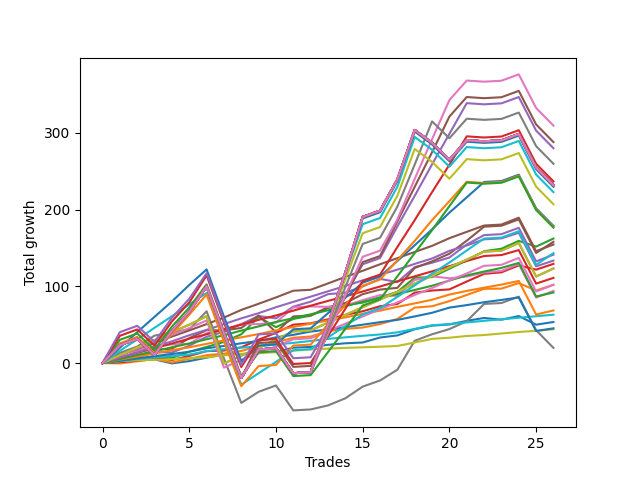

# Short Pointer 001 DB 
- Symbol: ES
- Date Range: 03/18/2022 - 07/15/2022
- Trading Period: 7:20-12:30
- Number of Trades: 26



| Name | Win Percent | Profit | Avg Profit / Trade | Avg Time / Trade |      | Name | Win Percent | Profit | Avg Profit / Trade | Avg Time / Trade |
| ---- | ----------- | ------ | ------------------ | ---------------- | ---- | ---- | ----------- | ------ | ------------------ | ---------------- |
| Sorted By <br> Profit | | | | | | Sorted By <br> Win Percentage ||||
| Two Hundred Five | 73.08 | 154750.00 | 5951.92 | 154:23 |     | Eighty-Two | 100.00 | 31500.00 | 1211.54 | 02:44 |
| Two Hundred Four.Five | 73.08 | 144000.00 | 5538.46 | 152:38 |     | Eighty-One | 100.00 | 22000.00 | 846.15 | 01:42 |
| Two Hundred Four | 73.08 | 140000.00 | 5384.62 | 140:11 |     | Eighty-Eight | 96.15 | 77250.00 | 2971.15 | 23:24 |
| Two Hundred Five.Five | 69.23 | 129875.00 | 4995.19 | 158:56 |     | Eighty-Seven | 96.15 | 66750.00 | 2567.31 | 21:57 |
| Two Hundred Three.Five | 73.08 | 118375.00 | 4552.88 | 135:51 |     | Eighty-Six | 96.15 | 55500.00 | 2134.62 | 21:06 |
| Two Hundred Fifteen | 65.38 | 115875.00 | 4456.73 | 163:58 |     | Eighty-Five | 96.15 | 46000.00 | 1769.23 | 17:38 |
| Two Hundred Fourteen.Five | 65.38 | 115875.00 | 4456.73 | 163:58 |     | Eighty-Four | 96.15 | 34250.00 | 1317.31 | 15:45 |
| Two Hundred Fourteen | 65.38 | 115875.00 | 4456.73 | 163:58 |     | Eighty-Three | 96.15 | 22625.00 | 870.19 | 10:39 |
| Two Hundred Thirteen.Five | 65.38 | 115875.00 | 4456.73 | 163:58 |     | Three | 92.31 | 64625.00 | 2485.58 | 12:12 |
| Two Hundred Thirteen | 65.38 | 115875.00 | 4456.73 | 163:58 |     | Two Hundred One | 92.31 | 61625.00 | 2370.19 | 44:53 |
| Two Hundred Twelve.Five | 65.38 | 115875.00 | 4456.73 | 163:58 |     | Ninety | 92.31 | 61625.00 | 2370.19 | 44:53 |
| Two Hundred Twelve | 65.38 | 115875.00 | 4456.73 | 163:58 |     | Eighty-Nine | 92.31 | 51000.00 | 1961.54 | 33:35 |
| Two Hundred Eleven.Five | 65.38 | 115875.00 | 4456.73 | 163:58 |     | Two | 88.46 | 81125.00 | 3120.19 | 16:40 |
| Two Hundred Eleven | 65.38 | 115875.00 | 4456.73 | 163:58 |     | Five | 88.46 | 79000.00 | 3038.46 | 41:38 |
| Two Hundred Ten.Five | 65.38 | 115875.00 | 4456.73 | 163:58 |     | Two Hundred One.Five | 88.46 | 71625.00 | 2754.81 | 71:31 |
| Two Hundred Ten | 65.38 | 115875.00 | 4456.73 | 163:58 |     | One | 88.46 | 51000.00 | 1961.54 | 09:09 |
| Two Hundred Nine.Five | 65.38 | 115875.00 | 4456.73 | 163:58 |     | Two Hundred Two | 84.62 | 89375.00 | 3437.50 | 88:07 |
| Two Hundred Nine | 65.38 | 115875.00 | 4456.73 | 163:58 |     | Four | 84.62 | 70625.00 | 2716.35 | 25:47 |
| Two Hundred Eight.Five | 65.38 | 115875.00 | 4456.73 | 163:58 |     | Zero | 84.62 | 26750.00 | 1028.85 | 05:00 |
| Two Hundred Eight | 65.38 | 115875.00 | 4456.73 | 163:58 |     | Six | 80.77 | 47000.00 | 1807.69 | 16:12 |
| Two Hundred Seven.Five | 65.38 | 115875.00 | 4456.73 | 163:58 |     | Seven | 80.77 | 9875.00 | 379.81 | 72:23 |
| Two Hundred Seven | 65.38 | 114875.00 | 4418.27 | 163:54 |     | Two Hundred Two.Five | 76.92 | 88750.00 | 3413.46 | 117:40 |
| Two Hundred Six.Five | 65.38 | 111375.00 | 4283.65 | 163:13 |     | Two Hundred Five | 73.08 | 154750.00 | 5951.92 | 154:23 |
| Two Hundred Six | 65.38 | 103500.00 | 3980.77 | 162:30 |     | Two Hundred Four.Five | 73.08 | 144000.00 | 5538.46 | 152:38 |
| Two Hundred Two | 84.62 | 89375.00 | 3437.50 | 88:07 |     | Two Hundred Four | 73.08 | 140000.00 | 5384.62 | 140:11 |
| Two Hundred Two.Five | 76.92 | 88750.00 | 3413.46 | 117:40 |     | Two Hundred Three.Five | 73.08 | 118375.00 | 4552.88 | 135:51 |
| Two Hundred Three | 73.08 | 88250.00 | 3394.23 | 131:08 |     | Two Hundred Three | 73.08 | 88250.00 | 3394.23 | 131:08 |
| Two | 88.46 | 81125.00 | 3120.19 | 16:40 |     | Two Hundred Five.Five | 69.23 | 129875.00 | 4995.19 | 158:56 |
| Five | 88.46 | 79000.00 | 3038.46 | 41:38 |     | Two Hundred Fifteen | 65.38 | 115875.00 | 4456.73 | 163:58 |
| Eighty-Eight | 96.15 | 77250.00 | 2971.15 | 23:24 |     | Two Hundred Fourteen.Five | 65.38 | 115875.00 | 4456.73 | 163:58 |
| Two Hundred One.Five | 88.46 | 71625.00 | 2754.81 | 71:31 |     | Two Hundred Fourteen | 65.38 | 115875.00 | 4456.73 | 163:58 |
| Four | 84.62 | 70625.00 | 2716.35 | 25:47 |     | Two Hundred Thirteen.Five | 65.38 | 115875.00 | 4456.73 | 163:58 |
| Eighty-Seven | 96.15 | 66750.00 | 2567.31 | 21:57 |     | Two Hundred Thirteen | 65.38 | 115875.00 | 4456.73 | 163:58 |
| Three | 92.31 | 64625.00 | 2485.58 | 12:12 |     | Two Hundred Twelve.Five | 65.38 | 115875.00 | 4456.73 | 163:58 |
| Two Hundred One | 92.31 | 61625.00 | 2370.19 | 44:53 |     | Two Hundred Twelve | 65.38 | 115875.00 | 4456.73 | 163:58 |
| Ninety | 92.31 | 61625.00 | 2370.19 | 44:53 |     | Two Hundred Eleven.Five | 65.38 | 115875.00 | 4456.73 | 163:58 |
| Eighty-Six | 96.15 | 55500.00 | 2134.62 | 21:06 |     | Two Hundred Eleven | 65.38 | 115875.00 | 4456.73 | 163:58 |
| Eighty-Nine | 92.31 | 51000.00 | 1961.54 | 33:35 |     | Two Hundred Ten.Five | 65.38 | 115875.00 | 4456.73 | 163:58 |
| One | 88.46 | 51000.00 | 1961.54 | 09:09 |     | Two Hundred Ten | 65.38 | 115875.00 | 4456.73 | 163:58 |
| Six | 80.77 | 47000.00 | 1807.69 | 16:12 |     | Two Hundred Nine.Five | 65.38 | 115875.00 | 4456.73 | 163:58 |
| Eighty-Five | 96.15 | 46000.00 | 1769.23 | 17:38 |     | Two Hundred Nine | 65.38 | 115875.00 | 4456.73 | 163:58 |
| Eighty-Four | 96.15 | 34250.00 | 1317.31 | 15:45 |     | Two Hundred Eight.Five | 65.38 | 115875.00 | 4456.73 | 163:58 |
| Eighty-Two | 100.00 | 31500.00 | 1211.54 | 02:44 |     | Two Hundred Eight | 65.38 | 115875.00 | 4456.73 | 163:58 |
| Zero | 84.62 | 26750.00 | 1028.85 | 05:00 |     | Two Hundred Seven.Five | 65.38 | 115875.00 | 4456.73 | 163:58 |
| Eighty-Three | 96.15 | 22625.00 | 870.19 | 10:39 |     | Two Hundred Seven | 65.38 | 114875.00 | 4418.27 | 163:54 |
| Eighty-One | 100.00 | 22000.00 | 846.15 | 01:42 |     | Two Hundred Six.Five | 65.38 | 111375.00 | 4283.65 | 163:13 |
| Seven | 80.77 | 9875.00 | 379.81 | 72:23 |     | Two Hundred Six | 65.38 | 103500.00 | 3980.77 | 162:30 |

## NO STOPLOSS

### Test Zero
* Sell when price hits the middle line of the 20p bollinger
* No Stoploss
* Results:
```
Total Trades: 26
Percent Up: 15.38
Percent Down: 84.62
Total Points Moved Down: 53.50
Potential Profit: 26750.00
Total Points Ups: 18.75 Count Ups: 4
Total Points Downs: 72.25 Count Downs: 22
```

<details><summary>Trades</summary>

<code>In: 2022-03-21 08:20:00		Out: 2022-03-21 08:20:15		Total Position Time: 00:15		Total Move Down: 2.50		Total to Date: 2.50</code> <br />
<code>In: 2022-03-25 11:57:00		Out: 2022-03-25 11:57:20		Total Position Time: 00:20		Total Move Down: 0.75		Total to Date: 3.25</code> <br />
<code>In: 2022-03-29 08:52:00		Out: 2022-03-29 08:56:20		Total Position Time: 04:20		Total Move Down: 1.50		Total to Date: 4.75</code> <br />
<code>In: 2022-03-31 07:38:00		Out: 2022-03-31 08:03:10		Total Position Time: 25:10		Total Move Down: -5.25		Total to Date: -0.50</code> <br />
<code>In: 2022-03-31 12:05:00		Out: 2022-03-31 12:11:35		Total Position Time: 06:35		Total Move Down: 3.00		Total to Date: 2.50</code> <br />
<code>In: 2022-04-18 10:59:00		Out: 2022-04-18 10:59:30		Total Position Time: 00:30		Total Move Down: 4.50		Total to Date: 7.00</code> <br />
<code>In: 2022-04-25 09:28:00		Out: 2022-04-25 09:31:10		Total Position Time: 03:10		Total Move Down: 4.50		Total to Date: 11.50</code> <br />
<code>In: 2022-04-25 09:53:00		Out: 2022-04-25 09:54:25		Total Position Time: 01:25		Total Move Down: -0.00		Total to Date: 11.50</code> <br />
<code>In: 2022-04-26 09:31:00		Out: 2022-04-26 09:37:10		Total Position Time: 06:10		Total Move Down: 2.50		Total to Date: 14.00</code> <br />
<code>In: 2022-04-27 08:04:00		Out: 2022-04-27 08:04:15		Total Position Time: 00:15		Total Move Down: 0.25		Total to Date: 14.25</code> <br />
<code>In: 2022-05-24 09:18:00		Out: 2022-05-24 09:21:40		Total Position Time: 03:40		Total Move Down: 5.75		Total to Date: 20.00</code> <br />
<code>In: 2022-06-01 12:19:00		Out: 2022-06-01 12:25:25		Total Position Time: 06:25		Total Move Down: 1.00		Total to Date: 21.00</code> <br />
<code>In: 2022-06-09 08:47:00		Out: 2022-06-09 08:48:20		Total Position Time: 01:20		Total Move Down: 2.75		Total to Date: 23.75</code> <br />
<code>In: 2022-06-09 09:46:00		Out: 2022-06-09 09:49:20		Total Position Time: 03:20		Total Move Down: 2.00		Total to Date: 25.75</code> <br />
<code>In: 2022-06-09 10:08:00		Out: 2022-06-09 10:16:30		Total Position Time: 08:30		Total Move Down: 1.00		Total to Date: 26.75</code> <br />
<code>In: 2022-06-10 11:26:00		Out: 2022-06-10 11:28:30		Total Position Time: 02:30		Total Move Down: 6.50		Total to Date: 33.25</code> <br />
<code>In: 2022-06-13 08:42:00		Out: 2022-06-13 08:47:40		Total Position Time: 05:40		Total Move Down: 2.75		Total to Date: 36.00</code> <br />
<code>In: 2022-06-13 09:41:00		Out: 2022-06-13 09:43:20		Total Position Time: 02:20		Total Move Down: 8.00		Total to Date: 44.00</code> <br />
<code>In: 2022-06-15 09:19:00		Out: 2022-06-15 09:19:15		Total Position Time: 00:15		Total Move Down: 4.75		Total to Date: 48.75</code> <br />
<code>In: 2022-06-15 11:02:00		Out: 2022-06-15 11:02:45		Total Position Time: 00:45		Total Move Down: 1.50		Total to Date: 50.25</code> <br />
<code>In: 2022-06-16 08:30:00		Out: 2022-06-16 08:30:25		Total Position Time: 00:25		Total Move Down: 4.75		Total to Date: 55.00</code> <br />
<code>In: 2022-06-17 08:34:00		Out: 2022-06-17 08:35:45		Total Position Time: 01:45		Total Move Down: 3.75		Total to Date: 58.75</code> <br />
<code>In: 2022-06-29 12:20:00		Out: 2022-06-29 12:33:20		Total Position Time: 13:20		Total Move Down: -2.25		Total to Date: 56.50</code> <br />
<code>In: 2022-06-29 12:31:00		Out: 2022-06-29 12:33:20		Total Position Time: 02:20		Total Move Down: 4.75		Total to Date: 61.25</code> <br />
<code>In: 2022-07-01 10:35:00		Out: 2022-07-01 11:03:55		Total Position Time: 28:55		Total Move Down: -11.25		Total to Date: 50.00</code> <br />
<code>In: 2022-07-06 11:10:00		Out: 2022-07-06 11:10:20		Total Position Time: 00:20		Total Move Down: 3.50		Total to Date: 53.50</code> <br />


</details>

### Test One
* Sell when the price hits the upper line of the 20p 1std bollinger
* No Stoploss
* Results:
```
Total Trades: 26
Percent Up: 11.54
Percent Down: 88.46
Total Points Moved Down: 102.00
Potential Profit: 51000.00
Total Points Ups: 14.75 Count Ups: 3
Total Points Downs: 116.75 Count Downs: 23
```

<details><summary>Trades</summary>

<code>In: 2022-03-21 08:20:00		Out: 2022-03-21 08:36:00		Total Position Time: 16:00		Total Move Down: -0.50		Total to Date: -0.50</code> <br />
<code>In: 2022-03-25 11:57:00		Out: 2022-03-25 12:00:50		Total Position Time: 03:50		Total Move Down: 2.75		Total to Date: 2.25</code> <br />
<code>In: 2022-03-29 08:52:00		Out: 2022-03-29 08:58:40		Total Position Time: 06:40		Total Move Down: 3.00		Total to Date: 5.25</code> <br />
<code>In: 2022-03-31 07:38:00		Out: 2022-03-31 08:08:00		Total Position Time: 30:00		Total Move Down: -4.50		Total to Date: 0.75</code> <br />
<code>In: 2022-03-31 12:05:00		Out: 2022-03-31 12:16:00		Total Position Time: 11:00		Total Move Down: 4.75		Total to Date: 5.50</code> <br />
<code>In: 2022-04-18 10:59:00		Out: 2022-04-18 11:06:35		Total Position Time: 07:35		Total Move Down: 4.75		Total to Date: 10.25</code> <br />
<code>In: 2022-04-25 09:28:00		Out: 2022-04-25 09:42:45		Total Position Time: 14:45		Total Move Down: 2.00		Total to Date: 12.25</code> <br />
<code>In: 2022-04-25 09:53:00		Out: 2022-04-25 09:55:05		Total Position Time: 02:05		Total Move Down: 3.50		Total to Date: 15.75</code> <br />
<code>In: 2022-04-26 09:31:00		Out: 2022-04-26 09:38:00		Total Position Time: 07:00		Total Move Down: 6.25		Total to Date: 22.00</code> <br />
<code>In: 2022-04-27 08:04:00		Out: 2022-04-27 08:05:30		Total Position Time: 01:30		Total Move Down: 4.75		Total to Date: 26.75</code> <br />
<code>In: 2022-05-24 09:18:00		Out: 2022-05-24 09:29:00		Total Position Time: 11:00		Total Move Down: 6.25		Total to Date: 33.00</code> <br />
<code>In: 2022-06-01 12:19:00		Out: 2022-06-01 12:28:15		Total Position Time: 09:15		Total Move Down: 1.50		Total to Date: 34.50</code> <br />
<code>In: 2022-06-09 08:47:00		Out: 2022-06-09 08:49:35		Total Position Time: 02:35		Total Move Down: 7.00		Total to Date: 41.50</code> <br />
<code>In: 2022-06-09 09:46:00		Out: 2022-06-09 09:54:55		Total Position Time: 08:55		Total Move Down: 3.00		Total to Date: 44.50</code> <br />
<code>In: 2022-06-09 10:08:00		Out: 2022-06-09 10:18:35		Total Position Time: 10:35		Total Move Down: 1.75		Total to Date: 46.25</code> <br />
<code>In: 2022-06-10 11:26:00		Out: 2022-06-10 11:38:10		Total Position Time: 12:10		Total Move Down: 4.50		Total to Date: 50.75</code> <br />
<code>In: 2022-06-13 08:42:00		Out: 2022-06-13 08:52:05		Total Position Time: 10:05		Total Move Down: 6.75		Total to Date: 57.50</code> <br />
<code>In: 2022-06-13 09:41:00		Out: 2022-06-13 09:47:55		Total Position Time: 06:55		Total Move Down: 14.75		Total to Date: 72.25</code> <br />
<code>In: 2022-06-15 09:19:00		Out: 2022-06-15 09:30:20		Total Position Time: 11:20		Total Move Down: 1.75		Total to Date: 74.00</code> <br />
<code>In: 2022-06-15 11:02:00		Out: 2022-06-15 11:03:00		Total Position Time: 01:00		Total Move Down: 6.75		Total to Date: 80.75</code> <br />
<code>In: 2022-06-16 08:30:00		Out: 2022-06-16 08:30:55		Total Position Time: 00:55		Total Move Down: 8.00		Total to Date: 88.75</code> <br />
<code>In: 2022-06-17 08:34:00		Out: 2022-06-17 08:39:05		Total Position Time: 05:05		Total Move Down: 8.00		Total to Date: 96.75</code> <br />
<code>In: 2022-06-29 12:20:00		Out: 2022-06-29 12:34:10		Total Position Time: 14:10		Total Move Down: 0.25		Total to Date: 97.00</code> <br />
<code>In: 2022-06-29 12:31:00		Out: 2022-06-29 12:34:10		Total Position Time: 03:10		Total Move Down: 7.25		Total to Date: 104.25</code> <br />
<code>In: 2022-07-01 10:35:00		Out: 2022-07-01 11:04:25		Total Position Time: 29:25		Total Move Down: -9.75		Total to Date: 94.50</code> <br />
<code>In: 2022-07-06 11:10:00		Out: 2022-07-06 11:11:10		Total Position Time: 01:10		Total Move Down: 7.50		Total to Date: 102.00</code> <br />


</details>

### Test Two
* Sell when the price hits the upper line of the 20p 2std bollinger
* No Stoploss
* Results:
```
Total Trades: 26
Percent Up: 11.54
Percent Down: 88.46
Total Points Moved Down: 162.25
Potential Profit: 81125.00
Total Points Ups: 23.00 Count Ups: 3
Total Points Downs: 185.25 Count Downs: 23
```

<details><summary>Trades</summary>

<code>In: 2022-03-21 08:20:00		Out: 2022-03-21 08:36:10		Total Position Time: 16:10		Total Move Down: 1.25		Total to Date: 1.25</code> <br />
<code>In: 2022-03-25 11:57:00		Out: 2022-03-25 12:01:15		Total Position Time: 04:15		Total Move Down: 3.25		Total to Date: 4.50</code> <br />
<code>In: 2022-03-29 08:52:00		Out: 2022-03-29 09:01:40		Total Position Time: 09:40		Total Move Down: 4.50		Total to Date: 9.00</code> <br />
<code>In: 2022-03-31 07:38:00		Out: 2022-03-31 08:08:30		Total Position Time: 30:30		Total Move Down: -2.25		Total to Date: 6.75</code> <br />
<code>In: 2022-03-31 12:05:00		Out: 2022-03-31 12:19:40		Total Position Time: 14:40		Total Move Down: 8.00		Total to Date: 14.75</code> <br />
<code>In: 2022-04-18 10:59:00		Out: 2022-04-18 11:10:40		Total Position Time: 11:40		Total Move Down: 6.25		Total to Date: 21.00</code> <br />
<code>In: 2022-04-25 09:28:00		Out: 2022-04-25 10:01:20		Total Position Time: 33:20		Total Move Down: 6.50		Total to Date: 27.50</code> <br />
<code>In: 2022-04-25 09:53:00		Out: 2022-04-25 10:01:20		Total Position Time: 08:20		Total Move Down: 10.00		Total to Date: 37.50</code> <br />
<code>In: 2022-04-26 09:31:00		Out: 2022-04-26 10:23:00		Total Position Time: 52:00		Total Move Down: 22.50		Total to Date: 60.00</code> <br />
<code>In: 2022-04-27 08:04:00		Out: 2022-04-27 08:51:10		Total Position Time: 47:10		Total Move Down: -13.25		Total to Date: 46.75</code> <br />
<code>In: 2022-05-24 09:18:00		Out: 2022-05-24 09:31:35		Total Position Time: 13:35		Total Move Down: 10.75		Total to Date: 57.50</code> <br />
<code>In: 2022-06-01 12:19:00		Out: 2022-06-01 12:30:05		Total Position Time: 11:05		Total Move Down: 4.25		Total to Date: 61.75</code> <br />
<code>In: 2022-06-09 08:47:00		Out: 2022-06-09 09:11:10		Total Position Time: 24:10		Total Move Down: 10.00		Total to Date: 71.75</code> <br />
<code>In: 2022-06-09 09:46:00		Out: 2022-06-09 09:55:00		Total Position Time: 09:00		Total Move Down: 4.00		Total to Date: 75.75</code> <br />
<code>In: 2022-06-09 10:08:00		Out: 2022-06-09 10:19:10		Total Position Time: 11:10		Total Move Down: 3.00		Total to Date: 78.75</code> <br />
<code>In: 2022-06-10 11:26:00		Out: 2022-06-10 11:40:10		Total Position Time: 14:10		Total Move Down: 6.75		Total to Date: 85.50</code> <br />
<code>In: 2022-06-13 08:42:00		Out: 2022-06-13 08:55:10		Total Position Time: 13:10		Total Move Down: 7.25		Total to Date: 92.75</code> <br />
<code>In: 2022-06-13 09:41:00		Out: 2022-06-13 09:54:35		Total Position Time: 13:35		Total Move Down: 18.50		Total to Date: 111.25</code> <br />
<code>In: 2022-06-15 09:19:00		Out: 2022-06-15 09:34:10		Total Position Time: 15:10		Total Move Down: 0.75		Total to Date: 112.00</code> <br />
<code>In: 2022-06-15 11:02:00		Out: 2022-06-15 11:03:10		Total Position Time: 01:10		Total Move Down: 11.00		Total to Date: 123.00</code> <br />
<code>In: 2022-06-16 08:30:00		Out: 2022-06-16 08:41:25		Total Position Time: 11:25		Total Move Down: 10.75		Total to Date: 133.75</code> <br />
<code>In: 2022-06-17 08:34:00		Out: 2022-06-17 08:45:15		Total Position Time: 11:15		Total Move Down: 12.00		Total to Date: 145.75</code> <br />
<code>In: 2022-06-29 12:20:00		Out: 2022-06-29 12:36:35		Total Position Time: 16:35		Total Move Down: 3.25		Total to Date: 149.00</code> <br />
<code>In: 2022-06-29 12:31:00		Out: 2022-06-29 12:36:35		Total Position Time: 05:35		Total Move Down: 10.25		Total to Date: 159.25</code> <br />
<code>In: 2022-07-01 10:35:00		Out: 2022-07-01 11:07:55		Total Position Time: 32:55		Total Move Down: -7.50		Total to Date: 151.75</code> <br />
<code>In: 2022-07-06 11:10:00		Out: 2022-07-06 11:11:45		Total Position Time: 01:45		Total Move Down: 10.50		Total to Date: 162.25</code> <br />


</details>

### Test Three
* Sell when price hits the middle line of the 50p bollinger
* No Stoploss
* Results:
```
Total Trades: 26
Percent Up: 7.69
Percent Down: 92.31
Total Points Moved Down: 129.25
Potential Profit: 64625.00
Total Points Ups: 8.50 Count Ups: 2
Total Points Downs: 137.75 Count Downs: 24
```

<details><summary>Trades</summary>

<code>In: 2022-03-21 08:20:00		Out: 2022-03-21 08:36:10		Total Position Time: 16:10		Total Move Down: 1.25		Total to Date: 1.25</code> <br />
<code>In: 2022-03-25 11:57:00		Out: 2022-03-25 12:00:45		Total Position Time: 03:45		Total Move Down: 1.75		Total to Date: 3.00</code> <br />
<code>In: 2022-03-29 08:52:00		Out: 2022-03-29 09:01:35		Total Position Time: 09:35		Total Move Down: 4.00		Total to Date: 7.00</code> <br />
<code>In: 2022-03-31 07:38:00		Out: 2022-03-31 08:15:35		Total Position Time: 37:35		Total Move Down: -3.00		Total to Date: 4.00</code> <br />
<code>In: 2022-03-31 12:05:00		Out: 2022-03-31 12:16:40		Total Position Time: 11:40		Total Move Down: 5.25		Total to Date: 9.25</code> <br />
<code>In: 2022-04-18 10:59:00		Out: 2022-04-18 11:16:30		Total Position Time: 17:30		Total Move Down: 6.25		Total to Date: 15.50</code> <br />
<code>In: 2022-04-25 09:28:00		Out: 2022-04-25 09:55:25		Total Position Time: 27:25		Total Move Down: 0.75		Total to Date: 16.25</code> <br />
<code>In: 2022-04-25 09:53:00		Out: 2022-04-25 09:55:25		Total Position Time: 02:25		Total Move Down: 4.25		Total to Date: 20.50</code> <br />
<code>In: 2022-04-26 09:31:00		Out: 2022-04-26 09:46:10		Total Position Time: 15:10		Total Move Down: 10.00		Total to Date: 30.50</code> <br />
<code>In: 2022-04-27 08:04:00		Out: 2022-04-27 08:10:35		Total Position Time: 06:35		Total Move Down: 8.75		Total to Date: 39.25</code> <br />
<code>In: 2022-05-24 09:18:00		Out: 2022-05-24 09:31:20		Total Position Time: 13:20		Total Move Down: 10.75		Total to Date: 50.00</code> <br />
<code>In: 2022-06-01 12:19:00		Out: 2022-06-01 12:25:30		Total Position Time: 06:30		Total Move Down: 1.75		Total to Date: 51.75</code> <br />
<code>In: 2022-06-09 08:47:00		Out: 2022-06-09 08:48:50		Total Position Time: 01:50		Total Move Down: 5.25		Total to Date: 57.00</code> <br />
<code>In: 2022-06-09 09:46:00		Out: 2022-06-09 09:56:10		Total Position Time: 10:10		Total Move Down: 5.75		Total to Date: 62.75</code> <br />
<code>In: 2022-06-09 10:08:00		Out: 2022-06-09 10:22:05		Total Position Time: 14:05		Total Move Down: 4.75		Total to Date: 67.50</code> <br />
<code>In: 2022-06-10 11:26:00		Out: 2022-06-10 11:28:30		Total Position Time: 02:30		Total Move Down: 6.50		Total to Date: 74.00</code> <br />
<code>In: 2022-06-13 08:42:00		Out: 2022-06-13 09:07:15		Total Position Time: 25:15		Total Move Down: 3.00		Total to Date: 77.00</code> <br />
<code>In: 2022-06-13 09:41:00		Out: 2022-06-13 09:47:55		Total Position Time: 06:55		Total Move Down: 14.75		Total to Date: 91.75</code> <br />
<code>In: 2022-06-15 09:19:00		Out: 2022-06-15 09:35:10		Total Position Time: 16:10		Total Move Down: 2.75		Total to Date: 94.50</code> <br />
<code>In: 2022-06-15 11:02:00		Out: 2022-06-15 11:02:45		Total Position Time: 00:45		Total Move Down: 1.50		Total to Date: 96.00</code> <br />
<code>In: 2022-06-16 08:30:00		Out: 2022-06-16 08:36:15		Total Position Time: 06:15		Total Move Down: 10.25		Total to Date: 106.25</code> <br />
<code>In: 2022-06-17 08:34:00		Out: 2022-06-17 08:45:05		Total Position Time: 11:05		Total Move Down: 10.00		Total to Date: 116.25</code> <br />
<code>In: 2022-06-29 12:20:00		Out: 2022-06-29 12:34:15		Total Position Time: 14:15		Total Move Down: 2.00		Total to Date: 118.25</code> <br />
<code>In: 2022-06-29 12:31:00		Out: 2022-06-29 12:34:15		Total Position Time: 03:15		Total Move Down: 9.00		Total to Date: 127.25</code> <br />
<code>In: 2022-07-01 10:35:00		Out: 2022-07-01 11:10:55		Total Position Time: 35:55		Total Move Down: -5.50		Total to Date: 121.75</code> <br />
<code>In: 2022-07-06 11:10:00		Out: 2022-07-06 11:11:10		Total Position Time: 01:10		Total Move Down: 7.50		Total to Date: 129.25</code> <br />


</details>

### Test Four
* Sell when the price hits the upper line of the 50p 1std bollinger
* No Stoploss
* Results:
```
Total Trades: 26
Percent Up: 15.38
Percent Down: 84.62
Total Points Moved Down: 141.25
Potential Profit: 70625.00
Total Points Ups: 51.50 Count Ups: 4
Total Points Downs: 192.75 Count Downs: 22
```

<details><summary>Trades</summary>

<code>In: 2022-03-21 08:20:00		Out: 2022-03-21 08:44:50		Total Position Time: 24:50		Total Move Down: 3.00		Total to Date: 3.00</code> <br />
<code>In: 2022-03-25 11:57:00		Out: 2022-03-25 12:01:40		Total Position Time: 04:40		Total Move Down: 3.75		Total to Date: 6.75</code> <br />
<code>In: 2022-03-29 08:52:00		Out: 2022-03-29 09:02:15		Total Position Time: 10:15		Total Move Down: 7.50		Total to Date: 14.25</code> <br />
<code>In: 2022-03-31 07:38:00		Out: 2022-03-31 08:25:20		Total Position Time: 47:20		Total Move Down: -0.50		Total to Date: 13.75</code> <br />
<code>In: 2022-03-31 12:05:00		Out: 2022-03-31 12:20:30		Total Position Time: 15:30		Total Move Down: 8.75		Total to Date: 22.50</code> <br />
<code>In: 2022-04-18 10:59:00		Out: 2022-04-18 11:18:10		Total Position Time: 19:10		Total Move Down: 11.75		Total to Date: 34.25</code> <br />
<code>In: 2022-04-25 09:28:00		Out: 2022-04-25 10:01:20		Total Position Time: 33:20		Total Move Down: 6.50		Total to Date: 40.75</code> <br />
<code>In: 2022-04-25 09:53:00		Out: 2022-04-25 10:01:20		Total Position Time: 08:20		Total Move Down: 10.00		Total to Date: 50.75</code> <br />
<code>In: 2022-04-26 09:31:00		Out: 2022-04-26 10:03:20		Total Position Time: 32:20		Total Move Down: 10.50		Total to Date: 61.25</code> <br />
<code>In: 2022-04-27 08:04:00		Out: 2022-04-27 09:01:45		Total Position Time: 57:45		Total Move Down: -3.00		Total to Date: 58.25</code> <br />
<code>In: 2022-05-24 09:18:00		Out: 2022-05-24 09:34:20		Total Position Time: 16:20		Total Move Down: 15.25		Total to Date: 73.50</code> <br />
<code>In: 2022-06-01 12:19:00		Out: 2022-06-01 12:35:10		Total Position Time: 16:10		Total Move Down: 6.50		Total to Date: 80.00</code> <br />
<code>In: 2022-06-09 08:47:00		Out: 2022-06-09 08:50:35		Total Position Time: 03:35		Total Move Down: 9.75		Total to Date: 89.75</code> <br />
<code>In: 2022-06-09 09:46:00		Out: 2022-06-09 10:23:50		Total Position Time: 37:50		Total Move Down: 2.00		Total to Date: 91.75</code> <br />
<code>In: 2022-06-09 10:08:00		Out: 2022-06-09 10:23:50		Total Position Time: 15:50		Total Move Down: 8.00		Total to Date: 99.75</code> <br />
<code>In: 2022-06-10 11:26:00		Out: 2022-06-10 11:41:45		Total Position Time: 15:45		Total Move Down: 10.00		Total to Date: 109.75</code> <br />
<code>In: 2022-06-13 08:42:00		Out: 2022-06-13 09:54:40		Total Position Time: 72:40		Total Move Down: -4.25		Total to Date: 105.50</code> <br />
<code>In: 2022-06-13 09:41:00		Out: 2022-06-13 09:54:40		Total Position Time: 13:40		Total Move Down: 19.50		Total to Date: 125.00</code> <br />
<code>In: 2022-06-15 09:19:00		Out: 2022-06-15 09:39:40		Total Position Time: 20:40		Total Move Down: 5.75		Total to Date: 130.75</code> <br />
<code>In: 2022-06-15 11:02:00		Out: 2022-06-15 11:03:00		Total Position Time: 01:00		Total Move Down: 6.75		Total to Date: 137.50</code> <br />
<code>In: 2022-06-16 08:30:00		Out: 2022-06-16 08:42:25		Total Position Time: 12:25		Total Move Down: 17.00		Total to Date: 154.50</code> <br />
<code>In: 2022-06-17 08:34:00		Out: 2022-06-17 08:51:20		Total Position Time: 17:20		Total Move Down: 12.25		Total to Date: 166.75</code> <br />
<code>In: 2022-06-29 12:20:00		Out: 2022-06-29 12:46:05		Total Position Time: 26:05		Total Move Down: 1.25		Total to Date: 168.00</code> <br />
<code>In: 2022-06-29 12:31:00		Out: 2022-06-29 12:46:05		Total Position Time: 15:05		Total Move Down: 8.25		Total to Date: 176.25</code> <br />
<code>In: 2022-07-01 10:35:00		Out: 2022-07-01 12:46:05		Total Position Time: 131:05		Total Move Down: -43.75		Total to Date: 132.50</code> <br />
<code>In: 2022-07-06 11:10:00		Out: 2022-07-06 11:11:35		Total Position Time: 01:35		Total Move Down: 8.75		Total to Date: 141.25</code> <br />


</details>

### Test Five
* Sell when the price hits the upper line of the 50p 2std bollinger
* No Stoploss
* Results:
```
Total Trades: 26
Percent Up: 11.54
Percent Down: 88.46
Total Points Moved Down: 158.00
Potential Profit: 79000.00
Total Points Ups: 66.00 Count Ups: 3
Total Points Downs: 224.00 Count Downs: 23
```

<details><summary>Trades</summary>

<code>In: 2022-03-21 08:20:00		Out: 2022-03-21 09:05:45		Total Position Time: 45:45		Total Move Down: 2.25		Total to Date: 2.25</code> <br />
<code>In: 2022-03-25 11:57:00		Out: 2022-03-25 12:01:55		Total Position Time: 04:55		Total Move Down: 5.25		Total to Date: 7.50</code> <br />
<code>In: 2022-03-29 08:52:00		Out: 2022-03-29 09:10:50		Total Position Time: 18:50		Total Move Down: 9.75		Total to Date: 17.25</code> <br />
<code>In: 2022-03-31 07:38:00		Out: 2022-03-31 08:31:45		Total Position Time: 53:45		Total Move Down: 1.50		Total to Date: 18.75</code> <br />
<code>In: 2022-03-31 12:05:00		Out: 2022-03-31 12:24:15		Total Position Time: 19:15		Total Move Down: 13.75		Total to Date: 32.50</code> <br />
<code>In: 2022-04-18 10:59:00		Out: 2022-04-18 11:47:00		Total Position Time: 48:00		Total Move Down: 10.25		Total to Date: 42.75</code> <br />
<code>In: 2022-04-25 09:28:00		Out: 2022-04-25 11:01:35		Total Position Time: 93:35		Total Move Down: -0.25		Total to Date: 42.50</code> <br />
<code>In: 2022-04-25 09:53:00		Out: 2022-04-25 11:01:35		Total Position Time: 68:35		Total Move Down: 3.25		Total to Date: 45.75</code> <br />
<code>In: 2022-04-26 09:31:00		Out: 2022-04-26 10:14:55		Total Position Time: 43:55		Total Move Down: 16.25		Total to Date: 62.00</code> <br />
<code>In: 2022-04-27 08:04:00		Out: 2022-04-27 10:10:15		Total Position Time: 126:15		Total Move Down: -22.00		Total to Date: 40.00</code> <br />
<code>In: 2022-05-24 09:18:00		Out: 2022-05-24 09:37:00		Total Position Time: 19:00		Total Move Down: 20.75		Total to Date: 60.75</code> <br />
<code>In: 2022-06-01 12:19:00		Out: 2022-06-01 12:46:05		Total Position Time: 27:05		Total Move Down: 1.25		Total to Date: 62.00</code> <br />
<code>In: 2022-06-09 08:47:00		Out: 2022-06-09 09:12:40		Total Position Time: 25:40		Total Move Down: 10.75		Total to Date: 72.75</code> <br />
<code>In: 2022-06-09 09:46:00		Out: 2022-06-09 10:27:20		Total Position Time: 41:20		Total Move Down: 5.50		Total to Date: 78.25</code> <br />
<code>In: 2022-06-09 10:08:00		Out: 2022-06-09 10:27:20		Total Position Time: 19:20		Total Move Down: 11.50		Total to Date: 89.75</code> <br />
<code>In: 2022-06-10 11:26:00		Out: 2022-06-10 12:45:40		Total Position Time: 79:40		Total Move Down: 6.00		Total to Date: 95.75</code> <br />
<code>In: 2022-06-13 08:42:00		Out: 2022-06-13 09:58:15		Total Position Time: 76:15		Total Move Down: 2.25		Total to Date: 98.00</code> <br />
<code>In: 2022-06-13 09:41:00		Out: 2022-06-13 09:58:15		Total Position Time: 17:15		Total Move Down: 26.00		Total to Date: 124.00</code> <br />
<code>In: 2022-06-15 09:19:00		Out: 2022-06-15 09:41:45		Total Position Time: 22:45		Total Move Down: 8.50		Total to Date: 132.50</code> <br />
<code>In: 2022-06-15 11:02:00		Out: 2022-06-15 11:03:05		Total Position Time: 01:05		Total Move Down: 10.00		Total to Date: 142.50</code> <br />
<code>In: 2022-06-16 08:30:00		Out: 2022-06-16 09:07:40		Total Position Time: 37:40		Total Move Down: 17.00		Total to Date: 159.50</code> <br />
<code>In: 2022-06-17 08:34:00		Out: 2022-06-17 08:52:10		Total Position Time: 18:10		Total Move Down: 18.25		Total to Date: 177.75</code> <br />
<code>In: 2022-06-29 12:20:00		Out: 2022-06-29 12:46:05		Total Position Time: 26:05		Total Move Down: 1.25		Total to Date: 179.00</code> <br />
<code>In: 2022-06-29 12:31:00		Out: 2022-06-29 12:46:05		Total Position Time: 15:05		Total Move Down: 8.25		Total to Date: 187.25</code> <br />
<code>In: 2022-07-01 10:35:00		Out: 2022-07-01 12:46:05		Total Position Time: 131:05		Total Move Down: -43.75		Total to Date: 143.50</code> <br />
<code>In: 2022-07-06 11:10:00		Out: 2022-07-06 11:12:15		Total Position Time: 02:15		Total Move Down: 14.50		Total to Date: 158.00</code> <br />


</details>

### Test Six
* Sell when the price hits the middle line of the 1std VWAP
* No Stoploss
* Results:
```
Total Trades: 26
Percent Up: 19.23
Percent Down: 80.77
Total Points Moved Down: 94.00
Potential Profit: 47000.00
Total Points Ups: 47.75 Count Ups: 5
Total Points Downs: 141.75 Count Downs: 21
```

<details><summary>Trades</summary>

<code>In: 2022-03-21 08:20:00		Out: 2022-03-21 09:30:30		Total Position Time: 70:30		Total Move Down: 4.50		Total to Date: 4.50</code> <br />
<code>In: 2022-03-25 11:57:00		Out: 2022-03-25 12:20:30		Total Position Time: 23:30		Total Move Down: 11.50		Total to Date: 16.00</code> <br />
<code>In: 2022-03-29 08:52:00		Out: 2022-03-29 09:02:10		Total Position Time: 10:10		Total Move Down: 6.00		Total to Date: 22.00</code> <br />
<code>In: 2022-03-31 07:38:00		Out: 2022-03-31 07:41:35		Total Position Time: 03:35		Total Move Down: 2.25		Total to Date: 24.25</code> <br />
<code>In: 2022-03-31 12:05:00		Out: 2022-03-31 12:05:15		Total Position Time: 00:15		Total Move Down: 0.75		Total to Date: 25.00</code> <br />
<code>In: 2022-04-18 10:59:00		Out: 2022-04-18 12:04:30		Total Position Time: 65:30		Total Move Down: 13.75		Total to Date: 38.75</code> <br />
<code>In: 2022-04-25 09:28:00		Out: 2022-04-25 09:31:10		Total Position Time: 03:10		Total Move Down: 4.50		Total to Date: 43.25</code> <br />
<code>In: 2022-04-25 09:53:00		Out: 2022-04-25 10:01:15		Total Position Time: 08:15		Total Move Down: 7.50		Total to Date: 50.75</code> <br />
<code>In: 2022-04-26 09:31:00		Out: 2022-04-26 09:31:15		Total Position Time: 00:15		Total Move Down: -0.00		Total to Date: 50.75</code> <br />
<code>In: 2022-04-27 08:04:00		Out: 2022-04-27 08:05:20		Total Position Time: 01:20		Total Move Down: 2.00		Total to Date: 52.75</code> <br />
<code>In: 2022-05-24 09:18:00		Out: 2022-05-24 09:36:45		Total Position Time: 18:45		Total Move Down: 19.75		Total to Date: 72.50</code> <br />
<code>In: 2022-06-01 12:19:00		Out: 2022-06-01 12:46:05		Total Position Time: 27:05		Total Move Down: 1.25		Total to Date: 73.75</code> <br />
<code>In: 2022-06-09 08:47:00		Out: 2022-06-09 08:47:15		Total Position Time: 00:15		Total Move Down: -0.50		Total to Date: 73.25</code> <br />
<code>In: 2022-06-09 09:46:00		Out: 2022-06-09 09:48:20		Total Position Time: 02:20		Total Move Down: 1.50		Total to Date: 74.75</code> <br />
<code>In: 2022-06-09 10:08:00		Out: 2022-06-09 10:23:45		Total Position Time: 15:45		Total Move Down: 7.25		Total to Date: 82.00</code> <br />
<code>In: 2022-06-10 11:26:00		Out: 2022-06-10 11:28:30		Total Position Time: 02:30		Total Move Down: 6.50		Total to Date: 88.50</code> <br />
<code>In: 2022-06-13 08:42:00		Out: 2022-06-13 08:42:15		Total Position Time: 00:15		Total Move Down: -1.00		Total to Date: 87.50</code> <br />
<code>In: 2022-06-13 09:41:00		Out: 2022-06-13 09:55:05		Total Position Time: 14:05		Total Move Down: 20.75		Total to Date: 108.25</code> <br />
<code>In: 2022-06-15 09:19:00		Out: 2022-06-15 09:19:15		Total Position Time: 00:15		Total Move Down: 4.75		Total to Date: 113.00</code> <br />
<code>In: 2022-06-15 11:02:00		Out: 2022-06-15 11:02:15		Total Position Time: 00:15		Total Move Down: -2.50		Total to Date: 110.50</code> <br />
<code>In: 2022-06-16 08:30:00		Out: 2022-06-16 08:30:15		Total Position Time: 00:15		Total Move Down: 2.25		Total to Date: 112.75</code> <br />
<code>In: 2022-06-17 08:34:00		Out: 2022-06-17 08:37:05		Total Position Time: 03:05		Total Move Down: 5.25		Total to Date: 118.00</code> <br />
<code>In: 2022-06-29 12:20:00		Out: 2022-06-29 12:34:15		Total Position Time: 14:15		Total Move Down: 2.00		Total to Date: 120.00</code> <br />
<code>In: 2022-06-29 12:31:00		Out: 2022-06-29 12:34:15		Total Position Time: 03:15		Total Move Down: 9.00		Total to Date: 129.00</code> <br />
<code>In: 2022-07-01 10:35:00		Out: 2022-07-01 12:46:05		Total Position Time: 131:05		Total Move Down: -43.75		Total to Date: 85.25</code> <br />
<code>In: 2022-07-06 11:10:00		Out: 2022-07-06 11:11:35		Total Position Time: 01:35		Total Move Down: 8.75		Total to Date: 94.00</code> <br />


</details>

### Test Seven
* Sell when the price hits the upper line of the 1std VWAP
* No Stoploss
* Results:
```
Total Trades: 26
Percent Up: 19.23
Percent Down: 80.77
Total Points Moved Down: 19.75
Potential Profit: 9875.00
Total Points Ups: 218.75 Count Ups: 5
Total Points Downs: 238.50 Count Downs: 21
```

<details><summary>Trades</summary>

<code>In: 2022-03-21 08:20:00		Out: 2022-03-21 09:31:40		Total Position Time: 71:40		Total Move Down: 13.25		Total to Date: 13.25</code> <br />
<code>In: 2022-03-25 11:57:00		Out: 2022-03-25 12:46:05		Total Position Time: 49:05		Total Move Down: 8.25		Total to Date: 21.50</code> <br />
<code>In: 2022-03-29 08:52:00		Out: 2022-03-29 09:27:55		Total Position Time: 35:55		Total Move Down: 14.25		Total to Date: 35.75</code> <br />
<code>In: 2022-03-31 07:38:00		Out: 2022-03-31 09:15:10		Total Position Time: 97:10		Total Move Down: 4.25		Total to Date: 40.00</code> <br />
<code>In: 2022-03-31 12:05:00		Out: 2022-03-31 12:12:45		Total Position Time: 07:45		Total Move Down: 3.75		Total to Date: 43.75</code> <br />
<code>In: 2022-04-18 10:59:00		Out: 2022-04-18 12:29:05		Total Position Time: 90:05		Total Move Down: 23.75		Total to Date: 67.50</code> <br />
<code>In: 2022-04-25 09:28:00		Out: 2022-04-25 12:46:05		Total Position Time: 198:05		Total Move Down: -61.50		Total to Date: 6.00</code> <br />
<code>In: 2022-04-25 09:53:00		Out: 2022-04-25 12:46:05		Total Position Time: 173:05		Total Move Down: -58.00		Total to Date: -52.00</code> <br />
<code>In: 2022-04-26 09:31:00		Out: 2022-04-26 10:14:15		Total Position Time: 43:15		Total Move Down: 14.50		Total to Date: -37.50</code> <br />
<code>In: 2022-04-27 08:04:00		Out: 2022-04-27 12:04:15		Total Position Time: 240:15		Total Move Down: 8.25		Total to Date: -29.25</code> <br />
<code>In: 2022-05-24 09:18:00		Out: 2022-05-24 12:46:05		Total Position Time: 208:05		Total Move Down: -32.50		Total to Date: -61.75</code> <br />
<code>In: 2022-06-01 12:19:00		Out: 2022-06-01 12:46:05		Total Position Time: 27:05		Total Move Down: 1.25		Total to Date: -60.50</code> <br />
<code>In: 2022-06-09 08:47:00		Out: 2022-06-09 08:48:50		Total Position Time: 01:50		Total Move Down: 5.25		Total to Date: -55.25</code> <br />
<code>In: 2022-06-09 09:46:00		Out: 2022-06-09 10:30:30		Total Position Time: 44:30		Total Move Down: 9.25		Total to Date: -46.00</code> <br />
<code>In: 2022-06-09 10:08:00		Out: 2022-06-09 10:30:30		Total Position Time: 22:30		Total Move Down: 15.25		Total to Date: -30.75</code> <br />
<code>In: 2022-06-10 11:26:00		Out: 2022-06-10 12:46:05		Total Position Time: 80:05		Total Move Down: 8.00		Total to Date: -22.75</code> <br />
<code>In: 2022-06-13 08:42:00		Out: 2022-06-13 10:33:35		Total Position Time: 111:35		Total Move Down: 14.00		Total to Date: -8.75</code> <br />
<code>In: 2022-06-13 09:41:00		Out: 2022-06-13 10:33:35		Total Position Time: 52:35		Total Move Down: 37.75		Total to Date: 29.00</code> <br />
<code>In: 2022-06-15 09:19:00		Out: 2022-06-15 09:41:45		Total Position Time: 22:45		Total Move Down: 8.50		Total to Date: 37.50</code> <br />
<code>In: 2022-06-15 11:02:00		Out: 2022-06-15 11:03:00		Total Position Time: 01:00		Total Move Down: 6.75		Total to Date: 44.25</code> <br />
<code>In: 2022-06-16 08:30:00		Out: 2022-06-16 08:36:15		Total Position Time: 06:15		Total Move Down: 10.25		Total to Date: 54.50</code> <br />
<code>In: 2022-06-17 08:34:00		Out: 2022-06-17 09:03:15		Total Position Time: 29:15		Total Move Down: 22.50		Total to Date: 77.00</code> <br />
<code>In: 2022-06-29 12:20:00		Out: 2022-06-29 12:46:05		Total Position Time: 26:05		Total Move Down: 1.25		Total to Date: 78.25</code> <br />
<code>In: 2022-06-29 12:31:00		Out: 2022-06-29 12:46:05		Total Position Time: 15:05		Total Move Down: 8.25		Total to Date: 86.50</code> <br />
<code>In: 2022-07-01 10:35:00		Out: 2022-07-01 12:46:05		Total Position Time: 131:05		Total Move Down: -43.75		Total to Date: 42.75</code> <br />
<code>In: 2022-07-06 11:10:00		Out: 2022-07-06 12:46:05		Total Position Time: 96:05		Total Move Down: -23.00		Total to Date: 19.75</code> <br />


</details>

## TAKE PROFIT

### Test Eighty-One
* Take Profit of 1 Point
* No Stoploss
* Results:
```
Total Trades: 26
Percent Up: 0.00
Percent Down: 100.00
Total Points Moved Down: 44.00
Potential Profit: 22000.00
Total Points Ups: 0.00 Count Ups: 0
Total Points Downs: 44.00 Count Downs: 26
```

<details><summary>Trades</summary>

<code>In: 2022-03-21 08:20:00		Out: 2022-03-21 08:20:15		Total Position Time: 00:15		Total Move Down: 2.50		Total to Date: 2.50</code> <br />
<code>In: 2022-03-25 11:57:00		Out: 2022-03-25 11:58:45		Total Position Time: 01:45		Total Move Down: 1.00		Total to Date: 3.50</code> <br />
<code>In: 2022-03-29 08:52:00		Out: 2022-03-29 08:52:55		Total Position Time: 00:55		Total Move Down: 0.75		Total to Date: 4.25</code> <br />
<code>In: 2022-03-31 07:38:00		Out: 2022-03-31 07:39:15		Total Position Time: 01:15		Total Move Down: 0.75		Total to Date: 5.00</code> <br />
<code>In: 2022-03-31 12:05:00		Out: 2022-03-31 12:05:25		Total Position Time: 00:25		Total Move Down: 1.25		Total to Date: 6.25</code> <br />
<code>In: 2022-04-18 10:59:00		Out: 2022-04-18 10:59:15		Total Position Time: 00:15		Total Move Down: 1.25		Total to Date: 7.50</code> <br />
<code>In: 2022-04-25 09:28:00		Out: 2022-04-25 09:28:30		Total Position Time: 00:30		Total Move Down: 2.50		Total to Date: 10.00</code> <br />
<code>In: 2022-04-25 09:53:00		Out: 2022-04-25 09:54:40		Total Position Time: 01:40		Total Move Down: 2.00		Total to Date: 12.00</code> <br />
<code>In: 2022-04-26 09:31:00		Out: 2022-04-26 09:31:55		Total Position Time: 00:55		Total Move Down: 0.75		Total to Date: 12.75</code> <br />
<code>In: 2022-04-27 08:04:00		Out: 2022-04-27 08:05:20		Total Position Time: 01:20		Total Move Down: 2.00		Total to Date: 14.75</code> <br />
<code>In: 2022-05-24 09:18:00		Out: 2022-05-24 09:18:50		Total Position Time: 00:50		Total Move Down: 1.25		Total to Date: 16.00</code> <br />
<code>In: 2022-06-01 12:19:00		Out: 2022-06-01 12:25:30		Total Position Time: 06:30		Total Move Down: 1.75		Total to Date: 17.75</code> <br />
<code>In: 2022-06-09 08:47:00		Out: 2022-06-09 08:48:05		Total Position Time: 01:05		Total Move Down: 1.00		Total to Date: 18.75</code> <br />
<code>In: 2022-06-09 09:46:00		Out: 2022-06-09 09:47:25		Total Position Time: 01:25		Total Move Down: 1.00		Total to Date: 19.75</code> <br />
<code>In: 2022-06-09 10:08:00		Out: 2022-06-09 10:10:15		Total Position Time: 02:15		Total Move Down: 0.75		Total to Date: 20.50</code> <br />
<code>In: 2022-06-10 11:26:00		Out: 2022-06-10 11:26:20		Total Position Time: 00:20		Total Move Down: 0.75		Total to Date: 21.25</code> <br />
<code>In: 2022-06-13 08:42:00		Out: 2022-06-13 08:47:05		Total Position Time: 05:05		Total Move Down: 1.00		Total to Date: 22.25</code> <br />
<code>In: 2022-06-13 09:41:00		Out: 2022-06-13 09:41:15		Total Position Time: 00:15		Total Move Down: 4.50		Total to Date: 26.75</code> <br />
<code>In: 2022-06-15 09:19:00		Out: 2022-06-15 09:19:15		Total Position Time: 00:15		Total Move Down: 4.75		Total to Date: 31.50</code> <br />
<code>In: 2022-06-15 11:02:00		Out: 2022-06-15 11:02:45		Total Position Time: 00:45		Total Move Down: 1.50		Total to Date: 33.00</code> <br />
<code>In: 2022-06-16 08:30:00		Out: 2022-06-16 08:30:15		Total Position Time: 00:15		Total Move Down: 2.25		Total to Date: 35.25</code> <br />
<code>In: 2022-06-17 08:34:00		Out: 2022-06-17 08:34:55		Total Position Time: 00:55		Total Move Down: 1.25		Total to Date: 36.50</code> <br />
<code>In: 2022-06-29 12:20:00		Out: 2022-06-29 12:34:15		Total Position Time: 14:15		Total Move Down: 2.00		Total to Date: 38.50</code> <br />
<code>In: 2022-06-29 12:31:00		Out: 2022-06-29 12:31:15		Total Position Time: 00:15		Total Move Down: 2.00		Total to Date: 40.50</code> <br />
<code>In: 2022-07-01 10:35:00		Out: 2022-07-01 10:35:30		Total Position Time: 00:30		Total Move Down: 1.50		Total to Date: 42.00</code> <br />
<code>In: 2022-07-06 11:10:00		Out: 2022-07-06 11:10:15		Total Position Time: 00:15		Total Move Down: 2.00		Total to Date: 44.00</code> <br />


</details>

### Test Eighty-Two
* Take Profit of 2 Point
* No Stoploss
* Results:
```
Total Trades: 26
Percent Up: 0.00
Percent Down: 100.00
Total Points Moved Down: 63.00
Potential Profit: 31500.00
Total Points Ups: 0.00 Count Ups: 0
Total Points Downs: 63.00 Count Downs: 26
```

<details><summary>Trades</summary>

<code>In: 2022-03-21 08:20:00		Out: 2022-03-21 08:20:15		Total Position Time: 00:15		Total Move Down: 2.50		Total to Date: 2.50</code> <br />
<code>In: 2022-03-25 11:57:00		Out: 2022-03-25 12:00:50		Total Position Time: 03:50		Total Move Down: 2.75		Total to Date: 5.25</code> <br />
<code>In: 2022-03-29 08:52:00		Out: 2022-03-29 08:57:40		Total Position Time: 05:40		Total Move Down: 2.00		Total to Date: 7.25</code> <br />
<code>In: 2022-03-31 07:38:00		Out: 2022-03-31 07:41:25		Total Position Time: 03:25		Total Move Down: 2.00		Total to Date: 9.25</code> <br />
<code>In: 2022-03-31 12:05:00		Out: 2022-03-31 12:11:15		Total Position Time: 06:15		Total Move Down: 1.75		Total to Date: 11.00</code> <br />
<code>In: 2022-04-18 10:59:00		Out: 2022-04-18 10:59:30		Total Position Time: 00:30		Total Move Down: 4.50		Total to Date: 15.50</code> <br />
<code>In: 2022-04-25 09:28:00		Out: 2022-04-25 09:28:30		Total Position Time: 00:30		Total Move Down: 2.50		Total to Date: 18.00</code> <br />
<code>In: 2022-04-25 09:53:00		Out: 2022-04-25 09:54:45		Total Position Time: 01:45		Total Move Down: 2.00		Total to Date: 20.00</code> <br />
<code>In: 2022-04-26 09:31:00		Out: 2022-04-26 09:32:00		Total Position Time: 01:00		Total Move Down: 1.75		Total to Date: 21.75</code> <br />
<code>In: 2022-04-27 08:04:00		Out: 2022-04-27 08:05:25		Total Position Time: 01:25		Total Move Down: 2.50		Total to Date: 24.25</code> <br />
<code>In: 2022-05-24 09:18:00		Out: 2022-05-24 09:20:10		Total Position Time: 02:10		Total Move Down: 2.00		Total to Date: 26.25</code> <br />
<code>In: 2022-06-01 12:19:00		Out: 2022-06-01 12:25:40		Total Position Time: 06:40		Total Move Down: 2.50		Total to Date: 28.75</code> <br />
<code>In: 2022-06-09 08:47:00		Out: 2022-06-09 08:48:20		Total Position Time: 01:20		Total Move Down: 2.75		Total to Date: 31.50</code> <br />
<code>In: 2022-06-09 09:46:00		Out: 2022-06-09 09:49:20		Total Position Time: 03:20		Total Move Down: 2.00		Total to Date: 33.50</code> <br />
<code>In: 2022-06-09 10:08:00		Out: 2022-06-09 10:16:55		Total Position Time: 08:55		Total Move Down: 2.00		Total to Date: 35.50</code> <br />
<code>In: 2022-06-10 11:26:00		Out: 2022-06-10 11:26:30		Total Position Time: 00:30		Total Move Down: 1.75		Total to Date: 37.25</code> <br />
<code>In: 2022-06-13 08:42:00		Out: 2022-06-13 08:47:40		Total Position Time: 05:40		Total Move Down: 2.75		Total to Date: 40.00</code> <br />
<code>In: 2022-06-13 09:41:00		Out: 2022-06-13 09:41:15		Total Position Time: 00:15		Total Move Down: 4.50		Total to Date: 44.50</code> <br />
<code>In: 2022-06-15 09:19:00		Out: 2022-06-15 09:19:15		Total Position Time: 00:15		Total Move Down: 4.75		Total to Date: 49.25</code> <br />
<code>In: 2022-06-15 11:02:00		Out: 2022-06-15 11:02:45		Total Position Time: 00:45		Total Move Down: 1.50		Total to Date: 50.75</code> <br />
<code>In: 2022-06-16 08:30:00		Out: 2022-06-16 08:30:15		Total Position Time: 00:15		Total Move Down: 2.25		Total to Date: 53.00</code> <br />
<code>In: 2022-06-17 08:34:00		Out: 2022-06-17 08:35:15		Total Position Time: 01:15		Total Move Down: 2.00		Total to Date: 55.00</code> <br />
<code>In: 2022-06-29 12:20:00		Out: 2022-06-29 12:34:15		Total Position Time: 14:15		Total Move Down: 2.00		Total to Date: 57.00</code> <br />
<code>In: 2022-06-29 12:31:00		Out: 2022-06-29 12:31:15		Total Position Time: 00:15		Total Move Down: 2.00		Total to Date: 59.00</code> <br />
<code>In: 2022-07-01 10:35:00		Out: 2022-07-01 10:35:40		Total Position Time: 00:40		Total Move Down: 2.00		Total to Date: 61.00</code> <br />
<code>In: 2022-07-06 11:10:00		Out: 2022-07-06 11:10:15		Total Position Time: 00:15		Total Move Down: 2.00		Total to Date: 63.00</code> <br />


</details>

### Test Eighty-Three
* Take Profit of 3 Point
* No Stoploss
* Results:
```
Total Trades: 26
Percent Up: 3.85
Percent Down: 96.15
Total Points Moved Down: 45.25
Potential Profit: 22625.00
Total Points Ups: 43.75 Count Ups: 1
Total Points Downs: 89.00 Count Downs: 25
```

<details><summary>Trades</summary>

<code>In: 2022-03-21 08:20:00		Out: 2022-03-21 08:20:35		Total Position Time: 00:35		Total Move Down: 3.00		Total to Date: 3.00</code> <br />
<code>In: 2022-03-25 11:57:00		Out: 2022-03-25 12:01:00		Total Position Time: 04:00		Total Move Down: 3.00		Total to Date: 6.00</code> <br />
<code>In: 2022-03-29 08:52:00		Out: 2022-03-29 08:58:40		Total Position Time: 06:40		Total Move Down: 3.00		Total to Date: 9.00</code> <br />
<code>In: 2022-03-31 07:38:00		Out: 2022-03-31 08:35:35		Total Position Time: 57:35		Total Move Down: 2.75		Total to Date: 11.75</code> <br />
<code>In: 2022-03-31 12:05:00		Out: 2022-03-31 12:11:35		Total Position Time: 06:35		Total Move Down: 3.00		Total to Date: 14.75</code> <br />
<code>In: 2022-04-18 10:59:00		Out: 2022-04-18 10:59:30		Total Position Time: 00:30		Total Move Down: 4.50		Total to Date: 19.25</code> <br />
<code>In: 2022-04-25 09:28:00		Out: 2022-04-25 09:31:00		Total Position Time: 03:00		Total Move Down: 3.00		Total to Date: 22.25</code> <br />
<code>In: 2022-04-25 09:53:00		Out: 2022-04-25 09:55:05		Total Position Time: 02:05		Total Move Down: 3.50		Total to Date: 25.75</code> <br />
<code>In: 2022-04-26 09:31:00		Out: 2022-04-26 09:32:05		Total Position Time: 01:05		Total Move Down: 3.00		Total to Date: 28.75</code> <br />
<code>In: 2022-04-27 08:04:00		Out: 2022-04-27 08:05:30		Total Position Time: 01:30		Total Move Down: 4.75		Total to Date: 33.50</code> <br />
<code>In: 2022-05-24 09:18:00		Out: 2022-05-24 09:21:05		Total Position Time: 03:05		Total Move Down: 3.25		Total to Date: 36.75</code> <br />
<code>In: 2022-06-01 12:19:00		Out: 2022-06-01 12:30:05		Total Position Time: 11:05		Total Move Down: 4.25		Total to Date: 41.00</code> <br />
<code>In: 2022-06-09 08:47:00		Out: 2022-06-09 08:48:20		Total Position Time: 01:20		Total Move Down: 2.75		Total to Date: 43.75</code> <br />
<code>In: 2022-06-09 09:46:00		Out: 2022-06-09 09:54:55		Total Position Time: 08:55		Total Move Down: 3.00		Total to Date: 46.75</code> <br />
<code>In: 2022-06-09 10:08:00		Out: 2022-06-09 10:18:55		Total Position Time: 10:55		Total Move Down: 3.25		Total to Date: 50.00</code> <br />
<code>In: 2022-06-10 11:26:00		Out: 2022-06-10 11:26:55		Total Position Time: 00:55		Total Move Down: 3.25		Total to Date: 53.25</code> <br />
<code>In: 2022-06-13 08:42:00		Out: 2022-06-13 08:47:50		Total Position Time: 05:50		Total Move Down: 3.00		Total to Date: 56.25</code> <br />
<code>In: 2022-06-13 09:41:00		Out: 2022-06-13 09:41:15		Total Position Time: 00:15		Total Move Down: 4.50		Total to Date: 60.75</code> <br />
<code>In: 2022-06-15 09:19:00		Out: 2022-06-15 09:19:15		Total Position Time: 00:15		Total Move Down: 4.75		Total to Date: 65.50</code> <br />
<code>In: 2022-06-15 11:02:00		Out: 2022-06-15 11:03:00		Total Position Time: 01:00		Total Move Down: 6.75		Total to Date: 72.25</code> <br />
<code>In: 2022-06-16 08:30:00		Out: 2022-06-16 08:30:20		Total Position Time: 00:20		Total Move Down: 3.25		Total to Date: 75.50</code> <br />
<code>In: 2022-06-17 08:34:00		Out: 2022-06-17 08:35:45		Total Position Time: 01:45		Total Move Down: 3.75		Total to Date: 79.25</code> <br />
<code>In: 2022-06-29 12:20:00		Out: 2022-06-29 12:35:15		Total Position Time: 15:15		Total Move Down: 3.00		Total to Date: 82.25</code> <br />
<code>In: 2022-06-29 12:31:00		Out: 2022-06-29 12:32:15		Total Position Time: 01:15		Total Move Down: 3.25		Total to Date: 85.50</code> <br />
<code>In: 2022-07-01 10:35:00		Out: 2022-07-01 12:46:05		Total Position Time: 131:05		Total Move Down: -43.75		Total to Date: 41.75</code> <br />
<code>In: 2022-07-06 11:10:00		Out: 2022-07-06 11:10:20		Total Position Time: 00:20		Total Move Down: 3.50		Total to Date: 45.25</code> <br />


</details>

### Test Eighty-Four
* Take Profit of 4 Point
* No Stoploss
* Results:
```
Total Trades: 26
Percent Up: 3.85
Percent Down: 96.15
Total Points Moved Down: 68.50
Potential Profit: 34250.00
Total Points Ups: 43.75 Count Ups: 1
Total Points Downs: 112.25 Count Downs: 25
```

<details><summary>Trades</summary>

<code>In: 2022-03-21 08:20:00		Out: 2022-03-21 09:30:30		Total Position Time: 70:30		Total Move Down: 4.50		Total to Date: 4.50</code> <br />
<code>In: 2022-03-25 11:57:00		Out: 2022-03-25 12:01:45		Total Position Time: 04:45		Total Move Down: 4.00		Total to Date: 8.50</code> <br />
<code>In: 2022-03-29 08:52:00		Out: 2022-03-29 09:01:35		Total Position Time: 09:35		Total Move Down: 4.00		Total to Date: 12.50</code> <br />
<code>In: 2022-03-31 07:38:00		Out: 2022-03-31 09:15:10		Total Position Time: 97:10		Total Move Down: 4.25		Total to Date: 16.75</code> <br />
<code>In: 2022-03-31 12:05:00		Out: 2022-03-31 12:12:45		Total Position Time: 07:45		Total Move Down: 3.75		Total to Date: 20.50</code> <br />
<code>In: 2022-04-18 10:59:00		Out: 2022-04-18 10:59:30		Total Position Time: 00:30		Total Move Down: 4.50		Total to Date: 25.00</code> <br />
<code>In: 2022-04-25 09:28:00		Out: 2022-04-25 09:31:10		Total Position Time: 03:10		Total Move Down: 4.50		Total to Date: 29.50</code> <br />
<code>In: 2022-04-25 09:53:00		Out: 2022-04-25 09:55:10		Total Position Time: 02:10		Total Move Down: 4.00		Total to Date: 33.50</code> <br />
<code>In: 2022-04-26 09:31:00		Out: 2022-04-26 09:37:35		Total Position Time: 06:35		Total Move Down: 4.25		Total to Date: 37.75</code> <br />
<code>In: 2022-04-27 08:04:00		Out: 2022-04-27 08:05:30		Total Position Time: 01:30		Total Move Down: 4.75		Total to Date: 42.50</code> <br />
<code>In: 2022-05-24 09:18:00		Out: 2022-05-24 09:21:15		Total Position Time: 03:15		Total Move Down: 4.50		Total to Date: 47.00</code> <br />
<code>In: 2022-06-01 12:19:00		Out: 2022-06-01 12:30:05		Total Position Time: 11:05		Total Move Down: 4.25		Total to Date: 51.25</code> <br />
<code>In: 2022-06-09 08:47:00		Out: 2022-06-09 08:48:35		Total Position Time: 01:35		Total Move Down: 4.25		Total to Date: 55.50</code> <br />
<code>In: 2022-06-09 09:46:00		Out: 2022-06-09 09:55:00		Total Position Time: 09:00		Total Move Down: 4.00		Total to Date: 59.50</code> <br />
<code>In: 2022-06-09 10:08:00		Out: 2022-06-09 10:22:05		Total Position Time: 14:05		Total Move Down: 4.75		Total to Date: 64.25</code> <br />
<code>In: 2022-06-10 11:26:00		Out: 2022-06-10 11:28:10		Total Position Time: 02:10		Total Move Down: 4.00		Total to Date: 68.25</code> <br />
<code>In: 2022-06-13 08:42:00		Out: 2022-06-13 08:51:35		Total Position Time: 09:35		Total Move Down: 5.00		Total to Date: 73.25</code> <br />
<code>In: 2022-06-13 09:41:00		Out: 2022-06-13 09:41:15		Total Position Time: 00:15		Total Move Down: 4.50		Total to Date: 77.75</code> <br />
<code>In: 2022-06-15 09:19:00		Out: 2022-06-15 09:19:15		Total Position Time: 00:15		Total Move Down: 4.75		Total to Date: 82.50</code> <br />
<code>In: 2022-06-15 11:02:00		Out: 2022-06-15 11:03:00		Total Position Time: 01:00		Total Move Down: 6.75		Total to Date: 89.25</code> <br />
<code>In: 2022-06-16 08:30:00		Out: 2022-06-16 08:30:25		Total Position Time: 00:25		Total Move Down: 4.75		Total to Date: 94.00</code> <br />
<code>In: 2022-06-17 08:34:00		Out: 2022-06-17 08:35:50		Total Position Time: 01:50		Total Move Down: 4.25		Total to Date: 98.25</code> <br />
<code>In: 2022-06-29 12:20:00		Out: 2022-06-29 12:37:05		Total Position Time: 17:05		Total Move Down: 4.00		Total to Date: 102.25</code> <br />
<code>In: 2022-06-29 12:31:00		Out: 2022-06-29 12:33:20		Total Position Time: 02:20		Total Move Down: 4.75		Total to Date: 107.00</code> <br />
<code>In: 2022-07-01 10:35:00		Out: 2022-07-01 12:46:05		Total Position Time: 131:05		Total Move Down: -43.75		Total to Date: 63.25</code> <br />
<code>In: 2022-07-06 11:10:00		Out: 2022-07-06 11:11:05		Total Position Time: 01:05		Total Move Down: 5.25		Total to Date: 68.50</code> <br />


</details>

### Test Eighty-Five
* Take Profit of 5 Point
* No Stoploss
* Results:
```
Total Trades: 26
Percent Up: 3.85
Percent Down: 96.15
Total Points Moved Down: 92.00
Potential Profit: 46000.00
Total Points Ups: 43.75 Count Ups: 1
Total Points Downs: 135.75 Count Downs: 25
```

<details><summary>Trades</summary>

<code>In: 2022-03-21 08:20:00		Out: 2022-03-21 09:30:40		Total Position Time: 70:40		Total Move Down: 5.25		Total to Date: 5.25</code> <br />
<code>In: 2022-03-25 11:57:00		Out: 2022-03-25 12:01:55		Total Position Time: 04:55		Total Move Down: 5.25		Total to Date: 10.50</code> <br />
<code>In: 2022-03-29 08:52:00		Out: 2022-03-29 09:01:45		Total Position Time: 09:45		Total Move Down: 5.00		Total to Date: 15.50</code> <br />
<code>In: 2022-03-31 07:38:00		Out: 2022-03-31 09:21:20		Total Position Time: 103:20		Total Move Down: 5.00		Total to Date: 20.50</code> <br />
<code>In: 2022-03-31 12:05:00		Out: 2022-03-31 12:16:25		Total Position Time: 11:25		Total Move Down: 5.00		Total to Date: 25.50</code> <br />
<code>In: 2022-04-18 10:59:00		Out: 2022-04-18 11:06:40		Total Position Time: 07:40		Total Move Down: 5.50		Total to Date: 31.00</code> <br />
<code>In: 2022-04-25 09:28:00		Out: 2022-04-25 09:31:15		Total Position Time: 03:15		Total Move Down: 5.25		Total to Date: 36.25</code> <br />
<code>In: 2022-04-25 09:53:00		Out: 2022-04-25 09:56:20		Total Position Time: 03:20		Total Move Down: 6.00		Total to Date: 42.25</code> <br />
<code>In: 2022-04-26 09:31:00		Out: 2022-04-26 09:37:40		Total Position Time: 06:40		Total Move Down: 5.50		Total to Date: 47.75</code> <br />
<code>In: 2022-04-27 08:04:00		Out: 2022-04-27 08:05:35		Total Position Time: 01:35		Total Move Down: 5.75		Total to Date: 53.50</code> <br />
<code>In: 2022-05-24 09:18:00		Out: 2022-05-24 09:21:30		Total Position Time: 03:30		Total Move Down: 5.00		Total to Date: 58.50</code> <br />
<code>In: 2022-06-01 12:19:00		Out: 2022-06-01 12:32:50		Total Position Time: 13:50		Total Move Down: 5.00		Total to Date: 63.50</code> <br />
<code>In: 2022-06-09 08:47:00		Out: 2022-06-09 08:48:50		Total Position Time: 01:50		Total Move Down: 5.25		Total to Date: 68.75</code> <br />
<code>In: 2022-06-09 09:46:00		Out: 2022-06-09 09:55:45		Total Position Time: 09:45		Total Move Down: 5.25		Total to Date: 74.00</code> <br />
<code>In: 2022-06-09 10:08:00		Out: 2022-06-09 10:22:35		Total Position Time: 14:35		Total Move Down: 5.75		Total to Date: 79.75</code> <br />
<code>In: 2022-06-10 11:26:00		Out: 2022-06-10 11:28:25		Total Position Time: 02:25		Total Move Down: 5.25		Total to Date: 85.00</code> <br />
<code>In: 2022-06-13 08:42:00		Out: 2022-06-13 08:51:35		Total Position Time: 09:35		Total Move Down: 5.00		Total to Date: 90.00</code> <br />
<code>In: 2022-06-13 09:41:00		Out: 2022-06-13 09:41:45		Total Position Time: 00:45		Total Move Down: 5.25		Total to Date: 95.25</code> <br />
<code>In: 2022-06-15 09:19:00		Out: 2022-06-15 09:38:40		Total Position Time: 19:40		Total Move Down: 5.50		Total to Date: 100.75</code> <br />
<code>In: 2022-06-15 11:02:00		Out: 2022-06-15 11:03:00		Total Position Time: 01:00		Total Move Down: 6.75		Total to Date: 107.50</code> <br />
<code>In: 2022-06-16 08:30:00		Out: 2022-06-16 08:30:30		Total Position Time: 00:30		Total Move Down: 6.75		Total to Date: 114.25</code> <br />
<code>In: 2022-06-17 08:34:00		Out: 2022-06-17 08:37:00		Total Position Time: 03:00		Total Move Down: 5.00		Total to Date: 119.25</code> <br />
<code>In: 2022-06-29 12:20:00		Out: 2022-06-29 12:41:05		Total Position Time: 21:05		Total Move Down: 4.75		Total to Date: 124.00</code> <br />
<code>In: 2022-06-29 12:31:00		Out: 2022-06-29 12:33:25		Total Position Time: 02:25		Total Move Down: 6.50		Total to Date: 130.50</code> <br />
<code>In: 2022-07-01 10:35:00		Out: 2022-07-01 12:46:05		Total Position Time: 131:05		Total Move Down: -43.75		Total to Date: 86.75</code> <br />
<code>In: 2022-07-06 11:10:00		Out: 2022-07-06 11:11:05		Total Position Time: 01:05		Total Move Down: 5.25		Total to Date: 92.00</code> <br />


</details>

### Test Eighty-Six
* Take Profit of 6 Point
* No Stoploss
* Results:
```
Total Trades: 26
Percent Up: 3.85
Percent Down: 96.15
Total Points Moved Down: 111.00
Potential Profit: 55500.00
Total Points Ups: 43.75 Count Ups: 1
Total Points Downs: 154.75 Count Downs: 25
```

<details><summary>Trades</summary>

<code>In: 2022-03-21 08:20:00		Out: 2022-03-21 09:30:45		Total Position Time: 70:45		Total Move Down: 7.00		Total to Date: 7.00</code> <br />
<code>In: 2022-03-25 11:57:00		Out: 2022-03-25 12:02:00		Total Position Time: 05:00		Total Move Down: 6.25		Total to Date: 13.25</code> <br />
<code>In: 2022-03-29 08:52:00		Out: 2022-03-29 09:02:10		Total Position Time: 10:10		Total Move Down: 6.00		Total to Date: 19.25</code> <br />
<code>In: 2022-03-31 07:38:00		Out: 2022-03-31 09:24:45		Total Position Time: 106:45		Total Move Down: 6.25		Total to Date: 25.50</code> <br />
<code>In: 2022-03-31 12:05:00		Out: 2022-03-31 12:18:10		Total Position Time: 13:10		Total Move Down: 6.25		Total to Date: 31.75</code> <br />
<code>In: 2022-04-18 10:59:00		Out: 2022-04-18 11:10:35		Total Position Time: 11:35		Total Move Down: 5.75		Total to Date: 37.50</code> <br />
<code>In: 2022-04-25 09:28:00		Out: 2022-04-25 10:01:20		Total Position Time: 33:20		Total Move Down: 6.50		Total to Date: 44.00</code> <br />
<code>In: 2022-04-25 09:53:00		Out: 2022-04-25 09:56:20		Total Position Time: 03:20		Total Move Down: 6.00		Total to Date: 50.00</code> <br />
<code>In: 2022-04-26 09:31:00		Out: 2022-04-26 09:38:00		Total Position Time: 07:00		Total Move Down: 6.25		Total to Date: 56.25</code> <br />
<code>In: 2022-04-27 08:04:00		Out: 2022-04-27 08:05:35		Total Position Time: 01:35		Total Move Down: 5.75		Total to Date: 62.00</code> <br />
<code>In: 2022-05-24 09:18:00		Out: 2022-05-24 09:26:40		Total Position Time: 08:40		Total Move Down: 6.25		Total to Date: 68.25</code> <br />
<code>In: 2022-06-01 12:19:00		Out: 2022-06-01 12:35:10		Total Position Time: 16:10		Total Move Down: 6.50		Total to Date: 74.75</code> <br />
<code>In: 2022-06-09 08:47:00		Out: 2022-06-09 08:49:10		Total Position Time: 02:10		Total Move Down: 6.25		Total to Date: 81.00</code> <br />
<code>In: 2022-06-09 09:46:00		Out: 2022-06-09 10:28:40		Total Position Time: 42:40		Total Move Down: 6.00		Total to Date: 87.00</code> <br />
<code>In: 2022-06-09 10:08:00		Out: 2022-06-09 10:22:50		Total Position Time: 14:50		Total Move Down: 6.25		Total to Date: 93.25</code> <br />
<code>In: 2022-06-10 11:26:00		Out: 2022-06-10 11:28:30		Total Position Time: 02:30		Total Move Down: 6.50		Total to Date: 99.75</code> <br />
<code>In: 2022-06-13 08:42:00		Out: 2022-06-13 08:52:05		Total Position Time: 10:05		Total Move Down: 6.75		Total to Date: 106.50</code> <br />
<code>In: 2022-06-13 09:41:00		Out: 2022-06-13 09:41:55		Total Position Time: 00:55		Total Move Down: 6.50		Total to Date: 113.00</code> <br />
<code>In: 2022-06-15 09:19:00		Out: 2022-06-15 09:40:20		Total Position Time: 21:20		Total Move Down: 6.50		Total to Date: 119.50</code> <br />
<code>In: 2022-06-15 11:02:00		Out: 2022-06-15 11:03:00		Total Position Time: 01:00		Total Move Down: 6.75		Total to Date: 126.25</code> <br />
<code>In: 2022-06-16 08:30:00		Out: 2022-06-16 08:30:30		Total Position Time: 00:30		Total Move Down: 6.75		Total to Date: 133.00</code> <br />
<code>In: 2022-06-17 08:34:00		Out: 2022-06-17 08:38:40		Total Position Time: 04:40		Total Move Down: 6.50		Total to Date: 139.50</code> <br />
<code>In: 2022-06-29 12:20:00		Out: 2022-06-29 12:46:05		Total Position Time: 26:05		Total Move Down: 1.25		Total to Date: 140.75</code> <br />
<code>In: 2022-06-29 12:31:00		Out: 2022-06-29 12:33:25		Total Position Time: 02:25		Total Move Down: 6.50		Total to Date: 147.25</code> <br />
<code>In: 2022-07-01 10:35:00		Out: 2022-07-01 12:46:05		Total Position Time: 131:05		Total Move Down: -43.75		Total to Date: 103.50</code> <br />
<code>In: 2022-07-06 11:10:00		Out: 2022-07-06 11:11:10		Total Position Time: 01:10		Total Move Down: 7.50		Total to Date: 111.00</code> <br />


</details>

### Test Eighty-Seven
* Take Profit of 7 Point
* No Stoploss
* Results:
```
Total Trades: 26
Percent Up: 3.85
Percent Down: 96.15
Total Points Moved Down: 133.50
Potential Profit: 66750.00
Total Points Ups: 43.75 Count Ups: 1
Total Points Downs: 177.25 Count Downs: 25
```

<details><summary>Trades</summary>

<code>In: 2022-03-21 08:20:00		Out: 2022-03-21 09:30:45		Total Position Time: 70:45		Total Move Down: 7.00		Total to Date: 7.00</code> <br />
<code>In: 2022-03-25 11:57:00		Out: 2022-03-25 12:02:30		Total Position Time: 05:30		Total Move Down: 6.75		Total to Date: 13.75</code> <br />
<code>In: 2022-03-29 08:52:00		Out: 2022-03-29 09:02:15		Total Position Time: 10:15		Total Move Down: 7.50		Total to Date: 21.25</code> <br />
<code>In: 2022-03-31 07:38:00		Out: 2022-03-31 09:25:00		Total Position Time: 107:00		Total Move Down: 7.00		Total to Date: 28.25</code> <br />
<code>In: 2022-03-31 12:05:00		Out: 2022-03-31 12:19:40		Total Position Time: 14:40		Total Move Down: 8.00		Total to Date: 36.25</code> <br />
<code>In: 2022-04-18 10:59:00		Out: 2022-04-18 11:11:10		Total Position Time: 12:10		Total Move Down: 7.00		Total to Date: 43.25</code> <br />
<code>In: 2022-04-25 09:28:00		Out: 2022-04-25 10:01:40		Total Position Time: 33:40		Total Move Down: 7.50		Total to Date: 50.75</code> <br />
<code>In: 2022-04-25 09:53:00		Out: 2022-04-25 10:01:15		Total Position Time: 08:15		Total Move Down: 7.50		Total to Date: 58.25</code> <br />
<code>In: 2022-04-26 09:31:00		Out: 2022-04-26 09:38:10		Total Position Time: 07:10		Total Move Down: 6.75		Total to Date: 65.00</code> <br />
<code>In: 2022-04-27 08:04:00		Out: 2022-04-27 08:10:10		Total Position Time: 06:10		Total Move Down: 7.75		Total to Date: 72.75</code> <br />
<code>In: 2022-05-24 09:18:00		Out: 2022-05-24 09:29:30		Total Position Time: 11:30		Total Move Down: 7.00		Total to Date: 79.75</code> <br />
<code>In: 2022-06-01 12:19:00		Out: 2022-06-01 12:35:30		Total Position Time: 16:30		Total Move Down: 6.75		Total to Date: 86.50</code> <br />
<code>In: 2022-06-09 08:47:00		Out: 2022-06-09 08:49:35		Total Position Time: 02:35		Total Move Down: 7.00		Total to Date: 93.50</code> <br />
<code>In: 2022-06-09 09:46:00		Out: 2022-06-09 10:29:15		Total Position Time: 43:15		Total Move Down: 7.00		Total to Date: 100.50</code> <br />
<code>In: 2022-06-09 10:08:00		Out: 2022-06-09 10:23:45		Total Position Time: 15:45		Total Move Down: 7.25		Total to Date: 107.75</code> <br />
<code>In: 2022-06-10 11:26:00		Out: 2022-06-10 11:28:35		Total Position Time: 02:35		Total Move Down: 7.25		Total to Date: 115.00</code> <br />
<code>In: 2022-06-13 08:42:00		Out: 2022-06-13 08:53:05		Total Position Time: 11:05		Total Move Down: 6.75		Total to Date: 121.75</code> <br />
<code>In: 2022-06-13 09:41:00		Out: 2022-06-13 09:42:50		Total Position Time: 01:50		Total Move Down: 7.50		Total to Date: 129.25</code> <br />
<code>In: 2022-06-15 09:19:00		Out: 2022-06-15 09:40:55		Total Position Time: 21:55		Total Move Down: 7.00		Total to Date: 136.25</code> <br />
<code>In: 2022-06-15 11:02:00		Out: 2022-06-15 11:03:05		Total Position Time: 01:05		Total Move Down: 10.00		Total to Date: 146.25</code> <br />
<code>In: 2022-06-16 08:30:00		Out: 2022-06-16 08:30:45		Total Position Time: 00:45		Total Move Down: 7.00		Total to Date: 153.25</code> <br />
<code>In: 2022-06-17 08:34:00		Out: 2022-06-17 08:39:05		Total Position Time: 05:05		Total Move Down: 8.00		Total to Date: 161.25</code> <br />
<code>In: 2022-06-29 12:20:00		Out: 2022-06-29 12:46:05		Total Position Time: 26:05		Total Move Down: 1.25		Total to Date: 162.50</code> <br />
<code>In: 2022-06-29 12:31:00		Out: 2022-06-29 12:34:10		Total Position Time: 03:10		Total Move Down: 7.25		Total to Date: 169.75</code> <br />
<code>In: 2022-07-01 10:35:00		Out: 2022-07-01 12:46:05		Total Position Time: 131:05		Total Move Down: -43.75		Total to Date: 126.00</code> <br />
<code>In: 2022-07-06 11:10:00		Out: 2022-07-06 11:11:10		Total Position Time: 01:10		Total Move Down: 7.50		Total to Date: 133.50</code> <br />


</details>

### Test Eighty-Eight
* Take Profit of 8 Point
* No Stoploss
* Results:
```
Total Trades: 26
Percent Up: 3.85
Percent Down: 96.15
Total Points Moved Down: 154.50
Potential Profit: 77250.00
Total Points Ups: 43.75 Count Ups: 1
Total Points Downs: 198.25 Count Downs: 25
```

<details><summary>Trades</summary>

<code>In: 2022-03-21 08:20:00		Out: 2022-03-21 09:31:00		Total Position Time: 71:00		Total Move Down: 9.75		Total to Date: 9.75</code> <br />
<code>In: 2022-03-25 11:57:00		Out: 2022-03-25 12:03:05		Total Position Time: 06:05		Total Move Down: 8.50		Total to Date: 18.25</code> <br />
<code>In: 2022-03-29 08:52:00		Out: 2022-03-29 09:02:20		Total Position Time: 10:20		Total Move Down: 8.25		Total to Date: 26.50</code> <br />
<code>In: 2022-03-31 07:38:00		Out: 2022-03-31 09:26:20		Total Position Time: 108:20		Total Move Down: 8.00		Total to Date: 34.50</code> <br />
<code>In: 2022-03-31 12:05:00		Out: 2022-03-31 12:19:40		Total Position Time: 14:40		Total Move Down: 8.00		Total to Date: 42.50</code> <br />
<code>In: 2022-04-18 10:59:00		Out: 2022-04-18 11:16:50		Total Position Time: 17:50		Total Move Down: 8.25		Total to Date: 50.75</code> <br />
<code>In: 2022-04-25 09:28:00		Out: 2022-04-25 10:01:50		Total Position Time: 33:50		Total Move Down: 8.50		Total to Date: 59.25</code> <br />
<code>In: 2022-04-25 09:53:00		Out: 2022-04-25 10:01:20		Total Position Time: 08:20		Total Move Down: 10.00		Total to Date: 69.25</code> <br />
<code>In: 2022-04-26 09:31:00		Out: 2022-04-26 09:38:50		Total Position Time: 07:50		Total Move Down: 8.00		Total to Date: 77.25</code> <br />
<code>In: 2022-04-27 08:04:00		Out: 2022-04-27 08:10:15		Total Position Time: 06:15		Total Move Down: 8.25		Total to Date: 85.50</code> <br />
<code>In: 2022-05-24 09:18:00		Out: 2022-05-24 09:29:45		Total Position Time: 11:45		Total Move Down: 8.75		Total to Date: 94.25</code> <br />
<code>In: 2022-06-01 12:19:00		Out: 2022-06-01 12:46:05		Total Position Time: 27:05		Total Move Down: 1.25		Total to Date: 95.50</code> <br />
<code>In: 2022-06-09 08:47:00		Out: 2022-06-09 08:50:20		Total Position Time: 03:20		Total Move Down: 8.25		Total to Date: 103.75</code> <br />
<code>In: 2022-06-09 09:46:00		Out: 2022-06-09 10:30:10		Total Position Time: 44:10		Total Move Down: 8.50		Total to Date: 112.25</code> <br />
<code>In: 2022-06-09 10:08:00		Out: 2022-06-09 10:23:50		Total Position Time: 15:50		Total Move Down: 8.00		Total to Date: 120.25</code> <br />
<code>In: 2022-06-10 11:26:00		Out: 2022-06-10 11:41:20		Total Position Time: 15:20		Total Move Down: 8.50		Total to Date: 128.75</code> <br />
<code>In: 2022-06-13 08:42:00		Out: 2022-06-13 08:54:20		Total Position Time: 12:20		Total Move Down: 8.00		Total to Date: 136.75</code> <br />
<code>In: 2022-06-13 09:41:00		Out: 2022-06-13 09:43:20		Total Position Time: 02:20		Total Move Down: 8.00		Total to Date: 144.75</code> <br />
<code>In: 2022-06-15 09:19:00		Out: 2022-06-15 09:41:40		Total Position Time: 22:40		Total Move Down: 8.00		Total to Date: 152.75</code> <br />
<code>In: 2022-06-15 11:02:00		Out: 2022-06-15 11:03:05		Total Position Time: 01:05		Total Move Down: 10.00		Total to Date: 162.75</code> <br />
<code>In: 2022-06-16 08:30:00		Out: 2022-06-16 08:30:50		Total Position Time: 00:50		Total Move Down: 8.25		Total to Date: 171.00</code> <br />
<code>In: 2022-06-17 08:34:00		Out: 2022-06-17 08:39:15		Total Position Time: 05:15		Total Move Down: 8.25		Total to Date: 179.25</code> <br />
<code>In: 2022-06-29 12:20:00		Out: 2022-06-29 12:46:05		Total Position Time: 26:05		Total Move Down: 1.25		Total to Date: 180.50</code> <br />
<code>In: 2022-06-29 12:31:00		Out: 2022-06-29 12:34:15		Total Position Time: 03:15		Total Move Down: 9.00		Total to Date: 189.50</code> <br />
<code>In: 2022-07-01 10:35:00		Out: 2022-07-01 12:46:05		Total Position Time: 131:05		Total Move Down: -43.75		Total to Date: 145.75</code> <br />
<code>In: 2022-07-06 11:10:00		Out: 2022-07-06 11:11:35		Total Position Time: 01:35		Total Move Down: 8.75		Total to Date: 154.50</code> <br />


</details>

### Test Eighty-Nine
* Take Profit of 9 Point
* No Stoploss
* Results:
```
Total Trades: 26
Percent Up: 7.69
Percent Down: 92.31
Total Points Moved Down: 102.00
Potential Profit: 51000.00
Total Points Ups: 105.25 Count Ups: 2
Total Points Downs: 207.25 Count Downs: 24
```

<details><summary>Trades</summary>

<code>In: 2022-03-21 08:20:00		Out: 2022-03-21 09:31:00		Total Position Time: 71:00		Total Move Down: 9.75		Total to Date: 9.75</code> <br />
<code>In: 2022-03-25 11:57:00		Out: 2022-03-25 12:07:20		Total Position Time: 10:20		Total Move Down: 9.25		Total to Date: 19.00</code> <br />
<code>In: 2022-03-29 08:52:00		Out: 2022-03-29 09:10:25		Total Position Time: 18:25		Total Move Down: 9.00		Total to Date: 28.00</code> <br />
<code>In: 2022-03-31 07:38:00		Out: 2022-03-31 09:27:10		Total Position Time: 109:10		Total Move Down: 8.75		Total to Date: 36.75</code> <br />
<code>In: 2022-03-31 12:05:00		Out: 2022-03-31 12:20:30		Total Position Time: 15:30		Total Move Down: 8.75		Total to Date: 45.50</code> <br />
<code>In: 2022-04-18 10:59:00		Out: 2022-04-18 11:17:05		Total Position Time: 18:05		Total Move Down: 10.00		Total to Date: 55.50</code> <br />
<code>In: 2022-04-25 09:28:00		Out: 2022-04-25 12:46:05		Total Position Time: 198:05		Total Move Down: -61.50		Total to Date: -6.00</code> <br />
<code>In: 2022-04-25 09:53:00		Out: 2022-04-25 10:01:20		Total Position Time: 08:20		Total Move Down: 10.00		Total to Date: 4.00</code> <br />
<code>In: 2022-04-26 09:31:00		Out: 2022-04-26 09:41:20		Total Position Time: 10:20		Total Move Down: 8.75		Total to Date: 12.75</code> <br />
<code>In: 2022-04-27 08:04:00		Out: 2022-04-27 08:10:40		Total Position Time: 06:40		Total Move Down: 9.00		Total to Date: 21.75</code> <br />
<code>In: 2022-05-24 09:18:00		Out: 2022-05-24 09:31:10		Total Position Time: 13:10		Total Move Down: 9.25		Total to Date: 31.00</code> <br />
<code>In: 2022-06-01 12:19:00		Out: 2022-06-01 12:46:05		Total Position Time: 27:05		Total Move Down: 1.25		Total to Date: 32.25</code> <br />
<code>In: 2022-06-09 08:47:00		Out: 2022-06-09 08:50:35		Total Position Time: 03:35		Total Move Down: 9.75		Total to Date: 42.00</code> <br />
<code>In: 2022-06-09 09:46:00		Out: 2022-06-09 10:30:30		Total Position Time: 44:30		Total Move Down: 9.25		Total to Date: 51.25</code> <br />
<code>In: 2022-06-09 10:08:00		Out: 2022-06-09 10:26:30		Total Position Time: 18:30		Total Move Down: 9.50		Total to Date: 60.75</code> <br />
<code>In: 2022-06-10 11:26:00		Out: 2022-06-10 11:41:25		Total Position Time: 15:25		Total Move Down: 9.25		Total to Date: 70.00</code> <br />
<code>In: 2022-06-13 08:42:00		Out: 2022-06-13 10:05:35		Total Position Time: 83:35		Total Move Down: 9.00		Total to Date: 79.00</code> <br />
<code>In: 2022-06-13 09:41:00		Out: 2022-06-13 09:44:15		Total Position Time: 03:15		Total Move Down: 9.75		Total to Date: 88.75</code> <br />
<code>In: 2022-06-15 09:19:00		Out: 2022-06-15 09:42:05		Total Position Time: 23:05		Total Move Down: 9.00		Total to Date: 97.75</code> <br />
<code>In: 2022-06-15 11:02:00		Out: 2022-06-15 11:03:05		Total Position Time: 01:05		Total Move Down: 10.00		Total to Date: 107.75</code> <br />
<code>In: 2022-06-16 08:30:00		Out: 2022-06-16 08:31:10		Total Position Time: 01:10		Total Move Down: 9.00		Total to Date: 116.75</code> <br />
<code>In: 2022-06-17 08:34:00		Out: 2022-06-17 08:45:05		Total Position Time: 11:05		Total Move Down: 10.00		Total to Date: 126.75</code> <br />
<code>In: 2022-06-29 12:20:00		Out: 2022-06-29 12:46:05		Total Position Time: 26:05		Total Move Down: 1.25		Total to Date: 128.00</code> <br />
<code>In: 2022-06-29 12:31:00		Out: 2022-06-29 12:34:15		Total Position Time: 03:15		Total Move Down: 9.00		Total to Date: 137.00</code> <br />
<code>In: 2022-07-01 10:35:00		Out: 2022-07-01 12:46:05		Total Position Time: 131:05		Total Move Down: -43.75		Total to Date: 93.25</code> <br />
<code>In: 2022-07-06 11:10:00		Out: 2022-07-06 11:11:35		Total Position Time: 01:35		Total Move Down: 8.75		Total to Date: 102.00</code> <br />


</details>

### Test Ninety
* Take Profit of 10 Point
* No Stoploss
* Results:
```
Total Trades: 26
Percent Up: 7.69
Percent Down: 92.31
Total Points Moved Down: 123.25
Potential Profit: 61625.00
Total Points Ups: 105.25 Count Ups: 2
Total Points Downs: 228.50 Count Downs: 24
```

<details><summary>Trades</summary>

<code>In: 2022-03-21 08:20:00		Out: 2022-03-21 09:31:30		Total Position Time: 71:30		Total Move Down: 10.25		Total to Date: 10.25</code> <br />
<code>In: 2022-03-25 11:57:00		Out: 2022-03-25 12:07:30		Total Position Time: 10:30		Total Move Down: 10.00		Total to Date: 20.25</code> <br />
<code>In: 2022-03-29 08:52:00		Out: 2022-03-29 09:11:40		Total Position Time: 19:40		Total Move Down: 9.75		Total to Date: 30.00</code> <br />
<code>In: 2022-03-31 07:38:00		Out: 2022-03-31 09:58:45		Total Position Time: 140:45		Total Move Down: 10.00		Total to Date: 40.00</code> <br />
<code>In: 2022-03-31 12:05:00		Out: 2022-03-31 12:21:10		Total Position Time: 16:10		Total Move Down: 10.00		Total to Date: 50.00</code> <br />
<code>In: 2022-04-18 10:59:00		Out: 2022-04-18 11:17:10		Total Position Time: 18:10		Total Move Down: 11.00		Total to Date: 61.00</code> <br />
<code>In: 2022-04-25 09:28:00		Out: 2022-04-25 12:46:05		Total Position Time: 198:05		Total Move Down: -61.50		Total to Date: -0.50</code> <br />
<code>In: 2022-04-25 09:53:00		Out: 2022-04-25 10:01:20		Total Position Time: 08:20		Total Move Down: 10.00		Total to Date: 9.50</code> <br />
<code>In: 2022-04-26 09:31:00		Out: 2022-04-26 09:46:15		Total Position Time: 15:15		Total Move Down: 10.00		Total to Date: 19.50</code> <br />
<code>In: 2022-04-27 08:04:00		Out: 2022-04-27 12:17:00		Total Position Time: 253:00		Total Move Down: 11.00		Total to Date: 30.50</code> <br />
<code>In: 2022-05-24 09:18:00		Out: 2022-05-24 09:31:20		Total Position Time: 13:20		Total Move Down: 10.75		Total to Date: 41.25</code> <br />
<code>In: 2022-06-01 12:19:00		Out: 2022-06-01 12:46:05		Total Position Time: 27:05		Total Move Down: 1.25		Total to Date: 42.50</code> <br />
<code>In: 2022-06-09 08:47:00		Out: 2022-06-09 08:50:40		Total Position Time: 03:40		Total Move Down: 10.25		Total to Date: 52.75</code> <br />
<code>In: 2022-06-09 09:46:00		Out: 2022-06-09 10:31:30		Total Position Time: 45:30		Total Move Down: 10.00		Total to Date: 62.75</code> <br />
<code>In: 2022-06-09 10:08:00		Out: 2022-06-09 10:26:35		Total Position Time: 18:35		Total Move Down: 10.00		Total to Date: 72.75</code> <br />
<code>In: 2022-06-10 11:26:00		Out: 2022-06-10 11:41:45		Total Position Time: 15:45		Total Move Down: 10.00		Total to Date: 82.75</code> <br />
<code>In: 2022-06-13 08:42:00		Out: 2022-06-13 10:06:00		Total Position Time: 84:00		Total Move Down: 10.25		Total to Date: 93.00</code> <br />
<code>In: 2022-06-13 09:41:00		Out: 2022-06-13 09:44:30		Total Position Time: 03:30		Total Move Down: 10.50		Total to Date: 103.50</code> <br />
<code>In: 2022-06-15 09:19:00		Out: 2022-06-15 09:42:25		Total Position Time: 23:25		Total Move Down: 10.25		Total to Date: 113.75</code> <br />
<code>In: 2022-06-15 11:02:00		Out: 2022-06-15 11:03:10		Total Position Time: 01:10		Total Move Down: 11.00		Total to Date: 124.75</code> <br />
<code>In: 2022-06-16 08:30:00		Out: 2022-06-16 08:35:30		Total Position Time: 05:30		Total Move Down: 10.00		Total to Date: 134.75</code> <br />
<code>In: 2022-06-17 08:34:00		Out: 2022-06-17 08:45:10		Total Position Time: 11:10		Total Move Down: 10.50		Total to Date: 145.25</code> <br />
<code>In: 2022-06-29 12:20:00		Out: 2022-06-29 12:46:05		Total Position Time: 26:05		Total Move Down: 1.25		Total to Date: 146.50</code> <br />
<code>In: 2022-06-29 12:31:00		Out: 2022-06-29 12:35:15		Total Position Time: 04:15		Total Move Down: 10.00		Total to Date: 156.50</code> <br />
<code>In: 2022-07-01 10:35:00		Out: 2022-07-01 12:46:05		Total Position Time: 131:05		Total Move Down: -43.75		Total to Date: 112.75</code> <br />
<code>In: 2022-07-06 11:10:00		Out: 2022-07-06 11:11:45		Total Position Time: 01:45		Total Move Down: 10.50		Total to Date: 123.25</code> <br />


</details>

## DAILY TAKE PROFITS

### Test Two Hundred One
* Take Profit of 10 Point
* No Stoploss
* Results:
```
Total Trades: 26
Percent Up: 7.69
Percent Down: 92.31
Total Points Moved Down: 123.25
Potential Profit: 61625.00
Total Points Ups: 105.25 Count Ups: 2
Total Points Downs: 228.50 Count Downs: 24
```

<details><summary>Trades</summary>

<code>In: 2022-03-21 08:20:00		Out: 2022-03-21 09:31:30		Total Position Time: 71:30		Total Move Down: 10.25		Total to Date: 10.25</code> <br />
<code>In: 2022-03-25 11:57:00		Out: 2022-03-25 12:07:30		Total Position Time: 10:30		Total Move Down: 10.00		Total to Date: 20.25</code> <br />
<code>In: 2022-03-29 08:52:00		Out: 2022-03-29 09:11:40		Total Position Time: 19:40		Total Move Down: 9.75		Total to Date: 30.00</code> <br />
<code>In: 2022-03-31 07:38:00		Out: 2022-03-31 09:58:45		Total Position Time: 140:45		Total Move Down: 10.00		Total to Date: 40.00</code> <br />
<code>In: 2022-03-31 12:05:00		Out: 2022-03-31 12:21:10		Total Position Time: 16:10		Total Move Down: 10.00		Total to Date: 50.00</code> <br />
<code>In: 2022-04-18 10:59:00		Out: 2022-04-18 11:17:10		Total Position Time: 18:10		Total Move Down: 11.00		Total to Date: 61.00</code> <br />
<code>In: 2022-04-25 09:28:00		Out: 2022-04-25 12:46:05		Total Position Time: 198:05		Total Move Down: -61.50		Total to Date: -0.50</code> <br />
<code>In: 2022-04-25 09:53:00		Out: 2022-04-25 10:01:20		Total Position Time: 08:20		Total Move Down: 10.00		Total to Date: 9.50</code> <br />
<code>In: 2022-04-26 09:31:00		Out: 2022-04-26 09:46:15		Total Position Time: 15:15		Total Move Down: 10.00		Total to Date: 19.50</code> <br />
<code>In: 2022-04-27 08:04:00		Out: 2022-04-27 12:17:00		Total Position Time: 253:00		Total Move Down: 11.00		Total to Date: 30.50</code> <br />
<code>In: 2022-05-24 09:18:00		Out: 2022-05-24 09:31:20		Total Position Time: 13:20		Total Move Down: 10.75		Total to Date: 41.25</code> <br />
<code>In: 2022-06-01 12:19:00		Out: 2022-06-01 12:46:05		Total Position Time: 27:05		Total Move Down: 1.25		Total to Date: 42.50</code> <br />
<code>In: 2022-06-09 08:47:00		Out: 2022-06-09 08:50:40		Total Position Time: 03:40		Total Move Down: 10.25		Total to Date: 52.75</code> <br />
<code>In: 2022-06-09 09:46:00		Out: 2022-06-09 10:31:30		Total Position Time: 45:30		Total Move Down: 10.00		Total to Date: 62.75</code> <br />
<code>In: 2022-06-09 10:08:00		Out: 2022-06-09 10:26:35		Total Position Time: 18:35		Total Move Down: 10.00		Total to Date: 72.75</code> <br />
<code>In: 2022-06-10 11:26:00		Out: 2022-06-10 11:41:45		Total Position Time: 15:45		Total Move Down: 10.00		Total to Date: 82.75</code> <br />
<code>In: 2022-06-13 08:42:00		Out: 2022-06-13 10:06:00		Total Position Time: 84:00		Total Move Down: 10.25		Total to Date: 93.00</code> <br />
<code>In: 2022-06-13 09:41:00		Out: 2022-06-13 09:44:30		Total Position Time: 03:30		Total Move Down: 10.50		Total to Date: 103.50</code> <br />
<code>In: 2022-06-15 09:19:00		Out: 2022-06-15 09:42:25		Total Position Time: 23:25		Total Move Down: 10.25		Total to Date: 113.75</code> <br />
<code>In: 2022-06-15 11:02:00		Out: 2022-06-15 11:03:10		Total Position Time: 01:10		Total Move Down: 11.00		Total to Date: 124.75</code> <br />
<code>In: 2022-06-16 08:30:00		Out: 2022-06-16 08:35:30		Total Position Time: 05:30		Total Move Down: 10.00		Total to Date: 134.75</code> <br />
<code>In: 2022-06-17 08:34:00		Out: 2022-06-17 08:45:10		Total Position Time: 11:10		Total Move Down: 10.50		Total to Date: 145.25</code> <br />
<code>In: 2022-06-29 12:20:00		Out: 2022-06-29 12:46:05		Total Position Time: 26:05		Total Move Down: 1.25		Total to Date: 146.50</code> <br />
<code>In: 2022-06-29 12:31:00		Out: 2022-06-29 12:35:15		Total Position Time: 04:15		Total Move Down: 10.00		Total to Date: 156.50</code> <br />
<code>In: 2022-07-01 10:35:00		Out: 2022-07-01 12:46:05		Total Position Time: 131:05		Total Move Down: -43.75		Total to Date: 112.75</code> <br />
<code>In: 2022-07-06 11:10:00		Out: 2022-07-06 11:11:45		Total Position Time: 01:45		Total Move Down: 10.50		Total to Date: 123.25</code> <br />


</details>

### Test Two Hundred One.Five
* Take Profit of 15 Point
* No Stoploss
* Results:
```
Total Trades: 26
Percent Up: 11.54
Percent Down: 88.46
Total Points Moved Down: 143.25
Potential Profit: 71625.00
Total Points Ups: 163.25 Count Ups: 3
Total Points Downs: 306.50 Count Downs: 23
```

<details><summary>Trades</summary>

<code>In: 2022-03-21 08:20:00		Out: 2022-03-21 09:35:15		Total Position Time: 75:15		Total Move Down: 16.00		Total to Date: 16.00</code> <br />
<code>In: 2022-03-25 11:57:00		Out: 2022-03-25 12:22:55		Total Position Time: 25:55		Total Move Down: 14.75		Total to Date: 30.75</code> <br />
<code>In: 2022-03-29 08:52:00		Out: 2022-03-29 09:30:30		Total Position Time: 38:30		Total Move Down: 15.25		Total to Date: 46.00</code> <br />
<code>In: 2022-03-31 07:38:00		Out: 2022-03-31 11:14:55		Total Position Time: 216:55		Total Move Down: 15.00		Total to Date: 61.00</code> <br />
<code>In: 2022-03-31 12:05:00		Out: 2022-03-31 12:27:10		Total Position Time: 22:10		Total Move Down: 15.50		Total to Date: 76.50</code> <br />
<code>In: 2022-04-18 10:59:00		Out: 2022-04-18 12:09:25		Total Position Time: 70:25		Total Move Down: 14.75		Total to Date: 91.25</code> <br />
<code>In: 2022-04-25 09:28:00		Out: 2022-04-25 12:46:05		Total Position Time: 198:05		Total Move Down: -61.50		Total to Date: 29.75</code> <br />
<code>In: 2022-04-25 09:53:00		Out: 2022-04-25 12:46:05		Total Position Time: 173:05		Total Move Down: -58.00		Total to Date: -28.25</code> <br />
<code>In: 2022-04-26 09:31:00		Out: 2022-04-26 10:14:25		Total Position Time: 43:25		Total Move Down: 15.00		Total to Date: -13.25</code> <br />
<code>In: 2022-04-27 08:04:00		Out: 2022-04-27 12:37:45		Total Position Time: 273:45		Total Move Down: 14.75		Total to Date: 1.50</code> <br />
<code>In: 2022-05-24 09:18:00		Out: 2022-05-24 09:33:15		Total Position Time: 15:15		Total Move Down: 15.25		Total to Date: 16.75</code> <br />
<code>In: 2022-06-01 12:19:00		Out: 2022-06-01 12:46:05		Total Position Time: 27:05		Total Move Down: 1.25		Total to Date: 18.00</code> <br />
<code>In: 2022-06-09 08:47:00		Out: 2022-06-09 11:24:35		Total Position Time: 157:35		Total Move Down: 15.50		Total to Date: 33.50</code> <br />
<code>In: 2022-06-09 09:46:00		Out: 2022-06-09 10:44:15		Total Position Time: 58:15		Total Move Down: 14.75		Total to Date: 48.25</code> <br />
<code>In: 2022-06-09 10:08:00		Out: 2022-06-09 10:30:30		Total Position Time: 22:30		Total Move Down: 15.25		Total to Date: 63.50</code> <br />
<code>In: 2022-06-10 11:26:00		Out: 2022-06-10 12:46:05		Total Position Time: 80:05		Total Move Down: 8.00		Total to Date: 71.50</code> <br />
<code>In: 2022-06-13 08:42:00		Out: 2022-06-13 10:35:10		Total Position Time: 113:10		Total Move Down: 14.75		Total to Date: 86.25</code> <br />
<code>In: 2022-06-13 09:41:00		Out: 2022-06-13 09:48:00		Total Position Time: 07:00		Total Move Down: 15.00		Total to Date: 101.25</code> <br />
<code>In: 2022-06-15 09:19:00		Out: 2022-06-15 09:53:20		Total Position Time: 34:20		Total Move Down: 15.25		Total to Date: 116.50</code> <br />
<code>In: 2022-06-15 11:02:00		Out: 2022-06-15 11:04:20		Total Position Time: 02:20		Total Move Down: 14.50		Total to Date: 131.00</code> <br />
<code>In: 2022-06-16 08:30:00		Out: 2022-06-16 08:42:20		Total Position Time: 12:20		Total Move Down: 15.75		Total to Date: 146.75</code> <br />
<code>In: 2022-06-17 08:34:00		Out: 2022-06-17 08:51:25		Total Position Time: 17:25		Total Move Down: 15.50		Total to Date: 162.25</code> <br />
<code>In: 2022-06-29 12:20:00		Out: 2022-06-29 12:46:05		Total Position Time: 26:05		Total Move Down: 1.25		Total to Date: 163.50</code> <br />
<code>In: 2022-06-29 12:31:00		Out: 2022-06-29 12:46:05		Total Position Time: 15:05		Total Move Down: 8.25		Total to Date: 171.75</code> <br />
<code>In: 2022-07-01 10:35:00		Out: 2022-07-01 12:46:05		Total Position Time: 131:05		Total Move Down: -43.75		Total to Date: 128.00</code> <br />
<code>In: 2022-07-06 11:10:00		Out: 2022-07-06 11:12:25		Total Position Time: 02:25		Total Move Down: 15.25		Total to Date: 143.25</code> <br />


</details>

### Test Two Hundred Two
* Take Profit of 20 Point
* No Stoploss
* Results:
```
Total Trades: 26
Percent Up: 15.38
Percent Down: 84.62
Total Points Moved Down: 178.75
Potential Profit: 89375.00
Total Points Ups: 186.25 Count Ups: 4
Total Points Downs: 365.00 Count Downs: 22
```

<details><summary>Trades</summary>

<code>In: 2022-03-21 08:20:00		Out: 2022-03-21 09:36:05		Total Position Time: 76:05		Total Move Down: 20.00		Total to Date: 20.00</code> <br />
<code>In: 2022-03-25 11:57:00		Out: 2022-03-25 12:32:10		Total Position Time: 35:10		Total Move Down: 20.25		Total to Date: 40.25</code> <br />
<code>In: 2022-03-29 08:52:00		Out: 2022-03-29 09:32:20		Total Position Time: 40:20		Total Move Down: 20.00		Total to Date: 60.25</code> <br />
<code>In: 2022-03-31 07:38:00		Out: 2022-03-31 12:24:05		Total Position Time: 286:05		Total Move Down: 20.00		Total to Date: 80.25</code> <br />
<code>In: 2022-03-31 12:05:00		Out: 2022-03-31 12:33:05		Total Position Time: 28:05		Total Move Down: 21.50		Total to Date: 101.75</code> <br />
<code>In: 2022-04-18 10:59:00		Out: 2022-04-18 12:23:10		Total Position Time: 84:10		Total Move Down: 20.25		Total to Date: 122.00</code> <br />
<code>In: 2022-04-25 09:28:00		Out: 2022-04-25 12:46:05		Total Position Time: 198:05		Total Move Down: -61.50		Total to Date: 60.50</code> <br />
<code>In: 2022-04-25 09:53:00		Out: 2022-04-25 12:46:05		Total Position Time: 173:05		Total Move Down: -58.00		Total to Date: 2.50</code> <br />
<code>In: 2022-04-26 09:31:00		Out: 2022-04-26 10:19:20		Total Position Time: 48:20		Total Move Down: 20.25		Total to Date: 22.75</code> <br />
<code>In: 2022-04-27 08:04:00		Out: 2022-04-27 12:46:05		Total Position Time: 282:05		Total Move Down: 1.50		Total to Date: 24.25</code> <br />
<code>In: 2022-05-24 09:18:00		Out: 2022-05-24 09:36:45		Total Position Time: 18:45		Total Move Down: 19.75		Total to Date: 44.00</code> <br />
<code>In: 2022-06-01 12:19:00		Out: 2022-06-01 12:46:05		Total Position Time: 27:05		Total Move Down: 1.25		Total to Date: 45.25</code> <br />
<code>In: 2022-06-09 08:47:00		Out: 2022-06-09 11:38:25		Total Position Time: 171:25		Total Move Down: 19.75		Total to Date: 65.00</code> <br />
<code>In: 2022-06-09 09:46:00		Out: 2022-06-09 11:32:55		Total Position Time: 106:55		Total Move Down: 20.00		Total to Date: 85.00</code> <br />
<code>In: 2022-06-09 10:08:00		Out: 2022-06-09 10:43:15		Total Position Time: 35:15		Total Move Down: 19.75		Total to Date: 104.75</code> <br />
<code>In: 2022-06-10 11:26:00		Out: 2022-06-10 12:46:05		Total Position Time: 80:05		Total Move Down: 8.00		Total to Date: 112.75</code> <br />
<code>In: 2022-06-13 08:42:00		Out: 2022-06-13 12:10:20		Total Position Time: 208:20		Total Move Down: 20.25		Total to Date: 133.00</code> <br />
<code>In: 2022-06-13 09:41:00		Out: 2022-06-13 09:54:45		Total Position Time: 13:45		Total Move Down: 20.50		Total to Date: 153.50</code> <br />
<code>In: 2022-06-15 09:19:00		Out: 2022-06-15 09:59:05		Total Position Time: 40:05		Total Move Down: 20.75		Total to Date: 174.25</code> <br />
<code>In: 2022-06-15 11:02:00		Out: 2022-06-15 11:04:35		Total Position Time: 02:35		Total Move Down: 21.75		Total to Date: 196.00</code> <br />
<code>In: 2022-06-16 08:30:00		Out: 2022-06-16 09:10:05		Total Position Time: 40:05		Total Move Down: 20.00		Total to Date: 216.00</code> <br />
<code>In: 2022-06-17 08:34:00		Out: 2022-06-17 09:01:10		Total Position Time: 27:10		Total Move Down: 20.00		Total to Date: 236.00</code> <br />
<code>In: 2022-06-29 12:20:00		Out: 2022-06-29 12:46:05		Total Position Time: 26:05		Total Move Down: 1.25		Total to Date: 237.25</code> <br />
<code>In: 2022-06-29 12:31:00		Out: 2022-06-29 12:46:05		Total Position Time: 15:05		Total Move Down: 8.25		Total to Date: 245.50</code> <br />
<code>In: 2022-07-01 10:35:00		Out: 2022-07-01 12:46:05		Total Position Time: 131:05		Total Move Down: -43.75		Total to Date: 201.75</code> <br />
<code>In: 2022-07-06 11:10:00		Out: 2022-07-06 12:46:05		Total Position Time: 96:05		Total Move Down: -23.00		Total to Date: 178.75</code> <br />


</details>

### Test Two Hundred Two.Five
* Take Profit of 25 Point
* No Stoploss
* Results:
```
Total Trades: 26
Percent Up: 23.08
Percent Down: 76.92
Total Points Moved Down: 177.50
Potential Profit: 88750.00
Total Points Ups: 208.75 Count Ups: 6
Total Points Downs: 386.25 Count Downs: 20
```

<details><summary>Trades</summary>

<code>In: 2022-03-21 08:20:00		Out: 2022-03-21 09:57:25		Total Position Time: 97:25		Total Move Down: 25.75		Total to Date: 25.75</code> <br />
<code>In: 2022-03-25 11:57:00		Out: 2022-03-25 12:46:05		Total Position Time: 49:05		Total Move Down: 8.25		Total to Date: 34.00</code> <br />
<code>In: 2022-03-29 08:52:00		Out: 2022-03-29 12:46:05		Total Position Time: 234:05		Total Move Down: -21.00		Total to Date: 13.00</code> <br />
<code>In: 2022-03-31 07:38:00		Out: 2022-03-31 12:32:35		Total Position Time: 294:35		Total Move Down: 25.00		Total to Date: 38.00</code> <br />
<code>In: 2022-03-31 12:05:00		Out: 2022-03-31 12:43:25		Total Position Time: 38:25		Total Move Down: 25.00		Total to Date: 63.00</code> <br />
<code>In: 2022-04-18 10:59:00		Out: 2022-04-18 12:30:05		Total Position Time: 91:05		Total Move Down: 26.25		Total to Date: 89.25</code> <br />
<code>In: 2022-04-25 09:28:00		Out: 2022-04-25 12:46:05		Total Position Time: 198:05		Total Move Down: -61.50		Total to Date: 27.75</code> <br />
<code>In: 2022-04-25 09:53:00		Out: 2022-04-25 12:46:05		Total Position Time: 173:05		Total Move Down: -58.00		Total to Date: -30.25</code> <br />
<code>In: 2022-04-26 09:31:00		Out: 2022-04-26 10:28:45		Total Position Time: 57:45		Total Move Down: 26.25		Total to Date: -4.00</code> <br />
<code>In: 2022-04-27 08:04:00		Out: 2022-04-27 12:46:05		Total Position Time: 282:05		Total Move Down: 1.50		Total to Date: -2.50</code> <br />
<code>In: 2022-05-24 09:18:00		Out: 2022-05-24 10:03:25		Total Position Time: 45:25		Total Move Down: 25.25		Total to Date: 22.75</code> <br />
<code>In: 2022-06-01 12:19:00		Out: 2022-06-01 12:46:05		Total Position Time: 27:05		Total Move Down: 1.25		Total to Date: 24.00</code> <br />
<code>In: 2022-06-09 08:47:00		Out: 2022-06-09 11:59:20		Total Position Time: 192:20		Total Move Down: 26.50		Total to Date: 50.50</code> <br />
<code>In: 2022-06-09 09:46:00		Out: 2022-06-09 11:40:50		Total Position Time: 114:50		Total Move Down: 25.00		Total to Date: 75.50</code> <br />
<code>In: 2022-06-09 10:08:00		Out: 2022-06-09 11:24:35		Total Position Time: 76:35		Total Move Down: 25.25		Total to Date: 100.75</code> <br />
<code>In: 2022-06-10 11:26:00		Out: 2022-06-10 12:46:05		Total Position Time: 80:05		Total Move Down: 8.00		Total to Date: 108.75</code> <br />
<code>In: 2022-06-13 08:42:00		Out: 2022-06-13 12:14:00		Total Position Time: 212:00		Total Move Down: 25.25		Total to Date: 134.00</code> <br />
<code>In: 2022-06-13 09:41:00		Out: 2022-06-13 09:58:10		Total Position Time: 17:10		Total Move Down: 25.25		Total to Date: 159.25</code> <br />
<code>In: 2022-06-15 09:19:00		Out: 2022-06-15 11:04:35		Total Position Time: 105:35		Total Move Down: 27.00		Total to Date: 186.25</code> <br />
<code>In: 2022-06-15 11:02:00		Out: 2022-06-15 11:04:40		Total Position Time: 02:40		Total Move Down: 24.75		Total to Date: 211.00</code> <br />
<code>In: 2022-06-16 08:30:00		Out: 2022-06-16 10:59:30		Total Position Time: 149:30		Total Move Down: 25.25		Total to Date: 236.25</code> <br />
<code>In: 2022-06-17 08:34:00		Out: 2022-06-17 12:46:05		Total Position Time: 252:05		Total Move Down: -1.50		Total to Date: 234.75</code> <br />
<code>In: 2022-06-29 12:20:00		Out: 2022-06-29 12:46:05		Total Position Time: 26:05		Total Move Down: 1.25		Total to Date: 236.00</code> <br />
<code>In: 2022-06-29 12:31:00		Out: 2022-06-29 12:46:05		Total Position Time: 15:05		Total Move Down: 8.25		Total to Date: 244.25</code> <br />
<code>In: 2022-07-01 10:35:00		Out: 2022-07-01 12:46:05		Total Position Time: 131:05		Total Move Down: -43.75		Total to Date: 200.50</code> <br />
<code>In: 2022-07-06 11:10:00		Out: 2022-07-06 12:46:05		Total Position Time: 96:05		Total Move Down: -23.00		Total to Date: 177.50</code> <br />


</details>

### Test Two Hundred Three
* Take Profit of 30 Point
* No Stoploss
* Results:
```
Total Trades: 26
Percent Up: 26.92
Percent Down: 73.08
Total Points Moved Down: 176.50
Potential Profit: 88250.00
Total Points Ups: 241.25 Count Ups: 7
Total Points Downs: 417.75 Count Downs: 19
```

<details><summary>Trades</summary>

<code>In: 2022-03-21 08:20:00		Out: 2022-03-21 10:00:30		Total Position Time: 100:30		Total Move Down: 30.25		Total to Date: 30.25</code> <br />
<code>In: 2022-03-25 11:57:00		Out: 2022-03-25 12:46:05		Total Position Time: 49:05		Total Move Down: 8.25		Total to Date: 38.50</code> <br />
<code>In: 2022-03-29 08:52:00		Out: 2022-03-29 12:46:05		Total Position Time: 234:05		Total Move Down: -21.00		Total to Date: 17.50</code> <br />
<code>In: 2022-03-31 07:38:00		Out: 2022-03-31 12:43:10		Total Position Time: 305:10		Total Move Down: 30.00		Total to Date: 47.50</code> <br />
<code>In: 2022-03-31 12:05:00		Out: 2022-03-31 12:46:05		Total Position Time: 41:05		Total Move Down: 24.75		Total to Date: 72.25</code> <br />
<code>In: 2022-04-18 10:59:00		Out: 2022-04-18 12:34:05		Total Position Time: 95:05		Total Move Down: 30.25		Total to Date: 102.50</code> <br />
<code>In: 2022-04-25 09:28:00		Out: 2022-04-25 12:46:05		Total Position Time: 198:05		Total Move Down: -61.50		Total to Date: 41.00</code> <br />
<code>In: 2022-04-25 09:53:00		Out: 2022-04-25 12:46:05		Total Position Time: 173:05		Total Move Down: -58.00		Total to Date: -17.00</code> <br />
<code>In: 2022-04-26 09:31:00		Out: 2022-04-26 12:14:50		Total Position Time: 163:50		Total Move Down: 31.00		Total to Date: 14.00</code> <br />
<code>In: 2022-04-27 08:04:00		Out: 2022-04-27 12:46:05		Total Position Time: 282:05		Total Move Down: 1.50		Total to Date: 15.50</code> <br />
<code>In: 2022-05-24 09:18:00		Out: 2022-05-24 12:46:05		Total Position Time: 208:05		Total Move Down: -32.50		Total to Date: -17.00</code> <br />
<code>In: 2022-06-01 12:19:00		Out: 2022-06-01 12:46:05		Total Position Time: 27:05		Total Move Down: 1.25		Total to Date: -15.75</code> <br />
<code>In: 2022-06-09 08:47:00		Out: 2022-06-09 12:00:05		Total Position Time: 193:05		Total Move Down: 30.00		Total to Date: 14.25</code> <br />
<code>In: 2022-06-09 09:46:00		Out: 2022-06-09 11:59:20		Total Position Time: 133:20		Total Move Down: 30.25		Total to Date: 44.50</code> <br />
<code>In: 2022-06-09 10:08:00		Out: 2022-06-09 11:38:40		Total Position Time: 90:40		Total Move Down: 30.50		Total to Date: 75.00</code> <br />
<code>In: 2022-06-10 11:26:00		Out: 2022-06-10 12:46:05		Total Position Time: 80:05		Total Move Down: 8.00		Total to Date: 83.00</code> <br />
<code>In: 2022-06-13 08:42:00		Out: 2022-06-13 12:26:50		Total Position Time: 224:50		Total Move Down: 30.00		Total to Date: 113.00</code> <br />
<code>In: 2022-06-13 09:41:00		Out: 2022-06-13 10:01:35		Total Position Time: 20:35		Total Move Down: 30.25		Total to Date: 143.25</code> <br />
<code>In: 2022-06-15 09:19:00		Out: 2022-06-15 11:04:40		Total Position Time: 105:40		Total Move Down: 30.00		Total to Date: 173.25</code> <br />
<code>In: 2022-06-15 11:02:00		Out: 2022-06-15 11:06:35		Total Position Time: 04:35		Total Move Down: 31.25		Total to Date: 204.50</code> <br />
<code>In: 2022-06-16 08:30:00		Out: 2022-06-16 11:09:00		Total Position Time: 159:00		Total Move Down: 30.75		Total to Date: 235.25</code> <br />
<code>In: 2022-06-17 08:34:00		Out: 2022-06-17 12:46:05		Total Position Time: 252:05		Total Move Down: -1.50		Total to Date: 233.75</code> <br />
<code>In: 2022-06-29 12:20:00		Out: 2022-06-29 12:46:05		Total Position Time: 26:05		Total Move Down: 1.25		Total to Date: 235.00</code> <br />
<code>In: 2022-06-29 12:31:00		Out: 2022-06-29 12:46:05		Total Position Time: 15:05		Total Move Down: 8.25		Total to Date: 243.25</code> <br />
<code>In: 2022-07-01 10:35:00		Out: 2022-07-01 12:46:05		Total Position Time: 131:05		Total Move Down: -43.75		Total to Date: 199.50</code> <br />
<code>In: 2022-07-06 11:10:00		Out: 2022-07-06 12:46:05		Total Position Time: 96:05		Total Move Down: -23.00		Total to Date: 176.50</code> <br />


</details>

### Test Two Hundred Three.Five
* Take Profit of 35 Point
* No Stoploss
* Results:
```
Total Trades: 26
Percent Up: 26.92
Percent Down: 73.08
Total Points Moved Down: 236.75
Potential Profit: 118375.00
Total Points Ups: 241.25 Count Ups: 7
Total Points Downs: 478.00 Count Downs: 19
```

<details><summary>Trades</summary>

<code>In: 2022-03-21 08:20:00		Out: 2022-03-21 10:15:55		Total Position Time: 115:55		Total Move Down: 35.50		Total to Date: 35.50</code> <br />
<code>In: 2022-03-25 11:57:00		Out: 2022-03-25 12:46:05		Total Position Time: 49:05		Total Move Down: 8.25		Total to Date: 43.75</code> <br />
<code>In: 2022-03-29 08:52:00		Out: 2022-03-29 12:46:05		Total Position Time: 234:05		Total Move Down: -21.00		Total to Date: 22.75</code> <br />
<code>In: 2022-03-31 07:38:00		Out: 2022-03-31 12:46:05		Total Position Time: 308:05		Total Move Down: 31.50		Total to Date: 54.25</code> <br />
<code>In: 2022-03-31 12:05:00		Out: 2022-03-31 12:46:05		Total Position Time: 41:05		Total Move Down: 24.75		Total to Date: 79.00</code> <br />
<code>In: 2022-04-18 10:59:00		Out: 2022-04-18 12:40:15		Total Position Time: 101:15		Total Move Down: 35.25		Total to Date: 114.25</code> <br />
<code>In: 2022-04-25 09:28:00		Out: 2022-04-25 12:46:05		Total Position Time: 198:05		Total Move Down: -61.50		Total to Date: 52.75</code> <br />
<code>In: 2022-04-25 09:53:00		Out: 2022-04-25 12:46:05		Total Position Time: 173:05		Total Move Down: -58.00		Total to Date: -5.25</code> <br />
<code>In: 2022-04-26 09:31:00		Out: 2022-04-26 12:15:55		Total Position Time: 164:55		Total Move Down: 35.00		Total to Date: 29.75</code> <br />
<code>In: 2022-04-27 08:04:00		Out: 2022-04-27 12:46:05		Total Position Time: 282:05		Total Move Down: 1.50		Total to Date: 31.25</code> <br />
<code>In: 2022-05-24 09:18:00		Out: 2022-05-24 12:46:05		Total Position Time: 208:05		Total Move Down: -32.50		Total to Date: -1.25</code> <br />
<code>In: 2022-06-01 12:19:00		Out: 2022-06-01 12:46:05		Total Position Time: 27:05		Total Move Down: 1.25		Total to Date: 0.00</code> <br />
<code>In: 2022-06-09 08:47:00		Out: 2022-06-09 12:04:25		Total Position Time: 197:25		Total Move Down: 35.25		Total to Date: 35.25</code> <br />
<code>In: 2022-06-09 09:46:00		Out: 2022-06-09 12:01:10		Total Position Time: 135:10		Total Move Down: 35.50		Total to Date: 70.75</code> <br />
<code>In: 2022-06-09 10:08:00		Out: 2022-06-09 11:59:20		Total Position Time: 111:20		Total Move Down: 36.25		Total to Date: 107.00</code> <br />
<code>In: 2022-06-10 11:26:00		Out: 2022-06-10 12:46:05		Total Position Time: 80:05		Total Move Down: 8.00		Total to Date: 115.00</code> <br />
<code>In: 2022-06-13 08:42:00		Out: 2022-06-13 12:30:15		Total Position Time: 228:15		Total Move Down: 36.25		Total to Date: 151.25</code> <br />
<code>In: 2022-06-13 09:41:00		Out: 2022-06-13 10:26:30		Total Position Time: 45:30		Total Move Down: 35.00		Total to Date: 186.25</code> <br />
<code>In: 2022-06-15 09:19:00		Out: 2022-06-15 11:06:35		Total Position Time: 107:35		Total Move Down: 36.50		Total to Date: 222.75</code> <br />
<code>In: 2022-06-15 11:02:00		Out: 2022-06-15 11:06:55		Total Position Time: 04:55		Total Move Down: 35.75		Total to Date: 258.50</code> <br />
<code>In: 2022-06-16 08:30:00		Out: 2022-06-16 11:48:45		Total Position Time: 198:45		Total Move Down: 37.00		Total to Date: 295.50</code> <br />
<code>In: 2022-06-17 08:34:00		Out: 2022-06-17 12:46:05		Total Position Time: 252:05		Total Move Down: -1.50		Total to Date: 294.00</code> <br />
<code>In: 2022-06-29 12:20:00		Out: 2022-06-29 12:46:05		Total Position Time: 26:05		Total Move Down: 1.25		Total to Date: 295.25</code> <br />
<code>In: 2022-06-29 12:31:00		Out: 2022-06-29 12:46:05		Total Position Time: 15:05		Total Move Down: 8.25		Total to Date: 303.50</code> <br />
<code>In: 2022-07-01 10:35:00		Out: 2022-07-01 12:46:05		Total Position Time: 131:05		Total Move Down: -43.75		Total to Date: 259.75</code> <br />
<code>In: 2022-07-06 11:10:00		Out: 2022-07-06 12:46:05		Total Position Time: 96:05		Total Move Down: -23.00		Total to Date: 236.75</code> <br />


</details>

### Test Two Hundred Four
* Take Profit of 40 Point
* No Stoploss
* Results:
```
Total Trades: 26
Percent Up: 26.92
Percent Down: 73.08
Total Points Moved Down: 280.00
Potential Profit: 140000.00
Total Points Ups: 241.25 Count Ups: 7
Total Points Downs: 521.25 Count Downs: 19
```

<details><summary>Trades</summary>

<code>In: 2022-03-21 08:20:00		Out: 2022-03-21 10:18:40		Total Position Time: 118:40		Total Move Down: 40.25		Total to Date: 40.25</code> <br />
<code>In: 2022-03-25 11:57:00		Out: 2022-03-25 12:46:05		Total Position Time: 49:05		Total Move Down: 8.25		Total to Date: 48.50</code> <br />
<code>In: 2022-03-29 08:52:00		Out: 2022-03-29 12:46:05		Total Position Time: 234:05		Total Move Down: -21.00		Total to Date: 27.50</code> <br />
<code>In: 2022-03-31 07:38:00		Out: 2022-03-31 12:46:05		Total Position Time: 308:05		Total Move Down: 31.50		Total to Date: 59.00</code> <br />
<code>In: 2022-03-31 12:05:00		Out: 2022-03-31 12:46:05		Total Position Time: 41:05		Total Move Down: 24.75		Total to Date: 83.75</code> <br />
<code>In: 2022-04-18 10:59:00		Out: 2022-04-18 12:46:05		Total Position Time: 107:05		Total Move Down: 33.25		Total to Date: 117.00</code> <br />
<code>In: 2022-04-25 09:28:00		Out: 2022-04-25 12:46:05		Total Position Time: 198:05		Total Move Down: -61.50		Total to Date: 55.50</code> <br />
<code>In: 2022-04-25 09:53:00		Out: 2022-04-25 12:46:05		Total Position Time: 173:05		Total Move Down: -58.00		Total to Date: -2.50</code> <br />
<code>In: 2022-04-26 09:31:00		Out: 2022-04-26 12:18:25		Total Position Time: 167:25		Total Move Down: 39.75		Total to Date: 37.25</code> <br />
<code>In: 2022-04-27 08:04:00		Out: 2022-04-27 12:46:05		Total Position Time: 282:05		Total Move Down: 1.50		Total to Date: 38.75</code> <br />
<code>In: 2022-05-24 09:18:00		Out: 2022-05-24 12:46:05		Total Position Time: 208:05		Total Move Down: -32.50		Total to Date: 6.25</code> <br />
<code>In: 2022-06-01 12:19:00		Out: 2022-06-01 12:46:05		Total Position Time: 27:05		Total Move Down: 1.25		Total to Date: 7.50</code> <br />
<code>In: 2022-06-09 08:47:00		Out: 2022-06-09 12:07:35		Total Position Time: 200:35		Total Move Down: 40.25		Total to Date: 47.75</code> <br />
<code>In: 2022-06-09 09:46:00		Out: 2022-06-09 12:04:35		Total Position Time: 138:35		Total Move Down: 41.25		Total to Date: 89.00</code> <br />
<code>In: 2022-06-09 10:08:00		Out: 2022-06-09 12:00:05		Total Position Time: 112:05		Total Move Down: 39.75		Total to Date: 128.75</code> <br />
<code>In: 2022-06-10 11:26:00		Out: 2022-06-10 12:46:05		Total Position Time: 80:05		Total Move Down: 8.00		Total to Date: 136.75</code> <br />
<code>In: 2022-06-13 08:42:00		Out: 2022-06-13 12:33:05		Total Position Time: 231:05		Total Move Down: 41.25		Total to Date: 178.00</code> <br />
<code>In: 2022-06-13 09:41:00		Out: 2022-06-13 11:32:45		Total Position Time: 111:45		Total Move Down: 40.00		Total to Date: 218.00</code> <br />
<code>In: 2022-06-15 09:19:00		Out: 2022-06-15 11:06:55		Total Position Time: 107:55		Total Move Down: 41.00		Total to Date: 259.00</code> <br />
<code>In: 2022-06-15 11:02:00		Out: 2022-06-15 11:31:30		Total Position Time: 29:30		Total Move Down: 39.75		Total to Date: 298.75</code> <br />
<code>In: 2022-06-16 08:30:00		Out: 2022-06-16 11:49:15		Total Position Time: 199:15		Total Move Down: 40.00		Total to Date: 338.75</code> <br />
<code>In: 2022-06-17 08:34:00		Out: 2022-06-17 12:46:05		Total Position Time: 252:05		Total Move Down: -1.50		Total to Date: 337.25</code> <br />
<code>In: 2022-06-29 12:20:00		Out: 2022-06-29 12:46:05		Total Position Time: 26:05		Total Move Down: 1.25		Total to Date: 338.50</code> <br />
<code>In: 2022-06-29 12:31:00		Out: 2022-06-29 12:46:05		Total Position Time: 15:05		Total Move Down: 8.25		Total to Date: 346.75</code> <br />
<code>In: 2022-07-01 10:35:00		Out: 2022-07-01 12:46:05		Total Position Time: 131:05		Total Move Down: -43.75		Total to Date: 303.00</code> <br />
<code>In: 2022-07-06 11:10:00		Out: 2022-07-06 12:46:05		Total Position Time: 96:05		Total Move Down: -23.00		Total to Date: 280.00</code> <br />


</details>

### Test Two Hundred Four.Five
* Take Profit of 45 Point
* No Stoploss
* Results:
```
Total Trades: 26
Percent Up: 26.92
Percent Down: 73.08
Total Points Moved Down: 288.00
Potential Profit: 144000.00
Total Points Ups: 241.25 Count Ups: 7
Total Points Downs: 529.25 Count Downs: 19
```

<details><summary>Trades</summary>

<code>In: 2022-03-21 08:20:00		Out: 2022-03-21 12:46:05		Total Position Time: 266:05		Total Move Down: 23.25		Total to Date: 23.25</code> <br />
<code>In: 2022-03-25 11:57:00		Out: 2022-03-25 12:46:05		Total Position Time: 49:05		Total Move Down: 8.25		Total to Date: 31.50</code> <br />
<code>In: 2022-03-29 08:52:00		Out: 2022-03-29 12:46:05		Total Position Time: 234:05		Total Move Down: -21.00		Total to Date: 10.50</code> <br />
<code>In: 2022-03-31 07:38:00		Out: 2022-03-31 12:46:05		Total Position Time: 308:05		Total Move Down: 31.50		Total to Date: 42.00</code> <br />
<code>In: 2022-03-31 12:05:00		Out: 2022-03-31 12:46:05		Total Position Time: 41:05		Total Move Down: 24.75		Total to Date: 66.75</code> <br />
<code>In: 2022-04-18 10:59:00		Out: 2022-04-18 12:46:05		Total Position Time: 107:05		Total Move Down: 33.25		Total to Date: 100.00</code> <br />
<code>In: 2022-04-25 09:28:00		Out: 2022-04-25 12:46:05		Total Position Time: 198:05		Total Move Down: -61.50		Total to Date: 38.50</code> <br />
<code>In: 2022-04-25 09:53:00		Out: 2022-04-25 12:46:05		Total Position Time: 173:05		Total Move Down: -58.00		Total to Date: -19.50</code> <br />
<code>In: 2022-04-26 09:31:00		Out: 2022-04-26 12:36:00		Total Position Time: 185:00		Total Move Down: 45.50		Total to Date: 26.00</code> <br />
<code>In: 2022-04-27 08:04:00		Out: 2022-04-27 12:46:05		Total Position Time: 282:05		Total Move Down: 1.50		Total to Date: 27.50</code> <br />
<code>In: 2022-05-24 09:18:00		Out: 2022-05-24 12:46:05		Total Position Time: 208:05		Total Move Down: -32.50		Total to Date: -5.00</code> <br />
<code>In: 2022-06-01 12:19:00		Out: 2022-06-01 12:46:05		Total Position Time: 27:05		Total Move Down: 1.25		Total to Date: -3.75</code> <br />
<code>In: 2022-06-09 08:47:00		Out: 2022-06-09 12:27:35		Total Position Time: 220:35		Total Move Down: 45.00		Total to Date: 41.25</code> <br />
<code>In: 2022-06-09 09:46:00		Out: 2022-06-09 12:08:10		Total Position Time: 142:10		Total Move Down: 45.25		Total to Date: 86.50</code> <br />
<code>In: 2022-06-09 10:08:00		Out: 2022-06-09 12:04:25		Total Position Time: 116:25		Total Move Down: 45.00		Total to Date: 131.50</code> <br />
<code>In: 2022-06-10 11:26:00		Out: 2022-06-10 12:46:05		Total Position Time: 80:05		Total Move Down: 8.00		Total to Date: 139.50</code> <br />
<code>In: 2022-06-13 08:42:00		Out: 2022-06-13 12:43:40		Total Position Time: 241:40		Total Move Down: 45.00		Total to Date: 184.50</code> <br />
<code>In: 2022-06-13 09:41:00		Out: 2022-06-13 12:10:25		Total Position Time: 149:25		Total Move Down: 45.25		Total to Date: 229.75</code> <br />
<code>In: 2022-06-15 09:19:00		Out: 2022-06-15 11:31:30		Total Position Time: 132:30		Total Move Down: 45.00		Total to Date: 274.75</code> <br />
<code>In: 2022-06-15 11:02:00		Out: 2022-06-15 11:32:25		Total Position Time: 30:25		Total Move Down: 46.50		Total to Date: 321.25</code> <br />
<code>In: 2022-06-16 08:30:00		Out: 2022-06-16 12:46:05		Total Position Time: 256:05		Total Move Down: 25.50		Total to Date: 346.75</code> <br />
<code>In: 2022-06-17 08:34:00		Out: 2022-06-17 12:46:05		Total Position Time: 252:05		Total Move Down: -1.50		Total to Date: 345.25</code> <br />
<code>In: 2022-06-29 12:20:00		Out: 2022-06-29 12:46:05		Total Position Time: 26:05		Total Move Down: 1.25		Total to Date: 346.50</code> <br />
<code>In: 2022-06-29 12:31:00		Out: 2022-06-29 12:46:05		Total Position Time: 15:05		Total Move Down: 8.25		Total to Date: 354.75</code> <br />
<code>In: 2022-07-01 10:35:00		Out: 2022-07-01 12:46:05		Total Position Time: 131:05		Total Move Down: -43.75		Total to Date: 311.00</code> <br />
<code>In: 2022-07-06 11:10:00		Out: 2022-07-06 12:46:05		Total Position Time: 96:05		Total Move Down: -23.00		Total to Date: 288.00</code> <br />


</details>

### Test Two Hundred Five
* Take Profit of 50 Point
* No Stoploss
* Results:
```
Total Trades: 26
Percent Up: 26.92
Percent Down: 73.08
Total Points Moved Down: 309.50
Potential Profit: 154750.00
Total Points Ups: 241.25 Count Ups: 7
Total Points Downs: 550.75 Count Downs: 19
```

<details><summary>Trades</summary>

<code>In: 2022-03-21 08:20:00		Out: 2022-03-21 12:46:05		Total Position Time: 266:05		Total Move Down: 23.25		Total to Date: 23.25</code> <br />
<code>In: 2022-03-25 11:57:00		Out: 2022-03-25 12:46:05		Total Position Time: 49:05		Total Move Down: 8.25		Total to Date: 31.50</code> <br />
<code>In: 2022-03-29 08:52:00		Out: 2022-03-29 12:46:05		Total Position Time: 234:05		Total Move Down: -21.00		Total to Date: 10.50</code> <br />
<code>In: 2022-03-31 07:38:00		Out: 2022-03-31 12:46:05		Total Position Time: 308:05		Total Move Down: 31.50		Total to Date: 42.00</code> <br />
<code>In: 2022-03-31 12:05:00		Out: 2022-03-31 12:46:05		Total Position Time: 41:05		Total Move Down: 24.75		Total to Date: 66.75</code> <br />
<code>In: 2022-04-18 10:59:00		Out: 2022-04-18 12:46:05		Total Position Time: 107:05		Total Move Down: 33.25		Total to Date: 100.00</code> <br />
<code>In: 2022-04-25 09:28:00		Out: 2022-04-25 12:46:05		Total Position Time: 198:05		Total Move Down: -61.50		Total to Date: 38.50</code> <br />
<code>In: 2022-04-25 09:53:00		Out: 2022-04-25 12:46:05		Total Position Time: 173:05		Total Move Down: -58.00		Total to Date: -19.50</code> <br />
<code>In: 2022-04-26 09:31:00		Out: 2022-04-26 12:46:05		Total Position Time: 195:05		Total Move Down: 37.25		Total to Date: 17.75</code> <br />
<code>In: 2022-04-27 08:04:00		Out: 2022-04-27 12:46:05		Total Position Time: 282:05		Total Move Down: 1.50		Total to Date: 19.25</code> <br />
<code>In: 2022-05-24 09:18:00		Out: 2022-05-24 12:46:05		Total Position Time: 208:05		Total Move Down: -32.50		Total to Date: -13.25</code> <br />
<code>In: 2022-06-01 12:19:00		Out: 2022-06-01 12:46:05		Total Position Time: 27:05		Total Move Down: 1.25		Total to Date: -12.00</code> <br />
<code>In: 2022-06-09 08:47:00		Out: 2022-06-09 12:30:00		Total Position Time: 223:00		Total Move Down: 50.25		Total to Date: 38.25</code> <br />
<code>In: 2022-06-09 09:46:00		Out: 2022-06-09 12:28:25		Total Position Time: 162:25		Total Move Down: 50.25		Total to Date: 88.50</code> <br />
<code>In: 2022-06-09 10:08:00		Out: 2022-06-09 12:07:35		Total Position Time: 119:35		Total Move Down: 50.00		Total to Date: 138.50</code> <br />
<code>In: 2022-06-10 11:26:00		Out: 2022-06-10 12:46:05		Total Position Time: 80:05		Total Move Down: 8.00		Total to Date: 146.50</code> <br />
<code>In: 2022-06-13 08:42:00		Out: 2022-06-13 12:46:05		Total Position Time: 244:05		Total Move Down: 40.75		Total to Date: 187.25</code> <br />
<code>In: 2022-06-13 09:41:00		Out: 2022-06-13 12:15:55		Total Position Time: 154:55		Total Move Down: 52.75		Total to Date: 240.00</code> <br />
<code>In: 2022-06-15 09:19:00		Out: 2022-06-15 11:32:25		Total Position Time: 133:25		Total Move Down: 51.75		Total to Date: 291.75</code> <br />
<code>In: 2022-06-15 11:02:00		Out: 2022-06-15 11:33:00		Total Position Time: 31:00		Total Move Down: 51.00		Total to Date: 342.75</code> <br />
<code>In: 2022-06-16 08:30:00		Out: 2022-06-16 12:46:05		Total Position Time: 256:05		Total Move Down: 25.50		Total to Date: 368.25</code> <br />
<code>In: 2022-06-17 08:34:00		Out: 2022-06-17 12:46:05		Total Position Time: 252:05		Total Move Down: -1.50		Total to Date: 366.75</code> <br />
<code>In: 2022-06-29 12:20:00		Out: 2022-06-29 12:46:05		Total Position Time: 26:05		Total Move Down: 1.25		Total to Date: 368.00</code> <br />
<code>In: 2022-06-29 12:31:00		Out: 2022-06-29 12:46:05		Total Position Time: 15:05		Total Move Down: 8.25		Total to Date: 376.25</code> <br />
<code>In: 2022-07-01 10:35:00		Out: 2022-07-01 12:46:05		Total Position Time: 131:05		Total Move Down: -43.75		Total to Date: 332.50</code> <br />
<code>In: 2022-07-06 11:10:00		Out: 2022-07-06 12:46:05		Total Position Time: 96:05		Total Move Down: -23.00		Total to Date: 309.50</code> <br />


</details>

### Test Two Hundred Five.Five
* Take Profit of 55 Point
* No Stoploss
* Results:
```
Total Trades: 26
Percent Up: 30.77
Percent Down: 69.23
Total Points Moved Down: 259.75
Potential Profit: 129875.00
Total Points Ups: 263.25 Count Ups: 8
Total Points Downs: 523.00 Count Downs: 18
```

<details><summary>Trades</summary>

<code>In: 2022-03-21 08:20:00		Out: 2022-03-21 12:46:05		Total Position Time: 266:05		Total Move Down: 23.25		Total to Date: 23.25</code> <br />
<code>In: 2022-03-25 11:57:00		Out: 2022-03-25 12:46:05		Total Position Time: 49:05		Total Move Down: 8.25		Total to Date: 31.50</code> <br />
<code>In: 2022-03-29 08:52:00		Out: 2022-03-29 12:46:05		Total Position Time: 234:05		Total Move Down: -21.00		Total to Date: 10.50</code> <br />
<code>In: 2022-03-31 07:38:00		Out: 2022-03-31 12:46:05		Total Position Time: 308:05		Total Move Down: 31.50		Total to Date: 42.00</code> <br />
<code>In: 2022-03-31 12:05:00		Out: 2022-03-31 12:46:05		Total Position Time: 41:05		Total Move Down: 24.75		Total to Date: 66.75</code> <br />
<code>In: 2022-04-18 10:59:00		Out: 2022-04-18 12:46:05		Total Position Time: 107:05		Total Move Down: 33.25		Total to Date: 100.00</code> <br />
<code>In: 2022-04-25 09:28:00		Out: 2022-04-25 12:46:05		Total Position Time: 198:05		Total Move Down: -61.50		Total to Date: 38.50</code> <br />
<code>In: 2022-04-25 09:53:00		Out: 2022-04-25 12:46:05		Total Position Time: 173:05		Total Move Down: -58.00		Total to Date: -19.50</code> <br />
<code>In: 2022-04-26 09:31:00		Out: 2022-04-26 12:46:05		Total Position Time: 195:05		Total Move Down: 37.25		Total to Date: 17.75</code> <br />
<code>In: 2022-04-27 08:04:00		Out: 2022-04-27 12:46:05		Total Position Time: 282:05		Total Move Down: 1.50		Total to Date: 19.25</code> <br />
<code>In: 2022-05-24 09:18:00		Out: 2022-05-24 12:46:05		Total Position Time: 208:05		Total Move Down: -32.50		Total to Date: -13.25</code> <br />
<code>In: 2022-06-01 12:19:00		Out: 2022-06-01 12:46:05		Total Position Time: 27:05		Total Move Down: 1.25		Total to Date: -12.00</code> <br />
<code>In: 2022-06-09 08:47:00		Out: 2022-06-09 12:40:35		Total Position Time: 233:35		Total Move Down: 55.00		Total to Date: 43.00</code> <br />
<code>In: 2022-06-09 09:46:00		Out: 2022-06-09 12:30:45		Total Position Time: 164:45		Total Move Down: 56.00		Total to Date: 99.00</code> <br />
<code>In: 2022-06-09 10:08:00		Out: 2022-06-09 12:28:25		Total Position Time: 140:25		Total Move Down: 56.25		Total to Date: 155.25</code> <br />
<code>In: 2022-06-10 11:26:00		Out: 2022-06-10 12:46:05		Total Position Time: 80:05		Total Move Down: 8.00		Total to Date: 163.25</code> <br />
<code>In: 2022-06-13 08:42:00		Out: 2022-06-13 12:46:05		Total Position Time: 244:05		Total Move Down: 40.75		Total to Date: 204.00</code> <br />
<code>In: 2022-06-13 09:41:00		Out: 2022-06-13 12:27:05		Total Position Time: 166:05		Total Move Down: 54.75		Total to Date: 258.75</code> <br />
<code>In: 2022-06-15 09:19:00		Out: 2022-06-15 11:33:00		Total Position Time: 134:00		Total Move Down: 56.25		Total to Date: 315.00</code> <br />
<code>In: 2022-06-15 11:02:00		Out: 2022-06-15 12:46:05		Total Position Time: 104:05		Total Move Down: -22.00		Total to Date: 293.00</code> <br />
<code>In: 2022-06-16 08:30:00		Out: 2022-06-16 12:46:05		Total Position Time: 256:05		Total Move Down: 25.50		Total to Date: 318.50</code> <br />
<code>In: 2022-06-17 08:34:00		Out: 2022-06-17 12:46:05		Total Position Time: 252:05		Total Move Down: -1.50		Total to Date: 317.00</code> <br />
<code>In: 2022-06-29 12:20:00		Out: 2022-06-29 12:46:05		Total Position Time: 26:05		Total Move Down: 1.25		Total to Date: 318.25</code> <br />
<code>In: 2022-06-29 12:31:00		Out: 2022-06-29 12:46:05		Total Position Time: 15:05		Total Move Down: 8.25		Total to Date: 326.50</code> <br />
<code>In: 2022-07-01 10:35:00		Out: 2022-07-01 12:46:05		Total Position Time: 131:05		Total Move Down: -43.75		Total to Date: 282.75</code> <br />
<code>In: 2022-07-06 11:10:00		Out: 2022-07-06 12:46:05		Total Position Time: 96:05		Total Move Down: -23.00		Total to Date: 259.75</code> <br />


</details>

### Test Two Hundred Six
* Take Profit of 60 Point
* No Stoploss
* Results:
```
Total Trades: 26
Percent Up: 34.62
Percent Down: 65.38
Total Points Moved Down: 207.00
Potential Profit: 103500.00
Total Points Ups: 280.00 Count Ups: 9
Total Points Downs: 487.00 Count Downs: 17
```

<details><summary>Trades</summary>

<code>In: 2022-03-21 08:20:00		Out: 2022-03-21 12:46:05		Total Position Time: 266:05		Total Move Down: 23.25		Total to Date: 23.25</code> <br />
<code>In: 2022-03-25 11:57:00		Out: 2022-03-25 12:46:05		Total Position Time: 49:05		Total Move Down: 8.25		Total to Date: 31.50</code> <br />
<code>In: 2022-03-29 08:52:00		Out: 2022-03-29 12:46:05		Total Position Time: 234:05		Total Move Down: -21.00		Total to Date: 10.50</code> <br />
<code>In: 2022-03-31 07:38:00		Out: 2022-03-31 12:46:05		Total Position Time: 308:05		Total Move Down: 31.50		Total to Date: 42.00</code> <br />
<code>In: 2022-03-31 12:05:00		Out: 2022-03-31 12:46:05		Total Position Time: 41:05		Total Move Down: 24.75		Total to Date: 66.75</code> <br />
<code>In: 2022-04-18 10:59:00		Out: 2022-04-18 12:46:05		Total Position Time: 107:05		Total Move Down: 33.25		Total to Date: 100.00</code> <br />
<code>In: 2022-04-25 09:28:00		Out: 2022-04-25 12:46:05		Total Position Time: 198:05		Total Move Down: -61.50		Total to Date: 38.50</code> <br />
<code>In: 2022-04-25 09:53:00		Out: 2022-04-25 12:46:05		Total Position Time: 173:05		Total Move Down: -58.00		Total to Date: -19.50</code> <br />
<code>In: 2022-04-26 09:31:00		Out: 2022-04-26 12:46:05		Total Position Time: 195:05		Total Move Down: 37.25		Total to Date: 17.75</code> <br />
<code>In: 2022-04-27 08:04:00		Out: 2022-04-27 12:46:05		Total Position Time: 282:05		Total Move Down: 1.50		Total to Date: 19.25</code> <br />
<code>In: 2022-05-24 09:18:00		Out: 2022-05-24 12:46:05		Total Position Time: 208:05		Total Move Down: -32.50		Total to Date: -13.25</code> <br />
<code>In: 2022-06-01 12:19:00		Out: 2022-06-01 12:46:05		Total Position Time: 27:05		Total Move Down: 1.25		Total to Date: -12.00</code> <br />
<code>In: 2022-06-09 08:47:00		Out: 2022-06-09 12:44:25		Total Position Time: 237:25		Total Move Down: 60.00		Total to Date: 48.00</code> <br />
<code>In: 2022-06-09 09:46:00		Out: 2022-06-09 12:41:10		Total Position Time: 175:10		Total Move Down: 61.25		Total to Date: 109.25</code> <br />
<code>In: 2022-06-09 10:08:00		Out: 2022-06-09 12:30:00		Total Position Time: 142:00		Total Move Down: 60.00		Total to Date: 169.25</code> <br />
<code>In: 2022-06-10 11:26:00		Out: 2022-06-10 12:46:05		Total Position Time: 80:05		Total Move Down: 8.00		Total to Date: 177.25</code> <br />
<code>In: 2022-06-13 08:42:00		Out: 2022-06-13 12:46:05		Total Position Time: 244:05		Total Move Down: 40.75		Total to Date: 218.00</code> <br />
<code>In: 2022-06-13 09:41:00		Out: 2022-06-13 12:30:40		Total Position Time: 169:40		Total Move Down: 61.00		Total to Date: 279.00</code> <br />
<code>In: 2022-06-15 09:19:00		Out: 2022-06-15 12:46:05		Total Position Time: 207:05		Total Move Down: -16.75		Total to Date: 262.25</code> <br />
<code>In: 2022-06-15 11:02:00		Out: 2022-06-15 12:46:05		Total Position Time: 104:05		Total Move Down: -22.00		Total to Date: 240.25</code> <br />
<code>In: 2022-06-16 08:30:00		Out: 2022-06-16 12:46:05		Total Position Time: 256:05		Total Move Down: 25.50		Total to Date: 265.75</code> <br />
<code>In: 2022-06-17 08:34:00		Out: 2022-06-17 12:46:05		Total Position Time: 252:05		Total Move Down: -1.50		Total to Date: 264.25</code> <br />
<code>In: 2022-06-29 12:20:00		Out: 2022-06-29 12:46:05		Total Position Time: 26:05		Total Move Down: 1.25		Total to Date: 265.50</code> <br />
<code>In: 2022-06-29 12:31:00		Out: 2022-06-29 12:46:05		Total Position Time: 15:05		Total Move Down: 8.25		Total to Date: 273.75</code> <br />
<code>In: 2022-07-01 10:35:00		Out: 2022-07-01 12:46:05		Total Position Time: 131:05		Total Move Down: -43.75		Total to Date: 230.00</code> <br />
<code>In: 2022-07-06 11:10:00		Out: 2022-07-06 12:46:05		Total Position Time: 96:05		Total Move Down: -23.00		Total to Date: 207.00</code> <br />


</details>

### Test Two Hundred Six.Five
* Take Profit of 65 Point
* No Stoploss
* Results:
```
Total Trades: 26
Percent Up: 34.62
Percent Down: 65.38
Total Points Moved Down: 222.75
Potential Profit: 111375.00
Total Points Ups: 280.00 Count Ups: 9
Total Points Downs: 502.75 Count Downs: 17
```

<details><summary>Trades</summary>

<code>In: 2022-03-21 08:20:00		Out: 2022-03-21 12:46:05		Total Position Time: 266:05		Total Move Down: 23.25		Total to Date: 23.25</code> <br />
<code>In: 2022-03-25 11:57:00		Out: 2022-03-25 12:46:05		Total Position Time: 49:05		Total Move Down: 8.25		Total to Date: 31.50</code> <br />
<code>In: 2022-03-29 08:52:00		Out: 2022-03-29 12:46:05		Total Position Time: 234:05		Total Move Down: -21.00		Total to Date: 10.50</code> <br />
<code>In: 2022-03-31 07:38:00		Out: 2022-03-31 12:46:05		Total Position Time: 308:05		Total Move Down: 31.50		Total to Date: 42.00</code> <br />
<code>In: 2022-03-31 12:05:00		Out: 2022-03-31 12:46:05		Total Position Time: 41:05		Total Move Down: 24.75		Total to Date: 66.75</code> <br />
<code>In: 2022-04-18 10:59:00		Out: 2022-04-18 12:46:05		Total Position Time: 107:05		Total Move Down: 33.25		Total to Date: 100.00</code> <br />
<code>In: 2022-04-25 09:28:00		Out: 2022-04-25 12:46:05		Total Position Time: 198:05		Total Move Down: -61.50		Total to Date: 38.50</code> <br />
<code>In: 2022-04-25 09:53:00		Out: 2022-04-25 12:46:05		Total Position Time: 173:05		Total Move Down: -58.00		Total to Date: -19.50</code> <br />
<code>In: 2022-04-26 09:31:00		Out: 2022-04-26 12:46:05		Total Position Time: 195:05		Total Move Down: 37.25		Total to Date: 17.75</code> <br />
<code>In: 2022-04-27 08:04:00		Out: 2022-04-27 12:46:05		Total Position Time: 282:05		Total Move Down: 1.50		Total to Date: 19.25</code> <br />
<code>In: 2022-05-24 09:18:00		Out: 2022-05-24 12:46:05		Total Position Time: 208:05		Total Move Down: -32.50		Total to Date: -13.25</code> <br />
<code>In: 2022-06-01 12:19:00		Out: 2022-06-01 12:46:05		Total Position Time: 27:05		Total Move Down: 1.25		Total to Date: -12.00</code> <br />
<code>In: 2022-06-09 08:47:00		Out: 2022-06-09 12:46:05		Total Position Time: 239:05		Total Move Down: 63.00		Total to Date: 51.00</code> <br />
<code>In: 2022-06-09 09:46:00		Out: 2022-06-09 12:45:05		Total Position Time: 179:05		Total Move Down: 65.25		Total to Date: 116.25</code> <br />
<code>In: 2022-06-09 10:08:00		Out: 2022-06-09 12:40:35		Total Position Time: 152:35		Total Move Down: 64.75		Total to Date: 181.00</code> <br />
<code>In: 2022-06-10 11:26:00		Out: 2022-06-10 12:46:05		Total Position Time: 80:05		Total Move Down: 8.00		Total to Date: 189.00</code> <br />
<code>In: 2022-06-13 08:42:00		Out: 2022-06-13 12:46:05		Total Position Time: 244:05		Total Move Down: 40.75		Total to Date: 229.75</code> <br />
<code>In: 2022-06-13 09:41:00		Out: 2022-06-13 12:33:05		Total Position Time: 172:05		Total Move Down: 65.00		Total to Date: 294.75</code> <br />
<code>In: 2022-06-15 09:19:00		Out: 2022-06-15 12:46:05		Total Position Time: 207:05		Total Move Down: -16.75		Total to Date: 278.00</code> <br />
<code>In: 2022-06-15 11:02:00		Out: 2022-06-15 12:46:05		Total Position Time: 104:05		Total Move Down: -22.00		Total to Date: 256.00</code> <br />
<code>In: 2022-06-16 08:30:00		Out: 2022-06-16 12:46:05		Total Position Time: 256:05		Total Move Down: 25.50		Total to Date: 281.50</code> <br />
<code>In: 2022-06-17 08:34:00		Out: 2022-06-17 12:46:05		Total Position Time: 252:05		Total Move Down: -1.50		Total to Date: 280.00</code> <br />
<code>In: 2022-06-29 12:20:00		Out: 2022-06-29 12:46:05		Total Position Time: 26:05		Total Move Down: 1.25		Total to Date: 281.25</code> <br />
<code>In: 2022-06-29 12:31:00		Out: 2022-06-29 12:46:05		Total Position Time: 15:05		Total Move Down: 8.25		Total to Date: 289.50</code> <br />
<code>In: 2022-07-01 10:35:00		Out: 2022-07-01 12:46:05		Total Position Time: 131:05		Total Move Down: -43.75		Total to Date: 245.75</code> <br />
<code>In: 2022-07-06 11:10:00		Out: 2022-07-06 12:46:05		Total Position Time: 96:05		Total Move Down: -23.00		Total to Date: 222.75</code> <br />


</details>

### Test Two Hundred Seven
* Take Profit of 70 Point
* No Stoploss
* Results:
```
Total Trades: 26
Percent Up: 34.62
Percent Down: 65.38
Total Points Moved Down: 229.75
Potential Profit: 114875.00
Total Points Ups: 280.00 Count Ups: 9
Total Points Downs: 509.75 Count Downs: 17
```

<details><summary>Trades</summary>

<code>In: 2022-03-21 08:20:00		Out: 2022-03-21 12:46:05		Total Position Time: 266:05		Total Move Down: 23.25		Total to Date: 23.25</code> <br />
<code>In: 2022-03-25 11:57:00		Out: 2022-03-25 12:46:05		Total Position Time: 49:05		Total Move Down: 8.25		Total to Date: 31.50</code> <br />
<code>In: 2022-03-29 08:52:00		Out: 2022-03-29 12:46:05		Total Position Time: 234:05		Total Move Down: -21.00		Total to Date: 10.50</code> <br />
<code>In: 2022-03-31 07:38:00		Out: 2022-03-31 12:46:05		Total Position Time: 308:05		Total Move Down: 31.50		Total to Date: 42.00</code> <br />
<code>In: 2022-03-31 12:05:00		Out: 2022-03-31 12:46:05		Total Position Time: 41:05		Total Move Down: 24.75		Total to Date: 66.75</code> <br />
<code>In: 2022-04-18 10:59:00		Out: 2022-04-18 12:46:05		Total Position Time: 107:05		Total Move Down: 33.25		Total to Date: 100.00</code> <br />
<code>In: 2022-04-25 09:28:00		Out: 2022-04-25 12:46:05		Total Position Time: 198:05		Total Move Down: -61.50		Total to Date: 38.50</code> <br />
<code>In: 2022-04-25 09:53:00		Out: 2022-04-25 12:46:05		Total Position Time: 173:05		Total Move Down: -58.00		Total to Date: -19.50</code> <br />
<code>In: 2022-04-26 09:31:00		Out: 2022-04-26 12:46:05		Total Position Time: 195:05		Total Move Down: 37.25		Total to Date: 17.75</code> <br />
<code>In: 2022-04-27 08:04:00		Out: 2022-04-27 12:46:05		Total Position Time: 282:05		Total Move Down: 1.50		Total to Date: 19.25</code> <br />
<code>In: 2022-05-24 09:18:00		Out: 2022-05-24 12:46:05		Total Position Time: 208:05		Total Move Down: -32.50		Total to Date: -13.25</code> <br />
<code>In: 2022-06-01 12:19:00		Out: 2022-06-01 12:46:05		Total Position Time: 27:05		Total Move Down: 1.25		Total to Date: -12.00</code> <br />
<code>In: 2022-06-09 08:47:00		Out: 2022-06-09 12:46:05		Total Position Time: 239:05		Total Move Down: 63.00		Total to Date: 51.00</code> <br />
<code>In: 2022-06-09 09:46:00		Out: 2022-06-09 12:46:05		Total Position Time: 180:05		Total Move Down: 66.75		Total to Date: 117.75</code> <br />
<code>In: 2022-06-09 10:08:00		Out: 2022-06-09 12:44:40		Total Position Time: 156:40		Total Move Down: 70.75		Total to Date: 188.50</code> <br />
<code>In: 2022-06-10 11:26:00		Out: 2022-06-10 12:46:05		Total Position Time: 80:05		Total Move Down: 8.00		Total to Date: 196.50</code> <br />
<code>In: 2022-06-13 08:42:00		Out: 2022-06-13 12:46:05		Total Position Time: 244:05		Total Move Down: 40.75		Total to Date: 237.25</code> <br />
<code>In: 2022-06-13 09:41:00		Out: 2022-06-13 12:46:05		Total Position Time: 185:05		Total Move Down: 64.50		Total to Date: 301.75</code> <br />
<code>In: 2022-06-15 09:19:00		Out: 2022-06-15 12:46:05		Total Position Time: 207:05		Total Move Down: -16.75		Total to Date: 285.00</code> <br />
<code>In: 2022-06-15 11:02:00		Out: 2022-06-15 12:46:05		Total Position Time: 104:05		Total Move Down: -22.00		Total to Date: 263.00</code> <br />
<code>In: 2022-06-16 08:30:00		Out: 2022-06-16 12:46:05		Total Position Time: 256:05		Total Move Down: 25.50		Total to Date: 288.50</code> <br />
<code>In: 2022-06-17 08:34:00		Out: 2022-06-17 12:46:05		Total Position Time: 252:05		Total Move Down: -1.50		Total to Date: 287.00</code> <br />
<code>In: 2022-06-29 12:20:00		Out: 2022-06-29 12:46:05		Total Position Time: 26:05		Total Move Down: 1.25		Total to Date: 288.25</code> <br />
<code>In: 2022-06-29 12:31:00		Out: 2022-06-29 12:46:05		Total Position Time: 15:05		Total Move Down: 8.25		Total to Date: 296.50</code> <br />
<code>In: 2022-07-01 10:35:00		Out: 2022-07-01 12:46:05		Total Position Time: 131:05		Total Move Down: -43.75		Total to Date: 252.75</code> <br />
<code>In: 2022-07-06 11:10:00		Out: 2022-07-06 12:46:05		Total Position Time: 96:05		Total Move Down: -23.00		Total to Date: 229.75</code> <br />


</details>

### Test Two Hundred Seven.Five
* Take Profit of 75 Point
* No Stoploss
* Results:
```
Total Trades: 26
Percent Up: 34.62
Percent Down: 65.38
Total Points Moved Down: 231.75
Potential Profit: 115875.00
Total Points Ups: 280.00 Count Ups: 9
Total Points Downs: 511.75 Count Downs: 17
```

<details><summary>Trades</summary>

<code>In: 2022-03-21 08:20:00		Out: 2022-03-21 12:46:05		Total Position Time: 266:05		Total Move Down: 23.25		Total to Date: 23.25</code> <br />
<code>In: 2022-03-25 11:57:00		Out: 2022-03-25 12:46:05		Total Position Time: 49:05		Total Move Down: 8.25		Total to Date: 31.50</code> <br />
<code>In: 2022-03-29 08:52:00		Out: 2022-03-29 12:46:05		Total Position Time: 234:05		Total Move Down: -21.00		Total to Date: 10.50</code> <br />
<code>In: 2022-03-31 07:38:00		Out: 2022-03-31 12:46:05		Total Position Time: 308:05		Total Move Down: 31.50		Total to Date: 42.00</code> <br />
<code>In: 2022-03-31 12:05:00		Out: 2022-03-31 12:46:05		Total Position Time: 41:05		Total Move Down: 24.75		Total to Date: 66.75</code> <br />
<code>In: 2022-04-18 10:59:00		Out: 2022-04-18 12:46:05		Total Position Time: 107:05		Total Move Down: 33.25		Total to Date: 100.00</code> <br />
<code>In: 2022-04-25 09:28:00		Out: 2022-04-25 12:46:05		Total Position Time: 198:05		Total Move Down: -61.50		Total to Date: 38.50</code> <br />
<code>In: 2022-04-25 09:53:00		Out: 2022-04-25 12:46:05		Total Position Time: 173:05		Total Move Down: -58.00		Total to Date: -19.50</code> <br />
<code>In: 2022-04-26 09:31:00		Out: 2022-04-26 12:46:05		Total Position Time: 195:05		Total Move Down: 37.25		Total to Date: 17.75</code> <br />
<code>In: 2022-04-27 08:04:00		Out: 2022-04-27 12:46:05		Total Position Time: 282:05		Total Move Down: 1.50		Total to Date: 19.25</code> <br />
<code>In: 2022-05-24 09:18:00		Out: 2022-05-24 12:46:05		Total Position Time: 208:05		Total Move Down: -32.50		Total to Date: -13.25</code> <br />
<code>In: 2022-06-01 12:19:00		Out: 2022-06-01 12:46:05		Total Position Time: 27:05		Total Move Down: 1.25		Total to Date: -12.00</code> <br />
<code>In: 2022-06-09 08:47:00		Out: 2022-06-09 12:46:05		Total Position Time: 239:05		Total Move Down: 63.00		Total to Date: 51.00</code> <br />
<code>In: 2022-06-09 09:46:00		Out: 2022-06-09 12:46:05		Total Position Time: 180:05		Total Move Down: 66.75		Total to Date: 117.75</code> <br />
<code>In: 2022-06-09 10:08:00		Out: 2022-06-09 12:46:05		Total Position Time: 158:05		Total Move Down: 72.75		Total to Date: 190.50</code> <br />
<code>In: 2022-06-10 11:26:00		Out: 2022-06-10 12:46:05		Total Position Time: 80:05		Total Move Down: 8.00		Total to Date: 198.50</code> <br />
<code>In: 2022-06-13 08:42:00		Out: 2022-06-13 12:46:05		Total Position Time: 244:05		Total Move Down: 40.75		Total to Date: 239.25</code> <br />
<code>In: 2022-06-13 09:41:00		Out: 2022-06-13 12:46:05		Total Position Time: 185:05		Total Move Down: 64.50		Total to Date: 303.75</code> <br />
<code>In: 2022-06-15 09:19:00		Out: 2022-06-15 12:46:05		Total Position Time: 207:05		Total Move Down: -16.75		Total to Date: 287.00</code> <br />
<code>In: 2022-06-15 11:02:00		Out: 2022-06-15 12:46:05		Total Position Time: 104:05		Total Move Down: -22.00		Total to Date: 265.00</code> <br />
<code>In: 2022-06-16 08:30:00		Out: 2022-06-16 12:46:05		Total Position Time: 256:05		Total Move Down: 25.50		Total to Date: 290.50</code> <br />
<code>In: 2022-06-17 08:34:00		Out: 2022-06-17 12:46:05		Total Position Time: 252:05		Total Move Down: -1.50		Total to Date: 289.00</code> <br />
<code>In: 2022-06-29 12:20:00		Out: 2022-06-29 12:46:05		Total Position Time: 26:05		Total Move Down: 1.25		Total to Date: 290.25</code> <br />
<code>In: 2022-06-29 12:31:00		Out: 2022-06-29 12:46:05		Total Position Time: 15:05		Total Move Down: 8.25		Total to Date: 298.50</code> <br />
<code>In: 2022-07-01 10:35:00		Out: 2022-07-01 12:46:05		Total Position Time: 131:05		Total Move Down: -43.75		Total to Date: 254.75</code> <br />
<code>In: 2022-07-06 11:10:00		Out: 2022-07-06 12:46:05		Total Position Time: 96:05		Total Move Down: -23.00		Total to Date: 231.75</code> <br />


</details>

### Test Two Hundred Eight
* Take Profit of 80 Point
* No Stoploss
* Results:
```
Total Trades: 26
Percent Up: 34.62
Percent Down: 65.38
Total Points Moved Down: 231.75
Potential Profit: 115875.00
Total Points Ups: 280.00 Count Ups: 9
Total Points Downs: 511.75 Count Downs: 17
```

<details><summary>Trades</summary>

<code>In: 2022-03-21 08:20:00		Out: 2022-03-21 12:46:05		Total Position Time: 266:05		Total Move Down: 23.25		Total to Date: 23.25</code> <br />
<code>In: 2022-03-25 11:57:00		Out: 2022-03-25 12:46:05		Total Position Time: 49:05		Total Move Down: 8.25		Total to Date: 31.50</code> <br />
<code>In: 2022-03-29 08:52:00		Out: 2022-03-29 12:46:05		Total Position Time: 234:05		Total Move Down: -21.00		Total to Date: 10.50</code> <br />
<code>In: 2022-03-31 07:38:00		Out: 2022-03-31 12:46:05		Total Position Time: 308:05		Total Move Down: 31.50		Total to Date: 42.00</code> <br />
<code>In: 2022-03-31 12:05:00		Out: 2022-03-31 12:46:05		Total Position Time: 41:05		Total Move Down: 24.75		Total to Date: 66.75</code> <br />
<code>In: 2022-04-18 10:59:00		Out: 2022-04-18 12:46:05		Total Position Time: 107:05		Total Move Down: 33.25		Total to Date: 100.00</code> <br />
<code>In: 2022-04-25 09:28:00		Out: 2022-04-25 12:46:05		Total Position Time: 198:05		Total Move Down: -61.50		Total to Date: 38.50</code> <br />
<code>In: 2022-04-25 09:53:00		Out: 2022-04-25 12:46:05		Total Position Time: 173:05		Total Move Down: -58.00		Total to Date: -19.50</code> <br />
<code>In: 2022-04-26 09:31:00		Out: 2022-04-26 12:46:05		Total Position Time: 195:05		Total Move Down: 37.25		Total to Date: 17.75</code> <br />
<code>In: 2022-04-27 08:04:00		Out: 2022-04-27 12:46:05		Total Position Time: 282:05		Total Move Down: 1.50		Total to Date: 19.25</code> <br />
<code>In: 2022-05-24 09:18:00		Out: 2022-05-24 12:46:05		Total Position Time: 208:05		Total Move Down: -32.50		Total to Date: -13.25</code> <br />
<code>In: 2022-06-01 12:19:00		Out: 2022-06-01 12:46:05		Total Position Time: 27:05		Total Move Down: 1.25		Total to Date: -12.00</code> <br />
<code>In: 2022-06-09 08:47:00		Out: 2022-06-09 12:46:05		Total Position Time: 239:05		Total Move Down: 63.00		Total to Date: 51.00</code> <br />
<code>In: 2022-06-09 09:46:00		Out: 2022-06-09 12:46:05		Total Position Time: 180:05		Total Move Down: 66.75		Total to Date: 117.75</code> <br />
<code>In: 2022-06-09 10:08:00		Out: 2022-06-09 12:46:05		Total Position Time: 158:05		Total Move Down: 72.75		Total to Date: 190.50</code> <br />
<code>In: 2022-06-10 11:26:00		Out: 2022-06-10 12:46:05		Total Position Time: 80:05		Total Move Down: 8.00		Total to Date: 198.50</code> <br />
<code>In: 2022-06-13 08:42:00		Out: 2022-06-13 12:46:05		Total Position Time: 244:05		Total Move Down: 40.75		Total to Date: 239.25</code> <br />
<code>In: 2022-06-13 09:41:00		Out: 2022-06-13 12:46:05		Total Position Time: 185:05		Total Move Down: 64.50		Total to Date: 303.75</code> <br />
<code>In: 2022-06-15 09:19:00		Out: 2022-06-15 12:46:05		Total Position Time: 207:05		Total Move Down: -16.75		Total to Date: 287.00</code> <br />
<code>In: 2022-06-15 11:02:00		Out: 2022-06-15 12:46:05		Total Position Time: 104:05		Total Move Down: -22.00		Total to Date: 265.00</code> <br />
<code>In: 2022-06-16 08:30:00		Out: 2022-06-16 12:46:05		Total Position Time: 256:05		Total Move Down: 25.50		Total to Date: 290.50</code> <br />
<code>In: 2022-06-17 08:34:00		Out: 2022-06-17 12:46:05		Total Position Time: 252:05		Total Move Down: -1.50		Total to Date: 289.00</code> <br />
<code>In: 2022-06-29 12:20:00		Out: 2022-06-29 12:46:05		Total Position Time: 26:05		Total Move Down: 1.25		Total to Date: 290.25</code> <br />
<code>In: 2022-06-29 12:31:00		Out: 2022-06-29 12:46:05		Total Position Time: 15:05		Total Move Down: 8.25		Total to Date: 298.50</code> <br />
<code>In: 2022-07-01 10:35:00		Out: 2022-07-01 12:46:05		Total Position Time: 131:05		Total Move Down: -43.75		Total to Date: 254.75</code> <br />
<code>In: 2022-07-06 11:10:00		Out: 2022-07-06 12:46:05		Total Position Time: 96:05		Total Move Down: -23.00		Total to Date: 231.75</code> <br />


</details>

### Test Two Hundred Eight.Five
* Take Profit of 85 Point
* No Stoploss
* Results:
```
Total Trades: 26
Percent Up: 34.62
Percent Down: 65.38
Total Points Moved Down: 231.75
Potential Profit: 115875.00
Total Points Ups: 280.00 Count Ups: 9
Total Points Downs: 511.75 Count Downs: 17
```

<details><summary>Trades</summary>

<code>In: 2022-03-21 08:20:00		Out: 2022-03-21 12:46:05		Total Position Time: 266:05		Total Move Down: 23.25		Total to Date: 23.25</code> <br />
<code>In: 2022-03-25 11:57:00		Out: 2022-03-25 12:46:05		Total Position Time: 49:05		Total Move Down: 8.25		Total to Date: 31.50</code> <br />
<code>In: 2022-03-29 08:52:00		Out: 2022-03-29 12:46:05		Total Position Time: 234:05		Total Move Down: -21.00		Total to Date: 10.50</code> <br />
<code>In: 2022-03-31 07:38:00		Out: 2022-03-31 12:46:05		Total Position Time: 308:05		Total Move Down: 31.50		Total to Date: 42.00</code> <br />
<code>In: 2022-03-31 12:05:00		Out: 2022-03-31 12:46:05		Total Position Time: 41:05		Total Move Down: 24.75		Total to Date: 66.75</code> <br />
<code>In: 2022-04-18 10:59:00		Out: 2022-04-18 12:46:05		Total Position Time: 107:05		Total Move Down: 33.25		Total to Date: 100.00</code> <br />
<code>In: 2022-04-25 09:28:00		Out: 2022-04-25 12:46:05		Total Position Time: 198:05		Total Move Down: -61.50		Total to Date: 38.50</code> <br />
<code>In: 2022-04-25 09:53:00		Out: 2022-04-25 12:46:05		Total Position Time: 173:05		Total Move Down: -58.00		Total to Date: -19.50</code> <br />
<code>In: 2022-04-26 09:31:00		Out: 2022-04-26 12:46:05		Total Position Time: 195:05		Total Move Down: 37.25		Total to Date: 17.75</code> <br />
<code>In: 2022-04-27 08:04:00		Out: 2022-04-27 12:46:05		Total Position Time: 282:05		Total Move Down: 1.50		Total to Date: 19.25</code> <br />
<code>In: 2022-05-24 09:18:00		Out: 2022-05-24 12:46:05		Total Position Time: 208:05		Total Move Down: -32.50		Total to Date: -13.25</code> <br />
<code>In: 2022-06-01 12:19:00		Out: 2022-06-01 12:46:05		Total Position Time: 27:05		Total Move Down: 1.25		Total to Date: -12.00</code> <br />
<code>In: 2022-06-09 08:47:00		Out: 2022-06-09 12:46:05		Total Position Time: 239:05		Total Move Down: 63.00		Total to Date: 51.00</code> <br />
<code>In: 2022-06-09 09:46:00		Out: 2022-06-09 12:46:05		Total Position Time: 180:05		Total Move Down: 66.75		Total to Date: 117.75</code> <br />
<code>In: 2022-06-09 10:08:00		Out: 2022-06-09 12:46:05		Total Position Time: 158:05		Total Move Down: 72.75		Total to Date: 190.50</code> <br />
<code>In: 2022-06-10 11:26:00		Out: 2022-06-10 12:46:05		Total Position Time: 80:05		Total Move Down: 8.00		Total to Date: 198.50</code> <br />
<code>In: 2022-06-13 08:42:00		Out: 2022-06-13 12:46:05		Total Position Time: 244:05		Total Move Down: 40.75		Total to Date: 239.25</code> <br />
<code>In: 2022-06-13 09:41:00		Out: 2022-06-13 12:46:05		Total Position Time: 185:05		Total Move Down: 64.50		Total to Date: 303.75</code> <br />
<code>In: 2022-06-15 09:19:00		Out: 2022-06-15 12:46:05		Total Position Time: 207:05		Total Move Down: -16.75		Total to Date: 287.00</code> <br />
<code>In: 2022-06-15 11:02:00		Out: 2022-06-15 12:46:05		Total Position Time: 104:05		Total Move Down: -22.00		Total to Date: 265.00</code> <br />
<code>In: 2022-06-16 08:30:00		Out: 2022-06-16 12:46:05		Total Position Time: 256:05		Total Move Down: 25.50		Total to Date: 290.50</code> <br />
<code>In: 2022-06-17 08:34:00		Out: 2022-06-17 12:46:05		Total Position Time: 252:05		Total Move Down: -1.50		Total to Date: 289.00</code> <br />
<code>In: 2022-06-29 12:20:00		Out: 2022-06-29 12:46:05		Total Position Time: 26:05		Total Move Down: 1.25		Total to Date: 290.25</code> <br />
<code>In: 2022-06-29 12:31:00		Out: 2022-06-29 12:46:05		Total Position Time: 15:05		Total Move Down: 8.25		Total to Date: 298.50</code> <br />
<code>In: 2022-07-01 10:35:00		Out: 2022-07-01 12:46:05		Total Position Time: 131:05		Total Move Down: -43.75		Total to Date: 254.75</code> <br />
<code>In: 2022-07-06 11:10:00		Out: 2022-07-06 12:46:05		Total Position Time: 96:05		Total Move Down: -23.00		Total to Date: 231.75</code> <br />


</details>

### Test Two Hundred Nine
* Take Profit of 90 Point
* No Stoploss
* Results:
```
Total Trades: 26
Percent Up: 34.62
Percent Down: 65.38
Total Points Moved Down: 231.75
Potential Profit: 115875.00
Total Points Ups: 280.00 Count Ups: 9
Total Points Downs: 511.75 Count Downs: 17
```

<details><summary>Trades</summary>

<code>In: 2022-03-21 08:20:00		Out: 2022-03-21 12:46:05		Total Position Time: 266:05		Total Move Down: 23.25		Total to Date: 23.25</code> <br />
<code>In: 2022-03-25 11:57:00		Out: 2022-03-25 12:46:05		Total Position Time: 49:05		Total Move Down: 8.25		Total to Date: 31.50</code> <br />
<code>In: 2022-03-29 08:52:00		Out: 2022-03-29 12:46:05		Total Position Time: 234:05		Total Move Down: -21.00		Total to Date: 10.50</code> <br />
<code>In: 2022-03-31 07:38:00		Out: 2022-03-31 12:46:05		Total Position Time: 308:05		Total Move Down: 31.50		Total to Date: 42.00</code> <br />
<code>In: 2022-03-31 12:05:00		Out: 2022-03-31 12:46:05		Total Position Time: 41:05		Total Move Down: 24.75		Total to Date: 66.75</code> <br />
<code>In: 2022-04-18 10:59:00		Out: 2022-04-18 12:46:05		Total Position Time: 107:05		Total Move Down: 33.25		Total to Date: 100.00</code> <br />
<code>In: 2022-04-25 09:28:00		Out: 2022-04-25 12:46:05		Total Position Time: 198:05		Total Move Down: -61.50		Total to Date: 38.50</code> <br />
<code>In: 2022-04-25 09:53:00		Out: 2022-04-25 12:46:05		Total Position Time: 173:05		Total Move Down: -58.00		Total to Date: -19.50</code> <br />
<code>In: 2022-04-26 09:31:00		Out: 2022-04-26 12:46:05		Total Position Time: 195:05		Total Move Down: 37.25		Total to Date: 17.75</code> <br />
<code>In: 2022-04-27 08:04:00		Out: 2022-04-27 12:46:05		Total Position Time: 282:05		Total Move Down: 1.50		Total to Date: 19.25</code> <br />
<code>In: 2022-05-24 09:18:00		Out: 2022-05-24 12:46:05		Total Position Time: 208:05		Total Move Down: -32.50		Total to Date: -13.25</code> <br />
<code>In: 2022-06-01 12:19:00		Out: 2022-06-01 12:46:05		Total Position Time: 27:05		Total Move Down: 1.25		Total to Date: -12.00</code> <br />
<code>In: 2022-06-09 08:47:00		Out: 2022-06-09 12:46:05		Total Position Time: 239:05		Total Move Down: 63.00		Total to Date: 51.00</code> <br />
<code>In: 2022-06-09 09:46:00		Out: 2022-06-09 12:46:05		Total Position Time: 180:05		Total Move Down: 66.75		Total to Date: 117.75</code> <br />
<code>In: 2022-06-09 10:08:00		Out: 2022-06-09 12:46:05		Total Position Time: 158:05		Total Move Down: 72.75		Total to Date: 190.50</code> <br />
<code>In: 2022-06-10 11:26:00		Out: 2022-06-10 12:46:05		Total Position Time: 80:05		Total Move Down: 8.00		Total to Date: 198.50</code> <br />
<code>In: 2022-06-13 08:42:00		Out: 2022-06-13 12:46:05		Total Position Time: 244:05		Total Move Down: 40.75		Total to Date: 239.25</code> <br />
<code>In: 2022-06-13 09:41:00		Out: 2022-06-13 12:46:05		Total Position Time: 185:05		Total Move Down: 64.50		Total to Date: 303.75</code> <br />
<code>In: 2022-06-15 09:19:00		Out: 2022-06-15 12:46:05		Total Position Time: 207:05		Total Move Down: -16.75		Total to Date: 287.00</code> <br />
<code>In: 2022-06-15 11:02:00		Out: 2022-06-15 12:46:05		Total Position Time: 104:05		Total Move Down: -22.00		Total to Date: 265.00</code> <br />
<code>In: 2022-06-16 08:30:00		Out: 2022-06-16 12:46:05		Total Position Time: 256:05		Total Move Down: 25.50		Total to Date: 290.50</code> <br />
<code>In: 2022-06-17 08:34:00		Out: 2022-06-17 12:46:05		Total Position Time: 252:05		Total Move Down: -1.50		Total to Date: 289.00</code> <br />
<code>In: 2022-06-29 12:20:00		Out: 2022-06-29 12:46:05		Total Position Time: 26:05		Total Move Down: 1.25		Total to Date: 290.25</code> <br />
<code>In: 2022-06-29 12:31:00		Out: 2022-06-29 12:46:05		Total Position Time: 15:05		Total Move Down: 8.25		Total to Date: 298.50</code> <br />
<code>In: 2022-07-01 10:35:00		Out: 2022-07-01 12:46:05		Total Position Time: 131:05		Total Move Down: -43.75		Total to Date: 254.75</code> <br />
<code>In: 2022-07-06 11:10:00		Out: 2022-07-06 12:46:05		Total Position Time: 96:05		Total Move Down: -23.00		Total to Date: 231.75</code> <br />


</details>

### Test Two Hundred Nine.Five
* Take Profit of 95 Point
* No Stoploss
* Results:
```
Total Trades: 26
Percent Up: 34.62
Percent Down: 65.38
Total Points Moved Down: 231.75
Potential Profit: 115875.00
Total Points Ups: 280.00 Count Ups: 9
Total Points Downs: 511.75 Count Downs: 17
```

<details><summary>Trades</summary>

<code>In: 2022-03-21 08:20:00		Out: 2022-03-21 12:46:05		Total Position Time: 266:05		Total Move Down: 23.25		Total to Date: 23.25</code> <br />
<code>In: 2022-03-25 11:57:00		Out: 2022-03-25 12:46:05		Total Position Time: 49:05		Total Move Down: 8.25		Total to Date: 31.50</code> <br />
<code>In: 2022-03-29 08:52:00		Out: 2022-03-29 12:46:05		Total Position Time: 234:05		Total Move Down: -21.00		Total to Date: 10.50</code> <br />
<code>In: 2022-03-31 07:38:00		Out: 2022-03-31 12:46:05		Total Position Time: 308:05		Total Move Down: 31.50		Total to Date: 42.00</code> <br />
<code>In: 2022-03-31 12:05:00		Out: 2022-03-31 12:46:05		Total Position Time: 41:05		Total Move Down: 24.75		Total to Date: 66.75</code> <br />
<code>In: 2022-04-18 10:59:00		Out: 2022-04-18 12:46:05		Total Position Time: 107:05		Total Move Down: 33.25		Total to Date: 100.00</code> <br />
<code>In: 2022-04-25 09:28:00		Out: 2022-04-25 12:46:05		Total Position Time: 198:05		Total Move Down: -61.50		Total to Date: 38.50</code> <br />
<code>In: 2022-04-25 09:53:00		Out: 2022-04-25 12:46:05		Total Position Time: 173:05		Total Move Down: -58.00		Total to Date: -19.50</code> <br />
<code>In: 2022-04-26 09:31:00		Out: 2022-04-26 12:46:05		Total Position Time: 195:05		Total Move Down: 37.25		Total to Date: 17.75</code> <br />
<code>In: 2022-04-27 08:04:00		Out: 2022-04-27 12:46:05		Total Position Time: 282:05		Total Move Down: 1.50		Total to Date: 19.25</code> <br />
<code>In: 2022-05-24 09:18:00		Out: 2022-05-24 12:46:05		Total Position Time: 208:05		Total Move Down: -32.50		Total to Date: -13.25</code> <br />
<code>In: 2022-06-01 12:19:00		Out: 2022-06-01 12:46:05		Total Position Time: 27:05		Total Move Down: 1.25		Total to Date: -12.00</code> <br />
<code>In: 2022-06-09 08:47:00		Out: 2022-06-09 12:46:05		Total Position Time: 239:05		Total Move Down: 63.00		Total to Date: 51.00</code> <br />
<code>In: 2022-06-09 09:46:00		Out: 2022-06-09 12:46:05		Total Position Time: 180:05		Total Move Down: 66.75		Total to Date: 117.75</code> <br />
<code>In: 2022-06-09 10:08:00		Out: 2022-06-09 12:46:05		Total Position Time: 158:05		Total Move Down: 72.75		Total to Date: 190.50</code> <br />
<code>In: 2022-06-10 11:26:00		Out: 2022-06-10 12:46:05		Total Position Time: 80:05		Total Move Down: 8.00		Total to Date: 198.50</code> <br />
<code>In: 2022-06-13 08:42:00		Out: 2022-06-13 12:46:05		Total Position Time: 244:05		Total Move Down: 40.75		Total to Date: 239.25</code> <br />
<code>In: 2022-06-13 09:41:00		Out: 2022-06-13 12:46:05		Total Position Time: 185:05		Total Move Down: 64.50		Total to Date: 303.75</code> <br />
<code>In: 2022-06-15 09:19:00		Out: 2022-06-15 12:46:05		Total Position Time: 207:05		Total Move Down: -16.75		Total to Date: 287.00</code> <br />
<code>In: 2022-06-15 11:02:00		Out: 2022-06-15 12:46:05		Total Position Time: 104:05		Total Move Down: -22.00		Total to Date: 265.00</code> <br />
<code>In: 2022-06-16 08:30:00		Out: 2022-06-16 12:46:05		Total Position Time: 256:05		Total Move Down: 25.50		Total to Date: 290.50</code> <br />
<code>In: 2022-06-17 08:34:00		Out: 2022-06-17 12:46:05		Total Position Time: 252:05		Total Move Down: -1.50		Total to Date: 289.00</code> <br />
<code>In: 2022-06-29 12:20:00		Out: 2022-06-29 12:46:05		Total Position Time: 26:05		Total Move Down: 1.25		Total to Date: 290.25</code> <br />
<code>In: 2022-06-29 12:31:00		Out: 2022-06-29 12:46:05		Total Position Time: 15:05		Total Move Down: 8.25		Total to Date: 298.50</code> <br />
<code>In: 2022-07-01 10:35:00		Out: 2022-07-01 12:46:05		Total Position Time: 131:05		Total Move Down: -43.75		Total to Date: 254.75</code> <br />
<code>In: 2022-07-06 11:10:00		Out: 2022-07-06 12:46:05		Total Position Time: 96:05		Total Move Down: -23.00		Total to Date: 231.75</code> <br />


</details>

### Test Two Hundred Ten
* Take Profit of 100 Point
* No Stoploss
* Results:
```
Total Trades: 26
Percent Up: 34.62
Percent Down: 65.38
Total Points Moved Down: 231.75
Potential Profit: 115875.00
Total Points Ups: 280.00 Count Ups: 9
Total Points Downs: 511.75 Count Downs: 17
```

<details><summary>Trades</summary>

<code>In: 2022-03-21 08:20:00		Out: 2022-03-21 12:46:05		Total Position Time: 266:05		Total Move Down: 23.25		Total to Date: 23.25</code> <br />
<code>In: 2022-03-25 11:57:00		Out: 2022-03-25 12:46:05		Total Position Time: 49:05		Total Move Down: 8.25		Total to Date: 31.50</code> <br />
<code>In: 2022-03-29 08:52:00		Out: 2022-03-29 12:46:05		Total Position Time: 234:05		Total Move Down: -21.00		Total to Date: 10.50</code> <br />
<code>In: 2022-03-31 07:38:00		Out: 2022-03-31 12:46:05		Total Position Time: 308:05		Total Move Down: 31.50		Total to Date: 42.00</code> <br />
<code>In: 2022-03-31 12:05:00		Out: 2022-03-31 12:46:05		Total Position Time: 41:05		Total Move Down: 24.75		Total to Date: 66.75</code> <br />
<code>In: 2022-04-18 10:59:00		Out: 2022-04-18 12:46:05		Total Position Time: 107:05		Total Move Down: 33.25		Total to Date: 100.00</code> <br />
<code>In: 2022-04-25 09:28:00		Out: 2022-04-25 12:46:05		Total Position Time: 198:05		Total Move Down: -61.50		Total to Date: 38.50</code> <br />
<code>In: 2022-04-25 09:53:00		Out: 2022-04-25 12:46:05		Total Position Time: 173:05		Total Move Down: -58.00		Total to Date: -19.50</code> <br />
<code>In: 2022-04-26 09:31:00		Out: 2022-04-26 12:46:05		Total Position Time: 195:05		Total Move Down: 37.25		Total to Date: 17.75</code> <br />
<code>In: 2022-04-27 08:04:00		Out: 2022-04-27 12:46:05		Total Position Time: 282:05		Total Move Down: 1.50		Total to Date: 19.25</code> <br />
<code>In: 2022-05-24 09:18:00		Out: 2022-05-24 12:46:05		Total Position Time: 208:05		Total Move Down: -32.50		Total to Date: -13.25</code> <br />
<code>In: 2022-06-01 12:19:00		Out: 2022-06-01 12:46:05		Total Position Time: 27:05		Total Move Down: 1.25		Total to Date: -12.00</code> <br />
<code>In: 2022-06-09 08:47:00		Out: 2022-06-09 12:46:05		Total Position Time: 239:05		Total Move Down: 63.00		Total to Date: 51.00</code> <br />
<code>In: 2022-06-09 09:46:00		Out: 2022-06-09 12:46:05		Total Position Time: 180:05		Total Move Down: 66.75		Total to Date: 117.75</code> <br />
<code>In: 2022-06-09 10:08:00		Out: 2022-06-09 12:46:05		Total Position Time: 158:05		Total Move Down: 72.75		Total to Date: 190.50</code> <br />
<code>In: 2022-06-10 11:26:00		Out: 2022-06-10 12:46:05		Total Position Time: 80:05		Total Move Down: 8.00		Total to Date: 198.50</code> <br />
<code>In: 2022-06-13 08:42:00		Out: 2022-06-13 12:46:05		Total Position Time: 244:05		Total Move Down: 40.75		Total to Date: 239.25</code> <br />
<code>In: 2022-06-13 09:41:00		Out: 2022-06-13 12:46:05		Total Position Time: 185:05		Total Move Down: 64.50		Total to Date: 303.75</code> <br />
<code>In: 2022-06-15 09:19:00		Out: 2022-06-15 12:46:05		Total Position Time: 207:05		Total Move Down: -16.75		Total to Date: 287.00</code> <br />
<code>In: 2022-06-15 11:02:00		Out: 2022-06-15 12:46:05		Total Position Time: 104:05		Total Move Down: -22.00		Total to Date: 265.00</code> <br />
<code>In: 2022-06-16 08:30:00		Out: 2022-06-16 12:46:05		Total Position Time: 256:05		Total Move Down: 25.50		Total to Date: 290.50</code> <br />
<code>In: 2022-06-17 08:34:00		Out: 2022-06-17 12:46:05		Total Position Time: 252:05		Total Move Down: -1.50		Total to Date: 289.00</code> <br />
<code>In: 2022-06-29 12:20:00		Out: 2022-06-29 12:46:05		Total Position Time: 26:05		Total Move Down: 1.25		Total to Date: 290.25</code> <br />
<code>In: 2022-06-29 12:31:00		Out: 2022-06-29 12:46:05		Total Position Time: 15:05		Total Move Down: 8.25		Total to Date: 298.50</code> <br />
<code>In: 2022-07-01 10:35:00		Out: 2022-07-01 12:46:05		Total Position Time: 131:05		Total Move Down: -43.75		Total to Date: 254.75</code> <br />
<code>In: 2022-07-06 11:10:00		Out: 2022-07-06 12:46:05		Total Position Time: 96:05		Total Move Down: -23.00		Total to Date: 231.75</code> <br />


</details>

### Test Two Hundred Ten.Five
* Take Profit of 105 Point
* No Stoploss
* Results:
```
Total Trades: 26
Percent Up: 34.62
Percent Down: 65.38
Total Points Moved Down: 231.75
Potential Profit: 115875.00
Total Points Ups: 280.00 Count Ups: 9
Total Points Downs: 511.75 Count Downs: 17
```

<details><summary>Trades</summary>

<code>In: 2022-03-21 08:20:00		Out: 2022-03-21 12:46:05		Total Position Time: 266:05		Total Move Down: 23.25		Total to Date: 23.25</code> <br />
<code>In: 2022-03-25 11:57:00		Out: 2022-03-25 12:46:05		Total Position Time: 49:05		Total Move Down: 8.25		Total to Date: 31.50</code> <br />
<code>In: 2022-03-29 08:52:00		Out: 2022-03-29 12:46:05		Total Position Time: 234:05		Total Move Down: -21.00		Total to Date: 10.50</code> <br />
<code>In: 2022-03-31 07:38:00		Out: 2022-03-31 12:46:05		Total Position Time: 308:05		Total Move Down: 31.50		Total to Date: 42.00</code> <br />
<code>In: 2022-03-31 12:05:00		Out: 2022-03-31 12:46:05		Total Position Time: 41:05		Total Move Down: 24.75		Total to Date: 66.75</code> <br />
<code>In: 2022-04-18 10:59:00		Out: 2022-04-18 12:46:05		Total Position Time: 107:05		Total Move Down: 33.25		Total to Date: 100.00</code> <br />
<code>In: 2022-04-25 09:28:00		Out: 2022-04-25 12:46:05		Total Position Time: 198:05		Total Move Down: -61.50		Total to Date: 38.50</code> <br />
<code>In: 2022-04-25 09:53:00		Out: 2022-04-25 12:46:05		Total Position Time: 173:05		Total Move Down: -58.00		Total to Date: -19.50</code> <br />
<code>In: 2022-04-26 09:31:00		Out: 2022-04-26 12:46:05		Total Position Time: 195:05		Total Move Down: 37.25		Total to Date: 17.75</code> <br />
<code>In: 2022-04-27 08:04:00		Out: 2022-04-27 12:46:05		Total Position Time: 282:05		Total Move Down: 1.50		Total to Date: 19.25</code> <br />
<code>In: 2022-05-24 09:18:00		Out: 2022-05-24 12:46:05		Total Position Time: 208:05		Total Move Down: -32.50		Total to Date: -13.25</code> <br />
<code>In: 2022-06-01 12:19:00		Out: 2022-06-01 12:46:05		Total Position Time: 27:05		Total Move Down: 1.25		Total to Date: -12.00</code> <br />
<code>In: 2022-06-09 08:47:00		Out: 2022-06-09 12:46:05		Total Position Time: 239:05		Total Move Down: 63.00		Total to Date: 51.00</code> <br />
<code>In: 2022-06-09 09:46:00		Out: 2022-06-09 12:46:05		Total Position Time: 180:05		Total Move Down: 66.75		Total to Date: 117.75</code> <br />
<code>In: 2022-06-09 10:08:00		Out: 2022-06-09 12:46:05		Total Position Time: 158:05		Total Move Down: 72.75		Total to Date: 190.50</code> <br />
<code>In: 2022-06-10 11:26:00		Out: 2022-06-10 12:46:05		Total Position Time: 80:05		Total Move Down: 8.00		Total to Date: 198.50</code> <br />
<code>In: 2022-06-13 08:42:00		Out: 2022-06-13 12:46:05		Total Position Time: 244:05		Total Move Down: 40.75		Total to Date: 239.25</code> <br />
<code>In: 2022-06-13 09:41:00		Out: 2022-06-13 12:46:05		Total Position Time: 185:05		Total Move Down: 64.50		Total to Date: 303.75</code> <br />
<code>In: 2022-06-15 09:19:00		Out: 2022-06-15 12:46:05		Total Position Time: 207:05		Total Move Down: -16.75		Total to Date: 287.00</code> <br />
<code>In: 2022-06-15 11:02:00		Out: 2022-06-15 12:46:05		Total Position Time: 104:05		Total Move Down: -22.00		Total to Date: 265.00</code> <br />
<code>In: 2022-06-16 08:30:00		Out: 2022-06-16 12:46:05		Total Position Time: 256:05		Total Move Down: 25.50		Total to Date: 290.50</code> <br />
<code>In: 2022-06-17 08:34:00		Out: 2022-06-17 12:46:05		Total Position Time: 252:05		Total Move Down: -1.50		Total to Date: 289.00</code> <br />
<code>In: 2022-06-29 12:20:00		Out: 2022-06-29 12:46:05		Total Position Time: 26:05		Total Move Down: 1.25		Total to Date: 290.25</code> <br />
<code>In: 2022-06-29 12:31:00		Out: 2022-06-29 12:46:05		Total Position Time: 15:05		Total Move Down: 8.25		Total to Date: 298.50</code> <br />
<code>In: 2022-07-01 10:35:00		Out: 2022-07-01 12:46:05		Total Position Time: 131:05		Total Move Down: -43.75		Total to Date: 254.75</code> <br />
<code>In: 2022-07-06 11:10:00		Out: 2022-07-06 12:46:05		Total Position Time: 96:05		Total Move Down: -23.00		Total to Date: 231.75</code> <br />


</details>

### Test Two Hundred Eleven
* Take Profit of 110 Point
* No Stoploss
* Results:
```
Total Trades: 26
Percent Up: 34.62
Percent Down: 65.38
Total Points Moved Down: 231.75
Potential Profit: 115875.00
Total Points Ups: 280.00 Count Ups: 9
Total Points Downs: 511.75 Count Downs: 17
```

<details><summary>Trades</summary>

<code>In: 2022-03-21 08:20:00		Out: 2022-03-21 12:46:05		Total Position Time: 266:05		Total Move Down: 23.25		Total to Date: 23.25</code> <br />
<code>In: 2022-03-25 11:57:00		Out: 2022-03-25 12:46:05		Total Position Time: 49:05		Total Move Down: 8.25		Total to Date: 31.50</code> <br />
<code>In: 2022-03-29 08:52:00		Out: 2022-03-29 12:46:05		Total Position Time: 234:05		Total Move Down: -21.00		Total to Date: 10.50</code> <br />
<code>In: 2022-03-31 07:38:00		Out: 2022-03-31 12:46:05		Total Position Time: 308:05		Total Move Down: 31.50		Total to Date: 42.00</code> <br />
<code>In: 2022-03-31 12:05:00		Out: 2022-03-31 12:46:05		Total Position Time: 41:05		Total Move Down: 24.75		Total to Date: 66.75</code> <br />
<code>In: 2022-04-18 10:59:00		Out: 2022-04-18 12:46:05		Total Position Time: 107:05		Total Move Down: 33.25		Total to Date: 100.00</code> <br />
<code>In: 2022-04-25 09:28:00		Out: 2022-04-25 12:46:05		Total Position Time: 198:05		Total Move Down: -61.50		Total to Date: 38.50</code> <br />
<code>In: 2022-04-25 09:53:00		Out: 2022-04-25 12:46:05		Total Position Time: 173:05		Total Move Down: -58.00		Total to Date: -19.50</code> <br />
<code>In: 2022-04-26 09:31:00		Out: 2022-04-26 12:46:05		Total Position Time: 195:05		Total Move Down: 37.25		Total to Date: 17.75</code> <br />
<code>In: 2022-04-27 08:04:00		Out: 2022-04-27 12:46:05		Total Position Time: 282:05		Total Move Down: 1.50		Total to Date: 19.25</code> <br />
<code>In: 2022-05-24 09:18:00		Out: 2022-05-24 12:46:05		Total Position Time: 208:05		Total Move Down: -32.50		Total to Date: -13.25</code> <br />
<code>In: 2022-06-01 12:19:00		Out: 2022-06-01 12:46:05		Total Position Time: 27:05		Total Move Down: 1.25		Total to Date: -12.00</code> <br />
<code>In: 2022-06-09 08:47:00		Out: 2022-06-09 12:46:05		Total Position Time: 239:05		Total Move Down: 63.00		Total to Date: 51.00</code> <br />
<code>In: 2022-06-09 09:46:00		Out: 2022-06-09 12:46:05		Total Position Time: 180:05		Total Move Down: 66.75		Total to Date: 117.75</code> <br />
<code>In: 2022-06-09 10:08:00		Out: 2022-06-09 12:46:05		Total Position Time: 158:05		Total Move Down: 72.75		Total to Date: 190.50</code> <br />
<code>In: 2022-06-10 11:26:00		Out: 2022-06-10 12:46:05		Total Position Time: 80:05		Total Move Down: 8.00		Total to Date: 198.50</code> <br />
<code>In: 2022-06-13 08:42:00		Out: 2022-06-13 12:46:05		Total Position Time: 244:05		Total Move Down: 40.75		Total to Date: 239.25</code> <br />
<code>In: 2022-06-13 09:41:00		Out: 2022-06-13 12:46:05		Total Position Time: 185:05		Total Move Down: 64.50		Total to Date: 303.75</code> <br />
<code>In: 2022-06-15 09:19:00		Out: 2022-06-15 12:46:05		Total Position Time: 207:05		Total Move Down: -16.75		Total to Date: 287.00</code> <br />
<code>In: 2022-06-15 11:02:00		Out: 2022-06-15 12:46:05		Total Position Time: 104:05		Total Move Down: -22.00		Total to Date: 265.00</code> <br />
<code>In: 2022-06-16 08:30:00		Out: 2022-06-16 12:46:05		Total Position Time: 256:05		Total Move Down: 25.50		Total to Date: 290.50</code> <br />
<code>In: 2022-06-17 08:34:00		Out: 2022-06-17 12:46:05		Total Position Time: 252:05		Total Move Down: -1.50		Total to Date: 289.00</code> <br />
<code>In: 2022-06-29 12:20:00		Out: 2022-06-29 12:46:05		Total Position Time: 26:05		Total Move Down: 1.25		Total to Date: 290.25</code> <br />
<code>In: 2022-06-29 12:31:00		Out: 2022-06-29 12:46:05		Total Position Time: 15:05		Total Move Down: 8.25		Total to Date: 298.50</code> <br />
<code>In: 2022-07-01 10:35:00		Out: 2022-07-01 12:46:05		Total Position Time: 131:05		Total Move Down: -43.75		Total to Date: 254.75</code> <br />
<code>In: 2022-07-06 11:10:00		Out: 2022-07-06 12:46:05		Total Position Time: 96:05		Total Move Down: -23.00		Total to Date: 231.75</code> <br />


</details>

### Test Two Hundred Eleven.Five
* Take Profit of 115 Point
* No Stoploss
* Results:
```
Total Trades: 26
Percent Up: 34.62
Percent Down: 65.38
Total Points Moved Down: 231.75
Potential Profit: 115875.00
Total Points Ups: 280.00 Count Ups: 9
Total Points Downs: 511.75 Count Downs: 17
```

<details><summary>Trades</summary>

<code>In: 2022-03-21 08:20:00		Out: 2022-03-21 12:46:05		Total Position Time: 266:05		Total Move Down: 23.25		Total to Date: 23.25</code> <br />
<code>In: 2022-03-25 11:57:00		Out: 2022-03-25 12:46:05		Total Position Time: 49:05		Total Move Down: 8.25		Total to Date: 31.50</code> <br />
<code>In: 2022-03-29 08:52:00		Out: 2022-03-29 12:46:05		Total Position Time: 234:05		Total Move Down: -21.00		Total to Date: 10.50</code> <br />
<code>In: 2022-03-31 07:38:00		Out: 2022-03-31 12:46:05		Total Position Time: 308:05		Total Move Down: 31.50		Total to Date: 42.00</code> <br />
<code>In: 2022-03-31 12:05:00		Out: 2022-03-31 12:46:05		Total Position Time: 41:05		Total Move Down: 24.75		Total to Date: 66.75</code> <br />
<code>In: 2022-04-18 10:59:00		Out: 2022-04-18 12:46:05		Total Position Time: 107:05		Total Move Down: 33.25		Total to Date: 100.00</code> <br />
<code>In: 2022-04-25 09:28:00		Out: 2022-04-25 12:46:05		Total Position Time: 198:05		Total Move Down: -61.50		Total to Date: 38.50</code> <br />
<code>In: 2022-04-25 09:53:00		Out: 2022-04-25 12:46:05		Total Position Time: 173:05		Total Move Down: -58.00		Total to Date: -19.50</code> <br />
<code>In: 2022-04-26 09:31:00		Out: 2022-04-26 12:46:05		Total Position Time: 195:05		Total Move Down: 37.25		Total to Date: 17.75</code> <br />
<code>In: 2022-04-27 08:04:00		Out: 2022-04-27 12:46:05		Total Position Time: 282:05		Total Move Down: 1.50		Total to Date: 19.25</code> <br />
<code>In: 2022-05-24 09:18:00		Out: 2022-05-24 12:46:05		Total Position Time: 208:05		Total Move Down: -32.50		Total to Date: -13.25</code> <br />
<code>In: 2022-06-01 12:19:00		Out: 2022-06-01 12:46:05		Total Position Time: 27:05		Total Move Down: 1.25		Total to Date: -12.00</code> <br />
<code>In: 2022-06-09 08:47:00		Out: 2022-06-09 12:46:05		Total Position Time: 239:05		Total Move Down: 63.00		Total to Date: 51.00</code> <br />
<code>In: 2022-06-09 09:46:00		Out: 2022-06-09 12:46:05		Total Position Time: 180:05		Total Move Down: 66.75		Total to Date: 117.75</code> <br />
<code>In: 2022-06-09 10:08:00		Out: 2022-06-09 12:46:05		Total Position Time: 158:05		Total Move Down: 72.75		Total to Date: 190.50</code> <br />
<code>In: 2022-06-10 11:26:00		Out: 2022-06-10 12:46:05		Total Position Time: 80:05		Total Move Down: 8.00		Total to Date: 198.50</code> <br />
<code>In: 2022-06-13 08:42:00		Out: 2022-06-13 12:46:05		Total Position Time: 244:05		Total Move Down: 40.75		Total to Date: 239.25</code> <br />
<code>In: 2022-06-13 09:41:00		Out: 2022-06-13 12:46:05		Total Position Time: 185:05		Total Move Down: 64.50		Total to Date: 303.75</code> <br />
<code>In: 2022-06-15 09:19:00		Out: 2022-06-15 12:46:05		Total Position Time: 207:05		Total Move Down: -16.75		Total to Date: 287.00</code> <br />
<code>In: 2022-06-15 11:02:00		Out: 2022-06-15 12:46:05		Total Position Time: 104:05		Total Move Down: -22.00		Total to Date: 265.00</code> <br />
<code>In: 2022-06-16 08:30:00		Out: 2022-06-16 12:46:05		Total Position Time: 256:05		Total Move Down: 25.50		Total to Date: 290.50</code> <br />
<code>In: 2022-06-17 08:34:00		Out: 2022-06-17 12:46:05		Total Position Time: 252:05		Total Move Down: -1.50		Total to Date: 289.00</code> <br />
<code>In: 2022-06-29 12:20:00		Out: 2022-06-29 12:46:05		Total Position Time: 26:05		Total Move Down: 1.25		Total to Date: 290.25</code> <br />
<code>In: 2022-06-29 12:31:00		Out: 2022-06-29 12:46:05		Total Position Time: 15:05		Total Move Down: 8.25		Total to Date: 298.50</code> <br />
<code>In: 2022-07-01 10:35:00		Out: 2022-07-01 12:46:05		Total Position Time: 131:05		Total Move Down: -43.75		Total to Date: 254.75</code> <br />
<code>In: 2022-07-06 11:10:00		Out: 2022-07-06 12:46:05		Total Position Time: 96:05		Total Move Down: -23.00		Total to Date: 231.75</code> <br />


</details>

### Test Two Hundred Twelve
* Take Profit of 120 Point
* No Stoploss
* Results:
```
Total Trades: 26
Percent Up: 34.62
Percent Down: 65.38
Total Points Moved Down: 231.75
Potential Profit: 115875.00
Total Points Ups: 280.00 Count Ups: 9
Total Points Downs: 511.75 Count Downs: 17
```

<details><summary>Trades</summary>

<code>In: 2022-03-21 08:20:00		Out: 2022-03-21 12:46:05		Total Position Time: 266:05		Total Move Down: 23.25		Total to Date: 23.25</code> <br />
<code>In: 2022-03-25 11:57:00		Out: 2022-03-25 12:46:05		Total Position Time: 49:05		Total Move Down: 8.25		Total to Date: 31.50</code> <br />
<code>In: 2022-03-29 08:52:00		Out: 2022-03-29 12:46:05		Total Position Time: 234:05		Total Move Down: -21.00		Total to Date: 10.50</code> <br />
<code>In: 2022-03-31 07:38:00		Out: 2022-03-31 12:46:05		Total Position Time: 308:05		Total Move Down: 31.50		Total to Date: 42.00</code> <br />
<code>In: 2022-03-31 12:05:00		Out: 2022-03-31 12:46:05		Total Position Time: 41:05		Total Move Down: 24.75		Total to Date: 66.75</code> <br />
<code>In: 2022-04-18 10:59:00		Out: 2022-04-18 12:46:05		Total Position Time: 107:05		Total Move Down: 33.25		Total to Date: 100.00</code> <br />
<code>In: 2022-04-25 09:28:00		Out: 2022-04-25 12:46:05		Total Position Time: 198:05		Total Move Down: -61.50		Total to Date: 38.50</code> <br />
<code>In: 2022-04-25 09:53:00		Out: 2022-04-25 12:46:05		Total Position Time: 173:05		Total Move Down: -58.00		Total to Date: -19.50</code> <br />
<code>In: 2022-04-26 09:31:00		Out: 2022-04-26 12:46:05		Total Position Time: 195:05		Total Move Down: 37.25		Total to Date: 17.75</code> <br />
<code>In: 2022-04-27 08:04:00		Out: 2022-04-27 12:46:05		Total Position Time: 282:05		Total Move Down: 1.50		Total to Date: 19.25</code> <br />
<code>In: 2022-05-24 09:18:00		Out: 2022-05-24 12:46:05		Total Position Time: 208:05		Total Move Down: -32.50		Total to Date: -13.25</code> <br />
<code>In: 2022-06-01 12:19:00		Out: 2022-06-01 12:46:05		Total Position Time: 27:05		Total Move Down: 1.25		Total to Date: -12.00</code> <br />
<code>In: 2022-06-09 08:47:00		Out: 2022-06-09 12:46:05		Total Position Time: 239:05		Total Move Down: 63.00		Total to Date: 51.00</code> <br />
<code>In: 2022-06-09 09:46:00		Out: 2022-06-09 12:46:05		Total Position Time: 180:05		Total Move Down: 66.75		Total to Date: 117.75</code> <br />
<code>In: 2022-06-09 10:08:00		Out: 2022-06-09 12:46:05		Total Position Time: 158:05		Total Move Down: 72.75		Total to Date: 190.50</code> <br />
<code>In: 2022-06-10 11:26:00		Out: 2022-06-10 12:46:05		Total Position Time: 80:05		Total Move Down: 8.00		Total to Date: 198.50</code> <br />
<code>In: 2022-06-13 08:42:00		Out: 2022-06-13 12:46:05		Total Position Time: 244:05		Total Move Down: 40.75		Total to Date: 239.25</code> <br />
<code>In: 2022-06-13 09:41:00		Out: 2022-06-13 12:46:05		Total Position Time: 185:05		Total Move Down: 64.50		Total to Date: 303.75</code> <br />
<code>In: 2022-06-15 09:19:00		Out: 2022-06-15 12:46:05		Total Position Time: 207:05		Total Move Down: -16.75		Total to Date: 287.00</code> <br />
<code>In: 2022-06-15 11:02:00		Out: 2022-06-15 12:46:05		Total Position Time: 104:05		Total Move Down: -22.00		Total to Date: 265.00</code> <br />
<code>In: 2022-06-16 08:30:00		Out: 2022-06-16 12:46:05		Total Position Time: 256:05		Total Move Down: 25.50		Total to Date: 290.50</code> <br />
<code>In: 2022-06-17 08:34:00		Out: 2022-06-17 12:46:05		Total Position Time: 252:05		Total Move Down: -1.50		Total to Date: 289.00</code> <br />
<code>In: 2022-06-29 12:20:00		Out: 2022-06-29 12:46:05		Total Position Time: 26:05		Total Move Down: 1.25		Total to Date: 290.25</code> <br />
<code>In: 2022-06-29 12:31:00		Out: 2022-06-29 12:46:05		Total Position Time: 15:05		Total Move Down: 8.25		Total to Date: 298.50</code> <br />
<code>In: 2022-07-01 10:35:00		Out: 2022-07-01 12:46:05		Total Position Time: 131:05		Total Move Down: -43.75		Total to Date: 254.75</code> <br />
<code>In: 2022-07-06 11:10:00		Out: 2022-07-06 12:46:05		Total Position Time: 96:05		Total Move Down: -23.00		Total to Date: 231.75</code> <br />


</details>

### Test Two Hundred Twelve.Five
* Take Profit of 125 Point
* No Stoploss
* Results:
```
Total Trades: 26
Percent Up: 34.62
Percent Down: 65.38
Total Points Moved Down: 231.75
Potential Profit: 115875.00
Total Points Ups: 280.00 Count Ups: 9
Total Points Downs: 511.75 Count Downs: 17
```

<details><summary>Trades</summary>

<code>In: 2022-03-21 08:20:00		Out: 2022-03-21 12:46:05		Total Position Time: 266:05		Total Move Down: 23.25		Total to Date: 23.25</code> <br />
<code>In: 2022-03-25 11:57:00		Out: 2022-03-25 12:46:05		Total Position Time: 49:05		Total Move Down: 8.25		Total to Date: 31.50</code> <br />
<code>In: 2022-03-29 08:52:00		Out: 2022-03-29 12:46:05		Total Position Time: 234:05		Total Move Down: -21.00		Total to Date: 10.50</code> <br />
<code>In: 2022-03-31 07:38:00		Out: 2022-03-31 12:46:05		Total Position Time: 308:05		Total Move Down: 31.50		Total to Date: 42.00</code> <br />
<code>In: 2022-03-31 12:05:00		Out: 2022-03-31 12:46:05		Total Position Time: 41:05		Total Move Down: 24.75		Total to Date: 66.75</code> <br />
<code>In: 2022-04-18 10:59:00		Out: 2022-04-18 12:46:05		Total Position Time: 107:05		Total Move Down: 33.25		Total to Date: 100.00</code> <br />
<code>In: 2022-04-25 09:28:00		Out: 2022-04-25 12:46:05		Total Position Time: 198:05		Total Move Down: -61.50		Total to Date: 38.50</code> <br />
<code>In: 2022-04-25 09:53:00		Out: 2022-04-25 12:46:05		Total Position Time: 173:05		Total Move Down: -58.00		Total to Date: -19.50</code> <br />
<code>In: 2022-04-26 09:31:00		Out: 2022-04-26 12:46:05		Total Position Time: 195:05		Total Move Down: 37.25		Total to Date: 17.75</code> <br />
<code>In: 2022-04-27 08:04:00		Out: 2022-04-27 12:46:05		Total Position Time: 282:05		Total Move Down: 1.50		Total to Date: 19.25</code> <br />
<code>In: 2022-05-24 09:18:00		Out: 2022-05-24 12:46:05		Total Position Time: 208:05		Total Move Down: -32.50		Total to Date: -13.25</code> <br />
<code>In: 2022-06-01 12:19:00		Out: 2022-06-01 12:46:05		Total Position Time: 27:05		Total Move Down: 1.25		Total to Date: -12.00</code> <br />
<code>In: 2022-06-09 08:47:00		Out: 2022-06-09 12:46:05		Total Position Time: 239:05		Total Move Down: 63.00		Total to Date: 51.00</code> <br />
<code>In: 2022-06-09 09:46:00		Out: 2022-06-09 12:46:05		Total Position Time: 180:05		Total Move Down: 66.75		Total to Date: 117.75</code> <br />
<code>In: 2022-06-09 10:08:00		Out: 2022-06-09 12:46:05		Total Position Time: 158:05		Total Move Down: 72.75		Total to Date: 190.50</code> <br />
<code>In: 2022-06-10 11:26:00		Out: 2022-06-10 12:46:05		Total Position Time: 80:05		Total Move Down: 8.00		Total to Date: 198.50</code> <br />
<code>In: 2022-06-13 08:42:00		Out: 2022-06-13 12:46:05		Total Position Time: 244:05		Total Move Down: 40.75		Total to Date: 239.25</code> <br />
<code>In: 2022-06-13 09:41:00		Out: 2022-06-13 12:46:05		Total Position Time: 185:05		Total Move Down: 64.50		Total to Date: 303.75</code> <br />
<code>In: 2022-06-15 09:19:00		Out: 2022-06-15 12:46:05		Total Position Time: 207:05		Total Move Down: -16.75		Total to Date: 287.00</code> <br />
<code>In: 2022-06-15 11:02:00		Out: 2022-06-15 12:46:05		Total Position Time: 104:05		Total Move Down: -22.00		Total to Date: 265.00</code> <br />
<code>In: 2022-06-16 08:30:00		Out: 2022-06-16 12:46:05		Total Position Time: 256:05		Total Move Down: 25.50		Total to Date: 290.50</code> <br />
<code>In: 2022-06-17 08:34:00		Out: 2022-06-17 12:46:05		Total Position Time: 252:05		Total Move Down: -1.50		Total to Date: 289.00</code> <br />
<code>In: 2022-06-29 12:20:00		Out: 2022-06-29 12:46:05		Total Position Time: 26:05		Total Move Down: 1.25		Total to Date: 290.25</code> <br />
<code>In: 2022-06-29 12:31:00		Out: 2022-06-29 12:46:05		Total Position Time: 15:05		Total Move Down: 8.25		Total to Date: 298.50</code> <br />
<code>In: 2022-07-01 10:35:00		Out: 2022-07-01 12:46:05		Total Position Time: 131:05		Total Move Down: -43.75		Total to Date: 254.75</code> <br />
<code>In: 2022-07-06 11:10:00		Out: 2022-07-06 12:46:05		Total Position Time: 96:05		Total Move Down: -23.00		Total to Date: 231.75</code> <br />


</details>

### Test Two Hundred Thirteen
* Take Profit of 130 Point
* No Stoploss
* Results:
```
Total Trades: 26
Percent Up: 34.62
Percent Down: 65.38
Total Points Moved Down: 231.75
Potential Profit: 115875.00
Total Points Ups: 280.00 Count Ups: 9
Total Points Downs: 511.75 Count Downs: 17
```

<details><summary>Trades</summary>

<code>In: 2022-03-21 08:20:00		Out: 2022-03-21 12:46:05		Total Position Time: 266:05		Total Move Down: 23.25		Total to Date: 23.25</code> <br />
<code>In: 2022-03-25 11:57:00		Out: 2022-03-25 12:46:05		Total Position Time: 49:05		Total Move Down: 8.25		Total to Date: 31.50</code> <br />
<code>In: 2022-03-29 08:52:00		Out: 2022-03-29 12:46:05		Total Position Time: 234:05		Total Move Down: -21.00		Total to Date: 10.50</code> <br />
<code>In: 2022-03-31 07:38:00		Out: 2022-03-31 12:46:05		Total Position Time: 308:05		Total Move Down: 31.50		Total to Date: 42.00</code> <br />
<code>In: 2022-03-31 12:05:00		Out: 2022-03-31 12:46:05		Total Position Time: 41:05		Total Move Down: 24.75		Total to Date: 66.75</code> <br />
<code>In: 2022-04-18 10:59:00		Out: 2022-04-18 12:46:05		Total Position Time: 107:05		Total Move Down: 33.25		Total to Date: 100.00</code> <br />
<code>In: 2022-04-25 09:28:00		Out: 2022-04-25 12:46:05		Total Position Time: 198:05		Total Move Down: -61.50		Total to Date: 38.50</code> <br />
<code>In: 2022-04-25 09:53:00		Out: 2022-04-25 12:46:05		Total Position Time: 173:05		Total Move Down: -58.00		Total to Date: -19.50</code> <br />
<code>In: 2022-04-26 09:31:00		Out: 2022-04-26 12:46:05		Total Position Time: 195:05		Total Move Down: 37.25		Total to Date: 17.75</code> <br />
<code>In: 2022-04-27 08:04:00		Out: 2022-04-27 12:46:05		Total Position Time: 282:05		Total Move Down: 1.50		Total to Date: 19.25</code> <br />
<code>In: 2022-05-24 09:18:00		Out: 2022-05-24 12:46:05		Total Position Time: 208:05		Total Move Down: -32.50		Total to Date: -13.25</code> <br />
<code>In: 2022-06-01 12:19:00		Out: 2022-06-01 12:46:05		Total Position Time: 27:05		Total Move Down: 1.25		Total to Date: -12.00</code> <br />
<code>In: 2022-06-09 08:47:00		Out: 2022-06-09 12:46:05		Total Position Time: 239:05		Total Move Down: 63.00		Total to Date: 51.00</code> <br />
<code>In: 2022-06-09 09:46:00		Out: 2022-06-09 12:46:05		Total Position Time: 180:05		Total Move Down: 66.75		Total to Date: 117.75</code> <br />
<code>In: 2022-06-09 10:08:00		Out: 2022-06-09 12:46:05		Total Position Time: 158:05		Total Move Down: 72.75		Total to Date: 190.50</code> <br />
<code>In: 2022-06-10 11:26:00		Out: 2022-06-10 12:46:05		Total Position Time: 80:05		Total Move Down: 8.00		Total to Date: 198.50</code> <br />
<code>In: 2022-06-13 08:42:00		Out: 2022-06-13 12:46:05		Total Position Time: 244:05		Total Move Down: 40.75		Total to Date: 239.25</code> <br />
<code>In: 2022-06-13 09:41:00		Out: 2022-06-13 12:46:05		Total Position Time: 185:05		Total Move Down: 64.50		Total to Date: 303.75</code> <br />
<code>In: 2022-06-15 09:19:00		Out: 2022-06-15 12:46:05		Total Position Time: 207:05		Total Move Down: -16.75		Total to Date: 287.00</code> <br />
<code>In: 2022-06-15 11:02:00		Out: 2022-06-15 12:46:05		Total Position Time: 104:05		Total Move Down: -22.00		Total to Date: 265.00</code> <br />
<code>In: 2022-06-16 08:30:00		Out: 2022-06-16 12:46:05		Total Position Time: 256:05		Total Move Down: 25.50		Total to Date: 290.50</code> <br />
<code>In: 2022-06-17 08:34:00		Out: 2022-06-17 12:46:05		Total Position Time: 252:05		Total Move Down: -1.50		Total to Date: 289.00</code> <br />
<code>In: 2022-06-29 12:20:00		Out: 2022-06-29 12:46:05		Total Position Time: 26:05		Total Move Down: 1.25		Total to Date: 290.25</code> <br />
<code>In: 2022-06-29 12:31:00		Out: 2022-06-29 12:46:05		Total Position Time: 15:05		Total Move Down: 8.25		Total to Date: 298.50</code> <br />
<code>In: 2022-07-01 10:35:00		Out: 2022-07-01 12:46:05		Total Position Time: 131:05		Total Move Down: -43.75		Total to Date: 254.75</code> <br />
<code>In: 2022-07-06 11:10:00		Out: 2022-07-06 12:46:05		Total Position Time: 96:05		Total Move Down: -23.00		Total to Date: 231.75</code> <br />


</details>

### Test Two Hundred Thirteen.Five
* Take Profit of 135 Point
* No Stoploss
* Results:
```
Total Trades: 26
Percent Up: 34.62
Percent Down: 65.38
Total Points Moved Down: 231.75
Potential Profit: 115875.00
Total Points Ups: 280.00 Count Ups: 9
Total Points Downs: 511.75 Count Downs: 17
```

<details><summary>Trades</summary>

<code>In: 2022-03-21 08:20:00		Out: 2022-03-21 12:46:05		Total Position Time: 266:05		Total Move Down: 23.25		Total to Date: 23.25</code> <br />
<code>In: 2022-03-25 11:57:00		Out: 2022-03-25 12:46:05		Total Position Time: 49:05		Total Move Down: 8.25		Total to Date: 31.50</code> <br />
<code>In: 2022-03-29 08:52:00		Out: 2022-03-29 12:46:05		Total Position Time: 234:05		Total Move Down: -21.00		Total to Date: 10.50</code> <br />
<code>In: 2022-03-31 07:38:00		Out: 2022-03-31 12:46:05		Total Position Time: 308:05		Total Move Down: 31.50		Total to Date: 42.00</code> <br />
<code>In: 2022-03-31 12:05:00		Out: 2022-03-31 12:46:05		Total Position Time: 41:05		Total Move Down: 24.75		Total to Date: 66.75</code> <br />
<code>In: 2022-04-18 10:59:00		Out: 2022-04-18 12:46:05		Total Position Time: 107:05		Total Move Down: 33.25		Total to Date: 100.00</code> <br />
<code>In: 2022-04-25 09:28:00		Out: 2022-04-25 12:46:05		Total Position Time: 198:05		Total Move Down: -61.50		Total to Date: 38.50</code> <br />
<code>In: 2022-04-25 09:53:00		Out: 2022-04-25 12:46:05		Total Position Time: 173:05		Total Move Down: -58.00		Total to Date: -19.50</code> <br />
<code>In: 2022-04-26 09:31:00		Out: 2022-04-26 12:46:05		Total Position Time: 195:05		Total Move Down: 37.25		Total to Date: 17.75</code> <br />
<code>In: 2022-04-27 08:04:00		Out: 2022-04-27 12:46:05		Total Position Time: 282:05		Total Move Down: 1.50		Total to Date: 19.25</code> <br />
<code>In: 2022-05-24 09:18:00		Out: 2022-05-24 12:46:05		Total Position Time: 208:05		Total Move Down: -32.50		Total to Date: -13.25</code> <br />
<code>In: 2022-06-01 12:19:00		Out: 2022-06-01 12:46:05		Total Position Time: 27:05		Total Move Down: 1.25		Total to Date: -12.00</code> <br />
<code>In: 2022-06-09 08:47:00		Out: 2022-06-09 12:46:05		Total Position Time: 239:05		Total Move Down: 63.00		Total to Date: 51.00</code> <br />
<code>In: 2022-06-09 09:46:00		Out: 2022-06-09 12:46:05		Total Position Time: 180:05		Total Move Down: 66.75		Total to Date: 117.75</code> <br />
<code>In: 2022-06-09 10:08:00		Out: 2022-06-09 12:46:05		Total Position Time: 158:05		Total Move Down: 72.75		Total to Date: 190.50</code> <br />
<code>In: 2022-06-10 11:26:00		Out: 2022-06-10 12:46:05		Total Position Time: 80:05		Total Move Down: 8.00		Total to Date: 198.50</code> <br />
<code>In: 2022-06-13 08:42:00		Out: 2022-06-13 12:46:05		Total Position Time: 244:05		Total Move Down: 40.75		Total to Date: 239.25</code> <br />
<code>In: 2022-06-13 09:41:00		Out: 2022-06-13 12:46:05		Total Position Time: 185:05		Total Move Down: 64.50		Total to Date: 303.75</code> <br />
<code>In: 2022-06-15 09:19:00		Out: 2022-06-15 12:46:05		Total Position Time: 207:05		Total Move Down: -16.75		Total to Date: 287.00</code> <br />
<code>In: 2022-06-15 11:02:00		Out: 2022-06-15 12:46:05		Total Position Time: 104:05		Total Move Down: -22.00		Total to Date: 265.00</code> <br />
<code>In: 2022-06-16 08:30:00		Out: 2022-06-16 12:46:05		Total Position Time: 256:05		Total Move Down: 25.50		Total to Date: 290.50</code> <br />
<code>In: 2022-06-17 08:34:00		Out: 2022-06-17 12:46:05		Total Position Time: 252:05		Total Move Down: -1.50		Total to Date: 289.00</code> <br />
<code>In: 2022-06-29 12:20:00		Out: 2022-06-29 12:46:05		Total Position Time: 26:05		Total Move Down: 1.25		Total to Date: 290.25</code> <br />
<code>In: 2022-06-29 12:31:00		Out: 2022-06-29 12:46:05		Total Position Time: 15:05		Total Move Down: 8.25		Total to Date: 298.50</code> <br />
<code>In: 2022-07-01 10:35:00		Out: 2022-07-01 12:46:05		Total Position Time: 131:05		Total Move Down: -43.75		Total to Date: 254.75</code> <br />
<code>In: 2022-07-06 11:10:00		Out: 2022-07-06 12:46:05		Total Position Time: 96:05		Total Move Down: -23.00		Total to Date: 231.75</code> <br />


</details>

### Test Two Hundred Fourteen
* Take Profit of 140 Point
* No Stoploss
* Results:
```
Total Trades: 26
Percent Up: 34.62
Percent Down: 65.38
Total Points Moved Down: 231.75
Potential Profit: 115875.00
Total Points Ups: 280.00 Count Ups: 9
Total Points Downs: 511.75 Count Downs: 17
```

<details><summary>Trades</summary>

<code>In: 2022-03-21 08:20:00		Out: 2022-03-21 12:46:05		Total Position Time: 266:05		Total Move Down: 23.25		Total to Date: 23.25</code> <br />
<code>In: 2022-03-25 11:57:00		Out: 2022-03-25 12:46:05		Total Position Time: 49:05		Total Move Down: 8.25		Total to Date: 31.50</code> <br />
<code>In: 2022-03-29 08:52:00		Out: 2022-03-29 12:46:05		Total Position Time: 234:05		Total Move Down: -21.00		Total to Date: 10.50</code> <br />
<code>In: 2022-03-31 07:38:00		Out: 2022-03-31 12:46:05		Total Position Time: 308:05		Total Move Down: 31.50		Total to Date: 42.00</code> <br />
<code>In: 2022-03-31 12:05:00		Out: 2022-03-31 12:46:05		Total Position Time: 41:05		Total Move Down: 24.75		Total to Date: 66.75</code> <br />
<code>In: 2022-04-18 10:59:00		Out: 2022-04-18 12:46:05		Total Position Time: 107:05		Total Move Down: 33.25		Total to Date: 100.00</code> <br />
<code>In: 2022-04-25 09:28:00		Out: 2022-04-25 12:46:05		Total Position Time: 198:05		Total Move Down: -61.50		Total to Date: 38.50</code> <br />
<code>In: 2022-04-25 09:53:00		Out: 2022-04-25 12:46:05		Total Position Time: 173:05		Total Move Down: -58.00		Total to Date: -19.50</code> <br />
<code>In: 2022-04-26 09:31:00		Out: 2022-04-26 12:46:05		Total Position Time: 195:05		Total Move Down: 37.25		Total to Date: 17.75</code> <br />
<code>In: 2022-04-27 08:04:00		Out: 2022-04-27 12:46:05		Total Position Time: 282:05		Total Move Down: 1.50		Total to Date: 19.25</code> <br />
<code>In: 2022-05-24 09:18:00		Out: 2022-05-24 12:46:05		Total Position Time: 208:05		Total Move Down: -32.50		Total to Date: -13.25</code> <br />
<code>In: 2022-06-01 12:19:00		Out: 2022-06-01 12:46:05		Total Position Time: 27:05		Total Move Down: 1.25		Total to Date: -12.00</code> <br />
<code>In: 2022-06-09 08:47:00		Out: 2022-06-09 12:46:05		Total Position Time: 239:05		Total Move Down: 63.00		Total to Date: 51.00</code> <br />
<code>In: 2022-06-09 09:46:00		Out: 2022-06-09 12:46:05		Total Position Time: 180:05		Total Move Down: 66.75		Total to Date: 117.75</code> <br />
<code>In: 2022-06-09 10:08:00		Out: 2022-06-09 12:46:05		Total Position Time: 158:05		Total Move Down: 72.75		Total to Date: 190.50</code> <br />
<code>In: 2022-06-10 11:26:00		Out: 2022-06-10 12:46:05		Total Position Time: 80:05		Total Move Down: 8.00		Total to Date: 198.50</code> <br />
<code>In: 2022-06-13 08:42:00		Out: 2022-06-13 12:46:05		Total Position Time: 244:05		Total Move Down: 40.75		Total to Date: 239.25</code> <br />
<code>In: 2022-06-13 09:41:00		Out: 2022-06-13 12:46:05		Total Position Time: 185:05		Total Move Down: 64.50		Total to Date: 303.75</code> <br />
<code>In: 2022-06-15 09:19:00		Out: 2022-06-15 12:46:05		Total Position Time: 207:05		Total Move Down: -16.75		Total to Date: 287.00</code> <br />
<code>In: 2022-06-15 11:02:00		Out: 2022-06-15 12:46:05		Total Position Time: 104:05		Total Move Down: -22.00		Total to Date: 265.00</code> <br />
<code>In: 2022-06-16 08:30:00		Out: 2022-06-16 12:46:05		Total Position Time: 256:05		Total Move Down: 25.50		Total to Date: 290.50</code> <br />
<code>In: 2022-06-17 08:34:00		Out: 2022-06-17 12:46:05		Total Position Time: 252:05		Total Move Down: -1.50		Total to Date: 289.00</code> <br />
<code>In: 2022-06-29 12:20:00		Out: 2022-06-29 12:46:05		Total Position Time: 26:05		Total Move Down: 1.25		Total to Date: 290.25</code> <br />
<code>In: 2022-06-29 12:31:00		Out: 2022-06-29 12:46:05		Total Position Time: 15:05		Total Move Down: 8.25		Total to Date: 298.50</code> <br />
<code>In: 2022-07-01 10:35:00		Out: 2022-07-01 12:46:05		Total Position Time: 131:05		Total Move Down: -43.75		Total to Date: 254.75</code> <br />
<code>In: 2022-07-06 11:10:00		Out: 2022-07-06 12:46:05		Total Position Time: 96:05		Total Move Down: -23.00		Total to Date: 231.75</code> <br />


</details>

### Test Two Hundred Fourteen.Five
* Take Profit of 145 Point
* No Stoploss
* Results:
```
Total Trades: 26
Percent Up: 34.62
Percent Down: 65.38
Total Points Moved Down: 231.75
Potential Profit: 115875.00
Total Points Ups: 280.00 Count Ups: 9
Total Points Downs: 511.75 Count Downs: 17
```

<details><summary>Trades</summary>

<code>In: 2022-03-21 08:20:00		Out: 2022-03-21 12:46:05		Total Position Time: 266:05		Total Move Down: 23.25		Total to Date: 23.25</code> <br />
<code>In: 2022-03-25 11:57:00		Out: 2022-03-25 12:46:05		Total Position Time: 49:05		Total Move Down: 8.25		Total to Date: 31.50</code> <br />
<code>In: 2022-03-29 08:52:00		Out: 2022-03-29 12:46:05		Total Position Time: 234:05		Total Move Down: -21.00		Total to Date: 10.50</code> <br />
<code>In: 2022-03-31 07:38:00		Out: 2022-03-31 12:46:05		Total Position Time: 308:05		Total Move Down: 31.50		Total to Date: 42.00</code> <br />
<code>In: 2022-03-31 12:05:00		Out: 2022-03-31 12:46:05		Total Position Time: 41:05		Total Move Down: 24.75		Total to Date: 66.75</code> <br />
<code>In: 2022-04-18 10:59:00		Out: 2022-04-18 12:46:05		Total Position Time: 107:05		Total Move Down: 33.25		Total to Date: 100.00</code> <br />
<code>In: 2022-04-25 09:28:00		Out: 2022-04-25 12:46:05		Total Position Time: 198:05		Total Move Down: -61.50		Total to Date: 38.50</code> <br />
<code>In: 2022-04-25 09:53:00		Out: 2022-04-25 12:46:05		Total Position Time: 173:05		Total Move Down: -58.00		Total to Date: -19.50</code> <br />
<code>In: 2022-04-26 09:31:00		Out: 2022-04-26 12:46:05		Total Position Time: 195:05		Total Move Down: 37.25		Total to Date: 17.75</code> <br />
<code>In: 2022-04-27 08:04:00		Out: 2022-04-27 12:46:05		Total Position Time: 282:05		Total Move Down: 1.50		Total to Date: 19.25</code> <br />
<code>In: 2022-05-24 09:18:00		Out: 2022-05-24 12:46:05		Total Position Time: 208:05		Total Move Down: -32.50		Total to Date: -13.25</code> <br />
<code>In: 2022-06-01 12:19:00		Out: 2022-06-01 12:46:05		Total Position Time: 27:05		Total Move Down: 1.25		Total to Date: -12.00</code> <br />
<code>In: 2022-06-09 08:47:00		Out: 2022-06-09 12:46:05		Total Position Time: 239:05		Total Move Down: 63.00		Total to Date: 51.00</code> <br />
<code>In: 2022-06-09 09:46:00		Out: 2022-06-09 12:46:05		Total Position Time: 180:05		Total Move Down: 66.75		Total to Date: 117.75</code> <br />
<code>In: 2022-06-09 10:08:00		Out: 2022-06-09 12:46:05		Total Position Time: 158:05		Total Move Down: 72.75		Total to Date: 190.50</code> <br />
<code>In: 2022-06-10 11:26:00		Out: 2022-06-10 12:46:05		Total Position Time: 80:05		Total Move Down: 8.00		Total to Date: 198.50</code> <br />
<code>In: 2022-06-13 08:42:00		Out: 2022-06-13 12:46:05		Total Position Time: 244:05		Total Move Down: 40.75		Total to Date: 239.25</code> <br />
<code>In: 2022-06-13 09:41:00		Out: 2022-06-13 12:46:05		Total Position Time: 185:05		Total Move Down: 64.50		Total to Date: 303.75</code> <br />
<code>In: 2022-06-15 09:19:00		Out: 2022-06-15 12:46:05		Total Position Time: 207:05		Total Move Down: -16.75		Total to Date: 287.00</code> <br />
<code>In: 2022-06-15 11:02:00		Out: 2022-06-15 12:46:05		Total Position Time: 104:05		Total Move Down: -22.00		Total to Date: 265.00</code> <br />
<code>In: 2022-06-16 08:30:00		Out: 2022-06-16 12:46:05		Total Position Time: 256:05		Total Move Down: 25.50		Total to Date: 290.50</code> <br />
<code>In: 2022-06-17 08:34:00		Out: 2022-06-17 12:46:05		Total Position Time: 252:05		Total Move Down: -1.50		Total to Date: 289.00</code> <br />
<code>In: 2022-06-29 12:20:00		Out: 2022-06-29 12:46:05		Total Position Time: 26:05		Total Move Down: 1.25		Total to Date: 290.25</code> <br />
<code>In: 2022-06-29 12:31:00		Out: 2022-06-29 12:46:05		Total Position Time: 15:05		Total Move Down: 8.25		Total to Date: 298.50</code> <br />
<code>In: 2022-07-01 10:35:00		Out: 2022-07-01 12:46:05		Total Position Time: 131:05		Total Move Down: -43.75		Total to Date: 254.75</code> <br />
<code>In: 2022-07-06 11:10:00		Out: 2022-07-06 12:46:05		Total Position Time: 96:05		Total Move Down: -23.00		Total to Date: 231.75</code> <br />


</details>

### Test Two Hundred Fifteen
* Take Profit of 150 Point
* No Stoploss
* Results:
```
Total Trades: 26
Percent Up: 34.62
Percent Down: 65.38
Total Points Moved Down: 231.75
Potential Profit: 115875.00
Total Points Ups: 280.00 Count Ups: 9
Total Points Downs: 511.75 Count Downs: 17
```

<details><summary>Trades</summary>

<code>In: 2022-03-21 08:20:00		Out: 2022-03-21 12:46:05		Total Position Time: 266:05		Total Move Down: 23.25		Total to Date: 23.25</code> <br />
<code>In: 2022-03-25 11:57:00		Out: 2022-03-25 12:46:05		Total Position Time: 49:05		Total Move Down: 8.25		Total to Date: 31.50</code> <br />
<code>In: 2022-03-29 08:52:00		Out: 2022-03-29 12:46:05		Total Position Time: 234:05		Total Move Down: -21.00		Total to Date: 10.50</code> <br />
<code>In: 2022-03-31 07:38:00		Out: 2022-03-31 12:46:05		Total Position Time: 308:05		Total Move Down: 31.50		Total to Date: 42.00</code> <br />
<code>In: 2022-03-31 12:05:00		Out: 2022-03-31 12:46:05		Total Position Time: 41:05		Total Move Down: 24.75		Total to Date: 66.75</code> <br />
<code>In: 2022-04-18 10:59:00		Out: 2022-04-18 12:46:05		Total Position Time: 107:05		Total Move Down: 33.25		Total to Date: 100.00</code> <br />
<code>In: 2022-04-25 09:28:00		Out: 2022-04-25 12:46:05		Total Position Time: 198:05		Total Move Down: -61.50		Total to Date: 38.50</code> <br />
<code>In: 2022-04-25 09:53:00		Out: 2022-04-25 12:46:05		Total Position Time: 173:05		Total Move Down: -58.00		Total to Date: -19.50</code> <br />
<code>In: 2022-04-26 09:31:00		Out: 2022-04-26 12:46:05		Total Position Time: 195:05		Total Move Down: 37.25		Total to Date: 17.75</code> <br />
<code>In: 2022-04-27 08:04:00		Out: 2022-04-27 12:46:05		Total Position Time: 282:05		Total Move Down: 1.50		Total to Date: 19.25</code> <br />
<code>In: 2022-05-24 09:18:00		Out: 2022-05-24 12:46:05		Total Position Time: 208:05		Total Move Down: -32.50		Total to Date: -13.25</code> <br />
<code>In: 2022-06-01 12:19:00		Out: 2022-06-01 12:46:05		Total Position Time: 27:05		Total Move Down: 1.25		Total to Date: -12.00</code> <br />
<code>In: 2022-06-09 08:47:00		Out: 2022-06-09 12:46:05		Total Position Time: 239:05		Total Move Down: 63.00		Total to Date: 51.00</code> <br />
<code>In: 2022-06-09 09:46:00		Out: 2022-06-09 12:46:05		Total Position Time: 180:05		Total Move Down: 66.75		Total to Date: 117.75</code> <br />
<code>In: 2022-06-09 10:08:00		Out: 2022-06-09 12:46:05		Total Position Time: 158:05		Total Move Down: 72.75		Total to Date: 190.50</code> <br />
<code>In: 2022-06-10 11:26:00		Out: 2022-06-10 12:46:05		Total Position Time: 80:05		Total Move Down: 8.00		Total to Date: 198.50</code> <br />
<code>In: 2022-06-13 08:42:00		Out: 2022-06-13 12:46:05		Total Position Time: 244:05		Total Move Down: 40.75		Total to Date: 239.25</code> <br />
<code>In: 2022-06-13 09:41:00		Out: 2022-06-13 12:46:05		Total Position Time: 185:05		Total Move Down: 64.50		Total to Date: 303.75</code> <br />
<code>In: 2022-06-15 09:19:00		Out: 2022-06-15 12:46:05		Total Position Time: 207:05		Total Move Down: -16.75		Total to Date: 287.00</code> <br />
<code>In: 2022-06-15 11:02:00		Out: 2022-06-15 12:46:05		Total Position Time: 104:05		Total Move Down: -22.00		Total to Date: 265.00</code> <br />
<code>In: 2022-06-16 08:30:00		Out: 2022-06-16 12:46:05		Total Position Time: 256:05		Total Move Down: 25.50		Total to Date: 290.50</code> <br />
<code>In: 2022-06-17 08:34:00		Out: 2022-06-17 12:46:05		Total Position Time: 252:05		Total Move Down: -1.50		Total to Date: 289.00</code> <br />
<code>In: 2022-06-29 12:20:00		Out: 2022-06-29 12:46:05		Total Position Time: 26:05		Total Move Down: 1.25		Total to Date: 290.25</code> <br />
<code>In: 2022-06-29 12:31:00		Out: 2022-06-29 12:46:05		Total Position Time: 15:05		Total Move Down: 8.25		Total to Date: 298.50</code> <br />
<code>In: 2022-07-01 10:35:00		Out: 2022-07-01 12:46:05		Total Position Time: 131:05		Total Move Down: -43.75		Total to Date: 254.75</code> <br />
<code>In: 2022-07-06 11:10:00		Out: 2022-07-06 12:46:05		Total Position Time: 96:05		Total Move Down: -23.00		Total to Date: 231.75</code> <br />


</details>