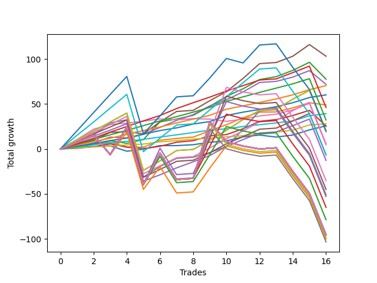

# Short Pointer 002 DB 
- Symbol: ES
- Date Range: 03/18/2022 - 07/15/2022
- Trading Period: 7:20-12:30
- Number of Trades: 16



| Name | Win Percent | Profit | Avg Profit / Trade | Avg Time / Trade |      | Name | Win Percent | Profit | Avg Profit / Trade | Avg Time / Trade |
| ---- | ----------- | ------ | ------------------ | ---------------- | ---- | ---- | ----------- | ------ | ------------------ | ---------------- |
| Sorted By <br> Profit | | | | | | Sorted By <br> Win Percentage ||||
| Five | 87.50 | 51625.00 | 3226.56 | 27:41 |     | Eighty-Four | 100.00 | 35250.00 | 2203.12 | 14:21 |
| Two | 87.50 | 38875.00 | 2429.69 | 17:31 |     | Eighty-Three | 100.00 | 30125.00 | 1882.81 | 13:32 |
| Four | 87.50 | 36000.00 | 2250.00 | 19:47 |     | Eighty-Two | 100.00 | 19625.00 | 1226.56 | 03:09 |
| Eighty-Four | 100.00 | 35250.00 | 2203.12 | 14:21 |     | Eighty-One | 100.00 | 14000.00 | 875.00 | 02:29 |
| Eighty-Three | 100.00 | 30125.00 | 1882.81 | 13:32 |     | Eighty-Six | 93.75 | 23125.00 | 1445.31 | 33:36 |
| One | 81.25 | 24500.00 | 1531.25 | 08:14 |     | Eighty-Five | 93.75 | 16125.00 | 1007.81 | 32:07 |
| Eighty-Six | 93.75 | 23125.00 | 1445.31 | 33:36 |     | Five | 87.50 | 51625.00 | 3226.56 | 27:41 |
| Eighty-Two | 100.00 | 19625.00 | 1226.56 | 03:09 |     | Two | 87.50 | 38875.00 | 2429.69 | 17:31 |
| Eighty-Five | 93.75 | 16125.00 | 1007.81 | 32:07 |     | Four | 87.50 | 36000.00 | 2250.00 | 19:47 |
| Eighty-One | 100.00 | 14000.00 | 875.00 | 02:29 |     | Two Hundred One | 87.50 | 9625.00 | 601.56 | 52:00 |
| Zero | 81.25 | 12875.00 | 804.69 | 04:44 |     | Ninety | 87.50 | 9625.00 | 601.56 | 52:00 |
| Three | 81.25 | 12750.00 | 796.88 | 14:53 |     | Eighty-Nine | 87.50 | 2875.00 | 179.69 | 49:15 |
| Two Hundred Two | 68.75 | 10125.00 | 632.81 | 103:43 |     | Eighty-Eight | 87.50 | -3250.00 | -203.12 | 46:47 |
| Two Hundred One | 87.50 | 9625.00 | 601.56 | 52:00 |     | Eighty-Seven | 87.50 | -6375.00 | -398.44 | 44:30 |
| Ninety | 87.50 | 9625.00 | 601.56 | 52:00 |     | One | 81.25 | 24500.00 | 1531.25 | 08:14 |
| Eighty-Nine | 87.50 | 2875.00 | 179.69 | 49:15 |     | Zero | 81.25 | 12875.00 | 804.69 | 04:44 |
| Six | 75.00 | 2375.00 | 148.44 | 25:18 |     | Three | 81.25 | 12750.00 | 796.88 | 14:53 |
| Eighty-Eight | 87.50 | -3250.00 | -203.12 | 46:47 |     | Six | 75.00 | 2375.00 | 148.44 | 25:18 |
| Two Hundred One.Five | 75.00 | -3250.00 | -203.12 | 82:05 |     | Two Hundred One.Five | 75.00 | -3250.00 | -203.12 | 82:05 |
| Eighty-Seven | 87.50 | -6375.00 | -398.44 | 44:30 |     | Seven | 75.00 | -26500.00 | -1656.25 | 68:04 |
| Two Hundred Five | 50.00 | -17625.00 | -1101.56 | 152:53 |     | Two Hundred Two | 68.75 | 10125.00 | 632.81 | 103:43 |
| Two Hundred Four.Five | 50.00 | -22500.00 | -1406.25 | 152:41 |     | Two Hundred Five | 50.00 | -17625.00 | -1101.56 | 152:53 |
| Two Hundred Four | 50.00 | -25500.00 | -1593.75 | 150:33 |     | Two Hundred Four.Five | 50.00 | -22500.00 | -1406.25 | 152:41 |
| Seven | 75.00 | -26500.00 | -1656.25 | 68:04 |     | Two Hundred Four | 50.00 | -25500.00 | -1593.75 | 150:33 |
| Two Hundred Three.Five | 50.00 | -32500.00 | -2031.25 | 147:48 |     | Two Hundred Three.Five | 50.00 | -32500.00 | -2031.25 | 147:48 |
| Two Hundred Three | 50.00 | -39375.00 | -2460.94 | 147:17 |     | Two Hundred Three | 50.00 | -39375.00 | -2460.94 | 147:17 |
| Two Hundred Fifteen | 43.75 | -47750.00 | -2984.38 | 158:27 |     | Two Hundred Two.Five | 50.00 | -50125.00 | -3132.81 | 140:00 |
| Two Hundred Fourteen.Five | 43.75 | -47750.00 | -2984.38 | 158:27 |     | Two Hundred Fifteen | 43.75 | -47750.00 | -2984.38 | 158:27 |
| Two Hundred Fourteen | 43.75 | -47750.00 | -2984.38 | 158:27 |     | Two Hundred Fourteen.Five | 43.75 | -47750.00 | -2984.38 | 158:27 |
| Two Hundred Thirteen.Five | 43.75 | -47750.00 | -2984.38 | 158:27 |     | Two Hundred Fourteen | 43.75 | -47750.00 | -2984.38 | 158:27 |
| Two Hundred Thirteen | 43.75 | -47750.00 | -2984.38 | 158:27 |     | Two Hundred Thirteen.Five | 43.75 | -47750.00 | -2984.38 | 158:27 |
| Two Hundred Twelve.Five | 43.75 | -47750.00 | -2984.38 | 158:27 |     | Two Hundred Thirteen | 43.75 | -47750.00 | -2984.38 | 158:27 |
| Two Hundred Twelve | 43.75 | -47750.00 | -2984.38 | 158:27 |     | Two Hundred Twelve.Five | 43.75 | -47750.00 | -2984.38 | 158:27 |
| Two Hundred Eleven.Five | 43.75 | -47750.00 | -2984.38 | 158:27 |     | Two Hundred Twelve | 43.75 | -47750.00 | -2984.38 | 158:27 |
| Two Hundred Eleven | 43.75 | -47750.00 | -2984.38 | 158:27 |     | Two Hundred Eleven.Five | 43.75 | -47750.00 | -2984.38 | 158:27 |
| Two Hundred Ten.Five | 43.75 | -47750.00 | -2984.38 | 158:27 |     | Two Hundred Eleven | 43.75 | -47750.00 | -2984.38 | 158:27 |
| Two Hundred Ten | 43.75 | -47750.00 | -2984.38 | 158:27 |     | Two Hundred Ten.Five | 43.75 | -47750.00 | -2984.38 | 158:27 |
| Two Hundred Nine.Five | 43.75 | -47750.00 | -2984.38 | 158:27 |     | Two Hundred Ten | 43.75 | -47750.00 | -2984.38 | 158:27 |
| Two Hundred Nine | 43.75 | -47750.00 | -2984.38 | 158:27 |     | Two Hundred Nine.Five | 43.75 | -47750.00 | -2984.38 | 158:27 |
| Two Hundred Eight.Five | 43.75 | -47750.00 | -2984.38 | 158:27 |     | Two Hundred Nine | 43.75 | -47750.00 | -2984.38 | 158:27 |
| Two Hundred Eight | 43.75 | -47750.00 | -2984.38 | 158:27 |     | Two Hundred Eight.Five | 43.75 | -47750.00 | -2984.38 | 158:27 |
| Two Hundred Seven.Five | 43.75 | -47750.00 | -2984.38 | 158:27 |     | Two Hundred Eight | 43.75 | -47750.00 | -2984.38 | 158:27 |
| Two Hundred Seven | 43.75 | -47750.00 | -2984.38 | 158:27 |     | Two Hundred Seven.Five | 43.75 | -47750.00 | -2984.38 | 158:27 |
| Two Hundred Six.Five | 43.75 | -47750.00 | -2984.38 | 158:27 |     | Two Hundred Seven | 43.75 | -47750.00 | -2984.38 | 158:27 |
| Two Hundred Six | 43.75 | -49250.00 | -3078.12 | 158:21 |     | Two Hundred Six.Five | 43.75 | -47750.00 | -2984.38 | 158:27 |
| Two Hundred Two.Five | 50.00 | -50125.00 | -3132.81 | 140:00 |     | Two Hundred Six | 43.75 | -49250.00 | -3078.12 | 158:21 |
| Two Hundred Five.Five | 43.75 | -51750.00 | -3234.38 | 158:06 |     | Two Hundred Five.Five | 43.75 | -51750.00 | -3234.38 | 158:06 |

## NO STOPLOSS

### Test Zero
* Sell when price hits the middle line of the 20p bollinger
* No Stoploss
* Results:
```
Total Trades: 16
Percent Up: 18.75
Percent Down: 81.25
Total Points Moved Down: 25.75
Potential Profit: 12875.00
Total Points Ups: 8.25 Count Ups: 3
Total Points Downs: 34.00 Count Downs: 13
```

<details><summary>Trades</summary>

<code>In: 2022-03-25 11:34:00		Out: 2022-03-25 11:40:25		Total Position Time: 06:25		Total Move Down: 2.00		Total to Date: 2.00</code> <br />
<code>In: 2022-03-25 11:57:00		Out: 2022-03-25 11:57:20		Total Position Time: 00:20		Total Move Down: 0.75		Total to Date: 2.75</code> <br />
<code>In: 2022-03-29 08:53:00		Out: 2022-03-29 08:56:20		Total Position Time: 03:20		Total Move Down: 0.75		Total to Date: 3.50</code> <br />
<code>In: 2022-03-31 07:39:00		Out: 2022-03-31 08:03:10		Total Position Time: 24:10		Total Move Down: -6.00		Total to Date: -2.50</code> <br />
<code>In: 2022-04-25 09:29:00		Out: 2022-04-25 09:31:10		Total Position Time: 02:10		Total Move Down: 2.25		Total to Date: -0.25</code> <br />
<code>In: 2022-04-26 10:02:00		Out: 2022-04-26 10:02:25		Total Position Time: 00:25		Total Move Down: 4.00		Total to Date: 3.75</code> <br />
<code>In: 2022-05-25 10:40:00		Out: 2022-05-25 10:50:50		Total Position Time: 10:50		Total Move Down: -0.00		Total to Date: 3.75</code> <br />
<code>In: 2022-06-01 12:19:00		Out: 2022-06-01 12:25:25		Total Position Time: 06:25		Total Move Down: 1.00		Total to Date: 4.75</code> <br />
<code>In: 2022-06-09 08:47:00		Out: 2022-06-09 08:48:20		Total Position Time: 01:20		Total Move Down: 2.75		Total to Date: 7.50</code> <br />
<code>In: 2022-06-15 11:02:00		Out: 2022-06-15 11:02:45		Total Position Time: 00:45		Total Move Down: 1.50		Total to Date: 9.00</code> <br />
<code>In: 2022-06-17 08:21:00		Out: 2022-06-17 08:23:25		Total Position Time: 02:25		Total Move Down: 4.50		Total to Date: 13.50</code> <br />
<code>In: 2022-06-17 08:35:00		Out: 2022-06-17 08:35:45		Total Position Time: 00:45		Total Move Down: 2.00		Total to Date: 15.50</code> <br />
<code>In: 2022-06-29 12:20:00		Out: 2022-06-29 12:33:20		Total Position Time: 13:20		Total Move Down: -2.25		Total to Date: 13.25</code> <br />
<code>In: 2022-07-06 11:00:00		Out: 2022-07-06 11:00:15		Total Position Time: 00:15		Total Move Down: 2.25		Total to Date: 15.50</code> <br />
<code>In: 2022-07-06 11:11:00		Out: 2022-07-06 11:11:15		Total Position Time: 00:15		Total Move Down: 5.75		Total to Date: 21.25</code> <br />
<code>In: 2022-07-14 08:13:00		Out: 2022-07-14 08:15:45		Total Position Time: 02:45		Total Move Down: 4.50		Total to Date: 25.75</code> <br />


</details>

### Test One
* Sell when the price hits the upper line of the 20p 1std bollinger
* No Stoploss
* Results:
```
Total Trades: 16
Percent Up: 18.75
Percent Down: 81.25
Total Points Moved Down: 49.00
Potential Profit: 24500.00
Total Points Ups: 8.00 Count Ups: 3
Total Points Downs: 57.00 Count Downs: 13
```

<details><summary>Trades</summary>

<code>In: 2022-03-25 11:34:00		Out: 2022-03-25 11:41:25		Total Position Time: 07:25		Total Move Down: 2.50		Total to Date: 2.50</code> <br />
<code>In: 2022-03-25 11:57:00		Out: 2022-03-25 12:00:50		Total Position Time: 03:50		Total Move Down: 2.75		Total to Date: 5.25</code> <br />
<code>In: 2022-03-29 08:53:00		Out: 2022-03-29 08:58:40		Total Position Time: 05:40		Total Move Down: 2.25		Total to Date: 7.50</code> <br />
<code>In: 2022-03-31 07:39:00		Out: 2022-03-31 08:08:00		Total Position Time: 29:00		Total Move Down: -5.25		Total to Date: 2.25</code> <br />
<code>In: 2022-04-25 09:29:00		Out: 2022-04-25 09:42:45		Total Position Time: 13:45		Total Move Down: -0.25		Total to Date: 2.00</code> <br />
<code>In: 2022-04-26 10:02:00		Out: 2022-04-26 10:03:20		Total Position Time: 01:20		Total Move Down: 7.75		Total to Date: 9.75</code> <br />
<code>In: 2022-05-25 10:40:00		Out: 2022-05-25 10:51:35		Total Position Time: 11:35		Total Move Down: 2.00		Total to Date: 11.75</code> <br />
<code>In: 2022-06-01 12:19:00		Out: 2022-06-01 12:28:15		Total Position Time: 09:15		Total Move Down: 1.50		Total to Date: 13.25</code> <br />
<code>In: 2022-06-09 08:47:00		Out: 2022-06-09 08:49:35		Total Position Time: 02:35		Total Move Down: 7.00		Total to Date: 20.25</code> <br />
<code>In: 2022-06-15 11:02:00		Out: 2022-06-15 11:03:00		Total Position Time: 01:00		Total Move Down: 6.75		Total to Date: 27.00</code> <br />
<code>In: 2022-06-17 08:21:00		Out: 2022-06-17 08:25:20		Total Position Time: 04:20		Total Move Down: 7.75		Total to Date: 34.75</code> <br />
<code>In: 2022-06-17 08:35:00		Out: 2022-06-17 08:39:05		Total Position Time: 04:05		Total Move Down: 6.25		Total to Date: 41.00</code> <br />
<code>In: 2022-06-29 12:20:00		Out: 2022-06-29 12:34:10		Total Position Time: 14:10		Total Move Down: 0.25		Total to Date: 41.25</code> <br />
<code>In: 2022-07-06 11:00:00		Out: 2022-07-06 11:00:40		Total Position Time: 00:40		Total Move Down: 4.50		Total to Date: 45.75</code> <br />
<code>In: 2022-07-06 11:11:00		Out: 2022-07-06 11:11:15		Total Position Time: 00:15		Total Move Down: 5.75		Total to Date: 51.50</code> <br />
<code>In: 2022-07-14 08:13:00		Out: 2022-07-14 08:35:55		Total Position Time: 22:55		Total Move Down: -2.50		Total to Date: 49.00</code> <br />


</details>

### Test Two
* Sell when the price hits the upper line of the 20p 2std bollinger
* No Stoploss
* Results:
```
Total Trades: 16
Percent Up: 12.50
Percent Down: 87.50
Total Points Moved Down: 77.75
Potential Profit: 38875.00
Total Points Ups: 21.75 Count Ups: 2
Total Points Downs: 99.50 Count Downs: 14
```

<details><summary>Trades</summary>

<code>In: 2022-03-25 11:34:00		Out: 2022-03-25 12:01:15		Total Position Time: 27:15		Total Move Down: 2.25		Total to Date: 2.25</code> <br />
<code>In: 2022-03-25 11:57:00		Out: 2022-03-25 12:01:15		Total Position Time: 04:15		Total Move Down: 3.25		Total to Date: 5.50</code> <br />
<code>In: 2022-03-29 08:53:00		Out: 2022-03-29 09:01:40		Total Position Time: 08:40		Total Move Down: 3.75		Total to Date: 9.25</code> <br />
<code>In: 2022-03-31 07:39:00		Out: 2022-03-31 08:08:30		Total Position Time: 29:30		Total Move Down: -3.00		Total to Date: 6.25</code> <br />
<code>In: 2022-04-25 09:29:00		Out: 2022-04-25 10:01:20		Total Position Time: 32:20		Total Move Down: 4.25		Total to Date: 10.50</code> <br />
<code>In: 2022-04-26 10:02:00		Out: 2022-04-26 10:23:00		Total Position Time: 21:00		Total Move Down: 19.75		Total to Date: 30.25</code> <br />
<code>In: 2022-05-25 10:40:00		Out: 2022-05-25 10:52:10		Total Position Time: 12:10		Total Move Down: 3.00		Total to Date: 33.25</code> <br />
<code>In: 2022-06-01 12:19:00		Out: 2022-06-01 12:30:05		Total Position Time: 11:05		Total Move Down: 4.25		Total to Date: 37.50</code> <br />
<code>In: 2022-06-09 08:47:00		Out: 2022-06-09 09:11:10		Total Position Time: 24:10		Total Move Down: 10.00		Total to Date: 47.50</code> <br />
<code>In: 2022-06-15 11:02:00		Out: 2022-06-15 11:03:10		Total Position Time: 01:10		Total Move Down: 11.00		Total to Date: 58.50</code> <br />
<code>In: 2022-06-17 08:21:00		Out: 2022-06-17 08:45:15		Total Position Time: 24:15		Total Move Down: 8.50		Total to Date: 67.00</code> <br />
<code>In: 2022-06-17 08:35:00		Out: 2022-06-17 08:45:15		Total Position Time: 10:15		Total Move Down: 10.25		Total to Date: 77.25</code> <br />
<code>In: 2022-06-29 12:20:00		Out: 2022-06-29 12:36:35		Total Position Time: 16:35		Total Move Down: 3.25		Total to Date: 80.50</code> <br />
<code>In: 2022-07-06 11:00:00		Out: 2022-07-06 11:02:25		Total Position Time: 02:25		Total Move Down: 7.00		Total to Date: 87.50</code> <br />
<code>In: 2022-07-06 11:11:00		Out: 2022-07-06 11:11:45		Total Position Time: 00:45		Total Move Down: 9.00		Total to Date: 96.50</code> <br />
<code>In: 2022-07-14 08:13:00		Out: 2022-07-14 09:07:35		Total Position Time: 54:35		Total Move Down: -18.75		Total to Date: 77.75</code> <br />


</details>

### Test Three
* Sell when price hits the middle line of the 50p bollinger
* No Stoploss
* Results:
```
Total Trades: 16
Percent Up: 18.75
Percent Down: 81.25
Total Points Moved Down: 25.50
Potential Profit: 12750.00
Total Points Ups: 22.75 Count Ups: 3
Total Points Downs: 48.25 Count Downs: 13
```

<details><summary>Trades</summary>

<code>In: 2022-03-25 11:34:00		Out: 2022-03-25 12:00:45		Total Position Time: 26:45		Total Move Down: 0.75		Total to Date: 0.75</code> <br />
<code>In: 2022-03-25 11:57:00		Out: 2022-03-25 12:00:45		Total Position Time: 03:45		Total Move Down: 1.75		Total to Date: 2.50</code> <br />
<code>In: 2022-03-29 08:53:00		Out: 2022-03-29 09:01:35		Total Position Time: 08:35		Total Move Down: 3.25		Total to Date: 5.75</code> <br />
<code>In: 2022-03-31 07:39:00		Out: 2022-03-31 08:15:35		Total Position Time: 36:35		Total Move Down: -3.75		Total to Date: 2.00</code> <br />
<code>In: 2022-04-25 09:29:00		Out: 2022-04-25 09:55:25		Total Position Time: 26:25		Total Move Down: -1.50		Total to Date: 0.50</code> <br />
<code>In: 2022-04-26 10:02:00		Out: 2022-04-26 10:02:20		Total Position Time: 00:20		Total Move Down: 2.50		Total to Date: 3.00</code> <br />
<code>In: 2022-05-25 10:40:00		Out: 2022-05-25 10:53:35		Total Position Time: 13:35		Total Move Down: 4.50		Total to Date: 7.50</code> <br />
<code>In: 2022-06-01 12:19:00		Out: 2022-06-01 12:25:30		Total Position Time: 06:30		Total Move Down: 1.75		Total to Date: 9.25</code> <br />
<code>In: 2022-06-09 08:47:00		Out: 2022-06-09 08:48:50		Total Position Time: 01:50		Total Move Down: 5.25		Total to Date: 14.50</code> <br />
<code>In: 2022-06-15 11:02:00		Out: 2022-06-15 11:02:45		Total Position Time: 00:45		Total Move Down: 1.50		Total to Date: 16.00</code> <br />
<code>In: 2022-06-17 08:21:00		Out: 2022-06-17 08:45:05		Total Position Time: 24:05		Total Move Down: 6.50		Total to Date: 22.50</code> <br />
<code>In: 2022-06-17 08:35:00		Out: 2022-06-17 08:45:05		Total Position Time: 10:05		Total Move Down: 8.25		Total to Date: 30.75</code> <br />
<code>In: 2022-06-29 12:20:00		Out: 2022-06-29 12:34:15		Total Position Time: 14:15		Total Move Down: 2.00		Total to Date: 32.75</code> <br />
<code>In: 2022-07-06 11:00:00		Out: 2022-07-06 11:00:40		Total Position Time: 00:40		Total Move Down: 4.50		Total to Date: 37.25</code> <br />
<code>In: 2022-07-06 11:11:00		Out: 2022-07-06 11:11:15		Total Position Time: 00:15		Total Move Down: 5.75		Total to Date: 43.00</code> <br />
<code>In: 2022-07-14 08:13:00		Out: 2022-07-14 09:16:55		Total Position Time: 63:55		Total Move Down: -17.50		Total to Date: 25.50</code> <br />


</details>

### Test Four
* Sell when the price hits the upper line of the 50p 1std bollinger
* No Stoploss
* Results:
```
Total Trades: 16
Percent Up: 12.50
Percent Down: 87.50
Total Points Moved Down: 72.00
Potential Profit: 36000.00
Total Points Ups: 16.50 Count Ups: 2
Total Points Downs: 88.50 Count Downs: 14
```

<details><summary>Trades</summary>

<code>In: 2022-03-25 11:34:00		Out: 2022-03-25 12:01:40		Total Position Time: 27:40		Total Move Down: 2.75		Total to Date: 2.75</code> <br />
<code>In: 2022-03-25 11:57:00		Out: 2022-03-25 12:01:40		Total Position Time: 04:40		Total Move Down: 3.75		Total to Date: 6.50</code> <br />
<code>In: 2022-03-29 08:53:00		Out: 2022-03-29 09:02:15		Total Position Time: 09:15		Total Move Down: 6.75		Total to Date: 13.25</code> <br />
<code>In: 2022-03-31 07:39:00		Out: 2022-03-31 08:25:20		Total Position Time: 46:20		Total Move Down: -1.25		Total to Date: 12.00</code> <br />
<code>In: 2022-04-25 09:29:00		Out: 2022-04-25 10:01:20		Total Position Time: 32:20		Total Move Down: 4.25		Total to Date: 16.25</code> <br />
<code>In: 2022-04-26 10:02:00		Out: 2022-04-26 10:03:20		Total Position Time: 01:20		Total Move Down: 7.75		Total to Date: 24.00</code> <br />
<code>In: 2022-05-25 10:40:00		Out: 2022-05-25 11:06:40		Total Position Time: 26:40		Total Move Down: 7.75		Total to Date: 31.75</code> <br />
<code>In: 2022-06-01 12:19:00		Out: 2022-06-01 12:35:10		Total Position Time: 16:10		Total Move Down: 6.50		Total to Date: 38.25</code> <br />
<code>In: 2022-06-09 08:47:00		Out: 2022-06-09 08:50:35		Total Position Time: 03:35		Total Move Down: 9.75		Total to Date: 48.00</code> <br />
<code>In: 2022-06-15 11:02:00		Out: 2022-06-15 11:03:00		Total Position Time: 01:00		Total Move Down: 6.75		Total to Date: 54.75</code> <br />
<code>In: 2022-06-17 08:21:00		Out: 2022-06-17 08:51:20		Total Position Time: 30:20		Total Move Down: 8.75		Total to Date: 63.50</code> <br />
<code>In: 2022-06-17 08:35:00		Out: 2022-06-17 08:51:20		Total Position Time: 16:20		Total Move Down: 10.50		Total to Date: 74.00</code> <br />
<code>In: 2022-06-29 12:20:00		Out: 2022-06-29 12:46:05		Total Position Time: 26:05		Total Move Down: 1.25		Total to Date: 75.25</code> <br />
<code>In: 2022-07-06 11:00:00		Out: 2022-07-06 11:01:15		Total Position Time: 01:15		Total Move Down: 4.75		Total to Date: 80.00</code> <br />
<code>In: 2022-07-06 11:11:00		Out: 2022-07-06 11:11:35		Total Position Time: 00:35		Total Move Down: 7.25		Total to Date: 87.25</code> <br />
<code>In: 2022-07-14 08:13:00		Out: 2022-07-14 09:26:10		Total Position Time: 73:10		Total Move Down: -15.25		Total to Date: 72.00</code> <br />


</details>

### Test Five
* Sell when the price hits the upper line of the 50p 2std bollinger
* No Stoploss
* Results:
```
Total Trades: 16
Percent Up: 12.50
Percent Down: 87.50
Total Points Moved Down: 103.25
Potential Profit: 51625.00
Total Points Ups: 15.50 Count Ups: 2
Total Points Downs: 118.75 Count Downs: 14
```

<details><summary>Trades</summary>

<code>In: 2022-03-25 11:34:00		Out: 2022-03-25 12:01:55		Total Position Time: 27:55		Total Move Down: 4.25		Total to Date: 4.25</code> <br />
<code>In: 2022-03-25 11:57:00		Out: 2022-03-25 12:01:55		Total Position Time: 04:55		Total Move Down: 5.25		Total to Date: 9.50</code> <br />
<code>In: 2022-03-29 08:53:00		Out: 2022-03-29 09:10:50		Total Position Time: 17:50		Total Move Down: 9.00		Total to Date: 18.50</code> <br />
<code>In: 2022-03-31 07:39:00		Out: 2022-03-31 08:31:45		Total Position Time: 52:45		Total Move Down: 0.75		Total to Date: 19.25</code> <br />
<code>In: 2022-04-25 09:29:00		Out: 2022-04-25 11:01:35		Total Position Time: 92:35		Total Move Down: -2.50		Total to Date: 16.75</code> <br />
<code>In: 2022-04-26 10:02:00		Out: 2022-04-26 10:14:55		Total Position Time: 12:55		Total Move Down: 13.50		Total to Date: 30.25</code> <br />
<code>In: 2022-05-25 10:40:00		Out: 2022-05-25 11:06:50		Total Position Time: 26:50		Total Move Down: 11.50		Total to Date: 41.75</code> <br />
<code>In: 2022-06-01 12:19:00		Out: 2022-06-01 12:46:05		Total Position Time: 27:05		Total Move Down: 1.25		Total to Date: 43.00</code> <br />
<code>In: 2022-06-09 08:47:00		Out: 2022-06-09 09:12:40		Total Position Time: 25:40		Total Move Down: 10.75		Total to Date: 53.75</code> <br />
<code>In: 2022-06-15 11:02:00		Out: 2022-06-15 11:03:05		Total Position Time: 01:05		Total Move Down: 10.00		Total to Date: 63.75</code> <br />
<code>In: 2022-06-17 08:21:00		Out: 2022-06-17 08:52:10		Total Position Time: 31:10		Total Move Down: 14.75		Total to Date: 78.50</code> <br />
<code>In: 2022-06-17 08:35:00		Out: 2022-06-17 08:52:10		Total Position Time: 17:10		Total Move Down: 16.50		Total to Date: 95.00</code> <br />
<code>In: 2022-06-29 12:20:00		Out: 2022-06-29 12:46:05		Total Position Time: 26:05		Total Move Down: 1.25		Total to Date: 96.25</code> <br />
<code>In: 2022-07-06 11:00:00		Out: 2022-07-06 11:02:25		Total Position Time: 02:25		Total Move Down: 7.00		Total to Date: 103.25</code> <br />
<code>In: 2022-07-06 11:11:00		Out: 2022-07-06 11:12:15		Total Position Time: 01:15		Total Move Down: 13.00		Total to Date: 116.25</code> <br />
<code>In: 2022-07-14 08:13:00		Out: 2022-07-14 09:28:20		Total Position Time: 75:20		Total Move Down: -13.00		Total to Date: 103.25</code> <br />


</details>

### Test Six
* Sell when the price hits the middle line of the 1std VWAP
* No Stoploss
* Results:
```
Total Trades: 16
Percent Up: 25.00
Percent Down: 75.00
Total Points Moved Down: 4.75
Potential Profit: 2375.00
Total Points Ups: 50.00 Count Ups: 4
Total Points Downs: 54.75 Count Downs: 12
```

<details><summary>Trades</summary>

<code>In: 2022-03-25 11:34:00		Out: 2022-03-25 12:20:30		Total Position Time: 46:30		Total Move Down: 10.50		Total to Date: 10.50</code> <br />
<code>In: 2022-03-25 11:57:00		Out: 2022-03-25 12:20:30		Total Position Time: 23:30		Total Move Down: 11.50		Total to Date: 22.00</code> <br />
<code>In: 2022-03-29 08:53:00		Out: 2022-03-29 09:02:10		Total Position Time: 09:10		Total Move Down: 5.25		Total to Date: 27.25</code> <br />
<code>In: 2022-03-31 07:39:00		Out: 2022-03-31 07:41:35		Total Position Time: 02:35		Total Move Down: 1.50		Total to Date: 28.75</code> <br />
<code>In: 2022-04-25 09:29:00		Out: 2022-04-25 09:31:10		Total Position Time: 02:10		Total Move Down: 2.25		Total to Date: 31.00</code> <br />
<code>In: 2022-04-26 10:02:00		Out: 2022-04-26 10:02:15		Total Position Time: 00:15		Total Move Down: 2.50		Total to Date: 33.50</code> <br />
<code>In: 2022-05-25 10:40:00		Out: 2022-05-25 10:40:15		Total Position Time: 00:15		Total Move Down: -1.00		Total to Date: 32.50</code> <br />
<code>In: 2022-06-01 12:19:00		Out: 2022-06-01 12:46:05		Total Position Time: 27:05		Total Move Down: 1.25		Total to Date: 33.75</code> <br />
<code>In: 2022-06-09 08:47:00		Out: 2022-06-09 08:47:15		Total Position Time: 00:15		Total Move Down: -0.50		Total to Date: 33.25</code> <br />
<code>In: 2022-06-15 11:02:00		Out: 2022-06-15 11:02:15		Total Position Time: 00:15		Total Move Down: -2.50		Total to Date: 30.75</code> <br />
<code>In: 2022-06-17 08:21:00		Out: 2022-06-17 08:22:40		Total Position Time: 01:40		Total Move Down: 2.50		Total to Date: 33.25</code> <br />
<code>In: 2022-06-17 08:35:00		Out: 2022-06-17 08:37:05		Total Position Time: 02:05		Total Move Down: 3.50		Total to Date: 36.75</code> <br />
<code>In: 2022-06-29 12:20:00		Out: 2022-06-29 12:34:15		Total Position Time: 14:15		Total Move Down: 2.00		Total to Date: 38.75</code> <br />
<code>In: 2022-07-06 11:00:00		Out: 2022-07-06 11:01:15		Total Position Time: 01:15		Total Move Down: 4.75		Total to Date: 43.50</code> <br />
<code>In: 2022-07-06 11:11:00		Out: 2022-07-06 11:11:35		Total Position Time: 00:35		Total Move Down: 7.25		Total to Date: 50.75</code> <br />
<code>In: 2022-07-14 08:13:00		Out: 2022-07-14 12:46:05		Total Position Time: 273:05		Total Move Down: -46.00		Total to Date: 4.75</code> <br />


</details>

### Test Seven
* Sell when the price hits the upper line of the 1std VWAP
* No Stoploss
* Results:
```
Total Trades: 16
Percent Up: 25.00
Percent Down: 75.00
Total Points Moved Down: -53.00
Potential Profit: -26500.00
Total Points Ups: 160.50 Count Ups: 4
Total Points Downs: 107.50 Count Downs: 12
```

<details><summary>Trades</summary>

<code>In: 2022-03-25 11:34:00		Out: 2022-03-25 12:46:05		Total Position Time: 72:05		Total Move Down: 7.25		Total to Date: 7.25</code> <br />
<code>In: 2022-03-25 11:57:00		Out: 2022-03-25 12:46:05		Total Position Time: 49:05		Total Move Down: 8.25		Total to Date: 15.50</code> <br />
<code>In: 2022-03-29 08:53:00		Out: 2022-03-29 09:27:55		Total Position Time: 34:55		Total Move Down: 13.50		Total to Date: 29.00</code> <br />
<code>In: 2022-03-31 07:39:00		Out: 2022-03-31 09:15:10		Total Position Time: 96:10		Total Move Down: 3.50		Total to Date: 32.50</code> <br />
<code>In: 2022-04-25 09:29:00		Out: 2022-04-25 12:46:05		Total Position Time: 197:05		Total Move Down: -63.75		Total to Date: -31.25</code> <br />
<code>In: 2022-04-26 10:02:00		Out: 2022-04-26 10:14:15		Total Position Time: 12:15		Total Move Down: 11.75		Total to Date: -19.50</code> <br />
<code>In: 2022-05-25 10:40:00		Out: 2022-05-25 11:06:45		Total Position Time: 26:45		Total Move Down: 9.00		Total to Date: -10.50</code> <br />
<code>In: 2022-06-01 12:19:00		Out: 2022-06-01 12:46:05		Total Position Time: 27:05		Total Move Down: 1.25		Total to Date: -9.25</code> <br />
<code>In: 2022-06-09 08:47:00		Out: 2022-06-09 08:48:50		Total Position Time: 01:50		Total Move Down: 5.25		Total to Date: -4.00</code> <br />
<code>In: 2022-06-15 11:02:00		Out: 2022-06-15 11:03:00		Total Position Time: 01:00		Total Move Down: 6.75		Total to Date: 2.75</code> <br />
<code>In: 2022-06-17 08:21:00		Out: 2022-06-17 09:03:15		Total Position Time: 42:15		Total Move Down: 19.00		Total to Date: 21.75</code> <br />
<code>In: 2022-06-17 08:35:00		Out: 2022-06-17 09:03:15		Total Position Time: 28:15		Total Move Down: 20.75		Total to Date: 42.50</code> <br />
<code>In: 2022-06-29 12:20:00		Out: 2022-06-29 12:46:05		Total Position Time: 26:05		Total Move Down: 1.25		Total to Date: 43.75</code> <br />
<code>In: 2022-07-06 11:00:00		Out: 2022-07-06 12:46:05		Total Position Time: 106:05		Total Move Down: -26.25		Total to Date: 17.50</code> <br />
<code>In: 2022-07-06 11:11:00		Out: 2022-07-06 12:46:05		Total Position Time: 95:05		Total Move Down: -24.50		Total to Date: -7.00</code> <br />
<code>In: 2022-07-14 08:13:00		Out: 2022-07-14 12:46:05		Total Position Time: 273:05		Total Move Down: -46.00		Total to Date: -53.00</code> <br />


</details>

## TAKE PROFIT

### Test Eighty-One
* Take Profit of 1 Point
* No Stoploss
* Results:
```
Total Trades: 16
Percent Up: 0.00
Percent Down: 100.00
Total Points Moved Down: 28.00
Potential Profit: 14000.00
Total Points Ups: 0.00 Count Ups: 0
Total Points Downs: 28.00 Count Downs: 16
```

<details><summary>Trades</summary>

<code>In: 2022-03-25 11:34:00		Out: 2022-03-25 11:35:15		Total Position Time: 01:15		Total Move Down: 1.25		Total to Date: 1.25</code> <br />
<code>In: 2022-03-25 11:57:00		Out: 2022-03-25 11:58:45		Total Position Time: 01:45		Total Move Down: 1.00		Total to Date: 2.25</code> <br />
<code>In: 2022-03-29 08:53:00		Out: 2022-03-29 08:57:35		Total Position Time: 04:35		Total Move Down: 1.00		Total to Date: 3.25</code> <br />
<code>In: 2022-03-31 07:39:00		Out: 2022-03-31 07:41:25		Total Position Time: 02:25		Total Move Down: 1.25		Total to Date: 4.50</code> <br />
<code>In: 2022-04-25 09:29:00		Out: 2022-04-25 09:31:05		Total Position Time: 02:05		Total Move Down: 1.00		Total to Date: 5.50</code> <br />
<code>In: 2022-04-26 10:02:00		Out: 2022-04-26 10:02:15		Total Position Time: 00:15		Total Move Down: 2.50		Total to Date: 8.00</code> <br />
<code>In: 2022-05-25 10:40:00		Out: 2022-05-25 10:41:05		Total Position Time: 01:05		Total Move Down: 1.25		Total to Date: 9.25</code> <br />
<code>In: 2022-06-01 12:19:00		Out: 2022-06-01 12:25:30		Total Position Time: 06:30		Total Move Down: 1.75		Total to Date: 11.00</code> <br />
<code>In: 2022-06-09 08:47:00		Out: 2022-06-09 08:48:05		Total Position Time: 01:05		Total Move Down: 1.00		Total to Date: 12.00</code> <br />
<code>In: 2022-06-15 11:02:00		Out: 2022-06-15 11:02:45		Total Position Time: 00:45		Total Move Down: 1.50		Total to Date: 13.50</code> <br />
<code>In: 2022-06-17 08:21:00		Out: 2022-06-17 08:22:10		Total Position Time: 01:10		Total Move Down: 1.25		Total to Date: 14.75</code> <br />
<code>In: 2022-06-17 08:35:00		Out: 2022-06-17 08:35:45		Total Position Time: 00:45		Total Move Down: 2.00		Total to Date: 16.75</code> <br />
<code>In: 2022-06-29 12:20:00		Out: 2022-06-29 12:34:15		Total Position Time: 14:15		Total Move Down: 2.00		Total to Date: 18.75</code> <br />
<code>In: 2022-07-06 11:00:00		Out: 2022-07-06 11:00:15		Total Position Time: 00:15		Total Move Down: 2.25		Total to Date: 21.00</code> <br />
<code>In: 2022-07-06 11:11:00		Out: 2022-07-06 11:11:15		Total Position Time: 00:15		Total Move Down: 5.75		Total to Date: 26.75</code> <br />
<code>In: 2022-07-14 08:13:00		Out: 2022-07-14 08:14:30		Total Position Time: 01:30		Total Move Down: 1.25		Total to Date: 28.00</code> <br />


</details>

### Test Eighty-Two
* Take Profit of 2 Point
* No Stoploss
* Results:
```
Total Trades: 16
Percent Up: 0.00
Percent Down: 100.00
Total Points Moved Down: 39.25
Potential Profit: 19625.00
Total Points Ups: 0.00 Count Ups: 0
Total Points Downs: 39.25 Count Downs: 16
```

<details><summary>Trades</summary>

<code>In: 2022-03-25 11:34:00		Out: 2022-03-25 11:40:25		Total Position Time: 06:25		Total Move Down: 2.00		Total to Date: 2.00</code> <br />
<code>In: 2022-03-25 11:57:00		Out: 2022-03-25 12:00:50		Total Position Time: 03:50		Total Move Down: 2.75		Total to Date: 4.75</code> <br />
<code>In: 2022-03-29 08:53:00		Out: 2022-03-29 08:58:35		Total Position Time: 05:35		Total Move Down: 2.00		Total to Date: 6.75</code> <br />
<code>In: 2022-03-31 07:39:00		Out: 2022-03-31 07:41:50		Total Position Time: 02:50		Total Move Down: 1.75		Total to Date: 8.50</code> <br />
<code>In: 2022-04-25 09:29:00		Out: 2022-04-25 09:31:10		Total Position Time: 02:10		Total Move Down: 2.25		Total to Date: 10.75</code> <br />
<code>In: 2022-04-26 10:02:00		Out: 2022-04-26 10:02:15		Total Position Time: 00:15		Total Move Down: 2.50		Total to Date: 13.25</code> <br />
<code>In: 2022-05-25 10:40:00		Out: 2022-05-25 10:41:15		Total Position Time: 01:15		Total Move Down: 2.50		Total to Date: 15.75</code> <br />
<code>In: 2022-06-01 12:19:00		Out: 2022-06-01 12:25:40		Total Position Time: 06:40		Total Move Down: 2.50		Total to Date: 18.25</code> <br />
<code>In: 2022-06-09 08:47:00		Out: 2022-06-09 08:48:20		Total Position Time: 01:20		Total Move Down: 2.75		Total to Date: 21.00</code> <br />
<code>In: 2022-06-15 11:02:00		Out: 2022-06-15 11:02:45		Total Position Time: 00:45		Total Move Down: 1.50		Total to Date: 22.50</code> <br />
<code>In: 2022-06-17 08:21:00		Out: 2022-06-17 08:22:40		Total Position Time: 01:40		Total Move Down: 2.50		Total to Date: 25.00</code> <br />
<code>In: 2022-06-17 08:35:00		Out: 2022-06-17 08:35:45		Total Position Time: 00:45		Total Move Down: 2.00		Total to Date: 27.00</code> <br />
<code>In: 2022-06-29 12:20:00		Out: 2022-06-29 12:34:15		Total Position Time: 14:15		Total Move Down: 2.00		Total to Date: 29.00</code> <br />
<code>In: 2022-07-06 11:00:00		Out: 2022-07-06 11:00:15		Total Position Time: 00:15		Total Move Down: 2.25		Total to Date: 31.25</code> <br />
<code>In: 2022-07-06 11:11:00		Out: 2022-07-06 11:11:15		Total Position Time: 00:15		Total Move Down: 5.75		Total to Date: 37.00</code> <br />
<code>In: 2022-07-14 08:13:00		Out: 2022-07-14 08:15:15		Total Position Time: 02:15		Total Move Down: 2.25		Total to Date: 39.25</code> <br />


</details>

### Test Eighty-Three
* Take Profit of 3 Point
* No Stoploss
* Results:
```
Total Trades: 16
Percent Up: 0.00
Percent Down: 100.00
Total Points Moved Down: 60.25
Potential Profit: 30125.00
Total Points Ups: 0.00 Count Ups: 0
Total Points Downs: 60.25 Count Downs: 16
```

<details><summary>Trades</summary>

<code>In: 2022-03-25 11:34:00		Out: 2022-03-25 12:01:45		Total Position Time: 27:45		Total Move Down: 3.00		Total to Date: 3.00</code> <br />
<code>In: 2022-03-25 11:57:00		Out: 2022-03-25 12:01:00		Total Position Time: 04:00		Total Move Down: 3.00		Total to Date: 6.00</code> <br />
<code>In: 2022-03-29 08:53:00		Out: 2022-03-29 09:01:35		Total Position Time: 08:35		Total Move Down: 3.25		Total to Date: 9.25</code> <br />
<code>In: 2022-03-31 07:39:00		Out: 2022-03-31 09:14:45		Total Position Time: 95:45		Total Move Down: 3.00		Total to Date: 12.25</code> <br />
<code>In: 2022-04-25 09:29:00		Out: 2022-04-25 10:01:20		Total Position Time: 32:20		Total Move Down: 4.25		Total to Date: 16.50</code> <br />
<code>In: 2022-04-26 10:02:00		Out: 2022-04-26 10:02:25		Total Position Time: 00:25		Total Move Down: 4.00		Total to Date: 20.50</code> <br />
<code>In: 2022-05-25 10:40:00		Out: 2022-05-25 10:52:10		Total Position Time: 12:10		Total Move Down: 3.00		Total to Date: 23.50</code> <br />
<code>In: 2022-06-01 12:19:00		Out: 2022-06-01 12:30:05		Total Position Time: 11:05		Total Move Down: 4.25		Total to Date: 27.75</code> <br />
<code>In: 2022-06-09 08:47:00		Out: 2022-06-09 08:48:20		Total Position Time: 01:20		Total Move Down: 2.75		Total to Date: 30.50</code> <br />
<code>In: 2022-06-15 11:02:00		Out: 2022-06-15 11:03:00		Total Position Time: 01:00		Total Move Down: 6.75		Total to Date: 37.25</code> <br />
<code>In: 2022-06-17 08:21:00		Out: 2022-06-17 08:22:45		Total Position Time: 01:45		Total Move Down: 3.75		Total to Date: 41.00</code> <br />
<code>In: 2022-06-17 08:35:00		Out: 2022-06-17 08:36:55		Total Position Time: 01:55		Total Move Down: 3.00		Total to Date: 44.00</code> <br />
<code>In: 2022-06-29 12:20:00		Out: 2022-06-29 12:35:15		Total Position Time: 15:15		Total Move Down: 3.00		Total to Date: 47.00</code> <br />
<code>In: 2022-07-06 11:00:00		Out: 2022-07-06 11:00:40		Total Position Time: 00:40		Total Move Down: 4.50		Total to Date: 51.50</code> <br />
<code>In: 2022-07-06 11:11:00		Out: 2022-07-06 11:11:15		Total Position Time: 00:15		Total Move Down: 5.75		Total to Date: 57.25</code> <br />
<code>In: 2022-07-14 08:13:00		Out: 2022-07-14 08:15:25		Total Position Time: 02:25		Total Move Down: 3.00		Total to Date: 60.25</code> <br />


</details>

### Test Eighty-Four
* Take Profit of 4 Point
* No Stoploss
* Results:
```
Total Trades: 16
Percent Up: 0.00
Percent Down: 100.00
Total Points Moved Down: 70.50
Potential Profit: 35250.00
Total Points Ups: 0.00 Count Ups: 0
Total Points Downs: 70.50 Count Downs: 16
```

<details><summary>Trades</summary>

<code>In: 2022-03-25 11:34:00		Out: 2022-03-25 12:01:55		Total Position Time: 27:55		Total Move Down: 4.25		Total to Date: 4.25</code> <br />
<code>In: 2022-03-25 11:57:00		Out: 2022-03-25 12:01:45		Total Position Time: 04:45		Total Move Down: 4.00		Total to Date: 8.25</code> <br />
<code>In: 2022-03-29 08:53:00		Out: 2022-03-29 09:01:40		Total Position Time: 08:40		Total Move Down: 3.75		Total to Date: 12.00</code> <br />
<code>In: 2022-03-31 07:39:00		Out: 2022-03-31 09:21:00		Total Position Time: 102:00		Total Move Down: 4.25		Total to Date: 16.25</code> <br />
<code>In: 2022-04-25 09:29:00		Out: 2022-04-25 10:01:20		Total Position Time: 32:20		Total Move Down: 4.25		Total to Date: 20.50</code> <br />
<code>In: 2022-04-26 10:02:00		Out: 2022-04-26 10:02:25		Total Position Time: 00:25		Total Move Down: 4.00		Total to Date: 24.50</code> <br />
<code>In: 2022-05-25 10:40:00		Out: 2022-05-25 10:53:35		Total Position Time: 13:35		Total Move Down: 4.50		Total to Date: 29.00</code> <br />
<code>In: 2022-06-01 12:19:00		Out: 2022-06-01 12:30:05		Total Position Time: 11:05		Total Move Down: 4.25		Total to Date: 33.25</code> <br />
<code>In: 2022-06-09 08:47:00		Out: 2022-06-09 08:48:35		Total Position Time: 01:35		Total Move Down: 4.25		Total to Date: 37.50</code> <br />
<code>In: 2022-06-15 11:02:00		Out: 2022-06-15 11:03:00		Total Position Time: 01:00		Total Move Down: 6.75		Total to Date: 44.25</code> <br />
<code>In: 2022-06-17 08:21:00		Out: 2022-06-17 08:23:10		Total Position Time: 02:10		Total Move Down: 3.75		Total to Date: 48.00</code> <br />
<code>In: 2022-06-17 08:35:00		Out: 2022-06-17 08:38:35		Total Position Time: 03:35		Total Move Down: 3.75		Total to Date: 51.75</code> <br />
<code>In: 2022-06-29 12:20:00		Out: 2022-06-29 12:37:05		Total Position Time: 17:05		Total Move Down: 4.00		Total to Date: 55.75</code> <br />
<code>In: 2022-07-06 11:00:00		Out: 2022-07-06 11:00:40		Total Position Time: 00:40		Total Move Down: 4.50		Total to Date: 60.25</code> <br />
<code>In: 2022-07-06 11:11:00		Out: 2022-07-06 11:11:15		Total Position Time: 00:15		Total Move Down: 5.75		Total to Date: 66.00</code> <br />
<code>In: 2022-07-14 08:13:00		Out: 2022-07-14 08:15:45		Total Position Time: 02:45		Total Move Down: 4.50		Total to Date: 70.50</code> <br />


</details>

### Test Eighty-Five
* Take Profit of 5 Point
* No Stoploss
* Results:
```
Total Trades: 16
Percent Up: 6.25
Percent Down: 93.75
Total Points Moved Down: 32.25
Potential Profit: 16125.00
Total Points Ups: 46.00 Count Ups: 1
Total Points Downs: 78.25 Count Downs: 15
```

<details><summary>Trades</summary>

<code>In: 2022-03-25 11:34:00		Out: 2022-03-25 12:02:00		Total Position Time: 28:00		Total Move Down: 5.25		Total to Date: 5.25</code> <br />
<code>In: 2022-03-25 11:57:00		Out: 2022-03-25 12:01:55		Total Position Time: 04:55		Total Move Down: 5.25		Total to Date: 10.50</code> <br />
<code>In: 2022-03-29 08:53:00		Out: 2022-03-29 09:02:10		Total Position Time: 09:10		Total Move Down: 5.25		Total to Date: 15.75</code> <br />
<code>In: 2022-03-31 07:39:00		Out: 2022-03-31 09:21:55		Total Position Time: 102:55		Total Move Down: 5.00		Total to Date: 20.75</code> <br />
<code>In: 2022-04-25 09:29:00		Out: 2022-04-25 10:01:40		Total Position Time: 32:40		Total Move Down: 5.25		Total to Date: 26.00</code> <br />
<code>In: 2022-04-26 10:02:00		Out: 2022-04-26 10:02:30		Total Position Time: 00:30		Total Move Down: 5.25		Total to Date: 31.25</code> <br />
<code>In: 2022-05-25 10:40:00		Out: 2022-05-25 10:56:15		Total Position Time: 16:15		Total Move Down: 4.75		Total to Date: 36.00</code> <br />
<code>In: 2022-06-01 12:19:00		Out: 2022-06-01 12:32:50		Total Position Time: 13:50		Total Move Down: 5.00		Total to Date: 41.00</code> <br />
<code>In: 2022-06-09 08:47:00		Out: 2022-06-09 08:48:50		Total Position Time: 01:50		Total Move Down: 5.25		Total to Date: 46.25</code> <br />
<code>In: 2022-06-15 11:02:00		Out: 2022-06-15 11:03:00		Total Position Time: 01:00		Total Move Down: 6.75		Total to Date: 53.00</code> <br />
<code>In: 2022-06-17 08:21:00		Out: 2022-06-17 08:24:15		Total Position Time: 03:15		Total Move Down: 5.00		Total to Date: 58.00</code> <br />
<code>In: 2022-06-17 08:35:00		Out: 2022-06-17 08:39:00		Total Position Time: 04:00		Total Move Down: 5.00		Total to Date: 63.00</code> <br />
<code>In: 2022-06-29 12:20:00		Out: 2022-06-29 12:41:05		Total Position Time: 21:05		Total Move Down: 4.75		Total to Date: 67.75</code> <br />
<code>In: 2022-07-06 11:00:00		Out: 2022-07-06 11:01:15		Total Position Time: 01:15		Total Move Down: 4.75		Total to Date: 72.50</code> <br />
<code>In: 2022-07-06 11:11:00		Out: 2022-07-06 11:11:15		Total Position Time: 00:15		Total Move Down: 5.75		Total to Date: 78.25</code> <br />
<code>In: 2022-07-14 08:13:00		Out: 2022-07-14 12:46:05		Total Position Time: 273:05		Total Move Down: -46.00		Total to Date: 32.25</code> <br />


</details>

### Test Eighty-Six
* Take Profit of 6 Point
* No Stoploss
* Results:
```
Total Trades: 16
Percent Up: 6.25
Percent Down: 93.75
Total Points Moved Down: 46.25
Potential Profit: 23125.00
Total Points Ups: 46.00 Count Ups: 1
Total Points Downs: 92.25 Count Downs: 15
```

<details><summary>Trades</summary>

<code>In: 2022-03-25 11:34:00		Out: 2022-03-25 12:02:30		Total Position Time: 28:30		Total Move Down: 5.75		Total to Date: 5.75</code> <br />
<code>In: 2022-03-25 11:57:00		Out: 2022-03-25 12:02:00		Total Position Time: 05:00		Total Move Down: 6.25		Total to Date: 12.00</code> <br />
<code>In: 2022-03-29 08:53:00		Out: 2022-03-29 09:02:15		Total Position Time: 09:15		Total Move Down: 6.75		Total to Date: 18.75</code> <br />
<code>In: 2022-03-31 07:39:00		Out: 2022-03-31 09:24:55		Total Position Time: 105:55		Total Move Down: 6.25		Total to Date: 25.00</code> <br />
<code>In: 2022-04-25 09:29:00		Out: 2022-04-25 10:01:50		Total Position Time: 32:50		Total Move Down: 6.25		Total to Date: 31.25</code> <br />
<code>In: 2022-04-26 10:02:00		Out: 2022-04-26 10:02:45		Total Position Time: 00:45		Total Move Down: 6.00		Total to Date: 37.25</code> <br />
<code>In: 2022-05-25 10:40:00		Out: 2022-05-25 11:06:40		Total Position Time: 26:40		Total Move Down: 7.75		Total to Date: 45.00</code> <br />
<code>In: 2022-06-01 12:19:00		Out: 2022-06-01 12:35:10		Total Position Time: 16:10		Total Move Down: 6.50		Total to Date: 51.50</code> <br />
<code>In: 2022-06-09 08:47:00		Out: 2022-06-09 08:49:10		Total Position Time: 02:10		Total Move Down: 6.25		Total to Date: 57.75</code> <br />
<code>In: 2022-06-15 11:02:00		Out: 2022-06-15 11:03:00		Total Position Time: 01:00		Total Move Down: 6.75		Total to Date: 64.50</code> <br />
<code>In: 2022-06-17 08:21:00		Out: 2022-06-17 08:24:20		Total Position Time: 03:20		Total Move Down: 6.00		Total to Date: 70.50</code> <br />
<code>In: 2022-06-17 08:35:00		Out: 2022-06-17 08:39:05		Total Position Time: 04:05		Total Move Down: 6.25		Total to Date: 76.75</code> <br />
<code>In: 2022-06-29 12:20:00		Out: 2022-06-29 12:46:05		Total Position Time: 26:05		Total Move Down: 1.25		Total to Date: 78.00</code> <br />
<code>In: 2022-07-06 11:00:00		Out: 2022-07-06 11:02:25		Total Position Time: 02:25		Total Move Down: 7.00		Total to Date: 85.00</code> <br />
<code>In: 2022-07-06 11:11:00		Out: 2022-07-06 11:11:35		Total Position Time: 00:35		Total Move Down: 7.25		Total to Date: 92.25</code> <br />
<code>In: 2022-07-14 08:13:00		Out: 2022-07-14 12:46:05		Total Position Time: 273:05		Total Move Down: -46.00		Total to Date: 46.25</code> <br />


</details>

### Test Eighty-Seven
* Take Profit of 7 Point
* No Stoploss
* Results:
```
Total Trades: 16
Percent Up: 12.50
Percent Down: 87.50
Total Points Moved Down: -12.75
Potential Profit: -6375.00
Total Points Ups: 109.75 Count Ups: 2
Total Points Downs: 97.00 Count Downs: 14
```

<details><summary>Trades</summary>

<code>In: 2022-03-25 11:34:00		Out: 2022-03-25 12:03:05		Total Position Time: 29:05		Total Move Down: 7.50		Total to Date: 7.50</code> <br />
<code>In: 2022-03-25 11:57:00		Out: 2022-03-25 12:02:30		Total Position Time: 05:30		Total Move Down: 6.75		Total to Date: 14.25</code> <br />
<code>In: 2022-03-29 08:53:00		Out: 2022-03-29 09:02:15		Total Position Time: 09:15		Total Move Down: 6.75		Total to Date: 21.00</code> <br />
<code>In: 2022-03-31 07:39:00		Out: 2022-03-31 09:25:55		Total Position Time: 106:55		Total Move Down: 7.00		Total to Date: 28.00</code> <br />
<code>In: 2022-04-25 09:29:00		Out: 2022-04-25 12:46:05		Total Position Time: 197:05		Total Move Down: -63.75		Total to Date: -35.75</code> <br />
<code>In: 2022-04-26 10:02:00		Out: 2022-04-26 10:02:55		Total Position Time: 00:55		Total Move Down: 7.00		Total to Date: -28.75</code> <br />
<code>In: 2022-05-25 10:40:00		Out: 2022-05-25 11:06:40		Total Position Time: 26:40		Total Move Down: 7.75		Total to Date: -21.00</code> <br />
<code>In: 2022-06-01 12:19:00		Out: 2022-06-01 12:35:30		Total Position Time: 16:30		Total Move Down: 6.75		Total to Date: -14.25</code> <br />
<code>In: 2022-06-09 08:47:00		Out: 2022-06-09 08:49:35		Total Position Time: 02:35		Total Move Down: 7.00		Total to Date: -7.25</code> <br />
<code>In: 2022-06-15 11:02:00		Out: 2022-06-15 11:03:05		Total Position Time: 01:05		Total Move Down: 10.00		Total to Date: 2.75</code> <br />
<code>In: 2022-06-17 08:21:00		Out: 2022-06-17 08:25:20		Total Position Time: 04:20		Total Move Down: 7.75		Total to Date: 10.50</code> <br />
<code>In: 2022-06-17 08:35:00		Out: 2022-06-17 08:45:00		Total Position Time: 10:00		Total Move Down: 7.25		Total to Date: 17.75</code> <br />
<code>In: 2022-06-29 12:20:00		Out: 2022-06-29 12:46:05		Total Position Time: 26:05		Total Move Down: 1.25		Total to Date: 19.00</code> <br />
<code>In: 2022-07-06 11:00:00		Out: 2022-07-06 11:02:25		Total Position Time: 02:25		Total Move Down: 7.00		Total to Date: 26.00</code> <br />
<code>In: 2022-07-06 11:11:00		Out: 2022-07-06 11:11:35		Total Position Time: 00:35		Total Move Down: 7.25		Total to Date: 33.25</code> <br />
<code>In: 2022-07-14 08:13:00		Out: 2022-07-14 12:46:05		Total Position Time: 273:05		Total Move Down: -46.00		Total to Date: -12.75</code> <br />


</details>

### Test Eighty-Eight
* Take Profit of 8 Point
* No Stoploss
* Results:
```
Total Trades: 16
Percent Up: 12.50
Percent Down: 87.50
Total Points Moved Down: -6.50
Potential Profit: -3250.00
Total Points Ups: 109.75 Count Ups: 2
Total Points Downs: 103.25 Count Downs: 14
```

<details><summary>Trades</summary>

<code>In: 2022-03-25 11:34:00		Out: 2022-03-25 12:07:20		Total Position Time: 33:20		Total Move Down: 8.25		Total to Date: 8.25</code> <br />
<code>In: 2022-03-25 11:57:00		Out: 2022-03-25 12:03:05		Total Position Time: 06:05		Total Move Down: 8.50		Total to Date: 16.75</code> <br />
<code>In: 2022-03-29 08:53:00		Out: 2022-03-29 09:10:20		Total Position Time: 17:20		Total Move Down: 7.75		Total to Date: 24.50</code> <br />
<code>In: 2022-03-31 07:39:00		Out: 2022-03-31 09:27:05		Total Position Time: 108:05		Total Move Down: 7.75		Total to Date: 32.25</code> <br />
<code>In: 2022-04-25 09:29:00		Out: 2022-04-25 12:46:05		Total Position Time: 197:05		Total Move Down: -63.75		Total to Date: -31.50</code> <br />
<code>In: 2022-04-26 10:02:00		Out: 2022-04-26 10:03:55		Total Position Time: 01:55		Total Move Down: 8.75		Total to Date: -22.75</code> <br />
<code>In: 2022-05-25 10:40:00		Out: 2022-05-25 11:06:45		Total Position Time: 26:45		Total Move Down: 9.00		Total to Date: -13.75</code> <br />
<code>In: 2022-06-01 12:19:00		Out: 2022-06-01 12:46:05		Total Position Time: 27:05		Total Move Down: 1.25		Total to Date: -12.50</code> <br />
<code>In: 2022-06-09 08:47:00		Out: 2022-06-09 08:50:20		Total Position Time: 03:20		Total Move Down: 8.25		Total to Date: -4.25</code> <br />
<code>In: 2022-06-15 11:02:00		Out: 2022-06-15 11:03:05		Total Position Time: 01:05		Total Move Down: 10.00		Total to Date: 5.75</code> <br />
<code>In: 2022-06-17 08:21:00		Out: 2022-06-17 08:25:35		Total Position Time: 04:35		Total Move Down: 8.00		Total to Date: 13.75</code> <br />
<code>In: 2022-06-17 08:35:00		Out: 2022-06-17 08:45:05		Total Position Time: 10:05		Total Move Down: 8.25		Total to Date: 22.00</code> <br />
<code>In: 2022-06-29 12:20:00		Out: 2022-06-29 12:46:05		Total Position Time: 26:05		Total Move Down: 1.25		Total to Date: 23.25</code> <br />
<code>In: 2022-07-06 11:00:00		Out: 2022-07-06 11:12:05		Total Position Time: 12:05		Total Move Down: 8.00		Total to Date: 31.25</code> <br />
<code>In: 2022-07-06 11:11:00		Out: 2022-07-06 11:11:40		Total Position Time: 00:40		Total Move Down: 8.25		Total to Date: 39.50</code> <br />
<code>In: 2022-07-14 08:13:00		Out: 2022-07-14 12:46:05		Total Position Time: 273:05		Total Move Down: -46.00		Total to Date: -6.50</code> <br />


</details>

### Test Eighty-Nine
* Take Profit of 9 Point
* No Stoploss
* Results:
```
Total Trades: 16
Percent Up: 12.50
Percent Down: 87.50
Total Points Moved Down: 5.75
Potential Profit: 2875.00
Total Points Ups: 109.75 Count Ups: 2
Total Points Downs: 115.50 Count Downs: 14
```

<details><summary>Trades</summary>

<code>In: 2022-03-25 11:34:00		Out: 2022-03-25 12:07:30		Total Position Time: 33:30		Total Move Down: 9.00		Total to Date: 9.00</code> <br />
<code>In: 2022-03-25 11:57:00		Out: 2022-03-25 12:07:20		Total Position Time: 10:20		Total Move Down: 9.25		Total to Date: 18.25</code> <br />
<code>In: 2022-03-29 08:53:00		Out: 2022-03-29 09:10:50		Total Position Time: 17:50		Total Move Down: 9.00		Total to Date: 27.25</code> <br />
<code>In: 2022-03-31 07:39:00		Out: 2022-03-31 09:35:20		Total Position Time: 116:20		Total Move Down: 9.00		Total to Date: 36.25</code> <br />
<code>In: 2022-04-25 09:29:00		Out: 2022-04-25 12:46:05		Total Position Time: 197:05		Total Move Down: -63.75		Total to Date: -27.50</code> <br />
<code>In: 2022-04-26 10:02:00		Out: 2022-04-26 10:03:55		Total Position Time: 01:55		Total Move Down: 8.75		Total to Date: -18.75</code> <br />
<code>In: 2022-05-25 10:40:00		Out: 2022-05-25 11:06:45		Total Position Time: 26:45		Total Move Down: 9.00		Total to Date: -9.75</code> <br />
<code>In: 2022-06-01 12:19:00		Out: 2022-06-01 12:46:05		Total Position Time: 27:05		Total Move Down: 1.25		Total to Date: -8.50</code> <br />
<code>In: 2022-06-09 08:47:00		Out: 2022-06-09 08:50:35		Total Position Time: 03:35		Total Move Down: 9.75		Total to Date: 1.25</code> <br />
<code>In: 2022-06-15 11:02:00		Out: 2022-06-15 11:03:05		Total Position Time: 01:05		Total Move Down: 10.00		Total to Date: 11.25</code> <br />
<code>In: 2022-06-17 08:21:00		Out: 2022-06-17 08:51:20		Total Position Time: 30:20		Total Move Down: 8.75		Total to Date: 20.00</code> <br />
<code>In: 2022-06-17 08:35:00		Out: 2022-06-17 08:45:15		Total Position Time: 10:15		Total Move Down: 10.25		Total to Date: 30.25</code> <br />
<code>In: 2022-06-29 12:20:00		Out: 2022-06-29 12:46:05		Total Position Time: 26:05		Total Move Down: 1.25		Total to Date: 31.50</code> <br />
<code>In: 2022-07-06 11:00:00		Out: 2022-07-06 11:12:15		Total Position Time: 12:15		Total Move Down: 11.25		Total to Date: 42.75</code> <br />
<code>In: 2022-07-06 11:11:00		Out: 2022-07-06 11:11:45		Total Position Time: 00:45		Total Move Down: 9.00		Total to Date: 51.75</code> <br />
<code>In: 2022-07-14 08:13:00		Out: 2022-07-14 12:46:05		Total Position Time: 273:05		Total Move Down: -46.00		Total to Date: 5.75</code> <br />


</details>

### Test Ninety
* Take Profit of 10 Point
* No Stoploss
* Results:
```
Total Trades: 16
Percent Up: 12.50
Percent Down: 87.50
Total Points Moved Down: 19.25
Potential Profit: 9625.00
Total Points Ups: 109.75 Count Ups: 2
Total Points Downs: 129.00 Count Downs: 14
```

<details><summary>Trades</summary>

<code>In: 2022-03-25 11:34:00		Out: 2022-03-25 12:07:35		Total Position Time: 33:35		Total Move Down: 10.00		Total to Date: 10.00</code> <br />
<code>In: 2022-03-25 11:57:00		Out: 2022-03-25 12:07:30		Total Position Time: 10:30		Total Move Down: 10.00		Total to Date: 20.00</code> <br />
<code>In: 2022-03-29 08:53:00		Out: 2022-03-29 09:21:45		Total Position Time: 28:45		Total Move Down: 10.00		Total to Date: 30.00</code> <br />
<code>In: 2022-03-31 07:39:00		Out: 2022-03-31 10:06:45		Total Position Time: 147:45		Total Move Down: 10.00		Total to Date: 40.00</code> <br />
<code>In: 2022-04-25 09:29:00		Out: 2022-04-25 12:46:05		Total Position Time: 197:05		Total Move Down: -63.75		Total to Date: -23.75</code> <br />
<code>In: 2022-04-26 10:02:00		Out: 2022-04-26 10:04:30		Total Position Time: 02:30		Total Move Down: 10.50		Total to Date: -13.25</code> <br />
<code>In: 2022-05-25 10:40:00		Out: 2022-05-25 11:06:50		Total Position Time: 26:50		Total Move Down: 11.50		Total to Date: -1.75</code> <br />
<code>In: 2022-06-01 12:19:00		Out: 2022-06-01 12:46:05		Total Position Time: 27:05		Total Move Down: 1.25		Total to Date: -0.50</code> <br />
<code>In: 2022-06-09 08:47:00		Out: 2022-06-09 08:50:40		Total Position Time: 03:40		Total Move Down: 10.25		Total to Date: 9.75</code> <br />
<code>In: 2022-06-15 11:02:00		Out: 2022-06-15 11:03:10		Total Position Time: 01:10		Total Move Down: 11.00		Total to Date: 20.75</code> <br />
<code>In: 2022-06-17 08:21:00		Out: 2022-06-17 08:51:25		Total Position Time: 30:25		Total Move Down: 12.00		Total to Date: 32.75</code> <br />
<code>In: 2022-06-17 08:35:00		Out: 2022-06-17 08:45:15		Total Position Time: 10:15		Total Move Down: 10.25		Total to Date: 43.00</code> <br />
<code>In: 2022-06-29 12:20:00		Out: 2022-06-29 12:46:05		Total Position Time: 26:05		Total Move Down: 1.25		Total to Date: 44.25</code> <br />
<code>In: 2022-07-06 11:00:00		Out: 2022-07-06 11:12:15		Total Position Time: 12:15		Total Move Down: 11.25		Total to Date: 55.50</code> <br />
<code>In: 2022-07-06 11:11:00		Out: 2022-07-06 11:12:05		Total Position Time: 01:05		Total Move Down: 9.75		Total to Date: 65.25</code> <br />
<code>In: 2022-07-14 08:13:00		Out: 2022-07-14 12:46:05		Total Position Time: 273:05		Total Move Down: -46.00		Total to Date: 19.25</code> <br />


</details>

## DAILY TAKE PROFITS

### Test Two Hundred One
* Take Profit of 10 Point
* No Stoploss
* Results:
```
Total Trades: 16
Percent Up: 12.50
Percent Down: 87.50
Total Points Moved Down: 19.25
Potential Profit: 9625.00
Total Points Ups: 109.75 Count Ups: 2
Total Points Downs: 129.00 Count Downs: 14
```

<details><summary>Trades</summary>

<code>In: 2022-03-25 11:34:00		Out: 2022-03-25 12:07:35		Total Position Time: 33:35		Total Move Down: 10.00		Total to Date: 10.00</code> <br />
<code>In: 2022-03-25 11:57:00		Out: 2022-03-25 12:07:30		Total Position Time: 10:30		Total Move Down: 10.00		Total to Date: 20.00</code> <br />
<code>In: 2022-03-29 08:53:00		Out: 2022-03-29 09:21:45		Total Position Time: 28:45		Total Move Down: 10.00		Total to Date: 30.00</code> <br />
<code>In: 2022-03-31 07:39:00		Out: 2022-03-31 10:06:45		Total Position Time: 147:45		Total Move Down: 10.00		Total to Date: 40.00</code> <br />
<code>In: 2022-04-25 09:29:00		Out: 2022-04-25 12:46:05		Total Position Time: 197:05		Total Move Down: -63.75		Total to Date: -23.75</code> <br />
<code>In: 2022-04-26 10:02:00		Out: 2022-04-26 10:04:30		Total Position Time: 02:30		Total Move Down: 10.50		Total to Date: -13.25</code> <br />
<code>In: 2022-05-25 10:40:00		Out: 2022-05-25 11:06:50		Total Position Time: 26:50		Total Move Down: 11.50		Total to Date: -1.75</code> <br />
<code>In: 2022-06-01 12:19:00		Out: 2022-06-01 12:46:05		Total Position Time: 27:05		Total Move Down: 1.25		Total to Date: -0.50</code> <br />
<code>In: 2022-06-09 08:47:00		Out: 2022-06-09 08:50:40		Total Position Time: 03:40		Total Move Down: 10.25		Total to Date: 9.75</code> <br />
<code>In: 2022-06-15 11:02:00		Out: 2022-06-15 11:03:10		Total Position Time: 01:10		Total Move Down: 11.00		Total to Date: 20.75</code> <br />
<code>In: 2022-06-17 08:21:00		Out: 2022-06-17 08:51:25		Total Position Time: 30:25		Total Move Down: 12.00		Total to Date: 32.75</code> <br />
<code>In: 2022-06-17 08:35:00		Out: 2022-06-17 08:45:15		Total Position Time: 10:15		Total Move Down: 10.25		Total to Date: 43.00</code> <br />
<code>In: 2022-06-29 12:20:00		Out: 2022-06-29 12:46:05		Total Position Time: 26:05		Total Move Down: 1.25		Total to Date: 44.25</code> <br />
<code>In: 2022-07-06 11:00:00		Out: 2022-07-06 11:12:15		Total Position Time: 12:15		Total Move Down: 11.25		Total to Date: 55.50</code> <br />
<code>In: 2022-07-06 11:11:00		Out: 2022-07-06 11:12:05		Total Position Time: 01:05		Total Move Down: 9.75		Total to Date: 65.25</code> <br />
<code>In: 2022-07-14 08:13:00		Out: 2022-07-14 12:46:05		Total Position Time: 273:05		Total Move Down: -46.00		Total to Date: 19.25</code> <br />


</details>

### Test Two Hundred One.Five
* Take Profit of 15 Point
* No Stoploss
* Results:
```
Total Trades: 16
Percent Up: 25.00
Percent Down: 75.00
Total Points Moved Down: -6.50
Potential Profit: -3250.00
Total Points Ups: 160.50 Count Ups: 4
Total Points Downs: 154.00 Count Downs: 12
```

<details><summary>Trades</summary>

<code>In: 2022-03-25 11:34:00		Out: 2022-03-25 12:23:15		Total Position Time: 49:15		Total Move Down: 15.25		Total to Date: 15.25</code> <br />
<code>In: 2022-03-25 11:57:00		Out: 2022-03-25 12:22:55		Total Position Time: 25:55		Total Move Down: 14.75		Total to Date: 30.00</code> <br />
<code>In: 2022-03-29 08:53:00		Out: 2022-03-29 09:30:50		Total Position Time: 37:50		Total Move Down: 15.50		Total to Date: 45.50</code> <br />
<code>In: 2022-03-31 07:39:00		Out: 2022-03-31 11:16:20		Total Position Time: 217:20		Total Move Down: 15.25		Total to Date: 60.75</code> <br />
<code>In: 2022-04-25 09:29:00		Out: 2022-04-25 12:46:05		Total Position Time: 197:05		Total Move Down: -63.75		Total to Date: -3.00</code> <br />
<code>In: 2022-04-26 10:02:00		Out: 2022-04-26 10:17:25		Total Position Time: 15:25		Total Move Down: 15.00		Total to Date: 12.00</code> <br />
<code>In: 2022-05-25 10:40:00		Out: 2022-05-25 11:07:05		Total Position Time: 27:05		Total Move Down: 14.75		Total to Date: 26.75</code> <br />
<code>In: 2022-06-01 12:19:00		Out: 2022-06-01 12:46:05		Total Position Time: 27:05		Total Move Down: 1.25		Total to Date: 28.00</code> <br />
<code>In: 2022-06-09 08:47:00		Out: 2022-06-09 11:24:35		Total Position Time: 157:35		Total Move Down: 15.50		Total to Date: 43.50</code> <br />
<code>In: 2022-06-15 11:02:00		Out: 2022-06-15 11:04:20		Total Position Time: 02:20		Total Move Down: 14.50		Total to Date: 58.00</code> <br />
<code>In: 2022-06-17 08:21:00		Out: 2022-06-17 09:00:30		Total Position Time: 39:30		Total Move Down: 15.75		Total to Date: 73.75</code> <br />
<code>In: 2022-06-17 08:35:00		Out: 2022-06-17 08:51:50		Total Position Time: 16:50		Total Move Down: 15.25		Total to Date: 89.00</code> <br />
<code>In: 2022-06-29 12:20:00		Out: 2022-06-29 12:46:05		Total Position Time: 26:05		Total Move Down: 1.25		Total to Date: 90.25</code> <br />
<code>In: 2022-07-06 11:00:00		Out: 2022-07-06 12:46:05		Total Position Time: 106:05		Total Move Down: -26.25		Total to Date: 64.00</code> <br />
<code>In: 2022-07-06 11:11:00		Out: 2022-07-06 12:46:05		Total Position Time: 95:05		Total Move Down: -24.50		Total to Date: 39.50</code> <br />
<code>In: 2022-07-14 08:13:00		Out: 2022-07-14 12:46:05		Total Position Time: 273:05		Total Move Down: -46.00		Total to Date: -6.50</code> <br />


</details>

### Test Two Hundred Two
* Take Profit of 20 Point
* No Stoploss
* Results:
```
Total Trades: 16
Percent Up: 31.25
Percent Down: 68.75
Total Points Moved Down: 20.25
Potential Profit: 10125.00
Total Points Ups: 165.50 Count Ups: 5
Total Points Downs: 185.75 Count Downs: 11
```

<details><summary>Trades</summary>

<code>In: 2022-03-25 11:34:00		Out: 2022-03-25 12:32:50		Total Position Time: 58:50		Total Move Down: 20.25		Total to Date: 20.25</code> <br />
<code>In: 2022-03-25 11:57:00		Out: 2022-03-25 12:32:10		Total Position Time: 35:10		Total Move Down: 20.25		Total to Date: 40.50</code> <br />
<code>In: 2022-03-29 08:53:00		Out: 2022-03-29 09:33:15		Total Position Time: 40:15		Total Move Down: 20.25		Total to Date: 60.75</code> <br />
<code>In: 2022-03-31 07:39:00		Out: 2022-03-31 12:24:30		Total Position Time: 285:30		Total Move Down: 20.00		Total to Date: 80.75</code> <br />
<code>In: 2022-04-25 09:29:00		Out: 2022-04-25 12:46:05		Total Position Time: 197:05		Total Move Down: -63.75		Total to Date: 17.00</code> <br />
<code>In: 2022-04-26 10:02:00		Out: 2022-04-26 10:23:05		Total Position Time: 21:05		Total Move Down: 19.75		Total to Date: 36.75</code> <br />
<code>In: 2022-05-25 10:40:00		Out: 2022-05-25 11:07:20		Total Position Time: 27:20		Total Move Down: 21.25		Total to Date: 58.00</code> <br />
<code>In: 2022-06-01 12:19:00		Out: 2022-06-01 12:46:05		Total Position Time: 27:05		Total Move Down: 1.25		Total to Date: 59.25</code> <br />
<code>In: 2022-06-09 08:47:00		Out: 2022-06-09 11:38:25		Total Position Time: 171:25		Total Move Down: 19.75		Total to Date: 79.00</code> <br />
<code>In: 2022-06-15 11:02:00		Out: 2022-06-15 11:04:35		Total Position Time: 02:35		Total Move Down: 21.75		Total to Date: 100.75</code> <br />
<code>In: 2022-06-17 08:21:00		Out: 2022-06-17 12:46:05		Total Position Time: 265:05		Total Move Down: -5.00		Total to Date: 95.75</code> <br />
<code>In: 2022-06-17 08:35:00		Out: 2022-06-17 09:02:55		Total Position Time: 27:55		Total Move Down: 20.00		Total to Date: 115.75</code> <br />
<code>In: 2022-06-29 12:20:00		Out: 2022-06-29 12:46:05		Total Position Time: 26:05		Total Move Down: 1.25		Total to Date: 117.00</code> <br />
<code>In: 2022-07-06 11:00:00		Out: 2022-07-06 12:46:05		Total Position Time: 106:05		Total Move Down: -26.25		Total to Date: 90.75</code> <br />
<code>In: 2022-07-06 11:11:00		Out: 2022-07-06 12:46:05		Total Position Time: 95:05		Total Move Down: -24.50		Total to Date: 66.25</code> <br />
<code>In: 2022-07-14 08:13:00		Out: 2022-07-14 12:46:05		Total Position Time: 273:05		Total Move Down: -46.00		Total to Date: 20.25</code> <br />


</details>

### Test Two Hundred Two.Five
* Take Profit of 25 Point
* No Stoploss
* Results:
```
Total Trades: 16
Percent Up: 50.00
Percent Down: 50.00
Total Points Moved Down: -100.25
Potential Profit: -50125.00
Total Points Ups: 219.75 Count Ups: 8
Total Points Downs: 119.50 Count Downs: 8
```

<details><summary>Trades</summary>

<code>In: 2022-03-25 11:34:00		Out: 2022-03-25 12:46:05		Total Position Time: 72:05		Total Move Down: 7.25		Total to Date: 7.25</code> <br />
<code>In: 2022-03-25 11:57:00		Out: 2022-03-25 12:46:05		Total Position Time: 49:05		Total Move Down: 8.25		Total to Date: 15.50</code> <br />
<code>In: 2022-03-29 08:53:00		Out: 2022-03-29 12:46:05		Total Position Time: 233:05		Total Move Down: -21.75		Total to Date: -6.25</code> <br />
<code>In: 2022-03-31 07:39:00		Out: 2022-03-31 12:32:50		Total Position Time: 293:50		Total Move Down: 25.00		Total to Date: 18.75</code> <br />
<code>In: 2022-04-25 09:29:00		Out: 2022-04-25 12:46:05		Total Position Time: 197:05		Total Move Down: -63.75		Total to Date: -45.00</code> <br />
<code>In: 2022-04-26 10:02:00		Out: 2022-04-26 10:32:10		Total Position Time: 30:10		Total Move Down: 25.25		Total to Date: -19.75</code> <br />
<code>In: 2022-05-25 10:40:00		Out: 2022-05-25 12:46:05		Total Position Time: 126:05		Total Move Down: -29.25		Total to Date: -49.00</code> <br />
<code>In: 2022-06-01 12:19:00		Out: 2022-06-01 12:46:05		Total Position Time: 27:05		Total Move Down: 1.25		Total to Date: -47.75</code> <br />
<code>In: 2022-06-09 08:47:00		Out: 2022-06-09 11:59:20		Total Position Time: 192:20		Total Move Down: 26.50		Total to Date: -21.25</code> <br />
<code>In: 2022-06-15 11:02:00		Out: 2022-06-15 11:04:40		Total Position Time: 02:40		Total Move Down: 24.75		Total to Date: 3.50</code> <br />
<code>In: 2022-06-17 08:21:00		Out: 2022-06-17 12:46:05		Total Position Time: 265:05		Total Move Down: -5.00		Total to Date: -1.50</code> <br />
<code>In: 2022-06-17 08:35:00		Out: 2022-06-17 12:46:05		Total Position Time: 251:05		Total Move Down: -3.25		Total to Date: -4.75</code> <br />
<code>In: 2022-06-29 12:20:00		Out: 2022-06-29 12:46:05		Total Position Time: 26:05		Total Move Down: 1.25		Total to Date: -3.50</code> <br />
<code>In: 2022-07-06 11:00:00		Out: 2022-07-06 12:46:05		Total Position Time: 106:05		Total Move Down: -26.25		Total to Date: -29.75</code> <br />
<code>In: 2022-07-06 11:11:00		Out: 2022-07-06 12:46:05		Total Position Time: 95:05		Total Move Down: -24.50		Total to Date: -54.25</code> <br />
<code>In: 2022-07-14 08:13:00		Out: 2022-07-14 12:46:05		Total Position Time: 273:05		Total Move Down: -46.00		Total to Date: -100.25</code> <br />


</details>

### Test Two Hundred Three
* Take Profit of 30 Point
* No Stoploss
* Results:
```
Total Trades: 16
Percent Up: 50.00
Percent Down: 50.00
Total Points Moved Down: -78.75
Potential Profit: -39375.00
Total Points Ups: 219.75 Count Ups: 8
Total Points Downs: 141.00 Count Downs: 8
```

<details><summary>Trades</summary>

<code>In: 2022-03-25 11:34:00		Out: 2022-03-25 12:46:05		Total Position Time: 72:05		Total Move Down: 7.25		Total to Date: 7.25</code> <br />
<code>In: 2022-03-25 11:57:00		Out: 2022-03-25 12:46:05		Total Position Time: 49:05		Total Move Down: 8.25		Total to Date: 15.50</code> <br />
<code>In: 2022-03-29 08:53:00		Out: 2022-03-29 12:46:05		Total Position Time: 233:05		Total Move Down: -21.75		Total to Date: -6.25</code> <br />
<code>In: 2022-03-31 07:39:00		Out: 2022-03-31 12:43:15		Total Position Time: 304:15		Total Move Down: 30.00		Total to Date: 23.75</code> <br />
<code>In: 2022-04-25 09:29:00		Out: 2022-04-25 12:46:05		Total Position Time: 197:05		Total Move Down: -63.75		Total to Date: -40.00</code> <br />
<code>In: 2022-04-26 10:02:00		Out: 2022-04-26 12:15:50		Total Position Time: 133:50		Total Move Down: 31.75		Total to Date: -8.25</code> <br />
<code>In: 2022-05-25 10:40:00		Out: 2022-05-25 12:46:05		Total Position Time: 126:05		Total Move Down: -29.25		Total to Date: -37.50</code> <br />
<code>In: 2022-06-01 12:19:00		Out: 2022-06-01 12:46:05		Total Position Time: 27:05		Total Move Down: 1.25		Total to Date: -36.25</code> <br />
<code>In: 2022-06-09 08:47:00		Out: 2022-06-09 12:00:05		Total Position Time: 193:05		Total Move Down: 30.00		Total to Date: -6.25</code> <br />
<code>In: 2022-06-15 11:02:00		Out: 2022-06-15 11:06:35		Total Position Time: 04:35		Total Move Down: 31.25		Total to Date: 25.00</code> <br />
<code>In: 2022-06-17 08:21:00		Out: 2022-06-17 12:46:05		Total Position Time: 265:05		Total Move Down: -5.00		Total to Date: 20.00</code> <br />
<code>In: 2022-06-17 08:35:00		Out: 2022-06-17 12:46:05		Total Position Time: 251:05		Total Move Down: -3.25		Total to Date: 16.75</code> <br />
<code>In: 2022-06-29 12:20:00		Out: 2022-06-29 12:46:05		Total Position Time: 26:05		Total Move Down: 1.25		Total to Date: 18.00</code> <br />
<code>In: 2022-07-06 11:00:00		Out: 2022-07-06 12:46:05		Total Position Time: 106:05		Total Move Down: -26.25		Total to Date: -8.25</code> <br />
<code>In: 2022-07-06 11:11:00		Out: 2022-07-06 12:46:05		Total Position Time: 95:05		Total Move Down: -24.50		Total to Date: -32.75</code> <br />
<code>In: 2022-07-14 08:13:00		Out: 2022-07-14 12:46:05		Total Position Time: 273:05		Total Move Down: -46.00		Total to Date: -78.75</code> <br />


</details>

### Test Two Hundred Three.Five
* Take Profit of 35 Point
* No Stoploss
* Results:
```
Total Trades: 16
Percent Up: 50.00
Percent Down: 50.00
Total Points Moved Down: -65.00
Potential Profit: -32500.00
Total Points Ups: 219.75 Count Ups: 8
Total Points Downs: 154.75 Count Downs: 8
```

<details><summary>Trades</summary>

<code>In: 2022-03-25 11:34:00		Out: 2022-03-25 12:46:05		Total Position Time: 72:05		Total Move Down: 7.25		Total to Date: 7.25</code> <br />
<code>In: 2022-03-25 11:57:00		Out: 2022-03-25 12:46:05		Total Position Time: 49:05		Total Move Down: 8.25		Total to Date: 15.50</code> <br />
<code>In: 2022-03-29 08:53:00		Out: 2022-03-29 12:46:05		Total Position Time: 233:05		Total Move Down: -21.75		Total to Date: -6.25</code> <br />
<code>In: 2022-03-31 07:39:00		Out: 2022-03-31 12:46:05		Total Position Time: 307:05		Total Move Down: 30.75		Total to Date: 24.50</code> <br />
<code>In: 2022-04-25 09:29:00		Out: 2022-04-25 12:46:05		Total Position Time: 197:05		Total Move Down: -63.75		Total to Date: -39.25</code> <br />
<code>In: 2022-04-26 10:02:00		Out: 2022-04-26 12:16:30		Total Position Time: 134:30		Total Move Down: 35.00		Total to Date: -4.25</code> <br />
<code>In: 2022-05-25 10:40:00		Out: 2022-05-25 12:46:05		Total Position Time: 126:05		Total Move Down: -29.25		Total to Date: -33.50</code> <br />
<code>In: 2022-06-01 12:19:00		Out: 2022-06-01 12:46:05		Total Position Time: 27:05		Total Move Down: 1.25		Total to Date: -32.25</code> <br />
<code>In: 2022-06-09 08:47:00		Out: 2022-06-09 12:04:25		Total Position Time: 197:25		Total Move Down: 35.25		Total to Date: 3.00</code> <br />
<code>In: 2022-06-15 11:02:00		Out: 2022-06-15 11:06:55		Total Position Time: 04:55		Total Move Down: 35.75		Total to Date: 38.75</code> <br />
<code>In: 2022-06-17 08:21:00		Out: 2022-06-17 12:46:05		Total Position Time: 265:05		Total Move Down: -5.00		Total to Date: 33.75</code> <br />
<code>In: 2022-06-17 08:35:00		Out: 2022-06-17 12:46:05		Total Position Time: 251:05		Total Move Down: -3.25		Total to Date: 30.50</code> <br />
<code>In: 2022-06-29 12:20:00		Out: 2022-06-29 12:46:05		Total Position Time: 26:05		Total Move Down: 1.25		Total to Date: 31.75</code> <br />
<code>In: 2022-07-06 11:00:00		Out: 2022-07-06 12:46:05		Total Position Time: 106:05		Total Move Down: -26.25		Total to Date: 5.50</code> <br />
<code>In: 2022-07-06 11:11:00		Out: 2022-07-06 12:46:05		Total Position Time: 95:05		Total Move Down: -24.50		Total to Date: -19.00</code> <br />
<code>In: 2022-07-14 08:13:00		Out: 2022-07-14 12:46:05		Total Position Time: 273:05		Total Move Down: -46.00		Total to Date: -65.00</code> <br />


</details>

### Test Two Hundred Four
* Take Profit of 40 Point
* No Stoploss
* Results:
```
Total Trades: 16
Percent Up: 50.00
Percent Down: 50.00
Total Points Moved Down: -51.00
Potential Profit: -25500.00
Total Points Ups: 219.75 Count Ups: 8
Total Points Downs: 168.75 Count Downs: 8
```

<details><summary>Trades</summary>

<code>In: 2022-03-25 11:34:00		Out: 2022-03-25 12:46:05		Total Position Time: 72:05		Total Move Down: 7.25		Total to Date: 7.25</code> <br />
<code>In: 2022-03-25 11:57:00		Out: 2022-03-25 12:46:05		Total Position Time: 49:05		Total Move Down: 8.25		Total to Date: 15.50</code> <br />
<code>In: 2022-03-29 08:53:00		Out: 2022-03-29 12:46:05		Total Position Time: 233:05		Total Move Down: -21.75		Total to Date: -6.25</code> <br />
<code>In: 2022-03-31 07:39:00		Out: 2022-03-31 12:46:05		Total Position Time: 307:05		Total Move Down: 30.75		Total to Date: 24.50</code> <br />
<code>In: 2022-04-25 09:29:00		Out: 2022-04-25 12:46:05		Total Position Time: 197:05		Total Move Down: -63.75		Total to Date: -39.25</code> <br />
<code>In: 2022-04-26 10:02:00		Out: 2022-04-26 12:32:40		Total Position Time: 150:40		Total Move Down: 40.00		Total to Date: 0.75</code> <br />
<code>In: 2022-05-25 10:40:00		Out: 2022-05-25 12:46:05		Total Position Time: 126:05		Total Move Down: -29.25		Total to Date: -28.50</code> <br />
<code>In: 2022-06-01 12:19:00		Out: 2022-06-01 12:46:05		Total Position Time: 27:05		Total Move Down: 1.25		Total to Date: -27.25</code> <br />
<code>In: 2022-06-09 08:47:00		Out: 2022-06-09 12:07:35		Total Position Time: 200:35		Total Move Down: 40.25		Total to Date: 13.00</code> <br />
<code>In: 2022-06-15 11:02:00		Out: 2022-06-15 11:31:30		Total Position Time: 29:30		Total Move Down: 39.75		Total to Date: 52.75</code> <br />
<code>In: 2022-06-17 08:21:00		Out: 2022-06-17 12:46:05		Total Position Time: 265:05		Total Move Down: -5.00		Total to Date: 47.75</code> <br />
<code>In: 2022-06-17 08:35:00		Out: 2022-06-17 12:46:05		Total Position Time: 251:05		Total Move Down: -3.25		Total to Date: 44.50</code> <br />
<code>In: 2022-06-29 12:20:00		Out: 2022-06-29 12:46:05		Total Position Time: 26:05		Total Move Down: 1.25		Total to Date: 45.75</code> <br />
<code>In: 2022-07-06 11:00:00		Out: 2022-07-06 12:46:05		Total Position Time: 106:05		Total Move Down: -26.25		Total to Date: 19.50</code> <br />
<code>In: 2022-07-06 11:11:00		Out: 2022-07-06 12:46:05		Total Position Time: 95:05		Total Move Down: -24.50		Total to Date: -5.00</code> <br />
<code>In: 2022-07-14 08:13:00		Out: 2022-07-14 12:46:05		Total Position Time: 273:05		Total Move Down: -46.00		Total to Date: -51.00</code> <br />


</details>

### Test Two Hundred Four.Five
* Take Profit of 45 Point
* No Stoploss
* Results:
```
Total Trades: 16
Percent Up: 50.00
Percent Down: 50.00
Total Points Moved Down: -45.00
Potential Profit: -22500.00
Total Points Ups: 219.75 Count Ups: 8
Total Points Downs: 174.75 Count Downs: 8
```

<details><summary>Trades</summary>

<code>In: 2022-03-25 11:34:00		Out: 2022-03-25 12:46:05		Total Position Time: 72:05		Total Move Down: 7.25		Total to Date: 7.25</code> <br />
<code>In: 2022-03-25 11:57:00		Out: 2022-03-25 12:46:05		Total Position Time: 49:05		Total Move Down: 8.25		Total to Date: 15.50</code> <br />
<code>In: 2022-03-29 08:53:00		Out: 2022-03-29 12:46:05		Total Position Time: 233:05		Total Move Down: -21.75		Total to Date: -6.25</code> <br />
<code>In: 2022-03-31 07:39:00		Out: 2022-03-31 12:46:05		Total Position Time: 307:05		Total Move Down: 30.75		Total to Date: 24.50</code> <br />
<code>In: 2022-04-25 09:29:00		Out: 2022-04-25 12:46:05		Total Position Time: 197:05		Total Move Down: -63.75		Total to Date: -39.25</code> <br />
<code>In: 2022-04-26 10:02:00		Out: 2022-04-26 12:46:05		Total Position Time: 164:05		Total Move Down: 34.50		Total to Date: -4.75</code> <br />
<code>In: 2022-05-25 10:40:00		Out: 2022-05-25 12:46:05		Total Position Time: 126:05		Total Move Down: -29.25		Total to Date: -34.00</code> <br />
<code>In: 2022-06-01 12:19:00		Out: 2022-06-01 12:46:05		Total Position Time: 27:05		Total Move Down: 1.25		Total to Date: -32.75</code> <br />
<code>In: 2022-06-09 08:47:00		Out: 2022-06-09 12:27:35		Total Position Time: 220:35		Total Move Down: 45.00		Total to Date: 12.25</code> <br />
<code>In: 2022-06-15 11:02:00		Out: 2022-06-15 11:32:25		Total Position Time: 30:25		Total Move Down: 46.50		Total to Date: 58.75</code> <br />
<code>In: 2022-06-17 08:21:00		Out: 2022-06-17 12:46:05		Total Position Time: 265:05		Total Move Down: -5.00		Total to Date: 53.75</code> <br />
<code>In: 2022-06-17 08:35:00		Out: 2022-06-17 12:46:05		Total Position Time: 251:05		Total Move Down: -3.25		Total to Date: 50.50</code> <br />
<code>In: 2022-06-29 12:20:00		Out: 2022-06-29 12:46:05		Total Position Time: 26:05		Total Move Down: 1.25		Total to Date: 51.75</code> <br />
<code>In: 2022-07-06 11:00:00		Out: 2022-07-06 12:46:05		Total Position Time: 106:05		Total Move Down: -26.25		Total to Date: 25.50</code> <br />
<code>In: 2022-07-06 11:11:00		Out: 2022-07-06 12:46:05		Total Position Time: 95:05		Total Move Down: -24.50		Total to Date: 1.00</code> <br />
<code>In: 2022-07-14 08:13:00		Out: 2022-07-14 12:46:05		Total Position Time: 273:05		Total Move Down: -46.00		Total to Date: -45.00</code> <br />


</details>

### Test Two Hundred Five
* Take Profit of 50 Point
* No Stoploss
* Results:
```
Total Trades: 16
Percent Up: 50.00
Percent Down: 50.00
Total Points Moved Down: -35.25
Potential Profit: -17625.00
Total Points Ups: 219.75 Count Ups: 8
Total Points Downs: 184.50 Count Downs: 8
```

<details><summary>Trades</summary>

<code>In: 2022-03-25 11:34:00		Out: 2022-03-25 12:46:05		Total Position Time: 72:05		Total Move Down: 7.25		Total to Date: 7.25</code> <br />
<code>In: 2022-03-25 11:57:00		Out: 2022-03-25 12:46:05		Total Position Time: 49:05		Total Move Down: 8.25		Total to Date: 15.50</code> <br />
<code>In: 2022-03-29 08:53:00		Out: 2022-03-29 12:46:05		Total Position Time: 233:05		Total Move Down: -21.75		Total to Date: -6.25</code> <br />
<code>In: 2022-03-31 07:39:00		Out: 2022-03-31 12:46:05		Total Position Time: 307:05		Total Move Down: 30.75		Total to Date: 24.50</code> <br />
<code>In: 2022-04-25 09:29:00		Out: 2022-04-25 12:46:05		Total Position Time: 197:05		Total Move Down: -63.75		Total to Date: -39.25</code> <br />
<code>In: 2022-04-26 10:02:00		Out: 2022-04-26 12:46:05		Total Position Time: 164:05		Total Move Down: 34.50		Total to Date: -4.75</code> <br />
<code>In: 2022-05-25 10:40:00		Out: 2022-05-25 12:46:05		Total Position Time: 126:05		Total Move Down: -29.25		Total to Date: -34.00</code> <br />
<code>In: 2022-06-01 12:19:00		Out: 2022-06-01 12:46:05		Total Position Time: 27:05		Total Move Down: 1.25		Total to Date: -32.75</code> <br />
<code>In: 2022-06-09 08:47:00		Out: 2022-06-09 12:30:00		Total Position Time: 223:00		Total Move Down: 50.25		Total to Date: 17.50</code> <br />
<code>In: 2022-06-15 11:02:00		Out: 2022-06-15 11:33:00		Total Position Time: 31:00		Total Move Down: 51.00		Total to Date: 68.50</code> <br />
<code>In: 2022-06-17 08:21:00		Out: 2022-06-17 12:46:05		Total Position Time: 265:05		Total Move Down: -5.00		Total to Date: 63.50</code> <br />
<code>In: 2022-06-17 08:35:00		Out: 2022-06-17 12:46:05		Total Position Time: 251:05		Total Move Down: -3.25		Total to Date: 60.25</code> <br />
<code>In: 2022-06-29 12:20:00		Out: 2022-06-29 12:46:05		Total Position Time: 26:05		Total Move Down: 1.25		Total to Date: 61.50</code> <br />
<code>In: 2022-07-06 11:00:00		Out: 2022-07-06 12:46:05		Total Position Time: 106:05		Total Move Down: -26.25		Total to Date: 35.25</code> <br />
<code>In: 2022-07-06 11:11:00		Out: 2022-07-06 12:46:05		Total Position Time: 95:05		Total Move Down: -24.50		Total to Date: 10.75</code> <br />
<code>In: 2022-07-14 08:13:00		Out: 2022-07-14 12:46:05		Total Position Time: 273:05		Total Move Down: -46.00		Total to Date: -35.25</code> <br />


</details>

### Test Two Hundred Five.Five
* Take Profit of 55 Point
* No Stoploss
* Results:
```
Total Trades: 16
Percent Up: 56.25
Percent Down: 43.75
Total Points Moved Down: -103.50
Potential Profit: -51750.00
Total Points Ups: 241.75 Count Ups: 9
Total Points Downs: 138.25 Count Downs: 7
```

<details><summary>Trades</summary>

<code>In: 2022-03-25 11:34:00		Out: 2022-03-25 12:46:05		Total Position Time: 72:05		Total Move Down: 7.25		Total to Date: 7.25</code> <br />
<code>In: 2022-03-25 11:57:00		Out: 2022-03-25 12:46:05		Total Position Time: 49:05		Total Move Down: 8.25		Total to Date: 15.50</code> <br />
<code>In: 2022-03-29 08:53:00		Out: 2022-03-29 12:46:05		Total Position Time: 233:05		Total Move Down: -21.75		Total to Date: -6.25</code> <br />
<code>In: 2022-03-31 07:39:00		Out: 2022-03-31 12:46:05		Total Position Time: 307:05		Total Move Down: 30.75		Total to Date: 24.50</code> <br />
<code>In: 2022-04-25 09:29:00		Out: 2022-04-25 12:46:05		Total Position Time: 197:05		Total Move Down: -63.75		Total to Date: -39.25</code> <br />
<code>In: 2022-04-26 10:02:00		Out: 2022-04-26 12:46:05		Total Position Time: 164:05		Total Move Down: 34.50		Total to Date: -4.75</code> <br />
<code>In: 2022-05-25 10:40:00		Out: 2022-05-25 12:46:05		Total Position Time: 126:05		Total Move Down: -29.25		Total to Date: -34.00</code> <br />
<code>In: 2022-06-01 12:19:00		Out: 2022-06-01 12:46:05		Total Position Time: 27:05		Total Move Down: 1.25		Total to Date: -32.75</code> <br />
<code>In: 2022-06-09 08:47:00		Out: 2022-06-09 12:40:35		Total Position Time: 233:35		Total Move Down: 55.00		Total to Date: 22.25</code> <br />
<code>In: 2022-06-15 11:02:00		Out: 2022-06-15 12:46:05		Total Position Time: 104:05		Total Move Down: -22.00		Total to Date: 0.25</code> <br />
<code>In: 2022-06-17 08:21:00		Out: 2022-06-17 12:46:05		Total Position Time: 265:05		Total Move Down: -5.00		Total to Date: -4.75</code> <br />
<code>In: 2022-06-17 08:35:00		Out: 2022-06-17 12:46:05		Total Position Time: 251:05		Total Move Down: -3.25		Total to Date: -8.00</code> <br />
<code>In: 2022-06-29 12:20:00		Out: 2022-06-29 12:46:05		Total Position Time: 26:05		Total Move Down: 1.25		Total to Date: -6.75</code> <br />
<code>In: 2022-07-06 11:00:00		Out: 2022-07-06 12:46:05		Total Position Time: 106:05		Total Move Down: -26.25		Total to Date: -33.00</code> <br />
<code>In: 2022-07-06 11:11:00		Out: 2022-07-06 12:46:05		Total Position Time: 95:05		Total Move Down: -24.50		Total to Date: -57.50</code> <br />
<code>In: 2022-07-14 08:13:00		Out: 2022-07-14 12:46:05		Total Position Time: 273:05		Total Move Down: -46.00		Total to Date: -103.50</code> <br />


</details>

### Test Two Hundred Six
* Take Profit of 60 Point
* No Stoploss
* Results:
```
Total Trades: 16
Percent Up: 56.25
Percent Down: 43.75
Total Points Moved Down: -98.50
Potential Profit: -49250.00
Total Points Ups: 241.75 Count Ups: 9
Total Points Downs: 143.25 Count Downs: 7
```

<details><summary>Trades</summary>

<code>In: 2022-03-25 11:34:00		Out: 2022-03-25 12:46:05		Total Position Time: 72:05		Total Move Down: 7.25		Total to Date: 7.25</code> <br />
<code>In: 2022-03-25 11:57:00		Out: 2022-03-25 12:46:05		Total Position Time: 49:05		Total Move Down: 8.25		Total to Date: 15.50</code> <br />
<code>In: 2022-03-29 08:53:00		Out: 2022-03-29 12:46:05		Total Position Time: 233:05		Total Move Down: -21.75		Total to Date: -6.25</code> <br />
<code>In: 2022-03-31 07:39:00		Out: 2022-03-31 12:46:05		Total Position Time: 307:05		Total Move Down: 30.75		Total to Date: 24.50</code> <br />
<code>In: 2022-04-25 09:29:00		Out: 2022-04-25 12:46:05		Total Position Time: 197:05		Total Move Down: -63.75		Total to Date: -39.25</code> <br />
<code>In: 2022-04-26 10:02:00		Out: 2022-04-26 12:46:05		Total Position Time: 164:05		Total Move Down: 34.50		Total to Date: -4.75</code> <br />
<code>In: 2022-05-25 10:40:00		Out: 2022-05-25 12:46:05		Total Position Time: 126:05		Total Move Down: -29.25		Total to Date: -34.00</code> <br />
<code>In: 2022-06-01 12:19:00		Out: 2022-06-01 12:46:05		Total Position Time: 27:05		Total Move Down: 1.25		Total to Date: -32.75</code> <br />
<code>In: 2022-06-09 08:47:00		Out: 2022-06-09 12:44:25		Total Position Time: 237:25		Total Move Down: 60.00		Total to Date: 27.25</code> <br />
<code>In: 2022-06-15 11:02:00		Out: 2022-06-15 12:46:05		Total Position Time: 104:05		Total Move Down: -22.00		Total to Date: 5.25</code> <br />
<code>In: 2022-06-17 08:21:00		Out: 2022-06-17 12:46:05		Total Position Time: 265:05		Total Move Down: -5.00		Total to Date: 0.25</code> <br />
<code>In: 2022-06-17 08:35:00		Out: 2022-06-17 12:46:05		Total Position Time: 251:05		Total Move Down: -3.25		Total to Date: -3.00</code> <br />
<code>In: 2022-06-29 12:20:00		Out: 2022-06-29 12:46:05		Total Position Time: 26:05		Total Move Down: 1.25		Total to Date: -1.75</code> <br />
<code>In: 2022-07-06 11:00:00		Out: 2022-07-06 12:46:05		Total Position Time: 106:05		Total Move Down: -26.25		Total to Date: -28.00</code> <br />
<code>In: 2022-07-06 11:11:00		Out: 2022-07-06 12:46:05		Total Position Time: 95:05		Total Move Down: -24.50		Total to Date: -52.50</code> <br />
<code>In: 2022-07-14 08:13:00		Out: 2022-07-14 12:46:05		Total Position Time: 273:05		Total Move Down: -46.00		Total to Date: -98.50</code> <br />


</details>

### Test Two Hundred Six.Five
* Take Profit of 65 Point
* No Stoploss
* Results:
```
Total Trades: 16
Percent Up: 56.25
Percent Down: 43.75
Total Points Moved Down: -95.50
Potential Profit: -47750.00
Total Points Ups: 241.75 Count Ups: 9
Total Points Downs: 146.25 Count Downs: 7
```

<details><summary>Trades</summary>

<code>In: 2022-03-25 11:34:00		Out: 2022-03-25 12:46:05		Total Position Time: 72:05		Total Move Down: 7.25		Total to Date: 7.25</code> <br />
<code>In: 2022-03-25 11:57:00		Out: 2022-03-25 12:46:05		Total Position Time: 49:05		Total Move Down: 8.25		Total to Date: 15.50</code> <br />
<code>In: 2022-03-29 08:53:00		Out: 2022-03-29 12:46:05		Total Position Time: 233:05		Total Move Down: -21.75		Total to Date: -6.25</code> <br />
<code>In: 2022-03-31 07:39:00		Out: 2022-03-31 12:46:05		Total Position Time: 307:05		Total Move Down: 30.75		Total to Date: 24.50</code> <br />
<code>In: 2022-04-25 09:29:00		Out: 2022-04-25 12:46:05		Total Position Time: 197:05		Total Move Down: -63.75		Total to Date: -39.25</code> <br />
<code>In: 2022-04-26 10:02:00		Out: 2022-04-26 12:46:05		Total Position Time: 164:05		Total Move Down: 34.50		Total to Date: -4.75</code> <br />
<code>In: 2022-05-25 10:40:00		Out: 2022-05-25 12:46:05		Total Position Time: 126:05		Total Move Down: -29.25		Total to Date: -34.00</code> <br />
<code>In: 2022-06-01 12:19:00		Out: 2022-06-01 12:46:05		Total Position Time: 27:05		Total Move Down: 1.25		Total to Date: -32.75</code> <br />
<code>In: 2022-06-09 08:47:00		Out: 2022-06-09 12:46:05		Total Position Time: 239:05		Total Move Down: 63.00		Total to Date: 30.25</code> <br />
<code>In: 2022-06-15 11:02:00		Out: 2022-06-15 12:46:05		Total Position Time: 104:05		Total Move Down: -22.00		Total to Date: 8.25</code> <br />
<code>In: 2022-06-17 08:21:00		Out: 2022-06-17 12:46:05		Total Position Time: 265:05		Total Move Down: -5.00		Total to Date: 3.25</code> <br />
<code>In: 2022-06-17 08:35:00		Out: 2022-06-17 12:46:05		Total Position Time: 251:05		Total Move Down: -3.25		Total to Date: 0.00</code> <br />
<code>In: 2022-06-29 12:20:00		Out: 2022-06-29 12:46:05		Total Position Time: 26:05		Total Move Down: 1.25		Total to Date: 1.25</code> <br />
<code>In: 2022-07-06 11:00:00		Out: 2022-07-06 12:46:05		Total Position Time: 106:05		Total Move Down: -26.25		Total to Date: -25.00</code> <br />
<code>In: 2022-07-06 11:11:00		Out: 2022-07-06 12:46:05		Total Position Time: 95:05		Total Move Down: -24.50		Total to Date: -49.50</code> <br />
<code>In: 2022-07-14 08:13:00		Out: 2022-07-14 12:46:05		Total Position Time: 273:05		Total Move Down: -46.00		Total to Date: -95.50</code> <br />


</details>

### Test Two Hundred Seven
* Take Profit of 70 Point
* No Stoploss
* Results:
```
Total Trades: 16
Percent Up: 56.25
Percent Down: 43.75
Total Points Moved Down: -95.50
Potential Profit: -47750.00
Total Points Ups: 241.75 Count Ups: 9
Total Points Downs: 146.25 Count Downs: 7
```

<details><summary>Trades</summary>

<code>In: 2022-03-25 11:34:00		Out: 2022-03-25 12:46:05		Total Position Time: 72:05		Total Move Down: 7.25		Total to Date: 7.25</code> <br />
<code>In: 2022-03-25 11:57:00		Out: 2022-03-25 12:46:05		Total Position Time: 49:05		Total Move Down: 8.25		Total to Date: 15.50</code> <br />
<code>In: 2022-03-29 08:53:00		Out: 2022-03-29 12:46:05		Total Position Time: 233:05		Total Move Down: -21.75		Total to Date: -6.25</code> <br />
<code>In: 2022-03-31 07:39:00		Out: 2022-03-31 12:46:05		Total Position Time: 307:05		Total Move Down: 30.75		Total to Date: 24.50</code> <br />
<code>In: 2022-04-25 09:29:00		Out: 2022-04-25 12:46:05		Total Position Time: 197:05		Total Move Down: -63.75		Total to Date: -39.25</code> <br />
<code>In: 2022-04-26 10:02:00		Out: 2022-04-26 12:46:05		Total Position Time: 164:05		Total Move Down: 34.50		Total to Date: -4.75</code> <br />
<code>In: 2022-05-25 10:40:00		Out: 2022-05-25 12:46:05		Total Position Time: 126:05		Total Move Down: -29.25		Total to Date: -34.00</code> <br />
<code>In: 2022-06-01 12:19:00		Out: 2022-06-01 12:46:05		Total Position Time: 27:05		Total Move Down: 1.25		Total to Date: -32.75</code> <br />
<code>In: 2022-06-09 08:47:00		Out: 2022-06-09 12:46:05		Total Position Time: 239:05		Total Move Down: 63.00		Total to Date: 30.25</code> <br />
<code>In: 2022-06-15 11:02:00		Out: 2022-06-15 12:46:05		Total Position Time: 104:05		Total Move Down: -22.00		Total to Date: 8.25</code> <br />
<code>In: 2022-06-17 08:21:00		Out: 2022-06-17 12:46:05		Total Position Time: 265:05		Total Move Down: -5.00		Total to Date: 3.25</code> <br />
<code>In: 2022-06-17 08:35:00		Out: 2022-06-17 12:46:05		Total Position Time: 251:05		Total Move Down: -3.25		Total to Date: 0.00</code> <br />
<code>In: 2022-06-29 12:20:00		Out: 2022-06-29 12:46:05		Total Position Time: 26:05		Total Move Down: 1.25		Total to Date: 1.25</code> <br />
<code>In: 2022-07-06 11:00:00		Out: 2022-07-06 12:46:05		Total Position Time: 106:05		Total Move Down: -26.25		Total to Date: -25.00</code> <br />
<code>In: 2022-07-06 11:11:00		Out: 2022-07-06 12:46:05		Total Position Time: 95:05		Total Move Down: -24.50		Total to Date: -49.50</code> <br />
<code>In: 2022-07-14 08:13:00		Out: 2022-07-14 12:46:05		Total Position Time: 273:05		Total Move Down: -46.00		Total to Date: -95.50</code> <br />


</details>

### Test Two Hundred Seven.Five
* Take Profit of 75 Point
* No Stoploss
* Results:
```
Total Trades: 16
Percent Up: 56.25
Percent Down: 43.75
Total Points Moved Down: -95.50
Potential Profit: -47750.00
Total Points Ups: 241.75 Count Ups: 9
Total Points Downs: 146.25 Count Downs: 7
```

<details><summary>Trades</summary>

<code>In: 2022-03-25 11:34:00		Out: 2022-03-25 12:46:05		Total Position Time: 72:05		Total Move Down: 7.25		Total to Date: 7.25</code> <br />
<code>In: 2022-03-25 11:57:00		Out: 2022-03-25 12:46:05		Total Position Time: 49:05		Total Move Down: 8.25		Total to Date: 15.50</code> <br />
<code>In: 2022-03-29 08:53:00		Out: 2022-03-29 12:46:05		Total Position Time: 233:05		Total Move Down: -21.75		Total to Date: -6.25</code> <br />
<code>In: 2022-03-31 07:39:00		Out: 2022-03-31 12:46:05		Total Position Time: 307:05		Total Move Down: 30.75		Total to Date: 24.50</code> <br />
<code>In: 2022-04-25 09:29:00		Out: 2022-04-25 12:46:05		Total Position Time: 197:05		Total Move Down: -63.75		Total to Date: -39.25</code> <br />
<code>In: 2022-04-26 10:02:00		Out: 2022-04-26 12:46:05		Total Position Time: 164:05		Total Move Down: 34.50		Total to Date: -4.75</code> <br />
<code>In: 2022-05-25 10:40:00		Out: 2022-05-25 12:46:05		Total Position Time: 126:05		Total Move Down: -29.25		Total to Date: -34.00</code> <br />
<code>In: 2022-06-01 12:19:00		Out: 2022-06-01 12:46:05		Total Position Time: 27:05		Total Move Down: 1.25		Total to Date: -32.75</code> <br />
<code>In: 2022-06-09 08:47:00		Out: 2022-06-09 12:46:05		Total Position Time: 239:05		Total Move Down: 63.00		Total to Date: 30.25</code> <br />
<code>In: 2022-06-15 11:02:00		Out: 2022-06-15 12:46:05		Total Position Time: 104:05		Total Move Down: -22.00		Total to Date: 8.25</code> <br />
<code>In: 2022-06-17 08:21:00		Out: 2022-06-17 12:46:05		Total Position Time: 265:05		Total Move Down: -5.00		Total to Date: 3.25</code> <br />
<code>In: 2022-06-17 08:35:00		Out: 2022-06-17 12:46:05		Total Position Time: 251:05		Total Move Down: -3.25		Total to Date: 0.00</code> <br />
<code>In: 2022-06-29 12:20:00		Out: 2022-06-29 12:46:05		Total Position Time: 26:05		Total Move Down: 1.25		Total to Date: 1.25</code> <br />
<code>In: 2022-07-06 11:00:00		Out: 2022-07-06 12:46:05		Total Position Time: 106:05		Total Move Down: -26.25		Total to Date: -25.00</code> <br />
<code>In: 2022-07-06 11:11:00		Out: 2022-07-06 12:46:05		Total Position Time: 95:05		Total Move Down: -24.50		Total to Date: -49.50</code> <br />
<code>In: 2022-07-14 08:13:00		Out: 2022-07-14 12:46:05		Total Position Time: 273:05		Total Move Down: -46.00		Total to Date: -95.50</code> <br />


</details>

### Test Two Hundred Eight
* Take Profit of 80 Point
* No Stoploss
* Results:
```
Total Trades: 16
Percent Up: 56.25
Percent Down: 43.75
Total Points Moved Down: -95.50
Potential Profit: -47750.00
Total Points Ups: 241.75 Count Ups: 9
Total Points Downs: 146.25 Count Downs: 7
```

<details><summary>Trades</summary>

<code>In: 2022-03-25 11:34:00		Out: 2022-03-25 12:46:05		Total Position Time: 72:05		Total Move Down: 7.25		Total to Date: 7.25</code> <br />
<code>In: 2022-03-25 11:57:00		Out: 2022-03-25 12:46:05		Total Position Time: 49:05		Total Move Down: 8.25		Total to Date: 15.50</code> <br />
<code>In: 2022-03-29 08:53:00		Out: 2022-03-29 12:46:05		Total Position Time: 233:05		Total Move Down: -21.75		Total to Date: -6.25</code> <br />
<code>In: 2022-03-31 07:39:00		Out: 2022-03-31 12:46:05		Total Position Time: 307:05		Total Move Down: 30.75		Total to Date: 24.50</code> <br />
<code>In: 2022-04-25 09:29:00		Out: 2022-04-25 12:46:05		Total Position Time: 197:05		Total Move Down: -63.75		Total to Date: -39.25</code> <br />
<code>In: 2022-04-26 10:02:00		Out: 2022-04-26 12:46:05		Total Position Time: 164:05		Total Move Down: 34.50		Total to Date: -4.75</code> <br />
<code>In: 2022-05-25 10:40:00		Out: 2022-05-25 12:46:05		Total Position Time: 126:05		Total Move Down: -29.25		Total to Date: -34.00</code> <br />
<code>In: 2022-06-01 12:19:00		Out: 2022-06-01 12:46:05		Total Position Time: 27:05		Total Move Down: 1.25		Total to Date: -32.75</code> <br />
<code>In: 2022-06-09 08:47:00		Out: 2022-06-09 12:46:05		Total Position Time: 239:05		Total Move Down: 63.00		Total to Date: 30.25</code> <br />
<code>In: 2022-06-15 11:02:00		Out: 2022-06-15 12:46:05		Total Position Time: 104:05		Total Move Down: -22.00		Total to Date: 8.25</code> <br />
<code>In: 2022-06-17 08:21:00		Out: 2022-06-17 12:46:05		Total Position Time: 265:05		Total Move Down: -5.00		Total to Date: 3.25</code> <br />
<code>In: 2022-06-17 08:35:00		Out: 2022-06-17 12:46:05		Total Position Time: 251:05		Total Move Down: -3.25		Total to Date: 0.00</code> <br />
<code>In: 2022-06-29 12:20:00		Out: 2022-06-29 12:46:05		Total Position Time: 26:05		Total Move Down: 1.25		Total to Date: 1.25</code> <br />
<code>In: 2022-07-06 11:00:00		Out: 2022-07-06 12:46:05		Total Position Time: 106:05		Total Move Down: -26.25		Total to Date: -25.00</code> <br />
<code>In: 2022-07-06 11:11:00		Out: 2022-07-06 12:46:05		Total Position Time: 95:05		Total Move Down: -24.50		Total to Date: -49.50</code> <br />
<code>In: 2022-07-14 08:13:00		Out: 2022-07-14 12:46:05		Total Position Time: 273:05		Total Move Down: -46.00		Total to Date: -95.50</code> <br />


</details>

### Test Two Hundred Eight.Five
* Take Profit of 85 Point
* No Stoploss
* Results:
```
Total Trades: 16
Percent Up: 56.25
Percent Down: 43.75
Total Points Moved Down: -95.50
Potential Profit: -47750.00
Total Points Ups: 241.75 Count Ups: 9
Total Points Downs: 146.25 Count Downs: 7
```

<details><summary>Trades</summary>

<code>In: 2022-03-25 11:34:00		Out: 2022-03-25 12:46:05		Total Position Time: 72:05		Total Move Down: 7.25		Total to Date: 7.25</code> <br />
<code>In: 2022-03-25 11:57:00		Out: 2022-03-25 12:46:05		Total Position Time: 49:05		Total Move Down: 8.25		Total to Date: 15.50</code> <br />
<code>In: 2022-03-29 08:53:00		Out: 2022-03-29 12:46:05		Total Position Time: 233:05		Total Move Down: -21.75		Total to Date: -6.25</code> <br />
<code>In: 2022-03-31 07:39:00		Out: 2022-03-31 12:46:05		Total Position Time: 307:05		Total Move Down: 30.75		Total to Date: 24.50</code> <br />
<code>In: 2022-04-25 09:29:00		Out: 2022-04-25 12:46:05		Total Position Time: 197:05		Total Move Down: -63.75		Total to Date: -39.25</code> <br />
<code>In: 2022-04-26 10:02:00		Out: 2022-04-26 12:46:05		Total Position Time: 164:05		Total Move Down: 34.50		Total to Date: -4.75</code> <br />
<code>In: 2022-05-25 10:40:00		Out: 2022-05-25 12:46:05		Total Position Time: 126:05		Total Move Down: -29.25		Total to Date: -34.00</code> <br />
<code>In: 2022-06-01 12:19:00		Out: 2022-06-01 12:46:05		Total Position Time: 27:05		Total Move Down: 1.25		Total to Date: -32.75</code> <br />
<code>In: 2022-06-09 08:47:00		Out: 2022-06-09 12:46:05		Total Position Time: 239:05		Total Move Down: 63.00		Total to Date: 30.25</code> <br />
<code>In: 2022-06-15 11:02:00		Out: 2022-06-15 12:46:05		Total Position Time: 104:05		Total Move Down: -22.00		Total to Date: 8.25</code> <br />
<code>In: 2022-06-17 08:21:00		Out: 2022-06-17 12:46:05		Total Position Time: 265:05		Total Move Down: -5.00		Total to Date: 3.25</code> <br />
<code>In: 2022-06-17 08:35:00		Out: 2022-06-17 12:46:05		Total Position Time: 251:05		Total Move Down: -3.25		Total to Date: 0.00</code> <br />
<code>In: 2022-06-29 12:20:00		Out: 2022-06-29 12:46:05		Total Position Time: 26:05		Total Move Down: 1.25		Total to Date: 1.25</code> <br />
<code>In: 2022-07-06 11:00:00		Out: 2022-07-06 12:46:05		Total Position Time: 106:05		Total Move Down: -26.25		Total to Date: -25.00</code> <br />
<code>In: 2022-07-06 11:11:00		Out: 2022-07-06 12:46:05		Total Position Time: 95:05		Total Move Down: -24.50		Total to Date: -49.50</code> <br />
<code>In: 2022-07-14 08:13:00		Out: 2022-07-14 12:46:05		Total Position Time: 273:05		Total Move Down: -46.00		Total to Date: -95.50</code> <br />


</details>

### Test Two Hundred Nine
* Take Profit of 90 Point
* No Stoploss
* Results:
```
Total Trades: 16
Percent Up: 56.25
Percent Down: 43.75
Total Points Moved Down: -95.50
Potential Profit: -47750.00
Total Points Ups: 241.75 Count Ups: 9
Total Points Downs: 146.25 Count Downs: 7
```

<details><summary>Trades</summary>

<code>In: 2022-03-25 11:34:00		Out: 2022-03-25 12:46:05		Total Position Time: 72:05		Total Move Down: 7.25		Total to Date: 7.25</code> <br />
<code>In: 2022-03-25 11:57:00		Out: 2022-03-25 12:46:05		Total Position Time: 49:05		Total Move Down: 8.25		Total to Date: 15.50</code> <br />
<code>In: 2022-03-29 08:53:00		Out: 2022-03-29 12:46:05		Total Position Time: 233:05		Total Move Down: -21.75		Total to Date: -6.25</code> <br />
<code>In: 2022-03-31 07:39:00		Out: 2022-03-31 12:46:05		Total Position Time: 307:05		Total Move Down: 30.75		Total to Date: 24.50</code> <br />
<code>In: 2022-04-25 09:29:00		Out: 2022-04-25 12:46:05		Total Position Time: 197:05		Total Move Down: -63.75		Total to Date: -39.25</code> <br />
<code>In: 2022-04-26 10:02:00		Out: 2022-04-26 12:46:05		Total Position Time: 164:05		Total Move Down: 34.50		Total to Date: -4.75</code> <br />
<code>In: 2022-05-25 10:40:00		Out: 2022-05-25 12:46:05		Total Position Time: 126:05		Total Move Down: -29.25		Total to Date: -34.00</code> <br />
<code>In: 2022-06-01 12:19:00		Out: 2022-06-01 12:46:05		Total Position Time: 27:05		Total Move Down: 1.25		Total to Date: -32.75</code> <br />
<code>In: 2022-06-09 08:47:00		Out: 2022-06-09 12:46:05		Total Position Time: 239:05		Total Move Down: 63.00		Total to Date: 30.25</code> <br />
<code>In: 2022-06-15 11:02:00		Out: 2022-06-15 12:46:05		Total Position Time: 104:05		Total Move Down: -22.00		Total to Date: 8.25</code> <br />
<code>In: 2022-06-17 08:21:00		Out: 2022-06-17 12:46:05		Total Position Time: 265:05		Total Move Down: -5.00		Total to Date: 3.25</code> <br />
<code>In: 2022-06-17 08:35:00		Out: 2022-06-17 12:46:05		Total Position Time: 251:05		Total Move Down: -3.25		Total to Date: 0.00</code> <br />
<code>In: 2022-06-29 12:20:00		Out: 2022-06-29 12:46:05		Total Position Time: 26:05		Total Move Down: 1.25		Total to Date: 1.25</code> <br />
<code>In: 2022-07-06 11:00:00		Out: 2022-07-06 12:46:05		Total Position Time: 106:05		Total Move Down: -26.25		Total to Date: -25.00</code> <br />
<code>In: 2022-07-06 11:11:00		Out: 2022-07-06 12:46:05		Total Position Time: 95:05		Total Move Down: -24.50		Total to Date: -49.50</code> <br />
<code>In: 2022-07-14 08:13:00		Out: 2022-07-14 12:46:05		Total Position Time: 273:05		Total Move Down: -46.00		Total to Date: -95.50</code> <br />


</details>

### Test Two Hundred Nine.Five
* Take Profit of 95 Point
* No Stoploss
* Results:
```
Total Trades: 16
Percent Up: 56.25
Percent Down: 43.75
Total Points Moved Down: -95.50
Potential Profit: -47750.00
Total Points Ups: 241.75 Count Ups: 9
Total Points Downs: 146.25 Count Downs: 7
```

<details><summary>Trades</summary>

<code>In: 2022-03-25 11:34:00		Out: 2022-03-25 12:46:05		Total Position Time: 72:05		Total Move Down: 7.25		Total to Date: 7.25</code> <br />
<code>In: 2022-03-25 11:57:00		Out: 2022-03-25 12:46:05		Total Position Time: 49:05		Total Move Down: 8.25		Total to Date: 15.50</code> <br />
<code>In: 2022-03-29 08:53:00		Out: 2022-03-29 12:46:05		Total Position Time: 233:05		Total Move Down: -21.75		Total to Date: -6.25</code> <br />
<code>In: 2022-03-31 07:39:00		Out: 2022-03-31 12:46:05		Total Position Time: 307:05		Total Move Down: 30.75		Total to Date: 24.50</code> <br />
<code>In: 2022-04-25 09:29:00		Out: 2022-04-25 12:46:05		Total Position Time: 197:05		Total Move Down: -63.75		Total to Date: -39.25</code> <br />
<code>In: 2022-04-26 10:02:00		Out: 2022-04-26 12:46:05		Total Position Time: 164:05		Total Move Down: 34.50		Total to Date: -4.75</code> <br />
<code>In: 2022-05-25 10:40:00		Out: 2022-05-25 12:46:05		Total Position Time: 126:05		Total Move Down: -29.25		Total to Date: -34.00</code> <br />
<code>In: 2022-06-01 12:19:00		Out: 2022-06-01 12:46:05		Total Position Time: 27:05		Total Move Down: 1.25		Total to Date: -32.75</code> <br />
<code>In: 2022-06-09 08:47:00		Out: 2022-06-09 12:46:05		Total Position Time: 239:05		Total Move Down: 63.00		Total to Date: 30.25</code> <br />
<code>In: 2022-06-15 11:02:00		Out: 2022-06-15 12:46:05		Total Position Time: 104:05		Total Move Down: -22.00		Total to Date: 8.25</code> <br />
<code>In: 2022-06-17 08:21:00		Out: 2022-06-17 12:46:05		Total Position Time: 265:05		Total Move Down: -5.00		Total to Date: 3.25</code> <br />
<code>In: 2022-06-17 08:35:00		Out: 2022-06-17 12:46:05		Total Position Time: 251:05		Total Move Down: -3.25		Total to Date: 0.00</code> <br />
<code>In: 2022-06-29 12:20:00		Out: 2022-06-29 12:46:05		Total Position Time: 26:05		Total Move Down: 1.25		Total to Date: 1.25</code> <br />
<code>In: 2022-07-06 11:00:00		Out: 2022-07-06 12:46:05		Total Position Time: 106:05		Total Move Down: -26.25		Total to Date: -25.00</code> <br />
<code>In: 2022-07-06 11:11:00		Out: 2022-07-06 12:46:05		Total Position Time: 95:05		Total Move Down: -24.50		Total to Date: -49.50</code> <br />
<code>In: 2022-07-14 08:13:00		Out: 2022-07-14 12:46:05		Total Position Time: 273:05		Total Move Down: -46.00		Total to Date: -95.50</code> <br />


</details>

### Test Two Hundred Ten
* Take Profit of 100 Point
* No Stoploss
* Results:
```
Total Trades: 16
Percent Up: 56.25
Percent Down: 43.75
Total Points Moved Down: -95.50
Potential Profit: -47750.00
Total Points Ups: 241.75 Count Ups: 9
Total Points Downs: 146.25 Count Downs: 7
```

<details><summary>Trades</summary>

<code>In: 2022-03-25 11:34:00		Out: 2022-03-25 12:46:05		Total Position Time: 72:05		Total Move Down: 7.25		Total to Date: 7.25</code> <br />
<code>In: 2022-03-25 11:57:00		Out: 2022-03-25 12:46:05		Total Position Time: 49:05		Total Move Down: 8.25		Total to Date: 15.50</code> <br />
<code>In: 2022-03-29 08:53:00		Out: 2022-03-29 12:46:05		Total Position Time: 233:05		Total Move Down: -21.75		Total to Date: -6.25</code> <br />
<code>In: 2022-03-31 07:39:00		Out: 2022-03-31 12:46:05		Total Position Time: 307:05		Total Move Down: 30.75		Total to Date: 24.50</code> <br />
<code>In: 2022-04-25 09:29:00		Out: 2022-04-25 12:46:05		Total Position Time: 197:05		Total Move Down: -63.75		Total to Date: -39.25</code> <br />
<code>In: 2022-04-26 10:02:00		Out: 2022-04-26 12:46:05		Total Position Time: 164:05		Total Move Down: 34.50		Total to Date: -4.75</code> <br />
<code>In: 2022-05-25 10:40:00		Out: 2022-05-25 12:46:05		Total Position Time: 126:05		Total Move Down: -29.25		Total to Date: -34.00</code> <br />
<code>In: 2022-06-01 12:19:00		Out: 2022-06-01 12:46:05		Total Position Time: 27:05		Total Move Down: 1.25		Total to Date: -32.75</code> <br />
<code>In: 2022-06-09 08:47:00		Out: 2022-06-09 12:46:05		Total Position Time: 239:05		Total Move Down: 63.00		Total to Date: 30.25</code> <br />
<code>In: 2022-06-15 11:02:00		Out: 2022-06-15 12:46:05		Total Position Time: 104:05		Total Move Down: -22.00		Total to Date: 8.25</code> <br />
<code>In: 2022-06-17 08:21:00		Out: 2022-06-17 12:46:05		Total Position Time: 265:05		Total Move Down: -5.00		Total to Date: 3.25</code> <br />
<code>In: 2022-06-17 08:35:00		Out: 2022-06-17 12:46:05		Total Position Time: 251:05		Total Move Down: -3.25		Total to Date: 0.00</code> <br />
<code>In: 2022-06-29 12:20:00		Out: 2022-06-29 12:46:05		Total Position Time: 26:05		Total Move Down: 1.25		Total to Date: 1.25</code> <br />
<code>In: 2022-07-06 11:00:00		Out: 2022-07-06 12:46:05		Total Position Time: 106:05		Total Move Down: -26.25		Total to Date: -25.00</code> <br />
<code>In: 2022-07-06 11:11:00		Out: 2022-07-06 12:46:05		Total Position Time: 95:05		Total Move Down: -24.50		Total to Date: -49.50</code> <br />
<code>In: 2022-07-14 08:13:00		Out: 2022-07-14 12:46:05		Total Position Time: 273:05		Total Move Down: -46.00		Total to Date: -95.50</code> <br />


</details>

### Test Two Hundred Ten.Five
* Take Profit of 105 Point
* No Stoploss
* Results:
```
Total Trades: 16
Percent Up: 56.25
Percent Down: 43.75
Total Points Moved Down: -95.50
Potential Profit: -47750.00
Total Points Ups: 241.75 Count Ups: 9
Total Points Downs: 146.25 Count Downs: 7
```

<details><summary>Trades</summary>

<code>In: 2022-03-25 11:34:00		Out: 2022-03-25 12:46:05		Total Position Time: 72:05		Total Move Down: 7.25		Total to Date: 7.25</code> <br />
<code>In: 2022-03-25 11:57:00		Out: 2022-03-25 12:46:05		Total Position Time: 49:05		Total Move Down: 8.25		Total to Date: 15.50</code> <br />
<code>In: 2022-03-29 08:53:00		Out: 2022-03-29 12:46:05		Total Position Time: 233:05		Total Move Down: -21.75		Total to Date: -6.25</code> <br />
<code>In: 2022-03-31 07:39:00		Out: 2022-03-31 12:46:05		Total Position Time: 307:05		Total Move Down: 30.75		Total to Date: 24.50</code> <br />
<code>In: 2022-04-25 09:29:00		Out: 2022-04-25 12:46:05		Total Position Time: 197:05		Total Move Down: -63.75		Total to Date: -39.25</code> <br />
<code>In: 2022-04-26 10:02:00		Out: 2022-04-26 12:46:05		Total Position Time: 164:05		Total Move Down: 34.50		Total to Date: -4.75</code> <br />
<code>In: 2022-05-25 10:40:00		Out: 2022-05-25 12:46:05		Total Position Time: 126:05		Total Move Down: -29.25		Total to Date: -34.00</code> <br />
<code>In: 2022-06-01 12:19:00		Out: 2022-06-01 12:46:05		Total Position Time: 27:05		Total Move Down: 1.25		Total to Date: -32.75</code> <br />
<code>In: 2022-06-09 08:47:00		Out: 2022-06-09 12:46:05		Total Position Time: 239:05		Total Move Down: 63.00		Total to Date: 30.25</code> <br />
<code>In: 2022-06-15 11:02:00		Out: 2022-06-15 12:46:05		Total Position Time: 104:05		Total Move Down: -22.00		Total to Date: 8.25</code> <br />
<code>In: 2022-06-17 08:21:00		Out: 2022-06-17 12:46:05		Total Position Time: 265:05		Total Move Down: -5.00		Total to Date: 3.25</code> <br />
<code>In: 2022-06-17 08:35:00		Out: 2022-06-17 12:46:05		Total Position Time: 251:05		Total Move Down: -3.25		Total to Date: 0.00</code> <br />
<code>In: 2022-06-29 12:20:00		Out: 2022-06-29 12:46:05		Total Position Time: 26:05		Total Move Down: 1.25		Total to Date: 1.25</code> <br />
<code>In: 2022-07-06 11:00:00		Out: 2022-07-06 12:46:05		Total Position Time: 106:05		Total Move Down: -26.25		Total to Date: -25.00</code> <br />
<code>In: 2022-07-06 11:11:00		Out: 2022-07-06 12:46:05		Total Position Time: 95:05		Total Move Down: -24.50		Total to Date: -49.50</code> <br />
<code>In: 2022-07-14 08:13:00		Out: 2022-07-14 12:46:05		Total Position Time: 273:05		Total Move Down: -46.00		Total to Date: -95.50</code> <br />


</details>

### Test Two Hundred Eleven
* Take Profit of 110 Point
* No Stoploss
* Results:
```
Total Trades: 16
Percent Up: 56.25
Percent Down: 43.75
Total Points Moved Down: -95.50
Potential Profit: -47750.00
Total Points Ups: 241.75 Count Ups: 9
Total Points Downs: 146.25 Count Downs: 7
```

<details><summary>Trades</summary>

<code>In: 2022-03-25 11:34:00		Out: 2022-03-25 12:46:05		Total Position Time: 72:05		Total Move Down: 7.25		Total to Date: 7.25</code> <br />
<code>In: 2022-03-25 11:57:00		Out: 2022-03-25 12:46:05		Total Position Time: 49:05		Total Move Down: 8.25		Total to Date: 15.50</code> <br />
<code>In: 2022-03-29 08:53:00		Out: 2022-03-29 12:46:05		Total Position Time: 233:05		Total Move Down: -21.75		Total to Date: -6.25</code> <br />
<code>In: 2022-03-31 07:39:00		Out: 2022-03-31 12:46:05		Total Position Time: 307:05		Total Move Down: 30.75		Total to Date: 24.50</code> <br />
<code>In: 2022-04-25 09:29:00		Out: 2022-04-25 12:46:05		Total Position Time: 197:05		Total Move Down: -63.75		Total to Date: -39.25</code> <br />
<code>In: 2022-04-26 10:02:00		Out: 2022-04-26 12:46:05		Total Position Time: 164:05		Total Move Down: 34.50		Total to Date: -4.75</code> <br />
<code>In: 2022-05-25 10:40:00		Out: 2022-05-25 12:46:05		Total Position Time: 126:05		Total Move Down: -29.25		Total to Date: -34.00</code> <br />
<code>In: 2022-06-01 12:19:00		Out: 2022-06-01 12:46:05		Total Position Time: 27:05		Total Move Down: 1.25		Total to Date: -32.75</code> <br />
<code>In: 2022-06-09 08:47:00		Out: 2022-06-09 12:46:05		Total Position Time: 239:05		Total Move Down: 63.00		Total to Date: 30.25</code> <br />
<code>In: 2022-06-15 11:02:00		Out: 2022-06-15 12:46:05		Total Position Time: 104:05		Total Move Down: -22.00		Total to Date: 8.25</code> <br />
<code>In: 2022-06-17 08:21:00		Out: 2022-06-17 12:46:05		Total Position Time: 265:05		Total Move Down: -5.00		Total to Date: 3.25</code> <br />
<code>In: 2022-06-17 08:35:00		Out: 2022-06-17 12:46:05		Total Position Time: 251:05		Total Move Down: -3.25		Total to Date: 0.00</code> <br />
<code>In: 2022-06-29 12:20:00		Out: 2022-06-29 12:46:05		Total Position Time: 26:05		Total Move Down: 1.25		Total to Date: 1.25</code> <br />
<code>In: 2022-07-06 11:00:00		Out: 2022-07-06 12:46:05		Total Position Time: 106:05		Total Move Down: -26.25		Total to Date: -25.00</code> <br />
<code>In: 2022-07-06 11:11:00		Out: 2022-07-06 12:46:05		Total Position Time: 95:05		Total Move Down: -24.50		Total to Date: -49.50</code> <br />
<code>In: 2022-07-14 08:13:00		Out: 2022-07-14 12:46:05		Total Position Time: 273:05		Total Move Down: -46.00		Total to Date: -95.50</code> <br />


</details>

### Test Two Hundred Eleven.Five
* Take Profit of 115 Point
* No Stoploss
* Results:
```
Total Trades: 16
Percent Up: 56.25
Percent Down: 43.75
Total Points Moved Down: -95.50
Potential Profit: -47750.00
Total Points Ups: 241.75 Count Ups: 9
Total Points Downs: 146.25 Count Downs: 7
```

<details><summary>Trades</summary>

<code>In: 2022-03-25 11:34:00		Out: 2022-03-25 12:46:05		Total Position Time: 72:05		Total Move Down: 7.25		Total to Date: 7.25</code> <br />
<code>In: 2022-03-25 11:57:00		Out: 2022-03-25 12:46:05		Total Position Time: 49:05		Total Move Down: 8.25		Total to Date: 15.50</code> <br />
<code>In: 2022-03-29 08:53:00		Out: 2022-03-29 12:46:05		Total Position Time: 233:05		Total Move Down: -21.75		Total to Date: -6.25</code> <br />
<code>In: 2022-03-31 07:39:00		Out: 2022-03-31 12:46:05		Total Position Time: 307:05		Total Move Down: 30.75		Total to Date: 24.50</code> <br />
<code>In: 2022-04-25 09:29:00		Out: 2022-04-25 12:46:05		Total Position Time: 197:05		Total Move Down: -63.75		Total to Date: -39.25</code> <br />
<code>In: 2022-04-26 10:02:00		Out: 2022-04-26 12:46:05		Total Position Time: 164:05		Total Move Down: 34.50		Total to Date: -4.75</code> <br />
<code>In: 2022-05-25 10:40:00		Out: 2022-05-25 12:46:05		Total Position Time: 126:05		Total Move Down: -29.25		Total to Date: -34.00</code> <br />
<code>In: 2022-06-01 12:19:00		Out: 2022-06-01 12:46:05		Total Position Time: 27:05		Total Move Down: 1.25		Total to Date: -32.75</code> <br />
<code>In: 2022-06-09 08:47:00		Out: 2022-06-09 12:46:05		Total Position Time: 239:05		Total Move Down: 63.00		Total to Date: 30.25</code> <br />
<code>In: 2022-06-15 11:02:00		Out: 2022-06-15 12:46:05		Total Position Time: 104:05		Total Move Down: -22.00		Total to Date: 8.25</code> <br />
<code>In: 2022-06-17 08:21:00		Out: 2022-06-17 12:46:05		Total Position Time: 265:05		Total Move Down: -5.00		Total to Date: 3.25</code> <br />
<code>In: 2022-06-17 08:35:00		Out: 2022-06-17 12:46:05		Total Position Time: 251:05		Total Move Down: -3.25		Total to Date: 0.00</code> <br />
<code>In: 2022-06-29 12:20:00		Out: 2022-06-29 12:46:05		Total Position Time: 26:05		Total Move Down: 1.25		Total to Date: 1.25</code> <br />
<code>In: 2022-07-06 11:00:00		Out: 2022-07-06 12:46:05		Total Position Time: 106:05		Total Move Down: -26.25		Total to Date: -25.00</code> <br />
<code>In: 2022-07-06 11:11:00		Out: 2022-07-06 12:46:05		Total Position Time: 95:05		Total Move Down: -24.50		Total to Date: -49.50</code> <br />
<code>In: 2022-07-14 08:13:00		Out: 2022-07-14 12:46:05		Total Position Time: 273:05		Total Move Down: -46.00		Total to Date: -95.50</code> <br />


</details>

### Test Two Hundred Twelve
* Take Profit of 120 Point
* No Stoploss
* Results:
```
Total Trades: 16
Percent Up: 56.25
Percent Down: 43.75
Total Points Moved Down: -95.50
Potential Profit: -47750.00
Total Points Ups: 241.75 Count Ups: 9
Total Points Downs: 146.25 Count Downs: 7
```

<details><summary>Trades</summary>

<code>In: 2022-03-25 11:34:00		Out: 2022-03-25 12:46:05		Total Position Time: 72:05		Total Move Down: 7.25		Total to Date: 7.25</code> <br />
<code>In: 2022-03-25 11:57:00		Out: 2022-03-25 12:46:05		Total Position Time: 49:05		Total Move Down: 8.25		Total to Date: 15.50</code> <br />
<code>In: 2022-03-29 08:53:00		Out: 2022-03-29 12:46:05		Total Position Time: 233:05		Total Move Down: -21.75		Total to Date: -6.25</code> <br />
<code>In: 2022-03-31 07:39:00		Out: 2022-03-31 12:46:05		Total Position Time: 307:05		Total Move Down: 30.75		Total to Date: 24.50</code> <br />
<code>In: 2022-04-25 09:29:00		Out: 2022-04-25 12:46:05		Total Position Time: 197:05		Total Move Down: -63.75		Total to Date: -39.25</code> <br />
<code>In: 2022-04-26 10:02:00		Out: 2022-04-26 12:46:05		Total Position Time: 164:05		Total Move Down: 34.50		Total to Date: -4.75</code> <br />
<code>In: 2022-05-25 10:40:00		Out: 2022-05-25 12:46:05		Total Position Time: 126:05		Total Move Down: -29.25		Total to Date: -34.00</code> <br />
<code>In: 2022-06-01 12:19:00		Out: 2022-06-01 12:46:05		Total Position Time: 27:05		Total Move Down: 1.25		Total to Date: -32.75</code> <br />
<code>In: 2022-06-09 08:47:00		Out: 2022-06-09 12:46:05		Total Position Time: 239:05		Total Move Down: 63.00		Total to Date: 30.25</code> <br />
<code>In: 2022-06-15 11:02:00		Out: 2022-06-15 12:46:05		Total Position Time: 104:05		Total Move Down: -22.00		Total to Date: 8.25</code> <br />
<code>In: 2022-06-17 08:21:00		Out: 2022-06-17 12:46:05		Total Position Time: 265:05		Total Move Down: -5.00		Total to Date: 3.25</code> <br />
<code>In: 2022-06-17 08:35:00		Out: 2022-06-17 12:46:05		Total Position Time: 251:05		Total Move Down: -3.25		Total to Date: 0.00</code> <br />
<code>In: 2022-06-29 12:20:00		Out: 2022-06-29 12:46:05		Total Position Time: 26:05		Total Move Down: 1.25		Total to Date: 1.25</code> <br />
<code>In: 2022-07-06 11:00:00		Out: 2022-07-06 12:46:05		Total Position Time: 106:05		Total Move Down: -26.25		Total to Date: -25.00</code> <br />
<code>In: 2022-07-06 11:11:00		Out: 2022-07-06 12:46:05		Total Position Time: 95:05		Total Move Down: -24.50		Total to Date: -49.50</code> <br />
<code>In: 2022-07-14 08:13:00		Out: 2022-07-14 12:46:05		Total Position Time: 273:05		Total Move Down: -46.00		Total to Date: -95.50</code> <br />


</details>

### Test Two Hundred Twelve.Five
* Take Profit of 125 Point
* No Stoploss
* Results:
```
Total Trades: 16
Percent Up: 56.25
Percent Down: 43.75
Total Points Moved Down: -95.50
Potential Profit: -47750.00
Total Points Ups: 241.75 Count Ups: 9
Total Points Downs: 146.25 Count Downs: 7
```

<details><summary>Trades</summary>

<code>In: 2022-03-25 11:34:00		Out: 2022-03-25 12:46:05		Total Position Time: 72:05		Total Move Down: 7.25		Total to Date: 7.25</code> <br />
<code>In: 2022-03-25 11:57:00		Out: 2022-03-25 12:46:05		Total Position Time: 49:05		Total Move Down: 8.25		Total to Date: 15.50</code> <br />
<code>In: 2022-03-29 08:53:00		Out: 2022-03-29 12:46:05		Total Position Time: 233:05		Total Move Down: -21.75		Total to Date: -6.25</code> <br />
<code>In: 2022-03-31 07:39:00		Out: 2022-03-31 12:46:05		Total Position Time: 307:05		Total Move Down: 30.75		Total to Date: 24.50</code> <br />
<code>In: 2022-04-25 09:29:00		Out: 2022-04-25 12:46:05		Total Position Time: 197:05		Total Move Down: -63.75		Total to Date: -39.25</code> <br />
<code>In: 2022-04-26 10:02:00		Out: 2022-04-26 12:46:05		Total Position Time: 164:05		Total Move Down: 34.50		Total to Date: -4.75</code> <br />
<code>In: 2022-05-25 10:40:00		Out: 2022-05-25 12:46:05		Total Position Time: 126:05		Total Move Down: -29.25		Total to Date: -34.00</code> <br />
<code>In: 2022-06-01 12:19:00		Out: 2022-06-01 12:46:05		Total Position Time: 27:05		Total Move Down: 1.25		Total to Date: -32.75</code> <br />
<code>In: 2022-06-09 08:47:00		Out: 2022-06-09 12:46:05		Total Position Time: 239:05		Total Move Down: 63.00		Total to Date: 30.25</code> <br />
<code>In: 2022-06-15 11:02:00		Out: 2022-06-15 12:46:05		Total Position Time: 104:05		Total Move Down: -22.00		Total to Date: 8.25</code> <br />
<code>In: 2022-06-17 08:21:00		Out: 2022-06-17 12:46:05		Total Position Time: 265:05		Total Move Down: -5.00		Total to Date: 3.25</code> <br />
<code>In: 2022-06-17 08:35:00		Out: 2022-06-17 12:46:05		Total Position Time: 251:05		Total Move Down: -3.25		Total to Date: 0.00</code> <br />
<code>In: 2022-06-29 12:20:00		Out: 2022-06-29 12:46:05		Total Position Time: 26:05		Total Move Down: 1.25		Total to Date: 1.25</code> <br />
<code>In: 2022-07-06 11:00:00		Out: 2022-07-06 12:46:05		Total Position Time: 106:05		Total Move Down: -26.25		Total to Date: -25.00</code> <br />
<code>In: 2022-07-06 11:11:00		Out: 2022-07-06 12:46:05		Total Position Time: 95:05		Total Move Down: -24.50		Total to Date: -49.50</code> <br />
<code>In: 2022-07-14 08:13:00		Out: 2022-07-14 12:46:05		Total Position Time: 273:05		Total Move Down: -46.00		Total to Date: -95.50</code> <br />


</details>

### Test Two Hundred Thirteen
* Take Profit of 130 Point
* No Stoploss
* Results:
```
Total Trades: 16
Percent Up: 56.25
Percent Down: 43.75
Total Points Moved Down: -95.50
Potential Profit: -47750.00
Total Points Ups: 241.75 Count Ups: 9
Total Points Downs: 146.25 Count Downs: 7
```

<details><summary>Trades</summary>

<code>In: 2022-03-25 11:34:00		Out: 2022-03-25 12:46:05		Total Position Time: 72:05		Total Move Down: 7.25		Total to Date: 7.25</code> <br />
<code>In: 2022-03-25 11:57:00		Out: 2022-03-25 12:46:05		Total Position Time: 49:05		Total Move Down: 8.25		Total to Date: 15.50</code> <br />
<code>In: 2022-03-29 08:53:00		Out: 2022-03-29 12:46:05		Total Position Time: 233:05		Total Move Down: -21.75		Total to Date: -6.25</code> <br />
<code>In: 2022-03-31 07:39:00		Out: 2022-03-31 12:46:05		Total Position Time: 307:05		Total Move Down: 30.75		Total to Date: 24.50</code> <br />
<code>In: 2022-04-25 09:29:00		Out: 2022-04-25 12:46:05		Total Position Time: 197:05		Total Move Down: -63.75		Total to Date: -39.25</code> <br />
<code>In: 2022-04-26 10:02:00		Out: 2022-04-26 12:46:05		Total Position Time: 164:05		Total Move Down: 34.50		Total to Date: -4.75</code> <br />
<code>In: 2022-05-25 10:40:00		Out: 2022-05-25 12:46:05		Total Position Time: 126:05		Total Move Down: -29.25		Total to Date: -34.00</code> <br />
<code>In: 2022-06-01 12:19:00		Out: 2022-06-01 12:46:05		Total Position Time: 27:05		Total Move Down: 1.25		Total to Date: -32.75</code> <br />
<code>In: 2022-06-09 08:47:00		Out: 2022-06-09 12:46:05		Total Position Time: 239:05		Total Move Down: 63.00		Total to Date: 30.25</code> <br />
<code>In: 2022-06-15 11:02:00		Out: 2022-06-15 12:46:05		Total Position Time: 104:05		Total Move Down: -22.00		Total to Date: 8.25</code> <br />
<code>In: 2022-06-17 08:21:00		Out: 2022-06-17 12:46:05		Total Position Time: 265:05		Total Move Down: -5.00		Total to Date: 3.25</code> <br />
<code>In: 2022-06-17 08:35:00		Out: 2022-06-17 12:46:05		Total Position Time: 251:05		Total Move Down: -3.25		Total to Date: 0.00</code> <br />
<code>In: 2022-06-29 12:20:00		Out: 2022-06-29 12:46:05		Total Position Time: 26:05		Total Move Down: 1.25		Total to Date: 1.25</code> <br />
<code>In: 2022-07-06 11:00:00		Out: 2022-07-06 12:46:05		Total Position Time: 106:05		Total Move Down: -26.25		Total to Date: -25.00</code> <br />
<code>In: 2022-07-06 11:11:00		Out: 2022-07-06 12:46:05		Total Position Time: 95:05		Total Move Down: -24.50		Total to Date: -49.50</code> <br />
<code>In: 2022-07-14 08:13:00		Out: 2022-07-14 12:46:05		Total Position Time: 273:05		Total Move Down: -46.00		Total to Date: -95.50</code> <br />


</details>

### Test Two Hundred Thirteen.Five
* Take Profit of 135 Point
* No Stoploss
* Results:
```
Total Trades: 16
Percent Up: 56.25
Percent Down: 43.75
Total Points Moved Down: -95.50
Potential Profit: -47750.00
Total Points Ups: 241.75 Count Ups: 9
Total Points Downs: 146.25 Count Downs: 7
```

<details><summary>Trades</summary>

<code>In: 2022-03-25 11:34:00		Out: 2022-03-25 12:46:05		Total Position Time: 72:05		Total Move Down: 7.25		Total to Date: 7.25</code> <br />
<code>In: 2022-03-25 11:57:00		Out: 2022-03-25 12:46:05		Total Position Time: 49:05		Total Move Down: 8.25		Total to Date: 15.50</code> <br />
<code>In: 2022-03-29 08:53:00		Out: 2022-03-29 12:46:05		Total Position Time: 233:05		Total Move Down: -21.75		Total to Date: -6.25</code> <br />
<code>In: 2022-03-31 07:39:00		Out: 2022-03-31 12:46:05		Total Position Time: 307:05		Total Move Down: 30.75		Total to Date: 24.50</code> <br />
<code>In: 2022-04-25 09:29:00		Out: 2022-04-25 12:46:05		Total Position Time: 197:05		Total Move Down: -63.75		Total to Date: -39.25</code> <br />
<code>In: 2022-04-26 10:02:00		Out: 2022-04-26 12:46:05		Total Position Time: 164:05		Total Move Down: 34.50		Total to Date: -4.75</code> <br />
<code>In: 2022-05-25 10:40:00		Out: 2022-05-25 12:46:05		Total Position Time: 126:05		Total Move Down: -29.25		Total to Date: -34.00</code> <br />
<code>In: 2022-06-01 12:19:00		Out: 2022-06-01 12:46:05		Total Position Time: 27:05		Total Move Down: 1.25		Total to Date: -32.75</code> <br />
<code>In: 2022-06-09 08:47:00		Out: 2022-06-09 12:46:05		Total Position Time: 239:05		Total Move Down: 63.00		Total to Date: 30.25</code> <br />
<code>In: 2022-06-15 11:02:00		Out: 2022-06-15 12:46:05		Total Position Time: 104:05		Total Move Down: -22.00		Total to Date: 8.25</code> <br />
<code>In: 2022-06-17 08:21:00		Out: 2022-06-17 12:46:05		Total Position Time: 265:05		Total Move Down: -5.00		Total to Date: 3.25</code> <br />
<code>In: 2022-06-17 08:35:00		Out: 2022-06-17 12:46:05		Total Position Time: 251:05		Total Move Down: -3.25		Total to Date: 0.00</code> <br />
<code>In: 2022-06-29 12:20:00		Out: 2022-06-29 12:46:05		Total Position Time: 26:05		Total Move Down: 1.25		Total to Date: 1.25</code> <br />
<code>In: 2022-07-06 11:00:00		Out: 2022-07-06 12:46:05		Total Position Time: 106:05		Total Move Down: -26.25		Total to Date: -25.00</code> <br />
<code>In: 2022-07-06 11:11:00		Out: 2022-07-06 12:46:05		Total Position Time: 95:05		Total Move Down: -24.50		Total to Date: -49.50</code> <br />
<code>In: 2022-07-14 08:13:00		Out: 2022-07-14 12:46:05		Total Position Time: 273:05		Total Move Down: -46.00		Total to Date: -95.50</code> <br />


</details>

### Test Two Hundred Fourteen
* Take Profit of 140 Point
* No Stoploss
* Results:
```
Total Trades: 16
Percent Up: 56.25
Percent Down: 43.75
Total Points Moved Down: -95.50
Potential Profit: -47750.00
Total Points Ups: 241.75 Count Ups: 9
Total Points Downs: 146.25 Count Downs: 7
```

<details><summary>Trades</summary>

<code>In: 2022-03-25 11:34:00		Out: 2022-03-25 12:46:05		Total Position Time: 72:05		Total Move Down: 7.25		Total to Date: 7.25</code> <br />
<code>In: 2022-03-25 11:57:00		Out: 2022-03-25 12:46:05		Total Position Time: 49:05		Total Move Down: 8.25		Total to Date: 15.50</code> <br />
<code>In: 2022-03-29 08:53:00		Out: 2022-03-29 12:46:05		Total Position Time: 233:05		Total Move Down: -21.75		Total to Date: -6.25</code> <br />
<code>In: 2022-03-31 07:39:00		Out: 2022-03-31 12:46:05		Total Position Time: 307:05		Total Move Down: 30.75		Total to Date: 24.50</code> <br />
<code>In: 2022-04-25 09:29:00		Out: 2022-04-25 12:46:05		Total Position Time: 197:05		Total Move Down: -63.75		Total to Date: -39.25</code> <br />
<code>In: 2022-04-26 10:02:00		Out: 2022-04-26 12:46:05		Total Position Time: 164:05		Total Move Down: 34.50		Total to Date: -4.75</code> <br />
<code>In: 2022-05-25 10:40:00		Out: 2022-05-25 12:46:05		Total Position Time: 126:05		Total Move Down: -29.25		Total to Date: -34.00</code> <br />
<code>In: 2022-06-01 12:19:00		Out: 2022-06-01 12:46:05		Total Position Time: 27:05		Total Move Down: 1.25		Total to Date: -32.75</code> <br />
<code>In: 2022-06-09 08:47:00		Out: 2022-06-09 12:46:05		Total Position Time: 239:05		Total Move Down: 63.00		Total to Date: 30.25</code> <br />
<code>In: 2022-06-15 11:02:00		Out: 2022-06-15 12:46:05		Total Position Time: 104:05		Total Move Down: -22.00		Total to Date: 8.25</code> <br />
<code>In: 2022-06-17 08:21:00		Out: 2022-06-17 12:46:05		Total Position Time: 265:05		Total Move Down: -5.00		Total to Date: 3.25</code> <br />
<code>In: 2022-06-17 08:35:00		Out: 2022-06-17 12:46:05		Total Position Time: 251:05		Total Move Down: -3.25		Total to Date: 0.00</code> <br />
<code>In: 2022-06-29 12:20:00		Out: 2022-06-29 12:46:05		Total Position Time: 26:05		Total Move Down: 1.25		Total to Date: 1.25</code> <br />
<code>In: 2022-07-06 11:00:00		Out: 2022-07-06 12:46:05		Total Position Time: 106:05		Total Move Down: -26.25		Total to Date: -25.00</code> <br />
<code>In: 2022-07-06 11:11:00		Out: 2022-07-06 12:46:05		Total Position Time: 95:05		Total Move Down: -24.50		Total to Date: -49.50</code> <br />
<code>In: 2022-07-14 08:13:00		Out: 2022-07-14 12:46:05		Total Position Time: 273:05		Total Move Down: -46.00		Total to Date: -95.50</code> <br />


</details>

### Test Two Hundred Fourteen.Five
* Take Profit of 145 Point
* No Stoploss
* Results:
```
Total Trades: 16
Percent Up: 56.25
Percent Down: 43.75
Total Points Moved Down: -95.50
Potential Profit: -47750.00
Total Points Ups: 241.75 Count Ups: 9
Total Points Downs: 146.25 Count Downs: 7
```

<details><summary>Trades</summary>

<code>In: 2022-03-25 11:34:00		Out: 2022-03-25 12:46:05		Total Position Time: 72:05		Total Move Down: 7.25		Total to Date: 7.25</code> <br />
<code>In: 2022-03-25 11:57:00		Out: 2022-03-25 12:46:05		Total Position Time: 49:05		Total Move Down: 8.25		Total to Date: 15.50</code> <br />
<code>In: 2022-03-29 08:53:00		Out: 2022-03-29 12:46:05		Total Position Time: 233:05		Total Move Down: -21.75		Total to Date: -6.25</code> <br />
<code>In: 2022-03-31 07:39:00		Out: 2022-03-31 12:46:05		Total Position Time: 307:05		Total Move Down: 30.75		Total to Date: 24.50</code> <br />
<code>In: 2022-04-25 09:29:00		Out: 2022-04-25 12:46:05		Total Position Time: 197:05		Total Move Down: -63.75		Total to Date: -39.25</code> <br />
<code>In: 2022-04-26 10:02:00		Out: 2022-04-26 12:46:05		Total Position Time: 164:05		Total Move Down: 34.50		Total to Date: -4.75</code> <br />
<code>In: 2022-05-25 10:40:00		Out: 2022-05-25 12:46:05		Total Position Time: 126:05		Total Move Down: -29.25		Total to Date: -34.00</code> <br />
<code>In: 2022-06-01 12:19:00		Out: 2022-06-01 12:46:05		Total Position Time: 27:05		Total Move Down: 1.25		Total to Date: -32.75</code> <br />
<code>In: 2022-06-09 08:47:00		Out: 2022-06-09 12:46:05		Total Position Time: 239:05		Total Move Down: 63.00		Total to Date: 30.25</code> <br />
<code>In: 2022-06-15 11:02:00		Out: 2022-06-15 12:46:05		Total Position Time: 104:05		Total Move Down: -22.00		Total to Date: 8.25</code> <br />
<code>In: 2022-06-17 08:21:00		Out: 2022-06-17 12:46:05		Total Position Time: 265:05		Total Move Down: -5.00		Total to Date: 3.25</code> <br />
<code>In: 2022-06-17 08:35:00		Out: 2022-06-17 12:46:05		Total Position Time: 251:05		Total Move Down: -3.25		Total to Date: 0.00</code> <br />
<code>In: 2022-06-29 12:20:00		Out: 2022-06-29 12:46:05		Total Position Time: 26:05		Total Move Down: 1.25		Total to Date: 1.25</code> <br />
<code>In: 2022-07-06 11:00:00		Out: 2022-07-06 12:46:05		Total Position Time: 106:05		Total Move Down: -26.25		Total to Date: -25.00</code> <br />
<code>In: 2022-07-06 11:11:00		Out: 2022-07-06 12:46:05		Total Position Time: 95:05		Total Move Down: -24.50		Total to Date: -49.50</code> <br />
<code>In: 2022-07-14 08:13:00		Out: 2022-07-14 12:46:05		Total Position Time: 273:05		Total Move Down: -46.00		Total to Date: -95.50</code> <br />


</details>

### Test Two Hundred Fifteen
* Take Profit of 150 Point
* No Stoploss
* Results:
```
Total Trades: 16
Percent Up: 56.25
Percent Down: 43.75
Total Points Moved Down: -95.50
Potential Profit: -47750.00
Total Points Ups: 241.75 Count Ups: 9
Total Points Downs: 146.25 Count Downs: 7
```

<details><summary>Trades</summary>

<code>In: 2022-03-25 11:34:00		Out: 2022-03-25 12:46:05		Total Position Time: 72:05		Total Move Down: 7.25		Total to Date: 7.25</code> <br />
<code>In: 2022-03-25 11:57:00		Out: 2022-03-25 12:46:05		Total Position Time: 49:05		Total Move Down: 8.25		Total to Date: 15.50</code> <br />
<code>In: 2022-03-29 08:53:00		Out: 2022-03-29 12:46:05		Total Position Time: 233:05		Total Move Down: -21.75		Total to Date: -6.25</code> <br />
<code>In: 2022-03-31 07:39:00		Out: 2022-03-31 12:46:05		Total Position Time: 307:05		Total Move Down: 30.75		Total to Date: 24.50</code> <br />
<code>In: 2022-04-25 09:29:00		Out: 2022-04-25 12:46:05		Total Position Time: 197:05		Total Move Down: -63.75		Total to Date: -39.25</code> <br />
<code>In: 2022-04-26 10:02:00		Out: 2022-04-26 12:46:05		Total Position Time: 164:05		Total Move Down: 34.50		Total to Date: -4.75</code> <br />
<code>In: 2022-05-25 10:40:00		Out: 2022-05-25 12:46:05		Total Position Time: 126:05		Total Move Down: -29.25		Total to Date: -34.00</code> <br />
<code>In: 2022-06-01 12:19:00		Out: 2022-06-01 12:46:05		Total Position Time: 27:05		Total Move Down: 1.25		Total to Date: -32.75</code> <br />
<code>In: 2022-06-09 08:47:00		Out: 2022-06-09 12:46:05		Total Position Time: 239:05		Total Move Down: 63.00		Total to Date: 30.25</code> <br />
<code>In: 2022-06-15 11:02:00		Out: 2022-06-15 12:46:05		Total Position Time: 104:05		Total Move Down: -22.00		Total to Date: 8.25</code> <br />
<code>In: 2022-06-17 08:21:00		Out: 2022-06-17 12:46:05		Total Position Time: 265:05		Total Move Down: -5.00		Total to Date: 3.25</code> <br />
<code>In: 2022-06-17 08:35:00		Out: 2022-06-17 12:46:05		Total Position Time: 251:05		Total Move Down: -3.25		Total to Date: 0.00</code> <br />
<code>In: 2022-06-29 12:20:00		Out: 2022-06-29 12:46:05		Total Position Time: 26:05		Total Move Down: 1.25		Total to Date: 1.25</code> <br />
<code>In: 2022-07-06 11:00:00		Out: 2022-07-06 12:46:05		Total Position Time: 106:05		Total Move Down: -26.25		Total to Date: -25.00</code> <br />
<code>In: 2022-07-06 11:11:00		Out: 2022-07-06 12:46:05		Total Position Time: 95:05		Total Move Down: -24.50		Total to Date: -49.50</code> <br />
<code>In: 2022-07-14 08:13:00		Out: 2022-07-14 12:46:05		Total Position Time: 273:05		Total Move Down: -46.00		Total to Date: -95.50</code> <br />


</details>