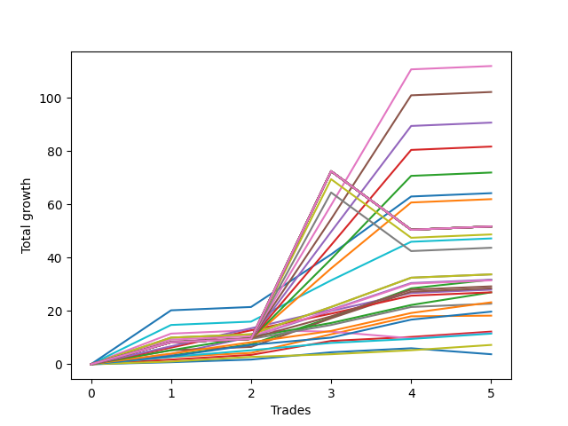

# Short Pointer 009 DB 
- Symbol: ES
- Date Range: 03/18/2022 - 07/15/2022
- Trading Period: 7:20-12:30
- Number of Trades: 5



| Name | Win Percent | Profit | Avg Profit / Trade | Avg Time / Trade |      | Name | Win Percent | Profit | Avg Profit / Trade | Avg Time / Trade |
| ---- | ----------- | ------ | ------------------ | ---------------- | ---- | ---- | ----------- | ------ | ------------------ | ---------------- |
| Sorted By <br> Profit | | | | | | Sorted By <br> Win Percentage ||||
| Two Hundred Five | 100.00 | 56000.00 | 11200.00 | 71:15 |     | Two Hundred Five | 100.00 | 56000.00 | 11200.00 | 71:15 |
| Two Hundred Four.Five | 100.00 | 51125.00 | 10225.00 | 70:39 |     | Two Hundred Four.Five | 100.00 | 51125.00 | 10225.00 | 70:39 |
| Two Hundred Four | 100.00 | 45375.00 | 9075.00 | 66:28 |     | Two Hundred Four | 100.00 | 45375.00 | 9075.00 | 66:28 |
| Two Hundred Three.Five | 100.00 | 40875.00 | 8175.00 | 60:55 |     | Two Hundred Three.Five | 100.00 | 40875.00 | 8175.00 | 60:55 |
| Two Hundred Three | 100.00 | 36000.00 | 7200.00 | 59:59 |     | Two Hundred Three | 100.00 | 36000.00 | 7200.00 | 59:59 |
| Two Hundred Two | 100.00 | 32125.00 | 6425.00 | 52:28 |     | Two Hundred Two | 100.00 | 32125.00 | 6425.00 | 52:28 |
| Two Hundred Two.Five | 100.00 | 31000.00 | 6200.00 | 59:27 |     | Two Hundred Two.Five | 100.00 | 31000.00 | 6200.00 | 59:27 |
| Two Hundred Fifteen | 80.00 | 25875.00 | 5175.00 | 89:05 |     | Two Hundred One.Five | 100.00 | 23625.00 | 4725.00 | 47:48 |
| Two Hundred Fourteen.Five | 80.00 | 25875.00 | 5175.00 | 89:05 |     | Two Hundred One | 100.00 | 16875.00 | 3375.00 | 13:42 |
| Two Hundred Fourteen | 80.00 | 25875.00 | 5175.00 | 89:05 |     | Ninety | 100.00 | 16875.00 | 3375.00 | 13:42 |
| Two Hundred Thirteen.Five | 80.00 | 25875.00 | 5175.00 | 89:05 |     | Eighty-Seven | 100.00 | 15875.00 | 3175.00 | 10:21 |
| Two Hundred Thirteen | 80.00 | 25875.00 | 5175.00 | 89:05 |     | Two | 100.00 | 15875.00 | 3175.00 | 11:27 |
| Two Hundred Twelve.Five | 80.00 | 25875.00 | 5175.00 | 89:05 |     | Eighty-Nine | 100.00 | 15750.00 | 3150.00 | 13:38 |
| Two Hundred Twelve | 80.00 | 25875.00 | 5175.00 | 89:05 |     | Eighty-Eight | 100.00 | 14625.00 | 2925.00 | 12:44 |
| Two Hundred Eleven.Five | 80.00 | 25875.00 | 5175.00 | 89:05 |     | Five | 100.00 | 14250.00 | 2850.00 | 16:58 |
| Two Hundred Eleven | 80.00 | 25875.00 | 5175.00 | 89:05 |     | Four | 100.00 | 14000.00 | 2800.00 | 10:18 |
| Two Hundred Ten.Five | 80.00 | 25875.00 | 5175.00 | 89:05 |     | Eighty-Six | 100.00 | 13500.00 | 2700.00 | 10:05 |
| Two Hundred Ten | 80.00 | 25875.00 | 5175.00 | 89:05 |     | Eighty-Five | 100.00 | 13500.00 | 2700.00 | 08:32 |
| Two Hundred Nine.Five | 80.00 | 25875.00 | 5175.00 | 89:05 |     | Eighty-Four | 100.00 | 11625.00 | 2325.00 | 07:06 |
| Two Hundred Nine | 80.00 | 25875.00 | 5175.00 | 89:05 |     | Seven | 100.00 | 11375.00 | 2275.00 | 21:01 |
| Two Hundred Eight.Five | 80.00 | 25875.00 | 5175.00 | 89:05 |     | Eighty-Three | 100.00 | 9875.00 | 1975.00 | 06:32 |
| Two Hundred Eight | 80.00 | 25875.00 | 5175.00 | 89:05 |     | One | 100.00 | 9125.00 | 1825.00 | 06:10 |
| Two Hundred Seven.Five | 80.00 | 25875.00 | 5175.00 | 89:05 |     | Three | 100.00 | 6125.00 | 1225.00 | 05:25 |
| Two Hundred Seven | 80.00 | 25875.00 | 5175.00 | 89:05 |     | Eighty-Two | 100.00 | 5750.00 | 1150.00 | 05:22 |
| Two Hundred Six.Five | 80.00 | 25875.00 | 5175.00 | 89:05 |     | Eighty-One | 100.00 | 3625.00 | 725.00 | 04:52 |
| Two Hundred Six | 80.00 | 24375.00 | 4875.00 | 88:45 |     | Two Hundred Fifteen | 80.00 | 25875.00 | 5175.00 | 89:05 |
| Two Hundred One.Five | 100.00 | 23625.00 | 4725.00 | 47:48 |     | Two Hundred Fourteen.Five | 80.00 | 25875.00 | 5175.00 | 89:05 |
| Two Hundred Five.Five | 80.00 | 21875.00 | 4375.00 | 87:59 |     | Two Hundred Fourteen | 80.00 | 25875.00 | 5175.00 | 89:05 |
| Two Hundred One | 100.00 | 16875.00 | 3375.00 | 13:42 |     | Two Hundred Thirteen.Five | 80.00 | 25875.00 | 5175.00 | 89:05 |
| Ninety | 100.00 | 16875.00 | 3375.00 | 13:42 |     | Two Hundred Thirteen | 80.00 | 25875.00 | 5175.00 | 89:05 |
| Eighty-Seven | 100.00 | 15875.00 | 3175.00 | 10:21 |     | Two Hundred Twelve.Five | 80.00 | 25875.00 | 5175.00 | 89:05 |
| Two | 100.00 | 15875.00 | 3175.00 | 11:27 |     | Two Hundred Twelve | 80.00 | 25875.00 | 5175.00 | 89:05 |
| Eighty-Nine | 100.00 | 15750.00 | 3150.00 | 13:38 |     | Two Hundred Eleven.Five | 80.00 | 25875.00 | 5175.00 | 89:05 |
| Eighty-Eight | 100.00 | 14625.00 | 2925.00 | 12:44 |     | Two Hundred Eleven | 80.00 | 25875.00 | 5175.00 | 89:05 |
| Five | 100.00 | 14250.00 | 2850.00 | 16:58 |     | Two Hundred Ten.Five | 80.00 | 25875.00 | 5175.00 | 89:05 |
| Four | 100.00 | 14000.00 | 2800.00 | 10:18 |     | Two Hundred Ten | 80.00 | 25875.00 | 5175.00 | 89:05 |
| Eighty-Six | 100.00 | 13500.00 | 2700.00 | 10:05 |     | Two Hundred Nine.Five | 80.00 | 25875.00 | 5175.00 | 89:05 |
| Eighty-Five | 100.00 | 13500.00 | 2700.00 | 08:32 |     | Two Hundred Nine | 80.00 | 25875.00 | 5175.00 | 89:05 |
| Eighty-Four | 100.00 | 11625.00 | 2325.00 | 07:06 |     | Two Hundred Eight.Five | 80.00 | 25875.00 | 5175.00 | 89:05 |
| Seven | 100.00 | 11375.00 | 2275.00 | 21:01 |     | Two Hundred Eight | 80.00 | 25875.00 | 5175.00 | 89:05 |
| Eighty-Three | 100.00 | 9875.00 | 1975.00 | 06:32 |     | Two Hundred Seven.Five | 80.00 | 25875.00 | 5175.00 | 89:05 |
| One | 100.00 | 9125.00 | 1825.00 | 06:10 |     | Two Hundred Seven | 80.00 | 25875.00 | 5175.00 | 89:05 |
| Three | 100.00 | 6125.00 | 1225.00 | 05:25 |     | Two Hundred Six.Five | 80.00 | 25875.00 | 5175.00 | 89:05 |
| Six | 60.00 | 5875.00 | 1175.00 | 13:04 |     | Two Hundred Six | 80.00 | 24375.00 | 4875.00 | 88:45 |
| Eighty-Two | 100.00 | 5750.00 | 1150.00 | 05:22 |     | Two Hundred Five.Five | 80.00 | 21875.00 | 4375.00 | 87:59 |
| Eighty-One | 100.00 | 3625.00 | 725.00 | 04:52 |     | Zero | 80.00 | 1875.00 | 375.00 | 04:26 |
| Zero | 80.00 | 1875.00 | 375.00 | 04:26 |     | Six | 60.00 | 5875.00 | 1175.00 | 13:04 |

## NO STOPLOSS

### Test Zero
* Sell when price hits the middle line of the 20p bollinger
* No Stoploss
* Results:
```
Total Trades: 5
Percent Up: 20.00
Percent Down: 80.00
Total Points Moved Down: 3.75
Potential Profit: 1875.00
Total Points Ups: 2.25 Count Ups: 1
Total Points Downs: 6.00 Count Downs: 4
```

<details><summary>Trades</summary>

<code>In: 2022-03-25 11:57:00		Out: 2022-03-25 11:57:20		Total Position Time: 00:20		Total Move Down: 0.75		Total to Date: 0.75</code> <br />
<code>In: 2022-06-01 12:19:00		Out: 2022-06-01 12:25:25		Total Position Time: 06:25		Total Move Down: 1.00		Total to Date: 1.75</code> <br />
<code>In: 2022-06-09 08:47:00		Out: 2022-06-09 08:48:20		Total Position Time: 01:20		Total Move Down: 2.75		Total to Date: 4.50</code> <br />
<code>In: 2022-06-15 11:02:00		Out: 2022-06-15 11:02:45		Total Position Time: 00:45		Total Move Down: 1.50		Total to Date: 6.00</code> <br />
<code>In: 2022-06-29 12:20:00		Out: 2022-06-29 12:33:20		Total Position Time: 13:20		Total Move Down: -2.25		Total to Date: 3.75</code> <br />


</details>

### Test One
* Sell when the price hits the upper line of the 20p 1std bollinger
* No Stoploss
* Results:
```
Total Trades: 5
Percent Up: 0.00
Percent Down: 100.00
Total Points Moved Down: 18.25
Potential Profit: 9125.00
Total Points Ups: 0.00 Count Ups: 0
Total Points Downs: 18.25 Count Downs: 5
```

<details><summary>Trades</summary>

<code>In: 2022-03-25 11:57:00		Out: 2022-03-25 12:00:50		Total Position Time: 03:50		Total Move Down: 2.75		Total to Date: 2.75</code> <br />
<code>In: 2022-06-01 12:19:00		Out: 2022-06-01 12:28:15		Total Position Time: 09:15		Total Move Down: 1.50		Total to Date: 4.25</code> <br />
<code>In: 2022-06-09 08:47:00		Out: 2022-06-09 08:49:35		Total Position Time: 02:35		Total Move Down: 7.00		Total to Date: 11.25</code> <br />
<code>In: 2022-06-15 11:02:00		Out: 2022-06-15 11:03:00		Total Position Time: 01:00		Total Move Down: 6.75		Total to Date: 18.00</code> <br />
<code>In: 2022-06-29 12:20:00		Out: 2022-06-29 12:34:10		Total Position Time: 14:10		Total Move Down: 0.25		Total to Date: 18.25</code> <br />


</details>

### Test Two
* Sell when the price hits the upper line of the 20p 2std bollinger
* No Stoploss
* Results:
```
Total Trades: 5
Percent Up: 0.00
Percent Down: 100.00
Total Points Moved Down: 31.75
Potential Profit: 15875.00
Total Points Ups: 0.00 Count Ups: 0
Total Points Downs: 31.75 Count Downs: 5
```

<details><summary>Trades</summary>

<code>In: 2022-03-25 11:57:00		Out: 2022-03-25 12:01:15		Total Position Time: 04:15		Total Move Down: 3.25		Total to Date: 3.25</code> <br />
<code>In: 2022-06-01 12:19:00		Out: 2022-06-01 12:30:05		Total Position Time: 11:05		Total Move Down: 4.25		Total to Date: 7.50</code> <br />
<code>In: 2022-06-09 08:47:00		Out: 2022-06-09 09:11:10		Total Position Time: 24:10		Total Move Down: 10.00		Total to Date: 17.50</code> <br />
<code>In: 2022-06-15 11:02:00		Out: 2022-06-15 11:03:10		Total Position Time: 01:10		Total Move Down: 11.00		Total to Date: 28.50</code> <br />
<code>In: 2022-06-29 12:20:00		Out: 2022-06-29 12:36:35		Total Position Time: 16:35		Total Move Down: 3.25		Total to Date: 31.75</code> <br />


</details>

### Test Three
* Sell when price hits the middle line of the 50p bollinger
* No Stoploss
* Results:
```
Total Trades: 5
Percent Up: 0.00
Percent Down: 100.00
Total Points Moved Down: 12.25
Potential Profit: 6125.00
Total Points Ups: 0.00 Count Ups: 0
Total Points Downs: 12.25 Count Downs: 5
```

<details><summary>Trades</summary>

<code>In: 2022-03-25 11:57:00		Out: 2022-03-25 12:00:45		Total Position Time: 03:45		Total Move Down: 1.75		Total to Date: 1.75</code> <br />
<code>In: 2022-06-01 12:19:00		Out: 2022-06-01 12:25:30		Total Position Time: 06:30		Total Move Down: 1.75		Total to Date: 3.50</code> <br />
<code>In: 2022-06-09 08:47:00		Out: 2022-06-09 08:48:50		Total Position Time: 01:50		Total Move Down: 5.25		Total to Date: 8.75</code> <br />
<code>In: 2022-06-15 11:02:00		Out: 2022-06-15 11:02:45		Total Position Time: 00:45		Total Move Down: 1.50		Total to Date: 10.25</code> <br />
<code>In: 2022-06-29 12:20:00		Out: 2022-06-29 12:34:15		Total Position Time: 14:15		Total Move Down: 2.00		Total to Date: 12.25</code> <br />


</details>

### Test Four
* Sell when the price hits the upper line of the 50p 1std bollinger
* No Stoploss
* Results:
```
Total Trades: 5
Percent Up: 0.00
Percent Down: 100.00
Total Points Moved Down: 28.00
Potential Profit: 14000.00
Total Points Ups: 0.00 Count Ups: 0
Total Points Downs: 28.00 Count Downs: 5
```

<details><summary>Trades</summary>

<code>In: 2022-03-25 11:57:00		Out: 2022-03-25 12:01:40		Total Position Time: 04:40		Total Move Down: 3.75		Total to Date: 3.75</code> <br />
<code>In: 2022-06-01 12:19:00		Out: 2022-06-01 12:35:10		Total Position Time: 16:10		Total Move Down: 6.50		Total to Date: 10.25</code> <br />
<code>In: 2022-06-09 08:47:00		Out: 2022-06-09 08:50:35		Total Position Time: 03:35		Total Move Down: 9.75		Total to Date: 20.00</code> <br />
<code>In: 2022-06-15 11:02:00		Out: 2022-06-15 11:03:00		Total Position Time: 01:00		Total Move Down: 6.75		Total to Date: 26.75</code> <br />
<code>In: 2022-06-29 12:20:00		Out: 2022-06-29 12:46:05		Total Position Time: 26:05		Total Move Down: 1.25		Total to Date: 28.00</code> <br />


</details>

### Test Five
* Sell when the price hits the upper line of the 50p 2std bollinger
* No Stoploss
* Results:
```
Total Trades: 5
Percent Up: 0.00
Percent Down: 100.00
Total Points Moved Down: 28.50
Potential Profit: 14250.00
Total Points Ups: 0.00 Count Ups: 0
Total Points Downs: 28.50 Count Downs: 5
```

<details><summary>Trades</summary>

<code>In: 2022-03-25 11:57:00		Out: 2022-03-25 12:01:55		Total Position Time: 04:55		Total Move Down: 5.25		Total to Date: 5.25</code> <br />
<code>In: 2022-06-01 12:19:00		Out: 2022-06-01 12:46:05		Total Position Time: 27:05		Total Move Down: 1.25		Total to Date: 6.50</code> <br />
<code>In: 2022-06-09 08:47:00		Out: 2022-06-09 09:12:40		Total Position Time: 25:40		Total Move Down: 10.75		Total to Date: 17.25</code> <br />
<code>In: 2022-06-15 11:02:00		Out: 2022-06-15 11:03:05		Total Position Time: 01:05		Total Move Down: 10.00		Total to Date: 27.25</code> <br />
<code>In: 2022-06-29 12:20:00		Out: 2022-06-29 12:46:05		Total Position Time: 26:05		Total Move Down: 1.25		Total to Date: 28.50</code> <br />


</details>

### Test Six
* Sell when the price hits the middle line of the 1std VWAP
* No Stoploss
* Results:
```
Total Trades: 5
Percent Up: 40.00
Percent Down: 60.00
Total Points Moved Down: 11.75
Potential Profit: 5875.00
Total Points Ups: 3.00 Count Ups: 2
Total Points Downs: 14.75 Count Downs: 3
```

<details><summary>Trades</summary>

<code>In: 2022-03-25 11:57:00		Out: 2022-03-25 12:20:30		Total Position Time: 23:30		Total Move Down: 11.50		Total to Date: 11.50</code> <br />
<code>In: 2022-06-01 12:19:00		Out: 2022-06-01 12:46:05		Total Position Time: 27:05		Total Move Down: 1.25		Total to Date: 12.75</code> <br />
<code>In: 2022-06-09 08:47:00		Out: 2022-06-09 08:47:15		Total Position Time: 00:15		Total Move Down: -0.50		Total to Date: 12.25</code> <br />
<code>In: 2022-06-15 11:02:00		Out: 2022-06-15 11:02:15		Total Position Time: 00:15		Total Move Down: -2.50		Total to Date: 9.75</code> <br />
<code>In: 2022-06-29 12:20:00		Out: 2022-06-29 12:34:15		Total Position Time: 14:15		Total Move Down: 2.00		Total to Date: 11.75</code> <br />


</details>

### Test Seven
* Sell when the price hits the upper line of the 1std VWAP
* No Stoploss
* Results:
```
Total Trades: 5
Percent Up: 0.00
Percent Down: 100.00
Total Points Moved Down: 22.75
Potential Profit: 11375.00
Total Points Ups: 0.00 Count Ups: 0
Total Points Downs: 22.75 Count Downs: 5
```

<details><summary>Trades</summary>

<code>In: 2022-03-25 11:57:00		Out: 2022-03-25 12:46:05		Total Position Time: 49:05		Total Move Down: 8.25		Total to Date: 8.25</code> <br />
<code>In: 2022-06-01 12:19:00		Out: 2022-06-01 12:46:05		Total Position Time: 27:05		Total Move Down: 1.25		Total to Date: 9.50</code> <br />
<code>In: 2022-06-09 08:47:00		Out: 2022-06-09 08:48:50		Total Position Time: 01:50		Total Move Down: 5.25		Total to Date: 14.75</code> <br />
<code>In: 2022-06-15 11:02:00		Out: 2022-06-15 11:03:00		Total Position Time: 01:00		Total Move Down: 6.75		Total to Date: 21.50</code> <br />
<code>In: 2022-06-29 12:20:00		Out: 2022-06-29 12:46:05		Total Position Time: 26:05		Total Move Down: 1.25		Total to Date: 22.75</code> <br />


</details>

## TAKE PROFIT

### Test Eighty-One
* Take Profit of 1 Point
* No Stoploss
* Results:
```
Total Trades: 5
Percent Up: 0.00
Percent Down: 100.00
Total Points Moved Down: 7.25
Potential Profit: 3625.00
Total Points Ups: 0.00 Count Ups: 0
Total Points Downs: 7.25 Count Downs: 5
```

<details><summary>Trades</summary>

<code>In: 2022-03-25 11:57:00		Out: 2022-03-25 11:58:45		Total Position Time: 01:45		Total Move Down: 1.00		Total to Date: 1.00</code> <br />
<code>In: 2022-06-01 12:19:00		Out: 2022-06-01 12:25:30		Total Position Time: 06:30		Total Move Down: 1.75		Total to Date: 2.75</code> <br />
<code>In: 2022-06-09 08:47:00		Out: 2022-06-09 08:48:05		Total Position Time: 01:05		Total Move Down: 1.00		Total to Date: 3.75</code> <br />
<code>In: 2022-06-15 11:02:00		Out: 2022-06-15 11:02:45		Total Position Time: 00:45		Total Move Down: 1.50		Total to Date: 5.25</code> <br />
<code>In: 2022-06-29 12:20:00		Out: 2022-06-29 12:34:15		Total Position Time: 14:15		Total Move Down: 2.00		Total to Date: 7.25</code> <br />


</details>

### Test Eighty-Two
* Take Profit of 2 Point
* No Stoploss
* Results:
```
Total Trades: 5
Percent Up: 0.00
Percent Down: 100.00
Total Points Moved Down: 11.50
Potential Profit: 5750.00
Total Points Ups: 0.00 Count Ups: 0
Total Points Downs: 11.50 Count Downs: 5
```

<details><summary>Trades</summary>

<code>In: 2022-03-25 11:57:00		Out: 2022-03-25 12:00:50		Total Position Time: 03:50		Total Move Down: 2.75		Total to Date: 2.75</code> <br />
<code>In: 2022-06-01 12:19:00		Out: 2022-06-01 12:25:40		Total Position Time: 06:40		Total Move Down: 2.50		Total to Date: 5.25</code> <br />
<code>In: 2022-06-09 08:47:00		Out: 2022-06-09 08:48:20		Total Position Time: 01:20		Total Move Down: 2.75		Total to Date: 8.00</code> <br />
<code>In: 2022-06-15 11:02:00		Out: 2022-06-15 11:02:45		Total Position Time: 00:45		Total Move Down: 1.50		Total to Date: 9.50</code> <br />
<code>In: 2022-06-29 12:20:00		Out: 2022-06-29 12:34:15		Total Position Time: 14:15		Total Move Down: 2.00		Total to Date: 11.50</code> <br />


</details>

### Test Eighty-Three
* Take Profit of 3 Point
* No Stoploss
* Results:
```
Total Trades: 5
Percent Up: 0.00
Percent Down: 100.00
Total Points Moved Down: 19.75
Potential Profit: 9875.00
Total Points Ups: 0.00 Count Ups: 0
Total Points Downs: 19.75 Count Downs: 5
```

<details><summary>Trades</summary>

<code>In: 2022-03-25 11:57:00		Out: 2022-03-25 12:01:00		Total Position Time: 04:00		Total Move Down: 3.00		Total to Date: 3.00</code> <br />
<code>In: 2022-06-01 12:19:00		Out: 2022-06-01 12:30:05		Total Position Time: 11:05		Total Move Down: 4.25		Total to Date: 7.25</code> <br />
<code>In: 2022-06-09 08:47:00		Out: 2022-06-09 08:48:20		Total Position Time: 01:20		Total Move Down: 2.75		Total to Date: 10.00</code> <br />
<code>In: 2022-06-15 11:02:00		Out: 2022-06-15 11:03:00		Total Position Time: 01:00		Total Move Down: 6.75		Total to Date: 16.75</code> <br />
<code>In: 2022-06-29 12:20:00		Out: 2022-06-29 12:35:15		Total Position Time: 15:15		Total Move Down: 3.00		Total to Date: 19.75</code> <br />


</details>

### Test Eighty-Four
* Take Profit of 4 Point
* No Stoploss
* Results:
```
Total Trades: 5
Percent Up: 0.00
Percent Down: 100.00
Total Points Moved Down: 23.25
Potential Profit: 11625.00
Total Points Ups: 0.00 Count Ups: 0
Total Points Downs: 23.25 Count Downs: 5
```

<details><summary>Trades</summary>

<code>In: 2022-03-25 11:57:00		Out: 2022-03-25 12:01:45		Total Position Time: 04:45		Total Move Down: 4.00		Total to Date: 4.00</code> <br />
<code>In: 2022-06-01 12:19:00		Out: 2022-06-01 12:30:05		Total Position Time: 11:05		Total Move Down: 4.25		Total to Date: 8.25</code> <br />
<code>In: 2022-06-09 08:47:00		Out: 2022-06-09 08:48:35		Total Position Time: 01:35		Total Move Down: 4.25		Total to Date: 12.50</code> <br />
<code>In: 2022-06-15 11:02:00		Out: 2022-06-15 11:03:00		Total Position Time: 01:00		Total Move Down: 6.75		Total to Date: 19.25</code> <br />
<code>In: 2022-06-29 12:20:00		Out: 2022-06-29 12:37:05		Total Position Time: 17:05		Total Move Down: 4.00		Total to Date: 23.25</code> <br />


</details>

### Test Eighty-Five
* Take Profit of 5 Point
* No Stoploss
* Results:
```
Total Trades: 5
Percent Up: 0.00
Percent Down: 100.00
Total Points Moved Down: 27.00
Potential Profit: 13500.00
Total Points Ups: 0.00 Count Ups: 0
Total Points Downs: 27.00 Count Downs: 5
```

<details><summary>Trades</summary>

<code>In: 2022-03-25 11:57:00		Out: 2022-03-25 12:01:55		Total Position Time: 04:55		Total Move Down: 5.25		Total to Date: 5.25</code> <br />
<code>In: 2022-06-01 12:19:00		Out: 2022-06-01 12:32:50		Total Position Time: 13:50		Total Move Down: 5.00		Total to Date: 10.25</code> <br />
<code>In: 2022-06-09 08:47:00		Out: 2022-06-09 08:48:50		Total Position Time: 01:50		Total Move Down: 5.25		Total to Date: 15.50</code> <br />
<code>In: 2022-06-15 11:02:00		Out: 2022-06-15 11:03:00		Total Position Time: 01:00		Total Move Down: 6.75		Total to Date: 22.25</code> <br />
<code>In: 2022-06-29 12:20:00		Out: 2022-06-29 12:41:05		Total Position Time: 21:05		Total Move Down: 4.75		Total to Date: 27.00</code> <br />


</details>

### Test Eighty-Six
* Take Profit of 6 Point
* No Stoploss
* Results:
```
Total Trades: 5
Percent Up: 0.00
Percent Down: 100.00
Total Points Moved Down: 27.00
Potential Profit: 13500.00
Total Points Ups: 0.00 Count Ups: 0
Total Points Downs: 27.00 Count Downs: 5
```

<details><summary>Trades</summary>

<code>In: 2022-03-25 11:57:00		Out: 2022-03-25 12:02:00		Total Position Time: 05:00		Total Move Down: 6.25		Total to Date: 6.25</code> <br />
<code>In: 2022-06-01 12:19:00		Out: 2022-06-01 12:35:10		Total Position Time: 16:10		Total Move Down: 6.50		Total to Date: 12.75</code> <br />
<code>In: 2022-06-09 08:47:00		Out: 2022-06-09 08:49:10		Total Position Time: 02:10		Total Move Down: 6.25		Total to Date: 19.00</code> <br />
<code>In: 2022-06-15 11:02:00		Out: 2022-06-15 11:03:00		Total Position Time: 01:00		Total Move Down: 6.75		Total to Date: 25.75</code> <br />
<code>In: 2022-06-29 12:20:00		Out: 2022-06-29 12:46:05		Total Position Time: 26:05		Total Move Down: 1.25		Total to Date: 27.00</code> <br />


</details>

### Test Eighty-Seven
* Take Profit of 7 Point
* No Stoploss
* Results:
```
Total Trades: 5
Percent Up: 0.00
Percent Down: 100.00
Total Points Moved Down: 31.75
Potential Profit: 15875.00
Total Points Ups: 0.00 Count Ups: 0
Total Points Downs: 31.75 Count Downs: 5
```

<details><summary>Trades</summary>

<code>In: 2022-03-25 11:57:00		Out: 2022-03-25 12:02:30		Total Position Time: 05:30		Total Move Down: 6.75		Total to Date: 6.75</code> <br />
<code>In: 2022-06-01 12:19:00		Out: 2022-06-01 12:35:30		Total Position Time: 16:30		Total Move Down: 6.75		Total to Date: 13.50</code> <br />
<code>In: 2022-06-09 08:47:00		Out: 2022-06-09 08:49:35		Total Position Time: 02:35		Total Move Down: 7.00		Total to Date: 20.50</code> <br />
<code>In: 2022-06-15 11:02:00		Out: 2022-06-15 11:03:05		Total Position Time: 01:05		Total Move Down: 10.00		Total to Date: 30.50</code> <br />
<code>In: 2022-06-29 12:20:00		Out: 2022-06-29 12:46:05		Total Position Time: 26:05		Total Move Down: 1.25		Total to Date: 31.75</code> <br />


</details>

### Test Eighty-Eight
* Take Profit of 8 Point
* No Stoploss
* Results:
```
Total Trades: 5
Percent Up: 0.00
Percent Down: 100.00
Total Points Moved Down: 29.25
Potential Profit: 14625.00
Total Points Ups: 0.00 Count Ups: 0
Total Points Downs: 29.25 Count Downs: 5
```

<details><summary>Trades</summary>

<code>In: 2022-03-25 11:57:00		Out: 2022-03-25 12:03:05		Total Position Time: 06:05		Total Move Down: 8.50		Total to Date: 8.50</code> <br />
<code>In: 2022-06-01 12:19:00		Out: 2022-06-01 12:46:05		Total Position Time: 27:05		Total Move Down: 1.25		Total to Date: 9.75</code> <br />
<code>In: 2022-06-09 08:47:00		Out: 2022-06-09 08:50:20		Total Position Time: 03:20		Total Move Down: 8.25		Total to Date: 18.00</code> <br />
<code>In: 2022-06-15 11:02:00		Out: 2022-06-15 11:03:05		Total Position Time: 01:05		Total Move Down: 10.00		Total to Date: 28.00</code> <br />
<code>In: 2022-06-29 12:20:00		Out: 2022-06-29 12:46:05		Total Position Time: 26:05		Total Move Down: 1.25		Total to Date: 29.25</code> <br />


</details>

### Test Eighty-Nine
* Take Profit of 9 Point
* No Stoploss
* Results:
```
Total Trades: 5
Percent Up: 0.00
Percent Down: 100.00
Total Points Moved Down: 31.50
Potential Profit: 15750.00
Total Points Ups: 0.00 Count Ups: 0
Total Points Downs: 31.50 Count Downs: 5
```

<details><summary>Trades</summary>

<code>In: 2022-03-25 11:57:00		Out: 2022-03-25 12:07:20		Total Position Time: 10:20		Total Move Down: 9.25		Total to Date: 9.25</code> <br />
<code>In: 2022-06-01 12:19:00		Out: 2022-06-01 12:46:05		Total Position Time: 27:05		Total Move Down: 1.25		Total to Date: 10.50</code> <br />
<code>In: 2022-06-09 08:47:00		Out: 2022-06-09 08:50:35		Total Position Time: 03:35		Total Move Down: 9.75		Total to Date: 20.25</code> <br />
<code>In: 2022-06-15 11:02:00		Out: 2022-06-15 11:03:05		Total Position Time: 01:05		Total Move Down: 10.00		Total to Date: 30.25</code> <br />
<code>In: 2022-06-29 12:20:00		Out: 2022-06-29 12:46:05		Total Position Time: 26:05		Total Move Down: 1.25		Total to Date: 31.50</code> <br />


</details>

### Test Ninety
* Take Profit of 10 Point
* No Stoploss
* Results:
```
Total Trades: 5
Percent Up: 0.00
Percent Down: 100.00
Total Points Moved Down: 33.75
Potential Profit: 16875.00
Total Points Ups: 0.00 Count Ups: 0
Total Points Downs: 33.75 Count Downs: 5
```

<details><summary>Trades</summary>

<code>In: 2022-03-25 11:57:00		Out: 2022-03-25 12:07:30		Total Position Time: 10:30		Total Move Down: 10.00		Total to Date: 10.00</code> <br />
<code>In: 2022-06-01 12:19:00		Out: 2022-06-01 12:46:05		Total Position Time: 27:05		Total Move Down: 1.25		Total to Date: 11.25</code> <br />
<code>In: 2022-06-09 08:47:00		Out: 2022-06-09 08:50:40		Total Position Time: 03:40		Total Move Down: 10.25		Total to Date: 21.50</code> <br />
<code>In: 2022-06-15 11:02:00		Out: 2022-06-15 11:03:10		Total Position Time: 01:10		Total Move Down: 11.00		Total to Date: 32.50</code> <br />
<code>In: 2022-06-29 12:20:00		Out: 2022-06-29 12:46:05		Total Position Time: 26:05		Total Move Down: 1.25		Total to Date: 33.75</code> <br />


</details>

## DAILY TAKE PROFITS

### Test Two Hundred One
* Take Profit of 10 Point
* No Stoploss
* Results:
```
Total Trades: 5
Percent Up: 0.00
Percent Down: 100.00
Total Points Moved Down: 33.75
Potential Profit: 16875.00
Total Points Ups: 0.00 Count Ups: 0
Total Points Downs: 33.75 Count Downs: 5
```

<details><summary>Trades</summary>

<code>In: 2022-03-25 11:57:00		Out: 2022-03-25 12:07:30		Total Position Time: 10:30		Total Move Down: 10.00		Total to Date: 10.00</code> <br />
<code>In: 2022-06-01 12:19:00		Out: 2022-06-01 12:46:05		Total Position Time: 27:05		Total Move Down: 1.25		Total to Date: 11.25</code> <br />
<code>In: 2022-06-09 08:47:00		Out: 2022-06-09 08:50:40		Total Position Time: 03:40		Total Move Down: 10.25		Total to Date: 21.50</code> <br />
<code>In: 2022-06-15 11:02:00		Out: 2022-06-15 11:03:10		Total Position Time: 01:10		Total Move Down: 11.00		Total to Date: 32.50</code> <br />
<code>In: 2022-06-29 12:20:00		Out: 2022-06-29 12:46:05		Total Position Time: 26:05		Total Move Down: 1.25		Total to Date: 33.75</code> <br />


</details>

### Test Two Hundred One.Five
* Take Profit of 15 Point
* No Stoploss
* Results:
```
Total Trades: 5
Percent Up: 0.00
Percent Down: 100.00
Total Points Moved Down: 47.25
Potential Profit: 23625.00
Total Points Ups: 0.00 Count Ups: 0
Total Points Downs: 47.25 Count Downs: 5
```

<details><summary>Trades</summary>

<code>In: 2022-03-25 11:57:00		Out: 2022-03-25 12:22:55		Total Position Time: 25:55		Total Move Down: 14.75		Total to Date: 14.75</code> <br />
<code>In: 2022-06-01 12:19:00		Out: 2022-06-01 12:46:05		Total Position Time: 27:05		Total Move Down: 1.25		Total to Date: 16.00</code> <br />
<code>In: 2022-06-09 08:47:00		Out: 2022-06-09 11:24:35		Total Position Time: 157:35		Total Move Down: 15.50		Total to Date: 31.50</code> <br />
<code>In: 2022-06-15 11:02:00		Out: 2022-06-15 11:04:20		Total Position Time: 02:20		Total Move Down: 14.50		Total to Date: 46.00</code> <br />
<code>In: 2022-06-29 12:20:00		Out: 2022-06-29 12:46:05		Total Position Time: 26:05		Total Move Down: 1.25		Total to Date: 47.25</code> <br />


</details>

### Test Two Hundred Two
* Take Profit of 20 Point
* No Stoploss
* Results:
```
Total Trades: 5
Percent Up: 0.00
Percent Down: 100.00
Total Points Moved Down: 64.25
Potential Profit: 32125.00
Total Points Ups: 0.00 Count Ups: 0
Total Points Downs: 64.25 Count Downs: 5
```

<details><summary>Trades</summary>

<code>In: 2022-03-25 11:57:00		Out: 2022-03-25 12:32:10		Total Position Time: 35:10		Total Move Down: 20.25		Total to Date: 20.25</code> <br />
<code>In: 2022-06-01 12:19:00		Out: 2022-06-01 12:46:05		Total Position Time: 27:05		Total Move Down: 1.25		Total to Date: 21.50</code> <br />
<code>In: 2022-06-09 08:47:00		Out: 2022-06-09 11:38:25		Total Position Time: 171:25		Total Move Down: 19.75		Total to Date: 41.25</code> <br />
<code>In: 2022-06-15 11:02:00		Out: 2022-06-15 11:04:35		Total Position Time: 02:35		Total Move Down: 21.75		Total to Date: 63.00</code> <br />
<code>In: 2022-06-29 12:20:00		Out: 2022-06-29 12:46:05		Total Position Time: 26:05		Total Move Down: 1.25		Total to Date: 64.25</code> <br />


</details>

### Test Two Hundred Two.Five
* Take Profit of 25 Point
* No Stoploss
* Results:
```
Total Trades: 5
Percent Up: 0.00
Percent Down: 100.00
Total Points Moved Down: 62.00
Potential Profit: 31000.00
Total Points Ups: 0.00 Count Ups: 0
Total Points Downs: 62.00 Count Downs: 5
```

<details><summary>Trades</summary>

<code>In: 2022-03-25 11:57:00		Out: 2022-03-25 12:46:05		Total Position Time: 49:05		Total Move Down: 8.25		Total to Date: 8.25</code> <br />
<code>In: 2022-06-01 12:19:00		Out: 2022-06-01 12:46:05		Total Position Time: 27:05		Total Move Down: 1.25		Total to Date: 9.50</code> <br />
<code>In: 2022-06-09 08:47:00		Out: 2022-06-09 11:59:20		Total Position Time: 192:20		Total Move Down: 26.50		Total to Date: 36.00</code> <br />
<code>In: 2022-06-15 11:02:00		Out: 2022-06-15 11:04:40		Total Position Time: 02:40		Total Move Down: 24.75		Total to Date: 60.75</code> <br />
<code>In: 2022-06-29 12:20:00		Out: 2022-06-29 12:46:05		Total Position Time: 26:05		Total Move Down: 1.25		Total to Date: 62.00</code> <br />


</details>

### Test Two Hundred Three
* Take Profit of 30 Point
* No Stoploss
* Results:
```
Total Trades: 5
Percent Up: 0.00
Percent Down: 100.00
Total Points Moved Down: 72.00
Potential Profit: 36000.00
Total Points Ups: 0.00 Count Ups: 0
Total Points Downs: 72.00 Count Downs: 5
```

<details><summary>Trades</summary>

<code>In: 2022-03-25 11:57:00		Out: 2022-03-25 12:46:05		Total Position Time: 49:05		Total Move Down: 8.25		Total to Date: 8.25</code> <br />
<code>In: 2022-06-01 12:19:00		Out: 2022-06-01 12:46:05		Total Position Time: 27:05		Total Move Down: 1.25		Total to Date: 9.50</code> <br />
<code>In: 2022-06-09 08:47:00		Out: 2022-06-09 12:00:05		Total Position Time: 193:05		Total Move Down: 30.00		Total to Date: 39.50</code> <br />
<code>In: 2022-06-15 11:02:00		Out: 2022-06-15 11:06:35		Total Position Time: 04:35		Total Move Down: 31.25		Total to Date: 70.75</code> <br />
<code>In: 2022-06-29 12:20:00		Out: 2022-06-29 12:46:05		Total Position Time: 26:05		Total Move Down: 1.25		Total to Date: 72.00</code> <br />


</details>

### Test Two Hundred Three.Five
* Take Profit of 35 Point
* No Stoploss
* Results:
```
Total Trades: 5
Percent Up: 0.00
Percent Down: 100.00
Total Points Moved Down: 81.75
Potential Profit: 40875.00
Total Points Ups: 0.00 Count Ups: 0
Total Points Downs: 81.75 Count Downs: 5
```

<details><summary>Trades</summary>

<code>In: 2022-03-25 11:57:00		Out: 2022-03-25 12:46:05		Total Position Time: 49:05		Total Move Down: 8.25		Total to Date: 8.25</code> <br />
<code>In: 2022-06-01 12:19:00		Out: 2022-06-01 12:46:05		Total Position Time: 27:05		Total Move Down: 1.25		Total to Date: 9.50</code> <br />
<code>In: 2022-06-09 08:47:00		Out: 2022-06-09 12:04:25		Total Position Time: 197:25		Total Move Down: 35.25		Total to Date: 44.75</code> <br />
<code>In: 2022-06-15 11:02:00		Out: 2022-06-15 11:06:55		Total Position Time: 04:55		Total Move Down: 35.75		Total to Date: 80.50</code> <br />
<code>In: 2022-06-29 12:20:00		Out: 2022-06-29 12:46:05		Total Position Time: 26:05		Total Move Down: 1.25		Total to Date: 81.75</code> <br />


</details>

### Test Two Hundred Four
* Take Profit of 40 Point
* No Stoploss
* Results:
```
Total Trades: 5
Percent Up: 0.00
Percent Down: 100.00
Total Points Moved Down: 90.75
Potential Profit: 45375.00
Total Points Ups: 0.00 Count Ups: 0
Total Points Downs: 90.75 Count Downs: 5
```

<details><summary>Trades</summary>

<code>In: 2022-03-25 11:57:00		Out: 2022-03-25 12:46:05		Total Position Time: 49:05		Total Move Down: 8.25		Total to Date: 8.25</code> <br />
<code>In: 2022-06-01 12:19:00		Out: 2022-06-01 12:46:05		Total Position Time: 27:05		Total Move Down: 1.25		Total to Date: 9.50</code> <br />
<code>In: 2022-06-09 08:47:00		Out: 2022-06-09 12:07:35		Total Position Time: 200:35		Total Move Down: 40.25		Total to Date: 49.75</code> <br />
<code>In: 2022-06-15 11:02:00		Out: 2022-06-15 11:31:30		Total Position Time: 29:30		Total Move Down: 39.75		Total to Date: 89.50</code> <br />
<code>In: 2022-06-29 12:20:00		Out: 2022-06-29 12:46:05		Total Position Time: 26:05		Total Move Down: 1.25		Total to Date: 90.75</code> <br />


</details>

### Test Two Hundred Four.Five
* Take Profit of 45 Point
* No Stoploss
* Results:
```
Total Trades: 5
Percent Up: 0.00
Percent Down: 100.00
Total Points Moved Down: 102.25
Potential Profit: 51125.00
Total Points Ups: 0.00 Count Ups: 0
Total Points Downs: 102.25 Count Downs: 5
```

<details><summary>Trades</summary>

<code>In: 2022-03-25 11:57:00		Out: 2022-03-25 12:46:05		Total Position Time: 49:05		Total Move Down: 8.25		Total to Date: 8.25</code> <br />
<code>In: 2022-06-01 12:19:00		Out: 2022-06-01 12:46:05		Total Position Time: 27:05		Total Move Down: 1.25		Total to Date: 9.50</code> <br />
<code>In: 2022-06-09 08:47:00		Out: 2022-06-09 12:27:35		Total Position Time: 220:35		Total Move Down: 45.00		Total to Date: 54.50</code> <br />
<code>In: 2022-06-15 11:02:00		Out: 2022-06-15 11:32:25		Total Position Time: 30:25		Total Move Down: 46.50		Total to Date: 101.00</code> <br />
<code>In: 2022-06-29 12:20:00		Out: 2022-06-29 12:46:05		Total Position Time: 26:05		Total Move Down: 1.25		Total to Date: 102.25</code> <br />


</details>

### Test Two Hundred Five
* Take Profit of 50 Point
* No Stoploss
* Results:
```
Total Trades: 5
Percent Up: 0.00
Percent Down: 100.00
Total Points Moved Down: 112.00
Potential Profit: 56000.00
Total Points Ups: 0.00 Count Ups: 0
Total Points Downs: 112.00 Count Downs: 5
```

<details><summary>Trades</summary>

<code>In: 2022-03-25 11:57:00		Out: 2022-03-25 12:46:05		Total Position Time: 49:05		Total Move Down: 8.25		Total to Date: 8.25</code> <br />
<code>In: 2022-06-01 12:19:00		Out: 2022-06-01 12:46:05		Total Position Time: 27:05		Total Move Down: 1.25		Total to Date: 9.50</code> <br />
<code>In: 2022-06-09 08:47:00		Out: 2022-06-09 12:30:00		Total Position Time: 223:00		Total Move Down: 50.25		Total to Date: 59.75</code> <br />
<code>In: 2022-06-15 11:02:00		Out: 2022-06-15 11:33:00		Total Position Time: 31:00		Total Move Down: 51.00		Total to Date: 110.75</code> <br />
<code>In: 2022-06-29 12:20:00		Out: 2022-06-29 12:46:05		Total Position Time: 26:05		Total Move Down: 1.25		Total to Date: 112.00</code> <br />


</details>

### Test Two Hundred Five.Five
* Take Profit of 55 Point
* No Stoploss
* Results:
```
Total Trades: 5
Percent Up: 20.00
Percent Down: 80.00
Total Points Moved Down: 43.75
Potential Profit: 21875.00
Total Points Ups: 22.00 Count Ups: 1
Total Points Downs: 65.75 Count Downs: 4
```

<details><summary>Trades</summary>

<code>In: 2022-03-25 11:57:00		Out: 2022-03-25 12:46:05		Total Position Time: 49:05		Total Move Down: 8.25		Total to Date: 8.25</code> <br />
<code>In: 2022-06-01 12:19:00		Out: 2022-06-01 12:46:05		Total Position Time: 27:05		Total Move Down: 1.25		Total to Date: 9.50</code> <br />
<code>In: 2022-06-09 08:47:00		Out: 2022-06-09 12:40:35		Total Position Time: 233:35		Total Move Down: 55.00		Total to Date: 64.50</code> <br />
<code>In: 2022-06-15 11:02:00		Out: 2022-06-15 12:46:05		Total Position Time: 104:05		Total Move Down: -22.00		Total to Date: 42.50</code> <br />
<code>In: 2022-06-29 12:20:00		Out: 2022-06-29 12:46:05		Total Position Time: 26:05		Total Move Down: 1.25		Total to Date: 43.75</code> <br />


</details>

### Test Two Hundred Six
* Take Profit of 60 Point
* No Stoploss
* Results:
```
Total Trades: 5
Percent Up: 20.00
Percent Down: 80.00
Total Points Moved Down: 48.75
Potential Profit: 24375.00
Total Points Ups: 22.00 Count Ups: 1
Total Points Downs: 70.75 Count Downs: 4
```

<details><summary>Trades</summary>

<code>In: 2022-03-25 11:57:00		Out: 2022-03-25 12:46:05		Total Position Time: 49:05		Total Move Down: 8.25		Total to Date: 8.25</code> <br />
<code>In: 2022-06-01 12:19:00		Out: 2022-06-01 12:46:05		Total Position Time: 27:05		Total Move Down: 1.25		Total to Date: 9.50</code> <br />
<code>In: 2022-06-09 08:47:00		Out: 2022-06-09 12:44:25		Total Position Time: 237:25		Total Move Down: 60.00		Total to Date: 69.50</code> <br />
<code>In: 2022-06-15 11:02:00		Out: 2022-06-15 12:46:05		Total Position Time: 104:05		Total Move Down: -22.00		Total to Date: 47.50</code> <br />
<code>In: 2022-06-29 12:20:00		Out: 2022-06-29 12:46:05		Total Position Time: 26:05		Total Move Down: 1.25		Total to Date: 48.75</code> <br />


</details>

### Test Two Hundred Six.Five
* Take Profit of 65 Point
* No Stoploss
* Results:
```
Total Trades: 5
Percent Up: 20.00
Percent Down: 80.00
Total Points Moved Down: 51.75
Potential Profit: 25875.00
Total Points Ups: 22.00 Count Ups: 1
Total Points Downs: 73.75 Count Downs: 4
```

<details><summary>Trades</summary>

<code>In: 2022-03-25 11:57:00		Out: 2022-03-25 12:46:05		Total Position Time: 49:05		Total Move Down: 8.25		Total to Date: 8.25</code> <br />
<code>In: 2022-06-01 12:19:00		Out: 2022-06-01 12:46:05		Total Position Time: 27:05		Total Move Down: 1.25		Total to Date: 9.50</code> <br />
<code>In: 2022-06-09 08:47:00		Out: 2022-06-09 12:46:05		Total Position Time: 239:05		Total Move Down: 63.00		Total to Date: 72.50</code> <br />
<code>In: 2022-06-15 11:02:00		Out: 2022-06-15 12:46:05		Total Position Time: 104:05		Total Move Down: -22.00		Total to Date: 50.50</code> <br />
<code>In: 2022-06-29 12:20:00		Out: 2022-06-29 12:46:05		Total Position Time: 26:05		Total Move Down: 1.25		Total to Date: 51.75</code> <br />


</details>

### Test Two Hundred Seven
* Take Profit of 70 Point
* No Stoploss
* Results:
```
Total Trades: 5
Percent Up: 20.00
Percent Down: 80.00
Total Points Moved Down: 51.75
Potential Profit: 25875.00
Total Points Ups: 22.00 Count Ups: 1
Total Points Downs: 73.75 Count Downs: 4
```

<details><summary>Trades</summary>

<code>In: 2022-03-25 11:57:00		Out: 2022-03-25 12:46:05		Total Position Time: 49:05		Total Move Down: 8.25		Total to Date: 8.25</code> <br />
<code>In: 2022-06-01 12:19:00		Out: 2022-06-01 12:46:05		Total Position Time: 27:05		Total Move Down: 1.25		Total to Date: 9.50</code> <br />
<code>In: 2022-06-09 08:47:00		Out: 2022-06-09 12:46:05		Total Position Time: 239:05		Total Move Down: 63.00		Total to Date: 72.50</code> <br />
<code>In: 2022-06-15 11:02:00		Out: 2022-06-15 12:46:05		Total Position Time: 104:05		Total Move Down: -22.00		Total to Date: 50.50</code> <br />
<code>In: 2022-06-29 12:20:00		Out: 2022-06-29 12:46:05		Total Position Time: 26:05		Total Move Down: 1.25		Total to Date: 51.75</code> <br />


</details>

### Test Two Hundred Seven.Five
* Take Profit of 75 Point
* No Stoploss
* Results:
```
Total Trades: 5
Percent Up: 20.00
Percent Down: 80.00
Total Points Moved Down: 51.75
Potential Profit: 25875.00
Total Points Ups: 22.00 Count Ups: 1
Total Points Downs: 73.75 Count Downs: 4
```

<details><summary>Trades</summary>

<code>In: 2022-03-25 11:57:00		Out: 2022-03-25 12:46:05		Total Position Time: 49:05		Total Move Down: 8.25		Total to Date: 8.25</code> <br />
<code>In: 2022-06-01 12:19:00		Out: 2022-06-01 12:46:05		Total Position Time: 27:05		Total Move Down: 1.25		Total to Date: 9.50</code> <br />
<code>In: 2022-06-09 08:47:00		Out: 2022-06-09 12:46:05		Total Position Time: 239:05		Total Move Down: 63.00		Total to Date: 72.50</code> <br />
<code>In: 2022-06-15 11:02:00		Out: 2022-06-15 12:46:05		Total Position Time: 104:05		Total Move Down: -22.00		Total to Date: 50.50</code> <br />
<code>In: 2022-06-29 12:20:00		Out: 2022-06-29 12:46:05		Total Position Time: 26:05		Total Move Down: 1.25		Total to Date: 51.75</code> <br />


</details>

### Test Two Hundred Eight
* Take Profit of 80 Point
* No Stoploss
* Results:
```
Total Trades: 5
Percent Up: 20.00
Percent Down: 80.00
Total Points Moved Down: 51.75
Potential Profit: 25875.00
Total Points Ups: 22.00 Count Ups: 1
Total Points Downs: 73.75 Count Downs: 4
```

<details><summary>Trades</summary>

<code>In: 2022-03-25 11:57:00		Out: 2022-03-25 12:46:05		Total Position Time: 49:05		Total Move Down: 8.25		Total to Date: 8.25</code> <br />
<code>In: 2022-06-01 12:19:00		Out: 2022-06-01 12:46:05		Total Position Time: 27:05		Total Move Down: 1.25		Total to Date: 9.50</code> <br />
<code>In: 2022-06-09 08:47:00		Out: 2022-06-09 12:46:05		Total Position Time: 239:05		Total Move Down: 63.00		Total to Date: 72.50</code> <br />
<code>In: 2022-06-15 11:02:00		Out: 2022-06-15 12:46:05		Total Position Time: 104:05		Total Move Down: -22.00		Total to Date: 50.50</code> <br />
<code>In: 2022-06-29 12:20:00		Out: 2022-06-29 12:46:05		Total Position Time: 26:05		Total Move Down: 1.25		Total to Date: 51.75</code> <br />


</details>

### Test Two Hundred Eight.Five
* Take Profit of 85 Point
* No Stoploss
* Results:
```
Total Trades: 5
Percent Up: 20.00
Percent Down: 80.00
Total Points Moved Down: 51.75
Potential Profit: 25875.00
Total Points Ups: 22.00 Count Ups: 1
Total Points Downs: 73.75 Count Downs: 4
```

<details><summary>Trades</summary>

<code>In: 2022-03-25 11:57:00		Out: 2022-03-25 12:46:05		Total Position Time: 49:05		Total Move Down: 8.25		Total to Date: 8.25</code> <br />
<code>In: 2022-06-01 12:19:00		Out: 2022-06-01 12:46:05		Total Position Time: 27:05		Total Move Down: 1.25		Total to Date: 9.50</code> <br />
<code>In: 2022-06-09 08:47:00		Out: 2022-06-09 12:46:05		Total Position Time: 239:05		Total Move Down: 63.00		Total to Date: 72.50</code> <br />
<code>In: 2022-06-15 11:02:00		Out: 2022-06-15 12:46:05		Total Position Time: 104:05		Total Move Down: -22.00		Total to Date: 50.50</code> <br />
<code>In: 2022-06-29 12:20:00		Out: 2022-06-29 12:46:05		Total Position Time: 26:05		Total Move Down: 1.25		Total to Date: 51.75</code> <br />


</details>

### Test Two Hundred Nine
* Take Profit of 90 Point
* No Stoploss
* Results:
```
Total Trades: 5
Percent Up: 20.00
Percent Down: 80.00
Total Points Moved Down: 51.75
Potential Profit: 25875.00
Total Points Ups: 22.00 Count Ups: 1
Total Points Downs: 73.75 Count Downs: 4
```

<details><summary>Trades</summary>

<code>In: 2022-03-25 11:57:00		Out: 2022-03-25 12:46:05		Total Position Time: 49:05		Total Move Down: 8.25		Total to Date: 8.25</code> <br />
<code>In: 2022-06-01 12:19:00		Out: 2022-06-01 12:46:05		Total Position Time: 27:05		Total Move Down: 1.25		Total to Date: 9.50</code> <br />
<code>In: 2022-06-09 08:47:00		Out: 2022-06-09 12:46:05		Total Position Time: 239:05		Total Move Down: 63.00		Total to Date: 72.50</code> <br />
<code>In: 2022-06-15 11:02:00		Out: 2022-06-15 12:46:05		Total Position Time: 104:05		Total Move Down: -22.00		Total to Date: 50.50</code> <br />
<code>In: 2022-06-29 12:20:00		Out: 2022-06-29 12:46:05		Total Position Time: 26:05		Total Move Down: 1.25		Total to Date: 51.75</code> <br />


</details>

### Test Two Hundred Nine.Five
* Take Profit of 95 Point
* No Stoploss
* Results:
```
Total Trades: 5
Percent Up: 20.00
Percent Down: 80.00
Total Points Moved Down: 51.75
Potential Profit: 25875.00
Total Points Ups: 22.00 Count Ups: 1
Total Points Downs: 73.75 Count Downs: 4
```

<details><summary>Trades</summary>

<code>In: 2022-03-25 11:57:00		Out: 2022-03-25 12:46:05		Total Position Time: 49:05		Total Move Down: 8.25		Total to Date: 8.25</code> <br />
<code>In: 2022-06-01 12:19:00		Out: 2022-06-01 12:46:05		Total Position Time: 27:05		Total Move Down: 1.25		Total to Date: 9.50</code> <br />
<code>In: 2022-06-09 08:47:00		Out: 2022-06-09 12:46:05		Total Position Time: 239:05		Total Move Down: 63.00		Total to Date: 72.50</code> <br />
<code>In: 2022-06-15 11:02:00		Out: 2022-06-15 12:46:05		Total Position Time: 104:05		Total Move Down: -22.00		Total to Date: 50.50</code> <br />
<code>In: 2022-06-29 12:20:00		Out: 2022-06-29 12:46:05		Total Position Time: 26:05		Total Move Down: 1.25		Total to Date: 51.75</code> <br />


</details>

### Test Two Hundred Ten
* Take Profit of 100 Point
* No Stoploss
* Results:
```
Total Trades: 5
Percent Up: 20.00
Percent Down: 80.00
Total Points Moved Down: 51.75
Potential Profit: 25875.00
Total Points Ups: 22.00 Count Ups: 1
Total Points Downs: 73.75 Count Downs: 4
```

<details><summary>Trades</summary>

<code>In: 2022-03-25 11:57:00		Out: 2022-03-25 12:46:05		Total Position Time: 49:05		Total Move Down: 8.25		Total to Date: 8.25</code> <br />
<code>In: 2022-06-01 12:19:00		Out: 2022-06-01 12:46:05		Total Position Time: 27:05		Total Move Down: 1.25		Total to Date: 9.50</code> <br />
<code>In: 2022-06-09 08:47:00		Out: 2022-06-09 12:46:05		Total Position Time: 239:05		Total Move Down: 63.00		Total to Date: 72.50</code> <br />
<code>In: 2022-06-15 11:02:00		Out: 2022-06-15 12:46:05		Total Position Time: 104:05		Total Move Down: -22.00		Total to Date: 50.50</code> <br />
<code>In: 2022-06-29 12:20:00		Out: 2022-06-29 12:46:05		Total Position Time: 26:05		Total Move Down: 1.25		Total to Date: 51.75</code> <br />


</details>

### Test Two Hundred Ten.Five
* Take Profit of 105 Point
* No Stoploss
* Results:
```
Total Trades: 5
Percent Up: 20.00
Percent Down: 80.00
Total Points Moved Down: 51.75
Potential Profit: 25875.00
Total Points Ups: 22.00 Count Ups: 1
Total Points Downs: 73.75 Count Downs: 4
```

<details><summary>Trades</summary>

<code>In: 2022-03-25 11:57:00		Out: 2022-03-25 12:46:05		Total Position Time: 49:05		Total Move Down: 8.25		Total to Date: 8.25</code> <br />
<code>In: 2022-06-01 12:19:00		Out: 2022-06-01 12:46:05		Total Position Time: 27:05		Total Move Down: 1.25		Total to Date: 9.50</code> <br />
<code>In: 2022-06-09 08:47:00		Out: 2022-06-09 12:46:05		Total Position Time: 239:05		Total Move Down: 63.00		Total to Date: 72.50</code> <br />
<code>In: 2022-06-15 11:02:00		Out: 2022-06-15 12:46:05		Total Position Time: 104:05		Total Move Down: -22.00		Total to Date: 50.50</code> <br />
<code>In: 2022-06-29 12:20:00		Out: 2022-06-29 12:46:05		Total Position Time: 26:05		Total Move Down: 1.25		Total to Date: 51.75</code> <br />


</details>

### Test Two Hundred Eleven
* Take Profit of 110 Point
* No Stoploss
* Results:
```
Total Trades: 5
Percent Up: 20.00
Percent Down: 80.00
Total Points Moved Down: 51.75
Potential Profit: 25875.00
Total Points Ups: 22.00 Count Ups: 1
Total Points Downs: 73.75 Count Downs: 4
```

<details><summary>Trades</summary>

<code>In: 2022-03-25 11:57:00		Out: 2022-03-25 12:46:05		Total Position Time: 49:05		Total Move Down: 8.25		Total to Date: 8.25</code> <br />
<code>In: 2022-06-01 12:19:00		Out: 2022-06-01 12:46:05		Total Position Time: 27:05		Total Move Down: 1.25		Total to Date: 9.50</code> <br />
<code>In: 2022-06-09 08:47:00		Out: 2022-06-09 12:46:05		Total Position Time: 239:05		Total Move Down: 63.00		Total to Date: 72.50</code> <br />
<code>In: 2022-06-15 11:02:00		Out: 2022-06-15 12:46:05		Total Position Time: 104:05		Total Move Down: -22.00		Total to Date: 50.50</code> <br />
<code>In: 2022-06-29 12:20:00		Out: 2022-06-29 12:46:05		Total Position Time: 26:05		Total Move Down: 1.25		Total to Date: 51.75</code> <br />


</details>

### Test Two Hundred Eleven.Five
* Take Profit of 115 Point
* No Stoploss
* Results:
```
Total Trades: 5
Percent Up: 20.00
Percent Down: 80.00
Total Points Moved Down: 51.75
Potential Profit: 25875.00
Total Points Ups: 22.00 Count Ups: 1
Total Points Downs: 73.75 Count Downs: 4
```

<details><summary>Trades</summary>

<code>In: 2022-03-25 11:57:00		Out: 2022-03-25 12:46:05		Total Position Time: 49:05		Total Move Down: 8.25		Total to Date: 8.25</code> <br />
<code>In: 2022-06-01 12:19:00		Out: 2022-06-01 12:46:05		Total Position Time: 27:05		Total Move Down: 1.25		Total to Date: 9.50</code> <br />
<code>In: 2022-06-09 08:47:00		Out: 2022-06-09 12:46:05		Total Position Time: 239:05		Total Move Down: 63.00		Total to Date: 72.50</code> <br />
<code>In: 2022-06-15 11:02:00		Out: 2022-06-15 12:46:05		Total Position Time: 104:05		Total Move Down: -22.00		Total to Date: 50.50</code> <br />
<code>In: 2022-06-29 12:20:00		Out: 2022-06-29 12:46:05		Total Position Time: 26:05		Total Move Down: 1.25		Total to Date: 51.75</code> <br />


</details>

### Test Two Hundred Twelve
* Take Profit of 120 Point
* No Stoploss
* Results:
```
Total Trades: 5
Percent Up: 20.00
Percent Down: 80.00
Total Points Moved Down: 51.75
Potential Profit: 25875.00
Total Points Ups: 22.00 Count Ups: 1
Total Points Downs: 73.75 Count Downs: 4
```

<details><summary>Trades</summary>

<code>In: 2022-03-25 11:57:00		Out: 2022-03-25 12:46:05		Total Position Time: 49:05		Total Move Down: 8.25		Total to Date: 8.25</code> <br />
<code>In: 2022-06-01 12:19:00		Out: 2022-06-01 12:46:05		Total Position Time: 27:05		Total Move Down: 1.25		Total to Date: 9.50</code> <br />
<code>In: 2022-06-09 08:47:00		Out: 2022-06-09 12:46:05		Total Position Time: 239:05		Total Move Down: 63.00		Total to Date: 72.50</code> <br />
<code>In: 2022-06-15 11:02:00		Out: 2022-06-15 12:46:05		Total Position Time: 104:05		Total Move Down: -22.00		Total to Date: 50.50</code> <br />
<code>In: 2022-06-29 12:20:00		Out: 2022-06-29 12:46:05		Total Position Time: 26:05		Total Move Down: 1.25		Total to Date: 51.75</code> <br />


</details>

### Test Two Hundred Twelve.Five
* Take Profit of 125 Point
* No Stoploss
* Results:
```
Total Trades: 5
Percent Up: 20.00
Percent Down: 80.00
Total Points Moved Down: 51.75
Potential Profit: 25875.00
Total Points Ups: 22.00 Count Ups: 1
Total Points Downs: 73.75 Count Downs: 4
```

<details><summary>Trades</summary>

<code>In: 2022-03-25 11:57:00		Out: 2022-03-25 12:46:05		Total Position Time: 49:05		Total Move Down: 8.25		Total to Date: 8.25</code> <br />
<code>In: 2022-06-01 12:19:00		Out: 2022-06-01 12:46:05		Total Position Time: 27:05		Total Move Down: 1.25		Total to Date: 9.50</code> <br />
<code>In: 2022-06-09 08:47:00		Out: 2022-06-09 12:46:05		Total Position Time: 239:05		Total Move Down: 63.00		Total to Date: 72.50</code> <br />
<code>In: 2022-06-15 11:02:00		Out: 2022-06-15 12:46:05		Total Position Time: 104:05		Total Move Down: -22.00		Total to Date: 50.50</code> <br />
<code>In: 2022-06-29 12:20:00		Out: 2022-06-29 12:46:05		Total Position Time: 26:05		Total Move Down: 1.25		Total to Date: 51.75</code> <br />


</details>

### Test Two Hundred Thirteen
* Take Profit of 130 Point
* No Stoploss
* Results:
```
Total Trades: 5
Percent Up: 20.00
Percent Down: 80.00
Total Points Moved Down: 51.75
Potential Profit: 25875.00
Total Points Ups: 22.00 Count Ups: 1
Total Points Downs: 73.75 Count Downs: 4
```

<details><summary>Trades</summary>

<code>In: 2022-03-25 11:57:00		Out: 2022-03-25 12:46:05		Total Position Time: 49:05		Total Move Down: 8.25		Total to Date: 8.25</code> <br />
<code>In: 2022-06-01 12:19:00		Out: 2022-06-01 12:46:05		Total Position Time: 27:05		Total Move Down: 1.25		Total to Date: 9.50</code> <br />
<code>In: 2022-06-09 08:47:00		Out: 2022-06-09 12:46:05		Total Position Time: 239:05		Total Move Down: 63.00		Total to Date: 72.50</code> <br />
<code>In: 2022-06-15 11:02:00		Out: 2022-06-15 12:46:05		Total Position Time: 104:05		Total Move Down: -22.00		Total to Date: 50.50</code> <br />
<code>In: 2022-06-29 12:20:00		Out: 2022-06-29 12:46:05		Total Position Time: 26:05		Total Move Down: 1.25		Total to Date: 51.75</code> <br />


</details>

### Test Two Hundred Thirteen.Five
* Take Profit of 135 Point
* No Stoploss
* Results:
```
Total Trades: 5
Percent Up: 20.00
Percent Down: 80.00
Total Points Moved Down: 51.75
Potential Profit: 25875.00
Total Points Ups: 22.00 Count Ups: 1
Total Points Downs: 73.75 Count Downs: 4
```

<details><summary>Trades</summary>

<code>In: 2022-03-25 11:57:00		Out: 2022-03-25 12:46:05		Total Position Time: 49:05		Total Move Down: 8.25		Total to Date: 8.25</code> <br />
<code>In: 2022-06-01 12:19:00		Out: 2022-06-01 12:46:05		Total Position Time: 27:05		Total Move Down: 1.25		Total to Date: 9.50</code> <br />
<code>In: 2022-06-09 08:47:00		Out: 2022-06-09 12:46:05		Total Position Time: 239:05		Total Move Down: 63.00		Total to Date: 72.50</code> <br />
<code>In: 2022-06-15 11:02:00		Out: 2022-06-15 12:46:05		Total Position Time: 104:05		Total Move Down: -22.00		Total to Date: 50.50</code> <br />
<code>In: 2022-06-29 12:20:00		Out: 2022-06-29 12:46:05		Total Position Time: 26:05		Total Move Down: 1.25		Total to Date: 51.75</code> <br />


</details>

### Test Two Hundred Fourteen
* Take Profit of 140 Point
* No Stoploss
* Results:
```
Total Trades: 5
Percent Up: 20.00
Percent Down: 80.00
Total Points Moved Down: 51.75
Potential Profit: 25875.00
Total Points Ups: 22.00 Count Ups: 1
Total Points Downs: 73.75 Count Downs: 4
```

<details><summary>Trades</summary>

<code>In: 2022-03-25 11:57:00		Out: 2022-03-25 12:46:05		Total Position Time: 49:05		Total Move Down: 8.25		Total to Date: 8.25</code> <br />
<code>In: 2022-06-01 12:19:00		Out: 2022-06-01 12:46:05		Total Position Time: 27:05		Total Move Down: 1.25		Total to Date: 9.50</code> <br />
<code>In: 2022-06-09 08:47:00		Out: 2022-06-09 12:46:05		Total Position Time: 239:05		Total Move Down: 63.00		Total to Date: 72.50</code> <br />
<code>In: 2022-06-15 11:02:00		Out: 2022-06-15 12:46:05		Total Position Time: 104:05		Total Move Down: -22.00		Total to Date: 50.50</code> <br />
<code>In: 2022-06-29 12:20:00		Out: 2022-06-29 12:46:05		Total Position Time: 26:05		Total Move Down: 1.25		Total to Date: 51.75</code> <br />


</details>

### Test Two Hundred Fourteen.Five
* Take Profit of 145 Point
* No Stoploss
* Results:
```
Total Trades: 5
Percent Up: 20.00
Percent Down: 80.00
Total Points Moved Down: 51.75
Potential Profit: 25875.00
Total Points Ups: 22.00 Count Ups: 1
Total Points Downs: 73.75 Count Downs: 4
```

<details><summary>Trades</summary>

<code>In: 2022-03-25 11:57:00		Out: 2022-03-25 12:46:05		Total Position Time: 49:05		Total Move Down: 8.25		Total to Date: 8.25</code> <br />
<code>In: 2022-06-01 12:19:00		Out: 2022-06-01 12:46:05		Total Position Time: 27:05		Total Move Down: 1.25		Total to Date: 9.50</code> <br />
<code>In: 2022-06-09 08:47:00		Out: 2022-06-09 12:46:05		Total Position Time: 239:05		Total Move Down: 63.00		Total to Date: 72.50</code> <br />
<code>In: 2022-06-15 11:02:00		Out: 2022-06-15 12:46:05		Total Position Time: 104:05		Total Move Down: -22.00		Total to Date: 50.50</code> <br />
<code>In: 2022-06-29 12:20:00		Out: 2022-06-29 12:46:05		Total Position Time: 26:05		Total Move Down: 1.25		Total to Date: 51.75</code> <br />


</details>

### Test Two Hundred Fifteen
* Take Profit of 150 Point
* No Stoploss
* Results:
```
Total Trades: 5
Percent Up: 20.00
Percent Down: 80.00
Total Points Moved Down: 51.75
Potential Profit: 25875.00
Total Points Ups: 22.00 Count Ups: 1
Total Points Downs: 73.75 Count Downs: 4
```

<details><summary>Trades</summary>

<code>In: 2022-03-25 11:57:00		Out: 2022-03-25 12:46:05		Total Position Time: 49:05		Total Move Down: 8.25		Total to Date: 8.25</code> <br />
<code>In: 2022-06-01 12:19:00		Out: 2022-06-01 12:46:05		Total Position Time: 27:05		Total Move Down: 1.25		Total to Date: 9.50</code> <br />
<code>In: 2022-06-09 08:47:00		Out: 2022-06-09 12:46:05		Total Position Time: 239:05		Total Move Down: 63.00		Total to Date: 72.50</code> <br />
<code>In: 2022-06-15 11:02:00		Out: 2022-06-15 12:46:05		Total Position Time: 104:05		Total Move Down: -22.00		Total to Date: 50.50</code> <br />
<code>In: 2022-06-29 12:20:00		Out: 2022-06-29 12:46:05		Total Position Time: 26:05		Total Move Down: 1.25		Total to Date: 51.75</code> <br />


</details>