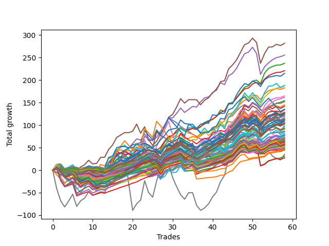

# Short Pointer One (1226) 
- Symbol: ES_Unlimited
- Date Range: 03/18/2022 - 07/15/2022
- Trading Period: 7:20-12:30
- Number of Trades: 58



| Name | Win Percent | Profit | Avg Profit / Trade | Avg Time / Trade |      | Name | Win Percent | Profit | Avg Profit / Trade | Avg Time / Trade |
| ---- | ----------- | ------ | ------------------ | ---------------- | ---- | ---- | ----------- | ------ | ------------------ | ---------------- |
| Sorted By <br> Profit | | | | | | Sorted By <br> Win Percentage ||||
| Five | 77.59 | 140875.00 | 2428.88 | 43:55 |     | Eighty-One | 91.38 | 22375.00 | 385.78 | 12:07 |
| Four | 75.86 | 127750.00 | 2202.59 | 27:26 |     | Eighty-Two | 89.66 | 15250.00 | 262.93 | 16:35 |
| Two | 79.31 | 118625.00 | 2045.26 | 20:04 |     | One Hundred Twenty-One | 87.93 | 29500.00 | 508.62 | 04:47 |
| Three | 81.03 | 110500.00 | 1905.17 | 15:11 |     | One Hundred Twenty-Six | 87.93 | 23375.00 | 403.02 | 04:59 |
| Seventy-Three | 63.79 | 107500.00 | 1853.45 | 11:49 |     | One Hundred Sixteen | 84.48 | 35000.00 | 603.45 | 03:06 |
| Sixty-One | 62.07 | 94000.00 | 1620.69 | 26:40 |     | One Hundred Twenty-Two | 84.48 | 33750.00 | 581.90 | 06:46 |
| Sixty | 67.24 | 93875.00 | 1618.53 | 17:41 |     | One Hundred Twenty-Seven | 84.48 | 29000.00 | 500.00 | 06:55 |
| One | 81.03 | 91375.00 | 1575.43 | 11:12 |     | Eighty-Three | 84.48 | 13625.00 | 234.91 | 22:46 |
| Fifty-Eight | 74.14 | 82375.00 | 1420.26 | 15:09 |     | Eighty-Five | 82.76 | 51375.00 | 885.78 | 28:40 |
| Sixty-Eight | 60.34 | 80875.00 | 1394.40 | 15:23 |     | Eighty-Four | 82.76 | 28875.00 | 497.84 | 27:38 |
| Forty-Four | 55.17 | 77125.00 | 1329.74 | 11:47 |     | Three | 81.03 | 110500.00 | 1905.17 | 15:11 |
| Fifty-Nine | 74.14 | 76000.00 | 1310.34 | 11:08 |     | One | 81.03 | 91375.00 | 1575.43 | 11:12 |
| Fifty-Three | 56.90 | 72500.00 | 1250.00 | 10:40 |     | Two | 79.31 | 118625.00 | 2045.26 | 20:04 |
| Forty-Five | 44.83 | 71000.00 | 1224.14 | 17:44 |     | One Hundred Eleven | 79.31 | 27000.00 | 465.52 | 02:49 |
| Sixty-Two | 62.07 | 67750.00 | 1168.10 | 29:50 |     | Five | 77.59 | 140875.00 | 2428.88 | 43:55 |
| Fifty-Five | 56.90 | 67125.00 | 1157.33 | 11:46 |     | One Hundred Seventeen | 77.59 | 34375.00 | 592.67 | 04:29 |
| Sixty-Seven | 68.97 | 64125.00 | 1105.60 | 10:42 |     | One Hundred Six | 77.59 | 30625.00 | 528.02 | 02:11 |
| Sixty-Five | 75.86 | 63750.00 | 1099.14 | 08:24 |     | One Hundred Twenty-Three | 77.59 | 29000.00 | 500.00 | 10:57 |
| Fifty-Two | 58.62 | 63625.00 | 1096.98 | 09:11 |     | One Hundred Twenty-Eight | 77.59 | 28125.00 | 484.91 | 10:26 |
| Fifty-Seven | 75.86 | 63500.00 | 1094.83 | 08:37 |     | Four | 75.86 | 127750.00 | 2202.59 | 27:26 |
| Forty-Six | 51.72 | 63500.00 | 1094.83 | 17:55 |     | Sixty-Five | 75.86 | 63750.00 | 1099.14 | 08:24 |
| Fifty-Four | 62.07 | 62750.00 | 1081.90 | 08:56 |     | Fifty-Seven | 75.86 | 63500.00 | 1094.83 | 08:37 |
| One Hundred Twenty-Five | 75.86 | 62250.00 | 1073.28 | 14:40 |     | One Hundred Twenty-Five | 75.86 | 62250.00 | 1073.28 | 14:40 |
| Forty-Three | 62.07 | 60875.00 | 1049.57 | 07:38 |     | One Hundred Twenty-Four | 75.86 | 41625.00 | 717.67 | 13:55 |
| Sixty-Six | 65.52 | 60500.00 | 1043.10 | 12:36 |     | One Hundred One | 75.86 | 34125.00 | 588.36 | 02:04 |
| Forty-Two | 60.34 | 60250.00 | 1038.79 | 10:07 |     | One Hundred Twelve | 75.86 | 29875.00 | 515.09 | 04:35 |
| Sixty-Nine | 53.45 | 58375.00 | 1006.47 | 19:48 |     | Fifty-Eight | 74.14 | 82375.00 | 1420.26 | 15:09 |
| Forty-Nine | 67.24 | 57000.00 | 982.76 | 05:48 |     | Fifty-Nine | 74.14 | 76000.00 | 1310.34 | 11:08 |
| One Hundred Thirty | 74.14 | 56625.00 | 976.29 | 12:44 |     | One Hundred Thirty | 74.14 | 56625.00 | 976.29 | 12:44 |
| Forty-Seven | 32.76 | 56625.00 | 976.29 | 28:20 |     | Zero | 74.14 | 43250.00 | 745.69 | 07:09 |
| Fifty-One | 62.07 | 56375.00 | 971.98 | 07:07 |     | One Hundred Twenty-Nine | 74.14 | 36375.00 | 627.16 | 12:00 |
| One Hundred Fifteen | 65.52 | 55500.00 | 956.90 | 07:55 |     | Ninety-One | 72.41 | 35000.00 | 603.45 | 01:34 |
| One Hundred Five | 58.62 | 54250.00 | 935.34 | 05:19 |     | Sixty-Four | 72.41 | 30500.00 | 525.86 | 05:06 |
| Ninety-Five | 53.45 | 52500.00 | 905.17 | 04:16 |     | Ninety-Six | 72.41 | 30375.00 | 523.71 | 01:47 |
| One Hundred Twenty | 60.34 | 52375.00 | 903.02 | 07:13 |     | Fifty-Six | 72.41 | 29875.00 | 515.09 | 05:05 |
| Forty-One | 67.24 | 51875.00 | 894.40 | 06:08 |     | Sixty-Seven | 68.97 | 64125.00 | 1105.60 | 10:42 |
| Fifty | 60.34 | 51875.00 | 894.40 | 07:57 |     | Forty-Eight | 68.97 | 39625.00 | 683.19 | 03:42 |
| Eighty-Five | 82.76 | 51375.00 | 885.78 | 28:40 |     | Six | 68.97 | 38500.00 | 663.79 | 52:44 |
| Seventy-One | 48.28 | 49500.00 | 853.45 | 25:02 |     | One Hundred Seven | 68.97 | 32875.00 | 566.81 | 02:51 |
| Sixty-Three | 44.83 | 48125.00 | 829.74 | 43:17 |     | Sixty | 67.24 | 93875.00 | 1618.53 | 17:41 |
| One Hundred Ten | 56.90 | 46000.00 | 793.10 | 04:03 |     | Forty-Nine | 67.24 | 57000.00 | 982.76 | 05:48 |
| Seventy | 56.90 | 45625.00 | 786.64 | 18:07 |     | Forty-One | 67.24 | 51875.00 | 894.40 | 06:08 |
| Zero | 74.14 | 43250.00 | 745.69 | 07:09 |     | One Hundred Eighteen | 67.24 | 31750.00 | 547.41 | 05:46 |
| One Hundred Twenty-Four | 75.86 | 41625.00 | 717.67 | 13:55 |     | One Hundred Two | 67.24 | 28125.00 | 484.91 | 03:02 |
| Forty-Eight | 68.97 | 39625.00 | 683.19 | 03:42 |     | One Hundred Thirteen | 67.24 | 25875.00 | 446.12 | 06:05 |
| One Hundred Four | 58.62 | 39625.00 | 683.19 | 04:50 |     | Sixty-Six | 65.52 | 60500.00 | 1043.10 | 12:36 |
| Ninety-Four | 53.45 | 39625.00 | 683.19 | 03:51 |     | One Hundred Fifteen | 65.52 | 55500.00 | 956.90 | 07:55 |
| One Hundred Nine | 56.90 | 39125.00 | 674.57 | 03:43 |     | One Hundred Fourteen | 65.52 | 38000.00 | 655.17 | 07:19 |
| Six | 68.97 | 38500.00 | 663.79 | 52:44 |     | Forty | 65.52 | 28125.00 | 484.91 | 03:34 |
| One Hundred Fourteen | 65.52 | 38000.00 | 655.17 | 07:19 |     | Seventy-Three | 63.79 | 107500.00 | 1853.45 | 11:49 |
| One Hundred Twenty-Nine | 74.14 | 36375.00 | 627.16 | 12:00 |     | Ninety-Two | 63.79 | 30250.00 | 521.55 | 02:14 |
| One Hundred Ninteen | 60.34 | 36375.00 | 627.16 | 06:43 |     | Sixty-One | 62.07 | 94000.00 | 1620.69 | 26:40 |
| One Hundred Sixteen | 84.48 | 35000.00 | 603.45 | 03:06 |     | Sixty-Two | 62.07 | 67750.00 | 1168.10 | 29:50 |
| Ninety-One | 72.41 | 35000.00 | 603.45 | 01:34 |     | Fifty-Four | 62.07 | 62750.00 | 1081.90 | 08:56 |
| One Hundred Eight | 58.62 | 34500.00 | 594.83 | 03:23 |     | Forty-Three | 62.07 | 60875.00 | 1049.57 | 07:38 |
| One Hundred Seventeen | 77.59 | 34375.00 | 592.67 | 04:29 |     | Fifty-One | 62.07 | 56375.00 | 971.98 | 07:07 |
| One Hundred One | 75.86 | 34125.00 | 588.36 | 02:04 |     | One Hundred Three | 62.07 | 31750.00 | 547.41 | 03:54 |
| One Hundred Twenty-Two | 84.48 | 33750.00 | 581.90 | 06:46 |     | Sixty-Eight | 60.34 | 80875.00 | 1394.40 | 15:23 |
| One Hundred Seven | 68.97 | 32875.00 | 566.81 | 02:51 |     | Forty-Two | 60.34 | 60250.00 | 1038.79 | 10:07 |
| Ninety-Three | 56.90 | 31875.00 | 549.57 | 02:58 |     | One Hundred Twenty | 60.34 | 52375.00 | 903.02 | 07:13 |
| One Hundred Eighteen | 67.24 | 31750.00 | 547.41 | 05:46 |     | Fifty | 60.34 | 51875.00 | 894.40 | 07:57 |
| One Hundred Three | 62.07 | 31750.00 | 547.41 | 03:54 |     | One Hundred Ninteen | 60.34 | 36375.00 | 627.16 | 06:43 |
| One Hundred Six | 77.59 | 30625.00 | 528.02 | 02:11 |     | Seven | 60.34 | 17500.00 | 301.72 | 87:27 |
| Sixty-Four | 72.41 | 30500.00 | 525.86 | 05:06 |     | Fifty-Two | 58.62 | 63625.00 | 1096.98 | 09:11 |
| Ninety-Six | 72.41 | 30375.00 | 523.71 | 01:47 |     | One Hundred Five | 58.62 | 54250.00 | 935.34 | 05:19 |
| Ninety-Two | 63.79 | 30250.00 | 521.55 | 02:14 |     | One Hundred Four | 58.62 | 39625.00 | 683.19 | 04:50 |
| One Hundred Twelve | 75.86 | 29875.00 | 515.09 | 04:35 |     | One Hundred Eight | 58.62 | 34500.00 | 594.83 | 03:23 |
| Fifty-Six | 72.41 | 29875.00 | 515.09 | 05:05 |     | Fifty-Three | 56.90 | 72500.00 | 1250.00 | 10:40 |
| One Hundred Twenty-One | 87.93 | 29500.00 | 508.62 | 04:47 |     | Fifty-Five | 56.90 | 67125.00 | 1157.33 | 11:46 |
| One Hundred Twenty-Seven | 84.48 | 29000.00 | 500.00 | 06:55 |     | One Hundred Ten | 56.90 | 46000.00 | 793.10 | 04:03 |
| One Hundred Twenty-Three | 77.59 | 29000.00 | 500.00 | 10:57 |     | Seventy | 56.90 | 45625.00 | 786.64 | 18:07 |
| Eighty-Four | 82.76 | 28875.00 | 497.84 | 27:38 |     | One Hundred Nine | 56.90 | 39125.00 | 674.57 | 03:43 |
| One Hundred Twenty-Eight | 77.59 | 28125.00 | 484.91 | 10:26 |     | Ninety-Three | 56.90 | 31875.00 | 549.57 | 02:58 |
| One Hundred Two | 67.24 | 28125.00 | 484.91 | 03:02 |     | Ninety-Seven | 56.90 | 26750.00 | 461.21 | 02:16 |
| Forty | 65.52 | 28125.00 | 484.91 | 03:34 |     | Forty-Four | 55.17 | 77125.00 | 1329.74 | 11:47 |
| One Hundred Eleven | 79.31 | 27000.00 | 465.52 | 02:49 |     | Sixty-Nine | 53.45 | 58375.00 | 1006.47 | 19:48 |
| Ninety-Seven | 56.90 | 26750.00 | 461.21 | 02:16 |     | Ninety-Five | 53.45 | 52500.00 | 905.17 | 04:16 |
| One Hundred Thirteen | 67.24 | 25875.00 | 446.12 | 06:05 |     | Ninety-Four | 53.45 | 39625.00 | 683.19 | 03:51 |
| One Hundred | 53.45 | 24750.00 | 426.72 | 02:53 |     | One Hundred | 53.45 | 24750.00 | 426.72 | 02:53 |
| Ninety-Nine | 53.45 | 24625.00 | 424.57 | 02:46 |     | Ninety-Nine | 53.45 | 24625.00 | 424.57 | 02:46 |
| One Hundred Twenty-Six | 87.93 | 23375.00 | 403.02 | 04:59 |     | Ninety-Eight | 53.45 | 22875.00 | 394.40 | 02:37 |
| Ninety-Eight | 53.45 | 22875.00 | 394.40 | 02:37 |     | Forty-Six | 51.72 | 63500.00 | 1094.83 | 17:55 |
| Eighty-One | 91.38 | 22375.00 | 385.78 | 12:07 |     | Seventy-One | 48.28 | 49500.00 | 853.45 | 25:02 |
| Seven | 60.34 | 17500.00 | 301.72 | 87:27 |     | Forty-Five | 44.83 | 71000.00 | 1224.14 | 17:44 |
| Eighty-Two | 89.66 | 15250.00 | 262.93 | 16:35 |     | Sixty-Three | 44.83 | 48125.00 | 829.74 | 43:17 |
| Eighty-Three | 84.48 | 13625.00 | 234.91 | 22:46 |     | Forty-Seven | 32.76 | 56625.00 | 976.29 | 28:20 |

## NO STOPLOSS

### Test Zero
* Sell when price hits the middle line of the 20p bollinger
* No Stoploss
* Results:
```
Total Trades: 58
Percent Up: 25.86
Percent Down: 74.14
Total Points Moved Down: 86.50
Potential Profit: 43250.00
Total Points Ups: 78.50 Count Ups: 15
Total Points Downs: 165.00 Count Downs: 43
```

<details><summary>Trades</summary>

<code>In: 2022-03-18 08:40:00		Out: 2022-03-18 08:41:15		Total Position Time: 01:15		Total Move Down: 3.75		Total to Date: 3.75</code> <br />
<code>In: 2022-03-18 10:14:00		Out: 2022-03-18 10:19:55		Total Position Time: 05:55		Total Move Down: 1.75		Total to Date: 5.50</code> <br />
<code>In: 2022-03-18 12:13:00		Out: 2022-03-18 12:37:20		Total Position Time: 24:20		Total Move Down: -9.00		Total to Date: -3.50</code> <br />
<code>In: 2022-03-21 08:20:00		Out: 2022-03-21 08:21:10		Total Position Time: 01:10		Total Move Down: 2.75		Total to Date: -0.75</code> <br />
<code>In: 2022-03-23 08:28:00		Out: 2022-03-23 08:32:40		Total Position Time: 04:40		Total Move Down: 2.50		Total to Date: 1.75</code> <br />
<code>In: 2022-03-24 08:09:00		Out: 2022-03-24 08:50:10		Total Position Time: 41:10		Total Move Down: -16.25		Total to Date: -14.50</code> <br />
<code>In: 2022-03-25 07:26:00		Out: 2022-03-25 07:51:10		Total Position Time: 25:10		Total Move Down: -5.50		Total to Date: -20.00</code> <br />
<code>In: 2022-03-25 11:57:00		Out: 2022-03-25 11:58:35		Total Position Time: 01:35		Total Move Down: 0.75		Total to Date: -19.25</code> <br />
<code>In: 2022-03-29 08:52:00		Out: 2022-03-29 08:56:35		Total Position Time: 04:35		Total Move Down: 1.50		Total to Date: -17.75</code> <br />
<code>In: 2022-03-29 12:15:00		Out: 2022-03-29 12:25:25		Total Position Time: 10:25		Total Move Down: -0.50		Total to Date: -18.25</code> <br />
<code>In: 2022-03-31 07:38:00		Out: 2022-03-31 08:03:10		Total Position Time: 25:10		Total Move Down: -5.25		Total to Date: -23.50</code> <br />
<code>In: 2022-03-31 12:05:00		Out: 2022-03-31 12:12:05		Total Position Time: 07:05		Total Move Down: 3.00		Total to Date: -20.50</code> <br />
<code>In: 2022-04-04 11:50:00		Out: 2022-04-04 11:51:10		Total Position Time: 01:10		Total Move Down: 0.50		Total to Date: -20.00</code> <br />
<code>In: 2022-04-06 11:06:00		Out: 2022-04-06 11:07:10		Total Position Time: 01:10		Total Move Down: 3.00		Total to Date: -17.00</code> <br />
<code>In: 2022-04-18 10:59:00		Out: 2022-04-18 11:00:10		Total Position Time: 01:10		Total Move Down: 3.00		Total to Date: -14.00</code> <br />
<code>In: 2022-04-20 07:57:00		Out: 2022-04-20 08:00:20		Total Position Time: 03:20		Total Move Down: 1.75		Total to Date: -12.25</code> <br />
<code>In: 2022-04-20 10:18:00		Out: 2022-04-20 10:19:10		Total Position Time: 01:10		Total Move Down: 3.50		Total to Date: -8.75</code> <br />
<code>In: 2022-04-20 10:50:00		Out: 2022-04-20 10:51:10		Total Position Time: 01:10		Total Move Down: 1.00		Total to Date: -7.75</code> <br />
<code>In: 2022-04-25 09:28:00		Out: 2022-04-25 09:31:10		Total Position Time: 03:10		Total Move Down: 4.50		Total to Date: -3.25</code> <br />
<code>In: 2022-04-25 09:53:00		Out: 2022-04-25 09:54:25		Total Position Time: 01:25		Total Move Down: -0.00		Total to Date: -3.25</code> <br />
<code>In: 2022-04-26 09:31:00		Out: 2022-04-26 09:37:20		Total Position Time: 06:20		Total Move Down: 2.75		Total to Date: -0.50</code> <br />
<code>In: 2022-04-27 08:04:00		Out: 2022-04-27 08:05:10		Total Position Time: 01:10		Total Move Down: -0.25		Total to Date: -0.75</code> <br />
<code>In: 2022-04-27 09:46:00		Out: 2022-04-27 09:49:30		Total Position Time: 03:30		Total Move Down: 1.25		Total to Date: 0.50</code> <br />
<code>In: 2022-04-28 09:50:00		Out: 2022-04-28 10:22:10		Total Position Time: 32:10		Total Move Down: -11.25		Total to Date: -10.75</code> <br />
<code>In: 2022-04-28 10:42:00		Out: 2022-04-28 10:43:10		Total Position Time: 01:10		Total Move Down: 1.25		Total to Date: -9.50</code> <br />
<code>In: 2022-05-03 10:19:00		Out: 2022-05-03 10:23:55		Total Position Time: 04:55		Total Move Down: 3.75		Total to Date: -5.75</code> <br />
<code>In: 2022-05-04 11:03:00		Out: 2022-05-04 11:07:05		Total Position Time: 04:05		Total Move Down: 5.75		Total to Date: 0.00</code> <br />
<code>In: 2022-05-04 11:07:00		Out: 2022-05-04 11:08:10		Total Position Time: 01:10		Total Move Down: 13.50		Total to Date: 13.50</code> <br />
<code>In: 2022-05-24 09:18:00		Out: 2022-05-24 09:22:10		Total Position Time: 04:10		Total Move Down: 5.75		Total to Date: 19.25</code> <br />
<code>In: 2022-05-24 10:58:00		Out: 2022-05-24 11:01:15		Total Position Time: 03:15		Total Move Down: -0.25		Total to Date: 19.00</code> <br />
<code>In: 2022-05-24 11:15:00		Out: 2022-05-24 11:18:25		Total Position Time: 03:25		Total Move Down: 6.25		Total to Date: 25.25</code> <br />
<code>In: 2022-05-24 11:41:00		Out: 2022-05-24 11:42:20		Total Position Time: 01:20		Total Move Down: 3.00		Total to Date: 28.25</code> <br />
<code>In: 2022-05-27 12:03:00		Out: 2022-05-27 12:35:00		Total Position Time: 32:00		Total Move Down: -11.50		Total to Date: 16.75</code> <br />
<code>In: 2022-05-31 10:58:00		Out: 2022-05-31 11:05:20		Total Position Time: 07:20		Total Move Down: 0.75		Total to Date: 17.50</code> <br />
<code>In: 2022-06-01 12:19:00		Out: 2022-06-01 12:25:25		Total Position Time: 06:25		Total Move Down: 1.00		Total to Date: 18.50</code> <br />
<code>In: 2022-06-07 10:12:00		Out: 2022-06-07 10:28:10		Total Position Time: 16:10		Total Move Down: -3.25		Total to Date: 15.25</code> <br />
<code>In: 2022-06-07 11:38:00		Out: 2022-06-07 11:41:50		Total Position Time: 03:50		Total Move Down: 2.00		Total to Date: 17.25</code> <br />
<code>In: 2022-06-09 08:47:00		Out: 2022-06-09 08:48:20		Total Position Time: 01:20		Total Move Down: 2.75		Total to Date: 20.00</code> <br />
<code>In: 2022-06-09 09:46:00		Out: 2022-06-09 09:49:20		Total Position Time: 03:20		Total Move Down: 2.00		Total to Date: 22.00</code> <br />
<code>In: 2022-06-09 10:08:00		Out: 2022-06-09 10:16:50		Total Position Time: 08:50		Total Move Down: 1.75		Total to Date: 23.75</code> <br />
<code>In: 2022-06-10 11:26:00		Out: 2022-06-10 11:28:30		Total Position Time: 02:30		Total Move Down: 6.50		Total to Date: 30.25</code> <br />
<code>In: 2022-06-10 12:29:00		Out: 2022-06-10 12:30:35		Total Position Time: 01:35		Total Move Down: 6.75		Total to Date: 37.00</code> <br />
<code>In: 2022-06-13 08:42:00		Out: 2022-06-13 08:47:40		Total Position Time: 05:40		Total Move Down: 2.75		Total to Date: 39.75</code> <br />
<code>In: 2022-06-13 09:41:00		Out: 2022-06-13 09:44:05		Total Position Time: 03:05		Total Move Down: 9.00		Total to Date: 48.75</code> <br />
<code>In: 2022-06-15 09:19:00		Out: 2022-06-15 09:20:10		Total Position Time: 01:10		Total Move Down: 3.25		Total to Date: 52.00</code> <br />
<code>In: 2022-06-15 11:02:00		Out: 2022-06-15 11:03:10		Total Position Time: 01:10		Total Move Down: 11.00		Total to Date: 63.00</code> <br />
<code>In: 2022-06-16 08:30:00		Out: 2022-06-16 08:31:10		Total Position Time: 01:10		Total Move Down: 9.00		Total to Date: 72.00</code> <br />
<code>In: 2022-06-17 08:34:00		Out: 2022-06-17 08:35:45		Total Position Time: 01:45		Total Move Down: 3.75		Total to Date: 75.75</code> <br />
<code>In: 2022-06-29 12:20:00		Out: 2022-06-29 12:33:20		Total Position Time: 13:20		Total Move Down: -2.25		Total to Date: 73.50</code> <br />
<code>In: 2022-06-29 12:31:00		Out: 2022-06-29 12:33:20		Total Position Time: 02:20		Total Move Down: 4.75		Total to Date: 78.25</code> <br />
<code>In: 2022-06-30 08:51:00		Out: 2022-06-30 09:04:30		Total Position Time: 13:30		Total Move Down: -2.50		Total to Date: 75.75</code> <br />
<code>In: 2022-07-01 10:35:00		Out: 2022-07-01 11:04:20		Total Position Time: 29:20		Total Move Down: -10.00		Total to Date: 65.75</code> <br />
<code>In: 2022-07-05 07:41:00		Out: 2022-07-05 07:44:30		Total Position Time: 03:30		Total Move Down: 7.25		Total to Date: 73.00</code> <br />
<code>In: 2022-07-06 11:10:00		Out: 2022-07-06 11:11:10		Total Position Time: 01:10		Total Move Down: 7.50		Total to Date: 80.50</code> <br />
<code>In: 2022-07-07 08:10:00		Out: 2022-07-07 08:11:15		Total Position Time: 01:15		Total Move Down: 2.00		Total to Date: 82.50</code> <br />
<code>In: 2022-07-07 09:37:00		Out: 2022-07-07 09:44:35		Total Position Time: 07:35		Total Move Down: 1.25		Total to Date: 83.75</code> <br />
<code>In: 2022-07-07 11:05:00		Out: 2022-07-07 11:16:30		Total Position Time: 11:30		Total Move Down: -0.75		Total to Date: 83.00</code> <br />
<code>In: 2022-07-12 10:03:00		Out: 2022-07-12 10:04:10		Total Position Time: 01:10		Total Move Down: 3.50		Total to Date: 86.50</code> <br />


</details>

### Test One
* Sell when the price hits the upper line of the 20p 1std bollinger
* No Stoploss
* Results:
```
Total Trades: 58
Percent Up: 18.97
Percent Down: 81.03
Total Points Moved Down: 182.75
Potential Profit: 91375.00
Total Points Ups: 67.50 Count Ups: 11
Total Points Downs: 250.25 Count Downs: 47
```

<details><summary>Trades</summary>

<code>In: 2022-03-18 08:40:00		Out: 2022-03-18 08:48:10		Total Position Time: 08:10		Total Move Down: 6.00		Total to Date: 6.00</code> <br />
<code>In: 2022-03-18 10:14:00		Out: 2022-03-18 10:42:05		Total Position Time: 28:05		Total Move Down: -1.50		Total to Date: 4.50</code> <br />
<code>In: 2022-03-18 12:13:00		Out: 2022-03-18 12:40:05		Total Position Time: 27:05		Total Move Down: -6.50		Total to Date: -2.00</code> <br />
<code>In: 2022-03-21 08:20:00		Out: 2022-03-21 08:36:05		Total Position Time: 16:05		Total Move Down: 1.50		Total to Date: -0.50</code> <br />
<code>In: 2022-03-23 08:28:00		Out: 2022-03-23 08:35:15		Total Position Time: 07:15		Total Move Down: 2.75		Total to Date: 2.25</code> <br />
<code>In: 2022-03-24 08:09:00		Out: 2022-03-24 08:53:50		Total Position Time: 44:50		Total Move Down: -14.75		Total to Date: -12.50</code> <br />
<code>In: 2022-03-25 07:26:00		Out: 2022-03-25 07:54:00		Total Position Time: 28:00		Total Move Down: -4.50		Total to Date: -17.00</code> <br />
<code>In: 2022-03-25 11:57:00		Out: 2022-03-25 12:00:50		Total Position Time: 03:50		Total Move Down: 2.75		Total to Date: -14.25</code> <br />
<code>In: 2022-03-29 08:52:00		Out: 2022-03-29 08:58:40		Total Position Time: 06:40		Total Move Down: 3.00		Total to Date: -11.25</code> <br />
<code>In: 2022-03-29 12:15:00		Out: 2022-03-29 12:27:50		Total Position Time: 12:50		Total Move Down: 0.75		Total to Date: -10.50</code> <br />
<code>In: 2022-03-31 07:38:00		Out: 2022-03-31 08:08:00		Total Position Time: 30:00		Total Move Down: -4.50		Total to Date: -15.00</code> <br />
<code>In: 2022-03-31 12:05:00		Out: 2022-03-31 12:16:25		Total Position Time: 11:25		Total Move Down: 5.00		Total to Date: -10.00</code> <br />
<code>In: 2022-04-04 11:50:00		Out: 2022-04-04 11:52:10		Total Position Time: 02:10		Total Move Down: 0.75		Total to Date: -9.25</code> <br />
<code>In: 2022-04-06 11:06:00		Out: 2022-04-06 11:07:20		Total Position Time: 01:20		Total Move Down: 5.25		Total to Date: -4.00</code> <br />
<code>In: 2022-04-18 10:59:00		Out: 2022-04-18 11:06:35		Total Position Time: 07:35		Total Move Down: 4.75		Total to Date: 0.75</code> <br />
<code>In: 2022-04-20 07:57:00		Out: 2022-04-20 08:00:40		Total Position Time: 03:40		Total Move Down: 4.75		Total to Date: 5.50</code> <br />
<code>In: 2022-04-20 10:18:00		Out: 2022-04-20 10:19:10		Total Position Time: 01:10		Total Move Down: 3.50		Total to Date: 9.00</code> <br />
<code>In: 2022-04-20 10:50:00		Out: 2022-04-20 10:55:05		Total Position Time: 05:05		Total Move Down: 2.75		Total to Date: 11.75</code> <br />
<code>In: 2022-04-25 09:28:00		Out: 2022-04-25 09:42:45		Total Position Time: 14:45		Total Move Down: 2.00		Total to Date: 13.75</code> <br />
<code>In: 2022-04-25 09:53:00		Out: 2022-04-25 09:55:05		Total Position Time: 02:05		Total Move Down: 3.50		Total to Date: 17.25</code> <br />
<code>In: 2022-04-26 09:31:00		Out: 2022-04-26 09:38:05		Total Position Time: 07:05		Total Move Down: 6.75		Total to Date: 24.00</code> <br />
<code>In: 2022-04-27 08:04:00		Out: 2022-04-27 08:05:30		Total Position Time: 01:30		Total Move Down: 4.75		Total to Date: 28.75</code> <br />
<code>In: 2022-04-27 09:46:00		Out: 2022-04-27 09:51:25		Total Position Time: 05:25		Total Move Down: 5.00		Total to Date: 33.75</code> <br />
<code>In: 2022-04-28 09:50:00		Out: 2022-04-28 10:30:55		Total Position Time: 40:55		Total Move Down: -12.50		Total to Date: 21.25</code> <br />
<code>In: 2022-04-28 10:42:00		Out: 2022-04-28 10:44:10		Total Position Time: 02:10		Total Move Down: 3.25		Total to Date: 24.50</code> <br />
<code>In: 2022-05-03 10:19:00		Out: 2022-05-03 10:27:55		Total Position Time: 08:55		Total Move Down: 7.75		Total to Date: 32.25</code> <br />
<code>In: 2022-05-04 11:03:00		Out: 2022-05-04 11:07:20		Total Position Time: 04:20		Total Move Down: 10.75		Total to Date: 43.00</code> <br />
<code>In: 2022-05-04 11:07:00		Out: 2022-05-04 11:08:10		Total Position Time: 01:10		Total Move Down: 13.50		Total to Date: 56.50</code> <br />
<code>In: 2022-05-24 09:18:00		Out: 2022-05-24 09:29:20		Total Position Time: 11:20		Total Move Down: 6.50		Total to Date: 63.00</code> <br />
<code>In: 2022-05-24 10:58:00		Out: 2022-05-24 11:01:40		Total Position Time: 03:40		Total Move Down: 3.25		Total to Date: 66.25</code> <br />
<code>In: 2022-05-24 11:15:00		Out: 2022-05-24 11:31:25		Total Position Time: 16:25		Total Move Down: 6.75		Total to Date: 73.00</code> <br />
<code>In: 2022-05-24 11:41:00		Out: 2022-05-24 11:43:25		Total Position Time: 02:25		Total Move Down: 6.50		Total to Date: 79.50</code> <br />
<code>In: 2022-05-27 12:03:00		Out: 2022-05-27 12:35:55		Total Position Time: 32:55		Total Move Down: -9.25		Total to Date: 70.25</code> <br />
<code>In: 2022-05-31 10:58:00		Out: 2022-05-31 11:13:25		Total Position Time: 15:25		Total Move Down: 0.25		Total to Date: 70.50</code> <br />
<code>In: 2022-06-01 12:19:00		Out: 2022-06-01 12:30:05		Total Position Time: 11:05		Total Move Down: 4.25		Total to Date: 74.75</code> <br />
<code>In: 2022-06-07 10:12:00		Out: 2022-06-07 10:34:30		Total Position Time: 22:30		Total Move Down: -2.75		Total to Date: 72.00</code> <br />
<code>In: 2022-06-07 11:38:00		Out: 2022-06-07 11:43:00		Total Position Time: 05:00		Total Move Down: 3.75		Total to Date: 75.75</code> <br />
<code>In: 2022-06-09 08:47:00		Out: 2022-06-09 08:49:35		Total Position Time: 02:35		Total Move Down: 7.00		Total to Date: 82.75</code> <br />
<code>In: 2022-06-09 09:46:00		Out: 2022-06-09 09:54:55		Total Position Time: 08:55		Total Move Down: 3.00		Total to Date: 85.75</code> <br />
<code>In: 2022-06-09 10:08:00		Out: 2022-06-09 10:18:55		Total Position Time: 10:55		Total Move Down: 3.25		Total to Date: 89.00</code> <br />
<code>In: 2022-06-10 11:26:00		Out: 2022-06-10 11:38:10		Total Position Time: 12:10		Total Move Down: 4.50		Total to Date: 93.50</code> <br />
<code>In: 2022-06-10 12:29:00		Out: 2022-06-10 12:35:45		Total Position Time: 06:45		Total Move Down: 9.75		Total to Date: 103.25</code> <br />
<code>In: 2022-06-13 08:42:00		Out: 2022-06-13 08:52:05		Total Position Time: 10:05		Total Move Down: 6.75		Total to Date: 110.00</code> <br />
<code>In: 2022-06-13 09:41:00		Out: 2022-06-13 09:47:55		Total Position Time: 06:55		Total Move Down: 14.75		Total to Date: 124.75</code> <br />
<code>In: 2022-06-15 09:19:00		Out: 2022-06-15 09:30:50		Total Position Time: 11:50		Total Move Down: 2.50		Total to Date: 127.25</code> <br />
<code>In: 2022-06-15 11:02:00		Out: 2022-06-15 11:03:10		Total Position Time: 01:10		Total Move Down: 11.00		Total to Date: 138.25</code> <br />
<code>In: 2022-06-16 08:30:00		Out: 2022-06-16 08:31:10		Total Position Time: 01:10		Total Move Down: 9.00		Total to Date: 147.25</code> <br />
<code>In: 2022-06-17 08:34:00		Out: 2022-06-17 08:39:05		Total Position Time: 05:05		Total Move Down: 8.00		Total to Date: 155.25</code> <br />
<code>In: 2022-06-29 12:20:00		Out: 2022-06-29 12:34:15		Total Position Time: 14:15		Total Move Down: 2.00		Total to Date: 157.25</code> <br />
<code>In: 2022-06-29 12:31:00		Out: 2022-06-29 12:34:15		Total Position Time: 03:15		Total Move Down: 9.00		Total to Date: 166.25</code> <br />
<code>In: 2022-06-30 08:51:00		Out: 2022-06-30 09:05:50		Total Position Time: 14:50		Total Move Down: -0.25		Total to Date: 166.00</code> <br />
<code>In: 2022-07-01 10:35:00		Out: 2022-07-01 11:04:55		Total Position Time: 29:55		Total Move Down: -9.00		Total to Date: 157.00</code> <br />
<code>In: 2022-07-05 07:41:00		Out: 2022-07-05 07:45:55		Total Position Time: 04:55		Total Move Down: 12.00		Total to Date: 169.00</code> <br />
<code>In: 2022-07-06 11:10:00		Out: 2022-07-06 11:11:10		Total Position Time: 01:10		Total Move Down: 7.50		Total to Date: 176.50</code> <br />
<code>In: 2022-07-07 08:10:00		Out: 2022-07-07 08:20:05		Total Position Time: 10:05		Total Move Down: 2.50		Total to Date: 179.00</code> <br />
<code>In: 2022-07-07 09:37:00		Out: 2022-07-07 09:45:40		Total Position Time: 08:40		Total Move Down: 2.25		Total to Date: 181.25</code> <br />
<code>In: 2022-07-07 11:05:00		Out: 2022-07-07 11:34:30		Total Position Time: 29:30		Total Move Down: -2.00		Total to Date: 179.25</code> <br />
<code>In: 2022-07-12 10:03:00		Out: 2022-07-12 10:04:10		Total Position Time: 01:10		Total Move Down: 3.50		Total to Date: 182.75</code> <br />


</details>

### Test Two
* Sell when the price hits the upper line of the 20p 2std bollinger
* No Stoploss
* Results:
```
Total Trades: 58
Percent Up: 20.69
Percent Down: 79.31
Total Points Moved Down: 237.25
Potential Profit: 118625.00
Total Points Ups: 89.00 Count Ups: 12
Total Points Downs: 326.25 Count Downs: 46
```

<details><summary>Trades</summary>

<code>In: 2022-03-18 08:40:00		Out: 2022-03-18 08:54:30		Total Position Time: 14:30		Total Move Down: 7.50		Total to Date: 7.50</code> <br />
<code>In: 2022-03-18 10:14:00		Out: 2022-03-18 10:58:40		Total Position Time: 44:40		Total Move Down: -0.75		Total to Date: 6.75</code> <br />
<code>In: 2022-03-18 12:13:00		Out: 2022-03-18 12:47:00		Total Position Time: 34:00		Total Move Down: -13.50		Total to Date: -6.75</code> <br />
<code>In: 2022-03-21 08:20:00		Out: 2022-03-21 08:36:15		Total Position Time: 16:15		Total Move Down: 1.50		Total to Date: -5.25</code> <br />
<code>In: 2022-03-23 08:28:00		Out: 2022-03-23 08:42:10		Total Position Time: 14:10		Total Move Down: 2.75		Total to Date: -2.50</code> <br />
<code>In: 2022-03-24 08:09:00		Out: 2022-03-24 09:03:05		Total Position Time: 54:05		Total Move Down: -14.00		Total to Date: -16.50</code> <br />
<code>In: 2022-03-25 07:26:00		Out: 2022-03-25 07:54:15		Total Position Time: 28:15		Total Move Down: -2.75		Total to Date: -19.25</code> <br />
<code>In: 2022-03-25 11:57:00		Out: 2022-03-25 12:01:15		Total Position Time: 04:15		Total Move Down: 3.25		Total to Date: -16.00</code> <br />
<code>In: 2022-03-29 08:52:00		Out: 2022-03-29 09:01:40		Total Position Time: 09:40		Total Move Down: 4.50		Total to Date: -11.50</code> <br />
<code>In: 2022-03-29 12:15:00		Out: 2022-03-29 12:47:00		Total Position Time: 32:00		Total Move Down: -8.25		Total to Date: -19.75</code> <br />
<code>In: 2022-03-31 07:38:00		Out: 2022-03-31 08:08:30		Total Position Time: 30:30		Total Move Down: -2.25		Total to Date: -22.00</code> <br />
<code>In: 2022-03-31 12:05:00		Out: 2022-03-31 12:19:35		Total Position Time: 14:35		Total Move Down: 6.75		Total to Date: -15.25</code> <br />
<code>In: 2022-04-04 11:50:00		Out: 2022-04-04 12:03:50		Total Position Time: 13:50		Total Move Down: 1.00		Total to Date: -14.25</code> <br />
<code>In: 2022-04-06 11:06:00		Out: 2022-04-06 11:08:10		Total Position Time: 02:10		Total Move Down: 11.25		Total to Date: -3.00</code> <br />
<code>In: 2022-04-18 10:59:00		Out: 2022-04-18 11:10:40		Total Position Time: 11:40		Total Move Down: 6.25		Total to Date: 3.25</code> <br />
<code>In: 2022-04-20 07:57:00		Out: 2022-04-20 08:01:10		Total Position Time: 04:10		Total Move Down: 7.75		Total to Date: 11.00</code> <br />
<code>In: 2022-04-20 10:18:00		Out: 2022-04-20 11:14:05		Total Position Time: 56:05		Total Move Down: 3.25		Total to Date: 14.25</code> <br />
<code>In: 2022-04-20 10:50:00		Out: 2022-04-20 11:14:05		Total Position Time: 24:05		Total Move Down: 3.25		Total to Date: 17.50</code> <br />
<code>In: 2022-04-25 09:28:00		Out: 2022-04-25 10:01:20		Total Position Time: 33:20		Total Move Down: 6.50		Total to Date: 24.00</code> <br />
<code>In: 2022-04-25 09:53:00		Out: 2022-04-25 10:01:20		Total Position Time: 08:20		Total Move Down: 10.00		Total to Date: 34.00</code> <br />
<code>In: 2022-04-26 09:31:00		Out: 2022-04-26 09:47:10		Total Position Time: 16:10		Total Move Down: 11.25		Total to Date: 45.25</code> <br />
<code>In: 2022-04-27 08:04:00		Out: 2022-04-27 08:51:55		Total Position Time: 47:55		Total Move Down: -12.75		Total to Date: 32.50</code> <br />
<code>In: 2022-04-27 09:46:00		Out: 2022-04-27 10:00:10		Total Position Time: 14:10		Total Move Down: 6.75		Total to Date: 39.25</code> <br />
<code>In: 2022-04-28 09:50:00		Out: 2022-04-28 11:15:45		Total Position Time: 85:45		Total Move Down: -15.50		Total to Date: 23.75</code> <br />
<code>In: 2022-04-28 10:42:00		Out: 2022-04-28 11:15:45		Total Position Time: 33:45		Total Move Down: 0.50		Total to Date: 24.25</code> <br />
<code>In: 2022-05-03 10:19:00		Out: 2022-05-03 10:52:20		Total Position Time: 33:20		Total Move Down: 5.25		Total to Date: 29.50</code> <br />
<code>In: 2022-05-04 11:03:00		Out: 2022-05-04 11:07:40		Total Position Time: 04:40		Total Move Down: 17.25		Total to Date: 46.75</code> <br />
<code>In: 2022-05-04 11:07:00		Out: 2022-05-04 11:08:15		Total Position Time: 01:15		Total Move Down: 15.50		Total to Date: 62.25</code> <br />
<code>In: 2022-05-24 09:18:00		Out: 2022-05-24 09:31:25		Total Position Time: 13:25		Total Move Down: 10.75		Total to Date: 73.00</code> <br />
<code>In: 2022-05-24 10:58:00		Out: 2022-05-24 11:01:50		Total Position Time: 03:50		Total Move Down: 4.25		Total to Date: 77.25</code> <br />
<code>In: 2022-05-24 11:15:00		Out: 2022-05-24 11:44:00		Total Position Time: 29:00		Total Move Down: 6.75		Total to Date: 84.00</code> <br />
<code>In: 2022-05-24 11:41:00		Out: 2022-05-24 11:44:00		Total Position Time: 03:00		Total Move Down: 8.75		Total to Date: 92.75</code> <br />
<code>In: 2022-05-27 12:03:00		Out: 2022-05-27 12:38:10		Total Position Time: 35:10		Total Move Down: -6.50		Total to Date: 86.25</code> <br />
<code>In: 2022-05-31 10:58:00		Out: 2022-05-31 11:22:40		Total Position Time: 24:40		Total Move Down: 2.25		Total to Date: 88.50</code> <br />
<code>In: 2022-06-01 12:19:00		Out: 2022-06-01 12:30:05		Total Position Time: 11:05		Total Move Down: 4.25		Total to Date: 92.75</code> <br />
<code>In: 2022-06-07 10:12:00		Out: 2022-06-07 10:37:25		Total Position Time: 25:25		Total Move Down: -2.50		Total to Date: 90.25</code> <br />
<code>In: 2022-06-07 11:38:00		Out: 2022-06-07 11:43:40		Total Position Time: 05:40		Total Move Down: 5.75		Total to Date: 96.00</code> <br />
<code>In: 2022-06-09 08:47:00		Out: 2022-06-09 09:11:10		Total Position Time: 24:10		Total Move Down: 10.00		Total to Date: 106.00</code> <br />
<code>In: 2022-06-09 09:46:00		Out: 2022-06-09 09:55:00		Total Position Time: 09:00		Total Move Down: 4.00		Total to Date: 110.00</code> <br />
<code>In: 2022-06-09 10:08:00		Out: 2022-06-09 10:21:10		Total Position Time: 13:10		Total Move Down: 2.75		Total to Date: 112.75</code> <br />
<code>In: 2022-06-10 11:26:00		Out: 2022-06-10 11:40:10		Total Position Time: 14:10		Total Move Down: 6.75		Total to Date: 119.50</code> <br />
<code>In: 2022-06-10 12:29:00		Out: 2022-06-10 12:43:10		Total Position Time: 14:10		Total Move Down: 14.00		Total to Date: 133.50</code> <br />
<code>In: 2022-06-13 08:42:00		Out: 2022-06-13 09:30:35		Total Position Time: 48:35		Total Move Down: -2.75		Total to Date: 130.75</code> <br />
<code>In: 2022-06-13 09:41:00		Out: 2022-06-13 09:54:15		Total Position Time: 13:15		Total Move Down: 17.75		Total to Date: 148.50</code> <br />
<code>In: 2022-06-15 09:19:00		Out: 2022-06-15 09:34:45		Total Position Time: 15:45		Total Move Down: 1.75		Total to Date: 150.25</code> <br />
<code>In: 2022-06-15 11:02:00		Out: 2022-06-15 11:03:10		Total Position Time: 01:10		Total Move Down: 11.00		Total to Date: 161.25</code> <br />
<code>In: 2022-06-16 08:30:00		Out: 2022-06-16 08:41:35		Total Position Time: 11:35		Total Move Down: 11.00		Total to Date: 172.25</code> <br />
<code>In: 2022-06-17 08:34:00		Out: 2022-06-17 08:45:15		Total Position Time: 11:15		Total Move Down: 12.00		Total to Date: 184.25</code> <br />
<code>In: 2022-06-29 12:20:00		Out: 2022-06-29 12:36:35		Total Position Time: 16:35		Total Move Down: 3.25		Total to Date: 187.50</code> <br />
<code>In: 2022-06-29 12:31:00		Out: 2022-06-29 12:36:35		Total Position Time: 05:35		Total Move Down: 10.25		Total to Date: 197.75</code> <br />
<code>In: 2022-06-30 08:51:00		Out: 2022-06-30 09:06:15		Total Position Time: 15:15		Total Move Down: 2.25		Total to Date: 200.00</code> <br />
<code>In: 2022-07-01 10:35:00		Out: 2022-07-01 11:07:55		Total Position Time: 32:55		Total Move Down: -7.50		Total to Date: 192.50</code> <br />
<code>In: 2022-07-05 07:41:00		Out: 2022-07-05 08:01:10		Total Position Time: 20:10		Total Move Down: 23.00		Total to Date: 215.50</code> <br />
<code>In: 2022-07-06 11:10:00		Out: 2022-07-06 11:11:45		Total Position Time: 01:45		Total Move Down: 10.50		Total to Date: 226.00</code> <br />
<code>In: 2022-07-07 08:10:00		Out: 2022-07-07 08:22:45		Total Position Time: 12:45		Total Move Down: 4.25		Total to Date: 230.25</code> <br />
<code>In: 2022-07-07 09:37:00		Out: 2022-07-07 09:49:35		Total Position Time: 12:35		Total Move Down: 3.00		Total to Date: 233.25</code> <br />
<code>In: 2022-07-07 11:05:00		Out: 2022-07-07 11:35:05		Total Position Time: 30:05		Total Move Down: 0.50		Total to Date: 233.75</code> <br />
<code>In: 2022-07-12 10:03:00		Out: 2022-07-12 10:04:10		Total Position Time: 01:10		Total Move Down: 3.50		Total to Date: 237.25</code> <br />


</details>

### Test Three
* Sell when price hits the middle line of the 50p bollinger
* No Stoploss
* Results:
```
Total Trades: 58
Percent Up: 18.97
Percent Down: 81.03
Total Points Moved Down: 221.00
Potential Profit: 110500.00
Total Points Ups: 59.00 Count Ups: 11
Total Points Downs: 280.00 Count Downs: 47
```

<details><summary>Trades</summary>

<code>In: 2022-03-18 08:40:00		Out: 2022-03-18 08:44:35		Total Position Time: 04:35		Total Move Down: 4.25		Total to Date: 4.25</code> <br />
<code>In: 2022-03-18 10:14:00		Out: 2022-03-18 10:58:30		Total Position Time: 44:30		Total Move Down: -2.00		Total to Date: 2.25</code> <br />
<code>In: 2022-03-18 12:13:00		Out: 2022-03-18 12:47:00		Total Position Time: 34:00		Total Move Down: -13.50		Total to Date: -11.25</code> <br />
<code>In: 2022-03-21 08:20:00		Out: 2022-03-21 08:36:15		Total Position Time: 16:15		Total Move Down: 1.50		Total to Date: -9.75</code> <br />
<code>In: 2022-03-23 08:28:00		Out: 2022-03-23 08:42:25		Total Position Time: 14:25		Total Move Down: 3.25		Total to Date: -6.50</code> <br />
<code>In: 2022-03-24 08:09:00		Out: 2022-03-24 09:03:10		Total Position Time: 54:10		Total Move Down: -13.00		Total to Date: -19.50</code> <br />
<code>In: 2022-03-25 07:26:00		Out: 2022-03-25 08:00:45		Total Position Time: 34:45		Total Move Down: -1.75		Total to Date: -21.25</code> <br />
<code>In: 2022-03-25 11:57:00		Out: 2022-03-25 12:00:45		Total Position Time: 03:45		Total Move Down: 1.75		Total to Date: -19.50</code> <br />
<code>In: 2022-03-29 08:52:00		Out: 2022-03-29 09:01:35		Total Position Time: 09:35		Total Move Down: 4.00		Total to Date: -15.50</code> <br />
<code>In: 2022-03-29 12:15:00		Out: 2022-03-29 12:43:10		Total Position Time: 28:10		Total Move Down: -0.25		Total to Date: -15.75</code> <br />
<code>In: 2022-03-31 07:38:00		Out: 2022-03-31 08:15:40		Total Position Time: 37:40		Total Move Down: -2.25		Total to Date: -18.00</code> <br />
<code>In: 2022-03-31 12:05:00		Out: 2022-03-31 12:16:40		Total Position Time: 11:40		Total Move Down: 5.25		Total to Date: -12.75</code> <br />
<code>In: 2022-04-04 11:50:00		Out: 2022-04-04 12:12:25		Total Position Time: 22:25		Total Move Down: -0.00		Total to Date: -12.75</code> <br />
<code>In: 2022-04-06 11:06:00		Out: 2022-04-06 11:07:20		Total Position Time: 01:20		Total Move Down: 5.25		Total to Date: -7.50</code> <br />
<code>In: 2022-04-18 10:59:00		Out: 2022-04-18 11:16:45		Total Position Time: 17:45		Total Move Down: 7.50		Total to Date: 0.00</code> <br />
<code>In: 2022-04-20 07:57:00		Out: 2022-04-20 08:03:05		Total Position Time: 06:05		Total Move Down: 8.00		Total to Date: 8.00</code> <br />
<code>In: 2022-04-20 10:18:00		Out: 2022-04-20 10:19:30		Total Position Time: 01:30		Total Move Down: 3.75		Total to Date: 11.75</code> <br />
<code>In: 2022-04-20 10:50:00		Out: 2022-04-20 10:51:25		Total Position Time: 01:25		Total Move Down: 1.75		Total to Date: 13.50</code> <br />
<code>In: 2022-04-25 09:28:00		Out: 2022-04-25 09:56:20		Total Position Time: 28:20		Total Move Down: 2.50		Total to Date: 16.00</code> <br />
<code>In: 2022-04-25 09:53:00		Out: 2022-04-25 09:56:20		Total Position Time: 03:20		Total Move Down: 6.00		Total to Date: 22.00</code> <br />
<code>In: 2022-04-26 09:31:00		Out: 2022-04-26 09:46:15		Total Position Time: 15:15		Total Move Down: 10.00		Total to Date: 32.00</code> <br />
<code>In: 2022-04-27 08:04:00		Out: 2022-04-27 08:12:00		Total Position Time: 08:00		Total Move Down: 9.25		Total to Date: 41.25</code> <br />
<code>In: 2022-04-27 09:46:00		Out: 2022-04-27 10:00:10		Total Position Time: 14:10		Total Move Down: 6.75		Total to Date: 48.00</code> <br />
<code>In: 2022-04-28 09:50:00		Out: 2022-04-28 10:52:50		Total Position Time: 62:50		Total Move Down: -14.25		Total to Date: 33.75</code> <br />
<code>In: 2022-04-28 10:42:00		Out: 2022-04-28 10:52:50		Total Position Time: 10:50		Total Move Down: 1.75		Total to Date: 35.50</code> <br />
<code>In: 2022-05-03 10:19:00		Out: 2022-05-03 10:28:05		Total Position Time: 09:05		Total Move Down: 8.50		Total to Date: 44.00</code> <br />
<code>In: 2022-05-04 11:03:00		Out: 2022-05-04 11:07:15		Total Position Time: 04:15		Total Move Down: 6.75		Total to Date: 50.75</code> <br />
<code>In: 2022-05-04 11:07:00		Out: 2022-05-04 11:08:10		Total Position Time: 01:10		Total Move Down: 13.50		Total to Date: 64.25</code> <br />
<code>In: 2022-05-24 09:18:00		Out: 2022-05-24 09:31:20		Total Position Time: 13:20		Total Move Down: 10.75		Total to Date: 75.00</code> <br />
<code>In: 2022-05-24 10:58:00		Out: 2022-05-24 11:20:25		Total Position Time: 22:25		Total Move Down: 1.50		Total to Date: 76.50</code> <br />
<code>In: 2022-05-24 11:15:00		Out: 2022-05-24 11:20:25		Total Position Time: 05:25		Total Move Down: 11.75		Total to Date: 88.25</code> <br />
<code>In: 2022-05-24 11:41:00		Out: 2022-05-24 11:43:25		Total Position Time: 02:25		Total Move Down: 6.50		Total to Date: 94.75</code> <br />
<code>In: 2022-05-27 12:03:00		Out: 2022-05-27 12:38:10		Total Position Time: 35:10		Total Move Down: -6.50		Total to Date: 88.25</code> <br />
<code>In: 2022-05-31 10:58:00		Out: 2022-05-31 11:22:40		Total Position Time: 24:40		Total Move Down: 2.25		Total to Date: 90.50</code> <br />
<code>In: 2022-06-01 12:19:00		Out: 2022-06-01 12:25:30		Total Position Time: 06:30		Total Move Down: 1.75		Total to Date: 92.25</code> <br />
<code>In: 2022-06-07 10:12:00		Out: 2022-06-07 10:43:05		Total Position Time: 31:05		Total Move Down: -1.25		Total to Date: 91.00</code> <br />
<code>In: 2022-06-07 11:38:00		Out: 2022-06-07 11:43:45		Total Position Time: 05:45		Total Move Down: 6.25		Total to Date: 97.25</code> <br />
<code>In: 2022-06-09 08:47:00		Out: 2022-06-09 08:48:50		Total Position Time: 01:50		Total Move Down: 5.25		Total to Date: 102.50</code> <br />
<code>In: 2022-06-09 09:46:00		Out: 2022-06-09 09:56:10		Total Position Time: 10:10		Total Move Down: 5.75		Total to Date: 108.25</code> <br />
<code>In: 2022-06-09 10:08:00		Out: 2022-06-09 10:22:05		Total Position Time: 14:05		Total Move Down: 4.75		Total to Date: 113.00</code> <br />
<code>In: 2022-06-10 11:26:00		Out: 2022-06-10 11:28:30		Total Position Time: 02:30		Total Move Down: 6.50		Total to Date: 119.50</code> <br />
<code>In: 2022-06-10 12:29:00		Out: 2022-06-10 12:33:40		Total Position Time: 04:40		Total Move Down: 9.00		Total to Date: 128.50</code> <br />
<code>In: 2022-06-13 08:42:00		Out: 2022-06-13 09:07:15		Total Position Time: 25:15		Total Move Down: 3.00		Total to Date: 131.50</code> <br />
<code>In: 2022-06-13 09:41:00		Out: 2022-06-13 09:47:55		Total Position Time: 06:55		Total Move Down: 14.75		Total to Date: 146.25</code> <br />
<code>In: 2022-06-15 09:19:00		Out: 2022-06-15 09:35:50		Total Position Time: 16:50		Total Move Down: 2.75		Total to Date: 149.00</code> <br />
<code>In: 2022-06-15 11:02:00		Out: 2022-06-15 11:03:10		Total Position Time: 01:10		Total Move Down: 11.00		Total to Date: 160.00</code> <br />
<code>In: 2022-06-16 08:30:00		Out: 2022-06-16 08:37:05		Total Position Time: 07:05		Total Move Down: 10.50		Total to Date: 170.50</code> <br />
<code>In: 2022-06-17 08:34:00		Out: 2022-06-17 08:45:05		Total Position Time: 11:05		Total Move Down: 10.00		Total to Date: 180.50</code> <br />
<code>In: 2022-06-29 12:20:00		Out: 2022-06-29 12:34:15		Total Position Time: 14:15		Total Move Down: 2.00		Total to Date: 182.50</code> <br />
<code>In: 2022-06-29 12:31:00		Out: 2022-06-29 12:34:15		Total Position Time: 03:15		Total Move Down: 9.00		Total to Date: 191.50</code> <br />
<code>In: 2022-06-30 08:51:00		Out: 2022-06-30 09:06:20		Total Position Time: 15:20		Total Move Down: 3.50		Total to Date: 195.00</code> <br />
<code>In: 2022-07-01 10:35:00		Out: 2022-07-01 11:11:05		Total Position Time: 36:05		Total Move Down: -4.25		Total to Date: 190.75</code> <br />
<code>In: 2022-07-05 07:41:00		Out: 2022-07-05 07:45:50		Total Position Time: 04:50		Total Move Down: 11.50		Total to Date: 202.25</code> <br />
<code>In: 2022-07-06 11:10:00		Out: 2022-07-06 11:11:10		Total Position Time: 01:10		Total Move Down: 7.50		Total to Date: 209.75</code> <br />
<code>In: 2022-07-07 08:10:00		Out: 2022-07-07 08:22:45		Total Position Time: 12:45		Total Move Down: 4.25		Total to Date: 214.00</code> <br />
<code>In: 2022-07-07 09:37:00		Out: 2022-07-07 09:49:35		Total Position Time: 12:35		Total Move Down: 3.00		Total to Date: 217.00</code> <br />
<code>In: 2022-07-07 11:05:00		Out: 2022-07-07 11:35:05		Total Position Time: 30:05		Total Move Down: 0.50		Total to Date: 217.50</code> <br />
<code>In: 2022-07-12 10:03:00		Out: 2022-07-12 10:04:10		Total Position Time: 01:10		Total Move Down: 3.50		Total to Date: 221.00</code> <br />


</details>

### Test Four
* Sell when the price hits the upper line of the 50p 1std bollinger
* No Stoploss
* Results:
```
Total Trades: 58
Percent Up: 24.14
Percent Down: 75.86
Total Points Moved Down: 255.50
Potential Profit: 127750.00
Total Points Ups: 127.25 Count Ups: 14
Total Points Downs: 382.75 Count Downs: 44
```

<details><summary>Trades</summary>

<code>In: 2022-03-18 08:40:00		Out: 2022-03-18 08:54:25		Total Position Time: 14:25		Total Move Down: 6.00		Total to Date: 6.00</code> <br />
<code>In: 2022-03-18 10:14:00		Out: 2022-03-18 11:05:35		Total Position Time: 51:35		Total Move Down: -0.75		Total to Date: 5.25</code> <br />
<code>In: 2022-03-18 12:13:00		Out: 2022-03-18 12:47:00		Total Position Time: 34:00		Total Move Down: -13.50		Total to Date: -8.25</code> <br />
<code>In: 2022-03-21 08:20:00		Out: 2022-03-21 08:49:40		Total Position Time: 29:40		Total Move Down: 2.25		Total to Date: -6.00</code> <br />
<code>In: 2022-03-23 08:28:00		Out: 2022-03-23 08:47:30		Total Position Time: 19:30		Total Move Down: 4.75		Total to Date: -1.25</code> <br />
<code>In: 2022-03-24 08:09:00		Out: 2022-03-24 09:08:30		Total Position Time: 59:30		Total Move Down: -10.00		Total to Date: -11.25</code> <br />
<code>In: 2022-03-25 07:26:00		Out: 2022-03-25 08:01:45		Total Position Time: 35:45		Total Move Down: 3.75		Total to Date: -7.50</code> <br />
<code>In: 2022-03-25 11:57:00		Out: 2022-03-25 12:01:40		Total Position Time: 04:40		Total Move Down: 3.75		Total to Date: -3.75</code> <br />
<code>In: 2022-03-29 08:52:00		Out: 2022-03-29 09:02:15		Total Position Time: 10:15		Total Move Down: 7.50		Total to Date: 3.75</code> <br />
<code>In: 2022-03-29 12:15:00		Out: 2022-03-29 12:47:00		Total Position Time: 32:00		Total Move Down: -8.25		Total to Date: -4.50</code> <br />
<code>In: 2022-03-31 07:38:00		Out: 2022-03-31 08:25:20		Total Position Time: 47:20		Total Move Down: -0.50		Total to Date: -5.00</code> <br />
<code>In: 2022-03-31 12:05:00		Out: 2022-03-31 12:20:30		Total Position Time: 15:30		Total Move Down: 8.75		Total to Date: 3.75</code> <br />
<code>In: 2022-04-04 11:50:00		Out: 2022-04-04 12:42:15		Total Position Time: 52:15		Total Move Down: -0.50		Total to Date: 3.25</code> <br />
<code>In: 2022-04-06 11:06:00		Out: 2022-04-06 11:08:10		Total Position Time: 02:10		Total Move Down: 11.25		Total to Date: 14.50</code> <br />
<code>In: 2022-04-18 10:59:00		Out: 2022-04-18 11:23:10		Total Position Time: 24:10		Total Move Down: 8.25		Total to Date: 22.75</code> <br />
<code>In: 2022-04-20 07:57:00		Out: 2022-04-20 08:10:50		Total Position Time: 13:50		Total Move Down: 11.75		Total to Date: 34.50</code> <br />
<code>In: 2022-04-20 10:18:00		Out: 2022-04-20 10:33:05		Total Position Time: 15:05		Total Move Down: 4.75		Total to Date: 39.25</code> <br />
<code>In: 2022-04-20 10:50:00		Out: 2022-04-20 11:14:05		Total Position Time: 24:05		Total Move Down: 3.25		Total to Date: 42.50</code> <br />
<code>In: 2022-04-25 09:28:00		Out: 2022-04-25 10:01:20		Total Position Time: 33:20		Total Move Down: 6.50		Total to Date: 49.00</code> <br />
<code>In: 2022-04-25 09:53:00		Out: 2022-04-25 10:01:20		Total Position Time: 08:20		Total Move Down: 10.00		Total to Date: 59.00</code> <br />
<code>In: 2022-04-26 09:31:00		Out: 2022-04-26 10:03:20		Total Position Time: 32:20		Total Move Down: 10.50		Total to Date: 69.50</code> <br />
<code>In: 2022-04-27 08:04:00		Out: 2022-04-27 09:01:55		Total Position Time: 57:55		Total Move Down: -2.75		Total to Date: 66.75</code> <br />
<code>In: 2022-04-27 09:46:00		Out: 2022-04-27 10:01:20		Total Position Time: 15:20		Total Move Down: 13.75		Total to Date: 80.50</code> <br />
<code>In: 2022-04-28 09:50:00		Out: 2022-04-28 11:15:55		Total Position Time: 85:55		Total Move Down: -15.00		Total to Date: 65.50</code> <br />
<code>In: 2022-04-28 10:42:00		Out: 2022-04-28 11:15:55		Total Position Time: 33:55		Total Move Down: 1.00		Total to Date: 66.50</code> <br />
<code>In: 2022-05-03 10:19:00		Out: 2022-05-03 10:54:05		Total Position Time: 35:05		Total Move Down: 6.50		Total to Date: 73.00</code> <br />
<code>In: 2022-05-04 11:03:00		Out: 2022-05-04 11:07:25		Total Position Time: 04:25		Total Move Down: 13.50		Total to Date: 86.50</code> <br />
<code>In: 2022-05-04 11:07:00		Out: 2022-05-04 11:08:10		Total Position Time: 01:10		Total Move Down: 13.50		Total to Date: 100.00</code> <br />
<code>In: 2022-05-24 09:18:00		Out: 2022-05-24 09:34:40		Total Position Time: 16:40		Total Move Down: 16.25		Total to Date: 116.25</code> <br />
<code>In: 2022-05-24 10:58:00		Out: 2022-05-24 11:45:05		Total Position Time: 47:05		Total Move Down: -0.25		Total to Date: 116.00</code> <br />
<code>In: 2022-05-24 11:15:00		Out: 2022-05-24 11:45:05		Total Position Time: 30:05		Total Move Down: 10.00		Total to Date: 126.00</code> <br />
<code>In: 2022-05-24 11:41:00		Out: 2022-05-24 11:45:05		Total Position Time: 04:05		Total Move Down: 12.00		Total to Date: 138.00</code> <br />
<code>In: 2022-05-27 12:03:00		Out: 2022-05-27 12:47:00		Total Position Time: 44:00		Total Move Down: -9.75		Total to Date: 128.25</code> <br />
<code>In: 2022-05-31 10:58:00		Out: 2022-05-31 11:26:40		Total Position Time: 28:40		Total Move Down: 6.75		Total to Date: 135.00</code> <br />
<code>In: 2022-06-01 12:19:00		Out: 2022-06-01 12:35:10		Total Position Time: 16:10		Total Move Down: 6.50		Total to Date: 141.50</code> <br />
<code>In: 2022-06-07 10:12:00		Out: 2022-06-07 10:56:10		Total Position Time: 44:10		Total Move Down: -1.50		Total to Date: 140.00</code> <br />
<code>In: 2022-06-07 11:38:00		Out: 2022-06-07 11:47:35		Total Position Time: 09:35		Total Move Down: 12.00		Total to Date: 152.00</code> <br />
<code>In: 2022-06-09 08:47:00		Out: 2022-06-09 08:50:30		Total Position Time: 03:30		Total Move Down: 8.50		Total to Date: 160.50</code> <br />
<code>In: 2022-06-09 09:46:00		Out: 2022-06-09 10:24:20		Total Position Time: 38:20		Total Move Down: 2.25		Total to Date: 162.75</code> <br />
<code>In: 2022-06-09 10:08:00		Out: 2022-06-09 10:24:20		Total Position Time: 16:20		Total Move Down: 8.25		Total to Date: 171.00</code> <br />
<code>In: 2022-06-10 11:26:00		Out: 2022-06-10 11:41:45		Total Position Time: 15:45		Total Move Down: 10.00		Total to Date: 181.00</code> <br />
<code>In: 2022-06-10 12:29:00		Out: 2022-06-10 12:42:40		Total Position Time: 13:40		Total Move Down: 13.25		Total to Date: 194.25</code> <br />
<code>In: 2022-06-13 08:42:00		Out: 2022-06-13 09:54:40		Total Position Time: 72:40		Total Move Down: -4.25		Total to Date: 190.00</code> <br />
<code>In: 2022-06-13 09:41:00		Out: 2022-06-13 09:54:40		Total Position Time: 13:40		Total Move Down: 19.50		Total to Date: 209.50</code> <br />
<code>In: 2022-06-15 09:19:00		Out: 2022-06-15 09:40:05		Total Position Time: 21:05		Total Move Down: 5.50		Total to Date: 215.00</code> <br />
<code>In: 2022-06-15 11:02:00		Out: 2022-06-15 11:03:10		Total Position Time: 01:10		Total Move Down: 11.00		Total to Date: 226.00</code> <br />
<code>In: 2022-06-16 08:30:00		Out: 2022-06-16 08:42:25		Total Position Time: 12:25		Total Move Down: 17.00		Total to Date: 243.00</code> <br />
<code>In: 2022-06-17 08:34:00		Out: 2022-06-17 08:51:25		Total Position Time: 17:25		Total Move Down: 15.50		Total to Date: 258.50</code> <br />
<code>In: 2022-06-29 12:20:00		Out: 2022-06-29 12:47:00		Total Position Time: 27:00		Total Move Down: 3.75		Total to Date: 262.25</code> <br />
<code>In: 2022-06-29 12:31:00		Out: 2022-06-29 12:47:00		Total Position Time: 16:00		Total Move Down: 10.75		Total to Date: 273.00</code> <br />
<code>In: 2022-06-30 08:51:00		Out: 2022-06-30 10:10:15		Total Position Time: 79:15		Total Move Down: -14.00		Total to Date: 259.00</code> <br />
<code>In: 2022-07-01 10:35:00		Out: 2022-07-01 12:47:00		Total Position Time: 132:00		Total Move Down: -46.25		Total to Date: 212.75</code> <br />
<code>In: 2022-07-05 07:41:00		Out: 2022-07-05 07:56:40		Total Position Time: 15:40		Total Move Down: 16.75		Total to Date: 229.50</code> <br />
<code>In: 2022-07-06 11:10:00		Out: 2022-07-06 11:11:35		Total Position Time: 01:35		Total Move Down: 8.75		Total to Date: 238.25</code> <br />
<code>In: 2022-07-07 08:10:00		Out: 2022-07-07 08:23:20		Total Position Time: 13:20		Total Move Down: 7.00		Total to Date: 245.25</code> <br />
<code>In: 2022-07-07 09:37:00		Out: 2022-07-07 09:50:10		Total Position Time: 13:10		Total Move Down: 4.75		Total to Date: 250.00</code> <br />
<code>In: 2022-07-07 11:05:00		Out: 2022-07-07 11:37:00		Total Position Time: 32:00		Total Move Down: 2.00		Total to Date: 252.00</code> <br />
<code>In: 2022-07-12 10:03:00		Out: 2022-07-12 10:04:10		Total Position Time: 01:10		Total Move Down: 3.50		Total to Date: 255.50</code> <br />


</details>

### Test Five
* Sell when the price hits the upper line of the 50p 2std bollinger
* No Stoploss
* Results:
```
Total Trades: 58
Percent Up: 22.41
Percent Down: 77.59
Total Points Moved Down: 281.75
Potential Profit: 140875.00
Total Points Ups: 171.50 Count Ups: 13
Total Points Downs: 453.25 Count Downs: 45
```

<details><summary>Trades</summary>

<code>In: 2022-03-18 08:40:00		Out: 2022-03-18 08:54:50		Total Position Time: 14:50		Total Move Down: 12.50		Total to Date: 12.50</code> <br />
<code>In: 2022-03-18 10:14:00		Out: 2022-03-18 11:07:30		Total Position Time: 53:30		Total Move Down: 1.00		Total to Date: 13.50</code> <br />
<code>In: 2022-03-18 12:13:00		Out: 2022-03-18 12:47:00		Total Position Time: 34:00		Total Move Down: -13.50		Total to Date: 0.00</code> <br />
<code>In: 2022-03-21 08:20:00		Out: 2022-03-21 09:06:05		Total Position Time: 46:05		Total Move Down: 3.00		Total to Date: 3.00</code> <br />
<code>In: 2022-03-23 08:28:00		Out: 2022-03-23 09:06:20		Total Position Time: 38:20		Total Move Down: 5.50		Total to Date: 8.50</code> <br />
<code>In: 2022-03-24 08:09:00		Out: 2022-03-24 09:17:20		Total Position Time: 68:20		Total Move Down: -7.75		Total to Date: 0.75</code> <br />
<code>In: 2022-03-25 07:26:00		Out: 2022-03-25 08:08:15		Total Position Time: 42:15		Total Move Down: 6.25		Total to Date: 7.00</code> <br />
<code>In: 2022-03-25 11:57:00		Out: 2022-03-25 12:01:55		Total Position Time: 04:55		Total Move Down: 5.25		Total to Date: 12.25</code> <br />
<code>In: 2022-03-29 08:52:00		Out: 2022-03-29 09:10:50		Total Position Time: 18:50		Total Move Down: 9.75		Total to Date: 22.00</code> <br />
<code>In: 2022-03-29 12:15:00		Out: 2022-03-29 12:47:00		Total Position Time: 32:00		Total Move Down: -8.25		Total to Date: 13.75</code> <br />
<code>In: 2022-03-31 07:38:00		Out: 2022-03-31 08:31:45		Total Position Time: 53:45		Total Move Down: 1.50		Total to Date: 15.25</code> <br />
<code>In: 2022-03-31 12:05:00		Out: 2022-03-31 12:23:10		Total Position Time: 18:10		Total Move Down: 13.00		Total to Date: 28.25</code> <br />
<code>In: 2022-04-04 11:50:00		Out: 2022-04-04 12:43:25		Total Position Time: 53:25		Total Move Down: 0.50		Total to Date: 28.75</code> <br />
<code>In: 2022-04-06 11:06:00		Out: 2022-04-06 11:09:40		Total Position Time: 03:40		Total Move Down: 17.25		Total to Date: 46.00</code> <br />
<code>In: 2022-04-18 10:59:00		Out: 2022-04-18 11:47:00		Total Position Time: 48:00		Total Move Down: 10.25		Total to Date: 56.25</code> <br />
<code>In: 2022-04-20 07:57:00		Out: 2022-04-20 08:16:30		Total Position Time: 19:30		Total Move Down: 16.25		Total to Date: 72.50</code> <br />
<code>In: 2022-04-20 10:18:00		Out: 2022-04-20 11:18:05		Total Position Time: 60:05		Total Move Down: 5.50		Total to Date: 78.00</code> <br />
<code>In: 2022-04-20 10:50:00		Out: 2022-04-20 11:18:05		Total Position Time: 28:05		Total Move Down: 5.50		Total to Date: 83.50</code> <br />
<code>In: 2022-04-25 09:28:00		Out: 2022-04-25 11:01:35		Total Position Time: 93:35		Total Move Down: -0.25		Total to Date: 83.25</code> <br />
<code>In: 2022-04-25 09:53:00		Out: 2022-04-25 11:01:35		Total Position Time: 68:35		Total Move Down: 3.25		Total to Date: 86.50</code> <br />
<code>In: 2022-04-26 09:31:00		Out: 2022-04-26 10:14:35		Total Position Time: 43:35		Total Move Down: 15.75		Total to Date: 102.25</code> <br />
<code>In: 2022-04-27 08:04:00		Out: 2022-04-27 10:10:20		Total Position Time: 126:20		Total Move Down: -20.25		Total to Date: 82.00</code> <br />
<code>In: 2022-04-27 09:46:00		Out: 2022-04-27 10:10:20		Total Position Time: 24:20		Total Move Down: 14.50		Total to Date: 96.50</code> <br />
<code>In: 2022-04-28 09:50:00		Out: 2022-04-28 12:34:05		Total Position Time: 164:05		Total Move Down: -28.75		Total to Date: 67.75</code> <br />
<code>In: 2022-04-28 10:42:00		Out: 2022-04-28 12:34:05		Total Position Time: 112:05		Total Move Down: -12.75		Total to Date: 55.00</code> <br />
<code>In: 2022-05-03 10:19:00		Out: 2022-05-03 10:57:15		Total Position Time: 38:15		Total Move Down: 9.00		Total to Date: 64.00</code> <br />
<code>In: 2022-05-04 11:03:00		Out: 2022-05-04 11:07:40		Total Position Time: 04:40		Total Move Down: 17.25		Total to Date: 81.25</code> <br />
<code>In: 2022-05-04 11:07:00		Out: 2022-05-04 11:08:15		Total Position Time: 01:15		Total Move Down: 15.50		Total to Date: 96.75</code> <br />
<code>In: 2022-05-24 09:18:00		Out: 2022-05-24 09:37:00		Total Position Time: 19:00		Total Move Down: 20.75		Total to Date: 117.50</code> <br />
<code>In: 2022-05-24 10:58:00		Out: 2022-05-24 11:49:15		Total Position Time: 51:15		Total Move Down: 6.25		Total to Date: 123.75</code> <br />
<code>In: 2022-05-24 11:15:00		Out: 2022-05-24 11:49:15		Total Position Time: 34:15		Total Move Down: 16.50		Total to Date: 140.25</code> <br />
<code>In: 2022-05-24 11:41:00		Out: 2022-05-24 11:49:15		Total Position Time: 08:15		Total Move Down: 18.50		Total to Date: 158.75</code> <br />
<code>In: 2022-05-27 12:03:00		Out: 2022-05-27 12:47:00		Total Position Time: 44:00		Total Move Down: -9.75		Total to Date: 149.00</code> <br />
<code>In: 2022-05-31 10:58:00		Out: 2022-05-31 11:41:10		Total Position Time: 43:10		Total Move Down: 7.50		Total to Date: 156.50</code> <br />
<code>In: 2022-06-01 12:19:00		Out: 2022-06-01 12:47:00		Total Position Time: 28:00		Total Move Down: 0.25		Total to Date: 156.75</code> <br />
<code>In: 2022-06-07 10:12:00		Out: 2022-06-07 11:00:30		Total Position Time: 48:30		Total Move Down: -0.50		Total to Date: 156.25</code> <br />
<code>In: 2022-06-07 11:38:00		Out: 2022-06-07 12:47:00		Total Position Time: 69:00		Total Move Down: -11.00		Total to Date: 145.25</code> <br />
<code>In: 2022-06-09 08:47:00		Out: 2022-06-09 09:11:10		Total Position Time: 24:10		Total Move Down: 10.00		Total to Date: 155.25</code> <br />
<code>In: 2022-06-09 09:46:00		Out: 2022-06-09 10:27:20		Total Position Time: 41:20		Total Move Down: 5.50		Total to Date: 160.75</code> <br />
<code>In: 2022-06-09 10:08:00		Out: 2022-06-09 10:27:20		Total Position Time: 19:20		Total Move Down: 11.50		Total to Date: 172.25</code> <br />
<code>In: 2022-06-10 11:26:00		Out: 2022-06-10 12:45:40		Total Position Time: 79:40		Total Move Down: 6.00		Total to Date: 178.25</code> <br />
<code>In: 2022-06-10 12:29:00		Out: 2022-06-10 12:45:40		Total Position Time: 16:40		Total Move Down: 18.25		Total to Date: 196.50</code> <br />
<code>In: 2022-06-13 08:42:00		Out: 2022-06-13 09:58:15		Total Position Time: 76:15		Total Move Down: 2.25		Total to Date: 198.75</code> <br />
<code>In: 2022-06-13 09:41:00		Out: 2022-06-13 09:58:15		Total Position Time: 17:15		Total Move Down: 26.00		Total to Date: 224.75</code> <br />
<code>In: 2022-06-15 09:19:00		Out: 2022-06-15 09:42:05		Total Position Time: 23:05		Total Move Down: 9.00		Total to Date: 233.75</code> <br />
<code>In: 2022-06-15 11:02:00		Out: 2022-06-15 11:03:10		Total Position Time: 01:10		Total Move Down: 11.00		Total to Date: 244.75</code> <br />
<code>In: 2022-06-16 08:30:00		Out: 2022-06-16 09:07:40		Total Position Time: 37:40		Total Move Down: 17.00		Total to Date: 261.75</code> <br />
<code>In: 2022-06-17 08:34:00		Out: 2022-06-17 08:55:55		Total Position Time: 21:55		Total Move Down: 17.00		Total to Date: 278.75</code> <br />
<code>In: 2022-06-29 12:20:00		Out: 2022-06-29 12:47:00		Total Position Time: 27:00		Total Move Down: 3.75		Total to Date: 282.50</code> <br />
<code>In: 2022-06-29 12:31:00		Out: 2022-06-29 12:47:00		Total Position Time: 16:00		Total Move Down: 10.75		Total to Date: 293.25</code> <br />
<code>In: 2022-06-30 08:51:00		Out: 2022-06-30 10:12:00		Total Position Time: 81:00		Total Move Down: -9.75		Total to Date: 283.50</code> <br />
<code>In: 2022-07-01 10:35:00		Out: 2022-07-01 12:47:00		Total Position Time: 132:00		Total Move Down: -46.25		Total to Date: 237.25</code> <br />
<code>In: 2022-07-05 07:41:00		Out: 2022-07-05 08:01:05		Total Position Time: 20:05		Total Move Down: 21.50		Total to Date: 258.75</code> <br />
<code>In: 2022-07-06 11:10:00		Out: 2022-07-06 11:12:15		Total Position Time: 02:15		Total Move Down: 14.50		Total to Date: 273.25</code> <br />
<code>In: 2022-07-07 08:10:00		Out: 2022-07-07 10:06:20		Total Position Time: 116:20		Total Move Down: 0.75		Total to Date: 274.00</code> <br />
<code>In: 2022-07-07 09:37:00		Out: 2022-07-07 10:06:20		Total Position Time: 29:20		Total Move Down: 5.50		Total to Date: 279.50</code> <br />
<code>In: 2022-07-07 11:05:00		Out: 2022-07-07 12:47:00		Total Position Time: 102:00		Total Move Down: -2.75		Total to Date: 276.75</code> <br />
<code>In: 2022-07-12 10:03:00		Out: 2022-07-12 10:06:00		Total Position Time: 03:00		Total Move Down: 5.00		Total to Date: 281.75</code> <br />


</details>

### Test Six
* Sell when the price hits the middle line of the 1std VWAP
* No Stoploss
* Results:
```
Total Trades: 58
Percent Up: 31.03
Percent Down: 68.97
Total Points Moved Down: 77.00
Potential Profit: 38500.00
Total Points Ups: 297.75 Count Ups: 18
Total Points Downs: 374.75 Count Downs: 40
```

<details><summary>Trades</summary>

<code>In: 2022-03-18 08:40:00		Out: 2022-03-18 08:54:50		Total Position Time: 14:50		Total Move Down: 12.50		Total to Date: 12.50</code> <br />
<code>In: 2022-03-18 10:14:00		Out: 2022-03-18 12:47:00		Total Position Time: 153:00		Total Move Down: -27.00		Total to Date: -14.50</code> <br />
<code>In: 2022-03-18 12:13:00		Out: 2022-03-18 12:47:00		Total Position Time: 34:00		Total Move Down: -13.50		Total to Date: -28.00</code> <br />
<code>In: 2022-03-21 08:20:00		Out: 2022-03-21 09:30:30		Total Position Time: 70:30		Total Move Down: 4.50		Total to Date: -23.50</code> <br />
<code>In: 2022-03-23 08:28:00		Out: 2022-03-23 09:10:55		Total Position Time: 42:55		Total Move Down: 8.75		Total to Date: -14.75</code> <br />
<code>In: 2022-03-24 08:09:00		Out: 2022-03-24 12:47:00		Total Position Time: 278:00		Total Move Down: -26.75		Total to Date: -41.50</code> <br />
<code>In: 2022-03-25 07:26:00		Out: 2022-03-25 08:08:15		Total Position Time: 42:15		Total Move Down: 6.25		Total to Date: -35.25</code> <br />
<code>In: 2022-03-25 11:57:00		Out: 2022-03-25 12:20:30		Total Position Time: 23:30		Total Move Down: 11.50		Total to Date: -23.75</code> <br />
<code>In: 2022-03-29 08:52:00		Out: 2022-03-29 09:02:10		Total Position Time: 10:10		Total Move Down: 6.00		Total to Date: -17.75</code> <br />
<code>In: 2022-03-29 12:15:00		Out: 2022-03-29 12:47:00		Total Position Time: 32:00		Total Move Down: -8.25		Total to Date: -26.00</code> <br />
<code>In: 2022-03-31 07:38:00		Out: 2022-03-31 07:41:35		Total Position Time: 03:35		Total Move Down: 2.25		Total to Date: -23.75</code> <br />
<code>In: 2022-03-31 12:05:00		Out: 2022-03-31 12:06:10		Total Position Time: 01:10		Total Move Down: 0.75		Total to Date: -23.00</code> <br />
<code>In: 2022-04-04 11:50:00		Out: 2022-04-04 12:47:00		Total Position Time: 57:00		Total Move Down: -1.25		Total to Date: -24.25</code> <br />
<code>In: 2022-04-06 11:06:00		Out: 2022-04-06 11:08:10		Total Position Time: 02:10		Total Move Down: 11.25		Total to Date: -13.00</code> <br />
<code>In: 2022-04-18 10:59:00		Out: 2022-04-18 12:04:30		Total Position Time: 65:30		Total Move Down: 13.75		Total to Date: 0.75</code> <br />
<code>In: 2022-04-20 07:57:00		Out: 2022-04-20 08:08:10		Total Position Time: 11:10		Total Move Down: 10.50		Total to Date: 11.25</code> <br />
<code>In: 2022-04-20 10:18:00		Out: 2022-04-20 11:18:20		Total Position Time: 60:20		Total Move Down: 6.25		Total to Date: 17.50</code> <br />
<code>In: 2022-04-20 10:50:00		Out: 2022-04-20 11:18:20		Total Position Time: 28:20		Total Move Down: 6.25		Total to Date: 23.75</code> <br />
<code>In: 2022-04-25 09:28:00		Out: 2022-04-25 09:31:10		Total Position Time: 03:10		Total Move Down: 4.50		Total to Date: 28.25</code> <br />
<code>In: 2022-04-25 09:53:00		Out: 2022-04-25 10:01:15		Total Position Time: 08:15		Total Move Down: 7.50		Total to Date: 35.75</code> <br />
<code>In: 2022-04-26 09:31:00		Out: 2022-04-26 09:32:10		Total Position Time: 01:10		Total Move Down: 2.75		Total to Date: 38.50</code> <br />
<code>In: 2022-04-27 08:04:00		Out: 2022-04-27 08:05:20		Total Position Time: 01:20		Total Move Down: 2.00		Total to Date: 40.50</code> <br />
<code>In: 2022-04-27 09:46:00		Out: 2022-04-27 11:38:40		Total Position Time: 112:40		Total Move Down: 26.75		Total to Date: 67.25</code> <br />
<code>In: 2022-04-28 09:50:00		Out: 2022-04-28 12:47:00		Total Position Time: 177:00		Total Move Down: -26.25		Total to Date: 41.00</code> <br />
<code>In: 2022-04-28 10:42:00		Out: 2022-04-28 12:47:00		Total Position Time: 125:00		Total Move Down: -10.25		Total to Date: 30.75</code> <br />
<code>In: 2022-05-03 10:19:00		Out: 2022-05-03 11:12:00		Total Position Time: 53:00		Total Move Down: 21.75		Total to Date: 52.50</code> <br />
<code>In: 2022-05-04 11:03:00		Out: 2022-05-04 11:20:20		Total Position Time: 17:20		Total Move Down: 18.75		Total to Date: 71.25</code> <br />
<code>In: 2022-05-04 11:07:00		Out: 2022-05-04 11:20:20		Total Position Time: 13:20		Total Move Down: 17.50		Total to Date: 88.75</code> <br />
<code>In: 2022-05-24 09:18:00		Out: 2022-05-24 09:36:45		Total Position Time: 18:45		Total Move Down: 19.75		Total to Date: 108.50</code> <br />
<code>In: 2022-05-24 10:58:00		Out: 2022-05-24 12:47:00		Total Position Time: 109:00		Total Move Down: -30.50		Total to Date: 78.00</code> <br />
<code>In: 2022-05-24 11:15:00		Out: 2022-05-24 12:47:00		Total Position Time: 92:00		Total Move Down: -20.25		Total to Date: 57.75</code> <br />
<code>In: 2022-05-24 11:41:00		Out: 2022-05-24 12:47:00		Total Position Time: 66:00		Total Move Down: -18.25		Total to Date: 39.50</code> <br />
<code>In: 2022-05-27 12:03:00		Out: 2022-05-27 12:47:00		Total Position Time: 44:00		Total Move Down: -9.75		Total to Date: 29.75</code> <br />
<code>In: 2022-05-31 10:58:00		Out: 2022-05-31 11:48:35		Total Position Time: 50:35		Total Move Down: 25.50		Total to Date: 55.25</code> <br />
<code>In: 2022-06-01 12:19:00		Out: 2022-06-01 12:47:00		Total Position Time: 28:00		Total Move Down: 0.25		Total to Date: 55.50</code> <br />
<code>In: 2022-06-07 10:12:00		Out: 2022-06-07 12:47:00		Total Position Time: 155:00		Total Move Down: -28.25		Total to Date: 27.25</code> <br />
<code>In: 2022-06-07 11:38:00		Out: 2022-06-07 12:47:00		Total Position Time: 69:00		Total Move Down: -11.00		Total to Date: 16.25</code> <br />
<code>In: 2022-06-09 08:47:00		Out: 2022-06-09 08:48:10		Total Position Time: 01:10		Total Move Down: 1.25		Total to Date: 17.50</code> <br />
<code>In: 2022-06-09 09:46:00		Out: 2022-06-09 09:48:20		Total Position Time: 02:20		Total Move Down: 1.50		Total to Date: 19.00</code> <br />
<code>In: 2022-06-09 10:08:00		Out: 2022-06-09 10:23:45		Total Position Time: 15:45		Total Move Down: 7.25		Total to Date: 26.25</code> <br />
<code>In: 2022-06-10 11:26:00		Out: 2022-06-10 11:28:30		Total Position Time: 02:30		Total Move Down: 6.50		Total to Date: 32.75</code> <br />
<code>In: 2022-06-10 12:29:00		Out: 2022-06-10 12:44:00		Total Position Time: 15:00		Total Move Down: 16.25		Total to Date: 49.00</code> <br />
<code>In: 2022-06-13 08:42:00		Out: 2022-06-13 08:46:30		Total Position Time: 04:30		Total Move Down: -1.25		Total to Date: 47.75</code> <br />
<code>In: 2022-06-13 09:41:00		Out: 2022-06-13 09:55:05		Total Position Time: 14:05		Total Move Down: 20.75		Total to Date: 68.50</code> <br />
<code>In: 2022-06-15 09:19:00		Out: 2022-06-15 09:20:10		Total Position Time: 01:10		Total Move Down: 3.25		Total to Date: 71.75</code> <br />
<code>In: 2022-06-15 11:02:00		Out: 2022-06-15 11:03:10		Total Position Time: 01:10		Total Move Down: 11.00		Total to Date: 82.75</code> <br />
<code>In: 2022-06-16 08:30:00		Out: 2022-06-16 08:31:10		Total Position Time: 01:10		Total Move Down: 9.00		Total to Date: 91.75</code> <br />
<code>In: 2022-06-17 08:34:00		Out: 2022-06-17 08:37:05		Total Position Time: 03:05		Total Move Down: 5.25		Total to Date: 97.00</code> <br />
<code>In: 2022-06-29 12:20:00		Out: 2022-06-29 12:34:15		Total Position Time: 14:15		Total Move Down: 2.00		Total to Date: 99.00</code> <br />
<code>In: 2022-06-29 12:31:00		Out: 2022-06-29 12:34:15		Total Position Time: 03:15		Total Move Down: 9.00		Total to Date: 108.00</code> <br />
<code>In: 2022-06-30 08:51:00		Out: 2022-06-30 12:05:35		Total Position Time: 194:35		Total Move Down: 9.25		Total to Date: 117.25</code> <br />
<code>In: 2022-07-01 10:35:00		Out: 2022-07-01 12:47:00		Total Position Time: 132:00		Total Move Down: -46.25		Total to Date: 71.00</code> <br />
<code>In: 2022-07-05 07:41:00		Out: 2022-07-05 07:45:30		Total Position Time: 04:30		Total Move Down: 11.00		Total to Date: 82.00</code> <br />
<code>In: 2022-07-06 11:10:00		Out: 2022-07-06 11:11:35		Total Position Time: 01:35		Total Move Down: 8.75		Total to Date: 90.75</code> <br />
<code>In: 2022-07-07 08:10:00		Out: 2022-07-07 12:47:00		Total Position Time: 277:00		Total Move Down: -10.50		Total to Date: 80.25</code> <br />
<code>In: 2022-07-07 09:37:00		Out: 2022-07-07 12:47:00		Total Position Time: 190:00		Total Move Down: -5.75		Total to Date: 74.50</code> <br />
<code>In: 2022-07-07 11:05:00		Out: 2022-07-07 12:47:00		Total Position Time: 102:00		Total Move Down: -2.75		Total to Date: 71.75</code> <br />
<code>In: 2022-07-12 10:03:00		Out: 2022-07-12 10:06:10		Total Position Time: 03:10		Total Move Down: 5.25		Total to Date: 77.00</code> <br />


</details>

### Test Seven
* Sell when the price hits the upper line of the 1std VWAP
* No Stoploss
* Results:
```
Total Trades: 58
Percent Up: 39.66
Percent Down: 60.34
Total Points Moved Down: 35.00
Potential Profit: 17500.00
Total Points Ups: 511.75 Count Ups: 23
Total Points Downs: 546.75 Count Downs: 35
```

<details><summary>Trades</summary>

<code>In: 2022-03-18 08:40:00		Out: 2022-03-18 12:47:00		Total Position Time: 247:00		Total Move Down: -41.25		Total to Date: -41.25</code> <br />
<code>In: 2022-03-18 10:14:00		Out: 2022-03-18 12:47:00		Total Position Time: 153:00		Total Move Down: -27.00		Total to Date: -68.25</code> <br />
<code>In: 2022-03-18 12:13:00		Out: 2022-03-18 12:47:00		Total Position Time: 34:00		Total Move Down: -13.50		Total to Date: -81.75</code> <br />
<code>In: 2022-03-21 08:20:00		Out: 2022-03-21 09:31:40		Total Position Time: 71:40		Total Move Down: 13.25		Total to Date: -68.50</code> <br />
<code>In: 2022-03-23 08:28:00		Out: 2022-03-23 09:13:35		Total Position Time: 45:35		Total Move Down: 15.00		Total to Date: -53.50</code> <br />
<code>In: 2022-03-24 08:09:00		Out: 2022-03-24 12:47:00		Total Position Time: 278:00		Total Move Down: -26.75		Total to Date: -80.25</code> <br />
<code>In: 2022-03-25 07:26:00		Out: 2022-03-25 08:09:20		Total Position Time: 43:20		Total Move Down: 12.25		Total to Date: -68.00</code> <br />
<code>In: 2022-03-25 11:57:00		Out: 2022-03-25 12:47:00		Total Position Time: 50:00		Total Move Down: 6.00		Total to Date: -62.00</code> <br />
<code>In: 2022-03-29 08:52:00		Out: 2022-03-29 09:27:55		Total Position Time: 35:55		Total Move Down: 14.25		Total to Date: -47.75</code> <br />
<code>In: 2022-03-29 12:15:00		Out: 2022-03-29 12:47:00		Total Position Time: 32:00		Total Move Down: -8.25		Total to Date: -56.00</code> <br />
<code>In: 2022-03-31 07:38:00		Out: 2022-03-31 09:15:10		Total Position Time: 97:10		Total Move Down: 4.25		Total to Date: -51.75</code> <br />
<code>In: 2022-03-31 12:05:00		Out: 2022-03-31 12:12:45		Total Position Time: 07:45		Total Move Down: 3.75		Total to Date: -48.00</code> <br />
<code>In: 2022-04-04 11:50:00		Out: 2022-04-04 12:47:00		Total Position Time: 57:00		Total Move Down: -1.25		Total to Date: -49.25</code> <br />
<code>In: 2022-04-06 11:06:00		Out: 2022-04-06 11:09:40		Total Position Time: 03:40		Total Move Down: 17.25		Total to Date: -32.00</code> <br />
<code>In: 2022-04-18 10:59:00		Out: 2022-04-18 12:29:05		Total Position Time: 90:05		Total Move Down: 23.75		Total to Date: -8.25</code> <br />
<code>In: 2022-04-20 07:57:00		Out: 2022-04-20 08:20:15		Total Position Time: 23:15		Total Move Down: 18.00		Total to Date: 9.75</code> <br />
<code>In: 2022-04-20 10:18:00		Out: 2022-04-20 11:30:15		Total Position Time: 72:15		Total Move Down: 12.50		Total to Date: 22.25</code> <br />
<code>In: 2022-04-20 10:50:00		Out: 2022-04-20 11:30:15		Total Position Time: 40:15		Total Move Down: 12.50		Total to Date: 34.75</code> <br />
<code>In: 2022-04-25 09:28:00		Out: 2022-04-25 12:47:00		Total Position Time: 199:00		Total Move Down: -63.75		Total to Date: -29.00</code> <br />
<code>In: 2022-04-25 09:53:00		Out: 2022-04-25 12:47:00		Total Position Time: 174:00		Total Move Down: -60.25		Total to Date: -89.25</code> <br />
<code>In: 2022-04-26 09:31:00		Out: 2022-04-26 10:14:15		Total Position Time: 43:15		Total Move Down: 14.50		Total to Date: -74.75</code> <br />
<code>In: 2022-04-27 08:04:00		Out: 2022-04-27 12:04:15		Total Position Time: 240:15		Total Move Down: 8.25		Total to Date: -66.50</code> <br />
<code>In: 2022-04-27 09:46:00		Out: 2022-04-27 12:04:15		Total Position Time: 138:15		Total Move Down: 43.00		Total to Date: -23.50</code> <br />
<code>In: 2022-04-28 09:50:00		Out: 2022-04-28 12:47:00		Total Position Time: 177:00		Total Move Down: -26.25		Total to Date: -49.75</code> <br />
<code>In: 2022-04-28 10:42:00		Out: 2022-04-28 12:47:00		Total Position Time: 125:00		Total Move Down: -10.25		Total to Date: -60.00</code> <br />
<code>In: 2022-05-03 10:19:00		Out: 2022-05-03 11:40:15		Total Position Time: 81:15		Total Move Down: 35.75		Total to Date: -24.25</code> <br />
<code>In: 2022-05-04 11:03:00		Out: 2022-05-04 11:34:05		Total Position Time: 31:05		Total Move Down: 33.75		Total to Date: 9.50</code> <br />
<code>In: 2022-05-04 11:07:00		Out: 2022-05-04 11:34:05		Total Position Time: 27:05		Total Move Down: 32.50		Total to Date: 42.00</code> <br />
<code>In: 2022-05-24 09:18:00		Out: 2022-05-24 12:47:00		Total Position Time: 209:00		Total Move Down: -27.75		Total to Date: 14.25</code> <br />
<code>In: 2022-05-24 10:58:00		Out: 2022-05-24 12:47:00		Total Position Time: 109:00		Total Move Down: -30.50		Total to Date: -16.25</code> <br />
<code>In: 2022-05-24 11:15:00		Out: 2022-05-24 12:47:00		Total Position Time: 92:00		Total Move Down: -20.25		Total to Date: -36.50</code> <br />
<code>In: 2022-05-24 11:41:00		Out: 2022-05-24 12:47:00		Total Position Time: 66:00		Total Move Down: -18.25		Total to Date: -54.75</code> <br />
<code>In: 2022-05-27 12:03:00		Out: 2022-05-27 12:47:00		Total Position Time: 44:00		Total Move Down: -9.75		Total to Date: -64.50</code> <br />
<code>In: 2022-05-31 10:58:00		Out: 2022-05-31 12:47:00		Total Position Time: 109:00		Total Move Down: 14.25		Total to Date: -50.25</code> <br />
<code>In: 2022-06-01 12:19:00		Out: 2022-06-01 12:47:00		Total Position Time: 28:00		Total Move Down: 0.25		Total to Date: -50.00</code> <br />
<code>In: 2022-06-07 10:12:00		Out: 2022-06-07 12:47:00		Total Position Time: 155:00		Total Move Down: -28.25		Total to Date: -78.25</code> <br />
<code>In: 2022-06-07 11:38:00		Out: 2022-06-07 12:47:00		Total Position Time: 69:00		Total Move Down: -11.00		Total to Date: -89.25</code> <br />
<code>In: 2022-06-09 08:47:00		Out: 2022-06-09 08:48:50		Total Position Time: 01:50		Total Move Down: 5.25		Total to Date: -84.00</code> <br />
<code>In: 2022-06-09 09:46:00		Out: 2022-06-09 10:30:30		Total Position Time: 44:30		Total Move Down: 9.25		Total to Date: -74.75</code> <br />
<code>In: 2022-06-09 10:08:00		Out: 2022-06-09 10:30:30		Total Position Time: 22:30		Total Move Down: 15.25		Total to Date: -59.50</code> <br />
<code>In: 2022-06-10 11:26:00		Out: 2022-06-10 12:47:00		Total Position Time: 81:00		Total Move Down: 11.00		Total to Date: -48.50</code> <br />
<code>In: 2022-06-10 12:29:00		Out: 2022-06-10 12:47:00		Total Position Time: 18:00		Total Move Down: 23.25		Total to Date: -25.25</code> <br />
<code>In: 2022-06-13 08:42:00		Out: 2022-06-13 10:33:35		Total Position Time: 111:35		Total Move Down: 14.00		Total to Date: -11.25</code> <br />
<code>In: 2022-06-13 09:41:00		Out: 2022-06-13 10:33:35		Total Position Time: 52:35		Total Move Down: 37.75		Total to Date: 26.50</code> <br />
<code>In: 2022-06-15 09:19:00		Out: 2022-06-15 09:41:45		Total Position Time: 22:45		Total Move Down: 8.50		Total to Date: 35.00</code> <br />
<code>In: 2022-06-15 11:02:00		Out: 2022-06-15 11:03:10		Total Position Time: 01:10		Total Move Down: 11.00		Total to Date: 46.00</code> <br />
<code>In: 2022-06-16 08:30:00		Out: 2022-06-16 08:36:15		Total Position Time: 06:15		Total Move Down: 10.25		Total to Date: 56.25</code> <br />
<code>In: 2022-06-17 08:34:00		Out: 2022-06-17 09:03:15		Total Position Time: 29:15		Total Move Down: 22.50		Total to Date: 78.75</code> <br />
<code>In: 2022-06-29 12:20:00		Out: 2022-06-29 12:47:00		Total Position Time: 27:00		Total Move Down: 3.75		Total to Date: 82.50</code> <br />
<code>In: 2022-06-29 12:31:00		Out: 2022-06-29 12:47:00		Total Position Time: 16:00		Total Move Down: 10.75		Total to Date: 93.25</code> <br />
<code>In: 2022-06-30 08:51:00		Out: 2022-06-30 12:47:00		Total Position Time: 236:00		Total Move Down: -0.50		Total to Date: 92.75</code> <br />
<code>In: 2022-07-01 10:35:00		Out: 2022-07-01 12:47:00		Total Position Time: 132:00		Total Move Down: -46.25		Total to Date: 46.50</code> <br />
<code>In: 2022-07-05 07:41:00		Out: 2022-07-05 07:57:05		Total Position Time: 16:05		Total Move Down: 17.00		Total to Date: 63.50</code> <br />
<code>In: 2022-07-06 11:10:00		Out: 2022-07-06 12:47:00		Total Position Time: 97:00		Total Move Down: -21.75		Total to Date: 41.75</code> <br />
<code>In: 2022-07-07 08:10:00		Out: 2022-07-07 12:47:00		Total Position Time: 277:00		Total Move Down: -10.50		Total to Date: 31.25</code> <br />
<code>In: 2022-07-07 09:37:00		Out: 2022-07-07 12:47:00		Total Position Time: 190:00		Total Move Down: -5.75		Total to Date: 25.50</code> <br />
<code>In: 2022-07-07 11:05:00		Out: 2022-07-07 12:47:00		Total Position Time: 102:00		Total Move Down: -2.75		Total to Date: 22.75</code> <br />
<code>In: 2022-07-12 10:03:00		Out: 2022-07-12 11:32:25		Total Position Time: 89:25		Total Move Down: 12.25		Total to Date: 35.00</code> <br />


</details>

## STOPLOSS OF 5

### Test Forty
* Sell when price hits the middle line of the 20p bollinger
* Stoploss is -5 points
* Results:
```
Total Trades: 58
Percent Up: 34.48
Percent Down: 65.52
Total Points Moved Down: 56.25
Potential Profit: 28125.00
Total Points Ups: 91.25 Count Ups: 20
Total Points Downs: 147.50 Count Downs: 38
```

<details><summary>Trades</summary>

<code>In: 2022-03-18 08:40:00		Out: 2022-03-18 08:41:15		Total Position Time: 01:15		Total Move Down: 3.75		Total to Date: 3.75</code> <br />
<code>In: 2022-03-18 10:14:00		Out: 2022-03-18 10:19:55		Total Position Time: 05:55		Total Move Down: 1.75		Total to Date: 5.50</code> <br />
<code>In: 2022-03-18 12:13:00		Out: 2022-03-18 12:19:35		Total Position Time: 06:35		Total Move Down: -5.25		Total to Date: 0.25</code> <br />
<code>In: 2022-03-21 08:20:00		Out: 2022-03-21 08:21:10		Total Position Time: 01:10		Total Move Down: 2.75		Total to Date: 3.00</code> <br />
<code>In: 2022-03-23 08:28:00		Out: 2022-03-23 08:32:40		Total Position Time: 04:40		Total Move Down: 2.50		Total to Date: 5.50</code> <br />
<code>In: 2022-03-24 08:09:00		Out: 2022-03-24 08:12:30		Total Position Time: 03:30		Total Move Down: -4.75		Total to Date: 0.75</code> <br />
<code>In: 2022-03-25 07:26:00		Out: 2022-03-25 07:35:05		Total Position Time: 09:05		Total Move Down: -6.00		Total to Date: -5.25</code> <br />
<code>In: 2022-03-25 11:57:00		Out: 2022-03-25 11:58:35		Total Position Time: 01:35		Total Move Down: 0.75		Total to Date: -4.50</code> <br />
<code>In: 2022-03-29 08:52:00		Out: 2022-03-29 08:56:35		Total Position Time: 04:35		Total Move Down: 1.50		Total to Date: -3.00</code> <br />
<code>In: 2022-03-29 12:15:00		Out: 2022-03-29 12:25:25		Total Position Time: 10:25		Total Move Down: -0.50		Total to Date: -3.50</code> <br />
<code>In: 2022-03-31 07:38:00		Out: 2022-03-31 07:46:45		Total Position Time: 08:45		Total Move Down: -5.75		Total to Date: -9.25</code> <br />
<code>In: 2022-03-31 12:05:00		Out: 2022-03-31 12:12:05		Total Position Time: 07:05		Total Move Down: 3.00		Total to Date: -6.25</code> <br />
<code>In: 2022-04-04 11:50:00		Out: 2022-04-04 11:51:10		Total Position Time: 01:10		Total Move Down: 0.50		Total to Date: -5.75</code> <br />
<code>In: 2022-04-06 11:06:00		Out: 2022-04-06 11:07:10		Total Position Time: 01:10		Total Move Down: 3.00		Total to Date: -2.75</code> <br />
<code>In: 2022-04-18 10:59:00		Out: 2022-04-18 11:00:10		Total Position Time: 01:10		Total Move Down: 3.00		Total to Date: 0.25</code> <br />
<code>In: 2022-04-20 07:57:00		Out: 2022-04-20 08:00:20		Total Position Time: 03:20		Total Move Down: 1.75		Total to Date: 2.00</code> <br />
<code>In: 2022-04-20 10:18:00		Out: 2022-04-20 10:19:10		Total Position Time: 01:10		Total Move Down: 3.50		Total to Date: 5.50</code> <br />
<code>In: 2022-04-20 10:50:00		Out: 2022-04-20 10:51:10		Total Position Time: 01:10		Total Move Down: 1.00		Total to Date: 6.50</code> <br />
<code>In: 2022-04-25 09:28:00		Out: 2022-04-25 09:31:10		Total Position Time: 03:10		Total Move Down: 4.50		Total to Date: 11.00</code> <br />
<code>In: 2022-04-25 09:53:00		Out: 2022-04-25 09:54:25		Total Position Time: 01:25		Total Move Down: -0.00		Total to Date: 11.00</code> <br />
<code>In: 2022-04-26 09:31:00		Out: 2022-04-26 09:37:20		Total Position Time: 06:20		Total Move Down: 2.75		Total to Date: 13.75</code> <br />
<code>In: 2022-04-27 08:04:00		Out: 2022-04-27 08:05:10		Total Position Time: 01:10		Total Move Down: -0.25		Total to Date: 13.50</code> <br />
<code>In: 2022-04-27 09:46:00		Out: 2022-04-27 09:49:30		Total Position Time: 03:30		Total Move Down: 1.25		Total to Date: 14.75</code> <br />
<code>In: 2022-04-28 09:50:00		Out: 2022-04-28 10:00:45		Total Position Time: 10:45		Total Move Down: -5.00		Total to Date: 9.75</code> <br />
<code>In: 2022-04-28 10:42:00		Out: 2022-04-28 10:43:10		Total Position Time: 01:10		Total Move Down: 1.25		Total to Date: 11.00</code> <br />
<code>In: 2022-05-03 10:19:00		Out: 2022-05-03 10:23:55		Total Position Time: 04:55		Total Move Down: 3.75		Total to Date: 14.75</code> <br />
<code>In: 2022-05-04 11:03:00		Out: 2022-05-04 11:04:25		Total Position Time: 01:25		Total Move Down: -8.25		Total to Date: 6.50</code> <br />
<code>In: 2022-05-04 11:07:00		Out: 2022-05-04 11:08:10		Total Position Time: 01:10		Total Move Down: 13.50		Total to Date: 20.00</code> <br />
<code>In: 2022-05-24 09:18:00		Out: 2022-05-24 09:22:10		Total Position Time: 04:10		Total Move Down: 5.75		Total to Date: 25.75</code> <br />
<code>In: 2022-05-24 10:58:00		Out: 2022-05-24 11:01:15		Total Position Time: 03:15		Total Move Down: -0.25		Total to Date: 25.50</code> <br />
<code>In: 2022-05-24 11:15:00		Out: 2022-05-24 11:18:25		Total Position Time: 03:25		Total Move Down: 6.25		Total to Date: 31.75</code> <br />
<code>In: 2022-05-24 11:41:00		Out: 2022-05-24 11:42:20		Total Position Time: 01:20		Total Move Down: 3.00		Total to Date: 34.75</code> <br />
<code>In: 2022-05-27 12:03:00		Out: 2022-05-27 12:05:30		Total Position Time: 02:30		Total Move Down: -6.00		Total to Date: 28.75</code> <br />
<code>In: 2022-05-31 10:58:00		Out: 2022-05-31 10:59:30		Total Position Time: 01:30		Total Move Down: -5.25		Total to Date: 23.50</code> <br />
<code>In: 2022-06-01 12:19:00		Out: 2022-06-01 12:23:05		Total Position Time: 04:05		Total Move Down: -6.00		Total to Date: 17.50</code> <br />
<code>In: 2022-06-07 10:12:00		Out: 2022-06-07 10:16:25		Total Position Time: 04:25		Total Move Down: -5.00		Total to Date: 12.50</code> <br />
<code>In: 2022-06-07 11:38:00		Out: 2022-06-07 11:41:50		Total Position Time: 03:50		Total Move Down: 2.00		Total to Date: 14.50</code> <br />
<code>In: 2022-06-09 08:47:00		Out: 2022-06-09 08:48:20		Total Position Time: 01:20		Total Move Down: 2.75		Total to Date: 17.25</code> <br />
<code>In: 2022-06-09 09:46:00		Out: 2022-06-09 09:49:20		Total Position Time: 03:20		Total Move Down: 2.00		Total to Date: 19.25</code> <br />
<code>In: 2022-06-09 10:08:00		Out: 2022-06-09 10:16:50		Total Position Time: 08:50		Total Move Down: 1.75		Total to Date: 21.00</code> <br />
<code>In: 2022-06-10 11:26:00		Out: 2022-06-10 11:28:30		Total Position Time: 02:30		Total Move Down: 6.50		Total to Date: 27.50</code> <br />
<code>In: 2022-06-10 12:29:00		Out: 2022-06-10 12:30:35		Total Position Time: 01:35		Total Move Down: 6.75		Total to Date: 34.25</code> <br />
<code>In: 2022-06-13 08:42:00		Out: 2022-06-13 08:43:10		Total Position Time: 01:10		Total Move Down: -5.00		Total to Date: 29.25</code> <br />
<code>In: 2022-06-13 09:41:00		Out: 2022-06-13 09:44:05		Total Position Time: 03:05		Total Move Down: 9.00		Total to Date: 38.25</code> <br />
<code>In: 2022-06-15 09:19:00		Out: 2022-06-15 09:20:10		Total Position Time: 01:10		Total Move Down: 3.25		Total to Date: 41.50</code> <br />
<code>In: 2022-06-15 11:02:00		Out: 2022-06-15 11:03:10		Total Position Time: 01:10		Total Move Down: 11.00		Total to Date: 52.50</code> <br />
<code>In: 2022-06-16 08:30:00		Out: 2022-06-16 08:31:10		Total Position Time: 01:10		Total Move Down: 9.00		Total to Date: 61.50</code> <br />
<code>In: 2022-06-17 08:34:00		Out: 2022-06-17 08:35:45		Total Position Time: 01:45		Total Move Down: 3.75		Total to Date: 65.25</code> <br />
<code>In: 2022-06-29 12:20:00		Out: 2022-06-29 12:25:25		Total Position Time: 05:25		Total Move Down: -5.00		Total to Date: 60.25</code> <br />
<code>In: 2022-06-29 12:31:00		Out: 2022-06-29 12:33:20		Total Position Time: 02:20		Total Move Down: 4.75		Total to Date: 65.00</code> <br />
<code>In: 2022-06-30 08:51:00		Out: 2022-06-30 08:58:15		Total Position Time: 07:15		Total Move Down: -5.25		Total to Date: 59.75</code> <br />
<code>In: 2022-07-01 10:35:00		Out: 2022-07-01 10:38:45		Total Position Time: 03:45		Total Move Down: -9.75		Total to Date: 50.00</code> <br />
<code>In: 2022-07-05 07:41:00		Out: 2022-07-05 07:42:10		Total Position Time: 01:10		Total Move Down: -7.25		Total to Date: 42.75</code> <br />
<code>In: 2022-07-06 11:10:00		Out: 2022-07-06 11:11:10		Total Position Time: 01:10		Total Move Down: 7.50		Total to Date: 50.25</code> <br />
<code>In: 2022-07-07 08:10:00		Out: 2022-07-07 08:11:15		Total Position Time: 01:15		Total Move Down: 2.00		Total to Date: 52.25</code> <br />
<code>In: 2022-07-07 09:37:00		Out: 2022-07-07 09:44:35		Total Position Time: 07:35		Total Move Down: 1.25		Total to Date: 53.50</code> <br />
<code>In: 2022-07-07 11:05:00		Out: 2022-07-07 11:16:30		Total Position Time: 11:30		Total Move Down: -0.75		Total to Date: 52.75</code> <br />
<code>In: 2022-07-12 10:03:00		Out: 2022-07-12 10:04:10		Total Position Time: 01:10		Total Move Down: 3.50		Total to Date: 56.25</code> <br />


</details>

### Test Forty-One
* Sell when the price hits the upper line of the 20p 1std bollinger
* Stoploss is -5 points
* Results:
```
Total Trades: 58
Percent Up: 32.76
Percent Down: 67.24
Total Points Moved Down: 103.75
Potential Profit: 51875.00
Total Points Ups: 107.00 Count Ups: 19
Total Points Downs: 210.75 Count Downs: 39
```

<details><summary>Trades</summary>

<code>In: 2022-03-18 08:40:00		Out: 2022-03-18 08:48:10		Total Position Time: 08:10		Total Move Down: 6.00		Total to Date: 6.00</code> <br />
<code>In: 2022-03-18 10:14:00		Out: 2022-03-18 10:29:30		Total Position Time: 15:30		Total Move Down: -5.00		Total to Date: 1.00</code> <br />
<code>In: 2022-03-18 12:13:00		Out: 2022-03-18 12:19:35		Total Position Time: 06:35		Total Move Down: -5.25		Total to Date: -4.25</code> <br />
<code>In: 2022-03-21 08:20:00		Out: 2022-03-21 08:25:25		Total Position Time: 05:25		Total Move Down: -5.25		Total to Date: -9.50</code> <br />
<code>In: 2022-03-23 08:28:00		Out: 2022-03-23 08:35:15		Total Position Time: 07:15		Total Move Down: 2.75		Total to Date: -6.75</code> <br />
<code>In: 2022-03-24 08:09:00		Out: 2022-03-24 08:12:30		Total Position Time: 03:30		Total Move Down: -4.75		Total to Date: -11.50</code> <br />
<code>In: 2022-03-25 07:26:00		Out: 2022-03-25 07:35:05		Total Position Time: 09:05		Total Move Down: -6.00		Total to Date: -17.50</code> <br />
<code>In: 2022-03-25 11:57:00		Out: 2022-03-25 12:00:50		Total Position Time: 03:50		Total Move Down: 2.75		Total to Date: -14.75</code> <br />
<code>In: 2022-03-29 08:52:00		Out: 2022-03-29 08:58:40		Total Position Time: 06:40		Total Move Down: 3.00		Total to Date: -11.75</code> <br />
<code>In: 2022-03-29 12:15:00		Out: 2022-03-29 12:27:50		Total Position Time: 12:50		Total Move Down: 0.75		Total to Date: -11.00</code> <br />
<code>In: 2022-03-31 07:38:00		Out: 2022-03-31 07:46:45		Total Position Time: 08:45		Total Move Down: -5.75		Total to Date: -16.75</code> <br />
<code>In: 2022-03-31 12:05:00		Out: 2022-03-31 12:16:25		Total Position Time: 11:25		Total Move Down: 5.00		Total to Date: -11.75</code> <br />
<code>In: 2022-04-04 11:50:00		Out: 2022-04-04 11:52:10		Total Position Time: 02:10		Total Move Down: 0.75		Total to Date: -11.00</code> <br />
<code>In: 2022-04-06 11:06:00		Out: 2022-04-06 11:07:20		Total Position Time: 01:20		Total Move Down: 5.25		Total to Date: -5.75</code> <br />
<code>In: 2022-04-18 10:59:00		Out: 2022-04-18 11:06:35		Total Position Time: 07:35		Total Move Down: 4.75		Total to Date: -1.00</code> <br />
<code>In: 2022-04-20 07:57:00		Out: 2022-04-20 08:00:40		Total Position Time: 03:40		Total Move Down: 4.75		Total to Date: 3.75</code> <br />
<code>In: 2022-04-20 10:18:00		Out: 2022-04-20 10:19:10		Total Position Time: 01:10		Total Move Down: 3.50		Total to Date: 7.25</code> <br />
<code>In: 2022-04-20 10:50:00		Out: 2022-04-20 10:55:05		Total Position Time: 05:05		Total Move Down: 2.75		Total to Date: 10.00</code> <br />
<code>In: 2022-04-25 09:28:00		Out: 2022-04-25 09:32:30		Total Position Time: 04:30		Total Move Down: -5.25		Total to Date: 4.75</code> <br />
<code>In: 2022-04-25 09:53:00		Out: 2022-04-25 09:55:05		Total Position Time: 02:05		Total Move Down: 3.50		Total to Date: 8.25</code> <br />
<code>In: 2022-04-26 09:31:00		Out: 2022-04-26 09:38:05		Total Position Time: 07:05		Total Move Down: 6.75		Total to Date: 15.00</code> <br />
<code>In: 2022-04-27 08:04:00		Out: 2022-04-27 08:05:30		Total Position Time: 01:30		Total Move Down: 4.75		Total to Date: 19.75</code> <br />
<code>In: 2022-04-27 09:46:00		Out: 2022-04-27 09:51:25		Total Position Time: 05:25		Total Move Down: 5.00		Total to Date: 24.75</code> <br />
<code>In: 2022-04-28 09:50:00		Out: 2022-04-28 10:00:45		Total Position Time: 10:45		Total Move Down: -5.00		Total to Date: 19.75</code> <br />
<code>In: 2022-04-28 10:42:00		Out: 2022-04-28 10:44:10		Total Position Time: 02:10		Total Move Down: 3.25		Total to Date: 23.00</code> <br />
<code>In: 2022-05-03 10:19:00		Out: 2022-05-03 10:27:55		Total Position Time: 08:55		Total Move Down: 7.75		Total to Date: 30.75</code> <br />
<code>In: 2022-05-04 11:03:00		Out: 2022-05-04 11:04:25		Total Position Time: 01:25		Total Move Down: -8.25		Total to Date: 22.50</code> <br />
<code>In: 2022-05-04 11:07:00		Out: 2022-05-04 11:08:10		Total Position Time: 01:10		Total Move Down: 13.50		Total to Date: 36.00</code> <br />
<code>In: 2022-05-24 09:18:00		Out: 2022-05-24 09:29:20		Total Position Time: 11:20		Total Move Down: 6.50		Total to Date: 42.50</code> <br />
<code>In: 2022-05-24 10:58:00		Out: 2022-05-24 11:01:40		Total Position Time: 03:40		Total Move Down: 3.25		Total to Date: 45.75</code> <br />
<code>In: 2022-05-24 11:15:00		Out: 2022-05-24 11:31:25		Total Position Time: 16:25		Total Move Down: 6.75		Total to Date: 52.50</code> <br />
<code>In: 2022-05-24 11:41:00		Out: 2022-05-24 11:43:25		Total Position Time: 02:25		Total Move Down: 6.50		Total to Date: 59.00</code> <br />
<code>In: 2022-05-27 12:03:00		Out: 2022-05-27 12:05:30		Total Position Time: 02:30		Total Move Down: -6.00		Total to Date: 53.00</code> <br />
<code>In: 2022-05-31 10:58:00		Out: 2022-05-31 10:59:30		Total Position Time: 01:30		Total Move Down: -5.25		Total to Date: 47.75</code> <br />
<code>In: 2022-06-01 12:19:00		Out: 2022-06-01 12:23:05		Total Position Time: 04:05		Total Move Down: -6.00		Total to Date: 41.75</code> <br />
<code>In: 2022-06-07 10:12:00		Out: 2022-06-07 10:16:25		Total Position Time: 04:25		Total Move Down: -5.00		Total to Date: 36.75</code> <br />
<code>In: 2022-06-07 11:38:00		Out: 2022-06-07 11:43:00		Total Position Time: 05:00		Total Move Down: 3.75		Total to Date: 40.50</code> <br />
<code>In: 2022-06-09 08:47:00		Out: 2022-06-09 08:49:35		Total Position Time: 02:35		Total Move Down: 7.00		Total to Date: 47.50</code> <br />
<code>In: 2022-06-09 09:46:00		Out: 2022-06-09 09:54:55		Total Position Time: 08:55		Total Move Down: 3.00		Total to Date: 50.50</code> <br />
<code>In: 2022-06-09 10:08:00		Out: 2022-06-09 10:18:55		Total Position Time: 10:55		Total Move Down: 3.25		Total to Date: 53.75</code> <br />
<code>In: 2022-06-10 11:26:00		Out: 2022-06-10 11:38:10		Total Position Time: 12:10		Total Move Down: 4.50		Total to Date: 58.25</code> <br />
<code>In: 2022-06-10 12:29:00		Out: 2022-06-10 12:35:45		Total Position Time: 06:45		Total Move Down: 9.75		Total to Date: 68.00</code> <br />
<code>In: 2022-06-13 08:42:00		Out: 2022-06-13 08:43:10		Total Position Time: 01:10		Total Move Down: -5.00		Total to Date: 63.00</code> <br />
<code>In: 2022-06-13 09:41:00		Out: 2022-06-13 09:47:55		Total Position Time: 06:55		Total Move Down: 14.75		Total to Date: 77.75</code> <br />
<code>In: 2022-06-15 09:19:00		Out: 2022-06-15 09:30:50		Total Position Time: 11:50		Total Move Down: 2.50		Total to Date: 80.25</code> <br />
<code>In: 2022-06-15 11:02:00		Out: 2022-06-15 11:03:10		Total Position Time: 01:10		Total Move Down: 11.00		Total to Date: 91.25</code> <br />
<code>In: 2022-06-16 08:30:00		Out: 2022-06-16 08:31:10		Total Position Time: 01:10		Total Move Down: 9.00		Total to Date: 100.25</code> <br />
<code>In: 2022-06-17 08:34:00		Out: 2022-06-17 08:39:05		Total Position Time: 05:05		Total Move Down: 8.00		Total to Date: 108.25</code> <br />
<code>In: 2022-06-29 12:20:00		Out: 2022-06-29 12:25:25		Total Position Time: 05:25		Total Move Down: -5.00		Total to Date: 103.25</code> <br />
<code>In: 2022-06-29 12:31:00		Out: 2022-06-29 12:34:15		Total Position Time: 03:15		Total Move Down: 9.00		Total to Date: 112.25</code> <br />
<code>In: 2022-06-30 08:51:00		Out: 2022-06-30 08:58:15		Total Position Time: 07:15		Total Move Down: -5.25		Total to Date: 107.00</code> <br />
<code>In: 2022-07-01 10:35:00		Out: 2022-07-01 10:38:45		Total Position Time: 03:45		Total Move Down: -9.75		Total to Date: 97.25</code> <br />
<code>In: 2022-07-05 07:41:00		Out: 2022-07-05 07:42:10		Total Position Time: 01:10		Total Move Down: -7.25		Total to Date: 90.00</code> <br />
<code>In: 2022-07-06 11:10:00		Out: 2022-07-06 11:11:10		Total Position Time: 01:10		Total Move Down: 7.50		Total to Date: 97.50</code> <br />
<code>In: 2022-07-07 08:10:00		Out: 2022-07-07 08:20:05		Total Position Time: 10:05		Total Move Down: 2.50		Total to Date: 100.00</code> <br />
<code>In: 2022-07-07 09:37:00		Out: 2022-07-07 09:45:40		Total Position Time: 08:40		Total Move Down: 2.25		Total to Date: 102.25</code> <br />
<code>In: 2022-07-07 11:05:00		Out: 2022-07-07 11:34:30		Total Position Time: 29:30		Total Move Down: -2.00		Total to Date: 100.25</code> <br />
<code>In: 2022-07-12 10:03:00		Out: 2022-07-12 10:04:10		Total Position Time: 01:10		Total Move Down: 3.50		Total to Date: 103.75</code> <br />


</details>

### Test Forty-Two
* Sell when the price hits the upper line of the 20p 2std bollinger
* Stoploss is -5 points
* Results:
```
Total Trades: 58
Percent Up: 39.66
Percent Down: 60.34
Total Points Moved Down: 120.50
Potential Profit: 60250.00
Total Points Ups: 135.00 Count Ups: 23
Total Points Downs: 255.50 Count Downs: 35
```

<details><summary>Trades</summary>

<code>In: 2022-03-18 08:40:00		Out: 2022-03-18 08:54:30		Total Position Time: 14:30		Total Move Down: 7.50		Total to Date: 7.50</code> <br />
<code>In: 2022-03-18 10:14:00		Out: 2022-03-18 10:29:30		Total Position Time: 15:30		Total Move Down: -5.00		Total to Date: 2.50</code> <br />
<code>In: 2022-03-18 12:13:00		Out: 2022-03-18 12:19:35		Total Position Time: 06:35		Total Move Down: -5.25		Total to Date: -2.75</code> <br />
<code>In: 2022-03-21 08:20:00		Out: 2022-03-21 08:25:25		Total Position Time: 05:25		Total Move Down: -5.25		Total to Date: -8.00</code> <br />
<code>In: 2022-03-23 08:28:00		Out: 2022-03-23 08:42:10		Total Position Time: 14:10		Total Move Down: 2.75		Total to Date: -5.25</code> <br />
<code>In: 2022-03-24 08:09:00		Out: 2022-03-24 08:12:30		Total Position Time: 03:30		Total Move Down: -4.75		Total to Date: -10.00</code> <br />
<code>In: 2022-03-25 07:26:00		Out: 2022-03-25 07:35:05		Total Position Time: 09:05		Total Move Down: -6.00		Total to Date: -16.00</code> <br />
<code>In: 2022-03-25 11:57:00		Out: 2022-03-25 12:01:15		Total Position Time: 04:15		Total Move Down: 3.25		Total to Date: -12.75</code> <br />
<code>In: 2022-03-29 08:52:00		Out: 2022-03-29 09:01:40		Total Position Time: 09:40		Total Move Down: 4.50		Total to Date: -8.25</code> <br />
<code>In: 2022-03-29 12:15:00		Out: 2022-03-29 12:33:35		Total Position Time: 18:35		Total Move Down: -5.25		Total to Date: -13.50</code> <br />
<code>In: 2022-03-31 07:38:00		Out: 2022-03-31 07:46:45		Total Position Time: 08:45		Total Move Down: -5.75		Total to Date: -19.25</code> <br />
<code>In: 2022-03-31 12:05:00		Out: 2022-03-31 12:19:35		Total Position Time: 14:35		Total Move Down: 6.75		Total to Date: -12.50</code> <br />
<code>In: 2022-04-04 11:50:00		Out: 2022-04-04 12:03:50		Total Position Time: 13:50		Total Move Down: 1.00		Total to Date: -11.50</code> <br />
<code>In: 2022-04-06 11:06:00		Out: 2022-04-06 11:08:10		Total Position Time: 02:10		Total Move Down: 11.25		Total to Date: -0.25</code> <br />
<code>In: 2022-04-18 10:59:00		Out: 2022-04-18 11:10:40		Total Position Time: 11:40		Total Move Down: 6.25		Total to Date: 6.00</code> <br />
<code>In: 2022-04-20 07:57:00		Out: 2022-04-20 08:01:10		Total Position Time: 04:10		Total Move Down: 7.75		Total to Date: 13.75</code> <br />
<code>In: 2022-04-20 10:18:00		Out: 2022-04-20 10:47:05		Total Position Time: 29:05		Total Move Down: -5.50		Total to Date: 8.25</code> <br />
<code>In: 2022-04-20 10:50:00		Out: 2022-04-20 11:14:05		Total Position Time: 24:05		Total Move Down: 3.25		Total to Date: 11.50</code> <br />
<code>In: 2022-04-25 09:28:00		Out: 2022-04-25 09:32:30		Total Position Time: 04:30		Total Move Down: -5.25		Total to Date: 6.25</code> <br />
<code>In: 2022-04-25 09:53:00		Out: 2022-04-25 10:01:20		Total Position Time: 08:20		Total Move Down: 10.00		Total to Date: 16.25</code> <br />
<code>In: 2022-04-26 09:31:00		Out: 2022-04-26 09:47:10		Total Position Time: 16:10		Total Move Down: 11.25		Total to Date: 27.50</code> <br />
<code>In: 2022-04-27 08:04:00		Out: 2022-04-27 08:15:30		Total Position Time: 11:30		Total Move Down: -8.75		Total to Date: 18.75</code> <br />
<code>In: 2022-04-27 09:46:00		Out: 2022-04-27 10:00:10		Total Position Time: 14:10		Total Move Down: 6.75		Total to Date: 25.50</code> <br />
<code>In: 2022-04-28 09:50:00		Out: 2022-04-28 10:00:45		Total Position Time: 10:45		Total Move Down: -5.00		Total to Date: 20.50</code> <br />
<code>In: 2022-04-28 10:42:00		Out: 2022-04-28 10:48:50		Total Position Time: 06:50		Total Move Down: -5.00		Total to Date: 15.50</code> <br />
<code>In: 2022-05-03 10:19:00		Out: 2022-05-03 10:52:20		Total Position Time: 33:20		Total Move Down: 5.25		Total to Date: 20.75</code> <br />
<code>In: 2022-05-04 11:03:00		Out: 2022-05-04 11:04:25		Total Position Time: 01:25		Total Move Down: -8.25		Total to Date: 12.50</code> <br />
<code>In: 2022-05-04 11:07:00		Out: 2022-05-04 11:08:15		Total Position Time: 01:15		Total Move Down: 15.50		Total to Date: 28.00</code> <br />
<code>In: 2022-05-24 09:18:00		Out: 2022-05-24 09:31:25		Total Position Time: 13:25		Total Move Down: 10.75		Total to Date: 38.75</code> <br />
<code>In: 2022-05-24 10:58:00		Out: 2022-05-24 11:01:50		Total Position Time: 03:50		Total Move Down: 4.25		Total to Date: 43.00</code> <br />
<code>In: 2022-05-24 11:15:00		Out: 2022-05-24 11:35:30		Total Position Time: 20:30		Total Move Down: -5.50		Total to Date: 37.50</code> <br />
<code>In: 2022-05-24 11:41:00		Out: 2022-05-24 11:44:00		Total Position Time: 03:00		Total Move Down: 8.75		Total to Date: 46.25</code> <br />
<code>In: 2022-05-27 12:03:00		Out: 2022-05-27 12:05:30		Total Position Time: 02:30		Total Move Down: -6.00		Total to Date: 40.25</code> <br />
<code>In: 2022-05-31 10:58:00		Out: 2022-05-31 10:59:30		Total Position Time: 01:30		Total Move Down: -5.25		Total to Date: 35.00</code> <br />
<code>In: 2022-06-01 12:19:00		Out: 2022-06-01 12:23:05		Total Position Time: 04:05		Total Move Down: -6.00		Total to Date: 29.00</code> <br />
<code>In: 2022-06-07 10:12:00		Out: 2022-06-07 10:16:25		Total Position Time: 04:25		Total Move Down: -5.00		Total to Date: 24.00</code> <br />
<code>In: 2022-06-07 11:38:00		Out: 2022-06-07 11:43:40		Total Position Time: 05:40		Total Move Down: 5.75		Total to Date: 29.75</code> <br />
<code>In: 2022-06-09 08:47:00		Out: 2022-06-09 09:11:10		Total Position Time: 24:10		Total Move Down: 10.00		Total to Date: 39.75</code> <br />
<code>In: 2022-06-09 09:46:00		Out: 2022-06-09 09:55:00		Total Position Time: 09:00		Total Move Down: 4.00		Total to Date: 43.75</code> <br />
<code>In: 2022-06-09 10:08:00		Out: 2022-06-09 10:21:10		Total Position Time: 13:10		Total Move Down: 2.75		Total to Date: 46.50</code> <br />
<code>In: 2022-06-10 11:26:00		Out: 2022-06-10 11:40:10		Total Position Time: 14:10		Total Move Down: 6.75		Total to Date: 53.25</code> <br />
<code>In: 2022-06-10 12:29:00		Out: 2022-06-10 12:43:10		Total Position Time: 14:10		Total Move Down: 14.00		Total to Date: 67.25</code> <br />
<code>In: 2022-06-13 08:42:00		Out: 2022-06-13 08:43:10		Total Position Time: 01:10		Total Move Down: -5.00		Total to Date: 62.25</code> <br />
<code>In: 2022-06-13 09:41:00		Out: 2022-06-13 09:54:15		Total Position Time: 13:15		Total Move Down: 17.75		Total to Date: 80.00</code> <br />
<code>In: 2022-06-15 09:19:00		Out: 2022-06-15 09:34:45		Total Position Time: 15:45		Total Move Down: 1.75		Total to Date: 81.75</code> <br />
<code>In: 2022-06-15 11:02:00		Out: 2022-06-15 11:03:10		Total Position Time: 01:10		Total Move Down: 11.00		Total to Date: 92.75</code> <br />
<code>In: 2022-06-16 08:30:00		Out: 2022-06-16 08:41:35		Total Position Time: 11:35		Total Move Down: 11.00		Total to Date: 103.75</code> <br />
<code>In: 2022-06-17 08:34:00		Out: 2022-06-17 08:45:15		Total Position Time: 11:15		Total Move Down: 12.00		Total to Date: 115.75</code> <br />
<code>In: 2022-06-29 12:20:00		Out: 2022-06-29 12:25:25		Total Position Time: 05:25		Total Move Down: -5.00		Total to Date: 110.75</code> <br />
<code>In: 2022-06-29 12:31:00		Out: 2022-06-29 12:36:35		Total Position Time: 05:35		Total Move Down: 10.25		Total to Date: 121.00</code> <br />
<code>In: 2022-06-30 08:51:00		Out: 2022-06-30 08:58:15		Total Position Time: 07:15		Total Move Down: -5.25		Total to Date: 115.75</code> <br />
<code>In: 2022-07-01 10:35:00		Out: 2022-07-01 10:38:45		Total Position Time: 03:45		Total Move Down: -9.75		Total to Date: 106.00</code> <br />
<code>In: 2022-07-05 07:41:00		Out: 2022-07-05 07:42:10		Total Position Time: 01:10		Total Move Down: -7.25		Total to Date: 98.75</code> <br />
<code>In: 2022-07-06 11:10:00		Out: 2022-07-06 11:11:45		Total Position Time: 01:45		Total Move Down: 10.50		Total to Date: 109.25</code> <br />
<code>In: 2022-07-07 08:10:00		Out: 2022-07-07 08:22:45		Total Position Time: 12:45		Total Move Down: 4.25		Total to Date: 113.50</code> <br />
<code>In: 2022-07-07 09:37:00		Out: 2022-07-07 09:49:35		Total Position Time: 12:35		Total Move Down: 3.00		Total to Date: 116.50</code> <br />
<code>In: 2022-07-07 11:05:00		Out: 2022-07-07 11:35:05		Total Position Time: 30:05		Total Move Down: 0.50		Total to Date: 117.00</code> <br />
<code>In: 2022-07-12 10:03:00		Out: 2022-07-12 10:04:10		Total Position Time: 01:10		Total Move Down: 3.50		Total to Date: 120.50</code> <br />


</details>

### Test Forty-Three
* Sell when price hits the middle line of the 50p bollinger
* Stoploss is -5 points
* Results:
```
Total Trades: 58
Percent Up: 37.93
Percent Down: 62.07
Total Points Moved Down: 121.75
Potential Profit: 60875.00
Total Points Ups: 120.25 Count Ups: 22
Total Points Downs: 242.00 Count Downs: 36
```

<details><summary>Trades</summary>

<code>In: 2022-03-18 08:40:00		Out: 2022-03-18 08:44:35		Total Position Time: 04:35		Total Move Down: 4.25		Total to Date: 4.25</code> <br />
<code>In: 2022-03-18 10:14:00		Out: 2022-03-18 10:29:30		Total Position Time: 15:30		Total Move Down: -5.00		Total to Date: -0.75</code> <br />
<code>In: 2022-03-18 12:13:00		Out: 2022-03-18 12:19:35		Total Position Time: 06:35		Total Move Down: -5.25		Total to Date: -6.00</code> <br />
<code>In: 2022-03-21 08:20:00		Out: 2022-03-21 08:25:25		Total Position Time: 05:25		Total Move Down: -5.25		Total to Date: -11.25</code> <br />
<code>In: 2022-03-23 08:28:00		Out: 2022-03-23 08:42:25		Total Position Time: 14:25		Total Move Down: 3.25		Total to Date: -8.00</code> <br />
<code>In: 2022-03-24 08:09:00		Out: 2022-03-24 08:12:30		Total Position Time: 03:30		Total Move Down: -4.75		Total to Date: -12.75</code> <br />
<code>In: 2022-03-25 07:26:00		Out: 2022-03-25 07:35:05		Total Position Time: 09:05		Total Move Down: -6.00		Total to Date: -18.75</code> <br />
<code>In: 2022-03-25 11:57:00		Out: 2022-03-25 12:00:45		Total Position Time: 03:45		Total Move Down: 1.75		Total to Date: -17.00</code> <br />
<code>In: 2022-03-29 08:52:00		Out: 2022-03-29 09:01:35		Total Position Time: 09:35		Total Move Down: 4.00		Total to Date: -13.00</code> <br />
<code>In: 2022-03-29 12:15:00		Out: 2022-03-29 12:33:35		Total Position Time: 18:35		Total Move Down: -5.25		Total to Date: -18.25</code> <br />
<code>In: 2022-03-31 07:38:00		Out: 2022-03-31 07:46:45		Total Position Time: 08:45		Total Move Down: -5.75		Total to Date: -24.00</code> <br />
<code>In: 2022-03-31 12:05:00		Out: 2022-03-31 12:16:40		Total Position Time: 11:40		Total Move Down: 5.25		Total to Date: -18.75</code> <br />
<code>In: 2022-04-04 11:50:00		Out: 2022-04-04 12:12:25		Total Position Time: 22:25		Total Move Down: -0.00		Total to Date: -18.75</code> <br />
<code>In: 2022-04-06 11:06:00		Out: 2022-04-06 11:07:20		Total Position Time: 01:20		Total Move Down: 5.25		Total to Date: -13.50</code> <br />
<code>In: 2022-04-18 10:59:00		Out: 2022-04-18 11:16:45		Total Position Time: 17:45		Total Move Down: 7.50		Total to Date: -6.00</code> <br />
<code>In: 2022-04-20 07:57:00		Out: 2022-04-20 08:03:05		Total Position Time: 06:05		Total Move Down: 8.00		Total to Date: 2.00</code> <br />
<code>In: 2022-04-20 10:18:00		Out: 2022-04-20 10:19:30		Total Position Time: 01:30		Total Move Down: 3.75		Total to Date: 5.75</code> <br />
<code>In: 2022-04-20 10:50:00		Out: 2022-04-20 10:51:25		Total Position Time: 01:25		Total Move Down: 1.75		Total to Date: 7.50</code> <br />
<code>In: 2022-04-25 09:28:00		Out: 2022-04-25 09:32:30		Total Position Time: 04:30		Total Move Down: -5.25		Total to Date: 2.25</code> <br />
<code>In: 2022-04-25 09:53:00		Out: 2022-04-25 09:56:20		Total Position Time: 03:20		Total Move Down: 6.00		Total to Date: 8.25</code> <br />
<code>In: 2022-04-26 09:31:00		Out: 2022-04-26 09:46:15		Total Position Time: 15:15		Total Move Down: 10.00		Total to Date: 18.25</code> <br />
<code>In: 2022-04-27 08:04:00		Out: 2022-04-27 08:12:00		Total Position Time: 08:00		Total Move Down: 9.25		Total to Date: 27.50</code> <br />
<code>In: 2022-04-27 09:46:00		Out: 2022-04-27 10:00:10		Total Position Time: 14:10		Total Move Down: 6.75		Total to Date: 34.25</code> <br />
<code>In: 2022-04-28 09:50:00		Out: 2022-04-28 10:00:45		Total Position Time: 10:45		Total Move Down: -5.00		Total to Date: 29.25</code> <br />
<code>In: 2022-04-28 10:42:00		Out: 2022-04-28 10:48:50		Total Position Time: 06:50		Total Move Down: -5.00		Total to Date: 24.25</code> <br />
<code>In: 2022-05-03 10:19:00		Out: 2022-05-03 10:28:05		Total Position Time: 09:05		Total Move Down: 8.50		Total to Date: 32.75</code> <br />
<code>In: 2022-05-04 11:03:00		Out: 2022-05-04 11:04:25		Total Position Time: 01:25		Total Move Down: -8.25		Total to Date: 24.50</code> <br />
<code>In: 2022-05-04 11:07:00		Out: 2022-05-04 11:08:10		Total Position Time: 01:10		Total Move Down: 13.50		Total to Date: 38.00</code> <br />
<code>In: 2022-05-24 09:18:00		Out: 2022-05-24 09:31:20		Total Position Time: 13:20		Total Move Down: 10.75		Total to Date: 48.75</code> <br />
<code>In: 2022-05-24 10:58:00		Out: 2022-05-24 11:09:10		Total Position Time: 11:10		Total Move Down: -5.00		Total to Date: 43.75</code> <br />
<code>In: 2022-05-24 11:15:00		Out: 2022-05-24 11:20:25		Total Position Time: 05:25		Total Move Down: 11.75		Total to Date: 55.50</code> <br />
<code>In: 2022-05-24 11:41:00		Out: 2022-05-24 11:43:25		Total Position Time: 02:25		Total Move Down: 6.50		Total to Date: 62.00</code> <br />
<code>In: 2022-05-27 12:03:00		Out: 2022-05-27 12:05:30		Total Position Time: 02:30		Total Move Down: -6.00		Total to Date: 56.00</code> <br />
<code>In: 2022-05-31 10:58:00		Out: 2022-05-31 10:59:30		Total Position Time: 01:30		Total Move Down: -5.25		Total to Date: 50.75</code> <br />
<code>In: 2022-06-01 12:19:00		Out: 2022-06-01 12:23:05		Total Position Time: 04:05		Total Move Down: -6.00		Total to Date: 44.75</code> <br />
<code>In: 2022-06-07 10:12:00		Out: 2022-06-07 10:16:25		Total Position Time: 04:25		Total Move Down: -5.00		Total to Date: 39.75</code> <br />
<code>In: 2022-06-07 11:38:00		Out: 2022-06-07 11:43:45		Total Position Time: 05:45		Total Move Down: 6.25		Total to Date: 46.00</code> <br />
<code>In: 2022-06-09 08:47:00		Out: 2022-06-09 08:48:50		Total Position Time: 01:50		Total Move Down: 5.25		Total to Date: 51.25</code> <br />
<code>In: 2022-06-09 09:46:00		Out: 2022-06-09 09:56:10		Total Position Time: 10:10		Total Move Down: 5.75		Total to Date: 57.00</code> <br />
<code>In: 2022-06-09 10:08:00		Out: 2022-06-09 10:22:05		Total Position Time: 14:05		Total Move Down: 4.75		Total to Date: 61.75</code> <br />
<code>In: 2022-06-10 11:26:00		Out: 2022-06-10 11:28:30		Total Position Time: 02:30		Total Move Down: 6.50		Total to Date: 68.25</code> <br />
<code>In: 2022-06-10 12:29:00		Out: 2022-06-10 12:33:40		Total Position Time: 04:40		Total Move Down: 9.00		Total to Date: 77.25</code> <br />
<code>In: 2022-06-13 08:42:00		Out: 2022-06-13 08:43:10		Total Position Time: 01:10		Total Move Down: -5.00		Total to Date: 72.25</code> <br />
<code>In: 2022-06-13 09:41:00		Out: 2022-06-13 09:47:55		Total Position Time: 06:55		Total Move Down: 14.75		Total to Date: 87.00</code> <br />
<code>In: 2022-06-15 09:19:00		Out: 2022-06-15 09:35:50		Total Position Time: 16:50		Total Move Down: 2.75		Total to Date: 89.75</code> <br />
<code>In: 2022-06-15 11:02:00		Out: 2022-06-15 11:03:10		Total Position Time: 01:10		Total Move Down: 11.00		Total to Date: 100.75</code> <br />
<code>In: 2022-06-16 08:30:00		Out: 2022-06-16 08:37:05		Total Position Time: 07:05		Total Move Down: 10.50		Total to Date: 111.25</code> <br />
<code>In: 2022-06-17 08:34:00		Out: 2022-06-17 08:45:05		Total Position Time: 11:05		Total Move Down: 10.00		Total to Date: 121.25</code> <br />
<code>In: 2022-06-29 12:20:00		Out: 2022-06-29 12:25:25		Total Position Time: 05:25		Total Move Down: -5.00		Total to Date: 116.25</code> <br />
<code>In: 2022-06-29 12:31:00		Out: 2022-06-29 12:34:15		Total Position Time: 03:15		Total Move Down: 9.00		Total to Date: 125.25</code> <br />
<code>In: 2022-06-30 08:51:00		Out: 2022-06-30 08:58:15		Total Position Time: 07:15		Total Move Down: -5.25		Total to Date: 120.00</code> <br />
<code>In: 2022-07-01 10:35:00		Out: 2022-07-01 10:38:45		Total Position Time: 03:45		Total Move Down: -9.75		Total to Date: 110.25</code> <br />
<code>In: 2022-07-05 07:41:00		Out: 2022-07-05 07:42:10		Total Position Time: 01:10		Total Move Down: -7.25		Total to Date: 103.00</code> <br />
<code>In: 2022-07-06 11:10:00		Out: 2022-07-06 11:11:10		Total Position Time: 01:10		Total Move Down: 7.50		Total to Date: 110.50</code> <br />
<code>In: 2022-07-07 08:10:00		Out: 2022-07-07 08:22:45		Total Position Time: 12:45		Total Move Down: 4.25		Total to Date: 114.75</code> <br />
<code>In: 2022-07-07 09:37:00		Out: 2022-07-07 09:49:35		Total Position Time: 12:35		Total Move Down: 3.00		Total to Date: 117.75</code> <br />
<code>In: 2022-07-07 11:05:00		Out: 2022-07-07 11:35:05		Total Position Time: 30:05		Total Move Down: 0.50		Total to Date: 118.25</code> <br />
<code>In: 2022-07-12 10:03:00		Out: 2022-07-12 10:04:10		Total Position Time: 01:10		Total Move Down: 3.50		Total to Date: 121.75</code> <br />


</details>

### Test Forty-Four
* Sell when the price hits the upper line of the 50p 1std bollinger
* Stoploss is -5 points
* Results:
```
Total Trades: 58
Percent Up: 44.83
Percent Down: 55.17
Total Points Moved Down: 154.25
Potential Profit: 77125.00
Total Points Ups: 145.00 Count Ups: 26
Total Points Downs: 299.25 Count Downs: 32
```

<details><summary>Trades</summary>

<code>In: 2022-03-18 08:40:00		Out: 2022-03-18 08:54:25		Total Position Time: 14:25		Total Move Down: 6.00		Total to Date: 6.00</code> <br />
<code>In: 2022-03-18 10:14:00		Out: 2022-03-18 10:29:30		Total Position Time: 15:30		Total Move Down: -5.00		Total to Date: 1.00</code> <br />
<code>In: 2022-03-18 12:13:00		Out: 2022-03-18 12:19:35		Total Position Time: 06:35		Total Move Down: -5.25		Total to Date: -4.25</code> <br />
<code>In: 2022-03-21 08:20:00		Out: 2022-03-21 08:25:25		Total Position Time: 05:25		Total Move Down: -5.25		Total to Date: -9.50</code> <br />
<code>In: 2022-03-23 08:28:00		Out: 2022-03-23 08:47:30		Total Position Time: 19:30		Total Move Down: 4.75		Total to Date: -4.75</code> <br />
<code>In: 2022-03-24 08:09:00		Out: 2022-03-24 08:12:30		Total Position Time: 03:30		Total Move Down: -4.75		Total to Date: -9.50</code> <br />
<code>In: 2022-03-25 07:26:00		Out: 2022-03-25 07:35:05		Total Position Time: 09:05		Total Move Down: -6.00		Total to Date: -15.50</code> <br />
<code>In: 2022-03-25 11:57:00		Out: 2022-03-25 12:01:40		Total Position Time: 04:40		Total Move Down: 3.75		Total to Date: -11.75</code> <br />
<code>In: 2022-03-29 08:52:00		Out: 2022-03-29 09:02:15		Total Position Time: 10:15		Total Move Down: 7.50		Total to Date: -4.25</code> <br />
<code>In: 2022-03-29 12:15:00		Out: 2022-03-29 12:33:35		Total Position Time: 18:35		Total Move Down: -5.25		Total to Date: -9.50</code> <br />
<code>In: 2022-03-31 07:38:00		Out: 2022-03-31 07:46:45		Total Position Time: 08:45		Total Move Down: -5.75		Total to Date: -15.25</code> <br />
<code>In: 2022-03-31 12:05:00		Out: 2022-03-31 12:20:30		Total Position Time: 15:30		Total Move Down: 8.75		Total to Date: -6.50</code> <br />
<code>In: 2022-04-04 11:50:00		Out: 2022-04-04 12:42:15		Total Position Time: 52:15		Total Move Down: -0.50		Total to Date: -7.00</code> <br />
<code>In: 2022-04-06 11:06:00		Out: 2022-04-06 11:08:10		Total Position Time: 02:10		Total Move Down: 11.25		Total to Date: 4.25</code> <br />
<code>In: 2022-04-18 10:59:00		Out: 2022-04-18 11:23:10		Total Position Time: 24:10		Total Move Down: 8.25		Total to Date: 12.50</code> <br />
<code>In: 2022-04-20 07:57:00		Out: 2022-04-20 08:10:50		Total Position Time: 13:50		Total Move Down: 11.75		Total to Date: 24.25</code> <br />
<code>In: 2022-04-20 10:18:00		Out: 2022-04-20 10:33:05		Total Position Time: 15:05		Total Move Down: 4.75		Total to Date: 29.00</code> <br />
<code>In: 2022-04-20 10:50:00		Out: 2022-04-20 11:14:05		Total Position Time: 24:05		Total Move Down: 3.25		Total to Date: 32.25</code> <br />
<code>In: 2022-04-25 09:28:00		Out: 2022-04-25 09:32:30		Total Position Time: 04:30		Total Move Down: -5.25		Total to Date: 27.00</code> <br />
<code>In: 2022-04-25 09:53:00		Out: 2022-04-25 10:01:20		Total Position Time: 08:20		Total Move Down: 10.00		Total to Date: 37.00</code> <br />
<code>In: 2022-04-26 09:31:00		Out: 2022-04-26 09:58:05		Total Position Time: 27:05		Total Move Down: -5.00		Total to Date: 32.00</code> <br />
<code>In: 2022-04-27 08:04:00		Out: 2022-04-27 08:15:30		Total Position Time: 11:30		Total Move Down: -8.75		Total to Date: 23.25</code> <br />
<code>In: 2022-04-27 09:46:00		Out: 2022-04-27 10:01:20		Total Position Time: 15:20		Total Move Down: 13.75		Total to Date: 37.00</code> <br />
<code>In: 2022-04-28 09:50:00		Out: 2022-04-28 10:00:45		Total Position Time: 10:45		Total Move Down: -5.00		Total to Date: 32.00</code> <br />
<code>In: 2022-04-28 10:42:00		Out: 2022-04-28 10:48:50		Total Position Time: 06:50		Total Move Down: -5.00		Total to Date: 27.00</code> <br />
<code>In: 2022-05-03 10:19:00		Out: 2022-05-03 10:54:05		Total Position Time: 35:05		Total Move Down: 6.50		Total to Date: 33.50</code> <br />
<code>In: 2022-05-04 11:03:00		Out: 2022-05-04 11:04:25		Total Position Time: 01:25		Total Move Down: -8.25		Total to Date: 25.25</code> <br />
<code>In: 2022-05-04 11:07:00		Out: 2022-05-04 11:08:10		Total Position Time: 01:10		Total Move Down: 13.50		Total to Date: 38.75</code> <br />
<code>In: 2022-05-24 09:18:00		Out: 2022-05-24 09:34:40		Total Position Time: 16:40		Total Move Down: 16.25		Total to Date: 55.00</code> <br />
<code>In: 2022-05-24 10:58:00		Out: 2022-05-24 11:09:10		Total Position Time: 11:10		Total Move Down: -5.00		Total to Date: 50.00</code> <br />
<code>In: 2022-05-24 11:15:00		Out: 2022-05-24 11:35:30		Total Position Time: 20:30		Total Move Down: -5.50		Total to Date: 44.50</code> <br />
<code>In: 2022-05-24 11:41:00		Out: 2022-05-24 11:45:05		Total Position Time: 04:05		Total Move Down: 12.00		Total to Date: 56.50</code> <br />
<code>In: 2022-05-27 12:03:00		Out: 2022-05-27 12:05:30		Total Position Time: 02:30		Total Move Down: -6.00		Total to Date: 50.50</code> <br />
<code>In: 2022-05-31 10:58:00		Out: 2022-05-31 10:59:30		Total Position Time: 01:30		Total Move Down: -5.25		Total to Date: 45.25</code> <br />
<code>In: 2022-06-01 12:19:00		Out: 2022-06-01 12:23:05		Total Position Time: 04:05		Total Move Down: -6.00		Total to Date: 39.25</code> <br />
<code>In: 2022-06-07 10:12:00		Out: 2022-06-07 10:16:25		Total Position Time: 04:25		Total Move Down: -5.00		Total to Date: 34.25</code> <br />
<code>In: 2022-06-07 11:38:00		Out: 2022-06-07 11:47:35		Total Position Time: 09:35		Total Move Down: 12.00		Total to Date: 46.25</code> <br />
<code>In: 2022-06-09 08:47:00		Out: 2022-06-09 08:50:30		Total Position Time: 03:30		Total Move Down: 8.50		Total to Date: 54.75</code> <br />
<code>In: 2022-06-09 09:46:00		Out: 2022-06-09 09:59:20		Total Position Time: 13:20		Total Move Down: -5.00		Total to Date: 49.75</code> <br />
<code>In: 2022-06-09 10:08:00		Out: 2022-06-09 10:24:20		Total Position Time: 16:20		Total Move Down: 8.25		Total to Date: 58.00</code> <br />
<code>In: 2022-06-10 11:26:00		Out: 2022-06-10 11:41:45		Total Position Time: 15:45		Total Move Down: 10.00		Total to Date: 68.00</code> <br />
<code>In: 2022-06-10 12:29:00		Out: 2022-06-10 12:42:40		Total Position Time: 13:40		Total Move Down: 13.25		Total to Date: 81.25</code> <br />
<code>In: 2022-06-13 08:42:00		Out: 2022-06-13 08:43:10		Total Position Time: 01:10		Total Move Down: -5.00		Total to Date: 76.25</code> <br />
<code>In: 2022-06-13 09:41:00		Out: 2022-06-13 09:54:40		Total Position Time: 13:40		Total Move Down: 19.50		Total to Date: 95.75</code> <br />
<code>In: 2022-06-15 09:19:00		Out: 2022-06-15 09:40:05		Total Position Time: 21:05		Total Move Down: 5.50		Total to Date: 101.25</code> <br />
<code>In: 2022-06-15 11:02:00		Out: 2022-06-15 11:03:10		Total Position Time: 01:10		Total Move Down: 11.00		Total to Date: 112.25</code> <br />
<code>In: 2022-06-16 08:30:00		Out: 2022-06-16 08:42:25		Total Position Time: 12:25		Total Move Down: 17.00		Total to Date: 129.25</code> <br />
<code>In: 2022-06-17 08:34:00		Out: 2022-06-17 08:51:25		Total Position Time: 17:25		Total Move Down: 15.50		Total to Date: 144.75</code> <br />
<code>In: 2022-06-29 12:20:00		Out: 2022-06-29 12:25:25		Total Position Time: 05:25		Total Move Down: -5.00		Total to Date: 139.75</code> <br />
<code>In: 2022-06-29 12:31:00		Out: 2022-06-29 12:47:00		Total Position Time: 16:00		Total Move Down: 10.75		Total to Date: 150.50</code> <br />
<code>In: 2022-06-30 08:51:00		Out: 2022-06-30 08:58:15		Total Position Time: 07:15		Total Move Down: -5.25		Total to Date: 145.25</code> <br />
<code>In: 2022-07-01 10:35:00		Out: 2022-07-01 10:38:45		Total Position Time: 03:45		Total Move Down: -9.75		Total to Date: 135.50</code> <br />
<code>In: 2022-07-05 07:41:00		Out: 2022-07-05 07:42:10		Total Position Time: 01:10		Total Move Down: -7.25		Total to Date: 128.25</code> <br />
<code>In: 2022-07-06 11:10:00		Out: 2022-07-06 11:11:35		Total Position Time: 01:35		Total Move Down: 8.75		Total to Date: 137.00</code> <br />
<code>In: 2022-07-07 08:10:00		Out: 2022-07-07 08:23:20		Total Position Time: 13:20		Total Move Down: 7.00		Total to Date: 144.00</code> <br />
<code>In: 2022-07-07 09:37:00		Out: 2022-07-07 09:50:10		Total Position Time: 13:10		Total Move Down: 4.75		Total to Date: 148.75</code> <br />
<code>In: 2022-07-07 11:05:00		Out: 2022-07-07 11:37:00		Total Position Time: 32:00		Total Move Down: 2.00		Total to Date: 150.75</code> <br />
<code>In: 2022-07-12 10:03:00		Out: 2022-07-12 10:04:10		Total Position Time: 01:10		Total Move Down: 3.50		Total to Date: 154.25</code> <br />


</details>

### Test Forty-Five
* Sell when the price hits the upper line of the 50p 2std bollinger
* Stoploss is -5 points
* Results:
```
Total Trades: 58
Percent Up: 55.17
Percent Down: 44.83
Total Points Moved Down: 142.00
Potential Profit: 71000.00
Total Points Ups: 182.00 Count Ups: 32
Total Points Downs: 324.00 Count Downs: 26
```

<details><summary>Trades</summary>

<code>In: 2022-03-18 08:40:00		Out: 2022-03-18 08:54:50		Total Position Time: 14:50		Total Move Down: 12.50		Total to Date: 12.50</code> <br />
<code>In: 2022-03-18 10:14:00		Out: 2022-03-18 10:29:30		Total Position Time: 15:30		Total Move Down: -5.00		Total to Date: 7.50</code> <br />
<code>In: 2022-03-18 12:13:00		Out: 2022-03-18 12:19:35		Total Position Time: 06:35		Total Move Down: -5.25		Total to Date: 2.25</code> <br />
<code>In: 2022-03-21 08:20:00		Out: 2022-03-21 08:25:25		Total Position Time: 05:25		Total Move Down: -5.25		Total to Date: -3.00</code> <br />
<code>In: 2022-03-23 08:28:00		Out: 2022-03-23 09:03:00		Total Position Time: 35:00		Total Move Down: -5.00		Total to Date: -8.00</code> <br />
<code>In: 2022-03-24 08:09:00		Out: 2022-03-24 08:12:30		Total Position Time: 03:30		Total Move Down: -4.75		Total to Date: -12.75</code> <br />
<code>In: 2022-03-25 07:26:00		Out: 2022-03-25 07:35:05		Total Position Time: 09:05		Total Move Down: -6.00		Total to Date: -18.75</code> <br />
<code>In: 2022-03-25 11:57:00		Out: 2022-03-25 12:01:55		Total Position Time: 04:55		Total Move Down: 5.25		Total to Date: -13.50</code> <br />
<code>In: 2022-03-29 08:52:00		Out: 2022-03-29 09:10:50		Total Position Time: 18:50		Total Move Down: 9.75		Total to Date: -3.75</code> <br />
<code>In: 2022-03-29 12:15:00		Out: 2022-03-29 12:33:35		Total Position Time: 18:35		Total Move Down: -5.25		Total to Date: -9.00</code> <br />
<code>In: 2022-03-31 07:38:00		Out: 2022-03-31 07:46:45		Total Position Time: 08:45		Total Move Down: -5.75		Total to Date: -14.75</code> <br />
<code>In: 2022-03-31 12:05:00		Out: 2022-03-31 12:23:10		Total Position Time: 18:10		Total Move Down: 13.00		Total to Date: -1.75</code> <br />
<code>In: 2022-04-04 11:50:00		Out: 2022-04-04 12:43:25		Total Position Time: 53:25		Total Move Down: 0.50		Total to Date: -1.25</code> <br />
<code>In: 2022-04-06 11:06:00		Out: 2022-04-06 11:09:40		Total Position Time: 03:40		Total Move Down: 17.25		Total to Date: 16.00</code> <br />
<code>In: 2022-04-18 10:59:00		Out: 2022-04-18 11:47:00		Total Position Time: 48:00		Total Move Down: 10.25		Total to Date: 26.25</code> <br />
<code>In: 2022-04-20 07:57:00		Out: 2022-04-20 08:16:30		Total Position Time: 19:30		Total Move Down: 16.25		Total to Date: 42.50</code> <br />
<code>In: 2022-04-20 10:18:00		Out: 2022-04-20 10:47:05		Total Position Time: 29:05		Total Move Down: -5.50		Total to Date: 37.00</code> <br />
<code>In: 2022-04-20 10:50:00		Out: 2022-04-20 11:18:05		Total Position Time: 28:05		Total Move Down: 5.50		Total to Date: 42.50</code> <br />
<code>In: 2022-04-25 09:28:00		Out: 2022-04-25 09:32:30		Total Position Time: 04:30		Total Move Down: -5.25		Total to Date: 37.25</code> <br />
<code>In: 2022-04-25 09:53:00		Out: 2022-04-25 10:11:50		Total Position Time: 18:50		Total Move Down: -6.00		Total to Date: 31.25</code> <br />
<code>In: 2022-04-26 09:31:00		Out: 2022-04-26 09:58:05		Total Position Time: 27:05		Total Move Down: -5.00		Total to Date: 26.25</code> <br />
<code>In: 2022-04-27 08:04:00		Out: 2022-04-27 08:15:30		Total Position Time: 11:30		Total Move Down: -8.75		Total to Date: 17.50</code> <br />
<code>In: 2022-04-27 09:46:00		Out: 2022-04-27 10:10:20		Total Position Time: 24:20		Total Move Down: 14.50		Total to Date: 32.00</code> <br />
<code>In: 2022-04-28 09:50:00		Out: 2022-04-28 10:00:45		Total Position Time: 10:45		Total Move Down: -5.00		Total to Date: 27.00</code> <br />
<code>In: 2022-04-28 10:42:00		Out: 2022-04-28 10:48:50		Total Position Time: 06:50		Total Move Down: -5.00		Total to Date: 22.00</code> <br />
<code>In: 2022-05-03 10:19:00		Out: 2022-05-03 10:57:15		Total Position Time: 38:15		Total Move Down: 9.00		Total to Date: 31.00</code> <br />
<code>In: 2022-05-04 11:03:00		Out: 2022-05-04 11:04:25		Total Position Time: 01:25		Total Move Down: -8.25		Total to Date: 22.75</code> <br />
<code>In: 2022-05-04 11:07:00		Out: 2022-05-04 11:08:15		Total Position Time: 01:15		Total Move Down: 15.50		Total to Date: 38.25</code> <br />
<code>In: 2022-05-24 09:18:00		Out: 2022-05-24 09:37:00		Total Position Time: 19:00		Total Move Down: 20.75		Total to Date: 59.00</code> <br />
<code>In: 2022-05-24 10:58:00		Out: 2022-05-24 11:09:10		Total Position Time: 11:10		Total Move Down: -5.00		Total to Date: 54.00</code> <br />
<code>In: 2022-05-24 11:15:00		Out: 2022-05-24 11:35:30		Total Position Time: 20:30		Total Move Down: -5.50		Total to Date: 48.50</code> <br />
<code>In: 2022-05-24 11:41:00		Out: 2022-05-24 11:49:15		Total Position Time: 08:15		Total Move Down: 18.50		Total to Date: 67.00</code> <br />
<code>In: 2022-05-27 12:03:00		Out: 2022-05-27 12:05:30		Total Position Time: 02:30		Total Move Down: -6.00		Total to Date: 61.00</code> <br />
<code>In: 2022-05-31 10:58:00		Out: 2022-05-31 10:59:30		Total Position Time: 01:30		Total Move Down: -5.25		Total to Date: 55.75</code> <br />
<code>In: 2022-06-01 12:19:00		Out: 2022-06-01 12:23:05		Total Position Time: 04:05		Total Move Down: -6.00		Total to Date: 49.75</code> <br />
<code>In: 2022-06-07 10:12:00		Out: 2022-06-07 10:16:25		Total Position Time: 04:25		Total Move Down: -5.00		Total to Date: 44.75</code> <br />
<code>In: 2022-06-07 11:38:00		Out: 2022-06-07 12:34:35		Total Position Time: 56:35		Total Move Down: -6.25		Total to Date: 38.50</code> <br />
<code>In: 2022-06-09 08:47:00		Out: 2022-06-09 09:11:10		Total Position Time: 24:10		Total Move Down: 10.00		Total to Date: 48.50</code> <br />
<code>In: 2022-06-09 09:46:00		Out: 2022-06-09 09:59:20		Total Position Time: 13:20		Total Move Down: -5.00		Total to Date: 43.50</code> <br />
<code>In: 2022-06-09 10:08:00		Out: 2022-06-09 10:27:20		Total Position Time: 19:20		Total Move Down: 11.50		Total to Date: 55.00</code> <br />
<code>In: 2022-06-10 11:26:00		Out: 2022-06-10 11:55:30		Total Position Time: 29:30		Total Move Down: -5.00		Total to Date: 50.00</code> <br />
<code>In: 2022-06-10 12:29:00		Out: 2022-06-10 12:45:40		Total Position Time: 16:40		Total Move Down: 18.25		Total to Date: 68.25</code> <br />
<code>In: 2022-06-13 08:42:00		Out: 2022-06-13 08:43:10		Total Position Time: 01:10		Total Move Down: -5.00		Total to Date: 63.25</code> <br />
<code>In: 2022-06-13 09:41:00		Out: 2022-06-13 09:58:15		Total Position Time: 17:15		Total Move Down: 26.00		Total to Date: 89.25</code> <br />
<code>In: 2022-06-15 09:19:00		Out: 2022-06-15 09:42:05		Total Position Time: 23:05		Total Move Down: 9.00		Total to Date: 98.25</code> <br />
<code>In: 2022-06-15 11:02:00		Out: 2022-06-15 11:03:10		Total Position Time: 01:10		Total Move Down: 11.00		Total to Date: 109.25</code> <br />
<code>In: 2022-06-16 08:30:00		Out: 2022-06-16 09:07:40		Total Position Time: 37:40		Total Move Down: 17.00		Total to Date: 126.25</code> <br />
<code>In: 2022-06-17 08:34:00		Out: 2022-06-17 08:55:55		Total Position Time: 21:55		Total Move Down: 17.00		Total to Date: 143.25</code> <br />
<code>In: 2022-06-29 12:20:00		Out: 2022-06-29 12:25:25		Total Position Time: 05:25		Total Move Down: -5.00		Total to Date: 138.25</code> <br />
<code>In: 2022-06-29 12:31:00		Out: 2022-06-29 12:47:00		Total Position Time: 16:00		Total Move Down: 10.75		Total to Date: 149.00</code> <br />
<code>In: 2022-06-30 08:51:00		Out: 2022-06-30 08:58:15		Total Position Time: 07:15		Total Move Down: -5.25		Total to Date: 143.75</code> <br />
<code>In: 2022-07-01 10:35:00		Out: 2022-07-01 10:38:45		Total Position Time: 03:45		Total Move Down: -9.75		Total to Date: 134.00</code> <br />
<code>In: 2022-07-05 07:41:00		Out: 2022-07-05 07:42:10		Total Position Time: 01:10		Total Move Down: -7.25		Total to Date: 126.75</code> <br />
<code>In: 2022-07-06 11:10:00		Out: 2022-07-06 11:12:15		Total Position Time: 02:15		Total Move Down: 14.50		Total to Date: 141.25</code> <br />
<code>In: 2022-07-07 08:10:00		Out: 2022-07-07 09:32:45		Total Position Time: 82:45		Total Move Down: -4.75		Total to Date: 136.50</code> <br />
<code>In: 2022-07-07 09:37:00		Out: 2022-07-07 10:06:20		Total Position Time: 29:20		Total Move Down: 5.50		Total to Date: 142.00</code> <br />
<code>In: 2022-07-07 11:05:00		Out: 2022-07-07 12:04:35		Total Position Time: 59:35		Total Move Down: -5.00		Total to Date: 137.00</code> <br />
<code>In: 2022-07-12 10:03:00		Out: 2022-07-12 10:06:00		Total Position Time: 03:00		Total Move Down: 5.00		Total to Date: 142.00</code> <br />


</details>

### Test Forty-Six
* Sell when the price hits the middle line of the 1std VWAP
* Stoploss is -5 points
* Results:
```
Total Trades: 58
Percent Up: 48.28
Percent Down: 51.72
Total Points Moved Down: 127.00
Potential Profit: 63500.00
Total Points Ups: 155.25 Count Ups: 28
Total Points Downs: 282.25 Count Downs: 30
```

<details><summary>Trades</summary>

<code>In: 2022-03-18 08:40:00		Out: 2022-03-18 08:54:50		Total Position Time: 14:50		Total Move Down: 12.50		Total to Date: 12.50</code> <br />
<code>In: 2022-03-18 10:14:00		Out: 2022-03-18 10:29:30		Total Position Time: 15:30		Total Move Down: -5.00		Total to Date: 7.50</code> <br />
<code>In: 2022-03-18 12:13:00		Out: 2022-03-18 12:19:35		Total Position Time: 06:35		Total Move Down: -5.25		Total to Date: 2.25</code> <br />
<code>In: 2022-03-21 08:20:00		Out: 2022-03-21 08:25:25		Total Position Time: 05:25		Total Move Down: -5.25		Total to Date: -3.00</code> <br />
<code>In: 2022-03-23 08:28:00		Out: 2022-03-23 09:03:00		Total Position Time: 35:00		Total Move Down: -5.00		Total to Date: -8.00</code> <br />
<code>In: 2022-03-24 08:09:00		Out: 2022-03-24 08:12:30		Total Position Time: 03:30		Total Move Down: -4.75		Total to Date: -12.75</code> <br />
<code>In: 2022-03-25 07:26:00		Out: 2022-03-25 07:35:05		Total Position Time: 09:05		Total Move Down: -6.00		Total to Date: -18.75</code> <br />
<code>In: 2022-03-25 11:57:00		Out: 2022-03-25 12:20:30		Total Position Time: 23:30		Total Move Down: 11.50		Total to Date: -7.25</code> <br />
<code>In: 2022-03-29 08:52:00		Out: 2022-03-29 09:02:10		Total Position Time: 10:10		Total Move Down: 6.00		Total to Date: -1.25</code> <br />
<code>In: 2022-03-29 12:15:00		Out: 2022-03-29 12:33:35		Total Position Time: 18:35		Total Move Down: -5.25		Total to Date: -6.50</code> <br />
<code>In: 2022-03-31 07:38:00		Out: 2022-03-31 07:41:35		Total Position Time: 03:35		Total Move Down: 2.25		Total to Date: -4.25</code> <br />
<code>In: 2022-03-31 12:05:00		Out: 2022-03-31 12:06:10		Total Position Time: 01:10		Total Move Down: 0.75		Total to Date: -3.50</code> <br />
<code>In: 2022-04-04 11:50:00		Out: 2022-04-04 12:47:00		Total Position Time: 57:00		Total Move Down: -1.25		Total to Date: -4.75</code> <br />
<code>In: 2022-04-06 11:06:00		Out: 2022-04-06 11:08:10		Total Position Time: 02:10		Total Move Down: 11.25		Total to Date: 6.50</code> <br />
<code>In: 2022-04-18 10:59:00		Out: 2022-04-18 12:04:30		Total Position Time: 65:30		Total Move Down: 13.75		Total to Date: 20.25</code> <br />
<code>In: 2022-04-20 07:57:00		Out: 2022-04-20 08:08:10		Total Position Time: 11:10		Total Move Down: 10.50		Total to Date: 30.75</code> <br />
<code>In: 2022-04-20 10:18:00		Out: 2022-04-20 10:47:05		Total Position Time: 29:05		Total Move Down: -5.50		Total to Date: 25.25</code> <br />
<code>In: 2022-04-20 10:50:00		Out: 2022-04-20 11:18:20		Total Position Time: 28:20		Total Move Down: 6.25		Total to Date: 31.50</code> <br />
<code>In: 2022-04-25 09:28:00		Out: 2022-04-25 09:31:10		Total Position Time: 03:10		Total Move Down: 4.50		Total to Date: 36.00</code> <br />
<code>In: 2022-04-25 09:53:00		Out: 2022-04-25 10:01:15		Total Position Time: 08:15		Total Move Down: 7.50		Total to Date: 43.50</code> <br />
<code>In: 2022-04-26 09:31:00		Out: 2022-04-26 09:32:10		Total Position Time: 01:10		Total Move Down: 2.75		Total to Date: 46.25</code> <br />
<code>In: 2022-04-27 08:04:00		Out: 2022-04-27 08:05:20		Total Position Time: 01:20		Total Move Down: 2.00		Total to Date: 48.25</code> <br />
<code>In: 2022-04-27 09:46:00		Out: 2022-04-27 11:38:40		Total Position Time: 112:40		Total Move Down: 26.75		Total to Date: 75.00</code> <br />
<code>In: 2022-04-28 09:50:00		Out: 2022-04-28 10:00:45		Total Position Time: 10:45		Total Move Down: -5.00		Total to Date: 70.00</code> <br />
<code>In: 2022-04-28 10:42:00		Out: 2022-04-28 10:48:50		Total Position Time: 06:50		Total Move Down: -5.00		Total to Date: 65.00</code> <br />
<code>In: 2022-05-03 10:19:00		Out: 2022-05-03 11:12:00		Total Position Time: 53:00		Total Move Down: 21.75		Total to Date: 86.75</code> <br />
<code>In: 2022-05-04 11:03:00		Out: 2022-05-04 11:04:25		Total Position Time: 01:25		Total Move Down: -8.25		Total to Date: 78.50</code> <br />
<code>In: 2022-05-04 11:07:00		Out: 2022-05-04 11:20:20		Total Position Time: 13:20		Total Move Down: 17.50		Total to Date: 96.00</code> <br />
<code>In: 2022-05-24 09:18:00		Out: 2022-05-24 09:36:45		Total Position Time: 18:45		Total Move Down: 19.75		Total to Date: 115.75</code> <br />
<code>In: 2022-05-24 10:58:00		Out: 2022-05-24 11:09:10		Total Position Time: 11:10		Total Move Down: -5.00		Total to Date: 110.75</code> <br />
<code>In: 2022-05-24 11:15:00		Out: 2022-05-24 11:35:30		Total Position Time: 20:30		Total Move Down: -5.50		Total to Date: 105.25</code> <br />
<code>In: 2022-05-24 11:41:00		Out: 2022-05-24 12:35:10		Total Position Time: 54:10		Total Move Down: -8.00		Total to Date: 97.25</code> <br />
<code>In: 2022-05-27 12:03:00		Out: 2022-05-27 12:05:30		Total Position Time: 02:30		Total Move Down: -6.00		Total to Date: 91.25</code> <br />
<code>In: 2022-05-31 10:58:00		Out: 2022-05-31 10:59:30		Total Position Time: 01:30		Total Move Down: -5.25		Total to Date: 86.00</code> <br />
<code>In: 2022-06-01 12:19:00		Out: 2022-06-01 12:23:05		Total Position Time: 04:05		Total Move Down: -6.00		Total to Date: 80.00</code> <br />
<code>In: 2022-06-07 10:12:00		Out: 2022-06-07 10:16:25		Total Position Time: 04:25		Total Move Down: -5.00		Total to Date: 75.00</code> <br />
<code>In: 2022-06-07 11:38:00		Out: 2022-06-07 12:34:35		Total Position Time: 56:35		Total Move Down: -6.25		Total to Date: 68.75</code> <br />
<code>In: 2022-06-09 08:47:00		Out: 2022-06-09 08:48:10		Total Position Time: 01:10		Total Move Down: 1.25		Total to Date: 70.00</code> <br />
<code>In: 2022-06-09 09:46:00		Out: 2022-06-09 09:48:20		Total Position Time: 02:20		Total Move Down: 1.50		Total to Date: 71.50</code> <br />
<code>In: 2022-06-09 10:08:00		Out: 2022-06-09 10:23:45		Total Position Time: 15:45		Total Move Down: 7.25		Total to Date: 78.75</code> <br />
<code>In: 2022-06-10 11:26:00		Out: 2022-06-10 11:28:30		Total Position Time: 02:30		Total Move Down: 6.50		Total to Date: 85.25</code> <br />
<code>In: 2022-06-10 12:29:00		Out: 2022-06-10 12:44:00		Total Position Time: 15:00		Total Move Down: 16.25		Total to Date: 101.50</code> <br />
<code>In: 2022-06-13 08:42:00		Out: 2022-06-13 08:43:10		Total Position Time: 01:10		Total Move Down: -5.00		Total to Date: 96.50</code> <br />
<code>In: 2022-06-13 09:41:00		Out: 2022-06-13 09:55:05		Total Position Time: 14:05		Total Move Down: 20.75		Total to Date: 117.25</code> <br />
<code>In: 2022-06-15 09:19:00		Out: 2022-06-15 09:20:10		Total Position Time: 01:10		Total Move Down: 3.25		Total to Date: 120.50</code> <br />
<code>In: 2022-06-15 11:02:00		Out: 2022-06-15 11:03:10		Total Position Time: 01:10		Total Move Down: 11.00		Total to Date: 131.50</code> <br />
<code>In: 2022-06-16 08:30:00		Out: 2022-06-16 08:31:10		Total Position Time: 01:10		Total Move Down: 9.00		Total to Date: 140.50</code> <br />
<code>In: 2022-06-17 08:34:00		Out: 2022-06-17 08:37:05		Total Position Time: 03:05		Total Move Down: 5.25		Total to Date: 145.75</code> <br />
<code>In: 2022-06-29 12:20:00		Out: 2022-06-29 12:25:25		Total Position Time: 05:25		Total Move Down: -5.00		Total to Date: 140.75</code> <br />
<code>In: 2022-06-29 12:31:00		Out: 2022-06-29 12:34:15		Total Position Time: 03:15		Total Move Down: 9.00		Total to Date: 149.75</code> <br />
<code>In: 2022-06-30 08:51:00		Out: 2022-06-30 08:58:15		Total Position Time: 07:15		Total Move Down: -5.25		Total to Date: 144.50</code> <br />
<code>In: 2022-07-01 10:35:00		Out: 2022-07-01 10:38:45		Total Position Time: 03:45		Total Move Down: -9.75		Total to Date: 134.75</code> <br />
<code>In: 2022-07-05 07:41:00		Out: 2022-07-05 07:42:10		Total Position Time: 01:10		Total Move Down: -7.25		Total to Date: 127.50</code> <br />
<code>In: 2022-07-06 11:10:00		Out: 2022-07-06 11:11:35		Total Position Time: 01:35		Total Move Down: 8.75		Total to Date: 136.25</code> <br />
<code>In: 2022-07-07 08:10:00		Out: 2022-07-07 09:32:45		Total Position Time: 82:45		Total Move Down: -4.75		Total to Date: 131.50</code> <br />
<code>In: 2022-07-07 09:37:00		Out: 2022-07-07 11:03:55		Total Position Time: 86:55		Total Move Down: -4.75		Total to Date: 126.75</code> <br />
<code>In: 2022-07-07 11:05:00		Out: 2022-07-07 12:04:35		Total Position Time: 59:35		Total Move Down: -5.00		Total to Date: 121.75</code> <br />
<code>In: 2022-07-12 10:03:00		Out: 2022-07-12 10:06:10		Total Position Time: 03:10		Total Move Down: 5.25		Total to Date: 127.00</code> <br />


</details>

### Test Forty-Seven
* Sell when the price hits the upper line of the 1std VWAP
* Stoploss is -5 points
* Results:
```
Total Trades: 58
Percent Up: 67.24
Percent Down: 32.76
Total Points Moved Down: 113.25
Potential Profit: 56625.00
Total Points Ups: 217.75 Count Ups: 39
Total Points Downs: 331.00 Count Downs: 19
```

<details><summary>Trades</summary>

<code>In: 2022-03-18 08:40:00		Out: 2022-03-18 09:27:55		Total Position Time: 47:55		Total Move Down: -5.25		Total to Date: -5.25</code> <br />
<code>In: 2022-03-18 10:14:00		Out: 2022-03-18 10:29:30		Total Position Time: 15:30		Total Move Down: -5.00		Total to Date: -10.25</code> <br />
<code>In: 2022-03-18 12:13:00		Out: 2022-03-18 12:19:35		Total Position Time: 06:35		Total Move Down: -5.25		Total to Date: -15.50</code> <br />
<code>In: 2022-03-21 08:20:00		Out: 2022-03-21 08:25:25		Total Position Time: 05:25		Total Move Down: -5.25		Total to Date: -20.75</code> <br />
<code>In: 2022-03-23 08:28:00		Out: 2022-03-23 09:03:00		Total Position Time: 35:00		Total Move Down: -5.00		Total to Date: -25.75</code> <br />
<code>In: 2022-03-24 08:09:00		Out: 2022-03-24 08:12:30		Total Position Time: 03:30		Total Move Down: -4.75		Total to Date: -30.50</code> <br />
<code>In: 2022-03-25 07:26:00		Out: 2022-03-25 07:35:05		Total Position Time: 09:05		Total Move Down: -6.00		Total to Date: -36.50</code> <br />
<code>In: 2022-03-25 11:57:00		Out: 2022-03-25 12:47:00		Total Position Time: 50:00		Total Move Down: 6.00		Total to Date: -30.50</code> <br />
<code>In: 2022-03-29 08:52:00		Out: 2022-03-29 09:27:55		Total Position Time: 35:55		Total Move Down: 14.25		Total to Date: -16.25</code> <br />
<code>In: 2022-03-29 12:15:00		Out: 2022-03-29 12:33:35		Total Position Time: 18:35		Total Move Down: -5.25		Total to Date: -21.50</code> <br />
<code>In: 2022-03-31 07:38:00		Out: 2022-03-31 07:46:45		Total Position Time: 08:45		Total Move Down: -5.75		Total to Date: -27.25</code> <br />
<code>In: 2022-03-31 12:05:00		Out: 2022-03-31 12:12:45		Total Position Time: 07:45		Total Move Down: 3.75		Total to Date: -23.50</code> <br />
<code>In: 2022-04-04 11:50:00		Out: 2022-04-04 12:47:00		Total Position Time: 57:00		Total Move Down: -1.25		Total to Date: -24.75</code> <br />
<code>In: 2022-04-06 11:06:00		Out: 2022-04-06 11:09:40		Total Position Time: 03:40		Total Move Down: 17.25		Total to Date: -7.50</code> <br />
<code>In: 2022-04-18 10:59:00		Out: 2022-04-18 12:29:05		Total Position Time: 90:05		Total Move Down: 23.75		Total to Date: 16.25</code> <br />
<code>In: 2022-04-20 07:57:00		Out: 2022-04-20 08:20:15		Total Position Time: 23:15		Total Move Down: 18.00		Total to Date: 34.25</code> <br />
<code>In: 2022-04-20 10:18:00		Out: 2022-04-20 10:47:05		Total Position Time: 29:05		Total Move Down: -5.50		Total to Date: 28.75</code> <br />
<code>In: 2022-04-20 10:50:00		Out: 2022-04-20 11:30:15		Total Position Time: 40:15		Total Move Down: 12.50		Total to Date: 41.25</code> <br />
<code>In: 2022-04-25 09:28:00		Out: 2022-04-25 09:32:30		Total Position Time: 04:30		Total Move Down: -5.25		Total to Date: 36.00</code> <br />
<code>In: 2022-04-25 09:53:00		Out: 2022-04-25 10:11:50		Total Position Time: 18:50		Total Move Down: -6.00		Total to Date: 30.00</code> <br />
<code>In: 2022-04-26 09:31:00		Out: 2022-04-26 09:58:05		Total Position Time: 27:05		Total Move Down: -5.00		Total to Date: 25.00</code> <br />
<code>In: 2022-04-27 08:04:00		Out: 2022-04-27 08:15:30		Total Position Time: 11:30		Total Move Down: -8.75		Total to Date: 16.25</code> <br />
<code>In: 2022-04-27 09:46:00		Out: 2022-04-27 12:04:15		Total Position Time: 138:15		Total Move Down: 43.00		Total to Date: 59.25</code> <br />
<code>In: 2022-04-28 09:50:00		Out: 2022-04-28 10:00:45		Total Position Time: 10:45		Total Move Down: -5.00		Total to Date: 54.25</code> <br />
<code>In: 2022-04-28 10:42:00		Out: 2022-04-28 10:48:50		Total Position Time: 06:50		Total Move Down: -5.00		Total to Date: 49.25</code> <br />
<code>In: 2022-05-03 10:19:00		Out: 2022-05-03 11:40:15		Total Position Time: 81:15		Total Move Down: 35.75		Total to Date: 85.00</code> <br />
<code>In: 2022-05-04 11:03:00		Out: 2022-05-04 11:04:25		Total Position Time: 01:25		Total Move Down: -8.25		Total to Date: 76.75</code> <br />
<code>In: 2022-05-04 11:07:00		Out: 2022-05-04 11:27:40		Total Position Time: 20:40		Total Move Down: -4.75		Total to Date: 72.00</code> <br />
<code>In: 2022-05-24 09:18:00		Out: 2022-05-24 11:09:30		Total Position Time: 111:30		Total Move Down: -7.00		Total to Date: 65.00</code> <br />
<code>In: 2022-05-24 10:58:00		Out: 2022-05-24 11:09:10		Total Position Time: 11:10		Total Move Down: -5.00		Total to Date: 60.00</code> <br />
<code>In: 2022-05-24 11:15:00		Out: 2022-05-24 11:35:30		Total Position Time: 20:30		Total Move Down: -5.50		Total to Date: 54.50</code> <br />
<code>In: 2022-05-24 11:41:00		Out: 2022-05-24 12:35:10		Total Position Time: 54:10		Total Move Down: -8.00		Total to Date: 46.50</code> <br />
<code>In: 2022-05-27 12:03:00		Out: 2022-05-27 12:05:30		Total Position Time: 02:30		Total Move Down: -6.00		Total to Date: 40.50</code> <br />
<code>In: 2022-05-31 10:58:00		Out: 2022-05-31 10:59:30		Total Position Time: 01:30		Total Move Down: -5.25		Total to Date: 35.25</code> <br />
<code>In: 2022-06-01 12:19:00		Out: 2022-06-01 12:23:05		Total Position Time: 04:05		Total Move Down: -6.00		Total to Date: 29.25</code> <br />
<code>In: 2022-06-07 10:12:00		Out: 2022-06-07 10:16:25		Total Position Time: 04:25		Total Move Down: -5.00		Total to Date: 24.25</code> <br />
<code>In: 2022-06-07 11:38:00		Out: 2022-06-07 12:34:35		Total Position Time: 56:35		Total Move Down: -6.25		Total to Date: 18.00</code> <br />
<code>In: 2022-06-09 08:47:00		Out: 2022-06-09 08:48:50		Total Position Time: 01:50		Total Move Down: 5.25		Total to Date: 23.25</code> <br />
<code>In: 2022-06-09 09:46:00		Out: 2022-06-09 09:59:20		Total Position Time: 13:20		Total Move Down: -5.00		Total to Date: 18.25</code> <br />
<code>In: 2022-06-09 10:08:00		Out: 2022-06-09 10:30:30		Total Position Time: 22:30		Total Move Down: 15.25		Total to Date: 33.50</code> <br />
<code>In: 2022-06-10 11:26:00		Out: 2022-06-10 11:55:30		Total Position Time: 29:30		Total Move Down: -5.00		Total to Date: 28.50</code> <br />
<code>In: 2022-06-10 12:29:00		Out: 2022-06-10 12:47:00		Total Position Time: 18:00		Total Move Down: 23.25		Total to Date: 51.75</code> <br />
<code>In: 2022-06-13 08:42:00		Out: 2022-06-13 08:43:10		Total Position Time: 01:10		Total Move Down: -5.00		Total to Date: 46.75</code> <br />
<code>In: 2022-06-13 09:41:00		Out: 2022-06-13 10:33:35		Total Position Time: 52:35		Total Move Down: 37.75		Total to Date: 84.50</code> <br />
<code>In: 2022-06-15 09:19:00		Out: 2022-06-15 09:41:45		Total Position Time: 22:45		Total Move Down: 8.50		Total to Date: 93.00</code> <br />
<code>In: 2022-06-15 11:02:00		Out: 2022-06-15 11:03:10		Total Position Time: 01:10		Total Move Down: 11.00		Total to Date: 104.00</code> <br />
<code>In: 2022-06-16 08:30:00		Out: 2022-06-16 08:36:15		Total Position Time: 06:15		Total Move Down: 10.25		Total to Date: 114.25</code> <br />
<code>In: 2022-06-17 08:34:00		Out: 2022-06-17 09:03:15		Total Position Time: 29:15		Total Move Down: 22.50		Total to Date: 136.75</code> <br />
<code>In: 2022-06-29 12:20:00		Out: 2022-06-29 12:25:25		Total Position Time: 05:25		Total Move Down: -5.00		Total to Date: 131.75</code> <br />
<code>In: 2022-06-29 12:31:00		Out: 2022-06-29 12:47:00		Total Position Time: 16:00		Total Move Down: 10.75		Total to Date: 142.50</code> <br />
<code>In: 2022-06-30 08:51:00		Out: 2022-06-30 08:58:15		Total Position Time: 07:15		Total Move Down: -5.25		Total to Date: 137.25</code> <br />
<code>In: 2022-07-01 10:35:00		Out: 2022-07-01 10:38:45		Total Position Time: 03:45		Total Move Down: -9.75		Total to Date: 127.50</code> <br />
<code>In: 2022-07-05 07:41:00		Out: 2022-07-05 07:42:10		Total Position Time: 01:10		Total Move Down: -7.25		Total to Date: 120.25</code> <br />
<code>In: 2022-07-06 11:10:00		Out: 2022-07-06 11:28:30		Total Position Time: 18:30		Total Move Down: -4.75		Total to Date: 115.50</code> <br />
<code>In: 2022-07-07 08:10:00		Out: 2022-07-07 09:32:45		Total Position Time: 82:45		Total Move Down: -4.75		Total to Date: 110.75</code> <br />
<code>In: 2022-07-07 09:37:00		Out: 2022-07-07 11:03:55		Total Position Time: 86:55		Total Move Down: -4.75		Total to Date: 106.00</code> <br />
<code>In: 2022-07-07 11:05:00		Out: 2022-07-07 12:04:35		Total Position Time: 59:35		Total Move Down: -5.00		Total to Date: 101.00</code> <br />
<code>In: 2022-07-12 10:03:00		Out: 2022-07-12 11:32:25		Total Position Time: 89:25		Total Move Down: 12.25		Total to Date: 113.25</code> <br />


</details>

## TRAIL STOP OF 5

### Test Forty-Eight
* Sell when price hits the middle line of the 20p bollinger
* Trailing Stop is -5 points
* Results:
```
Total Trades: 58
Percent Up: 31.03
Percent Down: 68.97
Total Points Moved Down: 79.25
Potential Profit: 39625.00
Total Points Ups: 75.50 Count Ups: 18
Total Points Downs: 154.75 Count Downs: 40
```

<details><summary>Trades</summary>

<code>In: 2022-03-18 08:40:00		Out: 2022-03-18 08:41:15		Total Position Time: 01:15		Total Move Down: 3.75		Total to Date: 3.75</code> <br />
<code>In: 2022-03-18 10:14:00		Out: 2022-03-18 10:19:55		Total Position Time: 05:55		Total Move Down: 1.75		Total to Date: 5.50</code> <br />
<code>In: 2022-03-18 12:13:00		Out: 2022-03-18 12:20:20		Total Position Time: 07:20		Total Move Down: -6.50		Total to Date: -1.00</code> <br />
<code>In: 2022-03-21 08:20:00		Out: 2022-03-21 08:21:10		Total Position Time: 01:10		Total Move Down: 2.75		Total to Date: 1.75</code> <br />
<code>In: 2022-03-23 08:28:00		Out: 2022-03-23 08:32:40		Total Position Time: 04:40		Total Move Down: 2.50		Total to Date: 4.25</code> <br />
<code>In: 2022-03-24 08:09:00		Out: 2022-03-24 08:12:30		Total Position Time: 03:30		Total Move Down: -4.75		Total to Date: -0.50</code> <br />
<code>In: 2022-03-25 07:26:00		Out: 2022-03-25 07:35:00		Total Position Time: 09:00		Total Move Down: -4.00		Total to Date: -4.50</code> <br />
<code>In: 2022-03-25 11:57:00		Out: 2022-03-25 11:58:35		Total Position Time: 01:35		Total Move Down: 0.75		Total to Date: -3.75</code> <br />
<code>In: 2022-03-29 08:52:00		Out: 2022-03-29 08:56:35		Total Position Time: 04:35		Total Move Down: 1.50		Total to Date: -2.25</code> <br />
<code>In: 2022-03-29 12:15:00		Out: 2022-03-29 12:25:25		Total Position Time: 10:25		Total Move Down: -0.50		Total to Date: -2.75</code> <br />
<code>In: 2022-03-31 07:38:00		Out: 2022-03-31 07:46:05		Total Position Time: 08:05		Total Move Down: -3.25		Total to Date: -6.00</code> <br />
<code>In: 2022-03-31 12:05:00		Out: 2022-03-31 12:12:05		Total Position Time: 07:05		Total Move Down: 3.00		Total to Date: -3.00</code> <br />
<code>In: 2022-04-04 11:50:00		Out: 2022-04-04 11:51:10		Total Position Time: 01:10		Total Move Down: 0.50		Total to Date: -2.50</code> <br />
<code>In: 2022-04-06 11:06:00		Out: 2022-04-06 11:07:10		Total Position Time: 01:10		Total Move Down: 3.00		Total to Date: 0.50</code> <br />
<code>In: 2022-04-18 10:59:00		Out: 2022-04-18 11:00:10		Total Position Time: 01:10		Total Move Down: 3.00		Total to Date: 3.50</code> <br />
<code>In: 2022-04-20 07:57:00		Out: 2022-04-20 08:00:20		Total Position Time: 03:20		Total Move Down: 1.75		Total to Date: 5.25</code> <br />
<code>In: 2022-04-20 10:18:00		Out: 2022-04-20 10:19:10		Total Position Time: 01:10		Total Move Down: 3.50		Total to Date: 8.75</code> <br />
<code>In: 2022-04-20 10:50:00		Out: 2022-04-20 10:51:10		Total Position Time: 01:10		Total Move Down: 1.00		Total to Date: 9.75</code> <br />
<code>In: 2022-04-25 09:28:00		Out: 2022-04-25 09:31:10		Total Position Time: 03:10		Total Move Down: 4.50		Total to Date: 14.25</code> <br />
<code>In: 2022-04-25 09:53:00		Out: 2022-04-25 09:54:25		Total Position Time: 01:25		Total Move Down: -0.00		Total to Date: 14.25</code> <br />
<code>In: 2022-04-26 09:31:00		Out: 2022-04-26 09:37:20		Total Position Time: 06:20		Total Move Down: 2.75		Total to Date: 17.00</code> <br />
<code>In: 2022-04-27 08:04:00		Out: 2022-04-27 08:05:10		Total Position Time: 01:10		Total Move Down: -0.25		Total to Date: 16.75</code> <br />
<code>In: 2022-04-27 09:46:00		Out: 2022-04-27 09:49:30		Total Position Time: 03:30		Total Move Down: 1.25		Total to Date: 18.00</code> <br />
<code>In: 2022-04-28 09:50:00		Out: 2022-04-28 09:53:15		Total Position Time: 03:15		Total Move Down: -0.50		Total to Date: 17.50</code> <br />
<code>In: 2022-04-28 10:42:00		Out: 2022-04-28 10:43:10		Total Position Time: 01:10		Total Move Down: 1.25		Total to Date: 18.75</code> <br />
<code>In: 2022-05-03 10:19:00		Out: 2022-05-03 10:22:05		Total Position Time: 03:05		Total Move Down: -4.25		Total to Date: 14.50</code> <br />
<code>In: 2022-05-04 11:03:00		Out: 2022-05-04 11:05:05		Total Position Time: 02:05		Total Move Down: -9.75		Total to Date: 4.75</code> <br />
<code>In: 2022-05-04 11:07:00		Out: 2022-05-04 11:08:10		Total Position Time: 01:10		Total Move Down: 13.50		Total to Date: 18.25</code> <br />
<code>In: 2022-05-24 09:18:00		Out: 2022-05-24 09:22:10		Total Position Time: 04:10		Total Move Down: 5.75		Total to Date: 24.00</code> <br />
<code>In: 2022-05-24 10:58:00		Out: 2022-05-24 11:01:15		Total Position Time: 03:15		Total Move Down: -0.25		Total to Date: 23.75</code> <br />
<code>In: 2022-05-24 11:15:00		Out: 2022-05-24 11:18:25		Total Position Time: 03:25		Total Move Down: 6.25		Total to Date: 30.00</code> <br />
<code>In: 2022-05-24 11:41:00		Out: 2022-05-24 11:42:20		Total Position Time: 01:20		Total Move Down: 3.00		Total to Date: 33.00</code> <br />
<code>In: 2022-05-27 12:03:00		Out: 2022-05-27 12:06:05		Total Position Time: 03:05		Total Move Down: -7.75		Total to Date: 25.25</code> <br />
<code>In: 2022-05-31 10:58:00		Out: 2022-05-31 11:02:00		Total Position Time: 04:00		Total Move Down: -6.75		Total to Date: 18.50</code> <br />
<code>In: 2022-06-01 12:19:00		Out: 2022-06-01 12:25:25		Total Position Time: 06:25		Total Move Down: 1.00		Total to Date: 19.50</code> <br />
<code>In: 2022-06-07 10:12:00		Out: 2022-06-07 10:22:00		Total Position Time: 10:00		Total Move Down: -6.50		Total to Date: 13.00</code> <br />
<code>In: 2022-06-07 11:38:00		Out: 2022-06-07 11:41:50		Total Position Time: 03:50		Total Move Down: 2.00		Total to Date: 15.00</code> <br />
<code>In: 2022-06-09 08:47:00		Out: 2022-06-09 08:48:20		Total Position Time: 01:20		Total Move Down: 2.75		Total to Date: 17.75</code> <br />
<code>In: 2022-06-09 09:46:00		Out: 2022-06-09 09:49:20		Total Position Time: 03:20		Total Move Down: 2.00		Total to Date: 19.75</code> <br />
<code>In: 2022-06-09 10:08:00		Out: 2022-06-09 10:16:50		Total Position Time: 08:50		Total Move Down: 1.75		Total to Date: 21.50</code> <br />
<code>In: 2022-06-10 11:26:00		Out: 2022-06-10 11:28:30		Total Position Time: 02:30		Total Move Down: 6.50		Total to Date: 28.00</code> <br />
<code>In: 2022-06-10 12:29:00		Out: 2022-06-10 12:30:35		Total Position Time: 01:35		Total Move Down: 6.75		Total to Date: 34.75</code> <br />
<code>In: 2022-06-13 08:42:00		Out: 2022-06-13 08:47:40		Total Position Time: 05:40		Total Move Down: 2.75		Total to Date: 37.50</code> <br />
<code>In: 2022-06-13 09:41:00		Out: 2022-06-13 09:44:05		Total Position Time: 03:05		Total Move Down: 9.00		Total to Date: 46.50</code> <br />
<code>In: 2022-06-15 09:19:00		Out: 2022-06-15 09:20:10		Total Position Time: 01:10		Total Move Down: 3.25		Total to Date: 49.75</code> <br />
<code>In: 2022-06-15 11:02:00		Out: 2022-06-15 11:03:10		Total Position Time: 01:10		Total Move Down: 11.00		Total to Date: 60.75</code> <br />
<code>In: 2022-06-16 08:30:00		Out: 2022-06-16 08:31:10		Total Position Time: 01:10		Total Move Down: 9.00		Total to Date: 69.75</code> <br />
<code>In: 2022-06-17 08:34:00		Out: 2022-06-17 08:35:45		Total Position Time: 01:45		Total Move Down: 3.75		Total to Date: 73.50</code> <br />
<code>In: 2022-06-29 12:20:00		Out: 2022-06-29 12:24:50		Total Position Time: 04:50		Total Move Down: -4.75		Total to Date: 68.75</code> <br />
<code>In: 2022-06-29 12:31:00		Out: 2022-06-29 12:33:20		Total Position Time: 02:20		Total Move Down: 4.75		Total to Date: 73.50</code> <br />
<code>In: 2022-06-30 08:51:00		Out: 2022-06-30 08:58:15		Total Position Time: 07:15		Total Move Down: -5.25		Total to Date: 68.25</code> <br />
<code>In: 2022-07-01 10:35:00		Out: 2022-07-01 10:38:45		Total Position Time: 03:45		Total Move Down: -9.75		Total to Date: 58.50</code> <br />
<code>In: 2022-07-05 07:41:00		Out: 2022-07-05 07:44:30		Total Position Time: 03:30		Total Move Down: 7.25		Total to Date: 65.75</code> <br />
<code>In: 2022-07-06 11:10:00		Out: 2022-07-06 11:11:10		Total Position Time: 01:10		Total Move Down: 7.50		Total to Date: 73.25</code> <br />
<code>In: 2022-07-07 08:10:00		Out: 2022-07-07 08:11:15		Total Position Time: 01:15		Total Move Down: 2.00		Total to Date: 75.25</code> <br />
<code>In: 2022-07-07 09:37:00		Out: 2022-07-07 09:44:35		Total Position Time: 07:35		Total Move Down: 1.25		Total to Date: 76.50</code> <br />
<code>In: 2022-07-07 11:05:00		Out: 2022-07-07 11:16:30		Total Position Time: 11:30		Total Move Down: -0.75		Total to Date: 75.75</code> <br />
<code>In: 2022-07-12 10:03:00		Out: 2022-07-12 10:04:10		Total Position Time: 01:10		Total Move Down: 3.50		Total to Date: 79.25</code> <br />


</details>

### Test Forty-Nine
* Sell when the price hits the upper line of the 20p 1std bollinger
* Trailing Stop is -5 points
* Results:
```
Total Trades: 58
Percent Up: 32.76
Percent Down: 67.24
Total Points Moved Down: 114.00
Potential Profit: 57000.00
Total Points Ups: 88.00 Count Ups: 19
Total Points Downs: 202.00 Count Downs: 39
```

<details><summary>Trades</summary>

<code>In: 2022-03-18 08:40:00		Out: 2022-03-18 08:48:10		Total Position Time: 08:10		Total Move Down: 6.00		Total to Date: 6.00</code> <br />
<code>In: 2022-03-18 10:14:00		Out: 2022-03-18 10:26:15		Total Position Time: 12:15		Total Move Down: -3.25		Total to Date: 2.75</code> <br />
<code>In: 2022-03-18 12:13:00		Out: 2022-03-18 12:20:20		Total Position Time: 07:20		Total Move Down: -6.50		Total to Date: -3.75</code> <br />
<code>In: 2022-03-21 08:20:00		Out: 2022-03-21 08:22:40		Total Position Time: 02:40		Total Move Down: -2.00		Total to Date: -5.75</code> <br />
<code>In: 2022-03-23 08:28:00		Out: 2022-03-23 08:35:15		Total Position Time: 07:15		Total Move Down: 2.75		Total to Date: -3.00</code> <br />
<code>In: 2022-03-24 08:09:00		Out: 2022-03-24 08:12:30		Total Position Time: 03:30		Total Move Down: -4.75		Total to Date: -7.75</code> <br />
<code>In: 2022-03-25 07:26:00		Out: 2022-03-25 07:35:00		Total Position Time: 09:00		Total Move Down: -4.00		Total to Date: -11.75</code> <br />
<code>In: 2022-03-25 11:57:00		Out: 2022-03-25 12:00:50		Total Position Time: 03:50		Total Move Down: 2.75		Total to Date: -9.00</code> <br />
<code>In: 2022-03-29 08:52:00		Out: 2022-03-29 08:58:40		Total Position Time: 06:40		Total Move Down: 3.00		Total to Date: -6.00</code> <br />
<code>In: 2022-03-29 12:15:00		Out: 2022-03-29 12:27:50		Total Position Time: 12:50		Total Move Down: 0.75		Total to Date: -5.25</code> <br />
<code>In: 2022-03-31 07:38:00		Out: 2022-03-31 07:46:05		Total Position Time: 08:05		Total Move Down: -3.25		Total to Date: -8.50</code> <br />
<code>In: 2022-03-31 12:05:00		Out: 2022-03-31 12:16:25		Total Position Time: 11:25		Total Move Down: 5.00		Total to Date: -3.50</code> <br />
<code>In: 2022-04-04 11:50:00		Out: 2022-04-04 11:52:10		Total Position Time: 02:10		Total Move Down: 0.75		Total to Date: -2.75</code> <br />
<code>In: 2022-04-06 11:06:00		Out: 2022-04-06 11:07:20		Total Position Time: 01:20		Total Move Down: 5.25		Total to Date: 2.50</code> <br />
<code>In: 2022-04-18 10:59:00		Out: 2022-04-18 11:06:35		Total Position Time: 07:35		Total Move Down: 4.75		Total to Date: 7.25</code> <br />
<code>In: 2022-04-20 07:57:00		Out: 2022-04-20 08:00:40		Total Position Time: 03:40		Total Move Down: 4.75		Total to Date: 12.00</code> <br />
<code>In: 2022-04-20 10:18:00		Out: 2022-04-20 10:19:10		Total Position Time: 01:10		Total Move Down: 3.50		Total to Date: 15.50</code> <br />
<code>In: 2022-04-20 10:50:00		Out: 2022-04-20 10:55:05		Total Position Time: 05:05		Total Move Down: 2.75		Total to Date: 18.25</code> <br />
<code>In: 2022-04-25 09:28:00		Out: 2022-04-25 09:31:45		Total Position Time: 03:45		Total Move Down: 0.25		Total to Date: 18.50</code> <br />
<code>In: 2022-04-25 09:53:00		Out: 2022-04-25 09:55:05		Total Position Time: 02:05		Total Move Down: 3.50		Total to Date: 22.00</code> <br />
<code>In: 2022-04-26 09:31:00		Out: 2022-04-26 09:38:05		Total Position Time: 07:05		Total Move Down: 6.75		Total to Date: 28.75</code> <br />
<code>In: 2022-04-27 08:04:00		Out: 2022-04-27 08:05:30		Total Position Time: 01:30		Total Move Down: 4.75		Total to Date: 33.50</code> <br />
<code>In: 2022-04-27 09:46:00		Out: 2022-04-27 09:51:25		Total Position Time: 05:25		Total Move Down: 5.00		Total to Date: 38.50</code> <br />
<code>In: 2022-04-28 09:50:00		Out: 2022-04-28 09:53:15		Total Position Time: 03:15		Total Move Down: -0.50		Total to Date: 38.00</code> <br />
<code>In: 2022-04-28 10:42:00		Out: 2022-04-28 10:44:10		Total Position Time: 02:10		Total Move Down: 3.25		Total to Date: 41.25</code> <br />
<code>In: 2022-05-03 10:19:00		Out: 2022-05-03 10:22:05		Total Position Time: 03:05		Total Move Down: -4.25		Total to Date: 37.00</code> <br />
<code>In: 2022-05-04 11:03:00		Out: 2022-05-04 11:05:05		Total Position Time: 02:05		Total Move Down: -9.75		Total to Date: 27.25</code> <br />
<code>In: 2022-05-04 11:07:00		Out: 2022-05-04 11:08:10		Total Position Time: 01:10		Total Move Down: 13.50		Total to Date: 40.75</code> <br />
<code>In: 2022-05-24 09:18:00		Out: 2022-05-24 09:29:20		Total Position Time: 11:20		Total Move Down: 6.50		Total to Date: 47.25</code> <br />
<code>In: 2022-05-24 10:58:00		Out: 2022-05-24 11:01:40		Total Position Time: 03:40		Total Move Down: 3.25		Total to Date: 50.50</code> <br />
<code>In: 2022-05-24 11:15:00		Out: 2022-05-24 11:21:25		Total Position Time: 06:25		Total Move Down: 6.25		Total to Date: 56.75</code> <br />
<code>In: 2022-05-24 11:41:00		Out: 2022-05-24 11:43:25		Total Position Time: 02:25		Total Move Down: 6.50		Total to Date: 63.25</code> <br />
<code>In: 2022-05-27 12:03:00		Out: 2022-05-27 12:06:05		Total Position Time: 03:05		Total Move Down: -7.75		Total to Date: 55.50</code> <br />
<code>In: 2022-05-31 10:58:00		Out: 2022-05-31 11:02:00		Total Position Time: 04:00		Total Move Down: -6.75		Total to Date: 48.75</code> <br />
<code>In: 2022-06-01 12:19:00		Out: 2022-06-01 12:29:45		Total Position Time: 10:45		Total Move Down: -2.25		Total to Date: 46.50</code> <br />
<code>In: 2022-06-07 10:12:00		Out: 2022-06-07 10:22:00		Total Position Time: 10:00		Total Move Down: -6.50		Total to Date: 40.00</code> <br />
<code>In: 2022-06-07 11:38:00		Out: 2022-06-07 11:43:00		Total Position Time: 05:00		Total Move Down: 3.75		Total to Date: 43.75</code> <br />
<code>In: 2022-06-09 08:47:00		Out: 2022-06-09 08:49:35		Total Position Time: 02:35		Total Move Down: 7.00		Total to Date: 50.75</code> <br />
<code>In: 2022-06-09 09:46:00		Out: 2022-06-09 09:51:50		Total Position Time: 05:50		Total Move Down: -2.50		Total to Date: 48.25</code> <br />
<code>In: 2022-06-09 10:08:00		Out: 2022-06-09 10:18:55		Total Position Time: 10:55		Total Move Down: 3.25		Total to Date: 51.50</code> <br />
<code>In: 2022-06-10 11:26:00		Out: 2022-06-10 11:30:15		Total Position Time: 04:15		Total Move Down: 2.00		Total to Date: 53.50</code> <br />
<code>In: 2022-06-10 12:29:00		Out: 2022-06-10 12:31:30		Total Position Time: 02:30		Total Move Down: 2.50		Total to Date: 56.00</code> <br />
<code>In: 2022-06-13 08:42:00		Out: 2022-06-13 08:49:40		Total Position Time: 07:40		Total Move Down: -2.25		Total to Date: 53.75</code> <br />
<code>In: 2022-06-13 09:41:00		Out: 2022-06-13 09:47:55		Total Position Time: 06:55		Total Move Down: 14.75		Total to Date: 68.50</code> <br />
<code>In: 2022-06-15 09:19:00		Out: 2022-06-15 09:30:50		Total Position Time: 11:50		Total Move Down: 2.50		Total to Date: 71.00</code> <br />
<code>In: 2022-06-15 11:02:00		Out: 2022-06-15 11:03:10		Total Position Time: 01:10		Total Move Down: 11.00		Total to Date: 82.00</code> <br />
<code>In: 2022-06-16 08:30:00		Out: 2022-06-16 08:31:10		Total Position Time: 01:10		Total Move Down: 9.00		Total to Date: 91.00</code> <br />
<code>In: 2022-06-17 08:34:00		Out: 2022-06-17 08:39:05		Total Position Time: 05:05		Total Move Down: 8.00		Total to Date: 99.00</code> <br />
<code>In: 2022-06-29 12:20:00		Out: 2022-06-29 12:24:50		Total Position Time: 04:50		Total Move Down: -4.75		Total to Date: 94.25</code> <br />
<code>In: 2022-06-29 12:31:00		Out: 2022-06-29 12:34:15		Total Position Time: 03:15		Total Move Down: 9.00		Total to Date: 103.25</code> <br />
<code>In: 2022-06-30 08:51:00		Out: 2022-06-30 08:58:15		Total Position Time: 07:15		Total Move Down: -5.25		Total to Date: 98.00</code> <br />
<code>In: 2022-07-01 10:35:00		Out: 2022-07-01 10:38:45		Total Position Time: 03:45		Total Move Down: -9.75		Total to Date: 88.25</code> <br />
<code>In: 2022-07-05 07:41:00		Out: 2022-07-05 07:45:55		Total Position Time: 04:55		Total Move Down: 12.00		Total to Date: 100.25</code> <br />
<code>In: 2022-07-06 11:10:00		Out: 2022-07-06 11:11:10		Total Position Time: 01:10		Total Move Down: 7.50		Total to Date: 107.75</code> <br />
<code>In: 2022-07-07 08:10:00		Out: 2022-07-07 08:20:05		Total Position Time: 10:05		Total Move Down: 2.50		Total to Date: 110.25</code> <br />
<code>In: 2022-07-07 09:37:00		Out: 2022-07-07 09:45:40		Total Position Time: 08:40		Total Move Down: 2.25		Total to Date: 112.50</code> <br />
<code>In: 2022-07-07 11:05:00		Out: 2022-07-07 11:34:30		Total Position Time: 29:30		Total Move Down: -2.00		Total to Date: 110.50</code> <br />
<code>In: 2022-07-12 10:03:00		Out: 2022-07-12 10:04:10		Total Position Time: 01:10		Total Move Down: 3.50		Total to Date: 114.00</code> <br />


</details>

### Test Fifty
* Sell when the price hits the upper line of the 20p 2std bollinger
* Trailing Stop is -5 points
* Results:
```
Total Trades: 58
Percent Up: 39.66
Percent Down: 60.34
Total Points Moved Down: 103.75
Potential Profit: 51875.00
Total Points Ups: 96.50 Count Ups: 23
Total Points Downs: 200.25 Count Downs: 35
```

<details><summary>Trades</summary>

<code>In: 2022-03-18 08:40:00		Out: 2022-03-18 08:54:30		Total Position Time: 14:30		Total Move Down: 7.50		Total to Date: 7.50</code> <br />
<code>In: 2022-03-18 10:14:00		Out: 2022-03-18 10:26:15		Total Position Time: 12:15		Total Move Down: -3.25		Total to Date: 4.25</code> <br />
<code>In: 2022-03-18 12:13:00		Out: 2022-03-18 12:20:20		Total Position Time: 07:20		Total Move Down: -6.50		Total to Date: -2.25</code> <br />
<code>In: 2022-03-21 08:20:00		Out: 2022-03-21 08:22:40		Total Position Time: 02:40		Total Move Down: -2.00		Total to Date: -4.25</code> <br />
<code>In: 2022-03-23 08:28:00		Out: 2022-03-23 08:42:10		Total Position Time: 14:10		Total Move Down: 2.75		Total to Date: -1.50</code> <br />
<code>In: 2022-03-24 08:09:00		Out: 2022-03-24 08:12:30		Total Position Time: 03:30		Total Move Down: -4.75		Total to Date: -6.25</code> <br />
<code>In: 2022-03-25 07:26:00		Out: 2022-03-25 07:35:00		Total Position Time: 09:00		Total Move Down: -4.00		Total to Date: -10.25</code> <br />
<code>In: 2022-03-25 11:57:00		Out: 2022-03-25 12:01:15		Total Position Time: 04:15		Total Move Down: 3.25		Total to Date: -7.00</code> <br />
<code>In: 2022-03-29 08:52:00		Out: 2022-03-29 09:01:40		Total Position Time: 09:40		Total Move Down: 4.50		Total to Date: -2.50</code> <br />
<code>In: 2022-03-29 12:15:00		Out: 2022-03-29 12:32:55		Total Position Time: 17:55		Total Move Down: -4.50		Total to Date: -7.00</code> <br />
<code>In: 2022-03-31 07:38:00		Out: 2022-03-31 07:46:05		Total Position Time: 08:05		Total Move Down: -3.25		Total to Date: -10.25</code> <br />
<code>In: 2022-03-31 12:05:00		Out: 2022-03-31 12:19:35		Total Position Time: 14:35		Total Move Down: 6.75		Total to Date: -3.50</code> <br />
<code>In: 2022-04-04 11:50:00		Out: 2022-04-04 12:03:50		Total Position Time: 13:50		Total Move Down: 1.00		Total to Date: -2.50</code> <br />
<code>In: 2022-04-06 11:06:00		Out: 2022-04-06 11:08:10		Total Position Time: 02:10		Total Move Down: 11.25		Total to Date: 8.75</code> <br />
<code>In: 2022-04-18 10:59:00		Out: 2022-04-18 11:10:40		Total Position Time: 11:40		Total Move Down: 6.25		Total to Date: 15.00</code> <br />
<code>In: 2022-04-20 07:57:00		Out: 2022-04-20 08:01:10		Total Position Time: 04:10		Total Move Down: 7.75		Total to Date: 22.75</code> <br />
<code>In: 2022-04-20 10:18:00		Out: 2022-04-20 10:35:45		Total Position Time: 17:45		Total Move Down: 0.50		Total to Date: 23.25</code> <br />
<code>In: 2022-04-20 10:50:00		Out: 2022-04-20 11:01:40		Total Position Time: 11:40		Total Move Down: -2.25		Total to Date: 21.00</code> <br />
<code>In: 2022-04-25 09:28:00		Out: 2022-04-25 09:31:45		Total Position Time: 03:45		Total Move Down: 0.25		Total to Date: 21.25</code> <br />
<code>In: 2022-04-25 09:53:00		Out: 2022-04-25 09:59:40		Total Position Time: 06:40		Total Move Down: 1.00		Total to Date: 22.25</code> <br />
<code>In: 2022-04-26 09:31:00		Out: 2022-04-26 09:47:10		Total Position Time: 16:10		Total Move Down: 11.25		Total to Date: 33.50</code> <br />
<code>In: 2022-04-27 08:04:00		Out: 2022-04-27 08:06:10		Total Position Time: 02:10		Total Move Down: 1.00		Total to Date: 34.50</code> <br />
<code>In: 2022-04-27 09:46:00		Out: 2022-04-27 09:55:25		Total Position Time: 09:25		Total Move Down: -0.00		Total to Date: 34.50</code> <br />
<code>In: 2022-04-28 09:50:00		Out: 2022-04-28 09:53:15		Total Position Time: 03:15		Total Move Down: -0.50		Total to Date: 34.00</code> <br />
<code>In: 2022-04-28 10:42:00		Out: 2022-04-28 10:46:55		Total Position Time: 04:55		Total Move Down: -1.75		Total to Date: 32.25</code> <br />
<code>In: 2022-05-03 10:19:00		Out: 2022-05-03 10:22:05		Total Position Time: 03:05		Total Move Down: -4.25		Total to Date: 28.00</code> <br />
<code>In: 2022-05-04 11:03:00		Out: 2022-05-04 11:05:05		Total Position Time: 02:05		Total Move Down: -9.75		Total to Date: 18.25</code> <br />
<code>In: 2022-05-04 11:07:00		Out: 2022-05-04 11:08:15		Total Position Time: 01:15		Total Move Down: 15.50		Total to Date: 33.75</code> <br />
<code>In: 2022-05-24 09:18:00		Out: 2022-05-24 09:31:25		Total Position Time: 13:25		Total Move Down: 10.75		Total to Date: 44.50</code> <br />
<code>In: 2022-05-24 10:58:00		Out: 2022-05-24 11:01:50		Total Position Time: 03:50		Total Move Down: 4.25		Total to Date: 48.75</code> <br />
<code>In: 2022-05-24 11:15:00		Out: 2022-05-24 11:21:25		Total Position Time: 06:25		Total Move Down: 6.25		Total to Date: 55.00</code> <br />
<code>In: 2022-05-24 11:41:00		Out: 2022-05-24 11:44:00		Total Position Time: 03:00		Total Move Down: 8.75		Total to Date: 63.75</code> <br />
<code>In: 2022-05-27 12:03:00		Out: 2022-05-27 12:06:05		Total Position Time: 03:05		Total Move Down: -7.75		Total to Date: 56.00</code> <br />
<code>In: 2022-05-31 10:58:00		Out: 2022-05-31 11:02:00		Total Position Time: 04:00		Total Move Down: -6.75		Total to Date: 49.25</code> <br />
<code>In: 2022-06-01 12:19:00		Out: 2022-06-01 12:29:45		Total Position Time: 10:45		Total Move Down: -2.25		Total to Date: 47.00</code> <br />
<code>In: 2022-06-07 10:12:00		Out: 2022-06-07 10:22:00		Total Position Time: 10:00		Total Move Down: -6.50		Total to Date: 40.50</code> <br />
<code>In: 2022-06-07 11:38:00		Out: 2022-06-07 11:43:40		Total Position Time: 05:40		Total Move Down: 5.75		Total to Date: 46.25</code> <br />
<code>In: 2022-06-09 08:47:00		Out: 2022-06-09 08:52:35		Total Position Time: 05:35		Total Move Down: 5.25		Total to Date: 51.50</code> <br />
<code>In: 2022-06-09 09:46:00		Out: 2022-06-09 09:51:50		Total Position Time: 05:50		Total Move Down: -2.50		Total to Date: 49.00</code> <br />
<code>In: 2022-06-09 10:08:00		Out: 2022-06-09 10:21:10		Total Position Time: 13:10		Total Move Down: 2.75		Total to Date: 51.75</code> <br />
<code>In: 2022-06-10 11:26:00		Out: 2022-06-10 11:30:15		Total Position Time: 04:15		Total Move Down: 2.00		Total to Date: 53.75</code> <br />
<code>In: 2022-06-10 12:29:00		Out: 2022-06-10 12:31:30		Total Position Time: 02:30		Total Move Down: 2.50		Total to Date: 56.25</code> <br />
<code>In: 2022-06-13 08:42:00		Out: 2022-06-13 08:49:40		Total Position Time: 07:40		Total Move Down: -2.25		Total to Date: 54.00</code> <br />
<code>In: 2022-06-13 09:41:00		Out: 2022-06-13 09:53:00		Total Position Time: 12:00		Total Move Down: 10.50		Total to Date: 64.50</code> <br />
<code>In: 2022-06-15 09:19:00		Out: 2022-06-15 09:33:00		Total Position Time: 14:00		Total Move Down: -2.00		Total to Date: 62.50</code> <br />
<code>In: 2022-06-15 11:02:00		Out: 2022-06-15 11:03:10		Total Position Time: 01:10		Total Move Down: 11.00		Total to Date: 73.50</code> <br />
<code>In: 2022-06-16 08:30:00		Out: 2022-06-16 08:39:10		Total Position Time: 09:10		Total Move Down: 5.75		Total to Date: 79.25</code> <br />
<code>In: 2022-06-17 08:34:00		Out: 2022-06-17 08:39:50		Total Position Time: 05:50		Total Move Down: 2.75		Total to Date: 82.00</code> <br />
<code>In: 2022-06-29 12:20:00		Out: 2022-06-29 12:24:50		Total Position Time: 04:50		Total Move Down: -4.75		Total to Date: 77.25</code> <br />
<code>In: 2022-06-29 12:31:00		Out: 2022-06-29 12:36:35		Total Position Time: 05:35		Total Move Down: 10.25		Total to Date: 87.50</code> <br />
<code>In: 2022-06-30 08:51:00		Out: 2022-06-30 08:58:15		Total Position Time: 07:15		Total Move Down: -5.25		Total to Date: 82.25</code> <br />
<code>In: 2022-07-01 10:35:00		Out: 2022-07-01 10:38:45		Total Position Time: 03:45		Total Move Down: -9.75		Total to Date: 72.50</code> <br />
<code>In: 2022-07-05 07:41:00		Out: 2022-07-05 07:49:45		Total Position Time: 08:45		Total Move Down: 9.50		Total to Date: 82.00</code> <br />
<code>In: 2022-07-06 11:10:00		Out: 2022-07-06 11:11:45		Total Position Time: 01:45		Total Move Down: 10.50		Total to Date: 92.50</code> <br />
<code>In: 2022-07-07 08:10:00		Out: 2022-07-07 08:22:45		Total Position Time: 12:45		Total Move Down: 4.25		Total to Date: 96.75</code> <br />
<code>In: 2022-07-07 09:37:00		Out: 2022-07-07 09:49:35		Total Position Time: 12:35		Total Move Down: 3.00		Total to Date: 99.75</code> <br />
<code>In: 2022-07-07 11:05:00		Out: 2022-07-07 11:35:05		Total Position Time: 30:05		Total Move Down: 0.50		Total to Date: 100.25</code> <br />
<code>In: 2022-07-12 10:03:00		Out: 2022-07-12 10:04:10		Total Position Time: 01:10		Total Move Down: 3.50		Total to Date: 103.75</code> <br />


</details>

### Test Fifty-One
* Sell when price hits the middle line of the 50p bollinger
* Trailing Stop is -5 points
* Results:
```
Total Trades: 58
Percent Up: 37.93
Percent Down: 62.07
Total Points Moved Down: 112.75
Potential Profit: 56375.00
Total Points Ups: 92.00 Count Ups: 22
Total Points Downs: 204.75 Count Downs: 36
```

<details><summary>Trades</summary>

<code>In: 2022-03-18 08:40:00		Out: 2022-03-18 08:44:35		Total Position Time: 04:35		Total Move Down: 4.25		Total to Date: 4.25</code> <br />
<code>In: 2022-03-18 10:14:00		Out: 2022-03-18 10:26:15		Total Position Time: 12:15		Total Move Down: -3.25		Total to Date: 1.00</code> <br />
<code>In: 2022-03-18 12:13:00		Out: 2022-03-18 12:20:20		Total Position Time: 07:20		Total Move Down: -6.50		Total to Date: -5.50</code> <br />
<code>In: 2022-03-21 08:20:00		Out: 2022-03-21 08:22:40		Total Position Time: 02:40		Total Move Down: -2.00		Total to Date: -7.50</code> <br />
<code>In: 2022-03-23 08:28:00		Out: 2022-03-23 08:42:25		Total Position Time: 14:25		Total Move Down: 3.25		Total to Date: -4.25</code> <br />
<code>In: 2022-03-24 08:09:00		Out: 2022-03-24 08:12:30		Total Position Time: 03:30		Total Move Down: -4.75		Total to Date: -9.00</code> <br />
<code>In: 2022-03-25 07:26:00		Out: 2022-03-25 07:35:00		Total Position Time: 09:00		Total Move Down: -4.00		Total to Date: -13.00</code> <br />
<code>In: 2022-03-25 11:57:00		Out: 2022-03-25 12:00:45		Total Position Time: 03:45		Total Move Down: 1.75		Total to Date: -11.25</code> <br />
<code>In: 2022-03-29 08:52:00		Out: 2022-03-29 09:01:35		Total Position Time: 09:35		Total Move Down: 4.00		Total to Date: -7.25</code> <br />
<code>In: 2022-03-29 12:15:00		Out: 2022-03-29 12:32:55		Total Position Time: 17:55		Total Move Down: -4.50		Total to Date: -11.75</code> <br />
<code>In: 2022-03-31 07:38:00		Out: 2022-03-31 07:46:05		Total Position Time: 08:05		Total Move Down: -3.25		Total to Date: -15.00</code> <br />
<code>In: 2022-03-31 12:05:00		Out: 2022-03-31 12:16:40		Total Position Time: 11:40		Total Move Down: 5.25		Total to Date: -9.75</code> <br />
<code>In: 2022-04-04 11:50:00		Out: 2022-04-04 12:12:25		Total Position Time: 22:25		Total Move Down: -0.00		Total to Date: -9.75</code> <br />
<code>In: 2022-04-06 11:06:00		Out: 2022-04-06 11:07:20		Total Position Time: 01:20		Total Move Down: 5.25		Total to Date: -4.50</code> <br />
<code>In: 2022-04-18 10:59:00		Out: 2022-04-18 11:15:15		Total Position Time: 16:15		Total Move Down: 2.00		Total to Date: -2.50</code> <br />
<code>In: 2022-04-20 07:57:00		Out: 2022-04-20 08:03:05		Total Position Time: 06:05		Total Move Down: 8.00		Total to Date: 5.50</code> <br />
<code>In: 2022-04-20 10:18:00		Out: 2022-04-20 10:19:30		Total Position Time: 01:30		Total Move Down: 3.75		Total to Date: 9.25</code> <br />
<code>In: 2022-04-20 10:50:00		Out: 2022-04-20 10:51:25		Total Position Time: 01:25		Total Move Down: 1.75		Total to Date: 11.00</code> <br />
<code>In: 2022-04-25 09:28:00		Out: 2022-04-25 09:31:45		Total Position Time: 03:45		Total Move Down: 0.25		Total to Date: 11.25</code> <br />
<code>In: 2022-04-25 09:53:00		Out: 2022-04-25 09:56:20		Total Position Time: 03:20		Total Move Down: 6.00		Total to Date: 17.25</code> <br />
<code>In: 2022-04-26 09:31:00		Out: 2022-04-26 09:46:15		Total Position Time: 15:15		Total Move Down: 10.00		Total to Date: 27.25</code> <br />
<code>In: 2022-04-27 08:04:00		Out: 2022-04-27 08:06:10		Total Position Time: 02:10		Total Move Down: 1.00		Total to Date: 28.25</code> <br />
<code>In: 2022-04-27 09:46:00		Out: 2022-04-27 09:55:25		Total Position Time: 09:25		Total Move Down: -0.00		Total to Date: 28.25</code> <br />
<code>In: 2022-04-28 09:50:00		Out: 2022-04-28 09:53:15		Total Position Time: 03:15		Total Move Down: -0.50		Total to Date: 27.75</code> <br />
<code>In: 2022-04-28 10:42:00		Out: 2022-04-28 10:46:55		Total Position Time: 04:55		Total Move Down: -1.75		Total to Date: 26.00</code> <br />
<code>In: 2022-05-03 10:19:00		Out: 2022-05-03 10:22:05		Total Position Time: 03:05		Total Move Down: -4.25		Total to Date: 21.75</code> <br />
<code>In: 2022-05-04 11:03:00		Out: 2022-05-04 11:05:05		Total Position Time: 02:05		Total Move Down: -9.75		Total to Date: 12.00</code> <br />
<code>In: 2022-05-04 11:07:00		Out: 2022-05-04 11:08:10		Total Position Time: 01:10		Total Move Down: 13.50		Total to Date: 25.50</code> <br />
<code>In: 2022-05-24 09:18:00		Out: 2022-05-24 09:31:20		Total Position Time: 13:20		Total Move Down: 10.75		Total to Date: 36.25</code> <br />
<code>In: 2022-05-24 10:58:00		Out: 2022-05-24 11:07:25		Total Position Time: 09:25		Total Move Down: 0.50		Total to Date: 36.75</code> <br />
<code>In: 2022-05-24 11:15:00		Out: 2022-05-24 11:20:25		Total Position Time: 05:25		Total Move Down: 11.75		Total to Date: 48.50</code> <br />
<code>In: 2022-05-24 11:41:00		Out: 2022-05-24 11:43:25		Total Position Time: 02:25		Total Move Down: 6.50		Total to Date: 55.00</code> <br />
<code>In: 2022-05-27 12:03:00		Out: 2022-05-27 12:06:05		Total Position Time: 03:05		Total Move Down: -7.75		Total to Date: 47.25</code> <br />
<code>In: 2022-05-31 10:58:00		Out: 2022-05-31 11:02:00		Total Position Time: 04:00		Total Move Down: -6.75		Total to Date: 40.50</code> <br />
<code>In: 2022-06-01 12:19:00		Out: 2022-06-01 12:25:30		Total Position Time: 06:30		Total Move Down: 1.75		Total to Date: 42.25</code> <br />
<code>In: 2022-06-07 10:12:00		Out: 2022-06-07 10:22:00		Total Position Time: 10:00		Total Move Down: -6.50		Total to Date: 35.75</code> <br />
<code>In: 2022-06-07 11:38:00		Out: 2022-06-07 11:43:45		Total Position Time: 05:45		Total Move Down: 6.25		Total to Date: 42.00</code> <br />
<code>In: 2022-06-09 08:47:00		Out: 2022-06-09 08:48:50		Total Position Time: 01:50		Total Move Down: 5.25		Total to Date: 47.25</code> <br />
<code>In: 2022-06-09 09:46:00		Out: 2022-06-09 09:51:50		Total Position Time: 05:50		Total Move Down: -2.50		Total to Date: 44.75</code> <br />
<code>In: 2022-06-09 10:08:00		Out: 2022-06-09 10:22:05		Total Position Time: 14:05		Total Move Down: 4.75		Total to Date: 49.50</code> <br />
<code>In: 2022-06-10 11:26:00		Out: 2022-06-10 11:28:30		Total Position Time: 02:30		Total Move Down: 6.50		Total to Date: 56.00</code> <br />
<code>In: 2022-06-10 12:29:00		Out: 2022-06-10 12:31:30		Total Position Time: 02:30		Total Move Down: 2.50		Total to Date: 58.50</code> <br />
<code>In: 2022-06-13 08:42:00		Out: 2022-06-13 08:49:40		Total Position Time: 07:40		Total Move Down: -2.25		Total to Date: 56.25</code> <br />
<code>In: 2022-06-13 09:41:00		Out: 2022-06-13 09:47:55		Total Position Time: 06:55		Total Move Down: 14.75		Total to Date: 71.00</code> <br />
<code>In: 2022-06-15 09:19:00		Out: 2022-06-15 09:33:00		Total Position Time: 14:00		Total Move Down: -2.00		Total to Date: 69.00</code> <br />
<code>In: 2022-06-15 11:02:00		Out: 2022-06-15 11:03:10		Total Position Time: 01:10		Total Move Down: 11.00		Total to Date: 80.00</code> <br />
<code>In: 2022-06-16 08:30:00		Out: 2022-06-16 08:37:05		Total Position Time: 07:05		Total Move Down: 10.50		Total to Date: 90.50</code> <br />
<code>In: 2022-06-17 08:34:00		Out: 2022-06-17 08:39:50		Total Position Time: 05:50		Total Move Down: 2.75		Total to Date: 93.25</code> <br />
<code>In: 2022-06-29 12:20:00		Out: 2022-06-29 12:24:50		Total Position Time: 04:50		Total Move Down: -4.75		Total to Date: 88.50</code> <br />
<code>In: 2022-06-29 12:31:00		Out: 2022-06-29 12:34:15		Total Position Time: 03:15		Total Move Down: 9.00		Total to Date: 97.50</code> <br />
<code>In: 2022-06-30 08:51:00		Out: 2022-06-30 08:58:15		Total Position Time: 07:15		Total Move Down: -5.25		Total to Date: 92.25</code> <br />
<code>In: 2022-07-01 10:35:00		Out: 2022-07-01 10:38:45		Total Position Time: 03:45		Total Move Down: -9.75		Total to Date: 82.50</code> <br />
<code>In: 2022-07-05 07:41:00		Out: 2022-07-05 07:45:50		Total Position Time: 04:50		Total Move Down: 11.50		Total to Date: 94.00</code> <br />
<code>In: 2022-07-06 11:10:00		Out: 2022-07-06 11:11:10		Total Position Time: 01:10		Total Move Down: 7.50		Total to Date: 101.50</code> <br />
<code>In: 2022-07-07 08:10:00		Out: 2022-07-07 08:22:45		Total Position Time: 12:45		Total Move Down: 4.25		Total to Date: 105.75</code> <br />
<code>In: 2022-07-07 09:37:00		Out: 2022-07-07 09:49:35		Total Position Time: 12:35		Total Move Down: 3.00		Total to Date: 108.75</code> <br />
<code>In: 2022-07-07 11:05:00		Out: 2022-07-07 11:35:05		Total Position Time: 30:05		Total Move Down: 0.50		Total to Date: 109.25</code> <br />
<code>In: 2022-07-12 10:03:00		Out: 2022-07-12 10:04:10		Total Position Time: 01:10		Total Move Down: 3.50		Total to Date: 112.75</code> <br />


</details>

### Test Fifty-Two
* Sell when the price hits the upper line of the 50p 1std bollinger
* Trailing Stop is -5 points
* Results:
```
Total Trades: 58
Percent Up: 41.38
Percent Down: 58.62
Total Points Moved Down: 127.25
Potential Profit: 63625.00
Total Points Ups: 100.25 Count Ups: 24
Total Points Downs: 227.50 Count Downs: 34
```

<details><summary>Trades</summary>

<code>In: 2022-03-18 08:40:00		Out: 2022-03-18 08:54:25		Total Position Time: 14:25		Total Move Down: 6.00		Total to Date: 6.00</code> <br />
<code>In: 2022-03-18 10:14:00		Out: 2022-03-18 10:26:15		Total Position Time: 12:15		Total Move Down: -3.25		Total to Date: 2.75</code> <br />
<code>In: 2022-03-18 12:13:00		Out: 2022-03-18 12:20:20		Total Position Time: 07:20		Total Move Down: -6.50		Total to Date: -3.75</code> <br />
<code>In: 2022-03-21 08:20:00		Out: 2022-03-21 08:22:40		Total Position Time: 02:40		Total Move Down: -2.00		Total to Date: -5.75</code> <br />
<code>In: 2022-03-23 08:28:00		Out: 2022-03-23 08:47:30		Total Position Time: 19:30		Total Move Down: 4.75		Total to Date: -1.00</code> <br />
<code>In: 2022-03-24 08:09:00		Out: 2022-03-24 08:12:30		Total Position Time: 03:30		Total Move Down: -4.75		Total to Date: -5.75</code> <br />
<code>In: 2022-03-25 07:26:00		Out: 2022-03-25 07:35:00		Total Position Time: 09:00		Total Move Down: -4.00		Total to Date: -9.75</code> <br />
<code>In: 2022-03-25 11:57:00		Out: 2022-03-25 12:01:40		Total Position Time: 04:40		Total Move Down: 3.75		Total to Date: -6.00</code> <br />
<code>In: 2022-03-29 08:52:00		Out: 2022-03-29 09:02:15		Total Position Time: 10:15		Total Move Down: 7.50		Total to Date: 1.50</code> <br />
<code>In: 2022-03-29 12:15:00		Out: 2022-03-29 12:32:55		Total Position Time: 17:55		Total Move Down: -4.50		Total to Date: -3.00</code> <br />
<code>In: 2022-03-31 07:38:00		Out: 2022-03-31 07:46:05		Total Position Time: 08:05		Total Move Down: -3.25		Total to Date: -6.25</code> <br />
<code>In: 2022-03-31 12:05:00		Out: 2022-03-31 12:20:30		Total Position Time: 15:30		Total Move Down: 8.75		Total to Date: 2.50</code> <br />
<code>In: 2022-04-04 11:50:00		Out: 2022-04-04 12:23:30		Total Position Time: 33:30		Total Move Down: -3.75		Total to Date: -1.25</code> <br />
<code>In: 2022-04-06 11:06:00		Out: 2022-04-06 11:08:10		Total Position Time: 02:10		Total Move Down: 11.25		Total to Date: 10.00</code> <br />
<code>In: 2022-04-18 10:59:00		Out: 2022-04-18 11:15:15		Total Position Time: 16:15		Total Move Down: 2.00		Total to Date: 12.00</code> <br />
<code>In: 2022-04-20 07:57:00		Out: 2022-04-20 08:10:50		Total Position Time: 13:50		Total Move Down: 11.75		Total to Date: 23.75</code> <br />
<code>In: 2022-04-20 10:18:00		Out: 2022-04-20 10:33:05		Total Position Time: 15:05		Total Move Down: 4.75		Total to Date: 28.50</code> <br />
<code>In: 2022-04-20 10:50:00		Out: 2022-04-20 11:01:40		Total Position Time: 11:40		Total Move Down: -2.25		Total to Date: 26.25</code> <br />
<code>In: 2022-04-25 09:28:00		Out: 2022-04-25 09:31:45		Total Position Time: 03:45		Total Move Down: 0.25		Total to Date: 26.50</code> <br />
<code>In: 2022-04-25 09:53:00		Out: 2022-04-25 09:59:40		Total Position Time: 06:40		Total Move Down: 1.00		Total to Date: 27.50</code> <br />
<code>In: 2022-04-26 09:31:00		Out: 2022-04-26 09:51:30		Total Position Time: 20:30		Total Move Down: 6.75		Total to Date: 34.25</code> <br />
<code>In: 2022-04-27 08:04:00		Out: 2022-04-27 08:06:10		Total Position Time: 02:10		Total Move Down: 1.00		Total to Date: 35.25</code> <br />
<code>In: 2022-04-27 09:46:00		Out: 2022-04-27 09:55:25		Total Position Time: 09:25		Total Move Down: -0.00		Total to Date: 35.25</code> <br />
<code>In: 2022-04-28 09:50:00		Out: 2022-04-28 09:53:15		Total Position Time: 03:15		Total Move Down: -0.50		Total to Date: 34.75</code> <br />
<code>In: 2022-04-28 10:42:00		Out: 2022-04-28 10:46:55		Total Position Time: 04:55		Total Move Down: -1.75		Total to Date: 33.00</code> <br />
<code>In: 2022-05-03 10:19:00		Out: 2022-05-03 10:22:05		Total Position Time: 03:05		Total Move Down: -4.25		Total to Date: 28.75</code> <br />
<code>In: 2022-05-04 11:03:00		Out: 2022-05-04 11:05:05		Total Position Time: 02:05		Total Move Down: -9.75		Total to Date: 19.00</code> <br />
<code>In: 2022-05-04 11:07:00		Out: 2022-05-04 11:08:10		Total Position Time: 01:10		Total Move Down: 13.50		Total to Date: 32.50</code> <br />
<code>In: 2022-05-24 09:18:00		Out: 2022-05-24 09:34:40		Total Position Time: 16:40		Total Move Down: 16.25		Total to Date: 48.75</code> <br />
<code>In: 2022-05-24 10:58:00		Out: 2022-05-24 11:07:25		Total Position Time: 09:25		Total Move Down: 0.50		Total to Date: 49.25</code> <br />
<code>In: 2022-05-24 11:15:00		Out: 2022-05-24 11:21:25		Total Position Time: 06:25		Total Move Down: 6.25		Total to Date: 55.50</code> <br />
<code>In: 2022-05-24 11:41:00		Out: 2022-05-24 11:45:05		Total Position Time: 04:05		Total Move Down: 12.00		Total to Date: 67.50</code> <br />
<code>In: 2022-05-27 12:03:00		Out: 2022-05-27 12:06:05		Total Position Time: 03:05		Total Move Down: -7.75		Total to Date: 59.75</code> <br />
<code>In: 2022-05-31 10:58:00		Out: 2022-05-31 11:02:00		Total Position Time: 04:00		Total Move Down: -6.75		Total to Date: 53.00</code> <br />
<code>In: 2022-06-01 12:19:00		Out: 2022-06-01 12:29:45		Total Position Time: 10:45		Total Move Down: -2.25		Total to Date: 50.75</code> <br />
<code>In: 2022-06-07 10:12:00		Out: 2022-06-07 10:22:00		Total Position Time: 10:00		Total Move Down: -6.50		Total to Date: 44.25</code> <br />
<code>In: 2022-06-07 11:38:00		Out: 2022-06-07 11:47:35		Total Position Time: 09:35		Total Move Down: 12.00		Total to Date: 56.25</code> <br />
<code>In: 2022-06-09 08:47:00		Out: 2022-06-09 08:50:30		Total Position Time: 03:30		Total Move Down: 8.50		Total to Date: 64.75</code> <br />
<code>In: 2022-06-09 09:46:00		Out: 2022-06-09 09:51:50		Total Position Time: 05:50		Total Move Down: -2.50		Total to Date: 62.25</code> <br />
<code>In: 2022-06-09 10:08:00		Out: 2022-06-09 10:24:20		Total Position Time: 16:20		Total Move Down: 8.25		Total to Date: 70.50</code> <br />
<code>In: 2022-06-10 11:26:00		Out: 2022-06-10 11:30:15		Total Position Time: 04:15		Total Move Down: 2.00		Total to Date: 72.50</code> <br />
<code>In: 2022-06-10 12:29:00		Out: 2022-06-10 12:31:30		Total Position Time: 02:30		Total Move Down: 2.50		Total to Date: 75.00</code> <br />
<code>In: 2022-06-13 08:42:00		Out: 2022-06-13 08:49:40		Total Position Time: 07:40		Total Move Down: -2.25		Total to Date: 72.75</code> <br />
<code>In: 2022-06-13 09:41:00		Out: 2022-06-13 09:53:00		Total Position Time: 12:00		Total Move Down: 10.50		Total to Date: 83.25</code> <br />
<code>In: 2022-06-15 09:19:00		Out: 2022-06-15 09:33:00		Total Position Time: 14:00		Total Move Down: -2.00		Total to Date: 81.25</code> <br />
<code>In: 2022-06-15 11:02:00		Out: 2022-06-15 11:03:10		Total Position Time: 01:10		Total Move Down: 11.00		Total to Date: 92.25</code> <br />
<code>In: 2022-06-16 08:30:00		Out: 2022-06-16 08:39:10		Total Position Time: 09:10		Total Move Down: 5.75		Total to Date: 98.00</code> <br />
<code>In: 2022-06-17 08:34:00		Out: 2022-06-17 08:39:50		Total Position Time: 05:50		Total Move Down: 2.75		Total to Date: 100.75</code> <br />
<code>In: 2022-06-29 12:20:00		Out: 2022-06-29 12:24:50		Total Position Time: 04:50		Total Move Down: -4.75		Total to Date: 96.00</code> <br />
<code>In: 2022-06-29 12:31:00		Out: 2022-06-29 12:47:00		Total Position Time: 16:00		Total Move Down: 10.75		Total to Date: 106.75</code> <br />
<code>In: 2022-06-30 08:51:00		Out: 2022-06-30 08:58:15		Total Position Time: 07:15		Total Move Down: -5.25		Total to Date: 101.50</code> <br />
<code>In: 2022-07-01 10:35:00		Out: 2022-07-01 10:38:45		Total Position Time: 03:45		Total Move Down: -9.75		Total to Date: 91.75</code> <br />
<code>In: 2022-07-05 07:41:00		Out: 2022-07-05 07:49:45		Total Position Time: 08:45		Total Move Down: 9.50		Total to Date: 101.25</code> <br />
<code>In: 2022-07-06 11:10:00		Out: 2022-07-06 11:11:35		Total Position Time: 01:35		Total Move Down: 8.75		Total to Date: 110.00</code> <br />
<code>In: 2022-07-07 08:10:00		Out: 2022-07-07 08:23:20		Total Position Time: 13:20		Total Move Down: 7.00		Total to Date: 117.00</code> <br />
<code>In: 2022-07-07 09:37:00		Out: 2022-07-07 09:50:10		Total Position Time: 13:10		Total Move Down: 4.75		Total to Date: 121.75</code> <br />
<code>In: 2022-07-07 11:05:00		Out: 2022-07-07 11:37:00		Total Position Time: 32:00		Total Move Down: 2.00		Total to Date: 123.75</code> <br />
<code>In: 2022-07-12 10:03:00		Out: 2022-07-12 10:04:10		Total Position Time: 01:10		Total Move Down: 3.50		Total to Date: 127.25</code> <br />


</details>

### Test Fifty-Three
* Sell when the price hits the upper line of the 50p 2std bollinger
* Trailing Stop is -5 points
* Results:
```
Total Trades: 58
Percent Up: 43.10
Percent Down: 56.90
Total Points Moved Down: 145.00
Potential Profit: 72500.00
Total Points Ups: 103.00 Count Ups: 25
Total Points Downs: 248.00 Count Downs: 33
```

<details><summary>Trades</summary>

<code>In: 2022-03-18 08:40:00		Out: 2022-03-18 08:54:50		Total Position Time: 14:50		Total Move Down: 12.50		Total to Date: 12.50</code> <br />
<code>In: 2022-03-18 10:14:00		Out: 2022-03-18 10:26:15		Total Position Time: 12:15		Total Move Down: -3.25		Total to Date: 9.25</code> <br />
<code>In: 2022-03-18 12:13:00		Out: 2022-03-18 12:20:20		Total Position Time: 07:20		Total Move Down: -6.50		Total to Date: 2.75</code> <br />
<code>In: 2022-03-21 08:20:00		Out: 2022-03-21 08:22:40		Total Position Time: 02:40		Total Move Down: -2.00		Total to Date: 0.75</code> <br />
<code>In: 2022-03-23 08:28:00		Out: 2022-03-23 08:55:15		Total Position Time: 27:15		Total Move Down: 0.50		Total to Date: 1.25</code> <br />
<code>In: 2022-03-24 08:09:00		Out: 2022-03-24 08:12:30		Total Position Time: 03:30		Total Move Down: -4.75		Total to Date: -3.50</code> <br />
<code>In: 2022-03-25 07:26:00		Out: 2022-03-25 07:35:00		Total Position Time: 09:00		Total Move Down: -4.00		Total to Date: -7.50</code> <br />
<code>In: 2022-03-25 11:57:00		Out: 2022-03-25 12:01:55		Total Position Time: 04:55		Total Move Down: 5.25		Total to Date: -2.25</code> <br />
<code>In: 2022-03-29 08:52:00		Out: 2022-03-29 09:10:50		Total Position Time: 18:50		Total Move Down: 9.75		Total to Date: 7.50</code> <br />
<code>In: 2022-03-29 12:15:00		Out: 2022-03-29 12:32:55		Total Position Time: 17:55		Total Move Down: -4.50		Total to Date: 3.00</code> <br />
<code>In: 2022-03-31 07:38:00		Out: 2022-03-31 07:46:05		Total Position Time: 08:05		Total Move Down: -3.25		Total to Date: -0.25</code> <br />
<code>In: 2022-03-31 12:05:00		Out: 2022-03-31 12:23:10		Total Position Time: 18:10		Total Move Down: 13.00		Total to Date: 12.75</code> <br />
<code>In: 2022-04-04 11:50:00		Out: 2022-04-04 12:23:30		Total Position Time: 33:30		Total Move Down: -3.75		Total to Date: 9.00</code> <br />
<code>In: 2022-04-06 11:06:00		Out: 2022-04-06 11:09:40		Total Position Time: 03:40		Total Move Down: 17.25		Total to Date: 26.25</code> <br />
<code>In: 2022-04-18 10:59:00		Out: 2022-04-18 11:15:15		Total Position Time: 16:15		Total Move Down: 2.00		Total to Date: 28.25</code> <br />
<code>In: 2022-04-20 07:57:00		Out: 2022-04-20 08:16:30		Total Position Time: 19:30		Total Move Down: 16.25		Total to Date: 44.50</code> <br />
<code>In: 2022-04-20 10:18:00		Out: 2022-04-20 10:35:45		Total Position Time: 17:45		Total Move Down: 0.50		Total to Date: 45.00</code> <br />
<code>In: 2022-04-20 10:50:00		Out: 2022-04-20 11:01:40		Total Position Time: 11:40		Total Move Down: -2.25		Total to Date: 42.75</code> <br />
<code>In: 2022-04-25 09:28:00		Out: 2022-04-25 09:31:45		Total Position Time: 03:45		Total Move Down: 0.25		Total to Date: 43.00</code> <br />
<code>In: 2022-04-25 09:53:00		Out: 2022-04-25 09:59:40		Total Position Time: 06:40		Total Move Down: 1.00		Total to Date: 44.00</code> <br />
<code>In: 2022-04-26 09:31:00		Out: 2022-04-26 09:51:30		Total Position Time: 20:30		Total Move Down: 6.75		Total to Date: 50.75</code> <br />
<code>In: 2022-04-27 08:04:00		Out: 2022-04-27 08:06:10		Total Position Time: 02:10		Total Move Down: 1.00		Total to Date: 51.75</code> <br />
<code>In: 2022-04-27 09:46:00		Out: 2022-04-27 09:55:25		Total Position Time: 09:25		Total Move Down: -0.00		Total to Date: 51.75</code> <br />
<code>In: 2022-04-28 09:50:00		Out: 2022-04-28 09:53:15		Total Position Time: 03:15		Total Move Down: -0.50		Total to Date: 51.25</code> <br />
<code>In: 2022-04-28 10:42:00		Out: 2022-04-28 10:46:55		Total Position Time: 04:55		Total Move Down: -1.75		Total to Date: 49.50</code> <br />
<code>In: 2022-05-03 10:19:00		Out: 2022-05-03 10:22:05		Total Position Time: 03:05		Total Move Down: -4.25		Total to Date: 45.25</code> <br />
<code>In: 2022-05-04 11:03:00		Out: 2022-05-04 11:05:05		Total Position Time: 02:05		Total Move Down: -9.75		Total to Date: 35.50</code> <br />
<code>In: 2022-05-04 11:07:00		Out: 2022-05-04 11:08:15		Total Position Time: 01:15		Total Move Down: 15.50		Total to Date: 51.00</code> <br />
<code>In: 2022-05-24 09:18:00		Out: 2022-05-24 09:37:00		Total Position Time: 19:00		Total Move Down: 20.75		Total to Date: 71.75</code> <br />
<code>In: 2022-05-24 10:58:00		Out: 2022-05-24 11:07:25		Total Position Time: 09:25		Total Move Down: 0.50		Total to Date: 72.25</code> <br />
<code>In: 2022-05-24 11:15:00		Out: 2022-05-24 11:21:25		Total Position Time: 06:25		Total Move Down: 6.25		Total to Date: 78.50</code> <br />
<code>In: 2022-05-24 11:41:00		Out: 2022-05-24 11:49:15		Total Position Time: 08:15		Total Move Down: 18.50		Total to Date: 97.00</code> <br />
<code>In: 2022-05-27 12:03:00		Out: 2022-05-27 12:06:05		Total Position Time: 03:05		Total Move Down: -7.75		Total to Date: 89.25</code> <br />
<code>In: 2022-05-31 10:58:00		Out: 2022-05-31 11:02:00		Total Position Time: 04:00		Total Move Down: -6.75		Total to Date: 82.50</code> <br />
<code>In: 2022-06-01 12:19:00		Out: 2022-06-01 12:29:45		Total Position Time: 10:45		Total Move Down: -2.25		Total to Date: 80.25</code> <br />
<code>In: 2022-06-07 10:12:00		Out: 2022-06-07 10:22:00		Total Position Time: 10:00		Total Move Down: -6.50		Total to Date: 73.75</code> <br />
<code>In: 2022-06-07 11:38:00		Out: 2022-06-07 11:53:55		Total Position Time: 15:55		Total Move Down: 7.25		Total to Date: 81.00</code> <br />
<code>In: 2022-06-09 08:47:00		Out: 2022-06-09 08:52:35		Total Position Time: 05:35		Total Move Down: 5.25		Total to Date: 86.25</code> <br />
<code>In: 2022-06-09 09:46:00		Out: 2022-06-09 09:51:50		Total Position Time: 05:50		Total Move Down: -2.50		Total to Date: 83.75</code> <br />
<code>In: 2022-06-09 10:08:00		Out: 2022-06-09 10:27:20		Total Position Time: 19:20		Total Move Down: 11.50		Total to Date: 95.25</code> <br />
<code>In: 2022-06-10 11:26:00		Out: 2022-06-10 11:30:15		Total Position Time: 04:15		Total Move Down: 2.00		Total to Date: 97.25</code> <br />
<code>In: 2022-06-10 12:29:00		Out: 2022-06-10 12:31:30		Total Position Time: 02:30		Total Move Down: 2.50		Total to Date: 99.75</code> <br />
<code>In: 2022-06-13 08:42:00		Out: 2022-06-13 08:49:40		Total Position Time: 07:40		Total Move Down: -2.25		Total to Date: 97.50</code> <br />
<code>In: 2022-06-13 09:41:00		Out: 2022-06-13 09:53:00		Total Position Time: 12:00		Total Move Down: 10.50		Total to Date: 108.00</code> <br />
<code>In: 2022-06-15 09:19:00		Out: 2022-06-15 09:33:00		Total Position Time: 14:00		Total Move Down: -2.00		Total to Date: 106.00</code> <br />
<code>In: 2022-06-15 11:02:00		Out: 2022-06-15 11:03:10		Total Position Time: 01:10		Total Move Down: 11.00		Total to Date: 117.00</code> <br />
<code>In: 2022-06-16 08:30:00		Out: 2022-06-16 08:39:10		Total Position Time: 09:10		Total Move Down: 5.75		Total to Date: 122.75</code> <br />
<code>In: 2022-06-17 08:34:00		Out: 2022-06-17 08:39:50		Total Position Time: 05:50		Total Move Down: 2.75		Total to Date: 125.50</code> <br />
<code>In: 2022-06-29 12:20:00		Out: 2022-06-29 12:24:50		Total Position Time: 04:50		Total Move Down: -4.75		Total to Date: 120.75</code> <br />
<code>In: 2022-06-29 12:31:00		Out: 2022-06-29 12:47:00		Total Position Time: 16:00		Total Move Down: 10.75		Total to Date: 131.50</code> <br />
<code>In: 2022-06-30 08:51:00		Out: 2022-06-30 08:58:15		Total Position Time: 07:15		Total Move Down: -5.25		Total to Date: 126.25</code> <br />
<code>In: 2022-07-01 10:35:00		Out: 2022-07-01 10:38:45		Total Position Time: 03:45		Total Move Down: -9.75		Total to Date: 116.50</code> <br />
<code>In: 2022-07-05 07:41:00		Out: 2022-07-05 07:49:45		Total Position Time: 08:45		Total Move Down: 9.50		Total to Date: 126.00</code> <br />
<code>In: 2022-07-06 11:10:00		Out: 2022-07-06 11:12:15		Total Position Time: 02:15		Total Move Down: 14.50		Total to Date: 140.50</code> <br />
<code>In: 2022-07-07 08:10:00		Out: 2022-07-07 08:25:20		Total Position Time: 15:20		Total Move Down: 1.50		Total to Date: 142.00</code> <br />
<code>In: 2022-07-07 09:37:00		Out: 2022-07-07 10:02:40		Total Position Time: 25:40		Total Move Down: 0.75		Total to Date: 142.75</code> <br />
<code>In: 2022-07-07 11:05:00		Out: 2022-07-07 11:58:50		Total Position Time: 53:50		Total Move Down: -2.75		Total to Date: 140.00</code> <br />
<code>In: 2022-07-12 10:03:00		Out: 2022-07-12 10:06:00		Total Position Time: 03:00		Total Move Down: 5.00		Total to Date: 145.00</code> <br />


</details>

### Test Fifty-Four
* Sell when the price hits the middle line of the 1std VWAP
* Trailing Stop is -5 points
* Results:
```
Total Trades: 58
Percent Up: 37.93
Percent Down: 62.07
Total Points Moved Down: 125.50
Potential Profit: 62750.00
Total Points Ups: 94.25 Count Ups: 22
Total Points Downs: 219.75 Count Downs: 36
```

<details><summary>Trades</summary>

<code>In: 2022-03-18 08:40:00		Out: 2022-03-18 08:54:50		Total Position Time: 14:50		Total Move Down: 12.50		Total to Date: 12.50</code> <br />
<code>In: 2022-03-18 10:14:00		Out: 2022-03-18 10:26:15		Total Position Time: 12:15		Total Move Down: -3.25		Total to Date: 9.25</code> <br />
<code>In: 2022-03-18 12:13:00		Out: 2022-03-18 12:20:20		Total Position Time: 07:20		Total Move Down: -6.50		Total to Date: 2.75</code> <br />
<code>In: 2022-03-21 08:20:00		Out: 2022-03-21 08:22:40		Total Position Time: 02:40		Total Move Down: -2.00		Total to Date: 0.75</code> <br />
<code>In: 2022-03-23 08:28:00		Out: 2022-03-23 08:55:15		Total Position Time: 27:15		Total Move Down: 0.50		Total to Date: 1.25</code> <br />
<code>In: 2022-03-24 08:09:00		Out: 2022-03-24 08:12:30		Total Position Time: 03:30		Total Move Down: -4.75		Total to Date: -3.50</code> <br />
<code>In: 2022-03-25 07:26:00		Out: 2022-03-25 07:35:00		Total Position Time: 09:00		Total Move Down: -4.00		Total to Date: -7.50</code> <br />
<code>In: 2022-03-25 11:57:00		Out: 2022-03-25 12:12:00		Total Position Time: 15:00		Total Move Down: 6.00		Total to Date: -1.50</code> <br />
<code>In: 2022-03-29 08:52:00		Out: 2022-03-29 09:02:10		Total Position Time: 10:10		Total Move Down: 6.00		Total to Date: 4.50</code> <br />
<code>In: 2022-03-29 12:15:00		Out: 2022-03-29 12:32:55		Total Position Time: 17:55		Total Move Down: -4.50		Total to Date: 0.00</code> <br />
<code>In: 2022-03-31 07:38:00		Out: 2022-03-31 07:41:35		Total Position Time: 03:35		Total Move Down: 2.25		Total to Date: 2.25</code> <br />
<code>In: 2022-03-31 12:05:00		Out: 2022-03-31 12:06:10		Total Position Time: 01:10		Total Move Down: 0.75		Total to Date: 3.00</code> <br />
<code>In: 2022-04-04 11:50:00		Out: 2022-04-04 12:23:30		Total Position Time: 33:30		Total Move Down: -3.75		Total to Date: -0.75</code> <br />
<code>In: 2022-04-06 11:06:00		Out: 2022-04-06 11:08:10		Total Position Time: 02:10		Total Move Down: 11.25		Total to Date: 10.50</code> <br />
<code>In: 2022-04-18 10:59:00		Out: 2022-04-18 11:15:15		Total Position Time: 16:15		Total Move Down: 2.00		Total to Date: 12.50</code> <br />
<code>In: 2022-04-20 07:57:00		Out: 2022-04-20 08:08:10		Total Position Time: 11:10		Total Move Down: 10.50		Total to Date: 23.00</code> <br />
<code>In: 2022-04-20 10:18:00		Out: 2022-04-20 10:35:45		Total Position Time: 17:45		Total Move Down: 0.50		Total to Date: 23.50</code> <br />
<code>In: 2022-04-20 10:50:00		Out: 2022-04-20 11:01:40		Total Position Time: 11:40		Total Move Down: -2.25		Total to Date: 21.25</code> <br />
<code>In: 2022-04-25 09:28:00		Out: 2022-04-25 09:31:10		Total Position Time: 03:10		Total Move Down: 4.50		Total to Date: 25.75</code> <br />
<code>In: 2022-04-25 09:53:00		Out: 2022-04-25 09:59:40		Total Position Time: 06:40		Total Move Down: 1.00		Total to Date: 26.75</code> <br />
<code>In: 2022-04-26 09:31:00		Out: 2022-04-26 09:32:10		Total Position Time: 01:10		Total Move Down: 2.75		Total to Date: 29.50</code> <br />
<code>In: 2022-04-27 08:04:00		Out: 2022-04-27 08:05:20		Total Position Time: 01:20		Total Move Down: 2.00		Total to Date: 31.50</code> <br />
<code>In: 2022-04-27 09:46:00		Out: 2022-04-27 09:55:25		Total Position Time: 09:25		Total Move Down: -0.00		Total to Date: 31.50</code> <br />
<code>In: 2022-04-28 09:50:00		Out: 2022-04-28 09:53:15		Total Position Time: 03:15		Total Move Down: -0.50		Total to Date: 31.00</code> <br />
<code>In: 2022-04-28 10:42:00		Out: 2022-04-28 10:46:55		Total Position Time: 04:55		Total Move Down: -1.75		Total to Date: 29.25</code> <br />
<code>In: 2022-05-03 10:19:00		Out: 2022-05-03 10:22:05		Total Position Time: 03:05		Total Move Down: -4.25		Total to Date: 25.00</code> <br />
<code>In: 2022-05-04 11:03:00		Out: 2022-05-04 11:05:05		Total Position Time: 02:05		Total Move Down: -9.75		Total to Date: 15.25</code> <br />
<code>In: 2022-05-04 11:07:00		Out: 2022-05-04 11:08:30		Total Position Time: 01:30		Total Move Down: 9.25		Total to Date: 24.50</code> <br />
<code>In: 2022-05-24 09:18:00		Out: 2022-05-24 09:36:45		Total Position Time: 18:45		Total Move Down: 19.75		Total to Date: 44.25</code> <br />
<code>In: 2022-05-24 10:58:00		Out: 2022-05-24 11:07:25		Total Position Time: 09:25		Total Move Down: 0.50		Total to Date: 44.75</code> <br />
<code>In: 2022-05-24 11:15:00		Out: 2022-05-24 11:21:25		Total Position Time: 06:25		Total Move Down: 6.25		Total to Date: 51.00</code> <br />
<code>In: 2022-05-24 11:41:00		Out: 2022-05-24 11:57:25		Total Position Time: 16:25		Total Move Down: 20.00		Total to Date: 71.00</code> <br />
<code>In: 2022-05-27 12:03:00		Out: 2022-05-27 12:06:05		Total Position Time: 03:05		Total Move Down: -7.75		Total to Date: 63.25</code> <br />
<code>In: 2022-05-31 10:58:00		Out: 2022-05-31 11:02:00		Total Position Time: 04:00		Total Move Down: -6.75		Total to Date: 56.50</code> <br />
<code>In: 2022-06-01 12:19:00		Out: 2022-06-01 12:29:45		Total Position Time: 10:45		Total Move Down: -2.25		Total to Date: 54.25</code> <br />
<code>In: 2022-06-07 10:12:00		Out: 2022-06-07 10:22:00		Total Position Time: 10:00		Total Move Down: -6.50		Total to Date: 47.75</code> <br />
<code>In: 2022-06-07 11:38:00		Out: 2022-06-07 11:53:55		Total Position Time: 15:55		Total Move Down: 7.25		Total to Date: 55.00</code> <br />
<code>In: 2022-06-09 08:47:00		Out: 2022-06-09 08:48:10		Total Position Time: 01:10		Total Move Down: 1.25		Total to Date: 56.25</code> <br />
<code>In: 2022-06-09 09:46:00		Out: 2022-06-09 09:48:20		Total Position Time: 02:20		Total Move Down: 1.50		Total to Date: 57.75</code> <br />
<code>In: 2022-06-09 10:08:00		Out: 2022-06-09 10:23:45		Total Position Time: 15:45		Total Move Down: 7.25		Total to Date: 65.00</code> <br />
<code>In: 2022-06-10 11:26:00		Out: 2022-06-10 11:28:30		Total Position Time: 02:30		Total Move Down: 6.50		Total to Date: 71.50</code> <br />
<code>In: 2022-06-10 12:29:00		Out: 2022-06-10 12:31:30		Total Position Time: 02:30		Total Move Down: 2.50		Total to Date: 74.00</code> <br />
<code>In: 2022-06-13 08:42:00		Out: 2022-06-13 08:46:30		Total Position Time: 04:30		Total Move Down: -1.25		Total to Date: 72.75</code> <br />
<code>In: 2022-06-13 09:41:00		Out: 2022-06-13 09:53:00		Total Position Time: 12:00		Total Move Down: 10.50		Total to Date: 83.25</code> <br />
<code>In: 2022-06-15 09:19:00		Out: 2022-06-15 09:20:10		Total Position Time: 01:10		Total Move Down: 3.25		Total to Date: 86.50</code> <br />
<code>In: 2022-06-15 11:02:00		Out: 2022-06-15 11:03:10		Total Position Time: 01:10		Total Move Down: 11.00		Total to Date: 97.50</code> <br />
<code>In: 2022-06-16 08:30:00		Out: 2022-06-16 08:31:10		Total Position Time: 01:10		Total Move Down: 9.00		Total to Date: 106.50</code> <br />
<code>In: 2022-06-17 08:34:00		Out: 2022-06-17 08:37:05		Total Position Time: 03:05		Total Move Down: 5.25		Total to Date: 111.75</code> <br />
<code>In: 2022-06-29 12:20:00		Out: 2022-06-29 12:24:50		Total Position Time: 04:50		Total Move Down: -4.75		Total to Date: 107.00</code> <br />
<code>In: 2022-06-29 12:31:00		Out: 2022-06-29 12:34:15		Total Position Time: 03:15		Total Move Down: 9.00		Total to Date: 116.00</code> <br />
<code>In: 2022-06-30 08:51:00		Out: 2022-06-30 08:58:15		Total Position Time: 07:15		Total Move Down: -5.25		Total to Date: 110.75</code> <br />
<code>In: 2022-07-01 10:35:00		Out: 2022-07-01 10:38:45		Total Position Time: 03:45		Total Move Down: -9.75		Total to Date: 101.00</code> <br />
<code>In: 2022-07-05 07:41:00		Out: 2022-07-05 07:45:30		Total Position Time: 04:30		Total Move Down: 11.00		Total to Date: 112.00</code> <br />
<code>In: 2022-07-06 11:10:00		Out: 2022-07-06 11:11:35		Total Position Time: 01:35		Total Move Down: 8.75		Total to Date: 120.75</code> <br />
<code>In: 2022-07-07 08:10:00		Out: 2022-07-07 08:25:20		Total Position Time: 15:20		Total Move Down: 1.50		Total to Date: 122.25</code> <br />
<code>In: 2022-07-07 09:37:00		Out: 2022-07-07 10:02:40		Total Position Time: 25:40		Total Move Down: 0.75		Total to Date: 123.00</code> <br />
<code>In: 2022-07-07 11:05:00		Out: 2022-07-07 11:58:50		Total Position Time: 53:50		Total Move Down: -2.75		Total to Date: 120.25</code> <br />
<code>In: 2022-07-12 10:03:00		Out: 2022-07-12 10:06:10		Total Position Time: 03:10		Total Move Down: 5.25		Total to Date: 125.50</code> <br />


</details>

### Test Fifty-Five
* Sell when the price hits the upper line of the 1std VWAP
* Trailing Stop is -5 points
* Results:
```
Total Trades: 58
Percent Up: 43.10
Percent Down: 56.90
Total Points Moved Down: 134.25
Potential Profit: 67125.00
Total Points Ups: 103.00 Count Ups: 25
Total Points Downs: 237.25 Count Downs: 33
```

<details><summary>Trades</summary>

<code>In: 2022-03-18 08:40:00		Out: 2022-03-18 08:56:35		Total Position Time: 16:35		Total Move Down: 7.25		Total to Date: 7.25</code> <br />
<code>In: 2022-03-18 10:14:00		Out: 2022-03-18 10:26:15		Total Position Time: 12:15		Total Move Down: -3.25		Total to Date: 4.00</code> <br />
<code>In: 2022-03-18 12:13:00		Out: 2022-03-18 12:20:20		Total Position Time: 07:20		Total Move Down: -6.50		Total to Date: -2.50</code> <br />
<code>In: 2022-03-21 08:20:00		Out: 2022-03-21 08:22:40		Total Position Time: 02:40		Total Move Down: -2.00		Total to Date: -4.50</code> <br />
<code>In: 2022-03-23 08:28:00		Out: 2022-03-23 08:55:15		Total Position Time: 27:15		Total Move Down: 0.50		Total to Date: -4.00</code> <br />
<code>In: 2022-03-24 08:09:00		Out: 2022-03-24 08:12:30		Total Position Time: 03:30		Total Move Down: -4.75		Total to Date: -8.75</code> <br />
<code>In: 2022-03-25 07:26:00		Out: 2022-03-25 07:35:00		Total Position Time: 09:00		Total Move Down: -4.00		Total to Date: -12.75</code> <br />
<code>In: 2022-03-25 11:57:00		Out: 2022-03-25 12:12:00		Total Position Time: 15:00		Total Move Down: 6.00		Total to Date: -6.75</code> <br />
<code>In: 2022-03-29 08:52:00		Out: 2022-03-29 09:27:55		Total Position Time: 35:55		Total Move Down: 14.25		Total to Date: 7.50</code> <br />
<code>In: 2022-03-29 12:15:00		Out: 2022-03-29 12:32:55		Total Position Time: 17:55		Total Move Down: -4.50		Total to Date: 3.00</code> <br />
<code>In: 2022-03-31 07:38:00		Out: 2022-03-31 07:46:05		Total Position Time: 08:05		Total Move Down: -3.25		Total to Date: -0.25</code> <br />
<code>In: 2022-03-31 12:05:00		Out: 2022-03-31 12:12:45		Total Position Time: 07:45		Total Move Down: 3.75		Total to Date: 3.50</code> <br />
<code>In: 2022-04-04 11:50:00		Out: 2022-04-04 12:23:30		Total Position Time: 33:30		Total Move Down: -3.75		Total to Date: -0.25</code> <br />
<code>In: 2022-04-06 11:06:00		Out: 2022-04-06 11:09:40		Total Position Time: 03:40		Total Move Down: 17.25		Total to Date: 17.00</code> <br />
<code>In: 2022-04-18 10:59:00		Out: 2022-04-18 11:15:15		Total Position Time: 16:15		Total Move Down: 2.00		Total to Date: 19.00</code> <br />
<code>In: 2022-04-20 07:57:00		Out: 2022-04-20 08:20:15		Total Position Time: 23:15		Total Move Down: 18.00		Total to Date: 37.00</code> <br />
<code>In: 2022-04-20 10:18:00		Out: 2022-04-20 10:35:45		Total Position Time: 17:45		Total Move Down: 0.50		Total to Date: 37.50</code> <br />
<code>In: 2022-04-20 10:50:00		Out: 2022-04-20 11:01:40		Total Position Time: 11:40		Total Move Down: -2.25		Total to Date: 35.25</code> <br />
<code>In: 2022-04-25 09:28:00		Out: 2022-04-25 09:31:45		Total Position Time: 03:45		Total Move Down: 0.25		Total to Date: 35.50</code> <br />
<code>In: 2022-04-25 09:53:00		Out: 2022-04-25 09:59:40		Total Position Time: 06:40		Total Move Down: 1.00		Total to Date: 36.50</code> <br />
<code>In: 2022-04-26 09:31:00		Out: 2022-04-26 09:51:30		Total Position Time: 20:30		Total Move Down: 6.75		Total to Date: 43.25</code> <br />
<code>In: 2022-04-27 08:04:00		Out: 2022-04-27 08:06:10		Total Position Time: 02:10		Total Move Down: 1.00		Total to Date: 44.25</code> <br />
<code>In: 2022-04-27 09:46:00		Out: 2022-04-27 09:55:25		Total Position Time: 09:25		Total Move Down: -0.00		Total to Date: 44.25</code> <br />
<code>In: 2022-04-28 09:50:00		Out: 2022-04-28 09:53:15		Total Position Time: 03:15		Total Move Down: -0.50		Total to Date: 43.75</code> <br />
<code>In: 2022-04-28 10:42:00		Out: 2022-04-28 10:46:55		Total Position Time: 04:55		Total Move Down: -1.75		Total to Date: 42.00</code> <br />
<code>In: 2022-05-03 10:19:00		Out: 2022-05-03 10:22:05		Total Position Time: 03:05		Total Move Down: -4.25		Total to Date: 37.75</code> <br />
<code>In: 2022-05-04 11:03:00		Out: 2022-05-04 11:05:05		Total Position Time: 02:05		Total Move Down: -9.75		Total to Date: 28.00</code> <br />
<code>In: 2022-05-04 11:07:00		Out: 2022-05-04 11:08:30		Total Position Time: 01:30		Total Move Down: 9.25		Total to Date: 37.25</code> <br />
<code>In: 2022-05-24 09:18:00		Out: 2022-05-24 09:48:20		Total Position Time: 30:20		Total Move Down: 17.50		Total to Date: 54.75</code> <br />
<code>In: 2022-05-24 10:58:00		Out: 2022-05-24 11:07:25		Total Position Time: 09:25		Total Move Down: 0.50		Total to Date: 55.25</code> <br />
<code>In: 2022-05-24 11:15:00		Out: 2022-05-24 11:21:25		Total Position Time: 06:25		Total Move Down: 6.25		Total to Date: 61.50</code> <br />
<code>In: 2022-05-24 11:41:00		Out: 2022-05-24 11:57:25		Total Position Time: 16:25		Total Move Down: 20.00		Total to Date: 81.50</code> <br />
<code>In: 2022-05-27 12:03:00		Out: 2022-05-27 12:06:05		Total Position Time: 03:05		Total Move Down: -7.75		Total to Date: 73.75</code> <br />
<code>In: 2022-05-31 10:58:00		Out: 2022-05-31 11:02:00		Total Position Time: 04:00		Total Move Down: -6.75		Total to Date: 67.00</code> <br />
<code>In: 2022-06-01 12:19:00		Out: 2022-06-01 12:29:45		Total Position Time: 10:45		Total Move Down: -2.25		Total to Date: 64.75</code> <br />
<code>In: 2022-06-07 10:12:00		Out: 2022-06-07 10:22:00		Total Position Time: 10:00		Total Move Down: -6.50		Total to Date: 58.25</code> <br />
<code>In: 2022-06-07 11:38:00		Out: 2022-06-07 11:53:55		Total Position Time: 15:55		Total Move Down: 7.25		Total to Date: 65.50</code> <br />
<code>In: 2022-06-09 08:47:00		Out: 2022-06-09 08:48:50		Total Position Time: 01:50		Total Move Down: 5.25		Total to Date: 70.75</code> <br />
<code>In: 2022-06-09 09:46:00		Out: 2022-06-09 09:51:50		Total Position Time: 05:50		Total Move Down: -2.50		Total to Date: 68.25</code> <br />
<code>In: 2022-06-09 10:08:00		Out: 2022-06-09 10:30:30		Total Position Time: 22:30		Total Move Down: 15.25		Total to Date: 83.50</code> <br />
<code>In: 2022-06-10 11:26:00		Out: 2022-06-10 11:30:15		Total Position Time: 04:15		Total Move Down: 2.00		Total to Date: 85.50</code> <br />
<code>In: 2022-06-10 12:29:00		Out: 2022-06-10 12:31:30		Total Position Time: 02:30		Total Move Down: 2.50		Total to Date: 88.00</code> <br />
<code>In: 2022-06-13 08:42:00		Out: 2022-06-13 08:49:40		Total Position Time: 07:40		Total Move Down: -2.25		Total to Date: 85.75</code> <br />
<code>In: 2022-06-13 09:41:00		Out: 2022-06-13 09:53:00		Total Position Time: 12:00		Total Move Down: 10.50		Total to Date: 96.25</code> <br />
<code>In: 2022-06-15 09:19:00		Out: 2022-06-15 09:33:00		Total Position Time: 14:00		Total Move Down: -2.00		Total to Date: 94.25</code> <br />
<code>In: 2022-06-15 11:02:00		Out: 2022-06-15 11:03:10		Total Position Time: 01:10		Total Move Down: 11.00		Total to Date: 105.25</code> <br />
<code>In: 2022-06-16 08:30:00		Out: 2022-06-16 08:36:15		Total Position Time: 06:15		Total Move Down: 10.25		Total to Date: 115.50</code> <br />
<code>In: 2022-06-17 08:34:00		Out: 2022-06-17 08:39:50		Total Position Time: 05:50		Total Move Down: 2.75		Total to Date: 118.25</code> <br />
<code>In: 2022-06-29 12:20:00		Out: 2022-06-29 12:24:50		Total Position Time: 04:50		Total Move Down: -4.75		Total to Date: 113.50</code> <br />
<code>In: 2022-06-29 12:31:00		Out: 2022-06-29 12:47:00		Total Position Time: 16:00		Total Move Down: 10.75		Total to Date: 124.25</code> <br />
<code>In: 2022-06-30 08:51:00		Out: 2022-06-30 08:58:15		Total Position Time: 07:15		Total Move Down: -5.25		Total to Date: 119.00</code> <br />
<code>In: 2022-07-01 10:35:00		Out: 2022-07-01 10:38:45		Total Position Time: 03:45		Total Move Down: -9.75		Total to Date: 109.25</code> <br />
<code>In: 2022-07-05 07:41:00		Out: 2022-07-05 07:49:45		Total Position Time: 08:45		Total Move Down: 9.50		Total to Date: 118.75</code> <br />
<code>In: 2022-07-06 11:10:00		Out: 2022-07-06 11:13:00		Total Position Time: 03:00		Total Move Down: 10.25		Total to Date: 129.00</code> <br />
<code>In: 2022-07-07 08:10:00		Out: 2022-07-07 08:25:20		Total Position Time: 15:20		Total Move Down: 1.50		Total to Date: 130.50</code> <br />
<code>In: 2022-07-07 09:37:00		Out: 2022-07-07 10:02:40		Total Position Time: 25:40		Total Move Down: 0.75		Total to Date: 131.25</code> <br />
<code>In: 2022-07-07 11:05:00		Out: 2022-07-07 11:58:50		Total Position Time: 53:50		Total Move Down: -2.75		Total to Date: 128.50</code> <br />
<code>In: 2022-07-12 10:03:00		Out: 2022-07-12 10:30:50		Total Position Time: 27:50		Total Move Down: 5.75		Total to Date: 134.25</code> <br />


</details>

## STOPLOSS OF 10

### Test Fifty-Six
* Sell when price hits the middle line of the 20p bollinger
* Stoploss is -10 points
* Results:
```
Total Trades: 58
Percent Up: 27.59
Percent Down: 72.41
Total Points Moved Down: 59.75
Potential Profit: 29875.00
Total Points Ups: 99.50 Count Ups: 16
Total Points Downs: 159.25 Count Downs: 42
```

<details><summary>Trades</summary>

<code>In: 2022-03-18 08:40:00		Out: 2022-03-18 08:41:15		Total Position Time: 01:15		Total Move Down: 3.75		Total to Date: 3.75</code> <br />
<code>In: 2022-03-18 10:14:00		Out: 2022-03-18 10:19:55		Total Position Time: 05:55		Total Move Down: 1.75		Total to Date: 5.50</code> <br />
<code>In: 2022-03-18 12:13:00		Out: 2022-03-18 12:25:50		Total Position Time: 12:50		Total Move Down: -10.00		Total to Date: -4.50</code> <br />
<code>In: 2022-03-21 08:20:00		Out: 2022-03-21 08:21:10		Total Position Time: 01:10		Total Move Down: 2.75		Total to Date: -1.75</code> <br />
<code>In: 2022-03-23 08:28:00		Out: 2022-03-23 08:32:40		Total Position Time: 04:40		Total Move Down: 2.50		Total to Date: 0.75</code> <br />
<code>In: 2022-03-24 08:09:00		Out: 2022-03-24 08:25:50		Total Position Time: 16:50		Total Move Down: -10.75		Total to Date: -10.00</code> <br />
<code>In: 2022-03-25 07:26:00		Out: 2022-03-25 07:43:10		Total Position Time: 17:10		Total Move Down: -10.00		Total to Date: -20.00</code> <br />
<code>In: 2022-03-25 11:57:00		Out: 2022-03-25 11:58:35		Total Position Time: 01:35		Total Move Down: 0.75		Total to Date: -19.25</code> <br />
<code>In: 2022-03-29 08:52:00		Out: 2022-03-29 08:56:35		Total Position Time: 04:35		Total Move Down: 1.50		Total to Date: -17.75</code> <br />
<code>In: 2022-03-29 12:15:00		Out: 2022-03-29 12:25:25		Total Position Time: 10:25		Total Move Down: -0.50		Total to Date: -18.25</code> <br />
<code>In: 2022-03-31 07:38:00		Out: 2022-03-31 07:57:20		Total Position Time: 19:20		Total Move Down: -10.50		Total to Date: -28.75</code> <br />
<code>In: 2022-03-31 12:05:00		Out: 2022-03-31 12:12:05		Total Position Time: 07:05		Total Move Down: 3.00		Total to Date: -25.75</code> <br />
<code>In: 2022-04-04 11:50:00		Out: 2022-04-04 11:51:10		Total Position Time: 01:10		Total Move Down: 0.50		Total to Date: -25.25</code> <br />
<code>In: 2022-04-06 11:06:00		Out: 2022-04-06 11:07:10		Total Position Time: 01:10		Total Move Down: 3.00		Total to Date: -22.25</code> <br />
<code>In: 2022-04-18 10:59:00		Out: 2022-04-18 11:00:10		Total Position Time: 01:10		Total Move Down: 3.00		Total to Date: -19.25</code> <br />
<code>In: 2022-04-20 07:57:00		Out: 2022-04-20 08:00:20		Total Position Time: 03:20		Total Move Down: 1.75		Total to Date: -17.50</code> <br />
<code>In: 2022-04-20 10:18:00		Out: 2022-04-20 10:19:10		Total Position Time: 01:10		Total Move Down: 3.50		Total to Date: -14.00</code> <br />
<code>In: 2022-04-20 10:50:00		Out: 2022-04-20 10:51:10		Total Position Time: 01:10		Total Move Down: 1.00		Total to Date: -13.00</code> <br />
<code>In: 2022-04-25 09:28:00		Out: 2022-04-25 09:31:10		Total Position Time: 03:10		Total Move Down: 4.50		Total to Date: -8.50</code> <br />
<code>In: 2022-04-25 09:53:00		Out: 2022-04-25 09:54:25		Total Position Time: 01:25		Total Move Down: -0.00		Total to Date: -8.50</code> <br />
<code>In: 2022-04-26 09:31:00		Out: 2022-04-26 09:37:20		Total Position Time: 06:20		Total Move Down: 2.75		Total to Date: -5.75</code> <br />
<code>In: 2022-04-27 08:04:00		Out: 2022-04-27 08:05:10		Total Position Time: 01:10		Total Move Down: -0.25		Total to Date: -6.00</code> <br />
<code>In: 2022-04-27 09:46:00		Out: 2022-04-27 09:49:30		Total Position Time: 03:30		Total Move Down: 1.25		Total to Date: -4.75</code> <br />
<code>In: 2022-04-28 09:50:00		Out: 2022-04-28 10:07:20		Total Position Time: 17:20		Total Move Down: -10.25		Total to Date: -15.00</code> <br />
<code>In: 2022-04-28 10:42:00		Out: 2022-04-28 10:43:10		Total Position Time: 01:10		Total Move Down: 1.25		Total to Date: -13.75</code> <br />
<code>In: 2022-05-03 10:19:00		Out: 2022-05-03 10:23:55		Total Position Time: 04:55		Total Move Down: 3.75		Total to Date: -10.00</code> <br />
<code>In: 2022-05-04 11:03:00		Out: 2022-05-04 11:05:10		Total Position Time: 02:10		Total Move Down: -10.25		Total to Date: -20.25</code> <br />
<code>In: 2022-05-04 11:07:00		Out: 2022-05-04 11:08:10		Total Position Time: 01:10		Total Move Down: 13.50		Total to Date: -6.75</code> <br />
<code>In: 2022-05-24 09:18:00		Out: 2022-05-24 09:22:10		Total Position Time: 04:10		Total Move Down: 5.75		Total to Date: -1.00</code> <br />
<code>In: 2022-05-24 10:58:00		Out: 2022-05-24 11:01:15		Total Position Time: 03:15		Total Move Down: -0.25		Total to Date: -1.25</code> <br />
<code>In: 2022-05-24 11:15:00		Out: 2022-05-24 11:18:25		Total Position Time: 03:25		Total Move Down: 6.25		Total to Date: 5.00</code> <br />
<code>In: 2022-05-24 11:41:00		Out: 2022-05-24 11:42:20		Total Position Time: 01:20		Total Move Down: 3.00		Total to Date: 8.00</code> <br />
<code>In: 2022-05-27 12:03:00		Out: 2022-05-27 12:08:20		Total Position Time: 05:20		Total Move Down: -9.75		Total to Date: -1.75</code> <br />
<code>In: 2022-05-31 10:58:00		Out: 2022-05-31 11:05:20		Total Position Time: 07:20		Total Move Down: 0.75		Total to Date: -1.00</code> <br />
<code>In: 2022-06-01 12:19:00		Out: 2022-06-01 12:25:25		Total Position Time: 06:25		Total Move Down: 1.00		Total to Date: 0.00</code> <br />
<code>In: 2022-06-07 10:12:00		Out: 2022-06-07 10:28:10		Total Position Time: 16:10		Total Move Down: -3.25		Total to Date: -3.25</code> <br />
<code>In: 2022-06-07 11:38:00		Out: 2022-06-07 11:41:50		Total Position Time: 03:50		Total Move Down: 2.00		Total to Date: -1.25</code> <br />
<code>In: 2022-06-09 08:47:00		Out: 2022-06-09 08:48:20		Total Position Time: 01:20		Total Move Down: 2.75		Total to Date: 1.50</code> <br />
<code>In: 2022-06-09 09:46:00		Out: 2022-06-09 09:49:20		Total Position Time: 03:20		Total Move Down: 2.00		Total to Date: 3.50</code> <br />
<code>In: 2022-06-09 10:08:00		Out: 2022-06-09 10:16:50		Total Position Time: 08:50		Total Move Down: 1.75		Total to Date: 5.25</code> <br />
<code>In: 2022-06-10 11:26:00		Out: 2022-06-10 11:28:30		Total Position Time: 02:30		Total Move Down: 6.50		Total to Date: 11.75</code> <br />
<code>In: 2022-06-10 12:29:00		Out: 2022-06-10 12:30:35		Total Position Time: 01:35		Total Move Down: 6.75		Total to Date: 18.50</code> <br />
<code>In: 2022-06-13 08:42:00		Out: 2022-06-13 08:47:40		Total Position Time: 05:40		Total Move Down: 2.75		Total to Date: 21.25</code> <br />
<code>In: 2022-06-13 09:41:00		Out: 2022-06-13 09:44:05		Total Position Time: 03:05		Total Move Down: 9.00		Total to Date: 30.25</code> <br />
<code>In: 2022-06-15 09:19:00		Out: 2022-06-15 09:20:10		Total Position Time: 01:10		Total Move Down: 3.25		Total to Date: 33.50</code> <br />
<code>In: 2022-06-15 11:02:00		Out: 2022-06-15 11:03:10		Total Position Time: 01:10		Total Move Down: 11.00		Total to Date: 44.50</code> <br />
<code>In: 2022-06-16 08:30:00		Out: 2022-06-16 08:31:10		Total Position Time: 01:10		Total Move Down: 9.00		Total to Date: 53.50</code> <br />
<code>In: 2022-06-17 08:34:00		Out: 2022-06-17 08:35:45		Total Position Time: 01:45		Total Move Down: 3.75		Total to Date: 57.25</code> <br />
<code>In: 2022-06-29 12:20:00		Out: 2022-06-29 12:29:35		Total Position Time: 09:35		Total Move Down: -10.25		Total to Date: 47.00</code> <br />
<code>In: 2022-06-29 12:31:00		Out: 2022-06-29 12:33:20		Total Position Time: 02:20		Total Move Down: 4.75		Total to Date: 51.75</code> <br />
<code>In: 2022-06-30 08:51:00		Out: 2022-06-30 09:04:30		Total Position Time: 13:30		Total Move Down: -2.50		Total to Date: 49.25</code> <br />
<code>In: 2022-07-01 10:35:00		Out: 2022-07-01 10:41:25		Total Position Time: 06:25		Total Move Down: -10.25		Total to Date: 39.00</code> <br />
<code>In: 2022-07-05 07:41:00		Out: 2022-07-05 07:44:30		Total Position Time: 03:30		Total Move Down: 7.25		Total to Date: 46.25</code> <br />
<code>In: 2022-07-06 11:10:00		Out: 2022-07-06 11:11:10		Total Position Time: 01:10		Total Move Down: 7.50		Total to Date: 53.75</code> <br />
<code>In: 2022-07-07 08:10:00		Out: 2022-07-07 08:11:15		Total Position Time: 01:15		Total Move Down: 2.00		Total to Date: 55.75</code> <br />
<code>In: 2022-07-07 09:37:00		Out: 2022-07-07 09:44:35		Total Position Time: 07:35		Total Move Down: 1.25		Total to Date: 57.00</code> <br />
<code>In: 2022-07-07 11:05:00		Out: 2022-07-07 11:16:30		Total Position Time: 11:30		Total Move Down: -0.75		Total to Date: 56.25</code> <br />
<code>In: 2022-07-12 10:03:00		Out: 2022-07-12 10:04:10		Total Position Time: 01:10		Total Move Down: 3.50		Total to Date: 59.75</code> <br />


</details>

### Test Fifty-Seven
* Sell when the price hits the upper line of the 20p 1std bollinger
* Stoploss is -10 points
* Results:
```
Total Trades: 58
Percent Up: 24.14
Percent Down: 75.86
Total Points Moved Down: 127.00
Potential Profit: 63500.00
Total Points Ups: 108.50 Count Ups: 14
Total Points Downs: 235.50 Count Downs: 44
```

<details><summary>Trades</summary>

<code>In: 2022-03-18 08:40:00		Out: 2022-03-18 08:48:10		Total Position Time: 08:10		Total Move Down: 6.00		Total to Date: 6.00</code> <br />
<code>In: 2022-03-18 10:14:00		Out: 2022-03-18 10:42:05		Total Position Time: 28:05		Total Move Down: -1.50		Total to Date: 4.50</code> <br />
<code>In: 2022-03-18 12:13:00		Out: 2022-03-18 12:25:50		Total Position Time: 12:50		Total Move Down: -10.00		Total to Date: -5.50</code> <br />
<code>In: 2022-03-21 08:20:00		Out: 2022-03-21 08:36:05		Total Position Time: 16:05		Total Move Down: 1.50		Total to Date: -4.00</code> <br />
<code>In: 2022-03-23 08:28:00		Out: 2022-03-23 08:35:15		Total Position Time: 07:15		Total Move Down: 2.75		Total to Date: -1.25</code> <br />
<code>In: 2022-03-24 08:09:00		Out: 2022-03-24 08:25:50		Total Position Time: 16:50		Total Move Down: -10.75		Total to Date: -12.00</code> <br />
<code>In: 2022-03-25 07:26:00		Out: 2022-03-25 07:43:10		Total Position Time: 17:10		Total Move Down: -10.00		Total to Date: -22.00</code> <br />
<code>In: 2022-03-25 11:57:00		Out: 2022-03-25 12:00:50		Total Position Time: 03:50		Total Move Down: 2.75		Total to Date: -19.25</code> <br />
<code>In: 2022-03-29 08:52:00		Out: 2022-03-29 08:58:40		Total Position Time: 06:40		Total Move Down: 3.00		Total to Date: -16.25</code> <br />
<code>In: 2022-03-29 12:15:00		Out: 2022-03-29 12:27:50		Total Position Time: 12:50		Total Move Down: 0.75		Total to Date: -15.50</code> <br />
<code>In: 2022-03-31 07:38:00		Out: 2022-03-31 07:57:20		Total Position Time: 19:20		Total Move Down: -10.50		Total to Date: -26.00</code> <br />
<code>In: 2022-03-31 12:05:00		Out: 2022-03-31 12:16:25		Total Position Time: 11:25		Total Move Down: 5.00		Total to Date: -21.00</code> <br />
<code>In: 2022-04-04 11:50:00		Out: 2022-04-04 11:52:10		Total Position Time: 02:10		Total Move Down: 0.75		Total to Date: -20.25</code> <br />
<code>In: 2022-04-06 11:06:00		Out: 2022-04-06 11:07:20		Total Position Time: 01:20		Total Move Down: 5.25		Total to Date: -15.00</code> <br />
<code>In: 2022-04-18 10:59:00		Out: 2022-04-18 11:06:35		Total Position Time: 07:35		Total Move Down: 4.75		Total to Date: -10.25</code> <br />
<code>In: 2022-04-20 07:57:00		Out: 2022-04-20 08:00:40		Total Position Time: 03:40		Total Move Down: 4.75		Total to Date: -5.50</code> <br />
<code>In: 2022-04-20 10:18:00		Out: 2022-04-20 10:19:10		Total Position Time: 01:10		Total Move Down: 3.50		Total to Date: -2.00</code> <br />
<code>In: 2022-04-20 10:50:00		Out: 2022-04-20 10:55:05		Total Position Time: 05:05		Total Move Down: 2.75		Total to Date: 0.75</code> <br />
<code>In: 2022-04-25 09:28:00		Out: 2022-04-25 09:38:50		Total Position Time: 10:50		Total Move Down: -10.00		Total to Date: -9.25</code> <br />
<code>In: 2022-04-25 09:53:00		Out: 2022-04-25 09:55:05		Total Position Time: 02:05		Total Move Down: 3.50		Total to Date: -5.75</code> <br />
<code>In: 2022-04-26 09:31:00		Out: 2022-04-26 09:38:05		Total Position Time: 07:05		Total Move Down: 6.75		Total to Date: 1.00</code> <br />
<code>In: 2022-04-27 08:04:00		Out: 2022-04-27 08:05:30		Total Position Time: 01:30		Total Move Down: 4.75		Total to Date: 5.75</code> <br />
<code>In: 2022-04-27 09:46:00		Out: 2022-04-27 09:51:25		Total Position Time: 05:25		Total Move Down: 5.00		Total to Date: 10.75</code> <br />
<code>In: 2022-04-28 09:50:00		Out: 2022-04-28 10:07:20		Total Position Time: 17:20		Total Move Down: -10.25		Total to Date: 0.50</code> <br />
<code>In: 2022-04-28 10:42:00		Out: 2022-04-28 10:44:10		Total Position Time: 02:10		Total Move Down: 3.25		Total to Date: 3.75</code> <br />
<code>In: 2022-05-03 10:19:00		Out: 2022-05-03 10:27:55		Total Position Time: 08:55		Total Move Down: 7.75		Total to Date: 11.50</code> <br />
<code>In: 2022-05-04 11:03:00		Out: 2022-05-04 11:05:10		Total Position Time: 02:10		Total Move Down: -10.25		Total to Date: 1.25</code> <br />
<code>In: 2022-05-04 11:07:00		Out: 2022-05-04 11:08:10		Total Position Time: 01:10		Total Move Down: 13.50		Total to Date: 14.75</code> <br />
<code>In: 2022-05-24 09:18:00		Out: 2022-05-24 09:29:20		Total Position Time: 11:20		Total Move Down: 6.50		Total to Date: 21.25</code> <br />
<code>In: 2022-05-24 10:58:00		Out: 2022-05-24 11:01:40		Total Position Time: 03:40		Total Move Down: 3.25		Total to Date: 24.50</code> <br />
<code>In: 2022-05-24 11:15:00		Out: 2022-05-24 11:31:25		Total Position Time: 16:25		Total Move Down: 6.75		Total to Date: 31.25</code> <br />
<code>In: 2022-05-24 11:41:00		Out: 2022-05-24 11:43:25		Total Position Time: 02:25		Total Move Down: 6.50		Total to Date: 37.75</code> <br />
<code>In: 2022-05-27 12:03:00		Out: 2022-05-27 12:08:20		Total Position Time: 05:20		Total Move Down: -9.75		Total to Date: 28.00</code> <br />
<code>In: 2022-05-31 10:58:00		Out: 2022-05-31 11:13:25		Total Position Time: 15:25		Total Move Down: 0.25		Total to Date: 28.25</code> <br />
<code>In: 2022-06-01 12:19:00		Out: 2022-06-01 12:30:05		Total Position Time: 11:05		Total Move Down: 4.25		Total to Date: 32.50</code> <br />
<code>In: 2022-06-07 10:12:00		Out: 2022-06-07 10:34:30		Total Position Time: 22:30		Total Move Down: -2.75		Total to Date: 29.75</code> <br />
<code>In: 2022-06-07 11:38:00		Out: 2022-06-07 11:43:00		Total Position Time: 05:00		Total Move Down: 3.75		Total to Date: 33.50</code> <br />
<code>In: 2022-06-09 08:47:00		Out: 2022-06-09 08:49:35		Total Position Time: 02:35		Total Move Down: 7.00		Total to Date: 40.50</code> <br />
<code>In: 2022-06-09 09:46:00		Out: 2022-06-09 09:54:55		Total Position Time: 08:55		Total Move Down: 3.00		Total to Date: 43.50</code> <br />
<code>In: 2022-06-09 10:08:00		Out: 2022-06-09 10:18:55		Total Position Time: 10:55		Total Move Down: 3.25		Total to Date: 46.75</code> <br />
<code>In: 2022-06-10 11:26:00		Out: 2022-06-10 11:38:10		Total Position Time: 12:10		Total Move Down: 4.50		Total to Date: 51.25</code> <br />
<code>In: 2022-06-10 12:29:00		Out: 2022-06-10 12:35:45		Total Position Time: 06:45		Total Move Down: 9.75		Total to Date: 61.00</code> <br />
<code>In: 2022-06-13 08:42:00		Out: 2022-06-13 08:52:05		Total Position Time: 10:05		Total Move Down: 6.75		Total to Date: 67.75</code> <br />
<code>In: 2022-06-13 09:41:00		Out: 2022-06-13 09:47:55		Total Position Time: 06:55		Total Move Down: 14.75		Total to Date: 82.50</code> <br />
<code>In: 2022-06-15 09:19:00		Out: 2022-06-15 09:30:50		Total Position Time: 11:50		Total Move Down: 2.50		Total to Date: 85.00</code> <br />
<code>In: 2022-06-15 11:02:00		Out: 2022-06-15 11:03:10		Total Position Time: 01:10		Total Move Down: 11.00		Total to Date: 96.00</code> <br />
<code>In: 2022-06-16 08:30:00		Out: 2022-06-16 08:31:10		Total Position Time: 01:10		Total Move Down: 9.00		Total to Date: 105.00</code> <br />
<code>In: 2022-06-17 08:34:00		Out: 2022-06-17 08:39:05		Total Position Time: 05:05		Total Move Down: 8.00		Total to Date: 113.00</code> <br />
<code>In: 2022-06-29 12:20:00		Out: 2022-06-29 12:29:35		Total Position Time: 09:35		Total Move Down: -10.25		Total to Date: 102.75</code> <br />
<code>In: 2022-06-29 12:31:00		Out: 2022-06-29 12:34:15		Total Position Time: 03:15		Total Move Down: 9.00		Total to Date: 111.75</code> <br />
<code>In: 2022-06-30 08:51:00		Out: 2022-06-30 09:05:50		Total Position Time: 14:50		Total Move Down: -0.25		Total to Date: 111.50</code> <br />
<code>In: 2022-07-01 10:35:00		Out: 2022-07-01 10:41:25		Total Position Time: 06:25		Total Move Down: -10.25		Total to Date: 101.25</code> <br />
<code>In: 2022-07-05 07:41:00		Out: 2022-07-05 07:45:55		Total Position Time: 04:55		Total Move Down: 12.00		Total to Date: 113.25</code> <br />
<code>In: 2022-07-06 11:10:00		Out: 2022-07-06 11:11:10		Total Position Time: 01:10		Total Move Down: 7.50		Total to Date: 120.75</code> <br />
<code>In: 2022-07-07 08:10:00		Out: 2022-07-07 08:20:05		Total Position Time: 10:05		Total Move Down: 2.50		Total to Date: 123.25</code> <br />
<code>In: 2022-07-07 09:37:00		Out: 2022-07-07 09:45:40		Total Position Time: 08:40		Total Move Down: 2.25		Total to Date: 125.50</code> <br />
<code>In: 2022-07-07 11:05:00		Out: 2022-07-07 11:34:30		Total Position Time: 29:30		Total Move Down: -2.00		Total to Date: 123.50</code> <br />
<code>In: 2022-07-12 10:03:00		Out: 2022-07-12 10:04:10		Total Position Time: 01:10		Total Move Down: 3.50		Total to Date: 127.00</code> <br />


</details>

### Test Fifty-Eight
* Sell when the price hits the upper line of the 20p 2std bollinger
* Stoploss is -10 points
* Results:
```
Total Trades: 58
Percent Up: 25.86
Percent Down: 74.14
Total Points Moved Down: 164.75
Potential Profit: 82375.00
Total Points Ups: 134.50 Count Ups: 15
Total Points Downs: 299.25 Count Downs: 43
```

<details><summary>Trades</summary>

<code>In: 2022-03-18 08:40:00		Out: 2022-03-18 08:54:30		Total Position Time: 14:30		Total Move Down: 7.50		Total to Date: 7.50</code> <br />
<code>In: 2022-03-18 10:14:00		Out: 2022-03-18 10:58:40		Total Position Time: 44:40		Total Move Down: -0.75		Total to Date: 6.75</code> <br />
<code>In: 2022-03-18 12:13:00		Out: 2022-03-18 12:25:50		Total Position Time: 12:50		Total Move Down: -10.00		Total to Date: -3.25</code> <br />
<code>In: 2022-03-21 08:20:00		Out: 2022-03-21 08:36:15		Total Position Time: 16:15		Total Move Down: 1.50		Total to Date: -1.75</code> <br />
<code>In: 2022-03-23 08:28:00		Out: 2022-03-23 08:42:10		Total Position Time: 14:10		Total Move Down: 2.75		Total to Date: 1.00</code> <br />
<code>In: 2022-03-24 08:09:00		Out: 2022-03-24 08:25:50		Total Position Time: 16:50		Total Move Down: -10.75		Total to Date: -9.75</code> <br />
<code>In: 2022-03-25 07:26:00		Out: 2022-03-25 07:43:10		Total Position Time: 17:10		Total Move Down: -10.00		Total to Date: -19.75</code> <br />
<code>In: 2022-03-25 11:57:00		Out: 2022-03-25 12:01:15		Total Position Time: 04:15		Total Move Down: 3.25		Total to Date: -16.50</code> <br />
<code>In: 2022-03-29 08:52:00		Out: 2022-03-29 09:01:40		Total Position Time: 09:40		Total Move Down: 4.50		Total to Date: -12.00</code> <br />
<code>In: 2022-03-29 12:15:00		Out: 2022-03-29 12:47:00		Total Position Time: 32:00		Total Move Down: -8.25		Total to Date: -20.25</code> <br />
<code>In: 2022-03-31 07:38:00		Out: 2022-03-31 07:57:20		Total Position Time: 19:20		Total Move Down: -10.50		Total to Date: -30.75</code> <br />
<code>In: 2022-03-31 12:05:00		Out: 2022-03-31 12:19:35		Total Position Time: 14:35		Total Move Down: 6.75		Total to Date: -24.00</code> <br />
<code>In: 2022-04-04 11:50:00		Out: 2022-04-04 12:03:50		Total Position Time: 13:50		Total Move Down: 1.00		Total to Date: -23.00</code> <br />
<code>In: 2022-04-06 11:06:00		Out: 2022-04-06 11:08:10		Total Position Time: 02:10		Total Move Down: 11.25		Total to Date: -11.75</code> <br />
<code>In: 2022-04-18 10:59:00		Out: 2022-04-18 11:10:40		Total Position Time: 11:40		Total Move Down: 6.25		Total to Date: -5.50</code> <br />
<code>In: 2022-04-20 07:57:00		Out: 2022-04-20 08:01:10		Total Position Time: 04:10		Total Move Down: 7.75		Total to Date: 2.25</code> <br />
<code>In: 2022-04-20 10:18:00		Out: 2022-04-20 11:14:05		Total Position Time: 56:05		Total Move Down: 3.25		Total to Date: 5.50</code> <br />
<code>In: 2022-04-20 10:50:00		Out: 2022-04-20 11:14:05		Total Position Time: 24:05		Total Move Down: 3.25		Total to Date: 8.75</code> <br />
<code>In: 2022-04-25 09:28:00		Out: 2022-04-25 09:38:50		Total Position Time: 10:50		Total Move Down: -10.00		Total to Date: -1.25</code> <br />
<code>In: 2022-04-25 09:53:00		Out: 2022-04-25 10:01:20		Total Position Time: 08:20		Total Move Down: 10.00		Total to Date: 8.75</code> <br />
<code>In: 2022-04-26 09:31:00		Out: 2022-04-26 09:47:10		Total Position Time: 16:10		Total Move Down: 11.25		Total to Date: 20.00</code> <br />
<code>In: 2022-04-27 08:04:00		Out: 2022-04-27 08:22:30		Total Position Time: 18:30		Total Move Down: -10.00		Total to Date: 10.00</code> <br />
<code>In: 2022-04-27 09:46:00		Out: 2022-04-27 10:00:10		Total Position Time: 14:10		Total Move Down: 6.75		Total to Date: 16.75</code> <br />
<code>In: 2022-04-28 09:50:00		Out: 2022-04-28 10:07:20		Total Position Time: 17:20		Total Move Down: -10.25		Total to Date: 6.50</code> <br />
<code>In: 2022-04-28 10:42:00		Out: 2022-04-28 11:15:45		Total Position Time: 33:45		Total Move Down: 0.50		Total to Date: 7.00</code> <br />
<code>In: 2022-05-03 10:19:00		Out: 2022-05-03 10:52:20		Total Position Time: 33:20		Total Move Down: 5.25		Total to Date: 12.25</code> <br />
<code>In: 2022-05-04 11:03:00		Out: 2022-05-04 11:05:10		Total Position Time: 02:10		Total Move Down: -10.25		Total to Date: 2.00</code> <br />
<code>In: 2022-05-04 11:07:00		Out: 2022-05-04 11:08:15		Total Position Time: 01:15		Total Move Down: 15.50		Total to Date: 17.50</code> <br />
<code>In: 2022-05-24 09:18:00		Out: 2022-05-24 09:31:25		Total Position Time: 13:25		Total Move Down: 10.75		Total to Date: 28.25</code> <br />
<code>In: 2022-05-24 10:58:00		Out: 2022-05-24 11:01:50		Total Position Time: 03:50		Total Move Down: 4.25		Total to Date: 32.50</code> <br />
<code>In: 2022-05-24 11:15:00		Out: 2022-05-24 11:44:00		Total Position Time: 29:00		Total Move Down: 6.75		Total to Date: 39.25</code> <br />
<code>In: 2022-05-24 11:41:00		Out: 2022-05-24 11:44:00		Total Position Time: 03:00		Total Move Down: 8.75		Total to Date: 48.00</code> <br />
<code>In: 2022-05-27 12:03:00		Out: 2022-05-27 12:08:20		Total Position Time: 05:20		Total Move Down: -9.75		Total to Date: 38.25</code> <br />
<code>In: 2022-05-31 10:58:00		Out: 2022-05-31 11:22:40		Total Position Time: 24:40		Total Move Down: 2.25		Total to Date: 40.50</code> <br />
<code>In: 2022-06-01 12:19:00		Out: 2022-06-01 12:30:05		Total Position Time: 11:05		Total Move Down: 4.25		Total to Date: 44.75</code> <br />
<code>In: 2022-06-07 10:12:00		Out: 2022-06-07 10:37:25		Total Position Time: 25:25		Total Move Down: -2.50		Total to Date: 42.25</code> <br />
<code>In: 2022-06-07 11:38:00		Out: 2022-06-07 11:43:40		Total Position Time: 05:40		Total Move Down: 5.75		Total to Date: 48.00</code> <br />
<code>In: 2022-06-09 08:47:00		Out: 2022-06-09 09:11:10		Total Position Time: 24:10		Total Move Down: 10.00		Total to Date: 58.00</code> <br />
<code>In: 2022-06-09 09:46:00		Out: 2022-06-09 09:55:00		Total Position Time: 09:00		Total Move Down: 4.00		Total to Date: 62.00</code> <br />
<code>In: 2022-06-09 10:08:00		Out: 2022-06-09 10:21:10		Total Position Time: 13:10		Total Move Down: 2.75		Total to Date: 64.75</code> <br />
<code>In: 2022-06-10 11:26:00		Out: 2022-06-10 11:40:10		Total Position Time: 14:10		Total Move Down: 6.75		Total to Date: 71.50</code> <br />
<code>In: 2022-06-10 12:29:00		Out: 2022-06-10 12:43:10		Total Position Time: 14:10		Total Move Down: 14.00		Total to Date: 85.50</code> <br />
<code>In: 2022-06-13 08:42:00		Out: 2022-06-13 09:12:55		Total Position Time: 30:55		Total Move Down: -11.00		Total to Date: 74.50</code> <br />
<code>In: 2022-06-13 09:41:00		Out: 2022-06-13 09:54:15		Total Position Time: 13:15		Total Move Down: 17.75		Total to Date: 92.25</code> <br />
<code>In: 2022-06-15 09:19:00		Out: 2022-06-15 09:34:45		Total Position Time: 15:45		Total Move Down: 1.75		Total to Date: 94.00</code> <br />
<code>In: 2022-06-15 11:02:00		Out: 2022-06-15 11:03:10		Total Position Time: 01:10		Total Move Down: 11.00		Total to Date: 105.00</code> <br />
<code>In: 2022-06-16 08:30:00		Out: 2022-06-16 08:41:35		Total Position Time: 11:35		Total Move Down: 11.00		Total to Date: 116.00</code> <br />
<code>In: 2022-06-17 08:34:00		Out: 2022-06-17 08:45:15		Total Position Time: 11:15		Total Move Down: 12.00		Total to Date: 128.00</code> <br />
<code>In: 2022-06-29 12:20:00		Out: 2022-06-29 12:29:35		Total Position Time: 09:35		Total Move Down: -10.25		Total to Date: 117.75</code> <br />
<code>In: 2022-06-29 12:31:00		Out: 2022-06-29 12:36:35		Total Position Time: 05:35		Total Move Down: 10.25		Total to Date: 128.00</code> <br />
<code>In: 2022-06-30 08:51:00		Out: 2022-06-30 09:06:15		Total Position Time: 15:15		Total Move Down: 2.25		Total to Date: 130.25</code> <br />
<code>In: 2022-07-01 10:35:00		Out: 2022-07-01 10:41:25		Total Position Time: 06:25		Total Move Down: -10.25		Total to Date: 120.00</code> <br />
<code>In: 2022-07-05 07:41:00		Out: 2022-07-05 08:01:10		Total Position Time: 20:10		Total Move Down: 23.00		Total to Date: 143.00</code> <br />
<code>In: 2022-07-06 11:10:00		Out: 2022-07-06 11:11:45		Total Position Time: 01:45		Total Move Down: 10.50		Total to Date: 153.50</code> <br />
<code>In: 2022-07-07 08:10:00		Out: 2022-07-07 08:22:45		Total Position Time: 12:45		Total Move Down: 4.25		Total to Date: 157.75</code> <br />
<code>In: 2022-07-07 09:37:00		Out: 2022-07-07 09:49:35		Total Position Time: 12:35		Total Move Down: 3.00		Total to Date: 160.75</code> <br />
<code>In: 2022-07-07 11:05:00		Out: 2022-07-07 11:35:05		Total Position Time: 30:05		Total Move Down: 0.50		Total to Date: 161.25</code> <br />
<code>In: 2022-07-12 10:03:00		Out: 2022-07-12 10:04:10		Total Position Time: 01:10		Total Move Down: 3.50		Total to Date: 164.75</code> <br />


</details>

### Test Fifty-Nine
* Sell when price hits the middle line of the 50p bollinger
* Stoploss is -10 points
* Results:
```
Total Trades: 58
Percent Up: 25.86
Percent Down: 74.14
Total Points Moved Down: 152.00
Potential Profit: 76000.00
Total Points Ups: 115.25 Count Ups: 15
Total Points Downs: 267.25 Count Downs: 43
```

<details><summary>Trades</summary>

<code>In: 2022-03-18 08:40:00		Out: 2022-03-18 08:44:35		Total Position Time: 04:35		Total Move Down: 4.25		Total to Date: 4.25</code> <br />
<code>In: 2022-03-18 10:14:00		Out: 2022-03-18 10:58:30		Total Position Time: 44:30		Total Move Down: -2.00		Total to Date: 2.25</code> <br />
<code>In: 2022-03-18 12:13:00		Out: 2022-03-18 12:25:50		Total Position Time: 12:50		Total Move Down: -10.00		Total to Date: -7.75</code> <br />
<code>In: 2022-03-21 08:20:00		Out: 2022-03-21 08:36:15		Total Position Time: 16:15		Total Move Down: 1.50		Total to Date: -6.25</code> <br />
<code>In: 2022-03-23 08:28:00		Out: 2022-03-23 08:42:25		Total Position Time: 14:25		Total Move Down: 3.25		Total to Date: -3.00</code> <br />
<code>In: 2022-03-24 08:09:00		Out: 2022-03-24 08:25:50		Total Position Time: 16:50		Total Move Down: -10.75		Total to Date: -13.75</code> <br />
<code>In: 2022-03-25 07:26:00		Out: 2022-03-25 07:43:10		Total Position Time: 17:10		Total Move Down: -10.00		Total to Date: -23.75</code> <br />
<code>In: 2022-03-25 11:57:00		Out: 2022-03-25 12:00:45		Total Position Time: 03:45		Total Move Down: 1.75		Total to Date: -22.00</code> <br />
<code>In: 2022-03-29 08:52:00		Out: 2022-03-29 09:01:35		Total Position Time: 09:35		Total Move Down: 4.00		Total to Date: -18.00</code> <br />
<code>In: 2022-03-29 12:15:00		Out: 2022-03-29 12:43:10		Total Position Time: 28:10		Total Move Down: -0.25		Total to Date: -18.25</code> <br />
<code>In: 2022-03-31 07:38:00		Out: 2022-03-31 07:57:20		Total Position Time: 19:20		Total Move Down: -10.50		Total to Date: -28.75</code> <br />
<code>In: 2022-03-31 12:05:00		Out: 2022-03-31 12:16:40		Total Position Time: 11:40		Total Move Down: 5.25		Total to Date: -23.50</code> <br />
<code>In: 2022-04-04 11:50:00		Out: 2022-04-04 12:12:25		Total Position Time: 22:25		Total Move Down: -0.00		Total to Date: -23.50</code> <br />
<code>In: 2022-04-06 11:06:00		Out: 2022-04-06 11:07:20		Total Position Time: 01:20		Total Move Down: 5.25		Total to Date: -18.25</code> <br />
<code>In: 2022-04-18 10:59:00		Out: 2022-04-18 11:16:45		Total Position Time: 17:45		Total Move Down: 7.50		Total to Date: -10.75</code> <br />
<code>In: 2022-04-20 07:57:00		Out: 2022-04-20 08:03:05		Total Position Time: 06:05		Total Move Down: 8.00		Total to Date: -2.75</code> <br />
<code>In: 2022-04-20 10:18:00		Out: 2022-04-20 10:19:30		Total Position Time: 01:30		Total Move Down: 3.75		Total to Date: 1.00</code> <br />
<code>In: 2022-04-20 10:50:00		Out: 2022-04-20 10:51:25		Total Position Time: 01:25		Total Move Down: 1.75		Total to Date: 2.75</code> <br />
<code>In: 2022-04-25 09:28:00		Out: 2022-04-25 09:38:50		Total Position Time: 10:50		Total Move Down: -10.00		Total to Date: -7.25</code> <br />
<code>In: 2022-04-25 09:53:00		Out: 2022-04-25 09:56:20		Total Position Time: 03:20		Total Move Down: 6.00		Total to Date: -1.25</code> <br />
<code>In: 2022-04-26 09:31:00		Out: 2022-04-26 09:46:15		Total Position Time: 15:15		Total Move Down: 10.00		Total to Date: 8.75</code> <br />
<code>In: 2022-04-27 08:04:00		Out: 2022-04-27 08:12:00		Total Position Time: 08:00		Total Move Down: 9.25		Total to Date: 18.00</code> <br />
<code>In: 2022-04-27 09:46:00		Out: 2022-04-27 10:00:10		Total Position Time: 14:10		Total Move Down: 6.75		Total to Date: 24.75</code> <br />
<code>In: 2022-04-28 09:50:00		Out: 2022-04-28 10:07:20		Total Position Time: 17:20		Total Move Down: -10.25		Total to Date: 14.50</code> <br />
<code>In: 2022-04-28 10:42:00		Out: 2022-04-28 10:52:50		Total Position Time: 10:50		Total Move Down: 1.75		Total to Date: 16.25</code> <br />
<code>In: 2022-05-03 10:19:00		Out: 2022-05-03 10:28:05		Total Position Time: 09:05		Total Move Down: 8.50		Total to Date: 24.75</code> <br />
<code>In: 2022-05-04 11:03:00		Out: 2022-05-04 11:05:10		Total Position Time: 02:10		Total Move Down: -10.25		Total to Date: 14.50</code> <br />
<code>In: 2022-05-04 11:07:00		Out: 2022-05-04 11:08:10		Total Position Time: 01:10		Total Move Down: 13.50		Total to Date: 28.00</code> <br />
<code>In: 2022-05-24 09:18:00		Out: 2022-05-24 09:31:20		Total Position Time: 13:20		Total Move Down: 10.75		Total to Date: 38.75</code> <br />
<code>In: 2022-05-24 10:58:00		Out: 2022-05-24 11:09:30		Total Position Time: 11:30		Total Move Down: -9.75		Total to Date: 29.00</code> <br />
<code>In: 2022-05-24 11:15:00		Out: 2022-05-24 11:20:25		Total Position Time: 05:25		Total Move Down: 11.75		Total to Date: 40.75</code> <br />
<code>In: 2022-05-24 11:41:00		Out: 2022-05-24 11:43:25		Total Position Time: 02:25		Total Move Down: 6.50		Total to Date: 47.25</code> <br />
<code>In: 2022-05-27 12:03:00		Out: 2022-05-27 12:08:20		Total Position Time: 05:20		Total Move Down: -9.75		Total to Date: 37.50</code> <br />
<code>In: 2022-05-31 10:58:00		Out: 2022-05-31 11:22:40		Total Position Time: 24:40		Total Move Down: 2.25		Total to Date: 39.75</code> <br />
<code>In: 2022-06-01 12:19:00		Out: 2022-06-01 12:25:30		Total Position Time: 06:30		Total Move Down: 1.75		Total to Date: 41.50</code> <br />
<code>In: 2022-06-07 10:12:00		Out: 2022-06-07 10:43:05		Total Position Time: 31:05		Total Move Down: -1.25		Total to Date: 40.25</code> <br />
<code>In: 2022-06-07 11:38:00		Out: 2022-06-07 11:43:45		Total Position Time: 05:45		Total Move Down: 6.25		Total to Date: 46.50</code> <br />
<code>In: 2022-06-09 08:47:00		Out: 2022-06-09 08:48:50		Total Position Time: 01:50		Total Move Down: 5.25		Total to Date: 51.75</code> <br />
<code>In: 2022-06-09 09:46:00		Out: 2022-06-09 09:56:10		Total Position Time: 10:10		Total Move Down: 5.75		Total to Date: 57.50</code> <br />
<code>In: 2022-06-09 10:08:00		Out: 2022-06-09 10:22:05		Total Position Time: 14:05		Total Move Down: 4.75		Total to Date: 62.25</code> <br />
<code>In: 2022-06-10 11:26:00		Out: 2022-06-10 11:28:30		Total Position Time: 02:30		Total Move Down: 6.50		Total to Date: 68.75</code> <br />
<code>In: 2022-06-10 12:29:00		Out: 2022-06-10 12:33:40		Total Position Time: 04:40		Total Move Down: 9.00		Total to Date: 77.75</code> <br />
<code>In: 2022-06-13 08:42:00		Out: 2022-06-13 09:07:15		Total Position Time: 25:15		Total Move Down: 3.00		Total to Date: 80.75</code> <br />
<code>In: 2022-06-13 09:41:00		Out: 2022-06-13 09:47:55		Total Position Time: 06:55		Total Move Down: 14.75		Total to Date: 95.50</code> <br />
<code>In: 2022-06-15 09:19:00		Out: 2022-06-15 09:35:50		Total Position Time: 16:50		Total Move Down: 2.75		Total to Date: 98.25</code> <br />
<code>In: 2022-06-15 11:02:00		Out: 2022-06-15 11:03:10		Total Position Time: 01:10		Total Move Down: 11.00		Total to Date: 109.25</code> <br />
<code>In: 2022-06-16 08:30:00		Out: 2022-06-16 08:37:05		Total Position Time: 07:05		Total Move Down: 10.50		Total to Date: 119.75</code> <br />
<code>In: 2022-06-17 08:34:00		Out: 2022-06-17 08:45:05		Total Position Time: 11:05		Total Move Down: 10.00		Total to Date: 129.75</code> <br />
<code>In: 2022-06-29 12:20:00		Out: 2022-06-29 12:29:35		Total Position Time: 09:35		Total Move Down: -10.25		Total to Date: 119.50</code> <br />
<code>In: 2022-06-29 12:31:00		Out: 2022-06-29 12:34:15		Total Position Time: 03:15		Total Move Down: 9.00		Total to Date: 128.50</code> <br />
<code>In: 2022-06-30 08:51:00		Out: 2022-06-30 09:06:20		Total Position Time: 15:20		Total Move Down: 3.50		Total to Date: 132.00</code> <br />
<code>In: 2022-07-01 10:35:00		Out: 2022-07-01 10:41:25		Total Position Time: 06:25		Total Move Down: -10.25		Total to Date: 121.75</code> <br />
<code>In: 2022-07-05 07:41:00		Out: 2022-07-05 07:45:50		Total Position Time: 04:50		Total Move Down: 11.50		Total to Date: 133.25</code> <br />
<code>In: 2022-07-06 11:10:00		Out: 2022-07-06 11:11:10		Total Position Time: 01:10		Total Move Down: 7.50		Total to Date: 140.75</code> <br />
<code>In: 2022-07-07 08:10:00		Out: 2022-07-07 08:22:45		Total Position Time: 12:45		Total Move Down: 4.25		Total to Date: 145.00</code> <br />
<code>In: 2022-07-07 09:37:00		Out: 2022-07-07 09:49:35		Total Position Time: 12:35		Total Move Down: 3.00		Total to Date: 148.00</code> <br />
<code>In: 2022-07-07 11:05:00		Out: 2022-07-07 11:35:05		Total Position Time: 30:05		Total Move Down: 0.50		Total to Date: 148.50</code> <br />
<code>In: 2022-07-12 10:03:00		Out: 2022-07-12 10:04:10		Total Position Time: 01:10		Total Move Down: 3.50		Total to Date: 152.00</code> <br />


</details>

### Test Sixty
* Sell when the price hits the upper line of the 50p 1std bollinger
* Stoploss is -10 points
* Results:
```
Total Trades: 58
Percent Up: 32.76
Percent Down: 67.24
Total Points Moved Down: 187.75
Potential Profit: 93875.00
Total Points Ups: 165.25 Count Ups: 19
Total Points Downs: 353.00 Count Downs: 39
```

<details><summary>Trades</summary>

<code>In: 2022-03-18 08:40:00		Out: 2022-03-18 08:54:25		Total Position Time: 14:25		Total Move Down: 6.00		Total to Date: 6.00</code> <br />
<code>In: 2022-03-18 10:14:00		Out: 2022-03-18 11:05:35		Total Position Time: 51:35		Total Move Down: -0.75		Total to Date: 5.25</code> <br />
<code>In: 2022-03-18 12:13:00		Out: 2022-03-18 12:25:50		Total Position Time: 12:50		Total Move Down: -10.00		Total to Date: -4.75</code> <br />
<code>In: 2022-03-21 08:20:00		Out: 2022-03-21 08:49:40		Total Position Time: 29:40		Total Move Down: 2.25		Total to Date: -2.50</code> <br />
<code>In: 2022-03-23 08:28:00		Out: 2022-03-23 08:47:30		Total Position Time: 19:30		Total Move Down: 4.75		Total to Date: 2.25</code> <br />
<code>In: 2022-03-24 08:09:00		Out: 2022-03-24 08:25:50		Total Position Time: 16:50		Total Move Down: -10.75		Total to Date: -8.50</code> <br />
<code>In: 2022-03-25 07:26:00		Out: 2022-03-25 07:43:10		Total Position Time: 17:10		Total Move Down: -10.00		Total to Date: -18.50</code> <br />
<code>In: 2022-03-25 11:57:00		Out: 2022-03-25 12:01:40		Total Position Time: 04:40		Total Move Down: 3.75		Total to Date: -14.75</code> <br />
<code>In: 2022-03-29 08:52:00		Out: 2022-03-29 09:02:15		Total Position Time: 10:15		Total Move Down: 7.50		Total to Date: -7.25</code> <br />
<code>In: 2022-03-29 12:15:00		Out: 2022-03-29 12:47:00		Total Position Time: 32:00		Total Move Down: -8.25		Total to Date: -15.50</code> <br />
<code>In: 2022-03-31 07:38:00		Out: 2022-03-31 07:57:20		Total Position Time: 19:20		Total Move Down: -10.50		Total to Date: -26.00</code> <br />
<code>In: 2022-03-31 12:05:00		Out: 2022-03-31 12:20:30		Total Position Time: 15:30		Total Move Down: 8.75		Total to Date: -17.25</code> <br />
<code>In: 2022-04-04 11:50:00		Out: 2022-04-04 12:42:15		Total Position Time: 52:15		Total Move Down: -0.50		Total to Date: -17.75</code> <br />
<code>In: 2022-04-06 11:06:00		Out: 2022-04-06 11:08:10		Total Position Time: 02:10		Total Move Down: 11.25		Total to Date: -6.50</code> <br />
<code>In: 2022-04-18 10:59:00		Out: 2022-04-18 11:23:10		Total Position Time: 24:10		Total Move Down: 8.25		Total to Date: 1.75</code> <br />
<code>In: 2022-04-20 07:57:00		Out: 2022-04-20 08:10:50		Total Position Time: 13:50		Total Move Down: 11.75		Total to Date: 13.50</code> <br />
<code>In: 2022-04-20 10:18:00		Out: 2022-04-20 10:33:05		Total Position Time: 15:05		Total Move Down: 4.75		Total to Date: 18.25</code> <br />
<code>In: 2022-04-20 10:50:00		Out: 2022-04-20 11:14:05		Total Position Time: 24:05		Total Move Down: 3.25		Total to Date: 21.50</code> <br />
<code>In: 2022-04-25 09:28:00		Out: 2022-04-25 09:38:50		Total Position Time: 10:50		Total Move Down: -10.00		Total to Date: 11.50</code> <br />
<code>In: 2022-04-25 09:53:00		Out: 2022-04-25 10:01:20		Total Position Time: 08:20		Total Move Down: 10.00		Total to Date: 21.50</code> <br />
<code>In: 2022-04-26 09:31:00		Out: 2022-04-26 10:03:20		Total Position Time: 32:20		Total Move Down: 10.50		Total to Date: 32.00</code> <br />
<code>In: 2022-04-27 08:04:00		Out: 2022-04-27 08:22:30		Total Position Time: 18:30		Total Move Down: -10.00		Total to Date: 22.00</code> <br />
<code>In: 2022-04-27 09:46:00		Out: 2022-04-27 10:01:20		Total Position Time: 15:20		Total Move Down: 13.75		Total to Date: 35.75</code> <br />
<code>In: 2022-04-28 09:50:00		Out: 2022-04-28 10:07:20		Total Position Time: 17:20		Total Move Down: -10.25		Total to Date: 25.50</code> <br />
<code>In: 2022-04-28 10:42:00		Out: 2022-04-28 11:15:55		Total Position Time: 33:55		Total Move Down: 1.00		Total to Date: 26.50</code> <br />
<code>In: 2022-05-03 10:19:00		Out: 2022-05-03 10:54:05		Total Position Time: 35:05		Total Move Down: 6.50		Total to Date: 33.00</code> <br />
<code>In: 2022-05-04 11:03:00		Out: 2022-05-04 11:05:10		Total Position Time: 02:10		Total Move Down: -10.25		Total to Date: 22.75</code> <br />
<code>In: 2022-05-04 11:07:00		Out: 2022-05-04 11:08:10		Total Position Time: 01:10		Total Move Down: 13.50		Total to Date: 36.25</code> <br />
<code>In: 2022-05-24 09:18:00		Out: 2022-05-24 09:34:40		Total Position Time: 16:40		Total Move Down: 16.25		Total to Date: 52.50</code> <br />
<code>In: 2022-05-24 10:58:00		Out: 2022-05-24 11:09:30		Total Position Time: 11:30		Total Move Down: -9.75		Total to Date: 42.75</code> <br />
<code>In: 2022-05-24 11:15:00		Out: 2022-05-24 11:45:05		Total Position Time: 30:05		Total Move Down: 10.00		Total to Date: 52.75</code> <br />
<code>In: 2022-05-24 11:41:00		Out: 2022-05-24 11:45:05		Total Position Time: 04:05		Total Move Down: 12.00		Total to Date: 64.75</code> <br />
<code>In: 2022-05-27 12:03:00		Out: 2022-05-27 12:08:20		Total Position Time: 05:20		Total Move Down: -9.75		Total to Date: 55.00</code> <br />
<code>In: 2022-05-31 10:58:00		Out: 2022-05-31 11:26:40		Total Position Time: 28:40		Total Move Down: 6.75		Total to Date: 61.75</code> <br />
<code>In: 2022-06-01 12:19:00		Out: 2022-06-01 12:35:10		Total Position Time: 16:10		Total Move Down: 6.50		Total to Date: 68.25</code> <br />
<code>In: 2022-06-07 10:12:00		Out: 2022-06-07 10:56:10		Total Position Time: 44:10		Total Move Down: -1.50		Total to Date: 66.75</code> <br />
<code>In: 2022-06-07 11:38:00		Out: 2022-06-07 11:47:35		Total Position Time: 09:35		Total Move Down: 12.00		Total to Date: 78.75</code> <br />
<code>In: 2022-06-09 08:47:00		Out: 2022-06-09 08:50:30		Total Position Time: 03:30		Total Move Down: 8.50		Total to Date: 87.25</code> <br />
<code>In: 2022-06-09 09:46:00		Out: 2022-06-09 10:07:20		Total Position Time: 21:20		Total Move Down: -10.25		Total to Date: 77.00</code> <br />
<code>In: 2022-06-09 10:08:00		Out: 2022-06-09 10:24:20		Total Position Time: 16:20		Total Move Down: 8.25		Total to Date: 85.25</code> <br />
<code>In: 2022-06-10 11:26:00		Out: 2022-06-10 11:41:45		Total Position Time: 15:45		Total Move Down: 10.00		Total to Date: 95.25</code> <br />
<code>In: 2022-06-10 12:29:00		Out: 2022-06-10 12:42:40		Total Position Time: 13:40		Total Move Down: 13.25		Total to Date: 108.50</code> <br />
<code>In: 2022-06-13 08:42:00		Out: 2022-06-13 09:12:55		Total Position Time: 30:55		Total Move Down: -11.00		Total to Date: 97.50</code> <br />
<code>In: 2022-06-13 09:41:00		Out: 2022-06-13 09:54:40		Total Position Time: 13:40		Total Move Down: 19.50		Total to Date: 117.00</code> <br />
<code>In: 2022-06-15 09:19:00		Out: 2022-06-15 09:40:05		Total Position Time: 21:05		Total Move Down: 5.50		Total to Date: 122.50</code> <br />
<code>In: 2022-06-15 11:02:00		Out: 2022-06-15 11:03:10		Total Position Time: 01:10		Total Move Down: 11.00		Total to Date: 133.50</code> <br />
<code>In: 2022-06-16 08:30:00		Out: 2022-06-16 08:42:25		Total Position Time: 12:25		Total Move Down: 17.00		Total to Date: 150.50</code> <br />
<code>In: 2022-06-17 08:34:00		Out: 2022-06-17 08:51:25		Total Position Time: 17:25		Total Move Down: 15.50		Total to Date: 166.00</code> <br />
<code>In: 2022-06-29 12:20:00		Out: 2022-06-29 12:29:35		Total Position Time: 09:35		Total Move Down: -10.25		Total to Date: 155.75</code> <br />
<code>In: 2022-06-29 12:31:00		Out: 2022-06-29 12:47:00		Total Position Time: 16:00		Total Move Down: 10.75		Total to Date: 166.50</code> <br />
<code>In: 2022-06-30 08:51:00		Out: 2022-06-30 09:24:25		Total Position Time: 33:25		Total Move Down: -11.25		Total to Date: 155.25</code> <br />
<code>In: 2022-07-01 10:35:00		Out: 2022-07-01 10:41:25		Total Position Time: 06:25		Total Move Down: -10.25		Total to Date: 145.00</code> <br />
<code>In: 2022-07-05 07:41:00		Out: 2022-07-05 07:56:40		Total Position Time: 15:40		Total Move Down: 16.75		Total to Date: 161.75</code> <br />
<code>In: 2022-07-06 11:10:00		Out: 2022-07-06 11:11:35		Total Position Time: 01:35		Total Move Down: 8.75		Total to Date: 170.50</code> <br />
<code>In: 2022-07-07 08:10:00		Out: 2022-07-07 08:23:20		Total Position Time: 13:20		Total Move Down: 7.00		Total to Date: 177.50</code> <br />
<code>In: 2022-07-07 09:37:00		Out: 2022-07-07 09:50:10		Total Position Time: 13:10		Total Move Down: 4.75		Total to Date: 182.25</code> <br />
<code>In: 2022-07-07 11:05:00		Out: 2022-07-07 11:37:00		Total Position Time: 32:00		Total Move Down: 2.00		Total to Date: 184.25</code> <br />
<code>In: 2022-07-12 10:03:00		Out: 2022-07-12 10:04:10		Total Position Time: 01:10		Total Move Down: 3.50		Total to Date: 187.75</code> <br />


</details>

### Test Sixty-One
* Sell when the price hits the upper line of the 50p 2std bollinger
* Stoploss is -10 points
* Results:
```
Total Trades: 58
Percent Up: 37.93
Percent Down: 62.07
Total Points Moved Down: 188.00
Potential Profit: 94000.00
Total Points Ups: 213.25 Count Ups: 22
Total Points Downs: 401.25 Count Downs: 36
```

<details><summary>Trades</summary>

<code>In: 2022-03-18 08:40:00		Out: 2022-03-18 08:54:50		Total Position Time: 14:50		Total Move Down: 12.50		Total to Date: 12.50</code> <br />
<code>In: 2022-03-18 10:14:00		Out: 2022-03-18 11:07:30		Total Position Time: 53:30		Total Move Down: 1.00		Total to Date: 13.50</code> <br />
<code>In: 2022-03-18 12:13:00		Out: 2022-03-18 12:25:50		Total Position Time: 12:50		Total Move Down: -10.00		Total to Date: 3.50</code> <br />
<code>In: 2022-03-21 08:20:00		Out: 2022-03-21 09:06:05		Total Position Time: 46:05		Total Move Down: 3.00		Total to Date: 6.50</code> <br />
<code>In: 2022-03-23 08:28:00		Out: 2022-03-23 09:06:20		Total Position Time: 38:20		Total Move Down: 5.50		Total to Date: 12.00</code> <br />
<code>In: 2022-03-24 08:09:00		Out: 2022-03-24 08:25:50		Total Position Time: 16:50		Total Move Down: -10.75		Total to Date: 1.25</code> <br />
<code>In: 2022-03-25 07:26:00		Out: 2022-03-25 07:43:10		Total Position Time: 17:10		Total Move Down: -10.00		Total to Date: -8.75</code> <br />
<code>In: 2022-03-25 11:57:00		Out: 2022-03-25 12:01:55		Total Position Time: 04:55		Total Move Down: 5.25		Total to Date: -3.50</code> <br />
<code>In: 2022-03-29 08:52:00		Out: 2022-03-29 09:10:50		Total Position Time: 18:50		Total Move Down: 9.75		Total to Date: 6.25</code> <br />
<code>In: 2022-03-29 12:15:00		Out: 2022-03-29 12:47:00		Total Position Time: 32:00		Total Move Down: -8.25		Total to Date: -2.00</code> <br />
<code>In: 2022-03-31 07:38:00		Out: 2022-03-31 07:57:20		Total Position Time: 19:20		Total Move Down: -10.50		Total to Date: -12.50</code> <br />
<code>In: 2022-03-31 12:05:00		Out: 2022-03-31 12:23:10		Total Position Time: 18:10		Total Move Down: 13.00		Total to Date: 0.50</code> <br />
<code>In: 2022-04-04 11:50:00		Out: 2022-04-04 12:43:25		Total Position Time: 53:25		Total Move Down: 0.50		Total to Date: 1.00</code> <br />
<code>In: 2022-04-06 11:06:00		Out: 2022-04-06 11:09:40		Total Position Time: 03:40		Total Move Down: 17.25		Total to Date: 18.25</code> <br />
<code>In: 2022-04-18 10:59:00		Out: 2022-04-18 11:47:00		Total Position Time: 48:00		Total Move Down: 10.25		Total to Date: 28.50</code> <br />
<code>In: 2022-04-20 07:57:00		Out: 2022-04-20 08:16:30		Total Position Time: 19:30		Total Move Down: 16.25		Total to Date: 44.75</code> <br />
<code>In: 2022-04-20 10:18:00		Out: 2022-04-20 11:18:05		Total Position Time: 60:05		Total Move Down: 5.50		Total to Date: 50.25</code> <br />
<code>In: 2022-04-20 10:50:00		Out: 2022-04-20 11:18:05		Total Position Time: 28:05		Total Move Down: 5.50		Total to Date: 55.75</code> <br />
<code>In: 2022-04-25 09:28:00		Out: 2022-04-25 09:38:50		Total Position Time: 10:50		Total Move Down: -10.00		Total to Date: 45.75</code> <br />
<code>In: 2022-04-25 09:53:00		Out: 2022-04-25 10:12:45		Total Position Time: 19:45		Total Move Down: -10.00		Total to Date: 35.75</code> <br />
<code>In: 2022-04-26 09:31:00		Out: 2022-04-26 10:14:35		Total Position Time: 43:35		Total Move Down: 15.75		Total to Date: 51.50</code> <br />
<code>In: 2022-04-27 08:04:00		Out: 2022-04-27 08:22:30		Total Position Time: 18:30		Total Move Down: -10.00		Total to Date: 41.50</code> <br />
<code>In: 2022-04-27 09:46:00		Out: 2022-04-27 10:10:20		Total Position Time: 24:20		Total Move Down: 14.50		Total to Date: 56.00</code> <br />
<code>In: 2022-04-28 09:50:00		Out: 2022-04-28 10:07:20		Total Position Time: 17:20		Total Move Down: -10.25		Total to Date: 45.75</code> <br />
<code>In: 2022-04-28 10:42:00		Out: 2022-04-28 11:38:10		Total Position Time: 56:10		Total Move Down: -9.75		Total to Date: 36.00</code> <br />
<code>In: 2022-05-03 10:19:00		Out: 2022-05-03 10:57:15		Total Position Time: 38:15		Total Move Down: 9.00		Total to Date: 45.00</code> <br />
<code>In: 2022-05-04 11:03:00		Out: 2022-05-04 11:05:10		Total Position Time: 02:10		Total Move Down: -10.25		Total to Date: 34.75</code> <br />
<code>In: 2022-05-04 11:07:00		Out: 2022-05-04 11:08:15		Total Position Time: 01:15		Total Move Down: 15.50		Total to Date: 50.25</code> <br />
<code>In: 2022-05-24 09:18:00		Out: 2022-05-24 09:37:00		Total Position Time: 19:00		Total Move Down: 20.75		Total to Date: 71.00</code> <br />
<code>In: 2022-05-24 10:58:00		Out: 2022-05-24 11:09:30		Total Position Time: 11:30		Total Move Down: -9.75		Total to Date: 61.25</code> <br />
<code>In: 2022-05-24 11:15:00		Out: 2022-05-24 11:49:15		Total Position Time: 34:15		Total Move Down: 16.50		Total to Date: 77.75</code> <br />
<code>In: 2022-05-24 11:41:00		Out: 2022-05-24 11:49:15		Total Position Time: 08:15		Total Move Down: 18.50		Total to Date: 96.25</code> <br />
<code>In: 2022-05-27 12:03:00		Out: 2022-05-27 12:08:20		Total Position Time: 05:20		Total Move Down: -9.75		Total to Date: 86.50</code> <br />
<code>In: 2022-05-31 10:58:00		Out: 2022-05-31 11:41:10		Total Position Time: 43:10		Total Move Down: 7.50		Total to Date: 94.00</code> <br />
<code>In: 2022-06-01 12:19:00		Out: 2022-06-01 12:47:00		Total Position Time: 28:00		Total Move Down: 0.25		Total to Date: 94.25</code> <br />
<code>In: 2022-06-07 10:12:00		Out: 2022-06-07 11:00:30		Total Position Time: 48:30		Total Move Down: -0.50		Total to Date: 93.75</code> <br />
<code>In: 2022-06-07 11:38:00		Out: 2022-06-07 12:37:40		Total Position Time: 59:40		Total Move Down: -10.25		Total to Date: 83.50</code> <br />
<code>In: 2022-06-09 08:47:00		Out: 2022-06-09 09:11:10		Total Position Time: 24:10		Total Move Down: 10.00		Total to Date: 93.50</code> <br />
<code>In: 2022-06-09 09:46:00		Out: 2022-06-09 10:07:20		Total Position Time: 21:20		Total Move Down: -10.25		Total to Date: 83.25</code> <br />
<code>In: 2022-06-09 10:08:00		Out: 2022-06-09 10:27:20		Total Position Time: 19:20		Total Move Down: 11.50		Total to Date: 94.75</code> <br />
<code>In: 2022-06-10 11:26:00		Out: 2022-06-10 11:58:30		Total Position Time: 32:30		Total Move Down: -10.50		Total to Date: 84.25</code> <br />
<code>In: 2022-06-10 12:29:00		Out: 2022-06-10 12:45:40		Total Position Time: 16:40		Total Move Down: 18.25		Total to Date: 102.50</code> <br />
<code>In: 2022-06-13 08:42:00		Out: 2022-06-13 09:12:55		Total Position Time: 30:55		Total Move Down: -11.00		Total to Date: 91.50</code> <br />
<code>In: 2022-06-13 09:41:00		Out: 2022-06-13 09:58:15		Total Position Time: 17:15		Total Move Down: 26.00		Total to Date: 117.50</code> <br />
<code>In: 2022-06-15 09:19:00		Out: 2022-06-15 09:42:05		Total Position Time: 23:05		Total Move Down: 9.00		Total to Date: 126.50</code> <br />
<code>In: 2022-06-15 11:02:00		Out: 2022-06-15 11:03:10		Total Position Time: 01:10		Total Move Down: 11.00		Total to Date: 137.50</code> <br />
<code>In: 2022-06-16 08:30:00		Out: 2022-06-16 09:07:40		Total Position Time: 37:40		Total Move Down: 17.00		Total to Date: 154.50</code> <br />
<code>In: 2022-06-17 08:34:00		Out: 2022-06-17 08:55:55		Total Position Time: 21:55		Total Move Down: 17.00		Total to Date: 171.50</code> <br />
<code>In: 2022-06-29 12:20:00		Out: 2022-06-29 12:29:35		Total Position Time: 09:35		Total Move Down: -10.25		Total to Date: 161.25</code> <br />
<code>In: 2022-06-29 12:31:00		Out: 2022-06-29 12:47:00		Total Position Time: 16:00		Total Move Down: 10.75		Total to Date: 172.00</code> <br />
<code>In: 2022-06-30 08:51:00		Out: 2022-06-30 09:24:25		Total Position Time: 33:25		Total Move Down: -11.25		Total to Date: 160.75</code> <br />
<code>In: 2022-07-01 10:35:00		Out: 2022-07-01 10:41:25		Total Position Time: 06:25		Total Move Down: -10.25		Total to Date: 150.50</code> <br />
<code>In: 2022-07-05 07:41:00		Out: 2022-07-05 08:01:05		Total Position Time: 20:05		Total Move Down: 21.50		Total to Date: 172.00</code> <br />
<code>In: 2022-07-06 11:10:00		Out: 2022-07-06 11:12:15		Total Position Time: 02:15		Total Move Down: 14.50		Total to Date: 186.50</code> <br />
<code>In: 2022-07-07 08:10:00		Out: 2022-07-07 10:06:20		Total Position Time: 116:20		Total Move Down: 0.75		Total to Date: 187.25</code> <br />
<code>In: 2022-07-07 09:37:00		Out: 2022-07-07 10:06:20		Total Position Time: 29:20		Total Move Down: 5.50		Total to Date: 192.75</code> <br />
<code>In: 2022-07-07 11:05:00		Out: 2022-07-07 12:14:45		Total Position Time: 69:45		Total Move Down: -9.75		Total to Date: 183.00</code> <br />
<code>In: 2022-07-12 10:03:00		Out: 2022-07-12 10:06:00		Total Position Time: 03:00		Total Move Down: 5.00		Total to Date: 188.00</code> <br />


</details>

### Test Sixty-Two
* Sell when the price hits the middle line of the 1std VWAP
* Stoploss is -10 points
* Results:
```
Total Trades: 58
Percent Up: 37.93
Percent Down: 62.07
Total Points Moved Down: 135.50
Potential Profit: 67750.00
Total Points Ups: 203.00 Count Ups: 22
Total Points Downs: 338.50 Count Downs: 36
```

<details><summary>Trades</summary>

<code>In: 2022-03-18 08:40:00		Out: 2022-03-18 08:54:50		Total Position Time: 14:50		Total Move Down: 12.50		Total to Date: 12.50</code> <br />
<code>In: 2022-03-18 10:14:00		Out: 2022-03-18 12:02:40		Total Position Time: 108:40		Total Move Down: -10.00		Total to Date: 2.50</code> <br />
<code>In: 2022-03-18 12:13:00		Out: 2022-03-18 12:25:50		Total Position Time: 12:50		Total Move Down: -10.00		Total to Date: -7.50</code> <br />
<code>In: 2022-03-21 08:20:00		Out: 2022-03-21 09:30:30		Total Position Time: 70:30		Total Move Down: 4.50		Total to Date: -3.00</code> <br />
<code>In: 2022-03-23 08:28:00		Out: 2022-03-23 09:10:55		Total Position Time: 42:55		Total Move Down: 8.75		Total to Date: 5.75</code> <br />
<code>In: 2022-03-24 08:09:00		Out: 2022-03-24 08:25:50		Total Position Time: 16:50		Total Move Down: -10.75		Total to Date: -5.00</code> <br />
<code>In: 2022-03-25 07:26:00		Out: 2022-03-25 07:43:10		Total Position Time: 17:10		Total Move Down: -10.00		Total to Date: -15.00</code> <br />
<code>In: 2022-03-25 11:57:00		Out: 2022-03-25 12:20:30		Total Position Time: 23:30		Total Move Down: 11.50		Total to Date: -3.50</code> <br />
<code>In: 2022-03-29 08:52:00		Out: 2022-03-29 09:02:10		Total Position Time: 10:10		Total Move Down: 6.00		Total to Date: 2.50</code> <br />
<code>In: 2022-03-29 12:15:00		Out: 2022-03-29 12:47:00		Total Position Time: 32:00		Total Move Down: -8.25		Total to Date: -5.75</code> <br />
<code>In: 2022-03-31 07:38:00		Out: 2022-03-31 07:41:35		Total Position Time: 03:35		Total Move Down: 2.25		Total to Date: -3.50</code> <br />
<code>In: 2022-03-31 12:05:00		Out: 2022-03-31 12:06:10		Total Position Time: 01:10		Total Move Down: 0.75		Total to Date: -2.75</code> <br />
<code>In: 2022-04-04 11:50:00		Out: 2022-04-04 12:47:00		Total Position Time: 57:00		Total Move Down: -1.25		Total to Date: -4.00</code> <br />
<code>In: 2022-04-06 11:06:00		Out: 2022-04-06 11:08:10		Total Position Time: 02:10		Total Move Down: 11.25		Total to Date: 7.25</code> <br />
<code>In: 2022-04-18 10:59:00		Out: 2022-04-18 12:04:30		Total Position Time: 65:30		Total Move Down: 13.75		Total to Date: 21.00</code> <br />
<code>In: 2022-04-20 07:57:00		Out: 2022-04-20 08:08:10		Total Position Time: 11:10		Total Move Down: 10.50		Total to Date: 31.50</code> <br />
<code>In: 2022-04-20 10:18:00		Out: 2022-04-20 11:18:20		Total Position Time: 60:20		Total Move Down: 6.25		Total to Date: 37.75</code> <br />
<code>In: 2022-04-20 10:50:00		Out: 2022-04-20 11:18:20		Total Position Time: 28:20		Total Move Down: 6.25		Total to Date: 44.00</code> <br />
<code>In: 2022-04-25 09:28:00		Out: 2022-04-25 09:31:10		Total Position Time: 03:10		Total Move Down: 4.50		Total to Date: 48.50</code> <br />
<code>In: 2022-04-25 09:53:00		Out: 2022-04-25 10:01:15		Total Position Time: 08:15		Total Move Down: 7.50		Total to Date: 56.00</code> <br />
<code>In: 2022-04-26 09:31:00		Out: 2022-04-26 09:32:10		Total Position Time: 01:10		Total Move Down: 2.75		Total to Date: 58.75</code> <br />
<code>In: 2022-04-27 08:04:00		Out: 2022-04-27 08:05:20		Total Position Time: 01:20		Total Move Down: 2.00		Total to Date: 60.75</code> <br />
<code>In: 2022-04-27 09:46:00		Out: 2022-04-27 11:38:40		Total Position Time: 112:40		Total Move Down: 26.75		Total to Date: 87.50</code> <br />
<code>In: 2022-04-28 09:50:00		Out: 2022-04-28 10:07:20		Total Position Time: 17:20		Total Move Down: -10.25		Total to Date: 77.25</code> <br />
<code>In: 2022-04-28 10:42:00		Out: 2022-04-28 11:38:10		Total Position Time: 56:10		Total Move Down: -9.75		Total to Date: 67.50</code> <br />
<code>In: 2022-05-03 10:19:00		Out: 2022-05-03 11:12:00		Total Position Time: 53:00		Total Move Down: 21.75		Total to Date: 89.25</code> <br />
<code>In: 2022-05-04 11:03:00		Out: 2022-05-04 11:05:10		Total Position Time: 02:10		Total Move Down: -10.25		Total to Date: 79.00</code> <br />
<code>In: 2022-05-04 11:07:00		Out: 2022-05-04 11:20:20		Total Position Time: 13:20		Total Move Down: 17.50		Total to Date: 96.50</code> <br />
<code>In: 2022-05-24 09:18:00		Out: 2022-05-24 09:36:45		Total Position Time: 18:45		Total Move Down: 19.75		Total to Date: 116.25</code> <br />
<code>In: 2022-05-24 10:58:00		Out: 2022-05-24 11:09:30		Total Position Time: 11:30		Total Move Down: -9.75		Total to Date: 106.50</code> <br />
<code>In: 2022-05-24 11:15:00		Out: 2022-05-24 12:35:10		Total Position Time: 80:10		Total Move Down: -10.00		Total to Date: 96.50</code> <br />
<code>In: 2022-05-24 11:41:00		Out: 2022-05-24 12:35:45		Total Position Time: 54:45		Total Move Down: -10.50		Total to Date: 86.00</code> <br />
<code>In: 2022-05-27 12:03:00		Out: 2022-05-27 12:08:20		Total Position Time: 05:20		Total Move Down: -9.75		Total to Date: 76.25</code> <br />
<code>In: 2022-05-31 10:58:00		Out: 2022-05-31 11:48:35		Total Position Time: 50:35		Total Move Down: 25.50		Total to Date: 101.75</code> <br />
<code>In: 2022-06-01 12:19:00		Out: 2022-06-01 12:47:00		Total Position Time: 28:00		Total Move Down: 0.25		Total to Date: 102.00</code> <br />
<code>In: 2022-06-07 10:12:00		Out: 2022-06-07 11:09:05		Total Position Time: 57:05		Total Move Down: -9.75		Total to Date: 92.25</code> <br />
<code>In: 2022-06-07 11:38:00		Out: 2022-06-07 12:37:40		Total Position Time: 59:40		Total Move Down: -10.25		Total to Date: 82.00</code> <br />
<code>In: 2022-06-09 08:47:00		Out: 2022-06-09 08:48:10		Total Position Time: 01:10		Total Move Down: 1.25		Total to Date: 83.25</code> <br />
<code>In: 2022-06-09 09:46:00		Out: 2022-06-09 09:48:20		Total Position Time: 02:20		Total Move Down: 1.50		Total to Date: 84.75</code> <br />
<code>In: 2022-06-09 10:08:00		Out: 2022-06-09 10:23:45		Total Position Time: 15:45		Total Move Down: 7.25		Total to Date: 92.00</code> <br />
<code>In: 2022-06-10 11:26:00		Out: 2022-06-10 11:28:30		Total Position Time: 02:30		Total Move Down: 6.50		Total to Date: 98.50</code> <br />
<code>In: 2022-06-10 12:29:00		Out: 2022-06-10 12:44:00		Total Position Time: 15:00		Total Move Down: 16.25		Total to Date: 114.75</code> <br />
<code>In: 2022-06-13 08:42:00		Out: 2022-06-13 08:46:30		Total Position Time: 04:30		Total Move Down: -1.25		Total to Date: 113.50</code> <br />
<code>In: 2022-06-13 09:41:00		Out: 2022-06-13 09:55:05		Total Position Time: 14:05		Total Move Down: 20.75		Total to Date: 134.25</code> <br />
<code>In: 2022-06-15 09:19:00		Out: 2022-06-15 09:20:10		Total Position Time: 01:10		Total Move Down: 3.25		Total to Date: 137.50</code> <br />
<code>In: 2022-06-15 11:02:00		Out: 2022-06-15 11:03:10		Total Position Time: 01:10		Total Move Down: 11.00		Total to Date: 148.50</code> <br />
<code>In: 2022-06-16 08:30:00		Out: 2022-06-16 08:31:10		Total Position Time: 01:10		Total Move Down: 9.00		Total to Date: 157.50</code> <br />
<code>In: 2022-06-17 08:34:00		Out: 2022-06-17 08:37:05		Total Position Time: 03:05		Total Move Down: 5.25		Total to Date: 162.75</code> <br />
<code>In: 2022-06-29 12:20:00		Out: 2022-06-29 12:29:35		Total Position Time: 09:35		Total Move Down: -10.25		Total to Date: 152.50</code> <br />
<code>In: 2022-06-29 12:31:00		Out: 2022-06-29 12:34:15		Total Position Time: 03:15		Total Move Down: 9.00		Total to Date: 161.50</code> <br />
<code>In: 2022-06-30 08:51:00		Out: 2022-06-30 09:24:25		Total Position Time: 33:25		Total Move Down: -11.25		Total to Date: 150.25</code> <br />
<code>In: 2022-07-01 10:35:00		Out: 2022-07-01 10:41:25		Total Position Time: 06:25		Total Move Down: -10.25		Total to Date: 140.00</code> <br />
<code>In: 2022-07-05 07:41:00		Out: 2022-07-05 07:45:30		Total Position Time: 04:30		Total Move Down: 11.00		Total to Date: 151.00</code> <br />
<code>In: 2022-07-06 11:10:00		Out: 2022-07-06 11:11:35		Total Position Time: 01:35		Total Move Down: 8.75		Total to Date: 159.75</code> <br />
<code>In: 2022-07-07 08:10:00		Out: 2022-07-07 11:04:00		Total Position Time: 174:00		Total Move Down: -9.75		Total to Date: 150.00</code> <br />
<code>In: 2022-07-07 09:37:00		Out: 2022-07-07 12:07:15		Total Position Time: 150:15		Total Move Down: -10.00		Total to Date: 140.00</code> <br />
<code>In: 2022-07-07 11:05:00		Out: 2022-07-07 12:14:45		Total Position Time: 69:45		Total Move Down: -9.75		Total to Date: 130.25</code> <br />
<code>In: 2022-07-12 10:03:00		Out: 2022-07-12 10:06:10		Total Position Time: 03:10		Total Move Down: 5.25		Total to Date: 135.50</code> <br />


</details>

### Test Sixty-Three
* Sell when the price hits the upper line of the 1std VWAP
* Stoploss is -10 points
* Results:
```
Total Trades: 58
Percent Up: 55.17
Percent Down: 44.83
Total Points Moved Down: 96.25
Potential Profit: 48125.00
Total Points Ups: 321.50 Count Ups: 32
Total Points Downs: 417.75 Count Downs: 26
```

<details><summary>Trades</summary>

<code>In: 2022-03-18 08:40:00		Out: 2022-03-18 09:35:25		Total Position Time: 55:25		Total Move Down: -10.25		Total to Date: -10.25</code> <br />
<code>In: 2022-03-18 10:14:00		Out: 2022-03-18 12:02:40		Total Position Time: 108:40		Total Move Down: -10.00		Total to Date: -20.25</code> <br />
<code>In: 2022-03-18 12:13:00		Out: 2022-03-18 12:25:50		Total Position Time: 12:50		Total Move Down: -10.00		Total to Date: -30.25</code> <br />
<code>In: 2022-03-21 08:20:00		Out: 2022-03-21 09:31:40		Total Position Time: 71:40		Total Move Down: 13.25		Total to Date: -17.00</code> <br />
<code>In: 2022-03-23 08:28:00		Out: 2022-03-23 09:13:35		Total Position Time: 45:35		Total Move Down: 15.00		Total to Date: -2.00</code> <br />
<code>In: 2022-03-24 08:09:00		Out: 2022-03-24 08:25:50		Total Position Time: 16:50		Total Move Down: -10.75		Total to Date: -12.75</code> <br />
<code>In: 2022-03-25 07:26:00		Out: 2022-03-25 07:43:10		Total Position Time: 17:10		Total Move Down: -10.00		Total to Date: -22.75</code> <br />
<code>In: 2022-03-25 11:57:00		Out: 2022-03-25 12:47:00		Total Position Time: 50:00		Total Move Down: 6.00		Total to Date: -16.75</code> <br />
<code>In: 2022-03-29 08:52:00		Out: 2022-03-29 09:27:55		Total Position Time: 35:55		Total Move Down: 14.25		Total to Date: -2.50</code> <br />
<code>In: 2022-03-29 12:15:00		Out: 2022-03-29 12:47:00		Total Position Time: 32:00		Total Move Down: -8.25		Total to Date: -10.75</code> <br />
<code>In: 2022-03-31 07:38:00		Out: 2022-03-31 07:57:20		Total Position Time: 19:20		Total Move Down: -10.50		Total to Date: -21.25</code> <br />
<code>In: 2022-03-31 12:05:00		Out: 2022-03-31 12:12:45		Total Position Time: 07:45		Total Move Down: 3.75		Total to Date: -17.50</code> <br />
<code>In: 2022-04-04 11:50:00		Out: 2022-04-04 12:47:00		Total Position Time: 57:00		Total Move Down: -1.25		Total to Date: -18.75</code> <br />
<code>In: 2022-04-06 11:06:00		Out: 2022-04-06 11:09:40		Total Position Time: 03:40		Total Move Down: 17.25		Total to Date: -1.50</code> <br />
<code>In: 2022-04-18 10:59:00		Out: 2022-04-18 12:29:05		Total Position Time: 90:05		Total Move Down: 23.75		Total to Date: 22.25</code> <br />
<code>In: 2022-04-20 07:57:00		Out: 2022-04-20 08:20:15		Total Position Time: 23:15		Total Move Down: 18.00		Total to Date: 40.25</code> <br />
<code>In: 2022-04-20 10:18:00		Out: 2022-04-20 11:30:15		Total Position Time: 72:15		Total Move Down: 12.50		Total to Date: 52.75</code> <br />
<code>In: 2022-04-20 10:50:00		Out: 2022-04-20 11:30:15		Total Position Time: 40:15		Total Move Down: 12.50		Total to Date: 65.25</code> <br />
<code>In: 2022-04-25 09:28:00		Out: 2022-04-25 09:38:50		Total Position Time: 10:50		Total Move Down: -10.00		Total to Date: 55.25</code> <br />
<code>In: 2022-04-25 09:53:00		Out: 2022-04-25 10:12:45		Total Position Time: 19:45		Total Move Down: -10.00		Total to Date: 45.25</code> <br />
<code>In: 2022-04-26 09:31:00		Out: 2022-04-26 10:14:15		Total Position Time: 43:15		Total Move Down: 14.50		Total to Date: 59.75</code> <br />
<code>In: 2022-04-27 08:04:00		Out: 2022-04-27 08:22:30		Total Position Time: 18:30		Total Move Down: -10.00		Total to Date: 49.75</code> <br />
<code>In: 2022-04-27 09:46:00		Out: 2022-04-27 12:04:15		Total Position Time: 138:15		Total Move Down: 43.00		Total to Date: 92.75</code> <br />
<code>In: 2022-04-28 09:50:00		Out: 2022-04-28 10:07:20		Total Position Time: 17:20		Total Move Down: -10.25		Total to Date: 82.50</code> <br />
<code>In: 2022-04-28 10:42:00		Out: 2022-04-28 11:38:10		Total Position Time: 56:10		Total Move Down: -9.75		Total to Date: 72.75</code> <br />
<code>In: 2022-05-03 10:19:00		Out: 2022-05-03 11:40:15		Total Position Time: 81:15		Total Move Down: 35.75		Total to Date: 108.50</code> <br />
<code>In: 2022-05-04 11:03:00		Out: 2022-05-04 11:05:10		Total Position Time: 02:10		Total Move Down: -10.25		Total to Date: 98.25</code> <br />
<code>In: 2022-05-04 11:07:00		Out: 2022-05-04 11:28:05		Total Position Time: 21:05		Total Move Down: -12.00		Total to Date: 86.25</code> <br />
<code>In: 2022-05-24 09:18:00		Out: 2022-05-24 11:11:05		Total Position Time: 113:05		Total Move Down: -13.75		Total to Date: 72.50</code> <br />
<code>In: 2022-05-24 10:58:00		Out: 2022-05-24 11:09:30		Total Position Time: 11:30		Total Move Down: -9.75		Total to Date: 62.75</code> <br />
<code>In: 2022-05-24 11:15:00		Out: 2022-05-24 12:35:10		Total Position Time: 80:10		Total Move Down: -10.00		Total to Date: 52.75</code> <br />
<code>In: 2022-05-24 11:41:00		Out: 2022-05-24 12:35:45		Total Position Time: 54:45		Total Move Down: -10.50		Total to Date: 42.25</code> <br />
<code>In: 2022-05-27 12:03:00		Out: 2022-05-27 12:08:20		Total Position Time: 05:20		Total Move Down: -9.75		Total to Date: 32.50</code> <br />
<code>In: 2022-05-31 10:58:00		Out: 2022-05-31 12:47:00		Total Position Time: 109:00		Total Move Down: 14.25		Total to Date: 46.75</code> <br />
<code>In: 2022-06-01 12:19:00		Out: 2022-06-01 12:47:00		Total Position Time: 28:00		Total Move Down: 0.25		Total to Date: 47.00</code> <br />
<code>In: 2022-06-07 10:12:00		Out: 2022-06-07 11:09:05		Total Position Time: 57:05		Total Move Down: -9.75		Total to Date: 37.25</code> <br />
<code>In: 2022-06-07 11:38:00		Out: 2022-06-07 12:37:40		Total Position Time: 59:40		Total Move Down: -10.25		Total to Date: 27.00</code> <br />
<code>In: 2022-06-09 08:47:00		Out: 2022-06-09 08:48:50		Total Position Time: 01:50		Total Move Down: 5.25		Total to Date: 32.25</code> <br />
<code>In: 2022-06-09 09:46:00		Out: 2022-06-09 10:07:20		Total Position Time: 21:20		Total Move Down: -10.25		Total to Date: 22.00</code> <br />
<code>In: 2022-06-09 10:08:00		Out: 2022-06-09 10:30:30		Total Position Time: 22:30		Total Move Down: 15.25		Total to Date: 37.25</code> <br />
<code>In: 2022-06-10 11:26:00		Out: 2022-06-10 11:58:30		Total Position Time: 32:30		Total Move Down: -10.50		Total to Date: 26.75</code> <br />
<code>In: 2022-06-10 12:29:00		Out: 2022-06-10 12:47:00		Total Position Time: 18:00		Total Move Down: 23.25		Total to Date: 50.00</code> <br />
<code>In: 2022-06-13 08:42:00		Out: 2022-06-13 09:12:55		Total Position Time: 30:55		Total Move Down: -11.00		Total to Date: 39.00</code> <br />
<code>In: 2022-06-13 09:41:00		Out: 2022-06-13 10:33:35		Total Position Time: 52:35		Total Move Down: 37.75		Total to Date: 76.75</code> <br />
<code>In: 2022-06-15 09:19:00		Out: 2022-06-15 09:41:45		Total Position Time: 22:45		Total Move Down: 8.50		Total to Date: 85.25</code> <br />
<code>In: 2022-06-15 11:02:00		Out: 2022-06-15 11:03:10		Total Position Time: 01:10		Total Move Down: 11.00		Total to Date: 96.25</code> <br />
<code>In: 2022-06-16 08:30:00		Out: 2022-06-16 08:36:15		Total Position Time: 06:15		Total Move Down: 10.25		Total to Date: 106.50</code> <br />
<code>In: 2022-06-17 08:34:00		Out: 2022-06-17 09:03:15		Total Position Time: 29:15		Total Move Down: 22.50		Total to Date: 129.00</code> <br />
<code>In: 2022-06-29 12:20:00		Out: 2022-06-29 12:29:35		Total Position Time: 09:35		Total Move Down: -10.25		Total to Date: 118.75</code> <br />
<code>In: 2022-06-29 12:31:00		Out: 2022-06-29 12:47:00		Total Position Time: 16:00		Total Move Down: 10.75		Total to Date: 129.50</code> <br />
<code>In: 2022-06-30 08:51:00		Out: 2022-06-30 09:24:25		Total Position Time: 33:25		Total Move Down: -11.25		Total to Date: 118.25</code> <br />
<code>In: 2022-07-01 10:35:00		Out: 2022-07-01 10:41:25		Total Position Time: 06:25		Total Move Down: -10.25		Total to Date: 108.00</code> <br />
<code>In: 2022-07-05 07:41:00		Out: 2022-07-05 07:57:05		Total Position Time: 16:05		Total Move Down: 17.00		Total to Date: 125.00</code> <br />
<code>In: 2022-07-06 11:10:00		Out: 2022-07-06 11:30:05		Total Position Time: 20:05		Total Move Down: -11.50		Total to Date: 113.50</code> <br />
<code>In: 2022-07-07 08:10:00		Out: 2022-07-07 11:04:00		Total Position Time: 174:00		Total Move Down: -9.75		Total to Date: 103.75</code> <br />
<code>In: 2022-07-07 09:37:00		Out: 2022-07-07 12:07:15		Total Position Time: 150:15		Total Move Down: -10.00		Total to Date: 93.75</code> <br />
<code>In: 2022-07-07 11:05:00		Out: 2022-07-07 12:14:45		Total Position Time: 69:45		Total Move Down: -9.75		Total to Date: 84.00</code> <br />
<code>In: 2022-07-12 10:03:00		Out: 2022-07-12 11:32:25		Total Position Time: 89:25		Total Move Down: 12.25		Total to Date: 96.25</code> <br />


</details>

## TRAIL STOP OF 10

### Test Sixty-Four
* Sell when price hits the middle line of the 20p bollinger
* Trailing Stop is -10 points
* Results:
```
Total Trades: 58
Percent Up: 27.59
Percent Down: 72.41
Total Points Moved Down: 61.00
Potential Profit: 30500.00
Total Points Ups: 98.25 Count Ups: 16
Total Points Downs: 159.25 Count Downs: 42
```

<details><summary>Trades</summary>

<code>In: 2022-03-18 08:40:00		Out: 2022-03-18 08:41:15		Total Position Time: 01:15		Total Move Down: 3.75		Total to Date: 3.75</code> <br />
<code>In: 2022-03-18 10:14:00		Out: 2022-03-18 10:19:55		Total Position Time: 05:55		Total Move Down: 1.75		Total to Date: 5.50</code> <br />
<code>In: 2022-03-18 12:13:00		Out: 2022-03-18 12:31:35		Total Position Time: 18:35		Total Move Down: -12.25		Total to Date: -6.75</code> <br />
<code>In: 2022-03-21 08:20:00		Out: 2022-03-21 08:21:10		Total Position Time: 01:10		Total Move Down: 2.75		Total to Date: -4.00</code> <br />
<code>In: 2022-03-23 08:28:00		Out: 2022-03-23 08:32:40		Total Position Time: 04:40		Total Move Down: 2.50		Total to Date: -1.50</code> <br />
<code>In: 2022-03-24 08:09:00		Out: 2022-03-24 08:25:50		Total Position Time: 16:50		Total Move Down: -10.75		Total to Date: -12.25</code> <br />
<code>In: 2022-03-25 07:26:00		Out: 2022-03-25 07:42:15		Total Position Time: 16:15		Total Move Down: -9.00		Total to Date: -21.25</code> <br />
<code>In: 2022-03-25 11:57:00		Out: 2022-03-25 11:58:35		Total Position Time: 01:35		Total Move Down: 0.75		Total to Date: -20.50</code> <br />
<code>In: 2022-03-29 08:52:00		Out: 2022-03-29 08:56:35		Total Position Time: 04:35		Total Move Down: 1.50		Total to Date: -19.00</code> <br />
<code>In: 2022-03-29 12:15:00		Out: 2022-03-29 12:25:25		Total Position Time: 10:25		Total Move Down: -0.50		Total to Date: -19.50</code> <br />
<code>In: 2022-03-31 07:38:00		Out: 2022-03-31 07:46:50		Total Position Time: 08:50		Total Move Down: -7.00		Total to Date: -26.50</code> <br />
<code>In: 2022-03-31 12:05:00		Out: 2022-03-31 12:12:05		Total Position Time: 07:05		Total Move Down: 3.00		Total to Date: -23.50</code> <br />
<code>In: 2022-04-04 11:50:00		Out: 2022-04-04 11:51:10		Total Position Time: 01:10		Total Move Down: 0.50		Total to Date: -23.00</code> <br />
<code>In: 2022-04-06 11:06:00		Out: 2022-04-06 11:07:10		Total Position Time: 01:10		Total Move Down: 3.00		Total to Date: -20.00</code> <br />
<code>In: 2022-04-18 10:59:00		Out: 2022-04-18 11:00:10		Total Position Time: 01:10		Total Move Down: 3.00		Total to Date: -17.00</code> <br />
<code>In: 2022-04-20 07:57:00		Out: 2022-04-20 08:00:20		Total Position Time: 03:20		Total Move Down: 1.75		Total to Date: -15.25</code> <br />
<code>In: 2022-04-20 10:18:00		Out: 2022-04-20 10:19:10		Total Position Time: 01:10		Total Move Down: 3.50		Total to Date: -11.75</code> <br />
<code>In: 2022-04-20 10:50:00		Out: 2022-04-20 10:51:10		Total Position Time: 01:10		Total Move Down: 1.00		Total to Date: -10.75</code> <br />
<code>In: 2022-04-25 09:28:00		Out: 2022-04-25 09:31:10		Total Position Time: 03:10		Total Move Down: 4.50		Total to Date: -6.25</code> <br />
<code>In: 2022-04-25 09:53:00		Out: 2022-04-25 09:54:25		Total Position Time: 01:25		Total Move Down: -0.00		Total to Date: -6.25</code> <br />
<code>In: 2022-04-26 09:31:00		Out: 2022-04-26 09:37:20		Total Position Time: 06:20		Total Move Down: 2.75		Total to Date: -3.50</code> <br />
<code>In: 2022-04-27 08:04:00		Out: 2022-04-27 08:05:10		Total Position Time: 01:10		Total Move Down: -0.25		Total to Date: -3.75</code> <br />
<code>In: 2022-04-27 09:46:00		Out: 2022-04-27 09:49:30		Total Position Time: 03:30		Total Move Down: 1.25		Total to Date: -2.50</code> <br />
<code>In: 2022-04-28 09:50:00		Out: 2022-04-28 10:00:05		Total Position Time: 10:05		Total Move Down: -4.50		Total to Date: -7.00</code> <br />
<code>In: 2022-04-28 10:42:00		Out: 2022-04-28 10:43:10		Total Position Time: 01:10		Total Move Down: 1.25		Total to Date: -5.75</code> <br />
<code>In: 2022-05-03 10:19:00		Out: 2022-05-03 10:23:55		Total Position Time: 04:55		Total Move Down: 3.75		Total to Date: -2.00</code> <br />
<code>In: 2022-05-04 11:03:00		Out: 2022-05-04 11:05:35		Total Position Time: 02:35		Total Move Down: -15.25		Total to Date: -17.25</code> <br />
<code>In: 2022-05-04 11:07:00		Out: 2022-05-04 11:08:10		Total Position Time: 01:10		Total Move Down: 13.50		Total to Date: -3.75</code> <br />
<code>In: 2022-05-24 09:18:00		Out: 2022-05-24 09:22:10		Total Position Time: 04:10		Total Move Down: 5.75		Total to Date: 2.00</code> <br />
<code>In: 2022-05-24 10:58:00		Out: 2022-05-24 11:01:15		Total Position Time: 03:15		Total Move Down: -0.25		Total to Date: 1.75</code> <br />
<code>In: 2022-05-24 11:15:00		Out: 2022-05-24 11:18:25		Total Position Time: 03:25		Total Move Down: 6.25		Total to Date: 8.00</code> <br />
<code>In: 2022-05-24 11:41:00		Out: 2022-05-24 11:42:20		Total Position Time: 01:20		Total Move Down: 3.00		Total to Date: 11.00</code> <br />
<code>In: 2022-05-27 12:03:00		Out: 2022-05-27 12:24:35		Total Position Time: 21:35		Total Move Down: -13.25		Total to Date: -2.25</code> <br />
<code>In: 2022-05-31 10:58:00		Out: 2022-05-31 11:05:20		Total Position Time: 07:20		Total Move Down: 0.75		Total to Date: -1.50</code> <br />
<code>In: 2022-06-01 12:19:00		Out: 2022-06-01 12:25:25		Total Position Time: 06:25		Total Move Down: 1.00		Total to Date: -0.50</code> <br />
<code>In: 2022-06-07 10:12:00		Out: 2022-06-07 10:28:10		Total Position Time: 16:10		Total Move Down: -3.25		Total to Date: -3.75</code> <br />
<code>In: 2022-06-07 11:38:00		Out: 2022-06-07 11:41:50		Total Position Time: 03:50		Total Move Down: 2.00		Total to Date: -1.75</code> <br />
<code>In: 2022-06-09 08:47:00		Out: 2022-06-09 08:48:20		Total Position Time: 01:20		Total Move Down: 2.75		Total to Date: 1.00</code> <br />
<code>In: 2022-06-09 09:46:00		Out: 2022-06-09 09:49:20		Total Position Time: 03:20		Total Move Down: 2.00		Total to Date: 3.00</code> <br />
<code>In: 2022-06-09 10:08:00		Out: 2022-06-09 10:16:50		Total Position Time: 08:50		Total Move Down: 1.75		Total to Date: 4.75</code> <br />
<code>In: 2022-06-10 11:26:00		Out: 2022-06-10 11:28:30		Total Position Time: 02:30		Total Move Down: 6.50		Total to Date: 11.25</code> <br />
<code>In: 2022-06-10 12:29:00		Out: 2022-06-10 12:30:35		Total Position Time: 01:35		Total Move Down: 6.75		Total to Date: 18.00</code> <br />
<code>In: 2022-06-13 08:42:00		Out: 2022-06-13 08:47:40		Total Position Time: 05:40		Total Move Down: 2.75		Total to Date: 20.75</code> <br />
<code>In: 2022-06-13 09:41:00		Out: 2022-06-13 09:44:05		Total Position Time: 03:05		Total Move Down: 9.00		Total to Date: 29.75</code> <br />
<code>In: 2022-06-15 09:19:00		Out: 2022-06-15 09:20:10		Total Position Time: 01:10		Total Move Down: 3.25		Total to Date: 33.00</code> <br />
<code>In: 2022-06-15 11:02:00		Out: 2022-06-15 11:03:10		Total Position Time: 01:10		Total Move Down: 11.00		Total to Date: 44.00</code> <br />
<code>In: 2022-06-16 08:30:00		Out: 2022-06-16 08:31:10		Total Position Time: 01:10		Total Move Down: 9.00		Total to Date: 53.00</code> <br />
<code>In: 2022-06-17 08:34:00		Out: 2022-06-17 08:35:45		Total Position Time: 01:45		Total Move Down: 3.75		Total to Date: 56.75</code> <br />
<code>In: 2022-06-29 12:20:00		Out: 2022-06-29 12:29:35		Total Position Time: 09:35		Total Move Down: -10.25		Total to Date: 46.50</code> <br />
<code>In: 2022-06-29 12:31:00		Out: 2022-06-29 12:33:20		Total Position Time: 02:20		Total Move Down: 4.75		Total to Date: 51.25</code> <br />
<code>In: 2022-06-30 08:51:00		Out: 2022-06-30 09:04:30		Total Position Time: 13:30		Total Move Down: -2.50		Total to Date: 48.75</code> <br />
<code>In: 2022-07-01 10:35:00		Out: 2022-07-01 10:39:15		Total Position Time: 04:15		Total Move Down: -8.50		Total to Date: 40.25</code> <br />
<code>In: 2022-07-05 07:41:00		Out: 2022-07-05 07:44:30		Total Position Time: 03:30		Total Move Down: 7.25		Total to Date: 47.50</code> <br />
<code>In: 2022-07-06 11:10:00		Out: 2022-07-06 11:11:10		Total Position Time: 01:10		Total Move Down: 7.50		Total to Date: 55.00</code> <br />
<code>In: 2022-07-07 08:10:00		Out: 2022-07-07 08:11:15		Total Position Time: 01:15		Total Move Down: 2.00		Total to Date: 57.00</code> <br />
<code>In: 2022-07-07 09:37:00		Out: 2022-07-07 09:44:35		Total Position Time: 07:35		Total Move Down: 1.25		Total to Date: 58.25</code> <br />
<code>In: 2022-07-07 11:05:00		Out: 2022-07-07 11:16:30		Total Position Time: 11:30		Total Move Down: -0.75		Total to Date: 57.50</code> <br />
<code>In: 2022-07-12 10:03:00		Out: 2022-07-12 10:04:10		Total Position Time: 01:10		Total Move Down: 3.50		Total to Date: 61.00</code> <br />


</details>

### Test Sixty-Five
* Sell when the price hits the upper line of the 20p 1std bollinger
* Trailing Stop is -10 points
* Results:
```
Total Trades: 58
Percent Up: 24.14
Percent Down: 75.86
Total Points Moved Down: 127.50
Potential Profit: 63750.00
Total Points Ups: 102.50 Count Ups: 14
Total Points Downs: 230.00 Count Downs: 44
```

<details><summary>Trades</summary>

<code>In: 2022-03-18 08:40:00		Out: 2022-03-18 08:48:10		Total Position Time: 08:10		Total Move Down: 6.00		Total to Date: 6.00</code> <br />
<code>In: 2022-03-18 10:14:00		Out: 2022-03-18 10:42:05		Total Position Time: 28:05		Total Move Down: -1.50		Total to Date: 4.50</code> <br />
<code>In: 2022-03-18 12:13:00		Out: 2022-03-18 12:31:35		Total Position Time: 18:35		Total Move Down: -12.25		Total to Date: -7.75</code> <br />
<code>In: 2022-03-21 08:20:00		Out: 2022-03-21 08:36:05		Total Position Time: 16:05		Total Move Down: 1.50		Total to Date: -6.25</code> <br />
<code>In: 2022-03-23 08:28:00		Out: 2022-03-23 08:35:15		Total Position Time: 07:15		Total Move Down: 2.75		Total to Date: -3.50</code> <br />
<code>In: 2022-03-24 08:09:00		Out: 2022-03-24 08:25:50		Total Position Time: 16:50		Total Move Down: -10.75		Total to Date: -14.25</code> <br />
<code>In: 2022-03-25 07:26:00		Out: 2022-03-25 07:42:15		Total Position Time: 16:15		Total Move Down: -9.00		Total to Date: -23.25</code> <br />
<code>In: 2022-03-25 11:57:00		Out: 2022-03-25 12:00:50		Total Position Time: 03:50		Total Move Down: 2.75		Total to Date: -20.50</code> <br />
<code>In: 2022-03-29 08:52:00		Out: 2022-03-29 08:58:40		Total Position Time: 06:40		Total Move Down: 3.00		Total to Date: -17.50</code> <br />
<code>In: 2022-03-29 12:15:00		Out: 2022-03-29 12:27:50		Total Position Time: 12:50		Total Move Down: 0.75		Total to Date: -16.75</code> <br />
<code>In: 2022-03-31 07:38:00		Out: 2022-03-31 07:46:50		Total Position Time: 08:50		Total Move Down: -7.00		Total to Date: -23.75</code> <br />
<code>In: 2022-03-31 12:05:00		Out: 2022-03-31 12:16:25		Total Position Time: 11:25		Total Move Down: 5.00		Total to Date: -18.75</code> <br />
<code>In: 2022-04-04 11:50:00		Out: 2022-04-04 11:52:10		Total Position Time: 02:10		Total Move Down: 0.75		Total to Date: -18.00</code> <br />
<code>In: 2022-04-06 11:06:00		Out: 2022-04-06 11:07:20		Total Position Time: 01:20		Total Move Down: 5.25		Total to Date: -12.75</code> <br />
<code>In: 2022-04-18 10:59:00		Out: 2022-04-18 11:06:35		Total Position Time: 07:35		Total Move Down: 4.75		Total to Date: -8.00</code> <br />
<code>In: 2022-04-20 07:57:00		Out: 2022-04-20 08:00:40		Total Position Time: 03:40		Total Move Down: 4.75		Total to Date: -3.25</code> <br />
<code>In: 2022-04-20 10:18:00		Out: 2022-04-20 10:19:10		Total Position Time: 01:10		Total Move Down: 3.50		Total to Date: 0.25</code> <br />
<code>In: 2022-04-20 10:50:00		Out: 2022-04-20 10:55:05		Total Position Time: 05:05		Total Move Down: 2.75		Total to Date: 3.00</code> <br />
<code>In: 2022-04-25 09:28:00		Out: 2022-04-25 09:32:30		Total Position Time: 04:30		Total Move Down: -5.25		Total to Date: -2.25</code> <br />
<code>In: 2022-04-25 09:53:00		Out: 2022-04-25 09:55:05		Total Position Time: 02:05		Total Move Down: 3.50		Total to Date: 1.25</code> <br />
<code>In: 2022-04-26 09:31:00		Out: 2022-04-26 09:38:05		Total Position Time: 07:05		Total Move Down: 6.75		Total to Date: 8.00</code> <br />
<code>In: 2022-04-27 08:04:00		Out: 2022-04-27 08:05:30		Total Position Time: 01:30		Total Move Down: 4.75		Total to Date: 12.75</code> <br />
<code>In: 2022-04-27 09:46:00		Out: 2022-04-27 09:51:25		Total Position Time: 05:25		Total Move Down: 5.00		Total to Date: 17.75</code> <br />
<code>In: 2022-04-28 09:50:00		Out: 2022-04-28 10:00:05		Total Position Time: 10:05		Total Move Down: -4.50		Total to Date: 13.25</code> <br />
<code>In: 2022-04-28 10:42:00		Out: 2022-04-28 10:44:10		Total Position Time: 02:10		Total Move Down: 3.25		Total to Date: 16.50</code> <br />
<code>In: 2022-05-03 10:19:00		Out: 2022-05-03 10:27:55		Total Position Time: 08:55		Total Move Down: 7.75		Total to Date: 24.25</code> <br />
<code>In: 2022-05-04 11:03:00		Out: 2022-05-04 11:05:35		Total Position Time: 02:35		Total Move Down: -15.25		Total to Date: 9.00</code> <br />
<code>In: 2022-05-04 11:07:00		Out: 2022-05-04 11:08:10		Total Position Time: 01:10		Total Move Down: 13.50		Total to Date: 22.50</code> <br />
<code>In: 2022-05-24 09:18:00		Out: 2022-05-24 09:29:20		Total Position Time: 11:20		Total Move Down: 6.50		Total to Date: 29.00</code> <br />
<code>In: 2022-05-24 10:58:00		Out: 2022-05-24 11:01:40		Total Position Time: 03:40		Total Move Down: 3.25		Total to Date: 32.25</code> <br />
<code>In: 2022-05-24 11:15:00		Out: 2022-05-24 11:23:25		Total Position Time: 08:25		Total Move Down: 1.25		Total to Date: 33.50</code> <br />
<code>In: 2022-05-24 11:41:00		Out: 2022-05-24 11:43:25		Total Position Time: 02:25		Total Move Down: 6.50		Total to Date: 40.00</code> <br />
<code>In: 2022-05-27 12:03:00		Out: 2022-05-27 12:24:35		Total Position Time: 21:35		Total Move Down: -13.25		Total to Date: 26.75</code> <br />
<code>In: 2022-05-31 10:58:00		Out: 2022-05-31 11:13:25		Total Position Time: 15:25		Total Move Down: 0.25		Total to Date: 27.00</code> <br />
<code>In: 2022-06-01 12:19:00		Out: 2022-06-01 12:30:05		Total Position Time: 11:05		Total Move Down: 4.25		Total to Date: 31.25</code> <br />
<code>In: 2022-06-07 10:12:00		Out: 2022-06-07 10:34:30		Total Position Time: 22:30		Total Move Down: -2.75		Total to Date: 28.50</code> <br />
<code>In: 2022-06-07 11:38:00		Out: 2022-06-07 11:43:00		Total Position Time: 05:00		Total Move Down: 3.75		Total to Date: 32.25</code> <br />
<code>In: 2022-06-09 08:47:00		Out: 2022-06-09 08:49:35		Total Position Time: 02:35		Total Move Down: 7.00		Total to Date: 39.25</code> <br />
<code>In: 2022-06-09 09:46:00		Out: 2022-06-09 09:54:55		Total Position Time: 08:55		Total Move Down: 3.00		Total to Date: 42.25</code> <br />
<code>In: 2022-06-09 10:08:00		Out: 2022-06-09 10:18:55		Total Position Time: 10:55		Total Move Down: 3.25		Total to Date: 45.50</code> <br />
<code>In: 2022-06-10 11:26:00		Out: 2022-06-10 11:38:10		Total Position Time: 12:10		Total Move Down: 4.50		Total to Date: 50.00</code> <br />
<code>In: 2022-06-10 12:29:00		Out: 2022-06-10 12:35:45		Total Position Time: 06:45		Total Move Down: 9.75		Total to Date: 59.75</code> <br />
<code>In: 2022-06-13 08:42:00		Out: 2022-06-13 08:52:05		Total Position Time: 10:05		Total Move Down: 6.75		Total to Date: 66.50</code> <br />
<code>In: 2022-06-13 09:41:00		Out: 2022-06-13 09:47:55		Total Position Time: 06:55		Total Move Down: 14.75		Total to Date: 81.25</code> <br />
<code>In: 2022-06-15 09:19:00		Out: 2022-06-15 09:30:50		Total Position Time: 11:50		Total Move Down: 2.50		Total to Date: 83.75</code> <br />
<code>In: 2022-06-15 11:02:00		Out: 2022-06-15 11:03:10		Total Position Time: 01:10		Total Move Down: 11.00		Total to Date: 94.75</code> <br />
<code>In: 2022-06-16 08:30:00		Out: 2022-06-16 08:31:10		Total Position Time: 01:10		Total Move Down: 9.00		Total to Date: 103.75</code> <br />
<code>In: 2022-06-17 08:34:00		Out: 2022-06-17 08:39:05		Total Position Time: 05:05		Total Move Down: 8.00		Total to Date: 111.75</code> <br />
<code>In: 2022-06-29 12:20:00		Out: 2022-06-29 12:29:35		Total Position Time: 09:35		Total Move Down: -10.25		Total to Date: 101.50</code> <br />
<code>In: 2022-06-29 12:31:00		Out: 2022-06-29 12:34:15		Total Position Time: 03:15		Total Move Down: 9.00		Total to Date: 110.50</code> <br />
<code>In: 2022-06-30 08:51:00		Out: 2022-06-30 09:05:50		Total Position Time: 14:50		Total Move Down: -0.25		Total to Date: 110.25</code> <br />
<code>In: 2022-07-01 10:35:00		Out: 2022-07-01 10:39:15		Total Position Time: 04:15		Total Move Down: -8.50		Total to Date: 101.75</code> <br />
<code>In: 2022-07-05 07:41:00		Out: 2022-07-05 07:45:55		Total Position Time: 04:55		Total Move Down: 12.00		Total to Date: 113.75</code> <br />
<code>In: 2022-07-06 11:10:00		Out: 2022-07-06 11:11:10		Total Position Time: 01:10		Total Move Down: 7.50		Total to Date: 121.25</code> <br />
<code>In: 2022-07-07 08:10:00		Out: 2022-07-07 08:20:05		Total Position Time: 10:05		Total Move Down: 2.50		Total to Date: 123.75</code> <br />
<code>In: 2022-07-07 09:37:00		Out: 2022-07-07 09:45:40		Total Position Time: 08:40		Total Move Down: 2.25		Total to Date: 126.00</code> <br />
<code>In: 2022-07-07 11:05:00		Out: 2022-07-07 11:34:30		Total Position Time: 29:30		Total Move Down: -2.00		Total to Date: 124.00</code> <br />
<code>In: 2022-07-12 10:03:00		Out: 2022-07-12 10:04:10		Total Position Time: 01:10		Total Move Down: 3.50		Total to Date: 127.50</code> <br />


</details>

### Test Sixty-Six
* Sell when the price hits the upper line of the 20p 2std bollinger
* Trailing Stop is -10 points
* Results:
```
Total Trades: 58
Percent Up: 34.48
Percent Down: 65.52
Total Points Moved Down: 121.00
Potential Profit: 60500.00
Total Points Ups: 128.00 Count Ups: 20
Total Points Downs: 249.00 Count Downs: 38
```

<details><summary>Trades</summary>

<code>In: 2022-03-18 08:40:00		Out: 2022-03-18 08:54:30		Total Position Time: 14:30		Total Move Down: 7.50		Total to Date: 7.50</code> <br />
<code>In: 2022-03-18 10:14:00		Out: 2022-03-18 10:58:40		Total Position Time: 44:40		Total Move Down: -0.75		Total to Date: 6.75</code> <br />
<code>In: 2022-03-18 12:13:00		Out: 2022-03-18 12:31:35		Total Position Time: 18:35		Total Move Down: -12.25		Total to Date: -5.50</code> <br />
<code>In: 2022-03-21 08:20:00		Out: 2022-03-21 08:36:15		Total Position Time: 16:15		Total Move Down: 1.50		Total to Date: -4.00</code> <br />
<code>In: 2022-03-23 08:28:00		Out: 2022-03-23 08:42:10		Total Position Time: 14:10		Total Move Down: 2.75		Total to Date: -1.25</code> <br />
<code>In: 2022-03-24 08:09:00		Out: 2022-03-24 08:25:50		Total Position Time: 16:50		Total Move Down: -10.75		Total to Date: -12.00</code> <br />
<code>In: 2022-03-25 07:26:00		Out: 2022-03-25 07:42:15		Total Position Time: 16:15		Total Move Down: -9.00		Total to Date: -21.00</code> <br />
<code>In: 2022-03-25 11:57:00		Out: 2022-03-25 12:01:15		Total Position Time: 04:15		Total Move Down: 3.25		Total to Date: -17.75</code> <br />
<code>In: 2022-03-29 08:52:00		Out: 2022-03-29 09:01:40		Total Position Time: 09:40		Total Move Down: 4.50		Total to Date: -13.25</code> <br />
<code>In: 2022-03-29 12:15:00		Out: 2022-03-29 12:36:00		Total Position Time: 21:00		Total Move Down: -9.25		Total to Date: -22.50</code> <br />
<code>In: 2022-03-31 07:38:00		Out: 2022-03-31 07:46:50		Total Position Time: 08:50		Total Move Down: -7.00		Total to Date: -29.50</code> <br />
<code>In: 2022-03-31 12:05:00		Out: 2022-03-31 12:19:35		Total Position Time: 14:35		Total Move Down: 6.75		Total to Date: -22.75</code> <br />
<code>In: 2022-04-04 11:50:00		Out: 2022-04-04 12:03:50		Total Position Time: 13:50		Total Move Down: 1.00		Total to Date: -21.75</code> <br />
<code>In: 2022-04-06 11:06:00		Out: 2022-04-06 11:08:10		Total Position Time: 02:10		Total Move Down: 11.25		Total to Date: -10.50</code> <br />
<code>In: 2022-04-18 10:59:00		Out: 2022-04-18 11:10:40		Total Position Time: 11:40		Total Move Down: 6.25		Total to Date: -4.25</code> <br />
<code>In: 2022-04-20 07:57:00		Out: 2022-04-20 08:01:10		Total Position Time: 04:10		Total Move Down: 7.75		Total to Date: 3.50</code> <br />
<code>In: 2022-04-20 10:18:00		Out: 2022-04-20 10:45:20		Total Position Time: 27:20		Total Move Down: -4.50		Total to Date: -1.00</code> <br />
<code>In: 2022-04-20 10:50:00		Out: 2022-04-20 11:14:05		Total Position Time: 24:05		Total Move Down: 3.25		Total to Date: 2.25</code> <br />
<code>In: 2022-04-25 09:28:00		Out: 2022-04-25 09:32:30		Total Position Time: 04:30		Total Move Down: -5.25		Total to Date: -3.00</code> <br />
<code>In: 2022-04-25 09:53:00		Out: 2022-04-25 10:01:20		Total Position Time: 08:20		Total Move Down: 10.00		Total to Date: 7.00</code> <br />
<code>In: 2022-04-26 09:31:00		Out: 2022-04-26 09:47:10		Total Position Time: 16:10		Total Move Down: 11.25		Total to Date: 18.25</code> <br />
<code>In: 2022-04-27 08:04:00		Out: 2022-04-27 08:13:15		Total Position Time: 09:15		Total Move Down: -2.25		Total to Date: 16.00</code> <br />
<code>In: 2022-04-27 09:46:00		Out: 2022-04-27 10:00:10		Total Position Time: 14:10		Total Move Down: 6.75		Total to Date: 22.75</code> <br />
<code>In: 2022-04-28 09:50:00		Out: 2022-04-28 10:00:05		Total Position Time: 10:05		Total Move Down: -4.50		Total to Date: 18.25</code> <br />
<code>In: 2022-04-28 10:42:00		Out: 2022-04-28 10:49:35		Total Position Time: 07:35		Total Move Down: -7.00		Total to Date: 11.25</code> <br />
<code>In: 2022-05-03 10:19:00		Out: 2022-05-03 10:39:45		Total Position Time: 20:45		Total Move Down: -1.50		Total to Date: 9.75</code> <br />
<code>In: 2022-05-04 11:03:00		Out: 2022-05-04 11:05:35		Total Position Time: 02:35		Total Move Down: -15.25		Total to Date: -5.50</code> <br />
<code>In: 2022-05-04 11:07:00		Out: 2022-05-04 11:08:15		Total Position Time: 01:15		Total Move Down: 15.50		Total to Date: 10.00</code> <br />
<code>In: 2022-05-24 09:18:00		Out: 2022-05-24 09:31:25		Total Position Time: 13:25		Total Move Down: 10.75		Total to Date: 20.75</code> <br />
<code>In: 2022-05-24 10:58:00		Out: 2022-05-24 11:01:50		Total Position Time: 03:50		Total Move Down: 4.25		Total to Date: 25.00</code> <br />
<code>In: 2022-05-24 11:15:00		Out: 2022-05-24 11:23:25		Total Position Time: 08:25		Total Move Down: 1.25		Total to Date: 26.25</code> <br />
<code>In: 2022-05-24 11:41:00		Out: 2022-05-24 11:44:00		Total Position Time: 03:00		Total Move Down: 8.75		Total to Date: 35.00</code> <br />
<code>In: 2022-05-27 12:03:00		Out: 2022-05-27 12:24:35		Total Position Time: 21:35		Total Move Down: -13.25		Total to Date: 21.75</code> <br />
<code>In: 2022-05-31 10:58:00		Out: 2022-05-31 11:22:40		Total Position Time: 24:40		Total Move Down: 2.25		Total to Date: 24.00</code> <br />
<code>In: 2022-06-01 12:19:00		Out: 2022-06-01 12:30:05		Total Position Time: 11:05		Total Move Down: 4.25		Total to Date: 28.25</code> <br />
<code>In: 2022-06-07 10:12:00		Out: 2022-06-07 10:37:25		Total Position Time: 25:25		Total Move Down: -2.50		Total to Date: 25.75</code> <br />
<code>In: 2022-06-07 11:38:00		Out: 2022-06-07 11:43:40		Total Position Time: 05:40		Total Move Down: 5.75		Total to Date: 31.50</code> <br />
<code>In: 2022-06-09 08:47:00		Out: 2022-06-09 08:57:40		Total Position Time: 10:40		Total Move Down: 0.25		Total to Date: 31.75</code> <br />
<code>In: 2022-06-09 09:46:00		Out: 2022-06-09 09:55:00		Total Position Time: 09:00		Total Move Down: 4.00		Total to Date: 35.75</code> <br />
<code>In: 2022-06-09 10:08:00		Out: 2022-06-09 10:21:10		Total Position Time: 13:10		Total Move Down: 2.75		Total to Date: 38.50</code> <br />
<code>In: 2022-06-10 11:26:00		Out: 2022-06-10 11:40:10		Total Position Time: 14:10		Total Move Down: 6.75		Total to Date: 45.25</code> <br />
<code>In: 2022-06-10 12:29:00		Out: 2022-06-10 12:37:20		Total Position Time: 08:20		Total Move Down: -0.00		Total to Date: 45.25</code> <br />
<code>In: 2022-06-13 08:42:00		Out: 2022-06-13 09:02:20		Total Position Time: 20:20		Total Move Down: -2.50		Total to Date: 42.75</code> <br />
<code>In: 2022-06-13 09:41:00		Out: 2022-06-13 09:54:15		Total Position Time: 13:15		Total Move Down: 17.75		Total to Date: 60.50</code> <br />
<code>In: 2022-06-15 09:19:00		Out: 2022-06-15 09:34:45		Total Position Time: 15:45		Total Move Down: 1.75		Total to Date: 62.25</code> <br />
<code>In: 2022-06-15 11:02:00		Out: 2022-06-15 11:03:10		Total Position Time: 01:10		Total Move Down: 11.00		Total to Date: 73.25</code> <br />
<code>In: 2022-06-16 08:30:00		Out: 2022-06-16 08:41:35		Total Position Time: 11:35		Total Move Down: 11.00		Total to Date: 84.25</code> <br />
<code>In: 2022-06-17 08:34:00		Out: 2022-06-17 08:40:35		Total Position Time: 06:35		Total Move Down: -1.75		Total to Date: 82.50</code> <br />
<code>In: 2022-06-29 12:20:00		Out: 2022-06-29 12:29:35		Total Position Time: 09:35		Total Move Down: -10.25		Total to Date: 72.25</code> <br />
<code>In: 2022-06-29 12:31:00		Out: 2022-06-29 12:36:35		Total Position Time: 05:35		Total Move Down: 10.25		Total to Date: 82.50</code> <br />
<code>In: 2022-06-30 08:51:00		Out: 2022-06-30 09:06:15		Total Position Time: 15:15		Total Move Down: 2.25		Total to Date: 84.75</code> <br />
<code>In: 2022-07-01 10:35:00		Out: 2022-07-01 10:39:15		Total Position Time: 04:15		Total Move Down: -8.50		Total to Date: 76.25</code> <br />
<code>In: 2022-07-05 07:41:00		Out: 2022-07-05 08:01:10		Total Position Time: 20:10		Total Move Down: 23.00		Total to Date: 99.25</code> <br />
<code>In: 2022-07-06 11:10:00		Out: 2022-07-06 11:11:45		Total Position Time: 01:45		Total Move Down: 10.50		Total to Date: 109.75</code> <br />
<code>In: 2022-07-07 08:10:00		Out: 2022-07-07 08:22:45		Total Position Time: 12:45		Total Move Down: 4.25		Total to Date: 114.00</code> <br />
<code>In: 2022-07-07 09:37:00		Out: 2022-07-07 09:49:35		Total Position Time: 12:35		Total Move Down: 3.00		Total to Date: 117.00</code> <br />
<code>In: 2022-07-07 11:05:00		Out: 2022-07-07 11:35:05		Total Position Time: 30:05		Total Move Down: 0.50		Total to Date: 117.50</code> <br />
<code>In: 2022-07-12 10:03:00		Out: 2022-07-12 10:04:10		Total Position Time: 01:10		Total Move Down: 3.50		Total to Date: 121.00</code> <br />


</details>

### Test Sixty-Seven
* Sell when price hits the middle line of the 50p bollinger
* Trailing Stop is -10 points
* Results:
```
Total Trades: 58
Percent Up: 31.03
Percent Down: 68.97
Total Points Moved Down: 128.25
Potential Profit: 64125.00
Total Points Ups: 124.25 Count Ups: 18
Total Points Downs: 252.50 Count Downs: 40
```

<details><summary>Trades</summary>

<code>In: 2022-03-18 08:40:00		Out: 2022-03-18 08:44:35		Total Position Time: 04:35		Total Move Down: 4.25		Total to Date: 4.25</code> <br />
<code>In: 2022-03-18 10:14:00		Out: 2022-03-18 10:58:30		Total Position Time: 44:30		Total Move Down: -2.00		Total to Date: 2.25</code> <br />
<code>In: 2022-03-18 12:13:00		Out: 2022-03-18 12:31:35		Total Position Time: 18:35		Total Move Down: -12.25		Total to Date: -10.00</code> <br />
<code>In: 2022-03-21 08:20:00		Out: 2022-03-21 08:36:15		Total Position Time: 16:15		Total Move Down: 1.50		Total to Date: -8.50</code> <br />
<code>In: 2022-03-23 08:28:00		Out: 2022-03-23 08:42:25		Total Position Time: 14:25		Total Move Down: 3.25		Total to Date: -5.25</code> <br />
<code>In: 2022-03-24 08:09:00		Out: 2022-03-24 08:25:50		Total Position Time: 16:50		Total Move Down: -10.75		Total to Date: -16.00</code> <br />
<code>In: 2022-03-25 07:26:00		Out: 2022-03-25 07:42:15		Total Position Time: 16:15		Total Move Down: -9.00		Total to Date: -25.00</code> <br />
<code>In: 2022-03-25 11:57:00		Out: 2022-03-25 12:00:45		Total Position Time: 03:45		Total Move Down: 1.75		Total to Date: -23.25</code> <br />
<code>In: 2022-03-29 08:52:00		Out: 2022-03-29 09:01:35		Total Position Time: 09:35		Total Move Down: 4.00		Total to Date: -19.25</code> <br />
<code>In: 2022-03-29 12:15:00		Out: 2022-03-29 12:36:00		Total Position Time: 21:00		Total Move Down: -9.25		Total to Date: -28.50</code> <br />
<code>In: 2022-03-31 07:38:00		Out: 2022-03-31 07:46:50		Total Position Time: 08:50		Total Move Down: -7.00		Total to Date: -35.50</code> <br />
<code>In: 2022-03-31 12:05:00		Out: 2022-03-31 12:16:40		Total Position Time: 11:40		Total Move Down: 5.25		Total to Date: -30.25</code> <br />
<code>In: 2022-04-04 11:50:00		Out: 2022-04-04 12:12:25		Total Position Time: 22:25		Total Move Down: -0.00		Total to Date: -30.25</code> <br />
<code>In: 2022-04-06 11:06:00		Out: 2022-04-06 11:07:20		Total Position Time: 01:20		Total Move Down: 5.25		Total to Date: -25.00</code> <br />
<code>In: 2022-04-18 10:59:00		Out: 2022-04-18 11:16:45		Total Position Time: 17:45		Total Move Down: 7.50		Total to Date: -17.50</code> <br />
<code>In: 2022-04-20 07:57:00		Out: 2022-04-20 08:03:05		Total Position Time: 06:05		Total Move Down: 8.00		Total to Date: -9.50</code> <br />
<code>In: 2022-04-20 10:18:00		Out: 2022-04-20 10:19:30		Total Position Time: 01:30		Total Move Down: 3.75		Total to Date: -5.75</code> <br />
<code>In: 2022-04-20 10:50:00		Out: 2022-04-20 10:51:25		Total Position Time: 01:25		Total Move Down: 1.75		Total to Date: -4.00</code> <br />
<code>In: 2022-04-25 09:28:00		Out: 2022-04-25 09:32:30		Total Position Time: 04:30		Total Move Down: -5.25		Total to Date: -9.25</code> <br />
<code>In: 2022-04-25 09:53:00		Out: 2022-04-25 09:56:20		Total Position Time: 03:20		Total Move Down: 6.00		Total to Date: -3.25</code> <br />
<code>In: 2022-04-26 09:31:00		Out: 2022-04-26 09:46:15		Total Position Time: 15:15		Total Move Down: 10.00		Total to Date: 6.75</code> <br />
<code>In: 2022-04-27 08:04:00		Out: 2022-04-27 08:12:00		Total Position Time: 08:00		Total Move Down: 9.25		Total to Date: 16.00</code> <br />
<code>In: 2022-04-27 09:46:00		Out: 2022-04-27 10:00:10		Total Position Time: 14:10		Total Move Down: 6.75		Total to Date: 22.75</code> <br />
<code>In: 2022-04-28 09:50:00		Out: 2022-04-28 10:00:05		Total Position Time: 10:05		Total Move Down: -4.50		Total to Date: 18.25</code> <br />
<code>In: 2022-04-28 10:42:00		Out: 2022-04-28 10:49:35		Total Position Time: 07:35		Total Move Down: -7.00		Total to Date: 11.25</code> <br />
<code>In: 2022-05-03 10:19:00		Out: 2022-05-03 10:28:05		Total Position Time: 09:05		Total Move Down: 8.50		Total to Date: 19.75</code> <br />
<code>In: 2022-05-04 11:03:00		Out: 2022-05-04 11:05:35		Total Position Time: 02:35		Total Move Down: -15.25		Total to Date: 4.50</code> <br />
<code>In: 2022-05-04 11:07:00		Out: 2022-05-04 11:08:10		Total Position Time: 01:10		Total Move Down: 13.50		Total to Date: 18.00</code> <br />
<code>In: 2022-05-24 09:18:00		Out: 2022-05-24 09:31:20		Total Position Time: 13:20		Total Move Down: 10.75		Total to Date: 28.75</code> <br />
<code>In: 2022-05-24 10:58:00		Out: 2022-05-24 11:09:05		Total Position Time: 11:05		Total Move Down: -4.50		Total to Date: 24.25</code> <br />
<code>In: 2022-05-24 11:15:00		Out: 2022-05-24 11:20:25		Total Position Time: 05:25		Total Move Down: 11.75		Total to Date: 36.00</code> <br />
<code>In: 2022-05-24 11:41:00		Out: 2022-05-24 11:43:25		Total Position Time: 02:25		Total Move Down: 6.50		Total to Date: 42.50</code> <br />
<code>In: 2022-05-27 12:03:00		Out: 2022-05-27 12:24:35		Total Position Time: 21:35		Total Move Down: -13.25		Total to Date: 29.25</code> <br />
<code>In: 2022-05-31 10:58:00		Out: 2022-05-31 11:22:40		Total Position Time: 24:40		Total Move Down: 2.25		Total to Date: 31.50</code> <br />
<code>In: 2022-06-01 12:19:00		Out: 2022-06-01 12:25:30		Total Position Time: 06:30		Total Move Down: 1.75		Total to Date: 33.25</code> <br />
<code>In: 2022-06-07 10:12:00		Out: 2022-06-07 10:43:05		Total Position Time: 31:05		Total Move Down: -1.25		Total to Date: 32.00</code> <br />
<code>In: 2022-06-07 11:38:00		Out: 2022-06-07 11:43:45		Total Position Time: 05:45		Total Move Down: 6.25		Total to Date: 38.25</code> <br />
<code>In: 2022-06-09 08:47:00		Out: 2022-06-09 08:48:50		Total Position Time: 01:50		Total Move Down: 5.25		Total to Date: 43.50</code> <br />
<code>In: 2022-06-09 09:46:00		Out: 2022-06-09 09:56:10		Total Position Time: 10:10		Total Move Down: 5.75		Total to Date: 49.25</code> <br />
<code>In: 2022-06-09 10:08:00		Out: 2022-06-09 10:22:05		Total Position Time: 14:05		Total Move Down: 4.75		Total to Date: 54.00</code> <br />
<code>In: 2022-06-10 11:26:00		Out: 2022-06-10 11:28:30		Total Position Time: 02:30		Total Move Down: 6.50		Total to Date: 60.50</code> <br />
<code>In: 2022-06-10 12:29:00		Out: 2022-06-10 12:33:40		Total Position Time: 04:40		Total Move Down: 9.00		Total to Date: 69.50</code> <br />
<code>In: 2022-06-13 08:42:00		Out: 2022-06-13 09:02:20		Total Position Time: 20:20		Total Move Down: -2.50		Total to Date: 67.00</code> <br />
<code>In: 2022-06-13 09:41:00		Out: 2022-06-13 09:47:55		Total Position Time: 06:55		Total Move Down: 14.75		Total to Date: 81.75</code> <br />
<code>In: 2022-06-15 09:19:00		Out: 2022-06-15 09:35:50		Total Position Time: 16:50		Total Move Down: 2.75		Total to Date: 84.50</code> <br />
<code>In: 2022-06-15 11:02:00		Out: 2022-06-15 11:03:10		Total Position Time: 01:10		Total Move Down: 11.00		Total to Date: 95.50</code> <br />
<code>In: 2022-06-16 08:30:00		Out: 2022-06-16 08:37:05		Total Position Time: 07:05		Total Move Down: 10.50		Total to Date: 106.00</code> <br />
<code>In: 2022-06-17 08:34:00		Out: 2022-06-17 08:40:35		Total Position Time: 06:35		Total Move Down: -1.75		Total to Date: 104.25</code> <br />
<code>In: 2022-06-29 12:20:00		Out: 2022-06-29 12:29:35		Total Position Time: 09:35		Total Move Down: -10.25		Total to Date: 94.00</code> <br />
<code>In: 2022-06-29 12:31:00		Out: 2022-06-29 12:34:15		Total Position Time: 03:15		Total Move Down: 9.00		Total to Date: 103.00</code> <br />
<code>In: 2022-06-30 08:51:00		Out: 2022-06-30 09:06:20		Total Position Time: 15:20		Total Move Down: 3.50		Total to Date: 106.50</code> <br />
<code>In: 2022-07-01 10:35:00		Out: 2022-07-01 10:39:15		Total Position Time: 04:15		Total Move Down: -8.50		Total to Date: 98.00</code> <br />
<code>In: 2022-07-05 07:41:00		Out: 2022-07-05 07:45:50		Total Position Time: 04:50		Total Move Down: 11.50		Total to Date: 109.50</code> <br />
<code>In: 2022-07-06 11:10:00		Out: 2022-07-06 11:11:10		Total Position Time: 01:10		Total Move Down: 7.50		Total to Date: 117.00</code> <br />
<code>In: 2022-07-07 08:10:00		Out: 2022-07-07 08:22:45		Total Position Time: 12:45		Total Move Down: 4.25		Total to Date: 121.25</code> <br />
<code>In: 2022-07-07 09:37:00		Out: 2022-07-07 09:49:35		Total Position Time: 12:35		Total Move Down: 3.00		Total to Date: 124.25</code> <br />
<code>In: 2022-07-07 11:05:00		Out: 2022-07-07 11:35:05		Total Position Time: 30:05		Total Move Down: 0.50		Total to Date: 124.75</code> <br />
<code>In: 2022-07-12 10:03:00		Out: 2022-07-12 10:04:10		Total Position Time: 01:10		Total Move Down: 3.50		Total to Date: 128.25</code> <br />


</details>

### Test Sixty-Eight
* Sell when the price hits the upper line of the 50p 1std bollinger
* Trailing Stop is -10 points
* Results:
```
Total Trades: 58
Percent Up: 39.66
Percent Down: 60.34
Total Points Moved Down: 161.75
Potential Profit: 80875.00
Total Points Ups: 136.75 Count Ups: 23
Total Points Downs: 298.50 Count Downs: 35
```

<details><summary>Trades</summary>

<code>In: 2022-03-18 08:40:00		Out: 2022-03-18 08:54:25		Total Position Time: 14:25		Total Move Down: 6.00		Total to Date: 6.00</code> <br />
<code>In: 2022-03-18 10:14:00		Out: 2022-03-18 11:05:35		Total Position Time: 51:35		Total Move Down: -0.75		Total to Date: 5.25</code> <br />
<code>In: 2022-03-18 12:13:00		Out: 2022-03-18 12:31:35		Total Position Time: 18:35		Total Move Down: -12.25		Total to Date: -7.00</code> <br />
<code>In: 2022-03-21 08:20:00		Out: 2022-03-21 08:49:40		Total Position Time: 29:40		Total Move Down: 2.25		Total to Date: -4.75</code> <br />
<code>In: 2022-03-23 08:28:00		Out: 2022-03-23 08:47:30		Total Position Time: 19:30		Total Move Down: 4.75		Total to Date: 0.00</code> <br />
<code>In: 2022-03-24 08:09:00		Out: 2022-03-24 08:25:50		Total Position Time: 16:50		Total Move Down: -10.75		Total to Date: -10.75</code> <br />
<code>In: 2022-03-25 07:26:00		Out: 2022-03-25 07:42:15		Total Position Time: 16:15		Total Move Down: -9.00		Total to Date: -19.75</code> <br />
<code>In: 2022-03-25 11:57:00		Out: 2022-03-25 12:01:40		Total Position Time: 04:40		Total Move Down: 3.75		Total to Date: -16.00</code> <br />
<code>In: 2022-03-29 08:52:00		Out: 2022-03-29 09:02:15		Total Position Time: 10:15		Total Move Down: 7.50		Total to Date: -8.50</code> <br />
<code>In: 2022-03-29 12:15:00		Out: 2022-03-29 12:36:00		Total Position Time: 21:00		Total Move Down: -9.25		Total to Date: -17.75</code> <br />
<code>In: 2022-03-31 07:38:00		Out: 2022-03-31 07:46:50		Total Position Time: 08:50		Total Move Down: -7.00		Total to Date: -24.75</code> <br />
<code>In: 2022-03-31 12:05:00		Out: 2022-03-31 12:20:30		Total Position Time: 15:30		Total Move Down: 8.75		Total to Date: -16.00</code> <br />
<code>In: 2022-04-04 11:50:00		Out: 2022-04-04 12:42:15		Total Position Time: 52:15		Total Move Down: -0.50		Total to Date: -16.50</code> <br />
<code>In: 2022-04-06 11:06:00		Out: 2022-04-06 11:08:10		Total Position Time: 02:10		Total Move Down: 11.25		Total to Date: -5.25</code> <br />
<code>In: 2022-04-18 10:59:00		Out: 2022-04-18 11:23:10		Total Position Time: 24:10		Total Move Down: 8.25		Total to Date: 3.00</code> <br />
<code>In: 2022-04-20 07:57:00		Out: 2022-04-20 08:10:50		Total Position Time: 13:50		Total Move Down: 11.75		Total to Date: 14.75</code> <br />
<code>In: 2022-04-20 10:18:00		Out: 2022-04-20 10:33:05		Total Position Time: 15:05		Total Move Down: 4.75		Total to Date: 19.50</code> <br />
<code>In: 2022-04-20 10:50:00		Out: 2022-04-20 11:14:05		Total Position Time: 24:05		Total Move Down: 3.25		Total to Date: 22.75</code> <br />
<code>In: 2022-04-25 09:28:00		Out: 2022-04-25 09:32:30		Total Position Time: 04:30		Total Move Down: -5.25		Total to Date: 17.50</code> <br />
<code>In: 2022-04-25 09:53:00		Out: 2022-04-25 10:01:20		Total Position Time: 08:20		Total Move Down: 10.00		Total to Date: 27.50</code> <br />
<code>In: 2022-04-26 09:31:00		Out: 2022-04-26 09:57:45		Total Position Time: 26:45		Total Move Down: 1.00		Total to Date: 28.50</code> <br />
<code>In: 2022-04-27 08:04:00		Out: 2022-04-27 08:13:15		Total Position Time: 09:15		Total Move Down: -2.25		Total to Date: 26.25</code> <br />
<code>In: 2022-04-27 09:46:00		Out: 2022-04-27 10:01:20		Total Position Time: 15:20		Total Move Down: 13.75		Total to Date: 40.00</code> <br />
<code>In: 2022-04-28 09:50:00		Out: 2022-04-28 10:00:05		Total Position Time: 10:05		Total Move Down: -4.50		Total to Date: 35.50</code> <br />
<code>In: 2022-04-28 10:42:00		Out: 2022-04-28 10:49:35		Total Position Time: 07:35		Total Move Down: -7.00		Total to Date: 28.50</code> <br />
<code>In: 2022-05-03 10:19:00		Out: 2022-05-03 10:39:45		Total Position Time: 20:45		Total Move Down: -1.50		Total to Date: 27.00</code> <br />
<code>In: 2022-05-04 11:03:00		Out: 2022-05-04 11:05:35		Total Position Time: 02:35		Total Move Down: -15.25		Total to Date: 11.75</code> <br />
<code>In: 2022-05-04 11:07:00		Out: 2022-05-04 11:08:10		Total Position Time: 01:10		Total Move Down: 13.50		Total to Date: 25.25</code> <br />
<code>In: 2022-05-24 09:18:00		Out: 2022-05-24 09:34:40		Total Position Time: 16:40		Total Move Down: 16.25		Total to Date: 41.50</code> <br />
<code>In: 2022-05-24 10:58:00		Out: 2022-05-24 11:09:05		Total Position Time: 11:05		Total Move Down: -4.50		Total to Date: 37.00</code> <br />
<code>In: 2022-05-24 11:15:00		Out: 2022-05-24 11:23:25		Total Position Time: 08:25		Total Move Down: 1.25		Total to Date: 38.25</code> <br />
<code>In: 2022-05-24 11:41:00		Out: 2022-05-24 11:45:05		Total Position Time: 04:05		Total Move Down: 12.00		Total to Date: 50.25</code> <br />
<code>In: 2022-05-27 12:03:00		Out: 2022-05-27 12:24:35		Total Position Time: 21:35		Total Move Down: -13.25		Total to Date: 37.00</code> <br />
<code>In: 2022-05-31 10:58:00		Out: 2022-05-31 11:26:40		Total Position Time: 28:40		Total Move Down: 6.75		Total to Date: 43.75</code> <br />
<code>In: 2022-06-01 12:19:00		Out: 2022-06-01 12:35:10		Total Position Time: 16:10		Total Move Down: 6.50		Total to Date: 50.25</code> <br />
<code>In: 2022-06-07 10:12:00		Out: 2022-06-07 10:56:10		Total Position Time: 44:10		Total Move Down: -1.50		Total to Date: 48.75</code> <br />
<code>In: 2022-06-07 11:38:00		Out: 2022-06-07 11:47:35		Total Position Time: 09:35		Total Move Down: 12.00		Total to Date: 60.75</code> <br />
<code>In: 2022-06-09 08:47:00		Out: 2022-06-09 08:50:30		Total Position Time: 03:30		Total Move Down: 8.50		Total to Date: 69.25</code> <br />
<code>In: 2022-06-09 09:46:00		Out: 2022-06-09 09:59:20		Total Position Time: 13:20		Total Move Down: -5.00		Total to Date: 64.25</code> <br />
<code>In: 2022-06-09 10:08:00		Out: 2022-06-09 10:24:20		Total Position Time: 16:20		Total Move Down: 8.25		Total to Date: 72.50</code> <br />
<code>In: 2022-06-10 11:26:00		Out: 2022-06-10 11:41:45		Total Position Time: 15:45		Total Move Down: 10.00		Total to Date: 82.50</code> <br />
<code>In: 2022-06-10 12:29:00		Out: 2022-06-10 12:37:20		Total Position Time: 08:20		Total Move Down: -0.00		Total to Date: 82.50</code> <br />
<code>In: 2022-06-13 08:42:00		Out: 2022-06-13 09:02:20		Total Position Time: 20:20		Total Move Down: -2.50		Total to Date: 80.00</code> <br />
<code>In: 2022-06-13 09:41:00		Out: 2022-06-13 09:54:40		Total Position Time: 13:40		Total Move Down: 19.50		Total to Date: 99.50</code> <br />
<code>In: 2022-06-15 09:19:00		Out: 2022-06-15 09:40:05		Total Position Time: 21:05		Total Move Down: 5.50		Total to Date: 105.00</code> <br />
<code>In: 2022-06-15 11:02:00		Out: 2022-06-15 11:03:10		Total Position Time: 01:10		Total Move Down: 11.00		Total to Date: 116.00</code> <br />
<code>In: 2022-06-16 08:30:00		Out: 2022-06-16 08:42:25		Total Position Time: 12:25		Total Move Down: 17.00		Total to Date: 133.00</code> <br />
<code>In: 2022-06-17 08:34:00		Out: 2022-06-17 08:40:35		Total Position Time: 06:35		Total Move Down: -1.75		Total to Date: 131.25</code> <br />
<code>In: 2022-06-29 12:20:00		Out: 2022-06-29 12:29:35		Total Position Time: 09:35		Total Move Down: -10.25		Total to Date: 121.00</code> <br />
<code>In: 2022-06-29 12:31:00		Out: 2022-06-29 12:47:00		Total Position Time: 16:00		Total Move Down: 10.75		Total to Date: 131.75</code> <br />
<code>In: 2022-06-30 08:51:00		Out: 2022-06-30 09:19:05		Total Position Time: 28:05		Total Move Down: -4.25		Total to Date: 127.50</code> <br />
<code>In: 2022-07-01 10:35:00		Out: 2022-07-01 10:39:15		Total Position Time: 04:15		Total Move Down: -8.50		Total to Date: 119.00</code> <br />
<code>In: 2022-07-05 07:41:00		Out: 2022-07-05 07:56:40		Total Position Time: 15:40		Total Move Down: 16.75		Total to Date: 135.75</code> <br />
<code>In: 2022-07-06 11:10:00		Out: 2022-07-06 11:11:35		Total Position Time: 01:35		Total Move Down: 8.75		Total to Date: 144.50</code> <br />
<code>In: 2022-07-07 08:10:00		Out: 2022-07-07 08:23:20		Total Position Time: 13:20		Total Move Down: 7.00		Total to Date: 151.50</code> <br />
<code>In: 2022-07-07 09:37:00		Out: 2022-07-07 09:50:10		Total Position Time: 13:10		Total Move Down: 4.75		Total to Date: 156.25</code> <br />
<code>In: 2022-07-07 11:05:00		Out: 2022-07-07 11:37:00		Total Position Time: 32:00		Total Move Down: 2.00		Total to Date: 158.25</code> <br />
<code>In: 2022-07-12 10:03:00		Out: 2022-07-12 10:04:10		Total Position Time: 01:10		Total Move Down: 3.50		Total to Date: 161.75</code> <br />


</details>

### Test Sixty-Nine
* Sell when the price hits the upper line of the 50p 2std bollinger
* Trailing Stop is -10 points
* Results:
```
Total Trades: 58
Percent Up: 46.55
Percent Down: 53.45
Total Points Moved Down: 116.75
Potential Profit: 58375.00
Total Points Ups: 165.25 Count Ups: 27
Total Points Downs: 282.00 Count Downs: 31
```

<details><summary>Trades</summary>

<code>In: 2022-03-18 08:40:00		Out: 2022-03-18 08:54:50		Total Position Time: 14:50		Total Move Down: 12.50		Total to Date: 12.50</code> <br />
<code>In: 2022-03-18 10:14:00		Out: 2022-03-18 11:07:30		Total Position Time: 53:30		Total Move Down: 1.00		Total to Date: 13.50</code> <br />
<code>In: 2022-03-18 12:13:00		Out: 2022-03-18 12:31:35		Total Position Time: 18:35		Total Move Down: -12.25		Total to Date: 1.25</code> <br />
<code>In: 2022-03-21 08:20:00		Out: 2022-03-21 08:58:05		Total Position Time: 38:05		Total Move Down: -7.00		Total to Date: -5.75</code> <br />
<code>In: 2022-03-23 08:28:00		Out: 2022-03-23 09:03:00		Total Position Time: 35:00		Total Move Down: -5.00		Total to Date: -10.75</code> <br />
<code>In: 2022-03-24 08:09:00		Out: 2022-03-24 08:25:50		Total Position Time: 16:50		Total Move Down: -10.75		Total to Date: -21.50</code> <br />
<code>In: 2022-03-25 07:26:00		Out: 2022-03-25 07:42:15		Total Position Time: 16:15		Total Move Down: -9.00		Total to Date: -30.50</code> <br />
<code>In: 2022-03-25 11:57:00		Out: 2022-03-25 12:01:55		Total Position Time: 04:55		Total Move Down: 5.25		Total to Date: -25.25</code> <br />
<code>In: 2022-03-29 08:52:00		Out: 2022-03-29 09:10:50		Total Position Time: 18:50		Total Move Down: 9.75		Total to Date: -15.50</code> <br />
<code>In: 2022-03-29 12:15:00		Out: 2022-03-29 12:36:00		Total Position Time: 21:00		Total Move Down: -9.25		Total to Date: -24.75</code> <br />
<code>In: 2022-03-31 07:38:00		Out: 2022-03-31 07:46:50		Total Position Time: 08:50		Total Move Down: -7.00		Total to Date: -31.75</code> <br />
<code>In: 2022-03-31 12:05:00		Out: 2022-03-31 12:23:10		Total Position Time: 18:10		Total Move Down: 13.00		Total to Date: -18.75</code> <br />
<code>In: 2022-04-04 11:50:00		Out: 2022-04-04 12:43:25		Total Position Time: 53:25		Total Move Down: 0.50		Total to Date: -18.25</code> <br />
<code>In: 2022-04-06 11:06:00		Out: 2022-04-06 11:09:40		Total Position Time: 03:40		Total Move Down: 17.25		Total to Date: -1.00</code> <br />
<code>In: 2022-04-18 10:59:00		Out: 2022-04-18 11:24:30		Total Position Time: 25:30		Total Move Down: 0.50		Total to Date: -0.50</code> <br />
<code>In: 2022-04-20 07:57:00		Out: 2022-04-20 08:16:30		Total Position Time: 19:30		Total Move Down: 16.25		Total to Date: 15.75</code> <br />
<code>In: 2022-04-20 10:18:00		Out: 2022-04-20 10:45:20		Total Position Time: 27:20		Total Move Down: -4.50		Total to Date: 11.25</code> <br />
<code>In: 2022-04-20 10:50:00		Out: 2022-04-20 11:18:05		Total Position Time: 28:05		Total Move Down: 5.50		Total to Date: 16.75</code> <br />
<code>In: 2022-04-25 09:28:00		Out: 2022-04-25 09:32:30		Total Position Time: 04:30		Total Move Down: -5.25		Total to Date: 11.50</code> <br />
<code>In: 2022-04-25 09:53:00		Out: 2022-04-25 10:07:50		Total Position Time: 14:50		Total Move Down: 2.00		Total to Date: 13.50</code> <br />
<code>In: 2022-04-26 09:31:00		Out: 2022-04-26 09:57:45		Total Position Time: 26:45		Total Move Down: 1.00		Total to Date: 14.50</code> <br />
<code>In: 2022-04-27 08:04:00		Out: 2022-04-27 08:13:15		Total Position Time: 09:15		Total Move Down: -2.25		Total to Date: 12.25</code> <br />
<code>In: 2022-04-27 09:46:00		Out: 2022-04-27 10:02:10		Total Position Time: 16:10		Total Move Down: 8.75		Total to Date: 21.00</code> <br />
<code>In: 2022-04-28 09:50:00		Out: 2022-04-28 10:00:05		Total Position Time: 10:05		Total Move Down: -4.50		Total to Date: 16.50</code> <br />
<code>In: 2022-04-28 10:42:00		Out: 2022-04-28 10:49:35		Total Position Time: 07:35		Total Move Down: -7.00		Total to Date: 9.50</code> <br />
<code>In: 2022-05-03 10:19:00		Out: 2022-05-03 10:39:45		Total Position Time: 20:45		Total Move Down: -1.50		Total to Date: 8.00</code> <br />
<code>In: 2022-05-04 11:03:00		Out: 2022-05-04 11:05:35		Total Position Time: 02:35		Total Move Down: -15.25		Total to Date: -7.25</code> <br />
<code>In: 2022-05-04 11:07:00		Out: 2022-05-04 11:08:15		Total Position Time: 01:15		Total Move Down: 15.50		Total to Date: 8.25</code> <br />
<code>In: 2022-05-24 09:18:00		Out: 2022-05-24 09:37:00		Total Position Time: 19:00		Total Move Down: 20.75		Total to Date: 29.00</code> <br />
<code>In: 2022-05-24 10:58:00		Out: 2022-05-24 11:09:05		Total Position Time: 11:05		Total Move Down: -4.50		Total to Date: 24.50</code> <br />
<code>In: 2022-05-24 11:15:00		Out: 2022-05-24 11:23:25		Total Position Time: 08:25		Total Move Down: 1.25		Total to Date: 25.75</code> <br />
<code>In: 2022-05-24 11:41:00		Out: 2022-05-24 11:49:15		Total Position Time: 08:15		Total Move Down: 18.50		Total to Date: 44.25</code> <br />
<code>In: 2022-05-27 12:03:00		Out: 2022-05-27 12:24:35		Total Position Time: 21:35		Total Move Down: -13.25		Total to Date: 31.00</code> <br />
<code>In: 2022-05-31 10:58:00		Out: 2022-05-31 11:41:10		Total Position Time: 43:10		Total Move Down: 7.50		Total to Date: 38.50</code> <br />
<code>In: 2022-06-01 12:19:00		Out: 2022-06-01 12:40:00		Total Position Time: 21:00		Total Move Down: -3.50		Total to Date: 35.00</code> <br />
<code>In: 2022-06-07 10:12:00		Out: 2022-06-07 11:00:30		Total Position Time: 48:30		Total Move Down: -0.50		Total to Date: 34.50</code> <br />
<code>In: 2022-06-07 11:38:00		Out: 2022-06-07 12:01:05		Total Position Time: 23:05		Total Move Down: 2.25		Total to Date: 36.75</code> <br />
<code>In: 2022-06-09 08:47:00		Out: 2022-06-09 08:57:40		Total Position Time: 10:40		Total Move Down: 0.25		Total to Date: 37.00</code> <br />
<code>In: 2022-06-09 09:46:00		Out: 2022-06-09 09:59:20		Total Position Time: 13:20		Total Move Down: -5.00		Total to Date: 32.00</code> <br />
<code>In: 2022-06-09 10:08:00		Out: 2022-06-09 10:27:20		Total Position Time: 19:20		Total Move Down: 11.50		Total to Date: 43.50</code> <br />
<code>In: 2022-06-10 11:26:00		Out: 2022-06-10 11:48:10		Total Position Time: 22:10		Total Move Down: 0.50		Total to Date: 44.00</code> <br />
<code>In: 2022-06-10 12:29:00		Out: 2022-06-10 12:37:20		Total Position Time: 08:20		Total Move Down: -0.00		Total to Date: 44.00</code> <br />
<code>In: 2022-06-13 08:42:00		Out: 2022-06-13 09:02:20		Total Position Time: 20:20		Total Move Down: -2.50		Total to Date: 41.50</code> <br />
<code>In: 2022-06-13 09:41:00		Out: 2022-06-13 09:58:15		Total Position Time: 17:15		Total Move Down: 26.00		Total to Date: 67.50</code> <br />
<code>In: 2022-06-15 09:19:00		Out: 2022-06-15 09:42:05		Total Position Time: 23:05		Total Move Down: 9.00		Total to Date: 76.50</code> <br />
<code>In: 2022-06-15 11:02:00		Out: 2022-06-15 11:03:10		Total Position Time: 01:10		Total Move Down: 11.00		Total to Date: 87.50</code> <br />
<code>In: 2022-06-16 08:30:00		Out: 2022-06-16 08:59:45		Total Position Time: 29:45		Total Move Down: 7.50		Total to Date: 95.00</code> <br />
<code>In: 2022-06-17 08:34:00		Out: 2022-06-17 08:40:35		Total Position Time: 06:35		Total Move Down: -1.75		Total to Date: 93.25</code> <br />
<code>In: 2022-06-29 12:20:00		Out: 2022-06-29 12:29:35		Total Position Time: 09:35		Total Move Down: -10.25		Total to Date: 83.00</code> <br />
<code>In: 2022-06-29 12:31:00		Out: 2022-06-29 12:47:00		Total Position Time: 16:00		Total Move Down: 10.75		Total to Date: 93.75</code> <br />
<code>In: 2022-06-30 08:51:00		Out: 2022-06-30 09:19:05		Total Position Time: 28:05		Total Move Down: -4.25		Total to Date: 89.50</code> <br />
<code>In: 2022-07-01 10:35:00		Out: 2022-07-01 10:39:15		Total Position Time: 04:15		Total Move Down: -8.50		Total to Date: 81.00</code> <br />
<code>In: 2022-07-05 07:41:00		Out: 2022-07-05 08:01:05		Total Position Time: 20:05		Total Move Down: 21.50		Total to Date: 102.50</code> <br />
<code>In: 2022-07-06 11:10:00		Out: 2022-07-06 11:12:15		Total Position Time: 02:15		Total Move Down: 14.50		Total to Date: 117.00</code> <br />
<code>In: 2022-07-07 08:10:00		Out: 2022-07-07 09:06:45		Total Position Time: 56:45		Total Move Down: -2.50		Total to Date: 114.50</code> <br />
<code>In: 2022-07-07 09:37:00		Out: 2022-07-07 10:06:20		Total Position Time: 29:20		Total Move Down: 5.50		Total to Date: 120.00</code> <br />
<code>In: 2022-07-07 11:05:00		Out: 2022-07-07 12:12:25		Total Position Time: 67:25		Total Move Down: -8.25		Total to Date: 111.75</code> <br />
<code>In: 2022-07-12 10:03:00		Out: 2022-07-12 10:06:00		Total Position Time: 03:00		Total Move Down: 5.00		Total to Date: 116.75</code> <br />


</details>

### Test Seventy
* Sell when the price hits the middle line of the 1std VWAP
* Trailing Stop is -10 points
* Results:
```
Total Trades: 58
Percent Up: 43.10
Percent Down: 56.90
Total Points Moved Down: 91.25
Potential Profit: 45625.00
Total Points Ups: 162.75 Count Ups: 25
Total Points Downs: 254.00 Count Downs: 33
```

<details><summary>Trades</summary>

<code>In: 2022-03-18 08:40:00		Out: 2022-03-18 08:54:50		Total Position Time: 14:50		Total Move Down: 12.50		Total to Date: 12.50</code> <br />
<code>In: 2022-03-18 10:14:00		Out: 2022-03-18 11:36:40		Total Position Time: 82:40		Total Move Down: -7.25		Total to Date: 5.25</code> <br />
<code>In: 2022-03-18 12:13:00		Out: 2022-03-18 12:31:35		Total Position Time: 18:35		Total Move Down: -12.25		Total to Date: -7.00</code> <br />
<code>In: 2022-03-21 08:20:00		Out: 2022-03-21 08:58:05		Total Position Time: 38:05		Total Move Down: -7.00		Total to Date: -14.00</code> <br />
<code>In: 2022-03-23 08:28:00		Out: 2022-03-23 09:03:00		Total Position Time: 35:00		Total Move Down: -5.00		Total to Date: -19.00</code> <br />
<code>In: 2022-03-24 08:09:00		Out: 2022-03-24 08:25:50		Total Position Time: 16:50		Total Move Down: -10.75		Total to Date: -29.75</code> <br />
<code>In: 2022-03-25 07:26:00		Out: 2022-03-25 07:42:15		Total Position Time: 16:15		Total Move Down: -9.00		Total to Date: -38.75</code> <br />
<code>In: 2022-03-25 11:57:00		Out: 2022-03-25 12:20:30		Total Position Time: 23:30		Total Move Down: 11.50		Total to Date: -27.25</code> <br />
<code>In: 2022-03-29 08:52:00		Out: 2022-03-29 09:02:10		Total Position Time: 10:10		Total Move Down: 6.00		Total to Date: -21.25</code> <br />
<code>In: 2022-03-29 12:15:00		Out: 2022-03-29 12:36:00		Total Position Time: 21:00		Total Move Down: -9.25		Total to Date: -30.50</code> <br />
<code>In: 2022-03-31 07:38:00		Out: 2022-03-31 07:41:35		Total Position Time: 03:35		Total Move Down: 2.25		Total to Date: -28.25</code> <br />
<code>In: 2022-03-31 12:05:00		Out: 2022-03-31 12:06:10		Total Position Time: 01:10		Total Move Down: 0.75		Total to Date: -27.50</code> <br />
<code>In: 2022-04-04 11:50:00		Out: 2022-04-04 12:47:00		Total Position Time: 57:00		Total Move Down: -1.25		Total to Date: -28.75</code> <br />
<code>In: 2022-04-06 11:06:00		Out: 2022-04-06 11:08:10		Total Position Time: 02:10		Total Move Down: 11.25		Total to Date: -17.50</code> <br />
<code>In: 2022-04-18 10:59:00		Out: 2022-04-18 11:24:30		Total Position Time: 25:30		Total Move Down: 0.50		Total to Date: -17.00</code> <br />
<code>In: 2022-04-20 07:57:00		Out: 2022-04-20 08:08:10		Total Position Time: 11:10		Total Move Down: 10.50		Total to Date: -6.50</code> <br />
<code>In: 2022-04-20 10:18:00		Out: 2022-04-20 10:45:20		Total Position Time: 27:20		Total Move Down: -4.50		Total to Date: -11.00</code> <br />
<code>In: 2022-04-20 10:50:00		Out: 2022-04-20 11:18:20		Total Position Time: 28:20		Total Move Down: 6.25		Total to Date: -4.75</code> <br />
<code>In: 2022-04-25 09:28:00		Out: 2022-04-25 09:31:10		Total Position Time: 03:10		Total Move Down: 4.50		Total to Date: -0.25</code> <br />
<code>In: 2022-04-25 09:53:00		Out: 2022-04-25 10:01:15		Total Position Time: 08:15		Total Move Down: 7.50		Total to Date: 7.25</code> <br />
<code>In: 2022-04-26 09:31:00		Out: 2022-04-26 09:32:10		Total Position Time: 01:10		Total Move Down: 2.75		Total to Date: 10.00</code> <br />
<code>In: 2022-04-27 08:04:00		Out: 2022-04-27 08:05:20		Total Position Time: 01:20		Total Move Down: 2.00		Total to Date: 12.00</code> <br />
<code>In: 2022-04-27 09:46:00		Out: 2022-04-27 10:02:10		Total Position Time: 16:10		Total Move Down: 8.75		Total to Date: 20.75</code> <br />
<code>In: 2022-04-28 09:50:00		Out: 2022-04-28 10:00:05		Total Position Time: 10:05		Total Move Down: -4.50		Total to Date: 16.25</code> <br />
<code>In: 2022-04-28 10:42:00		Out: 2022-04-28 10:49:35		Total Position Time: 07:35		Total Move Down: -7.00		Total to Date: 9.25</code> <br />
<code>In: 2022-05-03 10:19:00		Out: 2022-05-03 10:39:45		Total Position Time: 20:45		Total Move Down: -1.50		Total to Date: 7.75</code> <br />
<code>In: 2022-05-04 11:03:00		Out: 2022-05-04 11:05:35		Total Position Time: 02:35		Total Move Down: -15.25		Total to Date: -7.50</code> <br />
<code>In: 2022-05-04 11:07:00		Out: 2022-05-04 11:09:35		Total Position Time: 02:35		Total Move Down: 4.00		Total to Date: -3.50</code> <br />
<code>In: 2022-05-24 09:18:00		Out: 2022-05-24 09:36:45		Total Position Time: 18:45		Total Move Down: 19.75		Total to Date: 16.25</code> <br />
<code>In: 2022-05-24 10:58:00		Out: 2022-05-24 11:09:05		Total Position Time: 11:05		Total Move Down: -4.50		Total to Date: 11.75</code> <br />
<code>In: 2022-05-24 11:15:00		Out: 2022-05-24 11:23:25		Total Position Time: 08:25		Total Move Down: 1.25		Total to Date: 13.00</code> <br />
<code>In: 2022-05-24 11:41:00		Out: 2022-05-24 12:01:10		Total Position Time: 20:10		Total Move Down: 14.50		Total to Date: 27.50</code> <br />
<code>In: 2022-05-27 12:03:00		Out: 2022-05-27 12:24:35		Total Position Time: 21:35		Total Move Down: -13.25		Total to Date: 14.25</code> <br />
<code>In: 2022-05-31 10:58:00		Out: 2022-05-31 11:48:35		Total Position Time: 50:35		Total Move Down: 25.50		Total to Date: 39.75</code> <br />
<code>In: 2022-06-01 12:19:00		Out: 2022-06-01 12:40:00		Total Position Time: 21:00		Total Move Down: -3.50		Total to Date: 36.25</code> <br />
<code>In: 2022-06-07 10:12:00		Out: 2022-06-07 11:09:15		Total Position Time: 57:15		Total Move Down: -10.25		Total to Date: 26.00</code> <br />
<code>In: 2022-06-07 11:38:00		Out: 2022-06-07 12:01:05		Total Position Time: 23:05		Total Move Down: 2.25		Total to Date: 28.25</code> <br />
<code>In: 2022-06-09 08:47:00		Out: 2022-06-09 08:48:10		Total Position Time: 01:10		Total Move Down: 1.25		Total to Date: 29.50</code> <br />
<code>In: 2022-06-09 09:46:00		Out: 2022-06-09 09:48:20		Total Position Time: 02:20		Total Move Down: 1.50		Total to Date: 31.00</code> <br />
<code>In: 2022-06-09 10:08:00		Out: 2022-06-09 10:23:45		Total Position Time: 15:45		Total Move Down: 7.25		Total to Date: 38.25</code> <br />
<code>In: 2022-06-10 11:26:00		Out: 2022-06-10 11:28:30		Total Position Time: 02:30		Total Move Down: 6.50		Total to Date: 44.75</code> <br />
<code>In: 2022-06-10 12:29:00		Out: 2022-06-10 12:37:20		Total Position Time: 08:20		Total Move Down: -0.00		Total to Date: 44.75</code> <br />
<code>In: 2022-06-13 08:42:00		Out: 2022-06-13 08:46:30		Total Position Time: 04:30		Total Move Down: -1.25		Total to Date: 43.50</code> <br />
<code>In: 2022-06-13 09:41:00		Out: 2022-06-13 09:55:05		Total Position Time: 14:05		Total Move Down: 20.75		Total to Date: 64.25</code> <br />
<code>In: 2022-06-15 09:19:00		Out: 2022-06-15 09:20:10		Total Position Time: 01:10		Total Move Down: 3.25		Total to Date: 67.50</code> <br />
<code>In: 2022-06-15 11:02:00		Out: 2022-06-15 11:03:10		Total Position Time: 01:10		Total Move Down: 11.00		Total to Date: 78.50</code> <br />
<code>In: 2022-06-16 08:30:00		Out: 2022-06-16 08:31:10		Total Position Time: 01:10		Total Move Down: 9.00		Total to Date: 87.50</code> <br />
<code>In: 2022-06-17 08:34:00		Out: 2022-06-17 08:37:05		Total Position Time: 03:05		Total Move Down: 5.25		Total to Date: 92.75</code> <br />
<code>In: 2022-06-29 12:20:00		Out: 2022-06-29 12:29:35		Total Position Time: 09:35		Total Move Down: -10.25		Total to Date: 82.50</code> <br />
<code>In: 2022-06-29 12:31:00		Out: 2022-06-29 12:34:15		Total Position Time: 03:15		Total Move Down: 9.00		Total to Date: 91.50</code> <br />
<code>In: 2022-06-30 08:51:00		Out: 2022-06-30 09:19:05		Total Position Time: 28:05		Total Move Down: -4.25		Total to Date: 87.25</code> <br />
<code>In: 2022-07-01 10:35:00		Out: 2022-07-01 10:39:15		Total Position Time: 04:15		Total Move Down: -8.50		Total to Date: 78.75</code> <br />
<code>In: 2022-07-05 07:41:00		Out: 2022-07-05 07:45:30		Total Position Time: 04:30		Total Move Down: 11.00		Total to Date: 89.75</code> <br />
<code>In: 2022-07-06 11:10:00		Out: 2022-07-06 11:11:35		Total Position Time: 01:35		Total Move Down: 8.75		Total to Date: 98.50</code> <br />
<code>In: 2022-07-07 08:10:00		Out: 2022-07-07 09:06:45		Total Position Time: 56:45		Total Move Down: -2.50		Total to Date: 96.00</code> <br />
<code>In: 2022-07-07 09:37:00		Out: 2022-07-07 10:55:55		Total Position Time: 78:55		Total Move Down: -1.75		Total to Date: 94.25</code> <br />
<code>In: 2022-07-07 11:05:00		Out: 2022-07-07 12:12:25		Total Position Time: 67:25		Total Move Down: -8.25		Total to Date: 86.00</code> <br />
<code>In: 2022-07-12 10:03:00		Out: 2022-07-12 10:06:10		Total Position Time: 03:10		Total Move Down: 5.25		Total to Date: 91.25</code> <br />


</details>

### Test Seventy-One
* Sell when the price hits the upper line of the 1std VWAP
* Trailing Stop is -10 points
* Results:
```
Total Trades: 58
Percent Up: 51.72
Percent Down: 48.28
Total Points Moved Down: 99.00
Potential Profit: 49500.00
Total Points Ups: 185.25 Count Ups: 30
Total Points Downs: 284.25 Count Downs: 28
```

<details><summary>Trades</summary>

<code>In: 2022-03-18 08:40:00		Out: 2022-03-18 09:05:05		Total Position Time: 25:05		Total Move Down: 2.00		Total to Date: 2.00</code> <br />
<code>In: 2022-03-18 10:14:00		Out: 2022-03-18 11:36:40		Total Position Time: 82:40		Total Move Down: -7.25		Total to Date: -5.25</code> <br />
<code>In: 2022-03-18 12:13:00		Out: 2022-03-18 12:31:35		Total Position Time: 18:35		Total Move Down: -12.25		Total to Date: -17.50</code> <br />
<code>In: 2022-03-21 08:20:00		Out: 2022-03-21 08:58:05		Total Position Time: 38:05		Total Move Down: -7.00		Total to Date: -24.50</code> <br />
<code>In: 2022-03-23 08:28:00		Out: 2022-03-23 09:03:00		Total Position Time: 35:00		Total Move Down: -5.00		Total to Date: -29.50</code> <br />
<code>In: 2022-03-24 08:09:00		Out: 2022-03-24 08:25:50		Total Position Time: 16:50		Total Move Down: -10.75		Total to Date: -40.25</code> <br />
<code>In: 2022-03-25 07:26:00		Out: 2022-03-25 07:42:15		Total Position Time: 16:15		Total Move Down: -9.00		Total to Date: -49.25</code> <br />
<code>In: 2022-03-25 11:57:00		Out: 2022-03-25 12:41:55		Total Position Time: 44:55		Total Move Down: 10.75		Total to Date: -38.50</code> <br />
<code>In: 2022-03-29 08:52:00		Out: 2022-03-29 09:27:55		Total Position Time: 35:55		Total Move Down: 14.25		Total to Date: -24.25</code> <br />
<code>In: 2022-03-29 12:15:00		Out: 2022-03-29 12:36:00		Total Position Time: 21:00		Total Move Down: -9.25		Total to Date: -33.50</code> <br />
<code>In: 2022-03-31 07:38:00		Out: 2022-03-31 07:46:50		Total Position Time: 08:50		Total Move Down: -7.00		Total to Date: -40.50</code> <br />
<code>In: 2022-03-31 12:05:00		Out: 2022-03-31 12:12:45		Total Position Time: 07:45		Total Move Down: 3.75		Total to Date: -36.75</code> <br />
<code>In: 2022-04-04 11:50:00		Out: 2022-04-04 12:47:00		Total Position Time: 57:00		Total Move Down: -1.25		Total to Date: -38.00</code> <br />
<code>In: 2022-04-06 11:06:00		Out: 2022-04-06 11:09:40		Total Position Time: 03:40		Total Move Down: 17.25		Total to Date: -20.75</code> <br />
<code>In: 2022-04-18 10:59:00		Out: 2022-04-18 11:24:30		Total Position Time: 25:30		Total Move Down: 0.50		Total to Date: -20.25</code> <br />
<code>In: 2022-04-20 07:57:00		Out: 2022-04-20 08:20:15		Total Position Time: 23:15		Total Move Down: 18.00		Total to Date: -2.25</code> <br />
<code>In: 2022-04-20 10:18:00		Out: 2022-04-20 10:45:20		Total Position Time: 27:20		Total Move Down: -4.50		Total to Date: -6.75</code> <br />
<code>In: 2022-04-20 10:50:00		Out: 2022-04-20 11:30:15		Total Position Time: 40:15		Total Move Down: 12.50		Total to Date: 5.75</code> <br />
<code>In: 2022-04-25 09:28:00		Out: 2022-04-25 09:32:30		Total Position Time: 04:30		Total Move Down: -5.25		Total to Date: 0.50</code> <br />
<code>In: 2022-04-25 09:53:00		Out: 2022-04-25 10:07:50		Total Position Time: 14:50		Total Move Down: 2.00		Total to Date: 2.50</code> <br />
<code>In: 2022-04-26 09:31:00		Out: 2022-04-26 09:57:45		Total Position Time: 26:45		Total Move Down: 1.00		Total to Date: 3.50</code> <br />
<code>In: 2022-04-27 08:04:00		Out: 2022-04-27 08:13:15		Total Position Time: 09:15		Total Move Down: -2.25		Total to Date: 1.25</code> <br />
<code>In: 2022-04-27 09:46:00		Out: 2022-04-27 10:02:10		Total Position Time: 16:10		Total Move Down: 8.75		Total to Date: 10.00</code> <br />
<code>In: 2022-04-28 09:50:00		Out: 2022-04-28 10:00:05		Total Position Time: 10:05		Total Move Down: -4.50		Total to Date: 5.50</code> <br />
<code>In: 2022-04-28 10:42:00		Out: 2022-04-28 10:49:35		Total Position Time: 07:35		Total Move Down: -7.00		Total to Date: -1.50</code> <br />
<code>In: 2022-05-03 10:19:00		Out: 2022-05-03 10:39:45		Total Position Time: 20:45		Total Move Down: -1.50		Total to Date: -3.00</code> <br />
<code>In: 2022-05-04 11:03:00		Out: 2022-05-04 11:05:35		Total Position Time: 02:35		Total Move Down: -15.25		Total to Date: -18.25</code> <br />
<code>In: 2022-05-04 11:07:00		Out: 2022-05-04 11:09:35		Total Position Time: 02:35		Total Move Down: 4.00		Total to Date: -14.25</code> <br />
<code>In: 2022-05-24 09:18:00		Out: 2022-05-24 09:55:30		Total Position Time: 37:30		Total Move Down: 13.25		Total to Date: -1.00</code> <br />
<code>In: 2022-05-24 10:58:00		Out: 2022-05-24 11:09:05		Total Position Time: 11:05		Total Move Down: -4.50		Total to Date: -5.50</code> <br />
<code>In: 2022-05-24 11:15:00		Out: 2022-05-24 11:23:25		Total Position Time: 08:25		Total Move Down: 1.25		Total to Date: -4.25</code> <br />
<code>In: 2022-05-24 11:41:00		Out: 2022-05-24 12:01:10		Total Position Time: 20:10		Total Move Down: 14.50		Total to Date: 10.25</code> <br />
<code>In: 2022-05-27 12:03:00		Out: 2022-05-27 12:24:35		Total Position Time: 21:35		Total Move Down: -13.25		Total to Date: -3.00</code> <br />
<code>In: 2022-05-31 10:58:00		Out: 2022-05-31 11:59:10		Total Position Time: 61:10		Total Move Down: 24.50		Total to Date: 21.50</code> <br />
<code>In: 2022-06-01 12:19:00		Out: 2022-06-01 12:40:00		Total Position Time: 21:00		Total Move Down: -3.50		Total to Date: 18.00</code> <br />
<code>In: 2022-06-07 10:12:00		Out: 2022-06-07 11:09:15		Total Position Time: 57:15		Total Move Down: -10.25		Total to Date: 7.75</code> <br />
<code>In: 2022-06-07 11:38:00		Out: 2022-06-07 12:01:05		Total Position Time: 23:05		Total Move Down: 2.25		Total to Date: 10.00</code> <br />
<code>In: 2022-06-09 08:47:00		Out: 2022-06-09 08:48:50		Total Position Time: 01:50		Total Move Down: 5.25		Total to Date: 15.25</code> <br />
<code>In: 2022-06-09 09:46:00		Out: 2022-06-09 09:59:20		Total Position Time: 13:20		Total Move Down: -5.00		Total to Date: 10.25</code> <br />
<code>In: 2022-06-09 10:08:00		Out: 2022-06-09 10:30:30		Total Position Time: 22:30		Total Move Down: 15.25		Total to Date: 25.50</code> <br />
<code>In: 2022-06-10 11:26:00		Out: 2022-06-10 11:48:10		Total Position Time: 22:10		Total Move Down: 0.50		Total to Date: 26.00</code> <br />
<code>In: 2022-06-10 12:29:00		Out: 2022-06-10 12:37:20		Total Position Time: 08:20		Total Move Down: -0.00		Total to Date: 26.00</code> <br />
<code>In: 2022-06-13 08:42:00		Out: 2022-06-13 09:02:20		Total Position Time: 20:20		Total Move Down: -2.50		Total to Date: 23.50</code> <br />
<code>In: 2022-06-13 09:41:00		Out: 2022-06-13 10:33:35		Total Position Time: 52:35		Total Move Down: 37.75		Total to Date: 61.25</code> <br />
<code>In: 2022-06-15 09:19:00		Out: 2022-06-15 09:41:45		Total Position Time: 22:45		Total Move Down: 8.50		Total to Date: 69.75</code> <br />
<code>In: 2022-06-15 11:02:00		Out: 2022-06-15 11:03:10		Total Position Time: 01:10		Total Move Down: 11.00		Total to Date: 80.75</code> <br />
<code>In: 2022-06-16 08:30:00		Out: 2022-06-16 08:36:15		Total Position Time: 06:15		Total Move Down: 10.25		Total to Date: 91.00</code> <br />
<code>In: 2022-06-17 08:34:00		Out: 2022-06-17 08:40:35		Total Position Time: 06:35		Total Move Down: -1.75		Total to Date: 89.25</code> <br />
<code>In: 2022-06-29 12:20:00		Out: 2022-06-29 12:29:35		Total Position Time: 09:35		Total Move Down: -10.25		Total to Date: 79.00</code> <br />
<code>In: 2022-06-29 12:31:00		Out: 2022-06-29 12:47:00		Total Position Time: 16:00		Total Move Down: 10.75		Total to Date: 89.75</code> <br />
<code>In: 2022-06-30 08:51:00		Out: 2022-06-30 09:19:05		Total Position Time: 28:05		Total Move Down: -4.25		Total to Date: 85.50</code> <br />
<code>In: 2022-07-01 10:35:00		Out: 2022-07-01 10:39:15		Total Position Time: 04:15		Total Move Down: -8.50		Total to Date: 77.00</code> <br />
<code>In: 2022-07-05 07:41:00		Out: 2022-07-05 07:57:05		Total Position Time: 16:05		Total Move Down: 17.00		Total to Date: 94.00</code> <br />
<code>In: 2022-07-06 11:10:00		Out: 2022-07-06 11:13:25		Total Position Time: 03:25		Total Move Down: 5.25		Total to Date: 99.25</code> <br />
<code>In: 2022-07-07 08:10:00		Out: 2022-07-07 09:06:45		Total Position Time: 56:45		Total Move Down: -2.50		Total to Date: 96.75</code> <br />
<code>In: 2022-07-07 09:37:00		Out: 2022-07-07 10:55:55		Total Position Time: 78:55		Total Move Down: -1.75		Total to Date: 95.00</code> <br />
<code>In: 2022-07-07 11:05:00		Out: 2022-07-07 12:12:25		Total Position Time: 67:25		Total Move Down: -8.25		Total to Date: 86.75</code> <br />
<code>In: 2022-07-12 10:03:00		Out: 2022-07-12 11:32:25		Total Position Time: 89:25		Total Move Down: 12.25		Total to Date: 99.00</code> <br />


</details>

## SPECIAL EXIT CONDITIONS 

### Test Seventy-Three
* Sell when the linear regression slope changes to negative
* No Stoploss
* Results:
```
Total Trades: 58
Percent Up: 36.21
Percent Down: 63.79
Total Points Moved Down: 215.00
Potential Profit: 107500.00
Total Points Ups: 77.75 Count Ups: 21
Total Points Downs: 292.75 Count Downs: 37
```

<details><summary>Trades</summary>

<code>In: 2022-03-18 08:40:00		Out: 2022-03-18 08:54:05		Total Position Time: 14:05		Total Move Down: 3.50		Total to Date: 3.50</code> <br />
<code>In: 2022-03-18 10:14:00		Out: 2022-03-18 10:19:05		Total Position Time: 05:05		Total Move Down: 0.25		Total to Date: 3.75</code> <br />
<code>In: 2022-03-18 12:13:00		Out: 2022-03-18 12:16:05		Total Position Time: 03:05		Total Move Down: -3.00		Total to Date: 0.75</code> <br />
<code>In: 2022-03-21 08:20:00		Out: 2022-03-21 08:24:05		Total Position Time: 04:05		Total Move Down: -4.50		Total to Date: -3.75</code> <br />
<code>In: 2022-03-23 08:28:00		Out: 2022-03-23 08:41:05		Total Position Time: 13:05		Total Move Down: 1.00		Total to Date: -2.75</code> <br />
<code>In: 2022-03-24 08:09:00		Out: 2022-03-24 08:15:05		Total Position Time: 06:05		Total Move Down: -4.75		Total to Date: -7.50</code> <br />
<code>In: 2022-03-25 07:26:00		Out: 2022-03-25 07:37:05		Total Position Time: 11:05		Total Move Down: -5.75		Total to Date: -13.25</code> <br />
<code>In: 2022-03-25 11:57:00		Out: 2022-03-25 12:14:05		Total Position Time: 17:05		Total Move Down: 7.00		Total to Date: -6.25</code> <br />
<code>In: 2022-03-29 08:52:00		Out: 2022-03-29 08:56:05		Total Position Time: 04:05		Total Move Down: 0.75		Total to Date: -5.50</code> <br />
<code>In: 2022-03-29 12:15:00		Out: 2022-03-29 12:23:05		Total Position Time: 08:05		Total Move Down: -2.50		Total to Date: -8.00</code> <br />
<code>In: 2022-03-31 07:38:00		Out: 2022-03-31 07:47:05		Total Position Time: 09:05		Total Move Down: -7.25		Total to Date: -15.25</code> <br />
<code>In: 2022-03-31 12:05:00		Out: 2022-03-31 12:39:05		Total Position Time: 34:05		Total Move Down: 18.75		Total to Date: 3.50</code> <br />
<code>In: 2022-04-04 11:50:00		Out: 2022-04-04 11:53:05		Total Position Time: 03:05		Total Move Down: 0.25		Total to Date: 3.75</code> <br />
<code>In: 2022-04-06 11:06:00		Out: 2022-04-06 11:23:05		Total Position Time: 17:05		Total Move Down: 24.50		Total to Date: 28.25</code> <br />
<code>In: 2022-04-18 10:59:00		Out: 2022-04-18 11:04:05		Total Position Time: 05:05		Total Move Down: 3.50		Total to Date: 31.75</code> <br />
<code>In: 2022-04-20 07:57:00		Out: 2022-04-20 08:28:05		Total Position Time: 31:05		Total Move Down: 18.00		Total to Date: 49.75</code> <br />
<code>In: 2022-04-20 10:18:00		Out: 2022-04-20 10:31:05		Total Position Time: 13:05		Total Move Down: 2.75		Total to Date: 52.50</code> <br />
<code>In: 2022-04-20 10:50:00		Out: 2022-04-20 11:00:05		Total Position Time: 10:05		Total Move Down: -0.00		Total to Date: 52.50</code> <br />
<code>In: 2022-04-25 09:28:00		Out: 2022-04-25 09:35:05		Total Position Time: 07:05		Total Move Down: -2.75		Total to Date: 49.75</code> <br />
<code>In: 2022-04-25 09:53:00		Out: 2022-04-25 10:09:05		Total Position Time: 16:05		Total Move Down: 0.25		Total to Date: 50.00</code> <br />
<code>In: 2022-04-26 09:31:00		Out: 2022-04-26 09:45:05		Total Position Time: 14:05		Total Move Down: 6.75		Total to Date: 56.75</code> <br />
<code>In: 2022-04-27 08:04:00		Out: 2022-04-27 08:17:05		Total Position Time: 13:05		Total Move Down: -0.75		Total to Date: 56.00</code> <br />
<code>In: 2022-04-27 09:46:00		Out: 2022-04-27 10:00:05		Total Position Time: 14:05		Total Move Down: 4.00		Total to Date: 60.00</code> <br />
<code>In: 2022-04-28 09:50:00		Out: 2022-04-28 10:01:05		Total Position Time: 11:05		Total Move Down: -4.25		Total to Date: 55.75</code> <br />
<code>In: 2022-04-28 10:42:00		Out: 2022-04-28 10:50:05		Total Position Time: 08:05		Total Move Down: -5.50		Total to Date: 50.25</code> <br />
<code>In: 2022-05-03 10:19:00		Out: 2022-05-03 10:24:05		Total Position Time: 05:05		Total Move Down: 6.25		Total to Date: 56.50</code> <br />
<code>In: 2022-05-04 11:03:00		Out: 2022-05-04 11:26:05		Total Position Time: 23:05		Total Move Down: 11.00		Total to Date: 67.50</code> <br />
<code>In: 2022-05-04 11:07:00		Out: 2022-05-04 11:26:05		Total Position Time: 19:05		Total Move Down: 9.75		Total to Date: 77.25</code> <br />
<code>In: 2022-05-24 09:18:00		Out: 2022-05-24 09:32:05		Total Position Time: 14:05		Total Move Down: 11.50		Total to Date: 88.75</code> <br />
<code>In: 2022-05-24 10:58:00		Out: 2022-05-24 11:02:05		Total Position Time: 04:05		Total Move Down: 2.75		Total to Date: 91.50</code> <br />
<code>In: 2022-05-24 11:15:00		Out: 2022-05-24 11:27:05		Total Position Time: 12:05		Total Move Down: 1.75		Total to Date: 93.25</code> <br />
<code>In: 2022-05-24 11:41:00		Out: 2022-05-24 11:59:05		Total Position Time: 18:05		Total Move Down: 18.25		Total to Date: 111.50</code> <br />
<code>In: 2022-05-27 12:03:00		Out: 2022-05-27 12:06:05		Total Position Time: 03:05		Total Move Down: -7.75		Total to Date: 103.75</code> <br />
<code>In: 2022-05-31 10:58:00		Out: 2022-05-31 11:12:05		Total Position Time: 14:05		Total Move Down: -1.50		Total to Date: 102.25</code> <br />
<code>In: 2022-06-01 12:19:00		Out: 2022-06-01 12:23:05		Total Position Time: 04:05		Total Move Down: -6.00		Total to Date: 96.25</code> <br />
<code>In: 2022-06-07 10:12:00		Out: 2022-06-07 10:24:05		Total Position Time: 12:05		Total Move Down: -3.25		Total to Date: 93.00</code> <br />
<code>In: 2022-06-07 11:38:00		Out: 2022-06-07 11:55:05		Total Position Time: 17:05		Total Move Down: 9.00		Total to Date: 102.00</code> <br />
<code>In: 2022-06-09 08:47:00		Out: 2022-06-09 08:59:05		Total Position Time: 12:05		Total Move Down: 2.75		Total to Date: 104.75</code> <br />
<code>In: 2022-06-09 09:46:00		Out: 2022-06-09 09:52:05		Total Position Time: 06:05		Total Move Down: -0.75		Total to Date: 104.00</code> <br />
<code>In: 2022-06-09 10:08:00		Out: 2022-06-09 10:41:05		Total Position Time: 33:05		Total Move Down: 18.75		Total to Date: 122.75</code> <br />
<code>In: 2022-06-10 11:26:00		Out: 2022-06-10 11:34:05		Total Position Time: 08:05		Total Move Down: -1.00		Total to Date: 121.75</code> <br />
<code>In: 2022-06-10 12:29:00		Out: 2022-06-10 12:41:05		Total Position Time: 12:05		Total Move Down: 4.00		Total to Date: 125.75</code> <br />
<code>In: 2022-06-13 08:42:00		Out: 2022-06-13 08:59:05		Total Position Time: 17:05		Total Move Down: 0.75		Total to Date: 126.50</code> <br />
<code>In: 2022-06-13 09:41:00		Out: 2022-06-13 09:55:05		Total Position Time: 14:05		Total Move Down: 20.75		Total to Date: 147.25</code> <br />
<code>In: 2022-06-15 09:19:00		Out: 2022-06-15 09:32:05		Total Position Time: 13:05		Total Move Down: 0.25		Total to Date: 147.50</code> <br />
<code>In: 2022-06-15 11:02:00		Out: 2022-06-15 11:14:05		Total Position Time: 12:05		Total Move Down: 19.75		Total to Date: 167.25</code> <br />
<code>In: 2022-06-16 08:30:00		Out: 2022-06-16 08:42:05		Total Position Time: 12:05		Total Move Down: 14.00		Total to Date: 181.25</code> <br />
<code>In: 2022-06-17 08:34:00		Out: 2022-06-17 08:51:05		Total Position Time: 17:05		Total Move Down: 11.00		Total to Date: 192.25</code> <br />
<code>In: 2022-06-29 12:20:00		Out: 2022-06-29 12:24:05		Total Position Time: 04:05		Total Move Down: -2.75		Total to Date: 189.50</code> <br />
<code>In: 2022-06-29 12:31:00		Out: 2022-06-29 12:46:05		Total Position Time: 15:05		Total Move Down: 8.25		Total to Date: 197.75</code> <br />
<code>In: 2022-06-30 08:51:00		Out: 2022-06-30 08:54:05		Total Position Time: 03:05		Total Move Down: -3.25		Total to Date: 194.50</code> <br />
<code>In: 2022-07-01 10:35:00		Out: 2022-07-01 10:41:05		Total Position Time: 06:05		Total Move Down: -8.75		Total to Date: 185.75</code> <br />
<code>In: 2022-07-05 07:41:00		Out: 2022-07-05 07:56:05		Total Position Time: 15:05		Total Move Down: 15.00		Total to Date: 200.75</code> <br />
<code>In: 2022-07-06 11:10:00		Out: 2022-07-06 11:23:05		Total Position Time: 13:05		Total Move Down: 5.75		Total to Date: 206.50</code> <br />
<code>In: 2022-07-07 08:10:00		Out: 2022-07-07 08:14:05		Total Position Time: 04:05		Total Move Down: 1.75		Total to Date: 208.25</code> <br />
<code>In: 2022-07-07 09:37:00		Out: 2022-07-07 09:45:05		Total Position Time: 08:05		Total Move Down: 2.00		Total to Date: 210.25</code> <br />
<code>In: 2022-07-07 11:05:00		Out: 2022-07-07 11:13:05		Total Position Time: 08:05		Total Move Down: -1.75		Total to Date: 208.50</code> <br />
<code>In: 2022-07-12 10:03:00		Out: 2022-07-12 10:17:05		Total Position Time: 14:05		Total Move Down: 6.50		Total to Date: 215.00</code> <br />


</details>

## TAKE PROFIT

### Test Eighty-One
* Take Profit of 1 Point
* No Stoploss
* Results:
```
Total Trades: 58
Percent Up: 8.62
Percent Down: 91.38
Total Points Moved Down: 44.75
Potential Profit: 22375.00
Total Points Ups: 86.50 Count Ups: 5
Total Points Downs: 131.25 Count Downs: 53
```

<details><summary>Trades</summary>

<code>In: 2022-03-18 08:40:00		Out: 2022-03-18 08:41:10		Total Position Time: 01:10		Total Move Down: 3.50		Total to Date: 3.50</code> <br />
<code>In: 2022-03-18 10:14:00		Out: 2022-03-18 10:16:00		Total Position Time: 02:00		Total Move Down: 1.00		Total to Date: 4.50</code> <br />
<code>In: 2022-03-18 12:13:00		Out: 2022-03-18 12:47:00		Total Position Time: 34:00		Total Move Down: -13.50		Total to Date: -9.00</code> <br />
<code>In: 2022-03-21 08:20:00		Out: 2022-03-21 08:21:10		Total Position Time: 01:10		Total Move Down: 2.75		Total to Date: -6.25</code> <br />
<code>In: 2022-03-23 08:28:00		Out: 2022-03-23 08:31:25		Total Position Time: 03:25		Total Move Down: 0.75		Total to Date: -5.50</code> <br />
<code>In: 2022-03-24 08:09:00		Out: 2022-03-24 12:47:00		Total Position Time: 278:00		Total Move Down: -26.75		Total to Date: -32.25</code> <br />
<code>In: 2022-03-25 07:26:00		Out: 2022-03-25 07:29:00		Total Position Time: 03:00		Total Move Down: 0.75		Total to Date: -31.50</code> <br />
<code>In: 2022-03-25 11:57:00		Out: 2022-03-25 11:58:45		Total Position Time: 01:45		Total Move Down: 1.00		Total to Date: -30.50</code> <br />
<code>In: 2022-03-29 08:52:00		Out: 2022-03-29 08:56:10		Total Position Time: 04:10		Total Move Down: 1.00		Total to Date: -29.50</code> <br />
<code>In: 2022-03-29 12:15:00		Out: 2022-03-29 12:47:00		Total Position Time: 32:00		Total Move Down: -8.25		Total to Date: -37.75</code> <br />
<code>In: 2022-03-31 07:38:00		Out: 2022-03-31 07:39:15		Total Position Time: 01:15		Total Move Down: 0.75		Total to Date: -37.00</code> <br />
<code>In: 2022-03-31 12:05:00		Out: 2022-03-31 12:09:15		Total Position Time: 04:15		Total Move Down: 1.00		Total to Date: -36.00</code> <br />
<code>In: 2022-04-04 11:50:00		Out: 2022-04-04 11:52:10		Total Position Time: 02:10		Total Move Down: 0.75		Total to Date: -35.25</code> <br />
<code>In: 2022-04-06 11:06:00		Out: 2022-04-06 11:07:10		Total Position Time: 01:10		Total Move Down: 3.00		Total to Date: -32.25</code> <br />
<code>In: 2022-04-18 10:59:00		Out: 2022-04-18 11:00:10		Total Position Time: 01:10		Total Move Down: 3.00		Total to Date: -29.25</code> <br />
<code>In: 2022-04-20 07:57:00		Out: 2022-04-20 07:58:20		Total Position Time: 01:20		Total Move Down: 1.25		Total to Date: -28.00</code> <br />
<code>In: 2022-04-20 10:18:00		Out: 2022-04-20 10:19:10		Total Position Time: 01:10		Total Move Down: 3.50		Total to Date: -24.50</code> <br />
<code>In: 2022-04-20 10:50:00		Out: 2022-04-20 10:51:25		Total Position Time: 01:25		Total Move Down: 1.75		Total to Date: -22.75</code> <br />
<code>In: 2022-04-25 09:28:00		Out: 2022-04-25 09:29:10		Total Position Time: 01:10		Total Move Down: 2.75		Total to Date: -20.00</code> <br />
<code>In: 2022-04-25 09:53:00		Out: 2022-04-25 09:54:40		Total Position Time: 01:40		Total Move Down: 2.00		Total to Date: -18.00</code> <br />
<code>In: 2022-04-26 09:31:00		Out: 2022-04-26 09:32:10		Total Position Time: 01:10		Total Move Down: 2.75		Total to Date: -15.25</code> <br />
<code>In: 2022-04-27 08:04:00		Out: 2022-04-27 08:05:20		Total Position Time: 01:20		Total Move Down: 2.00		Total to Date: -13.25</code> <br />
<code>In: 2022-04-27 09:46:00		Out: 2022-04-27 09:49:30		Total Position Time: 03:30		Total Move Down: 1.25		Total to Date: -12.00</code> <br />
<code>In: 2022-04-28 09:50:00		Out: 2022-04-28 09:51:10		Total Position Time: 01:10		Total Move Down: 3.50		Total to Date: -8.50</code> <br />
<code>In: 2022-04-28 10:42:00		Out: 2022-04-28 10:43:10		Total Position Time: 01:10		Total Move Down: 1.25		Total to Date: -7.25</code> <br />
<code>In: 2022-05-03 10:19:00		Out: 2022-05-03 10:20:30		Total Position Time: 01:30		Total Move Down: 0.75		Total to Date: -6.50</code> <br />
<code>In: 2022-05-04 11:03:00		Out: 2022-05-04 11:06:30		Total Position Time: 03:30		Total Move Down: 1.25		Total to Date: -5.25</code> <br />
<code>In: 2022-05-04 11:07:00		Out: 2022-05-04 11:08:10		Total Position Time: 01:10		Total Move Down: 13.50		Total to Date: 8.25</code> <br />
<code>In: 2022-05-24 09:18:00		Out: 2022-05-24 09:20:10		Total Position Time: 02:10		Total Move Down: 2.00		Total to Date: 10.25</code> <br />
<code>In: 2022-05-24 10:58:00		Out: 2022-05-24 11:01:30		Total Position Time: 03:30		Total Move Down: 1.00		Total to Date: 11.25</code> <br />
<code>In: 2022-05-24 11:15:00		Out: 2022-05-24 11:16:10		Total Position Time: 01:10		Total Move Down: 2.50		Total to Date: 13.75</code> <br />
<code>In: 2022-05-24 11:41:00		Out: 2022-05-24 11:42:10		Total Position Time: 01:10		Total Move Down: 2.25		Total to Date: 16.00</code> <br />
<code>In: 2022-05-27 12:03:00		Out: 2022-05-27 12:47:00		Total Position Time: 44:00		Total Move Down: -9.75		Total to Date: 6.25</code> <br />
<code>In: 2022-05-31 10:58:00		Out: 2022-05-31 11:05:20		Total Position Time: 07:20		Total Move Down: 0.75		Total to Date: 7.00</code> <br />
<code>In: 2022-06-01 12:19:00		Out: 2022-06-01 12:25:30		Total Position Time: 06:30		Total Move Down: 1.75		Total to Date: 8.75</code> <br />
<code>In: 2022-06-07 10:12:00		Out: 2022-06-07 12:47:00		Total Position Time: 155:00		Total Move Down: -28.25		Total to Date: -19.50</code> <br />
<code>In: 2022-06-07 11:38:00		Out: 2022-06-07 11:40:55		Total Position Time: 02:55		Total Move Down: 0.75		Total to Date: -18.75</code> <br />
<code>In: 2022-06-09 08:47:00		Out: 2022-06-09 08:48:10		Total Position Time: 01:10		Total Move Down: 1.25		Total to Date: -17.50</code> <br />
<code>In: 2022-06-09 09:46:00		Out: 2022-06-09 09:47:25		Total Position Time: 01:25		Total Move Down: 1.00		Total to Date: -16.50</code> <br />
<code>In: 2022-06-09 10:08:00		Out: 2022-06-09 10:10:15		Total Position Time: 02:15		Total Move Down: 0.75		Total to Date: -15.75</code> <br />
<code>In: 2022-06-10 11:26:00		Out: 2022-06-10 11:27:10		Total Position Time: 01:10		Total Move Down: 1.25		Total to Date: -14.50</code> <br />
<code>In: 2022-06-10 12:29:00		Out: 2022-06-10 12:30:10		Total Position Time: 01:10		Total Move Down: 3.00		Total to Date: -11.50</code> <br />
<code>In: 2022-06-13 08:42:00		Out: 2022-06-13 08:47:05		Total Position Time: 05:05		Total Move Down: 1.00		Total to Date: -10.50</code> <br />
<code>In: 2022-06-13 09:41:00		Out: 2022-06-13 09:42:10		Total Position Time: 01:10		Total Move Down: 6.25		Total to Date: -4.25</code> <br />
<code>In: 2022-06-15 09:19:00		Out: 2022-06-15 09:20:10		Total Position Time: 01:10		Total Move Down: 3.25		Total to Date: -1.00</code> <br />
<code>In: 2022-06-15 11:02:00		Out: 2022-06-15 11:03:10		Total Position Time: 01:10		Total Move Down: 11.00		Total to Date: 10.00</code> <br />
<code>In: 2022-06-16 08:30:00		Out: 2022-06-16 08:31:10		Total Position Time: 01:10		Total Move Down: 9.00		Total to Date: 19.00</code> <br />
<code>In: 2022-06-17 08:34:00		Out: 2022-06-17 08:35:15		Total Position Time: 01:15		Total Move Down: 2.00		Total to Date: 21.00</code> <br />
<code>In: 2022-06-29 12:20:00		Out: 2022-06-29 12:34:15		Total Position Time: 14:15		Total Move Down: 2.00		Total to Date: 23.00</code> <br />
<code>In: 2022-06-29 12:31:00		Out: 2022-06-29 12:32:10		Total Position Time: 01:10		Total Move Down: 2.50		Total to Date: 25.50</code> <br />
<code>In: 2022-06-30 08:51:00		Out: 2022-06-30 09:06:00		Total Position Time: 15:00		Total Move Down: 0.75		Total to Date: 26.25</code> <br />
<code>In: 2022-07-01 10:35:00		Out: 2022-07-01 10:36:10		Total Position Time: 01:10		Total Move Down: 1.75		Total to Date: 28.00</code> <br />
<code>In: 2022-07-05 07:41:00		Out: 2022-07-05 07:43:00		Total Position Time: 02:00		Total Move Down: 1.50		Total to Date: 29.50</code> <br />
<code>In: 2022-07-06 11:10:00		Out: 2022-07-06 11:11:10		Total Position Time: 01:10		Total Move Down: 7.50		Total to Date: 37.00</code> <br />
<code>In: 2022-07-07 08:10:00		Out: 2022-07-07 08:11:10		Total Position Time: 01:10		Total Move Down: 1.50		Total to Date: 38.50</code> <br />
<code>In: 2022-07-07 09:37:00		Out: 2022-07-07 09:38:10		Total Position Time: 01:10		Total Move Down: 1.50		Total to Date: 40.00</code> <br />
<code>In: 2022-07-07 11:05:00		Out: 2022-07-07 11:36:10		Total Position Time: 31:10		Total Move Down: 1.25		Total to Date: 41.25</code> <br />
<code>In: 2022-07-12 10:03:00		Out: 2022-07-12 10:04:10		Total Position Time: 01:10		Total Move Down: 3.50		Total to Date: 44.75</code> <br />


</details>

### Test Eighty-Two
* Take Profit of 2 Point
* No Stoploss
* Results:
```
Total Trades: 58
Percent Up: 10.34
Percent Down: 89.66
Total Points Moved Down: 30.50
Potential Profit: 15250.00
Total Points Ups: 132.75 Count Ups: 6
Total Points Downs: 163.25 Count Downs: 52
```

<details><summary>Trades</summary>

<code>In: 2022-03-18 08:40:00		Out: 2022-03-18 08:41:10		Total Position Time: 01:10		Total Move Down: 3.50		Total to Date: 3.50</code> <br />
<code>In: 2022-03-18 10:14:00		Out: 2022-03-18 10:20:00		Total Position Time: 06:00		Total Move Down: 1.75		Total to Date: 5.25</code> <br />
<code>In: 2022-03-18 12:13:00		Out: 2022-03-18 12:47:00		Total Position Time: 34:00		Total Move Down: -13.50		Total to Date: -8.25</code> <br />
<code>In: 2022-03-21 08:20:00		Out: 2022-03-21 08:21:10		Total Position Time: 01:10		Total Move Down: 2.75		Total to Date: -5.50</code> <br />
<code>In: 2022-03-23 08:28:00		Out: 2022-03-23 08:32:40		Total Position Time: 04:40		Total Move Down: 2.50		Total to Date: -3.00</code> <br />
<code>In: 2022-03-24 08:09:00		Out: 2022-03-24 12:47:00		Total Position Time: 278:00		Total Move Down: -26.75		Total to Date: -29.75</code> <br />
<code>In: 2022-03-25 07:26:00		Out: 2022-03-25 08:01:30		Total Position Time: 35:30		Total Move Down: 1.75		Total to Date: -28.00</code> <br />
<code>In: 2022-03-25 11:57:00		Out: 2022-03-25 12:00:50		Total Position Time: 03:50		Total Move Down: 2.75		Total to Date: -25.25</code> <br />
<code>In: 2022-03-29 08:52:00		Out: 2022-03-29 08:57:40		Total Position Time: 05:40		Total Move Down: 2.00		Total to Date: -23.25</code> <br />
<code>In: 2022-03-29 12:15:00		Out: 2022-03-29 12:47:00		Total Position Time: 32:00		Total Move Down: -8.25		Total to Date: -31.50</code> <br />
<code>In: 2022-03-31 07:38:00		Out: 2022-03-31 07:41:25		Total Position Time: 03:25		Total Move Down: 2.00		Total to Date: -29.50</code> <br />
<code>In: 2022-03-31 12:05:00		Out: 2022-03-31 12:11:15		Total Position Time: 06:15		Total Move Down: 1.75		Total to Date: -27.75</code> <br />
<code>In: 2022-04-04 11:50:00		Out: 2022-04-04 12:45:10		Total Position Time: 55:10		Total Move Down: 1.75		Total to Date: -26.00</code> <br />
<code>In: 2022-04-06 11:06:00		Out: 2022-04-06 11:07:10		Total Position Time: 01:10		Total Move Down: 3.00		Total to Date: -23.00</code> <br />
<code>In: 2022-04-18 10:59:00		Out: 2022-04-18 11:00:10		Total Position Time: 01:10		Total Move Down: 3.00		Total to Date: -20.00</code> <br />
<code>In: 2022-04-20 07:57:00		Out: 2022-04-20 08:00:20		Total Position Time: 03:20		Total Move Down: 1.75		Total to Date: -18.25</code> <br />
<code>In: 2022-04-20 10:18:00		Out: 2022-04-20 10:19:10		Total Position Time: 01:10		Total Move Down: 3.50		Total to Date: -14.75</code> <br />
<code>In: 2022-04-20 10:50:00		Out: 2022-04-20 10:51:30		Total Position Time: 01:30		Total Move Down: 2.25		Total to Date: -12.50</code> <br />
<code>In: 2022-04-25 09:28:00		Out: 2022-04-25 09:29:10		Total Position Time: 01:10		Total Move Down: 2.75		Total to Date: -9.75</code> <br />
<code>In: 2022-04-25 09:53:00		Out: 2022-04-25 09:54:45		Total Position Time: 01:45		Total Move Down: 2.00		Total to Date: -7.75</code> <br />
<code>In: 2022-04-26 09:31:00		Out: 2022-04-26 09:32:10		Total Position Time: 01:10		Total Move Down: 2.75		Total to Date: -5.00</code> <br />
<code>In: 2022-04-27 08:04:00		Out: 2022-04-27 08:05:25		Total Position Time: 01:25		Total Move Down: 2.50		Total to Date: -2.50</code> <br />
<code>In: 2022-04-27 09:46:00		Out: 2022-04-27 09:49:45		Total Position Time: 03:45		Total Move Down: 2.25		Total to Date: -0.25</code> <br />
<code>In: 2022-04-28 09:50:00		Out: 2022-04-28 09:51:10		Total Position Time: 01:10		Total Move Down: 3.50		Total to Date: 3.25</code> <br />
<code>In: 2022-04-28 10:42:00		Out: 2022-04-28 10:44:05		Total Position Time: 02:05		Total Move Down: 2.00		Total to Date: 5.25</code> <br />
<code>In: 2022-05-03 10:19:00		Out: 2022-05-03 10:23:35		Total Position Time: 04:35		Total Move Down: 3.25		Total to Date: 8.50</code> <br />
<code>In: 2022-05-04 11:03:00		Out: 2022-05-04 11:06:50		Total Position Time: 03:50		Total Move Down: 2.75		Total to Date: 11.25</code> <br />
<code>In: 2022-05-04 11:07:00		Out: 2022-05-04 11:08:10		Total Position Time: 01:10		Total Move Down: 13.50		Total to Date: 24.75</code> <br />
<code>In: 2022-05-24 09:18:00		Out: 2022-05-24 09:20:10		Total Position Time: 02:10		Total Move Down: 2.00		Total to Date: 26.75</code> <br />
<code>In: 2022-05-24 10:58:00		Out: 2022-05-24 11:01:40		Total Position Time: 03:40		Total Move Down: 3.25		Total to Date: 30.00</code> <br />
<code>In: 2022-05-24 11:15:00		Out: 2022-05-24 11:16:10		Total Position Time: 01:10		Total Move Down: 2.50		Total to Date: 32.50</code> <br />
<code>In: 2022-05-24 11:41:00		Out: 2022-05-24 11:42:10		Total Position Time: 01:10		Total Move Down: 2.25		Total to Date: 34.75</code> <br />
<code>In: 2022-05-27 12:03:00		Out: 2022-05-27 12:47:00		Total Position Time: 44:00		Total Move Down: -9.75		Total to Date: 25.00</code> <br />
<code>In: 2022-05-31 10:58:00		Out: 2022-05-31 11:05:45		Total Position Time: 07:45		Total Move Down: 2.50		Total to Date: 27.50</code> <br />
<code>In: 2022-06-01 12:19:00		Out: 2022-06-01 12:25:40		Total Position Time: 06:40		Total Move Down: 2.50		Total to Date: 30.00</code> <br />
<code>In: 2022-06-07 10:12:00		Out: 2022-06-07 12:47:00		Total Position Time: 155:00		Total Move Down: -28.25		Total to Date: 1.75</code> <br />
<code>In: 2022-06-07 11:38:00		Out: 2022-06-07 11:41:50		Total Position Time: 03:50		Total Move Down: 2.00		Total to Date: 3.75</code> <br />
<code>In: 2022-06-09 08:47:00		Out: 2022-06-09 08:48:20		Total Position Time: 01:20		Total Move Down: 2.75		Total to Date: 6.50</code> <br />
<code>In: 2022-06-09 09:46:00		Out: 2022-06-09 09:49:20		Total Position Time: 03:20		Total Move Down: 2.00		Total to Date: 8.50</code> <br />
<code>In: 2022-06-09 10:08:00		Out: 2022-06-09 10:16:55		Total Position Time: 08:55		Total Move Down: 2.00		Total to Date: 10.50</code> <br />
<code>In: 2022-06-10 11:26:00		Out: 2022-06-10 11:27:35		Total Position Time: 01:35		Total Move Down: 2.25		Total to Date: 12.75</code> <br />
<code>In: 2022-06-10 12:29:00		Out: 2022-06-10 12:30:10		Total Position Time: 01:10		Total Move Down: 3.00		Total to Date: 15.75</code> <br />
<code>In: 2022-06-13 08:42:00		Out: 2022-06-13 08:47:40		Total Position Time: 05:40		Total Move Down: 2.75		Total to Date: 18.50</code> <br />
<code>In: 2022-06-13 09:41:00		Out: 2022-06-13 09:42:10		Total Position Time: 01:10		Total Move Down: 6.25		Total to Date: 24.75</code> <br />
<code>In: 2022-06-15 09:19:00		Out: 2022-06-15 09:20:10		Total Position Time: 01:10		Total Move Down: 3.25		Total to Date: 28.00</code> <br />
<code>In: 2022-06-15 11:02:00		Out: 2022-06-15 11:03:10		Total Position Time: 01:10		Total Move Down: 11.00		Total to Date: 39.00</code> <br />
<code>In: 2022-06-16 08:30:00		Out: 2022-06-16 08:31:10		Total Position Time: 01:10		Total Move Down: 9.00		Total to Date: 48.00</code> <br />
<code>In: 2022-06-17 08:34:00		Out: 2022-06-17 08:35:15		Total Position Time: 01:15		Total Move Down: 2.00		Total to Date: 50.00</code> <br />
<code>In: 2022-06-29 12:20:00		Out: 2022-06-29 12:34:15		Total Position Time: 14:15		Total Move Down: 2.00		Total to Date: 52.00</code> <br />
<code>In: 2022-06-29 12:31:00		Out: 2022-06-29 12:32:10		Total Position Time: 01:10		Total Move Down: 2.50		Total to Date: 54.50</code> <br />
<code>In: 2022-06-30 08:51:00		Out: 2022-06-30 09:06:15		Total Position Time: 15:15		Total Move Down: 2.25		Total to Date: 56.75</code> <br />
<code>In: 2022-07-01 10:35:00		Out: 2022-07-01 12:47:00		Total Position Time: 132:00		Total Move Down: -46.25		Total to Date: 10.50</code> <br />
<code>In: 2022-07-05 07:41:00		Out: 2022-07-05 07:44:00		Total Position Time: 03:00		Total Move Down: 3.00		Total to Date: 13.50</code> <br />
<code>In: 2022-07-06 11:10:00		Out: 2022-07-06 11:11:10		Total Position Time: 01:10		Total Move Down: 7.50		Total to Date: 21.00</code> <br />
<code>In: 2022-07-07 08:10:00		Out: 2022-07-07 08:14:10		Total Position Time: 04:10		Total Move Down: 2.00		Total to Date: 23.00</code> <br />
<code>In: 2022-07-07 09:37:00		Out: 2022-07-07 09:44:40		Total Position Time: 07:40		Total Move Down: 2.00		Total to Date: 25.00</code> <br />
<code>In: 2022-07-07 11:05:00		Out: 2022-07-07 11:37:00		Total Position Time: 32:00		Total Move Down: 2.00		Total to Date: 27.00</code> <br />
<code>In: 2022-07-12 10:03:00		Out: 2022-07-12 10:04:10		Total Position Time: 01:10		Total Move Down: 3.50		Total to Date: 30.50</code> <br />


</details>

### Test Eighty-Three
* Take Profit of 3 Point
* No Stoploss
* Results:
```
Total Trades: 58
Percent Up: 15.52
Percent Down: 84.48
Total Points Moved Down: 27.25
Potential Profit: 13625.00
Total Points Ups: 163.75 Count Ups: 9
Total Points Downs: 191.00 Count Downs: 49
```

<details><summary>Trades</summary>

<code>In: 2022-03-18 08:40:00		Out: 2022-03-18 08:41:10		Total Position Time: 01:10		Total Move Down: 3.50		Total to Date: 3.50</code> <br />
<code>In: 2022-03-18 10:14:00		Out: 2022-03-18 12:47:00		Total Position Time: 153:00		Total Move Down: -27.00		Total to Date: -23.50</code> <br />
<code>In: 2022-03-18 12:13:00		Out: 2022-03-18 12:47:00		Total Position Time: 34:00		Total Move Down: -13.50		Total to Date: -37.00</code> <br />
<code>In: 2022-03-21 08:20:00		Out: 2022-03-21 08:44:50		Total Position Time: 24:50		Total Move Down: 3.00		Total to Date: -34.00</code> <br />
<code>In: 2022-03-23 08:28:00		Out: 2022-03-23 08:35:25		Total Position Time: 07:25		Total Move Down: 3.50		Total to Date: -30.50</code> <br />
<code>In: 2022-03-24 08:09:00		Out: 2022-03-24 12:47:00		Total Position Time: 278:00		Total Move Down: -26.75		Total to Date: -57.25</code> <br />
<code>In: 2022-03-25 07:26:00		Out: 2022-03-25 08:01:45		Total Position Time: 35:45		Total Move Down: 3.75		Total to Date: -53.50</code> <br />
<code>In: 2022-03-25 11:57:00		Out: 2022-03-25 12:01:00		Total Position Time: 04:00		Total Move Down: 3.00		Total to Date: -50.50</code> <br />
<code>In: 2022-03-29 08:52:00		Out: 2022-03-29 08:58:40		Total Position Time: 06:40		Total Move Down: 3.00		Total to Date: -47.50</code> <br />
<code>In: 2022-03-29 12:15:00		Out: 2022-03-29 12:47:00		Total Position Time: 32:00		Total Move Down: -8.25		Total to Date: -55.75</code> <br />
<code>In: 2022-03-31 07:38:00		Out: 2022-03-31 08:35:35		Total Position Time: 57:35		Total Move Down: 2.75		Total to Date: -53.00</code> <br />
<code>In: 2022-03-31 12:05:00		Out: 2022-03-31 12:11:35		Total Position Time: 06:35		Total Move Down: 3.00		Total to Date: -50.00</code> <br />
<code>In: 2022-04-04 11:50:00		Out: 2022-04-04 12:47:00		Total Position Time: 57:00		Total Move Down: -1.25		Total to Date: -51.25</code> <br />
<code>In: 2022-04-06 11:06:00		Out: 2022-04-06 11:07:15		Total Position Time: 01:15		Total Move Down: 3.50		Total to Date: -47.75</code> <br />
<code>In: 2022-04-18 10:59:00		Out: 2022-04-18 11:00:10		Total Position Time: 01:10		Total Move Down: 3.00		Total to Date: -44.75</code> <br />
<code>In: 2022-04-20 07:57:00		Out: 2022-04-20 08:00:30		Total Position Time: 03:30		Total Move Down: 3.00		Total to Date: -41.75</code> <br />
<code>In: 2022-04-20 10:18:00		Out: 2022-04-20 10:19:10		Total Position Time: 01:10		Total Move Down: 3.50		Total to Date: -38.25</code> <br />
<code>In: 2022-04-20 10:50:00		Out: 2022-04-20 10:55:05		Total Position Time: 05:05		Total Move Down: 2.75		Total to Date: -35.50</code> <br />
<code>In: 2022-04-25 09:28:00		Out: 2022-04-25 09:31:00		Total Position Time: 03:00		Total Move Down: 3.00		Total to Date: -32.50</code> <br />
<code>In: 2022-04-25 09:53:00		Out: 2022-04-25 09:55:05		Total Position Time: 02:05		Total Move Down: 3.50		Total to Date: -29.00</code> <br />
<code>In: 2022-04-26 09:31:00		Out: 2022-04-26 09:37:20		Total Position Time: 06:20		Total Move Down: 2.75		Total to Date: -26.25</code> <br />
<code>In: 2022-04-27 08:04:00		Out: 2022-04-27 08:05:30		Total Position Time: 01:30		Total Move Down: 4.75		Total to Date: -21.50</code> <br />
<code>In: 2022-04-27 09:46:00		Out: 2022-04-27 09:50:25		Total Position Time: 04:25		Total Move Down: 3.75		Total to Date: -17.75</code> <br />
<code>In: 2022-04-28 09:50:00		Out: 2022-04-28 09:51:10		Total Position Time: 01:10		Total Move Down: 3.50		Total to Date: -14.25</code> <br />
<code>In: 2022-04-28 10:42:00		Out: 2022-04-28 10:44:10		Total Position Time: 02:10		Total Move Down: 3.25		Total to Date: -11.00</code> <br />
<code>In: 2022-05-03 10:19:00		Out: 2022-05-03 10:23:35		Total Position Time: 04:35		Total Move Down: 3.25		Total to Date: -7.75</code> <br />
<code>In: 2022-05-04 11:03:00		Out: 2022-05-04 11:06:50		Total Position Time: 03:50		Total Move Down: 2.75		Total to Date: -5.00</code> <br />
<code>In: 2022-05-04 11:07:00		Out: 2022-05-04 11:08:10		Total Position Time: 01:10		Total Move Down: 13.50		Total to Date: 8.50</code> <br />
<code>In: 2022-05-24 09:18:00		Out: 2022-05-24 09:21:05		Total Position Time: 03:05		Total Move Down: 3.25		Total to Date: 11.75</code> <br />
<code>In: 2022-05-24 10:58:00		Out: 2022-05-24 11:01:40		Total Position Time: 03:40		Total Move Down: 3.25		Total to Date: 15.00</code> <br />
<code>In: 2022-05-24 11:15:00		Out: 2022-05-24 11:16:15		Total Position Time: 01:15		Total Move Down: 2.75		Total to Date: 17.75</code> <br />
<code>In: 2022-05-24 11:41:00		Out: 2022-05-24 11:42:20		Total Position Time: 01:20		Total Move Down: 3.00		Total to Date: 20.75</code> <br />
<code>In: 2022-05-27 12:03:00		Out: 2022-05-27 12:47:00		Total Position Time: 44:00		Total Move Down: -9.75		Total to Date: 11.00</code> <br />
<code>In: 2022-05-31 10:58:00		Out: 2022-05-31 11:22:50		Total Position Time: 24:50		Total Move Down: 4.00		Total to Date: 15.00</code> <br />
<code>In: 2022-06-01 12:19:00		Out: 2022-06-01 12:30:05		Total Position Time: 11:05		Total Move Down: 4.25		Total to Date: 19.25</code> <br />
<code>In: 2022-06-07 10:12:00		Out: 2022-06-07 12:47:00		Total Position Time: 155:00		Total Move Down: -28.25		Total to Date: -9.00</code> <br />
<code>In: 2022-06-07 11:38:00		Out: 2022-06-07 11:43:00		Total Position Time: 05:00		Total Move Down: 3.75		Total to Date: -5.25</code> <br />
<code>In: 2022-06-09 08:47:00		Out: 2022-06-09 08:48:20		Total Position Time: 01:20		Total Move Down: 2.75		Total to Date: -2.50</code> <br />
<code>In: 2022-06-09 09:46:00		Out: 2022-06-09 09:54:55		Total Position Time: 08:55		Total Move Down: 3.00		Total to Date: 0.50</code> <br />
<code>In: 2022-06-09 10:08:00		Out: 2022-06-09 10:18:55		Total Position Time: 10:55		Total Move Down: 3.25		Total to Date: 3.75</code> <br />
<code>In: 2022-06-10 11:26:00		Out: 2022-06-10 11:28:05		Total Position Time: 02:05		Total Move Down: 3.00		Total to Date: 6.75</code> <br />
<code>In: 2022-06-10 12:29:00		Out: 2022-06-10 12:30:10		Total Position Time: 01:10		Total Move Down: 3.00		Total to Date: 9.75</code> <br />
<code>In: 2022-06-13 08:42:00		Out: 2022-06-13 08:47:50		Total Position Time: 05:50		Total Move Down: 3.00		Total to Date: 12.75</code> <br />
<code>In: 2022-06-13 09:41:00		Out: 2022-06-13 09:42:10		Total Position Time: 01:10		Total Move Down: 6.25		Total to Date: 19.00</code> <br />
<code>In: 2022-06-15 09:19:00		Out: 2022-06-15 09:20:10		Total Position Time: 01:10		Total Move Down: 3.25		Total to Date: 22.25</code> <br />
<code>In: 2022-06-15 11:02:00		Out: 2022-06-15 11:03:10		Total Position Time: 01:10		Total Move Down: 11.00		Total to Date: 33.25</code> <br />
<code>In: 2022-06-16 08:30:00		Out: 2022-06-16 08:31:10		Total Position Time: 01:10		Total Move Down: 9.00		Total to Date: 42.25</code> <br />
<code>In: 2022-06-17 08:34:00		Out: 2022-06-17 08:35:45		Total Position Time: 01:45		Total Move Down: 3.75		Total to Date: 46.00</code> <br />
<code>In: 2022-06-29 12:20:00		Out: 2022-06-29 12:35:15		Total Position Time: 15:15		Total Move Down: 3.00		Total to Date: 49.00</code> <br />
<code>In: 2022-06-29 12:31:00		Out: 2022-06-29 12:32:15		Total Position Time: 01:15		Total Move Down: 3.25		Total to Date: 52.25</code> <br />
<code>In: 2022-06-30 08:51:00		Out: 2022-06-30 09:06:20		Total Position Time: 15:20		Total Move Down: 3.50		Total to Date: 55.75</code> <br />
<code>In: 2022-07-01 10:35:00		Out: 2022-07-01 12:47:00		Total Position Time: 132:00		Total Move Down: -46.25		Total to Date: 9.50</code> <br />
<code>In: 2022-07-05 07:41:00		Out: 2022-07-05 07:44:00		Total Position Time: 03:00		Total Move Down: 3.00		Total to Date: 12.50</code> <br />
<code>In: 2022-07-06 11:10:00		Out: 2022-07-06 11:11:10		Total Position Time: 01:10		Total Move Down: 7.50		Total to Date: 20.00</code> <br />
<code>In: 2022-07-07 08:10:00		Out: 2022-07-07 08:21:00		Total Position Time: 11:00		Total Move Down: 3.25		Total to Date: 23.25</code> <br />
<code>In: 2022-07-07 09:37:00		Out: 2022-07-07 09:49:45		Total Position Time: 12:45		Total Move Down: 3.25		Total to Date: 26.50</code> <br />
<code>In: 2022-07-07 11:05:00		Out: 2022-07-07 12:47:00		Total Position Time: 102:00		Total Move Down: -2.75		Total to Date: 23.75</code> <br />
<code>In: 2022-07-12 10:03:00		Out: 2022-07-12 10:04:10		Total Position Time: 01:10		Total Move Down: 3.50		Total to Date: 27.25</code> <br />


</details>

### Test Eighty-Four
* Take Profit of 4 Point
* No Stoploss
* Results:
```
Total Trades: 58
Percent Up: 17.24
Percent Down: 82.76
Total Points Moved Down: 57.75
Potential Profit: 28875.00
Total Points Ups: 174.00 Count Ups: 10
Total Points Downs: 231.75 Count Downs: 48
```

<details><summary>Trades</summary>

<code>In: 2022-03-18 08:40:00		Out: 2022-03-18 08:41:30		Total Position Time: 01:30		Total Move Down: 3.75		Total to Date: 3.75</code> <br />
<code>In: 2022-03-18 10:14:00		Out: 2022-03-18 12:47:00		Total Position Time: 153:00		Total Move Down: -27.00		Total to Date: -23.25</code> <br />
<code>In: 2022-03-18 12:13:00		Out: 2022-03-18 12:47:00		Total Position Time: 34:00		Total Move Down: -13.50		Total to Date: -36.75</code> <br />
<code>In: 2022-03-21 08:20:00		Out: 2022-03-21 09:30:30		Total Position Time: 70:30		Total Move Down: 4.50		Total to Date: -32.25</code> <br />
<code>In: 2022-03-23 08:28:00		Out: 2022-03-23 08:43:00		Total Position Time: 15:00		Total Move Down: 4.25		Total to Date: -28.00</code> <br />
<code>In: 2022-03-24 08:09:00		Out: 2022-03-24 12:47:00		Total Position Time: 278:00		Total Move Down: -26.75		Total to Date: -54.75</code> <br />
<code>In: 2022-03-25 07:26:00		Out: 2022-03-25 08:02:05		Total Position Time: 36:05		Total Move Down: 4.00		Total to Date: -50.75</code> <br />
<code>In: 2022-03-25 11:57:00		Out: 2022-03-25 12:01:45		Total Position Time: 04:45		Total Move Down: 4.00		Total to Date: -46.75</code> <br />
<code>In: 2022-03-29 08:52:00		Out: 2022-03-29 09:01:35		Total Position Time: 09:35		Total Move Down: 4.00		Total to Date: -42.75</code> <br />
<code>In: 2022-03-29 12:15:00		Out: 2022-03-29 12:47:00		Total Position Time: 32:00		Total Move Down: -8.25		Total to Date: -51.00</code> <br />
<code>In: 2022-03-31 07:38:00		Out: 2022-03-31 09:15:10		Total Position Time: 97:10		Total Move Down: 4.25		Total to Date: -46.75</code> <br />
<code>In: 2022-03-31 12:05:00		Out: 2022-03-31 12:12:45		Total Position Time: 07:45		Total Move Down: 3.75		Total to Date: -43.00</code> <br />
<code>In: 2022-04-04 11:50:00		Out: 2022-04-04 12:47:00		Total Position Time: 57:00		Total Move Down: -1.25		Total to Date: -44.25</code> <br />
<code>In: 2022-04-06 11:06:00		Out: 2022-04-06 11:07:20		Total Position Time: 01:20		Total Move Down: 5.25		Total to Date: -39.00</code> <br />
<code>In: 2022-04-18 10:59:00		Out: 2022-04-18 11:06:30		Total Position Time: 07:30		Total Move Down: 3.75		Total to Date: -35.25</code> <br />
<code>In: 2022-04-20 07:57:00		Out: 2022-04-20 08:00:40		Total Position Time: 03:40		Total Move Down: 4.75		Total to Date: -30.50</code> <br />
<code>In: 2022-04-20 10:18:00		Out: 2022-04-20 10:19:30		Total Position Time: 01:30		Total Move Down: 3.75		Total to Date: -26.75</code> <br />
<code>In: 2022-04-20 10:50:00		Out: 2022-04-20 11:14:30		Total Position Time: 24:30		Total Move Down: 4.00		Total to Date: -22.75</code> <br />
<code>In: 2022-04-25 09:28:00		Out: 2022-04-25 09:31:10		Total Position Time: 03:10		Total Move Down: 4.50		Total to Date: -18.25</code> <br />
<code>In: 2022-04-25 09:53:00		Out: 2022-04-25 09:55:10		Total Position Time: 02:10		Total Move Down: 4.00		Total to Date: -14.25</code> <br />
<code>In: 2022-04-26 09:31:00		Out: 2022-04-26 09:37:35		Total Position Time: 06:35		Total Move Down: 4.25		Total to Date: -10.00</code> <br />
<code>In: 2022-04-27 08:04:00		Out: 2022-04-27 08:05:30		Total Position Time: 01:30		Total Move Down: 4.75		Total to Date: -5.25</code> <br />
<code>In: 2022-04-27 09:46:00		Out: 2022-04-27 09:51:20		Total Position Time: 05:20		Total Move Down: 4.00		Total to Date: -1.25</code> <br />
<code>In: 2022-04-28 09:50:00		Out: 2022-04-28 09:51:15		Total Position Time: 01:15		Total Move Down: 4.25		Total to Date: 3.00</code> <br />
<code>In: 2022-04-28 10:42:00		Out: 2022-04-28 12:47:00		Total Position Time: 125:00		Total Move Down: -10.25		Total to Date: -7.25</code> <br />
<code>In: 2022-05-03 10:19:00		Out: 2022-05-03 10:23:55		Total Position Time: 04:55		Total Move Down: 3.75		Total to Date: -3.50</code> <br />
<code>In: 2022-05-04 11:03:00		Out: 2022-05-04 11:07:05		Total Position Time: 04:05		Total Move Down: 5.75		Total to Date: 2.25</code> <br />
<code>In: 2022-05-04 11:07:00		Out: 2022-05-04 11:08:10		Total Position Time: 01:10		Total Move Down: 13.50		Total to Date: 15.75</code> <br />
<code>In: 2022-05-24 09:18:00		Out: 2022-05-24 09:21:15		Total Position Time: 03:15		Total Move Down: 4.50		Total to Date: 20.25</code> <br />
<code>In: 2022-05-24 10:58:00		Out: 2022-05-24 11:01:45		Total Position Time: 03:45		Total Move Down: 4.00		Total to Date: 24.25</code> <br />
<code>In: 2022-05-24 11:15:00		Out: 2022-05-24 11:17:45		Total Position Time: 02:45		Total Move Down: 3.75		Total to Date: 28.00</code> <br />
<code>In: 2022-05-24 11:41:00		Out: 2022-05-24 11:43:10		Total Position Time: 02:10		Total Move Down: 4.25		Total to Date: 32.25</code> <br />
<code>In: 2022-05-27 12:03:00		Out: 2022-05-27 12:47:00		Total Position Time: 44:00		Total Move Down: -9.75		Total to Date: 22.50</code> <br />
<code>In: 2022-05-31 10:58:00		Out: 2022-05-31 11:22:55		Total Position Time: 24:55		Total Move Down: 4.25		Total to Date: 26.75</code> <br />
<code>In: 2022-06-01 12:19:00		Out: 2022-06-01 12:30:05		Total Position Time: 11:05		Total Move Down: 4.25		Total to Date: 31.00</code> <br />
<code>In: 2022-06-07 10:12:00		Out: 2022-06-07 12:47:00		Total Position Time: 155:00		Total Move Down: -28.25		Total to Date: 2.75</code> <br />
<code>In: 2022-06-07 11:38:00		Out: 2022-06-07 11:43:05		Total Position Time: 05:05		Total Move Down: 4.50		Total to Date: 7.25</code> <br />
<code>In: 2022-06-09 08:47:00		Out: 2022-06-09 08:48:35		Total Position Time: 01:35		Total Move Down: 4.25		Total to Date: 11.50</code> <br />
<code>In: 2022-06-09 09:46:00		Out: 2022-06-09 09:55:00		Total Position Time: 09:00		Total Move Down: 4.00		Total to Date: 15.50</code> <br />
<code>In: 2022-06-09 10:08:00		Out: 2022-06-09 10:22:05		Total Position Time: 14:05		Total Move Down: 4.75		Total to Date: 20.25</code> <br />
<code>In: 2022-06-10 11:26:00		Out: 2022-06-10 11:28:10		Total Position Time: 02:10		Total Move Down: 4.00		Total to Date: 24.25</code> <br />
<code>In: 2022-06-10 12:29:00		Out: 2022-06-10 12:30:20		Total Position Time: 01:20		Total Move Down: 4.25		Total to Date: 28.50</code> <br />
<code>In: 2022-06-13 08:42:00		Out: 2022-06-13 08:51:35		Total Position Time: 09:35		Total Move Down: 5.00		Total to Date: 33.50</code> <br />
<code>In: 2022-06-13 09:41:00		Out: 2022-06-13 09:42:10		Total Position Time: 01:10		Total Move Down: 6.25		Total to Date: 39.75</code> <br />
<code>In: 2022-06-15 09:19:00		Out: 2022-06-15 09:36:10		Total Position Time: 17:10		Total Move Down: 4.50		Total to Date: 44.25</code> <br />
<code>In: 2022-06-15 11:02:00		Out: 2022-06-15 11:03:10		Total Position Time: 01:10		Total Move Down: 11.00		Total to Date: 55.25</code> <br />
<code>In: 2022-06-16 08:30:00		Out: 2022-06-16 08:31:10		Total Position Time: 01:10		Total Move Down: 9.00		Total to Date: 64.25</code> <br />
<code>In: 2022-06-17 08:34:00		Out: 2022-06-17 08:35:50		Total Position Time: 01:50		Total Move Down: 4.25		Total to Date: 68.50</code> <br />
<code>In: 2022-06-29 12:20:00		Out: 2022-06-29 12:37:05		Total Position Time: 17:05		Total Move Down: 4.00		Total to Date: 72.50</code> <br />
<code>In: 2022-06-29 12:31:00		Out: 2022-06-29 12:33:20		Total Position Time: 02:20		Total Move Down: 4.75		Total to Date: 77.25</code> <br />
<code>In: 2022-06-30 08:51:00		Out: 2022-06-30 09:07:15		Total Position Time: 16:15		Total Move Down: 4.25		Total to Date: 81.50</code> <br />
<code>In: 2022-07-01 10:35:00		Out: 2022-07-01 12:47:00		Total Position Time: 132:00		Total Move Down: -46.25		Total to Date: 35.25</code> <br />
<code>In: 2022-07-05 07:41:00		Out: 2022-07-05 07:44:20		Total Position Time: 03:20		Total Move Down: 4.25		Total to Date: 39.50</code> <br />
<code>In: 2022-07-06 11:10:00		Out: 2022-07-06 11:11:10		Total Position Time: 01:10		Total Move Down: 7.50		Total to Date: 47.00</code> <br />
<code>In: 2022-07-07 08:10:00		Out: 2022-07-07 08:22:45		Total Position Time: 12:45		Total Move Down: 4.25		Total to Date: 51.25</code> <br />
<code>In: 2022-07-07 09:37:00		Out: 2022-07-07 09:50:10		Total Position Time: 13:10		Total Move Down: 4.75		Total to Date: 56.00</code> <br />
<code>In: 2022-07-07 11:05:00		Out: 2022-07-07 12:47:00		Total Position Time: 102:00		Total Move Down: -2.75		Total to Date: 53.25</code> <br />
<code>In: 2022-07-12 10:03:00		Out: 2022-07-12 10:04:15		Total Position Time: 01:15		Total Move Down: 4.50		Total to Date: 57.75</code> <br />


</details>

### Test Eighty-Five
* Take Profit of 5 Point
* No Stoploss
* Results:
```
Total Trades: 58
Percent Up: 17.24
Percent Down: 82.76
Total Points Moved Down: 102.75
Potential Profit: 51375.00
Total Points Ups: 174.00 Count Ups: 10
Total Points Downs: 276.75 Count Downs: 48
```

<details><summary>Trades</summary>

<code>In: 2022-03-18 08:40:00		Out: 2022-03-18 08:48:00		Total Position Time: 08:00		Total Move Down: 5.25		Total to Date: 5.25</code> <br />
<code>In: 2022-03-18 10:14:00		Out: 2022-03-18 12:47:00		Total Position Time: 153:00		Total Move Down: -27.00		Total to Date: -21.75</code> <br />
<code>In: 2022-03-18 12:13:00		Out: 2022-03-18 12:47:00		Total Position Time: 34:00		Total Move Down: -13.50		Total to Date: -35.25</code> <br />
<code>In: 2022-03-21 08:20:00		Out: 2022-03-21 09:30:40		Total Position Time: 70:40		Total Move Down: 5.25		Total to Date: -30.00</code> <br />
<code>In: 2022-03-23 08:28:00		Out: 2022-03-23 08:43:10		Total Position Time: 15:10		Total Move Down: 5.00		Total to Date: -25.00</code> <br />
<code>In: 2022-03-24 08:09:00		Out: 2022-03-24 12:47:00		Total Position Time: 278:00		Total Move Down: -26.75		Total to Date: -51.75</code> <br />
<code>In: 2022-03-25 07:26:00		Out: 2022-03-25 08:08:15		Total Position Time: 42:15		Total Move Down: 6.25		Total to Date: -45.50</code> <br />
<code>In: 2022-03-25 11:57:00		Out: 2022-03-25 12:01:55		Total Position Time: 04:55		Total Move Down: 5.25		Total to Date: -40.25</code> <br />
<code>In: 2022-03-29 08:52:00		Out: 2022-03-29 09:01:45		Total Position Time: 09:45		Total Move Down: 5.00		Total to Date: -35.25</code> <br />
<code>In: 2022-03-29 12:15:00		Out: 2022-03-29 12:47:00		Total Position Time: 32:00		Total Move Down: -8.25		Total to Date: -43.50</code> <br />
<code>In: 2022-03-31 07:38:00		Out: 2022-03-31 09:21:20		Total Position Time: 103:20		Total Move Down: 5.00		Total to Date: -38.50</code> <br />
<code>In: 2022-03-31 12:05:00		Out: 2022-03-31 12:16:25		Total Position Time: 11:25		Total Move Down: 5.00		Total to Date: -33.50</code> <br />
<code>In: 2022-04-04 11:50:00		Out: 2022-04-04 12:47:00		Total Position Time: 57:00		Total Move Down: -1.25		Total to Date: -34.75</code> <br />
<code>In: 2022-04-06 11:06:00		Out: 2022-04-06 11:07:20		Total Position Time: 01:20		Total Move Down: 5.25		Total to Date: -29.50</code> <br />
<code>In: 2022-04-18 10:59:00		Out: 2022-04-18 11:06:40		Total Position Time: 07:40		Total Move Down: 5.50		Total to Date: -24.00</code> <br />
<code>In: 2022-04-20 07:57:00		Out: 2022-04-20 08:00:45		Total Position Time: 03:45		Total Move Down: 5.25		Total to Date: -18.75</code> <br />
<code>In: 2022-04-20 10:18:00		Out: 2022-04-20 10:26:35		Total Position Time: 08:35		Total Move Down: 5.00		Total to Date: -13.75</code> <br />
<code>In: 2022-04-20 10:50:00		Out: 2022-04-20 11:17:15		Total Position Time: 27:15		Total Move Down: 5.25		Total to Date: -8.50</code> <br />
<code>In: 2022-04-25 09:28:00		Out: 2022-04-25 09:31:15		Total Position Time: 03:15		Total Move Down: 5.25		Total to Date: -3.25</code> <br />
<code>In: 2022-04-25 09:53:00		Out: 2022-04-25 09:56:20		Total Position Time: 03:20		Total Move Down: 6.00		Total to Date: 2.75</code> <br />
<code>In: 2022-04-26 09:31:00		Out: 2022-04-26 09:37:40		Total Position Time: 06:40		Total Move Down: 5.50		Total to Date: 8.25</code> <br />
<code>In: 2022-04-27 08:04:00		Out: 2022-04-27 08:05:35		Total Position Time: 01:35		Total Move Down: 5.75		Total to Date: 14.00</code> <br />
<code>In: 2022-04-27 09:46:00		Out: 2022-04-27 09:51:25		Total Position Time: 05:25		Total Move Down: 5.00		Total to Date: 19.00</code> <br />
<code>In: 2022-04-28 09:50:00		Out: 2022-04-28 09:51:20		Total Position Time: 01:20		Total Move Down: 5.00		Total to Date: 24.00</code> <br />
<code>In: 2022-04-28 10:42:00		Out: 2022-04-28 12:47:00		Total Position Time: 125:00		Total Move Down: -10.25		Total to Date: 13.75</code> <br />
<code>In: 2022-05-03 10:19:00		Out: 2022-05-03 10:24:05		Total Position Time: 05:05		Total Move Down: 6.25		Total to Date: 20.00</code> <br />
<code>In: 2022-05-04 11:03:00		Out: 2022-05-04 11:07:05		Total Position Time: 04:05		Total Move Down: 5.75		Total to Date: 25.75</code> <br />
<code>In: 2022-05-04 11:07:00		Out: 2022-05-04 11:08:10		Total Position Time: 01:10		Total Move Down: 13.50		Total to Date: 39.25</code> <br />
<code>In: 2022-05-24 09:18:00		Out: 2022-05-24 09:21:30		Total Position Time: 03:30		Total Move Down: 5.00		Total to Date: 44.25</code> <br />
<code>In: 2022-05-24 10:58:00		Out: 2022-05-24 11:04:55		Total Position Time: 06:55		Total Move Down: 5.00		Total to Date: 49.25</code> <br />
<code>In: 2022-05-24 11:15:00		Out: 2022-05-24 11:18:20		Total Position Time: 03:20		Total Move Down: 5.50		Total to Date: 54.75</code> <br />
<code>In: 2022-05-24 11:41:00		Out: 2022-05-24 11:43:20		Total Position Time: 02:20		Total Move Down: 4.75		Total to Date: 59.50</code> <br />
<code>In: 2022-05-27 12:03:00		Out: 2022-05-27 12:47:00		Total Position Time: 44:00		Total Move Down: -9.75		Total to Date: 49.75</code> <br />
<code>In: 2022-05-31 10:58:00		Out: 2022-05-31 11:26:10		Total Position Time: 28:10		Total Move Down: 5.25		Total to Date: 55.00</code> <br />
<code>In: 2022-06-01 12:19:00		Out: 2022-06-01 12:32:50		Total Position Time: 13:50		Total Move Down: 5.00		Total to Date: 60.00</code> <br />
<code>In: 2022-06-07 10:12:00		Out: 2022-06-07 12:47:00		Total Position Time: 155:00		Total Move Down: -28.25		Total to Date: 31.75</code> <br />
<code>In: 2022-06-07 11:38:00		Out: 2022-06-07 11:43:25		Total Position Time: 05:25		Total Move Down: 4.75		Total to Date: 36.50</code> <br />
<code>In: 2022-06-09 08:47:00		Out: 2022-06-09 08:48:50		Total Position Time: 01:50		Total Move Down: 5.25		Total to Date: 41.75</code> <br />
<code>In: 2022-06-09 09:46:00		Out: 2022-06-09 09:55:45		Total Position Time: 09:45		Total Move Down: 5.25		Total to Date: 47.00</code> <br />
<code>In: 2022-06-09 10:08:00		Out: 2022-06-09 10:22:35		Total Position Time: 14:35		Total Move Down: 5.75		Total to Date: 52.75</code> <br />
<code>In: 2022-06-10 11:26:00		Out: 2022-06-10 11:28:25		Total Position Time: 02:25		Total Move Down: 5.25		Total to Date: 58.00</code> <br />
<code>In: 2022-06-10 12:29:00		Out: 2022-06-10 12:30:30		Total Position Time: 01:30		Total Move Down: 6.25		Total to Date: 64.25</code> <br />
<code>In: 2022-06-13 08:42:00		Out: 2022-06-13 08:51:35		Total Position Time: 09:35		Total Move Down: 5.00		Total to Date: 69.25</code> <br />
<code>In: 2022-06-13 09:41:00		Out: 2022-06-13 09:42:10		Total Position Time: 01:10		Total Move Down: 6.25		Total to Date: 75.50</code> <br />
<code>In: 2022-06-15 09:19:00		Out: 2022-06-15 09:38:40		Total Position Time: 19:40		Total Move Down: 5.50		Total to Date: 81.00</code> <br />
<code>In: 2022-06-15 11:02:00		Out: 2022-06-15 11:03:10		Total Position Time: 01:10		Total Move Down: 11.00		Total to Date: 92.00</code> <br />
<code>In: 2022-06-16 08:30:00		Out: 2022-06-16 08:31:10		Total Position Time: 01:10		Total Move Down: 9.00		Total to Date: 101.00</code> <br />
<code>In: 2022-06-17 08:34:00		Out: 2022-06-17 08:37:00		Total Position Time: 03:00		Total Move Down: 5.00		Total to Date: 106.00</code> <br />
<code>In: 2022-06-29 12:20:00		Out: 2022-06-29 12:41:05		Total Position Time: 21:05		Total Move Down: 4.75		Total to Date: 110.75</code> <br />
<code>In: 2022-06-29 12:31:00		Out: 2022-06-29 12:33:25		Total Position Time: 02:25		Total Move Down: 6.50		Total to Date: 117.25</code> <br />
<code>In: 2022-06-30 08:51:00		Out: 2022-06-30 09:09:40		Total Position Time: 18:40		Total Move Down: 5.00		Total to Date: 122.25</code> <br />
<code>In: 2022-07-01 10:35:00		Out: 2022-07-01 12:47:00		Total Position Time: 132:00		Total Move Down: -46.25		Total to Date: 76.00</code> <br />
<code>In: 2022-07-05 07:41:00		Out: 2022-07-05 07:44:30		Total Position Time: 03:30		Total Move Down: 7.25		Total to Date: 83.25</code> <br />
<code>In: 2022-07-06 11:10:00		Out: 2022-07-06 11:11:10		Total Position Time: 01:10		Total Move Down: 7.50		Total to Date: 90.75</code> <br />
<code>In: 2022-07-07 08:10:00		Out: 2022-07-07 08:22:50		Total Position Time: 12:50		Total Move Down: 5.00		Total to Date: 95.75</code> <br />
<code>In: 2022-07-07 09:37:00		Out: 2022-07-07 09:50:15		Total Position Time: 13:15		Total Move Down: 4.75		Total to Date: 100.50</code> <br />
<code>In: 2022-07-07 11:05:00		Out: 2022-07-07 12:47:00		Total Position Time: 102:00		Total Move Down: -2.75		Total to Date: 97.75</code> <br />
<code>In: 2022-07-12 10:03:00		Out: 2022-07-12 10:06:00		Total Position Time: 03:00		Total Move Down: 5.00		Total to Date: 102.75</code> <br />


</details>

## TAKE PROFIT Stoploss of Two

### Test Ninety-One
* Take Profit of 1 Point
* Stoploss is -2 points
* Results:
```
Total Trades: 58
Percent Up: 27.59
Percent Down: 72.41
Total Points Moved Down: 70.00
Potential Profit: 35000.00
Total Points Ups: 47.75 Count Ups: 16
Total Points Downs: 117.75 Count Downs: 42
```

<details><summary>Trades</summary>

<code>In: 2022-03-18 08:40:00		Out: 2022-03-18 08:41:10		Total Position Time: 01:10		Total Move Down: 3.50		Total to Date: 3.50</code> <br />
<code>In: 2022-03-18 10:14:00		Out: 2022-03-18 10:16:00		Total Position Time: 02:00		Total Move Down: 1.00		Total to Date: 4.50</code> <br />
<code>In: 2022-03-18 12:13:00		Out: 2022-03-18 12:14:10		Total Position Time: 01:10		Total Move Down: -2.25		Total to Date: 2.25</code> <br />
<code>In: 2022-03-21 08:20:00		Out: 2022-03-21 08:21:10		Total Position Time: 01:10		Total Move Down: 2.75		Total to Date: 5.00</code> <br />
<code>In: 2022-03-23 08:28:00		Out: 2022-03-23 08:31:25		Total Position Time: 03:25		Total Move Down: 0.75		Total to Date: 5.75</code> <br />
<code>In: 2022-03-24 08:09:00		Out: 2022-03-24 08:11:35		Total Position Time: 02:35		Total Move Down: -2.00		Total to Date: 3.75</code> <br />
<code>In: 2022-03-25 07:26:00		Out: 2022-03-25 07:29:00		Total Position Time: 03:00		Total Move Down: 0.75		Total to Date: 4.50</code> <br />
<code>In: 2022-03-25 11:57:00		Out: 2022-03-25 11:58:45		Total Position Time: 01:45		Total Move Down: 1.00		Total to Date: 5.50</code> <br />
<code>In: 2022-03-29 08:52:00		Out: 2022-03-29 08:56:10		Total Position Time: 04:10		Total Move Down: 1.00		Total to Date: 6.50</code> <br />
<code>In: 2022-03-29 12:15:00		Out: 2022-03-29 12:20:05		Total Position Time: 05:05		Total Move Down: -2.00		Total to Date: 4.50</code> <br />
<code>In: 2022-03-31 07:38:00		Out: 2022-03-31 07:39:15		Total Position Time: 01:15		Total Move Down: 0.75		Total to Date: 5.25</code> <br />
<code>In: 2022-03-31 12:05:00		Out: 2022-03-31 12:06:45		Total Position Time: 01:45		Total Move Down: -2.25		Total to Date: 3.00</code> <br />
<code>In: 2022-04-04 11:50:00		Out: 2022-04-04 11:52:10		Total Position Time: 02:10		Total Move Down: 0.75		Total to Date: 3.75</code> <br />
<code>In: 2022-04-06 11:06:00		Out: 2022-04-06 11:07:10		Total Position Time: 01:10		Total Move Down: 3.00		Total to Date: 6.75</code> <br />
<code>In: 2022-04-18 10:59:00		Out: 2022-04-18 11:00:10		Total Position Time: 01:10		Total Move Down: 3.00		Total to Date: 9.75</code> <br />
<code>In: 2022-04-20 07:57:00		Out: 2022-04-20 07:58:20		Total Position Time: 01:20		Total Move Down: 1.25		Total to Date: 11.00</code> <br />
<code>In: 2022-04-20 10:18:00		Out: 2022-04-20 10:19:10		Total Position Time: 01:10		Total Move Down: 3.50		Total to Date: 14.50</code> <br />
<code>In: 2022-04-20 10:50:00		Out: 2022-04-20 10:51:25		Total Position Time: 01:25		Total Move Down: 1.75		Total to Date: 16.25</code> <br />
<code>In: 2022-04-25 09:28:00		Out: 2022-04-25 09:29:10		Total Position Time: 01:10		Total Move Down: 2.75		Total to Date: 19.00</code> <br />
<code>In: 2022-04-25 09:53:00		Out: 2022-04-25 09:54:40		Total Position Time: 01:40		Total Move Down: 2.00		Total to Date: 21.00</code> <br />
<code>In: 2022-04-26 09:31:00		Out: 2022-04-26 09:32:10		Total Position Time: 01:10		Total Move Down: 2.75		Total to Date: 23.75</code> <br />
<code>In: 2022-04-27 08:04:00		Out: 2022-04-27 08:05:20		Total Position Time: 01:20		Total Move Down: 2.00		Total to Date: 25.75</code> <br />
<code>In: 2022-04-27 09:46:00		Out: 2022-04-27 09:47:10		Total Position Time: 01:10		Total Move Down: -2.25		Total to Date: 23.50</code> <br />
<code>In: 2022-04-28 09:50:00		Out: 2022-04-28 09:51:10		Total Position Time: 01:10		Total Move Down: 3.50		Total to Date: 27.00</code> <br />
<code>In: 2022-04-28 10:42:00		Out: 2022-04-28 10:43:10		Total Position Time: 01:10		Total Move Down: 1.25		Total to Date: 28.25</code> <br />
<code>In: 2022-05-03 10:19:00		Out: 2022-05-03 10:20:30		Total Position Time: 01:30		Total Move Down: 0.75		Total to Date: 29.00</code> <br />
<code>In: 2022-05-04 11:03:00		Out: 2022-05-04 11:04:10		Total Position Time: 01:10		Total Move Down: -4.00		Total to Date: 25.00</code> <br />
<code>In: 2022-05-04 11:07:00		Out: 2022-05-04 11:08:10		Total Position Time: 01:10		Total Move Down: 13.50		Total to Date: 38.50</code> <br />
<code>In: 2022-05-24 09:18:00		Out: 2022-05-24 09:20:10		Total Position Time: 02:10		Total Move Down: 2.00		Total to Date: 40.50</code> <br />
<code>In: 2022-05-24 10:58:00		Out: 2022-05-24 10:59:10		Total Position Time: 01:10		Total Move Down: -1.75		Total to Date: 38.75</code> <br />
<code>In: 2022-05-24 11:15:00		Out: 2022-05-24 11:16:10		Total Position Time: 01:10		Total Move Down: 2.50		Total to Date: 41.25</code> <br />
<code>In: 2022-05-24 11:41:00		Out: 2022-05-24 11:42:10		Total Position Time: 01:10		Total Move Down: 2.25		Total to Date: 43.50</code> <br />
<code>In: 2022-05-27 12:03:00		Out: 2022-05-27 12:04:10		Total Position Time: 01:10		Total Move Down: -3.75		Total to Date: 39.75</code> <br />
<code>In: 2022-05-31 10:58:00		Out: 2022-05-31 10:59:10		Total Position Time: 01:10		Total Move Down: -3.75		Total to Date: 36.00</code> <br />
<code>In: 2022-06-01 12:19:00		Out: 2022-06-01 12:20:10		Total Position Time: 01:10		Total Move Down: -3.00		Total to Date: 33.00</code> <br />
<code>In: 2022-06-07 10:12:00		Out: 2022-06-07 10:13:10		Total Position Time: 01:10		Total Move Down: -2.00		Total to Date: 31.00</code> <br />
<code>In: 2022-06-07 11:38:00		Out: 2022-06-07 11:40:55		Total Position Time: 02:55		Total Move Down: 0.75		Total to Date: 31.75</code> <br />
<code>In: 2022-06-09 08:47:00		Out: 2022-06-09 08:48:10		Total Position Time: 01:10		Total Move Down: 1.25		Total to Date: 33.00</code> <br />
<code>In: 2022-06-09 09:46:00		Out: 2022-06-09 09:47:25		Total Position Time: 01:25		Total Move Down: 1.00		Total to Date: 34.00</code> <br />
<code>In: 2022-06-09 10:08:00		Out: 2022-06-09 10:10:15		Total Position Time: 02:15		Total Move Down: 0.75		Total to Date: 34.75</code> <br />
<code>In: 2022-06-10 11:26:00		Out: 2022-06-10 11:27:10		Total Position Time: 01:10		Total Move Down: 1.25		Total to Date: 36.00</code> <br />
<code>In: 2022-06-10 12:29:00		Out: 2022-06-10 12:30:10		Total Position Time: 01:10		Total Move Down: 3.00		Total to Date: 39.00</code> <br />
<code>In: 2022-06-13 08:42:00		Out: 2022-06-13 08:43:10		Total Position Time: 01:10		Total Move Down: -5.00		Total to Date: 34.00</code> <br />
<code>In: 2022-06-13 09:41:00		Out: 2022-06-13 09:42:10		Total Position Time: 01:10		Total Move Down: 6.25		Total to Date: 40.25</code> <br />
<code>In: 2022-06-15 09:19:00		Out: 2022-06-15 09:20:10		Total Position Time: 01:10		Total Move Down: 3.25		Total to Date: 43.50</code> <br />
<code>In: 2022-06-15 11:02:00		Out: 2022-06-15 11:03:10		Total Position Time: 01:10		Total Move Down: 11.00		Total to Date: 54.50</code> <br />
<code>In: 2022-06-16 08:30:00		Out: 2022-06-16 08:31:10		Total Position Time: 01:10		Total Move Down: 9.00		Total to Date: 63.50</code> <br />
<code>In: 2022-06-17 08:34:00		Out: 2022-06-17 08:35:15		Total Position Time: 01:15		Total Move Down: 2.00		Total to Date: 65.50</code> <br />
<code>In: 2022-06-29 12:20:00		Out: 2022-06-29 12:21:40		Total Position Time: 01:40		Total Move Down: -2.25		Total to Date: 63.25</code> <br />
<code>In: 2022-06-29 12:31:00		Out: 2022-06-29 12:32:10		Total Position Time: 01:10		Total Move Down: 2.50		Total to Date: 65.75</code> <br />
<code>In: 2022-06-30 08:51:00		Out: 2022-06-30 08:52:10		Total Position Time: 01:10		Total Move Down: -2.50		Total to Date: 63.25</code> <br />
<code>In: 2022-07-01 10:35:00		Out: 2022-07-01 10:36:10		Total Position Time: 01:10		Total Move Down: 1.75		Total to Date: 65.00</code> <br />
<code>In: 2022-07-05 07:41:00		Out: 2022-07-05 07:42:10		Total Position Time: 01:10		Total Move Down: -7.25		Total to Date: 57.75</code> <br />
<code>In: 2022-07-06 11:10:00		Out: 2022-07-06 11:11:10		Total Position Time: 01:10		Total Move Down: 7.50		Total to Date: 65.25</code> <br />
<code>In: 2022-07-07 08:10:00		Out: 2022-07-07 08:11:10		Total Position Time: 01:10		Total Move Down: 1.50		Total to Date: 66.75</code> <br />
<code>In: 2022-07-07 09:37:00		Out: 2022-07-07 09:38:10		Total Position Time: 01:10		Total Move Down: 1.50		Total to Date: 68.25</code> <br />
<code>In: 2022-07-07 11:05:00		Out: 2022-07-07 11:08:00		Total Position Time: 03:00		Total Move Down: -1.75		Total to Date: 66.50</code> <br />
<code>In: 2022-07-12 10:03:00		Out: 2022-07-12 10:04:10		Total Position Time: 01:10		Total Move Down: 3.50		Total to Date: 70.00</code> <br />


</details>

### Test Ninety-Two
* Take Profit of 2 Point
* Stoploss is -2 points
* Results:
```
Total Trades: 58
Percent Up: 36.21
Percent Down: 63.79
Total Points Moved Down: 60.50
Potential Profit: 30250.00
Total Points Ups: 67.00 Count Ups: 21
Total Points Downs: 127.50 Count Downs: 37
```

<details><summary>Trades</summary>

<code>In: 2022-03-18 08:40:00		Out: 2022-03-18 08:41:10		Total Position Time: 01:10		Total Move Down: 3.50		Total to Date: 3.50</code> <br />
<code>In: 2022-03-18 10:14:00		Out: 2022-03-18 10:20:00		Total Position Time: 06:00		Total Move Down: 1.75		Total to Date: 5.25</code> <br />
<code>In: 2022-03-18 12:13:00		Out: 2022-03-18 12:14:10		Total Position Time: 01:10		Total Move Down: -2.25		Total to Date: 3.00</code> <br />
<code>In: 2022-03-21 08:20:00		Out: 2022-03-21 08:21:10		Total Position Time: 01:10		Total Move Down: 2.75		Total to Date: 5.75</code> <br />
<code>In: 2022-03-23 08:28:00		Out: 2022-03-23 08:32:40		Total Position Time: 04:40		Total Move Down: 2.50		Total to Date: 8.25</code> <br />
<code>In: 2022-03-24 08:09:00		Out: 2022-03-24 08:11:35		Total Position Time: 02:35		Total Move Down: -2.00		Total to Date: 6.25</code> <br />
<code>In: 2022-03-25 07:26:00		Out: 2022-03-25 07:33:35		Total Position Time: 07:35		Total Move Down: -2.75		Total to Date: 3.50</code> <br />
<code>In: 2022-03-25 11:57:00		Out: 2022-03-25 12:00:50		Total Position Time: 03:50		Total Move Down: 2.75		Total to Date: 6.25</code> <br />
<code>In: 2022-03-29 08:52:00		Out: 2022-03-29 08:57:40		Total Position Time: 05:40		Total Move Down: 2.00		Total to Date: 8.25</code> <br />
<code>In: 2022-03-29 12:15:00		Out: 2022-03-29 12:20:05		Total Position Time: 05:05		Total Move Down: -2.00		Total to Date: 6.25</code> <br />
<code>In: 2022-03-31 07:38:00		Out: 2022-03-31 07:41:25		Total Position Time: 03:25		Total Move Down: 2.00		Total to Date: 8.25</code> <br />
<code>In: 2022-03-31 12:05:00		Out: 2022-03-31 12:06:45		Total Position Time: 01:45		Total Move Down: -2.25		Total to Date: 6.00</code> <br />
<code>In: 2022-04-04 11:50:00		Out: 2022-04-04 11:54:40		Total Position Time: 04:40		Total Move Down: -1.75		Total to Date: 4.25</code> <br />
<code>In: 2022-04-06 11:06:00		Out: 2022-04-06 11:07:10		Total Position Time: 01:10		Total Move Down: 3.00		Total to Date: 7.25</code> <br />
<code>In: 2022-04-18 10:59:00		Out: 2022-04-18 11:00:10		Total Position Time: 01:10		Total Move Down: 3.00		Total to Date: 10.25</code> <br />
<code>In: 2022-04-20 07:57:00		Out: 2022-04-20 08:00:20		Total Position Time: 03:20		Total Move Down: 1.75		Total to Date: 12.00</code> <br />
<code>In: 2022-04-20 10:18:00		Out: 2022-04-20 10:19:10		Total Position Time: 01:10		Total Move Down: 3.50		Total to Date: 15.50</code> <br />
<code>In: 2022-04-20 10:50:00		Out: 2022-04-20 10:51:30		Total Position Time: 01:30		Total Move Down: 2.25		Total to Date: 17.75</code> <br />
<code>In: 2022-04-25 09:28:00		Out: 2022-04-25 09:29:10		Total Position Time: 01:10		Total Move Down: 2.75		Total to Date: 20.50</code> <br />
<code>In: 2022-04-25 09:53:00		Out: 2022-04-25 09:54:45		Total Position Time: 01:45		Total Move Down: 2.00		Total to Date: 22.50</code> <br />
<code>In: 2022-04-26 09:31:00		Out: 2022-04-26 09:32:10		Total Position Time: 01:10		Total Move Down: 2.75		Total to Date: 25.25</code> <br />
<code>In: 2022-04-27 08:04:00		Out: 2022-04-27 08:05:25		Total Position Time: 01:25		Total Move Down: 2.50		Total to Date: 27.75</code> <br />
<code>In: 2022-04-27 09:46:00		Out: 2022-04-27 09:47:10		Total Position Time: 01:10		Total Move Down: -2.25		Total to Date: 25.50</code> <br />
<code>In: 2022-04-28 09:50:00		Out: 2022-04-28 09:51:10		Total Position Time: 01:10		Total Move Down: 3.50		Total to Date: 29.00</code> <br />
<code>In: 2022-04-28 10:42:00		Out: 2022-04-28 10:44:05		Total Position Time: 02:05		Total Move Down: 2.00		Total to Date: 31.00</code> <br />
<code>In: 2022-05-03 10:19:00		Out: 2022-05-03 10:21:10		Total Position Time: 02:10		Total Move Down: -2.25		Total to Date: 28.75</code> <br />
<code>In: 2022-05-04 11:03:00		Out: 2022-05-04 11:04:10		Total Position Time: 01:10		Total Move Down: -4.00		Total to Date: 24.75</code> <br />
<code>In: 2022-05-04 11:07:00		Out: 2022-05-04 11:08:10		Total Position Time: 01:10		Total Move Down: 13.50		Total to Date: 38.25</code> <br />
<code>In: 2022-05-24 09:18:00		Out: 2022-05-24 09:20:10		Total Position Time: 02:10		Total Move Down: 2.00		Total to Date: 40.25</code> <br />
<code>In: 2022-05-24 10:58:00		Out: 2022-05-24 10:59:10		Total Position Time: 01:10		Total Move Down: -1.75		Total to Date: 38.50</code> <br />
<code>In: 2022-05-24 11:15:00		Out: 2022-05-24 11:16:10		Total Position Time: 01:10		Total Move Down: 2.50		Total to Date: 41.00</code> <br />
<code>In: 2022-05-24 11:41:00		Out: 2022-05-24 11:42:10		Total Position Time: 01:10		Total Move Down: 2.25		Total to Date: 43.25</code> <br />
<code>In: 2022-05-27 12:03:00		Out: 2022-05-27 12:04:10		Total Position Time: 01:10		Total Move Down: -3.75		Total to Date: 39.50</code> <br />
<code>In: 2022-05-31 10:58:00		Out: 2022-05-31 10:59:10		Total Position Time: 01:10		Total Move Down: -3.75		Total to Date: 35.75</code> <br />
<code>In: 2022-06-01 12:19:00		Out: 2022-06-01 12:20:10		Total Position Time: 01:10		Total Move Down: -3.00		Total to Date: 32.75</code> <br />
<code>In: 2022-06-07 10:12:00		Out: 2022-06-07 10:13:10		Total Position Time: 01:10		Total Move Down: -2.00		Total to Date: 30.75</code> <br />
<code>In: 2022-06-07 11:38:00		Out: 2022-06-07 11:41:50		Total Position Time: 03:50		Total Move Down: 2.00		Total to Date: 32.75</code> <br />
<code>In: 2022-06-09 08:47:00		Out: 2022-06-09 08:48:20		Total Position Time: 01:20		Total Move Down: 2.75		Total to Date: 35.50</code> <br />
<code>In: 2022-06-09 09:46:00		Out: 2022-06-09 09:49:20		Total Position Time: 03:20		Total Move Down: 2.00		Total to Date: 37.50</code> <br />
<code>In: 2022-06-09 10:08:00		Out: 2022-06-09 10:12:05		Total Position Time: 04:05		Total Move Down: -2.75		Total to Date: 34.75</code> <br />
<code>In: 2022-06-10 11:26:00		Out: 2022-06-10 11:27:35		Total Position Time: 01:35		Total Move Down: 2.25		Total to Date: 37.00</code> <br />
<code>In: 2022-06-10 12:29:00		Out: 2022-06-10 12:30:10		Total Position Time: 01:10		Total Move Down: 3.00		Total to Date: 40.00</code> <br />
<code>In: 2022-06-13 08:42:00		Out: 2022-06-13 08:43:10		Total Position Time: 01:10		Total Move Down: -5.00		Total to Date: 35.00</code> <br />
<code>In: 2022-06-13 09:41:00		Out: 2022-06-13 09:42:10		Total Position Time: 01:10		Total Move Down: 6.25		Total to Date: 41.25</code> <br />
<code>In: 2022-06-15 09:19:00		Out: 2022-06-15 09:20:10		Total Position Time: 01:10		Total Move Down: 3.25		Total to Date: 44.50</code> <br />
<code>In: 2022-06-15 11:02:00		Out: 2022-06-15 11:03:10		Total Position Time: 01:10		Total Move Down: 11.00		Total to Date: 55.50</code> <br />
<code>In: 2022-06-16 08:30:00		Out: 2022-06-16 08:31:10		Total Position Time: 01:10		Total Move Down: 9.00		Total to Date: 64.50</code> <br />
<code>In: 2022-06-17 08:34:00		Out: 2022-06-17 08:35:15		Total Position Time: 01:15		Total Move Down: 2.00		Total to Date: 66.50</code> <br />
<code>In: 2022-06-29 12:20:00		Out: 2022-06-29 12:21:40		Total Position Time: 01:40		Total Move Down: -2.25		Total to Date: 64.25</code> <br />
<code>In: 2022-06-29 12:31:00		Out: 2022-06-29 12:32:10		Total Position Time: 01:10		Total Move Down: 2.50		Total to Date: 66.75</code> <br />
<code>In: 2022-06-30 08:51:00		Out: 2022-06-30 08:52:10		Total Position Time: 01:10		Total Move Down: -2.50		Total to Date: 64.25</code> <br />
<code>In: 2022-07-01 10:35:00		Out: 2022-07-01 10:38:45		Total Position Time: 03:45		Total Move Down: -9.75		Total to Date: 54.50</code> <br />
<code>In: 2022-07-05 07:41:00		Out: 2022-07-05 07:42:10		Total Position Time: 01:10		Total Move Down: -7.25		Total to Date: 47.25</code> <br />
<code>In: 2022-07-06 11:10:00		Out: 2022-07-06 11:11:10		Total Position Time: 01:10		Total Move Down: 7.50		Total to Date: 54.75</code> <br />
<code>In: 2022-07-07 08:10:00		Out: 2022-07-07 08:14:10		Total Position Time: 04:10		Total Move Down: 2.00		Total to Date: 56.75</code> <br />
<code>In: 2022-07-07 09:37:00		Out: 2022-07-07 09:44:40		Total Position Time: 07:40		Total Move Down: 2.00		Total to Date: 58.75</code> <br />
<code>In: 2022-07-07 11:05:00		Out: 2022-07-07 11:08:00		Total Position Time: 03:00		Total Move Down: -1.75		Total to Date: 57.00</code> <br />
<code>In: 2022-07-12 10:03:00		Out: 2022-07-12 10:04:10		Total Position Time: 01:10		Total Move Down: 3.50		Total to Date: 60.50</code> <br />


</details>

### Test Ninety-Three
* Take Profit of 3 Point
* Stoploss is -2 points
* Results:
```
Total Trades: 58
Percent Up: 43.10
Percent Down: 56.90
Total Points Moved Down: 63.75
Potential Profit: 31875.00
Total Points Ups: 74.75 Count Ups: 25
Total Points Downs: 138.50 Count Downs: 33
```

<details><summary>Trades</summary>

<code>In: 2022-03-18 08:40:00		Out: 2022-03-18 08:41:10		Total Position Time: 01:10		Total Move Down: 3.50		Total to Date: 3.50</code> <br />
<code>In: 2022-03-18 10:14:00		Out: 2022-03-18 10:23:25		Total Position Time: 09:25		Total Move Down: -2.00		Total to Date: 1.50</code> <br />
<code>In: 2022-03-18 12:13:00		Out: 2022-03-18 12:14:10		Total Position Time: 01:10		Total Move Down: -2.25		Total to Date: -0.75</code> <br />
<code>In: 2022-03-21 08:20:00		Out: 2022-03-21 08:22:35		Total Position Time: 02:35		Total Move Down: -2.00		Total to Date: -2.75</code> <br />
<code>In: 2022-03-23 08:28:00		Out: 2022-03-23 08:35:25		Total Position Time: 07:25		Total Move Down: 3.50		Total to Date: 0.75</code> <br />
<code>In: 2022-03-24 08:09:00		Out: 2022-03-24 08:11:35		Total Position Time: 02:35		Total Move Down: -2.00		Total to Date: -1.25</code> <br />
<code>In: 2022-03-25 07:26:00		Out: 2022-03-25 07:33:35		Total Position Time: 07:35		Total Move Down: -2.75		Total to Date: -4.00</code> <br />
<code>In: 2022-03-25 11:57:00		Out: 2022-03-25 12:01:00		Total Position Time: 04:00		Total Move Down: 3.00		Total to Date: -1.00</code> <br />
<code>In: 2022-03-29 08:52:00		Out: 2022-03-29 08:58:40		Total Position Time: 06:40		Total Move Down: 3.00		Total to Date: 2.00</code> <br />
<code>In: 2022-03-29 12:15:00		Out: 2022-03-29 12:20:05		Total Position Time: 05:05		Total Move Down: -2.00		Total to Date: 0.00</code> <br />
<code>In: 2022-03-31 07:38:00		Out: 2022-03-31 07:46:00		Total Position Time: 08:00		Total Move Down: -1.75		Total to Date: -1.75</code> <br />
<code>In: 2022-03-31 12:05:00		Out: 2022-03-31 12:06:45		Total Position Time: 01:45		Total Move Down: -2.25		Total to Date: -4.00</code> <br />
<code>In: 2022-04-04 11:50:00		Out: 2022-04-04 11:54:40		Total Position Time: 04:40		Total Move Down: -1.75		Total to Date: -5.75</code> <br />
<code>In: 2022-04-06 11:06:00		Out: 2022-04-06 11:07:15		Total Position Time: 01:15		Total Move Down: 3.50		Total to Date: -2.25</code> <br />
<code>In: 2022-04-18 10:59:00		Out: 2022-04-18 11:00:10		Total Position Time: 01:10		Total Move Down: 3.00		Total to Date: 0.75</code> <br />
<code>In: 2022-04-20 07:57:00		Out: 2022-04-20 08:00:30		Total Position Time: 03:30		Total Move Down: 3.00		Total to Date: 3.75</code> <br />
<code>In: 2022-04-20 10:18:00		Out: 2022-04-20 10:19:10		Total Position Time: 01:10		Total Move Down: 3.50		Total to Date: 7.25</code> <br />
<code>In: 2022-04-20 10:50:00		Out: 2022-04-20 10:55:05		Total Position Time: 05:05		Total Move Down: 2.75		Total to Date: 10.00</code> <br />
<code>In: 2022-04-25 09:28:00		Out: 2022-04-25 09:31:00		Total Position Time: 03:00		Total Move Down: 3.00		Total to Date: 13.00</code> <br />
<code>In: 2022-04-25 09:53:00		Out: 2022-04-25 09:55:05		Total Position Time: 02:05		Total Move Down: 3.50		Total to Date: 16.50</code> <br />
<code>In: 2022-04-26 09:31:00		Out: 2022-04-26 09:37:20		Total Position Time: 06:20		Total Move Down: 2.75		Total to Date: 19.25</code> <br />
<code>In: 2022-04-27 08:04:00		Out: 2022-04-27 08:05:30		Total Position Time: 01:30		Total Move Down: 4.75		Total to Date: 24.00</code> <br />
<code>In: 2022-04-27 09:46:00		Out: 2022-04-27 09:47:10		Total Position Time: 01:10		Total Move Down: -2.25		Total to Date: 21.75</code> <br />
<code>In: 2022-04-28 09:50:00		Out: 2022-04-28 09:51:10		Total Position Time: 01:10		Total Move Down: 3.50		Total to Date: 25.25</code> <br />
<code>In: 2022-04-28 10:42:00		Out: 2022-04-28 10:44:10		Total Position Time: 02:10		Total Move Down: 3.25		Total to Date: 28.50</code> <br />
<code>In: 2022-05-03 10:19:00		Out: 2022-05-03 10:21:10		Total Position Time: 02:10		Total Move Down: -2.25		Total to Date: 26.25</code> <br />
<code>In: 2022-05-04 11:03:00		Out: 2022-05-04 11:04:10		Total Position Time: 01:10		Total Move Down: -4.00		Total to Date: 22.25</code> <br />
<code>In: 2022-05-04 11:07:00		Out: 2022-05-04 11:08:10		Total Position Time: 01:10		Total Move Down: 13.50		Total to Date: 35.75</code> <br />
<code>In: 2022-05-24 09:18:00		Out: 2022-05-24 09:21:05		Total Position Time: 03:05		Total Move Down: 3.25		Total to Date: 39.00</code> <br />
<code>In: 2022-05-24 10:58:00		Out: 2022-05-24 10:59:10		Total Position Time: 01:10		Total Move Down: -1.75		Total to Date: 37.25</code> <br />
<code>In: 2022-05-24 11:15:00		Out: 2022-05-24 11:16:15		Total Position Time: 01:15		Total Move Down: 2.75		Total to Date: 40.00</code> <br />
<code>In: 2022-05-24 11:41:00		Out: 2022-05-24 11:42:20		Total Position Time: 01:20		Total Move Down: 3.00		Total to Date: 43.00</code> <br />
<code>In: 2022-05-27 12:03:00		Out: 2022-05-27 12:04:10		Total Position Time: 01:10		Total Move Down: -3.75		Total to Date: 39.25</code> <br />
<code>In: 2022-05-31 10:58:00		Out: 2022-05-31 10:59:10		Total Position Time: 01:10		Total Move Down: -3.75		Total to Date: 35.50</code> <br />
<code>In: 2022-06-01 12:19:00		Out: 2022-06-01 12:20:10		Total Position Time: 01:10		Total Move Down: -3.00		Total to Date: 32.50</code> <br />
<code>In: 2022-06-07 10:12:00		Out: 2022-06-07 10:13:10		Total Position Time: 01:10		Total Move Down: -2.00		Total to Date: 30.50</code> <br />
<code>In: 2022-06-07 11:38:00		Out: 2022-06-07 11:43:00		Total Position Time: 05:00		Total Move Down: 3.75		Total to Date: 34.25</code> <br />
<code>In: 2022-06-09 08:47:00		Out: 2022-06-09 08:48:20		Total Position Time: 01:20		Total Move Down: 2.75		Total to Date: 37.00</code> <br />
<code>In: 2022-06-09 09:46:00		Out: 2022-06-09 09:51:30		Total Position Time: 05:30		Total Move Down: -2.00		Total to Date: 35.00</code> <br />
<code>In: 2022-06-09 10:08:00		Out: 2022-06-09 10:12:05		Total Position Time: 04:05		Total Move Down: -2.75		Total to Date: 32.25</code> <br />
<code>In: 2022-06-10 11:26:00		Out: 2022-06-10 11:28:05		Total Position Time: 02:05		Total Move Down: 3.00		Total to Date: 35.25</code> <br />
<code>In: 2022-06-10 12:29:00		Out: 2022-06-10 12:30:10		Total Position Time: 01:10		Total Move Down: 3.00		Total to Date: 38.25</code> <br />
<code>In: 2022-06-13 08:42:00		Out: 2022-06-13 08:43:10		Total Position Time: 01:10		Total Move Down: -5.00		Total to Date: 33.25</code> <br />
<code>In: 2022-06-13 09:41:00		Out: 2022-06-13 09:42:10		Total Position Time: 01:10		Total Move Down: 6.25		Total to Date: 39.50</code> <br />
<code>In: 2022-06-15 09:19:00		Out: 2022-06-15 09:20:10		Total Position Time: 01:10		Total Move Down: 3.25		Total to Date: 42.75</code> <br />
<code>In: 2022-06-15 11:02:00		Out: 2022-06-15 11:03:10		Total Position Time: 01:10		Total Move Down: 11.00		Total to Date: 53.75</code> <br />
<code>In: 2022-06-16 08:30:00		Out: 2022-06-16 08:31:10		Total Position Time: 01:10		Total Move Down: 9.00		Total to Date: 62.75</code> <br />
<code>In: 2022-06-17 08:34:00		Out: 2022-06-17 08:35:45		Total Position Time: 01:45		Total Move Down: 3.75		Total to Date: 66.50</code> <br />
<code>In: 2022-06-29 12:20:00		Out: 2022-06-29 12:21:40		Total Position Time: 01:40		Total Move Down: -2.25		Total to Date: 64.25</code> <br />
<code>In: 2022-06-29 12:31:00		Out: 2022-06-29 12:32:15		Total Position Time: 01:15		Total Move Down: 3.25		Total to Date: 67.50</code> <br />
<code>In: 2022-06-30 08:51:00		Out: 2022-06-30 08:52:10		Total Position Time: 01:10		Total Move Down: -2.50		Total to Date: 65.00</code> <br />
<code>In: 2022-07-01 10:35:00		Out: 2022-07-01 10:38:45		Total Position Time: 03:45		Total Move Down: -9.75		Total to Date: 55.25</code> <br />
<code>In: 2022-07-05 07:41:00		Out: 2022-07-05 07:42:10		Total Position Time: 01:10		Total Move Down: -7.25		Total to Date: 48.00</code> <br />
<code>In: 2022-07-06 11:10:00		Out: 2022-07-06 11:11:10		Total Position Time: 01:10		Total Move Down: 7.50		Total to Date: 55.50</code> <br />
<code>In: 2022-07-07 08:10:00		Out: 2022-07-07 08:21:00		Total Position Time: 11:00		Total Move Down: 3.25		Total to Date: 58.75</code> <br />
<code>In: 2022-07-07 09:37:00		Out: 2022-07-07 09:49:45		Total Position Time: 12:45		Total Move Down: 3.25		Total to Date: 62.00</code> <br />
<code>In: 2022-07-07 11:05:00		Out: 2022-07-07 11:08:00		Total Position Time: 03:00		Total Move Down: -1.75		Total to Date: 60.25</code> <br />
<code>In: 2022-07-12 10:03:00		Out: 2022-07-12 10:04:10		Total Position Time: 01:10		Total Move Down: 3.50		Total to Date: 63.75</code> <br />


</details>

### Test Ninety-Four
* Take Profit of 4 Point
* Stoploss is -2 points
* Results:
```
Total Trades: 58
Percent Up: 46.55
Percent Down: 53.45
Total Points Moved Down: 79.25
Potential Profit: 39625.00
Total Points Ups: 79.75 Count Ups: 27
Total Points Downs: 159.00 Count Downs: 31
```

<details><summary>Trades</summary>

<code>In: 2022-03-18 08:40:00		Out: 2022-03-18 08:41:30		Total Position Time: 01:30		Total Move Down: 3.75		Total to Date: 3.75</code> <br />
<code>In: 2022-03-18 10:14:00		Out: 2022-03-18 10:23:25		Total Position Time: 09:25		Total Move Down: -2.00		Total to Date: 1.75</code> <br />
<code>In: 2022-03-18 12:13:00		Out: 2022-03-18 12:14:10		Total Position Time: 01:10		Total Move Down: -2.25		Total to Date: -0.50</code> <br />
<code>In: 2022-03-21 08:20:00		Out: 2022-03-21 08:22:35		Total Position Time: 02:35		Total Move Down: -2.00		Total to Date: -2.50</code> <br />
<code>In: 2022-03-23 08:28:00		Out: 2022-03-23 08:43:00		Total Position Time: 15:00		Total Move Down: 4.25		Total to Date: 1.75</code> <br />
<code>In: 2022-03-24 08:09:00		Out: 2022-03-24 08:11:35		Total Position Time: 02:35		Total Move Down: -2.00		Total to Date: -0.25</code> <br />
<code>In: 2022-03-25 07:26:00		Out: 2022-03-25 07:33:35		Total Position Time: 07:35		Total Move Down: -2.75		Total to Date: -3.00</code> <br />
<code>In: 2022-03-25 11:57:00		Out: 2022-03-25 12:01:45		Total Position Time: 04:45		Total Move Down: 4.00		Total to Date: 1.00</code> <br />
<code>In: 2022-03-29 08:52:00		Out: 2022-03-29 09:01:35		Total Position Time: 09:35		Total Move Down: 4.00		Total to Date: 5.00</code> <br />
<code>In: 2022-03-29 12:15:00		Out: 2022-03-29 12:20:05		Total Position Time: 05:05		Total Move Down: -2.00		Total to Date: 3.00</code> <br />
<code>In: 2022-03-31 07:38:00		Out: 2022-03-31 07:46:00		Total Position Time: 08:00		Total Move Down: -1.75		Total to Date: 1.25</code> <br />
<code>In: 2022-03-31 12:05:00		Out: 2022-03-31 12:06:45		Total Position Time: 01:45		Total Move Down: -2.25		Total to Date: -1.00</code> <br />
<code>In: 2022-04-04 11:50:00		Out: 2022-04-04 11:54:40		Total Position Time: 04:40		Total Move Down: -1.75		Total to Date: -2.75</code> <br />
<code>In: 2022-04-06 11:06:00		Out: 2022-04-06 11:07:20		Total Position Time: 01:20		Total Move Down: 5.25		Total to Date: 2.50</code> <br />
<code>In: 2022-04-18 10:59:00		Out: 2022-04-18 11:06:30		Total Position Time: 07:30		Total Move Down: 3.75		Total to Date: 6.25</code> <br />
<code>In: 2022-04-20 07:57:00		Out: 2022-04-20 08:00:40		Total Position Time: 03:40		Total Move Down: 4.75		Total to Date: 11.00</code> <br />
<code>In: 2022-04-20 10:18:00		Out: 2022-04-20 10:19:30		Total Position Time: 01:30		Total Move Down: 3.75		Total to Date: 14.75</code> <br />
<code>In: 2022-04-20 10:50:00		Out: 2022-04-20 11:01:40		Total Position Time: 11:40		Total Move Down: -2.25		Total to Date: 12.50</code> <br />
<code>In: 2022-04-25 09:28:00		Out: 2022-04-25 09:31:10		Total Position Time: 03:10		Total Move Down: 4.50		Total to Date: 17.00</code> <br />
<code>In: 2022-04-25 09:53:00		Out: 2022-04-25 09:55:10		Total Position Time: 02:10		Total Move Down: 4.00		Total to Date: 21.00</code> <br />
<code>In: 2022-04-26 09:31:00		Out: 2022-04-26 09:37:35		Total Position Time: 06:35		Total Move Down: 4.25		Total to Date: 25.25</code> <br />
<code>In: 2022-04-27 08:04:00		Out: 2022-04-27 08:05:30		Total Position Time: 01:30		Total Move Down: 4.75		Total to Date: 30.00</code> <br />
<code>In: 2022-04-27 09:46:00		Out: 2022-04-27 09:47:10		Total Position Time: 01:10		Total Move Down: -2.25		Total to Date: 27.75</code> <br />
<code>In: 2022-04-28 09:50:00		Out: 2022-04-28 09:51:15		Total Position Time: 01:15		Total Move Down: 4.25		Total to Date: 32.00</code> <br />
<code>In: 2022-04-28 10:42:00		Out: 2022-04-28 10:47:45		Total Position Time: 05:45		Total Move Down: -2.75		Total to Date: 29.25</code> <br />
<code>In: 2022-05-03 10:19:00		Out: 2022-05-03 10:21:10		Total Position Time: 02:10		Total Move Down: -2.25		Total to Date: 27.00</code> <br />
<code>In: 2022-05-04 11:03:00		Out: 2022-05-04 11:04:10		Total Position Time: 01:10		Total Move Down: -4.00		Total to Date: 23.00</code> <br />
<code>In: 2022-05-04 11:07:00		Out: 2022-05-04 11:08:10		Total Position Time: 01:10		Total Move Down: 13.50		Total to Date: 36.50</code> <br />
<code>In: 2022-05-24 09:18:00		Out: 2022-05-24 09:21:15		Total Position Time: 03:15		Total Move Down: 4.50		Total to Date: 41.00</code> <br />
<code>In: 2022-05-24 10:58:00		Out: 2022-05-24 10:59:10		Total Position Time: 01:10		Total Move Down: -1.75		Total to Date: 39.25</code> <br />
<code>In: 2022-05-24 11:15:00		Out: 2022-05-24 11:17:45		Total Position Time: 02:45		Total Move Down: 3.75		Total to Date: 43.00</code> <br />
<code>In: 2022-05-24 11:41:00		Out: 2022-05-24 11:43:10		Total Position Time: 02:10		Total Move Down: 4.25		Total to Date: 47.25</code> <br />
<code>In: 2022-05-27 12:03:00		Out: 2022-05-27 12:04:10		Total Position Time: 01:10		Total Move Down: -3.75		Total to Date: 43.50</code> <br />
<code>In: 2022-05-31 10:58:00		Out: 2022-05-31 10:59:10		Total Position Time: 01:10		Total Move Down: -3.75		Total to Date: 39.75</code> <br />
<code>In: 2022-06-01 12:19:00		Out: 2022-06-01 12:20:10		Total Position Time: 01:10		Total Move Down: -3.00		Total to Date: 36.75</code> <br />
<code>In: 2022-06-07 10:12:00		Out: 2022-06-07 10:13:10		Total Position Time: 01:10		Total Move Down: -2.00		Total to Date: 34.75</code> <br />
<code>In: 2022-06-07 11:38:00		Out: 2022-06-07 11:43:05		Total Position Time: 05:05		Total Move Down: 4.50		Total to Date: 39.25</code> <br />
<code>In: 2022-06-09 08:47:00		Out: 2022-06-09 08:48:35		Total Position Time: 01:35		Total Move Down: 4.25		Total to Date: 43.50</code> <br />
<code>In: 2022-06-09 09:46:00		Out: 2022-06-09 09:51:30		Total Position Time: 05:30		Total Move Down: -2.00		Total to Date: 41.50</code> <br />
<code>In: 2022-06-09 10:08:00		Out: 2022-06-09 10:12:05		Total Position Time: 04:05		Total Move Down: -2.75		Total to Date: 38.75</code> <br />
<code>In: 2022-06-10 11:26:00		Out: 2022-06-10 11:28:10		Total Position Time: 02:10		Total Move Down: 4.00		Total to Date: 42.75</code> <br />
<code>In: 2022-06-10 12:29:00		Out: 2022-06-10 12:30:20		Total Position Time: 01:20		Total Move Down: 4.25		Total to Date: 47.00</code> <br />
<code>In: 2022-06-13 08:42:00		Out: 2022-06-13 08:43:10		Total Position Time: 01:10		Total Move Down: -5.00		Total to Date: 42.00</code> <br />
<code>In: 2022-06-13 09:41:00		Out: 2022-06-13 09:42:10		Total Position Time: 01:10		Total Move Down: 6.25		Total to Date: 48.25</code> <br />
<code>In: 2022-06-15 09:19:00		Out: 2022-06-15 09:36:10		Total Position Time: 17:10		Total Move Down: 4.50		Total to Date: 52.75</code> <br />
<code>In: 2022-06-15 11:02:00		Out: 2022-06-15 11:03:10		Total Position Time: 01:10		Total Move Down: 11.00		Total to Date: 63.75</code> <br />
<code>In: 2022-06-16 08:30:00		Out: 2022-06-16 08:31:10		Total Position Time: 01:10		Total Move Down: 9.00		Total to Date: 72.75</code> <br />
<code>In: 2022-06-17 08:34:00		Out: 2022-06-17 08:35:50		Total Position Time: 01:50		Total Move Down: 4.25		Total to Date: 77.00</code> <br />
<code>In: 2022-06-29 12:20:00		Out: 2022-06-29 12:21:40		Total Position Time: 01:40		Total Move Down: -2.25		Total to Date: 74.75</code> <br />
<code>In: 2022-06-29 12:31:00		Out: 2022-06-29 12:33:20		Total Position Time: 02:20		Total Move Down: 4.75		Total to Date: 79.50</code> <br />
<code>In: 2022-06-30 08:51:00		Out: 2022-06-30 08:52:10		Total Position Time: 01:10		Total Move Down: -2.50		Total to Date: 77.00</code> <br />
<code>In: 2022-07-01 10:35:00		Out: 2022-07-01 10:38:45		Total Position Time: 03:45		Total Move Down: -9.75		Total to Date: 67.25</code> <br />
<code>In: 2022-07-05 07:41:00		Out: 2022-07-05 07:42:10		Total Position Time: 01:10		Total Move Down: -7.25		Total to Date: 60.00</code> <br />
<code>In: 2022-07-06 11:10:00		Out: 2022-07-06 11:11:10		Total Position Time: 01:10		Total Move Down: 7.50		Total to Date: 67.50</code> <br />
<code>In: 2022-07-07 08:10:00		Out: 2022-07-07 08:22:45		Total Position Time: 12:45		Total Move Down: 4.25		Total to Date: 71.75</code> <br />
<code>In: 2022-07-07 09:37:00		Out: 2022-07-07 09:50:10		Total Position Time: 13:10		Total Move Down: 4.75		Total to Date: 76.50</code> <br />
<code>In: 2022-07-07 11:05:00		Out: 2022-07-07 11:08:00		Total Position Time: 03:00		Total Move Down: -1.75		Total to Date: 74.75</code> <br />
<code>In: 2022-07-12 10:03:00		Out: 2022-07-12 10:04:15		Total Position Time: 01:15		Total Move Down: 4.50		Total to Date: 79.25</code> <br />


</details>

### Test Ninety-Five
* Take Profit of 5 Point
* Stoploss is -2 points
* Results:
```
Total Trades: 58
Percent Up: 46.55
Percent Down: 53.45
Total Points Moved Down: 105.00
Potential Profit: 52500.00
Total Points Ups: 79.75 Count Ups: 27
Total Points Downs: 184.75 Count Downs: 31
```

<details><summary>Trades</summary>

<code>In: 2022-03-18 08:40:00		Out: 2022-03-18 08:48:00		Total Position Time: 08:00		Total Move Down: 5.25		Total to Date: 5.25</code> <br />
<code>In: 2022-03-18 10:14:00		Out: 2022-03-18 10:23:25		Total Position Time: 09:25		Total Move Down: -2.00		Total to Date: 3.25</code> <br />
<code>In: 2022-03-18 12:13:00		Out: 2022-03-18 12:14:10		Total Position Time: 01:10		Total Move Down: -2.25		Total to Date: 1.00</code> <br />
<code>In: 2022-03-21 08:20:00		Out: 2022-03-21 08:22:35		Total Position Time: 02:35		Total Move Down: -2.00		Total to Date: -1.00</code> <br />
<code>In: 2022-03-23 08:28:00		Out: 2022-03-23 08:43:10		Total Position Time: 15:10		Total Move Down: 5.00		Total to Date: 4.00</code> <br />
<code>In: 2022-03-24 08:09:00		Out: 2022-03-24 08:11:35		Total Position Time: 02:35		Total Move Down: -2.00		Total to Date: 2.00</code> <br />
<code>In: 2022-03-25 07:26:00		Out: 2022-03-25 07:33:35		Total Position Time: 07:35		Total Move Down: -2.75		Total to Date: -0.75</code> <br />
<code>In: 2022-03-25 11:57:00		Out: 2022-03-25 12:01:55		Total Position Time: 04:55		Total Move Down: 5.25		Total to Date: 4.50</code> <br />
<code>In: 2022-03-29 08:52:00		Out: 2022-03-29 09:01:45		Total Position Time: 09:45		Total Move Down: 5.00		Total to Date: 9.50</code> <br />
<code>In: 2022-03-29 12:15:00		Out: 2022-03-29 12:20:05		Total Position Time: 05:05		Total Move Down: -2.00		Total to Date: 7.50</code> <br />
<code>In: 2022-03-31 07:38:00		Out: 2022-03-31 07:46:00		Total Position Time: 08:00		Total Move Down: -1.75		Total to Date: 5.75</code> <br />
<code>In: 2022-03-31 12:05:00		Out: 2022-03-31 12:06:45		Total Position Time: 01:45		Total Move Down: -2.25		Total to Date: 3.50</code> <br />
<code>In: 2022-04-04 11:50:00		Out: 2022-04-04 11:54:40		Total Position Time: 04:40		Total Move Down: -1.75		Total to Date: 1.75</code> <br />
<code>In: 2022-04-06 11:06:00		Out: 2022-04-06 11:07:20		Total Position Time: 01:20		Total Move Down: 5.25		Total to Date: 7.00</code> <br />
<code>In: 2022-04-18 10:59:00		Out: 2022-04-18 11:06:40		Total Position Time: 07:40		Total Move Down: 5.50		Total to Date: 12.50</code> <br />
<code>In: 2022-04-20 07:57:00		Out: 2022-04-20 08:00:45		Total Position Time: 03:45		Total Move Down: 5.25		Total to Date: 17.75</code> <br />
<code>In: 2022-04-20 10:18:00		Out: 2022-04-20 10:26:35		Total Position Time: 08:35		Total Move Down: 5.00		Total to Date: 22.75</code> <br />
<code>In: 2022-04-20 10:50:00		Out: 2022-04-20 11:01:40		Total Position Time: 11:40		Total Move Down: -2.25		Total to Date: 20.50</code> <br />
<code>In: 2022-04-25 09:28:00		Out: 2022-04-25 09:31:15		Total Position Time: 03:15		Total Move Down: 5.25		Total to Date: 25.75</code> <br />
<code>In: 2022-04-25 09:53:00		Out: 2022-04-25 09:56:20		Total Position Time: 03:20		Total Move Down: 6.00		Total to Date: 31.75</code> <br />
<code>In: 2022-04-26 09:31:00		Out: 2022-04-26 09:37:40		Total Position Time: 06:40		Total Move Down: 5.50		Total to Date: 37.25</code> <br />
<code>In: 2022-04-27 08:04:00		Out: 2022-04-27 08:05:35		Total Position Time: 01:35		Total Move Down: 5.75		Total to Date: 43.00</code> <br />
<code>In: 2022-04-27 09:46:00		Out: 2022-04-27 09:47:10		Total Position Time: 01:10		Total Move Down: -2.25		Total to Date: 40.75</code> <br />
<code>In: 2022-04-28 09:50:00		Out: 2022-04-28 09:51:20		Total Position Time: 01:20		Total Move Down: 5.00		Total to Date: 45.75</code> <br />
<code>In: 2022-04-28 10:42:00		Out: 2022-04-28 10:47:45		Total Position Time: 05:45		Total Move Down: -2.75		Total to Date: 43.00</code> <br />
<code>In: 2022-05-03 10:19:00		Out: 2022-05-03 10:21:10		Total Position Time: 02:10		Total Move Down: -2.25		Total to Date: 40.75</code> <br />
<code>In: 2022-05-04 11:03:00		Out: 2022-05-04 11:04:10		Total Position Time: 01:10		Total Move Down: -4.00		Total to Date: 36.75</code> <br />
<code>In: 2022-05-04 11:07:00		Out: 2022-05-04 11:08:10		Total Position Time: 01:10		Total Move Down: 13.50		Total to Date: 50.25</code> <br />
<code>In: 2022-05-24 09:18:00		Out: 2022-05-24 09:21:30		Total Position Time: 03:30		Total Move Down: 5.00		Total to Date: 55.25</code> <br />
<code>In: 2022-05-24 10:58:00		Out: 2022-05-24 10:59:10		Total Position Time: 01:10		Total Move Down: -1.75		Total to Date: 53.50</code> <br />
<code>In: 2022-05-24 11:15:00		Out: 2022-05-24 11:18:20		Total Position Time: 03:20		Total Move Down: 5.50		Total to Date: 59.00</code> <br />
<code>In: 2022-05-24 11:41:00		Out: 2022-05-24 11:43:20		Total Position Time: 02:20		Total Move Down: 4.75		Total to Date: 63.75</code> <br />
<code>In: 2022-05-27 12:03:00		Out: 2022-05-27 12:04:10		Total Position Time: 01:10		Total Move Down: -3.75		Total to Date: 60.00</code> <br />
<code>In: 2022-05-31 10:58:00		Out: 2022-05-31 10:59:10		Total Position Time: 01:10		Total Move Down: -3.75		Total to Date: 56.25</code> <br />
<code>In: 2022-06-01 12:19:00		Out: 2022-06-01 12:20:10		Total Position Time: 01:10		Total Move Down: -3.00		Total to Date: 53.25</code> <br />
<code>In: 2022-06-07 10:12:00		Out: 2022-06-07 10:13:10		Total Position Time: 01:10		Total Move Down: -2.00		Total to Date: 51.25</code> <br />
<code>In: 2022-06-07 11:38:00		Out: 2022-06-07 11:43:25		Total Position Time: 05:25		Total Move Down: 4.75		Total to Date: 56.00</code> <br />
<code>In: 2022-06-09 08:47:00		Out: 2022-06-09 08:48:50		Total Position Time: 01:50		Total Move Down: 5.25		Total to Date: 61.25</code> <br />
<code>In: 2022-06-09 09:46:00		Out: 2022-06-09 09:51:30		Total Position Time: 05:30		Total Move Down: -2.00		Total to Date: 59.25</code> <br />
<code>In: 2022-06-09 10:08:00		Out: 2022-06-09 10:12:05		Total Position Time: 04:05		Total Move Down: -2.75		Total to Date: 56.50</code> <br />
<code>In: 2022-06-10 11:26:00		Out: 2022-06-10 11:28:25		Total Position Time: 02:25		Total Move Down: 5.25		Total to Date: 61.75</code> <br />
<code>In: 2022-06-10 12:29:00		Out: 2022-06-10 12:30:30		Total Position Time: 01:30		Total Move Down: 6.25		Total to Date: 68.00</code> <br />
<code>In: 2022-06-13 08:42:00		Out: 2022-06-13 08:43:10		Total Position Time: 01:10		Total Move Down: -5.00		Total to Date: 63.00</code> <br />
<code>In: 2022-06-13 09:41:00		Out: 2022-06-13 09:42:10		Total Position Time: 01:10		Total Move Down: 6.25		Total to Date: 69.25</code> <br />
<code>In: 2022-06-15 09:19:00		Out: 2022-06-15 09:38:40		Total Position Time: 19:40		Total Move Down: 5.50		Total to Date: 74.75</code> <br />
<code>In: 2022-06-15 11:02:00		Out: 2022-06-15 11:03:10		Total Position Time: 01:10		Total Move Down: 11.00		Total to Date: 85.75</code> <br />
<code>In: 2022-06-16 08:30:00		Out: 2022-06-16 08:31:10		Total Position Time: 01:10		Total Move Down: 9.00		Total to Date: 94.75</code> <br />
<code>In: 2022-06-17 08:34:00		Out: 2022-06-17 08:37:00		Total Position Time: 03:00		Total Move Down: 5.00		Total to Date: 99.75</code> <br />
<code>In: 2022-06-29 12:20:00		Out: 2022-06-29 12:21:40		Total Position Time: 01:40		Total Move Down: -2.25		Total to Date: 97.50</code> <br />
<code>In: 2022-06-29 12:31:00		Out: 2022-06-29 12:33:25		Total Position Time: 02:25		Total Move Down: 6.50		Total to Date: 104.00</code> <br />
<code>In: 2022-06-30 08:51:00		Out: 2022-06-30 08:52:10		Total Position Time: 01:10		Total Move Down: -2.50		Total to Date: 101.50</code> <br />
<code>In: 2022-07-01 10:35:00		Out: 2022-07-01 10:38:45		Total Position Time: 03:45		Total Move Down: -9.75		Total to Date: 91.75</code> <br />
<code>In: 2022-07-05 07:41:00		Out: 2022-07-05 07:42:10		Total Position Time: 01:10		Total Move Down: -7.25		Total to Date: 84.50</code> <br />
<code>In: 2022-07-06 11:10:00		Out: 2022-07-06 11:11:10		Total Position Time: 01:10		Total Move Down: 7.50		Total to Date: 92.00</code> <br />
<code>In: 2022-07-07 08:10:00		Out: 2022-07-07 08:22:50		Total Position Time: 12:50		Total Move Down: 5.00		Total to Date: 97.00</code> <br />
<code>In: 2022-07-07 09:37:00		Out: 2022-07-07 09:50:15		Total Position Time: 13:15		Total Move Down: 4.75		Total to Date: 101.75</code> <br />
<code>In: 2022-07-07 11:05:00		Out: 2022-07-07 11:08:00		Total Position Time: 03:00		Total Move Down: -1.75		Total to Date: 100.00</code> <br />
<code>In: 2022-07-12 10:03:00		Out: 2022-07-12 10:06:00		Total Position Time: 03:00		Total Move Down: 5.00		Total to Date: 105.00</code> <br />


</details>

## TAKE PROFIT Trailstop of Two

### Test Ninety-Six
* Take Profit of 1 Point
* Trailing stop is -2 points
* Results:
```
Total Trades: 58
Percent Up: 27.59
Percent Down: 72.41
Total Points Moved Down: 60.75
Potential Profit: 30375.00
Total Points Ups: 56.75 Count Ups: 16
Total Points Downs: 117.50 Count Downs: 42
```

<details><summary>Trades</summary>

<code>In: 2022-03-18 08:40:00		Out: 2022-03-18 08:41:10		Total Position Time: 01:10		Total Move Down: 3.50		Total to Date: 3.50</code> <br />
<code>In: 2022-03-18 10:14:00		Out: 2022-03-18 10:16:00		Total Position Time: 02:00		Total Move Down: 1.00		Total to Date: 4.50</code> <br />
<code>In: 2022-03-18 12:13:00		Out: 2022-03-18 12:16:45		Total Position Time: 03:45		Total Move Down: -3.50		Total to Date: 1.00</code> <br />
<code>In: 2022-03-21 08:20:00		Out: 2022-03-21 08:21:10		Total Position Time: 01:10		Total Move Down: 2.75		Total to Date: 3.75</code> <br />
<code>In: 2022-03-23 08:28:00		Out: 2022-03-23 08:31:25		Total Position Time: 03:25		Total Move Down: 0.75		Total to Date: 4.50</code> <br />
<code>In: 2022-03-24 08:09:00		Out: 2022-03-24 08:11:15		Total Position Time: 02:15		Total Move Down: -1.75		Total to Date: 2.75</code> <br />
<code>In: 2022-03-25 07:26:00		Out: 2022-03-25 07:29:00		Total Position Time: 03:00		Total Move Down: 0.75		Total to Date: 3.50</code> <br />
<code>In: 2022-03-25 11:57:00		Out: 2022-03-25 11:58:45		Total Position Time: 01:45		Total Move Down: 1.00		Total to Date: 4.50</code> <br />
<code>In: 2022-03-29 08:52:00		Out: 2022-03-29 08:54:15		Total Position Time: 02:15		Total Move Down: -1.25		Total to Date: 3.25</code> <br />
<code>In: 2022-03-29 12:15:00		Out: 2022-03-29 12:16:25		Total Position Time: 01:25		Total Move Down: -1.25		Total to Date: 2.00</code> <br />
<code>In: 2022-03-31 07:38:00		Out: 2022-03-31 07:39:15		Total Position Time: 01:15		Total Move Down: 0.75		Total to Date: 2.75</code> <br />
<code>In: 2022-03-31 12:05:00		Out: 2022-03-31 12:06:40		Total Position Time: 01:40		Total Move Down: -0.75		Total to Date: 2.00</code> <br />
<code>In: 2022-04-04 11:50:00		Out: 2022-04-04 11:52:10		Total Position Time: 02:10		Total Move Down: 0.75		Total to Date: 2.75</code> <br />
<code>In: 2022-04-06 11:06:00		Out: 2022-04-06 11:07:10		Total Position Time: 01:10		Total Move Down: 3.00		Total to Date: 5.75</code> <br />
<code>In: 2022-04-18 10:59:00		Out: 2022-04-18 11:00:10		Total Position Time: 01:10		Total Move Down: 3.00		Total to Date: 8.75</code> <br />
<code>In: 2022-04-20 07:57:00		Out: 2022-04-20 07:58:20		Total Position Time: 01:20		Total Move Down: 1.25		Total to Date: 10.00</code> <br />
<code>In: 2022-04-20 10:18:00		Out: 2022-04-20 10:19:10		Total Position Time: 01:10		Total Move Down: 3.50		Total to Date: 13.50</code> <br />
<code>In: 2022-04-20 10:50:00		Out: 2022-04-20 10:51:25		Total Position Time: 01:25		Total Move Down: 1.75		Total to Date: 15.25</code> <br />
<code>In: 2022-04-25 09:28:00		Out: 2022-04-25 09:29:10		Total Position Time: 01:10		Total Move Down: 2.75		Total to Date: 18.00</code> <br />
<code>In: 2022-04-25 09:53:00		Out: 2022-04-25 09:54:40		Total Position Time: 01:40		Total Move Down: 2.00		Total to Date: 20.00</code> <br />
<code>In: 2022-04-26 09:31:00		Out: 2022-04-26 09:32:10		Total Position Time: 01:10		Total Move Down: 2.75		Total to Date: 22.75</code> <br />
<code>In: 2022-04-27 08:04:00		Out: 2022-04-27 08:05:20		Total Position Time: 01:20		Total Move Down: 2.00		Total to Date: 24.75</code> <br />
<code>In: 2022-04-27 09:46:00		Out: 2022-04-27 09:49:30		Total Position Time: 03:30		Total Move Down: 1.25		Total to Date: 26.00</code> <br />
<code>In: 2022-04-28 09:50:00		Out: 2022-04-28 09:51:10		Total Position Time: 01:10		Total Move Down: 3.50		Total to Date: 29.50</code> <br />
<code>In: 2022-04-28 10:42:00		Out: 2022-04-28 10:43:10		Total Position Time: 01:10		Total Move Down: 1.25		Total to Date: 30.75</code> <br />
<code>In: 2022-05-03 10:19:00		Out: 2022-05-03 10:20:30		Total Position Time: 01:30		Total Move Down: 0.75		Total to Date: 31.50</code> <br />
<code>In: 2022-05-04 11:03:00		Out: 2022-05-04 11:04:25		Total Position Time: 01:25		Total Move Down: -8.25		Total to Date: 23.25</code> <br />
<code>In: 2022-05-04 11:07:00		Out: 2022-05-04 11:08:10		Total Position Time: 01:10		Total Move Down: 13.50		Total to Date: 36.75</code> <br />
<code>In: 2022-05-24 09:18:00		Out: 2022-05-24 09:19:15		Total Position Time: 01:15		Total Move Down: -1.75		Total to Date: 35.00</code> <br />
<code>In: 2022-05-24 10:58:00		Out: 2022-05-24 11:00:25		Total Position Time: 02:25		Total Move Down: -3.00		Total to Date: 32.00</code> <br />
<code>In: 2022-05-24 11:15:00		Out: 2022-05-24 11:16:10		Total Position Time: 01:10		Total Move Down: 2.50		Total to Date: 34.50</code> <br />
<code>In: 2022-05-24 11:41:00		Out: 2022-05-24 11:42:10		Total Position Time: 01:10		Total Move Down: 2.25		Total to Date: 36.75</code> <br />
<code>In: 2022-05-27 12:03:00		Out: 2022-05-27 12:05:30		Total Position Time: 02:30		Total Move Down: -6.00		Total to Date: 30.75</code> <br />
<code>In: 2022-05-31 10:58:00		Out: 2022-05-31 10:59:40		Total Position Time: 01:40		Total Move Down: -5.25		Total to Date: 25.50</code> <br />
<code>In: 2022-06-01 12:19:00		Out: 2022-06-01 12:21:15		Total Position Time: 02:15		Total Move Down: -4.75		Total to Date: 20.75</code> <br />
<code>In: 2022-06-07 10:12:00		Out: 2022-06-07 10:16:00		Total Position Time: 04:00		Total Move Down: -3.25		Total to Date: 17.50</code> <br />
<code>In: 2022-06-07 11:38:00		Out: 2022-06-07 11:40:55		Total Position Time: 02:55		Total Move Down: 0.75		Total to Date: 18.25</code> <br />
<code>In: 2022-06-09 08:47:00		Out: 2022-06-09 08:48:10		Total Position Time: 01:10		Total Move Down: 1.25		Total to Date: 19.50</code> <br />
<code>In: 2022-06-09 09:46:00		Out: 2022-06-09 09:47:25		Total Position Time: 01:25		Total Move Down: 1.00		Total to Date: 20.50</code> <br />
<code>In: 2022-06-09 10:08:00		Out: 2022-06-09 10:10:15		Total Position Time: 02:15		Total Move Down: 0.75		Total to Date: 21.25</code> <br />
<code>In: 2022-06-10 11:26:00		Out: 2022-06-10 11:27:10		Total Position Time: 01:10		Total Move Down: 1.25		Total to Date: 22.50</code> <br />
<code>In: 2022-06-10 12:29:00		Out: 2022-06-10 12:30:10		Total Position Time: 01:10		Total Move Down: 3.00		Total to Date: 25.50</code> <br />
<code>In: 2022-06-13 08:42:00		Out: 2022-06-13 08:43:25		Total Position Time: 01:25		Total Move Down: -8.00		Total to Date: 17.50</code> <br />
<code>In: 2022-06-13 09:41:00		Out: 2022-06-13 09:42:10		Total Position Time: 01:10		Total Move Down: 6.25		Total to Date: 23.75</code> <br />
<code>In: 2022-06-15 09:19:00		Out: 2022-06-15 09:20:10		Total Position Time: 01:10		Total Move Down: 3.25		Total to Date: 27.00</code> <br />
<code>In: 2022-06-15 11:02:00		Out: 2022-06-15 11:03:10		Total Position Time: 01:10		Total Move Down: 11.00		Total to Date: 38.00</code> <br />
<code>In: 2022-06-16 08:30:00		Out: 2022-06-16 08:31:10		Total Position Time: 01:10		Total Move Down: 9.00		Total to Date: 47.00</code> <br />
<code>In: 2022-06-17 08:34:00		Out: 2022-06-17 08:35:15		Total Position Time: 01:15		Total Move Down: 2.00		Total to Date: 49.00</code> <br />
<code>In: 2022-06-29 12:20:00		Out: 2022-06-29 12:21:40		Total Position Time: 01:40		Total Move Down: -2.25		Total to Date: 46.75</code> <br />
<code>In: 2022-06-29 12:31:00		Out: 2022-06-29 12:32:10		Total Position Time: 01:10		Total Move Down: 2.50		Total to Date: 49.25</code> <br />
<code>In: 2022-06-30 08:51:00		Out: 2022-06-30 08:53:20		Total Position Time: 02:20		Total Move Down: -3.50		Total to Date: 45.75</code> <br />
<code>In: 2022-07-01 10:35:00		Out: 2022-07-01 10:36:10		Total Position Time: 01:10		Total Move Down: 1.75		Total to Date: 47.50</code> <br />
<code>In: 2022-07-05 07:41:00		Out: 2022-07-05 07:43:00		Total Position Time: 02:00		Total Move Down: 1.50		Total to Date: 49.00</code> <br />
<code>In: 2022-07-06 11:10:00		Out: 2022-07-06 11:11:10		Total Position Time: 01:10		Total Move Down: 7.50		Total to Date: 56.50</code> <br />
<code>In: 2022-07-07 08:10:00		Out: 2022-07-07 08:11:10		Total Position Time: 01:10		Total Move Down: 1.50		Total to Date: 58.00</code> <br />
<code>In: 2022-07-07 09:37:00		Out: 2022-07-07 09:38:10		Total Position Time: 01:10		Total Move Down: 1.50		Total to Date: 59.50</code> <br />
<code>In: 2022-07-07 11:05:00		Out: 2022-07-07 11:13:10		Total Position Time: 08:10		Total Move Down: -2.25		Total to Date: 57.25</code> <br />
<code>In: 2022-07-12 10:03:00		Out: 2022-07-12 10:04:10		Total Position Time: 01:10		Total Move Down: 3.50		Total to Date: 60.75</code> <br />


</details>

### Test Ninety-Seven
* Take Profit of 2 Point
* Trailing stop is -2 points
* Results:
```
Total Trades: 58
Percent Up: 43.10
Percent Down: 56.90
Total Points Moved Down: 53.50
Potential Profit: 26750.00
Total Points Ups: 64.50 Count Ups: 25
Total Points Downs: 118.00 Count Downs: 33
```

<details><summary>Trades</summary>

<code>In: 2022-03-18 08:40:00		Out: 2022-03-18 08:41:10		Total Position Time: 01:10		Total Move Down: 3.50		Total to Date: 3.50</code> <br />
<code>In: 2022-03-18 10:14:00		Out: 2022-03-18 10:17:05		Total Position Time: 03:05		Total Move Down: -0.75		Total to Date: 2.75</code> <br />
<code>In: 2022-03-18 12:13:00		Out: 2022-03-18 12:16:45		Total Position Time: 03:45		Total Move Down: -3.50		Total to Date: -0.75</code> <br />
<code>In: 2022-03-21 08:20:00		Out: 2022-03-21 08:21:10		Total Position Time: 01:10		Total Move Down: 2.75		Total to Date: 2.00</code> <br />
<code>In: 2022-03-23 08:28:00		Out: 2022-03-23 08:32:40		Total Position Time: 04:40		Total Move Down: 2.50		Total to Date: 4.50</code> <br />
<code>In: 2022-03-24 08:09:00		Out: 2022-03-24 08:11:15		Total Position Time: 02:15		Total Move Down: -1.75		Total to Date: 2.75</code> <br />
<code>In: 2022-03-25 07:26:00		Out: 2022-03-25 07:32:25		Total Position Time: 06:25		Total Move Down: -0.75		Total to Date: 2.00</code> <br />
<code>In: 2022-03-25 11:57:00		Out: 2022-03-25 11:59:40		Total Position Time: 02:40		Total Move Down: -1.25		Total to Date: 0.75</code> <br />
<code>In: 2022-03-29 08:52:00		Out: 2022-03-29 08:54:15		Total Position Time: 02:15		Total Move Down: -1.25		Total to Date: -0.50</code> <br />
<code>In: 2022-03-29 12:15:00		Out: 2022-03-29 12:16:25		Total Position Time: 01:25		Total Move Down: -1.25		Total to Date: -1.75</code> <br />
<code>In: 2022-03-31 07:38:00		Out: 2022-03-31 07:41:25		Total Position Time: 03:25		Total Move Down: 2.00		Total to Date: 0.25</code> <br />
<code>In: 2022-03-31 12:05:00		Out: 2022-03-31 12:06:40		Total Position Time: 01:40		Total Move Down: -0.75		Total to Date: -0.50</code> <br />
<code>In: 2022-04-04 11:50:00		Out: 2022-04-04 11:54:00		Total Position Time: 04:00		Total Move Down: -1.00		Total to Date: -1.50</code> <br />
<code>In: 2022-04-06 11:06:00		Out: 2022-04-06 11:07:10		Total Position Time: 01:10		Total Move Down: 3.00		Total to Date: 1.50</code> <br />
<code>In: 2022-04-18 10:59:00		Out: 2022-04-18 11:00:10		Total Position Time: 01:10		Total Move Down: 3.00		Total to Date: 4.50</code> <br />
<code>In: 2022-04-20 07:57:00		Out: 2022-04-20 08:00:00		Total Position Time: 03:00		Total Move Down: -0.25		Total to Date: 4.25</code> <br />
<code>In: 2022-04-20 10:18:00		Out: 2022-04-20 10:19:10		Total Position Time: 01:10		Total Move Down: 3.50		Total to Date: 7.75</code> <br />
<code>In: 2022-04-20 10:50:00		Out: 2022-04-20 10:51:30		Total Position Time: 01:30		Total Move Down: 2.25		Total to Date: 10.00</code> <br />
<code>In: 2022-04-25 09:28:00		Out: 2022-04-25 09:29:10		Total Position Time: 01:10		Total Move Down: 2.75		Total to Date: 12.75</code> <br />
<code>In: 2022-04-25 09:53:00		Out: 2022-04-25 09:54:45		Total Position Time: 01:45		Total Move Down: 2.00		Total to Date: 14.75</code> <br />
<code>In: 2022-04-26 09:31:00		Out: 2022-04-26 09:32:10		Total Position Time: 01:10		Total Move Down: 2.75		Total to Date: 17.50</code> <br />
<code>In: 2022-04-27 08:04:00		Out: 2022-04-27 08:05:25		Total Position Time: 01:25		Total Move Down: 2.50		Total to Date: 20.00</code> <br />
<code>In: 2022-04-27 09:46:00		Out: 2022-04-27 09:49:45		Total Position Time: 03:45		Total Move Down: 2.25		Total to Date: 22.25</code> <br />
<code>In: 2022-04-28 09:50:00		Out: 2022-04-28 09:51:10		Total Position Time: 01:10		Total Move Down: 3.50		Total to Date: 25.75</code> <br />
<code>In: 2022-04-28 10:42:00		Out: 2022-04-28 10:44:05		Total Position Time: 02:05		Total Move Down: 2.00		Total to Date: 27.75</code> <br />
<code>In: 2022-05-03 10:19:00		Out: 2022-05-03 10:21:10		Total Position Time: 02:10		Total Move Down: -2.25		Total to Date: 25.50</code> <br />
<code>In: 2022-05-04 11:03:00		Out: 2022-05-04 11:04:25		Total Position Time: 01:25		Total Move Down: -8.25		Total to Date: 17.25</code> <br />
<code>In: 2022-05-04 11:07:00		Out: 2022-05-04 11:08:10		Total Position Time: 01:10		Total Move Down: 13.50		Total to Date: 30.75</code> <br />
<code>In: 2022-05-24 09:18:00		Out: 2022-05-24 09:19:15		Total Position Time: 01:15		Total Move Down: -1.75		Total to Date: 29.00</code> <br />
<code>In: 2022-05-24 10:58:00		Out: 2022-05-24 11:00:25		Total Position Time: 02:25		Total Move Down: -3.00		Total to Date: 26.00</code> <br />
<code>In: 2022-05-24 11:15:00		Out: 2022-05-24 11:16:10		Total Position Time: 01:10		Total Move Down: 2.50		Total to Date: 28.50</code> <br />
<code>In: 2022-05-24 11:41:00		Out: 2022-05-24 11:42:10		Total Position Time: 01:10		Total Move Down: 2.25		Total to Date: 30.75</code> <br />
<code>In: 2022-05-27 12:03:00		Out: 2022-05-27 12:05:30		Total Position Time: 02:30		Total Move Down: -6.00		Total to Date: 24.75</code> <br />
<code>In: 2022-05-31 10:58:00		Out: 2022-05-31 10:59:40		Total Position Time: 01:40		Total Move Down: -5.25		Total to Date: 19.50</code> <br />
<code>In: 2022-06-01 12:19:00		Out: 2022-06-01 12:21:15		Total Position Time: 02:15		Total Move Down: -4.75		Total to Date: 14.75</code> <br />
<code>In: 2022-06-07 10:12:00		Out: 2022-06-07 10:16:00		Total Position Time: 04:00		Total Move Down: -3.25		Total to Date: 11.50</code> <br />
<code>In: 2022-06-07 11:38:00		Out: 2022-06-07 11:41:50		Total Position Time: 03:50		Total Move Down: 2.00		Total to Date: 13.50</code> <br />
<code>In: 2022-06-09 08:47:00		Out: 2022-06-09 08:48:20		Total Position Time: 01:20		Total Move Down: 2.75		Total to Date: 16.25</code> <br />
<code>In: 2022-06-09 09:46:00		Out: 2022-06-09 09:49:20		Total Position Time: 03:20		Total Move Down: 2.00		Total to Date: 18.25</code> <br />
<code>In: 2022-06-09 10:08:00		Out: 2022-06-09 10:10:55		Total Position Time: 02:55		Total Move Down: -0.50		Total to Date: 17.75</code> <br />
<code>In: 2022-06-10 11:26:00		Out: 2022-06-10 11:27:20		Total Position Time: 01:20		Total Move Down: 0.75		Total to Date: 18.50</code> <br />
<code>In: 2022-06-10 12:29:00		Out: 2022-06-10 12:30:10		Total Position Time: 01:10		Total Move Down: 3.00		Total to Date: 21.50</code> <br />
<code>In: 2022-06-13 08:42:00		Out: 2022-06-13 08:43:25		Total Position Time: 01:25		Total Move Down: -8.00		Total to Date: 13.50</code> <br />
<code>In: 2022-06-13 09:41:00		Out: 2022-06-13 09:42:10		Total Position Time: 01:10		Total Move Down: 6.25		Total to Date: 19.75</code> <br />
<code>In: 2022-06-15 09:19:00		Out: 2022-06-15 09:20:10		Total Position Time: 01:10		Total Move Down: 3.25		Total to Date: 23.00</code> <br />
<code>In: 2022-06-15 11:02:00		Out: 2022-06-15 11:03:10		Total Position Time: 01:10		Total Move Down: 11.00		Total to Date: 34.00</code> <br />
<code>In: 2022-06-16 08:30:00		Out: 2022-06-16 08:31:10		Total Position Time: 01:10		Total Move Down: 9.00		Total to Date: 43.00</code> <br />
<code>In: 2022-06-17 08:34:00		Out: 2022-06-17 08:35:15		Total Position Time: 01:15		Total Move Down: 2.00		Total to Date: 45.00</code> <br />
<code>In: 2022-06-29 12:20:00		Out: 2022-06-29 12:21:40		Total Position Time: 01:40		Total Move Down: -2.25		Total to Date: 42.75</code> <br />
<code>In: 2022-06-29 12:31:00		Out: 2022-06-29 12:32:10		Total Position Time: 01:10		Total Move Down: 2.50		Total to Date: 45.25</code> <br />
<code>In: 2022-06-30 08:51:00		Out: 2022-06-30 08:53:20		Total Position Time: 02:20		Total Move Down: -3.50		Total to Date: 41.75</code> <br />
<code>In: 2022-07-01 10:35:00		Out: 2022-07-01 10:36:30		Total Position Time: 01:30		Total Move Down: -0.50		Total to Date: 41.25</code> <br />
<code>In: 2022-07-05 07:41:00		Out: 2022-07-05 07:43:25		Total Position Time: 02:25		Total Move Down: -0.50		Total to Date: 40.75</code> <br />
<code>In: 2022-07-06 11:10:00		Out: 2022-07-06 11:11:10		Total Position Time: 01:10		Total Move Down: 7.50		Total to Date: 48.25</code> <br />
<code>In: 2022-07-07 08:10:00		Out: 2022-07-07 08:14:10		Total Position Time: 04:10		Total Move Down: 2.00		Total to Date: 50.25</code> <br />
<code>In: 2022-07-07 09:37:00		Out: 2022-07-07 09:44:40		Total Position Time: 07:40		Total Move Down: 2.00		Total to Date: 52.25</code> <br />
<code>In: 2022-07-07 11:05:00		Out: 2022-07-07 11:13:10		Total Position Time: 08:10		Total Move Down: -2.25		Total to Date: 50.00</code> <br />
<code>In: 2022-07-12 10:03:00		Out: 2022-07-12 10:04:10		Total Position Time: 01:10		Total Move Down: 3.50		Total to Date: 53.50</code> <br />


</details>

### Test Ninety-Eight
* Take Profit of 3 Point
* Trailing stop is -2 points
* Results:
```
Total Trades: 58
Percent Up: 46.55
Percent Down: 53.45
Total Points Moved Down: 45.75
Potential Profit: 22875.00
Total Points Ups: 64.50 Count Ups: 27
Total Points Downs: 110.25 Count Downs: 31
```

<details><summary>Trades</summary>

<code>In: 2022-03-18 08:40:00		Out: 2022-03-18 08:41:10		Total Position Time: 01:10		Total Move Down: 3.50		Total to Date: 3.50</code> <br />
<code>In: 2022-03-18 10:14:00		Out: 2022-03-18 10:17:05		Total Position Time: 03:05		Total Move Down: -0.75		Total to Date: 2.75</code> <br />
<code>In: 2022-03-18 12:13:00		Out: 2022-03-18 12:16:45		Total Position Time: 03:45		Total Move Down: -3.50		Total to Date: -0.75</code> <br />
<code>In: 2022-03-21 08:20:00		Out: 2022-03-21 08:21:30		Total Position Time: 01:30		Total Move Down: 0.50		Total to Date: -0.25</code> <br />
<code>In: 2022-03-23 08:28:00		Out: 2022-03-23 08:34:10		Total Position Time: 06:10		Total Move Down: 0.75		Total to Date: 0.50</code> <br />
<code>In: 2022-03-24 08:09:00		Out: 2022-03-24 08:11:15		Total Position Time: 02:15		Total Move Down: -1.75		Total to Date: -1.25</code> <br />
<code>In: 2022-03-25 07:26:00		Out: 2022-03-25 07:32:25		Total Position Time: 06:25		Total Move Down: -0.75		Total to Date: -2.00</code> <br />
<code>In: 2022-03-25 11:57:00		Out: 2022-03-25 11:59:40		Total Position Time: 02:40		Total Move Down: -1.25		Total to Date: -3.25</code> <br />
<code>In: 2022-03-29 08:52:00		Out: 2022-03-29 08:54:15		Total Position Time: 02:15		Total Move Down: -1.25		Total to Date: -4.50</code> <br />
<code>In: 2022-03-29 12:15:00		Out: 2022-03-29 12:16:25		Total Position Time: 01:25		Total Move Down: -1.25		Total to Date: -5.75</code> <br />
<code>In: 2022-03-31 07:38:00		Out: 2022-03-31 07:42:40		Total Position Time: 04:40		Total Move Down: 0.25		Total to Date: -5.50</code> <br />
<code>In: 2022-03-31 12:05:00		Out: 2022-03-31 12:06:40		Total Position Time: 01:40		Total Move Down: -0.75		Total to Date: -6.25</code> <br />
<code>In: 2022-04-04 11:50:00		Out: 2022-04-04 11:54:00		Total Position Time: 04:00		Total Move Down: -1.00		Total to Date: -7.25</code> <br />
<code>In: 2022-04-06 11:06:00		Out: 2022-04-06 11:07:15		Total Position Time: 01:15		Total Move Down: 3.50		Total to Date: -3.75</code> <br />
<code>In: 2022-04-18 10:59:00		Out: 2022-04-18 11:00:10		Total Position Time: 01:10		Total Move Down: 3.00		Total to Date: -0.75</code> <br />
<code>In: 2022-04-20 07:57:00		Out: 2022-04-20 08:00:00		Total Position Time: 03:00		Total Move Down: -0.25		Total to Date: -1.00</code> <br />
<code>In: 2022-04-20 10:18:00		Out: 2022-04-20 10:19:10		Total Position Time: 01:10		Total Move Down: 3.50		Total to Date: 2.50</code> <br />
<code>In: 2022-04-20 10:50:00		Out: 2022-04-20 10:55:05		Total Position Time: 05:05		Total Move Down: 2.75		Total to Date: 5.25</code> <br />
<code>In: 2022-04-25 09:28:00		Out: 2022-04-25 09:31:00		Total Position Time: 03:00		Total Move Down: 3.00		Total to Date: 8.25</code> <br />
<code>In: 2022-04-25 09:53:00		Out: 2022-04-25 09:55:05		Total Position Time: 02:05		Total Move Down: 3.50		Total to Date: 11.75</code> <br />
<code>In: 2022-04-26 09:31:00		Out: 2022-04-26 09:33:10		Total Position Time: 02:10		Total Move Down: -0.00		Total to Date: 11.75</code> <br />
<code>In: 2022-04-27 08:04:00		Out: 2022-04-27 08:05:30		Total Position Time: 01:30		Total Move Down: 4.75		Total to Date: 16.50</code> <br />
<code>In: 2022-04-27 09:46:00		Out: 2022-04-27 09:50:05		Total Position Time: 04:05		Total Move Down: 0.25		Total to Date: 16.75</code> <br />
<code>In: 2022-04-28 09:50:00		Out: 2022-04-28 09:51:10		Total Position Time: 01:10		Total Move Down: 3.50		Total to Date: 20.25</code> <br />
<code>In: 2022-04-28 10:42:00		Out: 2022-04-28 10:44:10		Total Position Time: 02:10		Total Move Down: 3.25		Total to Date: 23.50</code> <br />
<code>In: 2022-05-03 10:19:00		Out: 2022-05-03 10:21:10		Total Position Time: 02:10		Total Move Down: -2.25		Total to Date: 21.25</code> <br />
<code>In: 2022-05-04 11:03:00		Out: 2022-05-04 11:04:25		Total Position Time: 01:25		Total Move Down: -8.25		Total to Date: 13.00</code> <br />
<code>In: 2022-05-04 11:07:00		Out: 2022-05-04 11:08:10		Total Position Time: 01:10		Total Move Down: 13.50		Total to Date: 26.50</code> <br />
<code>In: 2022-05-24 09:18:00		Out: 2022-05-24 09:19:15		Total Position Time: 01:15		Total Move Down: -1.75		Total to Date: 24.75</code> <br />
<code>In: 2022-05-24 10:58:00		Out: 2022-05-24 11:00:25		Total Position Time: 02:25		Total Move Down: -3.00		Total to Date: 21.75</code> <br />
<code>In: 2022-05-24 11:15:00		Out: 2022-05-24 11:16:15		Total Position Time: 01:15		Total Move Down: 2.75		Total to Date: 24.50</code> <br />
<code>In: 2022-05-24 11:41:00		Out: 2022-05-24 11:42:20		Total Position Time: 01:20		Total Move Down: 3.00		Total to Date: 27.50</code> <br />
<code>In: 2022-05-27 12:03:00		Out: 2022-05-27 12:05:30		Total Position Time: 02:30		Total Move Down: -6.00		Total to Date: 21.50</code> <br />
<code>In: 2022-05-31 10:58:00		Out: 2022-05-31 10:59:40		Total Position Time: 01:40		Total Move Down: -5.25		Total to Date: 16.25</code> <br />
<code>In: 2022-06-01 12:19:00		Out: 2022-06-01 12:21:15		Total Position Time: 02:15		Total Move Down: -4.75		Total to Date: 11.50</code> <br />
<code>In: 2022-06-07 10:12:00		Out: 2022-06-07 10:16:00		Total Position Time: 04:00		Total Move Down: -3.25		Total to Date: 8.25</code> <br />
<code>In: 2022-06-07 11:38:00		Out: 2022-06-07 11:43:00		Total Position Time: 05:00		Total Move Down: 3.75		Total to Date: 12.00</code> <br />
<code>In: 2022-06-09 08:47:00		Out: 2022-06-09 08:48:20		Total Position Time: 01:20		Total Move Down: 2.75		Total to Date: 14.75</code> <br />
<code>In: 2022-06-09 09:46:00		Out: 2022-06-09 09:50:20		Total Position Time: 04:20		Total Move Down: -0.00		Total to Date: 14.75</code> <br />
<code>In: 2022-06-09 10:08:00		Out: 2022-06-09 10:10:55		Total Position Time: 02:55		Total Move Down: -0.50		Total to Date: 14.25</code> <br />
<code>In: 2022-06-10 11:26:00		Out: 2022-06-10 11:27:20		Total Position Time: 01:20		Total Move Down: 0.75		Total to Date: 15.00</code> <br />
<code>In: 2022-06-10 12:29:00		Out: 2022-06-10 12:30:10		Total Position Time: 01:10		Total Move Down: 3.00		Total to Date: 18.00</code> <br />
<code>In: 2022-06-13 08:42:00		Out: 2022-06-13 08:43:25		Total Position Time: 01:25		Total Move Down: -8.00		Total to Date: 10.00</code> <br />
<code>In: 2022-06-13 09:41:00		Out: 2022-06-13 09:42:10		Total Position Time: 01:10		Total Move Down: 6.25		Total to Date: 16.25</code> <br />
<code>In: 2022-06-15 09:19:00		Out: 2022-06-15 09:20:10		Total Position Time: 01:10		Total Move Down: 3.25		Total to Date: 19.50</code> <br />
<code>In: 2022-06-15 11:02:00		Out: 2022-06-15 11:03:10		Total Position Time: 01:10		Total Move Down: 11.00		Total to Date: 30.50</code> <br />
<code>In: 2022-06-16 08:30:00		Out: 2022-06-16 08:31:10		Total Position Time: 01:10		Total Move Down: 9.00		Total to Date: 39.50</code> <br />
<code>In: 2022-06-17 08:34:00		Out: 2022-06-17 08:35:30		Total Position Time: 01:30		Total Move Down: 0.25		Total to Date: 39.75</code> <br />
<code>In: 2022-06-29 12:20:00		Out: 2022-06-29 12:21:40		Total Position Time: 01:40		Total Move Down: -2.25		Total to Date: 37.50</code> <br />
<code>In: 2022-06-29 12:31:00		Out: 2022-06-29 12:32:15		Total Position Time: 01:15		Total Move Down: 3.25		Total to Date: 40.75</code> <br />
<code>In: 2022-06-30 08:51:00		Out: 2022-06-30 08:53:20		Total Position Time: 02:20		Total Move Down: -3.50		Total to Date: 37.25</code> <br />
<code>In: 2022-07-01 10:35:00		Out: 2022-07-01 10:36:30		Total Position Time: 01:30		Total Move Down: -0.50		Total to Date: 36.75</code> <br />
<code>In: 2022-07-05 07:41:00		Out: 2022-07-05 07:43:25		Total Position Time: 02:25		Total Move Down: -0.50		Total to Date: 36.25</code> <br />
<code>In: 2022-07-06 11:10:00		Out: 2022-07-06 11:11:10		Total Position Time: 01:10		Total Move Down: 7.50		Total to Date: 43.75</code> <br />
<code>In: 2022-07-07 08:10:00		Out: 2022-07-07 08:16:05		Total Position Time: 06:05		Total Move Down: 0.25		Total to Date: 44.00</code> <br />
<code>In: 2022-07-07 09:37:00		Out: 2022-07-07 09:49:10		Total Position Time: 12:10		Total Move Down: 0.50		Total to Date: 44.50</code> <br />
<code>In: 2022-07-07 11:05:00		Out: 2022-07-07 11:13:10		Total Position Time: 08:10		Total Move Down: -2.25		Total to Date: 42.25</code> <br />
<code>In: 2022-07-12 10:03:00		Out: 2022-07-12 10:04:10		Total Position Time: 01:10		Total Move Down: 3.50		Total to Date: 45.75</code> <br />


</details>

### Test Ninety-Nine
* Take Profit of 4 Point
* Trailing stop is -2 points
* Results:
```
Total Trades: 58
Percent Up: 46.55
Percent Down: 53.45
Total Points Moved Down: 49.25
Potential Profit: 24625.00
Total Points Ups: 64.50 Count Ups: 27
Total Points Downs: 113.75 Count Downs: 31
```

<details><summary>Trades</summary>

<code>In: 2022-03-18 08:40:00		Out: 2022-03-18 08:41:30		Total Position Time: 01:30		Total Move Down: 3.75		Total to Date: 3.75</code> <br />
<code>In: 2022-03-18 10:14:00		Out: 2022-03-18 10:17:05		Total Position Time: 03:05		Total Move Down: -0.75		Total to Date: 3.00</code> <br />
<code>In: 2022-03-18 12:13:00		Out: 2022-03-18 12:16:45		Total Position Time: 03:45		Total Move Down: -3.50		Total to Date: -0.50</code> <br />
<code>In: 2022-03-21 08:20:00		Out: 2022-03-21 08:21:30		Total Position Time: 01:30		Total Move Down: 0.50		Total to Date: 0.00</code> <br />
<code>In: 2022-03-23 08:28:00		Out: 2022-03-23 08:34:10		Total Position Time: 06:10		Total Move Down: 0.75		Total to Date: 0.75</code> <br />
<code>In: 2022-03-24 08:09:00		Out: 2022-03-24 08:11:15		Total Position Time: 02:15		Total Move Down: -1.75		Total to Date: -1.00</code> <br />
<code>In: 2022-03-25 07:26:00		Out: 2022-03-25 07:32:25		Total Position Time: 06:25		Total Move Down: -0.75		Total to Date: -1.75</code> <br />
<code>In: 2022-03-25 11:57:00		Out: 2022-03-25 11:59:40		Total Position Time: 02:40		Total Move Down: -1.25		Total to Date: -3.00</code> <br />
<code>In: 2022-03-29 08:52:00		Out: 2022-03-29 08:54:15		Total Position Time: 02:15		Total Move Down: -1.25		Total to Date: -4.25</code> <br />
<code>In: 2022-03-29 12:15:00		Out: 2022-03-29 12:16:25		Total Position Time: 01:25		Total Move Down: -1.25		Total to Date: -5.50</code> <br />
<code>In: 2022-03-31 07:38:00		Out: 2022-03-31 07:42:40		Total Position Time: 04:40		Total Move Down: 0.25		Total to Date: -5.25</code> <br />
<code>In: 2022-03-31 12:05:00		Out: 2022-03-31 12:06:40		Total Position Time: 01:40		Total Move Down: -0.75		Total to Date: -6.00</code> <br />
<code>In: 2022-04-04 11:50:00		Out: 2022-04-04 11:54:00		Total Position Time: 04:00		Total Move Down: -1.00		Total to Date: -7.00</code> <br />
<code>In: 2022-04-06 11:06:00		Out: 2022-04-06 11:07:20		Total Position Time: 01:20		Total Move Down: 5.25		Total to Date: -1.75</code> <br />
<code>In: 2022-04-18 10:59:00		Out: 2022-04-18 11:01:35		Total Position Time: 02:35		Total Move Down: 1.25		Total to Date: -0.50</code> <br />
<code>In: 2022-04-20 07:57:00		Out: 2022-04-20 08:00:00		Total Position Time: 03:00		Total Move Down: -0.25		Total to Date: -0.75</code> <br />
<code>In: 2022-04-20 10:18:00		Out: 2022-04-20 10:19:30		Total Position Time: 01:30		Total Move Down: 3.75		Total to Date: 3.00</code> <br />
<code>In: 2022-04-20 10:50:00		Out: 2022-04-20 10:57:00		Total Position Time: 07:00		Total Move Down: 1.00		Total to Date: 4.00</code> <br />
<code>In: 2022-04-25 09:28:00		Out: 2022-04-25 09:31:10		Total Position Time: 03:10		Total Move Down: 4.50		Total to Date: 8.50</code> <br />
<code>In: 2022-04-25 09:53:00		Out: 2022-04-25 09:55:10		Total Position Time: 02:10		Total Move Down: 4.00		Total to Date: 12.50</code> <br />
<code>In: 2022-04-26 09:31:00		Out: 2022-04-26 09:33:10		Total Position Time: 02:10		Total Move Down: -0.00		Total to Date: 12.50</code> <br />
<code>In: 2022-04-27 08:04:00		Out: 2022-04-27 08:05:30		Total Position Time: 01:30		Total Move Down: 4.75		Total to Date: 17.25</code> <br />
<code>In: 2022-04-27 09:46:00		Out: 2022-04-27 09:50:05		Total Position Time: 04:05		Total Move Down: 0.25		Total to Date: 17.50</code> <br />
<code>In: 2022-04-28 09:50:00		Out: 2022-04-28 09:51:15		Total Position Time: 01:15		Total Move Down: 4.25		Total to Date: 21.75</code> <br />
<code>In: 2022-04-28 10:42:00		Out: 2022-04-28 10:44:30		Total Position Time: 02:30		Total Move Down: 1.25		Total to Date: 23.00</code> <br />
<code>In: 2022-05-03 10:19:00		Out: 2022-05-03 10:21:10		Total Position Time: 02:10		Total Move Down: -2.25		Total to Date: 20.75</code> <br />
<code>In: 2022-05-04 11:03:00		Out: 2022-05-04 11:04:25		Total Position Time: 01:25		Total Move Down: -8.25		Total to Date: 12.50</code> <br />
<code>In: 2022-05-04 11:07:00		Out: 2022-05-04 11:08:10		Total Position Time: 01:10		Total Move Down: 13.50		Total to Date: 26.00</code> <br />
<code>In: 2022-05-24 09:18:00		Out: 2022-05-24 09:19:15		Total Position Time: 01:15		Total Move Down: -1.75		Total to Date: 24.25</code> <br />
<code>In: 2022-05-24 10:58:00		Out: 2022-05-24 11:00:25		Total Position Time: 02:25		Total Move Down: -3.00		Total to Date: 21.25</code> <br />
<code>In: 2022-05-24 11:15:00		Out: 2022-05-24 11:16:55		Total Position Time: 01:55		Total Move Down: 1.50		Total to Date: 22.75</code> <br />
<code>In: 2022-05-24 11:41:00		Out: 2022-05-24 11:43:10		Total Position Time: 02:10		Total Move Down: 4.25		Total to Date: 27.00</code> <br />
<code>In: 2022-05-27 12:03:00		Out: 2022-05-27 12:05:30		Total Position Time: 02:30		Total Move Down: -6.00		Total to Date: 21.00</code> <br />
<code>In: 2022-05-31 10:58:00		Out: 2022-05-31 10:59:40		Total Position Time: 01:40		Total Move Down: -5.25		Total to Date: 15.75</code> <br />
<code>In: 2022-06-01 12:19:00		Out: 2022-06-01 12:21:15		Total Position Time: 02:15		Total Move Down: -4.75		Total to Date: 11.00</code> <br />
<code>In: 2022-06-07 10:12:00		Out: 2022-06-07 10:16:00		Total Position Time: 04:00		Total Move Down: -3.25		Total to Date: 7.75</code> <br />
<code>In: 2022-06-07 11:38:00		Out: 2022-06-07 11:43:05		Total Position Time: 05:05		Total Move Down: 4.50		Total to Date: 12.25</code> <br />
<code>In: 2022-06-09 08:47:00		Out: 2022-06-09 08:48:35		Total Position Time: 01:35		Total Move Down: 4.25		Total to Date: 16.50</code> <br />
<code>In: 2022-06-09 09:46:00		Out: 2022-06-09 09:50:20		Total Position Time: 04:20		Total Move Down: -0.00		Total to Date: 16.50</code> <br />
<code>In: 2022-06-09 10:08:00		Out: 2022-06-09 10:10:55		Total Position Time: 02:55		Total Move Down: -0.50		Total to Date: 16.00</code> <br />
<code>In: 2022-06-10 11:26:00		Out: 2022-06-10 11:27:20		Total Position Time: 01:20		Total Move Down: 0.75		Total to Date: 16.75</code> <br />
<code>In: 2022-06-10 12:29:00		Out: 2022-06-10 12:30:20		Total Position Time: 01:20		Total Move Down: 4.25		Total to Date: 21.00</code> <br />
<code>In: 2022-06-13 08:42:00		Out: 2022-06-13 08:43:25		Total Position Time: 01:25		Total Move Down: -8.00		Total to Date: 13.00</code> <br />
<code>In: 2022-06-13 09:41:00		Out: 2022-06-13 09:42:10		Total Position Time: 01:10		Total Move Down: 6.25		Total to Date: 19.25</code> <br />
<code>In: 2022-06-15 09:19:00		Out: 2022-06-15 09:20:55		Total Position Time: 01:55		Total Move Down: 1.25		Total to Date: 20.50</code> <br />
<code>In: 2022-06-15 11:02:00		Out: 2022-06-15 11:03:10		Total Position Time: 01:10		Total Move Down: 11.00		Total to Date: 31.50</code> <br />
<code>In: 2022-06-16 08:30:00		Out: 2022-06-16 08:31:10		Total Position Time: 01:10		Total Move Down: 9.00		Total to Date: 40.50</code> <br />
<code>In: 2022-06-17 08:34:00		Out: 2022-06-17 08:35:30		Total Position Time: 01:30		Total Move Down: 0.25		Total to Date: 40.75</code> <br />
<code>In: 2022-06-29 12:20:00		Out: 2022-06-29 12:21:40		Total Position Time: 01:40		Total Move Down: -2.25		Total to Date: 38.50</code> <br />
<code>In: 2022-06-29 12:31:00		Out: 2022-06-29 12:33:20		Total Position Time: 02:20		Total Move Down: 4.75		Total to Date: 43.25</code> <br />
<code>In: 2022-06-30 08:51:00		Out: 2022-06-30 08:53:20		Total Position Time: 02:20		Total Move Down: -3.50		Total to Date: 39.75</code> <br />
<code>In: 2022-07-01 10:35:00		Out: 2022-07-01 10:36:30		Total Position Time: 01:30		Total Move Down: -0.50		Total to Date: 39.25</code> <br />
<code>In: 2022-07-05 07:41:00		Out: 2022-07-05 07:43:25		Total Position Time: 02:25		Total Move Down: -0.50		Total to Date: 38.75</code> <br />
<code>In: 2022-07-06 11:10:00		Out: 2022-07-06 11:11:10		Total Position Time: 01:10		Total Move Down: 7.50		Total to Date: 46.25</code> <br />
<code>In: 2022-07-07 08:10:00		Out: 2022-07-07 08:16:05		Total Position Time: 06:05		Total Move Down: 0.25		Total to Date: 46.50</code> <br />
<code>In: 2022-07-07 09:37:00		Out: 2022-07-07 09:49:10		Total Position Time: 12:10		Total Move Down: 0.50		Total to Date: 47.00</code> <br />
<code>In: 2022-07-07 11:05:00		Out: 2022-07-07 11:13:10		Total Position Time: 08:10		Total Move Down: -2.25		Total to Date: 44.75</code> <br />
<code>In: 2022-07-12 10:03:00		Out: 2022-07-12 10:04:15		Total Position Time: 01:15		Total Move Down: 4.50		Total to Date: 49.25</code> <br />


</details>

### Test One Hundred
* Take Profit of 5 Point
* Trailing stop is -2 points
* Results:
```
Total Trades: 58
Percent Up: 46.55
Percent Down: 53.45
Total Points Moved Down: 49.50
Potential Profit: 24750.00
Total Points Ups: 64.50 Count Ups: 27
Total Points Downs: 114.00 Count Downs: 31
```

<details><summary>Trades</summary>

<code>In: 2022-03-18 08:40:00		Out: 2022-03-18 08:42:55		Total Position Time: 02:55		Total Move Down: 2.00		Total to Date: 2.00</code> <br />
<code>In: 2022-03-18 10:14:00		Out: 2022-03-18 10:17:05		Total Position Time: 03:05		Total Move Down: -0.75		Total to Date: 1.25</code> <br />
<code>In: 2022-03-18 12:13:00		Out: 2022-03-18 12:16:45		Total Position Time: 03:45		Total Move Down: -3.50		Total to Date: -2.25</code> <br />
<code>In: 2022-03-21 08:20:00		Out: 2022-03-21 08:21:30		Total Position Time: 01:30		Total Move Down: 0.50		Total to Date: -1.75</code> <br />
<code>In: 2022-03-23 08:28:00		Out: 2022-03-23 08:34:10		Total Position Time: 06:10		Total Move Down: 0.75		Total to Date: -1.00</code> <br />
<code>In: 2022-03-24 08:09:00		Out: 2022-03-24 08:11:15		Total Position Time: 02:15		Total Move Down: -1.75		Total to Date: -2.75</code> <br />
<code>In: 2022-03-25 07:26:00		Out: 2022-03-25 07:32:25		Total Position Time: 06:25		Total Move Down: -0.75		Total to Date: -3.50</code> <br />
<code>In: 2022-03-25 11:57:00		Out: 2022-03-25 11:59:40		Total Position Time: 02:40		Total Move Down: -1.25		Total to Date: -4.75</code> <br />
<code>In: 2022-03-29 08:52:00		Out: 2022-03-29 08:54:15		Total Position Time: 02:15		Total Move Down: -1.25		Total to Date: -6.00</code> <br />
<code>In: 2022-03-29 12:15:00		Out: 2022-03-29 12:16:25		Total Position Time: 01:25		Total Move Down: -1.25		Total to Date: -7.25</code> <br />
<code>In: 2022-03-31 07:38:00		Out: 2022-03-31 07:42:40		Total Position Time: 04:40		Total Move Down: 0.25		Total to Date: -7.00</code> <br />
<code>In: 2022-03-31 12:05:00		Out: 2022-03-31 12:06:40		Total Position Time: 01:40		Total Move Down: -0.75		Total to Date: -7.75</code> <br />
<code>In: 2022-04-04 11:50:00		Out: 2022-04-04 11:54:00		Total Position Time: 04:00		Total Move Down: -1.00		Total to Date: -8.75</code> <br />
<code>In: 2022-04-06 11:06:00		Out: 2022-04-06 11:07:20		Total Position Time: 01:20		Total Move Down: 5.25		Total to Date: -3.50</code> <br />
<code>In: 2022-04-18 10:59:00		Out: 2022-04-18 11:01:35		Total Position Time: 02:35		Total Move Down: 1.25		Total to Date: -2.25</code> <br />
<code>In: 2022-04-20 07:57:00		Out: 2022-04-20 08:00:00		Total Position Time: 03:00		Total Move Down: -0.25		Total to Date: -2.50</code> <br />
<code>In: 2022-04-20 10:18:00		Out: 2022-04-20 10:22:35		Total Position Time: 04:35		Total Move Down: 1.75		Total to Date: -0.75</code> <br />
<code>In: 2022-04-20 10:50:00		Out: 2022-04-20 10:57:00		Total Position Time: 07:00		Total Move Down: 1.00		Total to Date: 0.25</code> <br />
<code>In: 2022-04-25 09:28:00		Out: 2022-04-25 09:31:15		Total Position Time: 03:15		Total Move Down: 5.25		Total to Date: 5.50</code> <br />
<code>In: 2022-04-25 09:53:00		Out: 2022-04-25 09:55:40		Total Position Time: 02:40		Total Move Down: 2.25		Total to Date: 7.75</code> <br />
<code>In: 2022-04-26 09:31:00		Out: 2022-04-26 09:33:10		Total Position Time: 02:10		Total Move Down: -0.00		Total to Date: 7.75</code> <br />
<code>In: 2022-04-27 08:04:00		Out: 2022-04-27 08:05:35		Total Position Time: 01:35		Total Move Down: 5.75		Total to Date: 13.50</code> <br />
<code>In: 2022-04-27 09:46:00		Out: 2022-04-27 09:50:05		Total Position Time: 04:05		Total Move Down: 0.25		Total to Date: 13.75</code> <br />
<code>In: 2022-04-28 09:50:00		Out: 2022-04-28 09:51:20		Total Position Time: 01:20		Total Move Down: 5.00		Total to Date: 18.75</code> <br />
<code>In: 2022-04-28 10:42:00		Out: 2022-04-28 10:44:30		Total Position Time: 02:30		Total Move Down: 1.25		Total to Date: 20.00</code> <br />
<code>In: 2022-05-03 10:19:00		Out: 2022-05-03 10:21:10		Total Position Time: 02:10		Total Move Down: -2.25		Total to Date: 17.75</code> <br />
<code>In: 2022-05-04 11:03:00		Out: 2022-05-04 11:04:25		Total Position Time: 01:25		Total Move Down: -8.25		Total to Date: 9.50</code> <br />
<code>In: 2022-05-04 11:07:00		Out: 2022-05-04 11:08:10		Total Position Time: 01:10		Total Move Down: 13.50		Total to Date: 23.00</code> <br />
<code>In: 2022-05-24 09:18:00		Out: 2022-05-24 09:19:15		Total Position Time: 01:15		Total Move Down: -1.75		Total to Date: 21.25</code> <br />
<code>In: 2022-05-24 10:58:00		Out: 2022-05-24 11:00:25		Total Position Time: 02:25		Total Move Down: -3.00		Total to Date: 18.25</code> <br />
<code>In: 2022-05-24 11:15:00		Out: 2022-05-24 11:16:55		Total Position Time: 01:55		Total Move Down: 1.50		Total to Date: 19.75</code> <br />
<code>In: 2022-05-24 11:41:00		Out: 2022-05-24 11:43:20		Total Position Time: 02:20		Total Move Down: 4.75		Total to Date: 24.50</code> <br />
<code>In: 2022-05-27 12:03:00		Out: 2022-05-27 12:05:30		Total Position Time: 02:30		Total Move Down: -6.00		Total to Date: 18.50</code> <br />
<code>In: 2022-05-31 10:58:00		Out: 2022-05-31 10:59:40		Total Position Time: 01:40		Total Move Down: -5.25		Total to Date: 13.25</code> <br />
<code>In: 2022-06-01 12:19:00		Out: 2022-06-01 12:21:15		Total Position Time: 02:15		Total Move Down: -4.75		Total to Date: 8.50</code> <br />
<code>In: 2022-06-07 10:12:00		Out: 2022-06-07 10:16:00		Total Position Time: 04:00		Total Move Down: -3.25		Total to Date: 5.25</code> <br />
<code>In: 2022-06-07 11:38:00		Out: 2022-06-07 11:43:25		Total Position Time: 05:25		Total Move Down: 4.75		Total to Date: 10.00</code> <br />
<code>In: 2022-06-09 08:47:00		Out: 2022-06-09 08:48:50		Total Position Time: 01:50		Total Move Down: 5.25		Total to Date: 15.25</code> <br />
<code>In: 2022-06-09 09:46:00		Out: 2022-06-09 09:50:20		Total Position Time: 04:20		Total Move Down: -0.00		Total to Date: 15.25</code> <br />
<code>In: 2022-06-09 10:08:00		Out: 2022-06-09 10:10:55		Total Position Time: 02:55		Total Move Down: -0.50		Total to Date: 14.75</code> <br />
<code>In: 2022-06-10 11:26:00		Out: 2022-06-10 11:27:20		Total Position Time: 01:20		Total Move Down: 0.75		Total to Date: 15.50</code> <br />
<code>In: 2022-06-10 12:29:00		Out: 2022-06-10 12:30:30		Total Position Time: 01:30		Total Move Down: 6.25		Total to Date: 21.75</code> <br />
<code>In: 2022-06-13 08:42:00		Out: 2022-06-13 08:43:25		Total Position Time: 01:25		Total Move Down: -8.00		Total to Date: 13.75</code> <br />
<code>In: 2022-06-13 09:41:00		Out: 2022-06-13 09:42:10		Total Position Time: 01:10		Total Move Down: 6.25		Total to Date: 20.00</code> <br />
<code>In: 2022-06-15 09:19:00		Out: 2022-06-15 09:20:55		Total Position Time: 01:55		Total Move Down: 1.25		Total to Date: 21.25</code> <br />
<code>In: 2022-06-15 11:02:00		Out: 2022-06-15 11:03:10		Total Position Time: 01:10		Total Move Down: 11.00		Total to Date: 32.25</code> <br />
<code>In: 2022-06-16 08:30:00		Out: 2022-06-16 08:31:10		Total Position Time: 01:10		Total Move Down: 9.00		Total to Date: 41.25</code> <br />
<code>In: 2022-06-17 08:34:00		Out: 2022-06-17 08:35:30		Total Position Time: 01:30		Total Move Down: 0.25		Total to Date: 41.50</code> <br />
<code>In: 2022-06-29 12:20:00		Out: 2022-06-29 12:21:40		Total Position Time: 01:40		Total Move Down: -2.25		Total to Date: 39.25</code> <br />
<code>In: 2022-06-29 12:31:00		Out: 2022-06-29 12:33:25		Total Position Time: 02:25		Total Move Down: 6.50		Total to Date: 45.75</code> <br />
<code>In: 2022-06-30 08:51:00		Out: 2022-06-30 08:53:20		Total Position Time: 02:20		Total Move Down: -3.50		Total to Date: 42.25</code> <br />
<code>In: 2022-07-01 10:35:00		Out: 2022-07-01 10:36:30		Total Position Time: 01:30		Total Move Down: -0.50		Total to Date: 41.75</code> <br />
<code>In: 2022-07-05 07:41:00		Out: 2022-07-05 07:43:25		Total Position Time: 02:25		Total Move Down: -0.50		Total to Date: 41.25</code> <br />
<code>In: 2022-07-06 11:10:00		Out: 2022-07-06 11:11:10		Total Position Time: 01:10		Total Move Down: 7.50		Total to Date: 48.75</code> <br />
<code>In: 2022-07-07 08:10:00		Out: 2022-07-07 08:16:05		Total Position Time: 06:05		Total Move Down: 0.25		Total to Date: 49.00</code> <br />
<code>In: 2022-07-07 09:37:00		Out: 2022-07-07 09:49:10		Total Position Time: 12:10		Total Move Down: 0.50		Total to Date: 49.50</code> <br />
<code>In: 2022-07-07 11:05:00		Out: 2022-07-07 11:13:10		Total Position Time: 08:10		Total Move Down: -2.25		Total to Date: 47.25</code> <br />
<code>In: 2022-07-12 10:03:00		Out: 2022-07-12 10:05:00		Total Position Time: 02:00		Total Move Down: 2.25		Total to Date: 49.50</code> <br />


</details>

## TAKE PROFIT Stoploss of Three

### Test One Hundred One
* Take Profit of 1 Point
* Stoploss is -3 points
* Results:
```
Total Trades: 58
Percent Up: 24.14
Percent Down: 75.86
Total Points Moved Down: 68.25
Potential Profit: 34125.00
Total Points Ups: 51.75 Count Ups: 14
Total Points Downs: 120.00 Count Downs: 44
```

<details><summary>Trades</summary>

<code>In: 2022-03-18 08:40:00		Out: 2022-03-18 08:41:10		Total Position Time: 01:10		Total Move Down: 3.50		Total to Date: 3.50</code> <br />
<code>In: 2022-03-18 10:14:00		Out: 2022-03-18 10:16:00		Total Position Time: 02:00		Total Move Down: 1.00		Total to Date: 4.50</code> <br />
<code>In: 2022-03-18 12:13:00		Out: 2022-03-18 12:15:35		Total Position Time: 02:35		Total Move Down: -3.00		Total to Date: 1.50</code> <br />
<code>In: 2022-03-21 08:20:00		Out: 2022-03-21 08:21:10		Total Position Time: 01:10		Total Move Down: 2.75		Total to Date: 4.25</code> <br />
<code>In: 2022-03-23 08:28:00		Out: 2022-03-23 08:31:25		Total Position Time: 03:25		Total Move Down: 0.75		Total to Date: 5.00</code> <br />
<code>In: 2022-03-24 08:09:00		Out: 2022-03-24 08:12:15		Total Position Time: 03:15		Total Move Down: -3.25		Total to Date: 1.75</code> <br />
<code>In: 2022-03-25 07:26:00		Out: 2022-03-25 07:29:00		Total Position Time: 03:00		Total Move Down: 0.75		Total to Date: 2.50</code> <br />
<code>In: 2022-03-25 11:57:00		Out: 2022-03-25 11:58:45		Total Position Time: 01:45		Total Move Down: 1.00		Total to Date: 3.50</code> <br />
<code>In: 2022-03-29 08:52:00		Out: 2022-03-29 08:56:10		Total Position Time: 04:10		Total Move Down: 1.00		Total to Date: 4.50</code> <br />
<code>In: 2022-03-29 12:15:00		Out: 2022-03-29 12:21:35		Total Position Time: 06:35		Total Move Down: -2.75		Total to Date: 1.75</code> <br />
<code>In: 2022-03-31 07:38:00		Out: 2022-03-31 07:39:15		Total Position Time: 01:15		Total Move Down: 0.75		Total to Date: 2.50</code> <br />
<code>In: 2022-03-31 12:05:00		Out: 2022-03-31 12:09:15		Total Position Time: 04:15		Total Move Down: 1.00		Total to Date: 3.50</code> <br />
<code>In: 2022-04-04 11:50:00		Out: 2022-04-04 11:52:10		Total Position Time: 02:10		Total Move Down: 0.75		Total to Date: 4.25</code> <br />
<code>In: 2022-04-06 11:06:00		Out: 2022-04-06 11:07:10		Total Position Time: 01:10		Total Move Down: 3.00		Total to Date: 7.25</code> <br />
<code>In: 2022-04-18 10:59:00		Out: 2022-04-18 11:00:10		Total Position Time: 01:10		Total Move Down: 3.00		Total to Date: 10.25</code> <br />
<code>In: 2022-04-20 07:57:00		Out: 2022-04-20 07:58:20		Total Position Time: 01:20		Total Move Down: 1.25		Total to Date: 11.50</code> <br />
<code>In: 2022-04-20 10:18:00		Out: 2022-04-20 10:19:10		Total Position Time: 01:10		Total Move Down: 3.50		Total to Date: 15.00</code> <br />
<code>In: 2022-04-20 10:50:00		Out: 2022-04-20 10:51:25		Total Position Time: 01:25		Total Move Down: 1.75		Total to Date: 16.75</code> <br />
<code>In: 2022-04-25 09:28:00		Out: 2022-04-25 09:29:10		Total Position Time: 01:10		Total Move Down: 2.75		Total to Date: 19.50</code> <br />
<code>In: 2022-04-25 09:53:00		Out: 2022-04-25 09:54:40		Total Position Time: 01:40		Total Move Down: 2.00		Total to Date: 21.50</code> <br />
<code>In: 2022-04-26 09:31:00		Out: 2022-04-26 09:32:10		Total Position Time: 01:10		Total Move Down: 2.75		Total to Date: 24.25</code> <br />
<code>In: 2022-04-27 08:04:00		Out: 2022-04-27 08:05:20		Total Position Time: 01:20		Total Move Down: 2.00		Total to Date: 26.25</code> <br />
<code>In: 2022-04-27 09:46:00		Out: 2022-04-27 09:49:30		Total Position Time: 03:30		Total Move Down: 1.25		Total to Date: 27.50</code> <br />
<code>In: 2022-04-28 09:50:00		Out: 2022-04-28 09:51:10		Total Position Time: 01:10		Total Move Down: 3.50		Total to Date: 31.00</code> <br />
<code>In: 2022-04-28 10:42:00		Out: 2022-04-28 10:43:10		Total Position Time: 01:10		Total Move Down: 1.25		Total to Date: 32.25</code> <br />
<code>In: 2022-05-03 10:19:00		Out: 2022-05-03 10:20:30		Total Position Time: 01:30		Total Move Down: 0.75		Total to Date: 33.00</code> <br />
<code>In: 2022-05-04 11:03:00		Out: 2022-05-04 11:04:10		Total Position Time: 01:10		Total Move Down: -4.00		Total to Date: 29.00</code> <br />
<code>In: 2022-05-04 11:07:00		Out: 2022-05-04 11:08:10		Total Position Time: 01:10		Total Move Down: 13.50		Total to Date: 42.50</code> <br />
<code>In: 2022-05-24 09:18:00		Out: 2022-05-24 09:20:10		Total Position Time: 02:10		Total Move Down: 2.00		Total to Date: 44.50</code> <br />
<code>In: 2022-05-24 10:58:00		Out: 2022-05-24 10:59:40		Total Position Time: 01:40		Total Move Down: -3.00		Total to Date: 41.50</code> <br />
<code>In: 2022-05-24 11:15:00		Out: 2022-05-24 11:16:10		Total Position Time: 01:10		Total Move Down: 2.50		Total to Date: 44.00</code> <br />
<code>In: 2022-05-24 11:41:00		Out: 2022-05-24 11:42:10		Total Position Time: 01:10		Total Move Down: 2.25		Total to Date: 46.25</code> <br />
<code>In: 2022-05-27 12:03:00		Out: 2022-05-27 12:04:10		Total Position Time: 01:10		Total Move Down: -3.75		Total to Date: 42.50</code> <br />
<code>In: 2022-05-31 10:58:00		Out: 2022-05-31 10:59:10		Total Position Time: 01:10		Total Move Down: -3.75		Total to Date: 38.75</code> <br />
<code>In: 2022-06-01 12:19:00		Out: 2022-06-01 12:20:20		Total Position Time: 01:20		Total Move Down: -3.50		Total to Date: 35.25</code> <br />
<code>In: 2022-06-07 10:12:00		Out: 2022-06-07 10:15:55		Total Position Time: 03:55		Total Move Down: -3.00		Total to Date: 32.25</code> <br />
<code>In: 2022-06-07 11:38:00		Out: 2022-06-07 11:40:55		Total Position Time: 02:55		Total Move Down: 0.75		Total to Date: 33.00</code> <br />
<code>In: 2022-06-09 08:47:00		Out: 2022-06-09 08:48:10		Total Position Time: 01:10		Total Move Down: 1.25		Total to Date: 34.25</code> <br />
<code>In: 2022-06-09 09:46:00		Out: 2022-06-09 09:47:25		Total Position Time: 01:25		Total Move Down: 1.00		Total to Date: 35.25</code> <br />
<code>In: 2022-06-09 10:08:00		Out: 2022-06-09 10:10:15		Total Position Time: 02:15		Total Move Down: 0.75		Total to Date: 36.00</code> <br />
<code>In: 2022-06-10 11:26:00		Out: 2022-06-10 11:27:10		Total Position Time: 01:10		Total Move Down: 1.25		Total to Date: 37.25</code> <br />
<code>In: 2022-06-10 12:29:00		Out: 2022-06-10 12:30:10		Total Position Time: 01:10		Total Move Down: 3.00		Total to Date: 40.25</code> <br />
<code>In: 2022-06-13 08:42:00		Out: 2022-06-13 08:43:10		Total Position Time: 01:10		Total Move Down: -5.00		Total to Date: 35.25</code> <br />
<code>In: 2022-06-13 09:41:00		Out: 2022-06-13 09:42:10		Total Position Time: 01:10		Total Move Down: 6.25		Total to Date: 41.50</code> <br />
<code>In: 2022-06-15 09:19:00		Out: 2022-06-15 09:20:10		Total Position Time: 01:10		Total Move Down: 3.25		Total to Date: 44.75</code> <br />
<code>In: 2022-06-15 11:02:00		Out: 2022-06-15 11:03:10		Total Position Time: 01:10		Total Move Down: 11.00		Total to Date: 55.75</code> <br />
<code>In: 2022-06-16 08:30:00		Out: 2022-06-16 08:31:10		Total Position Time: 01:10		Total Move Down: 9.00		Total to Date: 64.75</code> <br />
<code>In: 2022-06-17 08:34:00		Out: 2022-06-17 08:35:15		Total Position Time: 01:15		Total Move Down: 2.00		Total to Date: 66.75</code> <br />
<code>In: 2022-06-29 12:20:00		Out: 2022-06-29 12:24:35		Total Position Time: 04:35		Total Move Down: -3.25		Total to Date: 63.50</code> <br />
<code>In: 2022-06-29 12:31:00		Out: 2022-06-29 12:32:10		Total Position Time: 01:10		Total Move Down: 2.50		Total to Date: 66.00</code> <br />
<code>In: 2022-06-30 08:51:00		Out: 2022-06-30 08:53:20		Total Position Time: 02:20		Total Move Down: -3.50		Total to Date: 62.50</code> <br />
<code>In: 2022-07-01 10:35:00		Out: 2022-07-01 10:36:10		Total Position Time: 01:10		Total Move Down: 1.75		Total to Date: 64.25</code> <br />
<code>In: 2022-07-05 07:41:00		Out: 2022-07-05 07:42:10		Total Position Time: 01:10		Total Move Down: -7.25		Total to Date: 57.00</code> <br />
<code>In: 2022-07-06 11:10:00		Out: 2022-07-06 11:11:10		Total Position Time: 01:10		Total Move Down: 7.50		Total to Date: 64.50</code> <br />
<code>In: 2022-07-07 08:10:00		Out: 2022-07-07 08:11:10		Total Position Time: 01:10		Total Move Down: 1.50		Total to Date: 66.00</code> <br />
<code>In: 2022-07-07 09:37:00		Out: 2022-07-07 09:38:10		Total Position Time: 01:10		Total Move Down: 1.50		Total to Date: 67.50</code> <br />
<code>In: 2022-07-07 11:05:00		Out: 2022-07-07 11:21:15		Total Position Time: 16:15		Total Move Down: -2.75		Total to Date: 64.75</code> <br />
<code>In: 2022-07-12 10:03:00		Out: 2022-07-12 10:04:10		Total Position Time: 01:10		Total Move Down: 3.50		Total to Date: 68.25</code> <br />


</details>

### Test One Hundred Two
* Take Profit of 2 Point
* Stoploss is -3 points
* Results:
```
Total Trades: 58
Percent Up: 32.76
Percent Down: 67.24
Total Points Moved Down: 56.25
Potential Profit: 28125.00
Total Points Ups: 75.25 Count Ups: 19
Total Points Downs: 131.50 Count Downs: 39
```

<details><summary>Trades</summary>

<code>In: 2022-03-18 08:40:00		Out: 2022-03-18 08:41:10		Total Position Time: 01:10		Total Move Down: 3.50		Total to Date: 3.50</code> <br />
<code>In: 2022-03-18 10:14:00		Out: 2022-03-18 10:20:00		Total Position Time: 06:00		Total Move Down: 1.75		Total to Date: 5.25</code> <br />
<code>In: 2022-03-18 12:13:00		Out: 2022-03-18 12:15:35		Total Position Time: 02:35		Total Move Down: -3.00		Total to Date: 2.25</code> <br />
<code>In: 2022-03-21 08:20:00		Out: 2022-03-21 08:21:10		Total Position Time: 01:10		Total Move Down: 2.75		Total to Date: 5.00</code> <br />
<code>In: 2022-03-23 08:28:00		Out: 2022-03-23 08:32:40		Total Position Time: 04:40		Total Move Down: 2.50		Total to Date: 7.50</code> <br />
<code>In: 2022-03-24 08:09:00		Out: 2022-03-24 08:12:15		Total Position Time: 03:15		Total Move Down: -3.25		Total to Date: 4.25</code> <br />
<code>In: 2022-03-25 07:26:00		Out: 2022-03-25 07:34:35		Total Position Time: 08:35		Total Move Down: -3.25		Total to Date: 1.00</code> <br />
<code>In: 2022-03-25 11:57:00		Out: 2022-03-25 12:00:50		Total Position Time: 03:50		Total Move Down: 2.75		Total to Date: 3.75</code> <br />
<code>In: 2022-03-29 08:52:00		Out: 2022-03-29 08:57:40		Total Position Time: 05:40		Total Move Down: 2.00		Total to Date: 5.75</code> <br />
<code>In: 2022-03-29 12:15:00		Out: 2022-03-29 12:21:35		Total Position Time: 06:35		Total Move Down: -2.75		Total to Date: 3.00</code> <br />
<code>In: 2022-03-31 07:38:00		Out: 2022-03-31 07:41:25		Total Position Time: 03:25		Total Move Down: 2.00		Total to Date: 5.00</code> <br />
<code>In: 2022-03-31 12:05:00		Out: 2022-03-31 12:11:15		Total Position Time: 06:15		Total Move Down: 1.75		Total to Date: 6.75</code> <br />
<code>In: 2022-04-04 11:50:00		Out: 2022-04-04 12:07:05		Total Position Time: 17:05		Total Move Down: -3.25		Total to Date: 3.50</code> <br />
<code>In: 2022-04-06 11:06:00		Out: 2022-04-06 11:07:10		Total Position Time: 01:10		Total Move Down: 3.00		Total to Date: 6.50</code> <br />
<code>In: 2022-04-18 10:59:00		Out: 2022-04-18 11:00:10		Total Position Time: 01:10		Total Move Down: 3.00		Total to Date: 9.50</code> <br />
<code>In: 2022-04-20 07:57:00		Out: 2022-04-20 08:00:20		Total Position Time: 03:20		Total Move Down: 1.75		Total to Date: 11.25</code> <br />
<code>In: 2022-04-20 10:18:00		Out: 2022-04-20 10:19:10		Total Position Time: 01:10		Total Move Down: 3.50		Total to Date: 14.75</code> <br />
<code>In: 2022-04-20 10:50:00		Out: 2022-04-20 10:51:30		Total Position Time: 01:30		Total Move Down: 2.25		Total to Date: 17.00</code> <br />
<code>In: 2022-04-25 09:28:00		Out: 2022-04-25 09:29:10		Total Position Time: 01:10		Total Move Down: 2.75		Total to Date: 19.75</code> <br />
<code>In: 2022-04-25 09:53:00		Out: 2022-04-25 09:54:45		Total Position Time: 01:45		Total Move Down: 2.00		Total to Date: 21.75</code> <br />
<code>In: 2022-04-26 09:31:00		Out: 2022-04-26 09:32:10		Total Position Time: 01:10		Total Move Down: 2.75		Total to Date: 24.50</code> <br />
<code>In: 2022-04-27 08:04:00		Out: 2022-04-27 08:05:25		Total Position Time: 01:25		Total Move Down: 2.50		Total to Date: 27.00</code> <br />
<code>In: 2022-04-27 09:46:00		Out: 2022-04-27 09:49:45		Total Position Time: 03:45		Total Move Down: 2.25		Total to Date: 29.25</code> <br />
<code>In: 2022-04-28 09:50:00		Out: 2022-04-28 09:51:10		Total Position Time: 01:10		Total Move Down: 3.50		Total to Date: 32.75</code> <br />
<code>In: 2022-04-28 10:42:00		Out: 2022-04-28 10:44:05		Total Position Time: 02:05		Total Move Down: 2.00		Total to Date: 34.75</code> <br />
<code>In: 2022-05-03 10:19:00		Out: 2022-05-03 10:22:05		Total Position Time: 03:05		Total Move Down: -4.25		Total to Date: 30.50</code> <br />
<code>In: 2022-05-04 11:03:00		Out: 2022-05-04 11:04:10		Total Position Time: 01:10		Total Move Down: -4.00		Total to Date: 26.50</code> <br />
<code>In: 2022-05-04 11:07:00		Out: 2022-05-04 11:08:10		Total Position Time: 01:10		Total Move Down: 13.50		Total to Date: 40.00</code> <br />
<code>In: 2022-05-24 09:18:00		Out: 2022-05-24 09:20:10		Total Position Time: 02:10		Total Move Down: 2.00		Total to Date: 42.00</code> <br />
<code>In: 2022-05-24 10:58:00		Out: 2022-05-24 10:59:40		Total Position Time: 01:40		Total Move Down: -3.00		Total to Date: 39.00</code> <br />
<code>In: 2022-05-24 11:15:00		Out: 2022-05-24 11:16:10		Total Position Time: 01:10		Total Move Down: 2.50		Total to Date: 41.50</code> <br />
<code>In: 2022-05-24 11:41:00		Out: 2022-05-24 11:42:10		Total Position Time: 01:10		Total Move Down: 2.25		Total to Date: 43.75</code> <br />
<code>In: 2022-05-27 12:03:00		Out: 2022-05-27 12:04:10		Total Position Time: 01:10		Total Move Down: -3.75		Total to Date: 40.00</code> <br />
<code>In: 2022-05-31 10:58:00		Out: 2022-05-31 10:59:10		Total Position Time: 01:10		Total Move Down: -3.75		Total to Date: 36.25</code> <br />
<code>In: 2022-06-01 12:19:00		Out: 2022-06-01 12:20:20		Total Position Time: 01:20		Total Move Down: -3.50		Total to Date: 32.75</code> <br />
<code>In: 2022-06-07 10:12:00		Out: 2022-06-07 10:15:55		Total Position Time: 03:55		Total Move Down: -3.00		Total to Date: 29.75</code> <br />
<code>In: 2022-06-07 11:38:00		Out: 2022-06-07 11:41:50		Total Position Time: 03:50		Total Move Down: 2.00		Total to Date: 31.75</code> <br />
<code>In: 2022-06-09 08:47:00		Out: 2022-06-09 08:48:20		Total Position Time: 01:20		Total Move Down: 2.75		Total to Date: 34.50</code> <br />
<code>In: 2022-06-09 09:46:00		Out: 2022-06-09 09:49:20		Total Position Time: 03:20		Total Move Down: 2.00		Total to Date: 36.50</code> <br />
<code>In: 2022-06-09 10:08:00		Out: 2022-06-09 10:12:10		Total Position Time: 04:10		Total Move Down: -3.00		Total to Date: 33.50</code> <br />
<code>In: 2022-06-10 11:26:00		Out: 2022-06-10 11:27:35		Total Position Time: 01:35		Total Move Down: 2.25		Total to Date: 35.75</code> <br />
<code>In: 2022-06-10 12:29:00		Out: 2022-06-10 12:30:10		Total Position Time: 01:10		Total Move Down: 3.00		Total to Date: 38.75</code> <br />
<code>In: 2022-06-13 08:42:00		Out: 2022-06-13 08:43:10		Total Position Time: 01:10		Total Move Down: -5.00		Total to Date: 33.75</code> <br />
<code>In: 2022-06-13 09:41:00		Out: 2022-06-13 09:42:10		Total Position Time: 01:10		Total Move Down: 6.25		Total to Date: 40.00</code> <br />
<code>In: 2022-06-15 09:19:00		Out: 2022-06-15 09:20:10		Total Position Time: 01:10		Total Move Down: 3.25		Total to Date: 43.25</code> <br />
<code>In: 2022-06-15 11:02:00		Out: 2022-06-15 11:03:10		Total Position Time: 01:10		Total Move Down: 11.00		Total to Date: 54.25</code> <br />
<code>In: 2022-06-16 08:30:00		Out: 2022-06-16 08:31:10		Total Position Time: 01:10		Total Move Down: 9.00		Total to Date: 63.25</code> <br />
<code>In: 2022-06-17 08:34:00		Out: 2022-06-17 08:35:15		Total Position Time: 01:15		Total Move Down: 2.00		Total to Date: 65.25</code> <br />
<code>In: 2022-06-29 12:20:00		Out: 2022-06-29 12:24:35		Total Position Time: 04:35		Total Move Down: -3.25		Total to Date: 62.00</code> <br />
<code>In: 2022-06-29 12:31:00		Out: 2022-06-29 12:32:10		Total Position Time: 01:10		Total Move Down: 2.50		Total to Date: 64.50</code> <br />
<code>In: 2022-06-30 08:51:00		Out: 2022-06-30 08:53:20		Total Position Time: 02:20		Total Move Down: -3.50		Total to Date: 61.00</code> <br />
<code>In: 2022-07-01 10:35:00		Out: 2022-07-01 10:38:45		Total Position Time: 03:45		Total Move Down: -9.75		Total to Date: 51.25</code> <br />
<code>In: 2022-07-05 07:41:00		Out: 2022-07-05 07:42:10		Total Position Time: 01:10		Total Move Down: -7.25		Total to Date: 44.00</code> <br />
<code>In: 2022-07-06 11:10:00		Out: 2022-07-06 11:11:10		Total Position Time: 01:10		Total Move Down: 7.50		Total to Date: 51.50</code> <br />
<code>In: 2022-07-07 08:10:00		Out: 2022-07-07 08:14:10		Total Position Time: 04:10		Total Move Down: 2.00		Total to Date: 53.50</code> <br />
<code>In: 2022-07-07 09:37:00		Out: 2022-07-07 09:44:40		Total Position Time: 07:40		Total Move Down: 2.00		Total to Date: 55.50</code> <br />
<code>In: 2022-07-07 11:05:00		Out: 2022-07-07 11:21:15		Total Position Time: 16:15		Total Move Down: -2.75		Total to Date: 52.75</code> <br />
<code>In: 2022-07-12 10:03:00		Out: 2022-07-12 10:04:10		Total Position Time: 01:10		Total Move Down: 3.50		Total to Date: 56.25</code> <br />


</details>

### Test One Hundred Three
* Take Profit of 3 Point
* Stoploss is -3 points
* Results:
```
Total Trades: 58
Percent Up: 37.93
Percent Down: 62.07
Total Points Moved Down: 63.50
Potential Profit: 31750.00
Total Points Ups: 84.75 Count Ups: 22
Total Points Downs: 148.25 Count Downs: 36
```

<details><summary>Trades</summary>

<code>In: 2022-03-18 08:40:00		Out: 2022-03-18 08:41:10		Total Position Time: 01:10		Total Move Down: 3.50		Total to Date: 3.50</code> <br />
<code>In: 2022-03-18 10:14:00		Out: 2022-03-18 10:26:15		Total Position Time: 12:15		Total Move Down: -3.25		Total to Date: 0.25</code> <br />
<code>In: 2022-03-18 12:13:00		Out: 2022-03-18 12:15:35		Total Position Time: 02:35		Total Move Down: -3.00		Total to Date: -2.75</code> <br />
<code>In: 2022-03-21 08:20:00		Out: 2022-03-21 08:23:25		Total Position Time: 03:25		Total Move Down: -3.00		Total to Date: -5.75</code> <br />
<code>In: 2022-03-23 08:28:00		Out: 2022-03-23 08:35:25		Total Position Time: 07:25		Total Move Down: 3.50		Total to Date: -2.25</code> <br />
<code>In: 2022-03-24 08:09:00		Out: 2022-03-24 08:12:15		Total Position Time: 03:15		Total Move Down: -3.25		Total to Date: -5.50</code> <br />
<code>In: 2022-03-25 07:26:00		Out: 2022-03-25 07:34:35		Total Position Time: 08:35		Total Move Down: -3.25		Total to Date: -8.75</code> <br />
<code>In: 2022-03-25 11:57:00		Out: 2022-03-25 12:01:00		Total Position Time: 04:00		Total Move Down: 3.00		Total to Date: -5.75</code> <br />
<code>In: 2022-03-29 08:52:00		Out: 2022-03-29 08:58:40		Total Position Time: 06:40		Total Move Down: 3.00		Total to Date: -2.75</code> <br />
<code>In: 2022-03-29 12:15:00		Out: 2022-03-29 12:21:35		Total Position Time: 06:35		Total Move Down: -2.75		Total to Date: -5.50</code> <br />
<code>In: 2022-03-31 07:38:00		Out: 2022-03-31 07:46:05		Total Position Time: 08:05		Total Move Down: -3.25		Total to Date: -8.75</code> <br />
<code>In: 2022-03-31 12:05:00		Out: 2022-03-31 12:11:35		Total Position Time: 06:35		Total Move Down: 3.00		Total to Date: -5.75</code> <br />
<code>In: 2022-04-04 11:50:00		Out: 2022-04-04 12:07:05		Total Position Time: 17:05		Total Move Down: -3.25		Total to Date: -9.00</code> <br />
<code>In: 2022-04-06 11:06:00		Out: 2022-04-06 11:07:15		Total Position Time: 01:15		Total Move Down: 3.50		Total to Date: -5.50</code> <br />
<code>In: 2022-04-18 10:59:00		Out: 2022-04-18 11:00:10		Total Position Time: 01:10		Total Move Down: 3.00		Total to Date: -2.50</code> <br />
<code>In: 2022-04-20 07:57:00		Out: 2022-04-20 08:00:30		Total Position Time: 03:30		Total Move Down: 3.00		Total to Date: 0.50</code> <br />
<code>In: 2022-04-20 10:18:00		Out: 2022-04-20 10:19:10		Total Position Time: 01:10		Total Move Down: 3.50		Total to Date: 4.00</code> <br />
<code>In: 2022-04-20 10:50:00		Out: 2022-04-20 10:55:05		Total Position Time: 05:05		Total Move Down: 2.75		Total to Date: 6.75</code> <br />
<code>In: 2022-04-25 09:28:00		Out: 2022-04-25 09:31:00		Total Position Time: 03:00		Total Move Down: 3.00		Total to Date: 9.75</code> <br />
<code>In: 2022-04-25 09:53:00		Out: 2022-04-25 09:55:05		Total Position Time: 02:05		Total Move Down: 3.50		Total to Date: 13.25</code> <br />
<code>In: 2022-04-26 09:31:00		Out: 2022-04-26 09:37:20		Total Position Time: 06:20		Total Move Down: 2.75		Total to Date: 16.00</code> <br />
<code>In: 2022-04-27 08:04:00		Out: 2022-04-27 08:05:30		Total Position Time: 01:30		Total Move Down: 4.75		Total to Date: 20.75</code> <br />
<code>In: 2022-04-27 09:46:00		Out: 2022-04-27 09:50:25		Total Position Time: 04:25		Total Move Down: 3.75		Total to Date: 24.50</code> <br />
<code>In: 2022-04-28 09:50:00		Out: 2022-04-28 09:51:10		Total Position Time: 01:10		Total Move Down: 3.50		Total to Date: 28.00</code> <br />
<code>In: 2022-04-28 10:42:00		Out: 2022-04-28 10:44:10		Total Position Time: 02:10		Total Move Down: 3.25		Total to Date: 31.25</code> <br />
<code>In: 2022-05-03 10:19:00		Out: 2022-05-03 10:22:05		Total Position Time: 03:05		Total Move Down: -4.25		Total to Date: 27.00</code> <br />
<code>In: 2022-05-04 11:03:00		Out: 2022-05-04 11:04:10		Total Position Time: 01:10		Total Move Down: -4.00		Total to Date: 23.00</code> <br />
<code>In: 2022-05-04 11:07:00		Out: 2022-05-04 11:08:10		Total Position Time: 01:10		Total Move Down: 13.50		Total to Date: 36.50</code> <br />
<code>In: 2022-05-24 09:18:00		Out: 2022-05-24 09:21:05		Total Position Time: 03:05		Total Move Down: 3.25		Total to Date: 39.75</code> <br />
<code>In: 2022-05-24 10:58:00		Out: 2022-05-24 10:59:40		Total Position Time: 01:40		Total Move Down: -3.00		Total to Date: 36.75</code> <br />
<code>In: 2022-05-24 11:15:00		Out: 2022-05-24 11:16:15		Total Position Time: 01:15		Total Move Down: 2.75		Total to Date: 39.50</code> <br />
<code>In: 2022-05-24 11:41:00		Out: 2022-05-24 11:42:20		Total Position Time: 01:20		Total Move Down: 3.00		Total to Date: 42.50</code> <br />
<code>In: 2022-05-27 12:03:00		Out: 2022-05-27 12:04:10		Total Position Time: 01:10		Total Move Down: -3.75		Total to Date: 38.75</code> <br />
<code>In: 2022-05-31 10:58:00		Out: 2022-05-31 10:59:10		Total Position Time: 01:10		Total Move Down: -3.75		Total to Date: 35.00</code> <br />
<code>In: 2022-06-01 12:19:00		Out: 2022-06-01 12:20:20		Total Position Time: 01:20		Total Move Down: -3.50		Total to Date: 31.50</code> <br />
<code>In: 2022-06-07 10:12:00		Out: 2022-06-07 10:15:55		Total Position Time: 03:55		Total Move Down: -3.00		Total to Date: 28.50</code> <br />
<code>In: 2022-06-07 11:38:00		Out: 2022-06-07 11:43:00		Total Position Time: 05:00		Total Move Down: 3.75		Total to Date: 32.25</code> <br />
<code>In: 2022-06-09 08:47:00		Out: 2022-06-09 08:48:20		Total Position Time: 01:20		Total Move Down: 2.75		Total to Date: 35.00</code> <br />
<code>In: 2022-06-09 09:46:00		Out: 2022-06-09 09:54:55		Total Position Time: 08:55		Total Move Down: 3.00		Total to Date: 38.00</code> <br />
<code>In: 2022-06-09 10:08:00		Out: 2022-06-09 10:12:10		Total Position Time: 04:10		Total Move Down: -3.00		Total to Date: 35.00</code> <br />
<code>In: 2022-06-10 11:26:00		Out: 2022-06-10 11:28:05		Total Position Time: 02:05		Total Move Down: 3.00		Total to Date: 38.00</code> <br />
<code>In: 2022-06-10 12:29:00		Out: 2022-06-10 12:30:10		Total Position Time: 01:10		Total Move Down: 3.00		Total to Date: 41.00</code> <br />
<code>In: 2022-06-13 08:42:00		Out: 2022-06-13 08:43:10		Total Position Time: 01:10		Total Move Down: -5.00		Total to Date: 36.00</code> <br />
<code>In: 2022-06-13 09:41:00		Out: 2022-06-13 09:42:10		Total Position Time: 01:10		Total Move Down: 6.25		Total to Date: 42.25</code> <br />
<code>In: 2022-06-15 09:19:00		Out: 2022-06-15 09:20:10		Total Position Time: 01:10		Total Move Down: 3.25		Total to Date: 45.50</code> <br />
<code>In: 2022-06-15 11:02:00		Out: 2022-06-15 11:03:10		Total Position Time: 01:10		Total Move Down: 11.00		Total to Date: 56.50</code> <br />
<code>In: 2022-06-16 08:30:00		Out: 2022-06-16 08:31:10		Total Position Time: 01:10		Total Move Down: 9.00		Total to Date: 65.50</code> <br />
<code>In: 2022-06-17 08:34:00		Out: 2022-06-17 08:35:45		Total Position Time: 01:45		Total Move Down: 3.75		Total to Date: 69.25</code> <br />
<code>In: 2022-06-29 12:20:00		Out: 2022-06-29 12:24:35		Total Position Time: 04:35		Total Move Down: -3.25		Total to Date: 66.00</code> <br />
<code>In: 2022-06-29 12:31:00		Out: 2022-06-29 12:32:15		Total Position Time: 01:15		Total Move Down: 3.25		Total to Date: 69.25</code> <br />
<code>In: 2022-06-30 08:51:00		Out: 2022-06-30 08:53:20		Total Position Time: 02:20		Total Move Down: -3.50		Total to Date: 65.75</code> <br />
<code>In: 2022-07-01 10:35:00		Out: 2022-07-01 10:38:45		Total Position Time: 03:45		Total Move Down: -9.75		Total to Date: 56.00</code> <br />
<code>In: 2022-07-05 07:41:00		Out: 2022-07-05 07:42:10		Total Position Time: 01:10		Total Move Down: -7.25		Total to Date: 48.75</code> <br />
<code>In: 2022-07-06 11:10:00		Out: 2022-07-06 11:11:10		Total Position Time: 01:10		Total Move Down: 7.50		Total to Date: 56.25</code> <br />
<code>In: 2022-07-07 08:10:00		Out: 2022-07-07 08:21:00		Total Position Time: 11:00		Total Move Down: 3.25		Total to Date: 59.50</code> <br />
<code>In: 2022-07-07 09:37:00		Out: 2022-07-07 09:49:45		Total Position Time: 12:45		Total Move Down: 3.25		Total to Date: 62.75</code> <br />
<code>In: 2022-07-07 11:05:00		Out: 2022-07-07 11:21:15		Total Position Time: 16:15		Total Move Down: -2.75		Total to Date: 60.00</code> <br />
<code>In: 2022-07-12 10:03:00		Out: 2022-07-12 10:04:10		Total Position Time: 01:10		Total Move Down: 3.50		Total to Date: 63.50</code> <br />


</details>

### Test One Hundred Four
* Take Profit of 4 Point
* Stoploss is -3 points
* Results:
```
Total Trades: 58
Percent Up: 41.38
Percent Down: 58.62
Total Points Moved Down: 79.25
Potential Profit: 39625.00
Total Points Ups: 91.50 Count Ups: 24
Total Points Downs: 170.75 Count Downs: 34
```

<details><summary>Trades</summary>

<code>In: 2022-03-18 08:40:00		Out: 2022-03-18 08:41:30		Total Position Time: 01:30		Total Move Down: 3.75		Total to Date: 3.75</code> <br />
<code>In: 2022-03-18 10:14:00		Out: 2022-03-18 10:26:15		Total Position Time: 12:15		Total Move Down: -3.25		Total to Date: 0.50</code> <br />
<code>In: 2022-03-18 12:13:00		Out: 2022-03-18 12:15:35		Total Position Time: 02:35		Total Move Down: -3.00		Total to Date: -2.50</code> <br />
<code>In: 2022-03-21 08:20:00		Out: 2022-03-21 08:23:25		Total Position Time: 03:25		Total Move Down: -3.00		Total to Date: -5.50</code> <br />
<code>In: 2022-03-23 08:28:00		Out: 2022-03-23 08:43:00		Total Position Time: 15:00		Total Move Down: 4.25		Total to Date: -1.25</code> <br />
<code>In: 2022-03-24 08:09:00		Out: 2022-03-24 08:12:15		Total Position Time: 03:15		Total Move Down: -3.25		Total to Date: -4.50</code> <br />
<code>In: 2022-03-25 07:26:00		Out: 2022-03-25 07:34:35		Total Position Time: 08:35		Total Move Down: -3.25		Total to Date: -7.75</code> <br />
<code>In: 2022-03-25 11:57:00		Out: 2022-03-25 12:01:45		Total Position Time: 04:45		Total Move Down: 4.00		Total to Date: -3.75</code> <br />
<code>In: 2022-03-29 08:52:00		Out: 2022-03-29 09:01:35		Total Position Time: 09:35		Total Move Down: 4.00		Total to Date: 0.25</code> <br />
<code>In: 2022-03-29 12:15:00		Out: 2022-03-29 12:21:35		Total Position Time: 06:35		Total Move Down: -2.75		Total to Date: -2.50</code> <br />
<code>In: 2022-03-31 07:38:00		Out: 2022-03-31 07:46:05		Total Position Time: 08:05		Total Move Down: -3.25		Total to Date: -5.75</code> <br />
<code>In: 2022-03-31 12:05:00		Out: 2022-03-31 12:12:45		Total Position Time: 07:45		Total Move Down: 3.75		Total to Date: -2.00</code> <br />
<code>In: 2022-04-04 11:50:00		Out: 2022-04-04 12:07:05		Total Position Time: 17:05		Total Move Down: -3.25		Total to Date: -5.25</code> <br />
<code>In: 2022-04-06 11:06:00		Out: 2022-04-06 11:07:20		Total Position Time: 01:20		Total Move Down: 5.25		Total to Date: 0.00</code> <br />
<code>In: 2022-04-18 10:59:00		Out: 2022-04-18 11:06:30		Total Position Time: 07:30		Total Move Down: 3.75		Total to Date: 3.75</code> <br />
<code>In: 2022-04-20 07:57:00		Out: 2022-04-20 08:00:40		Total Position Time: 03:40		Total Move Down: 4.75		Total to Date: 8.50</code> <br />
<code>In: 2022-04-20 10:18:00		Out: 2022-04-20 10:19:30		Total Position Time: 01:30		Total Move Down: 3.75		Total to Date: 12.25</code> <br />
<code>In: 2022-04-20 10:50:00		Out: 2022-04-20 11:01:45		Total Position Time: 11:45		Total Move Down: -3.50		Total to Date: 8.75</code> <br />
<code>In: 2022-04-25 09:28:00		Out: 2022-04-25 09:31:10		Total Position Time: 03:10		Total Move Down: 4.50		Total to Date: 13.25</code> <br />
<code>In: 2022-04-25 09:53:00		Out: 2022-04-25 09:55:10		Total Position Time: 02:10		Total Move Down: 4.00		Total to Date: 17.25</code> <br />
<code>In: 2022-04-26 09:31:00		Out: 2022-04-26 09:37:35		Total Position Time: 06:35		Total Move Down: 4.25		Total to Date: 21.50</code> <br />
<code>In: 2022-04-27 08:04:00		Out: 2022-04-27 08:05:30		Total Position Time: 01:30		Total Move Down: 4.75		Total to Date: 26.25</code> <br />
<code>In: 2022-04-27 09:46:00		Out: 2022-04-27 09:51:20		Total Position Time: 05:20		Total Move Down: 4.00		Total to Date: 30.25</code> <br />
<code>In: 2022-04-28 09:50:00		Out: 2022-04-28 09:51:15		Total Position Time: 01:15		Total Move Down: 4.25		Total to Date: 34.50</code> <br />
<code>In: 2022-04-28 10:42:00		Out: 2022-04-28 10:47:50		Total Position Time: 05:50		Total Move Down: -3.25		Total to Date: 31.25</code> <br />
<code>In: 2022-05-03 10:19:00		Out: 2022-05-03 10:22:05		Total Position Time: 03:05		Total Move Down: -4.25		Total to Date: 27.00</code> <br />
<code>In: 2022-05-04 11:03:00		Out: 2022-05-04 11:04:10		Total Position Time: 01:10		Total Move Down: -4.00		Total to Date: 23.00</code> <br />
<code>In: 2022-05-04 11:07:00		Out: 2022-05-04 11:08:10		Total Position Time: 01:10		Total Move Down: 13.50		Total to Date: 36.50</code> <br />
<code>In: 2022-05-24 09:18:00		Out: 2022-05-24 09:21:15		Total Position Time: 03:15		Total Move Down: 4.50		Total to Date: 41.00</code> <br />
<code>In: 2022-05-24 10:58:00		Out: 2022-05-24 10:59:40		Total Position Time: 01:40		Total Move Down: -3.00		Total to Date: 38.00</code> <br />
<code>In: 2022-05-24 11:15:00		Out: 2022-05-24 11:17:45		Total Position Time: 02:45		Total Move Down: 3.75		Total to Date: 41.75</code> <br />
<code>In: 2022-05-24 11:41:00		Out: 2022-05-24 11:43:10		Total Position Time: 02:10		Total Move Down: 4.25		Total to Date: 46.00</code> <br />
<code>In: 2022-05-27 12:03:00		Out: 2022-05-27 12:04:10		Total Position Time: 01:10		Total Move Down: -3.75		Total to Date: 42.25</code> <br />
<code>In: 2022-05-31 10:58:00		Out: 2022-05-31 10:59:10		Total Position Time: 01:10		Total Move Down: -3.75		Total to Date: 38.50</code> <br />
<code>In: 2022-06-01 12:19:00		Out: 2022-06-01 12:20:20		Total Position Time: 01:20		Total Move Down: -3.50		Total to Date: 35.00</code> <br />
<code>In: 2022-06-07 10:12:00		Out: 2022-06-07 10:15:55		Total Position Time: 03:55		Total Move Down: -3.00		Total to Date: 32.00</code> <br />
<code>In: 2022-06-07 11:38:00		Out: 2022-06-07 11:43:05		Total Position Time: 05:05		Total Move Down: 4.50		Total to Date: 36.50</code> <br />
<code>In: 2022-06-09 08:47:00		Out: 2022-06-09 08:48:35		Total Position Time: 01:35		Total Move Down: 4.25		Total to Date: 40.75</code> <br />
<code>In: 2022-06-09 09:46:00		Out: 2022-06-09 09:55:00		Total Position Time: 09:00		Total Move Down: 4.00		Total to Date: 44.75</code> <br />
<code>In: 2022-06-09 10:08:00		Out: 2022-06-09 10:12:10		Total Position Time: 04:10		Total Move Down: -3.00		Total to Date: 41.75</code> <br />
<code>In: 2022-06-10 11:26:00		Out: 2022-06-10 11:28:10		Total Position Time: 02:10		Total Move Down: 4.00		Total to Date: 45.75</code> <br />
<code>In: 2022-06-10 12:29:00		Out: 2022-06-10 12:30:20		Total Position Time: 01:20		Total Move Down: 4.25		Total to Date: 50.00</code> <br />
<code>In: 2022-06-13 08:42:00		Out: 2022-06-13 08:43:10		Total Position Time: 01:10		Total Move Down: -5.00		Total to Date: 45.00</code> <br />
<code>In: 2022-06-13 09:41:00		Out: 2022-06-13 09:42:10		Total Position Time: 01:10		Total Move Down: 6.25		Total to Date: 51.25</code> <br />
<code>In: 2022-06-15 09:19:00		Out: 2022-06-15 09:36:10		Total Position Time: 17:10		Total Move Down: 4.50		Total to Date: 55.75</code> <br />
<code>In: 2022-06-15 11:02:00		Out: 2022-06-15 11:03:10		Total Position Time: 01:10		Total Move Down: 11.00		Total to Date: 66.75</code> <br />
<code>In: 2022-06-16 08:30:00		Out: 2022-06-16 08:31:10		Total Position Time: 01:10		Total Move Down: 9.00		Total to Date: 75.75</code> <br />
<code>In: 2022-06-17 08:34:00		Out: 2022-06-17 08:35:50		Total Position Time: 01:50		Total Move Down: 4.25		Total to Date: 80.00</code> <br />
<code>In: 2022-06-29 12:20:00		Out: 2022-06-29 12:24:35		Total Position Time: 04:35		Total Move Down: -3.25		Total to Date: 76.75</code> <br />
<code>In: 2022-06-29 12:31:00		Out: 2022-06-29 12:33:20		Total Position Time: 02:20		Total Move Down: 4.75		Total to Date: 81.50</code> <br />
<code>In: 2022-06-30 08:51:00		Out: 2022-06-30 08:53:20		Total Position Time: 02:20		Total Move Down: -3.50		Total to Date: 78.00</code> <br />
<code>In: 2022-07-01 10:35:00		Out: 2022-07-01 10:38:45		Total Position Time: 03:45		Total Move Down: -9.75		Total to Date: 68.25</code> <br />
<code>In: 2022-07-05 07:41:00		Out: 2022-07-05 07:42:10		Total Position Time: 01:10		Total Move Down: -7.25		Total to Date: 61.00</code> <br />
<code>In: 2022-07-06 11:10:00		Out: 2022-07-06 11:11:10		Total Position Time: 01:10		Total Move Down: 7.50		Total to Date: 68.50</code> <br />
<code>In: 2022-07-07 08:10:00		Out: 2022-07-07 08:22:45		Total Position Time: 12:45		Total Move Down: 4.25		Total to Date: 72.75</code> <br />
<code>In: 2022-07-07 09:37:00		Out: 2022-07-07 09:50:10		Total Position Time: 13:10		Total Move Down: 4.75		Total to Date: 77.50</code> <br />
<code>In: 2022-07-07 11:05:00		Out: 2022-07-07 11:21:15		Total Position Time: 16:15		Total Move Down: -2.75		Total to Date: 74.75</code> <br />
<code>In: 2022-07-12 10:03:00		Out: 2022-07-12 10:04:15		Total Position Time: 01:15		Total Move Down: 4.50		Total to Date: 79.25</code> <br />


</details>

### Test One Hundred Five
* Take Profit of 5 Point
* Stoploss is -3 points
* Results:
```
Total Trades: 58
Percent Up: 41.38
Percent Down: 58.62
Total Points Moved Down: 108.50
Potential Profit: 54250.00
Total Points Ups: 91.50 Count Ups: 24
Total Points Downs: 200.00 Count Downs: 34
```

<details><summary>Trades</summary>

<code>In: 2022-03-18 08:40:00		Out: 2022-03-18 08:48:00		Total Position Time: 08:00		Total Move Down: 5.25		Total to Date: 5.25</code> <br />
<code>In: 2022-03-18 10:14:00		Out: 2022-03-18 10:26:15		Total Position Time: 12:15		Total Move Down: -3.25		Total to Date: 2.00</code> <br />
<code>In: 2022-03-18 12:13:00		Out: 2022-03-18 12:15:35		Total Position Time: 02:35		Total Move Down: -3.00		Total to Date: -1.00</code> <br />
<code>In: 2022-03-21 08:20:00		Out: 2022-03-21 08:23:25		Total Position Time: 03:25		Total Move Down: -3.00		Total to Date: -4.00</code> <br />
<code>In: 2022-03-23 08:28:00		Out: 2022-03-23 08:43:10		Total Position Time: 15:10		Total Move Down: 5.00		Total to Date: 1.00</code> <br />
<code>In: 2022-03-24 08:09:00		Out: 2022-03-24 08:12:15		Total Position Time: 03:15		Total Move Down: -3.25		Total to Date: -2.25</code> <br />
<code>In: 2022-03-25 07:26:00		Out: 2022-03-25 07:34:35		Total Position Time: 08:35		Total Move Down: -3.25		Total to Date: -5.50</code> <br />
<code>In: 2022-03-25 11:57:00		Out: 2022-03-25 12:01:55		Total Position Time: 04:55		Total Move Down: 5.25		Total to Date: -0.25</code> <br />
<code>In: 2022-03-29 08:52:00		Out: 2022-03-29 09:01:45		Total Position Time: 09:45		Total Move Down: 5.00		Total to Date: 4.75</code> <br />
<code>In: 2022-03-29 12:15:00		Out: 2022-03-29 12:21:35		Total Position Time: 06:35		Total Move Down: -2.75		Total to Date: 2.00</code> <br />
<code>In: 2022-03-31 07:38:00		Out: 2022-03-31 07:46:05		Total Position Time: 08:05		Total Move Down: -3.25		Total to Date: -1.25</code> <br />
<code>In: 2022-03-31 12:05:00		Out: 2022-03-31 12:16:25		Total Position Time: 11:25		Total Move Down: 5.00		Total to Date: 3.75</code> <br />
<code>In: 2022-04-04 11:50:00		Out: 2022-04-04 12:07:05		Total Position Time: 17:05		Total Move Down: -3.25		Total to Date: 0.50</code> <br />
<code>In: 2022-04-06 11:06:00		Out: 2022-04-06 11:07:20		Total Position Time: 01:20		Total Move Down: 5.25		Total to Date: 5.75</code> <br />
<code>In: 2022-04-18 10:59:00		Out: 2022-04-18 11:06:40		Total Position Time: 07:40		Total Move Down: 5.50		Total to Date: 11.25</code> <br />
<code>In: 2022-04-20 07:57:00		Out: 2022-04-20 08:00:45		Total Position Time: 03:45		Total Move Down: 5.25		Total to Date: 16.50</code> <br />
<code>In: 2022-04-20 10:18:00		Out: 2022-04-20 10:26:35		Total Position Time: 08:35		Total Move Down: 5.00		Total to Date: 21.50</code> <br />
<code>In: 2022-04-20 10:50:00		Out: 2022-04-20 11:01:45		Total Position Time: 11:45		Total Move Down: -3.50		Total to Date: 18.00</code> <br />
<code>In: 2022-04-25 09:28:00		Out: 2022-04-25 09:31:15		Total Position Time: 03:15		Total Move Down: 5.25		Total to Date: 23.25</code> <br />
<code>In: 2022-04-25 09:53:00		Out: 2022-04-25 09:56:20		Total Position Time: 03:20		Total Move Down: 6.00		Total to Date: 29.25</code> <br />
<code>In: 2022-04-26 09:31:00		Out: 2022-04-26 09:37:40		Total Position Time: 06:40		Total Move Down: 5.50		Total to Date: 34.75</code> <br />
<code>In: 2022-04-27 08:04:00		Out: 2022-04-27 08:05:35		Total Position Time: 01:35		Total Move Down: 5.75		Total to Date: 40.50</code> <br />
<code>In: 2022-04-27 09:46:00		Out: 2022-04-27 09:51:25		Total Position Time: 05:25		Total Move Down: 5.00		Total to Date: 45.50</code> <br />
<code>In: 2022-04-28 09:50:00		Out: 2022-04-28 09:51:20		Total Position Time: 01:20		Total Move Down: 5.00		Total to Date: 50.50</code> <br />
<code>In: 2022-04-28 10:42:00		Out: 2022-04-28 10:47:50		Total Position Time: 05:50		Total Move Down: -3.25		Total to Date: 47.25</code> <br />
<code>In: 2022-05-03 10:19:00		Out: 2022-05-03 10:22:05		Total Position Time: 03:05		Total Move Down: -4.25		Total to Date: 43.00</code> <br />
<code>In: 2022-05-04 11:03:00		Out: 2022-05-04 11:04:10		Total Position Time: 01:10		Total Move Down: -4.00		Total to Date: 39.00</code> <br />
<code>In: 2022-05-04 11:07:00		Out: 2022-05-04 11:08:10		Total Position Time: 01:10		Total Move Down: 13.50		Total to Date: 52.50</code> <br />
<code>In: 2022-05-24 09:18:00		Out: 2022-05-24 09:21:30		Total Position Time: 03:30		Total Move Down: 5.00		Total to Date: 57.50</code> <br />
<code>In: 2022-05-24 10:58:00		Out: 2022-05-24 10:59:40		Total Position Time: 01:40		Total Move Down: -3.00		Total to Date: 54.50</code> <br />
<code>In: 2022-05-24 11:15:00		Out: 2022-05-24 11:18:20		Total Position Time: 03:20		Total Move Down: 5.50		Total to Date: 60.00</code> <br />
<code>In: 2022-05-24 11:41:00		Out: 2022-05-24 11:43:20		Total Position Time: 02:20		Total Move Down: 4.75		Total to Date: 64.75</code> <br />
<code>In: 2022-05-27 12:03:00		Out: 2022-05-27 12:04:10		Total Position Time: 01:10		Total Move Down: -3.75		Total to Date: 61.00</code> <br />
<code>In: 2022-05-31 10:58:00		Out: 2022-05-31 10:59:10		Total Position Time: 01:10		Total Move Down: -3.75		Total to Date: 57.25</code> <br />
<code>In: 2022-06-01 12:19:00		Out: 2022-06-01 12:20:20		Total Position Time: 01:20		Total Move Down: -3.50		Total to Date: 53.75</code> <br />
<code>In: 2022-06-07 10:12:00		Out: 2022-06-07 10:15:55		Total Position Time: 03:55		Total Move Down: -3.00		Total to Date: 50.75</code> <br />
<code>In: 2022-06-07 11:38:00		Out: 2022-06-07 11:43:25		Total Position Time: 05:25		Total Move Down: 4.75		Total to Date: 55.50</code> <br />
<code>In: 2022-06-09 08:47:00		Out: 2022-06-09 08:48:50		Total Position Time: 01:50		Total Move Down: 5.25		Total to Date: 60.75</code> <br />
<code>In: 2022-06-09 09:46:00		Out: 2022-06-09 09:55:45		Total Position Time: 09:45		Total Move Down: 5.25		Total to Date: 66.00</code> <br />
<code>In: 2022-06-09 10:08:00		Out: 2022-06-09 10:12:10		Total Position Time: 04:10		Total Move Down: -3.00		Total to Date: 63.00</code> <br />
<code>In: 2022-06-10 11:26:00		Out: 2022-06-10 11:28:25		Total Position Time: 02:25		Total Move Down: 5.25		Total to Date: 68.25</code> <br />
<code>In: 2022-06-10 12:29:00		Out: 2022-06-10 12:30:30		Total Position Time: 01:30		Total Move Down: 6.25		Total to Date: 74.50</code> <br />
<code>In: 2022-06-13 08:42:00		Out: 2022-06-13 08:43:10		Total Position Time: 01:10		Total Move Down: -5.00		Total to Date: 69.50</code> <br />
<code>In: 2022-06-13 09:41:00		Out: 2022-06-13 09:42:10		Total Position Time: 01:10		Total Move Down: 6.25		Total to Date: 75.75</code> <br />
<code>In: 2022-06-15 09:19:00		Out: 2022-06-15 09:38:40		Total Position Time: 19:40		Total Move Down: 5.50		Total to Date: 81.25</code> <br />
<code>In: 2022-06-15 11:02:00		Out: 2022-06-15 11:03:10		Total Position Time: 01:10		Total Move Down: 11.00		Total to Date: 92.25</code> <br />
<code>In: 2022-06-16 08:30:00		Out: 2022-06-16 08:31:10		Total Position Time: 01:10		Total Move Down: 9.00		Total to Date: 101.25</code> <br />
<code>In: 2022-06-17 08:34:00		Out: 2022-06-17 08:37:00		Total Position Time: 03:00		Total Move Down: 5.00		Total to Date: 106.25</code> <br />
<code>In: 2022-06-29 12:20:00		Out: 2022-06-29 12:24:35		Total Position Time: 04:35		Total Move Down: -3.25		Total to Date: 103.00</code> <br />
<code>In: 2022-06-29 12:31:00		Out: 2022-06-29 12:33:25		Total Position Time: 02:25		Total Move Down: 6.50		Total to Date: 109.50</code> <br />
<code>In: 2022-06-30 08:51:00		Out: 2022-06-30 08:53:20		Total Position Time: 02:20		Total Move Down: -3.50		Total to Date: 106.00</code> <br />
<code>In: 2022-07-01 10:35:00		Out: 2022-07-01 10:38:45		Total Position Time: 03:45		Total Move Down: -9.75		Total to Date: 96.25</code> <br />
<code>In: 2022-07-05 07:41:00		Out: 2022-07-05 07:42:10		Total Position Time: 01:10		Total Move Down: -7.25		Total to Date: 89.00</code> <br />
<code>In: 2022-07-06 11:10:00		Out: 2022-07-06 11:11:10		Total Position Time: 01:10		Total Move Down: 7.50		Total to Date: 96.50</code> <br />
<code>In: 2022-07-07 08:10:00		Out: 2022-07-07 08:22:50		Total Position Time: 12:50		Total Move Down: 5.00		Total to Date: 101.50</code> <br />
<code>In: 2022-07-07 09:37:00		Out: 2022-07-07 09:50:15		Total Position Time: 13:15		Total Move Down: 4.75		Total to Date: 106.25</code> <br />
<code>In: 2022-07-07 11:05:00		Out: 2022-07-07 11:21:15		Total Position Time: 16:15		Total Move Down: -2.75		Total to Date: 103.50</code> <br />
<code>In: 2022-07-12 10:03:00		Out: 2022-07-12 10:06:00		Total Position Time: 03:00		Total Move Down: 5.00		Total to Date: 108.50</code> <br />


</details>

## TAKE PROFIT Trailstop of Three

### Test One Hundred Six
* Take Profit of 1 Point
* Trailing stop is -3 points
* Results:
```
Total Trades: 58
Percent Up: 22.41
Percent Down: 77.59
Total Points Moved Down: 61.25
Potential Profit: 30625.00
Total Points Ups: 60.25 Count Ups: 13
Total Points Downs: 121.50 Count Downs: 45
```

<details><summary>Trades</summary>

<code>In: 2022-03-18 08:40:00		Out: 2022-03-18 08:41:10		Total Position Time: 01:10		Total Move Down: 3.50		Total to Date: 3.50</code> <br />
<code>In: 2022-03-18 10:14:00		Out: 2022-03-18 10:16:00		Total Position Time: 02:00		Total Move Down: 1.00		Total to Date: 4.50</code> <br />
<code>In: 2022-03-18 12:13:00		Out: 2022-03-18 12:19:30		Total Position Time: 06:30		Total Move Down: -4.75		Total to Date: -0.25</code> <br />
<code>In: 2022-03-21 08:20:00		Out: 2022-03-21 08:21:10		Total Position Time: 01:10		Total Move Down: 2.75		Total to Date: 2.50</code> <br />
<code>In: 2022-03-23 08:28:00		Out: 2022-03-23 08:31:25		Total Position Time: 03:25		Total Move Down: 0.75		Total to Date: 3.25</code> <br />
<code>In: 2022-03-24 08:09:00		Out: 2022-03-24 08:11:55		Total Position Time: 02:55		Total Move Down: -2.75		Total to Date: 0.50</code> <br />
<code>In: 2022-03-25 07:26:00		Out: 2022-03-25 07:29:00		Total Position Time: 03:00		Total Move Down: 0.75		Total to Date: 1.25</code> <br />
<code>In: 2022-03-25 11:57:00		Out: 2022-03-25 11:58:45		Total Position Time: 01:45		Total Move Down: 1.00		Total to Date: 2.25</code> <br />
<code>In: 2022-03-29 08:52:00		Out: 2022-03-29 08:56:10		Total Position Time: 04:10		Total Move Down: 1.00		Total to Date: 3.25</code> <br />
<code>In: 2022-03-29 12:15:00		Out: 2022-03-29 12:20:10		Total Position Time: 05:10		Total Move Down: -2.25		Total to Date: 1.00</code> <br />
<code>In: 2022-03-31 07:38:00		Out: 2022-03-31 07:39:15		Total Position Time: 01:15		Total Move Down: 0.75		Total to Date: 1.75</code> <br />
<code>In: 2022-03-31 12:05:00		Out: 2022-03-31 12:06:45		Total Position Time: 01:45		Total Move Down: -2.25		Total to Date: -0.50</code> <br />
<code>In: 2022-04-04 11:50:00		Out: 2022-04-04 11:52:10		Total Position Time: 02:10		Total Move Down: 0.75		Total to Date: 0.25</code> <br />
<code>In: 2022-04-06 11:06:00		Out: 2022-04-06 11:07:10		Total Position Time: 01:10		Total Move Down: 3.00		Total to Date: 3.25</code> <br />
<code>In: 2022-04-18 10:59:00		Out: 2022-04-18 11:00:10		Total Position Time: 01:10		Total Move Down: 3.00		Total to Date: 6.25</code> <br />
<code>In: 2022-04-20 07:57:00		Out: 2022-04-20 07:58:20		Total Position Time: 01:20		Total Move Down: 1.25		Total to Date: 7.50</code> <br />
<code>In: 2022-04-20 10:18:00		Out: 2022-04-20 10:19:10		Total Position Time: 01:10		Total Move Down: 3.50		Total to Date: 11.00</code> <br />
<code>In: 2022-04-20 10:50:00		Out: 2022-04-20 10:51:25		Total Position Time: 01:25		Total Move Down: 1.75		Total to Date: 12.75</code> <br />
<code>In: 2022-04-25 09:28:00		Out: 2022-04-25 09:29:10		Total Position Time: 01:10		Total Move Down: 2.75		Total to Date: 15.50</code> <br />
<code>In: 2022-04-25 09:53:00		Out: 2022-04-25 09:54:40		Total Position Time: 01:40		Total Move Down: 2.00		Total to Date: 17.50</code> <br />
<code>In: 2022-04-26 09:31:00		Out: 2022-04-26 09:32:10		Total Position Time: 01:10		Total Move Down: 2.75		Total to Date: 20.25</code> <br />
<code>In: 2022-04-27 08:04:00		Out: 2022-04-27 08:05:20		Total Position Time: 01:20		Total Move Down: 2.00		Total to Date: 22.25</code> <br />
<code>In: 2022-04-27 09:46:00		Out: 2022-04-27 09:49:30		Total Position Time: 03:30		Total Move Down: 1.25		Total to Date: 23.50</code> <br />
<code>In: 2022-04-28 09:50:00		Out: 2022-04-28 09:51:10		Total Position Time: 01:10		Total Move Down: 3.50		Total to Date: 27.00</code> <br />
<code>In: 2022-04-28 10:42:00		Out: 2022-04-28 10:43:10		Total Position Time: 01:10		Total Move Down: 1.25		Total to Date: 28.25</code> <br />
<code>In: 2022-05-03 10:19:00		Out: 2022-05-03 10:20:30		Total Position Time: 01:30		Total Move Down: 0.75		Total to Date: 29.00</code> <br />
<code>In: 2022-05-04 11:03:00		Out: 2022-05-04 11:04:25		Total Position Time: 01:25		Total Move Down: -8.25		Total to Date: 20.75</code> <br />
<code>In: 2022-05-04 11:07:00		Out: 2022-05-04 11:08:10		Total Position Time: 01:10		Total Move Down: 13.50		Total to Date: 34.25</code> <br />
<code>In: 2022-05-24 09:18:00		Out: 2022-05-24 09:20:10		Total Position Time: 02:10		Total Move Down: 2.00		Total to Date: 36.25</code> <br />
<code>In: 2022-05-24 10:58:00		Out: 2022-05-24 11:01:30		Total Position Time: 03:30		Total Move Down: 1.00		Total to Date: 37.25</code> <br />
<code>In: 2022-05-24 11:15:00		Out: 2022-05-24 11:16:10		Total Position Time: 01:10		Total Move Down: 2.50		Total to Date: 39.75</code> <br />
<code>In: 2022-05-24 11:41:00		Out: 2022-05-24 11:42:10		Total Position Time: 01:10		Total Move Down: 2.25		Total to Date: 42.00</code> <br />
<code>In: 2022-05-27 12:03:00		Out: 2022-05-27 12:05:30		Total Position Time: 02:30		Total Move Down: -6.00		Total to Date: 36.00</code> <br />
<code>In: 2022-05-31 10:58:00		Out: 2022-05-31 11:01:15		Total Position Time: 03:15		Total Move Down: -5.00		Total to Date: 31.00</code> <br />
<code>In: 2022-06-01 12:19:00		Out: 2022-06-01 12:23:05		Total Position Time: 04:05		Total Move Down: -6.00		Total to Date: 25.00</code> <br />
<code>In: 2022-06-07 10:12:00		Out: 2022-06-07 10:16:15		Total Position Time: 04:15		Total Move Down: -4.25		Total to Date: 20.75</code> <br />
<code>In: 2022-06-07 11:38:00		Out: 2022-06-07 11:40:55		Total Position Time: 02:55		Total Move Down: 0.75		Total to Date: 21.50</code> <br />
<code>In: 2022-06-09 08:47:00		Out: 2022-06-09 08:48:10		Total Position Time: 01:10		Total Move Down: 1.25		Total to Date: 22.75</code> <br />
<code>In: 2022-06-09 09:46:00		Out: 2022-06-09 09:47:25		Total Position Time: 01:25		Total Move Down: 1.00		Total to Date: 23.75</code> <br />
<code>In: 2022-06-09 10:08:00		Out: 2022-06-09 10:10:15		Total Position Time: 02:15		Total Move Down: 0.75		Total to Date: 24.50</code> <br />
<code>In: 2022-06-10 11:26:00		Out: 2022-06-10 11:27:10		Total Position Time: 01:10		Total Move Down: 1.25		Total to Date: 25.75</code> <br />
<code>In: 2022-06-10 12:29:00		Out: 2022-06-10 12:30:10		Total Position Time: 01:10		Total Move Down: 3.00		Total to Date: 28.75</code> <br />
<code>In: 2022-06-13 08:42:00		Out: 2022-06-13 08:43:30		Total Position Time: 01:30		Total Move Down: -8.75		Total to Date: 20.00</code> <br />
<code>In: 2022-06-13 09:41:00		Out: 2022-06-13 09:42:10		Total Position Time: 01:10		Total Move Down: 6.25		Total to Date: 26.25</code> <br />
<code>In: 2022-06-15 09:19:00		Out: 2022-06-15 09:20:10		Total Position Time: 01:10		Total Move Down: 3.25		Total to Date: 29.50</code> <br />
<code>In: 2022-06-15 11:02:00		Out: 2022-06-15 11:03:10		Total Position Time: 01:10		Total Move Down: 11.00		Total to Date: 40.50</code> <br />
<code>In: 2022-06-16 08:30:00		Out: 2022-06-16 08:31:10		Total Position Time: 01:10		Total Move Down: 9.00		Total to Date: 49.50</code> <br />
<code>In: 2022-06-17 08:34:00		Out: 2022-06-17 08:35:15		Total Position Time: 01:15		Total Move Down: 2.00		Total to Date: 51.50</code> <br />
<code>In: 2022-06-29 12:20:00		Out: 2022-06-29 12:21:45		Total Position Time: 01:45		Total Move Down: -2.50		Total to Date: 49.00</code> <br />
<code>In: 2022-06-29 12:31:00		Out: 2022-06-29 12:32:10		Total Position Time: 01:10		Total Move Down: 2.50		Total to Date: 51.50</code> <br />
<code>In: 2022-06-30 08:51:00		Out: 2022-06-30 08:53:50		Total Position Time: 02:50		Total Move Down: -3.75		Total to Date: 47.75</code> <br />
<code>In: 2022-07-01 10:35:00		Out: 2022-07-01 10:36:10		Total Position Time: 01:10		Total Move Down: 1.75		Total to Date: 49.50</code> <br />
<code>In: 2022-07-05 07:41:00		Out: 2022-07-05 07:43:00		Total Position Time: 02:00		Total Move Down: 1.50		Total to Date: 51.00</code> <br />
<code>In: 2022-07-06 11:10:00		Out: 2022-07-06 11:11:10		Total Position Time: 01:10		Total Move Down: 7.50		Total to Date: 58.50</code> <br />
<code>In: 2022-07-07 08:10:00		Out: 2022-07-07 08:11:10		Total Position Time: 01:10		Total Move Down: 1.50		Total to Date: 60.00</code> <br />
<code>In: 2022-07-07 09:37:00		Out: 2022-07-07 09:38:10		Total Position Time: 01:10		Total Move Down: 1.50		Total to Date: 61.50</code> <br />
<code>In: 2022-07-07 11:05:00		Out: 2022-07-07 11:21:20		Total Position Time: 16:20		Total Move Down: -3.75		Total to Date: 57.75</code> <br />
<code>In: 2022-07-12 10:03:00		Out: 2022-07-12 10:04:10		Total Position Time: 01:10		Total Move Down: 3.50		Total to Date: 61.25</code> <br />


</details>

### Test One Hundred Seven
* Take Profit of 2 Point
* Trailing stop is -3 points
* Results:
```
Total Trades: 58
Percent Up: 31.03
Percent Down: 68.97
Total Points Moved Down: 65.75
Potential Profit: 32875.00
Total Points Ups: 70.25 Count Ups: 18
Total Points Downs: 136.00 Count Downs: 40
```

<details><summary>Trades</summary>

<code>In: 2022-03-18 08:40:00		Out: 2022-03-18 08:41:10		Total Position Time: 01:10		Total Move Down: 3.50		Total to Date: 3.50</code> <br />
<code>In: 2022-03-18 10:14:00		Out: 2022-03-18 10:20:00		Total Position Time: 06:00		Total Move Down: 1.75		Total to Date: 5.25</code> <br />
<code>In: 2022-03-18 12:13:00		Out: 2022-03-18 12:19:30		Total Position Time: 06:30		Total Move Down: -4.75		Total to Date: 0.50</code> <br />
<code>In: 2022-03-21 08:20:00		Out: 2022-03-21 08:21:10		Total Position Time: 01:10		Total Move Down: 2.75		Total to Date: 3.25</code> <br />
<code>In: 2022-03-23 08:28:00		Out: 2022-03-23 08:32:40		Total Position Time: 04:40		Total Move Down: 2.50		Total to Date: 5.75</code> <br />
<code>In: 2022-03-24 08:09:00		Out: 2022-03-24 08:11:55		Total Position Time: 02:55		Total Move Down: -2.75		Total to Date: 3.00</code> <br />
<code>In: 2022-03-25 07:26:00		Out: 2022-03-25 07:33:35		Total Position Time: 07:35		Total Move Down: -2.75		Total to Date: 0.25</code> <br />
<code>In: 2022-03-25 11:57:00		Out: 2022-03-25 12:00:50		Total Position Time: 03:50		Total Move Down: 2.75		Total to Date: 3.00</code> <br />
<code>In: 2022-03-29 08:52:00		Out: 2022-03-29 08:57:40		Total Position Time: 05:40		Total Move Down: 2.00		Total to Date: 5.00</code> <br />
<code>In: 2022-03-29 12:15:00		Out: 2022-03-29 12:20:10		Total Position Time: 05:10		Total Move Down: -2.25		Total to Date: 2.75</code> <br />
<code>In: 2022-03-31 07:38:00		Out: 2022-03-31 07:41:25		Total Position Time: 03:25		Total Move Down: 2.00		Total to Date: 4.75</code> <br />
<code>In: 2022-03-31 12:05:00		Out: 2022-03-31 12:06:45		Total Position Time: 01:45		Total Move Down: -2.25		Total to Date: 2.50</code> <br />
<code>In: 2022-04-04 11:50:00		Out: 2022-04-04 11:54:40		Total Position Time: 04:40		Total Move Down: -1.75		Total to Date: 0.75</code> <br />
<code>In: 2022-04-06 11:06:00		Out: 2022-04-06 11:07:10		Total Position Time: 01:10		Total Move Down: 3.00		Total to Date: 3.75</code> <br />
<code>In: 2022-04-18 10:59:00		Out: 2022-04-18 11:00:10		Total Position Time: 01:10		Total Move Down: 3.00		Total to Date: 6.75</code> <br />
<code>In: 2022-04-20 07:57:00		Out: 2022-04-20 08:00:20		Total Position Time: 03:20		Total Move Down: 1.75		Total to Date: 8.50</code> <br />
<code>In: 2022-04-20 10:18:00		Out: 2022-04-20 10:19:10		Total Position Time: 01:10		Total Move Down: 3.50		Total to Date: 12.00</code> <br />
<code>In: 2022-04-20 10:50:00		Out: 2022-04-20 10:51:30		Total Position Time: 01:30		Total Move Down: 2.25		Total to Date: 14.25</code> <br />
<code>In: 2022-04-25 09:28:00		Out: 2022-04-25 09:29:10		Total Position Time: 01:10		Total Move Down: 2.75		Total to Date: 17.00</code> <br />
<code>In: 2022-04-25 09:53:00		Out: 2022-04-25 09:54:45		Total Position Time: 01:45		Total Move Down: 2.00		Total to Date: 19.00</code> <br />
<code>In: 2022-04-26 09:31:00		Out: 2022-04-26 09:32:10		Total Position Time: 01:10		Total Move Down: 2.75		Total to Date: 21.75</code> <br />
<code>In: 2022-04-27 08:04:00		Out: 2022-04-27 08:05:25		Total Position Time: 01:25		Total Move Down: 2.50		Total to Date: 24.25</code> <br />
<code>In: 2022-04-27 09:46:00		Out: 2022-04-27 09:49:45		Total Position Time: 03:45		Total Move Down: 2.25		Total to Date: 26.50</code> <br />
<code>In: 2022-04-28 09:50:00		Out: 2022-04-28 09:51:10		Total Position Time: 01:10		Total Move Down: 3.50		Total to Date: 30.00</code> <br />
<code>In: 2022-04-28 10:42:00		Out: 2022-04-28 10:44:05		Total Position Time: 02:05		Total Move Down: 2.00		Total to Date: 32.00</code> <br />
<code>In: 2022-05-03 10:19:00		Out: 2022-05-03 10:21:10		Total Position Time: 02:10		Total Move Down: -2.25		Total to Date: 29.75</code> <br />
<code>In: 2022-05-04 11:03:00		Out: 2022-05-04 11:04:25		Total Position Time: 01:25		Total Move Down: -8.25		Total to Date: 21.50</code> <br />
<code>In: 2022-05-04 11:07:00		Out: 2022-05-04 11:08:10		Total Position Time: 01:10		Total Move Down: 13.50		Total to Date: 35.00</code> <br />
<code>In: 2022-05-24 09:18:00		Out: 2022-05-24 09:20:10		Total Position Time: 02:10		Total Move Down: 2.00		Total to Date: 37.00</code> <br />
<code>In: 2022-05-24 10:58:00		Out: 2022-05-24 11:01:40		Total Position Time: 03:40		Total Move Down: 3.25		Total to Date: 40.25</code> <br />
<code>In: 2022-05-24 11:15:00		Out: 2022-05-24 11:16:10		Total Position Time: 01:10		Total Move Down: 2.50		Total to Date: 42.75</code> <br />
<code>In: 2022-05-24 11:41:00		Out: 2022-05-24 11:42:10		Total Position Time: 01:10		Total Move Down: 2.25		Total to Date: 45.00</code> <br />
<code>In: 2022-05-27 12:03:00		Out: 2022-05-27 12:05:30		Total Position Time: 02:30		Total Move Down: -6.00		Total to Date: 39.00</code> <br />
<code>In: 2022-05-31 10:58:00		Out: 2022-05-31 11:01:15		Total Position Time: 03:15		Total Move Down: -5.00		Total to Date: 34.00</code> <br />
<code>In: 2022-06-01 12:19:00		Out: 2022-06-01 12:23:05		Total Position Time: 04:05		Total Move Down: -6.00		Total to Date: 28.00</code> <br />
<code>In: 2022-06-07 10:12:00		Out: 2022-06-07 10:16:15		Total Position Time: 04:15		Total Move Down: -4.25		Total to Date: 23.75</code> <br />
<code>In: 2022-06-07 11:38:00		Out: 2022-06-07 11:41:50		Total Position Time: 03:50		Total Move Down: 2.00		Total to Date: 25.75</code> <br />
<code>In: 2022-06-09 08:47:00		Out: 2022-06-09 08:48:20		Total Position Time: 01:20		Total Move Down: 2.75		Total to Date: 28.50</code> <br />
<code>In: 2022-06-09 09:46:00		Out: 2022-06-09 09:49:20		Total Position Time: 03:20		Total Move Down: 2.00		Total to Date: 30.50</code> <br />
<code>In: 2022-06-09 10:08:00		Out: 2022-06-09 10:12:00		Total Position Time: 04:00		Total Move Down: -2.00		Total to Date: 28.50</code> <br />
<code>In: 2022-06-10 11:26:00		Out: 2022-06-10 11:27:35		Total Position Time: 01:35		Total Move Down: 2.25		Total to Date: 30.75</code> <br />
<code>In: 2022-06-10 12:29:00		Out: 2022-06-10 12:30:10		Total Position Time: 01:10		Total Move Down: 3.00		Total to Date: 33.75</code> <br />
<code>In: 2022-06-13 08:42:00		Out: 2022-06-13 08:43:30		Total Position Time: 01:30		Total Move Down: -8.75		Total to Date: 25.00</code> <br />
<code>In: 2022-06-13 09:41:00		Out: 2022-06-13 09:42:10		Total Position Time: 01:10		Total Move Down: 6.25		Total to Date: 31.25</code> <br />
<code>In: 2022-06-15 09:19:00		Out: 2022-06-15 09:20:10		Total Position Time: 01:10		Total Move Down: 3.25		Total to Date: 34.50</code> <br />
<code>In: 2022-06-15 11:02:00		Out: 2022-06-15 11:03:10		Total Position Time: 01:10		Total Move Down: 11.00		Total to Date: 45.50</code> <br />
<code>In: 2022-06-16 08:30:00		Out: 2022-06-16 08:31:10		Total Position Time: 01:10		Total Move Down: 9.00		Total to Date: 54.50</code> <br />
<code>In: 2022-06-17 08:34:00		Out: 2022-06-17 08:35:15		Total Position Time: 01:15		Total Move Down: 2.00		Total to Date: 56.50</code> <br />
<code>In: 2022-06-29 12:20:00		Out: 2022-06-29 12:21:45		Total Position Time: 01:45		Total Move Down: -2.50		Total to Date: 54.00</code> <br />
<code>In: 2022-06-29 12:31:00		Out: 2022-06-29 12:32:10		Total Position Time: 01:10		Total Move Down: 2.50		Total to Date: 56.50</code> <br />
<code>In: 2022-06-30 08:51:00		Out: 2022-06-30 08:53:50		Total Position Time: 02:50		Total Move Down: -3.75		Total to Date: 52.75</code> <br />
<code>In: 2022-07-01 10:35:00		Out: 2022-07-01 10:36:45		Total Position Time: 01:45		Total Move Down: -1.25		Total to Date: 51.50</code> <br />
<code>In: 2022-07-05 07:41:00		Out: 2022-07-05 07:44:00		Total Position Time: 03:00		Total Move Down: 3.00		Total to Date: 54.50</code> <br />
<code>In: 2022-07-06 11:10:00		Out: 2022-07-06 11:11:10		Total Position Time: 01:10		Total Move Down: 7.50		Total to Date: 62.00</code> <br />
<code>In: 2022-07-07 08:10:00		Out: 2022-07-07 08:14:10		Total Position Time: 04:10		Total Move Down: 2.00		Total to Date: 64.00</code> <br />
<code>In: 2022-07-07 09:37:00		Out: 2022-07-07 09:44:40		Total Position Time: 07:40		Total Move Down: 2.00		Total to Date: 66.00</code> <br />
<code>In: 2022-07-07 11:05:00		Out: 2022-07-07 11:21:20		Total Position Time: 16:20		Total Move Down: -3.75		Total to Date: 62.25</code> <br />
<code>In: 2022-07-12 10:03:00		Out: 2022-07-12 10:04:10		Total Position Time: 01:10		Total Move Down: 3.50		Total to Date: 65.75</code> <br />


</details>

### Test One Hundred Eight
* Take Profit of 3 Point
* Trailing stop is -3 points
* Results:
```
Total Trades: 58
Percent Up: 41.38
Percent Down: 58.62
Total Points Moved Down: 69.00
Potential Profit: 34500.00
Total Points Ups: 73.50 Count Ups: 24
Total Points Downs: 142.50 Count Downs: 34
```

<details><summary>Trades</summary>

<code>In: 2022-03-18 08:40:00		Out: 2022-03-18 08:41:10		Total Position Time: 01:10		Total Move Down: 3.50		Total to Date: 3.50</code> <br />
<code>In: 2022-03-18 10:14:00		Out: 2022-03-18 10:23:10		Total Position Time: 09:10		Total Move Down: -1.25		Total to Date: 2.25</code> <br />
<code>In: 2022-03-18 12:13:00		Out: 2022-03-18 12:19:30		Total Position Time: 06:30		Total Move Down: -4.75		Total to Date: -2.50</code> <br />
<code>In: 2022-03-21 08:20:00		Out: 2022-03-21 08:21:50		Total Position Time: 01:50		Total Move Down: -0.75		Total to Date: -3.25</code> <br />
<code>In: 2022-03-23 08:28:00		Out: 2022-03-23 08:35:25		Total Position Time: 07:25		Total Move Down: 3.50		Total to Date: 0.25</code> <br />
<code>In: 2022-03-24 08:09:00		Out: 2022-03-24 08:11:55		Total Position Time: 02:55		Total Move Down: -2.75		Total to Date: -2.50</code> <br />
<code>In: 2022-03-25 07:26:00		Out: 2022-03-25 07:33:35		Total Position Time: 07:35		Total Move Down: -2.75		Total to Date: -5.25</code> <br />
<code>In: 2022-03-25 11:57:00		Out: 2022-03-25 12:01:00		Total Position Time: 04:00		Total Move Down: 3.00		Total to Date: -2.25</code> <br />
<code>In: 2022-03-29 08:52:00		Out: 2022-03-29 08:58:40		Total Position Time: 06:40		Total Move Down: 3.00		Total to Date: 0.75</code> <br />
<code>In: 2022-03-29 12:15:00		Out: 2022-03-29 12:20:10		Total Position Time: 05:10		Total Move Down: -2.25		Total to Date: -1.50</code> <br />
<code>In: 2022-03-31 07:38:00		Out: 2022-03-31 07:43:00		Total Position Time: 05:00		Total Move Down: -0.25		Total to Date: -1.75</code> <br />
<code>In: 2022-03-31 12:05:00		Out: 2022-03-31 12:06:45		Total Position Time: 01:45		Total Move Down: -2.25		Total to Date: -4.00</code> <br />
<code>In: 2022-04-04 11:50:00		Out: 2022-04-04 11:54:40		Total Position Time: 04:40		Total Move Down: -1.75		Total to Date: -5.75</code> <br />
<code>In: 2022-04-06 11:06:00		Out: 2022-04-06 11:07:15		Total Position Time: 01:15		Total Move Down: 3.50		Total to Date: -2.25</code> <br />
<code>In: 2022-04-18 10:59:00		Out: 2022-04-18 11:00:10		Total Position Time: 01:10		Total Move Down: 3.00		Total to Date: 0.75</code> <br />
<code>In: 2022-04-20 07:57:00		Out: 2022-04-20 08:00:30		Total Position Time: 03:30		Total Move Down: 3.00		Total to Date: 3.75</code> <br />
<code>In: 2022-04-20 10:18:00		Out: 2022-04-20 10:19:10		Total Position Time: 01:10		Total Move Down: 3.50		Total to Date: 7.25</code> <br />
<code>In: 2022-04-20 10:50:00		Out: 2022-04-20 10:55:05		Total Position Time: 05:05		Total Move Down: 2.75		Total to Date: 10.00</code> <br />
<code>In: 2022-04-25 09:28:00		Out: 2022-04-25 09:31:00		Total Position Time: 03:00		Total Move Down: 3.00		Total to Date: 13.00</code> <br />
<code>In: 2022-04-25 09:53:00		Out: 2022-04-25 09:55:05		Total Position Time: 02:05		Total Move Down: 3.50		Total to Date: 16.50</code> <br />
<code>In: 2022-04-26 09:31:00		Out: 2022-04-26 09:33:10		Total Position Time: 02:10		Total Move Down: -0.00		Total to Date: 16.50</code> <br />
<code>In: 2022-04-27 08:04:00		Out: 2022-04-27 08:05:30		Total Position Time: 01:30		Total Move Down: 4.75		Total to Date: 21.25</code> <br />
<code>In: 2022-04-27 09:46:00		Out: 2022-04-27 09:50:25		Total Position Time: 04:25		Total Move Down: 3.75		Total to Date: 25.00</code> <br />
<code>In: 2022-04-28 09:50:00		Out: 2022-04-28 09:51:10		Total Position Time: 01:10		Total Move Down: 3.50		Total to Date: 28.50</code> <br />
<code>In: 2022-04-28 10:42:00		Out: 2022-04-28 10:44:10		Total Position Time: 02:10		Total Move Down: 3.25		Total to Date: 31.75</code> <br />
<code>In: 2022-05-03 10:19:00		Out: 2022-05-03 10:21:10		Total Position Time: 02:10		Total Move Down: -2.25		Total to Date: 29.50</code> <br />
<code>In: 2022-05-04 11:03:00		Out: 2022-05-04 11:04:25		Total Position Time: 01:25		Total Move Down: -8.25		Total to Date: 21.25</code> <br />
<code>In: 2022-05-04 11:07:00		Out: 2022-05-04 11:08:10		Total Position Time: 01:10		Total Move Down: 13.50		Total to Date: 34.75</code> <br />
<code>In: 2022-05-24 09:18:00		Out: 2022-05-24 09:21:05		Total Position Time: 03:05		Total Move Down: 3.25		Total to Date: 38.00</code> <br />
<code>In: 2022-05-24 10:58:00		Out: 2022-05-24 11:01:40		Total Position Time: 03:40		Total Move Down: 3.25		Total to Date: 41.25</code> <br />
<code>In: 2022-05-24 11:15:00		Out: 2022-05-24 11:16:15		Total Position Time: 01:15		Total Move Down: 2.75		Total to Date: 44.00</code> <br />
<code>In: 2022-05-24 11:41:00		Out: 2022-05-24 11:42:20		Total Position Time: 01:20		Total Move Down: 3.00		Total to Date: 47.00</code> <br />
<code>In: 2022-05-27 12:03:00		Out: 2022-05-27 12:05:30		Total Position Time: 02:30		Total Move Down: -6.00		Total to Date: 41.00</code> <br />
<code>In: 2022-05-31 10:58:00		Out: 2022-05-31 11:01:15		Total Position Time: 03:15		Total Move Down: -5.00		Total to Date: 36.00</code> <br />
<code>In: 2022-06-01 12:19:00		Out: 2022-06-01 12:23:05		Total Position Time: 04:05		Total Move Down: -6.00		Total to Date: 30.00</code> <br />
<code>In: 2022-06-07 10:12:00		Out: 2022-06-07 10:16:15		Total Position Time: 04:15		Total Move Down: -4.25		Total to Date: 25.75</code> <br />
<code>In: 2022-06-07 11:38:00		Out: 2022-06-07 11:43:00		Total Position Time: 05:00		Total Move Down: 3.75		Total to Date: 29.50</code> <br />
<code>In: 2022-06-09 08:47:00		Out: 2022-06-09 08:48:20		Total Position Time: 01:20		Total Move Down: 2.75		Total to Date: 32.25</code> <br />
<code>In: 2022-06-09 09:46:00		Out: 2022-06-09 09:50:30		Total Position Time: 04:30		Total Move Down: -0.50		Total to Date: 31.75</code> <br />
<code>In: 2022-06-09 10:08:00		Out: 2022-06-09 10:12:00		Total Position Time: 04:00		Total Move Down: -2.00		Total to Date: 29.75</code> <br />
<code>In: 2022-06-10 11:26:00		Out: 2022-06-10 11:28:05		Total Position Time: 02:05		Total Move Down: 3.00		Total to Date: 32.75</code> <br />
<code>In: 2022-06-10 12:29:00		Out: 2022-06-10 12:30:10		Total Position Time: 01:10		Total Move Down: 3.00		Total to Date: 35.75</code> <br />
<code>In: 2022-06-13 08:42:00		Out: 2022-06-13 08:43:30		Total Position Time: 01:30		Total Move Down: -8.75		Total to Date: 27.00</code> <br />
<code>In: 2022-06-13 09:41:00		Out: 2022-06-13 09:42:10		Total Position Time: 01:10		Total Move Down: 6.25		Total to Date: 33.25</code> <br />
<code>In: 2022-06-15 09:19:00		Out: 2022-06-15 09:20:10		Total Position Time: 01:10		Total Move Down: 3.25		Total to Date: 36.50</code> <br />
<code>In: 2022-06-15 11:02:00		Out: 2022-06-15 11:03:10		Total Position Time: 01:10		Total Move Down: 11.00		Total to Date: 47.50</code> <br />
<code>In: 2022-06-16 08:30:00		Out: 2022-06-16 08:31:10		Total Position Time: 01:10		Total Move Down: 9.00		Total to Date: 56.50</code> <br />
<code>In: 2022-06-17 08:34:00		Out: 2022-06-17 08:35:45		Total Position Time: 01:45		Total Move Down: 3.75		Total to Date: 60.25</code> <br />
<code>In: 2022-06-29 12:20:00		Out: 2022-06-29 12:21:45		Total Position Time: 01:45		Total Move Down: -2.50		Total to Date: 57.75</code> <br />
<code>In: 2022-06-29 12:31:00		Out: 2022-06-29 12:32:15		Total Position Time: 01:15		Total Move Down: 3.25		Total to Date: 61.00</code> <br />
<code>In: 2022-06-30 08:51:00		Out: 2022-06-30 08:53:50		Total Position Time: 02:50		Total Move Down: -3.75		Total to Date: 57.25</code> <br />
<code>In: 2022-07-01 10:35:00		Out: 2022-07-01 10:36:45		Total Position Time: 01:45		Total Move Down: -1.25		Total to Date: 56.00</code> <br />
<code>In: 2022-07-05 07:41:00		Out: 2022-07-05 07:44:00		Total Position Time: 03:00		Total Move Down: 3.00		Total to Date: 59.00</code> <br />
<code>In: 2022-07-06 11:10:00		Out: 2022-07-06 11:11:10		Total Position Time: 01:10		Total Move Down: 7.50		Total to Date: 66.50</code> <br />
<code>In: 2022-07-07 08:10:00		Out: 2022-07-07 08:17:35		Total Position Time: 07:35		Total Move Down: -0.50		Total to Date: 66.00</code> <br />
<code>In: 2022-07-07 09:37:00		Out: 2022-07-07 09:49:45		Total Position Time: 12:45		Total Move Down: 3.25		Total to Date: 69.25</code> <br />
<code>In: 2022-07-07 11:05:00		Out: 2022-07-07 11:21:20		Total Position Time: 16:20		Total Move Down: -3.75		Total to Date: 65.50</code> <br />
<code>In: 2022-07-12 10:03:00		Out: 2022-07-12 10:04:10		Total Position Time: 01:10		Total Move Down: 3.50		Total to Date: 69.00</code> <br />


</details>

### Test One Hundred Nine
* Take Profit of 4 Point
* Trailing stop is -3 points
* Results:
```
Total Trades: 58
Percent Up: 43.10
Percent Down: 56.90
Total Points Moved Down: 78.25
Potential Profit: 39125.00
Total Points Ups: 73.50 Count Ups: 25
Total Points Downs: 151.75 Count Downs: 33
```

<details><summary>Trades</summary>

<code>In: 2022-03-18 08:40:00		Out: 2022-03-18 08:41:30		Total Position Time: 01:30		Total Move Down: 3.75		Total to Date: 3.75</code> <br />
<code>In: 2022-03-18 10:14:00		Out: 2022-03-18 10:23:10		Total Position Time: 09:10		Total Move Down: -1.25		Total to Date: 2.50</code> <br />
<code>In: 2022-03-18 12:13:00		Out: 2022-03-18 12:19:30		Total Position Time: 06:30		Total Move Down: -4.75		Total to Date: -2.25</code> <br />
<code>In: 2022-03-21 08:20:00		Out: 2022-03-21 08:21:50		Total Position Time: 01:50		Total Move Down: -0.75		Total to Date: -3.00</code> <br />
<code>In: 2022-03-23 08:28:00		Out: 2022-03-23 08:37:05		Total Position Time: 09:05		Total Move Down: 0.50		Total to Date: -2.50</code> <br />
<code>In: 2022-03-24 08:09:00		Out: 2022-03-24 08:11:55		Total Position Time: 02:55		Total Move Down: -2.75		Total to Date: -5.25</code> <br />
<code>In: 2022-03-25 07:26:00		Out: 2022-03-25 07:33:35		Total Position Time: 07:35		Total Move Down: -2.75		Total to Date: -8.00</code> <br />
<code>In: 2022-03-25 11:57:00		Out: 2022-03-25 12:01:45		Total Position Time: 04:45		Total Move Down: 4.00		Total to Date: -4.00</code> <br />
<code>In: 2022-03-29 08:52:00		Out: 2022-03-29 09:01:35		Total Position Time: 09:35		Total Move Down: 4.00		Total to Date: 0.00</code> <br />
<code>In: 2022-03-29 12:15:00		Out: 2022-03-29 12:20:10		Total Position Time: 05:10		Total Move Down: -2.25		Total to Date: -2.25</code> <br />
<code>In: 2022-03-31 07:38:00		Out: 2022-03-31 07:43:00		Total Position Time: 05:00		Total Move Down: -0.25		Total to Date: -2.50</code> <br />
<code>In: 2022-03-31 12:05:00		Out: 2022-03-31 12:06:45		Total Position Time: 01:45		Total Move Down: -2.25		Total to Date: -4.75</code> <br />
<code>In: 2022-04-04 11:50:00		Out: 2022-04-04 11:54:40		Total Position Time: 04:40		Total Move Down: -1.75		Total to Date: -6.50</code> <br />
<code>In: 2022-04-06 11:06:00		Out: 2022-04-06 11:07:20		Total Position Time: 01:20		Total Move Down: 5.25		Total to Date: -1.25</code> <br />
<code>In: 2022-04-18 10:59:00		Out: 2022-04-18 11:01:45		Total Position Time: 02:45		Total Move Down: 0.25		Total to Date: -1.00</code> <br />
<code>In: 2022-04-20 07:57:00		Out: 2022-04-20 08:00:40		Total Position Time: 03:40		Total Move Down: 4.75		Total to Date: 3.75</code> <br />
<code>In: 2022-04-20 10:18:00		Out: 2022-04-20 10:19:30		Total Position Time: 01:30		Total Move Down: 3.75		Total to Date: 7.50</code> <br />
<code>In: 2022-04-20 10:50:00		Out: 2022-04-20 10:57:30		Total Position Time: 07:30		Total Move Down: 0.50		Total to Date: 8.00</code> <br />
<code>In: 2022-04-25 09:28:00		Out: 2022-04-25 09:31:10		Total Position Time: 03:10		Total Move Down: 4.50		Total to Date: 12.50</code> <br />
<code>In: 2022-04-25 09:53:00		Out: 2022-04-25 09:55:10		Total Position Time: 02:10		Total Move Down: 4.00		Total to Date: 16.50</code> <br />
<code>In: 2022-04-26 09:31:00		Out: 2022-04-26 09:33:10		Total Position Time: 02:10		Total Move Down: -0.00		Total to Date: 16.50</code> <br />
<code>In: 2022-04-27 08:04:00		Out: 2022-04-27 08:05:30		Total Position Time: 01:30		Total Move Down: 4.75		Total to Date: 21.25</code> <br />
<code>In: 2022-04-27 09:46:00		Out: 2022-04-27 09:51:20		Total Position Time: 05:20		Total Move Down: 4.00		Total to Date: 25.25</code> <br />
<code>In: 2022-04-28 09:50:00		Out: 2022-04-28 09:51:15		Total Position Time: 01:15		Total Move Down: 4.25		Total to Date: 29.50</code> <br />
<code>In: 2022-04-28 10:42:00		Out: 2022-04-28 10:44:50		Total Position Time: 02:50		Total Move Down: 0.25		Total to Date: 29.75</code> <br />
<code>In: 2022-05-03 10:19:00		Out: 2022-05-03 10:21:10		Total Position Time: 02:10		Total Move Down: -2.25		Total to Date: 27.50</code> <br />
<code>In: 2022-05-04 11:03:00		Out: 2022-05-04 11:04:25		Total Position Time: 01:25		Total Move Down: -8.25		Total to Date: 19.25</code> <br />
<code>In: 2022-05-04 11:07:00		Out: 2022-05-04 11:08:10		Total Position Time: 01:10		Total Move Down: 13.50		Total to Date: 32.75</code> <br />
<code>In: 2022-05-24 09:18:00		Out: 2022-05-24 09:21:15		Total Position Time: 03:15		Total Move Down: 4.50		Total to Date: 37.25</code> <br />
<code>In: 2022-05-24 10:58:00		Out: 2022-05-24 11:01:45		Total Position Time: 03:45		Total Move Down: 4.00		Total to Date: 41.25</code> <br />
<code>In: 2022-05-24 11:15:00		Out: 2022-05-24 11:17:45		Total Position Time: 02:45		Total Move Down: 3.75		Total to Date: 45.00</code> <br />
<code>In: 2022-05-24 11:41:00		Out: 2022-05-24 11:43:10		Total Position Time: 02:10		Total Move Down: 4.25		Total to Date: 49.25</code> <br />
<code>In: 2022-05-27 12:03:00		Out: 2022-05-27 12:05:30		Total Position Time: 02:30		Total Move Down: -6.00		Total to Date: 43.25</code> <br />
<code>In: 2022-05-31 10:58:00		Out: 2022-05-31 11:01:15		Total Position Time: 03:15		Total Move Down: -5.00		Total to Date: 38.25</code> <br />
<code>In: 2022-06-01 12:19:00		Out: 2022-06-01 12:23:05		Total Position Time: 04:05		Total Move Down: -6.00		Total to Date: 32.25</code> <br />
<code>In: 2022-06-07 10:12:00		Out: 2022-06-07 10:16:15		Total Position Time: 04:15		Total Move Down: -4.25		Total to Date: 28.00</code> <br />
<code>In: 2022-06-07 11:38:00		Out: 2022-06-07 11:43:05		Total Position Time: 05:05		Total Move Down: 4.50		Total to Date: 32.50</code> <br />
<code>In: 2022-06-09 08:47:00		Out: 2022-06-09 08:48:35		Total Position Time: 01:35		Total Move Down: 4.25		Total to Date: 36.75</code> <br />
<code>In: 2022-06-09 09:46:00		Out: 2022-06-09 09:50:30		Total Position Time: 04:30		Total Move Down: -0.50		Total to Date: 36.25</code> <br />
<code>In: 2022-06-09 10:08:00		Out: 2022-06-09 10:12:00		Total Position Time: 04:00		Total Move Down: -2.00		Total to Date: 34.25</code> <br />
<code>In: 2022-06-10 11:26:00		Out: 2022-06-10 11:28:10		Total Position Time: 02:10		Total Move Down: 4.00		Total to Date: 38.25</code> <br />
<code>In: 2022-06-10 12:29:00		Out: 2022-06-10 12:30:20		Total Position Time: 01:20		Total Move Down: 4.25		Total to Date: 42.50</code> <br />
<code>In: 2022-06-13 08:42:00		Out: 2022-06-13 08:43:30		Total Position Time: 01:30		Total Move Down: -8.75		Total to Date: 33.75</code> <br />
<code>In: 2022-06-13 09:41:00		Out: 2022-06-13 09:42:10		Total Position Time: 01:10		Total Move Down: 6.25		Total to Date: 40.00</code> <br />
<code>In: 2022-06-15 09:19:00		Out: 2022-06-15 09:22:15		Total Position Time: 03:15		Total Move Down: -0.00		Total to Date: 40.00</code> <br />
<code>In: 2022-06-15 11:02:00		Out: 2022-06-15 11:03:10		Total Position Time: 01:10		Total Move Down: 11.00		Total to Date: 51.00</code> <br />
<code>In: 2022-06-16 08:30:00		Out: 2022-06-16 08:31:10		Total Position Time: 01:10		Total Move Down: 9.00		Total to Date: 60.00</code> <br />
<code>In: 2022-06-17 08:34:00		Out: 2022-06-17 08:35:50		Total Position Time: 01:50		Total Move Down: 4.25		Total to Date: 64.25</code> <br />
<code>In: 2022-06-29 12:20:00		Out: 2022-06-29 12:21:45		Total Position Time: 01:45		Total Move Down: -2.50		Total to Date: 61.75</code> <br />
<code>In: 2022-06-29 12:31:00		Out: 2022-06-29 12:33:20		Total Position Time: 02:20		Total Move Down: 4.75		Total to Date: 66.50</code> <br />
<code>In: 2022-06-30 08:51:00		Out: 2022-06-30 08:53:50		Total Position Time: 02:50		Total Move Down: -3.75		Total to Date: 62.75</code> <br />
<code>In: 2022-07-01 10:35:00		Out: 2022-07-01 10:36:45		Total Position Time: 01:45		Total Move Down: -1.25		Total to Date: 61.50</code> <br />
<code>In: 2022-07-05 07:41:00		Out: 2022-07-05 07:44:20		Total Position Time: 03:20		Total Move Down: 4.25		Total to Date: 65.75</code> <br />
<code>In: 2022-07-06 11:10:00		Out: 2022-07-06 11:11:10		Total Position Time: 01:10		Total Move Down: 7.50		Total to Date: 73.25</code> <br />
<code>In: 2022-07-07 08:10:00		Out: 2022-07-07 08:17:35		Total Position Time: 07:35		Total Move Down: -0.50		Total to Date: 72.75</code> <br />
<code>In: 2022-07-07 09:37:00		Out: 2022-07-07 09:50:10		Total Position Time: 13:10		Total Move Down: 4.75		Total to Date: 77.50</code> <br />
<code>In: 2022-07-07 11:05:00		Out: 2022-07-07 11:21:20		Total Position Time: 16:20		Total Move Down: -3.75		Total to Date: 73.75</code> <br />
<code>In: 2022-07-12 10:03:00		Out: 2022-07-12 10:04:15		Total Position Time: 01:15		Total Move Down: 4.50		Total to Date: 78.25</code> <br />


</details>

### Test One Hundred Ten
* Take Profit of 5 Point
* Trailing stop is -3 points
* Results:
```
Total Trades: 58
Percent Up: 43.10
Percent Down: 56.90
Total Points Moved Down: 92.00
Potential Profit: 46000.00
Total Points Ups: 73.50 Count Ups: 25
Total Points Downs: 165.50 Count Downs: 33
```

<details><summary>Trades</summary>

<code>In: 2022-03-18 08:40:00		Out: 2022-03-18 08:45:55		Total Position Time: 05:55		Total Move Down: 1.25		Total to Date: 1.25</code> <br />
<code>In: 2022-03-18 10:14:00		Out: 2022-03-18 10:23:10		Total Position Time: 09:10		Total Move Down: -1.25		Total to Date: 0.00</code> <br />
<code>In: 2022-03-18 12:13:00		Out: 2022-03-18 12:19:30		Total Position Time: 06:30		Total Move Down: -4.75		Total to Date: -4.75</code> <br />
<code>In: 2022-03-21 08:20:00		Out: 2022-03-21 08:21:50		Total Position Time: 01:50		Total Move Down: -0.75		Total to Date: -5.50</code> <br />
<code>In: 2022-03-23 08:28:00		Out: 2022-03-23 08:37:05		Total Position Time: 09:05		Total Move Down: 0.50		Total to Date: -5.00</code> <br />
<code>In: 2022-03-24 08:09:00		Out: 2022-03-24 08:11:55		Total Position Time: 02:55		Total Move Down: -2.75		Total to Date: -7.75</code> <br />
<code>In: 2022-03-25 07:26:00		Out: 2022-03-25 07:33:35		Total Position Time: 07:35		Total Move Down: -2.75		Total to Date: -10.50</code> <br />
<code>In: 2022-03-25 11:57:00		Out: 2022-03-25 12:01:55		Total Position Time: 04:55		Total Move Down: 5.25		Total to Date: -5.25</code> <br />
<code>In: 2022-03-29 08:52:00		Out: 2022-03-29 09:01:45		Total Position Time: 09:45		Total Move Down: 5.00		Total to Date: -0.25</code> <br />
<code>In: 2022-03-29 12:15:00		Out: 2022-03-29 12:20:10		Total Position Time: 05:10		Total Move Down: -2.25		Total to Date: -2.50</code> <br />
<code>In: 2022-03-31 07:38:00		Out: 2022-03-31 07:43:00		Total Position Time: 05:00		Total Move Down: -0.25		Total to Date: -2.75</code> <br />
<code>In: 2022-03-31 12:05:00		Out: 2022-03-31 12:06:45		Total Position Time: 01:45		Total Move Down: -2.25		Total to Date: -5.00</code> <br />
<code>In: 2022-04-04 11:50:00		Out: 2022-04-04 11:54:40		Total Position Time: 04:40		Total Move Down: -1.75		Total to Date: -6.75</code> <br />
<code>In: 2022-04-06 11:06:00		Out: 2022-04-06 11:07:20		Total Position Time: 01:20		Total Move Down: 5.25		Total to Date: -1.50</code> <br />
<code>In: 2022-04-18 10:59:00		Out: 2022-04-18 11:01:45		Total Position Time: 02:45		Total Move Down: 0.25		Total to Date: -1.25</code> <br />
<code>In: 2022-04-20 07:57:00		Out: 2022-04-20 08:00:45		Total Position Time: 03:45		Total Move Down: 5.25		Total to Date: 4.00</code> <br />
<code>In: 2022-04-20 10:18:00		Out: 2022-04-20 10:26:35		Total Position Time: 08:35		Total Move Down: 5.00		Total to Date: 9.00</code> <br />
<code>In: 2022-04-20 10:50:00		Out: 2022-04-20 10:57:30		Total Position Time: 07:30		Total Move Down: 0.50		Total to Date: 9.50</code> <br />
<code>In: 2022-04-25 09:28:00		Out: 2022-04-25 09:31:15		Total Position Time: 03:15		Total Move Down: 5.25		Total to Date: 14.75</code> <br />
<code>In: 2022-04-25 09:53:00		Out: 2022-04-25 09:56:20		Total Position Time: 03:20		Total Move Down: 6.00		Total to Date: 20.75</code> <br />
<code>In: 2022-04-26 09:31:00		Out: 2022-04-26 09:33:10		Total Position Time: 02:10		Total Move Down: -0.00		Total to Date: 20.75</code> <br />
<code>In: 2022-04-27 08:04:00		Out: 2022-04-27 08:05:35		Total Position Time: 01:35		Total Move Down: 5.75		Total to Date: 26.50</code> <br />
<code>In: 2022-04-27 09:46:00		Out: 2022-04-27 09:51:25		Total Position Time: 05:25		Total Move Down: 5.00		Total to Date: 31.50</code> <br />
<code>In: 2022-04-28 09:50:00		Out: 2022-04-28 09:51:20		Total Position Time: 01:20		Total Move Down: 5.00		Total to Date: 36.50</code> <br />
<code>In: 2022-04-28 10:42:00		Out: 2022-04-28 10:44:50		Total Position Time: 02:50		Total Move Down: 0.25		Total to Date: 36.75</code> <br />
<code>In: 2022-05-03 10:19:00		Out: 2022-05-03 10:21:10		Total Position Time: 02:10		Total Move Down: -2.25		Total to Date: 34.50</code> <br />
<code>In: 2022-05-04 11:03:00		Out: 2022-05-04 11:04:25		Total Position Time: 01:25		Total Move Down: -8.25		Total to Date: 26.25</code> <br />
<code>In: 2022-05-04 11:07:00		Out: 2022-05-04 11:08:10		Total Position Time: 01:10		Total Move Down: 13.50		Total to Date: 39.75</code> <br />
<code>In: 2022-05-24 09:18:00		Out: 2022-05-24 09:21:30		Total Position Time: 03:30		Total Move Down: 5.00		Total to Date: 44.75</code> <br />
<code>In: 2022-05-24 10:58:00		Out: 2022-05-24 11:03:10		Total Position Time: 05:10		Total Move Down: 0.75		Total to Date: 45.50</code> <br />
<code>In: 2022-05-24 11:15:00		Out: 2022-05-24 11:18:20		Total Position Time: 03:20		Total Move Down: 5.50		Total to Date: 51.00</code> <br />
<code>In: 2022-05-24 11:41:00		Out: 2022-05-24 11:43:20		Total Position Time: 02:20		Total Move Down: 4.75		Total to Date: 55.75</code> <br />
<code>In: 2022-05-27 12:03:00		Out: 2022-05-27 12:05:30		Total Position Time: 02:30		Total Move Down: -6.00		Total to Date: 49.75</code> <br />
<code>In: 2022-05-31 10:58:00		Out: 2022-05-31 11:01:15		Total Position Time: 03:15		Total Move Down: -5.00		Total to Date: 44.75</code> <br />
<code>In: 2022-06-01 12:19:00		Out: 2022-06-01 12:23:05		Total Position Time: 04:05		Total Move Down: -6.00		Total to Date: 38.75</code> <br />
<code>In: 2022-06-07 10:12:00		Out: 2022-06-07 10:16:15		Total Position Time: 04:15		Total Move Down: -4.25		Total to Date: 34.50</code> <br />
<code>In: 2022-06-07 11:38:00		Out: 2022-06-07 11:43:25		Total Position Time: 05:25		Total Move Down: 4.75		Total to Date: 39.25</code> <br />
<code>In: 2022-06-09 08:47:00		Out: 2022-06-09 08:48:50		Total Position Time: 01:50		Total Move Down: 5.25		Total to Date: 44.50</code> <br />
<code>In: 2022-06-09 09:46:00		Out: 2022-06-09 09:50:30		Total Position Time: 04:30		Total Move Down: -0.50		Total to Date: 44.00</code> <br />
<code>In: 2022-06-09 10:08:00		Out: 2022-06-09 10:12:00		Total Position Time: 04:00		Total Move Down: -2.00		Total to Date: 42.00</code> <br />
<code>In: 2022-06-10 11:26:00		Out: 2022-06-10 11:28:25		Total Position Time: 02:25		Total Move Down: 5.25		Total to Date: 47.25</code> <br />
<code>In: 2022-06-10 12:29:00		Out: 2022-06-10 12:30:30		Total Position Time: 01:30		Total Move Down: 6.25		Total to Date: 53.50</code> <br />
<code>In: 2022-06-13 08:42:00		Out: 2022-06-13 08:43:30		Total Position Time: 01:30		Total Move Down: -8.75		Total to Date: 44.75</code> <br />
<code>In: 2022-06-13 09:41:00		Out: 2022-06-13 09:42:10		Total Position Time: 01:10		Total Move Down: 6.25		Total to Date: 51.00</code> <br />
<code>In: 2022-06-15 09:19:00		Out: 2022-06-15 09:22:15		Total Position Time: 03:15		Total Move Down: -0.00		Total to Date: 51.00</code> <br />
<code>In: 2022-06-15 11:02:00		Out: 2022-06-15 11:03:10		Total Position Time: 01:10		Total Move Down: 11.00		Total to Date: 62.00</code> <br />
<code>In: 2022-06-16 08:30:00		Out: 2022-06-16 08:31:10		Total Position Time: 01:10		Total Move Down: 9.00		Total to Date: 71.00</code> <br />
<code>In: 2022-06-17 08:34:00		Out: 2022-06-17 08:37:00		Total Position Time: 03:00		Total Move Down: 5.00		Total to Date: 76.00</code> <br />
<code>In: 2022-06-29 12:20:00		Out: 2022-06-29 12:21:45		Total Position Time: 01:45		Total Move Down: -2.50		Total to Date: 73.50</code> <br />
<code>In: 2022-06-29 12:31:00		Out: 2022-06-29 12:33:25		Total Position Time: 02:25		Total Move Down: 6.50		Total to Date: 80.00</code> <br />
<code>In: 2022-06-30 08:51:00		Out: 2022-06-30 08:53:50		Total Position Time: 02:50		Total Move Down: -3.75		Total to Date: 76.25</code> <br />
<code>In: 2022-07-01 10:35:00		Out: 2022-07-01 10:36:45		Total Position Time: 01:45		Total Move Down: -1.25		Total to Date: 75.00</code> <br />
<code>In: 2022-07-05 07:41:00		Out: 2022-07-05 07:44:30		Total Position Time: 03:30		Total Move Down: 7.25		Total to Date: 82.25</code> <br />
<code>In: 2022-07-06 11:10:00		Out: 2022-07-06 11:11:10		Total Position Time: 01:10		Total Move Down: 7.50		Total to Date: 89.75</code> <br />
<code>In: 2022-07-07 08:10:00		Out: 2022-07-07 08:17:35		Total Position Time: 07:35		Total Move Down: -0.50		Total to Date: 89.25</code> <br />
<code>In: 2022-07-07 09:37:00		Out: 2022-07-07 09:50:15		Total Position Time: 13:15		Total Move Down: 4.75		Total to Date: 94.00</code> <br />
<code>In: 2022-07-07 11:05:00		Out: 2022-07-07 11:21:20		Total Position Time: 16:20		Total Move Down: -3.75		Total to Date: 90.25</code> <br />
<code>In: 2022-07-12 10:03:00		Out: 2022-07-12 10:05:15		Total Position Time: 02:15		Total Move Down: 1.75		Total to Date: 92.00</code> <br />


</details>

## TAKE PROFIT Stoploss of Five

### Test One Hundred Eleven
* Take Profit of 1 Point
* Stoploss is -5 points
* Results:
```
Total Trades: 58
Percent Up: 20.69
Percent Down: 79.31
Total Points Moved Down: 54.00
Potential Profit: 27000.00
Total Points Ups: 68.25 Count Ups: 12
Total Points Downs: 122.25 Count Downs: 46
```

<details><summary>Trades</summary>

<code>In: 2022-03-18 08:40:00		Out: 2022-03-18 08:41:10		Total Position Time: 01:10		Total Move Down: 3.50		Total to Date: 3.50</code> <br />
<code>In: 2022-03-18 10:14:00		Out: 2022-03-18 10:16:00		Total Position Time: 02:00		Total Move Down: 1.00		Total to Date: 4.50</code> <br />
<code>In: 2022-03-18 12:13:00		Out: 2022-03-18 12:19:35		Total Position Time: 06:35		Total Move Down: -5.25		Total to Date: -0.75</code> <br />
<code>In: 2022-03-21 08:20:00		Out: 2022-03-21 08:21:10		Total Position Time: 01:10		Total Move Down: 2.75		Total to Date: 2.00</code> <br />
<code>In: 2022-03-23 08:28:00		Out: 2022-03-23 08:31:25		Total Position Time: 03:25		Total Move Down: 0.75		Total to Date: 2.75</code> <br />
<code>In: 2022-03-24 08:09:00		Out: 2022-03-24 08:12:30		Total Position Time: 03:30		Total Move Down: -4.75		Total to Date: -2.00</code> <br />
<code>In: 2022-03-25 07:26:00		Out: 2022-03-25 07:29:00		Total Position Time: 03:00		Total Move Down: 0.75		Total to Date: -1.25</code> <br />
<code>In: 2022-03-25 11:57:00		Out: 2022-03-25 11:58:45		Total Position Time: 01:45		Total Move Down: 1.00		Total to Date: -0.25</code> <br />
<code>In: 2022-03-29 08:52:00		Out: 2022-03-29 08:56:10		Total Position Time: 04:10		Total Move Down: 1.00		Total to Date: 0.75</code> <br />
<code>In: 2022-03-29 12:15:00		Out: 2022-03-29 12:33:35		Total Position Time: 18:35		Total Move Down: -5.25		Total to Date: -4.50</code> <br />
<code>In: 2022-03-31 07:38:00		Out: 2022-03-31 07:39:15		Total Position Time: 01:15		Total Move Down: 0.75		Total to Date: -3.75</code> <br />
<code>In: 2022-03-31 12:05:00		Out: 2022-03-31 12:09:15		Total Position Time: 04:15		Total Move Down: 1.00		Total to Date: -2.75</code> <br />
<code>In: 2022-04-04 11:50:00		Out: 2022-04-04 11:52:10		Total Position Time: 02:10		Total Move Down: 0.75		Total to Date: -2.00</code> <br />
<code>In: 2022-04-06 11:06:00		Out: 2022-04-06 11:07:10		Total Position Time: 01:10		Total Move Down: 3.00		Total to Date: 1.00</code> <br />
<code>In: 2022-04-18 10:59:00		Out: 2022-04-18 11:00:10		Total Position Time: 01:10		Total Move Down: 3.00		Total to Date: 4.00</code> <br />
<code>In: 2022-04-20 07:57:00		Out: 2022-04-20 07:58:20		Total Position Time: 01:20		Total Move Down: 1.25		Total to Date: 5.25</code> <br />
<code>In: 2022-04-20 10:18:00		Out: 2022-04-20 10:19:10		Total Position Time: 01:10		Total Move Down: 3.50		Total to Date: 8.75</code> <br />
<code>In: 2022-04-20 10:50:00		Out: 2022-04-20 10:51:25		Total Position Time: 01:25		Total Move Down: 1.75		Total to Date: 10.50</code> <br />
<code>In: 2022-04-25 09:28:00		Out: 2022-04-25 09:29:10		Total Position Time: 01:10		Total Move Down: 2.75		Total to Date: 13.25</code> <br />
<code>In: 2022-04-25 09:53:00		Out: 2022-04-25 09:54:40		Total Position Time: 01:40		Total Move Down: 2.00		Total to Date: 15.25</code> <br />
<code>In: 2022-04-26 09:31:00		Out: 2022-04-26 09:32:10		Total Position Time: 01:10		Total Move Down: 2.75		Total to Date: 18.00</code> <br />
<code>In: 2022-04-27 08:04:00		Out: 2022-04-27 08:05:20		Total Position Time: 01:20		Total Move Down: 2.00		Total to Date: 20.00</code> <br />
<code>In: 2022-04-27 09:46:00		Out: 2022-04-27 09:49:30		Total Position Time: 03:30		Total Move Down: 1.25		Total to Date: 21.25</code> <br />
<code>In: 2022-04-28 09:50:00		Out: 2022-04-28 09:51:10		Total Position Time: 01:10		Total Move Down: 3.50		Total to Date: 24.75</code> <br />
<code>In: 2022-04-28 10:42:00		Out: 2022-04-28 10:43:10		Total Position Time: 01:10		Total Move Down: 1.25		Total to Date: 26.00</code> <br />
<code>In: 2022-05-03 10:19:00		Out: 2022-05-03 10:20:30		Total Position Time: 01:30		Total Move Down: 0.75		Total to Date: 26.75</code> <br />
<code>In: 2022-05-04 11:03:00		Out: 2022-05-04 11:04:25		Total Position Time: 01:25		Total Move Down: -8.25		Total to Date: 18.50</code> <br />
<code>In: 2022-05-04 11:07:00		Out: 2022-05-04 11:08:10		Total Position Time: 01:10		Total Move Down: 13.50		Total to Date: 32.00</code> <br />
<code>In: 2022-05-24 09:18:00		Out: 2022-05-24 09:20:10		Total Position Time: 02:10		Total Move Down: 2.00		Total to Date: 34.00</code> <br />
<code>In: 2022-05-24 10:58:00		Out: 2022-05-24 11:01:30		Total Position Time: 03:30		Total Move Down: 1.00		Total to Date: 35.00</code> <br />
<code>In: 2022-05-24 11:15:00		Out: 2022-05-24 11:16:10		Total Position Time: 01:10		Total Move Down: 2.50		Total to Date: 37.50</code> <br />
<code>In: 2022-05-24 11:41:00		Out: 2022-05-24 11:42:10		Total Position Time: 01:10		Total Move Down: 2.25		Total to Date: 39.75</code> <br />
<code>In: 2022-05-27 12:03:00		Out: 2022-05-27 12:05:30		Total Position Time: 02:30		Total Move Down: -6.00		Total to Date: 33.75</code> <br />
<code>In: 2022-05-31 10:58:00		Out: 2022-05-31 10:59:30		Total Position Time: 01:30		Total Move Down: -5.25		Total to Date: 28.50</code> <br />
<code>In: 2022-06-01 12:19:00		Out: 2022-06-01 12:23:05		Total Position Time: 04:05		Total Move Down: -6.00		Total to Date: 22.50</code> <br />
<code>In: 2022-06-07 10:12:00		Out: 2022-06-07 10:16:25		Total Position Time: 04:25		Total Move Down: -5.00		Total to Date: 17.50</code> <br />
<code>In: 2022-06-07 11:38:00		Out: 2022-06-07 11:40:55		Total Position Time: 02:55		Total Move Down: 0.75		Total to Date: 18.25</code> <br />
<code>In: 2022-06-09 08:47:00		Out: 2022-06-09 08:48:10		Total Position Time: 01:10		Total Move Down: 1.25		Total to Date: 19.50</code> <br />
<code>In: 2022-06-09 09:46:00		Out: 2022-06-09 09:47:25		Total Position Time: 01:25		Total Move Down: 1.00		Total to Date: 20.50</code> <br />
<code>In: 2022-06-09 10:08:00		Out: 2022-06-09 10:10:15		Total Position Time: 02:15		Total Move Down: 0.75		Total to Date: 21.25</code> <br />
<code>In: 2022-06-10 11:26:00		Out: 2022-06-10 11:27:10		Total Position Time: 01:10		Total Move Down: 1.25		Total to Date: 22.50</code> <br />
<code>In: 2022-06-10 12:29:00		Out: 2022-06-10 12:30:10		Total Position Time: 01:10		Total Move Down: 3.00		Total to Date: 25.50</code> <br />
<code>In: 2022-06-13 08:42:00		Out: 2022-06-13 08:43:10		Total Position Time: 01:10		Total Move Down: -5.00		Total to Date: 20.50</code> <br />
<code>In: 2022-06-13 09:41:00		Out: 2022-06-13 09:42:10		Total Position Time: 01:10		Total Move Down: 6.25		Total to Date: 26.75</code> <br />
<code>In: 2022-06-15 09:19:00		Out: 2022-06-15 09:20:10		Total Position Time: 01:10		Total Move Down: 3.25		Total to Date: 30.00</code> <br />
<code>In: 2022-06-15 11:02:00		Out: 2022-06-15 11:03:10		Total Position Time: 01:10		Total Move Down: 11.00		Total to Date: 41.00</code> <br />
<code>In: 2022-06-16 08:30:00		Out: 2022-06-16 08:31:10		Total Position Time: 01:10		Total Move Down: 9.00		Total to Date: 50.00</code> <br />
<code>In: 2022-06-17 08:34:00		Out: 2022-06-17 08:35:15		Total Position Time: 01:15		Total Move Down: 2.00		Total to Date: 52.00</code> <br />
<code>In: 2022-06-29 12:20:00		Out: 2022-06-29 12:25:25		Total Position Time: 05:25		Total Move Down: -5.00		Total to Date: 47.00</code> <br />
<code>In: 2022-06-29 12:31:00		Out: 2022-06-29 12:32:10		Total Position Time: 01:10		Total Move Down: 2.50		Total to Date: 49.50</code> <br />
<code>In: 2022-06-30 08:51:00		Out: 2022-06-30 08:58:15		Total Position Time: 07:15		Total Move Down: -5.25		Total to Date: 44.25</code> <br />
<code>In: 2022-07-01 10:35:00		Out: 2022-07-01 10:36:10		Total Position Time: 01:10		Total Move Down: 1.75		Total to Date: 46.00</code> <br />
<code>In: 2022-07-05 07:41:00		Out: 2022-07-05 07:42:10		Total Position Time: 01:10		Total Move Down: -7.25		Total to Date: 38.75</code> <br />
<code>In: 2022-07-06 11:10:00		Out: 2022-07-06 11:11:10		Total Position Time: 01:10		Total Move Down: 7.50		Total to Date: 46.25</code> <br />
<code>In: 2022-07-07 08:10:00		Out: 2022-07-07 08:11:10		Total Position Time: 01:10		Total Move Down: 1.50		Total to Date: 47.75</code> <br />
<code>In: 2022-07-07 09:37:00		Out: 2022-07-07 09:38:10		Total Position Time: 01:10		Total Move Down: 1.50		Total to Date: 49.25</code> <br />
<code>In: 2022-07-07 11:05:00		Out: 2022-07-07 11:36:10		Total Position Time: 31:10		Total Move Down: 1.25		Total to Date: 50.50</code> <br />
<code>In: 2022-07-12 10:03:00		Out: 2022-07-12 10:04:10		Total Position Time: 01:10		Total Move Down: 3.50		Total to Date: 54.00</code> <br />


</details>

### Test One Hundred Twelve
* Take Profit of 2 Point
* Stoploss is -5 points
* Results:
```
Total Trades: 58
Percent Up: 24.14
Percent Down: 75.86
Total Points Moved Down: 59.75
Potential Profit: 29875.00
Total Points Ups: 84.00 Count Ups: 14
Total Points Downs: 143.75 Count Downs: 44
```

<details><summary>Trades</summary>

<code>In: 2022-03-18 08:40:00		Out: 2022-03-18 08:41:10		Total Position Time: 01:10		Total Move Down: 3.50		Total to Date: 3.50</code> <br />
<code>In: 2022-03-18 10:14:00		Out: 2022-03-18 10:20:00		Total Position Time: 06:00		Total Move Down: 1.75		Total to Date: 5.25</code> <br />
<code>In: 2022-03-18 12:13:00		Out: 2022-03-18 12:19:35		Total Position Time: 06:35		Total Move Down: -5.25		Total to Date: 0.00</code> <br />
<code>In: 2022-03-21 08:20:00		Out: 2022-03-21 08:21:10		Total Position Time: 01:10		Total Move Down: 2.75		Total to Date: 2.75</code> <br />
<code>In: 2022-03-23 08:28:00		Out: 2022-03-23 08:32:40		Total Position Time: 04:40		Total Move Down: 2.50		Total to Date: 5.25</code> <br />
<code>In: 2022-03-24 08:09:00		Out: 2022-03-24 08:12:30		Total Position Time: 03:30		Total Move Down: -4.75		Total to Date: 0.50</code> <br />
<code>In: 2022-03-25 07:26:00		Out: 2022-03-25 07:35:05		Total Position Time: 09:05		Total Move Down: -6.00		Total to Date: -5.50</code> <br />
<code>In: 2022-03-25 11:57:00		Out: 2022-03-25 12:00:50		Total Position Time: 03:50		Total Move Down: 2.75		Total to Date: -2.75</code> <br />
<code>In: 2022-03-29 08:52:00		Out: 2022-03-29 08:57:40		Total Position Time: 05:40		Total Move Down: 2.00		Total to Date: -0.75</code> <br />
<code>In: 2022-03-29 12:15:00		Out: 2022-03-29 12:33:35		Total Position Time: 18:35		Total Move Down: -5.25		Total to Date: -6.00</code> <br />
<code>In: 2022-03-31 07:38:00		Out: 2022-03-31 07:41:25		Total Position Time: 03:25		Total Move Down: 2.00		Total to Date: -4.00</code> <br />
<code>In: 2022-03-31 12:05:00		Out: 2022-03-31 12:11:15		Total Position Time: 06:15		Total Move Down: 1.75		Total to Date: -2.25</code> <br />
<code>In: 2022-04-04 11:50:00		Out: 2022-04-04 12:45:10		Total Position Time: 55:10		Total Move Down: 1.75		Total to Date: -0.50</code> <br />
<code>In: 2022-04-06 11:06:00		Out: 2022-04-06 11:07:10		Total Position Time: 01:10		Total Move Down: 3.00		Total to Date: 2.50</code> <br />
<code>In: 2022-04-18 10:59:00		Out: 2022-04-18 11:00:10		Total Position Time: 01:10		Total Move Down: 3.00		Total to Date: 5.50</code> <br />
<code>In: 2022-04-20 07:57:00		Out: 2022-04-20 08:00:20		Total Position Time: 03:20		Total Move Down: 1.75		Total to Date: 7.25</code> <br />
<code>In: 2022-04-20 10:18:00		Out: 2022-04-20 10:19:10		Total Position Time: 01:10		Total Move Down: 3.50		Total to Date: 10.75</code> <br />
<code>In: 2022-04-20 10:50:00		Out: 2022-04-20 10:51:30		Total Position Time: 01:30		Total Move Down: 2.25		Total to Date: 13.00</code> <br />
<code>In: 2022-04-25 09:28:00		Out: 2022-04-25 09:29:10		Total Position Time: 01:10		Total Move Down: 2.75		Total to Date: 15.75</code> <br />
<code>In: 2022-04-25 09:53:00		Out: 2022-04-25 09:54:45		Total Position Time: 01:45		Total Move Down: 2.00		Total to Date: 17.75</code> <br />
<code>In: 2022-04-26 09:31:00		Out: 2022-04-26 09:32:10		Total Position Time: 01:10		Total Move Down: 2.75		Total to Date: 20.50</code> <br />
<code>In: 2022-04-27 08:04:00		Out: 2022-04-27 08:05:25		Total Position Time: 01:25		Total Move Down: 2.50		Total to Date: 23.00</code> <br />
<code>In: 2022-04-27 09:46:00		Out: 2022-04-27 09:49:45		Total Position Time: 03:45		Total Move Down: 2.25		Total to Date: 25.25</code> <br />
<code>In: 2022-04-28 09:50:00		Out: 2022-04-28 09:51:10		Total Position Time: 01:10		Total Move Down: 3.50		Total to Date: 28.75</code> <br />
<code>In: 2022-04-28 10:42:00		Out: 2022-04-28 10:44:05		Total Position Time: 02:05		Total Move Down: 2.00		Total to Date: 30.75</code> <br />
<code>In: 2022-05-03 10:19:00		Out: 2022-05-03 10:23:35		Total Position Time: 04:35		Total Move Down: 3.25		Total to Date: 34.00</code> <br />
<code>In: 2022-05-04 11:03:00		Out: 2022-05-04 11:04:25		Total Position Time: 01:25		Total Move Down: -8.25		Total to Date: 25.75</code> <br />
<code>In: 2022-05-04 11:07:00		Out: 2022-05-04 11:08:10		Total Position Time: 01:10		Total Move Down: 13.50		Total to Date: 39.25</code> <br />
<code>In: 2022-05-24 09:18:00		Out: 2022-05-24 09:20:10		Total Position Time: 02:10		Total Move Down: 2.00		Total to Date: 41.25</code> <br />
<code>In: 2022-05-24 10:58:00		Out: 2022-05-24 11:01:40		Total Position Time: 03:40		Total Move Down: 3.25		Total to Date: 44.50</code> <br />
<code>In: 2022-05-24 11:15:00		Out: 2022-05-24 11:16:10		Total Position Time: 01:10		Total Move Down: 2.50		Total to Date: 47.00</code> <br />
<code>In: 2022-05-24 11:41:00		Out: 2022-05-24 11:42:10		Total Position Time: 01:10		Total Move Down: 2.25		Total to Date: 49.25</code> <br />
<code>In: 2022-05-27 12:03:00		Out: 2022-05-27 12:05:30		Total Position Time: 02:30		Total Move Down: -6.00		Total to Date: 43.25</code> <br />
<code>In: 2022-05-31 10:58:00		Out: 2022-05-31 10:59:30		Total Position Time: 01:30		Total Move Down: -5.25		Total to Date: 38.00</code> <br />
<code>In: 2022-06-01 12:19:00		Out: 2022-06-01 12:23:05		Total Position Time: 04:05		Total Move Down: -6.00		Total to Date: 32.00</code> <br />
<code>In: 2022-06-07 10:12:00		Out: 2022-06-07 10:16:25		Total Position Time: 04:25		Total Move Down: -5.00		Total to Date: 27.00</code> <br />
<code>In: 2022-06-07 11:38:00		Out: 2022-06-07 11:41:50		Total Position Time: 03:50		Total Move Down: 2.00		Total to Date: 29.00</code> <br />
<code>In: 2022-06-09 08:47:00		Out: 2022-06-09 08:48:20		Total Position Time: 01:20		Total Move Down: 2.75		Total to Date: 31.75</code> <br />
<code>In: 2022-06-09 09:46:00		Out: 2022-06-09 09:49:20		Total Position Time: 03:20		Total Move Down: 2.00		Total to Date: 33.75</code> <br />
<code>In: 2022-06-09 10:08:00		Out: 2022-06-09 10:16:55		Total Position Time: 08:55		Total Move Down: 2.00		Total to Date: 35.75</code> <br />
<code>In: 2022-06-10 11:26:00		Out: 2022-06-10 11:27:35		Total Position Time: 01:35		Total Move Down: 2.25		Total to Date: 38.00</code> <br />
<code>In: 2022-06-10 12:29:00		Out: 2022-06-10 12:30:10		Total Position Time: 01:10		Total Move Down: 3.00		Total to Date: 41.00</code> <br />
<code>In: 2022-06-13 08:42:00		Out: 2022-06-13 08:43:10		Total Position Time: 01:10		Total Move Down: -5.00		Total to Date: 36.00</code> <br />
<code>In: 2022-06-13 09:41:00		Out: 2022-06-13 09:42:10		Total Position Time: 01:10		Total Move Down: 6.25		Total to Date: 42.25</code> <br />
<code>In: 2022-06-15 09:19:00		Out: 2022-06-15 09:20:10		Total Position Time: 01:10		Total Move Down: 3.25		Total to Date: 45.50</code> <br />
<code>In: 2022-06-15 11:02:00		Out: 2022-06-15 11:03:10		Total Position Time: 01:10		Total Move Down: 11.00		Total to Date: 56.50</code> <br />
<code>In: 2022-06-16 08:30:00		Out: 2022-06-16 08:31:10		Total Position Time: 01:10		Total Move Down: 9.00		Total to Date: 65.50</code> <br />
<code>In: 2022-06-17 08:34:00		Out: 2022-06-17 08:35:15		Total Position Time: 01:15		Total Move Down: 2.00		Total to Date: 67.50</code> <br />
<code>In: 2022-06-29 12:20:00		Out: 2022-06-29 12:25:25		Total Position Time: 05:25		Total Move Down: -5.00		Total to Date: 62.50</code> <br />
<code>In: 2022-06-29 12:31:00		Out: 2022-06-29 12:32:10		Total Position Time: 01:10		Total Move Down: 2.50		Total to Date: 65.00</code> <br />
<code>In: 2022-06-30 08:51:00		Out: 2022-06-30 08:58:15		Total Position Time: 07:15		Total Move Down: -5.25		Total to Date: 59.75</code> <br />
<code>In: 2022-07-01 10:35:00		Out: 2022-07-01 10:38:45		Total Position Time: 03:45		Total Move Down: -9.75		Total to Date: 50.00</code> <br />
<code>In: 2022-07-05 07:41:00		Out: 2022-07-05 07:42:10		Total Position Time: 01:10		Total Move Down: -7.25		Total to Date: 42.75</code> <br />
<code>In: 2022-07-06 11:10:00		Out: 2022-07-06 11:11:10		Total Position Time: 01:10		Total Move Down: 7.50		Total to Date: 50.25</code> <br />
<code>In: 2022-07-07 08:10:00		Out: 2022-07-07 08:14:10		Total Position Time: 04:10		Total Move Down: 2.00		Total to Date: 52.25</code> <br />
<code>In: 2022-07-07 09:37:00		Out: 2022-07-07 09:44:40		Total Position Time: 07:40		Total Move Down: 2.00		Total to Date: 54.25</code> <br />
<code>In: 2022-07-07 11:05:00		Out: 2022-07-07 11:37:00		Total Position Time: 32:00		Total Move Down: 2.00		Total to Date: 56.25</code> <br />
<code>In: 2022-07-12 10:03:00		Out: 2022-07-12 10:04:10		Total Position Time: 01:10		Total Move Down: 3.50		Total to Date: 59.75</code> <br />


</details>

### Test One Hundred Thirteen
* Take Profit of 3 Point
* Stoploss is -5 points
* Results:
```
Total Trades: 58
Percent Up: 32.76
Percent Down: 67.24
Total Points Moved Down: 51.75
Potential Profit: 25875.00
Total Points Ups: 106.25 Count Ups: 19
Total Points Downs: 158.00 Count Downs: 39
```

<details><summary>Trades</summary>

<code>In: 2022-03-18 08:40:00		Out: 2022-03-18 08:41:10		Total Position Time: 01:10		Total Move Down: 3.50		Total to Date: 3.50</code> <br />
<code>In: 2022-03-18 10:14:00		Out: 2022-03-18 10:29:30		Total Position Time: 15:30		Total Move Down: -5.00		Total to Date: -1.50</code> <br />
<code>In: 2022-03-18 12:13:00		Out: 2022-03-18 12:19:35		Total Position Time: 06:35		Total Move Down: -5.25		Total to Date: -6.75</code> <br />
<code>In: 2022-03-21 08:20:00		Out: 2022-03-21 08:25:25		Total Position Time: 05:25		Total Move Down: -5.25		Total to Date: -12.00</code> <br />
<code>In: 2022-03-23 08:28:00		Out: 2022-03-23 08:35:25		Total Position Time: 07:25		Total Move Down: 3.50		Total to Date: -8.50</code> <br />
<code>In: 2022-03-24 08:09:00		Out: 2022-03-24 08:12:30		Total Position Time: 03:30		Total Move Down: -4.75		Total to Date: -13.25</code> <br />
<code>In: 2022-03-25 07:26:00		Out: 2022-03-25 07:35:05		Total Position Time: 09:05		Total Move Down: -6.00		Total to Date: -19.25</code> <br />
<code>In: 2022-03-25 11:57:00		Out: 2022-03-25 12:01:00		Total Position Time: 04:00		Total Move Down: 3.00		Total to Date: -16.25</code> <br />
<code>In: 2022-03-29 08:52:00		Out: 2022-03-29 08:58:40		Total Position Time: 06:40		Total Move Down: 3.00		Total to Date: -13.25</code> <br />
<code>In: 2022-03-29 12:15:00		Out: 2022-03-29 12:33:35		Total Position Time: 18:35		Total Move Down: -5.25		Total to Date: -18.50</code> <br />
<code>In: 2022-03-31 07:38:00		Out: 2022-03-31 07:46:45		Total Position Time: 08:45		Total Move Down: -5.75		Total to Date: -24.25</code> <br />
<code>In: 2022-03-31 12:05:00		Out: 2022-03-31 12:11:35		Total Position Time: 06:35		Total Move Down: 3.00		Total to Date: -21.25</code> <br />
<code>In: 2022-04-04 11:50:00		Out: 2022-04-04 12:47:00		Total Position Time: 57:00		Total Move Down: -1.25		Total to Date: -22.50</code> <br />
<code>In: 2022-04-06 11:06:00		Out: 2022-04-06 11:07:15		Total Position Time: 01:15		Total Move Down: 3.50		Total to Date: -19.00</code> <br />
<code>In: 2022-04-18 10:59:00		Out: 2022-04-18 11:00:10		Total Position Time: 01:10		Total Move Down: 3.00		Total to Date: -16.00</code> <br />
<code>In: 2022-04-20 07:57:00		Out: 2022-04-20 08:00:30		Total Position Time: 03:30		Total Move Down: 3.00		Total to Date: -13.00</code> <br />
<code>In: 2022-04-20 10:18:00		Out: 2022-04-20 10:19:10		Total Position Time: 01:10		Total Move Down: 3.50		Total to Date: -9.50</code> <br />
<code>In: 2022-04-20 10:50:00		Out: 2022-04-20 10:55:05		Total Position Time: 05:05		Total Move Down: 2.75		Total to Date: -6.75</code> <br />
<code>In: 2022-04-25 09:28:00		Out: 2022-04-25 09:31:00		Total Position Time: 03:00		Total Move Down: 3.00		Total to Date: -3.75</code> <br />
<code>In: 2022-04-25 09:53:00		Out: 2022-04-25 09:55:05		Total Position Time: 02:05		Total Move Down: 3.50		Total to Date: -0.25</code> <br />
<code>In: 2022-04-26 09:31:00		Out: 2022-04-26 09:37:20		Total Position Time: 06:20		Total Move Down: 2.75		Total to Date: 2.50</code> <br />
<code>In: 2022-04-27 08:04:00		Out: 2022-04-27 08:05:30		Total Position Time: 01:30		Total Move Down: 4.75		Total to Date: 7.25</code> <br />
<code>In: 2022-04-27 09:46:00		Out: 2022-04-27 09:50:25		Total Position Time: 04:25		Total Move Down: 3.75		Total to Date: 11.00</code> <br />
<code>In: 2022-04-28 09:50:00		Out: 2022-04-28 09:51:10		Total Position Time: 01:10		Total Move Down: 3.50		Total to Date: 14.50</code> <br />
<code>In: 2022-04-28 10:42:00		Out: 2022-04-28 10:44:10		Total Position Time: 02:10		Total Move Down: 3.25		Total to Date: 17.75</code> <br />
<code>In: 2022-05-03 10:19:00		Out: 2022-05-03 10:23:35		Total Position Time: 04:35		Total Move Down: 3.25		Total to Date: 21.00</code> <br />
<code>In: 2022-05-04 11:03:00		Out: 2022-05-04 11:04:25		Total Position Time: 01:25		Total Move Down: -8.25		Total to Date: 12.75</code> <br />
<code>In: 2022-05-04 11:07:00		Out: 2022-05-04 11:08:10		Total Position Time: 01:10		Total Move Down: 13.50		Total to Date: 26.25</code> <br />
<code>In: 2022-05-24 09:18:00		Out: 2022-05-24 09:21:05		Total Position Time: 03:05		Total Move Down: 3.25		Total to Date: 29.50</code> <br />
<code>In: 2022-05-24 10:58:00		Out: 2022-05-24 11:01:40		Total Position Time: 03:40		Total Move Down: 3.25		Total to Date: 32.75</code> <br />
<code>In: 2022-05-24 11:15:00		Out: 2022-05-24 11:16:15		Total Position Time: 01:15		Total Move Down: 2.75		Total to Date: 35.50</code> <br />
<code>In: 2022-05-24 11:41:00		Out: 2022-05-24 11:42:20		Total Position Time: 01:20		Total Move Down: 3.00		Total to Date: 38.50</code> <br />
<code>In: 2022-05-27 12:03:00		Out: 2022-05-27 12:05:30		Total Position Time: 02:30		Total Move Down: -6.00		Total to Date: 32.50</code> <br />
<code>In: 2022-05-31 10:58:00		Out: 2022-05-31 10:59:30		Total Position Time: 01:30		Total Move Down: -5.25		Total to Date: 27.25</code> <br />
<code>In: 2022-06-01 12:19:00		Out: 2022-06-01 12:23:05		Total Position Time: 04:05		Total Move Down: -6.00		Total to Date: 21.25</code> <br />
<code>In: 2022-06-07 10:12:00		Out: 2022-06-07 10:16:25		Total Position Time: 04:25		Total Move Down: -5.00		Total to Date: 16.25</code> <br />
<code>In: 2022-06-07 11:38:00		Out: 2022-06-07 11:43:00		Total Position Time: 05:00		Total Move Down: 3.75		Total to Date: 20.00</code> <br />
<code>In: 2022-06-09 08:47:00		Out: 2022-06-09 08:48:20		Total Position Time: 01:20		Total Move Down: 2.75		Total to Date: 22.75</code> <br />
<code>In: 2022-06-09 09:46:00		Out: 2022-06-09 09:54:55		Total Position Time: 08:55		Total Move Down: 3.00		Total to Date: 25.75</code> <br />
<code>In: 2022-06-09 10:08:00		Out: 2022-06-09 10:18:55		Total Position Time: 10:55		Total Move Down: 3.25		Total to Date: 29.00</code> <br />
<code>In: 2022-06-10 11:26:00		Out: 2022-06-10 11:28:05		Total Position Time: 02:05		Total Move Down: 3.00		Total to Date: 32.00</code> <br />
<code>In: 2022-06-10 12:29:00		Out: 2022-06-10 12:30:10		Total Position Time: 01:10		Total Move Down: 3.00		Total to Date: 35.00</code> <br />
<code>In: 2022-06-13 08:42:00		Out: 2022-06-13 08:43:10		Total Position Time: 01:10		Total Move Down: -5.00		Total to Date: 30.00</code> <br />
<code>In: 2022-06-13 09:41:00		Out: 2022-06-13 09:42:10		Total Position Time: 01:10		Total Move Down: 6.25		Total to Date: 36.25</code> <br />
<code>In: 2022-06-15 09:19:00		Out: 2022-06-15 09:20:10		Total Position Time: 01:10		Total Move Down: 3.25		Total to Date: 39.50</code> <br />
<code>In: 2022-06-15 11:02:00		Out: 2022-06-15 11:03:10		Total Position Time: 01:10		Total Move Down: 11.00		Total to Date: 50.50</code> <br />
<code>In: 2022-06-16 08:30:00		Out: 2022-06-16 08:31:10		Total Position Time: 01:10		Total Move Down: 9.00		Total to Date: 59.50</code> <br />
<code>In: 2022-06-17 08:34:00		Out: 2022-06-17 08:35:45		Total Position Time: 01:45		Total Move Down: 3.75		Total to Date: 63.25</code> <br />
<code>In: 2022-06-29 12:20:00		Out: 2022-06-29 12:25:25		Total Position Time: 05:25		Total Move Down: -5.00		Total to Date: 58.25</code> <br />
<code>In: 2022-06-29 12:31:00		Out: 2022-06-29 12:32:15		Total Position Time: 01:15		Total Move Down: 3.25		Total to Date: 61.50</code> <br />
<code>In: 2022-06-30 08:51:00		Out: 2022-06-30 08:58:15		Total Position Time: 07:15		Total Move Down: -5.25		Total to Date: 56.25</code> <br />
<code>In: 2022-07-01 10:35:00		Out: 2022-07-01 10:38:45		Total Position Time: 03:45		Total Move Down: -9.75		Total to Date: 46.50</code> <br />
<code>In: 2022-07-05 07:41:00		Out: 2022-07-05 07:42:10		Total Position Time: 01:10		Total Move Down: -7.25		Total to Date: 39.25</code> <br />
<code>In: 2022-07-06 11:10:00		Out: 2022-07-06 11:11:10		Total Position Time: 01:10		Total Move Down: 7.50		Total to Date: 46.75</code> <br />
<code>In: 2022-07-07 08:10:00		Out: 2022-07-07 08:21:00		Total Position Time: 11:00		Total Move Down: 3.25		Total to Date: 50.00</code> <br />
<code>In: 2022-07-07 09:37:00		Out: 2022-07-07 09:49:45		Total Position Time: 12:45		Total Move Down: 3.25		Total to Date: 53.25</code> <br />
<code>In: 2022-07-07 11:05:00		Out: 2022-07-07 12:04:35		Total Position Time: 59:35		Total Move Down: -5.00		Total to Date: 48.25</code> <br />
<code>In: 2022-07-12 10:03:00		Out: 2022-07-12 10:04:10		Total Position Time: 01:10		Total Move Down: 3.50		Total to Date: 51.75</code> <br />


</details>

### Test One Hundred Fourteen
* Take Profit of 4 Point
* Stoploss is -5 points
* Results:
```
Total Trades: 58
Percent Up: 34.48
Percent Down: 65.52
Total Points Moved Down: 76.00
Potential Profit: 38000.00
Total Points Ups: 111.25 Count Ups: 20
Total Points Downs: 187.25 Count Downs: 38
```

<details><summary>Trades</summary>

<code>In: 2022-03-18 08:40:00		Out: 2022-03-18 08:41:30		Total Position Time: 01:30		Total Move Down: 3.75		Total to Date: 3.75</code> <br />
<code>In: 2022-03-18 10:14:00		Out: 2022-03-18 10:29:30		Total Position Time: 15:30		Total Move Down: -5.00		Total to Date: -1.25</code> <br />
<code>In: 2022-03-18 12:13:00		Out: 2022-03-18 12:19:35		Total Position Time: 06:35		Total Move Down: -5.25		Total to Date: -6.50</code> <br />
<code>In: 2022-03-21 08:20:00		Out: 2022-03-21 08:25:25		Total Position Time: 05:25		Total Move Down: -5.25		Total to Date: -11.75</code> <br />
<code>In: 2022-03-23 08:28:00		Out: 2022-03-23 08:43:00		Total Position Time: 15:00		Total Move Down: 4.25		Total to Date: -7.50</code> <br />
<code>In: 2022-03-24 08:09:00		Out: 2022-03-24 08:12:30		Total Position Time: 03:30		Total Move Down: -4.75		Total to Date: -12.25</code> <br />
<code>In: 2022-03-25 07:26:00		Out: 2022-03-25 07:35:05		Total Position Time: 09:05		Total Move Down: -6.00		Total to Date: -18.25</code> <br />
<code>In: 2022-03-25 11:57:00		Out: 2022-03-25 12:01:45		Total Position Time: 04:45		Total Move Down: 4.00		Total to Date: -14.25</code> <br />
<code>In: 2022-03-29 08:52:00		Out: 2022-03-29 09:01:35		Total Position Time: 09:35		Total Move Down: 4.00		Total to Date: -10.25</code> <br />
<code>In: 2022-03-29 12:15:00		Out: 2022-03-29 12:33:35		Total Position Time: 18:35		Total Move Down: -5.25		Total to Date: -15.50</code> <br />
<code>In: 2022-03-31 07:38:00		Out: 2022-03-31 07:46:45		Total Position Time: 08:45		Total Move Down: -5.75		Total to Date: -21.25</code> <br />
<code>In: 2022-03-31 12:05:00		Out: 2022-03-31 12:12:45		Total Position Time: 07:45		Total Move Down: 3.75		Total to Date: -17.50</code> <br />
<code>In: 2022-04-04 11:50:00		Out: 2022-04-04 12:47:00		Total Position Time: 57:00		Total Move Down: -1.25		Total to Date: -18.75</code> <br />
<code>In: 2022-04-06 11:06:00		Out: 2022-04-06 11:07:20		Total Position Time: 01:20		Total Move Down: 5.25		Total to Date: -13.50</code> <br />
<code>In: 2022-04-18 10:59:00		Out: 2022-04-18 11:06:30		Total Position Time: 07:30		Total Move Down: 3.75		Total to Date: -9.75</code> <br />
<code>In: 2022-04-20 07:57:00		Out: 2022-04-20 08:00:40		Total Position Time: 03:40		Total Move Down: 4.75		Total to Date: -5.00</code> <br />
<code>In: 2022-04-20 10:18:00		Out: 2022-04-20 10:19:30		Total Position Time: 01:30		Total Move Down: 3.75		Total to Date: -1.25</code> <br />
<code>In: 2022-04-20 10:50:00		Out: 2022-04-20 11:14:30		Total Position Time: 24:30		Total Move Down: 4.00		Total to Date: 2.75</code> <br />
<code>In: 2022-04-25 09:28:00		Out: 2022-04-25 09:31:10		Total Position Time: 03:10		Total Move Down: 4.50		Total to Date: 7.25</code> <br />
<code>In: 2022-04-25 09:53:00		Out: 2022-04-25 09:55:10		Total Position Time: 02:10		Total Move Down: 4.00		Total to Date: 11.25</code> <br />
<code>In: 2022-04-26 09:31:00		Out: 2022-04-26 09:37:35		Total Position Time: 06:35		Total Move Down: 4.25		Total to Date: 15.50</code> <br />
<code>In: 2022-04-27 08:04:00		Out: 2022-04-27 08:05:30		Total Position Time: 01:30		Total Move Down: 4.75		Total to Date: 20.25</code> <br />
<code>In: 2022-04-27 09:46:00		Out: 2022-04-27 09:51:20		Total Position Time: 05:20		Total Move Down: 4.00		Total to Date: 24.25</code> <br />
<code>In: 2022-04-28 09:50:00		Out: 2022-04-28 09:51:15		Total Position Time: 01:15		Total Move Down: 4.25		Total to Date: 28.50</code> <br />
<code>In: 2022-04-28 10:42:00		Out: 2022-04-28 10:48:50		Total Position Time: 06:50		Total Move Down: -5.00		Total to Date: 23.50</code> <br />
<code>In: 2022-05-03 10:19:00		Out: 2022-05-03 10:23:55		Total Position Time: 04:55		Total Move Down: 3.75		Total to Date: 27.25</code> <br />
<code>In: 2022-05-04 11:03:00		Out: 2022-05-04 11:04:25		Total Position Time: 01:25		Total Move Down: -8.25		Total to Date: 19.00</code> <br />
<code>In: 2022-05-04 11:07:00		Out: 2022-05-04 11:08:10		Total Position Time: 01:10		Total Move Down: 13.50		Total to Date: 32.50</code> <br />
<code>In: 2022-05-24 09:18:00		Out: 2022-05-24 09:21:15		Total Position Time: 03:15		Total Move Down: 4.50		Total to Date: 37.00</code> <br />
<code>In: 2022-05-24 10:58:00		Out: 2022-05-24 11:01:45		Total Position Time: 03:45		Total Move Down: 4.00		Total to Date: 41.00</code> <br />
<code>In: 2022-05-24 11:15:00		Out: 2022-05-24 11:17:45		Total Position Time: 02:45		Total Move Down: 3.75		Total to Date: 44.75</code> <br />
<code>In: 2022-05-24 11:41:00		Out: 2022-05-24 11:43:10		Total Position Time: 02:10		Total Move Down: 4.25		Total to Date: 49.00</code> <br />
<code>In: 2022-05-27 12:03:00		Out: 2022-05-27 12:05:30		Total Position Time: 02:30		Total Move Down: -6.00		Total to Date: 43.00</code> <br />
<code>In: 2022-05-31 10:58:00		Out: 2022-05-31 10:59:30		Total Position Time: 01:30		Total Move Down: -5.25		Total to Date: 37.75</code> <br />
<code>In: 2022-06-01 12:19:00		Out: 2022-06-01 12:23:05		Total Position Time: 04:05		Total Move Down: -6.00		Total to Date: 31.75</code> <br />
<code>In: 2022-06-07 10:12:00		Out: 2022-06-07 10:16:25		Total Position Time: 04:25		Total Move Down: -5.00		Total to Date: 26.75</code> <br />
<code>In: 2022-06-07 11:38:00		Out: 2022-06-07 11:43:05		Total Position Time: 05:05		Total Move Down: 4.50		Total to Date: 31.25</code> <br />
<code>In: 2022-06-09 08:47:00		Out: 2022-06-09 08:48:35		Total Position Time: 01:35		Total Move Down: 4.25		Total to Date: 35.50</code> <br />
<code>In: 2022-06-09 09:46:00		Out: 2022-06-09 09:55:00		Total Position Time: 09:00		Total Move Down: 4.00		Total to Date: 39.50</code> <br />
<code>In: 2022-06-09 10:08:00		Out: 2022-06-09 10:22:05		Total Position Time: 14:05		Total Move Down: 4.75		Total to Date: 44.25</code> <br />
<code>In: 2022-06-10 11:26:00		Out: 2022-06-10 11:28:10		Total Position Time: 02:10		Total Move Down: 4.00		Total to Date: 48.25</code> <br />
<code>In: 2022-06-10 12:29:00		Out: 2022-06-10 12:30:20		Total Position Time: 01:20		Total Move Down: 4.25		Total to Date: 52.50</code> <br />
<code>In: 2022-06-13 08:42:00		Out: 2022-06-13 08:43:10		Total Position Time: 01:10		Total Move Down: -5.00		Total to Date: 47.50</code> <br />
<code>In: 2022-06-13 09:41:00		Out: 2022-06-13 09:42:10		Total Position Time: 01:10		Total Move Down: 6.25		Total to Date: 53.75</code> <br />
<code>In: 2022-06-15 09:19:00		Out: 2022-06-15 09:36:10		Total Position Time: 17:10		Total Move Down: 4.50		Total to Date: 58.25</code> <br />
<code>In: 2022-06-15 11:02:00		Out: 2022-06-15 11:03:10		Total Position Time: 01:10		Total Move Down: 11.00		Total to Date: 69.25</code> <br />
<code>In: 2022-06-16 08:30:00		Out: 2022-06-16 08:31:10		Total Position Time: 01:10		Total Move Down: 9.00		Total to Date: 78.25</code> <br />
<code>In: 2022-06-17 08:34:00		Out: 2022-06-17 08:35:50		Total Position Time: 01:50		Total Move Down: 4.25		Total to Date: 82.50</code> <br />
<code>In: 2022-06-29 12:20:00		Out: 2022-06-29 12:25:25		Total Position Time: 05:25		Total Move Down: -5.00		Total to Date: 77.50</code> <br />
<code>In: 2022-06-29 12:31:00		Out: 2022-06-29 12:33:20		Total Position Time: 02:20		Total Move Down: 4.75		Total to Date: 82.25</code> <br />
<code>In: 2022-06-30 08:51:00		Out: 2022-06-30 08:58:15		Total Position Time: 07:15		Total Move Down: -5.25		Total to Date: 77.00</code> <br />
<code>In: 2022-07-01 10:35:00		Out: 2022-07-01 10:38:45		Total Position Time: 03:45		Total Move Down: -9.75		Total to Date: 67.25</code> <br />
<code>In: 2022-07-05 07:41:00		Out: 2022-07-05 07:42:10		Total Position Time: 01:10		Total Move Down: -7.25		Total to Date: 60.00</code> <br />
<code>In: 2022-07-06 11:10:00		Out: 2022-07-06 11:11:10		Total Position Time: 01:10		Total Move Down: 7.50		Total to Date: 67.50</code> <br />
<code>In: 2022-07-07 08:10:00		Out: 2022-07-07 08:22:45		Total Position Time: 12:45		Total Move Down: 4.25		Total to Date: 71.75</code> <br />
<code>In: 2022-07-07 09:37:00		Out: 2022-07-07 09:50:10		Total Position Time: 13:10		Total Move Down: 4.75		Total to Date: 76.50</code> <br />
<code>In: 2022-07-07 11:05:00		Out: 2022-07-07 12:04:35		Total Position Time: 59:35		Total Move Down: -5.00		Total to Date: 71.50</code> <br />
<code>In: 2022-07-12 10:03:00		Out: 2022-07-12 10:04:15		Total Position Time: 01:15		Total Move Down: 4.50		Total to Date: 76.00</code> <br />


</details>

### Test One Hundred Fifteen
* Take Profit of 5 Point
* Stoploss is -5 points
* Results:
```
Total Trades: 58
Percent Up: 34.48
Percent Down: 65.52
Total Points Moved Down: 111.00
Potential Profit: 55500.00
Total Points Ups: 111.25 Count Ups: 20
Total Points Downs: 222.25 Count Downs: 38
```

<details><summary>Trades</summary>

<code>In: 2022-03-18 08:40:00		Out: 2022-03-18 08:48:00		Total Position Time: 08:00		Total Move Down: 5.25		Total to Date: 5.25</code> <br />
<code>In: 2022-03-18 10:14:00		Out: 2022-03-18 10:29:30		Total Position Time: 15:30		Total Move Down: -5.00		Total to Date: 0.25</code> <br />
<code>In: 2022-03-18 12:13:00		Out: 2022-03-18 12:19:35		Total Position Time: 06:35		Total Move Down: -5.25		Total to Date: -5.00</code> <br />
<code>In: 2022-03-21 08:20:00		Out: 2022-03-21 08:25:25		Total Position Time: 05:25		Total Move Down: -5.25		Total to Date: -10.25</code> <br />
<code>In: 2022-03-23 08:28:00		Out: 2022-03-23 08:43:10		Total Position Time: 15:10		Total Move Down: 5.00		Total to Date: -5.25</code> <br />
<code>In: 2022-03-24 08:09:00		Out: 2022-03-24 08:12:30		Total Position Time: 03:30		Total Move Down: -4.75		Total to Date: -10.00</code> <br />
<code>In: 2022-03-25 07:26:00		Out: 2022-03-25 07:35:05		Total Position Time: 09:05		Total Move Down: -6.00		Total to Date: -16.00</code> <br />
<code>In: 2022-03-25 11:57:00		Out: 2022-03-25 12:01:55		Total Position Time: 04:55		Total Move Down: 5.25		Total to Date: -10.75</code> <br />
<code>In: 2022-03-29 08:52:00		Out: 2022-03-29 09:01:45		Total Position Time: 09:45		Total Move Down: 5.00		Total to Date: -5.75</code> <br />
<code>In: 2022-03-29 12:15:00		Out: 2022-03-29 12:33:35		Total Position Time: 18:35		Total Move Down: -5.25		Total to Date: -11.00</code> <br />
<code>In: 2022-03-31 07:38:00		Out: 2022-03-31 07:46:45		Total Position Time: 08:45		Total Move Down: -5.75		Total to Date: -16.75</code> <br />
<code>In: 2022-03-31 12:05:00		Out: 2022-03-31 12:16:25		Total Position Time: 11:25		Total Move Down: 5.00		Total to Date: -11.75</code> <br />
<code>In: 2022-04-04 11:50:00		Out: 2022-04-04 12:47:00		Total Position Time: 57:00		Total Move Down: -1.25		Total to Date: -13.00</code> <br />
<code>In: 2022-04-06 11:06:00		Out: 2022-04-06 11:07:20		Total Position Time: 01:20		Total Move Down: 5.25		Total to Date: -7.75</code> <br />
<code>In: 2022-04-18 10:59:00		Out: 2022-04-18 11:06:40		Total Position Time: 07:40		Total Move Down: 5.50		Total to Date: -2.25</code> <br />
<code>In: 2022-04-20 07:57:00		Out: 2022-04-20 08:00:45		Total Position Time: 03:45		Total Move Down: 5.25		Total to Date: 3.00</code> <br />
<code>In: 2022-04-20 10:18:00		Out: 2022-04-20 10:26:35		Total Position Time: 08:35		Total Move Down: 5.00		Total to Date: 8.00</code> <br />
<code>In: 2022-04-20 10:50:00		Out: 2022-04-20 11:17:15		Total Position Time: 27:15		Total Move Down: 5.25		Total to Date: 13.25</code> <br />
<code>In: 2022-04-25 09:28:00		Out: 2022-04-25 09:31:15		Total Position Time: 03:15		Total Move Down: 5.25		Total to Date: 18.50</code> <br />
<code>In: 2022-04-25 09:53:00		Out: 2022-04-25 09:56:20		Total Position Time: 03:20		Total Move Down: 6.00		Total to Date: 24.50</code> <br />
<code>In: 2022-04-26 09:31:00		Out: 2022-04-26 09:37:40		Total Position Time: 06:40		Total Move Down: 5.50		Total to Date: 30.00</code> <br />
<code>In: 2022-04-27 08:04:00		Out: 2022-04-27 08:05:35		Total Position Time: 01:35		Total Move Down: 5.75		Total to Date: 35.75</code> <br />
<code>In: 2022-04-27 09:46:00		Out: 2022-04-27 09:51:25		Total Position Time: 05:25		Total Move Down: 5.00		Total to Date: 40.75</code> <br />
<code>In: 2022-04-28 09:50:00		Out: 2022-04-28 09:51:20		Total Position Time: 01:20		Total Move Down: 5.00		Total to Date: 45.75</code> <br />
<code>In: 2022-04-28 10:42:00		Out: 2022-04-28 10:48:50		Total Position Time: 06:50		Total Move Down: -5.00		Total to Date: 40.75</code> <br />
<code>In: 2022-05-03 10:19:00		Out: 2022-05-03 10:24:05		Total Position Time: 05:05		Total Move Down: 6.25		Total to Date: 47.00</code> <br />
<code>In: 2022-05-04 11:03:00		Out: 2022-05-04 11:04:25		Total Position Time: 01:25		Total Move Down: -8.25		Total to Date: 38.75</code> <br />
<code>In: 2022-05-04 11:07:00		Out: 2022-05-04 11:08:10		Total Position Time: 01:10		Total Move Down: 13.50		Total to Date: 52.25</code> <br />
<code>In: 2022-05-24 09:18:00		Out: 2022-05-24 09:21:30		Total Position Time: 03:30		Total Move Down: 5.00		Total to Date: 57.25</code> <br />
<code>In: 2022-05-24 10:58:00		Out: 2022-05-24 11:04:55		Total Position Time: 06:55		Total Move Down: 5.00		Total to Date: 62.25</code> <br />
<code>In: 2022-05-24 11:15:00		Out: 2022-05-24 11:18:20		Total Position Time: 03:20		Total Move Down: 5.50		Total to Date: 67.75</code> <br />
<code>In: 2022-05-24 11:41:00		Out: 2022-05-24 11:43:20		Total Position Time: 02:20		Total Move Down: 4.75		Total to Date: 72.50</code> <br />
<code>In: 2022-05-27 12:03:00		Out: 2022-05-27 12:05:30		Total Position Time: 02:30		Total Move Down: -6.00		Total to Date: 66.50</code> <br />
<code>In: 2022-05-31 10:58:00		Out: 2022-05-31 10:59:30		Total Position Time: 01:30		Total Move Down: -5.25		Total to Date: 61.25</code> <br />
<code>In: 2022-06-01 12:19:00		Out: 2022-06-01 12:23:05		Total Position Time: 04:05		Total Move Down: -6.00		Total to Date: 55.25</code> <br />
<code>In: 2022-06-07 10:12:00		Out: 2022-06-07 10:16:25		Total Position Time: 04:25		Total Move Down: -5.00		Total to Date: 50.25</code> <br />
<code>In: 2022-06-07 11:38:00		Out: 2022-06-07 11:43:25		Total Position Time: 05:25		Total Move Down: 4.75		Total to Date: 55.00</code> <br />
<code>In: 2022-06-09 08:47:00		Out: 2022-06-09 08:48:50		Total Position Time: 01:50		Total Move Down: 5.25		Total to Date: 60.25</code> <br />
<code>In: 2022-06-09 09:46:00		Out: 2022-06-09 09:55:45		Total Position Time: 09:45		Total Move Down: 5.25		Total to Date: 65.50</code> <br />
<code>In: 2022-06-09 10:08:00		Out: 2022-06-09 10:22:35		Total Position Time: 14:35		Total Move Down: 5.75		Total to Date: 71.25</code> <br />
<code>In: 2022-06-10 11:26:00		Out: 2022-06-10 11:28:25		Total Position Time: 02:25		Total Move Down: 5.25		Total to Date: 76.50</code> <br />
<code>In: 2022-06-10 12:29:00		Out: 2022-06-10 12:30:30		Total Position Time: 01:30		Total Move Down: 6.25		Total to Date: 82.75</code> <br />
<code>In: 2022-06-13 08:42:00		Out: 2022-06-13 08:43:10		Total Position Time: 01:10		Total Move Down: -5.00		Total to Date: 77.75</code> <br />
<code>In: 2022-06-13 09:41:00		Out: 2022-06-13 09:42:10		Total Position Time: 01:10		Total Move Down: 6.25		Total to Date: 84.00</code> <br />
<code>In: 2022-06-15 09:19:00		Out: 2022-06-15 09:38:40		Total Position Time: 19:40		Total Move Down: 5.50		Total to Date: 89.50</code> <br />
<code>In: 2022-06-15 11:02:00		Out: 2022-06-15 11:03:10		Total Position Time: 01:10		Total Move Down: 11.00		Total to Date: 100.50</code> <br />
<code>In: 2022-06-16 08:30:00		Out: 2022-06-16 08:31:10		Total Position Time: 01:10		Total Move Down: 9.00		Total to Date: 109.50</code> <br />
<code>In: 2022-06-17 08:34:00		Out: 2022-06-17 08:37:00		Total Position Time: 03:00		Total Move Down: 5.00		Total to Date: 114.50</code> <br />
<code>In: 2022-06-29 12:20:00		Out: 2022-06-29 12:25:25		Total Position Time: 05:25		Total Move Down: -5.00		Total to Date: 109.50</code> <br />
<code>In: 2022-06-29 12:31:00		Out: 2022-06-29 12:33:25		Total Position Time: 02:25		Total Move Down: 6.50		Total to Date: 116.00</code> <br />
<code>In: 2022-06-30 08:51:00		Out: 2022-06-30 08:58:15		Total Position Time: 07:15		Total Move Down: -5.25		Total to Date: 110.75</code> <br />
<code>In: 2022-07-01 10:35:00		Out: 2022-07-01 10:38:45		Total Position Time: 03:45		Total Move Down: -9.75		Total to Date: 101.00</code> <br />
<code>In: 2022-07-05 07:41:00		Out: 2022-07-05 07:42:10		Total Position Time: 01:10		Total Move Down: -7.25		Total to Date: 93.75</code> <br />
<code>In: 2022-07-06 11:10:00		Out: 2022-07-06 11:11:10		Total Position Time: 01:10		Total Move Down: 7.50		Total to Date: 101.25</code> <br />
<code>In: 2022-07-07 08:10:00		Out: 2022-07-07 08:22:50		Total Position Time: 12:50		Total Move Down: 5.00		Total to Date: 106.25</code> <br />
<code>In: 2022-07-07 09:37:00		Out: 2022-07-07 09:50:15		Total Position Time: 13:15		Total Move Down: 4.75		Total to Date: 111.00</code> <br />
<code>In: 2022-07-07 11:05:00		Out: 2022-07-07 12:04:35		Total Position Time: 59:35		Total Move Down: -5.00		Total to Date: 106.00</code> <br />
<code>In: 2022-07-12 10:03:00		Out: 2022-07-12 10:06:00		Total Position Time: 03:00		Total Move Down: 5.00		Total to Date: 111.00</code> <br />


</details>

## TAKE PROFIT Trailstop of Five

### Test One Hundred Sixteen
* Take Profit of 1 Point
* Trailing stop is -5 points
* Results:
```
Total Trades: 58
Percent Up: 15.52
Percent Down: 84.48
Total Points Moved Down: 70.00
Potential Profit: 35000.00
Total Points Ups: 56.50 Count Ups: 9
Total Points Downs: 126.50 Count Downs: 49
```

<details><summary>Trades</summary>

<code>In: 2022-03-18 08:40:00		Out: 2022-03-18 08:41:10		Total Position Time: 01:10		Total Move Down: 3.50		Total to Date: 3.50</code> <br />
<code>In: 2022-03-18 10:14:00		Out: 2022-03-18 10:16:00		Total Position Time: 02:00		Total Move Down: 1.00		Total to Date: 4.50</code> <br />
<code>In: 2022-03-18 12:13:00		Out: 2022-03-18 12:20:20		Total Position Time: 07:20		Total Move Down: -6.50		Total to Date: -2.00</code> <br />
<code>In: 2022-03-21 08:20:00		Out: 2022-03-21 08:21:10		Total Position Time: 01:10		Total Move Down: 2.75		Total to Date: 0.75</code> <br />
<code>In: 2022-03-23 08:28:00		Out: 2022-03-23 08:31:25		Total Position Time: 03:25		Total Move Down: 0.75		Total to Date: 1.50</code> <br />
<code>In: 2022-03-24 08:09:00		Out: 2022-03-24 08:12:30		Total Position Time: 03:30		Total Move Down: -4.75		Total to Date: -3.25</code> <br />
<code>In: 2022-03-25 07:26:00		Out: 2022-03-25 07:29:00		Total Position Time: 03:00		Total Move Down: 0.75		Total to Date: -2.50</code> <br />
<code>In: 2022-03-25 11:57:00		Out: 2022-03-25 11:58:45		Total Position Time: 01:45		Total Move Down: 1.00		Total to Date: -1.50</code> <br />
<code>In: 2022-03-29 08:52:00		Out: 2022-03-29 08:56:10		Total Position Time: 04:10		Total Move Down: 1.00		Total to Date: -0.50</code> <br />
<code>In: 2022-03-29 12:15:00		Out: 2022-03-29 12:32:55		Total Position Time: 17:55		Total Move Down: -4.50		Total to Date: -5.00</code> <br />
<code>In: 2022-03-31 07:38:00		Out: 2022-03-31 07:39:15		Total Position Time: 01:15		Total Move Down: 0.75		Total to Date: -4.25</code> <br />
<code>In: 2022-03-31 12:05:00		Out: 2022-03-31 12:09:15		Total Position Time: 04:15		Total Move Down: 1.00		Total to Date: -3.25</code> <br />
<code>In: 2022-04-04 11:50:00		Out: 2022-04-04 11:52:10		Total Position Time: 02:10		Total Move Down: 0.75		Total to Date: -2.50</code> <br />
<code>In: 2022-04-06 11:06:00		Out: 2022-04-06 11:07:10		Total Position Time: 01:10		Total Move Down: 3.00		Total to Date: 0.50</code> <br />
<code>In: 2022-04-18 10:59:00		Out: 2022-04-18 11:00:10		Total Position Time: 01:10		Total Move Down: 3.00		Total to Date: 3.50</code> <br />
<code>In: 2022-04-20 07:57:00		Out: 2022-04-20 07:58:20		Total Position Time: 01:20		Total Move Down: 1.25		Total to Date: 4.75</code> <br />
<code>In: 2022-04-20 10:18:00		Out: 2022-04-20 10:19:10		Total Position Time: 01:10		Total Move Down: 3.50		Total to Date: 8.25</code> <br />
<code>In: 2022-04-20 10:50:00		Out: 2022-04-20 10:51:25		Total Position Time: 01:25		Total Move Down: 1.75		Total to Date: 10.00</code> <br />
<code>In: 2022-04-25 09:28:00		Out: 2022-04-25 09:29:10		Total Position Time: 01:10		Total Move Down: 2.75		Total to Date: 12.75</code> <br />
<code>In: 2022-04-25 09:53:00		Out: 2022-04-25 09:54:40		Total Position Time: 01:40		Total Move Down: 2.00		Total to Date: 14.75</code> <br />
<code>In: 2022-04-26 09:31:00		Out: 2022-04-26 09:32:10		Total Position Time: 01:10		Total Move Down: 2.75		Total to Date: 17.50</code> <br />
<code>In: 2022-04-27 08:04:00		Out: 2022-04-27 08:05:20		Total Position Time: 01:20		Total Move Down: 2.00		Total to Date: 19.50</code> <br />
<code>In: 2022-04-27 09:46:00		Out: 2022-04-27 09:49:30		Total Position Time: 03:30		Total Move Down: 1.25		Total to Date: 20.75</code> <br />
<code>In: 2022-04-28 09:50:00		Out: 2022-04-28 09:51:10		Total Position Time: 01:10		Total Move Down: 3.50		Total to Date: 24.25</code> <br />
<code>In: 2022-04-28 10:42:00		Out: 2022-04-28 10:43:10		Total Position Time: 01:10		Total Move Down: 1.25		Total to Date: 25.50</code> <br />
<code>In: 2022-05-03 10:19:00		Out: 2022-05-03 10:20:30		Total Position Time: 01:30		Total Move Down: 0.75		Total to Date: 26.25</code> <br />
<code>In: 2022-05-04 11:03:00		Out: 2022-05-04 11:05:05		Total Position Time: 02:05		Total Move Down: -9.75		Total to Date: 16.50</code> <br />
<code>In: 2022-05-04 11:07:00		Out: 2022-05-04 11:08:10		Total Position Time: 01:10		Total Move Down: 13.50		Total to Date: 30.00</code> <br />
<code>In: 2022-05-24 09:18:00		Out: 2022-05-24 09:20:10		Total Position Time: 02:10		Total Move Down: 2.00		Total to Date: 32.00</code> <br />
<code>In: 2022-05-24 10:58:00		Out: 2022-05-24 11:01:30		Total Position Time: 03:30		Total Move Down: 1.00		Total to Date: 33.00</code> <br />
<code>In: 2022-05-24 11:15:00		Out: 2022-05-24 11:16:10		Total Position Time: 01:10		Total Move Down: 2.50		Total to Date: 35.50</code> <br />
<code>In: 2022-05-24 11:41:00		Out: 2022-05-24 11:42:10		Total Position Time: 01:10		Total Move Down: 2.25		Total to Date: 37.75</code> <br />
<code>In: 2022-05-27 12:03:00		Out: 2022-05-27 12:06:05		Total Position Time: 03:05		Total Move Down: -7.75		Total to Date: 30.00</code> <br />
<code>In: 2022-05-31 10:58:00		Out: 2022-05-31 11:02:00		Total Position Time: 04:00		Total Move Down: -6.75		Total to Date: 23.25</code> <br />
<code>In: 2022-06-01 12:19:00		Out: 2022-06-01 12:25:30		Total Position Time: 06:30		Total Move Down: 1.75		Total to Date: 25.00</code> <br />
<code>In: 2022-06-07 10:12:00		Out: 2022-06-07 10:22:00		Total Position Time: 10:00		Total Move Down: -6.50		Total to Date: 18.50</code> <br />
<code>In: 2022-06-07 11:38:00		Out: 2022-06-07 11:40:55		Total Position Time: 02:55		Total Move Down: 0.75		Total to Date: 19.25</code> <br />
<code>In: 2022-06-09 08:47:00		Out: 2022-06-09 08:48:10		Total Position Time: 01:10		Total Move Down: 1.25		Total to Date: 20.50</code> <br />
<code>In: 2022-06-09 09:46:00		Out: 2022-06-09 09:47:25		Total Position Time: 01:25		Total Move Down: 1.00		Total to Date: 21.50</code> <br />
<code>In: 2022-06-09 10:08:00		Out: 2022-06-09 10:10:15		Total Position Time: 02:15		Total Move Down: 0.75		Total to Date: 22.25</code> <br />
<code>In: 2022-06-10 11:26:00		Out: 2022-06-10 11:27:10		Total Position Time: 01:10		Total Move Down: 1.25		Total to Date: 23.50</code> <br />
<code>In: 2022-06-10 12:29:00		Out: 2022-06-10 12:30:10		Total Position Time: 01:10		Total Move Down: 3.00		Total to Date: 26.50</code> <br />
<code>In: 2022-06-13 08:42:00		Out: 2022-06-13 08:47:05		Total Position Time: 05:05		Total Move Down: 1.00		Total to Date: 27.50</code> <br />
<code>In: 2022-06-13 09:41:00		Out: 2022-06-13 09:42:10		Total Position Time: 01:10		Total Move Down: 6.25		Total to Date: 33.75</code> <br />
<code>In: 2022-06-15 09:19:00		Out: 2022-06-15 09:20:10		Total Position Time: 01:10		Total Move Down: 3.25		Total to Date: 37.00</code> <br />
<code>In: 2022-06-15 11:02:00		Out: 2022-06-15 11:03:10		Total Position Time: 01:10		Total Move Down: 11.00		Total to Date: 48.00</code> <br />
<code>In: 2022-06-16 08:30:00		Out: 2022-06-16 08:31:10		Total Position Time: 01:10		Total Move Down: 9.00		Total to Date: 57.00</code> <br />
<code>In: 2022-06-17 08:34:00		Out: 2022-06-17 08:35:15		Total Position Time: 01:15		Total Move Down: 2.00		Total to Date: 59.00</code> <br />
<code>In: 2022-06-29 12:20:00		Out: 2022-06-29 12:24:50		Total Position Time: 04:50		Total Move Down: -4.75		Total to Date: 54.25</code> <br />
<code>In: 2022-06-29 12:31:00		Out: 2022-06-29 12:32:10		Total Position Time: 01:10		Total Move Down: 2.50		Total to Date: 56.75</code> <br />
<code>In: 2022-06-30 08:51:00		Out: 2022-06-30 08:58:15		Total Position Time: 07:15		Total Move Down: -5.25		Total to Date: 51.50</code> <br />
<code>In: 2022-07-01 10:35:00		Out: 2022-07-01 10:36:10		Total Position Time: 01:10		Total Move Down: 1.75		Total to Date: 53.25</code> <br />
<code>In: 2022-07-05 07:41:00		Out: 2022-07-05 07:43:00		Total Position Time: 02:00		Total Move Down: 1.50		Total to Date: 54.75</code> <br />
<code>In: 2022-07-06 11:10:00		Out: 2022-07-06 11:11:10		Total Position Time: 01:10		Total Move Down: 7.50		Total to Date: 62.25</code> <br />
<code>In: 2022-07-07 08:10:00		Out: 2022-07-07 08:11:10		Total Position Time: 01:10		Total Move Down: 1.50		Total to Date: 63.75</code> <br />
<code>In: 2022-07-07 09:37:00		Out: 2022-07-07 09:38:10		Total Position Time: 01:10		Total Move Down: 1.50		Total to Date: 65.25</code> <br />
<code>In: 2022-07-07 11:05:00		Out: 2022-07-07 11:36:10		Total Position Time: 31:10		Total Move Down: 1.25		Total to Date: 66.50</code> <br />
<code>In: 2022-07-12 10:03:00		Out: 2022-07-12 10:04:10		Total Position Time: 01:10		Total Move Down: 3.50		Total to Date: 70.00</code> <br />


</details>

### Test One Hundred Seventeen
* Take Profit of 2 Point
* Trailing stop is -5 points
* Results:
```
Total Trades: 58
Percent Up: 22.41
Percent Down: 77.59
Total Points Moved Down: 68.75
Potential Profit: 34375.00
Total Points Ups: 78.25 Count Ups: 13
Total Points Downs: 147.00 Count Downs: 45
```

<details><summary>Trades</summary>

<code>In: 2022-03-18 08:40:00		Out: 2022-03-18 08:41:10		Total Position Time: 01:10		Total Move Down: 3.50		Total to Date: 3.50</code> <br />
<code>In: 2022-03-18 10:14:00		Out: 2022-03-18 10:20:00		Total Position Time: 06:00		Total Move Down: 1.75		Total to Date: 5.25</code> <br />
<code>In: 2022-03-18 12:13:00		Out: 2022-03-18 12:20:20		Total Position Time: 07:20		Total Move Down: -6.50		Total to Date: -1.25</code> <br />
<code>In: 2022-03-21 08:20:00		Out: 2022-03-21 08:21:10		Total Position Time: 01:10		Total Move Down: 2.75		Total to Date: 1.50</code> <br />
<code>In: 2022-03-23 08:28:00		Out: 2022-03-23 08:32:40		Total Position Time: 04:40		Total Move Down: 2.50		Total to Date: 4.00</code> <br />
<code>In: 2022-03-24 08:09:00		Out: 2022-03-24 08:12:30		Total Position Time: 03:30		Total Move Down: -4.75		Total to Date: -0.75</code> <br />
<code>In: 2022-03-25 07:26:00		Out: 2022-03-25 07:35:00		Total Position Time: 09:00		Total Move Down: -4.00		Total to Date: -4.75</code> <br />
<code>In: 2022-03-25 11:57:00		Out: 2022-03-25 12:00:50		Total Position Time: 03:50		Total Move Down: 2.75		Total to Date: -2.00</code> <br />
<code>In: 2022-03-29 08:52:00		Out: 2022-03-29 08:57:40		Total Position Time: 05:40		Total Move Down: 2.00		Total to Date: 0.00</code> <br />
<code>In: 2022-03-29 12:15:00		Out: 2022-03-29 12:32:55		Total Position Time: 17:55		Total Move Down: -4.50		Total to Date: -4.50</code> <br />
<code>In: 2022-03-31 07:38:00		Out: 2022-03-31 07:41:25		Total Position Time: 03:25		Total Move Down: 2.00		Total to Date: -2.50</code> <br />
<code>In: 2022-03-31 12:05:00		Out: 2022-03-31 12:11:15		Total Position Time: 06:15		Total Move Down: 1.75		Total to Date: -0.75</code> <br />
<code>In: 2022-04-04 11:50:00		Out: 2022-04-04 12:23:30		Total Position Time: 33:30		Total Move Down: -3.75		Total to Date: -4.50</code> <br />
<code>In: 2022-04-06 11:06:00		Out: 2022-04-06 11:07:10		Total Position Time: 01:10		Total Move Down: 3.00		Total to Date: -1.50</code> <br />
<code>In: 2022-04-18 10:59:00		Out: 2022-04-18 11:00:10		Total Position Time: 01:10		Total Move Down: 3.00		Total to Date: 1.50</code> <br />
<code>In: 2022-04-20 07:57:00		Out: 2022-04-20 08:00:20		Total Position Time: 03:20		Total Move Down: 1.75		Total to Date: 3.25</code> <br />
<code>In: 2022-04-20 10:18:00		Out: 2022-04-20 10:19:10		Total Position Time: 01:10		Total Move Down: 3.50		Total to Date: 6.75</code> <br />
<code>In: 2022-04-20 10:50:00		Out: 2022-04-20 10:51:30		Total Position Time: 01:30		Total Move Down: 2.25		Total to Date: 9.00</code> <br />
<code>In: 2022-04-25 09:28:00		Out: 2022-04-25 09:29:10		Total Position Time: 01:10		Total Move Down: 2.75		Total to Date: 11.75</code> <br />
<code>In: 2022-04-25 09:53:00		Out: 2022-04-25 09:54:45		Total Position Time: 01:45		Total Move Down: 2.00		Total to Date: 13.75</code> <br />
<code>In: 2022-04-26 09:31:00		Out: 2022-04-26 09:32:10		Total Position Time: 01:10		Total Move Down: 2.75		Total to Date: 16.50</code> <br />
<code>In: 2022-04-27 08:04:00		Out: 2022-04-27 08:05:25		Total Position Time: 01:25		Total Move Down: 2.50		Total to Date: 19.00</code> <br />
<code>In: 2022-04-27 09:46:00		Out: 2022-04-27 09:49:45		Total Position Time: 03:45		Total Move Down: 2.25		Total to Date: 21.25</code> <br />
<code>In: 2022-04-28 09:50:00		Out: 2022-04-28 09:51:10		Total Position Time: 01:10		Total Move Down: 3.50		Total to Date: 24.75</code> <br />
<code>In: 2022-04-28 10:42:00		Out: 2022-04-28 10:44:05		Total Position Time: 02:05		Total Move Down: 2.00		Total to Date: 26.75</code> <br />
<code>In: 2022-05-03 10:19:00		Out: 2022-05-03 10:22:05		Total Position Time: 03:05		Total Move Down: -4.25		Total to Date: 22.50</code> <br />
<code>In: 2022-05-04 11:03:00		Out: 2022-05-04 11:05:05		Total Position Time: 02:05		Total Move Down: -9.75		Total to Date: 12.75</code> <br />
<code>In: 2022-05-04 11:07:00		Out: 2022-05-04 11:08:10		Total Position Time: 01:10		Total Move Down: 13.50		Total to Date: 26.25</code> <br />
<code>In: 2022-05-24 09:18:00		Out: 2022-05-24 09:20:10		Total Position Time: 02:10		Total Move Down: 2.00		Total to Date: 28.25</code> <br />
<code>In: 2022-05-24 10:58:00		Out: 2022-05-24 11:01:40		Total Position Time: 03:40		Total Move Down: 3.25		Total to Date: 31.50</code> <br />
<code>In: 2022-05-24 11:15:00		Out: 2022-05-24 11:16:10		Total Position Time: 01:10		Total Move Down: 2.50		Total to Date: 34.00</code> <br />
<code>In: 2022-05-24 11:41:00		Out: 2022-05-24 11:42:10		Total Position Time: 01:10		Total Move Down: 2.25		Total to Date: 36.25</code> <br />
<code>In: 2022-05-27 12:03:00		Out: 2022-05-27 12:06:05		Total Position Time: 03:05		Total Move Down: -7.75		Total to Date: 28.50</code> <br />
<code>In: 2022-05-31 10:58:00		Out: 2022-05-31 11:02:00		Total Position Time: 04:00		Total Move Down: -6.75		Total to Date: 21.75</code> <br />
<code>In: 2022-06-01 12:19:00		Out: 2022-06-01 12:25:40		Total Position Time: 06:40		Total Move Down: 2.50		Total to Date: 24.25</code> <br />
<code>In: 2022-06-07 10:12:00		Out: 2022-06-07 10:22:00		Total Position Time: 10:00		Total Move Down: -6.50		Total to Date: 17.75</code> <br />
<code>In: 2022-06-07 11:38:00		Out: 2022-06-07 11:41:50		Total Position Time: 03:50		Total Move Down: 2.00		Total to Date: 19.75</code> <br />
<code>In: 2022-06-09 08:47:00		Out: 2022-06-09 08:48:20		Total Position Time: 01:20		Total Move Down: 2.75		Total to Date: 22.50</code> <br />
<code>In: 2022-06-09 09:46:00		Out: 2022-06-09 09:49:20		Total Position Time: 03:20		Total Move Down: 2.00		Total to Date: 24.50</code> <br />
<code>In: 2022-06-09 10:08:00		Out: 2022-06-09 10:16:55		Total Position Time: 08:55		Total Move Down: 2.00		Total to Date: 26.50</code> <br />
<code>In: 2022-06-10 11:26:00		Out: 2022-06-10 11:27:35		Total Position Time: 01:35		Total Move Down: 2.25		Total to Date: 28.75</code> <br />
<code>In: 2022-06-10 12:29:00		Out: 2022-06-10 12:30:10		Total Position Time: 01:10		Total Move Down: 3.00		Total to Date: 31.75</code> <br />
<code>In: 2022-06-13 08:42:00		Out: 2022-06-13 08:47:40		Total Position Time: 05:40		Total Move Down: 2.75		Total to Date: 34.50</code> <br />
<code>In: 2022-06-13 09:41:00		Out: 2022-06-13 09:42:10		Total Position Time: 01:10		Total Move Down: 6.25		Total to Date: 40.75</code> <br />
<code>In: 2022-06-15 09:19:00		Out: 2022-06-15 09:20:10		Total Position Time: 01:10		Total Move Down: 3.25		Total to Date: 44.00</code> <br />
<code>In: 2022-06-15 11:02:00		Out: 2022-06-15 11:03:10		Total Position Time: 01:10		Total Move Down: 11.00		Total to Date: 55.00</code> <br />
<code>In: 2022-06-16 08:30:00		Out: 2022-06-16 08:31:10		Total Position Time: 01:10		Total Move Down: 9.00		Total to Date: 64.00</code> <br />
<code>In: 2022-06-17 08:34:00		Out: 2022-06-17 08:35:15		Total Position Time: 01:15		Total Move Down: 2.00		Total to Date: 66.00</code> <br />
<code>In: 2022-06-29 12:20:00		Out: 2022-06-29 12:24:50		Total Position Time: 04:50		Total Move Down: -4.75		Total to Date: 61.25</code> <br />
<code>In: 2022-06-29 12:31:00		Out: 2022-06-29 12:32:10		Total Position Time: 01:10		Total Move Down: 2.50		Total to Date: 63.75</code> <br />
<code>In: 2022-06-30 08:51:00		Out: 2022-06-30 08:58:15		Total Position Time: 07:15		Total Move Down: -5.25		Total to Date: 58.50</code> <br />
<code>In: 2022-07-01 10:35:00		Out: 2022-07-01 10:38:45		Total Position Time: 03:45		Total Move Down: -9.75		Total to Date: 48.75</code> <br />
<code>In: 2022-07-05 07:41:00		Out: 2022-07-05 07:44:00		Total Position Time: 03:00		Total Move Down: 3.00		Total to Date: 51.75</code> <br />
<code>In: 2022-07-06 11:10:00		Out: 2022-07-06 11:11:10		Total Position Time: 01:10		Total Move Down: 7.50		Total to Date: 59.25</code> <br />
<code>In: 2022-07-07 08:10:00		Out: 2022-07-07 08:14:10		Total Position Time: 04:10		Total Move Down: 2.00		Total to Date: 61.25</code> <br />
<code>In: 2022-07-07 09:37:00		Out: 2022-07-07 09:44:40		Total Position Time: 07:40		Total Move Down: 2.00		Total to Date: 63.25</code> <br />
<code>In: 2022-07-07 11:05:00		Out: 2022-07-07 11:37:00		Total Position Time: 32:00		Total Move Down: 2.00		Total to Date: 65.25</code> <br />
<code>In: 2022-07-12 10:03:00		Out: 2022-07-12 10:04:10		Total Position Time: 01:10		Total Move Down: 3.50		Total to Date: 68.75</code> <br />


</details>

### Test One Hundred Eighteen
* Take Profit of 3 Point
* Trailing stop is -5 points
* Results:
```
Total Trades: 58
Percent Up: 32.76
Percent Down: 67.24
Total Points Moved Down: 63.50
Potential Profit: 31750.00
Total Points Ups: 94.25 Count Ups: 19
Total Points Downs: 157.75 Count Downs: 39
```

<details><summary>Trades</summary>

<code>In: 2022-03-18 08:40:00		Out: 2022-03-18 08:41:10		Total Position Time: 01:10		Total Move Down: 3.50		Total to Date: 3.50</code> <br />
<code>In: 2022-03-18 10:14:00		Out: 2022-03-18 10:26:15		Total Position Time: 12:15		Total Move Down: -3.25		Total to Date: 0.25</code> <br />
<code>In: 2022-03-18 12:13:00		Out: 2022-03-18 12:20:20		Total Position Time: 07:20		Total Move Down: -6.50		Total to Date: -6.25</code> <br />
<code>In: 2022-03-21 08:20:00		Out: 2022-03-21 08:22:40		Total Position Time: 02:40		Total Move Down: -2.00		Total to Date: -8.25</code> <br />
<code>In: 2022-03-23 08:28:00		Out: 2022-03-23 08:35:25		Total Position Time: 07:25		Total Move Down: 3.50		Total to Date: -4.75</code> <br />
<code>In: 2022-03-24 08:09:00		Out: 2022-03-24 08:12:30		Total Position Time: 03:30		Total Move Down: -4.75		Total to Date: -9.50</code> <br />
<code>In: 2022-03-25 07:26:00		Out: 2022-03-25 07:35:00		Total Position Time: 09:00		Total Move Down: -4.00		Total to Date: -13.50</code> <br />
<code>In: 2022-03-25 11:57:00		Out: 2022-03-25 12:01:00		Total Position Time: 04:00		Total Move Down: 3.00		Total to Date: -10.50</code> <br />
<code>In: 2022-03-29 08:52:00		Out: 2022-03-29 08:58:40		Total Position Time: 06:40		Total Move Down: 3.00		Total to Date: -7.50</code> <br />
<code>In: 2022-03-29 12:15:00		Out: 2022-03-29 12:32:55		Total Position Time: 17:55		Total Move Down: -4.50		Total to Date: -12.00</code> <br />
<code>In: 2022-03-31 07:38:00		Out: 2022-03-31 07:46:05		Total Position Time: 08:05		Total Move Down: -3.25		Total to Date: -15.25</code> <br />
<code>In: 2022-03-31 12:05:00		Out: 2022-03-31 12:11:35		Total Position Time: 06:35		Total Move Down: 3.00		Total to Date: -12.25</code> <br />
<code>In: 2022-04-04 11:50:00		Out: 2022-04-04 12:23:30		Total Position Time: 33:30		Total Move Down: -3.75		Total to Date: -16.00</code> <br />
<code>In: 2022-04-06 11:06:00		Out: 2022-04-06 11:07:15		Total Position Time: 01:15		Total Move Down: 3.50		Total to Date: -12.50</code> <br />
<code>In: 2022-04-18 10:59:00		Out: 2022-04-18 11:00:10		Total Position Time: 01:10		Total Move Down: 3.00		Total to Date: -9.50</code> <br />
<code>In: 2022-04-20 07:57:00		Out: 2022-04-20 08:00:30		Total Position Time: 03:30		Total Move Down: 3.00		Total to Date: -6.50</code> <br />
<code>In: 2022-04-20 10:18:00		Out: 2022-04-20 10:19:10		Total Position Time: 01:10		Total Move Down: 3.50		Total to Date: -3.00</code> <br />
<code>In: 2022-04-20 10:50:00		Out: 2022-04-20 10:55:05		Total Position Time: 05:05		Total Move Down: 2.75		Total to Date: -0.25</code> <br />
<code>In: 2022-04-25 09:28:00		Out: 2022-04-25 09:31:00		Total Position Time: 03:00		Total Move Down: 3.00		Total to Date: 2.75</code> <br />
<code>In: 2022-04-25 09:53:00		Out: 2022-04-25 09:55:05		Total Position Time: 02:05		Total Move Down: 3.50		Total to Date: 6.25</code> <br />
<code>In: 2022-04-26 09:31:00		Out: 2022-04-26 09:37:20		Total Position Time: 06:20		Total Move Down: 2.75		Total to Date: 9.00</code> <br />
<code>In: 2022-04-27 08:04:00		Out: 2022-04-27 08:05:30		Total Position Time: 01:30		Total Move Down: 4.75		Total to Date: 13.75</code> <br />
<code>In: 2022-04-27 09:46:00		Out: 2022-04-27 09:50:25		Total Position Time: 04:25		Total Move Down: 3.75		Total to Date: 17.50</code> <br />
<code>In: 2022-04-28 09:50:00		Out: 2022-04-28 09:51:10		Total Position Time: 01:10		Total Move Down: 3.50		Total to Date: 21.00</code> <br />
<code>In: 2022-04-28 10:42:00		Out: 2022-04-28 10:44:10		Total Position Time: 02:10		Total Move Down: 3.25		Total to Date: 24.25</code> <br />
<code>In: 2022-05-03 10:19:00		Out: 2022-05-03 10:22:05		Total Position Time: 03:05		Total Move Down: -4.25		Total to Date: 20.00</code> <br />
<code>In: 2022-05-04 11:03:00		Out: 2022-05-04 11:05:05		Total Position Time: 02:05		Total Move Down: -9.75		Total to Date: 10.25</code> <br />
<code>In: 2022-05-04 11:07:00		Out: 2022-05-04 11:08:10		Total Position Time: 01:10		Total Move Down: 13.50		Total to Date: 23.75</code> <br />
<code>In: 2022-05-24 09:18:00		Out: 2022-05-24 09:21:05		Total Position Time: 03:05		Total Move Down: 3.25		Total to Date: 27.00</code> <br />
<code>In: 2022-05-24 10:58:00		Out: 2022-05-24 11:01:40		Total Position Time: 03:40		Total Move Down: 3.25		Total to Date: 30.25</code> <br />
<code>In: 2022-05-24 11:15:00		Out: 2022-05-24 11:16:15		Total Position Time: 01:15		Total Move Down: 2.75		Total to Date: 33.00</code> <br />
<code>In: 2022-05-24 11:41:00		Out: 2022-05-24 11:42:20		Total Position Time: 01:20		Total Move Down: 3.00		Total to Date: 36.00</code> <br />
<code>In: 2022-05-27 12:03:00		Out: 2022-05-27 12:06:05		Total Position Time: 03:05		Total Move Down: -7.75		Total to Date: 28.25</code> <br />
<code>In: 2022-05-31 10:58:00		Out: 2022-05-31 11:02:00		Total Position Time: 04:00		Total Move Down: -6.75		Total to Date: 21.50</code> <br />
<code>In: 2022-06-01 12:19:00		Out: 2022-06-01 12:29:45		Total Position Time: 10:45		Total Move Down: -2.25		Total to Date: 19.25</code> <br />
<code>In: 2022-06-07 10:12:00		Out: 2022-06-07 10:22:00		Total Position Time: 10:00		Total Move Down: -6.50		Total to Date: 12.75</code> <br />
<code>In: 2022-06-07 11:38:00		Out: 2022-06-07 11:43:00		Total Position Time: 05:00		Total Move Down: 3.75		Total to Date: 16.50</code> <br />
<code>In: 2022-06-09 08:47:00		Out: 2022-06-09 08:48:20		Total Position Time: 01:20		Total Move Down: 2.75		Total to Date: 19.25</code> <br />
<code>In: 2022-06-09 09:46:00		Out: 2022-06-09 09:51:50		Total Position Time: 05:50		Total Move Down: -2.50		Total to Date: 16.75</code> <br />
<code>In: 2022-06-09 10:08:00		Out: 2022-06-09 10:18:55		Total Position Time: 10:55		Total Move Down: 3.25		Total to Date: 20.00</code> <br />
<code>In: 2022-06-10 11:26:00		Out: 2022-06-10 11:28:05		Total Position Time: 02:05		Total Move Down: 3.00		Total to Date: 23.00</code> <br />
<code>In: 2022-06-10 12:29:00		Out: 2022-06-10 12:30:10		Total Position Time: 01:10		Total Move Down: 3.00		Total to Date: 26.00</code> <br />
<code>In: 2022-06-13 08:42:00		Out: 2022-06-13 08:47:50		Total Position Time: 05:50		Total Move Down: 3.00		Total to Date: 29.00</code> <br />
<code>In: 2022-06-13 09:41:00		Out: 2022-06-13 09:42:10		Total Position Time: 01:10		Total Move Down: 6.25		Total to Date: 35.25</code> <br />
<code>In: 2022-06-15 09:19:00		Out: 2022-06-15 09:20:10		Total Position Time: 01:10		Total Move Down: 3.25		Total to Date: 38.50</code> <br />
<code>In: 2022-06-15 11:02:00		Out: 2022-06-15 11:03:10		Total Position Time: 01:10		Total Move Down: 11.00		Total to Date: 49.50</code> <br />
<code>In: 2022-06-16 08:30:00		Out: 2022-06-16 08:31:10		Total Position Time: 01:10		Total Move Down: 9.00		Total to Date: 58.50</code> <br />
<code>In: 2022-06-17 08:34:00		Out: 2022-06-17 08:35:45		Total Position Time: 01:45		Total Move Down: 3.75		Total to Date: 62.25</code> <br />
<code>In: 2022-06-29 12:20:00		Out: 2022-06-29 12:24:50		Total Position Time: 04:50		Total Move Down: -4.75		Total to Date: 57.50</code> <br />
<code>In: 2022-06-29 12:31:00		Out: 2022-06-29 12:32:15		Total Position Time: 01:15		Total Move Down: 3.25		Total to Date: 60.75</code> <br />
<code>In: 2022-06-30 08:51:00		Out: 2022-06-30 08:58:15		Total Position Time: 07:15		Total Move Down: -5.25		Total to Date: 55.50</code> <br />
<code>In: 2022-07-01 10:35:00		Out: 2022-07-01 10:38:45		Total Position Time: 03:45		Total Move Down: -9.75		Total to Date: 45.75</code> <br />
<code>In: 2022-07-05 07:41:00		Out: 2022-07-05 07:44:00		Total Position Time: 03:00		Total Move Down: 3.00		Total to Date: 48.75</code> <br />
<code>In: 2022-07-06 11:10:00		Out: 2022-07-06 11:11:10		Total Position Time: 01:10		Total Move Down: 7.50		Total to Date: 56.25</code> <br />
<code>In: 2022-07-07 08:10:00		Out: 2022-07-07 08:21:00		Total Position Time: 11:00		Total Move Down: 3.25		Total to Date: 59.50</code> <br />
<code>In: 2022-07-07 09:37:00		Out: 2022-07-07 09:49:45		Total Position Time: 12:45		Total Move Down: 3.25		Total to Date: 62.75</code> <br />
<code>In: 2022-07-07 11:05:00		Out: 2022-07-07 11:58:50		Total Position Time: 53:50		Total Move Down: -2.75		Total to Date: 60.00</code> <br />
<code>In: 2022-07-12 10:03:00		Out: 2022-07-12 10:04:10		Total Position Time: 01:10		Total Move Down: 3.50		Total to Date: 63.50</code> <br />


</details>

### Test One Hundred Ninteen
* Take Profit of 4 Point
* Trailing stop is -5 points
* Results:
```
Total Trades: 58
Percent Up: 39.66
Percent Down: 60.34
Total Points Moved Down: 72.75
Potential Profit: 36375.00
Total Points Ups: 102.50 Count Ups: 23
Total Points Downs: 175.25 Count Downs: 35
```

<details><summary>Trades</summary>

<code>In: 2022-03-18 08:40:00		Out: 2022-03-18 08:41:30		Total Position Time: 01:30		Total Move Down: 3.75		Total to Date: 3.75</code> <br />
<code>In: 2022-03-18 10:14:00		Out: 2022-03-18 10:26:15		Total Position Time: 12:15		Total Move Down: -3.25		Total to Date: 0.50</code> <br />
<code>In: 2022-03-18 12:13:00		Out: 2022-03-18 12:20:20		Total Position Time: 07:20		Total Move Down: -6.50		Total to Date: -6.00</code> <br />
<code>In: 2022-03-21 08:20:00		Out: 2022-03-21 08:22:40		Total Position Time: 02:40		Total Move Down: -2.00		Total to Date: -8.00</code> <br />
<code>In: 2022-03-23 08:28:00		Out: 2022-03-23 08:43:00		Total Position Time: 15:00		Total Move Down: 4.25		Total to Date: -3.75</code> <br />
<code>In: 2022-03-24 08:09:00		Out: 2022-03-24 08:12:30		Total Position Time: 03:30		Total Move Down: -4.75		Total to Date: -8.50</code> <br />
<code>In: 2022-03-25 07:26:00		Out: 2022-03-25 07:35:00		Total Position Time: 09:00		Total Move Down: -4.00		Total to Date: -12.50</code> <br />
<code>In: 2022-03-25 11:57:00		Out: 2022-03-25 12:01:45		Total Position Time: 04:45		Total Move Down: 4.00		Total to Date: -8.50</code> <br />
<code>In: 2022-03-29 08:52:00		Out: 2022-03-29 09:01:35		Total Position Time: 09:35		Total Move Down: 4.00		Total to Date: -4.50</code> <br />
<code>In: 2022-03-29 12:15:00		Out: 2022-03-29 12:32:55		Total Position Time: 17:55		Total Move Down: -4.50		Total to Date: -9.00</code> <br />
<code>In: 2022-03-31 07:38:00		Out: 2022-03-31 07:46:05		Total Position Time: 08:05		Total Move Down: -3.25		Total to Date: -12.25</code> <br />
<code>In: 2022-03-31 12:05:00		Out: 2022-03-31 12:12:45		Total Position Time: 07:45		Total Move Down: 3.75		Total to Date: -8.50</code> <br />
<code>In: 2022-04-04 11:50:00		Out: 2022-04-04 12:23:30		Total Position Time: 33:30		Total Move Down: -3.75		Total to Date: -12.25</code> <br />
<code>In: 2022-04-06 11:06:00		Out: 2022-04-06 11:07:20		Total Position Time: 01:20		Total Move Down: 5.25		Total to Date: -7.00</code> <br />
<code>In: 2022-04-18 10:59:00		Out: 2022-04-18 11:06:30		Total Position Time: 07:30		Total Move Down: 3.75		Total to Date: -3.25</code> <br />
<code>In: 2022-04-20 07:57:00		Out: 2022-04-20 08:00:40		Total Position Time: 03:40		Total Move Down: 4.75		Total to Date: 1.50</code> <br />
<code>In: 2022-04-20 10:18:00		Out: 2022-04-20 10:19:30		Total Position Time: 01:30		Total Move Down: 3.75		Total to Date: 5.25</code> <br />
<code>In: 2022-04-20 10:50:00		Out: 2022-04-20 11:01:40		Total Position Time: 11:40		Total Move Down: -2.25		Total to Date: 3.00</code> <br />
<code>In: 2022-04-25 09:28:00		Out: 2022-04-25 09:31:10		Total Position Time: 03:10		Total Move Down: 4.50		Total to Date: 7.50</code> <br />
<code>In: 2022-04-25 09:53:00		Out: 2022-04-25 09:55:10		Total Position Time: 02:10		Total Move Down: 4.00		Total to Date: 11.50</code> <br />
<code>In: 2022-04-26 09:31:00		Out: 2022-04-26 09:37:35		Total Position Time: 06:35		Total Move Down: 4.25		Total to Date: 15.75</code> <br />
<code>In: 2022-04-27 08:04:00		Out: 2022-04-27 08:05:30		Total Position Time: 01:30		Total Move Down: 4.75		Total to Date: 20.50</code> <br />
<code>In: 2022-04-27 09:46:00		Out: 2022-04-27 09:51:20		Total Position Time: 05:20		Total Move Down: 4.00		Total to Date: 24.50</code> <br />
<code>In: 2022-04-28 09:50:00		Out: 2022-04-28 09:51:15		Total Position Time: 01:15		Total Move Down: 4.25		Total to Date: 28.75</code> <br />
<code>In: 2022-04-28 10:42:00		Out: 2022-04-28 10:46:55		Total Position Time: 04:55		Total Move Down: -1.75		Total to Date: 27.00</code> <br />
<code>In: 2022-05-03 10:19:00		Out: 2022-05-03 10:22:05		Total Position Time: 03:05		Total Move Down: -4.25		Total to Date: 22.75</code> <br />
<code>In: 2022-05-04 11:03:00		Out: 2022-05-04 11:05:05		Total Position Time: 02:05		Total Move Down: -9.75		Total to Date: 13.00</code> <br />
<code>In: 2022-05-04 11:07:00		Out: 2022-05-04 11:08:10		Total Position Time: 01:10		Total Move Down: 13.50		Total to Date: 26.50</code> <br />
<code>In: 2022-05-24 09:18:00		Out: 2022-05-24 09:21:15		Total Position Time: 03:15		Total Move Down: 4.50		Total to Date: 31.00</code> <br />
<code>In: 2022-05-24 10:58:00		Out: 2022-05-24 11:01:45		Total Position Time: 03:45		Total Move Down: 4.00		Total to Date: 35.00</code> <br />
<code>In: 2022-05-24 11:15:00		Out: 2022-05-24 11:17:45		Total Position Time: 02:45		Total Move Down: 3.75		Total to Date: 38.75</code> <br />
<code>In: 2022-05-24 11:41:00		Out: 2022-05-24 11:43:10		Total Position Time: 02:10		Total Move Down: 4.25		Total to Date: 43.00</code> <br />
<code>In: 2022-05-27 12:03:00		Out: 2022-05-27 12:06:05		Total Position Time: 03:05		Total Move Down: -7.75		Total to Date: 35.25</code> <br />
<code>In: 2022-05-31 10:58:00		Out: 2022-05-31 11:02:00		Total Position Time: 04:00		Total Move Down: -6.75		Total to Date: 28.50</code> <br />
<code>In: 2022-06-01 12:19:00		Out: 2022-06-01 12:29:45		Total Position Time: 10:45		Total Move Down: -2.25		Total to Date: 26.25</code> <br />
<code>In: 2022-06-07 10:12:00		Out: 2022-06-07 10:22:00		Total Position Time: 10:00		Total Move Down: -6.50		Total to Date: 19.75</code> <br />
<code>In: 2022-06-07 11:38:00		Out: 2022-06-07 11:43:05		Total Position Time: 05:05		Total Move Down: 4.50		Total to Date: 24.25</code> <br />
<code>In: 2022-06-09 08:47:00		Out: 2022-06-09 08:48:35		Total Position Time: 01:35		Total Move Down: 4.25		Total to Date: 28.50</code> <br />
<code>In: 2022-06-09 09:46:00		Out: 2022-06-09 09:51:50		Total Position Time: 05:50		Total Move Down: -2.50		Total to Date: 26.00</code> <br />
<code>In: 2022-06-09 10:08:00		Out: 2022-06-09 10:22:05		Total Position Time: 14:05		Total Move Down: 4.75		Total to Date: 30.75</code> <br />
<code>In: 2022-06-10 11:26:00		Out: 2022-06-10 11:28:10		Total Position Time: 02:10		Total Move Down: 4.00		Total to Date: 34.75</code> <br />
<code>In: 2022-06-10 12:29:00		Out: 2022-06-10 12:30:20		Total Position Time: 01:20		Total Move Down: 4.25		Total to Date: 39.00</code> <br />
<code>In: 2022-06-13 08:42:00		Out: 2022-06-13 08:49:40		Total Position Time: 07:40		Total Move Down: -2.25		Total to Date: 36.75</code> <br />
<code>In: 2022-06-13 09:41:00		Out: 2022-06-13 09:42:10		Total Position Time: 01:10		Total Move Down: 6.25		Total to Date: 43.00</code> <br />
<code>In: 2022-06-15 09:19:00		Out: 2022-06-15 09:33:00		Total Position Time: 14:00		Total Move Down: -2.00		Total to Date: 41.00</code> <br />
<code>In: 2022-06-15 11:02:00		Out: 2022-06-15 11:03:10		Total Position Time: 01:10		Total Move Down: 11.00		Total to Date: 52.00</code> <br />
<code>In: 2022-06-16 08:30:00		Out: 2022-06-16 08:31:10		Total Position Time: 01:10		Total Move Down: 9.00		Total to Date: 61.00</code> <br />
<code>In: 2022-06-17 08:34:00		Out: 2022-06-17 08:35:50		Total Position Time: 01:50		Total Move Down: 4.25		Total to Date: 65.25</code> <br />
<code>In: 2022-06-29 12:20:00		Out: 2022-06-29 12:24:50		Total Position Time: 04:50		Total Move Down: -4.75		Total to Date: 60.50</code> <br />
<code>In: 2022-06-29 12:31:00		Out: 2022-06-29 12:33:20		Total Position Time: 02:20		Total Move Down: 4.75		Total to Date: 65.25</code> <br />
<code>In: 2022-06-30 08:51:00		Out: 2022-06-30 08:58:15		Total Position Time: 07:15		Total Move Down: -5.25		Total to Date: 60.00</code> <br />
<code>In: 2022-07-01 10:35:00		Out: 2022-07-01 10:38:45		Total Position Time: 03:45		Total Move Down: -9.75		Total to Date: 50.25</code> <br />
<code>In: 2022-07-05 07:41:00		Out: 2022-07-05 07:44:20		Total Position Time: 03:20		Total Move Down: 4.25		Total to Date: 54.50</code> <br />
<code>In: 2022-07-06 11:10:00		Out: 2022-07-06 11:11:10		Total Position Time: 01:10		Total Move Down: 7.50		Total to Date: 62.00</code> <br />
<code>In: 2022-07-07 08:10:00		Out: 2022-07-07 08:22:45		Total Position Time: 12:45		Total Move Down: 4.25		Total to Date: 66.25</code> <br />
<code>In: 2022-07-07 09:37:00		Out: 2022-07-07 09:50:10		Total Position Time: 13:10		Total Move Down: 4.75		Total to Date: 71.00</code> <br />
<code>In: 2022-07-07 11:05:00		Out: 2022-07-07 11:58:50		Total Position Time: 53:50		Total Move Down: -2.75		Total to Date: 68.25</code> <br />
<code>In: 2022-07-12 10:03:00		Out: 2022-07-12 10:04:15		Total Position Time: 01:15		Total Move Down: 4.50		Total to Date: 72.75</code> <br />


</details>

### Test One Hundred Twenty
* Take Profit of 5 Point
* Trailing stop is -5 points
* Results:
```
Total Trades: 58
Percent Up: 39.66
Percent Down: 60.34
Total Points Moved Down: 104.75
Potential Profit: 52375.00
Total Points Ups: 102.50 Count Ups: 23
Total Points Downs: 207.25 Count Downs: 35
```

<details><summary>Trades</summary>

<code>In: 2022-03-18 08:40:00		Out: 2022-03-18 08:48:00		Total Position Time: 08:00		Total Move Down: 5.25		Total to Date: 5.25</code> <br />
<code>In: 2022-03-18 10:14:00		Out: 2022-03-18 10:26:15		Total Position Time: 12:15		Total Move Down: -3.25		Total to Date: 2.00</code> <br />
<code>In: 2022-03-18 12:13:00		Out: 2022-03-18 12:20:20		Total Position Time: 07:20		Total Move Down: -6.50		Total to Date: -4.50</code> <br />
<code>In: 2022-03-21 08:20:00		Out: 2022-03-21 08:22:40		Total Position Time: 02:40		Total Move Down: -2.00		Total to Date: -6.50</code> <br />
<code>In: 2022-03-23 08:28:00		Out: 2022-03-23 08:43:10		Total Position Time: 15:10		Total Move Down: 5.00		Total to Date: -1.50</code> <br />
<code>In: 2022-03-24 08:09:00		Out: 2022-03-24 08:12:30		Total Position Time: 03:30		Total Move Down: -4.75		Total to Date: -6.25</code> <br />
<code>In: 2022-03-25 07:26:00		Out: 2022-03-25 07:35:00		Total Position Time: 09:00		Total Move Down: -4.00		Total to Date: -10.25</code> <br />
<code>In: 2022-03-25 11:57:00		Out: 2022-03-25 12:01:55		Total Position Time: 04:55		Total Move Down: 5.25		Total to Date: -5.00</code> <br />
<code>In: 2022-03-29 08:52:00		Out: 2022-03-29 09:01:45		Total Position Time: 09:45		Total Move Down: 5.00		Total to Date: 0.00</code> <br />
<code>In: 2022-03-29 12:15:00		Out: 2022-03-29 12:32:55		Total Position Time: 17:55		Total Move Down: -4.50		Total to Date: -4.50</code> <br />
<code>In: 2022-03-31 07:38:00		Out: 2022-03-31 07:46:05		Total Position Time: 08:05		Total Move Down: -3.25		Total to Date: -7.75</code> <br />
<code>In: 2022-03-31 12:05:00		Out: 2022-03-31 12:16:25		Total Position Time: 11:25		Total Move Down: 5.00		Total to Date: -2.75</code> <br />
<code>In: 2022-04-04 11:50:00		Out: 2022-04-04 12:23:30		Total Position Time: 33:30		Total Move Down: -3.75		Total to Date: -6.50</code> <br />
<code>In: 2022-04-06 11:06:00		Out: 2022-04-06 11:07:20		Total Position Time: 01:20		Total Move Down: 5.25		Total to Date: -1.25</code> <br />
<code>In: 2022-04-18 10:59:00		Out: 2022-04-18 11:06:40		Total Position Time: 07:40		Total Move Down: 5.50		Total to Date: 4.25</code> <br />
<code>In: 2022-04-20 07:57:00		Out: 2022-04-20 08:00:45		Total Position Time: 03:45		Total Move Down: 5.25		Total to Date: 9.50</code> <br />
<code>In: 2022-04-20 10:18:00		Out: 2022-04-20 10:26:35		Total Position Time: 08:35		Total Move Down: 5.00		Total to Date: 14.50</code> <br />
<code>In: 2022-04-20 10:50:00		Out: 2022-04-20 11:01:40		Total Position Time: 11:40		Total Move Down: -2.25		Total to Date: 12.25</code> <br />
<code>In: 2022-04-25 09:28:00		Out: 2022-04-25 09:31:15		Total Position Time: 03:15		Total Move Down: 5.25		Total to Date: 17.50</code> <br />
<code>In: 2022-04-25 09:53:00		Out: 2022-04-25 09:56:20		Total Position Time: 03:20		Total Move Down: 6.00		Total to Date: 23.50</code> <br />
<code>In: 2022-04-26 09:31:00		Out: 2022-04-26 09:37:40		Total Position Time: 06:40		Total Move Down: 5.50		Total to Date: 29.00</code> <br />
<code>In: 2022-04-27 08:04:00		Out: 2022-04-27 08:05:35		Total Position Time: 01:35		Total Move Down: 5.75		Total to Date: 34.75</code> <br />
<code>In: 2022-04-27 09:46:00		Out: 2022-04-27 09:51:25		Total Position Time: 05:25		Total Move Down: 5.00		Total to Date: 39.75</code> <br />
<code>In: 2022-04-28 09:50:00		Out: 2022-04-28 09:51:20		Total Position Time: 01:20		Total Move Down: 5.00		Total to Date: 44.75</code> <br />
<code>In: 2022-04-28 10:42:00		Out: 2022-04-28 10:46:55		Total Position Time: 04:55		Total Move Down: -1.75		Total to Date: 43.00</code> <br />
<code>In: 2022-05-03 10:19:00		Out: 2022-05-03 10:22:05		Total Position Time: 03:05		Total Move Down: -4.25		Total to Date: 38.75</code> <br />
<code>In: 2022-05-04 11:03:00		Out: 2022-05-04 11:05:05		Total Position Time: 02:05		Total Move Down: -9.75		Total to Date: 29.00</code> <br />
<code>In: 2022-05-04 11:07:00		Out: 2022-05-04 11:08:10		Total Position Time: 01:10		Total Move Down: 13.50		Total to Date: 42.50</code> <br />
<code>In: 2022-05-24 09:18:00		Out: 2022-05-24 09:21:30		Total Position Time: 03:30		Total Move Down: 5.00		Total to Date: 47.50</code> <br />
<code>In: 2022-05-24 10:58:00		Out: 2022-05-24 11:04:55		Total Position Time: 06:55		Total Move Down: 5.00		Total to Date: 52.50</code> <br />
<code>In: 2022-05-24 11:15:00		Out: 2022-05-24 11:18:20		Total Position Time: 03:20		Total Move Down: 5.50		Total to Date: 58.00</code> <br />
<code>In: 2022-05-24 11:41:00		Out: 2022-05-24 11:43:20		Total Position Time: 02:20		Total Move Down: 4.75		Total to Date: 62.75</code> <br />
<code>In: 2022-05-27 12:03:00		Out: 2022-05-27 12:06:05		Total Position Time: 03:05		Total Move Down: -7.75		Total to Date: 55.00</code> <br />
<code>In: 2022-05-31 10:58:00		Out: 2022-05-31 11:02:00		Total Position Time: 04:00		Total Move Down: -6.75		Total to Date: 48.25</code> <br />
<code>In: 2022-06-01 12:19:00		Out: 2022-06-01 12:29:45		Total Position Time: 10:45		Total Move Down: -2.25		Total to Date: 46.00</code> <br />
<code>In: 2022-06-07 10:12:00		Out: 2022-06-07 10:22:00		Total Position Time: 10:00		Total Move Down: -6.50		Total to Date: 39.50</code> <br />
<code>In: 2022-06-07 11:38:00		Out: 2022-06-07 11:43:25		Total Position Time: 05:25		Total Move Down: 4.75		Total to Date: 44.25</code> <br />
<code>In: 2022-06-09 08:47:00		Out: 2022-06-09 08:48:50		Total Position Time: 01:50		Total Move Down: 5.25		Total to Date: 49.50</code> <br />
<code>In: 2022-06-09 09:46:00		Out: 2022-06-09 09:51:50		Total Position Time: 05:50		Total Move Down: -2.50		Total to Date: 47.00</code> <br />
<code>In: 2022-06-09 10:08:00		Out: 2022-06-09 10:22:35		Total Position Time: 14:35		Total Move Down: 5.75		Total to Date: 52.75</code> <br />
<code>In: 2022-06-10 11:26:00		Out: 2022-06-10 11:28:25		Total Position Time: 02:25		Total Move Down: 5.25		Total to Date: 58.00</code> <br />
<code>In: 2022-06-10 12:29:00		Out: 2022-06-10 12:30:30		Total Position Time: 01:30		Total Move Down: 6.25		Total to Date: 64.25</code> <br />
<code>In: 2022-06-13 08:42:00		Out: 2022-06-13 08:49:40		Total Position Time: 07:40		Total Move Down: -2.25		Total to Date: 62.00</code> <br />
<code>In: 2022-06-13 09:41:00		Out: 2022-06-13 09:42:10		Total Position Time: 01:10		Total Move Down: 6.25		Total to Date: 68.25</code> <br />
<code>In: 2022-06-15 09:19:00		Out: 2022-06-15 09:33:00		Total Position Time: 14:00		Total Move Down: -2.00		Total to Date: 66.25</code> <br />
<code>In: 2022-06-15 11:02:00		Out: 2022-06-15 11:03:10		Total Position Time: 01:10		Total Move Down: 11.00		Total to Date: 77.25</code> <br />
<code>In: 2022-06-16 08:30:00		Out: 2022-06-16 08:31:10		Total Position Time: 01:10		Total Move Down: 9.00		Total to Date: 86.25</code> <br />
<code>In: 2022-06-17 08:34:00		Out: 2022-06-17 08:37:00		Total Position Time: 03:00		Total Move Down: 5.00		Total to Date: 91.25</code> <br />
<code>In: 2022-06-29 12:20:00		Out: 2022-06-29 12:24:50		Total Position Time: 04:50		Total Move Down: -4.75		Total to Date: 86.50</code> <br />
<code>In: 2022-06-29 12:31:00		Out: 2022-06-29 12:33:25		Total Position Time: 02:25		Total Move Down: 6.50		Total to Date: 93.00</code> <br />
<code>In: 2022-06-30 08:51:00		Out: 2022-06-30 08:58:15		Total Position Time: 07:15		Total Move Down: -5.25		Total to Date: 87.75</code> <br />
<code>In: 2022-07-01 10:35:00		Out: 2022-07-01 10:38:45		Total Position Time: 03:45		Total Move Down: -9.75		Total to Date: 78.00</code> <br />
<code>In: 2022-07-05 07:41:00		Out: 2022-07-05 07:44:30		Total Position Time: 03:30		Total Move Down: 7.25		Total to Date: 85.25</code> <br />
<code>In: 2022-07-06 11:10:00		Out: 2022-07-06 11:11:10		Total Position Time: 01:10		Total Move Down: 7.50		Total to Date: 92.75</code> <br />
<code>In: 2022-07-07 08:10:00		Out: 2022-07-07 08:22:50		Total Position Time: 12:50		Total Move Down: 5.00		Total to Date: 97.75</code> <br />
<code>In: 2022-07-07 09:37:00		Out: 2022-07-07 09:50:15		Total Position Time: 13:15		Total Move Down: 4.75		Total to Date: 102.50</code> <br />
<code>In: 2022-07-07 11:05:00		Out: 2022-07-07 11:58:50		Total Position Time: 53:50		Total Move Down: -2.75		Total to Date: 99.75</code> <br />
<code>In: 2022-07-12 10:03:00		Out: 2022-07-12 10:06:00		Total Position Time: 03:00		Total Move Down: 5.00		Total to Date: 104.75</code> <br />


</details>

## TAKE PROFIT Stoploss of Ten

### Test One Hundred Twenty-One
* Take Profit of 1 Point
* Stoploss is -10 points
* Results:
```
Total Trades: 58
Percent Up: 12.07
Percent Down: 87.93
Total Points Moved Down: 59.00
Potential Profit: 29500.00
Total Points Ups: 69.00 Count Ups: 7
Total Points Downs: 128.00 Count Downs: 51
```

<details><summary>Trades</summary>

<code>In: 2022-03-18 08:40:00		Out: 2022-03-18 08:41:10		Total Position Time: 01:10		Total Move Down: 3.50		Total to Date: 3.50</code> <br />
<code>In: 2022-03-18 10:14:00		Out: 2022-03-18 10:16:00		Total Position Time: 02:00		Total Move Down: 1.00		Total to Date: 4.50</code> <br />
<code>In: 2022-03-18 12:13:00		Out: 2022-03-18 12:25:50		Total Position Time: 12:50		Total Move Down: -10.00		Total to Date: -5.50</code> <br />
<code>In: 2022-03-21 08:20:00		Out: 2022-03-21 08:21:10		Total Position Time: 01:10		Total Move Down: 2.75		Total to Date: -2.75</code> <br />
<code>In: 2022-03-23 08:28:00		Out: 2022-03-23 08:31:25		Total Position Time: 03:25		Total Move Down: 0.75		Total to Date: -2.00</code> <br />
<code>In: 2022-03-24 08:09:00		Out: 2022-03-24 08:25:50		Total Position Time: 16:50		Total Move Down: -10.75		Total to Date: -12.75</code> <br />
<code>In: 2022-03-25 07:26:00		Out: 2022-03-25 07:29:00		Total Position Time: 03:00		Total Move Down: 0.75		Total to Date: -12.00</code> <br />
<code>In: 2022-03-25 11:57:00		Out: 2022-03-25 11:58:45		Total Position Time: 01:45		Total Move Down: 1.00		Total to Date: -11.00</code> <br />
<code>In: 2022-03-29 08:52:00		Out: 2022-03-29 08:56:10		Total Position Time: 04:10		Total Move Down: 1.00		Total to Date: -10.00</code> <br />
<code>In: 2022-03-29 12:15:00		Out: 2022-03-29 12:47:00		Total Position Time: 32:00		Total Move Down: -8.25		Total to Date: -18.25</code> <br />
<code>In: 2022-03-31 07:38:00		Out: 2022-03-31 07:39:15		Total Position Time: 01:15		Total Move Down: 0.75		Total to Date: -17.50</code> <br />
<code>In: 2022-03-31 12:05:00		Out: 2022-03-31 12:09:15		Total Position Time: 04:15		Total Move Down: 1.00		Total to Date: -16.50</code> <br />
<code>In: 2022-04-04 11:50:00		Out: 2022-04-04 11:52:10		Total Position Time: 02:10		Total Move Down: 0.75		Total to Date: -15.75</code> <br />
<code>In: 2022-04-06 11:06:00		Out: 2022-04-06 11:07:10		Total Position Time: 01:10		Total Move Down: 3.00		Total to Date: -12.75</code> <br />
<code>In: 2022-04-18 10:59:00		Out: 2022-04-18 11:00:10		Total Position Time: 01:10		Total Move Down: 3.00		Total to Date: -9.75</code> <br />
<code>In: 2022-04-20 07:57:00		Out: 2022-04-20 07:58:20		Total Position Time: 01:20		Total Move Down: 1.25		Total to Date: -8.50</code> <br />
<code>In: 2022-04-20 10:18:00		Out: 2022-04-20 10:19:10		Total Position Time: 01:10		Total Move Down: 3.50		Total to Date: -5.00</code> <br />
<code>In: 2022-04-20 10:50:00		Out: 2022-04-20 10:51:25		Total Position Time: 01:25		Total Move Down: 1.75		Total to Date: -3.25</code> <br />
<code>In: 2022-04-25 09:28:00		Out: 2022-04-25 09:29:10		Total Position Time: 01:10		Total Move Down: 2.75		Total to Date: -0.50</code> <br />
<code>In: 2022-04-25 09:53:00		Out: 2022-04-25 09:54:40		Total Position Time: 01:40		Total Move Down: 2.00		Total to Date: 1.50</code> <br />
<code>In: 2022-04-26 09:31:00		Out: 2022-04-26 09:32:10		Total Position Time: 01:10		Total Move Down: 2.75		Total to Date: 4.25</code> <br />
<code>In: 2022-04-27 08:04:00		Out: 2022-04-27 08:05:20		Total Position Time: 01:20		Total Move Down: 2.00		Total to Date: 6.25</code> <br />
<code>In: 2022-04-27 09:46:00		Out: 2022-04-27 09:49:30		Total Position Time: 03:30		Total Move Down: 1.25		Total to Date: 7.50</code> <br />
<code>In: 2022-04-28 09:50:00		Out: 2022-04-28 09:51:10		Total Position Time: 01:10		Total Move Down: 3.50		Total to Date: 11.00</code> <br />
<code>In: 2022-04-28 10:42:00		Out: 2022-04-28 10:43:10		Total Position Time: 01:10		Total Move Down: 1.25		Total to Date: 12.25</code> <br />
<code>In: 2022-05-03 10:19:00		Out: 2022-05-03 10:20:30		Total Position Time: 01:30		Total Move Down: 0.75		Total to Date: 13.00</code> <br />
<code>In: 2022-05-04 11:03:00		Out: 2022-05-04 11:05:10		Total Position Time: 02:10		Total Move Down: -10.25		Total to Date: 2.75</code> <br />
<code>In: 2022-05-04 11:07:00		Out: 2022-05-04 11:08:10		Total Position Time: 01:10		Total Move Down: 13.50		Total to Date: 16.25</code> <br />
<code>In: 2022-05-24 09:18:00		Out: 2022-05-24 09:20:10		Total Position Time: 02:10		Total Move Down: 2.00		Total to Date: 18.25</code> <br />
<code>In: 2022-05-24 10:58:00		Out: 2022-05-24 11:01:30		Total Position Time: 03:30		Total Move Down: 1.00		Total to Date: 19.25</code> <br />
<code>In: 2022-05-24 11:15:00		Out: 2022-05-24 11:16:10		Total Position Time: 01:10		Total Move Down: 2.50		Total to Date: 21.75</code> <br />
<code>In: 2022-05-24 11:41:00		Out: 2022-05-24 11:42:10		Total Position Time: 01:10		Total Move Down: 2.25		Total to Date: 24.00</code> <br />
<code>In: 2022-05-27 12:03:00		Out: 2022-05-27 12:08:20		Total Position Time: 05:20		Total Move Down: -9.75		Total to Date: 14.25</code> <br />
<code>In: 2022-05-31 10:58:00		Out: 2022-05-31 11:05:20		Total Position Time: 07:20		Total Move Down: 0.75		Total to Date: 15.00</code> <br />
<code>In: 2022-06-01 12:19:00		Out: 2022-06-01 12:25:30		Total Position Time: 06:30		Total Move Down: 1.75		Total to Date: 16.75</code> <br />
<code>In: 2022-06-07 10:12:00		Out: 2022-06-07 11:09:05		Total Position Time: 57:05		Total Move Down: -9.75		Total to Date: 7.00</code> <br />
<code>In: 2022-06-07 11:38:00		Out: 2022-06-07 11:40:55		Total Position Time: 02:55		Total Move Down: 0.75		Total to Date: 7.75</code> <br />
<code>In: 2022-06-09 08:47:00		Out: 2022-06-09 08:48:10		Total Position Time: 01:10		Total Move Down: 1.25		Total to Date: 9.00</code> <br />
<code>In: 2022-06-09 09:46:00		Out: 2022-06-09 09:47:25		Total Position Time: 01:25		Total Move Down: 1.00		Total to Date: 10.00</code> <br />
<code>In: 2022-06-09 10:08:00		Out: 2022-06-09 10:10:15		Total Position Time: 02:15		Total Move Down: 0.75		Total to Date: 10.75</code> <br />
<code>In: 2022-06-10 11:26:00		Out: 2022-06-10 11:27:10		Total Position Time: 01:10		Total Move Down: 1.25		Total to Date: 12.00</code> <br />
<code>In: 2022-06-10 12:29:00		Out: 2022-06-10 12:30:10		Total Position Time: 01:10		Total Move Down: 3.00		Total to Date: 15.00</code> <br />
<code>In: 2022-06-13 08:42:00		Out: 2022-06-13 08:47:05		Total Position Time: 05:05		Total Move Down: 1.00		Total to Date: 16.00</code> <br />
<code>In: 2022-06-13 09:41:00		Out: 2022-06-13 09:42:10		Total Position Time: 01:10		Total Move Down: 6.25		Total to Date: 22.25</code> <br />
<code>In: 2022-06-15 09:19:00		Out: 2022-06-15 09:20:10		Total Position Time: 01:10		Total Move Down: 3.25		Total to Date: 25.50</code> <br />
<code>In: 2022-06-15 11:02:00		Out: 2022-06-15 11:03:10		Total Position Time: 01:10		Total Move Down: 11.00		Total to Date: 36.50</code> <br />
<code>In: 2022-06-16 08:30:00		Out: 2022-06-16 08:31:10		Total Position Time: 01:10		Total Move Down: 9.00		Total to Date: 45.50</code> <br />
<code>In: 2022-06-17 08:34:00		Out: 2022-06-17 08:35:15		Total Position Time: 01:15		Total Move Down: 2.00		Total to Date: 47.50</code> <br />
<code>In: 2022-06-29 12:20:00		Out: 2022-06-29 12:29:35		Total Position Time: 09:35		Total Move Down: -10.25		Total to Date: 37.25</code> <br />
<code>In: 2022-06-29 12:31:00		Out: 2022-06-29 12:32:10		Total Position Time: 01:10		Total Move Down: 2.50		Total to Date: 39.75</code> <br />
<code>In: 2022-06-30 08:51:00		Out: 2022-06-30 09:06:00		Total Position Time: 15:00		Total Move Down: 0.75		Total to Date: 40.50</code> <br />
<code>In: 2022-07-01 10:35:00		Out: 2022-07-01 10:36:10		Total Position Time: 01:10		Total Move Down: 1.75		Total to Date: 42.25</code> <br />
<code>In: 2022-07-05 07:41:00		Out: 2022-07-05 07:43:00		Total Position Time: 02:00		Total Move Down: 1.50		Total to Date: 43.75</code> <br />
<code>In: 2022-07-06 11:10:00		Out: 2022-07-06 11:11:10		Total Position Time: 01:10		Total Move Down: 7.50		Total to Date: 51.25</code> <br />
<code>In: 2022-07-07 08:10:00		Out: 2022-07-07 08:11:10		Total Position Time: 01:10		Total Move Down: 1.50		Total to Date: 52.75</code> <br />
<code>In: 2022-07-07 09:37:00		Out: 2022-07-07 09:38:10		Total Position Time: 01:10		Total Move Down: 1.50		Total to Date: 54.25</code> <br />
<code>In: 2022-07-07 11:05:00		Out: 2022-07-07 11:36:10		Total Position Time: 31:10		Total Move Down: 1.25		Total to Date: 55.50</code> <br />
<code>In: 2022-07-12 10:03:00		Out: 2022-07-12 10:04:10		Total Position Time: 01:10		Total Move Down: 3.50		Total to Date: 59.00</code> <br />


</details>

### Test One Hundred Twenty-Two
* Take Profit of 2 Point
* Stoploss is -10 points
* Results:
```
Total Trades: 58
Percent Up: 15.52
Percent Down: 84.48
Total Points Moved Down: 67.50
Potential Profit: 33750.00
Total Points Ups: 89.25 Count Ups: 9
Total Points Downs: 156.75 Count Downs: 49
```

<details><summary>Trades</summary>

<code>In: 2022-03-18 08:40:00		Out: 2022-03-18 08:41:10		Total Position Time: 01:10		Total Move Down: 3.50		Total to Date: 3.50</code> <br />
<code>In: 2022-03-18 10:14:00		Out: 2022-03-18 10:20:00		Total Position Time: 06:00		Total Move Down: 1.75		Total to Date: 5.25</code> <br />
<code>In: 2022-03-18 12:13:00		Out: 2022-03-18 12:25:50		Total Position Time: 12:50		Total Move Down: -10.00		Total to Date: -4.75</code> <br />
<code>In: 2022-03-21 08:20:00		Out: 2022-03-21 08:21:10		Total Position Time: 01:10		Total Move Down: 2.75		Total to Date: -2.00</code> <br />
<code>In: 2022-03-23 08:28:00		Out: 2022-03-23 08:32:40		Total Position Time: 04:40		Total Move Down: 2.50		Total to Date: 0.50</code> <br />
<code>In: 2022-03-24 08:09:00		Out: 2022-03-24 08:25:50		Total Position Time: 16:50		Total Move Down: -10.75		Total to Date: -10.25</code> <br />
<code>In: 2022-03-25 07:26:00		Out: 2022-03-25 07:43:10		Total Position Time: 17:10		Total Move Down: -10.00		Total to Date: -20.25</code> <br />
<code>In: 2022-03-25 11:57:00		Out: 2022-03-25 12:00:50		Total Position Time: 03:50		Total Move Down: 2.75		Total to Date: -17.50</code> <br />
<code>In: 2022-03-29 08:52:00		Out: 2022-03-29 08:57:40		Total Position Time: 05:40		Total Move Down: 2.00		Total to Date: -15.50</code> <br />
<code>In: 2022-03-29 12:15:00		Out: 2022-03-29 12:47:00		Total Position Time: 32:00		Total Move Down: -8.25		Total to Date: -23.75</code> <br />
<code>In: 2022-03-31 07:38:00		Out: 2022-03-31 07:41:25		Total Position Time: 03:25		Total Move Down: 2.00		Total to Date: -21.75</code> <br />
<code>In: 2022-03-31 12:05:00		Out: 2022-03-31 12:11:15		Total Position Time: 06:15		Total Move Down: 1.75		Total to Date: -20.00</code> <br />
<code>In: 2022-04-04 11:50:00		Out: 2022-04-04 12:45:10		Total Position Time: 55:10		Total Move Down: 1.75		Total to Date: -18.25</code> <br />
<code>In: 2022-04-06 11:06:00		Out: 2022-04-06 11:07:10		Total Position Time: 01:10		Total Move Down: 3.00		Total to Date: -15.25</code> <br />
<code>In: 2022-04-18 10:59:00		Out: 2022-04-18 11:00:10		Total Position Time: 01:10		Total Move Down: 3.00		Total to Date: -12.25</code> <br />
<code>In: 2022-04-20 07:57:00		Out: 2022-04-20 08:00:20		Total Position Time: 03:20		Total Move Down: 1.75		Total to Date: -10.50</code> <br />
<code>In: 2022-04-20 10:18:00		Out: 2022-04-20 10:19:10		Total Position Time: 01:10		Total Move Down: 3.50		Total to Date: -7.00</code> <br />
<code>In: 2022-04-20 10:50:00		Out: 2022-04-20 10:51:30		Total Position Time: 01:30		Total Move Down: 2.25		Total to Date: -4.75</code> <br />
<code>In: 2022-04-25 09:28:00		Out: 2022-04-25 09:29:10		Total Position Time: 01:10		Total Move Down: 2.75		Total to Date: -2.00</code> <br />
<code>In: 2022-04-25 09:53:00		Out: 2022-04-25 09:54:45		Total Position Time: 01:45		Total Move Down: 2.00		Total to Date: 0.00</code> <br />
<code>In: 2022-04-26 09:31:00		Out: 2022-04-26 09:32:10		Total Position Time: 01:10		Total Move Down: 2.75		Total to Date: 2.75</code> <br />
<code>In: 2022-04-27 08:04:00		Out: 2022-04-27 08:05:25		Total Position Time: 01:25		Total Move Down: 2.50		Total to Date: 5.25</code> <br />
<code>In: 2022-04-27 09:46:00		Out: 2022-04-27 09:49:45		Total Position Time: 03:45		Total Move Down: 2.25		Total to Date: 7.50</code> <br />
<code>In: 2022-04-28 09:50:00		Out: 2022-04-28 09:51:10		Total Position Time: 01:10		Total Move Down: 3.50		Total to Date: 11.00</code> <br />
<code>In: 2022-04-28 10:42:00		Out: 2022-04-28 10:44:05		Total Position Time: 02:05		Total Move Down: 2.00		Total to Date: 13.00</code> <br />
<code>In: 2022-05-03 10:19:00		Out: 2022-05-03 10:23:35		Total Position Time: 04:35		Total Move Down: 3.25		Total to Date: 16.25</code> <br />
<code>In: 2022-05-04 11:03:00		Out: 2022-05-04 11:05:10		Total Position Time: 02:10		Total Move Down: -10.25		Total to Date: 6.00</code> <br />
<code>In: 2022-05-04 11:07:00		Out: 2022-05-04 11:08:10		Total Position Time: 01:10		Total Move Down: 13.50		Total to Date: 19.50</code> <br />
<code>In: 2022-05-24 09:18:00		Out: 2022-05-24 09:20:10		Total Position Time: 02:10		Total Move Down: 2.00		Total to Date: 21.50</code> <br />
<code>In: 2022-05-24 10:58:00		Out: 2022-05-24 11:01:40		Total Position Time: 03:40		Total Move Down: 3.25		Total to Date: 24.75</code> <br />
<code>In: 2022-05-24 11:15:00		Out: 2022-05-24 11:16:10		Total Position Time: 01:10		Total Move Down: 2.50		Total to Date: 27.25</code> <br />
<code>In: 2022-05-24 11:41:00		Out: 2022-05-24 11:42:10		Total Position Time: 01:10		Total Move Down: 2.25		Total to Date: 29.50</code> <br />
<code>In: 2022-05-27 12:03:00		Out: 2022-05-27 12:08:20		Total Position Time: 05:20		Total Move Down: -9.75		Total to Date: 19.75</code> <br />
<code>In: 2022-05-31 10:58:00		Out: 2022-05-31 11:05:45		Total Position Time: 07:45		Total Move Down: 2.50		Total to Date: 22.25</code> <br />
<code>In: 2022-06-01 12:19:00		Out: 2022-06-01 12:25:40		Total Position Time: 06:40		Total Move Down: 2.50		Total to Date: 24.75</code> <br />
<code>In: 2022-06-07 10:12:00		Out: 2022-06-07 11:09:05		Total Position Time: 57:05		Total Move Down: -9.75		Total to Date: 15.00</code> <br />
<code>In: 2022-06-07 11:38:00		Out: 2022-06-07 11:41:50		Total Position Time: 03:50		Total Move Down: 2.00		Total to Date: 17.00</code> <br />
<code>In: 2022-06-09 08:47:00		Out: 2022-06-09 08:48:20		Total Position Time: 01:20		Total Move Down: 2.75		Total to Date: 19.75</code> <br />
<code>In: 2022-06-09 09:46:00		Out: 2022-06-09 09:49:20		Total Position Time: 03:20		Total Move Down: 2.00		Total to Date: 21.75</code> <br />
<code>In: 2022-06-09 10:08:00		Out: 2022-06-09 10:16:55		Total Position Time: 08:55		Total Move Down: 2.00		Total to Date: 23.75</code> <br />
<code>In: 2022-06-10 11:26:00		Out: 2022-06-10 11:27:35		Total Position Time: 01:35		Total Move Down: 2.25		Total to Date: 26.00</code> <br />
<code>In: 2022-06-10 12:29:00		Out: 2022-06-10 12:30:10		Total Position Time: 01:10		Total Move Down: 3.00		Total to Date: 29.00</code> <br />
<code>In: 2022-06-13 08:42:00		Out: 2022-06-13 08:47:40		Total Position Time: 05:40		Total Move Down: 2.75		Total to Date: 31.75</code> <br />
<code>In: 2022-06-13 09:41:00		Out: 2022-06-13 09:42:10		Total Position Time: 01:10		Total Move Down: 6.25		Total to Date: 38.00</code> <br />
<code>In: 2022-06-15 09:19:00		Out: 2022-06-15 09:20:10		Total Position Time: 01:10		Total Move Down: 3.25		Total to Date: 41.25</code> <br />
<code>In: 2022-06-15 11:02:00		Out: 2022-06-15 11:03:10		Total Position Time: 01:10		Total Move Down: 11.00		Total to Date: 52.25</code> <br />
<code>In: 2022-06-16 08:30:00		Out: 2022-06-16 08:31:10		Total Position Time: 01:10		Total Move Down: 9.00		Total to Date: 61.25</code> <br />
<code>In: 2022-06-17 08:34:00		Out: 2022-06-17 08:35:15		Total Position Time: 01:15		Total Move Down: 2.00		Total to Date: 63.25</code> <br />
<code>In: 2022-06-29 12:20:00		Out: 2022-06-29 12:29:35		Total Position Time: 09:35		Total Move Down: -10.25		Total to Date: 53.00</code> <br />
<code>In: 2022-06-29 12:31:00		Out: 2022-06-29 12:32:10		Total Position Time: 01:10		Total Move Down: 2.50		Total to Date: 55.50</code> <br />
<code>In: 2022-06-30 08:51:00		Out: 2022-06-30 09:06:15		Total Position Time: 15:15		Total Move Down: 2.25		Total to Date: 57.75</code> <br />
<code>In: 2022-07-01 10:35:00		Out: 2022-07-01 10:41:25		Total Position Time: 06:25		Total Move Down: -10.25		Total to Date: 47.50</code> <br />
<code>In: 2022-07-05 07:41:00		Out: 2022-07-05 07:44:00		Total Position Time: 03:00		Total Move Down: 3.00		Total to Date: 50.50</code> <br />
<code>In: 2022-07-06 11:10:00		Out: 2022-07-06 11:11:10		Total Position Time: 01:10		Total Move Down: 7.50		Total to Date: 58.00</code> <br />
<code>In: 2022-07-07 08:10:00		Out: 2022-07-07 08:14:10		Total Position Time: 04:10		Total Move Down: 2.00		Total to Date: 60.00</code> <br />
<code>In: 2022-07-07 09:37:00		Out: 2022-07-07 09:44:40		Total Position Time: 07:40		Total Move Down: 2.00		Total to Date: 62.00</code> <br />
<code>In: 2022-07-07 11:05:00		Out: 2022-07-07 11:37:00		Total Position Time: 32:00		Total Move Down: 2.00		Total to Date: 64.00</code> <br />
<code>In: 2022-07-12 10:03:00		Out: 2022-07-12 10:04:10		Total Position Time: 01:10		Total Move Down: 3.50		Total to Date: 67.50</code> <br />


</details>

### Test One Hundred Twenty-Three
* Take Profit of 3 Point
* Stoploss is -10 points
* Results:
```
Total Trades: 58
Percent Up: 22.41
Percent Down: 77.59
Total Points Moved Down: 58.00
Potential Profit: 29000.00
Total Points Ups: 120.75 Count Ups: 13
Total Points Downs: 178.75 Count Downs: 45
```

<details><summary>Trades</summary>

<code>In: 2022-03-18 08:40:00		Out: 2022-03-18 08:41:10		Total Position Time: 01:10		Total Move Down: 3.50		Total to Date: 3.50</code> <br />
<code>In: 2022-03-18 10:14:00		Out: 2022-03-18 12:02:40		Total Position Time: 108:40		Total Move Down: -10.00		Total to Date: -6.50</code> <br />
<code>In: 2022-03-18 12:13:00		Out: 2022-03-18 12:25:50		Total Position Time: 12:50		Total Move Down: -10.00		Total to Date: -16.50</code> <br />
<code>In: 2022-03-21 08:20:00		Out: 2022-03-21 08:44:50		Total Position Time: 24:50		Total Move Down: 3.00		Total to Date: -13.50</code> <br />
<code>In: 2022-03-23 08:28:00		Out: 2022-03-23 08:35:25		Total Position Time: 07:25		Total Move Down: 3.50		Total to Date: -10.00</code> <br />
<code>In: 2022-03-24 08:09:00		Out: 2022-03-24 08:25:50		Total Position Time: 16:50		Total Move Down: -10.75		Total to Date: -20.75</code> <br />
<code>In: 2022-03-25 07:26:00		Out: 2022-03-25 07:43:10		Total Position Time: 17:10		Total Move Down: -10.00		Total to Date: -30.75</code> <br />
<code>In: 2022-03-25 11:57:00		Out: 2022-03-25 12:01:00		Total Position Time: 04:00		Total Move Down: 3.00		Total to Date: -27.75</code> <br />
<code>In: 2022-03-29 08:52:00		Out: 2022-03-29 08:58:40		Total Position Time: 06:40		Total Move Down: 3.00		Total to Date: -24.75</code> <br />
<code>In: 2022-03-29 12:15:00		Out: 2022-03-29 12:47:00		Total Position Time: 32:00		Total Move Down: -8.25		Total to Date: -33.00</code> <br />
<code>In: 2022-03-31 07:38:00		Out: 2022-03-31 07:57:20		Total Position Time: 19:20		Total Move Down: -10.50		Total to Date: -43.50</code> <br />
<code>In: 2022-03-31 12:05:00		Out: 2022-03-31 12:11:35		Total Position Time: 06:35		Total Move Down: 3.00		Total to Date: -40.50</code> <br />
<code>In: 2022-04-04 11:50:00		Out: 2022-04-04 12:47:00		Total Position Time: 57:00		Total Move Down: -1.25		Total to Date: -41.75</code> <br />
<code>In: 2022-04-06 11:06:00		Out: 2022-04-06 11:07:15		Total Position Time: 01:15		Total Move Down: 3.50		Total to Date: -38.25</code> <br />
<code>In: 2022-04-18 10:59:00		Out: 2022-04-18 11:00:10		Total Position Time: 01:10		Total Move Down: 3.00		Total to Date: -35.25</code> <br />
<code>In: 2022-04-20 07:57:00		Out: 2022-04-20 08:00:30		Total Position Time: 03:30		Total Move Down: 3.00		Total to Date: -32.25</code> <br />
<code>In: 2022-04-20 10:18:00		Out: 2022-04-20 10:19:10		Total Position Time: 01:10		Total Move Down: 3.50		Total to Date: -28.75</code> <br />
<code>In: 2022-04-20 10:50:00		Out: 2022-04-20 10:55:05		Total Position Time: 05:05		Total Move Down: 2.75		Total to Date: -26.00</code> <br />
<code>In: 2022-04-25 09:28:00		Out: 2022-04-25 09:31:00		Total Position Time: 03:00		Total Move Down: 3.00		Total to Date: -23.00</code> <br />
<code>In: 2022-04-25 09:53:00		Out: 2022-04-25 09:55:05		Total Position Time: 02:05		Total Move Down: 3.50		Total to Date: -19.50</code> <br />
<code>In: 2022-04-26 09:31:00		Out: 2022-04-26 09:37:20		Total Position Time: 06:20		Total Move Down: 2.75		Total to Date: -16.75</code> <br />
<code>In: 2022-04-27 08:04:00		Out: 2022-04-27 08:05:30		Total Position Time: 01:30		Total Move Down: 4.75		Total to Date: -12.00</code> <br />
<code>In: 2022-04-27 09:46:00		Out: 2022-04-27 09:50:25		Total Position Time: 04:25		Total Move Down: 3.75		Total to Date: -8.25</code> <br />
<code>In: 2022-04-28 09:50:00		Out: 2022-04-28 09:51:10		Total Position Time: 01:10		Total Move Down: 3.50		Total to Date: -4.75</code> <br />
<code>In: 2022-04-28 10:42:00		Out: 2022-04-28 10:44:10		Total Position Time: 02:10		Total Move Down: 3.25		Total to Date: -1.50</code> <br />
<code>In: 2022-05-03 10:19:00		Out: 2022-05-03 10:23:35		Total Position Time: 04:35		Total Move Down: 3.25		Total to Date: 1.75</code> <br />
<code>In: 2022-05-04 11:03:00		Out: 2022-05-04 11:05:10		Total Position Time: 02:10		Total Move Down: -10.25		Total to Date: -8.50</code> <br />
<code>In: 2022-05-04 11:07:00		Out: 2022-05-04 11:08:10		Total Position Time: 01:10		Total Move Down: 13.50		Total to Date: 5.00</code> <br />
<code>In: 2022-05-24 09:18:00		Out: 2022-05-24 09:21:05		Total Position Time: 03:05		Total Move Down: 3.25		Total to Date: 8.25</code> <br />
<code>In: 2022-05-24 10:58:00		Out: 2022-05-24 11:01:40		Total Position Time: 03:40		Total Move Down: 3.25		Total to Date: 11.50</code> <br />
<code>In: 2022-05-24 11:15:00		Out: 2022-05-24 11:16:15		Total Position Time: 01:15		Total Move Down: 2.75		Total to Date: 14.25</code> <br />
<code>In: 2022-05-24 11:41:00		Out: 2022-05-24 11:42:20		Total Position Time: 01:20		Total Move Down: 3.00		Total to Date: 17.25</code> <br />
<code>In: 2022-05-27 12:03:00		Out: 2022-05-27 12:08:20		Total Position Time: 05:20		Total Move Down: -9.75		Total to Date: 7.50</code> <br />
<code>In: 2022-05-31 10:58:00		Out: 2022-05-31 11:22:50		Total Position Time: 24:50		Total Move Down: 4.00		Total to Date: 11.50</code> <br />
<code>In: 2022-06-01 12:19:00		Out: 2022-06-01 12:30:05		Total Position Time: 11:05		Total Move Down: 4.25		Total to Date: 15.75</code> <br />
<code>In: 2022-06-07 10:12:00		Out: 2022-06-07 11:09:05		Total Position Time: 57:05		Total Move Down: -9.75		Total to Date: 6.00</code> <br />
<code>In: 2022-06-07 11:38:00		Out: 2022-06-07 11:43:00		Total Position Time: 05:00		Total Move Down: 3.75		Total to Date: 9.75</code> <br />
<code>In: 2022-06-09 08:47:00		Out: 2022-06-09 08:48:20		Total Position Time: 01:20		Total Move Down: 2.75		Total to Date: 12.50</code> <br />
<code>In: 2022-06-09 09:46:00		Out: 2022-06-09 09:54:55		Total Position Time: 08:55		Total Move Down: 3.00		Total to Date: 15.50</code> <br />
<code>In: 2022-06-09 10:08:00		Out: 2022-06-09 10:18:55		Total Position Time: 10:55		Total Move Down: 3.25		Total to Date: 18.75</code> <br />
<code>In: 2022-06-10 11:26:00		Out: 2022-06-10 11:28:05		Total Position Time: 02:05		Total Move Down: 3.00		Total to Date: 21.75</code> <br />
<code>In: 2022-06-10 12:29:00		Out: 2022-06-10 12:30:10		Total Position Time: 01:10		Total Move Down: 3.00		Total to Date: 24.75</code> <br />
<code>In: 2022-06-13 08:42:00		Out: 2022-06-13 08:47:50		Total Position Time: 05:50		Total Move Down: 3.00		Total to Date: 27.75</code> <br />
<code>In: 2022-06-13 09:41:00		Out: 2022-06-13 09:42:10		Total Position Time: 01:10		Total Move Down: 6.25		Total to Date: 34.00</code> <br />
<code>In: 2022-06-15 09:19:00		Out: 2022-06-15 09:20:10		Total Position Time: 01:10		Total Move Down: 3.25		Total to Date: 37.25</code> <br />
<code>In: 2022-06-15 11:02:00		Out: 2022-06-15 11:03:10		Total Position Time: 01:10		Total Move Down: 11.00		Total to Date: 48.25</code> <br />
<code>In: 2022-06-16 08:30:00		Out: 2022-06-16 08:31:10		Total Position Time: 01:10		Total Move Down: 9.00		Total to Date: 57.25</code> <br />
<code>In: 2022-06-17 08:34:00		Out: 2022-06-17 08:35:45		Total Position Time: 01:45		Total Move Down: 3.75		Total to Date: 61.00</code> <br />
<code>In: 2022-06-29 12:20:00		Out: 2022-06-29 12:29:35		Total Position Time: 09:35		Total Move Down: -10.25		Total to Date: 50.75</code> <br />
<code>In: 2022-06-29 12:31:00		Out: 2022-06-29 12:32:15		Total Position Time: 01:15		Total Move Down: 3.25		Total to Date: 54.00</code> <br />
<code>In: 2022-06-30 08:51:00		Out: 2022-06-30 09:06:20		Total Position Time: 15:20		Total Move Down: 3.50		Total to Date: 57.50</code> <br />
<code>In: 2022-07-01 10:35:00		Out: 2022-07-01 10:41:25		Total Position Time: 06:25		Total Move Down: -10.25		Total to Date: 47.25</code> <br />
<code>In: 2022-07-05 07:41:00		Out: 2022-07-05 07:44:00		Total Position Time: 03:00		Total Move Down: 3.00		Total to Date: 50.25</code> <br />
<code>In: 2022-07-06 11:10:00		Out: 2022-07-06 11:11:10		Total Position Time: 01:10		Total Move Down: 7.50		Total to Date: 57.75</code> <br />
<code>In: 2022-07-07 08:10:00		Out: 2022-07-07 08:21:00		Total Position Time: 11:00		Total Move Down: 3.25		Total to Date: 61.00</code> <br />
<code>In: 2022-07-07 09:37:00		Out: 2022-07-07 09:49:45		Total Position Time: 12:45		Total Move Down: 3.25		Total to Date: 64.25</code> <br />
<code>In: 2022-07-07 11:05:00		Out: 2022-07-07 12:14:45		Total Position Time: 69:45		Total Move Down: -9.75		Total to Date: 54.50</code> <br />
<code>In: 2022-07-12 10:03:00		Out: 2022-07-12 10:04:10		Total Position Time: 01:10		Total Move Down: 3.50		Total to Date: 58.00</code> <br />


</details>

### Test One Hundred Twenty-Four
* Take Profit of 4 Point
* Stoploss is -10 points
* Results:
```
Total Trades: 58
Percent Up: 24.14
Percent Down: 75.86
Total Points Moved Down: 83.25
Potential Profit: 41625.00
Total Points Ups: 130.50 Count Ups: 14
Total Points Downs: 213.75 Count Downs: 44
```

<details><summary>Trades</summary>

<code>In: 2022-03-18 08:40:00		Out: 2022-03-18 08:41:30		Total Position Time: 01:30		Total Move Down: 3.75		Total to Date: 3.75</code> <br />
<code>In: 2022-03-18 10:14:00		Out: 2022-03-18 12:02:40		Total Position Time: 108:40		Total Move Down: -10.00		Total to Date: -6.25</code> <br />
<code>In: 2022-03-18 12:13:00		Out: 2022-03-18 12:25:50		Total Position Time: 12:50		Total Move Down: -10.00		Total to Date: -16.25</code> <br />
<code>In: 2022-03-21 08:20:00		Out: 2022-03-21 09:30:30		Total Position Time: 70:30		Total Move Down: 4.50		Total to Date: -11.75</code> <br />
<code>In: 2022-03-23 08:28:00		Out: 2022-03-23 08:43:00		Total Position Time: 15:00		Total Move Down: 4.25		Total to Date: -7.50</code> <br />
<code>In: 2022-03-24 08:09:00		Out: 2022-03-24 08:25:50		Total Position Time: 16:50		Total Move Down: -10.75		Total to Date: -18.25</code> <br />
<code>In: 2022-03-25 07:26:00		Out: 2022-03-25 07:43:10		Total Position Time: 17:10		Total Move Down: -10.00		Total to Date: -28.25</code> <br />
<code>In: 2022-03-25 11:57:00		Out: 2022-03-25 12:01:45		Total Position Time: 04:45		Total Move Down: 4.00		Total to Date: -24.25</code> <br />
<code>In: 2022-03-29 08:52:00		Out: 2022-03-29 09:01:35		Total Position Time: 09:35		Total Move Down: 4.00		Total to Date: -20.25</code> <br />
<code>In: 2022-03-29 12:15:00		Out: 2022-03-29 12:47:00		Total Position Time: 32:00		Total Move Down: -8.25		Total to Date: -28.50</code> <br />
<code>In: 2022-03-31 07:38:00		Out: 2022-03-31 07:57:20		Total Position Time: 19:20		Total Move Down: -10.50		Total to Date: -39.00</code> <br />
<code>In: 2022-03-31 12:05:00		Out: 2022-03-31 12:12:45		Total Position Time: 07:45		Total Move Down: 3.75		Total to Date: -35.25</code> <br />
<code>In: 2022-04-04 11:50:00		Out: 2022-04-04 12:47:00		Total Position Time: 57:00		Total Move Down: -1.25		Total to Date: -36.50</code> <br />
<code>In: 2022-04-06 11:06:00		Out: 2022-04-06 11:07:20		Total Position Time: 01:20		Total Move Down: 5.25		Total to Date: -31.25</code> <br />
<code>In: 2022-04-18 10:59:00		Out: 2022-04-18 11:06:30		Total Position Time: 07:30		Total Move Down: 3.75		Total to Date: -27.50</code> <br />
<code>In: 2022-04-20 07:57:00		Out: 2022-04-20 08:00:40		Total Position Time: 03:40		Total Move Down: 4.75		Total to Date: -22.75</code> <br />
<code>In: 2022-04-20 10:18:00		Out: 2022-04-20 10:19:30		Total Position Time: 01:30		Total Move Down: 3.75		Total to Date: -19.00</code> <br />
<code>In: 2022-04-20 10:50:00		Out: 2022-04-20 11:14:30		Total Position Time: 24:30		Total Move Down: 4.00		Total to Date: -15.00</code> <br />
<code>In: 2022-04-25 09:28:00		Out: 2022-04-25 09:31:10		Total Position Time: 03:10		Total Move Down: 4.50		Total to Date: -10.50</code> <br />
<code>In: 2022-04-25 09:53:00		Out: 2022-04-25 09:55:10		Total Position Time: 02:10		Total Move Down: 4.00		Total to Date: -6.50</code> <br />
<code>In: 2022-04-26 09:31:00		Out: 2022-04-26 09:37:35		Total Position Time: 06:35		Total Move Down: 4.25		Total to Date: -2.25</code> <br />
<code>In: 2022-04-27 08:04:00		Out: 2022-04-27 08:05:30		Total Position Time: 01:30		Total Move Down: 4.75		Total to Date: 2.50</code> <br />
<code>In: 2022-04-27 09:46:00		Out: 2022-04-27 09:51:20		Total Position Time: 05:20		Total Move Down: 4.00		Total to Date: 6.50</code> <br />
<code>In: 2022-04-28 09:50:00		Out: 2022-04-28 09:51:15		Total Position Time: 01:15		Total Move Down: 4.25		Total to Date: 10.75</code> <br />
<code>In: 2022-04-28 10:42:00		Out: 2022-04-28 11:38:10		Total Position Time: 56:10		Total Move Down: -9.75		Total to Date: 1.00</code> <br />
<code>In: 2022-05-03 10:19:00		Out: 2022-05-03 10:23:55		Total Position Time: 04:55		Total Move Down: 3.75		Total to Date: 4.75</code> <br />
<code>In: 2022-05-04 11:03:00		Out: 2022-05-04 11:05:10		Total Position Time: 02:10		Total Move Down: -10.25		Total to Date: -5.50</code> <br />
<code>In: 2022-05-04 11:07:00		Out: 2022-05-04 11:08:10		Total Position Time: 01:10		Total Move Down: 13.50		Total to Date: 8.00</code> <br />
<code>In: 2022-05-24 09:18:00		Out: 2022-05-24 09:21:15		Total Position Time: 03:15		Total Move Down: 4.50		Total to Date: 12.50</code> <br />
<code>In: 2022-05-24 10:58:00		Out: 2022-05-24 11:01:45		Total Position Time: 03:45		Total Move Down: 4.00		Total to Date: 16.50</code> <br />
<code>In: 2022-05-24 11:15:00		Out: 2022-05-24 11:17:45		Total Position Time: 02:45		Total Move Down: 3.75		Total to Date: 20.25</code> <br />
<code>In: 2022-05-24 11:41:00		Out: 2022-05-24 11:43:10		Total Position Time: 02:10		Total Move Down: 4.25		Total to Date: 24.50</code> <br />
<code>In: 2022-05-27 12:03:00		Out: 2022-05-27 12:08:20		Total Position Time: 05:20		Total Move Down: -9.75		Total to Date: 14.75</code> <br />
<code>In: 2022-05-31 10:58:00		Out: 2022-05-31 11:22:55		Total Position Time: 24:55		Total Move Down: 4.25		Total to Date: 19.00</code> <br />
<code>In: 2022-06-01 12:19:00		Out: 2022-06-01 12:30:05		Total Position Time: 11:05		Total Move Down: 4.25		Total to Date: 23.25</code> <br />
<code>In: 2022-06-07 10:12:00		Out: 2022-06-07 11:09:05		Total Position Time: 57:05		Total Move Down: -9.75		Total to Date: 13.50</code> <br />
<code>In: 2022-06-07 11:38:00		Out: 2022-06-07 11:43:05		Total Position Time: 05:05		Total Move Down: 4.50		Total to Date: 18.00</code> <br />
<code>In: 2022-06-09 08:47:00		Out: 2022-06-09 08:48:35		Total Position Time: 01:35		Total Move Down: 4.25		Total to Date: 22.25</code> <br />
<code>In: 2022-06-09 09:46:00		Out: 2022-06-09 09:55:00		Total Position Time: 09:00		Total Move Down: 4.00		Total to Date: 26.25</code> <br />
<code>In: 2022-06-09 10:08:00		Out: 2022-06-09 10:22:05		Total Position Time: 14:05		Total Move Down: 4.75		Total to Date: 31.00</code> <br />
<code>In: 2022-06-10 11:26:00		Out: 2022-06-10 11:28:10		Total Position Time: 02:10		Total Move Down: 4.00		Total to Date: 35.00</code> <br />
<code>In: 2022-06-10 12:29:00		Out: 2022-06-10 12:30:20		Total Position Time: 01:20		Total Move Down: 4.25		Total to Date: 39.25</code> <br />
<code>In: 2022-06-13 08:42:00		Out: 2022-06-13 08:51:35		Total Position Time: 09:35		Total Move Down: 5.00		Total to Date: 44.25</code> <br />
<code>In: 2022-06-13 09:41:00		Out: 2022-06-13 09:42:10		Total Position Time: 01:10		Total Move Down: 6.25		Total to Date: 50.50</code> <br />
<code>In: 2022-06-15 09:19:00		Out: 2022-06-15 09:36:10		Total Position Time: 17:10		Total Move Down: 4.50		Total to Date: 55.00</code> <br />
<code>In: 2022-06-15 11:02:00		Out: 2022-06-15 11:03:10		Total Position Time: 01:10		Total Move Down: 11.00		Total to Date: 66.00</code> <br />
<code>In: 2022-06-16 08:30:00		Out: 2022-06-16 08:31:10		Total Position Time: 01:10		Total Move Down: 9.00		Total to Date: 75.00</code> <br />
<code>In: 2022-06-17 08:34:00		Out: 2022-06-17 08:35:50		Total Position Time: 01:50		Total Move Down: 4.25		Total to Date: 79.25</code> <br />
<code>In: 2022-06-29 12:20:00		Out: 2022-06-29 12:29:35		Total Position Time: 09:35		Total Move Down: -10.25		Total to Date: 69.00</code> <br />
<code>In: 2022-06-29 12:31:00		Out: 2022-06-29 12:33:20		Total Position Time: 02:20		Total Move Down: 4.75		Total to Date: 73.75</code> <br />
<code>In: 2022-06-30 08:51:00		Out: 2022-06-30 09:07:15		Total Position Time: 16:15		Total Move Down: 4.25		Total to Date: 78.00</code> <br />
<code>In: 2022-07-01 10:35:00		Out: 2022-07-01 10:41:25		Total Position Time: 06:25		Total Move Down: -10.25		Total to Date: 67.75</code> <br />
<code>In: 2022-07-05 07:41:00		Out: 2022-07-05 07:44:20		Total Position Time: 03:20		Total Move Down: 4.25		Total to Date: 72.00</code> <br />
<code>In: 2022-07-06 11:10:00		Out: 2022-07-06 11:11:10		Total Position Time: 01:10		Total Move Down: 7.50		Total to Date: 79.50</code> <br />
<code>In: 2022-07-07 08:10:00		Out: 2022-07-07 08:22:45		Total Position Time: 12:45		Total Move Down: 4.25		Total to Date: 83.75</code> <br />
<code>In: 2022-07-07 09:37:00		Out: 2022-07-07 09:50:10		Total Position Time: 13:10		Total Move Down: 4.75		Total to Date: 88.50</code> <br />
<code>In: 2022-07-07 11:05:00		Out: 2022-07-07 12:14:45		Total Position Time: 69:45		Total Move Down: -9.75		Total to Date: 78.75</code> <br />
<code>In: 2022-07-12 10:03:00		Out: 2022-07-12 10:04:15		Total Position Time: 01:15		Total Move Down: 4.50		Total to Date: 83.25</code> <br />


</details>

### Test One Hundred Twenty-Five
* Take Profit of 5 Point
* Stoploss is -10 points
* Results:
```
Total Trades: 58
Percent Up: 24.14
Percent Down: 75.86
Total Points Moved Down: 124.50
Potential Profit: 62250.00
Total Points Ups: 130.50 Count Ups: 14
Total Points Downs: 255.00 Count Downs: 44
```

<details><summary>Trades</summary>

<code>In: 2022-03-18 08:40:00		Out: 2022-03-18 08:48:00		Total Position Time: 08:00		Total Move Down: 5.25		Total to Date: 5.25</code> <br />
<code>In: 2022-03-18 10:14:00		Out: 2022-03-18 12:02:40		Total Position Time: 108:40		Total Move Down: -10.00		Total to Date: -4.75</code> <br />
<code>In: 2022-03-18 12:13:00		Out: 2022-03-18 12:25:50		Total Position Time: 12:50		Total Move Down: -10.00		Total to Date: -14.75</code> <br />
<code>In: 2022-03-21 08:20:00		Out: 2022-03-21 09:30:40		Total Position Time: 70:40		Total Move Down: 5.25		Total to Date: -9.50</code> <br />
<code>In: 2022-03-23 08:28:00		Out: 2022-03-23 08:43:10		Total Position Time: 15:10		Total Move Down: 5.00		Total to Date: -4.50</code> <br />
<code>In: 2022-03-24 08:09:00		Out: 2022-03-24 08:25:50		Total Position Time: 16:50		Total Move Down: -10.75		Total to Date: -15.25</code> <br />
<code>In: 2022-03-25 07:26:00		Out: 2022-03-25 07:43:10		Total Position Time: 17:10		Total Move Down: -10.00		Total to Date: -25.25</code> <br />
<code>In: 2022-03-25 11:57:00		Out: 2022-03-25 12:01:55		Total Position Time: 04:55		Total Move Down: 5.25		Total to Date: -20.00</code> <br />
<code>In: 2022-03-29 08:52:00		Out: 2022-03-29 09:01:45		Total Position Time: 09:45		Total Move Down: 5.00		Total to Date: -15.00</code> <br />
<code>In: 2022-03-29 12:15:00		Out: 2022-03-29 12:47:00		Total Position Time: 32:00		Total Move Down: -8.25		Total to Date: -23.25</code> <br />
<code>In: 2022-03-31 07:38:00		Out: 2022-03-31 07:57:20		Total Position Time: 19:20		Total Move Down: -10.50		Total to Date: -33.75</code> <br />
<code>In: 2022-03-31 12:05:00		Out: 2022-03-31 12:16:25		Total Position Time: 11:25		Total Move Down: 5.00		Total to Date: -28.75</code> <br />
<code>In: 2022-04-04 11:50:00		Out: 2022-04-04 12:47:00		Total Position Time: 57:00		Total Move Down: -1.25		Total to Date: -30.00</code> <br />
<code>In: 2022-04-06 11:06:00		Out: 2022-04-06 11:07:20		Total Position Time: 01:20		Total Move Down: 5.25		Total to Date: -24.75</code> <br />
<code>In: 2022-04-18 10:59:00		Out: 2022-04-18 11:06:40		Total Position Time: 07:40		Total Move Down: 5.50		Total to Date: -19.25</code> <br />
<code>In: 2022-04-20 07:57:00		Out: 2022-04-20 08:00:45		Total Position Time: 03:45		Total Move Down: 5.25		Total to Date: -14.00</code> <br />
<code>In: 2022-04-20 10:18:00		Out: 2022-04-20 10:26:35		Total Position Time: 08:35		Total Move Down: 5.00		Total to Date: -9.00</code> <br />
<code>In: 2022-04-20 10:50:00		Out: 2022-04-20 11:17:15		Total Position Time: 27:15		Total Move Down: 5.25		Total to Date: -3.75</code> <br />
<code>In: 2022-04-25 09:28:00		Out: 2022-04-25 09:31:15		Total Position Time: 03:15		Total Move Down: 5.25		Total to Date: 1.50</code> <br />
<code>In: 2022-04-25 09:53:00		Out: 2022-04-25 09:56:20		Total Position Time: 03:20		Total Move Down: 6.00		Total to Date: 7.50</code> <br />
<code>In: 2022-04-26 09:31:00		Out: 2022-04-26 09:37:40		Total Position Time: 06:40		Total Move Down: 5.50		Total to Date: 13.00</code> <br />
<code>In: 2022-04-27 08:04:00		Out: 2022-04-27 08:05:35		Total Position Time: 01:35		Total Move Down: 5.75		Total to Date: 18.75</code> <br />
<code>In: 2022-04-27 09:46:00		Out: 2022-04-27 09:51:25		Total Position Time: 05:25		Total Move Down: 5.00		Total to Date: 23.75</code> <br />
<code>In: 2022-04-28 09:50:00		Out: 2022-04-28 09:51:20		Total Position Time: 01:20		Total Move Down: 5.00		Total to Date: 28.75</code> <br />
<code>In: 2022-04-28 10:42:00		Out: 2022-04-28 11:38:10		Total Position Time: 56:10		Total Move Down: -9.75		Total to Date: 19.00</code> <br />
<code>In: 2022-05-03 10:19:00		Out: 2022-05-03 10:24:05		Total Position Time: 05:05		Total Move Down: 6.25		Total to Date: 25.25</code> <br />
<code>In: 2022-05-04 11:03:00		Out: 2022-05-04 11:05:10		Total Position Time: 02:10		Total Move Down: -10.25		Total to Date: 15.00</code> <br />
<code>In: 2022-05-04 11:07:00		Out: 2022-05-04 11:08:10		Total Position Time: 01:10		Total Move Down: 13.50		Total to Date: 28.50</code> <br />
<code>In: 2022-05-24 09:18:00		Out: 2022-05-24 09:21:30		Total Position Time: 03:30		Total Move Down: 5.00		Total to Date: 33.50</code> <br />
<code>In: 2022-05-24 10:58:00		Out: 2022-05-24 11:04:55		Total Position Time: 06:55		Total Move Down: 5.00		Total to Date: 38.50</code> <br />
<code>In: 2022-05-24 11:15:00		Out: 2022-05-24 11:18:20		Total Position Time: 03:20		Total Move Down: 5.50		Total to Date: 44.00</code> <br />
<code>In: 2022-05-24 11:41:00		Out: 2022-05-24 11:43:20		Total Position Time: 02:20		Total Move Down: 4.75		Total to Date: 48.75</code> <br />
<code>In: 2022-05-27 12:03:00		Out: 2022-05-27 12:08:20		Total Position Time: 05:20		Total Move Down: -9.75		Total to Date: 39.00</code> <br />
<code>In: 2022-05-31 10:58:00		Out: 2022-05-31 11:26:10		Total Position Time: 28:10		Total Move Down: 5.25		Total to Date: 44.25</code> <br />
<code>In: 2022-06-01 12:19:00		Out: 2022-06-01 12:32:50		Total Position Time: 13:50		Total Move Down: 5.00		Total to Date: 49.25</code> <br />
<code>In: 2022-06-07 10:12:00		Out: 2022-06-07 11:09:05		Total Position Time: 57:05		Total Move Down: -9.75		Total to Date: 39.50</code> <br />
<code>In: 2022-06-07 11:38:00		Out: 2022-06-07 11:43:25		Total Position Time: 05:25		Total Move Down: 4.75		Total to Date: 44.25</code> <br />
<code>In: 2022-06-09 08:47:00		Out: 2022-06-09 08:48:50		Total Position Time: 01:50		Total Move Down: 5.25		Total to Date: 49.50</code> <br />
<code>In: 2022-06-09 09:46:00		Out: 2022-06-09 09:55:45		Total Position Time: 09:45		Total Move Down: 5.25		Total to Date: 54.75</code> <br />
<code>In: 2022-06-09 10:08:00		Out: 2022-06-09 10:22:35		Total Position Time: 14:35		Total Move Down: 5.75		Total to Date: 60.50</code> <br />
<code>In: 2022-06-10 11:26:00		Out: 2022-06-10 11:28:25		Total Position Time: 02:25		Total Move Down: 5.25		Total to Date: 65.75</code> <br />
<code>In: 2022-06-10 12:29:00		Out: 2022-06-10 12:30:30		Total Position Time: 01:30		Total Move Down: 6.25		Total to Date: 72.00</code> <br />
<code>In: 2022-06-13 08:42:00		Out: 2022-06-13 08:51:35		Total Position Time: 09:35		Total Move Down: 5.00		Total to Date: 77.00</code> <br />
<code>In: 2022-06-13 09:41:00		Out: 2022-06-13 09:42:10		Total Position Time: 01:10		Total Move Down: 6.25		Total to Date: 83.25</code> <br />
<code>In: 2022-06-15 09:19:00		Out: 2022-06-15 09:38:40		Total Position Time: 19:40		Total Move Down: 5.50		Total to Date: 88.75</code> <br />
<code>In: 2022-06-15 11:02:00		Out: 2022-06-15 11:03:10		Total Position Time: 01:10		Total Move Down: 11.00		Total to Date: 99.75</code> <br />
<code>In: 2022-06-16 08:30:00		Out: 2022-06-16 08:31:10		Total Position Time: 01:10		Total Move Down: 9.00		Total to Date: 108.75</code> <br />
<code>In: 2022-06-17 08:34:00		Out: 2022-06-17 08:37:00		Total Position Time: 03:00		Total Move Down: 5.00		Total to Date: 113.75</code> <br />
<code>In: 2022-06-29 12:20:00		Out: 2022-06-29 12:29:35		Total Position Time: 09:35		Total Move Down: -10.25		Total to Date: 103.50</code> <br />
<code>In: 2022-06-29 12:31:00		Out: 2022-06-29 12:33:25		Total Position Time: 02:25		Total Move Down: 6.50		Total to Date: 110.00</code> <br />
<code>In: 2022-06-30 08:51:00		Out: 2022-06-30 09:09:40		Total Position Time: 18:40		Total Move Down: 5.00		Total to Date: 115.00</code> <br />
<code>In: 2022-07-01 10:35:00		Out: 2022-07-01 10:41:25		Total Position Time: 06:25		Total Move Down: -10.25		Total to Date: 104.75</code> <br />
<code>In: 2022-07-05 07:41:00		Out: 2022-07-05 07:44:30		Total Position Time: 03:30		Total Move Down: 7.25		Total to Date: 112.00</code> <br />
<code>In: 2022-07-06 11:10:00		Out: 2022-07-06 11:11:10		Total Position Time: 01:10		Total Move Down: 7.50		Total to Date: 119.50</code> <br />
<code>In: 2022-07-07 08:10:00		Out: 2022-07-07 08:22:50		Total Position Time: 12:50		Total Move Down: 5.00		Total to Date: 124.50</code> <br />
<code>In: 2022-07-07 09:37:00		Out: 2022-07-07 09:50:15		Total Position Time: 13:15		Total Move Down: 4.75		Total to Date: 129.25</code> <br />
<code>In: 2022-07-07 11:05:00		Out: 2022-07-07 12:14:45		Total Position Time: 69:45		Total Move Down: -9.75		Total to Date: 119.50</code> <br />
<code>In: 2022-07-12 10:03:00		Out: 2022-07-12 10:06:00		Total Position Time: 03:00		Total Move Down: 5.00		Total to Date: 124.50</code> <br />


</details>

## TAKE PROFIT Trailstop of Ten

### Test One Hundred Twenty-Six
* Take Profit of 1 Point
* Trailing stop is -10 points
* Results:
```
Total Trades: 58
Percent Up: 12.07
Percent Down: 87.93
Total Points Moved Down: 46.75
Potential Profit: 23375.00
Total Points Ups: 81.25 Count Ups: 7
Total Points Downs: 128.00 Count Downs: 51
```

<details><summary>Trades</summary>

<code>In: 2022-03-18 08:40:00		Out: 2022-03-18 08:41:10		Total Position Time: 01:10		Total Move Down: 3.50		Total to Date: 3.50</code> <br />
<code>In: 2022-03-18 10:14:00		Out: 2022-03-18 10:16:00		Total Position Time: 02:00		Total Move Down: 1.00		Total to Date: 4.50</code> <br />
<code>In: 2022-03-18 12:13:00		Out: 2022-03-18 12:31:35		Total Position Time: 18:35		Total Move Down: -12.25		Total to Date: -7.75</code> <br />
<code>In: 2022-03-21 08:20:00		Out: 2022-03-21 08:21:10		Total Position Time: 01:10		Total Move Down: 2.75		Total to Date: -5.00</code> <br />
<code>In: 2022-03-23 08:28:00		Out: 2022-03-23 08:31:25		Total Position Time: 03:25		Total Move Down: 0.75		Total to Date: -4.25</code> <br />
<code>In: 2022-03-24 08:09:00		Out: 2022-03-24 08:25:50		Total Position Time: 16:50		Total Move Down: -10.75		Total to Date: -15.00</code> <br />
<code>In: 2022-03-25 07:26:00		Out: 2022-03-25 07:29:00		Total Position Time: 03:00		Total Move Down: 0.75		Total to Date: -14.25</code> <br />
<code>In: 2022-03-25 11:57:00		Out: 2022-03-25 11:58:45		Total Position Time: 01:45		Total Move Down: 1.00		Total to Date: -13.25</code> <br />
<code>In: 2022-03-29 08:52:00		Out: 2022-03-29 08:56:10		Total Position Time: 04:10		Total Move Down: 1.00		Total to Date: -12.25</code> <br />
<code>In: 2022-03-29 12:15:00		Out: 2022-03-29 12:36:00		Total Position Time: 21:00		Total Move Down: -9.25		Total to Date: -21.50</code> <br />
<code>In: 2022-03-31 07:38:00		Out: 2022-03-31 07:39:15		Total Position Time: 01:15		Total Move Down: 0.75		Total to Date: -20.75</code> <br />
<code>In: 2022-03-31 12:05:00		Out: 2022-03-31 12:09:15		Total Position Time: 04:15		Total Move Down: 1.00		Total to Date: -19.75</code> <br />
<code>In: 2022-04-04 11:50:00		Out: 2022-04-04 11:52:10		Total Position Time: 02:10		Total Move Down: 0.75		Total to Date: -19.00</code> <br />
<code>In: 2022-04-06 11:06:00		Out: 2022-04-06 11:07:10		Total Position Time: 01:10		Total Move Down: 3.00		Total to Date: -16.00</code> <br />
<code>In: 2022-04-18 10:59:00		Out: 2022-04-18 11:00:10		Total Position Time: 01:10		Total Move Down: 3.00		Total to Date: -13.00</code> <br />
<code>In: 2022-04-20 07:57:00		Out: 2022-04-20 07:58:20		Total Position Time: 01:20		Total Move Down: 1.25		Total to Date: -11.75</code> <br />
<code>In: 2022-04-20 10:18:00		Out: 2022-04-20 10:19:10		Total Position Time: 01:10		Total Move Down: 3.50		Total to Date: -8.25</code> <br />
<code>In: 2022-04-20 10:50:00		Out: 2022-04-20 10:51:25		Total Position Time: 01:25		Total Move Down: 1.75		Total to Date: -6.50</code> <br />
<code>In: 2022-04-25 09:28:00		Out: 2022-04-25 09:29:10		Total Position Time: 01:10		Total Move Down: 2.75		Total to Date: -3.75</code> <br />
<code>In: 2022-04-25 09:53:00		Out: 2022-04-25 09:54:40		Total Position Time: 01:40		Total Move Down: 2.00		Total to Date: -1.75</code> <br />
<code>In: 2022-04-26 09:31:00		Out: 2022-04-26 09:32:10		Total Position Time: 01:10		Total Move Down: 2.75		Total to Date: 1.00</code> <br />
<code>In: 2022-04-27 08:04:00		Out: 2022-04-27 08:05:20		Total Position Time: 01:20		Total Move Down: 2.00		Total to Date: 3.00</code> <br />
<code>In: 2022-04-27 09:46:00		Out: 2022-04-27 09:49:30		Total Position Time: 03:30		Total Move Down: 1.25		Total to Date: 4.25</code> <br />
<code>In: 2022-04-28 09:50:00		Out: 2022-04-28 09:51:10		Total Position Time: 01:10		Total Move Down: 3.50		Total to Date: 7.75</code> <br />
<code>In: 2022-04-28 10:42:00		Out: 2022-04-28 10:43:10		Total Position Time: 01:10		Total Move Down: 1.25		Total to Date: 9.00</code> <br />
<code>In: 2022-05-03 10:19:00		Out: 2022-05-03 10:20:30		Total Position Time: 01:30		Total Move Down: 0.75		Total to Date: 9.75</code> <br />
<code>In: 2022-05-04 11:03:00		Out: 2022-05-04 11:05:35		Total Position Time: 02:35		Total Move Down: -15.25		Total to Date: -5.50</code> <br />
<code>In: 2022-05-04 11:07:00		Out: 2022-05-04 11:08:10		Total Position Time: 01:10		Total Move Down: 13.50		Total to Date: 8.00</code> <br />
<code>In: 2022-05-24 09:18:00		Out: 2022-05-24 09:20:10		Total Position Time: 02:10		Total Move Down: 2.00		Total to Date: 10.00</code> <br />
<code>In: 2022-05-24 10:58:00		Out: 2022-05-24 11:01:30		Total Position Time: 03:30		Total Move Down: 1.00		Total to Date: 11.00</code> <br />
<code>In: 2022-05-24 11:15:00		Out: 2022-05-24 11:16:10		Total Position Time: 01:10		Total Move Down: 2.50		Total to Date: 13.50</code> <br />
<code>In: 2022-05-24 11:41:00		Out: 2022-05-24 11:42:10		Total Position Time: 01:10		Total Move Down: 2.25		Total to Date: 15.75</code> <br />
<code>In: 2022-05-27 12:03:00		Out: 2022-05-27 12:24:35		Total Position Time: 21:35		Total Move Down: -13.25		Total to Date: 2.50</code> <br />
<code>In: 2022-05-31 10:58:00		Out: 2022-05-31 11:05:20		Total Position Time: 07:20		Total Move Down: 0.75		Total to Date: 3.25</code> <br />
<code>In: 2022-06-01 12:19:00		Out: 2022-06-01 12:25:30		Total Position Time: 06:30		Total Move Down: 1.75		Total to Date: 5.00</code> <br />
<code>In: 2022-06-07 10:12:00		Out: 2022-06-07 11:09:15		Total Position Time: 57:15		Total Move Down: -10.25		Total to Date: -5.25</code> <br />
<code>In: 2022-06-07 11:38:00		Out: 2022-06-07 11:40:55		Total Position Time: 02:55		Total Move Down: 0.75		Total to Date: -4.50</code> <br />
<code>In: 2022-06-09 08:47:00		Out: 2022-06-09 08:48:10		Total Position Time: 01:10		Total Move Down: 1.25		Total to Date: -3.25</code> <br />
<code>In: 2022-06-09 09:46:00		Out: 2022-06-09 09:47:25		Total Position Time: 01:25		Total Move Down: 1.00		Total to Date: -2.25</code> <br />
<code>In: 2022-06-09 10:08:00		Out: 2022-06-09 10:10:15		Total Position Time: 02:15		Total Move Down: 0.75		Total to Date: -1.50</code> <br />
<code>In: 2022-06-10 11:26:00		Out: 2022-06-10 11:27:10		Total Position Time: 01:10		Total Move Down: 1.25		Total to Date: -0.25</code> <br />
<code>In: 2022-06-10 12:29:00		Out: 2022-06-10 12:30:10		Total Position Time: 01:10		Total Move Down: 3.00		Total to Date: 2.75</code> <br />
<code>In: 2022-06-13 08:42:00		Out: 2022-06-13 08:47:05		Total Position Time: 05:05		Total Move Down: 1.00		Total to Date: 3.75</code> <br />
<code>In: 2022-06-13 09:41:00		Out: 2022-06-13 09:42:10		Total Position Time: 01:10		Total Move Down: 6.25		Total to Date: 10.00</code> <br />
<code>In: 2022-06-15 09:19:00		Out: 2022-06-15 09:20:10		Total Position Time: 01:10		Total Move Down: 3.25		Total to Date: 13.25</code> <br />
<code>In: 2022-06-15 11:02:00		Out: 2022-06-15 11:03:10		Total Position Time: 01:10		Total Move Down: 11.00		Total to Date: 24.25</code> <br />
<code>In: 2022-06-16 08:30:00		Out: 2022-06-16 08:31:10		Total Position Time: 01:10		Total Move Down: 9.00		Total to Date: 33.25</code> <br />
<code>In: 2022-06-17 08:34:00		Out: 2022-06-17 08:35:15		Total Position Time: 01:15		Total Move Down: 2.00		Total to Date: 35.25</code> <br />
<code>In: 2022-06-29 12:20:00		Out: 2022-06-29 12:29:35		Total Position Time: 09:35		Total Move Down: -10.25		Total to Date: 25.00</code> <br />
<code>In: 2022-06-29 12:31:00		Out: 2022-06-29 12:32:10		Total Position Time: 01:10		Total Move Down: 2.50		Total to Date: 27.50</code> <br />
<code>In: 2022-06-30 08:51:00		Out: 2022-06-30 09:06:00		Total Position Time: 15:00		Total Move Down: 0.75		Total to Date: 28.25</code> <br />
<code>In: 2022-07-01 10:35:00		Out: 2022-07-01 10:36:10		Total Position Time: 01:10		Total Move Down: 1.75		Total to Date: 30.00</code> <br />
<code>In: 2022-07-05 07:41:00		Out: 2022-07-05 07:43:00		Total Position Time: 02:00		Total Move Down: 1.50		Total to Date: 31.50</code> <br />
<code>In: 2022-07-06 11:10:00		Out: 2022-07-06 11:11:10		Total Position Time: 01:10		Total Move Down: 7.50		Total to Date: 39.00</code> <br />
<code>In: 2022-07-07 08:10:00		Out: 2022-07-07 08:11:10		Total Position Time: 01:10		Total Move Down: 1.50		Total to Date: 40.50</code> <br />
<code>In: 2022-07-07 09:37:00		Out: 2022-07-07 09:38:10		Total Position Time: 01:10		Total Move Down: 1.50		Total to Date: 42.00</code> <br />
<code>In: 2022-07-07 11:05:00		Out: 2022-07-07 11:36:10		Total Position Time: 31:10		Total Move Down: 1.25		Total to Date: 43.25</code> <br />
<code>In: 2022-07-12 10:03:00		Out: 2022-07-12 10:04:10		Total Position Time: 01:10		Total Move Down: 3.50		Total to Date: 46.75</code> <br />


</details>

### Test One Hundred Twenty-Seven
* Take Profit of 2 Point
* Trailing stop is -10 points
* Results:
```
Total Trades: 58
Percent Up: 15.52
Percent Down: 84.48
Total Points Moved Down: 58.00
Potential Profit: 29000.00
Total Points Ups: 98.75 Count Ups: 9
Total Points Downs: 156.75 Count Downs: 49
```

<details><summary>Trades</summary>

<code>In: 2022-03-18 08:40:00		Out: 2022-03-18 08:41:10		Total Position Time: 01:10		Total Move Down: 3.50		Total to Date: 3.50</code> <br />
<code>In: 2022-03-18 10:14:00		Out: 2022-03-18 10:20:00		Total Position Time: 06:00		Total Move Down: 1.75		Total to Date: 5.25</code> <br />
<code>In: 2022-03-18 12:13:00		Out: 2022-03-18 12:31:35		Total Position Time: 18:35		Total Move Down: -12.25		Total to Date: -7.00</code> <br />
<code>In: 2022-03-21 08:20:00		Out: 2022-03-21 08:21:10		Total Position Time: 01:10		Total Move Down: 2.75		Total to Date: -4.25</code> <br />
<code>In: 2022-03-23 08:28:00		Out: 2022-03-23 08:32:40		Total Position Time: 04:40		Total Move Down: 2.50		Total to Date: -1.75</code> <br />
<code>In: 2022-03-24 08:09:00		Out: 2022-03-24 08:25:50		Total Position Time: 16:50		Total Move Down: -10.75		Total to Date: -12.50</code> <br />
<code>In: 2022-03-25 07:26:00		Out: 2022-03-25 07:42:15		Total Position Time: 16:15		Total Move Down: -9.00		Total to Date: -21.50</code> <br />
<code>In: 2022-03-25 11:57:00		Out: 2022-03-25 12:00:50		Total Position Time: 03:50		Total Move Down: 2.75		Total to Date: -18.75</code> <br />
<code>In: 2022-03-29 08:52:00		Out: 2022-03-29 08:57:40		Total Position Time: 05:40		Total Move Down: 2.00		Total to Date: -16.75</code> <br />
<code>In: 2022-03-29 12:15:00		Out: 2022-03-29 12:36:00		Total Position Time: 21:00		Total Move Down: -9.25		Total to Date: -26.00</code> <br />
<code>In: 2022-03-31 07:38:00		Out: 2022-03-31 07:41:25		Total Position Time: 03:25		Total Move Down: 2.00		Total to Date: -24.00</code> <br />
<code>In: 2022-03-31 12:05:00		Out: 2022-03-31 12:11:15		Total Position Time: 06:15		Total Move Down: 1.75		Total to Date: -22.25</code> <br />
<code>In: 2022-04-04 11:50:00		Out: 2022-04-04 12:45:10		Total Position Time: 55:10		Total Move Down: 1.75		Total to Date: -20.50</code> <br />
<code>In: 2022-04-06 11:06:00		Out: 2022-04-06 11:07:10		Total Position Time: 01:10		Total Move Down: 3.00		Total to Date: -17.50</code> <br />
<code>In: 2022-04-18 10:59:00		Out: 2022-04-18 11:00:10		Total Position Time: 01:10		Total Move Down: 3.00		Total to Date: -14.50</code> <br />
<code>In: 2022-04-20 07:57:00		Out: 2022-04-20 08:00:20		Total Position Time: 03:20		Total Move Down: 1.75		Total to Date: -12.75</code> <br />
<code>In: 2022-04-20 10:18:00		Out: 2022-04-20 10:19:10		Total Position Time: 01:10		Total Move Down: 3.50		Total to Date: -9.25</code> <br />
<code>In: 2022-04-20 10:50:00		Out: 2022-04-20 10:51:30		Total Position Time: 01:30		Total Move Down: 2.25		Total to Date: -7.00</code> <br />
<code>In: 2022-04-25 09:28:00		Out: 2022-04-25 09:29:10		Total Position Time: 01:10		Total Move Down: 2.75		Total to Date: -4.25</code> <br />
<code>In: 2022-04-25 09:53:00		Out: 2022-04-25 09:54:45		Total Position Time: 01:45		Total Move Down: 2.00		Total to Date: -2.25</code> <br />
<code>In: 2022-04-26 09:31:00		Out: 2022-04-26 09:32:10		Total Position Time: 01:10		Total Move Down: 2.75		Total to Date: 0.50</code> <br />
<code>In: 2022-04-27 08:04:00		Out: 2022-04-27 08:05:25		Total Position Time: 01:25		Total Move Down: 2.50		Total to Date: 3.00</code> <br />
<code>In: 2022-04-27 09:46:00		Out: 2022-04-27 09:49:45		Total Position Time: 03:45		Total Move Down: 2.25		Total to Date: 5.25</code> <br />
<code>In: 2022-04-28 09:50:00		Out: 2022-04-28 09:51:10		Total Position Time: 01:10		Total Move Down: 3.50		Total to Date: 8.75</code> <br />
<code>In: 2022-04-28 10:42:00		Out: 2022-04-28 10:44:05		Total Position Time: 02:05		Total Move Down: 2.00		Total to Date: 10.75</code> <br />
<code>In: 2022-05-03 10:19:00		Out: 2022-05-03 10:23:35		Total Position Time: 04:35		Total Move Down: 3.25		Total to Date: 14.00</code> <br />
<code>In: 2022-05-04 11:03:00		Out: 2022-05-04 11:05:35		Total Position Time: 02:35		Total Move Down: -15.25		Total to Date: -1.25</code> <br />
<code>In: 2022-05-04 11:07:00		Out: 2022-05-04 11:08:10		Total Position Time: 01:10		Total Move Down: 13.50		Total to Date: 12.25</code> <br />
<code>In: 2022-05-24 09:18:00		Out: 2022-05-24 09:20:10		Total Position Time: 02:10		Total Move Down: 2.00		Total to Date: 14.25</code> <br />
<code>In: 2022-05-24 10:58:00		Out: 2022-05-24 11:01:40		Total Position Time: 03:40		Total Move Down: 3.25		Total to Date: 17.50</code> <br />
<code>In: 2022-05-24 11:15:00		Out: 2022-05-24 11:16:10		Total Position Time: 01:10		Total Move Down: 2.50		Total to Date: 20.00</code> <br />
<code>In: 2022-05-24 11:41:00		Out: 2022-05-24 11:42:10		Total Position Time: 01:10		Total Move Down: 2.25		Total to Date: 22.25</code> <br />
<code>In: 2022-05-27 12:03:00		Out: 2022-05-27 12:24:35		Total Position Time: 21:35		Total Move Down: -13.25		Total to Date: 9.00</code> <br />
<code>In: 2022-05-31 10:58:00		Out: 2022-05-31 11:05:45		Total Position Time: 07:45		Total Move Down: 2.50		Total to Date: 11.50</code> <br />
<code>In: 2022-06-01 12:19:00		Out: 2022-06-01 12:25:40		Total Position Time: 06:40		Total Move Down: 2.50		Total to Date: 14.00</code> <br />
<code>In: 2022-06-07 10:12:00		Out: 2022-06-07 11:09:15		Total Position Time: 57:15		Total Move Down: -10.25		Total to Date: 3.75</code> <br />
<code>In: 2022-06-07 11:38:00		Out: 2022-06-07 11:41:50		Total Position Time: 03:50		Total Move Down: 2.00		Total to Date: 5.75</code> <br />
<code>In: 2022-06-09 08:47:00		Out: 2022-06-09 08:48:20		Total Position Time: 01:20		Total Move Down: 2.75		Total to Date: 8.50</code> <br />
<code>In: 2022-06-09 09:46:00		Out: 2022-06-09 09:49:20		Total Position Time: 03:20		Total Move Down: 2.00		Total to Date: 10.50</code> <br />
<code>In: 2022-06-09 10:08:00		Out: 2022-06-09 10:16:55		Total Position Time: 08:55		Total Move Down: 2.00		Total to Date: 12.50</code> <br />
<code>In: 2022-06-10 11:26:00		Out: 2022-06-10 11:27:35		Total Position Time: 01:35		Total Move Down: 2.25		Total to Date: 14.75</code> <br />
<code>In: 2022-06-10 12:29:00		Out: 2022-06-10 12:30:10		Total Position Time: 01:10		Total Move Down: 3.00		Total to Date: 17.75</code> <br />
<code>In: 2022-06-13 08:42:00		Out: 2022-06-13 08:47:40		Total Position Time: 05:40		Total Move Down: 2.75		Total to Date: 20.50</code> <br />
<code>In: 2022-06-13 09:41:00		Out: 2022-06-13 09:42:10		Total Position Time: 01:10		Total Move Down: 6.25		Total to Date: 26.75</code> <br />
<code>In: 2022-06-15 09:19:00		Out: 2022-06-15 09:20:10		Total Position Time: 01:10		Total Move Down: 3.25		Total to Date: 30.00</code> <br />
<code>In: 2022-06-15 11:02:00		Out: 2022-06-15 11:03:10		Total Position Time: 01:10		Total Move Down: 11.00		Total to Date: 41.00</code> <br />
<code>In: 2022-06-16 08:30:00		Out: 2022-06-16 08:31:10		Total Position Time: 01:10		Total Move Down: 9.00		Total to Date: 50.00</code> <br />
<code>In: 2022-06-17 08:34:00		Out: 2022-06-17 08:35:15		Total Position Time: 01:15		Total Move Down: 2.00		Total to Date: 52.00</code> <br />
<code>In: 2022-06-29 12:20:00		Out: 2022-06-29 12:29:35		Total Position Time: 09:35		Total Move Down: -10.25		Total to Date: 41.75</code> <br />
<code>In: 2022-06-29 12:31:00		Out: 2022-06-29 12:32:10		Total Position Time: 01:10		Total Move Down: 2.50		Total to Date: 44.25</code> <br />
<code>In: 2022-06-30 08:51:00		Out: 2022-06-30 09:06:15		Total Position Time: 15:15		Total Move Down: 2.25		Total to Date: 46.50</code> <br />
<code>In: 2022-07-01 10:35:00		Out: 2022-07-01 10:39:15		Total Position Time: 04:15		Total Move Down: -8.50		Total to Date: 38.00</code> <br />
<code>In: 2022-07-05 07:41:00		Out: 2022-07-05 07:44:00		Total Position Time: 03:00		Total Move Down: 3.00		Total to Date: 41.00</code> <br />
<code>In: 2022-07-06 11:10:00		Out: 2022-07-06 11:11:10		Total Position Time: 01:10		Total Move Down: 7.50		Total to Date: 48.50</code> <br />
<code>In: 2022-07-07 08:10:00		Out: 2022-07-07 08:14:10		Total Position Time: 04:10		Total Move Down: 2.00		Total to Date: 50.50</code> <br />
<code>In: 2022-07-07 09:37:00		Out: 2022-07-07 09:44:40		Total Position Time: 07:40		Total Move Down: 2.00		Total to Date: 52.50</code> <br />
<code>In: 2022-07-07 11:05:00		Out: 2022-07-07 11:37:00		Total Position Time: 32:00		Total Move Down: 2.00		Total to Date: 54.50</code> <br />
<code>In: 2022-07-12 10:03:00		Out: 2022-07-12 10:04:10		Total Position Time: 01:10		Total Move Down: 3.50		Total to Date: 58.00</code> <br />


</details>

### Test One Hundred Twenty-Eight
* Take Profit of 3 Point
* Trailing stop is -10 points
* Results:
```
Total Trades: 58
Percent Up: 22.41
Percent Down: 77.59
Total Points Moved Down: 56.25
Potential Profit: 28125.00
Total Points Ups: 122.50 Count Ups: 13
Total Points Downs: 178.75 Count Downs: 45
```

<details><summary>Trades</summary>

<code>In: 2022-03-18 08:40:00		Out: 2022-03-18 08:41:10		Total Position Time: 01:10		Total Move Down: 3.50		Total to Date: 3.50</code> <br />
<code>In: 2022-03-18 10:14:00		Out: 2022-03-18 11:36:40		Total Position Time: 82:40		Total Move Down: -7.25		Total to Date: -3.75</code> <br />
<code>In: 2022-03-18 12:13:00		Out: 2022-03-18 12:31:35		Total Position Time: 18:35		Total Move Down: -12.25		Total to Date: -16.00</code> <br />
<code>In: 2022-03-21 08:20:00		Out: 2022-03-21 08:44:50		Total Position Time: 24:50		Total Move Down: 3.00		Total to Date: -13.00</code> <br />
<code>In: 2022-03-23 08:28:00		Out: 2022-03-23 08:35:25		Total Position Time: 07:25		Total Move Down: 3.50		Total to Date: -9.50</code> <br />
<code>In: 2022-03-24 08:09:00		Out: 2022-03-24 08:25:50		Total Position Time: 16:50		Total Move Down: -10.75		Total to Date: -20.25</code> <br />
<code>In: 2022-03-25 07:26:00		Out: 2022-03-25 07:42:15		Total Position Time: 16:15		Total Move Down: -9.00		Total to Date: -29.25</code> <br />
<code>In: 2022-03-25 11:57:00		Out: 2022-03-25 12:01:00		Total Position Time: 04:00		Total Move Down: 3.00		Total to Date: -26.25</code> <br />
<code>In: 2022-03-29 08:52:00		Out: 2022-03-29 08:58:40		Total Position Time: 06:40		Total Move Down: 3.00		Total to Date: -23.25</code> <br />
<code>In: 2022-03-29 12:15:00		Out: 2022-03-29 12:36:00		Total Position Time: 21:00		Total Move Down: -9.25		Total to Date: -32.50</code> <br />
<code>In: 2022-03-31 07:38:00		Out: 2022-03-31 07:46:50		Total Position Time: 08:50		Total Move Down: -7.00		Total to Date: -39.50</code> <br />
<code>In: 2022-03-31 12:05:00		Out: 2022-03-31 12:11:35		Total Position Time: 06:35		Total Move Down: 3.00		Total to Date: -36.50</code> <br />
<code>In: 2022-04-04 11:50:00		Out: 2022-04-04 12:47:00		Total Position Time: 57:00		Total Move Down: -1.25		Total to Date: -37.75</code> <br />
<code>In: 2022-04-06 11:06:00		Out: 2022-04-06 11:07:15		Total Position Time: 01:15		Total Move Down: 3.50		Total to Date: -34.25</code> <br />
<code>In: 2022-04-18 10:59:00		Out: 2022-04-18 11:00:10		Total Position Time: 01:10		Total Move Down: 3.00		Total to Date: -31.25</code> <br />
<code>In: 2022-04-20 07:57:00		Out: 2022-04-20 08:00:30		Total Position Time: 03:30		Total Move Down: 3.00		Total to Date: -28.25</code> <br />
<code>In: 2022-04-20 10:18:00		Out: 2022-04-20 10:19:10		Total Position Time: 01:10		Total Move Down: 3.50		Total to Date: -24.75</code> <br />
<code>In: 2022-04-20 10:50:00		Out: 2022-04-20 10:55:05		Total Position Time: 05:05		Total Move Down: 2.75		Total to Date: -22.00</code> <br />
<code>In: 2022-04-25 09:28:00		Out: 2022-04-25 09:31:00		Total Position Time: 03:00		Total Move Down: 3.00		Total to Date: -19.00</code> <br />
<code>In: 2022-04-25 09:53:00		Out: 2022-04-25 09:55:05		Total Position Time: 02:05		Total Move Down: 3.50		Total to Date: -15.50</code> <br />
<code>In: 2022-04-26 09:31:00		Out: 2022-04-26 09:37:20		Total Position Time: 06:20		Total Move Down: 2.75		Total to Date: -12.75</code> <br />
<code>In: 2022-04-27 08:04:00		Out: 2022-04-27 08:05:30		Total Position Time: 01:30		Total Move Down: 4.75		Total to Date: -8.00</code> <br />
<code>In: 2022-04-27 09:46:00		Out: 2022-04-27 09:50:25		Total Position Time: 04:25		Total Move Down: 3.75		Total to Date: -4.25</code> <br />
<code>In: 2022-04-28 09:50:00		Out: 2022-04-28 09:51:10		Total Position Time: 01:10		Total Move Down: 3.50		Total to Date: -0.75</code> <br />
<code>In: 2022-04-28 10:42:00		Out: 2022-04-28 10:44:10		Total Position Time: 02:10		Total Move Down: 3.25		Total to Date: 2.50</code> <br />
<code>In: 2022-05-03 10:19:00		Out: 2022-05-03 10:23:35		Total Position Time: 04:35		Total Move Down: 3.25		Total to Date: 5.75</code> <br />
<code>In: 2022-05-04 11:03:00		Out: 2022-05-04 11:05:35		Total Position Time: 02:35		Total Move Down: -15.25		Total to Date: -9.50</code> <br />
<code>In: 2022-05-04 11:07:00		Out: 2022-05-04 11:08:10		Total Position Time: 01:10		Total Move Down: 13.50		Total to Date: 4.00</code> <br />
<code>In: 2022-05-24 09:18:00		Out: 2022-05-24 09:21:05		Total Position Time: 03:05		Total Move Down: 3.25		Total to Date: 7.25</code> <br />
<code>In: 2022-05-24 10:58:00		Out: 2022-05-24 11:01:40		Total Position Time: 03:40		Total Move Down: 3.25		Total to Date: 10.50</code> <br />
<code>In: 2022-05-24 11:15:00		Out: 2022-05-24 11:16:15		Total Position Time: 01:15		Total Move Down: 2.75		Total to Date: 13.25</code> <br />
<code>In: 2022-05-24 11:41:00		Out: 2022-05-24 11:42:20		Total Position Time: 01:20		Total Move Down: 3.00		Total to Date: 16.25</code> <br />
<code>In: 2022-05-27 12:03:00		Out: 2022-05-27 12:24:35		Total Position Time: 21:35		Total Move Down: -13.25		Total to Date: 3.00</code> <br />
<code>In: 2022-05-31 10:58:00		Out: 2022-05-31 11:22:50		Total Position Time: 24:50		Total Move Down: 4.00		Total to Date: 7.00</code> <br />
<code>In: 2022-06-01 12:19:00		Out: 2022-06-01 12:30:05		Total Position Time: 11:05		Total Move Down: 4.25		Total to Date: 11.25</code> <br />
<code>In: 2022-06-07 10:12:00		Out: 2022-06-07 11:09:15		Total Position Time: 57:15		Total Move Down: -10.25		Total to Date: 1.00</code> <br />
<code>In: 2022-06-07 11:38:00		Out: 2022-06-07 11:43:00		Total Position Time: 05:00		Total Move Down: 3.75		Total to Date: 4.75</code> <br />
<code>In: 2022-06-09 08:47:00		Out: 2022-06-09 08:48:20		Total Position Time: 01:20		Total Move Down: 2.75		Total to Date: 7.50</code> <br />
<code>In: 2022-06-09 09:46:00		Out: 2022-06-09 09:54:55		Total Position Time: 08:55		Total Move Down: 3.00		Total to Date: 10.50</code> <br />
<code>In: 2022-06-09 10:08:00		Out: 2022-06-09 10:18:55		Total Position Time: 10:55		Total Move Down: 3.25		Total to Date: 13.75</code> <br />
<code>In: 2022-06-10 11:26:00		Out: 2022-06-10 11:28:05		Total Position Time: 02:05		Total Move Down: 3.00		Total to Date: 16.75</code> <br />
<code>In: 2022-06-10 12:29:00		Out: 2022-06-10 12:30:10		Total Position Time: 01:10		Total Move Down: 3.00		Total to Date: 19.75</code> <br />
<code>In: 2022-06-13 08:42:00		Out: 2022-06-13 08:47:50		Total Position Time: 05:50		Total Move Down: 3.00		Total to Date: 22.75</code> <br />
<code>In: 2022-06-13 09:41:00		Out: 2022-06-13 09:42:10		Total Position Time: 01:10		Total Move Down: 6.25		Total to Date: 29.00</code> <br />
<code>In: 2022-06-15 09:19:00		Out: 2022-06-15 09:20:10		Total Position Time: 01:10		Total Move Down: 3.25		Total to Date: 32.25</code> <br />
<code>In: 2022-06-15 11:02:00		Out: 2022-06-15 11:03:10		Total Position Time: 01:10		Total Move Down: 11.00		Total to Date: 43.25</code> <br />
<code>In: 2022-06-16 08:30:00		Out: 2022-06-16 08:31:10		Total Position Time: 01:10		Total Move Down: 9.00		Total to Date: 52.25</code> <br />
<code>In: 2022-06-17 08:34:00		Out: 2022-06-17 08:35:45		Total Position Time: 01:45		Total Move Down: 3.75		Total to Date: 56.00</code> <br />
<code>In: 2022-06-29 12:20:00		Out: 2022-06-29 12:29:35		Total Position Time: 09:35		Total Move Down: -10.25		Total to Date: 45.75</code> <br />
<code>In: 2022-06-29 12:31:00		Out: 2022-06-29 12:32:15		Total Position Time: 01:15		Total Move Down: 3.25		Total to Date: 49.00</code> <br />
<code>In: 2022-06-30 08:51:00		Out: 2022-06-30 09:06:20		Total Position Time: 15:20		Total Move Down: 3.50		Total to Date: 52.50</code> <br />
<code>In: 2022-07-01 10:35:00		Out: 2022-07-01 10:39:15		Total Position Time: 04:15		Total Move Down: -8.50		Total to Date: 44.00</code> <br />
<code>In: 2022-07-05 07:41:00		Out: 2022-07-05 07:44:00		Total Position Time: 03:00		Total Move Down: 3.00		Total to Date: 47.00</code> <br />
<code>In: 2022-07-06 11:10:00		Out: 2022-07-06 11:11:10		Total Position Time: 01:10		Total Move Down: 7.50		Total to Date: 54.50</code> <br />
<code>In: 2022-07-07 08:10:00		Out: 2022-07-07 08:21:00		Total Position Time: 11:00		Total Move Down: 3.25		Total to Date: 57.75</code> <br />
<code>In: 2022-07-07 09:37:00		Out: 2022-07-07 09:49:45		Total Position Time: 12:45		Total Move Down: 3.25		Total to Date: 61.00</code> <br />
<code>In: 2022-07-07 11:05:00		Out: 2022-07-07 12:12:25		Total Position Time: 67:25		Total Move Down: -8.25		Total to Date: 52.75</code> <br />
<code>In: 2022-07-12 10:03:00		Out: 2022-07-12 10:04:10		Total Position Time: 01:10		Total Move Down: 3.50		Total to Date: 56.25</code> <br />


</details>

### Test One Hundred Twenty-Nine
* Take Profit of 4 Point
* Trailing stop is -10 points
* Results:
```
Total Trades: 58
Percent Up: 25.86
Percent Down: 74.14
Total Points Moved Down: 72.75
Potential Profit: 36375.00
Total Points Ups: 136.50 Count Ups: 15
Total Points Downs: 209.25 Count Downs: 43
```

<details><summary>Trades</summary>

<code>In: 2022-03-18 08:40:00		Out: 2022-03-18 08:41:30		Total Position Time: 01:30		Total Move Down: 3.75		Total to Date: 3.75</code> <br />
<code>In: 2022-03-18 10:14:00		Out: 2022-03-18 11:36:40		Total Position Time: 82:40		Total Move Down: -7.25		Total to Date: -3.50</code> <br />
<code>In: 2022-03-18 12:13:00		Out: 2022-03-18 12:31:35		Total Position Time: 18:35		Total Move Down: -12.25		Total to Date: -15.75</code> <br />
<code>In: 2022-03-21 08:20:00		Out: 2022-03-21 08:58:05		Total Position Time: 38:05		Total Move Down: -7.00		Total to Date: -22.75</code> <br />
<code>In: 2022-03-23 08:28:00		Out: 2022-03-23 08:43:00		Total Position Time: 15:00		Total Move Down: 4.25		Total to Date: -18.50</code> <br />
<code>In: 2022-03-24 08:09:00		Out: 2022-03-24 08:25:50		Total Position Time: 16:50		Total Move Down: -10.75		Total to Date: -29.25</code> <br />
<code>In: 2022-03-25 07:26:00		Out: 2022-03-25 07:42:15		Total Position Time: 16:15		Total Move Down: -9.00		Total to Date: -38.25</code> <br />
<code>In: 2022-03-25 11:57:00		Out: 2022-03-25 12:01:45		Total Position Time: 04:45		Total Move Down: 4.00		Total to Date: -34.25</code> <br />
<code>In: 2022-03-29 08:52:00		Out: 2022-03-29 09:01:35		Total Position Time: 09:35		Total Move Down: 4.00		Total to Date: -30.25</code> <br />
<code>In: 2022-03-29 12:15:00		Out: 2022-03-29 12:36:00		Total Position Time: 21:00		Total Move Down: -9.25		Total to Date: -39.50</code> <br />
<code>In: 2022-03-31 07:38:00		Out: 2022-03-31 07:46:50		Total Position Time: 08:50		Total Move Down: -7.00		Total to Date: -46.50</code> <br />
<code>In: 2022-03-31 12:05:00		Out: 2022-03-31 12:12:45		Total Position Time: 07:45		Total Move Down: 3.75		Total to Date: -42.75</code> <br />
<code>In: 2022-04-04 11:50:00		Out: 2022-04-04 12:47:00		Total Position Time: 57:00		Total Move Down: -1.25		Total to Date: -44.00</code> <br />
<code>In: 2022-04-06 11:06:00		Out: 2022-04-06 11:07:20		Total Position Time: 01:20		Total Move Down: 5.25		Total to Date: -38.75</code> <br />
<code>In: 2022-04-18 10:59:00		Out: 2022-04-18 11:06:30		Total Position Time: 07:30		Total Move Down: 3.75		Total to Date: -35.00</code> <br />
<code>In: 2022-04-20 07:57:00		Out: 2022-04-20 08:00:40		Total Position Time: 03:40		Total Move Down: 4.75		Total to Date: -30.25</code> <br />
<code>In: 2022-04-20 10:18:00		Out: 2022-04-20 10:19:30		Total Position Time: 01:30		Total Move Down: 3.75		Total to Date: -26.50</code> <br />
<code>In: 2022-04-20 10:50:00		Out: 2022-04-20 11:14:30		Total Position Time: 24:30		Total Move Down: 4.00		Total to Date: -22.50</code> <br />
<code>In: 2022-04-25 09:28:00		Out: 2022-04-25 09:31:10		Total Position Time: 03:10		Total Move Down: 4.50		Total to Date: -18.00</code> <br />
<code>In: 2022-04-25 09:53:00		Out: 2022-04-25 09:55:10		Total Position Time: 02:10		Total Move Down: 4.00		Total to Date: -14.00</code> <br />
<code>In: 2022-04-26 09:31:00		Out: 2022-04-26 09:37:35		Total Position Time: 06:35		Total Move Down: 4.25		Total to Date: -9.75</code> <br />
<code>In: 2022-04-27 08:04:00		Out: 2022-04-27 08:05:30		Total Position Time: 01:30		Total Move Down: 4.75		Total to Date: -5.00</code> <br />
<code>In: 2022-04-27 09:46:00		Out: 2022-04-27 09:51:20		Total Position Time: 05:20		Total Move Down: 4.00		Total to Date: -1.00</code> <br />
<code>In: 2022-04-28 09:50:00		Out: 2022-04-28 09:51:15		Total Position Time: 01:15		Total Move Down: 4.25		Total to Date: 3.25</code> <br />
<code>In: 2022-04-28 10:42:00		Out: 2022-04-28 10:49:35		Total Position Time: 07:35		Total Move Down: -7.00		Total to Date: -3.75</code> <br />
<code>In: 2022-05-03 10:19:00		Out: 2022-05-03 10:23:55		Total Position Time: 04:55		Total Move Down: 3.75		Total to Date: 0.00</code> <br />
<code>In: 2022-05-04 11:03:00		Out: 2022-05-04 11:05:35		Total Position Time: 02:35		Total Move Down: -15.25		Total to Date: -15.25</code> <br />
<code>In: 2022-05-04 11:07:00		Out: 2022-05-04 11:08:10		Total Position Time: 01:10		Total Move Down: 13.50		Total to Date: -1.75</code> <br />
<code>In: 2022-05-24 09:18:00		Out: 2022-05-24 09:21:15		Total Position Time: 03:15		Total Move Down: 4.50		Total to Date: 2.75</code> <br />
<code>In: 2022-05-24 10:58:00		Out: 2022-05-24 11:01:45		Total Position Time: 03:45		Total Move Down: 4.00		Total to Date: 6.75</code> <br />
<code>In: 2022-05-24 11:15:00		Out: 2022-05-24 11:17:45		Total Position Time: 02:45		Total Move Down: 3.75		Total to Date: 10.50</code> <br />
<code>In: 2022-05-24 11:41:00		Out: 2022-05-24 11:43:10		Total Position Time: 02:10		Total Move Down: 4.25		Total to Date: 14.75</code> <br />
<code>In: 2022-05-27 12:03:00		Out: 2022-05-27 12:24:35		Total Position Time: 21:35		Total Move Down: -13.25		Total to Date: 1.50</code> <br />
<code>In: 2022-05-31 10:58:00		Out: 2022-05-31 11:22:55		Total Position Time: 24:55		Total Move Down: 4.25		Total to Date: 5.75</code> <br />
<code>In: 2022-06-01 12:19:00		Out: 2022-06-01 12:30:05		Total Position Time: 11:05		Total Move Down: 4.25		Total to Date: 10.00</code> <br />
<code>In: 2022-06-07 10:12:00		Out: 2022-06-07 11:09:15		Total Position Time: 57:15		Total Move Down: -10.25		Total to Date: -0.25</code> <br />
<code>In: 2022-06-07 11:38:00		Out: 2022-06-07 11:43:05		Total Position Time: 05:05		Total Move Down: 4.50		Total to Date: 4.25</code> <br />
<code>In: 2022-06-09 08:47:00		Out: 2022-06-09 08:48:35		Total Position Time: 01:35		Total Move Down: 4.25		Total to Date: 8.50</code> <br />
<code>In: 2022-06-09 09:46:00		Out: 2022-06-09 09:55:00		Total Position Time: 09:00		Total Move Down: 4.00		Total to Date: 12.50</code> <br />
<code>In: 2022-06-09 10:08:00		Out: 2022-06-09 10:22:05		Total Position Time: 14:05		Total Move Down: 4.75		Total to Date: 17.25</code> <br />
<code>In: 2022-06-10 11:26:00		Out: 2022-06-10 11:28:10		Total Position Time: 02:10		Total Move Down: 4.00		Total to Date: 21.25</code> <br />
<code>In: 2022-06-10 12:29:00		Out: 2022-06-10 12:30:20		Total Position Time: 01:20		Total Move Down: 4.25		Total to Date: 25.50</code> <br />
<code>In: 2022-06-13 08:42:00		Out: 2022-06-13 08:51:35		Total Position Time: 09:35		Total Move Down: 5.00		Total to Date: 30.50</code> <br />
<code>In: 2022-06-13 09:41:00		Out: 2022-06-13 09:42:10		Total Position Time: 01:10		Total Move Down: 6.25		Total to Date: 36.75</code> <br />
<code>In: 2022-06-15 09:19:00		Out: 2022-06-15 09:36:10		Total Position Time: 17:10		Total Move Down: 4.50		Total to Date: 41.25</code> <br />
<code>In: 2022-06-15 11:02:00		Out: 2022-06-15 11:03:10		Total Position Time: 01:10		Total Move Down: 11.00		Total to Date: 52.25</code> <br />
<code>In: 2022-06-16 08:30:00		Out: 2022-06-16 08:31:10		Total Position Time: 01:10		Total Move Down: 9.00		Total to Date: 61.25</code> <br />
<code>In: 2022-06-17 08:34:00		Out: 2022-06-17 08:35:50		Total Position Time: 01:50		Total Move Down: 4.25		Total to Date: 65.50</code> <br />
<code>In: 2022-06-29 12:20:00		Out: 2022-06-29 12:29:35		Total Position Time: 09:35		Total Move Down: -10.25		Total to Date: 55.25</code> <br />
<code>In: 2022-06-29 12:31:00		Out: 2022-06-29 12:33:20		Total Position Time: 02:20		Total Move Down: 4.75		Total to Date: 60.00</code> <br />
<code>In: 2022-06-30 08:51:00		Out: 2022-06-30 09:07:15		Total Position Time: 16:15		Total Move Down: 4.25		Total to Date: 64.25</code> <br />
<code>In: 2022-07-01 10:35:00		Out: 2022-07-01 10:39:15		Total Position Time: 04:15		Total Move Down: -8.50		Total to Date: 55.75</code> <br />
<code>In: 2022-07-05 07:41:00		Out: 2022-07-05 07:44:20		Total Position Time: 03:20		Total Move Down: 4.25		Total to Date: 60.00</code> <br />
<code>In: 2022-07-06 11:10:00		Out: 2022-07-06 11:11:10		Total Position Time: 01:10		Total Move Down: 7.50		Total to Date: 67.50</code> <br />
<code>In: 2022-07-07 08:10:00		Out: 2022-07-07 08:22:45		Total Position Time: 12:45		Total Move Down: 4.25		Total to Date: 71.75</code> <br />
<code>In: 2022-07-07 09:37:00		Out: 2022-07-07 09:50:10		Total Position Time: 13:10		Total Move Down: 4.75		Total to Date: 76.50</code> <br />
<code>In: 2022-07-07 11:05:00		Out: 2022-07-07 12:12:25		Total Position Time: 67:25		Total Move Down: -8.25		Total to Date: 68.25</code> <br />
<code>In: 2022-07-12 10:03:00		Out: 2022-07-12 10:04:15		Total Position Time: 01:15		Total Move Down: 4.50		Total to Date: 72.75</code> <br />


</details>

### Test One Hundred Thirty
* Take Profit of 5 Point
* Trailing stop is -10 points
* Results:
```
Total Trades: 58
Percent Up: 25.86
Percent Down: 74.14
Total Points Moved Down: 113.25
Potential Profit: 56625.00
Total Points Ups: 136.50 Count Ups: 15
Total Points Downs: 249.75 Count Downs: 43
```

<details><summary>Trades</summary>

<code>In: 2022-03-18 08:40:00		Out: 2022-03-18 08:48:00		Total Position Time: 08:00		Total Move Down: 5.25		Total to Date: 5.25</code> <br />
<code>In: 2022-03-18 10:14:00		Out: 2022-03-18 11:36:40		Total Position Time: 82:40		Total Move Down: -7.25		Total to Date: -2.00</code> <br />
<code>In: 2022-03-18 12:13:00		Out: 2022-03-18 12:31:35		Total Position Time: 18:35		Total Move Down: -12.25		Total to Date: -14.25</code> <br />
<code>In: 2022-03-21 08:20:00		Out: 2022-03-21 08:58:05		Total Position Time: 38:05		Total Move Down: -7.00		Total to Date: -21.25</code> <br />
<code>In: 2022-03-23 08:28:00		Out: 2022-03-23 08:43:10		Total Position Time: 15:10		Total Move Down: 5.00		Total to Date: -16.25</code> <br />
<code>In: 2022-03-24 08:09:00		Out: 2022-03-24 08:25:50		Total Position Time: 16:50		Total Move Down: -10.75		Total to Date: -27.00</code> <br />
<code>In: 2022-03-25 07:26:00		Out: 2022-03-25 07:42:15		Total Position Time: 16:15		Total Move Down: -9.00		Total to Date: -36.00</code> <br />
<code>In: 2022-03-25 11:57:00		Out: 2022-03-25 12:01:55		Total Position Time: 04:55		Total Move Down: 5.25		Total to Date: -30.75</code> <br />
<code>In: 2022-03-29 08:52:00		Out: 2022-03-29 09:01:45		Total Position Time: 09:45		Total Move Down: 5.00		Total to Date: -25.75</code> <br />
<code>In: 2022-03-29 12:15:00		Out: 2022-03-29 12:36:00		Total Position Time: 21:00		Total Move Down: -9.25		Total to Date: -35.00</code> <br />
<code>In: 2022-03-31 07:38:00		Out: 2022-03-31 07:46:50		Total Position Time: 08:50		Total Move Down: -7.00		Total to Date: -42.00</code> <br />
<code>In: 2022-03-31 12:05:00		Out: 2022-03-31 12:16:25		Total Position Time: 11:25		Total Move Down: 5.00		Total to Date: -37.00</code> <br />
<code>In: 2022-04-04 11:50:00		Out: 2022-04-04 12:47:00		Total Position Time: 57:00		Total Move Down: -1.25		Total to Date: -38.25</code> <br />
<code>In: 2022-04-06 11:06:00		Out: 2022-04-06 11:07:20		Total Position Time: 01:20		Total Move Down: 5.25		Total to Date: -33.00</code> <br />
<code>In: 2022-04-18 10:59:00		Out: 2022-04-18 11:06:40		Total Position Time: 07:40		Total Move Down: 5.50		Total to Date: -27.50</code> <br />
<code>In: 2022-04-20 07:57:00		Out: 2022-04-20 08:00:45		Total Position Time: 03:45		Total Move Down: 5.25		Total to Date: -22.25</code> <br />
<code>In: 2022-04-20 10:18:00		Out: 2022-04-20 10:26:35		Total Position Time: 08:35		Total Move Down: 5.00		Total to Date: -17.25</code> <br />
<code>In: 2022-04-20 10:50:00		Out: 2022-04-20 11:17:15		Total Position Time: 27:15		Total Move Down: 5.25		Total to Date: -12.00</code> <br />
<code>In: 2022-04-25 09:28:00		Out: 2022-04-25 09:31:15		Total Position Time: 03:15		Total Move Down: 5.25		Total to Date: -6.75</code> <br />
<code>In: 2022-04-25 09:53:00		Out: 2022-04-25 09:56:20		Total Position Time: 03:20		Total Move Down: 6.00		Total to Date: -0.75</code> <br />
<code>In: 2022-04-26 09:31:00		Out: 2022-04-26 09:37:40		Total Position Time: 06:40		Total Move Down: 5.50		Total to Date: 4.75</code> <br />
<code>In: 2022-04-27 08:04:00		Out: 2022-04-27 08:05:35		Total Position Time: 01:35		Total Move Down: 5.75		Total to Date: 10.50</code> <br />
<code>In: 2022-04-27 09:46:00		Out: 2022-04-27 09:51:25		Total Position Time: 05:25		Total Move Down: 5.00		Total to Date: 15.50</code> <br />
<code>In: 2022-04-28 09:50:00		Out: 2022-04-28 09:51:20		Total Position Time: 01:20		Total Move Down: 5.00		Total to Date: 20.50</code> <br />
<code>In: 2022-04-28 10:42:00		Out: 2022-04-28 10:49:35		Total Position Time: 07:35		Total Move Down: -7.00		Total to Date: 13.50</code> <br />
<code>In: 2022-05-03 10:19:00		Out: 2022-05-03 10:24:05		Total Position Time: 05:05		Total Move Down: 6.25		Total to Date: 19.75</code> <br />
<code>In: 2022-05-04 11:03:00		Out: 2022-05-04 11:05:35		Total Position Time: 02:35		Total Move Down: -15.25		Total to Date: 4.50</code> <br />
<code>In: 2022-05-04 11:07:00		Out: 2022-05-04 11:08:10		Total Position Time: 01:10		Total Move Down: 13.50		Total to Date: 18.00</code> <br />
<code>In: 2022-05-24 09:18:00		Out: 2022-05-24 09:21:30		Total Position Time: 03:30		Total Move Down: 5.00		Total to Date: 23.00</code> <br />
<code>In: 2022-05-24 10:58:00		Out: 2022-05-24 11:04:55		Total Position Time: 06:55		Total Move Down: 5.00		Total to Date: 28.00</code> <br />
<code>In: 2022-05-24 11:15:00		Out: 2022-05-24 11:18:20		Total Position Time: 03:20		Total Move Down: 5.50		Total to Date: 33.50</code> <br />
<code>In: 2022-05-24 11:41:00		Out: 2022-05-24 11:43:20		Total Position Time: 02:20		Total Move Down: 4.75		Total to Date: 38.25</code> <br />
<code>In: 2022-05-27 12:03:00		Out: 2022-05-27 12:24:35		Total Position Time: 21:35		Total Move Down: -13.25		Total to Date: 25.00</code> <br />
<code>In: 2022-05-31 10:58:00		Out: 2022-05-31 11:26:10		Total Position Time: 28:10		Total Move Down: 5.25		Total to Date: 30.25</code> <br />
<code>In: 2022-06-01 12:19:00		Out: 2022-06-01 12:32:50		Total Position Time: 13:50		Total Move Down: 5.00		Total to Date: 35.25</code> <br />
<code>In: 2022-06-07 10:12:00		Out: 2022-06-07 11:09:15		Total Position Time: 57:15		Total Move Down: -10.25		Total to Date: 25.00</code> <br />
<code>In: 2022-06-07 11:38:00		Out: 2022-06-07 11:43:25		Total Position Time: 05:25		Total Move Down: 4.75		Total to Date: 29.75</code> <br />
<code>In: 2022-06-09 08:47:00		Out: 2022-06-09 08:48:50		Total Position Time: 01:50		Total Move Down: 5.25		Total to Date: 35.00</code> <br />
<code>In: 2022-06-09 09:46:00		Out: 2022-06-09 09:55:45		Total Position Time: 09:45		Total Move Down: 5.25		Total to Date: 40.25</code> <br />
<code>In: 2022-06-09 10:08:00		Out: 2022-06-09 10:22:35		Total Position Time: 14:35		Total Move Down: 5.75		Total to Date: 46.00</code> <br />
<code>In: 2022-06-10 11:26:00		Out: 2022-06-10 11:28:25		Total Position Time: 02:25		Total Move Down: 5.25		Total to Date: 51.25</code> <br />
<code>In: 2022-06-10 12:29:00		Out: 2022-06-10 12:30:30		Total Position Time: 01:30		Total Move Down: 6.25		Total to Date: 57.50</code> <br />
<code>In: 2022-06-13 08:42:00		Out: 2022-06-13 08:51:35		Total Position Time: 09:35		Total Move Down: 5.00		Total to Date: 62.50</code> <br />
<code>In: 2022-06-13 09:41:00		Out: 2022-06-13 09:42:10		Total Position Time: 01:10		Total Move Down: 6.25		Total to Date: 68.75</code> <br />
<code>In: 2022-06-15 09:19:00		Out: 2022-06-15 09:38:40		Total Position Time: 19:40		Total Move Down: 5.50		Total to Date: 74.25</code> <br />
<code>In: 2022-06-15 11:02:00		Out: 2022-06-15 11:03:10		Total Position Time: 01:10		Total Move Down: 11.00		Total to Date: 85.25</code> <br />
<code>In: 2022-06-16 08:30:00		Out: 2022-06-16 08:31:10		Total Position Time: 01:10		Total Move Down: 9.00		Total to Date: 94.25</code> <br />
<code>In: 2022-06-17 08:34:00		Out: 2022-06-17 08:37:00		Total Position Time: 03:00		Total Move Down: 5.00		Total to Date: 99.25</code> <br />
<code>In: 2022-06-29 12:20:00		Out: 2022-06-29 12:29:35		Total Position Time: 09:35		Total Move Down: -10.25		Total to Date: 89.00</code> <br />
<code>In: 2022-06-29 12:31:00		Out: 2022-06-29 12:33:25		Total Position Time: 02:25		Total Move Down: 6.50		Total to Date: 95.50</code> <br />
<code>In: 2022-06-30 08:51:00		Out: 2022-06-30 09:09:40		Total Position Time: 18:40		Total Move Down: 5.00		Total to Date: 100.50</code> <br />
<code>In: 2022-07-01 10:35:00		Out: 2022-07-01 10:39:15		Total Position Time: 04:15		Total Move Down: -8.50		Total to Date: 92.00</code> <br />
<code>In: 2022-07-05 07:41:00		Out: 2022-07-05 07:44:30		Total Position Time: 03:30		Total Move Down: 7.25		Total to Date: 99.25</code> <br />
<code>In: 2022-07-06 11:10:00		Out: 2022-07-06 11:11:10		Total Position Time: 01:10		Total Move Down: 7.50		Total to Date: 106.75</code> <br />
<code>In: 2022-07-07 08:10:00		Out: 2022-07-07 08:22:50		Total Position Time: 12:50		Total Move Down: 5.00		Total to Date: 111.75</code> <br />
<code>In: 2022-07-07 09:37:00		Out: 2022-07-07 09:50:15		Total Position Time: 13:15		Total Move Down: 4.75		Total to Date: 116.50</code> <br />
<code>In: 2022-07-07 11:05:00		Out: 2022-07-07 12:12:25		Total Position Time: 67:25		Total Move Down: -8.25		Total to Date: 108.25</code> <br />
<code>In: 2022-07-12 10:03:00		Out: 2022-07-12 10:06:00		Total Position Time: 03:00		Total Move Down: 5.00		Total to Date: 113.25</code> <br />


</details>