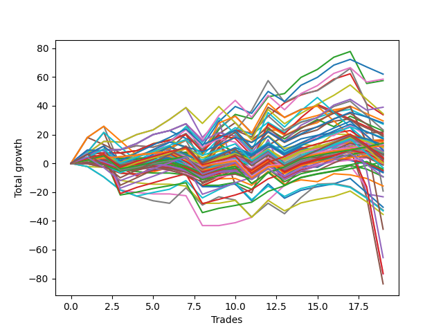

# Short Pointer Five (1226 1230 NC) 
- Symbol: ES_Unlimited
- Date Range: 03/18/2022 - 07/15/2022
- Trading Period: 7:20-12:30
- Number of Trades: 19



| Name | Win Percent | Profit | Avg Profit / Trade | Avg Time / Trade |      | Name | Win Percent | Profit | Avg Profit / Trade | Avg Time / Trade |
| ---- | ----------- | ------ | ------------------ | ---------------- | ---- | ---- | ----------- | ------ | ------------------ | ---------------- |
| Sorted By <br> Profit | | | | | | Sorted By <br> Win Percentage ||||
| Forty-Two | 68.42 | 31000.00 | 1631.58 | 09:04 |     | Eighty-One | 94.74 | 8250.00 | 434.21 | 06:42 |
| Fifty-Eight | 78.95 | 29250.00 | 1539.47 | 10:59 |     | One Hundred Twenty-One | 89.47 | 6500.00 | 342.11 | 04:58 |
| Two | 84.21 | 28750.00 | 1513.16 | 15:50 |     | One Hundred Twenty-Six | 89.47 | 6000.00 | 315.79 | 05:00 |
| Sixty-Six | 73.68 | 19500.00 | 1026.32 | 09:54 |     | Eighty-Two | 89.47 | 500.00 | 26.32 | 13:01 |
| Sixty | 63.16 | 17250.00 | 907.89 | 18:12 |     | Two | 84.21 | 28750.00 | 1513.16 | 15:50 |
| Three | 73.68 | 16875.00 | 888.16 | 15:30 |     | One Hundred Twenty-Seven | 84.21 | 7000.00 | 368.42 | 08:00 |
| Forty-Three | 57.89 | 14750.00 | 776.32 | 06:06 |     | One Hundred Twenty-Two | 84.21 | 7000.00 | 368.42 | 07:59 |
| One Hundred Five | 57.89 | 14000.00 | 736.84 | 06:25 |     | Fifty-Eight | 78.95 | 29250.00 | 1539.47 | 10:59 |
| Forty-One | 63.16 | 13625.00 | 717.11 | 05:44 |     | Eighty-Five | 78.95 | -22875.00 | -1203.95 | 46:52 |
| Fifty-Nine | 68.42 | 11625.00 | 611.84 | 08:53 |     | Eighty-Four | 78.95 | -32750.00 | -1723.68 | 45:28 |
| Forty-Four | 47.37 | 11250.00 | 592.11 | 13:07 |     | Eighty-Three | 78.95 | -38250.00 | -2013.16 | 43:59 |
| Fifty-Seven | 73.68 | 10875.00 | 572.37 | 07:29 |     | Sixty-Six | 73.68 | 19500.00 | 1026.32 | 09:54 |
| Forty-Five | 36.84 | 10250.00 | 539.47 | 20:57 |     | Three | 73.68 | 16875.00 | 888.16 | 15:30 |
| Forty-Seven | 42.11 | 9750.00 | 513.16 | 14:32 |     | Fifty-Seven | 73.68 | 10875.00 | 572.37 | 07:29 |
| Sixty-Seven | 63.16 | 9250.00 | 486.84 | 08:20 |     | One | 73.68 | 7500.00 | 394.74 | 11:59 |
| One Hundred Four | 57.89 | 8875.00 | 467.11 | 05:10 |     | One Hundred One | 73.68 | 5250.00 | 276.32 | 03:13 |
| One Hundred Fifteen | 57.89 | 8500.00 | 447.37 | 07:18 |     | One Hundred Eleven | 73.68 | 2375.00 | 125.00 | 03:22 |
| Eighty-One | 94.74 | 8250.00 | 434.21 | 06:42 |     | One Hundred Twenty-Eight | 73.68 | 2000.00 | 105.26 | 09:11 |
| Sixty-Five | 68.42 | 8000.00 | 421.05 | 07:18 |     | One Hundred Twenty-Three | 73.68 | 125.00 | 6.58 | 09:16 |
| One | 73.68 | 7500.00 | 394.74 | 11:59 |     | One Hundred Sixteen | 73.68 | 125.00 | 6.58 | 03:52 |
| One Hundred Twenty-Seven | 84.21 | 7000.00 | 368.42 | 08:00 |     | Seven | 73.68 | -9625.00 | -506.58 | 80:40 |
| One Hundred Twenty-Two | 84.21 | 7000.00 | 368.42 | 07:59 |     | Forty-Two | 68.42 | 31000.00 | 1631.58 | 09:04 |
| One Hundred Twenty-One | 89.47 | 6500.00 | 342.11 | 04:58 |     | Fifty-Nine | 68.42 | 11625.00 | 611.84 | 08:53 |
| Ninety-Five | 42.11 | 6375.00 | 335.53 | 02:45 |     | Sixty-Five | 68.42 | 8000.00 | 421.05 | 07:18 |
| One Hundred Twenty-Six | 89.47 | 6000.00 | 315.79 | 05:00 |     | One Hundred Twenty-Five | 68.42 | 4625.00 | 243.42 | 11:54 |
| Fifty | 52.63 | 6000.00 | 315.79 | 06:41 |     | One Hundred Twelve | 68.42 | 2625.00 | 138.16 | 04:35 |
| Ninety-Four | 47.37 | 5875.00 | 309.21 | 02:10 |     | One Hundred Six | 68.42 | 1750.00 | 92.11 | 03:13 |
| One Hundred Three | 57.89 | 5500.00 | 289.47 | 04:37 |     | One Hundred Twenty-Four | 68.42 | -1500.00 | -78.95 | 10:35 |
| One Hundred One | 73.68 | 5250.00 | 276.32 | 03:13 |     | Four | 68.42 | -11625.00 | -611.84 | 36:37 |
| Sixty-Eight | 57.89 | 5125.00 | 269.74 | 13:44 |     | Sixty | 63.16 | 17250.00 | 907.89 | 18:12 |
| One Hundred Twenty-Five | 68.42 | 4625.00 | 243.42 | 11:54 |     | Forty-One | 63.16 | 13625.00 | 717.11 | 05:44 |
| Zero | 63.16 | 4500.00 | 236.84 | 07:20 |     | Sixty-Seven | 63.16 | 9250.00 | 486.84 | 08:20 |
| Ninety-Nine | 47.37 | 4375.00 | 230.26 | 02:06 |     | Zero | 63.16 | 4500.00 | 236.84 | 07:20 |
| One Hundred Ninteen | 57.89 | 4125.00 | 217.11 | 05:49 |     | Sixty-Four | 63.16 | 4000.00 | 210.53 | 04:53 |
| Sixty-Four | 63.16 | 4000.00 | 210.53 | 04:53 |     | One Hundred Thirteen | 63.16 | 3875.00 | 203.95 | 05:22 |
| One Hundred Thirteen | 63.16 | 3875.00 | 203.95 | 05:22 |     | Fifty-Six | 63.16 | 3250.00 | 171.05 | 04:52 |
| Ninety-Eight | 47.37 | 3500.00 | 184.21 | 01:55 |     | One Hundred Two | 63.16 | 3125.00 | 164.47 | 03:58 |
| One Hundred Fourteen | 57.89 | 3375.00 | 177.63 | 06:04 |     | One Hundred Thirty | 63.16 | 1375.00 | 72.37 | 11:19 |
| Fifty-One | 52.63 | 3375.00 | 177.63 | 06:01 |     | One Hundred Seventeen | 63.16 | -2000.00 | -105.26 | 04:37 |
| Fifty-Six | 63.16 | 3250.00 | 171.05 | 04:52 |     | One Hundred Twenty-Nine | 63.16 | -4750.00 | -250.00 | 10:00 |
| One Hundred | 47.37 | 3250.00 | 171.05 | 02:22 |     | Five | 63.16 | -41875.00 | -2203.95 | 70:48 |
| One Hundred Two | 63.16 | 3125.00 | 164.47 | 03:58 |     | Forty-Three | 57.89 | 14750.00 | 776.32 | 06:06 |
| One Hundred Twenty | 47.37 | 3125.00 | 164.47 | 06:32 |     | One Hundred Five | 57.89 | 14000.00 | 736.84 | 06:25 |
| Ninety-Three | 47.37 | 3000.00 | 157.89 | 01:46 |     | One Hundred Four | 57.89 | 8875.00 | 467.11 | 05:10 |
| Ninety-Seven | 52.63 | 2875.00 | 151.32 | 01:47 |     | One Hundred Fifteen | 57.89 | 8500.00 | 447.37 | 07:18 |
| One Hundred Twelve | 68.42 | 2625.00 | 138.16 | 04:35 |     | One Hundred Three | 57.89 | 5500.00 | 289.47 | 04:37 |
| Sixty-One | 47.37 | 2625.00 | 138.16 | 30:16 |     | Sixty-Eight | 57.89 | 5125.00 | 269.74 | 13:44 |
| Forty | 52.63 | 2500.00 | 131.58 | 03:17 |     | One Hundred Ninteen | 57.89 | 4125.00 | 217.11 | 05:49 |
| One Hundred Eleven | 73.68 | 2375.00 | 125.00 | 03:22 |     | One Hundred Fourteen | 57.89 | 3375.00 | 177.63 | 06:04 |
| One Hundred Twenty-Eight | 73.68 | 2000.00 | 105.26 | 09:11 |     | Ninety-Six | 57.89 | 1500.00 | 78.95 | 01:43 |
| One Hundred Six | 68.42 | 1750.00 | 92.11 | 03:13 |     | One Hundred Seven | 57.89 | 1375.00 | 72.37 | 03:32 |
| Ninety-Two | 52.63 | 1750.00 | 92.11 | 01:32 |     | One Hundred Eighteen | 57.89 | 750.00 | 39.47 | 05:16 |
| One Hundred Eight | 47.37 | 1750.00 | 92.11 | 03:58 |     | Fifty | 52.63 | 6000.00 | 315.79 | 06:41 |
| Forty-Eight | 52.63 | 1625.00 | 85.53 | 03:38 |     | Fifty-One | 52.63 | 3375.00 | 177.63 | 06:01 |
| Ninety-Six | 57.89 | 1500.00 | 78.95 | 01:43 |     | Ninety-Seven | 52.63 | 2875.00 | 151.32 | 01:47 |
| One Hundred Thirty | 63.16 | 1375.00 | 72.37 | 11:19 |     | Forty | 52.63 | 2500.00 | 131.58 | 03:17 |
| One Hundred Seven | 57.89 | 1375.00 | 72.37 | 03:32 |     | Ninety-Two | 52.63 | 1750.00 | 92.11 | 01:32 |
| One Hundred Nine | 47.37 | 1125.00 | 59.21 | 04:18 |     | Forty-Eight | 52.63 | 1625.00 | 85.53 | 03:38 |
| One Hundred Eighteen | 57.89 | 750.00 | 39.47 | 05:16 |     | Ninety-One | 52.63 | -250.00 | -13.16 | 01:30 |
| Eighty-Two | 89.47 | 500.00 | 26.32 | 13:01 |     | Sixty-Three | 52.63 | -375.00 | -19.74 | 22:38 |
| One Hundred Twenty-Three | 73.68 | 125.00 | 6.58 | 09:16 |     | Forty-Four | 47.37 | 11250.00 | 592.11 | 13:07 |
| One Hundred Sixteen | 73.68 | 125.00 | 6.58 | 03:52 |     | Ninety-Four | 47.37 | 5875.00 | 309.21 | 02:10 |
| Forty-Nine | 47.37 | 125.00 | 6.58 | 05:13 |     | Ninety-Nine | 47.37 | 4375.00 | 230.26 | 02:06 |
| Ninety-One | 52.63 | -250.00 | -13.16 | 01:30 |     | Ninety-Eight | 47.37 | 3500.00 | 184.21 | 01:55 |
| Forty-Six | 36.84 | -250.00 | -13.16 | 06:43 |     | One Hundred | 47.37 | 3250.00 | 171.05 | 02:22 |
| Sixty-Three | 52.63 | -375.00 | -19.74 | 22:38 |     | One Hundred Twenty | 47.37 | 3125.00 | 164.47 | 06:32 |
| One Hundred Ten | 47.37 | -625.00 | -32.89 | 04:37 |     | Ninety-Three | 47.37 | 3000.00 | 157.89 | 01:46 |
| One Hundred Twenty-Four | 68.42 | -1500.00 | -78.95 | 10:35 |     | Sixty-One | 47.37 | 2625.00 | 138.16 | 30:16 |
| One Hundred Seventeen | 63.16 | -2000.00 | -105.26 | 04:37 |     | One Hundred Eight | 47.37 | 1750.00 | 92.11 | 03:58 |
| Fifty-Five | 47.37 | -2500.00 | -131.58 | 06:34 |     | One Hundred Nine | 47.37 | 1125.00 | 59.21 | 04:18 |
| Fifty-Two | 42.11 | -2875.00 | -151.32 | 07:21 |     | Forty-Nine | 47.37 | 125.00 | 6.58 | 05:13 |
| Seventy-Three | 47.37 | -3250.00 | -171.05 | 08:23 |     | One Hundred Ten | 47.37 | -625.00 | -32.89 | 04:37 |
| Fifty-Four | 36.84 | -4625.00 | -243.42 | 03:53 |     | Fifty-Five | 47.37 | -2500.00 | -131.58 | 06:34 |
| One Hundred Twenty-Nine | 63.16 | -4750.00 | -250.00 | 10:00 |     | Seventy-Three | 47.37 | -3250.00 | -171.05 | 08:23 |
| Fifty-Three | 42.11 | -7875.00 | -414.47 | 08:07 |     | Seventy-One | 47.37 | -16500.00 | -868.42 | 14:27 |
| Seven | 73.68 | -9625.00 | -506.58 | 80:40 |     | Six | 47.37 | -38500.00 | -2026.32 | 43:19 |
| Four | 68.42 | -11625.00 | -611.84 | 36:37 |     | Forty-Seven | 42.11 | 9750.00 | 513.16 | 14:32 |
| Sixty-Two | 36.84 | -15250.00 | -802.63 | 10:33 |     | Ninety-Five | 42.11 | 6375.00 | 335.53 | 02:45 |
| Sixty-Nine | 31.58 | -16250.00 | -855.26 | 20:23 |     | Fifty-Two | 42.11 | -2875.00 | -151.32 | 07:21 |
| Seventy-One | 47.37 | -16500.00 | -868.42 | 14:27 |     | Fifty-Three | 42.11 | -7875.00 | -414.47 | 08:07 |
| Seventy | 31.58 | -17750.00 | -934.21 | 08:43 |     | Forty-Five | 36.84 | 10250.00 | 539.47 | 20:57 |
| Eighty-Five | 78.95 | -22875.00 | -1203.95 | 46:52 |     | Forty-Six | 36.84 | -250.00 | -13.16 | 06:43 |
| Eighty-Four | 78.95 | -32750.00 | -1723.68 | 45:28 |     | Fifty-Four | 36.84 | -4625.00 | -243.42 | 03:53 |
| Eighty-Three | 78.95 | -38250.00 | -2013.16 | 43:59 |     | Sixty-Two | 36.84 | -15250.00 | -802.63 | 10:33 |
| Six | 47.37 | -38500.00 | -2026.32 | 43:19 |     | Sixty-Nine | 31.58 | -16250.00 | -855.26 | 20:23 |
| Five | 63.16 | -41875.00 | -2203.95 | 70:48 |     | Seventy | 31.58 | -17750.00 | -934.21 | 08:43 |

## NO STOPLOSS

### Test Zero
* Sell when price hits the middle line of the 20p bollinger
* No Stoploss
* Results:
```
Total Trades: 19
Percent Up: 36.84
Percent Down: 63.16
Total Points Moved Down: 9.00
Potential Profit: 4500.00
Total Points Ups: 31.50 Count Ups: 7
Total Points Downs: 40.50 Count Downs: 12
```

<details><summary>Trades</summary>

<code>In: 2022-03-21 08:30:00		Out: 2022-03-21 08:32:35		Total Position Time: 02:35		Total Move Down: 3.50		Total to Date: 3.50</code> <br />
<code>In: 2022-03-21 11:32:00		Out: 2022-03-21 11:40:40		Total Position Time: 08:40		Total Move Down: -0.00		Total to Date: 3.50</code> <br />
<code>In: 2022-03-28 10:33:00		Out: 2022-03-28 10:42:15		Total Position Time: 09:15		Total Move Down: -0.00		Total to Date: 3.50</code> <br />
<code>In: 2022-03-29 08:03:00		Out: 2022-03-29 08:05:15		Total Position Time: 02:15		Total Move Down: -0.50		Total to Date: 3.00</code> <br />
<code>In: 2022-04-06 07:26:00		Out: 2022-04-06 07:28:00		Total Position Time: 02:00		Total Move Down: 1.50		Total to Date: 4.50</code> <br />
<code>In: 2022-04-11 10:09:00		Out: 2022-04-11 10:16:15		Total Position Time: 07:15		Total Move Down: 1.25		Total to Date: 5.75</code> <br />
<code>In: 2022-04-11 11:58:00		Out: 2022-04-11 12:04:15		Total Position Time: 06:15		Total Move Down: 2.00		Total to Date: 7.75</code> <br />
<code>In: 2022-04-25 12:28:00		Out: 2022-04-25 12:42:50		Total Position Time: 14:50		Total Move Down: -9.75		Total to Date: -2.00</code> <br />
<code>In: 2022-05-05 10:11:00		Out: 2022-05-05 10:13:05		Total Position Time: 02:05		Total Move Down: 5.75		Total to Date: 3.75</code> <br />
<code>In: 2022-05-10 10:11:00		Out: 2022-05-10 10:14:05		Total Position Time: 03:05		Total Move Down: 4.75		Total to Date: 8.50</code> <br />
<code>In: 2022-05-17 09:31:00		Out: 2022-05-17 09:53:50		Total Position Time: 22:50		Total Move Down: -5.00		Total to Date: 3.50</code> <br />
<code>In: 2022-05-19 07:26:00		Out: 2022-05-19 07:27:10		Total Position Time: 01:10		Total Move Down: 7.50		Total to Date: 11.00</code> <br />
<code>In: 2022-05-23 07:38:00		Out: 2022-05-23 07:46:50		Total Position Time: 08:50		Total Move Down: 0.50		Total to Date: 11.50</code> <br />
<code>In: 2022-06-01 08:01:00		Out: 2022-06-01 08:02:10		Total Position Time: 01:10		Total Move Down: 5.50		Total to Date: 17.00</code> <br />
<code>In: 2022-06-03 09:08:00		Out: 2022-06-03 09:09:10		Total Position Time: 01:10		Total Move Down: 2.50		Total to Date: 19.50</code> <br />
<code>In: 2022-06-10 10:54:00		Out: 2022-06-10 10:55:10		Total Position Time: 01:10		Total Move Down: 2.00		Total to Date: 21.50</code> <br />
<code>In: 2022-06-10 11:27:00		Out: 2022-06-10 11:28:30		Total Position Time: 01:30		Total Move Down: 3.75		Total to Date: 25.25</code> <br />
<code>In: 2022-06-30 08:02:00		Out: 2022-06-30 08:35:20		Total Position Time: 33:20		Total Move Down: -15.50		Total to Date: 9.75</code> <br />
<code>In: 2022-07-05 08:53:00		Out: 2022-07-05 09:03:00		Total Position Time: 10:00		Total Move Down: -0.75		Total to Date: 9.00</code> <br />


</details>

### Test One
* Sell when the price hits the upper line of the 20p 1std bollinger
* No Stoploss
* Results:
```
Total Trades: 19
Percent Up: 26.32
Percent Down: 73.68
Total Points Moved Down: 15.00
Potential Profit: 7500.00
Total Points Ups: 49.50 Count Ups: 5
Total Points Downs: 64.50 Count Downs: 14
```

<details><summary>Trades</summary>

<code>In: 2022-03-21 08:30:00		Out: 2022-03-21 08:36:05		Total Position Time: 06:05		Total Move Down: 6.25		Total to Date: 6.25</code> <br />
<code>In: 2022-03-21 11:32:00		Out: 2022-03-21 11:42:10		Total Position Time: 10:10		Total Move Down: 1.00		Total to Date: 7.25</code> <br />
<code>In: 2022-03-28 10:33:00		Out: 2022-03-28 10:47:15		Total Position Time: 14:15		Total Move Down: -0.00		Total to Date: 7.25</code> <br />
<code>In: 2022-03-29 08:03:00		Out: 2022-03-29 08:09:05		Total Position Time: 06:05		Total Move Down: 1.50		Total to Date: 8.75</code> <br />
<code>In: 2022-04-06 07:26:00		Out: 2022-04-06 07:30:00		Total Position Time: 04:00		Total Move Down: 4.75		Total to Date: 13.50</code> <br />
<code>In: 2022-04-11 10:09:00		Out: 2022-04-11 10:18:15		Total Position Time: 09:15		Total Move Down: 2.50		Total to Date: 16.00</code> <br />
<code>In: 2022-04-11 11:58:00		Out: 2022-04-11 12:04:55		Total Position Time: 06:55		Total Move Down: 4.00		Total to Date: 20.00</code> <br />
<code>In: 2022-04-25 12:28:00		Out: 2022-04-25 12:47:00		Total Position Time: 19:00		Total Move Down: -20.75		Total to Date: -0.75</code> <br />
<code>In: 2022-05-05 10:11:00		Out: 2022-05-05 10:16:10		Total Position Time: 05:10		Total Move Down: 11.50		Total to Date: 10.75</code> <br />
<code>In: 2022-05-10 10:11:00		Out: 2022-05-10 10:19:15		Total Position Time: 08:15		Total Move Down: 7.75		Total to Date: 18.50</code> <br />
<code>In: 2022-05-17 09:31:00		Out: 2022-05-17 09:56:30		Total Position Time: 25:30		Total Move Down: -4.00		Total to Date: 14.50</code> <br />
<code>In: 2022-05-19 07:26:00		Out: 2022-05-19 07:27:15		Total Position Time: 01:15		Total Move Down: 8.50		Total to Date: 23.00</code> <br />
<code>In: 2022-05-23 07:38:00		Out: 2022-05-23 07:50:10		Total Position Time: 12:10		Total Move Down: -0.00		Total to Date: 23.00</code> <br />
<code>In: 2022-06-01 08:01:00		Out: 2022-06-01 08:02:25		Total Position Time: 01:25		Total Move Down: 7.25		Total to Date: 30.25</code> <br />
<code>In: 2022-06-03 09:08:00		Out: 2022-06-03 09:18:30		Total Position Time: 10:30		Total Move Down: 3.00		Total to Date: 33.25</code> <br />
<code>In: 2022-06-10 10:54:00		Out: 2022-06-10 10:56:15		Total Position Time: 02:15		Total Move Down: 4.00		Total to Date: 37.25</code> <br />
<code>In: 2022-06-10 11:27:00		Out: 2022-06-10 11:38:10		Total Position Time: 11:10		Total Move Down: 1.75		Total to Date: 39.00</code> <br />
<code>In: 2022-06-30 08:02:00		Out: 2022-06-30 09:05:50		Total Position Time: 63:50		Total Move Down: -24.75		Total to Date: 14.25</code> <br />
<code>In: 2022-07-05 08:53:00		Out: 2022-07-05 09:03:30		Total Position Time: 10:30		Total Move Down: 0.75		Total to Date: 15.00</code> <br />


</details>

### Test Two
* Sell when the price hits the upper line of the 20p 2std bollinger
* No Stoploss
* Results:
```
Total Trades: 19
Percent Up: 15.79
Percent Down: 84.21
Total Points Moved Down: 57.50
Potential Profit: 28750.00
Total Points Ups: 46.00 Count Ups: 3
Total Points Downs: 103.50 Count Downs: 16
```

<details><summary>Trades</summary>

<code>In: 2022-03-21 08:30:00		Out: 2022-03-21 08:36:15		Total Position Time: 06:15		Total Move Down: 6.25		Total to Date: 6.25</code> <br />
<code>In: 2022-03-21 11:32:00		Out: 2022-03-21 11:42:30		Total Position Time: 10:30		Total Move Down: 3.00		Total to Date: 9.25</code> <br />
<code>In: 2022-03-28 10:33:00		Out: 2022-03-28 10:55:10		Total Position Time: 22:10		Total Move Down: 0.25		Total to Date: 9.50</code> <br />
<code>In: 2022-03-29 08:03:00		Out: 2022-03-29 08:13:35		Total Position Time: 10:35		Total Move Down: 4.25		Total to Date: 13.75</code> <br />
<code>In: 2022-04-06 07:26:00		Out: 2022-04-06 07:34:05		Total Position Time: 08:05		Total Move Down: 6.25		Total to Date: 20.00</code> <br />
<code>In: 2022-04-11 10:09:00		Out: 2022-04-11 10:21:05		Total Position Time: 12:05		Total Move Down: 2.75		Total to Date: 22.75</code> <br />
<code>In: 2022-04-11 11:58:00		Out: 2022-04-11 12:06:05		Total Position Time: 08:05		Total Move Down: 4.75		Total to Date: 27.50</code> <br />
<code>In: 2022-04-25 12:28:00		Out: 2022-04-25 12:47:00		Total Position Time: 19:00		Total Move Down: -20.75		Total to Date: 6.75</code> <br />
<code>In: 2022-05-05 10:11:00		Out: 2022-05-05 10:30:35		Total Position Time: 19:35		Total Move Down: 16.75		Total to Date: 23.50</code> <br />
<code>In: 2022-05-10 10:11:00		Out: 2022-05-10 10:24:00		Total Position Time: 13:00		Total Move Down: 10.50		Total to Date: 34.00</code> <br />
<code>In: 2022-05-17 09:31:00		Out: 2022-05-17 10:01:20		Total Position Time: 30:20		Total Move Down: -3.00		Total to Date: 31.00</code> <br />
<code>In: 2022-05-19 07:26:00		Out: 2022-05-19 07:29:10		Total Position Time: 03:10		Total Move Down: 15.25		Total to Date: 46.25</code> <br />
<code>In: 2022-05-23 07:38:00		Out: 2022-05-23 07:51:20		Total Position Time: 13:20		Total Move Down: 2.25		Total to Date: 48.50</code> <br />
<code>In: 2022-06-01 08:01:00		Out: 2022-06-01 08:16:55		Total Position Time: 15:55		Total Move Down: 11.25		Total to Date: 59.75</code> <br />
<code>In: 2022-06-03 09:08:00		Out: 2022-06-03 09:19:20		Total Position Time: 11:20		Total Move Down: 5.50		Total to Date: 65.25</code> <br />
<code>In: 2022-06-10 10:54:00		Out: 2022-06-10 11:01:10		Total Position Time: 07:10		Total Move Down: 8.50		Total to Date: 73.75</code> <br />
<code>In: 2022-06-10 11:27:00		Out: 2022-06-10 11:40:10		Total Position Time: 13:10		Total Move Down: 4.00		Total to Date: 77.75</code> <br />
<code>In: 2022-06-30 08:02:00		Out: 2022-06-30 09:06:15		Total Position Time: 64:15		Total Move Down: -22.25		Total to Date: 55.50</code> <br />
<code>In: 2022-07-05 08:53:00		Out: 2022-07-05 09:05:50		Total Position Time: 12:50		Total Move Down: 2.00		Total to Date: 57.50</code> <br />


</details>

### Test Three
* Sell when price hits the middle line of the 50p bollinger
* No Stoploss
* Results:
```
Total Trades: 19
Percent Up: 26.32
Percent Down: 73.68
Total Points Moved Down: 33.75
Potential Profit: 16875.00
Total Points Ups: 52.50 Count Ups: 5
Total Points Downs: 86.25 Count Downs: 14
```

<details><summary>Trades</summary>

<code>In: 2022-03-21 08:30:00		Out: 2022-03-21 08:36:15		Total Position Time: 06:15		Total Move Down: 6.25		Total to Date: 6.25</code> <br />
<code>In: 2022-03-21 11:32:00		Out: 2022-03-21 11:55:25		Total Position Time: 23:25		Total Move Down: 3.00		Total to Date: 9.25</code> <br />
<code>In: 2022-03-28 10:33:00		Out: 2022-03-28 11:05:15		Total Position Time: 32:15		Total Move Down: 0.25		Total to Date: 9.50</code> <br />
<code>In: 2022-03-29 08:03:00		Out: 2022-03-29 08:13:30		Total Position Time: 10:30		Total Move Down: 2.75		Total to Date: 12.25</code> <br />
<code>In: 2022-04-06 07:26:00		Out: 2022-04-06 07:27:10		Total Position Time: 01:10		Total Move Down: -1.00		Total to Date: 11.25</code> <br />
<code>In: 2022-04-11 10:09:00		Out: 2022-04-11 10:19:05		Total Position Time: 10:05		Total Move Down: 3.50		Total to Date: 14.75</code> <br />
<code>In: 2022-04-11 11:58:00		Out: 2022-04-11 12:06:10		Total Position Time: 08:10		Total Move Down: 6.00		Total to Date: 20.75</code> <br />
<code>In: 2022-04-25 12:28:00		Out: 2022-04-25 12:47:00		Total Position Time: 19:00		Total Move Down: -20.75		Total to Date: 0.00</code> <br />
<code>In: 2022-05-05 10:11:00		Out: 2022-05-05 10:16:30		Total Position Time: 05:30		Total Move Down: 15.00		Total to Date: 15.00</code> <br />
<code>In: 2022-05-10 10:11:00		Out: 2022-05-10 10:15:40		Total Position Time: 04:40		Total Move Down: 8.25		Total to Date: 23.25</code> <br />
<code>In: 2022-05-17 09:31:00		Out: 2022-05-17 10:01:30		Total Position Time: 30:30		Total Move Down: -2.25		Total to Date: 21.00</code> <br />
<code>In: 2022-05-19 07:26:00		Out: 2022-05-19 07:27:20		Total Position Time: 01:20		Total Move Down: 11.75		Total to Date: 32.75</code> <br />
<code>In: 2022-05-23 07:38:00		Out: 2022-05-23 07:53:00		Total Position Time: 15:00		Total Move Down: 9.25		Total to Date: 42.00</code> <br />
<code>In: 2022-06-01 08:01:00		Out: 2022-06-01 08:02:10		Total Position Time: 01:10		Total Move Down: 5.50		Total to Date: 47.50</code> <br />
<code>In: 2022-06-03 09:08:00		Out: 2022-06-03 09:10:10		Total Position Time: 02:10		Total Move Down: 3.25		Total to Date: 50.75</code> <br />
<code>In: 2022-06-10 10:54:00		Out: 2022-06-10 11:00:55		Total Position Time: 06:55		Total Move Down: 7.75		Total to Date: 58.50</code> <br />
<code>In: 2022-06-10 11:27:00		Out: 2022-06-10 11:28:30		Total Position Time: 01:30		Total Move Down: 3.75		Total to Date: 62.25</code> <br />
<code>In: 2022-06-30 08:02:00		Out: 2022-06-30 09:06:20		Total Position Time: 64:20		Total Move Down: -21.00		Total to Date: 41.25</code> <br />
<code>In: 2022-07-05 08:53:00		Out: 2022-07-05 09:43:40		Total Position Time: 50:40		Total Move Down: -7.50		Total to Date: 33.75</code> <br />


</details>

### Test Four
* Sell when the price hits the upper line of the 50p 1std bollinger
* No Stoploss
* Results:
```
Total Trades: 19
Percent Up: 31.58
Percent Down: 68.42
Total Points Moved Down: -23.25
Potential Profit: -11625.00
Total Points Ups: 124.50 Count Ups: 6
Total Points Downs: 101.25 Count Downs: 13
```

<details><summary>Trades</summary>

<code>In: 2022-03-21 08:30:00		Out: 2022-03-21 08:49:40		Total Position Time: 19:40		Total Move Down: 7.00		Total to Date: 7.00</code> <br />
<code>In: 2022-03-21 11:32:00		Out: 2022-03-21 11:57:25		Total Position Time: 25:25		Total Move Down: 8.25		Total to Date: 15.25</code> <br />
<code>In: 2022-03-28 10:33:00		Out: 2022-03-28 11:20:40		Total Position Time: 47:40		Total Move Down: -0.50		Total to Date: 14.75</code> <br />
<code>In: 2022-03-29 08:03:00		Out: 2022-03-29 08:22:25		Total Position Time: 19:25		Total Move Down: 5.25		Total to Date: 20.00</code> <br />
<code>In: 2022-04-06 07:26:00		Out: 2022-04-06 07:28:10		Total Position Time: 02:10		Total Move Down: 3.25		Total to Date: 23.25</code> <br />
<code>In: 2022-04-11 10:09:00		Out: 2022-04-11 10:24:35		Total Position Time: 15:35		Total Move Down: 7.25		Total to Date: 30.50</code> <br />
<code>In: 2022-04-11 11:58:00		Out: 2022-04-11 12:16:05		Total Position Time: 18:05		Total Move Down: 8.25		Total to Date: 38.75</code> <br />
<code>In: 2022-04-25 12:28:00		Out: 2022-04-25 12:47:00		Total Position Time: 19:00		Total Move Down: -20.75		Total to Date: 18.00</code> <br />
<code>In: 2022-05-05 10:11:00		Out: 2022-05-05 10:48:10		Total Position Time: 37:10		Total Move Down: 11.75		Total to Date: 29.75</code> <br />
<code>In: 2022-05-10 10:11:00		Out: 2022-05-10 11:24:10		Total Position Time: 73:10		Total Move Down: -36.50		Total to Date: -6.75</code> <br />
<code>In: 2022-05-17 09:31:00		Out: 2022-05-17 10:02:20		Total Position Time: 31:20		Total Move Down: 2.25		Total to Date: -4.50</code> <br />
<code>In: 2022-05-19 07:26:00		Out: 2022-05-19 07:39:15		Total Position Time: 13:15		Total Move Down: 21.00		Total to Date: 16.50</code> <br />
<code>In: 2022-05-23 07:38:00		Out: 2022-05-23 09:30:15		Total Position Time: 112:15		Total Move Down: -26.25		Total to Date: -9.75</code> <br />
<code>In: 2022-06-01 08:01:00		Out: 2022-06-01 08:02:25		Total Position Time: 01:25		Total Move Down: 7.25		Total to Date: -2.50</code> <br />
<code>In: 2022-06-03 09:08:00		Out: 2022-06-03 09:19:30		Total Position Time: 11:30		Total Move Down: 6.25		Total to Date: 3.75</code> <br />
<code>In: 2022-06-10 10:54:00		Out: 2022-06-10 11:41:45		Total Position Time: 47:45		Total Move Down: 6.25		Total to Date: 10.00</code> <br />
<code>In: 2022-06-10 11:27:00		Out: 2022-06-10 11:41:45		Total Position Time: 14:45		Total Move Down: 7.25		Total to Date: 17.25</code> <br />
<code>In: 2022-06-30 08:02:00		Out: 2022-06-30 10:10:15		Total Position Time: 128:15		Total Move Down: -38.50		Total to Date: -21.25</code> <br />
<code>In: 2022-07-05 08:53:00		Out: 2022-07-05 09:51:05		Total Position Time: 58:05		Total Move Down: -2.00		Total to Date: -23.25</code> <br />


</details>

### Test Five
* Sell when the price hits the upper line of the 50p 2std bollinger
* No Stoploss
* Results:
```
Total Trades: 19
Percent Up: 36.84
Percent Down: 63.16
Total Points Moved Down: -83.75
Potential Profit: -41875.00
Total Points Ups: 201.25 Count Ups: 7
Total Points Downs: 117.50 Count Downs: 12
```

<details><summary>Trades</summary>

<code>In: 2022-03-21 08:30:00		Out: 2022-03-21 09:06:05		Total Position Time: 36:05		Total Move Down: 7.75		Total to Date: 7.75</code> <br />
<code>In: 2022-03-21 11:32:00		Out: 2022-03-21 11:59:25		Total Position Time: 27:25		Total Move Down: 13.75		Total to Date: 21.50</code> <br />
<code>In: 2022-03-28 10:33:00		Out: 2022-03-28 12:47:00		Total Position Time: 134:00		Total Move Down: -27.25		Total to Date: -5.75</code> <br />
<code>In: 2022-03-29 08:03:00		Out: 2022-03-29 09:10:50		Total Position Time: 67:50		Total Move Down: 2.25		Total to Date: -3.50</code> <br />
<code>In: 2022-04-06 07:26:00		Out: 2022-04-06 08:09:45		Total Position Time: 43:45		Total Move Down: 6.25		Total to Date: 2.75</code> <br />
<code>In: 2022-04-11 10:09:00		Out: 2022-04-11 11:14:35		Total Position Time: 65:35		Total Move Down: 7.00		Total to Date: 9.75</code> <br />
<code>In: 2022-04-11 11:58:00		Out: 2022-04-11 12:25:40		Total Position Time: 27:40		Total Move Down: 10.75		Total to Date: 20.50</code> <br />
<code>In: 2022-04-25 12:28:00		Out: 2022-04-25 12:47:00		Total Position Time: 19:00		Total Move Down: -20.75		Total to Date: -0.25</code> <br />
<code>In: 2022-05-05 10:11:00		Out: 2022-05-05 10:50:15		Total Position Time: 39:15		Total Move Down: 17.00		Total to Date: 16.75</code> <br />
<code>In: 2022-05-10 10:11:00		Out: 2022-05-10 11:27:05		Total Position Time: 76:05		Total Move Down: -31.50		Total to Date: -14.75</code> <br />
<code>In: 2022-05-17 09:31:00		Out: 2022-05-17 10:59:45		Total Position Time: 88:45		Total Move Down: -5.75		Total to Date: -20.50</code> <br />
<code>In: 2022-05-19 07:26:00		Out: 2022-05-19 07:49:20		Total Position Time: 23:20		Total Move Down: 26.75		Total to Date: 6.25</code> <br />
<code>In: 2022-05-23 07:38:00		Out: 2022-05-23 09:31:55		Total Position Time: 113:55		Total Move Down: -21.50		Total to Date: -15.25</code> <br />
<code>In: 2022-06-01 08:01:00		Out: 2022-06-01 08:16:55		Total Position Time: 15:55		Total Move Down: 11.25		Total to Date: -4.00</code> <br />
<code>In: 2022-06-03 09:08:00		Out: 2022-06-03 09:20:20		Total Position Time: 12:20		Total Move Down: 9.25		Total to Date: 5.25</code> <br />
<code>In: 2022-06-10 10:54:00		Out: 2022-06-10 12:45:40		Total Position Time: 111:40		Total Move Down: 2.25		Total to Date: 7.50</code> <br />
<code>In: 2022-06-10 11:27:00		Out: 2022-06-10 12:45:40		Total Position Time: 78:40		Total Move Down: 3.25		Total to Date: 10.75</code> <br />
<code>In: 2022-06-30 08:02:00		Out: 2022-06-30 10:12:00		Total Position Time: 130:00		Total Move Down: -34.25		Total to Date: -23.50</code> <br />
<code>In: 2022-07-05 08:53:00		Out: 2022-07-05 12:47:00		Total Position Time: 234:00		Total Move Down: -60.25		Total to Date: -83.75</code> <br />


</details>

### Test Six
* Sell when the price hits the middle line of the 1std VWAP
* No Stoploss
* Results:
```
Total Trades: 19
Percent Up: 52.63
Percent Down: 47.37
Total Points Moved Down: -77.00
Potential Profit: -38500.00
Total Points Ups: 128.00 Count Ups: 10
Total Points Downs: 51.00 Count Downs: 9
```

<details><summary>Trades</summary>

<code>In: 2022-03-21 08:30:00		Out: 2022-03-21 09:30:30		Total Position Time: 60:30		Total Move Down: 9.25		Total to Date: 9.25</code> <br />
<code>In: 2022-03-21 11:32:00		Out: 2022-03-21 11:33:10		Total Position Time: 01:10		Total Move Down: -0.50		Total to Date: 8.75</code> <br />
<code>In: 2022-03-28 10:33:00		Out: 2022-03-28 12:47:00		Total Position Time: 134:00		Total Move Down: -27.25		Total to Date: -18.50</code> <br />
<code>In: 2022-03-29 08:03:00		Out: 2022-03-29 08:04:15		Total Position Time: 01:15		Total Move Down: -1.75		Total to Date: -20.25</code> <br />
<code>In: 2022-04-06 07:26:00		Out: 2022-04-06 07:27:10		Total Position Time: 01:10		Total Move Down: -1.00		Total to Date: -21.25</code> <br />
<code>In: 2022-04-11 10:09:00		Out: 2022-04-11 10:10:10		Total Position Time: 01:10		Total Move Down: -0.00		Total to Date: -21.25</code> <br />
<code>In: 2022-04-11 11:58:00		Out: 2022-04-11 11:59:10		Total Position Time: 01:10		Total Move Down: -1.25		Total to Date: -22.50</code> <br />
<code>In: 2022-04-25 12:28:00		Out: 2022-04-25 12:47:00		Total Position Time: 19:00		Total Move Down: -20.75		Total to Date: -43.25</code> <br />
<code>In: 2022-05-05 10:11:00		Out: 2022-05-05 10:12:10		Total Position Time: 01:10		Total Move Down: -0.00		Total to Date: -43.25</code> <br />
<code>In: 2022-05-10 10:11:00		Out: 2022-05-10 10:12:10		Total Position Time: 01:10		Total Move Down: 2.00		Total to Date: -41.25</code> <br />
<code>In: 2022-05-17 09:31:00		Out: 2022-05-17 11:13:30		Total Position Time: 102:30		Total Move Down: 3.75		Total to Date: -37.50</code> <br />
<code>In: 2022-05-19 07:26:00		Out: 2022-05-19 07:27:20		Total Position Time: 01:20		Total Move Down: 11.75		Total to Date: -25.75</code> <br />
<code>In: 2022-05-23 07:38:00		Out: 2022-05-23 07:53:05		Total Position Time: 15:05		Total Move Down: 10.50		Total to Date: -15.25</code> <br />
<code>In: 2022-06-01 08:01:00		Out: 2022-06-01 08:02:10		Total Position Time: 01:10		Total Move Down: 5.50		Total to Date: -9.75</code> <br />
<code>In: 2022-06-03 09:08:00		Out: 2022-06-03 09:09:10		Total Position Time: 01:10		Total Move Down: 2.50		Total to Date: -7.25</code> <br />
<code>In: 2022-06-10 10:54:00		Out: 2022-06-10 10:55:10		Total Position Time: 01:10		Total Move Down: 2.00		Total to Date: -5.25</code> <br />
<code>In: 2022-06-10 11:27:00		Out: 2022-06-10 11:28:30		Total Position Time: 01:30		Total Move Down: 3.75		Total to Date: -1.50</code> <br />
<code>In: 2022-06-30 08:02:00		Out: 2022-06-30 12:05:35		Total Position Time: 243:35		Total Move Down: -15.25		Total to Date: -16.75</code> <br />
<code>In: 2022-07-05 08:53:00		Out: 2022-07-05 12:47:00		Total Position Time: 234:00		Total Move Down: -60.25		Total to Date: -77.00</code> <br />


</details>

### Test Seven
* Sell when the price hits the upper line of the 1std VWAP
* No Stoploss
* Results:
```
Total Trades: 19
Percent Up: 26.32
Percent Down: 73.68
Total Points Moved Down: -19.25
Potential Profit: -9625.00
Total Points Ups: 148.25 Count Ups: 5
Total Points Downs: 129.00 Count Downs: 14
```

<details><summary>Trades</summary>

<code>In: 2022-03-21 08:30:00		Out: 2022-03-21 09:31:40		Total Position Time: 61:40		Total Move Down: 18.00		Total to Date: 18.00</code> <br />
<code>In: 2022-03-21 11:32:00		Out: 2022-03-21 11:56:15		Total Position Time: 24:15		Total Move Down: 7.75		Total to Date: 25.75</code> <br />
<code>In: 2022-03-28 10:33:00		Out: 2022-03-28 12:47:00		Total Position Time: 134:00		Total Move Down: -27.25		Total to Date: -1.50</code> <br />
<code>In: 2022-03-29 08:03:00		Out: 2022-03-29 09:27:55		Total Position Time: 84:55		Total Move Down: 6.75		Total to Date: 5.25</code> <br />
<code>In: 2022-04-06 07:26:00		Out: 2022-04-06 07:28:05		Total Position Time: 02:05		Total Move Down: 2.50		Total to Date: 7.75</code> <br />
<code>In: 2022-04-11 10:09:00		Out: 2022-04-11 10:17:50		Total Position Time: 08:50		Total Move Down: 2.25		Total to Date: 10.00</code> <br />
<code>In: 2022-04-11 11:58:00		Out: 2022-04-11 12:06:10		Total Position Time: 08:10		Total Move Down: 6.00		Total to Date: 16.00</code> <br />
<code>In: 2022-04-25 12:28:00		Out: 2022-04-25 12:47:00		Total Position Time: 19:00		Total Move Down: -20.75		Total to Date: -4.75</code> <br />
<code>In: 2022-05-05 10:11:00		Out: 2022-05-05 10:52:00		Total Position Time: 41:00		Total Move Down: 22.50		Total to Date: 17.75</code> <br />
<code>In: 2022-05-10 10:11:00		Out: 2022-05-10 10:14:05		Total Position Time: 03:05		Total Move Down: 4.75		Total to Date: 22.50</code> <br />
<code>In: 2022-05-17 09:31:00		Out: 2022-05-17 11:20:25		Total Position Time: 109:25		Total Move Down: 14.25		Total to Date: 36.75</code> <br />
<code>In: 2022-05-19 07:26:00		Out: 2022-05-19 07:39:10		Total Position Time: 13:10		Total Move Down: 20.75		Total to Date: 57.50</code> <br />
<code>In: 2022-05-23 07:38:00		Out: 2022-05-23 12:47:00		Total Position Time: 309:00		Total Move Down: -15.00		Total to Date: 42.50</code> <br />
<code>In: 2022-06-01 08:01:00		Out: 2022-06-01 08:02:10		Total Position Time: 01:10		Total Move Down: 5.50		Total to Date: 48.00</code> <br />
<code>In: 2022-06-03 09:08:00		Out: 2022-06-03 09:09:10		Total Position Time: 01:10		Total Move Down: 2.50		Total to Date: 50.50</code> <br />
<code>In: 2022-06-10 10:54:00		Out: 2022-06-10 12:47:00		Total Position Time: 113:00		Total Move Down: 7.25		Total to Date: 57.75</code> <br />
<code>In: 2022-06-10 11:27:00		Out: 2022-06-10 12:47:00		Total Position Time: 80:00		Total Move Down: 8.25		Total to Date: 66.00</code> <br />
<code>In: 2022-06-30 08:02:00		Out: 2022-06-30 12:47:00		Total Position Time: 285:00		Total Move Down: -25.00		Total to Date: 41.00</code> <br />
<code>In: 2022-07-05 08:53:00		Out: 2022-07-05 12:47:00		Total Position Time: 234:00		Total Move Down: -60.25		Total to Date: -19.25</code> <br />


</details>

## STOPLOSS OF 5

### Test Forty
* Sell when price hits the middle line of the 20p bollinger
* Stoploss is -5 points
* Results:
```
Total Trades: 19
Percent Up: 47.37
Percent Down: 52.63
Total Points Moved Down: 5.00
Potential Profit: 2500.00
Total Points Ups: 33.00 Count Ups: 9
Total Points Downs: 38.00 Count Downs: 10
```

<details><summary>Trades</summary>

<code>In: 2022-03-21 08:30:00		Out: 2022-03-21 08:32:35		Total Position Time: 02:35		Total Move Down: 3.50		Total to Date: 3.50</code> <br />
<code>In: 2022-03-21 11:32:00		Out: 2022-03-21 11:40:40		Total Position Time: 08:40		Total Move Down: -0.00		Total to Date: 3.50</code> <br />
<code>In: 2022-03-28 10:33:00		Out: 2022-03-28 10:42:15		Total Position Time: 09:15		Total Move Down: -0.00		Total to Date: 3.50</code> <br />
<code>In: 2022-03-29 08:03:00		Out: 2022-03-29 08:05:15		Total Position Time: 02:15		Total Move Down: -0.50		Total to Date: 3.00</code> <br />
<code>In: 2022-04-06 07:26:00		Out: 2022-04-06 07:28:00		Total Position Time: 02:00		Total Move Down: 1.50		Total to Date: 4.50</code> <br />
<code>In: 2022-04-11 10:09:00		Out: 2022-04-11 10:16:15		Total Position Time: 07:15		Total Move Down: 1.25		Total to Date: 5.75</code> <br />
<code>In: 2022-04-11 11:58:00		Out: 2022-04-11 12:02:05		Total Position Time: 04:05		Total Move Down: -5.50		Total to Date: 0.25</code> <br />
<code>In: 2022-04-25 12:28:00		Out: 2022-04-25 12:29:20		Total Position Time: 01:20		Total Move Down: -5.00		Total to Date: -4.75</code> <br />
<code>In: 2022-05-05 10:11:00		Out: 2022-05-05 10:13:05		Total Position Time: 02:05		Total Move Down: 5.75		Total to Date: 1.00</code> <br />
<code>In: 2022-05-10 10:11:00		Out: 2022-05-10 10:14:05		Total Position Time: 03:05		Total Move Down: 4.75		Total to Date: 5.75</code> <br />
<code>In: 2022-05-17 09:31:00		Out: 2022-05-17 09:35:50		Total Position Time: 04:50		Total Move Down: -4.75		Total to Date: 1.00</code> <br />
<code>In: 2022-05-19 07:26:00		Out: 2022-05-19 07:27:10		Total Position Time: 01:10		Total Move Down: 7.50		Total to Date: 8.50</code> <br />
<code>In: 2022-05-23 07:38:00		Out: 2022-05-23 07:39:10		Total Position Time: 01:10		Total Move Down: -7.00		Total to Date: 1.50</code> <br />
<code>In: 2022-06-01 08:01:00		Out: 2022-06-01 08:02:10		Total Position Time: 01:10		Total Move Down: 5.50		Total to Date: 7.00</code> <br />
<code>In: 2022-06-03 09:08:00		Out: 2022-06-03 09:09:10		Total Position Time: 01:10		Total Move Down: 2.50		Total to Date: 9.50</code> <br />
<code>In: 2022-06-10 10:54:00		Out: 2022-06-10 10:55:10		Total Position Time: 01:10		Total Move Down: 2.00		Total to Date: 11.50</code> <br />
<code>In: 2022-06-10 11:27:00		Out: 2022-06-10 11:28:30		Total Position Time: 01:30		Total Move Down: 3.75		Total to Date: 15.25</code> <br />
<code>In: 2022-06-30 08:02:00		Out: 2022-06-30 08:08:15		Total Position Time: 06:15		Total Move Down: -5.25		Total to Date: 10.00</code> <br />
<code>In: 2022-07-05 08:53:00		Out: 2022-07-05 08:54:40		Total Position Time: 01:40		Total Move Down: -5.00		Total to Date: 5.00</code> <br />


</details>

### Test Forty-One
* Sell when the price hits the upper line of the 20p 1std bollinger
* Stoploss is -5 points
* Results:
```
Total Trades: 19
Percent Up: 36.84
Percent Down: 63.16
Total Points Moved Down: 27.25
Potential Profit: 13625.00
Total Points Ups: 32.50 Count Ups: 7
Total Points Downs: 59.75 Count Downs: 12
```

<details><summary>Trades</summary>

<code>In: 2022-03-21 08:30:00		Out: 2022-03-21 08:36:05		Total Position Time: 06:05		Total Move Down: 6.25		Total to Date: 6.25</code> <br />
<code>In: 2022-03-21 11:32:00		Out: 2022-03-21 11:42:10		Total Position Time: 10:10		Total Move Down: 1.00		Total to Date: 7.25</code> <br />
<code>In: 2022-03-28 10:33:00		Out: 2022-03-28 10:47:15		Total Position Time: 14:15		Total Move Down: -0.00		Total to Date: 7.25</code> <br />
<code>In: 2022-03-29 08:03:00		Out: 2022-03-29 08:09:05		Total Position Time: 06:05		Total Move Down: 1.50		Total to Date: 8.75</code> <br />
<code>In: 2022-04-06 07:26:00		Out: 2022-04-06 07:30:00		Total Position Time: 04:00		Total Move Down: 4.75		Total to Date: 13.50</code> <br />
<code>In: 2022-04-11 10:09:00		Out: 2022-04-11 10:18:15		Total Position Time: 09:15		Total Move Down: 2.50		Total to Date: 16.00</code> <br />
<code>In: 2022-04-11 11:58:00		Out: 2022-04-11 12:02:05		Total Position Time: 04:05		Total Move Down: -5.50		Total to Date: 10.50</code> <br />
<code>In: 2022-04-25 12:28:00		Out: 2022-04-25 12:29:20		Total Position Time: 01:20		Total Move Down: -5.00		Total to Date: 5.50</code> <br />
<code>In: 2022-05-05 10:11:00		Out: 2022-05-05 10:16:10		Total Position Time: 05:10		Total Move Down: 11.50		Total to Date: 17.00</code> <br />
<code>In: 2022-05-10 10:11:00		Out: 2022-05-10 10:19:15		Total Position Time: 08:15		Total Move Down: 7.75		Total to Date: 24.75</code> <br />
<code>In: 2022-05-17 09:31:00		Out: 2022-05-17 09:35:50		Total Position Time: 04:50		Total Move Down: -4.75		Total to Date: 20.00</code> <br />
<code>In: 2022-05-19 07:26:00		Out: 2022-05-19 07:27:15		Total Position Time: 01:15		Total Move Down: 8.50		Total to Date: 28.50</code> <br />
<code>In: 2022-05-23 07:38:00		Out: 2022-05-23 07:39:10		Total Position Time: 01:10		Total Move Down: -7.00		Total to Date: 21.50</code> <br />
<code>In: 2022-06-01 08:01:00		Out: 2022-06-01 08:02:25		Total Position Time: 01:25		Total Move Down: 7.25		Total to Date: 28.75</code> <br />
<code>In: 2022-06-03 09:08:00		Out: 2022-06-03 09:18:30		Total Position Time: 10:30		Total Move Down: 3.00		Total to Date: 31.75</code> <br />
<code>In: 2022-06-10 10:54:00		Out: 2022-06-10 10:56:15		Total Position Time: 02:15		Total Move Down: 4.00		Total to Date: 35.75</code> <br />
<code>In: 2022-06-10 11:27:00		Out: 2022-06-10 11:38:10		Total Position Time: 11:10		Total Move Down: 1.75		Total to Date: 37.50</code> <br />
<code>In: 2022-06-30 08:02:00		Out: 2022-06-30 08:08:15		Total Position Time: 06:15		Total Move Down: -5.25		Total to Date: 32.25</code> <br />
<code>In: 2022-07-05 08:53:00		Out: 2022-07-05 08:54:40		Total Position Time: 01:40		Total Move Down: -5.00		Total to Date: 27.25</code> <br />


</details>

### Test Forty-Two
* Sell when the price hits the upper line of the 20p 2std bollinger
* Stoploss is -5 points
* Results:
```
Total Trades: 19
Percent Up: 31.58
Percent Down: 68.42
Total Points Moved Down: 62.00
Potential Profit: 31000.00
Total Points Ups: 32.50 Count Ups: 6
Total Points Downs: 94.50 Count Downs: 13
```

<details><summary>Trades</summary>

<code>In: 2022-03-21 08:30:00		Out: 2022-03-21 08:36:15		Total Position Time: 06:15		Total Move Down: 6.25		Total to Date: 6.25</code> <br />
<code>In: 2022-03-21 11:32:00		Out: 2022-03-21 11:42:30		Total Position Time: 10:30		Total Move Down: 3.00		Total to Date: 9.25</code> <br />
<code>In: 2022-03-28 10:33:00		Out: 2022-03-28 10:55:10		Total Position Time: 22:10		Total Move Down: 0.25		Total to Date: 9.50</code> <br />
<code>In: 2022-03-29 08:03:00		Out: 2022-03-29 08:13:35		Total Position Time: 10:35		Total Move Down: 4.25		Total to Date: 13.75</code> <br />
<code>In: 2022-04-06 07:26:00		Out: 2022-04-06 07:34:05		Total Position Time: 08:05		Total Move Down: 6.25		Total to Date: 20.00</code> <br />
<code>In: 2022-04-11 10:09:00		Out: 2022-04-11 10:21:05		Total Position Time: 12:05		Total Move Down: 2.75		Total to Date: 22.75</code> <br />
<code>In: 2022-04-11 11:58:00		Out: 2022-04-11 12:02:05		Total Position Time: 04:05		Total Move Down: -5.50		Total to Date: 17.25</code> <br />
<code>In: 2022-04-25 12:28:00		Out: 2022-04-25 12:29:20		Total Position Time: 01:20		Total Move Down: -5.00		Total to Date: 12.25</code> <br />
<code>In: 2022-05-05 10:11:00		Out: 2022-05-05 10:30:35		Total Position Time: 19:35		Total Move Down: 16.75		Total to Date: 29.00</code> <br />
<code>In: 2022-05-10 10:11:00		Out: 2022-05-10 10:24:00		Total Position Time: 13:00		Total Move Down: 10.50		Total to Date: 39.50</code> <br />
<code>In: 2022-05-17 09:31:00		Out: 2022-05-17 09:35:50		Total Position Time: 04:50		Total Move Down: -4.75		Total to Date: 34.75</code> <br />
<code>In: 2022-05-19 07:26:00		Out: 2022-05-19 07:29:10		Total Position Time: 03:10		Total Move Down: 15.25		Total to Date: 50.00</code> <br />
<code>In: 2022-05-23 07:38:00		Out: 2022-05-23 07:39:10		Total Position Time: 01:10		Total Move Down: -7.00		Total to Date: 43.00</code> <br />
<code>In: 2022-06-01 08:01:00		Out: 2022-06-01 08:16:55		Total Position Time: 15:55		Total Move Down: 11.25		Total to Date: 54.25</code> <br />
<code>In: 2022-06-03 09:08:00		Out: 2022-06-03 09:19:20		Total Position Time: 11:20		Total Move Down: 5.50		Total to Date: 59.75</code> <br />
<code>In: 2022-06-10 10:54:00		Out: 2022-06-10 11:01:10		Total Position Time: 07:10		Total Move Down: 8.50		Total to Date: 68.25</code> <br />
<code>In: 2022-06-10 11:27:00		Out: 2022-06-10 11:40:10		Total Position Time: 13:10		Total Move Down: 4.00		Total to Date: 72.25</code> <br />
<code>In: 2022-06-30 08:02:00		Out: 2022-06-30 08:08:15		Total Position Time: 06:15		Total Move Down: -5.25		Total to Date: 67.00</code> <br />
<code>In: 2022-07-05 08:53:00		Out: 2022-07-05 08:54:40		Total Position Time: 01:40		Total Move Down: -5.00		Total to Date: 62.00</code> <br />


</details>

### Test Forty-Three
* Sell when price hits the middle line of the 50p bollinger
* Stoploss is -5 points
* Results:
```
Total Trades: 19
Percent Up: 42.11
Percent Down: 57.89
Total Points Moved Down: 29.50
Potential Profit: 14750.00
Total Points Ups: 38.50 Count Ups: 8
Total Points Downs: 68.00 Count Downs: 11
```

<details><summary>Trades</summary>

<code>In: 2022-03-21 08:30:00		Out: 2022-03-21 08:36:15		Total Position Time: 06:15		Total Move Down: 6.25		Total to Date: 6.25</code> <br />
<code>In: 2022-03-21 11:32:00		Out: 2022-03-21 11:45:10		Total Position Time: 13:10		Total Move Down: -5.00		Total to Date: 1.25</code> <br />
<code>In: 2022-03-28 10:33:00		Out: 2022-03-28 11:05:15		Total Position Time: 32:15		Total Move Down: 0.25		Total to Date: 1.50</code> <br />
<code>In: 2022-03-29 08:03:00		Out: 2022-03-29 08:13:30		Total Position Time: 10:30		Total Move Down: 2.75		Total to Date: 4.25</code> <br />
<code>In: 2022-04-06 07:26:00		Out: 2022-04-06 07:27:10		Total Position Time: 01:10		Total Move Down: -1.00		Total to Date: 3.25</code> <br />
<code>In: 2022-04-11 10:09:00		Out: 2022-04-11 10:19:05		Total Position Time: 10:05		Total Move Down: 3.50		Total to Date: 6.75</code> <br />
<code>In: 2022-04-11 11:58:00		Out: 2022-04-11 12:02:05		Total Position Time: 04:05		Total Move Down: -5.50		Total to Date: 1.25</code> <br />
<code>In: 2022-04-25 12:28:00		Out: 2022-04-25 12:29:20		Total Position Time: 01:20		Total Move Down: -5.00		Total to Date: -3.75</code> <br />
<code>In: 2022-05-05 10:11:00		Out: 2022-05-05 10:16:30		Total Position Time: 05:30		Total Move Down: 15.00		Total to Date: 11.25</code> <br />
<code>In: 2022-05-10 10:11:00		Out: 2022-05-10 10:15:40		Total Position Time: 04:40		Total Move Down: 8.25		Total to Date: 19.50</code> <br />
<code>In: 2022-05-17 09:31:00		Out: 2022-05-17 09:35:50		Total Position Time: 04:50		Total Move Down: -4.75		Total to Date: 14.75</code> <br />
<code>In: 2022-05-19 07:26:00		Out: 2022-05-19 07:27:20		Total Position Time: 01:20		Total Move Down: 11.75		Total to Date: 26.50</code> <br />
<code>In: 2022-05-23 07:38:00		Out: 2022-05-23 07:39:10		Total Position Time: 01:10		Total Move Down: -7.00		Total to Date: 19.50</code> <br />
<code>In: 2022-06-01 08:01:00		Out: 2022-06-01 08:02:10		Total Position Time: 01:10		Total Move Down: 5.50		Total to Date: 25.00</code> <br />
<code>In: 2022-06-03 09:08:00		Out: 2022-06-03 09:10:10		Total Position Time: 02:10		Total Move Down: 3.25		Total to Date: 28.25</code> <br />
<code>In: 2022-06-10 10:54:00		Out: 2022-06-10 11:00:55		Total Position Time: 06:55		Total Move Down: 7.75		Total to Date: 36.00</code> <br />
<code>In: 2022-06-10 11:27:00		Out: 2022-06-10 11:28:30		Total Position Time: 01:30		Total Move Down: 3.75		Total to Date: 39.75</code> <br />
<code>In: 2022-06-30 08:02:00		Out: 2022-06-30 08:08:15		Total Position Time: 06:15		Total Move Down: -5.25		Total to Date: 34.50</code> <br />
<code>In: 2022-07-05 08:53:00		Out: 2022-07-05 08:54:40		Total Position Time: 01:40		Total Move Down: -5.00		Total to Date: 29.50</code> <br />


</details>

### Test Forty-Four
* Sell when the price hits the upper line of the 50p 1std bollinger
* Stoploss is -5 points
* Results:
```
Total Trades: 19
Percent Up: 52.63
Percent Down: 47.37
Total Points Moved Down: 22.50
Potential Profit: 11250.00
Total Points Ups: 53.75 Count Ups: 10
Total Points Downs: 76.25 Count Downs: 9
```

<details><summary>Trades</summary>

<code>In: 2022-03-21 08:30:00		Out: 2022-03-21 08:49:40		Total Position Time: 19:40		Total Move Down: 7.00		Total to Date: 7.00</code> <br />
<code>In: 2022-03-21 11:32:00		Out: 2022-03-21 11:45:10		Total Position Time: 13:10		Total Move Down: -5.00		Total to Date: 2.00</code> <br />
<code>In: 2022-03-28 10:33:00		Out: 2022-03-28 11:10:25		Total Position Time: 37:25		Total Move Down: -5.75		Total to Date: -3.75</code> <br />
<code>In: 2022-03-29 08:03:00		Out: 2022-03-29 08:22:25		Total Position Time: 19:25		Total Move Down: 5.25		Total to Date: 1.50</code> <br />
<code>In: 2022-04-06 07:26:00		Out: 2022-04-06 07:28:10		Total Position Time: 02:10		Total Move Down: 3.25		Total to Date: 4.75</code> <br />
<code>In: 2022-04-11 10:09:00		Out: 2022-04-11 10:24:35		Total Position Time: 15:35		Total Move Down: 7.25		Total to Date: 12.00</code> <br />
<code>In: 2022-04-11 11:58:00		Out: 2022-04-11 12:02:05		Total Position Time: 04:05		Total Move Down: -5.50		Total to Date: 6.50</code> <br />
<code>In: 2022-04-25 12:28:00		Out: 2022-04-25 12:29:20		Total Position Time: 01:20		Total Move Down: -5.00		Total to Date: 1.50</code> <br />
<code>In: 2022-05-05 10:11:00		Out: 2022-05-05 10:48:10		Total Position Time: 37:10		Total Move Down: 11.75		Total to Date: 13.25</code> <br />
<code>In: 2022-05-10 10:11:00		Out: 2022-05-10 10:28:45		Total Position Time: 17:45		Total Move Down: -5.50		Total to Date: 7.75</code> <br />
<code>In: 2022-05-17 09:31:00		Out: 2022-05-17 09:35:50		Total Position Time: 04:50		Total Move Down: -4.75		Total to Date: 3.00</code> <br />
<code>In: 2022-05-19 07:26:00		Out: 2022-05-19 07:39:15		Total Position Time: 13:15		Total Move Down: 21.00		Total to Date: 24.00</code> <br />
<code>In: 2022-05-23 07:38:00		Out: 2022-05-23 07:39:10		Total Position Time: 01:10		Total Move Down: -7.00		Total to Date: 17.00</code> <br />
<code>In: 2022-06-01 08:01:00		Out: 2022-06-01 08:02:25		Total Position Time: 01:25		Total Move Down: 7.25		Total to Date: 24.25</code> <br />
<code>In: 2022-06-03 09:08:00		Out: 2022-06-03 09:19:30		Total Position Time: 11:30		Total Move Down: 6.25		Total to Date: 30.50</code> <br />
<code>In: 2022-06-10 10:54:00		Out: 2022-06-10 11:20:50		Total Position Time: 26:50		Total Move Down: -5.00		Total to Date: 25.50</code> <br />
<code>In: 2022-06-10 11:27:00		Out: 2022-06-10 11:41:45		Total Position Time: 14:45		Total Move Down: 7.25		Total to Date: 32.75</code> <br />
<code>In: 2022-06-30 08:02:00		Out: 2022-06-30 08:08:15		Total Position Time: 06:15		Total Move Down: -5.25		Total to Date: 27.50</code> <br />
<code>In: 2022-07-05 08:53:00		Out: 2022-07-05 08:54:40		Total Position Time: 01:40		Total Move Down: -5.00		Total to Date: 22.50</code> <br />


</details>

### Test Forty-Five
* Sell when the price hits the upper line of the 50p 2std bollinger
* Stoploss is -5 points
* Results:
```
Total Trades: 19
Percent Up: 63.16
Percent Down: 36.84
Total Points Moved Down: 20.50
Potential Profit: 10250.00
Total Points Ups: 64.75 Count Ups: 12
Total Points Downs: 85.25 Count Downs: 7
```

<details><summary>Trades</summary>

<code>In: 2022-03-21 08:30:00		Out: 2022-03-21 09:06:05		Total Position Time: 36:05		Total Move Down: 7.75		Total to Date: 7.75</code> <br />
<code>In: 2022-03-21 11:32:00		Out: 2022-03-21 11:45:10		Total Position Time: 13:10		Total Move Down: -5.00		Total to Date: 2.75</code> <br />
<code>In: 2022-03-28 10:33:00		Out: 2022-03-28 11:10:25		Total Position Time: 37:25		Total Move Down: -5.75		Total to Date: -3.00</code> <br />
<code>In: 2022-03-29 08:03:00		Out: 2022-03-29 08:27:25		Total Position Time: 24:25		Total Move Down: -5.75		Total to Date: -8.75</code> <br />
<code>In: 2022-04-06 07:26:00		Out: 2022-04-06 08:09:45		Total Position Time: 43:45		Total Move Down: 6.25		Total to Date: -2.50</code> <br />
<code>In: 2022-04-11 10:09:00		Out: 2022-04-11 11:14:35		Total Position Time: 65:35		Total Move Down: 7.00		Total to Date: 4.50</code> <br />
<code>In: 2022-04-11 11:58:00		Out: 2022-04-11 12:02:05		Total Position Time: 04:05		Total Move Down: -5.50		Total to Date: -1.00</code> <br />
<code>In: 2022-04-25 12:28:00		Out: 2022-04-25 12:29:20		Total Position Time: 01:20		Total Move Down: -5.00		Total to Date: -6.00</code> <br />
<code>In: 2022-05-05 10:11:00		Out: 2022-05-05 10:50:15		Total Position Time: 39:15		Total Move Down: 17.00		Total to Date: 11.00</code> <br />
<code>In: 2022-05-10 10:11:00		Out: 2022-05-10 10:28:45		Total Position Time: 17:45		Total Move Down: -5.50		Total to Date: 5.50</code> <br />
<code>In: 2022-05-17 09:31:00		Out: 2022-05-17 09:35:50		Total Position Time: 04:50		Total Move Down: -4.75		Total to Date: 0.75</code> <br />
<code>In: 2022-05-19 07:26:00		Out: 2022-05-19 07:49:20		Total Position Time: 23:20		Total Move Down: 26.75		Total to Date: 27.50</code> <br />
<code>In: 2022-05-23 07:38:00		Out: 2022-05-23 07:39:10		Total Position Time: 01:10		Total Move Down: -7.00		Total to Date: 20.50</code> <br />
<code>In: 2022-06-01 08:01:00		Out: 2022-06-01 08:16:55		Total Position Time: 15:55		Total Move Down: 11.25		Total to Date: 31.75</code> <br />
<code>In: 2022-06-03 09:08:00		Out: 2022-06-03 09:20:20		Total Position Time: 12:20		Total Move Down: 9.25		Total to Date: 41.00</code> <br />
<code>In: 2022-06-10 10:54:00		Out: 2022-06-10 11:20:50		Total Position Time: 26:50		Total Move Down: -5.00		Total to Date: 36.00</code> <br />
<code>In: 2022-06-10 11:27:00		Out: 2022-06-10 11:50:00		Total Position Time: 23:00		Total Move Down: -5.25		Total to Date: 30.75</code> <br />
<code>In: 2022-06-30 08:02:00		Out: 2022-06-30 08:08:15		Total Position Time: 06:15		Total Move Down: -5.25		Total to Date: 25.50</code> <br />
<code>In: 2022-07-05 08:53:00		Out: 2022-07-05 08:54:40		Total Position Time: 01:40		Total Move Down: -5.00		Total to Date: 20.50</code> <br />


</details>

### Test Forty-Six
* Sell when the price hits the middle line of the 1std VWAP
* Stoploss is -5 points
* Results:
```
Total Trades: 19
Percent Up: 63.16
Percent Down: 36.84
Total Points Moved Down: -0.50
Potential Profit: -250.00
Total Points Ups: 37.25 Count Ups: 12
Total Points Downs: 36.75 Count Downs: 7
```

<details><summary>Trades</summary>

<code>In: 2022-03-21 08:30:00		Out: 2022-03-21 09:30:30		Total Position Time: 60:30		Total Move Down: 9.25		Total to Date: 9.25</code> <br />
<code>In: 2022-03-21 11:32:00		Out: 2022-03-21 11:33:10		Total Position Time: 01:10		Total Move Down: -0.50		Total to Date: 8.75</code> <br />
<code>In: 2022-03-28 10:33:00		Out: 2022-03-28 11:10:25		Total Position Time: 37:25		Total Move Down: -5.75		Total to Date: 3.00</code> <br />
<code>In: 2022-03-29 08:03:00		Out: 2022-03-29 08:04:15		Total Position Time: 01:15		Total Move Down: -1.75		Total to Date: 1.25</code> <br />
<code>In: 2022-04-06 07:26:00		Out: 2022-04-06 07:27:10		Total Position Time: 01:10		Total Move Down: -1.00		Total to Date: 0.25</code> <br />
<code>In: 2022-04-11 10:09:00		Out: 2022-04-11 10:10:10		Total Position Time: 01:10		Total Move Down: -0.00		Total to Date: 0.25</code> <br />
<code>In: 2022-04-11 11:58:00		Out: 2022-04-11 11:59:10		Total Position Time: 01:10		Total Move Down: -1.25		Total to Date: -1.00</code> <br />
<code>In: 2022-04-25 12:28:00		Out: 2022-04-25 12:29:20		Total Position Time: 01:20		Total Move Down: -5.00		Total to Date: -6.00</code> <br />
<code>In: 2022-05-05 10:11:00		Out: 2022-05-05 10:12:10		Total Position Time: 01:10		Total Move Down: -0.00		Total to Date: -6.00</code> <br />
<code>In: 2022-05-10 10:11:00		Out: 2022-05-10 10:12:10		Total Position Time: 01:10		Total Move Down: 2.00		Total to Date: -4.00</code> <br />
<code>In: 2022-05-17 09:31:00		Out: 2022-05-17 09:35:50		Total Position Time: 04:50		Total Move Down: -4.75		Total to Date: -8.75</code> <br />
<code>In: 2022-05-19 07:26:00		Out: 2022-05-19 07:27:20		Total Position Time: 01:20		Total Move Down: 11.75		Total to Date: 3.00</code> <br />
<code>In: 2022-05-23 07:38:00		Out: 2022-05-23 07:39:10		Total Position Time: 01:10		Total Move Down: -7.00		Total to Date: -4.00</code> <br />
<code>In: 2022-06-01 08:01:00		Out: 2022-06-01 08:02:10		Total Position Time: 01:10		Total Move Down: 5.50		Total to Date: 1.50</code> <br />
<code>In: 2022-06-03 09:08:00		Out: 2022-06-03 09:09:10		Total Position Time: 01:10		Total Move Down: 2.50		Total to Date: 4.00</code> <br />
<code>In: 2022-06-10 10:54:00		Out: 2022-06-10 10:55:10		Total Position Time: 01:10		Total Move Down: 2.00		Total to Date: 6.00</code> <br />
<code>In: 2022-06-10 11:27:00		Out: 2022-06-10 11:28:30		Total Position Time: 01:30		Total Move Down: 3.75		Total to Date: 9.75</code> <br />
<code>In: 2022-06-30 08:02:00		Out: 2022-06-30 08:08:15		Total Position Time: 06:15		Total Move Down: -5.25		Total to Date: 4.50</code> <br />
<code>In: 2022-07-05 08:53:00		Out: 2022-07-05 08:54:40		Total Position Time: 01:40		Total Move Down: -5.00		Total to Date: -0.50</code> <br />


</details>

### Test Forty-Seven
* Sell when the price hits the upper line of the 1std VWAP
* Stoploss is -5 points
* Results:
```
Total Trades: 19
Percent Up: 57.89
Percent Down: 42.11
Total Points Moved Down: 19.50
Potential Profit: 9750.00
Total Points Ups: 59.25 Count Ups: 11
Total Points Downs: 78.75 Count Downs: 8
```

<details><summary>Trades</summary>

<code>In: 2022-03-21 08:30:00		Out: 2022-03-21 09:31:40		Total Position Time: 61:40		Total Move Down: 18.00		Total to Date: 18.00</code> <br />
<code>In: 2022-03-21 11:32:00		Out: 2022-03-21 11:45:10		Total Position Time: 13:10		Total Move Down: -5.00		Total to Date: 13.00</code> <br />
<code>In: 2022-03-28 10:33:00		Out: 2022-03-28 11:10:25		Total Position Time: 37:25		Total Move Down: -5.75		Total to Date: 7.25</code> <br />
<code>In: 2022-03-29 08:03:00		Out: 2022-03-29 08:27:25		Total Position Time: 24:25		Total Move Down: -5.75		Total to Date: 1.50</code> <br />
<code>In: 2022-04-06 07:26:00		Out: 2022-04-06 07:28:05		Total Position Time: 02:05		Total Move Down: 2.50		Total to Date: 4.00</code> <br />
<code>In: 2022-04-11 10:09:00		Out: 2022-04-11 10:17:50		Total Position Time: 08:50		Total Move Down: 2.25		Total to Date: 6.25</code> <br />
<code>In: 2022-04-11 11:58:00		Out: 2022-04-11 12:02:05		Total Position Time: 04:05		Total Move Down: -5.50		Total to Date: 0.75</code> <br />
<code>In: 2022-04-25 12:28:00		Out: 2022-04-25 12:29:20		Total Position Time: 01:20		Total Move Down: -5.00		Total to Date: -4.25</code> <br />
<code>In: 2022-05-05 10:11:00		Out: 2022-05-05 10:52:00		Total Position Time: 41:00		Total Move Down: 22.50		Total to Date: 18.25</code> <br />
<code>In: 2022-05-10 10:11:00		Out: 2022-05-10 10:14:05		Total Position Time: 03:05		Total Move Down: 4.75		Total to Date: 23.00</code> <br />
<code>In: 2022-05-17 09:31:00		Out: 2022-05-17 09:35:50		Total Position Time: 04:50		Total Move Down: -4.75		Total to Date: 18.25</code> <br />
<code>In: 2022-05-19 07:26:00		Out: 2022-05-19 07:39:10		Total Position Time: 13:10		Total Move Down: 20.75		Total to Date: 39.00</code> <br />
<code>In: 2022-05-23 07:38:00		Out: 2022-05-23 07:39:10		Total Position Time: 01:10		Total Move Down: -7.00		Total to Date: 32.00</code> <br />
<code>In: 2022-06-01 08:01:00		Out: 2022-06-01 08:02:10		Total Position Time: 01:10		Total Move Down: 5.50		Total to Date: 37.50</code> <br />
<code>In: 2022-06-03 09:08:00		Out: 2022-06-03 09:09:10		Total Position Time: 01:10		Total Move Down: 2.50		Total to Date: 40.00</code> <br />
<code>In: 2022-06-10 10:54:00		Out: 2022-06-10 11:20:50		Total Position Time: 26:50		Total Move Down: -5.00		Total to Date: 35.00</code> <br />
<code>In: 2022-06-10 11:27:00		Out: 2022-06-10 11:50:00		Total Position Time: 23:00		Total Move Down: -5.25		Total to Date: 29.75</code> <br />
<code>In: 2022-06-30 08:02:00		Out: 2022-06-30 08:08:15		Total Position Time: 06:15		Total Move Down: -5.25		Total to Date: 24.50</code> <br />
<code>In: 2022-07-05 08:53:00		Out: 2022-07-05 08:54:40		Total Position Time: 01:40		Total Move Down: -5.00		Total to Date: 19.50</code> <br />


</details>

## TRAIL STOP OF 5

### Test Forty-Eight
* Sell when price hits the middle line of the 20p bollinger
* Trailing Stop is -5 points
* Results:
```
Total Trades: 19
Percent Up: 47.37
Percent Down: 52.63
Total Points Moved Down: 3.25
Potential Profit: 1625.00
Total Points Ups: 34.75 Count Ups: 9
Total Points Downs: 38.00 Count Downs: 10
```

<details><summary>Trades</summary>

<code>In: 2022-03-21 08:30:00		Out: 2022-03-21 08:32:35		Total Position Time: 02:35		Total Move Down: 3.50		Total to Date: 3.50</code> <br />
<code>In: 2022-03-21 11:32:00		Out: 2022-03-21 11:40:40		Total Position Time: 08:40		Total Move Down: -0.00		Total to Date: 3.50</code> <br />
<code>In: 2022-03-28 10:33:00		Out: 2022-03-28 10:42:15		Total Position Time: 09:15		Total Move Down: -0.00		Total to Date: 3.50</code> <br />
<code>In: 2022-03-29 08:03:00		Out: 2022-03-29 08:05:15		Total Position Time: 02:15		Total Move Down: -0.50		Total to Date: 3.00</code> <br />
<code>In: 2022-04-06 07:26:00		Out: 2022-04-06 07:28:00		Total Position Time: 02:00		Total Move Down: 1.50		Total to Date: 4.50</code> <br />
<code>In: 2022-04-11 10:09:00		Out: 2022-04-11 10:16:15		Total Position Time: 07:15		Total Move Down: 1.25		Total to Date: 5.75</code> <br />
<code>In: 2022-04-11 11:58:00		Out: 2022-04-11 12:02:05		Total Position Time: 04:05		Total Move Down: -5.50		Total to Date: 0.25</code> <br />
<code>In: 2022-04-25 12:28:00		Out: 2022-04-25 12:29:35		Total Position Time: 01:35		Total Move Down: -7.25		Total to Date: -7.00</code> <br />
<code>In: 2022-05-05 10:11:00		Out: 2022-05-05 10:13:05		Total Position Time: 02:05		Total Move Down: 5.75		Total to Date: -1.25</code> <br />
<code>In: 2022-05-10 10:11:00		Out: 2022-05-10 10:14:05		Total Position Time: 03:05		Total Move Down: 4.75		Total to Date: 3.50</code> <br />
<code>In: 2022-05-17 09:31:00		Out: 2022-05-17 09:35:50		Total Position Time: 04:50		Total Move Down: -4.75		Total to Date: -1.25</code> <br />
<code>In: 2022-05-19 07:26:00		Out: 2022-05-19 07:27:10		Total Position Time: 01:10		Total Move Down: 7.50		Total to Date: 6.25</code> <br />
<code>In: 2022-05-23 07:38:00		Out: 2022-05-23 07:41:00		Total Position Time: 03:00		Total Move Down: -9.00		Total to Date: -2.75</code> <br />
<code>In: 2022-06-01 08:01:00		Out: 2022-06-01 08:02:10		Total Position Time: 01:10		Total Move Down: 5.50		Total to Date: 2.75</code> <br />
<code>In: 2022-06-03 09:08:00		Out: 2022-06-03 09:09:10		Total Position Time: 01:10		Total Move Down: 2.50		Total to Date: 5.25</code> <br />
<code>In: 2022-06-10 10:54:00		Out: 2022-06-10 10:55:10		Total Position Time: 01:10		Total Move Down: 2.00		Total to Date: 7.25</code> <br />
<code>In: 2022-06-10 11:27:00		Out: 2022-06-10 11:28:30		Total Position Time: 01:30		Total Move Down: 3.75		Total to Date: 11.00</code> <br />
<code>In: 2022-06-30 08:02:00		Out: 2022-06-30 08:05:35		Total Position Time: 03:35		Total Move Down: -2.50		Total to Date: 8.50</code> <br />
<code>In: 2022-07-05 08:53:00		Out: 2022-07-05 09:01:50		Total Position Time: 08:50		Total Move Down: -5.25		Total to Date: 3.25</code> <br />


</details>

### Test Forty-Nine
* Sell when the price hits the upper line of the 20p 1std bollinger
* Trailing Stop is -5 points
* Results:
```
Total Trades: 19
Percent Up: 52.63
Percent Down: 47.37
Total Points Moved Down: 0.25
Potential Profit: 125.00
Total Points Ups: 39.50 Count Ups: 10
Total Points Downs: 39.75 Count Downs: 9
```

<details><summary>Trades</summary>

<code>In: 2022-03-21 08:30:00		Out: 2022-03-21 08:36:05		Total Position Time: 06:05		Total Move Down: 6.25		Total to Date: 6.25</code> <br />
<code>In: 2022-03-21 11:32:00		Out: 2022-03-21 11:41:15		Total Position Time: 09:15		Total Move Down: -3.25		Total to Date: 3.00</code> <br />
<code>In: 2022-03-28 10:33:00		Out: 2022-03-28 10:47:15		Total Position Time: 14:15		Total Move Down: -0.00		Total to Date: 3.00</code> <br />
<code>In: 2022-03-29 08:03:00		Out: 2022-03-29 08:09:05		Total Position Time: 06:05		Total Move Down: 1.50		Total to Date: 4.50</code> <br />
<code>In: 2022-04-06 07:26:00		Out: 2022-04-06 07:30:00		Total Position Time: 04:00		Total Move Down: 4.75		Total to Date: 9.25</code> <br />
<code>In: 2022-04-11 10:09:00		Out: 2022-04-11 10:18:15		Total Position Time: 09:15		Total Move Down: 2.50		Total to Date: 11.75</code> <br />
<code>In: 2022-04-11 11:58:00		Out: 2022-04-11 12:02:05		Total Position Time: 04:05		Total Move Down: -5.50		Total to Date: 6.25</code> <br />
<code>In: 2022-04-25 12:28:00		Out: 2022-04-25 12:29:35		Total Position Time: 01:35		Total Move Down: -7.25		Total to Date: -1.00</code> <br />
<code>In: 2022-05-05 10:11:00		Out: 2022-05-05 10:15:20		Total Position Time: 04:20		Total Move Down: 4.75		Total to Date: 3.75</code> <br />
<code>In: 2022-05-10 10:11:00		Out: 2022-05-10 10:14:45		Total Position Time: 03:45		Total Move Down: 0.25		Total to Date: 4.00</code> <br />
<code>In: 2022-05-17 09:31:00		Out: 2022-05-17 09:35:50		Total Position Time: 04:50		Total Move Down: -4.75		Total to Date: -0.75</code> <br />
<code>In: 2022-05-19 07:26:00		Out: 2022-05-19 07:27:15		Total Position Time: 01:15		Total Move Down: 8.50		Total to Date: 7.75</code> <br />
<code>In: 2022-05-23 07:38:00		Out: 2022-05-23 07:41:00		Total Position Time: 03:00		Total Move Down: -9.00		Total to Date: -1.25</code> <br />
<code>In: 2022-06-01 08:01:00		Out: 2022-06-01 08:02:25		Total Position Time: 01:25		Total Move Down: 7.25		Total to Date: 6.00</code> <br />
<code>In: 2022-06-03 09:08:00		Out: 2022-06-03 09:16:10		Total Position Time: 08:10		Total Move Down: -1.25		Total to Date: 4.75</code> <br />
<code>In: 2022-06-10 10:54:00		Out: 2022-06-10 10:56:15		Total Position Time: 02:15		Total Move Down: 4.00		Total to Date: 8.75</code> <br />
<code>In: 2022-06-10 11:27:00		Out: 2022-06-10 11:30:15		Total Position Time: 03:15		Total Move Down: -0.75		Total to Date: 8.00</code> <br />
<code>In: 2022-06-30 08:02:00		Out: 2022-06-30 08:05:35		Total Position Time: 03:35		Total Move Down: -2.50		Total to Date: 5.50</code> <br />
<code>In: 2022-07-05 08:53:00		Out: 2022-07-05 09:01:50		Total Position Time: 08:50		Total Move Down: -5.25		Total to Date: 0.25</code> <br />


</details>

### Test Fifty
* Sell when the price hits the upper line of the 20p 2std bollinger
* Trailing Stop is -5 points
* Results:
```
Total Trades: 19
Percent Up: 47.37
Percent Down: 52.63
Total Points Moved Down: 12.00
Potential Profit: 6000.00
Total Points Ups: 39.50 Count Ups: 9
Total Points Downs: 51.50 Count Downs: 10
```

<details><summary>Trades</summary>

<code>In: 2022-03-21 08:30:00		Out: 2022-03-21 08:36:15		Total Position Time: 06:15		Total Move Down: 6.25		Total to Date: 6.25</code> <br />
<code>In: 2022-03-21 11:32:00		Out: 2022-03-21 11:41:15		Total Position Time: 09:15		Total Move Down: -3.25		Total to Date: 3.00</code> <br />
<code>In: 2022-03-28 10:33:00		Out: 2022-03-28 10:55:10		Total Position Time: 22:10		Total Move Down: 0.25		Total to Date: 3.25</code> <br />
<code>In: 2022-03-29 08:03:00		Out: 2022-03-29 08:13:35		Total Position Time: 10:35		Total Move Down: 4.25		Total to Date: 7.50</code> <br />
<code>In: 2022-04-06 07:26:00		Out: 2022-04-06 07:34:05		Total Position Time: 08:05		Total Move Down: 6.25		Total to Date: 13.75</code> <br />
<code>In: 2022-04-11 10:09:00		Out: 2022-04-11 10:21:05		Total Position Time: 12:05		Total Move Down: 2.75		Total to Date: 16.50</code> <br />
<code>In: 2022-04-11 11:58:00		Out: 2022-04-11 12:02:05		Total Position Time: 04:05		Total Move Down: -5.50		Total to Date: 11.00</code> <br />
<code>In: 2022-04-25 12:28:00		Out: 2022-04-25 12:29:35		Total Position Time: 01:35		Total Move Down: -7.25		Total to Date: 3.75</code> <br />
<code>In: 2022-05-05 10:11:00		Out: 2022-05-05 10:15:20		Total Position Time: 04:20		Total Move Down: 4.75		Total to Date: 8.50</code> <br />
<code>In: 2022-05-10 10:11:00		Out: 2022-05-10 10:14:45		Total Position Time: 03:45		Total Move Down: 0.25		Total to Date: 8.75</code> <br />
<code>In: 2022-05-17 09:31:00		Out: 2022-05-17 09:35:50		Total Position Time: 04:50		Total Move Down: -4.75		Total to Date: 4.00</code> <br />
<code>In: 2022-05-19 07:26:00		Out: 2022-05-19 07:29:10		Total Position Time: 03:10		Total Move Down: 15.25		Total to Date: 19.25</code> <br />
<code>In: 2022-05-23 07:38:00		Out: 2022-05-23 07:41:00		Total Position Time: 03:00		Total Move Down: -9.00		Total to Date: 10.25</code> <br />
<code>In: 2022-06-01 08:01:00		Out: 2022-06-01 08:03:50		Total Position Time: 02:50		Total Move Down: 3.00		Total to Date: 13.25</code> <br />
<code>In: 2022-06-03 09:08:00		Out: 2022-06-03 09:16:10		Total Position Time: 08:10		Total Move Down: -1.25		Total to Date: 12.00</code> <br />
<code>In: 2022-06-10 10:54:00		Out: 2022-06-10 11:01:10		Total Position Time: 07:10		Total Move Down: 8.50		Total to Date: 20.50</code> <br />
<code>In: 2022-06-10 11:27:00		Out: 2022-06-10 11:30:15		Total Position Time: 03:15		Total Move Down: -0.75		Total to Date: 19.75</code> <br />
<code>In: 2022-06-30 08:02:00		Out: 2022-06-30 08:05:35		Total Position Time: 03:35		Total Move Down: -2.50		Total to Date: 17.25</code> <br />
<code>In: 2022-07-05 08:53:00		Out: 2022-07-05 09:01:50		Total Position Time: 08:50		Total Move Down: -5.25		Total to Date: 12.00</code> <br />


</details>

### Test Fifty-One
* Sell when price hits the middle line of the 50p bollinger
* Trailing Stop is -5 points
* Results:
```
Total Trades: 19
Percent Up: 47.37
Percent Down: 52.63
Total Points Moved Down: 6.75
Potential Profit: 3375.00
Total Points Ups: 42.75 Count Ups: 9
Total Points Downs: 49.50 Count Downs: 10
```

<details><summary>Trades</summary>

<code>In: 2022-03-21 08:30:00		Out: 2022-03-21 08:36:15		Total Position Time: 06:15		Total Move Down: 6.25		Total to Date: 6.25</code> <br />
<code>In: 2022-03-21 11:32:00		Out: 2022-03-21 11:41:15		Total Position Time: 09:15		Total Move Down: -3.25		Total to Date: 3.00</code> <br />
<code>In: 2022-03-28 10:33:00		Out: 2022-03-28 11:03:05		Total Position Time: 30:05		Total Move Down: -4.25		Total to Date: -1.25</code> <br />
<code>In: 2022-03-29 08:03:00		Out: 2022-03-29 08:13:30		Total Position Time: 10:30		Total Move Down: 2.75		Total to Date: 1.50</code> <br />
<code>In: 2022-04-06 07:26:00		Out: 2022-04-06 07:27:10		Total Position Time: 01:10		Total Move Down: -1.00		Total to Date: 0.50</code> <br />
<code>In: 2022-04-11 10:09:00		Out: 2022-04-11 10:19:05		Total Position Time: 10:05		Total Move Down: 3.50		Total to Date: 4.00</code> <br />
<code>In: 2022-04-11 11:58:00		Out: 2022-04-11 12:02:05		Total Position Time: 04:05		Total Move Down: -5.50		Total to Date: -1.50</code> <br />
<code>In: 2022-04-25 12:28:00		Out: 2022-04-25 12:29:35		Total Position Time: 01:35		Total Move Down: -7.25		Total to Date: -8.75</code> <br />
<code>In: 2022-05-05 10:11:00		Out: 2022-05-05 10:15:20		Total Position Time: 04:20		Total Move Down: 4.75		Total to Date: -4.00</code> <br />
<code>In: 2022-05-10 10:11:00		Out: 2022-05-10 10:14:45		Total Position Time: 03:45		Total Move Down: 0.25		Total to Date: -3.75</code> <br />
<code>In: 2022-05-17 09:31:00		Out: 2022-05-17 09:35:50		Total Position Time: 04:50		Total Move Down: -4.75		Total to Date: -8.50</code> <br />
<code>In: 2022-05-19 07:26:00		Out: 2022-05-19 07:27:20		Total Position Time: 01:20		Total Move Down: 11.75		Total to Date: 3.25</code> <br />
<code>In: 2022-05-23 07:38:00		Out: 2022-05-23 07:41:00		Total Position Time: 03:00		Total Move Down: -9.00		Total to Date: -5.75</code> <br />
<code>In: 2022-06-01 08:01:00		Out: 2022-06-01 08:02:10		Total Position Time: 01:10		Total Move Down: 5.50		Total to Date: -0.25</code> <br />
<code>In: 2022-06-03 09:08:00		Out: 2022-06-03 09:10:10		Total Position Time: 02:10		Total Move Down: 3.25		Total to Date: 3.00</code> <br />
<code>In: 2022-06-10 10:54:00		Out: 2022-06-10 11:00:55		Total Position Time: 06:55		Total Move Down: 7.75		Total to Date: 10.75</code> <br />
<code>In: 2022-06-10 11:27:00		Out: 2022-06-10 11:28:30		Total Position Time: 01:30		Total Move Down: 3.75		Total to Date: 14.50</code> <br />
<code>In: 2022-06-30 08:02:00		Out: 2022-06-30 08:05:35		Total Position Time: 03:35		Total Move Down: -2.50		Total to Date: 12.00</code> <br />
<code>In: 2022-07-05 08:53:00		Out: 2022-07-05 09:01:50		Total Position Time: 08:50		Total Move Down: -5.25		Total to Date: 6.75</code> <br />


</details>

### Test Fifty-Two
* Sell when the price hits the upper line of the 50p 1std bollinger
* Trailing Stop is -5 points
* Results:
```
Total Trades: 19
Percent Up: 57.89
Percent Down: 42.11
Total Points Moved Down: -5.75
Potential Profit: -2875.00
Total Points Ups: 44.50 Count Ups: 11
Total Points Downs: 38.75 Count Downs: 8
```

<details><summary>Trades</summary>

<code>In: 2022-03-21 08:30:00		Out: 2022-03-21 08:37:20		Total Position Time: 07:20		Total Move Down: 0.75		Total to Date: 0.75</code> <br />
<code>In: 2022-03-21 11:32:00		Out: 2022-03-21 11:41:15		Total Position Time: 09:15		Total Move Down: -3.25		Total to Date: -2.50</code> <br />
<code>In: 2022-03-28 10:33:00		Out: 2022-03-28 11:03:05		Total Position Time: 30:05		Total Move Down: -4.25		Total to Date: -6.75</code> <br />
<code>In: 2022-03-29 08:03:00		Out: 2022-03-29 08:15:10		Total Position Time: 12:10		Total Move Down: -0.75		Total to Date: -7.50</code> <br />
<code>In: 2022-04-06 07:26:00		Out: 2022-04-06 07:28:10		Total Position Time: 02:10		Total Move Down: 3.25		Total to Date: -4.25</code> <br />
<code>In: 2022-04-11 10:09:00		Out: 2022-04-11 10:24:35		Total Position Time: 15:35		Total Move Down: 7.25		Total to Date: 3.00</code> <br />
<code>In: 2022-04-11 11:58:00		Out: 2022-04-11 12:02:05		Total Position Time: 04:05		Total Move Down: -5.50		Total to Date: -2.50</code> <br />
<code>In: 2022-04-25 12:28:00		Out: 2022-04-25 12:29:35		Total Position Time: 01:35		Total Move Down: -7.25		Total to Date: -9.75</code> <br />
<code>In: 2022-05-05 10:11:00		Out: 2022-05-05 10:15:20		Total Position Time: 04:20		Total Move Down: 4.75		Total to Date: -5.00</code> <br />
<code>In: 2022-05-10 10:11:00		Out: 2022-05-10 10:14:45		Total Position Time: 03:45		Total Move Down: 0.25		Total to Date: -4.75</code> <br />
<code>In: 2022-05-17 09:31:00		Out: 2022-05-17 09:35:50		Total Position Time: 04:50		Total Move Down: -4.75		Total to Date: -9.50</code> <br />
<code>In: 2022-05-19 07:26:00		Out: 2022-05-19 07:29:40		Total Position Time: 03:40		Total Move Down: 9.75		Total to Date: 0.25</code> <br />
<code>In: 2022-05-23 07:38:00		Out: 2022-05-23 07:41:00		Total Position Time: 03:00		Total Move Down: -9.00		Total to Date: -8.75</code> <br />
<code>In: 2022-06-01 08:01:00		Out: 2022-06-01 08:02:25		Total Position Time: 01:25		Total Move Down: 7.25		Total to Date: -1.50</code> <br />
<code>In: 2022-06-03 09:08:00		Out: 2022-06-03 09:16:10		Total Position Time: 08:10		Total Move Down: -1.25		Total to Date: -2.75</code> <br />
<code>In: 2022-06-10 10:54:00		Out: 2022-06-10 11:06:40		Total Position Time: 12:40		Total Move Down: 5.50		Total to Date: 2.75</code> <br />
<code>In: 2022-06-10 11:27:00		Out: 2022-06-10 11:30:15		Total Position Time: 03:15		Total Move Down: -0.75		Total to Date: 2.00</code> <br />
<code>In: 2022-06-30 08:02:00		Out: 2022-06-30 08:05:35		Total Position Time: 03:35		Total Move Down: -2.50		Total to Date: -0.50</code> <br />
<code>In: 2022-07-05 08:53:00		Out: 2022-07-05 09:01:50		Total Position Time: 08:50		Total Move Down: -5.25		Total to Date: -5.75</code> <br />


</details>

### Test Fifty-Three
* Sell when the price hits the upper line of the 50p 2std bollinger
* Trailing Stop is -5 points
* Results:
```
Total Trades: 19
Percent Up: 57.89
Percent Down: 42.11
Total Points Moved Down: -15.75
Potential Profit: -7875.00
Total Points Ups: 44.50 Count Ups: 11
Total Points Downs: 28.75 Count Downs: 8
```

<details><summary>Trades</summary>

<code>In: 2022-03-21 08:30:00		Out: 2022-03-21 08:37:20		Total Position Time: 07:20		Total Move Down: 0.75		Total to Date: 0.75</code> <br />
<code>In: 2022-03-21 11:32:00		Out: 2022-03-21 11:41:15		Total Position Time: 09:15		Total Move Down: -3.25		Total to Date: -2.50</code> <br />
<code>In: 2022-03-28 10:33:00		Out: 2022-03-28 11:03:05		Total Position Time: 30:05		Total Move Down: -4.25		Total to Date: -6.75</code> <br />
<code>In: 2022-03-29 08:03:00		Out: 2022-03-29 08:15:10		Total Position Time: 12:10		Total Move Down: -0.75		Total to Date: -7.50</code> <br />
<code>In: 2022-04-06 07:26:00		Out: 2022-04-06 07:35:05		Total Position Time: 09:05		Total Move Down: 1.50		Total to Date: -6.00</code> <br />
<code>In: 2022-04-11 10:09:00		Out: 2022-04-11 10:30:55		Total Position Time: 21:55		Total Move Down: 3.25		Total to Date: -2.75</code> <br />
<code>In: 2022-04-11 11:58:00		Out: 2022-04-11 12:02:05		Total Position Time: 04:05		Total Move Down: -5.50		Total to Date: -8.25</code> <br />
<code>In: 2022-04-25 12:28:00		Out: 2022-04-25 12:29:35		Total Position Time: 01:35		Total Move Down: -7.25		Total to Date: -15.50</code> <br />
<code>In: 2022-05-05 10:11:00		Out: 2022-05-05 10:15:20		Total Position Time: 04:20		Total Move Down: 4.75		Total to Date: -10.75</code> <br />
<code>In: 2022-05-10 10:11:00		Out: 2022-05-10 10:14:45		Total Position Time: 03:45		Total Move Down: 0.25		Total to Date: -10.50</code> <br />
<code>In: 2022-05-17 09:31:00		Out: 2022-05-17 09:35:50		Total Position Time: 04:50		Total Move Down: -4.75		Total to Date: -15.25</code> <br />
<code>In: 2022-05-19 07:26:00		Out: 2022-05-19 07:29:40		Total Position Time: 03:40		Total Move Down: 9.75		Total to Date: -5.50</code> <br />
<code>In: 2022-05-23 07:38:00		Out: 2022-05-23 07:41:00		Total Position Time: 03:00		Total Move Down: -9.00		Total to Date: -14.50</code> <br />
<code>In: 2022-06-01 08:01:00		Out: 2022-06-01 08:03:50		Total Position Time: 02:50		Total Move Down: 3.00		Total to Date: -11.50</code> <br />
<code>In: 2022-06-03 09:08:00		Out: 2022-06-03 09:16:10		Total Position Time: 08:10		Total Move Down: -1.25		Total to Date: -12.75</code> <br />
<code>In: 2022-06-10 10:54:00		Out: 2022-06-10 11:06:40		Total Position Time: 12:40		Total Move Down: 5.50		Total to Date: -7.25</code> <br />
<code>In: 2022-06-10 11:27:00		Out: 2022-06-10 11:30:15		Total Position Time: 03:15		Total Move Down: -0.75		Total to Date: -8.00</code> <br />
<code>In: 2022-06-30 08:02:00		Out: 2022-06-30 08:05:35		Total Position Time: 03:35		Total Move Down: -2.50		Total to Date: -10.50</code> <br />
<code>In: 2022-07-05 08:53:00		Out: 2022-07-05 09:01:50		Total Position Time: 08:50		Total Move Down: -5.25		Total to Date: -15.75</code> <br />


</details>

### Test Fifty-Four
* Sell when the price hits the middle line of the 1std VWAP
* Trailing Stop is -5 points
* Results:
```
Total Trades: 19
Percent Up: 63.16
Percent Down: 36.84
Total Points Moved Down: -9.25
Potential Profit: -4625.00
Total Points Ups: 37.50 Count Ups: 12
Total Points Downs: 28.25 Count Downs: 7
```

<details><summary>Trades</summary>

<code>In: 2022-03-21 08:30:00		Out: 2022-03-21 08:37:20		Total Position Time: 07:20		Total Move Down: 0.75		Total to Date: 0.75</code> <br />
<code>In: 2022-03-21 11:32:00		Out: 2022-03-21 11:33:10		Total Position Time: 01:10		Total Move Down: -0.50		Total to Date: 0.25</code> <br />
<code>In: 2022-03-28 10:33:00		Out: 2022-03-28 11:03:05		Total Position Time: 30:05		Total Move Down: -4.25		Total to Date: -4.00</code> <br />
<code>In: 2022-03-29 08:03:00		Out: 2022-03-29 08:04:15		Total Position Time: 01:15		Total Move Down: -1.75		Total to Date: -5.75</code> <br />
<code>In: 2022-04-06 07:26:00		Out: 2022-04-06 07:27:10		Total Position Time: 01:10		Total Move Down: -1.00		Total to Date: -6.75</code> <br />
<code>In: 2022-04-11 10:09:00		Out: 2022-04-11 10:10:10		Total Position Time: 01:10		Total Move Down: -0.00		Total to Date: -6.75</code> <br />
<code>In: 2022-04-11 11:58:00		Out: 2022-04-11 11:59:10		Total Position Time: 01:10		Total Move Down: -1.25		Total to Date: -8.00</code> <br />
<code>In: 2022-04-25 12:28:00		Out: 2022-04-25 12:29:35		Total Position Time: 01:35		Total Move Down: -7.25		Total to Date: -15.25</code> <br />
<code>In: 2022-05-05 10:11:00		Out: 2022-05-05 10:12:10		Total Position Time: 01:10		Total Move Down: -0.00		Total to Date: -15.25</code> <br />
<code>In: 2022-05-10 10:11:00		Out: 2022-05-10 10:12:10		Total Position Time: 01:10		Total Move Down: 2.00		Total to Date: -13.25</code> <br />
<code>In: 2022-05-17 09:31:00		Out: 2022-05-17 09:35:50		Total Position Time: 04:50		Total Move Down: -4.75		Total to Date: -18.00</code> <br />
<code>In: 2022-05-19 07:26:00		Out: 2022-05-19 07:27:20		Total Position Time: 01:20		Total Move Down: 11.75		Total to Date: -6.25</code> <br />
<code>In: 2022-05-23 07:38:00		Out: 2022-05-23 07:41:00		Total Position Time: 03:00		Total Move Down: -9.00		Total to Date: -15.25</code> <br />
<code>In: 2022-06-01 08:01:00		Out: 2022-06-01 08:02:10		Total Position Time: 01:10		Total Move Down: 5.50		Total to Date: -9.75</code> <br />
<code>In: 2022-06-03 09:08:00		Out: 2022-06-03 09:09:10		Total Position Time: 01:10		Total Move Down: 2.50		Total to Date: -7.25</code> <br />
<code>In: 2022-06-10 10:54:00		Out: 2022-06-10 10:55:10		Total Position Time: 01:10		Total Move Down: 2.00		Total to Date: -5.25</code> <br />
<code>In: 2022-06-10 11:27:00		Out: 2022-06-10 11:28:30		Total Position Time: 01:30		Total Move Down: 3.75		Total to Date: -1.50</code> <br />
<code>In: 2022-06-30 08:02:00		Out: 2022-06-30 08:05:35		Total Position Time: 03:35		Total Move Down: -2.50		Total to Date: -4.00</code> <br />
<code>In: 2022-07-05 08:53:00		Out: 2022-07-05 09:01:50		Total Position Time: 08:50		Total Move Down: -5.25		Total to Date: -9.25</code> <br />


</details>

### Test Fifty-Five
* Sell when the price hits the upper line of the 1std VWAP
* Trailing Stop is -5 points
* Results:
```
Total Trades: 19
Percent Up: 52.63
Percent Down: 47.37
Total Points Moved Down: -5.00
Potential Profit: -2500.00
Total Points Ups: 43.25 Count Ups: 10
Total Points Downs: 38.25 Count Downs: 9
```

<details><summary>Trades</summary>

<code>In: 2022-03-21 08:30:00		Out: 2022-03-21 08:37:20		Total Position Time: 07:20		Total Move Down: 0.75		Total to Date: 0.75</code> <br />
<code>In: 2022-03-21 11:32:00		Out: 2022-03-21 11:41:15		Total Position Time: 09:15		Total Move Down: -3.25		Total to Date: -2.50</code> <br />
<code>In: 2022-03-28 10:33:00		Out: 2022-03-28 11:03:05		Total Position Time: 30:05		Total Move Down: -4.25		Total to Date: -6.75</code> <br />
<code>In: 2022-03-29 08:03:00		Out: 2022-03-29 08:15:10		Total Position Time: 12:10		Total Move Down: -0.75		Total to Date: -7.50</code> <br />
<code>In: 2022-04-06 07:26:00		Out: 2022-04-06 07:28:05		Total Position Time: 02:05		Total Move Down: 2.50		Total to Date: -5.00</code> <br />
<code>In: 2022-04-11 10:09:00		Out: 2022-04-11 10:17:50		Total Position Time: 08:50		Total Move Down: 2.25		Total to Date: -2.75</code> <br />
<code>In: 2022-04-11 11:58:00		Out: 2022-04-11 12:02:05		Total Position Time: 04:05		Total Move Down: -5.50		Total to Date: -8.25</code> <br />
<code>In: 2022-04-25 12:28:00		Out: 2022-04-25 12:29:35		Total Position Time: 01:35		Total Move Down: -7.25		Total to Date: -15.50</code> <br />
<code>In: 2022-05-05 10:11:00		Out: 2022-05-05 10:15:20		Total Position Time: 04:20		Total Move Down: 4.75		Total to Date: -10.75</code> <br />
<code>In: 2022-05-10 10:11:00		Out: 2022-05-10 10:14:05		Total Position Time: 03:05		Total Move Down: 4.75		Total to Date: -6.00</code> <br />
<code>In: 2022-05-17 09:31:00		Out: 2022-05-17 09:35:50		Total Position Time: 04:50		Total Move Down: -4.75		Total to Date: -10.75</code> <br />
<code>In: 2022-05-19 07:26:00		Out: 2022-05-19 07:29:40		Total Position Time: 03:40		Total Move Down: 9.75		Total to Date: -1.00</code> <br />
<code>In: 2022-05-23 07:38:00		Out: 2022-05-23 07:41:00		Total Position Time: 03:00		Total Move Down: -9.00		Total to Date: -10.00</code> <br />
<code>In: 2022-06-01 08:01:00		Out: 2022-06-01 08:02:10		Total Position Time: 01:10		Total Move Down: 5.50		Total to Date: -4.50</code> <br />
<code>In: 2022-06-03 09:08:00		Out: 2022-06-03 09:09:10		Total Position Time: 01:10		Total Move Down: 2.50		Total to Date: -2.00</code> <br />
<code>In: 2022-06-10 10:54:00		Out: 2022-06-10 11:06:40		Total Position Time: 12:40		Total Move Down: 5.50		Total to Date: 3.50</code> <br />
<code>In: 2022-06-10 11:27:00		Out: 2022-06-10 11:30:15		Total Position Time: 03:15		Total Move Down: -0.75		Total to Date: 2.75</code> <br />
<code>In: 2022-06-30 08:02:00		Out: 2022-06-30 08:05:35		Total Position Time: 03:35		Total Move Down: -2.50		Total to Date: 0.25</code> <br />
<code>In: 2022-07-05 08:53:00		Out: 2022-07-05 09:01:50		Total Position Time: 08:50		Total Move Down: -5.25		Total to Date: -5.00</code> <br />


</details>

## STOPLOSS OF 10

### Test Fifty-Six
* Sell when price hits the middle line of the 20p bollinger
* Stoploss is -10 points
* Results:
```
Total Trades: 19
Percent Up: 36.84
Percent Down: 63.16
Total Points Moved Down: 6.50
Potential Profit: 3250.00
Total Points Ups: 34.00 Count Ups: 7
Total Points Downs: 40.50 Count Downs: 12
```

<details><summary>Trades</summary>

<code>In: 2022-03-21 08:30:00		Out: 2022-03-21 08:32:35		Total Position Time: 02:35		Total Move Down: 3.50		Total to Date: 3.50</code> <br />
<code>In: 2022-03-21 11:32:00		Out: 2022-03-21 11:40:40		Total Position Time: 08:40		Total Move Down: -0.00		Total to Date: 3.50</code> <br />
<code>In: 2022-03-28 10:33:00		Out: 2022-03-28 10:42:15		Total Position Time: 09:15		Total Move Down: -0.00		Total to Date: 3.50</code> <br />
<code>In: 2022-03-29 08:03:00		Out: 2022-03-29 08:05:15		Total Position Time: 02:15		Total Move Down: -0.50		Total to Date: 3.00</code> <br />
<code>In: 2022-04-06 07:26:00		Out: 2022-04-06 07:28:00		Total Position Time: 02:00		Total Move Down: 1.50		Total to Date: 4.50</code> <br />
<code>In: 2022-04-11 10:09:00		Out: 2022-04-11 10:16:15		Total Position Time: 07:15		Total Move Down: 1.25		Total to Date: 5.75</code> <br />
<code>In: 2022-04-11 11:58:00		Out: 2022-04-11 12:04:15		Total Position Time: 06:15		Total Move Down: 2.00		Total to Date: 7.75</code> <br />
<code>In: 2022-04-25 12:28:00		Out: 2022-04-25 12:29:55		Total Position Time: 01:55		Total Move Down: -11.00		Total to Date: -3.25</code> <br />
<code>In: 2022-05-05 10:11:00		Out: 2022-05-05 10:13:05		Total Position Time: 02:05		Total Move Down: 5.75		Total to Date: 2.50</code> <br />
<code>In: 2022-05-10 10:11:00		Out: 2022-05-10 10:14:05		Total Position Time: 03:05		Total Move Down: 4.75		Total to Date: 7.25</code> <br />
<code>In: 2022-05-17 09:31:00		Out: 2022-05-17 09:46:20		Total Position Time: 15:20		Total Move Down: -11.75		Total to Date: -4.50</code> <br />
<code>In: 2022-05-19 07:26:00		Out: 2022-05-19 07:27:10		Total Position Time: 01:10		Total Move Down: 7.50		Total to Date: 3.00</code> <br />
<code>In: 2022-05-23 07:38:00		Out: 2022-05-23 07:46:50		Total Position Time: 08:50		Total Move Down: 0.50		Total to Date: 3.50</code> <br />
<code>In: 2022-06-01 08:01:00		Out: 2022-06-01 08:02:10		Total Position Time: 01:10		Total Move Down: 5.50		Total to Date: 9.00</code> <br />
<code>In: 2022-06-03 09:08:00		Out: 2022-06-03 09:09:10		Total Position Time: 01:10		Total Move Down: 2.50		Total to Date: 11.50</code> <br />
<code>In: 2022-06-10 10:54:00		Out: 2022-06-10 10:55:10		Total Position Time: 01:10		Total Move Down: 2.00		Total to Date: 13.50</code> <br />
<code>In: 2022-06-10 11:27:00		Out: 2022-06-10 11:28:30		Total Position Time: 01:30		Total Move Down: 3.75		Total to Date: 17.25</code> <br />
<code>In: 2022-06-30 08:02:00		Out: 2022-06-30 08:09:05		Total Position Time: 07:05		Total Move Down: -10.00		Total to Date: 7.25</code> <br />
<code>In: 2022-07-05 08:53:00		Out: 2022-07-05 09:03:00		Total Position Time: 10:00		Total Move Down: -0.75		Total to Date: 6.50</code> <br />


</details>

### Test Fifty-Seven
* Sell when the price hits the upper line of the 20p 1std bollinger
* Stoploss is -10 points
* Results:
```
Total Trades: 19
Percent Up: 26.32
Percent Down: 73.68
Total Points Moved Down: 21.75
Potential Profit: 10875.00
Total Points Ups: 42.75 Count Ups: 5
Total Points Downs: 64.50 Count Downs: 14
```

<details><summary>Trades</summary>

<code>In: 2022-03-21 08:30:00		Out: 2022-03-21 08:36:05		Total Position Time: 06:05		Total Move Down: 6.25		Total to Date: 6.25</code> <br />
<code>In: 2022-03-21 11:32:00		Out: 2022-03-21 11:42:10		Total Position Time: 10:10		Total Move Down: 1.00		Total to Date: 7.25</code> <br />
<code>In: 2022-03-28 10:33:00		Out: 2022-03-28 10:47:15		Total Position Time: 14:15		Total Move Down: -0.00		Total to Date: 7.25</code> <br />
<code>In: 2022-03-29 08:03:00		Out: 2022-03-29 08:09:05		Total Position Time: 06:05		Total Move Down: 1.50		Total to Date: 8.75</code> <br />
<code>In: 2022-04-06 07:26:00		Out: 2022-04-06 07:30:00		Total Position Time: 04:00		Total Move Down: 4.75		Total to Date: 13.50</code> <br />
<code>In: 2022-04-11 10:09:00		Out: 2022-04-11 10:18:15		Total Position Time: 09:15		Total Move Down: 2.50		Total to Date: 16.00</code> <br />
<code>In: 2022-04-11 11:58:00		Out: 2022-04-11 12:04:55		Total Position Time: 06:55		Total Move Down: 4.00		Total to Date: 20.00</code> <br />
<code>In: 2022-04-25 12:28:00		Out: 2022-04-25 12:29:55		Total Position Time: 01:55		Total Move Down: -11.00		Total to Date: 9.00</code> <br />
<code>In: 2022-05-05 10:11:00		Out: 2022-05-05 10:16:10		Total Position Time: 05:10		Total Move Down: 11.50		Total to Date: 20.50</code> <br />
<code>In: 2022-05-10 10:11:00		Out: 2022-05-10 10:19:15		Total Position Time: 08:15		Total Move Down: 7.75		Total to Date: 28.25</code> <br />
<code>In: 2022-05-17 09:31:00		Out: 2022-05-17 09:46:20		Total Position Time: 15:20		Total Move Down: -11.75		Total to Date: 16.50</code> <br />
<code>In: 2022-05-19 07:26:00		Out: 2022-05-19 07:27:15		Total Position Time: 01:15		Total Move Down: 8.50		Total to Date: 25.00</code> <br />
<code>In: 2022-05-23 07:38:00		Out: 2022-05-23 07:48:40		Total Position Time: 10:40		Total Move Down: -10.00		Total to Date: 15.00</code> <br />
<code>In: 2022-06-01 08:01:00		Out: 2022-06-01 08:02:25		Total Position Time: 01:25		Total Move Down: 7.25		Total to Date: 22.25</code> <br />
<code>In: 2022-06-03 09:08:00		Out: 2022-06-03 09:18:30		Total Position Time: 10:30		Total Move Down: 3.00		Total to Date: 25.25</code> <br />
<code>In: 2022-06-10 10:54:00		Out: 2022-06-10 10:56:15		Total Position Time: 02:15		Total Move Down: 4.00		Total to Date: 29.25</code> <br />
<code>In: 2022-06-10 11:27:00		Out: 2022-06-10 11:38:10		Total Position Time: 11:10		Total Move Down: 1.75		Total to Date: 31.00</code> <br />
<code>In: 2022-06-30 08:02:00		Out: 2022-06-30 08:09:05		Total Position Time: 07:05		Total Move Down: -10.00		Total to Date: 21.00</code> <br />
<code>In: 2022-07-05 08:53:00		Out: 2022-07-05 09:03:30		Total Position Time: 10:30		Total Move Down: 0.75		Total to Date: 21.75</code> <br />


</details>

### Test Fifty-Eight
* Sell when the price hits the upper line of the 20p 2std bollinger
* Stoploss is -10 points
* Results:
```
Total Trades: 19
Percent Up: 21.05
Percent Down: 78.95
Total Points Moved Down: 58.50
Potential Profit: 29250.00
Total Points Ups: 42.75 Count Ups: 4
Total Points Downs: 101.25 Count Downs: 15
```

<details><summary>Trades</summary>

<code>In: 2022-03-21 08:30:00		Out: 2022-03-21 08:36:15		Total Position Time: 06:15		Total Move Down: 6.25		Total to Date: 6.25</code> <br />
<code>In: 2022-03-21 11:32:00		Out: 2022-03-21 11:42:30		Total Position Time: 10:30		Total Move Down: 3.00		Total to Date: 9.25</code> <br />
<code>In: 2022-03-28 10:33:00		Out: 2022-03-28 10:55:10		Total Position Time: 22:10		Total Move Down: 0.25		Total to Date: 9.50</code> <br />
<code>In: 2022-03-29 08:03:00		Out: 2022-03-29 08:13:35		Total Position Time: 10:35		Total Move Down: 4.25		Total to Date: 13.75</code> <br />
<code>In: 2022-04-06 07:26:00		Out: 2022-04-06 07:34:05		Total Position Time: 08:05		Total Move Down: 6.25		Total to Date: 20.00</code> <br />
<code>In: 2022-04-11 10:09:00		Out: 2022-04-11 10:21:05		Total Position Time: 12:05		Total Move Down: 2.75		Total to Date: 22.75</code> <br />
<code>In: 2022-04-11 11:58:00		Out: 2022-04-11 12:06:05		Total Position Time: 08:05		Total Move Down: 4.75		Total to Date: 27.50</code> <br />
<code>In: 2022-04-25 12:28:00		Out: 2022-04-25 12:29:55		Total Position Time: 01:55		Total Move Down: -11.00		Total to Date: 16.50</code> <br />
<code>In: 2022-05-05 10:11:00		Out: 2022-05-05 10:30:35		Total Position Time: 19:35		Total Move Down: 16.75		Total to Date: 33.25</code> <br />
<code>In: 2022-05-10 10:11:00		Out: 2022-05-10 10:24:00		Total Position Time: 13:00		Total Move Down: 10.50		Total to Date: 43.75</code> <br />
<code>In: 2022-05-17 09:31:00		Out: 2022-05-17 09:46:20		Total Position Time: 15:20		Total Move Down: -11.75		Total to Date: 32.00</code> <br />
<code>In: 2022-05-19 07:26:00		Out: 2022-05-19 07:29:10		Total Position Time: 03:10		Total Move Down: 15.25		Total to Date: 47.25</code> <br />
<code>In: 2022-05-23 07:38:00		Out: 2022-05-23 07:48:40		Total Position Time: 10:40		Total Move Down: -10.00		Total to Date: 37.25</code> <br />
<code>In: 2022-06-01 08:01:00		Out: 2022-06-01 08:16:55		Total Position Time: 15:55		Total Move Down: 11.25		Total to Date: 48.50</code> <br />
<code>In: 2022-06-03 09:08:00		Out: 2022-06-03 09:19:20		Total Position Time: 11:20		Total Move Down: 5.50		Total to Date: 54.00</code> <br />
<code>In: 2022-06-10 10:54:00		Out: 2022-06-10 11:01:10		Total Position Time: 07:10		Total Move Down: 8.50		Total to Date: 62.50</code> <br />
<code>In: 2022-06-10 11:27:00		Out: 2022-06-10 11:40:10		Total Position Time: 13:10		Total Move Down: 4.00		Total to Date: 66.50</code> <br />
<code>In: 2022-06-30 08:02:00		Out: 2022-06-30 08:09:05		Total Position Time: 07:05		Total Move Down: -10.00		Total to Date: 56.50</code> <br />
<code>In: 2022-07-05 08:53:00		Out: 2022-07-05 09:05:50		Total Position Time: 12:50		Total Move Down: 2.00		Total to Date: 58.50</code> <br />


</details>

### Test Fifty-Nine
* Sell when price hits the middle line of the 50p bollinger
* Stoploss is -10 points
* Results:
```
Total Trades: 19
Percent Up: 31.58
Percent Down: 68.42
Total Points Moved Down: 23.25
Potential Profit: 11625.00
Total Points Ups: 53.75 Count Ups: 6
Total Points Downs: 77.00 Count Downs: 13
```

<details><summary>Trades</summary>

<code>In: 2022-03-21 08:30:00		Out: 2022-03-21 08:36:15		Total Position Time: 06:15		Total Move Down: 6.25		Total to Date: 6.25</code> <br />
<code>In: 2022-03-21 11:32:00		Out: 2022-03-21 11:55:25		Total Position Time: 23:25		Total Move Down: 3.00		Total to Date: 9.25</code> <br />
<code>In: 2022-03-28 10:33:00		Out: 2022-03-28 11:05:15		Total Position Time: 32:15		Total Move Down: 0.25		Total to Date: 9.50</code> <br />
<code>In: 2022-03-29 08:03:00		Out: 2022-03-29 08:13:30		Total Position Time: 10:30		Total Move Down: 2.75		Total to Date: 12.25</code> <br />
<code>In: 2022-04-06 07:26:00		Out: 2022-04-06 07:27:10		Total Position Time: 01:10		Total Move Down: -1.00		Total to Date: 11.25</code> <br />
<code>In: 2022-04-11 10:09:00		Out: 2022-04-11 10:19:05		Total Position Time: 10:05		Total Move Down: 3.50		Total to Date: 14.75</code> <br />
<code>In: 2022-04-11 11:58:00		Out: 2022-04-11 12:06:10		Total Position Time: 08:10		Total Move Down: 6.00		Total to Date: 20.75</code> <br />
<code>In: 2022-04-25 12:28:00		Out: 2022-04-25 12:29:55		Total Position Time: 01:55		Total Move Down: -11.00		Total to Date: 9.75</code> <br />
<code>In: 2022-05-05 10:11:00		Out: 2022-05-05 10:16:30		Total Position Time: 05:30		Total Move Down: 15.00		Total to Date: 24.75</code> <br />
<code>In: 2022-05-10 10:11:00		Out: 2022-05-10 10:15:40		Total Position Time: 04:40		Total Move Down: 8.25		Total to Date: 33.00</code> <br />
<code>In: 2022-05-17 09:31:00		Out: 2022-05-17 09:46:20		Total Position Time: 15:20		Total Move Down: -11.75		Total to Date: 21.25</code> <br />
<code>In: 2022-05-19 07:26:00		Out: 2022-05-19 07:27:20		Total Position Time: 01:20		Total Move Down: 11.75		Total to Date: 33.00</code> <br />
<code>In: 2022-05-23 07:38:00		Out: 2022-05-23 07:48:40		Total Position Time: 10:40		Total Move Down: -10.00		Total to Date: 23.00</code> <br />
<code>In: 2022-06-01 08:01:00		Out: 2022-06-01 08:02:10		Total Position Time: 01:10		Total Move Down: 5.50		Total to Date: 28.50</code> <br />
<code>In: 2022-06-03 09:08:00		Out: 2022-06-03 09:10:10		Total Position Time: 02:10		Total Move Down: 3.25		Total to Date: 31.75</code> <br />
<code>In: 2022-06-10 10:54:00		Out: 2022-06-10 11:00:55		Total Position Time: 06:55		Total Move Down: 7.75		Total to Date: 39.50</code> <br />
<code>In: 2022-06-10 11:27:00		Out: 2022-06-10 11:28:30		Total Position Time: 01:30		Total Move Down: 3.75		Total to Date: 43.25</code> <br />
<code>In: 2022-06-30 08:02:00		Out: 2022-06-30 08:09:05		Total Position Time: 07:05		Total Move Down: -10.00		Total to Date: 33.25</code> <br />
<code>In: 2022-07-05 08:53:00		Out: 2022-07-05 09:11:55		Total Position Time: 18:55		Total Move Down: -10.00		Total to Date: 23.25</code> <br />


</details>

### Test Sixty
* Sell when the price hits the upper line of the 50p 1std bollinger
* Stoploss is -10 points
* Results:
```
Total Trades: 19
Percent Up: 36.84
Percent Down: 63.16
Total Points Moved Down: 34.50
Potential Profit: 17250.00
Total Points Ups: 64.50 Count Ups: 7
Total Points Downs: 99.00 Count Downs: 12
```

<details><summary>Trades</summary>

<code>In: 2022-03-21 08:30:00		Out: 2022-03-21 08:49:40		Total Position Time: 19:40		Total Move Down: 7.00		Total to Date: 7.00</code> <br />
<code>In: 2022-03-21 11:32:00		Out: 2022-03-21 11:57:25		Total Position Time: 25:25		Total Move Down: 8.25		Total to Date: 15.25</code> <br />
<code>In: 2022-03-28 10:33:00		Out: 2022-03-28 11:20:40		Total Position Time: 47:40		Total Move Down: -0.50		Total to Date: 14.75</code> <br />
<code>In: 2022-03-29 08:03:00		Out: 2022-03-29 08:22:25		Total Position Time: 19:25		Total Move Down: 5.25		Total to Date: 20.00</code> <br />
<code>In: 2022-04-06 07:26:00		Out: 2022-04-06 07:28:10		Total Position Time: 02:10		Total Move Down: 3.25		Total to Date: 23.25</code> <br />
<code>In: 2022-04-11 10:09:00		Out: 2022-04-11 10:24:35		Total Position Time: 15:35		Total Move Down: 7.25		Total to Date: 30.50</code> <br />
<code>In: 2022-04-11 11:58:00		Out: 2022-04-11 12:16:05		Total Position Time: 18:05		Total Move Down: 8.25		Total to Date: 38.75</code> <br />
<code>In: 2022-04-25 12:28:00		Out: 2022-04-25 12:29:55		Total Position Time: 01:55		Total Move Down: -11.00		Total to Date: 27.75</code> <br />
<code>In: 2022-05-05 10:11:00		Out: 2022-05-05 10:48:10		Total Position Time: 37:10		Total Move Down: 11.75		Total to Date: 39.50</code> <br />
<code>In: 2022-05-10 10:11:00		Out: 2022-05-10 10:29:05		Total Position Time: 18:05		Total Move Down: -11.25		Total to Date: 28.25</code> <br />
<code>In: 2022-05-17 09:31:00		Out: 2022-05-17 09:46:20		Total Position Time: 15:20		Total Move Down: -11.75		Total to Date: 16.50</code> <br />
<code>In: 2022-05-19 07:26:00		Out: 2022-05-19 07:39:15		Total Position Time: 13:15		Total Move Down: 21.00		Total to Date: 37.50</code> <br />
<code>In: 2022-05-23 07:38:00		Out: 2022-05-23 07:48:40		Total Position Time: 10:40		Total Move Down: -10.00		Total to Date: 27.50</code> <br />
<code>In: 2022-06-01 08:01:00		Out: 2022-06-01 08:02:25		Total Position Time: 01:25		Total Move Down: 7.25		Total to Date: 34.75</code> <br />
<code>In: 2022-06-03 09:08:00		Out: 2022-06-03 09:19:30		Total Position Time: 11:30		Total Move Down: 6.25		Total to Date: 41.00</code> <br />
<code>In: 2022-06-10 10:54:00		Out: 2022-06-10 11:41:45		Total Position Time: 47:45		Total Move Down: 6.25		Total to Date: 47.25</code> <br />
<code>In: 2022-06-10 11:27:00		Out: 2022-06-10 11:41:45		Total Position Time: 14:45		Total Move Down: 7.25		Total to Date: 54.50</code> <br />
<code>In: 2022-06-30 08:02:00		Out: 2022-06-30 08:09:05		Total Position Time: 07:05		Total Move Down: -10.00		Total to Date: 44.50</code> <br />
<code>In: 2022-07-05 08:53:00		Out: 2022-07-05 09:11:55		Total Position Time: 18:55		Total Move Down: -10.00		Total to Date: 34.50</code> <br />


</details>

### Test Sixty-One
* Sell when the price hits the upper line of the 50p 2std bollinger
* Stoploss is -10 points
* Results:
```
Total Trades: 19
Percent Up: 52.63
Percent Down: 47.37
Total Points Moved Down: 5.25
Potential Profit: 2625.00
Total Points Ups: 104.50 Count Ups: 10
Total Points Downs: 109.75 Count Downs: 9
```

<details><summary>Trades</summary>

<code>In: 2022-03-21 08:30:00		Out: 2022-03-21 09:06:05		Total Position Time: 36:05		Total Move Down: 7.75		Total to Date: 7.75</code> <br />
<code>In: 2022-03-21 11:32:00		Out: 2022-03-21 11:59:25		Total Position Time: 27:25		Total Move Down: 13.75		Total to Date: 21.50</code> <br />
<code>In: 2022-03-28 10:33:00		Out: 2022-03-28 11:44:30		Total Position Time: 71:30		Total Move Down: -10.00		Total to Date: 11.50</code> <br />
<code>In: 2022-03-29 08:03:00		Out: 2022-03-29 08:49:55		Total Position Time: 46:55		Total Move Down: -10.00		Total to Date: 1.50</code> <br />
<code>In: 2022-04-06 07:26:00		Out: 2022-04-06 08:09:45		Total Position Time: 43:45		Total Move Down: 6.25		Total to Date: 7.75</code> <br />
<code>In: 2022-04-11 10:09:00		Out: 2022-04-11 11:14:35		Total Position Time: 65:35		Total Move Down: 7.00		Total to Date: 14.75</code> <br />
<code>In: 2022-04-11 11:58:00		Out: 2022-04-11 12:25:40		Total Position Time: 27:40		Total Move Down: 10.75		Total to Date: 25.50</code> <br />
<code>In: 2022-04-25 12:28:00		Out: 2022-04-25 12:29:55		Total Position Time: 01:55		Total Move Down: -11.00		Total to Date: 14.50</code> <br />
<code>In: 2022-05-05 10:11:00		Out: 2022-05-05 10:50:15		Total Position Time: 39:15		Total Move Down: 17.00		Total to Date: 31.50</code> <br />
<code>In: 2022-05-10 10:11:00		Out: 2022-05-10 10:29:05		Total Position Time: 18:05		Total Move Down: -11.25		Total to Date: 20.25</code> <br />
<code>In: 2022-05-17 09:31:00		Out: 2022-05-17 09:46:20		Total Position Time: 15:20		Total Move Down: -11.75		Total to Date: 8.50</code> <br />
<code>In: 2022-05-19 07:26:00		Out: 2022-05-19 07:49:20		Total Position Time: 23:20		Total Move Down: 26.75		Total to Date: 35.25</code> <br />
<code>In: 2022-05-23 07:38:00		Out: 2022-05-23 07:48:40		Total Position Time: 10:40		Total Move Down: -10.00		Total to Date: 25.25</code> <br />
<code>In: 2022-06-01 08:01:00		Out: 2022-06-01 08:16:55		Total Position Time: 15:55		Total Move Down: 11.25		Total to Date: 36.50</code> <br />
<code>In: 2022-06-03 09:08:00		Out: 2022-06-03 09:20:20		Total Position Time: 12:20		Total Move Down: 9.25		Total to Date: 45.75</code> <br />
<code>In: 2022-06-10 10:54:00		Out: 2022-06-10 11:56:40		Total Position Time: 62:40		Total Move Down: -10.25		Total to Date: 35.50</code> <br />
<code>In: 2022-06-10 11:27:00		Out: 2022-06-10 11:57:45		Total Position Time: 30:45		Total Move Down: -10.25		Total to Date: 25.25</code> <br />
<code>In: 2022-06-30 08:02:00		Out: 2022-06-30 08:09:05		Total Position Time: 07:05		Total Move Down: -10.00		Total to Date: 15.25</code> <br />
<code>In: 2022-07-05 08:53:00		Out: 2022-07-05 09:11:55		Total Position Time: 18:55		Total Move Down: -10.00		Total to Date: 5.25</code> <br />


</details>

### Test Sixty-Two
* Sell when the price hits the middle line of the 1std VWAP
* Stoploss is -10 points
* Results:
```
Total Trades: 19
Percent Up: 63.16
Percent Down: 36.84
Total Points Moved Down: -30.50
Potential Profit: -15250.00
Total Points Ups: 67.25 Count Ups: 12
Total Points Downs: 36.75 Count Downs: 7
```

<details><summary>Trades</summary>

<code>In: 2022-03-21 08:30:00		Out: 2022-03-21 09:30:30		Total Position Time: 60:30		Total Move Down: 9.25		Total to Date: 9.25</code> <br />
<code>In: 2022-03-21 11:32:00		Out: 2022-03-21 11:33:10		Total Position Time: 01:10		Total Move Down: -0.50		Total to Date: 8.75</code> <br />
<code>In: 2022-03-28 10:33:00		Out: 2022-03-28 11:44:30		Total Position Time: 71:30		Total Move Down: -10.00		Total to Date: -1.25</code> <br />
<code>In: 2022-03-29 08:03:00		Out: 2022-03-29 08:04:15		Total Position Time: 01:15		Total Move Down: -1.75		Total to Date: -3.00</code> <br />
<code>In: 2022-04-06 07:26:00		Out: 2022-04-06 07:27:10		Total Position Time: 01:10		Total Move Down: -1.00		Total to Date: -4.00</code> <br />
<code>In: 2022-04-11 10:09:00		Out: 2022-04-11 10:10:10		Total Position Time: 01:10		Total Move Down: -0.00		Total to Date: -4.00</code> <br />
<code>In: 2022-04-11 11:58:00		Out: 2022-04-11 11:59:10		Total Position Time: 01:10		Total Move Down: -1.25		Total to Date: -5.25</code> <br />
<code>In: 2022-04-25 12:28:00		Out: 2022-04-25 12:29:55		Total Position Time: 01:55		Total Move Down: -11.00		Total to Date: -16.25</code> <br />
<code>In: 2022-05-05 10:11:00		Out: 2022-05-05 10:12:10		Total Position Time: 01:10		Total Move Down: -0.00		Total to Date: -16.25</code> <br />
<code>In: 2022-05-10 10:11:00		Out: 2022-05-10 10:12:10		Total Position Time: 01:10		Total Move Down: 2.00		Total to Date: -14.25</code> <br />
<code>In: 2022-05-17 09:31:00		Out: 2022-05-17 09:46:20		Total Position Time: 15:20		Total Move Down: -11.75		Total to Date: -26.00</code> <br />
<code>In: 2022-05-19 07:26:00		Out: 2022-05-19 07:27:20		Total Position Time: 01:20		Total Move Down: 11.75		Total to Date: -14.25</code> <br />
<code>In: 2022-05-23 07:38:00		Out: 2022-05-23 07:48:40		Total Position Time: 10:40		Total Move Down: -10.00		Total to Date: -24.25</code> <br />
<code>In: 2022-06-01 08:01:00		Out: 2022-06-01 08:02:10		Total Position Time: 01:10		Total Move Down: 5.50		Total to Date: -18.75</code> <br />
<code>In: 2022-06-03 09:08:00		Out: 2022-06-03 09:09:10		Total Position Time: 01:10		Total Move Down: 2.50		Total to Date: -16.25</code> <br />
<code>In: 2022-06-10 10:54:00		Out: 2022-06-10 10:55:10		Total Position Time: 01:10		Total Move Down: 2.00		Total to Date: -14.25</code> <br />
<code>In: 2022-06-10 11:27:00		Out: 2022-06-10 11:28:30		Total Position Time: 01:30		Total Move Down: 3.75		Total to Date: -10.50</code> <br />
<code>In: 2022-06-30 08:02:00		Out: 2022-06-30 08:09:05		Total Position Time: 07:05		Total Move Down: -10.00		Total to Date: -20.50</code> <br />
<code>In: 2022-07-05 08:53:00		Out: 2022-07-05 09:11:55		Total Position Time: 18:55		Total Move Down: -10.00		Total to Date: -30.50</code> <br />


</details>

### Test Sixty-Three
* Sell when the price hits the upper line of the 1std VWAP
* Stoploss is -10 points
* Results:
```
Total Trades: 19
Percent Up: 47.37
Percent Down: 52.63
Total Points Moved Down: -0.75
Potential Profit: -375.00
Total Points Ups: 93.25 Count Ups: 9
Total Points Downs: 92.50 Count Downs: 10
```

<details><summary>Trades</summary>

<code>In: 2022-03-21 08:30:00		Out: 2022-03-21 09:31:40		Total Position Time: 61:40		Total Move Down: 18.00		Total to Date: 18.00</code> <br />
<code>In: 2022-03-21 11:32:00		Out: 2022-03-21 11:56:15		Total Position Time: 24:15		Total Move Down: 7.75		Total to Date: 25.75</code> <br />
<code>In: 2022-03-28 10:33:00		Out: 2022-03-28 11:44:30		Total Position Time: 71:30		Total Move Down: -10.00		Total to Date: 15.75</code> <br />
<code>In: 2022-03-29 08:03:00		Out: 2022-03-29 08:49:55		Total Position Time: 46:55		Total Move Down: -10.00		Total to Date: 5.75</code> <br />
<code>In: 2022-04-06 07:26:00		Out: 2022-04-06 07:28:05		Total Position Time: 02:05		Total Move Down: 2.50		Total to Date: 8.25</code> <br />
<code>In: 2022-04-11 10:09:00		Out: 2022-04-11 10:17:50		Total Position Time: 08:50		Total Move Down: 2.25		Total to Date: 10.50</code> <br />
<code>In: 2022-04-11 11:58:00		Out: 2022-04-11 12:06:10		Total Position Time: 08:10		Total Move Down: 6.00		Total to Date: 16.50</code> <br />
<code>In: 2022-04-25 12:28:00		Out: 2022-04-25 12:29:55		Total Position Time: 01:55		Total Move Down: -11.00		Total to Date: 5.50</code> <br />
<code>In: 2022-05-05 10:11:00		Out: 2022-05-05 10:52:00		Total Position Time: 41:00		Total Move Down: 22.50		Total to Date: 28.00</code> <br />
<code>In: 2022-05-10 10:11:00		Out: 2022-05-10 10:14:05		Total Position Time: 03:05		Total Move Down: 4.75		Total to Date: 32.75</code> <br />
<code>In: 2022-05-17 09:31:00		Out: 2022-05-17 09:46:20		Total Position Time: 15:20		Total Move Down: -11.75		Total to Date: 21.00</code> <br />
<code>In: 2022-05-19 07:26:00		Out: 2022-05-19 07:39:10		Total Position Time: 13:10		Total Move Down: 20.75		Total to Date: 41.75</code> <br />
<code>In: 2022-05-23 07:38:00		Out: 2022-05-23 07:48:40		Total Position Time: 10:40		Total Move Down: -10.00		Total to Date: 31.75</code> <br />
<code>In: 2022-06-01 08:01:00		Out: 2022-06-01 08:02:10		Total Position Time: 01:10		Total Move Down: 5.50		Total to Date: 37.25</code> <br />
<code>In: 2022-06-03 09:08:00		Out: 2022-06-03 09:09:10		Total Position Time: 01:10		Total Move Down: 2.50		Total to Date: 39.75</code> <br />
<code>In: 2022-06-10 10:54:00		Out: 2022-06-10 11:56:40		Total Position Time: 62:40		Total Move Down: -10.25		Total to Date: 29.50</code> <br />
<code>In: 2022-06-10 11:27:00		Out: 2022-06-10 11:57:45		Total Position Time: 30:45		Total Move Down: -10.25		Total to Date: 19.25</code> <br />
<code>In: 2022-06-30 08:02:00		Out: 2022-06-30 08:09:05		Total Position Time: 07:05		Total Move Down: -10.00		Total to Date: 9.25</code> <br />
<code>In: 2022-07-05 08:53:00		Out: 2022-07-05 09:11:55		Total Position Time: 18:55		Total Move Down: -10.00		Total to Date: -0.75</code> <br />


</details>

## TRAIL STOP OF 10

### Test Sixty-Four
* Sell when price hits the middle line of the 20p bollinger
* Trailing Stop is -10 points
* Results:
```
Total Trades: 19
Percent Up: 36.84
Percent Down: 63.16
Total Points Moved Down: 8.00
Potential Profit: 4000.00
Total Points Ups: 32.50 Count Ups: 7
Total Points Downs: 40.50 Count Downs: 12
```

<details><summary>Trades</summary>

<code>In: 2022-03-21 08:30:00		Out: 2022-03-21 08:32:35		Total Position Time: 02:35		Total Move Down: 3.50		Total to Date: 3.50</code> <br />
<code>In: 2022-03-21 11:32:00		Out: 2022-03-21 11:40:40		Total Position Time: 08:40		Total Move Down: -0.00		Total to Date: 3.50</code> <br />
<code>In: 2022-03-28 10:33:00		Out: 2022-03-28 10:42:15		Total Position Time: 09:15		Total Move Down: -0.00		Total to Date: 3.50</code> <br />
<code>In: 2022-03-29 08:03:00		Out: 2022-03-29 08:05:15		Total Position Time: 02:15		Total Move Down: -0.50		Total to Date: 3.00</code> <br />
<code>In: 2022-04-06 07:26:00		Out: 2022-04-06 07:28:00		Total Position Time: 02:00		Total Move Down: 1.50		Total to Date: 4.50</code> <br />
<code>In: 2022-04-11 10:09:00		Out: 2022-04-11 10:16:15		Total Position Time: 07:15		Total Move Down: 1.25		Total to Date: 5.75</code> <br />
<code>In: 2022-04-11 11:58:00		Out: 2022-04-11 12:04:15		Total Position Time: 06:15		Total Move Down: 2.00		Total to Date: 7.75</code> <br />
<code>In: 2022-04-25 12:28:00		Out: 2022-04-25 12:30:40		Total Position Time: 02:40		Total Move Down: -12.00		Total to Date: -4.25</code> <br />
<code>In: 2022-05-05 10:11:00		Out: 2022-05-05 10:13:05		Total Position Time: 02:05		Total Move Down: 5.75		Total to Date: 1.50</code> <br />
<code>In: 2022-05-10 10:11:00		Out: 2022-05-10 10:14:05		Total Position Time: 03:05		Total Move Down: 4.75		Total to Date: 6.25</code> <br />
<code>In: 2022-05-17 09:31:00		Out: 2022-05-17 09:46:20		Total Position Time: 15:20		Total Move Down: -11.75		Total to Date: -5.50</code> <br />
<code>In: 2022-05-19 07:26:00		Out: 2022-05-19 07:27:10		Total Position Time: 01:10		Total Move Down: 7.50		Total to Date: 2.00</code> <br />
<code>In: 2022-05-23 07:38:00		Out: 2022-05-23 07:46:50		Total Position Time: 08:50		Total Move Down: 0.50		Total to Date: 2.50</code> <br />
<code>In: 2022-06-01 08:01:00		Out: 2022-06-01 08:02:10		Total Position Time: 01:10		Total Move Down: 5.50		Total to Date: 8.00</code> <br />
<code>In: 2022-06-03 09:08:00		Out: 2022-06-03 09:09:10		Total Position Time: 01:10		Total Move Down: 2.50		Total to Date: 10.50</code> <br />
<code>In: 2022-06-10 10:54:00		Out: 2022-06-10 10:55:10		Total Position Time: 01:10		Total Move Down: 2.00		Total to Date: 12.50</code> <br />
<code>In: 2022-06-10 11:27:00		Out: 2022-06-10 11:28:30		Total Position Time: 01:30		Total Move Down: 3.75		Total to Date: 16.25</code> <br />
<code>In: 2022-06-30 08:02:00		Out: 2022-06-30 08:08:25		Total Position Time: 06:25		Total Move Down: -7.50		Total to Date: 8.75</code> <br />
<code>In: 2022-07-05 08:53:00		Out: 2022-07-05 09:03:00		Total Position Time: 10:00		Total Move Down: -0.75		Total to Date: 8.00</code> <br />


</details>

### Test Sixty-Five
* Sell when the price hits the upper line of the 20p 1std bollinger
* Trailing Stop is -10 points
* Results:
```
Total Trades: 19
Percent Up: 31.58
Percent Down: 68.42
Total Points Moved Down: 16.00
Potential Profit: 8000.00
Total Points Ups: 40.75 Count Ups: 6
Total Points Downs: 56.75 Count Downs: 13
```

<details><summary>Trades</summary>

<code>In: 2022-03-21 08:30:00		Out: 2022-03-21 08:36:05		Total Position Time: 06:05		Total Move Down: 6.25		Total to Date: 6.25</code> <br />
<code>In: 2022-03-21 11:32:00		Out: 2022-03-21 11:42:10		Total Position Time: 10:10		Total Move Down: 1.00		Total to Date: 7.25</code> <br />
<code>In: 2022-03-28 10:33:00		Out: 2022-03-28 10:47:15		Total Position Time: 14:15		Total Move Down: -0.00		Total to Date: 7.25</code> <br />
<code>In: 2022-03-29 08:03:00		Out: 2022-03-29 08:09:05		Total Position Time: 06:05		Total Move Down: 1.50		Total to Date: 8.75</code> <br />
<code>In: 2022-04-06 07:26:00		Out: 2022-04-06 07:30:00		Total Position Time: 04:00		Total Move Down: 4.75		Total to Date: 13.50</code> <br />
<code>In: 2022-04-11 10:09:00		Out: 2022-04-11 10:18:15		Total Position Time: 09:15		Total Move Down: 2.50		Total to Date: 16.00</code> <br />
<code>In: 2022-04-11 11:58:00		Out: 2022-04-11 12:04:55		Total Position Time: 06:55		Total Move Down: 4.00		Total to Date: 20.00</code> <br />
<code>In: 2022-04-25 12:28:00		Out: 2022-04-25 12:30:40		Total Position Time: 02:40		Total Move Down: -12.00		Total to Date: 8.00</code> <br />
<code>In: 2022-05-05 10:11:00		Out: 2022-05-05 10:16:10		Total Position Time: 05:10		Total Move Down: 11.50		Total to Date: 19.50</code> <br />
<code>In: 2022-05-10 10:11:00		Out: 2022-05-10 10:16:25		Total Position Time: 05:25		Total Move Down: -2.25		Total to Date: 17.25</code> <br />
<code>In: 2022-05-17 09:31:00		Out: 2022-05-17 09:46:20		Total Position Time: 15:20		Total Move Down: -11.75		Total to Date: 5.50</code> <br />
<code>In: 2022-05-19 07:26:00		Out: 2022-05-19 07:27:15		Total Position Time: 01:15		Total Move Down: 8.50		Total to Date: 14.00</code> <br />
<code>In: 2022-05-23 07:38:00		Out: 2022-05-23 07:47:55		Total Position Time: 09:55		Total Move Down: -7.25		Total to Date: 6.75</code> <br />
<code>In: 2022-06-01 08:01:00		Out: 2022-06-01 08:02:25		Total Position Time: 01:25		Total Move Down: 7.25		Total to Date: 14.00</code> <br />
<code>In: 2022-06-03 09:08:00		Out: 2022-06-03 09:18:30		Total Position Time: 10:30		Total Move Down: 3.00		Total to Date: 17.00</code> <br />
<code>In: 2022-06-10 10:54:00		Out: 2022-06-10 10:56:15		Total Position Time: 02:15		Total Move Down: 4.00		Total to Date: 21.00</code> <br />
<code>In: 2022-06-10 11:27:00		Out: 2022-06-10 11:38:10		Total Position Time: 11:10		Total Move Down: 1.75		Total to Date: 22.75</code> <br />
<code>In: 2022-06-30 08:02:00		Out: 2022-06-30 08:08:25		Total Position Time: 06:25		Total Move Down: -7.50		Total to Date: 15.25</code> <br />
<code>In: 2022-07-05 08:53:00		Out: 2022-07-05 09:03:30		Total Position Time: 10:30		Total Move Down: 0.75		Total to Date: 16.00</code> <br />


</details>

### Test Sixty-Six
* Sell when the price hits the upper line of the 20p 2std bollinger
* Trailing Stop is -10 points
* Results:
```
Total Trades: 19
Percent Up: 26.32
Percent Down: 73.68
Total Points Moved Down: 39.00
Potential Profit: 19500.00
Total Points Ups: 40.75 Count Ups: 5
Total Points Downs: 79.75 Count Downs: 14
```

<details><summary>Trades</summary>

<code>In: 2022-03-21 08:30:00		Out: 2022-03-21 08:36:15		Total Position Time: 06:15		Total Move Down: 6.25		Total to Date: 6.25</code> <br />
<code>In: 2022-03-21 11:32:00		Out: 2022-03-21 11:42:30		Total Position Time: 10:30		Total Move Down: 3.00		Total to Date: 9.25</code> <br />
<code>In: 2022-03-28 10:33:00		Out: 2022-03-28 10:55:10		Total Position Time: 22:10		Total Move Down: 0.25		Total to Date: 9.50</code> <br />
<code>In: 2022-03-29 08:03:00		Out: 2022-03-29 08:13:35		Total Position Time: 10:35		Total Move Down: 4.25		Total to Date: 13.75</code> <br />
<code>In: 2022-04-06 07:26:00		Out: 2022-04-06 07:34:05		Total Position Time: 08:05		Total Move Down: 6.25		Total to Date: 20.00</code> <br />
<code>In: 2022-04-11 10:09:00		Out: 2022-04-11 10:21:05		Total Position Time: 12:05		Total Move Down: 2.75		Total to Date: 22.75</code> <br />
<code>In: 2022-04-11 11:58:00		Out: 2022-04-11 12:06:05		Total Position Time: 08:05		Total Move Down: 4.75		Total to Date: 27.50</code> <br />
<code>In: 2022-04-25 12:28:00		Out: 2022-04-25 12:30:40		Total Position Time: 02:40		Total Move Down: -12.00		Total to Date: 15.50</code> <br />
<code>In: 2022-05-05 10:11:00		Out: 2022-05-05 10:18:10		Total Position Time: 07:10		Total Move Down: 5.75		Total to Date: 21.25</code> <br />
<code>In: 2022-05-10 10:11:00		Out: 2022-05-10 10:16:25		Total Position Time: 05:25		Total Move Down: -2.25		Total to Date: 19.00</code> <br />
<code>In: 2022-05-17 09:31:00		Out: 2022-05-17 09:46:20		Total Position Time: 15:20		Total Move Down: -11.75		Total to Date: 7.25</code> <br />
<code>In: 2022-05-19 07:26:00		Out: 2022-05-19 07:29:10		Total Position Time: 03:10		Total Move Down: 15.25		Total to Date: 22.50</code> <br />
<code>In: 2022-05-23 07:38:00		Out: 2022-05-23 07:47:55		Total Position Time: 09:55		Total Move Down: -7.25		Total to Date: 15.25</code> <br />
<code>In: 2022-06-01 08:01:00		Out: 2022-06-01 08:16:55		Total Position Time: 15:55		Total Move Down: 11.25		Total to Date: 26.50</code> <br />
<code>In: 2022-06-03 09:08:00		Out: 2022-06-03 09:19:20		Total Position Time: 11:20		Total Move Down: 5.50		Total to Date: 32.00</code> <br />
<code>In: 2022-06-10 10:54:00		Out: 2022-06-10 11:01:10		Total Position Time: 07:10		Total Move Down: 8.50		Total to Date: 40.50</code> <br />
<code>In: 2022-06-10 11:27:00		Out: 2022-06-10 11:40:10		Total Position Time: 13:10		Total Move Down: 4.00		Total to Date: 44.50</code> <br />
<code>In: 2022-06-30 08:02:00		Out: 2022-06-30 08:08:25		Total Position Time: 06:25		Total Move Down: -7.50		Total to Date: 37.00</code> <br />
<code>In: 2022-07-05 08:53:00		Out: 2022-07-05 09:05:50		Total Position Time: 12:50		Total Move Down: 2.00		Total to Date: 39.00</code> <br />


</details>

### Test Sixty-Seven
* Sell when price hits the middle line of the 50p bollinger
* Trailing Stop is -10 points
* Results:
```
Total Trades: 19
Percent Up: 36.84
Percent Down: 63.16
Total Points Moved Down: 18.50
Potential Profit: 9250.00
Total Points Ups: 55.50 Count Ups: 7
Total Points Downs: 74.00 Count Downs: 12
```

<details><summary>Trades</summary>

<code>In: 2022-03-21 08:30:00		Out: 2022-03-21 08:36:15		Total Position Time: 06:15		Total Move Down: 6.25		Total to Date: 6.25</code> <br />
<code>In: 2022-03-21 11:32:00		Out: 2022-03-21 11:46:40		Total Position Time: 14:40		Total Move Down: -7.25		Total to Date: -1.00</code> <br />
<code>In: 2022-03-28 10:33:00		Out: 2022-03-28 11:05:15		Total Position Time: 32:15		Total Move Down: 0.25		Total to Date: -0.75</code> <br />
<code>In: 2022-03-29 08:03:00		Out: 2022-03-29 08:13:30		Total Position Time: 10:30		Total Move Down: 2.75		Total to Date: 2.00</code> <br />
<code>In: 2022-04-06 07:26:00		Out: 2022-04-06 07:27:10		Total Position Time: 01:10		Total Move Down: -1.00		Total to Date: 1.00</code> <br />
<code>In: 2022-04-11 10:09:00		Out: 2022-04-11 10:19:05		Total Position Time: 10:05		Total Move Down: 3.50		Total to Date: 4.50</code> <br />
<code>In: 2022-04-11 11:58:00		Out: 2022-04-11 12:06:10		Total Position Time: 08:10		Total Move Down: 6.00		Total to Date: 10.50</code> <br />
<code>In: 2022-04-25 12:28:00		Out: 2022-04-25 12:30:40		Total Position Time: 02:40		Total Move Down: -12.00		Total to Date: -1.50</code> <br />
<code>In: 2022-05-05 10:11:00		Out: 2022-05-05 10:16:30		Total Position Time: 05:30		Total Move Down: 15.00		Total to Date: 13.50</code> <br />
<code>In: 2022-05-10 10:11:00		Out: 2022-05-10 10:15:40		Total Position Time: 04:40		Total Move Down: 8.25		Total to Date: 21.75</code> <br />
<code>In: 2022-05-17 09:31:00		Out: 2022-05-17 09:46:20		Total Position Time: 15:20		Total Move Down: -11.75		Total to Date: 10.00</code> <br />
<code>In: 2022-05-19 07:26:00		Out: 2022-05-19 07:27:20		Total Position Time: 01:20		Total Move Down: 11.75		Total to Date: 21.75</code> <br />
<code>In: 2022-05-23 07:38:00		Out: 2022-05-23 07:47:55		Total Position Time: 09:55		Total Move Down: -7.25		Total to Date: 14.50</code> <br />
<code>In: 2022-06-01 08:01:00		Out: 2022-06-01 08:02:10		Total Position Time: 01:10		Total Move Down: 5.50		Total to Date: 20.00</code> <br />
<code>In: 2022-06-03 09:08:00		Out: 2022-06-03 09:10:10		Total Position Time: 02:10		Total Move Down: 3.25		Total to Date: 23.25</code> <br />
<code>In: 2022-06-10 10:54:00		Out: 2022-06-10 11:00:55		Total Position Time: 06:55		Total Move Down: 7.75		Total to Date: 31.00</code> <br />
<code>In: 2022-06-10 11:27:00		Out: 2022-06-10 11:28:30		Total Position Time: 01:30		Total Move Down: 3.75		Total to Date: 34.75</code> <br />
<code>In: 2022-06-30 08:02:00		Out: 2022-06-30 08:08:25		Total Position Time: 06:25		Total Move Down: -7.50		Total to Date: 27.25</code> <br />
<code>In: 2022-07-05 08:53:00		Out: 2022-07-05 09:10:50		Total Position Time: 17:50		Total Move Down: -8.75		Total to Date: 18.50</code> <br />


</details>

### Test Sixty-Eight
* Sell when the price hits the upper line of the 50p 1std bollinger
* Trailing Stop is -10 points
* Results:
```
Total Trades: 19
Percent Up: 42.11
Percent Down: 57.89
Total Points Moved Down: 10.25
Potential Profit: 5125.00
Total Points Ups: 57.25 Count Ups: 8
Total Points Downs: 67.50 Count Downs: 11
```

<details><summary>Trades</summary>

<code>In: 2022-03-21 08:30:00		Out: 2022-03-21 08:49:40		Total Position Time: 19:40		Total Move Down: 7.00		Total to Date: 7.00</code> <br />
<code>In: 2022-03-21 11:32:00		Out: 2022-03-21 11:46:40		Total Position Time: 14:40		Total Move Down: -7.25		Total to Date: -0.25</code> <br />
<code>In: 2022-03-28 10:33:00		Out: 2022-03-28 11:20:40		Total Position Time: 47:40		Total Move Down: -0.50		Total to Date: -0.75</code> <br />
<code>In: 2022-03-29 08:03:00		Out: 2022-03-29 08:22:25		Total Position Time: 19:25		Total Move Down: 5.25		Total to Date: 4.50</code> <br />
<code>In: 2022-04-06 07:26:00		Out: 2022-04-06 07:28:10		Total Position Time: 02:10		Total Move Down: 3.25		Total to Date: 7.75</code> <br />
<code>In: 2022-04-11 10:09:00		Out: 2022-04-11 10:24:35		Total Position Time: 15:35		Total Move Down: 7.25		Total to Date: 15.00</code> <br />
<code>In: 2022-04-11 11:58:00		Out: 2022-04-11 12:16:05		Total Position Time: 18:05		Total Move Down: 8.25		Total to Date: 23.25</code> <br />
<code>In: 2022-04-25 12:28:00		Out: 2022-04-25 12:30:40		Total Position Time: 02:40		Total Move Down: -12.00		Total to Date: 11.25</code> <br />
<code>In: 2022-05-05 10:11:00		Out: 2022-05-05 10:18:10		Total Position Time: 07:10		Total Move Down: 5.75		Total to Date: 17.00</code> <br />
<code>In: 2022-05-10 10:11:00		Out: 2022-05-10 10:16:25		Total Position Time: 05:25		Total Move Down: -2.25		Total to Date: 14.75</code> <br />
<code>In: 2022-05-17 09:31:00		Out: 2022-05-17 09:46:20		Total Position Time: 15:20		Total Move Down: -11.75		Total to Date: 3.00</code> <br />
<code>In: 2022-05-19 07:26:00		Out: 2022-05-19 07:32:25		Total Position Time: 06:25		Total Move Down: 9.50		Total to Date: 12.50</code> <br />
<code>In: 2022-05-23 07:38:00		Out: 2022-05-23 07:47:55		Total Position Time: 09:55		Total Move Down: -7.25		Total to Date: 5.25</code> <br />
<code>In: 2022-06-01 08:01:00		Out: 2022-06-01 08:02:25		Total Position Time: 01:25		Total Move Down: 7.25		Total to Date: 12.50</code> <br />
<code>In: 2022-06-03 09:08:00		Out: 2022-06-03 09:19:30		Total Position Time: 11:30		Total Move Down: 6.25		Total to Date: 18.75</code> <br />
<code>In: 2022-06-10 10:54:00		Out: 2022-06-10 11:19:05		Total Position Time: 25:05		Total Move Down: 0.50		Total to Date: 19.25</code> <br />
<code>In: 2022-06-10 11:27:00		Out: 2022-06-10 11:41:45		Total Position Time: 14:45		Total Move Down: 7.25		Total to Date: 26.50</code> <br />
<code>In: 2022-06-30 08:02:00		Out: 2022-06-30 08:08:25		Total Position Time: 06:25		Total Move Down: -7.50		Total to Date: 19.00</code> <br />
<code>In: 2022-07-05 08:53:00		Out: 2022-07-05 09:10:50		Total Position Time: 17:50		Total Move Down: -8.75		Total to Date: 10.25</code> <br />


</details>

### Test Sixty-Nine
* Sell when the price hits the upper line of the 50p 2std bollinger
* Trailing Stop is -10 points
* Results:
```
Total Trades: 19
Percent Up: 68.42
Percent Down: 31.58
Total Points Moved Down: -32.50
Potential Profit: -16250.00
Total Points Ups: 79.50 Count Ups: 13
Total Points Downs: 47.00 Count Downs: 6
```

<details><summary>Trades</summary>

<code>In: 2022-03-21 08:30:00		Out: 2022-03-21 08:58:05		Total Position Time: 28:05		Total Move Down: -2.25		Total to Date: -2.25</code> <br />
<code>In: 2022-03-21 11:32:00		Out: 2022-03-21 11:46:40		Total Position Time: 14:40		Total Move Down: -7.25		Total to Date: -9.50</code> <br />
<code>In: 2022-03-28 10:33:00		Out: 2022-03-28 11:44:05		Total Position Time: 71:05		Total Move Down: -9.00		Total to Date: -18.50</code> <br />
<code>In: 2022-03-29 08:03:00		Out: 2022-03-29 08:27:15		Total Position Time: 24:15		Total Move Down: -4.25		Total to Date: -22.75</code> <br />
<code>In: 2022-04-06 07:26:00		Out: 2022-04-06 07:43:10		Total Position Time: 17:10		Total Move Down: -3.25		Total to Date: -26.00</code> <br />
<code>In: 2022-04-11 10:09:00		Out: 2022-04-11 11:08:00		Total Position Time: 59:00		Total Move Down: -1.75		Total to Date: -27.75</code> <br />
<code>In: 2022-04-11 11:58:00		Out: 2022-04-11 12:25:40		Total Position Time: 27:40		Total Move Down: 10.75		Total to Date: -17.00</code> <br />
<code>In: 2022-04-25 12:28:00		Out: 2022-04-25 12:30:40		Total Position Time: 02:40		Total Move Down: -12.00		Total to Date: -29.00</code> <br />
<code>In: 2022-05-05 10:11:00		Out: 2022-05-05 10:18:10		Total Position Time: 07:10		Total Move Down: 5.75		Total to Date: -23.25</code> <br />
<code>In: 2022-05-10 10:11:00		Out: 2022-05-10 10:16:25		Total Position Time: 05:25		Total Move Down: -2.25		Total to Date: -25.50</code> <br />
<code>In: 2022-05-17 09:31:00		Out: 2022-05-17 09:46:20		Total Position Time: 15:20		Total Move Down: -11.75		Total to Date: -37.25</code> <br />
<code>In: 2022-05-19 07:26:00		Out: 2022-05-19 07:32:25		Total Position Time: 06:25		Total Move Down: 9.50		Total to Date: -27.75</code> <br />
<code>In: 2022-05-23 07:38:00		Out: 2022-05-23 07:47:55		Total Position Time: 09:55		Total Move Down: -7.25		Total to Date: -35.00</code> <br />
<code>In: 2022-06-01 08:01:00		Out: 2022-06-01 08:16:55		Total Position Time: 15:55		Total Move Down: 11.25		Total to Date: -23.75</code> <br />
<code>In: 2022-06-03 09:08:00		Out: 2022-06-03 09:20:20		Total Position Time: 12:20		Total Move Down: 9.25		Total to Date: -14.50</code> <br />
<code>In: 2022-06-10 10:54:00		Out: 2022-06-10 11:19:05		Total Position Time: 25:05		Total Move Down: 0.50		Total to Date: -14.00</code> <br />
<code>In: 2022-06-10 11:27:00		Out: 2022-06-10 11:48:10		Total Position Time: 21:10		Total Move Down: -2.25		Total to Date: -16.25</code> <br />
<code>In: 2022-06-30 08:02:00		Out: 2022-06-30 08:08:25		Total Position Time: 06:25		Total Move Down: -7.50		Total to Date: -23.75</code> <br />
<code>In: 2022-07-05 08:53:00		Out: 2022-07-05 09:10:50		Total Position Time: 17:50		Total Move Down: -8.75		Total to Date: -32.50</code> <br />


</details>

### Test Seventy
* Sell when the price hits the middle line of the 1std VWAP
* Trailing Stop is -10 points
* Results:
```
Total Trades: 19
Percent Up: 68.42
Percent Down: 31.58
Total Points Moved Down: -35.50
Potential Profit: -17750.00
Total Points Ups: 63.00 Count Ups: 13
Total Points Downs: 27.50 Count Downs: 6
```

<details><summary>Trades</summary>

<code>In: 2022-03-21 08:30:00		Out: 2022-03-21 08:58:05		Total Position Time: 28:05		Total Move Down: -2.25		Total to Date: -2.25</code> <br />
<code>In: 2022-03-21 11:32:00		Out: 2022-03-21 11:33:10		Total Position Time: 01:10		Total Move Down: -0.50		Total to Date: -2.75</code> <br />
<code>In: 2022-03-28 10:33:00		Out: 2022-03-28 11:44:05		Total Position Time: 71:05		Total Move Down: -9.00		Total to Date: -11.75</code> <br />
<code>In: 2022-03-29 08:03:00		Out: 2022-03-29 08:04:15		Total Position Time: 01:15		Total Move Down: -1.75		Total to Date: -13.50</code> <br />
<code>In: 2022-04-06 07:26:00		Out: 2022-04-06 07:27:10		Total Position Time: 01:10		Total Move Down: -1.00		Total to Date: -14.50</code> <br />
<code>In: 2022-04-11 10:09:00		Out: 2022-04-11 10:10:10		Total Position Time: 01:10		Total Move Down: -0.00		Total to Date: -14.50</code> <br />
<code>In: 2022-04-11 11:58:00		Out: 2022-04-11 11:59:10		Total Position Time: 01:10		Total Move Down: -1.25		Total to Date: -15.75</code> <br />
<code>In: 2022-04-25 12:28:00		Out: 2022-04-25 12:30:40		Total Position Time: 02:40		Total Move Down: -12.00		Total to Date: -27.75</code> <br />
<code>In: 2022-05-05 10:11:00		Out: 2022-05-05 10:12:10		Total Position Time: 01:10		Total Move Down: -0.00		Total to Date: -27.75</code> <br />
<code>In: 2022-05-10 10:11:00		Out: 2022-05-10 10:12:10		Total Position Time: 01:10		Total Move Down: 2.00		Total to Date: -25.75</code> <br />
<code>In: 2022-05-17 09:31:00		Out: 2022-05-17 09:46:20		Total Position Time: 15:20		Total Move Down: -11.75		Total to Date: -37.50</code> <br />
<code>In: 2022-05-19 07:26:00		Out: 2022-05-19 07:27:20		Total Position Time: 01:20		Total Move Down: 11.75		Total to Date: -25.75</code> <br />
<code>In: 2022-05-23 07:38:00		Out: 2022-05-23 07:47:55		Total Position Time: 09:55		Total Move Down: -7.25		Total to Date: -33.00</code> <br />
<code>In: 2022-06-01 08:01:00		Out: 2022-06-01 08:02:10		Total Position Time: 01:10		Total Move Down: 5.50		Total to Date: -27.50</code> <br />
<code>In: 2022-06-03 09:08:00		Out: 2022-06-03 09:09:10		Total Position Time: 01:10		Total Move Down: 2.50		Total to Date: -25.00</code> <br />
<code>In: 2022-06-10 10:54:00		Out: 2022-06-10 10:55:10		Total Position Time: 01:10		Total Move Down: 2.00		Total to Date: -23.00</code> <br />
<code>In: 2022-06-10 11:27:00		Out: 2022-06-10 11:28:30		Total Position Time: 01:30		Total Move Down: 3.75		Total to Date: -19.25</code> <br />
<code>In: 2022-06-30 08:02:00		Out: 2022-06-30 08:08:25		Total Position Time: 06:25		Total Move Down: -7.50		Total to Date: -26.75</code> <br />
<code>In: 2022-07-05 08:53:00		Out: 2022-07-05 09:10:50		Total Position Time: 17:50		Total Move Down: -8.75		Total to Date: -35.50</code> <br />


</details>

### Test Seventy-One
* Sell when the price hits the upper line of the 1std VWAP
* Trailing Stop is -10 points
* Results:
```
Total Trades: 19
Percent Up: 52.63
Percent Down: 47.37
Total Points Moved Down: -33.00
Potential Profit: -16500.00
Total Points Ups: 72.25 Count Ups: 10
Total Points Downs: 39.25 Count Downs: 9
```

<details><summary>Trades</summary>

<code>In: 2022-03-21 08:30:00		Out: 2022-03-21 08:58:05		Total Position Time: 28:05		Total Move Down: -2.25		Total to Date: -2.25</code> <br />
<code>In: 2022-03-21 11:32:00		Out: 2022-03-21 11:46:40		Total Position Time: 14:40		Total Move Down: -7.25		Total to Date: -9.50</code> <br />
<code>In: 2022-03-28 10:33:00		Out: 2022-03-28 11:44:05		Total Position Time: 71:05		Total Move Down: -9.00		Total to Date: -18.50</code> <br />
<code>In: 2022-03-29 08:03:00		Out: 2022-03-29 08:27:15		Total Position Time: 24:15		Total Move Down: -4.25		Total to Date: -22.75</code> <br />
<code>In: 2022-04-06 07:26:00		Out: 2022-04-06 07:28:05		Total Position Time: 02:05		Total Move Down: 2.50		Total to Date: -20.25</code> <br />
<code>In: 2022-04-11 10:09:00		Out: 2022-04-11 10:17:50		Total Position Time: 08:50		Total Move Down: 2.25		Total to Date: -18.00</code> <br />
<code>In: 2022-04-11 11:58:00		Out: 2022-04-11 12:06:10		Total Position Time: 08:10		Total Move Down: 6.00		Total to Date: -12.00</code> <br />
<code>In: 2022-04-25 12:28:00		Out: 2022-04-25 12:30:40		Total Position Time: 02:40		Total Move Down: -12.00		Total to Date: -24.00</code> <br />
<code>In: 2022-05-05 10:11:00		Out: 2022-05-05 10:18:10		Total Position Time: 07:10		Total Move Down: 5.75		Total to Date: -18.25</code> <br />
<code>In: 2022-05-10 10:11:00		Out: 2022-05-10 10:14:05		Total Position Time: 03:05		Total Move Down: 4.75		Total to Date: -13.50</code> <br />
<code>In: 2022-05-17 09:31:00		Out: 2022-05-17 09:46:20		Total Position Time: 15:20		Total Move Down: -11.75		Total to Date: -25.25</code> <br />
<code>In: 2022-05-19 07:26:00		Out: 2022-05-19 07:32:25		Total Position Time: 06:25		Total Move Down: 9.50		Total to Date: -15.75</code> <br />
<code>In: 2022-05-23 07:38:00		Out: 2022-05-23 07:47:55		Total Position Time: 09:55		Total Move Down: -7.25		Total to Date: -23.00</code> <br />
<code>In: 2022-06-01 08:01:00		Out: 2022-06-01 08:02:10		Total Position Time: 01:10		Total Move Down: 5.50		Total to Date: -17.50</code> <br />
<code>In: 2022-06-03 09:08:00		Out: 2022-06-03 09:09:10		Total Position Time: 01:10		Total Move Down: 2.50		Total to Date: -15.00</code> <br />
<code>In: 2022-06-10 10:54:00		Out: 2022-06-10 11:19:05		Total Position Time: 25:05		Total Move Down: 0.50		Total to Date: -14.50</code> <br />
<code>In: 2022-06-10 11:27:00		Out: 2022-06-10 11:48:10		Total Position Time: 21:10		Total Move Down: -2.25		Total to Date: -16.75</code> <br />
<code>In: 2022-06-30 08:02:00		Out: 2022-06-30 08:08:25		Total Position Time: 06:25		Total Move Down: -7.50		Total to Date: -24.25</code> <br />
<code>In: 2022-07-05 08:53:00		Out: 2022-07-05 09:10:50		Total Position Time: 17:50		Total Move Down: -8.75		Total to Date: -33.00</code> <br />


</details>

## SPECIAL EXIT CONDITIONS 

### Test Seventy-Three
* Sell when the linear regression slope changes to negative
* No Stoploss
* Results:
```
Total Trades: 19
Percent Up: 52.63
Percent Down: 47.37
Total Points Moved Down: -6.50
Potential Profit: -3250.00
Total Points Ups: 49.00 Count Ups: 10
Total Points Downs: 42.50 Count Downs: 9
```

<details><summary>Trades</summary>

<code>In: 2022-03-21 08:30:00		Out: 2022-03-21 08:34:05		Total Position Time: 04:05		Total Move Down: 2.00		Total to Date: 2.00</code> <br />
<code>In: 2022-03-21 11:32:00		Out: 2022-03-21 11:41:05		Total Position Time: 09:05		Total Move Down: -2.00		Total to Date: 0.00</code> <br />
<code>In: 2022-03-28 10:33:00		Out: 2022-03-28 10:38:05		Total Position Time: 05:05		Total Move Down: -1.75		Total to Date: -1.75</code> <br />
<code>In: 2022-03-29 08:03:00		Out: 2022-03-29 08:14:05		Total Position Time: 11:05		Total Move Down: 2.25		Total to Date: 0.50</code> <br />
<code>In: 2022-04-06 07:26:00		Out: 2022-04-06 07:38:05		Total Position Time: 12:05		Total Move Down: 1.25		Total to Date: 1.75</code> <br />
<code>In: 2022-04-11 10:09:00		Out: 2022-04-11 10:17:05		Total Position Time: 08:05		Total Move Down: 2.00		Total to Date: 3.75</code> <br />
<code>In: 2022-04-11 11:58:00		Out: 2022-04-11 12:04:05		Total Position Time: 06:05		Total Move Down: -0.00		Total to Date: 3.75</code> <br />
<code>In: 2022-04-25 12:28:00		Out: 2022-04-25 12:32:05		Total Position Time: 04:05		Total Move Down: -12.00		Total to Date: -8.25</code> <br />
<code>In: 2022-05-05 10:11:00		Out: 2022-05-05 10:24:05		Total Position Time: 13:05		Total Move Down: 6.75		Total to Date: -1.50</code> <br />
<code>In: 2022-05-10 10:11:00		Out: 2022-05-10 10:24:05		Total Position Time: 13:05		Total Move Down: 10.75		Total to Date: 9.25</code> <br />
<code>In: 2022-05-17 09:31:00		Out: 2022-05-17 09:34:05		Total Position Time: 03:05		Total Move Down: -3.50		Total to Date: 5.75</code> <br />
<code>In: 2022-05-19 07:26:00		Out: 2022-05-19 07:37:05		Total Position Time: 11:05		Total Move Down: 8.50		Total to Date: 14.25</code> <br />
<code>In: 2022-05-23 07:38:00		Out: 2022-05-23 07:41:05		Total Position Time: 03:05		Total Move Down: -8.75		Total to Date: 5.50</code> <br />
<code>In: 2022-06-01 08:01:00		Out: 2022-06-01 08:14:05		Total Position Time: 13:05		Total Move Down: 4.25		Total to Date: 9.75</code> <br />
<code>In: 2022-06-03 09:08:00		Out: 2022-06-03 09:18:05		Total Position Time: 10:05		Total Move Down: -0.00		Total to Date: 9.75</code> <br />
<code>In: 2022-06-10 10:54:00		Out: 2022-06-10 11:08:05		Total Position Time: 14:05		Total Move Down: 4.75		Total to Date: 14.50</code> <br />
<code>In: 2022-06-10 11:27:00		Out: 2022-06-10 11:34:05		Total Position Time: 07:05		Total Move Down: -3.75		Total to Date: 10.75</code> <br />
<code>In: 2022-06-30 08:02:00		Out: 2022-06-30 08:10:05		Total Position Time: 08:05		Total Move Down: -11.50		Total to Date: -0.75</code> <br />
<code>In: 2022-07-05 08:53:00		Out: 2022-07-05 08:57:05		Total Position Time: 04:05		Total Move Down: -5.75		Total to Date: -6.50</code> <br />


</details>

## TAKE PROFIT

### Test Eighty-One
* Take Profit of 1 Point
* No Stoploss
* Results:
```
Total Trades: 19
Percent Up: 5.26
Percent Down: 94.74
Total Points Moved Down: 16.50
Potential Profit: 8250.00
Total Points Ups: 20.75 Count Ups: 1
Total Points Downs: 37.25 Count Downs: 18
```

<details><summary>Trades</summary>

<code>In: 2022-03-21 08:30:00		Out: 2022-03-21 08:31:10		Total Position Time: 01:10		Total Move Down: 2.25		Total to Date: 2.25</code> <br />
<code>In: 2022-03-21 11:32:00		Out: 2022-03-21 11:35:45		Total Position Time: 03:45		Total Move Down: 1.50		Total to Date: 3.75</code> <br />
<code>In: 2022-03-28 10:33:00		Out: 2022-03-28 10:57:00		Total Position Time: 24:00		Total Move Down: 0.75		Total to Date: 4.50</code> <br />
<code>In: 2022-03-29 08:03:00		Out: 2022-03-29 08:06:00		Total Position Time: 03:00		Total Move Down: 1.25		Total to Date: 5.75</code> <br />
<code>In: 2022-04-06 07:26:00		Out: 2022-04-06 07:27:45		Total Position Time: 01:45		Total Move Down: 1.25		Total to Date: 7.00</code> <br />
<code>In: 2022-04-11 10:09:00		Out: 2022-04-11 10:16:15		Total Position Time: 07:15		Total Move Down: 1.25		Total to Date: 8.25</code> <br />
<code>In: 2022-04-11 11:58:00		Out: 2022-04-11 12:04:15		Total Position Time: 06:15		Total Move Down: 2.00		Total to Date: 10.25</code> <br />
<code>In: 2022-04-25 12:28:00		Out: 2022-04-25 12:47:00		Total Position Time: 19:00		Total Move Down: -20.75		Total to Date: -10.50</code> <br />
<code>In: 2022-05-05 10:11:00		Out: 2022-05-05 10:12:25		Total Position Time: 01:25		Total Move Down: 1.50		Total to Date: -9.00</code> <br />
<code>In: 2022-05-10 10:11:00		Out: 2022-05-10 10:12:10		Total Position Time: 01:10		Total Move Down: 2.00		Total to Date: -7.00</code> <br />
<code>In: 2022-05-17 09:31:00		Out: 2022-05-17 10:02:15		Total Position Time: 31:15		Total Move Down: 1.50		Total to Date: -5.50</code> <br />
<code>In: 2022-05-19 07:26:00		Out: 2022-05-19 07:27:10		Total Position Time: 01:10		Total Move Down: 7.50		Total to Date: 2.00</code> <br />
<code>In: 2022-05-23 07:38:00		Out: 2022-05-23 07:47:00		Total Position Time: 09:00		Total Move Down: 1.00		Total to Date: 3.00</code> <br />
<code>In: 2022-06-01 08:01:00		Out: 2022-06-01 08:02:10		Total Position Time: 01:10		Total Move Down: 5.50		Total to Date: 8.50</code> <br />
<code>In: 2022-06-03 09:08:00		Out: 2022-06-03 09:09:10		Total Position Time: 01:10		Total Move Down: 2.50		Total to Date: 11.00</code> <br />
<code>In: 2022-06-10 10:54:00		Out: 2022-06-10 10:55:10		Total Position Time: 01:10		Total Move Down: 2.00		Total to Date: 13.00</code> <br />
<code>In: 2022-06-10 11:27:00		Out: 2022-06-10 11:28:10		Total Position Time: 01:10		Total Move Down: 1.25		Total to Date: 14.25</code> <br />
<code>In: 2022-06-30 08:02:00		Out: 2022-06-30 08:03:50		Total Position Time: 01:50		Total Move Down: 1.50		Total to Date: 15.75</code> <br />
<code>In: 2022-07-05 08:53:00		Out: 2022-07-05 09:03:45		Total Position Time: 10:45		Total Move Down: 0.75		Total to Date: 16.50</code> <br />


</details>

### Test Eighty-Two
* Take Profit of 2 Point
* No Stoploss
* Results:
```
Total Trades: 19
Percent Up: 10.53
Percent Down: 89.47
Total Points Moved Down: 1.00
Potential Profit: 500.00
Total Points Ups: 48.00 Count Ups: 2
Total Points Downs: 49.00 Count Downs: 17
```

<details><summary>Trades</summary>

<code>In: 2022-03-21 08:30:00		Out: 2022-03-21 08:31:10		Total Position Time: 01:10		Total Move Down: 2.25		Total to Date: 2.25</code> <br />
<code>In: 2022-03-21 11:32:00		Out: 2022-03-21 11:42:30		Total Position Time: 10:30		Total Move Down: 3.00		Total to Date: 5.25</code> <br />
<code>In: 2022-03-28 10:33:00		Out: 2022-03-28 12:47:00		Total Position Time: 134:00		Total Move Down: -27.25		Total to Date: -22.00</code> <br />
<code>In: 2022-03-29 08:03:00		Out: 2022-03-29 08:07:15		Total Position Time: 04:15		Total Move Down: 2.00		Total to Date: -20.00</code> <br />
<code>In: 2022-04-06 07:26:00		Out: 2022-04-06 07:28:05		Total Position Time: 02:05		Total Move Down: 2.50		Total to Date: -17.50</code> <br />
<code>In: 2022-04-11 10:09:00		Out: 2022-04-11 10:17:05		Total Position Time: 08:05		Total Move Down: 2.00		Total to Date: -15.50</code> <br />
<code>In: 2022-04-11 11:58:00		Out: 2022-04-11 12:04:15		Total Position Time: 06:15		Total Move Down: 2.00		Total to Date: -13.50</code> <br />
<code>In: 2022-04-25 12:28:00		Out: 2022-04-25 12:47:00		Total Position Time: 19:00		Total Move Down: -20.75		Total to Date: -34.25</code> <br />
<code>In: 2022-05-05 10:11:00		Out: 2022-05-05 10:12:30		Total Position Time: 01:30		Total Move Down: 3.00		Total to Date: -31.25</code> <br />
<code>In: 2022-05-10 10:11:00		Out: 2022-05-10 10:12:10		Total Position Time: 01:10		Total Move Down: 2.00		Total to Date: -29.25</code> <br />
<code>In: 2022-05-17 09:31:00		Out: 2022-05-17 10:02:20		Total Position Time: 31:20		Total Move Down: 2.25		Total to Date: -27.00</code> <br />
<code>In: 2022-05-19 07:26:00		Out: 2022-05-19 07:27:10		Total Position Time: 01:10		Total Move Down: 7.50		Total to Date: -19.50</code> <br />
<code>In: 2022-05-23 07:38:00		Out: 2022-05-23 07:47:05		Total Position Time: 09:05		Total Move Down: 4.00		Total to Date: -15.50</code> <br />
<code>In: 2022-06-01 08:01:00		Out: 2022-06-01 08:02:10		Total Position Time: 01:10		Total Move Down: 5.50		Total to Date: -10.00</code> <br />
<code>In: 2022-06-03 09:08:00		Out: 2022-06-03 09:09:10		Total Position Time: 01:10		Total Move Down: 2.50		Total to Date: -7.50</code> <br />
<code>In: 2022-06-10 10:54:00		Out: 2022-06-10 10:55:10		Total Position Time: 01:10		Total Move Down: 2.00		Total to Date: -5.50</code> <br />
<code>In: 2022-06-10 11:27:00		Out: 2022-06-10 11:28:20		Total Position Time: 01:20		Total Move Down: 1.75		Total to Date: -3.75</code> <br />
<code>In: 2022-06-30 08:02:00		Out: 2022-06-30 08:04:05		Total Position Time: 02:05		Total Move Down: 2.25		Total to Date: -1.50</code> <br />
<code>In: 2022-07-05 08:53:00		Out: 2022-07-05 09:03:50		Total Position Time: 10:50		Total Move Down: 2.50		Total to Date: 1.00</code> <br />


</details>

### Test Eighty-Three
* Take Profit of 3 Point
* No Stoploss
* Results:
```
Total Trades: 19
Percent Up: 21.05
Percent Down: 78.95
Total Points Moved Down: -76.50
Potential Profit: -38250.00
Total Points Ups: 133.25 Count Ups: 4
Total Points Downs: 56.75 Count Downs: 15
```

<details><summary>Trades</summary>

<code>In: 2022-03-21 08:30:00		Out: 2022-03-21 08:32:35		Total Position Time: 02:35		Total Move Down: 3.50		Total to Date: 3.50</code> <br />
<code>In: 2022-03-21 11:32:00		Out: 2022-03-21 11:42:35		Total Position Time: 10:35		Total Move Down: 2.75		Total to Date: 6.25</code> <br />
<code>In: 2022-03-28 10:33:00		Out: 2022-03-28 12:47:00		Total Position Time: 134:00		Total Move Down: -27.25		Total to Date: -21.00</code> <br />
<code>In: 2022-03-29 08:03:00		Out: 2022-03-29 08:13:35		Total Position Time: 10:35		Total Move Down: 4.25		Total to Date: -16.75</code> <br />
<code>In: 2022-04-06 07:26:00		Out: 2022-04-06 07:28:10		Total Position Time: 02:10		Total Move Down: 3.25		Total to Date: -13.50</code> <br />
<code>In: 2022-04-11 10:09:00		Out: 2022-04-11 10:18:25		Total Position Time: 09:25		Total Move Down: 3.25		Total to Date: -10.25</code> <br />
<code>In: 2022-04-11 11:58:00		Out: 2022-04-11 12:04:45		Total Position Time: 06:45		Total Move Down: 3.00		Total to Date: -7.25</code> <br />
<code>In: 2022-04-25 12:28:00		Out: 2022-04-25 12:47:00		Total Position Time: 19:00		Total Move Down: -20.75		Total to Date: -28.00</code> <br />
<code>In: 2022-05-05 10:11:00		Out: 2022-05-05 10:12:30		Total Position Time: 01:30		Total Move Down: 3.00		Total to Date: -25.00</code> <br />
<code>In: 2022-05-10 10:11:00		Out: 2022-05-10 10:12:25		Total Position Time: 01:25		Total Move Down: 3.00		Total to Date: -22.00</code> <br />
<code>In: 2022-05-17 09:31:00		Out: 2022-05-17 11:13:30		Total Position Time: 102:30		Total Move Down: 3.75		Total to Date: -18.25</code> <br />
<code>In: 2022-05-19 07:26:00		Out: 2022-05-19 07:27:10		Total Position Time: 01:10		Total Move Down: 7.50		Total to Date: -10.75</code> <br />
<code>In: 2022-05-23 07:38:00		Out: 2022-05-23 07:47:05		Total Position Time: 09:05		Total Move Down: 4.00		Total to Date: -6.75</code> <br />
<code>In: 2022-06-01 08:01:00		Out: 2022-06-01 08:02:10		Total Position Time: 01:10		Total Move Down: 5.50		Total to Date: -1.25</code> <br />
<code>In: 2022-06-03 09:08:00		Out: 2022-06-03 09:10:10		Total Position Time: 02:10		Total Move Down: 3.25		Total to Date: 2.00</code> <br />
<code>In: 2022-06-10 10:54:00		Out: 2022-06-10 10:55:15		Total Position Time: 01:15		Total Move Down: 3.00		Total to Date: 5.00</code> <br />
<code>In: 2022-06-10 11:27:00		Out: 2022-06-10 11:28:30		Total Position Time: 01:30		Total Move Down: 3.75		Total to Date: 8.75</code> <br />
<code>In: 2022-06-30 08:02:00		Out: 2022-06-30 12:47:00		Total Position Time: 285:00		Total Move Down: -25.00		Total to Date: -16.25</code> <br />
<code>In: 2022-07-05 08:53:00		Out: 2022-07-05 12:47:00		Total Position Time: 234:00		Total Move Down: -60.25		Total to Date: -76.50</code> <br />


</details>

### Test Eighty-Four
* Take Profit of 4 Point
* No Stoploss
* Results:
```
Total Trades: 19
Percent Up: 21.05
Percent Down: 78.95
Total Points Moved Down: -65.50
Potential Profit: -32750.00
Total Points Ups: 133.25 Count Ups: 4
Total Points Downs: 67.75 Count Downs: 15
```

<details><summary>Trades</summary>

<code>In: 2022-03-21 08:30:00		Out: 2022-03-21 08:36:00		Total Position Time: 06:00		Total Move Down: 4.25		Total to Date: 4.25</code> <br />
<code>In: 2022-03-21 11:32:00		Out: 2022-03-21 11:55:35		Total Position Time: 23:35		Total Move Down: 5.75		Total to Date: 10.00</code> <br />
<code>In: 2022-03-28 10:33:00		Out: 2022-03-28 12:47:00		Total Position Time: 134:00		Total Move Down: -27.25		Total to Date: -17.25</code> <br />
<code>In: 2022-03-29 08:03:00		Out: 2022-03-29 08:13:35		Total Position Time: 10:35		Total Move Down: 4.25		Total to Date: -13.00</code> <br />
<code>In: 2022-04-06 07:26:00		Out: 2022-04-06 07:28:55		Total Position Time: 02:55		Total Move Down: 4.00		Total to Date: -9.00</code> <br />
<code>In: 2022-04-11 10:09:00		Out: 2022-04-11 10:21:25		Total Position Time: 12:25		Total Move Down: 4.25		Total to Date: -4.75</code> <br />
<code>In: 2022-04-11 11:58:00		Out: 2022-04-11 12:04:55		Total Position Time: 06:55		Total Move Down: 4.00		Total to Date: -0.75</code> <br />
<code>In: 2022-04-25 12:28:00		Out: 2022-04-25 12:47:00		Total Position Time: 19:00		Total Move Down: -20.75		Total to Date: -21.50</code> <br />
<code>In: 2022-05-05 10:11:00		Out: 2022-05-05 10:12:45		Total Position Time: 01:45		Total Move Down: 4.00		Total to Date: -17.50</code> <br />
<code>In: 2022-05-10 10:11:00		Out: 2022-05-10 10:13:55		Total Position Time: 02:55		Total Move Down: 4.00		Total to Date: -13.50</code> <br />
<code>In: 2022-05-17 09:31:00		Out: 2022-05-17 11:13:30		Total Position Time: 102:30		Total Move Down: 3.75		Total to Date: -9.75</code> <br />
<code>In: 2022-05-19 07:26:00		Out: 2022-05-19 07:27:10		Total Position Time: 01:10		Total Move Down: 7.50		Total to Date: -2.25</code> <br />
<code>In: 2022-05-23 07:38:00		Out: 2022-05-23 07:51:45		Total Position Time: 13:45		Total Move Down: 4.25		Total to Date: 2.00</code> <br />
<code>In: 2022-06-01 08:01:00		Out: 2022-06-01 08:02:10		Total Position Time: 01:10		Total Move Down: 5.50		Total to Date: 7.50</code> <br />
<code>In: 2022-06-03 09:08:00		Out: 2022-06-03 09:10:40		Total Position Time: 02:40		Total Move Down: 3.75		Total to Date: 11.25</code> <br />
<code>In: 2022-06-10 10:54:00		Out: 2022-06-10 10:56:15		Total Position Time: 02:15		Total Move Down: 4.00		Total to Date: 15.25</code> <br />
<code>In: 2022-06-10 11:27:00		Out: 2022-06-10 11:28:35		Total Position Time: 01:35		Total Move Down: 4.50		Total to Date: 19.75</code> <br />
<code>In: 2022-06-30 08:02:00		Out: 2022-06-30 12:47:00		Total Position Time: 285:00		Total Move Down: -25.00		Total to Date: -5.25</code> <br />
<code>In: 2022-07-05 08:53:00		Out: 2022-07-05 12:47:00		Total Position Time: 234:00		Total Move Down: -60.25		Total to Date: -65.50</code> <br />


</details>

### Test Eighty-Five
* Take Profit of 5 Point
* No Stoploss
* Results:
```
Total Trades: 19
Percent Up: 21.05
Percent Down: 78.95
Total Points Moved Down: -45.75
Potential Profit: -22875.00
Total Points Ups: 133.25 Count Ups: 4
Total Points Downs: 87.50 Count Downs: 15
```

<details><summary>Trades</summary>

<code>In: 2022-03-21 08:30:00		Out: 2022-03-21 08:36:05		Total Position Time: 06:05		Total Move Down: 6.25		Total to Date: 6.25</code> <br />
<code>In: 2022-03-21 11:32:00		Out: 2022-03-21 11:55:35		Total Position Time: 23:35		Total Move Down: 5.75		Total to Date: 12.00</code> <br />
<code>In: 2022-03-28 10:33:00		Out: 2022-03-28 12:47:00		Total Position Time: 134:00		Total Move Down: -27.25		Total to Date: -15.25</code> <br />
<code>In: 2022-03-29 08:03:00		Out: 2022-03-29 08:22:25		Total Position Time: 19:25		Total Move Down: 5.25		Total to Date: -10.00</code> <br />
<code>In: 2022-04-06 07:26:00		Out: 2022-04-06 07:32:30		Total Position Time: 06:30		Total Move Down: 5.50		Total to Date: -4.50</code> <br />
<code>In: 2022-04-11 10:09:00		Out: 2022-04-11 10:22:25		Total Position Time: 13:25		Total Move Down: 5.25		Total to Date: 0.75</code> <br />
<code>In: 2022-04-11 11:58:00		Out: 2022-04-11 12:06:10		Total Position Time: 08:10		Total Move Down: 6.00		Total to Date: 6.75</code> <br />
<code>In: 2022-04-25 12:28:00		Out: 2022-04-25 12:47:00		Total Position Time: 19:00		Total Move Down: -20.75		Total to Date: -14.00</code> <br />
<code>In: 2022-05-05 10:11:00		Out: 2022-05-05 10:12:50		Total Position Time: 01:50		Total Move Down: 4.75		Total to Date: -9.25</code> <br />
<code>In: 2022-05-10 10:11:00		Out: 2022-05-10 10:14:10		Total Position Time: 03:10		Total Move Down: 5.25		Total to Date: -4.00</code> <br />
<code>In: 2022-05-17 09:31:00		Out: 2022-05-17 11:13:45		Total Position Time: 102:45		Total Move Down: 9.00		Total to Date: 5.00</code> <br />
<code>In: 2022-05-19 07:26:00		Out: 2022-05-19 07:27:10		Total Position Time: 01:10		Total Move Down: 7.50		Total to Date: 12.50</code> <br />
<code>In: 2022-05-23 07:38:00		Out: 2022-05-23 07:52:55		Total Position Time: 14:55		Total Move Down: 6.50		Total to Date: 19.00</code> <br />
<code>In: 2022-06-01 08:01:00		Out: 2022-06-01 08:02:10		Total Position Time: 01:10		Total Move Down: 5.50		Total to Date: 24.50</code> <br />
<code>In: 2022-06-03 09:08:00		Out: 2022-06-03 09:19:00		Total Position Time: 11:00		Total Move Down: 5.00		Total to Date: 29.50</code> <br />
<code>In: 2022-06-10 10:54:00		Out: 2022-06-10 10:57:30		Total Position Time: 03:30		Total Move Down: 5.25		Total to Date: 34.75</code> <br />
<code>In: 2022-06-10 11:27:00		Out: 2022-06-10 11:28:50		Total Position Time: 01:50		Total Move Down: 4.75		Total to Date: 39.50</code> <br />
<code>In: 2022-06-30 08:02:00		Out: 2022-06-30 12:47:00		Total Position Time: 285:00		Total Move Down: -25.00		Total to Date: 14.50</code> <br />
<code>In: 2022-07-05 08:53:00		Out: 2022-07-05 12:47:00		Total Position Time: 234:00		Total Move Down: -60.25		Total to Date: -45.75</code> <br />


</details>

## TAKE PROFIT Stoploss of Two

### Test Ninety-One
* Take Profit of 1 Point
* Stoploss is -2 points
* Results:
```
Total Trades: 19
Percent Up: 47.37
Percent Down: 52.63
Total Points Moved Down: -0.50
Potential Profit: -250.00
Total Points Ups: 27.75 Count Ups: 9
Total Points Downs: 27.25 Count Downs: 10
```

<details><summary>Trades</summary>

<code>In: 2022-03-21 08:30:00		Out: 2022-03-21 08:31:10		Total Position Time: 01:10		Total Move Down: 2.25		Total to Date: 2.25</code> <br />
<code>In: 2022-03-21 11:32:00		Out: 2022-03-21 11:33:25		Total Position Time: 01:25		Total Move Down: -2.50		Total to Date: -0.25</code> <br />
<code>In: 2022-03-28 10:33:00		Out: 2022-03-28 10:35:15		Total Position Time: 02:15		Total Move Down: -2.00		Total to Date: -2.25</code> <br />
<code>In: 2022-03-29 08:03:00		Out: 2022-03-29 08:04:10		Total Position Time: 01:10		Total Move Down: -2.00		Total to Date: -4.25</code> <br />
<code>In: 2022-04-06 07:26:00		Out: 2022-04-06 07:27:45		Total Position Time: 01:45		Total Move Down: 1.25		Total to Date: -3.00</code> <br />
<code>In: 2022-04-11 10:09:00		Out: 2022-04-11 10:11:35		Total Position Time: 02:35		Total Move Down: -2.00		Total to Date: -5.00</code> <br />
<code>In: 2022-04-11 11:58:00		Out: 2022-04-11 12:01:15		Total Position Time: 03:15		Total Move Down: -2.50		Total to Date: -7.50</code> <br />
<code>In: 2022-04-25 12:28:00		Out: 2022-04-25 12:29:15		Total Position Time: 01:15		Total Move Down: -3.50		Total to Date: -11.00</code> <br />
<code>In: 2022-05-05 10:11:00		Out: 2022-05-05 10:12:25		Total Position Time: 01:25		Total Move Down: 1.50		Total to Date: -9.50</code> <br />
<code>In: 2022-05-10 10:11:00		Out: 2022-05-10 10:12:10		Total Position Time: 01:10		Total Move Down: 2.00		Total to Date: -7.50</code> <br />
<code>In: 2022-05-17 09:31:00		Out: 2022-05-17 09:32:10		Total Position Time: 01:10		Total Move Down: -2.00		Total to Date: -9.50</code> <br />
<code>In: 2022-05-19 07:26:00		Out: 2022-05-19 07:27:10		Total Position Time: 01:10		Total Move Down: 7.50		Total to Date: -2.00</code> <br />
<code>In: 2022-05-23 07:38:00		Out: 2022-05-23 07:39:10		Total Position Time: 01:10		Total Move Down: -7.00		Total to Date: -9.00</code> <br />
<code>In: 2022-06-01 08:01:00		Out: 2022-06-01 08:02:10		Total Position Time: 01:10		Total Move Down: 5.50		Total to Date: -3.50</code> <br />
<code>In: 2022-06-03 09:08:00		Out: 2022-06-03 09:09:10		Total Position Time: 01:10		Total Move Down: 2.50		Total to Date: -1.00</code> <br />
<code>In: 2022-06-10 10:54:00		Out: 2022-06-10 10:55:10		Total Position Time: 01:10		Total Move Down: 2.00		Total to Date: 1.00</code> <br />
<code>In: 2022-06-10 11:27:00		Out: 2022-06-10 11:28:10		Total Position Time: 01:10		Total Move Down: 1.25		Total to Date: 2.25</code> <br />
<code>In: 2022-06-30 08:02:00		Out: 2022-06-30 08:03:50		Total Position Time: 01:50		Total Move Down: 1.50		Total to Date: 3.75</code> <br />
<code>In: 2022-07-05 08:53:00		Out: 2022-07-05 08:54:10		Total Position Time: 01:10		Total Move Down: -4.25		Total to Date: -0.50</code> <br />


</details>

### Test Ninety-Two
* Take Profit of 2 Point
* Stoploss is -2 points
* Results:
```
Total Trades: 19
Percent Up: 47.37
Percent Down: 52.63
Total Points Moved Down: 3.50
Potential Profit: 1750.00
Total Points Ups: 27.75 Count Ups: 9
Total Points Downs: 31.25 Count Downs: 10
```

<details><summary>Trades</summary>

<code>In: 2022-03-21 08:30:00		Out: 2022-03-21 08:31:10		Total Position Time: 01:10		Total Move Down: 2.25		Total to Date: 2.25</code> <br />
<code>In: 2022-03-21 11:32:00		Out: 2022-03-21 11:33:25		Total Position Time: 01:25		Total Move Down: -2.50		Total to Date: -0.25</code> <br />
<code>In: 2022-03-28 10:33:00		Out: 2022-03-28 10:35:15		Total Position Time: 02:15		Total Move Down: -2.00		Total to Date: -2.25</code> <br />
<code>In: 2022-03-29 08:03:00		Out: 2022-03-29 08:04:10		Total Position Time: 01:10		Total Move Down: -2.00		Total to Date: -4.25</code> <br />
<code>In: 2022-04-06 07:26:00		Out: 2022-04-06 07:28:05		Total Position Time: 02:05		Total Move Down: 2.50		Total to Date: -1.75</code> <br />
<code>In: 2022-04-11 10:09:00		Out: 2022-04-11 10:11:35		Total Position Time: 02:35		Total Move Down: -2.00		Total to Date: -3.75</code> <br />
<code>In: 2022-04-11 11:58:00		Out: 2022-04-11 12:01:15		Total Position Time: 03:15		Total Move Down: -2.50		Total to Date: -6.25</code> <br />
<code>In: 2022-04-25 12:28:00		Out: 2022-04-25 12:29:15		Total Position Time: 01:15		Total Move Down: -3.50		Total to Date: -9.75</code> <br />
<code>In: 2022-05-05 10:11:00		Out: 2022-05-05 10:12:30		Total Position Time: 01:30		Total Move Down: 3.00		Total to Date: -6.75</code> <br />
<code>In: 2022-05-10 10:11:00		Out: 2022-05-10 10:12:10		Total Position Time: 01:10		Total Move Down: 2.00		Total to Date: -4.75</code> <br />
<code>In: 2022-05-17 09:31:00		Out: 2022-05-17 09:32:10		Total Position Time: 01:10		Total Move Down: -2.00		Total to Date: -6.75</code> <br />
<code>In: 2022-05-19 07:26:00		Out: 2022-05-19 07:27:10		Total Position Time: 01:10		Total Move Down: 7.50		Total to Date: 0.75</code> <br />
<code>In: 2022-05-23 07:38:00		Out: 2022-05-23 07:39:10		Total Position Time: 01:10		Total Move Down: -7.00		Total to Date: -6.25</code> <br />
<code>In: 2022-06-01 08:01:00		Out: 2022-06-01 08:02:10		Total Position Time: 01:10		Total Move Down: 5.50		Total to Date: -0.75</code> <br />
<code>In: 2022-06-03 09:08:00		Out: 2022-06-03 09:09:10		Total Position Time: 01:10		Total Move Down: 2.50		Total to Date: 1.75</code> <br />
<code>In: 2022-06-10 10:54:00		Out: 2022-06-10 10:55:10		Total Position Time: 01:10		Total Move Down: 2.00		Total to Date: 3.75</code> <br />
<code>In: 2022-06-10 11:27:00		Out: 2022-06-10 11:28:20		Total Position Time: 01:20		Total Move Down: 1.75		Total to Date: 5.50</code> <br />
<code>In: 2022-06-30 08:02:00		Out: 2022-06-30 08:04:05		Total Position Time: 02:05		Total Move Down: 2.25		Total to Date: 7.75</code> <br />
<code>In: 2022-07-05 08:53:00		Out: 2022-07-05 08:54:10		Total Position Time: 01:10		Total Move Down: -4.25		Total to Date: 3.50</code> <br />


</details>

### Test Ninety-Three
* Take Profit of 3 Point
* Stoploss is -2 points
* Results:
```
Total Trades: 19
Percent Up: 52.63
Percent Down: 47.37
Total Points Moved Down: 6.00
Potential Profit: 3000.00
Total Points Ups: 29.75 Count Ups: 10
Total Points Downs: 35.75 Count Downs: 9
```

<details><summary>Trades</summary>

<code>In: 2022-03-21 08:30:00		Out: 2022-03-21 08:32:35		Total Position Time: 02:35		Total Move Down: 3.50		Total to Date: 3.50</code> <br />
<code>In: 2022-03-21 11:32:00		Out: 2022-03-21 11:33:25		Total Position Time: 01:25		Total Move Down: -2.50		Total to Date: 1.00</code> <br />
<code>In: 2022-03-28 10:33:00		Out: 2022-03-28 10:35:15		Total Position Time: 02:15		Total Move Down: -2.00		Total to Date: -1.00</code> <br />
<code>In: 2022-03-29 08:03:00		Out: 2022-03-29 08:04:10		Total Position Time: 01:10		Total Move Down: -2.00		Total to Date: -3.00</code> <br />
<code>In: 2022-04-06 07:26:00		Out: 2022-04-06 07:28:10		Total Position Time: 02:10		Total Move Down: 3.25		Total to Date: 0.25</code> <br />
<code>In: 2022-04-11 10:09:00		Out: 2022-04-11 10:11:35		Total Position Time: 02:35		Total Move Down: -2.00		Total to Date: -1.75</code> <br />
<code>In: 2022-04-11 11:58:00		Out: 2022-04-11 12:01:15		Total Position Time: 03:15		Total Move Down: -2.50		Total to Date: -4.25</code> <br />
<code>In: 2022-04-25 12:28:00		Out: 2022-04-25 12:29:15		Total Position Time: 01:15		Total Move Down: -3.50		Total to Date: -7.75</code> <br />
<code>In: 2022-05-05 10:11:00		Out: 2022-05-05 10:12:30		Total Position Time: 01:30		Total Move Down: 3.00		Total to Date: -4.75</code> <br />
<code>In: 2022-05-10 10:11:00		Out: 2022-05-10 10:12:25		Total Position Time: 01:25		Total Move Down: 3.00		Total to Date: -1.75</code> <br />
<code>In: 2022-05-17 09:31:00		Out: 2022-05-17 09:32:10		Total Position Time: 01:10		Total Move Down: -2.00		Total to Date: -3.75</code> <br />
<code>In: 2022-05-19 07:26:00		Out: 2022-05-19 07:27:10		Total Position Time: 01:10		Total Move Down: 7.50		Total to Date: 3.75</code> <br />
<code>In: 2022-05-23 07:38:00		Out: 2022-05-23 07:39:10		Total Position Time: 01:10		Total Move Down: -7.00		Total to Date: -3.25</code> <br />
<code>In: 2022-06-01 08:01:00		Out: 2022-06-01 08:02:10		Total Position Time: 01:10		Total Move Down: 5.50		Total to Date: 2.25</code> <br />
<code>In: 2022-06-03 09:08:00		Out: 2022-06-03 09:10:10		Total Position Time: 02:10		Total Move Down: 3.25		Total to Date: 5.50</code> <br />
<code>In: 2022-06-10 10:54:00		Out: 2022-06-10 10:55:15		Total Position Time: 01:15		Total Move Down: 3.00		Total to Date: 8.50</code> <br />
<code>In: 2022-06-10 11:27:00		Out: 2022-06-10 11:28:30		Total Position Time: 01:30		Total Move Down: 3.75		Total to Date: 12.25</code> <br />
<code>In: 2022-06-30 08:02:00		Out: 2022-06-30 08:05:25		Total Position Time: 03:25		Total Move Down: -2.00		Total to Date: 10.25</code> <br />
<code>In: 2022-07-05 08:53:00		Out: 2022-07-05 08:54:10		Total Position Time: 01:10		Total Move Down: -4.25		Total to Date: 6.00</code> <br />


</details>

### Test Ninety-Four
* Take Profit of 4 Point
* Stoploss is -2 points
* Results:
```
Total Trades: 19
Percent Up: 52.63
Percent Down: 47.37
Total Points Moved Down: 11.75
Potential Profit: 5875.00
Total Points Ups: 29.75 Count Ups: 10
Total Points Downs: 41.50 Count Downs: 9
```

<details><summary>Trades</summary>

<code>In: 2022-03-21 08:30:00		Out: 2022-03-21 08:36:00		Total Position Time: 06:00		Total Move Down: 4.25		Total to Date: 4.25</code> <br />
<code>In: 2022-03-21 11:32:00		Out: 2022-03-21 11:33:25		Total Position Time: 01:25		Total Move Down: -2.50		Total to Date: 1.75</code> <br />
<code>In: 2022-03-28 10:33:00		Out: 2022-03-28 10:35:15		Total Position Time: 02:15		Total Move Down: -2.00		Total to Date: -0.25</code> <br />
<code>In: 2022-03-29 08:03:00		Out: 2022-03-29 08:04:10		Total Position Time: 01:10		Total Move Down: -2.00		Total to Date: -2.25</code> <br />
<code>In: 2022-04-06 07:26:00		Out: 2022-04-06 07:28:55		Total Position Time: 02:55		Total Move Down: 4.00		Total to Date: 1.75</code> <br />
<code>In: 2022-04-11 10:09:00		Out: 2022-04-11 10:11:35		Total Position Time: 02:35		Total Move Down: -2.00		Total to Date: -0.25</code> <br />
<code>In: 2022-04-11 11:58:00		Out: 2022-04-11 12:01:15		Total Position Time: 03:15		Total Move Down: -2.50		Total to Date: -2.75</code> <br />
<code>In: 2022-04-25 12:28:00		Out: 2022-04-25 12:29:15		Total Position Time: 01:15		Total Move Down: -3.50		Total to Date: -6.25</code> <br />
<code>In: 2022-05-05 10:11:00		Out: 2022-05-05 10:12:45		Total Position Time: 01:45		Total Move Down: 4.00		Total to Date: -2.25</code> <br />
<code>In: 2022-05-10 10:11:00		Out: 2022-05-10 10:13:55		Total Position Time: 02:55		Total Move Down: 4.00		Total to Date: 1.75</code> <br />
<code>In: 2022-05-17 09:31:00		Out: 2022-05-17 09:32:10		Total Position Time: 01:10		Total Move Down: -2.00		Total to Date: -0.25</code> <br />
<code>In: 2022-05-19 07:26:00		Out: 2022-05-19 07:27:10		Total Position Time: 01:10		Total Move Down: 7.50		Total to Date: 7.25</code> <br />
<code>In: 2022-05-23 07:38:00		Out: 2022-05-23 07:39:10		Total Position Time: 01:10		Total Move Down: -7.00		Total to Date: 0.25</code> <br />
<code>In: 2022-06-01 08:01:00		Out: 2022-06-01 08:02:10		Total Position Time: 01:10		Total Move Down: 5.50		Total to Date: 5.75</code> <br />
<code>In: 2022-06-03 09:08:00		Out: 2022-06-03 09:10:40		Total Position Time: 02:40		Total Move Down: 3.75		Total to Date: 9.50</code> <br />
<code>In: 2022-06-10 10:54:00		Out: 2022-06-10 10:56:15		Total Position Time: 02:15		Total Move Down: 4.00		Total to Date: 13.50</code> <br />
<code>In: 2022-06-10 11:27:00		Out: 2022-06-10 11:28:35		Total Position Time: 01:35		Total Move Down: 4.50		Total to Date: 18.00</code> <br />
<code>In: 2022-06-30 08:02:00		Out: 2022-06-30 08:05:25		Total Position Time: 03:25		Total Move Down: -2.00		Total to Date: 16.00</code> <br />
<code>In: 2022-07-05 08:53:00		Out: 2022-07-05 08:54:10		Total Position Time: 01:10		Total Move Down: -4.25		Total to Date: 11.75</code> <br />


</details>

### Test Ninety-Five
* Take Profit of 5 Point
* Stoploss is -2 points
* Results:
```
Total Trades: 19
Percent Up: 57.89
Percent Down: 42.11
Total Points Moved Down: 12.75
Potential Profit: 6375.00
Total Points Ups: 32.00 Count Ups: 11
Total Points Downs: 44.75 Count Downs: 8
```

<details><summary>Trades</summary>

<code>In: 2022-03-21 08:30:00		Out: 2022-03-21 08:36:05		Total Position Time: 06:05		Total Move Down: 6.25		Total to Date: 6.25</code> <br />
<code>In: 2022-03-21 11:32:00		Out: 2022-03-21 11:33:25		Total Position Time: 01:25		Total Move Down: -2.50		Total to Date: 3.75</code> <br />
<code>In: 2022-03-28 10:33:00		Out: 2022-03-28 10:35:15		Total Position Time: 02:15		Total Move Down: -2.00		Total to Date: 1.75</code> <br />
<code>In: 2022-03-29 08:03:00		Out: 2022-03-29 08:04:10		Total Position Time: 01:10		Total Move Down: -2.00		Total to Date: -0.25</code> <br />
<code>In: 2022-04-06 07:26:00		Out: 2022-04-06 07:32:30		Total Position Time: 06:30		Total Move Down: 5.50		Total to Date: 5.25</code> <br />
<code>In: 2022-04-11 10:09:00		Out: 2022-04-11 10:11:35		Total Position Time: 02:35		Total Move Down: -2.00		Total to Date: 3.25</code> <br />
<code>In: 2022-04-11 11:58:00		Out: 2022-04-11 12:01:15		Total Position Time: 03:15		Total Move Down: -2.50		Total to Date: 0.75</code> <br />
<code>In: 2022-04-25 12:28:00		Out: 2022-04-25 12:29:15		Total Position Time: 01:15		Total Move Down: -3.50		Total to Date: -2.75</code> <br />
<code>In: 2022-05-05 10:11:00		Out: 2022-05-05 10:12:50		Total Position Time: 01:50		Total Move Down: 4.75		Total to Date: 2.00</code> <br />
<code>In: 2022-05-10 10:11:00		Out: 2022-05-10 10:14:10		Total Position Time: 03:10		Total Move Down: 5.25		Total to Date: 7.25</code> <br />
<code>In: 2022-05-17 09:31:00		Out: 2022-05-17 09:32:10		Total Position Time: 01:10		Total Move Down: -2.00		Total to Date: 5.25</code> <br />
<code>In: 2022-05-19 07:26:00		Out: 2022-05-19 07:27:10		Total Position Time: 01:10		Total Move Down: 7.50		Total to Date: 12.75</code> <br />
<code>In: 2022-05-23 07:38:00		Out: 2022-05-23 07:39:10		Total Position Time: 01:10		Total Move Down: -7.00		Total to Date: 5.75</code> <br />
<code>In: 2022-06-01 08:01:00		Out: 2022-06-01 08:02:10		Total Position Time: 01:10		Total Move Down: 5.50		Total to Date: 11.25</code> <br />
<code>In: 2022-06-03 09:08:00		Out: 2022-06-03 09:16:20		Total Position Time: 08:20		Total Move Down: -2.25		Total to Date: 9.00</code> <br />
<code>In: 2022-06-10 10:54:00		Out: 2022-06-10 10:57:30		Total Position Time: 03:30		Total Move Down: 5.25		Total to Date: 14.25</code> <br />
<code>In: 2022-06-10 11:27:00		Out: 2022-06-10 11:28:50		Total Position Time: 01:50		Total Move Down: 4.75		Total to Date: 19.00</code> <br />
<code>In: 2022-06-30 08:02:00		Out: 2022-06-30 08:05:25		Total Position Time: 03:25		Total Move Down: -2.00		Total to Date: 17.00</code> <br />
<code>In: 2022-07-05 08:53:00		Out: 2022-07-05 08:54:10		Total Position Time: 01:10		Total Move Down: -4.25		Total to Date: 12.75</code> <br />


</details>

## TAKE PROFIT Trailstop of Two

### Test Ninety-Six
* Take Profit of 1 Point
* Trailing stop is -2 points
* Results:
```
Total Trades: 19
Percent Up: 42.11
Percent Down: 57.89
Total Points Moved Down: 3.00
Potential Profit: 1500.00
Total Points Ups: 25.50 Count Ups: 8
Total Points Downs: 28.50 Count Downs: 11
```

<details><summary>Trades</summary>

<code>In: 2022-03-21 08:30:00		Out: 2022-03-21 08:31:10		Total Position Time: 01:10		Total Move Down: 2.25		Total to Date: 2.25</code> <br />
<code>In: 2022-03-21 11:32:00		Out: 2022-03-21 11:33:25		Total Position Time: 01:25		Total Move Down: -2.50		Total to Date: -0.25</code> <br />
<code>In: 2022-03-28 10:33:00		Out: 2022-03-28 10:35:15		Total Position Time: 02:15		Total Move Down: -2.00		Total to Date: -2.25</code> <br />
<code>In: 2022-03-29 08:03:00		Out: 2022-03-29 08:06:00		Total Position Time: 03:00		Total Move Down: 1.25		Total to Date: -1.00</code> <br />
<code>In: 2022-04-06 07:26:00		Out: 2022-04-06 07:27:45		Total Position Time: 01:45		Total Move Down: 1.25		Total to Date: 0.25</code> <br />
<code>In: 2022-04-11 10:09:00		Out: 2022-04-11 10:11:15		Total Position Time: 02:15		Total Move Down: -1.25		Total to Date: -1.00</code> <br />
<code>In: 2022-04-11 11:58:00		Out: 2022-04-11 12:01:15		Total Position Time: 03:15		Total Move Down: -2.50		Total to Date: -3.50</code> <br />
<code>In: 2022-04-25 12:28:00		Out: 2022-04-25 12:29:20		Total Position Time: 01:20		Total Move Down: -5.00		Total to Date: -8.50</code> <br />
<code>In: 2022-05-05 10:11:00		Out: 2022-05-05 10:12:25		Total Position Time: 01:25		Total Move Down: 1.50		Total to Date: -7.00</code> <br />
<code>In: 2022-05-10 10:11:00		Out: 2022-05-10 10:12:10		Total Position Time: 01:10		Total Move Down: 2.00		Total to Date: -5.00</code> <br />
<code>In: 2022-05-17 09:31:00		Out: 2022-05-17 09:33:15		Total Position Time: 02:15		Total Move Down: -2.00		Total to Date: -7.00</code> <br />
<code>In: 2022-05-19 07:26:00		Out: 2022-05-19 07:27:10		Total Position Time: 01:10		Total Move Down: 7.50		Total to Date: 0.50</code> <br />
<code>In: 2022-05-23 07:38:00		Out: 2022-05-23 07:40:25		Total Position Time: 02:25		Total Move Down: -5.75		Total to Date: -5.25</code> <br />
<code>In: 2022-06-01 08:01:00		Out: 2022-06-01 08:02:10		Total Position Time: 01:10		Total Move Down: 5.50		Total to Date: 0.25</code> <br />
<code>In: 2022-06-03 09:08:00		Out: 2022-06-03 09:09:10		Total Position Time: 01:10		Total Move Down: 2.50		Total to Date: 2.75</code> <br />
<code>In: 2022-06-10 10:54:00		Out: 2022-06-10 10:55:10		Total Position Time: 01:10		Total Move Down: 2.00		Total to Date: 4.75</code> <br />
<code>In: 2022-06-10 11:27:00		Out: 2022-06-10 11:28:10		Total Position Time: 01:10		Total Move Down: 1.25		Total to Date: 6.00</code> <br />
<code>In: 2022-06-30 08:02:00		Out: 2022-06-30 08:03:50		Total Position Time: 01:50		Total Move Down: 1.50		Total to Date: 7.50</code> <br />
<code>In: 2022-07-05 08:53:00		Out: 2022-07-05 08:54:25		Total Position Time: 01:25		Total Move Down: -4.50		Total to Date: 3.00</code> <br />


</details>

### Test Ninety-Seven
* Take Profit of 2 Point
* Trailing stop is -2 points
* Results:
```
Total Trades: 19
Percent Up: 47.37
Percent Down: 52.63
Total Points Moved Down: 5.75
Potential Profit: 2875.00
Total Points Ups: 25.50 Count Ups: 9
Total Points Downs: 31.25 Count Downs: 10
```

<details><summary>Trades</summary>

<code>In: 2022-03-21 08:30:00		Out: 2022-03-21 08:31:10		Total Position Time: 01:10		Total Move Down: 2.25		Total to Date: 2.25</code> <br />
<code>In: 2022-03-21 11:32:00		Out: 2022-03-21 11:33:25		Total Position Time: 01:25		Total Move Down: -2.50		Total to Date: -0.25</code> <br />
<code>In: 2022-03-28 10:33:00		Out: 2022-03-28 10:35:15		Total Position Time: 02:15		Total Move Down: -2.00		Total to Date: -2.25</code> <br />
<code>In: 2022-03-29 08:03:00		Out: 2022-03-29 08:06:30		Total Position Time: 03:30		Total Move Down: -0.00		Total to Date: -2.25</code> <br />
<code>In: 2022-04-06 07:26:00		Out: 2022-04-06 07:28:05		Total Position Time: 02:05		Total Move Down: 2.50		Total to Date: 0.25</code> <br />
<code>In: 2022-04-11 10:09:00		Out: 2022-04-11 10:11:15		Total Position Time: 02:15		Total Move Down: -1.25		Total to Date: -1.00</code> <br />
<code>In: 2022-04-11 11:58:00		Out: 2022-04-11 12:01:15		Total Position Time: 03:15		Total Move Down: -2.50		Total to Date: -3.50</code> <br />
<code>In: 2022-04-25 12:28:00		Out: 2022-04-25 12:29:20		Total Position Time: 01:20		Total Move Down: -5.00		Total to Date: -8.50</code> <br />
<code>In: 2022-05-05 10:11:00		Out: 2022-05-05 10:12:30		Total Position Time: 01:30		Total Move Down: 3.00		Total to Date: -5.50</code> <br />
<code>In: 2022-05-10 10:11:00		Out: 2022-05-10 10:12:10		Total Position Time: 01:10		Total Move Down: 2.00		Total to Date: -3.50</code> <br />
<code>In: 2022-05-17 09:31:00		Out: 2022-05-17 09:33:15		Total Position Time: 02:15		Total Move Down: -2.00		Total to Date: -5.50</code> <br />
<code>In: 2022-05-19 07:26:00		Out: 2022-05-19 07:27:10		Total Position Time: 01:10		Total Move Down: 7.50		Total to Date: 2.00</code> <br />
<code>In: 2022-05-23 07:38:00		Out: 2022-05-23 07:40:25		Total Position Time: 02:25		Total Move Down: -5.75		Total to Date: -3.75</code> <br />
<code>In: 2022-06-01 08:01:00		Out: 2022-06-01 08:02:10		Total Position Time: 01:10		Total Move Down: 5.50		Total to Date: 1.75</code> <br />
<code>In: 2022-06-03 09:08:00		Out: 2022-06-03 09:09:10		Total Position Time: 01:10		Total Move Down: 2.50		Total to Date: 4.25</code> <br />
<code>In: 2022-06-10 10:54:00		Out: 2022-06-10 10:55:10		Total Position Time: 01:10		Total Move Down: 2.00		Total to Date: 6.25</code> <br />
<code>In: 2022-06-10 11:27:00		Out: 2022-06-10 11:28:20		Total Position Time: 01:20		Total Move Down: 1.75		Total to Date: 8.00</code> <br />
<code>In: 2022-06-30 08:02:00		Out: 2022-06-30 08:04:05		Total Position Time: 02:05		Total Move Down: 2.25		Total to Date: 10.25</code> <br />
<code>In: 2022-07-05 08:53:00		Out: 2022-07-05 08:54:25		Total Position Time: 01:25		Total Move Down: -4.50		Total to Date: 5.75</code> <br />


</details>

### Test Ninety-Eight
* Take Profit of 3 Point
* Trailing stop is -2 points
* Results:
```
Total Trades: 19
Percent Up: 52.63
Percent Down: 47.37
Total Points Moved Down: 7.00
Potential Profit: 3500.00
Total Points Ups: 25.75 Count Ups: 10
Total Points Downs: 32.75 Count Downs: 9
```

<details><summary>Trades</summary>

<code>In: 2022-03-21 08:30:00		Out: 2022-03-21 08:31:35		Total Position Time: 01:35		Total Move Down: -0.25		Total to Date: -0.25</code> <br />
<code>In: 2022-03-21 11:32:00		Out: 2022-03-21 11:33:25		Total Position Time: 01:25		Total Move Down: -2.50		Total to Date: -2.75</code> <br />
<code>In: 2022-03-28 10:33:00		Out: 2022-03-28 10:35:15		Total Position Time: 02:15		Total Move Down: -2.00		Total to Date: -4.75</code> <br />
<code>In: 2022-03-29 08:03:00		Out: 2022-03-29 08:06:30		Total Position Time: 03:30		Total Move Down: -0.00		Total to Date: -4.75</code> <br />
<code>In: 2022-04-06 07:26:00		Out: 2022-04-06 07:28:10		Total Position Time: 02:10		Total Move Down: 3.25		Total to Date: -1.50</code> <br />
<code>In: 2022-04-11 10:09:00		Out: 2022-04-11 10:11:15		Total Position Time: 02:15		Total Move Down: -1.25		Total to Date: -2.75</code> <br />
<code>In: 2022-04-11 11:58:00		Out: 2022-04-11 12:01:15		Total Position Time: 03:15		Total Move Down: -2.50		Total to Date: -5.25</code> <br />
<code>In: 2022-04-25 12:28:00		Out: 2022-04-25 12:29:20		Total Position Time: 01:20		Total Move Down: -5.00		Total to Date: -10.25</code> <br />
<code>In: 2022-05-05 10:11:00		Out: 2022-05-05 10:12:30		Total Position Time: 01:30		Total Move Down: 3.00		Total to Date: -7.25</code> <br />
<code>In: 2022-05-10 10:11:00		Out: 2022-05-10 10:12:25		Total Position Time: 01:25		Total Move Down: 3.00		Total to Date: -4.25</code> <br />
<code>In: 2022-05-17 09:31:00		Out: 2022-05-17 09:33:15		Total Position Time: 02:15		Total Move Down: -2.00		Total to Date: -6.25</code> <br />
<code>In: 2022-05-19 07:26:00		Out: 2022-05-19 07:27:10		Total Position Time: 01:10		Total Move Down: 7.50		Total to Date: 1.25</code> <br />
<code>In: 2022-05-23 07:38:00		Out: 2022-05-23 07:40:25		Total Position Time: 02:25		Total Move Down: -5.75		Total to Date: -4.50</code> <br />
<code>In: 2022-06-01 08:01:00		Out: 2022-06-01 08:02:10		Total Position Time: 01:10		Total Move Down: 5.50		Total to Date: 1.00</code> <br />
<code>In: 2022-06-03 09:08:00		Out: 2022-06-03 09:10:10		Total Position Time: 02:10		Total Move Down: 3.25		Total to Date: 4.25</code> <br />
<code>In: 2022-06-10 10:54:00		Out: 2022-06-10 10:55:15		Total Position Time: 01:15		Total Move Down: 3.00		Total to Date: 7.25</code> <br />
<code>In: 2022-06-10 11:27:00		Out: 2022-06-10 11:28:30		Total Position Time: 01:30		Total Move Down: 3.75		Total to Date: 11.00</code> <br />
<code>In: 2022-06-30 08:02:00		Out: 2022-06-30 08:04:35		Total Position Time: 02:35		Total Move Down: 0.50		Total to Date: 11.50</code> <br />
<code>In: 2022-07-05 08:53:00		Out: 2022-07-05 08:54:25		Total Position Time: 01:25		Total Move Down: -4.50		Total to Date: 7.00</code> <br />


</details>

### Test Ninety-Nine
* Take Profit of 4 Point
* Trailing stop is -2 points
* Results:
```
Total Trades: 19
Percent Up: 52.63
Percent Down: 47.37
Total Points Moved Down: 8.75
Potential Profit: 4375.00
Total Points Ups: 25.75 Count Ups: 10
Total Points Downs: 34.50 Count Downs: 9
```

<details><summary>Trades</summary>

<code>In: 2022-03-21 08:30:00		Out: 2022-03-21 08:31:35		Total Position Time: 01:35		Total Move Down: -0.25		Total to Date: -0.25</code> <br />
<code>In: 2022-03-21 11:32:00		Out: 2022-03-21 11:33:25		Total Position Time: 01:25		Total Move Down: -2.50		Total to Date: -2.75</code> <br />
<code>In: 2022-03-28 10:33:00		Out: 2022-03-28 10:35:15		Total Position Time: 02:15		Total Move Down: -2.00		Total to Date: -4.75</code> <br />
<code>In: 2022-03-29 08:03:00		Out: 2022-03-29 08:06:30		Total Position Time: 03:30		Total Move Down: -0.00		Total to Date: -4.75</code> <br />
<code>In: 2022-04-06 07:26:00		Out: 2022-04-06 07:28:55		Total Position Time: 02:55		Total Move Down: 4.00		Total to Date: -0.75</code> <br />
<code>In: 2022-04-11 10:09:00		Out: 2022-04-11 10:11:15		Total Position Time: 02:15		Total Move Down: -1.25		Total to Date: -2.00</code> <br />
<code>In: 2022-04-11 11:58:00		Out: 2022-04-11 12:01:15		Total Position Time: 03:15		Total Move Down: -2.50		Total to Date: -4.50</code> <br />
<code>In: 2022-04-25 12:28:00		Out: 2022-04-25 12:29:20		Total Position Time: 01:20		Total Move Down: -5.00		Total to Date: -9.50</code> <br />
<code>In: 2022-05-05 10:11:00		Out: 2022-05-05 10:12:45		Total Position Time: 01:45		Total Move Down: 4.00		Total to Date: -5.50</code> <br />
<code>In: 2022-05-10 10:11:00		Out: 2022-05-10 10:13:20		Total Position Time: 02:20		Total Move Down: 0.75		Total to Date: -4.75</code> <br />
<code>In: 2022-05-17 09:31:00		Out: 2022-05-17 09:33:15		Total Position Time: 02:15		Total Move Down: -2.00		Total to Date: -6.75</code> <br />
<code>In: 2022-05-19 07:26:00		Out: 2022-05-19 07:27:10		Total Position Time: 01:10		Total Move Down: 7.50		Total to Date: 0.75</code> <br />
<code>In: 2022-05-23 07:38:00		Out: 2022-05-23 07:40:25		Total Position Time: 02:25		Total Move Down: -5.75		Total to Date: -5.00</code> <br />
<code>In: 2022-06-01 08:01:00		Out: 2022-06-01 08:02:10		Total Position Time: 01:10		Total Move Down: 5.50		Total to Date: 0.50</code> <br />
<code>In: 2022-06-03 09:08:00		Out: 2022-06-03 09:10:40		Total Position Time: 02:40		Total Move Down: 3.75		Total to Date: 4.25</code> <br />
<code>In: 2022-06-10 10:54:00		Out: 2022-06-10 10:56:15		Total Position Time: 02:15		Total Move Down: 4.00		Total to Date: 8.25</code> <br />
<code>In: 2022-06-10 11:27:00		Out: 2022-06-10 11:28:35		Total Position Time: 01:35		Total Move Down: 4.50		Total to Date: 12.75</code> <br />
<code>In: 2022-06-30 08:02:00		Out: 2022-06-30 08:04:35		Total Position Time: 02:35		Total Move Down: 0.50		Total to Date: 13.25</code> <br />
<code>In: 2022-07-05 08:53:00		Out: 2022-07-05 08:54:25		Total Position Time: 01:25		Total Move Down: -4.50		Total to Date: 8.75</code> <br />


</details>

### Test One Hundred
* Take Profit of 5 Point
* Trailing stop is -2 points
* Results:
```
Total Trades: 19
Percent Up: 52.63
Percent Down: 47.37
Total Points Moved Down: 6.50
Potential Profit: 3250.00
Total Points Ups: 25.75 Count Ups: 10
Total Points Downs: 32.25 Count Downs: 9
```

<details><summary>Trades</summary>

<code>In: 2022-03-21 08:30:00		Out: 2022-03-21 08:31:35		Total Position Time: 01:35		Total Move Down: -0.25		Total to Date: -0.25</code> <br />
<code>In: 2022-03-21 11:32:00		Out: 2022-03-21 11:33:25		Total Position Time: 01:25		Total Move Down: -2.50		Total to Date: -2.75</code> <br />
<code>In: 2022-03-28 10:33:00		Out: 2022-03-28 10:35:15		Total Position Time: 02:15		Total Move Down: -2.00		Total to Date: -4.75</code> <br />
<code>In: 2022-03-29 08:03:00		Out: 2022-03-29 08:06:30		Total Position Time: 03:30		Total Move Down: -0.00		Total to Date: -4.75</code> <br />
<code>In: 2022-04-06 07:26:00		Out: 2022-04-06 07:31:05		Total Position Time: 05:05		Total Move Down: 2.50		Total to Date: -2.25</code> <br />
<code>In: 2022-04-11 10:09:00		Out: 2022-04-11 10:11:15		Total Position Time: 02:15		Total Move Down: -1.25		Total to Date: -3.50</code> <br />
<code>In: 2022-04-11 11:58:00		Out: 2022-04-11 12:01:15		Total Position Time: 03:15		Total Move Down: -2.50		Total to Date: -6.00</code> <br />
<code>In: 2022-04-25 12:28:00		Out: 2022-04-25 12:29:20		Total Position Time: 01:20		Total Move Down: -5.00		Total to Date: -11.00</code> <br />
<code>In: 2022-05-05 10:11:00		Out: 2022-05-05 10:12:50		Total Position Time: 01:50		Total Move Down: 4.75		Total to Date: -6.25</code> <br />
<code>In: 2022-05-10 10:11:00		Out: 2022-05-10 10:13:20		Total Position Time: 02:20		Total Move Down: 0.75		Total to Date: -5.50</code> <br />
<code>In: 2022-05-17 09:31:00		Out: 2022-05-17 09:33:15		Total Position Time: 02:15		Total Move Down: -2.00		Total to Date: -7.50</code> <br />
<code>In: 2022-05-19 07:26:00		Out: 2022-05-19 07:27:10		Total Position Time: 01:10		Total Move Down: 7.50		Total to Date: 0.00</code> <br />
<code>In: 2022-05-23 07:38:00		Out: 2022-05-23 07:40:25		Total Position Time: 02:25		Total Move Down: -5.75		Total to Date: -5.75</code> <br />
<code>In: 2022-06-01 08:01:00		Out: 2022-06-01 08:02:10		Total Position Time: 01:10		Total Move Down: 5.50		Total to Date: -0.25</code> <br />
<code>In: 2022-06-03 09:08:00		Out: 2022-06-03 09:12:05		Total Position Time: 04:05		Total Move Down: 0.75		Total to Date: 0.50</code> <br />
<code>In: 2022-06-10 10:54:00		Out: 2022-06-10 10:57:30		Total Position Time: 03:30		Total Move Down: 5.25		Total to Date: 5.75</code> <br />
<code>In: 2022-06-10 11:27:00		Out: 2022-06-10 11:28:50		Total Position Time: 01:50		Total Move Down: 4.75		Total to Date: 10.50</code> <br />
<code>In: 2022-06-30 08:02:00		Out: 2022-06-30 08:04:35		Total Position Time: 02:35		Total Move Down: 0.50		Total to Date: 11.00</code> <br />
<code>In: 2022-07-05 08:53:00		Out: 2022-07-05 08:54:25		Total Position Time: 01:25		Total Move Down: -4.50		Total to Date: 6.50</code> <br />


</details>

## TAKE PROFIT Stoploss of Three

### Test One Hundred One
* Take Profit of 1 Point
* Stoploss is -3 points
* Results:
```
Total Trades: 19
Percent Up: 26.32
Percent Down: 73.68
Total Points Moved Down: 10.50
Potential Profit: 5250.00
Total Points Ups: 21.50 Count Ups: 5
Total Points Downs: 32.00 Count Downs: 14
```

<details><summary>Trades</summary>

<code>In: 2022-03-21 08:30:00		Out: 2022-03-21 08:31:10		Total Position Time: 01:10		Total Move Down: 2.25		Total to Date: 2.25</code> <br />
<code>In: 2022-03-21 11:32:00		Out: 2022-03-21 11:35:45		Total Position Time: 03:45		Total Move Down: 1.50		Total to Date: 3.75</code> <br />
<code>In: 2022-03-28 10:33:00		Out: 2022-03-28 10:57:00		Total Position Time: 24:00		Total Move Down: 0.75		Total to Date: 4.50</code> <br />
<code>In: 2022-03-29 08:03:00		Out: 2022-03-29 08:06:00		Total Position Time: 03:00		Total Move Down: 1.25		Total to Date: 5.75</code> <br />
<code>In: 2022-04-06 07:26:00		Out: 2022-04-06 07:27:45		Total Position Time: 01:45		Total Move Down: 1.25		Total to Date: 7.00</code> <br />
<code>In: 2022-04-11 10:09:00		Out: 2022-04-11 10:16:15		Total Position Time: 07:15		Total Move Down: 1.25		Total to Date: 8.25</code> <br />
<code>In: 2022-04-11 11:58:00		Out: 2022-04-11 12:01:20		Total Position Time: 03:20		Total Move Down: -3.25		Total to Date: 5.00</code> <br />
<code>In: 2022-04-25 12:28:00		Out: 2022-04-25 12:29:15		Total Position Time: 01:15		Total Move Down: -3.50		Total to Date: 1.50</code> <br />
<code>In: 2022-05-05 10:11:00		Out: 2022-05-05 10:12:25		Total Position Time: 01:25		Total Move Down: 1.50		Total to Date: 3.00</code> <br />
<code>In: 2022-05-10 10:11:00		Out: 2022-05-10 10:12:10		Total Position Time: 01:10		Total Move Down: 2.00		Total to Date: 5.00</code> <br />
<code>In: 2022-05-17 09:31:00		Out: 2022-05-17 09:34:05		Total Position Time: 03:05		Total Move Down: -3.50		Total to Date: 1.50</code> <br />
<code>In: 2022-05-19 07:26:00		Out: 2022-05-19 07:27:10		Total Position Time: 01:10		Total Move Down: 7.50		Total to Date: 9.00</code> <br />
<code>In: 2022-05-23 07:38:00		Out: 2022-05-23 07:39:10		Total Position Time: 01:10		Total Move Down: -7.00		Total to Date: 2.00</code> <br />
<code>In: 2022-06-01 08:01:00		Out: 2022-06-01 08:02:10		Total Position Time: 01:10		Total Move Down: 5.50		Total to Date: 7.50</code> <br />
<code>In: 2022-06-03 09:08:00		Out: 2022-06-03 09:09:10		Total Position Time: 01:10		Total Move Down: 2.50		Total to Date: 10.00</code> <br />
<code>In: 2022-06-10 10:54:00		Out: 2022-06-10 10:55:10		Total Position Time: 01:10		Total Move Down: 2.00		Total to Date: 12.00</code> <br />
<code>In: 2022-06-10 11:27:00		Out: 2022-06-10 11:28:10		Total Position Time: 01:10		Total Move Down: 1.25		Total to Date: 13.25</code> <br />
<code>In: 2022-06-30 08:02:00		Out: 2022-06-30 08:03:50		Total Position Time: 01:50		Total Move Down: 1.50		Total to Date: 14.75</code> <br />
<code>In: 2022-07-05 08:53:00		Out: 2022-07-05 08:54:10		Total Position Time: 01:10		Total Move Down: -4.25		Total to Date: 10.50</code> <br />


</details>

### Test One Hundred Two
* Take Profit of 2 Point
* Stoploss is -3 points
* Results:
```
Total Trades: 19
Percent Up: 36.84
Percent Down: 63.16
Total Points Moved Down: 6.25
Potential Profit: 3125.00
Total Points Ups: 29.00 Count Ups: 7
Total Points Downs: 35.25 Count Downs: 12
```

<details><summary>Trades</summary>

<code>In: 2022-03-21 08:30:00		Out: 2022-03-21 08:31:10		Total Position Time: 01:10		Total Move Down: 2.25		Total to Date: 2.25</code> <br />
<code>In: 2022-03-21 11:32:00		Out: 2022-03-21 11:41:10		Total Position Time: 09:10		Total Move Down: -3.25		Total to Date: -1.00</code> <br />
<code>In: 2022-03-28 10:33:00		Out: 2022-03-28 11:03:05		Total Position Time: 30:05		Total Move Down: -4.25		Total to Date: -5.25</code> <br />
<code>In: 2022-03-29 08:03:00		Out: 2022-03-29 08:07:15		Total Position Time: 04:15		Total Move Down: 2.00		Total to Date: -3.25</code> <br />
<code>In: 2022-04-06 07:26:00		Out: 2022-04-06 07:28:05		Total Position Time: 02:05		Total Move Down: 2.50		Total to Date: -0.75</code> <br />
<code>In: 2022-04-11 10:09:00		Out: 2022-04-11 10:17:05		Total Position Time: 08:05		Total Move Down: 2.00		Total to Date: 1.25</code> <br />
<code>In: 2022-04-11 11:58:00		Out: 2022-04-11 12:01:20		Total Position Time: 03:20		Total Move Down: -3.25		Total to Date: -2.00</code> <br />
<code>In: 2022-04-25 12:28:00		Out: 2022-04-25 12:29:15		Total Position Time: 01:15		Total Move Down: -3.50		Total to Date: -5.50</code> <br />
<code>In: 2022-05-05 10:11:00		Out: 2022-05-05 10:12:30		Total Position Time: 01:30		Total Move Down: 3.00		Total to Date: -2.50</code> <br />
<code>In: 2022-05-10 10:11:00		Out: 2022-05-10 10:12:10		Total Position Time: 01:10		Total Move Down: 2.00		Total to Date: -0.50</code> <br />
<code>In: 2022-05-17 09:31:00		Out: 2022-05-17 09:34:05		Total Position Time: 03:05		Total Move Down: -3.50		Total to Date: -4.00</code> <br />
<code>In: 2022-05-19 07:26:00		Out: 2022-05-19 07:27:10		Total Position Time: 01:10		Total Move Down: 7.50		Total to Date: 3.50</code> <br />
<code>In: 2022-05-23 07:38:00		Out: 2022-05-23 07:39:10		Total Position Time: 01:10		Total Move Down: -7.00		Total to Date: -3.50</code> <br />
<code>In: 2022-06-01 08:01:00		Out: 2022-06-01 08:02:10		Total Position Time: 01:10		Total Move Down: 5.50		Total to Date: 2.00</code> <br />
<code>In: 2022-06-03 09:08:00		Out: 2022-06-03 09:09:10		Total Position Time: 01:10		Total Move Down: 2.50		Total to Date: 4.50</code> <br />
<code>In: 2022-06-10 10:54:00		Out: 2022-06-10 10:55:10		Total Position Time: 01:10		Total Move Down: 2.00		Total to Date: 6.50</code> <br />
<code>In: 2022-06-10 11:27:00		Out: 2022-06-10 11:28:20		Total Position Time: 01:20		Total Move Down: 1.75		Total to Date: 8.25</code> <br />
<code>In: 2022-06-30 08:02:00		Out: 2022-06-30 08:04:05		Total Position Time: 02:05		Total Move Down: 2.25		Total to Date: 10.50</code> <br />
<code>In: 2022-07-05 08:53:00		Out: 2022-07-05 08:54:10		Total Position Time: 01:10		Total Move Down: -4.25		Total to Date: 6.25</code> <br />


</details>

### Test One Hundred Three
* Take Profit of 3 Point
* Stoploss is -3 points
* Results:
```
Total Trades: 19
Percent Up: 42.11
Percent Down: 57.89
Total Points Moved Down: 11.00
Potential Profit: 5500.00
Total Points Ups: 32.25 Count Ups: 8
Total Points Downs: 43.25 Count Downs: 11
```

<details><summary>Trades</summary>

<code>In: 2022-03-21 08:30:00		Out: 2022-03-21 08:32:35		Total Position Time: 02:35		Total Move Down: 3.50		Total to Date: 3.50</code> <br />
<code>In: 2022-03-21 11:32:00		Out: 2022-03-21 11:41:10		Total Position Time: 09:10		Total Move Down: -3.25		Total to Date: 0.25</code> <br />
<code>In: 2022-03-28 10:33:00		Out: 2022-03-28 11:03:05		Total Position Time: 30:05		Total Move Down: -4.25		Total to Date: -4.00</code> <br />
<code>In: 2022-03-29 08:03:00		Out: 2022-03-29 08:13:35		Total Position Time: 10:35		Total Move Down: 4.25		Total to Date: 0.25</code> <br />
<code>In: 2022-04-06 07:26:00		Out: 2022-04-06 07:28:10		Total Position Time: 02:10		Total Move Down: 3.25		Total to Date: 3.50</code> <br />
<code>In: 2022-04-11 10:09:00		Out: 2022-04-11 10:18:25		Total Position Time: 09:25		Total Move Down: 3.25		Total to Date: 6.75</code> <br />
<code>In: 2022-04-11 11:58:00		Out: 2022-04-11 12:01:20		Total Position Time: 03:20		Total Move Down: -3.25		Total to Date: 3.50</code> <br />
<code>In: 2022-04-25 12:28:00		Out: 2022-04-25 12:29:15		Total Position Time: 01:15		Total Move Down: -3.50		Total to Date: 0.00</code> <br />
<code>In: 2022-05-05 10:11:00		Out: 2022-05-05 10:12:30		Total Position Time: 01:30		Total Move Down: 3.00		Total to Date: 3.00</code> <br />
<code>In: 2022-05-10 10:11:00		Out: 2022-05-10 10:12:25		Total Position Time: 01:25		Total Move Down: 3.00		Total to Date: 6.00</code> <br />
<code>In: 2022-05-17 09:31:00		Out: 2022-05-17 09:34:05		Total Position Time: 03:05		Total Move Down: -3.50		Total to Date: 2.50</code> <br />
<code>In: 2022-05-19 07:26:00		Out: 2022-05-19 07:27:10		Total Position Time: 01:10		Total Move Down: 7.50		Total to Date: 10.00</code> <br />
<code>In: 2022-05-23 07:38:00		Out: 2022-05-23 07:39:10		Total Position Time: 01:10		Total Move Down: -7.00		Total to Date: 3.00</code> <br />
<code>In: 2022-06-01 08:01:00		Out: 2022-06-01 08:02:10		Total Position Time: 01:10		Total Move Down: 5.50		Total to Date: 8.50</code> <br />
<code>In: 2022-06-03 09:08:00		Out: 2022-06-03 09:10:10		Total Position Time: 02:10		Total Move Down: 3.25		Total to Date: 11.75</code> <br />
<code>In: 2022-06-10 10:54:00		Out: 2022-06-10 10:55:15		Total Position Time: 01:15		Total Move Down: 3.00		Total to Date: 14.75</code> <br />
<code>In: 2022-06-10 11:27:00		Out: 2022-06-10 11:28:30		Total Position Time: 01:30		Total Move Down: 3.75		Total to Date: 18.50</code> <br />
<code>In: 2022-06-30 08:02:00		Out: 2022-06-30 08:05:40		Total Position Time: 03:40		Total Move Down: -3.25		Total to Date: 15.25</code> <br />
<code>In: 2022-07-05 08:53:00		Out: 2022-07-05 08:54:10		Total Position Time: 01:10		Total Move Down: -4.25		Total to Date: 11.00</code> <br />


</details>

### Test One Hundred Four
* Take Profit of 4 Point
* Stoploss is -3 points
* Results:
```
Total Trades: 19
Percent Up: 42.11
Percent Down: 57.89
Total Points Moved Down: 17.75
Potential Profit: 8875.00
Total Points Ups: 32.25 Count Ups: 8
Total Points Downs: 50.00 Count Downs: 11
```

<details><summary>Trades</summary>

<code>In: 2022-03-21 08:30:00		Out: 2022-03-21 08:36:00		Total Position Time: 06:00		Total Move Down: 4.25		Total to Date: 4.25</code> <br />
<code>In: 2022-03-21 11:32:00		Out: 2022-03-21 11:41:10		Total Position Time: 09:10		Total Move Down: -3.25		Total to Date: 1.00</code> <br />
<code>In: 2022-03-28 10:33:00		Out: 2022-03-28 11:03:05		Total Position Time: 30:05		Total Move Down: -4.25		Total to Date: -3.25</code> <br />
<code>In: 2022-03-29 08:03:00		Out: 2022-03-29 08:13:35		Total Position Time: 10:35		Total Move Down: 4.25		Total to Date: 1.00</code> <br />
<code>In: 2022-04-06 07:26:00		Out: 2022-04-06 07:28:55		Total Position Time: 02:55		Total Move Down: 4.00		Total to Date: 5.00</code> <br />
<code>In: 2022-04-11 10:09:00		Out: 2022-04-11 10:21:25		Total Position Time: 12:25		Total Move Down: 4.25		Total to Date: 9.25</code> <br />
<code>In: 2022-04-11 11:58:00		Out: 2022-04-11 12:01:20		Total Position Time: 03:20		Total Move Down: -3.25		Total to Date: 6.00</code> <br />
<code>In: 2022-04-25 12:28:00		Out: 2022-04-25 12:29:15		Total Position Time: 01:15		Total Move Down: -3.50		Total to Date: 2.50</code> <br />
<code>In: 2022-05-05 10:11:00		Out: 2022-05-05 10:12:45		Total Position Time: 01:45		Total Move Down: 4.00		Total to Date: 6.50</code> <br />
<code>In: 2022-05-10 10:11:00		Out: 2022-05-10 10:13:55		Total Position Time: 02:55		Total Move Down: 4.00		Total to Date: 10.50</code> <br />
<code>In: 2022-05-17 09:31:00		Out: 2022-05-17 09:34:05		Total Position Time: 03:05		Total Move Down: -3.50		Total to Date: 7.00</code> <br />
<code>In: 2022-05-19 07:26:00		Out: 2022-05-19 07:27:10		Total Position Time: 01:10		Total Move Down: 7.50		Total to Date: 14.50</code> <br />
<code>In: 2022-05-23 07:38:00		Out: 2022-05-23 07:39:10		Total Position Time: 01:10		Total Move Down: -7.00		Total to Date: 7.50</code> <br />
<code>In: 2022-06-01 08:01:00		Out: 2022-06-01 08:02:10		Total Position Time: 01:10		Total Move Down: 5.50		Total to Date: 13.00</code> <br />
<code>In: 2022-06-03 09:08:00		Out: 2022-06-03 09:10:40		Total Position Time: 02:40		Total Move Down: 3.75		Total to Date: 16.75</code> <br />
<code>In: 2022-06-10 10:54:00		Out: 2022-06-10 10:56:15		Total Position Time: 02:15		Total Move Down: 4.00		Total to Date: 20.75</code> <br />
<code>In: 2022-06-10 11:27:00		Out: 2022-06-10 11:28:35		Total Position Time: 01:35		Total Move Down: 4.50		Total to Date: 25.25</code> <br />
<code>In: 2022-06-30 08:02:00		Out: 2022-06-30 08:05:40		Total Position Time: 03:40		Total Move Down: -3.25		Total to Date: 22.00</code> <br />
<code>In: 2022-07-05 08:53:00		Out: 2022-07-05 08:54:10		Total Position Time: 01:10		Total Move Down: -4.25		Total to Date: 17.75</code> <br />


</details>

### Test One Hundred Five
* Take Profit of 5 Point
* Stoploss is -3 points
* Results:
```
Total Trades: 19
Percent Up: 42.11
Percent Down: 57.89
Total Points Moved Down: 28.00
Potential Profit: 14000.00
Total Points Ups: 32.25 Count Ups: 8
Total Points Downs: 60.25 Count Downs: 11
```

<details><summary>Trades</summary>

<code>In: 2022-03-21 08:30:00		Out: 2022-03-21 08:36:05		Total Position Time: 06:05		Total Move Down: 6.25		Total to Date: 6.25</code> <br />
<code>In: 2022-03-21 11:32:00		Out: 2022-03-21 11:41:10		Total Position Time: 09:10		Total Move Down: -3.25		Total to Date: 3.00</code> <br />
<code>In: 2022-03-28 10:33:00		Out: 2022-03-28 11:03:05		Total Position Time: 30:05		Total Move Down: -4.25		Total to Date: -1.25</code> <br />
<code>In: 2022-03-29 08:03:00		Out: 2022-03-29 08:22:25		Total Position Time: 19:25		Total Move Down: 5.25		Total to Date: 4.00</code> <br />
<code>In: 2022-04-06 07:26:00		Out: 2022-04-06 07:32:30		Total Position Time: 06:30		Total Move Down: 5.50		Total to Date: 9.50</code> <br />
<code>In: 2022-04-11 10:09:00		Out: 2022-04-11 10:22:25		Total Position Time: 13:25		Total Move Down: 5.25		Total to Date: 14.75</code> <br />
<code>In: 2022-04-11 11:58:00		Out: 2022-04-11 12:01:20		Total Position Time: 03:20		Total Move Down: -3.25		Total to Date: 11.50</code> <br />
<code>In: 2022-04-25 12:28:00		Out: 2022-04-25 12:29:15		Total Position Time: 01:15		Total Move Down: -3.50		Total to Date: 8.00</code> <br />
<code>In: 2022-05-05 10:11:00		Out: 2022-05-05 10:12:50		Total Position Time: 01:50		Total Move Down: 4.75		Total to Date: 12.75</code> <br />
<code>In: 2022-05-10 10:11:00		Out: 2022-05-10 10:14:10		Total Position Time: 03:10		Total Move Down: 5.25		Total to Date: 18.00</code> <br />
<code>In: 2022-05-17 09:31:00		Out: 2022-05-17 09:34:05		Total Position Time: 03:05		Total Move Down: -3.50		Total to Date: 14.50</code> <br />
<code>In: 2022-05-19 07:26:00		Out: 2022-05-19 07:27:10		Total Position Time: 01:10		Total Move Down: 7.50		Total to Date: 22.00</code> <br />
<code>In: 2022-05-23 07:38:00		Out: 2022-05-23 07:39:10		Total Position Time: 01:10		Total Move Down: -7.00		Total to Date: 15.00</code> <br />
<code>In: 2022-06-01 08:01:00		Out: 2022-06-01 08:02:10		Total Position Time: 01:10		Total Move Down: 5.50		Total to Date: 20.50</code> <br />
<code>In: 2022-06-03 09:08:00		Out: 2022-06-03 09:19:00		Total Position Time: 11:00		Total Move Down: 5.00		Total to Date: 25.50</code> <br />
<code>In: 2022-06-10 10:54:00		Out: 2022-06-10 10:57:30		Total Position Time: 03:30		Total Move Down: 5.25		Total to Date: 30.75</code> <br />
<code>In: 2022-06-10 11:27:00		Out: 2022-06-10 11:28:50		Total Position Time: 01:50		Total Move Down: 4.75		Total to Date: 35.50</code> <br />
<code>In: 2022-06-30 08:02:00		Out: 2022-06-30 08:05:40		Total Position Time: 03:40		Total Move Down: -3.25		Total to Date: 32.25</code> <br />
<code>In: 2022-07-05 08:53:00		Out: 2022-07-05 08:54:10		Total Position Time: 01:10		Total Move Down: -4.25		Total to Date: 28.00</code> <br />


</details>

## TAKE PROFIT Trailstop of Three

### Test One Hundred Six
* Take Profit of 1 Point
* Trailing stop is -3 points
* Results:
```
Total Trades: 19
Percent Up: 31.58
Percent Down: 68.42
Total Points Moved Down: 3.50
Potential Profit: 1750.00
Total Points Ups: 27.25 Count Ups: 6
Total Points Downs: 30.75 Count Downs: 13
```

<details><summary>Trades</summary>

<code>In: 2022-03-21 08:30:00		Out: 2022-03-21 08:31:10		Total Position Time: 01:10		Total Move Down: 2.25		Total to Date: 2.25</code> <br />
<code>In: 2022-03-21 11:32:00		Out: 2022-03-21 11:35:45		Total Position Time: 03:45		Total Move Down: 1.50		Total to Date: 3.75</code> <br />
<code>In: 2022-03-28 10:33:00		Out: 2022-03-28 10:57:00		Total Position Time: 24:00		Total Move Down: 0.75		Total to Date: 4.50</code> <br />
<code>In: 2022-03-29 08:03:00		Out: 2022-03-29 08:06:00		Total Position Time: 03:00		Total Move Down: 1.25		Total to Date: 5.75</code> <br />
<code>In: 2022-04-06 07:26:00		Out: 2022-04-06 07:27:45		Total Position Time: 01:45		Total Move Down: 1.25		Total to Date: 7.00</code> <br />
<code>In: 2022-04-11 10:09:00		Out: 2022-04-11 10:12:40		Total Position Time: 03:40		Total Move Down: -2.25		Total to Date: 4.75</code> <br />
<code>In: 2022-04-11 11:58:00		Out: 2022-04-11 12:01:20		Total Position Time: 03:20		Total Move Down: -3.25		Total to Date: 1.50</code> <br />
<code>In: 2022-04-25 12:28:00		Out: 2022-04-25 12:29:20		Total Position Time: 01:20		Total Move Down: -5.00		Total to Date: -3.50</code> <br />
<code>In: 2022-05-05 10:11:00		Out: 2022-05-05 10:12:25		Total Position Time: 01:25		Total Move Down: 1.50		Total to Date: -2.00</code> <br />
<code>In: 2022-05-10 10:11:00		Out: 2022-05-10 10:12:10		Total Position Time: 01:10		Total Move Down: 2.00		Total to Date: 0.00</code> <br />
<code>In: 2022-05-17 09:31:00		Out: 2022-05-17 09:34:05		Total Position Time: 03:05		Total Move Down: -3.50		Total to Date: -3.50</code> <br />
<code>In: 2022-05-19 07:26:00		Out: 2022-05-19 07:27:10		Total Position Time: 01:10		Total Move Down: 7.50		Total to Date: 4.00</code> <br />
<code>In: 2022-05-23 07:38:00		Out: 2022-05-23 07:40:30		Total Position Time: 02:30		Total Move Down: -7.75		Total to Date: -3.75</code> <br />
<code>In: 2022-06-01 08:01:00		Out: 2022-06-01 08:02:10		Total Position Time: 01:10		Total Move Down: 5.50		Total to Date: 1.75</code> <br />
<code>In: 2022-06-03 09:08:00		Out: 2022-06-03 09:09:10		Total Position Time: 01:10		Total Move Down: 2.50		Total to Date: 4.25</code> <br />
<code>In: 2022-06-10 10:54:00		Out: 2022-06-10 10:55:10		Total Position Time: 01:10		Total Move Down: 2.00		Total to Date: 6.25</code> <br />
<code>In: 2022-06-10 11:27:00		Out: 2022-06-10 11:28:10		Total Position Time: 01:10		Total Move Down: 1.25		Total to Date: 7.50</code> <br />
<code>In: 2022-06-30 08:02:00		Out: 2022-06-30 08:03:50		Total Position Time: 01:50		Total Move Down: 1.50		Total to Date: 9.00</code> <br />
<code>In: 2022-07-05 08:53:00		Out: 2022-07-05 08:56:20		Total Position Time: 03:20		Total Move Down: -5.50		Total to Date: 3.50</code> <br />


</details>

### Test One Hundred Seven
* Take Profit of 2 Point
* Trailing stop is -3 points
* Results:
```
Total Trades: 19
Percent Up: 42.11
Percent Down: 57.89
Total Points Moved Down: 2.75
Potential Profit: 1375.00
Total Points Ups: 30.50 Count Ups: 8
Total Points Downs: 33.25 Count Downs: 11
```

<details><summary>Trades</summary>

<code>In: 2022-03-21 08:30:00		Out: 2022-03-21 08:31:10		Total Position Time: 01:10		Total Move Down: 2.25		Total to Date: 2.25</code> <br />
<code>In: 2022-03-21 11:32:00		Out: 2022-03-21 11:37:30		Total Position Time: 05:30		Total Move Down: -1.25		Total to Date: 1.00</code> <br />
<code>In: 2022-03-28 10:33:00		Out: 2022-03-28 10:59:10		Total Position Time: 26:10		Total Move Down: -2.00		Total to Date: -1.00</code> <br />
<code>In: 2022-03-29 08:03:00		Out: 2022-03-29 08:07:15		Total Position Time: 04:15		Total Move Down: 2.00		Total to Date: 1.00</code> <br />
<code>In: 2022-04-06 07:26:00		Out: 2022-04-06 07:28:05		Total Position Time: 02:05		Total Move Down: 2.50		Total to Date: 3.50</code> <br />
<code>In: 2022-04-11 10:09:00		Out: 2022-04-11 10:12:40		Total Position Time: 03:40		Total Move Down: -2.25		Total to Date: 1.25</code> <br />
<code>In: 2022-04-11 11:58:00		Out: 2022-04-11 12:01:20		Total Position Time: 03:20		Total Move Down: -3.25		Total to Date: -2.00</code> <br />
<code>In: 2022-04-25 12:28:00		Out: 2022-04-25 12:29:20		Total Position Time: 01:20		Total Move Down: -5.00		Total to Date: -7.00</code> <br />
<code>In: 2022-05-05 10:11:00		Out: 2022-05-05 10:12:30		Total Position Time: 01:30		Total Move Down: 3.00		Total to Date: -4.00</code> <br />
<code>In: 2022-05-10 10:11:00		Out: 2022-05-10 10:12:10		Total Position Time: 01:10		Total Move Down: 2.00		Total to Date: -2.00</code> <br />
<code>In: 2022-05-17 09:31:00		Out: 2022-05-17 09:34:05		Total Position Time: 03:05		Total Move Down: -3.50		Total to Date: -5.50</code> <br />
<code>In: 2022-05-19 07:26:00		Out: 2022-05-19 07:27:10		Total Position Time: 01:10		Total Move Down: 7.50		Total to Date: 2.00</code> <br />
<code>In: 2022-05-23 07:38:00		Out: 2022-05-23 07:40:30		Total Position Time: 02:30		Total Move Down: -7.75		Total to Date: -5.75</code> <br />
<code>In: 2022-06-01 08:01:00		Out: 2022-06-01 08:02:10		Total Position Time: 01:10		Total Move Down: 5.50		Total to Date: -0.25</code> <br />
<code>In: 2022-06-03 09:08:00		Out: 2022-06-03 09:09:10		Total Position Time: 01:10		Total Move Down: 2.50		Total to Date: 2.25</code> <br />
<code>In: 2022-06-10 10:54:00		Out: 2022-06-10 10:55:10		Total Position Time: 01:10		Total Move Down: 2.00		Total to Date: 4.25</code> <br />
<code>In: 2022-06-10 11:27:00		Out: 2022-06-10 11:28:20		Total Position Time: 01:20		Total Move Down: 1.75		Total to Date: 6.00</code> <br />
<code>In: 2022-06-30 08:02:00		Out: 2022-06-30 08:04:05		Total Position Time: 02:05		Total Move Down: 2.25		Total to Date: 8.25</code> <br />
<code>In: 2022-07-05 08:53:00		Out: 2022-07-05 08:56:20		Total Position Time: 03:20		Total Move Down: -5.50		Total to Date: 2.75</code> <br />


</details>

### Test One Hundred Eight
* Take Profit of 3 Point
* Trailing stop is -3 points
* Results:
```
Total Trades: 19
Percent Up: 52.63
Percent Down: 47.37
Total Points Moved Down: 3.50
Potential Profit: 1750.00
Total Points Ups: 32.25 Count Ups: 10
Total Points Downs: 35.75 Count Downs: 9
```

<details><summary>Trades</summary>

<code>In: 2022-03-21 08:30:00		Out: 2022-03-21 08:32:35		Total Position Time: 02:35		Total Move Down: 3.50		Total to Date: 3.50</code> <br />
<code>In: 2022-03-21 11:32:00		Out: 2022-03-21 11:37:30		Total Position Time: 05:30		Total Move Down: -1.25		Total to Date: 2.25</code> <br />
<code>In: 2022-03-28 10:33:00		Out: 2022-03-28 10:59:10		Total Position Time: 26:10		Total Move Down: -2.00		Total to Date: 0.25</code> <br />
<code>In: 2022-03-29 08:03:00		Out: 2022-03-29 08:11:45		Total Position Time: 08:45		Total Move Down: -1.00		Total to Date: -0.75</code> <br />
<code>In: 2022-04-06 07:26:00		Out: 2022-04-06 07:28:10		Total Position Time: 02:10		Total Move Down: 3.25		Total to Date: 2.50</code> <br />
<code>In: 2022-04-11 10:09:00		Out: 2022-04-11 10:12:40		Total Position Time: 03:40		Total Move Down: -2.25		Total to Date: 0.25</code> <br />
<code>In: 2022-04-11 11:58:00		Out: 2022-04-11 12:01:20		Total Position Time: 03:20		Total Move Down: -3.25		Total to Date: -3.00</code> <br />
<code>In: 2022-04-25 12:28:00		Out: 2022-04-25 12:29:20		Total Position Time: 01:20		Total Move Down: -5.00		Total to Date: -8.00</code> <br />
<code>In: 2022-05-05 10:11:00		Out: 2022-05-05 10:12:30		Total Position Time: 01:30		Total Move Down: 3.00		Total to Date: -5.00</code> <br />
<code>In: 2022-05-10 10:11:00		Out: 2022-05-10 10:12:25		Total Position Time: 01:25		Total Move Down: 3.00		Total to Date: -2.00</code> <br />
<code>In: 2022-05-17 09:31:00		Out: 2022-05-17 09:34:05		Total Position Time: 03:05		Total Move Down: -3.50		Total to Date: -5.50</code> <br />
<code>In: 2022-05-19 07:26:00		Out: 2022-05-19 07:27:10		Total Position Time: 01:10		Total Move Down: 7.50		Total to Date: 2.00</code> <br />
<code>In: 2022-05-23 07:38:00		Out: 2022-05-23 07:40:30		Total Position Time: 02:30		Total Move Down: -7.75		Total to Date: -5.75</code> <br />
<code>In: 2022-06-01 08:01:00		Out: 2022-06-01 08:02:10		Total Position Time: 01:10		Total Move Down: 5.50		Total to Date: -0.25</code> <br />
<code>In: 2022-06-03 09:08:00		Out: 2022-06-03 09:10:10		Total Position Time: 02:10		Total Move Down: 3.25		Total to Date: 3.00</code> <br />
<code>In: 2022-06-10 10:54:00		Out: 2022-06-10 10:55:15		Total Position Time: 01:15		Total Move Down: 3.00		Total to Date: 6.00</code> <br />
<code>In: 2022-06-10 11:27:00		Out: 2022-06-10 11:28:30		Total Position Time: 01:30		Total Move Down: 3.75		Total to Date: 9.75</code> <br />
<code>In: 2022-06-30 08:02:00		Out: 2022-06-30 08:05:05		Total Position Time: 03:05		Total Move Down: -0.75		Total to Date: 9.00</code> <br />
<code>In: 2022-07-05 08:53:00		Out: 2022-07-05 08:56:20		Total Position Time: 03:20		Total Move Down: -5.50		Total to Date: 3.50</code> <br />


</details>

### Test One Hundred Nine
* Take Profit of 4 Point
* Trailing stop is -3 points
* Results:
```
Total Trades: 19
Percent Up: 52.63
Percent Down: 47.37
Total Points Moved Down: 2.25
Potential Profit: 1125.00
Total Points Ups: 32.25 Count Ups: 10
Total Points Downs: 34.50 Count Downs: 9
```

<details><summary>Trades</summary>

<code>In: 2022-03-21 08:30:00		Out: 2022-03-21 08:35:05		Total Position Time: 05:05		Total Move Down: 0.50		Total to Date: 0.50</code> <br />
<code>In: 2022-03-21 11:32:00		Out: 2022-03-21 11:37:30		Total Position Time: 05:30		Total Move Down: -1.25		Total to Date: -0.75</code> <br />
<code>In: 2022-03-28 10:33:00		Out: 2022-03-28 10:59:10		Total Position Time: 26:10		Total Move Down: -2.00		Total to Date: -2.75</code> <br />
<code>In: 2022-03-29 08:03:00		Out: 2022-03-29 08:11:45		Total Position Time: 08:45		Total Move Down: -1.00		Total to Date: -3.75</code> <br />
<code>In: 2022-04-06 07:26:00		Out: 2022-04-06 07:28:55		Total Position Time: 02:55		Total Move Down: 4.00		Total to Date: 0.25</code> <br />
<code>In: 2022-04-11 10:09:00		Out: 2022-04-11 10:12:40		Total Position Time: 03:40		Total Move Down: -2.25		Total to Date: -2.00</code> <br />
<code>In: 2022-04-11 11:58:00		Out: 2022-04-11 12:01:20		Total Position Time: 03:20		Total Move Down: -3.25		Total to Date: -5.25</code> <br />
<code>In: 2022-04-25 12:28:00		Out: 2022-04-25 12:29:20		Total Position Time: 01:20		Total Move Down: -5.00		Total to Date: -10.25</code> <br />
<code>In: 2022-05-05 10:11:00		Out: 2022-05-05 10:12:45		Total Position Time: 01:45		Total Move Down: 4.00		Total to Date: -6.25</code> <br />
<code>In: 2022-05-10 10:11:00		Out: 2022-05-10 10:13:30		Total Position Time: 02:30		Total Move Down: 0.75		Total to Date: -5.50</code> <br />
<code>In: 2022-05-17 09:31:00		Out: 2022-05-17 09:34:05		Total Position Time: 03:05		Total Move Down: -3.50		Total to Date: -9.00</code> <br />
<code>In: 2022-05-19 07:26:00		Out: 2022-05-19 07:27:10		Total Position Time: 01:10		Total Move Down: 7.50		Total to Date: -1.50</code> <br />
<code>In: 2022-05-23 07:38:00		Out: 2022-05-23 07:40:30		Total Position Time: 02:30		Total Move Down: -7.75		Total to Date: -9.25</code> <br />
<code>In: 2022-06-01 08:01:00		Out: 2022-06-01 08:02:10		Total Position Time: 01:10		Total Move Down: 5.50		Total to Date: -3.75</code> <br />
<code>In: 2022-06-03 09:08:00		Out: 2022-06-03 09:10:40		Total Position Time: 02:40		Total Move Down: 3.75		Total to Date: 0.00</code> <br />
<code>In: 2022-06-10 10:54:00		Out: 2022-06-10 10:56:15		Total Position Time: 02:15		Total Move Down: 4.00		Total to Date: 4.00</code> <br />
<code>In: 2022-06-10 11:27:00		Out: 2022-06-10 11:28:35		Total Position Time: 01:35		Total Move Down: 4.50		Total to Date: 8.50</code> <br />
<code>In: 2022-06-30 08:02:00		Out: 2022-06-30 08:05:05		Total Position Time: 03:05		Total Move Down: -0.75		Total to Date: 7.75</code> <br />
<code>In: 2022-07-05 08:53:00		Out: 2022-07-05 08:56:20		Total Position Time: 03:20		Total Move Down: -5.50		Total to Date: 2.25</code> <br />


</details>

### Test One Hundred Ten
* Take Profit of 5 Point
* Trailing stop is -3 points
* Results:
```
Total Trades: 19
Percent Up: 52.63
Percent Down: 47.37
Total Points Moved Down: -1.25
Potential Profit: -625.00
Total Points Ups: 32.25 Count Ups: 10
Total Points Downs: 31.00 Count Downs: 9
```

<details><summary>Trades</summary>

<code>In: 2022-03-21 08:30:00		Out: 2022-03-21 08:35:05		Total Position Time: 05:05		Total Move Down: 0.50		Total to Date: 0.50</code> <br />
<code>In: 2022-03-21 11:32:00		Out: 2022-03-21 11:37:30		Total Position Time: 05:30		Total Move Down: -1.25		Total to Date: -0.75</code> <br />
<code>In: 2022-03-28 10:33:00		Out: 2022-03-28 10:59:10		Total Position Time: 26:10		Total Move Down: -2.00		Total to Date: -2.75</code> <br />
<code>In: 2022-03-29 08:03:00		Out: 2022-03-29 08:11:45		Total Position Time: 08:45		Total Move Down: -1.00		Total to Date: -3.75</code> <br />
<code>In: 2022-04-06 07:26:00		Out: 2022-04-06 07:31:50		Total Position Time: 05:50		Total Move Down: 1.25		Total to Date: -2.50</code> <br />
<code>In: 2022-04-11 10:09:00		Out: 2022-04-11 10:12:40		Total Position Time: 03:40		Total Move Down: -2.25		Total to Date: -4.75</code> <br />
<code>In: 2022-04-11 11:58:00		Out: 2022-04-11 12:01:20		Total Position Time: 03:20		Total Move Down: -3.25		Total to Date: -8.00</code> <br />
<code>In: 2022-04-25 12:28:00		Out: 2022-04-25 12:29:20		Total Position Time: 01:20		Total Move Down: -5.00		Total to Date: -13.00</code> <br />
<code>In: 2022-05-05 10:11:00		Out: 2022-05-05 10:12:50		Total Position Time: 01:50		Total Move Down: 4.75		Total to Date: -8.25</code> <br />
<code>In: 2022-05-10 10:11:00		Out: 2022-05-10 10:13:30		Total Position Time: 02:30		Total Move Down: 0.75		Total to Date: -7.50</code> <br />
<code>In: 2022-05-17 09:31:00		Out: 2022-05-17 09:34:05		Total Position Time: 03:05		Total Move Down: -3.50		Total to Date: -11.00</code> <br />
<code>In: 2022-05-19 07:26:00		Out: 2022-05-19 07:27:10		Total Position Time: 01:10		Total Move Down: 7.50		Total to Date: -3.50</code> <br />
<code>In: 2022-05-23 07:38:00		Out: 2022-05-23 07:40:30		Total Position Time: 02:30		Total Move Down: -7.75		Total to Date: -11.25</code> <br />
<code>In: 2022-06-01 08:01:00		Out: 2022-06-01 08:02:10		Total Position Time: 01:10		Total Move Down: 5.50		Total to Date: -5.75</code> <br />
<code>In: 2022-06-03 09:08:00		Out: 2022-06-03 09:12:05		Total Position Time: 04:05		Total Move Down: 0.75		Total to Date: -5.00</code> <br />
<code>In: 2022-06-10 10:54:00		Out: 2022-06-10 10:57:30		Total Position Time: 03:30		Total Move Down: 5.25		Total to Date: 0.25</code> <br />
<code>In: 2022-06-10 11:27:00		Out: 2022-06-10 11:28:50		Total Position Time: 01:50		Total Move Down: 4.75		Total to Date: 5.00</code> <br />
<code>In: 2022-06-30 08:02:00		Out: 2022-06-30 08:05:05		Total Position Time: 03:05		Total Move Down: -0.75		Total to Date: 4.25</code> <br />
<code>In: 2022-07-05 08:53:00		Out: 2022-07-05 08:56:20		Total Position Time: 03:20		Total Move Down: -5.50		Total to Date: -1.25</code> <br />


</details>

## TAKE PROFIT Stoploss of Five

### Test One Hundred Eleven
* Take Profit of 1 Point
* Stoploss is -5 points
* Results:
```
Total Trades: 19
Percent Up: 26.32
Percent Down: 73.68
Total Points Moved Down: 4.75
Potential Profit: 2375.00
Total Points Ups: 27.25 Count Ups: 5
Total Points Downs: 32.00 Count Downs: 14
```

<details><summary>Trades</summary>

<code>In: 2022-03-21 08:30:00		Out: 2022-03-21 08:31:10		Total Position Time: 01:10		Total Move Down: 2.25		Total to Date: 2.25</code> <br />
<code>In: 2022-03-21 11:32:00		Out: 2022-03-21 11:35:45		Total Position Time: 03:45		Total Move Down: 1.50		Total to Date: 3.75</code> <br />
<code>In: 2022-03-28 10:33:00		Out: 2022-03-28 10:57:00		Total Position Time: 24:00		Total Move Down: 0.75		Total to Date: 4.50</code> <br />
<code>In: 2022-03-29 08:03:00		Out: 2022-03-29 08:06:00		Total Position Time: 03:00		Total Move Down: 1.25		Total to Date: 5.75</code> <br />
<code>In: 2022-04-06 07:26:00		Out: 2022-04-06 07:27:45		Total Position Time: 01:45		Total Move Down: 1.25		Total to Date: 7.00</code> <br />
<code>In: 2022-04-11 10:09:00		Out: 2022-04-11 10:16:15		Total Position Time: 07:15		Total Move Down: 1.25		Total to Date: 8.25</code> <br />
<code>In: 2022-04-11 11:58:00		Out: 2022-04-11 12:02:05		Total Position Time: 04:05		Total Move Down: -5.50		Total to Date: 2.75</code> <br />
<code>In: 2022-04-25 12:28:00		Out: 2022-04-25 12:29:20		Total Position Time: 01:20		Total Move Down: -5.00		Total to Date: -2.25</code> <br />
<code>In: 2022-05-05 10:11:00		Out: 2022-05-05 10:12:25		Total Position Time: 01:25		Total Move Down: 1.50		Total to Date: -0.75</code> <br />
<code>In: 2022-05-10 10:11:00		Out: 2022-05-10 10:12:10		Total Position Time: 01:10		Total Move Down: 2.00		Total to Date: 1.25</code> <br />
<code>In: 2022-05-17 09:31:00		Out: 2022-05-17 09:35:50		Total Position Time: 04:50		Total Move Down: -4.75		Total to Date: -3.50</code> <br />
<code>In: 2022-05-19 07:26:00		Out: 2022-05-19 07:27:10		Total Position Time: 01:10		Total Move Down: 7.50		Total to Date: 4.00</code> <br />
<code>In: 2022-05-23 07:38:00		Out: 2022-05-23 07:39:10		Total Position Time: 01:10		Total Move Down: -7.00		Total to Date: -3.00</code> <br />
<code>In: 2022-06-01 08:01:00		Out: 2022-06-01 08:02:10		Total Position Time: 01:10		Total Move Down: 5.50		Total to Date: 2.50</code> <br />
<code>In: 2022-06-03 09:08:00		Out: 2022-06-03 09:09:10		Total Position Time: 01:10		Total Move Down: 2.50		Total to Date: 5.00</code> <br />
<code>In: 2022-06-10 10:54:00		Out: 2022-06-10 10:55:10		Total Position Time: 01:10		Total Move Down: 2.00		Total to Date: 7.00</code> <br />
<code>In: 2022-06-10 11:27:00		Out: 2022-06-10 11:28:10		Total Position Time: 01:10		Total Move Down: 1.25		Total to Date: 8.25</code> <br />
<code>In: 2022-06-30 08:02:00		Out: 2022-06-30 08:03:50		Total Position Time: 01:50		Total Move Down: 1.50		Total to Date: 9.75</code> <br />
<code>In: 2022-07-05 08:53:00		Out: 2022-07-05 08:54:40		Total Position Time: 01:40		Total Move Down: -5.00		Total to Date: 4.75</code> <br />


</details>

### Test One Hundred Twelve
* Take Profit of 2 Point
* Stoploss is -5 points
* Results:
```
Total Trades: 19
Percent Up: 31.58
Percent Down: 68.42
Total Points Moved Down: 5.25
Potential Profit: 2625.00
Total Points Ups: 33.00 Count Ups: 6
Total Points Downs: 38.25 Count Downs: 13
```

<details><summary>Trades</summary>

<code>In: 2022-03-21 08:30:00		Out: 2022-03-21 08:31:10		Total Position Time: 01:10		Total Move Down: 2.25		Total to Date: 2.25</code> <br />
<code>In: 2022-03-21 11:32:00		Out: 2022-03-21 11:42:30		Total Position Time: 10:30		Total Move Down: 3.00		Total to Date: 5.25</code> <br />
<code>In: 2022-03-28 10:33:00		Out: 2022-03-28 11:10:25		Total Position Time: 37:25		Total Move Down: -5.75		Total to Date: -0.50</code> <br />
<code>In: 2022-03-29 08:03:00		Out: 2022-03-29 08:07:15		Total Position Time: 04:15		Total Move Down: 2.00		Total to Date: 1.50</code> <br />
<code>In: 2022-04-06 07:26:00		Out: 2022-04-06 07:28:05		Total Position Time: 02:05		Total Move Down: 2.50		Total to Date: 4.00</code> <br />
<code>In: 2022-04-11 10:09:00		Out: 2022-04-11 10:17:05		Total Position Time: 08:05		Total Move Down: 2.00		Total to Date: 6.00</code> <br />
<code>In: 2022-04-11 11:58:00		Out: 2022-04-11 12:02:05		Total Position Time: 04:05		Total Move Down: -5.50		Total to Date: 0.50</code> <br />
<code>In: 2022-04-25 12:28:00		Out: 2022-04-25 12:29:20		Total Position Time: 01:20		Total Move Down: -5.00		Total to Date: -4.50</code> <br />
<code>In: 2022-05-05 10:11:00		Out: 2022-05-05 10:12:30		Total Position Time: 01:30		Total Move Down: 3.00		Total to Date: -1.50</code> <br />
<code>In: 2022-05-10 10:11:00		Out: 2022-05-10 10:12:10		Total Position Time: 01:10		Total Move Down: 2.00		Total to Date: 0.50</code> <br />
<code>In: 2022-05-17 09:31:00		Out: 2022-05-17 09:35:50		Total Position Time: 04:50		Total Move Down: -4.75		Total to Date: -4.25</code> <br />
<code>In: 2022-05-19 07:26:00		Out: 2022-05-19 07:27:10		Total Position Time: 01:10		Total Move Down: 7.50		Total to Date: 3.25</code> <br />
<code>In: 2022-05-23 07:38:00		Out: 2022-05-23 07:39:10		Total Position Time: 01:10		Total Move Down: -7.00		Total to Date: -3.75</code> <br />
<code>In: 2022-06-01 08:01:00		Out: 2022-06-01 08:02:10		Total Position Time: 01:10		Total Move Down: 5.50		Total to Date: 1.75</code> <br />
<code>In: 2022-06-03 09:08:00		Out: 2022-06-03 09:09:10		Total Position Time: 01:10		Total Move Down: 2.50		Total to Date: 4.25</code> <br />
<code>In: 2022-06-10 10:54:00		Out: 2022-06-10 10:55:10		Total Position Time: 01:10		Total Move Down: 2.00		Total to Date: 6.25</code> <br />
<code>In: 2022-06-10 11:27:00		Out: 2022-06-10 11:28:20		Total Position Time: 01:20		Total Move Down: 1.75		Total to Date: 8.00</code> <br />
<code>In: 2022-06-30 08:02:00		Out: 2022-06-30 08:04:05		Total Position Time: 02:05		Total Move Down: 2.25		Total to Date: 10.25</code> <br />
<code>In: 2022-07-05 08:53:00		Out: 2022-07-05 08:54:40		Total Position Time: 01:40		Total Move Down: -5.00		Total to Date: 5.25</code> <br />


</details>

### Test One Hundred Thirteen
* Take Profit of 3 Point
* Stoploss is -5 points
* Results:
```
Total Trades: 19
Percent Up: 36.84
Percent Down: 63.16
Total Points Moved Down: 7.75
Potential Profit: 3875.00
Total Points Ups: 38.25 Count Ups: 7
Total Points Downs: 46.00 Count Downs: 12
```

<details><summary>Trades</summary>

<code>In: 2022-03-21 08:30:00		Out: 2022-03-21 08:32:35		Total Position Time: 02:35		Total Move Down: 3.50		Total to Date: 3.50</code> <br />
<code>In: 2022-03-21 11:32:00		Out: 2022-03-21 11:42:35		Total Position Time: 10:35		Total Move Down: 2.75		Total to Date: 6.25</code> <br />
<code>In: 2022-03-28 10:33:00		Out: 2022-03-28 11:10:25		Total Position Time: 37:25		Total Move Down: -5.75		Total to Date: 0.50</code> <br />
<code>In: 2022-03-29 08:03:00		Out: 2022-03-29 08:13:35		Total Position Time: 10:35		Total Move Down: 4.25		Total to Date: 4.75</code> <br />
<code>In: 2022-04-06 07:26:00		Out: 2022-04-06 07:28:10		Total Position Time: 02:10		Total Move Down: 3.25		Total to Date: 8.00</code> <br />
<code>In: 2022-04-11 10:09:00		Out: 2022-04-11 10:18:25		Total Position Time: 09:25		Total Move Down: 3.25		Total to Date: 11.25</code> <br />
<code>In: 2022-04-11 11:58:00		Out: 2022-04-11 12:02:05		Total Position Time: 04:05		Total Move Down: -5.50		Total to Date: 5.75</code> <br />
<code>In: 2022-04-25 12:28:00		Out: 2022-04-25 12:29:20		Total Position Time: 01:20		Total Move Down: -5.00		Total to Date: 0.75</code> <br />
<code>In: 2022-05-05 10:11:00		Out: 2022-05-05 10:12:30		Total Position Time: 01:30		Total Move Down: 3.00		Total to Date: 3.75</code> <br />
<code>In: 2022-05-10 10:11:00		Out: 2022-05-10 10:12:25		Total Position Time: 01:25		Total Move Down: 3.00		Total to Date: 6.75</code> <br />
<code>In: 2022-05-17 09:31:00		Out: 2022-05-17 09:35:50		Total Position Time: 04:50		Total Move Down: -4.75		Total to Date: 2.00</code> <br />
<code>In: 2022-05-19 07:26:00		Out: 2022-05-19 07:27:10		Total Position Time: 01:10		Total Move Down: 7.50		Total to Date: 9.50</code> <br />
<code>In: 2022-05-23 07:38:00		Out: 2022-05-23 07:39:10		Total Position Time: 01:10		Total Move Down: -7.00		Total to Date: 2.50</code> <br />
<code>In: 2022-06-01 08:01:00		Out: 2022-06-01 08:02:10		Total Position Time: 01:10		Total Move Down: 5.50		Total to Date: 8.00</code> <br />
<code>In: 2022-06-03 09:08:00		Out: 2022-06-03 09:10:10		Total Position Time: 02:10		Total Move Down: 3.25		Total to Date: 11.25</code> <br />
<code>In: 2022-06-10 10:54:00		Out: 2022-06-10 10:55:15		Total Position Time: 01:15		Total Move Down: 3.00		Total to Date: 14.25</code> <br />
<code>In: 2022-06-10 11:27:00		Out: 2022-06-10 11:28:30		Total Position Time: 01:30		Total Move Down: 3.75		Total to Date: 18.00</code> <br />
<code>In: 2022-06-30 08:02:00		Out: 2022-06-30 08:08:15		Total Position Time: 06:15		Total Move Down: -5.25		Total to Date: 12.75</code> <br />
<code>In: 2022-07-05 08:53:00		Out: 2022-07-05 08:54:40		Total Position Time: 01:40		Total Move Down: -5.00		Total to Date: 7.75</code> <br />


</details>

### Test One Hundred Fourteen
* Take Profit of 4 Point
* Stoploss is -5 points
* Results:
```
Total Trades: 19
Percent Up: 42.11
Percent Down: 57.89
Total Points Moved Down: 6.75
Potential Profit: 3375.00
Total Points Ups: 43.25 Count Ups: 8
Total Points Downs: 50.00 Count Downs: 11
```

<details><summary>Trades</summary>

<code>In: 2022-03-21 08:30:00		Out: 2022-03-21 08:36:00		Total Position Time: 06:00		Total Move Down: 4.25		Total to Date: 4.25</code> <br />
<code>In: 2022-03-21 11:32:00		Out: 2022-03-21 11:45:10		Total Position Time: 13:10		Total Move Down: -5.00		Total to Date: -0.75</code> <br />
<code>In: 2022-03-28 10:33:00		Out: 2022-03-28 11:10:25		Total Position Time: 37:25		Total Move Down: -5.75		Total to Date: -6.50</code> <br />
<code>In: 2022-03-29 08:03:00		Out: 2022-03-29 08:13:35		Total Position Time: 10:35		Total Move Down: 4.25		Total to Date: -2.25</code> <br />
<code>In: 2022-04-06 07:26:00		Out: 2022-04-06 07:28:55		Total Position Time: 02:55		Total Move Down: 4.00		Total to Date: 1.75</code> <br />
<code>In: 2022-04-11 10:09:00		Out: 2022-04-11 10:21:25		Total Position Time: 12:25		Total Move Down: 4.25		Total to Date: 6.00</code> <br />
<code>In: 2022-04-11 11:58:00		Out: 2022-04-11 12:02:05		Total Position Time: 04:05		Total Move Down: -5.50		Total to Date: 0.50</code> <br />
<code>In: 2022-04-25 12:28:00		Out: 2022-04-25 12:29:20		Total Position Time: 01:20		Total Move Down: -5.00		Total to Date: -4.50</code> <br />
<code>In: 2022-05-05 10:11:00		Out: 2022-05-05 10:12:45		Total Position Time: 01:45		Total Move Down: 4.00		Total to Date: -0.50</code> <br />
<code>In: 2022-05-10 10:11:00		Out: 2022-05-10 10:13:55		Total Position Time: 02:55		Total Move Down: 4.00		Total to Date: 3.50</code> <br />
<code>In: 2022-05-17 09:31:00		Out: 2022-05-17 09:35:50		Total Position Time: 04:50		Total Move Down: -4.75		Total to Date: -1.25</code> <br />
<code>In: 2022-05-19 07:26:00		Out: 2022-05-19 07:27:10		Total Position Time: 01:10		Total Move Down: 7.50		Total to Date: 6.25</code> <br />
<code>In: 2022-05-23 07:38:00		Out: 2022-05-23 07:39:10		Total Position Time: 01:10		Total Move Down: -7.00		Total to Date: -0.75</code> <br />
<code>In: 2022-06-01 08:01:00		Out: 2022-06-01 08:02:10		Total Position Time: 01:10		Total Move Down: 5.50		Total to Date: 4.75</code> <br />
<code>In: 2022-06-03 09:08:00		Out: 2022-06-03 09:10:40		Total Position Time: 02:40		Total Move Down: 3.75		Total to Date: 8.50</code> <br />
<code>In: 2022-06-10 10:54:00		Out: 2022-06-10 10:56:15		Total Position Time: 02:15		Total Move Down: 4.00		Total to Date: 12.50</code> <br />
<code>In: 2022-06-10 11:27:00		Out: 2022-06-10 11:28:35		Total Position Time: 01:35		Total Move Down: 4.50		Total to Date: 17.00</code> <br />
<code>In: 2022-06-30 08:02:00		Out: 2022-06-30 08:08:15		Total Position Time: 06:15		Total Move Down: -5.25		Total to Date: 11.75</code> <br />
<code>In: 2022-07-05 08:53:00		Out: 2022-07-05 08:54:40		Total Position Time: 01:40		Total Move Down: -5.00		Total to Date: 6.75</code> <br />


</details>

### Test One Hundred Fifteen
* Take Profit of 5 Point
* Stoploss is -5 points
* Results:
```
Total Trades: 19
Percent Up: 42.11
Percent Down: 57.89
Total Points Moved Down: 17.00
Potential Profit: 8500.00
Total Points Ups: 43.25 Count Ups: 8
Total Points Downs: 60.25 Count Downs: 11
```

<details><summary>Trades</summary>

<code>In: 2022-03-21 08:30:00		Out: 2022-03-21 08:36:05		Total Position Time: 06:05		Total Move Down: 6.25		Total to Date: 6.25</code> <br />
<code>In: 2022-03-21 11:32:00		Out: 2022-03-21 11:45:10		Total Position Time: 13:10		Total Move Down: -5.00		Total to Date: 1.25</code> <br />
<code>In: 2022-03-28 10:33:00		Out: 2022-03-28 11:10:25		Total Position Time: 37:25		Total Move Down: -5.75		Total to Date: -4.50</code> <br />
<code>In: 2022-03-29 08:03:00		Out: 2022-03-29 08:22:25		Total Position Time: 19:25		Total Move Down: 5.25		Total to Date: 0.75</code> <br />
<code>In: 2022-04-06 07:26:00		Out: 2022-04-06 07:32:30		Total Position Time: 06:30		Total Move Down: 5.50		Total to Date: 6.25</code> <br />
<code>In: 2022-04-11 10:09:00		Out: 2022-04-11 10:22:25		Total Position Time: 13:25		Total Move Down: 5.25		Total to Date: 11.50</code> <br />
<code>In: 2022-04-11 11:58:00		Out: 2022-04-11 12:02:05		Total Position Time: 04:05		Total Move Down: -5.50		Total to Date: 6.00</code> <br />
<code>In: 2022-04-25 12:28:00		Out: 2022-04-25 12:29:20		Total Position Time: 01:20		Total Move Down: -5.00		Total to Date: 1.00</code> <br />
<code>In: 2022-05-05 10:11:00		Out: 2022-05-05 10:12:50		Total Position Time: 01:50		Total Move Down: 4.75		Total to Date: 5.75</code> <br />
<code>In: 2022-05-10 10:11:00		Out: 2022-05-10 10:14:10		Total Position Time: 03:10		Total Move Down: 5.25		Total to Date: 11.00</code> <br />
<code>In: 2022-05-17 09:31:00		Out: 2022-05-17 09:35:50		Total Position Time: 04:50		Total Move Down: -4.75		Total to Date: 6.25</code> <br />
<code>In: 2022-05-19 07:26:00		Out: 2022-05-19 07:27:10		Total Position Time: 01:10		Total Move Down: 7.50		Total to Date: 13.75</code> <br />
<code>In: 2022-05-23 07:38:00		Out: 2022-05-23 07:39:10		Total Position Time: 01:10		Total Move Down: -7.00		Total to Date: 6.75</code> <br />
<code>In: 2022-06-01 08:01:00		Out: 2022-06-01 08:02:10		Total Position Time: 01:10		Total Move Down: 5.50		Total to Date: 12.25</code> <br />
<code>In: 2022-06-03 09:08:00		Out: 2022-06-03 09:19:00		Total Position Time: 11:00		Total Move Down: 5.00		Total to Date: 17.25</code> <br />
<code>In: 2022-06-10 10:54:00		Out: 2022-06-10 10:57:30		Total Position Time: 03:30		Total Move Down: 5.25		Total to Date: 22.50</code> <br />
<code>In: 2022-06-10 11:27:00		Out: 2022-06-10 11:28:50		Total Position Time: 01:50		Total Move Down: 4.75		Total to Date: 27.25</code> <br />
<code>In: 2022-06-30 08:02:00		Out: 2022-06-30 08:08:15		Total Position Time: 06:15		Total Move Down: -5.25		Total to Date: 22.00</code> <br />
<code>In: 2022-07-05 08:53:00		Out: 2022-07-05 08:54:40		Total Position Time: 01:40		Total Move Down: -5.00		Total to Date: 17.00</code> <br />


</details>

## TAKE PROFIT Trailstop of Five

### Test One Hundred Sixteen
* Take Profit of 1 Point
* Trailing stop is -5 points
* Results:
```
Total Trades: 19
Percent Up: 26.32
Percent Down: 73.68
Total Points Moved Down: 0.25
Potential Profit: 125.00
Total Points Ups: 31.75 Count Ups: 5
Total Points Downs: 32.00 Count Downs: 14
```

<details><summary>Trades</summary>

<code>In: 2022-03-21 08:30:00		Out: 2022-03-21 08:31:10		Total Position Time: 01:10		Total Move Down: 2.25		Total to Date: 2.25</code> <br />
<code>In: 2022-03-21 11:32:00		Out: 2022-03-21 11:35:45		Total Position Time: 03:45		Total Move Down: 1.50		Total to Date: 3.75</code> <br />
<code>In: 2022-03-28 10:33:00		Out: 2022-03-28 10:57:00		Total Position Time: 24:00		Total Move Down: 0.75		Total to Date: 4.50</code> <br />
<code>In: 2022-03-29 08:03:00		Out: 2022-03-29 08:06:00		Total Position Time: 03:00		Total Move Down: 1.25		Total to Date: 5.75</code> <br />
<code>In: 2022-04-06 07:26:00		Out: 2022-04-06 07:27:45		Total Position Time: 01:45		Total Move Down: 1.25		Total to Date: 7.00</code> <br />
<code>In: 2022-04-11 10:09:00		Out: 2022-04-11 10:16:15		Total Position Time: 07:15		Total Move Down: 1.25		Total to Date: 8.25</code> <br />
<code>In: 2022-04-11 11:58:00		Out: 2022-04-11 12:02:05		Total Position Time: 04:05		Total Move Down: -5.50		Total to Date: 2.75</code> <br />
<code>In: 2022-04-25 12:28:00		Out: 2022-04-25 12:29:35		Total Position Time: 01:35		Total Move Down: -7.25		Total to Date: -4.50</code> <br />
<code>In: 2022-05-05 10:11:00		Out: 2022-05-05 10:12:25		Total Position Time: 01:25		Total Move Down: 1.50		Total to Date: -3.00</code> <br />
<code>In: 2022-05-10 10:11:00		Out: 2022-05-10 10:12:10		Total Position Time: 01:10		Total Move Down: 2.00		Total to Date: -1.00</code> <br />
<code>In: 2022-05-17 09:31:00		Out: 2022-05-17 09:35:50		Total Position Time: 04:50		Total Move Down: -4.75		Total to Date: -5.75</code> <br />
<code>In: 2022-05-19 07:26:00		Out: 2022-05-19 07:27:10		Total Position Time: 01:10		Total Move Down: 7.50		Total to Date: 1.75</code> <br />
<code>In: 2022-05-23 07:38:00		Out: 2022-05-23 07:41:00		Total Position Time: 03:00		Total Move Down: -9.00		Total to Date: -7.25</code> <br />
<code>In: 2022-06-01 08:01:00		Out: 2022-06-01 08:02:10		Total Position Time: 01:10		Total Move Down: 5.50		Total to Date: -1.75</code> <br />
<code>In: 2022-06-03 09:08:00		Out: 2022-06-03 09:09:10		Total Position Time: 01:10		Total Move Down: 2.50		Total to Date: 0.75</code> <br />
<code>In: 2022-06-10 10:54:00		Out: 2022-06-10 10:55:10		Total Position Time: 01:10		Total Move Down: 2.00		Total to Date: 2.75</code> <br />
<code>In: 2022-06-10 11:27:00		Out: 2022-06-10 11:28:10		Total Position Time: 01:10		Total Move Down: 1.25		Total to Date: 4.00</code> <br />
<code>In: 2022-06-30 08:02:00		Out: 2022-06-30 08:03:50		Total Position Time: 01:50		Total Move Down: 1.50		Total to Date: 5.50</code> <br />
<code>In: 2022-07-05 08:53:00		Out: 2022-07-05 09:01:50		Total Position Time: 08:50		Total Move Down: -5.25		Total to Date: 0.25</code> <br />


</details>

### Test One Hundred Seventeen
* Take Profit of 2 Point
* Trailing stop is -5 points
* Results:
```
Total Trades: 19
Percent Up: 36.84
Percent Down: 63.16
Total Points Moved Down: -4.00
Potential Profit: -2000.00
Total Points Ups: 39.25 Count Ups: 7
Total Points Downs: 35.25 Count Downs: 12
```

<details><summary>Trades</summary>

<code>In: 2022-03-21 08:30:00		Out: 2022-03-21 08:31:10		Total Position Time: 01:10		Total Move Down: 2.25		Total to Date: 2.25</code> <br />
<code>In: 2022-03-21 11:32:00		Out: 2022-03-21 11:41:15		Total Position Time: 09:15		Total Move Down: -3.25		Total to Date: -1.00</code> <br />
<code>In: 2022-03-28 10:33:00		Out: 2022-03-28 11:03:05		Total Position Time: 30:05		Total Move Down: -4.25		Total to Date: -5.25</code> <br />
<code>In: 2022-03-29 08:03:00		Out: 2022-03-29 08:07:15		Total Position Time: 04:15		Total Move Down: 2.00		Total to Date: -3.25</code> <br />
<code>In: 2022-04-06 07:26:00		Out: 2022-04-06 07:28:05		Total Position Time: 02:05		Total Move Down: 2.50		Total to Date: -0.75</code> <br />
<code>In: 2022-04-11 10:09:00		Out: 2022-04-11 10:17:05		Total Position Time: 08:05		Total Move Down: 2.00		Total to Date: 1.25</code> <br />
<code>In: 2022-04-11 11:58:00		Out: 2022-04-11 12:02:05		Total Position Time: 04:05		Total Move Down: -5.50		Total to Date: -4.25</code> <br />
<code>In: 2022-04-25 12:28:00		Out: 2022-04-25 12:29:35		Total Position Time: 01:35		Total Move Down: -7.25		Total to Date: -11.50</code> <br />
<code>In: 2022-05-05 10:11:00		Out: 2022-05-05 10:12:30		Total Position Time: 01:30		Total Move Down: 3.00		Total to Date: -8.50</code> <br />
<code>In: 2022-05-10 10:11:00		Out: 2022-05-10 10:12:10		Total Position Time: 01:10		Total Move Down: 2.00		Total to Date: -6.50</code> <br />
<code>In: 2022-05-17 09:31:00		Out: 2022-05-17 09:35:50		Total Position Time: 04:50		Total Move Down: -4.75		Total to Date: -11.25</code> <br />
<code>In: 2022-05-19 07:26:00		Out: 2022-05-19 07:27:10		Total Position Time: 01:10		Total Move Down: 7.50		Total to Date: -3.75</code> <br />
<code>In: 2022-05-23 07:38:00		Out: 2022-05-23 07:41:00		Total Position Time: 03:00		Total Move Down: -9.00		Total to Date: -12.75</code> <br />
<code>In: 2022-06-01 08:01:00		Out: 2022-06-01 08:02:10		Total Position Time: 01:10		Total Move Down: 5.50		Total to Date: -7.25</code> <br />
<code>In: 2022-06-03 09:08:00		Out: 2022-06-03 09:09:10		Total Position Time: 01:10		Total Move Down: 2.50		Total to Date: -4.75</code> <br />
<code>In: 2022-06-10 10:54:00		Out: 2022-06-10 10:55:10		Total Position Time: 01:10		Total Move Down: 2.00		Total to Date: -2.75</code> <br />
<code>In: 2022-06-10 11:27:00		Out: 2022-06-10 11:28:20		Total Position Time: 01:20		Total Move Down: 1.75		Total to Date: -1.00</code> <br />
<code>In: 2022-06-30 08:02:00		Out: 2022-06-30 08:04:05		Total Position Time: 02:05		Total Move Down: 2.25		Total to Date: 1.25</code> <br />
<code>In: 2022-07-05 08:53:00		Out: 2022-07-05 09:01:50		Total Position Time: 08:50		Total Move Down: -5.25		Total to Date: -4.00</code> <br />


</details>

### Test One Hundred Eighteen
* Take Profit of 3 Point
* Trailing stop is -5 points
* Results:
```
Total Trades: 19
Percent Up: 42.11
Percent Down: 57.89
Total Points Moved Down: 1.50
Potential Profit: 750.00
Total Points Ups: 41.75 Count Ups: 8
Total Points Downs: 43.25 Count Downs: 11
```

<details><summary>Trades</summary>

<code>In: 2022-03-21 08:30:00		Out: 2022-03-21 08:32:35		Total Position Time: 02:35		Total Move Down: 3.50		Total to Date: 3.50</code> <br />
<code>In: 2022-03-21 11:32:00		Out: 2022-03-21 11:41:15		Total Position Time: 09:15		Total Move Down: -3.25		Total to Date: 0.25</code> <br />
<code>In: 2022-03-28 10:33:00		Out: 2022-03-28 11:03:05		Total Position Time: 30:05		Total Move Down: -4.25		Total to Date: -4.00</code> <br />
<code>In: 2022-03-29 08:03:00		Out: 2022-03-29 08:13:35		Total Position Time: 10:35		Total Move Down: 4.25		Total to Date: 0.25</code> <br />
<code>In: 2022-04-06 07:26:00		Out: 2022-04-06 07:28:10		Total Position Time: 02:10		Total Move Down: 3.25		Total to Date: 3.50</code> <br />
<code>In: 2022-04-11 10:09:00		Out: 2022-04-11 10:18:25		Total Position Time: 09:25		Total Move Down: 3.25		Total to Date: 6.75</code> <br />
<code>In: 2022-04-11 11:58:00		Out: 2022-04-11 12:02:05		Total Position Time: 04:05		Total Move Down: -5.50		Total to Date: 1.25</code> <br />
<code>In: 2022-04-25 12:28:00		Out: 2022-04-25 12:29:35		Total Position Time: 01:35		Total Move Down: -7.25		Total to Date: -6.00</code> <br />
<code>In: 2022-05-05 10:11:00		Out: 2022-05-05 10:12:30		Total Position Time: 01:30		Total Move Down: 3.00		Total to Date: -3.00</code> <br />
<code>In: 2022-05-10 10:11:00		Out: 2022-05-10 10:12:25		Total Position Time: 01:25		Total Move Down: 3.00		Total to Date: 0.00</code> <br />
<code>In: 2022-05-17 09:31:00		Out: 2022-05-17 09:35:50		Total Position Time: 04:50		Total Move Down: -4.75		Total to Date: -4.75</code> <br />
<code>In: 2022-05-19 07:26:00		Out: 2022-05-19 07:27:10		Total Position Time: 01:10		Total Move Down: 7.50		Total to Date: 2.75</code> <br />
<code>In: 2022-05-23 07:38:00		Out: 2022-05-23 07:41:00		Total Position Time: 03:00		Total Move Down: -9.00		Total to Date: -6.25</code> <br />
<code>In: 2022-06-01 08:01:00		Out: 2022-06-01 08:02:10		Total Position Time: 01:10		Total Move Down: 5.50		Total to Date: -0.75</code> <br />
<code>In: 2022-06-03 09:08:00		Out: 2022-06-03 09:10:10		Total Position Time: 02:10		Total Move Down: 3.25		Total to Date: 2.50</code> <br />
<code>In: 2022-06-10 10:54:00		Out: 2022-06-10 10:55:15		Total Position Time: 01:15		Total Move Down: 3.00		Total to Date: 5.50</code> <br />
<code>In: 2022-06-10 11:27:00		Out: 2022-06-10 11:28:30		Total Position Time: 01:30		Total Move Down: 3.75		Total to Date: 9.25</code> <br />
<code>In: 2022-06-30 08:02:00		Out: 2022-06-30 08:05:35		Total Position Time: 03:35		Total Move Down: -2.50		Total to Date: 6.75</code> <br />
<code>In: 2022-07-05 08:53:00		Out: 2022-07-05 09:01:50		Total Position Time: 08:50		Total Move Down: -5.25		Total to Date: 1.50</code> <br />


</details>

### Test One Hundred Ninteen
* Take Profit of 4 Point
* Trailing stop is -5 points
* Results:
```
Total Trades: 19
Percent Up: 42.11
Percent Down: 57.89
Total Points Moved Down: 8.25
Potential Profit: 4125.00
Total Points Ups: 41.75 Count Ups: 8
Total Points Downs: 50.00 Count Downs: 11
```

<details><summary>Trades</summary>

<code>In: 2022-03-21 08:30:00		Out: 2022-03-21 08:36:00		Total Position Time: 06:00		Total Move Down: 4.25		Total to Date: 4.25</code> <br />
<code>In: 2022-03-21 11:32:00		Out: 2022-03-21 11:41:15		Total Position Time: 09:15		Total Move Down: -3.25		Total to Date: 1.00</code> <br />
<code>In: 2022-03-28 10:33:00		Out: 2022-03-28 11:03:05		Total Position Time: 30:05		Total Move Down: -4.25		Total to Date: -3.25</code> <br />
<code>In: 2022-03-29 08:03:00		Out: 2022-03-29 08:13:35		Total Position Time: 10:35		Total Move Down: 4.25		Total to Date: 1.00</code> <br />
<code>In: 2022-04-06 07:26:00		Out: 2022-04-06 07:28:55		Total Position Time: 02:55		Total Move Down: 4.00		Total to Date: 5.00</code> <br />
<code>In: 2022-04-11 10:09:00		Out: 2022-04-11 10:21:25		Total Position Time: 12:25		Total Move Down: 4.25		Total to Date: 9.25</code> <br />
<code>In: 2022-04-11 11:58:00		Out: 2022-04-11 12:02:05		Total Position Time: 04:05		Total Move Down: -5.50		Total to Date: 3.75</code> <br />
<code>In: 2022-04-25 12:28:00		Out: 2022-04-25 12:29:35		Total Position Time: 01:35		Total Move Down: -7.25		Total to Date: -3.50</code> <br />
<code>In: 2022-05-05 10:11:00		Out: 2022-05-05 10:12:45		Total Position Time: 01:45		Total Move Down: 4.00		Total to Date: 0.50</code> <br />
<code>In: 2022-05-10 10:11:00		Out: 2022-05-10 10:13:55		Total Position Time: 02:55		Total Move Down: 4.00		Total to Date: 4.50</code> <br />
<code>In: 2022-05-17 09:31:00		Out: 2022-05-17 09:35:50		Total Position Time: 04:50		Total Move Down: -4.75		Total to Date: -0.25</code> <br />
<code>In: 2022-05-19 07:26:00		Out: 2022-05-19 07:27:10		Total Position Time: 01:10		Total Move Down: 7.50		Total to Date: 7.25</code> <br />
<code>In: 2022-05-23 07:38:00		Out: 2022-05-23 07:41:00		Total Position Time: 03:00		Total Move Down: -9.00		Total to Date: -1.75</code> <br />
<code>In: 2022-06-01 08:01:00		Out: 2022-06-01 08:02:10		Total Position Time: 01:10		Total Move Down: 5.50		Total to Date: 3.75</code> <br />
<code>In: 2022-06-03 09:08:00		Out: 2022-06-03 09:10:40		Total Position Time: 02:40		Total Move Down: 3.75		Total to Date: 7.50</code> <br />
<code>In: 2022-06-10 10:54:00		Out: 2022-06-10 10:56:15		Total Position Time: 02:15		Total Move Down: 4.00		Total to Date: 11.50</code> <br />
<code>In: 2022-06-10 11:27:00		Out: 2022-06-10 11:28:35		Total Position Time: 01:35		Total Move Down: 4.50		Total to Date: 16.00</code> <br />
<code>In: 2022-06-30 08:02:00		Out: 2022-06-30 08:05:35		Total Position Time: 03:35		Total Move Down: -2.50		Total to Date: 13.50</code> <br />
<code>In: 2022-07-05 08:53:00		Out: 2022-07-05 09:01:50		Total Position Time: 08:50		Total Move Down: -5.25		Total to Date: 8.25</code> <br />


</details>

### Test One Hundred Twenty
* Take Profit of 5 Point
* Trailing stop is -5 points
* Results:
```
Total Trades: 19
Percent Up: 52.63
Percent Down: 47.37
Total Points Moved Down: 6.25
Potential Profit: 3125.00
Total Points Ups: 43.75 Count Ups: 10
Total Points Downs: 50.00 Count Downs: 9
```

<details><summary>Trades</summary>

<code>In: 2022-03-21 08:30:00		Out: 2022-03-21 08:36:05		Total Position Time: 06:05		Total Move Down: 6.25		Total to Date: 6.25</code> <br />
<code>In: 2022-03-21 11:32:00		Out: 2022-03-21 11:41:15		Total Position Time: 09:15		Total Move Down: -3.25		Total to Date: 3.00</code> <br />
<code>In: 2022-03-28 10:33:00		Out: 2022-03-28 11:03:05		Total Position Time: 30:05		Total Move Down: -4.25		Total to Date: -1.25</code> <br />
<code>In: 2022-03-29 08:03:00		Out: 2022-03-29 08:15:10		Total Position Time: 12:10		Total Move Down: -0.75		Total to Date: -2.00</code> <br />
<code>In: 2022-04-06 07:26:00		Out: 2022-04-06 07:32:30		Total Position Time: 06:30		Total Move Down: 5.50		Total to Date: 3.50</code> <br />
<code>In: 2022-04-11 10:09:00		Out: 2022-04-11 10:22:25		Total Position Time: 13:25		Total Move Down: 5.25		Total to Date: 8.75</code> <br />
<code>In: 2022-04-11 11:58:00		Out: 2022-04-11 12:02:05		Total Position Time: 04:05		Total Move Down: -5.50		Total to Date: 3.25</code> <br />
<code>In: 2022-04-25 12:28:00		Out: 2022-04-25 12:29:35		Total Position Time: 01:35		Total Move Down: -7.25		Total to Date: -4.00</code> <br />
<code>In: 2022-05-05 10:11:00		Out: 2022-05-05 10:12:50		Total Position Time: 01:50		Total Move Down: 4.75		Total to Date: 0.75</code> <br />
<code>In: 2022-05-10 10:11:00		Out: 2022-05-10 10:14:10		Total Position Time: 03:10		Total Move Down: 5.25		Total to Date: 6.00</code> <br />
<code>In: 2022-05-17 09:31:00		Out: 2022-05-17 09:35:50		Total Position Time: 04:50		Total Move Down: -4.75		Total to Date: 1.25</code> <br />
<code>In: 2022-05-19 07:26:00		Out: 2022-05-19 07:27:10		Total Position Time: 01:10		Total Move Down: 7.50		Total to Date: 8.75</code> <br />
<code>In: 2022-05-23 07:38:00		Out: 2022-05-23 07:41:00		Total Position Time: 03:00		Total Move Down: -9.00		Total to Date: -0.25</code> <br />
<code>In: 2022-06-01 08:01:00		Out: 2022-06-01 08:02:10		Total Position Time: 01:10		Total Move Down: 5.50		Total to Date: 5.25</code> <br />
<code>In: 2022-06-03 09:08:00		Out: 2022-06-03 09:16:10		Total Position Time: 08:10		Total Move Down: -1.25		Total to Date: 4.00</code> <br />
<code>In: 2022-06-10 10:54:00		Out: 2022-06-10 10:57:30		Total Position Time: 03:30		Total Move Down: 5.25		Total to Date: 9.25</code> <br />
<code>In: 2022-06-10 11:27:00		Out: 2022-06-10 11:28:50		Total Position Time: 01:50		Total Move Down: 4.75		Total to Date: 14.00</code> <br />
<code>In: 2022-06-30 08:02:00		Out: 2022-06-30 08:05:35		Total Position Time: 03:35		Total Move Down: -2.50		Total to Date: 11.50</code> <br />
<code>In: 2022-07-05 08:53:00		Out: 2022-07-05 09:01:50		Total Position Time: 08:50		Total Move Down: -5.25		Total to Date: 6.25</code> <br />


</details>

## TAKE PROFIT Stoploss of Ten

### Test One Hundred Twenty-One
* Take Profit of 1 Point
* Stoploss is -10 points
* Results:
```
Total Trades: 19
Percent Up: 10.53
Percent Down: 89.47
Total Points Moved Down: 13.00
Potential Profit: 6500.00
Total Points Ups: 22.75 Count Ups: 2
Total Points Downs: 35.75 Count Downs: 17
```

<details><summary>Trades</summary>

<code>In: 2022-03-21 08:30:00		Out: 2022-03-21 08:31:10		Total Position Time: 01:10		Total Move Down: 2.25		Total to Date: 2.25</code> <br />
<code>In: 2022-03-21 11:32:00		Out: 2022-03-21 11:35:45		Total Position Time: 03:45		Total Move Down: 1.50		Total to Date: 3.75</code> <br />
<code>In: 2022-03-28 10:33:00		Out: 2022-03-28 10:57:00		Total Position Time: 24:00		Total Move Down: 0.75		Total to Date: 4.50</code> <br />
<code>In: 2022-03-29 08:03:00		Out: 2022-03-29 08:06:00		Total Position Time: 03:00		Total Move Down: 1.25		Total to Date: 5.75</code> <br />
<code>In: 2022-04-06 07:26:00		Out: 2022-04-06 07:27:45		Total Position Time: 01:45		Total Move Down: 1.25		Total to Date: 7.00</code> <br />
<code>In: 2022-04-11 10:09:00		Out: 2022-04-11 10:16:15		Total Position Time: 07:15		Total Move Down: 1.25		Total to Date: 8.25</code> <br />
<code>In: 2022-04-11 11:58:00		Out: 2022-04-11 12:04:15		Total Position Time: 06:15		Total Move Down: 2.00		Total to Date: 10.25</code> <br />
<code>In: 2022-04-25 12:28:00		Out: 2022-04-25 12:29:55		Total Position Time: 01:55		Total Move Down: -11.00		Total to Date: -0.75</code> <br />
<code>In: 2022-05-05 10:11:00		Out: 2022-05-05 10:12:25		Total Position Time: 01:25		Total Move Down: 1.50		Total to Date: 0.75</code> <br />
<code>In: 2022-05-10 10:11:00		Out: 2022-05-10 10:12:10		Total Position Time: 01:10		Total Move Down: 2.00		Total to Date: 2.75</code> <br />
<code>In: 2022-05-17 09:31:00		Out: 2022-05-17 09:46:20		Total Position Time: 15:20		Total Move Down: -11.75		Total to Date: -9.00</code> <br />
<code>In: 2022-05-19 07:26:00		Out: 2022-05-19 07:27:10		Total Position Time: 01:10		Total Move Down: 7.50		Total to Date: -1.50</code> <br />
<code>In: 2022-05-23 07:38:00		Out: 2022-05-23 07:47:00		Total Position Time: 09:00		Total Move Down: 1.00		Total to Date: -0.50</code> <br />
<code>In: 2022-06-01 08:01:00		Out: 2022-06-01 08:02:10		Total Position Time: 01:10		Total Move Down: 5.50		Total to Date: 5.00</code> <br />
<code>In: 2022-06-03 09:08:00		Out: 2022-06-03 09:09:10		Total Position Time: 01:10		Total Move Down: 2.50		Total to Date: 7.50</code> <br />
<code>In: 2022-06-10 10:54:00		Out: 2022-06-10 10:55:10		Total Position Time: 01:10		Total Move Down: 2.00		Total to Date: 9.50</code> <br />
<code>In: 2022-06-10 11:27:00		Out: 2022-06-10 11:28:10		Total Position Time: 01:10		Total Move Down: 1.25		Total to Date: 10.75</code> <br />
<code>In: 2022-06-30 08:02:00		Out: 2022-06-30 08:03:50		Total Position Time: 01:50		Total Move Down: 1.50		Total to Date: 12.25</code> <br />
<code>In: 2022-07-05 08:53:00		Out: 2022-07-05 09:03:45		Total Position Time: 10:45		Total Move Down: 0.75		Total to Date: 13.00</code> <br />


</details>

### Test One Hundred Twenty-Two
* Take Profit of 2 Point
* Stoploss is -10 points
* Results:
```
Total Trades: 19
Percent Up: 15.79
Percent Down: 84.21
Total Points Moved Down: 14.00
Potential Profit: 7000.00
Total Points Ups: 32.75 Count Ups: 3
Total Points Downs: 46.75 Count Downs: 16
```

<details><summary>Trades</summary>

<code>In: 2022-03-21 08:30:00		Out: 2022-03-21 08:31:10		Total Position Time: 01:10		Total Move Down: 2.25		Total to Date: 2.25</code> <br />
<code>In: 2022-03-21 11:32:00		Out: 2022-03-21 11:42:30		Total Position Time: 10:30		Total Move Down: 3.00		Total to Date: 5.25</code> <br />
<code>In: 2022-03-28 10:33:00		Out: 2022-03-28 11:44:30		Total Position Time: 71:30		Total Move Down: -10.00		Total to Date: -4.75</code> <br />
<code>In: 2022-03-29 08:03:00		Out: 2022-03-29 08:07:15		Total Position Time: 04:15		Total Move Down: 2.00		Total to Date: -2.75</code> <br />
<code>In: 2022-04-06 07:26:00		Out: 2022-04-06 07:28:05		Total Position Time: 02:05		Total Move Down: 2.50		Total to Date: -0.25</code> <br />
<code>In: 2022-04-11 10:09:00		Out: 2022-04-11 10:17:05		Total Position Time: 08:05		Total Move Down: 2.00		Total to Date: 1.75</code> <br />
<code>In: 2022-04-11 11:58:00		Out: 2022-04-11 12:04:15		Total Position Time: 06:15		Total Move Down: 2.00		Total to Date: 3.75</code> <br />
<code>In: 2022-04-25 12:28:00		Out: 2022-04-25 12:29:55		Total Position Time: 01:55		Total Move Down: -11.00		Total to Date: -7.25</code> <br />
<code>In: 2022-05-05 10:11:00		Out: 2022-05-05 10:12:30		Total Position Time: 01:30		Total Move Down: 3.00		Total to Date: -4.25</code> <br />
<code>In: 2022-05-10 10:11:00		Out: 2022-05-10 10:12:10		Total Position Time: 01:10		Total Move Down: 2.00		Total to Date: -2.25</code> <br />
<code>In: 2022-05-17 09:31:00		Out: 2022-05-17 09:46:20		Total Position Time: 15:20		Total Move Down: -11.75		Total to Date: -14.00</code> <br />
<code>In: 2022-05-19 07:26:00		Out: 2022-05-19 07:27:10		Total Position Time: 01:10		Total Move Down: 7.50		Total to Date: -6.50</code> <br />
<code>In: 2022-05-23 07:38:00		Out: 2022-05-23 07:47:05		Total Position Time: 09:05		Total Move Down: 4.00		Total to Date: -2.50</code> <br />
<code>In: 2022-06-01 08:01:00		Out: 2022-06-01 08:02:10		Total Position Time: 01:10		Total Move Down: 5.50		Total to Date: 3.00</code> <br />
<code>In: 2022-06-03 09:08:00		Out: 2022-06-03 09:09:10		Total Position Time: 01:10		Total Move Down: 2.50		Total to Date: 5.50</code> <br />
<code>In: 2022-06-10 10:54:00		Out: 2022-06-10 10:55:10		Total Position Time: 01:10		Total Move Down: 2.00		Total to Date: 7.50</code> <br />
<code>In: 2022-06-10 11:27:00		Out: 2022-06-10 11:28:20		Total Position Time: 01:20		Total Move Down: 1.75		Total to Date: 9.25</code> <br />
<code>In: 2022-06-30 08:02:00		Out: 2022-06-30 08:04:05		Total Position Time: 02:05		Total Move Down: 2.25		Total to Date: 11.50</code> <br />
<code>In: 2022-07-05 08:53:00		Out: 2022-07-05 09:03:50		Total Position Time: 10:50		Total Move Down: 2.50		Total to Date: 14.00</code> <br />


</details>

### Test One Hundred Twenty-Three
* Take Profit of 3 Point
* Stoploss is -10 points
* Results:
```
Total Trades: 19
Percent Up: 26.32
Percent Down: 73.68
Total Points Moved Down: 0.25
Potential Profit: 125.00
Total Points Ups: 52.75 Count Ups: 5
Total Points Downs: 53.00 Count Downs: 14
```

<details><summary>Trades</summary>

<code>In: 2022-03-21 08:30:00		Out: 2022-03-21 08:32:35		Total Position Time: 02:35		Total Move Down: 3.50		Total to Date: 3.50</code> <br />
<code>In: 2022-03-21 11:32:00		Out: 2022-03-21 11:42:35		Total Position Time: 10:35		Total Move Down: 2.75		Total to Date: 6.25</code> <br />
<code>In: 2022-03-28 10:33:00		Out: 2022-03-28 11:44:30		Total Position Time: 71:30		Total Move Down: -10.00		Total to Date: -3.75</code> <br />
<code>In: 2022-03-29 08:03:00		Out: 2022-03-29 08:13:35		Total Position Time: 10:35		Total Move Down: 4.25		Total to Date: 0.50</code> <br />
<code>In: 2022-04-06 07:26:00		Out: 2022-04-06 07:28:10		Total Position Time: 02:10		Total Move Down: 3.25		Total to Date: 3.75</code> <br />
<code>In: 2022-04-11 10:09:00		Out: 2022-04-11 10:18:25		Total Position Time: 09:25		Total Move Down: 3.25		Total to Date: 7.00</code> <br />
<code>In: 2022-04-11 11:58:00		Out: 2022-04-11 12:04:45		Total Position Time: 06:45		Total Move Down: 3.00		Total to Date: 10.00</code> <br />
<code>In: 2022-04-25 12:28:00		Out: 2022-04-25 12:29:55		Total Position Time: 01:55		Total Move Down: -11.00		Total to Date: -1.00</code> <br />
<code>In: 2022-05-05 10:11:00		Out: 2022-05-05 10:12:30		Total Position Time: 01:30		Total Move Down: 3.00		Total to Date: 2.00</code> <br />
<code>In: 2022-05-10 10:11:00		Out: 2022-05-10 10:12:25		Total Position Time: 01:25		Total Move Down: 3.00		Total to Date: 5.00</code> <br />
<code>In: 2022-05-17 09:31:00		Out: 2022-05-17 09:46:20		Total Position Time: 15:20		Total Move Down: -11.75		Total to Date: -6.75</code> <br />
<code>In: 2022-05-19 07:26:00		Out: 2022-05-19 07:27:10		Total Position Time: 01:10		Total Move Down: 7.50		Total to Date: 0.75</code> <br />
<code>In: 2022-05-23 07:38:00		Out: 2022-05-23 07:47:05		Total Position Time: 09:05		Total Move Down: 4.00		Total to Date: 4.75</code> <br />
<code>In: 2022-06-01 08:01:00		Out: 2022-06-01 08:02:10		Total Position Time: 01:10		Total Move Down: 5.50		Total to Date: 10.25</code> <br />
<code>In: 2022-06-03 09:08:00		Out: 2022-06-03 09:10:10		Total Position Time: 02:10		Total Move Down: 3.25		Total to Date: 13.50</code> <br />
<code>In: 2022-06-10 10:54:00		Out: 2022-06-10 10:55:15		Total Position Time: 01:15		Total Move Down: 3.00		Total to Date: 16.50</code> <br />
<code>In: 2022-06-10 11:27:00		Out: 2022-06-10 11:28:30		Total Position Time: 01:30		Total Move Down: 3.75		Total to Date: 20.25</code> <br />
<code>In: 2022-06-30 08:02:00		Out: 2022-06-30 08:09:05		Total Position Time: 07:05		Total Move Down: -10.00		Total to Date: 10.25</code> <br />
<code>In: 2022-07-05 08:53:00		Out: 2022-07-05 09:11:55		Total Position Time: 18:55		Total Move Down: -10.00		Total to Date: 0.25</code> <br />


</details>

### Test One Hundred Twenty-Four
* Take Profit of 4 Point
* Stoploss is -10 points
* Results:
```
Total Trades: 19
Percent Up: 31.58
Percent Down: 68.42
Total Points Moved Down: -3.00
Potential Profit: -1500.00
Total Points Ups: 62.75 Count Ups: 6
Total Points Downs: 59.75 Count Downs: 13
```

<details><summary>Trades</summary>

<code>In: 2022-03-21 08:30:00		Out: 2022-03-21 08:36:00		Total Position Time: 06:00		Total Move Down: 4.25		Total to Date: 4.25</code> <br />
<code>In: 2022-03-21 11:32:00		Out: 2022-03-21 11:55:35		Total Position Time: 23:35		Total Move Down: 5.75		Total to Date: 10.00</code> <br />
<code>In: 2022-03-28 10:33:00		Out: 2022-03-28 11:44:30		Total Position Time: 71:30		Total Move Down: -10.00		Total to Date: 0.00</code> <br />
<code>In: 2022-03-29 08:03:00		Out: 2022-03-29 08:13:35		Total Position Time: 10:35		Total Move Down: 4.25		Total to Date: 4.25</code> <br />
<code>In: 2022-04-06 07:26:00		Out: 2022-04-06 07:28:55		Total Position Time: 02:55		Total Move Down: 4.00		Total to Date: 8.25</code> <br />
<code>In: 2022-04-11 10:09:00		Out: 2022-04-11 10:21:25		Total Position Time: 12:25		Total Move Down: 4.25		Total to Date: 12.50</code> <br />
<code>In: 2022-04-11 11:58:00		Out: 2022-04-11 12:04:55		Total Position Time: 06:55		Total Move Down: 4.00		Total to Date: 16.50</code> <br />
<code>In: 2022-04-25 12:28:00		Out: 2022-04-25 12:29:55		Total Position Time: 01:55		Total Move Down: -11.00		Total to Date: 5.50</code> <br />
<code>In: 2022-05-05 10:11:00		Out: 2022-05-05 10:12:45		Total Position Time: 01:45		Total Move Down: 4.00		Total to Date: 9.50</code> <br />
<code>In: 2022-05-10 10:11:00		Out: 2022-05-10 10:13:55		Total Position Time: 02:55		Total Move Down: 4.00		Total to Date: 13.50</code> <br />
<code>In: 2022-05-17 09:31:00		Out: 2022-05-17 09:46:20		Total Position Time: 15:20		Total Move Down: -11.75		Total to Date: 1.75</code> <br />
<code>In: 2022-05-19 07:26:00		Out: 2022-05-19 07:27:10		Total Position Time: 01:10		Total Move Down: 7.50		Total to Date: 9.25</code> <br />
<code>In: 2022-05-23 07:38:00		Out: 2022-05-23 07:48:40		Total Position Time: 10:40		Total Move Down: -10.00		Total to Date: -0.75</code> <br />
<code>In: 2022-06-01 08:01:00		Out: 2022-06-01 08:02:10		Total Position Time: 01:10		Total Move Down: 5.50		Total to Date: 4.75</code> <br />
<code>In: 2022-06-03 09:08:00		Out: 2022-06-03 09:10:40		Total Position Time: 02:40		Total Move Down: 3.75		Total to Date: 8.50</code> <br />
<code>In: 2022-06-10 10:54:00		Out: 2022-06-10 10:56:15		Total Position Time: 02:15		Total Move Down: 4.00		Total to Date: 12.50</code> <br />
<code>In: 2022-06-10 11:27:00		Out: 2022-06-10 11:28:35		Total Position Time: 01:35		Total Move Down: 4.50		Total to Date: 17.00</code> <br />
<code>In: 2022-06-30 08:02:00		Out: 2022-06-30 08:09:05		Total Position Time: 07:05		Total Move Down: -10.00		Total to Date: 7.00</code> <br />
<code>In: 2022-07-05 08:53:00		Out: 2022-07-05 09:11:55		Total Position Time: 18:55		Total Move Down: -10.00		Total to Date: -3.00</code> <br />


</details>

### Test One Hundred Twenty-Five
* Take Profit of 5 Point
* Stoploss is -10 points
* Results:
```
Total Trades: 19
Percent Up: 31.58
Percent Down: 68.42
Total Points Moved Down: 9.25
Potential Profit: 4625.00
Total Points Ups: 62.75 Count Ups: 6
Total Points Downs: 72.00 Count Downs: 13
```

<details><summary>Trades</summary>

<code>In: 2022-03-21 08:30:00		Out: 2022-03-21 08:36:05		Total Position Time: 06:05		Total Move Down: 6.25		Total to Date: 6.25</code> <br />
<code>In: 2022-03-21 11:32:00		Out: 2022-03-21 11:55:35		Total Position Time: 23:35		Total Move Down: 5.75		Total to Date: 12.00</code> <br />
<code>In: 2022-03-28 10:33:00		Out: 2022-03-28 11:44:30		Total Position Time: 71:30		Total Move Down: -10.00		Total to Date: 2.00</code> <br />
<code>In: 2022-03-29 08:03:00		Out: 2022-03-29 08:22:25		Total Position Time: 19:25		Total Move Down: 5.25		Total to Date: 7.25</code> <br />
<code>In: 2022-04-06 07:26:00		Out: 2022-04-06 07:32:30		Total Position Time: 06:30		Total Move Down: 5.50		Total to Date: 12.75</code> <br />
<code>In: 2022-04-11 10:09:00		Out: 2022-04-11 10:22:25		Total Position Time: 13:25		Total Move Down: 5.25		Total to Date: 18.00</code> <br />
<code>In: 2022-04-11 11:58:00		Out: 2022-04-11 12:06:10		Total Position Time: 08:10		Total Move Down: 6.00		Total to Date: 24.00</code> <br />
<code>In: 2022-04-25 12:28:00		Out: 2022-04-25 12:29:55		Total Position Time: 01:55		Total Move Down: -11.00		Total to Date: 13.00</code> <br />
<code>In: 2022-05-05 10:11:00		Out: 2022-05-05 10:12:50		Total Position Time: 01:50		Total Move Down: 4.75		Total to Date: 17.75</code> <br />
<code>In: 2022-05-10 10:11:00		Out: 2022-05-10 10:14:10		Total Position Time: 03:10		Total Move Down: 5.25		Total to Date: 23.00</code> <br />
<code>In: 2022-05-17 09:31:00		Out: 2022-05-17 09:46:20		Total Position Time: 15:20		Total Move Down: -11.75		Total to Date: 11.25</code> <br />
<code>In: 2022-05-19 07:26:00		Out: 2022-05-19 07:27:10		Total Position Time: 01:10		Total Move Down: 7.50		Total to Date: 18.75</code> <br />
<code>In: 2022-05-23 07:38:00		Out: 2022-05-23 07:48:40		Total Position Time: 10:40		Total Move Down: -10.00		Total to Date: 8.75</code> <br />
<code>In: 2022-06-01 08:01:00		Out: 2022-06-01 08:02:10		Total Position Time: 01:10		Total Move Down: 5.50		Total to Date: 14.25</code> <br />
<code>In: 2022-06-03 09:08:00		Out: 2022-06-03 09:19:00		Total Position Time: 11:00		Total Move Down: 5.00		Total to Date: 19.25</code> <br />
<code>In: 2022-06-10 10:54:00		Out: 2022-06-10 10:57:30		Total Position Time: 03:30		Total Move Down: 5.25		Total to Date: 24.50</code> <br />
<code>In: 2022-06-10 11:27:00		Out: 2022-06-10 11:28:50		Total Position Time: 01:50		Total Move Down: 4.75		Total to Date: 29.25</code> <br />
<code>In: 2022-06-30 08:02:00		Out: 2022-06-30 08:09:05		Total Position Time: 07:05		Total Move Down: -10.00		Total to Date: 19.25</code> <br />
<code>In: 2022-07-05 08:53:00		Out: 2022-07-05 09:11:55		Total Position Time: 18:55		Total Move Down: -10.00		Total to Date: 9.25</code> <br />


</details>

## TAKE PROFIT Trailstop of Ten

### Test One Hundred Twenty-Six
* Take Profit of 1 Point
* Trailing stop is -10 points
* Results:
```
Total Trades: 19
Percent Up: 10.53
Percent Down: 89.47
Total Points Moved Down: 12.00
Potential Profit: 6000.00
Total Points Ups: 23.75 Count Ups: 2
Total Points Downs: 35.75 Count Downs: 17
```

<details><summary>Trades</summary>

<code>In: 2022-03-21 08:30:00		Out: 2022-03-21 08:31:10		Total Position Time: 01:10		Total Move Down: 2.25		Total to Date: 2.25</code> <br />
<code>In: 2022-03-21 11:32:00		Out: 2022-03-21 11:35:45		Total Position Time: 03:45		Total Move Down: 1.50		Total to Date: 3.75</code> <br />
<code>In: 2022-03-28 10:33:00		Out: 2022-03-28 10:57:00		Total Position Time: 24:00		Total Move Down: 0.75		Total to Date: 4.50</code> <br />
<code>In: 2022-03-29 08:03:00		Out: 2022-03-29 08:06:00		Total Position Time: 03:00		Total Move Down: 1.25		Total to Date: 5.75</code> <br />
<code>In: 2022-04-06 07:26:00		Out: 2022-04-06 07:27:45		Total Position Time: 01:45		Total Move Down: 1.25		Total to Date: 7.00</code> <br />
<code>In: 2022-04-11 10:09:00		Out: 2022-04-11 10:16:15		Total Position Time: 07:15		Total Move Down: 1.25		Total to Date: 8.25</code> <br />
<code>In: 2022-04-11 11:58:00		Out: 2022-04-11 12:04:15		Total Position Time: 06:15		Total Move Down: 2.00		Total to Date: 10.25</code> <br />
<code>In: 2022-04-25 12:28:00		Out: 2022-04-25 12:30:40		Total Position Time: 02:40		Total Move Down: -12.00		Total to Date: -1.75</code> <br />
<code>In: 2022-05-05 10:11:00		Out: 2022-05-05 10:12:25		Total Position Time: 01:25		Total Move Down: 1.50		Total to Date: -0.25</code> <br />
<code>In: 2022-05-10 10:11:00		Out: 2022-05-10 10:12:10		Total Position Time: 01:10		Total Move Down: 2.00		Total to Date: 1.75</code> <br />
<code>In: 2022-05-17 09:31:00		Out: 2022-05-17 09:46:20		Total Position Time: 15:20		Total Move Down: -11.75		Total to Date: -10.00</code> <br />
<code>In: 2022-05-19 07:26:00		Out: 2022-05-19 07:27:10		Total Position Time: 01:10		Total Move Down: 7.50		Total to Date: -2.50</code> <br />
<code>In: 2022-05-23 07:38:00		Out: 2022-05-23 07:47:00		Total Position Time: 09:00		Total Move Down: 1.00		Total to Date: -1.50</code> <br />
<code>In: 2022-06-01 08:01:00		Out: 2022-06-01 08:02:10		Total Position Time: 01:10		Total Move Down: 5.50		Total to Date: 4.00</code> <br />
<code>In: 2022-06-03 09:08:00		Out: 2022-06-03 09:09:10		Total Position Time: 01:10		Total Move Down: 2.50		Total to Date: 6.50</code> <br />
<code>In: 2022-06-10 10:54:00		Out: 2022-06-10 10:55:10		Total Position Time: 01:10		Total Move Down: 2.00		Total to Date: 8.50</code> <br />
<code>In: 2022-06-10 11:27:00		Out: 2022-06-10 11:28:10		Total Position Time: 01:10		Total Move Down: 1.25		Total to Date: 9.75</code> <br />
<code>In: 2022-06-30 08:02:00		Out: 2022-06-30 08:03:50		Total Position Time: 01:50		Total Move Down: 1.50		Total to Date: 11.25</code> <br />
<code>In: 2022-07-05 08:53:00		Out: 2022-07-05 09:03:45		Total Position Time: 10:45		Total Move Down: 0.75		Total to Date: 12.00</code> <br />


</details>

### Test One Hundred Twenty-Seven
* Take Profit of 2 Point
* Trailing stop is -10 points
* Results:
```
Total Trades: 19
Percent Up: 15.79
Percent Down: 84.21
Total Points Moved Down: 14.00
Potential Profit: 7000.00
Total Points Ups: 32.75 Count Ups: 3
Total Points Downs: 46.75 Count Downs: 16
```

<details><summary>Trades</summary>

<code>In: 2022-03-21 08:30:00		Out: 2022-03-21 08:31:10		Total Position Time: 01:10		Total Move Down: 2.25		Total to Date: 2.25</code> <br />
<code>In: 2022-03-21 11:32:00		Out: 2022-03-21 11:42:30		Total Position Time: 10:30		Total Move Down: 3.00		Total to Date: 5.25</code> <br />
<code>In: 2022-03-28 10:33:00		Out: 2022-03-28 11:44:05		Total Position Time: 71:05		Total Move Down: -9.00		Total to Date: -3.75</code> <br />
<code>In: 2022-03-29 08:03:00		Out: 2022-03-29 08:07:15		Total Position Time: 04:15		Total Move Down: 2.00		Total to Date: -1.75</code> <br />
<code>In: 2022-04-06 07:26:00		Out: 2022-04-06 07:28:05		Total Position Time: 02:05		Total Move Down: 2.50		Total to Date: 0.75</code> <br />
<code>In: 2022-04-11 10:09:00		Out: 2022-04-11 10:17:05		Total Position Time: 08:05		Total Move Down: 2.00		Total to Date: 2.75</code> <br />
<code>In: 2022-04-11 11:58:00		Out: 2022-04-11 12:04:15		Total Position Time: 06:15		Total Move Down: 2.00		Total to Date: 4.75</code> <br />
<code>In: 2022-04-25 12:28:00		Out: 2022-04-25 12:30:40		Total Position Time: 02:40		Total Move Down: -12.00		Total to Date: -7.25</code> <br />
<code>In: 2022-05-05 10:11:00		Out: 2022-05-05 10:12:30		Total Position Time: 01:30		Total Move Down: 3.00		Total to Date: -4.25</code> <br />
<code>In: 2022-05-10 10:11:00		Out: 2022-05-10 10:12:10		Total Position Time: 01:10		Total Move Down: 2.00		Total to Date: -2.25</code> <br />
<code>In: 2022-05-17 09:31:00		Out: 2022-05-17 09:46:20		Total Position Time: 15:20		Total Move Down: -11.75		Total to Date: -14.00</code> <br />
<code>In: 2022-05-19 07:26:00		Out: 2022-05-19 07:27:10		Total Position Time: 01:10		Total Move Down: 7.50		Total to Date: -6.50</code> <br />
<code>In: 2022-05-23 07:38:00		Out: 2022-05-23 07:47:05		Total Position Time: 09:05		Total Move Down: 4.00		Total to Date: -2.50</code> <br />
<code>In: 2022-06-01 08:01:00		Out: 2022-06-01 08:02:10		Total Position Time: 01:10		Total Move Down: 5.50		Total to Date: 3.00</code> <br />
<code>In: 2022-06-03 09:08:00		Out: 2022-06-03 09:09:10		Total Position Time: 01:10		Total Move Down: 2.50		Total to Date: 5.50</code> <br />
<code>In: 2022-06-10 10:54:00		Out: 2022-06-10 10:55:10		Total Position Time: 01:10		Total Move Down: 2.00		Total to Date: 7.50</code> <br />
<code>In: 2022-06-10 11:27:00		Out: 2022-06-10 11:28:20		Total Position Time: 01:20		Total Move Down: 1.75		Total to Date: 9.25</code> <br />
<code>In: 2022-06-30 08:02:00		Out: 2022-06-30 08:04:05		Total Position Time: 02:05		Total Move Down: 2.25		Total to Date: 11.50</code> <br />
<code>In: 2022-07-05 08:53:00		Out: 2022-07-05 09:03:50		Total Position Time: 10:50		Total Move Down: 2.50		Total to Date: 14.00</code> <br />


</details>

### Test One Hundred Twenty-Eight
* Take Profit of 3 Point
* Trailing stop is -10 points
* Results:
```
Total Trades: 19
Percent Up: 26.32
Percent Down: 73.68
Total Points Moved Down: 4.00
Potential Profit: 2000.00
Total Points Ups: 49.00 Count Ups: 5
Total Points Downs: 53.00 Count Downs: 14
```

<details><summary>Trades</summary>

<code>In: 2022-03-21 08:30:00		Out: 2022-03-21 08:32:35		Total Position Time: 02:35		Total Move Down: 3.50		Total to Date: 3.50</code> <br />
<code>In: 2022-03-21 11:32:00		Out: 2022-03-21 11:42:35		Total Position Time: 10:35		Total Move Down: 2.75		Total to Date: 6.25</code> <br />
<code>In: 2022-03-28 10:33:00		Out: 2022-03-28 11:44:05		Total Position Time: 71:05		Total Move Down: -9.00		Total to Date: -2.75</code> <br />
<code>In: 2022-03-29 08:03:00		Out: 2022-03-29 08:13:35		Total Position Time: 10:35		Total Move Down: 4.25		Total to Date: 1.50</code> <br />
<code>In: 2022-04-06 07:26:00		Out: 2022-04-06 07:28:10		Total Position Time: 02:10		Total Move Down: 3.25		Total to Date: 4.75</code> <br />
<code>In: 2022-04-11 10:09:00		Out: 2022-04-11 10:18:25		Total Position Time: 09:25		Total Move Down: 3.25		Total to Date: 8.00</code> <br />
<code>In: 2022-04-11 11:58:00		Out: 2022-04-11 12:04:45		Total Position Time: 06:45		Total Move Down: 3.00		Total to Date: 11.00</code> <br />
<code>In: 2022-04-25 12:28:00		Out: 2022-04-25 12:30:40		Total Position Time: 02:40		Total Move Down: -12.00		Total to Date: -1.00</code> <br />
<code>In: 2022-05-05 10:11:00		Out: 2022-05-05 10:12:30		Total Position Time: 01:30		Total Move Down: 3.00		Total to Date: 2.00</code> <br />
<code>In: 2022-05-10 10:11:00		Out: 2022-05-10 10:12:25		Total Position Time: 01:25		Total Move Down: 3.00		Total to Date: 5.00</code> <br />
<code>In: 2022-05-17 09:31:00		Out: 2022-05-17 09:46:20		Total Position Time: 15:20		Total Move Down: -11.75		Total to Date: -6.75</code> <br />
<code>In: 2022-05-19 07:26:00		Out: 2022-05-19 07:27:10		Total Position Time: 01:10		Total Move Down: 7.50		Total to Date: 0.75</code> <br />
<code>In: 2022-05-23 07:38:00		Out: 2022-05-23 07:47:05		Total Position Time: 09:05		Total Move Down: 4.00		Total to Date: 4.75</code> <br />
<code>In: 2022-06-01 08:01:00		Out: 2022-06-01 08:02:10		Total Position Time: 01:10		Total Move Down: 5.50		Total to Date: 10.25</code> <br />
<code>In: 2022-06-03 09:08:00		Out: 2022-06-03 09:10:10		Total Position Time: 02:10		Total Move Down: 3.25		Total to Date: 13.50</code> <br />
<code>In: 2022-06-10 10:54:00		Out: 2022-06-10 10:55:15		Total Position Time: 01:15		Total Move Down: 3.00		Total to Date: 16.50</code> <br />
<code>In: 2022-06-10 11:27:00		Out: 2022-06-10 11:28:30		Total Position Time: 01:30		Total Move Down: 3.75		Total to Date: 20.25</code> <br />
<code>In: 2022-06-30 08:02:00		Out: 2022-06-30 08:08:25		Total Position Time: 06:25		Total Move Down: -7.50		Total to Date: 12.75</code> <br />
<code>In: 2022-07-05 08:53:00		Out: 2022-07-05 09:10:50		Total Position Time: 17:50		Total Move Down: -8.75		Total to Date: 4.00</code> <br />


</details>

### Test One Hundred Twenty-Nine
* Take Profit of 4 Point
* Trailing stop is -10 points
* Results:
```
Total Trades: 19
Percent Up: 36.84
Percent Down: 63.16
Total Points Moved Down: -9.50
Potential Profit: -4750.00
Total Points Ups: 63.50 Count Ups: 7
Total Points Downs: 54.00 Count Downs: 12
```

<details><summary>Trades</summary>

<code>In: 2022-03-21 08:30:00		Out: 2022-03-21 08:36:00		Total Position Time: 06:00		Total Move Down: 4.25		Total to Date: 4.25</code> <br />
<code>In: 2022-03-21 11:32:00		Out: 2022-03-21 11:46:40		Total Position Time: 14:40		Total Move Down: -7.25		Total to Date: -3.00</code> <br />
<code>In: 2022-03-28 10:33:00		Out: 2022-03-28 11:44:05		Total Position Time: 71:05		Total Move Down: -9.00		Total to Date: -12.00</code> <br />
<code>In: 2022-03-29 08:03:00		Out: 2022-03-29 08:13:35		Total Position Time: 10:35		Total Move Down: 4.25		Total to Date: -7.75</code> <br />
<code>In: 2022-04-06 07:26:00		Out: 2022-04-06 07:28:55		Total Position Time: 02:55		Total Move Down: 4.00		Total to Date: -3.75</code> <br />
<code>In: 2022-04-11 10:09:00		Out: 2022-04-11 10:21:25		Total Position Time: 12:25		Total Move Down: 4.25		Total to Date: 0.50</code> <br />
<code>In: 2022-04-11 11:58:00		Out: 2022-04-11 12:04:55		Total Position Time: 06:55		Total Move Down: 4.00		Total to Date: 4.50</code> <br />
<code>In: 2022-04-25 12:28:00		Out: 2022-04-25 12:30:40		Total Position Time: 02:40		Total Move Down: -12.00		Total to Date: -7.50</code> <br />
<code>In: 2022-05-05 10:11:00		Out: 2022-05-05 10:12:45		Total Position Time: 01:45		Total Move Down: 4.00		Total to Date: -3.50</code> <br />
<code>In: 2022-05-10 10:11:00		Out: 2022-05-10 10:13:55		Total Position Time: 02:55		Total Move Down: 4.00		Total to Date: 0.50</code> <br />
<code>In: 2022-05-17 09:31:00		Out: 2022-05-17 09:46:20		Total Position Time: 15:20		Total Move Down: -11.75		Total to Date: -11.25</code> <br />
<code>In: 2022-05-19 07:26:00		Out: 2022-05-19 07:27:10		Total Position Time: 01:10		Total Move Down: 7.50		Total to Date: -3.75</code> <br />
<code>In: 2022-05-23 07:38:00		Out: 2022-05-23 07:47:55		Total Position Time: 09:55		Total Move Down: -7.25		Total to Date: -11.00</code> <br />
<code>In: 2022-06-01 08:01:00		Out: 2022-06-01 08:02:10		Total Position Time: 01:10		Total Move Down: 5.50		Total to Date: -5.50</code> <br />
<code>In: 2022-06-03 09:08:00		Out: 2022-06-03 09:10:40		Total Position Time: 02:40		Total Move Down: 3.75		Total to Date: -1.75</code> <br />
<code>In: 2022-06-10 10:54:00		Out: 2022-06-10 10:56:15		Total Position Time: 02:15		Total Move Down: 4.00		Total to Date: 2.25</code> <br />
<code>In: 2022-06-10 11:27:00		Out: 2022-06-10 11:28:35		Total Position Time: 01:35		Total Move Down: 4.50		Total to Date: 6.75</code> <br />
<code>In: 2022-06-30 08:02:00		Out: 2022-06-30 08:08:25		Total Position Time: 06:25		Total Move Down: -7.50		Total to Date: -0.75</code> <br />
<code>In: 2022-07-05 08:53:00		Out: 2022-07-05 09:10:50		Total Position Time: 17:50		Total Move Down: -8.75		Total to Date: -9.50</code> <br />


</details>

### Test One Hundred Thirty
* Take Profit of 5 Point
* Trailing stop is -10 points
* Results:
```
Total Trades: 19
Percent Up: 36.84
Percent Down: 63.16
Total Points Moved Down: 2.75
Potential Profit: 1375.00
Total Points Ups: 63.50 Count Ups: 7
Total Points Downs: 66.25 Count Downs: 12
```

<details><summary>Trades</summary>

<code>In: 2022-03-21 08:30:00		Out: 2022-03-21 08:36:05		Total Position Time: 06:05		Total Move Down: 6.25		Total to Date: 6.25</code> <br />
<code>In: 2022-03-21 11:32:00		Out: 2022-03-21 11:46:40		Total Position Time: 14:40		Total Move Down: -7.25		Total to Date: -1.00</code> <br />
<code>In: 2022-03-28 10:33:00		Out: 2022-03-28 11:44:05		Total Position Time: 71:05		Total Move Down: -9.00		Total to Date: -10.00</code> <br />
<code>In: 2022-03-29 08:03:00		Out: 2022-03-29 08:22:25		Total Position Time: 19:25		Total Move Down: 5.25		Total to Date: -4.75</code> <br />
<code>In: 2022-04-06 07:26:00		Out: 2022-04-06 07:32:30		Total Position Time: 06:30		Total Move Down: 5.50		Total to Date: 0.75</code> <br />
<code>In: 2022-04-11 10:09:00		Out: 2022-04-11 10:22:25		Total Position Time: 13:25		Total Move Down: 5.25		Total to Date: 6.00</code> <br />
<code>In: 2022-04-11 11:58:00		Out: 2022-04-11 12:06:10		Total Position Time: 08:10		Total Move Down: 6.00		Total to Date: 12.00</code> <br />
<code>In: 2022-04-25 12:28:00		Out: 2022-04-25 12:30:40		Total Position Time: 02:40		Total Move Down: -12.00		Total to Date: 0.00</code> <br />
<code>In: 2022-05-05 10:11:00		Out: 2022-05-05 10:12:50		Total Position Time: 01:50		Total Move Down: 4.75		Total to Date: 4.75</code> <br />
<code>In: 2022-05-10 10:11:00		Out: 2022-05-10 10:14:10		Total Position Time: 03:10		Total Move Down: 5.25		Total to Date: 10.00</code> <br />
<code>In: 2022-05-17 09:31:00		Out: 2022-05-17 09:46:20		Total Position Time: 15:20		Total Move Down: -11.75		Total to Date: -1.75</code> <br />
<code>In: 2022-05-19 07:26:00		Out: 2022-05-19 07:27:10		Total Position Time: 01:10		Total Move Down: 7.50		Total to Date: 5.75</code> <br />
<code>In: 2022-05-23 07:38:00		Out: 2022-05-23 07:47:55		Total Position Time: 09:55		Total Move Down: -7.25		Total to Date: -1.50</code> <br />
<code>In: 2022-06-01 08:01:00		Out: 2022-06-01 08:02:10		Total Position Time: 01:10		Total Move Down: 5.50		Total to Date: 4.00</code> <br />
<code>In: 2022-06-03 09:08:00		Out: 2022-06-03 09:19:00		Total Position Time: 11:00		Total Move Down: 5.00		Total to Date: 9.00</code> <br />
<code>In: 2022-06-10 10:54:00		Out: 2022-06-10 10:57:30		Total Position Time: 03:30		Total Move Down: 5.25		Total to Date: 14.25</code> <br />
<code>In: 2022-06-10 11:27:00		Out: 2022-06-10 11:28:50		Total Position Time: 01:50		Total Move Down: 4.75		Total to Date: 19.00</code> <br />
<code>In: 2022-06-30 08:02:00		Out: 2022-06-30 08:08:25		Total Position Time: 06:25		Total Move Down: -7.50		Total to Date: 11.50</code> <br />
<code>In: 2022-07-05 08:53:00		Out: 2022-07-05 09:10:50		Total Position Time: 17:50		Total Move Down: -8.75		Total to Date: 2.75</code> <br />


</details>