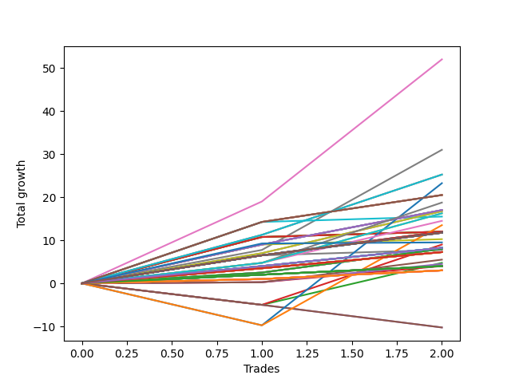

# Short Pointer Seven (0218) 
- Symbol: ES_Unlimited
- Date Range: 03/18/2022 - 07/15/2022
- Trading Period: 7:20-12:30
- Number of Trades: 2



| Name | Win Percent | Profit | Avg Profit / Trade | Avg Time / Trade |      | Name | Win Percent | Profit | Avg Profit / Trade | Avg Time / Trade |
| ---- | ----------- | ------ | ------------------ | ---------------- | ---- | ---- | ----------- | ------ | ------------------ | ---------------- |
| Sorted By <br> Profit | | | | | | Sorted By <br> Win Percentage ||||
| Six | 100.00 | 26000.00 | 13000.00 | 156:05 |     | Six | 100.00 | 26000.00 | 13000.00 | 156:05 |
| Seven | 100.00 | 15500.00 | 7750.00 | 206:00 |     | Seven | 100.00 | 15500.00 | 7750.00 | 206:00 |
| Sixty-One | 100.00 | 12625.00 | 6312.50 | 53:47 |     | Sixty-One | 100.00 | 12625.00 | 6312.50 | 53:47 |
| Five | 100.00 | 12625.00 | 6312.50 | 53:47 |     | Five | 100.00 | 12625.00 | 6312.50 | 53:47 |
| Sixty-Two | 50.00 | 11625.00 | 5812.50 | 129:52 |     | Sixty-Seven | 100.00 | 10250.00 | 5125.00 | 22:37 |
| Sixty-Seven | 100.00 | 10250.00 | 5125.00 | 22:37 |     | Fifty-Nine | 100.00 | 10250.00 | 5125.00 | 22:37 |
| Fifty-Nine | 100.00 | 10250.00 | 5125.00 | 22:37 |     | Forty-Three | 100.00 | 10250.00 | 5125.00 | 22:37 |
| Forty-Three | 100.00 | 10250.00 | 5125.00 | 22:37 |     | Three | 100.00 | 10250.00 | 5125.00 | 22:37 |
| Three | 100.00 | 10250.00 | 5125.00 | 22:37 |     | Sixty-Nine | 100.00 | 9375.00 | 4687.50 | 32:32 |
| Sixty-Nine | 100.00 | 9375.00 | 4687.50 | 32:32 |     | Sixty-Six | 100.00 | 8500.00 | 4250.00 | 11:57 |
| Sixty-Six | 100.00 | 8500.00 | 4250.00 | 11:57 |     | Fifty-Eight | 100.00 | 8500.00 | 4250.00 | 11:57 |
| Fifty-Eight | 100.00 | 8500.00 | 4250.00 | 11:57 |     | Forty-Two | 100.00 | 8500.00 | 4250.00 | 11:57 |
| Forty-Two | 100.00 | 8500.00 | 4250.00 | 11:57 |     | Two | 100.00 | 8500.00 | 4250.00 | 11:57 |
| Two | 100.00 | 8500.00 | 4250.00 | 11:57 |     | Sixty | 100.00 | 8375.00 | 4187.50 | 52:10 |
| Sixty | 100.00 | 8375.00 | 4187.50 | 52:10 |     | Four | 100.00 | 8375.00 | 4187.50 | 52:10 |
| Four | 100.00 | 8375.00 | 4187.50 | 52:10 |     | Seventy-One | 100.00 | 8125.00 | 4062.50 | 38:22 |
| Seventy-One | 100.00 | 8125.00 | 4062.50 | 38:22 |     | Seventy | 100.00 | 8125.00 | 4062.50 | 38:22 |
| Seventy | 100.00 | 8125.00 | 4062.50 | 38:22 |     | Fifty-One | 100.00 | 7750.00 | 3875.00 | 11:30 |
| Fifty-One | 100.00 | 7750.00 | 3875.00 | 11:30 |     | Sixty-Eight | 100.00 | 7250.00 | 3625.00 | 31:40 |
| Sixty-Eight | 100.00 | 7250.00 | 3625.00 | 31:40 |     | Sixty-Five | 100.00 | 6000.00 | 3000.00 | 11:17 |
| Sixty-Three | 50.00 | 6750.00 | 3375.00 | 150:35 |     | Fifty-Seven | 100.00 | 6000.00 | 3000.00 | 11:17 |
| Sixty-Five | 100.00 | 6000.00 | 3000.00 | 11:17 |     | Fifty-Five | 100.00 | 6000.00 | 3000.00 | 14:32 |
| Fifty-Seven | 100.00 | 6000.00 | 3000.00 | 11:17 |     | Fifty-Four | 100.00 | 6000.00 | 3000.00 | 14:32 |
| Fifty-Five | 100.00 | 6000.00 | 3000.00 | 14:32 |     | Fifty-Three | 100.00 | 6000.00 | 3000.00 | 14:32 |
| Fifty-Four | 100.00 | 6000.00 | 3000.00 | 14:32 |     | Fifty-Two | 100.00 | 6000.00 | 3000.00 | 14:32 |
| Fifty-Three | 100.00 | 6000.00 | 3000.00 | 14:32 |     | Forty-One | 100.00 | 6000.00 | 3000.00 | 11:17 |
| Fifty-Two | 100.00 | 6000.00 | 3000.00 | 14:32 |     | One | 100.00 | 6000.00 | 3000.00 | 11:17 |
| Forty-One | 100.00 | 6000.00 | 3000.00 | 11:17 |     | One Hundred Thirty | 100.00 | 5875.00 | 2937.50 | 04:40 |
| One | 100.00 | 6000.00 | 3000.00 | 11:17 |     | One Hundred Twenty-Five | 100.00 | 5875.00 | 2937.50 | 04:40 |
| One Hundred Thirty | 100.00 | 5875.00 | 2937.50 | 04:40 |     | One Hundred Twenty | 100.00 | 5875.00 | 2937.50 | 04:40 |
| One Hundred Twenty-Five | 100.00 | 5875.00 | 2937.50 | 04:40 |     | One Hundred Fifteen | 100.00 | 5875.00 | 2937.50 | 04:40 |
| One Hundred Twenty | 100.00 | 5875.00 | 2937.50 | 04:40 |     | One Hundred Ten | 100.00 | 5875.00 | 2937.50 | 04:40 |
| One Hundred Fifteen | 100.00 | 5875.00 | 2937.50 | 04:40 |     | One Hundred Five | 100.00 | 5875.00 | 2937.50 | 04:40 |
| One Hundred Ten | 100.00 | 5875.00 | 2937.50 | 04:40 |     | Ninety-Five | 100.00 | 5875.00 | 2937.50 | 04:40 |
| One Hundred Five | 100.00 | 5875.00 | 2937.50 | 04:40 |     | Eighty-Five | 100.00 | 5875.00 | 2937.50 | 04:40 |
| Ninety-Five | 100.00 | 5875.00 | 2937.50 | 04:40 |     | Fifty | 100.00 | 5125.00 | 2562.50 | 08:27 |
| Eighty-Five | 100.00 | 5875.00 | 2937.50 | 04:40 |     | Seventy-Three | 100.00 | 4750.00 | 2375.00 | 16:05 |
| Fifty | 100.00 | 5125.00 | 2562.50 | 08:27 |     | One Hundred Twenty-Nine | 100.00 | 4125.00 | 2062.50 | 04:27 |
| Seventy-Three | 100.00 | 4750.00 | 2375.00 | 16:05 |     | One Hundred Twenty-Four | 100.00 | 4125.00 | 2062.50 | 04:27 |
| Forty-Five | 50.00 | 4500.00 | 2250.00 | 36:55 |     | One Hundred Ninteen | 100.00 | 4125.00 | 2062.50 | 04:27 |
| One Hundred Twenty-Nine | 100.00 | 4125.00 | 2062.50 | 04:27 |     | One Hundred Fourteen | 100.00 | 4125.00 | 2062.50 | 04:27 |
| One Hundred Twenty-Four | 100.00 | 4125.00 | 2062.50 | 04:27 |     | One Hundred Nine | 100.00 | 4125.00 | 2062.50 | 04:27 |
| One Hundred Ninteen | 100.00 | 4125.00 | 2062.50 | 04:27 |     | One Hundred Four | 100.00 | 4125.00 | 2062.50 | 04:27 |
| One Hundred Fourteen | 100.00 | 4125.00 | 2062.50 | 04:27 |     | Ninety-Four | 100.00 | 4125.00 | 2062.50 | 04:27 |
| One Hundred Nine | 100.00 | 4125.00 | 2062.50 | 04:27 |     | Eighty-Four | 100.00 | 4125.00 | 2062.50 | 04:27 |
| One Hundred Four | 100.00 | 4125.00 | 2062.50 | 04:27 |     | Sixty-Four | 100.00 | 4000.00 | 2000.00 | 06:05 |
| Ninety-Four | 100.00 | 4125.00 | 2062.50 | 04:27 |     | Fifty-Six | 100.00 | 4000.00 | 2000.00 | 06:05 |
| Eighty-Four | 100.00 | 4125.00 | 2062.50 | 04:27 |     | Forty-Eight | 100.00 | 4000.00 | 2000.00 | 06:05 |
| Sixty-Four | 100.00 | 4000.00 | 2000.00 | 06:05 |     | Forty | 100.00 | 4000.00 | 2000.00 | 06:05 |
| Fifty-Six | 100.00 | 4000.00 | 2000.00 | 06:05 |     | Zero | 100.00 | 4000.00 | 2000.00 | 06:05 |
| Forty-Eight | 100.00 | 4000.00 | 2000.00 | 06:05 |     | Forty-Nine | 100.00 | 3875.00 | 1937.50 | 08:12 |
| Forty | 100.00 | 4000.00 | 2000.00 | 06:05 |     | One Hundred Twenty-Eight | 100.00 | 3625.00 | 1812.50 | 04:22 |
| Zero | 100.00 | 4000.00 | 2000.00 | 06:05 |     | One Hundred Twenty-Three | 100.00 | 3625.00 | 1812.50 | 04:22 |
| Forty-Nine | 100.00 | 3875.00 | 1937.50 | 08:12 |     | One Hundred Eighteen | 100.00 | 3625.00 | 1812.50 | 04:22 |
| One Hundred Twenty-Eight | 100.00 | 3625.00 | 1812.50 | 04:22 |     | One Hundred Thirteen | 100.00 | 3625.00 | 1812.50 | 04:22 |
| One Hundred Twenty-Three | 100.00 | 3625.00 | 1812.50 | 04:22 |     | One Hundred Eight | 100.00 | 3625.00 | 1812.50 | 04:22 |
| One Hundred Eighteen | 100.00 | 3625.00 | 1812.50 | 04:22 |     | One Hundred Three | 100.00 | 3625.00 | 1812.50 | 04:22 |
| One Hundred Thirteen | 100.00 | 3625.00 | 1812.50 | 04:22 |     | Ninety-Three | 100.00 | 3625.00 | 1812.50 | 04:22 |
| One Hundred Eight | 100.00 | 3625.00 | 1812.50 | 04:22 |     | Eighty-Three | 100.00 | 3625.00 | 1812.50 | 04:22 |
| One Hundred Three | 100.00 | 3625.00 | 1812.50 | 04:22 |     | One Hundred | 100.00 | 2750.00 | 1375.00 | 02:42 |
| Ninety-Three | 100.00 | 3625.00 | 1812.50 | 04:22 |     | Ninety-Nine | 100.00 | 2250.00 | 1125.00 | 02:37 |
| Eighty-Three | 100.00 | 3625.00 | 1812.50 | 04:22 |     | One Hundred Twenty-Seven | 100.00 | 2000.00 | 1000.00 | 02:05 |
| One Hundred | 100.00 | 2750.00 | 1375.00 | 02:42 |     | One Hundred Twenty-Two | 100.00 | 2000.00 | 1000.00 | 02:05 |
| Forty-Four | 50.00 | 2375.00 | 1187.50 | 36:02 |     | One Hundred Seventeen | 100.00 | 2000.00 | 1000.00 | 02:05 |
| Ninety-Nine | 100.00 | 2250.00 | 1125.00 | 02:37 |     | One Hundred Twelve | 100.00 | 2000.00 | 1000.00 | 02:05 |
| One Hundred Twenty-Seven | 100.00 | 2000.00 | 1000.00 | 02:05 |     | One Hundred Seven | 100.00 | 2000.00 | 1000.00 | 02:05 |
| One Hundred Twenty-Two | 100.00 | 2000.00 | 1000.00 | 02:05 |     | One Hundred Two | 100.00 | 2000.00 | 1000.00 | 02:05 |
| One Hundred Seventeen | 100.00 | 2000.00 | 1000.00 | 02:05 |     | Ninety-Eight | 100.00 | 2000.00 | 1000.00 | 02:35 |
| One Hundred Twelve | 100.00 | 2000.00 | 1000.00 | 02:05 |     | Ninety-Seven | 100.00 | 2000.00 | 1000.00 | 02:05 |
| One Hundred Seven | 100.00 | 2000.00 | 1000.00 | 02:05 |     | Ninety-Two | 100.00 | 2000.00 | 1000.00 | 02:05 |
| One Hundred Two | 100.00 | 2000.00 | 1000.00 | 02:05 |     | Eighty-Two | 100.00 | 2000.00 | 1000.00 | 02:05 |
| Ninety-Eight | 100.00 | 2000.00 | 1000.00 | 02:35 |     | One Hundred Twenty-Six | 100.00 | 1500.00 | 750.00 | 01:25 |
| Ninety-Seven | 100.00 | 2000.00 | 1000.00 | 02:05 |     | One Hundred Twenty-One | 100.00 | 1500.00 | 750.00 | 01:25 |
| Ninety-Two | 100.00 | 2000.00 | 1000.00 | 02:05 |     | One Hundred Sixteen | 100.00 | 1500.00 | 750.00 | 01:25 |
| Eighty-Two | 100.00 | 2000.00 | 1000.00 | 02:05 |     | One Hundred Eleven | 100.00 | 1500.00 | 750.00 | 01:25 |
| One Hundred Twenty-Six | 100.00 | 1500.00 | 750.00 | 01:25 |     | One Hundred Six | 100.00 | 1500.00 | 750.00 | 01:25 |
| One Hundred Twenty-One | 100.00 | 1500.00 | 750.00 | 01:25 |     | One Hundred One | 100.00 | 1500.00 | 750.00 | 01:25 |
| One Hundred Sixteen | 100.00 | 1500.00 | 750.00 | 01:25 |     | Ninety-Six | 100.00 | 1500.00 | 750.00 | 01:25 |
| One Hundred Eleven | 100.00 | 1500.00 | 750.00 | 01:25 |     | Ninety-One | 100.00 | 1500.00 | 750.00 | 01:25 |
| One Hundred Six | 100.00 | 1500.00 | 750.00 | 01:25 |     | Eighty-One | 100.00 | 1500.00 | 750.00 | 01:25 |
| One Hundred One | 100.00 | 1500.00 | 750.00 | 01:25 |     | Sixty-Two | 50.00 | 11625.00 | 5812.50 | 129:52 |
| Ninety-Six | 100.00 | 1500.00 | 750.00 | 01:25 |     | Sixty-Three | 50.00 | 6750.00 | 3375.00 | 150:35 |
| Ninety-One | 100.00 | 1500.00 | 750.00 | 01:25 |     | Forty-Five | 50.00 | 4500.00 | 2250.00 | 36:55 |
| Eighty-One | 100.00 | 1500.00 | 750.00 | 01:25 |     | Forty-Four | 50.00 | 2375.00 | 1187.50 | 36:02 |
| Forty-Seven | 0.00 | -5125.00 | -2562.50 | 57:47 |     | Forty-Seven | 0.00 | -5125.00 | -2562.50 | 57:47 |
| Forty-Six | 0.00 | -5125.00 | -2562.50 | 57:47 |     | Forty-Six | 0.00 | -5125.00 | -2562.50 | 57:47 |

## NO STOPLOSS

### Test Zero
* Sell when price hits the middle line of the 20p bollinger
* No Stoploss
* Results:
```
Total Trades: 2
Percent Up: 0.00
Percent Down: 100.00
Total Points Moved Down: 8.00
Potential Profit: 4000.00
Total Points Ups: 0.00 Count Ups: 0
Total Points Downs: 8.00 Count Downs: 2
```

<details><summary>Trades</summary>

<code>In: 2022-05-31 09:07:00		Out: 2022-05-31 09:14:05		Total Position Time: 07:05		Total Move Down: 2.50		Total to Date: 2.50</code> <br />
<code>In: 2022-06-30 09:35:00		Out: 2022-06-30 09:40:05		Total Position Time: 05:05		Total Move Down: 5.50		Total to Date: 8.00</code> <br />


</details>

### Test One
* Sell when the price hits the upper line of the 20p 1std bollinger
* No Stoploss
* Results:
```
Total Trades: 2
Percent Up: 0.00
Percent Down: 100.00
Total Points Moved Down: 12.00
Potential Profit: 6000.00
Total Points Ups: 0.00 Count Ups: 0
Total Points Downs: 12.00 Count Downs: 2
```

<details><summary>Trades</summary>

<code>In: 2022-05-31 09:07:00		Out: 2022-05-31 09:14:40		Total Position Time: 07:40		Total Move Down: 6.50		Total to Date: 6.50</code> <br />
<code>In: 2022-06-30 09:35:00		Out: 2022-06-30 09:49:55		Total Position Time: 14:55		Total Move Down: 5.50		Total to Date: 12.00</code> <br />


</details>

### Test Two
* Sell when the price hits the upper line of the 20p 2std bollinger
* No Stoploss
* Results:
```
Total Trades: 2
Percent Up: 0.00
Percent Down: 100.00
Total Points Moved Down: 17.00
Potential Profit: 8500.00
Total Points Ups: 0.00 Count Ups: 0
Total Points Downs: 17.00 Count Downs: 2
```

<details><summary>Trades</summary>

<code>In: 2022-05-31 09:07:00		Out: 2022-05-31 09:15:10		Total Position Time: 08:10		Total Move Down: 9.00		Total to Date: 9.00</code> <br />
<code>In: 2022-06-30 09:35:00		Out: 2022-06-30 09:50:45		Total Position Time: 15:45		Total Move Down: 8.00		Total to Date: 17.00</code> <br />


</details>

### Test Three
* Sell when price hits the middle line of the 50p bollinger
* No Stoploss
* Results:
```
Total Trades: 2
Percent Up: 0.00
Percent Down: 100.00
Total Points Moved Down: 20.50
Potential Profit: 10250.00
Total Points Ups: 0.00 Count Ups: 0
Total Points Downs: 20.50 Count Downs: 2
```

<details><summary>Trades</summary>

<code>In: 2022-05-31 09:07:00		Out: 2022-05-31 09:21:15		Total Position Time: 14:15		Total Move Down: 14.25		Total to Date: 14.25</code> <br />
<code>In: 2022-06-30 09:35:00		Out: 2022-06-30 10:06:00		Total Position Time: 31:00		Total Move Down: 6.25		Total to Date: 20.50</code> <br />


</details>

### Test Four
* Sell when the price hits the upper line of the 50p 1std bollinger
* No Stoploss
* Results:
```
Total Trades: 2
Percent Up: 0.00
Percent Down: 100.00
Total Points Moved Down: 16.75
Potential Profit: 8375.00
Total Points Ups: 0.00 Count Ups: 0
Total Points Downs: 16.75 Count Downs: 2
```

<details><summary>Trades</summary>

<code>In: 2022-05-31 09:07:00		Out: 2022-05-31 10:16:05		Total Position Time: 69:05		Total Move Down: 7.00		Total to Date: 7.00</code> <br />
<code>In: 2022-06-30 09:35:00		Out: 2022-06-30 10:10:15		Total Position Time: 35:15		Total Move Down: 9.75		Total to Date: 16.75</code> <br />


</details>

### Test Five
* Sell when the price hits the upper line of the 50p 2std bollinger
* No Stoploss
* Results:
```
Total Trades: 2
Percent Up: 0.00
Percent Down: 100.00
Total Points Moved Down: 25.25
Potential Profit: 12625.00
Total Points Ups: 0.00 Count Ups: 0
Total Points Downs: 25.25 Count Downs: 2
```

<details><summary>Trades</summary>

<code>In: 2022-05-31 09:07:00		Out: 2022-05-31 10:17:35		Total Position Time: 70:35		Total Move Down: 11.25		Total to Date: 11.25</code> <br />
<code>In: 2022-06-30 09:35:00		Out: 2022-06-30 10:12:00		Total Position Time: 37:00		Total Move Down: 14.00		Total to Date: 25.25</code> <br />


</details>

### Test Six
* Sell when the price hits the middle line of the 1std VWAP
* No Stoploss
* Results:
```
Total Trades: 2
Percent Up: 0.00
Percent Down: 100.00
Total Points Moved Down: 52.00
Potential Profit: 26000.00
Total Points Ups: 0.00 Count Ups: 0
Total Points Downs: 52.00 Count Downs: 2
```

<details><summary>Trades</summary>

<code>In: 2022-05-31 09:07:00		Out: 2022-05-31 11:48:35		Total Position Time: 161:35		Total Move Down: 19.00		Total to Date: 19.00</code> <br />
<code>In: 2022-06-30 09:35:00		Out: 2022-06-30 12:05:35		Total Position Time: 150:35		Total Move Down: 33.00		Total to Date: 52.00</code> <br />


</details>

### Test Seven
* Sell when the price hits the upper line of the 1std VWAP
* No Stoploss
* Results:
```
Total Trades: 2
Percent Up: 0.00
Percent Down: 100.00
Total Points Moved Down: 31.00
Potential Profit: 15500.00
Total Points Ups: 0.00 Count Ups: 0
Total Points Downs: 31.00 Count Downs: 2
```

<details><summary>Trades</summary>

<code>In: 2022-05-31 09:07:00		Out: 2022-05-31 12:47:00		Total Position Time: 220:00		Total Move Down: 7.75		Total to Date: 7.75</code> <br />
<code>In: 2022-06-30 09:35:00		Out: 2022-06-30 12:47:00		Total Position Time: 192:00		Total Move Down: 23.25		Total to Date: 31.00</code> <br />


</details>

## STOPLOSS OF 5

### Test Forty
* Sell when price hits the middle line of the 20p bollinger
* Stoploss is -5 points
* Results:
```
Total Trades: 2
Percent Up: 0.00
Percent Down: 100.00
Total Points Moved Down: 8.00
Potential Profit: 4000.00
Total Points Ups: 0.00 Count Ups: 0
Total Points Downs: 8.00 Count Downs: 2
```

<details><summary>Trades</summary>

<code>In: 2022-05-31 09:07:00		Out: 2022-05-31 09:14:05		Total Position Time: 07:05		Total Move Down: 2.50		Total to Date: 2.50</code> <br />
<code>In: 2022-06-30 09:35:00		Out: 2022-06-30 09:40:05		Total Position Time: 05:05		Total Move Down: 5.50		Total to Date: 8.00</code> <br />


</details>

### Test Forty-One
* Sell when the price hits the upper line of the 20p 1std bollinger
* Stoploss is -5 points
* Results:
```
Total Trades: 2
Percent Up: 0.00
Percent Down: 100.00
Total Points Moved Down: 12.00
Potential Profit: 6000.00
Total Points Ups: 0.00 Count Ups: 0
Total Points Downs: 12.00 Count Downs: 2
```

<details><summary>Trades</summary>

<code>In: 2022-05-31 09:07:00		Out: 2022-05-31 09:14:40		Total Position Time: 07:40		Total Move Down: 6.50		Total to Date: 6.50</code> <br />
<code>In: 2022-06-30 09:35:00		Out: 2022-06-30 09:49:55		Total Position Time: 14:55		Total Move Down: 5.50		Total to Date: 12.00</code> <br />


</details>

### Test Forty-Two
* Sell when the price hits the upper line of the 20p 2std bollinger
* Stoploss is -5 points
* Results:
```
Total Trades: 2
Percent Up: 0.00
Percent Down: 100.00
Total Points Moved Down: 17.00
Potential Profit: 8500.00
Total Points Ups: 0.00 Count Ups: 0
Total Points Downs: 17.00 Count Downs: 2
```

<details><summary>Trades</summary>

<code>In: 2022-05-31 09:07:00		Out: 2022-05-31 09:15:10		Total Position Time: 08:10		Total Move Down: 9.00		Total to Date: 9.00</code> <br />
<code>In: 2022-06-30 09:35:00		Out: 2022-06-30 09:50:45		Total Position Time: 15:45		Total Move Down: 8.00		Total to Date: 17.00</code> <br />


</details>

### Test Forty-Three
* Sell when price hits the middle line of the 50p bollinger
* Stoploss is -5 points
* Results:
```
Total Trades: 2
Percent Up: 0.00
Percent Down: 100.00
Total Points Moved Down: 20.50
Potential Profit: 10250.00
Total Points Ups: 0.00 Count Ups: 0
Total Points Downs: 20.50 Count Downs: 2
```

<details><summary>Trades</summary>

<code>In: 2022-05-31 09:07:00		Out: 2022-05-31 09:21:15		Total Position Time: 14:15		Total Move Down: 14.25		Total to Date: 14.25</code> <br />
<code>In: 2022-06-30 09:35:00		Out: 2022-06-30 10:06:00		Total Position Time: 31:00		Total Move Down: 6.25		Total to Date: 20.50</code> <br />


</details>

### Test Forty-Four
* Sell when the price hits the upper line of the 50p 1std bollinger
* Stoploss is -5 points
* Results:
```
Total Trades: 2
Percent Up: 50.00
Percent Down: 50.00
Total Points Moved Down: 4.75
Potential Profit: 2375.00
Total Points Ups: 5.00 Count Ups: 1
Total Points Downs: 9.75 Count Downs: 1
```

<details><summary>Trades</summary>

<code>In: 2022-05-31 09:07:00		Out: 2022-05-31 09:43:50		Total Position Time: 36:50		Total Move Down: -5.00		Total to Date: -5.00</code> <br />
<code>In: 2022-06-30 09:35:00		Out: 2022-06-30 10:10:15		Total Position Time: 35:15		Total Move Down: 9.75		Total to Date: 4.75</code> <br />


</details>

### Test Forty-Five
* Sell when the price hits the upper line of the 50p 2std bollinger
* Stoploss is -5 points
* Results:
```
Total Trades: 2
Percent Up: 50.00
Percent Down: 50.00
Total Points Moved Down: 9.00
Potential Profit: 4500.00
Total Points Ups: 5.00 Count Ups: 1
Total Points Downs: 14.00 Count Downs: 1
```

<details><summary>Trades</summary>

<code>In: 2022-05-31 09:07:00		Out: 2022-05-31 09:43:50		Total Position Time: 36:50		Total Move Down: -5.00		Total to Date: -5.00</code> <br />
<code>In: 2022-06-30 09:35:00		Out: 2022-06-30 10:12:00		Total Position Time: 37:00		Total Move Down: 14.00		Total to Date: 9.00</code> <br />


</details>

### Test Forty-Six
* Sell when the price hits the middle line of the 1std VWAP
* Stoploss is -5 points
* Results:
```
Total Trades: 2
Percent Up: 100.00
Percent Down: 0.00
Total Points Moved Down: -10.25
Potential Profit: -5125.00
Total Points Ups: 10.25 Count Ups: 2
Total Points Downs: 0.00 Count Downs: 0
```

<details><summary>Trades</summary>

<code>In: 2022-05-31 09:07:00		Out: 2022-05-31 09:43:50		Total Position Time: 36:50		Total Move Down: -5.00		Total to Date: -5.00</code> <br />
<code>In: 2022-06-30 09:35:00		Out: 2022-06-30 10:53:45		Total Position Time: 78:45		Total Move Down: -5.25		Total to Date: -10.25</code> <br />


</details>

### Test Forty-Seven
* Sell when the price hits the upper line of the 1std VWAP
* Stoploss is -5 points
* Results:
```
Total Trades: 2
Percent Up: 100.00
Percent Down: 0.00
Total Points Moved Down: -10.25
Potential Profit: -5125.00
Total Points Ups: 10.25 Count Ups: 2
Total Points Downs: 0.00 Count Downs: 0
```

<details><summary>Trades</summary>

<code>In: 2022-05-31 09:07:00		Out: 2022-05-31 09:43:50		Total Position Time: 36:50		Total Move Down: -5.00		Total to Date: -5.00</code> <br />
<code>In: 2022-06-30 09:35:00		Out: 2022-06-30 10:53:45		Total Position Time: 78:45		Total Move Down: -5.25		Total to Date: -10.25</code> <br />


</details>

## TRAIL STOP OF 5

### Test Forty-Eight
* Sell when price hits the middle line of the 20p bollinger
* Trailing Stop is -5 points
* Results:
```
Total Trades: 2
Percent Up: 0.00
Percent Down: 100.00
Total Points Moved Down: 8.00
Potential Profit: 4000.00
Total Points Ups: 0.00 Count Ups: 0
Total Points Downs: 8.00 Count Downs: 2
```

<details><summary>Trades</summary>

<code>In: 2022-05-31 09:07:00		Out: 2022-05-31 09:14:05		Total Position Time: 07:05		Total Move Down: 2.50		Total to Date: 2.50</code> <br />
<code>In: 2022-06-30 09:35:00		Out: 2022-06-30 09:40:05		Total Position Time: 05:05		Total Move Down: 5.50		Total to Date: 8.00</code> <br />


</details>

### Test Forty-Nine
* Sell when the price hits the upper line of the 20p 1std bollinger
* Trailing Stop is -5 points
* Results:
```
Total Trades: 2
Percent Up: 0.00
Percent Down: 100.00
Total Points Moved Down: 7.75
Potential Profit: 3875.00
Total Points Ups: 0.00 Count Ups: 0
Total Points Downs: 7.75 Count Downs: 2
```

<details><summary>Trades</summary>

<code>In: 2022-05-31 09:07:00		Out: 2022-05-31 09:14:40		Total Position Time: 07:40		Total Move Down: 6.50		Total to Date: 6.50</code> <br />
<code>In: 2022-06-30 09:35:00		Out: 2022-06-30 09:43:45		Total Position Time: 08:45		Total Move Down: 1.25		Total to Date: 7.75</code> <br />


</details>

### Test Fifty
* Sell when the price hits the upper line of the 20p 2std bollinger
* Trailing Stop is -5 points
* Results:
```
Total Trades: 2
Percent Up: 0.00
Percent Down: 100.00
Total Points Moved Down: 10.25
Potential Profit: 5125.00
Total Points Ups: 0.00 Count Ups: 0
Total Points Downs: 10.25 Count Downs: 2
```

<details><summary>Trades</summary>

<code>In: 2022-05-31 09:07:00		Out: 2022-05-31 09:15:10		Total Position Time: 08:10		Total Move Down: 9.00		Total to Date: 9.00</code> <br />
<code>In: 2022-06-30 09:35:00		Out: 2022-06-30 09:43:45		Total Position Time: 08:45		Total Move Down: 1.25		Total to Date: 10.25</code> <br />


</details>

### Test Fifty-One
* Sell when price hits the middle line of the 50p bollinger
* Trailing Stop is -5 points
* Results:
```
Total Trades: 2
Percent Up: 0.00
Percent Down: 100.00
Total Points Moved Down: 15.50
Potential Profit: 7750.00
Total Points Ups: 0.00 Count Ups: 0
Total Points Downs: 15.50 Count Downs: 2
```

<details><summary>Trades</summary>

<code>In: 2022-05-31 09:07:00		Out: 2022-05-31 09:21:15		Total Position Time: 14:15		Total Move Down: 14.25		Total to Date: 14.25</code> <br />
<code>In: 2022-06-30 09:35:00		Out: 2022-06-30 09:43:45		Total Position Time: 08:45		Total Move Down: 1.25		Total to Date: 15.50</code> <br />


</details>

### Test Fifty-Two
* Sell when the price hits the upper line of the 50p 1std bollinger
* Trailing Stop is -5 points
* Results:
```
Total Trades: 2
Percent Up: 0.00
Percent Down: 100.00
Total Points Moved Down: 12.00
Potential Profit: 6000.00
Total Points Ups: 0.00 Count Ups: 0
Total Points Downs: 12.00 Count Downs: 2
```

<details><summary>Trades</summary>

<code>In: 2022-05-31 09:07:00		Out: 2022-05-31 09:27:20		Total Position Time: 20:20		Total Move Down: 10.75		Total to Date: 10.75</code> <br />
<code>In: 2022-06-30 09:35:00		Out: 2022-06-30 09:43:45		Total Position Time: 08:45		Total Move Down: 1.25		Total to Date: 12.00</code> <br />


</details>

### Test Fifty-Three
* Sell when the price hits the upper line of the 50p 2std bollinger
* Trailing Stop is -5 points
* Results:
```
Total Trades: 2
Percent Up: 0.00
Percent Down: 100.00
Total Points Moved Down: 12.00
Potential Profit: 6000.00
Total Points Ups: 0.00 Count Ups: 0
Total Points Downs: 12.00 Count Downs: 2
```

<details><summary>Trades</summary>

<code>In: 2022-05-31 09:07:00		Out: 2022-05-31 09:27:20		Total Position Time: 20:20		Total Move Down: 10.75		Total to Date: 10.75</code> <br />
<code>In: 2022-06-30 09:35:00		Out: 2022-06-30 09:43:45		Total Position Time: 08:45		Total Move Down: 1.25		Total to Date: 12.00</code> <br />


</details>

### Test Fifty-Four
* Sell when the price hits the middle line of the 1std VWAP
* Trailing Stop is -5 points
* Results:
```
Total Trades: 2
Percent Up: 0.00
Percent Down: 100.00
Total Points Moved Down: 12.00
Potential Profit: 6000.00
Total Points Ups: 0.00 Count Ups: 0
Total Points Downs: 12.00 Count Downs: 2
```

<details><summary>Trades</summary>

<code>In: 2022-05-31 09:07:00		Out: 2022-05-31 09:27:20		Total Position Time: 20:20		Total Move Down: 10.75		Total to Date: 10.75</code> <br />
<code>In: 2022-06-30 09:35:00		Out: 2022-06-30 09:43:45		Total Position Time: 08:45		Total Move Down: 1.25		Total to Date: 12.00</code> <br />


</details>

### Test Fifty-Five
* Sell when the price hits the upper line of the 1std VWAP
* Trailing Stop is -5 points
* Results:
```
Total Trades: 2
Percent Up: 0.00
Percent Down: 100.00
Total Points Moved Down: 12.00
Potential Profit: 6000.00
Total Points Ups: 0.00 Count Ups: 0
Total Points Downs: 12.00 Count Downs: 2
```

<details><summary>Trades</summary>

<code>In: 2022-05-31 09:07:00		Out: 2022-05-31 09:27:20		Total Position Time: 20:20		Total Move Down: 10.75		Total to Date: 10.75</code> <br />
<code>In: 2022-06-30 09:35:00		Out: 2022-06-30 09:43:45		Total Position Time: 08:45		Total Move Down: 1.25		Total to Date: 12.00</code> <br />


</details>

## STOPLOSS OF 10

### Test Fifty-Six
* Sell when price hits the middle line of the 20p bollinger
* Stoploss is -10 points
* Results:
```
Total Trades: 2
Percent Up: 0.00
Percent Down: 100.00
Total Points Moved Down: 8.00
Potential Profit: 4000.00
Total Points Ups: 0.00 Count Ups: 0
Total Points Downs: 8.00 Count Downs: 2
```

<details><summary>Trades</summary>

<code>In: 2022-05-31 09:07:00		Out: 2022-05-31 09:14:05		Total Position Time: 07:05		Total Move Down: 2.50		Total to Date: 2.50</code> <br />
<code>In: 2022-06-30 09:35:00		Out: 2022-06-30 09:40:05		Total Position Time: 05:05		Total Move Down: 5.50		Total to Date: 8.00</code> <br />


</details>

### Test Fifty-Seven
* Sell when the price hits the upper line of the 20p 1std bollinger
* Stoploss is -10 points
* Results:
```
Total Trades: 2
Percent Up: 0.00
Percent Down: 100.00
Total Points Moved Down: 12.00
Potential Profit: 6000.00
Total Points Ups: 0.00 Count Ups: 0
Total Points Downs: 12.00 Count Downs: 2
```

<details><summary>Trades</summary>

<code>In: 2022-05-31 09:07:00		Out: 2022-05-31 09:14:40		Total Position Time: 07:40		Total Move Down: 6.50		Total to Date: 6.50</code> <br />
<code>In: 2022-06-30 09:35:00		Out: 2022-06-30 09:49:55		Total Position Time: 14:55		Total Move Down: 5.50		Total to Date: 12.00</code> <br />


</details>

### Test Fifty-Eight
* Sell when the price hits the upper line of the 20p 2std bollinger
* Stoploss is -10 points
* Results:
```
Total Trades: 2
Percent Up: 0.00
Percent Down: 100.00
Total Points Moved Down: 17.00
Potential Profit: 8500.00
Total Points Ups: 0.00 Count Ups: 0
Total Points Downs: 17.00 Count Downs: 2
```

<details><summary>Trades</summary>

<code>In: 2022-05-31 09:07:00		Out: 2022-05-31 09:15:10		Total Position Time: 08:10		Total Move Down: 9.00		Total to Date: 9.00</code> <br />
<code>In: 2022-06-30 09:35:00		Out: 2022-06-30 09:50:45		Total Position Time: 15:45		Total Move Down: 8.00		Total to Date: 17.00</code> <br />


</details>

### Test Fifty-Nine
* Sell when price hits the middle line of the 50p bollinger
* Stoploss is -10 points
* Results:
```
Total Trades: 2
Percent Up: 0.00
Percent Down: 100.00
Total Points Moved Down: 20.50
Potential Profit: 10250.00
Total Points Ups: 0.00 Count Ups: 0
Total Points Downs: 20.50 Count Downs: 2
```

<details><summary>Trades</summary>

<code>In: 2022-05-31 09:07:00		Out: 2022-05-31 09:21:15		Total Position Time: 14:15		Total Move Down: 14.25		Total to Date: 14.25</code> <br />
<code>In: 2022-06-30 09:35:00		Out: 2022-06-30 10:06:00		Total Position Time: 31:00		Total Move Down: 6.25		Total to Date: 20.50</code> <br />


</details>

### Test Sixty
* Sell when the price hits the upper line of the 50p 1std bollinger
* Stoploss is -10 points
* Results:
```
Total Trades: 2
Percent Up: 0.00
Percent Down: 100.00
Total Points Moved Down: 16.75
Potential Profit: 8375.00
Total Points Ups: 0.00 Count Ups: 0
Total Points Downs: 16.75 Count Downs: 2
```

<details><summary>Trades</summary>

<code>In: 2022-05-31 09:07:00		Out: 2022-05-31 10:16:05		Total Position Time: 69:05		Total Move Down: 7.00		Total to Date: 7.00</code> <br />
<code>In: 2022-06-30 09:35:00		Out: 2022-06-30 10:10:15		Total Position Time: 35:15		Total Move Down: 9.75		Total to Date: 16.75</code> <br />


</details>

### Test Sixty-One
* Sell when the price hits the upper line of the 50p 2std bollinger
* Stoploss is -10 points
* Results:
```
Total Trades: 2
Percent Up: 0.00
Percent Down: 100.00
Total Points Moved Down: 25.25
Potential Profit: 12625.00
Total Points Ups: 0.00 Count Ups: 0
Total Points Downs: 25.25 Count Downs: 2
```

<details><summary>Trades</summary>

<code>In: 2022-05-31 09:07:00		Out: 2022-05-31 10:17:35		Total Position Time: 70:35		Total Move Down: 11.25		Total to Date: 11.25</code> <br />
<code>In: 2022-06-30 09:35:00		Out: 2022-06-30 10:12:00		Total Position Time: 37:00		Total Move Down: 14.00		Total to Date: 25.25</code> <br />


</details>

### Test Sixty-Two
* Sell when the price hits the middle line of the 1std VWAP
* Stoploss is -10 points
* Results:
```
Total Trades: 2
Percent Up: 50.00
Percent Down: 50.00
Total Points Moved Down: 23.25
Potential Profit: 11625.00
Total Points Ups: 9.75 Count Ups: 1
Total Points Downs: 33.00 Count Downs: 1
```

<details><summary>Trades</summary>

<code>In: 2022-05-31 09:07:00		Out: 2022-05-31 10:56:10		Total Position Time: 109:10		Total Move Down: -9.75		Total to Date: -9.75</code> <br />
<code>In: 2022-06-30 09:35:00		Out: 2022-06-30 12:05:35		Total Position Time: 150:35		Total Move Down: 33.00		Total to Date: 23.25</code> <br />


</details>

### Test Sixty-Three
* Sell when the price hits the upper line of the 1std VWAP
* Stoploss is -10 points
* Results:
```
Total Trades: 2
Percent Up: 50.00
Percent Down: 50.00
Total Points Moved Down: 13.50
Potential Profit: 6750.00
Total Points Ups: 9.75 Count Ups: 1
Total Points Downs: 23.25 Count Downs: 1
```

<details><summary>Trades</summary>

<code>In: 2022-05-31 09:07:00		Out: 2022-05-31 10:56:10		Total Position Time: 109:10		Total Move Down: -9.75		Total to Date: -9.75</code> <br />
<code>In: 2022-06-30 09:35:00		Out: 2022-06-30 12:47:00		Total Position Time: 192:00		Total Move Down: 23.25		Total to Date: 13.50</code> <br />


</details>

## TRAIL STOP OF 10

### Test Sixty-Four
* Sell when price hits the middle line of the 20p bollinger
* Trailing Stop is -10 points
* Results:
```
Total Trades: 2
Percent Up: 0.00
Percent Down: 100.00
Total Points Moved Down: 8.00
Potential Profit: 4000.00
Total Points Ups: 0.00 Count Ups: 0
Total Points Downs: 8.00 Count Downs: 2
```

<details><summary>Trades</summary>

<code>In: 2022-05-31 09:07:00		Out: 2022-05-31 09:14:05		Total Position Time: 07:05		Total Move Down: 2.50		Total to Date: 2.50</code> <br />
<code>In: 2022-06-30 09:35:00		Out: 2022-06-30 09:40:05		Total Position Time: 05:05		Total Move Down: 5.50		Total to Date: 8.00</code> <br />


</details>

### Test Sixty-Five
* Sell when the price hits the upper line of the 20p 1std bollinger
* Trailing Stop is -10 points
* Results:
```
Total Trades: 2
Percent Up: 0.00
Percent Down: 100.00
Total Points Moved Down: 12.00
Potential Profit: 6000.00
Total Points Ups: 0.00 Count Ups: 0
Total Points Downs: 12.00 Count Downs: 2
```

<details><summary>Trades</summary>

<code>In: 2022-05-31 09:07:00		Out: 2022-05-31 09:14:40		Total Position Time: 07:40		Total Move Down: 6.50		Total to Date: 6.50</code> <br />
<code>In: 2022-06-30 09:35:00		Out: 2022-06-30 09:49:55		Total Position Time: 14:55		Total Move Down: 5.50		Total to Date: 12.00</code> <br />


</details>

### Test Sixty-Six
* Sell when the price hits the upper line of the 20p 2std bollinger
* Trailing Stop is -10 points
* Results:
```
Total Trades: 2
Percent Up: 0.00
Percent Down: 100.00
Total Points Moved Down: 17.00
Potential Profit: 8500.00
Total Points Ups: 0.00 Count Ups: 0
Total Points Downs: 17.00 Count Downs: 2
```

<details><summary>Trades</summary>

<code>In: 2022-05-31 09:07:00		Out: 2022-05-31 09:15:10		Total Position Time: 08:10		Total Move Down: 9.00		Total to Date: 9.00</code> <br />
<code>In: 2022-06-30 09:35:00		Out: 2022-06-30 09:50:45		Total Position Time: 15:45		Total Move Down: 8.00		Total to Date: 17.00</code> <br />


</details>

### Test Sixty-Seven
* Sell when price hits the middle line of the 50p bollinger
* Trailing Stop is -10 points
* Results:
```
Total Trades: 2
Percent Up: 0.00
Percent Down: 100.00
Total Points Moved Down: 20.50
Potential Profit: 10250.00
Total Points Ups: 0.00 Count Ups: 0
Total Points Downs: 20.50 Count Downs: 2
```

<details><summary>Trades</summary>

<code>In: 2022-05-31 09:07:00		Out: 2022-05-31 09:21:15		Total Position Time: 14:15		Total Move Down: 14.25		Total to Date: 14.25</code> <br />
<code>In: 2022-06-30 09:35:00		Out: 2022-06-30 10:06:00		Total Position Time: 31:00		Total Move Down: 6.25		Total to Date: 20.50</code> <br />


</details>

### Test Sixty-Eight
* Sell when the price hits the upper line of the 50p 1std bollinger
* Trailing Stop is -10 points
* Results:
```
Total Trades: 2
Percent Up: 0.00
Percent Down: 100.00
Total Points Moved Down: 14.50
Potential Profit: 7250.00
Total Points Ups: 0.00 Count Ups: 0
Total Points Downs: 14.50 Count Downs: 2
```

<details><summary>Trades</summary>

<code>In: 2022-05-31 09:07:00		Out: 2022-05-31 09:35:05		Total Position Time: 28:05		Total Move Down: 4.75		Total to Date: 4.75</code> <br />
<code>In: 2022-06-30 09:35:00		Out: 2022-06-30 10:10:15		Total Position Time: 35:15		Total Move Down: 9.75		Total to Date: 14.50</code> <br />


</details>

### Test Sixty-Nine
* Sell when the price hits the upper line of the 50p 2std bollinger
* Trailing Stop is -10 points
* Results:
```
Total Trades: 2
Percent Up: 0.00
Percent Down: 100.00
Total Points Moved Down: 18.75
Potential Profit: 9375.00
Total Points Ups: 0.00 Count Ups: 0
Total Points Downs: 18.75 Count Downs: 2
```

<details><summary>Trades</summary>

<code>In: 2022-05-31 09:07:00		Out: 2022-05-31 09:35:05		Total Position Time: 28:05		Total Move Down: 4.75		Total to Date: 4.75</code> <br />
<code>In: 2022-06-30 09:35:00		Out: 2022-06-30 10:12:00		Total Position Time: 37:00		Total Move Down: 14.00		Total to Date: 18.75</code> <br />


</details>

### Test Seventy
* Sell when the price hits the middle line of the 1std VWAP
* Trailing Stop is -10 points
* Results:
```
Total Trades: 2
Percent Up: 0.00
Percent Down: 100.00
Total Points Moved Down: 16.25
Potential Profit: 8125.00
Total Points Ups: 0.00 Count Ups: 0
Total Points Downs: 16.25 Count Downs: 2
```

<details><summary>Trades</summary>

<code>In: 2022-05-31 09:07:00		Out: 2022-05-31 09:35:05		Total Position Time: 28:05		Total Move Down: 4.75		Total to Date: 4.75</code> <br />
<code>In: 2022-06-30 09:35:00		Out: 2022-06-30 10:23:40		Total Position Time: 48:40		Total Move Down: 11.50		Total to Date: 16.25</code> <br />


</details>

### Test Seventy-One
* Sell when the price hits the upper line of the 1std VWAP
* Trailing Stop is -10 points
* Results:
```
Total Trades: 2
Percent Up: 0.00
Percent Down: 100.00
Total Points Moved Down: 16.25
Potential Profit: 8125.00
Total Points Ups: 0.00 Count Ups: 0
Total Points Downs: 16.25 Count Downs: 2
```

<details><summary>Trades</summary>

<code>In: 2022-05-31 09:07:00		Out: 2022-05-31 09:35:05		Total Position Time: 28:05		Total Move Down: 4.75		Total to Date: 4.75</code> <br />
<code>In: 2022-06-30 09:35:00		Out: 2022-06-30 10:23:40		Total Position Time: 48:40		Total Move Down: 11.50		Total to Date: 16.25</code> <br />


</details>

## SPECIAL EXIT CONDITIONS 

### Test Seventy-Three
* Sell when the linear regression slope changes to negative
* No Stoploss
* Results:
```
Total Trades: 2
Percent Up: 0.00
Percent Down: 100.00
Total Points Moved Down: 9.50
Potential Profit: 4750.00
Total Points Ups: 0.00 Count Ups: 0
Total Points Downs: 9.50 Count Downs: 2
```

<details><summary>Trades</summary>

<code>In: 2022-05-31 09:07:00		Out: 2022-05-31 09:28:05		Total Position Time: 21:05		Total Move Down: 9.25		Total to Date: 9.25</code> <br />
<code>In: 2022-06-30 09:35:00		Out: 2022-06-30 09:46:05		Total Position Time: 11:05		Total Move Down: 0.25		Total to Date: 9.50</code> <br />


</details>

## TAKE PROFIT

### Test Eighty-One
* Take Profit of 1 Point
* No Stoploss
* Results:
```
Total Trades: 2
Percent Up: 0.00
Percent Down: 100.00
Total Points Moved Down: 3.00
Potential Profit: 1500.00
Total Points Ups: 0.00 Count Ups: 0
Total Points Downs: 3.00 Count Downs: 2
```

<details><summary>Trades</summary>

<code>In: 2022-05-31 09:07:00		Out: 2022-05-31 09:08:40		Total Position Time: 01:40		Total Move Down: 1.00		Total to Date: 1.00</code> <br />
<code>In: 2022-06-30 09:35:00		Out: 2022-06-30 09:36:10		Total Position Time: 01:10		Total Move Down: 2.00		Total to Date: 3.00</code> <br />


</details>

### Test Eighty-Two
* Take Profit of 2 Point
* No Stoploss
* Results:
```
Total Trades: 2
Percent Up: 0.00
Percent Down: 100.00
Total Points Moved Down: 4.00
Potential Profit: 2000.00
Total Points Ups: 0.00 Count Ups: 0
Total Points Downs: 4.00 Count Downs: 2
```

<details><summary>Trades</summary>

<code>In: 2022-05-31 09:07:00		Out: 2022-05-31 09:10:00		Total Position Time: 03:00		Total Move Down: 2.00		Total to Date: 2.00</code> <br />
<code>In: 2022-06-30 09:35:00		Out: 2022-06-30 09:36:10		Total Position Time: 01:10		Total Move Down: 2.00		Total to Date: 4.00</code> <br />


</details>

### Test Eighty-Three
* Take Profit of 3 Point
* No Stoploss
* Results:
```
Total Trades: 2
Percent Up: 0.00
Percent Down: 100.00
Total Points Moved Down: 7.25
Potential Profit: 3625.00
Total Points Ups: 0.00 Count Ups: 0
Total Points Downs: 7.25 Count Downs: 2
```

<details><summary>Trades</summary>

<code>In: 2022-05-31 09:07:00		Out: 2022-05-31 09:14:20		Total Position Time: 07:20		Total Move Down: 3.50		Total to Date: 3.50</code> <br />
<code>In: 2022-06-30 09:35:00		Out: 2022-06-30 09:36:25		Total Position Time: 01:25		Total Move Down: 3.75		Total to Date: 7.25</code> <br />


</details>

### Test Eighty-Four
* Take Profit of 4 Point
* No Stoploss
* Results:
```
Total Trades: 2
Percent Up: 0.00
Percent Down: 100.00
Total Points Moved Down: 8.25
Potential Profit: 4125.00
Total Points Ups: 0.00 Count Ups: 0
Total Points Downs: 8.25 Count Downs: 2
```

<details><summary>Trades</summary>

<code>In: 2022-05-31 09:07:00		Out: 2022-05-31 09:14:25		Total Position Time: 07:25		Total Move Down: 4.00		Total to Date: 4.00</code> <br />
<code>In: 2022-06-30 09:35:00		Out: 2022-06-30 09:36:30		Total Position Time: 01:30		Total Move Down: 4.25		Total to Date: 8.25</code> <br />


</details>

### Test Eighty-Five
* Take Profit of 5 Point
* No Stoploss
* Results:
```
Total Trades: 2
Percent Up: 0.00
Percent Down: 100.00
Total Points Moved Down: 11.75
Potential Profit: 5875.00
Total Points Ups: 0.00 Count Ups: 0
Total Points Downs: 11.75 Count Downs: 2
```

<details><summary>Trades</summary>

<code>In: 2022-05-31 09:07:00		Out: 2022-05-31 09:14:40		Total Position Time: 07:40		Total Move Down: 6.50		Total to Date: 6.50</code> <br />
<code>In: 2022-06-30 09:35:00		Out: 2022-06-30 09:36:40		Total Position Time: 01:40		Total Move Down: 5.25		Total to Date: 11.75</code> <br />


</details>

## TAKE PROFIT Stoploss of Two

### Test Ninety-One
* Take Profit of 1 Point
* Stoploss is -2 points
* Results:
```
Total Trades: 2
Percent Up: 0.00
Percent Down: 100.00
Total Points Moved Down: 3.00
Potential Profit: 1500.00
Total Points Ups: 0.00 Count Ups: 0
Total Points Downs: 3.00 Count Downs: 2
```

<details><summary>Trades</summary>

<code>In: 2022-05-31 09:07:00		Out: 2022-05-31 09:08:40		Total Position Time: 01:40		Total Move Down: 1.00		Total to Date: 1.00</code> <br />
<code>In: 2022-06-30 09:35:00		Out: 2022-06-30 09:36:10		Total Position Time: 01:10		Total Move Down: 2.00		Total to Date: 3.00</code> <br />


</details>

### Test Ninety-Two
* Take Profit of 2 Point
* Stoploss is -2 points
* Results:
```
Total Trades: 2
Percent Up: 0.00
Percent Down: 100.00
Total Points Moved Down: 4.00
Potential Profit: 2000.00
Total Points Ups: 0.00 Count Ups: 0
Total Points Downs: 4.00 Count Downs: 2
```

<details><summary>Trades</summary>

<code>In: 2022-05-31 09:07:00		Out: 2022-05-31 09:10:00		Total Position Time: 03:00		Total Move Down: 2.00		Total to Date: 2.00</code> <br />
<code>In: 2022-06-30 09:35:00		Out: 2022-06-30 09:36:10		Total Position Time: 01:10		Total Move Down: 2.00		Total to Date: 4.00</code> <br />


</details>

### Test Ninety-Three
* Take Profit of 3 Point
* Stoploss is -2 points
* Results:
```
Total Trades: 2
Percent Up: 0.00
Percent Down: 100.00
Total Points Moved Down: 7.25
Potential Profit: 3625.00
Total Points Ups: 0.00 Count Ups: 0
Total Points Downs: 7.25 Count Downs: 2
```

<details><summary>Trades</summary>

<code>In: 2022-05-31 09:07:00		Out: 2022-05-31 09:14:20		Total Position Time: 07:20		Total Move Down: 3.50		Total to Date: 3.50</code> <br />
<code>In: 2022-06-30 09:35:00		Out: 2022-06-30 09:36:25		Total Position Time: 01:25		Total Move Down: 3.75		Total to Date: 7.25</code> <br />


</details>

### Test Ninety-Four
* Take Profit of 4 Point
* Stoploss is -2 points
* Results:
```
Total Trades: 2
Percent Up: 0.00
Percent Down: 100.00
Total Points Moved Down: 8.25
Potential Profit: 4125.00
Total Points Ups: 0.00 Count Ups: 0
Total Points Downs: 8.25 Count Downs: 2
```

<details><summary>Trades</summary>

<code>In: 2022-05-31 09:07:00		Out: 2022-05-31 09:14:25		Total Position Time: 07:25		Total Move Down: 4.00		Total to Date: 4.00</code> <br />
<code>In: 2022-06-30 09:35:00		Out: 2022-06-30 09:36:30		Total Position Time: 01:30		Total Move Down: 4.25		Total to Date: 8.25</code> <br />


</details>

### Test Ninety-Five
* Take Profit of 5 Point
* Stoploss is -2 points
* Results:
```
Total Trades: 2
Percent Up: 0.00
Percent Down: 100.00
Total Points Moved Down: 11.75
Potential Profit: 5875.00
Total Points Ups: 0.00 Count Ups: 0
Total Points Downs: 11.75 Count Downs: 2
```

<details><summary>Trades</summary>

<code>In: 2022-05-31 09:07:00		Out: 2022-05-31 09:14:40		Total Position Time: 07:40		Total Move Down: 6.50		Total to Date: 6.50</code> <br />
<code>In: 2022-06-30 09:35:00		Out: 2022-06-30 09:36:40		Total Position Time: 01:40		Total Move Down: 5.25		Total to Date: 11.75</code> <br />


</details>

## TAKE PROFIT Trailstop of Two

### Test Ninety-Six
* Take Profit of 1 Point
* Trailing stop is -2 points
* Results:
```
Total Trades: 2
Percent Up: 0.00
Percent Down: 100.00
Total Points Moved Down: 3.00
Potential Profit: 1500.00
Total Points Ups: 0.00 Count Ups: 0
Total Points Downs: 3.00 Count Downs: 2
```

<details><summary>Trades</summary>

<code>In: 2022-05-31 09:07:00		Out: 2022-05-31 09:08:40		Total Position Time: 01:40		Total Move Down: 1.00		Total to Date: 1.00</code> <br />
<code>In: 2022-06-30 09:35:00		Out: 2022-06-30 09:36:10		Total Position Time: 01:10		Total Move Down: 2.00		Total to Date: 3.00</code> <br />


</details>

### Test Ninety-Seven
* Take Profit of 2 Point
* Trailing stop is -2 points
* Results:
```
Total Trades: 2
Percent Up: 0.00
Percent Down: 100.00
Total Points Moved Down: 4.00
Potential Profit: 2000.00
Total Points Ups: 0.00 Count Ups: 0
Total Points Downs: 4.00 Count Downs: 2
```

<details><summary>Trades</summary>

<code>In: 2022-05-31 09:07:00		Out: 2022-05-31 09:10:00		Total Position Time: 03:00		Total Move Down: 2.00		Total to Date: 2.00</code> <br />
<code>In: 2022-06-30 09:35:00		Out: 2022-06-30 09:36:10		Total Position Time: 01:10		Total Move Down: 2.00		Total to Date: 4.00</code> <br />


</details>

### Test Ninety-Eight
* Take Profit of 3 Point
* Trailing stop is -2 points
* Results:
```
Total Trades: 2
Percent Up: 0.00
Percent Down: 100.00
Total Points Moved Down: 4.00
Potential Profit: 2000.00
Total Points Ups: 0.00 Count Ups: 0
Total Points Downs: 4.00 Count Downs: 2
```

<details><summary>Trades</summary>

<code>In: 2022-05-31 09:07:00		Out: 2022-05-31 09:10:45		Total Position Time: 03:45		Total Move Down: 0.25		Total to Date: 0.25</code> <br />
<code>In: 2022-06-30 09:35:00		Out: 2022-06-30 09:36:25		Total Position Time: 01:25		Total Move Down: 3.75		Total to Date: 4.00</code> <br />


</details>

### Test Ninety-Nine
* Take Profit of 4 Point
* Trailing stop is -2 points
* Results:
```
Total Trades: 2
Percent Up: 0.00
Percent Down: 100.00
Total Points Moved Down: 4.50
Potential Profit: 2250.00
Total Points Ups: 0.00 Count Ups: 0
Total Points Downs: 4.50 Count Downs: 2
```

<details><summary>Trades</summary>

<code>In: 2022-05-31 09:07:00		Out: 2022-05-31 09:10:45		Total Position Time: 03:45		Total Move Down: 0.25		Total to Date: 0.25</code> <br />
<code>In: 2022-06-30 09:35:00		Out: 2022-06-30 09:36:30		Total Position Time: 01:30		Total Move Down: 4.25		Total to Date: 4.50</code> <br />


</details>

### Test One Hundred
* Take Profit of 5 Point
* Trailing stop is -2 points
* Results:
```
Total Trades: 2
Percent Up: 0.00
Percent Down: 100.00
Total Points Moved Down: 5.50
Potential Profit: 2750.00
Total Points Ups: 0.00 Count Ups: 0
Total Points Downs: 5.50 Count Downs: 2
```

<details><summary>Trades</summary>

<code>In: 2022-05-31 09:07:00		Out: 2022-05-31 09:10:45		Total Position Time: 03:45		Total Move Down: 0.25		Total to Date: 0.25</code> <br />
<code>In: 2022-06-30 09:35:00		Out: 2022-06-30 09:36:40		Total Position Time: 01:40		Total Move Down: 5.25		Total to Date: 5.50</code> <br />


</details>

## TAKE PROFIT Stoploss of Three

### Test One Hundred One
* Take Profit of 1 Point
* Stoploss is -3 points
* Results:
```
Total Trades: 2
Percent Up: 0.00
Percent Down: 100.00
Total Points Moved Down: 3.00
Potential Profit: 1500.00
Total Points Ups: 0.00 Count Ups: 0
Total Points Downs: 3.00 Count Downs: 2
```

<details><summary>Trades</summary>

<code>In: 2022-05-31 09:07:00		Out: 2022-05-31 09:08:40		Total Position Time: 01:40		Total Move Down: 1.00		Total to Date: 1.00</code> <br />
<code>In: 2022-06-30 09:35:00		Out: 2022-06-30 09:36:10		Total Position Time: 01:10		Total Move Down: 2.00		Total to Date: 3.00</code> <br />


</details>

### Test One Hundred Two
* Take Profit of 2 Point
* Stoploss is -3 points
* Results:
```
Total Trades: 2
Percent Up: 0.00
Percent Down: 100.00
Total Points Moved Down: 4.00
Potential Profit: 2000.00
Total Points Ups: 0.00 Count Ups: 0
Total Points Downs: 4.00 Count Downs: 2
```

<details><summary>Trades</summary>

<code>In: 2022-05-31 09:07:00		Out: 2022-05-31 09:10:00		Total Position Time: 03:00		Total Move Down: 2.00		Total to Date: 2.00</code> <br />
<code>In: 2022-06-30 09:35:00		Out: 2022-06-30 09:36:10		Total Position Time: 01:10		Total Move Down: 2.00		Total to Date: 4.00</code> <br />


</details>

### Test One Hundred Three
* Take Profit of 3 Point
* Stoploss is -3 points
* Results:
```
Total Trades: 2
Percent Up: 0.00
Percent Down: 100.00
Total Points Moved Down: 7.25
Potential Profit: 3625.00
Total Points Ups: 0.00 Count Ups: 0
Total Points Downs: 7.25 Count Downs: 2
```

<details><summary>Trades</summary>

<code>In: 2022-05-31 09:07:00		Out: 2022-05-31 09:14:20		Total Position Time: 07:20		Total Move Down: 3.50		Total to Date: 3.50</code> <br />
<code>In: 2022-06-30 09:35:00		Out: 2022-06-30 09:36:25		Total Position Time: 01:25		Total Move Down: 3.75		Total to Date: 7.25</code> <br />


</details>

### Test One Hundred Four
* Take Profit of 4 Point
* Stoploss is -3 points
* Results:
```
Total Trades: 2
Percent Up: 0.00
Percent Down: 100.00
Total Points Moved Down: 8.25
Potential Profit: 4125.00
Total Points Ups: 0.00 Count Ups: 0
Total Points Downs: 8.25 Count Downs: 2
```

<details><summary>Trades</summary>

<code>In: 2022-05-31 09:07:00		Out: 2022-05-31 09:14:25		Total Position Time: 07:25		Total Move Down: 4.00		Total to Date: 4.00</code> <br />
<code>In: 2022-06-30 09:35:00		Out: 2022-06-30 09:36:30		Total Position Time: 01:30		Total Move Down: 4.25		Total to Date: 8.25</code> <br />


</details>

### Test One Hundred Five
* Take Profit of 5 Point
* Stoploss is -3 points
* Results:
```
Total Trades: 2
Percent Up: 0.00
Percent Down: 100.00
Total Points Moved Down: 11.75
Potential Profit: 5875.00
Total Points Ups: 0.00 Count Ups: 0
Total Points Downs: 11.75 Count Downs: 2
```

<details><summary>Trades</summary>

<code>In: 2022-05-31 09:07:00		Out: 2022-05-31 09:14:40		Total Position Time: 07:40		Total Move Down: 6.50		Total to Date: 6.50</code> <br />
<code>In: 2022-06-30 09:35:00		Out: 2022-06-30 09:36:40		Total Position Time: 01:40		Total Move Down: 5.25		Total to Date: 11.75</code> <br />


</details>

## TAKE PROFIT Trailstop of Three

### Test One Hundred Six
* Take Profit of 1 Point
* Trailing stop is -3 points
* Results:
```
Total Trades: 2
Percent Up: 0.00
Percent Down: 100.00
Total Points Moved Down: 3.00
Potential Profit: 1500.00
Total Points Ups: 0.00 Count Ups: 0
Total Points Downs: 3.00 Count Downs: 2
```

<details><summary>Trades</summary>

<code>In: 2022-05-31 09:07:00		Out: 2022-05-31 09:08:40		Total Position Time: 01:40		Total Move Down: 1.00		Total to Date: 1.00</code> <br />
<code>In: 2022-06-30 09:35:00		Out: 2022-06-30 09:36:10		Total Position Time: 01:10		Total Move Down: 2.00		Total to Date: 3.00</code> <br />


</details>

### Test One Hundred Seven
* Take Profit of 2 Point
* Trailing stop is -3 points
* Results:
```
Total Trades: 2
Percent Up: 0.00
Percent Down: 100.00
Total Points Moved Down: 4.00
Potential Profit: 2000.00
Total Points Ups: 0.00 Count Ups: 0
Total Points Downs: 4.00 Count Downs: 2
```

<details><summary>Trades</summary>

<code>In: 2022-05-31 09:07:00		Out: 2022-05-31 09:10:00		Total Position Time: 03:00		Total Move Down: 2.00		Total to Date: 2.00</code> <br />
<code>In: 2022-06-30 09:35:00		Out: 2022-06-30 09:36:10		Total Position Time: 01:10		Total Move Down: 2.00		Total to Date: 4.00</code> <br />


</details>

### Test One Hundred Eight
* Take Profit of 3 Point
* Trailing stop is -3 points
* Results:
```
Total Trades: 2
Percent Up: 0.00
Percent Down: 100.00
Total Points Moved Down: 7.25
Potential Profit: 3625.00
Total Points Ups: 0.00 Count Ups: 0
Total Points Downs: 7.25 Count Downs: 2
```

<details><summary>Trades</summary>

<code>In: 2022-05-31 09:07:00		Out: 2022-05-31 09:14:20		Total Position Time: 07:20		Total Move Down: 3.50		Total to Date: 3.50</code> <br />
<code>In: 2022-06-30 09:35:00		Out: 2022-06-30 09:36:25		Total Position Time: 01:25		Total Move Down: 3.75		Total to Date: 7.25</code> <br />


</details>

### Test One Hundred Nine
* Take Profit of 4 Point
* Trailing stop is -3 points
* Results:
```
Total Trades: 2
Percent Up: 0.00
Percent Down: 100.00
Total Points Moved Down: 8.25
Potential Profit: 4125.00
Total Points Ups: 0.00 Count Ups: 0
Total Points Downs: 8.25 Count Downs: 2
```

<details><summary>Trades</summary>

<code>In: 2022-05-31 09:07:00		Out: 2022-05-31 09:14:25		Total Position Time: 07:25		Total Move Down: 4.00		Total to Date: 4.00</code> <br />
<code>In: 2022-06-30 09:35:00		Out: 2022-06-30 09:36:30		Total Position Time: 01:30		Total Move Down: 4.25		Total to Date: 8.25</code> <br />


</details>

### Test One Hundred Ten
* Take Profit of 5 Point
* Trailing stop is -3 points
* Results:
```
Total Trades: 2
Percent Up: 0.00
Percent Down: 100.00
Total Points Moved Down: 11.75
Potential Profit: 5875.00
Total Points Ups: 0.00 Count Ups: 0
Total Points Downs: 11.75 Count Downs: 2
```

<details><summary>Trades</summary>

<code>In: 2022-05-31 09:07:00		Out: 2022-05-31 09:14:40		Total Position Time: 07:40		Total Move Down: 6.50		Total to Date: 6.50</code> <br />
<code>In: 2022-06-30 09:35:00		Out: 2022-06-30 09:36:40		Total Position Time: 01:40		Total Move Down: 5.25		Total to Date: 11.75</code> <br />


</details>

## TAKE PROFIT Stoploss of Five

### Test One Hundred Eleven
* Take Profit of 1 Point
* Stoploss is -5 points
* Results:
```
Total Trades: 2
Percent Up: 0.00
Percent Down: 100.00
Total Points Moved Down: 3.00
Potential Profit: 1500.00
Total Points Ups: 0.00 Count Ups: 0
Total Points Downs: 3.00 Count Downs: 2
```

<details><summary>Trades</summary>

<code>In: 2022-05-31 09:07:00		Out: 2022-05-31 09:08:40		Total Position Time: 01:40		Total Move Down: 1.00		Total to Date: 1.00</code> <br />
<code>In: 2022-06-30 09:35:00		Out: 2022-06-30 09:36:10		Total Position Time: 01:10		Total Move Down: 2.00		Total to Date: 3.00</code> <br />


</details>

### Test One Hundred Twelve
* Take Profit of 2 Point
* Stoploss is -5 points
* Results:
```
Total Trades: 2
Percent Up: 0.00
Percent Down: 100.00
Total Points Moved Down: 4.00
Potential Profit: 2000.00
Total Points Ups: 0.00 Count Ups: 0
Total Points Downs: 4.00 Count Downs: 2
```

<details><summary>Trades</summary>

<code>In: 2022-05-31 09:07:00		Out: 2022-05-31 09:10:00		Total Position Time: 03:00		Total Move Down: 2.00		Total to Date: 2.00</code> <br />
<code>In: 2022-06-30 09:35:00		Out: 2022-06-30 09:36:10		Total Position Time: 01:10		Total Move Down: 2.00		Total to Date: 4.00</code> <br />


</details>

### Test One Hundred Thirteen
* Take Profit of 3 Point
* Stoploss is -5 points
* Results:
```
Total Trades: 2
Percent Up: 0.00
Percent Down: 100.00
Total Points Moved Down: 7.25
Potential Profit: 3625.00
Total Points Ups: 0.00 Count Ups: 0
Total Points Downs: 7.25 Count Downs: 2
```

<details><summary>Trades</summary>

<code>In: 2022-05-31 09:07:00		Out: 2022-05-31 09:14:20		Total Position Time: 07:20		Total Move Down: 3.50		Total to Date: 3.50</code> <br />
<code>In: 2022-06-30 09:35:00		Out: 2022-06-30 09:36:25		Total Position Time: 01:25		Total Move Down: 3.75		Total to Date: 7.25</code> <br />


</details>

### Test One Hundred Fourteen
* Take Profit of 4 Point
* Stoploss is -5 points
* Results:
```
Total Trades: 2
Percent Up: 0.00
Percent Down: 100.00
Total Points Moved Down: 8.25
Potential Profit: 4125.00
Total Points Ups: 0.00 Count Ups: 0
Total Points Downs: 8.25 Count Downs: 2
```

<details><summary>Trades</summary>

<code>In: 2022-05-31 09:07:00		Out: 2022-05-31 09:14:25		Total Position Time: 07:25		Total Move Down: 4.00		Total to Date: 4.00</code> <br />
<code>In: 2022-06-30 09:35:00		Out: 2022-06-30 09:36:30		Total Position Time: 01:30		Total Move Down: 4.25		Total to Date: 8.25</code> <br />


</details>

### Test One Hundred Fifteen
* Take Profit of 5 Point
* Stoploss is -5 points
* Results:
```
Total Trades: 2
Percent Up: 0.00
Percent Down: 100.00
Total Points Moved Down: 11.75
Potential Profit: 5875.00
Total Points Ups: 0.00 Count Ups: 0
Total Points Downs: 11.75 Count Downs: 2
```

<details><summary>Trades</summary>

<code>In: 2022-05-31 09:07:00		Out: 2022-05-31 09:14:40		Total Position Time: 07:40		Total Move Down: 6.50		Total to Date: 6.50</code> <br />
<code>In: 2022-06-30 09:35:00		Out: 2022-06-30 09:36:40		Total Position Time: 01:40		Total Move Down: 5.25		Total to Date: 11.75</code> <br />


</details>

## TAKE PROFIT Trailstop of Five

### Test One Hundred Sixteen
* Take Profit of 1 Point
* Trailing stop is -5 points
* Results:
```
Total Trades: 2
Percent Up: 0.00
Percent Down: 100.00
Total Points Moved Down: 3.00
Potential Profit: 1500.00
Total Points Ups: 0.00 Count Ups: 0
Total Points Downs: 3.00 Count Downs: 2
```

<details><summary>Trades</summary>

<code>In: 2022-05-31 09:07:00		Out: 2022-05-31 09:08:40		Total Position Time: 01:40		Total Move Down: 1.00		Total to Date: 1.00</code> <br />
<code>In: 2022-06-30 09:35:00		Out: 2022-06-30 09:36:10		Total Position Time: 01:10		Total Move Down: 2.00		Total to Date: 3.00</code> <br />


</details>

### Test One Hundred Seventeen
* Take Profit of 2 Point
* Trailing stop is -5 points
* Results:
```
Total Trades: 2
Percent Up: 0.00
Percent Down: 100.00
Total Points Moved Down: 4.00
Potential Profit: 2000.00
Total Points Ups: 0.00 Count Ups: 0
Total Points Downs: 4.00 Count Downs: 2
```

<details><summary>Trades</summary>

<code>In: 2022-05-31 09:07:00		Out: 2022-05-31 09:10:00		Total Position Time: 03:00		Total Move Down: 2.00		Total to Date: 2.00</code> <br />
<code>In: 2022-06-30 09:35:00		Out: 2022-06-30 09:36:10		Total Position Time: 01:10		Total Move Down: 2.00		Total to Date: 4.00</code> <br />


</details>

### Test One Hundred Eighteen
* Take Profit of 3 Point
* Trailing stop is -5 points
* Results:
```
Total Trades: 2
Percent Up: 0.00
Percent Down: 100.00
Total Points Moved Down: 7.25
Potential Profit: 3625.00
Total Points Ups: 0.00 Count Ups: 0
Total Points Downs: 7.25 Count Downs: 2
```

<details><summary>Trades</summary>

<code>In: 2022-05-31 09:07:00		Out: 2022-05-31 09:14:20		Total Position Time: 07:20		Total Move Down: 3.50		Total to Date: 3.50</code> <br />
<code>In: 2022-06-30 09:35:00		Out: 2022-06-30 09:36:25		Total Position Time: 01:25		Total Move Down: 3.75		Total to Date: 7.25</code> <br />


</details>

### Test One Hundred Ninteen
* Take Profit of 4 Point
* Trailing stop is -5 points
* Results:
```
Total Trades: 2
Percent Up: 0.00
Percent Down: 100.00
Total Points Moved Down: 8.25
Potential Profit: 4125.00
Total Points Ups: 0.00 Count Ups: 0
Total Points Downs: 8.25 Count Downs: 2
```

<details><summary>Trades</summary>

<code>In: 2022-05-31 09:07:00		Out: 2022-05-31 09:14:25		Total Position Time: 07:25		Total Move Down: 4.00		Total to Date: 4.00</code> <br />
<code>In: 2022-06-30 09:35:00		Out: 2022-06-30 09:36:30		Total Position Time: 01:30		Total Move Down: 4.25		Total to Date: 8.25</code> <br />


</details>

### Test One Hundred Twenty
* Take Profit of 5 Point
* Trailing stop is -5 points
* Results:
```
Total Trades: 2
Percent Up: 0.00
Percent Down: 100.00
Total Points Moved Down: 11.75
Potential Profit: 5875.00
Total Points Ups: 0.00 Count Ups: 0
Total Points Downs: 11.75 Count Downs: 2
```

<details><summary>Trades</summary>

<code>In: 2022-05-31 09:07:00		Out: 2022-05-31 09:14:40		Total Position Time: 07:40		Total Move Down: 6.50		Total to Date: 6.50</code> <br />
<code>In: 2022-06-30 09:35:00		Out: 2022-06-30 09:36:40		Total Position Time: 01:40		Total Move Down: 5.25		Total to Date: 11.75</code> <br />


</details>

## TAKE PROFIT Stoploss of Ten

### Test One Hundred Twenty-One
* Take Profit of 1 Point
* Stoploss is -10 points
* Results:
```
Total Trades: 2
Percent Up: 0.00
Percent Down: 100.00
Total Points Moved Down: 3.00
Potential Profit: 1500.00
Total Points Ups: 0.00 Count Ups: 0
Total Points Downs: 3.00 Count Downs: 2
```

<details><summary>Trades</summary>

<code>In: 2022-05-31 09:07:00		Out: 2022-05-31 09:08:40		Total Position Time: 01:40		Total Move Down: 1.00		Total to Date: 1.00</code> <br />
<code>In: 2022-06-30 09:35:00		Out: 2022-06-30 09:36:10		Total Position Time: 01:10		Total Move Down: 2.00		Total to Date: 3.00</code> <br />


</details>

### Test One Hundred Twenty-Two
* Take Profit of 2 Point
* Stoploss is -10 points
* Results:
```
Total Trades: 2
Percent Up: 0.00
Percent Down: 100.00
Total Points Moved Down: 4.00
Potential Profit: 2000.00
Total Points Ups: 0.00 Count Ups: 0
Total Points Downs: 4.00 Count Downs: 2
```

<details><summary>Trades</summary>

<code>In: 2022-05-31 09:07:00		Out: 2022-05-31 09:10:00		Total Position Time: 03:00		Total Move Down: 2.00		Total to Date: 2.00</code> <br />
<code>In: 2022-06-30 09:35:00		Out: 2022-06-30 09:36:10		Total Position Time: 01:10		Total Move Down: 2.00		Total to Date: 4.00</code> <br />


</details>

### Test One Hundred Twenty-Three
* Take Profit of 3 Point
* Stoploss is -10 points
* Results:
```
Total Trades: 2
Percent Up: 0.00
Percent Down: 100.00
Total Points Moved Down: 7.25
Potential Profit: 3625.00
Total Points Ups: 0.00 Count Ups: 0
Total Points Downs: 7.25 Count Downs: 2
```

<details><summary>Trades</summary>

<code>In: 2022-05-31 09:07:00		Out: 2022-05-31 09:14:20		Total Position Time: 07:20		Total Move Down: 3.50		Total to Date: 3.50</code> <br />
<code>In: 2022-06-30 09:35:00		Out: 2022-06-30 09:36:25		Total Position Time: 01:25		Total Move Down: 3.75		Total to Date: 7.25</code> <br />


</details>

### Test One Hundred Twenty-Four
* Take Profit of 4 Point
* Stoploss is -10 points
* Results:
```
Total Trades: 2
Percent Up: 0.00
Percent Down: 100.00
Total Points Moved Down: 8.25
Potential Profit: 4125.00
Total Points Ups: 0.00 Count Ups: 0
Total Points Downs: 8.25 Count Downs: 2
```

<details><summary>Trades</summary>

<code>In: 2022-05-31 09:07:00		Out: 2022-05-31 09:14:25		Total Position Time: 07:25		Total Move Down: 4.00		Total to Date: 4.00</code> <br />
<code>In: 2022-06-30 09:35:00		Out: 2022-06-30 09:36:30		Total Position Time: 01:30		Total Move Down: 4.25		Total to Date: 8.25</code> <br />


</details>

### Test One Hundred Twenty-Five
* Take Profit of 5 Point
* Stoploss is -10 points
* Results:
```
Total Trades: 2
Percent Up: 0.00
Percent Down: 100.00
Total Points Moved Down: 11.75
Potential Profit: 5875.00
Total Points Ups: 0.00 Count Ups: 0
Total Points Downs: 11.75 Count Downs: 2
```

<details><summary>Trades</summary>

<code>In: 2022-05-31 09:07:00		Out: 2022-05-31 09:14:40		Total Position Time: 07:40		Total Move Down: 6.50		Total to Date: 6.50</code> <br />
<code>In: 2022-06-30 09:35:00		Out: 2022-06-30 09:36:40		Total Position Time: 01:40		Total Move Down: 5.25		Total to Date: 11.75</code> <br />


</details>

## TAKE PROFIT Trailstop of Ten

### Test One Hundred Twenty-Six
* Take Profit of 1 Point
* Trailing stop is -10 points
* Results:
```
Total Trades: 2
Percent Up: 0.00
Percent Down: 100.00
Total Points Moved Down: 3.00
Potential Profit: 1500.00
Total Points Ups: 0.00 Count Ups: 0
Total Points Downs: 3.00 Count Downs: 2
```

<details><summary>Trades</summary>

<code>In: 2022-05-31 09:07:00		Out: 2022-05-31 09:08:40		Total Position Time: 01:40		Total Move Down: 1.00		Total to Date: 1.00</code> <br />
<code>In: 2022-06-30 09:35:00		Out: 2022-06-30 09:36:10		Total Position Time: 01:10		Total Move Down: 2.00		Total to Date: 3.00</code> <br />


</details>

### Test One Hundred Twenty-Seven
* Take Profit of 2 Point
* Trailing stop is -10 points
* Results:
```
Total Trades: 2
Percent Up: 0.00
Percent Down: 100.00
Total Points Moved Down: 4.00
Potential Profit: 2000.00
Total Points Ups: 0.00 Count Ups: 0
Total Points Downs: 4.00 Count Downs: 2
```

<details><summary>Trades</summary>

<code>In: 2022-05-31 09:07:00		Out: 2022-05-31 09:10:00		Total Position Time: 03:00		Total Move Down: 2.00		Total to Date: 2.00</code> <br />
<code>In: 2022-06-30 09:35:00		Out: 2022-06-30 09:36:10		Total Position Time: 01:10		Total Move Down: 2.00		Total to Date: 4.00</code> <br />


</details>

### Test One Hundred Twenty-Eight
* Take Profit of 3 Point
* Trailing stop is -10 points
* Results:
```
Total Trades: 2
Percent Up: 0.00
Percent Down: 100.00
Total Points Moved Down: 7.25
Potential Profit: 3625.00
Total Points Ups: 0.00 Count Ups: 0
Total Points Downs: 7.25 Count Downs: 2
```

<details><summary>Trades</summary>

<code>In: 2022-05-31 09:07:00		Out: 2022-05-31 09:14:20		Total Position Time: 07:20		Total Move Down: 3.50		Total to Date: 3.50</code> <br />
<code>In: 2022-06-30 09:35:00		Out: 2022-06-30 09:36:25		Total Position Time: 01:25		Total Move Down: 3.75		Total to Date: 7.25</code> <br />


</details>

### Test One Hundred Twenty-Nine
* Take Profit of 4 Point
* Trailing stop is -10 points
* Results:
```
Total Trades: 2
Percent Up: 0.00
Percent Down: 100.00
Total Points Moved Down: 8.25
Potential Profit: 4125.00
Total Points Ups: 0.00 Count Ups: 0
Total Points Downs: 8.25 Count Downs: 2
```

<details><summary>Trades</summary>

<code>In: 2022-05-31 09:07:00		Out: 2022-05-31 09:14:25		Total Position Time: 07:25		Total Move Down: 4.00		Total to Date: 4.00</code> <br />
<code>In: 2022-06-30 09:35:00		Out: 2022-06-30 09:36:30		Total Position Time: 01:30		Total Move Down: 4.25		Total to Date: 8.25</code> <br />


</details>

### Test One Hundred Thirty
* Take Profit of 5 Point
* Trailing stop is -10 points
* Results:
```
Total Trades: 2
Percent Up: 0.00
Percent Down: 100.00
Total Points Moved Down: 11.75
Potential Profit: 5875.00
Total Points Ups: 0.00 Count Ups: 0
Total Points Downs: 11.75 Count Downs: 2
```

<details><summary>Trades</summary>

<code>In: 2022-05-31 09:07:00		Out: 2022-05-31 09:14:40		Total Position Time: 07:40		Total Move Down: 6.50		Total to Date: 6.50</code> <br />
<code>In: 2022-06-30 09:35:00		Out: 2022-06-30 09:36:40		Total Position Time: 01:40		Total Move Down: 5.25		Total to Date: 11.75</code> <br />


</details>