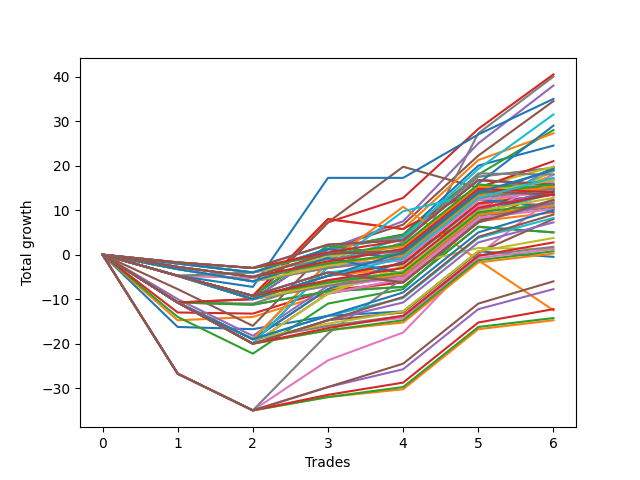

# Short Pointer Eight (0317 1230) 
- Symbol: ES_Unlimited
- Date Range: 03/18/2022 - 07/15/2022
- Trading Period: 7:20-12:30
- Number of Trades: 6



| Name | Win Percent | Profit | Avg Profit / Trade | Avg Time / Trade |      | Name | Win Percent | Profit | Avg Profit / Trade | Avg Time / Trade |
| ---- | ----------- | ------ | ------------------ | ---------------- | ---- | ---- | ----------- | ------ | ------------------ | ---------------- |
| Sorted By <br> Profit | | | | | | Sorted By <br> Win Percentage ||||
| Forty-Five | 66.67 | 20250.00 | 3375.00 | 14:48 |     | Forty-Nine | 83.33 | 9750.00 | 1625.00 | 04:21 |
| Seven | 66.67 | 20000.00 | 3333.33 | 100:20 |     | Forty-One | 83.33 | 9750.00 | 1625.00 | 04:21 |
| Forty-Six | 66.67 | 19000.00 | 3166.67 | 16:40 |     | Sixty-Five | 83.33 | 6750.00 | 1125.00 | 06:35 |
| Seventy-Three | 50.00 | 17500.00 | 2916.67 | 13:15 |     | Fifty-Seven | 83.33 | 6750.00 | 1125.00 | 06:35 |
| Five | 66.67 | 17250.00 | 2875.00 | 27:50 |     | One | 83.33 | 4750.00 | 791.67 | 11:15 |
| Sixty-One | 66.67 | 15750.00 | 2625.00 | 19:15 |     | Forty-Five | 66.67 | 20250.00 | 3375.00 | 14:48 |
| Sixty-Two | 66.67 | 14500.00 | 2416.67 | 21:07 |     | Seven | 66.67 | 20000.00 | 3333.33 | 100:20 |
| Forty-Four | 66.67 | 14000.00 | 2333.33 | 12:25 |     | Forty-Six | 66.67 | 19000.00 | 3166.67 | 16:40 |
| Fifty-Three | 50.00 | 13625.00 | 2270.83 | 09:52 |     | Five | 66.67 | 17250.00 | 2875.00 | 27:50 |
| Forty-Two | 66.67 | 12250.00 | 2041.67 | 09:13 |     | Sixty-One | 66.67 | 15750.00 | 2625.00 | 19:15 |
| Fifty-Five | 50.00 | 10500.00 | 1750.00 | 09:55 |     | Sixty-Two | 66.67 | 14500.00 | 2416.67 | 21:07 |
| Four | 66.67 | 9875.00 | 1645.83 | 24:00 |     | Forty-Four | 66.67 | 14000.00 | 2333.33 | 12:25 |
| Fifty | 50.00 | 9875.00 | 1645.83 | 07:02 |     | Forty-Two | 66.67 | 12250.00 | 2041.67 | 09:13 |
| Forty-Nine | 83.33 | 9750.00 | 1625.00 | 04:21 |     | Four | 66.67 | 9875.00 | 1645.83 | 24:00 |
| Forty-One | 83.33 | 9750.00 | 1625.00 | 04:21 |     | One Hundred Fifteen | 66.67 | 9500.00 | 1583.33 | 09:37 |
| Fifty-Two | 50.00 | 9625.00 | 1604.17 | 09:36 |     | Sixty | 66.67 | 9500.00 | 1583.33 | 16:53 |
| One Hundred Fifteen | 66.67 | 9500.00 | 1583.33 | 09:37 |     | Fifty-One | 66.67 | 9375.00 | 1562.50 | 05:52 |
| Sixty | 66.67 | 9500.00 | 1583.33 | 16:53 |     | Sixty-Eight | 66.67 | 9000.00 | 1500.00 | 15:03 |
| Fifty-One | 66.67 | 9375.00 | 1562.50 | 05:52 |     | Forty-Three | 66.67 | 9000.00 | 1500.00 | 05:59 |
| Sixty-Eight | 66.67 | 9000.00 | 1500.00 | 15:03 |     | One Hundred Fourteen | 66.67 | 8625.00 | 1437.50 | 09:08 |
| Forty-Three | 66.67 | 9000.00 | 1500.00 | 05:59 |     | Fifty-Nine | 66.67 | 8500.00 | 1416.67 | 09:48 |
| Sixty-Nine | 50.00 | 9000.00 | 1500.00 | 16:41 |     | One Hundred Three | 66.67 | 8375.00 | 1395.83 | 03:49 |
| One Hundred Fourteen | 66.67 | 8625.00 | 1437.50 | 09:08 |     | Ninety-Two | 66.67 | 8375.00 | 1395.83 | 02:17 |
| Fifty-Nine | 66.67 | 8500.00 | 1416.67 | 09:48 |     | Ninety-One | 66.67 | 8125.00 | 1354.17 | 02:16 |
| One Hundred Three | 66.67 | 8375.00 | 1395.83 | 03:49 |     | One Hundred Seven | 66.67 | 7875.00 | 1312.50 | 02:21 |
| Ninety-Two | 66.67 | 8375.00 | 1395.83 | 02:17 |     | Fifty-Eight | 66.67 | 7750.00 | 1291.67 | 13:40 |
| Ninety-One | 66.67 | 8125.00 | 1354.17 | 02:16 |     | One Hundred Six | 66.67 | 7625.00 | 1270.83 | 02:20 |
| One Hundred Seven | 66.67 | 7875.00 | 1312.50 | 02:21 |     | One Hundred Two | 66.67 | 7375.00 | 1229.17 | 02:39 |
| One Hundred | 50.00 | 7875.00 | 1312.50 | 02:30 |     | Three | 66.67 | 7375.00 | 1229.17 | 16:01 |
| Ninety-Nine | 50.00 | 7875.00 | 1312.50 | 02:30 |     | Sixty-Six | 66.67 | 7250.00 | 1208.33 | 11:50 |
| Ninety-Eight | 50.00 | 7875.00 | 1312.50 | 02:10 |     | One Hundred One | 66.67 | 7125.00 | 1187.50 | 02:38 |
| Fifty-Eight | 66.67 | 7750.00 | 1291.67 | 13:40 |     | One Hundred Eighteen | 66.67 | 6750.00 | 1125.00 | 05:45 |
| One Hundred Six | 66.67 | 7625.00 | 1270.83 | 02:20 |     | Six | 66.67 | 6500.00 | 1083.33 | 64:39 |
| Fifty-Four | 50.00 | 7500.00 | 1250.00 | 09:40 |     | One Hundred Thirteen | 66.67 | 6375.00 | 1062.50 | 05:51 |
| One Hundred Two | 66.67 | 7375.00 | 1229.17 | 02:39 |     | Two | 66.67 | 6125.00 | 1020.83 | 19:53 |
| Three | 66.67 | 7375.00 | 1229.17 | 16:01 |     | One Hundred Seventeen | 66.67 | 5750.00 | 958.33 | 04:35 |
| Ninety-Seven | 50.00 | 7375.00 | 1229.17 | 01:33 |     | One Hundred Sixteen | 66.67 | 5500.00 | 916.67 | 04:34 |
| Sixty-Six | 66.67 | 7250.00 | 1208.33 | 11:50 |     | One Hundred Twelve | 66.67 | 5375.00 | 895.83 | 04:41 |
| One Hundred One | 66.67 | 7125.00 | 1187.50 | 02:38 |     | One Hundred Eleven | 66.67 | 5125.00 | 854.17 | 04:40 |
| One Hundred Five | 50.00 | 7125.00 | 1187.50 | 05:00 |     | One Hundred Twenty-Five | 66.67 | 5000.00 | 833.33 | 14:05 |
| Ninety-Six | 50.00 | 7125.00 | 1187.50 | 01:32 |     | One Hundred Thirty | 66.67 | 4500.00 | 750.00 | 12:15 |
| One Hundred Eight | 50.00 | 7000.00 | 1166.67 | 03:05 |     | One Hundred Twenty-Four | 66.67 | 4125.00 | 687.50 | 13:35 |
| One Hundred Four | 50.00 | 6875.00 | 1145.83 | 04:58 |     | Sixty-Seven | 66.67 | 4000.00 | 666.67 | 08:36 |
| Ninety-Three | 50.00 | 6875.00 | 1145.83 | 03:06 |     | One Hundred Twenty-Nine | 66.67 | 3625.00 | 604.17 | 11:45 |
| Sixty-Five | 83.33 | 6750.00 | 1125.00 | 06:35 |     | One Hundred Twenty-Three | 66.67 | 1875.00 | 312.50 | 10:19 |
| Fifty-Seven | 83.33 | 6750.00 | 1125.00 | 06:35 |     | One Hundred Twenty-Eight | 66.67 | 1375.00 | 229.17 | 08:29 |
| One Hundred Eighteen | 66.67 | 6750.00 | 1125.00 | 05:45 |     | One Hundred Twenty-Two | 66.67 | 875.00 | 145.83 | 09:09 |
| One Hundred Ten | 50.00 | 6750.00 | 1125.00 | 03:30 |     | One Hundred Twenty-One | 66.67 | 625.00 | 104.17 | 09:08 |
| One Hundred Nine | 50.00 | 6750.00 | 1125.00 | 03:30 |     | One Hundred Twenty-Seven | 66.67 | 375.00 | 62.50 | 07:19 |
| Seventy-One | 50.00 | 6750.00 | 1125.00 | 18:56 |     | One Hundred Twenty-Six | 66.67 | 125.00 | 20.83 | 07:18 |
| Six | 66.67 | 6500.00 | 1083.33 | 64:39 |     | Eighty-Five | 66.67 | -3000.00 | -500.00 | 57:36 |
| One Hundred Thirteen | 66.67 | 6375.00 | 1062.50 | 05:51 |     | Eighty-Four | 66.67 | -3875.00 | -645.83 | 57:07 |
| Two | 66.67 | 6125.00 | 1020.83 | 19:53 |     | Eighty-Three | 66.67 | -6125.00 | -1020.83 | 53:50 |
| One Hundred Twenty | 50.00 | 6125.00 | 1020.83 | 06:55 |     | Eighty-Two | 66.67 | -7125.00 | -1187.50 | 52:40 |
| One Hundred Ninteen | 50.00 | 5875.00 | 979.17 | 06:53 |     | Eighty-One | 66.67 | -7375.00 | -1229.17 | 52:40 |
| One Hundred Seventeen | 66.67 | 5750.00 | 958.33 | 04:35 |     | Seventy-Three | 50.00 | 17500.00 | 2916.67 | 13:15 |
| One Hundred Sixteen | 66.67 | 5500.00 | 916.67 | 04:34 |     | Fifty-Three | 50.00 | 13625.00 | 2270.83 | 09:52 |
| Forty-Eight | 50.00 | 5500.00 | 916.67 | 03:05 |     | Fifty-Five | 50.00 | 10500.00 | 1750.00 | 09:55 |
| Forty | 50.00 | 5500.00 | 916.67 | 03:05 |     | Fifty | 50.00 | 9875.00 | 1645.83 | 07:02 |
| One Hundred Twelve | 66.67 | 5375.00 | 895.83 | 04:41 |     | Fifty-Two | 50.00 | 9625.00 | 1604.17 | 09:36 |
| Ninety-Five | 33.33 | 5250.00 | 875.00 | 04:13 |     | Sixty-Nine | 50.00 | 9000.00 | 1500.00 | 16:41 |
| Ninety-Four | 33.33 | 5250.00 | 875.00 | 04:13 |     | One Hundred | 50.00 | 7875.00 | 1312.50 | 02:30 |
| One Hundred Eleven | 66.67 | 5125.00 | 854.17 | 04:40 |     | Ninety-Nine | 50.00 | 7875.00 | 1312.50 | 02:30 |
| One Hundred Twenty-Five | 66.67 | 5000.00 | 833.33 | 14:05 |     | Ninety-Eight | 50.00 | 7875.00 | 1312.50 | 02:10 |
| One | 83.33 | 4750.00 | 791.67 | 11:15 |     | Fifty-Four | 50.00 | 7500.00 | 1250.00 | 09:40 |
| Forty-Seven | 33.33 | 4750.00 | 791.67 | 27:25 |     | Ninety-Seven | 50.00 | 7375.00 | 1229.17 | 01:33 |
| One Hundred Thirty | 66.67 | 4500.00 | 750.00 | 12:15 |     | One Hundred Five | 50.00 | 7125.00 | 1187.50 | 05:00 |
| One Hundred Twenty-Four | 66.67 | 4125.00 | 687.50 | 13:35 |     | Ninety-Six | 50.00 | 7125.00 | 1187.50 | 01:32 |
| Sixty-Seven | 66.67 | 4000.00 | 666.67 | 08:36 |     | One Hundred Eight | 50.00 | 7000.00 | 1166.67 | 03:05 |
| One Hundred Twenty-Nine | 66.67 | 3625.00 | 604.17 | 11:45 |     | One Hundred Four | 50.00 | 6875.00 | 1145.83 | 04:58 |
| Sixty-Four | 50.00 | 2500.00 | 416.67 | 05:19 |     | Ninety-Three | 50.00 | 6875.00 | 1145.83 | 03:06 |
| Fifty-Six | 50.00 | 2500.00 | 416.67 | 05:19 |     | One Hundred Ten | 50.00 | 6750.00 | 1125.00 | 03:30 |
| One Hundred Twenty-Three | 66.67 | 1875.00 | 312.50 | 10:19 |     | One Hundred Nine | 50.00 | 6750.00 | 1125.00 | 03:30 |
| One Hundred Twenty-Eight | 66.67 | 1375.00 | 229.17 | 08:29 |     | Seventy-One | 50.00 | 6750.00 | 1125.00 | 18:56 |
| One Hundred Twenty-Two | 66.67 | 875.00 | 145.83 | 09:09 |     | One Hundred Twenty | 50.00 | 6125.00 | 1020.83 | 06:55 |
| One Hundred Twenty-One | 66.67 | 625.00 | 104.17 | 09:08 |     | One Hundred Ninteen | 50.00 | 5875.00 | 979.17 | 06:53 |
| Seventy | 50.00 | 625.00 | 104.17 | 16:42 |     | Forty-Eight | 50.00 | 5500.00 | 916.67 | 03:05 |
| One Hundred Twenty-Seven | 66.67 | 375.00 | 62.50 | 07:19 |     | Forty | 50.00 | 5500.00 | 916.67 | 03:05 |
| One Hundred Twenty-Six | 66.67 | 125.00 | 20.83 | 07:18 |     | Sixty-Four | 50.00 | 2500.00 | 416.67 | 05:19 |
| Zero | 50.00 | -250.00 | -41.67 | 09:22 |     | Fifty-Six | 50.00 | 2500.00 | 416.67 | 05:19 |
| Eighty-Five | 66.67 | -3000.00 | -500.00 | 57:36 |     | Seventy | 50.00 | 625.00 | 104.17 | 16:42 |
| Eighty-Four | 66.67 | -3875.00 | -645.83 | 57:07 |     | Zero | 50.00 | -250.00 | -41.67 | 09:22 |
| Eighty-Three | 66.67 | -6125.00 | -1020.83 | 53:50 |     | Ninety-Five | 33.33 | 5250.00 | 875.00 | 04:13 |
| Sixty-Three | 33.33 | -6250.00 | -1041.67 | 32:40 |     | Ninety-Four | 33.33 | 5250.00 | 875.00 | 04:13 |
| Eighty-Two | 66.67 | -7125.00 | -1187.50 | 52:40 |     | Forty-Seven | 33.33 | 4750.00 | 791.67 | 27:25 |
| Eighty-One | 66.67 | -7375.00 | -1229.17 | 52:40 |     | Sixty-Three | 33.33 | -6250.00 | -1041.67 | 32:40 |

## NO STOPLOSS

### Test Zero
* Sell when price hits the middle line of the 20p bollinger
* No Stoploss
* Results:
```
Total Trades: 6
Percent Up: 50.00
Percent Down: 50.00
Total Points Moved Down: -0.50
Potential Profit: -250.00
Total Points Ups: 18.00 Count Ups: 3
Total Points Downs: 17.50 Count Downs: 3
```

<details><summary>Trades</summary>

<code>In: 2022-03-24 08:09:00		Out: 2022-03-24 08:50:10		Total Position Time: 41:10		Total Move Down: -16.25		Total to Date: -16.25</code> <br />
<code>In: 2022-03-29 12:15:00		Out: 2022-03-29 12:25:25		Total Position Time: 10:25		Total Move Down: -0.50		Total to Date: -16.75</code> <br />
<code>In: 2022-04-06 11:06:00		Out: 2022-04-06 11:07:10		Total Position Time: 01:10		Total Move Down: 3.00		Total to Date: -13.75</code> <br />
<code>In: 2022-04-20 10:50:00		Out: 2022-04-20 10:51:10		Total Position Time: 01:10		Total Move Down: 1.00		Total to Date: -12.75</code> <br />
<code>In: 2022-05-04 11:07:00		Out: 2022-05-04 11:08:10		Total Position Time: 01:10		Total Move Down: 13.50		Total to Date: 0.75</code> <br />
<code>In: 2022-05-16 09:06:00		Out: 2022-05-16 09:07:10		Total Position Time: 01:10		Total Move Down: -1.25		Total to Date: -0.50</code> <br />


</details>

### Test One
* Sell when the price hits the upper line of the 20p 1std bollinger
* No Stoploss
* Results:
```
Total Trades: 6
Percent Up: 16.67
Percent Down: 83.33
Total Points Moved Down: 9.50
Potential Profit: 4750.00
Total Points Ups: 14.75 Count Ups: 1
Total Points Downs: 24.25 Count Downs: 5
```

<details><summary>Trades</summary>

<code>In: 2022-03-24 08:09:00		Out: 2022-03-24 08:53:50		Total Position Time: 44:50		Total Move Down: -14.75		Total to Date: -14.75</code> <br />
<code>In: 2022-03-29 12:15:00		Out: 2022-03-29 12:27:50		Total Position Time: 12:50		Total Move Down: 0.75		Total to Date: -14.00</code> <br />
<code>In: 2022-04-06 11:06:00		Out: 2022-04-06 11:07:20		Total Position Time: 01:20		Total Move Down: 5.25		Total to Date: -8.75</code> <br />
<code>In: 2022-04-20 10:50:00		Out: 2022-04-20 10:55:05		Total Position Time: 05:05		Total Move Down: 2.75		Total to Date: -6.00</code> <br />
<code>In: 2022-05-04 11:07:00		Out: 2022-05-04 11:08:10		Total Position Time: 01:10		Total Move Down: 13.50		Total to Date: 7.50</code> <br />
<code>In: 2022-05-16 09:06:00		Out: 2022-05-16 09:08:15		Total Position Time: 02:15		Total Move Down: 2.00		Total to Date: 9.50</code> <br />


</details>

### Test Two
* Sell when the price hits the upper line of the 20p 2std bollinger
* No Stoploss
* Results:
```
Total Trades: 6
Percent Up: 33.33
Percent Down: 66.67
Total Points Moved Down: 12.25
Potential Profit: 6125.00
Total Points Ups: 22.25 Count Ups: 2
Total Points Downs: 34.50 Count Downs: 4
```

<details><summary>Trades</summary>

<code>In: 2022-03-24 08:09:00		Out: 2022-03-24 09:03:05		Total Position Time: 54:05		Total Move Down: -14.00		Total to Date: -14.00</code> <br />
<code>In: 2022-03-29 12:15:00		Out: 2022-03-29 12:47:00		Total Position Time: 32:00		Total Move Down: -8.25		Total to Date: -22.25</code> <br />
<code>In: 2022-04-06 11:06:00		Out: 2022-04-06 11:08:10		Total Position Time: 02:10		Total Move Down: 11.25		Total to Date: -11.00</code> <br />
<code>In: 2022-04-20 10:50:00		Out: 2022-04-20 11:14:05		Total Position Time: 24:05		Total Move Down: 3.25		Total to Date: -7.75</code> <br />
<code>In: 2022-05-04 11:07:00		Out: 2022-05-04 11:08:15		Total Position Time: 01:15		Total Move Down: 15.50		Total to Date: 7.75</code> <br />
<code>In: 2022-05-16 09:06:00		Out: 2022-05-16 09:11:45		Total Position Time: 05:45		Total Move Down: 4.50		Total to Date: 12.25</code> <br />


</details>

### Test Three
* Sell when price hits the middle line of the 50p bollinger
* No Stoploss
* Results:
```
Total Trades: 6
Percent Up: 33.33
Percent Down: 66.67
Total Points Moved Down: 14.75
Potential Profit: 7375.00
Total Points Ups: 13.25 Count Ups: 2
Total Points Downs: 28.00 Count Downs: 4
```

<details><summary>Trades</summary>

<code>In: 2022-03-24 08:09:00		Out: 2022-03-24 09:03:10		Total Position Time: 54:10		Total Move Down: -13.00		Total to Date: -13.00</code> <br />
<code>In: 2022-03-29 12:15:00		Out: 2022-03-29 12:43:10		Total Position Time: 28:10		Total Move Down: -0.25		Total to Date: -13.25</code> <br />
<code>In: 2022-04-06 11:06:00		Out: 2022-04-06 11:07:20		Total Position Time: 01:20		Total Move Down: 5.25		Total to Date: -8.00</code> <br />
<code>In: 2022-04-20 10:50:00		Out: 2022-04-20 10:51:25		Total Position Time: 01:25		Total Move Down: 1.75		Total to Date: -6.25</code> <br />
<code>In: 2022-05-04 11:07:00		Out: 2022-05-04 11:08:10		Total Position Time: 01:10		Total Move Down: 13.50		Total to Date: 7.25</code> <br />
<code>In: 2022-05-16 09:06:00		Out: 2022-05-16 09:15:55		Total Position Time: 09:55		Total Move Down: 7.50		Total to Date: 14.75</code> <br />


</details>

### Test Four
* Sell when the price hits the upper line of the 50p 1std bollinger
* No Stoploss
* Results:
```
Total Trades: 6
Percent Up: 33.33
Percent Down: 66.67
Total Points Moved Down: 19.75
Potential Profit: 9875.00
Total Points Ups: 18.25 Count Ups: 2
Total Points Downs: 38.00 Count Downs: 4
```

<details><summary>Trades</summary>

<code>In: 2022-03-24 08:09:00		Out: 2022-03-24 09:08:30		Total Position Time: 59:30		Total Move Down: -10.00		Total to Date: -10.00</code> <br />
<code>In: 2022-03-29 12:15:00		Out: 2022-03-29 12:47:00		Total Position Time: 32:00		Total Move Down: -8.25		Total to Date: -18.25</code> <br />
<code>In: 2022-04-06 11:06:00		Out: 2022-04-06 11:08:10		Total Position Time: 02:10		Total Move Down: 11.25		Total to Date: -7.00</code> <br />
<code>In: 2022-04-20 10:50:00		Out: 2022-04-20 11:14:05		Total Position Time: 24:05		Total Move Down: 3.25		Total to Date: -3.75</code> <br />
<code>In: 2022-05-04 11:07:00		Out: 2022-05-04 11:08:10		Total Position Time: 01:10		Total Move Down: 13.50		Total to Date: 9.75</code> <br />
<code>In: 2022-05-16 09:06:00		Out: 2022-05-16 09:31:05		Total Position Time: 25:05		Total Move Down: 10.00		Total to Date: 19.75</code> <br />


</details>

### Test Five
* Sell when the price hits the upper line of the 50p 2std bollinger
* No Stoploss
* Results:
```
Total Trades: 6
Percent Up: 33.33
Percent Down: 66.67
Total Points Moved Down: 34.50
Potential Profit: 17250.00
Total Points Ups: 16.00 Count Ups: 2
Total Points Downs: 50.50 Count Downs: 4
```

<details><summary>Trades</summary>

<code>In: 2022-03-24 08:09:00		Out: 2022-03-24 09:17:20		Total Position Time: 68:20		Total Move Down: -7.75		Total to Date: -7.75</code> <br />
<code>In: 2022-03-29 12:15:00		Out: 2022-03-29 12:47:00		Total Position Time: 32:00		Total Move Down: -8.25		Total to Date: -16.00</code> <br />
<code>In: 2022-04-06 11:06:00		Out: 2022-04-06 11:09:40		Total Position Time: 03:40		Total Move Down: 17.25		Total to Date: 1.25</code> <br />
<code>In: 2022-04-20 10:50:00		Out: 2022-04-20 11:18:05		Total Position Time: 28:05		Total Move Down: 5.50		Total to Date: 6.75</code> <br />
<code>In: 2022-05-04 11:07:00		Out: 2022-05-04 11:08:15		Total Position Time: 01:15		Total Move Down: 15.50		Total to Date: 22.25</code> <br />
<code>In: 2022-05-16 09:06:00		Out: 2022-05-16 09:39:45		Total Position Time: 33:45		Total Move Down: 12.25		Total to Date: 34.50</code> <br />


</details>

### Test Six
* Sell when the price hits the middle line of the 1std VWAP
* No Stoploss
* Results:
```
Total Trades: 6
Percent Up: 33.33
Percent Down: 66.67
Total Points Moved Down: 13.00
Potential Profit: 6500.00
Total Points Ups: 35.00 Count Ups: 2
Total Points Downs: 48.00 Count Downs: 4
```

<details><summary>Trades</summary>

<code>In: 2022-03-24 08:09:00		Out: 2022-03-24 12:47:00		Total Position Time: 278:00		Total Move Down: -26.75		Total to Date: -26.75</code> <br />
<code>In: 2022-03-29 12:15:00		Out: 2022-03-29 12:47:00		Total Position Time: 32:00		Total Move Down: -8.25		Total to Date: -35.00</code> <br />
<code>In: 2022-04-06 11:06:00		Out: 2022-04-06 11:08:10		Total Position Time: 02:10		Total Move Down: 11.25		Total to Date: -23.75</code> <br />
<code>In: 2022-04-20 10:50:00		Out: 2022-04-20 11:18:20		Total Position Time: 28:20		Total Move Down: 6.25		Total to Date: -17.50</code> <br />
<code>In: 2022-05-04 11:07:00		Out: 2022-05-04 11:20:20		Total Position Time: 13:20		Total Move Down: 17.50		Total to Date: 0.00</code> <br />
<code>In: 2022-05-16 09:06:00		Out: 2022-05-16 09:40:05		Total Position Time: 34:05		Total Move Down: 13.00		Total to Date: 13.00</code> <br />


</details>

### Test Seven
* Sell when the price hits the upper line of the 1std VWAP
* No Stoploss
* Results:
```
Total Trades: 6
Percent Up: 33.33
Percent Down: 66.67
Total Points Moved Down: 40.00
Potential Profit: 20000.00
Total Points Ups: 35.00 Count Ups: 2
Total Points Downs: 75.00 Count Downs: 4
```

<details><summary>Trades</summary>

<code>In: 2022-03-24 08:09:00		Out: 2022-03-24 12:47:00		Total Position Time: 278:00		Total Move Down: -26.75		Total to Date: -26.75</code> <br />
<code>In: 2022-03-29 12:15:00		Out: 2022-03-29 12:47:00		Total Position Time: 32:00		Total Move Down: -8.25		Total to Date: -35.00</code> <br />
<code>In: 2022-04-06 11:06:00		Out: 2022-04-06 11:09:40		Total Position Time: 03:40		Total Move Down: 17.25		Total to Date: -17.75</code> <br />
<code>In: 2022-04-20 10:50:00		Out: 2022-04-20 11:30:15		Total Position Time: 40:15		Total Move Down: 12.50		Total to Date: -5.25</code> <br />
<code>In: 2022-05-04 11:07:00		Out: 2022-05-04 11:34:05		Total Position Time: 27:05		Total Move Down: 32.50		Total to Date: 27.25</code> <br />
<code>In: 2022-05-16 09:06:00		Out: 2022-05-16 12:47:00		Total Position Time: 221:00		Total Move Down: 12.75		Total to Date: 40.00</code> <br />


</details>

## STOPLOSS OF 5

### Test Forty
* Sell when price hits the middle line of the 20p bollinger
* Stoploss is -5 points
* Results:
```
Total Trades: 6
Percent Up: 50.00
Percent Down: 50.00
Total Points Moved Down: 11.00
Potential Profit: 5500.00
Total Points Ups: 6.50 Count Ups: 3
Total Points Downs: 17.50 Count Downs: 3
```

<details><summary>Trades</summary>

<code>In: 2022-03-24 08:09:00		Out: 2022-03-24 08:12:30		Total Position Time: 03:30		Total Move Down: -4.75		Total to Date: -4.75</code> <br />
<code>In: 2022-03-29 12:15:00		Out: 2022-03-29 12:25:25		Total Position Time: 10:25		Total Move Down: -0.50		Total to Date: -5.25</code> <br />
<code>In: 2022-04-06 11:06:00		Out: 2022-04-06 11:07:10		Total Position Time: 01:10		Total Move Down: 3.00		Total to Date: -2.25</code> <br />
<code>In: 2022-04-20 10:50:00		Out: 2022-04-20 10:51:10		Total Position Time: 01:10		Total Move Down: 1.00		Total to Date: -1.25</code> <br />
<code>In: 2022-05-04 11:07:00		Out: 2022-05-04 11:08:10		Total Position Time: 01:10		Total Move Down: 13.50		Total to Date: 12.25</code> <br />
<code>In: 2022-05-16 09:06:00		Out: 2022-05-16 09:07:10		Total Position Time: 01:10		Total Move Down: -1.25		Total to Date: 11.00</code> <br />


</details>

### Test Forty-One
* Sell when the price hits the upper line of the 20p 1std bollinger
* Stoploss is -5 points
* Results:
```
Total Trades: 6
Percent Up: 16.67
Percent Down: 83.33
Total Points Moved Down: 19.50
Potential Profit: 9750.00
Total Points Ups: 4.75 Count Ups: 1
Total Points Downs: 24.25 Count Downs: 5
```

<details><summary>Trades</summary>

<code>In: 2022-03-24 08:09:00		Out: 2022-03-24 08:12:30		Total Position Time: 03:30		Total Move Down: -4.75		Total to Date: -4.75</code> <br />
<code>In: 2022-03-29 12:15:00		Out: 2022-03-29 12:27:50		Total Position Time: 12:50		Total Move Down: 0.75		Total to Date: -4.00</code> <br />
<code>In: 2022-04-06 11:06:00		Out: 2022-04-06 11:07:20		Total Position Time: 01:20		Total Move Down: 5.25		Total to Date: 1.25</code> <br />
<code>In: 2022-04-20 10:50:00		Out: 2022-04-20 10:55:05		Total Position Time: 05:05		Total Move Down: 2.75		Total to Date: 4.00</code> <br />
<code>In: 2022-05-04 11:07:00		Out: 2022-05-04 11:08:10		Total Position Time: 01:10		Total Move Down: 13.50		Total to Date: 17.50</code> <br />
<code>In: 2022-05-16 09:06:00		Out: 2022-05-16 09:08:15		Total Position Time: 02:15		Total Move Down: 2.00		Total to Date: 19.50</code> <br />


</details>

### Test Forty-Two
* Sell when the price hits the upper line of the 20p 2std bollinger
* Stoploss is -5 points
* Results:
```
Total Trades: 6
Percent Up: 33.33
Percent Down: 66.67
Total Points Moved Down: 24.50
Potential Profit: 12250.00
Total Points Ups: 10.00 Count Ups: 2
Total Points Downs: 34.50 Count Downs: 4
```

<details><summary>Trades</summary>

<code>In: 2022-03-24 08:09:00		Out: 2022-03-24 08:12:30		Total Position Time: 03:30		Total Move Down: -4.75		Total to Date: -4.75</code> <br />
<code>In: 2022-03-29 12:15:00		Out: 2022-03-29 12:33:35		Total Position Time: 18:35		Total Move Down: -5.25		Total to Date: -10.00</code> <br />
<code>In: 2022-04-06 11:06:00		Out: 2022-04-06 11:08:10		Total Position Time: 02:10		Total Move Down: 11.25		Total to Date: 1.25</code> <br />
<code>In: 2022-04-20 10:50:00		Out: 2022-04-20 11:14:05		Total Position Time: 24:05		Total Move Down: 3.25		Total to Date: 4.50</code> <br />
<code>In: 2022-05-04 11:07:00		Out: 2022-05-04 11:08:15		Total Position Time: 01:15		Total Move Down: 15.50		Total to Date: 20.00</code> <br />
<code>In: 2022-05-16 09:06:00		Out: 2022-05-16 09:11:45		Total Position Time: 05:45		Total Move Down: 4.50		Total to Date: 24.50</code> <br />


</details>

### Test Forty-Three
* Sell when price hits the middle line of the 50p bollinger
* Stoploss is -5 points
* Results:
```
Total Trades: 6
Percent Up: 33.33
Percent Down: 66.67
Total Points Moved Down: 18.00
Potential Profit: 9000.00
Total Points Ups: 10.00 Count Ups: 2
Total Points Downs: 28.00 Count Downs: 4
```

<details><summary>Trades</summary>

<code>In: 2022-03-24 08:09:00		Out: 2022-03-24 08:12:30		Total Position Time: 03:30		Total Move Down: -4.75		Total to Date: -4.75</code> <br />
<code>In: 2022-03-29 12:15:00		Out: 2022-03-29 12:33:35		Total Position Time: 18:35		Total Move Down: -5.25		Total to Date: -10.00</code> <br />
<code>In: 2022-04-06 11:06:00		Out: 2022-04-06 11:07:20		Total Position Time: 01:20		Total Move Down: 5.25		Total to Date: -4.75</code> <br />
<code>In: 2022-04-20 10:50:00		Out: 2022-04-20 10:51:25		Total Position Time: 01:25		Total Move Down: 1.75		Total to Date: -3.00</code> <br />
<code>In: 2022-05-04 11:07:00		Out: 2022-05-04 11:08:10		Total Position Time: 01:10		Total Move Down: 13.50		Total to Date: 10.50</code> <br />
<code>In: 2022-05-16 09:06:00		Out: 2022-05-16 09:15:55		Total Position Time: 09:55		Total Move Down: 7.50		Total to Date: 18.00</code> <br />


</details>

### Test Forty-Four
* Sell when the price hits the upper line of the 50p 1std bollinger
* Stoploss is -5 points
* Results:
```
Total Trades: 6
Percent Up: 33.33
Percent Down: 66.67
Total Points Moved Down: 28.00
Potential Profit: 14000.00
Total Points Ups: 10.00 Count Ups: 2
Total Points Downs: 38.00 Count Downs: 4
```

<details><summary>Trades</summary>

<code>In: 2022-03-24 08:09:00		Out: 2022-03-24 08:12:30		Total Position Time: 03:30		Total Move Down: -4.75		Total to Date: -4.75</code> <br />
<code>In: 2022-03-29 12:15:00		Out: 2022-03-29 12:33:35		Total Position Time: 18:35		Total Move Down: -5.25		Total to Date: -10.00</code> <br />
<code>In: 2022-04-06 11:06:00		Out: 2022-04-06 11:08:10		Total Position Time: 02:10		Total Move Down: 11.25		Total to Date: 1.25</code> <br />
<code>In: 2022-04-20 10:50:00		Out: 2022-04-20 11:14:05		Total Position Time: 24:05		Total Move Down: 3.25		Total to Date: 4.50</code> <br />
<code>In: 2022-05-04 11:07:00		Out: 2022-05-04 11:08:10		Total Position Time: 01:10		Total Move Down: 13.50		Total to Date: 18.00</code> <br />
<code>In: 2022-05-16 09:06:00		Out: 2022-05-16 09:31:05		Total Position Time: 25:05		Total Move Down: 10.00		Total to Date: 28.00</code> <br />


</details>

### Test Forty-Five
* Sell when the price hits the upper line of the 50p 2std bollinger
* Stoploss is -5 points
* Results:
```
Total Trades: 6
Percent Up: 33.33
Percent Down: 66.67
Total Points Moved Down: 40.50
Potential Profit: 20250.00
Total Points Ups: 10.00 Count Ups: 2
Total Points Downs: 50.50 Count Downs: 4
```

<details><summary>Trades</summary>

<code>In: 2022-03-24 08:09:00		Out: 2022-03-24 08:12:30		Total Position Time: 03:30		Total Move Down: -4.75		Total to Date: -4.75</code> <br />
<code>In: 2022-03-29 12:15:00		Out: 2022-03-29 12:33:35		Total Position Time: 18:35		Total Move Down: -5.25		Total to Date: -10.00</code> <br />
<code>In: 2022-04-06 11:06:00		Out: 2022-04-06 11:09:40		Total Position Time: 03:40		Total Move Down: 17.25		Total to Date: 7.25</code> <br />
<code>In: 2022-04-20 10:50:00		Out: 2022-04-20 11:18:05		Total Position Time: 28:05		Total Move Down: 5.50		Total to Date: 12.75</code> <br />
<code>In: 2022-05-04 11:07:00		Out: 2022-05-04 11:08:15		Total Position Time: 01:15		Total Move Down: 15.50		Total to Date: 28.25</code> <br />
<code>In: 2022-05-16 09:06:00		Out: 2022-05-16 09:39:45		Total Position Time: 33:45		Total Move Down: 12.25		Total to Date: 40.50</code> <br />


</details>

### Test Forty-Six
* Sell when the price hits the middle line of the 1std VWAP
* Stoploss is -5 points
* Results:
```
Total Trades: 6
Percent Up: 33.33
Percent Down: 66.67
Total Points Moved Down: 38.00
Potential Profit: 19000.00
Total Points Ups: 10.00 Count Ups: 2
Total Points Downs: 48.00 Count Downs: 4
```

<details><summary>Trades</summary>

<code>In: 2022-03-24 08:09:00		Out: 2022-03-24 08:12:30		Total Position Time: 03:30		Total Move Down: -4.75		Total to Date: -4.75</code> <br />
<code>In: 2022-03-29 12:15:00		Out: 2022-03-29 12:33:35		Total Position Time: 18:35		Total Move Down: -5.25		Total to Date: -10.00</code> <br />
<code>In: 2022-04-06 11:06:00		Out: 2022-04-06 11:08:10		Total Position Time: 02:10		Total Move Down: 11.25		Total to Date: 1.25</code> <br />
<code>In: 2022-04-20 10:50:00		Out: 2022-04-20 11:18:20		Total Position Time: 28:20		Total Move Down: 6.25		Total to Date: 7.50</code> <br />
<code>In: 2022-05-04 11:07:00		Out: 2022-05-04 11:20:20		Total Position Time: 13:20		Total Move Down: 17.50		Total to Date: 25.00</code> <br />
<code>In: 2022-05-16 09:06:00		Out: 2022-05-16 09:40:05		Total Position Time: 34:05		Total Move Down: 13.00		Total to Date: 38.00</code> <br />


</details>

### Test Forty-Seven
* Sell when the price hits the upper line of the 1std VWAP
* Stoploss is -5 points
* Results:
```
Total Trades: 6
Percent Up: 66.67
Percent Down: 33.33
Total Points Moved Down: 9.50
Potential Profit: 4750.00
Total Points Ups: 20.25 Count Ups: 4
Total Points Downs: 29.75 Count Downs: 2
```

<details><summary>Trades</summary>

<code>In: 2022-03-24 08:09:00		Out: 2022-03-24 08:12:30		Total Position Time: 03:30		Total Move Down: -4.75		Total to Date: -4.75</code> <br />
<code>In: 2022-03-29 12:15:00		Out: 2022-03-29 12:33:35		Total Position Time: 18:35		Total Move Down: -5.25		Total to Date: -10.00</code> <br />
<code>In: 2022-04-06 11:06:00		Out: 2022-04-06 11:09:40		Total Position Time: 03:40		Total Move Down: 17.25		Total to Date: 7.25</code> <br />
<code>In: 2022-04-20 10:50:00		Out: 2022-04-20 11:30:15		Total Position Time: 40:15		Total Move Down: 12.50		Total to Date: 19.75</code> <br />
<code>In: 2022-05-04 11:07:00		Out: 2022-05-04 11:27:40		Total Position Time: 20:40		Total Move Down: -4.75		Total to Date: 15.00</code> <br />
<code>In: 2022-05-16 09:06:00		Out: 2022-05-16 10:23:50		Total Position Time: 77:50		Total Move Down: -5.50		Total to Date: 9.50</code> <br />


</details>

## TRAIL STOP OF 5

### Test Forty-Eight
* Sell when price hits the middle line of the 20p bollinger
* Trailing Stop is -5 points
* Results:
```
Total Trades: 6
Percent Up: 50.00
Percent Down: 50.00
Total Points Moved Down: 11.00
Potential Profit: 5500.00
Total Points Ups: 6.50 Count Ups: 3
Total Points Downs: 17.50 Count Downs: 3
```

<details><summary>Trades</summary>

<code>In: 2022-03-24 08:09:00		Out: 2022-03-24 08:12:30		Total Position Time: 03:30		Total Move Down: -4.75		Total to Date: -4.75</code> <br />
<code>In: 2022-03-29 12:15:00		Out: 2022-03-29 12:25:25		Total Position Time: 10:25		Total Move Down: -0.50		Total to Date: -5.25</code> <br />
<code>In: 2022-04-06 11:06:00		Out: 2022-04-06 11:07:10		Total Position Time: 01:10		Total Move Down: 3.00		Total to Date: -2.25</code> <br />
<code>In: 2022-04-20 10:50:00		Out: 2022-04-20 10:51:10		Total Position Time: 01:10		Total Move Down: 1.00		Total to Date: -1.25</code> <br />
<code>In: 2022-05-04 11:07:00		Out: 2022-05-04 11:08:10		Total Position Time: 01:10		Total Move Down: 13.50		Total to Date: 12.25</code> <br />
<code>In: 2022-05-16 09:06:00		Out: 2022-05-16 09:07:10		Total Position Time: 01:10		Total Move Down: -1.25		Total to Date: 11.00</code> <br />


</details>

### Test Forty-Nine
* Sell when the price hits the upper line of the 20p 1std bollinger
* Trailing Stop is -5 points
* Results:
```
Total Trades: 6
Percent Up: 16.67
Percent Down: 83.33
Total Points Moved Down: 19.50
Potential Profit: 9750.00
Total Points Ups: 4.75 Count Ups: 1
Total Points Downs: 24.25 Count Downs: 5
```

<details><summary>Trades</summary>

<code>In: 2022-03-24 08:09:00		Out: 2022-03-24 08:12:30		Total Position Time: 03:30		Total Move Down: -4.75		Total to Date: -4.75</code> <br />
<code>In: 2022-03-29 12:15:00		Out: 2022-03-29 12:27:50		Total Position Time: 12:50		Total Move Down: 0.75		Total to Date: -4.00</code> <br />
<code>In: 2022-04-06 11:06:00		Out: 2022-04-06 11:07:20		Total Position Time: 01:20		Total Move Down: 5.25		Total to Date: 1.25</code> <br />
<code>In: 2022-04-20 10:50:00		Out: 2022-04-20 10:55:05		Total Position Time: 05:05		Total Move Down: 2.75		Total to Date: 4.00</code> <br />
<code>In: 2022-05-04 11:07:00		Out: 2022-05-04 11:08:10		Total Position Time: 01:10		Total Move Down: 13.50		Total to Date: 17.50</code> <br />
<code>In: 2022-05-16 09:06:00		Out: 2022-05-16 09:08:15		Total Position Time: 02:15		Total Move Down: 2.00		Total to Date: 19.50</code> <br />


</details>

### Test Fifty
* Sell when the price hits the upper line of the 20p 2std bollinger
* Trailing Stop is -5 points
* Results:
```
Total Trades: 6
Percent Up: 50.00
Percent Down: 50.00
Total Points Moved Down: 19.75
Potential Profit: 9875.00
Total Points Ups: 11.50 Count Ups: 3
Total Points Downs: 31.25 Count Downs: 3
```

<details><summary>Trades</summary>

<code>In: 2022-03-24 08:09:00		Out: 2022-03-24 08:12:30		Total Position Time: 03:30		Total Move Down: -4.75		Total to Date: -4.75</code> <br />
<code>In: 2022-03-29 12:15:00		Out: 2022-03-29 12:32:55		Total Position Time: 17:55		Total Move Down: -4.50		Total to Date: -9.25</code> <br />
<code>In: 2022-04-06 11:06:00		Out: 2022-04-06 11:08:10		Total Position Time: 02:10		Total Move Down: 11.25		Total to Date: 2.00</code> <br />
<code>In: 2022-04-20 10:50:00		Out: 2022-04-20 11:01:40		Total Position Time: 11:40		Total Move Down: -2.25		Total to Date: -0.25</code> <br />
<code>In: 2022-05-04 11:07:00		Out: 2022-05-04 11:08:15		Total Position Time: 01:15		Total Move Down: 15.50		Total to Date: 15.25</code> <br />
<code>In: 2022-05-16 09:06:00		Out: 2022-05-16 09:11:45		Total Position Time: 05:45		Total Move Down: 4.50		Total to Date: 19.75</code> <br />


</details>

### Test Fifty-One
* Sell when price hits the middle line of the 50p bollinger
* Trailing Stop is -5 points
* Results:
```
Total Trades: 6
Percent Up: 33.33
Percent Down: 66.67
Total Points Moved Down: 18.75
Potential Profit: 9375.00
Total Points Ups: 9.25 Count Ups: 2
Total Points Downs: 28.00 Count Downs: 4
```

<details><summary>Trades</summary>

<code>In: 2022-03-24 08:09:00		Out: 2022-03-24 08:12:30		Total Position Time: 03:30		Total Move Down: -4.75		Total to Date: -4.75</code> <br />
<code>In: 2022-03-29 12:15:00		Out: 2022-03-29 12:32:55		Total Position Time: 17:55		Total Move Down: -4.50		Total to Date: -9.25</code> <br />
<code>In: 2022-04-06 11:06:00		Out: 2022-04-06 11:07:20		Total Position Time: 01:20		Total Move Down: 5.25		Total to Date: -4.00</code> <br />
<code>In: 2022-04-20 10:50:00		Out: 2022-04-20 10:51:25		Total Position Time: 01:25		Total Move Down: 1.75		Total to Date: -2.25</code> <br />
<code>In: 2022-05-04 11:07:00		Out: 2022-05-04 11:08:10		Total Position Time: 01:10		Total Move Down: 13.50		Total to Date: 11.25</code> <br />
<code>In: 2022-05-16 09:06:00		Out: 2022-05-16 09:15:55		Total Position Time: 09:55		Total Move Down: 7.50		Total to Date: 18.75</code> <br />


</details>

### Test Fifty-Two
* Sell when the price hits the upper line of the 50p 1std bollinger
* Trailing Stop is -5 points
* Results:
```
Total Trades: 6
Percent Up: 50.00
Percent Down: 50.00
Total Points Moved Down: 19.25
Potential Profit: 9625.00
Total Points Ups: 11.50 Count Ups: 3
Total Points Downs: 30.75 Count Downs: 3
```

<details><summary>Trades</summary>

<code>In: 2022-03-24 08:09:00		Out: 2022-03-24 08:12:30		Total Position Time: 03:30		Total Move Down: -4.75		Total to Date: -4.75</code> <br />
<code>In: 2022-03-29 12:15:00		Out: 2022-03-29 12:32:55		Total Position Time: 17:55		Total Move Down: -4.50		Total to Date: -9.25</code> <br />
<code>In: 2022-04-06 11:06:00		Out: 2022-04-06 11:08:10		Total Position Time: 02:10		Total Move Down: 11.25		Total to Date: 2.00</code> <br />
<code>In: 2022-04-20 10:50:00		Out: 2022-04-20 11:01:40		Total Position Time: 11:40		Total Move Down: -2.25		Total to Date: -0.25</code> <br />
<code>In: 2022-05-04 11:07:00		Out: 2022-05-04 11:08:10		Total Position Time: 01:10		Total Move Down: 13.50		Total to Date: 13.25</code> <br />
<code>In: 2022-05-16 09:06:00		Out: 2022-05-16 09:27:15		Total Position Time: 21:15		Total Move Down: 6.00		Total to Date: 19.25</code> <br />


</details>

### Test Fifty-Three
* Sell when the price hits the upper line of the 50p 2std bollinger
* Trailing Stop is -5 points
* Results:
```
Total Trades: 6
Percent Up: 50.00
Percent Down: 50.00
Total Points Moved Down: 27.25
Potential Profit: 13625.00
Total Points Ups: 11.50 Count Ups: 3
Total Points Downs: 38.75 Count Downs: 3
```

<details><summary>Trades</summary>

<code>In: 2022-03-24 08:09:00		Out: 2022-03-24 08:12:30		Total Position Time: 03:30		Total Move Down: -4.75		Total to Date: -4.75</code> <br />
<code>In: 2022-03-29 12:15:00		Out: 2022-03-29 12:32:55		Total Position Time: 17:55		Total Move Down: -4.50		Total to Date: -9.25</code> <br />
<code>In: 2022-04-06 11:06:00		Out: 2022-04-06 11:09:40		Total Position Time: 03:40		Total Move Down: 17.25		Total to Date: 8.00</code> <br />
<code>In: 2022-04-20 10:50:00		Out: 2022-04-20 11:01:40		Total Position Time: 11:40		Total Move Down: -2.25		Total to Date: 5.75</code> <br />
<code>In: 2022-05-04 11:07:00		Out: 2022-05-04 11:08:15		Total Position Time: 01:15		Total Move Down: 15.50		Total to Date: 21.25</code> <br />
<code>In: 2022-05-16 09:06:00		Out: 2022-05-16 09:27:15		Total Position Time: 21:15		Total Move Down: 6.00		Total to Date: 27.25</code> <br />


</details>

### Test Fifty-Four
* Sell when the price hits the middle line of the 1std VWAP
* Trailing Stop is -5 points
* Results:
```
Total Trades: 6
Percent Up: 50.00
Percent Down: 50.00
Total Points Moved Down: 15.00
Potential Profit: 7500.00
Total Points Ups: 11.50 Count Ups: 3
Total Points Downs: 26.50 Count Downs: 3
```

<details><summary>Trades</summary>

<code>In: 2022-03-24 08:09:00		Out: 2022-03-24 08:12:30		Total Position Time: 03:30		Total Move Down: -4.75		Total to Date: -4.75</code> <br />
<code>In: 2022-03-29 12:15:00		Out: 2022-03-29 12:32:55		Total Position Time: 17:55		Total Move Down: -4.50		Total to Date: -9.25</code> <br />
<code>In: 2022-04-06 11:06:00		Out: 2022-04-06 11:08:10		Total Position Time: 02:10		Total Move Down: 11.25		Total to Date: 2.00</code> <br />
<code>In: 2022-04-20 10:50:00		Out: 2022-04-20 11:01:40		Total Position Time: 11:40		Total Move Down: -2.25		Total to Date: -0.25</code> <br />
<code>In: 2022-05-04 11:07:00		Out: 2022-05-04 11:08:30		Total Position Time: 01:30		Total Move Down: 9.25		Total to Date: 9.00</code> <br />
<code>In: 2022-05-16 09:06:00		Out: 2022-05-16 09:27:15		Total Position Time: 21:15		Total Move Down: 6.00		Total to Date: 15.00</code> <br />


</details>

### Test Fifty-Five
* Sell when the price hits the upper line of the 1std VWAP
* Trailing Stop is -5 points
* Results:
```
Total Trades: 6
Percent Up: 50.00
Percent Down: 50.00
Total Points Moved Down: 21.00
Potential Profit: 10500.00
Total Points Ups: 11.50 Count Ups: 3
Total Points Downs: 32.50 Count Downs: 3
```

<details><summary>Trades</summary>

<code>In: 2022-03-24 08:09:00		Out: 2022-03-24 08:12:30		Total Position Time: 03:30		Total Move Down: -4.75		Total to Date: -4.75</code> <br />
<code>In: 2022-03-29 12:15:00		Out: 2022-03-29 12:32:55		Total Position Time: 17:55		Total Move Down: -4.50		Total to Date: -9.25</code> <br />
<code>In: 2022-04-06 11:06:00		Out: 2022-04-06 11:09:40		Total Position Time: 03:40		Total Move Down: 17.25		Total to Date: 8.00</code> <br />
<code>In: 2022-04-20 10:50:00		Out: 2022-04-20 11:01:40		Total Position Time: 11:40		Total Move Down: -2.25		Total to Date: 5.75</code> <br />
<code>In: 2022-05-04 11:07:00		Out: 2022-05-04 11:08:30		Total Position Time: 01:30		Total Move Down: 9.25		Total to Date: 15.00</code> <br />
<code>In: 2022-05-16 09:06:00		Out: 2022-05-16 09:27:15		Total Position Time: 21:15		Total Move Down: 6.00		Total to Date: 21.00</code> <br />


</details>

## STOPLOSS OF 10

### Test Fifty-Six
* Sell when price hits the middle line of the 20p bollinger
* Stoploss is -10 points
* Results:
```
Total Trades: 6
Percent Up: 50.00
Percent Down: 50.00
Total Points Moved Down: 5.00
Potential Profit: 2500.00
Total Points Ups: 12.50 Count Ups: 3
Total Points Downs: 17.50 Count Downs: 3
```

<details><summary>Trades</summary>

<code>In: 2022-03-24 08:09:00		Out: 2022-03-24 08:25:50		Total Position Time: 16:50		Total Move Down: -10.75		Total to Date: -10.75</code> <br />
<code>In: 2022-03-29 12:15:00		Out: 2022-03-29 12:25:25		Total Position Time: 10:25		Total Move Down: -0.50		Total to Date: -11.25</code> <br />
<code>In: 2022-04-06 11:06:00		Out: 2022-04-06 11:07:10		Total Position Time: 01:10		Total Move Down: 3.00		Total to Date: -8.25</code> <br />
<code>In: 2022-04-20 10:50:00		Out: 2022-04-20 10:51:10		Total Position Time: 01:10		Total Move Down: 1.00		Total to Date: -7.25</code> <br />
<code>In: 2022-05-04 11:07:00		Out: 2022-05-04 11:08:10		Total Position Time: 01:10		Total Move Down: 13.50		Total to Date: 6.25</code> <br />
<code>In: 2022-05-16 09:06:00		Out: 2022-05-16 09:07:10		Total Position Time: 01:10		Total Move Down: -1.25		Total to Date: 5.00</code> <br />


</details>

### Test Fifty-Seven
* Sell when the price hits the upper line of the 20p 1std bollinger
* Stoploss is -10 points
* Results:
```
Total Trades: 6
Percent Up: 16.67
Percent Down: 83.33
Total Points Moved Down: 13.50
Potential Profit: 6750.00
Total Points Ups: 10.75 Count Ups: 1
Total Points Downs: 24.25 Count Downs: 5
```

<details><summary>Trades</summary>

<code>In: 2022-03-24 08:09:00		Out: 2022-03-24 08:25:50		Total Position Time: 16:50		Total Move Down: -10.75		Total to Date: -10.75</code> <br />
<code>In: 2022-03-29 12:15:00		Out: 2022-03-29 12:27:50		Total Position Time: 12:50		Total Move Down: 0.75		Total to Date: -10.00</code> <br />
<code>In: 2022-04-06 11:06:00		Out: 2022-04-06 11:07:20		Total Position Time: 01:20		Total Move Down: 5.25		Total to Date: -4.75</code> <br />
<code>In: 2022-04-20 10:50:00		Out: 2022-04-20 10:55:05		Total Position Time: 05:05		Total Move Down: 2.75		Total to Date: -2.00</code> <br />
<code>In: 2022-05-04 11:07:00		Out: 2022-05-04 11:08:10		Total Position Time: 01:10		Total Move Down: 13.50		Total to Date: 11.50</code> <br />
<code>In: 2022-05-16 09:06:00		Out: 2022-05-16 09:08:15		Total Position Time: 02:15		Total Move Down: 2.00		Total to Date: 13.50</code> <br />


</details>

### Test Fifty-Eight
* Sell when the price hits the upper line of the 20p 2std bollinger
* Stoploss is -10 points
* Results:
```
Total Trades: 6
Percent Up: 33.33
Percent Down: 66.67
Total Points Moved Down: 15.50
Potential Profit: 7750.00
Total Points Ups: 19.00 Count Ups: 2
Total Points Downs: 34.50 Count Downs: 4
```

<details><summary>Trades</summary>

<code>In: 2022-03-24 08:09:00		Out: 2022-03-24 08:25:50		Total Position Time: 16:50		Total Move Down: -10.75		Total to Date: -10.75</code> <br />
<code>In: 2022-03-29 12:15:00		Out: 2022-03-29 12:47:00		Total Position Time: 32:00		Total Move Down: -8.25		Total to Date: -19.00</code> <br />
<code>In: 2022-04-06 11:06:00		Out: 2022-04-06 11:08:10		Total Position Time: 02:10		Total Move Down: 11.25		Total to Date: -7.75</code> <br />
<code>In: 2022-04-20 10:50:00		Out: 2022-04-20 11:14:05		Total Position Time: 24:05		Total Move Down: 3.25		Total to Date: -4.50</code> <br />
<code>In: 2022-05-04 11:07:00		Out: 2022-05-04 11:08:15		Total Position Time: 01:15		Total Move Down: 15.50		Total to Date: 11.00</code> <br />
<code>In: 2022-05-16 09:06:00		Out: 2022-05-16 09:11:45		Total Position Time: 05:45		Total Move Down: 4.50		Total to Date: 15.50</code> <br />


</details>

### Test Fifty-Nine
* Sell when price hits the middle line of the 50p bollinger
* Stoploss is -10 points
* Results:
```
Total Trades: 6
Percent Up: 33.33
Percent Down: 66.67
Total Points Moved Down: 17.00
Potential Profit: 8500.00
Total Points Ups: 11.00 Count Ups: 2
Total Points Downs: 28.00 Count Downs: 4
```

<details><summary>Trades</summary>

<code>In: 2022-03-24 08:09:00		Out: 2022-03-24 08:25:50		Total Position Time: 16:50		Total Move Down: -10.75		Total to Date: -10.75</code> <br />
<code>In: 2022-03-29 12:15:00		Out: 2022-03-29 12:43:10		Total Position Time: 28:10		Total Move Down: -0.25		Total to Date: -11.00</code> <br />
<code>In: 2022-04-06 11:06:00		Out: 2022-04-06 11:07:20		Total Position Time: 01:20		Total Move Down: 5.25		Total to Date: -5.75</code> <br />
<code>In: 2022-04-20 10:50:00		Out: 2022-04-20 10:51:25		Total Position Time: 01:25		Total Move Down: 1.75		Total to Date: -4.00</code> <br />
<code>In: 2022-05-04 11:07:00		Out: 2022-05-04 11:08:10		Total Position Time: 01:10		Total Move Down: 13.50		Total to Date: 9.50</code> <br />
<code>In: 2022-05-16 09:06:00		Out: 2022-05-16 09:15:55		Total Position Time: 09:55		Total Move Down: 7.50		Total to Date: 17.00</code> <br />


</details>

### Test Sixty
* Sell when the price hits the upper line of the 50p 1std bollinger
* Stoploss is -10 points
* Results:
```
Total Trades: 6
Percent Up: 33.33
Percent Down: 66.67
Total Points Moved Down: 19.00
Potential Profit: 9500.00
Total Points Ups: 19.00 Count Ups: 2
Total Points Downs: 38.00 Count Downs: 4
```

<details><summary>Trades</summary>

<code>In: 2022-03-24 08:09:00		Out: 2022-03-24 08:25:50		Total Position Time: 16:50		Total Move Down: -10.75		Total to Date: -10.75</code> <br />
<code>In: 2022-03-29 12:15:00		Out: 2022-03-29 12:47:00		Total Position Time: 32:00		Total Move Down: -8.25		Total to Date: -19.00</code> <br />
<code>In: 2022-04-06 11:06:00		Out: 2022-04-06 11:08:10		Total Position Time: 02:10		Total Move Down: 11.25		Total to Date: -7.75</code> <br />
<code>In: 2022-04-20 10:50:00		Out: 2022-04-20 11:14:05		Total Position Time: 24:05		Total Move Down: 3.25		Total to Date: -4.50</code> <br />
<code>In: 2022-05-04 11:07:00		Out: 2022-05-04 11:08:10		Total Position Time: 01:10		Total Move Down: 13.50		Total to Date: 9.00</code> <br />
<code>In: 2022-05-16 09:06:00		Out: 2022-05-16 09:31:05		Total Position Time: 25:05		Total Move Down: 10.00		Total to Date: 19.00</code> <br />


</details>

### Test Sixty-One
* Sell when the price hits the upper line of the 50p 2std bollinger
* Stoploss is -10 points
* Results:
```
Total Trades: 6
Percent Up: 33.33
Percent Down: 66.67
Total Points Moved Down: 31.50
Potential Profit: 15750.00
Total Points Ups: 19.00 Count Ups: 2
Total Points Downs: 50.50 Count Downs: 4
```

<details><summary>Trades</summary>

<code>In: 2022-03-24 08:09:00		Out: 2022-03-24 08:25:50		Total Position Time: 16:50		Total Move Down: -10.75		Total to Date: -10.75</code> <br />
<code>In: 2022-03-29 12:15:00		Out: 2022-03-29 12:47:00		Total Position Time: 32:00		Total Move Down: -8.25		Total to Date: -19.00</code> <br />
<code>In: 2022-04-06 11:06:00		Out: 2022-04-06 11:09:40		Total Position Time: 03:40		Total Move Down: 17.25		Total to Date: -1.75</code> <br />
<code>In: 2022-04-20 10:50:00		Out: 2022-04-20 11:18:05		Total Position Time: 28:05		Total Move Down: 5.50		Total to Date: 3.75</code> <br />
<code>In: 2022-05-04 11:07:00		Out: 2022-05-04 11:08:15		Total Position Time: 01:15		Total Move Down: 15.50		Total to Date: 19.25</code> <br />
<code>In: 2022-05-16 09:06:00		Out: 2022-05-16 09:39:45		Total Position Time: 33:45		Total Move Down: 12.25		Total to Date: 31.50</code> <br />


</details>

### Test Sixty-Two
* Sell when the price hits the middle line of the 1std VWAP
* Stoploss is -10 points
* Results:
```
Total Trades: 6
Percent Up: 33.33
Percent Down: 66.67
Total Points Moved Down: 29.00
Potential Profit: 14500.00
Total Points Ups: 19.00 Count Ups: 2
Total Points Downs: 48.00 Count Downs: 4
```

<details><summary>Trades</summary>

<code>In: 2022-03-24 08:09:00		Out: 2022-03-24 08:25:50		Total Position Time: 16:50		Total Move Down: -10.75		Total to Date: -10.75</code> <br />
<code>In: 2022-03-29 12:15:00		Out: 2022-03-29 12:47:00		Total Position Time: 32:00		Total Move Down: -8.25		Total to Date: -19.00</code> <br />
<code>In: 2022-04-06 11:06:00		Out: 2022-04-06 11:08:10		Total Position Time: 02:10		Total Move Down: 11.25		Total to Date: -7.75</code> <br />
<code>In: 2022-04-20 10:50:00		Out: 2022-04-20 11:18:20		Total Position Time: 28:20		Total Move Down: 6.25		Total to Date: -1.50</code> <br />
<code>In: 2022-05-04 11:07:00		Out: 2022-05-04 11:20:20		Total Position Time: 13:20		Total Move Down: 17.50		Total to Date: 16.00</code> <br />
<code>In: 2022-05-16 09:06:00		Out: 2022-05-16 09:40:05		Total Position Time: 34:05		Total Move Down: 13.00		Total to Date: 29.00</code> <br />


</details>

### Test Sixty-Three
* Sell when the price hits the upper line of the 1std VWAP
* Stoploss is -10 points
* Results:
```
Total Trades: 6
Percent Up: 66.67
Percent Down: 33.33
Total Points Moved Down: -12.50
Potential Profit: -6250.00
Total Points Ups: 42.25 Count Ups: 4
Total Points Downs: 29.75 Count Downs: 2
```

<details><summary>Trades</summary>

<code>In: 2022-03-24 08:09:00		Out: 2022-03-24 08:25:50		Total Position Time: 16:50		Total Move Down: -10.75		Total to Date: -10.75</code> <br />
<code>In: 2022-03-29 12:15:00		Out: 2022-03-29 12:47:00		Total Position Time: 32:00		Total Move Down: -8.25		Total to Date: -19.00</code> <br />
<code>In: 2022-04-06 11:06:00		Out: 2022-04-06 11:09:40		Total Position Time: 03:40		Total Move Down: 17.25		Total to Date: -1.75</code> <br />
<code>In: 2022-04-20 10:50:00		Out: 2022-04-20 11:30:15		Total Position Time: 40:15		Total Move Down: 12.50		Total to Date: 10.75</code> <br />
<code>In: 2022-05-04 11:07:00		Out: 2022-05-04 11:28:05		Total Position Time: 21:05		Total Move Down: -12.00		Total to Date: -1.25</code> <br />
<code>In: 2022-05-16 09:06:00		Out: 2022-05-16 10:28:15		Total Position Time: 82:15		Total Move Down: -11.25		Total to Date: -12.50</code> <br />


</details>

## TRAIL STOP OF 10

### Test Sixty-Four
* Sell when price hits the middle line of the 20p bollinger
* Trailing Stop is -10 points
* Results:
```
Total Trades: 6
Percent Up: 50.00
Percent Down: 50.00
Total Points Moved Down: 5.00
Potential Profit: 2500.00
Total Points Ups: 12.50 Count Ups: 3
Total Points Downs: 17.50 Count Downs: 3
```

<details><summary>Trades</summary>

<code>In: 2022-03-24 08:09:00		Out: 2022-03-24 08:25:50		Total Position Time: 16:50		Total Move Down: -10.75		Total to Date: -10.75</code> <br />
<code>In: 2022-03-29 12:15:00		Out: 2022-03-29 12:25:25		Total Position Time: 10:25		Total Move Down: -0.50		Total to Date: -11.25</code> <br />
<code>In: 2022-04-06 11:06:00		Out: 2022-04-06 11:07:10		Total Position Time: 01:10		Total Move Down: 3.00		Total to Date: -8.25</code> <br />
<code>In: 2022-04-20 10:50:00		Out: 2022-04-20 10:51:10		Total Position Time: 01:10		Total Move Down: 1.00		Total to Date: -7.25</code> <br />
<code>In: 2022-05-04 11:07:00		Out: 2022-05-04 11:08:10		Total Position Time: 01:10		Total Move Down: 13.50		Total to Date: 6.25</code> <br />
<code>In: 2022-05-16 09:06:00		Out: 2022-05-16 09:07:10		Total Position Time: 01:10		Total Move Down: -1.25		Total to Date: 5.00</code> <br />


</details>

### Test Sixty-Five
* Sell when the price hits the upper line of the 20p 1std bollinger
* Trailing Stop is -10 points
* Results:
```
Total Trades: 6
Percent Up: 16.67
Percent Down: 83.33
Total Points Moved Down: 13.50
Potential Profit: 6750.00
Total Points Ups: 10.75 Count Ups: 1
Total Points Downs: 24.25 Count Downs: 5
```

<details><summary>Trades</summary>

<code>In: 2022-03-24 08:09:00		Out: 2022-03-24 08:25:50		Total Position Time: 16:50		Total Move Down: -10.75		Total to Date: -10.75</code> <br />
<code>In: 2022-03-29 12:15:00		Out: 2022-03-29 12:27:50		Total Position Time: 12:50		Total Move Down: 0.75		Total to Date: -10.00</code> <br />
<code>In: 2022-04-06 11:06:00		Out: 2022-04-06 11:07:20		Total Position Time: 01:20		Total Move Down: 5.25		Total to Date: -4.75</code> <br />
<code>In: 2022-04-20 10:50:00		Out: 2022-04-20 10:55:05		Total Position Time: 05:05		Total Move Down: 2.75		Total to Date: -2.00</code> <br />
<code>In: 2022-05-04 11:07:00		Out: 2022-05-04 11:08:10		Total Position Time: 01:10		Total Move Down: 13.50		Total to Date: 11.50</code> <br />
<code>In: 2022-05-16 09:06:00		Out: 2022-05-16 09:08:15		Total Position Time: 02:15		Total Move Down: 2.00		Total to Date: 13.50</code> <br />


</details>

### Test Sixty-Six
* Sell when the price hits the upper line of the 20p 2std bollinger
* Trailing Stop is -10 points
* Results:
```
Total Trades: 6
Percent Up: 33.33
Percent Down: 66.67
Total Points Moved Down: 14.50
Potential Profit: 7250.00
Total Points Ups: 20.00 Count Ups: 2
Total Points Downs: 34.50 Count Downs: 4
```

<details><summary>Trades</summary>

<code>In: 2022-03-24 08:09:00		Out: 2022-03-24 08:25:50		Total Position Time: 16:50		Total Move Down: -10.75		Total to Date: -10.75</code> <br />
<code>In: 2022-03-29 12:15:00		Out: 2022-03-29 12:36:00		Total Position Time: 21:00		Total Move Down: -9.25		Total to Date: -20.00</code> <br />
<code>In: 2022-04-06 11:06:00		Out: 2022-04-06 11:08:10		Total Position Time: 02:10		Total Move Down: 11.25		Total to Date: -8.75</code> <br />
<code>In: 2022-04-20 10:50:00		Out: 2022-04-20 11:14:05		Total Position Time: 24:05		Total Move Down: 3.25		Total to Date: -5.50</code> <br />
<code>In: 2022-05-04 11:07:00		Out: 2022-05-04 11:08:15		Total Position Time: 01:15		Total Move Down: 15.50		Total to Date: 10.00</code> <br />
<code>In: 2022-05-16 09:06:00		Out: 2022-05-16 09:11:45		Total Position Time: 05:45		Total Move Down: 4.50		Total to Date: 14.50</code> <br />


</details>

### Test Sixty-Seven
* Sell when price hits the middle line of the 50p bollinger
* Trailing Stop is -10 points
* Results:
```
Total Trades: 6
Percent Up: 33.33
Percent Down: 66.67
Total Points Moved Down: 8.00
Potential Profit: 4000.00
Total Points Ups: 20.00 Count Ups: 2
Total Points Downs: 28.00 Count Downs: 4
```

<details><summary>Trades</summary>

<code>In: 2022-03-24 08:09:00		Out: 2022-03-24 08:25:50		Total Position Time: 16:50		Total Move Down: -10.75		Total to Date: -10.75</code> <br />
<code>In: 2022-03-29 12:15:00		Out: 2022-03-29 12:36:00		Total Position Time: 21:00		Total Move Down: -9.25		Total to Date: -20.00</code> <br />
<code>In: 2022-04-06 11:06:00		Out: 2022-04-06 11:07:20		Total Position Time: 01:20		Total Move Down: 5.25		Total to Date: -14.75</code> <br />
<code>In: 2022-04-20 10:50:00		Out: 2022-04-20 10:51:25		Total Position Time: 01:25		Total Move Down: 1.75		Total to Date: -13.00</code> <br />
<code>In: 2022-05-04 11:07:00		Out: 2022-05-04 11:08:10		Total Position Time: 01:10		Total Move Down: 13.50		Total to Date: 0.50</code> <br />
<code>In: 2022-05-16 09:06:00		Out: 2022-05-16 09:15:55		Total Position Time: 09:55		Total Move Down: 7.50		Total to Date: 8.00</code> <br />


</details>

### Test Sixty-Eight
* Sell when the price hits the upper line of the 50p 1std bollinger
* Trailing Stop is -10 points
* Results:
```
Total Trades: 6
Percent Up: 33.33
Percent Down: 66.67
Total Points Moved Down: 18.00
Potential Profit: 9000.00
Total Points Ups: 20.00 Count Ups: 2
Total Points Downs: 38.00 Count Downs: 4
```

<details><summary>Trades</summary>

<code>In: 2022-03-24 08:09:00		Out: 2022-03-24 08:25:50		Total Position Time: 16:50		Total Move Down: -10.75		Total to Date: -10.75</code> <br />
<code>In: 2022-03-29 12:15:00		Out: 2022-03-29 12:36:00		Total Position Time: 21:00		Total Move Down: -9.25		Total to Date: -20.00</code> <br />
<code>In: 2022-04-06 11:06:00		Out: 2022-04-06 11:08:10		Total Position Time: 02:10		Total Move Down: 11.25		Total to Date: -8.75</code> <br />
<code>In: 2022-04-20 10:50:00		Out: 2022-04-20 11:14:05		Total Position Time: 24:05		Total Move Down: 3.25		Total to Date: -5.50</code> <br />
<code>In: 2022-05-04 11:07:00		Out: 2022-05-04 11:08:10		Total Position Time: 01:10		Total Move Down: 13.50		Total to Date: 8.00</code> <br />
<code>In: 2022-05-16 09:06:00		Out: 2022-05-16 09:31:05		Total Position Time: 25:05		Total Move Down: 10.00		Total to Date: 18.00</code> <br />


</details>

### Test Sixty-Nine
* Sell when the price hits the upper line of the 50p 2std bollinger
* Trailing Stop is -10 points
* Results:
```
Total Trades: 6
Percent Up: 50.00
Percent Down: 50.00
Total Points Moved Down: 18.00
Potential Profit: 9000.00
Total Points Ups: 20.25 Count Ups: 3
Total Points Downs: 38.25 Count Downs: 3
```

<details><summary>Trades</summary>

<code>In: 2022-03-24 08:09:00		Out: 2022-03-24 08:25:50		Total Position Time: 16:50		Total Move Down: -10.75		Total to Date: -10.75</code> <br />
<code>In: 2022-03-29 12:15:00		Out: 2022-03-29 12:36:00		Total Position Time: 21:00		Total Move Down: -9.25		Total to Date: -20.00</code> <br />
<code>In: 2022-04-06 11:06:00		Out: 2022-04-06 11:09:40		Total Position Time: 03:40		Total Move Down: 17.25		Total to Date: -2.75</code> <br />
<code>In: 2022-04-20 10:50:00		Out: 2022-04-20 11:18:05		Total Position Time: 28:05		Total Move Down: 5.50		Total to Date: 2.75</code> <br />
<code>In: 2022-05-04 11:07:00		Out: 2022-05-04 11:08:15		Total Position Time: 01:15		Total Move Down: 15.50		Total to Date: 18.25</code> <br />
<code>In: 2022-05-16 09:06:00		Out: 2022-05-16 09:35:20		Total Position Time: 29:20		Total Move Down: -0.25		Total to Date: 18.00</code> <br />


</details>

### Test Seventy
* Sell when the price hits the middle line of the 1std VWAP
* Trailing Stop is -10 points
* Results:
```
Total Trades: 6
Percent Up: 50.00
Percent Down: 50.00
Total Points Moved Down: 1.25
Potential Profit: 625.00
Total Points Ups: 20.25 Count Ups: 3
Total Points Downs: 21.50 Count Downs: 3
```

<details><summary>Trades</summary>

<code>In: 2022-03-24 08:09:00		Out: 2022-03-24 08:25:50		Total Position Time: 16:50		Total Move Down: -10.75		Total to Date: -10.75</code> <br />
<code>In: 2022-03-29 12:15:00		Out: 2022-03-29 12:36:00		Total Position Time: 21:00		Total Move Down: -9.25		Total to Date: -20.00</code> <br />
<code>In: 2022-04-06 11:06:00		Out: 2022-04-06 11:08:10		Total Position Time: 02:10		Total Move Down: 11.25		Total to Date: -8.75</code> <br />
<code>In: 2022-04-20 10:50:00		Out: 2022-04-20 11:18:20		Total Position Time: 28:20		Total Move Down: 6.25		Total to Date: -2.50</code> <br />
<code>In: 2022-05-04 11:07:00		Out: 2022-05-04 11:09:35		Total Position Time: 02:35		Total Move Down: 4.00		Total to Date: 1.50</code> <br />
<code>In: 2022-05-16 09:06:00		Out: 2022-05-16 09:35:20		Total Position Time: 29:20		Total Move Down: -0.25		Total to Date: 1.25</code> <br />


</details>

### Test Seventy-One
* Sell when the price hits the upper line of the 1std VWAP
* Trailing Stop is -10 points
* Results:
```
Total Trades: 6
Percent Up: 50.00
Percent Down: 50.00
Total Points Moved Down: 13.50
Potential Profit: 6750.00
Total Points Ups: 20.25 Count Ups: 3
Total Points Downs: 33.75 Count Downs: 3
```

<details><summary>Trades</summary>

<code>In: 2022-03-24 08:09:00		Out: 2022-03-24 08:25:50		Total Position Time: 16:50		Total Move Down: -10.75		Total to Date: -10.75</code> <br />
<code>In: 2022-03-29 12:15:00		Out: 2022-03-29 12:36:00		Total Position Time: 21:00		Total Move Down: -9.25		Total to Date: -20.00</code> <br />
<code>In: 2022-04-06 11:06:00		Out: 2022-04-06 11:09:40		Total Position Time: 03:40		Total Move Down: 17.25		Total to Date: -2.75</code> <br />
<code>In: 2022-04-20 10:50:00		Out: 2022-04-20 11:30:15		Total Position Time: 40:15		Total Move Down: 12.50		Total to Date: 9.75</code> <br />
<code>In: 2022-05-04 11:07:00		Out: 2022-05-04 11:09:35		Total Position Time: 02:35		Total Move Down: 4.00		Total to Date: 13.75</code> <br />
<code>In: 2022-05-16 09:06:00		Out: 2022-05-16 09:35:20		Total Position Time: 29:20		Total Move Down: -0.25		Total to Date: 13.50</code> <br />


</details>

## SPECIAL EXIT CONDITIONS 

### Test Seventy-Three
* Sell when the linear regression slope changes to negative
* No Stoploss
* Results:
```
Total Trades: 6
Percent Up: 50.00
Percent Down: 50.00
Total Points Moved Down: 35.00
Potential Profit: 17500.00
Total Points Ups: 7.25 Count Ups: 3
Total Points Downs: 42.25 Count Downs: 3
```

<details><summary>Trades</summary>

<code>In: 2022-03-24 08:09:00		Out: 2022-03-24 08:15:05		Total Position Time: 06:05		Total Move Down: -4.75		Total to Date: -4.75</code> <br />
<code>In: 2022-03-29 12:15:00		Out: 2022-03-29 12:23:05		Total Position Time: 08:05		Total Move Down: -2.50		Total to Date: -7.25</code> <br />
<code>In: 2022-04-06 11:06:00		Out: 2022-04-06 11:23:05		Total Position Time: 17:05		Total Move Down: 24.50		Total to Date: 17.25</code> <br />
<code>In: 2022-04-20 10:50:00		Out: 2022-04-20 11:00:05		Total Position Time: 10:05		Total Move Down: -0.00		Total to Date: 17.25</code> <br />
<code>In: 2022-05-04 11:07:00		Out: 2022-05-04 11:26:05		Total Position Time: 19:05		Total Move Down: 9.75		Total to Date: 27.00</code> <br />
<code>In: 2022-05-16 09:06:00		Out: 2022-05-16 09:25:05		Total Position Time: 19:05		Total Move Down: 8.00		Total to Date: 35.00</code> <br />


</details>

## TAKE PROFIT

### Test Eighty-One
* Take Profit of 1 Point
* No Stoploss
* Results:
```
Total Trades: 6
Percent Up: 33.33
Percent Down: 66.67
Total Points Moved Down: -14.75
Potential Profit: -7375.00
Total Points Ups: 35.00 Count Ups: 2
Total Points Downs: 20.25 Count Downs: 4
```

<details><summary>Trades</summary>

<code>In: 2022-03-24 08:09:00		Out: 2022-03-24 12:47:00		Total Position Time: 278:00		Total Move Down: -26.75		Total to Date: -26.75</code> <br />
<code>In: 2022-03-29 12:15:00		Out: 2022-03-29 12:47:00		Total Position Time: 32:00		Total Move Down: -8.25		Total to Date: -35.00</code> <br />
<code>In: 2022-04-06 11:06:00		Out: 2022-04-06 11:07:10		Total Position Time: 01:10		Total Move Down: 3.00		Total to Date: -32.00</code> <br />
<code>In: 2022-04-20 10:50:00		Out: 2022-04-20 10:51:25		Total Position Time: 01:25		Total Move Down: 1.75		Total to Date: -30.25</code> <br />
<code>In: 2022-05-04 11:07:00		Out: 2022-05-04 11:08:10		Total Position Time: 01:10		Total Move Down: 13.50		Total to Date: -16.75</code> <br />
<code>In: 2022-05-16 09:06:00		Out: 2022-05-16 09:08:15		Total Position Time: 02:15		Total Move Down: 2.00		Total to Date: -14.75</code> <br />


</details>

### Test Eighty-Two
* Take Profit of 2 Point
* No Stoploss
* Results:
```
Total Trades: 6
Percent Up: 33.33
Percent Down: 66.67
Total Points Moved Down: -14.25
Potential Profit: -7125.00
Total Points Ups: 35.00 Count Ups: 2
Total Points Downs: 20.75 Count Downs: 4
```

<details><summary>Trades</summary>

<code>In: 2022-03-24 08:09:00		Out: 2022-03-24 12:47:00		Total Position Time: 278:00		Total Move Down: -26.75		Total to Date: -26.75</code> <br />
<code>In: 2022-03-29 12:15:00		Out: 2022-03-29 12:47:00		Total Position Time: 32:00		Total Move Down: -8.25		Total to Date: -35.00</code> <br />
<code>In: 2022-04-06 11:06:00		Out: 2022-04-06 11:07:10		Total Position Time: 01:10		Total Move Down: 3.00		Total to Date: -32.00</code> <br />
<code>In: 2022-04-20 10:50:00		Out: 2022-04-20 10:51:30		Total Position Time: 01:30		Total Move Down: 2.25		Total to Date: -29.75</code> <br />
<code>In: 2022-05-04 11:07:00		Out: 2022-05-04 11:08:10		Total Position Time: 01:10		Total Move Down: 13.50		Total to Date: -16.25</code> <br />
<code>In: 2022-05-16 09:06:00		Out: 2022-05-16 09:08:15		Total Position Time: 02:15		Total Move Down: 2.00		Total to Date: -14.25</code> <br />


</details>

### Test Eighty-Three
* Take Profit of 3 Point
* No Stoploss
* Results:
```
Total Trades: 6
Percent Up: 33.33
Percent Down: 66.67
Total Points Moved Down: -12.25
Potential Profit: -6125.00
Total Points Ups: 35.00 Count Ups: 2
Total Points Downs: 22.75 Count Downs: 4
```

<details><summary>Trades</summary>

<code>In: 2022-03-24 08:09:00		Out: 2022-03-24 12:47:00		Total Position Time: 278:00		Total Move Down: -26.75		Total to Date: -26.75</code> <br />
<code>In: 2022-03-29 12:15:00		Out: 2022-03-29 12:47:00		Total Position Time: 32:00		Total Move Down: -8.25		Total to Date: -35.00</code> <br />
<code>In: 2022-04-06 11:06:00		Out: 2022-04-06 11:07:15		Total Position Time: 01:15		Total Move Down: 3.50		Total to Date: -31.50</code> <br />
<code>In: 2022-04-20 10:50:00		Out: 2022-04-20 10:55:05		Total Position Time: 05:05		Total Move Down: 2.75		Total to Date: -28.75</code> <br />
<code>In: 2022-05-04 11:07:00		Out: 2022-05-04 11:08:10		Total Position Time: 01:10		Total Move Down: 13.50		Total to Date: -15.25</code> <br />
<code>In: 2022-05-16 09:06:00		Out: 2022-05-16 09:11:35		Total Position Time: 05:35		Total Move Down: 3.00		Total to Date: -12.25</code> <br />


</details>

### Test Eighty-Four
* Take Profit of 4 Point
* No Stoploss
* Results:
```
Total Trades: 6
Percent Up: 33.33
Percent Down: 66.67
Total Points Moved Down: -7.75
Potential Profit: -3875.00
Total Points Ups: 35.00 Count Ups: 2
Total Points Downs: 27.25 Count Downs: 4
```

<details><summary>Trades</summary>

<code>In: 2022-03-24 08:09:00		Out: 2022-03-24 12:47:00		Total Position Time: 278:00		Total Move Down: -26.75		Total to Date: -26.75</code> <br />
<code>In: 2022-03-29 12:15:00		Out: 2022-03-29 12:47:00		Total Position Time: 32:00		Total Move Down: -8.25		Total to Date: -35.00</code> <br />
<code>In: 2022-04-06 11:06:00		Out: 2022-04-06 11:07:20		Total Position Time: 01:20		Total Move Down: 5.25		Total to Date: -29.75</code> <br />
<code>In: 2022-04-20 10:50:00		Out: 2022-04-20 11:14:30		Total Position Time: 24:30		Total Move Down: 4.00		Total to Date: -25.75</code> <br />
<code>In: 2022-05-04 11:07:00		Out: 2022-05-04 11:08:10		Total Position Time: 01:10		Total Move Down: 13.50		Total to Date: -12.25</code> <br />
<code>In: 2022-05-16 09:06:00		Out: 2022-05-16 09:11:45		Total Position Time: 05:45		Total Move Down: 4.50		Total to Date: -7.75</code> <br />


</details>

### Test Eighty-Five
* Take Profit of 5 Point
* No Stoploss
* Results:
```
Total Trades: 6
Percent Up: 33.33
Percent Down: 66.67
Total Points Moved Down: -6.00
Potential Profit: -3000.00
Total Points Ups: 35.00 Count Ups: 2
Total Points Downs: 29.00 Count Downs: 4
```

<details><summary>Trades</summary>

<code>In: 2022-03-24 08:09:00		Out: 2022-03-24 12:47:00		Total Position Time: 278:00		Total Move Down: -26.75		Total to Date: -26.75</code> <br />
<code>In: 2022-03-29 12:15:00		Out: 2022-03-29 12:47:00		Total Position Time: 32:00		Total Move Down: -8.25		Total to Date: -35.00</code> <br />
<code>In: 2022-04-06 11:06:00		Out: 2022-04-06 11:07:20		Total Position Time: 01:20		Total Move Down: 5.25		Total to Date: -29.75</code> <br />
<code>In: 2022-04-20 10:50:00		Out: 2022-04-20 11:17:15		Total Position Time: 27:15		Total Move Down: 5.25		Total to Date: -24.50</code> <br />
<code>In: 2022-05-04 11:07:00		Out: 2022-05-04 11:08:10		Total Position Time: 01:10		Total Move Down: 13.50		Total to Date: -11.00</code> <br />
<code>In: 2022-05-16 09:06:00		Out: 2022-05-16 09:11:55		Total Position Time: 05:55		Total Move Down: 5.00		Total to Date: -6.00</code> <br />


</details>

## TAKE PROFIT Stoploss of Two

### Test Ninety-One
* Take Profit of 1 Point
* Stoploss is -2 points
* Results:
```
Total Trades: 6
Percent Up: 33.33
Percent Down: 66.67
Total Points Moved Down: 16.25
Potential Profit: 8125.00
Total Points Ups: 4.00 Count Ups: 2
Total Points Downs: 20.25 Count Downs: 4
```

<details><summary>Trades</summary>

<code>In: 2022-03-24 08:09:00		Out: 2022-03-24 08:11:35		Total Position Time: 02:35		Total Move Down: -2.00		Total to Date: -2.00</code> <br />
<code>In: 2022-03-29 12:15:00		Out: 2022-03-29 12:20:05		Total Position Time: 05:05		Total Move Down: -2.00		Total to Date: -4.00</code> <br />
<code>In: 2022-04-06 11:06:00		Out: 2022-04-06 11:07:10		Total Position Time: 01:10		Total Move Down: 3.00		Total to Date: -1.00</code> <br />
<code>In: 2022-04-20 10:50:00		Out: 2022-04-20 10:51:25		Total Position Time: 01:25		Total Move Down: 1.75		Total to Date: 0.75</code> <br />
<code>In: 2022-05-04 11:07:00		Out: 2022-05-04 11:08:10		Total Position Time: 01:10		Total Move Down: 13.50		Total to Date: 14.25</code> <br />
<code>In: 2022-05-16 09:06:00		Out: 2022-05-16 09:08:15		Total Position Time: 02:15		Total Move Down: 2.00		Total to Date: 16.25</code> <br />


</details>

### Test Ninety-Two
* Take Profit of 2 Point
* Stoploss is -2 points
* Results:
```
Total Trades: 6
Percent Up: 33.33
Percent Down: 66.67
Total Points Moved Down: 16.75
Potential Profit: 8375.00
Total Points Ups: 4.00 Count Ups: 2
Total Points Downs: 20.75 Count Downs: 4
```

<details><summary>Trades</summary>

<code>In: 2022-03-24 08:09:00		Out: 2022-03-24 08:11:35		Total Position Time: 02:35		Total Move Down: -2.00		Total to Date: -2.00</code> <br />
<code>In: 2022-03-29 12:15:00		Out: 2022-03-29 12:20:05		Total Position Time: 05:05		Total Move Down: -2.00		Total to Date: -4.00</code> <br />
<code>In: 2022-04-06 11:06:00		Out: 2022-04-06 11:07:10		Total Position Time: 01:10		Total Move Down: 3.00		Total to Date: -1.00</code> <br />
<code>In: 2022-04-20 10:50:00		Out: 2022-04-20 10:51:30		Total Position Time: 01:30		Total Move Down: 2.25		Total to Date: 1.25</code> <br />
<code>In: 2022-05-04 11:07:00		Out: 2022-05-04 11:08:10		Total Position Time: 01:10		Total Move Down: 13.50		Total to Date: 14.75</code> <br />
<code>In: 2022-05-16 09:06:00		Out: 2022-05-16 09:08:15		Total Position Time: 02:15		Total Move Down: 2.00		Total to Date: 16.75</code> <br />


</details>

### Test Ninety-Three
* Take Profit of 3 Point
* Stoploss is -2 points
* Results:
```
Total Trades: 6
Percent Up: 50.00
Percent Down: 50.00
Total Points Moved Down: 13.75
Potential Profit: 6875.00
Total Points Ups: 6.00 Count Ups: 3
Total Points Downs: 19.75 Count Downs: 3
```

<details><summary>Trades</summary>

<code>In: 2022-03-24 08:09:00		Out: 2022-03-24 08:11:35		Total Position Time: 02:35		Total Move Down: -2.00		Total to Date: -2.00</code> <br />
<code>In: 2022-03-29 12:15:00		Out: 2022-03-29 12:20:05		Total Position Time: 05:05		Total Move Down: -2.00		Total to Date: -4.00</code> <br />
<code>In: 2022-04-06 11:06:00		Out: 2022-04-06 11:07:15		Total Position Time: 01:15		Total Move Down: 3.50		Total to Date: -0.50</code> <br />
<code>In: 2022-04-20 10:50:00		Out: 2022-04-20 10:55:05		Total Position Time: 05:05		Total Move Down: 2.75		Total to Date: 2.25</code> <br />
<code>In: 2022-05-04 11:07:00		Out: 2022-05-04 11:08:10		Total Position Time: 01:10		Total Move Down: 13.50		Total to Date: 15.75</code> <br />
<code>In: 2022-05-16 09:06:00		Out: 2022-05-16 09:09:30		Total Position Time: 03:30		Total Move Down: -2.00		Total to Date: 13.75</code> <br />


</details>

### Test Ninety-Four
* Take Profit of 4 Point
* Stoploss is -2 points
* Results:
```
Total Trades: 6
Percent Up: 66.67
Percent Down: 33.33
Total Points Moved Down: 10.50
Potential Profit: 5250.00
Total Points Ups: 8.25 Count Ups: 4
Total Points Downs: 18.75 Count Downs: 2
```

<details><summary>Trades</summary>

<code>In: 2022-03-24 08:09:00		Out: 2022-03-24 08:11:35		Total Position Time: 02:35		Total Move Down: -2.00		Total to Date: -2.00</code> <br />
<code>In: 2022-03-29 12:15:00		Out: 2022-03-29 12:20:05		Total Position Time: 05:05		Total Move Down: -2.00		Total to Date: -4.00</code> <br />
<code>In: 2022-04-06 11:06:00		Out: 2022-04-06 11:07:20		Total Position Time: 01:20		Total Move Down: 5.25		Total to Date: 1.25</code> <br />
<code>In: 2022-04-20 10:50:00		Out: 2022-04-20 11:01:40		Total Position Time: 11:40		Total Move Down: -2.25		Total to Date: -1.00</code> <br />
<code>In: 2022-05-04 11:07:00		Out: 2022-05-04 11:08:10		Total Position Time: 01:10		Total Move Down: 13.50		Total to Date: 12.50</code> <br />
<code>In: 2022-05-16 09:06:00		Out: 2022-05-16 09:09:30		Total Position Time: 03:30		Total Move Down: -2.00		Total to Date: 10.50</code> <br />


</details>

### Test Ninety-Five
* Take Profit of 5 Point
* Stoploss is -2 points
* Results:
```
Total Trades: 6
Percent Up: 66.67
Percent Down: 33.33
Total Points Moved Down: 10.50
Potential Profit: 5250.00
Total Points Ups: 8.25 Count Ups: 4
Total Points Downs: 18.75 Count Downs: 2
```

<details><summary>Trades</summary>

<code>In: 2022-03-24 08:09:00		Out: 2022-03-24 08:11:35		Total Position Time: 02:35		Total Move Down: -2.00		Total to Date: -2.00</code> <br />
<code>In: 2022-03-29 12:15:00		Out: 2022-03-29 12:20:05		Total Position Time: 05:05		Total Move Down: -2.00		Total to Date: -4.00</code> <br />
<code>In: 2022-04-06 11:06:00		Out: 2022-04-06 11:07:20		Total Position Time: 01:20		Total Move Down: 5.25		Total to Date: 1.25</code> <br />
<code>In: 2022-04-20 10:50:00		Out: 2022-04-20 11:01:40		Total Position Time: 11:40		Total Move Down: -2.25		Total to Date: -1.00</code> <br />
<code>In: 2022-05-04 11:07:00		Out: 2022-05-04 11:08:10		Total Position Time: 01:10		Total Move Down: 13.50		Total to Date: 12.50</code> <br />
<code>In: 2022-05-16 09:06:00		Out: 2022-05-16 09:09:30		Total Position Time: 03:30		Total Move Down: -2.00		Total to Date: 10.50</code> <br />


</details>

## TAKE PROFIT Trailstop of Two

### Test Ninety-Six
* Take Profit of 1 Point
* Trailing stop is -2 points
* Results:
```
Total Trades: 6
Percent Up: 50.00
Percent Down: 50.00
Total Points Moved Down: 14.25
Potential Profit: 7125.00
Total Points Ups: 4.00 Count Ups: 3
Total Points Downs: 18.25 Count Downs: 3
```

<details><summary>Trades</summary>

<code>In: 2022-03-24 08:09:00		Out: 2022-03-24 08:11:15		Total Position Time: 02:15		Total Move Down: -1.75		Total to Date: -1.75</code> <br />
<code>In: 2022-03-29 12:15:00		Out: 2022-03-29 12:16:25		Total Position Time: 01:25		Total Move Down: -1.25		Total to Date: -3.00</code> <br />
<code>In: 2022-04-06 11:06:00		Out: 2022-04-06 11:07:10		Total Position Time: 01:10		Total Move Down: 3.00		Total to Date: 0.00</code> <br />
<code>In: 2022-04-20 10:50:00		Out: 2022-04-20 10:51:25		Total Position Time: 01:25		Total Move Down: 1.75		Total to Date: 1.75</code> <br />
<code>In: 2022-05-04 11:07:00		Out: 2022-05-04 11:08:10		Total Position Time: 01:10		Total Move Down: 13.50		Total to Date: 15.25</code> <br />
<code>In: 2022-05-16 09:06:00		Out: 2022-05-16 09:07:50		Total Position Time: 01:50		Total Move Down: -1.00		Total to Date: 14.25</code> <br />


</details>

### Test Ninety-Seven
* Take Profit of 2 Point
* Trailing stop is -2 points
* Results:
```
Total Trades: 6
Percent Up: 50.00
Percent Down: 50.00
Total Points Moved Down: 14.75
Potential Profit: 7375.00
Total Points Ups: 4.00 Count Ups: 3
Total Points Downs: 18.75 Count Downs: 3
```

<details><summary>Trades</summary>

<code>In: 2022-03-24 08:09:00		Out: 2022-03-24 08:11:15		Total Position Time: 02:15		Total Move Down: -1.75		Total to Date: -1.75</code> <br />
<code>In: 2022-03-29 12:15:00		Out: 2022-03-29 12:16:25		Total Position Time: 01:25		Total Move Down: -1.25		Total to Date: -3.00</code> <br />
<code>In: 2022-04-06 11:06:00		Out: 2022-04-06 11:07:10		Total Position Time: 01:10		Total Move Down: 3.00		Total to Date: 0.00</code> <br />
<code>In: 2022-04-20 10:50:00		Out: 2022-04-20 10:51:30		Total Position Time: 01:30		Total Move Down: 2.25		Total to Date: 2.25</code> <br />
<code>In: 2022-05-04 11:07:00		Out: 2022-05-04 11:08:10		Total Position Time: 01:10		Total Move Down: 13.50		Total to Date: 15.75</code> <br />
<code>In: 2022-05-16 09:06:00		Out: 2022-05-16 09:07:50		Total Position Time: 01:50		Total Move Down: -1.00		Total to Date: 14.75</code> <br />


</details>

### Test Ninety-Eight
* Take Profit of 3 Point
* Trailing stop is -2 points
* Results:
```
Total Trades: 6
Percent Up: 50.00
Percent Down: 50.00
Total Points Moved Down: 15.75
Potential Profit: 7875.00
Total Points Ups: 4.00 Count Ups: 3
Total Points Downs: 19.75 Count Downs: 3
```

<details><summary>Trades</summary>

<code>In: 2022-03-24 08:09:00		Out: 2022-03-24 08:11:15		Total Position Time: 02:15		Total Move Down: -1.75		Total to Date: -1.75</code> <br />
<code>In: 2022-03-29 12:15:00		Out: 2022-03-29 12:16:25		Total Position Time: 01:25		Total Move Down: -1.25		Total to Date: -3.00</code> <br />
<code>In: 2022-04-06 11:06:00		Out: 2022-04-06 11:07:15		Total Position Time: 01:15		Total Move Down: 3.50		Total to Date: 0.50</code> <br />
<code>In: 2022-04-20 10:50:00		Out: 2022-04-20 10:55:05		Total Position Time: 05:05		Total Move Down: 2.75		Total to Date: 3.25</code> <br />
<code>In: 2022-05-04 11:07:00		Out: 2022-05-04 11:08:10		Total Position Time: 01:10		Total Move Down: 13.50		Total to Date: 16.75</code> <br />
<code>In: 2022-05-16 09:06:00		Out: 2022-05-16 09:07:50		Total Position Time: 01:50		Total Move Down: -1.00		Total to Date: 15.75</code> <br />


</details>

### Test Ninety-Nine
* Take Profit of 4 Point
* Trailing stop is -2 points
* Results:
```
Total Trades: 6
Percent Up: 50.00
Percent Down: 50.00
Total Points Moved Down: 15.75
Potential Profit: 7875.00
Total Points Ups: 4.00 Count Ups: 3
Total Points Downs: 19.75 Count Downs: 3
```

<details><summary>Trades</summary>

<code>In: 2022-03-24 08:09:00		Out: 2022-03-24 08:11:15		Total Position Time: 02:15		Total Move Down: -1.75		Total to Date: -1.75</code> <br />
<code>In: 2022-03-29 12:15:00		Out: 2022-03-29 12:16:25		Total Position Time: 01:25		Total Move Down: -1.25		Total to Date: -3.00</code> <br />
<code>In: 2022-04-06 11:06:00		Out: 2022-04-06 11:07:20		Total Position Time: 01:20		Total Move Down: 5.25		Total to Date: 2.25</code> <br />
<code>In: 2022-04-20 10:50:00		Out: 2022-04-20 10:57:00		Total Position Time: 07:00		Total Move Down: 1.00		Total to Date: 3.25</code> <br />
<code>In: 2022-05-04 11:07:00		Out: 2022-05-04 11:08:10		Total Position Time: 01:10		Total Move Down: 13.50		Total to Date: 16.75</code> <br />
<code>In: 2022-05-16 09:06:00		Out: 2022-05-16 09:07:50		Total Position Time: 01:50		Total Move Down: -1.00		Total to Date: 15.75</code> <br />


</details>

### Test One Hundred
* Take Profit of 5 Point
* Trailing stop is -2 points
* Results:
```
Total Trades: 6
Percent Up: 50.00
Percent Down: 50.00
Total Points Moved Down: 15.75
Potential Profit: 7875.00
Total Points Ups: 4.00 Count Ups: 3
Total Points Downs: 19.75 Count Downs: 3
```

<details><summary>Trades</summary>

<code>In: 2022-03-24 08:09:00		Out: 2022-03-24 08:11:15		Total Position Time: 02:15		Total Move Down: -1.75		Total to Date: -1.75</code> <br />
<code>In: 2022-03-29 12:15:00		Out: 2022-03-29 12:16:25		Total Position Time: 01:25		Total Move Down: -1.25		Total to Date: -3.00</code> <br />
<code>In: 2022-04-06 11:06:00		Out: 2022-04-06 11:07:20		Total Position Time: 01:20		Total Move Down: 5.25		Total to Date: 2.25</code> <br />
<code>In: 2022-04-20 10:50:00		Out: 2022-04-20 10:57:00		Total Position Time: 07:00		Total Move Down: 1.00		Total to Date: 3.25</code> <br />
<code>In: 2022-05-04 11:07:00		Out: 2022-05-04 11:08:10		Total Position Time: 01:10		Total Move Down: 13.50		Total to Date: 16.75</code> <br />
<code>In: 2022-05-16 09:06:00		Out: 2022-05-16 09:07:50		Total Position Time: 01:50		Total Move Down: -1.00		Total to Date: 15.75</code> <br />


</details>

## TAKE PROFIT Stoploss of Three

### Test One Hundred One
* Take Profit of 1 Point
* Stoploss is -3 points
* Results:
```
Total Trades: 6
Percent Up: 33.33
Percent Down: 66.67
Total Points Moved Down: 14.25
Potential Profit: 7125.00
Total Points Ups: 6.00 Count Ups: 2
Total Points Downs: 20.25 Count Downs: 4
```

<details><summary>Trades</summary>

<code>In: 2022-03-24 08:09:00		Out: 2022-03-24 08:12:15		Total Position Time: 03:15		Total Move Down: -3.25		Total to Date: -3.25</code> <br />
<code>In: 2022-03-29 12:15:00		Out: 2022-03-29 12:21:35		Total Position Time: 06:35		Total Move Down: -2.75		Total to Date: -6.00</code> <br />
<code>In: 2022-04-06 11:06:00		Out: 2022-04-06 11:07:10		Total Position Time: 01:10		Total Move Down: 3.00		Total to Date: -3.00</code> <br />
<code>In: 2022-04-20 10:50:00		Out: 2022-04-20 10:51:25		Total Position Time: 01:25		Total Move Down: 1.75		Total to Date: -1.25</code> <br />
<code>In: 2022-05-04 11:07:00		Out: 2022-05-04 11:08:10		Total Position Time: 01:10		Total Move Down: 13.50		Total to Date: 12.25</code> <br />
<code>In: 2022-05-16 09:06:00		Out: 2022-05-16 09:08:15		Total Position Time: 02:15		Total Move Down: 2.00		Total to Date: 14.25</code> <br />


</details>

### Test One Hundred Two
* Take Profit of 2 Point
* Stoploss is -3 points
* Results:
```
Total Trades: 6
Percent Up: 33.33
Percent Down: 66.67
Total Points Moved Down: 14.75
Potential Profit: 7375.00
Total Points Ups: 6.00 Count Ups: 2
Total Points Downs: 20.75 Count Downs: 4
```

<details><summary>Trades</summary>

<code>In: 2022-03-24 08:09:00		Out: 2022-03-24 08:12:15		Total Position Time: 03:15		Total Move Down: -3.25		Total to Date: -3.25</code> <br />
<code>In: 2022-03-29 12:15:00		Out: 2022-03-29 12:21:35		Total Position Time: 06:35		Total Move Down: -2.75		Total to Date: -6.00</code> <br />
<code>In: 2022-04-06 11:06:00		Out: 2022-04-06 11:07:10		Total Position Time: 01:10		Total Move Down: 3.00		Total to Date: -3.00</code> <br />
<code>In: 2022-04-20 10:50:00		Out: 2022-04-20 10:51:30		Total Position Time: 01:30		Total Move Down: 2.25		Total to Date: -0.75</code> <br />
<code>In: 2022-05-04 11:07:00		Out: 2022-05-04 11:08:10		Total Position Time: 01:10		Total Move Down: 13.50		Total to Date: 12.75</code> <br />
<code>In: 2022-05-16 09:06:00		Out: 2022-05-16 09:08:15		Total Position Time: 02:15		Total Move Down: 2.00		Total to Date: 14.75</code> <br />


</details>

### Test One Hundred Three
* Take Profit of 3 Point
* Stoploss is -3 points
* Results:
```
Total Trades: 6
Percent Up: 33.33
Percent Down: 66.67
Total Points Moved Down: 16.75
Potential Profit: 8375.00
Total Points Ups: 6.00 Count Ups: 2
Total Points Downs: 22.75 Count Downs: 4
```

<details><summary>Trades</summary>

<code>In: 2022-03-24 08:09:00		Out: 2022-03-24 08:12:15		Total Position Time: 03:15		Total Move Down: -3.25		Total to Date: -3.25</code> <br />
<code>In: 2022-03-29 12:15:00		Out: 2022-03-29 12:21:35		Total Position Time: 06:35		Total Move Down: -2.75		Total to Date: -6.00</code> <br />
<code>In: 2022-04-06 11:06:00		Out: 2022-04-06 11:07:15		Total Position Time: 01:15		Total Move Down: 3.50		Total to Date: -2.50</code> <br />
<code>In: 2022-04-20 10:50:00		Out: 2022-04-20 10:55:05		Total Position Time: 05:05		Total Move Down: 2.75		Total to Date: 0.25</code> <br />
<code>In: 2022-05-04 11:07:00		Out: 2022-05-04 11:08:10		Total Position Time: 01:10		Total Move Down: 13.50		Total to Date: 13.75</code> <br />
<code>In: 2022-05-16 09:06:00		Out: 2022-05-16 09:11:35		Total Position Time: 05:35		Total Move Down: 3.00		Total to Date: 16.75</code> <br />


</details>

### Test One Hundred Four
* Take Profit of 4 Point
* Stoploss is -3 points
* Results:
```
Total Trades: 6
Percent Up: 50.00
Percent Down: 50.00
Total Points Moved Down: 13.75
Potential Profit: 6875.00
Total Points Ups: 9.50 Count Ups: 3
Total Points Downs: 23.25 Count Downs: 3
```

<details><summary>Trades</summary>

<code>In: 2022-03-24 08:09:00		Out: 2022-03-24 08:12:15		Total Position Time: 03:15		Total Move Down: -3.25		Total to Date: -3.25</code> <br />
<code>In: 2022-03-29 12:15:00		Out: 2022-03-29 12:21:35		Total Position Time: 06:35		Total Move Down: -2.75		Total to Date: -6.00</code> <br />
<code>In: 2022-04-06 11:06:00		Out: 2022-04-06 11:07:20		Total Position Time: 01:20		Total Move Down: 5.25		Total to Date: -0.75</code> <br />
<code>In: 2022-04-20 10:50:00		Out: 2022-04-20 11:01:45		Total Position Time: 11:45		Total Move Down: -3.50		Total to Date: -4.25</code> <br />
<code>In: 2022-05-04 11:07:00		Out: 2022-05-04 11:08:10		Total Position Time: 01:10		Total Move Down: 13.50		Total to Date: 9.25</code> <br />
<code>In: 2022-05-16 09:06:00		Out: 2022-05-16 09:11:45		Total Position Time: 05:45		Total Move Down: 4.50		Total to Date: 13.75</code> <br />


</details>

### Test One Hundred Five
* Take Profit of 5 Point
* Stoploss is -3 points
* Results:
```
Total Trades: 6
Percent Up: 50.00
Percent Down: 50.00
Total Points Moved Down: 14.25
Potential Profit: 7125.00
Total Points Ups: 9.50 Count Ups: 3
Total Points Downs: 23.75 Count Downs: 3
```

<details><summary>Trades</summary>

<code>In: 2022-03-24 08:09:00		Out: 2022-03-24 08:12:15		Total Position Time: 03:15		Total Move Down: -3.25		Total to Date: -3.25</code> <br />
<code>In: 2022-03-29 12:15:00		Out: 2022-03-29 12:21:35		Total Position Time: 06:35		Total Move Down: -2.75		Total to Date: -6.00</code> <br />
<code>In: 2022-04-06 11:06:00		Out: 2022-04-06 11:07:20		Total Position Time: 01:20		Total Move Down: 5.25		Total to Date: -0.75</code> <br />
<code>In: 2022-04-20 10:50:00		Out: 2022-04-20 11:01:45		Total Position Time: 11:45		Total Move Down: -3.50		Total to Date: -4.25</code> <br />
<code>In: 2022-05-04 11:07:00		Out: 2022-05-04 11:08:10		Total Position Time: 01:10		Total Move Down: 13.50		Total to Date: 9.25</code> <br />
<code>In: 2022-05-16 09:06:00		Out: 2022-05-16 09:11:55		Total Position Time: 05:55		Total Move Down: 5.00		Total to Date: 14.25</code> <br />


</details>

## TAKE PROFIT Trailstop of Three

### Test One Hundred Six
* Take Profit of 1 Point
* Trailing stop is -3 points
* Results:
```
Total Trades: 6
Percent Up: 33.33
Percent Down: 66.67
Total Points Moved Down: 15.25
Potential Profit: 7625.00
Total Points Ups: 5.00 Count Ups: 2
Total Points Downs: 20.25 Count Downs: 4
```

<details><summary>Trades</summary>

<code>In: 2022-03-24 08:09:00		Out: 2022-03-24 08:11:55		Total Position Time: 02:55		Total Move Down: -2.75		Total to Date: -2.75</code> <br />
<code>In: 2022-03-29 12:15:00		Out: 2022-03-29 12:20:10		Total Position Time: 05:10		Total Move Down: -2.25		Total to Date: -5.00</code> <br />
<code>In: 2022-04-06 11:06:00		Out: 2022-04-06 11:07:10		Total Position Time: 01:10		Total Move Down: 3.00		Total to Date: -2.00</code> <br />
<code>In: 2022-04-20 10:50:00		Out: 2022-04-20 10:51:25		Total Position Time: 01:25		Total Move Down: 1.75		Total to Date: -0.25</code> <br />
<code>In: 2022-05-04 11:07:00		Out: 2022-05-04 11:08:10		Total Position Time: 01:10		Total Move Down: 13.50		Total to Date: 13.25</code> <br />
<code>In: 2022-05-16 09:06:00		Out: 2022-05-16 09:08:15		Total Position Time: 02:15		Total Move Down: 2.00		Total to Date: 15.25</code> <br />


</details>

### Test One Hundred Seven
* Take Profit of 2 Point
* Trailing stop is -3 points
* Results:
```
Total Trades: 6
Percent Up: 33.33
Percent Down: 66.67
Total Points Moved Down: 15.75
Potential Profit: 7875.00
Total Points Ups: 5.00 Count Ups: 2
Total Points Downs: 20.75 Count Downs: 4
```

<details><summary>Trades</summary>

<code>In: 2022-03-24 08:09:00		Out: 2022-03-24 08:11:55		Total Position Time: 02:55		Total Move Down: -2.75		Total to Date: -2.75</code> <br />
<code>In: 2022-03-29 12:15:00		Out: 2022-03-29 12:20:10		Total Position Time: 05:10		Total Move Down: -2.25		Total to Date: -5.00</code> <br />
<code>In: 2022-04-06 11:06:00		Out: 2022-04-06 11:07:10		Total Position Time: 01:10		Total Move Down: 3.00		Total to Date: -2.00</code> <br />
<code>In: 2022-04-20 10:50:00		Out: 2022-04-20 10:51:30		Total Position Time: 01:30		Total Move Down: 2.25		Total to Date: 0.25</code> <br />
<code>In: 2022-05-04 11:07:00		Out: 2022-05-04 11:08:10		Total Position Time: 01:10		Total Move Down: 13.50		Total to Date: 13.75</code> <br />
<code>In: 2022-05-16 09:06:00		Out: 2022-05-16 09:08:15		Total Position Time: 02:15		Total Move Down: 2.00		Total to Date: 15.75</code> <br />


</details>

### Test One Hundred Eight
* Take Profit of 3 Point
* Trailing stop is -3 points
* Results:
```
Total Trades: 6
Percent Up: 50.00
Percent Down: 50.00
Total Points Moved Down: 14.00
Potential Profit: 7000.00
Total Points Ups: 5.75 Count Ups: 3
Total Points Downs: 19.75 Count Downs: 3
```

<details><summary>Trades</summary>

<code>In: 2022-03-24 08:09:00		Out: 2022-03-24 08:11:55		Total Position Time: 02:55		Total Move Down: -2.75		Total to Date: -2.75</code> <br />
<code>In: 2022-03-29 12:15:00		Out: 2022-03-29 12:20:10		Total Position Time: 05:10		Total Move Down: -2.25		Total to Date: -5.00</code> <br />
<code>In: 2022-04-06 11:06:00		Out: 2022-04-06 11:07:15		Total Position Time: 01:15		Total Move Down: 3.50		Total to Date: -1.50</code> <br />
<code>In: 2022-04-20 10:50:00		Out: 2022-04-20 10:55:05		Total Position Time: 05:05		Total Move Down: 2.75		Total to Date: 1.25</code> <br />
<code>In: 2022-05-04 11:07:00		Out: 2022-05-04 11:08:10		Total Position Time: 01:10		Total Move Down: 13.50		Total to Date: 14.75</code> <br />
<code>In: 2022-05-16 09:06:00		Out: 2022-05-16 09:08:55		Total Position Time: 02:55		Total Move Down: -0.75		Total to Date: 14.00</code> <br />


</details>

### Test One Hundred Nine
* Take Profit of 4 Point
* Trailing stop is -3 points
* Results:
```
Total Trades: 6
Percent Up: 50.00
Percent Down: 50.00
Total Points Moved Down: 13.50
Potential Profit: 6750.00
Total Points Ups: 5.75 Count Ups: 3
Total Points Downs: 19.25 Count Downs: 3
```

<details><summary>Trades</summary>

<code>In: 2022-03-24 08:09:00		Out: 2022-03-24 08:11:55		Total Position Time: 02:55		Total Move Down: -2.75		Total to Date: -2.75</code> <br />
<code>In: 2022-03-29 12:15:00		Out: 2022-03-29 12:20:10		Total Position Time: 05:10		Total Move Down: -2.25		Total to Date: -5.00</code> <br />
<code>In: 2022-04-06 11:06:00		Out: 2022-04-06 11:07:20		Total Position Time: 01:20		Total Move Down: 5.25		Total to Date: 0.25</code> <br />
<code>In: 2022-04-20 10:50:00		Out: 2022-04-20 10:57:30		Total Position Time: 07:30		Total Move Down: 0.50		Total to Date: 0.75</code> <br />
<code>In: 2022-05-04 11:07:00		Out: 2022-05-04 11:08:10		Total Position Time: 01:10		Total Move Down: 13.50		Total to Date: 14.25</code> <br />
<code>In: 2022-05-16 09:06:00		Out: 2022-05-16 09:08:55		Total Position Time: 02:55		Total Move Down: -0.75		Total to Date: 13.50</code> <br />


</details>

### Test One Hundred Ten
* Take Profit of 5 Point
* Trailing stop is -3 points
* Results:
```
Total Trades: 6
Percent Up: 50.00
Percent Down: 50.00
Total Points Moved Down: 13.50
Potential Profit: 6750.00
Total Points Ups: 5.75 Count Ups: 3
Total Points Downs: 19.25 Count Downs: 3
```

<details><summary>Trades</summary>

<code>In: 2022-03-24 08:09:00		Out: 2022-03-24 08:11:55		Total Position Time: 02:55		Total Move Down: -2.75		Total to Date: -2.75</code> <br />
<code>In: 2022-03-29 12:15:00		Out: 2022-03-29 12:20:10		Total Position Time: 05:10		Total Move Down: -2.25		Total to Date: -5.00</code> <br />
<code>In: 2022-04-06 11:06:00		Out: 2022-04-06 11:07:20		Total Position Time: 01:20		Total Move Down: 5.25		Total to Date: 0.25</code> <br />
<code>In: 2022-04-20 10:50:00		Out: 2022-04-20 10:57:30		Total Position Time: 07:30		Total Move Down: 0.50		Total to Date: 0.75</code> <br />
<code>In: 2022-05-04 11:07:00		Out: 2022-05-04 11:08:10		Total Position Time: 01:10		Total Move Down: 13.50		Total to Date: 14.25</code> <br />
<code>In: 2022-05-16 09:06:00		Out: 2022-05-16 09:08:55		Total Position Time: 02:55		Total Move Down: -0.75		Total to Date: 13.50</code> <br />


</details>

## TAKE PROFIT Stoploss of Five

### Test One Hundred Eleven
* Take Profit of 1 Point
* Stoploss is -5 points
* Results:
```
Total Trades: 6
Percent Up: 33.33
Percent Down: 66.67
Total Points Moved Down: 10.25
Potential Profit: 5125.00
Total Points Ups: 10.00 Count Ups: 2
Total Points Downs: 20.25 Count Downs: 4
```

<details><summary>Trades</summary>

<code>In: 2022-03-24 08:09:00		Out: 2022-03-24 08:12:30		Total Position Time: 03:30		Total Move Down: -4.75		Total to Date: -4.75</code> <br />
<code>In: 2022-03-29 12:15:00		Out: 2022-03-29 12:33:35		Total Position Time: 18:35		Total Move Down: -5.25		Total to Date: -10.00</code> <br />
<code>In: 2022-04-06 11:06:00		Out: 2022-04-06 11:07:10		Total Position Time: 01:10		Total Move Down: 3.00		Total to Date: -7.00</code> <br />
<code>In: 2022-04-20 10:50:00		Out: 2022-04-20 10:51:25		Total Position Time: 01:25		Total Move Down: 1.75		Total to Date: -5.25</code> <br />
<code>In: 2022-05-04 11:07:00		Out: 2022-05-04 11:08:10		Total Position Time: 01:10		Total Move Down: 13.50		Total to Date: 8.25</code> <br />
<code>In: 2022-05-16 09:06:00		Out: 2022-05-16 09:08:15		Total Position Time: 02:15		Total Move Down: 2.00		Total to Date: 10.25</code> <br />


</details>

### Test One Hundred Twelve
* Take Profit of 2 Point
* Stoploss is -5 points
* Results:
```
Total Trades: 6
Percent Up: 33.33
Percent Down: 66.67
Total Points Moved Down: 10.75
Potential Profit: 5375.00
Total Points Ups: 10.00 Count Ups: 2
Total Points Downs: 20.75 Count Downs: 4
```

<details><summary>Trades</summary>

<code>In: 2022-03-24 08:09:00		Out: 2022-03-24 08:12:30		Total Position Time: 03:30		Total Move Down: -4.75		Total to Date: -4.75</code> <br />
<code>In: 2022-03-29 12:15:00		Out: 2022-03-29 12:33:35		Total Position Time: 18:35		Total Move Down: -5.25		Total to Date: -10.00</code> <br />
<code>In: 2022-04-06 11:06:00		Out: 2022-04-06 11:07:10		Total Position Time: 01:10		Total Move Down: 3.00		Total to Date: -7.00</code> <br />
<code>In: 2022-04-20 10:50:00		Out: 2022-04-20 10:51:30		Total Position Time: 01:30		Total Move Down: 2.25		Total to Date: -4.75</code> <br />
<code>In: 2022-05-04 11:07:00		Out: 2022-05-04 11:08:10		Total Position Time: 01:10		Total Move Down: 13.50		Total to Date: 8.75</code> <br />
<code>In: 2022-05-16 09:06:00		Out: 2022-05-16 09:08:15		Total Position Time: 02:15		Total Move Down: 2.00		Total to Date: 10.75</code> <br />


</details>

### Test One Hundred Thirteen
* Take Profit of 3 Point
* Stoploss is -5 points
* Results:
```
Total Trades: 6
Percent Up: 33.33
Percent Down: 66.67
Total Points Moved Down: 12.75
Potential Profit: 6375.00
Total Points Ups: 10.00 Count Ups: 2
Total Points Downs: 22.75 Count Downs: 4
```

<details><summary>Trades</summary>

<code>In: 2022-03-24 08:09:00		Out: 2022-03-24 08:12:30		Total Position Time: 03:30		Total Move Down: -4.75		Total to Date: -4.75</code> <br />
<code>In: 2022-03-29 12:15:00		Out: 2022-03-29 12:33:35		Total Position Time: 18:35		Total Move Down: -5.25		Total to Date: -10.00</code> <br />
<code>In: 2022-04-06 11:06:00		Out: 2022-04-06 11:07:15		Total Position Time: 01:15		Total Move Down: 3.50		Total to Date: -6.50</code> <br />
<code>In: 2022-04-20 10:50:00		Out: 2022-04-20 10:55:05		Total Position Time: 05:05		Total Move Down: 2.75		Total to Date: -3.75</code> <br />
<code>In: 2022-05-04 11:07:00		Out: 2022-05-04 11:08:10		Total Position Time: 01:10		Total Move Down: 13.50		Total to Date: 9.75</code> <br />
<code>In: 2022-05-16 09:06:00		Out: 2022-05-16 09:11:35		Total Position Time: 05:35		Total Move Down: 3.00		Total to Date: 12.75</code> <br />


</details>

### Test One Hundred Fourteen
* Take Profit of 4 Point
* Stoploss is -5 points
* Results:
```
Total Trades: 6
Percent Up: 33.33
Percent Down: 66.67
Total Points Moved Down: 17.25
Potential Profit: 8625.00
Total Points Ups: 10.00 Count Ups: 2
Total Points Downs: 27.25 Count Downs: 4
```

<details><summary>Trades</summary>

<code>In: 2022-03-24 08:09:00		Out: 2022-03-24 08:12:30		Total Position Time: 03:30		Total Move Down: -4.75		Total to Date: -4.75</code> <br />
<code>In: 2022-03-29 12:15:00		Out: 2022-03-29 12:33:35		Total Position Time: 18:35		Total Move Down: -5.25		Total to Date: -10.00</code> <br />
<code>In: 2022-04-06 11:06:00		Out: 2022-04-06 11:07:20		Total Position Time: 01:20		Total Move Down: 5.25		Total to Date: -4.75</code> <br />
<code>In: 2022-04-20 10:50:00		Out: 2022-04-20 11:14:30		Total Position Time: 24:30		Total Move Down: 4.00		Total to Date: -0.75</code> <br />
<code>In: 2022-05-04 11:07:00		Out: 2022-05-04 11:08:10		Total Position Time: 01:10		Total Move Down: 13.50		Total to Date: 12.75</code> <br />
<code>In: 2022-05-16 09:06:00		Out: 2022-05-16 09:11:45		Total Position Time: 05:45		Total Move Down: 4.50		Total to Date: 17.25</code> <br />


</details>

### Test One Hundred Fifteen
* Take Profit of 5 Point
* Stoploss is -5 points
* Results:
```
Total Trades: 6
Percent Up: 33.33
Percent Down: 66.67
Total Points Moved Down: 19.00
Potential Profit: 9500.00
Total Points Ups: 10.00 Count Ups: 2
Total Points Downs: 29.00 Count Downs: 4
```

<details><summary>Trades</summary>

<code>In: 2022-03-24 08:09:00		Out: 2022-03-24 08:12:30		Total Position Time: 03:30		Total Move Down: -4.75		Total to Date: -4.75</code> <br />
<code>In: 2022-03-29 12:15:00		Out: 2022-03-29 12:33:35		Total Position Time: 18:35		Total Move Down: -5.25		Total to Date: -10.00</code> <br />
<code>In: 2022-04-06 11:06:00		Out: 2022-04-06 11:07:20		Total Position Time: 01:20		Total Move Down: 5.25		Total to Date: -4.75</code> <br />
<code>In: 2022-04-20 10:50:00		Out: 2022-04-20 11:17:15		Total Position Time: 27:15		Total Move Down: 5.25		Total to Date: 0.50</code> <br />
<code>In: 2022-05-04 11:07:00		Out: 2022-05-04 11:08:10		Total Position Time: 01:10		Total Move Down: 13.50		Total to Date: 14.00</code> <br />
<code>In: 2022-05-16 09:06:00		Out: 2022-05-16 09:11:55		Total Position Time: 05:55		Total Move Down: 5.00		Total to Date: 19.00</code> <br />


</details>

## TAKE PROFIT Trailstop of Five

### Test One Hundred Sixteen
* Take Profit of 1 Point
* Trailing stop is -5 points
* Results:
```
Total Trades: 6
Percent Up: 33.33
Percent Down: 66.67
Total Points Moved Down: 11.00
Potential Profit: 5500.00
Total Points Ups: 9.25 Count Ups: 2
Total Points Downs: 20.25 Count Downs: 4
```

<details><summary>Trades</summary>

<code>In: 2022-03-24 08:09:00		Out: 2022-03-24 08:12:30		Total Position Time: 03:30		Total Move Down: -4.75		Total to Date: -4.75</code> <br />
<code>In: 2022-03-29 12:15:00		Out: 2022-03-29 12:32:55		Total Position Time: 17:55		Total Move Down: -4.50		Total to Date: -9.25</code> <br />
<code>In: 2022-04-06 11:06:00		Out: 2022-04-06 11:07:10		Total Position Time: 01:10		Total Move Down: 3.00		Total to Date: -6.25</code> <br />
<code>In: 2022-04-20 10:50:00		Out: 2022-04-20 10:51:25		Total Position Time: 01:25		Total Move Down: 1.75		Total to Date: -4.50</code> <br />
<code>In: 2022-05-04 11:07:00		Out: 2022-05-04 11:08:10		Total Position Time: 01:10		Total Move Down: 13.50		Total to Date: 9.00</code> <br />
<code>In: 2022-05-16 09:06:00		Out: 2022-05-16 09:08:15		Total Position Time: 02:15		Total Move Down: 2.00		Total to Date: 11.00</code> <br />


</details>

### Test One Hundred Seventeen
* Take Profit of 2 Point
* Trailing stop is -5 points
* Results:
```
Total Trades: 6
Percent Up: 33.33
Percent Down: 66.67
Total Points Moved Down: 11.50
Potential Profit: 5750.00
Total Points Ups: 9.25 Count Ups: 2
Total Points Downs: 20.75 Count Downs: 4
```

<details><summary>Trades</summary>

<code>In: 2022-03-24 08:09:00		Out: 2022-03-24 08:12:30		Total Position Time: 03:30		Total Move Down: -4.75		Total to Date: -4.75</code> <br />
<code>In: 2022-03-29 12:15:00		Out: 2022-03-29 12:32:55		Total Position Time: 17:55		Total Move Down: -4.50		Total to Date: -9.25</code> <br />
<code>In: 2022-04-06 11:06:00		Out: 2022-04-06 11:07:10		Total Position Time: 01:10		Total Move Down: 3.00		Total to Date: -6.25</code> <br />
<code>In: 2022-04-20 10:50:00		Out: 2022-04-20 10:51:30		Total Position Time: 01:30		Total Move Down: 2.25		Total to Date: -4.00</code> <br />
<code>In: 2022-05-04 11:07:00		Out: 2022-05-04 11:08:10		Total Position Time: 01:10		Total Move Down: 13.50		Total to Date: 9.50</code> <br />
<code>In: 2022-05-16 09:06:00		Out: 2022-05-16 09:08:15		Total Position Time: 02:15		Total Move Down: 2.00		Total to Date: 11.50</code> <br />


</details>

### Test One Hundred Eighteen
* Take Profit of 3 Point
* Trailing stop is -5 points
* Results:
```
Total Trades: 6
Percent Up: 33.33
Percent Down: 66.67
Total Points Moved Down: 13.50
Potential Profit: 6750.00
Total Points Ups: 9.25 Count Ups: 2
Total Points Downs: 22.75 Count Downs: 4
```

<details><summary>Trades</summary>

<code>In: 2022-03-24 08:09:00		Out: 2022-03-24 08:12:30		Total Position Time: 03:30		Total Move Down: -4.75		Total to Date: -4.75</code> <br />
<code>In: 2022-03-29 12:15:00		Out: 2022-03-29 12:32:55		Total Position Time: 17:55		Total Move Down: -4.50		Total to Date: -9.25</code> <br />
<code>In: 2022-04-06 11:06:00		Out: 2022-04-06 11:07:15		Total Position Time: 01:15		Total Move Down: 3.50		Total to Date: -5.75</code> <br />
<code>In: 2022-04-20 10:50:00		Out: 2022-04-20 10:55:05		Total Position Time: 05:05		Total Move Down: 2.75		Total to Date: -3.00</code> <br />
<code>In: 2022-05-04 11:07:00		Out: 2022-05-04 11:08:10		Total Position Time: 01:10		Total Move Down: 13.50		Total to Date: 10.50</code> <br />
<code>In: 2022-05-16 09:06:00		Out: 2022-05-16 09:11:35		Total Position Time: 05:35		Total Move Down: 3.00		Total to Date: 13.50</code> <br />


</details>

### Test One Hundred Ninteen
* Take Profit of 4 Point
* Trailing stop is -5 points
* Results:
```
Total Trades: 6
Percent Up: 50.00
Percent Down: 50.00
Total Points Moved Down: 11.75
Potential Profit: 5875.00
Total Points Ups: 11.50 Count Ups: 3
Total Points Downs: 23.25 Count Downs: 3
```

<details><summary>Trades</summary>

<code>In: 2022-03-24 08:09:00		Out: 2022-03-24 08:12:30		Total Position Time: 03:30		Total Move Down: -4.75		Total to Date: -4.75</code> <br />
<code>In: 2022-03-29 12:15:00		Out: 2022-03-29 12:32:55		Total Position Time: 17:55		Total Move Down: -4.50		Total to Date: -9.25</code> <br />
<code>In: 2022-04-06 11:06:00		Out: 2022-04-06 11:07:20		Total Position Time: 01:20		Total Move Down: 5.25		Total to Date: -4.00</code> <br />
<code>In: 2022-04-20 10:50:00		Out: 2022-04-20 11:01:40		Total Position Time: 11:40		Total Move Down: -2.25		Total to Date: -6.25</code> <br />
<code>In: 2022-05-04 11:07:00		Out: 2022-05-04 11:08:10		Total Position Time: 01:10		Total Move Down: 13.50		Total to Date: 7.25</code> <br />
<code>In: 2022-05-16 09:06:00		Out: 2022-05-16 09:11:45		Total Position Time: 05:45		Total Move Down: 4.50		Total to Date: 11.75</code> <br />


</details>

### Test One Hundred Twenty
* Take Profit of 5 Point
* Trailing stop is -5 points
* Results:
```
Total Trades: 6
Percent Up: 50.00
Percent Down: 50.00
Total Points Moved Down: 12.25
Potential Profit: 6125.00
Total Points Ups: 11.50 Count Ups: 3
Total Points Downs: 23.75 Count Downs: 3
```

<details><summary>Trades</summary>

<code>In: 2022-03-24 08:09:00		Out: 2022-03-24 08:12:30		Total Position Time: 03:30		Total Move Down: -4.75		Total to Date: -4.75</code> <br />
<code>In: 2022-03-29 12:15:00		Out: 2022-03-29 12:32:55		Total Position Time: 17:55		Total Move Down: -4.50		Total to Date: -9.25</code> <br />
<code>In: 2022-04-06 11:06:00		Out: 2022-04-06 11:07:20		Total Position Time: 01:20		Total Move Down: 5.25		Total to Date: -4.00</code> <br />
<code>In: 2022-04-20 10:50:00		Out: 2022-04-20 11:01:40		Total Position Time: 11:40		Total Move Down: -2.25		Total to Date: -6.25</code> <br />
<code>In: 2022-05-04 11:07:00		Out: 2022-05-04 11:08:10		Total Position Time: 01:10		Total Move Down: 13.50		Total to Date: 7.25</code> <br />
<code>In: 2022-05-16 09:06:00		Out: 2022-05-16 09:11:55		Total Position Time: 05:55		Total Move Down: 5.00		Total to Date: 12.25</code> <br />


</details>

## TAKE PROFIT Stoploss of Ten

### Test One Hundred Twenty-One
* Take Profit of 1 Point
* Stoploss is -10 points
* Results:
```
Total Trades: 6
Percent Up: 33.33
Percent Down: 66.67
Total Points Moved Down: 1.25
Potential Profit: 625.00
Total Points Ups: 19.00 Count Ups: 2
Total Points Downs: 20.25 Count Downs: 4
```

<details><summary>Trades</summary>

<code>In: 2022-03-24 08:09:00		Out: 2022-03-24 08:25:50		Total Position Time: 16:50		Total Move Down: -10.75		Total to Date: -10.75</code> <br />
<code>In: 2022-03-29 12:15:00		Out: 2022-03-29 12:47:00		Total Position Time: 32:00		Total Move Down: -8.25		Total to Date: -19.00</code> <br />
<code>In: 2022-04-06 11:06:00		Out: 2022-04-06 11:07:10		Total Position Time: 01:10		Total Move Down: 3.00		Total to Date: -16.00</code> <br />
<code>In: 2022-04-20 10:50:00		Out: 2022-04-20 10:51:25		Total Position Time: 01:25		Total Move Down: 1.75		Total to Date: -14.25</code> <br />
<code>In: 2022-05-04 11:07:00		Out: 2022-05-04 11:08:10		Total Position Time: 01:10		Total Move Down: 13.50		Total to Date: -0.75</code> <br />
<code>In: 2022-05-16 09:06:00		Out: 2022-05-16 09:08:15		Total Position Time: 02:15		Total Move Down: 2.00		Total to Date: 1.25</code> <br />


</details>

### Test One Hundred Twenty-Two
* Take Profit of 2 Point
* Stoploss is -10 points
* Results:
```
Total Trades: 6
Percent Up: 33.33
Percent Down: 66.67
Total Points Moved Down: 1.75
Potential Profit: 875.00
Total Points Ups: 19.00 Count Ups: 2
Total Points Downs: 20.75 Count Downs: 4
```

<details><summary>Trades</summary>

<code>In: 2022-03-24 08:09:00		Out: 2022-03-24 08:25:50		Total Position Time: 16:50		Total Move Down: -10.75		Total to Date: -10.75</code> <br />
<code>In: 2022-03-29 12:15:00		Out: 2022-03-29 12:47:00		Total Position Time: 32:00		Total Move Down: -8.25		Total to Date: -19.00</code> <br />
<code>In: 2022-04-06 11:06:00		Out: 2022-04-06 11:07:10		Total Position Time: 01:10		Total Move Down: 3.00		Total to Date: -16.00</code> <br />
<code>In: 2022-04-20 10:50:00		Out: 2022-04-20 10:51:30		Total Position Time: 01:30		Total Move Down: 2.25		Total to Date: -13.75</code> <br />
<code>In: 2022-05-04 11:07:00		Out: 2022-05-04 11:08:10		Total Position Time: 01:10		Total Move Down: 13.50		Total to Date: -0.25</code> <br />
<code>In: 2022-05-16 09:06:00		Out: 2022-05-16 09:08:15		Total Position Time: 02:15		Total Move Down: 2.00		Total to Date: 1.75</code> <br />


</details>

### Test One Hundred Twenty-Three
* Take Profit of 3 Point
* Stoploss is -10 points
* Results:
```
Total Trades: 6
Percent Up: 33.33
Percent Down: 66.67
Total Points Moved Down: 3.75
Potential Profit: 1875.00
Total Points Ups: 19.00 Count Ups: 2
Total Points Downs: 22.75 Count Downs: 4
```

<details><summary>Trades</summary>

<code>In: 2022-03-24 08:09:00		Out: 2022-03-24 08:25:50		Total Position Time: 16:50		Total Move Down: -10.75		Total to Date: -10.75</code> <br />
<code>In: 2022-03-29 12:15:00		Out: 2022-03-29 12:47:00		Total Position Time: 32:00		Total Move Down: -8.25		Total to Date: -19.00</code> <br />
<code>In: 2022-04-06 11:06:00		Out: 2022-04-06 11:07:15		Total Position Time: 01:15		Total Move Down: 3.50		Total to Date: -15.50</code> <br />
<code>In: 2022-04-20 10:50:00		Out: 2022-04-20 10:55:05		Total Position Time: 05:05		Total Move Down: 2.75		Total to Date: -12.75</code> <br />
<code>In: 2022-05-04 11:07:00		Out: 2022-05-04 11:08:10		Total Position Time: 01:10		Total Move Down: 13.50		Total to Date: 0.75</code> <br />
<code>In: 2022-05-16 09:06:00		Out: 2022-05-16 09:11:35		Total Position Time: 05:35		Total Move Down: 3.00		Total to Date: 3.75</code> <br />


</details>

### Test One Hundred Twenty-Four
* Take Profit of 4 Point
* Stoploss is -10 points
* Results:
```
Total Trades: 6
Percent Up: 33.33
Percent Down: 66.67
Total Points Moved Down: 8.25
Potential Profit: 4125.00
Total Points Ups: 19.00 Count Ups: 2
Total Points Downs: 27.25 Count Downs: 4
```

<details><summary>Trades</summary>

<code>In: 2022-03-24 08:09:00		Out: 2022-03-24 08:25:50		Total Position Time: 16:50		Total Move Down: -10.75		Total to Date: -10.75</code> <br />
<code>In: 2022-03-29 12:15:00		Out: 2022-03-29 12:47:00		Total Position Time: 32:00		Total Move Down: -8.25		Total to Date: -19.00</code> <br />
<code>In: 2022-04-06 11:06:00		Out: 2022-04-06 11:07:20		Total Position Time: 01:20		Total Move Down: 5.25		Total to Date: -13.75</code> <br />
<code>In: 2022-04-20 10:50:00		Out: 2022-04-20 11:14:30		Total Position Time: 24:30		Total Move Down: 4.00		Total to Date: -9.75</code> <br />
<code>In: 2022-05-04 11:07:00		Out: 2022-05-04 11:08:10		Total Position Time: 01:10		Total Move Down: 13.50		Total to Date: 3.75</code> <br />
<code>In: 2022-05-16 09:06:00		Out: 2022-05-16 09:11:45		Total Position Time: 05:45		Total Move Down: 4.50		Total to Date: 8.25</code> <br />


</details>

### Test One Hundred Twenty-Five
* Take Profit of 5 Point
* Stoploss is -10 points
* Results:
```
Total Trades: 6
Percent Up: 33.33
Percent Down: 66.67
Total Points Moved Down: 10.00
Potential Profit: 5000.00
Total Points Ups: 19.00 Count Ups: 2
Total Points Downs: 29.00 Count Downs: 4
```

<details><summary>Trades</summary>

<code>In: 2022-03-24 08:09:00		Out: 2022-03-24 08:25:50		Total Position Time: 16:50		Total Move Down: -10.75		Total to Date: -10.75</code> <br />
<code>In: 2022-03-29 12:15:00		Out: 2022-03-29 12:47:00		Total Position Time: 32:00		Total Move Down: -8.25		Total to Date: -19.00</code> <br />
<code>In: 2022-04-06 11:06:00		Out: 2022-04-06 11:07:20		Total Position Time: 01:20		Total Move Down: 5.25		Total to Date: -13.75</code> <br />
<code>In: 2022-04-20 10:50:00		Out: 2022-04-20 11:17:15		Total Position Time: 27:15		Total Move Down: 5.25		Total to Date: -8.50</code> <br />
<code>In: 2022-05-04 11:07:00		Out: 2022-05-04 11:08:10		Total Position Time: 01:10		Total Move Down: 13.50		Total to Date: 5.00</code> <br />
<code>In: 2022-05-16 09:06:00		Out: 2022-05-16 09:11:55		Total Position Time: 05:55		Total Move Down: 5.00		Total to Date: 10.00</code> <br />


</details>

## TAKE PROFIT Trailstop of Ten

### Test One Hundred Twenty-Six
* Take Profit of 1 Point
* Trailing stop is -10 points
* Results:
```
Total Trades: 6
Percent Up: 33.33
Percent Down: 66.67
Total Points Moved Down: 0.25
Potential Profit: 125.00
Total Points Ups: 20.00 Count Ups: 2
Total Points Downs: 20.25 Count Downs: 4
```

<details><summary>Trades</summary>

<code>In: 2022-03-24 08:09:00		Out: 2022-03-24 08:25:50		Total Position Time: 16:50		Total Move Down: -10.75		Total to Date: -10.75</code> <br />
<code>In: 2022-03-29 12:15:00		Out: 2022-03-29 12:36:00		Total Position Time: 21:00		Total Move Down: -9.25		Total to Date: -20.00</code> <br />
<code>In: 2022-04-06 11:06:00		Out: 2022-04-06 11:07:10		Total Position Time: 01:10		Total Move Down: 3.00		Total to Date: -17.00</code> <br />
<code>In: 2022-04-20 10:50:00		Out: 2022-04-20 10:51:25		Total Position Time: 01:25		Total Move Down: 1.75		Total to Date: -15.25</code> <br />
<code>In: 2022-05-04 11:07:00		Out: 2022-05-04 11:08:10		Total Position Time: 01:10		Total Move Down: 13.50		Total to Date: -1.75</code> <br />
<code>In: 2022-05-16 09:06:00		Out: 2022-05-16 09:08:15		Total Position Time: 02:15		Total Move Down: 2.00		Total to Date: 0.25</code> <br />


</details>

### Test One Hundred Twenty-Seven
* Take Profit of 2 Point
* Trailing stop is -10 points
* Results:
```
Total Trades: 6
Percent Up: 33.33
Percent Down: 66.67
Total Points Moved Down: 0.75
Potential Profit: 375.00
Total Points Ups: 20.00 Count Ups: 2
Total Points Downs: 20.75 Count Downs: 4
```

<details><summary>Trades</summary>

<code>In: 2022-03-24 08:09:00		Out: 2022-03-24 08:25:50		Total Position Time: 16:50		Total Move Down: -10.75		Total to Date: -10.75</code> <br />
<code>In: 2022-03-29 12:15:00		Out: 2022-03-29 12:36:00		Total Position Time: 21:00		Total Move Down: -9.25		Total to Date: -20.00</code> <br />
<code>In: 2022-04-06 11:06:00		Out: 2022-04-06 11:07:10		Total Position Time: 01:10		Total Move Down: 3.00		Total to Date: -17.00</code> <br />
<code>In: 2022-04-20 10:50:00		Out: 2022-04-20 10:51:30		Total Position Time: 01:30		Total Move Down: 2.25		Total to Date: -14.75</code> <br />
<code>In: 2022-05-04 11:07:00		Out: 2022-05-04 11:08:10		Total Position Time: 01:10		Total Move Down: 13.50		Total to Date: -1.25</code> <br />
<code>In: 2022-05-16 09:06:00		Out: 2022-05-16 09:08:15		Total Position Time: 02:15		Total Move Down: 2.00		Total to Date: 0.75</code> <br />


</details>

### Test One Hundred Twenty-Eight
* Take Profit of 3 Point
* Trailing stop is -10 points
* Results:
```
Total Trades: 6
Percent Up: 33.33
Percent Down: 66.67
Total Points Moved Down: 2.75
Potential Profit: 1375.00
Total Points Ups: 20.00 Count Ups: 2
Total Points Downs: 22.75 Count Downs: 4
```

<details><summary>Trades</summary>

<code>In: 2022-03-24 08:09:00		Out: 2022-03-24 08:25:50		Total Position Time: 16:50		Total Move Down: -10.75		Total to Date: -10.75</code> <br />
<code>In: 2022-03-29 12:15:00		Out: 2022-03-29 12:36:00		Total Position Time: 21:00		Total Move Down: -9.25		Total to Date: -20.00</code> <br />
<code>In: 2022-04-06 11:06:00		Out: 2022-04-06 11:07:15		Total Position Time: 01:15		Total Move Down: 3.50		Total to Date: -16.50</code> <br />
<code>In: 2022-04-20 10:50:00		Out: 2022-04-20 10:55:05		Total Position Time: 05:05		Total Move Down: 2.75		Total to Date: -13.75</code> <br />
<code>In: 2022-05-04 11:07:00		Out: 2022-05-04 11:08:10		Total Position Time: 01:10		Total Move Down: 13.50		Total to Date: -0.25</code> <br />
<code>In: 2022-05-16 09:06:00		Out: 2022-05-16 09:11:35		Total Position Time: 05:35		Total Move Down: 3.00		Total to Date: 2.75</code> <br />


</details>

### Test One Hundred Twenty-Nine
* Take Profit of 4 Point
* Trailing stop is -10 points
* Results:
```
Total Trades: 6
Percent Up: 33.33
Percent Down: 66.67
Total Points Moved Down: 7.25
Potential Profit: 3625.00
Total Points Ups: 20.00 Count Ups: 2
Total Points Downs: 27.25 Count Downs: 4
```

<details><summary>Trades</summary>

<code>In: 2022-03-24 08:09:00		Out: 2022-03-24 08:25:50		Total Position Time: 16:50		Total Move Down: -10.75		Total to Date: -10.75</code> <br />
<code>In: 2022-03-29 12:15:00		Out: 2022-03-29 12:36:00		Total Position Time: 21:00		Total Move Down: -9.25		Total to Date: -20.00</code> <br />
<code>In: 2022-04-06 11:06:00		Out: 2022-04-06 11:07:20		Total Position Time: 01:20		Total Move Down: 5.25		Total to Date: -14.75</code> <br />
<code>In: 2022-04-20 10:50:00		Out: 2022-04-20 11:14:30		Total Position Time: 24:30		Total Move Down: 4.00		Total to Date: -10.75</code> <br />
<code>In: 2022-05-04 11:07:00		Out: 2022-05-04 11:08:10		Total Position Time: 01:10		Total Move Down: 13.50		Total to Date: 2.75</code> <br />
<code>In: 2022-05-16 09:06:00		Out: 2022-05-16 09:11:45		Total Position Time: 05:45		Total Move Down: 4.50		Total to Date: 7.25</code> <br />


</details>

### Test One Hundred Thirty
* Take Profit of 5 Point
* Trailing stop is -10 points
* Results:
```
Total Trades: 6
Percent Up: 33.33
Percent Down: 66.67
Total Points Moved Down: 9.00
Potential Profit: 4500.00
Total Points Ups: 20.00 Count Ups: 2
Total Points Downs: 29.00 Count Downs: 4
```

<details><summary>Trades</summary>

<code>In: 2022-03-24 08:09:00		Out: 2022-03-24 08:25:50		Total Position Time: 16:50		Total Move Down: -10.75		Total to Date: -10.75</code> <br />
<code>In: 2022-03-29 12:15:00		Out: 2022-03-29 12:36:00		Total Position Time: 21:00		Total Move Down: -9.25		Total to Date: -20.00</code> <br />
<code>In: 2022-04-06 11:06:00		Out: 2022-04-06 11:07:20		Total Position Time: 01:20		Total Move Down: 5.25		Total to Date: -14.75</code> <br />
<code>In: 2022-04-20 10:50:00		Out: 2022-04-20 11:17:15		Total Position Time: 27:15		Total Move Down: 5.25		Total to Date: -9.50</code> <br />
<code>In: 2022-05-04 11:07:00		Out: 2022-05-04 11:08:10		Total Position Time: 01:10		Total Move Down: 13.50		Total to Date: 4.00</code> <br />
<code>In: 2022-05-16 09:06:00		Out: 2022-05-16 09:11:55		Total Position Time: 05:55		Total Move Down: 5.00		Total to Date: 9.00</code> <br />


</details>