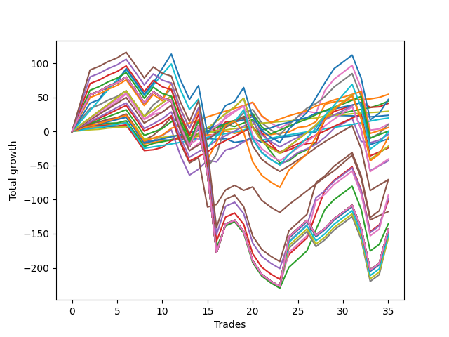

# Short Shepard 003 DB 
- Symbol: ES
- Date Range: 03/18/2022 - 07/15/2022
- Trading Period: 7:20-12:30
- Number of Trades: 35



| Name | Win Percent | Profit | Avg Profit / Trade | Avg Time / Trade |      | Name | Win Percent | Profit | Avg Profit / Trade | Avg Time / Trade |
| ---- | ----------- | ------ | ------------------ | ---------------- | ---- | ---- | ----------- | ------ | ------------------ | ---------------- |
| Sorted By <br> Profit | | | | | | Sorted By <br> Win Percentage ||||
| One | 82.86 | 27250.00 | 778.57 | 11:01 |     | Eighty-One | 97.14 | 14875.00 | 425.00 | 07:58 |
| Two Hundred Two | 68.57 | 23500.00 | 671.43 | 96:30 |     | Eighty-Two | 91.43 | 9875.00 | 282.14 | 13:47 |
| Two | 80.00 | 22250.00 | 635.71 | 19:38 |     | Eighty-Three | 88.57 | -5500.00 | -157.14 | 23:36 |
| Three | 74.29 | 20625.00 | 589.29 | 22:17 |     | Eighty-Four | 85.71 | 2875.00 | 82.14 | 26:27 |
| Eighty-One | 97.14 | 14875.00 | 425.00 | 07:58 |     | One | 82.86 | 27250.00 | 778.57 | 11:01 |
| Zero | 68.57 | 11875.00 | 339.29 | 06:04 |     | Eighty-Five | 82.86 | 250.00 | 7.14 | 30:29 |
| Eighty-Two | 91.43 | 9875.00 | 282.14 | 13:47 |     | Two | 80.00 | 22250.00 | 635.71 | 19:38 |
| Six | 71.43 | 5500.00 | 157.14 | 50:53 |     | Eighty-Six | 77.14 | -12000.00 | -342.86 | 39:11 |
| Seven | 71.43 | 5125.00 | 146.43 | 87:22 |     | Three | 74.29 | 20625.00 | 589.29 | 22:17 |
| Eighty-Four | 85.71 | 2875.00 | 82.14 | 26:27 |     | Eighty-Seven | 74.29 | -21500.00 | -614.29 | 43:17 |
| Eighty-Five | 82.86 | 250.00 | 7.14 | 30:29 |     | Six | 71.43 | 5500.00 | 157.14 | 50:53 |
| Two Hundred One.Five | 68.57 | -375.00 | -10.71 | 86:28 |     | Seven | 71.43 | 5125.00 | 146.43 | 87:22 |
| Four | 71.43 | -2125.00 | -60.71 | 36:59 |     | Four | 71.43 | -2125.00 | -60.71 | 36:59 |
| Two Hundred Two.Five | 62.86 | -4250.00 | -121.43 | 104:54 |     | Two Hundred One | 71.43 | -10875.00 | -310.71 | 64:38 |
| Eighty-Three | 88.57 | -5500.00 | -157.14 | 23:36 |     | Ninety | 71.43 | -10875.00 | -310.71 | 64:38 |
| Two Hundred One | 71.43 | -10875.00 | -310.71 | 64:38 |     | Eighty-Nine | 71.43 | -20250.00 | -578.57 | 57:10 |
| Ninety | 71.43 | -10875.00 | -310.71 | 64:38 |     | Eighty-Eight | 71.43 | -35375.00 | -1010.71 | 46:55 |
| Eighty-Six | 77.14 | -12000.00 | -342.86 | 39:11 |     | Two Hundred Two | 68.57 | 23500.00 | 671.43 | 96:30 |
| Eighty-Nine | 71.43 | -20250.00 | -578.57 | 57:10 |     | Zero | 68.57 | 11875.00 | 339.29 | 06:04 |
| Eighty-Seven | 74.29 | -21500.00 | -614.29 | 43:17 |     | Two Hundred One.Five | 68.57 | -375.00 | -10.71 | 86:28 |
| Eighty-Eight | 71.43 | -35375.00 | -1010.71 | 46:55 |     | Five | 68.57 | -58750.00 | -1678.57 | 62:31 |
| Two Hundred Four.Five | 57.14 | -35375.00 | -1010.71 | 118:42 |     | Two Hundred Two.Five | 62.86 | -4250.00 | -121.43 | 104:54 |
| Two Hundred Five | 57.14 | -46750.00 | -1335.71 | 127:28 |     | Two Hundred Four.Five | 57.14 | -35375.00 | -1010.71 | 118:42 |
| Two Hundred Four | 57.14 | -49125.00 | -1403.57 | 117:46 |     | Two Hundred Five | 57.14 | -46750.00 | -1335.71 | 127:28 |
| Two Hundred Three.Five | 57.14 | -50875.00 | -1453.57 | 114:31 |     | Two Hundred Four | 57.14 | -49125.00 | -1403.57 | 117:46 |
| Five | 68.57 | -58750.00 | -1678.57 | 62:31 |     | Two Hundred Three.Five | 57.14 | -50875.00 | -1453.57 | 114:31 |
| Two Hundred Three | 57.14 | -67750.00 | -1935.71 | 113:06 |     | Two Hundred Three | 57.14 | -67750.00 | -1935.71 | 113:06 |
| Two Hundred Fifteen | 54.29 | -71875.00 | -2053.57 | 131:01 |     | Two Hundred Fifteen | 54.29 | -71875.00 | -2053.57 | 131:01 |
| Two Hundred Fourteen.Five | 54.29 | -71875.00 | -2053.57 | 131:01 |     | Two Hundred Fourteen.Five | 54.29 | -71875.00 | -2053.57 | 131:01 |
| Two Hundred Fourteen | 54.29 | -71875.00 | -2053.57 | 131:01 |     | Two Hundred Fourteen | 54.29 | -71875.00 | -2053.57 | 131:01 |
| Two Hundred Thirteen.Five | 54.29 | -71875.00 | -2053.57 | 131:01 |     | Two Hundred Thirteen.Five | 54.29 | -71875.00 | -2053.57 | 131:01 |
| Two Hundred Thirteen | 54.29 | -71875.00 | -2053.57 | 131:01 |     | Two Hundred Thirteen | 54.29 | -71875.00 | -2053.57 | 131:01 |
| Two Hundred Twelve.Five | 54.29 | -71875.00 | -2053.57 | 131:01 |     | Two Hundred Twelve.Five | 54.29 | -71875.00 | -2053.57 | 131:01 |
| Two Hundred Twelve | 54.29 | -71875.00 | -2053.57 | 131:01 |     | Two Hundred Twelve | 54.29 | -71875.00 | -2053.57 | 131:01 |
| Two Hundred Eleven.Five | 54.29 | -71875.00 | -2053.57 | 131:01 |     | Two Hundred Eleven.Five | 54.29 | -71875.00 | -2053.57 | 131:01 |
| Two Hundred Eleven | 54.29 | -71875.00 | -2053.57 | 131:01 |     | Two Hundred Eleven | 54.29 | -71875.00 | -2053.57 | 131:01 |
| Two Hundred Ten.Five | 54.29 | -71875.00 | -2053.57 | 131:01 |     | Two Hundred Ten.Five | 54.29 | -71875.00 | -2053.57 | 131:01 |
| Two Hundred Ten | 54.29 | -71875.00 | -2053.57 | 131:01 |     | Two Hundred Ten | 54.29 | -71875.00 | -2053.57 | 131:01 |
| Two Hundred Nine.Five | 54.29 | -71875.00 | -2053.57 | 131:01 |     | Two Hundred Nine.Five | 54.29 | -71875.00 | -2053.57 | 131:01 |
| Two Hundred Nine | 54.29 | -71875.00 | -2053.57 | 131:01 |     | Two Hundred Nine | 54.29 | -71875.00 | -2053.57 | 131:01 |
| Two Hundred Eight.Five | 54.29 | -71875.00 | -2053.57 | 131:01 |     | Two Hundred Eight.Five | 54.29 | -71875.00 | -2053.57 | 131:01 |
| Two Hundred Eight | 54.29 | -71875.00 | -2053.57 | 131:01 |     | Two Hundred Eight | 54.29 | -71875.00 | -2053.57 | 131:01 |
| Two Hundred Seven.Five | 54.29 | -71875.00 | -2053.57 | 131:01 |     | Two Hundred Seven.Five | 54.29 | -71875.00 | -2053.57 | 131:01 |
| Two Hundred Seven | 54.29 | -72875.00 | -2082.14 | 130:59 |     | Two Hundred Seven | 54.29 | -72875.00 | -2082.14 | 130:59 |
| Two Hundred Six.Five | 54.29 | -75875.00 | -2167.86 | 130:52 |     | Two Hundred Six.Five | 54.29 | -75875.00 | -2167.86 | 130:52 |
| Two Hundred Five.Five | 54.29 | -77125.00 | -2203.57 | 130:13 |     | Two Hundred Five.Five | 54.29 | -77125.00 | -2203.57 | 130:13 |
| Two Hundred Six | 54.29 | -78250.00 | -2235.71 | 130:34 |     | Two Hundred Six | 54.29 | -78250.00 | -2235.71 | 130:34 |

## NO STOPLOSS

### Test Zero
* Sell when price hits the middle line of the 20p bollinger
* No Stoploss
* Results:
```
Total Trades: 35
Percent Up: 31.43
Percent Down: 68.57
Total Points Moved Down: 23.75
Potential Profit: 11875.00
Total Points Ups: 39.50 Count Ups: 11
Total Points Downs: 63.25 Count Downs: 24
```

<details><summary>Trades</summary>

<code>In: 2022-03-21 08:30:00		Out: 2022-03-21 08:32:35		Total Position Time: 02:35		Total Move Down: 3.50		Total to Date: 3.50</code> <br />
<code>In: 2022-03-21 08:31:00		Out: 2022-03-21 08:32:35		Total Position Time: 01:35		Total Move Down: 1.25		Total to Date: 4.75</code> <br />
<code>In: 2022-03-25 11:18:00		Out: 2022-03-25 11:18:15		Total Position Time: 00:15		Total Move Down: 0.75		Total to Date: 5.50</code> <br />
<code>In: 2022-03-25 11:37:00		Out: 2022-03-25 11:40:25		Total Position Time: 03:25		Total Move Down: 1.75		Total to Date: 7.25</code> <br />
<code>In: 2022-03-25 11:41:00		Out: 2022-03-25 11:41:15		Total Position Time: 00:15		Total Move Down: -0.50		Total to Date: 6.75</code> <br />
<code>In: 2022-03-25 11:57:00		Out: 2022-03-25 11:57:20		Total Position Time: 00:20		Total Move Down: 0.75		Total to Date: 7.50</code> <br />
<code>In: 2022-03-28 11:34:00		Out: 2022-03-28 12:08:15		Total Position Time: 34:15		Total Move Down: -10.75		Total to Date: -3.25</code> <br />
<code>In: 2022-03-28 11:36:00		Out: 2022-03-28 12:08:15		Total Position Time: 32:15		Total Move Down: -11.50		Total to Date: -14.75</code> <br />
<code>In: 2022-04-01 12:09:00		Out: 2022-04-01 12:09:15		Total Position Time: 00:15		Total Move Down: 1.25		Total to Date: -13.50</code> <br />
<code>In: 2022-04-06 08:57:00		Out: 2022-04-06 09:00:40		Total Position Time: 03:40		Total Move Down: 1.25		Total to Date: -12.25</code> <br />
<code>In: 2022-04-06 10:47:00		Out: 2022-04-06 10:55:45		Total Position Time: 08:45		Total Move Down: -0.50		Total to Date: -12.75</code> <br />
<code>In: 2022-04-07 10:34:00		Out: 2022-04-07 10:36:20		Total Position Time: 02:20		Total Move Down: 1.50		Total to Date: -11.25</code> <br />
<code>In: 2022-04-07 11:06:00		Out: 2022-04-07 11:15:20		Total Position Time: 09:20		Total Move Down: 0.25		Total to Date: -11.00</code> <br />
<code>In: 2022-04-18 11:00:00		Out: 2022-04-18 11:00:20		Total Position Time: 00:20		Total Move Down: 0.75		Total to Date: -10.25</code> <br />
<code>In: 2022-04-28 08:36:00		Out: 2022-04-28 08:36:30		Total Position Time: 00:30		Total Move Down: 0.25		Total to Date: -10.00</code> <br />
<code>In: 2022-05-04 09:32:00		Out: 2022-05-04 09:45:30		Total Position Time: 13:30		Total Move Down: -1.50		Total to Date: -11.50</code> <br />
<code>In: 2022-05-10 11:06:00		Out: 2022-05-10 11:06:15		Total Position Time: 00:15		Total Move Down: 1.00		Total to Date: -10.50</code> <br />
<code>In: 2022-05-16 08:51:00		Out: 2022-05-16 09:06:00		Total Position Time: 15:00		Total Move Down: -5.50		Total to Date: -16.00</code> <br />
<code>In: 2022-05-17 08:39:00		Out: 2022-05-17 08:43:55		Total Position Time: 04:55		Total Move Down: 2.00		Total to Date: -14.00</code> <br />
<code>In: 2022-05-25 11:07:00		Out: 2022-05-25 11:07:15		Total Position Time: 00:15		Total Move Down: 5.00		Total to Date: -9.00</code> <br />
<code>In: 2022-05-25 11:23:00		Out: 2022-05-25 11:39:10		Total Position Time: 16:10		Total Move Down: -7.00		Total to Date: -16.00</code> <br />
<code>In: 2022-05-25 11:33:00		Out: 2022-05-25 11:39:10		Total Position Time: 06:10		Total Move Down: 2.75		Total to Date: -13.25</code> <br />
<code>In: 2022-05-25 11:37:00		Out: 2022-05-25 11:39:10		Total Position Time: 02:10		Total Move Down: 5.00		Total to Date: -8.25</code> <br />
<code>In: 2022-06-09 10:14:00		Out: 2022-06-09 10:16:30		Total Position Time: 02:30		Total Move Down: 1.00		Total to Date: -7.25</code> <br />
<code>In: 2022-06-10 12:03:00		Out: 2022-06-10 12:03:25		Total Position Time: 00:25		Total Move Down: 2.25		Total to Date: -5.00</code> <br />
<code>In: 2022-06-10 12:21:00		Out: 2022-06-10 12:21:50		Total Position Time: 00:50		Total Move Down: 3.00		Total to Date: -2.00</code> <br />
<code>In: 2022-06-15 11:02:00		Out: 2022-06-15 11:02:45		Total Position Time: 00:45		Total Move Down: 1.50		Total to Date: -0.50</code> <br />
<code>In: 2022-06-15 11:48:00		Out: 2022-06-15 11:52:30		Total Position Time: 04:30		Total Move Down: 22.25		Total to Date: 21.75</code> <br />
<code>In: 2022-06-17 10:16:00		Out: 2022-06-17 10:22:10		Total Position Time: 06:10		Total Move Down: 2.00		Total to Date: 23.75</code> <br />
<code>In: 2022-06-29 11:08:00		Out: 2022-06-29 11:20:00		Total Position Time: 12:00		Total Move Down: -0.50		Total to Date: 23.25</code> <br />
<code>In: 2022-06-29 11:18:00		Out: 2022-06-29 11:20:00		Total Position Time: 02:00		Total Move Down: -0.25		Total to Date: 23.00</code> <br />
<code>In: 2022-07-01 10:55:00		Out: 2022-07-01 11:03:55		Total Position Time: 08:55		Total Move Down: -1.25		Total to Date: 21.75</code> <br />
<code>In: 2022-07-05 08:53:00		Out: 2022-07-05 09:00:10		Total Position Time: 07:10		Total Move Down: -0.25		Total to Date: 21.50</code> <br />
<code>In: 2022-07-11 08:14:00		Out: 2022-07-11 08:20:10		Total Position Time: 06:10		Total Move Down: 1.00		Total to Date: 22.50</code> <br />
<code>In: 2022-07-12 08:34:00		Out: 2022-07-12 08:36:55		Total Position Time: 02:55		Total Move Down: 1.25		Total to Date: 23.75</code> <br />


</details>

### Test One
* Sell when the price hits the upper line of the 20p 1std bollinger
* No Stoploss
* Results:
```
Total Trades: 35
Percent Up: 17.14
Percent Down: 82.86
Total Points Moved Down: 54.50
Potential Profit: 27250.00
Total Points Ups: 45.50 Count Ups: 6
Total Points Downs: 100.00 Count Downs: 29
```

<details><summary>Trades</summary>

<code>In: 2022-03-21 08:30:00		Out: 2022-03-21 08:36:00		Total Position Time: 06:00		Total Move Down: 4.25		Total to Date: 4.25</code> <br />
<code>In: 2022-03-21 08:31:00		Out: 2022-03-21 08:36:00		Total Position Time: 05:00		Total Move Down: 2.00		Total to Date: 6.25</code> <br />
<code>In: 2022-03-25 11:18:00		Out: 2022-03-25 11:19:35		Total Position Time: 01:35		Total Move Down: 1.50		Total to Date: 7.75</code> <br />
<code>In: 2022-03-25 11:37:00		Out: 2022-03-25 11:41:25		Total Position Time: 04:25		Total Move Down: 2.25		Total to Date: 10.00</code> <br />
<code>In: 2022-03-25 11:41:00		Out: 2022-03-25 11:41:25		Total Position Time: 00:25		Total Move Down: 0.75		Total to Date: 10.75</code> <br />
<code>In: 2022-03-25 11:57:00		Out: 2022-03-25 12:00:50		Total Position Time: 03:50		Total Move Down: 2.75		Total to Date: 13.50</code> <br />
<code>In: 2022-03-28 11:34:00		Out: 2022-03-28 12:41:10		Total Position Time: 67:10		Total Move Down: -15.50		Total to Date: -2.00</code> <br />
<code>In: 2022-03-28 11:36:00		Out: 2022-03-28 12:41:10		Total Position Time: 65:10		Total Move Down: -16.25		Total to Date: -18.25</code> <br />
<code>In: 2022-04-01 12:09:00		Out: 2022-04-01 12:09:25		Total Position Time: 00:25		Total Move Down: 2.25		Total to Date: -16.00</code> <br />
<code>In: 2022-04-06 08:57:00		Out: 2022-04-06 09:05:10		Total Position Time: 08:10		Total Move Down: 2.00		Total to Date: -14.00</code> <br />
<code>In: 2022-04-06 10:47:00		Out: 2022-04-06 10:56:55		Total Position Time: 09:55		Total Move Down: 1.25		Total to Date: -12.75</code> <br />
<code>In: 2022-04-07 10:34:00		Out: 2022-04-07 10:39:55		Total Position Time: 05:55		Total Move Down: 3.00		Total to Date: -9.75</code> <br />
<code>In: 2022-04-07 11:06:00		Out: 2022-04-07 11:18:00		Total Position Time: 12:00		Total Move Down: 1.00		Total to Date: -8.75</code> <br />
<code>In: 2022-04-18 11:00:00		Out: 2022-04-18 11:06:35		Total Position Time: 06:35		Total Move Down: 1.75		Total to Date: -7.00</code> <br />
<code>In: 2022-04-28 08:36:00		Out: 2022-04-28 08:37:50		Total Position Time: 01:50		Total Move Down: 2.25		Total to Date: -4.75</code> <br />
<code>In: 2022-05-04 09:32:00		Out: 2022-05-04 09:46:30		Total Position Time: 14:30		Total Move Down: -0.00		Total to Date: -4.75</code> <br />
<code>In: 2022-05-10 11:06:00		Out: 2022-05-10 11:06:45		Total Position Time: 00:45		Total Move Down: 5.50		Total to Date: 0.75</code> <br />
<code>In: 2022-05-16 08:51:00		Out: 2022-05-16 09:06:10		Total Position Time: 15:10		Total Move Down: -3.50		Total to Date: -2.75</code> <br />
<code>In: 2022-05-17 08:39:00		Out: 2022-05-17 08:47:15		Total Position Time: 08:15		Total Move Down: 3.50		Total to Date: 0.75</code> <br />
<code>In: 2022-05-25 11:07:00		Out: 2022-05-25 11:07:15		Total Position Time: 00:15		Total Move Down: 5.00		Total to Date: 5.75</code> <br />
<code>In: 2022-05-25 11:23:00		Out: 2022-05-25 11:49:55		Total Position Time: 26:55		Total Move Down: -10.00		Total to Date: -4.25</code> <br />
<code>In: 2022-05-25 11:33:00		Out: 2022-05-25 11:49:55		Total Position Time: 16:55		Total Move Down: -0.25		Total to Date: -4.50</code> <br />
<code>In: 2022-05-25 11:37:00		Out: 2022-05-25 11:49:55		Total Position Time: 12:55		Total Move Down: 2.00		Total to Date: -2.50</code> <br />
<code>In: 2022-06-09 10:14:00		Out: 2022-06-09 10:18:35		Total Position Time: 04:35		Total Move Down: 1.75		Total to Date: -0.75</code> <br />
<code>In: 2022-06-10 12:03:00		Out: 2022-06-10 12:05:05		Total Position Time: 02:05		Total Move Down: 6.50		Total to Date: 5.75</code> <br />
<code>In: 2022-06-10 12:21:00		Out: 2022-06-10 12:35:45		Total Position Time: 14:45		Total Move Down: 1.75		Total to Date: 7.50</code> <br />
<code>In: 2022-06-15 11:02:00		Out: 2022-06-15 11:03:00		Total Position Time: 01:00		Total Move Down: 6.75		Total to Date: 14.25</code> <br />
<code>In: 2022-06-15 11:48:00		Out: 2022-06-15 11:57:35		Total Position Time: 09:35		Total Move Down: 25.75		Total to Date: 40.00</code> <br />
<code>In: 2022-06-17 10:16:00		Out: 2022-06-17 10:26:20		Total Position Time: 10:20		Total Move Down: 3.50		Total to Date: 43.50</code> <br />
<code>In: 2022-06-29 11:08:00		Out: 2022-06-29 11:20:35		Total Position Time: 12:35		Total Move Down: 1.50		Total to Date: 45.00</code> <br />
<code>In: 2022-06-29 11:18:00		Out: 2022-06-29 11:20:35		Total Position Time: 02:35		Total Move Down: 1.75		Total to Date: 46.75</code> <br />
<code>In: 2022-07-01 10:55:00		Out: 2022-07-01 11:04:25		Total Position Time: 09:25		Total Move Down: 0.25		Total to Date: 47.00</code> <br />
<code>In: 2022-07-05 08:53:00		Out: 2022-07-05 09:03:30		Total Position Time: 10:30		Total Move Down: 0.75		Total to Date: 47.75</code> <br />
<code>In: 2022-07-11 08:14:00		Out: 2022-07-11 08:24:20		Total Position Time: 10:20		Total Move Down: 2.25		Total to Date: 50.00</code> <br />
<code>In: 2022-07-12 08:34:00		Out: 2022-07-12 08:38:10		Total Position Time: 04:10		Total Move Down: 4.50		Total to Date: 54.50</code> <br />


</details>

### Test Two
* Sell when the price hits the upper line of the 20p 2std bollinger
* No Stoploss
* Results:
```
Total Trades: 35
Percent Up: 20.00
Percent Down: 80.00
Total Points Moved Down: 44.50
Potential Profit: 22250.00
Total Points Ups: 106.50 Count Ups: 7
Total Points Downs: 151.00 Count Downs: 28
```

<details><summary>Trades</summary>

<code>In: 2022-03-21 08:30:00		Out: 2022-03-21 08:36:10		Total Position Time: 06:10		Total Move Down: 6.00		Total to Date: 6.00</code> <br />
<code>In: 2022-03-21 08:31:00		Out: 2022-03-21 08:36:10		Total Position Time: 05:10		Total Move Down: 3.75		Total to Date: 9.75</code> <br />
<code>In: 2022-03-25 11:18:00		Out: 2022-03-25 12:01:15		Total Position Time: 43:15		Total Move Down: 0.25		Total to Date: 10.00</code> <br />
<code>In: 2022-03-25 11:37:00		Out: 2022-03-25 12:01:15		Total Position Time: 24:15		Total Move Down: 2.00		Total to Date: 12.00</code> <br />
<code>In: 2022-03-25 11:41:00		Out: 2022-03-25 12:01:15		Total Position Time: 20:15		Total Move Down: 0.50		Total to Date: 12.50</code> <br />
<code>In: 2022-03-25 11:57:00		Out: 2022-03-25 12:01:15		Total Position Time: 04:15		Total Move Down: 3.25		Total to Date: 15.75</code> <br />
<code>In: 2022-03-28 11:34:00		Out: 2022-03-28 12:46:05		Total Position Time: 72:05		Total Move Down: -18.50		Total to Date: -2.75</code> <br />
<code>In: 2022-03-28 11:36:00		Out: 2022-03-28 12:46:05		Total Position Time: 70:05		Total Move Down: -19.25		Total to Date: -22.00</code> <br />
<code>In: 2022-04-01 12:09:00		Out: 2022-04-01 12:11:10		Total Position Time: 02:10		Total Move Down: 4.50		Total to Date: -17.50</code> <br />
<code>In: 2022-04-06 08:57:00		Out: 2022-04-06 09:09:40		Total Position Time: 12:40		Total Move Down: 2.50		Total to Date: -15.00</code> <br />
<code>In: 2022-04-06 10:47:00		Out: 2022-04-06 10:58:00		Total Position Time: 11:00		Total Move Down: 3.00		Total to Date: -12.00</code> <br />
<code>In: 2022-04-07 10:34:00		Out: 2022-04-07 10:48:00		Total Position Time: 14:00		Total Move Down: 4.00		Total to Date: -8.00</code> <br />
<code>In: 2022-04-07 11:06:00		Out: 2022-04-07 11:18:20		Total Position Time: 12:20		Total Move Down: 2.25		Total to Date: -5.75</code> <br />
<code>In: 2022-04-18 11:00:00		Out: 2022-04-18 11:10:40		Total Position Time: 10:40		Total Move Down: 3.25		Total to Date: -2.50</code> <br />
<code>In: 2022-04-28 08:36:00		Out: 2022-04-28 08:39:00		Total Position Time: 03:00		Total Move Down: 3.75		Total to Date: 1.25</code> <br />
<code>In: 2022-05-04 09:32:00		Out: 2022-05-04 10:11:15		Total Position Time: 39:15		Total Move Down: -2.50		Total to Date: -1.25</code> <br />
<code>In: 2022-05-10 11:06:00		Out: 2022-05-10 11:16:05		Total Position Time: 10:05		Total Move Down: 11.00		Total to Date: 9.75</code> <br />
<code>In: 2022-05-16 08:51:00		Out: 2022-05-16 09:11:35		Total Position Time: 20:35		Total Move Down: -2.50		Total to Date: 7.25</code> <br />
<code>In: 2022-05-17 08:39:00		Out: 2022-05-17 09:06:00		Total Position Time: 27:00		Total Move Down: 5.25		Total to Date: 12.50</code> <br />
<code>In: 2022-05-25 11:07:00		Out: 2022-05-25 11:07:15		Total Position Time: 00:15		Total Move Down: 5.00		Total to Date: 17.50</code> <br />
<code>In: 2022-05-25 11:23:00		Out: 2022-05-25 12:22:50		Total Position Time: 59:50		Total Move Down: -28.50		Total to Date: -11.00</code> <br />
<code>In: 2022-05-25 11:33:00		Out: 2022-05-25 12:22:50		Total Position Time: 49:50		Total Move Down: -18.75		Total to Date: -29.75</code> <br />
<code>In: 2022-05-25 11:37:00		Out: 2022-05-25 12:22:50		Total Position Time: 45:50		Total Move Down: -16.50		Total to Date: -46.25</code> <br />
<code>In: 2022-06-09 10:14:00		Out: 2022-06-09 10:19:10		Total Position Time: 05:10		Total Move Down: 3.00		Total to Date: -43.25</code> <br />
<code>In: 2022-06-10 12:03:00		Out: 2022-06-10 12:06:05		Total Position Time: 03:05		Total Move Down: 10.50		Total to Date: -32.75</code> <br />
<code>In: 2022-06-10 12:21:00		Out: 2022-06-10 12:43:10		Total Position Time: 22:10		Total Move Down: 6.00		Total to Date: -26.75</code> <br />
<code>In: 2022-06-15 11:02:00		Out: 2022-06-15 11:03:10		Total Position Time: 01:10		Total Move Down: 11.00		Total to Date: -15.75</code> <br />
<code>In: 2022-06-15 11:48:00		Out: 2022-06-15 11:58:10		Total Position Time: 10:10		Total Move Down: 35.00		Total to Date: 19.25</code> <br />
<code>In: 2022-06-17 10:16:00		Out: 2022-06-17 10:27:10		Total Position Time: 11:10		Total Move Down: 5.50		Total to Date: 24.75</code> <br />
<code>In: 2022-06-29 11:08:00		Out: 2022-06-29 11:21:10		Total Position Time: 13:10		Total Move Down: 2.50		Total to Date: 27.25</code> <br />
<code>In: 2022-06-29 11:18:00		Out: 2022-06-29 11:21:10		Total Position Time: 03:10		Total Move Down: 2.75		Total to Date: 30.00</code> <br />
<code>In: 2022-07-01 10:55:00		Out: 2022-07-01 11:07:55		Total Position Time: 12:55		Total Move Down: 2.50		Total to Date: 32.50</code> <br />
<code>In: 2022-07-05 08:53:00		Out: 2022-07-05 09:03:50		Total Position Time: 10:50		Total Move Down: 2.50		Total to Date: 35.00</code> <br />
<code>In: 2022-07-11 08:14:00		Out: 2022-07-11 08:37:10		Total Position Time: 23:10		Total Move Down: 4.00		Total to Date: 39.00</code> <br />
<code>In: 2022-07-12 08:34:00		Out: 2022-07-12 08:41:10		Total Position Time: 07:10		Total Move Down: 5.50		Total to Date: 44.50</code> <br />


</details>

### Test Three
* Sell when price hits the middle line of the 50p bollinger
* No Stoploss
* Results:
```
Total Trades: 35
Percent Up: 25.71
Percent Down: 74.29
Total Points Moved Down: 41.25
Potential Profit: 20625.00
Total Points Ups: 107.75 Count Ups: 9
Total Points Downs: 149.00 Count Downs: 26
```

<details><summary>Trades</summary>

<code>In: 2022-03-21 08:30:00		Out: 2022-03-21 08:36:10		Total Position Time: 06:10		Total Move Down: 6.00		Total to Date: 6.00</code> <br />
<code>In: 2022-03-21 08:31:00		Out: 2022-03-21 08:36:10		Total Position Time: 05:10		Total Move Down: 3.75		Total to Date: 9.75</code> <br />
<code>In: 2022-03-25 11:18:00		Out: 2022-03-25 12:00:45		Total Position Time: 42:45		Total Move Down: -1.25		Total to Date: 8.50</code> <br />
<code>In: 2022-03-25 11:37:00		Out: 2022-03-25 12:00:45		Total Position Time: 23:45		Total Move Down: 0.50		Total to Date: 9.00</code> <br />
<code>In: 2022-03-25 11:41:00		Out: 2022-03-25 12:00:45		Total Position Time: 19:45		Total Move Down: -1.00		Total to Date: 8.00</code> <br />
<code>In: 2022-03-25 11:57:00		Out: 2022-03-25 12:00:45		Total Position Time: 03:45		Total Move Down: 1.75		Total to Date: 9.75</code> <br />
<code>In: 2022-03-28 11:34:00		Out: 2022-03-28 12:46:05		Total Position Time: 72:05		Total Move Down: -18.50		Total to Date: -8.75</code> <br />
<code>In: 2022-03-28 11:36:00		Out: 2022-03-28 12:46:05		Total Position Time: 70:05		Total Move Down: -19.25		Total to Date: -28.00</code> <br />
<code>In: 2022-04-01 12:09:00		Out: 2022-04-01 12:09:15		Total Position Time: 00:15		Total Move Down: 1.25		Total to Date: -26.75</code> <br />
<code>In: 2022-04-06 08:57:00		Out: 2022-04-06 09:12:25		Total Position Time: 15:25		Total Move Down: 3.50		Total to Date: -23.25</code> <br />
<code>In: 2022-04-06 10:47:00		Out: 2022-04-06 11:00:10		Total Position Time: 13:10		Total Move Down: 10.00		Total to Date: -13.25</code> <br />
<code>In: 2022-04-07 10:34:00		Out: 2022-04-07 10:52:05		Total Position Time: 18:05		Total Move Down: 5.00		Total to Date: -8.25</code> <br />
<code>In: 2022-04-07 11:06:00		Out: 2022-04-07 11:33:40		Total Position Time: 27:40		Total Move Down: 2.50		Total to Date: -5.75</code> <br />
<code>In: 2022-04-18 11:00:00		Out: 2022-04-18 11:16:30		Total Position Time: 16:30		Total Move Down: 3.25		Total to Date: -2.50</code> <br />
<code>In: 2022-04-28 08:36:00		Out: 2022-04-28 08:40:20		Total Position Time: 04:20		Total Move Down: 7.75		Total to Date: 5.25</code> <br />
<code>In: 2022-05-04 09:32:00		Out: 2022-05-04 10:10:50		Total Position Time: 38:50		Total Move Down: -4.00		Total to Date: 1.25</code> <br />
<code>In: 2022-05-10 11:06:00		Out: 2022-05-10 11:16:15		Total Position Time: 10:15		Total Move Down: 12.50		Total to Date: 13.75</code> <br />
<code>In: 2022-05-16 08:51:00		Out: 2022-05-16 09:15:55		Total Position Time: 24:55		Total Move Down: 2.00		Total to Date: 15.75</code> <br />
<code>In: 2022-05-17 08:39:00		Out: 2022-05-17 09:05:55		Total Position Time: 26:55		Total Move Down: 3.75		Total to Date: 19.50</code> <br />
<code>In: 2022-05-25 11:07:00		Out: 2022-05-25 11:07:15		Total Position Time: 00:15		Total Move Down: 5.00		Total to Date: 24.50</code> <br />
<code>In: 2022-05-25 11:23:00		Out: 2022-05-25 12:34:20		Total Position Time: 71:20		Total Move Down: -26.00		Total to Date: -1.50</code> <br />
<code>In: 2022-05-25 11:33:00		Out: 2022-05-25 12:34:20		Total Position Time: 61:20		Total Move Down: -16.25		Total to Date: -17.75</code> <br />
<code>In: 2022-05-25 11:37:00		Out: 2022-05-25 12:34:20		Total Position Time: 57:20		Total Move Down: -14.00		Total to Date: -31.75</code> <br />
<code>In: 2022-06-09 10:14:00		Out: 2022-06-09 10:22:05		Total Position Time: 08:05		Total Move Down: 4.75		Total to Date: -27.00</code> <br />
<code>In: 2022-06-10 12:03:00		Out: 2022-06-10 12:03:40		Total Position Time: 00:40		Total Move Down: 5.50		Total to Date: -21.50</code> <br />
<code>In: 2022-06-10 12:21:00		Out: 2022-06-10 12:22:10		Total Position Time: 01:10		Total Move Down: 3.75		Total to Date: -17.75</code> <br />
<code>In: 2022-06-15 11:02:00		Out: 2022-06-15 11:02:45		Total Position Time: 00:45		Total Move Down: 1.50		Total to Date: -16.25</code> <br />
<code>In: 2022-06-15 11:48:00		Out: 2022-06-15 11:58:10		Total Position Time: 10:10		Total Move Down: 35.00		Total to Date: 18.75</code> <br />
<code>In: 2022-06-17 10:16:00		Out: 2022-06-17 10:32:25		Total Position Time: 16:25		Total Move Down: 10.50		Total to Date: 29.25</code> <br />
<code>In: 2022-06-29 11:08:00		Out: 2022-06-29 11:31:05		Total Position Time: 23:05		Total Move Down: 4.50		Total to Date: 33.75</code> <br />
<code>In: 2022-06-29 11:18:00		Out: 2022-06-29 11:31:05		Total Position Time: 13:05		Total Move Down: 4.75		Total to Date: 38.50</code> <br />
<code>In: 2022-07-01 10:55:00		Out: 2022-07-01 11:10:55		Total Position Time: 15:55		Total Move Down: 4.50		Total to Date: 43.00</code> <br />
<code>In: 2022-07-05 08:53:00		Out: 2022-07-05 09:43:40		Total Position Time: 50:40		Total Move Down: -7.50		Total to Date: 35.50</code> <br />
<code>In: 2022-07-11 08:14:00		Out: 2022-07-11 08:19:45		Total Position Time: 05:45		Total Move Down: 0.75		Total to Date: 36.25</code> <br />
<code>In: 2022-07-12 08:34:00		Out: 2022-07-12 08:38:15		Total Position Time: 04:15		Total Move Down: 5.00		Total to Date: 41.25</code> <br />


</details>

### Test Four
* Sell when the price hits the upper line of the 50p 1std bollinger
* No Stoploss
* Results:
```
Total Trades: 35
Percent Up: 28.57
Percent Down: 71.43
Total Points Moved Down: -4.25
Potential Profit: -2125.00
Total Points Ups: 181.25 Count Ups: 10
Total Points Downs: 177.00 Count Downs: 25
```

<details><summary>Trades</summary>

<code>In: 2022-03-21 08:30:00		Out: 2022-03-21 08:44:50		Total Position Time: 14:50		Total Move Down: 7.75		Total to Date: 7.75</code> <br />
<code>In: 2022-03-21 08:31:00		Out: 2022-03-21 08:44:50		Total Position Time: 13:50		Total Move Down: 5.50		Total to Date: 13.25</code> <br />
<code>In: 2022-03-25 11:18:00		Out: 2022-03-25 12:01:40		Total Position Time: 43:40		Total Move Down: 0.75		Total to Date: 14.00</code> <br />
<code>In: 2022-03-25 11:37:00		Out: 2022-03-25 12:01:40		Total Position Time: 24:40		Total Move Down: 2.50		Total to Date: 16.50</code> <br />
<code>In: 2022-03-25 11:41:00		Out: 2022-03-25 12:01:40		Total Position Time: 20:40		Total Move Down: 1.00		Total to Date: 17.50</code> <br />
<code>In: 2022-03-25 11:57:00		Out: 2022-03-25 12:01:40		Total Position Time: 04:40		Total Move Down: 3.75		Total to Date: 21.25</code> <br />
<code>In: 2022-03-28 11:34:00		Out: 2022-03-28 12:46:05		Total Position Time: 72:05		Total Move Down: -18.50		Total to Date: 2.75</code> <br />
<code>In: 2022-03-28 11:36:00		Out: 2022-03-28 12:46:05		Total Position Time: 70:05		Total Move Down: -19.25		Total to Date: -16.50</code> <br />
<code>In: 2022-04-01 12:09:00		Out: 2022-04-01 12:09:35		Total Position Time: 00:35		Total Move Down: 3.25		Total to Date: -13.25</code> <br />
<code>In: 2022-04-06 08:57:00		Out: 2022-04-06 09:15:00		Total Position Time: 18:00		Total Move Down: 7.50		Total to Date: -5.75</code> <br />
<code>In: 2022-04-06 10:47:00		Out: 2022-04-06 11:08:10		Total Position Time: 21:10		Total Move Down: 8.25		Total to Date: 2.50</code> <br />
<code>In: 2022-04-07 10:34:00		Out: 2022-04-07 12:46:05		Total Position Time: 132:05		Total Move Down: -37.75		Total to Date: -35.25</code> <br />
<code>In: 2022-04-07 11:06:00		Out: 2022-04-07 12:46:05		Total Position Time: 100:05		Total Move Down: -28.75		Total to Date: -64.00</code> <br />
<code>In: 2022-04-18 11:00:00		Out: 2022-04-18 11:18:10		Total Position Time: 18:10		Total Move Down: 8.75		Total to Date: -55.25</code> <br />
<code>In: 2022-04-28 08:36:00		Out: 2022-04-28 08:46:10		Total Position Time: 10:10		Total Move Down: 13.00		Total to Date: -42.25</code> <br />
<code>In: 2022-05-04 09:32:00		Out: 2022-05-04 10:30:25		Total Position Time: 58:25		Total Move Down: -2.25		Total to Date: -44.50</code> <br />
<code>In: 2022-05-10 11:06:00		Out: 2022-05-10 11:24:10		Total Position Time: 18:10		Total Move Down: 17.25		Total to Date: -27.25</code> <br />
<code>In: 2022-05-16 08:51:00		Out: 2022-05-16 09:30:55		Total Position Time: 39:55		Total Move Down: 3.75		Total to Date: -23.50</code> <br />
<code>In: 2022-05-17 08:39:00		Out: 2022-05-17 09:06:50		Total Position Time: 27:50		Total Move Down: 8.50		Total to Date: -15.00</code> <br />
<code>In: 2022-05-25 11:07:00		Out: 2022-05-25 11:07:15		Total Position Time: 00:15		Total Move Down: 5.00		Total to Date: -10.00</code> <br />
<code>In: 2022-05-25 11:23:00		Out: 2022-05-25 12:39:45		Total Position Time: 76:45		Total Move Down: -20.25		Total to Date: -30.25</code> <br />
<code>In: 2022-05-25 11:33:00		Out: 2022-05-25 12:39:45		Total Position Time: 66:45		Total Move Down: -10.50		Total to Date: -40.75</code> <br />
<code>In: 2022-05-25 11:37:00		Out: 2022-05-25 12:39:45		Total Position Time: 62:45		Total Move Down: -8.25		Total to Date: -49.00</code> <br />
<code>In: 2022-06-09 10:14:00		Out: 2022-06-09 10:23:50		Total Position Time: 09:50		Total Move Down: 8.00		Total to Date: -41.00</code> <br />
<code>In: 2022-06-10 12:03:00		Out: 2022-06-10 12:06:00		Total Position Time: 03:00		Total Move Down: 10.25		Total to Date: -30.75</code> <br />
<code>In: 2022-06-10 12:21:00		Out: 2022-06-10 12:42:40		Total Position Time: 21:40		Total Move Down: 5.25		Total to Date: -25.50</code> <br />
<code>In: 2022-06-15 11:02:00		Out: 2022-06-15 11:03:00		Total Position Time: 01:00		Total Move Down: 6.75		Total to Date: -18.75</code> <br />
<code>In: 2022-06-15 11:48:00		Out: 2022-06-15 12:46:05		Total Position Time: 58:05		Total Move Down: 10.25		Total to Date: -8.50</code> <br />
<code>In: 2022-06-17 10:16:00		Out: 2022-06-17 10:47:00		Total Position Time: 31:00		Total Move Down: 13.00		Total to Date: 4.50</code> <br />
<code>In: 2022-06-29 11:08:00		Out: 2022-06-29 11:39:20		Total Position Time: 31:20		Total Move Down: 7.25		Total to Date: 11.75</code> <br />
<code>In: 2022-06-29 11:18:00		Out: 2022-06-29 11:39:20		Total Position Time: 21:20		Total Move Down: 7.50		Total to Date: 19.25</code> <br />
<code>In: 2022-07-01 10:55:00		Out: 2022-07-01 12:46:05		Total Position Time: 111:05		Total Move Down: -33.75		Total to Date: -14.50</code> <br />
<code>In: 2022-07-05 08:53:00		Out: 2022-07-05 09:51:05		Total Position Time: 58:05		Total Move Down: -2.00		Total to Date: -16.50</code> <br />
<code>In: 2022-07-11 08:14:00		Out: 2022-07-11 08:37:10		Total Position Time: 23:10		Total Move Down: 4.00		Total to Date: -12.50</code> <br />
<code>In: 2022-07-12 08:34:00		Out: 2022-07-12 08:43:40		Total Position Time: 09:40		Total Move Down: 8.25		Total to Date: -4.25</code> <br />


</details>

### Test Five
* Sell when the price hits the upper line of the 50p 2std bollinger
* No Stoploss
* Results:
```
Total Trades: 35
Percent Up: 31.43
Percent Down: 68.57
Total Points Moved Down: -117.50
Potential Profit: -58750.00
Total Points Ups: 316.00 Count Ups: 11
Total Points Downs: 198.50 Count Downs: 24
```

<details><summary>Trades</summary>

<code>In: 2022-03-21 08:30:00		Out: 2022-03-21 09:05:45		Total Position Time: 35:45		Total Move Down: 7.00		Total to Date: 7.00</code> <br />
<code>In: 2022-03-21 08:31:00		Out: 2022-03-21 09:05:45		Total Position Time: 34:45		Total Move Down: 4.75		Total to Date: 11.75</code> <br />
<code>In: 2022-03-25 11:18:00		Out: 2022-03-25 12:01:55		Total Position Time: 43:55		Total Move Down: 2.25		Total to Date: 14.00</code> <br />
<code>In: 2022-03-25 11:37:00		Out: 2022-03-25 12:01:55		Total Position Time: 24:55		Total Move Down: 4.00		Total to Date: 18.00</code> <br />
<code>In: 2022-03-25 11:41:00		Out: 2022-03-25 12:01:55		Total Position Time: 20:55		Total Move Down: 2.50		Total to Date: 20.50</code> <br />
<code>In: 2022-03-25 11:57:00		Out: 2022-03-25 12:01:55		Total Position Time: 04:55		Total Move Down: 5.25		Total to Date: 25.75</code> <br />
<code>In: 2022-03-28 11:34:00		Out: 2022-03-28 12:46:05		Total Position Time: 72:05		Total Move Down: -18.50		Total to Date: 7.25</code> <br />
<code>In: 2022-03-28 11:36:00		Out: 2022-03-28 12:46:05		Total Position Time: 70:05		Total Move Down: -19.25		Total to Date: -12.00</code> <br />
<code>In: 2022-04-01 12:09:00		Out: 2022-04-01 12:11:25		Total Position Time: 02:25		Total Move Down: 6.25		Total to Date: -5.75</code> <br />
<code>In: 2022-04-06 08:57:00		Out: 2022-04-06 09:20:25		Total Position Time: 23:25		Total Move Down: 12.00		Total to Date: 6.25</code> <br />
<code>In: 2022-04-06 10:47:00		Out: 2022-04-06 11:09:40		Total Position Time: 22:40		Total Move Down: 14.25		Total to Date: 20.50</code> <br />
<code>In: 2022-04-07 10:34:00		Out: 2022-04-07 12:46:05		Total Position Time: 132:05		Total Move Down: -37.75		Total to Date: -17.25</code> <br />
<code>In: 2022-04-07 11:06:00		Out: 2022-04-07 12:46:05		Total Position Time: 100:05		Total Move Down: -28.75		Total to Date: -46.00</code> <br />
<code>In: 2022-04-18 11:00:00		Out: 2022-04-18 11:47:00		Total Position Time: 47:00		Total Move Down: 7.25		Total to Date: -38.75</code> <br />
<code>In: 2022-04-28 08:36:00		Out: 2022-04-28 12:34:00		Total Position Time: 238:00		Total Move Down: -72.00		Total to Date: -110.75</code> <br />
<code>In: 2022-05-04 09:32:00		Out: 2022-05-04 11:07:40		Total Position Time: 95:40		Total Move Down: 3.75		Total to Date: -107.00</code> <br />
<code>In: 2022-05-10 11:06:00		Out: 2022-05-10 11:26:20		Total Position Time: 20:20		Total Move Down: 21.25		Total to Date: -85.75</code> <br />
<code>In: 2022-05-16 08:51:00		Out: 2022-05-16 09:39:45		Total Position Time: 48:45		Total Move Down: 6.75		Total to Date: -79.00</code> <br />
<code>In: 2022-05-17 08:39:00		Out: 2022-05-17 10:59:45		Total Position Time: 140:45		Total Move Down: -7.25		Total to Date: -86.25</code> <br />
<code>In: 2022-05-25 11:07:00		Out: 2022-05-25 11:07:15		Total Position Time: 00:15		Total Move Down: 5.00		Total to Date: -81.25</code> <br />
<code>In: 2022-05-25 11:23:00		Out: 2022-05-25 12:46:05		Total Position Time: 83:05		Total Move Down: -19.75		Total to Date: -101.00</code> <br />
<code>In: 2022-05-25 11:33:00		Out: 2022-05-25 12:46:05		Total Position Time: 73:05		Total Move Down: -10.00		Total to Date: -111.00</code> <br />
<code>In: 2022-05-25 11:37:00		Out: 2022-05-25 12:46:05		Total Position Time: 69:05		Total Move Down: -7.75		Total to Date: -118.75</code> <br />
<code>In: 2022-06-09 10:14:00		Out: 2022-06-09 10:27:20		Total Position Time: 13:20		Total Move Down: 11.50		Total to Date: -107.25</code> <br />
<code>In: 2022-06-10 12:03:00		Out: 2022-06-10 12:45:40		Total Position Time: 42:40		Total Move Down: 10.00		Total to Date: -97.25</code> <br />
<code>In: 2022-06-10 12:21:00		Out: 2022-06-10 12:45:40		Total Position Time: 24:40		Total Move Down: 10.25		Total to Date: -87.00</code> <br />
<code>In: 2022-06-15 11:02:00		Out: 2022-06-15 11:03:05		Total Position Time: 01:05		Total Move Down: 10.00		Total to Date: -77.00</code> <br />
<code>In: 2022-06-15 11:48:00		Out: 2022-06-15 12:46:05		Total Position Time: 58:05		Total Move Down: 10.25		Total to Date: -66.75</code> <br />
<code>In: 2022-06-17 10:16:00		Out: 2022-06-17 12:10:30		Total Position Time: 114:30		Total Move Down: 9.25		Total to Date: -57.50</code> <br />
<code>In: 2022-06-29 11:08:00		Out: 2022-06-29 11:41:15		Total Position Time: 33:15		Total Move Down: 11.25		Total to Date: -46.25</code> <br />
<code>In: 2022-06-29 11:18:00		Out: 2022-06-29 11:41:15		Total Position Time: 23:15		Total Move Down: 11.50		Total to Date: -34.75</code> <br />
<code>In: 2022-07-01 10:55:00		Out: 2022-07-01 12:46:05		Total Position Time: 111:05		Total Move Down: -33.75		Total to Date: -68.50</code> <br />
<code>In: 2022-07-05 08:53:00		Out: 2022-07-05 12:46:05		Total Position Time: 233:05		Total Move Down: -61.25		Total to Date: -129.75</code> <br />
<code>In: 2022-07-11 08:14:00		Out: 2022-07-11 08:51:05		Total Position Time: 37:05		Total Move Down: 6.50		Total to Date: -123.25</code> <br />
<code>In: 2022-07-12 08:34:00		Out: 2022-07-12 10:06:00		Total Position Time: 92:00		Total Move Down: 5.75		Total to Date: -117.50</code> <br />


</details>

### Test Six
* Sell when the price hits the middle line of the 1std VWAP
* No Stoploss
* Results:
```
Total Trades: 35
Percent Up: 28.57
Percent Down: 71.43
Total Points Moved Down: 11.00
Potential Profit: 5500.00
Total Points Ups: 239.25 Count Ups: 10
Total Points Downs: 250.25 Count Downs: 25
```

<details><summary>Trades</summary>

<code>In: 2022-03-21 08:30:00		Out: 2022-03-21 09:30:30		Total Position Time: 60:30		Total Move Down: 9.25		Total to Date: 9.25</code> <br />
<code>In: 2022-03-21 08:31:00		Out: 2022-03-21 09:30:30		Total Position Time: 59:30		Total Move Down: 7.00		Total to Date: 16.25</code> <br />
<code>In: 2022-03-25 11:18:00		Out: 2022-03-25 12:20:30		Total Position Time: 62:30		Total Move Down: 8.50		Total to Date: 24.75</code> <br />
<code>In: 2022-03-25 11:37:00		Out: 2022-03-25 12:20:30		Total Position Time: 43:30		Total Move Down: 10.25		Total to Date: 35.00</code> <br />
<code>In: 2022-03-25 11:41:00		Out: 2022-03-25 12:20:30		Total Position Time: 39:30		Total Move Down: 8.75		Total to Date: 43.75</code> <br />
<code>In: 2022-03-25 11:57:00		Out: 2022-03-25 12:20:30		Total Position Time: 23:30		Total Move Down: 11.50		Total to Date: 55.25</code> <br />
<code>In: 2022-03-28 11:34:00		Out: 2022-03-28 12:46:05		Total Position Time: 72:05		Total Move Down: -18.50		Total to Date: 36.75</code> <br />
<code>In: 2022-03-28 11:36:00		Out: 2022-03-28 12:46:05		Total Position Time: 70:05		Total Move Down: -19.25		Total to Date: 17.50</code> <br />
<code>In: 2022-04-01 12:09:00		Out: 2022-04-01 12:12:50		Total Position Time: 03:50		Total Move Down: 7.50		Total to Date: 25.00</code> <br />
<code>In: 2022-04-06 08:57:00		Out: 2022-04-06 09:11:35		Total Position Time: 14:35		Total Move Down: 3.25		Total to Date: 28.25</code> <br />
<code>In: 2022-04-06 10:47:00		Out: 2022-04-06 11:00:10		Total Position Time: 13:10		Total Move Down: 10.00		Total to Date: 38.25</code> <br />
<code>In: 2022-04-07 10:34:00		Out: 2022-04-07 12:46:05		Total Position Time: 132:05		Total Move Down: -37.75		Total to Date: 0.50</code> <br />
<code>In: 2022-04-07 11:06:00		Out: 2022-04-07 12:46:05		Total Position Time: 100:05		Total Move Down: -28.75		Total to Date: -28.25</code> <br />
<code>In: 2022-04-18 11:00:00		Out: 2022-04-18 12:04:30		Total Position Time: 64:30		Total Move Down: 10.75		Total to Date: -17.50</code> <br />
<code>In: 2022-04-28 08:36:00		Out: 2022-04-28 08:45:10		Total Position Time: 09:10		Total Move Down: 9.75		Total to Date: -7.75</code> <br />
<code>In: 2022-05-04 09:32:00		Out: 2022-05-04 11:20:20		Total Position Time: 108:20		Total Move Down: 5.25		Total to Date: -2.50</code> <br />
<code>In: 2022-05-10 11:06:00		Out: 2022-05-10 11:27:40		Total Position Time: 21:40		Total Move Down: 25.25		Total to Date: 22.75</code> <br />
<code>In: 2022-05-16 08:51:00		Out: 2022-05-16 09:40:05		Total Position Time: 49:05		Total Move Down: 7.50		Total to Date: 30.25</code> <br />
<code>In: 2022-05-17 08:39:00		Out: 2022-05-17 09:06:45		Total Position Time: 27:45		Total Move Down: 7.00		Total to Date: 37.25</code> <br />
<code>In: 2022-05-25 11:07:00		Out: 2022-05-25 11:07:15		Total Position Time: 00:15		Total Move Down: 5.00		Total to Date: 42.25</code> <br />
<code>In: 2022-05-25 11:23:00		Out: 2022-05-25 12:46:05		Total Position Time: 83:05		Total Move Down: -19.75		Total to Date: 22.50</code> <br />
<code>In: 2022-05-25 11:33:00		Out: 2022-05-25 12:46:05		Total Position Time: 73:05		Total Move Down: -10.00		Total to Date: 12.50</code> <br />
<code>In: 2022-05-25 11:37:00		Out: 2022-05-25 12:46:05		Total Position Time: 69:05		Total Move Down: -7.75		Total to Date: 4.75</code> <br />
<code>In: 2022-06-09 10:14:00		Out: 2022-06-09 10:23:45		Total Position Time: 09:45		Total Move Down: 7.25		Total to Date: 12.00</code> <br />
<code>In: 2022-06-10 12:03:00		Out: 2022-06-10 12:05:30		Total Position Time: 02:30		Total Move Down: 9.50		Total to Date: 21.50</code> <br />
<code>In: 2022-06-10 12:21:00		Out: 2022-06-10 12:44:00		Total Position Time: 23:00		Total Move Down: 8.25		Total to Date: 29.75</code> <br />
<code>In: 2022-06-15 11:02:00		Out: 2022-06-15 11:02:15		Total Position Time: 00:15		Total Move Down: -2.50		Total to Date: 27.25</code> <br />
<code>In: 2022-06-15 11:48:00		Out: 2022-06-15 11:57:55		Total Position Time: 09:55		Total Move Down: 33.00		Total to Date: 60.25</code> <br />
<code>In: 2022-06-17 10:16:00		Out: 2022-06-17 12:12:35		Total Position Time: 116:35		Total Move Down: 16.50		Total to Date: 76.75</code> <br />
<code>In: 2022-06-29 11:08:00		Out: 2022-06-29 11:41:10		Total Position Time: 33:10		Total Move Down: 10.00		Total to Date: 86.75</code> <br />
<code>In: 2022-06-29 11:18:00		Out: 2022-06-29 11:41:10		Total Position Time: 23:10		Total Move Down: 10.25		Total to Date: 97.00</code> <br />
<code>In: 2022-07-01 10:55:00		Out: 2022-07-01 12:46:05		Total Position Time: 111:05		Total Move Down: -33.75		Total to Date: 63.25</code> <br />
<code>In: 2022-07-05 08:53:00		Out: 2022-07-05 12:46:05		Total Position Time: 233:05		Total Move Down: -61.25		Total to Date: 2.00</code> <br />
<code>In: 2022-07-11 08:14:00		Out: 2022-07-11 08:23:20		Total Position Time: 09:20		Total Move Down: 1.75		Total to Date: 3.75</code> <br />
<code>In: 2022-07-12 08:34:00		Out: 2022-07-12 08:42:20		Total Position Time: 08:20		Total Move Down: 7.25		Total to Date: 11.00</code> <br />


</details>

### Test Seven
* Sell when the price hits the upper line of the 1std VWAP
* No Stoploss
* Results:
```
Total Trades: 35
Percent Up: 28.57
Percent Down: 71.43
Total Points Moved Down: 10.25
Potential Profit: 5125.00
Total Points Ups: 307.50 Count Ups: 10
Total Points Downs: 317.75 Count Downs: 25
```

<details><summary>Trades</summary>

<code>In: 2022-03-21 08:30:00		Out: 2022-03-21 09:31:40		Total Position Time: 61:40		Total Move Down: 18.00		Total to Date: 18.00</code> <br />
<code>In: 2022-03-21 08:31:00		Out: 2022-03-21 09:31:40		Total Position Time: 60:40		Total Move Down: 15.75		Total to Date: 33.75</code> <br />
<code>In: 2022-03-25 11:18:00		Out: 2022-03-25 12:46:05		Total Position Time: 88:05		Total Move Down: 5.25		Total to Date: 39.00</code> <br />
<code>In: 2022-03-25 11:37:00		Out: 2022-03-25 12:46:05		Total Position Time: 69:05		Total Move Down: 7.00		Total to Date: 46.00</code> <br />
<code>In: 2022-03-25 11:41:00		Out: 2022-03-25 12:46:05		Total Position Time: 65:05		Total Move Down: 5.50		Total to Date: 51.50</code> <br />
<code>In: 2022-03-25 11:57:00		Out: 2022-03-25 12:46:05		Total Position Time: 49:05		Total Move Down: 8.25		Total to Date: 59.75</code> <br />
<code>In: 2022-03-28 11:34:00		Out: 2022-03-28 12:46:05		Total Position Time: 72:05		Total Move Down: -18.50		Total to Date: 41.25</code> <br />
<code>In: 2022-03-28 11:36:00		Out: 2022-03-28 12:46:05		Total Position Time: 70:05		Total Move Down: -19.25		Total to Date: 22.00</code> <br />
<code>In: 2022-04-01 12:09:00		Out: 2022-04-01 12:33:35		Total Position Time: 24:35		Total Move Down: 17.25		Total to Date: 39.25</code> <br />
<code>In: 2022-04-06 08:57:00		Out: 2022-04-06 09:16:05		Total Position Time: 19:05		Total Move Down: 9.75		Total to Date: 49.00</code> <br />
<code>In: 2022-04-06 10:47:00		Out: 2022-04-06 11:09:40		Total Position Time: 22:40		Total Move Down: 14.25		Total to Date: 63.25</code> <br />
<code>In: 2022-04-07 10:34:00		Out: 2022-04-07 12:46:05		Total Position Time: 132:05		Total Move Down: -37.75		Total to Date: 25.50</code> <br />
<code>In: 2022-04-07 11:06:00		Out: 2022-04-07 12:46:05		Total Position Time: 100:05		Total Move Down: -28.75		Total to Date: -3.25</code> <br />
<code>In: 2022-04-18 11:00:00		Out: 2022-04-18 12:29:05		Total Position Time: 89:05		Total Move Down: 20.75		Total to Date: 17.50</code> <br />
<code>In: 2022-04-28 08:36:00		Out: 2022-04-28 12:46:05		Total Position Time: 250:05		Total Move Down: -70.75		Total to Date: -53.25</code> <br />
<code>In: 2022-05-04 09:32:00		Out: 2022-05-04 11:34:05		Total Position Time: 122:05		Total Move Down: 20.25		Total to Date: -33.00</code> <br />
<code>In: 2022-05-10 11:06:00		Out: 2022-05-10 12:46:05		Total Position Time: 100:05		Total Move Down: 41.50		Total to Date: 8.50</code> <br />
<code>In: 2022-05-16 08:51:00		Out: 2022-05-16 12:46:05		Total Position Time: 235:05		Total Move Down: 6.00		Total to Date: 14.50</code> <br />
<code>In: 2022-05-17 08:39:00		Out: 2022-05-17 11:20:25		Total Position Time: 161:25		Total Move Down: 12.75		Total to Date: 27.25</code> <br />
<code>In: 2022-05-25 11:07:00		Out: 2022-05-25 11:07:15		Total Position Time: 00:15		Total Move Down: 5.00		Total to Date: 32.25</code> <br />
<code>In: 2022-05-25 11:23:00		Out: 2022-05-25 12:46:05		Total Position Time: 83:05		Total Move Down: -19.75		Total to Date: 12.50</code> <br />
<code>In: 2022-05-25 11:33:00		Out: 2022-05-25 12:46:05		Total Position Time: 73:05		Total Move Down: -10.00		Total to Date: 2.50</code> <br />
<code>In: 2022-05-25 11:37:00		Out: 2022-05-25 12:46:05		Total Position Time: 69:05		Total Move Down: -7.75		Total to Date: -5.25</code> <br />
<code>In: 2022-06-09 10:14:00		Out: 2022-06-09 10:30:30		Total Position Time: 16:30		Total Move Down: 15.25		Total to Date: 10.00</code> <br />
<code>In: 2022-06-10 12:03:00		Out: 2022-06-10 12:46:05		Total Position Time: 43:05		Total Move Down: 12.00		Total to Date: 22.00</code> <br />
<code>In: 2022-06-10 12:21:00		Out: 2022-06-10 12:46:05		Total Position Time: 25:05		Total Move Down: 12.25		Total to Date: 34.25</code> <br />
<code>In: 2022-06-15 11:02:00		Out: 2022-06-15 11:03:00		Total Position Time: 01:00		Total Move Down: 6.75		Total to Date: 41.00</code> <br />
<code>In: 2022-06-15 11:48:00		Out: 2022-06-15 12:46:05		Total Position Time: 58:05		Total Move Down: 10.25		Total to Date: 51.25</code> <br />
<code>In: 2022-06-17 10:16:00		Out: 2022-06-17 12:46:05		Total Position Time: 150:05		Total Move Down: 14.00		Total to Date: 65.25</code> <br />
<code>In: 2022-06-29 11:08:00		Out: 2022-06-29 12:46:05		Total Position Time: 98:05		Total Move Down: 9.75		Total to Date: 75.00</code> <br />
<code>In: 2022-06-29 11:18:00		Out: 2022-06-29 12:46:05		Total Position Time: 88:05		Total Move Down: 10.00		Total to Date: 85.00</code> <br />
<code>In: 2022-07-01 10:55:00		Out: 2022-07-01 12:46:05		Total Position Time: 111:05		Total Move Down: -33.75		Total to Date: 51.25</code> <br />
<code>In: 2022-07-05 08:53:00		Out: 2022-07-05 12:46:05		Total Position Time: 233:05		Total Move Down: -61.25		Total to Date: -10.00</code> <br />
<code>In: 2022-07-11 08:14:00		Out: 2022-07-11 08:51:55		Total Position Time: 37:55		Total Move Down: 7.25		Total to Date: -2.75</code> <br />
<code>In: 2022-07-12 08:34:00		Out: 2022-07-12 11:32:25		Total Position Time: 178:25		Total Move Down: 13.00		Total to Date: 10.25</code> <br />


</details>

## TAKE PROFIT

### Test Eighty-One
* Take Profit of 1 Point
* No Stoploss
* Results:
```
Total Trades: 35
Percent Up: 2.86
Percent Down: 97.14
Total Points Moved Down: 29.75
Potential Profit: 14875.00
Total Points Ups: 19.25 Count Ups: 1
Total Points Downs: 49.00 Count Downs: 34
```

<details><summary>Trades</summary>

<code>In: 2022-03-21 08:30:00		Out: 2022-03-21 08:30:35		Total Position Time: 00:35		Total Move Down: 1.25		Total to Date: 1.25</code> <br />
<code>In: 2022-03-21 08:31:00		Out: 2022-03-21 08:32:35		Total Position Time: 01:35		Total Move Down: 1.25		Total to Date: 2.50</code> <br />
<code>In: 2022-03-25 11:18:00		Out: 2022-03-25 11:18:15		Total Position Time: 00:15		Total Move Down: 0.75		Total to Date: 3.25</code> <br />
<code>In: 2022-03-25 11:37:00		Out: 2022-03-25 11:40:25		Total Position Time: 03:25		Total Move Down: 1.75		Total to Date: 5.00</code> <br />
<code>In: 2022-03-25 11:41:00		Out: 2022-03-25 12:01:40		Total Position Time: 20:40		Total Move Down: 1.00		Total to Date: 6.00</code> <br />
<code>In: 2022-03-25 11:57:00		Out: 2022-03-25 11:58:45		Total Position Time: 01:45		Total Move Down: 1.00		Total to Date: 7.00</code> <br />
<code>In: 2022-03-28 11:34:00		Out: 2022-03-28 11:36:05		Total Position Time: 02:05		Total Move Down: 1.00		Total to Date: 8.00</code> <br />
<code>In: 2022-03-28 11:36:00		Out: 2022-03-28 12:46:05		Total Position Time: 70:05		Total Move Down: -19.25		Total to Date: -11.25</code> <br />
<code>In: 2022-04-01 12:09:00		Out: 2022-04-01 12:09:15		Total Position Time: 00:15		Total Move Down: 1.25		Total to Date: -10.00</code> <br />
<code>In: 2022-04-06 08:57:00		Out: 2022-04-06 08:57:35		Total Position Time: 00:35		Total Move Down: 1.25		Total to Date: -8.75</code> <br />
<code>In: 2022-04-06 10:47:00		Out: 2022-04-06 10:47:15		Total Position Time: 00:15		Total Move Down: 2.25		Total to Date: -6.50</code> <br />
<code>In: 2022-04-07 10:34:00		Out: 2022-04-07 10:34:15		Total Position Time: 00:15		Total Move Down: 0.75		Total to Date: -5.75</code> <br />
<code>In: 2022-04-07 11:06:00		Out: 2022-04-07 11:06:15		Total Position Time: 00:15		Total Move Down: 1.00		Total to Date: -4.75</code> <br />
<code>In: 2022-04-18 11:00:00		Out: 2022-04-18 11:06:30		Total Position Time: 06:30		Total Move Down: 0.75		Total to Date: -4.00</code> <br />
<code>In: 2022-04-28 08:36:00		Out: 2022-04-28 08:37:35		Total Position Time: 01:35		Total Move Down: 1.50		Total to Date: -2.50</code> <br />
<code>In: 2022-05-04 09:32:00		Out: 2022-05-04 11:07:40		Total Position Time: 95:40		Total Move Down: 3.75		Total to Date: 1.25</code> <br />
<code>In: 2022-05-10 11:06:00		Out: 2022-05-10 11:06:15		Total Position Time: 00:15		Total Move Down: 1.00		Total to Date: 2.25</code> <br />
<code>In: 2022-05-16 08:51:00		Out: 2022-05-16 09:15:55		Total Position Time: 24:55		Total Move Down: 2.00		Total to Date: 4.25</code> <br />
<code>In: 2022-05-17 08:39:00		Out: 2022-05-17 08:42:50		Total Position Time: 03:50		Total Move Down: 1.25		Total to Date: 5.50</code> <br />
<code>In: 2022-05-25 11:07:00		Out: 2022-05-25 11:07:15		Total Position Time: 00:15		Total Move Down: 5.00		Total to Date: 10.50</code> <br />
<code>In: 2022-05-25 11:23:00		Out: 2022-05-25 11:23:25		Total Position Time: 00:25		Total Move Down: 1.75		Total to Date: 12.25</code> <br />
<code>In: 2022-05-25 11:33:00		Out: 2022-05-25 11:33:15		Total Position Time: 00:15		Total Move Down: 1.00		Total to Date: 13.25</code> <br />
<code>In: 2022-05-25 11:37:00		Out: 2022-05-25 11:38:50		Total Position Time: 01:50		Total Move Down: 1.25		Total to Date: 14.50</code> <br />
<code>In: 2022-06-09 10:14:00		Out: 2022-06-09 10:16:30		Total Position Time: 02:30		Total Move Down: 1.00		Total to Date: 15.50</code> <br />
<code>In: 2022-06-10 12:03:00		Out: 2022-06-10 12:03:15		Total Position Time: 00:15		Total Move Down: 1.25		Total to Date: 16.75</code> <br />
<code>In: 2022-06-10 12:21:00		Out: 2022-06-10 12:21:40		Total Position Time: 00:40		Total Move Down: 1.50		Total to Date: 18.25</code> <br />
<code>In: 2022-06-15 11:02:00		Out: 2022-06-15 11:02:45		Total Position Time: 00:45		Total Move Down: 1.50		Total to Date: 19.75</code> <br />
<code>In: 2022-06-15 11:48:00		Out: 2022-06-15 11:48:15		Total Position Time: 00:15		Total Move Down: 3.00		Total to Date: 22.75</code> <br />
<code>In: 2022-06-17 10:16:00		Out: 2022-06-17 10:20:55		Total Position Time: 04:55		Total Move Down: 1.00		Total to Date: 23.75</code> <br />
<code>In: 2022-06-29 11:08:00		Out: 2022-06-29 11:08:20		Total Position Time: 00:20		Total Move Down: 1.00		Total to Date: 24.75</code> <br />
<code>In: 2022-06-29 11:18:00		Out: 2022-06-29 11:20:25		Total Position Time: 02:25		Total Move Down: 1.25		Total to Date: 26.00</code> <br />
<code>In: 2022-07-01 10:55:00		Out: 2022-07-01 11:04:55		Total Position Time: 09:55		Total Move Down: 1.00		Total to Date: 27.00</code> <br />
<code>In: 2022-07-05 08:53:00		Out: 2022-07-05 09:03:45		Total Position Time: 10:45		Total Move Down: 0.75		Total to Date: 27.75</code> <br />
<code>In: 2022-07-11 08:14:00		Out: 2022-07-11 08:19:45		Total Position Time: 05:45		Total Move Down: 0.75		Total to Date: 28.50</code> <br />
<code>In: 2022-07-12 08:34:00		Out: 2022-07-12 08:36:55		Total Position Time: 02:55		Total Move Down: 1.25		Total to Date: 29.75</code> <br />


</details>

### Test Eighty-Two
* Take Profit of 2 Point
* No Stoploss
* Results:
```
Total Trades: 35
Percent Up: 8.57
Percent Down: 91.43
Total Points Moved Down: 19.75
Potential Profit: 9875.00
Total Points Ups: 57.50 Count Ups: 3
Total Points Downs: 77.25 Count Downs: 32
```

<details><summary>Trades</summary>

<code>In: 2022-03-21 08:30:00		Out: 2022-03-21 08:30:55		Total Position Time: 00:55		Total Move Down: 2.25		Total to Date: 2.25</code> <br />
<code>In: 2022-03-21 08:31:00		Out: 2022-03-21 08:36:00		Total Position Time: 05:00		Total Move Down: 2.00		Total to Date: 4.25</code> <br />
<code>In: 2022-03-25 11:18:00		Out: 2022-03-25 11:19:45		Total Position Time: 01:45		Total Move Down: 1.75		Total to Date: 6.00</code> <br />
<code>In: 2022-03-25 11:37:00		Out: 2022-03-25 11:40:50		Total Position Time: 03:50		Total Move Down: 2.25		Total to Date: 8.25</code> <br />
<code>In: 2022-03-25 11:41:00		Out: 2022-03-25 12:01:50		Total Position Time: 20:50		Total Move Down: 2.00		Total to Date: 10.25</code> <br />
<code>In: 2022-03-25 11:57:00		Out: 2022-03-25 12:00:50		Total Position Time: 03:50		Total Move Down: 2.75		Total to Date: 13.00</code> <br />
<code>In: 2022-03-28 11:34:00		Out: 2022-03-28 12:46:05		Total Position Time: 72:05		Total Move Down: -18.50		Total to Date: -5.50</code> <br />
<code>In: 2022-03-28 11:36:00		Out: 2022-03-28 12:46:05		Total Position Time: 70:05		Total Move Down: -19.25		Total to Date: -24.75</code> <br />
<code>In: 2022-04-01 12:09:00		Out: 2022-04-01 12:09:25		Total Position Time: 00:25		Total Move Down: 2.25		Total to Date: -22.50</code> <br />
<code>In: 2022-04-06 08:57:00		Out: 2022-04-06 09:04:20		Total Position Time: 07:20		Total Move Down: 2.00		Total to Date: -20.50</code> <br />
<code>In: 2022-04-06 10:47:00		Out: 2022-04-06 10:47:15		Total Position Time: 00:15		Total Move Down: 2.25		Total to Date: -18.25</code> <br />
<code>In: 2022-04-07 10:34:00		Out: 2022-04-07 10:39:50		Total Position Time: 05:50		Total Move Down: 2.50		Total to Date: -15.75</code> <br />
<code>In: 2022-04-07 11:06:00		Out: 2022-04-07 11:06:40		Total Position Time: 00:40		Total Move Down: 2.25		Total to Date: -13.50</code> <br />
<code>In: 2022-04-18 11:00:00		Out: 2022-04-18 11:06:40		Total Position Time: 06:40		Total Move Down: 2.50		Total to Date: -11.00</code> <br />
<code>In: 2022-04-28 08:36:00		Out: 2022-04-28 08:37:50		Total Position Time: 01:50		Total Move Down: 2.25		Total to Date: -8.75</code> <br />
<code>In: 2022-05-04 09:32:00		Out: 2022-05-04 11:07:40		Total Position Time: 95:40		Total Move Down: 3.75		Total to Date: -5.00</code> <br />
<code>In: 2022-05-10 11:06:00		Out: 2022-05-10 11:06:30		Total Position Time: 00:30		Total Move Down: 1.75		Total to Date: -3.25</code> <br />
<code>In: 2022-05-16 08:51:00		Out: 2022-05-16 09:16:05		Total Position Time: 25:05		Total Move Down: 2.75		Total to Date: -0.50</code> <br />
<code>In: 2022-05-17 08:39:00		Out: 2022-05-17 08:44:50		Total Position Time: 05:50		Total Move Down: 2.50		Total to Date: 2.00</code> <br />
<code>In: 2022-05-25 11:07:00		Out: 2022-05-25 11:07:15		Total Position Time: 00:15		Total Move Down: 5.00		Total to Date: 7.00</code> <br />
<code>In: 2022-05-25 11:23:00		Out: 2022-05-25 12:46:05		Total Position Time: 83:05		Total Move Down: -19.75		Total to Date: -12.75</code> <br />
<code>In: 2022-05-25 11:33:00		Out: 2022-05-25 11:39:10		Total Position Time: 06:10		Total Move Down: 2.75		Total to Date: -10.00</code> <br />
<code>In: 2022-05-25 11:37:00		Out: 2022-05-25 11:39:05		Total Position Time: 02:05		Total Move Down: 3.00		Total to Date: -7.00</code> <br />
<code>In: 2022-06-09 10:14:00		Out: 2022-06-09 10:16:55		Total Position Time: 02:55		Total Move Down: 2.00		Total to Date: -5.00</code> <br />
<code>In: 2022-06-10 12:03:00		Out: 2022-06-10 12:03:25		Total Position Time: 00:25		Total Move Down: 2.25		Total to Date: -2.75</code> <br />
<code>In: 2022-06-10 12:21:00		Out: 2022-06-10 12:21:45		Total Position Time: 00:45		Total Move Down: 2.25		Total to Date: -0.50</code> <br />
<code>In: 2022-06-15 11:02:00		Out: 2022-06-15 11:02:45		Total Position Time: 00:45		Total Move Down: 1.50		Total to Date: 1.00</code> <br />
<code>In: 2022-06-15 11:48:00		Out: 2022-06-15 11:48:15		Total Position Time: 00:15		Total Move Down: 3.00		Total to Date: 4.00</code> <br />
<code>In: 2022-06-17 10:16:00		Out: 2022-06-17 10:22:10		Total Position Time: 06:10		Total Move Down: 2.00		Total to Date: 6.00</code> <br />
<code>In: 2022-06-29 11:08:00		Out: 2022-06-29 11:20:40		Total Position Time: 12:40		Total Move Down: 2.00		Total to Date: 8.00</code> <br />
<code>In: 2022-06-29 11:18:00		Out: 2022-06-29 11:20:40		Total Position Time: 02:40		Total Move Down: 2.25		Total to Date: 10.25</code> <br />
<code>In: 2022-07-01 10:55:00		Out: 2022-07-01 11:07:55		Total Position Time: 12:55		Total Move Down: 2.50		Total to Date: 12.75</code> <br />
<code>In: 2022-07-05 08:53:00		Out: 2022-07-05 09:03:50		Total Position Time: 10:50		Total Move Down: 2.50		Total to Date: 15.25</code> <br />
<code>In: 2022-07-11 08:14:00		Out: 2022-07-11 08:23:25		Total Position Time: 09:25		Total Move Down: 2.50		Total to Date: 17.75</code> <br />
<code>In: 2022-07-12 08:34:00		Out: 2022-07-12 08:37:05		Total Position Time: 03:05		Total Move Down: 2.00		Total to Date: 19.75</code> <br />


</details>

### Test Eighty-Three
* Take Profit of 3 Point
* No Stoploss
* Results:
```
Total Trades: 35
Percent Up: 11.43
Percent Down: 88.57
Total Points Moved Down: -11.00
Potential Profit: -5500.00
Total Points Ups: 118.75 Count Ups: 4
Total Points Downs: 107.75 Count Downs: 31
```

<details><summary>Trades</summary>

<code>In: 2022-03-21 08:30:00		Out: 2022-03-21 08:32:35		Total Position Time: 02:35		Total Move Down: 3.50		Total to Date: 3.50</code> <br />
<code>In: 2022-03-21 08:31:00		Out: 2022-03-21 08:36:05		Total Position Time: 05:05		Total Move Down: 4.00		Total to Date: 7.50</code> <br />
<code>In: 2022-03-25 11:18:00		Out: 2022-03-25 12:02:00		Total Position Time: 44:00		Total Move Down: 3.25		Total to Date: 10.75</code> <br />
<code>In: 2022-03-25 11:37:00		Out: 2022-03-25 12:01:50		Total Position Time: 24:50		Total Move Down: 3.50		Total to Date: 14.25</code> <br />
<code>In: 2022-03-25 11:41:00		Out: 2022-03-25 12:02:00		Total Position Time: 21:00		Total Move Down: 3.50		Total to Date: 17.75</code> <br />
<code>In: 2022-03-25 11:57:00		Out: 2022-03-25 12:01:00		Total Position Time: 04:00		Total Move Down: 3.00		Total to Date: 20.75</code> <br />
<code>In: 2022-03-28 11:34:00		Out: 2022-03-28 12:46:05		Total Position Time: 72:05		Total Move Down: -18.50		Total to Date: 2.25</code> <br />
<code>In: 2022-03-28 11:36:00		Out: 2022-03-28 12:46:05		Total Position Time: 70:05		Total Move Down: -19.25		Total to Date: -17.00</code> <br />
<code>In: 2022-04-01 12:09:00		Out: 2022-04-01 12:09:35		Total Position Time: 00:35		Total Move Down: 3.25		Total to Date: -13.75</code> <br />
<code>In: 2022-04-06 08:57:00		Out: 2022-04-06 09:11:00		Total Position Time: 14:00		Total Move Down: 3.00		Total to Date: -10.75</code> <br />
<code>In: 2022-04-06 10:47:00		Out: 2022-04-06 10:58:00		Total Position Time: 11:00		Total Move Down: 3.00		Total to Date: -7.75</code> <br />
<code>In: 2022-04-07 10:34:00		Out: 2022-04-07 10:40:00		Total Position Time: 06:00		Total Move Down: 3.00		Total to Date: -4.75</code> <br />
<code>In: 2022-04-07 11:06:00		Out: 2022-04-07 11:18:40		Total Position Time: 12:40		Total Move Down: 3.25		Total to Date: -1.50</code> <br />
<code>In: 2022-04-18 11:00:00		Out: 2022-04-18 11:10:35		Total Position Time: 10:35		Total Move Down: 2.75		Total to Date: 1.25</code> <br />
<code>In: 2022-04-28 08:36:00		Out: 2022-04-28 08:38:05		Total Position Time: 02:05		Total Move Down: 3.25		Total to Date: 4.50</code> <br />
<code>In: 2022-05-04 09:32:00		Out: 2022-05-04 11:07:40		Total Position Time: 95:40		Total Move Down: 3.75		Total to Date: 8.25</code> <br />
<code>In: 2022-05-10 11:06:00		Out: 2022-05-10 11:06:35		Total Position Time: 00:35		Total Move Down: 3.00		Total to Date: 11.25</code> <br />
<code>In: 2022-05-16 08:51:00		Out: 2022-05-16 09:16:05		Total Position Time: 25:05		Total Move Down: 2.75		Total to Date: 14.00</code> <br />
<code>In: 2022-05-17 08:39:00		Out: 2022-05-17 08:46:00		Total Position Time: 07:00		Total Move Down: 3.00		Total to Date: 17.00</code> <br />
<code>In: 2022-05-25 11:07:00		Out: 2022-05-25 11:07:15		Total Position Time: 00:15		Total Move Down: 5.00		Total to Date: 22.00</code> <br />
<code>In: 2022-05-25 11:23:00		Out: 2022-05-25 12:46:05		Total Position Time: 83:05		Total Move Down: -19.75		Total to Date: 2.25</code> <br />
<code>In: 2022-05-25 11:33:00		Out: 2022-05-25 11:39:55		Total Position Time: 06:55		Total Move Down: 3.00		Total to Date: 5.25</code> <br />
<code>In: 2022-05-25 11:37:00		Out: 2022-05-25 11:39:10		Total Position Time: 02:10		Total Move Down: 5.00		Total to Date: 10.25</code> <br />
<code>In: 2022-06-09 10:14:00		Out: 2022-06-09 10:18:55		Total Position Time: 04:55		Total Move Down: 3.25		Total to Date: 13.50</code> <br />
<code>In: 2022-06-10 12:03:00		Out: 2022-06-10 12:03:30		Total Position Time: 00:30		Total Move Down: 3.75		Total to Date: 17.25</code> <br />
<code>In: 2022-06-10 12:21:00		Out: 2022-06-10 12:21:50		Total Position Time: 00:50		Total Move Down: 3.00		Total to Date: 20.25</code> <br />
<code>In: 2022-06-15 11:02:00		Out: 2022-06-15 11:03:00		Total Position Time: 01:00		Total Move Down: 6.75		Total to Date: 27.00</code> <br />
<code>In: 2022-06-15 11:48:00		Out: 2022-06-15 11:48:15		Total Position Time: 00:15		Total Move Down: 3.00		Total to Date: 30.00</code> <br />
<code>In: 2022-06-17 10:16:00		Out: 2022-06-17 10:23:05		Total Position Time: 07:05		Total Move Down: 3.00		Total to Date: 33.00</code> <br />
<code>In: 2022-06-29 11:08:00		Out: 2022-06-29 11:21:30		Total Position Time: 13:30		Total Move Down: 3.00		Total to Date: 36.00</code> <br />
<code>In: 2022-06-29 11:18:00		Out: 2022-06-29 11:21:15		Total Position Time: 03:15		Total Move Down: 2.75		Total to Date: 38.75</code> <br />
<code>In: 2022-07-01 10:55:00		Out: 2022-07-01 11:08:30		Total Position Time: 13:30		Total Move Down: 3.50		Total to Date: 42.25</code> <br />
<code>In: 2022-07-05 08:53:00		Out: 2022-07-05 12:46:05		Total Position Time: 233:05		Total Move Down: -61.25		Total to Date: -19.00</code> <br />
<code>In: 2022-07-11 08:14:00		Out: 2022-07-11 08:37:10		Total Position Time: 23:10		Total Move Down: 4.00		Total to Date: -15.00</code> <br />
<code>In: 2022-07-12 08:34:00		Out: 2022-07-12 08:38:05		Total Position Time: 04:05		Total Move Down: 4.00		Total to Date: -11.00</code> <br />


</details>

### Test Eighty-Four
* Take Profit of 4 Point
* No Stoploss
* Results:
```
Total Trades: 35
Percent Up: 14.29
Percent Down: 85.71
Total Points Moved Down: 5.75
Potential Profit: 2875.00
Total Points Ups: 128.75 Count Ups: 5
Total Points Downs: 134.50 Count Downs: 30
```

<details><summary>Trades</summary>

<code>In: 2022-03-21 08:30:00		Out: 2022-03-21 08:36:00		Total Position Time: 06:00		Total Move Down: 4.25		Total to Date: 4.25</code> <br />
<code>In: 2022-03-21 08:31:00		Out: 2022-03-21 08:36:10		Total Position Time: 05:10		Total Move Down: 3.75		Total to Date: 8.00</code> <br />
<code>In: 2022-03-25 11:18:00		Out: 2022-03-25 12:02:30		Total Position Time: 44:30		Total Move Down: 3.75		Total to Date: 11.75</code> <br />
<code>In: 2022-03-25 11:37:00		Out: 2022-03-25 12:01:55		Total Position Time: 24:55		Total Move Down: 4.00		Total to Date: 15.75</code> <br />
<code>In: 2022-03-25 11:41:00		Out: 2022-03-25 12:02:30		Total Position Time: 21:30		Total Move Down: 4.00		Total to Date: 19.75</code> <br />
<code>In: 2022-03-25 11:57:00		Out: 2022-03-25 12:01:45		Total Position Time: 04:45		Total Move Down: 4.00		Total to Date: 23.75</code> <br />
<code>In: 2022-03-28 11:34:00		Out: 2022-03-28 12:46:05		Total Position Time: 72:05		Total Move Down: -18.50		Total to Date: 5.25</code> <br />
<code>In: 2022-03-28 11:36:00		Out: 2022-03-28 12:46:05		Total Position Time: 70:05		Total Move Down: -19.25		Total to Date: -14.00</code> <br />
<code>In: 2022-04-01 12:09:00		Out: 2022-04-01 12:11:10		Total Position Time: 02:10		Total Move Down: 4.50		Total to Date: -9.50</code> <br />
<code>In: 2022-04-06 08:57:00		Out: 2022-04-06 09:13:05		Total Position Time: 16:05		Total Move Down: 4.25		Total to Date: -5.25</code> <br />
<code>In: 2022-04-06 10:47:00		Out: 2022-04-06 11:00:10		Total Position Time: 13:10		Total Move Down: 10.00		Total to Date: 4.75</code> <br />
<code>In: 2022-04-07 10:34:00		Out: 2022-04-07 10:45:15		Total Position Time: 11:15		Total Move Down: 3.75		Total to Date: 8.50</code> <br />
<code>In: 2022-04-07 11:06:00		Out: 2022-04-07 11:19:10		Total Position Time: 13:10		Total Move Down: 4.00		Total to Date: 12.50</code> <br />
<code>In: 2022-04-18 11:00:00		Out: 2022-04-18 11:11:10		Total Position Time: 11:10		Total Move Down: 4.00		Total to Date: 16.50</code> <br />
<code>In: 2022-04-28 08:36:00		Out: 2022-04-28 08:39:25		Total Position Time: 03:25		Total Move Down: 5.00		Total to Date: 21.50</code> <br />
<code>In: 2022-05-04 09:32:00		Out: 2022-05-04 11:08:05		Total Position Time: 96:05		Total Move Down: 4.25		Total to Date: 25.75</code> <br />
<code>In: 2022-05-10 11:06:00		Out: 2022-05-10 11:06:40		Total Position Time: 00:40		Total Move Down: 4.00		Total to Date: 29.75</code> <br />
<code>In: 2022-05-16 08:51:00		Out: 2022-05-16 09:18:05		Total Position Time: 27:05		Total Move Down: 4.25		Total to Date: 34.00</code> <br />
<code>In: 2022-05-17 08:39:00		Out: 2022-05-17 08:47:20		Total Position Time: 08:20		Total Move Down: 4.00		Total to Date: 38.00</code> <br />
<code>In: 2022-05-25 11:07:00		Out: 2022-05-25 11:07:15		Total Position Time: 00:15		Total Move Down: 5.00		Total to Date: 43.00</code> <br />
<code>In: 2022-05-25 11:23:00		Out: 2022-05-25 12:46:05		Total Position Time: 83:05		Total Move Down: -19.75		Total to Date: 23.25</code> <br />
<code>In: 2022-05-25 11:33:00		Out: 2022-05-25 12:46:05		Total Position Time: 73:05		Total Move Down: -10.00		Total to Date: 13.25</code> <br />
<code>In: 2022-05-25 11:37:00		Out: 2022-05-25 11:39:10		Total Position Time: 02:10		Total Move Down: 5.00		Total to Date: 18.25</code> <br />
<code>In: 2022-06-09 10:14:00		Out: 2022-06-09 10:22:05		Total Position Time: 08:05		Total Move Down: 4.75		Total to Date: 23.00</code> <br />
<code>In: 2022-06-10 12:03:00		Out: 2022-06-10 12:03:30		Total Position Time: 00:30		Total Move Down: 3.75		Total to Date: 26.75</code> <br />
<code>In: 2022-06-10 12:21:00		Out: 2022-06-10 12:22:15		Total Position Time: 01:15		Total Move Down: 4.00		Total to Date: 30.75</code> <br />
<code>In: 2022-06-15 11:02:00		Out: 2022-06-15 11:03:00		Total Position Time: 01:00		Total Move Down: 6.75		Total to Date: 37.50</code> <br />
<code>In: 2022-06-15 11:48:00		Out: 2022-06-15 11:49:00		Total Position Time: 01:00		Total Move Down: 4.25		Total to Date: 41.75</code> <br />
<code>In: 2022-06-17 10:16:00		Out: 2022-06-17 10:26:30		Total Position Time: 10:30		Total Move Down: 4.50		Total to Date: 46.25</code> <br />
<code>In: 2022-06-29 11:08:00		Out: 2022-06-29 11:22:35		Total Position Time: 14:35		Total Move Down: 4.00		Total to Date: 50.25</code> <br />
<code>In: 2022-06-29 11:18:00		Out: 2022-06-29 11:22:35		Total Position Time: 04:35		Total Move Down: 4.25		Total to Date: 54.50</code> <br />
<code>In: 2022-07-01 10:55:00		Out: 2022-07-01 11:08:50		Total Position Time: 13:50		Total Move Down: 4.00		Total to Date: 58.50</code> <br />
<code>In: 2022-07-05 08:53:00		Out: 2022-07-05 12:46:05		Total Position Time: 233:05		Total Move Down: -61.25		Total to Date: -2.75</code> <br />
<code>In: 2022-07-11 08:14:00		Out: 2022-07-11 08:37:10		Total Position Time: 23:10		Total Move Down: 4.00		Total to Date: 1.25</code> <br />
<code>In: 2022-07-12 08:34:00		Out: 2022-07-12 08:38:10		Total Position Time: 04:10		Total Move Down: 4.50		Total to Date: 5.75</code> <br />


</details>

### Test Eighty-Five
* Take Profit of 5 Point
* No Stoploss
* Results:
```
Total Trades: 35
Percent Up: 17.14
Percent Down: 82.86
Total Points Moved Down: 0.50
Potential Profit: 250.00
Total Points Ups: 157.50 Count Ups: 6
Total Points Downs: 158.00 Count Downs: 29
```

<details><summary>Trades</summary>

<code>In: 2022-03-21 08:30:00		Out: 2022-03-21 08:36:05		Total Position Time: 06:05		Total Move Down: 6.25		Total to Date: 6.25</code> <br />
<code>In: 2022-03-21 08:31:00		Out: 2022-03-21 08:44:45		Total Position Time: 13:45		Total Move Down: 5.00		Total to Date: 11.25</code> <br />
<code>In: 2022-03-25 11:18:00		Out: 2022-03-25 12:03:05		Total Position Time: 45:05		Total Move Down: 5.50		Total to Date: 16.75</code> <br />
<code>In: 2022-03-25 11:37:00		Out: 2022-03-25 12:02:15		Total Position Time: 25:15		Total Move Down: 5.00		Total to Date: 21.75</code> <br />
<code>In: 2022-03-25 11:41:00		Out: 2022-03-25 12:03:00		Total Position Time: 22:00		Total Move Down: 5.00		Total to Date: 26.75</code> <br />
<code>In: 2022-03-25 11:57:00		Out: 2022-03-25 12:01:55		Total Position Time: 04:55		Total Move Down: 5.25		Total to Date: 32.00</code> <br />
<code>In: 2022-03-28 11:34:00		Out: 2022-03-28 12:46:05		Total Position Time: 72:05		Total Move Down: -18.50		Total to Date: 13.50</code> <br />
<code>In: 2022-03-28 11:36:00		Out: 2022-03-28 12:46:05		Total Position Time: 70:05		Total Move Down: -19.25		Total to Date: -5.75</code> <br />
<code>In: 2022-04-01 12:09:00		Out: 2022-04-01 12:11:20		Total Position Time: 02:20		Total Move Down: 5.00		Total to Date: -0.75</code> <br />
<code>In: 2022-04-06 08:57:00		Out: 2022-04-06 09:13:30		Total Position Time: 16:30		Total Move Down: 5.00		Total to Date: 4.25</code> <br />
<code>In: 2022-04-06 10:47:00		Out: 2022-04-06 11:00:10		Total Position Time: 13:10		Total Move Down: 10.00		Total to Date: 14.25</code> <br />
<code>In: 2022-04-07 10:34:00		Out: 2022-04-07 10:52:05		Total Position Time: 18:05		Total Move Down: 5.00		Total to Date: 19.25</code> <br />
<code>In: 2022-04-07 11:06:00		Out: 2022-04-07 12:46:05		Total Position Time: 100:05		Total Move Down: -28.75		Total to Date: -9.50</code> <br />
<code>In: 2022-04-18 11:00:00		Out: 2022-04-18 11:16:50		Total Position Time: 16:50		Total Move Down: 5.25		Total to Date: -4.25</code> <br />
<code>In: 2022-04-28 08:36:00		Out: 2022-04-28 08:39:25		Total Position Time: 03:25		Total Move Down: 5.00		Total to Date: 0.75</code> <br />
<code>In: 2022-05-04 09:32:00		Out: 2022-05-04 11:20:05		Total Position Time: 108:05		Total Move Down: 4.75		Total to Date: 5.50</code> <br />
<code>In: 2022-05-10 11:06:00		Out: 2022-05-10 11:06:45		Total Position Time: 00:45		Total Move Down: 5.50		Total to Date: 11.00</code> <br />
<code>In: 2022-05-16 08:51:00		Out: 2022-05-16 09:24:25		Total Position Time: 33:25		Total Move Down: 5.25		Total to Date: 16.25</code> <br />
<code>In: 2022-05-17 08:39:00		Out: 2022-05-17 08:47:25		Total Position Time: 08:25		Total Move Down: 5.25		Total to Date: 21.50</code> <br />
<code>In: 2022-05-25 11:07:00		Out: 2022-05-25 11:07:15		Total Position Time: 00:15		Total Move Down: 5.00		Total to Date: 26.50</code> <br />
<code>In: 2022-05-25 11:23:00		Out: 2022-05-25 12:46:05		Total Position Time: 83:05		Total Move Down: -19.75		Total to Date: 6.75</code> <br />
<code>In: 2022-05-25 11:33:00		Out: 2022-05-25 12:46:05		Total Position Time: 73:05		Total Move Down: -10.00		Total to Date: -3.25</code> <br />
<code>In: 2022-05-25 11:37:00		Out: 2022-05-25 11:39:25		Total Position Time: 02:25		Total Move Down: 5.25		Total to Date: 2.00</code> <br />
<code>In: 2022-06-09 10:14:00		Out: 2022-06-09 10:22:35		Total Position Time: 08:35		Total Move Down: 5.75		Total to Date: 7.75</code> <br />
<code>In: 2022-06-10 12:03:00		Out: 2022-06-10 12:03:40		Total Position Time: 00:40		Total Move Down: 5.50		Total to Date: 13.25</code> <br />
<code>In: 2022-06-10 12:21:00		Out: 2022-06-10 12:22:40		Total Position Time: 01:40		Total Move Down: 4.75		Total to Date: 18.00</code> <br />
<code>In: 2022-06-15 11:02:00		Out: 2022-06-15 11:03:00		Total Position Time: 01:00		Total Move Down: 6.75		Total to Date: 24.75</code> <br />
<code>In: 2022-06-15 11:48:00		Out: 2022-06-15 11:49:05		Total Position Time: 01:05		Total Move Down: 6.00		Total to Date: 30.75</code> <br />
<code>In: 2022-06-17 10:16:00		Out: 2022-06-17 10:26:50		Total Position Time: 10:50		Total Move Down: 5.00		Total to Date: 35.75</code> <br />
<code>In: 2022-06-29 11:08:00		Out: 2022-06-29 11:24:15		Total Position Time: 16:15		Total Move Down: 4.75		Total to Date: 40.50</code> <br />
<code>In: 2022-06-29 11:18:00		Out: 2022-06-29 11:24:10		Total Position Time: 06:10		Total Move Down: 5.25		Total to Date: 45.75</code> <br />
<code>In: 2022-07-01 10:55:00		Out: 2022-07-01 11:11:05		Total Position Time: 16:05		Total Move Down: 5.75		Total to Date: 51.50</code> <br />
<code>In: 2022-07-05 08:53:00		Out: 2022-07-05 12:46:05		Total Position Time: 233:05		Total Move Down: -61.25		Total to Date: -9.75</code> <br />
<code>In: 2022-07-11 08:14:00		Out: 2022-07-11 08:42:20		Total Position Time: 28:20		Total Move Down: 5.25		Total to Date: -4.50</code> <br />
<code>In: 2022-07-12 08:34:00		Out: 2022-07-12 08:38:15		Total Position Time: 04:15		Total Move Down: 5.00		Total to Date: 0.50</code> <br />


</details>

### Test Eighty-Six
* Take Profit of 6 Point
* No Stoploss
* Results:
```
Total Trades: 35
Percent Up: 22.86
Percent Down: 77.14
Total Points Moved Down: -24.00
Potential Profit: -12000.00
Total Points Ups: 203.00 Count Ups: 8
Total Points Downs: 179.00 Count Downs: 27
```

<details><summary>Trades</summary>

<code>In: 2022-03-21 08:30:00		Out: 2022-03-21 08:36:05		Total Position Time: 06:05		Total Move Down: 6.25		Total to Date: 6.25</code> <br />
<code>In: 2022-03-21 08:31:00		Out: 2022-03-21 09:30:30		Total Position Time: 59:30		Total Move Down: 7.00		Total to Date: 13.25</code> <br />
<code>In: 2022-03-25 11:18:00		Out: 2022-03-25 12:07:20		Total Position Time: 49:20		Total Move Down: 6.25		Total to Date: 19.50</code> <br />
<code>In: 2022-03-25 11:37:00		Out: 2022-03-25 12:02:45		Total Position Time: 25:45		Total Move Down: 6.00		Total to Date: 25.50</code> <br />
<code>In: 2022-03-25 11:41:00		Out: 2022-03-25 12:07:20		Total Position Time: 26:20		Total Move Down: 6.50		Total to Date: 32.00</code> <br />
<code>In: 2022-03-25 11:57:00		Out: 2022-03-25 12:02:00		Total Position Time: 05:00		Total Move Down: 6.25		Total to Date: 38.25</code> <br />
<code>In: 2022-03-28 11:34:00		Out: 2022-03-28 12:46:05		Total Position Time: 72:05		Total Move Down: -18.50		Total to Date: 19.75</code> <br />
<code>In: 2022-03-28 11:36:00		Out: 2022-03-28 12:46:05		Total Position Time: 70:05		Total Move Down: -19.25		Total to Date: 0.50</code> <br />
<code>In: 2022-04-01 12:09:00		Out: 2022-04-01 12:11:25		Total Position Time: 02:25		Total Move Down: 6.25		Total to Date: 6.75</code> <br />
<code>In: 2022-04-06 08:57:00		Out: 2022-04-06 09:13:55		Total Position Time: 16:55		Total Move Down: 6.25		Total to Date: 13.00</code> <br />
<code>In: 2022-04-06 10:47:00		Out: 2022-04-06 11:00:10		Total Position Time: 13:10		Total Move Down: 10.00		Total to Date: 23.00</code> <br />
<code>In: 2022-04-07 10:34:00		Out: 2022-04-07 12:46:05		Total Position Time: 132:05		Total Move Down: -37.75		Total to Date: -14.75</code> <br />
<code>In: 2022-04-07 11:06:00		Out: 2022-04-07 12:46:05		Total Position Time: 100:05		Total Move Down: -28.75		Total to Date: -43.50</code> <br />
<code>In: 2022-04-18 11:00:00		Out: 2022-04-18 11:17:05		Total Position Time: 17:05		Total Move Down: 7.00		Total to Date: -36.50</code> <br />
<code>In: 2022-04-28 08:36:00		Out: 2022-04-28 08:39:35		Total Position Time: 03:35		Total Move Down: 6.75		Total to Date: -29.75</code> <br />
<code>In: 2022-05-04 09:32:00		Out: 2022-05-04 11:20:50		Total Position Time: 108:50		Total Move Down: 9.50		Total to Date: -20.25</code> <br />
<code>In: 2022-05-10 11:06:00		Out: 2022-05-10 11:07:25		Total Position Time: 01:25		Total Move Down: 7.00		Total to Date: -13.25</code> <br />
<code>In: 2022-05-16 08:51:00		Out: 2022-05-16 09:39:35		Total Position Time: 48:35		Total Move Down: 6.25		Total to Date: -7.00</code> <br />
<code>In: 2022-05-17 08:39:00		Out: 2022-05-17 09:06:45		Total Position Time: 27:45		Total Move Down: 7.00		Total to Date: 0.00</code> <br />
<code>In: 2022-05-25 11:07:00		Out: 2022-05-25 11:07:20		Total Position Time: 00:20		Total Move Down: 7.25		Total to Date: 7.25</code> <br />
<code>In: 2022-05-25 11:23:00		Out: 2022-05-25 12:46:05		Total Position Time: 83:05		Total Move Down: -19.75		Total to Date: -12.50</code> <br />
<code>In: 2022-05-25 11:33:00		Out: 2022-05-25 12:46:05		Total Position Time: 73:05		Total Move Down: -10.00		Total to Date: -22.50</code> <br />
<code>In: 2022-05-25 11:37:00		Out: 2022-05-25 12:46:05		Total Position Time: 69:05		Total Move Down: -7.75		Total to Date: -30.25</code> <br />
<code>In: 2022-06-09 10:14:00		Out: 2022-06-09 10:22:50		Total Position Time: 08:50		Total Move Down: 6.25		Total to Date: -24.00</code> <br />
<code>In: 2022-06-10 12:03:00		Out: 2022-06-10 12:04:20		Total Position Time: 01:20		Total Move Down: 6.00		Total to Date: -18.00</code> <br />
<code>In: 2022-06-10 12:21:00		Out: 2022-06-10 12:23:05		Total Position Time: 02:05		Total Move Down: 6.25		Total to Date: -11.75</code> <br />
<code>In: 2022-06-15 11:02:00		Out: 2022-06-15 11:03:00		Total Position Time: 01:00		Total Move Down: 6.75		Total to Date: -5.00</code> <br />
<code>In: 2022-06-15 11:48:00		Out: 2022-06-15 11:49:05		Total Position Time: 01:05		Total Move Down: 6.00		Total to Date: 1.00</code> <br />
<code>In: 2022-06-17 10:16:00		Out: 2022-06-17 10:27:15		Total Position Time: 11:15		Total Move Down: 6.50		Total to Date: 7.50</code> <br />
<code>In: 2022-06-29 11:08:00		Out: 2022-06-29 11:33:15		Total Position Time: 25:15		Total Move Down: 6.00		Total to Date: 13.50</code> <br />
<code>In: 2022-06-29 11:18:00		Out: 2022-06-29 11:33:15		Total Position Time: 15:15		Total Move Down: 6.25		Total to Date: 19.75</code> <br />
<code>In: 2022-07-01 10:55:00		Out: 2022-07-01 11:12:00		Total Position Time: 17:00		Total Move Down: 5.75		Total to Date: 25.50</code> <br />
<code>In: 2022-07-05 08:53:00		Out: 2022-07-05 12:46:05		Total Position Time: 233:05		Total Move Down: -61.25		Total to Date: -35.75</code> <br />
<code>In: 2022-07-11 08:14:00		Out: 2022-07-11 08:50:25		Total Position Time: 36:25		Total Move Down: 5.75		Total to Date: -30.00</code> <br />
<code>In: 2022-07-12 08:34:00		Out: 2022-07-12 08:41:15		Total Position Time: 07:15		Total Move Down: 6.00		Total to Date: -24.00</code> <br />


</details>

### Test Eighty-Seven
* Take Profit of 7 Point
* No Stoploss
* Results:
```
Total Trades: 35
Percent Up: 25.71
Percent Down: 74.29
Total Points Moved Down: -43.00
Potential Profit: -21500.00
Total Points Ups: 236.75 Count Ups: 9
Total Points Downs: 193.75 Count Downs: 26
```

<details><summary>Trades</summary>

<code>In: 2022-03-21 08:30:00		Out: 2022-03-21 08:44:40		Total Position Time: 14:40		Total Move Down: 7.00		Total to Date: 7.00</code> <br />
<code>In: 2022-03-21 08:31:00		Out: 2022-03-21 09:30:30		Total Position Time: 59:30		Total Move Down: 7.00		Total to Date: 14.00</code> <br />
<code>In: 2022-03-25 11:18:00		Out: 2022-03-25 12:07:30		Total Position Time: 49:30		Total Move Down: 7.00		Total to Date: 21.00</code> <br />
<code>In: 2022-03-25 11:37:00		Out: 2022-03-25 12:03:05		Total Position Time: 26:05		Total Move Down: 7.25		Total to Date: 28.25</code> <br />
<code>In: 2022-03-25 11:41:00		Out: 2022-03-25 12:07:25		Total Position Time: 26:25		Total Move Down: 7.00		Total to Date: 35.25</code> <br />
<code>In: 2022-03-25 11:57:00		Out: 2022-03-25 12:02:30		Total Position Time: 05:30		Total Move Down: 6.75		Total to Date: 42.00</code> <br />
<code>In: 2022-03-28 11:34:00		Out: 2022-03-28 12:46:05		Total Position Time: 72:05		Total Move Down: -18.50		Total to Date: 23.50</code> <br />
<code>In: 2022-03-28 11:36:00		Out: 2022-03-28 12:46:05		Total Position Time: 70:05		Total Move Down: -19.25		Total to Date: 4.25</code> <br />
<code>In: 2022-04-01 12:09:00		Out: 2022-04-01 12:12:25		Total Position Time: 03:25		Total Move Down: 7.00		Total to Date: 11.25</code> <br />
<code>In: 2022-04-06 08:57:00		Out: 2022-04-06 09:15:00		Total Position Time: 18:00		Total Move Down: 7.50		Total to Date: 18.75</code> <br />
<code>In: 2022-04-06 10:47:00		Out: 2022-04-06 11:00:10		Total Position Time: 13:10		Total Move Down: 10.00		Total to Date: 28.75</code> <br />
<code>In: 2022-04-07 10:34:00		Out: 2022-04-07 12:46:05		Total Position Time: 132:05		Total Move Down: -37.75		Total to Date: -9.00</code> <br />
<code>In: 2022-04-07 11:06:00		Out: 2022-04-07 12:46:05		Total Position Time: 100:05		Total Move Down: -28.75		Total to Date: -37.75</code> <br />
<code>In: 2022-04-18 11:00:00		Out: 2022-04-18 11:17:10		Total Position Time: 17:10		Total Move Down: 8.00		Total to Date: -29.75</code> <br />
<code>In: 2022-04-28 08:36:00		Out: 2022-04-28 08:39:55		Total Position Time: 03:55		Total Move Down: 7.25		Total to Date: -22.50</code> <br />
<code>In: 2022-05-04 09:32:00		Out: 2022-05-04 11:20:50		Total Position Time: 108:50		Total Move Down: 9.50		Total to Date: -13.00</code> <br />
<code>In: 2022-05-10 11:06:00		Out: 2022-05-10 11:07:25		Total Position Time: 01:25		Total Move Down: 7.00		Total to Date: -6.00</code> <br />
<code>In: 2022-05-16 08:51:00		Out: 2022-05-16 09:39:45		Total Position Time: 48:45		Total Move Down: 6.75		Total to Date: 0.75</code> <br />
<code>In: 2022-05-17 08:39:00		Out: 2022-05-17 09:06:45		Total Position Time: 27:45		Total Move Down: 7.00		Total to Date: 7.75</code> <br />
<code>In: 2022-05-25 11:07:00		Out: 2022-05-25 11:07:20		Total Position Time: 00:20		Total Move Down: 7.25		Total to Date: 15.00</code> <br />
<code>In: 2022-05-25 11:23:00		Out: 2022-05-25 12:46:05		Total Position Time: 83:05		Total Move Down: -19.75		Total to Date: -4.75</code> <br />
<code>In: 2022-05-25 11:33:00		Out: 2022-05-25 12:46:05		Total Position Time: 73:05		Total Move Down: -10.00		Total to Date: -14.75</code> <br />
<code>In: 2022-05-25 11:37:00		Out: 2022-05-25 12:46:05		Total Position Time: 69:05		Total Move Down: -7.75		Total to Date: -22.50</code> <br />
<code>In: 2022-06-09 10:14:00		Out: 2022-06-09 10:23:45		Total Position Time: 09:45		Total Move Down: 7.25		Total to Date: -15.25</code> <br />
<code>In: 2022-06-10 12:03:00		Out: 2022-06-10 12:05:10		Total Position Time: 02:10		Total Move Down: 6.75		Total to Date: -8.50</code> <br />
<code>In: 2022-06-10 12:21:00		Out: 2022-06-10 12:43:20		Total Position Time: 22:20		Total Move Down: 6.75		Total to Date: -1.75</code> <br />
<code>In: 2022-06-15 11:02:00		Out: 2022-06-15 11:03:05		Total Position Time: 01:05		Total Move Down: 10.00		Total to Date: 8.25</code> <br />
<code>In: 2022-06-15 11:48:00		Out: 2022-06-15 11:52:05		Total Position Time: 04:05		Total Move Down: 8.75		Total to Date: 17.00</code> <br />
<code>In: 2022-06-17 10:16:00		Out: 2022-06-17 10:29:40		Total Position Time: 13:40		Total Move Down: 7.00		Total to Date: 24.00</code> <br />
<code>In: 2022-06-29 11:08:00		Out: 2022-06-29 11:37:45		Total Position Time: 29:45		Total Move Down: 6.75		Total to Date: 30.75</code> <br />
<code>In: 2022-06-29 11:18:00		Out: 2022-06-29 11:36:00		Total Position Time: 18:00		Total Move Down: 6.75		Total to Date: 37.50</code> <br />
<code>In: 2022-07-01 10:55:00		Out: 2022-07-01 12:46:05		Total Position Time: 111:05		Total Move Down: -33.75		Total to Date: 3.75</code> <br />
<code>In: 2022-07-05 08:53:00		Out: 2022-07-05 12:46:05		Total Position Time: 233:05		Total Move Down: -61.25		Total to Date: -57.50</code> <br />
<code>In: 2022-07-11 08:14:00		Out: 2022-07-11 08:51:55		Total Position Time: 37:55		Total Move Down: 7.25		Total to Date: -50.25</code> <br />
<code>In: 2022-07-12 08:34:00		Out: 2022-07-12 08:42:20		Total Position Time: 08:20		Total Move Down: 7.25		Total to Date: -43.00</code> <br />


</details>

### Test Eighty-Eight
* Take Profit of 8 Point
* No Stoploss
* Results:
```
Total Trades: 35
Percent Up: 28.57
Percent Down: 71.43
Total Points Moved Down: -70.75
Potential Profit: -35375.00
Total Points Ups: 280.00 Count Ups: 10
Total Points Downs: 209.25 Count Downs: 25
```

<details><summary>Trades</summary>

<code>In: 2022-03-21 08:30:00		Out: 2022-03-21 08:44:50		Total Position Time: 14:50		Total Move Down: 7.75		Total to Date: 7.75</code> <br />
<code>In: 2022-03-21 08:31:00		Out: 2022-03-21 09:30:45		Total Position Time: 59:45		Total Move Down: 9.50		Total to Date: 17.25</code> <br />
<code>In: 2022-03-25 11:18:00		Out: 2022-03-25 12:07:35		Total Position Time: 49:35		Total Move Down: 8.00		Total to Date: 25.25</code> <br />
<code>In: 2022-03-25 11:37:00		Out: 2022-03-25 12:07:20		Total Position Time: 30:20		Total Move Down: 8.00		Total to Date: 33.25</code> <br />
<code>In: 2022-03-25 11:41:00		Out: 2022-03-25 12:07:35		Total Position Time: 26:35		Total Move Down: 8.25		Total to Date: 41.50</code> <br />
<code>In: 2022-03-25 11:57:00		Out: 2022-03-25 12:03:05		Total Position Time: 06:05		Total Move Down: 8.50		Total to Date: 50.00</code> <br />
<code>In: 2022-03-28 11:34:00		Out: 2022-03-28 12:46:05		Total Position Time: 72:05		Total Move Down: -18.50		Total to Date: 31.50</code> <br />
<code>In: 2022-03-28 11:36:00		Out: 2022-03-28 12:46:05		Total Position Time: 70:05		Total Move Down: -19.25		Total to Date: 12.25</code> <br />
<code>In: 2022-04-01 12:09:00		Out: 2022-04-01 12:18:25		Total Position Time: 09:25		Total Move Down: 8.25		Total to Date: 20.50</code> <br />
<code>In: 2022-04-06 08:57:00		Out: 2022-04-06 09:15:25		Total Position Time: 18:25		Total Move Down: 8.00		Total to Date: 28.50</code> <br />
<code>In: 2022-04-06 10:47:00		Out: 2022-04-06 11:00:10		Total Position Time: 13:10		Total Move Down: 10.00		Total to Date: 38.50</code> <br />
<code>In: 2022-04-07 10:34:00		Out: 2022-04-07 12:46:05		Total Position Time: 132:05		Total Move Down: -37.75		Total to Date: 0.75</code> <br />
<code>In: 2022-04-07 11:06:00		Out: 2022-04-07 12:46:05		Total Position Time: 100:05		Total Move Down: -28.75		Total to Date: -28.00</code> <br />
<code>In: 2022-04-18 11:00:00		Out: 2022-04-18 11:18:00		Total Position Time: 18:00		Total Move Down: 8.00		Total to Date: -20.00</code> <br />
<code>In: 2022-04-28 08:36:00		Out: 2022-04-28 08:40:35		Total Position Time: 04:35		Total Move Down: 8.25		Total to Date: -11.75</code> <br />
<code>In: 2022-05-04 09:32:00		Out: 2022-05-04 11:20:50		Total Position Time: 108:50		Total Move Down: 9.50		Total to Date: -2.25</code> <br />
<code>In: 2022-05-10 11:06:00		Out: 2022-05-10 11:11:40		Total Position Time: 05:40		Total Move Down: 8.00		Total to Date: 5.75</code> <br />
<code>In: 2022-05-16 08:51:00		Out: 2022-05-16 09:40:15		Total Position Time: 49:15		Total Move Down: 8.00		Total to Date: 13.75</code> <br />
<code>In: 2022-05-17 08:39:00		Out: 2022-05-17 09:06:50		Total Position Time: 27:50		Total Move Down: 8.50		Total to Date: 22.25</code> <br />
<code>In: 2022-05-25 11:07:00		Out: 2022-05-25 12:46:05		Total Position Time: 99:05		Total Move Down: -43.25		Total to Date: -21.00</code> <br />
<code>In: 2022-05-25 11:23:00		Out: 2022-05-25 12:46:05		Total Position Time: 83:05		Total Move Down: -19.75		Total to Date: -40.75</code> <br />
<code>In: 2022-05-25 11:33:00		Out: 2022-05-25 12:46:05		Total Position Time: 73:05		Total Move Down: -10.00		Total to Date: -50.75</code> <br />
<code>In: 2022-05-25 11:37:00		Out: 2022-05-25 12:46:05		Total Position Time: 69:05		Total Move Down: -7.75		Total to Date: -58.50</code> <br />
<code>In: 2022-06-09 10:14:00		Out: 2022-06-09 10:23:50		Total Position Time: 09:50		Total Move Down: 8.00		Total to Date: -50.50</code> <br />
<code>In: 2022-06-10 12:03:00		Out: 2022-06-10 12:05:20		Total Position Time: 02:20		Total Move Down: 8.75		Total to Date: -41.75</code> <br />
<code>In: 2022-06-10 12:21:00		Out: 2022-06-10 12:43:55		Total Position Time: 22:55		Total Move Down: 8.25		Total to Date: -33.50</code> <br />
<code>In: 2022-06-15 11:02:00		Out: 2022-06-15 11:03:05		Total Position Time: 01:05		Total Move Down: 10.00		Total to Date: -23.50</code> <br />
<code>In: 2022-06-15 11:48:00		Out: 2022-06-15 11:52:05		Total Position Time: 04:05		Total Move Down: 8.75		Total to Date: -14.75</code> <br />
<code>In: 2022-06-17 10:16:00		Out: 2022-06-17 10:31:55		Total Position Time: 15:55		Total Move Down: 8.00		Total to Date: -6.75</code> <br />
<code>In: 2022-06-29 11:08:00		Out: 2022-06-29 11:39:50		Total Position Time: 31:50		Total Move Down: 7.75		Total to Date: 1.00</code> <br />
<code>In: 2022-06-29 11:18:00		Out: 2022-06-29 11:39:40		Total Position Time: 21:40		Total Move Down: 7.50		Total to Date: 8.50</code> <br />
<code>In: 2022-07-01 10:55:00		Out: 2022-07-01 12:46:05		Total Position Time: 111:05		Total Move Down: -33.75		Total to Date: -25.25</code> <br />
<code>In: 2022-07-05 08:53:00		Out: 2022-07-05 12:46:05		Total Position Time: 233:05		Total Move Down: -61.25		Total to Date: -86.50</code> <br />
<code>In: 2022-07-11 08:14:00		Out: 2022-07-11 08:52:10		Total Position Time: 38:10		Total Move Down: 8.00		Total to Date: -78.50</code> <br />
<code>In: 2022-07-12 08:34:00		Out: 2022-07-12 08:43:30		Total Position Time: 09:30		Total Move Down: 7.75		Total to Date: -70.75</code> <br />


</details>

### Test Eighty-Nine
* Take Profit of 9 Point
* No Stoploss
* Results:
```
Total Trades: 35
Percent Up: 28.57
Percent Down: 71.43
Total Points Moved Down: -40.50
Potential Profit: -20250.00
Total Points Ups: 280.00 Count Ups: 10
Total Points Downs: 239.50 Count Downs: 25
```

<details><summary>Trades</summary>

<code>In: 2022-03-21 08:30:00		Out: 2022-03-21 09:30:30		Total Position Time: 60:30		Total Move Down: 9.25		Total to Date: 9.25</code> <br />
<code>In: 2022-03-21 08:31:00		Out: 2022-03-21 09:30:45		Total Position Time: 59:45		Total Move Down: 9.50		Total to Date: 18.75</code> <br />
<code>In: 2022-03-25 11:18:00		Out: 2022-03-25 12:20:40		Total Position Time: 62:40		Total Move Down: 9.50		Total to Date: 28.25</code> <br />
<code>In: 2022-03-25 11:37:00		Out: 2022-03-25 12:07:35		Total Position Time: 30:35		Total Move Down: 9.75		Total to Date: 38.00</code> <br />
<code>In: 2022-03-25 11:41:00		Out: 2022-03-25 12:20:30		Total Position Time: 39:30		Total Move Down: 8.75		Total to Date: 46.75</code> <br />
<code>In: 2022-03-25 11:57:00		Out: 2022-03-25 12:07:20		Total Position Time: 10:20		Total Move Down: 9.25		Total to Date: 56.00</code> <br />
<code>In: 2022-03-28 11:34:00		Out: 2022-03-28 12:46:05		Total Position Time: 72:05		Total Move Down: -18.50		Total to Date: 37.50</code> <br />
<code>In: 2022-03-28 11:36:00		Out: 2022-03-28 12:46:05		Total Position Time: 70:05		Total Move Down: -19.25		Total to Date: 18.25</code> <br />
<code>In: 2022-04-01 12:09:00		Out: 2022-04-01 12:19:00		Total Position Time: 10:00		Total Move Down: 9.00		Total to Date: 27.25</code> <br />
<code>In: 2022-04-06 08:57:00		Out: 2022-04-06 09:16:05		Total Position Time: 19:05		Total Move Down: 9.75		Total to Date: 37.00</code> <br />
<code>In: 2022-04-06 10:47:00		Out: 2022-04-06 11:00:10		Total Position Time: 13:10		Total Move Down: 10.00		Total to Date: 47.00</code> <br />
<code>In: 2022-04-07 10:34:00		Out: 2022-04-07 12:46:05		Total Position Time: 132:05		Total Move Down: -37.75		Total to Date: 9.25</code> <br />
<code>In: 2022-04-07 11:06:00		Out: 2022-04-07 12:46:05		Total Position Time: 100:05		Total Move Down: -28.75		Total to Date: -19.50</code> <br />
<code>In: 2022-04-18 11:00:00		Out: 2022-04-18 12:02:20		Total Position Time: 62:20		Total Move Down: 9.25		Total to Date: -10.25</code> <br />
<code>In: 2022-04-28 08:36:00		Out: 2022-04-28 08:44:30		Total Position Time: 08:30		Total Move Down: 9.00		Total to Date: -1.25</code> <br />
<code>In: 2022-05-04 09:32:00		Out: 2022-05-04 11:20:50		Total Position Time: 108:50		Total Move Down: 9.50		Total to Date: 8.25</code> <br />
<code>In: 2022-05-10 11:06:00		Out: 2022-05-10 11:16:05		Total Position Time: 10:05		Total Move Down: 11.00		Total to Date: 19.25</code> <br />
<code>In: 2022-05-16 08:51:00		Out: 2022-05-16 09:44:15		Total Position Time: 53:15		Total Move Down: 9.50		Total to Date: 28.75</code> <br />
<code>In: 2022-05-17 08:39:00		Out: 2022-05-17 09:07:15		Total Position Time: 28:15		Total Move Down: 9.00		Total to Date: 37.75</code> <br />
<code>In: 2022-05-25 11:07:00		Out: 2022-05-25 12:46:05		Total Position Time: 99:05		Total Move Down: -43.25		Total to Date: -5.50</code> <br />
<code>In: 2022-05-25 11:23:00		Out: 2022-05-25 12:46:05		Total Position Time: 83:05		Total Move Down: -19.75		Total to Date: -25.25</code> <br />
<code>In: 2022-05-25 11:33:00		Out: 2022-05-25 12:46:05		Total Position Time: 73:05		Total Move Down: -10.00		Total to Date: -35.25</code> <br />
<code>In: 2022-05-25 11:37:00		Out: 2022-05-25 12:46:05		Total Position Time: 69:05		Total Move Down: -7.75		Total to Date: -43.00</code> <br />
<code>In: 2022-06-09 10:14:00		Out: 2022-06-09 10:26:30		Total Position Time: 12:30		Total Move Down: 9.50		Total to Date: -33.50</code> <br />
<code>In: 2022-06-10 12:03:00		Out: 2022-06-10 12:05:30		Total Position Time: 02:30		Total Move Down: 9.50		Total to Date: -24.00</code> <br />
<code>In: 2022-06-10 12:21:00		Out: 2022-06-10 12:44:05		Total Position Time: 23:05		Total Move Down: 9.00		Total to Date: -15.00</code> <br />
<code>In: 2022-06-15 11:02:00		Out: 2022-06-15 11:03:05		Total Position Time: 01:05		Total Move Down: 10.00		Total to Date: -5.00</code> <br />
<code>In: 2022-06-15 11:48:00		Out: 2022-06-15 11:52:10		Total Position Time: 04:10		Total Move Down: 13.50		Total to Date: 8.50</code> <br />
<code>In: 2022-06-17 10:16:00		Out: 2022-06-17 10:32:05		Total Position Time: 16:05		Total Move Down: 9.50		Total to Date: 18.00</code> <br />
<code>In: 2022-06-29 11:08:00		Out: 2022-06-29 11:41:05		Total Position Time: 33:05		Total Move Down: 9.25		Total to Date: 27.25</code> <br />
<code>In: 2022-06-29 11:18:00		Out: 2022-06-29 11:41:00		Total Position Time: 23:00		Total Move Down: 9.00		Total to Date: 36.25</code> <br />
<code>In: 2022-07-01 10:55:00		Out: 2022-07-01 12:46:05		Total Position Time: 111:05		Total Move Down: -33.75		Total to Date: 2.50</code> <br />
<code>In: 2022-07-05 08:53:00		Out: 2022-07-05 12:46:05		Total Position Time: 233:05		Total Move Down: -61.25		Total to Date: -58.75</code> <br />
<code>In: 2022-07-11 08:14:00		Out: 2022-07-11 12:18:35		Total Position Time: 244:35		Total Move Down: 9.25		Total to Date: -49.50</code> <br />
<code>In: 2022-07-12 08:34:00		Out: 2022-07-12 08:55:10		Total Position Time: 21:10		Total Move Down: 9.00		Total to Date: -40.50</code> <br />


</details>

### Test Ninety
* Take Profit of 10 Point
* No Stoploss
* Results:
```
Total Trades: 35
Percent Up: 28.57
Percent Down: 71.43
Total Points Moved Down: -21.75
Potential Profit: -10875.00
Total Points Ups: 280.00 Count Ups: 10
Total Points Downs: 258.25 Count Downs: 25
```

<details><summary>Trades</summary>

<code>In: 2022-03-21 08:30:00		Out: 2022-03-21 09:30:40		Total Position Time: 60:40		Total Move Down: 10.00		Total to Date: 10.00</code> <br />
<code>In: 2022-03-21 08:31:00		Out: 2022-03-21 09:30:55		Total Position Time: 59:55		Total Move Down: 10.00		Total to Date: 20.00</code> <br />
<code>In: 2022-03-25 11:18:00		Out: 2022-03-25 12:21:20		Total Position Time: 63:20		Total Move Down: 10.00		Total to Date: 30.00</code> <br />
<code>In: 2022-03-25 11:37:00		Out: 2022-03-25 12:07:35		Total Position Time: 30:35		Total Move Down: 9.75		Total to Date: 39.75</code> <br />
<code>In: 2022-03-25 11:41:00		Out: 2022-03-25 12:21:05		Total Position Time: 40:05		Total Move Down: 10.00		Total to Date: 49.75</code> <br />
<code>In: 2022-03-25 11:57:00		Out: 2022-03-25 12:07:30		Total Position Time: 10:30		Total Move Down: 10.00		Total to Date: 59.75</code> <br />
<code>In: 2022-03-28 11:34:00		Out: 2022-03-28 12:46:05		Total Position Time: 72:05		Total Move Down: -18.50		Total to Date: 41.25</code> <br />
<code>In: 2022-03-28 11:36:00		Out: 2022-03-28 12:46:05		Total Position Time: 70:05		Total Move Down: -19.25		Total to Date: 22.00</code> <br />
<code>In: 2022-04-01 12:09:00		Out: 2022-04-01 12:19:30		Total Position Time: 10:30		Total Move Down: 10.00		Total to Date: 32.00</code> <br />
<code>In: 2022-04-06 08:57:00		Out: 2022-04-06 09:16:30		Total Position Time: 19:30		Total Move Down: 10.00		Total to Date: 42.00</code> <br />
<code>In: 2022-04-06 10:47:00		Out: 2022-04-06 11:08:35		Total Position Time: 21:35		Total Move Down: 10.00		Total to Date: 52.00</code> <br />
<code>In: 2022-04-07 10:34:00		Out: 2022-04-07 12:46:05		Total Position Time: 132:05		Total Move Down: -37.75		Total to Date: 14.25</code> <br />
<code>In: 2022-04-07 11:06:00		Out: 2022-04-07 12:46:05		Total Position Time: 100:05		Total Move Down: -28.75		Total to Date: -14.50</code> <br />
<code>In: 2022-04-18 11:00:00		Out: 2022-04-18 12:02:35		Total Position Time: 62:35		Total Move Down: 9.75		Total to Date: -4.75</code> <br />
<code>In: 2022-04-28 08:36:00		Out: 2022-04-28 08:45:10		Total Position Time: 09:10		Total Move Down: 9.75		Total to Date: 5.00</code> <br />
<code>In: 2022-05-04 09:32:00		Out: 2022-05-04 11:20:55		Total Position Time: 108:55		Total Move Down: 10.00		Total to Date: 15.00</code> <br />
<code>In: 2022-05-10 11:06:00		Out: 2022-05-10 11:16:05		Total Position Time: 10:05		Total Move Down: 11.00		Total to Date: 26.00</code> <br />
<code>In: 2022-05-16 08:51:00		Out: 2022-05-16 09:45:10		Total Position Time: 54:10		Total Move Down: 10.00		Total to Date: 36.00</code> <br />
<code>In: 2022-05-17 08:39:00		Out: 2022-05-17 11:20:25		Total Position Time: 161:25		Total Move Down: 12.75		Total to Date: 48.75</code> <br />
<code>In: 2022-05-25 11:07:00		Out: 2022-05-25 12:46:05		Total Position Time: 99:05		Total Move Down: -43.25		Total to Date: 5.50</code> <br />
<code>In: 2022-05-25 11:23:00		Out: 2022-05-25 12:46:05		Total Position Time: 83:05		Total Move Down: -19.75		Total to Date: -14.25</code> <br />
<code>In: 2022-05-25 11:33:00		Out: 2022-05-25 12:46:05		Total Position Time: 73:05		Total Move Down: -10.00		Total to Date: -24.25</code> <br />
<code>In: 2022-05-25 11:37:00		Out: 2022-05-25 12:46:05		Total Position Time: 69:05		Total Move Down: -7.75		Total to Date: -32.00</code> <br />
<code>In: 2022-06-09 10:14:00		Out: 2022-06-09 10:26:35		Total Position Time: 12:35		Total Move Down: 10.00		Total to Date: -22.00</code> <br />
<code>In: 2022-06-10 12:03:00		Out: 2022-06-10 12:06:00		Total Position Time: 03:00		Total Move Down: 10.25		Total to Date: -11.75</code> <br />
<code>In: 2022-06-10 12:21:00		Out: 2022-06-10 12:45:40		Total Position Time: 24:40		Total Move Down: 10.25		Total to Date: -1.50</code> <br />
<code>In: 2022-06-15 11:02:00		Out: 2022-06-15 11:03:10		Total Position Time: 01:10		Total Move Down: 11.00		Total to Date: 9.50</code> <br />
<code>In: 2022-06-15 11:48:00		Out: 2022-06-15 11:52:10		Total Position Time: 04:10		Total Move Down: 13.50		Total to Date: 23.00</code> <br />
<code>In: 2022-06-17 10:16:00		Out: 2022-06-17 10:32:25		Total Position Time: 16:25		Total Move Down: 10.50		Total to Date: 33.50</code> <br />
<code>In: 2022-06-29 11:08:00		Out: 2022-06-29 11:41:10		Total Position Time: 33:10		Total Move Down: 10.00		Total to Date: 43.50</code> <br />
<code>In: 2022-06-29 11:18:00		Out: 2022-06-29 11:41:10		Total Position Time: 23:10		Total Move Down: 10.25		Total to Date: 53.75</code> <br />
<code>In: 2022-07-01 10:55:00		Out: 2022-07-01 12:46:05		Total Position Time: 111:05		Total Move Down: -33.75		Total to Date: 20.00</code> <br />
<code>In: 2022-07-05 08:53:00		Out: 2022-07-05 12:46:05		Total Position Time: 233:05		Total Move Down: -61.25		Total to Date: -41.25</code> <br />
<code>In: 2022-07-11 08:14:00		Out: 2022-07-11 12:46:05		Total Position Time: 272:05		Total Move Down: 9.75		Total to Date: -31.50</code> <br />
<code>In: 2022-07-12 08:34:00		Out: 2022-07-12 10:20:10		Total Position Time: 106:10		Total Move Down: 9.75		Total to Date: -21.75</code> <br />


</details>

## DAILY TAKE PROFITS

### Test Two Hundred One
* Take Profit of 10 Point
* No Stoploss
* Results:
```
Total Trades: 35
Percent Up: 28.57
Percent Down: 71.43
Total Points Moved Down: -21.75
Potential Profit: -10875.00
Total Points Ups: 280.00 Count Ups: 10
Total Points Downs: 258.25 Count Downs: 25
```

<details><summary>Trades</summary>

<code>In: 2022-03-21 08:30:00		Out: 2022-03-21 09:30:40		Total Position Time: 60:40		Total Move Down: 10.00		Total to Date: 10.00</code> <br />
<code>In: 2022-03-21 08:31:00		Out: 2022-03-21 09:30:55		Total Position Time: 59:55		Total Move Down: 10.00		Total to Date: 20.00</code> <br />
<code>In: 2022-03-25 11:18:00		Out: 2022-03-25 12:21:20		Total Position Time: 63:20		Total Move Down: 10.00		Total to Date: 30.00</code> <br />
<code>In: 2022-03-25 11:37:00		Out: 2022-03-25 12:07:35		Total Position Time: 30:35		Total Move Down: 9.75		Total to Date: 39.75</code> <br />
<code>In: 2022-03-25 11:41:00		Out: 2022-03-25 12:21:05		Total Position Time: 40:05		Total Move Down: 10.00		Total to Date: 49.75</code> <br />
<code>In: 2022-03-25 11:57:00		Out: 2022-03-25 12:07:30		Total Position Time: 10:30		Total Move Down: 10.00		Total to Date: 59.75</code> <br />
<code>In: 2022-03-28 11:34:00		Out: 2022-03-28 12:46:05		Total Position Time: 72:05		Total Move Down: -18.50		Total to Date: 41.25</code> <br />
<code>In: 2022-03-28 11:36:00		Out: 2022-03-28 12:46:05		Total Position Time: 70:05		Total Move Down: -19.25		Total to Date: 22.00</code> <br />
<code>In: 2022-04-01 12:09:00		Out: 2022-04-01 12:19:30		Total Position Time: 10:30		Total Move Down: 10.00		Total to Date: 32.00</code> <br />
<code>In: 2022-04-06 08:57:00		Out: 2022-04-06 09:16:30		Total Position Time: 19:30		Total Move Down: 10.00		Total to Date: 42.00</code> <br />
<code>In: 2022-04-06 10:47:00		Out: 2022-04-06 11:08:35		Total Position Time: 21:35		Total Move Down: 10.00		Total to Date: 52.00</code> <br />
<code>In: 2022-04-07 10:34:00		Out: 2022-04-07 12:46:05		Total Position Time: 132:05		Total Move Down: -37.75		Total to Date: 14.25</code> <br />
<code>In: 2022-04-07 11:06:00		Out: 2022-04-07 12:46:05		Total Position Time: 100:05		Total Move Down: -28.75		Total to Date: -14.50</code> <br />
<code>In: 2022-04-18 11:00:00		Out: 2022-04-18 12:02:35		Total Position Time: 62:35		Total Move Down: 9.75		Total to Date: -4.75</code> <br />
<code>In: 2022-04-28 08:36:00		Out: 2022-04-28 08:45:10		Total Position Time: 09:10		Total Move Down: 9.75		Total to Date: 5.00</code> <br />
<code>In: 2022-05-04 09:32:00		Out: 2022-05-04 11:20:55		Total Position Time: 108:55		Total Move Down: 10.00		Total to Date: 15.00</code> <br />
<code>In: 2022-05-10 11:06:00		Out: 2022-05-10 11:16:05		Total Position Time: 10:05		Total Move Down: 11.00		Total to Date: 26.00</code> <br />
<code>In: 2022-05-16 08:51:00		Out: 2022-05-16 09:45:10		Total Position Time: 54:10		Total Move Down: 10.00		Total to Date: 36.00</code> <br />
<code>In: 2022-05-17 08:39:00		Out: 2022-05-17 11:20:25		Total Position Time: 161:25		Total Move Down: 12.75		Total to Date: 48.75</code> <br />
<code>In: 2022-05-25 11:07:00		Out: 2022-05-25 12:46:05		Total Position Time: 99:05		Total Move Down: -43.25		Total to Date: 5.50</code> <br />
<code>In: 2022-05-25 11:23:00		Out: 2022-05-25 12:46:05		Total Position Time: 83:05		Total Move Down: -19.75		Total to Date: -14.25</code> <br />
<code>In: 2022-05-25 11:33:00		Out: 2022-05-25 12:46:05		Total Position Time: 73:05		Total Move Down: -10.00		Total to Date: -24.25</code> <br />
<code>In: 2022-05-25 11:37:00		Out: 2022-05-25 12:46:05		Total Position Time: 69:05		Total Move Down: -7.75		Total to Date: -32.00</code> <br />
<code>In: 2022-06-09 10:14:00		Out: 2022-06-09 10:26:35		Total Position Time: 12:35		Total Move Down: 10.00		Total to Date: -22.00</code> <br />
<code>In: 2022-06-10 12:03:00		Out: 2022-06-10 12:06:00		Total Position Time: 03:00		Total Move Down: 10.25		Total to Date: -11.75</code> <br />
<code>In: 2022-06-10 12:21:00		Out: 2022-06-10 12:45:40		Total Position Time: 24:40		Total Move Down: 10.25		Total to Date: -1.50</code> <br />
<code>In: 2022-06-15 11:02:00		Out: 2022-06-15 11:03:10		Total Position Time: 01:10		Total Move Down: 11.00		Total to Date: 9.50</code> <br />
<code>In: 2022-06-15 11:48:00		Out: 2022-06-15 11:52:10		Total Position Time: 04:10		Total Move Down: 13.50		Total to Date: 23.00</code> <br />
<code>In: 2022-06-17 10:16:00		Out: 2022-06-17 10:32:25		Total Position Time: 16:25		Total Move Down: 10.50		Total to Date: 33.50</code> <br />
<code>In: 2022-06-29 11:08:00		Out: 2022-06-29 11:41:10		Total Position Time: 33:10		Total Move Down: 10.00		Total to Date: 43.50</code> <br />
<code>In: 2022-06-29 11:18:00		Out: 2022-06-29 11:41:10		Total Position Time: 23:10		Total Move Down: 10.25		Total to Date: 53.75</code> <br />
<code>In: 2022-07-01 10:55:00		Out: 2022-07-01 12:46:05		Total Position Time: 111:05		Total Move Down: -33.75		Total to Date: 20.00</code> <br />
<code>In: 2022-07-05 08:53:00		Out: 2022-07-05 12:46:05		Total Position Time: 233:05		Total Move Down: -61.25		Total to Date: -41.25</code> <br />
<code>In: 2022-07-11 08:14:00		Out: 2022-07-11 12:46:05		Total Position Time: 272:05		Total Move Down: 9.75		Total to Date: -31.50</code> <br />
<code>In: 2022-07-12 08:34:00		Out: 2022-07-12 10:20:10		Total Position Time: 106:10		Total Move Down: 9.75		Total to Date: -21.75</code> <br />


</details>

### Test Two Hundred One.Five
* Take Profit of 15 Point
* No Stoploss
* Results:
```
Total Trades: 35
Percent Up: 31.43
Percent Down: 68.57
Total Points Moved Down: -0.75
Potential Profit: -375.00
Total Points Ups: 350.75 Count Ups: 11
Total Points Downs: 350.00 Count Downs: 24
```

<details><summary>Trades</summary>

<code>In: 2022-03-21 08:30:00		Out: 2022-03-21 09:31:30		Total Position Time: 61:30		Total Move Down: 15.00		Total to Date: 15.00</code> <br />
<code>In: 2022-03-21 08:31:00		Out: 2022-03-21 09:31:40		Total Position Time: 60:40		Total Move Down: 15.75		Total to Date: 30.75</code> <br />
<code>In: 2022-03-25 11:18:00		Out: 2022-03-25 12:29:15		Total Position Time: 71:15		Total Move Down: 15.25		Total to Date: 46.00</code> <br />
<code>In: 2022-03-25 11:37:00		Out: 2022-03-25 12:23:35		Total Position Time: 46:35		Total Move Down: 15.25		Total to Date: 61.25</code> <br />
<code>In: 2022-03-25 11:41:00		Out: 2022-03-25 12:28:30		Total Position Time: 47:30		Total Move Down: 14.75		Total to Date: 76.00</code> <br />
<code>In: 2022-03-25 11:57:00		Out: 2022-03-25 12:22:55		Total Position Time: 25:55		Total Move Down: 14.75		Total to Date: 90.75</code> <br />
<code>In: 2022-03-28 11:34:00		Out: 2022-03-28 12:46:05		Total Position Time: 72:05		Total Move Down: -18.50		Total to Date: 72.25</code> <br />
<code>In: 2022-03-28 11:36:00		Out: 2022-03-28 12:46:05		Total Position Time: 70:05		Total Move Down: -19.25		Total to Date: 53.00</code> <br />
<code>In: 2022-04-01 12:09:00		Out: 2022-04-01 12:23:20		Total Position Time: 14:20		Total Move Down: 15.00		Total to Date: 68.00</code> <br />
<code>In: 2022-04-06 08:57:00		Out: 2022-04-06 11:14:50		Total Position Time: 137:50		Total Move Down: 16.00		Total to Date: 84.00</code> <br />
<code>In: 2022-04-06 10:47:00		Out: 2022-04-06 11:10:15		Total Position Time: 23:15		Total Move Down: 15.00		Total to Date: 99.00</code> <br />
<code>In: 2022-04-07 10:34:00		Out: 2022-04-07 12:46:05		Total Position Time: 132:05		Total Move Down: -37.75		Total to Date: 61.25</code> <br />
<code>In: 2022-04-07 11:06:00		Out: 2022-04-07 12:46:05		Total Position Time: 100:05		Total Move Down: -28.75		Total to Date: 32.50</code> <br />
<code>In: 2022-04-18 11:00:00		Out: 2022-04-18 12:13:20		Total Position Time: 73:20		Total Move Down: 15.00		Total to Date: 47.50</code> <br />
<code>In: 2022-04-28 08:36:00		Out: 2022-04-28 12:46:05		Total Position Time: 250:05		Total Move Down: -70.75		Total to Date: -23.25</code> <br />
<code>In: 2022-05-04 09:32:00		Out: 2022-05-04 11:34:00		Total Position Time: 122:00		Total Move Down: 16.75		Total to Date: -6.50</code> <br />
<code>In: 2022-05-10 11:06:00		Out: 2022-05-10 11:16:20		Total Position Time: 10:20		Total Move Down: 15.00		Total to Date: 8.50</code> <br />
<code>In: 2022-05-16 08:51:00		Out: 2022-05-16 12:46:05		Total Position Time: 235:05		Total Move Down: 6.00		Total to Date: 14.50</code> <br />
<code>In: 2022-05-17 08:39:00		Out: 2022-05-17 11:21:20		Total Position Time: 162:20		Total Move Down: 17.25		Total to Date: 31.75</code> <br />
<code>In: 2022-05-25 11:07:00		Out: 2022-05-25 12:46:05		Total Position Time: 99:05		Total Move Down: -43.25		Total to Date: -11.50</code> <br />
<code>In: 2022-05-25 11:23:00		Out: 2022-05-25 12:46:05		Total Position Time: 83:05		Total Move Down: -19.75		Total to Date: -31.25</code> <br />
<code>In: 2022-05-25 11:33:00		Out: 2022-05-25 12:46:05		Total Position Time: 73:05		Total Move Down: -10.00		Total to Date: -41.25</code> <br />
<code>In: 2022-05-25 11:37:00		Out: 2022-05-25 12:46:05		Total Position Time: 69:05		Total Move Down: -7.75		Total to Date: -49.00</code> <br />
<code>In: 2022-06-09 10:14:00		Out: 2022-06-09 10:30:30		Total Position Time: 16:30		Total Move Down: 15.25		Total to Date: -33.75</code> <br />
<code>In: 2022-06-10 12:03:00		Out: 2022-06-10 12:46:05		Total Position Time: 43:05		Total Move Down: 12.00		Total to Date: -21.75</code> <br />
<code>In: 2022-06-10 12:21:00		Out: 2022-06-10 12:46:05		Total Position Time: 25:05		Total Move Down: 12.25		Total to Date: -9.50</code> <br />
<code>In: 2022-06-15 11:02:00		Out: 2022-06-15 11:04:20		Total Position Time: 02:20		Total Move Down: 14.50		Total to Date: 5.00</code> <br />
<code>In: 2022-06-15 11:48:00		Out: 2022-06-15 11:52:15		Total Position Time: 04:15		Total Move Down: 18.50		Total to Date: 23.50</code> <br />
<code>In: 2022-06-17 10:16:00		Out: 2022-06-17 10:47:10		Total Position Time: 31:10		Total Move Down: 15.00		Total to Date: 38.50</code> <br />
<code>In: 2022-06-29 11:08:00		Out: 2022-06-29 11:47:15		Total Position Time: 39:15		Total Move Down: 15.25		Total to Date: 53.75</code> <br />
<code>In: 2022-06-29 11:18:00		Out: 2022-06-29 11:47:15		Total Position Time: 29:15		Total Move Down: 15.50		Total to Date: 69.25</code> <br />
<code>In: 2022-07-01 10:55:00		Out: 2022-07-01 12:46:05		Total Position Time: 111:05		Total Move Down: -33.75		Total to Date: 35.50</code> <br />
<code>In: 2022-07-05 08:53:00		Out: 2022-07-05 12:46:05		Total Position Time: 233:05		Total Move Down: -61.25		Total to Date: -25.75</code> <br />
<code>In: 2022-07-11 08:14:00		Out: 2022-07-11 12:46:05		Total Position Time: 272:05		Total Move Down: 9.75		Total to Date: -16.00</code> <br />
<code>In: 2022-07-12 08:34:00		Out: 2022-07-12 11:33:00		Total Position Time: 179:00		Total Move Down: 15.25		Total to Date: -0.75</code> <br />


</details>

### Test Two Hundred Two
* Take Profit of 20 Point
* No Stoploss
* Results:
```
Total Trades: 35
Percent Up: 31.43
Percent Down: 68.57
Total Points Moved Down: 47.00
Potential Profit: 23500.00
Total Points Ups: 350.75 Count Ups: 11
Total Points Downs: 397.75 Count Downs: 24
```

<details><summary>Trades</summary>

<code>In: 2022-03-21 08:30:00		Out: 2022-03-21 09:35:15		Total Position Time: 65:15		Total Move Down: 20.75		Total to Date: 20.75</code> <br />
<code>In: 2022-03-21 08:31:00		Out: 2022-03-21 09:35:35		Total Position Time: 64:35		Total Move Down: 20.75		Total to Date: 41.50</code> <br />
<code>In: 2022-03-25 11:18:00		Out: 2022-03-25 12:46:05		Total Position Time: 88:05		Total Move Down: 5.25		Total to Date: 46.75</code> <br />
<code>In: 2022-03-25 11:37:00		Out: 2022-03-25 12:32:50		Total Position Time: 55:50		Total Move Down: 20.00		Total to Date: 66.75</code> <br />
<code>In: 2022-03-25 11:41:00		Out: 2022-03-25 12:46:05		Total Position Time: 65:05		Total Move Down: 5.50		Total to Date: 72.25</code> <br />
<code>In: 2022-03-25 11:57:00		Out: 2022-03-25 12:32:10		Total Position Time: 35:10		Total Move Down: 20.25		Total to Date: 92.50</code> <br />
<code>In: 2022-03-28 11:34:00		Out: 2022-03-28 12:46:05		Total Position Time: 72:05		Total Move Down: -18.50		Total to Date: 74.00</code> <br />
<code>In: 2022-03-28 11:36:00		Out: 2022-03-28 12:46:05		Total Position Time: 70:05		Total Move Down: -19.25		Total to Date: 54.75</code> <br />
<code>In: 2022-04-01 12:09:00		Out: 2022-04-01 12:46:05		Total Position Time: 37:05		Total Move Down: 16.25		Total to Date: 71.00</code> <br />
<code>In: 2022-04-06 08:57:00		Out: 2022-04-06 11:16:15		Total Position Time: 139:15		Total Move Down: 21.50		Total to Date: 92.50</code> <br />
<code>In: 2022-04-06 10:47:00		Out: 2022-04-06 11:14:50		Total Position Time: 27:50		Total Move Down: 21.00		Total to Date: 113.50</code> <br />
<code>In: 2022-04-07 10:34:00		Out: 2022-04-07 12:46:05		Total Position Time: 132:05		Total Move Down: -37.75		Total to Date: 75.75</code> <br />
<code>In: 2022-04-07 11:06:00		Out: 2022-04-07 12:46:05		Total Position Time: 100:05		Total Move Down: -28.75		Total to Date: 47.00</code> <br />
<code>In: 2022-04-18 11:00:00		Out: 2022-04-18 12:23:35		Total Position Time: 83:35		Total Move Down: 20.25		Total to Date: 67.25</code> <br />
<code>In: 2022-04-28 08:36:00		Out: 2022-04-28 12:46:05		Total Position Time: 250:05		Total Move Down: -70.75		Total to Date: -3.50</code> <br />
<code>In: 2022-05-04 09:32:00		Out: 2022-05-04 11:34:05		Total Position Time: 122:05		Total Move Down: 20.25		Total to Date: 16.75</code> <br />
<code>In: 2022-05-10 11:06:00		Out: 2022-05-10 11:26:20		Total Position Time: 20:20		Total Move Down: 21.25		Total to Date: 38.00</code> <br />
<code>In: 2022-05-16 08:51:00		Out: 2022-05-16 12:46:05		Total Position Time: 235:05		Total Move Down: 6.00		Total to Date: 44.00</code> <br />
<code>In: 2022-05-17 08:39:00		Out: 2022-05-17 11:22:50		Total Position Time: 163:50		Total Move Down: 20.50		Total to Date: 64.50</code> <br />
<code>In: 2022-05-25 11:07:00		Out: 2022-05-25 12:46:05		Total Position Time: 99:05		Total Move Down: -43.25		Total to Date: 21.25</code> <br />
<code>In: 2022-05-25 11:23:00		Out: 2022-05-25 12:46:05		Total Position Time: 83:05		Total Move Down: -19.75		Total to Date: 1.50</code> <br />
<code>In: 2022-05-25 11:33:00		Out: 2022-05-25 12:46:05		Total Position Time: 73:05		Total Move Down: -10.00		Total to Date: -8.50</code> <br />
<code>In: 2022-05-25 11:37:00		Out: 2022-05-25 12:46:05		Total Position Time: 69:05		Total Move Down: -7.75		Total to Date: -16.25</code> <br />
<code>In: 2022-06-09 10:14:00		Out: 2022-06-09 10:43:15		Total Position Time: 29:15		Total Move Down: 19.75		Total to Date: 3.50</code> <br />
<code>In: 2022-06-10 12:03:00		Out: 2022-06-10 12:46:05		Total Position Time: 43:05		Total Move Down: 12.00		Total to Date: 15.50</code> <br />
<code>In: 2022-06-10 12:21:00		Out: 2022-06-10 12:46:05		Total Position Time: 25:05		Total Move Down: 12.25		Total to Date: 27.75</code> <br />
<code>In: 2022-06-15 11:02:00		Out: 2022-06-15 11:04:35		Total Position Time: 02:35		Total Move Down: 21.75		Total to Date: 49.50</code> <br />
<code>In: 2022-06-15 11:48:00		Out: 2022-06-15 11:52:30		Total Position Time: 04:30		Total Move Down: 22.25		Total to Date: 71.75</code> <br />
<code>In: 2022-06-17 10:16:00		Out: 2022-06-17 12:13:05		Total Position Time: 117:05		Total Move Down: 20.50		Total to Date: 92.25</code> <br />
<code>In: 2022-06-29 11:08:00		Out: 2022-06-29 12:46:05		Total Position Time: 98:05		Total Move Down: 9.75		Total to Date: 102.00</code> <br />
<code>In: 2022-06-29 11:18:00		Out: 2022-06-29 12:46:05		Total Position Time: 88:05		Total Move Down: 10.00		Total to Date: 112.00</code> <br />
<code>In: 2022-07-01 10:55:00		Out: 2022-07-01 12:46:05		Total Position Time: 111:05		Total Move Down: -33.75		Total to Date: 78.25</code> <br />
<code>In: 2022-07-05 08:53:00		Out: 2022-07-05 12:46:05		Total Position Time: 233:05		Total Move Down: -61.25		Total to Date: 17.00</code> <br />
<code>In: 2022-07-11 08:14:00		Out: 2022-07-11 12:46:05		Total Position Time: 272:05		Total Move Down: 9.75		Total to Date: 26.75</code> <br />
<code>In: 2022-07-12 08:34:00		Out: 2022-07-12 11:56:05		Total Position Time: 202:05		Total Move Down: 20.25		Total to Date: 47.00</code> <br />


</details>

### Test Two Hundred Two.Five
* Take Profit of 25 Point
* No Stoploss
* Results:
```
Total Trades: 35
Percent Up: 37.14
Percent Down: 62.86
Total Points Moved Down: -8.50
Potential Profit: -4250.00
Total Points Ups: 376.50 Count Ups: 13
Total Points Downs: 368.00 Count Downs: 22
```

<details><summary>Trades</summary>

<code>In: 2022-03-21 08:30:00		Out: 2022-03-21 09:36:10		Total Position Time: 66:10		Total Move Down: 25.00		Total to Date: 25.00</code> <br />
<code>In: 2022-03-21 08:31:00		Out: 2022-03-21 09:37:40		Total Position Time: 66:40		Total Move Down: 24.75		Total to Date: 49.75</code> <br />
<code>In: 2022-03-25 11:18:00		Out: 2022-03-25 12:46:05		Total Position Time: 88:05		Total Move Down: 5.25		Total to Date: 55.00</code> <br />
<code>In: 2022-03-25 11:37:00		Out: 2022-03-25 12:46:05		Total Position Time: 69:05		Total Move Down: 7.00		Total to Date: 62.00</code> <br />
<code>In: 2022-03-25 11:41:00		Out: 2022-03-25 12:46:05		Total Position Time: 65:05		Total Move Down: 5.50		Total to Date: 67.50</code> <br />
<code>In: 2022-03-25 11:57:00		Out: 2022-03-25 12:46:05		Total Position Time: 49:05		Total Move Down: 8.25		Total to Date: 75.75</code> <br />
<code>In: 2022-03-28 11:34:00		Out: 2022-03-28 12:46:05		Total Position Time: 72:05		Total Move Down: -18.50		Total to Date: 57.25</code> <br />
<code>In: 2022-03-28 11:36:00		Out: 2022-03-28 12:46:05		Total Position Time: 70:05		Total Move Down: -19.25		Total to Date: 38.00</code> <br />
<code>In: 2022-04-01 12:09:00		Out: 2022-04-01 12:46:05		Total Position Time: 37:05		Total Move Down: 16.25		Total to Date: 54.25</code> <br />
<code>In: 2022-04-06 08:57:00		Out: 2022-04-06 12:46:05		Total Position Time: 229:05		Total Move Down: -9.25		Total to Date: 45.00</code> <br />
<code>In: 2022-04-06 10:47:00		Out: 2022-04-06 11:16:15		Total Position Time: 29:15		Total Move Down: 26.50		Total to Date: 71.50</code> <br />
<code>In: 2022-04-07 10:34:00		Out: 2022-04-07 12:46:05		Total Position Time: 132:05		Total Move Down: -37.75		Total to Date: 33.75</code> <br />
<code>In: 2022-04-07 11:06:00		Out: 2022-04-07 12:46:05		Total Position Time: 100:05		Total Move Down: -28.75		Total to Date: 5.00</code> <br />
<code>In: 2022-04-18 11:00:00		Out: 2022-04-18 12:30:55		Total Position Time: 90:55		Total Move Down: 24.75		Total to Date: 29.75</code> <br />
<code>In: 2022-04-28 08:36:00		Out: 2022-04-28 12:46:05		Total Position Time: 250:05		Total Move Down: -70.75		Total to Date: -41.00</code> <br />
<code>In: 2022-05-04 09:32:00		Out: 2022-05-04 11:34:20		Total Position Time: 122:20		Total Move Down: 25.00		Total to Date: -16.00</code> <br />
<code>In: 2022-05-10 11:06:00		Out: 2022-05-10 11:27:40		Total Position Time: 21:40		Total Move Down: 25.25		Total to Date: 9.25</code> <br />
<code>In: 2022-05-16 08:51:00		Out: 2022-05-16 12:46:05		Total Position Time: 235:05		Total Move Down: 6.00		Total to Date: 15.25</code> <br />
<code>In: 2022-05-17 08:39:00		Out: 2022-05-17 12:46:05		Total Position Time: 247:05		Total Move Down: -16.50		Total to Date: -1.25</code> <br />
<code>In: 2022-05-25 11:07:00		Out: 2022-05-25 12:46:05		Total Position Time: 99:05		Total Move Down: -43.25		Total to Date: -44.50</code> <br />
<code>In: 2022-05-25 11:23:00		Out: 2022-05-25 12:46:05		Total Position Time: 83:05		Total Move Down: -19.75		Total to Date: -64.25</code> <br />
<code>In: 2022-05-25 11:33:00		Out: 2022-05-25 12:46:05		Total Position Time: 73:05		Total Move Down: -10.00		Total to Date: -74.25</code> <br />
<code>In: 2022-05-25 11:37:00		Out: 2022-05-25 12:46:05		Total Position Time: 69:05		Total Move Down: -7.75		Total to Date: -82.00</code> <br />
<code>In: 2022-06-09 10:14:00		Out: 2022-06-09 11:24:35		Total Position Time: 70:35		Total Move Down: 25.25		Total to Date: -56.75</code> <br />
<code>In: 2022-06-10 12:03:00		Out: 2022-06-10 12:46:05		Total Position Time: 43:05		Total Move Down: 12.00		Total to Date: -44.75</code> <br />
<code>In: 2022-06-10 12:21:00		Out: 2022-06-10 12:46:05		Total Position Time: 25:05		Total Move Down: 12.25		Total to Date: -32.50</code> <br />
<code>In: 2022-06-15 11:02:00		Out: 2022-06-15 11:04:40		Total Position Time: 02:40		Total Move Down: 24.75		Total to Date: -7.75</code> <br />
<code>In: 2022-06-15 11:48:00		Out: 2022-06-15 11:54:30		Total Position Time: 06:30		Total Move Down: 26.00		Total to Date: 18.25</code> <br />
<code>In: 2022-06-17 10:16:00		Out: 2022-06-17 12:46:05		Total Position Time: 150:05		Total Move Down: 14.00		Total to Date: 32.25</code> <br />
<code>In: 2022-06-29 11:08:00		Out: 2022-06-29 12:46:05		Total Position Time: 98:05		Total Move Down: 9.75		Total to Date: 42.00</code> <br />
<code>In: 2022-06-29 11:18:00		Out: 2022-06-29 12:46:05		Total Position Time: 88:05		Total Move Down: 10.00		Total to Date: 52.00</code> <br />
<code>In: 2022-07-01 10:55:00		Out: 2022-07-01 12:46:05		Total Position Time: 111:05		Total Move Down: -33.75		Total to Date: 18.25</code> <br />
<code>In: 2022-07-05 08:53:00		Out: 2022-07-05 12:46:05		Total Position Time: 233:05		Total Move Down: -61.25		Total to Date: -43.00</code> <br />
<code>In: 2022-07-11 08:14:00		Out: 2022-07-11 12:46:05		Total Position Time: 272:05		Total Move Down: 9.75		Total to Date: -33.25</code> <br />
<code>In: 2022-07-12 08:34:00		Out: 2022-07-12 12:00:10		Total Position Time: 206:10		Total Move Down: 24.75		Total to Date: -8.50</code> <br />


</details>

### Test Two Hundred Three
* Take Profit of 30 Point
* No Stoploss
* Results:
```
Total Trades: 35
Percent Up: 42.86
Percent Down: 57.14
Total Points Moved Down: -135.50
Potential Profit: -67750.00
Total Points Ups: 496.00 Count Ups: 15
Total Points Downs: 360.50 Count Downs: 20
```

<details><summary>Trades</summary>

<code>In: 2022-03-21 08:30:00		Out: 2022-03-21 09:57:25		Total Position Time: 87:25		Total Move Down: 30.50		Total to Date: 30.50</code> <br />
<code>In: 2022-03-21 08:31:00		Out: 2022-03-21 09:58:25		Total Position Time: 87:25		Total Move Down: 30.00		Total to Date: 60.50</code> <br />
<code>In: 2022-03-25 11:18:00		Out: 2022-03-25 12:46:05		Total Position Time: 88:05		Total Move Down: 5.25		Total to Date: 65.75</code> <br />
<code>In: 2022-03-25 11:37:00		Out: 2022-03-25 12:46:05		Total Position Time: 69:05		Total Move Down: 7.00		Total to Date: 72.75</code> <br />
<code>In: 2022-03-25 11:41:00		Out: 2022-03-25 12:46:05		Total Position Time: 65:05		Total Move Down: 5.50		Total to Date: 78.25</code> <br />
<code>In: 2022-03-25 11:57:00		Out: 2022-03-25 12:46:05		Total Position Time: 49:05		Total Move Down: 8.25		Total to Date: 86.50</code> <br />
<code>In: 2022-03-28 11:34:00		Out: 2022-03-28 12:46:05		Total Position Time: 72:05		Total Move Down: -18.50		Total to Date: 68.00</code> <br />
<code>In: 2022-03-28 11:36:00		Out: 2022-03-28 12:46:05		Total Position Time: 70:05		Total Move Down: -19.25		Total to Date: 48.75</code> <br />
<code>In: 2022-04-01 12:09:00		Out: 2022-04-01 12:46:05		Total Position Time: 37:05		Total Move Down: 16.25		Total to Date: 65.00</code> <br />
<code>In: 2022-04-06 08:57:00		Out: 2022-04-06 12:46:05		Total Position Time: 229:05		Total Move Down: -9.25		Total to Date: 55.75</code> <br />
<code>In: 2022-04-06 10:47:00		Out: 2022-04-06 12:46:05		Total Position Time: 119:05		Total Move Down: -4.25		Total to Date: 51.50</code> <br />
<code>In: 2022-04-07 10:34:00		Out: 2022-04-07 12:46:05		Total Position Time: 132:05		Total Move Down: -37.75		Total to Date: 13.75</code> <br />
<code>In: 2022-04-07 11:06:00		Out: 2022-04-07 12:46:05		Total Position Time: 100:05		Total Move Down: -28.75		Total to Date: -15.00</code> <br />
<code>In: 2022-04-18 11:00:00		Out: 2022-04-18 12:36:20		Total Position Time: 96:20		Total Move Down: 30.50		Total to Date: 15.50</code> <br />
<code>In: 2022-04-28 08:36:00		Out: 2022-04-28 12:46:05		Total Position Time: 250:05		Total Move Down: -70.75		Total to Date: -55.25</code> <br />
<code>In: 2022-05-04 09:32:00		Out: 2022-05-04 12:46:05		Total Position Time: 194:05		Total Move Down: -115.25		Total to Date: -170.50</code> <br />
<code>In: 2022-05-10 11:06:00		Out: 2022-05-10 12:27:15		Total Position Time: 81:15		Total Move Down: 32.00		Total to Date: -138.50</code> <br />
<code>In: 2022-05-16 08:51:00		Out: 2022-05-16 12:46:05		Total Position Time: 235:05		Total Move Down: 6.00		Total to Date: -132.50</code> <br />
<code>In: 2022-05-17 08:39:00		Out: 2022-05-17 12:46:05		Total Position Time: 247:05		Total Move Down: -16.50		Total to Date: -149.00</code> <br />
<code>In: 2022-05-25 11:07:00		Out: 2022-05-25 12:46:05		Total Position Time: 99:05		Total Move Down: -43.25		Total to Date: -192.25</code> <br />
<code>In: 2022-05-25 11:23:00		Out: 2022-05-25 12:46:05		Total Position Time: 83:05		Total Move Down: -19.75		Total to Date: -212.00</code> <br />
<code>In: 2022-05-25 11:33:00		Out: 2022-05-25 12:46:05		Total Position Time: 73:05		Total Move Down: -10.00		Total to Date: -222.00</code> <br />
<code>In: 2022-05-25 11:37:00		Out: 2022-05-25 12:46:05		Total Position Time: 69:05		Total Move Down: -7.75		Total to Date: -229.75</code> <br />
<code>In: 2022-06-09 10:14:00		Out: 2022-06-09 11:38:40		Total Position Time: 84:40		Total Move Down: 30.50		Total to Date: -199.25</code> <br />
<code>In: 2022-06-10 12:03:00		Out: 2022-06-10 12:46:05		Total Position Time: 43:05		Total Move Down: 12.00		Total to Date: -187.25</code> <br />
<code>In: 2022-06-10 12:21:00		Out: 2022-06-10 12:46:05		Total Position Time: 25:05		Total Move Down: 12.25		Total to Date: -175.00</code> <br />
<code>In: 2022-06-15 11:02:00		Out: 2022-06-15 11:06:35		Total Position Time: 04:35		Total Move Down: 31.25		Total to Date: -143.75</code> <br />
<code>In: 2022-06-15 11:48:00		Out: 2022-06-15 11:54:45		Total Position Time: 06:45		Total Move Down: 29.75		Total to Date: -114.00</code> <br />
<code>In: 2022-06-17 10:16:00		Out: 2022-06-17 12:46:05		Total Position Time: 150:05		Total Move Down: 14.00		Total to Date: -100.00</code> <br />
<code>In: 2022-06-29 11:08:00		Out: 2022-06-29 12:46:05		Total Position Time: 98:05		Total Move Down: 9.75		Total to Date: -90.25</code> <br />
<code>In: 2022-06-29 11:18:00		Out: 2022-06-29 12:46:05		Total Position Time: 88:05		Total Move Down: 10.00		Total to Date: -80.25</code> <br />
<code>In: 2022-07-01 10:55:00		Out: 2022-07-01 12:46:05		Total Position Time: 111:05		Total Move Down: -33.75		Total to Date: -114.00</code> <br />
<code>In: 2022-07-05 08:53:00		Out: 2022-07-05 12:46:05		Total Position Time: 233:05		Total Move Down: -61.25		Total to Date: -175.25</code> <br />
<code>In: 2022-07-11 08:14:00		Out: 2022-07-11 12:46:05		Total Position Time: 272:05		Total Move Down: 9.75		Total to Date: -165.50</code> <br />
<code>In: 2022-07-12 08:34:00		Out: 2022-07-12 12:02:05		Total Position Time: 208:05		Total Move Down: 30.00		Total to Date: -135.50</code> <br />


</details>

### Test Two Hundred Three.Five
* Take Profit of 35 Point
* No Stoploss
* Results:
```
Total Trades: 35
Percent Up: 42.86
Percent Down: 57.14
Total Points Moved Down: -101.75
Potential Profit: -50875.00
Total Points Ups: 496.00 Count Ups: 15
Total Points Downs: 394.25 Count Downs: 20
```

<details><summary>Trades</summary>

<code>In: 2022-03-21 08:30:00		Out: 2022-03-21 10:00:30		Total Position Time: 90:30		Total Move Down: 35.00		Total to Date: 35.00</code> <br />
<code>In: 2022-03-21 08:31:00		Out: 2022-03-21 10:04:35		Total Position Time: 93:35		Total Move Down: 35.25		Total to Date: 70.25</code> <br />
<code>In: 2022-03-25 11:18:00		Out: 2022-03-25 12:46:05		Total Position Time: 88:05		Total Move Down: 5.25		Total to Date: 75.50</code> <br />
<code>In: 2022-03-25 11:37:00		Out: 2022-03-25 12:46:05		Total Position Time: 69:05		Total Move Down: 7.00		Total to Date: 82.50</code> <br />
<code>In: 2022-03-25 11:41:00		Out: 2022-03-25 12:46:05		Total Position Time: 65:05		Total Move Down: 5.50		Total to Date: 88.00</code> <br />
<code>In: 2022-03-25 11:57:00		Out: 2022-03-25 12:46:05		Total Position Time: 49:05		Total Move Down: 8.25		Total to Date: 96.25</code> <br />
<code>In: 2022-03-28 11:34:00		Out: 2022-03-28 12:46:05		Total Position Time: 72:05		Total Move Down: -18.50		Total to Date: 77.75</code> <br />
<code>In: 2022-03-28 11:36:00		Out: 2022-03-28 12:46:05		Total Position Time: 70:05		Total Move Down: -19.25		Total to Date: 58.50</code> <br />
<code>In: 2022-04-01 12:09:00		Out: 2022-04-01 12:46:05		Total Position Time: 37:05		Total Move Down: 16.25		Total to Date: 74.75</code> <br />
<code>In: 2022-04-06 08:57:00		Out: 2022-04-06 12:46:05		Total Position Time: 229:05		Total Move Down: -9.25		Total to Date: 65.50</code> <br />
<code>In: 2022-04-06 10:47:00		Out: 2022-04-06 12:46:05		Total Position Time: 119:05		Total Move Down: -4.25		Total to Date: 61.25</code> <br />
<code>In: 2022-04-07 10:34:00		Out: 2022-04-07 12:46:05		Total Position Time: 132:05		Total Move Down: -37.75		Total to Date: 23.50</code> <br />
<code>In: 2022-04-07 11:06:00		Out: 2022-04-07 12:46:05		Total Position Time: 100:05		Total Move Down: -28.75		Total to Date: -5.25</code> <br />
<code>In: 2022-04-18 11:00:00		Out: 2022-04-18 12:46:05		Total Position Time: 106:05		Total Move Down: 30.25		Total to Date: 25.00</code> <br />
<code>In: 2022-04-28 08:36:00		Out: 2022-04-28 12:46:05		Total Position Time: 250:05		Total Move Down: -70.75		Total to Date: -45.75</code> <br />
<code>In: 2022-05-04 09:32:00		Out: 2022-05-04 12:46:05		Total Position Time: 194:05		Total Move Down: -115.25		Total to Date: -161.00</code> <br />
<code>In: 2022-05-10 11:06:00		Out: 2022-05-10 12:30:35		Total Position Time: 84:35		Total Move Down: 35.50		Total to Date: -125.50</code> <br />
<code>In: 2022-05-16 08:51:00		Out: 2022-05-16 12:46:05		Total Position Time: 235:05		Total Move Down: 6.00		Total to Date: -119.50</code> <br />
<code>In: 2022-05-17 08:39:00		Out: 2022-05-17 12:46:05		Total Position Time: 247:05		Total Move Down: -16.50		Total to Date: -136.00</code> <br />
<code>In: 2022-05-25 11:07:00		Out: 2022-05-25 12:46:05		Total Position Time: 99:05		Total Move Down: -43.25		Total to Date: -179.25</code> <br />
<code>In: 2022-05-25 11:23:00		Out: 2022-05-25 12:46:05		Total Position Time: 83:05		Total Move Down: -19.75		Total to Date: -199.00</code> <br />
<code>In: 2022-05-25 11:33:00		Out: 2022-05-25 12:46:05		Total Position Time: 73:05		Total Move Down: -10.00		Total to Date: -209.00</code> <br />
<code>In: 2022-05-25 11:37:00		Out: 2022-05-25 12:46:05		Total Position Time: 69:05		Total Move Down: -7.75		Total to Date: -216.75</code> <br />
<code>In: 2022-06-09 10:14:00		Out: 2022-06-09 11:59:20		Total Position Time: 105:20		Total Move Down: 36.25		Total to Date: -180.50</code> <br />
<code>In: 2022-06-10 12:03:00		Out: 2022-06-10 12:46:05		Total Position Time: 43:05		Total Move Down: 12.00		Total to Date: -168.50</code> <br />
<code>In: 2022-06-10 12:21:00		Out: 2022-06-10 12:46:05		Total Position Time: 25:05		Total Move Down: 12.25		Total to Date: -156.25</code> <br />
<code>In: 2022-06-15 11:02:00		Out: 2022-06-15 11:06:55		Total Position Time: 04:55		Total Move Down: 35.75		Total to Date: -120.50</code> <br />
<code>In: 2022-06-15 11:48:00		Out: 2022-06-15 11:58:10		Total Position Time: 10:10		Total Move Down: 35.00		Total to Date: -85.50</code> <br />
<code>In: 2022-06-17 10:16:00		Out: 2022-06-17 12:46:05		Total Position Time: 150:05		Total Move Down: 14.00		Total to Date: -71.50</code> <br />
<code>In: 2022-06-29 11:08:00		Out: 2022-06-29 12:46:05		Total Position Time: 98:05		Total Move Down: 9.75		Total to Date: -61.75</code> <br />
<code>In: 2022-06-29 11:18:00		Out: 2022-06-29 12:46:05		Total Position Time: 88:05		Total Move Down: 10.00		Total to Date: -51.75</code> <br />
<code>In: 2022-07-01 10:55:00		Out: 2022-07-01 12:46:05		Total Position Time: 111:05		Total Move Down: -33.75		Total to Date: -85.50</code> <br />
<code>In: 2022-07-05 08:53:00		Out: 2022-07-05 12:46:05		Total Position Time: 233:05		Total Move Down: -61.25		Total to Date: -146.75</code> <br />
<code>In: 2022-07-11 08:14:00		Out: 2022-07-11 12:46:05		Total Position Time: 272:05		Total Move Down: 9.75		Total to Date: -137.00</code> <br />
<code>In: 2022-07-12 08:34:00		Out: 2022-07-12 12:04:40		Total Position Time: 210:40		Total Move Down: 35.25		Total to Date: -101.75</code> <br />


</details>

### Test Two Hundred Four
* Take Profit of 40 Point
* No Stoploss
* Results:
```
Total Trades: 35
Percent Up: 42.86
Percent Down: 57.14
Total Points Moved Down: -98.25
Potential Profit: -49125.00
Total Points Ups: 496.00 Count Ups: 15
Total Points Downs: 397.75 Count Downs: 20
```

<details><summary>Trades</summary>

<code>In: 2022-03-21 08:30:00		Out: 2022-03-21 10:15:55		Total Position Time: 105:55		Total Move Down: 40.25		Total to Date: 40.25</code> <br />
<code>In: 2022-03-21 08:31:00		Out: 2022-03-21 10:17:30		Total Position Time: 106:30		Total Move Down: 39.75		Total to Date: 80.00</code> <br />
<code>In: 2022-03-25 11:18:00		Out: 2022-03-25 12:46:05		Total Position Time: 88:05		Total Move Down: 5.25		Total to Date: 85.25</code> <br />
<code>In: 2022-03-25 11:37:00		Out: 2022-03-25 12:46:05		Total Position Time: 69:05		Total Move Down: 7.00		Total to Date: 92.25</code> <br />
<code>In: 2022-03-25 11:41:00		Out: 2022-03-25 12:46:05		Total Position Time: 65:05		Total Move Down: 5.50		Total to Date: 97.75</code> <br />
<code>In: 2022-03-25 11:57:00		Out: 2022-03-25 12:46:05		Total Position Time: 49:05		Total Move Down: 8.25		Total to Date: 106.00</code> <br />
<code>In: 2022-03-28 11:34:00		Out: 2022-03-28 12:46:05		Total Position Time: 72:05		Total Move Down: -18.50		Total to Date: 87.50</code> <br />
<code>In: 2022-03-28 11:36:00		Out: 2022-03-28 12:46:05		Total Position Time: 70:05		Total Move Down: -19.25		Total to Date: 68.25</code> <br />
<code>In: 2022-04-01 12:09:00		Out: 2022-04-01 12:46:05		Total Position Time: 37:05		Total Move Down: 16.25		Total to Date: 84.50</code> <br />
<code>In: 2022-04-06 08:57:00		Out: 2022-04-06 12:46:05		Total Position Time: 229:05		Total Move Down: -9.25		Total to Date: 75.25</code> <br />
<code>In: 2022-04-06 10:47:00		Out: 2022-04-06 12:46:05		Total Position Time: 119:05		Total Move Down: -4.25		Total to Date: 71.00</code> <br />
<code>In: 2022-04-07 10:34:00		Out: 2022-04-07 12:46:05		Total Position Time: 132:05		Total Move Down: -37.75		Total to Date: 33.25</code> <br />
<code>In: 2022-04-07 11:06:00		Out: 2022-04-07 12:46:05		Total Position Time: 100:05		Total Move Down: -28.75		Total to Date: 4.50</code> <br />
<code>In: 2022-04-18 11:00:00		Out: 2022-04-18 12:46:05		Total Position Time: 106:05		Total Move Down: 30.25		Total to Date: 34.75</code> <br />
<code>In: 2022-04-28 08:36:00		Out: 2022-04-28 12:46:05		Total Position Time: 250:05		Total Move Down: -70.75		Total to Date: -36.00</code> <br />
<code>In: 2022-05-04 09:32:00		Out: 2022-05-04 12:46:05		Total Position Time: 194:05		Total Move Down: -115.25		Total to Date: -151.25</code> <br />
<code>In: 2022-05-10 11:06:00		Out: 2022-05-10 12:38:10		Total Position Time: 92:10		Total Move Down: 41.50		Total to Date: -109.75</code> <br />
<code>In: 2022-05-16 08:51:00		Out: 2022-05-16 12:46:05		Total Position Time: 235:05		Total Move Down: 6.00		Total to Date: -103.75</code> <br />
<code>In: 2022-05-17 08:39:00		Out: 2022-05-17 12:46:05		Total Position Time: 247:05		Total Move Down: -16.50		Total to Date: -120.25</code> <br />
<code>In: 2022-05-25 11:07:00		Out: 2022-05-25 12:46:05		Total Position Time: 99:05		Total Move Down: -43.25		Total to Date: -163.50</code> <br />
<code>In: 2022-05-25 11:23:00		Out: 2022-05-25 12:46:05		Total Position Time: 83:05		Total Move Down: -19.75		Total to Date: -183.25</code> <br />
<code>In: 2022-05-25 11:33:00		Out: 2022-05-25 12:46:05		Total Position Time: 73:05		Total Move Down: -10.00		Total to Date: -193.25</code> <br />
<code>In: 2022-05-25 11:37:00		Out: 2022-05-25 12:46:05		Total Position Time: 69:05		Total Move Down: -7.75		Total to Date: -201.00</code> <br />
<code>In: 2022-06-09 10:14:00		Out: 2022-06-09 12:00:05		Total Position Time: 106:05		Total Move Down: 39.75		Total to Date: -161.25</code> <br />
<code>In: 2022-06-10 12:03:00		Out: 2022-06-10 12:46:05		Total Position Time: 43:05		Total Move Down: 12.00		Total to Date: -149.25</code> <br />
<code>In: 2022-06-10 12:21:00		Out: 2022-06-10 12:46:05		Total Position Time: 25:05		Total Move Down: 12.25		Total to Date: -137.00</code> <br />
<code>In: 2022-06-15 11:02:00		Out: 2022-06-15 11:31:30		Total Position Time: 29:30		Total Move Down: 39.75		Total to Date: -97.25</code> <br />
<code>In: 2022-06-15 11:48:00		Out: 2022-06-15 12:46:05		Total Position Time: 58:05		Total Move Down: 10.25		Total to Date: -87.00</code> <br />
<code>In: 2022-06-17 10:16:00		Out: 2022-06-17 12:46:05		Total Position Time: 150:05		Total Move Down: 14.00		Total to Date: -73.00</code> <br />
<code>In: 2022-06-29 11:08:00		Out: 2022-06-29 12:46:05		Total Position Time: 98:05		Total Move Down: 9.75		Total to Date: -63.25</code> <br />
<code>In: 2022-06-29 11:18:00		Out: 2022-06-29 12:46:05		Total Position Time: 88:05		Total Move Down: 10.00		Total to Date: -53.25</code> <br />
<code>In: 2022-07-01 10:55:00		Out: 2022-07-01 12:46:05		Total Position Time: 111:05		Total Move Down: -33.75		Total to Date: -87.00</code> <br />
<code>In: 2022-07-05 08:53:00		Out: 2022-07-05 12:46:05		Total Position Time: 233:05		Total Move Down: -61.25		Total to Date: -148.25</code> <br />
<code>In: 2022-07-11 08:14:00		Out: 2022-07-11 12:46:05		Total Position Time: 272:05		Total Move Down: 9.75		Total to Date: -138.50</code> <br />
<code>In: 2022-07-12 08:34:00		Out: 2022-07-12 12:09:30		Total Position Time: 215:30		Total Move Down: 40.25		Total to Date: -98.25</code> <br />


</details>

### Test Two Hundred Four.Five
* Take Profit of 45 Point
* No Stoploss
* Results:
```
Total Trades: 35
Percent Up: 42.86
Percent Down: 57.14
Total Points Moved Down: -70.75
Potential Profit: -35375.00
Total Points Ups: 496.00 Count Ups: 15
Total Points Downs: 425.25 Count Downs: 20
```

<details><summary>Trades</summary>

<code>In: 2022-03-21 08:30:00		Out: 2022-03-21 10:18:40		Total Position Time: 108:40		Total Move Down: 45.00		Total to Date: 45.00</code> <br />
<code>In: 2022-03-21 08:31:00		Out: 2022-03-21 10:19:55		Total Position Time: 108:55		Total Move Down: 45.25		Total to Date: 90.25</code> <br />
<code>In: 2022-03-25 11:18:00		Out: 2022-03-25 12:46:05		Total Position Time: 88:05		Total Move Down: 5.25		Total to Date: 95.50</code> <br />
<code>In: 2022-03-25 11:37:00		Out: 2022-03-25 12:46:05		Total Position Time: 69:05		Total Move Down: 7.00		Total to Date: 102.50</code> <br />
<code>In: 2022-03-25 11:41:00		Out: 2022-03-25 12:46:05		Total Position Time: 65:05		Total Move Down: 5.50		Total to Date: 108.00</code> <br />
<code>In: 2022-03-25 11:57:00		Out: 2022-03-25 12:46:05		Total Position Time: 49:05		Total Move Down: 8.25		Total to Date: 116.25</code> <br />
<code>In: 2022-03-28 11:34:00		Out: 2022-03-28 12:46:05		Total Position Time: 72:05		Total Move Down: -18.50		Total to Date: 97.75</code> <br />
<code>In: 2022-03-28 11:36:00		Out: 2022-03-28 12:46:05		Total Position Time: 70:05		Total Move Down: -19.25		Total to Date: 78.50</code> <br />
<code>In: 2022-04-01 12:09:00		Out: 2022-04-01 12:46:05		Total Position Time: 37:05		Total Move Down: 16.25		Total to Date: 94.75</code> <br />
<code>In: 2022-04-06 08:57:00		Out: 2022-04-06 12:46:05		Total Position Time: 229:05		Total Move Down: -9.25		Total to Date: 85.50</code> <br />
<code>In: 2022-04-06 10:47:00		Out: 2022-04-06 12:46:05		Total Position Time: 119:05		Total Move Down: -4.25		Total to Date: 81.25</code> <br />
<code>In: 2022-04-07 10:34:00		Out: 2022-04-07 12:46:05		Total Position Time: 132:05		Total Move Down: -37.75		Total to Date: 43.50</code> <br />
<code>In: 2022-04-07 11:06:00		Out: 2022-04-07 12:46:05		Total Position Time: 100:05		Total Move Down: -28.75		Total to Date: 14.75</code> <br />
<code>In: 2022-04-18 11:00:00		Out: 2022-04-18 12:46:05		Total Position Time: 106:05		Total Move Down: 30.25		Total to Date: 45.00</code> <br />
<code>In: 2022-04-28 08:36:00		Out: 2022-04-28 12:46:05		Total Position Time: 250:05		Total Move Down: -70.75		Total to Date: -25.75</code> <br />
<code>In: 2022-05-04 09:32:00		Out: 2022-05-04 12:46:05		Total Position Time: 194:05		Total Move Down: -115.25		Total to Date: -141.00</code> <br />
<code>In: 2022-05-10 11:06:00		Out: 2022-05-10 12:46:05		Total Position Time: 100:05		Total Move Down: 41.50		Total to Date: -99.50</code> <br />
<code>In: 2022-05-16 08:51:00		Out: 2022-05-16 12:46:05		Total Position Time: 235:05		Total Move Down: 6.00		Total to Date: -93.50</code> <br />
<code>In: 2022-05-17 08:39:00		Out: 2022-05-17 12:46:05		Total Position Time: 247:05		Total Move Down: -16.50		Total to Date: -110.00</code> <br />
<code>In: 2022-05-25 11:07:00		Out: 2022-05-25 12:46:05		Total Position Time: 99:05		Total Move Down: -43.25		Total to Date: -153.25</code> <br />
<code>In: 2022-05-25 11:23:00		Out: 2022-05-25 12:46:05		Total Position Time: 83:05		Total Move Down: -19.75		Total to Date: -173.00</code> <br />
<code>In: 2022-05-25 11:33:00		Out: 2022-05-25 12:46:05		Total Position Time: 73:05		Total Move Down: -10.00		Total to Date: -183.00</code> <br />
<code>In: 2022-05-25 11:37:00		Out: 2022-05-25 12:46:05		Total Position Time: 69:05		Total Move Down: -7.75		Total to Date: -190.75</code> <br />
<code>In: 2022-06-09 10:14:00		Out: 2022-06-09 12:04:25		Total Position Time: 110:25		Total Move Down: 45.00		Total to Date: -145.75</code> <br />
<code>In: 2022-06-10 12:03:00		Out: 2022-06-10 12:46:05		Total Position Time: 43:05		Total Move Down: 12.00		Total to Date: -133.75</code> <br />
<code>In: 2022-06-10 12:21:00		Out: 2022-06-10 12:46:05		Total Position Time: 25:05		Total Move Down: 12.25		Total to Date: -121.50</code> <br />
<code>In: 2022-06-15 11:02:00		Out: 2022-06-15 11:32:25		Total Position Time: 30:25		Total Move Down: 46.50		Total to Date: -75.00</code> <br />
<code>In: 2022-06-15 11:48:00		Out: 2022-06-15 12:46:05		Total Position Time: 58:05		Total Move Down: 10.25		Total to Date: -64.75</code> <br />
<code>In: 2022-06-17 10:16:00		Out: 2022-06-17 12:46:05		Total Position Time: 150:05		Total Move Down: 14.00		Total to Date: -50.75</code> <br />
<code>In: 2022-06-29 11:08:00		Out: 2022-06-29 12:46:05		Total Position Time: 98:05		Total Move Down: 9.75		Total to Date: -41.00</code> <br />
<code>In: 2022-06-29 11:18:00		Out: 2022-06-29 12:46:05		Total Position Time: 88:05		Total Move Down: 10.00		Total to Date: -31.00</code> <br />
<code>In: 2022-07-01 10:55:00		Out: 2022-07-01 12:46:05		Total Position Time: 111:05		Total Move Down: -33.75		Total to Date: -64.75</code> <br />
<code>In: 2022-07-05 08:53:00		Out: 2022-07-05 12:46:05		Total Position Time: 233:05		Total Move Down: -61.25		Total to Date: -126.00</code> <br />
<code>In: 2022-07-11 08:14:00		Out: 2022-07-11 12:46:05		Total Position Time: 272:05		Total Move Down: 9.75		Total to Date: -116.25</code> <br />
<code>In: 2022-07-12 08:34:00		Out: 2022-07-12 12:24:00		Total Position Time: 230:00		Total Move Down: 45.50		Total to Date: -70.75</code> <br />


</details>

### Test Two Hundred Five
* Take Profit of 50 Point
* No Stoploss
* Results:
```
Total Trades: 35
Percent Up: 42.86
Percent Down: 57.14
Total Points Moved Down: -93.50
Potential Profit: -46750.00
Total Points Ups: 496.00 Count Ups: 15
Total Points Downs: 402.50 Count Downs: 20
```

<details><summary>Trades</summary>

<code>In: 2022-03-21 08:30:00		Out: 2022-03-21 12:46:05		Total Position Time: 256:05		Total Move Down: 28.00		Total to Date: 28.00</code> <br />
<code>In: 2022-03-21 08:31:00		Out: 2022-03-21 12:46:05		Total Position Time: 255:05		Total Move Down: 25.75		Total to Date: 53.75</code> <br />
<code>In: 2022-03-25 11:18:00		Out: 2022-03-25 12:46:05		Total Position Time: 88:05		Total Move Down: 5.25		Total to Date: 59.00</code> <br />
<code>In: 2022-03-25 11:37:00		Out: 2022-03-25 12:46:05		Total Position Time: 69:05		Total Move Down: 7.00		Total to Date: 66.00</code> <br />
<code>In: 2022-03-25 11:41:00		Out: 2022-03-25 12:46:05		Total Position Time: 65:05		Total Move Down: 5.50		Total to Date: 71.50</code> <br />
<code>In: 2022-03-25 11:57:00		Out: 2022-03-25 12:46:05		Total Position Time: 49:05		Total Move Down: 8.25		Total to Date: 79.75</code> <br />
<code>In: 2022-03-28 11:34:00		Out: 2022-03-28 12:46:05		Total Position Time: 72:05		Total Move Down: -18.50		Total to Date: 61.25</code> <br />
<code>In: 2022-03-28 11:36:00		Out: 2022-03-28 12:46:05		Total Position Time: 70:05		Total Move Down: -19.25		Total to Date: 42.00</code> <br />
<code>In: 2022-04-01 12:09:00		Out: 2022-04-01 12:46:05		Total Position Time: 37:05		Total Move Down: 16.25		Total to Date: 58.25</code> <br />
<code>In: 2022-04-06 08:57:00		Out: 2022-04-06 12:46:05		Total Position Time: 229:05		Total Move Down: -9.25		Total to Date: 49.00</code> <br />
<code>In: 2022-04-06 10:47:00		Out: 2022-04-06 12:46:05		Total Position Time: 119:05		Total Move Down: -4.25		Total to Date: 44.75</code> <br />
<code>In: 2022-04-07 10:34:00		Out: 2022-04-07 12:46:05		Total Position Time: 132:05		Total Move Down: -37.75		Total to Date: 7.00</code> <br />
<code>In: 2022-04-07 11:06:00		Out: 2022-04-07 12:46:05		Total Position Time: 100:05		Total Move Down: -28.75		Total to Date: -21.75</code> <br />
<code>In: 2022-04-18 11:00:00		Out: 2022-04-18 12:46:05		Total Position Time: 106:05		Total Move Down: 30.25		Total to Date: 8.50</code> <br />
<code>In: 2022-04-28 08:36:00		Out: 2022-04-28 12:46:05		Total Position Time: 250:05		Total Move Down: -70.75		Total to Date: -62.25</code> <br />
<code>In: 2022-05-04 09:32:00		Out: 2022-05-04 12:46:05		Total Position Time: 194:05		Total Move Down: -115.25		Total to Date: -177.50</code> <br />
<code>In: 2022-05-10 11:06:00		Out: 2022-05-10 12:46:05		Total Position Time: 100:05		Total Move Down: 41.50		Total to Date: -136.00</code> <br />
<code>In: 2022-05-16 08:51:00		Out: 2022-05-16 12:46:05		Total Position Time: 235:05		Total Move Down: 6.00		Total to Date: -130.00</code> <br />
<code>In: 2022-05-17 08:39:00		Out: 2022-05-17 12:46:05		Total Position Time: 247:05		Total Move Down: -16.50		Total to Date: -146.50</code> <br />
<code>In: 2022-05-25 11:07:00		Out: 2022-05-25 12:46:05		Total Position Time: 99:05		Total Move Down: -43.25		Total to Date: -189.75</code> <br />
<code>In: 2022-05-25 11:23:00		Out: 2022-05-25 12:46:05		Total Position Time: 83:05		Total Move Down: -19.75		Total to Date: -209.50</code> <br />
<code>In: 2022-05-25 11:33:00		Out: 2022-05-25 12:46:05		Total Position Time: 73:05		Total Move Down: -10.00		Total to Date: -219.50</code> <br />
<code>In: 2022-05-25 11:37:00		Out: 2022-05-25 12:46:05		Total Position Time: 69:05		Total Move Down: -7.75		Total to Date: -227.25</code> <br />
<code>In: 2022-06-09 10:14:00		Out: 2022-06-09 12:07:35		Total Position Time: 113:35		Total Move Down: 50.00		Total to Date: -177.25</code> <br />
<code>In: 2022-06-10 12:03:00		Out: 2022-06-10 12:46:05		Total Position Time: 43:05		Total Move Down: 12.00		Total to Date: -165.25</code> <br />
<code>In: 2022-06-10 12:21:00		Out: 2022-06-10 12:46:05		Total Position Time: 25:05		Total Move Down: 12.25		Total to Date: -153.00</code> <br />
<code>In: 2022-06-15 11:02:00		Out: 2022-06-15 11:33:00		Total Position Time: 31:00		Total Move Down: 51.00		Total to Date: -102.00</code> <br />
<code>In: 2022-06-15 11:48:00		Out: 2022-06-15 12:46:05		Total Position Time: 58:05		Total Move Down: 10.25		Total to Date: -91.75</code> <br />
<code>In: 2022-06-17 10:16:00		Out: 2022-06-17 12:46:05		Total Position Time: 150:05		Total Move Down: 14.00		Total to Date: -77.75</code> <br />
<code>In: 2022-06-29 11:08:00		Out: 2022-06-29 12:46:05		Total Position Time: 98:05		Total Move Down: 9.75		Total to Date: -68.00</code> <br />
<code>In: 2022-06-29 11:18:00		Out: 2022-06-29 12:46:05		Total Position Time: 88:05		Total Move Down: 10.00		Total to Date: -58.00</code> <br />
<code>In: 2022-07-01 10:55:00		Out: 2022-07-01 12:46:05		Total Position Time: 111:05		Total Move Down: -33.75		Total to Date: -91.75</code> <br />
<code>In: 2022-07-05 08:53:00		Out: 2022-07-05 12:46:05		Total Position Time: 233:05		Total Move Down: -61.25		Total to Date: -153.00</code> <br />
<code>In: 2022-07-11 08:14:00		Out: 2022-07-11 12:46:05		Total Position Time: 272:05		Total Move Down: 9.75		Total to Date: -143.25</code> <br />
<code>In: 2022-07-12 08:34:00		Out: 2022-07-12 12:33:10		Total Position Time: 239:10		Total Move Down: 49.75		Total to Date: -93.50</code> <br />


</details>

### Test Two Hundred Five.Five
* Take Profit of 55 Point
* No Stoploss
* Results:
```
Total Trades: 35
Percent Up: 45.71
Percent Down: 54.29
Total Points Moved Down: -154.25
Potential Profit: -77125.00
Total Points Ups: 518.00 Count Ups: 16
Total Points Downs: 363.75 Count Downs: 19
```

<details><summary>Trades</summary>

<code>In: 2022-03-21 08:30:00		Out: 2022-03-21 12:46:05		Total Position Time: 256:05		Total Move Down: 28.00		Total to Date: 28.00</code> <br />
<code>In: 2022-03-21 08:31:00		Out: 2022-03-21 12:46:05		Total Position Time: 255:05		Total Move Down: 25.75		Total to Date: 53.75</code> <br />
<code>In: 2022-03-25 11:18:00		Out: 2022-03-25 12:46:05		Total Position Time: 88:05		Total Move Down: 5.25		Total to Date: 59.00</code> <br />
<code>In: 2022-03-25 11:37:00		Out: 2022-03-25 12:46:05		Total Position Time: 69:05		Total Move Down: 7.00		Total to Date: 66.00</code> <br />
<code>In: 2022-03-25 11:41:00		Out: 2022-03-25 12:46:05		Total Position Time: 65:05		Total Move Down: 5.50		Total to Date: 71.50</code> <br />
<code>In: 2022-03-25 11:57:00		Out: 2022-03-25 12:46:05		Total Position Time: 49:05		Total Move Down: 8.25		Total to Date: 79.75</code> <br />
<code>In: 2022-03-28 11:34:00		Out: 2022-03-28 12:46:05		Total Position Time: 72:05		Total Move Down: -18.50		Total to Date: 61.25</code> <br />
<code>In: 2022-03-28 11:36:00		Out: 2022-03-28 12:46:05		Total Position Time: 70:05		Total Move Down: -19.25		Total to Date: 42.00</code> <br />
<code>In: 2022-04-01 12:09:00		Out: 2022-04-01 12:46:05		Total Position Time: 37:05		Total Move Down: 16.25		Total to Date: 58.25</code> <br />
<code>In: 2022-04-06 08:57:00		Out: 2022-04-06 12:46:05		Total Position Time: 229:05		Total Move Down: -9.25		Total to Date: 49.00</code> <br />
<code>In: 2022-04-06 10:47:00		Out: 2022-04-06 12:46:05		Total Position Time: 119:05		Total Move Down: -4.25		Total to Date: 44.75</code> <br />
<code>In: 2022-04-07 10:34:00		Out: 2022-04-07 12:46:05		Total Position Time: 132:05		Total Move Down: -37.75		Total to Date: 7.00</code> <br />
<code>In: 2022-04-07 11:06:00		Out: 2022-04-07 12:46:05		Total Position Time: 100:05		Total Move Down: -28.75		Total to Date: -21.75</code> <br />
<code>In: 2022-04-18 11:00:00		Out: 2022-04-18 12:46:05		Total Position Time: 106:05		Total Move Down: 30.25		Total to Date: 8.50</code> <br />
<code>In: 2022-04-28 08:36:00		Out: 2022-04-28 12:46:05		Total Position Time: 250:05		Total Move Down: -70.75		Total to Date: -62.25</code> <br />
<code>In: 2022-05-04 09:32:00		Out: 2022-05-04 12:46:05		Total Position Time: 194:05		Total Move Down: -115.25		Total to Date: -177.50</code> <br />
<code>In: 2022-05-10 11:06:00		Out: 2022-05-10 12:46:05		Total Position Time: 100:05		Total Move Down: 41.50		Total to Date: -136.00</code> <br />
<code>In: 2022-05-16 08:51:00		Out: 2022-05-16 12:46:05		Total Position Time: 235:05		Total Move Down: 6.00		Total to Date: -130.00</code> <br />
<code>In: 2022-05-17 08:39:00		Out: 2022-05-17 12:46:05		Total Position Time: 247:05		Total Move Down: -16.50		Total to Date: -146.50</code> <br />
<code>In: 2022-05-25 11:07:00		Out: 2022-05-25 12:46:05		Total Position Time: 99:05		Total Move Down: -43.25		Total to Date: -189.75</code> <br />
<code>In: 2022-05-25 11:23:00		Out: 2022-05-25 12:46:05		Total Position Time: 83:05		Total Move Down: -19.75		Total to Date: -209.50</code> <br />
<code>In: 2022-05-25 11:33:00		Out: 2022-05-25 12:46:05		Total Position Time: 73:05		Total Move Down: -10.00		Total to Date: -219.50</code> <br />
<code>In: 2022-05-25 11:37:00		Out: 2022-05-25 12:46:05		Total Position Time: 69:05		Total Move Down: -7.75		Total to Date: -227.25</code> <br />
<code>In: 2022-06-09 10:14:00		Out: 2022-06-09 12:28:25		Total Position Time: 134:25		Total Move Down: 56.25		Total to Date: -171.00</code> <br />
<code>In: 2022-06-10 12:03:00		Out: 2022-06-10 12:46:05		Total Position Time: 43:05		Total Move Down: 12.00		Total to Date: -159.00</code> <br />
<code>In: 2022-06-10 12:21:00		Out: 2022-06-10 12:46:05		Total Position Time: 25:05		Total Move Down: 12.25		Total to Date: -146.75</code> <br />
<code>In: 2022-06-15 11:02:00		Out: 2022-06-15 12:46:05		Total Position Time: 104:05		Total Move Down: -22.00		Total to Date: -168.75</code> <br />
<code>In: 2022-06-15 11:48:00		Out: 2022-06-15 12:46:05		Total Position Time: 58:05		Total Move Down: 10.25		Total to Date: -158.50</code> <br />
<code>In: 2022-06-17 10:16:00		Out: 2022-06-17 12:46:05		Total Position Time: 150:05		Total Move Down: 14.00		Total to Date: -144.50</code> <br />
<code>In: 2022-06-29 11:08:00		Out: 2022-06-29 12:46:05		Total Position Time: 98:05		Total Move Down: 9.75		Total to Date: -134.75</code> <br />
<code>In: 2022-06-29 11:18:00		Out: 2022-06-29 12:46:05		Total Position Time: 88:05		Total Move Down: 10.00		Total to Date: -124.75</code> <br />
<code>In: 2022-07-01 10:55:00		Out: 2022-07-01 12:46:05		Total Position Time: 111:05		Total Move Down: -33.75		Total to Date: -158.50</code> <br />
<code>In: 2022-07-05 08:53:00		Out: 2022-07-05 12:46:05		Total Position Time: 233:05		Total Move Down: -61.25		Total to Date: -219.75</code> <br />
<code>In: 2022-07-11 08:14:00		Out: 2022-07-11 12:46:05		Total Position Time: 272:05		Total Move Down: 9.75		Total to Date: -210.00</code> <br />
<code>In: 2022-07-12 08:34:00		Out: 2022-07-12 12:35:45		Total Position Time: 241:45		Total Move Down: 55.75		Total to Date: -154.25</code> <br />


</details>

### Test Two Hundred Six
* Take Profit of 60 Point
* No Stoploss
* Results:
```
Total Trades: 35
Percent Up: 45.71
Percent Down: 54.29
Total Points Moved Down: -156.50
Potential Profit: -78250.00
Total Points Ups: 518.00 Count Ups: 16
Total Points Downs: 361.50 Count Downs: 19
```

<details><summary>Trades</summary>

<code>In: 2022-03-21 08:30:00		Out: 2022-03-21 12:46:05		Total Position Time: 256:05		Total Move Down: 28.00		Total to Date: 28.00</code> <br />
<code>In: 2022-03-21 08:31:00		Out: 2022-03-21 12:46:05		Total Position Time: 255:05		Total Move Down: 25.75		Total to Date: 53.75</code> <br />
<code>In: 2022-03-25 11:18:00		Out: 2022-03-25 12:46:05		Total Position Time: 88:05		Total Move Down: 5.25		Total to Date: 59.00</code> <br />
<code>In: 2022-03-25 11:37:00		Out: 2022-03-25 12:46:05		Total Position Time: 69:05		Total Move Down: 7.00		Total to Date: 66.00</code> <br />
<code>In: 2022-03-25 11:41:00		Out: 2022-03-25 12:46:05		Total Position Time: 65:05		Total Move Down: 5.50		Total to Date: 71.50</code> <br />
<code>In: 2022-03-25 11:57:00		Out: 2022-03-25 12:46:05		Total Position Time: 49:05		Total Move Down: 8.25		Total to Date: 79.75</code> <br />
<code>In: 2022-03-28 11:34:00		Out: 2022-03-28 12:46:05		Total Position Time: 72:05		Total Move Down: -18.50		Total to Date: 61.25</code> <br />
<code>In: 2022-03-28 11:36:00		Out: 2022-03-28 12:46:05		Total Position Time: 70:05		Total Move Down: -19.25		Total to Date: 42.00</code> <br />
<code>In: 2022-04-01 12:09:00		Out: 2022-04-01 12:46:05		Total Position Time: 37:05		Total Move Down: 16.25		Total to Date: 58.25</code> <br />
<code>In: 2022-04-06 08:57:00		Out: 2022-04-06 12:46:05		Total Position Time: 229:05		Total Move Down: -9.25		Total to Date: 49.00</code> <br />
<code>In: 2022-04-06 10:47:00		Out: 2022-04-06 12:46:05		Total Position Time: 119:05		Total Move Down: -4.25		Total to Date: 44.75</code> <br />
<code>In: 2022-04-07 10:34:00		Out: 2022-04-07 12:46:05		Total Position Time: 132:05		Total Move Down: -37.75		Total to Date: 7.00</code> <br />
<code>In: 2022-04-07 11:06:00		Out: 2022-04-07 12:46:05		Total Position Time: 100:05		Total Move Down: -28.75		Total to Date: -21.75</code> <br />
<code>In: 2022-04-18 11:00:00		Out: 2022-04-18 12:46:05		Total Position Time: 106:05		Total Move Down: 30.25		Total to Date: 8.50</code> <br />
<code>In: 2022-04-28 08:36:00		Out: 2022-04-28 12:46:05		Total Position Time: 250:05		Total Move Down: -70.75		Total to Date: -62.25</code> <br />
<code>In: 2022-05-04 09:32:00		Out: 2022-05-04 12:46:05		Total Position Time: 194:05		Total Move Down: -115.25		Total to Date: -177.50</code> <br />
<code>In: 2022-05-10 11:06:00		Out: 2022-05-10 12:46:05		Total Position Time: 100:05		Total Move Down: 41.50		Total to Date: -136.00</code> <br />
<code>In: 2022-05-16 08:51:00		Out: 2022-05-16 12:46:05		Total Position Time: 235:05		Total Move Down: 6.00		Total to Date: -130.00</code> <br />
<code>In: 2022-05-17 08:39:00		Out: 2022-05-17 12:46:05		Total Position Time: 247:05		Total Move Down: -16.50		Total to Date: -146.50</code> <br />
<code>In: 2022-05-25 11:07:00		Out: 2022-05-25 12:46:05		Total Position Time: 99:05		Total Move Down: -43.25		Total to Date: -189.75</code> <br />
<code>In: 2022-05-25 11:23:00		Out: 2022-05-25 12:46:05		Total Position Time: 83:05		Total Move Down: -19.75		Total to Date: -209.50</code> <br />
<code>In: 2022-05-25 11:33:00		Out: 2022-05-25 12:46:05		Total Position Time: 73:05		Total Move Down: -10.00		Total to Date: -219.50</code> <br />
<code>In: 2022-05-25 11:37:00		Out: 2022-05-25 12:46:05		Total Position Time: 69:05		Total Move Down: -7.75		Total to Date: -227.25</code> <br />
<code>In: 2022-06-09 10:14:00		Out: 2022-06-09 12:30:00		Total Position Time: 136:00		Total Move Down: 60.00		Total to Date: -167.25</code> <br />
<code>In: 2022-06-10 12:03:00		Out: 2022-06-10 12:46:05		Total Position Time: 43:05		Total Move Down: 12.00		Total to Date: -155.25</code> <br />
<code>In: 2022-06-10 12:21:00		Out: 2022-06-10 12:46:05		Total Position Time: 25:05		Total Move Down: 12.25		Total to Date: -143.00</code> <br />
<code>In: 2022-06-15 11:02:00		Out: 2022-06-15 12:46:05		Total Position Time: 104:05		Total Move Down: -22.00		Total to Date: -165.00</code> <br />
<code>In: 2022-06-15 11:48:00		Out: 2022-06-15 12:46:05		Total Position Time: 58:05		Total Move Down: 10.25		Total to Date: -154.75</code> <br />
<code>In: 2022-06-17 10:16:00		Out: 2022-06-17 12:46:05		Total Position Time: 150:05		Total Move Down: 14.00		Total to Date: -140.75</code> <br />
<code>In: 2022-06-29 11:08:00		Out: 2022-06-29 12:46:05		Total Position Time: 98:05		Total Move Down: 9.75		Total to Date: -131.00</code> <br />
<code>In: 2022-06-29 11:18:00		Out: 2022-06-29 12:46:05		Total Position Time: 88:05		Total Move Down: 10.00		Total to Date: -121.00</code> <br />
<code>In: 2022-07-01 10:55:00		Out: 2022-07-01 12:46:05		Total Position Time: 111:05		Total Move Down: -33.75		Total to Date: -154.75</code> <br />
<code>In: 2022-07-05 08:53:00		Out: 2022-07-05 12:46:05		Total Position Time: 233:05		Total Move Down: -61.25		Total to Date: -216.00</code> <br />
<code>In: 2022-07-11 08:14:00		Out: 2022-07-11 12:46:05		Total Position Time: 272:05		Total Move Down: 9.75		Total to Date: -206.25</code> <br />
<code>In: 2022-07-12 08:34:00		Out: 2022-07-12 12:46:05		Total Position Time: 252:05		Total Move Down: 49.75		Total to Date: -156.50</code> <br />


</details>

### Test Two Hundred Six.Five
* Take Profit of 65 Point
* No Stoploss
* Results:
```
Total Trades: 35
Percent Up: 45.71
Percent Down: 54.29
Total Points Moved Down: -151.75
Potential Profit: -75875.00
Total Points Ups: 518.00 Count Ups: 16
Total Points Downs: 366.25 Count Downs: 19
```

<details><summary>Trades</summary>

<code>In: 2022-03-21 08:30:00		Out: 2022-03-21 12:46:05		Total Position Time: 256:05		Total Move Down: 28.00		Total to Date: 28.00</code> <br />
<code>In: 2022-03-21 08:31:00		Out: 2022-03-21 12:46:05		Total Position Time: 255:05		Total Move Down: 25.75		Total to Date: 53.75</code> <br />
<code>In: 2022-03-25 11:18:00		Out: 2022-03-25 12:46:05		Total Position Time: 88:05		Total Move Down: 5.25		Total to Date: 59.00</code> <br />
<code>In: 2022-03-25 11:37:00		Out: 2022-03-25 12:46:05		Total Position Time: 69:05		Total Move Down: 7.00		Total to Date: 66.00</code> <br />
<code>In: 2022-03-25 11:41:00		Out: 2022-03-25 12:46:05		Total Position Time: 65:05		Total Move Down: 5.50		Total to Date: 71.50</code> <br />
<code>In: 2022-03-25 11:57:00		Out: 2022-03-25 12:46:05		Total Position Time: 49:05		Total Move Down: 8.25		Total to Date: 79.75</code> <br />
<code>In: 2022-03-28 11:34:00		Out: 2022-03-28 12:46:05		Total Position Time: 72:05		Total Move Down: -18.50		Total to Date: 61.25</code> <br />
<code>In: 2022-03-28 11:36:00		Out: 2022-03-28 12:46:05		Total Position Time: 70:05		Total Move Down: -19.25		Total to Date: 42.00</code> <br />
<code>In: 2022-04-01 12:09:00		Out: 2022-04-01 12:46:05		Total Position Time: 37:05		Total Move Down: 16.25		Total to Date: 58.25</code> <br />
<code>In: 2022-04-06 08:57:00		Out: 2022-04-06 12:46:05		Total Position Time: 229:05		Total Move Down: -9.25		Total to Date: 49.00</code> <br />
<code>In: 2022-04-06 10:47:00		Out: 2022-04-06 12:46:05		Total Position Time: 119:05		Total Move Down: -4.25		Total to Date: 44.75</code> <br />
<code>In: 2022-04-07 10:34:00		Out: 2022-04-07 12:46:05		Total Position Time: 132:05		Total Move Down: -37.75		Total to Date: 7.00</code> <br />
<code>In: 2022-04-07 11:06:00		Out: 2022-04-07 12:46:05		Total Position Time: 100:05		Total Move Down: -28.75		Total to Date: -21.75</code> <br />
<code>In: 2022-04-18 11:00:00		Out: 2022-04-18 12:46:05		Total Position Time: 106:05		Total Move Down: 30.25		Total to Date: 8.50</code> <br />
<code>In: 2022-04-28 08:36:00		Out: 2022-04-28 12:46:05		Total Position Time: 250:05		Total Move Down: -70.75		Total to Date: -62.25</code> <br />
<code>In: 2022-05-04 09:32:00		Out: 2022-05-04 12:46:05		Total Position Time: 194:05		Total Move Down: -115.25		Total to Date: -177.50</code> <br />
<code>In: 2022-05-10 11:06:00		Out: 2022-05-10 12:46:05		Total Position Time: 100:05		Total Move Down: 41.50		Total to Date: -136.00</code> <br />
<code>In: 2022-05-16 08:51:00		Out: 2022-05-16 12:46:05		Total Position Time: 235:05		Total Move Down: 6.00		Total to Date: -130.00</code> <br />
<code>In: 2022-05-17 08:39:00		Out: 2022-05-17 12:46:05		Total Position Time: 247:05		Total Move Down: -16.50		Total to Date: -146.50</code> <br />
<code>In: 2022-05-25 11:07:00		Out: 2022-05-25 12:46:05		Total Position Time: 99:05		Total Move Down: -43.25		Total to Date: -189.75</code> <br />
<code>In: 2022-05-25 11:23:00		Out: 2022-05-25 12:46:05		Total Position Time: 83:05		Total Move Down: -19.75		Total to Date: -209.50</code> <br />
<code>In: 2022-05-25 11:33:00		Out: 2022-05-25 12:46:05		Total Position Time: 73:05		Total Move Down: -10.00		Total to Date: -219.50</code> <br />
<code>In: 2022-05-25 11:37:00		Out: 2022-05-25 12:46:05		Total Position Time: 69:05		Total Move Down: -7.75		Total to Date: -227.25</code> <br />
<code>In: 2022-06-09 10:14:00		Out: 2022-06-09 12:40:35		Total Position Time: 146:35		Total Move Down: 64.75		Total to Date: -162.50</code> <br />
<code>In: 2022-06-10 12:03:00		Out: 2022-06-10 12:46:05		Total Position Time: 43:05		Total Move Down: 12.00		Total to Date: -150.50</code> <br />
<code>In: 2022-06-10 12:21:00		Out: 2022-06-10 12:46:05		Total Position Time: 25:05		Total Move Down: 12.25		Total to Date: -138.25</code> <br />
<code>In: 2022-06-15 11:02:00		Out: 2022-06-15 12:46:05		Total Position Time: 104:05		Total Move Down: -22.00		Total to Date: -160.25</code> <br />
<code>In: 2022-06-15 11:48:00		Out: 2022-06-15 12:46:05		Total Position Time: 58:05		Total Move Down: 10.25		Total to Date: -150.00</code> <br />
<code>In: 2022-06-17 10:16:00		Out: 2022-06-17 12:46:05		Total Position Time: 150:05		Total Move Down: 14.00		Total to Date: -136.00</code> <br />
<code>In: 2022-06-29 11:08:00		Out: 2022-06-29 12:46:05		Total Position Time: 98:05		Total Move Down: 9.75		Total to Date: -126.25</code> <br />
<code>In: 2022-06-29 11:18:00		Out: 2022-06-29 12:46:05		Total Position Time: 88:05		Total Move Down: 10.00		Total to Date: -116.25</code> <br />
<code>In: 2022-07-01 10:55:00		Out: 2022-07-01 12:46:05		Total Position Time: 111:05		Total Move Down: -33.75		Total to Date: -150.00</code> <br />
<code>In: 2022-07-05 08:53:00		Out: 2022-07-05 12:46:05		Total Position Time: 233:05		Total Move Down: -61.25		Total to Date: -211.25</code> <br />
<code>In: 2022-07-11 08:14:00		Out: 2022-07-11 12:46:05		Total Position Time: 272:05		Total Move Down: 9.75		Total to Date: -201.50</code> <br />
<code>In: 2022-07-12 08:34:00		Out: 2022-07-12 12:46:05		Total Position Time: 252:05		Total Move Down: 49.75		Total to Date: -151.75</code> <br />


</details>

### Test Two Hundred Seven
* Take Profit of 70 Point
* No Stoploss
* Results:
```
Total Trades: 35
Percent Up: 45.71
Percent Down: 54.29
Total Points Moved Down: -145.75
Potential Profit: -72875.00
Total Points Ups: 518.00 Count Ups: 16
Total Points Downs: 372.25 Count Downs: 19
```

<details><summary>Trades</summary>

<code>In: 2022-03-21 08:30:00		Out: 2022-03-21 12:46:05		Total Position Time: 256:05		Total Move Down: 28.00		Total to Date: 28.00</code> <br />
<code>In: 2022-03-21 08:31:00		Out: 2022-03-21 12:46:05		Total Position Time: 255:05		Total Move Down: 25.75		Total to Date: 53.75</code> <br />
<code>In: 2022-03-25 11:18:00		Out: 2022-03-25 12:46:05		Total Position Time: 88:05		Total Move Down: 5.25		Total to Date: 59.00</code> <br />
<code>In: 2022-03-25 11:37:00		Out: 2022-03-25 12:46:05		Total Position Time: 69:05		Total Move Down: 7.00		Total to Date: 66.00</code> <br />
<code>In: 2022-03-25 11:41:00		Out: 2022-03-25 12:46:05		Total Position Time: 65:05		Total Move Down: 5.50		Total to Date: 71.50</code> <br />
<code>In: 2022-03-25 11:57:00		Out: 2022-03-25 12:46:05		Total Position Time: 49:05		Total Move Down: 8.25		Total to Date: 79.75</code> <br />
<code>In: 2022-03-28 11:34:00		Out: 2022-03-28 12:46:05		Total Position Time: 72:05		Total Move Down: -18.50		Total to Date: 61.25</code> <br />
<code>In: 2022-03-28 11:36:00		Out: 2022-03-28 12:46:05		Total Position Time: 70:05		Total Move Down: -19.25		Total to Date: 42.00</code> <br />
<code>In: 2022-04-01 12:09:00		Out: 2022-04-01 12:46:05		Total Position Time: 37:05		Total Move Down: 16.25		Total to Date: 58.25</code> <br />
<code>In: 2022-04-06 08:57:00		Out: 2022-04-06 12:46:05		Total Position Time: 229:05		Total Move Down: -9.25		Total to Date: 49.00</code> <br />
<code>In: 2022-04-06 10:47:00		Out: 2022-04-06 12:46:05		Total Position Time: 119:05		Total Move Down: -4.25		Total to Date: 44.75</code> <br />
<code>In: 2022-04-07 10:34:00		Out: 2022-04-07 12:46:05		Total Position Time: 132:05		Total Move Down: -37.75		Total to Date: 7.00</code> <br />
<code>In: 2022-04-07 11:06:00		Out: 2022-04-07 12:46:05		Total Position Time: 100:05		Total Move Down: -28.75		Total to Date: -21.75</code> <br />
<code>In: 2022-04-18 11:00:00		Out: 2022-04-18 12:46:05		Total Position Time: 106:05		Total Move Down: 30.25		Total to Date: 8.50</code> <br />
<code>In: 2022-04-28 08:36:00		Out: 2022-04-28 12:46:05		Total Position Time: 250:05		Total Move Down: -70.75		Total to Date: -62.25</code> <br />
<code>In: 2022-05-04 09:32:00		Out: 2022-05-04 12:46:05		Total Position Time: 194:05		Total Move Down: -115.25		Total to Date: -177.50</code> <br />
<code>In: 2022-05-10 11:06:00		Out: 2022-05-10 12:46:05		Total Position Time: 100:05		Total Move Down: 41.50		Total to Date: -136.00</code> <br />
<code>In: 2022-05-16 08:51:00		Out: 2022-05-16 12:46:05		Total Position Time: 235:05		Total Move Down: 6.00		Total to Date: -130.00</code> <br />
<code>In: 2022-05-17 08:39:00		Out: 2022-05-17 12:46:05		Total Position Time: 247:05		Total Move Down: -16.50		Total to Date: -146.50</code> <br />
<code>In: 2022-05-25 11:07:00		Out: 2022-05-25 12:46:05		Total Position Time: 99:05		Total Move Down: -43.25		Total to Date: -189.75</code> <br />
<code>In: 2022-05-25 11:23:00		Out: 2022-05-25 12:46:05		Total Position Time: 83:05		Total Move Down: -19.75		Total to Date: -209.50</code> <br />
<code>In: 2022-05-25 11:33:00		Out: 2022-05-25 12:46:05		Total Position Time: 73:05		Total Move Down: -10.00		Total to Date: -219.50</code> <br />
<code>In: 2022-05-25 11:37:00		Out: 2022-05-25 12:46:05		Total Position Time: 69:05		Total Move Down: -7.75		Total to Date: -227.25</code> <br />
<code>In: 2022-06-09 10:14:00		Out: 2022-06-09 12:44:40		Total Position Time: 150:40		Total Move Down: 70.75		Total to Date: -156.50</code> <br />
<code>In: 2022-06-10 12:03:00		Out: 2022-06-10 12:46:05		Total Position Time: 43:05		Total Move Down: 12.00		Total to Date: -144.50</code> <br />
<code>In: 2022-06-10 12:21:00		Out: 2022-06-10 12:46:05		Total Position Time: 25:05		Total Move Down: 12.25		Total to Date: -132.25</code> <br />
<code>In: 2022-06-15 11:02:00		Out: 2022-06-15 12:46:05		Total Position Time: 104:05		Total Move Down: -22.00		Total to Date: -154.25</code> <br />
<code>In: 2022-06-15 11:48:00		Out: 2022-06-15 12:46:05		Total Position Time: 58:05		Total Move Down: 10.25		Total to Date: -144.00</code> <br />
<code>In: 2022-06-17 10:16:00		Out: 2022-06-17 12:46:05		Total Position Time: 150:05		Total Move Down: 14.00		Total to Date: -130.00</code> <br />
<code>In: 2022-06-29 11:08:00		Out: 2022-06-29 12:46:05		Total Position Time: 98:05		Total Move Down: 9.75		Total to Date: -120.25</code> <br />
<code>In: 2022-06-29 11:18:00		Out: 2022-06-29 12:46:05		Total Position Time: 88:05		Total Move Down: 10.00		Total to Date: -110.25</code> <br />
<code>In: 2022-07-01 10:55:00		Out: 2022-07-01 12:46:05		Total Position Time: 111:05		Total Move Down: -33.75		Total to Date: -144.00</code> <br />
<code>In: 2022-07-05 08:53:00		Out: 2022-07-05 12:46:05		Total Position Time: 233:05		Total Move Down: -61.25		Total to Date: -205.25</code> <br />
<code>In: 2022-07-11 08:14:00		Out: 2022-07-11 12:46:05		Total Position Time: 272:05		Total Move Down: 9.75		Total to Date: -195.50</code> <br />
<code>In: 2022-07-12 08:34:00		Out: 2022-07-12 12:46:05		Total Position Time: 252:05		Total Move Down: 49.75		Total to Date: -145.75</code> <br />


</details>

### Test Two Hundred Seven.Five
* Take Profit of 75 Point
* No Stoploss
* Results:
```
Total Trades: 35
Percent Up: 45.71
Percent Down: 54.29
Total Points Moved Down: -143.75
Potential Profit: -71875.00
Total Points Ups: 518.00 Count Ups: 16
Total Points Downs: 374.25 Count Downs: 19
```

<details><summary>Trades</summary>

<code>In: 2022-03-21 08:30:00		Out: 2022-03-21 12:46:05		Total Position Time: 256:05		Total Move Down: 28.00		Total to Date: 28.00</code> <br />
<code>In: 2022-03-21 08:31:00		Out: 2022-03-21 12:46:05		Total Position Time: 255:05		Total Move Down: 25.75		Total to Date: 53.75</code> <br />
<code>In: 2022-03-25 11:18:00		Out: 2022-03-25 12:46:05		Total Position Time: 88:05		Total Move Down: 5.25		Total to Date: 59.00</code> <br />
<code>In: 2022-03-25 11:37:00		Out: 2022-03-25 12:46:05		Total Position Time: 69:05		Total Move Down: 7.00		Total to Date: 66.00</code> <br />
<code>In: 2022-03-25 11:41:00		Out: 2022-03-25 12:46:05		Total Position Time: 65:05		Total Move Down: 5.50		Total to Date: 71.50</code> <br />
<code>In: 2022-03-25 11:57:00		Out: 2022-03-25 12:46:05		Total Position Time: 49:05		Total Move Down: 8.25		Total to Date: 79.75</code> <br />
<code>In: 2022-03-28 11:34:00		Out: 2022-03-28 12:46:05		Total Position Time: 72:05		Total Move Down: -18.50		Total to Date: 61.25</code> <br />
<code>In: 2022-03-28 11:36:00		Out: 2022-03-28 12:46:05		Total Position Time: 70:05		Total Move Down: -19.25		Total to Date: 42.00</code> <br />
<code>In: 2022-04-01 12:09:00		Out: 2022-04-01 12:46:05		Total Position Time: 37:05		Total Move Down: 16.25		Total to Date: 58.25</code> <br />
<code>In: 2022-04-06 08:57:00		Out: 2022-04-06 12:46:05		Total Position Time: 229:05		Total Move Down: -9.25		Total to Date: 49.00</code> <br />
<code>In: 2022-04-06 10:47:00		Out: 2022-04-06 12:46:05		Total Position Time: 119:05		Total Move Down: -4.25		Total to Date: 44.75</code> <br />
<code>In: 2022-04-07 10:34:00		Out: 2022-04-07 12:46:05		Total Position Time: 132:05		Total Move Down: -37.75		Total to Date: 7.00</code> <br />
<code>In: 2022-04-07 11:06:00		Out: 2022-04-07 12:46:05		Total Position Time: 100:05		Total Move Down: -28.75		Total to Date: -21.75</code> <br />
<code>In: 2022-04-18 11:00:00		Out: 2022-04-18 12:46:05		Total Position Time: 106:05		Total Move Down: 30.25		Total to Date: 8.50</code> <br />
<code>In: 2022-04-28 08:36:00		Out: 2022-04-28 12:46:05		Total Position Time: 250:05		Total Move Down: -70.75		Total to Date: -62.25</code> <br />
<code>In: 2022-05-04 09:32:00		Out: 2022-05-04 12:46:05		Total Position Time: 194:05		Total Move Down: -115.25		Total to Date: -177.50</code> <br />
<code>In: 2022-05-10 11:06:00		Out: 2022-05-10 12:46:05		Total Position Time: 100:05		Total Move Down: 41.50		Total to Date: -136.00</code> <br />
<code>In: 2022-05-16 08:51:00		Out: 2022-05-16 12:46:05		Total Position Time: 235:05		Total Move Down: 6.00		Total to Date: -130.00</code> <br />
<code>In: 2022-05-17 08:39:00		Out: 2022-05-17 12:46:05		Total Position Time: 247:05		Total Move Down: -16.50		Total to Date: -146.50</code> <br />
<code>In: 2022-05-25 11:07:00		Out: 2022-05-25 12:46:05		Total Position Time: 99:05		Total Move Down: -43.25		Total to Date: -189.75</code> <br />
<code>In: 2022-05-25 11:23:00		Out: 2022-05-25 12:46:05		Total Position Time: 83:05		Total Move Down: -19.75		Total to Date: -209.50</code> <br />
<code>In: 2022-05-25 11:33:00		Out: 2022-05-25 12:46:05		Total Position Time: 73:05		Total Move Down: -10.00		Total to Date: -219.50</code> <br />
<code>In: 2022-05-25 11:37:00		Out: 2022-05-25 12:46:05		Total Position Time: 69:05		Total Move Down: -7.75		Total to Date: -227.25</code> <br />
<code>In: 2022-06-09 10:14:00		Out: 2022-06-09 12:46:05		Total Position Time: 152:05		Total Move Down: 72.75		Total to Date: -154.50</code> <br />
<code>In: 2022-06-10 12:03:00		Out: 2022-06-10 12:46:05		Total Position Time: 43:05		Total Move Down: 12.00		Total to Date: -142.50</code> <br />
<code>In: 2022-06-10 12:21:00		Out: 2022-06-10 12:46:05		Total Position Time: 25:05		Total Move Down: 12.25		Total to Date: -130.25</code> <br />
<code>In: 2022-06-15 11:02:00		Out: 2022-06-15 12:46:05		Total Position Time: 104:05		Total Move Down: -22.00		Total to Date: -152.25</code> <br />
<code>In: 2022-06-15 11:48:00		Out: 2022-06-15 12:46:05		Total Position Time: 58:05		Total Move Down: 10.25		Total to Date: -142.00</code> <br />
<code>In: 2022-06-17 10:16:00		Out: 2022-06-17 12:46:05		Total Position Time: 150:05		Total Move Down: 14.00		Total to Date: -128.00</code> <br />
<code>In: 2022-06-29 11:08:00		Out: 2022-06-29 12:46:05		Total Position Time: 98:05		Total Move Down: 9.75		Total to Date: -118.25</code> <br />
<code>In: 2022-06-29 11:18:00		Out: 2022-06-29 12:46:05		Total Position Time: 88:05		Total Move Down: 10.00		Total to Date: -108.25</code> <br />
<code>In: 2022-07-01 10:55:00		Out: 2022-07-01 12:46:05		Total Position Time: 111:05		Total Move Down: -33.75		Total to Date: -142.00</code> <br />
<code>In: 2022-07-05 08:53:00		Out: 2022-07-05 12:46:05		Total Position Time: 233:05		Total Move Down: -61.25		Total to Date: -203.25</code> <br />
<code>In: 2022-07-11 08:14:00		Out: 2022-07-11 12:46:05		Total Position Time: 272:05		Total Move Down: 9.75		Total to Date: -193.50</code> <br />
<code>In: 2022-07-12 08:34:00		Out: 2022-07-12 12:46:05		Total Position Time: 252:05		Total Move Down: 49.75		Total to Date: -143.75</code> <br />


</details>

### Test Two Hundred Eight
* Take Profit of 80 Point
* No Stoploss
* Results:
```
Total Trades: 35
Percent Up: 45.71
Percent Down: 54.29
Total Points Moved Down: -143.75
Potential Profit: -71875.00
Total Points Ups: 518.00 Count Ups: 16
Total Points Downs: 374.25 Count Downs: 19
```

<details><summary>Trades</summary>

<code>In: 2022-03-21 08:30:00		Out: 2022-03-21 12:46:05		Total Position Time: 256:05		Total Move Down: 28.00		Total to Date: 28.00</code> <br />
<code>In: 2022-03-21 08:31:00		Out: 2022-03-21 12:46:05		Total Position Time: 255:05		Total Move Down: 25.75		Total to Date: 53.75</code> <br />
<code>In: 2022-03-25 11:18:00		Out: 2022-03-25 12:46:05		Total Position Time: 88:05		Total Move Down: 5.25		Total to Date: 59.00</code> <br />
<code>In: 2022-03-25 11:37:00		Out: 2022-03-25 12:46:05		Total Position Time: 69:05		Total Move Down: 7.00		Total to Date: 66.00</code> <br />
<code>In: 2022-03-25 11:41:00		Out: 2022-03-25 12:46:05		Total Position Time: 65:05		Total Move Down: 5.50		Total to Date: 71.50</code> <br />
<code>In: 2022-03-25 11:57:00		Out: 2022-03-25 12:46:05		Total Position Time: 49:05		Total Move Down: 8.25		Total to Date: 79.75</code> <br />
<code>In: 2022-03-28 11:34:00		Out: 2022-03-28 12:46:05		Total Position Time: 72:05		Total Move Down: -18.50		Total to Date: 61.25</code> <br />
<code>In: 2022-03-28 11:36:00		Out: 2022-03-28 12:46:05		Total Position Time: 70:05		Total Move Down: -19.25		Total to Date: 42.00</code> <br />
<code>In: 2022-04-01 12:09:00		Out: 2022-04-01 12:46:05		Total Position Time: 37:05		Total Move Down: 16.25		Total to Date: 58.25</code> <br />
<code>In: 2022-04-06 08:57:00		Out: 2022-04-06 12:46:05		Total Position Time: 229:05		Total Move Down: -9.25		Total to Date: 49.00</code> <br />
<code>In: 2022-04-06 10:47:00		Out: 2022-04-06 12:46:05		Total Position Time: 119:05		Total Move Down: -4.25		Total to Date: 44.75</code> <br />
<code>In: 2022-04-07 10:34:00		Out: 2022-04-07 12:46:05		Total Position Time: 132:05		Total Move Down: -37.75		Total to Date: 7.00</code> <br />
<code>In: 2022-04-07 11:06:00		Out: 2022-04-07 12:46:05		Total Position Time: 100:05		Total Move Down: -28.75		Total to Date: -21.75</code> <br />
<code>In: 2022-04-18 11:00:00		Out: 2022-04-18 12:46:05		Total Position Time: 106:05		Total Move Down: 30.25		Total to Date: 8.50</code> <br />
<code>In: 2022-04-28 08:36:00		Out: 2022-04-28 12:46:05		Total Position Time: 250:05		Total Move Down: -70.75		Total to Date: -62.25</code> <br />
<code>In: 2022-05-04 09:32:00		Out: 2022-05-04 12:46:05		Total Position Time: 194:05		Total Move Down: -115.25		Total to Date: -177.50</code> <br />
<code>In: 2022-05-10 11:06:00		Out: 2022-05-10 12:46:05		Total Position Time: 100:05		Total Move Down: 41.50		Total to Date: -136.00</code> <br />
<code>In: 2022-05-16 08:51:00		Out: 2022-05-16 12:46:05		Total Position Time: 235:05		Total Move Down: 6.00		Total to Date: -130.00</code> <br />
<code>In: 2022-05-17 08:39:00		Out: 2022-05-17 12:46:05		Total Position Time: 247:05		Total Move Down: -16.50		Total to Date: -146.50</code> <br />
<code>In: 2022-05-25 11:07:00		Out: 2022-05-25 12:46:05		Total Position Time: 99:05		Total Move Down: -43.25		Total to Date: -189.75</code> <br />
<code>In: 2022-05-25 11:23:00		Out: 2022-05-25 12:46:05		Total Position Time: 83:05		Total Move Down: -19.75		Total to Date: -209.50</code> <br />
<code>In: 2022-05-25 11:33:00		Out: 2022-05-25 12:46:05		Total Position Time: 73:05		Total Move Down: -10.00		Total to Date: -219.50</code> <br />
<code>In: 2022-05-25 11:37:00		Out: 2022-05-25 12:46:05		Total Position Time: 69:05		Total Move Down: -7.75		Total to Date: -227.25</code> <br />
<code>In: 2022-06-09 10:14:00		Out: 2022-06-09 12:46:05		Total Position Time: 152:05		Total Move Down: 72.75		Total to Date: -154.50</code> <br />
<code>In: 2022-06-10 12:03:00		Out: 2022-06-10 12:46:05		Total Position Time: 43:05		Total Move Down: 12.00		Total to Date: -142.50</code> <br />
<code>In: 2022-06-10 12:21:00		Out: 2022-06-10 12:46:05		Total Position Time: 25:05		Total Move Down: 12.25		Total to Date: -130.25</code> <br />
<code>In: 2022-06-15 11:02:00		Out: 2022-06-15 12:46:05		Total Position Time: 104:05		Total Move Down: -22.00		Total to Date: -152.25</code> <br />
<code>In: 2022-06-15 11:48:00		Out: 2022-06-15 12:46:05		Total Position Time: 58:05		Total Move Down: 10.25		Total to Date: -142.00</code> <br />
<code>In: 2022-06-17 10:16:00		Out: 2022-06-17 12:46:05		Total Position Time: 150:05		Total Move Down: 14.00		Total to Date: -128.00</code> <br />
<code>In: 2022-06-29 11:08:00		Out: 2022-06-29 12:46:05		Total Position Time: 98:05		Total Move Down: 9.75		Total to Date: -118.25</code> <br />
<code>In: 2022-06-29 11:18:00		Out: 2022-06-29 12:46:05		Total Position Time: 88:05		Total Move Down: 10.00		Total to Date: -108.25</code> <br />
<code>In: 2022-07-01 10:55:00		Out: 2022-07-01 12:46:05		Total Position Time: 111:05		Total Move Down: -33.75		Total to Date: -142.00</code> <br />
<code>In: 2022-07-05 08:53:00		Out: 2022-07-05 12:46:05		Total Position Time: 233:05		Total Move Down: -61.25		Total to Date: -203.25</code> <br />
<code>In: 2022-07-11 08:14:00		Out: 2022-07-11 12:46:05		Total Position Time: 272:05		Total Move Down: 9.75		Total to Date: -193.50</code> <br />
<code>In: 2022-07-12 08:34:00		Out: 2022-07-12 12:46:05		Total Position Time: 252:05		Total Move Down: 49.75		Total to Date: -143.75</code> <br />


</details>

### Test Two Hundred Eight.Five
* Take Profit of 85 Point
* No Stoploss
* Results:
```
Total Trades: 35
Percent Up: 45.71
Percent Down: 54.29
Total Points Moved Down: -143.75
Potential Profit: -71875.00
Total Points Ups: 518.00 Count Ups: 16
Total Points Downs: 374.25 Count Downs: 19
```

<details><summary>Trades</summary>

<code>In: 2022-03-21 08:30:00		Out: 2022-03-21 12:46:05		Total Position Time: 256:05		Total Move Down: 28.00		Total to Date: 28.00</code> <br />
<code>In: 2022-03-21 08:31:00		Out: 2022-03-21 12:46:05		Total Position Time: 255:05		Total Move Down: 25.75		Total to Date: 53.75</code> <br />
<code>In: 2022-03-25 11:18:00		Out: 2022-03-25 12:46:05		Total Position Time: 88:05		Total Move Down: 5.25		Total to Date: 59.00</code> <br />
<code>In: 2022-03-25 11:37:00		Out: 2022-03-25 12:46:05		Total Position Time: 69:05		Total Move Down: 7.00		Total to Date: 66.00</code> <br />
<code>In: 2022-03-25 11:41:00		Out: 2022-03-25 12:46:05		Total Position Time: 65:05		Total Move Down: 5.50		Total to Date: 71.50</code> <br />
<code>In: 2022-03-25 11:57:00		Out: 2022-03-25 12:46:05		Total Position Time: 49:05		Total Move Down: 8.25		Total to Date: 79.75</code> <br />
<code>In: 2022-03-28 11:34:00		Out: 2022-03-28 12:46:05		Total Position Time: 72:05		Total Move Down: -18.50		Total to Date: 61.25</code> <br />
<code>In: 2022-03-28 11:36:00		Out: 2022-03-28 12:46:05		Total Position Time: 70:05		Total Move Down: -19.25		Total to Date: 42.00</code> <br />
<code>In: 2022-04-01 12:09:00		Out: 2022-04-01 12:46:05		Total Position Time: 37:05		Total Move Down: 16.25		Total to Date: 58.25</code> <br />
<code>In: 2022-04-06 08:57:00		Out: 2022-04-06 12:46:05		Total Position Time: 229:05		Total Move Down: -9.25		Total to Date: 49.00</code> <br />
<code>In: 2022-04-06 10:47:00		Out: 2022-04-06 12:46:05		Total Position Time: 119:05		Total Move Down: -4.25		Total to Date: 44.75</code> <br />
<code>In: 2022-04-07 10:34:00		Out: 2022-04-07 12:46:05		Total Position Time: 132:05		Total Move Down: -37.75		Total to Date: 7.00</code> <br />
<code>In: 2022-04-07 11:06:00		Out: 2022-04-07 12:46:05		Total Position Time: 100:05		Total Move Down: -28.75		Total to Date: -21.75</code> <br />
<code>In: 2022-04-18 11:00:00		Out: 2022-04-18 12:46:05		Total Position Time: 106:05		Total Move Down: 30.25		Total to Date: 8.50</code> <br />
<code>In: 2022-04-28 08:36:00		Out: 2022-04-28 12:46:05		Total Position Time: 250:05		Total Move Down: -70.75		Total to Date: -62.25</code> <br />
<code>In: 2022-05-04 09:32:00		Out: 2022-05-04 12:46:05		Total Position Time: 194:05		Total Move Down: -115.25		Total to Date: -177.50</code> <br />
<code>In: 2022-05-10 11:06:00		Out: 2022-05-10 12:46:05		Total Position Time: 100:05		Total Move Down: 41.50		Total to Date: -136.00</code> <br />
<code>In: 2022-05-16 08:51:00		Out: 2022-05-16 12:46:05		Total Position Time: 235:05		Total Move Down: 6.00		Total to Date: -130.00</code> <br />
<code>In: 2022-05-17 08:39:00		Out: 2022-05-17 12:46:05		Total Position Time: 247:05		Total Move Down: -16.50		Total to Date: -146.50</code> <br />
<code>In: 2022-05-25 11:07:00		Out: 2022-05-25 12:46:05		Total Position Time: 99:05		Total Move Down: -43.25		Total to Date: -189.75</code> <br />
<code>In: 2022-05-25 11:23:00		Out: 2022-05-25 12:46:05		Total Position Time: 83:05		Total Move Down: -19.75		Total to Date: -209.50</code> <br />
<code>In: 2022-05-25 11:33:00		Out: 2022-05-25 12:46:05		Total Position Time: 73:05		Total Move Down: -10.00		Total to Date: -219.50</code> <br />
<code>In: 2022-05-25 11:37:00		Out: 2022-05-25 12:46:05		Total Position Time: 69:05		Total Move Down: -7.75		Total to Date: -227.25</code> <br />
<code>In: 2022-06-09 10:14:00		Out: 2022-06-09 12:46:05		Total Position Time: 152:05		Total Move Down: 72.75		Total to Date: -154.50</code> <br />
<code>In: 2022-06-10 12:03:00		Out: 2022-06-10 12:46:05		Total Position Time: 43:05		Total Move Down: 12.00		Total to Date: -142.50</code> <br />
<code>In: 2022-06-10 12:21:00		Out: 2022-06-10 12:46:05		Total Position Time: 25:05		Total Move Down: 12.25		Total to Date: -130.25</code> <br />
<code>In: 2022-06-15 11:02:00		Out: 2022-06-15 12:46:05		Total Position Time: 104:05		Total Move Down: -22.00		Total to Date: -152.25</code> <br />
<code>In: 2022-06-15 11:48:00		Out: 2022-06-15 12:46:05		Total Position Time: 58:05		Total Move Down: 10.25		Total to Date: -142.00</code> <br />
<code>In: 2022-06-17 10:16:00		Out: 2022-06-17 12:46:05		Total Position Time: 150:05		Total Move Down: 14.00		Total to Date: -128.00</code> <br />
<code>In: 2022-06-29 11:08:00		Out: 2022-06-29 12:46:05		Total Position Time: 98:05		Total Move Down: 9.75		Total to Date: -118.25</code> <br />
<code>In: 2022-06-29 11:18:00		Out: 2022-06-29 12:46:05		Total Position Time: 88:05		Total Move Down: 10.00		Total to Date: -108.25</code> <br />
<code>In: 2022-07-01 10:55:00		Out: 2022-07-01 12:46:05		Total Position Time: 111:05		Total Move Down: -33.75		Total to Date: -142.00</code> <br />
<code>In: 2022-07-05 08:53:00		Out: 2022-07-05 12:46:05		Total Position Time: 233:05		Total Move Down: -61.25		Total to Date: -203.25</code> <br />
<code>In: 2022-07-11 08:14:00		Out: 2022-07-11 12:46:05		Total Position Time: 272:05		Total Move Down: 9.75		Total to Date: -193.50</code> <br />
<code>In: 2022-07-12 08:34:00		Out: 2022-07-12 12:46:05		Total Position Time: 252:05		Total Move Down: 49.75		Total to Date: -143.75</code> <br />


</details>

### Test Two Hundred Nine
* Take Profit of 90 Point
* No Stoploss
* Results:
```
Total Trades: 35
Percent Up: 45.71
Percent Down: 54.29
Total Points Moved Down: -143.75
Potential Profit: -71875.00
Total Points Ups: 518.00 Count Ups: 16
Total Points Downs: 374.25 Count Downs: 19
```

<details><summary>Trades</summary>

<code>In: 2022-03-21 08:30:00		Out: 2022-03-21 12:46:05		Total Position Time: 256:05		Total Move Down: 28.00		Total to Date: 28.00</code> <br />
<code>In: 2022-03-21 08:31:00		Out: 2022-03-21 12:46:05		Total Position Time: 255:05		Total Move Down: 25.75		Total to Date: 53.75</code> <br />
<code>In: 2022-03-25 11:18:00		Out: 2022-03-25 12:46:05		Total Position Time: 88:05		Total Move Down: 5.25		Total to Date: 59.00</code> <br />
<code>In: 2022-03-25 11:37:00		Out: 2022-03-25 12:46:05		Total Position Time: 69:05		Total Move Down: 7.00		Total to Date: 66.00</code> <br />
<code>In: 2022-03-25 11:41:00		Out: 2022-03-25 12:46:05		Total Position Time: 65:05		Total Move Down: 5.50		Total to Date: 71.50</code> <br />
<code>In: 2022-03-25 11:57:00		Out: 2022-03-25 12:46:05		Total Position Time: 49:05		Total Move Down: 8.25		Total to Date: 79.75</code> <br />
<code>In: 2022-03-28 11:34:00		Out: 2022-03-28 12:46:05		Total Position Time: 72:05		Total Move Down: -18.50		Total to Date: 61.25</code> <br />
<code>In: 2022-03-28 11:36:00		Out: 2022-03-28 12:46:05		Total Position Time: 70:05		Total Move Down: -19.25		Total to Date: 42.00</code> <br />
<code>In: 2022-04-01 12:09:00		Out: 2022-04-01 12:46:05		Total Position Time: 37:05		Total Move Down: 16.25		Total to Date: 58.25</code> <br />
<code>In: 2022-04-06 08:57:00		Out: 2022-04-06 12:46:05		Total Position Time: 229:05		Total Move Down: -9.25		Total to Date: 49.00</code> <br />
<code>In: 2022-04-06 10:47:00		Out: 2022-04-06 12:46:05		Total Position Time: 119:05		Total Move Down: -4.25		Total to Date: 44.75</code> <br />
<code>In: 2022-04-07 10:34:00		Out: 2022-04-07 12:46:05		Total Position Time: 132:05		Total Move Down: -37.75		Total to Date: 7.00</code> <br />
<code>In: 2022-04-07 11:06:00		Out: 2022-04-07 12:46:05		Total Position Time: 100:05		Total Move Down: -28.75		Total to Date: -21.75</code> <br />
<code>In: 2022-04-18 11:00:00		Out: 2022-04-18 12:46:05		Total Position Time: 106:05		Total Move Down: 30.25		Total to Date: 8.50</code> <br />
<code>In: 2022-04-28 08:36:00		Out: 2022-04-28 12:46:05		Total Position Time: 250:05		Total Move Down: -70.75		Total to Date: -62.25</code> <br />
<code>In: 2022-05-04 09:32:00		Out: 2022-05-04 12:46:05		Total Position Time: 194:05		Total Move Down: -115.25		Total to Date: -177.50</code> <br />
<code>In: 2022-05-10 11:06:00		Out: 2022-05-10 12:46:05		Total Position Time: 100:05		Total Move Down: 41.50		Total to Date: -136.00</code> <br />
<code>In: 2022-05-16 08:51:00		Out: 2022-05-16 12:46:05		Total Position Time: 235:05		Total Move Down: 6.00		Total to Date: -130.00</code> <br />
<code>In: 2022-05-17 08:39:00		Out: 2022-05-17 12:46:05		Total Position Time: 247:05		Total Move Down: -16.50		Total to Date: -146.50</code> <br />
<code>In: 2022-05-25 11:07:00		Out: 2022-05-25 12:46:05		Total Position Time: 99:05		Total Move Down: -43.25		Total to Date: -189.75</code> <br />
<code>In: 2022-05-25 11:23:00		Out: 2022-05-25 12:46:05		Total Position Time: 83:05		Total Move Down: -19.75		Total to Date: -209.50</code> <br />
<code>In: 2022-05-25 11:33:00		Out: 2022-05-25 12:46:05		Total Position Time: 73:05		Total Move Down: -10.00		Total to Date: -219.50</code> <br />
<code>In: 2022-05-25 11:37:00		Out: 2022-05-25 12:46:05		Total Position Time: 69:05		Total Move Down: -7.75		Total to Date: -227.25</code> <br />
<code>In: 2022-06-09 10:14:00		Out: 2022-06-09 12:46:05		Total Position Time: 152:05		Total Move Down: 72.75		Total to Date: -154.50</code> <br />
<code>In: 2022-06-10 12:03:00		Out: 2022-06-10 12:46:05		Total Position Time: 43:05		Total Move Down: 12.00		Total to Date: -142.50</code> <br />
<code>In: 2022-06-10 12:21:00		Out: 2022-06-10 12:46:05		Total Position Time: 25:05		Total Move Down: 12.25		Total to Date: -130.25</code> <br />
<code>In: 2022-06-15 11:02:00		Out: 2022-06-15 12:46:05		Total Position Time: 104:05		Total Move Down: -22.00		Total to Date: -152.25</code> <br />
<code>In: 2022-06-15 11:48:00		Out: 2022-06-15 12:46:05		Total Position Time: 58:05		Total Move Down: 10.25		Total to Date: -142.00</code> <br />
<code>In: 2022-06-17 10:16:00		Out: 2022-06-17 12:46:05		Total Position Time: 150:05		Total Move Down: 14.00		Total to Date: -128.00</code> <br />
<code>In: 2022-06-29 11:08:00		Out: 2022-06-29 12:46:05		Total Position Time: 98:05		Total Move Down: 9.75		Total to Date: -118.25</code> <br />
<code>In: 2022-06-29 11:18:00		Out: 2022-06-29 12:46:05		Total Position Time: 88:05		Total Move Down: 10.00		Total to Date: -108.25</code> <br />
<code>In: 2022-07-01 10:55:00		Out: 2022-07-01 12:46:05		Total Position Time: 111:05		Total Move Down: -33.75		Total to Date: -142.00</code> <br />
<code>In: 2022-07-05 08:53:00		Out: 2022-07-05 12:46:05		Total Position Time: 233:05		Total Move Down: -61.25		Total to Date: -203.25</code> <br />
<code>In: 2022-07-11 08:14:00		Out: 2022-07-11 12:46:05		Total Position Time: 272:05		Total Move Down: 9.75		Total to Date: -193.50</code> <br />
<code>In: 2022-07-12 08:34:00		Out: 2022-07-12 12:46:05		Total Position Time: 252:05		Total Move Down: 49.75		Total to Date: -143.75</code> <br />


</details>

### Test Two Hundred Nine.Five
* Take Profit of 95 Point
* No Stoploss
* Results:
```
Total Trades: 35
Percent Up: 45.71
Percent Down: 54.29
Total Points Moved Down: -143.75
Potential Profit: -71875.00
Total Points Ups: 518.00 Count Ups: 16
Total Points Downs: 374.25 Count Downs: 19
```

<details><summary>Trades</summary>

<code>In: 2022-03-21 08:30:00		Out: 2022-03-21 12:46:05		Total Position Time: 256:05		Total Move Down: 28.00		Total to Date: 28.00</code> <br />
<code>In: 2022-03-21 08:31:00		Out: 2022-03-21 12:46:05		Total Position Time: 255:05		Total Move Down: 25.75		Total to Date: 53.75</code> <br />
<code>In: 2022-03-25 11:18:00		Out: 2022-03-25 12:46:05		Total Position Time: 88:05		Total Move Down: 5.25		Total to Date: 59.00</code> <br />
<code>In: 2022-03-25 11:37:00		Out: 2022-03-25 12:46:05		Total Position Time: 69:05		Total Move Down: 7.00		Total to Date: 66.00</code> <br />
<code>In: 2022-03-25 11:41:00		Out: 2022-03-25 12:46:05		Total Position Time: 65:05		Total Move Down: 5.50		Total to Date: 71.50</code> <br />
<code>In: 2022-03-25 11:57:00		Out: 2022-03-25 12:46:05		Total Position Time: 49:05		Total Move Down: 8.25		Total to Date: 79.75</code> <br />
<code>In: 2022-03-28 11:34:00		Out: 2022-03-28 12:46:05		Total Position Time: 72:05		Total Move Down: -18.50		Total to Date: 61.25</code> <br />
<code>In: 2022-03-28 11:36:00		Out: 2022-03-28 12:46:05		Total Position Time: 70:05		Total Move Down: -19.25		Total to Date: 42.00</code> <br />
<code>In: 2022-04-01 12:09:00		Out: 2022-04-01 12:46:05		Total Position Time: 37:05		Total Move Down: 16.25		Total to Date: 58.25</code> <br />
<code>In: 2022-04-06 08:57:00		Out: 2022-04-06 12:46:05		Total Position Time: 229:05		Total Move Down: -9.25		Total to Date: 49.00</code> <br />
<code>In: 2022-04-06 10:47:00		Out: 2022-04-06 12:46:05		Total Position Time: 119:05		Total Move Down: -4.25		Total to Date: 44.75</code> <br />
<code>In: 2022-04-07 10:34:00		Out: 2022-04-07 12:46:05		Total Position Time: 132:05		Total Move Down: -37.75		Total to Date: 7.00</code> <br />
<code>In: 2022-04-07 11:06:00		Out: 2022-04-07 12:46:05		Total Position Time: 100:05		Total Move Down: -28.75		Total to Date: -21.75</code> <br />
<code>In: 2022-04-18 11:00:00		Out: 2022-04-18 12:46:05		Total Position Time: 106:05		Total Move Down: 30.25		Total to Date: 8.50</code> <br />
<code>In: 2022-04-28 08:36:00		Out: 2022-04-28 12:46:05		Total Position Time: 250:05		Total Move Down: -70.75		Total to Date: -62.25</code> <br />
<code>In: 2022-05-04 09:32:00		Out: 2022-05-04 12:46:05		Total Position Time: 194:05		Total Move Down: -115.25		Total to Date: -177.50</code> <br />
<code>In: 2022-05-10 11:06:00		Out: 2022-05-10 12:46:05		Total Position Time: 100:05		Total Move Down: 41.50		Total to Date: -136.00</code> <br />
<code>In: 2022-05-16 08:51:00		Out: 2022-05-16 12:46:05		Total Position Time: 235:05		Total Move Down: 6.00		Total to Date: -130.00</code> <br />
<code>In: 2022-05-17 08:39:00		Out: 2022-05-17 12:46:05		Total Position Time: 247:05		Total Move Down: -16.50		Total to Date: -146.50</code> <br />
<code>In: 2022-05-25 11:07:00		Out: 2022-05-25 12:46:05		Total Position Time: 99:05		Total Move Down: -43.25		Total to Date: -189.75</code> <br />
<code>In: 2022-05-25 11:23:00		Out: 2022-05-25 12:46:05		Total Position Time: 83:05		Total Move Down: -19.75		Total to Date: -209.50</code> <br />
<code>In: 2022-05-25 11:33:00		Out: 2022-05-25 12:46:05		Total Position Time: 73:05		Total Move Down: -10.00		Total to Date: -219.50</code> <br />
<code>In: 2022-05-25 11:37:00		Out: 2022-05-25 12:46:05		Total Position Time: 69:05		Total Move Down: -7.75		Total to Date: -227.25</code> <br />
<code>In: 2022-06-09 10:14:00		Out: 2022-06-09 12:46:05		Total Position Time: 152:05		Total Move Down: 72.75		Total to Date: -154.50</code> <br />
<code>In: 2022-06-10 12:03:00		Out: 2022-06-10 12:46:05		Total Position Time: 43:05		Total Move Down: 12.00		Total to Date: -142.50</code> <br />
<code>In: 2022-06-10 12:21:00		Out: 2022-06-10 12:46:05		Total Position Time: 25:05		Total Move Down: 12.25		Total to Date: -130.25</code> <br />
<code>In: 2022-06-15 11:02:00		Out: 2022-06-15 12:46:05		Total Position Time: 104:05		Total Move Down: -22.00		Total to Date: -152.25</code> <br />
<code>In: 2022-06-15 11:48:00		Out: 2022-06-15 12:46:05		Total Position Time: 58:05		Total Move Down: 10.25		Total to Date: -142.00</code> <br />
<code>In: 2022-06-17 10:16:00		Out: 2022-06-17 12:46:05		Total Position Time: 150:05		Total Move Down: 14.00		Total to Date: -128.00</code> <br />
<code>In: 2022-06-29 11:08:00		Out: 2022-06-29 12:46:05		Total Position Time: 98:05		Total Move Down: 9.75		Total to Date: -118.25</code> <br />
<code>In: 2022-06-29 11:18:00		Out: 2022-06-29 12:46:05		Total Position Time: 88:05		Total Move Down: 10.00		Total to Date: -108.25</code> <br />
<code>In: 2022-07-01 10:55:00		Out: 2022-07-01 12:46:05		Total Position Time: 111:05		Total Move Down: -33.75		Total to Date: -142.00</code> <br />
<code>In: 2022-07-05 08:53:00		Out: 2022-07-05 12:46:05		Total Position Time: 233:05		Total Move Down: -61.25		Total to Date: -203.25</code> <br />
<code>In: 2022-07-11 08:14:00		Out: 2022-07-11 12:46:05		Total Position Time: 272:05		Total Move Down: 9.75		Total to Date: -193.50</code> <br />
<code>In: 2022-07-12 08:34:00		Out: 2022-07-12 12:46:05		Total Position Time: 252:05		Total Move Down: 49.75		Total to Date: -143.75</code> <br />


</details>

### Test Two Hundred Ten
* Take Profit of 100 Point
* No Stoploss
* Results:
```
Total Trades: 35
Percent Up: 45.71
Percent Down: 54.29
Total Points Moved Down: -143.75
Potential Profit: -71875.00
Total Points Ups: 518.00 Count Ups: 16
Total Points Downs: 374.25 Count Downs: 19
```

<details><summary>Trades</summary>

<code>In: 2022-03-21 08:30:00		Out: 2022-03-21 12:46:05		Total Position Time: 256:05		Total Move Down: 28.00		Total to Date: 28.00</code> <br />
<code>In: 2022-03-21 08:31:00		Out: 2022-03-21 12:46:05		Total Position Time: 255:05		Total Move Down: 25.75		Total to Date: 53.75</code> <br />
<code>In: 2022-03-25 11:18:00		Out: 2022-03-25 12:46:05		Total Position Time: 88:05		Total Move Down: 5.25		Total to Date: 59.00</code> <br />
<code>In: 2022-03-25 11:37:00		Out: 2022-03-25 12:46:05		Total Position Time: 69:05		Total Move Down: 7.00		Total to Date: 66.00</code> <br />
<code>In: 2022-03-25 11:41:00		Out: 2022-03-25 12:46:05		Total Position Time: 65:05		Total Move Down: 5.50		Total to Date: 71.50</code> <br />
<code>In: 2022-03-25 11:57:00		Out: 2022-03-25 12:46:05		Total Position Time: 49:05		Total Move Down: 8.25		Total to Date: 79.75</code> <br />
<code>In: 2022-03-28 11:34:00		Out: 2022-03-28 12:46:05		Total Position Time: 72:05		Total Move Down: -18.50		Total to Date: 61.25</code> <br />
<code>In: 2022-03-28 11:36:00		Out: 2022-03-28 12:46:05		Total Position Time: 70:05		Total Move Down: -19.25		Total to Date: 42.00</code> <br />
<code>In: 2022-04-01 12:09:00		Out: 2022-04-01 12:46:05		Total Position Time: 37:05		Total Move Down: 16.25		Total to Date: 58.25</code> <br />
<code>In: 2022-04-06 08:57:00		Out: 2022-04-06 12:46:05		Total Position Time: 229:05		Total Move Down: -9.25		Total to Date: 49.00</code> <br />
<code>In: 2022-04-06 10:47:00		Out: 2022-04-06 12:46:05		Total Position Time: 119:05		Total Move Down: -4.25		Total to Date: 44.75</code> <br />
<code>In: 2022-04-07 10:34:00		Out: 2022-04-07 12:46:05		Total Position Time: 132:05		Total Move Down: -37.75		Total to Date: 7.00</code> <br />
<code>In: 2022-04-07 11:06:00		Out: 2022-04-07 12:46:05		Total Position Time: 100:05		Total Move Down: -28.75		Total to Date: -21.75</code> <br />
<code>In: 2022-04-18 11:00:00		Out: 2022-04-18 12:46:05		Total Position Time: 106:05		Total Move Down: 30.25		Total to Date: 8.50</code> <br />
<code>In: 2022-04-28 08:36:00		Out: 2022-04-28 12:46:05		Total Position Time: 250:05		Total Move Down: -70.75		Total to Date: -62.25</code> <br />
<code>In: 2022-05-04 09:32:00		Out: 2022-05-04 12:46:05		Total Position Time: 194:05		Total Move Down: -115.25		Total to Date: -177.50</code> <br />
<code>In: 2022-05-10 11:06:00		Out: 2022-05-10 12:46:05		Total Position Time: 100:05		Total Move Down: 41.50		Total to Date: -136.00</code> <br />
<code>In: 2022-05-16 08:51:00		Out: 2022-05-16 12:46:05		Total Position Time: 235:05		Total Move Down: 6.00		Total to Date: -130.00</code> <br />
<code>In: 2022-05-17 08:39:00		Out: 2022-05-17 12:46:05		Total Position Time: 247:05		Total Move Down: -16.50		Total to Date: -146.50</code> <br />
<code>In: 2022-05-25 11:07:00		Out: 2022-05-25 12:46:05		Total Position Time: 99:05		Total Move Down: -43.25		Total to Date: -189.75</code> <br />
<code>In: 2022-05-25 11:23:00		Out: 2022-05-25 12:46:05		Total Position Time: 83:05		Total Move Down: -19.75		Total to Date: -209.50</code> <br />
<code>In: 2022-05-25 11:33:00		Out: 2022-05-25 12:46:05		Total Position Time: 73:05		Total Move Down: -10.00		Total to Date: -219.50</code> <br />
<code>In: 2022-05-25 11:37:00		Out: 2022-05-25 12:46:05		Total Position Time: 69:05		Total Move Down: -7.75		Total to Date: -227.25</code> <br />
<code>In: 2022-06-09 10:14:00		Out: 2022-06-09 12:46:05		Total Position Time: 152:05		Total Move Down: 72.75		Total to Date: -154.50</code> <br />
<code>In: 2022-06-10 12:03:00		Out: 2022-06-10 12:46:05		Total Position Time: 43:05		Total Move Down: 12.00		Total to Date: -142.50</code> <br />
<code>In: 2022-06-10 12:21:00		Out: 2022-06-10 12:46:05		Total Position Time: 25:05		Total Move Down: 12.25		Total to Date: -130.25</code> <br />
<code>In: 2022-06-15 11:02:00		Out: 2022-06-15 12:46:05		Total Position Time: 104:05		Total Move Down: -22.00		Total to Date: -152.25</code> <br />
<code>In: 2022-06-15 11:48:00		Out: 2022-06-15 12:46:05		Total Position Time: 58:05		Total Move Down: 10.25		Total to Date: -142.00</code> <br />
<code>In: 2022-06-17 10:16:00		Out: 2022-06-17 12:46:05		Total Position Time: 150:05		Total Move Down: 14.00		Total to Date: -128.00</code> <br />
<code>In: 2022-06-29 11:08:00		Out: 2022-06-29 12:46:05		Total Position Time: 98:05		Total Move Down: 9.75		Total to Date: -118.25</code> <br />
<code>In: 2022-06-29 11:18:00		Out: 2022-06-29 12:46:05		Total Position Time: 88:05		Total Move Down: 10.00		Total to Date: -108.25</code> <br />
<code>In: 2022-07-01 10:55:00		Out: 2022-07-01 12:46:05		Total Position Time: 111:05		Total Move Down: -33.75		Total to Date: -142.00</code> <br />
<code>In: 2022-07-05 08:53:00		Out: 2022-07-05 12:46:05		Total Position Time: 233:05		Total Move Down: -61.25		Total to Date: -203.25</code> <br />
<code>In: 2022-07-11 08:14:00		Out: 2022-07-11 12:46:05		Total Position Time: 272:05		Total Move Down: 9.75		Total to Date: -193.50</code> <br />
<code>In: 2022-07-12 08:34:00		Out: 2022-07-12 12:46:05		Total Position Time: 252:05		Total Move Down: 49.75		Total to Date: -143.75</code> <br />


</details>

### Test Two Hundred Ten.Five
* Take Profit of 105 Point
* No Stoploss
* Results:
```
Total Trades: 35
Percent Up: 45.71
Percent Down: 54.29
Total Points Moved Down: -143.75
Potential Profit: -71875.00
Total Points Ups: 518.00 Count Ups: 16
Total Points Downs: 374.25 Count Downs: 19
```

<details><summary>Trades</summary>

<code>In: 2022-03-21 08:30:00		Out: 2022-03-21 12:46:05		Total Position Time: 256:05		Total Move Down: 28.00		Total to Date: 28.00</code> <br />
<code>In: 2022-03-21 08:31:00		Out: 2022-03-21 12:46:05		Total Position Time: 255:05		Total Move Down: 25.75		Total to Date: 53.75</code> <br />
<code>In: 2022-03-25 11:18:00		Out: 2022-03-25 12:46:05		Total Position Time: 88:05		Total Move Down: 5.25		Total to Date: 59.00</code> <br />
<code>In: 2022-03-25 11:37:00		Out: 2022-03-25 12:46:05		Total Position Time: 69:05		Total Move Down: 7.00		Total to Date: 66.00</code> <br />
<code>In: 2022-03-25 11:41:00		Out: 2022-03-25 12:46:05		Total Position Time: 65:05		Total Move Down: 5.50		Total to Date: 71.50</code> <br />
<code>In: 2022-03-25 11:57:00		Out: 2022-03-25 12:46:05		Total Position Time: 49:05		Total Move Down: 8.25		Total to Date: 79.75</code> <br />
<code>In: 2022-03-28 11:34:00		Out: 2022-03-28 12:46:05		Total Position Time: 72:05		Total Move Down: -18.50		Total to Date: 61.25</code> <br />
<code>In: 2022-03-28 11:36:00		Out: 2022-03-28 12:46:05		Total Position Time: 70:05		Total Move Down: -19.25		Total to Date: 42.00</code> <br />
<code>In: 2022-04-01 12:09:00		Out: 2022-04-01 12:46:05		Total Position Time: 37:05		Total Move Down: 16.25		Total to Date: 58.25</code> <br />
<code>In: 2022-04-06 08:57:00		Out: 2022-04-06 12:46:05		Total Position Time: 229:05		Total Move Down: -9.25		Total to Date: 49.00</code> <br />
<code>In: 2022-04-06 10:47:00		Out: 2022-04-06 12:46:05		Total Position Time: 119:05		Total Move Down: -4.25		Total to Date: 44.75</code> <br />
<code>In: 2022-04-07 10:34:00		Out: 2022-04-07 12:46:05		Total Position Time: 132:05		Total Move Down: -37.75		Total to Date: 7.00</code> <br />
<code>In: 2022-04-07 11:06:00		Out: 2022-04-07 12:46:05		Total Position Time: 100:05		Total Move Down: -28.75		Total to Date: -21.75</code> <br />
<code>In: 2022-04-18 11:00:00		Out: 2022-04-18 12:46:05		Total Position Time: 106:05		Total Move Down: 30.25		Total to Date: 8.50</code> <br />
<code>In: 2022-04-28 08:36:00		Out: 2022-04-28 12:46:05		Total Position Time: 250:05		Total Move Down: -70.75		Total to Date: -62.25</code> <br />
<code>In: 2022-05-04 09:32:00		Out: 2022-05-04 12:46:05		Total Position Time: 194:05		Total Move Down: -115.25		Total to Date: -177.50</code> <br />
<code>In: 2022-05-10 11:06:00		Out: 2022-05-10 12:46:05		Total Position Time: 100:05		Total Move Down: 41.50		Total to Date: -136.00</code> <br />
<code>In: 2022-05-16 08:51:00		Out: 2022-05-16 12:46:05		Total Position Time: 235:05		Total Move Down: 6.00		Total to Date: -130.00</code> <br />
<code>In: 2022-05-17 08:39:00		Out: 2022-05-17 12:46:05		Total Position Time: 247:05		Total Move Down: -16.50		Total to Date: -146.50</code> <br />
<code>In: 2022-05-25 11:07:00		Out: 2022-05-25 12:46:05		Total Position Time: 99:05		Total Move Down: -43.25		Total to Date: -189.75</code> <br />
<code>In: 2022-05-25 11:23:00		Out: 2022-05-25 12:46:05		Total Position Time: 83:05		Total Move Down: -19.75		Total to Date: -209.50</code> <br />
<code>In: 2022-05-25 11:33:00		Out: 2022-05-25 12:46:05		Total Position Time: 73:05		Total Move Down: -10.00		Total to Date: -219.50</code> <br />
<code>In: 2022-05-25 11:37:00		Out: 2022-05-25 12:46:05		Total Position Time: 69:05		Total Move Down: -7.75		Total to Date: -227.25</code> <br />
<code>In: 2022-06-09 10:14:00		Out: 2022-06-09 12:46:05		Total Position Time: 152:05		Total Move Down: 72.75		Total to Date: -154.50</code> <br />
<code>In: 2022-06-10 12:03:00		Out: 2022-06-10 12:46:05		Total Position Time: 43:05		Total Move Down: 12.00		Total to Date: -142.50</code> <br />
<code>In: 2022-06-10 12:21:00		Out: 2022-06-10 12:46:05		Total Position Time: 25:05		Total Move Down: 12.25		Total to Date: -130.25</code> <br />
<code>In: 2022-06-15 11:02:00		Out: 2022-06-15 12:46:05		Total Position Time: 104:05		Total Move Down: -22.00		Total to Date: -152.25</code> <br />
<code>In: 2022-06-15 11:48:00		Out: 2022-06-15 12:46:05		Total Position Time: 58:05		Total Move Down: 10.25		Total to Date: -142.00</code> <br />
<code>In: 2022-06-17 10:16:00		Out: 2022-06-17 12:46:05		Total Position Time: 150:05		Total Move Down: 14.00		Total to Date: -128.00</code> <br />
<code>In: 2022-06-29 11:08:00		Out: 2022-06-29 12:46:05		Total Position Time: 98:05		Total Move Down: 9.75		Total to Date: -118.25</code> <br />
<code>In: 2022-06-29 11:18:00		Out: 2022-06-29 12:46:05		Total Position Time: 88:05		Total Move Down: 10.00		Total to Date: -108.25</code> <br />
<code>In: 2022-07-01 10:55:00		Out: 2022-07-01 12:46:05		Total Position Time: 111:05		Total Move Down: -33.75		Total to Date: -142.00</code> <br />
<code>In: 2022-07-05 08:53:00		Out: 2022-07-05 12:46:05		Total Position Time: 233:05		Total Move Down: -61.25		Total to Date: -203.25</code> <br />
<code>In: 2022-07-11 08:14:00		Out: 2022-07-11 12:46:05		Total Position Time: 272:05		Total Move Down: 9.75		Total to Date: -193.50</code> <br />
<code>In: 2022-07-12 08:34:00		Out: 2022-07-12 12:46:05		Total Position Time: 252:05		Total Move Down: 49.75		Total to Date: -143.75</code> <br />


</details>

### Test Two Hundred Eleven
* Take Profit of 110 Point
* No Stoploss
* Results:
```
Total Trades: 35
Percent Up: 45.71
Percent Down: 54.29
Total Points Moved Down: -143.75
Potential Profit: -71875.00
Total Points Ups: 518.00 Count Ups: 16
Total Points Downs: 374.25 Count Downs: 19
```

<details><summary>Trades</summary>

<code>In: 2022-03-21 08:30:00		Out: 2022-03-21 12:46:05		Total Position Time: 256:05		Total Move Down: 28.00		Total to Date: 28.00</code> <br />
<code>In: 2022-03-21 08:31:00		Out: 2022-03-21 12:46:05		Total Position Time: 255:05		Total Move Down: 25.75		Total to Date: 53.75</code> <br />
<code>In: 2022-03-25 11:18:00		Out: 2022-03-25 12:46:05		Total Position Time: 88:05		Total Move Down: 5.25		Total to Date: 59.00</code> <br />
<code>In: 2022-03-25 11:37:00		Out: 2022-03-25 12:46:05		Total Position Time: 69:05		Total Move Down: 7.00		Total to Date: 66.00</code> <br />
<code>In: 2022-03-25 11:41:00		Out: 2022-03-25 12:46:05		Total Position Time: 65:05		Total Move Down: 5.50		Total to Date: 71.50</code> <br />
<code>In: 2022-03-25 11:57:00		Out: 2022-03-25 12:46:05		Total Position Time: 49:05		Total Move Down: 8.25		Total to Date: 79.75</code> <br />
<code>In: 2022-03-28 11:34:00		Out: 2022-03-28 12:46:05		Total Position Time: 72:05		Total Move Down: -18.50		Total to Date: 61.25</code> <br />
<code>In: 2022-03-28 11:36:00		Out: 2022-03-28 12:46:05		Total Position Time: 70:05		Total Move Down: -19.25		Total to Date: 42.00</code> <br />
<code>In: 2022-04-01 12:09:00		Out: 2022-04-01 12:46:05		Total Position Time: 37:05		Total Move Down: 16.25		Total to Date: 58.25</code> <br />
<code>In: 2022-04-06 08:57:00		Out: 2022-04-06 12:46:05		Total Position Time: 229:05		Total Move Down: -9.25		Total to Date: 49.00</code> <br />
<code>In: 2022-04-06 10:47:00		Out: 2022-04-06 12:46:05		Total Position Time: 119:05		Total Move Down: -4.25		Total to Date: 44.75</code> <br />
<code>In: 2022-04-07 10:34:00		Out: 2022-04-07 12:46:05		Total Position Time: 132:05		Total Move Down: -37.75		Total to Date: 7.00</code> <br />
<code>In: 2022-04-07 11:06:00		Out: 2022-04-07 12:46:05		Total Position Time: 100:05		Total Move Down: -28.75		Total to Date: -21.75</code> <br />
<code>In: 2022-04-18 11:00:00		Out: 2022-04-18 12:46:05		Total Position Time: 106:05		Total Move Down: 30.25		Total to Date: 8.50</code> <br />
<code>In: 2022-04-28 08:36:00		Out: 2022-04-28 12:46:05		Total Position Time: 250:05		Total Move Down: -70.75		Total to Date: -62.25</code> <br />
<code>In: 2022-05-04 09:32:00		Out: 2022-05-04 12:46:05		Total Position Time: 194:05		Total Move Down: -115.25		Total to Date: -177.50</code> <br />
<code>In: 2022-05-10 11:06:00		Out: 2022-05-10 12:46:05		Total Position Time: 100:05		Total Move Down: 41.50		Total to Date: -136.00</code> <br />
<code>In: 2022-05-16 08:51:00		Out: 2022-05-16 12:46:05		Total Position Time: 235:05		Total Move Down: 6.00		Total to Date: -130.00</code> <br />
<code>In: 2022-05-17 08:39:00		Out: 2022-05-17 12:46:05		Total Position Time: 247:05		Total Move Down: -16.50		Total to Date: -146.50</code> <br />
<code>In: 2022-05-25 11:07:00		Out: 2022-05-25 12:46:05		Total Position Time: 99:05		Total Move Down: -43.25		Total to Date: -189.75</code> <br />
<code>In: 2022-05-25 11:23:00		Out: 2022-05-25 12:46:05		Total Position Time: 83:05		Total Move Down: -19.75		Total to Date: -209.50</code> <br />
<code>In: 2022-05-25 11:33:00		Out: 2022-05-25 12:46:05		Total Position Time: 73:05		Total Move Down: -10.00		Total to Date: -219.50</code> <br />
<code>In: 2022-05-25 11:37:00		Out: 2022-05-25 12:46:05		Total Position Time: 69:05		Total Move Down: -7.75		Total to Date: -227.25</code> <br />
<code>In: 2022-06-09 10:14:00		Out: 2022-06-09 12:46:05		Total Position Time: 152:05		Total Move Down: 72.75		Total to Date: -154.50</code> <br />
<code>In: 2022-06-10 12:03:00		Out: 2022-06-10 12:46:05		Total Position Time: 43:05		Total Move Down: 12.00		Total to Date: -142.50</code> <br />
<code>In: 2022-06-10 12:21:00		Out: 2022-06-10 12:46:05		Total Position Time: 25:05		Total Move Down: 12.25		Total to Date: -130.25</code> <br />
<code>In: 2022-06-15 11:02:00		Out: 2022-06-15 12:46:05		Total Position Time: 104:05		Total Move Down: -22.00		Total to Date: -152.25</code> <br />
<code>In: 2022-06-15 11:48:00		Out: 2022-06-15 12:46:05		Total Position Time: 58:05		Total Move Down: 10.25		Total to Date: -142.00</code> <br />
<code>In: 2022-06-17 10:16:00		Out: 2022-06-17 12:46:05		Total Position Time: 150:05		Total Move Down: 14.00		Total to Date: -128.00</code> <br />
<code>In: 2022-06-29 11:08:00		Out: 2022-06-29 12:46:05		Total Position Time: 98:05		Total Move Down: 9.75		Total to Date: -118.25</code> <br />
<code>In: 2022-06-29 11:18:00		Out: 2022-06-29 12:46:05		Total Position Time: 88:05		Total Move Down: 10.00		Total to Date: -108.25</code> <br />
<code>In: 2022-07-01 10:55:00		Out: 2022-07-01 12:46:05		Total Position Time: 111:05		Total Move Down: -33.75		Total to Date: -142.00</code> <br />
<code>In: 2022-07-05 08:53:00		Out: 2022-07-05 12:46:05		Total Position Time: 233:05		Total Move Down: -61.25		Total to Date: -203.25</code> <br />
<code>In: 2022-07-11 08:14:00		Out: 2022-07-11 12:46:05		Total Position Time: 272:05		Total Move Down: 9.75		Total to Date: -193.50</code> <br />
<code>In: 2022-07-12 08:34:00		Out: 2022-07-12 12:46:05		Total Position Time: 252:05		Total Move Down: 49.75		Total to Date: -143.75</code> <br />


</details>

### Test Two Hundred Eleven.Five
* Take Profit of 115 Point
* No Stoploss
* Results:
```
Total Trades: 35
Percent Up: 45.71
Percent Down: 54.29
Total Points Moved Down: -143.75
Potential Profit: -71875.00
Total Points Ups: 518.00 Count Ups: 16
Total Points Downs: 374.25 Count Downs: 19
```

<details><summary>Trades</summary>

<code>In: 2022-03-21 08:30:00		Out: 2022-03-21 12:46:05		Total Position Time: 256:05		Total Move Down: 28.00		Total to Date: 28.00</code> <br />
<code>In: 2022-03-21 08:31:00		Out: 2022-03-21 12:46:05		Total Position Time: 255:05		Total Move Down: 25.75		Total to Date: 53.75</code> <br />
<code>In: 2022-03-25 11:18:00		Out: 2022-03-25 12:46:05		Total Position Time: 88:05		Total Move Down: 5.25		Total to Date: 59.00</code> <br />
<code>In: 2022-03-25 11:37:00		Out: 2022-03-25 12:46:05		Total Position Time: 69:05		Total Move Down: 7.00		Total to Date: 66.00</code> <br />
<code>In: 2022-03-25 11:41:00		Out: 2022-03-25 12:46:05		Total Position Time: 65:05		Total Move Down: 5.50		Total to Date: 71.50</code> <br />
<code>In: 2022-03-25 11:57:00		Out: 2022-03-25 12:46:05		Total Position Time: 49:05		Total Move Down: 8.25		Total to Date: 79.75</code> <br />
<code>In: 2022-03-28 11:34:00		Out: 2022-03-28 12:46:05		Total Position Time: 72:05		Total Move Down: -18.50		Total to Date: 61.25</code> <br />
<code>In: 2022-03-28 11:36:00		Out: 2022-03-28 12:46:05		Total Position Time: 70:05		Total Move Down: -19.25		Total to Date: 42.00</code> <br />
<code>In: 2022-04-01 12:09:00		Out: 2022-04-01 12:46:05		Total Position Time: 37:05		Total Move Down: 16.25		Total to Date: 58.25</code> <br />
<code>In: 2022-04-06 08:57:00		Out: 2022-04-06 12:46:05		Total Position Time: 229:05		Total Move Down: -9.25		Total to Date: 49.00</code> <br />
<code>In: 2022-04-06 10:47:00		Out: 2022-04-06 12:46:05		Total Position Time: 119:05		Total Move Down: -4.25		Total to Date: 44.75</code> <br />
<code>In: 2022-04-07 10:34:00		Out: 2022-04-07 12:46:05		Total Position Time: 132:05		Total Move Down: -37.75		Total to Date: 7.00</code> <br />
<code>In: 2022-04-07 11:06:00		Out: 2022-04-07 12:46:05		Total Position Time: 100:05		Total Move Down: -28.75		Total to Date: -21.75</code> <br />
<code>In: 2022-04-18 11:00:00		Out: 2022-04-18 12:46:05		Total Position Time: 106:05		Total Move Down: 30.25		Total to Date: 8.50</code> <br />
<code>In: 2022-04-28 08:36:00		Out: 2022-04-28 12:46:05		Total Position Time: 250:05		Total Move Down: -70.75		Total to Date: -62.25</code> <br />
<code>In: 2022-05-04 09:32:00		Out: 2022-05-04 12:46:05		Total Position Time: 194:05		Total Move Down: -115.25		Total to Date: -177.50</code> <br />
<code>In: 2022-05-10 11:06:00		Out: 2022-05-10 12:46:05		Total Position Time: 100:05		Total Move Down: 41.50		Total to Date: -136.00</code> <br />
<code>In: 2022-05-16 08:51:00		Out: 2022-05-16 12:46:05		Total Position Time: 235:05		Total Move Down: 6.00		Total to Date: -130.00</code> <br />
<code>In: 2022-05-17 08:39:00		Out: 2022-05-17 12:46:05		Total Position Time: 247:05		Total Move Down: -16.50		Total to Date: -146.50</code> <br />
<code>In: 2022-05-25 11:07:00		Out: 2022-05-25 12:46:05		Total Position Time: 99:05		Total Move Down: -43.25		Total to Date: -189.75</code> <br />
<code>In: 2022-05-25 11:23:00		Out: 2022-05-25 12:46:05		Total Position Time: 83:05		Total Move Down: -19.75		Total to Date: -209.50</code> <br />
<code>In: 2022-05-25 11:33:00		Out: 2022-05-25 12:46:05		Total Position Time: 73:05		Total Move Down: -10.00		Total to Date: -219.50</code> <br />
<code>In: 2022-05-25 11:37:00		Out: 2022-05-25 12:46:05		Total Position Time: 69:05		Total Move Down: -7.75		Total to Date: -227.25</code> <br />
<code>In: 2022-06-09 10:14:00		Out: 2022-06-09 12:46:05		Total Position Time: 152:05		Total Move Down: 72.75		Total to Date: -154.50</code> <br />
<code>In: 2022-06-10 12:03:00		Out: 2022-06-10 12:46:05		Total Position Time: 43:05		Total Move Down: 12.00		Total to Date: -142.50</code> <br />
<code>In: 2022-06-10 12:21:00		Out: 2022-06-10 12:46:05		Total Position Time: 25:05		Total Move Down: 12.25		Total to Date: -130.25</code> <br />
<code>In: 2022-06-15 11:02:00		Out: 2022-06-15 12:46:05		Total Position Time: 104:05		Total Move Down: -22.00		Total to Date: -152.25</code> <br />
<code>In: 2022-06-15 11:48:00		Out: 2022-06-15 12:46:05		Total Position Time: 58:05		Total Move Down: 10.25		Total to Date: -142.00</code> <br />
<code>In: 2022-06-17 10:16:00		Out: 2022-06-17 12:46:05		Total Position Time: 150:05		Total Move Down: 14.00		Total to Date: -128.00</code> <br />
<code>In: 2022-06-29 11:08:00		Out: 2022-06-29 12:46:05		Total Position Time: 98:05		Total Move Down: 9.75		Total to Date: -118.25</code> <br />
<code>In: 2022-06-29 11:18:00		Out: 2022-06-29 12:46:05		Total Position Time: 88:05		Total Move Down: 10.00		Total to Date: -108.25</code> <br />
<code>In: 2022-07-01 10:55:00		Out: 2022-07-01 12:46:05		Total Position Time: 111:05		Total Move Down: -33.75		Total to Date: -142.00</code> <br />
<code>In: 2022-07-05 08:53:00		Out: 2022-07-05 12:46:05		Total Position Time: 233:05		Total Move Down: -61.25		Total to Date: -203.25</code> <br />
<code>In: 2022-07-11 08:14:00		Out: 2022-07-11 12:46:05		Total Position Time: 272:05		Total Move Down: 9.75		Total to Date: -193.50</code> <br />
<code>In: 2022-07-12 08:34:00		Out: 2022-07-12 12:46:05		Total Position Time: 252:05		Total Move Down: 49.75		Total to Date: -143.75</code> <br />


</details>

### Test Two Hundred Twelve
* Take Profit of 120 Point
* No Stoploss
* Results:
```
Total Trades: 35
Percent Up: 45.71
Percent Down: 54.29
Total Points Moved Down: -143.75
Potential Profit: -71875.00
Total Points Ups: 518.00 Count Ups: 16
Total Points Downs: 374.25 Count Downs: 19
```

<details><summary>Trades</summary>

<code>In: 2022-03-21 08:30:00		Out: 2022-03-21 12:46:05		Total Position Time: 256:05		Total Move Down: 28.00		Total to Date: 28.00</code> <br />
<code>In: 2022-03-21 08:31:00		Out: 2022-03-21 12:46:05		Total Position Time: 255:05		Total Move Down: 25.75		Total to Date: 53.75</code> <br />
<code>In: 2022-03-25 11:18:00		Out: 2022-03-25 12:46:05		Total Position Time: 88:05		Total Move Down: 5.25		Total to Date: 59.00</code> <br />
<code>In: 2022-03-25 11:37:00		Out: 2022-03-25 12:46:05		Total Position Time: 69:05		Total Move Down: 7.00		Total to Date: 66.00</code> <br />
<code>In: 2022-03-25 11:41:00		Out: 2022-03-25 12:46:05		Total Position Time: 65:05		Total Move Down: 5.50		Total to Date: 71.50</code> <br />
<code>In: 2022-03-25 11:57:00		Out: 2022-03-25 12:46:05		Total Position Time: 49:05		Total Move Down: 8.25		Total to Date: 79.75</code> <br />
<code>In: 2022-03-28 11:34:00		Out: 2022-03-28 12:46:05		Total Position Time: 72:05		Total Move Down: -18.50		Total to Date: 61.25</code> <br />
<code>In: 2022-03-28 11:36:00		Out: 2022-03-28 12:46:05		Total Position Time: 70:05		Total Move Down: -19.25		Total to Date: 42.00</code> <br />
<code>In: 2022-04-01 12:09:00		Out: 2022-04-01 12:46:05		Total Position Time: 37:05		Total Move Down: 16.25		Total to Date: 58.25</code> <br />
<code>In: 2022-04-06 08:57:00		Out: 2022-04-06 12:46:05		Total Position Time: 229:05		Total Move Down: -9.25		Total to Date: 49.00</code> <br />
<code>In: 2022-04-06 10:47:00		Out: 2022-04-06 12:46:05		Total Position Time: 119:05		Total Move Down: -4.25		Total to Date: 44.75</code> <br />
<code>In: 2022-04-07 10:34:00		Out: 2022-04-07 12:46:05		Total Position Time: 132:05		Total Move Down: -37.75		Total to Date: 7.00</code> <br />
<code>In: 2022-04-07 11:06:00		Out: 2022-04-07 12:46:05		Total Position Time: 100:05		Total Move Down: -28.75		Total to Date: -21.75</code> <br />
<code>In: 2022-04-18 11:00:00		Out: 2022-04-18 12:46:05		Total Position Time: 106:05		Total Move Down: 30.25		Total to Date: 8.50</code> <br />
<code>In: 2022-04-28 08:36:00		Out: 2022-04-28 12:46:05		Total Position Time: 250:05		Total Move Down: -70.75		Total to Date: -62.25</code> <br />
<code>In: 2022-05-04 09:32:00		Out: 2022-05-04 12:46:05		Total Position Time: 194:05		Total Move Down: -115.25		Total to Date: -177.50</code> <br />
<code>In: 2022-05-10 11:06:00		Out: 2022-05-10 12:46:05		Total Position Time: 100:05		Total Move Down: 41.50		Total to Date: -136.00</code> <br />
<code>In: 2022-05-16 08:51:00		Out: 2022-05-16 12:46:05		Total Position Time: 235:05		Total Move Down: 6.00		Total to Date: -130.00</code> <br />
<code>In: 2022-05-17 08:39:00		Out: 2022-05-17 12:46:05		Total Position Time: 247:05		Total Move Down: -16.50		Total to Date: -146.50</code> <br />
<code>In: 2022-05-25 11:07:00		Out: 2022-05-25 12:46:05		Total Position Time: 99:05		Total Move Down: -43.25		Total to Date: -189.75</code> <br />
<code>In: 2022-05-25 11:23:00		Out: 2022-05-25 12:46:05		Total Position Time: 83:05		Total Move Down: -19.75		Total to Date: -209.50</code> <br />
<code>In: 2022-05-25 11:33:00		Out: 2022-05-25 12:46:05		Total Position Time: 73:05		Total Move Down: -10.00		Total to Date: -219.50</code> <br />
<code>In: 2022-05-25 11:37:00		Out: 2022-05-25 12:46:05		Total Position Time: 69:05		Total Move Down: -7.75		Total to Date: -227.25</code> <br />
<code>In: 2022-06-09 10:14:00		Out: 2022-06-09 12:46:05		Total Position Time: 152:05		Total Move Down: 72.75		Total to Date: -154.50</code> <br />
<code>In: 2022-06-10 12:03:00		Out: 2022-06-10 12:46:05		Total Position Time: 43:05		Total Move Down: 12.00		Total to Date: -142.50</code> <br />
<code>In: 2022-06-10 12:21:00		Out: 2022-06-10 12:46:05		Total Position Time: 25:05		Total Move Down: 12.25		Total to Date: -130.25</code> <br />
<code>In: 2022-06-15 11:02:00		Out: 2022-06-15 12:46:05		Total Position Time: 104:05		Total Move Down: -22.00		Total to Date: -152.25</code> <br />
<code>In: 2022-06-15 11:48:00		Out: 2022-06-15 12:46:05		Total Position Time: 58:05		Total Move Down: 10.25		Total to Date: -142.00</code> <br />
<code>In: 2022-06-17 10:16:00		Out: 2022-06-17 12:46:05		Total Position Time: 150:05		Total Move Down: 14.00		Total to Date: -128.00</code> <br />
<code>In: 2022-06-29 11:08:00		Out: 2022-06-29 12:46:05		Total Position Time: 98:05		Total Move Down: 9.75		Total to Date: -118.25</code> <br />
<code>In: 2022-06-29 11:18:00		Out: 2022-06-29 12:46:05		Total Position Time: 88:05		Total Move Down: 10.00		Total to Date: -108.25</code> <br />
<code>In: 2022-07-01 10:55:00		Out: 2022-07-01 12:46:05		Total Position Time: 111:05		Total Move Down: -33.75		Total to Date: -142.00</code> <br />
<code>In: 2022-07-05 08:53:00		Out: 2022-07-05 12:46:05		Total Position Time: 233:05		Total Move Down: -61.25		Total to Date: -203.25</code> <br />
<code>In: 2022-07-11 08:14:00		Out: 2022-07-11 12:46:05		Total Position Time: 272:05		Total Move Down: 9.75		Total to Date: -193.50</code> <br />
<code>In: 2022-07-12 08:34:00		Out: 2022-07-12 12:46:05		Total Position Time: 252:05		Total Move Down: 49.75		Total to Date: -143.75</code> <br />


</details>

### Test Two Hundred Twelve.Five
* Take Profit of 125 Point
* No Stoploss
* Results:
```
Total Trades: 35
Percent Up: 45.71
Percent Down: 54.29
Total Points Moved Down: -143.75
Potential Profit: -71875.00
Total Points Ups: 518.00 Count Ups: 16
Total Points Downs: 374.25 Count Downs: 19
```

<details><summary>Trades</summary>

<code>In: 2022-03-21 08:30:00		Out: 2022-03-21 12:46:05		Total Position Time: 256:05		Total Move Down: 28.00		Total to Date: 28.00</code> <br />
<code>In: 2022-03-21 08:31:00		Out: 2022-03-21 12:46:05		Total Position Time: 255:05		Total Move Down: 25.75		Total to Date: 53.75</code> <br />
<code>In: 2022-03-25 11:18:00		Out: 2022-03-25 12:46:05		Total Position Time: 88:05		Total Move Down: 5.25		Total to Date: 59.00</code> <br />
<code>In: 2022-03-25 11:37:00		Out: 2022-03-25 12:46:05		Total Position Time: 69:05		Total Move Down: 7.00		Total to Date: 66.00</code> <br />
<code>In: 2022-03-25 11:41:00		Out: 2022-03-25 12:46:05		Total Position Time: 65:05		Total Move Down: 5.50		Total to Date: 71.50</code> <br />
<code>In: 2022-03-25 11:57:00		Out: 2022-03-25 12:46:05		Total Position Time: 49:05		Total Move Down: 8.25		Total to Date: 79.75</code> <br />
<code>In: 2022-03-28 11:34:00		Out: 2022-03-28 12:46:05		Total Position Time: 72:05		Total Move Down: -18.50		Total to Date: 61.25</code> <br />
<code>In: 2022-03-28 11:36:00		Out: 2022-03-28 12:46:05		Total Position Time: 70:05		Total Move Down: -19.25		Total to Date: 42.00</code> <br />
<code>In: 2022-04-01 12:09:00		Out: 2022-04-01 12:46:05		Total Position Time: 37:05		Total Move Down: 16.25		Total to Date: 58.25</code> <br />
<code>In: 2022-04-06 08:57:00		Out: 2022-04-06 12:46:05		Total Position Time: 229:05		Total Move Down: -9.25		Total to Date: 49.00</code> <br />
<code>In: 2022-04-06 10:47:00		Out: 2022-04-06 12:46:05		Total Position Time: 119:05		Total Move Down: -4.25		Total to Date: 44.75</code> <br />
<code>In: 2022-04-07 10:34:00		Out: 2022-04-07 12:46:05		Total Position Time: 132:05		Total Move Down: -37.75		Total to Date: 7.00</code> <br />
<code>In: 2022-04-07 11:06:00		Out: 2022-04-07 12:46:05		Total Position Time: 100:05		Total Move Down: -28.75		Total to Date: -21.75</code> <br />
<code>In: 2022-04-18 11:00:00		Out: 2022-04-18 12:46:05		Total Position Time: 106:05		Total Move Down: 30.25		Total to Date: 8.50</code> <br />
<code>In: 2022-04-28 08:36:00		Out: 2022-04-28 12:46:05		Total Position Time: 250:05		Total Move Down: -70.75		Total to Date: -62.25</code> <br />
<code>In: 2022-05-04 09:32:00		Out: 2022-05-04 12:46:05		Total Position Time: 194:05		Total Move Down: -115.25		Total to Date: -177.50</code> <br />
<code>In: 2022-05-10 11:06:00		Out: 2022-05-10 12:46:05		Total Position Time: 100:05		Total Move Down: 41.50		Total to Date: -136.00</code> <br />
<code>In: 2022-05-16 08:51:00		Out: 2022-05-16 12:46:05		Total Position Time: 235:05		Total Move Down: 6.00		Total to Date: -130.00</code> <br />
<code>In: 2022-05-17 08:39:00		Out: 2022-05-17 12:46:05		Total Position Time: 247:05		Total Move Down: -16.50		Total to Date: -146.50</code> <br />
<code>In: 2022-05-25 11:07:00		Out: 2022-05-25 12:46:05		Total Position Time: 99:05		Total Move Down: -43.25		Total to Date: -189.75</code> <br />
<code>In: 2022-05-25 11:23:00		Out: 2022-05-25 12:46:05		Total Position Time: 83:05		Total Move Down: -19.75		Total to Date: -209.50</code> <br />
<code>In: 2022-05-25 11:33:00		Out: 2022-05-25 12:46:05		Total Position Time: 73:05		Total Move Down: -10.00		Total to Date: -219.50</code> <br />
<code>In: 2022-05-25 11:37:00		Out: 2022-05-25 12:46:05		Total Position Time: 69:05		Total Move Down: -7.75		Total to Date: -227.25</code> <br />
<code>In: 2022-06-09 10:14:00		Out: 2022-06-09 12:46:05		Total Position Time: 152:05		Total Move Down: 72.75		Total to Date: -154.50</code> <br />
<code>In: 2022-06-10 12:03:00		Out: 2022-06-10 12:46:05		Total Position Time: 43:05		Total Move Down: 12.00		Total to Date: -142.50</code> <br />
<code>In: 2022-06-10 12:21:00		Out: 2022-06-10 12:46:05		Total Position Time: 25:05		Total Move Down: 12.25		Total to Date: -130.25</code> <br />
<code>In: 2022-06-15 11:02:00		Out: 2022-06-15 12:46:05		Total Position Time: 104:05		Total Move Down: -22.00		Total to Date: -152.25</code> <br />
<code>In: 2022-06-15 11:48:00		Out: 2022-06-15 12:46:05		Total Position Time: 58:05		Total Move Down: 10.25		Total to Date: -142.00</code> <br />
<code>In: 2022-06-17 10:16:00		Out: 2022-06-17 12:46:05		Total Position Time: 150:05		Total Move Down: 14.00		Total to Date: -128.00</code> <br />
<code>In: 2022-06-29 11:08:00		Out: 2022-06-29 12:46:05		Total Position Time: 98:05		Total Move Down: 9.75		Total to Date: -118.25</code> <br />
<code>In: 2022-06-29 11:18:00		Out: 2022-06-29 12:46:05		Total Position Time: 88:05		Total Move Down: 10.00		Total to Date: -108.25</code> <br />
<code>In: 2022-07-01 10:55:00		Out: 2022-07-01 12:46:05		Total Position Time: 111:05		Total Move Down: -33.75		Total to Date: -142.00</code> <br />
<code>In: 2022-07-05 08:53:00		Out: 2022-07-05 12:46:05		Total Position Time: 233:05		Total Move Down: -61.25		Total to Date: -203.25</code> <br />
<code>In: 2022-07-11 08:14:00		Out: 2022-07-11 12:46:05		Total Position Time: 272:05		Total Move Down: 9.75		Total to Date: -193.50</code> <br />
<code>In: 2022-07-12 08:34:00		Out: 2022-07-12 12:46:05		Total Position Time: 252:05		Total Move Down: 49.75		Total to Date: -143.75</code> <br />


</details>

### Test Two Hundred Thirteen
* Take Profit of 130 Point
* No Stoploss
* Results:
```
Total Trades: 35
Percent Up: 45.71
Percent Down: 54.29
Total Points Moved Down: -143.75
Potential Profit: -71875.00
Total Points Ups: 518.00 Count Ups: 16
Total Points Downs: 374.25 Count Downs: 19
```

<details><summary>Trades</summary>

<code>In: 2022-03-21 08:30:00		Out: 2022-03-21 12:46:05		Total Position Time: 256:05		Total Move Down: 28.00		Total to Date: 28.00</code> <br />
<code>In: 2022-03-21 08:31:00		Out: 2022-03-21 12:46:05		Total Position Time: 255:05		Total Move Down: 25.75		Total to Date: 53.75</code> <br />
<code>In: 2022-03-25 11:18:00		Out: 2022-03-25 12:46:05		Total Position Time: 88:05		Total Move Down: 5.25		Total to Date: 59.00</code> <br />
<code>In: 2022-03-25 11:37:00		Out: 2022-03-25 12:46:05		Total Position Time: 69:05		Total Move Down: 7.00		Total to Date: 66.00</code> <br />
<code>In: 2022-03-25 11:41:00		Out: 2022-03-25 12:46:05		Total Position Time: 65:05		Total Move Down: 5.50		Total to Date: 71.50</code> <br />
<code>In: 2022-03-25 11:57:00		Out: 2022-03-25 12:46:05		Total Position Time: 49:05		Total Move Down: 8.25		Total to Date: 79.75</code> <br />
<code>In: 2022-03-28 11:34:00		Out: 2022-03-28 12:46:05		Total Position Time: 72:05		Total Move Down: -18.50		Total to Date: 61.25</code> <br />
<code>In: 2022-03-28 11:36:00		Out: 2022-03-28 12:46:05		Total Position Time: 70:05		Total Move Down: -19.25		Total to Date: 42.00</code> <br />
<code>In: 2022-04-01 12:09:00		Out: 2022-04-01 12:46:05		Total Position Time: 37:05		Total Move Down: 16.25		Total to Date: 58.25</code> <br />
<code>In: 2022-04-06 08:57:00		Out: 2022-04-06 12:46:05		Total Position Time: 229:05		Total Move Down: -9.25		Total to Date: 49.00</code> <br />
<code>In: 2022-04-06 10:47:00		Out: 2022-04-06 12:46:05		Total Position Time: 119:05		Total Move Down: -4.25		Total to Date: 44.75</code> <br />
<code>In: 2022-04-07 10:34:00		Out: 2022-04-07 12:46:05		Total Position Time: 132:05		Total Move Down: -37.75		Total to Date: 7.00</code> <br />
<code>In: 2022-04-07 11:06:00		Out: 2022-04-07 12:46:05		Total Position Time: 100:05		Total Move Down: -28.75		Total to Date: -21.75</code> <br />
<code>In: 2022-04-18 11:00:00		Out: 2022-04-18 12:46:05		Total Position Time: 106:05		Total Move Down: 30.25		Total to Date: 8.50</code> <br />
<code>In: 2022-04-28 08:36:00		Out: 2022-04-28 12:46:05		Total Position Time: 250:05		Total Move Down: -70.75		Total to Date: -62.25</code> <br />
<code>In: 2022-05-04 09:32:00		Out: 2022-05-04 12:46:05		Total Position Time: 194:05		Total Move Down: -115.25		Total to Date: -177.50</code> <br />
<code>In: 2022-05-10 11:06:00		Out: 2022-05-10 12:46:05		Total Position Time: 100:05		Total Move Down: 41.50		Total to Date: -136.00</code> <br />
<code>In: 2022-05-16 08:51:00		Out: 2022-05-16 12:46:05		Total Position Time: 235:05		Total Move Down: 6.00		Total to Date: -130.00</code> <br />
<code>In: 2022-05-17 08:39:00		Out: 2022-05-17 12:46:05		Total Position Time: 247:05		Total Move Down: -16.50		Total to Date: -146.50</code> <br />
<code>In: 2022-05-25 11:07:00		Out: 2022-05-25 12:46:05		Total Position Time: 99:05		Total Move Down: -43.25		Total to Date: -189.75</code> <br />
<code>In: 2022-05-25 11:23:00		Out: 2022-05-25 12:46:05		Total Position Time: 83:05		Total Move Down: -19.75		Total to Date: -209.50</code> <br />
<code>In: 2022-05-25 11:33:00		Out: 2022-05-25 12:46:05		Total Position Time: 73:05		Total Move Down: -10.00		Total to Date: -219.50</code> <br />
<code>In: 2022-05-25 11:37:00		Out: 2022-05-25 12:46:05		Total Position Time: 69:05		Total Move Down: -7.75		Total to Date: -227.25</code> <br />
<code>In: 2022-06-09 10:14:00		Out: 2022-06-09 12:46:05		Total Position Time: 152:05		Total Move Down: 72.75		Total to Date: -154.50</code> <br />
<code>In: 2022-06-10 12:03:00		Out: 2022-06-10 12:46:05		Total Position Time: 43:05		Total Move Down: 12.00		Total to Date: -142.50</code> <br />
<code>In: 2022-06-10 12:21:00		Out: 2022-06-10 12:46:05		Total Position Time: 25:05		Total Move Down: 12.25		Total to Date: -130.25</code> <br />
<code>In: 2022-06-15 11:02:00		Out: 2022-06-15 12:46:05		Total Position Time: 104:05		Total Move Down: -22.00		Total to Date: -152.25</code> <br />
<code>In: 2022-06-15 11:48:00		Out: 2022-06-15 12:46:05		Total Position Time: 58:05		Total Move Down: 10.25		Total to Date: -142.00</code> <br />
<code>In: 2022-06-17 10:16:00		Out: 2022-06-17 12:46:05		Total Position Time: 150:05		Total Move Down: 14.00		Total to Date: -128.00</code> <br />
<code>In: 2022-06-29 11:08:00		Out: 2022-06-29 12:46:05		Total Position Time: 98:05		Total Move Down: 9.75		Total to Date: -118.25</code> <br />
<code>In: 2022-06-29 11:18:00		Out: 2022-06-29 12:46:05		Total Position Time: 88:05		Total Move Down: 10.00		Total to Date: -108.25</code> <br />
<code>In: 2022-07-01 10:55:00		Out: 2022-07-01 12:46:05		Total Position Time: 111:05		Total Move Down: -33.75		Total to Date: -142.00</code> <br />
<code>In: 2022-07-05 08:53:00		Out: 2022-07-05 12:46:05		Total Position Time: 233:05		Total Move Down: -61.25		Total to Date: -203.25</code> <br />
<code>In: 2022-07-11 08:14:00		Out: 2022-07-11 12:46:05		Total Position Time: 272:05		Total Move Down: 9.75		Total to Date: -193.50</code> <br />
<code>In: 2022-07-12 08:34:00		Out: 2022-07-12 12:46:05		Total Position Time: 252:05		Total Move Down: 49.75		Total to Date: -143.75</code> <br />


</details>

### Test Two Hundred Thirteen.Five
* Take Profit of 135 Point
* No Stoploss
* Results:
```
Total Trades: 35
Percent Up: 45.71
Percent Down: 54.29
Total Points Moved Down: -143.75
Potential Profit: -71875.00
Total Points Ups: 518.00 Count Ups: 16
Total Points Downs: 374.25 Count Downs: 19
```

<details><summary>Trades</summary>

<code>In: 2022-03-21 08:30:00		Out: 2022-03-21 12:46:05		Total Position Time: 256:05		Total Move Down: 28.00		Total to Date: 28.00</code> <br />
<code>In: 2022-03-21 08:31:00		Out: 2022-03-21 12:46:05		Total Position Time: 255:05		Total Move Down: 25.75		Total to Date: 53.75</code> <br />
<code>In: 2022-03-25 11:18:00		Out: 2022-03-25 12:46:05		Total Position Time: 88:05		Total Move Down: 5.25		Total to Date: 59.00</code> <br />
<code>In: 2022-03-25 11:37:00		Out: 2022-03-25 12:46:05		Total Position Time: 69:05		Total Move Down: 7.00		Total to Date: 66.00</code> <br />
<code>In: 2022-03-25 11:41:00		Out: 2022-03-25 12:46:05		Total Position Time: 65:05		Total Move Down: 5.50		Total to Date: 71.50</code> <br />
<code>In: 2022-03-25 11:57:00		Out: 2022-03-25 12:46:05		Total Position Time: 49:05		Total Move Down: 8.25		Total to Date: 79.75</code> <br />
<code>In: 2022-03-28 11:34:00		Out: 2022-03-28 12:46:05		Total Position Time: 72:05		Total Move Down: -18.50		Total to Date: 61.25</code> <br />
<code>In: 2022-03-28 11:36:00		Out: 2022-03-28 12:46:05		Total Position Time: 70:05		Total Move Down: -19.25		Total to Date: 42.00</code> <br />
<code>In: 2022-04-01 12:09:00		Out: 2022-04-01 12:46:05		Total Position Time: 37:05		Total Move Down: 16.25		Total to Date: 58.25</code> <br />
<code>In: 2022-04-06 08:57:00		Out: 2022-04-06 12:46:05		Total Position Time: 229:05		Total Move Down: -9.25		Total to Date: 49.00</code> <br />
<code>In: 2022-04-06 10:47:00		Out: 2022-04-06 12:46:05		Total Position Time: 119:05		Total Move Down: -4.25		Total to Date: 44.75</code> <br />
<code>In: 2022-04-07 10:34:00		Out: 2022-04-07 12:46:05		Total Position Time: 132:05		Total Move Down: -37.75		Total to Date: 7.00</code> <br />
<code>In: 2022-04-07 11:06:00		Out: 2022-04-07 12:46:05		Total Position Time: 100:05		Total Move Down: -28.75		Total to Date: -21.75</code> <br />
<code>In: 2022-04-18 11:00:00		Out: 2022-04-18 12:46:05		Total Position Time: 106:05		Total Move Down: 30.25		Total to Date: 8.50</code> <br />
<code>In: 2022-04-28 08:36:00		Out: 2022-04-28 12:46:05		Total Position Time: 250:05		Total Move Down: -70.75		Total to Date: -62.25</code> <br />
<code>In: 2022-05-04 09:32:00		Out: 2022-05-04 12:46:05		Total Position Time: 194:05		Total Move Down: -115.25		Total to Date: -177.50</code> <br />
<code>In: 2022-05-10 11:06:00		Out: 2022-05-10 12:46:05		Total Position Time: 100:05		Total Move Down: 41.50		Total to Date: -136.00</code> <br />
<code>In: 2022-05-16 08:51:00		Out: 2022-05-16 12:46:05		Total Position Time: 235:05		Total Move Down: 6.00		Total to Date: -130.00</code> <br />
<code>In: 2022-05-17 08:39:00		Out: 2022-05-17 12:46:05		Total Position Time: 247:05		Total Move Down: -16.50		Total to Date: -146.50</code> <br />
<code>In: 2022-05-25 11:07:00		Out: 2022-05-25 12:46:05		Total Position Time: 99:05		Total Move Down: -43.25		Total to Date: -189.75</code> <br />
<code>In: 2022-05-25 11:23:00		Out: 2022-05-25 12:46:05		Total Position Time: 83:05		Total Move Down: -19.75		Total to Date: -209.50</code> <br />
<code>In: 2022-05-25 11:33:00		Out: 2022-05-25 12:46:05		Total Position Time: 73:05		Total Move Down: -10.00		Total to Date: -219.50</code> <br />
<code>In: 2022-05-25 11:37:00		Out: 2022-05-25 12:46:05		Total Position Time: 69:05		Total Move Down: -7.75		Total to Date: -227.25</code> <br />
<code>In: 2022-06-09 10:14:00		Out: 2022-06-09 12:46:05		Total Position Time: 152:05		Total Move Down: 72.75		Total to Date: -154.50</code> <br />
<code>In: 2022-06-10 12:03:00		Out: 2022-06-10 12:46:05		Total Position Time: 43:05		Total Move Down: 12.00		Total to Date: -142.50</code> <br />
<code>In: 2022-06-10 12:21:00		Out: 2022-06-10 12:46:05		Total Position Time: 25:05		Total Move Down: 12.25		Total to Date: -130.25</code> <br />
<code>In: 2022-06-15 11:02:00		Out: 2022-06-15 12:46:05		Total Position Time: 104:05		Total Move Down: -22.00		Total to Date: -152.25</code> <br />
<code>In: 2022-06-15 11:48:00		Out: 2022-06-15 12:46:05		Total Position Time: 58:05		Total Move Down: 10.25		Total to Date: -142.00</code> <br />
<code>In: 2022-06-17 10:16:00		Out: 2022-06-17 12:46:05		Total Position Time: 150:05		Total Move Down: 14.00		Total to Date: -128.00</code> <br />
<code>In: 2022-06-29 11:08:00		Out: 2022-06-29 12:46:05		Total Position Time: 98:05		Total Move Down: 9.75		Total to Date: -118.25</code> <br />
<code>In: 2022-06-29 11:18:00		Out: 2022-06-29 12:46:05		Total Position Time: 88:05		Total Move Down: 10.00		Total to Date: -108.25</code> <br />
<code>In: 2022-07-01 10:55:00		Out: 2022-07-01 12:46:05		Total Position Time: 111:05		Total Move Down: -33.75		Total to Date: -142.00</code> <br />
<code>In: 2022-07-05 08:53:00		Out: 2022-07-05 12:46:05		Total Position Time: 233:05		Total Move Down: -61.25		Total to Date: -203.25</code> <br />
<code>In: 2022-07-11 08:14:00		Out: 2022-07-11 12:46:05		Total Position Time: 272:05		Total Move Down: 9.75		Total to Date: -193.50</code> <br />
<code>In: 2022-07-12 08:34:00		Out: 2022-07-12 12:46:05		Total Position Time: 252:05		Total Move Down: 49.75		Total to Date: -143.75</code> <br />


</details>

### Test Two Hundred Fourteen
* Take Profit of 140 Point
* No Stoploss
* Results:
```
Total Trades: 35
Percent Up: 45.71
Percent Down: 54.29
Total Points Moved Down: -143.75
Potential Profit: -71875.00
Total Points Ups: 518.00 Count Ups: 16
Total Points Downs: 374.25 Count Downs: 19
```

<details><summary>Trades</summary>

<code>In: 2022-03-21 08:30:00		Out: 2022-03-21 12:46:05		Total Position Time: 256:05		Total Move Down: 28.00		Total to Date: 28.00</code> <br />
<code>In: 2022-03-21 08:31:00		Out: 2022-03-21 12:46:05		Total Position Time: 255:05		Total Move Down: 25.75		Total to Date: 53.75</code> <br />
<code>In: 2022-03-25 11:18:00		Out: 2022-03-25 12:46:05		Total Position Time: 88:05		Total Move Down: 5.25		Total to Date: 59.00</code> <br />
<code>In: 2022-03-25 11:37:00		Out: 2022-03-25 12:46:05		Total Position Time: 69:05		Total Move Down: 7.00		Total to Date: 66.00</code> <br />
<code>In: 2022-03-25 11:41:00		Out: 2022-03-25 12:46:05		Total Position Time: 65:05		Total Move Down: 5.50		Total to Date: 71.50</code> <br />
<code>In: 2022-03-25 11:57:00		Out: 2022-03-25 12:46:05		Total Position Time: 49:05		Total Move Down: 8.25		Total to Date: 79.75</code> <br />
<code>In: 2022-03-28 11:34:00		Out: 2022-03-28 12:46:05		Total Position Time: 72:05		Total Move Down: -18.50		Total to Date: 61.25</code> <br />
<code>In: 2022-03-28 11:36:00		Out: 2022-03-28 12:46:05		Total Position Time: 70:05		Total Move Down: -19.25		Total to Date: 42.00</code> <br />
<code>In: 2022-04-01 12:09:00		Out: 2022-04-01 12:46:05		Total Position Time: 37:05		Total Move Down: 16.25		Total to Date: 58.25</code> <br />
<code>In: 2022-04-06 08:57:00		Out: 2022-04-06 12:46:05		Total Position Time: 229:05		Total Move Down: -9.25		Total to Date: 49.00</code> <br />
<code>In: 2022-04-06 10:47:00		Out: 2022-04-06 12:46:05		Total Position Time: 119:05		Total Move Down: -4.25		Total to Date: 44.75</code> <br />
<code>In: 2022-04-07 10:34:00		Out: 2022-04-07 12:46:05		Total Position Time: 132:05		Total Move Down: -37.75		Total to Date: 7.00</code> <br />
<code>In: 2022-04-07 11:06:00		Out: 2022-04-07 12:46:05		Total Position Time: 100:05		Total Move Down: -28.75		Total to Date: -21.75</code> <br />
<code>In: 2022-04-18 11:00:00		Out: 2022-04-18 12:46:05		Total Position Time: 106:05		Total Move Down: 30.25		Total to Date: 8.50</code> <br />
<code>In: 2022-04-28 08:36:00		Out: 2022-04-28 12:46:05		Total Position Time: 250:05		Total Move Down: -70.75		Total to Date: -62.25</code> <br />
<code>In: 2022-05-04 09:32:00		Out: 2022-05-04 12:46:05		Total Position Time: 194:05		Total Move Down: -115.25		Total to Date: -177.50</code> <br />
<code>In: 2022-05-10 11:06:00		Out: 2022-05-10 12:46:05		Total Position Time: 100:05		Total Move Down: 41.50		Total to Date: -136.00</code> <br />
<code>In: 2022-05-16 08:51:00		Out: 2022-05-16 12:46:05		Total Position Time: 235:05		Total Move Down: 6.00		Total to Date: -130.00</code> <br />
<code>In: 2022-05-17 08:39:00		Out: 2022-05-17 12:46:05		Total Position Time: 247:05		Total Move Down: -16.50		Total to Date: -146.50</code> <br />
<code>In: 2022-05-25 11:07:00		Out: 2022-05-25 12:46:05		Total Position Time: 99:05		Total Move Down: -43.25		Total to Date: -189.75</code> <br />
<code>In: 2022-05-25 11:23:00		Out: 2022-05-25 12:46:05		Total Position Time: 83:05		Total Move Down: -19.75		Total to Date: -209.50</code> <br />
<code>In: 2022-05-25 11:33:00		Out: 2022-05-25 12:46:05		Total Position Time: 73:05		Total Move Down: -10.00		Total to Date: -219.50</code> <br />
<code>In: 2022-05-25 11:37:00		Out: 2022-05-25 12:46:05		Total Position Time: 69:05		Total Move Down: -7.75		Total to Date: -227.25</code> <br />
<code>In: 2022-06-09 10:14:00		Out: 2022-06-09 12:46:05		Total Position Time: 152:05		Total Move Down: 72.75		Total to Date: -154.50</code> <br />
<code>In: 2022-06-10 12:03:00		Out: 2022-06-10 12:46:05		Total Position Time: 43:05		Total Move Down: 12.00		Total to Date: -142.50</code> <br />
<code>In: 2022-06-10 12:21:00		Out: 2022-06-10 12:46:05		Total Position Time: 25:05		Total Move Down: 12.25		Total to Date: -130.25</code> <br />
<code>In: 2022-06-15 11:02:00		Out: 2022-06-15 12:46:05		Total Position Time: 104:05		Total Move Down: -22.00		Total to Date: -152.25</code> <br />
<code>In: 2022-06-15 11:48:00		Out: 2022-06-15 12:46:05		Total Position Time: 58:05		Total Move Down: 10.25		Total to Date: -142.00</code> <br />
<code>In: 2022-06-17 10:16:00		Out: 2022-06-17 12:46:05		Total Position Time: 150:05		Total Move Down: 14.00		Total to Date: -128.00</code> <br />
<code>In: 2022-06-29 11:08:00		Out: 2022-06-29 12:46:05		Total Position Time: 98:05		Total Move Down: 9.75		Total to Date: -118.25</code> <br />
<code>In: 2022-06-29 11:18:00		Out: 2022-06-29 12:46:05		Total Position Time: 88:05		Total Move Down: 10.00		Total to Date: -108.25</code> <br />
<code>In: 2022-07-01 10:55:00		Out: 2022-07-01 12:46:05		Total Position Time: 111:05		Total Move Down: -33.75		Total to Date: -142.00</code> <br />
<code>In: 2022-07-05 08:53:00		Out: 2022-07-05 12:46:05		Total Position Time: 233:05		Total Move Down: -61.25		Total to Date: -203.25</code> <br />
<code>In: 2022-07-11 08:14:00		Out: 2022-07-11 12:46:05		Total Position Time: 272:05		Total Move Down: 9.75		Total to Date: -193.50</code> <br />
<code>In: 2022-07-12 08:34:00		Out: 2022-07-12 12:46:05		Total Position Time: 252:05		Total Move Down: 49.75		Total to Date: -143.75</code> <br />


</details>

### Test Two Hundred Fourteen.Five
* Take Profit of 145 Point
* No Stoploss
* Results:
```
Total Trades: 35
Percent Up: 45.71
Percent Down: 54.29
Total Points Moved Down: -143.75
Potential Profit: -71875.00
Total Points Ups: 518.00 Count Ups: 16
Total Points Downs: 374.25 Count Downs: 19
```

<details><summary>Trades</summary>

<code>In: 2022-03-21 08:30:00		Out: 2022-03-21 12:46:05		Total Position Time: 256:05		Total Move Down: 28.00		Total to Date: 28.00</code> <br />
<code>In: 2022-03-21 08:31:00		Out: 2022-03-21 12:46:05		Total Position Time: 255:05		Total Move Down: 25.75		Total to Date: 53.75</code> <br />
<code>In: 2022-03-25 11:18:00		Out: 2022-03-25 12:46:05		Total Position Time: 88:05		Total Move Down: 5.25		Total to Date: 59.00</code> <br />
<code>In: 2022-03-25 11:37:00		Out: 2022-03-25 12:46:05		Total Position Time: 69:05		Total Move Down: 7.00		Total to Date: 66.00</code> <br />
<code>In: 2022-03-25 11:41:00		Out: 2022-03-25 12:46:05		Total Position Time: 65:05		Total Move Down: 5.50		Total to Date: 71.50</code> <br />
<code>In: 2022-03-25 11:57:00		Out: 2022-03-25 12:46:05		Total Position Time: 49:05		Total Move Down: 8.25		Total to Date: 79.75</code> <br />
<code>In: 2022-03-28 11:34:00		Out: 2022-03-28 12:46:05		Total Position Time: 72:05		Total Move Down: -18.50		Total to Date: 61.25</code> <br />
<code>In: 2022-03-28 11:36:00		Out: 2022-03-28 12:46:05		Total Position Time: 70:05		Total Move Down: -19.25		Total to Date: 42.00</code> <br />
<code>In: 2022-04-01 12:09:00		Out: 2022-04-01 12:46:05		Total Position Time: 37:05		Total Move Down: 16.25		Total to Date: 58.25</code> <br />
<code>In: 2022-04-06 08:57:00		Out: 2022-04-06 12:46:05		Total Position Time: 229:05		Total Move Down: -9.25		Total to Date: 49.00</code> <br />
<code>In: 2022-04-06 10:47:00		Out: 2022-04-06 12:46:05		Total Position Time: 119:05		Total Move Down: -4.25		Total to Date: 44.75</code> <br />
<code>In: 2022-04-07 10:34:00		Out: 2022-04-07 12:46:05		Total Position Time: 132:05		Total Move Down: -37.75		Total to Date: 7.00</code> <br />
<code>In: 2022-04-07 11:06:00		Out: 2022-04-07 12:46:05		Total Position Time: 100:05		Total Move Down: -28.75		Total to Date: -21.75</code> <br />
<code>In: 2022-04-18 11:00:00		Out: 2022-04-18 12:46:05		Total Position Time: 106:05		Total Move Down: 30.25		Total to Date: 8.50</code> <br />
<code>In: 2022-04-28 08:36:00		Out: 2022-04-28 12:46:05		Total Position Time: 250:05		Total Move Down: -70.75		Total to Date: -62.25</code> <br />
<code>In: 2022-05-04 09:32:00		Out: 2022-05-04 12:46:05		Total Position Time: 194:05		Total Move Down: -115.25		Total to Date: -177.50</code> <br />
<code>In: 2022-05-10 11:06:00		Out: 2022-05-10 12:46:05		Total Position Time: 100:05		Total Move Down: 41.50		Total to Date: -136.00</code> <br />
<code>In: 2022-05-16 08:51:00		Out: 2022-05-16 12:46:05		Total Position Time: 235:05		Total Move Down: 6.00		Total to Date: -130.00</code> <br />
<code>In: 2022-05-17 08:39:00		Out: 2022-05-17 12:46:05		Total Position Time: 247:05		Total Move Down: -16.50		Total to Date: -146.50</code> <br />
<code>In: 2022-05-25 11:07:00		Out: 2022-05-25 12:46:05		Total Position Time: 99:05		Total Move Down: -43.25		Total to Date: -189.75</code> <br />
<code>In: 2022-05-25 11:23:00		Out: 2022-05-25 12:46:05		Total Position Time: 83:05		Total Move Down: -19.75		Total to Date: -209.50</code> <br />
<code>In: 2022-05-25 11:33:00		Out: 2022-05-25 12:46:05		Total Position Time: 73:05		Total Move Down: -10.00		Total to Date: -219.50</code> <br />
<code>In: 2022-05-25 11:37:00		Out: 2022-05-25 12:46:05		Total Position Time: 69:05		Total Move Down: -7.75		Total to Date: -227.25</code> <br />
<code>In: 2022-06-09 10:14:00		Out: 2022-06-09 12:46:05		Total Position Time: 152:05		Total Move Down: 72.75		Total to Date: -154.50</code> <br />
<code>In: 2022-06-10 12:03:00		Out: 2022-06-10 12:46:05		Total Position Time: 43:05		Total Move Down: 12.00		Total to Date: -142.50</code> <br />
<code>In: 2022-06-10 12:21:00		Out: 2022-06-10 12:46:05		Total Position Time: 25:05		Total Move Down: 12.25		Total to Date: -130.25</code> <br />
<code>In: 2022-06-15 11:02:00		Out: 2022-06-15 12:46:05		Total Position Time: 104:05		Total Move Down: -22.00		Total to Date: -152.25</code> <br />
<code>In: 2022-06-15 11:48:00		Out: 2022-06-15 12:46:05		Total Position Time: 58:05		Total Move Down: 10.25		Total to Date: -142.00</code> <br />
<code>In: 2022-06-17 10:16:00		Out: 2022-06-17 12:46:05		Total Position Time: 150:05		Total Move Down: 14.00		Total to Date: -128.00</code> <br />
<code>In: 2022-06-29 11:08:00		Out: 2022-06-29 12:46:05		Total Position Time: 98:05		Total Move Down: 9.75		Total to Date: -118.25</code> <br />
<code>In: 2022-06-29 11:18:00		Out: 2022-06-29 12:46:05		Total Position Time: 88:05		Total Move Down: 10.00		Total to Date: -108.25</code> <br />
<code>In: 2022-07-01 10:55:00		Out: 2022-07-01 12:46:05		Total Position Time: 111:05		Total Move Down: -33.75		Total to Date: -142.00</code> <br />
<code>In: 2022-07-05 08:53:00		Out: 2022-07-05 12:46:05		Total Position Time: 233:05		Total Move Down: -61.25		Total to Date: -203.25</code> <br />
<code>In: 2022-07-11 08:14:00		Out: 2022-07-11 12:46:05		Total Position Time: 272:05		Total Move Down: 9.75		Total to Date: -193.50</code> <br />
<code>In: 2022-07-12 08:34:00		Out: 2022-07-12 12:46:05		Total Position Time: 252:05		Total Move Down: 49.75		Total to Date: -143.75</code> <br />


</details>

### Test Two Hundred Fifteen
* Take Profit of 150 Point
* No Stoploss
* Results:
```
Total Trades: 35
Percent Up: 45.71
Percent Down: 54.29
Total Points Moved Down: -143.75
Potential Profit: -71875.00
Total Points Ups: 518.00 Count Ups: 16
Total Points Downs: 374.25 Count Downs: 19
```

<details><summary>Trades</summary>

<code>In: 2022-03-21 08:30:00		Out: 2022-03-21 12:46:05		Total Position Time: 256:05		Total Move Down: 28.00		Total to Date: 28.00</code> <br />
<code>In: 2022-03-21 08:31:00		Out: 2022-03-21 12:46:05		Total Position Time: 255:05		Total Move Down: 25.75		Total to Date: 53.75</code> <br />
<code>In: 2022-03-25 11:18:00		Out: 2022-03-25 12:46:05		Total Position Time: 88:05		Total Move Down: 5.25		Total to Date: 59.00</code> <br />
<code>In: 2022-03-25 11:37:00		Out: 2022-03-25 12:46:05		Total Position Time: 69:05		Total Move Down: 7.00		Total to Date: 66.00</code> <br />
<code>In: 2022-03-25 11:41:00		Out: 2022-03-25 12:46:05		Total Position Time: 65:05		Total Move Down: 5.50		Total to Date: 71.50</code> <br />
<code>In: 2022-03-25 11:57:00		Out: 2022-03-25 12:46:05		Total Position Time: 49:05		Total Move Down: 8.25		Total to Date: 79.75</code> <br />
<code>In: 2022-03-28 11:34:00		Out: 2022-03-28 12:46:05		Total Position Time: 72:05		Total Move Down: -18.50		Total to Date: 61.25</code> <br />
<code>In: 2022-03-28 11:36:00		Out: 2022-03-28 12:46:05		Total Position Time: 70:05		Total Move Down: -19.25		Total to Date: 42.00</code> <br />
<code>In: 2022-04-01 12:09:00		Out: 2022-04-01 12:46:05		Total Position Time: 37:05		Total Move Down: 16.25		Total to Date: 58.25</code> <br />
<code>In: 2022-04-06 08:57:00		Out: 2022-04-06 12:46:05		Total Position Time: 229:05		Total Move Down: -9.25		Total to Date: 49.00</code> <br />
<code>In: 2022-04-06 10:47:00		Out: 2022-04-06 12:46:05		Total Position Time: 119:05		Total Move Down: -4.25		Total to Date: 44.75</code> <br />
<code>In: 2022-04-07 10:34:00		Out: 2022-04-07 12:46:05		Total Position Time: 132:05		Total Move Down: -37.75		Total to Date: 7.00</code> <br />
<code>In: 2022-04-07 11:06:00		Out: 2022-04-07 12:46:05		Total Position Time: 100:05		Total Move Down: -28.75		Total to Date: -21.75</code> <br />
<code>In: 2022-04-18 11:00:00		Out: 2022-04-18 12:46:05		Total Position Time: 106:05		Total Move Down: 30.25		Total to Date: 8.50</code> <br />
<code>In: 2022-04-28 08:36:00		Out: 2022-04-28 12:46:05		Total Position Time: 250:05		Total Move Down: -70.75		Total to Date: -62.25</code> <br />
<code>In: 2022-05-04 09:32:00		Out: 2022-05-04 12:46:05		Total Position Time: 194:05		Total Move Down: -115.25		Total to Date: -177.50</code> <br />
<code>In: 2022-05-10 11:06:00		Out: 2022-05-10 12:46:05		Total Position Time: 100:05		Total Move Down: 41.50		Total to Date: -136.00</code> <br />
<code>In: 2022-05-16 08:51:00		Out: 2022-05-16 12:46:05		Total Position Time: 235:05		Total Move Down: 6.00		Total to Date: -130.00</code> <br />
<code>In: 2022-05-17 08:39:00		Out: 2022-05-17 12:46:05		Total Position Time: 247:05		Total Move Down: -16.50		Total to Date: -146.50</code> <br />
<code>In: 2022-05-25 11:07:00		Out: 2022-05-25 12:46:05		Total Position Time: 99:05		Total Move Down: -43.25		Total to Date: -189.75</code> <br />
<code>In: 2022-05-25 11:23:00		Out: 2022-05-25 12:46:05		Total Position Time: 83:05		Total Move Down: -19.75		Total to Date: -209.50</code> <br />
<code>In: 2022-05-25 11:33:00		Out: 2022-05-25 12:46:05		Total Position Time: 73:05		Total Move Down: -10.00		Total to Date: -219.50</code> <br />
<code>In: 2022-05-25 11:37:00		Out: 2022-05-25 12:46:05		Total Position Time: 69:05		Total Move Down: -7.75		Total to Date: -227.25</code> <br />
<code>In: 2022-06-09 10:14:00		Out: 2022-06-09 12:46:05		Total Position Time: 152:05		Total Move Down: 72.75		Total to Date: -154.50</code> <br />
<code>In: 2022-06-10 12:03:00		Out: 2022-06-10 12:46:05		Total Position Time: 43:05		Total Move Down: 12.00		Total to Date: -142.50</code> <br />
<code>In: 2022-06-10 12:21:00		Out: 2022-06-10 12:46:05		Total Position Time: 25:05		Total Move Down: 12.25		Total to Date: -130.25</code> <br />
<code>In: 2022-06-15 11:02:00		Out: 2022-06-15 12:46:05		Total Position Time: 104:05		Total Move Down: -22.00		Total to Date: -152.25</code> <br />
<code>In: 2022-06-15 11:48:00		Out: 2022-06-15 12:46:05		Total Position Time: 58:05		Total Move Down: 10.25		Total to Date: -142.00</code> <br />
<code>In: 2022-06-17 10:16:00		Out: 2022-06-17 12:46:05		Total Position Time: 150:05		Total Move Down: 14.00		Total to Date: -128.00</code> <br />
<code>In: 2022-06-29 11:08:00		Out: 2022-06-29 12:46:05		Total Position Time: 98:05		Total Move Down: 9.75		Total to Date: -118.25</code> <br />
<code>In: 2022-06-29 11:18:00		Out: 2022-06-29 12:46:05		Total Position Time: 88:05		Total Move Down: 10.00		Total to Date: -108.25</code> <br />
<code>In: 2022-07-01 10:55:00		Out: 2022-07-01 12:46:05		Total Position Time: 111:05		Total Move Down: -33.75		Total to Date: -142.00</code> <br />
<code>In: 2022-07-05 08:53:00		Out: 2022-07-05 12:46:05		Total Position Time: 233:05		Total Move Down: -61.25		Total to Date: -203.25</code> <br />
<code>In: 2022-07-11 08:14:00		Out: 2022-07-11 12:46:05		Total Position Time: 272:05		Total Move Down: 9.75		Total to Date: -193.50</code> <br />
<code>In: 2022-07-12 08:34:00		Out: 2022-07-12 12:46:05		Total Position Time: 252:05		Total Move Down: 49.75		Total to Date: -143.75</code> <br />


</details>