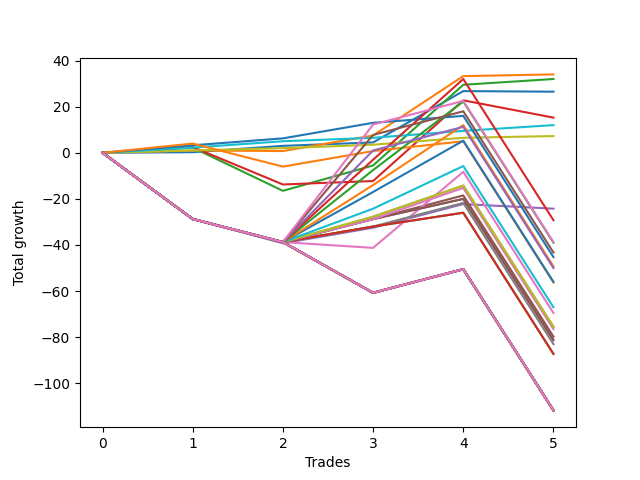

# Short Shepard 004 DB 
- Symbol: ES
- Date Range: 03/18/2022 - 07/15/2022
- Trading Period: 7:20-12:30
- Number of Trades: 5



| Name | Win Percent | Profit | Avg Profit / Trade | Avg Time / Trade |      | Name | Win Percent | Profit | Avg Profit / Trade | Avg Time / Trade |
| ---- | ----------- | ------ | ------------------ | ---------------- | ---- | ---- | ----------- | ------ | ------------------ | ---------------- |
| Sorted By <br> Profit | | | | | | Sorted By <br> Win Percentage ||||
| One | 80.00 | 17000.00 | 3400.00 | 10:00 |     | Eighty-Two | 100.00 | 6000.00 | 1200.00 | 03:44 |
| Two | 80.00 | 16000.00 | 3200.00 | 16:52 |     | Eighty-One | 100.00 | 3625.00 | 725.00 | 02:27 |
| Zero | 80.00 | 13250.00 | 2650.00 | 05:35 |     | One | 80.00 | 17000.00 | 3400.00 | 10:00 |
| Three | 60.00 | 7625.00 | 1525.00 | 30:07 |     | Two | 80.00 | 16000.00 | 3200.00 | 16:52 |
| Eighty-Two | 100.00 | 6000.00 | 1200.00 | 03:44 |     | Zero | 80.00 | 13250.00 | 2650.00 | 05:35 |
| Eighty-One | 100.00 | 3625.00 | 725.00 | 02:27 |     | Eighty-Three | 80.00 | -22625.00 | -4525.00 | 50:47 |
| Four | 40.00 | -12125.00 | -2425.00 | 56:48 |     | Three | 60.00 | 7625.00 | 1525.00 | 30:07 |
| Two Hundred Three.Five | 40.00 | -14625.00 | -2925.00 | 84:16 |     | Eighty-Four | 60.00 | -28125.00 | -5625.00 | 64:16 |
| Two Hundred Five | 40.00 | -19375.00 | -3875.00 | 99:04 |     | Four | 40.00 | -12125.00 | -2425.00 | 56:48 |
| Two Hundred Three | 40.00 | -19500.00 | -3900.00 | 83:31 |     | Two Hundred Three.Five | 40.00 | -14625.00 | -2925.00 | 84:16 |
| Two Hundred Four.Five | 40.00 | -21625.00 | -4325.00 | 98:57 |     | Two Hundred Five | 40.00 | -19375.00 | -3875.00 | 99:04 |
| Eighty-Three | 80.00 | -22625.00 | -4525.00 | 50:47 |     | Two Hundred Three | 40.00 | -19500.00 | -3900.00 | 83:31 |
| Two Hundred Two.Five | 40.00 | -24625.00 | -4925.00 | 83:05 |     | Two Hundred Four.Five | 40.00 | -21625.00 | -4325.00 | 98:57 |
| Two Hundred Four | 40.00 | -25000.00 | -5000.00 | 98:46 |     | Two Hundred Two.Five | 40.00 | -24625.00 | -4925.00 | 83:05 |
| Two Hundred Two | 40.00 | -28000.00 | -5600.00 | 82:40 |     | Two Hundred Four | 40.00 | -25000.00 | -5000.00 | 98:46 |
| Eighty-Four | 60.00 | -28125.00 | -5625.00 | 64:16 |     | Two Hundred Two | 40.00 | -28000.00 | -5600.00 | 82:40 |
| Two Hundred One.Five | 40.00 | -33500.00 | -6700.00 | 82:34 |     | Two Hundred One.Five | 40.00 | -33500.00 | -6700.00 | 82:34 |
| Six | 20.00 | -34750.00 | -6950.00 | 83:17 |     | Two Hundred One | 40.00 | -37750.00 | -7550.00 | 82:19 |
| Two Hundred One | 40.00 | -37750.00 | -7550.00 | 82:19 |     | Ninety | 40.00 | -37750.00 | -7550.00 | 82:19 |
| Ninety | 40.00 | -37750.00 | -7550.00 | 82:19 |     | Eighty-Nine | 40.00 | -38250.00 | -7650.00 | 82:18 |
| Eighty-Nine | 40.00 | -38250.00 | -7650.00 | 82:18 |     | Five | 40.00 | -39875.00 | -7975.00 | 93:05 |
| Five | 40.00 | -39875.00 | -7975.00 | 93:05 |     | Eighty-Eight | 40.00 | -40625.00 | -8125.00 | 82:17 |
| Eighty-Eight | 40.00 | -40625.00 | -8125.00 | 82:17 |     | Eighty-Seven | 40.00 | -40625.00 | -8125.00 | 82:17 |
| Eighty-Seven | 40.00 | -40625.00 | -8125.00 | 82:17 |     | Seven | 40.00 | -41500.00 | -8300.00 | 93:04 |
| Seven | 40.00 | -41500.00 | -8300.00 | 93:04 |     | Eighty-Six | 40.00 | -43625.00 | -8725.00 | 81:40 |
| Eighty-Six | 40.00 | -43625.00 | -8725.00 | 81:40 |     | Eighty-Five | 40.00 | -43625.00 | -8725.00 | 81:40 |
| Eighty-Five | 40.00 | -43625.00 | -8725.00 | 81:40 |     | Six | 20.00 | -34750.00 | -6950.00 | 83:17 |
| Two Hundred Fifteen | 20.00 | -55875.00 | -11175.00 | 113:41 |     | Two Hundred Fifteen | 20.00 | -55875.00 | -11175.00 | 113:41 |
| Two Hundred Fourteen.Five | 20.00 | -55875.00 | -11175.00 | 113:41 |     | Two Hundred Fourteen.Five | 20.00 | -55875.00 | -11175.00 | 113:41 |
| Two Hundred Fourteen | 20.00 | -55875.00 | -11175.00 | 113:41 |     | Two Hundred Fourteen | 20.00 | -55875.00 | -11175.00 | 113:41 |
| Two Hundred Thirteen.Five | 20.00 | -55875.00 | -11175.00 | 113:41 |     | Two Hundred Thirteen.Five | 20.00 | -55875.00 | -11175.00 | 113:41 |
| Two Hundred Thirteen | 20.00 | -55875.00 | -11175.00 | 113:41 |     | Two Hundred Thirteen | 20.00 | -55875.00 | -11175.00 | 113:41 |
| Two Hundred Twelve.Five | 20.00 | -55875.00 | -11175.00 | 113:41 |     | Two Hundred Twelve.Five | 20.00 | -55875.00 | -11175.00 | 113:41 |
| Two Hundred Twelve | 20.00 | -55875.00 | -11175.00 | 113:41 |     | Two Hundred Twelve | 20.00 | -55875.00 | -11175.00 | 113:41 |
| Two Hundred Eleven.Five | 20.00 | -55875.00 | -11175.00 | 113:41 |     | Two Hundred Eleven.Five | 20.00 | -55875.00 | -11175.00 | 113:41 |
| Two Hundred Eleven | 20.00 | -55875.00 | -11175.00 | 113:41 |     | Two Hundred Eleven | 20.00 | -55875.00 | -11175.00 | 113:41 |
| Two Hundred Ten.Five | 20.00 | -55875.00 | -11175.00 | 113:41 |     | Two Hundred Ten.Five | 20.00 | -55875.00 | -11175.00 | 113:41 |
| Two Hundred Ten | 20.00 | -55875.00 | -11175.00 | 113:41 |     | Two Hundred Ten | 20.00 | -55875.00 | -11175.00 | 113:41 |
| Two Hundred Nine.Five | 20.00 | -55875.00 | -11175.00 | 113:41 |     | Two Hundred Nine.Five | 20.00 | -55875.00 | -11175.00 | 113:41 |
| Two Hundred Nine | 20.00 | -55875.00 | -11175.00 | 113:41 |     | Two Hundred Nine | 20.00 | -55875.00 | -11175.00 | 113:41 |
| Two Hundred Eight.Five | 20.00 | -55875.00 | -11175.00 | 113:41 |     | Two Hundred Eight.Five | 20.00 | -55875.00 | -11175.00 | 113:41 |
| Two Hundred Eight | 20.00 | -55875.00 | -11175.00 | 113:41 |     | Two Hundred Eight | 20.00 | -55875.00 | -11175.00 | 113:41 |
| Two Hundred Seven.Five | 20.00 | -55875.00 | -11175.00 | 113:41 |     | Two Hundred Seven.Five | 20.00 | -55875.00 | -11175.00 | 113:41 |
| Two Hundred Seven | 20.00 | -55875.00 | -11175.00 | 113:41 |     | Two Hundred Seven | 20.00 | -55875.00 | -11175.00 | 113:41 |
| Two Hundred Six.Five | 20.00 | -55875.00 | -11175.00 | 113:41 |     | Two Hundred Six.Five | 20.00 | -55875.00 | -11175.00 | 113:41 |
| Two Hundred Six | 20.00 | -55875.00 | -11175.00 | 113:41 |     | Two Hundred Six | 20.00 | -55875.00 | -11175.00 | 113:41 |
| Two Hundred Five.Five | 20.00 | -55875.00 | -11175.00 | 113:41 |     | Two Hundred Five.Five | 20.00 | -55875.00 | -11175.00 | 113:41 |

## NO STOPLOSS

### Test Zero
* Sell when price hits the middle line of the 20p bollinger
* No Stoploss
* Results:
```
Total Trades: 5
Percent Up: 20.00
Percent Down: 80.00
Total Points Moved Down: 26.50
Potential Profit: 13250.00
Total Points Ups: 0.25 Count Ups: 1
Total Points Downs: 26.75 Count Downs: 4
```

<details><summary>Trades</summary>

<code>In: 2022-04-07 11:06:00		Out: 2022-04-07 11:15:20		Total Position Time: 09:20		Total Move Down: 0.25		Total to Date: 0.25</code> <br />
<code>In: 2022-05-25 11:33:00		Out: 2022-05-25 11:39:10		Total Position Time: 06:10		Total Move Down: 2.75		Total to Date: 3.00</code> <br />
<code>In: 2022-06-15 11:02:00		Out: 2022-06-15 11:02:45		Total Position Time: 00:45		Total Move Down: 1.50		Total to Date: 4.50</code> <br />
<code>In: 2022-06-15 11:48:00		Out: 2022-06-15 11:52:30		Total Position Time: 04:30		Total Move Down: 22.25		Total to Date: 26.75</code> <br />
<code>In: 2022-07-05 08:53:00		Out: 2022-07-05 09:00:10		Total Position Time: 07:10		Total Move Down: -0.25		Total to Date: 26.50</code> <br />


</details>

### Test One
* Sell when the price hits the upper line of the 20p 1std bollinger
* No Stoploss
* Results:
```
Total Trades: 5
Percent Up: 20.00
Percent Down: 80.00
Total Points Moved Down: 34.00
Potential Profit: 17000.00
Total Points Ups: 0.25 Count Ups: 1
Total Points Downs: 34.25 Count Downs: 4
```

<details><summary>Trades</summary>

<code>In: 2022-04-07 11:06:00		Out: 2022-04-07 11:18:00		Total Position Time: 12:00		Total Move Down: 1.00		Total to Date: 1.00</code> <br />
<code>In: 2022-05-25 11:33:00		Out: 2022-05-25 11:49:55		Total Position Time: 16:55		Total Move Down: -0.25		Total to Date: 0.75</code> <br />
<code>In: 2022-06-15 11:02:00		Out: 2022-06-15 11:03:00		Total Position Time: 01:00		Total Move Down: 6.75		Total to Date: 7.50</code> <br />
<code>In: 2022-06-15 11:48:00		Out: 2022-06-15 11:57:35		Total Position Time: 09:35		Total Move Down: 25.75		Total to Date: 33.25</code> <br />
<code>In: 2022-07-05 08:53:00		Out: 2022-07-05 09:03:30		Total Position Time: 10:30		Total Move Down: 0.75		Total to Date: 34.00</code> <br />


</details>

### Test Two
* Sell when the price hits the upper line of the 20p 2std bollinger
* No Stoploss
* Results:
```
Total Trades: 5
Percent Up: 20.00
Percent Down: 80.00
Total Points Moved Down: 32.00
Potential Profit: 16000.00
Total Points Ups: 18.75 Count Ups: 1
Total Points Downs: 50.75 Count Downs: 4
```

<details><summary>Trades</summary>

<code>In: 2022-04-07 11:06:00		Out: 2022-04-07 11:18:20		Total Position Time: 12:20		Total Move Down: 2.25		Total to Date: 2.25</code> <br />
<code>In: 2022-05-25 11:33:00		Out: 2022-05-25 12:22:50		Total Position Time: 49:50		Total Move Down: -18.75		Total to Date: -16.50</code> <br />
<code>In: 2022-06-15 11:02:00		Out: 2022-06-15 11:03:10		Total Position Time: 01:10		Total Move Down: 11.00		Total to Date: -5.50</code> <br />
<code>In: 2022-06-15 11:48:00		Out: 2022-06-15 11:58:10		Total Position Time: 10:10		Total Move Down: 35.00		Total to Date: 29.50</code> <br />
<code>In: 2022-07-05 08:53:00		Out: 2022-07-05 09:03:50		Total Position Time: 10:50		Total Move Down: 2.50		Total to Date: 32.00</code> <br />


</details>

### Test Three
* Sell when price hits the middle line of the 50p bollinger
* No Stoploss
* Results:
```
Total Trades: 5
Percent Up: 40.00
Percent Down: 60.00
Total Points Moved Down: 15.25
Potential Profit: 7625.00
Total Points Ups: 23.75 Count Ups: 2
Total Points Downs: 39.00 Count Downs: 3
```

<details><summary>Trades</summary>

<code>In: 2022-04-07 11:06:00		Out: 2022-04-07 11:33:40		Total Position Time: 27:40		Total Move Down: 2.50		Total to Date: 2.50</code> <br />
<code>In: 2022-05-25 11:33:00		Out: 2022-05-25 12:34:20		Total Position Time: 61:20		Total Move Down: -16.25		Total to Date: -13.75</code> <br />
<code>In: 2022-06-15 11:02:00		Out: 2022-06-15 11:02:45		Total Position Time: 00:45		Total Move Down: 1.50		Total to Date: -12.25</code> <br />
<code>In: 2022-06-15 11:48:00		Out: 2022-06-15 11:58:10		Total Position Time: 10:10		Total Move Down: 35.00		Total to Date: 22.75</code> <br />
<code>In: 2022-07-05 08:53:00		Out: 2022-07-05 09:43:40		Total Position Time: 50:40		Total Move Down: -7.50		Total to Date: 15.25</code> <br />


</details>

### Test Four
* Sell when the price hits the upper line of the 50p 1std bollinger
* No Stoploss
* Results:
```
Total Trades: 5
Percent Up: 60.00
Percent Down: 40.00
Total Points Moved Down: -24.25
Potential Profit: -12125.00
Total Points Ups: 41.25 Count Ups: 3
Total Points Downs: 17.00 Count Downs: 2
```

<details><summary>Trades</summary>

<code>In: 2022-04-07 11:06:00		Out: 2022-04-07 12:46:05		Total Position Time: 100:05		Total Move Down: -28.75		Total to Date: -28.75</code> <br />
<code>In: 2022-05-25 11:33:00		Out: 2022-05-25 12:39:45		Total Position Time: 66:45		Total Move Down: -10.50		Total to Date: -39.25</code> <br />
<code>In: 2022-06-15 11:02:00		Out: 2022-06-15 11:03:00		Total Position Time: 01:00		Total Move Down: 6.75		Total to Date: -32.50</code> <br />
<code>In: 2022-06-15 11:48:00		Out: 2022-06-15 12:46:05		Total Position Time: 58:05		Total Move Down: 10.25		Total to Date: -22.25</code> <br />
<code>In: 2022-07-05 08:53:00		Out: 2022-07-05 09:51:05		Total Position Time: 58:05		Total Move Down: -2.00		Total to Date: -24.25</code> <br />


</details>

### Test Five
* Sell when the price hits the upper line of the 50p 2std bollinger
* No Stoploss
* Results:
```
Total Trades: 5
Percent Up: 60.00
Percent Down: 40.00
Total Points Moved Down: -79.75
Potential Profit: -39875.00
Total Points Ups: 100.00 Count Ups: 3
Total Points Downs: 20.25 Count Downs: 2
```

<details><summary>Trades</summary>

<code>In: 2022-04-07 11:06:00		Out: 2022-04-07 12:46:05		Total Position Time: 100:05		Total Move Down: -28.75		Total to Date: -28.75</code> <br />
<code>In: 2022-05-25 11:33:00		Out: 2022-05-25 12:46:05		Total Position Time: 73:05		Total Move Down: -10.00		Total to Date: -38.75</code> <br />
<code>In: 2022-06-15 11:02:00		Out: 2022-06-15 11:03:05		Total Position Time: 01:05		Total Move Down: 10.00		Total to Date: -28.75</code> <br />
<code>In: 2022-06-15 11:48:00		Out: 2022-06-15 12:46:05		Total Position Time: 58:05		Total Move Down: 10.25		Total to Date: -18.50</code> <br />
<code>In: 2022-07-05 08:53:00		Out: 2022-07-05 12:46:05		Total Position Time: 233:05		Total Move Down: -61.25		Total to Date: -79.75</code> <br />


</details>

### Test Six
* Sell when the price hits the middle line of the 1std VWAP
* No Stoploss
* Results:
```
Total Trades: 5
Percent Up: 80.00
Percent Down: 20.00
Total Points Moved Down: -69.50
Potential Profit: -34750.00
Total Points Ups: 102.50 Count Ups: 4
Total Points Downs: 33.00 Count Downs: 1
```

<details><summary>Trades</summary>

<code>In: 2022-04-07 11:06:00		Out: 2022-04-07 12:46:05		Total Position Time: 100:05		Total Move Down: -28.75		Total to Date: -28.75</code> <br />
<code>In: 2022-05-25 11:33:00		Out: 2022-05-25 12:46:05		Total Position Time: 73:05		Total Move Down: -10.00		Total to Date: -38.75</code> <br />
<code>In: 2022-06-15 11:02:00		Out: 2022-06-15 11:02:15		Total Position Time: 00:15		Total Move Down: -2.50		Total to Date: -41.25</code> <br />
<code>In: 2022-06-15 11:48:00		Out: 2022-06-15 11:57:55		Total Position Time: 09:55		Total Move Down: 33.00		Total to Date: -8.25</code> <br />
<code>In: 2022-07-05 08:53:00		Out: 2022-07-05 12:46:05		Total Position Time: 233:05		Total Move Down: -61.25		Total to Date: -69.50</code> <br />


</details>

### Test Seven
* Sell when the price hits the upper line of the 1std VWAP
* No Stoploss
* Results:
```
Total Trades: 5
Percent Up: 60.00
Percent Down: 40.00
Total Points Moved Down: -83.00
Potential Profit: -41500.00
Total Points Ups: 100.00 Count Ups: 3
Total Points Downs: 17.00 Count Downs: 2
```

<details><summary>Trades</summary>

<code>In: 2022-04-07 11:06:00		Out: 2022-04-07 12:46:05		Total Position Time: 100:05		Total Move Down: -28.75		Total to Date: -28.75</code> <br />
<code>In: 2022-05-25 11:33:00		Out: 2022-05-25 12:46:05		Total Position Time: 73:05		Total Move Down: -10.00		Total to Date: -38.75</code> <br />
<code>In: 2022-06-15 11:02:00		Out: 2022-06-15 11:03:00		Total Position Time: 01:00		Total Move Down: 6.75		Total to Date: -32.00</code> <br />
<code>In: 2022-06-15 11:48:00		Out: 2022-06-15 12:46:05		Total Position Time: 58:05		Total Move Down: 10.25		Total to Date: -21.75</code> <br />
<code>In: 2022-07-05 08:53:00		Out: 2022-07-05 12:46:05		Total Position Time: 233:05		Total Move Down: -61.25		Total to Date: -83.00</code> <br />


</details>

## TAKE PROFIT

### Test Eighty-One
* Take Profit of 1 Point
* No Stoploss
* Results:
```
Total Trades: 5
Percent Up: 0.00
Percent Down: 100.00
Total Points Moved Down: 7.25
Potential Profit: 3625.00
Total Points Ups: 0.00 Count Ups: 0
Total Points Downs: 7.25 Count Downs: 5
```

<details><summary>Trades</summary>

<code>In: 2022-04-07 11:06:00		Out: 2022-04-07 11:06:15		Total Position Time: 00:15		Total Move Down: 1.00		Total to Date: 1.00</code> <br />
<code>In: 2022-05-25 11:33:00		Out: 2022-05-25 11:33:15		Total Position Time: 00:15		Total Move Down: 1.00		Total to Date: 2.00</code> <br />
<code>In: 2022-06-15 11:02:00		Out: 2022-06-15 11:02:45		Total Position Time: 00:45		Total Move Down: 1.50		Total to Date: 3.50</code> <br />
<code>In: 2022-06-15 11:48:00		Out: 2022-06-15 11:48:15		Total Position Time: 00:15		Total Move Down: 3.00		Total to Date: 6.50</code> <br />
<code>In: 2022-07-05 08:53:00		Out: 2022-07-05 09:03:45		Total Position Time: 10:45		Total Move Down: 0.75		Total to Date: 7.25</code> <br />


</details>

### Test Eighty-Two
* Take Profit of 2 Point
* No Stoploss
* Results:
```
Total Trades: 5
Percent Up: 0.00
Percent Down: 100.00
Total Points Moved Down: 12.00
Potential Profit: 6000.00
Total Points Ups: 0.00 Count Ups: 0
Total Points Downs: 12.00 Count Downs: 5
```

<details><summary>Trades</summary>

<code>In: 2022-04-07 11:06:00		Out: 2022-04-07 11:06:40		Total Position Time: 00:40		Total Move Down: 2.25		Total to Date: 2.25</code> <br />
<code>In: 2022-05-25 11:33:00		Out: 2022-05-25 11:39:10		Total Position Time: 06:10		Total Move Down: 2.75		Total to Date: 5.00</code> <br />
<code>In: 2022-06-15 11:02:00		Out: 2022-06-15 11:02:45		Total Position Time: 00:45		Total Move Down: 1.50		Total to Date: 6.50</code> <br />
<code>In: 2022-06-15 11:48:00		Out: 2022-06-15 11:48:15		Total Position Time: 00:15		Total Move Down: 3.00		Total to Date: 9.50</code> <br />
<code>In: 2022-07-05 08:53:00		Out: 2022-07-05 09:03:50		Total Position Time: 10:50		Total Move Down: 2.50		Total to Date: 12.00</code> <br />


</details>

### Test Eighty-Three
* Take Profit of 3 Point
* No Stoploss
* Results:
```
Total Trades: 5
Percent Up: 20.00
Percent Down: 80.00
Total Points Moved Down: -45.25
Potential Profit: -22625.00
Total Points Ups: 61.25 Count Ups: 1
Total Points Downs: 16.00 Count Downs: 4
```

<details><summary>Trades</summary>

<code>In: 2022-04-07 11:06:00		Out: 2022-04-07 11:18:40		Total Position Time: 12:40		Total Move Down: 3.25		Total to Date: 3.25</code> <br />
<code>In: 2022-05-25 11:33:00		Out: 2022-05-25 11:39:55		Total Position Time: 06:55		Total Move Down: 3.00		Total to Date: 6.25</code> <br />
<code>In: 2022-06-15 11:02:00		Out: 2022-06-15 11:03:00		Total Position Time: 01:00		Total Move Down: 6.75		Total to Date: 13.00</code> <br />
<code>In: 2022-06-15 11:48:00		Out: 2022-06-15 11:48:15		Total Position Time: 00:15		Total Move Down: 3.00		Total to Date: 16.00</code> <br />
<code>In: 2022-07-05 08:53:00		Out: 2022-07-05 12:46:05		Total Position Time: 233:05		Total Move Down: -61.25		Total to Date: -45.25</code> <br />


</details>

### Test Eighty-Four
* Take Profit of 4 Point
* No Stoploss
* Results:
```
Total Trades: 5
Percent Up: 40.00
Percent Down: 60.00
Total Points Moved Down: -56.25
Potential Profit: -28125.00
Total Points Ups: 71.25 Count Ups: 2
Total Points Downs: 15.00 Count Downs: 3
```

<details><summary>Trades</summary>

<code>In: 2022-04-07 11:06:00		Out: 2022-04-07 11:19:10		Total Position Time: 13:10		Total Move Down: 4.00		Total to Date: 4.00</code> <br />
<code>In: 2022-05-25 11:33:00		Out: 2022-05-25 12:46:05		Total Position Time: 73:05		Total Move Down: -10.00		Total to Date: -6.00</code> <br />
<code>In: 2022-06-15 11:02:00		Out: 2022-06-15 11:03:00		Total Position Time: 01:00		Total Move Down: 6.75		Total to Date: 0.75</code> <br />
<code>In: 2022-06-15 11:48:00		Out: 2022-06-15 11:49:00		Total Position Time: 01:00		Total Move Down: 4.25		Total to Date: 5.00</code> <br />
<code>In: 2022-07-05 08:53:00		Out: 2022-07-05 12:46:05		Total Position Time: 233:05		Total Move Down: -61.25		Total to Date: -56.25</code> <br />


</details>

### Test Eighty-Five
* Take Profit of 5 Point
* No Stoploss
* Results:
```
Total Trades: 5
Percent Up: 60.00
Percent Down: 40.00
Total Points Moved Down: -87.25
Potential Profit: -43625.00
Total Points Ups: 100.00 Count Ups: 3
Total Points Downs: 12.75 Count Downs: 2
```

<details><summary>Trades</summary>

<code>In: 2022-04-07 11:06:00		Out: 2022-04-07 12:46:05		Total Position Time: 100:05		Total Move Down: -28.75		Total to Date: -28.75</code> <br />
<code>In: 2022-05-25 11:33:00		Out: 2022-05-25 12:46:05		Total Position Time: 73:05		Total Move Down: -10.00		Total to Date: -38.75</code> <br />
<code>In: 2022-06-15 11:02:00		Out: 2022-06-15 11:03:00		Total Position Time: 01:00		Total Move Down: 6.75		Total to Date: -32.00</code> <br />
<code>In: 2022-06-15 11:48:00		Out: 2022-06-15 11:49:05		Total Position Time: 01:05		Total Move Down: 6.00		Total to Date: -26.00</code> <br />
<code>In: 2022-07-05 08:53:00		Out: 2022-07-05 12:46:05		Total Position Time: 233:05		Total Move Down: -61.25		Total to Date: -87.25</code> <br />


</details>

### Test Eighty-Six
* Take Profit of 6 Point
* No Stoploss
* Results:
```
Total Trades: 5
Percent Up: 60.00
Percent Down: 40.00
Total Points Moved Down: -87.25
Potential Profit: -43625.00
Total Points Ups: 100.00 Count Ups: 3
Total Points Downs: 12.75 Count Downs: 2
```

<details><summary>Trades</summary>

<code>In: 2022-04-07 11:06:00		Out: 2022-04-07 12:46:05		Total Position Time: 100:05		Total Move Down: -28.75		Total to Date: -28.75</code> <br />
<code>In: 2022-05-25 11:33:00		Out: 2022-05-25 12:46:05		Total Position Time: 73:05		Total Move Down: -10.00		Total to Date: -38.75</code> <br />
<code>In: 2022-06-15 11:02:00		Out: 2022-06-15 11:03:00		Total Position Time: 01:00		Total Move Down: 6.75		Total to Date: -32.00</code> <br />
<code>In: 2022-06-15 11:48:00		Out: 2022-06-15 11:49:05		Total Position Time: 01:05		Total Move Down: 6.00		Total to Date: -26.00</code> <br />
<code>In: 2022-07-05 08:53:00		Out: 2022-07-05 12:46:05		Total Position Time: 233:05		Total Move Down: -61.25		Total to Date: -87.25</code> <br />


</details>

### Test Eighty-Seven
* Take Profit of 7 Point
* No Stoploss
* Results:
```
Total Trades: 5
Percent Up: 60.00
Percent Down: 40.00
Total Points Moved Down: -81.25
Potential Profit: -40625.00
Total Points Ups: 100.00 Count Ups: 3
Total Points Downs: 18.75 Count Downs: 2
```

<details><summary>Trades</summary>

<code>In: 2022-04-07 11:06:00		Out: 2022-04-07 12:46:05		Total Position Time: 100:05		Total Move Down: -28.75		Total to Date: -28.75</code> <br />
<code>In: 2022-05-25 11:33:00		Out: 2022-05-25 12:46:05		Total Position Time: 73:05		Total Move Down: -10.00		Total to Date: -38.75</code> <br />
<code>In: 2022-06-15 11:02:00		Out: 2022-06-15 11:03:05		Total Position Time: 01:05		Total Move Down: 10.00		Total to Date: -28.75</code> <br />
<code>In: 2022-06-15 11:48:00		Out: 2022-06-15 11:52:05		Total Position Time: 04:05		Total Move Down: 8.75		Total to Date: -20.00</code> <br />
<code>In: 2022-07-05 08:53:00		Out: 2022-07-05 12:46:05		Total Position Time: 233:05		Total Move Down: -61.25		Total to Date: -81.25</code> <br />


</details>

### Test Eighty-Eight
* Take Profit of 8 Point
* No Stoploss
* Results:
```
Total Trades: 5
Percent Up: 60.00
Percent Down: 40.00
Total Points Moved Down: -81.25
Potential Profit: -40625.00
Total Points Ups: 100.00 Count Ups: 3
Total Points Downs: 18.75 Count Downs: 2
```

<details><summary>Trades</summary>

<code>In: 2022-04-07 11:06:00		Out: 2022-04-07 12:46:05		Total Position Time: 100:05		Total Move Down: -28.75		Total to Date: -28.75</code> <br />
<code>In: 2022-05-25 11:33:00		Out: 2022-05-25 12:46:05		Total Position Time: 73:05		Total Move Down: -10.00		Total to Date: -38.75</code> <br />
<code>In: 2022-06-15 11:02:00		Out: 2022-06-15 11:03:05		Total Position Time: 01:05		Total Move Down: 10.00		Total to Date: -28.75</code> <br />
<code>In: 2022-06-15 11:48:00		Out: 2022-06-15 11:52:05		Total Position Time: 04:05		Total Move Down: 8.75		Total to Date: -20.00</code> <br />
<code>In: 2022-07-05 08:53:00		Out: 2022-07-05 12:46:05		Total Position Time: 233:05		Total Move Down: -61.25		Total to Date: -81.25</code> <br />


</details>

### Test Eighty-Nine
* Take Profit of 9 Point
* No Stoploss
* Results:
```
Total Trades: 5
Percent Up: 60.00
Percent Down: 40.00
Total Points Moved Down: -76.50
Potential Profit: -38250.00
Total Points Ups: 100.00 Count Ups: 3
Total Points Downs: 23.50 Count Downs: 2
```

<details><summary>Trades</summary>

<code>In: 2022-04-07 11:06:00		Out: 2022-04-07 12:46:05		Total Position Time: 100:05		Total Move Down: -28.75		Total to Date: -28.75</code> <br />
<code>In: 2022-05-25 11:33:00		Out: 2022-05-25 12:46:05		Total Position Time: 73:05		Total Move Down: -10.00		Total to Date: -38.75</code> <br />
<code>In: 2022-06-15 11:02:00		Out: 2022-06-15 11:03:05		Total Position Time: 01:05		Total Move Down: 10.00		Total to Date: -28.75</code> <br />
<code>In: 2022-06-15 11:48:00		Out: 2022-06-15 11:52:10		Total Position Time: 04:10		Total Move Down: 13.50		Total to Date: -15.25</code> <br />
<code>In: 2022-07-05 08:53:00		Out: 2022-07-05 12:46:05		Total Position Time: 233:05		Total Move Down: -61.25		Total to Date: -76.50</code> <br />


</details>

### Test Ninety
* Take Profit of 10 Point
* No Stoploss
* Results:
```
Total Trades: 5
Percent Up: 60.00
Percent Down: 40.00
Total Points Moved Down: -75.50
Potential Profit: -37750.00
Total Points Ups: 100.00 Count Ups: 3
Total Points Downs: 24.50 Count Downs: 2
```

<details><summary>Trades</summary>

<code>In: 2022-04-07 11:06:00		Out: 2022-04-07 12:46:05		Total Position Time: 100:05		Total Move Down: -28.75		Total to Date: -28.75</code> <br />
<code>In: 2022-05-25 11:33:00		Out: 2022-05-25 12:46:05		Total Position Time: 73:05		Total Move Down: -10.00		Total to Date: -38.75</code> <br />
<code>In: 2022-06-15 11:02:00		Out: 2022-06-15 11:03:10		Total Position Time: 01:10		Total Move Down: 11.00		Total to Date: -27.75</code> <br />
<code>In: 2022-06-15 11:48:00		Out: 2022-06-15 11:52:10		Total Position Time: 04:10		Total Move Down: 13.50		Total to Date: -14.25</code> <br />
<code>In: 2022-07-05 08:53:00		Out: 2022-07-05 12:46:05		Total Position Time: 233:05		Total Move Down: -61.25		Total to Date: -75.50</code> <br />


</details>

## DAILY TAKE PROFITS

### Test Two Hundred One
* Take Profit of 10 Point
* No Stoploss
* Results:
```
Total Trades: 5
Percent Up: 60.00
Percent Down: 40.00
Total Points Moved Down: -75.50
Potential Profit: -37750.00
Total Points Ups: 100.00 Count Ups: 3
Total Points Downs: 24.50 Count Downs: 2
```

<details><summary>Trades</summary>

<code>In: 2022-04-07 11:06:00		Out: 2022-04-07 12:46:05		Total Position Time: 100:05		Total Move Down: -28.75		Total to Date: -28.75</code> <br />
<code>In: 2022-05-25 11:33:00		Out: 2022-05-25 12:46:05		Total Position Time: 73:05		Total Move Down: -10.00		Total to Date: -38.75</code> <br />
<code>In: 2022-06-15 11:02:00		Out: 2022-06-15 11:03:10		Total Position Time: 01:10		Total Move Down: 11.00		Total to Date: -27.75</code> <br />
<code>In: 2022-06-15 11:48:00		Out: 2022-06-15 11:52:10		Total Position Time: 04:10		Total Move Down: 13.50		Total to Date: -14.25</code> <br />
<code>In: 2022-07-05 08:53:00		Out: 2022-07-05 12:46:05		Total Position Time: 233:05		Total Move Down: -61.25		Total to Date: -75.50</code> <br />


</details>

### Test Two Hundred One.Five
* Take Profit of 15 Point
* No Stoploss
* Results:
```
Total Trades: 5
Percent Up: 60.00
Percent Down: 40.00
Total Points Moved Down: -67.00
Potential Profit: -33500.00
Total Points Ups: 100.00 Count Ups: 3
Total Points Downs: 33.00 Count Downs: 2
```

<details><summary>Trades</summary>

<code>In: 2022-04-07 11:06:00		Out: 2022-04-07 12:46:05		Total Position Time: 100:05		Total Move Down: -28.75		Total to Date: -28.75</code> <br />
<code>In: 2022-05-25 11:33:00		Out: 2022-05-25 12:46:05		Total Position Time: 73:05		Total Move Down: -10.00		Total to Date: -38.75</code> <br />
<code>In: 2022-06-15 11:02:00		Out: 2022-06-15 11:04:20		Total Position Time: 02:20		Total Move Down: 14.50		Total to Date: -24.25</code> <br />
<code>In: 2022-06-15 11:48:00		Out: 2022-06-15 11:52:15		Total Position Time: 04:15		Total Move Down: 18.50		Total to Date: -5.75</code> <br />
<code>In: 2022-07-05 08:53:00		Out: 2022-07-05 12:46:05		Total Position Time: 233:05		Total Move Down: -61.25		Total to Date: -67.00</code> <br />


</details>

### Test Two Hundred Two
* Take Profit of 20 Point
* No Stoploss
* Results:
```
Total Trades: 5
Percent Up: 60.00
Percent Down: 40.00
Total Points Moved Down: -56.00
Potential Profit: -28000.00
Total Points Ups: 100.00 Count Ups: 3
Total Points Downs: 44.00 Count Downs: 2
```

<details><summary>Trades</summary>

<code>In: 2022-04-07 11:06:00		Out: 2022-04-07 12:46:05		Total Position Time: 100:05		Total Move Down: -28.75		Total to Date: -28.75</code> <br />
<code>In: 2022-05-25 11:33:00		Out: 2022-05-25 12:46:05		Total Position Time: 73:05		Total Move Down: -10.00		Total to Date: -38.75</code> <br />
<code>In: 2022-06-15 11:02:00		Out: 2022-06-15 11:04:35		Total Position Time: 02:35		Total Move Down: 21.75		Total to Date: -17.00</code> <br />
<code>In: 2022-06-15 11:48:00		Out: 2022-06-15 11:52:30		Total Position Time: 04:30		Total Move Down: 22.25		Total to Date: 5.25</code> <br />
<code>In: 2022-07-05 08:53:00		Out: 2022-07-05 12:46:05		Total Position Time: 233:05		Total Move Down: -61.25		Total to Date: -56.00</code> <br />


</details>

### Test Two Hundred Two.Five
* Take Profit of 25 Point
* No Stoploss
* Results:
```
Total Trades: 5
Percent Up: 60.00
Percent Down: 40.00
Total Points Moved Down: -49.25
Potential Profit: -24625.00
Total Points Ups: 100.00 Count Ups: 3
Total Points Downs: 50.75 Count Downs: 2
```

<details><summary>Trades</summary>

<code>In: 2022-04-07 11:06:00		Out: 2022-04-07 12:46:05		Total Position Time: 100:05		Total Move Down: -28.75		Total to Date: -28.75</code> <br />
<code>In: 2022-05-25 11:33:00		Out: 2022-05-25 12:46:05		Total Position Time: 73:05		Total Move Down: -10.00		Total to Date: -38.75</code> <br />
<code>In: 2022-06-15 11:02:00		Out: 2022-06-15 11:04:40		Total Position Time: 02:40		Total Move Down: 24.75		Total to Date: -14.00</code> <br />
<code>In: 2022-06-15 11:48:00		Out: 2022-06-15 11:54:30		Total Position Time: 06:30		Total Move Down: 26.00		Total to Date: 12.00</code> <br />
<code>In: 2022-07-05 08:53:00		Out: 2022-07-05 12:46:05		Total Position Time: 233:05		Total Move Down: -61.25		Total to Date: -49.25</code> <br />


</details>

### Test Two Hundred Three
* Take Profit of 30 Point
* No Stoploss
* Results:
```
Total Trades: 5
Percent Up: 60.00
Percent Down: 40.00
Total Points Moved Down: -39.00
Potential Profit: -19500.00
Total Points Ups: 100.00 Count Ups: 3
Total Points Downs: 61.00 Count Downs: 2
```

<details><summary>Trades</summary>

<code>In: 2022-04-07 11:06:00		Out: 2022-04-07 12:46:05		Total Position Time: 100:05		Total Move Down: -28.75		Total to Date: -28.75</code> <br />
<code>In: 2022-05-25 11:33:00		Out: 2022-05-25 12:46:05		Total Position Time: 73:05		Total Move Down: -10.00		Total to Date: -38.75</code> <br />
<code>In: 2022-06-15 11:02:00		Out: 2022-06-15 11:06:35		Total Position Time: 04:35		Total Move Down: 31.25		Total to Date: -7.50</code> <br />
<code>In: 2022-06-15 11:48:00		Out: 2022-06-15 11:54:45		Total Position Time: 06:45		Total Move Down: 29.75		Total to Date: 22.25</code> <br />
<code>In: 2022-07-05 08:53:00		Out: 2022-07-05 12:46:05		Total Position Time: 233:05		Total Move Down: -61.25		Total to Date: -39.00</code> <br />


</details>

### Test Two Hundred Three.Five
* Take Profit of 35 Point
* No Stoploss
* Results:
```
Total Trades: 5
Percent Up: 60.00
Percent Down: 40.00
Total Points Moved Down: -29.25
Potential Profit: -14625.00
Total Points Ups: 100.00 Count Ups: 3
Total Points Downs: 70.75 Count Downs: 2
```

<details><summary>Trades</summary>

<code>In: 2022-04-07 11:06:00		Out: 2022-04-07 12:46:05		Total Position Time: 100:05		Total Move Down: -28.75		Total to Date: -28.75</code> <br />
<code>In: 2022-05-25 11:33:00		Out: 2022-05-25 12:46:05		Total Position Time: 73:05		Total Move Down: -10.00		Total to Date: -38.75</code> <br />
<code>In: 2022-06-15 11:02:00		Out: 2022-06-15 11:06:55		Total Position Time: 04:55		Total Move Down: 35.75		Total to Date: -3.00</code> <br />
<code>In: 2022-06-15 11:48:00		Out: 2022-06-15 11:58:10		Total Position Time: 10:10		Total Move Down: 35.00		Total to Date: 32.00</code> <br />
<code>In: 2022-07-05 08:53:00		Out: 2022-07-05 12:46:05		Total Position Time: 233:05		Total Move Down: -61.25		Total to Date: -29.25</code> <br />


</details>

### Test Two Hundred Four
* Take Profit of 40 Point
* No Stoploss
* Results:
```
Total Trades: 5
Percent Up: 60.00
Percent Down: 40.00
Total Points Moved Down: -50.00
Potential Profit: -25000.00
Total Points Ups: 100.00 Count Ups: 3
Total Points Downs: 50.00 Count Downs: 2
```

<details><summary>Trades</summary>

<code>In: 2022-04-07 11:06:00		Out: 2022-04-07 12:46:05		Total Position Time: 100:05		Total Move Down: -28.75		Total to Date: -28.75</code> <br />
<code>In: 2022-05-25 11:33:00		Out: 2022-05-25 12:46:05		Total Position Time: 73:05		Total Move Down: -10.00		Total to Date: -38.75</code> <br />
<code>In: 2022-06-15 11:02:00		Out: 2022-06-15 11:31:30		Total Position Time: 29:30		Total Move Down: 39.75		Total to Date: 1.00</code> <br />
<code>In: 2022-06-15 11:48:00		Out: 2022-06-15 12:46:05		Total Position Time: 58:05		Total Move Down: 10.25		Total to Date: 11.25</code> <br />
<code>In: 2022-07-05 08:53:00		Out: 2022-07-05 12:46:05		Total Position Time: 233:05		Total Move Down: -61.25		Total to Date: -50.00</code> <br />


</details>

### Test Two Hundred Four.Five
* Take Profit of 45 Point
* No Stoploss
* Results:
```
Total Trades: 5
Percent Up: 60.00
Percent Down: 40.00
Total Points Moved Down: -43.25
Potential Profit: -21625.00
Total Points Ups: 100.00 Count Ups: 3
Total Points Downs: 56.75 Count Downs: 2
```

<details><summary>Trades</summary>

<code>In: 2022-04-07 11:06:00		Out: 2022-04-07 12:46:05		Total Position Time: 100:05		Total Move Down: -28.75		Total to Date: -28.75</code> <br />
<code>In: 2022-05-25 11:33:00		Out: 2022-05-25 12:46:05		Total Position Time: 73:05		Total Move Down: -10.00		Total to Date: -38.75</code> <br />
<code>In: 2022-06-15 11:02:00		Out: 2022-06-15 11:32:25		Total Position Time: 30:25		Total Move Down: 46.50		Total to Date: 7.75</code> <br />
<code>In: 2022-06-15 11:48:00		Out: 2022-06-15 12:46:05		Total Position Time: 58:05		Total Move Down: 10.25		Total to Date: 18.00</code> <br />
<code>In: 2022-07-05 08:53:00		Out: 2022-07-05 12:46:05		Total Position Time: 233:05		Total Move Down: -61.25		Total to Date: -43.25</code> <br />


</details>

### Test Two Hundred Five
* Take Profit of 50 Point
* No Stoploss
* Results:
```
Total Trades: 5
Percent Up: 60.00
Percent Down: 40.00
Total Points Moved Down: -38.75
Potential Profit: -19375.00
Total Points Ups: 100.00 Count Ups: 3
Total Points Downs: 61.25 Count Downs: 2
```

<details><summary>Trades</summary>

<code>In: 2022-04-07 11:06:00		Out: 2022-04-07 12:46:05		Total Position Time: 100:05		Total Move Down: -28.75		Total to Date: -28.75</code> <br />
<code>In: 2022-05-25 11:33:00		Out: 2022-05-25 12:46:05		Total Position Time: 73:05		Total Move Down: -10.00		Total to Date: -38.75</code> <br />
<code>In: 2022-06-15 11:02:00		Out: 2022-06-15 11:33:00		Total Position Time: 31:00		Total Move Down: 51.00		Total to Date: 12.25</code> <br />
<code>In: 2022-06-15 11:48:00		Out: 2022-06-15 12:46:05		Total Position Time: 58:05		Total Move Down: 10.25		Total to Date: 22.50</code> <br />
<code>In: 2022-07-05 08:53:00		Out: 2022-07-05 12:46:05		Total Position Time: 233:05		Total Move Down: -61.25		Total to Date: -38.75</code> <br />


</details>

### Test Two Hundred Five.Five
* Take Profit of 55 Point
* No Stoploss
* Results:
```
Total Trades: 5
Percent Up: 80.00
Percent Down: 20.00
Total Points Moved Down: -111.75
Potential Profit: -55875.00
Total Points Ups: 122.00 Count Ups: 4
Total Points Downs: 10.25 Count Downs: 1
```

<details><summary>Trades</summary>

<code>In: 2022-04-07 11:06:00		Out: 2022-04-07 12:46:05		Total Position Time: 100:05		Total Move Down: -28.75		Total to Date: -28.75</code> <br />
<code>In: 2022-05-25 11:33:00		Out: 2022-05-25 12:46:05		Total Position Time: 73:05		Total Move Down: -10.00		Total to Date: -38.75</code> <br />
<code>In: 2022-06-15 11:02:00		Out: 2022-06-15 12:46:05		Total Position Time: 104:05		Total Move Down: -22.00		Total to Date: -60.75</code> <br />
<code>In: 2022-06-15 11:48:00		Out: 2022-06-15 12:46:05		Total Position Time: 58:05		Total Move Down: 10.25		Total to Date: -50.50</code> <br />
<code>In: 2022-07-05 08:53:00		Out: 2022-07-05 12:46:05		Total Position Time: 233:05		Total Move Down: -61.25		Total to Date: -111.75</code> <br />


</details>

### Test Two Hundred Six
* Take Profit of 60 Point
* No Stoploss
* Results:
```
Total Trades: 5
Percent Up: 80.00
Percent Down: 20.00
Total Points Moved Down: -111.75
Potential Profit: -55875.00
Total Points Ups: 122.00 Count Ups: 4
Total Points Downs: 10.25 Count Downs: 1
```

<details><summary>Trades</summary>

<code>In: 2022-04-07 11:06:00		Out: 2022-04-07 12:46:05		Total Position Time: 100:05		Total Move Down: -28.75		Total to Date: -28.75</code> <br />
<code>In: 2022-05-25 11:33:00		Out: 2022-05-25 12:46:05		Total Position Time: 73:05		Total Move Down: -10.00		Total to Date: -38.75</code> <br />
<code>In: 2022-06-15 11:02:00		Out: 2022-06-15 12:46:05		Total Position Time: 104:05		Total Move Down: -22.00		Total to Date: -60.75</code> <br />
<code>In: 2022-06-15 11:48:00		Out: 2022-06-15 12:46:05		Total Position Time: 58:05		Total Move Down: 10.25		Total to Date: -50.50</code> <br />
<code>In: 2022-07-05 08:53:00		Out: 2022-07-05 12:46:05		Total Position Time: 233:05		Total Move Down: -61.25		Total to Date: -111.75</code> <br />


</details>

### Test Two Hundred Six.Five
* Take Profit of 65 Point
* No Stoploss
* Results:
```
Total Trades: 5
Percent Up: 80.00
Percent Down: 20.00
Total Points Moved Down: -111.75
Potential Profit: -55875.00
Total Points Ups: 122.00 Count Ups: 4
Total Points Downs: 10.25 Count Downs: 1
```

<details><summary>Trades</summary>

<code>In: 2022-04-07 11:06:00		Out: 2022-04-07 12:46:05		Total Position Time: 100:05		Total Move Down: -28.75		Total to Date: -28.75</code> <br />
<code>In: 2022-05-25 11:33:00		Out: 2022-05-25 12:46:05		Total Position Time: 73:05		Total Move Down: -10.00		Total to Date: -38.75</code> <br />
<code>In: 2022-06-15 11:02:00		Out: 2022-06-15 12:46:05		Total Position Time: 104:05		Total Move Down: -22.00		Total to Date: -60.75</code> <br />
<code>In: 2022-06-15 11:48:00		Out: 2022-06-15 12:46:05		Total Position Time: 58:05		Total Move Down: 10.25		Total to Date: -50.50</code> <br />
<code>In: 2022-07-05 08:53:00		Out: 2022-07-05 12:46:05		Total Position Time: 233:05		Total Move Down: -61.25		Total to Date: -111.75</code> <br />


</details>

### Test Two Hundred Seven
* Take Profit of 70 Point
* No Stoploss
* Results:
```
Total Trades: 5
Percent Up: 80.00
Percent Down: 20.00
Total Points Moved Down: -111.75
Potential Profit: -55875.00
Total Points Ups: 122.00 Count Ups: 4
Total Points Downs: 10.25 Count Downs: 1
```

<details><summary>Trades</summary>

<code>In: 2022-04-07 11:06:00		Out: 2022-04-07 12:46:05		Total Position Time: 100:05		Total Move Down: -28.75		Total to Date: -28.75</code> <br />
<code>In: 2022-05-25 11:33:00		Out: 2022-05-25 12:46:05		Total Position Time: 73:05		Total Move Down: -10.00		Total to Date: -38.75</code> <br />
<code>In: 2022-06-15 11:02:00		Out: 2022-06-15 12:46:05		Total Position Time: 104:05		Total Move Down: -22.00		Total to Date: -60.75</code> <br />
<code>In: 2022-06-15 11:48:00		Out: 2022-06-15 12:46:05		Total Position Time: 58:05		Total Move Down: 10.25		Total to Date: -50.50</code> <br />
<code>In: 2022-07-05 08:53:00		Out: 2022-07-05 12:46:05		Total Position Time: 233:05		Total Move Down: -61.25		Total to Date: -111.75</code> <br />


</details>

### Test Two Hundred Seven.Five
* Take Profit of 75 Point
* No Stoploss
* Results:
```
Total Trades: 5
Percent Up: 80.00
Percent Down: 20.00
Total Points Moved Down: -111.75
Potential Profit: -55875.00
Total Points Ups: 122.00 Count Ups: 4
Total Points Downs: 10.25 Count Downs: 1
```

<details><summary>Trades</summary>

<code>In: 2022-04-07 11:06:00		Out: 2022-04-07 12:46:05		Total Position Time: 100:05		Total Move Down: -28.75		Total to Date: -28.75</code> <br />
<code>In: 2022-05-25 11:33:00		Out: 2022-05-25 12:46:05		Total Position Time: 73:05		Total Move Down: -10.00		Total to Date: -38.75</code> <br />
<code>In: 2022-06-15 11:02:00		Out: 2022-06-15 12:46:05		Total Position Time: 104:05		Total Move Down: -22.00		Total to Date: -60.75</code> <br />
<code>In: 2022-06-15 11:48:00		Out: 2022-06-15 12:46:05		Total Position Time: 58:05		Total Move Down: 10.25		Total to Date: -50.50</code> <br />
<code>In: 2022-07-05 08:53:00		Out: 2022-07-05 12:46:05		Total Position Time: 233:05		Total Move Down: -61.25		Total to Date: -111.75</code> <br />


</details>

### Test Two Hundred Eight
* Take Profit of 80 Point
* No Stoploss
* Results:
```
Total Trades: 5
Percent Up: 80.00
Percent Down: 20.00
Total Points Moved Down: -111.75
Potential Profit: -55875.00
Total Points Ups: 122.00 Count Ups: 4
Total Points Downs: 10.25 Count Downs: 1
```

<details><summary>Trades</summary>

<code>In: 2022-04-07 11:06:00		Out: 2022-04-07 12:46:05		Total Position Time: 100:05		Total Move Down: -28.75		Total to Date: -28.75</code> <br />
<code>In: 2022-05-25 11:33:00		Out: 2022-05-25 12:46:05		Total Position Time: 73:05		Total Move Down: -10.00		Total to Date: -38.75</code> <br />
<code>In: 2022-06-15 11:02:00		Out: 2022-06-15 12:46:05		Total Position Time: 104:05		Total Move Down: -22.00		Total to Date: -60.75</code> <br />
<code>In: 2022-06-15 11:48:00		Out: 2022-06-15 12:46:05		Total Position Time: 58:05		Total Move Down: 10.25		Total to Date: -50.50</code> <br />
<code>In: 2022-07-05 08:53:00		Out: 2022-07-05 12:46:05		Total Position Time: 233:05		Total Move Down: -61.25		Total to Date: -111.75</code> <br />


</details>

### Test Two Hundred Eight.Five
* Take Profit of 85 Point
* No Stoploss
* Results:
```
Total Trades: 5
Percent Up: 80.00
Percent Down: 20.00
Total Points Moved Down: -111.75
Potential Profit: -55875.00
Total Points Ups: 122.00 Count Ups: 4
Total Points Downs: 10.25 Count Downs: 1
```

<details><summary>Trades</summary>

<code>In: 2022-04-07 11:06:00		Out: 2022-04-07 12:46:05		Total Position Time: 100:05		Total Move Down: -28.75		Total to Date: -28.75</code> <br />
<code>In: 2022-05-25 11:33:00		Out: 2022-05-25 12:46:05		Total Position Time: 73:05		Total Move Down: -10.00		Total to Date: -38.75</code> <br />
<code>In: 2022-06-15 11:02:00		Out: 2022-06-15 12:46:05		Total Position Time: 104:05		Total Move Down: -22.00		Total to Date: -60.75</code> <br />
<code>In: 2022-06-15 11:48:00		Out: 2022-06-15 12:46:05		Total Position Time: 58:05		Total Move Down: 10.25		Total to Date: -50.50</code> <br />
<code>In: 2022-07-05 08:53:00		Out: 2022-07-05 12:46:05		Total Position Time: 233:05		Total Move Down: -61.25		Total to Date: -111.75</code> <br />


</details>

### Test Two Hundred Nine
* Take Profit of 90 Point
* No Stoploss
* Results:
```
Total Trades: 5
Percent Up: 80.00
Percent Down: 20.00
Total Points Moved Down: -111.75
Potential Profit: -55875.00
Total Points Ups: 122.00 Count Ups: 4
Total Points Downs: 10.25 Count Downs: 1
```

<details><summary>Trades</summary>

<code>In: 2022-04-07 11:06:00		Out: 2022-04-07 12:46:05		Total Position Time: 100:05		Total Move Down: -28.75		Total to Date: -28.75</code> <br />
<code>In: 2022-05-25 11:33:00		Out: 2022-05-25 12:46:05		Total Position Time: 73:05		Total Move Down: -10.00		Total to Date: -38.75</code> <br />
<code>In: 2022-06-15 11:02:00		Out: 2022-06-15 12:46:05		Total Position Time: 104:05		Total Move Down: -22.00		Total to Date: -60.75</code> <br />
<code>In: 2022-06-15 11:48:00		Out: 2022-06-15 12:46:05		Total Position Time: 58:05		Total Move Down: 10.25		Total to Date: -50.50</code> <br />
<code>In: 2022-07-05 08:53:00		Out: 2022-07-05 12:46:05		Total Position Time: 233:05		Total Move Down: -61.25		Total to Date: -111.75</code> <br />


</details>

### Test Two Hundred Nine.Five
* Take Profit of 95 Point
* No Stoploss
* Results:
```
Total Trades: 5
Percent Up: 80.00
Percent Down: 20.00
Total Points Moved Down: -111.75
Potential Profit: -55875.00
Total Points Ups: 122.00 Count Ups: 4
Total Points Downs: 10.25 Count Downs: 1
```

<details><summary>Trades</summary>

<code>In: 2022-04-07 11:06:00		Out: 2022-04-07 12:46:05		Total Position Time: 100:05		Total Move Down: -28.75		Total to Date: -28.75</code> <br />
<code>In: 2022-05-25 11:33:00		Out: 2022-05-25 12:46:05		Total Position Time: 73:05		Total Move Down: -10.00		Total to Date: -38.75</code> <br />
<code>In: 2022-06-15 11:02:00		Out: 2022-06-15 12:46:05		Total Position Time: 104:05		Total Move Down: -22.00		Total to Date: -60.75</code> <br />
<code>In: 2022-06-15 11:48:00		Out: 2022-06-15 12:46:05		Total Position Time: 58:05		Total Move Down: 10.25		Total to Date: -50.50</code> <br />
<code>In: 2022-07-05 08:53:00		Out: 2022-07-05 12:46:05		Total Position Time: 233:05		Total Move Down: -61.25		Total to Date: -111.75</code> <br />


</details>

### Test Two Hundred Ten
* Take Profit of 100 Point
* No Stoploss
* Results:
```
Total Trades: 5
Percent Up: 80.00
Percent Down: 20.00
Total Points Moved Down: -111.75
Potential Profit: -55875.00
Total Points Ups: 122.00 Count Ups: 4
Total Points Downs: 10.25 Count Downs: 1
```

<details><summary>Trades</summary>

<code>In: 2022-04-07 11:06:00		Out: 2022-04-07 12:46:05		Total Position Time: 100:05		Total Move Down: -28.75		Total to Date: -28.75</code> <br />
<code>In: 2022-05-25 11:33:00		Out: 2022-05-25 12:46:05		Total Position Time: 73:05		Total Move Down: -10.00		Total to Date: -38.75</code> <br />
<code>In: 2022-06-15 11:02:00		Out: 2022-06-15 12:46:05		Total Position Time: 104:05		Total Move Down: -22.00		Total to Date: -60.75</code> <br />
<code>In: 2022-06-15 11:48:00		Out: 2022-06-15 12:46:05		Total Position Time: 58:05		Total Move Down: 10.25		Total to Date: -50.50</code> <br />
<code>In: 2022-07-05 08:53:00		Out: 2022-07-05 12:46:05		Total Position Time: 233:05		Total Move Down: -61.25		Total to Date: -111.75</code> <br />


</details>

### Test Two Hundred Ten.Five
* Take Profit of 105 Point
* No Stoploss
* Results:
```
Total Trades: 5
Percent Up: 80.00
Percent Down: 20.00
Total Points Moved Down: -111.75
Potential Profit: -55875.00
Total Points Ups: 122.00 Count Ups: 4
Total Points Downs: 10.25 Count Downs: 1
```

<details><summary>Trades</summary>

<code>In: 2022-04-07 11:06:00		Out: 2022-04-07 12:46:05		Total Position Time: 100:05		Total Move Down: -28.75		Total to Date: -28.75</code> <br />
<code>In: 2022-05-25 11:33:00		Out: 2022-05-25 12:46:05		Total Position Time: 73:05		Total Move Down: -10.00		Total to Date: -38.75</code> <br />
<code>In: 2022-06-15 11:02:00		Out: 2022-06-15 12:46:05		Total Position Time: 104:05		Total Move Down: -22.00		Total to Date: -60.75</code> <br />
<code>In: 2022-06-15 11:48:00		Out: 2022-06-15 12:46:05		Total Position Time: 58:05		Total Move Down: 10.25		Total to Date: -50.50</code> <br />
<code>In: 2022-07-05 08:53:00		Out: 2022-07-05 12:46:05		Total Position Time: 233:05		Total Move Down: -61.25		Total to Date: -111.75</code> <br />


</details>

### Test Two Hundred Eleven
* Take Profit of 110 Point
* No Stoploss
* Results:
```
Total Trades: 5
Percent Up: 80.00
Percent Down: 20.00
Total Points Moved Down: -111.75
Potential Profit: -55875.00
Total Points Ups: 122.00 Count Ups: 4
Total Points Downs: 10.25 Count Downs: 1
```

<details><summary>Trades</summary>

<code>In: 2022-04-07 11:06:00		Out: 2022-04-07 12:46:05		Total Position Time: 100:05		Total Move Down: -28.75		Total to Date: -28.75</code> <br />
<code>In: 2022-05-25 11:33:00		Out: 2022-05-25 12:46:05		Total Position Time: 73:05		Total Move Down: -10.00		Total to Date: -38.75</code> <br />
<code>In: 2022-06-15 11:02:00		Out: 2022-06-15 12:46:05		Total Position Time: 104:05		Total Move Down: -22.00		Total to Date: -60.75</code> <br />
<code>In: 2022-06-15 11:48:00		Out: 2022-06-15 12:46:05		Total Position Time: 58:05		Total Move Down: 10.25		Total to Date: -50.50</code> <br />
<code>In: 2022-07-05 08:53:00		Out: 2022-07-05 12:46:05		Total Position Time: 233:05		Total Move Down: -61.25		Total to Date: -111.75</code> <br />


</details>

### Test Two Hundred Eleven.Five
* Take Profit of 115 Point
* No Stoploss
* Results:
```
Total Trades: 5
Percent Up: 80.00
Percent Down: 20.00
Total Points Moved Down: -111.75
Potential Profit: -55875.00
Total Points Ups: 122.00 Count Ups: 4
Total Points Downs: 10.25 Count Downs: 1
```

<details><summary>Trades</summary>

<code>In: 2022-04-07 11:06:00		Out: 2022-04-07 12:46:05		Total Position Time: 100:05		Total Move Down: -28.75		Total to Date: -28.75</code> <br />
<code>In: 2022-05-25 11:33:00		Out: 2022-05-25 12:46:05		Total Position Time: 73:05		Total Move Down: -10.00		Total to Date: -38.75</code> <br />
<code>In: 2022-06-15 11:02:00		Out: 2022-06-15 12:46:05		Total Position Time: 104:05		Total Move Down: -22.00		Total to Date: -60.75</code> <br />
<code>In: 2022-06-15 11:48:00		Out: 2022-06-15 12:46:05		Total Position Time: 58:05		Total Move Down: 10.25		Total to Date: -50.50</code> <br />
<code>In: 2022-07-05 08:53:00		Out: 2022-07-05 12:46:05		Total Position Time: 233:05		Total Move Down: -61.25		Total to Date: -111.75</code> <br />


</details>

### Test Two Hundred Twelve
* Take Profit of 120 Point
* No Stoploss
* Results:
```
Total Trades: 5
Percent Up: 80.00
Percent Down: 20.00
Total Points Moved Down: -111.75
Potential Profit: -55875.00
Total Points Ups: 122.00 Count Ups: 4
Total Points Downs: 10.25 Count Downs: 1
```

<details><summary>Trades</summary>

<code>In: 2022-04-07 11:06:00		Out: 2022-04-07 12:46:05		Total Position Time: 100:05		Total Move Down: -28.75		Total to Date: -28.75</code> <br />
<code>In: 2022-05-25 11:33:00		Out: 2022-05-25 12:46:05		Total Position Time: 73:05		Total Move Down: -10.00		Total to Date: -38.75</code> <br />
<code>In: 2022-06-15 11:02:00		Out: 2022-06-15 12:46:05		Total Position Time: 104:05		Total Move Down: -22.00		Total to Date: -60.75</code> <br />
<code>In: 2022-06-15 11:48:00		Out: 2022-06-15 12:46:05		Total Position Time: 58:05		Total Move Down: 10.25		Total to Date: -50.50</code> <br />
<code>In: 2022-07-05 08:53:00		Out: 2022-07-05 12:46:05		Total Position Time: 233:05		Total Move Down: -61.25		Total to Date: -111.75</code> <br />


</details>

### Test Two Hundred Twelve.Five
* Take Profit of 125 Point
* No Stoploss
* Results:
```
Total Trades: 5
Percent Up: 80.00
Percent Down: 20.00
Total Points Moved Down: -111.75
Potential Profit: -55875.00
Total Points Ups: 122.00 Count Ups: 4
Total Points Downs: 10.25 Count Downs: 1
```

<details><summary>Trades</summary>

<code>In: 2022-04-07 11:06:00		Out: 2022-04-07 12:46:05		Total Position Time: 100:05		Total Move Down: -28.75		Total to Date: -28.75</code> <br />
<code>In: 2022-05-25 11:33:00		Out: 2022-05-25 12:46:05		Total Position Time: 73:05		Total Move Down: -10.00		Total to Date: -38.75</code> <br />
<code>In: 2022-06-15 11:02:00		Out: 2022-06-15 12:46:05		Total Position Time: 104:05		Total Move Down: -22.00		Total to Date: -60.75</code> <br />
<code>In: 2022-06-15 11:48:00		Out: 2022-06-15 12:46:05		Total Position Time: 58:05		Total Move Down: 10.25		Total to Date: -50.50</code> <br />
<code>In: 2022-07-05 08:53:00		Out: 2022-07-05 12:46:05		Total Position Time: 233:05		Total Move Down: -61.25		Total to Date: -111.75</code> <br />


</details>

### Test Two Hundred Thirteen
* Take Profit of 130 Point
* No Stoploss
* Results:
```
Total Trades: 5
Percent Up: 80.00
Percent Down: 20.00
Total Points Moved Down: -111.75
Potential Profit: -55875.00
Total Points Ups: 122.00 Count Ups: 4
Total Points Downs: 10.25 Count Downs: 1
```

<details><summary>Trades</summary>

<code>In: 2022-04-07 11:06:00		Out: 2022-04-07 12:46:05		Total Position Time: 100:05		Total Move Down: -28.75		Total to Date: -28.75</code> <br />
<code>In: 2022-05-25 11:33:00		Out: 2022-05-25 12:46:05		Total Position Time: 73:05		Total Move Down: -10.00		Total to Date: -38.75</code> <br />
<code>In: 2022-06-15 11:02:00		Out: 2022-06-15 12:46:05		Total Position Time: 104:05		Total Move Down: -22.00		Total to Date: -60.75</code> <br />
<code>In: 2022-06-15 11:48:00		Out: 2022-06-15 12:46:05		Total Position Time: 58:05		Total Move Down: 10.25		Total to Date: -50.50</code> <br />
<code>In: 2022-07-05 08:53:00		Out: 2022-07-05 12:46:05		Total Position Time: 233:05		Total Move Down: -61.25		Total to Date: -111.75</code> <br />


</details>

### Test Two Hundred Thirteen.Five
* Take Profit of 135 Point
* No Stoploss
* Results:
```
Total Trades: 5
Percent Up: 80.00
Percent Down: 20.00
Total Points Moved Down: -111.75
Potential Profit: -55875.00
Total Points Ups: 122.00 Count Ups: 4
Total Points Downs: 10.25 Count Downs: 1
```

<details><summary>Trades</summary>

<code>In: 2022-04-07 11:06:00		Out: 2022-04-07 12:46:05		Total Position Time: 100:05		Total Move Down: -28.75		Total to Date: -28.75</code> <br />
<code>In: 2022-05-25 11:33:00		Out: 2022-05-25 12:46:05		Total Position Time: 73:05		Total Move Down: -10.00		Total to Date: -38.75</code> <br />
<code>In: 2022-06-15 11:02:00		Out: 2022-06-15 12:46:05		Total Position Time: 104:05		Total Move Down: -22.00		Total to Date: -60.75</code> <br />
<code>In: 2022-06-15 11:48:00		Out: 2022-06-15 12:46:05		Total Position Time: 58:05		Total Move Down: 10.25		Total to Date: -50.50</code> <br />
<code>In: 2022-07-05 08:53:00		Out: 2022-07-05 12:46:05		Total Position Time: 233:05		Total Move Down: -61.25		Total to Date: -111.75</code> <br />


</details>

### Test Two Hundred Fourteen
* Take Profit of 140 Point
* No Stoploss
* Results:
```
Total Trades: 5
Percent Up: 80.00
Percent Down: 20.00
Total Points Moved Down: -111.75
Potential Profit: -55875.00
Total Points Ups: 122.00 Count Ups: 4
Total Points Downs: 10.25 Count Downs: 1
```

<details><summary>Trades</summary>

<code>In: 2022-04-07 11:06:00		Out: 2022-04-07 12:46:05		Total Position Time: 100:05		Total Move Down: -28.75		Total to Date: -28.75</code> <br />
<code>In: 2022-05-25 11:33:00		Out: 2022-05-25 12:46:05		Total Position Time: 73:05		Total Move Down: -10.00		Total to Date: -38.75</code> <br />
<code>In: 2022-06-15 11:02:00		Out: 2022-06-15 12:46:05		Total Position Time: 104:05		Total Move Down: -22.00		Total to Date: -60.75</code> <br />
<code>In: 2022-06-15 11:48:00		Out: 2022-06-15 12:46:05		Total Position Time: 58:05		Total Move Down: 10.25		Total to Date: -50.50</code> <br />
<code>In: 2022-07-05 08:53:00		Out: 2022-07-05 12:46:05		Total Position Time: 233:05		Total Move Down: -61.25		Total to Date: -111.75</code> <br />


</details>

### Test Two Hundred Fourteen.Five
* Take Profit of 145 Point
* No Stoploss
* Results:
```
Total Trades: 5
Percent Up: 80.00
Percent Down: 20.00
Total Points Moved Down: -111.75
Potential Profit: -55875.00
Total Points Ups: 122.00 Count Ups: 4
Total Points Downs: 10.25 Count Downs: 1
```

<details><summary>Trades</summary>

<code>In: 2022-04-07 11:06:00		Out: 2022-04-07 12:46:05		Total Position Time: 100:05		Total Move Down: -28.75		Total to Date: -28.75</code> <br />
<code>In: 2022-05-25 11:33:00		Out: 2022-05-25 12:46:05		Total Position Time: 73:05		Total Move Down: -10.00		Total to Date: -38.75</code> <br />
<code>In: 2022-06-15 11:02:00		Out: 2022-06-15 12:46:05		Total Position Time: 104:05		Total Move Down: -22.00		Total to Date: -60.75</code> <br />
<code>In: 2022-06-15 11:48:00		Out: 2022-06-15 12:46:05		Total Position Time: 58:05		Total Move Down: 10.25		Total to Date: -50.50</code> <br />
<code>In: 2022-07-05 08:53:00		Out: 2022-07-05 12:46:05		Total Position Time: 233:05		Total Move Down: -61.25		Total to Date: -111.75</code> <br />


</details>

### Test Two Hundred Fifteen
* Take Profit of 150 Point
* No Stoploss
* Results:
```
Total Trades: 5
Percent Up: 80.00
Percent Down: 20.00
Total Points Moved Down: -111.75
Potential Profit: -55875.00
Total Points Ups: 122.00 Count Ups: 4
Total Points Downs: 10.25 Count Downs: 1
```

<details><summary>Trades</summary>

<code>In: 2022-04-07 11:06:00		Out: 2022-04-07 12:46:05		Total Position Time: 100:05		Total Move Down: -28.75		Total to Date: -28.75</code> <br />
<code>In: 2022-05-25 11:33:00		Out: 2022-05-25 12:46:05		Total Position Time: 73:05		Total Move Down: -10.00		Total to Date: -38.75</code> <br />
<code>In: 2022-06-15 11:02:00		Out: 2022-06-15 12:46:05		Total Position Time: 104:05		Total Move Down: -22.00		Total to Date: -60.75</code> <br />
<code>In: 2022-06-15 11:48:00		Out: 2022-06-15 12:46:05		Total Position Time: 58:05		Total Move Down: 10.25		Total to Date: -50.50</code> <br />
<code>In: 2022-07-05 08:53:00		Out: 2022-07-05 12:46:05		Total Position Time: 233:05		Total Move Down: -61.25		Total to Date: -111.75</code> <br />


</details>