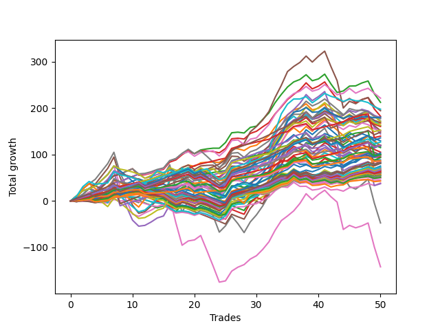

# Short Wallace Doodle 011 
- Symbol: ES_Unlimited
- Date Range: 03/18/2022 - 07/15/2022
- Trading Period: 7:20-12:30
- Number of Trades: 50



| Name | Win Percent | Profit | Avg Profit / Trade | Avg Time / Trade |      | Name | Win Percent | Profit | Avg Profit / Trade | Avg Time / Trade |
| ---- | ----------- | ------ | ------------------ | ---------------- | ---- | ---- | ----------- | ------ | ------------------ | ---------------- |
| Sorted By <br> Profit | | | | | | Sorted By <br> Win Percentage ||||
| Fifty-Eight | 78.00 | 110750.00 | 2215.00 | 14:54 |     | Eighty-Three | 96.00 | 69875.00 | 1397.50 | 16:20 |
| Two | 80.00 | 106250.00 | 2125.00 | 20:41 |     | Eighty-Two | 96.00 | 50375.00 | 1007.50 | 14:34 |
| Seventy-One | 50.00 | 98875.00 | 1977.50 | 21:07 |     | Eighty-One | 96.00 | 32750.00 | 655.00 | 11:46 |
| Five | 74.00 | 97250.00 | 1945.00 | 62:01 |     | One Hundred Twenty-Three | 92.00 | 76375.00 | 1527.50 | 07:27 |
| Three | 74.00 | 91250.00 | 1825.00 | 25:41 |     | One Hundred Twenty-Two | 92.00 | 60000.00 | 1200.00 | 05:41 |
| Seventy-Three | 60.00 | 90250.00 | 1805.00 | 13:39 |     | One Hundred Twenty-Six | 92.00 | 43375.00 | 867.50 | 04:07 |
| Sixty-Six | 66.00 | 89750.00 | 1795.00 | 12:34 |     | One Hundred Twenty-One | 92.00 | 42875.00 | 857.50 | 04:01 |
| Sixty-Nine | 50.00 | 88625.00 | 1772.50 | 17:54 |     | Eighty-Five | 90.00 | 41375.00 | 827.50 | 33:00 |
| Fifty-Nine | 74.00 | 86125.00 | 1722.50 | 16:37 |     | Eighty-Four | 90.00 | 18625.00 | 372.50 | 30:57 |
| Sixty | 62.00 | 85625.00 | 1712.50 | 22:05 |     | One Hundred Twenty-Seven | 88.00 | 49750.00 | 995.00 | 05:35 |
| Sixty-Seven | 62.00 | 84375.00 | 1687.50 | 13:41 |     | One Hundred Twenty-Eight | 86.00 | 59875.00 | 1197.50 | 07:09 |
| One | 76.00 | 83625.00 | 1672.50 | 16:48 |     | One Hundred Twenty-Four | 84.00 | 63500.00 | 1270.00 | 09:25 |
| Seventy | 56.00 | 81625.00 | 1632.50 | 15:25 |     | Two | 80.00 | 106250.00 | 2125.00 | 20:41 |
| Sixty-One | 54.00 | 81000.00 | 1620.00 | 33:02 |     | One Hundred Twenty-Five | 80.00 | 68000.00 | 1360.00 | 10:29 |
| Sixty-Five | 70.00 | 80250.00 | 1605.00 | 10:57 |     | One Hundred Twenty-Nine | 80.00 | 60000.00 | 1200.00 | 08:45 |
| One Hundred Twenty-Three | 92.00 | 76375.00 | 1527.50 | 07:27 |     | Fifty-Eight | 78.00 | 110750.00 | 2215.00 | 14:54 |
| Fifty-Seven | 76.00 | 75750.00 | 1515.00 | 12:47 |     | One Hundred Thirty | 78.00 | 74125.00 | 1482.50 | 09:43 |
| Sixty-Eight | 52.00 | 75125.00 | 1502.50 | 15:54 |     | One Hundred Sixteen | 78.00 | 21500.00 | 430.00 | 02:18 |
| One Hundred Thirty | 78.00 | 74125.00 | 1482.50 | 09:43 |     | One | 76.00 | 83625.00 | 1672.50 | 16:48 |
| Four | 70.00 | 72375.00 | 1447.50 | 41:06 |     | Fifty-Seven | 76.00 | 75750.00 | 1515.00 | 12:47 |
| Eighty-Three | 96.00 | 69875.00 | 1397.50 | 16:20 |     | One Hundred Eleven | 76.00 | 24625.00 | 492.50 | 02:12 |
| One Hundred Twenty-Five | 80.00 | 68000.00 | 1360.00 | 10:29 |     | Five | 74.00 | 97250.00 | 1945.00 | 62:01 |
| Forty-Two | 54.00 | 64750.00 | 1295.00 | 09:32 |     | Three | 74.00 | 91250.00 | 1825.00 | 25:41 |
| One Hundred Twenty-Four | 84.00 | 63500.00 | 1270.00 | 09:25 |     | Fifty-Nine | 74.00 | 86125.00 | 1722.50 | 16:37 |
| One Hundred Twenty-Two | 92.00 | 60000.00 | 1200.00 | 05:41 |     | One Hundred Six | 74.00 | 29000.00 | 580.00 | 01:52 |
| One Hundred Twenty-Nine | 80.00 | 60000.00 | 1200.00 | 08:45 |     | Zero | 72.00 | 60000.00 | 1200.00 | 11:04 |
| Zero | 72.00 | 60000.00 | 1200.00 | 11:04 |     | Fifty-Six | 72.00 | 49500.00 | 990.00 | 09:38 |
| One Hundred Twenty-Eight | 86.00 | 59875.00 | 1197.50 | 07:09 |     | One Hundred Twelve | 72.00 | 30000.00 | 600.00 | 03:03 |
| Sixty-Three | 46.00 | 59750.00 | 1195.00 | 41:30 |     | One Hundred Seventeen | 72.00 | 25500.00 | 510.00 | 02:57 |
| Sixty-Two | 60.00 | 58875.00 | 1177.50 | 26:48 |     | Sixty-Five | 70.00 | 80250.00 | 1605.00 | 10:57 |
| Forty-Four | 42.00 | 57500.00 | 1150.00 | 12:50 |     | Four | 70.00 | 72375.00 | 1447.50 | 41:06 |
| Forty-Five | 34.00 | 52625.00 | 1052.50 | 17:30 |     | Sixty-Four | 68.00 | 46750.00 | 935.00 | 08:59 |
| One Hundred Fifteen | 64.00 | 51625.00 | 1032.50 | 05:58 |     | One Hundred Thirteen | 68.00 | 34125.00 | 682.50 | 03:56 |
| Eighty-Two | 96.00 | 50375.00 | 1007.50 | 14:34 |     | One Hundred Eighteen | 68.00 | 31250.00 | 625.00 | 03:46 |
| One Hundred Five | 56.00 | 50250.00 | 1005.00 | 04:13 |     | Ninety-Six | 68.00 | 25375.00 | 507.50 | 01:37 |
| One Hundred Twenty-Seven | 88.00 | 49750.00 | 995.00 | 05:35 |     | Six | 68.00 | -70875.00 | -1417.50 | 76:29 |
| Forty-Seven | 30.00 | 49625.00 | 992.50 | 22:05 |     | Sixty-Six | 66.00 | 89750.00 | 1795.00 | 12:34 |
| Fifty-Six | 72.00 | 49500.00 | 990.00 | 09:38 |     | One Hundred One | 66.00 | 22625.00 | 452.50 | 01:33 |
| Fifty-Three | 50.00 | 49125.00 | 982.50 | 07:27 |     | One Hundred Fifteen | 64.00 | 51625.00 | 1032.50 | 05:58 |
| Forty-Six | 42.00 | 48000.00 | 960.00 | 14:10 |     | One Hundred Fourteen | 64.00 | 36500.00 | 730.00 | 05:07 |
| Fifty-Five | 50.00 | 47250.00 | 945.00 | 07:38 |     | One Hundred Seven | 64.00 | 30875.00 | 617.50 | 02:20 |
| Sixty-Four | 68.00 | 46750.00 | 935.00 | 08:59 |     | Ninety-One | 64.00 | 24750.00 | 495.00 | 01:28 |
| Fifty-Two | 50.00 | 44250.00 | 885.00 | 06:55 |     | Sixty | 62.00 | 85625.00 | 1712.50 | 22:05 |
| One Hundred Twenty-Six | 92.00 | 43375.00 | 867.50 | 04:07 |     | Sixty-Seven | 62.00 | 84375.00 | 1687.50 | 13:41 |
| One Hundred Twenty-One | 92.00 | 42875.00 | 857.50 | 04:01 |     | One Hundred Two | 62.00 | 27000.00 | 540.00 | 01:59 |
| One Hundred Twenty | 56.00 | 42375.00 | 847.50 | 04:55 |     | Seven | 62.00 | -23625.00 | -472.50 | 110:24 |
| Eighty-Five | 90.00 | 41375.00 | 827.50 | 33:00 |     | Seventy-Three | 60.00 | 90250.00 | 1805.00 | 13:39 |
| One Hundred | 54.00 | 40750.00 | 815.00 | 02:20 |     | Sixty-Two | 60.00 | 58875.00 | 1177.50 | 26:48 |
| One Hundred Four | 58.00 | 40625.00 | 812.50 | 03:33 |     | One Hundred Ninteen | 60.00 | 33375.00 | 667.50 | 04:34 |
| Forty-One | 54.00 | 40625.00 | 812.50 | 08:10 |     | Forty | 60.00 | 28750.00 | 575.00 | 06:16 |
| One Hundred Ten | 52.00 | 40625.00 | 812.50 | 03:18 |     | One Hundred Four | 58.00 | 40625.00 | 812.50 | 03:33 |
| Forty-Three | 46.00 | 40500.00 | 810.00 | 10:09 |     | One Hundred Three | 58.00 | 30250.00 | 605.00 | 02:44 |
| Ninety-Five | 46.00 | 37625.00 | 752.50 | 03:29 |     | Ninety-Two | 58.00 | 27375.00 | 547.50 | 01:53 |
| One Hundred Fourteen | 64.00 | 36500.00 | 730.00 | 05:07 |     | Seventy | 56.00 | 81625.00 | 1632.50 | 15:25 |
| Fifty | 50.00 | 35625.00 | 712.50 | 06:20 |     | One Hundred Five | 56.00 | 50250.00 | 1005.00 | 04:13 |
| Ninety-Nine | 54.00 | 35125.00 | 702.50 | 02:13 |     | One Hundred Twenty | 56.00 | 42375.00 | 847.50 | 04:55 |
| One Hundred Nine | 52.00 | 34750.00 | 695.00 | 03:08 |     | One Hundred Eight | 56.00 | 31875.00 | 637.50 | 02:47 |
| One Hundred Thirteen | 68.00 | 34125.00 | 682.50 | 03:56 |     | Ninety-Seven | 56.00 | 27750.00 | 555.00 | 01:51 |
| Fifty-Four | 52.00 | 33500.00 | 670.00 | 06:37 |     | Sixty-One | 54.00 | 81000.00 | 1620.00 | 33:02 |
| One Hundred Ninteen | 60.00 | 33375.00 | 667.50 | 04:34 |     | Forty-Two | 54.00 | 64750.00 | 1295.00 | 09:32 |
| Eighty-One | 96.00 | 32750.00 | 655.00 | 11:46 |     | One Hundred | 54.00 | 40750.00 | 815.00 | 02:20 |
| Ninety-Eight | 54.00 | 32625.00 | 652.50 | 02:01 |     | Forty-One | 54.00 | 40625.00 | 812.50 | 08:10 |
| One Hundred Eight | 56.00 | 31875.00 | 637.50 | 02:47 |     | Ninety-Nine | 54.00 | 35125.00 | 702.50 | 02:13 |
| One Hundred Eighteen | 68.00 | 31250.00 | 625.00 | 03:46 |     | Ninety-Eight | 54.00 | 32625.00 | 652.50 | 02:01 |
| One Hundred Seven | 64.00 | 30875.00 | 617.50 | 02:20 |     | Forty-Eight | 54.00 | 19375.00 | 387.50 | 04:52 |
| Ninety-Four | 48.00 | 30625.00 | 612.50 | 03:08 |     | Sixty-Eight | 52.00 | 75125.00 | 1502.50 | 15:54 |
| One Hundred Three | 58.00 | 30250.00 | 605.00 | 02:44 |     | One Hundred Ten | 52.00 | 40625.00 | 812.50 | 03:18 |
| Forty-Nine | 50.00 | 30250.00 | 605.00 | 05:44 |     | One Hundred Nine | 52.00 | 34750.00 | 695.00 | 03:08 |
| One Hundred Twelve | 72.00 | 30000.00 | 600.00 | 03:03 |     | Fifty-Four | 52.00 | 33500.00 | 670.00 | 06:37 |
| Fifty-One | 50.00 | 30000.00 | 600.00 | 06:13 |     | Ninety-Three | 52.00 | 27500.00 | 550.00 | 02:27 |
| One Hundred Six | 74.00 | 29000.00 | 580.00 | 01:52 |     | Seventy-One | 50.00 | 98875.00 | 1977.50 | 21:07 |
| Forty | 60.00 | 28750.00 | 575.00 | 06:16 |     | Sixty-Nine | 50.00 | 88625.00 | 1772.50 | 17:54 |
| Ninety-Seven | 56.00 | 27750.00 | 555.00 | 01:51 |     | Fifty-Three | 50.00 | 49125.00 | 982.50 | 07:27 |
| Ninety-Three | 52.00 | 27500.00 | 550.00 | 02:27 |     | Fifty-Five | 50.00 | 47250.00 | 945.00 | 07:38 |
| Ninety-Two | 58.00 | 27375.00 | 547.50 | 01:53 |     | Fifty-Two | 50.00 | 44250.00 | 885.00 | 06:55 |
| One Hundred Two | 62.00 | 27000.00 | 540.00 | 01:59 |     | Fifty | 50.00 | 35625.00 | 712.50 | 06:20 |
| One Hundred Seventeen | 72.00 | 25500.00 | 510.00 | 02:57 |     | Forty-Nine | 50.00 | 30250.00 | 605.00 | 05:44 |
| Ninety-Six | 68.00 | 25375.00 | 507.50 | 01:37 |     | Fifty-One | 50.00 | 30000.00 | 600.00 | 06:13 |
| Ninety-One | 64.00 | 24750.00 | 495.00 | 01:28 |     | Ninety-Four | 48.00 | 30625.00 | 612.50 | 03:08 |
| One Hundred Eleven | 76.00 | 24625.00 | 492.50 | 02:12 |     | Sixty-Three | 46.00 | 59750.00 | 1195.00 | 41:30 |
| One Hundred One | 66.00 | 22625.00 | 452.50 | 01:33 |     | Forty-Three | 46.00 | 40500.00 | 810.00 | 10:09 |
| One Hundred Sixteen | 78.00 | 21500.00 | 430.00 | 02:18 |     | Ninety-Five | 46.00 | 37625.00 | 752.50 | 03:29 |
| Forty-Eight | 54.00 | 19375.00 | 387.50 | 04:52 |     | Forty-Four | 42.00 | 57500.00 | 1150.00 | 12:50 |
| Eighty-Four | 90.00 | 18625.00 | 372.50 | 30:57 |     | Forty-Six | 42.00 | 48000.00 | 960.00 | 14:10 |
| Seven | 62.00 | -23625.00 | -472.50 | 110:24 |     | Forty-Five | 34.00 | 52625.00 | 1052.50 | 17:30 |
| Six | 68.00 | -70875.00 | -1417.50 | 76:29 |     | Forty-Seven | 30.00 | 49625.00 | 992.50 | 22:05 |

## NO STOPLOSS

### Test Zero
* Sell when price hits the middle line of the 20p bollinger
* No Stoploss
* Results:
```
Total Trades: 50
Percent Up: 28.00
Percent Down: 72.00
Total Points Moved Down: 120.00
Potential Profit: 60000.00
Total Points Ups: 69.50 Count Ups: 14
Total Points Downs: 189.50 Count Downs: 36
```

<details><summary>Trades</summary>

<code>In: 2022-03-25 11:57:00		Out: 2022-03-25 11:58:35		Total Position Time: 01:35		Total Move Down: 0.75		Total to Date: 0.75</code> <br />
<code>In: 2022-04-01 11:34:00		Out: 2022-04-01 11:47:25		Total Position Time: 13:25		Total Move Down: 1.50		Total to Date: 2.25</code> <br />
<code>In: 2022-04-06 08:53:00		Out: 2022-04-06 09:03:40		Total Position Time: 10:40		Total Move Down: 2.25		Total to Date: 4.50</code> <br />
<code>In: 2022-04-06 10:36:00		Out: 2022-04-06 10:55:55		Total Position Time: 19:55		Total Move Down: -5.25		Total to Date: -0.75</code> <br />
<code>In: 2022-04-06 10:43:00		Out: 2022-04-06 10:55:55		Total Position Time: 12:55		Total Move Down: 2.25		Total to Date: 1.50</code> <br />
<code>In: 2022-04-06 10:45:00		Out: 2022-04-06 10:55:55		Total Position Time: 10:55		Total Move Down: 2.00		Total to Date: 3.50</code> <br />
<code>In: 2022-04-06 11:05:00		Out: 2022-04-06 11:06:10		Total Position Time: 01:10		Total Move Down: 7.75		Total to Date: 11.25</code> <br />
<code>In: 2022-04-07 10:22:00		Out: 2022-04-07 10:37:40		Total Position Time: 15:40		Total Move Down: -0.25		Total to Date: 11.00</code> <br />
<code>In: 2022-04-07 11:03:00		Out: 2022-04-07 11:15:20		Total Position Time: 12:20		Total Move Down: 4.00		Total to Date: 15.00</code> <br />
<code>In: 2022-04-07 11:04:00		Out: 2022-04-07 11:15:20		Total Position Time: 11:20		Total Move Down: 3.25		Total to Date: 18.25</code> <br />
<code>In: 2022-04-08 07:33:00		Out: 2022-04-08 07:44:35		Total Position Time: 11:35		Total Move Down: 3.25		Total to Date: 21.50</code> <br />
<code>In: 2022-04-18 10:38:00		Out: 2022-04-18 10:59:30		Total Position Time: 21:30		Total Move Down: -2.00		Total to Date: 19.50</code> <br />
<code>In: 2022-04-20 07:40:00		Out: 2022-04-20 08:00:20		Total Position Time: 20:20		Total Move Down: -2.75		Total to Date: 16.75</code> <br />
<code>In: 2022-04-20 07:43:00		Out: 2022-04-20 08:00:20		Total Position Time: 17:20		Total Move Down: -1.25		Total to Date: 15.50</code> <br />
<code>In: 2022-04-20 09:54:00		Out: 2022-04-20 09:59:15		Total Position Time: 05:15		Total Move Down: 3.25		Total to Date: 18.75</code> <br />
<code>In: 2022-04-25 07:34:00		Out: 2022-04-25 07:40:25		Total Position Time: 06:25		Total Move Down: 8.25		Total to Date: 27.00</code> <br />
<code>In: 2022-04-25 10:14:00		Out: 2022-04-25 10:26:55		Total Position Time: 12:55		Total Move Down: 1.00		Total to Date: 28.00</code> <br />
<code>In: 2022-04-25 10:17:00		Out: 2022-04-25 10:26:55		Total Position Time: 09:55		Total Move Down: 7.50		Total to Date: 35.50</code> <br />
<code>In: 2022-04-27 08:34:00		Out: 2022-04-27 08:45:10		Total Position Time: 11:10		Total Move Down: 3.00		Total to Date: 38.50</code> <br />
<code>In: 2022-05-04 09:25:00		Out: 2022-05-04 09:45:30		Total Position Time: 20:30		Total Move Down: -4.50		Total to Date: 34.00</code> <br />
<code>In: 2022-05-17 08:36:00		Out: 2022-05-17 08:44:50		Total Position Time: 08:50		Total Move Down: 5.00		Total to Date: 39.00</code> <br />
<code>In: 2022-05-24 10:43:00		Out: 2022-05-24 11:01:15		Total Position Time: 18:15		Total Move Down: -2.25		Total to Date: 36.75</code> <br />
<code>In: 2022-05-24 10:44:00		Out: 2022-05-24 11:01:15		Total Position Time: 17:15		Total Move Down: -3.00		Total to Date: 33.75</code> <br />
<code>In: 2022-05-24 10:48:00		Out: 2022-05-24 11:01:15		Total Position Time: 13:15		Total Move Down: -4.50		Total to Date: 29.25</code> <br />
<code>In: 2022-05-25 11:04:00		Out: 2022-05-25 11:06:25		Total Position Time: 02:25		Total Move Down: 4.50		Total to Date: 33.75</code> <br />
<code>In: 2022-05-25 11:06:00		Out: 2022-05-25 11:07:10		Total Position Time: 01:10		Total Move Down: 21.00		Total to Date: 54.75</code> <br />
<code>In: 2022-05-31 07:23:00		Out: 2022-05-31 07:37:30		Total Position Time: 14:30		Total Move Down: 5.75		Total to Date: 60.50</code> <br />
<code>In: 2022-05-31 07:24:00		Out: 2022-05-31 07:37:30		Total Position Time: 13:30		Total Move Down: 2.75		Total to Date: 63.25</code> <br />
<code>In: 2022-06-03 10:06:00		Out: 2022-06-03 10:13:45		Total Position Time: 07:45		Total Move Down: 4.50		Total to Date: 67.75</code> <br />
<code>In: 2022-06-09 10:08:00		Out: 2022-06-09 10:16:50		Total Position Time: 08:50		Total Move Down: 1.75		Total to Date: 69.50</code> <br />
<code>In: 2022-06-10 12:00:00		Out: 2022-06-10 12:03:30		Total Position Time: 03:30		Total Move Down: 7.75		Total to Date: 77.25</code> <br />
<code>In: 2022-06-10 12:29:00		Out: 2022-06-10 12:30:35		Total Position Time: 01:35		Total Move Down: 6.75		Total to Date: 84.00</code> <br />
<code>In: 2022-06-13 09:40:00		Out: 2022-06-13 09:44:05		Total Position Time: 04:05		Total Move Down: 13.25		Total to Date: 97.25</code> <br />
<code>In: 2022-06-13 09:41:00		Out: 2022-06-13 09:44:05		Total Position Time: 03:05		Total Move Down: 9.00		Total to Date: 106.25</code> <br />
<code>In: 2022-06-14 10:21:00		Out: 2022-06-14 10:25:30		Total Position Time: 04:30		Total Move Down: 8.00		Total to Date: 114.25</code> <br />
<code>In: 2022-06-15 11:02:00		Out: 2022-06-15 11:03:10		Total Position Time: 01:10		Total Move Down: 11.00		Total to Date: 125.25</code> <br />
<code>In: 2022-06-17 10:11:00		Out: 2022-06-17 10:23:05		Total Position Time: 12:05		Total Move Down: 2.50		Total to Date: 127.75</code> <br />
<code>In: 2022-06-17 10:14:00		Out: 2022-06-17 10:23:05		Total Position Time: 09:05		Total Move Down: 7.50		Total to Date: 135.25</code> <br />
<code>In: 2022-06-23 12:30:00		Out: 2022-06-23 12:47:00		Total Position Time: 17:00		Total Move Down: -13.00		Total to Date: 122.25</code> <br />
<code>In: 2022-06-29 11:06:00		Out: 2022-06-29 11:20:05		Total Position Time: 14:05		Total Move Down: 2.00		Total to Date: 124.25</code> <br />
<code>In: 2022-06-29 12:31:00		Out: 2022-06-29 12:33:20		Total Position Time: 02:20		Total Move Down: 4.75		Total to Date: 129.00</code> <br />
<code>In: 2022-06-30 07:57:00		Out: 2022-06-30 08:35:20		Total Position Time: 38:20		Total Move Down: -14.25		Total to Date: 114.75</code> <br />
<code>In: 2022-06-30 08:01:00		Out: 2022-06-30 08:35:20		Total Position Time: 34:20		Total Move Down: -11.75		Total to Date: 103.00</code> <br />
<code>In: 2022-07-05 08:49:00		Out: 2022-07-05 09:03:00		Total Position Time: 14:00		Total Move Down: 0.50		Total to Date: 103.50</code> <br />
<code>In: 2022-07-06 11:10:00		Out: 2022-07-06 11:11:10		Total Position Time: 01:10		Total Move Down: 7.50		Total to Date: 111.00</code> <br />
<code>In: 2022-07-06 11:35:00		Out: 2022-07-06 11:50:05		Total Position Time: 15:05		Total Move Down: -1.75		Total to Date: 109.25</code> <br />
<code>In: 2022-07-11 07:43:00		Out: 2022-07-11 07:48:15		Total Position Time: 05:15		Total Move Down: 3.25		Total to Date: 112.50</code> <br />
<code>In: 2022-07-12 08:14:00		Out: 2022-07-12 08:17:15		Total Position Time: 03:15		Total Move Down: 5.00		Total to Date: 117.50</code> <br />
<code>In: 2022-07-14 08:02:00		Out: 2022-07-14 08:15:45		Total Position Time: 13:45		Total Move Down: -3.00		Total to Date: 114.50</code> <br />
<code>In: 2022-07-14 08:12:00		Out: 2022-07-14 08:15:45		Total Position Time: 03:45		Total Move Down: 5.50		Total to Date: 120.00</code> <br />


</details>

### Test One
* Sell when the price hits the upper line of the 20p 1std bollinger
* No Stoploss
* Results:
```
Total Trades: 50
Percent Up: 24.00
Percent Down: 76.00
Total Points Moved Down: 167.25
Potential Profit: 83625.00
Total Points Ups: 84.50 Count Ups: 12
Total Points Downs: 251.75 Count Downs: 38
```

<details><summary>Trades</summary>

<code>In: 2022-03-25 11:57:00		Out: 2022-03-25 12:00:50		Total Position Time: 03:50		Total Move Down: 2.75		Total to Date: 2.75</code> <br />
<code>In: 2022-04-01 11:34:00		Out: 2022-04-01 11:50:15		Total Position Time: 16:15		Total Move Down: 3.25		Total to Date: 6.00</code> <br />
<code>In: 2022-04-06 08:53:00		Out: 2022-04-06 09:07:15		Total Position Time: 14:15		Total Move Down: 3.25		Total to Date: 9.25</code> <br />
<code>In: 2022-04-06 10:36:00		Out: 2022-04-06 10:57:10		Total Position Time: 21:10		Total Move Down: -3.00		Total to Date: 6.25</code> <br />
<code>In: 2022-04-06 10:43:00		Out: 2022-04-06 10:57:10		Total Position Time: 14:10		Total Move Down: 4.50		Total to Date: 10.75</code> <br />
<code>In: 2022-04-06 10:45:00		Out: 2022-04-06 10:57:10		Total Position Time: 12:10		Total Move Down: 4.25		Total to Date: 15.00</code> <br />
<code>In: 2022-04-06 11:05:00		Out: 2022-04-06 11:07:20		Total Position Time: 02:20		Total Move Down: 12.50		Total to Date: 27.50</code> <br />
<code>In: 2022-04-07 10:22:00		Out: 2022-04-07 10:40:05		Total Position Time: 18:05		Total Move Down: 1.00		Total to Date: 28.50</code> <br />
<code>In: 2022-04-07 11:03:00		Out: 2022-04-07 11:18:00		Total Position Time: 15:00		Total Move Down: 4.75		Total to Date: 33.25</code> <br />
<code>In: 2022-04-07 11:04:00		Out: 2022-04-07 11:18:00		Total Position Time: 14:00		Total Move Down: 4.00		Total to Date: 37.25</code> <br />
<code>In: 2022-04-08 07:33:00		Out: 2022-04-08 07:49:05		Total Position Time: 16:05		Total Move Down: 3.50		Total to Date: 40.75</code> <br />
<code>In: 2022-04-18 10:38:00		Out: 2022-04-18 11:06:35		Total Position Time: 28:35		Total Move Down: -1.75		Total to Date: 39.00</code> <br />
<code>In: 2022-04-20 07:40:00		Out: 2022-04-20 08:00:40		Total Position Time: 20:40		Total Move Down: 0.25		Total to Date: 39.25</code> <br />
<code>In: 2022-04-20 07:43:00		Out: 2022-04-20 08:00:40		Total Position Time: 17:40		Total Move Down: 1.75		Total to Date: 41.00</code> <br />
<code>In: 2022-04-20 09:54:00		Out: 2022-04-20 10:08:15		Total Position Time: 14:15		Total Move Down: 4.25		Total to Date: 45.25</code> <br />
<code>In: 2022-04-25 07:34:00		Out: 2022-04-25 07:43:30		Total Position Time: 09:30		Total Move Down: 15.00		Total to Date: 60.25</code> <br />
<code>In: 2022-04-25 10:14:00		Out: 2022-04-25 10:28:05		Total Position Time: 14:05		Total Move Down: 2.75		Total to Date: 63.00</code> <br />
<code>In: 2022-04-25 10:17:00		Out: 2022-04-25 10:28:05		Total Position Time: 11:05		Total Move Down: 9.25		Total to Date: 72.25</code> <br />
<code>In: 2022-04-27 08:34:00		Out: 2022-04-27 08:48:10		Total Position Time: 14:10		Total Move Down: 5.25		Total to Date: 77.50</code> <br />
<code>In: 2022-05-04 09:25:00		Out: 2022-05-04 09:47:10		Total Position Time: 22:10		Total Move Down: -3.00		Total to Date: 74.50</code> <br />
<code>In: 2022-05-17 08:36:00		Out: 2022-05-17 08:47:25		Total Position Time: 11:25		Total Move Down: 7.75		Total to Date: 82.25</code> <br />
<code>In: 2022-05-24 10:43:00		Out: 2022-05-24 11:01:40		Total Position Time: 18:40		Total Move Down: 1.25		Total to Date: 83.50</code> <br />
<code>In: 2022-05-24 10:44:00		Out: 2022-05-24 11:01:40		Total Position Time: 17:40		Total Move Down: 0.50		Total to Date: 84.00</code> <br />
<code>In: 2022-05-24 10:48:00		Out: 2022-05-24 11:01:40		Total Position Time: 13:40		Total Move Down: -1.00		Total to Date: 83.00</code> <br />
<code>In: 2022-05-25 11:04:00		Out: 2022-05-25 11:06:35		Total Position Time: 02:35		Total Move Down: 9.25		Total to Date: 92.25</code> <br />
<code>In: 2022-05-25 11:06:00		Out: 2022-05-25 11:07:10		Total Position Time: 01:10		Total Move Down: 21.00		Total to Date: 113.25</code> <br />
<code>In: 2022-05-31 07:23:00		Out: 2022-05-31 08:07:20		Total Position Time: 44:20		Total Move Down: -0.75		Total to Date: 112.50</code> <br />
<code>In: 2022-05-31 07:24:00		Out: 2022-05-31 08:07:20		Total Position Time: 43:20		Total Move Down: -3.75		Total to Date: 108.75</code> <br />
<code>In: 2022-06-03 10:06:00		Out: 2022-06-03 10:15:10		Total Position Time: 09:10		Total Move Down: 8.25		Total to Date: 117.00</code> <br />
<code>In: 2022-06-09 10:08:00		Out: 2022-06-09 10:18:55		Total Position Time: 10:55		Total Move Down: 3.25		Total to Date: 120.25</code> <br />
<code>In: 2022-06-10 12:00:00		Out: 2022-06-10 12:05:05		Total Position Time: 05:05		Total Move Down: 10.50		Total to Date: 130.75</code> <br />
<code>In: 2022-06-10 12:29:00		Out: 2022-06-10 12:35:45		Total Position Time: 06:45		Total Move Down: 9.75		Total to Date: 140.50</code> <br />
<code>In: 2022-06-13 09:40:00		Out: 2022-06-13 09:47:55		Total Position Time: 07:55		Total Move Down: 19.00		Total to Date: 159.50</code> <br />
<code>In: 2022-06-13 09:41:00		Out: 2022-06-13 09:47:55		Total Position Time: 06:55		Total Move Down: 14.75		Total to Date: 174.25</code> <br />
<code>In: 2022-06-14 10:21:00		Out: 2022-06-14 10:29:05		Total Position Time: 08:05		Total Move Down: 11.00		Total to Date: 185.25</code> <br />
<code>In: 2022-06-15 11:02:00		Out: 2022-06-15 11:03:10		Total Position Time: 01:10		Total Move Down: 11.00		Total to Date: 196.25</code> <br />
<code>In: 2022-06-17 10:11:00		Out: 2022-06-17 10:26:30		Total Position Time: 15:30		Total Move Down: 4.00		Total to Date: 200.25</code> <br />
<code>In: 2022-06-17 10:14:00		Out: 2022-06-17 10:26:30		Total Position Time: 12:30		Total Move Down: 9.00		Total to Date: 209.25</code> <br />
<code>In: 2022-06-23 12:30:00		Out: 2022-06-23 12:47:00		Total Position Time: 17:00		Total Move Down: -13.00		Total to Date: 196.25</code> <br />
<code>In: 2022-06-29 11:06:00		Out: 2022-06-29 11:20:40		Total Position Time: 14:40		Total Move Down: 3.50		Total to Date: 199.75</code> <br />
<code>In: 2022-06-29 12:31:00		Out: 2022-06-29 12:34:15		Total Position Time: 03:15		Total Move Down: 9.00		Total to Date: 208.75</code> <br />
<code>In: 2022-06-30 07:57:00		Out: 2022-06-30 09:05:50		Total Position Time: 68:50		Total Move Down: -23.50		Total to Date: 185.25</code> <br />
<code>In: 2022-06-30 08:01:00		Out: 2022-06-30 09:05:50		Total Position Time: 64:50		Total Move Down: -21.00		Total to Date: 164.25</code> <br />
<code>In: 2022-07-05 08:49:00		Out: 2022-07-05 09:03:30		Total Position Time: 14:30		Total Move Down: 2.00		Total to Date: 166.25</code> <br />
<code>In: 2022-07-06 11:10:00		Out: 2022-07-06 11:11:10		Total Position Time: 01:10		Total Move Down: 7.50		Total to Date: 173.75</code> <br />
<code>In: 2022-07-06 11:35:00		Out: 2022-07-06 12:00:50		Total Position Time: 25:50		Total Move Down: -1.75		Total to Date: 172.00</code> <br />
<code>In: 2022-07-11 07:43:00		Out: 2022-07-11 07:54:20		Total Position Time: 11:20		Total Move Down: 4.00		Total to Date: 176.00</code> <br />
<code>In: 2022-07-12 08:14:00		Out: 2022-07-12 08:38:10		Total Position Time: 24:10		Total Move Down: 3.25		Total to Date: 179.25</code> <br />
<code>In: 2022-07-14 08:02:00		Out: 2022-07-14 08:36:05		Total Position Time: 34:05		Total Move Down: -10.25		Total to Date: 169.00</code> <br />
<code>In: 2022-07-14 08:12:00		Out: 2022-07-14 08:36:05		Total Position Time: 24:05		Total Move Down: -1.75		Total to Date: 167.25</code> <br />


</details>

### Test Two
* Sell when the price hits the upper line of the 20p 2std bollinger
* No Stoploss
* Results:
```
Total Trades: 50
Percent Up: 20.00
Percent Down: 80.00
Total Points Moved Down: 212.50
Potential Profit: 106250.00
Total Points Ups: 106.25 Count Ups: 10
Total Points Downs: 318.75 Count Downs: 40
```

<details><summary>Trades</summary>

<code>In: 2022-03-25 11:57:00		Out: 2022-03-25 12:01:15		Total Position Time: 04:15		Total Move Down: 3.25		Total to Date: 3.25</code> <br />
<code>In: 2022-04-01 11:34:00		Out: 2022-04-01 11:50:45		Total Position Time: 16:45		Total Move Down: 4.25		Total to Date: 7.50</code> <br />
<code>In: 2022-04-06 08:53:00		Out: 2022-04-06 09:09:40		Total Position Time: 16:40		Total Move Down: 3.75		Total to Date: 11.25</code> <br />
<code>In: 2022-04-06 10:36:00		Out: 2022-04-06 10:58:05		Total Position Time: 22:05		Total Move Down: -1.75		Total to Date: 9.50</code> <br />
<code>In: 2022-04-06 10:43:00		Out: 2022-04-06 10:58:05		Total Position Time: 15:05		Total Move Down: 5.75		Total to Date: 15.25</code> <br />
<code>In: 2022-04-06 10:45:00		Out: 2022-04-06 10:58:05		Total Position Time: 13:05		Total Move Down: 5.50		Total to Date: 20.75</code> <br />
<code>In: 2022-04-06 11:05:00		Out: 2022-04-06 11:08:10		Total Position Time: 03:10		Total Move Down: 18.50		Total to Date: 39.25</code> <br />
<code>In: 2022-04-07 10:22:00		Out: 2022-04-07 10:48:00		Total Position Time: 26:00		Total Move Down: 2.25		Total to Date: 41.50</code> <br />
<code>In: 2022-04-07 11:03:00		Out: 2022-04-07 11:18:20		Total Position Time: 15:20		Total Move Down: 6.00		Total to Date: 47.50</code> <br />
<code>In: 2022-04-07 11:04:00		Out: 2022-04-07 11:18:20		Total Position Time: 14:20		Total Move Down: 5.25		Total to Date: 52.75</code> <br />
<code>In: 2022-04-08 07:33:00		Out: 2022-04-08 07:49:20		Total Position Time: 16:20		Total Move Down: 5.25		Total to Date: 58.00</code> <br />
<code>In: 2022-04-18 10:38:00		Out: 2022-04-18 11:10:40		Total Position Time: 32:40		Total Move Down: -0.25		Total to Date: 57.75</code> <br />
<code>In: 2022-04-20 07:40:00		Out: 2022-04-20 08:01:10		Total Position Time: 21:10		Total Move Down: 3.25		Total to Date: 61.00</code> <br />
<code>In: 2022-04-20 07:43:00		Out: 2022-04-20 08:01:10		Total Position Time: 18:10		Total Move Down: 4.75		Total to Date: 65.75</code> <br />
<code>In: 2022-04-20 09:54:00		Out: 2022-04-20 10:08:15		Total Position Time: 14:15		Total Move Down: 4.25		Total to Date: 70.00</code> <br />
<code>In: 2022-04-25 07:34:00		Out: 2022-04-25 07:52:15		Total Position Time: 18:15		Total Move Down: 16.75		Total to Date: 86.75</code> <br />
<code>In: 2022-04-25 10:14:00		Out: 2022-04-25 10:33:35		Total Position Time: 19:35		Total Move Down: 4.25		Total to Date: 91.00</code> <br />
<code>In: 2022-04-25 10:17:00		Out: 2022-04-25 10:33:35		Total Position Time: 16:35		Total Move Down: 10.75		Total to Date: 101.75</code> <br />
<code>In: 2022-04-27 08:34:00		Out: 2022-04-27 08:51:55		Total Position Time: 17:55		Total Move Down: 4.50		Total to Date: 106.25</code> <br />
<code>In: 2022-05-04 09:25:00		Out: 2022-05-04 10:11:30		Total Position Time: 46:30		Total Move Down: -4.00		Total to Date: 102.25</code> <br />
<code>In: 2022-05-17 08:36:00		Out: 2022-05-17 09:06:00		Total Position Time: 30:00		Total Move Down: 7.75		Total to Date: 110.00</code> <br />
<code>In: 2022-05-24 10:43:00		Out: 2022-05-24 11:01:50		Total Position Time: 18:50		Total Move Down: 2.25		Total to Date: 112.25</code> <br />
<code>In: 2022-05-24 10:44:00		Out: 2022-05-24 11:01:50		Total Position Time: 17:50		Total Move Down: 1.50		Total to Date: 113.75</code> <br />
<code>In: 2022-05-24 10:48:00		Out: 2022-05-24 11:01:50		Total Position Time: 13:50		Total Move Down: -0.00		Total to Date: 113.75</code> <br />
<code>In: 2022-05-25 11:04:00		Out: 2022-05-25 11:06:40		Total Position Time: 02:40		Total Move Down: 12.25		Total to Date: 126.00</code> <br />
<code>In: 2022-05-25 11:06:00		Out: 2022-05-25 11:07:10		Total Position Time: 01:10		Total Move Down: 21.00		Total to Date: 147.00</code> <br />
<code>In: 2022-05-31 07:23:00		Out: 2022-05-31 08:07:30		Total Position Time: 44:30		Total Move Down: 1.25		Total to Date: 148.25</code> <br />
<code>In: 2022-05-31 07:24:00		Out: 2022-05-31 08:07:30		Total Position Time: 43:30		Total Move Down: -1.75		Total to Date: 146.50</code> <br />
<code>In: 2022-06-03 10:06:00		Out: 2022-06-03 10:17:55		Total Position Time: 11:55		Total Move Down: 12.00		Total to Date: 158.50</code> <br />
<code>In: 2022-06-09 10:08:00		Out: 2022-06-09 10:21:10		Total Position Time: 13:10		Total Move Down: 2.75		Total to Date: 161.25</code> <br />
<code>In: 2022-06-10 12:00:00		Out: 2022-06-10 12:06:05		Total Position Time: 06:05		Total Move Down: 14.50		Total to Date: 175.75</code> <br />
<code>In: 2022-06-10 12:29:00		Out: 2022-06-10 12:43:10		Total Position Time: 14:10		Total Move Down: 14.00		Total to Date: 189.75</code> <br />
<code>In: 2022-06-13 09:40:00		Out: 2022-06-13 09:54:15		Total Position Time: 14:15		Total Move Down: 22.00		Total to Date: 211.75</code> <br />
<code>In: 2022-06-13 09:41:00		Out: 2022-06-13 09:54:15		Total Position Time: 13:15		Total Move Down: 17.75		Total to Date: 229.50</code> <br />
<code>In: 2022-06-14 10:21:00		Out: 2022-06-14 10:31:10		Total Position Time: 10:10		Total Move Down: 16.00		Total to Date: 245.50</code> <br />
<code>In: 2022-06-15 11:02:00		Out: 2022-06-15 11:03:10		Total Position Time: 01:10		Total Move Down: 11.00		Total to Date: 256.50</code> <br />
<code>In: 2022-06-17 10:11:00		Out: 2022-06-17 10:28:15		Total Position Time: 17:15		Total Move Down: 5.25		Total to Date: 261.75</code> <br />
<code>In: 2022-06-17 10:14:00		Out: 2022-06-17 10:28:15		Total Position Time: 14:15		Total Move Down: 10.25		Total to Date: 272.00</code> <br />
<code>In: 2022-06-23 12:30:00		Out: 2022-06-23 12:47:00		Total Position Time: 17:00		Total Move Down: -13.00		Total to Date: 259.00</code> <br />
<code>In: 2022-06-29 11:06:00		Out: 2022-06-29 11:21:15		Total Position Time: 15:15		Total Move Down: 4.00		Total to Date: 263.00</code> <br />
<code>In: 2022-06-29 12:31:00		Out: 2022-06-29 12:36:35		Total Position Time: 05:35		Total Move Down: 10.25		Total to Date: 273.25</code> <br />
<code>In: 2022-06-30 07:57:00		Out: 2022-06-30 09:06:15		Total Position Time: 69:15		Total Move Down: -21.00		Total to Date: 252.25</code> <br />
<code>In: 2022-06-30 08:01:00		Out: 2022-06-30 09:06:15		Total Position Time: 65:15		Total Move Down: -18.50		Total to Date: 233.75</code> <br />
<code>In: 2022-07-05 08:49:00		Out: 2022-07-05 09:05:50		Total Position Time: 16:50		Total Move Down: 3.25		Total to Date: 237.00</code> <br />
<code>In: 2022-07-06 11:10:00		Out: 2022-07-06 11:11:45		Total Position Time: 01:45		Total Move Down: 10.50		Total to Date: 247.50</code> <br />
<code>In: 2022-07-06 11:35:00		Out: 2022-07-06 12:01:25		Total Position Time: 26:25		Total Move Down: 0.50		Total to Date: 248.00</code> <br />
<code>In: 2022-07-11 07:43:00		Out: 2022-07-11 07:55:50		Total Position Time: 12:50		Total Move Down: 6.25		Total to Date: 254.25</code> <br />
<code>In: 2022-07-12 08:14:00		Out: 2022-07-12 08:41:10		Total Position Time: 27:10		Total Move Down: 4.25		Total to Date: 258.50</code> <br />
<code>In: 2022-07-14 08:02:00		Out: 2022-07-14 09:07:30		Total Position Time: 65:30		Total Move Down: -27.25		Total to Date: 231.25</code> <br />
<code>In: 2022-07-14 08:12:00		Out: 2022-07-14 09:07:30		Total Position Time: 55:30		Total Move Down: -18.75		Total to Date: 212.50</code> <br />


</details>

### Test Three
* Sell when price hits the middle line of the 50p bollinger
* No Stoploss
* Results:
```
Total Trades: 50
Percent Up: 26.00
Percent Down: 74.00
Total Points Moved Down: 182.50
Potential Profit: 91250.00
Total Points Ups: 131.50 Count Ups: 13
Total Points Downs: 314.00 Count Downs: 37
```

<details><summary>Trades</summary>

<code>In: 2022-03-25 11:57:00		Out: 2022-03-25 12:00:45		Total Position Time: 03:45		Total Move Down: 1.75		Total to Date: 1.75</code> <br />
<code>In: 2022-04-01 11:34:00		Out: 2022-04-01 11:58:00		Total Position Time: 24:00		Total Move Down: 5.00		Total to Date: 6.75</code> <br />
<code>In: 2022-04-06 08:53:00		Out: 2022-04-06 09:12:25		Total Position Time: 19:25		Total Move Down: 4.75		Total to Date: 11.50</code> <br />
<code>In: 2022-04-06 10:36:00		Out: 2022-04-06 11:00:10		Total Position Time: 24:10		Total Move Down: 5.25		Total to Date: 16.75</code> <br />
<code>In: 2022-04-06 10:43:00		Out: 2022-04-06 11:00:10		Total Position Time: 17:10		Total Move Down: 12.75		Total to Date: 29.50</code> <br />
<code>In: 2022-04-06 10:45:00		Out: 2022-04-06 11:00:10		Total Position Time: 15:10		Total Move Down: 12.50		Total to Date: 42.00</code> <br />
<code>In: 2022-04-06 11:05:00		Out: 2022-04-06 11:07:20		Total Position Time: 02:20		Total Move Down: 12.50		Total to Date: 54.50</code> <br />
<code>In: 2022-04-07 10:22:00		Out: 2022-04-07 10:52:05		Total Position Time: 30:05		Total Move Down: 3.25		Total to Date: 57.75</code> <br />
<code>In: 2022-04-07 11:03:00		Out: 2022-04-07 11:33:40		Total Position Time: 30:40		Total Move Down: 6.25		Total to Date: 64.00</code> <br />
<code>In: 2022-04-07 11:04:00		Out: 2022-04-07 11:33:40		Total Position Time: 29:40		Total Move Down: 5.50		Total to Date: 69.50</code> <br />
<code>In: 2022-04-08 07:33:00		Out: 2022-04-08 08:36:15		Total Position Time: 63:15		Total Move Down: -14.00		Total to Date: 55.50</code> <br />
<code>In: 2022-04-18 10:38:00		Out: 2022-04-18 11:16:45		Total Position Time: 38:45		Total Move Down: 1.00		Total to Date: 56.50</code> <br />
<code>In: 2022-04-20 07:40:00		Out: 2022-04-20 08:03:05		Total Position Time: 23:05		Total Move Down: 3.50		Total to Date: 60.00</code> <br />
<code>In: 2022-04-20 07:43:00		Out: 2022-04-20 08:03:05		Total Position Time: 20:05		Total Move Down: 5.00		Total to Date: 65.00</code> <br />
<code>In: 2022-04-20 09:54:00		Out: 2022-04-20 10:19:30		Total Position Time: 25:30		Total Move Down: 3.25		Total to Date: 68.25</code> <br />
<code>In: 2022-04-25 07:34:00		Out: 2022-04-25 07:52:05		Total Position Time: 18:05		Total Move Down: 15.50		Total to Date: 83.75</code> <br />
<code>In: 2022-04-25 10:14:00		Out: 2022-04-25 10:28:20		Total Position Time: 14:20		Total Move Down: 4.75		Total to Date: 88.50</code> <br />
<code>In: 2022-04-25 10:17:00		Out: 2022-04-25 10:28:20		Total Position Time: 11:20		Total Move Down: 11.25		Total to Date: 99.75</code> <br />
<code>In: 2022-04-27 08:34:00		Out: 2022-04-27 08:53:05		Total Position Time: 19:05		Total Move Down: 8.75		Total to Date: 108.50</code> <br />
<code>In: 2022-05-04 09:25:00		Out: 2022-05-04 10:11:05		Total Position Time: 46:05		Total Move Down: -6.50		Total to Date: 102.00</code> <br />
<code>In: 2022-05-17 08:36:00		Out: 2022-05-17 09:05:55		Total Position Time: 29:55		Total Move Down: 6.25		Total to Date: 108.25</code> <br />
<code>In: 2022-05-24 10:43:00		Out: 2022-05-24 11:20:25		Total Position Time: 37:25		Total Move Down: -0.50		Total to Date: 107.75</code> <br />
<code>In: 2022-05-24 10:44:00		Out: 2022-05-24 11:20:25		Total Position Time: 36:25		Total Move Down: -1.25		Total to Date: 106.50</code> <br />
<code>In: 2022-05-24 10:48:00		Out: 2022-05-24 11:20:25		Total Position Time: 32:25		Total Move Down: -2.75		Total to Date: 103.75</code> <br />
<code>In: 2022-05-25 11:04:00		Out: 2022-05-25 11:06:35		Total Position Time: 02:35		Total Move Down: 9.25		Total to Date: 113.00</code> <br />
<code>In: 2022-05-25 11:06:00		Out: 2022-05-25 11:07:10		Total Position Time: 01:10		Total Move Down: 21.00		Total to Date: 134.00</code> <br />
<code>In: 2022-05-31 07:23:00		Out: 2022-05-31 08:07:30		Total Position Time: 44:30		Total Move Down: 1.25		Total to Date: 135.25</code> <br />
<code>In: 2022-05-31 07:24:00		Out: 2022-05-31 08:07:30		Total Position Time: 43:30		Total Move Down: -1.75		Total to Date: 133.50</code> <br />
<code>In: 2022-06-03 10:06:00		Out: 2022-06-03 10:17:55		Total Position Time: 11:55		Total Move Down: 12.00		Total to Date: 145.50</code> <br />
<code>In: 2022-06-09 10:08:00		Out: 2022-06-09 10:22:05		Total Position Time: 14:05		Total Move Down: 4.75		Total to Date: 150.25</code> <br />
<code>In: 2022-06-10 12:00:00		Out: 2022-06-10 12:03:40		Total Position Time: 03:40		Total Move Down: 9.50		Total to Date: 159.75</code> <br />
<code>In: 2022-06-10 12:29:00		Out: 2022-06-10 12:33:40		Total Position Time: 04:40		Total Move Down: 9.00		Total to Date: 168.75</code> <br />
<code>In: 2022-06-13 09:40:00		Out: 2022-06-13 09:47:55		Total Position Time: 07:55		Total Move Down: 19.00		Total to Date: 187.75</code> <br />
<code>In: 2022-06-13 09:41:00		Out: 2022-06-13 09:47:55		Total Position Time: 06:55		Total Move Down: 14.75		Total to Date: 202.50</code> <br />
<code>In: 2022-06-14 10:21:00		Out: 2022-06-14 10:31:10		Total Position Time: 10:10		Total Move Down: 16.00		Total to Date: 218.50</code> <br />
<code>In: 2022-06-15 11:02:00		Out: 2022-06-15 11:03:10		Total Position Time: 01:10		Total Move Down: 11.00		Total to Date: 229.50</code> <br />
<code>In: 2022-06-17 10:11:00		Out: 2022-06-17 10:32:25		Total Position Time: 21:25		Total Move Down: 10.00		Total to Date: 239.50</code> <br />
<code>In: 2022-06-17 10:14:00		Out: 2022-06-17 10:32:25		Total Position Time: 18:25		Total Move Down: 15.00		Total to Date: 254.50</code> <br />
<code>In: 2022-06-23 12:30:00		Out: 2022-06-23 12:47:00		Total Position Time: 17:00		Total Move Down: -13.00		Total to Date: 241.50</code> <br />
<code>In: 2022-06-29 11:06:00		Out: 2022-06-29 11:31:05		Total Position Time: 25:05		Total Move Down: 6.00		Total to Date: 247.50</code> <br />
<code>In: 2022-06-29 12:31:00		Out: 2022-06-29 12:34:15		Total Position Time: 03:15		Total Move Down: 9.00		Total to Date: 256.50</code> <br />
<code>In: 2022-06-30 07:57:00		Out: 2022-06-30 09:06:20		Total Position Time: 69:20		Total Move Down: -19.75		Total to Date: 236.75</code> <br />
<code>In: 2022-06-30 08:01:00		Out: 2022-06-30 09:06:20		Total Position Time: 65:20		Total Move Down: -17.25		Total to Date: 219.50</code> <br />
<code>In: 2022-07-05 08:49:00		Out: 2022-07-05 09:43:40		Total Position Time: 54:40		Total Move Down: -6.25		Total to Date: 213.25</code> <br />
<code>In: 2022-07-06 11:10:00		Out: 2022-07-06 11:11:10		Total Position Time: 01:10		Total Move Down: 7.50		Total to Date: 220.75</code> <br />
<code>In: 2022-07-06 11:35:00		Out: 2022-07-06 12:42:10		Total Position Time: 67:10		Total Move Down: -8.50		Total to Date: 212.25</code> <br />
<code>In: 2022-07-11 07:43:00		Out: 2022-07-11 07:55:50		Total Position Time: 12:50		Total Move Down: 6.25		Total to Date: 218.50</code> <br />
<code>In: 2022-07-12 08:14:00		Out: 2022-07-12 08:38:20		Total Position Time: 24:20		Total Move Down: 4.00		Total to Date: 222.50</code> <br />
<code>In: 2022-07-14 08:02:00		Out: 2022-07-14 09:17:00		Total Position Time: 75:00		Total Move Down: -24.25		Total to Date: 198.25</code> <br />
<code>In: 2022-07-14 08:12:00		Out: 2022-07-14 09:17:00		Total Position Time: 65:00		Total Move Down: -15.75		Total to Date: 182.50</code> <br />


</details>

### Test Four
* Sell when the price hits the upper line of the 50p 1std bollinger
* No Stoploss
* Results:
```
Total Trades: 50
Percent Up: 30.00
Percent Down: 70.00
Total Points Moved Down: 144.75
Potential Profit: 72375.00
Total Points Ups: 260.25 Count Ups: 15
Total Points Downs: 405.00 Count Downs: 35
```

<details><summary>Trades</summary>

<code>In: 2022-03-25 11:57:00		Out: 2022-03-25 12:01:40		Total Position Time: 04:40		Total Move Down: 3.75		Total to Date: 3.75</code> <br />
<code>In: 2022-04-01 11:34:00		Out: 2022-04-01 12:09:35		Total Position Time: 35:35		Total Move Down: 6.25		Total to Date: 10.00</code> <br />
<code>In: 2022-04-06 08:53:00		Out: 2022-04-06 09:15:00		Total Position Time: 22:00		Total Move Down: 8.75		Total to Date: 18.75</code> <br />
<code>In: 2022-04-06 10:36:00		Out: 2022-04-06 11:08:10		Total Position Time: 32:10		Total Move Down: 3.50		Total to Date: 22.25</code> <br />
<code>In: 2022-04-06 10:43:00		Out: 2022-04-06 11:08:10		Total Position Time: 25:10		Total Move Down: 11.00		Total to Date: 33.25</code> <br />
<code>In: 2022-04-06 10:45:00		Out: 2022-04-06 11:08:10		Total Position Time: 23:10		Total Move Down: 10.75		Total to Date: 44.00</code> <br />
<code>In: 2022-04-06 11:05:00		Out: 2022-04-06 11:08:10		Total Position Time: 03:10		Total Move Down: 18.50		Total to Date: 62.50</code> <br />
<code>In: 2022-04-07 10:22:00		Out: 2022-04-07 12:47:00		Total Position Time: 145:00		Total Move Down: -44.00		Total to Date: 18.50</code> <br />
<code>In: 2022-04-07 11:03:00		Out: 2022-04-07 12:47:00		Total Position Time: 104:00		Total Move Down: -29.50		Total to Date: -11.00</code> <br />
<code>In: 2022-04-07 11:04:00		Out: 2022-04-07 12:47:00		Total Position Time: 103:00		Total Move Down: -30.25		Total to Date: -41.25</code> <br />
<code>In: 2022-04-08 07:33:00		Out: 2022-04-08 08:45:05		Total Position Time: 72:05		Total Move Down: -13.00		Total to Date: -54.25</code> <br />
<code>In: 2022-04-18 10:38:00		Out: 2022-04-18 11:23:10		Total Position Time: 45:10		Total Move Down: 1.75		Total to Date: -52.50</code> <br />
<code>In: 2022-04-20 07:40:00		Out: 2022-04-20 08:10:50		Total Position Time: 30:50		Total Move Down: 7.25		Total to Date: -45.25</code> <br />
<code>In: 2022-04-20 07:43:00		Out: 2022-04-20 08:10:50		Total Position Time: 27:50		Total Move Down: 8.75		Total to Date: -36.50</code> <br />
<code>In: 2022-04-20 09:54:00		Out: 2022-04-20 10:33:05		Total Position Time: 39:05		Total Move Down: 4.25		Total to Date: -32.25</code> <br />
<code>In: 2022-04-25 07:34:00		Out: 2022-04-25 07:58:05		Total Position Time: 24:05		Total Move Down: 23.75		Total to Date: -8.50</code> <br />
<code>In: 2022-04-25 10:14:00		Out: 2022-04-25 10:57:50		Total Position Time: 43:50		Total Move Down: 6.75		Total to Date: -1.75</code> <br />
<code>In: 2022-04-25 10:17:00		Out: 2022-04-25 10:57:50		Total Position Time: 40:50		Total Move Down: 13.25		Total to Date: 11.50</code> <br />
<code>In: 2022-04-27 08:34:00		Out: 2022-04-27 09:01:55		Total Position Time: 27:55		Total Move Down: 14.50		Total to Date: 26.00</code> <br />
<code>In: 2022-05-04 09:25:00		Out: 2022-05-04 10:30:25		Total Position Time: 65:25		Total Move Down: -5.25		Total to Date: 20.75</code> <br />
<code>In: 2022-05-17 08:36:00		Out: 2022-05-17 09:07:05		Total Position Time: 31:05		Total Move Down: 10.50		Total to Date: 31.25</code> <br />
<code>In: 2022-05-24 10:43:00		Out: 2022-05-24 11:45:05		Total Position Time: 62:05		Total Move Down: -2.25		Total to Date: 29.00</code> <br />
<code>In: 2022-05-24 10:44:00		Out: 2022-05-24 11:45:05		Total Position Time: 61:05		Total Move Down: -3.00		Total to Date: 26.00</code> <br />
<code>In: 2022-05-24 10:48:00		Out: 2022-05-24 11:45:05		Total Position Time: 57:05		Total Move Down: -4.50		Total to Date: 21.50</code> <br />
<code>In: 2022-05-25 11:04:00		Out: 2022-05-25 11:06:40		Total Position Time: 02:40		Total Move Down: 12.25		Total to Date: 33.75</code> <br />
<code>In: 2022-05-25 11:06:00		Out: 2022-05-25 11:07:10		Total Position Time: 01:10		Total Move Down: 21.00		Total to Date: 54.75</code> <br />
<code>In: 2022-05-31 07:23:00		Out: 2022-05-31 08:08:45		Total Position Time: 45:45		Total Move Down: 6.00		Total to Date: 60.75</code> <br />
<code>In: 2022-05-31 07:24:00		Out: 2022-05-31 08:08:45		Total Position Time: 44:45		Total Move Down: 3.00		Total to Date: 63.75</code> <br />
<code>In: 2022-06-03 10:06:00		Out: 2022-06-03 10:19:05		Total Position Time: 13:05		Total Move Down: 19.50		Total to Date: 83.25</code> <br />
<code>In: 2022-06-09 10:08:00		Out: 2022-06-09 10:24:20		Total Position Time: 16:20		Total Move Down: 8.25		Total to Date: 91.50</code> <br />
<code>In: 2022-06-10 12:00:00		Out: 2022-06-10 12:06:05		Total Position Time: 06:05		Total Move Down: 14.50		Total to Date: 106.00</code> <br />
<code>In: 2022-06-10 12:29:00		Out: 2022-06-10 12:42:40		Total Position Time: 13:40		Total Move Down: 13.25		Total to Date: 119.25</code> <br />
<code>In: 2022-06-13 09:40:00		Out: 2022-06-13 09:54:40		Total Position Time: 14:40		Total Move Down: 23.75		Total to Date: 143.00</code> <br />
<code>In: 2022-06-13 09:41:00		Out: 2022-06-13 09:54:40		Total Position Time: 13:40		Total Move Down: 19.50		Total to Date: 162.50</code> <br />
<code>In: 2022-06-14 10:21:00		Out: 2022-06-14 10:36:20		Total Position Time: 15:20		Total Move Down: 23.25		Total to Date: 185.75</code> <br />
<code>In: 2022-06-15 11:02:00		Out: 2022-06-15 11:03:10		Total Position Time: 01:10		Total Move Down: 11.00		Total to Date: 196.75</code> <br />
<code>In: 2022-06-17 10:11:00		Out: 2022-06-17 10:47:05		Total Position Time: 36:05		Total Move Down: 13.75		Total to Date: 210.50</code> <br />
<code>In: 2022-06-17 10:14:00		Out: 2022-06-17 10:47:05		Total Position Time: 33:05		Total Move Down: 18.75		Total to Date: 229.25</code> <br />
<code>In: 2022-06-23 12:30:00		Out: 2022-06-23 12:47:00		Total Position Time: 17:00		Total Move Down: -13.00		Total to Date: 216.25</code> <br />
<code>In: 2022-06-29 11:06:00		Out: 2022-06-29 11:39:40		Total Position Time: 33:40		Total Move Down: 8.75		Total to Date: 225.00</code> <br />
<code>In: 2022-06-29 12:31:00		Out: 2022-06-29 12:47:00		Total Position Time: 16:00		Total Move Down: 10.75		Total to Date: 235.75</code> <br />
<code>In: 2022-06-30 07:57:00		Out: 2022-06-30 10:10:15		Total Position Time: 133:15		Total Move Down: -37.25		Total to Date: 198.50</code> <br />
<code>In: 2022-06-30 08:01:00		Out: 2022-06-30 10:10:15		Total Position Time: 129:15		Total Move Down: -34.75		Total to Date: 163.75</code> <br />
<code>In: 2022-07-05 08:49:00		Out: 2022-07-05 09:51:05		Total Position Time: 62:05		Total Move Down: -0.75		Total to Date: 163.00</code> <br />
<code>In: 2022-07-06 11:10:00		Out: 2022-07-06 11:11:35		Total Position Time: 01:35		Total Move Down: 8.75		Total to Date: 171.75</code> <br />
<code>In: 2022-07-06 11:35:00		Out: 2022-07-06 12:47:00		Total Position Time: 72:00		Total Move Down: -5.25		Total to Date: 166.50</code> <br />
<code>In: 2022-07-11 07:43:00		Out: 2022-07-11 07:57:05		Total Position Time: 14:05		Total Move Down: 9.25		Total to Date: 175.75</code> <br />
<code>In: 2022-07-12 08:14:00		Out: 2022-07-12 08:46:15		Total Position Time: 32:15		Total Move Down: 6.50		Total to Date: 182.25</code> <br />
<code>In: 2022-07-14 08:02:00		Out: 2022-07-14 09:27:05		Total Position Time: 85:05		Total Move Down: -23.00		Total to Date: 159.25</code> <br />
<code>In: 2022-07-14 08:12:00		Out: 2022-07-14 09:27:05		Total Position Time: 75:05		Total Move Down: -14.50		Total to Date: 144.75</code> <br />


</details>

### Test Five
* Sell when the price hits the upper line of the 50p 2std bollinger
* No Stoploss
* Results:
```
Total Trades: 50
Percent Up: 26.00
Percent Down: 74.00
Total Points Moved Down: 194.50
Potential Profit: 97250.00
Total Points Ups: 298.25 Count Ups: 13
Total Points Downs: 492.75 Count Downs: 37
```

<details><summary>Trades</summary>

<code>In: 2022-03-25 11:57:00		Out: 2022-03-25 12:01:55		Total Position Time: 04:55		Total Move Down: 5.25		Total to Date: 5.25</code> <br />
<code>In: 2022-04-01 11:34:00		Out: 2022-04-01 12:11:25		Total Position Time: 37:25		Total Move Down: 9.25		Total to Date: 14.50</code> <br />
<code>In: 2022-04-06 08:53:00		Out: 2022-04-06 09:20:20		Total Position Time: 27:20		Total Move Down: 12.50		Total to Date: 27.00</code> <br />
<code>In: 2022-04-06 10:36:00		Out: 2022-04-06 11:09:40		Total Position Time: 33:40		Total Move Down: 9.50		Total to Date: 36.50</code> <br />
<code>In: 2022-04-06 10:43:00		Out: 2022-04-06 11:09:40		Total Position Time: 26:40		Total Move Down: 17.00		Total to Date: 53.50</code> <br />
<code>In: 2022-04-06 10:45:00		Out: 2022-04-06 11:09:40		Total Position Time: 24:40		Total Move Down: 16.75		Total to Date: 70.25</code> <br />
<code>In: 2022-04-06 11:05:00		Out: 2022-04-06 11:09:40		Total Position Time: 04:40		Total Move Down: 24.50		Total to Date: 94.75</code> <br />
<code>In: 2022-04-07 10:22:00		Out: 2022-04-07 12:47:00		Total Position Time: 145:00		Total Move Down: -44.00		Total to Date: 50.75</code> <br />
<code>In: 2022-04-07 11:03:00		Out: 2022-04-07 12:47:00		Total Position Time: 104:00		Total Move Down: -29.50		Total to Date: 21.25</code> <br />
<code>In: 2022-04-07 11:04:00		Out: 2022-04-07 12:47:00		Total Position Time: 103:00		Total Move Down: -30.25		Total to Date: -9.00</code> <br />
<code>In: 2022-04-08 07:33:00		Out: 2022-04-08 10:12:05		Total Position Time: 159:05		Total Move Down: -17.50		Total to Date: -26.50</code> <br />
<code>In: 2022-04-18 10:38:00		Out: 2022-04-18 11:47:00		Total Position Time: 69:00		Total Move Down: 3.75		Total to Date: -22.75</code> <br />
<code>In: 2022-04-20 07:40:00		Out: 2022-04-20 08:16:30		Total Position Time: 36:30		Total Move Down: 11.75		Total to Date: -11.00</code> <br />
<code>In: 2022-04-20 07:43:00		Out: 2022-04-20 08:16:30		Total Position Time: 33:30		Total Move Down: 13.25		Total to Date: 2.25</code> <br />
<code>In: 2022-04-20 09:54:00		Out: 2022-04-20 11:18:05		Total Position Time: 84:05		Total Move Down: 5.00		Total to Date: 7.25</code> <br />
<code>In: 2022-04-25 07:34:00		Out: 2022-04-25 08:44:45		Total Position Time: 70:45		Total Move Down: 36.00		Total to Date: 43.25</code> <br />
<code>In: 2022-04-25 10:14:00		Out: 2022-04-25 11:01:35		Total Position Time: 47:35		Total Move Down: 9.00		Total to Date: 52.25</code> <br />
<code>In: 2022-04-25 10:17:00		Out: 2022-04-25 11:01:35		Total Position Time: 44:35		Total Move Down: 15.50		Total to Date: 67.75</code> <br />
<code>In: 2022-04-27 08:34:00		Out: 2022-04-27 10:10:20		Total Position Time: 96:20		Total Move Down: -3.00		Total to Date: 64.75</code> <br />
<code>In: 2022-05-04 09:25:00		Out: 2022-05-04 11:07:40		Total Position Time: 102:40		Total Move Down: 0.75		Total to Date: 65.50</code> <br />
<code>In: 2022-05-17 08:36:00		Out: 2022-05-17 10:59:45		Total Position Time: 143:45		Total Move Down: -4.75		Total to Date: 60.75</code> <br />
<code>In: 2022-05-24 10:43:00		Out: 2022-05-24 11:49:15		Total Position Time: 66:15		Total Move Down: 4.25		Total to Date: 65.00</code> <br />
<code>In: 2022-05-24 10:44:00		Out: 2022-05-24 11:49:15		Total Position Time: 65:15		Total Move Down: 3.50		Total to Date: 68.50</code> <br />
<code>In: 2022-05-24 10:48:00		Out: 2022-05-24 11:49:15		Total Position Time: 61:15		Total Move Down: 2.00		Total to Date: 70.50</code> <br />
<code>In: 2022-05-25 11:04:00		Out: 2022-05-25 11:06:50		Total Position Time: 02:50		Total Move Down: 16.00		Total to Date: 86.50</code> <br />
<code>In: 2022-05-25 11:06:00		Out: 2022-05-25 11:07:10		Total Position Time: 01:10		Total Move Down: 21.00		Total to Date: 107.50</code> <br />
<code>In: 2022-05-31 07:23:00		Out: 2022-05-31 08:14:30		Total Position Time: 51:30		Total Move Down: 10.00		Total to Date: 117.50</code> <br />
<code>In: 2022-05-31 07:24:00		Out: 2022-05-31 08:14:30		Total Position Time: 50:30		Total Move Down: 7.00		Total to Date: 124.50</code> <br />
<code>In: 2022-06-03 10:06:00		Out: 2022-06-03 10:43:20		Total Position Time: 37:20		Total Move Down: 24.50		Total to Date: 149.00</code> <br />
<code>In: 2022-06-09 10:08:00		Out: 2022-06-09 10:27:20		Total Position Time: 19:20		Total Move Down: 11.50		Total to Date: 160.50</code> <br />
<code>In: 2022-06-10 12:00:00		Out: 2022-06-10 12:45:40		Total Position Time: 45:40		Total Move Down: 14.00		Total to Date: 174.50</code> <br />
<code>In: 2022-06-10 12:29:00		Out: 2022-06-10 12:45:40		Total Position Time: 16:40		Total Move Down: 18.25		Total to Date: 192.75</code> <br />
<code>In: 2022-06-13 09:40:00		Out: 2022-06-13 09:58:15		Total Position Time: 18:15		Total Move Down: 30.25		Total to Date: 223.00</code> <br />
<code>In: 2022-06-13 09:41:00		Out: 2022-06-13 09:58:15		Total Position Time: 17:15		Total Move Down: 26.00		Total to Date: 249.00</code> <br />
<code>In: 2022-06-14 10:21:00		Out: 2022-06-14 10:43:05		Total Position Time: 22:05		Total Move Down: 29.75		Total to Date: 278.75</code> <br />
<code>In: 2022-06-15 11:02:00		Out: 2022-06-15 11:03:10		Total Position Time: 01:10		Total Move Down: 11.00		Total to Date: 289.75</code> <br />
<code>In: 2022-06-17 10:11:00		Out: 2022-06-17 12:10:30		Total Position Time: 119:30		Total Move Down: 8.75		Total to Date: 298.50</code> <br />
<code>In: 2022-06-17 10:14:00		Out: 2022-06-17 12:10:30		Total Position Time: 116:30		Total Move Down: 13.75		Total to Date: 312.25</code> <br />
<code>In: 2022-06-23 12:30:00		Out: 2022-06-23 12:47:00		Total Position Time: 17:00		Total Move Down: -13.00		Total to Date: 299.25</code> <br />
<code>In: 2022-06-29 11:06:00		Out: 2022-06-29 11:41:15		Total Position Time: 35:15		Total Move Down: 12.75		Total to Date: 312.00</code> <br />
<code>In: 2022-06-29 12:31:00		Out: 2022-06-29 12:47:00		Total Position Time: 16:00		Total Move Down: 10.75		Total to Date: 322.75</code> <br />
<code>In: 2022-06-30 07:57:00		Out: 2022-06-30 10:12:00		Total Position Time: 135:00		Total Move Down: -33.00		Total to Date: 289.75</code> <br />
<code>In: 2022-06-30 08:01:00		Out: 2022-06-30 10:12:00		Total Position Time: 131:00		Total Move Down: -30.50		Total to Date: 259.25</code> <br />
<code>In: 2022-07-05 08:49:00		Out: 2022-07-05 12:47:00		Total Position Time: 238:00		Total Move Down: -59.00		Total to Date: 200.25</code> <br />
<code>In: 2022-07-06 11:10:00		Out: 2022-07-06 11:12:15		Total Position Time: 02:15		Total Move Down: 14.50		Total to Date: 214.75</code> <br />
<code>In: 2022-07-06 11:35:00		Out: 2022-07-06 12:47:00		Total Position Time: 72:00		Total Move Down: -5.25		Total to Date: 209.50</code> <br />
<code>In: 2022-07-11 07:43:00		Out: 2022-07-11 08:51:05		Total Position Time: 68:05		Total Move Down: 9.00		Total to Date: 218.50</code> <br />
<code>In: 2022-07-12 08:14:00		Out: 2022-07-12 10:06:00		Total Position Time: 112:00		Total Move Down: 4.50		Total to Date: 223.00</code> <br />
<code>In: 2022-07-14 08:02:00		Out: 2022-07-14 09:28:35		Total Position Time: 86:35		Total Move Down: -18.50		Total to Date: 204.50</code> <br />
<code>In: 2022-07-14 08:12:00		Out: 2022-07-14 09:28:35		Total Position Time: 76:35		Total Move Down: -10.00		Total to Date: 194.50</code> <br />


</details>

### Test Six
* Sell when the price hits the middle line of the 1std VWAP
* No Stoploss
* Results:
```
Total Trades: 50
Percent Up: 32.00
Percent Down: 68.00
Total Points Moved Down: -141.75
Potential Profit: -70875.00
Total Points Ups: 508.75 Count Ups: 16
Total Points Downs: 367.00 Count Downs: 34
```

<details><summary>Trades</summary>

<code>In: 2022-03-25 11:57:00		Out: 2022-03-25 12:20:30		Total Position Time: 23:30		Total Move Down: 11.50		Total to Date: 11.50</code> <br />
<code>In: 2022-04-01 11:34:00		Out: 2022-04-01 12:12:50		Total Position Time: 38:50		Total Move Down: 10.50		Total to Date: 22.00</code> <br />
<code>In: 2022-04-06 08:53:00		Out: 2022-04-06 09:11:35		Total Position Time: 18:35		Total Move Down: 4.50		Total to Date: 26.50</code> <br />
<code>In: 2022-04-06 10:36:00		Out: 2022-04-06 11:00:10		Total Position Time: 24:10		Total Move Down: 5.25		Total to Date: 31.75</code> <br />
<code>In: 2022-04-06 10:43:00		Out: 2022-04-06 11:00:10		Total Position Time: 17:10		Total Move Down: 12.75		Total to Date: 44.50</code> <br />
<code>In: 2022-04-06 10:45:00		Out: 2022-04-06 11:00:10		Total Position Time: 15:10		Total Move Down: 12.50		Total to Date: 57.00</code> <br />
<code>In: 2022-04-06 11:05:00		Out: 2022-04-06 11:08:10		Total Position Time: 03:10		Total Move Down: 18.50		Total to Date: 75.50</code> <br />
<code>In: 2022-04-07 10:22:00		Out: 2022-04-07 12:47:00		Total Position Time: 145:00		Total Move Down: -44.00		Total to Date: 31.50</code> <br />
<code>In: 2022-04-07 11:03:00		Out: 2022-04-07 12:47:00		Total Position Time: 104:00		Total Move Down: -29.50		Total to Date: 2.00</code> <br />
<code>In: 2022-04-07 11:04:00		Out: 2022-04-07 12:47:00		Total Position Time: 103:00		Total Move Down: -30.25		Total to Date: -28.25</code> <br />
<code>In: 2022-04-08 07:33:00		Out: 2022-04-08 11:25:05		Total Position Time: 232:05		Total Move Down: -4.75		Total to Date: -33.00</code> <br />
<code>In: 2022-04-18 10:38:00		Out: 2022-04-18 12:04:30		Total Position Time: 86:30		Total Move Down: 7.25		Total to Date: -25.75</code> <br />
<code>In: 2022-04-20 07:40:00		Out: 2022-04-20 08:08:10		Total Position Time: 28:10		Total Move Down: 6.00		Total to Date: -19.75</code> <br />
<code>In: 2022-04-20 07:43:00		Out: 2022-04-20 08:08:10		Total Position Time: 25:10		Total Move Down: 7.50		Total to Date: -12.25</code> <br />
<code>In: 2022-04-20 09:54:00		Out: 2022-04-20 11:18:20		Total Position Time: 84:20		Total Move Down: 5.75		Total to Date: -6.50</code> <br />
<code>In: 2022-04-25 07:34:00		Out: 2022-04-25 07:43:25		Total Position Time: 09:25		Total Move Down: 13.75		Total to Date: 7.25</code> <br />
<code>In: 2022-04-25 10:14:00		Out: 2022-04-25 12:47:00		Total Position Time: 153:00		Total Move Down: -54.50		Total to Date: -47.25</code> <br />
<code>In: 2022-04-25 10:17:00		Out: 2022-04-25 12:47:00		Total Position Time: 150:00		Total Move Down: -48.00		Total to Date: -95.25</code> <br />
<code>In: 2022-04-27 08:34:00		Out: 2022-04-27 11:38:40		Total Position Time: 184:40		Total Move Down: 9.25		Total to Date: -86.00</code> <br />
<code>In: 2022-05-04 09:25:00		Out: 2022-05-04 11:20:20		Total Position Time: 115:20		Total Move Down: 2.25		Total to Date: -83.75</code> <br />
<code>In: 2022-05-17 08:36:00		Out: 2022-05-17 09:06:45		Total Position Time: 30:45		Total Move Down: 9.50		Total to Date: -74.25</code> <br />
<code>In: 2022-05-24 10:43:00		Out: 2022-05-24 12:47:00		Total Position Time: 124:00		Total Move Down: -32.50		Total to Date: -106.75</code> <br />
<code>In: 2022-05-24 10:44:00		Out: 2022-05-24 12:47:00		Total Position Time: 123:00		Total Move Down: -33.25		Total to Date: -140.00</code> <br />
<code>In: 2022-05-24 10:48:00		Out: 2022-05-24 12:47:00		Total Position Time: 119:00		Total Move Down: -34.75		Total to Date: -174.75</code> <br />
<code>In: 2022-05-25 11:04:00		Out: 2022-05-25 11:06:20		Total Position Time: 02:20		Total Move Down: 2.75		Total to Date: -172.00</code> <br />
<code>In: 2022-05-25 11:06:00		Out: 2022-05-25 11:07:10		Total Position Time: 01:10		Total Move Down: 21.00		Total to Date: -151.00</code> <br />
<code>In: 2022-05-31 07:23:00		Out: 2022-05-31 08:14:20		Total Position Time: 51:20		Total Move Down: 8.50		Total to Date: -142.50</code> <br />
<code>In: 2022-05-31 07:24:00		Out: 2022-05-31 08:14:20		Total Position Time: 50:20		Total Move Down: 5.50		Total to Date: -137.00</code> <br />
<code>In: 2022-06-03 10:06:00		Out: 2022-06-03 10:17:55		Total Position Time: 11:55		Total Move Down: 12.00		Total to Date: -125.00</code> <br />
<code>In: 2022-06-09 10:08:00		Out: 2022-06-09 10:23:45		Total Position Time: 15:45		Total Move Down: 7.25		Total to Date: -117.75</code> <br />
<code>In: 2022-06-10 12:00:00		Out: 2022-06-10 12:05:30		Total Position Time: 05:30		Total Move Down: 13.50		Total to Date: -104.25</code> <br />
<code>In: 2022-06-10 12:29:00		Out: 2022-06-10 12:44:00		Total Position Time: 15:00		Total Move Down: 16.25		Total to Date: -88.00</code> <br />
<code>In: 2022-06-13 09:40:00		Out: 2022-06-13 09:55:05		Total Position Time: 15:05		Total Move Down: 25.00		Total to Date: -63.00</code> <br />
<code>In: 2022-06-13 09:41:00		Out: 2022-06-13 09:55:05		Total Position Time: 14:05		Total Move Down: 20.75		Total to Date: -42.25</code> <br />
<code>In: 2022-06-14 10:21:00		Out: 2022-06-14 10:26:55		Total Position Time: 05:55		Total Move Down: 10.00		Total to Date: -32.25</code> <br />
<code>In: 2022-06-15 11:02:00		Out: 2022-06-15 11:03:10		Total Position Time: 01:10		Total Move Down: 11.00		Total to Date: -21.25</code> <br />
<code>In: 2022-06-17 10:11:00		Out: 2022-06-17 12:12:35		Total Position Time: 121:35		Total Move Down: 16.00		Total to Date: -5.25</code> <br />
<code>In: 2022-06-17 10:14:00		Out: 2022-06-17 12:12:35		Total Position Time: 118:35		Total Move Down: 21.00		Total to Date: 15.75</code> <br />
<code>In: 2022-06-23 12:30:00		Out: 2022-06-23 12:47:00		Total Position Time: 17:00		Total Move Down: -13.00		Total to Date: 2.75</code> <br />
<code>In: 2022-06-29 11:06:00		Out: 2022-06-29 11:41:10		Total Position Time: 35:10		Total Move Down: 11.50		Total to Date: 14.25</code> <br />
<code>In: 2022-06-29 12:31:00		Out: 2022-06-29 12:34:15		Total Position Time: 03:15		Total Move Down: 9.00		Total to Date: 23.25</code> <br />
<code>In: 2022-06-30 07:57:00		Out: 2022-06-30 12:05:35		Total Position Time: 248:35		Total Move Down: -14.00		Total to Date: 9.25</code> <br />
<code>In: 2022-06-30 08:01:00		Out: 2022-06-30 12:05:35		Total Position Time: 244:35		Total Move Down: -11.50		Total to Date: -2.25</code> <br />
<code>In: 2022-07-05 08:49:00		Out: 2022-07-05 12:47:00		Total Position Time: 238:00		Total Move Down: -59.00		Total to Date: -61.25</code> <br />
<code>In: 2022-07-06 11:10:00		Out: 2022-07-06 11:11:35		Total Position Time: 01:35		Total Move Down: 8.75		Total to Date: -52.50</code> <br />
<code>In: 2022-07-06 11:35:00		Out: 2022-07-06 12:47:00		Total Position Time: 72:00		Total Move Down: -5.25		Total to Date: -57.75</code> <br />
<code>In: 2022-07-11 07:43:00		Out: 2022-07-11 07:55:45		Total Position Time: 12:45		Total Move Down: 4.25		Total to Date: -53.50</code> <br />
<code>In: 2022-07-12 08:14:00		Out: 2022-07-12 08:17:45		Total Position Time: 03:45		Total Move Down: 6.25		Total to Date: -47.25</code> <br />
<code>In: 2022-07-14 08:02:00		Out: 2022-07-14 12:47:00		Total Position Time: 285:00		Total Move Down: -51.50		Total to Date: -98.75</code> <br />
<code>In: 2022-07-14 08:12:00		Out: 2022-07-14 12:47:00		Total Position Time: 275:00		Total Move Down: -43.00		Total to Date: -141.75</code> <br />


</details>

### Test Seven
* Sell when the price hits the upper line of the 1std VWAP
* No Stoploss
* Results:
```
Total Trades: 50
Percent Up: 38.00
Percent Down: 62.00
Total Points Moved Down: -47.25
Potential Profit: -23625.00
Total Points Ups: 585.50 Count Ups: 19
Total Points Downs: 538.25 Count Downs: 31
```

<details><summary>Trades</summary>

<code>In: 2022-03-25 11:57:00		Out: 2022-03-25 12:47:00		Total Position Time: 50:00		Total Move Down: 6.00		Total to Date: 6.00</code> <br />
<code>In: 2022-04-01 11:34:00		Out: 2022-04-01 12:33:35		Total Position Time: 59:35		Total Move Down: 20.25		Total to Date: 26.25</code> <br />
<code>In: 2022-04-06 08:53:00		Out: 2022-04-06 09:16:05		Total Position Time: 23:05		Total Move Down: 11.00		Total to Date: 37.25</code> <br />
<code>In: 2022-04-06 10:36:00		Out: 2022-04-06 11:09:40		Total Position Time: 33:40		Total Move Down: 9.50		Total to Date: 46.75</code> <br />
<code>In: 2022-04-06 10:43:00		Out: 2022-04-06 11:09:40		Total Position Time: 26:40		Total Move Down: 17.00		Total to Date: 63.75</code> <br />
<code>In: 2022-04-06 10:45:00		Out: 2022-04-06 11:09:40		Total Position Time: 24:40		Total Move Down: 16.75		Total to Date: 80.50</code> <br />
<code>In: 2022-04-06 11:05:00		Out: 2022-04-06 11:09:40		Total Position Time: 04:40		Total Move Down: 24.50		Total to Date: 105.00</code> <br />
<code>In: 2022-04-07 10:22:00		Out: 2022-04-07 12:47:00		Total Position Time: 145:00		Total Move Down: -44.00		Total to Date: 61.00</code> <br />
<code>In: 2022-04-07 11:03:00		Out: 2022-04-07 12:47:00		Total Position Time: 104:00		Total Move Down: -29.50		Total to Date: 31.50</code> <br />
<code>In: 2022-04-07 11:04:00		Out: 2022-04-07 12:47:00		Total Position Time: 103:00		Total Move Down: -30.25		Total to Date: 1.25</code> <br />
<code>In: 2022-04-08 07:33:00		Out: 2022-04-08 12:47:00		Total Position Time: 314:00		Total Move Down: -4.75		Total to Date: -3.50</code> <br />
<code>In: 2022-04-18 10:38:00		Out: 2022-04-18 12:29:05		Total Position Time: 111:05		Total Move Down: 17.25		Total to Date: 13.75</code> <br />
<code>In: 2022-04-20 07:40:00		Out: 2022-04-20 08:20:15		Total Position Time: 40:15		Total Move Down: 13.50		Total to Date: 27.25</code> <br />
<code>In: 2022-04-20 07:43:00		Out: 2022-04-20 08:20:15		Total Position Time: 37:15		Total Move Down: 15.00		Total to Date: 42.25</code> <br />
<code>In: 2022-04-20 09:54:00		Out: 2022-04-20 11:30:15		Total Position Time: 96:15		Total Move Down: 12.00		Total to Date: 54.25</code> <br />
<code>In: 2022-04-25 07:34:00		Out: 2022-04-25 07:58:05		Total Position Time: 24:05		Total Move Down: 23.75		Total to Date: 78.00</code> <br />
<code>In: 2022-04-25 10:14:00		Out: 2022-04-25 12:47:00		Total Position Time: 153:00		Total Move Down: -54.50		Total to Date: 23.50</code> <br />
<code>In: 2022-04-25 10:17:00		Out: 2022-04-25 12:47:00		Total Position Time: 150:00		Total Move Down: -48.00		Total to Date: -24.50</code> <br />
<code>In: 2022-04-27 08:34:00		Out: 2022-04-27 12:04:15		Total Position Time: 210:15		Total Move Down: 25.50		Total to Date: 1.00</code> <br />
<code>In: 2022-05-04 09:25:00		Out: 2022-05-04 11:34:05		Total Position Time: 129:05		Total Move Down: 17.25		Total to Date: 18.25</code> <br />
<code>In: 2022-05-17 08:36:00		Out: 2022-05-17 11:20:25		Total Position Time: 164:25		Total Move Down: 15.25		Total to Date: 33.50</code> <br />
<code>In: 2022-05-24 10:43:00		Out: 2022-05-24 12:47:00		Total Position Time: 124:00		Total Move Down: -32.50		Total to Date: 1.00</code> <br />
<code>In: 2022-05-24 10:44:00		Out: 2022-05-24 12:47:00		Total Position Time: 123:00		Total Move Down: -33.25		Total to Date: -32.25</code> <br />
<code>In: 2022-05-24 10:48:00		Out: 2022-05-24 12:47:00		Total Position Time: 119:00		Total Move Down: -34.75		Total to Date: -67.00</code> <br />
<code>In: 2022-05-25 11:04:00		Out: 2022-05-25 11:06:45		Total Position Time: 02:45		Total Move Down: 13.50		Total to Date: -53.50</code> <br />
<code>In: 2022-05-25 11:06:00		Out: 2022-05-25 11:07:10		Total Position Time: 01:10		Total Move Down: 21.00		Total to Date: -32.50</code> <br />
<code>In: 2022-05-31 07:23:00		Out: 2022-05-31 12:47:00		Total Position Time: 324:00		Total Move Down: -16.25		Total to Date: -48.75</code> <br />
<code>In: 2022-05-31 07:24:00		Out: 2022-05-31 12:47:00		Total Position Time: 323:00		Total Move Down: -19.25		Total to Date: -68.00</code> <br />
<code>In: 2022-06-03 10:06:00		Out: 2022-06-03 10:42:15		Total Position Time: 36:15		Total Move Down: 23.00		Total to Date: -45.00</code> <br />
<code>In: 2022-06-09 10:08:00		Out: 2022-06-09 10:30:30		Total Position Time: 22:30		Total Move Down: 15.25		Total to Date: -29.75</code> <br />
<code>In: 2022-06-10 12:00:00		Out: 2022-06-10 12:47:00		Total Position Time: 47:00		Total Move Down: 19.00		Total to Date: -10.75</code> <br />
<code>In: 2022-06-10 12:29:00		Out: 2022-06-10 12:47:00		Total Position Time: 18:00		Total Move Down: 23.25		Total to Date: 12.50</code> <br />
<code>In: 2022-06-13 09:40:00		Out: 2022-06-13 10:33:35		Total Position Time: 53:35		Total Move Down: 42.00		Total to Date: 54.50</code> <br />
<code>In: 2022-06-13 09:41:00		Out: 2022-06-13 10:33:35		Total Position Time: 52:35		Total Move Down: 37.75		Total to Date: 92.25</code> <br />
<code>In: 2022-06-14 10:21:00		Out: 2022-06-14 10:35:55		Total Position Time: 14:55		Total Move Down: 21.00		Total to Date: 113.25</code> <br />
<code>In: 2022-06-15 11:02:00		Out: 2022-06-15 11:03:10		Total Position Time: 01:10		Total Move Down: 11.00		Total to Date: 124.25</code> <br />
<code>In: 2022-06-17 10:11:00		Out: 2022-06-17 12:47:00		Total Position Time: 156:00		Total Move Down: 8.00		Total to Date: 132.25</code> <br />
<code>In: 2022-06-17 10:14:00		Out: 2022-06-17 12:47:00		Total Position Time: 153:00		Total Move Down: 13.00		Total to Date: 145.25</code> <br />
<code>In: 2022-06-23 12:30:00		Out: 2022-06-23 12:47:00		Total Position Time: 17:00		Total Move Down: -13.00		Total to Date: 132.25</code> <br />
<code>In: 2022-06-29 11:06:00		Out: 2022-06-29 12:47:00		Total Position Time: 101:00		Total Move Down: 13.75		Total to Date: 146.00</code> <br />
<code>In: 2022-06-29 12:31:00		Out: 2022-06-29 12:47:00		Total Position Time: 16:00		Total Move Down: 10.75		Total to Date: 156.75</code> <br />
<code>In: 2022-06-30 07:57:00		Out: 2022-06-30 12:47:00		Total Position Time: 290:00		Total Move Down: -23.75		Total to Date: 133.00</code> <br />
<code>In: 2022-06-30 08:01:00		Out: 2022-06-30 12:47:00		Total Position Time: 286:00		Total Move Down: -21.25		Total to Date: 111.75</code> <br />
<code>In: 2022-07-05 08:49:00		Out: 2022-07-05 12:47:00		Total Position Time: 238:00		Total Move Down: -59.00		Total to Date: 52.75</code> <br />
<code>In: 2022-07-06 11:10:00		Out: 2022-07-06 12:47:00		Total Position Time: 97:00		Total Move Down: -21.75		Total to Date: 31.00</code> <br />
<code>In: 2022-07-06 11:35:00		Out: 2022-07-06 12:47:00		Total Position Time: 72:00		Total Move Down: -5.25		Total to Date: 25.75</code> <br />
<code>In: 2022-07-11 07:43:00		Out: 2022-07-11 08:51:55		Total Position Time: 68:55		Total Move Down: 9.75		Total to Date: 35.50</code> <br />
<code>In: 2022-07-12 08:14:00		Out: 2022-07-12 11:32:25		Total Position Time: 198:25		Total Move Down: 11.75		Total to Date: 47.25</code> <br />
<code>In: 2022-07-14 08:02:00		Out: 2022-07-14 12:47:00		Total Position Time: 285:00		Total Move Down: -51.50		Total to Date: -4.25</code> <br />
<code>In: 2022-07-14 08:12:00		Out: 2022-07-14 12:47:00		Total Position Time: 275:00		Total Move Down: -43.00		Total to Date: -47.25</code> <br />


</details>

## STOPLOSS OF 5

### Test Forty
* Sell when price hits the middle line of the 20p bollinger
* Stoploss is -5 points
* Results:
```
Total Trades: 50
Percent Up: 40.00
Percent Down: 60.00
Total Points Moved Down: 57.50
Potential Profit: 28750.00
Total Points Ups: 110.00 Count Ups: 20
Total Points Downs: 167.50 Count Downs: 30
```

<details><summary>Trades</summary>

<code>In: 2022-03-25 11:57:00		Out: 2022-03-25 11:58:35		Total Position Time: 01:35		Total Move Down: 0.75		Total to Date: 0.75</code> <br />
<code>In: 2022-04-01 11:34:00		Out: 2022-04-01 11:47:25		Total Position Time: 13:25		Total Move Down: 1.50		Total to Date: 2.25</code> <br />
<code>In: 2022-04-06 08:53:00		Out: 2022-04-06 09:03:40		Total Position Time: 10:40		Total Move Down: 2.25		Total to Date: 4.50</code> <br />
<code>In: 2022-04-06 10:36:00		Out: 2022-04-06 10:40:35		Total Position Time: 04:35		Total Move Down: -5.00		Total to Date: -0.50</code> <br />
<code>In: 2022-04-06 10:43:00		Out: 2022-04-06 10:55:55		Total Position Time: 12:55		Total Move Down: 2.25		Total to Date: 1.75</code> <br />
<code>In: 2022-04-06 10:45:00		Out: 2022-04-06 10:55:55		Total Position Time: 10:55		Total Move Down: 2.00		Total to Date: 3.75</code> <br />
<code>In: 2022-04-06 11:05:00		Out: 2022-04-06 11:06:10		Total Position Time: 01:10		Total Move Down: 7.75		Total to Date: 11.50</code> <br />
<code>In: 2022-04-07 10:22:00		Out: 2022-04-07 10:28:45		Total Position Time: 06:45		Total Move Down: -4.75		Total to Date: 6.75</code> <br />
<code>In: 2022-04-07 11:03:00		Out: 2022-04-07 11:15:20		Total Position Time: 12:20		Total Move Down: 4.00		Total to Date: 10.75</code> <br />
<code>In: 2022-04-07 11:04:00		Out: 2022-04-07 11:15:20		Total Position Time: 11:20		Total Move Down: 3.25		Total to Date: 14.00</code> <br />
<code>In: 2022-04-08 07:33:00		Out: 2022-04-08 07:44:35		Total Position Time: 11:35		Total Move Down: 3.25		Total to Date: 17.25</code> <br />
<code>In: 2022-04-18 10:38:00		Out: 2022-04-18 10:49:15		Total Position Time: 11:15		Total Move Down: -5.00		Total to Date: 12.25</code> <br />
<code>In: 2022-04-20 07:40:00		Out: 2022-04-20 07:52:10		Total Position Time: 12:10		Total Move Down: -5.00		Total to Date: 7.25</code> <br />
<code>In: 2022-04-20 07:43:00		Out: 2022-04-20 07:55:25		Total Position Time: 12:25		Total Move Down: -5.50		Total to Date: 1.75</code> <br />
<code>In: 2022-04-20 09:54:00		Out: 2022-04-20 09:59:15		Total Position Time: 05:15		Total Move Down: 3.25		Total to Date: 5.00</code> <br />
<code>In: 2022-04-25 07:34:00		Out: 2022-04-25 07:35:10		Total Position Time: 01:10		Total Move Down: -5.75		Total to Date: -0.75</code> <br />
<code>In: 2022-04-25 10:14:00		Out: 2022-04-25 10:15:15		Total Position Time: 01:15		Total Move Down: -6.00		Total to Date: -6.75</code> <br />
<code>In: 2022-04-25 10:17:00		Out: 2022-04-25 10:26:55		Total Position Time: 09:55		Total Move Down: 7.50		Total to Date: 0.75</code> <br />
<code>In: 2022-04-27 08:34:00		Out: 2022-04-27 08:43:05		Total Position Time: 09:05		Total Move Down: -5.25		Total to Date: -4.50</code> <br />
<code>In: 2022-05-04 09:25:00		Out: 2022-05-04 09:30:05		Total Position Time: 05:05		Total Move Down: -5.50		Total to Date: -10.00</code> <br />
<code>In: 2022-05-17 08:36:00		Out: 2022-05-17 08:44:50		Total Position Time: 08:50		Total Move Down: 5.00		Total to Date: -5.00</code> <br />
<code>In: 2022-05-24 10:43:00		Out: 2022-05-24 10:46:15		Total Position Time: 03:15		Total Move Down: -5.25		Total to Date: -10.25</code> <br />
<code>In: 2022-05-24 10:44:00		Out: 2022-05-24 10:46:10		Total Position Time: 02:10		Total Move Down: -5.50		Total to Date: -15.75</code> <br />
<code>In: 2022-05-24 10:48:00		Out: 2022-05-24 10:51:20		Total Position Time: 03:20		Total Move Down: -5.00		Total to Date: -20.75</code> <br />
<code>In: 2022-05-25 11:04:00		Out: 2022-05-25 11:05:10		Total Position Time: 01:10		Total Move Down: -5.75		Total to Date: -26.50</code> <br />
<code>In: 2022-05-25 11:06:00		Out: 2022-05-25 11:07:10		Total Position Time: 01:10		Total Move Down: 21.00		Total to Date: -5.50</code> <br />
<code>In: 2022-05-31 07:23:00		Out: 2022-05-31 07:37:30		Total Position Time: 14:30		Total Move Down: 5.75		Total to Date: 0.25</code> <br />
<code>In: 2022-05-31 07:24:00		Out: 2022-05-31 07:31:25		Total Position Time: 07:25		Total Move Down: -5.00		Total to Date: -4.75</code> <br />
<code>In: 2022-06-03 10:06:00		Out: 2022-06-03 10:13:45		Total Position Time: 07:45		Total Move Down: 4.50		Total to Date: -0.25</code> <br />
<code>In: 2022-06-09 10:08:00		Out: 2022-06-09 10:16:50		Total Position Time: 08:50		Total Move Down: 1.75		Total to Date: 1.50</code> <br />
<code>In: 2022-06-10 12:00:00		Out: 2022-06-10 12:03:30		Total Position Time: 03:30		Total Move Down: 7.75		Total to Date: 9.25</code> <br />
<code>In: 2022-06-10 12:29:00		Out: 2022-06-10 12:30:35		Total Position Time: 01:35		Total Move Down: 6.75		Total to Date: 16.00</code> <br />
<code>In: 2022-06-13 09:40:00		Out: 2022-06-13 09:44:05		Total Position Time: 04:05		Total Move Down: 13.25		Total to Date: 29.25</code> <br />
<code>In: 2022-06-13 09:41:00		Out: 2022-06-13 09:44:05		Total Position Time: 03:05		Total Move Down: 9.00		Total to Date: 38.25</code> <br />
<code>In: 2022-06-14 10:21:00		Out: 2022-06-14 10:25:30		Total Position Time: 04:30		Total Move Down: 8.00		Total to Date: 46.25</code> <br />
<code>In: 2022-06-15 11:02:00		Out: 2022-06-15 11:03:10		Total Position Time: 01:10		Total Move Down: 11.00		Total to Date: 57.25</code> <br />
<code>In: 2022-06-17 10:11:00		Out: 2022-06-17 10:12:10		Total Position Time: 01:10		Total Move Down: -5.75		Total to Date: 51.50</code> <br />
<code>In: 2022-06-17 10:14:00		Out: 2022-06-17 10:23:05		Total Position Time: 09:05		Total Move Down: 7.50		Total to Date: 59.00</code> <br />
<code>In: 2022-06-23 12:30:00		Out: 2022-06-23 12:31:35		Total Position Time: 01:35		Total Move Down: -5.00		Total to Date: 54.00</code> <br />
<code>In: 2022-06-29 11:06:00		Out: 2022-06-29 11:20:05		Total Position Time: 14:05		Total Move Down: 2.00		Total to Date: 56.00</code> <br />
<code>In: 2022-06-29 12:31:00		Out: 2022-06-29 12:33:20		Total Position Time: 02:20		Total Move Down: 4.75		Total to Date: 60.75</code> <br />
<code>In: 2022-06-30 07:57:00		Out: 2022-06-30 07:58:45		Total Position Time: 01:45		Total Move Down: -5.25		Total to Date: 55.50</code> <br />
<code>In: 2022-06-30 08:01:00		Out: 2022-06-30 08:09:05		Total Position Time: 08:05		Total Move Down: -6.25		Total to Date: 49.25</code> <br />
<code>In: 2022-07-05 08:49:00		Out: 2022-07-05 09:03:00		Total Position Time: 14:00		Total Move Down: 0.50		Total to Date: 49.75</code> <br />
<code>In: 2022-07-06 11:10:00		Out: 2022-07-06 11:11:10		Total Position Time: 01:10		Total Move Down: 7.50		Total to Date: 57.25</code> <br />
<code>In: 2022-07-06 11:35:00		Out: 2022-07-06 11:40:10		Total Position Time: 05:10		Total Move Down: -8.75		Total to Date: 48.50</code> <br />
<code>In: 2022-07-11 07:43:00		Out: 2022-07-11 07:48:15		Total Position Time: 05:15		Total Move Down: 3.25		Total to Date: 51.75</code> <br />
<code>In: 2022-07-12 08:14:00		Out: 2022-07-12 08:17:15		Total Position Time: 03:15		Total Move Down: 5.00		Total to Date: 56.75</code> <br />
<code>In: 2022-07-14 08:02:00		Out: 2022-07-14 08:04:10		Total Position Time: 02:10		Total Move Down: -4.75		Total to Date: 52.00</code> <br />
<code>In: 2022-07-14 08:12:00		Out: 2022-07-14 08:15:45		Total Position Time: 03:45		Total Move Down: 5.50		Total to Date: 57.50</code> <br />


</details>

### Test Forty-One
* Sell when the price hits the upper line of the 20p 1std bollinger
* Stoploss is -5 points
* Results:
```
Total Trades: 50
Percent Up: 46.00
Percent Down: 54.00
Total Points Moved Down: 81.25
Potential Profit: 40625.00
Total Points Ups: 126.25 Count Ups: 23
Total Points Downs: 207.50 Count Downs: 27
```

<details><summary>Trades</summary>

<code>In: 2022-03-25 11:57:00		Out: 2022-03-25 12:00:50		Total Position Time: 03:50		Total Move Down: 2.75		Total to Date: 2.75</code> <br />
<code>In: 2022-04-01 11:34:00		Out: 2022-04-01 11:50:15		Total Position Time: 16:15		Total Move Down: 3.25		Total to Date: 6.00</code> <br />
<code>In: 2022-04-06 08:53:00		Out: 2022-04-06 09:07:15		Total Position Time: 14:15		Total Move Down: 3.25		Total to Date: 9.25</code> <br />
<code>In: 2022-04-06 10:36:00		Out: 2022-04-06 10:40:35		Total Position Time: 04:35		Total Move Down: -5.00		Total to Date: 4.25</code> <br />
<code>In: 2022-04-06 10:43:00		Out: 2022-04-06 10:57:10		Total Position Time: 14:10		Total Move Down: 4.50		Total to Date: 8.75</code> <br />
<code>In: 2022-04-06 10:45:00		Out: 2022-04-06 10:57:10		Total Position Time: 12:10		Total Move Down: 4.25		Total to Date: 13.00</code> <br />
<code>In: 2022-04-06 11:05:00		Out: 2022-04-06 11:07:20		Total Position Time: 02:20		Total Move Down: 12.50		Total to Date: 25.50</code> <br />
<code>In: 2022-04-07 10:22:00		Out: 2022-04-07 10:28:45		Total Position Time: 06:45		Total Move Down: -4.75		Total to Date: 20.75</code> <br />
<code>In: 2022-04-07 11:03:00		Out: 2022-04-07 11:18:00		Total Position Time: 15:00		Total Move Down: 4.75		Total to Date: 25.50</code> <br />
<code>In: 2022-04-07 11:04:00		Out: 2022-04-07 11:18:00		Total Position Time: 14:00		Total Move Down: 4.00		Total to Date: 29.50</code> <br />
<code>In: 2022-04-08 07:33:00		Out: 2022-04-08 07:49:05		Total Position Time: 16:05		Total Move Down: 3.50		Total to Date: 33.00</code> <br />
<code>In: 2022-04-18 10:38:00		Out: 2022-04-18 10:49:15		Total Position Time: 11:15		Total Move Down: -5.00		Total to Date: 28.00</code> <br />
<code>In: 2022-04-20 07:40:00		Out: 2022-04-20 07:52:10		Total Position Time: 12:10		Total Move Down: -5.00		Total to Date: 23.00</code> <br />
<code>In: 2022-04-20 07:43:00		Out: 2022-04-20 07:55:25		Total Position Time: 12:25		Total Move Down: -5.50		Total to Date: 17.50</code> <br />
<code>In: 2022-04-20 09:54:00		Out: 2022-04-20 10:08:15		Total Position Time: 14:15		Total Move Down: 4.25		Total to Date: 21.75</code> <br />
<code>In: 2022-04-25 07:34:00		Out: 2022-04-25 07:35:10		Total Position Time: 01:10		Total Move Down: -5.75		Total to Date: 16.00</code> <br />
<code>In: 2022-04-25 10:14:00		Out: 2022-04-25 10:15:15		Total Position Time: 01:15		Total Move Down: -6.00		Total to Date: 10.00</code> <br />
<code>In: 2022-04-25 10:17:00		Out: 2022-04-25 10:28:05		Total Position Time: 11:05		Total Move Down: 9.25		Total to Date: 19.25</code> <br />
<code>In: 2022-04-27 08:34:00		Out: 2022-04-27 08:43:05		Total Position Time: 09:05		Total Move Down: -5.25		Total to Date: 14.00</code> <br />
<code>In: 2022-05-04 09:25:00		Out: 2022-05-04 09:30:05		Total Position Time: 05:05		Total Move Down: -5.50		Total to Date: 8.50</code> <br />
<code>In: 2022-05-17 08:36:00		Out: 2022-05-17 08:47:25		Total Position Time: 11:25		Total Move Down: 7.75		Total to Date: 16.25</code> <br />
<code>In: 2022-05-24 10:43:00		Out: 2022-05-24 10:46:15		Total Position Time: 03:15		Total Move Down: -5.25		Total to Date: 11.00</code> <br />
<code>In: 2022-05-24 10:44:00		Out: 2022-05-24 10:46:10		Total Position Time: 02:10		Total Move Down: -5.50		Total to Date: 5.50</code> <br />
<code>In: 2022-05-24 10:48:00		Out: 2022-05-24 10:51:20		Total Position Time: 03:20		Total Move Down: -5.00		Total to Date: 0.50</code> <br />
<code>In: 2022-05-25 11:04:00		Out: 2022-05-25 11:05:10		Total Position Time: 01:10		Total Move Down: -5.75		Total to Date: -5.25</code> <br />
<code>In: 2022-05-25 11:06:00		Out: 2022-05-25 11:07:10		Total Position Time: 01:10		Total Move Down: 21.00		Total to Date: 15.75</code> <br />
<code>In: 2022-05-31 07:23:00		Out: 2022-05-31 07:46:50		Total Position Time: 23:50		Total Move Down: -5.50		Total to Date: 10.25</code> <br />
<code>In: 2022-05-31 07:24:00		Out: 2022-05-31 07:31:25		Total Position Time: 07:25		Total Move Down: -5.00		Total to Date: 5.25</code> <br />
<code>In: 2022-06-03 10:06:00		Out: 2022-06-03 10:15:10		Total Position Time: 09:10		Total Move Down: 8.25		Total to Date: 13.50</code> <br />
<code>In: 2022-06-09 10:08:00		Out: 2022-06-09 10:18:55		Total Position Time: 10:55		Total Move Down: 3.25		Total to Date: 16.75</code> <br />
<code>In: 2022-06-10 12:00:00		Out: 2022-06-10 12:05:05		Total Position Time: 05:05		Total Move Down: 10.50		Total to Date: 27.25</code> <br />
<code>In: 2022-06-10 12:29:00		Out: 2022-06-10 12:35:45		Total Position Time: 06:45		Total Move Down: 9.75		Total to Date: 37.00</code> <br />
<code>In: 2022-06-13 09:40:00		Out: 2022-06-13 09:47:55		Total Position Time: 07:55		Total Move Down: 19.00		Total to Date: 56.00</code> <br />
<code>In: 2022-06-13 09:41:00		Out: 2022-06-13 09:47:55		Total Position Time: 06:55		Total Move Down: 14.75		Total to Date: 70.75</code> <br />
<code>In: 2022-06-14 10:21:00		Out: 2022-06-14 10:29:05		Total Position Time: 08:05		Total Move Down: 11.00		Total to Date: 81.75</code> <br />
<code>In: 2022-06-15 11:02:00		Out: 2022-06-15 11:03:10		Total Position Time: 01:10		Total Move Down: 11.00		Total to Date: 92.75</code> <br />
<code>In: 2022-06-17 10:11:00		Out: 2022-06-17 10:12:10		Total Position Time: 01:10		Total Move Down: -5.75		Total to Date: 87.00</code> <br />
<code>In: 2022-06-17 10:14:00		Out: 2022-06-17 10:26:30		Total Position Time: 12:30		Total Move Down: 9.00		Total to Date: 96.00</code> <br />
<code>In: 2022-06-23 12:30:00		Out: 2022-06-23 12:31:35		Total Position Time: 01:35		Total Move Down: -5.00		Total to Date: 91.00</code> <br />
<code>In: 2022-06-29 11:06:00		Out: 2022-06-29 11:20:40		Total Position Time: 14:40		Total Move Down: 3.50		Total to Date: 94.50</code> <br />
<code>In: 2022-06-29 12:31:00		Out: 2022-06-29 12:34:15		Total Position Time: 03:15		Total Move Down: 9.00		Total to Date: 103.50</code> <br />
<code>In: 2022-06-30 07:57:00		Out: 2022-06-30 07:58:45		Total Position Time: 01:45		Total Move Down: -5.25		Total to Date: 98.25</code> <br />
<code>In: 2022-06-30 08:01:00		Out: 2022-06-30 08:09:05		Total Position Time: 08:05		Total Move Down: -6.25		Total to Date: 92.00</code> <br />
<code>In: 2022-07-05 08:49:00		Out: 2022-07-05 09:03:30		Total Position Time: 14:30		Total Move Down: 2.00		Total to Date: 94.00</code> <br />
<code>In: 2022-07-06 11:10:00		Out: 2022-07-06 11:11:10		Total Position Time: 01:10		Total Move Down: 7.50		Total to Date: 101.50</code> <br />
<code>In: 2022-07-06 11:35:00		Out: 2022-07-06 11:40:10		Total Position Time: 05:10		Total Move Down: -8.75		Total to Date: 92.75</code> <br />
<code>In: 2022-07-11 07:43:00		Out: 2022-07-11 07:54:20		Total Position Time: 11:20		Total Move Down: 4.00		Total to Date: 96.75</code> <br />
<code>In: 2022-07-12 08:14:00		Out: 2022-07-12 08:30:05		Total Position Time: 16:05		Total Move Down: -5.00		Total to Date: 91.75</code> <br />
<code>In: 2022-07-14 08:02:00		Out: 2022-07-14 08:04:10		Total Position Time: 02:10		Total Move Down: -4.75		Total to Date: 87.00</code> <br />
<code>In: 2022-07-14 08:12:00		Out: 2022-07-14 08:20:10		Total Position Time: 08:10		Total Move Down: -5.75		Total to Date: 81.25</code> <br />


</details>

### Test Forty-Two
* Sell when the price hits the upper line of the 20p 2std bollinger
* Stoploss is -5 points
* Results:
```
Total Trades: 50
Percent Up: 46.00
Percent Down: 54.00
Total Points Moved Down: 129.50
Potential Profit: 64750.00
Total Points Ups: 126.25 Count Ups: 23
Total Points Downs: 255.75 Count Downs: 27
```

<details><summary>Trades</summary>

<code>In: 2022-03-25 11:57:00		Out: 2022-03-25 12:01:15		Total Position Time: 04:15		Total Move Down: 3.25		Total to Date: 3.25</code> <br />
<code>In: 2022-04-01 11:34:00		Out: 2022-04-01 11:50:45		Total Position Time: 16:45		Total Move Down: 4.25		Total to Date: 7.50</code> <br />
<code>In: 2022-04-06 08:53:00		Out: 2022-04-06 09:09:40		Total Position Time: 16:40		Total Move Down: 3.75		Total to Date: 11.25</code> <br />
<code>In: 2022-04-06 10:36:00		Out: 2022-04-06 10:40:35		Total Position Time: 04:35		Total Move Down: -5.00		Total to Date: 6.25</code> <br />
<code>In: 2022-04-06 10:43:00		Out: 2022-04-06 10:58:05		Total Position Time: 15:05		Total Move Down: 5.75		Total to Date: 12.00</code> <br />
<code>In: 2022-04-06 10:45:00		Out: 2022-04-06 10:58:05		Total Position Time: 13:05		Total Move Down: 5.50		Total to Date: 17.50</code> <br />
<code>In: 2022-04-06 11:05:00		Out: 2022-04-06 11:08:10		Total Position Time: 03:10		Total Move Down: 18.50		Total to Date: 36.00</code> <br />
<code>In: 2022-04-07 10:22:00		Out: 2022-04-07 10:28:45		Total Position Time: 06:45		Total Move Down: -4.75		Total to Date: 31.25</code> <br />
<code>In: 2022-04-07 11:03:00		Out: 2022-04-07 11:18:20		Total Position Time: 15:20		Total Move Down: 6.00		Total to Date: 37.25</code> <br />
<code>In: 2022-04-07 11:04:00		Out: 2022-04-07 11:18:20		Total Position Time: 14:20		Total Move Down: 5.25		Total to Date: 42.50</code> <br />
<code>In: 2022-04-08 07:33:00		Out: 2022-04-08 07:49:20		Total Position Time: 16:20		Total Move Down: 5.25		Total to Date: 47.75</code> <br />
<code>In: 2022-04-18 10:38:00		Out: 2022-04-18 10:49:15		Total Position Time: 11:15		Total Move Down: -5.00		Total to Date: 42.75</code> <br />
<code>In: 2022-04-20 07:40:00		Out: 2022-04-20 07:52:10		Total Position Time: 12:10		Total Move Down: -5.00		Total to Date: 37.75</code> <br />
<code>In: 2022-04-20 07:43:00		Out: 2022-04-20 07:55:25		Total Position Time: 12:25		Total Move Down: -5.50		Total to Date: 32.25</code> <br />
<code>In: 2022-04-20 09:54:00		Out: 2022-04-20 10:08:15		Total Position Time: 14:15		Total Move Down: 4.25		Total to Date: 36.50</code> <br />
<code>In: 2022-04-25 07:34:00		Out: 2022-04-25 07:35:10		Total Position Time: 01:10		Total Move Down: -5.75		Total to Date: 30.75</code> <br />
<code>In: 2022-04-25 10:14:00		Out: 2022-04-25 10:15:15		Total Position Time: 01:15		Total Move Down: -6.00		Total to Date: 24.75</code> <br />
<code>In: 2022-04-25 10:17:00		Out: 2022-04-25 10:33:35		Total Position Time: 16:35		Total Move Down: 10.75		Total to Date: 35.50</code> <br />
<code>In: 2022-04-27 08:34:00		Out: 2022-04-27 08:43:05		Total Position Time: 09:05		Total Move Down: -5.25		Total to Date: 30.25</code> <br />
<code>In: 2022-05-04 09:25:00		Out: 2022-05-04 09:30:05		Total Position Time: 05:05		Total Move Down: -5.50		Total to Date: 24.75</code> <br />
<code>In: 2022-05-17 08:36:00		Out: 2022-05-17 09:06:00		Total Position Time: 30:00		Total Move Down: 7.75		Total to Date: 32.50</code> <br />
<code>In: 2022-05-24 10:43:00		Out: 2022-05-24 10:46:15		Total Position Time: 03:15		Total Move Down: -5.25		Total to Date: 27.25</code> <br />
<code>In: 2022-05-24 10:44:00		Out: 2022-05-24 10:46:10		Total Position Time: 02:10		Total Move Down: -5.50		Total to Date: 21.75</code> <br />
<code>In: 2022-05-24 10:48:00		Out: 2022-05-24 10:51:20		Total Position Time: 03:20		Total Move Down: -5.00		Total to Date: 16.75</code> <br />
<code>In: 2022-05-25 11:04:00		Out: 2022-05-25 11:05:10		Total Position Time: 01:10		Total Move Down: -5.75		Total to Date: 11.00</code> <br />
<code>In: 2022-05-25 11:06:00		Out: 2022-05-25 11:07:10		Total Position Time: 01:10		Total Move Down: 21.00		Total to Date: 32.00</code> <br />
<code>In: 2022-05-31 07:23:00		Out: 2022-05-31 07:46:50		Total Position Time: 23:50		Total Move Down: -5.50		Total to Date: 26.50</code> <br />
<code>In: 2022-05-31 07:24:00		Out: 2022-05-31 07:31:25		Total Position Time: 07:25		Total Move Down: -5.00		Total to Date: 21.50</code> <br />
<code>In: 2022-06-03 10:06:00		Out: 2022-06-03 10:17:55		Total Position Time: 11:55		Total Move Down: 12.00		Total to Date: 33.50</code> <br />
<code>In: 2022-06-09 10:08:00		Out: 2022-06-09 10:21:10		Total Position Time: 13:10		Total Move Down: 2.75		Total to Date: 36.25</code> <br />
<code>In: 2022-06-10 12:00:00		Out: 2022-06-10 12:06:05		Total Position Time: 06:05		Total Move Down: 14.50		Total to Date: 50.75</code> <br />
<code>In: 2022-06-10 12:29:00		Out: 2022-06-10 12:43:10		Total Position Time: 14:10		Total Move Down: 14.00		Total to Date: 64.75</code> <br />
<code>In: 2022-06-13 09:40:00		Out: 2022-06-13 09:54:15		Total Position Time: 14:15		Total Move Down: 22.00		Total to Date: 86.75</code> <br />
<code>In: 2022-06-13 09:41:00		Out: 2022-06-13 09:54:15		Total Position Time: 13:15		Total Move Down: 17.75		Total to Date: 104.50</code> <br />
<code>In: 2022-06-14 10:21:00		Out: 2022-06-14 10:31:10		Total Position Time: 10:10		Total Move Down: 16.00		Total to Date: 120.50</code> <br />
<code>In: 2022-06-15 11:02:00		Out: 2022-06-15 11:03:10		Total Position Time: 01:10		Total Move Down: 11.00		Total to Date: 131.50</code> <br />
<code>In: 2022-06-17 10:11:00		Out: 2022-06-17 10:12:10		Total Position Time: 01:10		Total Move Down: -5.75		Total to Date: 125.75</code> <br />
<code>In: 2022-06-17 10:14:00		Out: 2022-06-17 10:28:15		Total Position Time: 14:15		Total Move Down: 10.25		Total to Date: 136.00</code> <br />
<code>In: 2022-06-23 12:30:00		Out: 2022-06-23 12:31:35		Total Position Time: 01:35		Total Move Down: -5.00		Total to Date: 131.00</code> <br />
<code>In: 2022-06-29 11:06:00		Out: 2022-06-29 11:21:15		Total Position Time: 15:15		Total Move Down: 4.00		Total to Date: 135.00</code> <br />
<code>In: 2022-06-29 12:31:00		Out: 2022-06-29 12:36:35		Total Position Time: 05:35		Total Move Down: 10.25		Total to Date: 145.25</code> <br />
<code>In: 2022-06-30 07:57:00		Out: 2022-06-30 07:58:45		Total Position Time: 01:45		Total Move Down: -5.25		Total to Date: 140.00</code> <br />
<code>In: 2022-06-30 08:01:00		Out: 2022-06-30 08:09:05		Total Position Time: 08:05		Total Move Down: -6.25		Total to Date: 133.75</code> <br />
<code>In: 2022-07-05 08:49:00		Out: 2022-07-05 09:05:50		Total Position Time: 16:50		Total Move Down: 3.25		Total to Date: 137.00</code> <br />
<code>In: 2022-07-06 11:10:00		Out: 2022-07-06 11:11:45		Total Position Time: 01:45		Total Move Down: 10.50		Total to Date: 147.50</code> <br />
<code>In: 2022-07-06 11:35:00		Out: 2022-07-06 11:40:10		Total Position Time: 05:10		Total Move Down: -8.75		Total to Date: 138.75</code> <br />
<code>In: 2022-07-11 07:43:00		Out: 2022-07-11 07:55:50		Total Position Time: 12:50		Total Move Down: 6.25		Total to Date: 145.00</code> <br />
<code>In: 2022-07-12 08:14:00		Out: 2022-07-12 08:30:05		Total Position Time: 16:05		Total Move Down: -5.00		Total to Date: 140.00</code> <br />
<code>In: 2022-07-14 08:02:00		Out: 2022-07-14 08:04:10		Total Position Time: 02:10		Total Move Down: -4.75		Total to Date: 135.25</code> <br />
<code>In: 2022-07-14 08:12:00		Out: 2022-07-14 08:20:10		Total Position Time: 08:10		Total Move Down: -5.75		Total to Date: 129.50</code> <br />


</details>

### Test Forty-Three
* Sell when price hits the middle line of the 50p bollinger
* Stoploss is -5 points
* Results:
```
Total Trades: 50
Percent Up: 54.00
Percent Down: 46.00
Total Points Moved Down: 81.00
Potential Profit: 40500.00
Total Points Ups: 149.75 Count Ups: 27
Total Points Downs: 230.75 Count Downs: 23
```

<details><summary>Trades</summary>

<code>In: 2022-03-25 11:57:00		Out: 2022-03-25 12:00:45		Total Position Time: 03:45		Total Move Down: 1.75		Total to Date: 1.75</code> <br />
<code>In: 2022-04-01 11:34:00		Out: 2022-04-01 11:58:00		Total Position Time: 24:00		Total Move Down: 5.00		Total to Date: 6.75</code> <br />
<code>In: 2022-04-06 08:53:00		Out: 2022-04-06 09:12:25		Total Position Time: 19:25		Total Move Down: 4.75		Total to Date: 11.50</code> <br />
<code>In: 2022-04-06 10:36:00		Out: 2022-04-06 10:40:35		Total Position Time: 04:35		Total Move Down: -5.00		Total to Date: 6.50</code> <br />
<code>In: 2022-04-06 10:43:00		Out: 2022-04-06 11:00:10		Total Position Time: 17:10		Total Move Down: 12.75		Total to Date: 19.25</code> <br />
<code>In: 2022-04-06 10:45:00		Out: 2022-04-06 11:00:10		Total Position Time: 15:10		Total Move Down: 12.50		Total to Date: 31.75</code> <br />
<code>In: 2022-04-06 11:05:00		Out: 2022-04-06 11:07:20		Total Position Time: 02:20		Total Move Down: 12.50		Total to Date: 44.25</code> <br />
<code>In: 2022-04-07 10:22:00		Out: 2022-04-07 10:28:45		Total Position Time: 06:45		Total Move Down: -4.75		Total to Date: 39.50</code> <br />
<code>In: 2022-04-07 11:03:00		Out: 2022-04-07 11:27:05		Total Position Time: 24:05		Total Move Down: -5.00		Total to Date: 34.50</code> <br />
<code>In: 2022-04-07 11:04:00		Out: 2022-04-07 11:27:05		Total Position Time: 23:05		Total Move Down: -5.75		Total to Date: 28.75</code> <br />
<code>In: 2022-04-08 07:33:00		Out: 2022-04-08 07:51:45		Total Position Time: 18:45		Total Move Down: -5.25		Total to Date: 23.50</code> <br />
<code>In: 2022-04-18 10:38:00		Out: 2022-04-18 10:49:15		Total Position Time: 11:15		Total Move Down: -5.00		Total to Date: 18.50</code> <br />
<code>In: 2022-04-20 07:40:00		Out: 2022-04-20 07:52:10		Total Position Time: 12:10		Total Move Down: -5.00		Total to Date: 13.50</code> <br />
<code>In: 2022-04-20 07:43:00		Out: 2022-04-20 07:55:25		Total Position Time: 12:25		Total Move Down: -5.50		Total to Date: 8.00</code> <br />
<code>In: 2022-04-20 09:54:00		Out: 2022-04-20 10:19:30		Total Position Time: 25:30		Total Move Down: 3.25		Total to Date: 11.25</code> <br />
<code>In: 2022-04-25 07:34:00		Out: 2022-04-25 07:35:10		Total Position Time: 01:10		Total Move Down: -5.75		Total to Date: 5.50</code> <br />
<code>In: 2022-04-25 10:14:00		Out: 2022-04-25 10:15:15		Total Position Time: 01:15		Total Move Down: -6.00		Total to Date: -0.50</code> <br />
<code>In: 2022-04-25 10:17:00		Out: 2022-04-25 10:28:20		Total Position Time: 11:20		Total Move Down: 11.25		Total to Date: 10.75</code> <br />
<code>In: 2022-04-27 08:34:00		Out: 2022-04-27 08:43:05		Total Position Time: 09:05		Total Move Down: -5.25		Total to Date: 5.50</code> <br />
<code>In: 2022-05-04 09:25:00		Out: 2022-05-04 09:30:05		Total Position Time: 05:05		Total Move Down: -5.50		Total to Date: 0.00</code> <br />
<code>In: 2022-05-17 08:36:00		Out: 2022-05-17 09:05:55		Total Position Time: 29:55		Total Move Down: 6.25		Total to Date: 6.25</code> <br />
<code>In: 2022-05-24 10:43:00		Out: 2022-05-24 10:46:15		Total Position Time: 03:15		Total Move Down: -5.25		Total to Date: 1.00</code> <br />
<code>In: 2022-05-24 10:44:00		Out: 2022-05-24 10:46:10		Total Position Time: 02:10		Total Move Down: -5.50		Total to Date: -4.50</code> <br />
<code>In: 2022-05-24 10:48:00		Out: 2022-05-24 10:51:20		Total Position Time: 03:20		Total Move Down: -5.00		Total to Date: -9.50</code> <br />
<code>In: 2022-05-25 11:04:00		Out: 2022-05-25 11:05:10		Total Position Time: 01:10		Total Move Down: -5.75		Total to Date: -15.25</code> <br />
<code>In: 2022-05-25 11:06:00		Out: 2022-05-25 11:07:10		Total Position Time: 01:10		Total Move Down: 21.00		Total to Date: 5.75</code> <br />
<code>In: 2022-05-31 07:23:00		Out: 2022-05-31 07:46:50		Total Position Time: 23:50		Total Move Down: -5.50		Total to Date: 0.25</code> <br />
<code>In: 2022-05-31 07:24:00		Out: 2022-05-31 07:31:25		Total Position Time: 07:25		Total Move Down: -5.00		Total to Date: -4.75</code> <br />
<code>In: 2022-06-03 10:06:00		Out: 2022-06-03 10:17:55		Total Position Time: 11:55		Total Move Down: 12.00		Total to Date: 7.25</code> <br />
<code>In: 2022-06-09 10:08:00		Out: 2022-06-09 10:22:05		Total Position Time: 14:05		Total Move Down: 4.75		Total to Date: 12.00</code> <br />
<code>In: 2022-06-10 12:00:00		Out: 2022-06-10 12:03:40		Total Position Time: 03:40		Total Move Down: 9.50		Total to Date: 21.50</code> <br />
<code>In: 2022-06-10 12:29:00		Out: 2022-06-10 12:33:40		Total Position Time: 04:40		Total Move Down: 9.00		Total to Date: 30.50</code> <br />
<code>In: 2022-06-13 09:40:00		Out: 2022-06-13 09:47:55		Total Position Time: 07:55		Total Move Down: 19.00		Total to Date: 49.50</code> <br />
<code>In: 2022-06-13 09:41:00		Out: 2022-06-13 09:47:55		Total Position Time: 06:55		Total Move Down: 14.75		Total to Date: 64.25</code> <br />
<code>In: 2022-06-14 10:21:00		Out: 2022-06-14 10:31:10		Total Position Time: 10:10		Total Move Down: 16.00		Total to Date: 80.25</code> <br />
<code>In: 2022-06-15 11:02:00		Out: 2022-06-15 11:03:10		Total Position Time: 01:10		Total Move Down: 11.00		Total to Date: 91.25</code> <br />
<code>In: 2022-06-17 10:11:00		Out: 2022-06-17 10:12:10		Total Position Time: 01:10		Total Move Down: -5.75		Total to Date: 85.50</code> <br />
<code>In: 2022-06-17 10:14:00		Out: 2022-06-17 10:32:25		Total Position Time: 18:25		Total Move Down: 15.00		Total to Date: 100.50</code> <br />
<code>In: 2022-06-23 12:30:00		Out: 2022-06-23 12:31:35		Total Position Time: 01:35		Total Move Down: -5.00		Total to Date: 95.50</code> <br />
<code>In: 2022-06-29 11:06:00		Out: 2022-06-29 11:31:05		Total Position Time: 25:05		Total Move Down: 6.00		Total to Date: 101.50</code> <br />
<code>In: 2022-06-29 12:31:00		Out: 2022-06-29 12:34:15		Total Position Time: 03:15		Total Move Down: 9.00		Total to Date: 110.50</code> <br />
<code>In: 2022-06-30 07:57:00		Out: 2022-06-30 07:58:45		Total Position Time: 01:45		Total Move Down: -5.25		Total to Date: 105.25</code> <br />
<code>In: 2022-06-30 08:01:00		Out: 2022-06-30 08:09:05		Total Position Time: 08:05		Total Move Down: -6.25		Total to Date: 99.00</code> <br />
<code>In: 2022-07-05 08:49:00		Out: 2022-07-05 09:10:50		Total Position Time: 21:50		Total Move Down: -7.50		Total to Date: 91.50</code> <br />
<code>In: 2022-07-06 11:10:00		Out: 2022-07-06 11:11:10		Total Position Time: 01:10		Total Move Down: 7.50		Total to Date: 99.00</code> <br />
<code>In: 2022-07-06 11:35:00		Out: 2022-07-06 11:40:10		Total Position Time: 05:10		Total Move Down: -8.75		Total to Date: 90.25</code> <br />
<code>In: 2022-07-11 07:43:00		Out: 2022-07-11 07:55:50		Total Position Time: 12:50		Total Move Down: 6.25		Total to Date: 96.50</code> <br />
<code>In: 2022-07-12 08:14:00		Out: 2022-07-12 08:30:05		Total Position Time: 16:05		Total Move Down: -5.00		Total to Date: 91.50</code> <br />
<code>In: 2022-07-14 08:02:00		Out: 2022-07-14 08:04:10		Total Position Time: 02:10		Total Move Down: -4.75		Total to Date: 86.75</code> <br />
<code>In: 2022-07-14 08:12:00		Out: 2022-07-14 08:20:10		Total Position Time: 08:10		Total Move Down: -5.75		Total to Date: 81.00</code> <br />


</details>

### Test Forty-Four
* Sell when the price hits the upper line of the 50p 1std bollinger
* Stoploss is -5 points
* Results:
```
Total Trades: 50
Percent Up: 58.00
Percent Down: 42.00
Total Points Moved Down: 115.00
Potential Profit: 57500.00
Total Points Ups: 160.50 Count Ups: 29
Total Points Downs: 275.50 Count Downs: 21
```

<details><summary>Trades</summary>

<code>In: 2022-03-25 11:57:00		Out: 2022-03-25 12:01:40		Total Position Time: 04:40		Total Move Down: 3.75		Total to Date: 3.75</code> <br />
<code>In: 2022-04-01 11:34:00		Out: 2022-04-01 12:09:35		Total Position Time: 35:35		Total Move Down: 6.25		Total to Date: 10.00</code> <br />
<code>In: 2022-04-06 08:53:00		Out: 2022-04-06 09:15:00		Total Position Time: 22:00		Total Move Down: 8.75		Total to Date: 18.75</code> <br />
<code>In: 2022-04-06 10:36:00		Out: 2022-04-06 10:40:35		Total Position Time: 04:35		Total Move Down: -5.00		Total to Date: 13.75</code> <br />
<code>In: 2022-04-06 10:43:00		Out: 2022-04-06 11:01:45		Total Position Time: 18:45		Total Move Down: -5.25		Total to Date: 8.50</code> <br />
<code>In: 2022-04-06 10:45:00		Out: 2022-04-06 11:01:45		Total Position Time: 16:45		Total Move Down: -5.50		Total to Date: 3.00</code> <br />
<code>In: 2022-04-06 11:05:00		Out: 2022-04-06 11:08:10		Total Position Time: 03:10		Total Move Down: 18.50		Total to Date: 21.50</code> <br />
<code>In: 2022-04-07 10:22:00		Out: 2022-04-07 10:28:45		Total Position Time: 06:45		Total Move Down: -4.75		Total to Date: 16.75</code> <br />
<code>In: 2022-04-07 11:03:00		Out: 2022-04-07 11:27:05		Total Position Time: 24:05		Total Move Down: -5.00		Total to Date: 11.75</code> <br />
<code>In: 2022-04-07 11:04:00		Out: 2022-04-07 11:27:05		Total Position Time: 23:05		Total Move Down: -5.75		Total to Date: 6.00</code> <br />
<code>In: 2022-04-08 07:33:00		Out: 2022-04-08 07:51:45		Total Position Time: 18:45		Total Move Down: -5.25		Total to Date: 0.75</code> <br />
<code>In: 2022-04-18 10:38:00		Out: 2022-04-18 10:49:15		Total Position Time: 11:15		Total Move Down: -5.00		Total to Date: -4.25</code> <br />
<code>In: 2022-04-20 07:40:00		Out: 2022-04-20 07:52:10		Total Position Time: 12:10		Total Move Down: -5.00		Total to Date: -9.25</code> <br />
<code>In: 2022-04-20 07:43:00		Out: 2022-04-20 07:55:25		Total Position Time: 12:25		Total Move Down: -5.50		Total to Date: -14.75</code> <br />
<code>In: 2022-04-20 09:54:00		Out: 2022-04-20 10:33:05		Total Position Time: 39:05		Total Move Down: 4.25		Total to Date: -10.50</code> <br />
<code>In: 2022-04-25 07:34:00		Out: 2022-04-25 07:35:10		Total Position Time: 01:10		Total Move Down: -5.75		Total to Date: -16.25</code> <br />
<code>In: 2022-04-25 10:14:00		Out: 2022-04-25 10:15:15		Total Position Time: 01:15		Total Move Down: -6.00		Total to Date: -22.25</code> <br />
<code>In: 2022-04-25 10:17:00		Out: 2022-04-25 10:57:50		Total Position Time: 40:50		Total Move Down: 13.25		Total to Date: -9.00</code> <br />
<code>In: 2022-04-27 08:34:00		Out: 2022-04-27 08:43:05		Total Position Time: 09:05		Total Move Down: -5.25		Total to Date: -14.25</code> <br />
<code>In: 2022-05-04 09:25:00		Out: 2022-05-04 09:30:05		Total Position Time: 05:05		Total Move Down: -5.50		Total to Date: -19.75</code> <br />
<code>In: 2022-05-17 08:36:00		Out: 2022-05-17 09:07:05		Total Position Time: 31:05		Total Move Down: 10.50		Total to Date: -9.25</code> <br />
<code>In: 2022-05-24 10:43:00		Out: 2022-05-24 10:46:15		Total Position Time: 03:15		Total Move Down: -5.25		Total to Date: -14.50</code> <br />
<code>In: 2022-05-24 10:44:00		Out: 2022-05-24 10:46:10		Total Position Time: 02:10		Total Move Down: -5.50		Total to Date: -20.00</code> <br />
<code>In: 2022-05-24 10:48:00		Out: 2022-05-24 10:51:20		Total Position Time: 03:20		Total Move Down: -5.00		Total to Date: -25.00</code> <br />
<code>In: 2022-05-25 11:04:00		Out: 2022-05-25 11:05:10		Total Position Time: 01:10		Total Move Down: -5.75		Total to Date: -30.75</code> <br />
<code>In: 2022-05-25 11:06:00		Out: 2022-05-25 11:07:10		Total Position Time: 01:10		Total Move Down: 21.00		Total to Date: -9.75</code> <br />
<code>In: 2022-05-31 07:23:00		Out: 2022-05-31 07:46:50		Total Position Time: 23:50		Total Move Down: -5.50		Total to Date: -15.25</code> <br />
<code>In: 2022-05-31 07:24:00		Out: 2022-05-31 07:31:25		Total Position Time: 07:25		Total Move Down: -5.00		Total to Date: -20.25</code> <br />
<code>In: 2022-06-03 10:06:00		Out: 2022-06-03 10:19:05		Total Position Time: 13:05		Total Move Down: 19.50		Total to Date: -0.75</code> <br />
<code>In: 2022-06-09 10:08:00		Out: 2022-06-09 10:24:20		Total Position Time: 16:20		Total Move Down: 8.25		Total to Date: 7.50</code> <br />
<code>In: 2022-06-10 12:00:00		Out: 2022-06-10 12:06:05		Total Position Time: 06:05		Total Move Down: 14.50		Total to Date: 22.00</code> <br />
<code>In: 2022-06-10 12:29:00		Out: 2022-06-10 12:42:40		Total Position Time: 13:40		Total Move Down: 13.25		Total to Date: 35.25</code> <br />
<code>In: 2022-06-13 09:40:00		Out: 2022-06-13 09:54:40		Total Position Time: 14:40		Total Move Down: 23.75		Total to Date: 59.00</code> <br />
<code>In: 2022-06-13 09:41:00		Out: 2022-06-13 09:54:40		Total Position Time: 13:40		Total Move Down: 19.50		Total to Date: 78.50</code> <br />
<code>In: 2022-06-14 10:21:00		Out: 2022-06-14 10:36:20		Total Position Time: 15:20		Total Move Down: 23.25		Total to Date: 101.75</code> <br />
<code>In: 2022-06-15 11:02:00		Out: 2022-06-15 11:03:10		Total Position Time: 01:10		Total Move Down: 11.00		Total to Date: 112.75</code> <br />
<code>In: 2022-06-17 10:11:00		Out: 2022-06-17 10:12:10		Total Position Time: 01:10		Total Move Down: -5.75		Total to Date: 107.00</code> <br />
<code>In: 2022-06-17 10:14:00		Out: 2022-06-17 10:47:05		Total Position Time: 33:05		Total Move Down: 18.75		Total to Date: 125.75</code> <br />
<code>In: 2022-06-23 12:30:00		Out: 2022-06-23 12:31:35		Total Position Time: 01:35		Total Move Down: -5.00		Total to Date: 120.75</code> <br />
<code>In: 2022-06-29 11:06:00		Out: 2022-06-29 11:39:40		Total Position Time: 33:40		Total Move Down: 8.75		Total to Date: 129.50</code> <br />
<code>In: 2022-06-29 12:31:00		Out: 2022-06-29 12:47:00		Total Position Time: 16:00		Total Move Down: 10.75		Total to Date: 140.25</code> <br />
<code>In: 2022-06-30 07:57:00		Out: 2022-06-30 07:58:45		Total Position Time: 01:45		Total Move Down: -5.25		Total to Date: 135.00</code> <br />
<code>In: 2022-06-30 08:01:00		Out: 2022-06-30 08:09:05		Total Position Time: 08:05		Total Move Down: -6.25		Total to Date: 128.75</code> <br />
<code>In: 2022-07-05 08:49:00		Out: 2022-07-05 09:10:50		Total Position Time: 21:50		Total Move Down: -7.50		Total to Date: 121.25</code> <br />
<code>In: 2022-07-06 11:10:00		Out: 2022-07-06 11:11:35		Total Position Time: 01:35		Total Move Down: 8.75		Total to Date: 130.00</code> <br />
<code>In: 2022-07-06 11:35:00		Out: 2022-07-06 11:40:10		Total Position Time: 05:10		Total Move Down: -8.75		Total to Date: 121.25</code> <br />
<code>In: 2022-07-11 07:43:00		Out: 2022-07-11 07:57:05		Total Position Time: 14:05		Total Move Down: 9.25		Total to Date: 130.50</code> <br />
<code>In: 2022-07-12 08:14:00		Out: 2022-07-12 08:30:05		Total Position Time: 16:05		Total Move Down: -5.00		Total to Date: 125.50</code> <br />
<code>In: 2022-07-14 08:02:00		Out: 2022-07-14 08:04:10		Total Position Time: 02:10		Total Move Down: -4.75		Total to Date: 120.75</code> <br />
<code>In: 2022-07-14 08:12:00		Out: 2022-07-14 08:20:10		Total Position Time: 08:10		Total Move Down: -5.75		Total to Date: 115.00</code> <br />


</details>

### Test Forty-Five
* Sell when the price hits the upper line of the 50p 2std bollinger
* Stoploss is -5 points
* Results:
```
Total Trades: 50
Percent Up: 66.00
Percent Down: 34.00
Total Points Moved Down: 105.25
Potential Profit: 52625.00
Total Points Ups: 181.00 Count Ups: 33
Total Points Downs: 286.25 Count Downs: 17
```

<details><summary>Trades</summary>

<code>In: 2022-03-25 11:57:00		Out: 2022-03-25 12:01:55		Total Position Time: 04:55		Total Move Down: 5.25		Total to Date: 5.25</code> <br />
<code>In: 2022-04-01 11:34:00		Out: 2022-04-01 12:11:25		Total Position Time: 37:25		Total Move Down: 9.25		Total to Date: 14.50</code> <br />
<code>In: 2022-04-06 08:53:00		Out: 2022-04-06 09:20:20		Total Position Time: 27:20		Total Move Down: 12.50		Total to Date: 27.00</code> <br />
<code>In: 2022-04-06 10:36:00		Out: 2022-04-06 10:40:35		Total Position Time: 04:35		Total Move Down: -5.00		Total to Date: 22.00</code> <br />
<code>In: 2022-04-06 10:43:00		Out: 2022-04-06 11:01:45		Total Position Time: 18:45		Total Move Down: -5.25		Total to Date: 16.75</code> <br />
<code>In: 2022-04-06 10:45:00		Out: 2022-04-06 11:01:45		Total Position Time: 16:45		Total Move Down: -5.50		Total to Date: 11.25</code> <br />
<code>In: 2022-04-06 11:05:00		Out: 2022-04-06 11:09:40		Total Position Time: 04:40		Total Move Down: 24.50		Total to Date: 35.75</code> <br />
<code>In: 2022-04-07 10:22:00		Out: 2022-04-07 10:28:45		Total Position Time: 06:45		Total Move Down: -4.75		Total to Date: 31.00</code> <br />
<code>In: 2022-04-07 11:03:00		Out: 2022-04-07 11:27:05		Total Position Time: 24:05		Total Move Down: -5.00		Total to Date: 26.00</code> <br />
<code>In: 2022-04-07 11:04:00		Out: 2022-04-07 11:27:05		Total Position Time: 23:05		Total Move Down: -5.75		Total to Date: 20.25</code> <br />
<code>In: 2022-04-08 07:33:00		Out: 2022-04-08 07:51:45		Total Position Time: 18:45		Total Move Down: -5.25		Total to Date: 15.00</code> <br />
<code>In: 2022-04-18 10:38:00		Out: 2022-04-18 10:49:15		Total Position Time: 11:15		Total Move Down: -5.00		Total to Date: 10.00</code> <br />
<code>In: 2022-04-20 07:40:00		Out: 2022-04-20 07:52:10		Total Position Time: 12:10		Total Move Down: -5.00		Total to Date: 5.00</code> <br />
<code>In: 2022-04-20 07:43:00		Out: 2022-04-20 07:55:25		Total Position Time: 12:25		Total Move Down: -5.50		Total to Date: -0.50</code> <br />
<code>In: 2022-04-20 09:54:00		Out: 2022-04-20 10:45:20		Total Position Time: 51:20		Total Move Down: -5.00		Total to Date: -5.50</code> <br />
<code>In: 2022-04-25 07:34:00		Out: 2022-04-25 07:35:10		Total Position Time: 01:10		Total Move Down: -5.75		Total to Date: -11.25</code> <br />
<code>In: 2022-04-25 10:14:00		Out: 2022-04-25 10:15:15		Total Position Time: 01:15		Total Move Down: -6.00		Total to Date: -17.25</code> <br />
<code>In: 2022-04-25 10:17:00		Out: 2022-04-25 11:01:35		Total Position Time: 44:35		Total Move Down: 15.50		Total to Date: -1.75</code> <br />
<code>In: 2022-04-27 08:34:00		Out: 2022-04-27 08:43:05		Total Position Time: 09:05		Total Move Down: -5.25		Total to Date: -7.00</code> <br />
<code>In: 2022-05-04 09:25:00		Out: 2022-05-04 09:30:05		Total Position Time: 05:05		Total Move Down: -5.50		Total to Date: -12.50</code> <br />
<code>In: 2022-05-17 08:36:00		Out: 2022-05-17 09:42:15		Total Position Time: 66:15		Total Move Down: -5.00		Total to Date: -17.50</code> <br />
<code>In: 2022-05-24 10:43:00		Out: 2022-05-24 10:46:15		Total Position Time: 03:15		Total Move Down: -5.25		Total to Date: -22.75</code> <br />
<code>In: 2022-05-24 10:44:00		Out: 2022-05-24 10:46:10		Total Position Time: 02:10		Total Move Down: -5.50		Total to Date: -28.25</code> <br />
<code>In: 2022-05-24 10:48:00		Out: 2022-05-24 10:51:20		Total Position Time: 03:20		Total Move Down: -5.00		Total to Date: -33.25</code> <br />
<code>In: 2022-05-25 11:04:00		Out: 2022-05-25 11:05:10		Total Position Time: 01:10		Total Move Down: -5.75		Total to Date: -39.00</code> <br />
<code>In: 2022-05-25 11:06:00		Out: 2022-05-25 11:07:10		Total Position Time: 01:10		Total Move Down: 21.00		Total to Date: -18.00</code> <br />
<code>In: 2022-05-31 07:23:00		Out: 2022-05-31 07:46:50		Total Position Time: 23:50		Total Move Down: -5.50		Total to Date: -23.50</code> <br />
<code>In: 2022-05-31 07:24:00		Out: 2022-05-31 07:31:25		Total Position Time: 07:25		Total Move Down: -5.00		Total to Date: -28.50</code> <br />
<code>In: 2022-06-03 10:06:00		Out: 2022-06-03 10:43:20		Total Position Time: 37:20		Total Move Down: 24.50		Total to Date: -4.00</code> <br />
<code>In: 2022-06-09 10:08:00		Out: 2022-06-09 10:27:20		Total Position Time: 19:20		Total Move Down: 11.50		Total to Date: 7.50</code> <br />
<code>In: 2022-06-10 12:00:00		Out: 2022-06-10 12:25:35		Total Position Time: 25:35		Total Move Down: -5.25		Total to Date: 2.25</code> <br />
<code>In: 2022-06-10 12:29:00		Out: 2022-06-10 12:45:40		Total Position Time: 16:40		Total Move Down: 18.25		Total to Date: 20.50</code> <br />
<code>In: 2022-06-13 09:40:00		Out: 2022-06-13 09:58:15		Total Position Time: 18:15		Total Move Down: 30.25		Total to Date: 50.75</code> <br />
<code>In: 2022-06-13 09:41:00		Out: 2022-06-13 09:58:15		Total Position Time: 17:15		Total Move Down: 26.00		Total to Date: 76.75</code> <br />
<code>In: 2022-06-14 10:21:00		Out: 2022-06-14 10:43:05		Total Position Time: 22:05		Total Move Down: 29.75		Total to Date: 106.50</code> <br />
<code>In: 2022-06-15 11:02:00		Out: 2022-06-15 11:03:10		Total Position Time: 01:10		Total Move Down: 11.00		Total to Date: 117.50</code> <br />
<code>In: 2022-06-17 10:11:00		Out: 2022-06-17 10:12:10		Total Position Time: 01:10		Total Move Down: -5.75		Total to Date: 111.75</code> <br />
<code>In: 2022-06-17 10:14:00		Out: 2022-06-17 11:40:20		Total Position Time: 86:20		Total Move Down: -5.25		Total to Date: 106.50</code> <br />
<code>In: 2022-06-23 12:30:00		Out: 2022-06-23 12:31:35		Total Position Time: 01:35		Total Move Down: -5.00		Total to Date: 101.50</code> <br />
<code>In: 2022-06-29 11:06:00		Out: 2022-06-29 11:41:15		Total Position Time: 35:15		Total Move Down: 12.75		Total to Date: 114.25</code> <br />
<code>In: 2022-06-29 12:31:00		Out: 2022-06-29 12:47:00		Total Position Time: 16:00		Total Move Down: 10.75		Total to Date: 125.00</code> <br />
<code>In: 2022-06-30 07:57:00		Out: 2022-06-30 07:58:45		Total Position Time: 01:45		Total Move Down: -5.25		Total to Date: 119.75</code> <br />
<code>In: 2022-06-30 08:01:00		Out: 2022-06-30 08:09:05		Total Position Time: 08:05		Total Move Down: -6.25		Total to Date: 113.50</code> <br />
<code>In: 2022-07-05 08:49:00		Out: 2022-07-05 09:10:50		Total Position Time: 21:50		Total Move Down: -7.50		Total to Date: 106.00</code> <br />
<code>In: 2022-07-06 11:10:00		Out: 2022-07-06 11:12:15		Total Position Time: 02:15		Total Move Down: 14.50		Total to Date: 120.50</code> <br />
<code>In: 2022-07-06 11:35:00		Out: 2022-07-06 11:40:10		Total Position Time: 05:10		Total Move Down: -8.75		Total to Date: 111.75</code> <br />
<code>In: 2022-07-11 07:43:00		Out: 2022-07-11 08:51:05		Total Position Time: 68:05		Total Move Down: 9.00		Total to Date: 120.75</code> <br />
<code>In: 2022-07-12 08:14:00		Out: 2022-07-12 08:30:05		Total Position Time: 16:05		Total Move Down: -5.00		Total to Date: 115.75</code> <br />
<code>In: 2022-07-14 08:02:00		Out: 2022-07-14 08:04:10		Total Position Time: 02:10		Total Move Down: -4.75		Total to Date: 111.00</code> <br />
<code>In: 2022-07-14 08:12:00		Out: 2022-07-14 08:20:10		Total Position Time: 08:10		Total Move Down: -5.75		Total to Date: 105.25</code> <br />


</details>

### Test Forty-Six
* Sell when the price hits the middle line of the 1std VWAP
* Stoploss is -5 points
* Results:
```
Total Trades: 50
Percent Up: 58.00
Percent Down: 42.00
Total Points Moved Down: 96.00
Potential Profit: 48000.00
Total Points Ups: 160.25 Count Ups: 29
Total Points Downs: 256.25 Count Downs: 21
```

<details><summary>Trades</summary>

<code>In: 2022-03-25 11:57:00		Out: 2022-03-25 12:20:30		Total Position Time: 23:30		Total Move Down: 11.50		Total to Date: 11.50</code> <br />
<code>In: 2022-04-01 11:34:00		Out: 2022-04-01 12:12:50		Total Position Time: 38:50		Total Move Down: 10.50		Total to Date: 22.00</code> <br />
<code>In: 2022-04-06 08:53:00		Out: 2022-04-06 09:11:35		Total Position Time: 18:35		Total Move Down: 4.50		Total to Date: 26.50</code> <br />
<code>In: 2022-04-06 10:36:00		Out: 2022-04-06 10:40:35		Total Position Time: 04:35		Total Move Down: -5.00		Total to Date: 21.50</code> <br />
<code>In: 2022-04-06 10:43:00		Out: 2022-04-06 11:00:10		Total Position Time: 17:10		Total Move Down: 12.75		Total to Date: 34.25</code> <br />
<code>In: 2022-04-06 10:45:00		Out: 2022-04-06 11:00:10		Total Position Time: 15:10		Total Move Down: 12.50		Total to Date: 46.75</code> <br />
<code>In: 2022-04-06 11:05:00		Out: 2022-04-06 11:08:10		Total Position Time: 03:10		Total Move Down: 18.50		Total to Date: 65.25</code> <br />
<code>In: 2022-04-07 10:22:00		Out: 2022-04-07 10:28:45		Total Position Time: 06:45		Total Move Down: -4.75		Total to Date: 60.50</code> <br />
<code>In: 2022-04-07 11:03:00		Out: 2022-04-07 11:27:05		Total Position Time: 24:05		Total Move Down: -5.00		Total to Date: 55.50</code> <br />
<code>In: 2022-04-07 11:04:00		Out: 2022-04-07 11:27:05		Total Position Time: 23:05		Total Move Down: -5.75		Total to Date: 49.75</code> <br />
<code>In: 2022-04-08 07:33:00		Out: 2022-04-08 07:51:45		Total Position Time: 18:45		Total Move Down: -5.25		Total to Date: 44.50</code> <br />
<code>In: 2022-04-18 10:38:00		Out: 2022-04-18 10:49:15		Total Position Time: 11:15		Total Move Down: -5.00		Total to Date: 39.50</code> <br />
<code>In: 2022-04-20 07:40:00		Out: 2022-04-20 07:52:10		Total Position Time: 12:10		Total Move Down: -5.00		Total to Date: 34.50</code> <br />
<code>In: 2022-04-20 07:43:00		Out: 2022-04-20 07:55:25		Total Position Time: 12:25		Total Move Down: -5.50		Total to Date: 29.00</code> <br />
<code>In: 2022-04-20 09:54:00		Out: 2022-04-20 10:45:20		Total Position Time: 51:20		Total Move Down: -5.00		Total to Date: 24.00</code> <br />
<code>In: 2022-04-25 07:34:00		Out: 2022-04-25 07:35:10		Total Position Time: 01:10		Total Move Down: -5.75		Total to Date: 18.25</code> <br />
<code>In: 2022-04-25 10:14:00		Out: 2022-04-25 10:15:15		Total Position Time: 01:15		Total Move Down: -6.00		Total to Date: 12.25</code> <br />
<code>In: 2022-04-25 10:17:00		Out: 2022-04-25 11:18:05		Total Position Time: 61:05		Total Move Down: -5.25		Total to Date: 7.00</code> <br />
<code>In: 2022-04-27 08:34:00		Out: 2022-04-27 08:43:05		Total Position Time: 09:05		Total Move Down: -5.25		Total to Date: 1.75</code> <br />
<code>In: 2022-05-04 09:25:00		Out: 2022-05-04 09:30:05		Total Position Time: 05:05		Total Move Down: -5.50		Total to Date: -3.75</code> <br />
<code>In: 2022-05-17 08:36:00		Out: 2022-05-17 09:06:45		Total Position Time: 30:45		Total Move Down: 9.50		Total to Date: 5.75</code> <br />
<code>In: 2022-05-24 10:43:00		Out: 2022-05-24 10:46:15		Total Position Time: 03:15		Total Move Down: -5.25		Total to Date: 0.50</code> <br />
<code>In: 2022-05-24 10:44:00		Out: 2022-05-24 10:46:10		Total Position Time: 02:10		Total Move Down: -5.50		Total to Date: -5.00</code> <br />
<code>In: 2022-05-24 10:48:00		Out: 2022-05-24 10:51:20		Total Position Time: 03:20		Total Move Down: -5.00		Total to Date: -10.00</code> <br />
<code>In: 2022-05-25 11:04:00		Out: 2022-05-25 11:05:10		Total Position Time: 01:10		Total Move Down: -5.75		Total to Date: -15.75</code> <br />
<code>In: 2022-05-25 11:06:00		Out: 2022-05-25 11:07:10		Total Position Time: 01:10		Total Move Down: 21.00		Total to Date: 5.25</code> <br />
<code>In: 2022-05-31 07:23:00		Out: 2022-05-31 07:46:50		Total Position Time: 23:50		Total Move Down: -5.50		Total to Date: -0.25</code> <br />
<code>In: 2022-05-31 07:24:00		Out: 2022-05-31 07:31:25		Total Position Time: 07:25		Total Move Down: -5.00		Total to Date: -5.25</code> <br />
<code>In: 2022-06-03 10:06:00		Out: 2022-06-03 10:17:55		Total Position Time: 11:55		Total Move Down: 12.00		Total to Date: 6.75</code> <br />
<code>In: 2022-06-09 10:08:00		Out: 2022-06-09 10:23:45		Total Position Time: 15:45		Total Move Down: 7.25		Total to Date: 14.00</code> <br />
<code>In: 2022-06-10 12:00:00		Out: 2022-06-10 12:05:30		Total Position Time: 05:30		Total Move Down: 13.50		Total to Date: 27.50</code> <br />
<code>In: 2022-06-10 12:29:00		Out: 2022-06-10 12:44:00		Total Position Time: 15:00		Total Move Down: 16.25		Total to Date: 43.75</code> <br />
<code>In: 2022-06-13 09:40:00		Out: 2022-06-13 09:55:05		Total Position Time: 15:05		Total Move Down: 25.00		Total to Date: 68.75</code> <br />
<code>In: 2022-06-13 09:41:00		Out: 2022-06-13 09:55:05		Total Position Time: 14:05		Total Move Down: 20.75		Total to Date: 89.50</code> <br />
<code>In: 2022-06-14 10:21:00		Out: 2022-06-14 10:26:55		Total Position Time: 05:55		Total Move Down: 10.00		Total to Date: 99.50</code> <br />
<code>In: 2022-06-15 11:02:00		Out: 2022-06-15 11:03:10		Total Position Time: 01:10		Total Move Down: 11.00		Total to Date: 110.50</code> <br />
<code>In: 2022-06-17 10:11:00		Out: 2022-06-17 10:12:10		Total Position Time: 01:10		Total Move Down: -5.75		Total to Date: 104.75</code> <br />
<code>In: 2022-06-17 10:14:00		Out: 2022-06-17 11:40:20		Total Position Time: 86:20		Total Move Down: -5.25		Total to Date: 99.50</code> <br />
<code>In: 2022-06-23 12:30:00		Out: 2022-06-23 12:31:35		Total Position Time: 01:35		Total Move Down: -5.00		Total to Date: 94.50</code> <br />
<code>In: 2022-06-29 11:06:00		Out: 2022-06-29 11:41:10		Total Position Time: 35:10		Total Move Down: 11.50		Total to Date: 106.00</code> <br />
<code>In: 2022-06-29 12:31:00		Out: 2022-06-29 12:34:15		Total Position Time: 03:15		Total Move Down: 9.00		Total to Date: 115.00</code> <br />
<code>In: 2022-06-30 07:57:00		Out: 2022-06-30 07:58:45		Total Position Time: 01:45		Total Move Down: -5.25		Total to Date: 109.75</code> <br />
<code>In: 2022-06-30 08:01:00		Out: 2022-06-30 08:09:05		Total Position Time: 08:05		Total Move Down: -6.25		Total to Date: 103.50</code> <br />
<code>In: 2022-07-05 08:49:00		Out: 2022-07-05 09:10:50		Total Position Time: 21:50		Total Move Down: -7.50		Total to Date: 96.00</code> <br />
<code>In: 2022-07-06 11:10:00		Out: 2022-07-06 11:11:35		Total Position Time: 01:35		Total Move Down: 8.75		Total to Date: 104.75</code> <br />
<code>In: 2022-07-06 11:35:00		Out: 2022-07-06 11:40:10		Total Position Time: 05:10		Total Move Down: -8.75		Total to Date: 96.00</code> <br />
<code>In: 2022-07-11 07:43:00		Out: 2022-07-11 07:55:45		Total Position Time: 12:45		Total Move Down: 4.25		Total to Date: 100.25</code> <br />
<code>In: 2022-07-12 08:14:00		Out: 2022-07-12 08:17:45		Total Position Time: 03:45		Total Move Down: 6.25		Total to Date: 106.50</code> <br />
<code>In: 2022-07-14 08:02:00		Out: 2022-07-14 08:04:10		Total Position Time: 02:10		Total Move Down: -4.75		Total to Date: 101.75</code> <br />
<code>In: 2022-07-14 08:12:00		Out: 2022-07-14 08:20:10		Total Position Time: 08:10		Total Move Down: -5.75		Total to Date: 96.00</code> <br />


</details>

### Test Forty-Seven
* Sell when the price hits the upper line of the 1std VWAP
* Stoploss is -5 points
* Results:
```
Total Trades: 50
Percent Up: 70.00
Percent Down: 30.00
Total Points Moved Down: 99.25
Potential Profit: 49625.00
Total Points Ups: 191.00 Count Ups: 35
Total Points Downs: 290.25 Count Downs: 15
```

<details><summary>Trades</summary>

<code>In: 2022-03-25 11:57:00		Out: 2022-03-25 12:47:00		Total Position Time: 50:00		Total Move Down: 6.00		Total to Date: 6.00</code> <br />
<code>In: 2022-04-01 11:34:00		Out: 2022-04-01 12:33:35		Total Position Time: 59:35		Total Move Down: 20.25		Total to Date: 26.25</code> <br />
<code>In: 2022-04-06 08:53:00		Out: 2022-04-06 09:16:05		Total Position Time: 23:05		Total Move Down: 11.00		Total to Date: 37.25</code> <br />
<code>In: 2022-04-06 10:36:00		Out: 2022-04-06 10:40:35		Total Position Time: 04:35		Total Move Down: -5.00		Total to Date: 32.25</code> <br />
<code>In: 2022-04-06 10:43:00		Out: 2022-04-06 11:01:45		Total Position Time: 18:45		Total Move Down: -5.25		Total to Date: 27.00</code> <br />
<code>In: 2022-04-06 10:45:00		Out: 2022-04-06 11:01:45		Total Position Time: 16:45		Total Move Down: -5.50		Total to Date: 21.50</code> <br />
<code>In: 2022-04-06 11:05:00		Out: 2022-04-06 11:09:40		Total Position Time: 04:40		Total Move Down: 24.50		Total to Date: 46.00</code> <br />
<code>In: 2022-04-07 10:22:00		Out: 2022-04-07 10:28:45		Total Position Time: 06:45		Total Move Down: -4.75		Total to Date: 41.25</code> <br />
<code>In: 2022-04-07 11:03:00		Out: 2022-04-07 11:27:05		Total Position Time: 24:05		Total Move Down: -5.00		Total to Date: 36.25</code> <br />
<code>In: 2022-04-07 11:04:00		Out: 2022-04-07 11:27:05		Total Position Time: 23:05		Total Move Down: -5.75		Total to Date: 30.50</code> <br />
<code>In: 2022-04-08 07:33:00		Out: 2022-04-08 07:51:45		Total Position Time: 18:45		Total Move Down: -5.25		Total to Date: 25.25</code> <br />
<code>In: 2022-04-18 10:38:00		Out: 2022-04-18 10:49:15		Total Position Time: 11:15		Total Move Down: -5.00		Total to Date: 20.25</code> <br />
<code>In: 2022-04-20 07:40:00		Out: 2022-04-20 07:52:10		Total Position Time: 12:10		Total Move Down: -5.00		Total to Date: 15.25</code> <br />
<code>In: 2022-04-20 07:43:00		Out: 2022-04-20 07:55:25		Total Position Time: 12:25		Total Move Down: -5.50		Total to Date: 9.75</code> <br />
<code>In: 2022-04-20 09:54:00		Out: 2022-04-20 10:45:20		Total Position Time: 51:20		Total Move Down: -5.00		Total to Date: 4.75</code> <br />
<code>In: 2022-04-25 07:34:00		Out: 2022-04-25 07:35:10		Total Position Time: 01:10		Total Move Down: -5.75		Total to Date: -1.00</code> <br />
<code>In: 2022-04-25 10:14:00		Out: 2022-04-25 10:15:15		Total Position Time: 01:15		Total Move Down: -6.00		Total to Date: -7.00</code> <br />
<code>In: 2022-04-25 10:17:00		Out: 2022-04-25 11:18:05		Total Position Time: 61:05		Total Move Down: -5.25		Total to Date: -12.25</code> <br />
<code>In: 2022-04-27 08:34:00		Out: 2022-04-27 08:43:05		Total Position Time: 09:05		Total Move Down: -5.25		Total to Date: -17.50</code> <br />
<code>In: 2022-05-04 09:25:00		Out: 2022-05-04 09:30:05		Total Position Time: 05:05		Total Move Down: -5.50		Total to Date: -23.00</code> <br />
<code>In: 2022-05-17 08:36:00		Out: 2022-05-17 09:42:15		Total Position Time: 66:15		Total Move Down: -5.00		Total to Date: -28.00</code> <br />
<code>In: 2022-05-24 10:43:00		Out: 2022-05-24 10:46:15		Total Position Time: 03:15		Total Move Down: -5.25		Total to Date: -33.25</code> <br />
<code>In: 2022-05-24 10:44:00		Out: 2022-05-24 10:46:10		Total Position Time: 02:10		Total Move Down: -5.50		Total to Date: -38.75</code> <br />
<code>In: 2022-05-24 10:48:00		Out: 2022-05-24 10:51:20		Total Position Time: 03:20		Total Move Down: -5.00		Total to Date: -43.75</code> <br />
<code>In: 2022-05-25 11:04:00		Out: 2022-05-25 11:05:10		Total Position Time: 01:10		Total Move Down: -5.75		Total to Date: -49.50</code> <br />
<code>In: 2022-05-25 11:06:00		Out: 2022-05-25 11:07:10		Total Position Time: 01:10		Total Move Down: 21.00		Total to Date: -28.50</code> <br />
<code>In: 2022-05-31 07:23:00		Out: 2022-05-31 07:46:50		Total Position Time: 23:50		Total Move Down: -5.50		Total to Date: -34.00</code> <br />
<code>In: 2022-05-31 07:24:00		Out: 2022-05-31 07:31:25		Total Position Time: 07:25		Total Move Down: -5.00		Total to Date: -39.00</code> <br />
<code>In: 2022-06-03 10:06:00		Out: 2022-06-03 10:42:15		Total Position Time: 36:15		Total Move Down: 23.00		Total to Date: -16.00</code> <br />
<code>In: 2022-06-09 10:08:00		Out: 2022-06-09 10:30:30		Total Position Time: 22:30		Total Move Down: 15.25		Total to Date: -0.75</code> <br />
<code>In: 2022-06-10 12:00:00		Out: 2022-06-10 12:25:35		Total Position Time: 25:35		Total Move Down: -5.25		Total to Date: -6.00</code> <br />
<code>In: 2022-06-10 12:29:00		Out: 2022-06-10 12:47:00		Total Position Time: 18:00		Total Move Down: 23.25		Total to Date: 17.25</code> <br />
<code>In: 2022-06-13 09:40:00		Out: 2022-06-13 10:33:35		Total Position Time: 53:35		Total Move Down: 42.00		Total to Date: 59.25</code> <br />
<code>In: 2022-06-13 09:41:00		Out: 2022-06-13 10:33:35		Total Position Time: 52:35		Total Move Down: 37.75		Total to Date: 97.00</code> <br />
<code>In: 2022-06-14 10:21:00		Out: 2022-06-14 10:35:55		Total Position Time: 14:55		Total Move Down: 21.00		Total to Date: 118.00</code> <br />
<code>In: 2022-06-15 11:02:00		Out: 2022-06-15 11:03:10		Total Position Time: 01:10		Total Move Down: 11.00		Total to Date: 129.00</code> <br />
<code>In: 2022-06-17 10:11:00		Out: 2022-06-17 10:12:10		Total Position Time: 01:10		Total Move Down: -5.75		Total to Date: 123.25</code> <br />
<code>In: 2022-06-17 10:14:00		Out: 2022-06-17 11:40:20		Total Position Time: 86:20		Total Move Down: -5.25		Total to Date: 118.00</code> <br />
<code>In: 2022-06-23 12:30:00		Out: 2022-06-23 12:31:35		Total Position Time: 01:35		Total Move Down: -5.00		Total to Date: 113.00</code> <br />
<code>In: 2022-06-29 11:06:00		Out: 2022-06-29 12:47:00		Total Position Time: 101:00		Total Move Down: 13.75		Total to Date: 126.75</code> <br />
<code>In: 2022-06-29 12:31:00		Out: 2022-06-29 12:47:00		Total Position Time: 16:00		Total Move Down: 10.75		Total to Date: 137.50</code> <br />
<code>In: 2022-06-30 07:57:00		Out: 2022-06-30 07:58:45		Total Position Time: 01:45		Total Move Down: -5.25		Total to Date: 132.25</code> <br />
<code>In: 2022-06-30 08:01:00		Out: 2022-06-30 08:09:05		Total Position Time: 08:05		Total Move Down: -6.25		Total to Date: 126.00</code> <br />
<code>In: 2022-07-05 08:49:00		Out: 2022-07-05 09:10:50		Total Position Time: 21:50		Total Move Down: -7.50		Total to Date: 118.50</code> <br />
<code>In: 2022-07-06 11:10:00		Out: 2022-07-06 11:28:30		Total Position Time: 18:30		Total Move Down: -4.75		Total to Date: 113.75</code> <br />
<code>In: 2022-07-06 11:35:00		Out: 2022-07-06 11:40:10		Total Position Time: 05:10		Total Move Down: -8.75		Total to Date: 105.00</code> <br />
<code>In: 2022-07-11 07:43:00		Out: 2022-07-11 08:51:55		Total Position Time: 68:55		Total Move Down: 9.75		Total to Date: 114.75</code> <br />
<code>In: 2022-07-12 08:14:00		Out: 2022-07-12 08:30:05		Total Position Time: 16:05		Total Move Down: -5.00		Total to Date: 109.75</code> <br />
<code>In: 2022-07-14 08:02:00		Out: 2022-07-14 08:04:10		Total Position Time: 02:10		Total Move Down: -4.75		Total to Date: 105.00</code> <br />
<code>In: 2022-07-14 08:12:00		Out: 2022-07-14 08:20:10		Total Position Time: 08:10		Total Move Down: -5.75		Total to Date: 99.25</code> <br />


</details>

## TRAIL STOP OF 5

### Test Forty-Eight
* Sell when price hits the middle line of the 20p bollinger
* Trailing Stop is -5 points
* Results:
```
Total Trades: 50
Percent Up: 46.00
Percent Down: 54.00
Total Points Moved Down: 38.75
Potential Profit: 19375.00
Total Points Ups: 97.00 Count Ups: 23
Total Points Downs: 135.75 Count Downs: 27
```

<details><summary>Trades</summary>

<code>In: 2022-03-25 11:57:00		Out: 2022-03-25 11:58:35		Total Position Time: 01:35		Total Move Down: 0.75		Total to Date: 0.75</code> <br />
<code>In: 2022-04-01 11:34:00		Out: 2022-04-01 11:41:10		Total Position Time: 07:10		Total Move Down: -0.75		Total to Date: 0.00</code> <br />
<code>In: 2022-04-06 08:53:00		Out: 2022-04-06 09:03:40		Total Position Time: 10:40		Total Move Down: 2.25		Total to Date: 2.25</code> <br />
<code>In: 2022-04-06 10:36:00		Out: 2022-04-06 10:40:35		Total Position Time: 04:35		Total Move Down: -5.00		Total to Date: -2.75</code> <br />
<code>In: 2022-04-06 10:43:00		Out: 2022-04-06 10:49:50		Total Position Time: 06:50		Total Move Down: -0.75		Total to Date: -3.50</code> <br />
<code>In: 2022-04-06 10:45:00		Out: 2022-04-06 10:49:50		Total Position Time: 04:50		Total Move Down: -1.00		Total to Date: -4.50</code> <br />
<code>In: 2022-04-06 11:05:00		Out: 2022-04-06 11:06:10		Total Position Time: 01:10		Total Move Down: 7.75		Total to Date: 3.25</code> <br />
<code>In: 2022-04-07 10:22:00		Out: 2022-04-07 10:28:20		Total Position Time: 06:20		Total Move Down: -3.25		Total to Date: 0.00</code> <br />
<code>In: 2022-04-07 11:03:00		Out: 2022-04-07 11:09:45		Total Position Time: 06:45		Total Move Down: 0.75		Total to Date: 0.75</code> <br />
<code>In: 2022-04-07 11:04:00		Out: 2022-04-07 11:09:45		Total Position Time: 05:45		Total Move Down: -0.00		Total to Date: 0.75</code> <br />
<code>In: 2022-04-08 07:33:00		Out: 2022-04-08 07:40:50		Total Position Time: 07:50		Total Move Down: -1.25		Total to Date: -0.50</code> <br />
<code>In: 2022-04-18 10:38:00		Out: 2022-04-18 10:49:15		Total Position Time: 11:15		Total Move Down: -5.00		Total to Date: -5.50</code> <br />
<code>In: 2022-04-20 07:40:00		Out: 2022-04-20 07:51:45		Total Position Time: 11:45		Total Move Down: -4.00		Total to Date: -9.50</code> <br />
<code>In: 2022-04-20 07:43:00		Out: 2022-04-20 07:51:45		Total Position Time: 08:45		Total Move Down: -2.50		Total to Date: -12.00</code> <br />
<code>In: 2022-04-20 09:54:00		Out: 2022-04-20 09:59:15		Total Position Time: 05:15		Total Move Down: 3.25		Total to Date: -8.75</code> <br />
<code>In: 2022-04-25 07:34:00		Out: 2022-04-25 07:37:35		Total Position Time: 03:35		Total Move Down: -9.25		Total to Date: -18.00</code> <br />
<code>In: 2022-04-25 10:14:00		Out: 2022-04-25 10:16:00		Total Position Time: 02:00		Total Move Down: -8.00		Total to Date: -26.00</code> <br />
<code>In: 2022-04-25 10:17:00		Out: 2022-04-25 10:25:05		Total Position Time: 08:05		Total Move Down: 1.75		Total to Date: -24.25</code> <br />
<code>In: 2022-04-27 08:34:00		Out: 2022-04-27 08:41:25		Total Position Time: 07:25		Total Move Down: -2.00		Total to Date: -26.25</code> <br />
<code>In: 2022-05-04 09:25:00		Out: 2022-05-04 09:28:25		Total Position Time: 03:25		Total Move Down: -4.75		Total to Date: -31.00</code> <br />
<code>In: 2022-05-17 08:36:00		Out: 2022-05-17 08:44:50		Total Position Time: 08:50		Total Move Down: 5.00		Total to Date: -26.00</code> <br />
<code>In: 2022-05-24 10:43:00		Out: 2022-05-24 10:46:05		Total Position Time: 03:05		Total Move Down: -3.75		Total to Date: -29.75</code> <br />
<code>In: 2022-05-24 10:44:00		Out: 2022-05-24 10:46:15		Total Position Time: 02:15		Total Move Down: -6.00		Total to Date: -35.75</code> <br />
<code>In: 2022-05-24 10:48:00		Out: 2022-05-24 10:51:25		Total Position Time: 03:25		Total Move Down: -6.25		Total to Date: -42.00</code> <br />
<code>In: 2022-05-25 11:04:00		Out: 2022-05-25 11:06:25		Total Position Time: 02:25		Total Move Down: 4.50		Total to Date: -37.50</code> <br />
<code>In: 2022-05-25 11:06:00		Out: 2022-05-25 11:07:10		Total Position Time: 01:10		Total Move Down: 21.00		Total to Date: -16.50</code> <br />
<code>In: 2022-05-31 07:23:00		Out: 2022-05-31 07:28:05		Total Position Time: 05:05		Total Move Down: 3.75		Total to Date: -12.75</code> <br />
<code>In: 2022-05-31 07:24:00		Out: 2022-05-31 07:28:05		Total Position Time: 04:05		Total Move Down: 0.75		Total to Date: -12.00</code> <br />
<code>In: 2022-06-03 10:06:00		Out: 2022-06-03 10:13:45		Total Position Time: 07:45		Total Move Down: 4.50		Total to Date: -7.50</code> <br />
<code>In: 2022-06-09 10:08:00		Out: 2022-06-09 10:16:50		Total Position Time: 08:50		Total Move Down: 1.75		Total to Date: -5.75</code> <br />
<code>In: 2022-06-10 12:00:00		Out: 2022-06-10 12:03:30		Total Position Time: 03:30		Total Move Down: 7.75		Total to Date: 2.00</code> <br />
<code>In: 2022-06-10 12:29:00		Out: 2022-06-10 12:30:35		Total Position Time: 01:35		Total Move Down: 6.75		Total to Date: 8.75</code> <br />
<code>In: 2022-06-13 09:40:00		Out: 2022-06-13 09:44:05		Total Position Time: 04:05		Total Move Down: 13.25		Total to Date: 22.00</code> <br />
<code>In: 2022-06-13 09:41:00		Out: 2022-06-13 09:44:05		Total Position Time: 03:05		Total Move Down: 9.00		Total to Date: 31.00</code> <br />
<code>In: 2022-06-14 10:21:00		Out: 2022-06-14 10:23:45		Total Position Time: 02:45		Total Move Down: -1.75		Total to Date: 29.25</code> <br />
<code>In: 2022-06-15 11:02:00		Out: 2022-06-15 11:03:10		Total Position Time: 01:10		Total Move Down: 11.00		Total to Date: 40.25</code> <br />
<code>In: 2022-06-17 10:11:00		Out: 2022-06-17 10:12:30		Total Position Time: 01:30		Total Move Down: -8.75		Total to Date: 31.50</code> <br />
<code>In: 2022-06-17 10:14:00		Out: 2022-06-17 10:17:55		Total Position Time: 03:55		Total Move Down: 0.25		Total to Date: 31.75</code> <br />
<code>In: 2022-06-23 12:30:00		Out: 2022-06-23 12:33:15		Total Position Time: 03:15		Total Move Down: -8.25		Total to Date: 23.50</code> <br />
<code>In: 2022-06-29 11:06:00		Out: 2022-06-29 11:20:05		Total Position Time: 14:05		Total Move Down: 2.00		Total to Date: 25.50</code> <br />
<code>In: 2022-06-29 12:31:00		Out: 2022-06-29 12:33:20		Total Position Time: 02:20		Total Move Down: 4.75		Total to Date: 30.25</code> <br />
<code>In: 2022-06-30 07:57:00		Out: 2022-06-30 07:59:15		Total Position Time: 02:15		Total Move Down: -6.50		Total to Date: 23.75</code> <br />
<code>In: 2022-06-30 08:01:00		Out: 2022-06-30 08:05:35		Total Position Time: 04:35		Total Move Down: 1.25		Total to Date: 25.00</code> <br />
<code>In: 2022-07-05 08:49:00		Out: 2022-07-05 08:54:35		Total Position Time: 05:35		Total Move Down: -3.75		Total to Date: 21.25</code> <br />
<code>In: 2022-07-06 11:10:00		Out: 2022-07-06 11:11:10		Total Position Time: 01:10		Total Move Down: 7.50		Total to Date: 28.75</code> <br />
<code>In: 2022-07-06 11:35:00		Out: 2022-07-06 11:38:15		Total Position Time: 03:15		Total Move Down: 0.75		Total to Date: 29.50</code> <br />
<code>In: 2022-07-11 07:43:00		Out: 2022-07-11 07:48:15		Total Position Time: 05:15		Total Move Down: 3.25		Total to Date: 32.75</code> <br />
<code>In: 2022-07-12 08:14:00		Out: 2022-07-12 08:17:15		Total Position Time: 03:15		Total Move Down: 5.00		Total to Date: 37.75</code> <br />
<code>In: 2022-07-14 08:02:00		Out: 2022-07-14 08:03:50		Total Position Time: 01:50		Total Move Down: -4.50		Total to Date: 33.25</code> <br />
<code>In: 2022-07-14 08:12:00		Out: 2022-07-14 08:15:45		Total Position Time: 03:45		Total Move Down: 5.50		Total to Date: 38.75</code> <br />


</details>

### Test Forty-Nine
* Sell when the price hits the upper line of the 20p 1std bollinger
* Trailing Stop is -5 points
* Results:
```
Total Trades: 50
Percent Up: 50.00
Percent Down: 50.00
Total Points Moved Down: 60.50
Potential Profit: 30250.00
Total Points Ups: 98.75 Count Ups: 25
Total Points Downs: 159.25 Count Downs: 25
```

<details><summary>Trades</summary>

<code>In: 2022-03-25 11:57:00		Out: 2022-03-25 12:00:50		Total Position Time: 03:50		Total Move Down: 2.75		Total to Date: 2.75</code> <br />
<code>In: 2022-04-01 11:34:00		Out: 2022-04-01 11:41:10		Total Position Time: 07:10		Total Move Down: -0.75		Total to Date: 2.00</code> <br />
<code>In: 2022-04-06 08:53:00		Out: 2022-04-06 09:07:15		Total Position Time: 14:15		Total Move Down: 3.25		Total to Date: 5.25</code> <br />
<code>In: 2022-04-06 10:36:00		Out: 2022-04-06 10:40:35		Total Position Time: 04:35		Total Move Down: -5.00		Total to Date: 0.25</code> <br />
<code>In: 2022-04-06 10:43:00		Out: 2022-04-06 10:49:50		Total Position Time: 06:50		Total Move Down: -0.75		Total to Date: -0.50</code> <br />
<code>In: 2022-04-06 10:45:00		Out: 2022-04-06 10:49:50		Total Position Time: 04:50		Total Move Down: -1.00		Total to Date: -1.50</code> <br />
<code>In: 2022-04-06 11:05:00		Out: 2022-04-06 11:07:20		Total Position Time: 02:20		Total Move Down: 12.50		Total to Date: 11.00</code> <br />
<code>In: 2022-04-07 10:22:00		Out: 2022-04-07 10:28:20		Total Position Time: 06:20		Total Move Down: -3.25		Total to Date: 7.75</code> <br />
<code>In: 2022-04-07 11:03:00		Out: 2022-04-07 11:09:45		Total Position Time: 06:45		Total Move Down: 0.75		Total to Date: 8.50</code> <br />
<code>In: 2022-04-07 11:04:00		Out: 2022-04-07 11:09:45		Total Position Time: 05:45		Total Move Down: -0.00		Total to Date: 8.50</code> <br />
<code>In: 2022-04-08 07:33:00		Out: 2022-04-08 07:40:50		Total Position Time: 07:50		Total Move Down: -1.25		Total to Date: 7.25</code> <br />
<code>In: 2022-04-18 10:38:00		Out: 2022-04-18 10:49:15		Total Position Time: 11:15		Total Move Down: -5.00		Total to Date: 2.25</code> <br />
<code>In: 2022-04-20 07:40:00		Out: 2022-04-20 07:51:45		Total Position Time: 11:45		Total Move Down: -4.00		Total to Date: -1.75</code> <br />
<code>In: 2022-04-20 07:43:00		Out: 2022-04-20 07:51:45		Total Position Time: 08:45		Total Move Down: -2.50		Total to Date: -4.25</code> <br />
<code>In: 2022-04-20 09:54:00		Out: 2022-04-20 10:04:10		Total Position Time: 10:10		Total Move Down: -1.75		Total to Date: -6.00</code> <br />
<code>In: 2022-04-25 07:34:00		Out: 2022-04-25 07:37:35		Total Position Time: 03:35		Total Move Down: -9.25		Total to Date: -15.25</code> <br />
<code>In: 2022-04-25 10:14:00		Out: 2022-04-25 10:16:00		Total Position Time: 02:00		Total Move Down: -8.00		Total to Date: -23.25</code> <br />
<code>In: 2022-04-25 10:17:00		Out: 2022-04-25 10:25:05		Total Position Time: 08:05		Total Move Down: 1.75		Total to Date: -21.50</code> <br />
<code>In: 2022-04-27 08:34:00		Out: 2022-04-27 08:41:25		Total Position Time: 07:25		Total Move Down: -2.00		Total to Date: -23.50</code> <br />
<code>In: 2022-05-04 09:25:00		Out: 2022-05-04 09:28:25		Total Position Time: 03:25		Total Move Down: -4.75		Total to Date: -28.25</code> <br />
<code>In: 2022-05-17 08:36:00		Out: 2022-05-17 08:47:25		Total Position Time: 11:25		Total Move Down: 7.75		Total to Date: -20.50</code> <br />
<code>In: 2022-05-24 10:43:00		Out: 2022-05-24 10:46:05		Total Position Time: 03:05		Total Move Down: -3.75		Total to Date: -24.25</code> <br />
<code>In: 2022-05-24 10:44:00		Out: 2022-05-24 10:46:15		Total Position Time: 02:15		Total Move Down: -6.00		Total to Date: -30.25</code> <br />
<code>In: 2022-05-24 10:48:00		Out: 2022-05-24 10:51:25		Total Position Time: 03:25		Total Move Down: -6.25		Total to Date: -36.50</code> <br />
<code>In: 2022-05-25 11:04:00		Out: 2022-05-25 11:06:35		Total Position Time: 02:35		Total Move Down: 9.25		Total to Date: -27.25</code> <br />
<code>In: 2022-05-25 11:06:00		Out: 2022-05-25 11:07:10		Total Position Time: 01:10		Total Move Down: 21.00		Total to Date: -6.25</code> <br />
<code>In: 2022-05-31 07:23:00		Out: 2022-05-31 07:28:05		Total Position Time: 05:05		Total Move Down: 3.75		Total to Date: -2.50</code> <br />
<code>In: 2022-05-31 07:24:00		Out: 2022-05-31 07:28:05		Total Position Time: 04:05		Total Move Down: 0.75		Total to Date: -1.75</code> <br />
<code>In: 2022-06-03 10:06:00		Out: 2022-06-03 10:15:10		Total Position Time: 09:10		Total Move Down: 8.25		Total to Date: 6.50</code> <br />
<code>In: 2022-06-09 10:08:00		Out: 2022-06-09 10:18:55		Total Position Time: 10:55		Total Move Down: 3.25		Total to Date: 9.75</code> <br />
<code>In: 2022-06-10 12:00:00		Out: 2022-06-10 12:05:05		Total Position Time: 05:05		Total Move Down: 10.50		Total to Date: 20.25</code> <br />
<code>In: 2022-06-10 12:29:00		Out: 2022-06-10 12:31:30		Total Position Time: 02:30		Total Move Down: 2.50		Total to Date: 22.75</code> <br />
<code>In: 2022-06-13 09:40:00		Out: 2022-06-13 09:47:55		Total Position Time: 07:55		Total Move Down: 19.00		Total to Date: 41.75</code> <br />
<code>In: 2022-06-13 09:41:00		Out: 2022-06-13 09:47:55		Total Position Time: 06:55		Total Move Down: 14.75		Total to Date: 56.50</code> <br />
<code>In: 2022-06-14 10:21:00		Out: 2022-06-14 10:23:45		Total Position Time: 02:45		Total Move Down: -1.75		Total to Date: 54.75</code> <br />
<code>In: 2022-06-15 11:02:00		Out: 2022-06-15 11:03:10		Total Position Time: 01:10		Total Move Down: 11.00		Total to Date: 65.75</code> <br />
<code>In: 2022-06-17 10:11:00		Out: 2022-06-17 10:12:30		Total Position Time: 01:30		Total Move Down: -8.75		Total to Date: 57.00</code> <br />
<code>In: 2022-06-17 10:14:00		Out: 2022-06-17 10:17:55		Total Position Time: 03:55		Total Move Down: 0.25		Total to Date: 57.25</code> <br />
<code>In: 2022-06-23 12:30:00		Out: 2022-06-23 12:33:15		Total Position Time: 03:15		Total Move Down: -8.25		Total to Date: 49.00</code> <br />
<code>In: 2022-06-29 11:06:00		Out: 2022-06-29 11:20:40		Total Position Time: 14:40		Total Move Down: 3.50		Total to Date: 52.50</code> <br />
<code>In: 2022-06-29 12:31:00		Out: 2022-06-29 12:34:15		Total Position Time: 03:15		Total Move Down: 9.00		Total to Date: 61.50</code> <br />
<code>In: 2022-06-30 07:57:00		Out: 2022-06-30 07:59:15		Total Position Time: 02:15		Total Move Down: -6.50		Total to Date: 55.00</code> <br />
<code>In: 2022-06-30 08:01:00		Out: 2022-06-30 08:05:35		Total Position Time: 04:35		Total Move Down: 1.25		Total to Date: 56.25</code> <br />
<code>In: 2022-07-05 08:49:00		Out: 2022-07-05 08:54:35		Total Position Time: 05:35		Total Move Down: -3.75		Total to Date: 52.50</code> <br />
<code>In: 2022-07-06 11:10:00		Out: 2022-07-06 11:11:10		Total Position Time: 01:10		Total Move Down: 7.50		Total to Date: 60.00</code> <br />
<code>In: 2022-07-06 11:35:00		Out: 2022-07-06 11:38:15		Total Position Time: 03:15		Total Move Down: 0.75		Total to Date: 60.75</code> <br />
<code>In: 2022-07-11 07:43:00		Out: 2022-07-11 07:54:20		Total Position Time: 11:20		Total Move Down: 4.00		Total to Date: 64.75</code> <br />
<code>In: 2022-07-12 08:14:00		Out: 2022-07-12 08:23:05		Total Position Time: 09:05		Total Move Down: -0.00		Total to Date: 64.75</code> <br />
<code>In: 2022-07-14 08:02:00		Out: 2022-07-14 08:03:50		Total Position Time: 01:50		Total Move Down: -4.50		Total to Date: 60.25</code> <br />
<code>In: 2022-07-14 08:12:00		Out: 2022-07-14 08:17:15		Total Position Time: 05:15		Total Move Down: 0.25		Total to Date: 60.50</code> <br />


</details>

### Test Fifty
* Sell when the price hits the upper line of the 20p 2std bollinger
* Trailing Stop is -5 points
* Results:
```
Total Trades: 50
Percent Up: 50.00
Percent Down: 50.00
Total Points Moved Down: 71.25
Potential Profit: 35625.00
Total Points Ups: 98.75 Count Ups: 25
Total Points Downs: 170.00 Count Downs: 25
```

<details><summary>Trades</summary>

<code>In: 2022-03-25 11:57:00		Out: 2022-03-25 12:01:15		Total Position Time: 04:15		Total Move Down: 3.25		Total to Date: 3.25</code> <br />
<code>In: 2022-04-01 11:34:00		Out: 2022-04-01 11:41:10		Total Position Time: 07:10		Total Move Down: -0.75		Total to Date: 2.50</code> <br />
<code>In: 2022-04-06 08:53:00		Out: 2022-04-06 09:09:40		Total Position Time: 16:40		Total Move Down: 3.75		Total to Date: 6.25</code> <br />
<code>In: 2022-04-06 10:36:00		Out: 2022-04-06 10:40:35		Total Position Time: 04:35		Total Move Down: -5.00		Total to Date: 1.25</code> <br />
<code>In: 2022-04-06 10:43:00		Out: 2022-04-06 10:49:50		Total Position Time: 06:50		Total Move Down: -0.75		Total to Date: 0.50</code> <br />
<code>In: 2022-04-06 10:45:00		Out: 2022-04-06 10:49:50		Total Position Time: 04:50		Total Move Down: -1.00		Total to Date: -0.50</code> <br />
<code>In: 2022-04-06 11:05:00		Out: 2022-04-06 11:08:10		Total Position Time: 03:10		Total Move Down: 18.50		Total to Date: 18.00</code> <br />
<code>In: 2022-04-07 10:22:00		Out: 2022-04-07 10:28:20		Total Position Time: 06:20		Total Move Down: -3.25		Total to Date: 14.75</code> <br />
<code>In: 2022-04-07 11:03:00		Out: 2022-04-07 11:09:45		Total Position Time: 06:45		Total Move Down: 0.75		Total to Date: 15.50</code> <br />
<code>In: 2022-04-07 11:04:00		Out: 2022-04-07 11:09:45		Total Position Time: 05:45		Total Move Down: -0.00		Total to Date: 15.50</code> <br />
<code>In: 2022-04-08 07:33:00		Out: 2022-04-08 07:40:50		Total Position Time: 07:50		Total Move Down: -1.25		Total to Date: 14.25</code> <br />
<code>In: 2022-04-18 10:38:00		Out: 2022-04-18 10:49:15		Total Position Time: 11:15		Total Move Down: -5.00		Total to Date: 9.25</code> <br />
<code>In: 2022-04-20 07:40:00		Out: 2022-04-20 07:51:45		Total Position Time: 11:45		Total Move Down: -4.00		Total to Date: 5.25</code> <br />
<code>In: 2022-04-20 07:43:00		Out: 2022-04-20 07:51:45		Total Position Time: 08:45		Total Move Down: -2.50		Total to Date: 2.75</code> <br />
<code>In: 2022-04-20 09:54:00		Out: 2022-04-20 10:04:10		Total Position Time: 10:10		Total Move Down: -1.75		Total to Date: 1.00</code> <br />
<code>In: 2022-04-25 07:34:00		Out: 2022-04-25 07:37:35		Total Position Time: 03:35		Total Move Down: -9.25		Total to Date: -8.25</code> <br />
<code>In: 2022-04-25 10:14:00		Out: 2022-04-25 10:16:00		Total Position Time: 02:00		Total Move Down: -8.00		Total to Date: -16.25</code> <br />
<code>In: 2022-04-25 10:17:00		Out: 2022-04-25 10:25:05		Total Position Time: 08:05		Total Move Down: 1.75		Total to Date: -14.50</code> <br />
<code>In: 2022-04-27 08:34:00		Out: 2022-04-27 08:41:25		Total Position Time: 07:25		Total Move Down: -2.00		Total to Date: -16.50</code> <br />
<code>In: 2022-05-04 09:25:00		Out: 2022-05-04 09:28:25		Total Position Time: 03:25		Total Move Down: -4.75		Total to Date: -21.25</code> <br />
<code>In: 2022-05-17 08:36:00		Out: 2022-05-17 08:51:50		Total Position Time: 15:50		Total Move Down: 2.75		Total to Date: -18.50</code> <br />
<code>In: 2022-05-24 10:43:00		Out: 2022-05-24 10:46:05		Total Position Time: 03:05		Total Move Down: -3.75		Total to Date: -22.25</code> <br />
<code>In: 2022-05-24 10:44:00		Out: 2022-05-24 10:46:15		Total Position Time: 02:15		Total Move Down: -6.00		Total to Date: -28.25</code> <br />
<code>In: 2022-05-24 10:48:00		Out: 2022-05-24 10:51:25		Total Position Time: 03:25		Total Move Down: -6.25		Total to Date: -34.50</code> <br />
<code>In: 2022-05-25 11:04:00		Out: 2022-05-25 11:06:40		Total Position Time: 02:40		Total Move Down: 12.25		Total to Date: -22.25</code> <br />
<code>In: 2022-05-25 11:06:00		Out: 2022-05-25 11:07:10		Total Position Time: 01:10		Total Move Down: 21.00		Total to Date: -1.25</code> <br />
<code>In: 2022-05-31 07:23:00		Out: 2022-05-31 07:28:05		Total Position Time: 05:05		Total Move Down: 3.75		Total to Date: 2.50</code> <br />
<code>In: 2022-05-31 07:24:00		Out: 2022-05-31 07:28:05		Total Position Time: 04:05		Total Move Down: 0.75		Total to Date: 3.25</code> <br />
<code>In: 2022-06-03 10:06:00		Out: 2022-06-03 10:17:55		Total Position Time: 11:55		Total Move Down: 12.00		Total to Date: 15.25</code> <br />
<code>In: 2022-06-09 10:08:00		Out: 2022-06-09 10:21:10		Total Position Time: 13:10		Total Move Down: 2.75		Total to Date: 18.00</code> <br />
<code>In: 2022-06-10 12:00:00		Out: 2022-06-10 12:06:05		Total Position Time: 06:05		Total Move Down: 14.50		Total to Date: 32.50</code> <br />
<code>In: 2022-06-10 12:29:00		Out: 2022-06-10 12:31:30		Total Position Time: 02:30		Total Move Down: 2.50		Total to Date: 35.00</code> <br />
<code>In: 2022-06-13 09:40:00		Out: 2022-06-13 09:53:00		Total Position Time: 13:00		Total Move Down: 14.75		Total to Date: 49.75</code> <br />
<code>In: 2022-06-13 09:41:00		Out: 2022-06-13 09:53:00		Total Position Time: 12:00		Total Move Down: 10.50		Total to Date: 60.25</code> <br />
<code>In: 2022-06-14 10:21:00		Out: 2022-06-14 10:23:45		Total Position Time: 02:45		Total Move Down: -1.75		Total to Date: 58.50</code> <br />
<code>In: 2022-06-15 11:02:00		Out: 2022-06-15 11:03:10		Total Position Time: 01:10		Total Move Down: 11.00		Total to Date: 69.50</code> <br />
<code>In: 2022-06-17 10:11:00		Out: 2022-06-17 10:12:30		Total Position Time: 01:30		Total Move Down: -8.75		Total to Date: 60.75</code> <br />
<code>In: 2022-06-17 10:14:00		Out: 2022-06-17 10:17:55		Total Position Time: 03:55		Total Move Down: 0.25		Total to Date: 61.00</code> <br />
<code>In: 2022-06-23 12:30:00		Out: 2022-06-23 12:33:15		Total Position Time: 03:15		Total Move Down: -8.25		Total to Date: 52.75</code> <br />
<code>In: 2022-06-29 11:06:00		Out: 2022-06-29 11:21:15		Total Position Time: 15:15		Total Move Down: 4.00		Total to Date: 56.75</code> <br />
<code>In: 2022-06-29 12:31:00		Out: 2022-06-29 12:36:35		Total Position Time: 05:35		Total Move Down: 10.25		Total to Date: 67.00</code> <br />
<code>In: 2022-06-30 07:57:00		Out: 2022-06-30 07:59:15		Total Position Time: 02:15		Total Move Down: -6.50		Total to Date: 60.50</code> <br />
<code>In: 2022-06-30 08:01:00		Out: 2022-06-30 08:05:35		Total Position Time: 04:35		Total Move Down: 1.25		Total to Date: 61.75</code> <br />
<code>In: 2022-07-05 08:49:00		Out: 2022-07-05 08:54:35		Total Position Time: 05:35		Total Move Down: -3.75		Total to Date: 58.00</code> <br />
<code>In: 2022-07-06 11:10:00		Out: 2022-07-06 11:11:45		Total Position Time: 01:45		Total Move Down: 10.50		Total to Date: 68.50</code> <br />
<code>In: 2022-07-06 11:35:00		Out: 2022-07-06 11:38:15		Total Position Time: 03:15		Total Move Down: 0.75		Total to Date: 69.25</code> <br />
<code>In: 2022-07-11 07:43:00		Out: 2022-07-11 07:55:50		Total Position Time: 12:50		Total Move Down: 6.25		Total to Date: 75.50</code> <br />
<code>In: 2022-07-12 08:14:00		Out: 2022-07-12 08:23:05		Total Position Time: 09:05		Total Move Down: -0.00		Total to Date: 75.50</code> <br />
<code>In: 2022-07-14 08:02:00		Out: 2022-07-14 08:03:50		Total Position Time: 01:50		Total Move Down: -4.50		Total to Date: 71.00</code> <br />
<code>In: 2022-07-14 08:12:00		Out: 2022-07-14 08:17:15		Total Position Time: 05:15		Total Move Down: 0.25		Total to Date: 71.25</code> <br />


</details>

### Test Fifty-One
* Sell when price hits the middle line of the 50p bollinger
* Trailing Stop is -5 points
* Results:
```
Total Trades: 50
Percent Up: 50.00
Percent Down: 50.00
Total Points Moved Down: 60.00
Potential Profit: 30000.00
Total Points Ups: 98.75 Count Ups: 25
Total Points Downs: 158.75 Count Downs: 25
```

<details><summary>Trades</summary>

<code>In: 2022-03-25 11:57:00		Out: 2022-03-25 12:00:45		Total Position Time: 03:45		Total Move Down: 1.75		Total to Date: 1.75</code> <br />
<code>In: 2022-04-01 11:34:00		Out: 2022-04-01 11:41:10		Total Position Time: 07:10		Total Move Down: -0.75		Total to Date: 1.00</code> <br />
<code>In: 2022-04-06 08:53:00		Out: 2022-04-06 09:12:25		Total Position Time: 19:25		Total Move Down: 4.75		Total to Date: 5.75</code> <br />
<code>In: 2022-04-06 10:36:00		Out: 2022-04-06 10:40:35		Total Position Time: 04:35		Total Move Down: -5.00		Total to Date: 0.75</code> <br />
<code>In: 2022-04-06 10:43:00		Out: 2022-04-06 10:49:50		Total Position Time: 06:50		Total Move Down: -0.75		Total to Date: 0.00</code> <br />
<code>In: 2022-04-06 10:45:00		Out: 2022-04-06 10:49:50		Total Position Time: 04:50		Total Move Down: -1.00		Total to Date: -1.00</code> <br />
<code>In: 2022-04-06 11:05:00		Out: 2022-04-06 11:07:20		Total Position Time: 02:20		Total Move Down: 12.50		Total to Date: 11.50</code> <br />
<code>In: 2022-04-07 10:22:00		Out: 2022-04-07 10:28:20		Total Position Time: 06:20		Total Move Down: -3.25		Total to Date: 8.25</code> <br />
<code>In: 2022-04-07 11:03:00		Out: 2022-04-07 11:09:45		Total Position Time: 06:45		Total Move Down: 0.75		Total to Date: 9.00</code> <br />
<code>In: 2022-04-07 11:04:00		Out: 2022-04-07 11:09:45		Total Position Time: 05:45		Total Move Down: -0.00		Total to Date: 9.00</code> <br />
<code>In: 2022-04-08 07:33:00		Out: 2022-04-08 07:40:50		Total Position Time: 07:50		Total Move Down: -1.25		Total to Date: 7.75</code> <br />
<code>In: 2022-04-18 10:38:00		Out: 2022-04-18 10:49:15		Total Position Time: 11:15		Total Move Down: -5.00		Total to Date: 2.75</code> <br />
<code>In: 2022-04-20 07:40:00		Out: 2022-04-20 07:51:45		Total Position Time: 11:45		Total Move Down: -4.00		Total to Date: -1.25</code> <br />
<code>In: 2022-04-20 07:43:00		Out: 2022-04-20 07:51:45		Total Position Time: 08:45		Total Move Down: -2.50		Total to Date: -3.75</code> <br />
<code>In: 2022-04-20 09:54:00		Out: 2022-04-20 10:04:10		Total Position Time: 10:10		Total Move Down: -1.75		Total to Date: -5.50</code> <br />
<code>In: 2022-04-25 07:34:00		Out: 2022-04-25 07:37:35		Total Position Time: 03:35		Total Move Down: -9.25		Total to Date: -14.75</code> <br />
<code>In: 2022-04-25 10:14:00		Out: 2022-04-25 10:16:00		Total Position Time: 02:00		Total Move Down: -8.00		Total to Date: -22.75</code> <br />
<code>In: 2022-04-25 10:17:00		Out: 2022-04-25 10:25:05		Total Position Time: 08:05		Total Move Down: 1.75		Total to Date: -21.00</code> <br />
<code>In: 2022-04-27 08:34:00		Out: 2022-04-27 08:41:25		Total Position Time: 07:25		Total Move Down: -2.00		Total to Date: -23.00</code> <br />
<code>In: 2022-05-04 09:25:00		Out: 2022-05-04 09:28:25		Total Position Time: 03:25		Total Move Down: -4.75		Total to Date: -27.75</code> <br />
<code>In: 2022-05-17 08:36:00		Out: 2022-05-17 08:51:50		Total Position Time: 15:50		Total Move Down: 2.75		Total to Date: -25.00</code> <br />
<code>In: 2022-05-24 10:43:00		Out: 2022-05-24 10:46:05		Total Position Time: 03:05		Total Move Down: -3.75		Total to Date: -28.75</code> <br />
<code>In: 2022-05-24 10:44:00		Out: 2022-05-24 10:46:15		Total Position Time: 02:15		Total Move Down: -6.00		Total to Date: -34.75</code> <br />
<code>In: 2022-05-24 10:48:00		Out: 2022-05-24 10:51:25		Total Position Time: 03:25		Total Move Down: -6.25		Total to Date: -41.00</code> <br />
<code>In: 2022-05-25 11:04:00		Out: 2022-05-25 11:06:35		Total Position Time: 02:35		Total Move Down: 9.25		Total to Date: -31.75</code> <br />
<code>In: 2022-05-25 11:06:00		Out: 2022-05-25 11:07:10		Total Position Time: 01:10		Total Move Down: 21.00		Total to Date: -10.75</code> <br />
<code>In: 2022-05-31 07:23:00		Out: 2022-05-31 07:28:05		Total Position Time: 05:05		Total Move Down: 3.75		Total to Date: -7.00</code> <br />
<code>In: 2022-05-31 07:24:00		Out: 2022-05-31 07:28:05		Total Position Time: 04:05		Total Move Down: 0.75		Total to Date: -6.25</code> <br />
<code>In: 2022-06-03 10:06:00		Out: 2022-06-03 10:17:55		Total Position Time: 11:55		Total Move Down: 12.00		Total to Date: 5.75</code> <br />
<code>In: 2022-06-09 10:08:00		Out: 2022-06-09 10:22:05		Total Position Time: 14:05		Total Move Down: 4.75		Total to Date: 10.50</code> <br />
<code>In: 2022-06-10 12:00:00		Out: 2022-06-10 12:03:40		Total Position Time: 03:40		Total Move Down: 9.50		Total to Date: 20.00</code> <br />
<code>In: 2022-06-10 12:29:00		Out: 2022-06-10 12:31:30		Total Position Time: 02:30		Total Move Down: 2.50		Total to Date: 22.50</code> <br />
<code>In: 2022-06-13 09:40:00		Out: 2022-06-13 09:47:55		Total Position Time: 07:55		Total Move Down: 19.00		Total to Date: 41.50</code> <br />
<code>In: 2022-06-13 09:41:00		Out: 2022-06-13 09:47:55		Total Position Time: 06:55		Total Move Down: 14.75		Total to Date: 56.25</code> <br />
<code>In: 2022-06-14 10:21:00		Out: 2022-06-14 10:23:45		Total Position Time: 02:45		Total Move Down: -1.75		Total to Date: 54.50</code> <br />
<code>In: 2022-06-15 11:02:00		Out: 2022-06-15 11:03:10		Total Position Time: 01:10		Total Move Down: 11.00		Total to Date: 65.50</code> <br />
<code>In: 2022-06-17 10:11:00		Out: 2022-06-17 10:12:30		Total Position Time: 01:30		Total Move Down: -8.75		Total to Date: 56.75</code> <br />
<code>In: 2022-06-17 10:14:00		Out: 2022-06-17 10:17:55		Total Position Time: 03:55		Total Move Down: 0.25		Total to Date: 57.00</code> <br />
<code>In: 2022-06-23 12:30:00		Out: 2022-06-23 12:33:15		Total Position Time: 03:15		Total Move Down: -8.25		Total to Date: 48.75</code> <br />
<code>In: 2022-06-29 11:06:00		Out: 2022-06-29 11:29:15		Total Position Time: 23:15		Total Move Down: 1.00		Total to Date: 49.75</code> <br />
<code>In: 2022-06-29 12:31:00		Out: 2022-06-29 12:34:15		Total Position Time: 03:15		Total Move Down: 9.00		Total to Date: 58.75</code> <br />
<code>In: 2022-06-30 07:57:00		Out: 2022-06-30 07:59:15		Total Position Time: 02:15		Total Move Down: -6.50		Total to Date: 52.25</code> <br />
<code>In: 2022-06-30 08:01:00		Out: 2022-06-30 08:05:35		Total Position Time: 04:35		Total Move Down: 1.25		Total to Date: 53.50</code> <br />
<code>In: 2022-07-05 08:49:00		Out: 2022-07-05 08:54:35		Total Position Time: 05:35		Total Move Down: -3.75		Total to Date: 49.75</code> <br />
<code>In: 2022-07-06 11:10:00		Out: 2022-07-06 11:11:10		Total Position Time: 01:10		Total Move Down: 7.50		Total to Date: 57.25</code> <br />
<code>In: 2022-07-06 11:35:00		Out: 2022-07-06 11:38:15		Total Position Time: 03:15		Total Move Down: 0.75		Total to Date: 58.00</code> <br />
<code>In: 2022-07-11 07:43:00		Out: 2022-07-11 07:55:50		Total Position Time: 12:50		Total Move Down: 6.25		Total to Date: 64.25</code> <br />
<code>In: 2022-07-12 08:14:00		Out: 2022-07-12 08:23:05		Total Position Time: 09:05		Total Move Down: -0.00		Total to Date: 64.25</code> <br />
<code>In: 2022-07-14 08:02:00		Out: 2022-07-14 08:03:50		Total Position Time: 01:50		Total Move Down: -4.50		Total to Date: 59.75</code> <br />
<code>In: 2022-07-14 08:12:00		Out: 2022-07-14 08:17:15		Total Position Time: 05:15		Total Move Down: 0.25		Total to Date: 60.00</code> <br />


</details>

### Test Fifty-Two
* Sell when the price hits the upper line of the 50p 1std bollinger
* Trailing Stop is -5 points
* Results:
```
Total Trades: 50
Percent Up: 50.00
Percent Down: 50.00
Total Points Moved Down: 88.50
Potential Profit: 44250.00
Total Points Ups: 98.75 Count Ups: 25
Total Points Downs: 187.25 Count Downs: 25
```

<details><summary>Trades</summary>

<code>In: 2022-03-25 11:57:00		Out: 2022-03-25 12:01:40		Total Position Time: 04:40		Total Move Down: 3.75		Total to Date: 3.75</code> <br />
<code>In: 2022-04-01 11:34:00		Out: 2022-04-01 11:41:10		Total Position Time: 07:10		Total Move Down: -0.75		Total to Date: 3.00</code> <br />
<code>In: 2022-04-06 08:53:00		Out: 2022-04-06 09:15:00		Total Position Time: 22:00		Total Move Down: 8.75		Total to Date: 11.75</code> <br />
<code>In: 2022-04-06 10:36:00		Out: 2022-04-06 10:40:35		Total Position Time: 04:35		Total Move Down: -5.00		Total to Date: 6.75</code> <br />
<code>In: 2022-04-06 10:43:00		Out: 2022-04-06 10:49:50		Total Position Time: 06:50		Total Move Down: -0.75		Total to Date: 6.00</code> <br />
<code>In: 2022-04-06 10:45:00		Out: 2022-04-06 10:49:50		Total Position Time: 04:50		Total Move Down: -1.00		Total to Date: 5.00</code> <br />
<code>In: 2022-04-06 11:05:00		Out: 2022-04-06 11:08:10		Total Position Time: 03:10		Total Move Down: 18.50		Total to Date: 23.50</code> <br />
<code>In: 2022-04-07 10:22:00		Out: 2022-04-07 10:28:20		Total Position Time: 06:20		Total Move Down: -3.25		Total to Date: 20.25</code> <br />
<code>In: 2022-04-07 11:03:00		Out: 2022-04-07 11:09:45		Total Position Time: 06:45		Total Move Down: 0.75		Total to Date: 21.00</code> <br />
<code>In: 2022-04-07 11:04:00		Out: 2022-04-07 11:09:45		Total Position Time: 05:45		Total Move Down: -0.00		Total to Date: 21.00</code> <br />
<code>In: 2022-04-08 07:33:00		Out: 2022-04-08 07:40:50		Total Position Time: 07:50		Total Move Down: -1.25		Total to Date: 19.75</code> <br />
<code>In: 2022-04-18 10:38:00		Out: 2022-04-18 10:49:15		Total Position Time: 11:15		Total Move Down: -5.00		Total to Date: 14.75</code> <br />
<code>In: 2022-04-20 07:40:00		Out: 2022-04-20 07:51:45		Total Position Time: 11:45		Total Move Down: -4.00		Total to Date: 10.75</code> <br />
<code>In: 2022-04-20 07:43:00		Out: 2022-04-20 07:51:45		Total Position Time: 08:45		Total Move Down: -2.50		Total to Date: 8.25</code> <br />
<code>In: 2022-04-20 09:54:00		Out: 2022-04-20 10:04:10		Total Position Time: 10:10		Total Move Down: -1.75		Total to Date: 6.50</code> <br />
<code>In: 2022-04-25 07:34:00		Out: 2022-04-25 07:37:35		Total Position Time: 03:35		Total Move Down: -9.25		Total to Date: -2.75</code> <br />
<code>In: 2022-04-25 10:14:00		Out: 2022-04-25 10:16:00		Total Position Time: 02:00		Total Move Down: -8.00		Total to Date: -10.75</code> <br />
<code>In: 2022-04-25 10:17:00		Out: 2022-04-25 10:25:05		Total Position Time: 08:05		Total Move Down: 1.75		Total to Date: -9.00</code> <br />
<code>In: 2022-04-27 08:34:00		Out: 2022-04-27 08:41:25		Total Position Time: 07:25		Total Move Down: -2.00		Total to Date: -11.00</code> <br />
<code>In: 2022-05-04 09:25:00		Out: 2022-05-04 09:28:25		Total Position Time: 03:25		Total Move Down: -4.75		Total to Date: -15.75</code> <br />
<code>In: 2022-05-17 08:36:00		Out: 2022-05-17 08:51:50		Total Position Time: 15:50		Total Move Down: 2.75		Total to Date: -13.00</code> <br />
<code>In: 2022-05-24 10:43:00		Out: 2022-05-24 10:46:05		Total Position Time: 03:05		Total Move Down: -3.75		Total to Date: -16.75</code> <br />
<code>In: 2022-05-24 10:44:00		Out: 2022-05-24 10:46:15		Total Position Time: 02:15		Total Move Down: -6.00		Total to Date: -22.75</code> <br />
<code>In: 2022-05-24 10:48:00		Out: 2022-05-24 10:51:25		Total Position Time: 03:25		Total Move Down: -6.25		Total to Date: -29.00</code> <br />
<code>In: 2022-05-25 11:04:00		Out: 2022-05-25 11:06:40		Total Position Time: 02:40		Total Move Down: 12.25		Total to Date: -16.75</code> <br />
<code>In: 2022-05-25 11:06:00		Out: 2022-05-25 11:07:10		Total Position Time: 01:10		Total Move Down: 21.00		Total to Date: 4.25</code> <br />
<code>In: 2022-05-31 07:23:00		Out: 2022-05-31 07:28:05		Total Position Time: 05:05		Total Move Down: 3.75		Total to Date: 8.00</code> <br />
<code>In: 2022-05-31 07:24:00		Out: 2022-05-31 07:28:05		Total Position Time: 04:05		Total Move Down: 0.75		Total to Date: 8.75</code> <br />
<code>In: 2022-06-03 10:06:00		Out: 2022-06-03 10:19:05		Total Position Time: 13:05		Total Move Down: 19.50		Total to Date: 28.25</code> <br />
<code>In: 2022-06-09 10:08:00		Out: 2022-06-09 10:24:20		Total Position Time: 16:20		Total Move Down: 8.25		Total to Date: 36.50</code> <br />
<code>In: 2022-06-10 12:00:00		Out: 2022-06-10 12:06:05		Total Position Time: 06:05		Total Move Down: 14.50		Total to Date: 51.00</code> <br />
<code>In: 2022-06-10 12:29:00		Out: 2022-06-10 12:31:30		Total Position Time: 02:30		Total Move Down: 2.50		Total to Date: 53.50</code> <br />
<code>In: 2022-06-13 09:40:00		Out: 2022-06-13 09:53:00		Total Position Time: 13:00		Total Move Down: 14.75		Total to Date: 68.25</code> <br />
<code>In: 2022-06-13 09:41:00		Out: 2022-06-13 09:53:00		Total Position Time: 12:00		Total Move Down: 10.50		Total to Date: 78.75</code> <br />
<code>In: 2022-06-14 10:21:00		Out: 2022-06-14 10:23:45		Total Position Time: 02:45		Total Move Down: -1.75		Total to Date: 77.00</code> <br />
<code>In: 2022-06-15 11:02:00		Out: 2022-06-15 11:03:10		Total Position Time: 01:10		Total Move Down: 11.00		Total to Date: 88.00</code> <br />
<code>In: 2022-06-17 10:11:00		Out: 2022-06-17 10:12:30		Total Position Time: 01:30		Total Move Down: -8.75		Total to Date: 79.25</code> <br />
<code>In: 2022-06-17 10:14:00		Out: 2022-06-17 10:17:55		Total Position Time: 03:55		Total Move Down: 0.25		Total to Date: 79.50</code> <br />
<code>In: 2022-06-23 12:30:00		Out: 2022-06-23 12:33:15		Total Position Time: 03:15		Total Move Down: -8.25		Total to Date: 71.25</code> <br />
<code>In: 2022-06-29 11:06:00		Out: 2022-06-29 11:29:15		Total Position Time: 23:15		Total Move Down: 1.00		Total to Date: 72.25</code> <br />
<code>In: 2022-06-29 12:31:00		Out: 2022-06-29 12:47:00		Total Position Time: 16:00		Total Move Down: 10.75		Total to Date: 83.00</code> <br />
<code>In: 2022-06-30 07:57:00		Out: 2022-06-30 07:59:15		Total Position Time: 02:15		Total Move Down: -6.50		Total to Date: 76.50</code> <br />
<code>In: 2022-06-30 08:01:00		Out: 2022-06-30 08:05:35		Total Position Time: 04:35		Total Move Down: 1.25		Total to Date: 77.75</code> <br />
<code>In: 2022-07-05 08:49:00		Out: 2022-07-05 08:54:35		Total Position Time: 05:35		Total Move Down: -3.75		Total to Date: 74.00</code> <br />
<code>In: 2022-07-06 11:10:00		Out: 2022-07-06 11:11:35		Total Position Time: 01:35		Total Move Down: 8.75		Total to Date: 82.75</code> <br />
<code>In: 2022-07-06 11:35:00		Out: 2022-07-06 11:38:15		Total Position Time: 03:15		Total Move Down: 0.75		Total to Date: 83.50</code> <br />
<code>In: 2022-07-11 07:43:00		Out: 2022-07-11 07:57:05		Total Position Time: 14:05		Total Move Down: 9.25		Total to Date: 92.75</code> <br />
<code>In: 2022-07-12 08:14:00		Out: 2022-07-12 08:23:05		Total Position Time: 09:05		Total Move Down: -0.00		Total to Date: 92.75</code> <br />
<code>In: 2022-07-14 08:02:00		Out: 2022-07-14 08:03:50		Total Position Time: 01:50		Total Move Down: -4.50		Total to Date: 88.25</code> <br />
<code>In: 2022-07-14 08:12:00		Out: 2022-07-14 08:17:15		Total Position Time: 05:15		Total Move Down: 0.25		Total to Date: 88.50</code> <br />


</details>

### Test Fifty-Three
* Sell when the price hits the upper line of the 50p 2std bollinger
* Trailing Stop is -5 points
* Results:
```
Total Trades: 50
Percent Up: 50.00
Percent Down: 50.00
Total Points Moved Down: 98.25
Potential Profit: 49125.00
Total Points Ups: 98.75 Count Ups: 25
Total Points Downs: 197.00 Count Downs: 25
```

<details><summary>Trades</summary>

<code>In: 2022-03-25 11:57:00		Out: 2022-03-25 12:01:55		Total Position Time: 04:55		Total Move Down: 5.25		Total to Date: 5.25</code> <br />
<code>In: 2022-04-01 11:34:00		Out: 2022-04-01 11:41:10		Total Position Time: 07:10		Total Move Down: -0.75		Total to Date: 4.50</code> <br />
<code>In: 2022-04-06 08:53:00		Out: 2022-04-06 09:20:20		Total Position Time: 27:20		Total Move Down: 12.50		Total to Date: 17.00</code> <br />
<code>In: 2022-04-06 10:36:00		Out: 2022-04-06 10:40:35		Total Position Time: 04:35		Total Move Down: -5.00		Total to Date: 12.00</code> <br />
<code>In: 2022-04-06 10:43:00		Out: 2022-04-06 10:49:50		Total Position Time: 06:50		Total Move Down: -0.75		Total to Date: 11.25</code> <br />
<code>In: 2022-04-06 10:45:00		Out: 2022-04-06 10:49:50		Total Position Time: 04:50		Total Move Down: -1.00		Total to Date: 10.25</code> <br />
<code>In: 2022-04-06 11:05:00		Out: 2022-04-06 11:09:40		Total Position Time: 04:40		Total Move Down: 24.50		Total to Date: 34.75</code> <br />
<code>In: 2022-04-07 10:22:00		Out: 2022-04-07 10:28:20		Total Position Time: 06:20		Total Move Down: -3.25		Total to Date: 31.50</code> <br />
<code>In: 2022-04-07 11:03:00		Out: 2022-04-07 11:09:45		Total Position Time: 06:45		Total Move Down: 0.75		Total to Date: 32.25</code> <br />
<code>In: 2022-04-07 11:04:00		Out: 2022-04-07 11:09:45		Total Position Time: 05:45		Total Move Down: -0.00		Total to Date: 32.25</code> <br />
<code>In: 2022-04-08 07:33:00		Out: 2022-04-08 07:40:50		Total Position Time: 07:50		Total Move Down: -1.25		Total to Date: 31.00</code> <br />
<code>In: 2022-04-18 10:38:00		Out: 2022-04-18 10:49:15		Total Position Time: 11:15		Total Move Down: -5.00		Total to Date: 26.00</code> <br />
<code>In: 2022-04-20 07:40:00		Out: 2022-04-20 07:51:45		Total Position Time: 11:45		Total Move Down: -4.00		Total to Date: 22.00</code> <br />
<code>In: 2022-04-20 07:43:00		Out: 2022-04-20 07:51:45		Total Position Time: 08:45		Total Move Down: -2.50		Total to Date: 19.50</code> <br />
<code>In: 2022-04-20 09:54:00		Out: 2022-04-20 10:04:10		Total Position Time: 10:10		Total Move Down: -1.75		Total to Date: 17.75</code> <br />
<code>In: 2022-04-25 07:34:00		Out: 2022-04-25 07:37:35		Total Position Time: 03:35		Total Move Down: -9.25		Total to Date: 8.50</code> <br />
<code>In: 2022-04-25 10:14:00		Out: 2022-04-25 10:16:00		Total Position Time: 02:00		Total Move Down: -8.00		Total to Date: 0.50</code> <br />
<code>In: 2022-04-25 10:17:00		Out: 2022-04-25 10:25:05		Total Position Time: 08:05		Total Move Down: 1.75		Total to Date: 2.25</code> <br />
<code>In: 2022-04-27 08:34:00		Out: 2022-04-27 08:41:25		Total Position Time: 07:25		Total Move Down: -2.00		Total to Date: 0.25</code> <br />
<code>In: 2022-05-04 09:25:00		Out: 2022-05-04 09:28:25		Total Position Time: 03:25		Total Move Down: -4.75		Total to Date: -4.50</code> <br />
<code>In: 2022-05-17 08:36:00		Out: 2022-05-17 08:51:50		Total Position Time: 15:50		Total Move Down: 2.75		Total to Date: -1.75</code> <br />
<code>In: 2022-05-24 10:43:00		Out: 2022-05-24 10:46:05		Total Position Time: 03:05		Total Move Down: -3.75		Total to Date: -5.50</code> <br />
<code>In: 2022-05-24 10:44:00		Out: 2022-05-24 10:46:15		Total Position Time: 02:15		Total Move Down: -6.00		Total to Date: -11.50</code> <br />
<code>In: 2022-05-24 10:48:00		Out: 2022-05-24 10:51:25		Total Position Time: 03:25		Total Move Down: -6.25		Total to Date: -17.75</code> <br />
<code>In: 2022-05-25 11:04:00		Out: 2022-05-25 11:06:50		Total Position Time: 02:50		Total Move Down: 16.00		Total to Date: -1.75</code> <br />
<code>In: 2022-05-25 11:06:00		Out: 2022-05-25 11:07:10		Total Position Time: 01:10		Total Move Down: 21.00		Total to Date: 19.25</code> <br />
<code>In: 2022-05-31 07:23:00		Out: 2022-05-31 07:28:05		Total Position Time: 05:05		Total Move Down: 3.75		Total to Date: 23.00</code> <br />
<code>In: 2022-05-31 07:24:00		Out: 2022-05-31 07:28:05		Total Position Time: 04:05		Total Move Down: 0.75		Total to Date: 23.75</code> <br />
<code>In: 2022-06-03 10:06:00		Out: 2022-06-03 10:22:55		Total Position Time: 16:55		Total Move Down: 14.75		Total to Date: 38.50</code> <br />
<code>In: 2022-06-09 10:08:00		Out: 2022-06-09 10:27:20		Total Position Time: 19:20		Total Move Down: 11.50		Total to Date: 50.00</code> <br />
<code>In: 2022-06-10 12:00:00		Out: 2022-06-10 12:07:45		Total Position Time: 07:45		Total Move Down: 9.25		Total to Date: 59.25</code> <br />
<code>In: 2022-06-10 12:29:00		Out: 2022-06-10 12:31:30		Total Position Time: 02:30		Total Move Down: 2.50		Total to Date: 61.75</code> <br />
<code>In: 2022-06-13 09:40:00		Out: 2022-06-13 09:53:00		Total Position Time: 13:00		Total Move Down: 14.75		Total to Date: 76.50</code> <br />
<code>In: 2022-06-13 09:41:00		Out: 2022-06-13 09:53:00		Total Position Time: 12:00		Total Move Down: 10.50		Total to Date: 87.00</code> <br />
<code>In: 2022-06-14 10:21:00		Out: 2022-06-14 10:23:45		Total Position Time: 02:45		Total Move Down: -1.75		Total to Date: 85.25</code> <br />
<code>In: 2022-06-15 11:02:00		Out: 2022-06-15 11:03:10		Total Position Time: 01:10		Total Move Down: 11.00		Total to Date: 96.25</code> <br />
<code>In: 2022-06-17 10:11:00		Out: 2022-06-17 10:12:30		Total Position Time: 01:30		Total Move Down: -8.75		Total to Date: 87.50</code> <br />
<code>In: 2022-06-17 10:14:00		Out: 2022-06-17 10:17:55		Total Position Time: 03:55		Total Move Down: 0.25		Total to Date: 87.75</code> <br />
<code>In: 2022-06-23 12:30:00		Out: 2022-06-23 12:33:15		Total Position Time: 03:15		Total Move Down: -8.25		Total to Date: 79.50</code> <br />
<code>In: 2022-06-29 11:06:00		Out: 2022-06-29 11:29:15		Total Position Time: 23:15		Total Move Down: 1.00		Total to Date: 80.50</code> <br />
<code>In: 2022-06-29 12:31:00		Out: 2022-06-29 12:47:00		Total Position Time: 16:00		Total Move Down: 10.75		Total to Date: 91.25</code> <br />
<code>In: 2022-06-30 07:57:00		Out: 2022-06-30 07:59:15		Total Position Time: 02:15		Total Move Down: -6.50		Total to Date: 84.75</code> <br />
<code>In: 2022-06-30 08:01:00		Out: 2022-06-30 08:05:35		Total Position Time: 04:35		Total Move Down: 1.25		Total to Date: 86.00</code> <br />
<code>In: 2022-07-05 08:49:00		Out: 2022-07-05 08:54:35		Total Position Time: 05:35		Total Move Down: -3.75		Total to Date: 82.25</code> <br />
<code>In: 2022-07-06 11:10:00		Out: 2022-07-06 11:12:15		Total Position Time: 02:15		Total Move Down: 14.50		Total to Date: 96.75</code> <br />
<code>In: 2022-07-06 11:35:00		Out: 2022-07-06 11:38:15		Total Position Time: 03:15		Total Move Down: 0.75		Total to Date: 97.50</code> <br />
<code>In: 2022-07-11 07:43:00		Out: 2022-07-11 08:07:05		Total Position Time: 24:05		Total Move Down: 5.00		Total to Date: 102.50</code> <br />
<code>In: 2022-07-12 08:14:00		Out: 2022-07-12 08:23:05		Total Position Time: 09:05		Total Move Down: -0.00		Total to Date: 102.50</code> <br />
<code>In: 2022-07-14 08:02:00		Out: 2022-07-14 08:03:50		Total Position Time: 01:50		Total Move Down: -4.50		Total to Date: 98.00</code> <br />
<code>In: 2022-07-14 08:12:00		Out: 2022-07-14 08:17:15		Total Position Time: 05:15		Total Move Down: 0.25		Total to Date: 98.25</code> <br />


</details>

### Test Fifty-Four
* Sell when the price hits the middle line of the 1std VWAP
* Trailing Stop is -5 points
* Results:
```
Total Trades: 50
Percent Up: 48.00
Percent Down: 52.00
Total Points Moved Down: 67.00
Potential Profit: 33500.00
Total Points Ups: 98.75 Count Ups: 24
Total Points Downs: 165.75 Count Downs: 26
```

<details><summary>Trades</summary>

<code>In: 2022-03-25 11:57:00		Out: 2022-03-25 12:12:00		Total Position Time: 15:00		Total Move Down: 6.00		Total to Date: 6.00</code> <br />
<code>In: 2022-04-01 11:34:00		Out: 2022-04-01 11:41:10		Total Position Time: 07:10		Total Move Down: -0.75		Total to Date: 5.25</code> <br />
<code>In: 2022-04-06 08:53:00		Out: 2022-04-06 09:11:35		Total Position Time: 18:35		Total Move Down: 4.50		Total to Date: 9.75</code> <br />
<code>In: 2022-04-06 10:36:00		Out: 2022-04-06 10:40:35		Total Position Time: 04:35		Total Move Down: -5.00		Total to Date: 4.75</code> <br />
<code>In: 2022-04-06 10:43:00		Out: 2022-04-06 10:49:50		Total Position Time: 06:50		Total Move Down: -0.75		Total to Date: 4.00</code> <br />
<code>In: 2022-04-06 10:45:00		Out: 2022-04-06 10:49:50		Total Position Time: 04:50		Total Move Down: -1.00		Total to Date: 3.00</code> <br />
<code>In: 2022-04-06 11:05:00		Out: 2022-04-06 11:08:10		Total Position Time: 03:10		Total Move Down: 18.50		Total to Date: 21.50</code> <br />
<code>In: 2022-04-07 10:22:00		Out: 2022-04-07 10:28:20		Total Position Time: 06:20		Total Move Down: -3.25		Total to Date: 18.25</code> <br />
<code>In: 2022-04-07 11:03:00		Out: 2022-04-07 11:09:45		Total Position Time: 06:45		Total Move Down: 0.75		Total to Date: 19.00</code> <br />
<code>In: 2022-04-07 11:04:00		Out: 2022-04-07 11:09:45		Total Position Time: 05:45		Total Move Down: -0.00		Total to Date: 19.00</code> <br />
<code>In: 2022-04-08 07:33:00		Out: 2022-04-08 07:40:50		Total Position Time: 07:50		Total Move Down: -1.25		Total to Date: 17.75</code> <br />
<code>In: 2022-04-18 10:38:00		Out: 2022-04-18 10:49:15		Total Position Time: 11:15		Total Move Down: -5.00		Total to Date: 12.75</code> <br />
<code>In: 2022-04-20 07:40:00		Out: 2022-04-20 07:51:45		Total Position Time: 11:45		Total Move Down: -4.00		Total to Date: 8.75</code> <br />
<code>In: 2022-04-20 07:43:00		Out: 2022-04-20 07:51:45		Total Position Time: 08:45		Total Move Down: -2.50		Total to Date: 6.25</code> <br />
<code>In: 2022-04-20 09:54:00		Out: 2022-04-20 10:04:10		Total Position Time: 10:10		Total Move Down: -1.75		Total to Date: 4.50</code> <br />
<code>In: 2022-04-25 07:34:00		Out: 2022-04-25 07:37:35		Total Position Time: 03:35		Total Move Down: -9.25		Total to Date: -4.75</code> <br />
<code>In: 2022-04-25 10:14:00		Out: 2022-04-25 10:16:00		Total Position Time: 02:00		Total Move Down: -8.00		Total to Date: -12.75</code> <br />
<code>In: 2022-04-25 10:17:00		Out: 2022-04-25 10:25:05		Total Position Time: 08:05		Total Move Down: 1.75		Total to Date: -11.00</code> <br />
<code>In: 2022-04-27 08:34:00		Out: 2022-04-27 08:41:25		Total Position Time: 07:25		Total Move Down: -2.00		Total to Date: -13.00</code> <br />
<code>In: 2022-05-04 09:25:00		Out: 2022-05-04 09:28:25		Total Position Time: 03:25		Total Move Down: -4.75		Total to Date: -17.75</code> <br />
<code>In: 2022-05-17 08:36:00		Out: 2022-05-17 08:51:50		Total Position Time: 15:50		Total Move Down: 2.75		Total to Date: -15.00</code> <br />
<code>In: 2022-05-24 10:43:00		Out: 2022-05-24 10:46:05		Total Position Time: 03:05		Total Move Down: -3.75		Total to Date: -18.75</code> <br />
<code>In: 2022-05-24 10:44:00		Out: 2022-05-24 10:46:15		Total Position Time: 02:15		Total Move Down: -6.00		Total to Date: -24.75</code> <br />
<code>In: 2022-05-24 10:48:00		Out: 2022-05-24 10:51:25		Total Position Time: 03:25		Total Move Down: -6.25		Total to Date: -31.00</code> <br />
<code>In: 2022-05-25 11:04:00		Out: 2022-05-25 11:06:20		Total Position Time: 02:20		Total Move Down: 2.75		Total to Date: -28.25</code> <br />
<code>In: 2022-05-25 11:06:00		Out: 2022-05-25 11:07:10		Total Position Time: 01:10		Total Move Down: 21.00		Total to Date: -7.25</code> <br />
<code>In: 2022-05-31 07:23:00		Out: 2022-05-31 07:28:05		Total Position Time: 05:05		Total Move Down: 3.75		Total to Date: -3.50</code> <br />
<code>In: 2022-05-31 07:24:00		Out: 2022-05-31 07:28:05		Total Position Time: 04:05		Total Move Down: 0.75		Total to Date: -2.75</code> <br />
<code>In: 2022-06-03 10:06:00		Out: 2022-06-03 10:17:55		Total Position Time: 11:55		Total Move Down: 12.00		Total to Date: 9.25</code> <br />
<code>In: 2022-06-09 10:08:00		Out: 2022-06-09 10:23:45		Total Position Time: 15:45		Total Move Down: 7.25		Total to Date: 16.50</code> <br />
<code>In: 2022-06-10 12:00:00		Out: 2022-06-10 12:05:30		Total Position Time: 05:30		Total Move Down: 13.50		Total to Date: 30.00</code> <br />
<code>In: 2022-06-10 12:29:00		Out: 2022-06-10 12:31:30		Total Position Time: 02:30		Total Move Down: 2.50		Total to Date: 32.50</code> <br />
<code>In: 2022-06-13 09:40:00		Out: 2022-06-13 09:53:00		Total Position Time: 13:00		Total Move Down: 14.75		Total to Date: 47.25</code> <br />
<code>In: 2022-06-13 09:41:00		Out: 2022-06-13 09:53:00		Total Position Time: 12:00		Total Move Down: 10.50		Total to Date: 57.75</code> <br />
<code>In: 2022-06-14 10:21:00		Out: 2022-06-14 10:23:45		Total Position Time: 02:45		Total Move Down: -1.75		Total to Date: 56.00</code> <br />
<code>In: 2022-06-15 11:02:00		Out: 2022-06-15 11:03:10		Total Position Time: 01:10		Total Move Down: 11.00		Total to Date: 67.00</code> <br />
<code>In: 2022-06-17 10:11:00		Out: 2022-06-17 10:12:30		Total Position Time: 01:30		Total Move Down: -8.75		Total to Date: 58.25</code> <br />
<code>In: 2022-06-17 10:14:00		Out: 2022-06-17 10:17:55		Total Position Time: 03:55		Total Move Down: 0.25		Total to Date: 58.50</code> <br />
<code>In: 2022-06-23 12:30:00		Out: 2022-06-23 12:33:15		Total Position Time: 03:15		Total Move Down: -8.25		Total to Date: 50.25</code> <br />
<code>In: 2022-06-29 11:06:00		Out: 2022-06-29 11:29:15		Total Position Time: 23:15		Total Move Down: 1.00		Total to Date: 51.25</code> <br />
<code>In: 2022-06-29 12:31:00		Out: 2022-06-29 12:34:15		Total Position Time: 03:15		Total Move Down: 9.00		Total to Date: 60.25</code> <br />
<code>In: 2022-06-30 07:57:00		Out: 2022-06-30 07:59:15		Total Position Time: 02:15		Total Move Down: -6.50		Total to Date: 53.75</code> <br />
<code>In: 2022-06-30 08:01:00		Out: 2022-06-30 08:05:35		Total Position Time: 04:35		Total Move Down: 1.25		Total to Date: 55.00</code> <br />
<code>In: 2022-07-05 08:49:00		Out: 2022-07-05 08:54:35		Total Position Time: 05:35		Total Move Down: -3.75		Total to Date: 51.25</code> <br />
<code>In: 2022-07-06 11:10:00		Out: 2022-07-06 11:11:35		Total Position Time: 01:35		Total Move Down: 8.75		Total to Date: 60.00</code> <br />
<code>In: 2022-07-06 11:35:00		Out: 2022-07-06 11:38:15		Total Position Time: 03:15		Total Move Down: 0.75		Total to Date: 60.75</code> <br />
<code>In: 2022-07-11 07:43:00		Out: 2022-07-11 07:55:45		Total Position Time: 12:45		Total Move Down: 4.25		Total to Date: 65.00</code> <br />
<code>In: 2022-07-12 08:14:00		Out: 2022-07-12 08:17:45		Total Position Time: 03:45		Total Move Down: 6.25		Total to Date: 71.25</code> <br />
<code>In: 2022-07-14 08:02:00		Out: 2022-07-14 08:03:50		Total Position Time: 01:50		Total Move Down: -4.50		Total to Date: 66.75</code> <br />
<code>In: 2022-07-14 08:12:00		Out: 2022-07-14 08:17:15		Total Position Time: 05:15		Total Move Down: 0.25		Total to Date: 67.00</code> <br />


</details>

### Test Fifty-Five
* Sell when the price hits the upper line of the 1std VWAP
* Trailing Stop is -5 points
* Results:
```
Total Trades: 50
Percent Up: 50.00
Percent Down: 50.00
Total Points Moved Down: 94.50
Potential Profit: 47250.00
Total Points Ups: 98.75 Count Ups: 25
Total Points Downs: 193.25 Count Downs: 25
```

<details><summary>Trades</summary>

<code>In: 2022-03-25 11:57:00		Out: 2022-03-25 12:12:00		Total Position Time: 15:00		Total Move Down: 6.00		Total to Date: 6.00</code> <br />
<code>In: 2022-04-01 11:34:00		Out: 2022-04-01 11:41:10		Total Position Time: 07:10		Total Move Down: -0.75		Total to Date: 5.25</code> <br />
<code>In: 2022-04-06 08:53:00		Out: 2022-04-06 09:16:05		Total Position Time: 23:05		Total Move Down: 11.00		Total to Date: 16.25</code> <br />
<code>In: 2022-04-06 10:36:00		Out: 2022-04-06 10:40:35		Total Position Time: 04:35		Total Move Down: -5.00		Total to Date: 11.25</code> <br />
<code>In: 2022-04-06 10:43:00		Out: 2022-04-06 10:49:50		Total Position Time: 06:50		Total Move Down: -0.75		Total to Date: 10.50</code> <br />
<code>In: 2022-04-06 10:45:00		Out: 2022-04-06 10:49:50		Total Position Time: 04:50		Total Move Down: -1.00		Total to Date: 9.50</code> <br />
<code>In: 2022-04-06 11:05:00		Out: 2022-04-06 11:09:40		Total Position Time: 04:40		Total Move Down: 24.50		Total to Date: 34.00</code> <br />
<code>In: 2022-04-07 10:22:00		Out: 2022-04-07 10:28:20		Total Position Time: 06:20		Total Move Down: -3.25		Total to Date: 30.75</code> <br />
<code>In: 2022-04-07 11:03:00		Out: 2022-04-07 11:09:45		Total Position Time: 06:45		Total Move Down: 0.75		Total to Date: 31.50</code> <br />
<code>In: 2022-04-07 11:04:00		Out: 2022-04-07 11:09:45		Total Position Time: 05:45		Total Move Down: -0.00		Total to Date: 31.50</code> <br />
<code>In: 2022-04-08 07:33:00		Out: 2022-04-08 07:40:50		Total Position Time: 07:50		Total Move Down: -1.25		Total to Date: 30.25</code> <br />
<code>In: 2022-04-18 10:38:00		Out: 2022-04-18 10:49:15		Total Position Time: 11:15		Total Move Down: -5.00		Total to Date: 25.25</code> <br />
<code>In: 2022-04-20 07:40:00		Out: 2022-04-20 07:51:45		Total Position Time: 11:45		Total Move Down: -4.00		Total to Date: 21.25</code> <br />
<code>In: 2022-04-20 07:43:00		Out: 2022-04-20 07:51:45		Total Position Time: 08:45		Total Move Down: -2.50		Total to Date: 18.75</code> <br />
<code>In: 2022-04-20 09:54:00		Out: 2022-04-20 10:04:10		Total Position Time: 10:10		Total Move Down: -1.75		Total to Date: 17.00</code> <br />
<code>In: 2022-04-25 07:34:00		Out: 2022-04-25 07:37:35		Total Position Time: 03:35		Total Move Down: -9.25		Total to Date: 7.75</code> <br />
<code>In: 2022-04-25 10:14:00		Out: 2022-04-25 10:16:00		Total Position Time: 02:00		Total Move Down: -8.00		Total to Date: -0.25</code> <br />
<code>In: 2022-04-25 10:17:00		Out: 2022-04-25 10:25:05		Total Position Time: 08:05		Total Move Down: 1.75		Total to Date: 1.50</code> <br />
<code>In: 2022-04-27 08:34:00		Out: 2022-04-27 08:41:25		Total Position Time: 07:25		Total Move Down: -2.00		Total to Date: -0.50</code> <br />
<code>In: 2022-05-04 09:25:00		Out: 2022-05-04 09:28:25		Total Position Time: 03:25		Total Move Down: -4.75		Total to Date: -5.25</code> <br />
<code>In: 2022-05-17 08:36:00		Out: 2022-05-17 08:51:50		Total Position Time: 15:50		Total Move Down: 2.75		Total to Date: -2.50</code> <br />
<code>In: 2022-05-24 10:43:00		Out: 2022-05-24 10:46:05		Total Position Time: 03:05		Total Move Down: -3.75		Total to Date: -6.25</code> <br />
<code>In: 2022-05-24 10:44:00		Out: 2022-05-24 10:46:15		Total Position Time: 02:15		Total Move Down: -6.00		Total to Date: -12.25</code> <br />
<code>In: 2022-05-24 10:48:00		Out: 2022-05-24 10:51:25		Total Position Time: 03:25		Total Move Down: -6.25		Total to Date: -18.50</code> <br />
<code>In: 2022-05-25 11:04:00		Out: 2022-05-25 11:06:45		Total Position Time: 02:45		Total Move Down: 13.50		Total to Date: -5.00</code> <br />
<code>In: 2022-05-25 11:06:00		Out: 2022-05-25 11:07:10		Total Position Time: 01:10		Total Move Down: 21.00		Total to Date: 16.00</code> <br />
<code>In: 2022-05-31 07:23:00		Out: 2022-05-31 07:28:05		Total Position Time: 05:05		Total Move Down: 3.75		Total to Date: 19.75</code> <br />
<code>In: 2022-05-31 07:24:00		Out: 2022-05-31 07:28:05		Total Position Time: 04:05		Total Move Down: 0.75		Total to Date: 20.50</code> <br />
<code>In: 2022-06-03 10:06:00		Out: 2022-06-03 10:22:55		Total Position Time: 16:55		Total Move Down: 14.75		Total to Date: 35.25</code> <br />
<code>In: 2022-06-09 10:08:00		Out: 2022-06-09 10:30:30		Total Position Time: 22:30		Total Move Down: 15.25		Total to Date: 50.50</code> <br />
<code>In: 2022-06-10 12:00:00		Out: 2022-06-10 12:07:45		Total Position Time: 07:45		Total Move Down: 9.25		Total to Date: 59.75</code> <br />
<code>In: 2022-06-10 12:29:00		Out: 2022-06-10 12:31:30		Total Position Time: 02:30		Total Move Down: 2.50		Total to Date: 62.25</code> <br />
<code>In: 2022-06-13 09:40:00		Out: 2022-06-13 09:53:00		Total Position Time: 13:00		Total Move Down: 14.75		Total to Date: 77.00</code> <br />
<code>In: 2022-06-13 09:41:00		Out: 2022-06-13 09:53:00		Total Position Time: 12:00		Total Move Down: 10.50		Total to Date: 87.50</code> <br />
<code>In: 2022-06-14 10:21:00		Out: 2022-06-14 10:23:45		Total Position Time: 02:45		Total Move Down: -1.75		Total to Date: 85.75</code> <br />
<code>In: 2022-06-15 11:02:00		Out: 2022-06-15 11:03:10		Total Position Time: 01:10		Total Move Down: 11.00		Total to Date: 96.75</code> <br />
<code>In: 2022-06-17 10:11:00		Out: 2022-06-17 10:12:30		Total Position Time: 01:30		Total Move Down: -8.75		Total to Date: 88.00</code> <br />
<code>In: 2022-06-17 10:14:00		Out: 2022-06-17 10:17:55		Total Position Time: 03:55		Total Move Down: 0.25		Total to Date: 88.25</code> <br />
<code>In: 2022-06-23 12:30:00		Out: 2022-06-23 12:33:15		Total Position Time: 03:15		Total Move Down: -8.25		Total to Date: 80.00</code> <br />
<code>In: 2022-06-29 11:06:00		Out: 2022-06-29 11:29:15		Total Position Time: 23:15		Total Move Down: 1.00		Total to Date: 81.00</code> <br />
<code>In: 2022-06-29 12:31:00		Out: 2022-06-29 12:47:00		Total Position Time: 16:00		Total Move Down: 10.75		Total to Date: 91.75</code> <br />
<code>In: 2022-06-30 07:57:00		Out: 2022-06-30 07:59:15		Total Position Time: 02:15		Total Move Down: -6.50		Total to Date: 85.25</code> <br />
<code>In: 2022-06-30 08:01:00		Out: 2022-06-30 08:05:35		Total Position Time: 04:35		Total Move Down: 1.25		Total to Date: 86.50</code> <br />
<code>In: 2022-07-05 08:49:00		Out: 2022-07-05 08:54:35		Total Position Time: 05:35		Total Move Down: -3.75		Total to Date: 82.75</code> <br />
<code>In: 2022-07-06 11:10:00		Out: 2022-07-06 11:13:00		Total Position Time: 03:00		Total Move Down: 10.25		Total to Date: 93.00</code> <br />
<code>In: 2022-07-06 11:35:00		Out: 2022-07-06 11:38:15		Total Position Time: 03:15		Total Move Down: 0.75		Total to Date: 93.75</code> <br />
<code>In: 2022-07-11 07:43:00		Out: 2022-07-11 08:07:05		Total Position Time: 24:05		Total Move Down: 5.00		Total to Date: 98.75</code> <br />
<code>In: 2022-07-12 08:14:00		Out: 2022-07-12 08:23:05		Total Position Time: 09:05		Total Move Down: -0.00		Total to Date: 98.75</code> <br />
<code>In: 2022-07-14 08:02:00		Out: 2022-07-14 08:03:50		Total Position Time: 01:50		Total Move Down: -4.50		Total to Date: 94.25</code> <br />
<code>In: 2022-07-14 08:12:00		Out: 2022-07-14 08:17:15		Total Position Time: 05:15		Total Move Down: 0.25		Total to Date: 94.50</code> <br />


</details>

## STOPLOSS OF 10

### Test Fifty-Six
* Sell when price hits the middle line of the 20p bollinger
* Stoploss is -10 points
* Results:
```
Total Trades: 50
Percent Up: 28.00
Percent Down: 72.00
Total Points Moved Down: 99.00
Potential Profit: 49500.00
Total Points Ups: 90.50 Count Ups: 14
Total Points Downs: 189.50 Count Downs: 36
```

<details><summary>Trades</summary>

<code>In: 2022-03-25 11:57:00		Out: 2022-03-25 11:58:35		Total Position Time: 01:35		Total Move Down: 0.75		Total to Date: 0.75</code> <br />
<code>In: 2022-04-01 11:34:00		Out: 2022-04-01 11:47:25		Total Position Time: 13:25		Total Move Down: 1.50		Total to Date: 2.25</code> <br />
<code>In: 2022-04-06 08:53:00		Out: 2022-04-06 09:03:40		Total Position Time: 10:40		Total Move Down: 2.25		Total to Date: 4.50</code> <br />
<code>In: 2022-04-06 10:36:00		Out: 2022-04-06 10:55:55		Total Position Time: 19:55		Total Move Down: -5.25		Total to Date: -0.75</code> <br />
<code>In: 2022-04-06 10:43:00		Out: 2022-04-06 10:55:55		Total Position Time: 12:55		Total Move Down: 2.25		Total to Date: 1.50</code> <br />
<code>In: 2022-04-06 10:45:00		Out: 2022-04-06 10:55:55		Total Position Time: 10:55		Total Move Down: 2.00		Total to Date: 3.50</code> <br />
<code>In: 2022-04-06 11:05:00		Out: 2022-04-06 11:06:10		Total Position Time: 01:10		Total Move Down: 7.75		Total to Date: 11.25</code> <br />
<code>In: 2022-04-07 10:22:00		Out: 2022-04-07 10:37:40		Total Position Time: 15:40		Total Move Down: -0.25		Total to Date: 11.00</code> <br />
<code>In: 2022-04-07 11:03:00		Out: 2022-04-07 11:15:20		Total Position Time: 12:20		Total Move Down: 4.00		Total to Date: 15.00</code> <br />
<code>In: 2022-04-07 11:04:00		Out: 2022-04-07 11:15:20		Total Position Time: 11:20		Total Move Down: 3.25		Total to Date: 18.25</code> <br />
<code>In: 2022-04-08 07:33:00		Out: 2022-04-08 07:44:35		Total Position Time: 11:35		Total Move Down: 3.25		Total to Date: 21.50</code> <br />
<code>In: 2022-04-18 10:38:00		Out: 2022-04-18 10:59:30		Total Position Time: 21:30		Total Move Down: -2.00		Total to Date: 19.50</code> <br />
<code>In: 2022-04-20 07:40:00		Out: 2022-04-20 08:00:20		Total Position Time: 20:20		Total Move Down: -2.75		Total to Date: 16.75</code> <br />
<code>In: 2022-04-20 07:43:00		Out: 2022-04-20 08:00:20		Total Position Time: 17:20		Total Move Down: -1.25		Total to Date: 15.50</code> <br />
<code>In: 2022-04-20 09:54:00		Out: 2022-04-20 09:59:15		Total Position Time: 05:15		Total Move Down: 3.25		Total to Date: 18.75</code> <br />
<code>In: 2022-04-25 07:34:00		Out: 2022-04-25 07:40:25		Total Position Time: 06:25		Total Move Down: 8.25		Total to Date: 27.00</code> <br />
<code>In: 2022-04-25 10:14:00		Out: 2022-04-25 10:26:55		Total Position Time: 12:55		Total Move Down: 1.00		Total to Date: 28.00</code> <br />
<code>In: 2022-04-25 10:17:00		Out: 2022-04-25 10:26:55		Total Position Time: 09:55		Total Move Down: 7.50		Total to Date: 35.50</code> <br />
<code>In: 2022-04-27 08:34:00		Out: 2022-04-27 08:45:10		Total Position Time: 11:10		Total Move Down: 3.00		Total to Date: 38.50</code> <br />
<code>In: 2022-05-04 09:25:00		Out: 2022-05-04 09:39:55		Total Position Time: 14:55		Total Move Down: -9.75		Total to Date: 28.75</code> <br />
<code>In: 2022-05-17 08:36:00		Out: 2022-05-17 08:44:50		Total Position Time: 08:50		Total Move Down: 5.00		Total to Date: 33.75</code> <br />
<code>In: 2022-05-24 10:43:00		Out: 2022-05-24 11:01:15		Total Position Time: 18:15		Total Move Down: -2.25		Total to Date: 31.50</code> <br />
<code>In: 2022-05-24 10:44:00		Out: 2022-05-24 11:01:15		Total Position Time: 17:15		Total Move Down: -3.00		Total to Date: 28.50</code> <br />
<code>In: 2022-05-24 10:48:00		Out: 2022-05-24 10:56:05		Total Position Time: 08:05		Total Move Down: -11.00		Total to Date: 17.50</code> <br />
<code>In: 2022-05-25 11:04:00		Out: 2022-05-25 11:06:25		Total Position Time: 02:25		Total Move Down: 4.50		Total to Date: 22.00</code> <br />
<code>In: 2022-05-25 11:06:00		Out: 2022-05-25 11:07:10		Total Position Time: 01:10		Total Move Down: 21.00		Total to Date: 43.00</code> <br />
<code>In: 2022-05-31 07:23:00		Out: 2022-05-31 07:37:30		Total Position Time: 14:30		Total Move Down: 5.75		Total to Date: 48.75</code> <br />
<code>In: 2022-05-31 07:24:00		Out: 2022-05-31 07:37:30		Total Position Time: 13:30		Total Move Down: 2.75		Total to Date: 51.50</code> <br />
<code>In: 2022-06-03 10:06:00		Out: 2022-06-03 10:13:45		Total Position Time: 07:45		Total Move Down: 4.50		Total to Date: 56.00</code> <br />
<code>In: 2022-06-09 10:08:00		Out: 2022-06-09 10:16:50		Total Position Time: 08:50		Total Move Down: 1.75		Total to Date: 57.75</code> <br />
<code>In: 2022-06-10 12:00:00		Out: 2022-06-10 12:03:30		Total Position Time: 03:30		Total Move Down: 7.75		Total to Date: 65.50</code> <br />
<code>In: 2022-06-10 12:29:00		Out: 2022-06-10 12:30:35		Total Position Time: 01:35		Total Move Down: 6.75		Total to Date: 72.25</code> <br />
<code>In: 2022-06-13 09:40:00		Out: 2022-06-13 09:44:05		Total Position Time: 04:05		Total Move Down: 13.25		Total to Date: 85.50</code> <br />
<code>In: 2022-06-13 09:41:00		Out: 2022-06-13 09:44:05		Total Position Time: 03:05		Total Move Down: 9.00		Total to Date: 94.50</code> <br />
<code>In: 2022-06-14 10:21:00		Out: 2022-06-14 10:25:30		Total Position Time: 04:30		Total Move Down: 8.00		Total to Date: 102.50</code> <br />
<code>In: 2022-06-15 11:02:00		Out: 2022-06-15 11:03:10		Total Position Time: 01:10		Total Move Down: 11.00		Total to Date: 113.50</code> <br />
<code>In: 2022-06-17 10:11:00		Out: 2022-06-17 10:23:05		Total Position Time: 12:05		Total Move Down: 2.50		Total to Date: 116.00</code> <br />
<code>In: 2022-06-17 10:14:00		Out: 2022-06-17 10:23:05		Total Position Time: 09:05		Total Move Down: 7.50		Total to Date: 123.50</code> <br />
<code>In: 2022-06-23 12:30:00		Out: 2022-06-23 12:33:40		Total Position Time: 03:40		Total Move Down: -10.25		Total to Date: 113.25</code> <br />
<code>In: 2022-06-29 11:06:00		Out: 2022-06-29 11:20:05		Total Position Time: 14:05		Total Move Down: 2.00		Total to Date: 115.25</code> <br />
<code>In: 2022-06-29 12:31:00		Out: 2022-06-29 12:33:20		Total Position Time: 02:20		Total Move Down: 4.75		Total to Date: 120.00</code> <br />
<code>In: 2022-06-30 07:57:00		Out: 2022-06-30 08:09:20		Total Position Time: 12:20		Total Move Down: -10.75		Total to Date: 109.25</code> <br />
<code>In: 2022-06-30 08:01:00		Out: 2022-06-30 08:23:10		Total Position Time: 22:10		Total Move Down: -11.25		Total to Date: 98.00</code> <br />
<code>In: 2022-07-05 08:49:00		Out: 2022-07-05 09:03:00		Total Position Time: 14:00		Total Move Down: 0.50		Total to Date: 98.50</code> <br />
<code>In: 2022-07-06 11:10:00		Out: 2022-07-06 11:11:10		Total Position Time: 01:10		Total Move Down: 7.50		Total to Date: 106.00</code> <br />
<code>In: 2022-07-06 11:35:00		Out: 2022-07-06 11:46:05		Total Position Time: 11:05		Total Move Down: -10.25		Total to Date: 95.75</code> <br />
<code>In: 2022-07-11 07:43:00		Out: 2022-07-11 07:48:15		Total Position Time: 05:15		Total Move Down: 3.25		Total to Date: 99.00</code> <br />
<code>In: 2022-07-12 08:14:00		Out: 2022-07-12 08:17:15		Total Position Time: 03:15		Total Move Down: 5.00		Total to Date: 104.00</code> <br />
<code>In: 2022-07-14 08:02:00		Out: 2022-07-14 08:09:50		Total Position Time: 07:50		Total Move Down: -10.50		Total to Date: 93.50</code> <br />
<code>In: 2022-07-14 08:12:00		Out: 2022-07-14 08:15:45		Total Position Time: 03:45		Total Move Down: 5.50		Total to Date: 99.00</code> <br />


</details>

### Test Fifty-Seven
* Sell when the price hits the upper line of the 20p 1std bollinger
* Stoploss is -10 points
* Results:
```
Total Trades: 50
Percent Up: 24.00
Percent Down: 76.00
Total Points Moved Down: 151.50
Potential Profit: 75750.00
Total Points Ups: 100.25 Count Ups: 12
Total Points Downs: 251.75 Count Downs: 38
```

<details><summary>Trades</summary>

<code>In: 2022-03-25 11:57:00		Out: 2022-03-25 12:00:50		Total Position Time: 03:50		Total Move Down: 2.75		Total to Date: 2.75</code> <br />
<code>In: 2022-04-01 11:34:00		Out: 2022-04-01 11:50:15		Total Position Time: 16:15		Total Move Down: 3.25		Total to Date: 6.00</code> <br />
<code>In: 2022-04-06 08:53:00		Out: 2022-04-06 09:07:15		Total Position Time: 14:15		Total Move Down: 3.25		Total to Date: 9.25</code> <br />
<code>In: 2022-04-06 10:36:00		Out: 2022-04-06 10:57:10		Total Position Time: 21:10		Total Move Down: -3.00		Total to Date: 6.25</code> <br />
<code>In: 2022-04-06 10:43:00		Out: 2022-04-06 10:57:10		Total Position Time: 14:10		Total Move Down: 4.50		Total to Date: 10.75</code> <br />
<code>In: 2022-04-06 10:45:00		Out: 2022-04-06 10:57:10		Total Position Time: 12:10		Total Move Down: 4.25		Total to Date: 15.00</code> <br />
<code>In: 2022-04-06 11:05:00		Out: 2022-04-06 11:07:20		Total Position Time: 02:20		Total Move Down: 12.50		Total to Date: 27.50</code> <br />
<code>In: 2022-04-07 10:22:00		Out: 2022-04-07 10:40:05		Total Position Time: 18:05		Total Move Down: 1.00		Total to Date: 28.50</code> <br />
<code>In: 2022-04-07 11:03:00		Out: 2022-04-07 11:18:00		Total Position Time: 15:00		Total Move Down: 4.75		Total to Date: 33.25</code> <br />
<code>In: 2022-04-07 11:04:00		Out: 2022-04-07 11:18:00		Total Position Time: 14:00		Total Move Down: 4.00		Total to Date: 37.25</code> <br />
<code>In: 2022-04-08 07:33:00		Out: 2022-04-08 07:49:05		Total Position Time: 16:05		Total Move Down: 3.50		Total to Date: 40.75</code> <br />
<code>In: 2022-04-18 10:38:00		Out: 2022-04-18 11:06:35		Total Position Time: 28:35		Total Move Down: -1.75		Total to Date: 39.00</code> <br />
<code>In: 2022-04-20 07:40:00		Out: 2022-04-20 08:00:40		Total Position Time: 20:40		Total Move Down: 0.25		Total to Date: 39.25</code> <br />
<code>In: 2022-04-20 07:43:00		Out: 2022-04-20 08:00:40		Total Position Time: 17:40		Total Move Down: 1.75		Total to Date: 41.00</code> <br />
<code>In: 2022-04-20 09:54:00		Out: 2022-04-20 10:08:15		Total Position Time: 14:15		Total Move Down: 4.25		Total to Date: 45.25</code> <br />
<code>In: 2022-04-25 07:34:00		Out: 2022-04-25 07:43:30		Total Position Time: 09:30		Total Move Down: 15.00		Total to Date: 60.25</code> <br />
<code>In: 2022-04-25 10:14:00		Out: 2022-04-25 10:28:05		Total Position Time: 14:05		Total Move Down: 2.75		Total to Date: 63.00</code> <br />
<code>In: 2022-04-25 10:17:00		Out: 2022-04-25 10:28:05		Total Position Time: 11:05		Total Move Down: 9.25		Total to Date: 72.25</code> <br />
<code>In: 2022-04-27 08:34:00		Out: 2022-04-27 08:48:10		Total Position Time: 14:10		Total Move Down: 5.25		Total to Date: 77.50</code> <br />
<code>In: 2022-05-04 09:25:00		Out: 2022-05-04 09:39:55		Total Position Time: 14:55		Total Move Down: -9.75		Total to Date: 67.75</code> <br />
<code>In: 2022-05-17 08:36:00		Out: 2022-05-17 08:47:25		Total Position Time: 11:25		Total Move Down: 7.75		Total to Date: 75.50</code> <br />
<code>In: 2022-05-24 10:43:00		Out: 2022-05-24 11:01:40		Total Position Time: 18:40		Total Move Down: 1.25		Total to Date: 76.75</code> <br />
<code>In: 2022-05-24 10:44:00		Out: 2022-05-24 11:01:40		Total Position Time: 17:40		Total Move Down: 0.50		Total to Date: 77.25</code> <br />
<code>In: 2022-05-24 10:48:00		Out: 2022-05-24 10:56:05		Total Position Time: 08:05		Total Move Down: -11.00		Total to Date: 66.25</code> <br />
<code>In: 2022-05-25 11:04:00		Out: 2022-05-25 11:06:35		Total Position Time: 02:35		Total Move Down: 9.25		Total to Date: 75.50</code> <br />
<code>In: 2022-05-25 11:06:00		Out: 2022-05-25 11:07:10		Total Position Time: 01:10		Total Move Down: 21.00		Total to Date: 96.50</code> <br />
<code>In: 2022-05-31 07:23:00		Out: 2022-05-31 08:07:20		Total Position Time: 44:20		Total Move Down: -0.75		Total to Date: 95.75</code> <br />
<code>In: 2022-05-31 07:24:00		Out: 2022-05-31 07:46:55		Total Position Time: 22:55		Total Move Down: -10.25		Total to Date: 85.50</code> <br />
<code>In: 2022-06-03 10:06:00		Out: 2022-06-03 10:15:10		Total Position Time: 09:10		Total Move Down: 8.25		Total to Date: 93.75</code> <br />
<code>In: 2022-06-09 10:08:00		Out: 2022-06-09 10:18:55		Total Position Time: 10:55		Total Move Down: 3.25		Total to Date: 97.00</code> <br />
<code>In: 2022-06-10 12:00:00		Out: 2022-06-10 12:05:05		Total Position Time: 05:05		Total Move Down: 10.50		Total to Date: 107.50</code> <br />
<code>In: 2022-06-10 12:29:00		Out: 2022-06-10 12:35:45		Total Position Time: 06:45		Total Move Down: 9.75		Total to Date: 117.25</code> <br />
<code>In: 2022-06-13 09:40:00		Out: 2022-06-13 09:47:55		Total Position Time: 07:55		Total Move Down: 19.00		Total to Date: 136.25</code> <br />
<code>In: 2022-06-13 09:41:00		Out: 2022-06-13 09:47:55		Total Position Time: 06:55		Total Move Down: 14.75		Total to Date: 151.00</code> <br />
<code>In: 2022-06-14 10:21:00		Out: 2022-06-14 10:29:05		Total Position Time: 08:05		Total Move Down: 11.00		Total to Date: 162.00</code> <br />
<code>In: 2022-06-15 11:02:00		Out: 2022-06-15 11:03:10		Total Position Time: 01:10		Total Move Down: 11.00		Total to Date: 173.00</code> <br />
<code>In: 2022-06-17 10:11:00		Out: 2022-06-17 10:26:30		Total Position Time: 15:30		Total Move Down: 4.00		Total to Date: 177.00</code> <br />
<code>In: 2022-06-17 10:14:00		Out: 2022-06-17 10:26:30		Total Position Time: 12:30		Total Move Down: 9.00		Total to Date: 186.00</code> <br />
<code>In: 2022-06-23 12:30:00		Out: 2022-06-23 12:33:40		Total Position Time: 03:40		Total Move Down: -10.25		Total to Date: 175.75</code> <br />
<code>In: 2022-06-29 11:06:00		Out: 2022-06-29 11:20:40		Total Position Time: 14:40		Total Move Down: 3.50		Total to Date: 179.25</code> <br />
<code>In: 2022-06-29 12:31:00		Out: 2022-06-29 12:34:15		Total Position Time: 03:15		Total Move Down: 9.00		Total to Date: 188.25</code> <br />
<code>In: 2022-06-30 07:57:00		Out: 2022-06-30 08:09:20		Total Position Time: 12:20		Total Move Down: -10.75		Total to Date: 177.50</code> <br />
<code>In: 2022-06-30 08:01:00		Out: 2022-06-30 08:23:10		Total Position Time: 22:10		Total Move Down: -11.25		Total to Date: 166.25</code> <br />
<code>In: 2022-07-05 08:49:00		Out: 2022-07-05 09:03:30		Total Position Time: 14:30		Total Move Down: 2.00		Total to Date: 168.25</code> <br />
<code>In: 2022-07-06 11:10:00		Out: 2022-07-06 11:11:10		Total Position Time: 01:10		Total Move Down: 7.50		Total to Date: 175.75</code> <br />
<code>In: 2022-07-06 11:35:00		Out: 2022-07-06 11:46:05		Total Position Time: 11:05		Total Move Down: -10.25		Total to Date: 165.50</code> <br />
<code>In: 2022-07-11 07:43:00		Out: 2022-07-11 07:54:20		Total Position Time: 11:20		Total Move Down: 4.00		Total to Date: 169.50</code> <br />
<code>In: 2022-07-12 08:14:00		Out: 2022-07-12 08:38:10		Total Position Time: 24:10		Total Move Down: 3.25		Total to Date: 172.75</code> <br />
<code>In: 2022-07-14 08:02:00		Out: 2022-07-14 08:09:50		Total Position Time: 07:50		Total Move Down: -10.50		Total to Date: 162.25</code> <br />
<code>In: 2022-07-14 08:12:00		Out: 2022-07-14 08:22:35		Total Position Time: 10:35		Total Move Down: -10.75		Total to Date: 151.50</code> <br />


</details>

### Test Fifty-Eight
* Sell when the price hits the upper line of the 20p 2std bollinger
* Stoploss is -10 points
* Results:
```
Total Trades: 50
Percent Up: 22.00
Percent Down: 78.00
Total Points Moved Down: 221.50
Potential Profit: 110750.00
Total Points Ups: 96.75 Count Ups: 11
Total Points Downs: 318.25 Count Downs: 39
```

<details><summary>Trades</summary>

<code>In: 2022-03-25 11:57:00		Out: 2022-03-25 12:01:15		Total Position Time: 04:15		Total Move Down: 3.25		Total to Date: 3.25</code> <br />
<code>In: 2022-04-01 11:34:00		Out: 2022-04-01 11:50:45		Total Position Time: 16:45		Total Move Down: 4.25		Total to Date: 7.50</code> <br />
<code>In: 2022-04-06 08:53:00		Out: 2022-04-06 09:09:40		Total Position Time: 16:40		Total Move Down: 3.75		Total to Date: 11.25</code> <br />
<code>In: 2022-04-06 10:36:00		Out: 2022-04-06 10:58:05		Total Position Time: 22:05		Total Move Down: -1.75		Total to Date: 9.50</code> <br />
<code>In: 2022-04-06 10:43:00		Out: 2022-04-06 10:58:05		Total Position Time: 15:05		Total Move Down: 5.75		Total to Date: 15.25</code> <br />
<code>In: 2022-04-06 10:45:00		Out: 2022-04-06 10:58:05		Total Position Time: 13:05		Total Move Down: 5.50		Total to Date: 20.75</code> <br />
<code>In: 2022-04-06 11:05:00		Out: 2022-04-06 11:08:10		Total Position Time: 03:10		Total Move Down: 18.50		Total to Date: 39.25</code> <br />
<code>In: 2022-04-07 10:22:00		Out: 2022-04-07 10:48:00		Total Position Time: 26:00		Total Move Down: 2.25		Total to Date: 41.50</code> <br />
<code>In: 2022-04-07 11:03:00		Out: 2022-04-07 11:18:20		Total Position Time: 15:20		Total Move Down: 6.00		Total to Date: 47.50</code> <br />
<code>In: 2022-04-07 11:04:00		Out: 2022-04-07 11:18:20		Total Position Time: 14:20		Total Move Down: 5.25		Total to Date: 52.75</code> <br />
<code>In: 2022-04-08 07:33:00		Out: 2022-04-08 07:49:20		Total Position Time: 16:20		Total Move Down: 5.25		Total to Date: 58.00</code> <br />
<code>In: 2022-04-18 10:38:00		Out: 2022-04-18 11:10:40		Total Position Time: 32:40		Total Move Down: -0.25		Total to Date: 57.75</code> <br />
<code>In: 2022-04-20 07:40:00		Out: 2022-04-20 08:01:10		Total Position Time: 21:10		Total Move Down: 3.25		Total to Date: 61.00</code> <br />
<code>In: 2022-04-20 07:43:00		Out: 2022-04-20 08:01:10		Total Position Time: 18:10		Total Move Down: 4.75		Total to Date: 65.75</code> <br />
<code>In: 2022-04-20 09:54:00		Out: 2022-04-20 10:08:15		Total Position Time: 14:15		Total Move Down: 4.25		Total to Date: 70.00</code> <br />
<code>In: 2022-04-25 07:34:00		Out: 2022-04-25 07:52:15		Total Position Time: 18:15		Total Move Down: 16.75		Total to Date: 86.75</code> <br />
<code>In: 2022-04-25 10:14:00		Out: 2022-04-25 10:33:35		Total Position Time: 19:35		Total Move Down: 4.25		Total to Date: 91.00</code> <br />
<code>In: 2022-04-25 10:17:00		Out: 2022-04-25 10:33:35		Total Position Time: 16:35		Total Move Down: 10.75		Total to Date: 101.75</code> <br />
<code>In: 2022-04-27 08:34:00		Out: 2022-04-27 08:51:55		Total Position Time: 17:55		Total Move Down: 4.50		Total to Date: 106.25</code> <br />
<code>In: 2022-05-04 09:25:00		Out: 2022-05-04 09:39:55		Total Position Time: 14:55		Total Move Down: -9.75		Total to Date: 96.50</code> <br />
<code>In: 2022-05-17 08:36:00		Out: 2022-05-17 09:06:00		Total Position Time: 30:00		Total Move Down: 7.75		Total to Date: 104.25</code> <br />
<code>In: 2022-05-24 10:43:00		Out: 2022-05-24 11:01:50		Total Position Time: 18:50		Total Move Down: 2.25		Total to Date: 106.50</code> <br />
<code>In: 2022-05-24 10:44:00		Out: 2022-05-24 11:01:50		Total Position Time: 17:50		Total Move Down: 1.50		Total to Date: 108.00</code> <br />
<code>In: 2022-05-24 10:48:00		Out: 2022-05-24 10:56:05		Total Position Time: 08:05		Total Move Down: -11.00		Total to Date: 97.00</code> <br />
<code>In: 2022-05-25 11:04:00		Out: 2022-05-25 11:06:40		Total Position Time: 02:40		Total Move Down: 12.25		Total to Date: 109.25</code> <br />
<code>In: 2022-05-25 11:06:00		Out: 2022-05-25 11:07:10		Total Position Time: 01:10		Total Move Down: 21.00		Total to Date: 130.25</code> <br />
<code>In: 2022-05-31 07:23:00		Out: 2022-05-31 08:07:30		Total Position Time: 44:30		Total Move Down: 1.25		Total to Date: 131.50</code> <br />
<code>In: 2022-05-31 07:24:00		Out: 2022-05-31 07:46:55		Total Position Time: 22:55		Total Move Down: -10.25		Total to Date: 121.25</code> <br />
<code>In: 2022-06-03 10:06:00		Out: 2022-06-03 10:17:55		Total Position Time: 11:55		Total Move Down: 12.00		Total to Date: 133.25</code> <br />
<code>In: 2022-06-09 10:08:00		Out: 2022-06-09 10:21:10		Total Position Time: 13:10		Total Move Down: 2.75		Total to Date: 136.00</code> <br />
<code>In: 2022-06-10 12:00:00		Out: 2022-06-10 12:06:05		Total Position Time: 06:05		Total Move Down: 14.50		Total to Date: 150.50</code> <br />
<code>In: 2022-06-10 12:29:00		Out: 2022-06-10 12:43:10		Total Position Time: 14:10		Total Move Down: 14.00		Total to Date: 164.50</code> <br />
<code>In: 2022-06-13 09:40:00		Out: 2022-06-13 09:54:15		Total Position Time: 14:15		Total Move Down: 22.00		Total to Date: 186.50</code> <br />
<code>In: 2022-06-13 09:41:00		Out: 2022-06-13 09:54:15		Total Position Time: 13:15		Total Move Down: 17.75		Total to Date: 204.25</code> <br />
<code>In: 2022-06-14 10:21:00		Out: 2022-06-14 10:31:10		Total Position Time: 10:10		Total Move Down: 16.00		Total to Date: 220.25</code> <br />
<code>In: 2022-06-15 11:02:00		Out: 2022-06-15 11:03:10		Total Position Time: 01:10		Total Move Down: 11.00		Total to Date: 231.25</code> <br />
<code>In: 2022-06-17 10:11:00		Out: 2022-06-17 10:28:15		Total Position Time: 17:15		Total Move Down: 5.25		Total to Date: 236.50</code> <br />
<code>In: 2022-06-17 10:14:00		Out: 2022-06-17 10:28:15		Total Position Time: 14:15		Total Move Down: 10.25		Total to Date: 246.75</code> <br />
<code>In: 2022-06-23 12:30:00		Out: 2022-06-23 12:33:40		Total Position Time: 03:40		Total Move Down: -10.25		Total to Date: 236.50</code> <br />
<code>In: 2022-06-29 11:06:00		Out: 2022-06-29 11:21:15		Total Position Time: 15:15		Total Move Down: 4.00		Total to Date: 240.50</code> <br />
<code>In: 2022-06-29 12:31:00		Out: 2022-06-29 12:36:35		Total Position Time: 05:35		Total Move Down: 10.25		Total to Date: 250.75</code> <br />
<code>In: 2022-06-30 07:57:00		Out: 2022-06-30 08:09:20		Total Position Time: 12:20		Total Move Down: -10.75		Total to Date: 240.00</code> <br />
<code>In: 2022-06-30 08:01:00		Out: 2022-06-30 08:23:10		Total Position Time: 22:10		Total Move Down: -11.25		Total to Date: 228.75</code> <br />
<code>In: 2022-07-05 08:49:00		Out: 2022-07-05 09:05:50		Total Position Time: 16:50		Total Move Down: 3.25		Total to Date: 232.00</code> <br />
<code>In: 2022-07-06 11:10:00		Out: 2022-07-06 11:11:45		Total Position Time: 01:45		Total Move Down: 10.50		Total to Date: 242.50</code> <br />
<code>In: 2022-07-06 11:35:00		Out: 2022-07-06 11:46:05		Total Position Time: 11:05		Total Move Down: -10.25		Total to Date: 232.25</code> <br />
<code>In: 2022-07-11 07:43:00		Out: 2022-07-11 07:55:50		Total Position Time: 12:50		Total Move Down: 6.25		Total to Date: 238.50</code> <br />
<code>In: 2022-07-12 08:14:00		Out: 2022-07-12 08:41:10		Total Position Time: 27:10		Total Move Down: 4.25		Total to Date: 242.75</code> <br />
<code>In: 2022-07-14 08:02:00		Out: 2022-07-14 08:09:50		Total Position Time: 07:50		Total Move Down: -10.50		Total to Date: 232.25</code> <br />
<code>In: 2022-07-14 08:12:00		Out: 2022-07-14 08:22:35		Total Position Time: 10:35		Total Move Down: -10.75		Total to Date: 221.50</code> <br />


</details>

### Test Fifty-Nine
* Sell when price hits the middle line of the 50p bollinger
* Stoploss is -10 points
* Results:
```
Total Trades: 50
Percent Up: 26.00
Percent Down: 74.00
Total Points Moved Down: 172.25
Potential Profit: 86125.00
Total Points Ups: 141.75 Count Ups: 13
Total Points Downs: 314.00 Count Downs: 37
```

<details><summary>Trades</summary>

<code>In: 2022-03-25 11:57:00		Out: 2022-03-25 12:00:45		Total Position Time: 03:45		Total Move Down: 1.75		Total to Date: 1.75</code> <br />
<code>In: 2022-04-01 11:34:00		Out: 2022-04-01 11:58:00		Total Position Time: 24:00		Total Move Down: 5.00		Total to Date: 6.75</code> <br />
<code>In: 2022-04-06 08:53:00		Out: 2022-04-06 09:12:25		Total Position Time: 19:25		Total Move Down: 4.75		Total to Date: 11.50</code> <br />
<code>In: 2022-04-06 10:36:00		Out: 2022-04-06 11:00:10		Total Position Time: 24:10		Total Move Down: 5.25		Total to Date: 16.75</code> <br />
<code>In: 2022-04-06 10:43:00		Out: 2022-04-06 11:00:10		Total Position Time: 17:10		Total Move Down: 12.75		Total to Date: 29.50</code> <br />
<code>In: 2022-04-06 10:45:00		Out: 2022-04-06 11:00:10		Total Position Time: 15:10		Total Move Down: 12.50		Total to Date: 42.00</code> <br />
<code>In: 2022-04-06 11:05:00		Out: 2022-04-06 11:07:20		Total Position Time: 02:20		Total Move Down: 12.50		Total to Date: 54.50</code> <br />
<code>In: 2022-04-07 10:22:00		Out: 2022-04-07 10:52:05		Total Position Time: 30:05		Total Move Down: 3.25		Total to Date: 57.75</code> <br />
<code>In: 2022-04-07 11:03:00		Out: 2022-04-07 11:33:40		Total Position Time: 30:40		Total Move Down: 6.25		Total to Date: 64.00</code> <br />
<code>In: 2022-04-07 11:04:00		Out: 2022-04-07 11:33:40		Total Position Time: 29:40		Total Move Down: 5.50		Total to Date: 69.50</code> <br />
<code>In: 2022-04-08 07:33:00		Out: 2022-04-08 07:52:20		Total Position Time: 19:20		Total Move Down: -11.00		Total to Date: 58.50</code> <br />
<code>In: 2022-04-18 10:38:00		Out: 2022-04-18 11:16:45		Total Position Time: 38:45		Total Move Down: 1.00		Total to Date: 59.50</code> <br />
<code>In: 2022-04-20 07:40:00		Out: 2022-04-20 08:03:05		Total Position Time: 23:05		Total Move Down: 3.50		Total to Date: 63.00</code> <br />
<code>In: 2022-04-20 07:43:00		Out: 2022-04-20 08:03:05		Total Position Time: 20:05		Total Move Down: 5.00		Total to Date: 68.00</code> <br />
<code>In: 2022-04-20 09:54:00		Out: 2022-04-20 10:19:30		Total Position Time: 25:30		Total Move Down: 3.25		Total to Date: 71.25</code> <br />
<code>In: 2022-04-25 07:34:00		Out: 2022-04-25 07:52:05		Total Position Time: 18:05		Total Move Down: 15.50		Total to Date: 86.75</code> <br />
<code>In: 2022-04-25 10:14:00		Out: 2022-04-25 10:28:20		Total Position Time: 14:20		Total Move Down: 4.75		Total to Date: 91.50</code> <br />
<code>In: 2022-04-25 10:17:00		Out: 2022-04-25 10:28:20		Total Position Time: 11:20		Total Move Down: 11.25		Total to Date: 102.75</code> <br />
<code>In: 2022-04-27 08:34:00		Out: 2022-04-27 08:53:05		Total Position Time: 19:05		Total Move Down: 8.75		Total to Date: 111.50</code> <br />
<code>In: 2022-05-04 09:25:00		Out: 2022-05-04 09:39:55		Total Position Time: 14:55		Total Move Down: -9.75		Total to Date: 101.75</code> <br />
<code>In: 2022-05-17 08:36:00		Out: 2022-05-17 09:05:55		Total Position Time: 29:55		Total Move Down: 6.25		Total to Date: 108.00</code> <br />
<code>In: 2022-05-24 10:43:00		Out: 2022-05-24 11:09:30		Total Position Time: 26:30		Total Move Down: -11.75		Total to Date: 96.25</code> <br />
<code>In: 2022-05-24 10:44:00		Out: 2022-05-24 11:09:30		Total Position Time: 25:30		Total Move Down: -12.50		Total to Date: 83.75</code> <br />
<code>In: 2022-05-24 10:48:00		Out: 2022-05-24 10:56:05		Total Position Time: 08:05		Total Move Down: -11.00		Total to Date: 72.75</code> <br />
<code>In: 2022-05-25 11:04:00		Out: 2022-05-25 11:06:35		Total Position Time: 02:35		Total Move Down: 9.25		Total to Date: 82.00</code> <br />
<code>In: 2022-05-25 11:06:00		Out: 2022-05-25 11:07:10		Total Position Time: 01:10		Total Move Down: 21.00		Total to Date: 103.00</code> <br />
<code>In: 2022-05-31 07:23:00		Out: 2022-05-31 08:07:30		Total Position Time: 44:30		Total Move Down: 1.25		Total to Date: 104.25</code> <br />
<code>In: 2022-05-31 07:24:00		Out: 2022-05-31 07:46:55		Total Position Time: 22:55		Total Move Down: -10.25		Total to Date: 94.00</code> <br />
<code>In: 2022-06-03 10:06:00		Out: 2022-06-03 10:17:55		Total Position Time: 11:55		Total Move Down: 12.00		Total to Date: 106.00</code> <br />
<code>In: 2022-06-09 10:08:00		Out: 2022-06-09 10:22:05		Total Position Time: 14:05		Total Move Down: 4.75		Total to Date: 110.75</code> <br />
<code>In: 2022-06-10 12:00:00		Out: 2022-06-10 12:03:40		Total Position Time: 03:40		Total Move Down: 9.50		Total to Date: 120.25</code> <br />
<code>In: 2022-06-10 12:29:00		Out: 2022-06-10 12:33:40		Total Position Time: 04:40		Total Move Down: 9.00		Total to Date: 129.25</code> <br />
<code>In: 2022-06-13 09:40:00		Out: 2022-06-13 09:47:55		Total Position Time: 07:55		Total Move Down: 19.00		Total to Date: 148.25</code> <br />
<code>In: 2022-06-13 09:41:00		Out: 2022-06-13 09:47:55		Total Position Time: 06:55		Total Move Down: 14.75		Total to Date: 163.00</code> <br />
<code>In: 2022-06-14 10:21:00		Out: 2022-06-14 10:31:10		Total Position Time: 10:10		Total Move Down: 16.00		Total to Date: 179.00</code> <br />
<code>In: 2022-06-15 11:02:00		Out: 2022-06-15 11:03:10		Total Position Time: 01:10		Total Move Down: 11.00		Total to Date: 190.00</code> <br />
<code>In: 2022-06-17 10:11:00		Out: 2022-06-17 10:32:25		Total Position Time: 21:25		Total Move Down: 10.00		Total to Date: 200.00</code> <br />
<code>In: 2022-06-17 10:14:00		Out: 2022-06-17 10:32:25		Total Position Time: 18:25		Total Move Down: 15.00		Total to Date: 215.00</code> <br />
<code>In: 2022-06-23 12:30:00		Out: 2022-06-23 12:33:40		Total Position Time: 03:40		Total Move Down: -10.25		Total to Date: 204.75</code> <br />
<code>In: 2022-06-29 11:06:00		Out: 2022-06-29 11:31:05		Total Position Time: 25:05		Total Move Down: 6.00		Total to Date: 210.75</code> <br />
<code>In: 2022-06-29 12:31:00		Out: 2022-06-29 12:34:15		Total Position Time: 03:15		Total Move Down: 9.00		Total to Date: 219.75</code> <br />
<code>In: 2022-06-30 07:57:00		Out: 2022-06-30 08:09:20		Total Position Time: 12:20		Total Move Down: -10.75		Total to Date: 209.00</code> <br />
<code>In: 2022-06-30 08:01:00		Out: 2022-06-30 08:23:10		Total Position Time: 22:10		Total Move Down: -11.25		Total to Date: 197.75</code> <br />
<code>In: 2022-07-05 08:49:00		Out: 2022-07-05 09:23:20		Total Position Time: 34:20		Total Move Down: -11.75		Total to Date: 186.00</code> <br />
<code>In: 2022-07-06 11:10:00		Out: 2022-07-06 11:11:10		Total Position Time: 01:10		Total Move Down: 7.50		Total to Date: 193.50</code> <br />
<code>In: 2022-07-06 11:35:00		Out: 2022-07-06 11:46:05		Total Position Time: 11:05		Total Move Down: -10.25		Total to Date: 183.25</code> <br />
<code>In: 2022-07-11 07:43:00		Out: 2022-07-11 07:55:50		Total Position Time: 12:50		Total Move Down: 6.25		Total to Date: 189.50</code> <br />
<code>In: 2022-07-12 08:14:00		Out: 2022-07-12 08:38:20		Total Position Time: 24:20		Total Move Down: 4.00		Total to Date: 193.50</code> <br />
<code>In: 2022-07-14 08:02:00		Out: 2022-07-14 08:09:50		Total Position Time: 07:50		Total Move Down: -10.50		Total to Date: 183.00</code> <br />
<code>In: 2022-07-14 08:12:00		Out: 2022-07-14 08:22:35		Total Position Time: 10:35		Total Move Down: -10.75		Total to Date: 172.25</code> <br />


</details>

### Test Sixty
* Sell when the price hits the upper line of the 50p 1std bollinger
* Stoploss is -10 points
* Results:
```
Total Trades: 50
Percent Up: 38.00
Percent Down: 62.00
Total Points Moved Down: 171.25
Potential Profit: 85625.00
Total Points Ups: 205.50 Count Ups: 19
Total Points Downs: 376.75 Count Downs: 31
```

<details><summary>Trades</summary>

<code>In: 2022-03-25 11:57:00		Out: 2022-03-25 12:01:40		Total Position Time: 04:40		Total Move Down: 3.75		Total to Date: 3.75</code> <br />
<code>In: 2022-04-01 11:34:00		Out: 2022-04-01 12:09:35		Total Position Time: 35:35		Total Move Down: 6.25		Total to Date: 10.00</code> <br />
<code>In: 2022-04-06 08:53:00		Out: 2022-04-06 09:15:00		Total Position Time: 22:00		Total Move Down: 8.75		Total to Date: 18.75</code> <br />
<code>In: 2022-04-06 10:36:00		Out: 2022-04-06 11:00:55		Total Position Time: 24:55		Total Move Down: -10.50		Total to Date: 8.25</code> <br />
<code>In: 2022-04-06 10:43:00		Out: 2022-04-06 11:02:05		Total Position Time: 19:05		Total Move Down: -10.00		Total to Date: -1.75</code> <br />
<code>In: 2022-04-06 10:45:00		Out: 2022-04-06 11:02:05		Total Position Time: 17:05		Total Move Down: -10.25		Total to Date: -12.00</code> <br />
<code>In: 2022-04-06 11:05:00		Out: 2022-04-06 11:08:10		Total Position Time: 03:10		Total Move Down: 18.50		Total to Date: 6.50</code> <br />
<code>In: 2022-04-07 10:22:00		Out: 2022-04-07 10:56:25		Total Position Time: 34:25		Total Move Down: -10.25		Total to Date: -3.75</code> <br />
<code>In: 2022-04-07 11:03:00		Out: 2022-04-07 11:55:10		Total Position Time: 52:10		Total Move Down: -11.00		Total to Date: -14.75</code> <br />
<code>In: 2022-04-07 11:04:00		Out: 2022-04-07 11:55:10		Total Position Time: 51:10		Total Move Down: -11.75		Total to Date: -26.50</code> <br />
<code>In: 2022-04-08 07:33:00		Out: 2022-04-08 07:52:20		Total Position Time: 19:20		Total Move Down: -11.00		Total to Date: -37.50</code> <br />
<code>In: 2022-04-18 10:38:00		Out: 2022-04-18 11:23:10		Total Position Time: 45:10		Total Move Down: 1.75		Total to Date: -35.75</code> <br />
<code>In: 2022-04-20 07:40:00		Out: 2022-04-20 08:10:50		Total Position Time: 30:50		Total Move Down: 7.25		Total to Date: -28.50</code> <br />
<code>In: 2022-04-20 07:43:00		Out: 2022-04-20 08:10:50		Total Position Time: 27:50		Total Move Down: 8.75		Total to Date: -19.75</code> <br />
<code>In: 2022-04-20 09:54:00		Out: 2022-04-20 10:33:05		Total Position Time: 39:05		Total Move Down: 4.25		Total to Date: -15.50</code> <br />
<code>In: 2022-04-25 07:34:00		Out: 2022-04-25 07:58:05		Total Position Time: 24:05		Total Move Down: 23.75		Total to Date: 8.25</code> <br />
<code>In: 2022-04-25 10:14:00		Out: 2022-04-25 10:57:50		Total Position Time: 43:50		Total Move Down: 6.75		Total to Date: 15.00</code> <br />
<code>In: 2022-04-25 10:17:00		Out: 2022-04-25 10:57:50		Total Position Time: 40:50		Total Move Down: 13.25		Total to Date: 28.25</code> <br />
<code>In: 2022-04-27 08:34:00		Out: 2022-04-27 09:01:55		Total Position Time: 27:55		Total Move Down: 14.50		Total to Date: 42.75</code> <br />
<code>In: 2022-05-04 09:25:00		Out: 2022-05-04 09:39:55		Total Position Time: 14:55		Total Move Down: -9.75		Total to Date: 33.00</code> <br />
<code>In: 2022-05-17 08:36:00		Out: 2022-05-17 09:07:05		Total Position Time: 31:05		Total Move Down: 10.50		Total to Date: 43.50</code> <br />
<code>In: 2022-05-24 10:43:00		Out: 2022-05-24 11:09:30		Total Position Time: 26:30		Total Move Down: -11.75		Total to Date: 31.75</code> <br />
<code>In: 2022-05-24 10:44:00		Out: 2022-05-24 11:09:30		Total Position Time: 25:30		Total Move Down: -12.50		Total to Date: 19.25</code> <br />
<code>In: 2022-05-24 10:48:00		Out: 2022-05-24 10:56:05		Total Position Time: 08:05		Total Move Down: -11.00		Total to Date: 8.25</code> <br />
<code>In: 2022-05-25 11:04:00		Out: 2022-05-25 11:06:40		Total Position Time: 02:40		Total Move Down: 12.25		Total to Date: 20.50</code> <br />
<code>In: 2022-05-25 11:06:00		Out: 2022-05-25 11:07:10		Total Position Time: 01:10		Total Move Down: 21.00		Total to Date: 41.50</code> <br />
<code>In: 2022-05-31 07:23:00		Out: 2022-05-31 08:08:45		Total Position Time: 45:45		Total Move Down: 6.00		Total to Date: 47.50</code> <br />
<code>In: 2022-05-31 07:24:00		Out: 2022-05-31 07:46:55		Total Position Time: 22:55		Total Move Down: -10.25		Total to Date: 37.25</code> <br />
<code>In: 2022-06-03 10:06:00		Out: 2022-06-03 10:19:05		Total Position Time: 13:05		Total Move Down: 19.50		Total to Date: 56.75</code> <br />
<code>In: 2022-06-09 10:08:00		Out: 2022-06-09 10:24:20		Total Position Time: 16:20		Total Move Down: 8.25		Total to Date: 65.00</code> <br />
<code>In: 2022-06-10 12:00:00		Out: 2022-06-10 12:06:05		Total Position Time: 06:05		Total Move Down: 14.50		Total to Date: 79.50</code> <br />
<code>In: 2022-06-10 12:29:00		Out: 2022-06-10 12:42:40		Total Position Time: 13:40		Total Move Down: 13.25		Total to Date: 92.75</code> <br />
<code>In: 2022-06-13 09:40:00		Out: 2022-06-13 09:54:40		Total Position Time: 14:40		Total Move Down: 23.75		Total to Date: 116.50</code> <br />
<code>In: 2022-06-13 09:41:00		Out: 2022-06-13 09:54:40		Total Position Time: 13:40		Total Move Down: 19.50		Total to Date: 136.00</code> <br />
<code>In: 2022-06-14 10:21:00		Out: 2022-06-14 10:36:20		Total Position Time: 15:20		Total Move Down: 23.25		Total to Date: 159.25</code> <br />
<code>In: 2022-06-15 11:02:00		Out: 2022-06-15 11:03:10		Total Position Time: 01:10		Total Move Down: 11.00		Total to Date: 170.25</code> <br />
<code>In: 2022-06-17 10:11:00		Out: 2022-06-17 10:47:05		Total Position Time: 36:05		Total Move Down: 13.75		Total to Date: 184.00</code> <br />
<code>In: 2022-06-17 10:14:00		Out: 2022-06-17 10:47:05		Total Position Time: 33:05		Total Move Down: 18.75		Total to Date: 202.75</code> <br />
<code>In: 2022-06-23 12:30:00		Out: 2022-06-23 12:33:40		Total Position Time: 03:40		Total Move Down: -10.25		Total to Date: 192.50</code> <br />
<code>In: 2022-06-29 11:06:00		Out: 2022-06-29 11:39:40		Total Position Time: 33:40		Total Move Down: 8.75		Total to Date: 201.25</code> <br />
<code>In: 2022-06-29 12:31:00		Out: 2022-06-29 12:47:00		Total Position Time: 16:00		Total Move Down: 10.75		Total to Date: 212.00</code> <br />
<code>In: 2022-06-30 07:57:00		Out: 2022-06-30 08:09:20		Total Position Time: 12:20		Total Move Down: -10.75		Total to Date: 201.25</code> <br />
<code>In: 2022-06-30 08:01:00		Out: 2022-06-30 08:23:10		Total Position Time: 22:10		Total Move Down: -11.25		Total to Date: 190.00</code> <br />
<code>In: 2022-07-05 08:49:00		Out: 2022-07-05 09:23:20		Total Position Time: 34:20		Total Move Down: -11.75		Total to Date: 178.25</code> <br />
<code>In: 2022-07-06 11:10:00		Out: 2022-07-06 11:11:35		Total Position Time: 01:35		Total Move Down: 8.75		Total to Date: 187.00</code> <br />
<code>In: 2022-07-06 11:35:00		Out: 2022-07-06 11:46:05		Total Position Time: 11:05		Total Move Down: -10.25		Total to Date: 176.75</code> <br />
<code>In: 2022-07-11 07:43:00		Out: 2022-07-11 07:57:05		Total Position Time: 14:05		Total Move Down: 9.25		Total to Date: 186.00</code> <br />
<code>In: 2022-07-12 08:14:00		Out: 2022-07-12 08:46:15		Total Position Time: 32:15		Total Move Down: 6.50		Total to Date: 192.50</code> <br />
<code>In: 2022-07-14 08:02:00		Out: 2022-07-14 08:09:50		Total Position Time: 07:50		Total Move Down: -10.50		Total to Date: 182.00</code> <br />
<code>In: 2022-07-14 08:12:00		Out: 2022-07-14 08:22:35		Total Position Time: 10:35		Total Move Down: -10.75		Total to Date: 171.25</code> <br />


</details>

### Test Sixty-One
* Sell when the price hits the upper line of the 50p 2std bollinger
* Stoploss is -10 points
* Results:
```
Total Trades: 50
Percent Up: 46.00
Percent Down: 54.00
Total Points Moved Down: 162.00
Potential Profit: 81000.00
Total Points Ups: 247.25 Count Ups: 23
Total Points Downs: 409.25 Count Downs: 27
```

<details><summary>Trades</summary>

<code>In: 2022-03-25 11:57:00		Out: 2022-03-25 12:01:55		Total Position Time: 04:55		Total Move Down: 5.25		Total to Date: 5.25</code> <br />
<code>In: 2022-04-01 11:34:00		Out: 2022-04-01 12:11:25		Total Position Time: 37:25		Total Move Down: 9.25		Total to Date: 14.50</code> <br />
<code>In: 2022-04-06 08:53:00		Out: 2022-04-06 09:20:20		Total Position Time: 27:20		Total Move Down: 12.50		Total to Date: 27.00</code> <br />
<code>In: 2022-04-06 10:36:00		Out: 2022-04-06 11:00:55		Total Position Time: 24:55		Total Move Down: -10.50		Total to Date: 16.50</code> <br />
<code>In: 2022-04-06 10:43:00		Out: 2022-04-06 11:02:05		Total Position Time: 19:05		Total Move Down: -10.00		Total to Date: 6.50</code> <br />
<code>In: 2022-04-06 10:45:00		Out: 2022-04-06 11:02:05		Total Position Time: 17:05		Total Move Down: -10.25		Total to Date: -3.75</code> <br />
<code>In: 2022-04-06 11:05:00		Out: 2022-04-06 11:09:40		Total Position Time: 04:40		Total Move Down: 24.50		Total to Date: 20.75</code> <br />
<code>In: 2022-04-07 10:22:00		Out: 2022-04-07 10:56:25		Total Position Time: 34:25		Total Move Down: -10.25		Total to Date: 10.50</code> <br />
<code>In: 2022-04-07 11:03:00		Out: 2022-04-07 11:55:10		Total Position Time: 52:10		Total Move Down: -11.00		Total to Date: -0.50</code> <br />
<code>In: 2022-04-07 11:04:00		Out: 2022-04-07 11:55:10		Total Position Time: 51:10		Total Move Down: -11.75		Total to Date: -12.25</code> <br />
<code>In: 2022-04-08 07:33:00		Out: 2022-04-08 07:52:20		Total Position Time: 19:20		Total Move Down: -11.00		Total to Date: -23.25</code> <br />
<code>In: 2022-04-18 10:38:00		Out: 2022-04-18 11:47:00		Total Position Time: 69:00		Total Move Down: 3.75		Total to Date: -19.50</code> <br />
<code>In: 2022-04-20 07:40:00		Out: 2022-04-20 08:16:30		Total Position Time: 36:30		Total Move Down: 11.75		Total to Date: -7.75</code> <br />
<code>In: 2022-04-20 07:43:00		Out: 2022-04-20 08:16:30		Total Position Time: 33:30		Total Move Down: 13.25		Total to Date: 5.50</code> <br />
<code>In: 2022-04-20 09:54:00		Out: 2022-04-20 11:18:05		Total Position Time: 84:05		Total Move Down: 5.00		Total to Date: 10.50</code> <br />
<code>In: 2022-04-25 07:34:00		Out: 2022-04-25 08:44:45		Total Position Time: 70:45		Total Move Down: 36.00		Total to Date: 46.50</code> <br />
<code>In: 2022-04-25 10:14:00		Out: 2022-04-25 11:01:35		Total Position Time: 47:35		Total Move Down: 9.00		Total to Date: 55.50</code> <br />
<code>In: 2022-04-25 10:17:00		Out: 2022-04-25 11:01:35		Total Position Time: 44:35		Total Move Down: 15.50		Total to Date: 71.00</code> <br />
<code>In: 2022-04-27 08:34:00		Out: 2022-04-27 09:22:15		Total Position Time: 48:15		Total Move Down: -10.25		Total to Date: 60.75</code> <br />
<code>In: 2022-05-04 09:25:00		Out: 2022-05-04 09:39:55		Total Position Time: 14:55		Total Move Down: -9.75		Total to Date: 51.00</code> <br />
<code>In: 2022-05-17 08:36:00		Out: 2022-05-17 09:46:20		Total Position Time: 70:20		Total Move Down: -10.75		Total to Date: 40.25</code> <br />
<code>In: 2022-05-24 10:43:00		Out: 2022-05-24 11:09:30		Total Position Time: 26:30		Total Move Down: -11.75		Total to Date: 28.50</code> <br />
<code>In: 2022-05-24 10:44:00		Out: 2022-05-24 11:09:30		Total Position Time: 25:30		Total Move Down: -12.50		Total to Date: 16.00</code> <br />
<code>In: 2022-05-24 10:48:00		Out: 2022-05-24 10:56:05		Total Position Time: 08:05		Total Move Down: -11.00		Total to Date: 5.00</code> <br />
<code>In: 2022-05-25 11:04:00		Out: 2022-05-25 11:06:50		Total Position Time: 02:50		Total Move Down: 16.00		Total to Date: 21.00</code> <br />
<code>In: 2022-05-25 11:06:00		Out: 2022-05-25 11:07:10		Total Position Time: 01:10		Total Move Down: 21.00		Total to Date: 42.00</code> <br />
<code>In: 2022-05-31 07:23:00		Out: 2022-05-31 08:14:30		Total Position Time: 51:30		Total Move Down: 10.00		Total to Date: 52.00</code> <br />
<code>In: 2022-05-31 07:24:00		Out: 2022-05-31 07:46:55		Total Position Time: 22:55		Total Move Down: -10.25		Total to Date: 41.75</code> <br />
<code>In: 2022-06-03 10:06:00		Out: 2022-06-03 10:43:20		Total Position Time: 37:20		Total Move Down: 24.50		Total to Date: 66.25</code> <br />
<code>In: 2022-06-09 10:08:00		Out: 2022-06-09 10:27:20		Total Position Time: 19:20		Total Move Down: 11.50		Total to Date: 77.75</code> <br />
<code>In: 2022-06-10 12:00:00		Out: 2022-06-10 12:28:00		Total Position Time: 28:00		Total Move Down: -10.50		Total to Date: 67.25</code> <br />
<code>In: 2022-06-10 12:29:00		Out: 2022-06-10 12:45:40		Total Position Time: 16:40		Total Move Down: 18.25		Total to Date: 85.50</code> <br />
<code>In: 2022-06-13 09:40:00		Out: 2022-06-13 09:58:15		Total Position Time: 18:15		Total Move Down: 30.25		Total to Date: 115.75</code> <br />
<code>In: 2022-06-13 09:41:00		Out: 2022-06-13 09:58:15		Total Position Time: 17:15		Total Move Down: 26.00		Total to Date: 141.75</code> <br />
<code>In: 2022-06-14 10:21:00		Out: 2022-06-14 10:43:05		Total Position Time: 22:05		Total Move Down: 29.75		Total to Date: 171.50</code> <br />
<code>In: 2022-06-15 11:02:00		Out: 2022-06-15 11:03:10		Total Position Time: 01:10		Total Move Down: 11.00		Total to Date: 182.50</code> <br />
<code>In: 2022-06-17 10:11:00		Out: 2022-06-17 11:40:20		Total Position Time: 89:20		Total Move Down: -10.25		Total to Date: 172.25</code> <br />
<code>In: 2022-06-17 10:14:00		Out: 2022-06-17 12:10:30		Total Position Time: 116:30		Total Move Down: 13.75		Total to Date: 186.00</code> <br />
<code>In: 2022-06-23 12:30:00		Out: 2022-06-23 12:33:40		Total Position Time: 03:40		Total Move Down: -10.25		Total to Date: 175.75</code> <br />
<code>In: 2022-06-29 11:06:00		Out: 2022-06-29 11:41:15		Total Position Time: 35:15		Total Move Down: 12.75		Total to Date: 188.50</code> <br />
<code>In: 2022-06-29 12:31:00		Out: 2022-06-29 12:47:00		Total Position Time: 16:00		Total Move Down: 10.75		Total to Date: 199.25</code> <br />
<code>In: 2022-06-30 07:57:00		Out: 2022-06-30 08:09:20		Total Position Time: 12:20		Total Move Down: -10.75		Total to Date: 188.50</code> <br />
<code>In: 2022-06-30 08:01:00		Out: 2022-06-30 08:23:10		Total Position Time: 22:10		Total Move Down: -11.25		Total to Date: 177.25</code> <br />
<code>In: 2022-07-05 08:49:00		Out: 2022-07-05 09:23:20		Total Position Time: 34:20		Total Move Down: -11.75		Total to Date: 165.50</code> <br />
<code>In: 2022-07-06 11:10:00		Out: 2022-07-06 11:12:15		Total Position Time: 02:15		Total Move Down: 14.50		Total to Date: 180.00</code> <br />
<code>In: 2022-07-06 11:35:00		Out: 2022-07-06 11:46:05		Total Position Time: 11:05		Total Move Down: -10.25		Total to Date: 169.75</code> <br />
<code>In: 2022-07-11 07:43:00		Out: 2022-07-11 08:51:05		Total Position Time: 68:05		Total Move Down: 9.00		Total to Date: 178.75</code> <br />
<code>In: 2022-07-12 08:14:00		Out: 2022-07-12 10:06:00		Total Position Time: 112:00		Total Move Down: 4.50		Total to Date: 183.25</code> <br />
<code>In: 2022-07-14 08:02:00		Out: 2022-07-14 08:09:50		Total Position Time: 07:50		Total Move Down: -10.50		Total to Date: 172.75</code> <br />
<code>In: 2022-07-14 08:12:00		Out: 2022-07-14 08:22:35		Total Position Time: 10:35		Total Move Down: -10.75		Total to Date: 162.00</code> <br />


</details>

### Test Sixty-Two
* Sell when the price hits the middle line of the 1std VWAP
* Stoploss is -10 points
* Results:
```
Total Trades: 50
Percent Up: 40.00
Percent Down: 60.00
Total Points Moved Down: 117.75
Potential Profit: 58875.00
Total Points Ups: 216.25 Count Ups: 20
Total Points Downs: 334.00 Count Downs: 30
```

<details><summary>Trades</summary>

<code>In: 2022-03-25 11:57:00		Out: 2022-03-25 12:20:30		Total Position Time: 23:30		Total Move Down: 11.50		Total to Date: 11.50</code> <br />
<code>In: 2022-04-01 11:34:00		Out: 2022-04-01 12:12:50		Total Position Time: 38:50		Total Move Down: 10.50		Total to Date: 22.00</code> <br />
<code>In: 2022-04-06 08:53:00		Out: 2022-04-06 09:11:35		Total Position Time: 18:35		Total Move Down: 4.50		Total to Date: 26.50</code> <br />
<code>In: 2022-04-06 10:36:00		Out: 2022-04-06 11:00:10		Total Position Time: 24:10		Total Move Down: 5.25		Total to Date: 31.75</code> <br />
<code>In: 2022-04-06 10:43:00		Out: 2022-04-06 11:00:10		Total Position Time: 17:10		Total Move Down: 12.75		Total to Date: 44.50</code> <br />
<code>In: 2022-04-06 10:45:00		Out: 2022-04-06 11:00:10		Total Position Time: 15:10		Total Move Down: 12.50		Total to Date: 57.00</code> <br />
<code>In: 2022-04-06 11:05:00		Out: 2022-04-06 11:08:10		Total Position Time: 03:10		Total Move Down: 18.50		Total to Date: 75.50</code> <br />
<code>In: 2022-04-07 10:22:00		Out: 2022-04-07 10:56:25		Total Position Time: 34:25		Total Move Down: -10.25		Total to Date: 65.25</code> <br />
<code>In: 2022-04-07 11:03:00		Out: 2022-04-07 11:55:10		Total Position Time: 52:10		Total Move Down: -11.00		Total to Date: 54.25</code> <br />
<code>In: 2022-04-07 11:04:00		Out: 2022-04-07 11:55:10		Total Position Time: 51:10		Total Move Down: -11.75		Total to Date: 42.50</code> <br />
<code>In: 2022-04-08 07:33:00		Out: 2022-04-08 07:52:20		Total Position Time: 19:20		Total Move Down: -11.00		Total to Date: 31.50</code> <br />
<code>In: 2022-04-18 10:38:00		Out: 2022-04-18 12:04:30		Total Position Time: 86:30		Total Move Down: 7.25		Total to Date: 38.75</code> <br />
<code>In: 2022-04-20 07:40:00		Out: 2022-04-20 08:08:10		Total Position Time: 28:10		Total Move Down: 6.00		Total to Date: 44.75</code> <br />
<code>In: 2022-04-20 07:43:00		Out: 2022-04-20 08:08:10		Total Position Time: 25:10		Total Move Down: 7.50		Total to Date: 52.25</code> <br />
<code>In: 2022-04-20 09:54:00		Out: 2022-04-20 11:18:20		Total Position Time: 84:20		Total Move Down: 5.75		Total to Date: 58.00</code> <br />
<code>In: 2022-04-25 07:34:00		Out: 2022-04-25 07:43:25		Total Position Time: 09:25		Total Move Down: 13.75		Total to Date: 71.75</code> <br />
<code>In: 2022-04-25 10:14:00		Out: 2022-04-25 11:16:00		Total Position Time: 62:00		Total Move Down: -10.75		Total to Date: 61.00</code> <br />
<code>In: 2022-04-25 10:17:00		Out: 2022-04-25 11:21:25		Total Position Time: 64:25		Total Move Down: -10.25		Total to Date: 50.75</code> <br />
<code>In: 2022-04-27 08:34:00		Out: 2022-04-27 09:22:15		Total Position Time: 48:15		Total Move Down: -10.25		Total to Date: 40.50</code> <br />
<code>In: 2022-05-04 09:25:00		Out: 2022-05-04 09:39:55		Total Position Time: 14:55		Total Move Down: -9.75		Total to Date: 30.75</code> <br />
<code>In: 2022-05-17 08:36:00		Out: 2022-05-17 09:06:45		Total Position Time: 30:45		Total Move Down: 9.50		Total to Date: 40.25</code> <br />
<code>In: 2022-05-24 10:43:00		Out: 2022-05-24 11:09:30		Total Position Time: 26:30		Total Move Down: -11.75		Total to Date: 28.50</code> <br />
<code>In: 2022-05-24 10:44:00		Out: 2022-05-24 11:09:30		Total Position Time: 25:30		Total Move Down: -12.50		Total to Date: 16.00</code> <br />
<code>In: 2022-05-24 10:48:00		Out: 2022-05-24 10:56:05		Total Position Time: 08:05		Total Move Down: -11.00		Total to Date: 5.00</code> <br />
<code>In: 2022-05-25 11:04:00		Out: 2022-05-25 11:06:20		Total Position Time: 02:20		Total Move Down: 2.75		Total to Date: 7.75</code> <br />
<code>In: 2022-05-25 11:06:00		Out: 2022-05-25 11:07:10		Total Position Time: 01:10		Total Move Down: 21.00		Total to Date: 28.75</code> <br />
<code>In: 2022-05-31 07:23:00		Out: 2022-05-31 08:14:20		Total Position Time: 51:20		Total Move Down: 8.50		Total to Date: 37.25</code> <br />
<code>In: 2022-05-31 07:24:00		Out: 2022-05-31 07:46:55		Total Position Time: 22:55		Total Move Down: -10.25		Total to Date: 27.00</code> <br />
<code>In: 2022-06-03 10:06:00		Out: 2022-06-03 10:17:55		Total Position Time: 11:55		Total Move Down: 12.00		Total to Date: 39.00</code> <br />
<code>In: 2022-06-09 10:08:00		Out: 2022-06-09 10:23:45		Total Position Time: 15:45		Total Move Down: 7.25		Total to Date: 46.25</code> <br />
<code>In: 2022-06-10 12:00:00		Out: 2022-06-10 12:05:30		Total Position Time: 05:30		Total Move Down: 13.50		Total to Date: 59.75</code> <br />
<code>In: 2022-06-10 12:29:00		Out: 2022-06-10 12:44:00		Total Position Time: 15:00		Total Move Down: 16.25		Total to Date: 76.00</code> <br />
<code>In: 2022-06-13 09:40:00		Out: 2022-06-13 09:55:05		Total Position Time: 15:05		Total Move Down: 25.00		Total to Date: 101.00</code> <br />
<code>In: 2022-06-13 09:41:00		Out: 2022-06-13 09:55:05		Total Position Time: 14:05		Total Move Down: 20.75		Total to Date: 121.75</code> <br />
<code>In: 2022-06-14 10:21:00		Out: 2022-06-14 10:26:55		Total Position Time: 05:55		Total Move Down: 10.00		Total to Date: 131.75</code> <br />
<code>In: 2022-06-15 11:02:00		Out: 2022-06-15 11:03:10		Total Position Time: 01:10		Total Move Down: 11.00		Total to Date: 142.75</code> <br />
<code>In: 2022-06-17 10:11:00		Out: 2022-06-17 11:40:20		Total Position Time: 89:20		Total Move Down: -10.25		Total to Date: 132.50</code> <br />
<code>In: 2022-06-17 10:14:00		Out: 2022-06-17 12:12:35		Total Position Time: 118:35		Total Move Down: 21.00		Total to Date: 153.50</code> <br />
<code>In: 2022-06-23 12:30:00		Out: 2022-06-23 12:33:40		Total Position Time: 03:40		Total Move Down: -10.25		Total to Date: 143.25</code> <br />
<code>In: 2022-06-29 11:06:00		Out: 2022-06-29 11:41:10		Total Position Time: 35:10		Total Move Down: 11.50		Total to Date: 154.75</code> <br />
<code>In: 2022-06-29 12:31:00		Out: 2022-06-29 12:34:15		Total Position Time: 03:15		Total Move Down: 9.00		Total to Date: 163.75</code> <br />
<code>In: 2022-06-30 07:57:00		Out: 2022-06-30 08:09:20		Total Position Time: 12:20		Total Move Down: -10.75		Total to Date: 153.00</code> <br />
<code>In: 2022-06-30 08:01:00		Out: 2022-06-30 08:23:10		Total Position Time: 22:10		Total Move Down: -11.25		Total to Date: 141.75</code> <br />
<code>In: 2022-07-05 08:49:00		Out: 2022-07-05 09:23:20		Total Position Time: 34:20		Total Move Down: -11.75		Total to Date: 130.00</code> <br />
<code>In: 2022-07-06 11:10:00		Out: 2022-07-06 11:11:35		Total Position Time: 01:35		Total Move Down: 8.75		Total to Date: 138.75</code> <br />
<code>In: 2022-07-06 11:35:00		Out: 2022-07-06 11:46:05		Total Position Time: 11:05		Total Move Down: -10.25		Total to Date: 128.50</code> <br />
<code>In: 2022-07-11 07:43:00		Out: 2022-07-11 07:55:45		Total Position Time: 12:45		Total Move Down: 4.25		Total to Date: 132.75</code> <br />
<code>In: 2022-07-12 08:14:00		Out: 2022-07-12 08:17:45		Total Position Time: 03:45		Total Move Down: 6.25		Total to Date: 139.00</code> <br />
<code>In: 2022-07-14 08:02:00		Out: 2022-07-14 08:09:50		Total Position Time: 07:50		Total Move Down: -10.50		Total to Date: 128.50</code> <br />
<code>In: 2022-07-14 08:12:00		Out: 2022-07-14 08:22:35		Total Position Time: 10:35		Total Move Down: -10.75		Total to Date: 117.75</code> <br />


</details>

### Test Sixty-Three
* Sell when the price hits the upper line of the 1std VWAP
* Stoploss is -10 points
* Results:
```
Total Trades: 50
Percent Up: 54.00
Percent Down: 46.00
Total Points Moved Down: 119.50
Potential Profit: 59750.00
Total Points Ups: 290.50 Count Ups: 27
Total Points Downs: 410.00 Count Downs: 23
```

<details><summary>Trades</summary>

<code>In: 2022-03-25 11:57:00		Out: 2022-03-25 12:47:00		Total Position Time: 50:00		Total Move Down: 6.00		Total to Date: 6.00</code> <br />
<code>In: 2022-04-01 11:34:00		Out: 2022-04-01 12:33:35		Total Position Time: 59:35		Total Move Down: 20.25		Total to Date: 26.25</code> <br />
<code>In: 2022-04-06 08:53:00		Out: 2022-04-06 09:16:05		Total Position Time: 23:05		Total Move Down: 11.00		Total to Date: 37.25</code> <br />
<code>In: 2022-04-06 10:36:00		Out: 2022-04-06 11:00:55		Total Position Time: 24:55		Total Move Down: -10.50		Total to Date: 26.75</code> <br />
<code>In: 2022-04-06 10:43:00		Out: 2022-04-06 11:02:05		Total Position Time: 19:05		Total Move Down: -10.00		Total to Date: 16.75</code> <br />
<code>In: 2022-04-06 10:45:00		Out: 2022-04-06 11:02:05		Total Position Time: 17:05		Total Move Down: -10.25		Total to Date: 6.50</code> <br />
<code>In: 2022-04-06 11:05:00		Out: 2022-04-06 11:09:40		Total Position Time: 04:40		Total Move Down: 24.50		Total to Date: 31.00</code> <br />
<code>In: 2022-04-07 10:22:00		Out: 2022-04-07 10:56:25		Total Position Time: 34:25		Total Move Down: -10.25		Total to Date: 20.75</code> <br />
<code>In: 2022-04-07 11:03:00		Out: 2022-04-07 11:55:10		Total Position Time: 52:10		Total Move Down: -11.00		Total to Date: 9.75</code> <br />
<code>In: 2022-04-07 11:04:00		Out: 2022-04-07 11:55:10		Total Position Time: 51:10		Total Move Down: -11.75		Total to Date: -2.00</code> <br />
<code>In: 2022-04-08 07:33:00		Out: 2022-04-08 07:52:20		Total Position Time: 19:20		Total Move Down: -11.00		Total to Date: -13.00</code> <br />
<code>In: 2022-04-18 10:38:00		Out: 2022-04-18 12:29:05		Total Position Time: 111:05		Total Move Down: 17.25		Total to Date: 4.25</code> <br />
<code>In: 2022-04-20 07:40:00		Out: 2022-04-20 08:20:15		Total Position Time: 40:15		Total Move Down: 13.50		Total to Date: 17.75</code> <br />
<code>In: 2022-04-20 07:43:00		Out: 2022-04-20 08:20:15		Total Position Time: 37:15		Total Move Down: 15.00		Total to Date: 32.75</code> <br />
<code>In: 2022-04-20 09:54:00		Out: 2022-04-20 11:30:15		Total Position Time: 96:15		Total Move Down: 12.00		Total to Date: 44.75</code> <br />
<code>In: 2022-04-25 07:34:00		Out: 2022-04-25 07:58:05		Total Position Time: 24:05		Total Move Down: 23.75		Total to Date: 68.50</code> <br />
<code>In: 2022-04-25 10:14:00		Out: 2022-04-25 11:16:00		Total Position Time: 62:00		Total Move Down: -10.75		Total to Date: 57.75</code> <br />
<code>In: 2022-04-25 10:17:00		Out: 2022-04-25 11:21:25		Total Position Time: 64:25		Total Move Down: -10.25		Total to Date: 47.50</code> <br />
<code>In: 2022-04-27 08:34:00		Out: 2022-04-27 09:22:15		Total Position Time: 48:15		Total Move Down: -10.25		Total to Date: 37.25</code> <br />
<code>In: 2022-05-04 09:25:00		Out: 2022-05-04 09:39:55		Total Position Time: 14:55		Total Move Down: -9.75		Total to Date: 27.50</code> <br />
<code>In: 2022-05-17 08:36:00		Out: 2022-05-17 09:46:20		Total Position Time: 70:20		Total Move Down: -10.75		Total to Date: 16.75</code> <br />
<code>In: 2022-05-24 10:43:00		Out: 2022-05-24 11:09:30		Total Position Time: 26:30		Total Move Down: -11.75		Total to Date: 5.00</code> <br />
<code>In: 2022-05-24 10:44:00		Out: 2022-05-24 11:09:30		Total Position Time: 25:30		Total Move Down: -12.50		Total to Date: -7.50</code> <br />
<code>In: 2022-05-24 10:48:00		Out: 2022-05-24 10:56:05		Total Position Time: 08:05		Total Move Down: -11.00		Total to Date: -18.50</code> <br />
<code>In: 2022-05-25 11:04:00		Out: 2022-05-25 11:06:45		Total Position Time: 02:45		Total Move Down: 13.50		Total to Date: -5.00</code> <br />
<code>In: 2022-05-25 11:06:00		Out: 2022-05-25 11:07:10		Total Position Time: 01:10		Total Move Down: 21.00		Total to Date: 16.00</code> <br />
<code>In: 2022-05-31 07:23:00		Out: 2022-05-31 08:51:25		Total Position Time: 88:25		Total Move Down: -10.75		Total to Date: 5.25</code> <br />
<code>In: 2022-05-31 07:24:00		Out: 2022-05-31 07:46:55		Total Position Time: 22:55		Total Move Down: -10.25		Total to Date: -5.00</code> <br />
<code>In: 2022-06-03 10:06:00		Out: 2022-06-03 10:42:15		Total Position Time: 36:15		Total Move Down: 23.00		Total to Date: 18.00</code> <br />
<code>In: 2022-06-09 10:08:00		Out: 2022-06-09 10:30:30		Total Position Time: 22:30		Total Move Down: 15.25		Total to Date: 33.25</code> <br />
<code>In: 2022-06-10 12:00:00		Out: 2022-06-10 12:28:00		Total Position Time: 28:00		Total Move Down: -10.50		Total to Date: 22.75</code> <br />
<code>In: 2022-06-10 12:29:00		Out: 2022-06-10 12:47:00		Total Position Time: 18:00		Total Move Down: 23.25		Total to Date: 46.00</code> <br />
<code>In: 2022-06-13 09:40:00		Out: 2022-06-13 10:33:35		Total Position Time: 53:35		Total Move Down: 42.00		Total to Date: 88.00</code> <br />
<code>In: 2022-06-13 09:41:00		Out: 2022-06-13 10:33:35		Total Position Time: 52:35		Total Move Down: 37.75		Total to Date: 125.75</code> <br />
<code>In: 2022-06-14 10:21:00		Out: 2022-06-14 10:35:55		Total Position Time: 14:55		Total Move Down: 21.00		Total to Date: 146.75</code> <br />
<code>In: 2022-06-15 11:02:00		Out: 2022-06-15 11:03:10		Total Position Time: 01:10		Total Move Down: 11.00		Total to Date: 157.75</code> <br />
<code>In: 2022-06-17 10:11:00		Out: 2022-06-17 11:40:20		Total Position Time: 89:20		Total Move Down: -10.25		Total to Date: 147.50</code> <br />
<code>In: 2022-06-17 10:14:00		Out: 2022-06-17 12:47:00		Total Position Time: 153:00		Total Move Down: 13.00		Total to Date: 160.50</code> <br />
<code>In: 2022-06-23 12:30:00		Out: 2022-06-23 12:33:40		Total Position Time: 03:40		Total Move Down: -10.25		Total to Date: 150.25</code> <br />
<code>In: 2022-06-29 11:06:00		Out: 2022-06-29 12:47:00		Total Position Time: 101:00		Total Move Down: 13.75		Total to Date: 164.00</code> <br />
<code>In: 2022-06-29 12:31:00		Out: 2022-06-29 12:47:00		Total Position Time: 16:00		Total Move Down: 10.75		Total to Date: 174.75</code> <br />
<code>In: 2022-06-30 07:57:00		Out: 2022-06-30 08:09:20		Total Position Time: 12:20		Total Move Down: -10.75		Total to Date: 164.00</code> <br />
<code>In: 2022-06-30 08:01:00		Out: 2022-06-30 08:23:10		Total Position Time: 22:10		Total Move Down: -11.25		Total to Date: 152.75</code> <br />
<code>In: 2022-07-05 08:49:00		Out: 2022-07-05 09:23:20		Total Position Time: 34:20		Total Move Down: -11.75		Total to Date: 141.00</code> <br />
<code>In: 2022-07-06 11:10:00		Out: 2022-07-06 11:30:05		Total Position Time: 20:05		Total Move Down: -11.50		Total to Date: 129.50</code> <br />
<code>In: 2022-07-06 11:35:00		Out: 2022-07-06 11:46:05		Total Position Time: 11:05		Total Move Down: -10.25		Total to Date: 119.25</code> <br />
<code>In: 2022-07-11 07:43:00		Out: 2022-07-11 08:51:55		Total Position Time: 68:55		Total Move Down: 9.75		Total to Date: 129.00</code> <br />
<code>In: 2022-07-12 08:14:00		Out: 2022-07-12 11:32:25		Total Position Time: 198:25		Total Move Down: 11.75		Total to Date: 140.75</code> <br />
<code>In: 2022-07-14 08:02:00		Out: 2022-07-14 08:09:50		Total Position Time: 07:50		Total Move Down: -10.50		Total to Date: 130.25</code> <br />
<code>In: 2022-07-14 08:12:00		Out: 2022-07-14 08:22:35		Total Position Time: 10:35		Total Move Down: -10.75		Total to Date: 119.50</code> <br />


</details>

## TRAIL STOP OF 10

### Test Sixty-Four
* Sell when price hits the middle line of the 20p bollinger
* Trailing Stop is -10 points
* Results:
```
Total Trades: 50
Percent Up: 32.00
Percent Down: 68.00
Total Points Moved Down: 93.50
Potential Profit: 46750.00
Total Points Ups: 87.50 Count Ups: 16
Total Points Downs: 181.00 Count Downs: 34
```

<details><summary>Trades</summary>

<code>In: 2022-03-25 11:57:00		Out: 2022-03-25 11:58:35		Total Position Time: 01:35		Total Move Down: 0.75		Total to Date: 0.75</code> <br />
<code>In: 2022-04-01 11:34:00		Out: 2022-04-01 11:47:25		Total Position Time: 13:25		Total Move Down: 1.50		Total to Date: 2.25</code> <br />
<code>In: 2022-04-06 08:53:00		Out: 2022-04-06 09:03:40		Total Position Time: 10:40		Total Move Down: 2.25		Total to Date: 4.50</code> <br />
<code>In: 2022-04-06 10:36:00		Out: 2022-04-06 10:55:55		Total Position Time: 19:55		Total Move Down: -5.25		Total to Date: -0.75</code> <br />
<code>In: 2022-04-06 10:43:00		Out: 2022-04-06 10:55:55		Total Position Time: 12:55		Total Move Down: 2.25		Total to Date: 1.50</code> <br />
<code>In: 2022-04-06 10:45:00		Out: 2022-04-06 10:55:55		Total Position Time: 10:55		Total Move Down: 2.00		Total to Date: 3.50</code> <br />
<code>In: 2022-04-06 11:05:00		Out: 2022-04-06 11:06:10		Total Position Time: 01:10		Total Move Down: 7.75		Total to Date: 11.25</code> <br />
<code>In: 2022-04-07 10:22:00		Out: 2022-04-07 10:37:40		Total Position Time: 15:40		Total Move Down: -0.25		Total to Date: 11.00</code> <br />
<code>In: 2022-04-07 11:03:00		Out: 2022-04-07 11:15:20		Total Position Time: 12:20		Total Move Down: 4.00		Total to Date: 15.00</code> <br />
<code>In: 2022-04-07 11:04:00		Out: 2022-04-07 11:15:20		Total Position Time: 11:20		Total Move Down: 3.25		Total to Date: 18.25</code> <br />
<code>In: 2022-04-08 07:33:00		Out: 2022-04-08 07:44:35		Total Position Time: 11:35		Total Move Down: 3.25		Total to Date: 21.50</code> <br />
<code>In: 2022-04-18 10:38:00		Out: 2022-04-18 10:55:55		Total Position Time: 17:55		Total Move Down: -8.75		Total to Date: 12.75</code> <br />
<code>In: 2022-04-20 07:40:00		Out: 2022-04-20 08:00:20		Total Position Time: 20:20		Total Move Down: -2.75		Total to Date: 10.00</code> <br />
<code>In: 2022-04-20 07:43:00		Out: 2022-04-20 08:00:20		Total Position Time: 17:20		Total Move Down: -1.25		Total to Date: 8.75</code> <br />
<code>In: 2022-04-20 09:54:00		Out: 2022-04-20 09:59:15		Total Position Time: 05:15		Total Move Down: 3.25		Total to Date: 12.00</code> <br />
<code>In: 2022-04-25 07:34:00		Out: 2022-04-25 07:40:25		Total Position Time: 06:25		Total Move Down: 8.25		Total to Date: 20.25</code> <br />
<code>In: 2022-04-25 10:14:00		Out: 2022-04-25 10:26:55		Total Position Time: 12:55		Total Move Down: 1.00		Total to Date: 21.25</code> <br />
<code>In: 2022-04-25 10:17:00		Out: 2022-04-25 10:26:55		Total Position Time: 09:55		Total Move Down: 7.50		Total to Date: 28.75</code> <br />
<code>In: 2022-04-27 08:34:00		Out: 2022-04-27 08:45:10		Total Position Time: 11:10		Total Move Down: 3.00		Total to Date: 31.75</code> <br />
<code>In: 2022-05-04 09:25:00		Out: 2022-05-04 09:39:50		Total Position Time: 14:50		Total Move Down: -9.75		Total to Date: 22.00</code> <br />
<code>In: 2022-05-17 08:36:00		Out: 2022-05-17 08:44:50		Total Position Time: 08:50		Total Move Down: 5.00		Total to Date: 27.00</code> <br />
<code>In: 2022-05-24 10:43:00		Out: 2022-05-24 10:56:00		Total Position Time: 13:00		Total Move Down: -7.25		Total to Date: 19.75</code> <br />
<code>In: 2022-05-24 10:44:00		Out: 2022-05-24 10:56:00		Total Position Time: 12:00		Total Move Down: -8.00		Total to Date: 11.75</code> <br />
<code>In: 2022-05-24 10:48:00		Out: 2022-05-24 11:01:15		Total Position Time: 13:15		Total Move Down: -4.50		Total to Date: 7.25</code> <br />
<code>In: 2022-05-25 11:04:00		Out: 2022-05-25 11:06:25		Total Position Time: 02:25		Total Move Down: 4.50		Total to Date: 11.75</code> <br />
<code>In: 2022-05-25 11:06:00		Out: 2022-05-25 11:07:10		Total Position Time: 01:10		Total Move Down: 21.00		Total to Date: 32.75</code> <br />
<code>In: 2022-05-31 07:23:00		Out: 2022-05-31 07:31:20		Total Position Time: 08:20		Total Move Down: -0.25		Total to Date: 32.50</code> <br />
<code>In: 2022-05-31 07:24:00		Out: 2022-05-31 07:31:20		Total Position Time: 07:20		Total Move Down: -3.25		Total to Date: 29.25</code> <br />
<code>In: 2022-06-03 10:06:00		Out: 2022-06-03 10:13:45		Total Position Time: 07:45		Total Move Down: 4.50		Total to Date: 33.75</code> <br />
<code>In: 2022-06-09 10:08:00		Out: 2022-06-09 10:16:50		Total Position Time: 08:50		Total Move Down: 1.75		Total to Date: 35.50</code> <br />
<code>In: 2022-06-10 12:00:00		Out: 2022-06-10 12:03:30		Total Position Time: 03:30		Total Move Down: 7.75		Total to Date: 43.25</code> <br />
<code>In: 2022-06-10 12:29:00		Out: 2022-06-10 12:30:35		Total Position Time: 01:35		Total Move Down: 6.75		Total to Date: 50.00</code> <br />
<code>In: 2022-06-13 09:40:00		Out: 2022-06-13 09:44:05		Total Position Time: 04:05		Total Move Down: 13.25		Total to Date: 63.25</code> <br />
<code>In: 2022-06-13 09:41:00		Out: 2022-06-13 09:44:05		Total Position Time: 03:05		Total Move Down: 9.00		Total to Date: 72.25</code> <br />
<code>In: 2022-06-14 10:21:00		Out: 2022-06-14 10:25:30		Total Position Time: 04:30		Total Move Down: 8.00		Total to Date: 80.25</code> <br />
<code>In: 2022-06-15 11:02:00		Out: 2022-06-15 11:03:10		Total Position Time: 01:10		Total Move Down: 11.00		Total to Date: 91.25</code> <br />
<code>In: 2022-06-17 10:11:00		Out: 2022-06-17 10:23:05		Total Position Time: 12:05		Total Move Down: 2.50		Total to Date: 93.75</code> <br />
<code>In: 2022-06-17 10:14:00		Out: 2022-06-17 10:23:05		Total Position Time: 09:05		Total Move Down: 7.50		Total to Date: 101.25</code> <br />
<code>In: 2022-06-23 12:30:00		Out: 2022-06-23 12:46:20		Total Position Time: 16:20		Total Move Down: -13.25		Total to Date: 88.00</code> <br />
<code>In: 2022-06-29 11:06:00		Out: 2022-06-29 11:20:05		Total Position Time: 14:05		Total Move Down: 2.00		Total to Date: 90.00</code> <br />
<code>In: 2022-06-29 12:31:00		Out: 2022-06-29 12:33:20		Total Position Time: 02:20		Total Move Down: 4.75		Total to Date: 94.75</code> <br />
<code>In: 2022-06-30 07:57:00		Out: 2022-06-30 08:08:25		Total Position Time: 11:25		Total Move Down: -6.25		Total to Date: 88.50</code> <br />
<code>In: 2022-06-30 08:01:00		Out: 2022-06-30 08:08:25		Total Position Time: 07:25		Total Move Down: -3.75		Total to Date: 84.75</code> <br />
<code>In: 2022-07-05 08:49:00		Out: 2022-07-05 09:03:00		Total Position Time: 14:00		Total Move Down: 0.50		Total to Date: 85.25</code> <br />
<code>In: 2022-07-06 11:10:00		Out: 2022-07-06 11:11:10		Total Position Time: 01:10		Total Move Down: 7.50		Total to Date: 92.75</code> <br />
<code>In: 2022-07-06 11:35:00		Out: 2022-07-06 11:39:05		Total Position Time: 04:05		Total Move Down: -3.75		Total to Date: 89.00</code> <br />
<code>In: 2022-07-11 07:43:00		Out: 2022-07-11 07:48:15		Total Position Time: 05:15		Total Move Down: 3.25		Total to Date: 92.25</code> <br />
<code>In: 2022-07-12 08:14:00		Out: 2022-07-12 08:17:15		Total Position Time: 03:15		Total Move Down: 5.00		Total to Date: 97.25</code> <br />
<code>In: 2022-07-14 08:02:00		Out: 2022-07-14 08:08:50		Total Position Time: 06:50		Total Move Down: -9.25		Total to Date: 88.00</code> <br />
<code>In: 2022-07-14 08:12:00		Out: 2022-07-14 08:15:45		Total Position Time: 03:45		Total Move Down: 5.50		Total to Date: 93.50</code> <br />


</details>

### Test Sixty-Five
* Sell when the price hits the upper line of the 20p 1std bollinger
* Trailing Stop is -10 points
* Results:
```
Total Trades: 50
Percent Up: 30.00
Percent Down: 70.00
Total Points Moved Down: 160.50
Potential Profit: 80250.00
Total Points Ups: 86.25 Count Ups: 15
Total Points Downs: 246.75 Count Downs: 35
```

<details><summary>Trades</summary>

<code>In: 2022-03-25 11:57:00		Out: 2022-03-25 12:00:50		Total Position Time: 03:50		Total Move Down: 2.75		Total to Date: 2.75</code> <br />
<code>In: 2022-04-01 11:34:00		Out: 2022-04-01 11:50:15		Total Position Time: 16:15		Total Move Down: 3.25		Total to Date: 6.00</code> <br />
<code>In: 2022-04-06 08:53:00		Out: 2022-04-06 09:07:15		Total Position Time: 14:15		Total Move Down: 3.25		Total to Date: 9.25</code> <br />
<code>In: 2022-04-06 10:36:00		Out: 2022-04-06 10:57:10		Total Position Time: 21:10		Total Move Down: -3.00		Total to Date: 6.25</code> <br />
<code>In: 2022-04-06 10:43:00		Out: 2022-04-06 10:57:10		Total Position Time: 14:10		Total Move Down: 4.50		Total to Date: 10.75</code> <br />
<code>In: 2022-04-06 10:45:00		Out: 2022-04-06 10:57:10		Total Position Time: 12:10		Total Move Down: 4.25		Total to Date: 15.00</code> <br />
<code>In: 2022-04-06 11:05:00		Out: 2022-04-06 11:07:20		Total Position Time: 02:20		Total Move Down: 12.50		Total to Date: 27.50</code> <br />
<code>In: 2022-04-07 10:22:00		Out: 2022-04-07 10:40:05		Total Position Time: 18:05		Total Move Down: 1.00		Total to Date: 28.50</code> <br />
<code>In: 2022-04-07 11:03:00		Out: 2022-04-07 11:18:00		Total Position Time: 15:00		Total Move Down: 4.75		Total to Date: 33.25</code> <br />
<code>In: 2022-04-07 11:04:00		Out: 2022-04-07 11:18:00		Total Position Time: 14:00		Total Move Down: 4.00		Total to Date: 37.25</code> <br />
<code>In: 2022-04-08 07:33:00		Out: 2022-04-08 07:49:05		Total Position Time: 16:05		Total Move Down: 3.50		Total to Date: 40.75</code> <br />
<code>In: 2022-04-18 10:38:00		Out: 2022-04-18 10:55:55		Total Position Time: 17:55		Total Move Down: -8.75		Total to Date: 32.00</code> <br />
<code>In: 2022-04-20 07:40:00		Out: 2022-04-20 08:00:40		Total Position Time: 20:40		Total Move Down: 0.25		Total to Date: 32.25</code> <br />
<code>In: 2022-04-20 07:43:00		Out: 2022-04-20 08:00:40		Total Position Time: 17:40		Total Move Down: 1.75		Total to Date: 34.00</code> <br />
<code>In: 2022-04-20 09:54:00		Out: 2022-04-20 10:08:15		Total Position Time: 14:15		Total Move Down: 4.25		Total to Date: 38.25</code> <br />
<code>In: 2022-04-25 07:34:00		Out: 2022-04-25 07:43:30		Total Position Time: 09:30		Total Move Down: 15.00		Total to Date: 53.25</code> <br />
<code>In: 2022-04-25 10:14:00		Out: 2022-04-25 10:28:05		Total Position Time: 14:05		Total Move Down: 2.75		Total to Date: 56.00</code> <br />
<code>In: 2022-04-25 10:17:00		Out: 2022-04-25 10:28:05		Total Position Time: 11:05		Total Move Down: 9.25		Total to Date: 65.25</code> <br />
<code>In: 2022-04-27 08:34:00		Out: 2022-04-27 08:48:10		Total Position Time: 14:10		Total Move Down: 5.25		Total to Date: 70.50</code> <br />
<code>In: 2022-05-04 09:25:00		Out: 2022-05-04 09:39:50		Total Position Time: 14:50		Total Move Down: -9.75		Total to Date: 60.75</code> <br />
<code>In: 2022-05-17 08:36:00		Out: 2022-05-17 08:47:25		Total Position Time: 11:25		Total Move Down: 7.75		Total to Date: 68.50</code> <br />
<code>In: 2022-05-24 10:43:00		Out: 2022-05-24 10:56:00		Total Position Time: 13:00		Total Move Down: -7.25		Total to Date: 61.25</code> <br />
<code>In: 2022-05-24 10:44:00		Out: 2022-05-24 10:56:00		Total Position Time: 12:00		Total Move Down: -8.00		Total to Date: 53.25</code> <br />
<code>In: 2022-05-24 10:48:00		Out: 2022-05-24 11:01:40		Total Position Time: 13:40		Total Move Down: -1.00		Total to Date: 52.25</code> <br />
<code>In: 2022-05-25 11:04:00		Out: 2022-05-25 11:06:35		Total Position Time: 02:35		Total Move Down: 9.25		Total to Date: 61.50</code> <br />
<code>In: 2022-05-25 11:06:00		Out: 2022-05-25 11:07:10		Total Position Time: 01:10		Total Move Down: 21.00		Total to Date: 82.50</code> <br />
<code>In: 2022-05-31 07:23:00		Out: 2022-05-31 07:31:20		Total Position Time: 08:20		Total Move Down: -0.25		Total to Date: 82.25</code> <br />
<code>In: 2022-05-31 07:24:00		Out: 2022-05-31 07:31:20		Total Position Time: 07:20		Total Move Down: -3.25		Total to Date: 79.00</code> <br />
<code>In: 2022-06-03 10:06:00		Out: 2022-06-03 10:15:10		Total Position Time: 09:10		Total Move Down: 8.25		Total to Date: 87.25</code> <br />
<code>In: 2022-06-09 10:08:00		Out: 2022-06-09 10:18:55		Total Position Time: 10:55		Total Move Down: 3.25		Total to Date: 90.50</code> <br />
<code>In: 2022-06-10 12:00:00		Out: 2022-06-10 12:05:05		Total Position Time: 05:05		Total Move Down: 10.50		Total to Date: 101.00</code> <br />
<code>In: 2022-06-10 12:29:00		Out: 2022-06-10 12:35:45		Total Position Time: 06:45		Total Move Down: 9.75		Total to Date: 110.75</code> <br />
<code>In: 2022-06-13 09:40:00		Out: 2022-06-13 09:47:55		Total Position Time: 07:55		Total Move Down: 19.00		Total to Date: 129.75</code> <br />
<code>In: 2022-06-13 09:41:00		Out: 2022-06-13 09:47:55		Total Position Time: 06:55		Total Move Down: 14.75		Total to Date: 144.50</code> <br />
<code>In: 2022-06-14 10:21:00		Out: 2022-06-14 10:29:05		Total Position Time: 08:05		Total Move Down: 11.00		Total to Date: 155.50</code> <br />
<code>In: 2022-06-15 11:02:00		Out: 2022-06-15 11:03:10		Total Position Time: 01:10		Total Move Down: 11.00		Total to Date: 166.50</code> <br />
<code>In: 2022-06-17 10:11:00		Out: 2022-06-17 10:26:30		Total Position Time: 15:30		Total Move Down: 4.00		Total to Date: 170.50</code> <br />
<code>In: 2022-06-17 10:14:00		Out: 2022-06-17 10:26:30		Total Position Time: 12:30		Total Move Down: 9.00		Total to Date: 179.50</code> <br />
<code>In: 2022-06-23 12:30:00		Out: 2022-06-23 12:46:20		Total Position Time: 16:20		Total Move Down: -13.25		Total to Date: 166.25</code> <br />
<code>In: 2022-06-29 11:06:00		Out: 2022-06-29 11:20:40		Total Position Time: 14:40		Total Move Down: 3.50		Total to Date: 169.75</code> <br />
<code>In: 2022-06-29 12:31:00		Out: 2022-06-29 12:34:15		Total Position Time: 03:15		Total Move Down: 9.00		Total to Date: 178.75</code> <br />
<code>In: 2022-06-30 07:57:00		Out: 2022-06-30 08:08:25		Total Position Time: 11:25		Total Move Down: -6.25		Total to Date: 172.50</code> <br />
<code>In: 2022-06-30 08:01:00		Out: 2022-06-30 08:08:25		Total Position Time: 07:25		Total Move Down: -3.75		Total to Date: 168.75</code> <br />
<code>In: 2022-07-05 08:49:00		Out: 2022-07-05 09:03:30		Total Position Time: 14:30		Total Move Down: 2.00		Total to Date: 170.75</code> <br />
<code>In: 2022-07-06 11:10:00		Out: 2022-07-06 11:11:10		Total Position Time: 01:10		Total Move Down: 7.50		Total to Date: 178.25</code> <br />
<code>In: 2022-07-06 11:35:00		Out: 2022-07-06 11:39:05		Total Position Time: 04:05		Total Move Down: -3.75		Total to Date: 174.50</code> <br />
<code>In: 2022-07-11 07:43:00		Out: 2022-07-11 07:54:20		Total Position Time: 11:20		Total Move Down: 4.00		Total to Date: 178.50</code> <br />
<code>In: 2022-07-12 08:14:00		Out: 2022-07-12 08:29:20		Total Position Time: 15:20		Total Move Down: -3.75		Total to Date: 174.75</code> <br />
<code>In: 2022-07-14 08:02:00		Out: 2022-07-14 08:08:50		Total Position Time: 06:50		Total Move Down: -9.25		Total to Date: 165.50</code> <br />
<code>In: 2022-07-14 08:12:00		Out: 2022-07-14 08:18:10		Total Position Time: 06:10		Total Move Down: -5.00		Total to Date: 160.50</code> <br />


</details>

### Test Sixty-Six
* Sell when the price hits the upper line of the 20p 2std bollinger
* Trailing Stop is -10 points
* Results:
```
Total Trades: 50
Percent Up: 34.00
Percent Down: 66.00
Total Points Moved Down: 179.50
Potential Profit: 89750.00
Total Points Ups: 89.75 Count Ups: 17
Total Points Downs: 269.25 Count Downs: 33
```

<details><summary>Trades</summary>

<code>In: 2022-03-25 11:57:00		Out: 2022-03-25 12:01:15		Total Position Time: 04:15		Total Move Down: 3.25		Total to Date: 3.25</code> <br />
<code>In: 2022-04-01 11:34:00		Out: 2022-04-01 11:50:45		Total Position Time: 16:45		Total Move Down: 4.25		Total to Date: 7.50</code> <br />
<code>In: 2022-04-06 08:53:00		Out: 2022-04-06 09:09:40		Total Position Time: 16:40		Total Move Down: 3.75		Total to Date: 11.25</code> <br />
<code>In: 2022-04-06 10:36:00		Out: 2022-04-06 10:58:05		Total Position Time: 22:05		Total Move Down: -1.75		Total to Date: 9.50</code> <br />
<code>In: 2022-04-06 10:43:00		Out: 2022-04-06 10:58:05		Total Position Time: 15:05		Total Move Down: 5.75		Total to Date: 15.25</code> <br />
<code>In: 2022-04-06 10:45:00		Out: 2022-04-06 10:58:05		Total Position Time: 13:05		Total Move Down: 5.50		Total to Date: 20.75</code> <br />
<code>In: 2022-04-06 11:05:00		Out: 2022-04-06 11:08:10		Total Position Time: 03:10		Total Move Down: 18.50		Total to Date: 39.25</code> <br />
<code>In: 2022-04-07 10:22:00		Out: 2022-04-07 10:48:00		Total Position Time: 26:00		Total Move Down: 2.25		Total to Date: 41.50</code> <br />
<code>In: 2022-04-07 11:03:00		Out: 2022-04-07 11:18:20		Total Position Time: 15:20		Total Move Down: 6.00		Total to Date: 47.50</code> <br />
<code>In: 2022-04-07 11:04:00		Out: 2022-04-07 11:18:20		Total Position Time: 14:20		Total Move Down: 5.25		Total to Date: 52.75</code> <br />
<code>In: 2022-04-08 07:33:00		Out: 2022-04-08 07:49:20		Total Position Time: 16:20		Total Move Down: 5.25		Total to Date: 58.00</code> <br />
<code>In: 2022-04-18 10:38:00		Out: 2022-04-18 10:55:55		Total Position Time: 17:55		Total Move Down: -8.75		Total to Date: 49.25</code> <br />
<code>In: 2022-04-20 07:40:00		Out: 2022-04-20 08:01:10		Total Position Time: 21:10		Total Move Down: 3.25		Total to Date: 52.50</code> <br />
<code>In: 2022-04-20 07:43:00		Out: 2022-04-20 08:01:10		Total Position Time: 18:10		Total Move Down: 4.75		Total to Date: 57.25</code> <br />
<code>In: 2022-04-20 09:54:00		Out: 2022-04-20 10:08:15		Total Position Time: 14:15		Total Move Down: 4.25		Total to Date: 61.50</code> <br />
<code>In: 2022-04-25 07:34:00		Out: 2022-04-25 07:47:40		Total Position Time: 13:40		Total Move Down: 5.25		Total to Date: 66.75</code> <br />
<code>In: 2022-04-25 10:14:00		Out: 2022-04-25 10:30:25		Total Position Time: 16:25		Total Move Down: -5.75		Total to Date: 61.00</code> <br />
<code>In: 2022-04-25 10:17:00		Out: 2022-04-25 10:30:25		Total Position Time: 13:25		Total Move Down: 0.75		Total to Date: 61.75</code> <br />
<code>In: 2022-04-27 08:34:00		Out: 2022-04-27 08:51:55		Total Position Time: 17:55		Total Move Down: 4.50		Total to Date: 66.25</code> <br />
<code>In: 2022-05-04 09:25:00		Out: 2022-05-04 09:39:50		Total Position Time: 14:50		Total Move Down: -9.75		Total to Date: 56.50</code> <br />
<code>In: 2022-05-17 08:36:00		Out: 2022-05-17 09:06:00		Total Position Time: 30:00		Total Move Down: 7.75		Total to Date: 64.25</code> <br />
<code>In: 2022-05-24 10:43:00		Out: 2022-05-24 10:56:00		Total Position Time: 13:00		Total Move Down: -7.25		Total to Date: 57.00</code> <br />
<code>In: 2022-05-24 10:44:00		Out: 2022-05-24 10:56:00		Total Position Time: 12:00		Total Move Down: -8.00		Total to Date: 49.00</code> <br />
<code>In: 2022-05-24 10:48:00		Out: 2022-05-24 11:01:50		Total Position Time: 13:50		Total Move Down: -0.00		Total to Date: 49.00</code> <br />
<code>In: 2022-05-25 11:04:00		Out: 2022-05-25 11:06:40		Total Position Time: 02:40		Total Move Down: 12.25		Total to Date: 61.25</code> <br />
<code>In: 2022-05-25 11:06:00		Out: 2022-05-25 11:07:10		Total Position Time: 01:10		Total Move Down: 21.00		Total to Date: 82.25</code> <br />
<code>In: 2022-05-31 07:23:00		Out: 2022-05-31 07:31:20		Total Position Time: 08:20		Total Move Down: -0.25		Total to Date: 82.00</code> <br />
<code>In: 2022-05-31 07:24:00		Out: 2022-05-31 07:31:20		Total Position Time: 07:20		Total Move Down: -3.25		Total to Date: 78.75</code> <br />
<code>In: 2022-06-03 10:06:00		Out: 2022-06-03 10:17:55		Total Position Time: 11:55		Total Move Down: 12.00		Total to Date: 90.75</code> <br />
<code>In: 2022-06-09 10:08:00		Out: 2022-06-09 10:21:10		Total Position Time: 13:10		Total Move Down: 2.75		Total to Date: 93.50</code> <br />
<code>In: 2022-06-10 12:00:00		Out: 2022-06-10 12:06:05		Total Position Time: 06:05		Total Move Down: 14.50		Total to Date: 108.00</code> <br />
<code>In: 2022-06-10 12:29:00		Out: 2022-06-10 12:37:20		Total Position Time: 08:20		Total Move Down: -0.00		Total to Date: 108.00</code> <br />
<code>In: 2022-06-13 09:40:00		Out: 2022-06-13 09:54:15		Total Position Time: 14:15		Total Move Down: 22.00		Total to Date: 130.00</code> <br />
<code>In: 2022-06-13 09:41:00		Out: 2022-06-13 09:54:15		Total Position Time: 13:15		Total Move Down: 17.75		Total to Date: 147.75</code> <br />
<code>In: 2022-06-14 10:21:00		Out: 2022-06-14 10:31:10		Total Position Time: 10:10		Total Move Down: 16.00		Total to Date: 163.75</code> <br />
<code>In: 2022-06-15 11:02:00		Out: 2022-06-15 11:03:10		Total Position Time: 01:10		Total Move Down: 11.00		Total to Date: 174.75</code> <br />
<code>In: 2022-06-17 10:11:00		Out: 2022-06-17 10:28:15		Total Position Time: 17:15		Total Move Down: 5.25		Total to Date: 180.00</code> <br />
<code>In: 2022-06-17 10:14:00		Out: 2022-06-17 10:28:15		Total Position Time: 14:15		Total Move Down: 10.25		Total to Date: 190.25</code> <br />
<code>In: 2022-06-23 12:30:00		Out: 2022-06-23 12:46:20		Total Position Time: 16:20		Total Move Down: -13.25		Total to Date: 177.00</code> <br />
<code>In: 2022-06-29 11:06:00		Out: 2022-06-29 11:21:15		Total Position Time: 15:15		Total Move Down: 4.00		Total to Date: 181.00</code> <br />
<code>In: 2022-06-29 12:31:00		Out: 2022-06-29 12:36:35		Total Position Time: 05:35		Total Move Down: 10.25		Total to Date: 191.25</code> <br />
<code>In: 2022-06-30 07:57:00		Out: 2022-06-30 08:08:25		Total Position Time: 11:25		Total Move Down: -6.25		Total to Date: 185.00</code> <br />
<code>In: 2022-06-30 08:01:00		Out: 2022-06-30 08:08:25		Total Position Time: 07:25		Total Move Down: -3.75		Total to Date: 181.25</code> <br />
<code>In: 2022-07-05 08:49:00		Out: 2022-07-05 09:05:50		Total Position Time: 16:50		Total Move Down: 3.25		Total to Date: 184.50</code> <br />
<code>In: 2022-07-06 11:10:00		Out: 2022-07-06 11:11:45		Total Position Time: 01:45		Total Move Down: 10.50		Total to Date: 195.00</code> <br />
<code>In: 2022-07-06 11:35:00		Out: 2022-07-06 11:39:05		Total Position Time: 04:05		Total Move Down: -3.75		Total to Date: 191.25</code> <br />
<code>In: 2022-07-11 07:43:00		Out: 2022-07-11 07:55:50		Total Position Time: 12:50		Total Move Down: 6.25		Total to Date: 197.50</code> <br />
<code>In: 2022-07-12 08:14:00		Out: 2022-07-12 08:29:20		Total Position Time: 15:20		Total Move Down: -3.75		Total to Date: 193.75</code> <br />
<code>In: 2022-07-14 08:02:00		Out: 2022-07-14 08:08:50		Total Position Time: 06:50		Total Move Down: -9.25		Total to Date: 184.50</code> <br />
<code>In: 2022-07-14 08:12:00		Out: 2022-07-14 08:18:10		Total Position Time: 06:10		Total Move Down: -5.00		Total to Date: 179.50</code> <br />


</details>

### Test Sixty-Seven
* Sell when price hits the middle line of the 50p bollinger
* Trailing Stop is -10 points
* Results:
```
Total Trades: 50
Percent Up: 38.00
Percent Down: 62.00
Total Points Moved Down: 168.75
Potential Profit: 84375.00
Total Points Ups: 113.75 Count Ups: 19
Total Points Downs: 282.50 Count Downs: 31
```

<details><summary>Trades</summary>

<code>In: 2022-03-25 11:57:00		Out: 2022-03-25 12:00:45		Total Position Time: 03:45		Total Move Down: 1.75		Total to Date: 1.75</code> <br />
<code>In: 2022-04-01 11:34:00		Out: 2022-04-01 11:58:00		Total Position Time: 24:00		Total Move Down: 5.00		Total to Date: 6.75</code> <br />
<code>In: 2022-04-06 08:53:00		Out: 2022-04-06 09:12:25		Total Position Time: 19:25		Total Move Down: 4.75		Total to Date: 11.50</code> <br />
<code>In: 2022-04-06 10:36:00		Out: 2022-04-06 11:00:10		Total Position Time: 24:10		Total Move Down: 5.25		Total to Date: 16.75</code> <br />
<code>In: 2022-04-06 10:43:00		Out: 2022-04-06 11:00:10		Total Position Time: 17:10		Total Move Down: 12.75		Total to Date: 29.50</code> <br />
<code>In: 2022-04-06 10:45:00		Out: 2022-04-06 11:00:10		Total Position Time: 15:10		Total Move Down: 12.50		Total to Date: 42.00</code> <br />
<code>In: 2022-04-06 11:05:00		Out: 2022-04-06 11:07:20		Total Position Time: 02:20		Total Move Down: 12.50		Total to Date: 54.50</code> <br />
<code>In: 2022-04-07 10:22:00		Out: 2022-04-07 10:52:05		Total Position Time: 30:05		Total Move Down: 3.25		Total to Date: 57.75</code> <br />
<code>In: 2022-04-07 11:03:00		Out: 2022-04-07 11:26:10		Total Position Time: 23:10		Total Move Down: -2.75		Total to Date: 55.00</code> <br />
<code>In: 2022-04-07 11:04:00		Out: 2022-04-07 11:26:10		Total Position Time: 22:10		Total Move Down: -3.50		Total to Date: 51.50</code> <br />
<code>In: 2022-04-08 07:33:00		Out: 2022-04-08 07:51:40		Total Position Time: 18:40		Total Move Down: -4.75		Total to Date: 46.75</code> <br />
<code>In: 2022-04-18 10:38:00		Out: 2022-04-18 10:55:55		Total Position Time: 17:55		Total Move Down: -8.75		Total to Date: 38.00</code> <br />
<code>In: 2022-04-20 07:40:00		Out: 2022-04-20 08:03:05		Total Position Time: 23:05		Total Move Down: 3.50		Total to Date: 41.50</code> <br />
<code>In: 2022-04-20 07:43:00		Out: 2022-04-20 08:03:05		Total Position Time: 20:05		Total Move Down: 5.00		Total to Date: 46.50</code> <br />
<code>In: 2022-04-20 09:54:00		Out: 2022-04-20 10:16:40		Total Position Time: 22:40		Total Move Down: -4.25		Total to Date: 42.25</code> <br />
<code>In: 2022-04-25 07:34:00		Out: 2022-04-25 07:47:40		Total Position Time: 13:40		Total Move Down: 5.25		Total to Date: 47.50</code> <br />
<code>In: 2022-04-25 10:14:00		Out: 2022-04-25 10:28:20		Total Position Time: 14:20		Total Move Down: 4.75		Total to Date: 52.25</code> <br />
<code>In: 2022-04-25 10:17:00		Out: 2022-04-25 10:28:20		Total Position Time: 11:20		Total Move Down: 11.25		Total to Date: 63.50</code> <br />
<code>In: 2022-04-27 08:34:00		Out: 2022-04-27 08:53:05		Total Position Time: 19:05		Total Move Down: 8.75		Total to Date: 72.25</code> <br />
<code>In: 2022-05-04 09:25:00		Out: 2022-05-04 09:39:50		Total Position Time: 14:50		Total Move Down: -9.75		Total to Date: 62.50</code> <br />
<code>In: 2022-05-17 08:36:00		Out: 2022-05-17 09:05:55		Total Position Time: 29:55		Total Move Down: 6.25		Total to Date: 68.75</code> <br />
<code>In: 2022-05-24 10:43:00		Out: 2022-05-24 10:56:00		Total Position Time: 13:00		Total Move Down: -7.25		Total to Date: 61.50</code> <br />
<code>In: 2022-05-24 10:44:00		Out: 2022-05-24 10:56:00		Total Position Time: 12:00		Total Move Down: -8.00		Total to Date: 53.50</code> <br />
<code>In: 2022-05-24 10:48:00		Out: 2022-05-24 11:09:05		Total Position Time: 21:05		Total Move Down: -8.75		Total to Date: 44.75</code> <br />
<code>In: 2022-05-25 11:04:00		Out: 2022-05-25 11:06:35		Total Position Time: 02:35		Total Move Down: 9.25		Total to Date: 54.00</code> <br />
<code>In: 2022-05-25 11:06:00		Out: 2022-05-25 11:07:10		Total Position Time: 01:10		Total Move Down: 21.00		Total to Date: 75.00</code> <br />
<code>In: 2022-05-31 07:23:00		Out: 2022-05-31 07:31:20		Total Position Time: 08:20		Total Move Down: -0.25		Total to Date: 74.75</code> <br />
<code>In: 2022-05-31 07:24:00		Out: 2022-05-31 07:31:20		Total Position Time: 07:20		Total Move Down: -3.25		Total to Date: 71.50</code> <br />
<code>In: 2022-06-03 10:06:00		Out: 2022-06-03 10:17:55		Total Position Time: 11:55		Total Move Down: 12.00		Total to Date: 83.50</code> <br />
<code>In: 2022-06-09 10:08:00		Out: 2022-06-09 10:22:05		Total Position Time: 14:05		Total Move Down: 4.75		Total to Date: 88.25</code> <br />
<code>In: 2022-06-10 12:00:00		Out: 2022-06-10 12:03:40		Total Position Time: 03:40		Total Move Down: 9.50		Total to Date: 97.75</code> <br />
<code>In: 2022-06-10 12:29:00		Out: 2022-06-10 12:33:40		Total Position Time: 04:40		Total Move Down: 9.00		Total to Date: 106.75</code> <br />
<code>In: 2022-06-13 09:40:00		Out: 2022-06-13 09:47:55		Total Position Time: 07:55		Total Move Down: 19.00		Total to Date: 125.75</code> <br />
<code>In: 2022-06-13 09:41:00		Out: 2022-06-13 09:47:55		Total Position Time: 06:55		Total Move Down: 14.75		Total to Date: 140.50</code> <br />
<code>In: 2022-06-14 10:21:00		Out: 2022-06-14 10:31:10		Total Position Time: 10:10		Total Move Down: 16.00		Total to Date: 156.50</code> <br />
<code>In: 2022-06-15 11:02:00		Out: 2022-06-15 11:03:10		Total Position Time: 01:10		Total Move Down: 11.00		Total to Date: 167.50</code> <br />
<code>In: 2022-06-17 10:11:00		Out: 2022-06-17 10:32:25		Total Position Time: 21:25		Total Move Down: 10.00		Total to Date: 177.50</code> <br />
<code>In: 2022-06-17 10:14:00		Out: 2022-06-17 10:32:25		Total Position Time: 18:25		Total Move Down: 15.00		Total to Date: 192.50</code> <br />
<code>In: 2022-06-23 12:30:00		Out: 2022-06-23 12:46:20		Total Position Time: 16:20		Total Move Down: -13.25		Total to Date: 179.25</code> <br />
<code>In: 2022-06-29 11:06:00		Out: 2022-06-29 11:31:05		Total Position Time: 25:05		Total Move Down: 6.00		Total to Date: 185.25</code> <br />
<code>In: 2022-06-29 12:31:00		Out: 2022-06-29 12:34:15		Total Position Time: 03:15		Total Move Down: 9.00		Total to Date: 194.25</code> <br />
<code>In: 2022-06-30 07:57:00		Out: 2022-06-30 08:08:25		Total Position Time: 11:25		Total Move Down: -6.25		Total to Date: 188.00</code> <br />
<code>In: 2022-06-30 08:01:00		Out: 2022-06-30 08:08:25		Total Position Time: 07:25		Total Move Down: -3.75		Total to Date: 184.25</code> <br />
<code>In: 2022-07-05 08:49:00		Out: 2022-07-05 09:10:50		Total Position Time: 21:50		Total Move Down: -7.50		Total to Date: 176.75</code> <br />
<code>In: 2022-07-06 11:10:00		Out: 2022-07-06 11:11:10		Total Position Time: 01:10		Total Move Down: 7.50		Total to Date: 184.25</code> <br />
<code>In: 2022-07-06 11:35:00		Out: 2022-07-06 11:39:05		Total Position Time: 04:05		Total Move Down: -3.75		Total to Date: 180.50</code> <br />
<code>In: 2022-07-11 07:43:00		Out: 2022-07-11 07:55:50		Total Position Time: 12:50		Total Move Down: 6.25		Total to Date: 186.75</code> <br />
<code>In: 2022-07-12 08:14:00		Out: 2022-07-12 08:29:20		Total Position Time: 15:20		Total Move Down: -3.75		Total to Date: 183.00</code> <br />
<code>In: 2022-07-14 08:02:00		Out: 2022-07-14 08:08:50		Total Position Time: 06:50		Total Move Down: -9.25		Total to Date: 173.75</code> <br />
<code>In: 2022-07-14 08:12:00		Out: 2022-07-14 08:18:10		Total Position Time: 06:10		Total Move Down: -5.00		Total to Date: 168.75</code> <br />


</details>

### Test Sixty-Eight
* Sell when the price hits the upper line of the 50p 1std bollinger
* Trailing Stop is -10 points
* Results:
```
Total Trades: 50
Percent Up: 48.00
Percent Down: 52.00
Total Points Moved Down: 150.25
Potential Profit: 75125.00
Total Points Ups: 132.25 Count Ups: 24
Total Points Downs: 282.50 Count Downs: 26
```

<details><summary>Trades</summary>

<code>In: 2022-03-25 11:57:00		Out: 2022-03-25 12:01:40		Total Position Time: 04:40		Total Move Down: 3.75		Total to Date: 3.75</code> <br />
<code>In: 2022-04-01 11:34:00		Out: 2022-04-01 12:09:35		Total Position Time: 35:35		Total Move Down: 6.25		Total to Date: 10.00</code> <br />
<code>In: 2022-04-06 08:53:00		Out: 2022-04-06 09:15:00		Total Position Time: 22:00		Total Move Down: 8.75		Total to Date: 18.75</code> <br />
<code>In: 2022-04-06 10:36:00		Out: 2022-04-06 11:00:25		Total Position Time: 24:25		Total Move Down: -6.00		Total to Date: 12.75</code> <br />
<code>In: 2022-04-06 10:43:00		Out: 2022-04-06 11:00:25		Total Position Time: 17:25		Total Move Down: 1.50		Total to Date: 14.25</code> <br />
<code>In: 2022-04-06 10:45:00		Out: 2022-04-06 11:00:25		Total Position Time: 15:25		Total Move Down: 1.25		Total to Date: 15.50</code> <br />
<code>In: 2022-04-06 11:05:00		Out: 2022-04-06 11:08:10		Total Position Time: 03:10		Total Move Down: 18.50		Total to Date: 34.00</code> <br />
<code>In: 2022-04-07 10:22:00		Out: 2022-04-07 10:56:05		Total Position Time: 34:05		Total Move Down: -6.75		Total to Date: 27.25</code> <br />
<code>In: 2022-04-07 11:03:00		Out: 2022-04-07 11:26:10		Total Position Time: 23:10		Total Move Down: -2.75		Total to Date: 24.50</code> <br />
<code>In: 2022-04-07 11:04:00		Out: 2022-04-07 11:26:10		Total Position Time: 22:10		Total Move Down: -3.50		Total to Date: 21.00</code> <br />
<code>In: 2022-04-08 07:33:00		Out: 2022-04-08 07:51:40		Total Position Time: 18:40		Total Move Down: -4.75		Total to Date: 16.25</code> <br />
<code>In: 2022-04-18 10:38:00		Out: 2022-04-18 10:55:55		Total Position Time: 17:55		Total Move Down: -8.75		Total to Date: 7.50</code> <br />
<code>In: 2022-04-20 07:40:00		Out: 2022-04-20 08:10:50		Total Position Time: 30:50		Total Move Down: 7.25		Total to Date: 14.75</code> <br />
<code>In: 2022-04-20 07:43:00		Out: 2022-04-20 08:10:50		Total Position Time: 27:50		Total Move Down: 8.75		Total to Date: 23.50</code> <br />
<code>In: 2022-04-20 09:54:00		Out: 2022-04-20 10:16:40		Total Position Time: 22:40		Total Move Down: -4.25		Total to Date: 19.25</code> <br />
<code>In: 2022-04-25 07:34:00		Out: 2022-04-25 07:47:40		Total Position Time: 13:40		Total Move Down: 5.25		Total to Date: 24.50</code> <br />
<code>In: 2022-04-25 10:14:00		Out: 2022-04-25 10:30:25		Total Position Time: 16:25		Total Move Down: -5.75		Total to Date: 18.75</code> <br />
<code>In: 2022-04-25 10:17:00		Out: 2022-04-25 10:30:25		Total Position Time: 13:25		Total Move Down: 0.75		Total to Date: 19.50</code> <br />
<code>In: 2022-04-27 08:34:00		Out: 2022-04-27 09:01:55		Total Position Time: 27:55		Total Move Down: 14.50		Total to Date: 34.00</code> <br />
<code>In: 2022-05-04 09:25:00		Out: 2022-05-04 09:39:50		Total Position Time: 14:50		Total Move Down: -9.75		Total to Date: 24.25</code> <br />
<code>In: 2022-05-17 08:36:00		Out: 2022-05-17 09:07:05		Total Position Time: 31:05		Total Move Down: 10.50		Total to Date: 34.75</code> <br />
<code>In: 2022-05-24 10:43:00		Out: 2022-05-24 10:56:00		Total Position Time: 13:00		Total Move Down: -7.25		Total to Date: 27.50</code> <br />
<code>In: 2022-05-24 10:44:00		Out: 2022-05-24 10:56:00		Total Position Time: 12:00		Total Move Down: -8.00		Total to Date: 19.50</code> <br />
<code>In: 2022-05-24 10:48:00		Out: 2022-05-24 11:09:05		Total Position Time: 21:05		Total Move Down: -8.75		Total to Date: 10.75</code> <br />
<code>In: 2022-05-25 11:04:00		Out: 2022-05-25 11:06:40		Total Position Time: 02:40		Total Move Down: 12.25		Total to Date: 23.00</code> <br />
<code>In: 2022-05-25 11:06:00		Out: 2022-05-25 11:07:10		Total Position Time: 01:10		Total Move Down: 21.00		Total to Date: 44.00</code> <br />
<code>In: 2022-05-31 07:23:00		Out: 2022-05-31 07:31:20		Total Position Time: 08:20		Total Move Down: -0.25		Total to Date: 43.75</code> <br />
<code>In: 2022-05-31 07:24:00		Out: 2022-05-31 07:31:20		Total Position Time: 07:20		Total Move Down: -3.25		Total to Date: 40.50</code> <br />
<code>In: 2022-06-03 10:06:00		Out: 2022-06-03 10:19:05		Total Position Time: 13:05		Total Move Down: 19.50		Total to Date: 60.00</code> <br />
<code>In: 2022-06-09 10:08:00		Out: 2022-06-09 10:24:20		Total Position Time: 16:20		Total Move Down: 8.25		Total to Date: 68.25</code> <br />
<code>In: 2022-06-10 12:00:00		Out: 2022-06-10 12:06:05		Total Position Time: 06:05		Total Move Down: 14.50		Total to Date: 82.75</code> <br />
<code>In: 2022-06-10 12:29:00		Out: 2022-06-10 12:37:20		Total Position Time: 08:20		Total Move Down: -0.00		Total to Date: 82.75</code> <br />
<code>In: 2022-06-13 09:40:00		Out: 2022-06-13 09:54:40		Total Position Time: 14:40		Total Move Down: 23.75		Total to Date: 106.50</code> <br />
<code>In: 2022-06-13 09:41:00		Out: 2022-06-13 09:54:40		Total Position Time: 13:40		Total Move Down: 19.50		Total to Date: 126.00</code> <br />
<code>In: 2022-06-14 10:21:00		Out: 2022-06-14 10:36:20		Total Position Time: 15:20		Total Move Down: 23.25		Total to Date: 149.25</code> <br />
<code>In: 2022-06-15 11:02:00		Out: 2022-06-15 11:03:10		Total Position Time: 01:10		Total Move Down: 11.00		Total to Date: 160.25</code> <br />
<code>In: 2022-06-17 10:11:00		Out: 2022-06-17 10:37:00		Total Position Time: 26:00		Total Move Down: -0.00		Total to Date: 160.25</code> <br />
<code>In: 2022-06-17 10:14:00		Out: 2022-06-17 10:37:00		Total Position Time: 23:00		Total Move Down: 5.00		Total to Date: 165.25</code> <br />
<code>In: 2022-06-23 12:30:00		Out: 2022-06-23 12:46:20		Total Position Time: 16:20		Total Move Down: -13.25		Total to Date: 152.00</code> <br />
<code>In: 2022-06-29 11:06:00		Out: 2022-06-29 11:39:40		Total Position Time: 33:40		Total Move Down: 8.75		Total to Date: 160.75</code> <br />
<code>In: 2022-06-29 12:31:00		Out: 2022-06-29 12:47:00		Total Position Time: 16:00		Total Move Down: 10.75		Total to Date: 171.50</code> <br />
<code>In: 2022-06-30 07:57:00		Out: 2022-06-30 08:08:25		Total Position Time: 11:25		Total Move Down: -6.25		Total to Date: 165.25</code> <br />
<code>In: 2022-06-30 08:01:00		Out: 2022-06-30 08:08:25		Total Position Time: 07:25		Total Move Down: -3.75		Total to Date: 161.50</code> <br />
<code>In: 2022-07-05 08:49:00		Out: 2022-07-05 09:10:50		Total Position Time: 21:50		Total Move Down: -7.50		Total to Date: 154.00</code> <br />
<code>In: 2022-07-06 11:10:00		Out: 2022-07-06 11:11:35		Total Position Time: 01:35		Total Move Down: 8.75		Total to Date: 162.75</code> <br />
<code>In: 2022-07-06 11:35:00		Out: 2022-07-06 11:39:05		Total Position Time: 04:05		Total Move Down: -3.75		Total to Date: 159.00</code> <br />
<code>In: 2022-07-11 07:43:00		Out: 2022-07-11 07:57:05		Total Position Time: 14:05		Total Move Down: 9.25		Total to Date: 168.25</code> <br />
<code>In: 2022-07-12 08:14:00		Out: 2022-07-12 08:29:20		Total Position Time: 15:20		Total Move Down: -3.75		Total to Date: 164.50</code> <br />
<code>In: 2022-07-14 08:02:00		Out: 2022-07-14 08:08:50		Total Position Time: 06:50		Total Move Down: -9.25		Total to Date: 155.25</code> <br />
<code>In: 2022-07-14 08:12:00		Out: 2022-07-14 08:18:10		Total Position Time: 06:10		Total Move Down: -5.00		Total to Date: 150.25</code> <br />


</details>

### Test Sixty-Nine
* Sell when the price hits the upper line of the 50p 2std bollinger
* Trailing Stop is -10 points
* Results:
```
Total Trades: 50
Percent Up: 50.00
Percent Down: 50.00
Total Points Moved Down: 177.25
Potential Profit: 88625.00
Total Points Ups: 132.25 Count Ups: 25
Total Points Downs: 309.50 Count Downs: 25
```

<details><summary>Trades</summary>

<code>In: 2022-03-25 11:57:00		Out: 2022-03-25 12:01:55		Total Position Time: 04:55		Total Move Down: 5.25		Total to Date: 5.25</code> <br />
<code>In: 2022-04-01 11:34:00		Out: 2022-04-01 12:11:25		Total Position Time: 37:25		Total Move Down: 9.25		Total to Date: 14.50</code> <br />
<code>In: 2022-04-06 08:53:00		Out: 2022-04-06 09:20:20		Total Position Time: 27:20		Total Move Down: 12.50		Total to Date: 27.00</code> <br />
<code>In: 2022-04-06 10:36:00		Out: 2022-04-06 11:00:25		Total Position Time: 24:25		Total Move Down: -6.00		Total to Date: 21.00</code> <br />
<code>In: 2022-04-06 10:43:00		Out: 2022-04-06 11:00:25		Total Position Time: 17:25		Total Move Down: 1.50		Total to Date: 22.50</code> <br />
<code>In: 2022-04-06 10:45:00		Out: 2022-04-06 11:00:25		Total Position Time: 15:25		Total Move Down: 1.25		Total to Date: 23.75</code> <br />
<code>In: 2022-04-06 11:05:00		Out: 2022-04-06 11:09:40		Total Position Time: 04:40		Total Move Down: 24.50		Total to Date: 48.25</code> <br />
<code>In: 2022-04-07 10:22:00		Out: 2022-04-07 10:56:05		Total Position Time: 34:05		Total Move Down: -6.75		Total to Date: 41.50</code> <br />
<code>In: 2022-04-07 11:03:00		Out: 2022-04-07 11:26:10		Total Position Time: 23:10		Total Move Down: -2.75		Total to Date: 38.75</code> <br />
<code>In: 2022-04-07 11:04:00		Out: 2022-04-07 11:26:10		Total Position Time: 22:10		Total Move Down: -3.50		Total to Date: 35.25</code> <br />
<code>In: 2022-04-08 07:33:00		Out: 2022-04-08 07:51:40		Total Position Time: 18:40		Total Move Down: -4.75		Total to Date: 30.50</code> <br />
<code>In: 2022-04-18 10:38:00		Out: 2022-04-18 10:55:55		Total Position Time: 17:55		Total Move Down: -8.75		Total to Date: 21.75</code> <br />
<code>In: 2022-04-20 07:40:00		Out: 2022-04-20 08:16:30		Total Position Time: 36:30		Total Move Down: 11.75		Total to Date: 33.50</code> <br />
<code>In: 2022-04-20 07:43:00		Out: 2022-04-20 08:16:30		Total Position Time: 33:30		Total Move Down: 13.25		Total to Date: 46.75</code> <br />
<code>In: 2022-04-20 09:54:00		Out: 2022-04-20 10:16:40		Total Position Time: 22:40		Total Move Down: -4.25		Total to Date: 42.50</code> <br />
<code>In: 2022-04-25 07:34:00		Out: 2022-04-25 07:47:40		Total Position Time: 13:40		Total Move Down: 5.25		Total to Date: 47.75</code> <br />
<code>In: 2022-04-25 10:14:00		Out: 2022-04-25 10:30:25		Total Position Time: 16:25		Total Move Down: -5.75		Total to Date: 42.00</code> <br />
<code>In: 2022-04-25 10:17:00		Out: 2022-04-25 10:30:25		Total Position Time: 13:25		Total Move Down: 0.75		Total to Date: 42.75</code> <br />
<code>In: 2022-04-27 08:34:00		Out: 2022-04-27 09:05:35		Total Position Time: 31:35		Total Move Down: 4.75		Total to Date: 47.50</code> <br />
<code>In: 2022-05-04 09:25:00		Out: 2022-05-04 09:39:50		Total Position Time: 14:50		Total Move Down: -9.75		Total to Date: 37.75</code> <br />
<code>In: 2022-05-17 08:36:00		Out: 2022-05-17 09:17:10		Total Position Time: 41:10		Total Move Down: 2.00		Total to Date: 39.75</code> <br />
<code>In: 2022-05-24 10:43:00		Out: 2022-05-24 10:56:00		Total Position Time: 13:00		Total Move Down: -7.25		Total to Date: 32.50</code> <br />
<code>In: 2022-05-24 10:44:00		Out: 2022-05-24 10:56:00		Total Position Time: 12:00		Total Move Down: -8.00		Total to Date: 24.50</code> <br />
<code>In: 2022-05-24 10:48:00		Out: 2022-05-24 11:09:05		Total Position Time: 21:05		Total Move Down: -8.75		Total to Date: 15.75</code> <br />
<code>In: 2022-05-25 11:04:00		Out: 2022-05-25 11:06:50		Total Position Time: 02:50		Total Move Down: 16.00		Total to Date: 31.75</code> <br />
<code>In: 2022-05-25 11:06:00		Out: 2022-05-25 11:07:10		Total Position Time: 01:10		Total Move Down: 21.00		Total to Date: 52.75</code> <br />
<code>In: 2022-05-31 07:23:00		Out: 2022-05-31 07:31:20		Total Position Time: 08:20		Total Move Down: -0.25		Total to Date: 52.50</code> <br />
<code>In: 2022-05-31 07:24:00		Out: 2022-05-31 07:31:20		Total Position Time: 07:20		Total Move Down: -3.25		Total to Date: 49.25</code> <br />
<code>In: 2022-06-03 10:06:00		Out: 2022-06-03 10:43:20		Total Position Time: 37:20		Total Move Down: 24.50		Total to Date: 73.75</code> <br />
<code>In: 2022-06-09 10:08:00		Out: 2022-06-09 10:27:20		Total Position Time: 19:20		Total Move Down: 11.50		Total to Date: 85.25</code> <br />
<code>In: 2022-06-10 12:00:00		Out: 2022-06-10 12:13:20		Total Position Time: 13:20		Total Move Down: 4.50		Total to Date: 89.75</code> <br />
<code>In: 2022-06-10 12:29:00		Out: 2022-06-10 12:37:20		Total Position Time: 08:20		Total Move Down: -0.00		Total to Date: 89.75</code> <br />
<code>In: 2022-06-13 09:40:00		Out: 2022-06-13 09:58:15		Total Position Time: 18:15		Total Move Down: 30.25		Total to Date: 120.00</code> <br />
<code>In: 2022-06-13 09:41:00		Out: 2022-06-13 09:58:15		Total Position Time: 17:15		Total Move Down: 26.00		Total to Date: 146.00</code> <br />
<code>In: 2022-06-14 10:21:00		Out: 2022-06-14 10:43:05		Total Position Time: 22:05		Total Move Down: 29.75		Total to Date: 175.75</code> <br />
<code>In: 2022-06-15 11:02:00		Out: 2022-06-15 11:03:10		Total Position Time: 01:10		Total Move Down: 11.00		Total to Date: 186.75</code> <br />
<code>In: 2022-06-17 10:11:00		Out: 2022-06-17 10:37:00		Total Position Time: 26:00		Total Move Down: -0.00		Total to Date: 186.75</code> <br />
<code>In: 2022-06-17 10:14:00		Out: 2022-06-17 10:37:00		Total Position Time: 23:00		Total Move Down: 5.00		Total to Date: 191.75</code> <br />
<code>In: 2022-06-23 12:30:00		Out: 2022-06-23 12:46:20		Total Position Time: 16:20		Total Move Down: -13.25		Total to Date: 178.50</code> <br />
<code>In: 2022-06-29 11:06:00		Out: 2022-06-29 11:41:15		Total Position Time: 35:15		Total Move Down: 12.75		Total to Date: 191.25</code> <br />
<code>In: 2022-06-29 12:31:00		Out: 2022-06-29 12:47:00		Total Position Time: 16:00		Total Move Down: 10.75		Total to Date: 202.00</code> <br />
<code>In: 2022-06-30 07:57:00		Out: 2022-06-30 08:08:25		Total Position Time: 11:25		Total Move Down: -6.25		Total to Date: 195.75</code> <br />
<code>In: 2022-06-30 08:01:00		Out: 2022-06-30 08:08:25		Total Position Time: 07:25		Total Move Down: -3.75		Total to Date: 192.00</code> <br />
<code>In: 2022-07-05 08:49:00		Out: 2022-07-05 09:10:50		Total Position Time: 21:50		Total Move Down: -7.50		Total to Date: 184.50</code> <br />
<code>In: 2022-07-06 11:10:00		Out: 2022-07-06 11:12:15		Total Position Time: 02:15		Total Move Down: 14.50		Total to Date: 199.00</code> <br />
<code>In: 2022-07-06 11:35:00		Out: 2022-07-06 11:39:05		Total Position Time: 04:05		Total Move Down: -3.75		Total to Date: 195.25</code> <br />
<code>In: 2022-07-11 07:43:00		Out: 2022-07-11 08:12:05		Total Position Time: 29:05		Total Move Down: -0.00		Total to Date: 195.25</code> <br />
<code>In: 2022-07-12 08:14:00		Out: 2022-07-12 08:29:20		Total Position Time: 15:20		Total Move Down: -3.75		Total to Date: 191.50</code> <br />
<code>In: 2022-07-14 08:02:00		Out: 2022-07-14 08:08:50		Total Position Time: 06:50		Total Move Down: -9.25		Total to Date: 182.25</code> <br />
<code>In: 2022-07-14 08:12:00		Out: 2022-07-14 08:18:10		Total Position Time: 06:10		Total Move Down: -5.00		Total to Date: 177.25</code> <br />


</details>

### Test Seventy
* Sell when the price hits the middle line of the 1std VWAP
* Trailing Stop is -10 points
* Results:
```
Total Trades: 50
Percent Up: 44.00
Percent Down: 56.00
Total Points Moved Down: 163.25
Potential Profit: 81625.00
Total Points Ups: 122.50 Count Ups: 22
Total Points Downs: 285.75 Count Downs: 28
```

<details><summary>Trades</summary>

<code>In: 2022-03-25 11:57:00		Out: 2022-03-25 12:20:30		Total Position Time: 23:30		Total Move Down: 11.50		Total to Date: 11.50</code> <br />
<code>In: 2022-04-01 11:34:00		Out: 2022-04-01 12:12:50		Total Position Time: 38:50		Total Move Down: 10.50		Total to Date: 22.00</code> <br />
<code>In: 2022-04-06 08:53:00		Out: 2022-04-06 09:11:35		Total Position Time: 18:35		Total Move Down: 4.50		Total to Date: 26.50</code> <br />
<code>In: 2022-04-06 10:36:00		Out: 2022-04-06 11:00:10		Total Position Time: 24:10		Total Move Down: 5.25		Total to Date: 31.75</code> <br />
<code>In: 2022-04-06 10:43:00		Out: 2022-04-06 11:00:10		Total Position Time: 17:10		Total Move Down: 12.75		Total to Date: 44.50</code> <br />
<code>In: 2022-04-06 10:45:00		Out: 2022-04-06 11:00:10		Total Position Time: 15:10		Total Move Down: 12.50		Total to Date: 57.00</code> <br />
<code>In: 2022-04-06 11:05:00		Out: 2022-04-06 11:08:10		Total Position Time: 03:10		Total Move Down: 18.50		Total to Date: 75.50</code> <br />
<code>In: 2022-04-07 10:22:00		Out: 2022-04-07 10:56:05		Total Position Time: 34:05		Total Move Down: -6.75		Total to Date: 68.75</code> <br />
<code>In: 2022-04-07 11:03:00		Out: 2022-04-07 11:26:10		Total Position Time: 23:10		Total Move Down: -2.75		Total to Date: 66.00</code> <br />
<code>In: 2022-04-07 11:04:00		Out: 2022-04-07 11:26:10		Total Position Time: 22:10		Total Move Down: -3.50		Total to Date: 62.50</code> <br />
<code>In: 2022-04-08 07:33:00		Out: 2022-04-08 07:51:40		Total Position Time: 18:40		Total Move Down: -4.75		Total to Date: 57.75</code> <br />
<code>In: 2022-04-18 10:38:00		Out: 2022-04-18 10:55:55		Total Position Time: 17:55		Total Move Down: -8.75		Total to Date: 49.00</code> <br />
<code>In: 2022-04-20 07:40:00		Out: 2022-04-20 08:08:10		Total Position Time: 28:10		Total Move Down: 6.00		Total to Date: 55.00</code> <br />
<code>In: 2022-04-20 07:43:00		Out: 2022-04-20 08:08:10		Total Position Time: 25:10		Total Move Down: 7.50		Total to Date: 62.50</code> <br />
<code>In: 2022-04-20 09:54:00		Out: 2022-04-20 10:16:40		Total Position Time: 22:40		Total Move Down: -4.25		Total to Date: 58.25</code> <br />
<code>In: 2022-04-25 07:34:00		Out: 2022-04-25 07:43:25		Total Position Time: 09:25		Total Move Down: 13.75		Total to Date: 72.00</code> <br />
<code>In: 2022-04-25 10:14:00		Out: 2022-04-25 10:30:25		Total Position Time: 16:25		Total Move Down: -5.75		Total to Date: 66.25</code> <br />
<code>In: 2022-04-25 10:17:00		Out: 2022-04-25 10:30:25		Total Position Time: 13:25		Total Move Down: 0.75		Total to Date: 67.00</code> <br />
<code>In: 2022-04-27 08:34:00		Out: 2022-04-27 09:05:35		Total Position Time: 31:35		Total Move Down: 4.75		Total to Date: 71.75</code> <br />
<code>In: 2022-05-04 09:25:00		Out: 2022-05-04 09:39:50		Total Position Time: 14:50		Total Move Down: -9.75		Total to Date: 62.00</code> <br />
<code>In: 2022-05-17 08:36:00		Out: 2022-05-17 09:06:45		Total Position Time: 30:45		Total Move Down: 9.50		Total to Date: 71.50</code> <br />
<code>In: 2022-05-24 10:43:00		Out: 2022-05-24 10:56:00		Total Position Time: 13:00		Total Move Down: -7.25		Total to Date: 64.25</code> <br />
<code>In: 2022-05-24 10:44:00		Out: 2022-05-24 10:56:00		Total Position Time: 12:00		Total Move Down: -8.00		Total to Date: 56.25</code> <br />
<code>In: 2022-05-24 10:48:00		Out: 2022-05-24 11:09:05		Total Position Time: 21:05		Total Move Down: -8.75		Total to Date: 47.50</code> <br />
<code>In: 2022-05-25 11:04:00		Out: 2022-05-25 11:06:20		Total Position Time: 02:20		Total Move Down: 2.75		Total to Date: 50.25</code> <br />
<code>In: 2022-05-25 11:06:00		Out: 2022-05-25 11:07:10		Total Position Time: 01:10		Total Move Down: 21.00		Total to Date: 71.25</code> <br />
<code>In: 2022-05-31 07:23:00		Out: 2022-05-31 07:31:20		Total Position Time: 08:20		Total Move Down: -0.25		Total to Date: 71.00</code> <br />
<code>In: 2022-05-31 07:24:00		Out: 2022-05-31 07:31:20		Total Position Time: 07:20		Total Move Down: -3.25		Total to Date: 67.75</code> <br />
<code>In: 2022-06-03 10:06:00		Out: 2022-06-03 10:17:55		Total Position Time: 11:55		Total Move Down: 12.00		Total to Date: 79.75</code> <br />
<code>In: 2022-06-09 10:08:00		Out: 2022-06-09 10:23:45		Total Position Time: 15:45		Total Move Down: 7.25		Total to Date: 87.00</code> <br />
<code>In: 2022-06-10 12:00:00		Out: 2022-06-10 12:05:30		Total Position Time: 05:30		Total Move Down: 13.50		Total to Date: 100.50</code> <br />
<code>In: 2022-06-10 12:29:00		Out: 2022-06-10 12:37:20		Total Position Time: 08:20		Total Move Down: -0.00		Total to Date: 100.50</code> <br />
<code>In: 2022-06-13 09:40:00		Out: 2022-06-13 09:55:05		Total Position Time: 15:05		Total Move Down: 25.00		Total to Date: 125.50</code> <br />
<code>In: 2022-06-13 09:41:00		Out: 2022-06-13 09:55:05		Total Position Time: 14:05		Total Move Down: 20.75		Total to Date: 146.25</code> <br />
<code>In: 2022-06-14 10:21:00		Out: 2022-06-14 10:26:55		Total Position Time: 05:55		Total Move Down: 10.00		Total to Date: 156.25</code> <br />
<code>In: 2022-06-15 11:02:00		Out: 2022-06-15 11:03:10		Total Position Time: 01:10		Total Move Down: 11.00		Total to Date: 167.25</code> <br />
<code>In: 2022-06-17 10:11:00		Out: 2022-06-17 10:37:00		Total Position Time: 26:00		Total Move Down: -0.00		Total to Date: 167.25</code> <br />
<code>In: 2022-06-17 10:14:00		Out: 2022-06-17 10:37:00		Total Position Time: 23:00		Total Move Down: 5.00		Total to Date: 172.25</code> <br />
<code>In: 2022-06-23 12:30:00		Out: 2022-06-23 12:46:20		Total Position Time: 16:20		Total Move Down: -13.25		Total to Date: 159.00</code> <br />
<code>In: 2022-06-29 11:06:00		Out: 2022-06-29 11:41:10		Total Position Time: 35:10		Total Move Down: 11.50		Total to Date: 170.50</code> <br />
<code>In: 2022-06-29 12:31:00		Out: 2022-06-29 12:34:15		Total Position Time: 03:15		Total Move Down: 9.00		Total to Date: 179.50</code> <br />
<code>In: 2022-06-30 07:57:00		Out: 2022-06-30 08:08:25		Total Position Time: 11:25		Total Move Down: -6.25		Total to Date: 173.25</code> <br />
<code>In: 2022-06-30 08:01:00		Out: 2022-06-30 08:08:25		Total Position Time: 07:25		Total Move Down: -3.75		Total to Date: 169.50</code> <br />
<code>In: 2022-07-05 08:49:00		Out: 2022-07-05 09:10:50		Total Position Time: 21:50		Total Move Down: -7.50		Total to Date: 162.00</code> <br />
<code>In: 2022-07-06 11:10:00		Out: 2022-07-06 11:11:35		Total Position Time: 01:35		Total Move Down: 8.75		Total to Date: 170.75</code> <br />
<code>In: 2022-07-06 11:35:00		Out: 2022-07-06 11:39:05		Total Position Time: 04:05		Total Move Down: -3.75		Total to Date: 167.00</code> <br />
<code>In: 2022-07-11 07:43:00		Out: 2022-07-11 07:55:45		Total Position Time: 12:45		Total Move Down: 4.25		Total to Date: 171.25</code> <br />
<code>In: 2022-07-12 08:14:00		Out: 2022-07-12 08:17:45		Total Position Time: 03:45		Total Move Down: 6.25		Total to Date: 177.50</code> <br />
<code>In: 2022-07-14 08:02:00		Out: 2022-07-14 08:08:50		Total Position Time: 06:50		Total Move Down: -9.25		Total to Date: 168.25</code> <br />
<code>In: 2022-07-14 08:12:00		Out: 2022-07-14 08:18:10		Total Position Time: 06:10		Total Move Down: -5.00		Total to Date: 163.25</code> <br />


</details>

### Test Seventy-One
* Sell when the price hits the upper line of the 1std VWAP
* Trailing Stop is -10 points
* Results:
```
Total Trades: 50
Percent Up: 50.00
Percent Down: 50.00
Total Points Moved Down: 197.75
Potential Profit: 98875.00
Total Points Ups: 132.25 Count Ups: 25
Total Points Downs: 330.00 Count Downs: 25
```

<details><summary>Trades</summary>

<code>In: 2022-03-25 11:57:00		Out: 2022-03-25 12:41:55		Total Position Time: 44:55		Total Move Down: 10.75		Total to Date: 10.75</code> <br />
<code>In: 2022-04-01 11:34:00		Out: 2022-04-01 12:33:35		Total Position Time: 59:35		Total Move Down: 20.25		Total to Date: 31.00</code> <br />
<code>In: 2022-04-06 08:53:00		Out: 2022-04-06 09:16:05		Total Position Time: 23:05		Total Move Down: 11.00		Total to Date: 42.00</code> <br />
<code>In: 2022-04-06 10:36:00		Out: 2022-04-06 11:00:25		Total Position Time: 24:25		Total Move Down: -6.00		Total to Date: 36.00</code> <br />
<code>In: 2022-04-06 10:43:00		Out: 2022-04-06 11:00:25		Total Position Time: 17:25		Total Move Down: 1.50		Total to Date: 37.50</code> <br />
<code>In: 2022-04-06 10:45:00		Out: 2022-04-06 11:00:25		Total Position Time: 15:25		Total Move Down: 1.25		Total to Date: 38.75</code> <br />
<code>In: 2022-04-06 11:05:00		Out: 2022-04-06 11:09:40		Total Position Time: 04:40		Total Move Down: 24.50		Total to Date: 63.25</code> <br />
<code>In: 2022-04-07 10:22:00		Out: 2022-04-07 10:56:05		Total Position Time: 34:05		Total Move Down: -6.75		Total to Date: 56.50</code> <br />
<code>In: 2022-04-07 11:03:00		Out: 2022-04-07 11:26:10		Total Position Time: 23:10		Total Move Down: -2.75		Total to Date: 53.75</code> <br />
<code>In: 2022-04-07 11:04:00		Out: 2022-04-07 11:26:10		Total Position Time: 22:10		Total Move Down: -3.50		Total to Date: 50.25</code> <br />
<code>In: 2022-04-08 07:33:00		Out: 2022-04-08 07:51:40		Total Position Time: 18:40		Total Move Down: -4.75		Total to Date: 45.50</code> <br />
<code>In: 2022-04-18 10:38:00		Out: 2022-04-18 10:55:55		Total Position Time: 17:55		Total Move Down: -8.75		Total to Date: 36.75</code> <br />
<code>In: 2022-04-20 07:40:00		Out: 2022-04-20 08:20:15		Total Position Time: 40:15		Total Move Down: 13.50		Total to Date: 50.25</code> <br />
<code>In: 2022-04-20 07:43:00		Out: 2022-04-20 08:20:15		Total Position Time: 37:15		Total Move Down: 15.00		Total to Date: 65.25</code> <br />
<code>In: 2022-04-20 09:54:00		Out: 2022-04-20 10:16:40		Total Position Time: 22:40		Total Move Down: -4.25		Total to Date: 61.00</code> <br />
<code>In: 2022-04-25 07:34:00		Out: 2022-04-25 07:47:40		Total Position Time: 13:40		Total Move Down: 5.25		Total to Date: 66.25</code> <br />
<code>In: 2022-04-25 10:14:00		Out: 2022-04-25 10:30:25		Total Position Time: 16:25		Total Move Down: -5.75		Total to Date: 60.50</code> <br />
<code>In: 2022-04-25 10:17:00		Out: 2022-04-25 10:30:25		Total Position Time: 13:25		Total Move Down: 0.75		Total to Date: 61.25</code> <br />
<code>In: 2022-04-27 08:34:00		Out: 2022-04-27 09:05:35		Total Position Time: 31:35		Total Move Down: 4.75		Total to Date: 66.00</code> <br />
<code>In: 2022-05-04 09:25:00		Out: 2022-05-04 09:39:50		Total Position Time: 14:50		Total Move Down: -9.75		Total to Date: 56.25</code> <br />
<code>In: 2022-05-17 08:36:00		Out: 2022-05-17 09:17:10		Total Position Time: 41:10		Total Move Down: 2.00		Total to Date: 58.25</code> <br />
<code>In: 2022-05-24 10:43:00		Out: 2022-05-24 10:56:00		Total Position Time: 13:00		Total Move Down: -7.25		Total to Date: 51.00</code> <br />
<code>In: 2022-05-24 10:44:00		Out: 2022-05-24 10:56:00		Total Position Time: 12:00		Total Move Down: -8.00		Total to Date: 43.00</code> <br />
<code>In: 2022-05-24 10:48:00		Out: 2022-05-24 11:09:05		Total Position Time: 21:05		Total Move Down: -8.75		Total to Date: 34.25</code> <br />
<code>In: 2022-05-25 11:04:00		Out: 2022-05-25 11:06:45		Total Position Time: 02:45		Total Move Down: 13.50		Total to Date: 47.75</code> <br />
<code>In: 2022-05-25 11:06:00		Out: 2022-05-25 11:07:10		Total Position Time: 01:10		Total Move Down: 21.00		Total to Date: 68.75</code> <br />
<code>In: 2022-05-31 07:23:00		Out: 2022-05-31 07:31:20		Total Position Time: 08:20		Total Move Down: -0.25		Total to Date: 68.50</code> <br />
<code>In: 2022-05-31 07:24:00		Out: 2022-05-31 07:31:20		Total Position Time: 07:20		Total Move Down: -3.25		Total to Date: 65.25</code> <br />
<code>In: 2022-06-03 10:06:00		Out: 2022-06-03 10:42:15		Total Position Time: 36:15		Total Move Down: 23.00		Total to Date: 88.25</code> <br />
<code>In: 2022-06-09 10:08:00		Out: 2022-06-09 10:30:30		Total Position Time: 22:30		Total Move Down: 15.25		Total to Date: 103.50</code> <br />
<code>In: 2022-06-10 12:00:00		Out: 2022-06-10 12:13:20		Total Position Time: 13:20		Total Move Down: 4.50		Total to Date: 108.00</code> <br />
<code>In: 2022-06-10 12:29:00		Out: 2022-06-10 12:37:20		Total Position Time: 08:20		Total Move Down: -0.00		Total to Date: 108.00</code> <br />
<code>In: 2022-06-13 09:40:00		Out: 2022-06-13 10:33:35		Total Position Time: 53:35		Total Move Down: 42.00		Total to Date: 150.00</code> <br />
<code>In: 2022-06-13 09:41:00		Out: 2022-06-13 10:33:35		Total Position Time: 52:35		Total Move Down: 37.75		Total to Date: 187.75</code> <br />
<code>In: 2022-06-14 10:21:00		Out: 2022-06-14 10:35:55		Total Position Time: 14:55		Total Move Down: 21.00		Total to Date: 208.75</code> <br />
<code>In: 2022-06-15 11:02:00		Out: 2022-06-15 11:03:10		Total Position Time: 01:10		Total Move Down: 11.00		Total to Date: 219.75</code> <br />
<code>In: 2022-06-17 10:11:00		Out: 2022-06-17 10:37:00		Total Position Time: 26:00		Total Move Down: -0.00		Total to Date: 219.75</code> <br />
<code>In: 2022-06-17 10:14:00		Out: 2022-06-17 10:37:00		Total Position Time: 23:00		Total Move Down: 5.00		Total to Date: 224.75</code> <br />
<code>In: 2022-06-23 12:30:00		Out: 2022-06-23 12:46:20		Total Position Time: 16:20		Total Move Down: -13.25		Total to Date: 211.50</code> <br />
<code>In: 2022-06-29 11:06:00		Out: 2022-06-29 12:09:50		Total Position Time: 63:50		Total Move Down: 9.50		Total to Date: 221.00</code> <br />
<code>In: 2022-06-29 12:31:00		Out: 2022-06-29 12:47:00		Total Position Time: 16:00		Total Move Down: 10.75		Total to Date: 231.75</code> <br />
<code>In: 2022-06-30 07:57:00		Out: 2022-06-30 08:08:25		Total Position Time: 11:25		Total Move Down: -6.25		Total to Date: 225.50</code> <br />
<code>In: 2022-06-30 08:01:00		Out: 2022-06-30 08:08:25		Total Position Time: 07:25		Total Move Down: -3.75		Total to Date: 221.75</code> <br />
<code>In: 2022-07-05 08:49:00		Out: 2022-07-05 09:10:50		Total Position Time: 21:50		Total Move Down: -7.50		Total to Date: 214.25</code> <br />
<code>In: 2022-07-06 11:10:00		Out: 2022-07-06 11:13:25		Total Position Time: 03:25		Total Move Down: 5.25		Total to Date: 219.50</code> <br />
<code>In: 2022-07-06 11:35:00		Out: 2022-07-06 11:39:05		Total Position Time: 04:05		Total Move Down: -3.75		Total to Date: 215.75</code> <br />
<code>In: 2022-07-11 07:43:00		Out: 2022-07-11 08:12:05		Total Position Time: 29:05		Total Move Down: -0.00		Total to Date: 215.75</code> <br />
<code>In: 2022-07-12 08:14:00		Out: 2022-07-12 08:29:20		Total Position Time: 15:20		Total Move Down: -3.75		Total to Date: 212.00</code> <br />
<code>In: 2022-07-14 08:02:00		Out: 2022-07-14 08:08:50		Total Position Time: 06:50		Total Move Down: -9.25		Total to Date: 202.75</code> <br />
<code>In: 2022-07-14 08:12:00		Out: 2022-07-14 08:18:10		Total Position Time: 06:10		Total Move Down: -5.00		Total to Date: 197.75</code> <br />


</details>

## SPECIAL EXIT CONDITIONS 

### Test Seventy-Three
* Sell when the linear regression slope changes to negative
* No Stoploss
* Results:
```
Total Trades: 50
Percent Up: 40.00
Percent Down: 60.00
Total Points Moved Down: 180.50
Potential Profit: 90250.00
Total Points Ups: 88.75 Count Ups: 20
Total Points Downs: 269.25 Count Downs: 30
```

<details><summary>Trades</summary>

<code>In: 2022-03-25 11:57:00		Out: 2022-03-25 12:14:05		Total Position Time: 17:05		Total Move Down: 7.00		Total to Date: 7.00</code> <br />
<code>In: 2022-04-01 11:34:00		Out: 2022-04-01 11:47:05		Total Position Time: 13:05		Total Move Down: 1.25		Total to Date: 8.25</code> <br />
<code>In: 2022-04-06 08:53:00		Out: 2022-04-06 09:08:05		Total Position Time: 15:05		Total Move Down: 2.25		Total to Date: 10.50</code> <br />
<code>In: 2022-04-06 10:36:00		Out: 2022-04-06 10:52:05		Total Position Time: 16:05		Total Move Down: -7.75		Total to Date: 2.75</code> <br />
<code>In: 2022-04-06 10:43:00		Out: 2022-04-06 10:52:05		Total Position Time: 09:05		Total Move Down: -0.25		Total to Date: 2.50</code> <br />
<code>In: 2022-04-06 10:45:00		Out: 2022-04-06 10:52:05		Total Position Time: 07:05		Total Move Down: -0.50		Total to Date: 2.00</code> <br />
<code>In: 2022-04-06 11:05:00		Out: 2022-04-06 11:23:05		Total Position Time: 18:05		Total Move Down: 31.75		Total to Date: 33.75</code> <br />
<code>In: 2022-04-07 10:22:00		Out: 2022-04-07 10:29:05		Total Position Time: 07:05		Total Move Down: -3.50		Total to Date: 30.25</code> <br />
<code>In: 2022-04-07 11:03:00		Out: 2022-04-07 11:12:05		Total Position Time: 09:05		Total Move Down: 1.75		Total to Date: 32.00</code> <br />
<code>In: 2022-04-07 11:04:00		Out: 2022-04-07 11:12:05		Total Position Time: 08:05		Total Move Down: 1.00		Total to Date: 33.00</code> <br />
<code>In: 2022-04-08 07:33:00		Out: 2022-04-08 07:49:05		Total Position Time: 16:05		Total Move Down: 3.50		Total to Date: 36.50</code> <br />
<code>In: 2022-04-18 10:38:00		Out: 2022-04-18 10:52:05		Total Position Time: 14:05		Total Move Down: -3.75		Total to Date: 32.75</code> <br />
<code>In: 2022-04-20 07:40:00		Out: 2022-04-20 07:54:05		Total Position Time: 14:05		Total Move Down: -3.00		Total to Date: 29.75</code> <br />
<code>In: 2022-04-20 07:43:00		Out: 2022-04-20 07:54:05		Total Position Time: 11:05		Total Move Down: -1.50		Total to Date: 28.25</code> <br />
<code>In: 2022-04-20 09:54:00		Out: 2022-04-20 10:03:05		Total Position Time: 09:05		Total Move Down: -0.50		Total to Date: 27.75</code> <br />
<code>In: 2022-04-25 07:34:00		Out: 2022-04-25 07:50:05		Total Position Time: 16:05		Total Move Down: 2.50		Total to Date: 30.25</code> <br />
<code>In: 2022-04-25 10:14:00		Out: 2022-04-25 10:28:05		Total Position Time: 14:05		Total Move Down: 2.75		Total to Date: 33.00</code> <br />
<code>In: 2022-04-25 10:17:00		Out: 2022-04-25 10:28:05		Total Position Time: 11:05		Total Move Down: 9.25		Total to Date: 42.25</code> <br />
<code>In: 2022-04-27 08:34:00		Out: 2022-04-27 09:02:05		Total Position Time: 28:05		Total Move Down: 14.00		Total to Date: 56.25</code> <br />
<code>In: 2022-05-04 09:25:00		Out: 2022-05-04 09:38:05		Total Position Time: 13:05		Total Move Down: -5.00		Total to Date: 51.25</code> <br />
<code>In: 2022-05-17 08:36:00		Out: 2022-05-17 08:54:05		Total Position Time: 18:05		Total Move Down: 1.75		Total to Date: 53.00</code> <br />
<code>In: 2022-05-24 10:43:00		Out: 2022-05-24 10:54:05		Total Position Time: 11:05		Total Move Down: -5.75		Total to Date: 47.25</code> <br />
<code>In: 2022-05-24 10:44:00		Out: 2022-05-24 10:54:05		Total Position Time: 10:05		Total Move Down: -6.50		Total to Date: 40.75</code> <br />
<code>In: 2022-05-24 10:48:00		Out: 2022-05-24 10:54:05		Total Position Time: 06:05		Total Move Down: -8.00		Total to Date: 32.75</code> <br />
<code>In: 2022-05-25 11:04:00		Out: 2022-05-25 11:13:05		Total Position Time: 09:05		Total Move Down: 10.00		Total to Date: 42.75</code> <br />
<code>In: 2022-05-25 11:06:00		Out: 2022-05-25 11:13:05		Total Position Time: 07:05		Total Move Down: 9.25		Total to Date: 52.00</code> <br />
<code>In: 2022-05-31 07:23:00		Out: 2022-05-31 07:34:05		Total Position Time: 11:05		Total Move Down: 2.50		Total to Date: 54.50</code> <br />
<code>In: 2022-05-31 07:24:00		Out: 2022-05-31 07:34:05		Total Position Time: 10:05		Total Move Down: -0.50		Total to Date: 54.00</code> <br />
<code>In: 2022-06-03 10:06:00		Out: 2022-06-03 10:27:05		Total Position Time: 21:05		Total Move Down: 13.50		Total to Date: 67.50</code> <br />
<code>In: 2022-06-09 10:08:00		Out: 2022-06-09 10:41:05		Total Position Time: 33:05		Total Move Down: 18.75		Total to Date: 86.25</code> <br />
<code>In: 2022-06-10 12:00:00		Out: 2022-06-10 12:14:05		Total Position Time: 14:05		Total Move Down: 3.75		Total to Date: 90.00</code> <br />
<code>In: 2022-06-10 12:29:00		Out: 2022-06-10 12:41:05		Total Position Time: 12:05		Total Move Down: 4.00		Total to Date: 94.00</code> <br />
<code>In: 2022-06-13 09:40:00		Out: 2022-06-13 09:55:05		Total Position Time: 15:05		Total Move Down: 25.00		Total to Date: 119.00</code> <br />
<code>In: 2022-06-13 09:41:00		Out: 2022-06-13 09:55:05		Total Position Time: 14:05		Total Move Down: 20.75		Total to Date: 139.75</code> <br />
<code>In: 2022-06-14 10:21:00		Out: 2022-06-14 10:49:05		Total Position Time: 28:05		Total Move Down: 32.25		Total to Date: 172.00</code> <br />
<code>In: 2022-06-15 11:02:00		Out: 2022-06-15 11:14:05		Total Position Time: 12:05		Total Move Down: 19.75		Total to Date: 191.75</code> <br />
<code>In: 2022-06-17 10:11:00		Out: 2022-06-17 10:36:05		Total Position Time: 25:05		Total Move Down: 2.25		Total to Date: 194.00</code> <br />
<code>In: 2022-06-17 10:14:00		Out: 2022-06-17 10:36:05		Total Position Time: 22:05		Total Move Down: 7.25		Total to Date: 201.25</code> <br />
<code>In: 2022-06-23 12:30:00		Out: 2022-06-23 12:43:05		Total Position Time: 13:05		Total Move Down: -10.25		Total to Date: 191.00</code> <br />
<code>In: 2022-06-29 11:06:00		Out: 2022-06-29 11:18:05		Total Position Time: 12:05		Total Move Down: 1.25		Total to Date: 192.25</code> <br />
<code>In: 2022-06-29 12:31:00		Out: 2022-06-29 12:46:05		Total Position Time: 15:05		Total Move Down: 8.25		Total to Date: 200.50</code> <br />
<code>In: 2022-06-30 07:57:00		Out: 2022-06-30 08:10:05		Total Position Time: 13:05		Total Move Down: -10.25		Total to Date: 190.25</code> <br />
<code>In: 2022-06-30 08:01:00		Out: 2022-06-30 08:10:05		Total Position Time: 09:05		Total Move Down: -7.75		Total to Date: 182.50</code> <br />
<code>In: 2022-07-05 08:49:00		Out: 2022-07-05 08:57:05		Total Position Time: 08:05		Total Move Down: -4.50		Total to Date: 178.00</code> <br />
<code>In: 2022-07-06 11:10:00		Out: 2022-07-06 11:23:05		Total Position Time: 13:05		Total Move Down: 5.75		Total to Date: 183.75</code> <br />
<code>In: 2022-07-06 11:35:00		Out: 2022-07-06 11:43:05		Total Position Time: 08:05		Total Move Down: -7.00		Total to Date: 176.75</code> <br />
<code>In: 2022-07-11 07:43:00		Out: 2022-07-11 08:07:05		Total Position Time: 24:05		Total Move Down: 5.00		Total to Date: 181.75</code> <br />
<code>In: 2022-07-12 08:14:00		Out: 2022-07-12 08:26:05		Total Position Time: 12:05		Total Move Down: -0.00		Total to Date: 181.75</code> <br />
<code>In: 2022-07-14 08:02:00		Out: 2022-07-14 08:06:05		Total Position Time: 04:05		Total Move Down: -2.50		Total to Date: 179.25</code> <br />
<code>In: 2022-07-14 08:12:00		Out: 2022-07-14 08:17:05		Total Position Time: 05:05		Total Move Down: 1.25		Total to Date: 180.50</code> <br />


</details>

## TAKE PROFIT

### Test Eighty-One
* Take Profit of 1 Point
* No Stoploss
* Results:
```
Total Trades: 50
Percent Up: 4.00
Percent Down: 96.00
Total Points Moved Down: 65.50
Potential Profit: 32750.00
Total Points Ups: 64.50 Count Ups: 2
Total Points Downs: 130.00 Count Downs: 48
```

<details><summary>Trades</summary>

<code>In: 2022-03-25 11:57:00		Out: 2022-03-25 11:58:45		Total Position Time: 01:45		Total Move Down: 1.00		Total to Date: 1.00</code> <br />
<code>In: 2022-04-01 11:34:00		Out: 2022-04-01 11:36:40		Total Position Time: 02:40		Total Move Down: 1.00		Total to Date: 2.00</code> <br />
<code>In: 2022-04-06 08:53:00		Out: 2022-04-06 08:55:40		Total Position Time: 02:40		Total Move Down: 1.50		Total to Date: 3.50</code> <br />
<code>In: 2022-04-06 10:36:00		Out: 2022-04-06 11:00:10		Total Position Time: 24:10		Total Move Down: 5.25		Total to Date: 8.75</code> <br />
<code>In: 2022-04-06 10:43:00		Out: 2022-04-06 10:46:05		Total Position Time: 03:05		Total Move Down: 1.25		Total to Date: 10.00</code> <br />
<code>In: 2022-04-06 10:45:00		Out: 2022-04-06 10:46:10		Total Position Time: 01:10		Total Move Down: 1.00		Total to Date: 11.00</code> <br />
<code>In: 2022-04-06 11:05:00		Out: 2022-04-06 11:06:10		Total Position Time: 01:10		Total Move Down: 7.75		Total to Date: 18.75</code> <br />
<code>In: 2022-04-07 10:22:00		Out: 2022-04-07 10:24:35		Total Position Time: 02:35		Total Move Down: 1.00		Total to Date: 19.75</code> <br />
<code>In: 2022-04-07 11:03:00		Out: 2022-04-07 11:04:10		Total Position Time: 01:10		Total Move Down: 2.00		Total to Date: 21.75</code> <br />
<code>In: 2022-04-07 11:04:00		Out: 2022-04-07 11:05:10		Total Position Time: 01:10		Total Move Down: 2.00		Total to Date: 23.75</code> <br />
<code>In: 2022-04-08 07:33:00		Out: 2022-04-08 07:36:40		Total Position Time: 03:40		Total Move Down: 1.00		Total to Date: 24.75</code> <br />
<code>In: 2022-04-18 10:38:00		Out: 2022-04-18 11:11:35		Total Position Time: 33:35		Total Move Down: 1.00		Total to Date: 25.75</code> <br />
<code>In: 2022-04-20 07:40:00		Out: 2022-04-20 07:48:05		Total Position Time: 08:05		Total Move Down: 1.00		Total to Date: 26.75</code> <br />
<code>In: 2022-04-20 07:43:00		Out: 2022-04-20 07:44:25		Total Position Time: 01:25		Total Move Down: 0.75		Total to Date: 27.50</code> <br />
<code>In: 2022-04-20 09:54:00		Out: 2022-04-20 09:56:30		Total Position Time: 02:30		Total Move Down: 1.00		Total to Date: 28.50</code> <br />
<code>In: 2022-04-25 07:34:00		Out: 2022-04-25 07:39:15		Total Position Time: 05:15		Total Move Down: 1.00		Total to Date: 29.50</code> <br />
<code>In: 2022-04-25 10:14:00		Out: 2022-04-25 10:23:05		Total Position Time: 09:05		Total Move Down: 1.00		Total to Date: 30.50</code> <br />
<code>In: 2022-04-25 10:17:00		Out: 2022-04-25 10:18:10		Total Position Time: 01:10		Total Move Down: 5.25		Total to Date: 35.75</code> <br />
<code>In: 2022-04-27 08:34:00		Out: 2022-04-27 08:40:10		Total Position Time: 06:10		Total Move Down: 1.25		Total to Date: 37.00</code> <br />
<code>In: 2022-05-04 09:25:00		Out: 2022-05-04 11:08:05		Total Position Time: 103:05		Total Move Down: 1.25		Total to Date: 38.25</code> <br />
<code>In: 2022-05-17 08:36:00		Out: 2022-05-17 08:37:25		Total Position Time: 01:25		Total Move Down: 1.50		Total to Date: 39.75</code> <br />
<code>In: 2022-05-24 10:43:00		Out: 2022-05-24 10:44:10		Total Position Time: 01:10		Total Move Down: 1.50		Total to Date: 41.25</code> <br />
<code>In: 2022-05-24 10:44:00		Out: 2022-05-24 10:47:50		Total Position Time: 03:50		Total Move Down: 1.50		Total to Date: 42.75</code> <br />
<code>In: 2022-05-24 10:48:00		Out: 2022-05-24 11:05:00		Total Position Time: 17:00		Total Move Down: 1.50		Total to Date: 44.25</code> <br />
<code>In: 2022-05-25 11:04:00		Out: 2022-05-25 11:05:40		Total Position Time: 01:40		Total Move Down: 1.75		Total to Date: 46.00</code> <br />
<code>In: 2022-05-25 11:06:00		Out: 2022-05-25 11:07:10		Total Position Time: 01:10		Total Move Down: 21.00		Total to Date: 67.00</code> <br />
<code>In: 2022-05-31 07:23:00		Out: 2022-05-31 07:24:10		Total Position Time: 01:10		Total Move Down: 4.25		Total to Date: 71.25</code> <br />
<code>In: 2022-05-31 07:24:00		Out: 2022-05-31 07:25:10		Total Position Time: 01:10		Total Move Down: 1.50		Total to Date: 72.75</code> <br />
<code>In: 2022-06-03 10:06:00		Out: 2022-06-03 10:08:20		Total Position Time: 02:20		Total Move Down: 1.00		Total to Date: 73.75</code> <br />
<code>In: 2022-06-09 10:08:00		Out: 2022-06-09 10:10:15		Total Position Time: 02:15		Total Move Down: 0.75		Total to Date: 74.50</code> <br />
<code>In: 2022-06-10 12:00:00		Out: 2022-06-10 12:02:05		Total Position Time: 02:05		Total Move Down: 1.00		Total to Date: 75.50</code> <br />
<code>In: 2022-06-10 12:29:00		Out: 2022-06-10 12:30:10		Total Position Time: 01:10		Total Move Down: 3.00		Total to Date: 78.50</code> <br />
<code>In: 2022-06-13 09:40:00		Out: 2022-06-13 09:41:10		Total Position Time: 01:10		Total Move Down: 7.25		Total to Date: 85.75</code> <br />
<code>In: 2022-06-13 09:41:00		Out: 2022-06-13 09:42:10		Total Position Time: 01:10		Total Move Down: 6.25		Total to Date: 92.00</code> <br />
<code>In: 2022-06-14 10:21:00		Out: 2022-06-14 10:22:10		Total Position Time: 01:10		Total Move Down: 2.75		Total to Date: 94.75</code> <br />
<code>In: 2022-06-15 11:02:00		Out: 2022-06-15 11:03:10		Total Position Time: 01:10		Total Move Down: 11.00		Total to Date: 105.75</code> <br />
<code>In: 2022-06-17 10:11:00		Out: 2022-06-17 10:21:10		Total Position Time: 10:10		Total Move Down: 1.00		Total to Date: 106.75</code> <br />
<code>In: 2022-06-17 10:14:00		Out: 2022-06-17 10:15:15		Total Position Time: 01:15		Total Move Down: 1.50		Total to Date: 108.25</code> <br />
<code>In: 2022-06-23 12:30:00		Out: 2022-06-23 12:47:00		Total Position Time: 17:00		Total Move Down: -13.00		Total to Date: 95.25</code> <br />
<code>In: 2022-06-29 11:06:00		Out: 2022-06-29 11:07:45		Total Position Time: 01:45		Total Move Down: 0.75		Total to Date: 96.00</code> <br />
<code>In: 2022-06-29 12:31:00		Out: 2022-06-29 12:32:10		Total Position Time: 01:10		Total Move Down: 2.50		Total to Date: 98.50</code> <br />
<code>In: 2022-06-30 07:57:00		Out: 2022-06-30 08:02:00		Total Position Time: 05:00		Total Move Down: 1.25		Total to Date: 99.75</code> <br />
<code>In: 2022-06-30 08:01:00		Out: 2022-06-30 08:02:10		Total Position Time: 01:10		Total Move Down: 3.25		Total to Date: 103.00</code> <br />
<code>In: 2022-07-05 08:49:00		Out: 2022-07-05 08:52:25		Total Position Time: 03:25		Total Move Down: 1.25		Total to Date: 104.25</code> <br />
<code>In: 2022-07-06 11:10:00		Out: 2022-07-06 11:11:10		Total Position Time: 01:10		Total Move Down: 7.50		Total to Date: 111.75</code> <br />
<code>In: 2022-07-06 11:35:00		Out: 2022-07-06 11:36:10		Total Position Time: 01:10		Total Move Down: 1.50		Total to Date: 113.25</code> <br />
<code>In: 2022-07-11 07:43:00		Out: 2022-07-11 07:44:20		Total Position Time: 01:20		Total Move Down: 1.50		Total to Date: 114.75</code> <br />
<code>In: 2022-07-12 08:14:00		Out: 2022-07-12 08:15:25		Total Position Time: 01:25		Total Move Down: 1.00		Total to Date: 115.75</code> <br />
<code>In: 2022-07-14 08:02:00		Out: 2022-07-14 12:47:00		Total Position Time: 285:00		Total Move Down: -51.50		Total to Date: 64.25</code> <br />
<code>In: 2022-07-14 08:12:00		Out: 2022-07-14 08:13:10		Total Position Time: 01:10		Total Move Down: 1.25		Total to Date: 65.50</code> <br />


</details>

### Test Eighty-Two
* Take Profit of 2 Point
* No Stoploss
* Results:
```
Total Trades: 50
Percent Up: 4.00
Percent Down: 96.00
Total Points Moved Down: 100.75
Potential Profit: 50375.00
Total Points Ups: 64.50 Count Ups: 2
Total Points Downs: 165.25 Count Downs: 48
```

<details><summary>Trades</summary>

<code>In: 2022-03-25 11:57:00		Out: 2022-03-25 12:00:50		Total Position Time: 03:50		Total Move Down: 2.75		Total to Date: 2.75</code> <br />
<code>In: 2022-04-01 11:34:00		Out: 2022-04-01 11:36:55		Total Position Time: 02:55		Total Move Down: 2.00		Total to Date: 4.75</code> <br />
<code>In: 2022-04-06 08:53:00		Out: 2022-04-06 08:57:30		Total Position Time: 04:30		Total Move Down: 2.00		Total to Date: 6.75</code> <br />
<code>In: 2022-04-06 10:36:00		Out: 2022-04-06 11:00:10		Total Position Time: 24:10		Total Move Down: 5.25		Total to Date: 12.00</code> <br />
<code>In: 2022-04-06 10:43:00		Out: 2022-04-06 10:46:40		Total Position Time: 03:40		Total Move Down: 2.00		Total to Date: 14.00</code> <br />
<code>In: 2022-04-06 10:45:00		Out: 2022-04-06 10:46:40		Total Position Time: 01:40		Total Move Down: 1.75		Total to Date: 15.75</code> <br />
<code>In: 2022-04-06 11:05:00		Out: 2022-04-06 11:06:10		Total Position Time: 01:10		Total Move Down: 7.75		Total to Date: 23.50</code> <br />
<code>In: 2022-04-07 10:22:00		Out: 2022-04-07 10:25:00		Total Position Time: 03:00		Total Move Down: 2.00		Total to Date: 25.50</code> <br />
<code>In: 2022-04-07 11:03:00		Out: 2022-04-07 11:04:10		Total Position Time: 01:10		Total Move Down: 2.00		Total to Date: 27.50</code> <br />
<code>In: 2022-04-07 11:04:00		Out: 2022-04-07 11:05:10		Total Position Time: 01:10		Total Move Down: 2.00		Total to Date: 29.50</code> <br />
<code>In: 2022-04-08 07:33:00		Out: 2022-04-08 07:38:00		Total Position Time: 05:00		Total Move Down: 1.75		Total to Date: 31.25</code> <br />
<code>In: 2022-04-18 10:38:00		Out: 2022-04-18 11:16:55		Total Position Time: 38:55		Total Move Down: 2.00		Total to Date: 33.25</code> <br />
<code>In: 2022-04-20 07:40:00		Out: 2022-04-20 08:01:10		Total Position Time: 21:10		Total Move Down: 3.25		Total to Date: 36.50</code> <br />
<code>In: 2022-04-20 07:43:00		Out: 2022-04-20 07:47:45		Total Position Time: 04:45		Total Move Down: 2.00		Total to Date: 38.50</code> <br />
<code>In: 2022-04-20 09:54:00		Out: 2022-04-20 09:57:25		Total Position Time: 03:25		Total Move Down: 2.25		Total to Date: 40.75</code> <br />
<code>In: 2022-04-25 07:34:00		Out: 2022-04-25 07:39:30		Total Position Time: 05:30		Total Move Down: 3.00		Total to Date: 43.75</code> <br />
<code>In: 2022-04-25 10:14:00		Out: 2022-04-25 10:27:05		Total Position Time: 13:05		Total Move Down: 2.25		Total to Date: 46.00</code> <br />
<code>In: 2022-04-25 10:17:00		Out: 2022-04-25 10:18:10		Total Position Time: 01:10		Total Move Down: 5.25		Total to Date: 51.25</code> <br />
<code>In: 2022-04-27 08:34:00		Out: 2022-04-27 08:40:15		Total Position Time: 06:15		Total Move Down: 2.25		Total to Date: 53.50</code> <br />
<code>In: 2022-05-04 09:25:00		Out: 2022-05-04 11:20:05		Total Position Time: 115:05		Total Move Down: 1.75		Total to Date: 55.25</code> <br />
<code>In: 2022-05-17 08:36:00		Out: 2022-05-17 08:38:40		Total Position Time: 02:40		Total Move Down: 1.75		Total to Date: 57.00</code> <br />
<code>In: 2022-05-24 10:43:00		Out: 2022-05-24 10:47:50		Total Position Time: 04:50		Total Move Down: 2.25		Total to Date: 59.25</code> <br />
<code>In: 2022-05-24 10:44:00		Out: 2022-05-24 11:04:55		Total Position Time: 20:55		Total Move Down: 2.25		Total to Date: 61.50</code> <br />
<code>In: 2022-05-24 10:48:00		Out: 2022-05-24 11:49:15		Total Position Time: 61:15		Total Move Down: 2.00		Total to Date: 63.50</code> <br />
<code>In: 2022-05-25 11:04:00		Out: 2022-05-25 11:05:45		Total Position Time: 01:45		Total Move Down: 2.25		Total to Date: 65.75</code> <br />
<code>In: 2022-05-25 11:06:00		Out: 2022-05-25 11:07:10		Total Position Time: 01:10		Total Move Down: 21.00		Total to Date: 86.75</code> <br />
<code>In: 2022-05-31 07:23:00		Out: 2022-05-31 07:24:10		Total Position Time: 01:10		Total Move Down: 4.25		Total to Date: 91.00</code> <br />
<code>In: 2022-05-31 07:24:00		Out: 2022-05-31 07:25:25		Total Position Time: 01:25		Total Move Down: 2.25		Total to Date: 93.25</code> <br />
<code>In: 2022-06-03 10:06:00		Out: 2022-06-03 10:08:45		Total Position Time: 02:45		Total Move Down: 2.75		Total to Date: 96.00</code> <br />
<code>In: 2022-06-09 10:08:00		Out: 2022-06-09 10:16:55		Total Position Time: 08:55		Total Move Down: 2.00		Total to Date: 98.00</code> <br />
<code>In: 2022-06-10 12:00:00		Out: 2022-06-10 12:02:15		Total Position Time: 02:15		Total Move Down: 2.25		Total to Date: 100.25</code> <br />
<code>In: 2022-06-10 12:29:00		Out: 2022-06-10 12:30:10		Total Position Time: 01:10		Total Move Down: 3.00		Total to Date: 103.25</code> <br />
<code>In: 2022-06-13 09:40:00		Out: 2022-06-13 09:41:10		Total Position Time: 01:10		Total Move Down: 7.25		Total to Date: 110.50</code> <br />
<code>In: 2022-06-13 09:41:00		Out: 2022-06-13 09:42:10		Total Position Time: 01:10		Total Move Down: 6.25		Total to Date: 116.75</code> <br />
<code>In: 2022-06-14 10:21:00		Out: 2022-06-14 10:22:10		Total Position Time: 01:10		Total Move Down: 2.75		Total to Date: 119.50</code> <br />
<code>In: 2022-06-15 11:02:00		Out: 2022-06-15 11:03:10		Total Position Time: 01:10		Total Move Down: 11.00		Total to Date: 130.50</code> <br />
<code>In: 2022-06-17 10:11:00		Out: 2022-06-17 10:23:05		Total Position Time: 12:05		Total Move Down: 2.50		Total to Date: 133.00</code> <br />
<code>In: 2022-06-17 10:14:00		Out: 2022-06-17 10:15:45		Total Position Time: 01:45		Total Move Down: 3.00		Total to Date: 136.00</code> <br />
<code>In: 2022-06-23 12:30:00		Out: 2022-06-23 12:47:00		Total Position Time: 17:00		Total Move Down: -13.00		Total to Date: 123.00</code> <br />
<code>In: 2022-06-29 11:06:00		Out: 2022-06-29 11:08:05		Total Position Time: 02:05		Total Move Down: 2.25		Total to Date: 125.25</code> <br />
<code>In: 2022-06-29 12:31:00		Out: 2022-06-29 12:32:10		Total Position Time: 01:10		Total Move Down: 2.50		Total to Date: 127.75</code> <br />
<code>In: 2022-06-30 07:57:00		Out: 2022-06-30 08:03:40		Total Position Time: 06:40		Total Move Down: 2.00		Total to Date: 129.75</code> <br />
<code>In: 2022-06-30 08:01:00		Out: 2022-06-30 08:02:10		Total Position Time: 01:10		Total Move Down: 3.25		Total to Date: 133.00</code> <br />
<code>In: 2022-07-05 08:49:00		Out: 2022-07-05 09:03:30		Total Position Time: 14:30		Total Move Down: 2.00		Total to Date: 135.00</code> <br />
<code>In: 2022-07-06 11:10:00		Out: 2022-07-06 11:11:10		Total Position Time: 01:10		Total Move Down: 7.50		Total to Date: 142.50</code> <br />
<code>In: 2022-07-06 11:35:00		Out: 2022-07-06 11:36:35		Total Position Time: 01:35		Total Move Down: 3.75		Total to Date: 146.25</code> <br />
<code>In: 2022-07-11 07:43:00		Out: 2022-07-11 07:46:20		Total Position Time: 03:20		Total Move Down: 1.75		Total to Date: 148.00</code> <br />
<code>In: 2022-07-12 08:14:00		Out: 2022-07-12 08:16:00		Total Position Time: 02:00		Total Move Down: 2.00		Total to Date: 150.00</code> <br />
<code>In: 2022-07-14 08:02:00		Out: 2022-07-14 12:47:00		Total Position Time: 285:00		Total Move Down: -51.50		Total to Date: 98.50</code> <br />
<code>In: 2022-07-14 08:12:00		Out: 2022-07-14 08:14:30		Total Position Time: 02:30		Total Move Down: 2.25		Total to Date: 100.75</code> <br />


</details>

### Test Eighty-Three
* Take Profit of 3 Point
* No Stoploss
* Results:
```
Total Trades: 50
Percent Up: 4.00
Percent Down: 96.00
Total Points Moved Down: 139.75
Potential Profit: 69875.00
Total Points Ups: 64.50 Count Ups: 2
Total Points Downs: 204.25 Count Downs: 48
```

<details><summary>Trades</summary>

<code>In: 2022-03-25 11:57:00		Out: 2022-03-25 12:01:00		Total Position Time: 04:00		Total Move Down: 3.00		Total to Date: 3.00</code> <br />
<code>In: 2022-04-01 11:34:00		Out: 2022-04-01 11:37:40		Total Position Time: 03:40		Total Move Down: 3.25		Total to Date: 6.25</code> <br />
<code>In: 2022-04-06 08:53:00		Out: 2022-04-06 09:03:50		Total Position Time: 10:50		Total Move Down: 2.75		Total to Date: 9.00</code> <br />
<code>In: 2022-04-06 10:36:00		Out: 2022-04-06 11:00:10		Total Position Time: 24:10		Total Move Down: 5.25		Total to Date: 14.25</code> <br />
<code>In: 2022-04-06 10:43:00		Out: 2022-04-06 10:47:00		Total Position Time: 04:00		Total Move Down: 2.75		Total to Date: 17.00</code> <br />
<code>In: 2022-04-06 10:45:00		Out: 2022-04-06 10:47:05		Total Position Time: 02:05		Total Move Down: 3.50		Total to Date: 20.50</code> <br />
<code>In: 2022-04-06 11:05:00		Out: 2022-04-06 11:06:10		Total Position Time: 01:10		Total Move Down: 7.75		Total to Date: 28.25</code> <br />
<code>In: 2022-04-07 10:22:00		Out: 2022-04-07 10:48:20		Total Position Time: 26:20		Total Move Down: 3.00		Total to Date: 31.25</code> <br />
<code>In: 2022-04-07 11:03:00		Out: 2022-04-07 11:04:20		Total Position Time: 01:20		Total Move Down: 3.00		Total to Date: 34.25</code> <br />
<code>In: 2022-04-07 11:04:00		Out: 2022-04-07 11:06:00		Total Position Time: 02:00		Total Move Down: 3.00		Total to Date: 37.25</code> <br />
<code>In: 2022-04-08 07:33:00		Out: 2022-04-08 07:38:35		Total Position Time: 05:35		Total Move Down: 3.50		Total to Date: 40.75</code> <br />
<code>In: 2022-04-18 10:38:00		Out: 2022-04-18 11:17:05		Total Position Time: 39:05		Total Move Down: 3.50		Total to Date: 44.25</code> <br />
<code>In: 2022-04-20 07:40:00		Out: 2022-04-20 08:01:10		Total Position Time: 21:10		Total Move Down: 3.25		Total to Date: 47.50</code> <br />
<code>In: 2022-04-20 07:43:00		Out: 2022-04-20 08:01:10		Total Position Time: 18:10		Total Move Down: 4.75		Total to Date: 52.25</code> <br />
<code>In: 2022-04-20 09:54:00		Out: 2022-04-20 09:59:05		Total Position Time: 05:05		Total Move Down: 2.75		Total to Date: 55.00</code> <br />
<code>In: 2022-04-25 07:34:00		Out: 2022-04-25 07:39:30		Total Position Time: 05:30		Total Move Down: 3.00		Total to Date: 58.00</code> <br />
<code>In: 2022-04-25 10:14:00		Out: 2022-04-25 10:27:10		Total Position Time: 13:10		Total Move Down: 3.25		Total to Date: 61.25</code> <br />
<code>In: 2022-04-25 10:17:00		Out: 2022-04-25 10:18:10		Total Position Time: 01:10		Total Move Down: 5.25		Total to Date: 66.50</code> <br />
<code>In: 2022-04-27 08:34:00		Out: 2022-04-27 08:40:30		Total Position Time: 06:30		Total Move Down: 3.25		Total to Date: 69.75</code> <br />
<code>In: 2022-05-04 09:25:00		Out: 2022-05-04 11:20:50		Total Position Time: 115:50		Total Move Down: 6.50		Total to Date: 76.25</code> <br />
<code>In: 2022-05-17 08:36:00		Out: 2022-05-17 08:42:50		Total Position Time: 06:50		Total Move Down: 3.75		Total to Date: 80.00</code> <br />
<code>In: 2022-05-24 10:43:00		Out: 2022-05-24 11:04:55		Total Position Time: 21:55		Total Move Down: 3.00		Total to Date: 83.00</code> <br />
<code>In: 2022-05-24 10:44:00		Out: 2022-05-24 11:05:00		Total Position Time: 21:00		Total Move Down: 3.00		Total to Date: 86.00</code> <br />
<code>In: 2022-05-24 10:48:00		Out: 2022-05-24 11:49:25		Total Position Time: 61:25		Total Move Down: 3.50		Total to Date: 89.50</code> <br />
<code>In: 2022-05-25 11:04:00		Out: 2022-05-25 11:06:20		Total Position Time: 02:20		Total Move Down: 2.75		Total to Date: 92.25</code> <br />
<code>In: 2022-05-25 11:06:00		Out: 2022-05-25 11:07:10		Total Position Time: 01:10		Total Move Down: 21.00		Total to Date: 113.25</code> <br />
<code>In: 2022-05-31 07:23:00		Out: 2022-05-31 07:24:10		Total Position Time: 01:10		Total Move Down: 4.25		Total to Date: 117.50</code> <br />
<code>In: 2022-05-31 07:24:00		Out: 2022-05-31 07:25:35		Total Position Time: 01:35		Total Move Down: 3.00		Total to Date: 120.50</code> <br />
<code>In: 2022-06-03 10:06:00		Out: 2022-06-03 10:08:55		Total Position Time: 02:55		Total Move Down: 3.25		Total to Date: 123.75</code> <br />
<code>In: 2022-06-09 10:08:00		Out: 2022-06-09 10:18:55		Total Position Time: 10:55		Total Move Down: 3.25		Total to Date: 127.00</code> <br />
<code>In: 2022-06-10 12:00:00		Out: 2022-06-10 12:02:30		Total Position Time: 02:30		Total Move Down: 3.00		Total to Date: 130.00</code> <br />
<code>In: 2022-06-10 12:29:00		Out: 2022-06-10 12:30:10		Total Position Time: 01:10		Total Move Down: 3.00		Total to Date: 133.00</code> <br />
<code>In: 2022-06-13 09:40:00		Out: 2022-06-13 09:41:10		Total Position Time: 01:10		Total Move Down: 7.25		Total to Date: 140.25</code> <br />
<code>In: 2022-06-13 09:41:00		Out: 2022-06-13 09:42:10		Total Position Time: 01:10		Total Move Down: 6.25		Total to Date: 146.50</code> <br />
<code>In: 2022-06-14 10:21:00		Out: 2022-06-14 10:22:15		Total Position Time: 01:15		Total Move Down: 3.00		Total to Date: 149.50</code> <br />
<code>In: 2022-06-15 11:02:00		Out: 2022-06-15 11:03:10		Total Position Time: 01:10		Total Move Down: 11.00		Total to Date: 160.50</code> <br />
<code>In: 2022-06-17 10:11:00		Out: 2022-06-17 10:23:10		Total Position Time: 12:10		Total Move Down: 3.00		Total to Date: 163.50</code> <br />
<code>In: 2022-06-17 10:14:00		Out: 2022-06-17 10:15:45		Total Position Time: 01:45		Total Move Down: 3.00		Total to Date: 166.50</code> <br />
<code>In: 2022-06-23 12:30:00		Out: 2022-06-23 12:47:00		Total Position Time: 17:00		Total Move Down: -13.00		Total to Date: 153.50</code> <br />
<code>In: 2022-06-29 11:06:00		Out: 2022-06-29 11:20:35		Total Position Time: 14:35		Total Move Down: 3.00		Total to Date: 156.50</code> <br />
<code>In: 2022-06-29 12:31:00		Out: 2022-06-29 12:32:15		Total Position Time: 01:15		Total Move Down: 3.25		Total to Date: 159.75</code> <br />
<code>In: 2022-06-30 07:57:00		Out: 2022-06-30 08:04:05		Total Position Time: 07:05		Total Move Down: 3.50		Total to Date: 163.25</code> <br />
<code>In: 2022-06-30 08:01:00		Out: 2022-06-30 08:02:10		Total Position Time: 01:10		Total Move Down: 3.25		Total to Date: 166.50</code> <br />
<code>In: 2022-07-05 08:49:00		Out: 2022-07-05 09:03:50		Total Position Time: 14:50		Total Move Down: 3.75		Total to Date: 170.25</code> <br />
<code>In: 2022-07-06 11:10:00		Out: 2022-07-06 11:11:10		Total Position Time: 01:10		Total Move Down: 7.50		Total to Date: 177.75</code> <br />
<code>In: 2022-07-06 11:35:00		Out: 2022-07-06 11:36:35		Total Position Time: 01:35		Total Move Down: 3.75		Total to Date: 181.50</code> <br />
<code>In: 2022-07-11 07:43:00		Out: 2022-07-11 07:46:50		Total Position Time: 03:50		Total Move Down: 3.25		Total to Date: 184.75</code> <br />
<code>In: 2022-07-12 08:14:00		Out: 2022-07-12 08:16:10		Total Position Time: 02:10		Total Move Down: 3.25		Total to Date: 188.00</code> <br />
<code>In: 2022-07-14 08:02:00		Out: 2022-07-14 12:47:00		Total Position Time: 285:00		Total Move Down: -51.50		Total to Date: 136.50</code> <br />
<code>In: 2022-07-14 08:12:00		Out: 2022-07-14 08:15:15		Total Position Time: 03:15		Total Move Down: 3.25		Total to Date: 139.75</code> <br />


</details>

### Test Eighty-Four
* Take Profit of 4 Point
* No Stoploss
* Results:
```
Total Trades: 50
Percent Up: 10.00
Percent Down: 90.00
Total Points Moved Down: 37.25
Potential Profit: 18625.00
Total Points Ups: 191.25 Count Ups: 5
Total Points Downs: 228.50 Count Downs: 45
```

<details><summary>Trades</summary>

<code>In: 2022-03-25 11:57:00		Out: 2022-03-25 12:01:45		Total Position Time: 04:45		Total Move Down: 4.00		Total to Date: 4.00</code> <br />
<code>In: 2022-04-01 11:34:00		Out: 2022-04-01 11:37:50		Total Position Time: 03:50		Total Move Down: 4.00		Total to Date: 8.00</code> <br />
<code>In: 2022-04-06 08:53:00		Out: 2022-04-06 09:10:30		Total Position Time: 17:30		Total Move Down: 4.00		Total to Date: 12.00</code> <br />
<code>In: 2022-04-06 10:36:00		Out: 2022-04-06 11:00:10		Total Position Time: 24:10		Total Move Down: 5.25		Total to Date: 17.25</code> <br />
<code>In: 2022-04-06 10:43:00		Out: 2022-04-06 10:47:10		Total Position Time: 04:10		Total Move Down: 4.50		Total to Date: 21.75</code> <br />
<code>In: 2022-04-06 10:45:00		Out: 2022-04-06 10:47:10		Total Position Time: 02:10		Total Move Down: 4.25		Total to Date: 26.00</code> <br />
<code>In: 2022-04-06 11:05:00		Out: 2022-04-06 11:06:10		Total Position Time: 01:10		Total Move Down: 7.75		Total to Date: 33.75</code> <br />
<code>In: 2022-04-07 10:22:00		Out: 2022-04-07 12:47:00		Total Position Time: 145:00		Total Move Down: -44.00		Total to Date: -10.25</code> <br />
<code>In: 2022-04-07 11:03:00		Out: 2022-04-07 11:06:10		Total Position Time: 03:10		Total Move Down: 4.50		Total to Date: -5.75</code> <br />
<code>In: 2022-04-07 11:04:00		Out: 2022-04-07 11:06:15		Total Position Time: 02:15		Total Move Down: 4.00		Total to Date: -1.75</code> <br />
<code>In: 2022-04-08 07:33:00		Out: 2022-04-08 07:45:10		Total Position Time: 12:10		Total Move Down: 4.00		Total to Date: 2.25</code> <br />
<code>In: 2022-04-18 10:38:00		Out: 2022-04-18 11:17:10		Total Position Time: 39:10		Total Move Down: 4.50		Total to Date: 6.75</code> <br />
<code>In: 2022-04-20 07:40:00		Out: 2022-04-20 08:03:50		Total Position Time: 23:50		Total Move Down: 4.00		Total to Date: 10.75</code> <br />
<code>In: 2022-04-20 07:43:00		Out: 2022-04-20 08:01:10		Total Position Time: 18:10		Total Move Down: 4.75		Total to Date: 15.50</code> <br />
<code>In: 2022-04-20 09:54:00		Out: 2022-04-20 10:08:15		Total Position Time: 14:15		Total Move Down: 4.25		Total to Date: 19.75</code> <br />
<code>In: 2022-04-25 07:34:00		Out: 2022-04-25 07:39:55		Total Position Time: 05:55		Total Move Down: 4.25		Total to Date: 24.00</code> <br />
<code>In: 2022-04-25 10:14:00		Out: 2022-04-25 10:27:50		Total Position Time: 13:50		Total Move Down: 4.00		Total to Date: 28.00</code> <br />
<code>In: 2022-04-25 10:17:00		Out: 2022-04-25 10:18:10		Total Position Time: 01:10		Total Move Down: 5.25		Total to Date: 33.25</code> <br />
<code>In: 2022-04-27 08:34:00		Out: 2022-04-27 08:45:25		Total Position Time: 11:25		Total Move Down: 4.25		Total to Date: 37.50</code> <br />
<code>In: 2022-05-04 09:25:00		Out: 2022-05-04 11:20:50		Total Position Time: 115:50		Total Move Down: 6.50		Total to Date: 44.00</code> <br />
<code>In: 2022-05-17 08:36:00		Out: 2022-05-17 08:43:35		Total Position Time: 07:35		Total Move Down: 4.25		Total to Date: 48.25</code> <br />
<code>In: 2022-05-24 10:43:00		Out: 2022-05-24 11:05:25		Total Position Time: 22:25		Total Move Down: 3.75		Total to Date: 52.00</code> <br />
<code>In: 2022-05-24 10:44:00		Out: 2022-05-24 11:49:20		Total Position Time: 65:20		Total Move Down: 4.25		Total to Date: 56.25</code> <br />
<code>In: 2022-05-24 10:48:00		Out: 2022-05-24 11:49:30		Total Position Time: 61:30		Total Move Down: 4.00		Total to Date: 60.25</code> <br />
<code>In: 2022-05-25 11:04:00		Out: 2022-05-25 11:06:25		Total Position Time: 02:25		Total Move Down: 4.50		Total to Date: 64.75</code> <br />
<code>In: 2022-05-25 11:06:00		Out: 2022-05-25 11:07:10		Total Position Time: 01:10		Total Move Down: 21.00		Total to Date: 85.75</code> <br />
<code>In: 2022-05-31 07:23:00		Out: 2022-05-31 07:24:10		Total Position Time: 01:10		Total Move Down: 4.25		Total to Date: 90.00</code> <br />
<code>In: 2022-05-31 07:24:00		Out: 2022-05-31 07:26:15		Total Position Time: 02:15		Total Move Down: 3.75		Total to Date: 93.75</code> <br />
<code>In: 2022-06-03 10:06:00		Out: 2022-06-03 10:13:20		Total Position Time: 07:20		Total Move Down: 4.50		Total to Date: 98.25</code> <br />
<code>In: 2022-06-09 10:08:00		Out: 2022-06-09 10:22:05		Total Position Time: 14:05		Total Move Down: 4.75		Total to Date: 103.00</code> <br />
<code>In: 2022-06-10 12:00:00		Out: 2022-06-10 12:03:00		Total Position Time: 03:00		Total Move Down: 4.00		Total to Date: 107.00</code> <br />
<code>In: 2022-06-10 12:29:00		Out: 2022-06-10 12:30:20		Total Position Time: 01:20		Total Move Down: 4.25		Total to Date: 111.25</code> <br />
<code>In: 2022-06-13 09:40:00		Out: 2022-06-13 09:41:10		Total Position Time: 01:10		Total Move Down: 7.25		Total to Date: 118.50</code> <br />
<code>In: 2022-06-13 09:41:00		Out: 2022-06-13 09:42:10		Total Position Time: 01:10		Total Move Down: 6.25		Total to Date: 124.75</code> <br />
<code>In: 2022-06-14 10:21:00		Out: 2022-06-14 10:24:40		Total Position Time: 03:40		Total Move Down: 3.75		Total to Date: 128.50</code> <br />
<code>In: 2022-06-15 11:02:00		Out: 2022-06-15 11:03:10		Total Position Time: 01:10		Total Move Down: 11.00		Total to Date: 139.50</code> <br />
<code>In: 2022-06-17 10:11:00		Out: 2022-06-17 10:26:30		Total Position Time: 15:30		Total Move Down: 4.00		Total to Date: 143.50</code> <br />
<code>In: 2022-06-17 10:14:00		Out: 2022-06-17 10:15:50		Total Position Time: 01:50		Total Move Down: 4.00		Total to Date: 147.50</code> <br />
<code>In: 2022-06-23 12:30:00		Out: 2022-06-23 12:47:00		Total Position Time: 17:00		Total Move Down: -13.00		Total to Date: 134.50</code> <br />
<code>In: 2022-06-29 11:06:00		Out: 2022-06-29 11:21:10		Total Position Time: 15:10		Total Move Down: 4.00		Total to Date: 138.50</code> <br />
<code>In: 2022-06-29 12:31:00		Out: 2022-06-29 12:33:20		Total Position Time: 02:20		Total Move Down: 4.75		Total to Date: 143.25</code> <br />
<code>In: 2022-06-30 07:57:00		Out: 2022-06-30 12:47:00		Total Position Time: 290:00		Total Move Down: -23.75		Total to Date: 119.50</code> <br />
<code>In: 2022-06-30 08:01:00		Out: 2022-06-30 08:03:40		Total Position Time: 02:40		Total Move Down: 4.50		Total to Date: 124.00</code> <br />
<code>In: 2022-07-05 08:49:00		Out: 2022-07-05 12:47:00		Total Position Time: 238:00		Total Move Down: -59.00		Total to Date: 65.00</code> <br />
<code>In: 2022-07-06 11:10:00		Out: 2022-07-06 11:11:10		Total Position Time: 01:10		Total Move Down: 7.50		Total to Date: 72.50</code> <br />
<code>In: 2022-07-06 11:35:00		Out: 2022-07-06 11:36:45		Total Position Time: 01:45		Total Move Down: 3.75		Total to Date: 76.25</code> <br />
<code>In: 2022-07-11 07:43:00		Out: 2022-07-11 07:54:20		Total Position Time: 11:20		Total Move Down: 4.00		Total to Date: 80.25</code> <br />
<code>In: 2022-07-12 08:14:00		Out: 2022-07-12 08:16:20		Total Position Time: 02:20		Total Move Down: 4.50		Total to Date: 84.75</code> <br />
<code>In: 2022-07-14 08:02:00		Out: 2022-07-14 12:47:00		Total Position Time: 285:00		Total Move Down: -51.50		Total to Date: 33.25</code> <br />
<code>In: 2022-07-14 08:12:00		Out: 2022-07-14 08:15:25		Total Position Time: 03:25		Total Move Down: 4.00		Total to Date: 37.25</code> <br />


</details>

### Test Eighty-Five
* Take Profit of 5 Point
* No Stoploss
* Results:
```
Total Trades: 50
Percent Up: 10.00
Percent Down: 90.00
Total Points Moved Down: 82.75
Potential Profit: 41375.00
Total Points Ups: 191.25 Count Ups: 5
Total Points Downs: 274.00 Count Downs: 45
```

<details><summary>Trades</summary>

<code>In: 2022-03-25 11:57:00		Out: 2022-03-25 12:01:55		Total Position Time: 04:55		Total Move Down: 5.25		Total to Date: 5.25</code> <br />
<code>In: 2022-04-01 11:34:00		Out: 2022-04-01 11:54:00		Total Position Time: 20:00		Total Move Down: 5.00		Total to Date: 10.25</code> <br />
<code>In: 2022-04-06 08:53:00		Out: 2022-04-06 09:12:55		Total Position Time: 19:55		Total Move Down: 5.00		Total to Date: 15.25</code> <br />
<code>In: 2022-04-06 10:36:00		Out: 2022-04-06 11:08:35		Total Position Time: 32:35		Total Move Down: 5.25		Total to Date: 20.50</code> <br />
<code>In: 2022-04-06 10:43:00		Out: 2022-04-06 10:47:20		Total Position Time: 04:20		Total Move Down: 5.00		Total to Date: 25.50</code> <br />
<code>In: 2022-04-06 10:45:00		Out: 2022-04-06 10:58:00		Total Position Time: 13:00		Total Move Down: 5.50		Total to Date: 31.00</code> <br />
<code>In: 2022-04-06 11:05:00		Out: 2022-04-06 11:06:10		Total Position Time: 01:10		Total Move Down: 7.75		Total to Date: 38.75</code> <br />
<code>In: 2022-04-07 10:22:00		Out: 2022-04-07 12:47:00		Total Position Time: 145:00		Total Move Down: -44.00		Total to Date: -5.25</code> <br />
<code>In: 2022-04-07 11:03:00		Out: 2022-04-07 11:06:15		Total Position Time: 03:15		Total Move Down: 4.75		Total to Date: -0.50</code> <br />
<code>In: 2022-04-07 11:04:00		Out: 2022-04-07 11:06:40		Total Position Time: 02:40		Total Move Down: 5.25		Total to Date: 4.75</code> <br />
<code>In: 2022-04-08 07:33:00		Out: 2022-04-08 07:49:20		Total Position Time: 16:20		Total Move Down: 5.25		Total to Date: 10.00</code> <br />
<code>In: 2022-04-18 10:38:00		Out: 2022-04-18 11:18:10		Total Position Time: 40:10		Total Move Down: 5.25		Total to Date: 15.25</code> <br />
<code>In: 2022-04-20 07:40:00		Out: 2022-04-20 08:04:55		Total Position Time: 24:55		Total Move Down: 5.00		Total to Date: 20.25</code> <br />
<code>In: 2022-04-20 07:43:00		Out: 2022-04-20 08:03:05		Total Position Time: 20:05		Total Move Down: 5.00		Total to Date: 25.25</code> <br />
<code>In: 2022-04-20 09:54:00		Out: 2022-04-20 10:08:35		Total Position Time: 14:35		Total Move Down: 5.75		Total to Date: 31.00</code> <br />
<code>In: 2022-04-25 07:34:00		Out: 2022-04-25 07:40:00		Total Position Time: 06:00		Total Move Down: 5.00		Total to Date: 36.00</code> <br />
<code>In: 2022-04-25 10:14:00		Out: 2022-04-25 10:28:20		Total Position Time: 14:20		Total Move Down: 4.75		Total to Date: 40.75</code> <br />
<code>In: 2022-04-25 10:17:00		Out: 2022-04-25 10:18:10		Total Position Time: 01:10		Total Move Down: 5.25		Total to Date: 46.00</code> <br />
<code>In: 2022-04-27 08:34:00		Out: 2022-04-27 08:45:35		Total Position Time: 11:35		Total Move Down: 5.00		Total to Date: 51.00</code> <br />
<code>In: 2022-05-04 09:25:00		Out: 2022-05-04 11:20:50		Total Position Time: 115:50		Total Move Down: 6.50		Total to Date: 57.50</code> <br />
<code>In: 2022-05-17 08:36:00		Out: 2022-05-17 08:44:50		Total Position Time: 08:50		Total Move Down: 5.00		Total to Date: 62.50</code> <br />
<code>In: 2022-05-24 10:43:00		Out: 2022-05-24 11:49:25		Total Position Time: 66:25		Total Move Down: 5.75		Total to Date: 68.25</code> <br />
<code>In: 2022-05-24 10:44:00		Out: 2022-05-24 11:49:30		Total Position Time: 65:30		Total Move Down: 5.50		Total to Date: 73.75</code> <br />
<code>In: 2022-05-24 10:48:00		Out: 2022-05-24 11:50:55		Total Position Time: 62:55		Total Move Down: 6.00		Total to Date: 79.75</code> <br />
<code>In: 2022-05-25 11:04:00		Out: 2022-05-25 11:06:35		Total Position Time: 02:35		Total Move Down: 9.25		Total to Date: 89.00</code> <br />
<code>In: 2022-05-25 11:06:00		Out: 2022-05-25 11:07:10		Total Position Time: 01:10		Total Move Down: 21.00		Total to Date: 110.00</code> <br />
<code>In: 2022-05-31 07:23:00		Out: 2022-05-31 07:24:15		Total Position Time: 01:15		Total Move Down: 5.00		Total to Date: 115.00</code> <br />
<code>In: 2022-05-31 07:24:00		Out: 2022-05-31 07:26:30		Total Position Time: 02:30		Total Move Down: 5.00		Total to Date: 120.00</code> <br />
<code>In: 2022-06-03 10:06:00		Out: 2022-06-03 10:13:50		Total Position Time: 07:50		Total Move Down: 5.00		Total to Date: 125.00</code> <br />
<code>In: 2022-06-09 10:08:00		Out: 2022-06-09 10:22:35		Total Position Time: 14:35		Total Move Down: 5.75		Total to Date: 130.75</code> <br />
<code>In: 2022-06-10 12:00:00		Out: 2022-06-10 12:03:15		Total Position Time: 03:15		Total Move Down: 5.25		Total to Date: 136.00</code> <br />
<code>In: 2022-06-10 12:29:00		Out: 2022-06-10 12:30:30		Total Position Time: 01:30		Total Move Down: 6.25		Total to Date: 142.25</code> <br />
<code>In: 2022-06-13 09:40:00		Out: 2022-06-13 09:41:10		Total Position Time: 01:10		Total Move Down: 7.25		Total to Date: 149.50</code> <br />
<code>In: 2022-06-13 09:41:00		Out: 2022-06-13 09:42:10		Total Position Time: 01:10		Total Move Down: 6.25		Total to Date: 155.75</code> <br />
<code>In: 2022-06-14 10:21:00		Out: 2022-06-14 10:25:10		Total Position Time: 04:10		Total Move Down: 5.75		Total to Date: 161.50</code> <br />
<code>In: 2022-06-15 11:02:00		Out: 2022-06-15 11:03:10		Total Position Time: 01:10		Total Move Down: 11.00		Total to Date: 172.50</code> <br />
<code>In: 2022-06-17 10:11:00		Out: 2022-06-17 10:27:10		Total Position Time: 16:10		Total Move Down: 5.00		Total to Date: 177.50</code> <br />
<code>In: 2022-06-17 10:14:00		Out: 2022-06-17 10:16:10		Total Position Time: 02:10		Total Move Down: 4.75		Total to Date: 182.25</code> <br />
<code>In: 2022-06-23 12:30:00		Out: 2022-06-23 12:47:00		Total Position Time: 17:00		Total Move Down: -13.00		Total to Date: 169.25</code> <br />
<code>In: 2022-06-29 11:06:00		Out: 2022-06-29 11:21:55		Total Position Time: 15:55		Total Move Down: 5.00		Total to Date: 174.25</code> <br />
<code>In: 2022-06-29 12:31:00		Out: 2022-06-29 12:33:25		Total Position Time: 02:25		Total Move Down: 6.50		Total to Date: 180.75</code> <br />
<code>In: 2022-06-30 07:57:00		Out: 2022-06-30 12:47:00		Total Position Time: 290:00		Total Move Down: -23.75		Total to Date: 157.00</code> <br />
<code>In: 2022-06-30 08:01:00		Out: 2022-06-30 08:03:50		Total Position Time: 02:50		Total Move Down: 5.25		Total to Date: 162.25</code> <br />
<code>In: 2022-07-05 08:49:00		Out: 2022-07-05 12:47:00		Total Position Time: 238:00		Total Move Down: -59.00		Total to Date: 103.25</code> <br />
<code>In: 2022-07-06 11:10:00		Out: 2022-07-06 11:11:10		Total Position Time: 01:10		Total Move Down: 7.50		Total to Date: 110.75</code> <br />
<code>In: 2022-07-06 11:35:00		Out: 2022-07-06 11:37:10		Total Position Time: 02:10		Total Move Down: 6.25		Total to Date: 117.00</code> <br />
<code>In: 2022-07-11 07:43:00		Out: 2022-07-11 07:55:50		Total Position Time: 12:50		Total Move Down: 6.25		Total to Date: 123.25</code> <br />
<code>In: 2022-07-12 08:14:00		Out: 2022-07-12 08:17:20		Total Position Time: 03:20		Total Move Down: 5.50		Total to Date: 128.75</code> <br />
<code>In: 2022-07-14 08:02:00		Out: 2022-07-14 12:47:00		Total Position Time: 285:00		Total Move Down: -51.50		Total to Date: 77.25</code> <br />
<code>In: 2022-07-14 08:12:00		Out: 2022-07-14 08:15:45		Total Position Time: 03:45		Total Move Down: 5.50		Total to Date: 82.75</code> <br />


</details>

## TAKE PROFIT Stoploss of Two

### Test Ninety-One
* Take Profit of 1 Point
* Stoploss is -2 points
* Results:
```
Total Trades: 50
Percent Up: 36.00
Percent Down: 64.00
Total Points Moved Down: 49.50
Potential Profit: 24750.00
Total Points Ups: 57.50 Count Ups: 18
Total Points Downs: 107.00 Count Downs: 32
```

<details><summary>Trades</summary>

<code>In: 2022-03-25 11:57:00		Out: 2022-03-25 11:58:45		Total Position Time: 01:45		Total Move Down: 1.00		Total to Date: 1.00</code> <br />
<code>In: 2022-04-01 11:34:00		Out: 2022-04-01 11:35:15		Total Position Time: 01:15		Total Move Down: -1.75		Total to Date: -0.75</code> <br />
<code>In: 2022-04-06 08:53:00		Out: 2022-04-06 08:55:40		Total Position Time: 02:40		Total Move Down: 1.50		Total to Date: 0.75</code> <br />
<code>In: 2022-04-06 10:36:00		Out: 2022-04-06 10:38:00		Total Position Time: 02:00		Total Move Down: -2.50		Total to Date: -1.75</code> <br />
<code>In: 2022-04-06 10:43:00		Out: 2022-04-06 10:46:05		Total Position Time: 03:05		Total Move Down: 1.25		Total to Date: -0.50</code> <br />
<code>In: 2022-04-06 10:45:00		Out: 2022-04-06 10:46:10		Total Position Time: 01:10		Total Move Down: 1.00		Total to Date: 0.50</code> <br />
<code>In: 2022-04-06 11:05:00		Out: 2022-04-06 11:06:10		Total Position Time: 01:10		Total Move Down: 7.75		Total to Date: 8.25</code> <br />
<code>In: 2022-04-07 10:22:00		Out: 2022-04-07 10:24:35		Total Position Time: 02:35		Total Move Down: 1.00		Total to Date: 9.25</code> <br />
<code>In: 2022-04-07 11:03:00		Out: 2022-04-07 11:04:10		Total Position Time: 01:10		Total Move Down: 2.00		Total to Date: 11.25</code> <br />
<code>In: 2022-04-07 11:04:00		Out: 2022-04-07 11:05:10		Total Position Time: 01:10		Total Move Down: 2.00		Total to Date: 13.25</code> <br />
<code>In: 2022-04-08 07:33:00		Out: 2022-04-08 07:36:40		Total Position Time: 03:40		Total Move Down: 1.00		Total to Date: 14.25</code> <br />
<code>In: 2022-04-18 10:38:00		Out: 2022-04-18 10:40:05		Total Position Time: 02:05		Total Move Down: -2.25		Total to Date: 12.00</code> <br />
<code>In: 2022-04-20 07:40:00		Out: 2022-04-20 07:41:15		Total Position Time: 01:15		Total Move Down: -2.00		Total to Date: 10.00</code> <br />
<code>In: 2022-04-20 07:43:00		Out: 2022-04-20 07:44:25		Total Position Time: 01:25		Total Move Down: 0.75		Total to Date: 10.75</code> <br />
<code>In: 2022-04-20 09:54:00		Out: 2022-04-20 09:56:30		Total Position Time: 02:30		Total Move Down: 1.00		Total to Date: 11.75</code> <br />
<code>In: 2022-04-25 07:34:00		Out: 2022-04-25 07:35:10		Total Position Time: 01:10		Total Move Down: -5.75		Total to Date: 6.00</code> <br />
<code>In: 2022-04-25 10:14:00		Out: 2022-04-25 10:15:10		Total Position Time: 01:10		Total Move Down: -3.25		Total to Date: 2.75</code> <br />
<code>In: 2022-04-25 10:17:00		Out: 2022-04-25 10:18:10		Total Position Time: 01:10		Total Move Down: 5.25		Total to Date: 8.00</code> <br />
<code>In: 2022-04-27 08:34:00		Out: 2022-04-27 08:35:10		Total Position Time: 01:10		Total Move Down: -3.00		Total to Date: 5.00</code> <br />
<code>In: 2022-05-04 09:25:00		Out: 2022-05-04 09:26:25		Total Position Time: 01:25		Total Move Down: -1.75		Total to Date: 3.25</code> <br />
<code>In: 2022-05-17 08:36:00		Out: 2022-05-17 08:37:25		Total Position Time: 01:25		Total Move Down: 1.50		Total to Date: 4.75</code> <br />
<code>In: 2022-05-24 10:43:00		Out: 2022-05-24 10:44:10		Total Position Time: 01:10		Total Move Down: 1.50		Total to Date: 6.25</code> <br />
<code>In: 2022-05-24 10:44:00		Out: 2022-05-24 10:45:20		Total Position Time: 01:20		Total Move Down: -1.75		Total to Date: 4.50</code> <br />
<code>In: 2022-05-24 10:48:00		Out: 2022-05-24 10:49:10		Total Position Time: 01:10		Total Move Down: -3.25		Total to Date: 1.25</code> <br />
<code>In: 2022-05-25 11:04:00		Out: 2022-05-25 11:05:10		Total Position Time: 01:10		Total Move Down: -5.75		Total to Date: -4.50</code> <br />
<code>In: 2022-05-25 11:06:00		Out: 2022-05-25 11:07:10		Total Position Time: 01:10		Total Move Down: 21.00		Total to Date: 16.50</code> <br />
<code>In: 2022-05-31 07:23:00		Out: 2022-05-31 07:24:10		Total Position Time: 01:10		Total Move Down: 4.25		Total to Date: 20.75</code> <br />
<code>In: 2022-05-31 07:24:00		Out: 2022-05-31 07:25:10		Total Position Time: 01:10		Total Move Down: 1.50		Total to Date: 22.25</code> <br />
<code>In: 2022-06-03 10:06:00		Out: 2022-06-03 10:07:10		Total Position Time: 01:10		Total Move Down: -3.00		Total to Date: 19.25</code> <br />
<code>In: 2022-06-09 10:08:00		Out: 2022-06-09 10:10:15		Total Position Time: 02:15		Total Move Down: 0.75		Total to Date: 20.00</code> <br />
<code>In: 2022-06-10 12:00:00		Out: 2022-06-10 12:01:10		Total Position Time: 01:10		Total Move Down: -3.50		Total to Date: 16.50</code> <br />
<code>In: 2022-06-10 12:29:00		Out: 2022-06-10 12:30:10		Total Position Time: 01:10		Total Move Down: 3.00		Total to Date: 19.50</code> <br />
<code>In: 2022-06-13 09:40:00		Out: 2022-06-13 09:41:10		Total Position Time: 01:10		Total Move Down: 7.25		Total to Date: 26.75</code> <br />
<code>In: 2022-06-13 09:41:00		Out: 2022-06-13 09:42:10		Total Position Time: 01:10		Total Move Down: 6.25		Total to Date: 33.00</code> <br />
<code>In: 2022-06-14 10:21:00		Out: 2022-06-14 10:22:10		Total Position Time: 01:10		Total Move Down: 2.75		Total to Date: 35.75</code> <br />
<code>In: 2022-06-15 11:02:00		Out: 2022-06-15 11:03:10		Total Position Time: 01:10		Total Move Down: 11.00		Total to Date: 46.75</code> <br />
<code>In: 2022-06-17 10:11:00		Out: 2022-06-17 10:12:10		Total Position Time: 01:10		Total Move Down: -5.75		Total to Date: 41.00</code> <br />
<code>In: 2022-06-17 10:14:00		Out: 2022-06-17 10:15:15		Total Position Time: 01:15		Total Move Down: 1.50		Total to Date: 42.50</code> <br />
<code>In: 2022-06-23 12:30:00		Out: 2022-06-23 12:31:10		Total Position Time: 01:10		Total Move Down: -3.50		Total to Date: 39.00</code> <br />
<code>In: 2022-06-29 11:06:00		Out: 2022-06-29 11:07:45		Total Position Time: 01:45		Total Move Down: 0.75		Total to Date: 39.75</code> <br />
<code>In: 2022-06-29 12:31:00		Out: 2022-06-29 12:32:10		Total Position Time: 01:10		Total Move Down: 2.50		Total to Date: 42.25</code> <br />
<code>In: 2022-06-30 07:57:00		Out: 2022-06-30 07:58:10		Total Position Time: 01:10		Total Move Down: -3.50		Total to Date: 38.75</code> <br />
<code>In: 2022-06-30 08:01:00		Out: 2022-06-30 08:02:10		Total Position Time: 01:10		Total Move Down: 3.25		Total to Date: 42.00</code> <br />
<code>In: 2022-07-05 08:49:00		Out: 2022-07-05 08:51:05		Total Position Time: 02:05		Total Move Down: -2.25		Total to Date: 39.75</code> <br />
<code>In: 2022-07-06 11:10:00		Out: 2022-07-06 11:11:10		Total Position Time: 01:10		Total Move Down: 7.50		Total to Date: 47.25</code> <br />
<code>In: 2022-07-06 11:35:00		Out: 2022-07-06 11:36:10		Total Position Time: 01:10		Total Move Down: 1.50		Total to Date: 48.75</code> <br />
<code>In: 2022-07-11 07:43:00		Out: 2022-07-11 07:44:20		Total Position Time: 01:20		Total Move Down: 1.50		Total to Date: 50.25</code> <br />
<code>In: 2022-07-12 08:14:00		Out: 2022-07-12 08:15:25		Total Position Time: 01:25		Total Move Down: 1.00		Total to Date: 51.25</code> <br />
<code>In: 2022-07-14 08:02:00		Out: 2022-07-14 08:03:45		Total Position Time: 01:45		Total Move Down: -3.00		Total to Date: 48.25</code> <br />
<code>In: 2022-07-14 08:12:00		Out: 2022-07-14 08:13:10		Total Position Time: 01:10		Total Move Down: 1.25		Total to Date: 49.50</code> <br />


</details>

### Test Ninety-Two
* Take Profit of 2 Point
* Stoploss is -2 points
* Results:
```
Total Trades: 50
Percent Up: 42.00
Percent Down: 58.00
Total Points Moved Down: 54.75
Potential Profit: 27375.00
Total Points Ups: 64.75 Count Ups: 21
Total Points Downs: 119.50 Count Downs: 29
```

<details><summary>Trades</summary>

<code>In: 2022-03-25 11:57:00		Out: 2022-03-25 12:00:50		Total Position Time: 03:50		Total Move Down: 2.75		Total to Date: 2.75</code> <br />
<code>In: 2022-04-01 11:34:00		Out: 2022-04-01 11:35:15		Total Position Time: 01:15		Total Move Down: -1.75		Total to Date: 1.00</code> <br />
<code>In: 2022-04-06 08:53:00		Out: 2022-04-06 08:57:30		Total Position Time: 04:30		Total Move Down: 2.00		Total to Date: 3.00</code> <br />
<code>In: 2022-04-06 10:36:00		Out: 2022-04-06 10:38:00		Total Position Time: 02:00		Total Move Down: -2.50		Total to Date: 0.50</code> <br />
<code>In: 2022-04-06 10:43:00		Out: 2022-04-06 10:46:40		Total Position Time: 03:40		Total Move Down: 2.00		Total to Date: 2.50</code> <br />
<code>In: 2022-04-06 10:45:00		Out: 2022-04-06 10:46:40		Total Position Time: 01:40		Total Move Down: 1.75		Total to Date: 4.25</code> <br />
<code>In: 2022-04-06 11:05:00		Out: 2022-04-06 11:06:10		Total Position Time: 01:10		Total Move Down: 7.75		Total to Date: 12.00</code> <br />
<code>In: 2022-04-07 10:22:00		Out: 2022-04-07 10:25:00		Total Position Time: 03:00		Total Move Down: 2.00		Total to Date: 14.00</code> <br />
<code>In: 2022-04-07 11:03:00		Out: 2022-04-07 11:04:10		Total Position Time: 01:10		Total Move Down: 2.00		Total to Date: 16.00</code> <br />
<code>In: 2022-04-07 11:04:00		Out: 2022-04-07 11:05:10		Total Position Time: 01:10		Total Move Down: 2.00		Total to Date: 18.00</code> <br />
<code>In: 2022-04-08 07:33:00		Out: 2022-04-08 07:38:00		Total Position Time: 05:00		Total Move Down: 1.75		Total to Date: 19.75</code> <br />
<code>In: 2022-04-18 10:38:00		Out: 2022-04-18 10:40:05		Total Position Time: 02:05		Total Move Down: -2.25		Total to Date: 17.50</code> <br />
<code>In: 2022-04-20 07:40:00		Out: 2022-04-20 07:41:15		Total Position Time: 01:15		Total Move Down: -2.00		Total to Date: 15.50</code> <br />
<code>In: 2022-04-20 07:43:00		Out: 2022-04-20 07:47:45		Total Position Time: 04:45		Total Move Down: 2.00		Total to Date: 17.50</code> <br />
<code>In: 2022-04-20 09:54:00		Out: 2022-04-20 09:57:25		Total Position Time: 03:25		Total Move Down: 2.25		Total to Date: 19.75</code> <br />
<code>In: 2022-04-25 07:34:00		Out: 2022-04-25 07:35:10		Total Position Time: 01:10		Total Move Down: -5.75		Total to Date: 14.00</code> <br />
<code>In: 2022-04-25 10:14:00		Out: 2022-04-25 10:15:10		Total Position Time: 01:10		Total Move Down: -3.25		Total to Date: 10.75</code> <br />
<code>In: 2022-04-25 10:17:00		Out: 2022-04-25 10:18:10		Total Position Time: 01:10		Total Move Down: 5.25		Total to Date: 16.00</code> <br />
<code>In: 2022-04-27 08:34:00		Out: 2022-04-27 08:35:10		Total Position Time: 01:10		Total Move Down: -3.00		Total to Date: 13.00</code> <br />
<code>In: 2022-05-04 09:25:00		Out: 2022-05-04 09:26:25		Total Position Time: 01:25		Total Move Down: -1.75		Total to Date: 11.25</code> <br />
<code>In: 2022-05-17 08:36:00		Out: 2022-05-17 08:38:10		Total Position Time: 02:10		Total Move Down: -2.00		Total to Date: 9.25</code> <br />
<code>In: 2022-05-24 10:43:00		Out: 2022-05-24 10:45:40		Total Position Time: 02:40		Total Move Down: -2.50		Total to Date: 6.75</code> <br />
<code>In: 2022-05-24 10:44:00		Out: 2022-05-24 10:45:20		Total Position Time: 01:20		Total Move Down: -1.75		Total to Date: 5.00</code> <br />
<code>In: 2022-05-24 10:48:00		Out: 2022-05-24 10:49:10		Total Position Time: 01:10		Total Move Down: -3.25		Total to Date: 1.75</code> <br />
<code>In: 2022-05-25 11:04:00		Out: 2022-05-25 11:05:10		Total Position Time: 01:10		Total Move Down: -5.75		Total to Date: -4.00</code> <br />
<code>In: 2022-05-25 11:06:00		Out: 2022-05-25 11:07:10		Total Position Time: 01:10		Total Move Down: 21.00		Total to Date: 17.00</code> <br />
<code>In: 2022-05-31 07:23:00		Out: 2022-05-31 07:24:10		Total Position Time: 01:10		Total Move Down: 4.25		Total to Date: 21.25</code> <br />
<code>In: 2022-05-31 07:24:00		Out: 2022-05-31 07:25:25		Total Position Time: 01:25		Total Move Down: 2.25		Total to Date: 23.50</code> <br />
<code>In: 2022-06-03 10:06:00		Out: 2022-06-03 10:07:10		Total Position Time: 01:10		Total Move Down: -3.00		Total to Date: 20.50</code> <br />
<code>In: 2022-06-09 10:08:00		Out: 2022-06-09 10:12:05		Total Position Time: 04:05		Total Move Down: -2.75		Total to Date: 17.75</code> <br />
<code>In: 2022-06-10 12:00:00		Out: 2022-06-10 12:01:10		Total Position Time: 01:10		Total Move Down: -3.50		Total to Date: 14.25</code> <br />
<code>In: 2022-06-10 12:29:00		Out: 2022-06-10 12:30:10		Total Position Time: 01:10		Total Move Down: 3.00		Total to Date: 17.25</code> <br />
<code>In: 2022-06-13 09:40:00		Out: 2022-06-13 09:41:10		Total Position Time: 01:10		Total Move Down: 7.25		Total to Date: 24.50</code> <br />
<code>In: 2022-06-13 09:41:00		Out: 2022-06-13 09:42:10		Total Position Time: 01:10		Total Move Down: 6.25		Total to Date: 30.75</code> <br />
<code>In: 2022-06-14 10:21:00		Out: 2022-06-14 10:22:10		Total Position Time: 01:10		Total Move Down: 2.75		Total to Date: 33.50</code> <br />
<code>In: 2022-06-15 11:02:00		Out: 2022-06-15 11:03:10		Total Position Time: 01:10		Total Move Down: 11.00		Total to Date: 44.50</code> <br />
<code>In: 2022-06-17 10:11:00		Out: 2022-06-17 10:12:10		Total Position Time: 01:10		Total Move Down: -5.75		Total to Date: 38.75</code> <br />
<code>In: 2022-06-17 10:14:00		Out: 2022-06-17 10:15:45		Total Position Time: 01:45		Total Move Down: 3.00		Total to Date: 41.75</code> <br />
<code>In: 2022-06-23 12:30:00		Out: 2022-06-23 12:31:10		Total Position Time: 01:10		Total Move Down: -3.50		Total to Date: 38.25</code> <br />
<code>In: 2022-06-29 11:06:00		Out: 2022-06-29 11:08:05		Total Position Time: 02:05		Total Move Down: 2.25		Total to Date: 40.50</code> <br />
<code>In: 2022-06-29 12:31:00		Out: 2022-06-29 12:32:10		Total Position Time: 01:10		Total Move Down: 2.50		Total to Date: 43.00</code> <br />
<code>In: 2022-06-30 07:57:00		Out: 2022-06-30 07:58:10		Total Position Time: 01:10		Total Move Down: -3.50		Total to Date: 39.50</code> <br />
<code>In: 2022-06-30 08:01:00		Out: 2022-06-30 08:02:10		Total Position Time: 01:10		Total Move Down: 3.25		Total to Date: 42.75</code> <br />
<code>In: 2022-07-05 08:49:00		Out: 2022-07-05 08:51:05		Total Position Time: 02:05		Total Move Down: -2.25		Total to Date: 40.50</code> <br />
<code>In: 2022-07-06 11:10:00		Out: 2022-07-06 11:11:10		Total Position Time: 01:10		Total Move Down: 7.50		Total to Date: 48.00</code> <br />
<code>In: 2022-07-06 11:35:00		Out: 2022-07-06 11:36:35		Total Position Time: 01:35		Total Move Down: 3.75		Total to Date: 51.75</code> <br />
<code>In: 2022-07-11 07:43:00		Out: 2022-07-11 07:46:20		Total Position Time: 03:20		Total Move Down: 1.75		Total to Date: 53.50</code> <br />
<code>In: 2022-07-12 08:14:00		Out: 2022-07-12 08:16:00		Total Position Time: 02:00		Total Move Down: 2.00		Total to Date: 55.50</code> <br />
<code>In: 2022-07-14 08:02:00		Out: 2022-07-14 08:03:45		Total Position Time: 01:45		Total Move Down: -3.00		Total to Date: 52.50</code> <br />
<code>In: 2022-07-14 08:12:00		Out: 2022-07-14 08:14:30		Total Position Time: 02:30		Total Move Down: 2.25		Total to Date: 54.75</code> <br />


</details>

### Test Ninety-Three
* Take Profit of 3 Point
* Stoploss is -2 points
* Results:
```
Total Trades: 50
Percent Up: 48.00
Percent Down: 52.00
Total Points Moved Down: 55.00
Potential Profit: 27500.00
Total Points Ups: 71.50 Count Ups: 24
Total Points Downs: 126.50 Count Downs: 26
```

<details><summary>Trades</summary>

<code>In: 2022-03-25 11:57:00		Out: 2022-03-25 12:01:00		Total Position Time: 04:00		Total Move Down: 3.00		Total to Date: 3.00</code> <br />
<code>In: 2022-04-01 11:34:00		Out: 2022-04-01 11:35:15		Total Position Time: 01:15		Total Move Down: -1.75		Total to Date: 1.25</code> <br />
<code>In: 2022-04-06 08:53:00		Out: 2022-04-06 09:03:50		Total Position Time: 10:50		Total Move Down: 2.75		Total to Date: 4.00</code> <br />
<code>In: 2022-04-06 10:36:00		Out: 2022-04-06 10:38:00		Total Position Time: 02:00		Total Move Down: -2.50		Total to Date: 1.50</code> <br />
<code>In: 2022-04-06 10:43:00		Out: 2022-04-06 10:47:00		Total Position Time: 04:00		Total Move Down: 2.75		Total to Date: 4.25</code> <br />
<code>In: 2022-04-06 10:45:00		Out: 2022-04-06 10:47:05		Total Position Time: 02:05		Total Move Down: 3.50		Total to Date: 7.75</code> <br />
<code>In: 2022-04-06 11:05:00		Out: 2022-04-06 11:06:10		Total Position Time: 01:10		Total Move Down: 7.75		Total to Date: 15.50</code> <br />
<code>In: 2022-04-07 10:22:00		Out: 2022-04-07 10:28:10		Total Position Time: 06:10		Total Move Down: -2.25		Total to Date: 13.25</code> <br />
<code>In: 2022-04-07 11:03:00		Out: 2022-04-07 11:04:20		Total Position Time: 01:20		Total Move Down: 3.00		Total to Date: 16.25</code> <br />
<code>In: 2022-04-07 11:04:00		Out: 2022-04-07 11:06:00		Total Position Time: 02:00		Total Move Down: 3.00		Total to Date: 19.25</code> <br />
<code>In: 2022-04-08 07:33:00		Out: 2022-04-08 07:38:35		Total Position Time: 05:35		Total Move Down: 3.50		Total to Date: 22.75</code> <br />
<code>In: 2022-04-18 10:38:00		Out: 2022-04-18 10:40:05		Total Position Time: 02:05		Total Move Down: -2.25		Total to Date: 20.50</code> <br />
<code>In: 2022-04-20 07:40:00		Out: 2022-04-20 07:41:15		Total Position Time: 01:15		Total Move Down: -2.00		Total to Date: 18.50</code> <br />
<code>In: 2022-04-20 07:43:00		Out: 2022-04-20 07:51:45		Total Position Time: 08:45		Total Move Down: -2.50		Total to Date: 16.00</code> <br />
<code>In: 2022-04-20 09:54:00		Out: 2022-04-20 09:59:05		Total Position Time: 05:05		Total Move Down: 2.75		Total to Date: 18.75</code> <br />
<code>In: 2022-04-25 07:34:00		Out: 2022-04-25 07:35:10		Total Position Time: 01:10		Total Move Down: -5.75		Total to Date: 13.00</code> <br />
<code>In: 2022-04-25 10:14:00		Out: 2022-04-25 10:15:10		Total Position Time: 01:10		Total Move Down: -3.25		Total to Date: 9.75</code> <br />
<code>In: 2022-04-25 10:17:00		Out: 2022-04-25 10:18:10		Total Position Time: 01:10		Total Move Down: 5.25		Total to Date: 15.00</code> <br />
<code>In: 2022-04-27 08:34:00		Out: 2022-04-27 08:35:10		Total Position Time: 01:10		Total Move Down: -3.00		Total to Date: 12.00</code> <br />
<code>In: 2022-05-04 09:25:00		Out: 2022-05-04 09:26:25		Total Position Time: 01:25		Total Move Down: -1.75		Total to Date: 10.25</code> <br />
<code>In: 2022-05-17 08:36:00		Out: 2022-05-17 08:38:10		Total Position Time: 02:10		Total Move Down: -2.00		Total to Date: 8.25</code> <br />
<code>In: 2022-05-24 10:43:00		Out: 2022-05-24 10:45:40		Total Position Time: 02:40		Total Move Down: -2.50		Total to Date: 5.75</code> <br />
<code>In: 2022-05-24 10:44:00		Out: 2022-05-24 10:45:20		Total Position Time: 01:20		Total Move Down: -1.75		Total to Date: 4.00</code> <br />
<code>In: 2022-05-24 10:48:00		Out: 2022-05-24 10:49:10		Total Position Time: 01:10		Total Move Down: -3.25		Total to Date: 0.75</code> <br />
<code>In: 2022-05-25 11:04:00		Out: 2022-05-25 11:05:10		Total Position Time: 01:10		Total Move Down: -5.75		Total to Date: -5.00</code> <br />
<code>In: 2022-05-25 11:06:00		Out: 2022-05-25 11:07:10		Total Position Time: 01:10		Total Move Down: 21.00		Total to Date: 16.00</code> <br />
<code>In: 2022-05-31 07:23:00		Out: 2022-05-31 07:24:10		Total Position Time: 01:10		Total Move Down: 4.25		Total to Date: 20.25</code> <br />
<code>In: 2022-05-31 07:24:00		Out: 2022-05-31 07:25:35		Total Position Time: 01:35		Total Move Down: 3.00		Total to Date: 23.25</code> <br />
<code>In: 2022-06-03 10:06:00		Out: 2022-06-03 10:07:10		Total Position Time: 01:10		Total Move Down: -3.00		Total to Date: 20.25</code> <br />
<code>In: 2022-06-09 10:08:00		Out: 2022-06-09 10:12:05		Total Position Time: 04:05		Total Move Down: -2.75		Total to Date: 17.50</code> <br />
<code>In: 2022-06-10 12:00:00		Out: 2022-06-10 12:01:10		Total Position Time: 01:10		Total Move Down: -3.50		Total to Date: 14.00</code> <br />
<code>In: 2022-06-10 12:29:00		Out: 2022-06-10 12:30:10		Total Position Time: 01:10		Total Move Down: 3.00		Total to Date: 17.00</code> <br />
<code>In: 2022-06-13 09:40:00		Out: 2022-06-13 09:41:10		Total Position Time: 01:10		Total Move Down: 7.25		Total to Date: 24.25</code> <br />
<code>In: 2022-06-13 09:41:00		Out: 2022-06-13 09:42:10		Total Position Time: 01:10		Total Move Down: 6.25		Total to Date: 30.50</code> <br />
<code>In: 2022-06-14 10:21:00		Out: 2022-06-14 10:22:15		Total Position Time: 01:15		Total Move Down: 3.00		Total to Date: 33.50</code> <br />
<code>In: 2022-06-15 11:02:00		Out: 2022-06-15 11:03:10		Total Position Time: 01:10		Total Move Down: 11.00		Total to Date: 44.50</code> <br />
<code>In: 2022-06-17 10:11:00		Out: 2022-06-17 10:12:10		Total Position Time: 01:10		Total Move Down: -5.75		Total to Date: 38.75</code> <br />
<code>In: 2022-06-17 10:14:00		Out: 2022-06-17 10:15:45		Total Position Time: 01:45		Total Move Down: 3.00		Total to Date: 41.75</code> <br />
<code>In: 2022-06-23 12:30:00		Out: 2022-06-23 12:31:10		Total Position Time: 01:10		Total Move Down: -3.50		Total to Date: 38.25</code> <br />
<code>In: 2022-06-29 11:06:00		Out: 2022-06-29 11:16:50		Total Position Time: 10:50		Total Move Down: -2.00		Total to Date: 36.25</code> <br />
<code>In: 2022-06-29 12:31:00		Out: 2022-06-29 12:32:15		Total Position Time: 01:15		Total Move Down: 3.25		Total to Date: 39.50</code> <br />
<code>In: 2022-06-30 07:57:00		Out: 2022-06-30 07:58:10		Total Position Time: 01:10		Total Move Down: -3.50		Total to Date: 36.00</code> <br />
<code>In: 2022-06-30 08:01:00		Out: 2022-06-30 08:02:10		Total Position Time: 01:10		Total Move Down: 3.25		Total to Date: 39.25</code> <br />
<code>In: 2022-07-05 08:49:00		Out: 2022-07-05 08:51:05		Total Position Time: 02:05		Total Move Down: -2.25		Total to Date: 37.00</code> <br />
<code>In: 2022-07-06 11:10:00		Out: 2022-07-06 11:11:10		Total Position Time: 01:10		Total Move Down: 7.50		Total to Date: 44.50</code> <br />
<code>In: 2022-07-06 11:35:00		Out: 2022-07-06 11:36:35		Total Position Time: 01:35		Total Move Down: 3.75		Total to Date: 48.25</code> <br />
<code>In: 2022-07-11 07:43:00		Out: 2022-07-11 07:46:50		Total Position Time: 03:50		Total Move Down: 3.25		Total to Date: 51.50</code> <br />
<code>In: 2022-07-12 08:14:00		Out: 2022-07-12 08:16:10		Total Position Time: 02:10		Total Move Down: 3.25		Total to Date: 54.75</code> <br />
<code>In: 2022-07-14 08:02:00		Out: 2022-07-14 08:03:45		Total Position Time: 01:45		Total Move Down: -3.00		Total to Date: 51.75</code> <br />
<code>In: 2022-07-14 08:12:00		Out: 2022-07-14 08:15:15		Total Position Time: 03:15		Total Move Down: 3.25		Total to Date: 55.00</code> <br />


</details>

### Test Ninety-Four
* Take Profit of 4 Point
* Stoploss is -2 points
* Results:
```
Total Trades: 50
Percent Up: 52.00
Percent Down: 48.00
Total Points Moved Down: 61.25
Potential Profit: 30625.00
Total Points Ups: 75.75 Count Ups: 26
Total Points Downs: 137.00 Count Downs: 24
```

<details><summary>Trades</summary>

<code>In: 2022-03-25 11:57:00		Out: 2022-03-25 12:01:45		Total Position Time: 04:45		Total Move Down: 4.00		Total to Date: 4.00</code> <br />
<code>In: 2022-04-01 11:34:00		Out: 2022-04-01 11:35:15		Total Position Time: 01:15		Total Move Down: -1.75		Total to Date: 2.25</code> <br />
<code>In: 2022-04-06 08:53:00		Out: 2022-04-06 09:10:30		Total Position Time: 17:30		Total Move Down: 4.00		Total to Date: 6.25</code> <br />
<code>In: 2022-04-06 10:36:00		Out: 2022-04-06 10:38:00		Total Position Time: 02:00		Total Move Down: -2.50		Total to Date: 3.75</code> <br />
<code>In: 2022-04-06 10:43:00		Out: 2022-04-06 10:47:10		Total Position Time: 04:10		Total Move Down: 4.50		Total to Date: 8.25</code> <br />
<code>In: 2022-04-06 10:45:00		Out: 2022-04-06 10:47:10		Total Position Time: 02:10		Total Move Down: 4.25		Total to Date: 12.50</code> <br />
<code>In: 2022-04-06 11:05:00		Out: 2022-04-06 11:06:10		Total Position Time: 01:10		Total Move Down: 7.75		Total to Date: 20.25</code> <br />
<code>In: 2022-04-07 10:22:00		Out: 2022-04-07 10:28:10		Total Position Time: 06:10		Total Move Down: -2.25		Total to Date: 18.00</code> <br />
<code>In: 2022-04-07 11:03:00		Out: 2022-04-07 11:06:10		Total Position Time: 03:10		Total Move Down: 4.50		Total to Date: 22.50</code> <br />
<code>In: 2022-04-07 11:04:00		Out: 2022-04-07 11:06:15		Total Position Time: 02:15		Total Move Down: 4.00		Total to Date: 26.50</code> <br />
<code>In: 2022-04-08 07:33:00		Out: 2022-04-08 07:45:10		Total Position Time: 12:10		Total Move Down: 4.00		Total to Date: 30.50</code> <br />
<code>In: 2022-04-18 10:38:00		Out: 2022-04-18 10:40:05		Total Position Time: 02:05		Total Move Down: -2.25		Total to Date: 28.25</code> <br />
<code>In: 2022-04-20 07:40:00		Out: 2022-04-20 07:41:15		Total Position Time: 01:15		Total Move Down: -2.00		Total to Date: 26.25</code> <br />
<code>In: 2022-04-20 07:43:00		Out: 2022-04-20 07:51:45		Total Position Time: 08:45		Total Move Down: -2.50		Total to Date: 23.75</code> <br />
<code>In: 2022-04-20 09:54:00		Out: 2022-04-20 10:04:15		Total Position Time: 10:15		Total Move Down: -2.50		Total to Date: 21.25</code> <br />
<code>In: 2022-04-25 07:34:00		Out: 2022-04-25 07:35:10		Total Position Time: 01:10		Total Move Down: -5.75		Total to Date: 15.50</code> <br />
<code>In: 2022-04-25 10:14:00		Out: 2022-04-25 10:15:10		Total Position Time: 01:10		Total Move Down: -3.25		Total to Date: 12.25</code> <br />
<code>In: 2022-04-25 10:17:00		Out: 2022-04-25 10:18:10		Total Position Time: 01:10		Total Move Down: 5.25		Total to Date: 17.50</code> <br />
<code>In: 2022-04-27 08:34:00		Out: 2022-04-27 08:35:10		Total Position Time: 01:10		Total Move Down: -3.00		Total to Date: 14.50</code> <br />
<code>In: 2022-05-04 09:25:00		Out: 2022-05-04 09:26:25		Total Position Time: 01:25		Total Move Down: -1.75		Total to Date: 12.75</code> <br />
<code>In: 2022-05-17 08:36:00		Out: 2022-05-17 08:38:10		Total Position Time: 02:10		Total Move Down: -2.00		Total to Date: 10.75</code> <br />
<code>In: 2022-05-24 10:43:00		Out: 2022-05-24 10:45:40		Total Position Time: 02:40		Total Move Down: -2.50		Total to Date: 8.25</code> <br />
<code>In: 2022-05-24 10:44:00		Out: 2022-05-24 10:45:20		Total Position Time: 01:20		Total Move Down: -1.75		Total to Date: 6.50</code> <br />
<code>In: 2022-05-24 10:48:00		Out: 2022-05-24 10:49:10		Total Position Time: 01:10		Total Move Down: -3.25		Total to Date: 3.25</code> <br />
<code>In: 2022-05-25 11:04:00		Out: 2022-05-25 11:05:10		Total Position Time: 01:10		Total Move Down: -5.75		Total to Date: -2.50</code> <br />
<code>In: 2022-05-25 11:06:00		Out: 2022-05-25 11:07:10		Total Position Time: 01:10		Total Move Down: 21.00		Total to Date: 18.50</code> <br />
<code>In: 2022-05-31 07:23:00		Out: 2022-05-31 07:24:10		Total Position Time: 01:10		Total Move Down: 4.25		Total to Date: 22.75</code> <br />
<code>In: 2022-05-31 07:24:00		Out: 2022-05-31 07:26:15		Total Position Time: 02:15		Total Move Down: 3.75		Total to Date: 26.50</code> <br />
<code>In: 2022-06-03 10:06:00		Out: 2022-06-03 10:07:10		Total Position Time: 01:10		Total Move Down: -3.00		Total to Date: 23.50</code> <br />
<code>In: 2022-06-09 10:08:00		Out: 2022-06-09 10:12:05		Total Position Time: 04:05		Total Move Down: -2.75		Total to Date: 20.75</code> <br />
<code>In: 2022-06-10 12:00:00		Out: 2022-06-10 12:01:10		Total Position Time: 01:10		Total Move Down: -3.50		Total to Date: 17.25</code> <br />
<code>In: 2022-06-10 12:29:00		Out: 2022-06-10 12:30:20		Total Position Time: 01:20		Total Move Down: 4.25		Total to Date: 21.50</code> <br />
<code>In: 2022-06-13 09:40:00		Out: 2022-06-13 09:41:10		Total Position Time: 01:10		Total Move Down: 7.25		Total to Date: 28.75</code> <br />
<code>In: 2022-06-13 09:41:00		Out: 2022-06-13 09:42:10		Total Position Time: 01:10		Total Move Down: 6.25		Total to Date: 35.00</code> <br />
<code>In: 2022-06-14 10:21:00		Out: 2022-06-14 10:23:45		Total Position Time: 02:45		Total Move Down: -1.75		Total to Date: 33.25</code> <br />
<code>In: 2022-06-15 11:02:00		Out: 2022-06-15 11:03:10		Total Position Time: 01:10		Total Move Down: 11.00		Total to Date: 44.25</code> <br />
<code>In: 2022-06-17 10:11:00		Out: 2022-06-17 10:12:10		Total Position Time: 01:10		Total Move Down: -5.75		Total to Date: 38.50</code> <br />
<code>In: 2022-06-17 10:14:00		Out: 2022-06-17 10:15:50		Total Position Time: 01:50		Total Move Down: 4.00		Total to Date: 42.50</code> <br />
<code>In: 2022-06-23 12:30:00		Out: 2022-06-23 12:31:10		Total Position Time: 01:10		Total Move Down: -3.50		Total to Date: 39.00</code> <br />
<code>In: 2022-06-29 11:06:00		Out: 2022-06-29 11:16:50		Total Position Time: 10:50		Total Move Down: -2.00		Total to Date: 37.00</code> <br />
<code>In: 2022-06-29 12:31:00		Out: 2022-06-29 12:33:20		Total Position Time: 02:20		Total Move Down: 4.75		Total to Date: 41.75</code> <br />
<code>In: 2022-06-30 07:57:00		Out: 2022-06-30 07:58:10		Total Position Time: 01:10		Total Move Down: -3.50		Total to Date: 38.25</code> <br />
<code>In: 2022-06-30 08:01:00		Out: 2022-06-30 08:03:40		Total Position Time: 02:40		Total Move Down: 4.50		Total to Date: 42.75</code> <br />
<code>In: 2022-07-05 08:49:00		Out: 2022-07-05 08:51:05		Total Position Time: 02:05		Total Move Down: -2.25		Total to Date: 40.50</code> <br />
<code>In: 2022-07-06 11:10:00		Out: 2022-07-06 11:11:10		Total Position Time: 01:10		Total Move Down: 7.50		Total to Date: 48.00</code> <br />
<code>In: 2022-07-06 11:35:00		Out: 2022-07-06 11:36:45		Total Position Time: 01:45		Total Move Down: 3.75		Total to Date: 51.75</code> <br />
<code>In: 2022-07-11 07:43:00		Out: 2022-07-11 07:54:20		Total Position Time: 11:20		Total Move Down: 4.00		Total to Date: 55.75</code> <br />
<code>In: 2022-07-12 08:14:00		Out: 2022-07-12 08:16:20		Total Position Time: 02:20		Total Move Down: 4.50		Total to Date: 60.25</code> <br />
<code>In: 2022-07-14 08:02:00		Out: 2022-07-14 08:03:45		Total Position Time: 01:45		Total Move Down: -3.00		Total to Date: 57.25</code> <br />
<code>In: 2022-07-14 08:12:00		Out: 2022-07-14 08:15:25		Total Position Time: 03:25		Total Move Down: 4.00		Total to Date: 61.25</code> <br />


</details>

### Test Ninety-Five
* Take Profit of 5 Point
* Stoploss is -2 points
* Results:
```
Total Trades: 50
Percent Up: 54.00
Percent Down: 46.00
Total Points Moved Down: 75.25
Potential Profit: 37625.00
Total Points Ups: 77.50 Count Ups: 27
Total Points Downs: 152.75 Count Downs: 23
```

<details><summary>Trades</summary>

<code>In: 2022-03-25 11:57:00		Out: 2022-03-25 12:01:55		Total Position Time: 04:55		Total Move Down: 5.25		Total to Date: 5.25</code> <br />
<code>In: 2022-04-01 11:34:00		Out: 2022-04-01 11:35:15		Total Position Time: 01:15		Total Move Down: -1.75		Total to Date: 3.50</code> <br />
<code>In: 2022-04-06 08:53:00		Out: 2022-04-06 09:12:55		Total Position Time: 19:55		Total Move Down: 5.00		Total to Date: 8.50</code> <br />
<code>In: 2022-04-06 10:36:00		Out: 2022-04-06 10:38:00		Total Position Time: 02:00		Total Move Down: -2.50		Total to Date: 6.00</code> <br />
<code>In: 2022-04-06 10:43:00		Out: 2022-04-06 10:47:20		Total Position Time: 04:20		Total Move Down: 5.00		Total to Date: 11.00</code> <br />
<code>In: 2022-04-06 10:45:00		Out: 2022-04-06 10:52:50		Total Position Time: 07:50		Total Move Down: -1.75		Total to Date: 9.25</code> <br />
<code>In: 2022-04-06 11:05:00		Out: 2022-04-06 11:06:10		Total Position Time: 01:10		Total Move Down: 7.75		Total to Date: 17.00</code> <br />
<code>In: 2022-04-07 10:22:00		Out: 2022-04-07 10:28:10		Total Position Time: 06:10		Total Move Down: -2.25		Total to Date: 14.75</code> <br />
<code>In: 2022-04-07 11:03:00		Out: 2022-04-07 11:06:15		Total Position Time: 03:15		Total Move Down: 4.75		Total to Date: 19.50</code> <br />
<code>In: 2022-04-07 11:04:00		Out: 2022-04-07 11:06:40		Total Position Time: 02:40		Total Move Down: 5.25		Total to Date: 24.75</code> <br />
<code>In: 2022-04-08 07:33:00		Out: 2022-04-08 07:49:20		Total Position Time: 16:20		Total Move Down: 5.25		Total to Date: 30.00</code> <br />
<code>In: 2022-04-18 10:38:00		Out: 2022-04-18 10:40:05		Total Position Time: 02:05		Total Move Down: -2.25		Total to Date: 27.75</code> <br />
<code>In: 2022-04-20 07:40:00		Out: 2022-04-20 07:41:15		Total Position Time: 01:15		Total Move Down: -2.00		Total to Date: 25.75</code> <br />
<code>In: 2022-04-20 07:43:00		Out: 2022-04-20 07:51:45		Total Position Time: 08:45		Total Move Down: -2.50		Total to Date: 23.25</code> <br />
<code>In: 2022-04-20 09:54:00		Out: 2022-04-20 10:04:15		Total Position Time: 10:15		Total Move Down: -2.50		Total to Date: 20.75</code> <br />
<code>In: 2022-04-25 07:34:00		Out: 2022-04-25 07:35:10		Total Position Time: 01:10		Total Move Down: -5.75		Total to Date: 15.00</code> <br />
<code>In: 2022-04-25 10:14:00		Out: 2022-04-25 10:15:10		Total Position Time: 01:10		Total Move Down: -3.25		Total to Date: 11.75</code> <br />
<code>In: 2022-04-25 10:17:00		Out: 2022-04-25 10:18:10		Total Position Time: 01:10		Total Move Down: 5.25		Total to Date: 17.00</code> <br />
<code>In: 2022-04-27 08:34:00		Out: 2022-04-27 08:35:10		Total Position Time: 01:10		Total Move Down: -3.00		Total to Date: 14.00</code> <br />
<code>In: 2022-05-04 09:25:00		Out: 2022-05-04 09:26:25		Total Position Time: 01:25		Total Move Down: -1.75		Total to Date: 12.25</code> <br />
<code>In: 2022-05-17 08:36:00		Out: 2022-05-17 08:38:10		Total Position Time: 02:10		Total Move Down: -2.00		Total to Date: 10.25</code> <br />
<code>In: 2022-05-24 10:43:00		Out: 2022-05-24 10:45:40		Total Position Time: 02:40		Total Move Down: -2.50		Total to Date: 7.75</code> <br />
<code>In: 2022-05-24 10:44:00		Out: 2022-05-24 10:45:20		Total Position Time: 01:20		Total Move Down: -1.75		Total to Date: 6.00</code> <br />
<code>In: 2022-05-24 10:48:00		Out: 2022-05-24 10:49:10		Total Position Time: 01:10		Total Move Down: -3.25		Total to Date: 2.75</code> <br />
<code>In: 2022-05-25 11:04:00		Out: 2022-05-25 11:05:10		Total Position Time: 01:10		Total Move Down: -5.75		Total to Date: -3.00</code> <br />
<code>In: 2022-05-25 11:06:00		Out: 2022-05-25 11:07:10		Total Position Time: 01:10		Total Move Down: 21.00		Total to Date: 18.00</code> <br />
<code>In: 2022-05-31 07:23:00		Out: 2022-05-31 07:24:15		Total Position Time: 01:15		Total Move Down: 5.00		Total to Date: 23.00</code> <br />
<code>In: 2022-05-31 07:24:00		Out: 2022-05-31 07:26:30		Total Position Time: 02:30		Total Move Down: 5.00		Total to Date: 28.00</code> <br />
<code>In: 2022-06-03 10:06:00		Out: 2022-06-03 10:07:10		Total Position Time: 01:10		Total Move Down: -3.00		Total to Date: 25.00</code> <br />
<code>In: 2022-06-09 10:08:00		Out: 2022-06-09 10:12:05		Total Position Time: 04:05		Total Move Down: -2.75		Total to Date: 22.25</code> <br />
<code>In: 2022-06-10 12:00:00		Out: 2022-06-10 12:01:10		Total Position Time: 01:10		Total Move Down: -3.50		Total to Date: 18.75</code> <br />
<code>In: 2022-06-10 12:29:00		Out: 2022-06-10 12:30:30		Total Position Time: 01:30		Total Move Down: 6.25		Total to Date: 25.00</code> <br />
<code>In: 2022-06-13 09:40:00		Out: 2022-06-13 09:41:10		Total Position Time: 01:10		Total Move Down: 7.25		Total to Date: 32.25</code> <br />
<code>In: 2022-06-13 09:41:00		Out: 2022-06-13 09:42:10		Total Position Time: 01:10		Total Move Down: 6.25		Total to Date: 38.50</code> <br />
<code>In: 2022-06-14 10:21:00		Out: 2022-06-14 10:23:45		Total Position Time: 02:45		Total Move Down: -1.75		Total to Date: 36.75</code> <br />
<code>In: 2022-06-15 11:02:00		Out: 2022-06-15 11:03:10		Total Position Time: 01:10		Total Move Down: 11.00		Total to Date: 47.75</code> <br />
<code>In: 2022-06-17 10:11:00		Out: 2022-06-17 10:12:10		Total Position Time: 01:10		Total Move Down: -5.75		Total to Date: 42.00</code> <br />
<code>In: 2022-06-17 10:14:00		Out: 2022-06-17 10:16:10		Total Position Time: 02:10		Total Move Down: 4.75		Total to Date: 46.75</code> <br />
<code>In: 2022-06-23 12:30:00		Out: 2022-06-23 12:31:10		Total Position Time: 01:10		Total Move Down: -3.50		Total to Date: 43.25</code> <br />
<code>In: 2022-06-29 11:06:00		Out: 2022-06-29 11:16:50		Total Position Time: 10:50		Total Move Down: -2.00		Total to Date: 41.25</code> <br />
<code>In: 2022-06-29 12:31:00		Out: 2022-06-29 12:33:25		Total Position Time: 02:25		Total Move Down: 6.50		Total to Date: 47.75</code> <br />
<code>In: 2022-06-30 07:57:00		Out: 2022-06-30 07:58:10		Total Position Time: 01:10		Total Move Down: -3.50		Total to Date: 44.25</code> <br />
<code>In: 2022-06-30 08:01:00		Out: 2022-06-30 08:03:50		Total Position Time: 02:50		Total Move Down: 5.25		Total to Date: 49.50</code> <br />
<code>In: 2022-07-05 08:49:00		Out: 2022-07-05 08:51:05		Total Position Time: 02:05		Total Move Down: -2.25		Total to Date: 47.25</code> <br />
<code>In: 2022-07-06 11:10:00		Out: 2022-07-06 11:11:10		Total Position Time: 01:10		Total Move Down: 7.50		Total to Date: 54.75</code> <br />
<code>In: 2022-07-06 11:35:00		Out: 2022-07-06 11:37:10		Total Position Time: 02:10		Total Move Down: 6.25		Total to Date: 61.00</code> <br />
<code>In: 2022-07-11 07:43:00		Out: 2022-07-11 07:55:50		Total Position Time: 12:50		Total Move Down: 6.25		Total to Date: 67.25</code> <br />
<code>In: 2022-07-12 08:14:00		Out: 2022-07-12 08:17:20		Total Position Time: 03:20		Total Move Down: 5.50		Total to Date: 72.75</code> <br />
<code>In: 2022-07-14 08:02:00		Out: 2022-07-14 08:03:45		Total Position Time: 01:45		Total Move Down: -3.00		Total to Date: 69.75</code> <br />
<code>In: 2022-07-14 08:12:00		Out: 2022-07-14 08:15:45		Total Position Time: 03:45		Total Move Down: 5.50		Total to Date: 75.25</code> <br />


</details>

## TAKE PROFIT Trailstop of Two

### Test Ninety-Six
* Take Profit of 1 Point
* Trailing stop is -2 points
* Results:
```
Total Trades: 50
Percent Up: 32.00
Percent Down: 68.00
Total Points Moved Down: 50.75
Potential Profit: 25375.00
Total Points Ups: 57.75 Count Ups: 16
Total Points Downs: 108.50 Count Downs: 34
```

<details><summary>Trades</summary>

<code>In: 2022-03-25 11:57:00		Out: 2022-03-25 11:58:45		Total Position Time: 01:45		Total Move Down: 1.00		Total to Date: 1.00</code> <br />
<code>In: 2022-04-01 11:34:00		Out: 2022-04-01 11:36:40		Total Position Time: 02:40		Total Move Down: 1.00		Total to Date: 2.00</code> <br />
<code>In: 2022-04-06 08:53:00		Out: 2022-04-06 08:55:10		Total Position Time: 02:10		Total Move Down: -1.50		Total to Date: 0.50</code> <br />
<code>In: 2022-04-06 10:36:00		Out: 2022-04-06 10:38:00		Total Position Time: 02:00		Total Move Down: -2.50		Total to Date: -2.00</code> <br />
<code>In: 2022-04-06 10:43:00		Out: 2022-04-06 10:46:05		Total Position Time: 03:05		Total Move Down: 1.25		Total to Date: -0.75</code> <br />
<code>In: 2022-04-06 10:45:00		Out: 2022-04-06 10:46:10		Total Position Time: 01:10		Total Move Down: 1.00		Total to Date: 0.25</code> <br />
<code>In: 2022-04-06 11:05:00		Out: 2022-04-06 11:06:10		Total Position Time: 01:10		Total Move Down: 7.75		Total to Date: 8.00</code> <br />
<code>In: 2022-04-07 10:22:00		Out: 2022-04-07 10:24:35		Total Position Time: 02:35		Total Move Down: 1.00		Total to Date: 9.00</code> <br />
<code>In: 2022-04-07 11:03:00		Out: 2022-04-07 11:04:10		Total Position Time: 01:10		Total Move Down: 2.00		Total to Date: 11.00</code> <br />
<code>In: 2022-04-07 11:04:00		Out: 2022-04-07 11:05:10		Total Position Time: 01:10		Total Move Down: 2.00		Total to Date: 13.00</code> <br />
<code>In: 2022-04-08 07:33:00		Out: 2022-04-08 07:36:40		Total Position Time: 03:40		Total Move Down: 1.00		Total to Date: 14.00</code> <br />
<code>In: 2022-04-18 10:38:00		Out: 2022-04-18 10:39:15		Total Position Time: 01:15		Total Move Down: -1.50		Total to Date: 12.50</code> <br />
<code>In: 2022-04-20 07:40:00		Out: 2022-04-20 07:41:25		Total Position Time: 01:25		Total Move Down: -4.25		Total to Date: 8.25</code> <br />
<code>In: 2022-04-20 07:43:00		Out: 2022-04-20 07:44:25		Total Position Time: 01:25		Total Move Down: 0.75		Total to Date: 9.00</code> <br />
<code>In: 2022-04-20 09:54:00		Out: 2022-04-20 09:56:30		Total Position Time: 02:30		Total Move Down: 1.00		Total to Date: 10.00</code> <br />
<code>In: 2022-04-25 07:34:00		Out: 2022-04-25 07:36:10		Total Position Time: 02:10		Total Move Down: -6.50		Total to Date: 3.50</code> <br />
<code>In: 2022-04-25 10:14:00		Out: 2022-04-25 10:15:15		Total Position Time: 01:15		Total Move Down: -6.00		Total to Date: -2.50</code> <br />
<code>In: 2022-04-25 10:17:00		Out: 2022-04-25 10:18:10		Total Position Time: 01:10		Total Move Down: 5.25		Total to Date: 2.75</code> <br />
<code>In: 2022-04-27 08:34:00		Out: 2022-04-27 08:37:40		Total Position Time: 03:40		Total Move Down: -1.50		Total to Date: 1.25</code> <br />
<code>In: 2022-05-04 09:25:00		Out: 2022-05-04 09:26:25		Total Position Time: 01:25		Total Move Down: -1.75		Total to Date: -0.50</code> <br />
<code>In: 2022-05-17 08:36:00		Out: 2022-05-17 08:37:25		Total Position Time: 01:25		Total Move Down: 1.50		Total to Date: 1.00</code> <br />
<code>In: 2022-05-24 10:43:00		Out: 2022-05-24 10:44:10		Total Position Time: 01:10		Total Move Down: 1.50		Total to Date: 2.50</code> <br />
<code>In: 2022-05-24 10:44:00		Out: 2022-05-24 10:45:40		Total Position Time: 01:40		Total Move Down: -3.25		Total to Date: -0.75</code> <br />
<code>In: 2022-05-24 10:48:00		Out: 2022-05-24 10:49:30		Total Position Time: 01:30		Total Move Down: -4.25		Total to Date: -5.00</code> <br />
<code>In: 2022-05-25 11:04:00		Out: 2022-05-25 11:05:10		Total Position Time: 01:10		Total Move Down: -5.75		Total to Date: -10.75</code> <br />
<code>In: 2022-05-25 11:06:00		Out: 2022-05-25 11:07:10		Total Position Time: 01:10		Total Move Down: 21.00		Total to Date: 10.25</code> <br />
<code>In: 2022-05-31 07:23:00		Out: 2022-05-31 07:24:10		Total Position Time: 01:10		Total Move Down: 4.25		Total to Date: 14.50</code> <br />
<code>In: 2022-05-31 07:24:00		Out: 2022-05-31 07:25:10		Total Position Time: 01:10		Total Move Down: 1.50		Total to Date: 16.00</code> <br />
<code>In: 2022-06-03 10:06:00		Out: 2022-06-03 10:08:20		Total Position Time: 02:20		Total Move Down: 1.00		Total to Date: 17.00</code> <br />
<code>In: 2022-06-09 10:08:00		Out: 2022-06-09 10:10:15		Total Position Time: 02:15		Total Move Down: 0.75		Total to Date: 17.75</code> <br />
<code>In: 2022-06-10 12:00:00		Out: 2022-06-10 12:02:05		Total Position Time: 02:05		Total Move Down: 1.00		Total to Date: 18.75</code> <br />
<code>In: 2022-06-10 12:29:00		Out: 2022-06-10 12:30:10		Total Position Time: 01:10		Total Move Down: 3.00		Total to Date: 21.75</code> <br />
<code>In: 2022-06-13 09:40:00		Out: 2022-06-13 09:41:10		Total Position Time: 01:10		Total Move Down: 7.25		Total to Date: 29.00</code> <br />
<code>In: 2022-06-13 09:41:00		Out: 2022-06-13 09:42:10		Total Position Time: 01:10		Total Move Down: 6.25		Total to Date: 35.25</code> <br />
<code>In: 2022-06-14 10:21:00		Out: 2022-06-14 10:22:10		Total Position Time: 01:10		Total Move Down: 2.75		Total to Date: 38.00</code> <br />
<code>In: 2022-06-15 11:02:00		Out: 2022-06-15 11:03:10		Total Position Time: 01:10		Total Move Down: 11.00		Total to Date: 49.00</code> <br />
<code>In: 2022-06-17 10:11:00		Out: 2022-06-17 10:12:10		Total Position Time: 01:10		Total Move Down: -5.75		Total to Date: 43.25</code> <br />
<code>In: 2022-06-17 10:14:00		Out: 2022-06-17 10:15:15		Total Position Time: 01:15		Total Move Down: 1.50		Total to Date: 44.75</code> <br />
<code>In: 2022-06-23 12:30:00		Out: 2022-06-23 12:32:05		Total Position Time: 02:05		Total Move Down: -5.25		Total to Date: 39.50</code> <br />
<code>In: 2022-06-29 11:06:00		Out: 2022-06-29 11:07:45		Total Position Time: 01:45		Total Move Down: 0.75		Total to Date: 40.25</code> <br />
<code>In: 2022-06-29 12:31:00		Out: 2022-06-29 12:32:10		Total Position Time: 01:10		Total Move Down: 2.50		Total to Date: 42.75</code> <br />
<code>In: 2022-06-30 07:57:00		Out: 2022-06-30 07:58:10		Total Position Time: 01:10		Total Move Down: -3.50		Total to Date: 39.25</code> <br />
<code>In: 2022-06-30 08:01:00		Out: 2022-06-30 08:02:10		Total Position Time: 01:10		Total Move Down: 3.25		Total to Date: 42.50</code> <br />
<code>In: 2022-07-05 08:49:00		Out: 2022-07-05 08:50:40		Total Position Time: 01:40		Total Move Down: -1.50		Total to Date: 41.00</code> <br />
<code>In: 2022-07-06 11:10:00		Out: 2022-07-06 11:11:10		Total Position Time: 01:10		Total Move Down: 7.50		Total to Date: 48.50</code> <br />
<code>In: 2022-07-06 11:35:00		Out: 2022-07-06 11:36:10		Total Position Time: 01:10		Total Move Down: 1.50		Total to Date: 50.00</code> <br />
<code>In: 2022-07-11 07:43:00		Out: 2022-07-11 07:44:20		Total Position Time: 01:20		Total Move Down: 1.50		Total to Date: 51.50</code> <br />
<code>In: 2022-07-12 08:14:00		Out: 2022-07-12 08:15:25		Total Position Time: 01:25		Total Move Down: 1.00		Total to Date: 52.50</code> <br />
<code>In: 2022-07-14 08:02:00		Out: 2022-07-14 08:03:45		Total Position Time: 01:45		Total Move Down: -3.00		Total to Date: 49.50</code> <br />
<code>In: 2022-07-14 08:12:00		Out: 2022-07-14 08:13:10		Total Position Time: 01:10		Total Move Down: 1.25		Total to Date: 50.75</code> <br />


</details>

### Test Ninety-Seven
* Take Profit of 2 Point
* Trailing stop is -2 points
* Results:
```
Total Trades: 50
Percent Up: 44.00
Percent Down: 56.00
Total Points Moved Down: 55.50
Potential Profit: 27750.00
Total Points Ups: 62.50 Count Ups: 22
Total Points Downs: 118.00 Count Downs: 28
```

<details><summary>Trades</summary>

<code>In: 2022-03-25 11:57:00		Out: 2022-03-25 11:59:40		Total Position Time: 02:40		Total Move Down: -1.25		Total to Date: -1.25</code> <br />
<code>In: 2022-04-01 11:34:00		Out: 2022-04-01 11:36:55		Total Position Time: 02:55		Total Move Down: 2.00		Total to Date: 0.75</code> <br />
<code>In: 2022-04-06 08:53:00		Out: 2022-04-06 08:55:10		Total Position Time: 02:10		Total Move Down: -1.50		Total to Date: -0.75</code> <br />
<code>In: 2022-04-06 10:36:00		Out: 2022-04-06 10:38:00		Total Position Time: 02:00		Total Move Down: -2.50		Total to Date: -3.25</code> <br />
<code>In: 2022-04-06 10:43:00		Out: 2022-04-06 10:46:40		Total Position Time: 03:40		Total Move Down: 2.00		Total to Date: -1.25</code> <br />
<code>In: 2022-04-06 10:45:00		Out: 2022-04-06 10:46:40		Total Position Time: 01:40		Total Move Down: 1.75		Total to Date: 0.50</code> <br />
<code>In: 2022-04-06 11:05:00		Out: 2022-04-06 11:06:10		Total Position Time: 01:10		Total Move Down: 7.75		Total to Date: 8.25</code> <br />
<code>In: 2022-04-07 10:22:00		Out: 2022-04-07 10:25:00		Total Position Time: 03:00		Total Move Down: 2.00		Total to Date: 10.25</code> <br />
<code>In: 2022-04-07 11:03:00		Out: 2022-04-07 11:04:10		Total Position Time: 01:10		Total Move Down: 2.00		Total to Date: 12.25</code> <br />
<code>In: 2022-04-07 11:04:00		Out: 2022-04-07 11:05:10		Total Position Time: 01:10		Total Move Down: 2.00		Total to Date: 14.25</code> <br />
<code>In: 2022-04-08 07:33:00		Out: 2022-04-08 07:38:00		Total Position Time: 05:00		Total Move Down: 1.75		Total to Date: 16.00</code> <br />
<code>In: 2022-04-18 10:38:00		Out: 2022-04-18 10:39:15		Total Position Time: 01:15		Total Move Down: -1.50		Total to Date: 14.50</code> <br />
<code>In: 2022-04-20 07:40:00		Out: 2022-04-20 07:41:25		Total Position Time: 01:25		Total Move Down: -4.25		Total to Date: 10.25</code> <br />
<code>In: 2022-04-20 07:43:00		Out: 2022-04-20 07:45:30		Total Position Time: 02:30		Total Move Down: -1.50		Total to Date: 8.75</code> <br />
<code>In: 2022-04-20 09:54:00		Out: 2022-04-20 09:57:25		Total Position Time: 03:25		Total Move Down: 2.25		Total to Date: 11.00</code> <br />
<code>In: 2022-04-25 07:34:00		Out: 2022-04-25 07:36:10		Total Position Time: 02:10		Total Move Down: -6.50		Total to Date: 4.50</code> <br />
<code>In: 2022-04-25 10:14:00		Out: 2022-04-25 10:15:15		Total Position Time: 01:15		Total Move Down: -6.00		Total to Date: -1.50</code> <br />
<code>In: 2022-04-25 10:17:00		Out: 2022-04-25 10:18:10		Total Position Time: 01:10		Total Move Down: 5.25		Total to Date: 3.75</code> <br />
<code>In: 2022-04-27 08:34:00		Out: 2022-04-27 08:37:40		Total Position Time: 03:40		Total Move Down: -1.50		Total to Date: 2.25</code> <br />
<code>In: 2022-05-04 09:25:00		Out: 2022-05-04 09:26:25		Total Position Time: 01:25		Total Move Down: -1.75		Total to Date: 0.50</code> <br />
<code>In: 2022-05-17 08:36:00		Out: 2022-05-17 08:38:00		Total Position Time: 02:00		Total Move Down: -0.50		Total to Date: 0.00</code> <br />
<code>In: 2022-05-24 10:43:00		Out: 2022-05-24 10:44:20		Total Position Time: 01:20		Total Move Down: -1.00		Total to Date: -1.00</code> <br />
<code>In: 2022-05-24 10:44:00		Out: 2022-05-24 10:45:40		Total Position Time: 01:40		Total Move Down: -3.25		Total to Date: -4.25</code> <br />
<code>In: 2022-05-24 10:48:00		Out: 2022-05-24 10:49:30		Total Position Time: 01:30		Total Move Down: -4.25		Total to Date: -8.50</code> <br />
<code>In: 2022-05-25 11:04:00		Out: 2022-05-25 11:05:10		Total Position Time: 01:10		Total Move Down: -5.75		Total to Date: -14.25</code> <br />
<code>In: 2022-05-25 11:06:00		Out: 2022-05-25 11:07:10		Total Position Time: 01:10		Total Move Down: 21.00		Total to Date: 6.75</code> <br />
<code>In: 2022-05-31 07:23:00		Out: 2022-05-31 07:24:10		Total Position Time: 01:10		Total Move Down: 4.25		Total to Date: 11.00</code> <br />
<code>In: 2022-05-31 07:24:00		Out: 2022-05-31 07:25:25		Total Position Time: 01:25		Total Move Down: 2.25		Total to Date: 13.25</code> <br />
<code>In: 2022-06-03 10:06:00		Out: 2022-06-03 10:08:45		Total Position Time: 02:45		Total Move Down: 2.75		Total to Date: 16.00</code> <br />
<code>In: 2022-06-09 10:08:00		Out: 2022-06-09 10:10:55		Total Position Time: 02:55		Total Move Down: -0.50		Total to Date: 15.50</code> <br />
<code>In: 2022-06-10 12:00:00		Out: 2022-06-10 12:02:15		Total Position Time: 02:15		Total Move Down: 2.25		Total to Date: 17.75</code> <br />
<code>In: 2022-06-10 12:29:00		Out: 2022-06-10 12:30:10		Total Position Time: 01:10		Total Move Down: 3.00		Total to Date: 20.75</code> <br />
<code>In: 2022-06-13 09:40:00		Out: 2022-06-13 09:41:10		Total Position Time: 01:10		Total Move Down: 7.25		Total to Date: 28.00</code> <br />
<code>In: 2022-06-13 09:41:00		Out: 2022-06-13 09:42:10		Total Position Time: 01:10		Total Move Down: 6.25		Total to Date: 34.25</code> <br />
<code>In: 2022-06-14 10:21:00		Out: 2022-06-14 10:22:10		Total Position Time: 01:10		Total Move Down: 2.75		Total to Date: 37.00</code> <br />
<code>In: 2022-06-15 11:02:00		Out: 2022-06-15 11:03:10		Total Position Time: 01:10		Total Move Down: 11.00		Total to Date: 48.00</code> <br />
<code>In: 2022-06-17 10:11:00		Out: 2022-06-17 10:12:10		Total Position Time: 01:10		Total Move Down: -5.75		Total to Date: 42.25</code> <br />
<code>In: 2022-06-17 10:14:00		Out: 2022-06-17 10:15:45		Total Position Time: 01:45		Total Move Down: 3.00		Total to Date: 45.25</code> <br />
<code>In: 2022-06-23 12:30:00		Out: 2022-06-23 12:32:05		Total Position Time: 02:05		Total Move Down: -5.25		Total to Date: 40.00</code> <br />
<code>In: 2022-06-29 11:06:00		Out: 2022-06-29 11:08:05		Total Position Time: 02:05		Total Move Down: 2.25		Total to Date: 42.25</code> <br />
<code>In: 2022-06-29 12:31:00		Out: 2022-06-29 12:32:10		Total Position Time: 01:10		Total Move Down: 2.50		Total to Date: 44.75</code> <br />
<code>In: 2022-06-30 07:57:00		Out: 2022-06-30 07:58:10		Total Position Time: 01:10		Total Move Down: -3.50		Total to Date: 41.25</code> <br />
<code>In: 2022-06-30 08:01:00		Out: 2022-06-30 08:02:10		Total Position Time: 01:10		Total Move Down: 3.25		Total to Date: 44.50</code> <br />
<code>In: 2022-07-05 08:49:00		Out: 2022-07-05 08:50:40		Total Position Time: 01:40		Total Move Down: -1.50		Total to Date: 43.00</code> <br />
<code>In: 2022-07-06 11:10:00		Out: 2022-07-06 11:11:10		Total Position Time: 01:10		Total Move Down: 7.50		Total to Date: 50.50</code> <br />
<code>In: 2022-07-06 11:35:00		Out: 2022-07-06 11:36:35		Total Position Time: 01:35		Total Move Down: 3.75		Total to Date: 54.25</code> <br />
<code>In: 2022-07-11 07:43:00		Out: 2022-07-11 07:45:00		Total Position Time: 02:00		Total Move Down: -0.00		Total to Date: 54.25</code> <br />
<code>In: 2022-07-12 08:14:00		Out: 2022-07-12 08:16:00		Total Position Time: 02:00		Total Move Down: 2.00		Total to Date: 56.25</code> <br />
<code>In: 2022-07-14 08:02:00		Out: 2022-07-14 08:03:45		Total Position Time: 01:45		Total Move Down: -3.00		Total to Date: 53.25</code> <br />
<code>In: 2022-07-14 08:12:00		Out: 2022-07-14 08:14:30		Total Position Time: 02:30		Total Move Down: 2.25		Total to Date: 55.50</code> <br />


</details>

### Test Ninety-Eight
* Take Profit of 3 Point
* Trailing stop is -2 points
* Results:
```
Total Trades: 50
Percent Up: 46.00
Percent Down: 54.00
Total Points Moved Down: 65.25
Potential Profit: 32625.00
Total Points Ups: 62.50 Count Ups: 23
Total Points Downs: 127.75 Count Downs: 27
```

<details><summary>Trades</summary>

<code>In: 2022-03-25 11:57:00		Out: 2022-03-25 11:59:40		Total Position Time: 02:40		Total Move Down: -1.25		Total to Date: -1.25</code> <br />
<code>In: 2022-04-01 11:34:00		Out: 2022-04-01 11:37:40		Total Position Time: 03:40		Total Move Down: 3.25		Total to Date: 2.00</code> <br />
<code>In: 2022-04-06 08:53:00		Out: 2022-04-06 08:55:10		Total Position Time: 02:10		Total Move Down: -1.50		Total to Date: 0.50</code> <br />
<code>In: 2022-04-06 10:36:00		Out: 2022-04-06 10:38:00		Total Position Time: 02:00		Total Move Down: -2.50		Total to Date: -2.00</code> <br />
<code>In: 2022-04-06 10:43:00		Out: 2022-04-06 10:47:00		Total Position Time: 04:00		Total Move Down: 2.75		Total to Date: 0.75</code> <br />
<code>In: 2022-04-06 10:45:00		Out: 2022-04-06 10:47:05		Total Position Time: 02:05		Total Move Down: 3.50		Total to Date: 4.25</code> <br />
<code>In: 2022-04-06 11:05:00		Out: 2022-04-06 11:06:10		Total Position Time: 01:10		Total Move Down: 7.75		Total to Date: 12.00</code> <br />
<code>In: 2022-04-07 10:22:00		Out: 2022-04-07 10:26:05		Total Position Time: 04:05		Total Move Down: -0.00		Total to Date: 12.00</code> <br />
<code>In: 2022-04-07 11:03:00		Out: 2022-04-07 11:04:20		Total Position Time: 01:20		Total Move Down: 3.00		Total to Date: 15.00</code> <br />
<code>In: 2022-04-07 11:04:00		Out: 2022-04-07 11:06:00		Total Position Time: 02:00		Total Move Down: 3.00		Total to Date: 18.00</code> <br />
<code>In: 2022-04-08 07:33:00		Out: 2022-04-08 07:38:35		Total Position Time: 05:35		Total Move Down: 3.50		Total to Date: 21.50</code> <br />
<code>In: 2022-04-18 10:38:00		Out: 2022-04-18 10:39:15		Total Position Time: 01:15		Total Move Down: -1.50		Total to Date: 20.00</code> <br />
<code>In: 2022-04-20 07:40:00		Out: 2022-04-20 07:41:25		Total Position Time: 01:25		Total Move Down: -4.25		Total to Date: 15.75</code> <br />
<code>In: 2022-04-20 07:43:00		Out: 2022-04-20 07:45:30		Total Position Time: 02:30		Total Move Down: -1.50		Total to Date: 14.25</code> <br />
<code>In: 2022-04-20 09:54:00		Out: 2022-04-20 09:59:05		Total Position Time: 05:05		Total Move Down: 2.75		Total to Date: 17.00</code> <br />
<code>In: 2022-04-25 07:34:00		Out: 2022-04-25 07:36:10		Total Position Time: 02:10		Total Move Down: -6.50		Total to Date: 10.50</code> <br />
<code>In: 2022-04-25 10:14:00		Out: 2022-04-25 10:15:15		Total Position Time: 01:15		Total Move Down: -6.00		Total to Date: 4.50</code> <br />
<code>In: 2022-04-25 10:17:00		Out: 2022-04-25 10:18:10		Total Position Time: 01:10		Total Move Down: 5.25		Total to Date: 9.75</code> <br />
<code>In: 2022-04-27 08:34:00		Out: 2022-04-27 08:37:40		Total Position Time: 03:40		Total Move Down: -1.50		Total to Date: 8.25</code> <br />
<code>In: 2022-05-04 09:25:00		Out: 2022-05-04 09:26:25		Total Position Time: 01:25		Total Move Down: -1.75		Total to Date: 6.50</code> <br />
<code>In: 2022-05-17 08:36:00		Out: 2022-05-17 08:38:00		Total Position Time: 02:00		Total Move Down: -0.50		Total to Date: 6.00</code> <br />
<code>In: 2022-05-24 10:43:00		Out: 2022-05-24 10:44:20		Total Position Time: 01:20		Total Move Down: -1.00		Total to Date: 5.00</code> <br />
<code>In: 2022-05-24 10:44:00		Out: 2022-05-24 10:45:40		Total Position Time: 01:40		Total Move Down: -3.25		Total to Date: 1.75</code> <br />
<code>In: 2022-05-24 10:48:00		Out: 2022-05-24 10:49:30		Total Position Time: 01:30		Total Move Down: -4.25		Total to Date: -2.50</code> <br />
<code>In: 2022-05-25 11:04:00		Out: 2022-05-25 11:05:10		Total Position Time: 01:10		Total Move Down: -5.75		Total to Date: -8.25</code> <br />
<code>In: 2022-05-25 11:06:00		Out: 2022-05-25 11:07:10		Total Position Time: 01:10		Total Move Down: 21.00		Total to Date: 12.75</code> <br />
<code>In: 2022-05-31 07:23:00		Out: 2022-05-31 07:24:10		Total Position Time: 01:10		Total Move Down: 4.25		Total to Date: 17.00</code> <br />
<code>In: 2022-05-31 07:24:00		Out: 2022-05-31 07:25:35		Total Position Time: 01:35		Total Move Down: 3.00		Total to Date: 20.00</code> <br />
<code>In: 2022-06-03 10:06:00		Out: 2022-06-03 10:08:55		Total Position Time: 02:55		Total Move Down: 3.25		Total to Date: 23.25</code> <br />
<code>In: 2022-06-09 10:08:00		Out: 2022-06-09 10:10:55		Total Position Time: 02:55		Total Move Down: -0.50		Total to Date: 22.75</code> <br />
<code>In: 2022-06-10 12:00:00		Out: 2022-06-10 12:02:30		Total Position Time: 02:30		Total Move Down: 3.00		Total to Date: 25.75</code> <br />
<code>In: 2022-06-10 12:29:00		Out: 2022-06-10 12:30:10		Total Position Time: 01:10		Total Move Down: 3.00		Total to Date: 28.75</code> <br />
<code>In: 2022-06-13 09:40:00		Out: 2022-06-13 09:41:10		Total Position Time: 01:10		Total Move Down: 7.25		Total to Date: 36.00</code> <br />
<code>In: 2022-06-13 09:41:00		Out: 2022-06-13 09:42:10		Total Position Time: 01:10		Total Move Down: 6.25		Total to Date: 42.25</code> <br />
<code>In: 2022-06-14 10:21:00		Out: 2022-06-14 10:22:15		Total Position Time: 01:15		Total Move Down: 3.00		Total to Date: 45.25</code> <br />
<code>In: 2022-06-15 11:02:00		Out: 2022-06-15 11:03:10		Total Position Time: 01:10		Total Move Down: 11.00		Total to Date: 56.25</code> <br />
<code>In: 2022-06-17 10:11:00		Out: 2022-06-17 10:12:10		Total Position Time: 01:10		Total Move Down: -5.75		Total to Date: 50.50</code> <br />
<code>In: 2022-06-17 10:14:00		Out: 2022-06-17 10:15:45		Total Position Time: 01:45		Total Move Down: 3.00		Total to Date: 53.50</code> <br />
<code>In: 2022-06-23 12:30:00		Out: 2022-06-23 12:32:05		Total Position Time: 02:05		Total Move Down: -5.25		Total to Date: 48.25</code> <br />
<code>In: 2022-06-29 11:06:00		Out: 2022-06-29 11:08:40		Total Position Time: 02:40		Total Move Down: 0.75		Total to Date: 49.00</code> <br />
<code>In: 2022-06-29 12:31:00		Out: 2022-06-29 12:32:15		Total Position Time: 01:15		Total Move Down: 3.25		Total to Date: 52.25</code> <br />
<code>In: 2022-06-30 07:57:00		Out: 2022-06-30 07:58:10		Total Position Time: 01:10		Total Move Down: -3.50		Total to Date: 48.75</code> <br />
<code>In: 2022-06-30 08:01:00		Out: 2022-06-30 08:02:10		Total Position Time: 01:10		Total Move Down: 3.25		Total to Date: 52.00</code> <br />
<code>In: 2022-07-05 08:49:00		Out: 2022-07-05 08:50:40		Total Position Time: 01:40		Total Move Down: -1.50		Total to Date: 50.50</code> <br />
<code>In: 2022-07-06 11:10:00		Out: 2022-07-06 11:11:10		Total Position Time: 01:10		Total Move Down: 7.50		Total to Date: 58.00</code> <br />
<code>In: 2022-07-06 11:35:00		Out: 2022-07-06 11:36:35		Total Position Time: 01:35		Total Move Down: 3.75		Total to Date: 61.75</code> <br />
<code>In: 2022-07-11 07:43:00		Out: 2022-07-11 07:45:00		Total Position Time: 02:00		Total Move Down: -0.00		Total to Date: 61.75</code> <br />
<code>In: 2022-07-12 08:14:00		Out: 2022-07-12 08:16:10		Total Position Time: 02:10		Total Move Down: 3.25		Total to Date: 65.00</code> <br />
<code>In: 2022-07-14 08:02:00		Out: 2022-07-14 08:03:45		Total Position Time: 01:45		Total Move Down: -3.00		Total to Date: 62.00</code> <br />
<code>In: 2022-07-14 08:12:00		Out: 2022-07-14 08:15:15		Total Position Time: 03:15		Total Move Down: 3.25		Total to Date: 65.25</code> <br />


</details>

### Test Ninety-Nine
* Take Profit of 4 Point
* Trailing stop is -2 points
* Results:
```
Total Trades: 50
Percent Up: 46.00
Percent Down: 54.00
Total Points Moved Down: 70.25
Potential Profit: 35125.00
Total Points Ups: 62.50 Count Ups: 23
Total Points Downs: 132.75 Count Downs: 27
```

<details><summary>Trades</summary>

<code>In: 2022-03-25 11:57:00		Out: 2022-03-25 11:59:40		Total Position Time: 02:40		Total Move Down: -1.25		Total to Date: -1.25</code> <br />
<code>In: 2022-04-01 11:34:00		Out: 2022-04-01 11:37:50		Total Position Time: 03:50		Total Move Down: 4.00		Total to Date: 2.75</code> <br />
<code>In: 2022-04-06 08:53:00		Out: 2022-04-06 08:55:10		Total Position Time: 02:10		Total Move Down: -1.50		Total to Date: 1.25</code> <br />
<code>In: 2022-04-06 10:36:00		Out: 2022-04-06 10:38:00		Total Position Time: 02:00		Total Move Down: -2.50		Total to Date: -1.25</code> <br />
<code>In: 2022-04-06 10:43:00		Out: 2022-04-06 10:47:10		Total Position Time: 04:10		Total Move Down: 4.50		Total to Date: 3.25</code> <br />
<code>In: 2022-04-06 10:45:00		Out: 2022-04-06 10:47:10		Total Position Time: 02:10		Total Move Down: 4.25		Total to Date: 7.50</code> <br />
<code>In: 2022-04-06 11:05:00		Out: 2022-04-06 11:06:10		Total Position Time: 01:10		Total Move Down: 7.75		Total to Date: 15.25</code> <br />
<code>In: 2022-04-07 10:22:00		Out: 2022-04-07 10:26:05		Total Position Time: 04:05		Total Move Down: -0.00		Total to Date: 15.25</code> <br />
<code>In: 2022-04-07 11:03:00		Out: 2022-04-07 11:05:20		Total Position Time: 02:20		Total Move Down: 1.25		Total to Date: 16.50</code> <br />
<code>In: 2022-04-07 11:04:00		Out: 2022-04-07 11:06:15		Total Position Time: 02:15		Total Move Down: 4.00		Total to Date: 20.50</code> <br />
<code>In: 2022-04-08 07:33:00		Out: 2022-04-08 07:38:55		Total Position Time: 05:55		Total Move Down: 2.25		Total to Date: 22.75</code> <br />
<code>In: 2022-04-18 10:38:00		Out: 2022-04-18 10:39:15		Total Position Time: 01:15		Total Move Down: -1.50		Total to Date: 21.25</code> <br />
<code>In: 2022-04-20 07:40:00		Out: 2022-04-20 07:41:25		Total Position Time: 01:25		Total Move Down: -4.25		Total to Date: 17.00</code> <br />
<code>In: 2022-04-20 07:43:00		Out: 2022-04-20 07:45:30		Total Position Time: 02:30		Total Move Down: -1.50		Total to Date: 15.50</code> <br />
<code>In: 2022-04-20 09:54:00		Out: 2022-04-20 10:00:35		Total Position Time: 06:35		Total Move Down: 1.50		Total to Date: 17.00</code> <br />
<code>In: 2022-04-25 07:34:00		Out: 2022-04-25 07:36:10		Total Position Time: 02:10		Total Move Down: -6.50		Total to Date: 10.50</code> <br />
<code>In: 2022-04-25 10:14:00		Out: 2022-04-25 10:15:15		Total Position Time: 01:15		Total Move Down: -6.00		Total to Date: 4.50</code> <br />
<code>In: 2022-04-25 10:17:00		Out: 2022-04-25 10:18:10		Total Position Time: 01:10		Total Move Down: 5.25		Total to Date: 9.75</code> <br />
<code>In: 2022-04-27 08:34:00		Out: 2022-04-27 08:37:40		Total Position Time: 03:40		Total Move Down: -1.50		Total to Date: 8.25</code> <br />
<code>In: 2022-05-04 09:25:00		Out: 2022-05-04 09:26:25		Total Position Time: 01:25		Total Move Down: -1.75		Total to Date: 6.50</code> <br />
<code>In: 2022-05-17 08:36:00		Out: 2022-05-17 08:38:00		Total Position Time: 02:00		Total Move Down: -0.50		Total to Date: 6.00</code> <br />
<code>In: 2022-05-24 10:43:00		Out: 2022-05-24 10:44:20		Total Position Time: 01:20		Total Move Down: -1.00		Total to Date: 5.00</code> <br />
<code>In: 2022-05-24 10:44:00		Out: 2022-05-24 10:45:40		Total Position Time: 01:40		Total Move Down: -3.25		Total to Date: 1.75</code> <br />
<code>In: 2022-05-24 10:48:00		Out: 2022-05-24 10:49:30		Total Position Time: 01:30		Total Move Down: -4.25		Total to Date: -2.50</code> <br />
<code>In: 2022-05-25 11:04:00		Out: 2022-05-25 11:05:10		Total Position Time: 01:10		Total Move Down: -5.75		Total to Date: -8.25</code> <br />
<code>In: 2022-05-25 11:06:00		Out: 2022-05-25 11:07:10		Total Position Time: 01:10		Total Move Down: 21.00		Total to Date: 12.75</code> <br />
<code>In: 2022-05-31 07:23:00		Out: 2022-05-31 07:24:10		Total Position Time: 01:10		Total Move Down: 4.25		Total to Date: 17.00</code> <br />
<code>In: 2022-05-31 07:24:00		Out: 2022-05-31 07:26:15		Total Position Time: 02:15		Total Move Down: 3.75		Total to Date: 20.75</code> <br />
<code>In: 2022-06-03 10:06:00		Out: 2022-06-03 10:10:55		Total Position Time: 04:55		Total Move Down: 1.25		Total to Date: 22.00</code> <br />
<code>In: 2022-06-09 10:08:00		Out: 2022-06-09 10:10:55		Total Position Time: 02:55		Total Move Down: -0.50		Total to Date: 21.50</code> <br />
<code>In: 2022-06-10 12:00:00		Out: 2022-06-10 12:03:00		Total Position Time: 03:00		Total Move Down: 4.00		Total to Date: 25.50</code> <br />
<code>In: 2022-06-10 12:29:00		Out: 2022-06-10 12:30:20		Total Position Time: 01:20		Total Move Down: 4.25		Total to Date: 29.75</code> <br />
<code>In: 2022-06-13 09:40:00		Out: 2022-06-13 09:41:10		Total Position Time: 01:10		Total Move Down: 7.25		Total to Date: 37.00</code> <br />
<code>In: 2022-06-13 09:41:00		Out: 2022-06-13 09:42:10		Total Position Time: 01:10		Total Move Down: 6.25		Total to Date: 43.25</code> <br />
<code>In: 2022-06-14 10:21:00		Out: 2022-06-14 10:22:25		Total Position Time: 01:25		Total Move Down: 1.25		Total to Date: 44.50</code> <br />
<code>In: 2022-06-15 11:02:00		Out: 2022-06-15 11:03:10		Total Position Time: 01:10		Total Move Down: 11.00		Total to Date: 55.50</code> <br />
<code>In: 2022-06-17 10:11:00		Out: 2022-06-17 10:12:10		Total Position Time: 01:10		Total Move Down: -5.75		Total to Date: 49.75</code> <br />
<code>In: 2022-06-17 10:14:00		Out: 2022-06-17 10:15:50		Total Position Time: 01:50		Total Move Down: 4.00		Total to Date: 53.75</code> <br />
<code>In: 2022-06-23 12:30:00		Out: 2022-06-23 12:32:05		Total Position Time: 02:05		Total Move Down: -5.25		Total to Date: 48.50</code> <br />
<code>In: 2022-06-29 11:06:00		Out: 2022-06-29 11:08:40		Total Position Time: 02:40		Total Move Down: 0.75		Total to Date: 49.25</code> <br />
<code>In: 2022-06-29 12:31:00		Out: 2022-06-29 12:33:20		Total Position Time: 02:20		Total Move Down: 4.75		Total to Date: 54.00</code> <br />
<code>In: 2022-06-30 07:57:00		Out: 2022-06-30 07:58:10		Total Position Time: 01:10		Total Move Down: -3.50		Total to Date: 50.50</code> <br />
<code>In: 2022-06-30 08:01:00		Out: 2022-06-30 08:03:40		Total Position Time: 02:40		Total Move Down: 4.50		Total to Date: 55.00</code> <br />
<code>In: 2022-07-05 08:49:00		Out: 2022-07-05 08:50:40		Total Position Time: 01:40		Total Move Down: -1.50		Total to Date: 53.50</code> <br />
<code>In: 2022-07-06 11:10:00		Out: 2022-07-06 11:11:10		Total Position Time: 01:10		Total Move Down: 7.50		Total to Date: 61.00</code> <br />
<code>In: 2022-07-06 11:35:00		Out: 2022-07-06 11:36:45		Total Position Time: 01:45		Total Move Down: 3.75		Total to Date: 64.75</code> <br />
<code>In: 2022-07-11 07:43:00		Out: 2022-07-11 07:45:00		Total Position Time: 02:00		Total Move Down: -0.00		Total to Date: 64.75</code> <br />
<code>In: 2022-07-12 08:14:00		Out: 2022-07-12 08:16:20		Total Position Time: 02:20		Total Move Down: 4.50		Total to Date: 69.25</code> <br />
<code>In: 2022-07-14 08:02:00		Out: 2022-07-14 08:03:45		Total Position Time: 01:45		Total Move Down: -3.00		Total to Date: 66.25</code> <br />
<code>In: 2022-07-14 08:12:00		Out: 2022-07-14 08:15:25		Total Position Time: 03:25		Total Move Down: 4.00		Total to Date: 70.25</code> <br />


</details>

### Test One Hundred
* Take Profit of 5 Point
* Trailing stop is -2 points
* Results:
```
Total Trades: 50
Percent Up: 46.00
Percent Down: 54.00
Total Points Moved Down: 81.50
Potential Profit: 40750.00
Total Points Ups: 62.50 Count Ups: 23
Total Points Downs: 144.00 Count Downs: 27
```

<details><summary>Trades</summary>

<code>In: 2022-03-25 11:57:00		Out: 2022-03-25 11:59:40		Total Position Time: 02:40		Total Move Down: -1.25		Total to Date: -1.25</code> <br />
<code>In: 2022-04-01 11:34:00		Out: 2022-04-01 11:39:15		Total Position Time: 05:15		Total Move Down: 1.50		Total to Date: 0.25</code> <br />
<code>In: 2022-04-06 08:53:00		Out: 2022-04-06 08:55:10		Total Position Time: 02:10		Total Move Down: -1.50		Total to Date: -1.25</code> <br />
<code>In: 2022-04-06 10:36:00		Out: 2022-04-06 10:38:00		Total Position Time: 02:00		Total Move Down: -2.50		Total to Date: -3.75</code> <br />
<code>In: 2022-04-06 10:43:00		Out: 2022-04-06 10:47:20		Total Position Time: 04:20		Total Move Down: 5.00		Total to Date: 1.25</code> <br />
<code>In: 2022-04-06 10:45:00		Out: 2022-04-06 10:47:50		Total Position Time: 02:50		Total Move Down: 2.75		Total to Date: 4.00</code> <br />
<code>In: 2022-04-06 11:05:00		Out: 2022-04-06 11:06:10		Total Position Time: 01:10		Total Move Down: 7.75		Total to Date: 11.75</code> <br />
<code>In: 2022-04-07 10:22:00		Out: 2022-04-07 10:26:05		Total Position Time: 04:05		Total Move Down: -0.00		Total to Date: 11.75</code> <br />
<code>In: 2022-04-07 11:03:00		Out: 2022-04-07 11:05:20		Total Position Time: 02:20		Total Move Down: 1.25		Total to Date: 13.00</code> <br />
<code>In: 2022-04-07 11:04:00		Out: 2022-04-07 11:06:40		Total Position Time: 02:40		Total Move Down: 5.25		Total to Date: 18.25</code> <br />
<code>In: 2022-04-08 07:33:00		Out: 2022-04-08 07:38:55		Total Position Time: 05:55		Total Move Down: 2.25		Total to Date: 20.50</code> <br />
<code>In: 2022-04-18 10:38:00		Out: 2022-04-18 10:39:15		Total Position Time: 01:15		Total Move Down: -1.50		Total to Date: 19.00</code> <br />
<code>In: 2022-04-20 07:40:00		Out: 2022-04-20 07:41:25		Total Position Time: 01:25		Total Move Down: -4.25		Total to Date: 14.75</code> <br />
<code>In: 2022-04-20 07:43:00		Out: 2022-04-20 07:45:30		Total Position Time: 02:30		Total Move Down: -1.50		Total to Date: 13.25</code> <br />
<code>In: 2022-04-20 09:54:00		Out: 2022-04-20 10:00:35		Total Position Time: 06:35		Total Move Down: 1.50		Total to Date: 14.75</code> <br />
<code>In: 2022-04-25 07:34:00		Out: 2022-04-25 07:36:10		Total Position Time: 02:10		Total Move Down: -6.50		Total to Date: 8.25</code> <br />
<code>In: 2022-04-25 10:14:00		Out: 2022-04-25 10:15:15		Total Position Time: 01:15		Total Move Down: -6.00		Total to Date: 2.25</code> <br />
<code>In: 2022-04-25 10:17:00		Out: 2022-04-25 10:18:10		Total Position Time: 01:10		Total Move Down: 5.25		Total to Date: 7.50</code> <br />
<code>In: 2022-04-27 08:34:00		Out: 2022-04-27 08:37:40		Total Position Time: 03:40		Total Move Down: -1.50		Total to Date: 6.00</code> <br />
<code>In: 2022-05-04 09:25:00		Out: 2022-05-04 09:26:25		Total Position Time: 01:25		Total Move Down: -1.75		Total to Date: 4.25</code> <br />
<code>In: 2022-05-17 08:36:00		Out: 2022-05-17 08:38:00		Total Position Time: 02:00		Total Move Down: -0.50		Total to Date: 3.75</code> <br />
<code>In: 2022-05-24 10:43:00		Out: 2022-05-24 10:44:20		Total Position Time: 01:20		Total Move Down: -1.00		Total to Date: 2.75</code> <br />
<code>In: 2022-05-24 10:44:00		Out: 2022-05-24 10:45:40		Total Position Time: 01:40		Total Move Down: -3.25		Total to Date: -0.50</code> <br />
<code>In: 2022-05-24 10:48:00		Out: 2022-05-24 10:49:30		Total Position Time: 01:30		Total Move Down: -4.25		Total to Date: -4.75</code> <br />
<code>In: 2022-05-25 11:04:00		Out: 2022-05-25 11:05:10		Total Position Time: 01:10		Total Move Down: -5.75		Total to Date: -10.50</code> <br />
<code>In: 2022-05-25 11:06:00		Out: 2022-05-25 11:07:10		Total Position Time: 01:10		Total Move Down: 21.00		Total to Date: 10.50</code> <br />
<code>In: 2022-05-31 07:23:00		Out: 2022-05-31 07:24:15		Total Position Time: 01:15		Total Move Down: 5.00		Total to Date: 15.50</code> <br />
<code>In: 2022-05-31 07:24:00		Out: 2022-05-31 07:26:30		Total Position Time: 02:30		Total Move Down: 5.00		Total to Date: 20.50</code> <br />
<code>In: 2022-06-03 10:06:00		Out: 2022-06-03 10:10:55		Total Position Time: 04:55		Total Move Down: 1.25		Total to Date: 21.75</code> <br />
<code>In: 2022-06-09 10:08:00		Out: 2022-06-09 10:10:55		Total Position Time: 02:55		Total Move Down: -0.50		Total to Date: 21.25</code> <br />
<code>In: 2022-06-10 12:00:00		Out: 2022-06-10 12:03:15		Total Position Time: 03:15		Total Move Down: 5.25		Total to Date: 26.50</code> <br />
<code>In: 2022-06-10 12:29:00		Out: 2022-06-10 12:30:30		Total Position Time: 01:30		Total Move Down: 6.25		Total to Date: 32.75</code> <br />
<code>In: 2022-06-13 09:40:00		Out: 2022-06-13 09:41:10		Total Position Time: 01:10		Total Move Down: 7.25		Total to Date: 40.00</code> <br />
<code>In: 2022-06-13 09:41:00		Out: 2022-06-13 09:42:10		Total Position Time: 01:10		Total Move Down: 6.25		Total to Date: 46.25</code> <br />
<code>In: 2022-06-14 10:21:00		Out: 2022-06-14 10:22:25		Total Position Time: 01:25		Total Move Down: 1.25		Total to Date: 47.50</code> <br />
<code>In: 2022-06-15 11:02:00		Out: 2022-06-15 11:03:10		Total Position Time: 01:10		Total Move Down: 11.00		Total to Date: 58.50</code> <br />
<code>In: 2022-06-17 10:11:00		Out: 2022-06-17 10:12:10		Total Position Time: 01:10		Total Move Down: -5.75		Total to Date: 52.75</code> <br />
<code>In: 2022-06-17 10:14:00		Out: 2022-06-17 10:16:10		Total Position Time: 02:10		Total Move Down: 4.75		Total to Date: 57.50</code> <br />
<code>In: 2022-06-23 12:30:00		Out: 2022-06-23 12:32:05		Total Position Time: 02:05		Total Move Down: -5.25		Total to Date: 52.25</code> <br />
<code>In: 2022-06-29 11:06:00		Out: 2022-06-29 11:08:40		Total Position Time: 02:40		Total Move Down: 0.75		Total to Date: 53.00</code> <br />
<code>In: 2022-06-29 12:31:00		Out: 2022-06-29 12:33:25		Total Position Time: 02:25		Total Move Down: 6.50		Total to Date: 59.50</code> <br />
<code>In: 2022-06-30 07:57:00		Out: 2022-06-30 07:58:10		Total Position Time: 01:10		Total Move Down: -3.50		Total to Date: 56.00</code> <br />
<code>In: 2022-06-30 08:01:00		Out: 2022-06-30 08:03:50		Total Position Time: 02:50		Total Move Down: 5.25		Total to Date: 61.25</code> <br />
<code>In: 2022-07-05 08:49:00		Out: 2022-07-05 08:50:40		Total Position Time: 01:40		Total Move Down: -1.50		Total to Date: 59.75</code> <br />
<code>In: 2022-07-06 11:10:00		Out: 2022-07-06 11:11:10		Total Position Time: 01:10		Total Move Down: 7.50		Total to Date: 67.25</code> <br />
<code>In: 2022-07-06 11:35:00		Out: 2022-07-06 11:37:10		Total Position Time: 02:10		Total Move Down: 6.25		Total to Date: 73.50</code> <br />
<code>In: 2022-07-11 07:43:00		Out: 2022-07-11 07:45:00		Total Position Time: 02:00		Total Move Down: -0.00		Total to Date: 73.50</code> <br />
<code>In: 2022-07-12 08:14:00		Out: 2022-07-12 08:17:20		Total Position Time: 03:20		Total Move Down: 5.50		Total to Date: 79.00</code> <br />
<code>In: 2022-07-14 08:02:00		Out: 2022-07-14 08:03:45		Total Position Time: 01:45		Total Move Down: -3.00		Total to Date: 76.00</code> <br />
<code>In: 2022-07-14 08:12:00		Out: 2022-07-14 08:15:45		Total Position Time: 03:45		Total Move Down: 5.50		Total to Date: 81.50</code> <br />


</details>

## TAKE PROFIT Stoploss of Three

### Test One Hundred One
* Take Profit of 1 Point
* Stoploss is -3 points
* Results:
```
Total Trades: 50
Percent Up: 34.00
Percent Down: 66.00
Total Points Moved Down: 45.25
Potential Profit: 22625.00
Total Points Ups: 62.75 Count Ups: 17
Total Points Downs: 108.00 Count Downs: 33
```

<details><summary>Trades</summary>

<code>In: 2022-03-25 11:57:00		Out: 2022-03-25 11:58:45		Total Position Time: 01:45		Total Move Down: 1.00		Total to Date: 1.00</code> <br />
<code>In: 2022-04-01 11:34:00		Out: 2022-04-01 11:36:40		Total Position Time: 02:40		Total Move Down: 1.00		Total to Date: 2.00</code> <br />
<code>In: 2022-04-06 08:53:00		Out: 2022-04-06 08:55:40		Total Position Time: 02:40		Total Move Down: 1.50		Total to Date: 3.50</code> <br />
<code>In: 2022-04-06 10:36:00		Out: 2022-04-06 10:38:15		Total Position Time: 02:15		Total Move Down: -3.00		Total to Date: 0.50</code> <br />
<code>In: 2022-04-06 10:43:00		Out: 2022-04-06 10:46:05		Total Position Time: 03:05		Total Move Down: 1.25		Total to Date: 1.75</code> <br />
<code>In: 2022-04-06 10:45:00		Out: 2022-04-06 10:46:10		Total Position Time: 01:10		Total Move Down: 1.00		Total to Date: 2.75</code> <br />
<code>In: 2022-04-06 11:05:00		Out: 2022-04-06 11:06:10		Total Position Time: 01:10		Total Move Down: 7.75		Total to Date: 10.50</code> <br />
<code>In: 2022-04-07 10:22:00		Out: 2022-04-07 10:24:35		Total Position Time: 02:35		Total Move Down: 1.00		Total to Date: 11.50</code> <br />
<code>In: 2022-04-07 11:03:00		Out: 2022-04-07 11:04:10		Total Position Time: 01:10		Total Move Down: 2.00		Total to Date: 13.50</code> <br />
<code>In: 2022-04-07 11:04:00		Out: 2022-04-07 11:05:10		Total Position Time: 01:10		Total Move Down: 2.00		Total to Date: 15.50</code> <br />
<code>In: 2022-04-08 07:33:00		Out: 2022-04-08 07:36:40		Total Position Time: 03:40		Total Move Down: 1.00		Total to Date: 16.50</code> <br />
<code>In: 2022-04-18 10:38:00		Out: 2022-04-18 10:40:50		Total Position Time: 02:50		Total Move Down: -3.00		Total to Date: 13.50</code> <br />
<code>In: 2022-04-20 07:40:00		Out: 2022-04-20 07:41:20		Total Position Time: 01:20		Total Move Down: -3.00		Total to Date: 10.50</code> <br />
<code>In: 2022-04-20 07:43:00		Out: 2022-04-20 07:44:25		Total Position Time: 01:25		Total Move Down: 0.75		Total to Date: 11.25</code> <br />
<code>In: 2022-04-20 09:54:00		Out: 2022-04-20 09:56:30		Total Position Time: 02:30		Total Move Down: 1.00		Total to Date: 12.25</code> <br />
<code>In: 2022-04-25 07:34:00		Out: 2022-04-25 07:35:10		Total Position Time: 01:10		Total Move Down: -5.75		Total to Date: 6.50</code> <br />
<code>In: 2022-04-25 10:14:00		Out: 2022-04-25 10:15:10		Total Position Time: 01:10		Total Move Down: -3.25		Total to Date: 3.25</code> <br />
<code>In: 2022-04-25 10:17:00		Out: 2022-04-25 10:18:10		Total Position Time: 01:10		Total Move Down: 5.25		Total to Date: 8.50</code> <br />
<code>In: 2022-04-27 08:34:00		Out: 2022-04-27 08:35:10		Total Position Time: 01:10		Total Move Down: -3.00		Total to Date: 5.50</code> <br />
<code>In: 2022-05-04 09:25:00		Out: 2022-05-04 09:27:20		Total Position Time: 02:20		Total Move Down: -3.50		Total to Date: 2.00</code> <br />
<code>In: 2022-05-17 08:36:00		Out: 2022-05-17 08:37:25		Total Position Time: 01:25		Total Move Down: 1.50		Total to Date: 3.50</code> <br />
<code>In: 2022-05-24 10:43:00		Out: 2022-05-24 10:44:10		Total Position Time: 01:10		Total Move Down: 1.50		Total to Date: 5.00</code> <br />
<code>In: 2022-05-24 10:44:00		Out: 2022-05-24 10:45:40		Total Position Time: 01:40		Total Move Down: -3.25		Total to Date: 1.75</code> <br />
<code>In: 2022-05-24 10:48:00		Out: 2022-05-24 10:49:10		Total Position Time: 01:10		Total Move Down: -3.25		Total to Date: -1.50</code> <br />
<code>In: 2022-05-25 11:04:00		Out: 2022-05-25 11:05:10		Total Position Time: 01:10		Total Move Down: -5.75		Total to Date: -7.25</code> <br />
<code>In: 2022-05-25 11:06:00		Out: 2022-05-25 11:07:10		Total Position Time: 01:10		Total Move Down: 21.00		Total to Date: 13.75</code> <br />
<code>In: 2022-05-31 07:23:00		Out: 2022-05-31 07:24:10		Total Position Time: 01:10		Total Move Down: 4.25		Total to Date: 18.00</code> <br />
<code>In: 2022-05-31 07:24:00		Out: 2022-05-31 07:25:10		Total Position Time: 01:10		Total Move Down: 1.50		Total to Date: 19.50</code> <br />
<code>In: 2022-06-03 10:06:00		Out: 2022-06-03 10:07:10		Total Position Time: 01:10		Total Move Down: -3.00		Total to Date: 16.50</code> <br />
<code>In: 2022-06-09 10:08:00		Out: 2022-06-09 10:10:15		Total Position Time: 02:15		Total Move Down: 0.75		Total to Date: 17.25</code> <br />
<code>In: 2022-06-10 12:00:00		Out: 2022-06-10 12:01:10		Total Position Time: 01:10		Total Move Down: -3.50		Total to Date: 13.75</code> <br />
<code>In: 2022-06-10 12:29:00		Out: 2022-06-10 12:30:10		Total Position Time: 01:10		Total Move Down: 3.00		Total to Date: 16.75</code> <br />
<code>In: 2022-06-13 09:40:00		Out: 2022-06-13 09:41:10		Total Position Time: 01:10		Total Move Down: 7.25		Total to Date: 24.00</code> <br />
<code>In: 2022-06-13 09:41:00		Out: 2022-06-13 09:42:10		Total Position Time: 01:10		Total Move Down: 6.25		Total to Date: 30.25</code> <br />
<code>In: 2022-06-14 10:21:00		Out: 2022-06-14 10:22:10		Total Position Time: 01:10		Total Move Down: 2.75		Total to Date: 33.00</code> <br />
<code>In: 2022-06-15 11:02:00		Out: 2022-06-15 11:03:10		Total Position Time: 01:10		Total Move Down: 11.00		Total to Date: 44.00</code> <br />
<code>In: 2022-06-17 10:11:00		Out: 2022-06-17 10:12:10		Total Position Time: 01:10		Total Move Down: -5.75		Total to Date: 38.25</code> <br />
<code>In: 2022-06-17 10:14:00		Out: 2022-06-17 10:15:15		Total Position Time: 01:15		Total Move Down: 1.50		Total to Date: 39.75</code> <br />
<code>In: 2022-06-23 12:30:00		Out: 2022-06-23 12:31:10		Total Position Time: 01:10		Total Move Down: -3.50		Total to Date: 36.25</code> <br />
<code>In: 2022-06-29 11:06:00		Out: 2022-06-29 11:07:45		Total Position Time: 01:45		Total Move Down: 0.75		Total to Date: 37.00</code> <br />
<code>In: 2022-06-29 12:31:00		Out: 2022-06-29 12:32:10		Total Position Time: 01:10		Total Move Down: 2.50		Total to Date: 39.50</code> <br />
<code>In: 2022-06-30 07:57:00		Out: 2022-06-30 07:58:10		Total Position Time: 01:10		Total Move Down: -3.50		Total to Date: 36.00</code> <br />
<code>In: 2022-06-30 08:01:00		Out: 2022-06-30 08:02:10		Total Position Time: 01:10		Total Move Down: 3.25		Total to Date: 39.25</code> <br />
<code>In: 2022-07-05 08:49:00		Out: 2022-07-05 08:51:10		Total Position Time: 02:10		Total Move Down: -3.75		Total to Date: 35.50</code> <br />
<code>In: 2022-07-06 11:10:00		Out: 2022-07-06 11:11:10		Total Position Time: 01:10		Total Move Down: 7.50		Total to Date: 43.00</code> <br />
<code>In: 2022-07-06 11:35:00		Out: 2022-07-06 11:36:10		Total Position Time: 01:10		Total Move Down: 1.50		Total to Date: 44.50</code> <br />
<code>In: 2022-07-11 07:43:00		Out: 2022-07-11 07:44:20		Total Position Time: 01:20		Total Move Down: 1.50		Total to Date: 46.00</code> <br />
<code>In: 2022-07-12 08:14:00		Out: 2022-07-12 08:15:25		Total Position Time: 01:25		Total Move Down: 1.00		Total to Date: 47.00</code> <br />
<code>In: 2022-07-14 08:02:00		Out: 2022-07-14 08:03:45		Total Position Time: 01:45		Total Move Down: -3.00		Total to Date: 44.00</code> <br />
<code>In: 2022-07-14 08:12:00		Out: 2022-07-14 08:13:10		Total Position Time: 01:10		Total Move Down: 1.25		Total to Date: 45.25</code> <br />


</details>

### Test One Hundred Two
* Take Profit of 2 Point
* Stoploss is -3 points
* Results:
```
Total Trades: 50
Percent Up: 38.00
Percent Down: 62.00
Total Points Moved Down: 54.00
Potential Profit: 27000.00
Total Points Ups: 69.25 Count Ups: 19
Total Points Downs: 123.25 Count Downs: 31
```

<details><summary>Trades</summary>

<code>In: 2022-03-25 11:57:00		Out: 2022-03-25 12:00:50		Total Position Time: 03:50		Total Move Down: 2.75		Total to Date: 2.75</code> <br />
<code>In: 2022-04-01 11:34:00		Out: 2022-04-01 11:36:55		Total Position Time: 02:55		Total Move Down: 2.00		Total to Date: 4.75</code> <br />
<code>In: 2022-04-06 08:53:00		Out: 2022-04-06 08:57:30		Total Position Time: 04:30		Total Move Down: 2.00		Total to Date: 6.75</code> <br />
<code>In: 2022-04-06 10:36:00		Out: 2022-04-06 10:38:15		Total Position Time: 02:15		Total Move Down: -3.00		Total to Date: 3.75</code> <br />
<code>In: 2022-04-06 10:43:00		Out: 2022-04-06 10:46:40		Total Position Time: 03:40		Total Move Down: 2.00		Total to Date: 5.75</code> <br />
<code>In: 2022-04-06 10:45:00		Out: 2022-04-06 10:46:40		Total Position Time: 01:40		Total Move Down: 1.75		Total to Date: 7.50</code> <br />
<code>In: 2022-04-06 11:05:00		Out: 2022-04-06 11:06:10		Total Position Time: 01:10		Total Move Down: 7.75		Total to Date: 15.25</code> <br />
<code>In: 2022-04-07 10:22:00		Out: 2022-04-07 10:25:00		Total Position Time: 03:00		Total Move Down: 2.00		Total to Date: 17.25</code> <br />
<code>In: 2022-04-07 11:03:00		Out: 2022-04-07 11:04:10		Total Position Time: 01:10		Total Move Down: 2.00		Total to Date: 19.25</code> <br />
<code>In: 2022-04-07 11:04:00		Out: 2022-04-07 11:05:10		Total Position Time: 01:10		Total Move Down: 2.00		Total to Date: 21.25</code> <br />
<code>In: 2022-04-08 07:33:00		Out: 2022-04-08 07:38:00		Total Position Time: 05:00		Total Move Down: 1.75		Total to Date: 23.00</code> <br />
<code>In: 2022-04-18 10:38:00		Out: 2022-04-18 10:40:50		Total Position Time: 02:50		Total Move Down: -3.00		Total to Date: 20.00</code> <br />
<code>In: 2022-04-20 07:40:00		Out: 2022-04-20 07:41:20		Total Position Time: 01:20		Total Move Down: -3.00		Total to Date: 17.00</code> <br />
<code>In: 2022-04-20 07:43:00		Out: 2022-04-20 07:47:45		Total Position Time: 04:45		Total Move Down: 2.00		Total to Date: 19.00</code> <br />
<code>In: 2022-04-20 09:54:00		Out: 2022-04-20 09:57:25		Total Position Time: 03:25		Total Move Down: 2.25		Total to Date: 21.25</code> <br />
<code>In: 2022-04-25 07:34:00		Out: 2022-04-25 07:35:10		Total Position Time: 01:10		Total Move Down: -5.75		Total to Date: 15.50</code> <br />
<code>In: 2022-04-25 10:14:00		Out: 2022-04-25 10:15:10		Total Position Time: 01:10		Total Move Down: -3.25		Total to Date: 12.25</code> <br />
<code>In: 2022-04-25 10:17:00		Out: 2022-04-25 10:18:10		Total Position Time: 01:10		Total Move Down: 5.25		Total to Date: 17.50</code> <br />
<code>In: 2022-04-27 08:34:00		Out: 2022-04-27 08:35:10		Total Position Time: 01:10		Total Move Down: -3.00		Total to Date: 14.50</code> <br />
<code>In: 2022-05-04 09:25:00		Out: 2022-05-04 09:27:20		Total Position Time: 02:20		Total Move Down: -3.50		Total to Date: 11.00</code> <br />
<code>In: 2022-05-17 08:36:00		Out: 2022-05-17 08:38:40		Total Position Time: 02:40		Total Move Down: 1.75		Total to Date: 12.75</code> <br />
<code>In: 2022-05-24 10:43:00		Out: 2022-05-24 10:46:00		Total Position Time: 03:00		Total Move Down: -3.50		Total to Date: 9.25</code> <br />
<code>In: 2022-05-24 10:44:00		Out: 2022-05-24 10:45:40		Total Position Time: 01:40		Total Move Down: -3.25		Total to Date: 6.00</code> <br />
<code>In: 2022-05-24 10:48:00		Out: 2022-05-24 10:49:10		Total Position Time: 01:10		Total Move Down: -3.25		Total to Date: 2.75</code> <br />
<code>In: 2022-05-25 11:04:00		Out: 2022-05-25 11:05:10		Total Position Time: 01:10		Total Move Down: -5.75		Total to Date: -3.00</code> <br />
<code>In: 2022-05-25 11:06:00		Out: 2022-05-25 11:07:10		Total Position Time: 01:10		Total Move Down: 21.00		Total to Date: 18.00</code> <br />
<code>In: 2022-05-31 07:23:00		Out: 2022-05-31 07:24:10		Total Position Time: 01:10		Total Move Down: 4.25		Total to Date: 22.25</code> <br />
<code>In: 2022-05-31 07:24:00		Out: 2022-05-31 07:25:25		Total Position Time: 01:25		Total Move Down: 2.25		Total to Date: 24.50</code> <br />
<code>In: 2022-06-03 10:06:00		Out: 2022-06-03 10:07:10		Total Position Time: 01:10		Total Move Down: -3.00		Total to Date: 21.50</code> <br />
<code>In: 2022-06-09 10:08:00		Out: 2022-06-09 10:12:10		Total Position Time: 04:10		Total Move Down: -3.00		Total to Date: 18.50</code> <br />
<code>In: 2022-06-10 12:00:00		Out: 2022-06-10 12:01:10		Total Position Time: 01:10		Total Move Down: -3.50		Total to Date: 15.00</code> <br />
<code>In: 2022-06-10 12:29:00		Out: 2022-06-10 12:30:10		Total Position Time: 01:10		Total Move Down: 3.00		Total to Date: 18.00</code> <br />
<code>In: 2022-06-13 09:40:00		Out: 2022-06-13 09:41:10		Total Position Time: 01:10		Total Move Down: 7.25		Total to Date: 25.25</code> <br />
<code>In: 2022-06-13 09:41:00		Out: 2022-06-13 09:42:10		Total Position Time: 01:10		Total Move Down: 6.25		Total to Date: 31.50</code> <br />
<code>In: 2022-06-14 10:21:00		Out: 2022-06-14 10:22:10		Total Position Time: 01:10		Total Move Down: 2.75		Total to Date: 34.25</code> <br />
<code>In: 2022-06-15 11:02:00		Out: 2022-06-15 11:03:10		Total Position Time: 01:10		Total Move Down: 11.00		Total to Date: 45.25</code> <br />
<code>In: 2022-06-17 10:11:00		Out: 2022-06-17 10:12:10		Total Position Time: 01:10		Total Move Down: -5.75		Total to Date: 39.50</code> <br />
<code>In: 2022-06-17 10:14:00		Out: 2022-06-17 10:15:45		Total Position Time: 01:45		Total Move Down: 3.00		Total to Date: 42.50</code> <br />
<code>In: 2022-06-23 12:30:00		Out: 2022-06-23 12:31:10		Total Position Time: 01:10		Total Move Down: -3.50		Total to Date: 39.00</code> <br />
<code>In: 2022-06-29 11:06:00		Out: 2022-06-29 11:08:05		Total Position Time: 02:05		Total Move Down: 2.25		Total to Date: 41.25</code> <br />
<code>In: 2022-06-29 12:31:00		Out: 2022-06-29 12:32:10		Total Position Time: 01:10		Total Move Down: 2.50		Total to Date: 43.75</code> <br />
<code>In: 2022-06-30 07:57:00		Out: 2022-06-30 07:58:10		Total Position Time: 01:10		Total Move Down: -3.50		Total to Date: 40.25</code> <br />
<code>In: 2022-06-30 08:01:00		Out: 2022-06-30 08:02:10		Total Position Time: 01:10		Total Move Down: 3.25		Total to Date: 43.50</code> <br />
<code>In: 2022-07-05 08:49:00		Out: 2022-07-05 08:51:10		Total Position Time: 02:10		Total Move Down: -3.75		Total to Date: 39.75</code> <br />
<code>In: 2022-07-06 11:10:00		Out: 2022-07-06 11:11:10		Total Position Time: 01:10		Total Move Down: 7.50		Total to Date: 47.25</code> <br />
<code>In: 2022-07-06 11:35:00		Out: 2022-07-06 11:36:35		Total Position Time: 01:35		Total Move Down: 3.75		Total to Date: 51.00</code> <br />
<code>In: 2022-07-11 07:43:00		Out: 2022-07-11 07:46:20		Total Position Time: 03:20		Total Move Down: 1.75		Total to Date: 52.75</code> <br />
<code>In: 2022-07-12 08:14:00		Out: 2022-07-12 08:16:00		Total Position Time: 02:00		Total Move Down: 2.00		Total to Date: 54.75</code> <br />
<code>In: 2022-07-14 08:02:00		Out: 2022-07-14 08:03:45		Total Position Time: 01:45		Total Move Down: -3.00		Total to Date: 51.75</code> <br />
<code>In: 2022-07-14 08:12:00		Out: 2022-07-14 08:14:30		Total Position Time: 02:30		Total Move Down: 2.25		Total to Date: 54.00</code> <br />


</details>

### Test One Hundred Three
* Take Profit of 3 Point
* Stoploss is -3 points
* Results:
```
Total Trades: 50
Percent Up: 42.00
Percent Down: 58.00
Total Points Moved Down: 60.50
Potential Profit: 30250.00
Total Points Ups: 76.00 Count Ups: 21
Total Points Downs: 136.50 Count Downs: 29
```

<details><summary>Trades</summary>

<code>In: 2022-03-25 11:57:00		Out: 2022-03-25 12:01:00		Total Position Time: 04:00		Total Move Down: 3.00		Total to Date: 3.00</code> <br />
<code>In: 2022-04-01 11:34:00		Out: 2022-04-01 11:37:40		Total Position Time: 03:40		Total Move Down: 3.25		Total to Date: 6.25</code> <br />
<code>In: 2022-04-06 08:53:00		Out: 2022-04-06 09:03:50		Total Position Time: 10:50		Total Move Down: 2.75		Total to Date: 9.00</code> <br />
<code>In: 2022-04-06 10:36:00		Out: 2022-04-06 10:38:15		Total Position Time: 02:15		Total Move Down: -3.00		Total to Date: 6.00</code> <br />
<code>In: 2022-04-06 10:43:00		Out: 2022-04-06 10:47:00		Total Position Time: 04:00		Total Move Down: 2.75		Total to Date: 8.75</code> <br />
<code>In: 2022-04-06 10:45:00		Out: 2022-04-06 10:47:05		Total Position Time: 02:05		Total Move Down: 3.50		Total to Date: 12.25</code> <br />
<code>In: 2022-04-06 11:05:00		Out: 2022-04-06 11:06:10		Total Position Time: 01:10		Total Move Down: 7.75		Total to Date: 20.00</code> <br />
<code>In: 2022-04-07 10:22:00		Out: 2022-04-07 10:28:20		Total Position Time: 06:20		Total Move Down: -3.25		Total to Date: 16.75</code> <br />
<code>In: 2022-04-07 11:03:00		Out: 2022-04-07 11:04:20		Total Position Time: 01:20		Total Move Down: 3.00		Total to Date: 19.75</code> <br />
<code>In: 2022-04-07 11:04:00		Out: 2022-04-07 11:06:00		Total Position Time: 02:00		Total Move Down: 3.00		Total to Date: 22.75</code> <br />
<code>In: 2022-04-08 07:33:00		Out: 2022-04-08 07:38:35		Total Position Time: 05:35		Total Move Down: 3.50		Total to Date: 26.25</code> <br />
<code>In: 2022-04-18 10:38:00		Out: 2022-04-18 10:40:50		Total Position Time: 02:50		Total Move Down: -3.00		Total to Date: 23.25</code> <br />
<code>In: 2022-04-20 07:40:00		Out: 2022-04-20 07:41:20		Total Position Time: 01:20		Total Move Down: -3.00		Total to Date: 20.25</code> <br />
<code>In: 2022-04-20 07:43:00		Out: 2022-04-20 07:52:10		Total Position Time: 09:10		Total Move Down: -3.50		Total to Date: 16.75</code> <br />
<code>In: 2022-04-20 09:54:00		Out: 2022-04-20 09:59:05		Total Position Time: 05:05		Total Move Down: 2.75		Total to Date: 19.50</code> <br />
<code>In: 2022-04-25 07:34:00		Out: 2022-04-25 07:35:10		Total Position Time: 01:10		Total Move Down: -5.75		Total to Date: 13.75</code> <br />
<code>In: 2022-04-25 10:14:00		Out: 2022-04-25 10:15:10		Total Position Time: 01:10		Total Move Down: -3.25		Total to Date: 10.50</code> <br />
<code>In: 2022-04-25 10:17:00		Out: 2022-04-25 10:18:10		Total Position Time: 01:10		Total Move Down: 5.25		Total to Date: 15.75</code> <br />
<code>In: 2022-04-27 08:34:00		Out: 2022-04-27 08:35:10		Total Position Time: 01:10		Total Move Down: -3.00		Total to Date: 12.75</code> <br />
<code>In: 2022-05-04 09:25:00		Out: 2022-05-04 09:27:20		Total Position Time: 02:20		Total Move Down: -3.50		Total to Date: 9.25</code> <br />
<code>In: 2022-05-17 08:36:00		Out: 2022-05-17 08:42:50		Total Position Time: 06:50		Total Move Down: 3.75		Total to Date: 13.00</code> <br />
<code>In: 2022-05-24 10:43:00		Out: 2022-05-24 10:46:00		Total Position Time: 03:00		Total Move Down: -3.50		Total to Date: 9.50</code> <br />
<code>In: 2022-05-24 10:44:00		Out: 2022-05-24 10:45:40		Total Position Time: 01:40		Total Move Down: -3.25		Total to Date: 6.25</code> <br />
<code>In: 2022-05-24 10:48:00		Out: 2022-05-24 10:49:10		Total Position Time: 01:10		Total Move Down: -3.25		Total to Date: 3.00</code> <br />
<code>In: 2022-05-25 11:04:00		Out: 2022-05-25 11:05:10		Total Position Time: 01:10		Total Move Down: -5.75		Total to Date: -2.75</code> <br />
<code>In: 2022-05-25 11:06:00		Out: 2022-05-25 11:07:10		Total Position Time: 01:10		Total Move Down: 21.00		Total to Date: 18.25</code> <br />
<code>In: 2022-05-31 07:23:00		Out: 2022-05-31 07:24:10		Total Position Time: 01:10		Total Move Down: 4.25		Total to Date: 22.50</code> <br />
<code>In: 2022-05-31 07:24:00		Out: 2022-05-31 07:25:35		Total Position Time: 01:35		Total Move Down: 3.00		Total to Date: 25.50</code> <br />
<code>In: 2022-06-03 10:06:00		Out: 2022-06-03 10:07:10		Total Position Time: 01:10		Total Move Down: -3.00		Total to Date: 22.50</code> <br />
<code>In: 2022-06-09 10:08:00		Out: 2022-06-09 10:12:10		Total Position Time: 04:10		Total Move Down: -3.00		Total to Date: 19.50</code> <br />
<code>In: 2022-06-10 12:00:00		Out: 2022-06-10 12:01:10		Total Position Time: 01:10		Total Move Down: -3.50		Total to Date: 16.00</code> <br />
<code>In: 2022-06-10 12:29:00		Out: 2022-06-10 12:30:10		Total Position Time: 01:10		Total Move Down: 3.00		Total to Date: 19.00</code> <br />
<code>In: 2022-06-13 09:40:00		Out: 2022-06-13 09:41:10		Total Position Time: 01:10		Total Move Down: 7.25		Total to Date: 26.25</code> <br />
<code>In: 2022-06-13 09:41:00		Out: 2022-06-13 09:42:10		Total Position Time: 01:10		Total Move Down: 6.25		Total to Date: 32.50</code> <br />
<code>In: 2022-06-14 10:21:00		Out: 2022-06-14 10:22:15		Total Position Time: 01:15		Total Move Down: 3.00		Total to Date: 35.50</code> <br />
<code>In: 2022-06-15 11:02:00		Out: 2022-06-15 11:03:10		Total Position Time: 01:10		Total Move Down: 11.00		Total to Date: 46.50</code> <br />
<code>In: 2022-06-17 10:11:00		Out: 2022-06-17 10:12:10		Total Position Time: 01:10		Total Move Down: -5.75		Total to Date: 40.75</code> <br />
<code>In: 2022-06-17 10:14:00		Out: 2022-06-17 10:15:45		Total Position Time: 01:45		Total Move Down: 3.00		Total to Date: 43.75</code> <br />
<code>In: 2022-06-23 12:30:00		Out: 2022-06-23 12:31:10		Total Position Time: 01:10		Total Move Down: -3.50		Total to Date: 40.25</code> <br />
<code>In: 2022-06-29 11:06:00		Out: 2022-06-29 11:20:35		Total Position Time: 14:35		Total Move Down: 3.00		Total to Date: 43.25</code> <br />
<code>In: 2022-06-29 12:31:00		Out: 2022-06-29 12:32:15		Total Position Time: 01:15		Total Move Down: 3.25		Total to Date: 46.50</code> <br />
<code>In: 2022-06-30 07:57:00		Out: 2022-06-30 07:58:10		Total Position Time: 01:10		Total Move Down: -3.50		Total to Date: 43.00</code> <br />
<code>In: 2022-06-30 08:01:00		Out: 2022-06-30 08:02:10		Total Position Time: 01:10		Total Move Down: 3.25		Total to Date: 46.25</code> <br />
<code>In: 2022-07-05 08:49:00		Out: 2022-07-05 08:51:10		Total Position Time: 02:10		Total Move Down: -3.75		Total to Date: 42.50</code> <br />
<code>In: 2022-07-06 11:10:00		Out: 2022-07-06 11:11:10		Total Position Time: 01:10		Total Move Down: 7.50		Total to Date: 50.00</code> <br />
<code>In: 2022-07-06 11:35:00		Out: 2022-07-06 11:36:35		Total Position Time: 01:35		Total Move Down: 3.75		Total to Date: 53.75</code> <br />
<code>In: 2022-07-11 07:43:00		Out: 2022-07-11 07:46:50		Total Position Time: 03:50		Total Move Down: 3.25		Total to Date: 57.00</code> <br />
<code>In: 2022-07-12 08:14:00		Out: 2022-07-12 08:16:10		Total Position Time: 02:10		Total Move Down: 3.25		Total to Date: 60.25</code> <br />
<code>In: 2022-07-14 08:02:00		Out: 2022-07-14 08:03:45		Total Position Time: 01:45		Total Move Down: -3.00		Total to Date: 57.25</code> <br />
<code>In: 2022-07-14 08:12:00		Out: 2022-07-14 08:15:15		Total Position Time: 03:15		Total Move Down: 3.25		Total to Date: 60.50</code> <br />


</details>

### Test One Hundred Four
* Take Profit of 4 Point
* Stoploss is -3 points
* Results:
```
Total Trades: 50
Percent Up: 42.00
Percent Down: 58.00
Total Points Moved Down: 81.25
Potential Profit: 40625.00
Total Points Ups: 76.00 Count Ups: 21
Total Points Downs: 157.25 Count Downs: 29
```

<details><summary>Trades</summary>

<code>In: 2022-03-25 11:57:00		Out: 2022-03-25 12:01:45		Total Position Time: 04:45		Total Move Down: 4.00		Total to Date: 4.00</code> <br />
<code>In: 2022-04-01 11:34:00		Out: 2022-04-01 11:37:50		Total Position Time: 03:50		Total Move Down: 4.00		Total to Date: 8.00</code> <br />
<code>In: 2022-04-06 08:53:00		Out: 2022-04-06 09:10:30		Total Position Time: 17:30		Total Move Down: 4.00		Total to Date: 12.00</code> <br />
<code>In: 2022-04-06 10:36:00		Out: 2022-04-06 10:38:15		Total Position Time: 02:15		Total Move Down: -3.00		Total to Date: 9.00</code> <br />
<code>In: 2022-04-06 10:43:00		Out: 2022-04-06 10:47:10		Total Position Time: 04:10		Total Move Down: 4.50		Total to Date: 13.50</code> <br />
<code>In: 2022-04-06 10:45:00		Out: 2022-04-06 10:47:10		Total Position Time: 02:10		Total Move Down: 4.25		Total to Date: 17.75</code> <br />
<code>In: 2022-04-06 11:05:00		Out: 2022-04-06 11:06:10		Total Position Time: 01:10		Total Move Down: 7.75		Total to Date: 25.50</code> <br />
<code>In: 2022-04-07 10:22:00		Out: 2022-04-07 10:28:20		Total Position Time: 06:20		Total Move Down: -3.25		Total to Date: 22.25</code> <br />
<code>In: 2022-04-07 11:03:00		Out: 2022-04-07 11:06:10		Total Position Time: 03:10		Total Move Down: 4.50		Total to Date: 26.75</code> <br />
<code>In: 2022-04-07 11:04:00		Out: 2022-04-07 11:06:15		Total Position Time: 02:15		Total Move Down: 4.00		Total to Date: 30.75</code> <br />
<code>In: 2022-04-08 07:33:00		Out: 2022-04-08 07:45:10		Total Position Time: 12:10		Total Move Down: 4.00		Total to Date: 34.75</code> <br />
<code>In: 2022-04-18 10:38:00		Out: 2022-04-18 10:40:50		Total Position Time: 02:50		Total Move Down: -3.00		Total to Date: 31.75</code> <br />
<code>In: 2022-04-20 07:40:00		Out: 2022-04-20 07:41:20		Total Position Time: 01:20		Total Move Down: -3.00		Total to Date: 28.75</code> <br />
<code>In: 2022-04-20 07:43:00		Out: 2022-04-20 07:52:10		Total Position Time: 09:10		Total Move Down: -3.50		Total to Date: 25.25</code> <br />
<code>In: 2022-04-20 09:54:00		Out: 2022-04-20 10:08:15		Total Position Time: 14:15		Total Move Down: 4.25		Total to Date: 29.50</code> <br />
<code>In: 2022-04-25 07:34:00		Out: 2022-04-25 07:35:10		Total Position Time: 01:10		Total Move Down: -5.75		Total to Date: 23.75</code> <br />
<code>In: 2022-04-25 10:14:00		Out: 2022-04-25 10:15:10		Total Position Time: 01:10		Total Move Down: -3.25		Total to Date: 20.50</code> <br />
<code>In: 2022-04-25 10:17:00		Out: 2022-04-25 10:18:10		Total Position Time: 01:10		Total Move Down: 5.25		Total to Date: 25.75</code> <br />
<code>In: 2022-04-27 08:34:00		Out: 2022-04-27 08:35:10		Total Position Time: 01:10		Total Move Down: -3.00		Total to Date: 22.75</code> <br />
<code>In: 2022-05-04 09:25:00		Out: 2022-05-04 09:27:20		Total Position Time: 02:20		Total Move Down: -3.50		Total to Date: 19.25</code> <br />
<code>In: 2022-05-17 08:36:00		Out: 2022-05-17 08:43:35		Total Position Time: 07:35		Total Move Down: 4.25		Total to Date: 23.50</code> <br />
<code>In: 2022-05-24 10:43:00		Out: 2022-05-24 10:46:00		Total Position Time: 03:00		Total Move Down: -3.50		Total to Date: 20.00</code> <br />
<code>In: 2022-05-24 10:44:00		Out: 2022-05-24 10:45:40		Total Position Time: 01:40		Total Move Down: -3.25		Total to Date: 16.75</code> <br />
<code>In: 2022-05-24 10:48:00		Out: 2022-05-24 10:49:10		Total Position Time: 01:10		Total Move Down: -3.25		Total to Date: 13.50</code> <br />
<code>In: 2022-05-25 11:04:00		Out: 2022-05-25 11:05:10		Total Position Time: 01:10		Total Move Down: -5.75		Total to Date: 7.75</code> <br />
<code>In: 2022-05-25 11:06:00		Out: 2022-05-25 11:07:10		Total Position Time: 01:10		Total Move Down: 21.00		Total to Date: 28.75</code> <br />
<code>In: 2022-05-31 07:23:00		Out: 2022-05-31 07:24:10		Total Position Time: 01:10		Total Move Down: 4.25		Total to Date: 33.00</code> <br />
<code>In: 2022-05-31 07:24:00		Out: 2022-05-31 07:26:15		Total Position Time: 02:15		Total Move Down: 3.75		Total to Date: 36.75</code> <br />
<code>In: 2022-06-03 10:06:00		Out: 2022-06-03 10:07:10		Total Position Time: 01:10		Total Move Down: -3.00		Total to Date: 33.75</code> <br />
<code>In: 2022-06-09 10:08:00		Out: 2022-06-09 10:12:10		Total Position Time: 04:10		Total Move Down: -3.00		Total to Date: 30.75</code> <br />
<code>In: 2022-06-10 12:00:00		Out: 2022-06-10 12:01:10		Total Position Time: 01:10		Total Move Down: -3.50		Total to Date: 27.25</code> <br />
<code>In: 2022-06-10 12:29:00		Out: 2022-06-10 12:30:20		Total Position Time: 01:20		Total Move Down: 4.25		Total to Date: 31.50</code> <br />
<code>In: 2022-06-13 09:40:00		Out: 2022-06-13 09:41:10		Total Position Time: 01:10		Total Move Down: 7.25		Total to Date: 38.75</code> <br />
<code>In: 2022-06-13 09:41:00		Out: 2022-06-13 09:42:10		Total Position Time: 01:10		Total Move Down: 6.25		Total to Date: 45.00</code> <br />
<code>In: 2022-06-14 10:21:00		Out: 2022-06-14 10:24:40		Total Position Time: 03:40		Total Move Down: 3.75		Total to Date: 48.75</code> <br />
<code>In: 2022-06-15 11:02:00		Out: 2022-06-15 11:03:10		Total Position Time: 01:10		Total Move Down: 11.00		Total to Date: 59.75</code> <br />
<code>In: 2022-06-17 10:11:00		Out: 2022-06-17 10:12:10		Total Position Time: 01:10		Total Move Down: -5.75		Total to Date: 54.00</code> <br />
<code>In: 2022-06-17 10:14:00		Out: 2022-06-17 10:15:50		Total Position Time: 01:50		Total Move Down: 4.00		Total to Date: 58.00</code> <br />
<code>In: 2022-06-23 12:30:00		Out: 2022-06-23 12:31:10		Total Position Time: 01:10		Total Move Down: -3.50		Total to Date: 54.50</code> <br />
<code>In: 2022-06-29 11:06:00		Out: 2022-06-29 11:21:10		Total Position Time: 15:10		Total Move Down: 4.00		Total to Date: 58.50</code> <br />
<code>In: 2022-06-29 12:31:00		Out: 2022-06-29 12:33:20		Total Position Time: 02:20		Total Move Down: 4.75		Total to Date: 63.25</code> <br />
<code>In: 2022-06-30 07:57:00		Out: 2022-06-30 07:58:10		Total Position Time: 01:10		Total Move Down: -3.50		Total to Date: 59.75</code> <br />
<code>In: 2022-06-30 08:01:00		Out: 2022-06-30 08:03:40		Total Position Time: 02:40		Total Move Down: 4.50		Total to Date: 64.25</code> <br />
<code>In: 2022-07-05 08:49:00		Out: 2022-07-05 08:51:10		Total Position Time: 02:10		Total Move Down: -3.75		Total to Date: 60.50</code> <br />
<code>In: 2022-07-06 11:10:00		Out: 2022-07-06 11:11:10		Total Position Time: 01:10		Total Move Down: 7.50		Total to Date: 68.00</code> <br />
<code>In: 2022-07-06 11:35:00		Out: 2022-07-06 11:36:45		Total Position Time: 01:45		Total Move Down: 3.75		Total to Date: 71.75</code> <br />
<code>In: 2022-07-11 07:43:00		Out: 2022-07-11 07:54:20		Total Position Time: 11:20		Total Move Down: 4.00		Total to Date: 75.75</code> <br />
<code>In: 2022-07-12 08:14:00		Out: 2022-07-12 08:16:20		Total Position Time: 02:20		Total Move Down: 4.50		Total to Date: 80.25</code> <br />
<code>In: 2022-07-14 08:02:00		Out: 2022-07-14 08:03:45		Total Position Time: 01:45		Total Move Down: -3.00		Total to Date: 77.25</code> <br />
<code>In: 2022-07-14 08:12:00		Out: 2022-07-14 08:15:25		Total Position Time: 03:25		Total Move Down: 4.00		Total to Date: 81.25</code> <br />


</details>

### Test One Hundred Five
* Take Profit of 5 Point
* Stoploss is -3 points
* Results:
```
Total Trades: 50
Percent Up: 44.00
Percent Down: 56.00
Total Points Moved Down: 100.50
Potential Profit: 50250.00
Total Points Ups: 79.25 Count Ups: 22
Total Points Downs: 179.75 Count Downs: 28
```

<details><summary>Trades</summary>

<code>In: 2022-03-25 11:57:00		Out: 2022-03-25 12:01:55		Total Position Time: 04:55		Total Move Down: 5.25		Total to Date: 5.25</code> <br />
<code>In: 2022-04-01 11:34:00		Out: 2022-04-01 11:45:40		Total Position Time: 11:40		Total Move Down: -3.25		Total to Date: 2.00</code> <br />
<code>In: 2022-04-06 08:53:00		Out: 2022-04-06 09:12:55		Total Position Time: 19:55		Total Move Down: 5.00		Total to Date: 7.00</code> <br />
<code>In: 2022-04-06 10:36:00		Out: 2022-04-06 10:38:15		Total Position Time: 02:15		Total Move Down: -3.00		Total to Date: 4.00</code> <br />
<code>In: 2022-04-06 10:43:00		Out: 2022-04-06 10:47:20		Total Position Time: 04:20		Total Move Down: 5.00		Total to Date: 9.00</code> <br />
<code>In: 2022-04-06 10:45:00		Out: 2022-04-06 10:58:00		Total Position Time: 13:00		Total Move Down: 5.50		Total to Date: 14.50</code> <br />
<code>In: 2022-04-06 11:05:00		Out: 2022-04-06 11:06:10		Total Position Time: 01:10		Total Move Down: 7.75		Total to Date: 22.25</code> <br />
<code>In: 2022-04-07 10:22:00		Out: 2022-04-07 10:28:20		Total Position Time: 06:20		Total Move Down: -3.25		Total to Date: 19.00</code> <br />
<code>In: 2022-04-07 11:03:00		Out: 2022-04-07 11:06:15		Total Position Time: 03:15		Total Move Down: 4.75		Total to Date: 23.75</code> <br />
<code>In: 2022-04-07 11:04:00		Out: 2022-04-07 11:06:40		Total Position Time: 02:40		Total Move Down: 5.25		Total to Date: 29.00</code> <br />
<code>In: 2022-04-08 07:33:00		Out: 2022-04-08 07:49:20		Total Position Time: 16:20		Total Move Down: 5.25		Total to Date: 34.25</code> <br />
<code>In: 2022-04-18 10:38:00		Out: 2022-04-18 10:40:50		Total Position Time: 02:50		Total Move Down: -3.00		Total to Date: 31.25</code> <br />
<code>In: 2022-04-20 07:40:00		Out: 2022-04-20 07:41:20		Total Position Time: 01:20		Total Move Down: -3.00		Total to Date: 28.25</code> <br />
<code>In: 2022-04-20 07:43:00		Out: 2022-04-20 07:52:10		Total Position Time: 09:10		Total Move Down: -3.50		Total to Date: 24.75</code> <br />
<code>In: 2022-04-20 09:54:00		Out: 2022-04-20 10:08:35		Total Position Time: 14:35		Total Move Down: 5.75		Total to Date: 30.50</code> <br />
<code>In: 2022-04-25 07:34:00		Out: 2022-04-25 07:35:10		Total Position Time: 01:10		Total Move Down: -5.75		Total to Date: 24.75</code> <br />
<code>In: 2022-04-25 10:14:00		Out: 2022-04-25 10:15:10		Total Position Time: 01:10		Total Move Down: -3.25		Total to Date: 21.50</code> <br />
<code>In: 2022-04-25 10:17:00		Out: 2022-04-25 10:18:10		Total Position Time: 01:10		Total Move Down: 5.25		Total to Date: 26.75</code> <br />
<code>In: 2022-04-27 08:34:00		Out: 2022-04-27 08:35:10		Total Position Time: 01:10		Total Move Down: -3.00		Total to Date: 23.75</code> <br />
<code>In: 2022-05-04 09:25:00		Out: 2022-05-04 09:27:20		Total Position Time: 02:20		Total Move Down: -3.50		Total to Date: 20.25</code> <br />
<code>In: 2022-05-17 08:36:00		Out: 2022-05-17 08:44:50		Total Position Time: 08:50		Total Move Down: 5.00		Total to Date: 25.25</code> <br />
<code>In: 2022-05-24 10:43:00		Out: 2022-05-24 10:46:00		Total Position Time: 03:00		Total Move Down: -3.50		Total to Date: 21.75</code> <br />
<code>In: 2022-05-24 10:44:00		Out: 2022-05-24 10:45:40		Total Position Time: 01:40		Total Move Down: -3.25		Total to Date: 18.50</code> <br />
<code>In: 2022-05-24 10:48:00		Out: 2022-05-24 10:49:10		Total Position Time: 01:10		Total Move Down: -3.25		Total to Date: 15.25</code> <br />
<code>In: 2022-05-25 11:04:00		Out: 2022-05-25 11:05:10		Total Position Time: 01:10		Total Move Down: -5.75		Total to Date: 9.50</code> <br />
<code>In: 2022-05-25 11:06:00		Out: 2022-05-25 11:07:10		Total Position Time: 01:10		Total Move Down: 21.00		Total to Date: 30.50</code> <br />
<code>In: 2022-05-31 07:23:00		Out: 2022-05-31 07:24:15		Total Position Time: 01:15		Total Move Down: 5.00		Total to Date: 35.50</code> <br />
<code>In: 2022-05-31 07:24:00		Out: 2022-05-31 07:26:30		Total Position Time: 02:30		Total Move Down: 5.00		Total to Date: 40.50</code> <br />
<code>In: 2022-06-03 10:06:00		Out: 2022-06-03 10:07:10		Total Position Time: 01:10		Total Move Down: -3.00		Total to Date: 37.50</code> <br />
<code>In: 2022-06-09 10:08:00		Out: 2022-06-09 10:12:10		Total Position Time: 04:10		Total Move Down: -3.00		Total to Date: 34.50</code> <br />
<code>In: 2022-06-10 12:00:00		Out: 2022-06-10 12:01:10		Total Position Time: 01:10		Total Move Down: -3.50		Total to Date: 31.00</code> <br />
<code>In: 2022-06-10 12:29:00		Out: 2022-06-10 12:30:30		Total Position Time: 01:30		Total Move Down: 6.25		Total to Date: 37.25</code> <br />
<code>In: 2022-06-13 09:40:00		Out: 2022-06-13 09:41:10		Total Position Time: 01:10		Total Move Down: 7.25		Total to Date: 44.50</code> <br />
<code>In: 2022-06-13 09:41:00		Out: 2022-06-13 09:42:10		Total Position Time: 01:10		Total Move Down: 6.25		Total to Date: 50.75</code> <br />
<code>In: 2022-06-14 10:21:00		Out: 2022-06-14 10:25:10		Total Position Time: 04:10		Total Move Down: 5.75		Total to Date: 56.50</code> <br />
<code>In: 2022-06-15 11:02:00		Out: 2022-06-15 11:03:10		Total Position Time: 01:10		Total Move Down: 11.00		Total to Date: 67.50</code> <br />
<code>In: 2022-06-17 10:11:00		Out: 2022-06-17 10:12:10		Total Position Time: 01:10		Total Move Down: -5.75		Total to Date: 61.75</code> <br />
<code>In: 2022-06-17 10:14:00		Out: 2022-06-17 10:16:10		Total Position Time: 02:10		Total Move Down: 4.75		Total to Date: 66.50</code> <br />
<code>In: 2022-06-23 12:30:00		Out: 2022-06-23 12:31:10		Total Position Time: 01:10		Total Move Down: -3.50		Total to Date: 63.00</code> <br />
<code>In: 2022-06-29 11:06:00		Out: 2022-06-29 11:21:55		Total Position Time: 15:55		Total Move Down: 5.00		Total to Date: 68.00</code> <br />
<code>In: 2022-06-29 12:31:00		Out: 2022-06-29 12:33:25		Total Position Time: 02:25		Total Move Down: 6.50		Total to Date: 74.50</code> <br />
<code>In: 2022-06-30 07:57:00		Out: 2022-06-30 07:58:10		Total Position Time: 01:10		Total Move Down: -3.50		Total to Date: 71.00</code> <br />
<code>In: 2022-06-30 08:01:00		Out: 2022-06-30 08:03:50		Total Position Time: 02:50		Total Move Down: 5.25		Total to Date: 76.25</code> <br />
<code>In: 2022-07-05 08:49:00		Out: 2022-07-05 08:51:10		Total Position Time: 02:10		Total Move Down: -3.75		Total to Date: 72.50</code> <br />
<code>In: 2022-07-06 11:10:00		Out: 2022-07-06 11:11:10		Total Position Time: 01:10		Total Move Down: 7.50		Total to Date: 80.00</code> <br />
<code>In: 2022-07-06 11:35:00		Out: 2022-07-06 11:37:10		Total Position Time: 02:10		Total Move Down: 6.25		Total to Date: 86.25</code> <br />
<code>In: 2022-07-11 07:43:00		Out: 2022-07-11 07:55:50		Total Position Time: 12:50		Total Move Down: 6.25		Total to Date: 92.50</code> <br />
<code>In: 2022-07-12 08:14:00		Out: 2022-07-12 08:17:20		Total Position Time: 03:20		Total Move Down: 5.50		Total to Date: 98.00</code> <br />
<code>In: 2022-07-14 08:02:00		Out: 2022-07-14 08:03:45		Total Position Time: 01:45		Total Move Down: -3.00		Total to Date: 95.00</code> <br />
<code>In: 2022-07-14 08:12:00		Out: 2022-07-14 08:15:45		Total Position Time: 03:45		Total Move Down: 5.50		Total to Date: 100.50</code> <br />


</details>

## TAKE PROFIT Trailstop of Three

### Test One Hundred Six
* Take Profit of 1 Point
* Trailing stop is -3 points
* Results:
```
Total Trades: 50
Percent Up: 26.00
Percent Down: 74.00
Total Points Moved Down: 58.00
Potential Profit: 29000.00
Total Points Ups: 54.75 Count Ups: 13
Total Points Downs: 112.75 Count Downs: 37
```

<details><summary>Trades</summary>

<code>In: 2022-03-25 11:57:00		Out: 2022-03-25 11:58:45		Total Position Time: 01:45		Total Move Down: 1.00		Total to Date: 1.00</code> <br />
<code>In: 2022-04-01 11:34:00		Out: 2022-04-01 11:36:40		Total Position Time: 02:40		Total Move Down: 1.00		Total to Date: 2.00</code> <br />
<code>In: 2022-04-06 08:53:00		Out: 2022-04-06 08:55:40		Total Position Time: 02:40		Total Move Down: 1.50		Total to Date: 3.50</code> <br />
<code>In: 2022-04-06 10:36:00		Out: 2022-04-06 10:38:05		Total Position Time: 02:05		Total Move Down: -2.50		Total to Date: 1.00</code> <br />
<code>In: 2022-04-06 10:43:00		Out: 2022-04-06 10:46:05		Total Position Time: 03:05		Total Move Down: 1.25		Total to Date: 2.25</code> <br />
<code>In: 2022-04-06 10:45:00		Out: 2022-04-06 10:46:10		Total Position Time: 01:10		Total Move Down: 1.00		Total to Date: 3.25</code> <br />
<code>In: 2022-04-06 11:05:00		Out: 2022-04-06 11:06:10		Total Position Time: 01:10		Total Move Down: 7.75		Total to Date: 11.00</code> <br />
<code>In: 2022-04-07 10:22:00		Out: 2022-04-07 10:24:35		Total Position Time: 02:35		Total Move Down: 1.00		Total to Date: 12.00</code> <br />
<code>In: 2022-04-07 11:03:00		Out: 2022-04-07 11:04:10		Total Position Time: 01:10		Total Move Down: 2.00		Total to Date: 14.00</code> <br />
<code>In: 2022-04-07 11:04:00		Out: 2022-04-07 11:05:10		Total Position Time: 01:10		Total Move Down: 2.00		Total to Date: 16.00</code> <br />
<code>In: 2022-04-08 07:33:00		Out: 2022-04-08 07:36:40		Total Position Time: 03:40		Total Move Down: 1.00		Total to Date: 17.00</code> <br />
<code>In: 2022-04-18 10:38:00		Out: 2022-04-18 10:40:05		Total Position Time: 02:05		Total Move Down: -2.25		Total to Date: 14.75</code> <br />
<code>In: 2022-04-20 07:40:00		Out: 2022-04-20 07:48:05		Total Position Time: 08:05		Total Move Down: 1.00		Total to Date: 15.75</code> <br />
<code>In: 2022-04-20 07:43:00		Out: 2022-04-20 07:44:25		Total Position Time: 01:25		Total Move Down: 0.75		Total to Date: 16.50</code> <br />
<code>In: 2022-04-20 09:54:00		Out: 2022-04-20 09:56:30		Total Position Time: 02:30		Total Move Down: 1.00		Total to Date: 17.50</code> <br />
<code>In: 2022-04-25 07:34:00		Out: 2022-04-25 07:37:10		Total Position Time: 03:10		Total Move Down: -7.00		Total to Date: 10.50</code> <br />
<code>In: 2022-04-25 10:14:00		Out: 2022-04-25 10:15:15		Total Position Time: 01:15		Total Move Down: -6.00		Total to Date: 4.50</code> <br />
<code>In: 2022-04-25 10:17:00		Out: 2022-04-25 10:18:10		Total Position Time: 01:10		Total Move Down: 5.25		Total to Date: 9.75</code> <br />
<code>In: 2022-04-27 08:34:00		Out: 2022-04-27 08:37:45		Total Position Time: 03:45		Total Move Down: -2.75		Total to Date: 7.00</code> <br />
<code>In: 2022-05-04 09:25:00		Out: 2022-05-04 09:27:05		Total Position Time: 02:05		Total Move Down: -2.75		Total to Date: 4.25</code> <br />
<code>In: 2022-05-17 08:36:00		Out: 2022-05-17 08:37:25		Total Position Time: 01:25		Total Move Down: 1.50		Total to Date: 5.75</code> <br />
<code>In: 2022-05-24 10:43:00		Out: 2022-05-24 10:44:10		Total Position Time: 01:10		Total Move Down: 1.50		Total to Date: 7.25</code> <br />
<code>In: 2022-05-24 10:44:00		Out: 2022-05-24 10:46:00		Total Position Time: 02:00		Total Move Down: -4.25		Total to Date: 3.00</code> <br />
<code>In: 2022-05-24 10:48:00		Out: 2022-05-24 10:50:00		Total Position Time: 02:00		Total Move Down: -4.50		Total to Date: -1.50</code> <br />
<code>In: 2022-05-25 11:04:00		Out: 2022-05-25 11:05:40		Total Position Time: 01:40		Total Move Down: 1.75		Total to Date: 0.25</code> <br />
<code>In: 2022-05-25 11:06:00		Out: 2022-05-25 11:07:10		Total Position Time: 01:10		Total Move Down: 21.00		Total to Date: 21.25</code> <br />
<code>In: 2022-05-31 07:23:00		Out: 2022-05-31 07:24:10		Total Position Time: 01:10		Total Move Down: 4.25		Total to Date: 25.50</code> <br />
<code>In: 2022-05-31 07:24:00		Out: 2022-05-31 07:25:10		Total Position Time: 01:10		Total Move Down: 1.50		Total to Date: 27.00</code> <br />
<code>In: 2022-06-03 10:06:00		Out: 2022-06-03 10:08:20		Total Position Time: 02:20		Total Move Down: 1.00		Total to Date: 28.00</code> <br />
<code>In: 2022-06-09 10:08:00		Out: 2022-06-09 10:10:15		Total Position Time: 02:15		Total Move Down: 0.75		Total to Date: 28.75</code> <br />
<code>In: 2022-06-10 12:00:00		Out: 2022-06-10 12:02:05		Total Position Time: 02:05		Total Move Down: 1.00		Total to Date: 29.75</code> <br />
<code>In: 2022-06-10 12:29:00		Out: 2022-06-10 12:30:10		Total Position Time: 01:10		Total Move Down: 3.00		Total to Date: 32.75</code> <br />
<code>In: 2022-06-13 09:40:00		Out: 2022-06-13 09:41:10		Total Position Time: 01:10		Total Move Down: 7.25		Total to Date: 40.00</code> <br />
<code>In: 2022-06-13 09:41:00		Out: 2022-06-13 09:42:10		Total Position Time: 01:10		Total Move Down: 6.25		Total to Date: 46.25</code> <br />
<code>In: 2022-06-14 10:21:00		Out: 2022-06-14 10:22:10		Total Position Time: 01:10		Total Move Down: 2.75		Total to Date: 49.00</code> <br />
<code>In: 2022-06-15 11:02:00		Out: 2022-06-15 11:03:10		Total Position Time: 01:10		Total Move Down: 11.00		Total to Date: 60.00</code> <br />
<code>In: 2022-06-17 10:11:00		Out: 2022-06-17 10:12:20		Total Position Time: 01:20		Total Move Down: -6.50		Total to Date: 53.50</code> <br />
<code>In: 2022-06-17 10:14:00		Out: 2022-06-17 10:15:15		Total Position Time: 01:15		Total Move Down: 1.50		Total to Date: 55.00</code> <br />
<code>In: 2022-06-23 12:30:00		Out: 2022-06-23 12:32:40		Total Position Time: 02:40		Total Move Down: -6.00		Total to Date: 49.00</code> <br />
<code>In: 2022-06-29 11:06:00		Out: 2022-06-29 11:07:45		Total Position Time: 01:45		Total Move Down: 0.75		Total to Date: 49.75</code> <br />
<code>In: 2022-06-29 12:31:00		Out: 2022-06-29 12:32:10		Total Position Time: 01:10		Total Move Down: 2.50		Total to Date: 52.25</code> <br />
<code>In: 2022-06-30 07:57:00		Out: 2022-06-30 07:58:10		Total Position Time: 01:10		Total Move Down: -3.50		Total to Date: 48.75</code> <br />
<code>In: 2022-06-30 08:01:00		Out: 2022-06-30 08:02:10		Total Position Time: 01:10		Total Move Down: 3.25		Total to Date: 52.00</code> <br />
<code>In: 2022-07-05 08:49:00		Out: 2022-07-05 08:51:10		Total Position Time: 02:10		Total Move Down: -3.75		Total to Date: 48.25</code> <br />
<code>In: 2022-07-06 11:10:00		Out: 2022-07-06 11:11:10		Total Position Time: 01:10		Total Move Down: 7.50		Total to Date: 55.75</code> <br />
<code>In: 2022-07-06 11:35:00		Out: 2022-07-06 11:36:10		Total Position Time: 01:10		Total Move Down: 1.50		Total to Date: 57.25</code> <br />
<code>In: 2022-07-11 07:43:00		Out: 2022-07-11 07:44:20		Total Position Time: 01:20		Total Move Down: 1.50		Total to Date: 58.75</code> <br />
<code>In: 2022-07-12 08:14:00		Out: 2022-07-12 08:15:25		Total Position Time: 01:25		Total Move Down: 1.00		Total to Date: 59.75</code> <br />
<code>In: 2022-07-14 08:02:00		Out: 2022-07-14 08:03:45		Total Position Time: 01:45		Total Move Down: -3.00		Total to Date: 56.75</code> <br />
<code>In: 2022-07-14 08:12:00		Out: 2022-07-14 08:13:10		Total Position Time: 01:10		Total Move Down: 1.25		Total to Date: 58.00</code> <br />


</details>

### Test One Hundred Seven
* Take Profit of 2 Point
* Trailing stop is -3 points
* Results:
```
Total Trades: 50
Percent Up: 36.00
Percent Down: 64.00
Total Points Moved Down: 61.75
Potential Profit: 30875.00
Total Points Ups: 65.25 Count Ups: 18
Total Points Downs: 127.00 Count Downs: 32
```

<details><summary>Trades</summary>

<code>In: 2022-03-25 11:57:00		Out: 2022-03-25 12:00:50		Total Position Time: 03:50		Total Move Down: 2.75		Total to Date: 2.75</code> <br />
<code>In: 2022-04-01 11:34:00		Out: 2022-04-01 11:36:55		Total Position Time: 02:55		Total Move Down: 2.00		Total to Date: 4.75</code> <br />
<code>In: 2022-04-06 08:53:00		Out: 2022-04-06 08:57:30		Total Position Time: 04:30		Total Move Down: 2.00		Total to Date: 6.75</code> <br />
<code>In: 2022-04-06 10:36:00		Out: 2022-04-06 10:38:05		Total Position Time: 02:05		Total Move Down: -2.50		Total to Date: 4.25</code> <br />
<code>In: 2022-04-06 10:43:00		Out: 2022-04-06 10:46:40		Total Position Time: 03:40		Total Move Down: 2.00		Total to Date: 6.25</code> <br />
<code>In: 2022-04-06 10:45:00		Out: 2022-04-06 10:46:40		Total Position Time: 01:40		Total Move Down: 1.75		Total to Date: 8.00</code> <br />
<code>In: 2022-04-06 11:05:00		Out: 2022-04-06 11:06:10		Total Position Time: 01:10		Total Move Down: 7.75		Total to Date: 15.75</code> <br />
<code>In: 2022-04-07 10:22:00		Out: 2022-04-07 10:25:00		Total Position Time: 03:00		Total Move Down: 2.00		Total to Date: 17.75</code> <br />
<code>In: 2022-04-07 11:03:00		Out: 2022-04-07 11:04:10		Total Position Time: 01:10		Total Move Down: 2.00		Total to Date: 19.75</code> <br />
<code>In: 2022-04-07 11:04:00		Out: 2022-04-07 11:05:10		Total Position Time: 01:10		Total Move Down: 2.00		Total to Date: 21.75</code> <br />
<code>In: 2022-04-08 07:33:00		Out: 2022-04-08 07:38:00		Total Position Time: 05:00		Total Move Down: 1.75		Total to Date: 23.50</code> <br />
<code>In: 2022-04-18 10:38:00		Out: 2022-04-18 10:40:05		Total Position Time: 02:05		Total Move Down: -2.25		Total to Date: 21.25</code> <br />
<code>In: 2022-04-20 07:40:00		Out: 2022-04-20 07:51:05		Total Position Time: 11:05		Total Move Down: -2.75		Total to Date: 18.50</code> <br />
<code>In: 2022-04-20 07:43:00		Out: 2022-04-20 07:47:45		Total Position Time: 04:45		Total Move Down: 2.00		Total to Date: 20.50</code> <br />
<code>In: 2022-04-20 09:54:00		Out: 2022-04-20 09:57:25		Total Position Time: 03:25		Total Move Down: 2.25		Total to Date: 22.75</code> <br />
<code>In: 2022-04-25 07:34:00		Out: 2022-04-25 07:37:10		Total Position Time: 03:10		Total Move Down: -7.00		Total to Date: 15.75</code> <br />
<code>In: 2022-04-25 10:14:00		Out: 2022-04-25 10:15:15		Total Position Time: 01:15		Total Move Down: -6.00		Total to Date: 9.75</code> <br />
<code>In: 2022-04-25 10:17:00		Out: 2022-04-25 10:18:10		Total Position Time: 01:10		Total Move Down: 5.25		Total to Date: 15.00</code> <br />
<code>In: 2022-04-27 08:34:00		Out: 2022-04-27 08:37:45		Total Position Time: 03:45		Total Move Down: -2.75		Total to Date: 12.25</code> <br />
<code>In: 2022-05-04 09:25:00		Out: 2022-05-04 09:27:05		Total Position Time: 02:05		Total Move Down: -2.75		Total to Date: 9.50</code> <br />
<code>In: 2022-05-17 08:36:00		Out: 2022-05-17 08:38:10		Total Position Time: 02:10		Total Move Down: -2.00		Total to Date: 7.50</code> <br />
<code>In: 2022-05-24 10:43:00		Out: 2022-05-24 10:45:40		Total Position Time: 02:40		Total Move Down: -2.50		Total to Date: 5.00</code> <br />
<code>In: 2022-05-24 10:44:00		Out: 2022-05-24 10:46:00		Total Position Time: 02:00		Total Move Down: -4.25		Total to Date: 0.75</code> <br />
<code>In: 2022-05-24 10:48:00		Out: 2022-05-24 10:50:00		Total Position Time: 02:00		Total Move Down: -4.50		Total to Date: -3.75</code> <br />
<code>In: 2022-05-25 11:04:00		Out: 2022-05-25 11:05:45		Total Position Time: 01:45		Total Move Down: 2.25		Total to Date: -1.50</code> <br />
<code>In: 2022-05-25 11:06:00		Out: 2022-05-25 11:07:10		Total Position Time: 01:10		Total Move Down: 21.00		Total to Date: 19.50</code> <br />
<code>In: 2022-05-31 07:23:00		Out: 2022-05-31 07:24:10		Total Position Time: 01:10		Total Move Down: 4.25		Total to Date: 23.75</code> <br />
<code>In: 2022-05-31 07:24:00		Out: 2022-05-31 07:25:25		Total Position Time: 01:25		Total Move Down: 2.25		Total to Date: 26.00</code> <br />
<code>In: 2022-06-03 10:06:00		Out: 2022-06-03 10:08:45		Total Position Time: 02:45		Total Move Down: 2.75		Total to Date: 28.75</code> <br />
<code>In: 2022-06-09 10:08:00		Out: 2022-06-09 10:12:00		Total Position Time: 04:00		Total Move Down: -2.00		Total to Date: 26.75</code> <br />
<code>In: 2022-06-10 12:00:00		Out: 2022-06-10 12:02:15		Total Position Time: 02:15		Total Move Down: 2.25		Total to Date: 29.00</code> <br />
<code>In: 2022-06-10 12:29:00		Out: 2022-06-10 12:30:10		Total Position Time: 01:10		Total Move Down: 3.00		Total to Date: 32.00</code> <br />
<code>In: 2022-06-13 09:40:00		Out: 2022-06-13 09:41:10		Total Position Time: 01:10		Total Move Down: 7.25		Total to Date: 39.25</code> <br />
<code>In: 2022-06-13 09:41:00		Out: 2022-06-13 09:42:10		Total Position Time: 01:10		Total Move Down: 6.25		Total to Date: 45.50</code> <br />
<code>In: 2022-06-14 10:21:00		Out: 2022-06-14 10:22:10		Total Position Time: 01:10		Total Move Down: 2.75		Total to Date: 48.25</code> <br />
<code>In: 2022-06-15 11:02:00		Out: 2022-06-15 11:03:10		Total Position Time: 01:10		Total Move Down: 11.00		Total to Date: 59.25</code> <br />
<code>In: 2022-06-17 10:11:00		Out: 2022-06-17 10:12:20		Total Position Time: 01:20		Total Move Down: -6.50		Total to Date: 52.75</code> <br />
<code>In: 2022-06-17 10:14:00		Out: 2022-06-17 10:15:45		Total Position Time: 01:45		Total Move Down: 3.00		Total to Date: 55.75</code> <br />
<code>In: 2022-06-23 12:30:00		Out: 2022-06-23 12:32:40		Total Position Time: 02:40		Total Move Down: -6.00		Total to Date: 49.75</code> <br />
<code>In: 2022-06-29 11:06:00		Out: 2022-06-29 11:08:05		Total Position Time: 02:05		Total Move Down: 2.25		Total to Date: 52.00</code> <br />
<code>In: 2022-06-29 12:31:00		Out: 2022-06-29 12:32:10		Total Position Time: 01:10		Total Move Down: 2.50		Total to Date: 54.50</code> <br />
<code>In: 2022-06-30 07:57:00		Out: 2022-06-30 07:58:10		Total Position Time: 01:10		Total Move Down: -3.50		Total to Date: 51.00</code> <br />
<code>In: 2022-06-30 08:01:00		Out: 2022-06-30 08:02:10		Total Position Time: 01:10		Total Move Down: 3.25		Total to Date: 54.25</code> <br />
<code>In: 2022-07-05 08:49:00		Out: 2022-07-05 08:51:10		Total Position Time: 02:10		Total Move Down: -3.75		Total to Date: 50.50</code> <br />
<code>In: 2022-07-06 11:10:00		Out: 2022-07-06 11:11:10		Total Position Time: 01:10		Total Move Down: 7.50		Total to Date: 58.00</code> <br />
<code>In: 2022-07-06 11:35:00		Out: 2022-07-06 11:36:35		Total Position Time: 01:35		Total Move Down: 3.75		Total to Date: 61.75</code> <br />
<code>In: 2022-07-11 07:43:00		Out: 2022-07-11 07:45:20		Total Position Time: 02:20		Total Move Down: -1.25		Total to Date: 60.50</code> <br />
<code>In: 2022-07-12 08:14:00		Out: 2022-07-12 08:16:00		Total Position Time: 02:00		Total Move Down: 2.00		Total to Date: 62.50</code> <br />
<code>In: 2022-07-14 08:02:00		Out: 2022-07-14 08:03:45		Total Position Time: 01:45		Total Move Down: -3.00		Total to Date: 59.50</code> <br />
<code>In: 2022-07-14 08:12:00		Out: 2022-07-14 08:14:30		Total Position Time: 02:30		Total Move Down: 2.25		Total to Date: 61.75</code> <br />


</details>

### Test One Hundred Eight
* Take Profit of 3 Point
* Trailing stop is -3 points
* Results:
```
Total Trades: 50
Percent Up: 44.00
Percent Down: 56.00
Total Points Moved Down: 63.75
Potential Profit: 31875.00
Total Points Ups: 69.00 Count Ups: 22
Total Points Downs: 132.75 Count Downs: 28
```

<details><summary>Trades</summary>

<code>In: 2022-03-25 11:57:00		Out: 2022-03-25 12:01:00		Total Position Time: 04:00		Total Move Down: 3.00		Total to Date: 3.00</code> <br />
<code>In: 2022-04-01 11:34:00		Out: 2022-04-01 11:37:40		Total Position Time: 03:40		Total Move Down: 3.25		Total to Date: 6.25</code> <br />
<code>In: 2022-04-06 08:53:00		Out: 2022-04-06 09:03:50		Total Position Time: 10:50		Total Move Down: 2.75		Total to Date: 9.00</code> <br />
<code>In: 2022-04-06 10:36:00		Out: 2022-04-06 10:38:05		Total Position Time: 02:05		Total Move Down: -2.50		Total to Date: 6.50</code> <br />
<code>In: 2022-04-06 10:43:00		Out: 2022-04-06 10:47:00		Total Position Time: 04:00		Total Move Down: 2.75		Total to Date: 9.25</code> <br />
<code>In: 2022-04-06 10:45:00		Out: 2022-04-06 10:47:05		Total Position Time: 02:05		Total Move Down: 3.50		Total to Date: 12.75</code> <br />
<code>In: 2022-04-06 11:05:00		Out: 2022-04-06 11:06:10		Total Position Time: 01:10		Total Move Down: 7.75		Total to Date: 20.50</code> <br />
<code>In: 2022-04-07 10:22:00		Out: 2022-04-07 10:26:30		Total Position Time: 04:30		Total Move Down: -1.00		Total to Date: 19.50</code> <br />
<code>In: 2022-04-07 11:03:00		Out: 2022-04-07 11:04:20		Total Position Time: 01:20		Total Move Down: 3.00		Total to Date: 22.50</code> <br />
<code>In: 2022-04-07 11:04:00		Out: 2022-04-07 11:06:00		Total Position Time: 02:00		Total Move Down: 3.00		Total to Date: 25.50</code> <br />
<code>In: 2022-04-08 07:33:00		Out: 2022-04-08 07:38:35		Total Position Time: 05:35		Total Move Down: 3.50		Total to Date: 29.00</code> <br />
<code>In: 2022-04-18 10:38:00		Out: 2022-04-18 10:40:05		Total Position Time: 02:05		Total Move Down: -2.25		Total to Date: 26.75</code> <br />
<code>In: 2022-04-20 07:40:00		Out: 2022-04-20 07:51:05		Total Position Time: 11:05		Total Move Down: -2.75		Total to Date: 24.00</code> <br />
<code>In: 2022-04-20 07:43:00		Out: 2022-04-20 07:51:05		Total Position Time: 08:05		Total Move Down: -1.25		Total to Date: 22.75</code> <br />
<code>In: 2022-04-20 09:54:00		Out: 2022-04-20 09:59:05		Total Position Time: 05:05		Total Move Down: 2.75		Total to Date: 25.50</code> <br />
<code>In: 2022-04-25 07:34:00		Out: 2022-04-25 07:37:10		Total Position Time: 03:10		Total Move Down: -7.00		Total to Date: 18.50</code> <br />
<code>In: 2022-04-25 10:14:00		Out: 2022-04-25 10:15:15		Total Position Time: 01:15		Total Move Down: -6.00		Total to Date: 12.50</code> <br />
<code>In: 2022-04-25 10:17:00		Out: 2022-04-25 10:18:10		Total Position Time: 01:10		Total Move Down: 5.25		Total to Date: 17.75</code> <br />
<code>In: 2022-04-27 08:34:00		Out: 2022-04-27 08:37:45		Total Position Time: 03:45		Total Move Down: -2.75		Total to Date: 15.00</code> <br />
<code>In: 2022-05-04 09:25:00		Out: 2022-05-04 09:27:05		Total Position Time: 02:05		Total Move Down: -2.75		Total to Date: 12.25</code> <br />
<code>In: 2022-05-17 08:36:00		Out: 2022-05-17 08:38:10		Total Position Time: 02:10		Total Move Down: -2.00		Total to Date: 10.25</code> <br />
<code>In: 2022-05-24 10:43:00		Out: 2022-05-24 10:45:40		Total Position Time: 02:40		Total Move Down: -2.50		Total to Date: 7.75</code> <br />
<code>In: 2022-05-24 10:44:00		Out: 2022-05-24 10:46:00		Total Position Time: 02:00		Total Move Down: -4.25		Total to Date: 3.50</code> <br />
<code>In: 2022-05-24 10:48:00		Out: 2022-05-24 10:50:00		Total Position Time: 02:00		Total Move Down: -4.50		Total to Date: -1.00</code> <br />
<code>In: 2022-05-25 11:04:00		Out: 2022-05-25 11:06:05		Total Position Time: 02:05		Total Move Down: -1.00		Total to Date: -2.00</code> <br />
<code>In: 2022-05-25 11:06:00		Out: 2022-05-25 11:07:10		Total Position Time: 01:10		Total Move Down: 21.00		Total to Date: 19.00</code> <br />
<code>In: 2022-05-31 07:23:00		Out: 2022-05-31 07:24:10		Total Position Time: 01:10		Total Move Down: 4.25		Total to Date: 23.25</code> <br />
<code>In: 2022-05-31 07:24:00		Out: 2022-05-31 07:25:35		Total Position Time: 01:35		Total Move Down: 3.00		Total to Date: 26.25</code> <br />
<code>In: 2022-06-03 10:06:00		Out: 2022-06-03 10:08:55		Total Position Time: 02:55		Total Move Down: 3.25		Total to Date: 29.50</code> <br />
<code>In: 2022-06-09 10:08:00		Out: 2022-06-09 10:12:00		Total Position Time: 04:00		Total Move Down: -2.00		Total to Date: 27.50</code> <br />
<code>In: 2022-06-10 12:00:00		Out: 2022-06-10 12:02:30		Total Position Time: 02:30		Total Move Down: 3.00		Total to Date: 30.50</code> <br />
<code>In: 2022-06-10 12:29:00		Out: 2022-06-10 12:30:10		Total Position Time: 01:10		Total Move Down: 3.00		Total to Date: 33.50</code> <br />
<code>In: 2022-06-13 09:40:00		Out: 2022-06-13 09:41:10		Total Position Time: 01:10		Total Move Down: 7.25		Total to Date: 40.75</code> <br />
<code>In: 2022-06-13 09:41:00		Out: 2022-06-13 09:42:10		Total Position Time: 01:10		Total Move Down: 6.25		Total to Date: 47.00</code> <br />
<code>In: 2022-06-14 10:21:00		Out: 2022-06-14 10:22:15		Total Position Time: 01:15		Total Move Down: 3.00		Total to Date: 50.00</code> <br />
<code>In: 2022-06-15 11:02:00		Out: 2022-06-15 11:03:10		Total Position Time: 01:10		Total Move Down: 11.00		Total to Date: 61.00</code> <br />
<code>In: 2022-06-17 10:11:00		Out: 2022-06-17 10:12:20		Total Position Time: 01:20		Total Move Down: -6.50		Total to Date: 54.50</code> <br />
<code>In: 2022-06-17 10:14:00		Out: 2022-06-17 10:15:45		Total Position Time: 01:45		Total Move Down: 3.00		Total to Date: 57.50</code> <br />
<code>In: 2022-06-23 12:30:00		Out: 2022-06-23 12:32:40		Total Position Time: 02:40		Total Move Down: -6.00		Total to Date: 51.50</code> <br />
<code>In: 2022-06-29 11:06:00		Out: 2022-06-29 11:12:45		Total Position Time: 06:45		Total Move Down: -0.50		Total to Date: 51.00</code> <br />
<code>In: 2022-06-29 12:31:00		Out: 2022-06-29 12:32:15		Total Position Time: 01:15		Total Move Down: 3.25		Total to Date: 54.25</code> <br />
<code>In: 2022-06-30 07:57:00		Out: 2022-06-30 07:58:10		Total Position Time: 01:10		Total Move Down: -3.50		Total to Date: 50.75</code> <br />
<code>In: 2022-06-30 08:01:00		Out: 2022-06-30 08:02:10		Total Position Time: 01:10		Total Move Down: 3.25		Total to Date: 54.00</code> <br />
<code>In: 2022-07-05 08:49:00		Out: 2022-07-05 08:51:10		Total Position Time: 02:10		Total Move Down: -3.75		Total to Date: 50.25</code> <br />
<code>In: 2022-07-06 11:10:00		Out: 2022-07-06 11:11:10		Total Position Time: 01:10		Total Move Down: 7.50		Total to Date: 57.75</code> <br />
<code>In: 2022-07-06 11:35:00		Out: 2022-07-06 11:36:35		Total Position Time: 01:35		Total Move Down: 3.75		Total to Date: 61.50</code> <br />
<code>In: 2022-07-11 07:43:00		Out: 2022-07-11 07:45:20		Total Position Time: 02:20		Total Move Down: -1.25		Total to Date: 60.25</code> <br />
<code>In: 2022-07-12 08:14:00		Out: 2022-07-12 08:16:10		Total Position Time: 02:10		Total Move Down: 3.25		Total to Date: 63.50</code> <br />
<code>In: 2022-07-14 08:02:00		Out: 2022-07-14 08:03:45		Total Position Time: 01:45		Total Move Down: -3.00		Total to Date: 60.50</code> <br />
<code>In: 2022-07-14 08:12:00		Out: 2022-07-14 08:15:15		Total Position Time: 03:15		Total Move Down: 3.25		Total to Date: 63.75</code> <br />


</details>

### Test One Hundred Nine
* Take Profit of 4 Point
* Trailing stop is -3 points
* Results:
```
Total Trades: 50
Percent Up: 48.00
Percent Down: 52.00
Total Points Moved Down: 69.50
Potential Profit: 34750.00
Total Points Ups: 69.00 Count Ups: 24
Total Points Downs: 138.50 Count Downs: 26
```

<details><summary>Trades</summary>

<code>In: 2022-03-25 11:57:00		Out: 2022-03-25 12:01:45		Total Position Time: 04:45		Total Move Down: 4.00		Total to Date: 4.00</code> <br />
<code>In: 2022-04-01 11:34:00		Out: 2022-04-01 11:37:50		Total Position Time: 03:50		Total Move Down: 4.00		Total to Date: 8.00</code> <br />
<code>In: 2022-04-06 08:53:00		Out: 2022-04-06 09:06:05		Total Position Time: 13:05		Total Move Down: 0.25		Total to Date: 8.25</code> <br />
<code>In: 2022-04-06 10:36:00		Out: 2022-04-06 10:38:05		Total Position Time: 02:05		Total Move Down: -2.50		Total to Date: 5.75</code> <br />
<code>In: 2022-04-06 10:43:00		Out: 2022-04-06 10:47:10		Total Position Time: 04:10		Total Move Down: 4.50		Total to Date: 10.25</code> <br />
<code>In: 2022-04-06 10:45:00		Out: 2022-04-06 10:47:10		Total Position Time: 02:10		Total Move Down: 4.25		Total to Date: 14.50</code> <br />
<code>In: 2022-04-06 11:05:00		Out: 2022-04-06 11:06:10		Total Position Time: 01:10		Total Move Down: 7.75		Total to Date: 22.25</code> <br />
<code>In: 2022-04-07 10:22:00		Out: 2022-04-07 10:26:30		Total Position Time: 04:30		Total Move Down: -1.00		Total to Date: 21.25</code> <br />
<code>In: 2022-04-07 11:03:00		Out: 2022-04-07 11:06:10		Total Position Time: 03:10		Total Move Down: 4.50		Total to Date: 25.75</code> <br />
<code>In: 2022-04-07 11:04:00		Out: 2022-04-07 11:06:15		Total Position Time: 02:15		Total Move Down: 4.00		Total to Date: 29.75</code> <br />
<code>In: 2022-04-08 07:33:00		Out: 2022-04-08 07:39:05		Total Position Time: 06:05		Total Move Down: 0.75		Total to Date: 30.50</code> <br />
<code>In: 2022-04-18 10:38:00		Out: 2022-04-18 10:40:05		Total Position Time: 02:05		Total Move Down: -2.25		Total to Date: 28.25</code> <br />
<code>In: 2022-04-20 07:40:00		Out: 2022-04-20 07:51:05		Total Position Time: 11:05		Total Move Down: -2.75		Total to Date: 25.50</code> <br />
<code>In: 2022-04-20 07:43:00		Out: 2022-04-20 07:51:05		Total Position Time: 08:05		Total Move Down: -1.25		Total to Date: 24.25</code> <br />
<code>In: 2022-04-20 09:54:00		Out: 2022-04-20 10:01:00		Total Position Time: 07:00		Total Move Down: -0.00		Total to Date: 24.25</code> <br />
<code>In: 2022-04-25 07:34:00		Out: 2022-04-25 07:37:10		Total Position Time: 03:10		Total Move Down: -7.00		Total to Date: 17.25</code> <br />
<code>In: 2022-04-25 10:14:00		Out: 2022-04-25 10:15:15		Total Position Time: 01:15		Total Move Down: -6.00		Total to Date: 11.25</code> <br />
<code>In: 2022-04-25 10:17:00		Out: 2022-04-25 10:18:10		Total Position Time: 01:10		Total Move Down: 5.25		Total to Date: 16.50</code> <br />
<code>In: 2022-04-27 08:34:00		Out: 2022-04-27 08:37:45		Total Position Time: 03:45		Total Move Down: -2.75		Total to Date: 13.75</code> <br />
<code>In: 2022-05-04 09:25:00		Out: 2022-05-04 09:27:05		Total Position Time: 02:05		Total Move Down: -2.75		Total to Date: 11.00</code> <br />
<code>In: 2022-05-17 08:36:00		Out: 2022-05-17 08:38:10		Total Position Time: 02:10		Total Move Down: -2.00		Total to Date: 9.00</code> <br />
<code>In: 2022-05-24 10:43:00		Out: 2022-05-24 10:45:40		Total Position Time: 02:40		Total Move Down: -2.50		Total to Date: 6.50</code> <br />
<code>In: 2022-05-24 10:44:00		Out: 2022-05-24 10:46:00		Total Position Time: 02:00		Total Move Down: -4.25		Total to Date: 2.25</code> <br />
<code>In: 2022-05-24 10:48:00		Out: 2022-05-24 10:50:00		Total Position Time: 02:00		Total Move Down: -4.50		Total to Date: -2.25</code> <br />
<code>In: 2022-05-25 11:04:00		Out: 2022-05-25 11:06:05		Total Position Time: 02:05		Total Move Down: -1.00		Total to Date: -3.25</code> <br />
<code>In: 2022-05-25 11:06:00		Out: 2022-05-25 11:07:10		Total Position Time: 01:10		Total Move Down: 21.00		Total to Date: 17.75</code> <br />
<code>In: 2022-05-31 07:23:00		Out: 2022-05-31 07:24:10		Total Position Time: 01:10		Total Move Down: 4.25		Total to Date: 22.00</code> <br />
<code>In: 2022-05-31 07:24:00		Out: 2022-05-31 07:26:15		Total Position Time: 02:15		Total Move Down: 3.75		Total to Date: 25.75</code> <br />
<code>In: 2022-06-03 10:06:00		Out: 2022-06-03 10:13:20		Total Position Time: 07:20		Total Move Down: 4.50		Total to Date: 30.25</code> <br />
<code>In: 2022-06-09 10:08:00		Out: 2022-06-09 10:12:00		Total Position Time: 04:00		Total Move Down: -2.00		Total to Date: 28.25</code> <br />
<code>In: 2022-06-10 12:00:00		Out: 2022-06-10 12:03:00		Total Position Time: 03:00		Total Move Down: 4.00		Total to Date: 32.25</code> <br />
<code>In: 2022-06-10 12:29:00		Out: 2022-06-10 12:30:20		Total Position Time: 01:20		Total Move Down: 4.25		Total to Date: 36.50</code> <br />
<code>In: 2022-06-13 09:40:00		Out: 2022-06-13 09:41:10		Total Position Time: 01:10		Total Move Down: 7.25		Total to Date: 43.75</code> <br />
<code>In: 2022-06-13 09:41:00		Out: 2022-06-13 09:42:10		Total Position Time: 01:10		Total Move Down: 6.25		Total to Date: 50.00</code> <br />
<code>In: 2022-06-14 10:21:00		Out: 2022-06-14 10:22:30		Total Position Time: 01:30		Total Move Down: -0.00		Total to Date: 50.00</code> <br />
<code>In: 2022-06-15 11:02:00		Out: 2022-06-15 11:03:10		Total Position Time: 01:10		Total Move Down: 11.00		Total to Date: 61.00</code> <br />
<code>In: 2022-06-17 10:11:00		Out: 2022-06-17 10:12:20		Total Position Time: 01:20		Total Move Down: -6.50		Total to Date: 54.50</code> <br />
<code>In: 2022-06-17 10:14:00		Out: 2022-06-17 10:15:50		Total Position Time: 01:50		Total Move Down: 4.00		Total to Date: 58.50</code> <br />
<code>In: 2022-06-23 12:30:00		Out: 2022-06-23 12:32:40		Total Position Time: 02:40		Total Move Down: -6.00		Total to Date: 52.50</code> <br />
<code>In: 2022-06-29 11:06:00		Out: 2022-06-29 11:12:45		Total Position Time: 06:45		Total Move Down: -0.50		Total to Date: 52.00</code> <br />
<code>In: 2022-06-29 12:31:00		Out: 2022-06-29 12:33:20		Total Position Time: 02:20		Total Move Down: 4.75		Total to Date: 56.75</code> <br />
<code>In: 2022-06-30 07:57:00		Out: 2022-06-30 07:58:10		Total Position Time: 01:10		Total Move Down: -3.50		Total to Date: 53.25</code> <br />
<code>In: 2022-06-30 08:01:00		Out: 2022-06-30 08:03:40		Total Position Time: 02:40		Total Move Down: 4.50		Total to Date: 57.75</code> <br />
<code>In: 2022-07-05 08:49:00		Out: 2022-07-05 08:51:10		Total Position Time: 02:10		Total Move Down: -3.75		Total to Date: 54.00</code> <br />
<code>In: 2022-07-06 11:10:00		Out: 2022-07-06 11:11:10		Total Position Time: 01:10		Total Move Down: 7.50		Total to Date: 61.50</code> <br />
<code>In: 2022-07-06 11:35:00		Out: 2022-07-06 11:36:45		Total Position Time: 01:45		Total Move Down: 3.75		Total to Date: 65.25</code> <br />
<code>In: 2022-07-11 07:43:00		Out: 2022-07-11 07:45:20		Total Position Time: 02:20		Total Move Down: -1.25		Total to Date: 64.00</code> <br />
<code>In: 2022-07-12 08:14:00		Out: 2022-07-12 08:16:20		Total Position Time: 02:20		Total Move Down: 4.50		Total to Date: 68.50</code> <br />
<code>In: 2022-07-14 08:02:00		Out: 2022-07-14 08:03:45		Total Position Time: 01:45		Total Move Down: -3.00		Total to Date: 65.50</code> <br />
<code>In: 2022-07-14 08:12:00		Out: 2022-07-14 08:15:25		Total Position Time: 03:25		Total Move Down: 4.00		Total to Date: 69.50</code> <br />


</details>

### Test One Hundred Ten
* Take Profit of 5 Point
* Trailing stop is -3 points
* Results:
```
Total Trades: 50
Percent Up: 48.00
Percent Down: 52.00
Total Points Moved Down: 81.25
Potential Profit: 40625.00
Total Points Ups: 69.00 Count Ups: 24
Total Points Downs: 150.25 Count Downs: 26
```

<details><summary>Trades</summary>

<code>In: 2022-03-25 11:57:00		Out: 2022-03-25 12:01:55		Total Position Time: 04:55		Total Move Down: 5.25		Total to Date: 5.25</code> <br />
<code>In: 2022-04-01 11:34:00		Out: 2022-04-01 11:40:35		Total Position Time: 06:35		Total Move Down: 1.00		Total to Date: 6.25</code> <br />
<code>In: 2022-04-06 08:53:00		Out: 2022-04-06 09:06:05		Total Position Time: 13:05		Total Move Down: 0.25		Total to Date: 6.50</code> <br />
<code>In: 2022-04-06 10:36:00		Out: 2022-04-06 10:38:05		Total Position Time: 02:05		Total Move Down: -2.50		Total to Date: 4.00</code> <br />
<code>In: 2022-04-06 10:43:00		Out: 2022-04-06 10:47:20		Total Position Time: 04:20		Total Move Down: 5.00		Total to Date: 9.00</code> <br />
<code>In: 2022-04-06 10:45:00		Out: 2022-04-06 10:49:00		Total Position Time: 04:00		Total Move Down: 1.75		Total to Date: 10.75</code> <br />
<code>In: 2022-04-06 11:05:00		Out: 2022-04-06 11:06:10		Total Position Time: 01:10		Total Move Down: 7.75		Total to Date: 18.50</code> <br />
<code>In: 2022-04-07 10:22:00		Out: 2022-04-07 10:26:30		Total Position Time: 04:30		Total Move Down: -1.00		Total to Date: 17.50</code> <br />
<code>In: 2022-04-07 11:03:00		Out: 2022-04-07 11:06:15		Total Position Time: 03:15		Total Move Down: 4.75		Total to Date: 22.25</code> <br />
<code>In: 2022-04-07 11:04:00		Out: 2022-04-07 11:06:40		Total Position Time: 02:40		Total Move Down: 5.25		Total to Date: 27.50</code> <br />
<code>In: 2022-04-08 07:33:00		Out: 2022-04-08 07:39:05		Total Position Time: 06:05		Total Move Down: 0.75		Total to Date: 28.25</code> <br />
<code>In: 2022-04-18 10:38:00		Out: 2022-04-18 10:40:05		Total Position Time: 02:05		Total Move Down: -2.25		Total to Date: 26.00</code> <br />
<code>In: 2022-04-20 07:40:00		Out: 2022-04-20 07:51:05		Total Position Time: 11:05		Total Move Down: -2.75		Total to Date: 23.25</code> <br />
<code>In: 2022-04-20 07:43:00		Out: 2022-04-20 07:51:05		Total Position Time: 08:05		Total Move Down: -1.25		Total to Date: 22.00</code> <br />
<code>In: 2022-04-20 09:54:00		Out: 2022-04-20 10:01:00		Total Position Time: 07:00		Total Move Down: -0.00		Total to Date: 22.00</code> <br />
<code>In: 2022-04-25 07:34:00		Out: 2022-04-25 07:37:10		Total Position Time: 03:10		Total Move Down: -7.00		Total to Date: 15.00</code> <br />
<code>In: 2022-04-25 10:14:00		Out: 2022-04-25 10:15:15		Total Position Time: 01:15		Total Move Down: -6.00		Total to Date: 9.00</code> <br />
<code>In: 2022-04-25 10:17:00		Out: 2022-04-25 10:18:10		Total Position Time: 01:10		Total Move Down: 5.25		Total to Date: 14.25</code> <br />
<code>In: 2022-04-27 08:34:00		Out: 2022-04-27 08:37:45		Total Position Time: 03:45		Total Move Down: -2.75		Total to Date: 11.50</code> <br />
<code>In: 2022-05-04 09:25:00		Out: 2022-05-04 09:27:05		Total Position Time: 02:05		Total Move Down: -2.75		Total to Date: 8.75</code> <br />
<code>In: 2022-05-17 08:36:00		Out: 2022-05-17 08:38:10		Total Position Time: 02:10		Total Move Down: -2.00		Total to Date: 6.75</code> <br />
<code>In: 2022-05-24 10:43:00		Out: 2022-05-24 10:45:40		Total Position Time: 02:40		Total Move Down: -2.50		Total to Date: 4.25</code> <br />
<code>In: 2022-05-24 10:44:00		Out: 2022-05-24 10:46:00		Total Position Time: 02:00		Total Move Down: -4.25		Total to Date: 0.00</code> <br />
<code>In: 2022-05-24 10:48:00		Out: 2022-05-24 10:50:00		Total Position Time: 02:00		Total Move Down: -4.50		Total to Date: -4.50</code> <br />
<code>In: 2022-05-25 11:04:00		Out: 2022-05-25 11:06:05		Total Position Time: 02:05		Total Move Down: -1.00		Total to Date: -5.50</code> <br />
<code>In: 2022-05-25 11:06:00		Out: 2022-05-25 11:07:10		Total Position Time: 01:10		Total Move Down: 21.00		Total to Date: 15.50</code> <br />
<code>In: 2022-05-31 07:23:00		Out: 2022-05-31 07:24:15		Total Position Time: 01:15		Total Move Down: 5.00		Total to Date: 20.50</code> <br />
<code>In: 2022-05-31 07:24:00		Out: 2022-05-31 07:26:30		Total Position Time: 02:30		Total Move Down: 5.00		Total to Date: 25.50</code> <br />
<code>In: 2022-06-03 10:06:00		Out: 2022-06-03 10:13:50		Total Position Time: 07:50		Total Move Down: 5.00		Total to Date: 30.50</code> <br />
<code>In: 2022-06-09 10:08:00		Out: 2022-06-09 10:12:00		Total Position Time: 04:00		Total Move Down: -2.00		Total to Date: 28.50</code> <br />
<code>In: 2022-06-10 12:00:00		Out: 2022-06-10 12:03:15		Total Position Time: 03:15		Total Move Down: 5.25		Total to Date: 33.75</code> <br />
<code>In: 2022-06-10 12:29:00		Out: 2022-06-10 12:30:30		Total Position Time: 01:30		Total Move Down: 6.25		Total to Date: 40.00</code> <br />
<code>In: 2022-06-13 09:40:00		Out: 2022-06-13 09:41:10		Total Position Time: 01:10		Total Move Down: 7.25		Total to Date: 47.25</code> <br />
<code>In: 2022-06-13 09:41:00		Out: 2022-06-13 09:42:10		Total Position Time: 01:10		Total Move Down: 6.25		Total to Date: 53.50</code> <br />
<code>In: 2022-06-14 10:21:00		Out: 2022-06-14 10:22:30		Total Position Time: 01:30		Total Move Down: -0.00		Total to Date: 53.50</code> <br />
<code>In: 2022-06-15 11:02:00		Out: 2022-06-15 11:03:10		Total Position Time: 01:10		Total Move Down: 11.00		Total to Date: 64.50</code> <br />
<code>In: 2022-06-17 10:11:00		Out: 2022-06-17 10:12:20		Total Position Time: 01:20		Total Move Down: -6.50		Total to Date: 58.00</code> <br />
<code>In: 2022-06-17 10:14:00		Out: 2022-06-17 10:16:10		Total Position Time: 02:10		Total Move Down: 4.75		Total to Date: 62.75</code> <br />
<code>In: 2022-06-23 12:30:00		Out: 2022-06-23 12:32:40		Total Position Time: 02:40		Total Move Down: -6.00		Total to Date: 56.75</code> <br />
<code>In: 2022-06-29 11:06:00		Out: 2022-06-29 11:12:45		Total Position Time: 06:45		Total Move Down: -0.50		Total to Date: 56.25</code> <br />
<code>In: 2022-06-29 12:31:00		Out: 2022-06-29 12:33:25		Total Position Time: 02:25		Total Move Down: 6.50		Total to Date: 62.75</code> <br />
<code>In: 2022-06-30 07:57:00		Out: 2022-06-30 07:58:10		Total Position Time: 01:10		Total Move Down: -3.50		Total to Date: 59.25</code> <br />
<code>In: 2022-06-30 08:01:00		Out: 2022-06-30 08:03:50		Total Position Time: 02:50		Total Move Down: 5.25		Total to Date: 64.50</code> <br />
<code>In: 2022-07-05 08:49:00		Out: 2022-07-05 08:51:10		Total Position Time: 02:10		Total Move Down: -3.75		Total to Date: 60.75</code> <br />
<code>In: 2022-07-06 11:10:00		Out: 2022-07-06 11:11:10		Total Position Time: 01:10		Total Move Down: 7.50		Total to Date: 68.25</code> <br />
<code>In: 2022-07-06 11:35:00		Out: 2022-07-06 11:37:10		Total Position Time: 02:10		Total Move Down: 6.25		Total to Date: 74.50</code> <br />
<code>In: 2022-07-11 07:43:00		Out: 2022-07-11 07:45:20		Total Position Time: 02:20		Total Move Down: -1.25		Total to Date: 73.25</code> <br />
<code>In: 2022-07-12 08:14:00		Out: 2022-07-12 08:17:20		Total Position Time: 03:20		Total Move Down: 5.50		Total to Date: 78.75</code> <br />
<code>In: 2022-07-14 08:02:00		Out: 2022-07-14 08:03:45		Total Position Time: 01:45		Total Move Down: -3.00		Total to Date: 75.75</code> <br />
<code>In: 2022-07-14 08:12:00		Out: 2022-07-14 08:15:45		Total Position Time: 03:45		Total Move Down: 5.50		Total to Date: 81.25</code> <br />


</details>

## TAKE PROFIT Stoploss of Five

### Test One Hundred Eleven
* Take Profit of 1 Point
* Stoploss is -5 points
* Results:
```
Total Trades: 50
Percent Up: 24.00
Percent Down: 76.00
Total Points Moved Down: 49.25
Potential Profit: 24625.00
Total Points Ups: 64.25 Count Ups: 12
Total Points Downs: 113.50 Count Downs: 38
```

<details><summary>Trades</summary>

<code>In: 2022-03-25 11:57:00		Out: 2022-03-25 11:58:45		Total Position Time: 01:45		Total Move Down: 1.00		Total to Date: 1.00</code> <br />
<code>In: 2022-04-01 11:34:00		Out: 2022-04-01 11:36:40		Total Position Time: 02:40		Total Move Down: 1.00		Total to Date: 2.00</code> <br />
<code>In: 2022-04-06 08:53:00		Out: 2022-04-06 08:55:40		Total Position Time: 02:40		Total Move Down: 1.50		Total to Date: 3.50</code> <br />
<code>In: 2022-04-06 10:36:00		Out: 2022-04-06 10:40:35		Total Position Time: 04:35		Total Move Down: -5.00		Total to Date: -1.50</code> <br />
<code>In: 2022-04-06 10:43:00		Out: 2022-04-06 10:46:05		Total Position Time: 03:05		Total Move Down: 1.25		Total to Date: -0.25</code> <br />
<code>In: 2022-04-06 10:45:00		Out: 2022-04-06 10:46:10		Total Position Time: 01:10		Total Move Down: 1.00		Total to Date: 0.75</code> <br />
<code>In: 2022-04-06 11:05:00		Out: 2022-04-06 11:06:10		Total Position Time: 01:10		Total Move Down: 7.75		Total to Date: 8.50</code> <br />
<code>In: 2022-04-07 10:22:00		Out: 2022-04-07 10:24:35		Total Position Time: 02:35		Total Move Down: 1.00		Total to Date: 9.50</code> <br />
<code>In: 2022-04-07 11:03:00		Out: 2022-04-07 11:04:10		Total Position Time: 01:10		Total Move Down: 2.00		Total to Date: 11.50</code> <br />
<code>In: 2022-04-07 11:04:00		Out: 2022-04-07 11:05:10		Total Position Time: 01:10		Total Move Down: 2.00		Total to Date: 13.50</code> <br />
<code>In: 2022-04-08 07:33:00		Out: 2022-04-08 07:36:40		Total Position Time: 03:40		Total Move Down: 1.00		Total to Date: 14.50</code> <br />
<code>In: 2022-04-18 10:38:00		Out: 2022-04-18 10:49:15		Total Position Time: 11:15		Total Move Down: -5.00		Total to Date: 9.50</code> <br />
<code>In: 2022-04-20 07:40:00		Out: 2022-04-20 07:48:05		Total Position Time: 08:05		Total Move Down: 1.00		Total to Date: 10.50</code> <br />
<code>In: 2022-04-20 07:43:00		Out: 2022-04-20 07:44:25		Total Position Time: 01:25		Total Move Down: 0.75		Total to Date: 11.25</code> <br />
<code>In: 2022-04-20 09:54:00		Out: 2022-04-20 09:56:30		Total Position Time: 02:30		Total Move Down: 1.00		Total to Date: 12.25</code> <br />
<code>In: 2022-04-25 07:34:00		Out: 2022-04-25 07:35:10		Total Position Time: 01:10		Total Move Down: -5.75		Total to Date: 6.50</code> <br />
<code>In: 2022-04-25 10:14:00		Out: 2022-04-25 10:15:15		Total Position Time: 01:15		Total Move Down: -6.00		Total to Date: 0.50</code> <br />
<code>In: 2022-04-25 10:17:00		Out: 2022-04-25 10:18:10		Total Position Time: 01:10		Total Move Down: 5.25		Total to Date: 5.75</code> <br />
<code>In: 2022-04-27 08:34:00		Out: 2022-04-27 08:40:10		Total Position Time: 06:10		Total Move Down: 1.25		Total to Date: 7.00</code> <br />
<code>In: 2022-05-04 09:25:00		Out: 2022-05-04 09:30:05		Total Position Time: 05:05		Total Move Down: -5.50		Total to Date: 1.50</code> <br />
<code>In: 2022-05-17 08:36:00		Out: 2022-05-17 08:37:25		Total Position Time: 01:25		Total Move Down: 1.50		Total to Date: 3.00</code> <br />
<code>In: 2022-05-24 10:43:00		Out: 2022-05-24 10:44:10		Total Position Time: 01:10		Total Move Down: 1.50		Total to Date: 4.50</code> <br />
<code>In: 2022-05-24 10:44:00		Out: 2022-05-24 10:46:10		Total Position Time: 02:10		Total Move Down: -5.50		Total to Date: -1.00</code> <br />
<code>In: 2022-05-24 10:48:00		Out: 2022-05-24 10:51:20		Total Position Time: 03:20		Total Move Down: -5.00		Total to Date: -6.00</code> <br />
<code>In: 2022-05-25 11:04:00		Out: 2022-05-25 11:05:10		Total Position Time: 01:10		Total Move Down: -5.75		Total to Date: -11.75</code> <br />
<code>In: 2022-05-25 11:06:00		Out: 2022-05-25 11:07:10		Total Position Time: 01:10		Total Move Down: 21.00		Total to Date: 9.25</code> <br />
<code>In: 2022-05-31 07:23:00		Out: 2022-05-31 07:24:10		Total Position Time: 01:10		Total Move Down: 4.25		Total to Date: 13.50</code> <br />
<code>In: 2022-05-31 07:24:00		Out: 2022-05-31 07:25:10		Total Position Time: 01:10		Total Move Down: 1.50		Total to Date: 15.00</code> <br />
<code>In: 2022-06-03 10:06:00		Out: 2022-06-03 10:08:20		Total Position Time: 02:20		Total Move Down: 1.00		Total to Date: 16.00</code> <br />
<code>In: 2022-06-09 10:08:00		Out: 2022-06-09 10:10:15		Total Position Time: 02:15		Total Move Down: 0.75		Total to Date: 16.75</code> <br />
<code>In: 2022-06-10 12:00:00		Out: 2022-06-10 12:02:05		Total Position Time: 02:05		Total Move Down: 1.00		Total to Date: 17.75</code> <br />
<code>In: 2022-06-10 12:29:00		Out: 2022-06-10 12:30:10		Total Position Time: 01:10		Total Move Down: 3.00		Total to Date: 20.75</code> <br />
<code>In: 2022-06-13 09:40:00		Out: 2022-06-13 09:41:10		Total Position Time: 01:10		Total Move Down: 7.25		Total to Date: 28.00</code> <br />
<code>In: 2022-06-13 09:41:00		Out: 2022-06-13 09:42:10		Total Position Time: 01:10		Total Move Down: 6.25		Total to Date: 34.25</code> <br />
<code>In: 2022-06-14 10:21:00		Out: 2022-06-14 10:22:10		Total Position Time: 01:10		Total Move Down: 2.75		Total to Date: 37.00</code> <br />
<code>In: 2022-06-15 11:02:00		Out: 2022-06-15 11:03:10		Total Position Time: 01:10		Total Move Down: 11.00		Total to Date: 48.00</code> <br />
<code>In: 2022-06-17 10:11:00		Out: 2022-06-17 10:12:10		Total Position Time: 01:10		Total Move Down: -5.75		Total to Date: 42.25</code> <br />
<code>In: 2022-06-17 10:14:00		Out: 2022-06-17 10:15:15		Total Position Time: 01:15		Total Move Down: 1.50		Total to Date: 43.75</code> <br />
<code>In: 2022-06-23 12:30:00		Out: 2022-06-23 12:31:35		Total Position Time: 01:35		Total Move Down: -5.00		Total to Date: 38.75</code> <br />
<code>In: 2022-06-29 11:06:00		Out: 2022-06-29 11:07:45		Total Position Time: 01:45		Total Move Down: 0.75		Total to Date: 39.50</code> <br />
<code>In: 2022-06-29 12:31:00		Out: 2022-06-29 12:32:10		Total Position Time: 01:10		Total Move Down: 2.50		Total to Date: 42.00</code> <br />
<code>In: 2022-06-30 07:57:00		Out: 2022-06-30 07:58:45		Total Position Time: 01:45		Total Move Down: -5.25		Total to Date: 36.75</code> <br />
<code>In: 2022-06-30 08:01:00		Out: 2022-06-30 08:02:10		Total Position Time: 01:10		Total Move Down: 3.25		Total to Date: 40.00</code> <br />
<code>In: 2022-07-05 08:49:00		Out: 2022-07-05 08:52:25		Total Position Time: 03:25		Total Move Down: 1.25		Total to Date: 41.25</code> <br />
<code>In: 2022-07-06 11:10:00		Out: 2022-07-06 11:11:10		Total Position Time: 01:10		Total Move Down: 7.50		Total to Date: 48.75</code> <br />
<code>In: 2022-07-06 11:35:00		Out: 2022-07-06 11:36:10		Total Position Time: 01:10		Total Move Down: 1.50		Total to Date: 50.25</code> <br />
<code>In: 2022-07-11 07:43:00		Out: 2022-07-11 07:44:20		Total Position Time: 01:20		Total Move Down: 1.50		Total to Date: 51.75</code> <br />
<code>In: 2022-07-12 08:14:00		Out: 2022-07-12 08:15:25		Total Position Time: 01:25		Total Move Down: 1.00		Total to Date: 52.75</code> <br />
<code>In: 2022-07-14 08:02:00		Out: 2022-07-14 08:04:10		Total Position Time: 02:10		Total Move Down: -4.75		Total to Date: 48.00</code> <br />
<code>In: 2022-07-14 08:12:00		Out: 2022-07-14 08:13:10		Total Position Time: 01:10		Total Move Down: 1.25		Total to Date: 49.25</code> <br />


</details>

### Test One Hundred Twelve
* Take Profit of 2 Point
* Stoploss is -5 points
* Results:
```
Total Trades: 50
Percent Up: 28.00
Percent Down: 72.00
Total Points Moved Down: 60.00
Potential Profit: 30000.00
Total Points Ups: 74.50 Count Ups: 14
Total Points Downs: 134.50 Count Downs: 36
```

<details><summary>Trades</summary>

<code>In: 2022-03-25 11:57:00		Out: 2022-03-25 12:00:50		Total Position Time: 03:50		Total Move Down: 2.75		Total to Date: 2.75</code> <br />
<code>In: 2022-04-01 11:34:00		Out: 2022-04-01 11:36:55		Total Position Time: 02:55		Total Move Down: 2.00		Total to Date: 4.75</code> <br />
<code>In: 2022-04-06 08:53:00		Out: 2022-04-06 08:57:30		Total Position Time: 04:30		Total Move Down: 2.00		Total to Date: 6.75</code> <br />
<code>In: 2022-04-06 10:36:00		Out: 2022-04-06 10:40:35		Total Position Time: 04:35		Total Move Down: -5.00		Total to Date: 1.75</code> <br />
<code>In: 2022-04-06 10:43:00		Out: 2022-04-06 10:46:40		Total Position Time: 03:40		Total Move Down: 2.00		Total to Date: 3.75</code> <br />
<code>In: 2022-04-06 10:45:00		Out: 2022-04-06 10:46:40		Total Position Time: 01:40		Total Move Down: 1.75		Total to Date: 5.50</code> <br />
<code>In: 2022-04-06 11:05:00		Out: 2022-04-06 11:06:10		Total Position Time: 01:10		Total Move Down: 7.75		Total to Date: 13.25</code> <br />
<code>In: 2022-04-07 10:22:00		Out: 2022-04-07 10:25:00		Total Position Time: 03:00		Total Move Down: 2.00		Total to Date: 15.25</code> <br />
<code>In: 2022-04-07 11:03:00		Out: 2022-04-07 11:04:10		Total Position Time: 01:10		Total Move Down: 2.00		Total to Date: 17.25</code> <br />
<code>In: 2022-04-07 11:04:00		Out: 2022-04-07 11:05:10		Total Position Time: 01:10		Total Move Down: 2.00		Total to Date: 19.25</code> <br />
<code>In: 2022-04-08 07:33:00		Out: 2022-04-08 07:38:00		Total Position Time: 05:00		Total Move Down: 1.75		Total to Date: 21.00</code> <br />
<code>In: 2022-04-18 10:38:00		Out: 2022-04-18 10:49:15		Total Position Time: 11:15		Total Move Down: -5.00		Total to Date: 16.00</code> <br />
<code>In: 2022-04-20 07:40:00		Out: 2022-04-20 07:52:10		Total Position Time: 12:10		Total Move Down: -5.00		Total to Date: 11.00</code> <br />
<code>In: 2022-04-20 07:43:00		Out: 2022-04-20 07:47:45		Total Position Time: 04:45		Total Move Down: 2.00		Total to Date: 13.00</code> <br />
<code>In: 2022-04-20 09:54:00		Out: 2022-04-20 09:57:25		Total Position Time: 03:25		Total Move Down: 2.25		Total to Date: 15.25</code> <br />
<code>In: 2022-04-25 07:34:00		Out: 2022-04-25 07:35:10		Total Position Time: 01:10		Total Move Down: -5.75		Total to Date: 9.50</code> <br />
<code>In: 2022-04-25 10:14:00		Out: 2022-04-25 10:15:15		Total Position Time: 01:15		Total Move Down: -6.00		Total to Date: 3.50</code> <br />
<code>In: 2022-04-25 10:17:00		Out: 2022-04-25 10:18:10		Total Position Time: 01:10		Total Move Down: 5.25		Total to Date: 8.75</code> <br />
<code>In: 2022-04-27 08:34:00		Out: 2022-04-27 08:40:15		Total Position Time: 06:15		Total Move Down: 2.25		Total to Date: 11.00</code> <br />
<code>In: 2022-05-04 09:25:00		Out: 2022-05-04 09:30:05		Total Position Time: 05:05		Total Move Down: -5.50		Total to Date: 5.50</code> <br />
<code>In: 2022-05-17 08:36:00		Out: 2022-05-17 08:38:40		Total Position Time: 02:40		Total Move Down: 1.75		Total to Date: 7.25</code> <br />
<code>In: 2022-05-24 10:43:00		Out: 2022-05-24 10:46:15		Total Position Time: 03:15		Total Move Down: -5.25		Total to Date: 2.00</code> <br />
<code>In: 2022-05-24 10:44:00		Out: 2022-05-24 10:46:10		Total Position Time: 02:10		Total Move Down: -5.50		Total to Date: -3.50</code> <br />
<code>In: 2022-05-24 10:48:00		Out: 2022-05-24 10:51:20		Total Position Time: 03:20		Total Move Down: -5.00		Total to Date: -8.50</code> <br />
<code>In: 2022-05-25 11:04:00		Out: 2022-05-25 11:05:10		Total Position Time: 01:10		Total Move Down: -5.75		Total to Date: -14.25</code> <br />
<code>In: 2022-05-25 11:06:00		Out: 2022-05-25 11:07:10		Total Position Time: 01:10		Total Move Down: 21.00		Total to Date: 6.75</code> <br />
<code>In: 2022-05-31 07:23:00		Out: 2022-05-31 07:24:10		Total Position Time: 01:10		Total Move Down: 4.25		Total to Date: 11.00</code> <br />
<code>In: 2022-05-31 07:24:00		Out: 2022-05-31 07:25:25		Total Position Time: 01:25		Total Move Down: 2.25		Total to Date: 13.25</code> <br />
<code>In: 2022-06-03 10:06:00		Out: 2022-06-03 10:08:45		Total Position Time: 02:45		Total Move Down: 2.75		Total to Date: 16.00</code> <br />
<code>In: 2022-06-09 10:08:00		Out: 2022-06-09 10:16:55		Total Position Time: 08:55		Total Move Down: 2.00		Total to Date: 18.00</code> <br />
<code>In: 2022-06-10 12:00:00		Out: 2022-06-10 12:02:15		Total Position Time: 02:15		Total Move Down: 2.25		Total to Date: 20.25</code> <br />
<code>In: 2022-06-10 12:29:00		Out: 2022-06-10 12:30:10		Total Position Time: 01:10		Total Move Down: 3.00		Total to Date: 23.25</code> <br />
<code>In: 2022-06-13 09:40:00		Out: 2022-06-13 09:41:10		Total Position Time: 01:10		Total Move Down: 7.25		Total to Date: 30.50</code> <br />
<code>In: 2022-06-13 09:41:00		Out: 2022-06-13 09:42:10		Total Position Time: 01:10		Total Move Down: 6.25		Total to Date: 36.75</code> <br />
<code>In: 2022-06-14 10:21:00		Out: 2022-06-14 10:22:10		Total Position Time: 01:10		Total Move Down: 2.75		Total to Date: 39.50</code> <br />
<code>In: 2022-06-15 11:02:00		Out: 2022-06-15 11:03:10		Total Position Time: 01:10		Total Move Down: 11.00		Total to Date: 50.50</code> <br />
<code>In: 2022-06-17 10:11:00		Out: 2022-06-17 10:12:10		Total Position Time: 01:10		Total Move Down: -5.75		Total to Date: 44.75</code> <br />
<code>In: 2022-06-17 10:14:00		Out: 2022-06-17 10:15:45		Total Position Time: 01:45		Total Move Down: 3.00		Total to Date: 47.75</code> <br />
<code>In: 2022-06-23 12:30:00		Out: 2022-06-23 12:31:35		Total Position Time: 01:35		Total Move Down: -5.00		Total to Date: 42.75</code> <br />
<code>In: 2022-06-29 11:06:00		Out: 2022-06-29 11:08:05		Total Position Time: 02:05		Total Move Down: 2.25		Total to Date: 45.00</code> <br />
<code>In: 2022-06-29 12:31:00		Out: 2022-06-29 12:32:10		Total Position Time: 01:10		Total Move Down: 2.50		Total to Date: 47.50</code> <br />
<code>In: 2022-06-30 07:57:00		Out: 2022-06-30 07:58:45		Total Position Time: 01:45		Total Move Down: -5.25		Total to Date: 42.25</code> <br />
<code>In: 2022-06-30 08:01:00		Out: 2022-06-30 08:02:10		Total Position Time: 01:10		Total Move Down: 3.25		Total to Date: 45.50</code> <br />
<code>In: 2022-07-05 08:49:00		Out: 2022-07-05 09:03:30		Total Position Time: 14:30		Total Move Down: 2.00		Total to Date: 47.50</code> <br />
<code>In: 2022-07-06 11:10:00		Out: 2022-07-06 11:11:10		Total Position Time: 01:10		Total Move Down: 7.50		Total to Date: 55.00</code> <br />
<code>In: 2022-07-06 11:35:00		Out: 2022-07-06 11:36:35		Total Position Time: 01:35		Total Move Down: 3.75		Total to Date: 58.75</code> <br />
<code>In: 2022-07-11 07:43:00		Out: 2022-07-11 07:46:20		Total Position Time: 03:20		Total Move Down: 1.75		Total to Date: 60.50</code> <br />
<code>In: 2022-07-12 08:14:00		Out: 2022-07-12 08:16:00		Total Position Time: 02:00		Total Move Down: 2.00		Total to Date: 62.50</code> <br />
<code>In: 2022-07-14 08:02:00		Out: 2022-07-14 08:04:10		Total Position Time: 02:10		Total Move Down: -4.75		Total to Date: 57.75</code> <br />
<code>In: 2022-07-14 08:12:00		Out: 2022-07-14 08:14:30		Total Position Time: 02:30		Total Move Down: 2.25		Total to Date: 60.00</code> <br />


</details>

### Test One Hundred Thirteen
* Take Profit of 3 Point
* Stoploss is -5 points
* Results:
```
Total Trades: 50
Percent Up: 32.00
Percent Down: 68.00
Total Points Moved Down: 68.25
Potential Profit: 34125.00
Total Points Ups: 84.75 Count Ups: 16
Total Points Downs: 153.00 Count Downs: 34
```

<details><summary>Trades</summary>

<code>In: 2022-03-25 11:57:00		Out: 2022-03-25 12:01:00		Total Position Time: 04:00		Total Move Down: 3.00		Total to Date: 3.00</code> <br />
<code>In: 2022-04-01 11:34:00		Out: 2022-04-01 11:37:40		Total Position Time: 03:40		Total Move Down: 3.25		Total to Date: 6.25</code> <br />
<code>In: 2022-04-06 08:53:00		Out: 2022-04-06 09:03:50		Total Position Time: 10:50		Total Move Down: 2.75		Total to Date: 9.00</code> <br />
<code>In: 2022-04-06 10:36:00		Out: 2022-04-06 10:40:35		Total Position Time: 04:35		Total Move Down: -5.00		Total to Date: 4.00</code> <br />
<code>In: 2022-04-06 10:43:00		Out: 2022-04-06 10:47:00		Total Position Time: 04:00		Total Move Down: 2.75		Total to Date: 6.75</code> <br />
<code>In: 2022-04-06 10:45:00		Out: 2022-04-06 10:47:05		Total Position Time: 02:05		Total Move Down: 3.50		Total to Date: 10.25</code> <br />
<code>In: 2022-04-06 11:05:00		Out: 2022-04-06 11:06:10		Total Position Time: 01:10		Total Move Down: 7.75		Total to Date: 18.00</code> <br />
<code>In: 2022-04-07 10:22:00		Out: 2022-04-07 10:28:45		Total Position Time: 06:45		Total Move Down: -4.75		Total to Date: 13.25</code> <br />
<code>In: 2022-04-07 11:03:00		Out: 2022-04-07 11:04:20		Total Position Time: 01:20		Total Move Down: 3.00		Total to Date: 16.25</code> <br />
<code>In: 2022-04-07 11:04:00		Out: 2022-04-07 11:06:00		Total Position Time: 02:00		Total Move Down: 3.00		Total to Date: 19.25</code> <br />
<code>In: 2022-04-08 07:33:00		Out: 2022-04-08 07:38:35		Total Position Time: 05:35		Total Move Down: 3.50		Total to Date: 22.75</code> <br />
<code>In: 2022-04-18 10:38:00		Out: 2022-04-18 10:49:15		Total Position Time: 11:15		Total Move Down: -5.00		Total to Date: 17.75</code> <br />
<code>In: 2022-04-20 07:40:00		Out: 2022-04-20 07:52:10		Total Position Time: 12:10		Total Move Down: -5.00		Total to Date: 12.75</code> <br />
<code>In: 2022-04-20 07:43:00		Out: 2022-04-20 07:55:25		Total Position Time: 12:25		Total Move Down: -5.50		Total to Date: 7.25</code> <br />
<code>In: 2022-04-20 09:54:00		Out: 2022-04-20 09:59:05		Total Position Time: 05:05		Total Move Down: 2.75		Total to Date: 10.00</code> <br />
<code>In: 2022-04-25 07:34:00		Out: 2022-04-25 07:35:10		Total Position Time: 01:10		Total Move Down: -5.75		Total to Date: 4.25</code> <br />
<code>In: 2022-04-25 10:14:00		Out: 2022-04-25 10:15:15		Total Position Time: 01:15		Total Move Down: -6.00		Total to Date: -1.75</code> <br />
<code>In: 2022-04-25 10:17:00		Out: 2022-04-25 10:18:10		Total Position Time: 01:10		Total Move Down: 5.25		Total to Date: 3.50</code> <br />
<code>In: 2022-04-27 08:34:00		Out: 2022-04-27 08:40:30		Total Position Time: 06:30		Total Move Down: 3.25		Total to Date: 6.75</code> <br />
<code>In: 2022-05-04 09:25:00		Out: 2022-05-04 09:30:05		Total Position Time: 05:05		Total Move Down: -5.50		Total to Date: 1.25</code> <br />
<code>In: 2022-05-17 08:36:00		Out: 2022-05-17 08:42:50		Total Position Time: 06:50		Total Move Down: 3.75		Total to Date: 5.00</code> <br />
<code>In: 2022-05-24 10:43:00		Out: 2022-05-24 10:46:15		Total Position Time: 03:15		Total Move Down: -5.25		Total to Date: -0.25</code> <br />
<code>In: 2022-05-24 10:44:00		Out: 2022-05-24 10:46:10		Total Position Time: 02:10		Total Move Down: -5.50		Total to Date: -5.75</code> <br />
<code>In: 2022-05-24 10:48:00		Out: 2022-05-24 10:51:20		Total Position Time: 03:20		Total Move Down: -5.00		Total to Date: -10.75</code> <br />
<code>In: 2022-05-25 11:04:00		Out: 2022-05-25 11:05:10		Total Position Time: 01:10		Total Move Down: -5.75		Total to Date: -16.50</code> <br />
<code>In: 2022-05-25 11:06:00		Out: 2022-05-25 11:07:10		Total Position Time: 01:10		Total Move Down: 21.00		Total to Date: 4.50</code> <br />
<code>In: 2022-05-31 07:23:00		Out: 2022-05-31 07:24:10		Total Position Time: 01:10		Total Move Down: 4.25		Total to Date: 8.75</code> <br />
<code>In: 2022-05-31 07:24:00		Out: 2022-05-31 07:25:35		Total Position Time: 01:35		Total Move Down: 3.00		Total to Date: 11.75</code> <br />
<code>In: 2022-06-03 10:06:00		Out: 2022-06-03 10:08:55		Total Position Time: 02:55		Total Move Down: 3.25		Total to Date: 15.00</code> <br />
<code>In: 2022-06-09 10:08:00		Out: 2022-06-09 10:18:55		Total Position Time: 10:55		Total Move Down: 3.25		Total to Date: 18.25</code> <br />
<code>In: 2022-06-10 12:00:00		Out: 2022-06-10 12:02:30		Total Position Time: 02:30		Total Move Down: 3.00		Total to Date: 21.25</code> <br />
<code>In: 2022-06-10 12:29:00		Out: 2022-06-10 12:30:10		Total Position Time: 01:10		Total Move Down: 3.00		Total to Date: 24.25</code> <br />
<code>In: 2022-06-13 09:40:00		Out: 2022-06-13 09:41:10		Total Position Time: 01:10		Total Move Down: 7.25		Total to Date: 31.50</code> <br />
<code>In: 2022-06-13 09:41:00		Out: 2022-06-13 09:42:10		Total Position Time: 01:10		Total Move Down: 6.25		Total to Date: 37.75</code> <br />
<code>In: 2022-06-14 10:21:00		Out: 2022-06-14 10:22:15		Total Position Time: 01:15		Total Move Down: 3.00		Total to Date: 40.75</code> <br />
<code>In: 2022-06-15 11:02:00		Out: 2022-06-15 11:03:10		Total Position Time: 01:10		Total Move Down: 11.00		Total to Date: 51.75</code> <br />
<code>In: 2022-06-17 10:11:00		Out: 2022-06-17 10:12:10		Total Position Time: 01:10		Total Move Down: -5.75		Total to Date: 46.00</code> <br />
<code>In: 2022-06-17 10:14:00		Out: 2022-06-17 10:15:45		Total Position Time: 01:45		Total Move Down: 3.00		Total to Date: 49.00</code> <br />
<code>In: 2022-06-23 12:30:00		Out: 2022-06-23 12:31:35		Total Position Time: 01:35		Total Move Down: -5.00		Total to Date: 44.00</code> <br />
<code>In: 2022-06-29 11:06:00		Out: 2022-06-29 11:20:35		Total Position Time: 14:35		Total Move Down: 3.00		Total to Date: 47.00</code> <br />
<code>In: 2022-06-29 12:31:00		Out: 2022-06-29 12:32:15		Total Position Time: 01:15		Total Move Down: 3.25		Total to Date: 50.25</code> <br />
<code>In: 2022-06-30 07:57:00		Out: 2022-06-30 07:58:45		Total Position Time: 01:45		Total Move Down: -5.25		Total to Date: 45.00</code> <br />
<code>In: 2022-06-30 08:01:00		Out: 2022-06-30 08:02:10		Total Position Time: 01:10		Total Move Down: 3.25		Total to Date: 48.25</code> <br />
<code>In: 2022-07-05 08:49:00		Out: 2022-07-05 09:03:50		Total Position Time: 14:50		Total Move Down: 3.75		Total to Date: 52.00</code> <br />
<code>In: 2022-07-06 11:10:00		Out: 2022-07-06 11:11:10		Total Position Time: 01:10		Total Move Down: 7.50		Total to Date: 59.50</code> <br />
<code>In: 2022-07-06 11:35:00		Out: 2022-07-06 11:36:35		Total Position Time: 01:35		Total Move Down: 3.75		Total to Date: 63.25</code> <br />
<code>In: 2022-07-11 07:43:00		Out: 2022-07-11 07:46:50		Total Position Time: 03:50		Total Move Down: 3.25		Total to Date: 66.50</code> <br />
<code>In: 2022-07-12 08:14:00		Out: 2022-07-12 08:16:10		Total Position Time: 02:10		Total Move Down: 3.25		Total to Date: 69.75</code> <br />
<code>In: 2022-07-14 08:02:00		Out: 2022-07-14 08:04:10		Total Position Time: 02:10		Total Move Down: -4.75		Total to Date: 65.00</code> <br />
<code>In: 2022-07-14 08:12:00		Out: 2022-07-14 08:15:15		Total Position Time: 03:15		Total Move Down: 3.25		Total to Date: 68.25</code> <br />


</details>

### Test One Hundred Fourteen
* Take Profit of 4 Point
* Stoploss is -5 points
* Results:
```
Total Trades: 50
Percent Up: 36.00
Percent Down: 64.00
Total Points Moved Down: 73.00
Potential Profit: 36500.00
Total Points Ups: 97.50 Count Ups: 18
Total Points Downs: 170.50 Count Downs: 32
```

<details><summary>Trades</summary>

<code>In: 2022-03-25 11:57:00		Out: 2022-03-25 12:01:45		Total Position Time: 04:45		Total Move Down: 4.00		Total to Date: 4.00</code> <br />
<code>In: 2022-04-01 11:34:00		Out: 2022-04-01 11:37:50		Total Position Time: 03:50		Total Move Down: 4.00		Total to Date: 8.00</code> <br />
<code>In: 2022-04-06 08:53:00		Out: 2022-04-06 09:10:30		Total Position Time: 17:30		Total Move Down: 4.00		Total to Date: 12.00</code> <br />
<code>In: 2022-04-06 10:36:00		Out: 2022-04-06 10:40:35		Total Position Time: 04:35		Total Move Down: -5.00		Total to Date: 7.00</code> <br />
<code>In: 2022-04-06 10:43:00		Out: 2022-04-06 10:47:10		Total Position Time: 04:10		Total Move Down: 4.50		Total to Date: 11.50</code> <br />
<code>In: 2022-04-06 10:45:00		Out: 2022-04-06 10:47:10		Total Position Time: 02:10		Total Move Down: 4.25		Total to Date: 15.75</code> <br />
<code>In: 2022-04-06 11:05:00		Out: 2022-04-06 11:06:10		Total Position Time: 01:10		Total Move Down: 7.75		Total to Date: 23.50</code> <br />
<code>In: 2022-04-07 10:22:00		Out: 2022-04-07 10:28:45		Total Position Time: 06:45		Total Move Down: -4.75		Total to Date: 18.75</code> <br />
<code>In: 2022-04-07 11:03:00		Out: 2022-04-07 11:06:10		Total Position Time: 03:10		Total Move Down: 4.50		Total to Date: 23.25</code> <br />
<code>In: 2022-04-07 11:04:00		Out: 2022-04-07 11:06:15		Total Position Time: 02:15		Total Move Down: 4.00		Total to Date: 27.25</code> <br />
<code>In: 2022-04-08 07:33:00		Out: 2022-04-08 07:45:10		Total Position Time: 12:10		Total Move Down: 4.00		Total to Date: 31.25</code> <br />
<code>In: 2022-04-18 10:38:00		Out: 2022-04-18 10:49:15		Total Position Time: 11:15		Total Move Down: -5.00		Total to Date: 26.25</code> <br />
<code>In: 2022-04-20 07:40:00		Out: 2022-04-20 07:52:10		Total Position Time: 12:10		Total Move Down: -5.00		Total to Date: 21.25</code> <br />
<code>In: 2022-04-20 07:43:00		Out: 2022-04-20 07:55:25		Total Position Time: 12:25		Total Move Down: -5.50		Total to Date: 15.75</code> <br />
<code>In: 2022-04-20 09:54:00		Out: 2022-04-20 10:08:15		Total Position Time: 14:15		Total Move Down: 4.25		Total to Date: 20.00</code> <br />
<code>In: 2022-04-25 07:34:00		Out: 2022-04-25 07:35:10		Total Position Time: 01:10		Total Move Down: -5.75		Total to Date: 14.25</code> <br />
<code>In: 2022-04-25 10:14:00		Out: 2022-04-25 10:15:15		Total Position Time: 01:15		Total Move Down: -6.00		Total to Date: 8.25</code> <br />
<code>In: 2022-04-25 10:17:00		Out: 2022-04-25 10:18:10		Total Position Time: 01:10		Total Move Down: 5.25		Total to Date: 13.50</code> <br />
<code>In: 2022-04-27 08:34:00		Out: 2022-04-27 08:43:05		Total Position Time: 09:05		Total Move Down: -5.25		Total to Date: 8.25</code> <br />
<code>In: 2022-05-04 09:25:00		Out: 2022-05-04 09:30:05		Total Position Time: 05:05		Total Move Down: -5.50		Total to Date: 2.75</code> <br />
<code>In: 2022-05-17 08:36:00		Out: 2022-05-17 08:43:35		Total Position Time: 07:35		Total Move Down: 4.25		Total to Date: 7.00</code> <br />
<code>In: 2022-05-24 10:43:00		Out: 2022-05-24 10:46:15		Total Position Time: 03:15		Total Move Down: -5.25		Total to Date: 1.75</code> <br />
<code>In: 2022-05-24 10:44:00		Out: 2022-05-24 10:46:10		Total Position Time: 02:10		Total Move Down: -5.50		Total to Date: -3.75</code> <br />
<code>In: 2022-05-24 10:48:00		Out: 2022-05-24 10:51:20		Total Position Time: 03:20		Total Move Down: -5.00		Total to Date: -8.75</code> <br />
<code>In: 2022-05-25 11:04:00		Out: 2022-05-25 11:05:10		Total Position Time: 01:10		Total Move Down: -5.75		Total to Date: -14.50</code> <br />
<code>In: 2022-05-25 11:06:00		Out: 2022-05-25 11:07:10		Total Position Time: 01:10		Total Move Down: 21.00		Total to Date: 6.50</code> <br />
<code>In: 2022-05-31 07:23:00		Out: 2022-05-31 07:24:10		Total Position Time: 01:10		Total Move Down: 4.25		Total to Date: 10.75</code> <br />
<code>In: 2022-05-31 07:24:00		Out: 2022-05-31 07:26:15		Total Position Time: 02:15		Total Move Down: 3.75		Total to Date: 14.50</code> <br />
<code>In: 2022-06-03 10:06:00		Out: 2022-06-03 10:13:20		Total Position Time: 07:20		Total Move Down: 4.50		Total to Date: 19.00</code> <br />
<code>In: 2022-06-09 10:08:00		Out: 2022-06-09 10:22:05		Total Position Time: 14:05		Total Move Down: 4.75		Total to Date: 23.75</code> <br />
<code>In: 2022-06-10 12:00:00		Out: 2022-06-10 12:03:00		Total Position Time: 03:00		Total Move Down: 4.00		Total to Date: 27.75</code> <br />
<code>In: 2022-06-10 12:29:00		Out: 2022-06-10 12:30:20		Total Position Time: 01:20		Total Move Down: 4.25		Total to Date: 32.00</code> <br />
<code>In: 2022-06-13 09:40:00		Out: 2022-06-13 09:41:10		Total Position Time: 01:10		Total Move Down: 7.25		Total to Date: 39.25</code> <br />
<code>In: 2022-06-13 09:41:00		Out: 2022-06-13 09:42:10		Total Position Time: 01:10		Total Move Down: 6.25		Total to Date: 45.50</code> <br />
<code>In: 2022-06-14 10:21:00		Out: 2022-06-14 10:24:40		Total Position Time: 03:40		Total Move Down: 3.75		Total to Date: 49.25</code> <br />
<code>In: 2022-06-15 11:02:00		Out: 2022-06-15 11:03:10		Total Position Time: 01:10		Total Move Down: 11.00		Total to Date: 60.25</code> <br />
<code>In: 2022-06-17 10:11:00		Out: 2022-06-17 10:12:10		Total Position Time: 01:10		Total Move Down: -5.75		Total to Date: 54.50</code> <br />
<code>In: 2022-06-17 10:14:00		Out: 2022-06-17 10:15:50		Total Position Time: 01:50		Total Move Down: 4.00		Total to Date: 58.50</code> <br />
<code>In: 2022-06-23 12:30:00		Out: 2022-06-23 12:31:35		Total Position Time: 01:35		Total Move Down: -5.00		Total to Date: 53.50</code> <br />
<code>In: 2022-06-29 11:06:00		Out: 2022-06-29 11:21:10		Total Position Time: 15:10		Total Move Down: 4.00		Total to Date: 57.50</code> <br />
<code>In: 2022-06-29 12:31:00		Out: 2022-06-29 12:33:20		Total Position Time: 02:20		Total Move Down: 4.75		Total to Date: 62.25</code> <br />
<code>In: 2022-06-30 07:57:00		Out: 2022-06-30 07:58:45		Total Position Time: 01:45		Total Move Down: -5.25		Total to Date: 57.00</code> <br />
<code>In: 2022-06-30 08:01:00		Out: 2022-06-30 08:03:40		Total Position Time: 02:40		Total Move Down: 4.50		Total to Date: 61.50</code> <br />
<code>In: 2022-07-05 08:49:00		Out: 2022-07-05 09:10:50		Total Position Time: 21:50		Total Move Down: -7.50		Total to Date: 54.00</code> <br />
<code>In: 2022-07-06 11:10:00		Out: 2022-07-06 11:11:10		Total Position Time: 01:10		Total Move Down: 7.50		Total to Date: 61.50</code> <br />
<code>In: 2022-07-06 11:35:00		Out: 2022-07-06 11:36:45		Total Position Time: 01:45		Total Move Down: 3.75		Total to Date: 65.25</code> <br />
<code>In: 2022-07-11 07:43:00		Out: 2022-07-11 07:54:20		Total Position Time: 11:20		Total Move Down: 4.00		Total to Date: 69.25</code> <br />
<code>In: 2022-07-12 08:14:00		Out: 2022-07-12 08:16:20		Total Position Time: 02:20		Total Move Down: 4.50		Total to Date: 73.75</code> <br />
<code>In: 2022-07-14 08:02:00		Out: 2022-07-14 08:04:10		Total Position Time: 02:10		Total Move Down: -4.75		Total to Date: 69.00</code> <br />
<code>In: 2022-07-14 08:12:00		Out: 2022-07-14 08:15:25		Total Position Time: 03:25		Total Move Down: 4.00		Total to Date: 73.00</code> <br />


</details>

### Test One Hundred Fifteen
* Take Profit of 5 Point
* Stoploss is -5 points
* Results:
```
Total Trades: 50
Percent Up: 36.00
Percent Down: 64.00
Total Points Moved Down: 103.25
Potential Profit: 51625.00
Total Points Ups: 97.50 Count Ups: 18
Total Points Downs: 200.75 Count Downs: 32
```

<details><summary>Trades</summary>

<code>In: 2022-03-25 11:57:00		Out: 2022-03-25 12:01:55		Total Position Time: 04:55		Total Move Down: 5.25		Total to Date: 5.25</code> <br />
<code>In: 2022-04-01 11:34:00		Out: 2022-04-01 11:54:00		Total Position Time: 20:00		Total Move Down: 5.00		Total to Date: 10.25</code> <br />
<code>In: 2022-04-06 08:53:00		Out: 2022-04-06 09:12:55		Total Position Time: 19:55		Total Move Down: 5.00		Total to Date: 15.25</code> <br />
<code>In: 2022-04-06 10:36:00		Out: 2022-04-06 10:40:35		Total Position Time: 04:35		Total Move Down: -5.00		Total to Date: 10.25</code> <br />
<code>In: 2022-04-06 10:43:00		Out: 2022-04-06 10:47:20		Total Position Time: 04:20		Total Move Down: 5.00		Total to Date: 15.25</code> <br />
<code>In: 2022-04-06 10:45:00		Out: 2022-04-06 10:58:00		Total Position Time: 13:00		Total Move Down: 5.50		Total to Date: 20.75</code> <br />
<code>In: 2022-04-06 11:05:00		Out: 2022-04-06 11:06:10		Total Position Time: 01:10		Total Move Down: 7.75		Total to Date: 28.50</code> <br />
<code>In: 2022-04-07 10:22:00		Out: 2022-04-07 10:28:45		Total Position Time: 06:45		Total Move Down: -4.75		Total to Date: 23.75</code> <br />
<code>In: 2022-04-07 11:03:00		Out: 2022-04-07 11:06:15		Total Position Time: 03:15		Total Move Down: 4.75		Total to Date: 28.50</code> <br />
<code>In: 2022-04-07 11:04:00		Out: 2022-04-07 11:06:40		Total Position Time: 02:40		Total Move Down: 5.25		Total to Date: 33.75</code> <br />
<code>In: 2022-04-08 07:33:00		Out: 2022-04-08 07:49:20		Total Position Time: 16:20		Total Move Down: 5.25		Total to Date: 39.00</code> <br />
<code>In: 2022-04-18 10:38:00		Out: 2022-04-18 10:49:15		Total Position Time: 11:15		Total Move Down: -5.00		Total to Date: 34.00</code> <br />
<code>In: 2022-04-20 07:40:00		Out: 2022-04-20 07:52:10		Total Position Time: 12:10		Total Move Down: -5.00		Total to Date: 29.00</code> <br />
<code>In: 2022-04-20 07:43:00		Out: 2022-04-20 07:55:25		Total Position Time: 12:25		Total Move Down: -5.50		Total to Date: 23.50</code> <br />
<code>In: 2022-04-20 09:54:00		Out: 2022-04-20 10:08:35		Total Position Time: 14:35		Total Move Down: 5.75		Total to Date: 29.25</code> <br />
<code>In: 2022-04-25 07:34:00		Out: 2022-04-25 07:35:10		Total Position Time: 01:10		Total Move Down: -5.75		Total to Date: 23.50</code> <br />
<code>In: 2022-04-25 10:14:00		Out: 2022-04-25 10:15:15		Total Position Time: 01:15		Total Move Down: -6.00		Total to Date: 17.50</code> <br />
<code>In: 2022-04-25 10:17:00		Out: 2022-04-25 10:18:10		Total Position Time: 01:10		Total Move Down: 5.25		Total to Date: 22.75</code> <br />
<code>In: 2022-04-27 08:34:00		Out: 2022-04-27 08:43:05		Total Position Time: 09:05		Total Move Down: -5.25		Total to Date: 17.50</code> <br />
<code>In: 2022-05-04 09:25:00		Out: 2022-05-04 09:30:05		Total Position Time: 05:05		Total Move Down: -5.50		Total to Date: 12.00</code> <br />
<code>In: 2022-05-17 08:36:00		Out: 2022-05-17 08:44:50		Total Position Time: 08:50		Total Move Down: 5.00		Total to Date: 17.00</code> <br />
<code>In: 2022-05-24 10:43:00		Out: 2022-05-24 10:46:15		Total Position Time: 03:15		Total Move Down: -5.25		Total to Date: 11.75</code> <br />
<code>In: 2022-05-24 10:44:00		Out: 2022-05-24 10:46:10		Total Position Time: 02:10		Total Move Down: -5.50		Total to Date: 6.25</code> <br />
<code>In: 2022-05-24 10:48:00		Out: 2022-05-24 10:51:20		Total Position Time: 03:20		Total Move Down: -5.00		Total to Date: 1.25</code> <br />
<code>In: 2022-05-25 11:04:00		Out: 2022-05-25 11:05:10		Total Position Time: 01:10		Total Move Down: -5.75		Total to Date: -4.50</code> <br />
<code>In: 2022-05-25 11:06:00		Out: 2022-05-25 11:07:10		Total Position Time: 01:10		Total Move Down: 21.00		Total to Date: 16.50</code> <br />
<code>In: 2022-05-31 07:23:00		Out: 2022-05-31 07:24:15		Total Position Time: 01:15		Total Move Down: 5.00		Total to Date: 21.50</code> <br />
<code>In: 2022-05-31 07:24:00		Out: 2022-05-31 07:26:30		Total Position Time: 02:30		Total Move Down: 5.00		Total to Date: 26.50</code> <br />
<code>In: 2022-06-03 10:06:00		Out: 2022-06-03 10:13:50		Total Position Time: 07:50		Total Move Down: 5.00		Total to Date: 31.50</code> <br />
<code>In: 2022-06-09 10:08:00		Out: 2022-06-09 10:22:35		Total Position Time: 14:35		Total Move Down: 5.75		Total to Date: 37.25</code> <br />
<code>In: 2022-06-10 12:00:00		Out: 2022-06-10 12:03:15		Total Position Time: 03:15		Total Move Down: 5.25		Total to Date: 42.50</code> <br />
<code>In: 2022-06-10 12:29:00		Out: 2022-06-10 12:30:30		Total Position Time: 01:30		Total Move Down: 6.25		Total to Date: 48.75</code> <br />
<code>In: 2022-06-13 09:40:00		Out: 2022-06-13 09:41:10		Total Position Time: 01:10		Total Move Down: 7.25		Total to Date: 56.00</code> <br />
<code>In: 2022-06-13 09:41:00		Out: 2022-06-13 09:42:10		Total Position Time: 01:10		Total Move Down: 6.25		Total to Date: 62.25</code> <br />
<code>In: 2022-06-14 10:21:00		Out: 2022-06-14 10:25:10		Total Position Time: 04:10		Total Move Down: 5.75		Total to Date: 68.00</code> <br />
<code>In: 2022-06-15 11:02:00		Out: 2022-06-15 11:03:10		Total Position Time: 01:10		Total Move Down: 11.00		Total to Date: 79.00</code> <br />
<code>In: 2022-06-17 10:11:00		Out: 2022-06-17 10:12:10		Total Position Time: 01:10		Total Move Down: -5.75		Total to Date: 73.25</code> <br />
<code>In: 2022-06-17 10:14:00		Out: 2022-06-17 10:16:10		Total Position Time: 02:10		Total Move Down: 4.75		Total to Date: 78.00</code> <br />
<code>In: 2022-06-23 12:30:00		Out: 2022-06-23 12:31:35		Total Position Time: 01:35		Total Move Down: -5.00		Total to Date: 73.00</code> <br />
<code>In: 2022-06-29 11:06:00		Out: 2022-06-29 11:21:55		Total Position Time: 15:55		Total Move Down: 5.00		Total to Date: 78.00</code> <br />
<code>In: 2022-06-29 12:31:00		Out: 2022-06-29 12:33:25		Total Position Time: 02:25		Total Move Down: 6.50		Total to Date: 84.50</code> <br />
<code>In: 2022-06-30 07:57:00		Out: 2022-06-30 07:58:45		Total Position Time: 01:45		Total Move Down: -5.25		Total to Date: 79.25</code> <br />
<code>In: 2022-06-30 08:01:00		Out: 2022-06-30 08:03:50		Total Position Time: 02:50		Total Move Down: 5.25		Total to Date: 84.50</code> <br />
<code>In: 2022-07-05 08:49:00		Out: 2022-07-05 09:10:50		Total Position Time: 21:50		Total Move Down: -7.50		Total to Date: 77.00</code> <br />
<code>In: 2022-07-06 11:10:00		Out: 2022-07-06 11:11:10		Total Position Time: 01:10		Total Move Down: 7.50		Total to Date: 84.50</code> <br />
<code>In: 2022-07-06 11:35:00		Out: 2022-07-06 11:37:10		Total Position Time: 02:10		Total Move Down: 6.25		Total to Date: 90.75</code> <br />
<code>In: 2022-07-11 07:43:00		Out: 2022-07-11 07:55:50		Total Position Time: 12:50		Total Move Down: 6.25		Total to Date: 97.00</code> <br />
<code>In: 2022-07-12 08:14:00		Out: 2022-07-12 08:17:20		Total Position Time: 03:20		Total Move Down: 5.50		Total to Date: 102.50</code> <br />
<code>In: 2022-07-14 08:02:00		Out: 2022-07-14 08:04:10		Total Position Time: 02:10		Total Move Down: -4.75		Total to Date: 97.75</code> <br />
<code>In: 2022-07-14 08:12:00		Out: 2022-07-14 08:15:45		Total Position Time: 03:45		Total Move Down: 5.50		Total to Date: 103.25</code> <br />


</details>

## TAKE PROFIT Trailstop of Five

### Test One Hundred Sixteen
* Take Profit of 1 Point
* Trailing stop is -5 points
* Results:
```
Total Trades: 50
Percent Up: 22.00
Percent Down: 78.00
Total Points Moved Down: 43.00
Potential Profit: 21500.00
Total Points Ups: 72.25 Count Ups: 11
Total Points Downs: 115.25 Count Downs: 39
```

<details><summary>Trades</summary>

<code>In: 2022-03-25 11:57:00		Out: 2022-03-25 11:58:45		Total Position Time: 01:45		Total Move Down: 1.00		Total to Date: 1.00</code> <br />
<code>In: 2022-04-01 11:34:00		Out: 2022-04-01 11:36:40		Total Position Time: 02:40		Total Move Down: 1.00		Total to Date: 2.00</code> <br />
<code>In: 2022-04-06 08:53:00		Out: 2022-04-06 08:55:40		Total Position Time: 02:40		Total Move Down: 1.50		Total to Date: 3.50</code> <br />
<code>In: 2022-04-06 10:36:00		Out: 2022-04-06 10:40:35		Total Position Time: 04:35		Total Move Down: -5.00		Total to Date: -1.50</code> <br />
<code>In: 2022-04-06 10:43:00		Out: 2022-04-06 10:46:05		Total Position Time: 03:05		Total Move Down: 1.25		Total to Date: -0.25</code> <br />
<code>In: 2022-04-06 10:45:00		Out: 2022-04-06 10:46:10		Total Position Time: 01:10		Total Move Down: 1.00		Total to Date: 0.75</code> <br />
<code>In: 2022-04-06 11:05:00		Out: 2022-04-06 11:06:10		Total Position Time: 01:10		Total Move Down: 7.75		Total to Date: 8.50</code> <br />
<code>In: 2022-04-07 10:22:00		Out: 2022-04-07 10:24:35		Total Position Time: 02:35		Total Move Down: 1.00		Total to Date: 9.50</code> <br />
<code>In: 2022-04-07 11:03:00		Out: 2022-04-07 11:04:10		Total Position Time: 01:10		Total Move Down: 2.00		Total to Date: 11.50</code> <br />
<code>In: 2022-04-07 11:04:00		Out: 2022-04-07 11:05:10		Total Position Time: 01:10		Total Move Down: 2.00		Total to Date: 13.50</code> <br />
<code>In: 2022-04-08 07:33:00		Out: 2022-04-08 07:36:40		Total Position Time: 03:40		Total Move Down: 1.00		Total to Date: 14.50</code> <br />
<code>In: 2022-04-18 10:38:00		Out: 2022-04-18 10:49:15		Total Position Time: 11:15		Total Move Down: -5.00		Total to Date: 9.50</code> <br />
<code>In: 2022-04-20 07:40:00		Out: 2022-04-20 07:48:05		Total Position Time: 08:05		Total Move Down: 1.00		Total to Date: 10.50</code> <br />
<code>In: 2022-04-20 07:43:00		Out: 2022-04-20 07:44:25		Total Position Time: 01:25		Total Move Down: 0.75		Total to Date: 11.25</code> <br />
<code>In: 2022-04-20 09:54:00		Out: 2022-04-20 09:56:30		Total Position Time: 02:30		Total Move Down: 1.00		Total to Date: 12.25</code> <br />
<code>In: 2022-04-25 07:34:00		Out: 2022-04-25 07:37:35		Total Position Time: 03:35		Total Move Down: -9.25		Total to Date: 3.00</code> <br />
<code>In: 2022-04-25 10:14:00		Out: 2022-04-25 10:16:00		Total Position Time: 02:00		Total Move Down: -8.00		Total to Date: -5.00</code> <br />
<code>In: 2022-04-25 10:17:00		Out: 2022-04-25 10:18:10		Total Position Time: 01:10		Total Move Down: 5.25		Total to Date: 0.25</code> <br />
<code>In: 2022-04-27 08:34:00		Out: 2022-04-27 08:40:10		Total Position Time: 06:10		Total Move Down: 1.25		Total to Date: 1.50</code> <br />
<code>In: 2022-05-04 09:25:00		Out: 2022-05-04 09:28:25		Total Position Time: 03:25		Total Move Down: -4.75		Total to Date: -3.25</code> <br />
<code>In: 2022-05-17 08:36:00		Out: 2022-05-17 08:37:25		Total Position Time: 01:25		Total Move Down: 1.50		Total to Date: -1.75</code> <br />
<code>In: 2022-05-24 10:43:00		Out: 2022-05-24 10:44:10		Total Position Time: 01:10		Total Move Down: 1.50		Total to Date: -0.25</code> <br />
<code>In: 2022-05-24 10:44:00		Out: 2022-05-24 10:46:15		Total Position Time: 02:15		Total Move Down: -6.00		Total to Date: -6.25</code> <br />
<code>In: 2022-05-24 10:48:00		Out: 2022-05-24 10:51:25		Total Position Time: 03:25		Total Move Down: -6.25		Total to Date: -12.50</code> <br />
<code>In: 2022-05-25 11:04:00		Out: 2022-05-25 11:05:40		Total Position Time: 01:40		Total Move Down: 1.75		Total to Date: -10.75</code> <br />
<code>In: 2022-05-25 11:06:00		Out: 2022-05-25 11:07:10		Total Position Time: 01:10		Total Move Down: 21.00		Total to Date: 10.25</code> <br />
<code>In: 2022-05-31 07:23:00		Out: 2022-05-31 07:24:10		Total Position Time: 01:10		Total Move Down: 4.25		Total to Date: 14.50</code> <br />
<code>In: 2022-05-31 07:24:00		Out: 2022-05-31 07:25:10		Total Position Time: 01:10		Total Move Down: 1.50		Total to Date: 16.00</code> <br />
<code>In: 2022-06-03 10:06:00		Out: 2022-06-03 10:08:20		Total Position Time: 02:20		Total Move Down: 1.00		Total to Date: 17.00</code> <br />
<code>In: 2022-06-09 10:08:00		Out: 2022-06-09 10:10:15		Total Position Time: 02:15		Total Move Down: 0.75		Total to Date: 17.75</code> <br />
<code>In: 2022-06-10 12:00:00		Out: 2022-06-10 12:02:05		Total Position Time: 02:05		Total Move Down: 1.00		Total to Date: 18.75</code> <br />
<code>In: 2022-06-10 12:29:00		Out: 2022-06-10 12:30:10		Total Position Time: 01:10		Total Move Down: 3.00		Total to Date: 21.75</code> <br />
<code>In: 2022-06-13 09:40:00		Out: 2022-06-13 09:41:10		Total Position Time: 01:10		Total Move Down: 7.25		Total to Date: 29.00</code> <br />
<code>In: 2022-06-13 09:41:00		Out: 2022-06-13 09:42:10		Total Position Time: 01:10		Total Move Down: 6.25		Total to Date: 35.25</code> <br />
<code>In: 2022-06-14 10:21:00		Out: 2022-06-14 10:22:10		Total Position Time: 01:10		Total Move Down: 2.75		Total to Date: 38.00</code> <br />
<code>In: 2022-06-15 11:02:00		Out: 2022-06-15 11:03:10		Total Position Time: 01:10		Total Move Down: 11.00		Total to Date: 49.00</code> <br />
<code>In: 2022-06-17 10:11:00		Out: 2022-06-17 10:12:30		Total Position Time: 01:30		Total Move Down: -8.75		Total to Date: 40.25</code> <br />
<code>In: 2022-06-17 10:14:00		Out: 2022-06-17 10:15:15		Total Position Time: 01:15		Total Move Down: 1.50		Total to Date: 41.75</code> <br />
<code>In: 2022-06-23 12:30:00		Out: 2022-06-23 12:33:15		Total Position Time: 03:15		Total Move Down: -8.25		Total to Date: 33.50</code> <br />
<code>In: 2022-06-29 11:06:00		Out: 2022-06-29 11:07:45		Total Position Time: 01:45		Total Move Down: 0.75		Total to Date: 34.25</code> <br />
<code>In: 2022-06-29 12:31:00		Out: 2022-06-29 12:32:10		Total Position Time: 01:10		Total Move Down: 2.50		Total to Date: 36.75</code> <br />
<code>In: 2022-06-30 07:57:00		Out: 2022-06-30 07:59:15		Total Position Time: 02:15		Total Move Down: -6.50		Total to Date: 30.25</code> <br />
<code>In: 2022-06-30 08:01:00		Out: 2022-06-30 08:02:10		Total Position Time: 01:10		Total Move Down: 3.25		Total to Date: 33.50</code> <br />
<code>In: 2022-07-05 08:49:00		Out: 2022-07-05 08:52:25		Total Position Time: 03:25		Total Move Down: 1.25		Total to Date: 34.75</code> <br />
<code>In: 2022-07-06 11:10:00		Out: 2022-07-06 11:11:10		Total Position Time: 01:10		Total Move Down: 7.50		Total to Date: 42.25</code> <br />
<code>In: 2022-07-06 11:35:00		Out: 2022-07-06 11:36:10		Total Position Time: 01:10		Total Move Down: 1.50		Total to Date: 43.75</code> <br />
<code>In: 2022-07-11 07:43:00		Out: 2022-07-11 07:44:20		Total Position Time: 01:20		Total Move Down: 1.50		Total to Date: 45.25</code> <br />
<code>In: 2022-07-12 08:14:00		Out: 2022-07-12 08:15:25		Total Position Time: 01:25		Total Move Down: 1.00		Total to Date: 46.25</code> <br />
<code>In: 2022-07-14 08:02:00		Out: 2022-07-14 08:03:50		Total Position Time: 01:50		Total Move Down: -4.50		Total to Date: 41.75</code> <br />
<code>In: 2022-07-14 08:12:00		Out: 2022-07-14 08:13:10		Total Position Time: 01:10		Total Move Down: 1.25		Total to Date: 43.00</code> <br />


</details>

### Test One Hundred Seventeen
* Take Profit of 2 Point
* Trailing stop is -5 points
* Results:
```
Total Trades: 50
Percent Up: 28.00
Percent Down: 72.00
Total Points Moved Down: 51.00
Potential Profit: 25500.00
Total Points Ups: 83.75 Count Ups: 14
Total Points Downs: 134.75 Count Downs: 36
```

<details><summary>Trades</summary>

<code>In: 2022-03-25 11:57:00		Out: 2022-03-25 12:00:50		Total Position Time: 03:50		Total Move Down: 2.75		Total to Date: 2.75</code> <br />
<code>In: 2022-04-01 11:34:00		Out: 2022-04-01 11:36:55		Total Position Time: 02:55		Total Move Down: 2.00		Total to Date: 4.75</code> <br />
<code>In: 2022-04-06 08:53:00		Out: 2022-04-06 08:57:30		Total Position Time: 04:30		Total Move Down: 2.00		Total to Date: 6.75</code> <br />
<code>In: 2022-04-06 10:36:00		Out: 2022-04-06 10:40:35		Total Position Time: 04:35		Total Move Down: -5.00		Total to Date: 1.75</code> <br />
<code>In: 2022-04-06 10:43:00		Out: 2022-04-06 10:46:40		Total Position Time: 03:40		Total Move Down: 2.00		Total to Date: 3.75</code> <br />
<code>In: 2022-04-06 10:45:00		Out: 2022-04-06 10:46:40		Total Position Time: 01:40		Total Move Down: 1.75		Total to Date: 5.50</code> <br />
<code>In: 2022-04-06 11:05:00		Out: 2022-04-06 11:06:10		Total Position Time: 01:10		Total Move Down: 7.75		Total to Date: 13.25</code> <br />
<code>In: 2022-04-07 10:22:00		Out: 2022-04-07 10:25:00		Total Position Time: 03:00		Total Move Down: 2.00		Total to Date: 15.25</code> <br />
<code>In: 2022-04-07 11:03:00		Out: 2022-04-07 11:04:10		Total Position Time: 01:10		Total Move Down: 2.00		Total to Date: 17.25</code> <br />
<code>In: 2022-04-07 11:04:00		Out: 2022-04-07 11:05:10		Total Position Time: 01:10		Total Move Down: 2.00		Total to Date: 19.25</code> <br />
<code>In: 2022-04-08 07:33:00		Out: 2022-04-08 07:38:00		Total Position Time: 05:00		Total Move Down: 1.75		Total to Date: 21.00</code> <br />
<code>In: 2022-04-18 10:38:00		Out: 2022-04-18 10:49:15		Total Position Time: 11:15		Total Move Down: -5.00		Total to Date: 16.00</code> <br />
<code>In: 2022-04-20 07:40:00		Out: 2022-04-20 07:51:45		Total Position Time: 11:45		Total Move Down: -4.00		Total to Date: 12.00</code> <br />
<code>In: 2022-04-20 07:43:00		Out: 2022-04-20 07:47:45		Total Position Time: 04:45		Total Move Down: 2.00		Total to Date: 14.00</code> <br />
<code>In: 2022-04-20 09:54:00		Out: 2022-04-20 09:57:25		Total Position Time: 03:25		Total Move Down: 2.25		Total to Date: 16.25</code> <br />
<code>In: 2022-04-25 07:34:00		Out: 2022-04-25 07:37:35		Total Position Time: 03:35		Total Move Down: -9.25		Total to Date: 7.00</code> <br />
<code>In: 2022-04-25 10:14:00		Out: 2022-04-25 10:16:00		Total Position Time: 02:00		Total Move Down: -8.00		Total to Date: -1.00</code> <br />
<code>In: 2022-04-25 10:17:00		Out: 2022-04-25 10:18:10		Total Position Time: 01:10		Total Move Down: 5.25		Total to Date: 4.25</code> <br />
<code>In: 2022-04-27 08:34:00		Out: 2022-04-27 08:40:15		Total Position Time: 06:15		Total Move Down: 2.25		Total to Date: 6.50</code> <br />
<code>In: 2022-05-04 09:25:00		Out: 2022-05-04 09:28:25		Total Position Time: 03:25		Total Move Down: -4.75		Total to Date: 1.75</code> <br />
<code>In: 2022-05-17 08:36:00		Out: 2022-05-17 08:38:40		Total Position Time: 02:40		Total Move Down: 1.75		Total to Date: 3.50</code> <br />
<code>In: 2022-05-24 10:43:00		Out: 2022-05-24 10:46:05		Total Position Time: 03:05		Total Move Down: -3.75		Total to Date: -0.25</code> <br />
<code>In: 2022-05-24 10:44:00		Out: 2022-05-24 10:46:15		Total Position Time: 02:15		Total Move Down: -6.00		Total to Date: -6.25</code> <br />
<code>In: 2022-05-24 10:48:00		Out: 2022-05-24 10:51:25		Total Position Time: 03:25		Total Move Down: -6.25		Total to Date: -12.50</code> <br />
<code>In: 2022-05-25 11:04:00		Out: 2022-05-25 11:05:45		Total Position Time: 01:45		Total Move Down: 2.25		Total to Date: -10.25</code> <br />
<code>In: 2022-05-25 11:06:00		Out: 2022-05-25 11:07:10		Total Position Time: 01:10		Total Move Down: 21.00		Total to Date: 10.75</code> <br />
<code>In: 2022-05-31 07:23:00		Out: 2022-05-31 07:24:10		Total Position Time: 01:10		Total Move Down: 4.25		Total to Date: 15.00</code> <br />
<code>In: 2022-05-31 07:24:00		Out: 2022-05-31 07:25:25		Total Position Time: 01:25		Total Move Down: 2.25		Total to Date: 17.25</code> <br />
<code>In: 2022-06-03 10:06:00		Out: 2022-06-03 10:08:45		Total Position Time: 02:45		Total Move Down: 2.75		Total to Date: 20.00</code> <br />
<code>In: 2022-06-09 10:08:00		Out: 2022-06-09 10:16:55		Total Position Time: 08:55		Total Move Down: 2.00		Total to Date: 22.00</code> <br />
<code>In: 2022-06-10 12:00:00		Out: 2022-06-10 12:02:15		Total Position Time: 02:15		Total Move Down: 2.25		Total to Date: 24.25</code> <br />
<code>In: 2022-06-10 12:29:00		Out: 2022-06-10 12:30:10		Total Position Time: 01:10		Total Move Down: 3.00		Total to Date: 27.25</code> <br />
<code>In: 2022-06-13 09:40:00		Out: 2022-06-13 09:41:10		Total Position Time: 01:10		Total Move Down: 7.25		Total to Date: 34.50</code> <br />
<code>In: 2022-06-13 09:41:00		Out: 2022-06-13 09:42:10		Total Position Time: 01:10		Total Move Down: 6.25		Total to Date: 40.75</code> <br />
<code>In: 2022-06-14 10:21:00		Out: 2022-06-14 10:22:10		Total Position Time: 01:10		Total Move Down: 2.75		Total to Date: 43.50</code> <br />
<code>In: 2022-06-15 11:02:00		Out: 2022-06-15 11:03:10		Total Position Time: 01:10		Total Move Down: 11.00		Total to Date: 54.50</code> <br />
<code>In: 2022-06-17 10:11:00		Out: 2022-06-17 10:12:30		Total Position Time: 01:30		Total Move Down: -8.75		Total to Date: 45.75</code> <br />
<code>In: 2022-06-17 10:14:00		Out: 2022-06-17 10:15:45		Total Position Time: 01:45		Total Move Down: 3.00		Total to Date: 48.75</code> <br />
<code>In: 2022-06-23 12:30:00		Out: 2022-06-23 12:33:15		Total Position Time: 03:15		Total Move Down: -8.25		Total to Date: 40.50</code> <br />
<code>In: 2022-06-29 11:06:00		Out: 2022-06-29 11:08:05		Total Position Time: 02:05		Total Move Down: 2.25		Total to Date: 42.75</code> <br />
<code>In: 2022-06-29 12:31:00		Out: 2022-06-29 12:32:10		Total Position Time: 01:10		Total Move Down: 2.50		Total to Date: 45.25</code> <br />
<code>In: 2022-06-30 07:57:00		Out: 2022-06-30 07:59:15		Total Position Time: 02:15		Total Move Down: -6.50		Total to Date: 38.75</code> <br />
<code>In: 2022-06-30 08:01:00		Out: 2022-06-30 08:02:10		Total Position Time: 01:10		Total Move Down: 3.25		Total to Date: 42.00</code> <br />
<code>In: 2022-07-05 08:49:00		Out: 2022-07-05 08:54:35		Total Position Time: 05:35		Total Move Down: -3.75		Total to Date: 38.25</code> <br />
<code>In: 2022-07-06 11:10:00		Out: 2022-07-06 11:11:10		Total Position Time: 01:10		Total Move Down: 7.50		Total to Date: 45.75</code> <br />
<code>In: 2022-07-06 11:35:00		Out: 2022-07-06 11:36:35		Total Position Time: 01:35		Total Move Down: 3.75		Total to Date: 49.50</code> <br />
<code>In: 2022-07-11 07:43:00		Out: 2022-07-11 07:46:20		Total Position Time: 03:20		Total Move Down: 1.75		Total to Date: 51.25</code> <br />
<code>In: 2022-07-12 08:14:00		Out: 2022-07-12 08:16:00		Total Position Time: 02:00		Total Move Down: 2.00		Total to Date: 53.25</code> <br />
<code>In: 2022-07-14 08:02:00		Out: 2022-07-14 08:03:50		Total Position Time: 01:50		Total Move Down: -4.50		Total to Date: 48.75</code> <br />
<code>In: 2022-07-14 08:12:00		Out: 2022-07-14 08:14:30		Total Position Time: 02:30		Total Move Down: 2.25		Total to Date: 51.00</code> <br />


</details>

### Test One Hundred Eighteen
* Take Profit of 3 Point
* Trailing stop is -5 points
* Results:
```
Total Trades: 50
Percent Up: 32.00
Percent Down: 68.00
Total Points Moved Down: 62.50
Potential Profit: 31250.00
Total Points Ups: 89.50 Count Ups: 16
Total Points Downs: 152.00 Count Downs: 34
```

<details><summary>Trades</summary>

<code>In: 2022-03-25 11:57:00		Out: 2022-03-25 12:01:00		Total Position Time: 04:00		Total Move Down: 3.00		Total to Date: 3.00</code> <br />
<code>In: 2022-04-01 11:34:00		Out: 2022-04-01 11:37:40		Total Position Time: 03:40		Total Move Down: 3.25		Total to Date: 6.25</code> <br />
<code>In: 2022-04-06 08:53:00		Out: 2022-04-06 09:03:50		Total Position Time: 10:50		Total Move Down: 2.75		Total to Date: 9.00</code> <br />
<code>In: 2022-04-06 10:36:00		Out: 2022-04-06 10:40:35		Total Position Time: 04:35		Total Move Down: -5.00		Total to Date: 4.00</code> <br />
<code>In: 2022-04-06 10:43:00		Out: 2022-04-06 10:47:00		Total Position Time: 04:00		Total Move Down: 2.75		Total to Date: 6.75</code> <br />
<code>In: 2022-04-06 10:45:00		Out: 2022-04-06 10:47:05		Total Position Time: 02:05		Total Move Down: 3.50		Total to Date: 10.25</code> <br />
<code>In: 2022-04-06 11:05:00		Out: 2022-04-06 11:06:10		Total Position Time: 01:10		Total Move Down: 7.75		Total to Date: 18.00</code> <br />
<code>In: 2022-04-07 10:22:00		Out: 2022-04-07 10:28:20		Total Position Time: 06:20		Total Move Down: -3.25		Total to Date: 14.75</code> <br />
<code>In: 2022-04-07 11:03:00		Out: 2022-04-07 11:04:20		Total Position Time: 01:20		Total Move Down: 3.00		Total to Date: 17.75</code> <br />
<code>In: 2022-04-07 11:04:00		Out: 2022-04-07 11:06:00		Total Position Time: 02:00		Total Move Down: 3.00		Total to Date: 20.75</code> <br />
<code>In: 2022-04-08 07:33:00		Out: 2022-04-08 07:38:35		Total Position Time: 05:35		Total Move Down: 3.50		Total to Date: 24.25</code> <br />
<code>In: 2022-04-18 10:38:00		Out: 2022-04-18 10:49:15		Total Position Time: 11:15		Total Move Down: -5.00		Total to Date: 19.25</code> <br />
<code>In: 2022-04-20 07:40:00		Out: 2022-04-20 07:51:45		Total Position Time: 11:45		Total Move Down: -4.00		Total to Date: 15.25</code> <br />
<code>In: 2022-04-20 07:43:00		Out: 2022-04-20 07:51:45		Total Position Time: 08:45		Total Move Down: -2.50		Total to Date: 12.75</code> <br />
<code>In: 2022-04-20 09:54:00		Out: 2022-04-20 09:59:05		Total Position Time: 05:05		Total Move Down: 2.75		Total to Date: 15.50</code> <br />
<code>In: 2022-04-25 07:34:00		Out: 2022-04-25 07:37:35		Total Position Time: 03:35		Total Move Down: -9.25		Total to Date: 6.25</code> <br />
<code>In: 2022-04-25 10:14:00		Out: 2022-04-25 10:16:00		Total Position Time: 02:00		Total Move Down: -8.00		Total to Date: -1.75</code> <br />
<code>In: 2022-04-25 10:17:00		Out: 2022-04-25 10:18:10		Total Position Time: 01:10		Total Move Down: 5.25		Total to Date: 3.50</code> <br />
<code>In: 2022-04-27 08:34:00		Out: 2022-04-27 08:40:30		Total Position Time: 06:30		Total Move Down: 3.25		Total to Date: 6.75</code> <br />
<code>In: 2022-05-04 09:25:00		Out: 2022-05-04 09:28:25		Total Position Time: 03:25		Total Move Down: -4.75		Total to Date: 2.00</code> <br />
<code>In: 2022-05-17 08:36:00		Out: 2022-05-17 08:42:50		Total Position Time: 06:50		Total Move Down: 3.75		Total to Date: 5.75</code> <br />
<code>In: 2022-05-24 10:43:00		Out: 2022-05-24 10:46:05		Total Position Time: 03:05		Total Move Down: -3.75		Total to Date: 2.00</code> <br />
<code>In: 2022-05-24 10:44:00		Out: 2022-05-24 10:46:15		Total Position Time: 02:15		Total Move Down: -6.00		Total to Date: -4.00</code> <br />
<code>In: 2022-05-24 10:48:00		Out: 2022-05-24 10:51:25		Total Position Time: 03:25		Total Move Down: -6.25		Total to Date: -10.25</code> <br />
<code>In: 2022-05-25 11:04:00		Out: 2022-05-25 11:06:20		Total Position Time: 02:20		Total Move Down: 2.75		Total to Date: -7.50</code> <br />
<code>In: 2022-05-25 11:06:00		Out: 2022-05-25 11:07:10		Total Position Time: 01:10		Total Move Down: 21.00		Total to Date: 13.50</code> <br />
<code>In: 2022-05-31 07:23:00		Out: 2022-05-31 07:24:10		Total Position Time: 01:10		Total Move Down: 4.25		Total to Date: 17.75</code> <br />
<code>In: 2022-05-31 07:24:00		Out: 2022-05-31 07:25:35		Total Position Time: 01:35		Total Move Down: 3.00		Total to Date: 20.75</code> <br />
<code>In: 2022-06-03 10:06:00		Out: 2022-06-03 10:08:55		Total Position Time: 02:55		Total Move Down: 3.25		Total to Date: 24.00</code> <br />
<code>In: 2022-06-09 10:08:00		Out: 2022-06-09 10:18:55		Total Position Time: 10:55		Total Move Down: 3.25		Total to Date: 27.25</code> <br />
<code>In: 2022-06-10 12:00:00		Out: 2022-06-10 12:02:30		Total Position Time: 02:30		Total Move Down: 3.00		Total to Date: 30.25</code> <br />
<code>In: 2022-06-10 12:29:00		Out: 2022-06-10 12:30:10		Total Position Time: 01:10		Total Move Down: 3.00		Total to Date: 33.25</code> <br />
<code>In: 2022-06-13 09:40:00		Out: 2022-06-13 09:41:10		Total Position Time: 01:10		Total Move Down: 7.25		Total to Date: 40.50</code> <br />
<code>In: 2022-06-13 09:41:00		Out: 2022-06-13 09:42:10		Total Position Time: 01:10		Total Move Down: 6.25		Total to Date: 46.75</code> <br />
<code>In: 2022-06-14 10:21:00		Out: 2022-06-14 10:22:15		Total Position Time: 01:15		Total Move Down: 3.00		Total to Date: 49.75</code> <br />
<code>In: 2022-06-15 11:02:00		Out: 2022-06-15 11:03:10		Total Position Time: 01:10		Total Move Down: 11.00		Total to Date: 60.75</code> <br />
<code>In: 2022-06-17 10:11:00		Out: 2022-06-17 10:12:30		Total Position Time: 01:30		Total Move Down: -8.75		Total to Date: 52.00</code> <br />
<code>In: 2022-06-17 10:14:00		Out: 2022-06-17 10:15:45		Total Position Time: 01:45		Total Move Down: 3.00		Total to Date: 55.00</code> <br />
<code>In: 2022-06-23 12:30:00		Out: 2022-06-23 12:33:15		Total Position Time: 03:15		Total Move Down: -8.25		Total to Date: 46.75</code> <br />
<code>In: 2022-06-29 11:06:00		Out: 2022-06-29 11:20:35		Total Position Time: 14:35		Total Move Down: 3.00		Total to Date: 49.75</code> <br />
<code>In: 2022-06-29 12:31:00		Out: 2022-06-29 12:32:15		Total Position Time: 01:15		Total Move Down: 3.25		Total to Date: 53.00</code> <br />
<code>In: 2022-06-30 07:57:00		Out: 2022-06-30 07:59:15		Total Position Time: 02:15		Total Move Down: -6.50		Total to Date: 46.50</code> <br />
<code>In: 2022-06-30 08:01:00		Out: 2022-06-30 08:02:10		Total Position Time: 01:10		Total Move Down: 3.25		Total to Date: 49.75</code> <br />
<code>In: 2022-07-05 08:49:00		Out: 2022-07-05 08:54:35		Total Position Time: 05:35		Total Move Down: -3.75		Total to Date: 46.00</code> <br />
<code>In: 2022-07-06 11:10:00		Out: 2022-07-06 11:11:10		Total Position Time: 01:10		Total Move Down: 7.50		Total to Date: 53.50</code> <br />
<code>In: 2022-07-06 11:35:00		Out: 2022-07-06 11:36:35		Total Position Time: 01:35		Total Move Down: 3.75		Total to Date: 57.25</code> <br />
<code>In: 2022-07-11 07:43:00		Out: 2022-07-11 07:46:50		Total Position Time: 03:50		Total Move Down: 3.25		Total to Date: 60.50</code> <br />
<code>In: 2022-07-12 08:14:00		Out: 2022-07-12 08:16:10		Total Position Time: 02:10		Total Move Down: 3.25		Total to Date: 63.75</code> <br />
<code>In: 2022-07-14 08:02:00		Out: 2022-07-14 08:03:50		Total Position Time: 01:50		Total Move Down: -4.50		Total to Date: 59.25</code> <br />
<code>In: 2022-07-14 08:12:00		Out: 2022-07-14 08:15:15		Total Position Time: 03:15		Total Move Down: 3.25		Total to Date: 62.50</code> <br />


</details>

### Test One Hundred Ninteen
* Take Profit of 4 Point
* Trailing stop is -5 points
* Results:
```
Total Trades: 50
Percent Up: 40.00
Percent Down: 60.00
Total Points Moved Down: 66.75
Potential Profit: 33375.00
Total Points Ups: 96.25 Count Ups: 20
Total Points Downs: 163.00 Count Downs: 30
```

<details><summary>Trades</summary>

<code>In: 2022-03-25 11:57:00		Out: 2022-03-25 12:01:45		Total Position Time: 04:45		Total Move Down: 4.00		Total to Date: 4.00</code> <br />
<code>In: 2022-04-01 11:34:00		Out: 2022-04-01 11:37:50		Total Position Time: 03:50		Total Move Down: 4.00		Total to Date: 8.00</code> <br />
<code>In: 2022-04-06 08:53:00		Out: 2022-04-06 09:10:30		Total Position Time: 17:30		Total Move Down: 4.00		Total to Date: 12.00</code> <br />
<code>In: 2022-04-06 10:36:00		Out: 2022-04-06 10:40:35		Total Position Time: 04:35		Total Move Down: -5.00		Total to Date: 7.00</code> <br />
<code>In: 2022-04-06 10:43:00		Out: 2022-04-06 10:47:10		Total Position Time: 04:10		Total Move Down: 4.50		Total to Date: 11.50</code> <br />
<code>In: 2022-04-06 10:45:00		Out: 2022-04-06 10:47:10		Total Position Time: 02:10		Total Move Down: 4.25		Total to Date: 15.75</code> <br />
<code>In: 2022-04-06 11:05:00		Out: 2022-04-06 11:06:10		Total Position Time: 01:10		Total Move Down: 7.75		Total to Date: 23.50</code> <br />
<code>In: 2022-04-07 10:22:00		Out: 2022-04-07 10:28:20		Total Position Time: 06:20		Total Move Down: -3.25		Total to Date: 20.25</code> <br />
<code>In: 2022-04-07 11:03:00		Out: 2022-04-07 11:06:10		Total Position Time: 03:10		Total Move Down: 4.50		Total to Date: 24.75</code> <br />
<code>In: 2022-04-07 11:04:00		Out: 2022-04-07 11:06:15		Total Position Time: 02:15		Total Move Down: 4.00		Total to Date: 28.75</code> <br />
<code>In: 2022-04-08 07:33:00		Out: 2022-04-08 07:40:50		Total Position Time: 07:50		Total Move Down: -1.25		Total to Date: 27.50</code> <br />
<code>In: 2022-04-18 10:38:00		Out: 2022-04-18 10:49:15		Total Position Time: 11:15		Total Move Down: -5.00		Total to Date: 22.50</code> <br />
<code>In: 2022-04-20 07:40:00		Out: 2022-04-20 07:51:45		Total Position Time: 11:45		Total Move Down: -4.00		Total to Date: 18.50</code> <br />
<code>In: 2022-04-20 07:43:00		Out: 2022-04-20 07:51:45		Total Position Time: 08:45		Total Move Down: -2.50		Total to Date: 16.00</code> <br />
<code>In: 2022-04-20 09:54:00		Out: 2022-04-20 10:04:10		Total Position Time: 10:10		Total Move Down: -1.75		Total to Date: 14.25</code> <br />
<code>In: 2022-04-25 07:34:00		Out: 2022-04-25 07:37:35		Total Position Time: 03:35		Total Move Down: -9.25		Total to Date: 5.00</code> <br />
<code>In: 2022-04-25 10:14:00		Out: 2022-04-25 10:16:00		Total Position Time: 02:00		Total Move Down: -8.00		Total to Date: -3.00</code> <br />
<code>In: 2022-04-25 10:17:00		Out: 2022-04-25 10:18:10		Total Position Time: 01:10		Total Move Down: 5.25		Total to Date: 2.25</code> <br />
<code>In: 2022-04-27 08:34:00		Out: 2022-04-27 08:41:25		Total Position Time: 07:25		Total Move Down: -2.00		Total to Date: 0.25</code> <br />
<code>In: 2022-05-04 09:25:00		Out: 2022-05-04 09:28:25		Total Position Time: 03:25		Total Move Down: -4.75		Total to Date: -4.50</code> <br />
<code>In: 2022-05-17 08:36:00		Out: 2022-05-17 08:43:35		Total Position Time: 07:35		Total Move Down: 4.25		Total to Date: -0.25</code> <br />
<code>In: 2022-05-24 10:43:00		Out: 2022-05-24 10:46:05		Total Position Time: 03:05		Total Move Down: -3.75		Total to Date: -4.00</code> <br />
<code>In: 2022-05-24 10:44:00		Out: 2022-05-24 10:46:15		Total Position Time: 02:15		Total Move Down: -6.00		Total to Date: -10.00</code> <br />
<code>In: 2022-05-24 10:48:00		Out: 2022-05-24 10:51:25		Total Position Time: 03:25		Total Move Down: -6.25		Total to Date: -16.25</code> <br />
<code>In: 2022-05-25 11:04:00		Out: 2022-05-25 11:06:25		Total Position Time: 02:25		Total Move Down: 4.50		Total to Date: -11.75</code> <br />
<code>In: 2022-05-25 11:06:00		Out: 2022-05-25 11:07:10		Total Position Time: 01:10		Total Move Down: 21.00		Total to Date: 9.25</code> <br />
<code>In: 2022-05-31 07:23:00		Out: 2022-05-31 07:24:10		Total Position Time: 01:10		Total Move Down: 4.25		Total to Date: 13.50</code> <br />
<code>In: 2022-05-31 07:24:00		Out: 2022-05-31 07:26:15		Total Position Time: 02:15		Total Move Down: 3.75		Total to Date: 17.25</code> <br />
<code>In: 2022-06-03 10:06:00		Out: 2022-06-03 10:13:20		Total Position Time: 07:20		Total Move Down: 4.50		Total to Date: 21.75</code> <br />
<code>In: 2022-06-09 10:08:00		Out: 2022-06-09 10:22:05		Total Position Time: 14:05		Total Move Down: 4.75		Total to Date: 26.50</code> <br />
<code>In: 2022-06-10 12:00:00		Out: 2022-06-10 12:03:00		Total Position Time: 03:00		Total Move Down: 4.00		Total to Date: 30.50</code> <br />
<code>In: 2022-06-10 12:29:00		Out: 2022-06-10 12:30:20		Total Position Time: 01:20		Total Move Down: 4.25		Total to Date: 34.75</code> <br />
<code>In: 2022-06-13 09:40:00		Out: 2022-06-13 09:41:10		Total Position Time: 01:10		Total Move Down: 7.25		Total to Date: 42.00</code> <br />
<code>In: 2022-06-13 09:41:00		Out: 2022-06-13 09:42:10		Total Position Time: 01:10		Total Move Down: 6.25		Total to Date: 48.25</code> <br />
<code>In: 2022-06-14 10:21:00		Out: 2022-06-14 10:23:45		Total Position Time: 02:45		Total Move Down: -1.75		Total to Date: 46.50</code> <br />
<code>In: 2022-06-15 11:02:00		Out: 2022-06-15 11:03:10		Total Position Time: 01:10		Total Move Down: 11.00		Total to Date: 57.50</code> <br />
<code>In: 2022-06-17 10:11:00		Out: 2022-06-17 10:12:30		Total Position Time: 01:30		Total Move Down: -8.75		Total to Date: 48.75</code> <br />
<code>In: 2022-06-17 10:14:00		Out: 2022-06-17 10:15:50		Total Position Time: 01:50		Total Move Down: 4.00		Total to Date: 52.75</code> <br />
<code>In: 2022-06-23 12:30:00		Out: 2022-06-23 12:33:15		Total Position Time: 03:15		Total Move Down: -8.25		Total to Date: 44.50</code> <br />
<code>In: 2022-06-29 11:06:00		Out: 2022-06-29 11:21:10		Total Position Time: 15:10		Total Move Down: 4.00		Total to Date: 48.50</code> <br />
<code>In: 2022-06-29 12:31:00		Out: 2022-06-29 12:33:20		Total Position Time: 02:20		Total Move Down: 4.75		Total to Date: 53.25</code> <br />
<code>In: 2022-06-30 07:57:00		Out: 2022-06-30 07:59:15		Total Position Time: 02:15		Total Move Down: -6.50		Total to Date: 46.75</code> <br />
<code>In: 2022-06-30 08:01:00		Out: 2022-06-30 08:03:40		Total Position Time: 02:40		Total Move Down: 4.50		Total to Date: 51.25</code> <br />
<code>In: 2022-07-05 08:49:00		Out: 2022-07-05 08:54:35		Total Position Time: 05:35		Total Move Down: -3.75		Total to Date: 47.50</code> <br />
<code>In: 2022-07-06 11:10:00		Out: 2022-07-06 11:11:10		Total Position Time: 01:10		Total Move Down: 7.50		Total to Date: 55.00</code> <br />
<code>In: 2022-07-06 11:35:00		Out: 2022-07-06 11:36:45		Total Position Time: 01:45		Total Move Down: 3.75		Total to Date: 58.75</code> <br />
<code>In: 2022-07-11 07:43:00		Out: 2022-07-11 07:54:20		Total Position Time: 11:20		Total Move Down: 4.00		Total to Date: 62.75</code> <br />
<code>In: 2022-07-12 08:14:00		Out: 2022-07-12 08:16:20		Total Position Time: 02:20		Total Move Down: 4.50		Total to Date: 67.25</code> <br />
<code>In: 2022-07-14 08:02:00		Out: 2022-07-14 08:03:50		Total Position Time: 01:50		Total Move Down: -4.50		Total to Date: 62.75</code> <br />
<code>In: 2022-07-14 08:12:00		Out: 2022-07-14 08:15:25		Total Position Time: 03:25		Total Move Down: 4.00		Total to Date: 66.75</code> <br />


</details>

### Test One Hundred Twenty
* Take Profit of 5 Point
* Trailing stop is -5 points
* Results:
```
Total Trades: 50
Percent Up: 44.00
Percent Down: 56.00
Total Points Moved Down: 84.75
Potential Profit: 42375.00
Total Points Ups: 98.00 Count Ups: 22
Total Points Downs: 182.75 Count Downs: 28
```

<details><summary>Trades</summary>

<code>In: 2022-03-25 11:57:00		Out: 2022-03-25 12:01:55		Total Position Time: 04:55		Total Move Down: 5.25		Total to Date: 5.25</code> <br />
<code>In: 2022-04-01 11:34:00		Out: 2022-04-01 11:41:10		Total Position Time: 07:10		Total Move Down: -0.75		Total to Date: 4.50</code> <br />
<code>In: 2022-04-06 08:53:00		Out: 2022-04-06 09:12:55		Total Position Time: 19:55		Total Move Down: 5.00		Total to Date: 9.50</code> <br />
<code>In: 2022-04-06 10:36:00		Out: 2022-04-06 10:40:35		Total Position Time: 04:35		Total Move Down: -5.00		Total to Date: 4.50</code> <br />
<code>In: 2022-04-06 10:43:00		Out: 2022-04-06 10:47:20		Total Position Time: 04:20		Total Move Down: 5.00		Total to Date: 9.50</code> <br />
<code>In: 2022-04-06 10:45:00		Out: 2022-04-06 10:49:50		Total Position Time: 04:50		Total Move Down: -1.00		Total to Date: 8.50</code> <br />
<code>In: 2022-04-06 11:05:00		Out: 2022-04-06 11:06:10		Total Position Time: 01:10		Total Move Down: 7.75		Total to Date: 16.25</code> <br />
<code>In: 2022-04-07 10:22:00		Out: 2022-04-07 10:28:20		Total Position Time: 06:20		Total Move Down: -3.25		Total to Date: 13.00</code> <br />
<code>In: 2022-04-07 11:03:00		Out: 2022-04-07 11:06:15		Total Position Time: 03:15		Total Move Down: 4.75		Total to Date: 17.75</code> <br />
<code>In: 2022-04-07 11:04:00		Out: 2022-04-07 11:06:40		Total Position Time: 02:40		Total Move Down: 5.25		Total to Date: 23.00</code> <br />
<code>In: 2022-04-08 07:33:00		Out: 2022-04-08 07:40:50		Total Position Time: 07:50		Total Move Down: -1.25		Total to Date: 21.75</code> <br />
<code>In: 2022-04-18 10:38:00		Out: 2022-04-18 10:49:15		Total Position Time: 11:15		Total Move Down: -5.00		Total to Date: 16.75</code> <br />
<code>In: 2022-04-20 07:40:00		Out: 2022-04-20 07:51:45		Total Position Time: 11:45		Total Move Down: -4.00		Total to Date: 12.75</code> <br />
<code>In: 2022-04-20 07:43:00		Out: 2022-04-20 07:51:45		Total Position Time: 08:45		Total Move Down: -2.50		Total to Date: 10.25</code> <br />
<code>In: 2022-04-20 09:54:00		Out: 2022-04-20 10:04:10		Total Position Time: 10:10		Total Move Down: -1.75		Total to Date: 8.50</code> <br />
<code>In: 2022-04-25 07:34:00		Out: 2022-04-25 07:37:35		Total Position Time: 03:35		Total Move Down: -9.25		Total to Date: -0.75</code> <br />
<code>In: 2022-04-25 10:14:00		Out: 2022-04-25 10:16:00		Total Position Time: 02:00		Total Move Down: -8.00		Total to Date: -8.75</code> <br />
<code>In: 2022-04-25 10:17:00		Out: 2022-04-25 10:18:10		Total Position Time: 01:10		Total Move Down: 5.25		Total to Date: -3.50</code> <br />
<code>In: 2022-04-27 08:34:00		Out: 2022-04-27 08:41:25		Total Position Time: 07:25		Total Move Down: -2.00		Total to Date: -5.50</code> <br />
<code>In: 2022-05-04 09:25:00		Out: 2022-05-04 09:28:25		Total Position Time: 03:25		Total Move Down: -4.75		Total to Date: -10.25</code> <br />
<code>In: 2022-05-17 08:36:00		Out: 2022-05-17 08:44:50		Total Position Time: 08:50		Total Move Down: 5.00		Total to Date: -5.25</code> <br />
<code>In: 2022-05-24 10:43:00		Out: 2022-05-24 10:46:05		Total Position Time: 03:05		Total Move Down: -3.75		Total to Date: -9.00</code> <br />
<code>In: 2022-05-24 10:44:00		Out: 2022-05-24 10:46:15		Total Position Time: 02:15		Total Move Down: -6.00		Total to Date: -15.00</code> <br />
<code>In: 2022-05-24 10:48:00		Out: 2022-05-24 10:51:25		Total Position Time: 03:25		Total Move Down: -6.25		Total to Date: -21.25</code> <br />
<code>In: 2022-05-25 11:04:00		Out: 2022-05-25 11:06:35		Total Position Time: 02:35		Total Move Down: 9.25		Total to Date: -12.00</code> <br />
<code>In: 2022-05-25 11:06:00		Out: 2022-05-25 11:07:10		Total Position Time: 01:10		Total Move Down: 21.00		Total to Date: 9.00</code> <br />
<code>In: 2022-05-31 07:23:00		Out: 2022-05-31 07:24:15		Total Position Time: 01:15		Total Move Down: 5.00		Total to Date: 14.00</code> <br />
<code>In: 2022-05-31 07:24:00		Out: 2022-05-31 07:26:30		Total Position Time: 02:30		Total Move Down: 5.00		Total to Date: 19.00</code> <br />
<code>In: 2022-06-03 10:06:00		Out: 2022-06-03 10:13:50		Total Position Time: 07:50		Total Move Down: 5.00		Total to Date: 24.00</code> <br />
<code>In: 2022-06-09 10:08:00		Out: 2022-06-09 10:22:35		Total Position Time: 14:35		Total Move Down: 5.75		Total to Date: 29.75</code> <br />
<code>In: 2022-06-10 12:00:00		Out: 2022-06-10 12:03:15		Total Position Time: 03:15		Total Move Down: 5.25		Total to Date: 35.00</code> <br />
<code>In: 2022-06-10 12:29:00		Out: 2022-06-10 12:30:30		Total Position Time: 01:30		Total Move Down: 6.25		Total to Date: 41.25</code> <br />
<code>In: 2022-06-13 09:40:00		Out: 2022-06-13 09:41:10		Total Position Time: 01:10		Total Move Down: 7.25		Total to Date: 48.50</code> <br />
<code>In: 2022-06-13 09:41:00		Out: 2022-06-13 09:42:10		Total Position Time: 01:10		Total Move Down: 6.25		Total to Date: 54.75</code> <br />
<code>In: 2022-06-14 10:21:00		Out: 2022-06-14 10:23:45		Total Position Time: 02:45		Total Move Down: -1.75		Total to Date: 53.00</code> <br />
<code>In: 2022-06-15 11:02:00		Out: 2022-06-15 11:03:10		Total Position Time: 01:10		Total Move Down: 11.00		Total to Date: 64.00</code> <br />
<code>In: 2022-06-17 10:11:00		Out: 2022-06-17 10:12:30		Total Position Time: 01:30		Total Move Down: -8.75		Total to Date: 55.25</code> <br />
<code>In: 2022-06-17 10:14:00		Out: 2022-06-17 10:16:10		Total Position Time: 02:10		Total Move Down: 4.75		Total to Date: 60.00</code> <br />
<code>In: 2022-06-23 12:30:00		Out: 2022-06-23 12:33:15		Total Position Time: 03:15		Total Move Down: -8.25		Total to Date: 51.75</code> <br />
<code>In: 2022-06-29 11:06:00		Out: 2022-06-29 11:21:55		Total Position Time: 15:55		Total Move Down: 5.00		Total to Date: 56.75</code> <br />
<code>In: 2022-06-29 12:31:00		Out: 2022-06-29 12:33:25		Total Position Time: 02:25		Total Move Down: 6.50		Total to Date: 63.25</code> <br />
<code>In: 2022-06-30 07:57:00		Out: 2022-06-30 07:59:15		Total Position Time: 02:15		Total Move Down: -6.50		Total to Date: 56.75</code> <br />
<code>In: 2022-06-30 08:01:00		Out: 2022-06-30 08:03:50		Total Position Time: 02:50		Total Move Down: 5.25		Total to Date: 62.00</code> <br />
<code>In: 2022-07-05 08:49:00		Out: 2022-07-05 08:54:35		Total Position Time: 05:35		Total Move Down: -3.75		Total to Date: 58.25</code> <br />
<code>In: 2022-07-06 11:10:00		Out: 2022-07-06 11:11:10		Total Position Time: 01:10		Total Move Down: 7.50		Total to Date: 65.75</code> <br />
<code>In: 2022-07-06 11:35:00		Out: 2022-07-06 11:37:10		Total Position Time: 02:10		Total Move Down: 6.25		Total to Date: 72.00</code> <br />
<code>In: 2022-07-11 07:43:00		Out: 2022-07-11 07:55:50		Total Position Time: 12:50		Total Move Down: 6.25		Total to Date: 78.25</code> <br />
<code>In: 2022-07-12 08:14:00		Out: 2022-07-12 08:17:20		Total Position Time: 03:20		Total Move Down: 5.50		Total to Date: 83.75</code> <br />
<code>In: 2022-07-14 08:02:00		Out: 2022-07-14 08:03:50		Total Position Time: 01:50		Total Move Down: -4.50		Total to Date: 79.25</code> <br />
<code>In: 2022-07-14 08:12:00		Out: 2022-07-14 08:15:45		Total Position Time: 03:45		Total Move Down: 5.50		Total to Date: 84.75</code> <br />


</details>

## TAKE PROFIT Stoploss of Ten

### Test One Hundred Twenty-One
* Take Profit of 1 Point
* Stoploss is -10 points
* Results:
```
Total Trades: 50
Percent Up: 8.00
Percent Down: 92.00
Total Points Moved Down: 85.75
Potential Profit: 42875.00
Total Points Ups: 41.50 Count Ups: 4
Total Points Downs: 127.25 Count Downs: 46
```

<details><summary>Trades</summary>

<code>In: 2022-03-25 11:57:00		Out: 2022-03-25 11:58:45		Total Position Time: 01:45		Total Move Down: 1.00		Total to Date: 1.00</code> <br />
<code>In: 2022-04-01 11:34:00		Out: 2022-04-01 11:36:40		Total Position Time: 02:40		Total Move Down: 1.00		Total to Date: 2.00</code> <br />
<code>In: 2022-04-06 08:53:00		Out: 2022-04-06 08:55:40		Total Position Time: 02:40		Total Move Down: 1.50		Total to Date: 3.50</code> <br />
<code>In: 2022-04-06 10:36:00		Out: 2022-04-06 11:00:10		Total Position Time: 24:10		Total Move Down: 5.25		Total to Date: 8.75</code> <br />
<code>In: 2022-04-06 10:43:00		Out: 2022-04-06 10:46:05		Total Position Time: 03:05		Total Move Down: 1.25		Total to Date: 10.00</code> <br />
<code>In: 2022-04-06 10:45:00		Out: 2022-04-06 10:46:10		Total Position Time: 01:10		Total Move Down: 1.00		Total to Date: 11.00</code> <br />
<code>In: 2022-04-06 11:05:00		Out: 2022-04-06 11:06:10		Total Position Time: 01:10		Total Move Down: 7.75		Total to Date: 18.75</code> <br />
<code>In: 2022-04-07 10:22:00		Out: 2022-04-07 10:24:35		Total Position Time: 02:35		Total Move Down: 1.00		Total to Date: 19.75</code> <br />
<code>In: 2022-04-07 11:03:00		Out: 2022-04-07 11:04:10		Total Position Time: 01:10		Total Move Down: 2.00		Total to Date: 21.75</code> <br />
<code>In: 2022-04-07 11:04:00		Out: 2022-04-07 11:05:10		Total Position Time: 01:10		Total Move Down: 2.00		Total to Date: 23.75</code> <br />
<code>In: 2022-04-08 07:33:00		Out: 2022-04-08 07:36:40		Total Position Time: 03:40		Total Move Down: 1.00		Total to Date: 24.75</code> <br />
<code>In: 2022-04-18 10:38:00		Out: 2022-04-18 11:11:35		Total Position Time: 33:35		Total Move Down: 1.00		Total to Date: 25.75</code> <br />
<code>In: 2022-04-20 07:40:00		Out: 2022-04-20 07:48:05		Total Position Time: 08:05		Total Move Down: 1.00		Total to Date: 26.75</code> <br />
<code>In: 2022-04-20 07:43:00		Out: 2022-04-20 07:44:25		Total Position Time: 01:25		Total Move Down: 0.75		Total to Date: 27.50</code> <br />
<code>In: 2022-04-20 09:54:00		Out: 2022-04-20 09:56:30		Total Position Time: 02:30		Total Move Down: 1.00		Total to Date: 28.50</code> <br />
<code>In: 2022-04-25 07:34:00		Out: 2022-04-25 07:39:15		Total Position Time: 05:15		Total Move Down: 1.00		Total to Date: 29.50</code> <br />
<code>In: 2022-04-25 10:14:00		Out: 2022-04-25 10:23:05		Total Position Time: 09:05		Total Move Down: 1.00		Total to Date: 30.50</code> <br />
<code>In: 2022-04-25 10:17:00		Out: 2022-04-25 10:18:10		Total Position Time: 01:10		Total Move Down: 5.25		Total to Date: 35.75</code> <br />
<code>In: 2022-04-27 08:34:00		Out: 2022-04-27 08:40:10		Total Position Time: 06:10		Total Move Down: 1.25		Total to Date: 37.00</code> <br />
<code>In: 2022-05-04 09:25:00		Out: 2022-05-04 09:39:55		Total Position Time: 14:55		Total Move Down: -9.75		Total to Date: 27.25</code> <br />
<code>In: 2022-05-17 08:36:00		Out: 2022-05-17 08:37:25		Total Position Time: 01:25		Total Move Down: 1.50		Total to Date: 28.75</code> <br />
<code>In: 2022-05-24 10:43:00		Out: 2022-05-24 10:44:10		Total Position Time: 01:10		Total Move Down: 1.50		Total to Date: 30.25</code> <br />
<code>In: 2022-05-24 10:44:00		Out: 2022-05-24 10:47:50		Total Position Time: 03:50		Total Move Down: 1.50		Total to Date: 31.75</code> <br />
<code>In: 2022-05-24 10:48:00		Out: 2022-05-24 10:56:05		Total Position Time: 08:05		Total Move Down: -11.00		Total to Date: 20.75</code> <br />
<code>In: 2022-05-25 11:04:00		Out: 2022-05-25 11:05:40		Total Position Time: 01:40		Total Move Down: 1.75		Total to Date: 22.50</code> <br />
<code>In: 2022-05-25 11:06:00		Out: 2022-05-25 11:07:10		Total Position Time: 01:10		Total Move Down: 21.00		Total to Date: 43.50</code> <br />
<code>In: 2022-05-31 07:23:00		Out: 2022-05-31 07:24:10		Total Position Time: 01:10		Total Move Down: 4.25		Total to Date: 47.75</code> <br />
<code>In: 2022-05-31 07:24:00		Out: 2022-05-31 07:25:10		Total Position Time: 01:10		Total Move Down: 1.50		Total to Date: 49.25</code> <br />
<code>In: 2022-06-03 10:06:00		Out: 2022-06-03 10:08:20		Total Position Time: 02:20		Total Move Down: 1.00		Total to Date: 50.25</code> <br />
<code>In: 2022-06-09 10:08:00		Out: 2022-06-09 10:10:15		Total Position Time: 02:15		Total Move Down: 0.75		Total to Date: 51.00</code> <br />
<code>In: 2022-06-10 12:00:00		Out: 2022-06-10 12:02:05		Total Position Time: 02:05		Total Move Down: 1.00		Total to Date: 52.00</code> <br />
<code>In: 2022-06-10 12:29:00		Out: 2022-06-10 12:30:10		Total Position Time: 01:10		Total Move Down: 3.00		Total to Date: 55.00</code> <br />
<code>In: 2022-06-13 09:40:00		Out: 2022-06-13 09:41:10		Total Position Time: 01:10		Total Move Down: 7.25		Total to Date: 62.25</code> <br />
<code>In: 2022-06-13 09:41:00		Out: 2022-06-13 09:42:10		Total Position Time: 01:10		Total Move Down: 6.25		Total to Date: 68.50</code> <br />
<code>In: 2022-06-14 10:21:00		Out: 2022-06-14 10:22:10		Total Position Time: 01:10		Total Move Down: 2.75		Total to Date: 71.25</code> <br />
<code>In: 2022-06-15 11:02:00		Out: 2022-06-15 11:03:10		Total Position Time: 01:10		Total Move Down: 11.00		Total to Date: 82.25</code> <br />
<code>In: 2022-06-17 10:11:00		Out: 2022-06-17 10:21:10		Total Position Time: 10:10		Total Move Down: 1.00		Total to Date: 83.25</code> <br />
<code>In: 2022-06-17 10:14:00		Out: 2022-06-17 10:15:15		Total Position Time: 01:15		Total Move Down: 1.50		Total to Date: 84.75</code> <br />
<code>In: 2022-06-23 12:30:00		Out: 2022-06-23 12:33:40		Total Position Time: 03:40		Total Move Down: -10.25		Total to Date: 74.50</code> <br />
<code>In: 2022-06-29 11:06:00		Out: 2022-06-29 11:07:45		Total Position Time: 01:45		Total Move Down: 0.75		Total to Date: 75.25</code> <br />
<code>In: 2022-06-29 12:31:00		Out: 2022-06-29 12:32:10		Total Position Time: 01:10		Total Move Down: 2.50		Total to Date: 77.75</code> <br />
<code>In: 2022-06-30 07:57:00		Out: 2022-06-30 08:02:00		Total Position Time: 05:00		Total Move Down: 1.25		Total to Date: 79.00</code> <br />
<code>In: 2022-06-30 08:01:00		Out: 2022-06-30 08:02:10		Total Position Time: 01:10		Total Move Down: 3.25		Total to Date: 82.25</code> <br />
<code>In: 2022-07-05 08:49:00		Out: 2022-07-05 08:52:25		Total Position Time: 03:25		Total Move Down: 1.25		Total to Date: 83.50</code> <br />
<code>In: 2022-07-06 11:10:00		Out: 2022-07-06 11:11:10		Total Position Time: 01:10		Total Move Down: 7.50		Total to Date: 91.00</code> <br />
<code>In: 2022-07-06 11:35:00		Out: 2022-07-06 11:36:10		Total Position Time: 01:10		Total Move Down: 1.50		Total to Date: 92.50</code> <br />
<code>In: 2022-07-11 07:43:00		Out: 2022-07-11 07:44:20		Total Position Time: 01:20		Total Move Down: 1.50		Total to Date: 94.00</code> <br />
<code>In: 2022-07-12 08:14:00		Out: 2022-07-12 08:15:25		Total Position Time: 01:25		Total Move Down: 1.00		Total to Date: 95.00</code> <br />
<code>In: 2022-07-14 08:02:00		Out: 2022-07-14 08:09:50		Total Position Time: 07:50		Total Move Down: -10.50		Total to Date: 84.50</code> <br />
<code>In: 2022-07-14 08:12:00		Out: 2022-07-14 08:13:10		Total Position Time: 01:10		Total Move Down: 1.25		Total to Date: 85.75</code> <br />


</details>

### Test One Hundred Twenty-Two
* Take Profit of 2 Point
* Stoploss is -10 points
* Results:
```
Total Trades: 50
Percent Up: 8.00
Percent Down: 92.00
Total Points Moved Down: 120.00
Potential Profit: 60000.00
Total Points Ups: 41.50 Count Ups: 4
Total Points Downs: 161.50 Count Downs: 46
```

<details><summary>Trades</summary>

<code>In: 2022-03-25 11:57:00		Out: 2022-03-25 12:00:50		Total Position Time: 03:50		Total Move Down: 2.75		Total to Date: 2.75</code> <br />
<code>In: 2022-04-01 11:34:00		Out: 2022-04-01 11:36:55		Total Position Time: 02:55		Total Move Down: 2.00		Total to Date: 4.75</code> <br />
<code>In: 2022-04-06 08:53:00		Out: 2022-04-06 08:57:30		Total Position Time: 04:30		Total Move Down: 2.00		Total to Date: 6.75</code> <br />
<code>In: 2022-04-06 10:36:00		Out: 2022-04-06 11:00:10		Total Position Time: 24:10		Total Move Down: 5.25		Total to Date: 12.00</code> <br />
<code>In: 2022-04-06 10:43:00		Out: 2022-04-06 10:46:40		Total Position Time: 03:40		Total Move Down: 2.00		Total to Date: 14.00</code> <br />
<code>In: 2022-04-06 10:45:00		Out: 2022-04-06 10:46:40		Total Position Time: 01:40		Total Move Down: 1.75		Total to Date: 15.75</code> <br />
<code>In: 2022-04-06 11:05:00		Out: 2022-04-06 11:06:10		Total Position Time: 01:10		Total Move Down: 7.75		Total to Date: 23.50</code> <br />
<code>In: 2022-04-07 10:22:00		Out: 2022-04-07 10:25:00		Total Position Time: 03:00		Total Move Down: 2.00		Total to Date: 25.50</code> <br />
<code>In: 2022-04-07 11:03:00		Out: 2022-04-07 11:04:10		Total Position Time: 01:10		Total Move Down: 2.00		Total to Date: 27.50</code> <br />
<code>In: 2022-04-07 11:04:00		Out: 2022-04-07 11:05:10		Total Position Time: 01:10		Total Move Down: 2.00		Total to Date: 29.50</code> <br />
<code>In: 2022-04-08 07:33:00		Out: 2022-04-08 07:38:00		Total Position Time: 05:00		Total Move Down: 1.75		Total to Date: 31.25</code> <br />
<code>In: 2022-04-18 10:38:00		Out: 2022-04-18 11:16:55		Total Position Time: 38:55		Total Move Down: 2.00		Total to Date: 33.25</code> <br />
<code>In: 2022-04-20 07:40:00		Out: 2022-04-20 08:01:10		Total Position Time: 21:10		Total Move Down: 3.25		Total to Date: 36.50</code> <br />
<code>In: 2022-04-20 07:43:00		Out: 2022-04-20 07:47:45		Total Position Time: 04:45		Total Move Down: 2.00		Total to Date: 38.50</code> <br />
<code>In: 2022-04-20 09:54:00		Out: 2022-04-20 09:57:25		Total Position Time: 03:25		Total Move Down: 2.25		Total to Date: 40.75</code> <br />
<code>In: 2022-04-25 07:34:00		Out: 2022-04-25 07:39:30		Total Position Time: 05:30		Total Move Down: 3.00		Total to Date: 43.75</code> <br />
<code>In: 2022-04-25 10:14:00		Out: 2022-04-25 10:27:05		Total Position Time: 13:05		Total Move Down: 2.25		Total to Date: 46.00</code> <br />
<code>In: 2022-04-25 10:17:00		Out: 2022-04-25 10:18:10		Total Position Time: 01:10		Total Move Down: 5.25		Total to Date: 51.25</code> <br />
<code>In: 2022-04-27 08:34:00		Out: 2022-04-27 08:40:15		Total Position Time: 06:15		Total Move Down: 2.25		Total to Date: 53.50</code> <br />
<code>In: 2022-05-04 09:25:00		Out: 2022-05-04 09:39:55		Total Position Time: 14:55		Total Move Down: -9.75		Total to Date: 43.75</code> <br />
<code>In: 2022-05-17 08:36:00		Out: 2022-05-17 08:38:40		Total Position Time: 02:40		Total Move Down: 1.75		Total to Date: 45.50</code> <br />
<code>In: 2022-05-24 10:43:00		Out: 2022-05-24 10:47:50		Total Position Time: 04:50		Total Move Down: 2.25		Total to Date: 47.75</code> <br />
<code>In: 2022-05-24 10:44:00		Out: 2022-05-24 11:04:55		Total Position Time: 20:55		Total Move Down: 2.25		Total to Date: 50.00</code> <br />
<code>In: 2022-05-24 10:48:00		Out: 2022-05-24 10:56:05		Total Position Time: 08:05		Total Move Down: -11.00		Total to Date: 39.00</code> <br />
<code>In: 2022-05-25 11:04:00		Out: 2022-05-25 11:05:45		Total Position Time: 01:45		Total Move Down: 2.25		Total to Date: 41.25</code> <br />
<code>In: 2022-05-25 11:06:00		Out: 2022-05-25 11:07:10		Total Position Time: 01:10		Total Move Down: 21.00		Total to Date: 62.25</code> <br />
<code>In: 2022-05-31 07:23:00		Out: 2022-05-31 07:24:10		Total Position Time: 01:10		Total Move Down: 4.25		Total to Date: 66.50</code> <br />
<code>In: 2022-05-31 07:24:00		Out: 2022-05-31 07:25:25		Total Position Time: 01:25		Total Move Down: 2.25		Total to Date: 68.75</code> <br />
<code>In: 2022-06-03 10:06:00		Out: 2022-06-03 10:08:45		Total Position Time: 02:45		Total Move Down: 2.75		Total to Date: 71.50</code> <br />
<code>In: 2022-06-09 10:08:00		Out: 2022-06-09 10:16:55		Total Position Time: 08:55		Total Move Down: 2.00		Total to Date: 73.50</code> <br />
<code>In: 2022-06-10 12:00:00		Out: 2022-06-10 12:02:15		Total Position Time: 02:15		Total Move Down: 2.25		Total to Date: 75.75</code> <br />
<code>In: 2022-06-10 12:29:00		Out: 2022-06-10 12:30:10		Total Position Time: 01:10		Total Move Down: 3.00		Total to Date: 78.75</code> <br />
<code>In: 2022-06-13 09:40:00		Out: 2022-06-13 09:41:10		Total Position Time: 01:10		Total Move Down: 7.25		Total to Date: 86.00</code> <br />
<code>In: 2022-06-13 09:41:00		Out: 2022-06-13 09:42:10		Total Position Time: 01:10		Total Move Down: 6.25		Total to Date: 92.25</code> <br />
<code>In: 2022-06-14 10:21:00		Out: 2022-06-14 10:22:10		Total Position Time: 01:10		Total Move Down: 2.75		Total to Date: 95.00</code> <br />
<code>In: 2022-06-15 11:02:00		Out: 2022-06-15 11:03:10		Total Position Time: 01:10		Total Move Down: 11.00		Total to Date: 106.00</code> <br />
<code>In: 2022-06-17 10:11:00		Out: 2022-06-17 10:23:05		Total Position Time: 12:05		Total Move Down: 2.50		Total to Date: 108.50</code> <br />
<code>In: 2022-06-17 10:14:00		Out: 2022-06-17 10:15:45		Total Position Time: 01:45		Total Move Down: 3.00		Total to Date: 111.50</code> <br />
<code>In: 2022-06-23 12:30:00		Out: 2022-06-23 12:33:40		Total Position Time: 03:40		Total Move Down: -10.25		Total to Date: 101.25</code> <br />
<code>In: 2022-06-29 11:06:00		Out: 2022-06-29 11:08:05		Total Position Time: 02:05		Total Move Down: 2.25		Total to Date: 103.50</code> <br />
<code>In: 2022-06-29 12:31:00		Out: 2022-06-29 12:32:10		Total Position Time: 01:10		Total Move Down: 2.50		Total to Date: 106.00</code> <br />
<code>In: 2022-06-30 07:57:00		Out: 2022-06-30 08:03:40		Total Position Time: 06:40		Total Move Down: 2.00		Total to Date: 108.00</code> <br />
<code>In: 2022-06-30 08:01:00		Out: 2022-06-30 08:02:10		Total Position Time: 01:10		Total Move Down: 3.25		Total to Date: 111.25</code> <br />
<code>In: 2022-07-05 08:49:00		Out: 2022-07-05 09:03:30		Total Position Time: 14:30		Total Move Down: 2.00		Total to Date: 113.25</code> <br />
<code>In: 2022-07-06 11:10:00		Out: 2022-07-06 11:11:10		Total Position Time: 01:10		Total Move Down: 7.50		Total to Date: 120.75</code> <br />
<code>In: 2022-07-06 11:35:00		Out: 2022-07-06 11:36:35		Total Position Time: 01:35		Total Move Down: 3.75		Total to Date: 124.50</code> <br />
<code>In: 2022-07-11 07:43:00		Out: 2022-07-11 07:46:20		Total Position Time: 03:20		Total Move Down: 1.75		Total to Date: 126.25</code> <br />
<code>In: 2022-07-12 08:14:00		Out: 2022-07-12 08:16:00		Total Position Time: 02:00		Total Move Down: 2.00		Total to Date: 128.25</code> <br />
<code>In: 2022-07-14 08:02:00		Out: 2022-07-14 08:09:50		Total Position Time: 07:50		Total Move Down: -10.50		Total to Date: 117.75</code> <br />
<code>In: 2022-07-14 08:12:00		Out: 2022-07-14 08:14:30		Total Position Time: 02:30		Total Move Down: 2.25		Total to Date: 120.00</code> <br />


</details>

### Test One Hundred Twenty-Three
* Take Profit of 3 Point
* Stoploss is -10 points
* Results:
```
Total Trades: 50
Percent Up: 8.00
Percent Down: 92.00
Total Points Moved Down: 152.75
Potential Profit: 76375.00
Total Points Ups: 41.50 Count Ups: 4
Total Points Downs: 194.25 Count Downs: 46
```

<details><summary>Trades</summary>

<code>In: 2022-03-25 11:57:00		Out: 2022-03-25 12:01:00		Total Position Time: 04:00		Total Move Down: 3.00		Total to Date: 3.00</code> <br />
<code>In: 2022-04-01 11:34:00		Out: 2022-04-01 11:37:40		Total Position Time: 03:40		Total Move Down: 3.25		Total to Date: 6.25</code> <br />
<code>In: 2022-04-06 08:53:00		Out: 2022-04-06 09:03:50		Total Position Time: 10:50		Total Move Down: 2.75		Total to Date: 9.00</code> <br />
<code>In: 2022-04-06 10:36:00		Out: 2022-04-06 11:00:10		Total Position Time: 24:10		Total Move Down: 5.25		Total to Date: 14.25</code> <br />
<code>In: 2022-04-06 10:43:00		Out: 2022-04-06 10:47:00		Total Position Time: 04:00		Total Move Down: 2.75		Total to Date: 17.00</code> <br />
<code>In: 2022-04-06 10:45:00		Out: 2022-04-06 10:47:05		Total Position Time: 02:05		Total Move Down: 3.50		Total to Date: 20.50</code> <br />
<code>In: 2022-04-06 11:05:00		Out: 2022-04-06 11:06:10		Total Position Time: 01:10		Total Move Down: 7.75		Total to Date: 28.25</code> <br />
<code>In: 2022-04-07 10:22:00		Out: 2022-04-07 10:48:20		Total Position Time: 26:20		Total Move Down: 3.00		Total to Date: 31.25</code> <br />
<code>In: 2022-04-07 11:03:00		Out: 2022-04-07 11:04:20		Total Position Time: 01:20		Total Move Down: 3.00		Total to Date: 34.25</code> <br />
<code>In: 2022-04-07 11:04:00		Out: 2022-04-07 11:06:00		Total Position Time: 02:00		Total Move Down: 3.00		Total to Date: 37.25</code> <br />
<code>In: 2022-04-08 07:33:00		Out: 2022-04-08 07:38:35		Total Position Time: 05:35		Total Move Down: 3.50		Total to Date: 40.75</code> <br />
<code>In: 2022-04-18 10:38:00		Out: 2022-04-18 11:17:05		Total Position Time: 39:05		Total Move Down: 3.50		Total to Date: 44.25</code> <br />
<code>In: 2022-04-20 07:40:00		Out: 2022-04-20 08:01:10		Total Position Time: 21:10		Total Move Down: 3.25		Total to Date: 47.50</code> <br />
<code>In: 2022-04-20 07:43:00		Out: 2022-04-20 08:01:10		Total Position Time: 18:10		Total Move Down: 4.75		Total to Date: 52.25</code> <br />
<code>In: 2022-04-20 09:54:00		Out: 2022-04-20 09:59:05		Total Position Time: 05:05		Total Move Down: 2.75		Total to Date: 55.00</code> <br />
<code>In: 2022-04-25 07:34:00		Out: 2022-04-25 07:39:30		Total Position Time: 05:30		Total Move Down: 3.00		Total to Date: 58.00</code> <br />
<code>In: 2022-04-25 10:14:00		Out: 2022-04-25 10:27:10		Total Position Time: 13:10		Total Move Down: 3.25		Total to Date: 61.25</code> <br />
<code>In: 2022-04-25 10:17:00		Out: 2022-04-25 10:18:10		Total Position Time: 01:10		Total Move Down: 5.25		Total to Date: 66.50</code> <br />
<code>In: 2022-04-27 08:34:00		Out: 2022-04-27 08:40:30		Total Position Time: 06:30		Total Move Down: 3.25		Total to Date: 69.75</code> <br />
<code>In: 2022-05-04 09:25:00		Out: 2022-05-04 09:39:55		Total Position Time: 14:55		Total Move Down: -9.75		Total to Date: 60.00</code> <br />
<code>In: 2022-05-17 08:36:00		Out: 2022-05-17 08:42:50		Total Position Time: 06:50		Total Move Down: 3.75		Total to Date: 63.75</code> <br />
<code>In: 2022-05-24 10:43:00		Out: 2022-05-24 11:04:55		Total Position Time: 21:55		Total Move Down: 3.00		Total to Date: 66.75</code> <br />
<code>In: 2022-05-24 10:44:00		Out: 2022-05-24 11:05:00		Total Position Time: 21:00		Total Move Down: 3.00		Total to Date: 69.75</code> <br />
<code>In: 2022-05-24 10:48:00		Out: 2022-05-24 10:56:05		Total Position Time: 08:05		Total Move Down: -11.00		Total to Date: 58.75</code> <br />
<code>In: 2022-05-25 11:04:00		Out: 2022-05-25 11:06:20		Total Position Time: 02:20		Total Move Down: 2.75		Total to Date: 61.50</code> <br />
<code>In: 2022-05-25 11:06:00		Out: 2022-05-25 11:07:10		Total Position Time: 01:10		Total Move Down: 21.00		Total to Date: 82.50</code> <br />
<code>In: 2022-05-31 07:23:00		Out: 2022-05-31 07:24:10		Total Position Time: 01:10		Total Move Down: 4.25		Total to Date: 86.75</code> <br />
<code>In: 2022-05-31 07:24:00		Out: 2022-05-31 07:25:35		Total Position Time: 01:35		Total Move Down: 3.00		Total to Date: 89.75</code> <br />
<code>In: 2022-06-03 10:06:00		Out: 2022-06-03 10:08:55		Total Position Time: 02:55		Total Move Down: 3.25		Total to Date: 93.00</code> <br />
<code>In: 2022-06-09 10:08:00		Out: 2022-06-09 10:18:55		Total Position Time: 10:55		Total Move Down: 3.25		Total to Date: 96.25</code> <br />
<code>In: 2022-06-10 12:00:00		Out: 2022-06-10 12:02:30		Total Position Time: 02:30		Total Move Down: 3.00		Total to Date: 99.25</code> <br />
<code>In: 2022-06-10 12:29:00		Out: 2022-06-10 12:30:10		Total Position Time: 01:10		Total Move Down: 3.00		Total to Date: 102.25</code> <br />
<code>In: 2022-06-13 09:40:00		Out: 2022-06-13 09:41:10		Total Position Time: 01:10		Total Move Down: 7.25		Total to Date: 109.50</code> <br />
<code>In: 2022-06-13 09:41:00		Out: 2022-06-13 09:42:10		Total Position Time: 01:10		Total Move Down: 6.25		Total to Date: 115.75</code> <br />
<code>In: 2022-06-14 10:21:00		Out: 2022-06-14 10:22:15		Total Position Time: 01:15		Total Move Down: 3.00		Total to Date: 118.75</code> <br />
<code>In: 2022-06-15 11:02:00		Out: 2022-06-15 11:03:10		Total Position Time: 01:10		Total Move Down: 11.00		Total to Date: 129.75</code> <br />
<code>In: 2022-06-17 10:11:00		Out: 2022-06-17 10:23:10		Total Position Time: 12:10		Total Move Down: 3.00		Total to Date: 132.75</code> <br />
<code>In: 2022-06-17 10:14:00		Out: 2022-06-17 10:15:45		Total Position Time: 01:45		Total Move Down: 3.00		Total to Date: 135.75</code> <br />
<code>In: 2022-06-23 12:30:00		Out: 2022-06-23 12:33:40		Total Position Time: 03:40		Total Move Down: -10.25		Total to Date: 125.50</code> <br />
<code>In: 2022-06-29 11:06:00		Out: 2022-06-29 11:20:35		Total Position Time: 14:35		Total Move Down: 3.00		Total to Date: 128.50</code> <br />
<code>In: 2022-06-29 12:31:00		Out: 2022-06-29 12:32:15		Total Position Time: 01:15		Total Move Down: 3.25		Total to Date: 131.75</code> <br />
<code>In: 2022-06-30 07:57:00		Out: 2022-06-30 08:04:05		Total Position Time: 07:05		Total Move Down: 3.50		Total to Date: 135.25</code> <br />
<code>In: 2022-06-30 08:01:00		Out: 2022-06-30 08:02:10		Total Position Time: 01:10		Total Move Down: 3.25		Total to Date: 138.50</code> <br />
<code>In: 2022-07-05 08:49:00		Out: 2022-07-05 09:03:50		Total Position Time: 14:50		Total Move Down: 3.75		Total to Date: 142.25</code> <br />
<code>In: 2022-07-06 11:10:00		Out: 2022-07-06 11:11:10		Total Position Time: 01:10		Total Move Down: 7.50		Total to Date: 149.75</code> <br />
<code>In: 2022-07-06 11:35:00		Out: 2022-07-06 11:36:35		Total Position Time: 01:35		Total Move Down: 3.75		Total to Date: 153.50</code> <br />
<code>In: 2022-07-11 07:43:00		Out: 2022-07-11 07:46:50		Total Position Time: 03:50		Total Move Down: 3.25		Total to Date: 156.75</code> <br />
<code>In: 2022-07-12 08:14:00		Out: 2022-07-12 08:16:10		Total Position Time: 02:10		Total Move Down: 3.25		Total to Date: 160.00</code> <br />
<code>In: 2022-07-14 08:02:00		Out: 2022-07-14 08:09:50		Total Position Time: 07:50		Total Move Down: -10.50		Total to Date: 149.50</code> <br />
<code>In: 2022-07-14 08:12:00		Out: 2022-07-14 08:15:15		Total Position Time: 03:15		Total Move Down: 3.25		Total to Date: 152.75</code> <br />


</details>

### Test One Hundred Twenty-Four
* Take Profit of 4 Point
* Stoploss is -10 points
* Results:
```
Total Trades: 50
Percent Up: 16.00
Percent Down: 84.00
Total Points Moved Down: 127.00
Potential Profit: 63500.00
Total Points Ups: 86.75 Count Ups: 8
Total Points Downs: 213.75 Count Downs: 42
```

<details><summary>Trades</summary>

<code>In: 2022-03-25 11:57:00		Out: 2022-03-25 12:01:45		Total Position Time: 04:45		Total Move Down: 4.00		Total to Date: 4.00</code> <br />
<code>In: 2022-04-01 11:34:00		Out: 2022-04-01 11:37:50		Total Position Time: 03:50		Total Move Down: 4.00		Total to Date: 8.00</code> <br />
<code>In: 2022-04-06 08:53:00		Out: 2022-04-06 09:10:30		Total Position Time: 17:30		Total Move Down: 4.00		Total to Date: 12.00</code> <br />
<code>In: 2022-04-06 10:36:00		Out: 2022-04-06 11:00:10		Total Position Time: 24:10		Total Move Down: 5.25		Total to Date: 17.25</code> <br />
<code>In: 2022-04-06 10:43:00		Out: 2022-04-06 10:47:10		Total Position Time: 04:10		Total Move Down: 4.50		Total to Date: 21.75</code> <br />
<code>In: 2022-04-06 10:45:00		Out: 2022-04-06 10:47:10		Total Position Time: 02:10		Total Move Down: 4.25		Total to Date: 26.00</code> <br />
<code>In: 2022-04-06 11:05:00		Out: 2022-04-06 11:06:10		Total Position Time: 01:10		Total Move Down: 7.75		Total to Date: 33.75</code> <br />
<code>In: 2022-04-07 10:22:00		Out: 2022-04-07 10:56:25		Total Position Time: 34:25		Total Move Down: -10.25		Total to Date: 23.50</code> <br />
<code>In: 2022-04-07 11:03:00		Out: 2022-04-07 11:06:10		Total Position Time: 03:10		Total Move Down: 4.50		Total to Date: 28.00</code> <br />
<code>In: 2022-04-07 11:04:00		Out: 2022-04-07 11:06:15		Total Position Time: 02:15		Total Move Down: 4.00		Total to Date: 32.00</code> <br />
<code>In: 2022-04-08 07:33:00		Out: 2022-04-08 07:45:10		Total Position Time: 12:10		Total Move Down: 4.00		Total to Date: 36.00</code> <br />
<code>In: 2022-04-18 10:38:00		Out: 2022-04-18 11:17:10		Total Position Time: 39:10		Total Move Down: 4.50		Total to Date: 40.50</code> <br />
<code>In: 2022-04-20 07:40:00		Out: 2022-04-20 08:03:50		Total Position Time: 23:50		Total Move Down: 4.00		Total to Date: 44.50</code> <br />
<code>In: 2022-04-20 07:43:00		Out: 2022-04-20 08:01:10		Total Position Time: 18:10		Total Move Down: 4.75		Total to Date: 49.25</code> <br />
<code>In: 2022-04-20 09:54:00		Out: 2022-04-20 10:08:15		Total Position Time: 14:15		Total Move Down: 4.25		Total to Date: 53.50</code> <br />
<code>In: 2022-04-25 07:34:00		Out: 2022-04-25 07:39:55		Total Position Time: 05:55		Total Move Down: 4.25		Total to Date: 57.75</code> <br />
<code>In: 2022-04-25 10:14:00		Out: 2022-04-25 10:27:50		Total Position Time: 13:50		Total Move Down: 4.00		Total to Date: 61.75</code> <br />
<code>In: 2022-04-25 10:17:00		Out: 2022-04-25 10:18:10		Total Position Time: 01:10		Total Move Down: 5.25		Total to Date: 67.00</code> <br />
<code>In: 2022-04-27 08:34:00		Out: 2022-04-27 08:45:25		Total Position Time: 11:25		Total Move Down: 4.25		Total to Date: 71.25</code> <br />
<code>In: 2022-05-04 09:25:00		Out: 2022-05-04 09:39:55		Total Position Time: 14:55		Total Move Down: -9.75		Total to Date: 61.50</code> <br />
<code>In: 2022-05-17 08:36:00		Out: 2022-05-17 08:43:35		Total Position Time: 07:35		Total Move Down: 4.25		Total to Date: 65.75</code> <br />
<code>In: 2022-05-24 10:43:00		Out: 2022-05-24 11:05:25		Total Position Time: 22:25		Total Move Down: 3.75		Total to Date: 69.50</code> <br />
<code>In: 2022-05-24 10:44:00		Out: 2022-05-24 11:09:30		Total Position Time: 25:30		Total Move Down: -12.50		Total to Date: 57.00</code> <br />
<code>In: 2022-05-24 10:48:00		Out: 2022-05-24 10:56:05		Total Position Time: 08:05		Total Move Down: -11.00		Total to Date: 46.00</code> <br />
<code>In: 2022-05-25 11:04:00		Out: 2022-05-25 11:06:25		Total Position Time: 02:25		Total Move Down: 4.50		Total to Date: 50.50</code> <br />
<code>In: 2022-05-25 11:06:00		Out: 2022-05-25 11:07:10		Total Position Time: 01:10		Total Move Down: 21.00		Total to Date: 71.50</code> <br />
<code>In: 2022-05-31 07:23:00		Out: 2022-05-31 07:24:10		Total Position Time: 01:10		Total Move Down: 4.25		Total to Date: 75.75</code> <br />
<code>In: 2022-05-31 07:24:00		Out: 2022-05-31 07:26:15		Total Position Time: 02:15		Total Move Down: 3.75		Total to Date: 79.50</code> <br />
<code>In: 2022-06-03 10:06:00		Out: 2022-06-03 10:13:20		Total Position Time: 07:20		Total Move Down: 4.50		Total to Date: 84.00</code> <br />
<code>In: 2022-06-09 10:08:00		Out: 2022-06-09 10:22:05		Total Position Time: 14:05		Total Move Down: 4.75		Total to Date: 88.75</code> <br />
<code>In: 2022-06-10 12:00:00		Out: 2022-06-10 12:03:00		Total Position Time: 03:00		Total Move Down: 4.00		Total to Date: 92.75</code> <br />
<code>In: 2022-06-10 12:29:00		Out: 2022-06-10 12:30:20		Total Position Time: 01:20		Total Move Down: 4.25		Total to Date: 97.00</code> <br />
<code>In: 2022-06-13 09:40:00		Out: 2022-06-13 09:41:10		Total Position Time: 01:10		Total Move Down: 7.25		Total to Date: 104.25</code> <br />
<code>In: 2022-06-13 09:41:00		Out: 2022-06-13 09:42:10		Total Position Time: 01:10		Total Move Down: 6.25		Total to Date: 110.50</code> <br />
<code>In: 2022-06-14 10:21:00		Out: 2022-06-14 10:24:40		Total Position Time: 03:40		Total Move Down: 3.75		Total to Date: 114.25</code> <br />
<code>In: 2022-06-15 11:02:00		Out: 2022-06-15 11:03:10		Total Position Time: 01:10		Total Move Down: 11.00		Total to Date: 125.25</code> <br />
<code>In: 2022-06-17 10:11:00		Out: 2022-06-17 10:26:30		Total Position Time: 15:30		Total Move Down: 4.00		Total to Date: 129.25</code> <br />
<code>In: 2022-06-17 10:14:00		Out: 2022-06-17 10:15:50		Total Position Time: 01:50		Total Move Down: 4.00		Total to Date: 133.25</code> <br />
<code>In: 2022-06-23 12:30:00		Out: 2022-06-23 12:33:40		Total Position Time: 03:40		Total Move Down: -10.25		Total to Date: 123.00</code> <br />
<code>In: 2022-06-29 11:06:00		Out: 2022-06-29 11:21:10		Total Position Time: 15:10		Total Move Down: 4.00		Total to Date: 127.00</code> <br />
<code>In: 2022-06-29 12:31:00		Out: 2022-06-29 12:33:20		Total Position Time: 02:20		Total Move Down: 4.75		Total to Date: 131.75</code> <br />
<code>In: 2022-06-30 07:57:00		Out: 2022-06-30 08:09:20		Total Position Time: 12:20		Total Move Down: -10.75		Total to Date: 121.00</code> <br />
<code>In: 2022-06-30 08:01:00		Out: 2022-06-30 08:03:40		Total Position Time: 02:40		Total Move Down: 4.50		Total to Date: 125.50</code> <br />
<code>In: 2022-07-05 08:49:00		Out: 2022-07-05 09:23:20		Total Position Time: 34:20		Total Move Down: -11.75		Total to Date: 113.75</code> <br />
<code>In: 2022-07-06 11:10:00		Out: 2022-07-06 11:11:10		Total Position Time: 01:10		Total Move Down: 7.50		Total to Date: 121.25</code> <br />
<code>In: 2022-07-06 11:35:00		Out: 2022-07-06 11:36:45		Total Position Time: 01:45		Total Move Down: 3.75		Total to Date: 125.00</code> <br />
<code>In: 2022-07-11 07:43:00		Out: 2022-07-11 07:54:20		Total Position Time: 11:20		Total Move Down: 4.00		Total to Date: 129.00</code> <br />
<code>In: 2022-07-12 08:14:00		Out: 2022-07-12 08:16:20		Total Position Time: 02:20		Total Move Down: 4.50		Total to Date: 133.50</code> <br />
<code>In: 2022-07-14 08:02:00		Out: 2022-07-14 08:09:50		Total Position Time: 07:50		Total Move Down: -10.50		Total to Date: 123.00</code> <br />
<code>In: 2022-07-14 08:12:00		Out: 2022-07-14 08:15:25		Total Position Time: 03:25		Total Move Down: 4.00		Total to Date: 127.00</code> <br />


</details>

### Test One Hundred Twenty-Five
* Take Profit of 5 Point
* Stoploss is -10 points
* Results:
```
Total Trades: 50
Percent Up: 20.00
Percent Down: 80.00
Total Points Moved Down: 136.00
Potential Profit: 68000.00
Total Points Ups: 109.00 Count Ups: 10
Total Points Downs: 245.00 Count Downs: 40
```

<details><summary>Trades</summary>

<code>In: 2022-03-25 11:57:00		Out: 2022-03-25 12:01:55		Total Position Time: 04:55		Total Move Down: 5.25		Total to Date: 5.25</code> <br />
<code>In: 2022-04-01 11:34:00		Out: 2022-04-01 11:54:00		Total Position Time: 20:00		Total Move Down: 5.00		Total to Date: 10.25</code> <br />
<code>In: 2022-04-06 08:53:00		Out: 2022-04-06 09:12:55		Total Position Time: 19:55		Total Move Down: 5.00		Total to Date: 15.25</code> <br />
<code>In: 2022-04-06 10:36:00		Out: 2022-04-06 11:00:55		Total Position Time: 24:55		Total Move Down: -10.50		Total to Date: 4.75</code> <br />
<code>In: 2022-04-06 10:43:00		Out: 2022-04-06 10:47:20		Total Position Time: 04:20		Total Move Down: 5.00		Total to Date: 9.75</code> <br />
<code>In: 2022-04-06 10:45:00		Out: 2022-04-06 10:58:00		Total Position Time: 13:00		Total Move Down: 5.50		Total to Date: 15.25</code> <br />
<code>In: 2022-04-06 11:05:00		Out: 2022-04-06 11:06:10		Total Position Time: 01:10		Total Move Down: 7.75		Total to Date: 23.00</code> <br />
<code>In: 2022-04-07 10:22:00		Out: 2022-04-07 10:56:25		Total Position Time: 34:25		Total Move Down: -10.25		Total to Date: 12.75</code> <br />
<code>In: 2022-04-07 11:03:00		Out: 2022-04-07 11:06:15		Total Position Time: 03:15		Total Move Down: 4.75		Total to Date: 17.50</code> <br />
<code>In: 2022-04-07 11:04:00		Out: 2022-04-07 11:06:40		Total Position Time: 02:40		Total Move Down: 5.25		Total to Date: 22.75</code> <br />
<code>In: 2022-04-08 07:33:00		Out: 2022-04-08 07:49:20		Total Position Time: 16:20		Total Move Down: 5.25		Total to Date: 28.00</code> <br />
<code>In: 2022-04-18 10:38:00		Out: 2022-04-18 11:18:10		Total Position Time: 40:10		Total Move Down: 5.25		Total to Date: 33.25</code> <br />
<code>In: 2022-04-20 07:40:00		Out: 2022-04-20 08:04:55		Total Position Time: 24:55		Total Move Down: 5.00		Total to Date: 38.25</code> <br />
<code>In: 2022-04-20 07:43:00		Out: 2022-04-20 08:03:05		Total Position Time: 20:05		Total Move Down: 5.00		Total to Date: 43.25</code> <br />
<code>In: 2022-04-20 09:54:00		Out: 2022-04-20 10:08:35		Total Position Time: 14:35		Total Move Down: 5.75		Total to Date: 49.00</code> <br />
<code>In: 2022-04-25 07:34:00		Out: 2022-04-25 07:40:00		Total Position Time: 06:00		Total Move Down: 5.00		Total to Date: 54.00</code> <br />
<code>In: 2022-04-25 10:14:00		Out: 2022-04-25 10:28:20		Total Position Time: 14:20		Total Move Down: 4.75		Total to Date: 58.75</code> <br />
<code>In: 2022-04-25 10:17:00		Out: 2022-04-25 10:18:10		Total Position Time: 01:10		Total Move Down: 5.25		Total to Date: 64.00</code> <br />
<code>In: 2022-04-27 08:34:00		Out: 2022-04-27 08:45:35		Total Position Time: 11:35		Total Move Down: 5.00		Total to Date: 69.00</code> <br />
<code>In: 2022-05-04 09:25:00		Out: 2022-05-04 09:39:55		Total Position Time: 14:55		Total Move Down: -9.75		Total to Date: 59.25</code> <br />
<code>In: 2022-05-17 08:36:00		Out: 2022-05-17 08:44:50		Total Position Time: 08:50		Total Move Down: 5.00		Total to Date: 64.25</code> <br />
<code>In: 2022-05-24 10:43:00		Out: 2022-05-24 11:09:30		Total Position Time: 26:30		Total Move Down: -11.75		Total to Date: 52.50</code> <br />
<code>In: 2022-05-24 10:44:00		Out: 2022-05-24 11:09:30		Total Position Time: 25:30		Total Move Down: -12.50		Total to Date: 40.00</code> <br />
<code>In: 2022-05-24 10:48:00		Out: 2022-05-24 10:56:05		Total Position Time: 08:05		Total Move Down: -11.00		Total to Date: 29.00</code> <br />
<code>In: 2022-05-25 11:04:00		Out: 2022-05-25 11:06:35		Total Position Time: 02:35		Total Move Down: 9.25		Total to Date: 38.25</code> <br />
<code>In: 2022-05-25 11:06:00		Out: 2022-05-25 11:07:10		Total Position Time: 01:10		Total Move Down: 21.00		Total to Date: 59.25</code> <br />
<code>In: 2022-05-31 07:23:00		Out: 2022-05-31 07:24:15		Total Position Time: 01:15		Total Move Down: 5.00		Total to Date: 64.25</code> <br />
<code>In: 2022-05-31 07:24:00		Out: 2022-05-31 07:26:30		Total Position Time: 02:30		Total Move Down: 5.00		Total to Date: 69.25</code> <br />
<code>In: 2022-06-03 10:06:00		Out: 2022-06-03 10:13:50		Total Position Time: 07:50		Total Move Down: 5.00		Total to Date: 74.25</code> <br />
<code>In: 2022-06-09 10:08:00		Out: 2022-06-09 10:22:35		Total Position Time: 14:35		Total Move Down: 5.75		Total to Date: 80.00</code> <br />
<code>In: 2022-06-10 12:00:00		Out: 2022-06-10 12:03:15		Total Position Time: 03:15		Total Move Down: 5.25		Total to Date: 85.25</code> <br />
<code>In: 2022-06-10 12:29:00		Out: 2022-06-10 12:30:30		Total Position Time: 01:30		Total Move Down: 6.25		Total to Date: 91.50</code> <br />
<code>In: 2022-06-13 09:40:00		Out: 2022-06-13 09:41:10		Total Position Time: 01:10		Total Move Down: 7.25		Total to Date: 98.75</code> <br />
<code>In: 2022-06-13 09:41:00		Out: 2022-06-13 09:42:10		Total Position Time: 01:10		Total Move Down: 6.25		Total to Date: 105.00</code> <br />
<code>In: 2022-06-14 10:21:00		Out: 2022-06-14 10:25:10		Total Position Time: 04:10		Total Move Down: 5.75		Total to Date: 110.75</code> <br />
<code>In: 2022-06-15 11:02:00		Out: 2022-06-15 11:03:10		Total Position Time: 01:10		Total Move Down: 11.00		Total to Date: 121.75</code> <br />
<code>In: 2022-06-17 10:11:00		Out: 2022-06-17 10:27:10		Total Position Time: 16:10		Total Move Down: 5.00		Total to Date: 126.75</code> <br />
<code>In: 2022-06-17 10:14:00		Out: 2022-06-17 10:16:10		Total Position Time: 02:10		Total Move Down: 4.75		Total to Date: 131.50</code> <br />
<code>In: 2022-06-23 12:30:00		Out: 2022-06-23 12:33:40		Total Position Time: 03:40		Total Move Down: -10.25		Total to Date: 121.25</code> <br />
<code>In: 2022-06-29 11:06:00		Out: 2022-06-29 11:21:55		Total Position Time: 15:55		Total Move Down: 5.00		Total to Date: 126.25</code> <br />
<code>In: 2022-06-29 12:31:00		Out: 2022-06-29 12:33:25		Total Position Time: 02:25		Total Move Down: 6.50		Total to Date: 132.75</code> <br />
<code>In: 2022-06-30 07:57:00		Out: 2022-06-30 08:09:20		Total Position Time: 12:20		Total Move Down: -10.75		Total to Date: 122.00</code> <br />
<code>In: 2022-06-30 08:01:00		Out: 2022-06-30 08:03:50		Total Position Time: 02:50		Total Move Down: 5.25		Total to Date: 127.25</code> <br />
<code>In: 2022-07-05 08:49:00		Out: 2022-07-05 09:23:20		Total Position Time: 34:20		Total Move Down: -11.75		Total to Date: 115.50</code> <br />
<code>In: 2022-07-06 11:10:00		Out: 2022-07-06 11:11:10		Total Position Time: 01:10		Total Move Down: 7.50		Total to Date: 123.00</code> <br />
<code>In: 2022-07-06 11:35:00		Out: 2022-07-06 11:37:10		Total Position Time: 02:10		Total Move Down: 6.25		Total to Date: 129.25</code> <br />
<code>In: 2022-07-11 07:43:00		Out: 2022-07-11 07:55:50		Total Position Time: 12:50		Total Move Down: 6.25		Total to Date: 135.50</code> <br />
<code>In: 2022-07-12 08:14:00		Out: 2022-07-12 08:17:20		Total Position Time: 03:20		Total Move Down: 5.50		Total to Date: 141.00</code> <br />
<code>In: 2022-07-14 08:02:00		Out: 2022-07-14 08:09:50		Total Position Time: 07:50		Total Move Down: -10.50		Total to Date: 130.50</code> <br />
<code>In: 2022-07-14 08:12:00		Out: 2022-07-14 08:15:45		Total Position Time: 03:45		Total Move Down: 5.50		Total to Date: 136.00</code> <br />


</details>

## TAKE PROFIT Trailstop of Ten

### Test One Hundred Twenty-Six
* Take Profit of 1 Point
* Trailing stop is -10 points
* Results:
```
Total Trades: 50
Percent Up: 8.00
Percent Down: 92.00
Total Points Moved Down: 86.75
Potential Profit: 43375.00
Total Points Ups: 41.00 Count Ups: 4
Total Points Downs: 127.75 Count Downs: 46
```

<details><summary>Trades</summary>

<code>In: 2022-03-25 11:57:00		Out: 2022-03-25 11:58:45		Total Position Time: 01:45		Total Move Down: 1.00		Total to Date: 1.00</code> <br />
<code>In: 2022-04-01 11:34:00		Out: 2022-04-01 11:36:40		Total Position Time: 02:40		Total Move Down: 1.00		Total to Date: 2.00</code> <br />
<code>In: 2022-04-06 08:53:00		Out: 2022-04-06 08:55:40		Total Position Time: 02:40		Total Move Down: 1.50		Total to Date: 3.50</code> <br />
<code>In: 2022-04-06 10:36:00		Out: 2022-04-06 11:00:10		Total Position Time: 24:10		Total Move Down: 5.25		Total to Date: 8.75</code> <br />
<code>In: 2022-04-06 10:43:00		Out: 2022-04-06 10:46:05		Total Position Time: 03:05		Total Move Down: 1.25		Total to Date: 10.00</code> <br />
<code>In: 2022-04-06 10:45:00		Out: 2022-04-06 10:46:10		Total Position Time: 01:10		Total Move Down: 1.00		Total to Date: 11.00</code> <br />
<code>In: 2022-04-06 11:05:00		Out: 2022-04-06 11:06:10		Total Position Time: 01:10		Total Move Down: 7.75		Total to Date: 18.75</code> <br />
<code>In: 2022-04-07 10:22:00		Out: 2022-04-07 10:24:35		Total Position Time: 02:35		Total Move Down: 1.00		Total to Date: 19.75</code> <br />
<code>In: 2022-04-07 11:03:00		Out: 2022-04-07 11:04:10		Total Position Time: 01:10		Total Move Down: 2.00		Total to Date: 21.75</code> <br />
<code>In: 2022-04-07 11:04:00		Out: 2022-04-07 11:05:10		Total Position Time: 01:10		Total Move Down: 2.00		Total to Date: 23.75</code> <br />
<code>In: 2022-04-08 07:33:00		Out: 2022-04-08 07:36:40		Total Position Time: 03:40		Total Move Down: 1.00		Total to Date: 24.75</code> <br />
<code>In: 2022-04-18 10:38:00		Out: 2022-04-18 10:55:55		Total Position Time: 17:55		Total Move Down: -8.75		Total to Date: 16.00</code> <br />
<code>In: 2022-04-20 07:40:00		Out: 2022-04-20 07:48:05		Total Position Time: 08:05		Total Move Down: 1.00		Total to Date: 17.00</code> <br />
<code>In: 2022-04-20 07:43:00		Out: 2022-04-20 07:44:25		Total Position Time: 01:25		Total Move Down: 0.75		Total to Date: 17.75</code> <br />
<code>In: 2022-04-20 09:54:00		Out: 2022-04-20 09:56:30		Total Position Time: 02:30		Total Move Down: 1.00		Total to Date: 18.75</code> <br />
<code>In: 2022-04-25 07:34:00		Out: 2022-04-25 07:39:15		Total Position Time: 05:15		Total Move Down: 1.00		Total to Date: 19.75</code> <br />
<code>In: 2022-04-25 10:14:00		Out: 2022-04-25 10:23:05		Total Position Time: 09:05		Total Move Down: 1.00		Total to Date: 20.75</code> <br />
<code>In: 2022-04-25 10:17:00		Out: 2022-04-25 10:18:10		Total Position Time: 01:10		Total Move Down: 5.25		Total to Date: 26.00</code> <br />
<code>In: 2022-04-27 08:34:00		Out: 2022-04-27 08:40:10		Total Position Time: 06:10		Total Move Down: 1.25		Total to Date: 27.25</code> <br />
<code>In: 2022-05-04 09:25:00		Out: 2022-05-04 09:39:50		Total Position Time: 14:50		Total Move Down: -9.75		Total to Date: 17.50</code> <br />
<code>In: 2022-05-17 08:36:00		Out: 2022-05-17 08:37:25		Total Position Time: 01:25		Total Move Down: 1.50		Total to Date: 19.00</code> <br />
<code>In: 2022-05-24 10:43:00		Out: 2022-05-24 10:44:10		Total Position Time: 01:10		Total Move Down: 1.50		Total to Date: 20.50</code> <br />
<code>In: 2022-05-24 10:44:00		Out: 2022-05-24 10:47:50		Total Position Time: 03:50		Total Move Down: 1.50		Total to Date: 22.00</code> <br />
<code>In: 2022-05-24 10:48:00		Out: 2022-05-24 11:05:00		Total Position Time: 17:00		Total Move Down: 1.50		Total to Date: 23.50</code> <br />
<code>In: 2022-05-25 11:04:00		Out: 2022-05-25 11:05:40		Total Position Time: 01:40		Total Move Down: 1.75		Total to Date: 25.25</code> <br />
<code>In: 2022-05-25 11:06:00		Out: 2022-05-25 11:07:10		Total Position Time: 01:10		Total Move Down: 21.00		Total to Date: 46.25</code> <br />
<code>In: 2022-05-31 07:23:00		Out: 2022-05-31 07:24:10		Total Position Time: 01:10		Total Move Down: 4.25		Total to Date: 50.50</code> <br />
<code>In: 2022-05-31 07:24:00		Out: 2022-05-31 07:25:10		Total Position Time: 01:10		Total Move Down: 1.50		Total to Date: 52.00</code> <br />
<code>In: 2022-06-03 10:06:00		Out: 2022-06-03 10:08:20		Total Position Time: 02:20		Total Move Down: 1.00		Total to Date: 53.00</code> <br />
<code>In: 2022-06-09 10:08:00		Out: 2022-06-09 10:10:15		Total Position Time: 02:15		Total Move Down: 0.75		Total to Date: 53.75</code> <br />
<code>In: 2022-06-10 12:00:00		Out: 2022-06-10 12:02:05		Total Position Time: 02:05		Total Move Down: 1.00		Total to Date: 54.75</code> <br />
<code>In: 2022-06-10 12:29:00		Out: 2022-06-10 12:30:10		Total Position Time: 01:10		Total Move Down: 3.00		Total to Date: 57.75</code> <br />
<code>In: 2022-06-13 09:40:00		Out: 2022-06-13 09:41:10		Total Position Time: 01:10		Total Move Down: 7.25		Total to Date: 65.00</code> <br />
<code>In: 2022-06-13 09:41:00		Out: 2022-06-13 09:42:10		Total Position Time: 01:10		Total Move Down: 6.25		Total to Date: 71.25</code> <br />
<code>In: 2022-06-14 10:21:00		Out: 2022-06-14 10:22:10		Total Position Time: 01:10		Total Move Down: 2.75		Total to Date: 74.00</code> <br />
<code>In: 2022-06-15 11:02:00		Out: 2022-06-15 11:03:10		Total Position Time: 01:10		Total Move Down: 11.00		Total to Date: 85.00</code> <br />
<code>In: 2022-06-17 10:11:00		Out: 2022-06-17 10:21:10		Total Position Time: 10:10		Total Move Down: 1.00		Total to Date: 86.00</code> <br />
<code>In: 2022-06-17 10:14:00		Out: 2022-06-17 10:15:15		Total Position Time: 01:15		Total Move Down: 1.50		Total to Date: 87.50</code> <br />
<code>In: 2022-06-23 12:30:00		Out: 2022-06-23 12:46:20		Total Position Time: 16:20		Total Move Down: -13.25		Total to Date: 74.25</code> <br />
<code>In: 2022-06-29 11:06:00		Out: 2022-06-29 11:07:45		Total Position Time: 01:45		Total Move Down: 0.75		Total to Date: 75.00</code> <br />
<code>In: 2022-06-29 12:31:00		Out: 2022-06-29 12:32:10		Total Position Time: 01:10		Total Move Down: 2.50		Total to Date: 77.50</code> <br />
<code>In: 2022-06-30 07:57:00		Out: 2022-06-30 08:02:00		Total Position Time: 05:00		Total Move Down: 1.25		Total to Date: 78.75</code> <br />
<code>In: 2022-06-30 08:01:00		Out: 2022-06-30 08:02:10		Total Position Time: 01:10		Total Move Down: 3.25		Total to Date: 82.00</code> <br />
<code>In: 2022-07-05 08:49:00		Out: 2022-07-05 08:52:25		Total Position Time: 03:25		Total Move Down: 1.25		Total to Date: 83.25</code> <br />
<code>In: 2022-07-06 11:10:00		Out: 2022-07-06 11:11:10		Total Position Time: 01:10		Total Move Down: 7.50		Total to Date: 90.75</code> <br />
<code>In: 2022-07-06 11:35:00		Out: 2022-07-06 11:36:10		Total Position Time: 01:10		Total Move Down: 1.50		Total to Date: 92.25</code> <br />
<code>In: 2022-07-11 07:43:00		Out: 2022-07-11 07:44:20		Total Position Time: 01:20		Total Move Down: 1.50		Total to Date: 93.75</code> <br />
<code>In: 2022-07-12 08:14:00		Out: 2022-07-12 08:15:25		Total Position Time: 01:25		Total Move Down: 1.00		Total to Date: 94.75</code> <br />
<code>In: 2022-07-14 08:02:00		Out: 2022-07-14 08:08:50		Total Position Time: 06:50		Total Move Down: -9.25		Total to Date: 85.50</code> <br />
<code>In: 2022-07-14 08:12:00		Out: 2022-07-14 08:13:10		Total Position Time: 01:10		Total Move Down: 1.25		Total to Date: 86.75</code> <br />


</details>

### Test One Hundred Twenty-Seven
* Take Profit of 2 Point
* Trailing stop is -10 points
* Results:
```
Total Trades: 50
Percent Up: 12.00
Percent Down: 88.00
Total Points Moved Down: 99.50
Potential Profit: 49750.00
Total Points Ups: 57.75 Count Ups: 6
Total Points Downs: 157.25 Count Downs: 44
```

<details><summary>Trades</summary>

<code>In: 2022-03-25 11:57:00		Out: 2022-03-25 12:00:50		Total Position Time: 03:50		Total Move Down: 2.75		Total to Date: 2.75</code> <br />
<code>In: 2022-04-01 11:34:00		Out: 2022-04-01 11:36:55		Total Position Time: 02:55		Total Move Down: 2.00		Total to Date: 4.75</code> <br />
<code>In: 2022-04-06 08:53:00		Out: 2022-04-06 08:57:30		Total Position Time: 04:30		Total Move Down: 2.00		Total to Date: 6.75</code> <br />
<code>In: 2022-04-06 10:36:00		Out: 2022-04-06 11:00:10		Total Position Time: 24:10		Total Move Down: 5.25		Total to Date: 12.00</code> <br />
<code>In: 2022-04-06 10:43:00		Out: 2022-04-06 10:46:40		Total Position Time: 03:40		Total Move Down: 2.00		Total to Date: 14.00</code> <br />
<code>In: 2022-04-06 10:45:00		Out: 2022-04-06 10:46:40		Total Position Time: 01:40		Total Move Down: 1.75		Total to Date: 15.75</code> <br />
<code>In: 2022-04-06 11:05:00		Out: 2022-04-06 11:06:10		Total Position Time: 01:10		Total Move Down: 7.75		Total to Date: 23.50</code> <br />
<code>In: 2022-04-07 10:22:00		Out: 2022-04-07 10:25:00		Total Position Time: 03:00		Total Move Down: 2.00		Total to Date: 25.50</code> <br />
<code>In: 2022-04-07 11:03:00		Out: 2022-04-07 11:04:10		Total Position Time: 01:10		Total Move Down: 2.00		Total to Date: 27.50</code> <br />
<code>In: 2022-04-07 11:04:00		Out: 2022-04-07 11:05:10		Total Position Time: 01:10		Total Move Down: 2.00		Total to Date: 29.50</code> <br />
<code>In: 2022-04-08 07:33:00		Out: 2022-04-08 07:38:00		Total Position Time: 05:00		Total Move Down: 1.75		Total to Date: 31.25</code> <br />
<code>In: 2022-04-18 10:38:00		Out: 2022-04-18 10:55:55		Total Position Time: 17:55		Total Move Down: -8.75		Total to Date: 22.50</code> <br />
<code>In: 2022-04-20 07:40:00		Out: 2022-04-20 08:01:10		Total Position Time: 21:10		Total Move Down: 3.25		Total to Date: 25.75</code> <br />
<code>In: 2022-04-20 07:43:00		Out: 2022-04-20 07:47:45		Total Position Time: 04:45		Total Move Down: 2.00		Total to Date: 27.75</code> <br />
<code>In: 2022-04-20 09:54:00		Out: 2022-04-20 09:57:25		Total Position Time: 03:25		Total Move Down: 2.25		Total to Date: 30.00</code> <br />
<code>In: 2022-04-25 07:34:00		Out: 2022-04-25 07:39:30		Total Position Time: 05:30		Total Move Down: 3.00		Total to Date: 33.00</code> <br />
<code>In: 2022-04-25 10:14:00		Out: 2022-04-25 10:27:05		Total Position Time: 13:05		Total Move Down: 2.25		Total to Date: 35.25</code> <br />
<code>In: 2022-04-25 10:17:00		Out: 2022-04-25 10:18:10		Total Position Time: 01:10		Total Move Down: 5.25		Total to Date: 40.50</code> <br />
<code>In: 2022-04-27 08:34:00		Out: 2022-04-27 08:40:15		Total Position Time: 06:15		Total Move Down: 2.25		Total to Date: 42.75</code> <br />
<code>In: 2022-05-04 09:25:00		Out: 2022-05-04 09:39:50		Total Position Time: 14:50		Total Move Down: -9.75		Total to Date: 33.00</code> <br />
<code>In: 2022-05-17 08:36:00		Out: 2022-05-17 08:38:40		Total Position Time: 02:40		Total Move Down: 1.75		Total to Date: 34.75</code> <br />
<code>In: 2022-05-24 10:43:00		Out: 2022-05-24 10:47:50		Total Position Time: 04:50		Total Move Down: 2.25		Total to Date: 37.00</code> <br />
<code>In: 2022-05-24 10:44:00		Out: 2022-05-24 10:56:00		Total Position Time: 12:00		Total Move Down: -8.00		Total to Date: 29.00</code> <br />
<code>In: 2022-05-24 10:48:00		Out: 2022-05-24 11:09:05		Total Position Time: 21:05		Total Move Down: -8.75		Total to Date: 20.25</code> <br />
<code>In: 2022-05-25 11:04:00		Out: 2022-05-25 11:05:45		Total Position Time: 01:45		Total Move Down: 2.25		Total to Date: 22.50</code> <br />
<code>In: 2022-05-25 11:06:00		Out: 2022-05-25 11:07:10		Total Position Time: 01:10		Total Move Down: 21.00		Total to Date: 43.50</code> <br />
<code>In: 2022-05-31 07:23:00		Out: 2022-05-31 07:24:10		Total Position Time: 01:10		Total Move Down: 4.25		Total to Date: 47.75</code> <br />
<code>In: 2022-05-31 07:24:00		Out: 2022-05-31 07:25:25		Total Position Time: 01:25		Total Move Down: 2.25		Total to Date: 50.00</code> <br />
<code>In: 2022-06-03 10:06:00		Out: 2022-06-03 10:08:45		Total Position Time: 02:45		Total Move Down: 2.75		Total to Date: 52.75</code> <br />
<code>In: 2022-06-09 10:08:00		Out: 2022-06-09 10:16:55		Total Position Time: 08:55		Total Move Down: 2.00		Total to Date: 54.75</code> <br />
<code>In: 2022-06-10 12:00:00		Out: 2022-06-10 12:02:15		Total Position Time: 02:15		Total Move Down: 2.25		Total to Date: 57.00</code> <br />
<code>In: 2022-06-10 12:29:00		Out: 2022-06-10 12:30:10		Total Position Time: 01:10		Total Move Down: 3.00		Total to Date: 60.00</code> <br />
<code>In: 2022-06-13 09:40:00		Out: 2022-06-13 09:41:10		Total Position Time: 01:10		Total Move Down: 7.25		Total to Date: 67.25</code> <br />
<code>In: 2022-06-13 09:41:00		Out: 2022-06-13 09:42:10		Total Position Time: 01:10		Total Move Down: 6.25		Total to Date: 73.50</code> <br />
<code>In: 2022-06-14 10:21:00		Out: 2022-06-14 10:22:10		Total Position Time: 01:10		Total Move Down: 2.75		Total to Date: 76.25</code> <br />
<code>In: 2022-06-15 11:02:00		Out: 2022-06-15 11:03:10		Total Position Time: 01:10		Total Move Down: 11.00		Total to Date: 87.25</code> <br />
<code>In: 2022-06-17 10:11:00		Out: 2022-06-17 10:23:05		Total Position Time: 12:05		Total Move Down: 2.50		Total to Date: 89.75</code> <br />
<code>In: 2022-06-17 10:14:00		Out: 2022-06-17 10:15:45		Total Position Time: 01:45		Total Move Down: 3.00		Total to Date: 92.75</code> <br />
<code>In: 2022-06-23 12:30:00		Out: 2022-06-23 12:46:20		Total Position Time: 16:20		Total Move Down: -13.25		Total to Date: 79.50</code> <br />
<code>In: 2022-06-29 11:06:00		Out: 2022-06-29 11:08:05		Total Position Time: 02:05		Total Move Down: 2.25		Total to Date: 81.75</code> <br />
<code>In: 2022-06-29 12:31:00		Out: 2022-06-29 12:32:10		Total Position Time: 01:10		Total Move Down: 2.50		Total to Date: 84.25</code> <br />
<code>In: 2022-06-30 07:57:00		Out: 2022-06-30 08:03:40		Total Position Time: 06:40		Total Move Down: 2.00		Total to Date: 86.25</code> <br />
<code>In: 2022-06-30 08:01:00		Out: 2022-06-30 08:02:10		Total Position Time: 01:10		Total Move Down: 3.25		Total to Date: 89.50</code> <br />
<code>In: 2022-07-05 08:49:00		Out: 2022-07-05 09:03:30		Total Position Time: 14:30		Total Move Down: 2.00		Total to Date: 91.50</code> <br />
<code>In: 2022-07-06 11:10:00		Out: 2022-07-06 11:11:10		Total Position Time: 01:10		Total Move Down: 7.50		Total to Date: 99.00</code> <br />
<code>In: 2022-07-06 11:35:00		Out: 2022-07-06 11:36:35		Total Position Time: 01:35		Total Move Down: 3.75		Total to Date: 102.75</code> <br />
<code>In: 2022-07-11 07:43:00		Out: 2022-07-11 07:46:20		Total Position Time: 03:20		Total Move Down: 1.75		Total to Date: 104.50</code> <br />
<code>In: 2022-07-12 08:14:00		Out: 2022-07-12 08:16:00		Total Position Time: 02:00		Total Move Down: 2.00		Total to Date: 106.50</code> <br />
<code>In: 2022-07-14 08:02:00		Out: 2022-07-14 08:08:50		Total Position Time: 06:50		Total Move Down: -9.25		Total to Date: 97.25</code> <br />
<code>In: 2022-07-14 08:12:00		Out: 2022-07-14 08:14:30		Total Position Time: 02:30		Total Move Down: 2.25		Total to Date: 99.50</code> <br />


</details>

### Test One Hundred Twenty-Eight
* Take Profit of 3 Point
* Trailing stop is -10 points
* Results:
```
Total Trades: 50
Percent Up: 14.00
Percent Down: 86.00
Total Points Moved Down: 119.75
Potential Profit: 59875.00
Total Points Ups: 65.00 Count Ups: 7
Total Points Downs: 184.75 Count Downs: 43
```

<details><summary>Trades</summary>

<code>In: 2022-03-25 11:57:00		Out: 2022-03-25 12:01:00		Total Position Time: 04:00		Total Move Down: 3.00		Total to Date: 3.00</code> <br />
<code>In: 2022-04-01 11:34:00		Out: 2022-04-01 11:37:40		Total Position Time: 03:40		Total Move Down: 3.25		Total to Date: 6.25</code> <br />
<code>In: 2022-04-06 08:53:00		Out: 2022-04-06 09:03:50		Total Position Time: 10:50		Total Move Down: 2.75		Total to Date: 9.00</code> <br />
<code>In: 2022-04-06 10:36:00		Out: 2022-04-06 11:00:10		Total Position Time: 24:10		Total Move Down: 5.25		Total to Date: 14.25</code> <br />
<code>In: 2022-04-06 10:43:00		Out: 2022-04-06 10:47:00		Total Position Time: 04:00		Total Move Down: 2.75		Total to Date: 17.00</code> <br />
<code>In: 2022-04-06 10:45:00		Out: 2022-04-06 10:47:05		Total Position Time: 02:05		Total Move Down: 3.50		Total to Date: 20.50</code> <br />
<code>In: 2022-04-06 11:05:00		Out: 2022-04-06 11:06:10		Total Position Time: 01:10		Total Move Down: 7.75		Total to Date: 28.25</code> <br />
<code>In: 2022-04-07 10:22:00		Out: 2022-04-07 10:48:20		Total Position Time: 26:20		Total Move Down: 3.00		Total to Date: 31.25</code> <br />
<code>In: 2022-04-07 11:03:00		Out: 2022-04-07 11:04:20		Total Position Time: 01:20		Total Move Down: 3.00		Total to Date: 34.25</code> <br />
<code>In: 2022-04-07 11:04:00		Out: 2022-04-07 11:06:00		Total Position Time: 02:00		Total Move Down: 3.00		Total to Date: 37.25</code> <br />
<code>In: 2022-04-08 07:33:00		Out: 2022-04-08 07:38:35		Total Position Time: 05:35		Total Move Down: 3.50		Total to Date: 40.75</code> <br />
<code>In: 2022-04-18 10:38:00		Out: 2022-04-18 10:55:55		Total Position Time: 17:55		Total Move Down: -8.75		Total to Date: 32.00</code> <br />
<code>In: 2022-04-20 07:40:00		Out: 2022-04-20 08:01:10		Total Position Time: 21:10		Total Move Down: 3.25		Total to Date: 35.25</code> <br />
<code>In: 2022-04-20 07:43:00		Out: 2022-04-20 08:01:10		Total Position Time: 18:10		Total Move Down: 4.75		Total to Date: 40.00</code> <br />
<code>In: 2022-04-20 09:54:00		Out: 2022-04-20 09:59:05		Total Position Time: 05:05		Total Move Down: 2.75		Total to Date: 42.75</code> <br />
<code>In: 2022-04-25 07:34:00		Out: 2022-04-25 07:39:30		Total Position Time: 05:30		Total Move Down: 3.00		Total to Date: 45.75</code> <br />
<code>In: 2022-04-25 10:14:00		Out: 2022-04-25 10:27:10		Total Position Time: 13:10		Total Move Down: 3.25		Total to Date: 49.00</code> <br />
<code>In: 2022-04-25 10:17:00		Out: 2022-04-25 10:18:10		Total Position Time: 01:10		Total Move Down: 5.25		Total to Date: 54.25</code> <br />
<code>In: 2022-04-27 08:34:00		Out: 2022-04-27 08:40:30		Total Position Time: 06:30		Total Move Down: 3.25		Total to Date: 57.50</code> <br />
<code>In: 2022-05-04 09:25:00		Out: 2022-05-04 09:39:50		Total Position Time: 14:50		Total Move Down: -9.75		Total to Date: 47.75</code> <br />
<code>In: 2022-05-17 08:36:00		Out: 2022-05-17 08:42:50		Total Position Time: 06:50		Total Move Down: 3.75		Total to Date: 51.50</code> <br />
<code>In: 2022-05-24 10:43:00		Out: 2022-05-24 10:56:00		Total Position Time: 13:00		Total Move Down: -7.25		Total to Date: 44.25</code> <br />
<code>In: 2022-05-24 10:44:00		Out: 2022-05-24 10:56:00		Total Position Time: 12:00		Total Move Down: -8.00		Total to Date: 36.25</code> <br />
<code>In: 2022-05-24 10:48:00		Out: 2022-05-24 11:09:05		Total Position Time: 21:05		Total Move Down: -8.75		Total to Date: 27.50</code> <br />
<code>In: 2022-05-25 11:04:00		Out: 2022-05-25 11:06:20		Total Position Time: 02:20		Total Move Down: 2.75		Total to Date: 30.25</code> <br />
<code>In: 2022-05-25 11:06:00		Out: 2022-05-25 11:07:10		Total Position Time: 01:10		Total Move Down: 21.00		Total to Date: 51.25</code> <br />
<code>In: 2022-05-31 07:23:00		Out: 2022-05-31 07:24:10		Total Position Time: 01:10		Total Move Down: 4.25		Total to Date: 55.50</code> <br />
<code>In: 2022-05-31 07:24:00		Out: 2022-05-31 07:25:35		Total Position Time: 01:35		Total Move Down: 3.00		Total to Date: 58.50</code> <br />
<code>In: 2022-06-03 10:06:00		Out: 2022-06-03 10:08:55		Total Position Time: 02:55		Total Move Down: 3.25		Total to Date: 61.75</code> <br />
<code>In: 2022-06-09 10:08:00		Out: 2022-06-09 10:18:55		Total Position Time: 10:55		Total Move Down: 3.25		Total to Date: 65.00</code> <br />
<code>In: 2022-06-10 12:00:00		Out: 2022-06-10 12:02:30		Total Position Time: 02:30		Total Move Down: 3.00		Total to Date: 68.00</code> <br />
<code>In: 2022-06-10 12:29:00		Out: 2022-06-10 12:30:10		Total Position Time: 01:10		Total Move Down: 3.00		Total to Date: 71.00</code> <br />
<code>In: 2022-06-13 09:40:00		Out: 2022-06-13 09:41:10		Total Position Time: 01:10		Total Move Down: 7.25		Total to Date: 78.25</code> <br />
<code>In: 2022-06-13 09:41:00		Out: 2022-06-13 09:42:10		Total Position Time: 01:10		Total Move Down: 6.25		Total to Date: 84.50</code> <br />
<code>In: 2022-06-14 10:21:00		Out: 2022-06-14 10:22:15		Total Position Time: 01:15		Total Move Down: 3.00		Total to Date: 87.50</code> <br />
<code>In: 2022-06-15 11:02:00		Out: 2022-06-15 11:03:10		Total Position Time: 01:10		Total Move Down: 11.00		Total to Date: 98.50</code> <br />
<code>In: 2022-06-17 10:11:00		Out: 2022-06-17 10:23:10		Total Position Time: 12:10		Total Move Down: 3.00		Total to Date: 101.50</code> <br />
<code>In: 2022-06-17 10:14:00		Out: 2022-06-17 10:15:45		Total Position Time: 01:45		Total Move Down: 3.00		Total to Date: 104.50</code> <br />
<code>In: 2022-06-23 12:30:00		Out: 2022-06-23 12:46:20		Total Position Time: 16:20		Total Move Down: -13.25		Total to Date: 91.25</code> <br />
<code>In: 2022-06-29 11:06:00		Out: 2022-06-29 11:20:35		Total Position Time: 14:35		Total Move Down: 3.00		Total to Date: 94.25</code> <br />
<code>In: 2022-06-29 12:31:00		Out: 2022-06-29 12:32:15		Total Position Time: 01:15		Total Move Down: 3.25		Total to Date: 97.50</code> <br />
<code>In: 2022-06-30 07:57:00		Out: 2022-06-30 08:04:05		Total Position Time: 07:05		Total Move Down: 3.50		Total to Date: 101.00</code> <br />
<code>In: 2022-06-30 08:01:00		Out: 2022-06-30 08:02:10		Total Position Time: 01:10		Total Move Down: 3.25		Total to Date: 104.25</code> <br />
<code>In: 2022-07-05 08:49:00		Out: 2022-07-05 09:03:50		Total Position Time: 14:50		Total Move Down: 3.75		Total to Date: 108.00</code> <br />
<code>In: 2022-07-06 11:10:00		Out: 2022-07-06 11:11:10		Total Position Time: 01:10		Total Move Down: 7.50		Total to Date: 115.50</code> <br />
<code>In: 2022-07-06 11:35:00		Out: 2022-07-06 11:36:35		Total Position Time: 01:35		Total Move Down: 3.75		Total to Date: 119.25</code> <br />
<code>In: 2022-07-11 07:43:00		Out: 2022-07-11 07:46:50		Total Position Time: 03:50		Total Move Down: 3.25		Total to Date: 122.50</code> <br />
<code>In: 2022-07-12 08:14:00		Out: 2022-07-12 08:16:10		Total Position Time: 02:10		Total Move Down: 3.25		Total to Date: 125.75</code> <br />
<code>In: 2022-07-14 08:02:00		Out: 2022-07-14 08:08:50		Total Position Time: 06:50		Total Move Down: -9.25		Total to Date: 116.50</code> <br />
<code>In: 2022-07-14 08:12:00		Out: 2022-07-14 08:15:15		Total Position Time: 03:15		Total Move Down: 3.25		Total to Date: 119.75</code> <br />


</details>

### Test One Hundred Twenty-Nine
* Take Profit of 4 Point
* Trailing stop is -10 points
* Results:
```
Total Trades: 50
Percent Up: 20.00
Percent Down: 80.00
Total Points Moved Down: 120.00
Potential Profit: 60000.00
Total Points Ups: 85.50 Count Ups: 10
Total Points Downs: 205.50 Count Downs: 40
```

<details><summary>Trades</summary>

<code>In: 2022-03-25 11:57:00		Out: 2022-03-25 12:01:45		Total Position Time: 04:45		Total Move Down: 4.00		Total to Date: 4.00</code> <br />
<code>In: 2022-04-01 11:34:00		Out: 2022-04-01 11:37:50		Total Position Time: 03:50		Total Move Down: 4.00		Total to Date: 8.00</code> <br />
<code>In: 2022-04-06 08:53:00		Out: 2022-04-06 09:10:30		Total Position Time: 17:30		Total Move Down: 4.00		Total to Date: 12.00</code> <br />
<code>In: 2022-04-06 10:36:00		Out: 2022-04-06 11:00:10		Total Position Time: 24:10		Total Move Down: 5.25		Total to Date: 17.25</code> <br />
<code>In: 2022-04-06 10:43:00		Out: 2022-04-06 10:47:10		Total Position Time: 04:10		Total Move Down: 4.50		Total to Date: 21.75</code> <br />
<code>In: 2022-04-06 10:45:00		Out: 2022-04-06 10:47:10		Total Position Time: 02:10		Total Move Down: 4.25		Total to Date: 26.00</code> <br />
<code>In: 2022-04-06 11:05:00		Out: 2022-04-06 11:06:10		Total Position Time: 01:10		Total Move Down: 7.75		Total to Date: 33.75</code> <br />
<code>In: 2022-04-07 10:22:00		Out: 2022-04-07 10:56:05		Total Position Time: 34:05		Total Move Down: -6.75		Total to Date: 27.00</code> <br />
<code>In: 2022-04-07 11:03:00		Out: 2022-04-07 11:06:10		Total Position Time: 03:10		Total Move Down: 4.50		Total to Date: 31.50</code> <br />
<code>In: 2022-04-07 11:04:00		Out: 2022-04-07 11:06:15		Total Position Time: 02:15		Total Move Down: 4.00		Total to Date: 35.50</code> <br />
<code>In: 2022-04-08 07:33:00		Out: 2022-04-08 07:45:10		Total Position Time: 12:10		Total Move Down: 4.00		Total to Date: 39.50</code> <br />
<code>In: 2022-04-18 10:38:00		Out: 2022-04-18 10:55:55		Total Position Time: 17:55		Total Move Down: -8.75		Total to Date: 30.75</code> <br />
<code>In: 2022-04-20 07:40:00		Out: 2022-04-20 08:03:50		Total Position Time: 23:50		Total Move Down: 4.00		Total to Date: 34.75</code> <br />
<code>In: 2022-04-20 07:43:00		Out: 2022-04-20 08:01:10		Total Position Time: 18:10		Total Move Down: 4.75		Total to Date: 39.50</code> <br />
<code>In: 2022-04-20 09:54:00		Out: 2022-04-20 10:08:15		Total Position Time: 14:15		Total Move Down: 4.25		Total to Date: 43.75</code> <br />
<code>In: 2022-04-25 07:34:00		Out: 2022-04-25 07:39:55		Total Position Time: 05:55		Total Move Down: 4.25		Total to Date: 48.00</code> <br />
<code>In: 2022-04-25 10:14:00		Out: 2022-04-25 10:27:50		Total Position Time: 13:50		Total Move Down: 4.00		Total to Date: 52.00</code> <br />
<code>In: 2022-04-25 10:17:00		Out: 2022-04-25 10:18:10		Total Position Time: 01:10		Total Move Down: 5.25		Total to Date: 57.25</code> <br />
<code>In: 2022-04-27 08:34:00		Out: 2022-04-27 08:45:25		Total Position Time: 11:25		Total Move Down: 4.25		Total to Date: 61.50</code> <br />
<code>In: 2022-05-04 09:25:00		Out: 2022-05-04 09:39:50		Total Position Time: 14:50		Total Move Down: -9.75		Total to Date: 51.75</code> <br />
<code>In: 2022-05-17 08:36:00		Out: 2022-05-17 08:43:35		Total Position Time: 07:35		Total Move Down: 4.25		Total to Date: 56.00</code> <br />
<code>In: 2022-05-24 10:43:00		Out: 2022-05-24 10:56:00		Total Position Time: 13:00		Total Move Down: -7.25		Total to Date: 48.75</code> <br />
<code>In: 2022-05-24 10:44:00		Out: 2022-05-24 10:56:00		Total Position Time: 12:00		Total Move Down: -8.00		Total to Date: 40.75</code> <br />
<code>In: 2022-05-24 10:48:00		Out: 2022-05-24 11:09:05		Total Position Time: 21:05		Total Move Down: -8.75		Total to Date: 32.00</code> <br />
<code>In: 2022-05-25 11:04:00		Out: 2022-05-25 11:06:25		Total Position Time: 02:25		Total Move Down: 4.50		Total to Date: 36.50</code> <br />
<code>In: 2022-05-25 11:06:00		Out: 2022-05-25 11:07:10		Total Position Time: 01:10		Total Move Down: 21.00		Total to Date: 57.50</code> <br />
<code>In: 2022-05-31 07:23:00		Out: 2022-05-31 07:24:10		Total Position Time: 01:10		Total Move Down: 4.25		Total to Date: 61.75</code> <br />
<code>In: 2022-05-31 07:24:00		Out: 2022-05-31 07:26:15		Total Position Time: 02:15		Total Move Down: 3.75		Total to Date: 65.50</code> <br />
<code>In: 2022-06-03 10:06:00		Out: 2022-06-03 10:13:20		Total Position Time: 07:20		Total Move Down: 4.50		Total to Date: 70.00</code> <br />
<code>In: 2022-06-09 10:08:00		Out: 2022-06-09 10:22:05		Total Position Time: 14:05		Total Move Down: 4.75		Total to Date: 74.75</code> <br />
<code>In: 2022-06-10 12:00:00		Out: 2022-06-10 12:03:00		Total Position Time: 03:00		Total Move Down: 4.00		Total to Date: 78.75</code> <br />
<code>In: 2022-06-10 12:29:00		Out: 2022-06-10 12:30:20		Total Position Time: 01:20		Total Move Down: 4.25		Total to Date: 83.00</code> <br />
<code>In: 2022-06-13 09:40:00		Out: 2022-06-13 09:41:10		Total Position Time: 01:10		Total Move Down: 7.25		Total to Date: 90.25</code> <br />
<code>In: 2022-06-13 09:41:00		Out: 2022-06-13 09:42:10		Total Position Time: 01:10		Total Move Down: 6.25		Total to Date: 96.50</code> <br />
<code>In: 2022-06-14 10:21:00		Out: 2022-06-14 10:24:40		Total Position Time: 03:40		Total Move Down: 3.75		Total to Date: 100.25</code> <br />
<code>In: 2022-06-15 11:02:00		Out: 2022-06-15 11:03:10		Total Position Time: 01:10		Total Move Down: 11.00		Total to Date: 111.25</code> <br />
<code>In: 2022-06-17 10:11:00		Out: 2022-06-17 10:26:30		Total Position Time: 15:30		Total Move Down: 4.00		Total to Date: 115.25</code> <br />
<code>In: 2022-06-17 10:14:00		Out: 2022-06-17 10:15:50		Total Position Time: 01:50		Total Move Down: 4.00		Total to Date: 119.25</code> <br />
<code>In: 2022-06-23 12:30:00		Out: 2022-06-23 12:46:20		Total Position Time: 16:20		Total Move Down: -13.25		Total to Date: 106.00</code> <br />
<code>In: 2022-06-29 11:06:00		Out: 2022-06-29 11:21:10		Total Position Time: 15:10		Total Move Down: 4.00		Total to Date: 110.00</code> <br />
<code>In: 2022-06-29 12:31:00		Out: 2022-06-29 12:33:20		Total Position Time: 02:20		Total Move Down: 4.75		Total to Date: 114.75</code> <br />
<code>In: 2022-06-30 07:57:00		Out: 2022-06-30 08:08:25		Total Position Time: 11:25		Total Move Down: -6.25		Total to Date: 108.50</code> <br />
<code>In: 2022-06-30 08:01:00		Out: 2022-06-30 08:03:40		Total Position Time: 02:40		Total Move Down: 4.50		Total to Date: 113.00</code> <br />
<code>In: 2022-07-05 08:49:00		Out: 2022-07-05 09:10:50		Total Position Time: 21:50		Total Move Down: -7.50		Total to Date: 105.50</code> <br />
<code>In: 2022-07-06 11:10:00		Out: 2022-07-06 11:11:10		Total Position Time: 01:10		Total Move Down: 7.50		Total to Date: 113.00</code> <br />
<code>In: 2022-07-06 11:35:00		Out: 2022-07-06 11:36:45		Total Position Time: 01:45		Total Move Down: 3.75		Total to Date: 116.75</code> <br />
<code>In: 2022-07-11 07:43:00		Out: 2022-07-11 07:54:20		Total Position Time: 11:20		Total Move Down: 4.00		Total to Date: 120.75</code> <br />
<code>In: 2022-07-12 08:14:00		Out: 2022-07-12 08:16:20		Total Position Time: 02:20		Total Move Down: 4.50		Total to Date: 125.25</code> <br />
<code>In: 2022-07-14 08:02:00		Out: 2022-07-14 08:08:50		Total Position Time: 06:50		Total Move Down: -9.25		Total to Date: 116.00</code> <br />
<code>In: 2022-07-14 08:12:00		Out: 2022-07-14 08:15:25		Total Position Time: 03:25		Total Move Down: 4.00		Total to Date: 120.00</code> <br />


</details>

### Test One Hundred Thirty
* Take Profit of 5 Point
* Trailing stop is -10 points
* Results:
```
Total Trades: 50
Percent Up: 22.00
Percent Down: 78.00
Total Points Moved Down: 148.25
Potential Profit: 74125.00
Total Points Ups: 91.50 Count Ups: 11
Total Points Downs: 239.75 Count Downs: 39
```

<details><summary>Trades</summary>

<code>In: 2022-03-25 11:57:00		Out: 2022-03-25 12:01:55		Total Position Time: 04:55		Total Move Down: 5.25		Total to Date: 5.25</code> <br />
<code>In: 2022-04-01 11:34:00		Out: 2022-04-01 11:54:00		Total Position Time: 20:00		Total Move Down: 5.00		Total to Date: 10.25</code> <br />
<code>In: 2022-04-06 08:53:00		Out: 2022-04-06 09:12:55		Total Position Time: 19:55		Total Move Down: 5.00		Total to Date: 15.25</code> <br />
<code>In: 2022-04-06 10:36:00		Out: 2022-04-06 11:00:25		Total Position Time: 24:25		Total Move Down: -6.00		Total to Date: 9.25</code> <br />
<code>In: 2022-04-06 10:43:00		Out: 2022-04-06 10:47:20		Total Position Time: 04:20		Total Move Down: 5.00		Total to Date: 14.25</code> <br />
<code>In: 2022-04-06 10:45:00		Out: 2022-04-06 10:58:00		Total Position Time: 13:00		Total Move Down: 5.50		Total to Date: 19.75</code> <br />
<code>In: 2022-04-06 11:05:00		Out: 2022-04-06 11:06:10		Total Position Time: 01:10		Total Move Down: 7.75		Total to Date: 27.50</code> <br />
<code>In: 2022-04-07 10:22:00		Out: 2022-04-07 10:56:05		Total Position Time: 34:05		Total Move Down: -6.75		Total to Date: 20.75</code> <br />
<code>In: 2022-04-07 11:03:00		Out: 2022-04-07 11:06:15		Total Position Time: 03:15		Total Move Down: 4.75		Total to Date: 25.50</code> <br />
<code>In: 2022-04-07 11:04:00		Out: 2022-04-07 11:06:40		Total Position Time: 02:40		Total Move Down: 5.25		Total to Date: 30.75</code> <br />
<code>In: 2022-04-08 07:33:00		Out: 2022-04-08 07:49:20		Total Position Time: 16:20		Total Move Down: 5.25		Total to Date: 36.00</code> <br />
<code>In: 2022-04-18 10:38:00		Out: 2022-04-18 10:55:55		Total Position Time: 17:55		Total Move Down: -8.75		Total to Date: 27.25</code> <br />
<code>In: 2022-04-20 07:40:00		Out: 2022-04-20 08:04:55		Total Position Time: 24:55		Total Move Down: 5.00		Total to Date: 32.25</code> <br />
<code>In: 2022-04-20 07:43:00		Out: 2022-04-20 08:03:05		Total Position Time: 20:05		Total Move Down: 5.00		Total to Date: 37.25</code> <br />
<code>In: 2022-04-20 09:54:00		Out: 2022-04-20 10:08:35		Total Position Time: 14:35		Total Move Down: 5.75		Total to Date: 43.00</code> <br />
<code>In: 2022-04-25 07:34:00		Out: 2022-04-25 07:40:00		Total Position Time: 06:00		Total Move Down: 5.00		Total to Date: 48.00</code> <br />
<code>In: 2022-04-25 10:14:00		Out: 2022-04-25 10:28:20		Total Position Time: 14:20		Total Move Down: 4.75		Total to Date: 52.75</code> <br />
<code>In: 2022-04-25 10:17:00		Out: 2022-04-25 10:18:10		Total Position Time: 01:10		Total Move Down: 5.25		Total to Date: 58.00</code> <br />
<code>In: 2022-04-27 08:34:00		Out: 2022-04-27 08:45:35		Total Position Time: 11:35		Total Move Down: 5.00		Total to Date: 63.00</code> <br />
<code>In: 2022-05-04 09:25:00		Out: 2022-05-04 09:39:50		Total Position Time: 14:50		Total Move Down: -9.75		Total to Date: 53.25</code> <br />
<code>In: 2022-05-17 08:36:00		Out: 2022-05-17 08:44:50		Total Position Time: 08:50		Total Move Down: 5.00		Total to Date: 58.25</code> <br />
<code>In: 2022-05-24 10:43:00		Out: 2022-05-24 10:56:00		Total Position Time: 13:00		Total Move Down: -7.25		Total to Date: 51.00</code> <br />
<code>In: 2022-05-24 10:44:00		Out: 2022-05-24 10:56:00		Total Position Time: 12:00		Total Move Down: -8.00		Total to Date: 43.00</code> <br />
<code>In: 2022-05-24 10:48:00		Out: 2022-05-24 11:09:05		Total Position Time: 21:05		Total Move Down: -8.75		Total to Date: 34.25</code> <br />
<code>In: 2022-05-25 11:04:00		Out: 2022-05-25 11:06:35		Total Position Time: 02:35		Total Move Down: 9.25		Total to Date: 43.50</code> <br />
<code>In: 2022-05-25 11:06:00		Out: 2022-05-25 11:07:10		Total Position Time: 01:10		Total Move Down: 21.00		Total to Date: 64.50</code> <br />
<code>In: 2022-05-31 07:23:00		Out: 2022-05-31 07:24:15		Total Position Time: 01:15		Total Move Down: 5.00		Total to Date: 69.50</code> <br />
<code>In: 2022-05-31 07:24:00		Out: 2022-05-31 07:26:30		Total Position Time: 02:30		Total Move Down: 5.00		Total to Date: 74.50</code> <br />
<code>In: 2022-06-03 10:06:00		Out: 2022-06-03 10:13:50		Total Position Time: 07:50		Total Move Down: 5.00		Total to Date: 79.50</code> <br />
<code>In: 2022-06-09 10:08:00		Out: 2022-06-09 10:22:35		Total Position Time: 14:35		Total Move Down: 5.75		Total to Date: 85.25</code> <br />
<code>In: 2022-06-10 12:00:00		Out: 2022-06-10 12:03:15		Total Position Time: 03:15		Total Move Down: 5.25		Total to Date: 90.50</code> <br />
<code>In: 2022-06-10 12:29:00		Out: 2022-06-10 12:30:30		Total Position Time: 01:30		Total Move Down: 6.25		Total to Date: 96.75</code> <br />
<code>In: 2022-06-13 09:40:00		Out: 2022-06-13 09:41:10		Total Position Time: 01:10		Total Move Down: 7.25		Total to Date: 104.00</code> <br />
<code>In: 2022-06-13 09:41:00		Out: 2022-06-13 09:42:10		Total Position Time: 01:10		Total Move Down: 6.25		Total to Date: 110.25</code> <br />
<code>In: 2022-06-14 10:21:00		Out: 2022-06-14 10:25:10		Total Position Time: 04:10		Total Move Down: 5.75		Total to Date: 116.00</code> <br />
<code>In: 2022-06-15 11:02:00		Out: 2022-06-15 11:03:10		Total Position Time: 01:10		Total Move Down: 11.00		Total to Date: 127.00</code> <br />
<code>In: 2022-06-17 10:11:00		Out: 2022-06-17 10:27:10		Total Position Time: 16:10		Total Move Down: 5.00		Total to Date: 132.00</code> <br />
<code>In: 2022-06-17 10:14:00		Out: 2022-06-17 10:16:10		Total Position Time: 02:10		Total Move Down: 4.75		Total to Date: 136.75</code> <br />
<code>In: 2022-06-23 12:30:00		Out: 2022-06-23 12:46:20		Total Position Time: 16:20		Total Move Down: -13.25		Total to Date: 123.50</code> <br />
<code>In: 2022-06-29 11:06:00		Out: 2022-06-29 11:21:55		Total Position Time: 15:55		Total Move Down: 5.00		Total to Date: 128.50</code> <br />
<code>In: 2022-06-29 12:31:00		Out: 2022-06-29 12:33:25		Total Position Time: 02:25		Total Move Down: 6.50		Total to Date: 135.00</code> <br />
<code>In: 2022-06-30 07:57:00		Out: 2022-06-30 08:08:25		Total Position Time: 11:25		Total Move Down: -6.25		Total to Date: 128.75</code> <br />
<code>In: 2022-06-30 08:01:00		Out: 2022-06-30 08:03:50		Total Position Time: 02:50		Total Move Down: 5.25		Total to Date: 134.00</code> <br />
<code>In: 2022-07-05 08:49:00		Out: 2022-07-05 09:10:50		Total Position Time: 21:50		Total Move Down: -7.50		Total to Date: 126.50</code> <br />
<code>In: 2022-07-06 11:10:00		Out: 2022-07-06 11:11:10		Total Position Time: 01:10		Total Move Down: 7.50		Total to Date: 134.00</code> <br />
<code>In: 2022-07-06 11:35:00		Out: 2022-07-06 11:37:10		Total Position Time: 02:10		Total Move Down: 6.25		Total to Date: 140.25</code> <br />
<code>In: 2022-07-11 07:43:00		Out: 2022-07-11 07:55:50		Total Position Time: 12:50		Total Move Down: 6.25		Total to Date: 146.50</code> <br />
<code>In: 2022-07-12 08:14:00		Out: 2022-07-12 08:17:20		Total Position Time: 03:20		Total Move Down: 5.50		Total to Date: 152.00</code> <br />
<code>In: 2022-07-14 08:02:00		Out: 2022-07-14 08:08:50		Total Position Time: 06:50		Total Move Down: -9.25		Total to Date: 142.75</code> <br />
<code>In: 2022-07-14 08:12:00		Out: 2022-07-14 08:15:45		Total Position Time: 03:45		Total Move Down: 5.50		Total to Date: 148.25</code> <br />


</details>