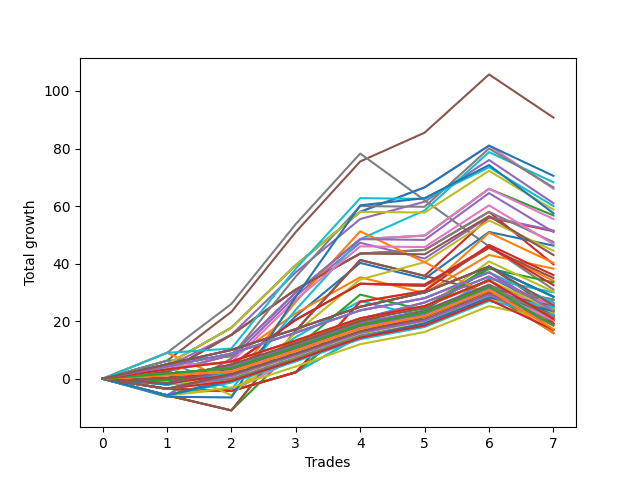

# Short Wallace Doodle 013 
- Symbol: ES_Unlimited
- Date Range: 03/18/2022 - 07/15/2022
- Trading Period: 7:20-12:30
- Number of Trades: 7



| Name | Win Percent | Profit | Avg Profit / Trade | Avg Time / Trade |      | Name | Win Percent | Profit | Avg Profit / Trade | Avg Time / Trade |
| ---- | ----------- | ------ | ------------------ | ---------------- | ---- | ---- | ----------- | ------ | ------------------ | ---------------- |
| Sorted By <br> Profit | | | | | | Sorted By <br> Win Percentage ||||
| Five | 85.71 | 45375.00 | 6482.14 | 30:12 |     | Five | 85.71 | 45375.00 | 6482.14 | 30:12 |
| Sixty-Two | 85.71 | 35250.00 | 5035.71 | 17:22 |     | Sixty-Two | 85.71 | 35250.00 | 5035.71 | 17:22 |
| Sixty-One | 71.43 | 34125.00 | 4875.00 | 18:34 |     | Six | 85.71 | 33000.00 | 4714.29 | 27:55 |
| Sixty-Nine | 71.43 | 33250.00 | 4750.00 | 13:01 |     | Four | 85.71 | 30500.00 | 4357.14 | 27:44 |
| Six | 85.71 | 33000.00 | 4714.29 | 27:55 |     | Two | 85.71 | 28375.00 | 4053.57 | 17:13 |
| Four | 85.71 | 30500.00 | 4357.14 | 27:44 |     | Fifty-Eight | 85.71 | 27750.00 | 3964.29 | 13:10 |
| Seventy-One | 71.43 | 30000.00 | 4285.71 | 19:23 |     | Fifty-Nine | 85.71 | 23750.00 | 3392.86 | 14:10 |
| Seventy | 71.43 | 29375.00 | 4196.43 | 12:05 |     | Three | 85.71 | 19875.00 | 2839.29 | 24:02 |
| Seventy-Three | 57.14 | 28750.00 | 4107.14 | 13:30 |     | One Hundred Twenty-Five | 85.71 | 14250.00 | 2035.71 | 07:27 |
| Two | 85.71 | 28375.00 | 4053.57 | 17:13 |     | One Hundred Two | 85.71 | 13750.00 | 1964.29 | 02:19 |
| Fifty-Eight | 85.71 | 27750.00 | 3964.29 | 13:10 |     | One Hundred Twelve | 85.71 | 13625.00 | 1946.43 | 02:24 |
| Forty-Six | 57.14 | 25750.00 | 3678.57 | 08:51 |     | One Hundred Twenty-Four | 85.71 | 13250.00 | 1892.86 | 06:53 |
| Forty-Five | 42.86 | 25625.00 | 3660.71 | 09:36 |     | One Hundred One | 85.71 | 13125.00 | 1875.00 | 02:00 |
| Sixty-Six | 71.43 | 25500.00 | 3642.86 | 08:52 |     | One Hundred Eleven | 85.71 | 13000.00 | 1857.14 | 02:05 |
| Fifty-Nine | 85.71 | 23750.00 | 3392.86 | 14:10 |     | One Hundred Thirty | 85.71 | 12750.00 | 1821.43 | 08:19 |
| Sixty-Eight | 71.43 | 23375.00 | 3339.29 | 11:35 |     | Eighty-Five | 85.71 | 12000.00 | 1714.29 | 18:01 |
| Forty-Two | 57.14 | 23125.00 | 3303.57 | 08:35 |     | One Hundred Twenty-Three | 85.71 | 11875.00 | 1696.43 | 05:45 |
| Sixty | 71.43 | 22250.00 | 3178.57 | 16:18 |     | One Hundred Twenty-Nine | 85.71 | 11750.00 | 1678.57 | 07:45 |
| Sixty-Seven | 71.43 | 21500.00 | 3071.43 | 09:52 |     | Eighty-Four | 85.71 | 11000.00 | 1571.43 | 17:27 |
| Fifty-Three | 57.14 | 20125.00 | 2875.00 | 04:45 |     | One Hundred Twenty-Two | 85.71 | 10750.00 | 1535.71 | 02:27 |
| Three | 85.71 | 19875.00 | 2839.29 | 24:02 |     | One Hundred Seventeen | 85.71 | 10750.00 | 1535.71 | 02:27 |
| Forty-Three | 57.14 | 19125.00 | 2732.14 | 08:33 |     | One Hundred Seven | 85.71 | 10750.00 | 1535.71 | 02:27 |
| Fifty-Five | 57.14 | 18000.00 | 2571.43 | 04:51 |     | Ninety-Seven | 85.71 | 10750.00 | 1535.71 | 02:27 |
| Fifty-Seven | 71.43 | 17500.00 | 2500.00 | 12:37 |     | One Hundred Twenty-Eight | 85.71 | 10375.00 | 1482.14 | 06:37 |
| One | 71.43 | 17000.00 | 2428.57 | 16:35 |     | One Hundred Twenty-One | 85.71 | 10125.00 | 1446.43 | 02:08 |
| Forty-Four | 42.86 | 16750.00 | 2392.86 | 09:05 |     | One Hundred Sixteen | 85.71 | 10125.00 | 1446.43 | 02:08 |
| Sixty-Five | 71.43 | 16250.00 | 2321.43 | 08:20 |     | One Hundred Six | 85.71 | 10125.00 | 1446.43 | 02:08 |
| Seven | 57.14 | 15500.00 | 2214.29 | 88:52 |     | Ninety-Six | 85.71 | 10125.00 | 1446.43 | 02:08 |
| Fifty | 57.14 | 15125.00 | 2160.71 | 04:27 |     | Eighty-Three | 85.71 | 9625.00 | 1375.00 | 16:19 |
| Forty-One | 57.14 | 15000.00 | 2142.86 | 08:07 |     | One Hundred Twenty-Seven | 85.71 | 9250.00 | 1321.43 | 03:18 |
| One Hundred Twenty-Five | 85.71 | 14250.00 | 2035.71 | 07:27 |     | One Hundred Twenty-Six | 85.71 | 8625.00 | 1232.14 | 03:00 |
| Fifty-Four | 57.14 | 14250.00 | 2035.71 | 04:26 |     | Eighty-Two | 85.71 | 8500.00 | 1214.29 | 13:00 |
| Fifty-Two | 57.14 | 14250.00 | 2035.71 | 04:26 |     | Eighty-One | 85.71 | 7875.00 | 1125.00 | 12:42 |
| One Hundred Two | 85.71 | 13750.00 | 1964.29 | 02:19 |     | Sixty-One | 71.43 | 34125.00 | 4875.00 | 18:34 |
| Ninety-Five | 71.43 | 13750.00 | 1964.29 | 01:37 |     | Sixty-Nine | 71.43 | 33250.00 | 4750.00 | 13:01 |
| One Hundred Twelve | 85.71 | 13625.00 | 1946.43 | 02:24 |     | Seventy-One | 71.43 | 30000.00 | 4285.71 | 19:23 |
| One Hundred Twenty-Four | 85.71 | 13250.00 | 1892.86 | 06:53 |     | Seventy | 71.43 | 29375.00 | 4196.43 | 12:05 |
| One Hundred One | 85.71 | 13125.00 | 1875.00 | 02:00 |     | Sixty-Six | 71.43 | 25500.00 | 3642.86 | 08:52 |
| Ninety-Four | 71.43 | 13125.00 | 1875.00 | 01:35 |     | Sixty-Eight | 71.43 | 23375.00 | 3339.29 | 11:35 |
| One Hundred Eleven | 85.71 | 13000.00 | 1857.14 | 02:05 |     | Sixty | 71.43 | 22250.00 | 3178.57 | 16:18 |
| One Hundred Five | 71.43 | 13000.00 | 1857.14 | 02:43 |     | Sixty-Seven | 71.43 | 21500.00 | 3071.43 | 09:52 |
| One Hundred Thirty | 85.71 | 12750.00 | 1821.43 | 08:19 |     | Fifty-Seven | 71.43 | 17500.00 | 2500.00 | 12:37 |
| Forty | 71.43 | 12750.00 | 1821.43 | 06:06 |     | One | 71.43 | 17000.00 | 2428.57 | 16:35 |
| Forty-Seven | 28.57 | 12625.00 | 1803.57 | 12:09 |     | Sixty-Five | 71.43 | 16250.00 | 2321.43 | 08:20 |
| Fifty-Six | 71.43 | 12500.00 | 1785.71 | 06:59 |     | Ninety-Five | 71.43 | 13750.00 | 1964.29 | 01:37 |
| One Hundred Four | 71.43 | 12375.00 | 1767.86 | 02:41 |     | Ninety-Four | 71.43 | 13125.00 | 1875.00 | 01:35 |
| Ninety-Three | 71.43 | 12250.00 | 1750.00 | 01:34 |     | One Hundred Five | 71.43 | 13000.00 | 1857.14 | 02:43 |
| Eighty-Five | 85.71 | 12000.00 | 1714.29 | 18:01 |     | Forty | 71.43 | 12750.00 | 1821.43 | 06:06 |
| Zero | 71.43 | 12000.00 | 1714.29 | 09:25 |     | Fifty-Six | 71.43 | 12500.00 | 1785.71 | 06:59 |
| One Hundred Twenty-Three | 85.71 | 11875.00 | 1696.43 | 05:45 |     | One Hundred Four | 71.43 | 12375.00 | 1767.86 | 02:41 |
| Ninety-Two | 71.43 | 11875.00 | 1696.43 | 01:31 |     | Ninety-Three | 71.43 | 12250.00 | 1750.00 | 01:34 |
| One Hundred Twenty-Nine | 85.71 | 11750.00 | 1678.57 | 07:45 |     | Zero | 71.43 | 12000.00 | 1714.29 | 09:25 |
| One Hundred Fifteen | 71.43 | 11750.00 | 1678.57 | 02:52 |     | Ninety-Two | 71.43 | 11875.00 | 1696.43 | 01:31 |
| One Hundred | 71.43 | 11750.00 | 1678.57 | 02:36 |     | One Hundred Fifteen | 71.43 | 11750.00 | 1678.57 | 02:52 |
| One Hundred Three | 71.43 | 11500.00 | 1642.86 | 02:40 |     | One Hundred | 71.43 | 11750.00 | 1678.57 | 02:36 |
| Ninety-One | 71.43 | 11500.00 | 1642.86 | 01:26 |     | One Hundred Three | 71.43 | 11500.00 | 1642.86 | 02:40 |
| One Hundred Fourteen | 71.43 | 11125.00 | 1589.29 | 02:50 |     | Ninety-One | 71.43 | 11500.00 | 1642.86 | 01:26 |
| Ninety-Nine | 71.43 | 11125.00 | 1589.29 | 02:34 |     | One Hundred Fourteen | 71.43 | 11125.00 | 1589.29 | 02:50 |
| Eighty-Four | 85.71 | 11000.00 | 1571.43 | 17:27 |     | Ninety-Nine | 71.43 | 11125.00 | 1589.29 | 02:34 |
| One Hundred Ten | 71.43 | 11000.00 | 1571.43 | 02:39 |     | One Hundred Ten | 71.43 | 11000.00 | 1571.43 | 02:39 |
| One Hundred Twenty-Two | 85.71 | 10750.00 | 1535.71 | 02:27 |     | One Hundred Nine | 71.43 | 10375.00 | 1482.14 | 02:37 |
| One Hundred Seventeen | 85.71 | 10750.00 | 1535.71 | 02:27 |     | One Hundred Thirteen | 71.43 | 10250.00 | 1464.29 | 02:49 |
| One Hundred Seven | 85.71 | 10750.00 | 1535.71 | 02:27 |     | Ninety-Eight | 71.43 | 10250.00 | 1464.29 | 02:32 |
| Ninety-Seven | 85.71 | 10750.00 | 1535.71 | 02:27 |     | One Hundred Twenty | 71.43 | 10000.00 | 1428.57 | 02:51 |
| Fifty-One | 57.14 | 10625.00 | 1517.86 | 04:15 |     | One Hundred Eight | 71.43 | 9500.00 | 1357.14 | 02:35 |
| Forty-Nine | 57.14 | 10625.00 | 1517.86 | 04:15 |     | One Hundred Ninteen | 71.43 | 9375.00 | 1339.29 | 02:49 |
| One Hundred Twenty-Eight | 85.71 | 10375.00 | 1482.14 | 06:37 |     | One Hundred Eighteen | 71.43 | 8500.00 | 1214.29 | 02:47 |
| One Hundred Nine | 71.43 | 10375.00 | 1482.14 | 02:37 |     | Seventy-Three | 57.14 | 28750.00 | 4107.14 | 13:30 |
| One Hundred Thirteen | 71.43 | 10250.00 | 1464.29 | 02:49 |     | Forty-Six | 57.14 | 25750.00 | 3678.57 | 08:51 |
| Ninety-Eight | 71.43 | 10250.00 | 1464.29 | 02:32 |     | Forty-Two | 57.14 | 23125.00 | 3303.57 | 08:35 |
| One Hundred Twenty-One | 85.71 | 10125.00 | 1446.43 | 02:08 |     | Fifty-Three | 57.14 | 20125.00 | 2875.00 | 04:45 |
| One Hundred Sixteen | 85.71 | 10125.00 | 1446.43 | 02:08 |     | Forty-Three | 57.14 | 19125.00 | 2732.14 | 08:33 |
| One Hundred Six | 85.71 | 10125.00 | 1446.43 | 02:08 |     | Fifty-Five | 57.14 | 18000.00 | 2571.43 | 04:51 |
| Ninety-Six | 85.71 | 10125.00 | 1446.43 | 02:08 |     | Seven | 57.14 | 15500.00 | 2214.29 | 88:52 |
| One Hundred Twenty | 71.43 | 10000.00 | 1428.57 | 02:51 |     | Fifty | 57.14 | 15125.00 | 2160.71 | 04:27 |
| Eighty-Three | 85.71 | 9625.00 | 1375.00 | 16:19 |     | Forty-One | 57.14 | 15000.00 | 2142.86 | 08:07 |
| One Hundred Eight | 71.43 | 9500.00 | 1357.14 | 02:35 |     | Fifty-Four | 57.14 | 14250.00 | 2035.71 | 04:26 |
| One Hundred Ninteen | 71.43 | 9375.00 | 1339.29 | 02:49 |     | Fifty-Two | 57.14 | 14250.00 | 2035.71 | 04:26 |
| One Hundred Twenty-Seven | 85.71 | 9250.00 | 1321.43 | 03:18 |     | Fifty-One | 57.14 | 10625.00 | 1517.86 | 04:15 |
| Sixty-Three | 42.86 | 9250.00 | 1321.43 | 33:01 |     | Forty-Nine | 57.14 | 10625.00 | 1517.86 | 04:15 |
| One Hundred Twenty-Six | 85.71 | 8625.00 | 1232.14 | 03:00 |     | Forty-Eight | 57.14 | 8500.00 | 1214.29 | 03:52 |
| Eighty-Two | 85.71 | 8500.00 | 1214.29 | 13:00 |     | Sixty-Four | 57.14 | 8000.00 | 1142.86 | 06:57 |
| One Hundred Eighteen | 71.43 | 8500.00 | 1214.29 | 02:47 |     | Forty-Five | 42.86 | 25625.00 | 3660.71 | 09:36 |
| Forty-Eight | 57.14 | 8500.00 | 1214.29 | 03:52 |     | Forty-Four | 42.86 | 16750.00 | 2392.86 | 09:05 |
| Sixty-Four | 57.14 | 8000.00 | 1142.86 | 06:57 |     | Sixty-Three | 42.86 | 9250.00 | 1321.43 | 33:01 |
| Eighty-One | 85.71 | 7875.00 | 1125.00 | 12:42 |     | Forty-Seven | 28.57 | 12625.00 | 1803.57 | 12:09 |

## NO STOPLOSS

### Test Zero
* Sell when price hits the middle line of the 20p bollinger
* No Stoploss
* Results:
```
Total Trades: 7
Percent Up: 28.57
Percent Down: 71.43
Total Points Moved Down: 24.00
Potential Profit: 12000.00
Total Points Ups: 12.00 Count Ups: 2
Total Points Downs: 36.00 Count Downs: 5
```

<details><summary>Trades</summary>

<code>In: 2022-03-31 07:48:00		Out: 2022-03-31 08:03:10		Total Position Time: 15:10		Total Move Down: -0.50		Total to Date: -0.50</code> <br />
<code>In: 2022-04-06 10:43:00		Out: 2022-04-06 10:55:55		Total Position Time: 12:55		Total Move Down: 2.25		Total to Date: 1.75</code> <br />
<code>In: 2022-04-06 11:04:00		Out: 2022-04-06 11:05:55		Total Position Time: 01:55		Total Move Down: 11.25		Total to Date: 13.00</code> <br />
<code>In: 2022-04-06 11:05:00		Out: 2022-04-06 11:06:10		Total Position Time: 01:10		Total Move Down: 7.75		Total to Date: 20.75</code> <br />
<code>In: 2022-05-31 07:23:00		Out: 2022-05-31 07:37:30		Total Position Time: 14:30		Total Move Down: 5.75		Total to Date: 26.50</code> <br />
<code>In: 2022-07-06 11:09:00		Out: 2022-07-06 11:10:10		Total Position Time: 01:10		Total Move Down: 9.00		Total to Date: 35.50</code> <br />
<code>In: 2022-07-06 11:31:00		Out: 2022-07-06 11:50:05		Total Position Time: 19:05		Total Move Down: -11.50		Total to Date: 24.00</code> <br />


</details>

### Test One
* Sell when the price hits the upper line of the 20p 1std bollinger
* No Stoploss
* Results:
```
Total Trades: 7
Percent Up: 28.57
Percent Down: 71.43
Total Points Moved Down: 34.00
Potential Profit: 17000.00
Total Points Ups: 12.25 Count Ups: 2
Total Points Downs: 46.25 Count Downs: 5
```

<details><summary>Trades</summary>

<code>In: 2022-03-31 07:48:00		Out: 2022-03-31 08:08:00		Total Position Time: 20:00		Total Move Down: 0.25		Total to Date: 0.25</code> <br />
<code>In: 2022-04-06 10:43:00		Out: 2022-04-06 10:57:10		Total Position Time: 14:10		Total Move Down: 4.50		Total to Date: 4.75</code> <br />
<code>In: 2022-04-06 11:04:00		Out: 2022-04-06 11:07:20		Total Position Time: 03:20		Total Move Down: 15.75		Total to Date: 20.50</code> <br />
<code>In: 2022-04-06 11:05:00		Out: 2022-04-06 11:07:20		Total Position Time: 02:20		Total Move Down: 12.50		Total to Date: 33.00</code> <br />
<code>In: 2022-05-31 07:23:00		Out: 2022-05-31 08:07:20		Total Position Time: 44:20		Total Move Down: -0.75		Total to Date: 32.25</code> <br />
<code>In: 2022-07-06 11:09:00		Out: 2022-07-06 11:11:10		Total Position Time: 02:10		Total Move Down: 13.25		Total to Date: 45.50</code> <br />
<code>In: 2022-07-06 11:31:00		Out: 2022-07-06 12:00:50		Total Position Time: 29:50		Total Move Down: -11.50		Total to Date: 34.00</code> <br />


</details>

### Test Two
* Sell when the price hits the upper line of the 20p 2std bollinger
* No Stoploss
* Results:
```
Total Trades: 7
Percent Up: 14.29
Percent Down: 85.71
Total Points Moved Down: 56.75
Potential Profit: 28375.00
Total Points Ups: 9.25 Count Ups: 1
Total Points Downs: 66.00 Count Downs: 6
```

<details><summary>Trades</summary>

<code>In: 2022-03-31 07:48:00		Out: 2022-03-31 08:08:30		Total Position Time: 20:30		Total Move Down: 2.50		Total to Date: 2.50</code> <br />
<code>In: 2022-04-06 10:43:00		Out: 2022-04-06 10:58:05		Total Position Time: 15:05		Total Move Down: 5.75		Total to Date: 8.25</code> <br />
<code>In: 2022-04-06 11:04:00		Out: 2022-04-06 11:08:10		Total Position Time: 04:10		Total Move Down: 21.75		Total to Date: 30.00</code> <br />
<code>In: 2022-04-06 11:05:00		Out: 2022-04-06 11:08:10		Total Position Time: 03:10		Total Move Down: 18.50		Total to Date: 48.50</code> <br />
<code>In: 2022-05-31 07:23:00		Out: 2022-05-31 08:07:30		Total Position Time: 44:30		Total Move Down: 1.25		Total to Date: 49.75</code> <br />
<code>In: 2022-07-06 11:09:00		Out: 2022-07-06 11:11:45		Total Position Time: 02:45		Total Move Down: 16.25		Total to Date: 66.00</code> <br />
<code>In: 2022-07-06 11:31:00		Out: 2022-07-06 12:01:25		Total Position Time: 30:25		Total Move Down: -9.25		Total to Date: 56.75</code> <br />


</details>

### Test Three
* Sell when price hits the middle line of the 50p bollinger
* No Stoploss
* Results:
```
Total Trades: 7
Percent Up: 14.29
Percent Down: 85.71
Total Points Moved Down: 39.75
Potential Profit: 19875.00
Total Points Ups: 18.25 Count Ups: 1
Total Points Downs: 58.00 Count Downs: 6
```

<details><summary>Trades</summary>

<code>In: 2022-03-31 07:48:00		Out: 2022-03-31 08:15:40		Total Position Time: 27:40		Total Move Down: 2.50		Total to Date: 2.50</code> <br />
<code>In: 2022-04-06 10:43:00		Out: 2022-04-06 11:00:10		Total Position Time: 17:10		Total Move Down: 12.75		Total to Date: 15.25</code> <br />
<code>In: 2022-04-06 11:04:00		Out: 2022-04-06 11:07:20		Total Position Time: 03:20		Total Move Down: 15.75		Total to Date: 31.00</code> <br />
<code>In: 2022-04-06 11:05:00		Out: 2022-04-06 11:07:20		Total Position Time: 02:20		Total Move Down: 12.50		Total to Date: 43.50</code> <br />
<code>In: 2022-05-31 07:23:00		Out: 2022-05-31 08:07:30		Total Position Time: 44:30		Total Move Down: 1.25		Total to Date: 44.75</code> <br />
<code>In: 2022-07-06 11:09:00		Out: 2022-07-06 11:11:10		Total Position Time: 02:10		Total Move Down: 13.25		Total to Date: 58.00</code> <br />
<code>In: 2022-07-06 11:31:00		Out: 2022-07-06 12:42:10		Total Position Time: 71:10		Total Move Down: -18.25		Total to Date: 39.75</code> <br />


</details>

### Test Four
* Sell when the price hits the upper line of the 50p 1std bollinger
* No Stoploss
* Results:
```
Total Trades: 7
Percent Up: 14.29
Percent Down: 85.71
Total Points Moved Down: 61.00
Potential Profit: 30500.00
Total Points Ups: 15.00 Count Ups: 1
Total Points Downs: 76.00 Count Downs: 6
```

<details><summary>Trades</summary>

<code>In: 2022-03-31 07:48:00		Out: 2022-03-31 08:25:20		Total Position Time: 37:20		Total Move Down: 4.25		Total to Date: 4.25</code> <br />
<code>In: 2022-04-06 10:43:00		Out: 2022-04-06 11:08:10		Total Position Time: 25:10		Total Move Down: 11.00		Total to Date: 15.25</code> <br />
<code>In: 2022-04-06 11:04:00		Out: 2022-04-06 11:08:10		Total Position Time: 04:10		Total Move Down: 21.75		Total to Date: 37.00</code> <br />
<code>In: 2022-04-06 11:05:00		Out: 2022-04-06 11:08:10		Total Position Time: 03:10		Total Move Down: 18.50		Total to Date: 55.50</code> <br />
<code>In: 2022-05-31 07:23:00		Out: 2022-05-31 08:08:45		Total Position Time: 45:45		Total Move Down: 6.00		Total to Date: 61.50</code> <br />
<code>In: 2022-07-06 11:09:00		Out: 2022-07-06 11:11:35		Total Position Time: 02:35		Total Move Down: 14.50		Total to Date: 76.00</code> <br />
<code>In: 2022-07-06 11:31:00		Out: 2022-07-06 12:47:00		Total Position Time: 76:00		Total Move Down: -15.00		Total to Date: 61.00</code> <br />


</details>

### Test Five
* Sell when the price hits the upper line of the 50p 2std bollinger
* No Stoploss
* Results:
```
Total Trades: 7
Percent Up: 14.29
Percent Down: 85.71
Total Points Moved Down: 90.75
Potential Profit: 45375.00
Total Points Ups: 15.00 Count Ups: 1
Total Points Downs: 105.75 Count Downs: 6
```

<details><summary>Trades</summary>

<code>In: 2022-03-31 07:48:00		Out: 2022-03-31 08:31:45		Total Position Time: 43:45		Total Move Down: 6.25		Total to Date: 6.25</code> <br />
<code>In: 2022-04-06 10:43:00		Out: 2022-04-06 11:09:40		Total Position Time: 26:40		Total Move Down: 17.00		Total to Date: 23.25</code> <br />
<code>In: 2022-04-06 11:04:00		Out: 2022-04-06 11:09:40		Total Position Time: 05:40		Total Move Down: 27.75		Total to Date: 51.00</code> <br />
<code>In: 2022-04-06 11:05:00		Out: 2022-04-06 11:09:40		Total Position Time: 04:40		Total Move Down: 24.50		Total to Date: 75.50</code> <br />
<code>In: 2022-05-31 07:23:00		Out: 2022-05-31 08:14:30		Total Position Time: 51:30		Total Move Down: 10.00		Total to Date: 85.50</code> <br />
<code>In: 2022-07-06 11:09:00		Out: 2022-07-06 11:12:15		Total Position Time: 03:15		Total Move Down: 20.25		Total to Date: 105.75</code> <br />
<code>In: 2022-07-06 11:31:00		Out: 2022-07-06 12:47:00		Total Position Time: 76:00		Total Move Down: -15.00		Total to Date: 90.75</code> <br />


</details>

### Test Six
* Sell when the price hits the middle line of the 1std VWAP
* No Stoploss
* Results:
```
Total Trades: 7
Percent Up: 14.29
Percent Down: 85.71
Total Points Moved Down: 66.00
Potential Profit: 33000.00
Total Points Ups: 15.00 Count Ups: 1
Total Points Downs: 81.00 Count Downs: 6
```

<details><summary>Trades</summary>

<code>In: 2022-03-31 07:48:00		Out: 2022-03-31 08:29:05		Total Position Time: 41:05		Total Move Down: 5.00		Total to Date: 5.00</code> <br />
<code>In: 2022-04-06 10:43:00		Out: 2022-04-06 11:00:10		Total Position Time: 17:10		Total Move Down: 12.75		Total to Date: 17.75</code> <br />
<code>In: 2022-04-06 11:04:00		Out: 2022-04-06 11:08:10		Total Position Time: 04:10		Total Move Down: 21.75		Total to Date: 39.50</code> <br />
<code>In: 2022-04-06 11:05:00		Out: 2022-04-06 11:08:10		Total Position Time: 03:10		Total Move Down: 18.50		Total to Date: 58.00</code> <br />
<code>In: 2022-05-31 07:23:00		Out: 2022-05-31 08:14:20		Total Position Time: 51:20		Total Move Down: 8.50		Total to Date: 66.50</code> <br />
<code>In: 2022-07-06 11:09:00		Out: 2022-07-06 11:11:35		Total Position Time: 02:35		Total Move Down: 14.50		Total to Date: 81.00</code> <br />
<code>In: 2022-07-06 11:31:00		Out: 2022-07-06 12:47:00		Total Position Time: 76:00		Total Move Down: -15.00		Total to Date: 66.00</code> <br />


</details>

### Test Seven
* Sell when the price hits the upper line of the 1std VWAP
* No Stoploss
* Results:
```
Total Trades: 7
Percent Up: 42.86
Percent Down: 57.14
Total Points Moved Down: 31.00
Potential Profit: 15500.00
Total Points Ups: 47.25 Count Ups: 3
Total Points Downs: 78.25 Count Downs: 4
```

<details><summary>Trades</summary>

<code>In: 2022-03-31 07:48:00		Out: 2022-03-31 09:15:10		Total Position Time: 87:10		Total Move Down: 9.00		Total to Date: 9.00</code> <br />
<code>In: 2022-04-06 10:43:00		Out: 2022-04-06 11:09:40		Total Position Time: 26:40		Total Move Down: 17.00		Total to Date: 26.00</code> <br />
<code>In: 2022-04-06 11:04:00		Out: 2022-04-06 11:09:40		Total Position Time: 05:40		Total Move Down: 27.75		Total to Date: 53.75</code> <br />
<code>In: 2022-04-06 11:05:00		Out: 2022-04-06 11:09:40		Total Position Time: 04:40		Total Move Down: 24.50		Total to Date: 78.25</code> <br />
<code>In: 2022-05-31 07:23:00		Out: 2022-05-31 12:47:00		Total Position Time: 324:00		Total Move Down: -16.25		Total to Date: 62.00</code> <br />
<code>In: 2022-07-06 11:09:00		Out: 2022-07-06 12:47:00		Total Position Time: 98:00		Total Move Down: -16.00		Total to Date: 46.00</code> <br />
<code>In: 2022-07-06 11:31:00		Out: 2022-07-06 12:47:00		Total Position Time: 76:00		Total Move Down: -15.00		Total to Date: 31.00</code> <br />


</details>

## STOPLOSS OF 5

### Test Forty
* Sell when price hits the middle line of the 20p bollinger
* Stoploss is -5 points
* Results:
```
Total Trades: 7
Percent Up: 28.57
Percent Down: 71.43
Total Points Moved Down: 25.50
Potential Profit: 12750.00
Total Points Ups: 10.50 Count Ups: 2
Total Points Downs: 36.00 Count Downs: 5
```

<details><summary>Trades</summary>

<code>In: 2022-03-31 07:48:00		Out: 2022-03-31 07:57:20		Total Position Time: 09:20		Total Move Down: -5.75		Total to Date: -5.75</code> <br />
<code>In: 2022-04-06 10:43:00		Out: 2022-04-06 10:55:55		Total Position Time: 12:55		Total Move Down: 2.25		Total to Date: -3.50</code> <br />
<code>In: 2022-04-06 11:04:00		Out: 2022-04-06 11:05:55		Total Position Time: 01:55		Total Move Down: 11.25		Total to Date: 7.75</code> <br />
<code>In: 2022-04-06 11:05:00		Out: 2022-04-06 11:06:10		Total Position Time: 01:10		Total Move Down: 7.75		Total to Date: 15.50</code> <br />
<code>In: 2022-05-31 07:23:00		Out: 2022-05-31 07:37:30		Total Position Time: 14:30		Total Move Down: 5.75		Total to Date: 21.25</code> <br />
<code>In: 2022-07-06 11:09:00		Out: 2022-07-06 11:10:10		Total Position Time: 01:10		Total Move Down: 9.00		Total to Date: 30.25</code> <br />
<code>In: 2022-07-06 11:31:00		Out: 2022-07-06 11:32:45		Total Position Time: 01:45		Total Move Down: -4.75		Total to Date: 25.50</code> <br />


</details>

### Test Forty-One
* Sell when the price hits the upper line of the 20p 1std bollinger
* Stoploss is -5 points
* Results:
```
Total Trades: 7
Percent Up: 42.86
Percent Down: 57.14
Total Points Moved Down: 30.00
Potential Profit: 15000.00
Total Points Ups: 16.00 Count Ups: 3
Total Points Downs: 46.00 Count Downs: 4
```

<details><summary>Trades</summary>

<code>In: 2022-03-31 07:48:00		Out: 2022-03-31 07:57:20		Total Position Time: 09:20		Total Move Down: -5.75		Total to Date: -5.75</code> <br />
<code>In: 2022-04-06 10:43:00		Out: 2022-04-06 10:57:10		Total Position Time: 14:10		Total Move Down: 4.50		Total to Date: -1.25</code> <br />
<code>In: 2022-04-06 11:04:00		Out: 2022-04-06 11:07:20		Total Position Time: 03:20		Total Move Down: 15.75		Total to Date: 14.50</code> <br />
<code>In: 2022-04-06 11:05:00		Out: 2022-04-06 11:07:20		Total Position Time: 02:20		Total Move Down: 12.50		Total to Date: 27.00</code> <br />
<code>In: 2022-05-31 07:23:00		Out: 2022-05-31 07:46:50		Total Position Time: 23:50		Total Move Down: -5.50		Total to Date: 21.50</code> <br />
<code>In: 2022-07-06 11:09:00		Out: 2022-07-06 11:11:10		Total Position Time: 02:10		Total Move Down: 13.25		Total to Date: 34.75</code> <br />
<code>In: 2022-07-06 11:31:00		Out: 2022-07-06 11:32:45		Total Position Time: 01:45		Total Move Down: -4.75		Total to Date: 30.00</code> <br />


</details>

### Test Forty-Two
* Sell when the price hits the upper line of the 20p 2std bollinger
* Stoploss is -5 points
* Results:
```
Total Trades: 7
Percent Up: 42.86
Percent Down: 57.14
Total Points Moved Down: 46.25
Potential Profit: 23125.00
Total Points Ups: 16.00 Count Ups: 3
Total Points Downs: 62.25 Count Downs: 4
```

<details><summary>Trades</summary>

<code>In: 2022-03-31 07:48:00		Out: 2022-03-31 07:57:20		Total Position Time: 09:20		Total Move Down: -5.75		Total to Date: -5.75</code> <br />
<code>In: 2022-04-06 10:43:00		Out: 2022-04-06 10:58:05		Total Position Time: 15:05		Total Move Down: 5.75		Total to Date: 0.00</code> <br />
<code>In: 2022-04-06 11:04:00		Out: 2022-04-06 11:08:10		Total Position Time: 04:10		Total Move Down: 21.75		Total to Date: 21.75</code> <br />
<code>In: 2022-04-06 11:05:00		Out: 2022-04-06 11:08:10		Total Position Time: 03:10		Total Move Down: 18.50		Total to Date: 40.25</code> <br />
<code>In: 2022-05-31 07:23:00		Out: 2022-05-31 07:46:50		Total Position Time: 23:50		Total Move Down: -5.50		Total to Date: 34.75</code> <br />
<code>In: 2022-07-06 11:09:00		Out: 2022-07-06 11:11:45		Total Position Time: 02:45		Total Move Down: 16.25		Total to Date: 51.00</code> <br />
<code>In: 2022-07-06 11:31:00		Out: 2022-07-06 11:32:45		Total Position Time: 01:45		Total Move Down: -4.75		Total to Date: 46.25</code> <br />


</details>

### Test Forty-Three
* Sell when price hits the middle line of the 50p bollinger
* Stoploss is -5 points
* Results:
```
Total Trades: 7
Percent Up: 42.86
Percent Down: 57.14
Total Points Moved Down: 38.25
Potential Profit: 19125.00
Total Points Ups: 16.00 Count Ups: 3
Total Points Downs: 54.25 Count Downs: 4
```

<details><summary>Trades</summary>

<code>In: 2022-03-31 07:48:00		Out: 2022-03-31 07:57:20		Total Position Time: 09:20		Total Move Down: -5.75		Total to Date: -5.75</code> <br />
<code>In: 2022-04-06 10:43:00		Out: 2022-04-06 11:00:10		Total Position Time: 17:10		Total Move Down: 12.75		Total to Date: 7.00</code> <br />
<code>In: 2022-04-06 11:04:00		Out: 2022-04-06 11:07:20		Total Position Time: 03:20		Total Move Down: 15.75		Total to Date: 22.75</code> <br />
<code>In: 2022-04-06 11:05:00		Out: 2022-04-06 11:07:20		Total Position Time: 02:20		Total Move Down: 12.50		Total to Date: 35.25</code> <br />
<code>In: 2022-05-31 07:23:00		Out: 2022-05-31 07:46:50		Total Position Time: 23:50		Total Move Down: -5.50		Total to Date: 29.75</code> <br />
<code>In: 2022-07-06 11:09:00		Out: 2022-07-06 11:11:10		Total Position Time: 02:10		Total Move Down: 13.25		Total to Date: 43.00</code> <br />
<code>In: 2022-07-06 11:31:00		Out: 2022-07-06 11:32:45		Total Position Time: 01:45		Total Move Down: -4.75		Total to Date: 38.25</code> <br />


</details>

### Test Forty-Four
* Sell when the price hits the upper line of the 50p 1std bollinger
* Stoploss is -5 points
* Results:
```
Total Trades: 7
Percent Up: 57.14
Percent Down: 42.86
Total Points Moved Down: 33.50
Potential Profit: 16750.00
Total Points Ups: 21.25 Count Ups: 4
Total Points Downs: 54.75 Count Downs: 3
```

<details><summary>Trades</summary>

<code>In: 2022-03-31 07:48:00		Out: 2022-03-31 07:57:20		Total Position Time: 09:20		Total Move Down: -5.75		Total to Date: -5.75</code> <br />
<code>In: 2022-04-06 10:43:00		Out: 2022-04-06 11:01:45		Total Position Time: 18:45		Total Move Down: -5.25		Total to Date: -11.00</code> <br />
<code>In: 2022-04-06 11:04:00		Out: 2022-04-06 11:08:10		Total Position Time: 04:10		Total Move Down: 21.75		Total to Date: 10.75</code> <br />
<code>In: 2022-04-06 11:05:00		Out: 2022-04-06 11:08:10		Total Position Time: 03:10		Total Move Down: 18.50		Total to Date: 29.25</code> <br />
<code>In: 2022-05-31 07:23:00		Out: 2022-05-31 07:46:50		Total Position Time: 23:50		Total Move Down: -5.50		Total to Date: 23.75</code> <br />
<code>In: 2022-07-06 11:09:00		Out: 2022-07-06 11:11:35		Total Position Time: 02:35		Total Move Down: 14.50		Total to Date: 38.25</code> <br />
<code>In: 2022-07-06 11:31:00		Out: 2022-07-06 11:32:45		Total Position Time: 01:45		Total Move Down: -4.75		Total to Date: 33.50</code> <br />


</details>

### Test Forty-Five
* Sell when the price hits the upper line of the 50p 2std bollinger
* Stoploss is -5 points
* Results:
```
Total Trades: 7
Percent Up: 57.14
Percent Down: 42.86
Total Points Moved Down: 51.25
Potential Profit: 25625.00
Total Points Ups: 21.25 Count Ups: 4
Total Points Downs: 72.50 Count Downs: 3
```

<details><summary>Trades</summary>

<code>In: 2022-03-31 07:48:00		Out: 2022-03-31 07:57:20		Total Position Time: 09:20		Total Move Down: -5.75		Total to Date: -5.75</code> <br />
<code>In: 2022-04-06 10:43:00		Out: 2022-04-06 11:01:45		Total Position Time: 18:45		Total Move Down: -5.25		Total to Date: -11.00</code> <br />
<code>In: 2022-04-06 11:04:00		Out: 2022-04-06 11:09:40		Total Position Time: 05:40		Total Move Down: 27.75		Total to Date: 16.75</code> <br />
<code>In: 2022-04-06 11:05:00		Out: 2022-04-06 11:09:40		Total Position Time: 04:40		Total Move Down: 24.50		Total to Date: 41.25</code> <br />
<code>In: 2022-05-31 07:23:00		Out: 2022-05-31 07:46:50		Total Position Time: 23:50		Total Move Down: -5.50		Total to Date: 35.75</code> <br />
<code>In: 2022-07-06 11:09:00		Out: 2022-07-06 11:12:15		Total Position Time: 03:15		Total Move Down: 20.25		Total to Date: 56.00</code> <br />
<code>In: 2022-07-06 11:31:00		Out: 2022-07-06 11:32:45		Total Position Time: 01:45		Total Move Down: -4.75		Total to Date: 51.25</code> <br />


</details>

### Test Forty-Six
* Sell when the price hits the middle line of the 1std VWAP
* Stoploss is -5 points
* Results:
```
Total Trades: 7
Percent Up: 42.86
Percent Down: 57.14
Total Points Moved Down: 51.50
Potential Profit: 25750.00
Total Points Ups: 16.00 Count Ups: 3
Total Points Downs: 67.50 Count Downs: 4
```

<details><summary>Trades</summary>

<code>In: 2022-03-31 07:48:00		Out: 2022-03-31 07:57:20		Total Position Time: 09:20		Total Move Down: -5.75		Total to Date: -5.75</code> <br />
<code>In: 2022-04-06 10:43:00		Out: 2022-04-06 11:00:10		Total Position Time: 17:10		Total Move Down: 12.75		Total to Date: 7.00</code> <br />
<code>In: 2022-04-06 11:04:00		Out: 2022-04-06 11:08:10		Total Position Time: 04:10		Total Move Down: 21.75		Total to Date: 28.75</code> <br />
<code>In: 2022-04-06 11:05:00		Out: 2022-04-06 11:08:10		Total Position Time: 03:10		Total Move Down: 18.50		Total to Date: 47.25</code> <br />
<code>In: 2022-05-31 07:23:00		Out: 2022-05-31 07:46:50		Total Position Time: 23:50		Total Move Down: -5.50		Total to Date: 41.75</code> <br />
<code>In: 2022-07-06 11:09:00		Out: 2022-07-06 11:11:35		Total Position Time: 02:35		Total Move Down: 14.50		Total to Date: 56.25</code> <br />
<code>In: 2022-07-06 11:31:00		Out: 2022-07-06 11:32:45		Total Position Time: 01:45		Total Move Down: -4.75		Total to Date: 51.50</code> <br />


</details>

### Test Forty-Seven
* Sell when the price hits the upper line of the 1std VWAP
* Stoploss is -5 points
* Results:
```
Total Trades: 7
Percent Up: 71.43
Percent Down: 28.57
Total Points Moved Down: 25.25
Potential Profit: 12625.00
Total Points Ups: 27.00 Count Ups: 5
Total Points Downs: 52.25 Count Downs: 2
```

<details><summary>Trades</summary>

<code>In: 2022-03-31 07:48:00		Out: 2022-03-31 07:57:20		Total Position Time: 09:20		Total Move Down: -5.75		Total to Date: -5.75</code> <br />
<code>In: 2022-04-06 10:43:00		Out: 2022-04-06 11:01:45		Total Position Time: 18:45		Total Move Down: -5.25		Total to Date: -11.00</code> <br />
<code>In: 2022-04-06 11:04:00		Out: 2022-04-06 11:09:40		Total Position Time: 05:40		Total Move Down: 27.75		Total to Date: 16.75</code> <br />
<code>In: 2022-04-06 11:05:00		Out: 2022-04-06 11:09:40		Total Position Time: 04:40		Total Move Down: 24.50		Total to Date: 41.25</code> <br />
<code>In: 2022-05-31 07:23:00		Out: 2022-05-31 07:46:50		Total Position Time: 23:50		Total Move Down: -5.50		Total to Date: 35.75</code> <br />
<code>In: 2022-07-06 11:09:00		Out: 2022-07-06 11:30:05		Total Position Time: 21:05		Total Move Down: -5.75		Total to Date: 30.00</code> <br />
<code>In: 2022-07-06 11:31:00		Out: 2022-07-06 11:32:45		Total Position Time: 01:45		Total Move Down: -4.75		Total to Date: 25.25</code> <br />


</details>

## TRAIL STOP OF 5

### Test Forty-Eight
* Sell when price hits the middle line of the 20p bollinger
* Trailing Stop is -5 points
* Results:
```
Total Trades: 7
Percent Up: 42.86
Percent Down: 57.14
Total Points Moved Down: 17.00
Potential Profit: 8500.00
Total Points Ups: 14.75 Count Ups: 3
Total Points Downs: 31.75 Count Downs: 4
```

<details><summary>Trades</summary>

<code>In: 2022-03-31 07:48:00		Out: 2022-03-31 07:56:50		Total Position Time: 08:50		Total Move Down: -3.50		Total to Date: -3.50</code> <br />
<code>In: 2022-04-06 10:43:00		Out: 2022-04-06 10:49:50		Total Position Time: 06:50		Total Move Down: -0.75		Total to Date: -4.25</code> <br />
<code>In: 2022-04-06 11:04:00		Out: 2022-04-06 11:05:55		Total Position Time: 01:55		Total Move Down: 11.25		Total to Date: 7.00</code> <br />
<code>In: 2022-04-06 11:05:00		Out: 2022-04-06 11:06:10		Total Position Time: 01:10		Total Move Down: 7.75		Total to Date: 14.75</code> <br />
<code>In: 2022-05-31 07:23:00		Out: 2022-05-31 07:28:05		Total Position Time: 05:05		Total Move Down: 3.75		Total to Date: 18.50</code> <br />
<code>In: 2022-07-06 11:09:00		Out: 2022-07-06 11:10:10		Total Position Time: 01:10		Total Move Down: 9.00		Total to Date: 27.50</code> <br />
<code>In: 2022-07-06 11:31:00		Out: 2022-07-06 11:33:05		Total Position Time: 02:05		Total Move Down: -10.50		Total to Date: 17.00</code> <br />


</details>

### Test Forty-Nine
* Sell when the price hits the upper line of the 20p 1std bollinger
* Trailing Stop is -5 points
* Results:
```
Total Trades: 7
Percent Up: 42.86
Percent Down: 57.14
Total Points Moved Down: 21.25
Potential Profit: 10625.00
Total Points Ups: 14.75 Count Ups: 3
Total Points Downs: 36.00 Count Downs: 4
```

<details><summary>Trades</summary>

<code>In: 2022-03-31 07:48:00		Out: 2022-03-31 07:56:50		Total Position Time: 08:50		Total Move Down: -3.50		Total to Date: -3.50</code> <br />
<code>In: 2022-04-06 10:43:00		Out: 2022-04-06 10:49:50		Total Position Time: 06:50		Total Move Down: -0.75		Total to Date: -4.25</code> <br />
<code>In: 2022-04-06 11:04:00		Out: 2022-04-06 11:06:30		Total Position Time: 02:30		Total Move Down: 6.50		Total to Date: 2.25</code> <br />
<code>In: 2022-04-06 11:05:00		Out: 2022-04-06 11:07:20		Total Position Time: 02:20		Total Move Down: 12.50		Total to Date: 14.75</code> <br />
<code>In: 2022-05-31 07:23:00		Out: 2022-05-31 07:28:05		Total Position Time: 05:05		Total Move Down: 3.75		Total to Date: 18.50</code> <br />
<code>In: 2022-07-06 11:09:00		Out: 2022-07-06 11:11:10		Total Position Time: 02:10		Total Move Down: 13.25		Total to Date: 31.75</code> <br />
<code>In: 2022-07-06 11:31:00		Out: 2022-07-06 11:33:05		Total Position Time: 02:05		Total Move Down: -10.50		Total to Date: 21.25</code> <br />


</details>

### Test Fifty
* Sell when the price hits the upper line of the 20p 2std bollinger
* Trailing Stop is -5 points
* Results:
```
Total Trades: 7
Percent Up: 42.86
Percent Down: 57.14
Total Points Moved Down: 30.25
Potential Profit: 15125.00
Total Points Ups: 14.75 Count Ups: 3
Total Points Downs: 45.00 Count Downs: 4
```

<details><summary>Trades</summary>

<code>In: 2022-03-31 07:48:00		Out: 2022-03-31 07:56:50		Total Position Time: 08:50		Total Move Down: -3.50		Total to Date: -3.50</code> <br />
<code>In: 2022-04-06 10:43:00		Out: 2022-04-06 10:49:50		Total Position Time: 06:50		Total Move Down: -0.75		Total to Date: -4.25</code> <br />
<code>In: 2022-04-06 11:04:00		Out: 2022-04-06 11:06:30		Total Position Time: 02:30		Total Move Down: 6.50		Total to Date: 2.25</code> <br />
<code>In: 2022-04-06 11:05:00		Out: 2022-04-06 11:08:10		Total Position Time: 03:10		Total Move Down: 18.50		Total to Date: 20.75</code> <br />
<code>In: 2022-05-31 07:23:00		Out: 2022-05-31 07:28:05		Total Position Time: 05:05		Total Move Down: 3.75		Total to Date: 24.50</code> <br />
<code>In: 2022-07-06 11:09:00		Out: 2022-07-06 11:11:45		Total Position Time: 02:45		Total Move Down: 16.25		Total to Date: 40.75</code> <br />
<code>In: 2022-07-06 11:31:00		Out: 2022-07-06 11:33:05		Total Position Time: 02:05		Total Move Down: -10.50		Total to Date: 30.25</code> <br />


</details>

### Test Fifty-One
* Sell when price hits the middle line of the 50p bollinger
* Trailing Stop is -5 points
* Results:
```
Total Trades: 7
Percent Up: 42.86
Percent Down: 57.14
Total Points Moved Down: 21.25
Potential Profit: 10625.00
Total Points Ups: 14.75 Count Ups: 3
Total Points Downs: 36.00 Count Downs: 4
```

<details><summary>Trades</summary>

<code>In: 2022-03-31 07:48:00		Out: 2022-03-31 07:56:50		Total Position Time: 08:50		Total Move Down: -3.50		Total to Date: -3.50</code> <br />
<code>In: 2022-04-06 10:43:00		Out: 2022-04-06 10:49:50		Total Position Time: 06:50		Total Move Down: -0.75		Total to Date: -4.25</code> <br />
<code>In: 2022-04-06 11:04:00		Out: 2022-04-06 11:06:30		Total Position Time: 02:30		Total Move Down: 6.50		Total to Date: 2.25</code> <br />
<code>In: 2022-04-06 11:05:00		Out: 2022-04-06 11:07:20		Total Position Time: 02:20		Total Move Down: 12.50		Total to Date: 14.75</code> <br />
<code>In: 2022-05-31 07:23:00		Out: 2022-05-31 07:28:05		Total Position Time: 05:05		Total Move Down: 3.75		Total to Date: 18.50</code> <br />
<code>In: 2022-07-06 11:09:00		Out: 2022-07-06 11:11:10		Total Position Time: 02:10		Total Move Down: 13.25		Total to Date: 31.75</code> <br />
<code>In: 2022-07-06 11:31:00		Out: 2022-07-06 11:33:05		Total Position Time: 02:05		Total Move Down: -10.50		Total to Date: 21.25</code> <br />


</details>

### Test Fifty-Two
* Sell when the price hits the upper line of the 50p 1std bollinger
* Trailing Stop is -5 points
* Results:
```
Total Trades: 7
Percent Up: 42.86
Percent Down: 57.14
Total Points Moved Down: 28.50
Potential Profit: 14250.00
Total Points Ups: 14.75 Count Ups: 3
Total Points Downs: 43.25 Count Downs: 4
```

<details><summary>Trades</summary>

<code>In: 2022-03-31 07:48:00		Out: 2022-03-31 07:56:50		Total Position Time: 08:50		Total Move Down: -3.50		Total to Date: -3.50</code> <br />
<code>In: 2022-04-06 10:43:00		Out: 2022-04-06 10:49:50		Total Position Time: 06:50		Total Move Down: -0.75		Total to Date: -4.25</code> <br />
<code>In: 2022-04-06 11:04:00		Out: 2022-04-06 11:06:30		Total Position Time: 02:30		Total Move Down: 6.50		Total to Date: 2.25</code> <br />
<code>In: 2022-04-06 11:05:00		Out: 2022-04-06 11:08:10		Total Position Time: 03:10		Total Move Down: 18.50		Total to Date: 20.75</code> <br />
<code>In: 2022-05-31 07:23:00		Out: 2022-05-31 07:28:05		Total Position Time: 05:05		Total Move Down: 3.75		Total to Date: 24.50</code> <br />
<code>In: 2022-07-06 11:09:00		Out: 2022-07-06 11:11:35		Total Position Time: 02:35		Total Move Down: 14.50		Total to Date: 39.00</code> <br />
<code>In: 2022-07-06 11:31:00		Out: 2022-07-06 11:33:05		Total Position Time: 02:05		Total Move Down: -10.50		Total to Date: 28.50</code> <br />


</details>

### Test Fifty-Three
* Sell when the price hits the upper line of the 50p 2std bollinger
* Trailing Stop is -5 points
* Results:
```
Total Trades: 7
Percent Up: 42.86
Percent Down: 57.14
Total Points Moved Down: 40.25
Potential Profit: 20125.00
Total Points Ups: 14.75 Count Ups: 3
Total Points Downs: 55.00 Count Downs: 4
```

<details><summary>Trades</summary>

<code>In: 2022-03-31 07:48:00		Out: 2022-03-31 07:56:50		Total Position Time: 08:50		Total Move Down: -3.50		Total to Date: -3.50</code> <br />
<code>In: 2022-04-06 10:43:00		Out: 2022-04-06 10:49:50		Total Position Time: 06:50		Total Move Down: -0.75		Total to Date: -4.25</code> <br />
<code>In: 2022-04-06 11:04:00		Out: 2022-04-06 11:06:30		Total Position Time: 02:30		Total Move Down: 6.50		Total to Date: 2.25</code> <br />
<code>In: 2022-04-06 11:05:00		Out: 2022-04-06 11:09:40		Total Position Time: 04:40		Total Move Down: 24.50		Total to Date: 26.75</code> <br />
<code>In: 2022-05-31 07:23:00		Out: 2022-05-31 07:28:05		Total Position Time: 05:05		Total Move Down: 3.75		Total to Date: 30.50</code> <br />
<code>In: 2022-07-06 11:09:00		Out: 2022-07-06 11:12:15		Total Position Time: 03:15		Total Move Down: 20.25		Total to Date: 50.75</code> <br />
<code>In: 2022-07-06 11:31:00		Out: 2022-07-06 11:33:05		Total Position Time: 02:05		Total Move Down: -10.50		Total to Date: 40.25</code> <br />


</details>

### Test Fifty-Four
* Sell when the price hits the middle line of the 1std VWAP
* Trailing Stop is -5 points
* Results:
```
Total Trades: 7
Percent Up: 42.86
Percent Down: 57.14
Total Points Moved Down: 28.50
Potential Profit: 14250.00
Total Points Ups: 14.75 Count Ups: 3
Total Points Downs: 43.25 Count Downs: 4
```

<details><summary>Trades</summary>

<code>In: 2022-03-31 07:48:00		Out: 2022-03-31 07:56:50		Total Position Time: 08:50		Total Move Down: -3.50		Total to Date: -3.50</code> <br />
<code>In: 2022-04-06 10:43:00		Out: 2022-04-06 10:49:50		Total Position Time: 06:50		Total Move Down: -0.75		Total to Date: -4.25</code> <br />
<code>In: 2022-04-06 11:04:00		Out: 2022-04-06 11:06:30		Total Position Time: 02:30		Total Move Down: 6.50		Total to Date: 2.25</code> <br />
<code>In: 2022-04-06 11:05:00		Out: 2022-04-06 11:08:10		Total Position Time: 03:10		Total Move Down: 18.50		Total to Date: 20.75</code> <br />
<code>In: 2022-05-31 07:23:00		Out: 2022-05-31 07:28:05		Total Position Time: 05:05		Total Move Down: 3.75		Total to Date: 24.50</code> <br />
<code>In: 2022-07-06 11:09:00		Out: 2022-07-06 11:11:35		Total Position Time: 02:35		Total Move Down: 14.50		Total to Date: 39.00</code> <br />
<code>In: 2022-07-06 11:31:00		Out: 2022-07-06 11:33:05		Total Position Time: 02:05		Total Move Down: -10.50		Total to Date: 28.50</code> <br />


</details>

### Test Fifty-Five
* Sell when the price hits the upper line of the 1std VWAP
* Trailing Stop is -5 points
* Results:
```
Total Trades: 7
Percent Up: 42.86
Percent Down: 57.14
Total Points Moved Down: 36.00
Potential Profit: 18000.00
Total Points Ups: 14.75 Count Ups: 3
Total Points Downs: 50.75 Count Downs: 4
```

<details><summary>Trades</summary>

<code>In: 2022-03-31 07:48:00		Out: 2022-03-31 07:56:50		Total Position Time: 08:50		Total Move Down: -3.50		Total to Date: -3.50</code> <br />
<code>In: 2022-04-06 10:43:00		Out: 2022-04-06 10:49:50		Total Position Time: 06:50		Total Move Down: -0.75		Total to Date: -4.25</code> <br />
<code>In: 2022-04-06 11:04:00		Out: 2022-04-06 11:06:30		Total Position Time: 02:30		Total Move Down: 6.50		Total to Date: 2.25</code> <br />
<code>In: 2022-04-06 11:05:00		Out: 2022-04-06 11:09:40		Total Position Time: 04:40		Total Move Down: 24.50		Total to Date: 26.75</code> <br />
<code>In: 2022-05-31 07:23:00		Out: 2022-05-31 07:28:05		Total Position Time: 05:05		Total Move Down: 3.75		Total to Date: 30.50</code> <br />
<code>In: 2022-07-06 11:09:00		Out: 2022-07-06 11:13:00		Total Position Time: 04:00		Total Move Down: 16.00		Total to Date: 46.50</code> <br />
<code>In: 2022-07-06 11:31:00		Out: 2022-07-06 11:33:05		Total Position Time: 02:05		Total Move Down: -10.50		Total to Date: 36.00</code> <br />


</details>

## STOPLOSS OF 10

### Test Fifty-Six
* Sell when price hits the middle line of the 20p bollinger
* Stoploss is -10 points
* Results:
```
Total Trades: 7
Percent Up: 28.57
Percent Down: 71.43
Total Points Moved Down: 25.00
Potential Profit: 12500.00
Total Points Ups: 11.00 Count Ups: 2
Total Points Downs: 36.00 Count Downs: 5
```

<details><summary>Trades</summary>

<code>In: 2022-03-31 07:48:00		Out: 2022-03-31 08:03:10		Total Position Time: 15:10		Total Move Down: -0.50		Total to Date: -0.50</code> <br />
<code>In: 2022-04-06 10:43:00		Out: 2022-04-06 10:55:55		Total Position Time: 12:55		Total Move Down: 2.25		Total to Date: 1.75</code> <br />
<code>In: 2022-04-06 11:04:00		Out: 2022-04-06 11:05:55		Total Position Time: 01:55		Total Move Down: 11.25		Total to Date: 13.00</code> <br />
<code>In: 2022-04-06 11:05:00		Out: 2022-04-06 11:06:10		Total Position Time: 01:10		Total Move Down: 7.75		Total to Date: 20.75</code> <br />
<code>In: 2022-05-31 07:23:00		Out: 2022-05-31 07:37:30		Total Position Time: 14:30		Total Move Down: 5.75		Total to Date: 26.50</code> <br />
<code>In: 2022-07-06 11:09:00		Out: 2022-07-06 11:10:10		Total Position Time: 01:10		Total Move Down: 9.00		Total to Date: 35.50</code> <br />
<code>In: 2022-07-06 11:31:00		Out: 2022-07-06 11:33:05		Total Position Time: 02:05		Total Move Down: -10.50		Total to Date: 25.00</code> <br />


</details>

### Test Fifty-Seven
* Sell when the price hits the upper line of the 20p 1std bollinger
* Stoploss is -10 points
* Results:
```
Total Trades: 7
Percent Up: 28.57
Percent Down: 71.43
Total Points Moved Down: 35.00
Potential Profit: 17500.00
Total Points Ups: 11.25 Count Ups: 2
Total Points Downs: 46.25 Count Downs: 5
```

<details><summary>Trades</summary>

<code>In: 2022-03-31 07:48:00		Out: 2022-03-31 08:08:00		Total Position Time: 20:00		Total Move Down: 0.25		Total to Date: 0.25</code> <br />
<code>In: 2022-04-06 10:43:00		Out: 2022-04-06 10:57:10		Total Position Time: 14:10		Total Move Down: 4.50		Total to Date: 4.75</code> <br />
<code>In: 2022-04-06 11:04:00		Out: 2022-04-06 11:07:20		Total Position Time: 03:20		Total Move Down: 15.75		Total to Date: 20.50</code> <br />
<code>In: 2022-04-06 11:05:00		Out: 2022-04-06 11:07:20		Total Position Time: 02:20		Total Move Down: 12.50		Total to Date: 33.00</code> <br />
<code>In: 2022-05-31 07:23:00		Out: 2022-05-31 08:07:20		Total Position Time: 44:20		Total Move Down: -0.75		Total to Date: 32.25</code> <br />
<code>In: 2022-07-06 11:09:00		Out: 2022-07-06 11:11:10		Total Position Time: 02:10		Total Move Down: 13.25		Total to Date: 45.50</code> <br />
<code>In: 2022-07-06 11:31:00		Out: 2022-07-06 11:33:05		Total Position Time: 02:05		Total Move Down: -10.50		Total to Date: 35.00</code> <br />


</details>

### Test Fifty-Eight
* Sell when the price hits the upper line of the 20p 2std bollinger
* Stoploss is -10 points
* Results:
```
Total Trades: 7
Percent Up: 14.29
Percent Down: 85.71
Total Points Moved Down: 55.50
Potential Profit: 27750.00
Total Points Ups: 10.50 Count Ups: 1
Total Points Downs: 66.00 Count Downs: 6
```

<details><summary>Trades</summary>

<code>In: 2022-03-31 07:48:00		Out: 2022-03-31 08:08:30		Total Position Time: 20:30		Total Move Down: 2.50		Total to Date: 2.50</code> <br />
<code>In: 2022-04-06 10:43:00		Out: 2022-04-06 10:58:05		Total Position Time: 15:05		Total Move Down: 5.75		Total to Date: 8.25</code> <br />
<code>In: 2022-04-06 11:04:00		Out: 2022-04-06 11:08:10		Total Position Time: 04:10		Total Move Down: 21.75		Total to Date: 30.00</code> <br />
<code>In: 2022-04-06 11:05:00		Out: 2022-04-06 11:08:10		Total Position Time: 03:10		Total Move Down: 18.50		Total to Date: 48.50</code> <br />
<code>In: 2022-05-31 07:23:00		Out: 2022-05-31 08:07:30		Total Position Time: 44:30		Total Move Down: 1.25		Total to Date: 49.75</code> <br />
<code>In: 2022-07-06 11:09:00		Out: 2022-07-06 11:11:45		Total Position Time: 02:45		Total Move Down: 16.25		Total to Date: 66.00</code> <br />
<code>In: 2022-07-06 11:31:00		Out: 2022-07-06 11:33:05		Total Position Time: 02:05		Total Move Down: -10.50		Total to Date: 55.50</code> <br />


</details>

### Test Fifty-Nine
* Sell when price hits the middle line of the 50p bollinger
* Stoploss is -10 points
* Results:
```
Total Trades: 7
Percent Up: 14.29
Percent Down: 85.71
Total Points Moved Down: 47.50
Potential Profit: 23750.00
Total Points Ups: 10.50 Count Ups: 1
Total Points Downs: 58.00 Count Downs: 6
```

<details><summary>Trades</summary>

<code>In: 2022-03-31 07:48:00		Out: 2022-03-31 08:15:40		Total Position Time: 27:40		Total Move Down: 2.50		Total to Date: 2.50</code> <br />
<code>In: 2022-04-06 10:43:00		Out: 2022-04-06 11:00:10		Total Position Time: 17:10		Total Move Down: 12.75		Total to Date: 15.25</code> <br />
<code>In: 2022-04-06 11:04:00		Out: 2022-04-06 11:07:20		Total Position Time: 03:20		Total Move Down: 15.75		Total to Date: 31.00</code> <br />
<code>In: 2022-04-06 11:05:00		Out: 2022-04-06 11:07:20		Total Position Time: 02:20		Total Move Down: 12.50		Total to Date: 43.50</code> <br />
<code>In: 2022-05-31 07:23:00		Out: 2022-05-31 08:07:30		Total Position Time: 44:30		Total Move Down: 1.25		Total to Date: 44.75</code> <br />
<code>In: 2022-07-06 11:09:00		Out: 2022-07-06 11:11:10		Total Position Time: 02:10		Total Move Down: 13.25		Total to Date: 58.00</code> <br />
<code>In: 2022-07-06 11:31:00		Out: 2022-07-06 11:33:05		Total Position Time: 02:05		Total Move Down: -10.50		Total to Date: 47.50</code> <br />


</details>

### Test Sixty
* Sell when the price hits the upper line of the 50p 1std bollinger
* Stoploss is -10 points
* Results:
```
Total Trades: 7
Percent Up: 28.57
Percent Down: 71.43
Total Points Moved Down: 44.50
Potential Profit: 22250.00
Total Points Ups: 20.50 Count Ups: 2
Total Points Downs: 65.00 Count Downs: 5
```

<details><summary>Trades</summary>

<code>In: 2022-03-31 07:48:00		Out: 2022-03-31 08:25:20		Total Position Time: 37:20		Total Move Down: 4.25		Total to Date: 4.25</code> <br />
<code>In: 2022-04-06 10:43:00		Out: 2022-04-06 11:02:05		Total Position Time: 19:05		Total Move Down: -10.00		Total to Date: -5.75</code> <br />
<code>In: 2022-04-06 11:04:00		Out: 2022-04-06 11:08:10		Total Position Time: 04:10		Total Move Down: 21.75		Total to Date: 16.00</code> <br />
<code>In: 2022-04-06 11:05:00		Out: 2022-04-06 11:08:10		Total Position Time: 03:10		Total Move Down: 18.50		Total to Date: 34.50</code> <br />
<code>In: 2022-05-31 07:23:00		Out: 2022-05-31 08:08:45		Total Position Time: 45:45		Total Move Down: 6.00		Total to Date: 40.50</code> <br />
<code>In: 2022-07-06 11:09:00		Out: 2022-07-06 11:11:35		Total Position Time: 02:35		Total Move Down: 14.50		Total to Date: 55.00</code> <br />
<code>In: 2022-07-06 11:31:00		Out: 2022-07-06 11:33:05		Total Position Time: 02:05		Total Move Down: -10.50		Total to Date: 44.50</code> <br />


</details>

### Test Sixty-One
* Sell when the price hits the upper line of the 50p 2std bollinger
* Stoploss is -10 points
* Results:
```
Total Trades: 7
Percent Up: 28.57
Percent Down: 71.43
Total Points Moved Down: 68.25
Potential Profit: 34125.00
Total Points Ups: 20.50 Count Ups: 2
Total Points Downs: 88.75 Count Downs: 5
```

<details><summary>Trades</summary>

<code>In: 2022-03-31 07:48:00		Out: 2022-03-31 08:31:45		Total Position Time: 43:45		Total Move Down: 6.25		Total to Date: 6.25</code> <br />
<code>In: 2022-04-06 10:43:00		Out: 2022-04-06 11:02:05		Total Position Time: 19:05		Total Move Down: -10.00		Total to Date: -3.75</code> <br />
<code>In: 2022-04-06 11:04:00		Out: 2022-04-06 11:09:40		Total Position Time: 05:40		Total Move Down: 27.75		Total to Date: 24.00</code> <br />
<code>In: 2022-04-06 11:05:00		Out: 2022-04-06 11:09:40		Total Position Time: 04:40		Total Move Down: 24.50		Total to Date: 48.50</code> <br />
<code>In: 2022-05-31 07:23:00		Out: 2022-05-31 08:14:30		Total Position Time: 51:30		Total Move Down: 10.00		Total to Date: 58.50</code> <br />
<code>In: 2022-07-06 11:09:00		Out: 2022-07-06 11:12:15		Total Position Time: 03:15		Total Move Down: 20.25		Total to Date: 78.75</code> <br />
<code>In: 2022-07-06 11:31:00		Out: 2022-07-06 11:33:05		Total Position Time: 02:05		Total Move Down: -10.50		Total to Date: 68.25</code> <br />


</details>

### Test Sixty-Two
* Sell when the price hits the middle line of the 1std VWAP
* Stoploss is -10 points
* Results:
```
Total Trades: 7
Percent Up: 14.29
Percent Down: 85.71
Total Points Moved Down: 70.50
Potential Profit: 35250.00
Total Points Ups: 10.50 Count Ups: 1
Total Points Downs: 81.00 Count Downs: 6
```

<details><summary>Trades</summary>

<code>In: 2022-03-31 07:48:00		Out: 2022-03-31 08:29:05		Total Position Time: 41:05		Total Move Down: 5.00		Total to Date: 5.00</code> <br />
<code>In: 2022-04-06 10:43:00		Out: 2022-04-06 11:00:10		Total Position Time: 17:10		Total Move Down: 12.75		Total to Date: 17.75</code> <br />
<code>In: 2022-04-06 11:04:00		Out: 2022-04-06 11:08:10		Total Position Time: 04:10		Total Move Down: 21.75		Total to Date: 39.50</code> <br />
<code>In: 2022-04-06 11:05:00		Out: 2022-04-06 11:08:10		Total Position Time: 03:10		Total Move Down: 18.50		Total to Date: 58.00</code> <br />
<code>In: 2022-05-31 07:23:00		Out: 2022-05-31 08:14:20		Total Position Time: 51:20		Total Move Down: 8.50		Total to Date: 66.50</code> <br />
<code>In: 2022-07-06 11:09:00		Out: 2022-07-06 11:11:35		Total Position Time: 02:35		Total Move Down: 14.50		Total to Date: 81.00</code> <br />
<code>In: 2022-07-06 11:31:00		Out: 2022-07-06 11:33:05		Total Position Time: 02:05		Total Move Down: -10.50		Total to Date: 70.50</code> <br />


</details>

### Test Sixty-Three
* Sell when the price hits the upper line of the 1std VWAP
* Stoploss is -10 points
* Results:
```
Total Trades: 7
Percent Up: 57.14
Percent Down: 42.86
Total Points Moved Down: 18.50
Potential Profit: 9250.00
Total Points Ups: 42.75 Count Ups: 4
Total Points Downs: 61.25 Count Downs: 3
```

<details><summary>Trades</summary>

<code>In: 2022-03-31 07:48:00		Out: 2022-03-31 09:15:10		Total Position Time: 87:10		Total Move Down: 9.00		Total to Date: 9.00</code> <br />
<code>In: 2022-04-06 10:43:00		Out: 2022-04-06 11:02:05		Total Position Time: 19:05		Total Move Down: -10.00		Total to Date: -1.00</code> <br />
<code>In: 2022-04-06 11:04:00		Out: 2022-04-06 11:09:40		Total Position Time: 05:40		Total Move Down: 27.75		Total to Date: 26.75</code> <br />
<code>In: 2022-04-06 11:05:00		Out: 2022-04-06 11:09:40		Total Position Time: 04:40		Total Move Down: 24.50		Total to Date: 51.25</code> <br />
<code>In: 2022-05-31 07:23:00		Out: 2022-05-31 08:51:25		Total Position Time: 88:25		Total Move Down: -10.75		Total to Date: 40.50</code> <br />
<code>In: 2022-07-06 11:09:00		Out: 2022-07-06 11:33:05		Total Position Time: 24:05		Total Move Down: -11.50		Total to Date: 29.00</code> <br />
<code>In: 2022-07-06 11:31:00		Out: 2022-07-06 11:33:05		Total Position Time: 02:05		Total Move Down: -10.50		Total to Date: 18.50</code> <br />


</details>

## TRAIL STOP OF 10

### Test Sixty-Four
* Sell when price hits the middle line of the 20p bollinger
* Trailing Stop is -10 points
* Results:
```
Total Trades: 7
Percent Up: 42.86
Percent Down: 57.14
Total Points Moved Down: 16.00
Potential Profit: 8000.00
Total Points Ups: 14.25 Count Ups: 3
Total Points Downs: 30.25 Count Downs: 4
```

<details><summary>Trades</summary>

<code>In: 2022-03-31 07:48:00		Out: 2022-03-31 08:03:10		Total Position Time: 15:10		Total Move Down: -0.50		Total to Date: -0.50</code> <br />
<code>In: 2022-04-06 10:43:00		Out: 2022-04-06 10:55:55		Total Position Time: 12:55		Total Move Down: 2.25		Total to Date: 1.75</code> <br />
<code>In: 2022-04-06 11:04:00		Out: 2022-04-06 11:05:55		Total Position Time: 01:55		Total Move Down: 11.25		Total to Date: 13.00</code> <br />
<code>In: 2022-04-06 11:05:00		Out: 2022-04-06 11:06:10		Total Position Time: 01:10		Total Move Down: 7.75		Total to Date: 20.75</code> <br />
<code>In: 2022-05-31 07:23:00		Out: 2022-05-31 07:31:20		Total Position Time: 08:20		Total Move Down: -0.25		Total to Date: 20.50</code> <br />
<code>In: 2022-07-06 11:09:00		Out: 2022-07-06 11:10:10		Total Position Time: 01:10		Total Move Down: 9.00		Total to Date: 29.50</code> <br />
<code>In: 2022-07-06 11:31:00		Out: 2022-07-06 11:39:05		Total Position Time: 08:05		Total Move Down: -13.50		Total to Date: 16.00</code> <br />


</details>

### Test Sixty-Five
* Sell when the price hits the upper line of the 20p 1std bollinger
* Trailing Stop is -10 points
* Results:
```
Total Trades: 7
Percent Up: 28.57
Percent Down: 71.43
Total Points Moved Down: 32.50
Potential Profit: 16250.00
Total Points Ups: 13.75 Count Ups: 2
Total Points Downs: 46.25 Count Downs: 5
```

<details><summary>Trades</summary>

<code>In: 2022-03-31 07:48:00		Out: 2022-03-31 08:08:00		Total Position Time: 20:00		Total Move Down: 0.25		Total to Date: 0.25</code> <br />
<code>In: 2022-04-06 10:43:00		Out: 2022-04-06 10:57:10		Total Position Time: 14:10		Total Move Down: 4.50		Total to Date: 4.75</code> <br />
<code>In: 2022-04-06 11:04:00		Out: 2022-04-06 11:07:20		Total Position Time: 03:20		Total Move Down: 15.75		Total to Date: 20.50</code> <br />
<code>In: 2022-04-06 11:05:00		Out: 2022-04-06 11:07:20		Total Position Time: 02:20		Total Move Down: 12.50		Total to Date: 33.00</code> <br />
<code>In: 2022-05-31 07:23:00		Out: 2022-05-31 07:31:20		Total Position Time: 08:20		Total Move Down: -0.25		Total to Date: 32.75</code> <br />
<code>In: 2022-07-06 11:09:00		Out: 2022-07-06 11:11:10		Total Position Time: 02:10		Total Move Down: 13.25		Total to Date: 46.00</code> <br />
<code>In: 2022-07-06 11:31:00		Out: 2022-07-06 11:39:05		Total Position Time: 08:05		Total Move Down: -13.50		Total to Date: 32.50</code> <br />


</details>

### Test Sixty-Six
* Sell when the price hits the upper line of the 20p 2std bollinger
* Trailing Stop is -10 points
* Results:
```
Total Trades: 7
Percent Up: 28.57
Percent Down: 71.43
Total Points Moved Down: 51.00
Potential Profit: 25500.00
Total Points Ups: 13.75 Count Ups: 2
Total Points Downs: 64.75 Count Downs: 5
```

<details><summary>Trades</summary>

<code>In: 2022-03-31 07:48:00		Out: 2022-03-31 08:08:30		Total Position Time: 20:30		Total Move Down: 2.50		Total to Date: 2.50</code> <br />
<code>In: 2022-04-06 10:43:00		Out: 2022-04-06 10:58:05		Total Position Time: 15:05		Total Move Down: 5.75		Total to Date: 8.25</code> <br />
<code>In: 2022-04-06 11:04:00		Out: 2022-04-06 11:08:10		Total Position Time: 04:10		Total Move Down: 21.75		Total to Date: 30.00</code> <br />
<code>In: 2022-04-06 11:05:00		Out: 2022-04-06 11:08:10		Total Position Time: 03:10		Total Move Down: 18.50		Total to Date: 48.50</code> <br />
<code>In: 2022-05-31 07:23:00		Out: 2022-05-31 07:31:20		Total Position Time: 08:20		Total Move Down: -0.25		Total to Date: 48.25</code> <br />
<code>In: 2022-07-06 11:09:00		Out: 2022-07-06 11:11:45		Total Position Time: 02:45		Total Move Down: 16.25		Total to Date: 64.50</code> <br />
<code>In: 2022-07-06 11:31:00		Out: 2022-07-06 11:39:05		Total Position Time: 08:05		Total Move Down: -13.50		Total to Date: 51.00</code> <br />


</details>

### Test Sixty-Seven
* Sell when price hits the middle line of the 50p bollinger
* Trailing Stop is -10 points
* Results:
```
Total Trades: 7
Percent Up: 28.57
Percent Down: 71.43
Total Points Moved Down: 43.00
Potential Profit: 21500.00
Total Points Ups: 13.75 Count Ups: 2
Total Points Downs: 56.75 Count Downs: 5
```

<details><summary>Trades</summary>

<code>In: 2022-03-31 07:48:00		Out: 2022-03-31 08:15:40		Total Position Time: 27:40		Total Move Down: 2.50		Total to Date: 2.50</code> <br />
<code>In: 2022-04-06 10:43:00		Out: 2022-04-06 11:00:10		Total Position Time: 17:10		Total Move Down: 12.75		Total to Date: 15.25</code> <br />
<code>In: 2022-04-06 11:04:00		Out: 2022-04-06 11:07:20		Total Position Time: 03:20		Total Move Down: 15.75		Total to Date: 31.00</code> <br />
<code>In: 2022-04-06 11:05:00		Out: 2022-04-06 11:07:20		Total Position Time: 02:20		Total Move Down: 12.50		Total to Date: 43.50</code> <br />
<code>In: 2022-05-31 07:23:00		Out: 2022-05-31 07:31:20		Total Position Time: 08:20		Total Move Down: -0.25		Total to Date: 43.25</code> <br />
<code>In: 2022-07-06 11:09:00		Out: 2022-07-06 11:11:10		Total Position Time: 02:10		Total Move Down: 13.25		Total to Date: 56.50</code> <br />
<code>In: 2022-07-06 11:31:00		Out: 2022-07-06 11:39:05		Total Position Time: 08:05		Total Move Down: -13.50		Total to Date: 43.00</code> <br />


</details>

### Test Sixty-Eight
* Sell when the price hits the upper line of the 50p 1std bollinger
* Trailing Stop is -10 points
* Results:
```
Total Trades: 7
Percent Up: 28.57
Percent Down: 71.43
Total Points Moved Down: 46.75
Potential Profit: 23375.00
Total Points Ups: 13.75 Count Ups: 2
Total Points Downs: 60.50 Count Downs: 5
```

<details><summary>Trades</summary>

<code>In: 2022-03-31 07:48:00		Out: 2022-03-31 08:25:20		Total Position Time: 37:20		Total Move Down: 4.25		Total to Date: 4.25</code> <br />
<code>In: 2022-04-06 10:43:00		Out: 2022-04-06 11:00:25		Total Position Time: 17:25		Total Move Down: 1.50		Total to Date: 5.75</code> <br />
<code>In: 2022-04-06 11:04:00		Out: 2022-04-06 11:08:10		Total Position Time: 04:10		Total Move Down: 21.75		Total to Date: 27.50</code> <br />
<code>In: 2022-04-06 11:05:00		Out: 2022-04-06 11:08:10		Total Position Time: 03:10		Total Move Down: 18.50		Total to Date: 46.00</code> <br />
<code>In: 2022-05-31 07:23:00		Out: 2022-05-31 07:31:20		Total Position Time: 08:20		Total Move Down: -0.25		Total to Date: 45.75</code> <br />
<code>In: 2022-07-06 11:09:00		Out: 2022-07-06 11:11:35		Total Position Time: 02:35		Total Move Down: 14.50		Total to Date: 60.25</code> <br />
<code>In: 2022-07-06 11:31:00		Out: 2022-07-06 11:39:05		Total Position Time: 08:05		Total Move Down: -13.50		Total to Date: 46.75</code> <br />


</details>

### Test Sixty-Nine
* Sell when the price hits the upper line of the 50p 2std bollinger
* Trailing Stop is -10 points
* Results:
```
Total Trades: 7
Percent Up: 28.57
Percent Down: 71.43
Total Points Moved Down: 66.50
Potential Profit: 33250.00
Total Points Ups: 13.75 Count Ups: 2
Total Points Downs: 80.25 Count Downs: 5
```

<details><summary>Trades</summary>

<code>In: 2022-03-31 07:48:00		Out: 2022-03-31 08:31:45		Total Position Time: 43:45		Total Move Down: 6.25		Total to Date: 6.25</code> <br />
<code>In: 2022-04-06 10:43:00		Out: 2022-04-06 11:00:25		Total Position Time: 17:25		Total Move Down: 1.50		Total to Date: 7.75</code> <br />
<code>In: 2022-04-06 11:04:00		Out: 2022-04-06 11:09:40		Total Position Time: 05:40		Total Move Down: 27.75		Total to Date: 35.50</code> <br />
<code>In: 2022-04-06 11:05:00		Out: 2022-04-06 11:09:40		Total Position Time: 04:40		Total Move Down: 24.50		Total to Date: 60.00</code> <br />
<code>In: 2022-05-31 07:23:00		Out: 2022-05-31 07:31:20		Total Position Time: 08:20		Total Move Down: -0.25		Total to Date: 59.75</code> <br />
<code>In: 2022-07-06 11:09:00		Out: 2022-07-06 11:12:15		Total Position Time: 03:15		Total Move Down: 20.25		Total to Date: 80.00</code> <br />
<code>In: 2022-07-06 11:31:00		Out: 2022-07-06 11:39:05		Total Position Time: 08:05		Total Move Down: -13.50		Total to Date: 66.50</code> <br />


</details>

### Test Seventy
* Sell when the price hits the middle line of the 1std VWAP
* Trailing Stop is -10 points
* Results:
```
Total Trades: 7
Percent Up: 28.57
Percent Down: 71.43
Total Points Moved Down: 58.75
Potential Profit: 29375.00
Total Points Ups: 13.75 Count Ups: 2
Total Points Downs: 72.50 Count Downs: 5
```

<details><summary>Trades</summary>

<code>In: 2022-03-31 07:48:00		Out: 2022-03-31 08:29:05		Total Position Time: 41:05		Total Move Down: 5.00		Total to Date: 5.00</code> <br />
<code>In: 2022-04-06 10:43:00		Out: 2022-04-06 11:00:10		Total Position Time: 17:10		Total Move Down: 12.75		Total to Date: 17.75</code> <br />
<code>In: 2022-04-06 11:04:00		Out: 2022-04-06 11:08:10		Total Position Time: 04:10		Total Move Down: 21.75		Total to Date: 39.50</code> <br />
<code>In: 2022-04-06 11:05:00		Out: 2022-04-06 11:08:10		Total Position Time: 03:10		Total Move Down: 18.50		Total to Date: 58.00</code> <br />
<code>In: 2022-05-31 07:23:00		Out: 2022-05-31 07:31:20		Total Position Time: 08:20		Total Move Down: -0.25		Total to Date: 57.75</code> <br />
<code>In: 2022-07-06 11:09:00		Out: 2022-07-06 11:11:35		Total Position Time: 02:35		Total Move Down: 14.50		Total to Date: 72.25</code> <br />
<code>In: 2022-07-06 11:31:00		Out: 2022-07-06 11:39:05		Total Position Time: 08:05		Total Move Down: -13.50		Total to Date: 58.75</code> <br />


</details>

### Test Seventy-One
* Sell when the price hits the upper line of the 1std VWAP
* Trailing Stop is -10 points
* Results:
```
Total Trades: 7
Percent Up: 28.57
Percent Down: 71.43
Total Points Moved Down: 60.00
Potential Profit: 30000.00
Total Points Ups: 13.75 Count Ups: 2
Total Points Downs: 73.75 Count Downs: 5
```

<details><summary>Trades</summary>

<code>In: 2022-03-31 07:48:00		Out: 2022-03-31 09:15:10		Total Position Time: 87:10		Total Move Down: 9.00		Total to Date: 9.00</code> <br />
<code>In: 2022-04-06 10:43:00		Out: 2022-04-06 11:00:25		Total Position Time: 17:25		Total Move Down: 1.50		Total to Date: 10.50</code> <br />
<code>In: 2022-04-06 11:04:00		Out: 2022-04-06 11:09:40		Total Position Time: 05:40		Total Move Down: 27.75		Total to Date: 38.25</code> <br />
<code>In: 2022-04-06 11:05:00		Out: 2022-04-06 11:09:40		Total Position Time: 04:40		Total Move Down: 24.50		Total to Date: 62.75</code> <br />
<code>In: 2022-05-31 07:23:00		Out: 2022-05-31 07:31:20		Total Position Time: 08:20		Total Move Down: -0.25		Total to Date: 62.50</code> <br />
<code>In: 2022-07-06 11:09:00		Out: 2022-07-06 11:13:25		Total Position Time: 04:25		Total Move Down: 11.00		Total to Date: 73.50</code> <br />
<code>In: 2022-07-06 11:31:00		Out: 2022-07-06 11:39:05		Total Position Time: 08:05		Total Move Down: -13.50		Total to Date: 60.00</code> <br />


</details>

## SPECIAL EXIT CONDITIONS 

### Test Seventy-Three
* Sell when the linear regression slope changes to negative
* No Stoploss
* Results:
```
Total Trades: 7
Percent Up: 42.86
Percent Down: 57.14
Total Points Moved Down: 57.50
Potential Profit: 28750.00
Total Points Ups: 23.25 Count Ups: 3
Total Points Downs: 80.75 Count Downs: 4
```

<details><summary>Trades</summary>

<code>In: 2022-03-31 07:48:00		Out: 2022-03-31 07:59:05		Total Position Time: 11:05		Total Move Down: -6.25		Total to Date: -6.25</code> <br />
<code>In: 2022-04-06 10:43:00		Out: 2022-04-06 10:52:05		Total Position Time: 09:05		Total Move Down: -0.25		Total to Date: -6.50</code> <br />
<code>In: 2022-04-06 11:04:00		Out: 2022-04-06 11:23:05		Total Position Time: 19:05		Total Move Down: 35.00		Total to Date: 28.50</code> <br />
<code>In: 2022-04-06 11:05:00		Out: 2022-04-06 11:23:05		Total Position Time: 18:05		Total Move Down: 31.75		Total to Date: 60.25</code> <br />
<code>In: 2022-05-31 07:23:00		Out: 2022-05-31 07:34:05		Total Position Time: 11:05		Total Move Down: 2.50		Total to Date: 62.75</code> <br />
<code>In: 2022-07-06 11:09:00		Out: 2022-07-06 11:23:05		Total Position Time: 14:05		Total Move Down: 11.50		Total to Date: 74.25</code> <br />
<code>In: 2022-07-06 11:31:00		Out: 2022-07-06 11:43:05		Total Position Time: 12:05		Total Move Down: -16.75		Total to Date: 57.50</code> <br />


</details>

## TAKE PROFIT

### Test Eighty-One
* Take Profit of 1 Point
* No Stoploss
* Results:
```
Total Trades: 7
Percent Up: 14.29
Percent Down: 85.71
Total Points Moved Down: 15.75
Potential Profit: 7875.00
Total Points Ups: 15.00 Count Ups: 1
Total Points Downs: 30.75 Count Downs: 6
```

<details><summary>Trades</summary>

<code>In: 2022-03-31 07:48:00		Out: 2022-03-31 07:53:10		Total Position Time: 05:10		Total Move Down: 1.25		Total to Date: 1.25</code> <br />
<code>In: 2022-04-06 10:43:00		Out: 2022-04-06 10:46:05		Total Position Time: 03:05		Total Move Down: 1.25		Total to Date: 2.50</code> <br />
<code>In: 2022-04-06 11:04:00		Out: 2022-04-06 11:05:10		Total Position Time: 01:10		Total Move Down: 7.25		Total to Date: 9.75</code> <br />
<code>In: 2022-04-06 11:05:00		Out: 2022-04-06 11:06:10		Total Position Time: 01:10		Total Move Down: 7.75		Total to Date: 17.50</code> <br />
<code>In: 2022-05-31 07:23:00		Out: 2022-05-31 07:24:10		Total Position Time: 01:10		Total Move Down: 4.25		Total to Date: 21.75</code> <br />
<code>In: 2022-07-06 11:09:00		Out: 2022-07-06 11:10:10		Total Position Time: 01:10		Total Move Down: 9.00		Total to Date: 30.75</code> <br />
<code>In: 2022-07-06 11:31:00		Out: 2022-07-06 12:47:00		Total Position Time: 76:00		Total Move Down: -15.00		Total to Date: 15.75</code> <br />


</details>

### Test Eighty-Two
* Take Profit of 2 Point
* No Stoploss
* Results:
```
Total Trades: 7
Percent Up: 14.29
Percent Down: 85.71
Total Points Moved Down: 17.00
Potential Profit: 8500.00
Total Points Ups: 15.00 Count Ups: 1
Total Points Downs: 32.00 Count Downs: 6
```

<details><summary>Trades</summary>

<code>In: 2022-03-31 07:48:00		Out: 2022-03-31 07:54:45		Total Position Time: 06:45		Total Move Down: 1.75		Total to Date: 1.75</code> <br />
<code>In: 2022-04-06 10:43:00		Out: 2022-04-06 10:46:40		Total Position Time: 03:40		Total Move Down: 2.00		Total to Date: 3.75</code> <br />
<code>In: 2022-04-06 11:04:00		Out: 2022-04-06 11:05:10		Total Position Time: 01:10		Total Move Down: 7.25		Total to Date: 11.00</code> <br />
<code>In: 2022-04-06 11:05:00		Out: 2022-04-06 11:06:10		Total Position Time: 01:10		Total Move Down: 7.75		Total to Date: 18.75</code> <br />
<code>In: 2022-05-31 07:23:00		Out: 2022-05-31 07:24:10		Total Position Time: 01:10		Total Move Down: 4.25		Total to Date: 23.00</code> <br />
<code>In: 2022-07-06 11:09:00		Out: 2022-07-06 11:10:10		Total Position Time: 01:10		Total Move Down: 9.00		Total to Date: 32.00</code> <br />
<code>In: 2022-07-06 11:31:00		Out: 2022-07-06 12:47:00		Total Position Time: 76:00		Total Move Down: -15.00		Total to Date: 17.00</code> <br />


</details>

### Test Eighty-Three
* Take Profit of 3 Point
* No Stoploss
* Results:
```
Total Trades: 7
Percent Up: 14.29
Percent Down: 85.71
Total Points Moved Down: 19.25
Potential Profit: 9625.00
Total Points Ups: 15.00 Count Ups: 1
Total Points Downs: 34.25 Count Downs: 6
```

<details><summary>Trades</summary>

<code>In: 2022-03-31 07:48:00		Out: 2022-03-31 08:17:35		Total Position Time: 29:35		Total Move Down: 3.25		Total to Date: 3.25</code> <br />
<code>In: 2022-04-06 10:43:00		Out: 2022-04-06 10:47:00		Total Position Time: 04:00		Total Move Down: 2.75		Total to Date: 6.00</code> <br />
<code>In: 2022-04-06 11:04:00		Out: 2022-04-06 11:05:10		Total Position Time: 01:10		Total Move Down: 7.25		Total to Date: 13.25</code> <br />
<code>In: 2022-04-06 11:05:00		Out: 2022-04-06 11:06:10		Total Position Time: 01:10		Total Move Down: 7.75		Total to Date: 21.00</code> <br />
<code>In: 2022-05-31 07:23:00		Out: 2022-05-31 07:24:10		Total Position Time: 01:10		Total Move Down: 4.25		Total to Date: 25.25</code> <br />
<code>In: 2022-07-06 11:09:00		Out: 2022-07-06 11:10:10		Total Position Time: 01:10		Total Move Down: 9.00		Total to Date: 34.25</code> <br />
<code>In: 2022-07-06 11:31:00		Out: 2022-07-06 12:47:00		Total Position Time: 76:00		Total Move Down: -15.00		Total to Date: 19.25</code> <br />


</details>

### Test Eighty-Four
* Take Profit of 4 Point
* No Stoploss
* Results:
```
Total Trades: 7
Percent Up: 14.29
Percent Down: 85.71
Total Points Moved Down: 22.00
Potential Profit: 11000.00
Total Points Ups: 15.00 Count Ups: 1
Total Points Downs: 37.00 Count Downs: 6
```

<details><summary>Trades</summary>

<code>In: 2022-03-31 07:48:00		Out: 2022-03-31 08:25:20		Total Position Time: 37:20		Total Move Down: 4.25		Total to Date: 4.25</code> <br />
<code>In: 2022-04-06 10:43:00		Out: 2022-04-06 10:47:10		Total Position Time: 04:10		Total Move Down: 4.50		Total to Date: 8.75</code> <br />
<code>In: 2022-04-06 11:04:00		Out: 2022-04-06 11:05:10		Total Position Time: 01:10		Total Move Down: 7.25		Total to Date: 16.00</code> <br />
<code>In: 2022-04-06 11:05:00		Out: 2022-04-06 11:06:10		Total Position Time: 01:10		Total Move Down: 7.75		Total to Date: 23.75</code> <br />
<code>In: 2022-05-31 07:23:00		Out: 2022-05-31 07:24:10		Total Position Time: 01:10		Total Move Down: 4.25		Total to Date: 28.00</code> <br />
<code>In: 2022-07-06 11:09:00		Out: 2022-07-06 11:10:10		Total Position Time: 01:10		Total Move Down: 9.00		Total to Date: 37.00</code> <br />
<code>In: 2022-07-06 11:31:00		Out: 2022-07-06 12:47:00		Total Position Time: 76:00		Total Move Down: -15.00		Total to Date: 22.00</code> <br />


</details>

### Test Eighty-Five
* Take Profit of 5 Point
* No Stoploss
* Results:
```
Total Trades: 7
Percent Up: 14.29
Percent Down: 85.71
Total Points Moved Down: 24.00
Potential Profit: 12000.00
Total Points Ups: 15.00 Count Ups: 1
Total Points Downs: 39.00 Count Downs: 6
```

<details><summary>Trades</summary>

<code>In: 2022-03-31 07:48:00		Out: 2022-03-31 08:29:05		Total Position Time: 41:05		Total Move Down: 5.00		Total to Date: 5.00</code> <br />
<code>In: 2022-04-06 10:43:00		Out: 2022-04-06 10:47:20		Total Position Time: 04:20		Total Move Down: 5.00		Total to Date: 10.00</code> <br />
<code>In: 2022-04-06 11:04:00		Out: 2022-04-06 11:05:10		Total Position Time: 01:10		Total Move Down: 7.25		Total to Date: 17.25</code> <br />
<code>In: 2022-04-06 11:05:00		Out: 2022-04-06 11:06:10		Total Position Time: 01:10		Total Move Down: 7.75		Total to Date: 25.00</code> <br />
<code>In: 2022-05-31 07:23:00		Out: 2022-05-31 07:24:15		Total Position Time: 01:15		Total Move Down: 5.00		Total to Date: 30.00</code> <br />
<code>In: 2022-07-06 11:09:00		Out: 2022-07-06 11:10:10		Total Position Time: 01:10		Total Move Down: 9.00		Total to Date: 39.00</code> <br />
<code>In: 2022-07-06 11:31:00		Out: 2022-07-06 12:47:00		Total Position Time: 76:00		Total Move Down: -15.00		Total to Date: 24.00</code> <br />


</details>

## TAKE PROFIT Stoploss of Two

### Test Ninety-One
* Take Profit of 1 Point
* Stoploss is -2 points
* Results:
```
Total Trades: 7
Percent Up: 28.57
Percent Down: 71.43
Total Points Moved Down: 23.00
Potential Profit: 11500.00
Total Points Ups: 6.50 Count Ups: 2
Total Points Downs: 29.50 Count Downs: 5
```

<details><summary>Trades</summary>

<code>In: 2022-03-31 07:48:00		Out: 2022-03-31 07:49:10		Total Position Time: 01:10		Total Move Down: -2.00		Total to Date: -2.00</code> <br />
<code>In: 2022-04-06 10:43:00		Out: 2022-04-06 10:46:05		Total Position Time: 03:05		Total Move Down: 1.25		Total to Date: -0.75</code> <br />
<code>In: 2022-04-06 11:04:00		Out: 2022-04-06 11:05:10		Total Position Time: 01:10		Total Move Down: 7.25		Total to Date: 6.50</code> <br />
<code>In: 2022-04-06 11:05:00		Out: 2022-04-06 11:06:10		Total Position Time: 01:10		Total Move Down: 7.75		Total to Date: 14.25</code> <br />
<code>In: 2022-05-31 07:23:00		Out: 2022-05-31 07:24:10		Total Position Time: 01:10		Total Move Down: 4.25		Total to Date: 18.50</code> <br />
<code>In: 2022-07-06 11:09:00		Out: 2022-07-06 11:10:10		Total Position Time: 01:10		Total Move Down: 9.00		Total to Date: 27.50</code> <br />
<code>In: 2022-07-06 11:31:00		Out: 2022-07-06 11:32:10		Total Position Time: 01:10		Total Move Down: -4.50		Total to Date: 23.00</code> <br />


</details>

### Test Ninety-Two
* Take Profit of 2 Point
* Stoploss is -2 points
* Results:
```
Total Trades: 7
Percent Up: 28.57
Percent Down: 71.43
Total Points Moved Down: 23.75
Potential Profit: 11875.00
Total Points Ups: 6.50 Count Ups: 2
Total Points Downs: 30.25 Count Downs: 5
```

<details><summary>Trades</summary>

<code>In: 2022-03-31 07:48:00		Out: 2022-03-31 07:49:10		Total Position Time: 01:10		Total Move Down: -2.00		Total to Date: -2.00</code> <br />
<code>In: 2022-04-06 10:43:00		Out: 2022-04-06 10:46:40		Total Position Time: 03:40		Total Move Down: 2.00		Total to Date: 0.00</code> <br />
<code>In: 2022-04-06 11:04:00		Out: 2022-04-06 11:05:10		Total Position Time: 01:10		Total Move Down: 7.25		Total to Date: 7.25</code> <br />
<code>In: 2022-04-06 11:05:00		Out: 2022-04-06 11:06:10		Total Position Time: 01:10		Total Move Down: 7.75		Total to Date: 15.00</code> <br />
<code>In: 2022-05-31 07:23:00		Out: 2022-05-31 07:24:10		Total Position Time: 01:10		Total Move Down: 4.25		Total to Date: 19.25</code> <br />
<code>In: 2022-07-06 11:09:00		Out: 2022-07-06 11:10:10		Total Position Time: 01:10		Total Move Down: 9.00		Total to Date: 28.25</code> <br />
<code>In: 2022-07-06 11:31:00		Out: 2022-07-06 11:32:10		Total Position Time: 01:10		Total Move Down: -4.50		Total to Date: 23.75</code> <br />


</details>

### Test Ninety-Three
* Take Profit of 3 Point
* Stoploss is -2 points
* Results:
```
Total Trades: 7
Percent Up: 28.57
Percent Down: 71.43
Total Points Moved Down: 24.50
Potential Profit: 12250.00
Total Points Ups: 6.50 Count Ups: 2
Total Points Downs: 31.00 Count Downs: 5
```

<details><summary>Trades</summary>

<code>In: 2022-03-31 07:48:00		Out: 2022-03-31 07:49:10		Total Position Time: 01:10		Total Move Down: -2.00		Total to Date: -2.00</code> <br />
<code>In: 2022-04-06 10:43:00		Out: 2022-04-06 10:47:00		Total Position Time: 04:00		Total Move Down: 2.75		Total to Date: 0.75</code> <br />
<code>In: 2022-04-06 11:04:00		Out: 2022-04-06 11:05:10		Total Position Time: 01:10		Total Move Down: 7.25		Total to Date: 8.00</code> <br />
<code>In: 2022-04-06 11:05:00		Out: 2022-04-06 11:06:10		Total Position Time: 01:10		Total Move Down: 7.75		Total to Date: 15.75</code> <br />
<code>In: 2022-05-31 07:23:00		Out: 2022-05-31 07:24:10		Total Position Time: 01:10		Total Move Down: 4.25		Total to Date: 20.00</code> <br />
<code>In: 2022-07-06 11:09:00		Out: 2022-07-06 11:10:10		Total Position Time: 01:10		Total Move Down: 9.00		Total to Date: 29.00</code> <br />
<code>In: 2022-07-06 11:31:00		Out: 2022-07-06 11:32:10		Total Position Time: 01:10		Total Move Down: -4.50		Total to Date: 24.50</code> <br />


</details>

### Test Ninety-Four
* Take Profit of 4 Point
* Stoploss is -2 points
* Results:
```
Total Trades: 7
Percent Up: 28.57
Percent Down: 71.43
Total Points Moved Down: 26.25
Potential Profit: 13125.00
Total Points Ups: 6.50 Count Ups: 2
Total Points Downs: 32.75 Count Downs: 5
```

<details><summary>Trades</summary>

<code>In: 2022-03-31 07:48:00		Out: 2022-03-31 07:49:10		Total Position Time: 01:10		Total Move Down: -2.00		Total to Date: -2.00</code> <br />
<code>In: 2022-04-06 10:43:00		Out: 2022-04-06 10:47:10		Total Position Time: 04:10		Total Move Down: 4.50		Total to Date: 2.50</code> <br />
<code>In: 2022-04-06 11:04:00		Out: 2022-04-06 11:05:10		Total Position Time: 01:10		Total Move Down: 7.25		Total to Date: 9.75</code> <br />
<code>In: 2022-04-06 11:05:00		Out: 2022-04-06 11:06:10		Total Position Time: 01:10		Total Move Down: 7.75		Total to Date: 17.50</code> <br />
<code>In: 2022-05-31 07:23:00		Out: 2022-05-31 07:24:10		Total Position Time: 01:10		Total Move Down: 4.25		Total to Date: 21.75</code> <br />
<code>In: 2022-07-06 11:09:00		Out: 2022-07-06 11:10:10		Total Position Time: 01:10		Total Move Down: 9.00		Total to Date: 30.75</code> <br />
<code>In: 2022-07-06 11:31:00		Out: 2022-07-06 11:32:10		Total Position Time: 01:10		Total Move Down: -4.50		Total to Date: 26.25</code> <br />


</details>

### Test Ninety-Five
* Take Profit of 5 Point
* Stoploss is -2 points
* Results:
```
Total Trades: 7
Percent Up: 28.57
Percent Down: 71.43
Total Points Moved Down: 27.50
Potential Profit: 13750.00
Total Points Ups: 6.50 Count Ups: 2
Total Points Downs: 34.00 Count Downs: 5
```

<details><summary>Trades</summary>

<code>In: 2022-03-31 07:48:00		Out: 2022-03-31 07:49:10		Total Position Time: 01:10		Total Move Down: -2.00		Total to Date: -2.00</code> <br />
<code>In: 2022-04-06 10:43:00		Out: 2022-04-06 10:47:20		Total Position Time: 04:20		Total Move Down: 5.00		Total to Date: 3.00</code> <br />
<code>In: 2022-04-06 11:04:00		Out: 2022-04-06 11:05:10		Total Position Time: 01:10		Total Move Down: 7.25		Total to Date: 10.25</code> <br />
<code>In: 2022-04-06 11:05:00		Out: 2022-04-06 11:06:10		Total Position Time: 01:10		Total Move Down: 7.75		Total to Date: 18.00</code> <br />
<code>In: 2022-05-31 07:23:00		Out: 2022-05-31 07:24:15		Total Position Time: 01:15		Total Move Down: 5.00		Total to Date: 23.00</code> <br />
<code>In: 2022-07-06 11:09:00		Out: 2022-07-06 11:10:10		Total Position Time: 01:10		Total Move Down: 9.00		Total to Date: 32.00</code> <br />
<code>In: 2022-07-06 11:31:00		Out: 2022-07-06 11:32:10		Total Position Time: 01:10		Total Move Down: -4.50		Total to Date: 27.50</code> <br />


</details>

## TAKE PROFIT Trailstop of Two

### Test Ninety-Six
* Take Profit of 1 Point
* Trailing stop is -2 points
* Results:
```
Total Trades: 7
Percent Up: 14.29
Percent Down: 85.71
Total Points Moved Down: 20.25
Potential Profit: 10125.00
Total Points Ups: 10.50 Count Ups: 1
Total Points Downs: 30.75 Count Downs: 6
```

<details><summary>Trades</summary>

<code>In: 2022-03-31 07:48:00		Out: 2022-03-31 07:53:10		Total Position Time: 05:10		Total Move Down: 1.25		Total to Date: 1.25</code> <br />
<code>In: 2022-04-06 10:43:00		Out: 2022-04-06 10:46:05		Total Position Time: 03:05		Total Move Down: 1.25		Total to Date: 2.50</code> <br />
<code>In: 2022-04-06 11:04:00		Out: 2022-04-06 11:05:10		Total Position Time: 01:10		Total Move Down: 7.25		Total to Date: 9.75</code> <br />
<code>In: 2022-04-06 11:05:00		Out: 2022-04-06 11:06:10		Total Position Time: 01:10		Total Move Down: 7.75		Total to Date: 17.50</code> <br />
<code>In: 2022-05-31 07:23:00		Out: 2022-05-31 07:24:10		Total Position Time: 01:10		Total Move Down: 4.25		Total to Date: 21.75</code> <br />
<code>In: 2022-07-06 11:09:00		Out: 2022-07-06 11:10:10		Total Position Time: 01:10		Total Move Down: 9.00		Total to Date: 30.75</code> <br />
<code>In: 2022-07-06 11:31:00		Out: 2022-07-06 11:33:05		Total Position Time: 02:05		Total Move Down: -10.50		Total to Date: 20.25</code> <br />


</details>

### Test Ninety-Seven
* Take Profit of 2 Point
* Trailing stop is -2 points
* Results:
```
Total Trades: 7
Percent Up: 14.29
Percent Down: 85.71
Total Points Moved Down: 21.50
Potential Profit: 10750.00
Total Points Ups: 10.50 Count Ups: 1
Total Points Downs: 32.00 Count Downs: 6
```

<details><summary>Trades</summary>

<code>In: 2022-03-31 07:48:00		Out: 2022-03-31 07:54:45		Total Position Time: 06:45		Total Move Down: 1.75		Total to Date: 1.75</code> <br />
<code>In: 2022-04-06 10:43:00		Out: 2022-04-06 10:46:40		Total Position Time: 03:40		Total Move Down: 2.00		Total to Date: 3.75</code> <br />
<code>In: 2022-04-06 11:04:00		Out: 2022-04-06 11:05:10		Total Position Time: 01:10		Total Move Down: 7.25		Total to Date: 11.00</code> <br />
<code>In: 2022-04-06 11:05:00		Out: 2022-04-06 11:06:10		Total Position Time: 01:10		Total Move Down: 7.75		Total to Date: 18.75</code> <br />
<code>In: 2022-05-31 07:23:00		Out: 2022-05-31 07:24:10		Total Position Time: 01:10		Total Move Down: 4.25		Total to Date: 23.00</code> <br />
<code>In: 2022-07-06 11:09:00		Out: 2022-07-06 11:10:10		Total Position Time: 01:10		Total Move Down: 9.00		Total to Date: 32.00</code> <br />
<code>In: 2022-07-06 11:31:00		Out: 2022-07-06 11:33:05		Total Position Time: 02:05		Total Move Down: -10.50		Total to Date: 21.50</code> <br />


</details>

### Test Ninety-Eight
* Take Profit of 3 Point
* Trailing stop is -2 points
* Results:
```
Total Trades: 7
Percent Up: 28.57
Percent Down: 71.43
Total Points Moved Down: 20.50
Potential Profit: 10250.00
Total Points Ups: 10.50 Count Ups: 2
Total Points Downs: 31.00 Count Downs: 5
```

<details><summary>Trades</summary>

<code>In: 2022-03-31 07:48:00		Out: 2022-03-31 07:55:05		Total Position Time: 07:05		Total Move Down: -0.00		Total to Date: 0.00</code> <br />
<code>In: 2022-04-06 10:43:00		Out: 2022-04-06 10:47:00		Total Position Time: 04:00		Total Move Down: 2.75		Total to Date: 2.75</code> <br />
<code>In: 2022-04-06 11:04:00		Out: 2022-04-06 11:05:10		Total Position Time: 01:10		Total Move Down: 7.25		Total to Date: 10.00</code> <br />
<code>In: 2022-04-06 11:05:00		Out: 2022-04-06 11:06:10		Total Position Time: 01:10		Total Move Down: 7.75		Total to Date: 17.75</code> <br />
<code>In: 2022-05-31 07:23:00		Out: 2022-05-31 07:24:10		Total Position Time: 01:10		Total Move Down: 4.25		Total to Date: 22.00</code> <br />
<code>In: 2022-07-06 11:09:00		Out: 2022-07-06 11:10:10		Total Position Time: 01:10		Total Move Down: 9.00		Total to Date: 31.00</code> <br />
<code>In: 2022-07-06 11:31:00		Out: 2022-07-06 11:33:05		Total Position Time: 02:05		Total Move Down: -10.50		Total to Date: 20.50</code> <br />


</details>

### Test Ninety-Nine
* Take Profit of 4 Point
* Trailing stop is -2 points
* Results:
```
Total Trades: 7
Percent Up: 28.57
Percent Down: 71.43
Total Points Moved Down: 22.25
Potential Profit: 11125.00
Total Points Ups: 10.50 Count Ups: 2
Total Points Downs: 32.75 Count Downs: 5
```

<details><summary>Trades</summary>

<code>In: 2022-03-31 07:48:00		Out: 2022-03-31 07:55:05		Total Position Time: 07:05		Total Move Down: -0.00		Total to Date: 0.00</code> <br />
<code>In: 2022-04-06 10:43:00		Out: 2022-04-06 10:47:10		Total Position Time: 04:10		Total Move Down: 4.50		Total to Date: 4.50</code> <br />
<code>In: 2022-04-06 11:04:00		Out: 2022-04-06 11:05:10		Total Position Time: 01:10		Total Move Down: 7.25		Total to Date: 11.75</code> <br />
<code>In: 2022-04-06 11:05:00		Out: 2022-04-06 11:06:10		Total Position Time: 01:10		Total Move Down: 7.75		Total to Date: 19.50</code> <br />
<code>In: 2022-05-31 07:23:00		Out: 2022-05-31 07:24:10		Total Position Time: 01:10		Total Move Down: 4.25		Total to Date: 23.75</code> <br />
<code>In: 2022-07-06 11:09:00		Out: 2022-07-06 11:10:10		Total Position Time: 01:10		Total Move Down: 9.00		Total to Date: 32.75</code> <br />
<code>In: 2022-07-06 11:31:00		Out: 2022-07-06 11:33:05		Total Position Time: 02:05		Total Move Down: -10.50		Total to Date: 22.25</code> <br />


</details>

### Test One Hundred
* Take Profit of 5 Point
* Trailing stop is -2 points
* Results:
```
Total Trades: 7
Percent Up: 28.57
Percent Down: 71.43
Total Points Moved Down: 23.50
Potential Profit: 11750.00
Total Points Ups: 10.50 Count Ups: 2
Total Points Downs: 34.00 Count Downs: 5
```

<details><summary>Trades</summary>

<code>In: 2022-03-31 07:48:00		Out: 2022-03-31 07:55:05		Total Position Time: 07:05		Total Move Down: -0.00		Total to Date: 0.00</code> <br />
<code>In: 2022-04-06 10:43:00		Out: 2022-04-06 10:47:20		Total Position Time: 04:20		Total Move Down: 5.00		Total to Date: 5.00</code> <br />
<code>In: 2022-04-06 11:04:00		Out: 2022-04-06 11:05:10		Total Position Time: 01:10		Total Move Down: 7.25		Total to Date: 12.25</code> <br />
<code>In: 2022-04-06 11:05:00		Out: 2022-04-06 11:06:10		Total Position Time: 01:10		Total Move Down: 7.75		Total to Date: 20.00</code> <br />
<code>In: 2022-05-31 07:23:00		Out: 2022-05-31 07:24:15		Total Position Time: 01:15		Total Move Down: 5.00		Total to Date: 25.00</code> <br />
<code>In: 2022-07-06 11:09:00		Out: 2022-07-06 11:10:10		Total Position Time: 01:10		Total Move Down: 9.00		Total to Date: 34.00</code> <br />
<code>In: 2022-07-06 11:31:00		Out: 2022-07-06 11:33:05		Total Position Time: 02:05		Total Move Down: -10.50		Total to Date: 23.50</code> <br />


</details>

## TAKE PROFIT Stoploss of Three

### Test One Hundred One
* Take Profit of 1 Point
* Stoploss is -3 points
* Results:
```
Total Trades: 7
Percent Up: 14.29
Percent Down: 85.71
Total Points Moved Down: 26.25
Potential Profit: 13125.00
Total Points Ups: 4.50 Count Ups: 1
Total Points Downs: 30.75 Count Downs: 6
```

<details><summary>Trades</summary>

<code>In: 2022-03-31 07:48:00		Out: 2022-03-31 07:53:10		Total Position Time: 05:10		Total Move Down: 1.25		Total to Date: 1.25</code> <br />
<code>In: 2022-04-06 10:43:00		Out: 2022-04-06 10:46:05		Total Position Time: 03:05		Total Move Down: 1.25		Total to Date: 2.50</code> <br />
<code>In: 2022-04-06 11:04:00		Out: 2022-04-06 11:05:10		Total Position Time: 01:10		Total Move Down: 7.25		Total to Date: 9.75</code> <br />
<code>In: 2022-04-06 11:05:00		Out: 2022-04-06 11:06:10		Total Position Time: 01:10		Total Move Down: 7.75		Total to Date: 17.50</code> <br />
<code>In: 2022-05-31 07:23:00		Out: 2022-05-31 07:24:10		Total Position Time: 01:10		Total Move Down: 4.25		Total to Date: 21.75</code> <br />
<code>In: 2022-07-06 11:09:00		Out: 2022-07-06 11:10:10		Total Position Time: 01:10		Total Move Down: 9.00		Total to Date: 30.75</code> <br />
<code>In: 2022-07-06 11:31:00		Out: 2022-07-06 11:32:10		Total Position Time: 01:10		Total Move Down: -4.50		Total to Date: 26.25</code> <br />


</details>

### Test One Hundred Two
* Take Profit of 2 Point
* Stoploss is -3 points
* Results:
```
Total Trades: 7
Percent Up: 14.29
Percent Down: 85.71
Total Points Moved Down: 27.50
Potential Profit: 13750.00
Total Points Ups: 4.50 Count Ups: 1
Total Points Downs: 32.00 Count Downs: 6
```

<details><summary>Trades</summary>

<code>In: 2022-03-31 07:48:00		Out: 2022-03-31 07:54:45		Total Position Time: 06:45		Total Move Down: 1.75		Total to Date: 1.75</code> <br />
<code>In: 2022-04-06 10:43:00		Out: 2022-04-06 10:46:40		Total Position Time: 03:40		Total Move Down: 2.00		Total to Date: 3.75</code> <br />
<code>In: 2022-04-06 11:04:00		Out: 2022-04-06 11:05:10		Total Position Time: 01:10		Total Move Down: 7.25		Total to Date: 11.00</code> <br />
<code>In: 2022-04-06 11:05:00		Out: 2022-04-06 11:06:10		Total Position Time: 01:10		Total Move Down: 7.75		Total to Date: 18.75</code> <br />
<code>In: 2022-05-31 07:23:00		Out: 2022-05-31 07:24:10		Total Position Time: 01:10		Total Move Down: 4.25		Total to Date: 23.00</code> <br />
<code>In: 2022-07-06 11:09:00		Out: 2022-07-06 11:10:10		Total Position Time: 01:10		Total Move Down: 9.00		Total to Date: 32.00</code> <br />
<code>In: 2022-07-06 11:31:00		Out: 2022-07-06 11:32:10		Total Position Time: 01:10		Total Move Down: -4.50		Total to Date: 27.50</code> <br />


</details>

### Test One Hundred Three
* Take Profit of 3 Point
* Stoploss is -3 points
* Results:
```
Total Trades: 7
Percent Up: 28.57
Percent Down: 71.43
Total Points Moved Down: 23.00
Potential Profit: 11500.00
Total Points Ups: 8.00 Count Ups: 2
Total Points Downs: 31.00 Count Downs: 5
```

<details><summary>Trades</summary>

<code>In: 2022-03-31 07:48:00		Out: 2022-03-31 07:56:50		Total Position Time: 08:50		Total Move Down: -3.50		Total to Date: -3.50</code> <br />
<code>In: 2022-04-06 10:43:00		Out: 2022-04-06 10:47:00		Total Position Time: 04:00		Total Move Down: 2.75		Total to Date: -0.75</code> <br />
<code>In: 2022-04-06 11:04:00		Out: 2022-04-06 11:05:10		Total Position Time: 01:10		Total Move Down: 7.25		Total to Date: 6.50</code> <br />
<code>In: 2022-04-06 11:05:00		Out: 2022-04-06 11:06:10		Total Position Time: 01:10		Total Move Down: 7.75		Total to Date: 14.25</code> <br />
<code>In: 2022-05-31 07:23:00		Out: 2022-05-31 07:24:10		Total Position Time: 01:10		Total Move Down: 4.25		Total to Date: 18.50</code> <br />
<code>In: 2022-07-06 11:09:00		Out: 2022-07-06 11:10:10		Total Position Time: 01:10		Total Move Down: 9.00		Total to Date: 27.50</code> <br />
<code>In: 2022-07-06 11:31:00		Out: 2022-07-06 11:32:10		Total Position Time: 01:10		Total Move Down: -4.50		Total to Date: 23.00</code> <br />


</details>

### Test One Hundred Four
* Take Profit of 4 Point
* Stoploss is -3 points
* Results:
```
Total Trades: 7
Percent Up: 28.57
Percent Down: 71.43
Total Points Moved Down: 24.75
Potential Profit: 12375.00
Total Points Ups: 8.00 Count Ups: 2
Total Points Downs: 32.75 Count Downs: 5
```

<details><summary>Trades</summary>

<code>In: 2022-03-31 07:48:00		Out: 2022-03-31 07:56:50		Total Position Time: 08:50		Total Move Down: -3.50		Total to Date: -3.50</code> <br />
<code>In: 2022-04-06 10:43:00		Out: 2022-04-06 10:47:10		Total Position Time: 04:10		Total Move Down: 4.50		Total to Date: 1.00</code> <br />
<code>In: 2022-04-06 11:04:00		Out: 2022-04-06 11:05:10		Total Position Time: 01:10		Total Move Down: 7.25		Total to Date: 8.25</code> <br />
<code>In: 2022-04-06 11:05:00		Out: 2022-04-06 11:06:10		Total Position Time: 01:10		Total Move Down: 7.75		Total to Date: 16.00</code> <br />
<code>In: 2022-05-31 07:23:00		Out: 2022-05-31 07:24:10		Total Position Time: 01:10		Total Move Down: 4.25		Total to Date: 20.25</code> <br />
<code>In: 2022-07-06 11:09:00		Out: 2022-07-06 11:10:10		Total Position Time: 01:10		Total Move Down: 9.00		Total to Date: 29.25</code> <br />
<code>In: 2022-07-06 11:31:00		Out: 2022-07-06 11:32:10		Total Position Time: 01:10		Total Move Down: -4.50		Total to Date: 24.75</code> <br />


</details>

### Test One Hundred Five
* Take Profit of 5 Point
* Stoploss is -3 points
* Results:
```
Total Trades: 7
Percent Up: 28.57
Percent Down: 71.43
Total Points Moved Down: 26.00
Potential Profit: 13000.00
Total Points Ups: 8.00 Count Ups: 2
Total Points Downs: 34.00 Count Downs: 5
```

<details><summary>Trades</summary>

<code>In: 2022-03-31 07:48:00		Out: 2022-03-31 07:56:50		Total Position Time: 08:50		Total Move Down: -3.50		Total to Date: -3.50</code> <br />
<code>In: 2022-04-06 10:43:00		Out: 2022-04-06 10:47:20		Total Position Time: 04:20		Total Move Down: 5.00		Total to Date: 1.50</code> <br />
<code>In: 2022-04-06 11:04:00		Out: 2022-04-06 11:05:10		Total Position Time: 01:10		Total Move Down: 7.25		Total to Date: 8.75</code> <br />
<code>In: 2022-04-06 11:05:00		Out: 2022-04-06 11:06:10		Total Position Time: 01:10		Total Move Down: 7.75		Total to Date: 16.50</code> <br />
<code>In: 2022-05-31 07:23:00		Out: 2022-05-31 07:24:15		Total Position Time: 01:15		Total Move Down: 5.00		Total to Date: 21.50</code> <br />
<code>In: 2022-07-06 11:09:00		Out: 2022-07-06 11:10:10		Total Position Time: 01:10		Total Move Down: 9.00		Total to Date: 30.50</code> <br />
<code>In: 2022-07-06 11:31:00		Out: 2022-07-06 11:32:10		Total Position Time: 01:10		Total Move Down: -4.50		Total to Date: 26.00</code> <br />


</details>

## TAKE PROFIT Trailstop of Three

### Test One Hundred Six
* Take Profit of 1 Point
* Trailing stop is -3 points
* Results:
```
Total Trades: 7
Percent Up: 14.29
Percent Down: 85.71
Total Points Moved Down: 20.25
Potential Profit: 10125.00
Total Points Ups: 10.50 Count Ups: 1
Total Points Downs: 30.75 Count Downs: 6
```

<details><summary>Trades</summary>

<code>In: 2022-03-31 07:48:00		Out: 2022-03-31 07:53:10		Total Position Time: 05:10		Total Move Down: 1.25		Total to Date: 1.25</code> <br />
<code>In: 2022-04-06 10:43:00		Out: 2022-04-06 10:46:05		Total Position Time: 03:05		Total Move Down: 1.25		Total to Date: 2.50</code> <br />
<code>In: 2022-04-06 11:04:00		Out: 2022-04-06 11:05:10		Total Position Time: 01:10		Total Move Down: 7.25		Total to Date: 9.75</code> <br />
<code>In: 2022-04-06 11:05:00		Out: 2022-04-06 11:06:10		Total Position Time: 01:10		Total Move Down: 7.75		Total to Date: 17.50</code> <br />
<code>In: 2022-05-31 07:23:00		Out: 2022-05-31 07:24:10		Total Position Time: 01:10		Total Move Down: 4.25		Total to Date: 21.75</code> <br />
<code>In: 2022-07-06 11:09:00		Out: 2022-07-06 11:10:10		Total Position Time: 01:10		Total Move Down: 9.00		Total to Date: 30.75</code> <br />
<code>In: 2022-07-06 11:31:00		Out: 2022-07-06 11:33:05		Total Position Time: 02:05		Total Move Down: -10.50		Total to Date: 20.25</code> <br />


</details>

### Test One Hundred Seven
* Take Profit of 2 Point
* Trailing stop is -3 points
* Results:
```
Total Trades: 7
Percent Up: 14.29
Percent Down: 85.71
Total Points Moved Down: 21.50
Potential Profit: 10750.00
Total Points Ups: 10.50 Count Ups: 1
Total Points Downs: 32.00 Count Downs: 6
```

<details><summary>Trades</summary>

<code>In: 2022-03-31 07:48:00		Out: 2022-03-31 07:54:45		Total Position Time: 06:45		Total Move Down: 1.75		Total to Date: 1.75</code> <br />
<code>In: 2022-04-06 10:43:00		Out: 2022-04-06 10:46:40		Total Position Time: 03:40		Total Move Down: 2.00		Total to Date: 3.75</code> <br />
<code>In: 2022-04-06 11:04:00		Out: 2022-04-06 11:05:10		Total Position Time: 01:10		Total Move Down: 7.25		Total to Date: 11.00</code> <br />
<code>In: 2022-04-06 11:05:00		Out: 2022-04-06 11:06:10		Total Position Time: 01:10		Total Move Down: 7.75		Total to Date: 18.75</code> <br />
<code>In: 2022-05-31 07:23:00		Out: 2022-05-31 07:24:10		Total Position Time: 01:10		Total Move Down: 4.25		Total to Date: 23.00</code> <br />
<code>In: 2022-07-06 11:09:00		Out: 2022-07-06 11:10:10		Total Position Time: 01:10		Total Move Down: 9.00		Total to Date: 32.00</code> <br />
<code>In: 2022-07-06 11:31:00		Out: 2022-07-06 11:33:05		Total Position Time: 02:05		Total Move Down: -10.50		Total to Date: 21.50</code> <br />


</details>

### Test One Hundred Eight
* Take Profit of 3 Point
* Trailing stop is -3 points
* Results:
```
Total Trades: 7
Percent Up: 28.57
Percent Down: 71.43
Total Points Moved Down: 19.00
Potential Profit: 9500.00
Total Points Ups: 12.00 Count Ups: 2
Total Points Downs: 31.00 Count Downs: 5
```

<details><summary>Trades</summary>

<code>In: 2022-03-31 07:48:00		Out: 2022-03-31 07:55:25		Total Position Time: 07:25		Total Move Down: -1.50		Total to Date: -1.50</code> <br />
<code>In: 2022-04-06 10:43:00		Out: 2022-04-06 10:47:00		Total Position Time: 04:00		Total Move Down: 2.75		Total to Date: 1.25</code> <br />
<code>In: 2022-04-06 11:04:00		Out: 2022-04-06 11:05:10		Total Position Time: 01:10		Total Move Down: 7.25		Total to Date: 8.50</code> <br />
<code>In: 2022-04-06 11:05:00		Out: 2022-04-06 11:06:10		Total Position Time: 01:10		Total Move Down: 7.75		Total to Date: 16.25</code> <br />
<code>In: 2022-05-31 07:23:00		Out: 2022-05-31 07:24:10		Total Position Time: 01:10		Total Move Down: 4.25		Total to Date: 20.50</code> <br />
<code>In: 2022-07-06 11:09:00		Out: 2022-07-06 11:10:10		Total Position Time: 01:10		Total Move Down: 9.00		Total to Date: 29.50</code> <br />
<code>In: 2022-07-06 11:31:00		Out: 2022-07-06 11:33:05		Total Position Time: 02:05		Total Move Down: -10.50		Total to Date: 19.00</code> <br />


</details>

### Test One Hundred Nine
* Take Profit of 4 Point
* Trailing stop is -3 points
* Results:
```
Total Trades: 7
Percent Up: 28.57
Percent Down: 71.43
Total Points Moved Down: 20.75
Potential Profit: 10375.00
Total Points Ups: 12.00 Count Ups: 2
Total Points Downs: 32.75 Count Downs: 5
```

<details><summary>Trades</summary>

<code>In: 2022-03-31 07:48:00		Out: 2022-03-31 07:55:25		Total Position Time: 07:25		Total Move Down: -1.50		Total to Date: -1.50</code> <br />
<code>In: 2022-04-06 10:43:00		Out: 2022-04-06 10:47:10		Total Position Time: 04:10		Total Move Down: 4.50		Total to Date: 3.00</code> <br />
<code>In: 2022-04-06 11:04:00		Out: 2022-04-06 11:05:10		Total Position Time: 01:10		Total Move Down: 7.25		Total to Date: 10.25</code> <br />
<code>In: 2022-04-06 11:05:00		Out: 2022-04-06 11:06:10		Total Position Time: 01:10		Total Move Down: 7.75		Total to Date: 18.00</code> <br />
<code>In: 2022-05-31 07:23:00		Out: 2022-05-31 07:24:10		Total Position Time: 01:10		Total Move Down: 4.25		Total to Date: 22.25</code> <br />
<code>In: 2022-07-06 11:09:00		Out: 2022-07-06 11:10:10		Total Position Time: 01:10		Total Move Down: 9.00		Total to Date: 31.25</code> <br />
<code>In: 2022-07-06 11:31:00		Out: 2022-07-06 11:33:05		Total Position Time: 02:05		Total Move Down: -10.50		Total to Date: 20.75</code> <br />


</details>

### Test One Hundred Ten
* Take Profit of 5 Point
* Trailing stop is -3 points
* Results:
```
Total Trades: 7
Percent Up: 28.57
Percent Down: 71.43
Total Points Moved Down: 22.00
Potential Profit: 11000.00
Total Points Ups: 12.00 Count Ups: 2
Total Points Downs: 34.00 Count Downs: 5
```

<details><summary>Trades</summary>

<code>In: 2022-03-31 07:48:00		Out: 2022-03-31 07:55:25		Total Position Time: 07:25		Total Move Down: -1.50		Total to Date: -1.50</code> <br />
<code>In: 2022-04-06 10:43:00		Out: 2022-04-06 10:47:20		Total Position Time: 04:20		Total Move Down: 5.00		Total to Date: 3.50</code> <br />
<code>In: 2022-04-06 11:04:00		Out: 2022-04-06 11:05:10		Total Position Time: 01:10		Total Move Down: 7.25		Total to Date: 10.75</code> <br />
<code>In: 2022-04-06 11:05:00		Out: 2022-04-06 11:06:10		Total Position Time: 01:10		Total Move Down: 7.75		Total to Date: 18.50</code> <br />
<code>In: 2022-05-31 07:23:00		Out: 2022-05-31 07:24:15		Total Position Time: 01:15		Total Move Down: 5.00		Total to Date: 23.50</code> <br />
<code>In: 2022-07-06 11:09:00		Out: 2022-07-06 11:10:10		Total Position Time: 01:10		Total Move Down: 9.00		Total to Date: 32.50</code> <br />
<code>In: 2022-07-06 11:31:00		Out: 2022-07-06 11:33:05		Total Position Time: 02:05		Total Move Down: -10.50		Total to Date: 22.00</code> <br />


</details>

## TAKE PROFIT Stoploss of Five

### Test One Hundred Eleven
* Take Profit of 1 Point
* Stoploss is -5 points
* Results:
```
Total Trades: 7
Percent Up: 14.29
Percent Down: 85.71
Total Points Moved Down: 26.00
Potential Profit: 13000.00
Total Points Ups: 4.75 Count Ups: 1
Total Points Downs: 30.75 Count Downs: 6
```

<details><summary>Trades</summary>

<code>In: 2022-03-31 07:48:00		Out: 2022-03-31 07:53:10		Total Position Time: 05:10		Total Move Down: 1.25		Total to Date: 1.25</code> <br />
<code>In: 2022-04-06 10:43:00		Out: 2022-04-06 10:46:05		Total Position Time: 03:05		Total Move Down: 1.25		Total to Date: 2.50</code> <br />
<code>In: 2022-04-06 11:04:00		Out: 2022-04-06 11:05:10		Total Position Time: 01:10		Total Move Down: 7.25		Total to Date: 9.75</code> <br />
<code>In: 2022-04-06 11:05:00		Out: 2022-04-06 11:06:10		Total Position Time: 01:10		Total Move Down: 7.75		Total to Date: 17.50</code> <br />
<code>In: 2022-05-31 07:23:00		Out: 2022-05-31 07:24:10		Total Position Time: 01:10		Total Move Down: 4.25		Total to Date: 21.75</code> <br />
<code>In: 2022-07-06 11:09:00		Out: 2022-07-06 11:10:10		Total Position Time: 01:10		Total Move Down: 9.00		Total to Date: 30.75</code> <br />
<code>In: 2022-07-06 11:31:00		Out: 2022-07-06 11:32:45		Total Position Time: 01:45		Total Move Down: -4.75		Total to Date: 26.00</code> <br />


</details>

### Test One Hundred Twelve
* Take Profit of 2 Point
* Stoploss is -5 points
* Results:
```
Total Trades: 7
Percent Up: 14.29
Percent Down: 85.71
Total Points Moved Down: 27.25
Potential Profit: 13625.00
Total Points Ups: 4.75 Count Ups: 1
Total Points Downs: 32.00 Count Downs: 6
```

<details><summary>Trades</summary>

<code>In: 2022-03-31 07:48:00		Out: 2022-03-31 07:54:45		Total Position Time: 06:45		Total Move Down: 1.75		Total to Date: 1.75</code> <br />
<code>In: 2022-04-06 10:43:00		Out: 2022-04-06 10:46:40		Total Position Time: 03:40		Total Move Down: 2.00		Total to Date: 3.75</code> <br />
<code>In: 2022-04-06 11:04:00		Out: 2022-04-06 11:05:10		Total Position Time: 01:10		Total Move Down: 7.25		Total to Date: 11.00</code> <br />
<code>In: 2022-04-06 11:05:00		Out: 2022-04-06 11:06:10		Total Position Time: 01:10		Total Move Down: 7.75		Total to Date: 18.75</code> <br />
<code>In: 2022-05-31 07:23:00		Out: 2022-05-31 07:24:10		Total Position Time: 01:10		Total Move Down: 4.25		Total to Date: 23.00</code> <br />
<code>In: 2022-07-06 11:09:00		Out: 2022-07-06 11:10:10		Total Position Time: 01:10		Total Move Down: 9.00		Total to Date: 32.00</code> <br />
<code>In: 2022-07-06 11:31:00		Out: 2022-07-06 11:32:45		Total Position Time: 01:45		Total Move Down: -4.75		Total to Date: 27.25</code> <br />


</details>

### Test One Hundred Thirteen
* Take Profit of 3 Point
* Stoploss is -5 points
* Results:
```
Total Trades: 7
Percent Up: 28.57
Percent Down: 71.43
Total Points Moved Down: 20.50
Potential Profit: 10250.00
Total Points Ups: 10.50 Count Ups: 2
Total Points Downs: 31.00 Count Downs: 5
```

<details><summary>Trades</summary>

<code>In: 2022-03-31 07:48:00		Out: 2022-03-31 07:57:20		Total Position Time: 09:20		Total Move Down: -5.75		Total to Date: -5.75</code> <br />
<code>In: 2022-04-06 10:43:00		Out: 2022-04-06 10:47:00		Total Position Time: 04:00		Total Move Down: 2.75		Total to Date: -3.00</code> <br />
<code>In: 2022-04-06 11:04:00		Out: 2022-04-06 11:05:10		Total Position Time: 01:10		Total Move Down: 7.25		Total to Date: 4.25</code> <br />
<code>In: 2022-04-06 11:05:00		Out: 2022-04-06 11:06:10		Total Position Time: 01:10		Total Move Down: 7.75		Total to Date: 12.00</code> <br />
<code>In: 2022-05-31 07:23:00		Out: 2022-05-31 07:24:10		Total Position Time: 01:10		Total Move Down: 4.25		Total to Date: 16.25</code> <br />
<code>In: 2022-07-06 11:09:00		Out: 2022-07-06 11:10:10		Total Position Time: 01:10		Total Move Down: 9.00		Total to Date: 25.25</code> <br />
<code>In: 2022-07-06 11:31:00		Out: 2022-07-06 11:32:45		Total Position Time: 01:45		Total Move Down: -4.75		Total to Date: 20.50</code> <br />


</details>

### Test One Hundred Fourteen
* Take Profit of 4 Point
* Stoploss is -5 points
* Results:
```
Total Trades: 7
Percent Up: 28.57
Percent Down: 71.43
Total Points Moved Down: 22.25
Potential Profit: 11125.00
Total Points Ups: 10.50 Count Ups: 2
Total Points Downs: 32.75 Count Downs: 5
```

<details><summary>Trades</summary>

<code>In: 2022-03-31 07:48:00		Out: 2022-03-31 07:57:20		Total Position Time: 09:20		Total Move Down: -5.75		Total to Date: -5.75</code> <br />
<code>In: 2022-04-06 10:43:00		Out: 2022-04-06 10:47:10		Total Position Time: 04:10		Total Move Down: 4.50		Total to Date: -1.25</code> <br />
<code>In: 2022-04-06 11:04:00		Out: 2022-04-06 11:05:10		Total Position Time: 01:10		Total Move Down: 7.25		Total to Date: 6.00</code> <br />
<code>In: 2022-04-06 11:05:00		Out: 2022-04-06 11:06:10		Total Position Time: 01:10		Total Move Down: 7.75		Total to Date: 13.75</code> <br />
<code>In: 2022-05-31 07:23:00		Out: 2022-05-31 07:24:10		Total Position Time: 01:10		Total Move Down: 4.25		Total to Date: 18.00</code> <br />
<code>In: 2022-07-06 11:09:00		Out: 2022-07-06 11:10:10		Total Position Time: 01:10		Total Move Down: 9.00		Total to Date: 27.00</code> <br />
<code>In: 2022-07-06 11:31:00		Out: 2022-07-06 11:32:45		Total Position Time: 01:45		Total Move Down: -4.75		Total to Date: 22.25</code> <br />


</details>

### Test One Hundred Fifteen
* Take Profit of 5 Point
* Stoploss is -5 points
* Results:
```
Total Trades: 7
Percent Up: 28.57
Percent Down: 71.43
Total Points Moved Down: 23.50
Potential Profit: 11750.00
Total Points Ups: 10.50 Count Ups: 2
Total Points Downs: 34.00 Count Downs: 5
```

<details><summary>Trades</summary>

<code>In: 2022-03-31 07:48:00		Out: 2022-03-31 07:57:20		Total Position Time: 09:20		Total Move Down: -5.75		Total to Date: -5.75</code> <br />
<code>In: 2022-04-06 10:43:00		Out: 2022-04-06 10:47:20		Total Position Time: 04:20		Total Move Down: 5.00		Total to Date: -0.75</code> <br />
<code>In: 2022-04-06 11:04:00		Out: 2022-04-06 11:05:10		Total Position Time: 01:10		Total Move Down: 7.25		Total to Date: 6.50</code> <br />
<code>In: 2022-04-06 11:05:00		Out: 2022-04-06 11:06:10		Total Position Time: 01:10		Total Move Down: 7.75		Total to Date: 14.25</code> <br />
<code>In: 2022-05-31 07:23:00		Out: 2022-05-31 07:24:15		Total Position Time: 01:15		Total Move Down: 5.00		Total to Date: 19.25</code> <br />
<code>In: 2022-07-06 11:09:00		Out: 2022-07-06 11:10:10		Total Position Time: 01:10		Total Move Down: 9.00		Total to Date: 28.25</code> <br />
<code>In: 2022-07-06 11:31:00		Out: 2022-07-06 11:32:45		Total Position Time: 01:45		Total Move Down: -4.75		Total to Date: 23.50</code> <br />


</details>

## TAKE PROFIT Trailstop of Five

### Test One Hundred Sixteen
* Take Profit of 1 Point
* Trailing stop is -5 points
* Results:
```
Total Trades: 7
Percent Up: 14.29
Percent Down: 85.71
Total Points Moved Down: 20.25
Potential Profit: 10125.00
Total Points Ups: 10.50 Count Ups: 1
Total Points Downs: 30.75 Count Downs: 6
```

<details><summary>Trades</summary>

<code>In: 2022-03-31 07:48:00		Out: 2022-03-31 07:53:10		Total Position Time: 05:10		Total Move Down: 1.25		Total to Date: 1.25</code> <br />
<code>In: 2022-04-06 10:43:00		Out: 2022-04-06 10:46:05		Total Position Time: 03:05		Total Move Down: 1.25		Total to Date: 2.50</code> <br />
<code>In: 2022-04-06 11:04:00		Out: 2022-04-06 11:05:10		Total Position Time: 01:10		Total Move Down: 7.25		Total to Date: 9.75</code> <br />
<code>In: 2022-04-06 11:05:00		Out: 2022-04-06 11:06:10		Total Position Time: 01:10		Total Move Down: 7.75		Total to Date: 17.50</code> <br />
<code>In: 2022-05-31 07:23:00		Out: 2022-05-31 07:24:10		Total Position Time: 01:10		Total Move Down: 4.25		Total to Date: 21.75</code> <br />
<code>In: 2022-07-06 11:09:00		Out: 2022-07-06 11:10:10		Total Position Time: 01:10		Total Move Down: 9.00		Total to Date: 30.75</code> <br />
<code>In: 2022-07-06 11:31:00		Out: 2022-07-06 11:33:05		Total Position Time: 02:05		Total Move Down: -10.50		Total to Date: 20.25</code> <br />


</details>

### Test One Hundred Seventeen
* Take Profit of 2 Point
* Trailing stop is -5 points
* Results:
```
Total Trades: 7
Percent Up: 14.29
Percent Down: 85.71
Total Points Moved Down: 21.50
Potential Profit: 10750.00
Total Points Ups: 10.50 Count Ups: 1
Total Points Downs: 32.00 Count Downs: 6
```

<details><summary>Trades</summary>

<code>In: 2022-03-31 07:48:00		Out: 2022-03-31 07:54:45		Total Position Time: 06:45		Total Move Down: 1.75		Total to Date: 1.75</code> <br />
<code>In: 2022-04-06 10:43:00		Out: 2022-04-06 10:46:40		Total Position Time: 03:40		Total Move Down: 2.00		Total to Date: 3.75</code> <br />
<code>In: 2022-04-06 11:04:00		Out: 2022-04-06 11:05:10		Total Position Time: 01:10		Total Move Down: 7.25		Total to Date: 11.00</code> <br />
<code>In: 2022-04-06 11:05:00		Out: 2022-04-06 11:06:10		Total Position Time: 01:10		Total Move Down: 7.75		Total to Date: 18.75</code> <br />
<code>In: 2022-05-31 07:23:00		Out: 2022-05-31 07:24:10		Total Position Time: 01:10		Total Move Down: 4.25		Total to Date: 23.00</code> <br />
<code>In: 2022-07-06 11:09:00		Out: 2022-07-06 11:10:10		Total Position Time: 01:10		Total Move Down: 9.00		Total to Date: 32.00</code> <br />
<code>In: 2022-07-06 11:31:00		Out: 2022-07-06 11:33:05		Total Position Time: 02:05		Total Move Down: -10.50		Total to Date: 21.50</code> <br />


</details>

### Test One Hundred Eighteen
* Take Profit of 3 Point
* Trailing stop is -5 points
* Results:
```
Total Trades: 7
Percent Up: 28.57
Percent Down: 71.43
Total Points Moved Down: 17.00
Potential Profit: 8500.00
Total Points Ups: 14.00 Count Ups: 2
Total Points Downs: 31.00 Count Downs: 5
```

<details><summary>Trades</summary>

<code>In: 2022-03-31 07:48:00		Out: 2022-03-31 07:56:50		Total Position Time: 08:50		Total Move Down: -3.50		Total to Date: -3.50</code> <br />
<code>In: 2022-04-06 10:43:00		Out: 2022-04-06 10:47:00		Total Position Time: 04:00		Total Move Down: 2.75		Total to Date: -0.75</code> <br />
<code>In: 2022-04-06 11:04:00		Out: 2022-04-06 11:05:10		Total Position Time: 01:10		Total Move Down: 7.25		Total to Date: 6.50</code> <br />
<code>In: 2022-04-06 11:05:00		Out: 2022-04-06 11:06:10		Total Position Time: 01:10		Total Move Down: 7.75		Total to Date: 14.25</code> <br />
<code>In: 2022-05-31 07:23:00		Out: 2022-05-31 07:24:10		Total Position Time: 01:10		Total Move Down: 4.25		Total to Date: 18.50</code> <br />
<code>In: 2022-07-06 11:09:00		Out: 2022-07-06 11:10:10		Total Position Time: 01:10		Total Move Down: 9.00		Total to Date: 27.50</code> <br />
<code>In: 2022-07-06 11:31:00		Out: 2022-07-06 11:33:05		Total Position Time: 02:05		Total Move Down: -10.50		Total to Date: 17.00</code> <br />


</details>

### Test One Hundred Ninteen
* Take Profit of 4 Point
* Trailing stop is -5 points
* Results:
```
Total Trades: 7
Percent Up: 28.57
Percent Down: 71.43
Total Points Moved Down: 18.75
Potential Profit: 9375.00
Total Points Ups: 14.00 Count Ups: 2
Total Points Downs: 32.75 Count Downs: 5
```

<details><summary>Trades</summary>

<code>In: 2022-03-31 07:48:00		Out: 2022-03-31 07:56:50		Total Position Time: 08:50		Total Move Down: -3.50		Total to Date: -3.50</code> <br />
<code>In: 2022-04-06 10:43:00		Out: 2022-04-06 10:47:10		Total Position Time: 04:10		Total Move Down: 4.50		Total to Date: 1.00</code> <br />
<code>In: 2022-04-06 11:04:00		Out: 2022-04-06 11:05:10		Total Position Time: 01:10		Total Move Down: 7.25		Total to Date: 8.25</code> <br />
<code>In: 2022-04-06 11:05:00		Out: 2022-04-06 11:06:10		Total Position Time: 01:10		Total Move Down: 7.75		Total to Date: 16.00</code> <br />
<code>In: 2022-05-31 07:23:00		Out: 2022-05-31 07:24:10		Total Position Time: 01:10		Total Move Down: 4.25		Total to Date: 20.25</code> <br />
<code>In: 2022-07-06 11:09:00		Out: 2022-07-06 11:10:10		Total Position Time: 01:10		Total Move Down: 9.00		Total to Date: 29.25</code> <br />
<code>In: 2022-07-06 11:31:00		Out: 2022-07-06 11:33:05		Total Position Time: 02:05		Total Move Down: -10.50		Total to Date: 18.75</code> <br />


</details>

### Test One Hundred Twenty
* Take Profit of 5 Point
* Trailing stop is -5 points
* Results:
```
Total Trades: 7
Percent Up: 28.57
Percent Down: 71.43
Total Points Moved Down: 20.00
Potential Profit: 10000.00
Total Points Ups: 14.00 Count Ups: 2
Total Points Downs: 34.00 Count Downs: 5
```

<details><summary>Trades</summary>

<code>In: 2022-03-31 07:48:00		Out: 2022-03-31 07:56:50		Total Position Time: 08:50		Total Move Down: -3.50		Total to Date: -3.50</code> <br />
<code>In: 2022-04-06 10:43:00		Out: 2022-04-06 10:47:20		Total Position Time: 04:20		Total Move Down: 5.00		Total to Date: 1.50</code> <br />
<code>In: 2022-04-06 11:04:00		Out: 2022-04-06 11:05:10		Total Position Time: 01:10		Total Move Down: 7.25		Total to Date: 8.75</code> <br />
<code>In: 2022-04-06 11:05:00		Out: 2022-04-06 11:06:10		Total Position Time: 01:10		Total Move Down: 7.75		Total to Date: 16.50</code> <br />
<code>In: 2022-05-31 07:23:00		Out: 2022-05-31 07:24:15		Total Position Time: 01:15		Total Move Down: 5.00		Total to Date: 21.50</code> <br />
<code>In: 2022-07-06 11:09:00		Out: 2022-07-06 11:10:10		Total Position Time: 01:10		Total Move Down: 9.00		Total to Date: 30.50</code> <br />
<code>In: 2022-07-06 11:31:00		Out: 2022-07-06 11:33:05		Total Position Time: 02:05		Total Move Down: -10.50		Total to Date: 20.00</code> <br />


</details>

## TAKE PROFIT Stoploss of Ten

### Test One Hundred Twenty-One
* Take Profit of 1 Point
* Stoploss is -10 points
* Results:
```
Total Trades: 7
Percent Up: 14.29
Percent Down: 85.71
Total Points Moved Down: 20.25
Potential Profit: 10125.00
Total Points Ups: 10.50 Count Ups: 1
Total Points Downs: 30.75 Count Downs: 6
```

<details><summary>Trades</summary>

<code>In: 2022-03-31 07:48:00		Out: 2022-03-31 07:53:10		Total Position Time: 05:10		Total Move Down: 1.25		Total to Date: 1.25</code> <br />
<code>In: 2022-04-06 10:43:00		Out: 2022-04-06 10:46:05		Total Position Time: 03:05		Total Move Down: 1.25		Total to Date: 2.50</code> <br />
<code>In: 2022-04-06 11:04:00		Out: 2022-04-06 11:05:10		Total Position Time: 01:10		Total Move Down: 7.25		Total to Date: 9.75</code> <br />
<code>In: 2022-04-06 11:05:00		Out: 2022-04-06 11:06:10		Total Position Time: 01:10		Total Move Down: 7.75		Total to Date: 17.50</code> <br />
<code>In: 2022-05-31 07:23:00		Out: 2022-05-31 07:24:10		Total Position Time: 01:10		Total Move Down: 4.25		Total to Date: 21.75</code> <br />
<code>In: 2022-07-06 11:09:00		Out: 2022-07-06 11:10:10		Total Position Time: 01:10		Total Move Down: 9.00		Total to Date: 30.75</code> <br />
<code>In: 2022-07-06 11:31:00		Out: 2022-07-06 11:33:05		Total Position Time: 02:05		Total Move Down: -10.50		Total to Date: 20.25</code> <br />


</details>

### Test One Hundred Twenty-Two
* Take Profit of 2 Point
* Stoploss is -10 points
* Results:
```
Total Trades: 7
Percent Up: 14.29
Percent Down: 85.71
Total Points Moved Down: 21.50
Potential Profit: 10750.00
Total Points Ups: 10.50 Count Ups: 1
Total Points Downs: 32.00 Count Downs: 6
```

<details><summary>Trades</summary>

<code>In: 2022-03-31 07:48:00		Out: 2022-03-31 07:54:45		Total Position Time: 06:45		Total Move Down: 1.75		Total to Date: 1.75</code> <br />
<code>In: 2022-04-06 10:43:00		Out: 2022-04-06 10:46:40		Total Position Time: 03:40		Total Move Down: 2.00		Total to Date: 3.75</code> <br />
<code>In: 2022-04-06 11:04:00		Out: 2022-04-06 11:05:10		Total Position Time: 01:10		Total Move Down: 7.25		Total to Date: 11.00</code> <br />
<code>In: 2022-04-06 11:05:00		Out: 2022-04-06 11:06:10		Total Position Time: 01:10		Total Move Down: 7.75		Total to Date: 18.75</code> <br />
<code>In: 2022-05-31 07:23:00		Out: 2022-05-31 07:24:10		Total Position Time: 01:10		Total Move Down: 4.25		Total to Date: 23.00</code> <br />
<code>In: 2022-07-06 11:09:00		Out: 2022-07-06 11:10:10		Total Position Time: 01:10		Total Move Down: 9.00		Total to Date: 32.00</code> <br />
<code>In: 2022-07-06 11:31:00		Out: 2022-07-06 11:33:05		Total Position Time: 02:05		Total Move Down: -10.50		Total to Date: 21.50</code> <br />


</details>

### Test One Hundred Twenty-Three
* Take Profit of 3 Point
* Stoploss is -10 points
* Results:
```
Total Trades: 7
Percent Up: 14.29
Percent Down: 85.71
Total Points Moved Down: 23.75
Potential Profit: 11875.00
Total Points Ups: 10.50 Count Ups: 1
Total Points Downs: 34.25 Count Downs: 6
```

<details><summary>Trades</summary>

<code>In: 2022-03-31 07:48:00		Out: 2022-03-31 08:17:35		Total Position Time: 29:35		Total Move Down: 3.25		Total to Date: 3.25</code> <br />
<code>In: 2022-04-06 10:43:00		Out: 2022-04-06 10:47:00		Total Position Time: 04:00		Total Move Down: 2.75		Total to Date: 6.00</code> <br />
<code>In: 2022-04-06 11:04:00		Out: 2022-04-06 11:05:10		Total Position Time: 01:10		Total Move Down: 7.25		Total to Date: 13.25</code> <br />
<code>In: 2022-04-06 11:05:00		Out: 2022-04-06 11:06:10		Total Position Time: 01:10		Total Move Down: 7.75		Total to Date: 21.00</code> <br />
<code>In: 2022-05-31 07:23:00		Out: 2022-05-31 07:24:10		Total Position Time: 01:10		Total Move Down: 4.25		Total to Date: 25.25</code> <br />
<code>In: 2022-07-06 11:09:00		Out: 2022-07-06 11:10:10		Total Position Time: 01:10		Total Move Down: 9.00		Total to Date: 34.25</code> <br />
<code>In: 2022-07-06 11:31:00		Out: 2022-07-06 11:33:05		Total Position Time: 02:05		Total Move Down: -10.50		Total to Date: 23.75</code> <br />


</details>

### Test One Hundred Twenty-Four
* Take Profit of 4 Point
* Stoploss is -10 points
* Results:
```
Total Trades: 7
Percent Up: 14.29
Percent Down: 85.71
Total Points Moved Down: 26.50
Potential Profit: 13250.00
Total Points Ups: 10.50 Count Ups: 1
Total Points Downs: 37.00 Count Downs: 6
```

<details><summary>Trades</summary>

<code>In: 2022-03-31 07:48:00		Out: 2022-03-31 08:25:20		Total Position Time: 37:20		Total Move Down: 4.25		Total to Date: 4.25</code> <br />
<code>In: 2022-04-06 10:43:00		Out: 2022-04-06 10:47:10		Total Position Time: 04:10		Total Move Down: 4.50		Total to Date: 8.75</code> <br />
<code>In: 2022-04-06 11:04:00		Out: 2022-04-06 11:05:10		Total Position Time: 01:10		Total Move Down: 7.25		Total to Date: 16.00</code> <br />
<code>In: 2022-04-06 11:05:00		Out: 2022-04-06 11:06:10		Total Position Time: 01:10		Total Move Down: 7.75		Total to Date: 23.75</code> <br />
<code>In: 2022-05-31 07:23:00		Out: 2022-05-31 07:24:10		Total Position Time: 01:10		Total Move Down: 4.25		Total to Date: 28.00</code> <br />
<code>In: 2022-07-06 11:09:00		Out: 2022-07-06 11:10:10		Total Position Time: 01:10		Total Move Down: 9.00		Total to Date: 37.00</code> <br />
<code>In: 2022-07-06 11:31:00		Out: 2022-07-06 11:33:05		Total Position Time: 02:05		Total Move Down: -10.50		Total to Date: 26.50</code> <br />


</details>

### Test One Hundred Twenty-Five
* Take Profit of 5 Point
* Stoploss is -10 points
* Results:
```
Total Trades: 7
Percent Up: 14.29
Percent Down: 85.71
Total Points Moved Down: 28.50
Potential Profit: 14250.00
Total Points Ups: 10.50 Count Ups: 1
Total Points Downs: 39.00 Count Downs: 6
```

<details><summary>Trades</summary>

<code>In: 2022-03-31 07:48:00		Out: 2022-03-31 08:29:05		Total Position Time: 41:05		Total Move Down: 5.00		Total to Date: 5.00</code> <br />
<code>In: 2022-04-06 10:43:00		Out: 2022-04-06 10:47:20		Total Position Time: 04:20		Total Move Down: 5.00		Total to Date: 10.00</code> <br />
<code>In: 2022-04-06 11:04:00		Out: 2022-04-06 11:05:10		Total Position Time: 01:10		Total Move Down: 7.25		Total to Date: 17.25</code> <br />
<code>In: 2022-04-06 11:05:00		Out: 2022-04-06 11:06:10		Total Position Time: 01:10		Total Move Down: 7.75		Total to Date: 25.00</code> <br />
<code>In: 2022-05-31 07:23:00		Out: 2022-05-31 07:24:15		Total Position Time: 01:15		Total Move Down: 5.00		Total to Date: 30.00</code> <br />
<code>In: 2022-07-06 11:09:00		Out: 2022-07-06 11:10:10		Total Position Time: 01:10		Total Move Down: 9.00		Total to Date: 39.00</code> <br />
<code>In: 2022-07-06 11:31:00		Out: 2022-07-06 11:33:05		Total Position Time: 02:05		Total Move Down: -10.50		Total to Date: 28.50</code> <br />


</details>

## TAKE PROFIT Trailstop of Ten

### Test One Hundred Twenty-Six
* Take Profit of 1 Point
* Trailing stop is -10 points
* Results:
```
Total Trades: 7
Percent Up: 14.29
Percent Down: 85.71
Total Points Moved Down: 17.25
Potential Profit: 8625.00
Total Points Ups: 13.50 Count Ups: 1
Total Points Downs: 30.75 Count Downs: 6
```

<details><summary>Trades</summary>

<code>In: 2022-03-31 07:48:00		Out: 2022-03-31 07:53:10		Total Position Time: 05:10		Total Move Down: 1.25		Total to Date: 1.25</code> <br />
<code>In: 2022-04-06 10:43:00		Out: 2022-04-06 10:46:05		Total Position Time: 03:05		Total Move Down: 1.25		Total to Date: 2.50</code> <br />
<code>In: 2022-04-06 11:04:00		Out: 2022-04-06 11:05:10		Total Position Time: 01:10		Total Move Down: 7.25		Total to Date: 9.75</code> <br />
<code>In: 2022-04-06 11:05:00		Out: 2022-04-06 11:06:10		Total Position Time: 01:10		Total Move Down: 7.75		Total to Date: 17.50</code> <br />
<code>In: 2022-05-31 07:23:00		Out: 2022-05-31 07:24:10		Total Position Time: 01:10		Total Move Down: 4.25		Total to Date: 21.75</code> <br />
<code>In: 2022-07-06 11:09:00		Out: 2022-07-06 11:10:10		Total Position Time: 01:10		Total Move Down: 9.00		Total to Date: 30.75</code> <br />
<code>In: 2022-07-06 11:31:00		Out: 2022-07-06 11:39:05		Total Position Time: 08:05		Total Move Down: -13.50		Total to Date: 17.25</code> <br />


</details>

### Test One Hundred Twenty-Seven
* Take Profit of 2 Point
* Trailing stop is -10 points
* Results:
```
Total Trades: 7
Percent Up: 14.29
Percent Down: 85.71
Total Points Moved Down: 18.50
Potential Profit: 9250.00
Total Points Ups: 13.50 Count Ups: 1
Total Points Downs: 32.00 Count Downs: 6
```

<details><summary>Trades</summary>

<code>In: 2022-03-31 07:48:00		Out: 2022-03-31 07:54:45		Total Position Time: 06:45		Total Move Down: 1.75		Total to Date: 1.75</code> <br />
<code>In: 2022-04-06 10:43:00		Out: 2022-04-06 10:46:40		Total Position Time: 03:40		Total Move Down: 2.00		Total to Date: 3.75</code> <br />
<code>In: 2022-04-06 11:04:00		Out: 2022-04-06 11:05:10		Total Position Time: 01:10		Total Move Down: 7.25		Total to Date: 11.00</code> <br />
<code>In: 2022-04-06 11:05:00		Out: 2022-04-06 11:06:10		Total Position Time: 01:10		Total Move Down: 7.75		Total to Date: 18.75</code> <br />
<code>In: 2022-05-31 07:23:00		Out: 2022-05-31 07:24:10		Total Position Time: 01:10		Total Move Down: 4.25		Total to Date: 23.00</code> <br />
<code>In: 2022-07-06 11:09:00		Out: 2022-07-06 11:10:10		Total Position Time: 01:10		Total Move Down: 9.00		Total to Date: 32.00</code> <br />
<code>In: 2022-07-06 11:31:00		Out: 2022-07-06 11:39:05		Total Position Time: 08:05		Total Move Down: -13.50		Total to Date: 18.50</code> <br />


</details>

### Test One Hundred Twenty-Eight
* Take Profit of 3 Point
* Trailing stop is -10 points
* Results:
```
Total Trades: 7
Percent Up: 14.29
Percent Down: 85.71
Total Points Moved Down: 20.75
Potential Profit: 10375.00
Total Points Ups: 13.50 Count Ups: 1
Total Points Downs: 34.25 Count Downs: 6
```

<details><summary>Trades</summary>

<code>In: 2022-03-31 07:48:00		Out: 2022-03-31 08:17:35		Total Position Time: 29:35		Total Move Down: 3.25		Total to Date: 3.25</code> <br />
<code>In: 2022-04-06 10:43:00		Out: 2022-04-06 10:47:00		Total Position Time: 04:00		Total Move Down: 2.75		Total to Date: 6.00</code> <br />
<code>In: 2022-04-06 11:04:00		Out: 2022-04-06 11:05:10		Total Position Time: 01:10		Total Move Down: 7.25		Total to Date: 13.25</code> <br />
<code>In: 2022-04-06 11:05:00		Out: 2022-04-06 11:06:10		Total Position Time: 01:10		Total Move Down: 7.75		Total to Date: 21.00</code> <br />
<code>In: 2022-05-31 07:23:00		Out: 2022-05-31 07:24:10		Total Position Time: 01:10		Total Move Down: 4.25		Total to Date: 25.25</code> <br />
<code>In: 2022-07-06 11:09:00		Out: 2022-07-06 11:10:10		Total Position Time: 01:10		Total Move Down: 9.00		Total to Date: 34.25</code> <br />
<code>In: 2022-07-06 11:31:00		Out: 2022-07-06 11:39:05		Total Position Time: 08:05		Total Move Down: -13.50		Total to Date: 20.75</code> <br />


</details>

### Test One Hundred Twenty-Nine
* Take Profit of 4 Point
* Trailing stop is -10 points
* Results:
```
Total Trades: 7
Percent Up: 14.29
Percent Down: 85.71
Total Points Moved Down: 23.50
Potential Profit: 11750.00
Total Points Ups: 13.50 Count Ups: 1
Total Points Downs: 37.00 Count Downs: 6
```

<details><summary>Trades</summary>

<code>In: 2022-03-31 07:48:00		Out: 2022-03-31 08:25:20		Total Position Time: 37:20		Total Move Down: 4.25		Total to Date: 4.25</code> <br />
<code>In: 2022-04-06 10:43:00		Out: 2022-04-06 10:47:10		Total Position Time: 04:10		Total Move Down: 4.50		Total to Date: 8.75</code> <br />
<code>In: 2022-04-06 11:04:00		Out: 2022-04-06 11:05:10		Total Position Time: 01:10		Total Move Down: 7.25		Total to Date: 16.00</code> <br />
<code>In: 2022-04-06 11:05:00		Out: 2022-04-06 11:06:10		Total Position Time: 01:10		Total Move Down: 7.75		Total to Date: 23.75</code> <br />
<code>In: 2022-05-31 07:23:00		Out: 2022-05-31 07:24:10		Total Position Time: 01:10		Total Move Down: 4.25		Total to Date: 28.00</code> <br />
<code>In: 2022-07-06 11:09:00		Out: 2022-07-06 11:10:10		Total Position Time: 01:10		Total Move Down: 9.00		Total to Date: 37.00</code> <br />
<code>In: 2022-07-06 11:31:00		Out: 2022-07-06 11:39:05		Total Position Time: 08:05		Total Move Down: -13.50		Total to Date: 23.50</code> <br />


</details>

### Test One Hundred Thirty
* Take Profit of 5 Point
* Trailing stop is -10 points
* Results:
```
Total Trades: 7
Percent Up: 14.29
Percent Down: 85.71
Total Points Moved Down: 25.50
Potential Profit: 12750.00
Total Points Ups: 13.50 Count Ups: 1
Total Points Downs: 39.00 Count Downs: 6
```

<details><summary>Trades</summary>

<code>In: 2022-03-31 07:48:00		Out: 2022-03-31 08:29:05		Total Position Time: 41:05		Total Move Down: 5.00		Total to Date: 5.00</code> <br />
<code>In: 2022-04-06 10:43:00		Out: 2022-04-06 10:47:20		Total Position Time: 04:20		Total Move Down: 5.00		Total to Date: 10.00</code> <br />
<code>In: 2022-04-06 11:04:00		Out: 2022-04-06 11:05:10		Total Position Time: 01:10		Total Move Down: 7.25		Total to Date: 17.25</code> <br />
<code>In: 2022-04-06 11:05:00		Out: 2022-04-06 11:06:10		Total Position Time: 01:10		Total Move Down: 7.75		Total to Date: 25.00</code> <br />
<code>In: 2022-05-31 07:23:00		Out: 2022-05-31 07:24:15		Total Position Time: 01:15		Total Move Down: 5.00		Total to Date: 30.00</code> <br />
<code>In: 2022-07-06 11:09:00		Out: 2022-07-06 11:10:10		Total Position Time: 01:10		Total Move Down: 9.00		Total to Date: 39.00</code> <br />
<code>In: 2022-07-06 11:31:00		Out: 2022-07-06 11:39:05		Total Position Time: 08:05		Total Move Down: -13.50		Total to Date: 25.50</code> <br />


</details>