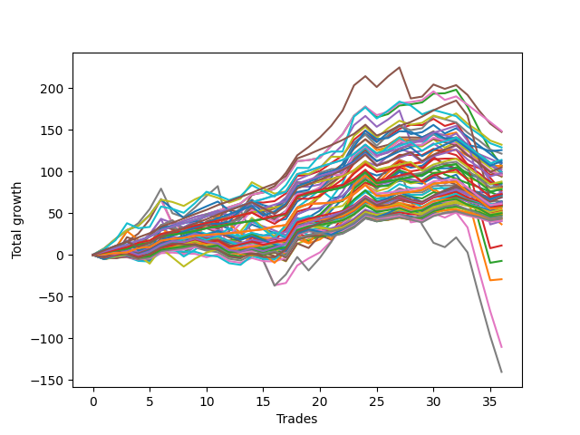

# Short Wallace Doodle 014 
- Symbol: ES_Unlimited
- Date Range: 03/18/2022 - 07/15/2022
- Trading Period: 7:20-12:30
- Number of Trades: 36



| Name | Win Percent | Profit | Avg Profit / Trade | Avg Time / Trade |      | Name | Win Percent | Profit | Avg Profit / Trade | Avg Time / Trade |
| ---- | ----------- | ------ | ------------------ | ---------------- | ---- | ---- | ----------- | ------ | ------------------ | ---------------- |
| Sorted By <br> Profit | | | | | | Sorted By <br> Win Percentage ||||
| Fifty-Eight | 77.78 | 74375.00 | 2065.97 | 14:14 |     | One Hundred Twenty-Two | 88.89 | 41625.00 | 1156.25 | 06:26 |
| Five | 72.22 | 73750.00 | 2048.61 | 47:52 |     | One Hundred Twenty-Seven | 88.89 | 39250.00 | 1090.28 | 06:46 |
| Seventy | 58.33 | 66125.00 | 1836.81 | 16:00 |     | Eighty-Five | 88.89 | 36125.00 | 1003.47 | 36:17 |
| Seventy-One | 50.00 | 64500.00 | 1791.67 | 22:25 |     | One Hundred Twenty-One | 88.89 | 30625.00 | 850.69 | 04:03 |
| Seventy-Three | 61.11 | 62875.00 | 1746.53 | 12:08 |     | One Hundred Twenty-Six | 88.89 | 28250.00 | 784.72 | 04:23 |
| Sixty-Nine | 52.78 | 60750.00 | 1687.50 | 16:54 |     | Eighty-Four | 88.89 | 20250.00 | 562.50 | 32:50 |
| One Hundred Twenty-Four | 86.11 | 57000.00 | 1583.33 | 08:38 |     | Eighty-Three | 88.89 | 5625.00 | 156.25 | 31:48 |
| One Hundred Twenty-Five | 80.56 | 56250.00 | 1562.50 | 10:46 |     | Eighty-Two | 88.89 | -3625.00 | -100.69 | 30:27 |
| Sixty-Two | 63.89 | 55250.00 | 1534.72 | 22:29 |     | Eighty-One | 88.89 | -14625.00 | -406.25 | 28:03 |
| Forty-Six | 47.22 | 54750.00 | 1520.83 | 12:15 |     | One Hundred Twenty-Four | 86.11 | 57000.00 | 1583.33 | 08:38 |
| Two | 80.56 | 53625.00 | 1489.58 | 20:27 |     | One Hundred Twenty-Three | 86.11 | 44000.00 | 1222.22 | 07:36 |
| Fifty-Three | 50.00 | 53500.00 | 1486.11 | 07:21 |     | One Hundred Twenty-Nine | 83.33 | 49125.00 | 1364.58 | 08:42 |
| One | 72.22 | 52750.00 | 1465.28 | 15:18 |     | One Hundred Twenty-Eight | 83.33 | 36500.00 | 1013.89 | 07:42 |
| One Hundred Thirty | 77.78 | 52500.00 | 1458.33 | 10:28 |     | One Hundred Twenty-Five | 80.56 | 56250.00 | 1562.50 | 10:46 |
| Sixty-Six | 61.11 | 51125.00 | 1420.14 | 12:21 |     | Two | 80.56 | 53625.00 | 1489.58 | 20:27 |
| Fifty-Seven | 72.22 | 49875.00 | 1385.42 | 11:52 |     | One Hundred Sixteen | 80.56 | 24625.00 | 684.03 | 02:27 |
| Sixty-One | 58.33 | 49750.00 | 1381.94 | 26:11 |     | Fifty-Eight | 77.78 | 74375.00 | 2065.97 | 14:14 |
| One Hundred Twenty-Nine | 83.33 | 49125.00 | 1364.58 | 08:42 |     | One Hundred Thirty | 77.78 | 52500.00 | 1458.33 | 10:28 |
| Fifty-Nine | 69.44 | 48750.00 | 1354.17 | 15:25 |     | One Hundred Six | 77.78 | 29500.00 | 819.44 | 02:06 |
| Fifty-Five | 47.22 | 48250.00 | 1340.28 | 08:04 |     | One Hundred Eleven | 77.78 | 25125.00 | 697.92 | 02:20 |
| Sixty-Eight | 47.22 | 47875.00 | 1329.86 | 15:30 |     | Five | 72.22 | 73750.00 | 2048.61 | 47:52 |
| Sixty-Seven | 58.33 | 47125.00 | 1309.03 | 13:07 |     | One | 72.22 | 52750.00 | 1465.28 | 15:18 |
| Sixty | 58.33 | 46875.00 | 1302.08 | 20:06 |     | Fifty-Seven | 72.22 | 49875.00 | 1385.42 | 11:52 |
| One Hundred Twenty-Three | 86.11 | 44000.00 | 1222.22 | 07:36 |     | Three | 72.22 | 38375.00 | 1065.97 | 25:22 |
| Fifty-Four | 52.78 | 43125.00 | 1197.92 | 06:53 |     | One Hundred Seventeen | 72.22 | 25000.00 | 694.44 | 03:31 |
| Fifty-Two | 47.22 | 42500.00 | 1180.56 | 07:05 |     | Fifty-Nine | 69.44 | 48750.00 | 1354.17 | 15:25 |
| One Hundred Twenty-Two | 88.89 | 41625.00 | 1156.25 | 06:26 |     | One Hundred Eighteen | 69.44 | 29875.00 | 829.86 | 04:08 |
| Sixty-Five | 63.89 | 41125.00 | 1142.36 | 10:20 |     | One Hundred Twelve | 69.44 | 23125.00 | 642.36 | 03:27 |
| Forty-Two | 52.78 | 41000.00 | 1138.89 | 09:13 |     | Zero | 66.67 | 40125.00 | 1114.58 | 09:44 |
| Forty-Five | 38.89 | 40750.00 | 1131.94 | 13:52 |     | Fifty-Six | 66.67 | 37500.00 | 1041.67 | 08:34 |
| Zero | 66.67 | 40125.00 | 1114.58 | 09:44 |     | One Hundred Seven | 66.67 | 29250.00 | 812.50 | 02:36 |
| Fifty | 50.00 | 40125.00 | 1114.58 | 06:23 |     | One Hundred Thirteen | 66.67 | 25875.00 | 718.75 | 04:06 |
| One Hundred Twenty-Seven | 88.89 | 39250.00 | 1090.28 | 06:46 |     | Ninety-Six | 66.67 | 21625.00 | 600.69 | 01:41 |
| Three | 72.22 | 38375.00 | 1065.97 | 25:22 |     | Six | 66.67 | -55250.00 | -1534.72 | 76:58 |
| Fifty-Six | 66.67 | 37500.00 | 1041.67 | 08:34 |     | Sixty-Two | 63.89 | 55250.00 | 1534.72 | 22:29 |
| Four | 63.89 | 37000.00 | 1027.78 | 36:55 |     | Sixty-Five | 63.89 | 41125.00 | 1142.36 | 10:20 |
| One Hundred Twenty-Eight | 83.33 | 36500.00 | 1013.89 | 07:42 |     | Four | 63.89 | 37000.00 | 1027.78 | 36:55 |
| One Hundred Ten | 55.56 | 36250.00 | 1006.94 | 03:29 |     | One Hundred Fourteen | 63.89 | 30750.00 | 854.17 | 04:52 |
| Eighty-Five | 88.89 | 36125.00 | 1003.47 | 36:17 |     | Sixty-Four | 63.89 | 30000.00 | 833.33 | 08:14 |
| One Hundred Fifteen | 61.11 | 36125.00 | 1003.47 | 06:25 |     | One Hundred One | 63.89 | 20500.00 | 569.44 | 01:39 |
| One Hundred Four | 58.33 | 35250.00 | 979.17 | 03:05 |     | Seventy-Three | 61.11 | 62875.00 | 1746.53 | 12:08 |
| Forty-Four | 41.67 | 34875.00 | 968.75 | 11:59 |     | Sixty-Six | 61.11 | 51125.00 | 1420.14 | 12:21 |
| One Hundred Twenty | 52.78 | 34625.00 | 961.81 | 05:06 |     | One Hundred Fifteen | 61.11 | 36125.00 | 1003.47 | 06:25 |
| One Hundred Nine | 55.56 | 34375.00 | 954.86 | 03:08 |     | One Hundred Ninteen | 61.11 | 31625.00 | 878.47 | 04:38 |
| One Hundred Five | 50.00 | 32125.00 | 892.36 | 04:00 |     | Ninety-One | 61.11 | 21375.00 | 593.75 | 01:29 |
| Forty-Nine | 50.00 | 32125.00 | 892.36 | 05:40 |     | Seventy | 58.33 | 66125.00 | 1836.81 | 16:00 |
| One Hundred | 55.56 | 32000.00 | 888.89 | 02:24 |     | Sixty-One | 58.33 | 49750.00 | 1381.94 | 26:11 |
| One Hundred Ninteen | 61.11 | 31625.00 | 878.47 | 04:38 |     | Sixty-Seven | 58.33 | 47125.00 | 1309.03 | 13:07 |
| Forty-Seven | 30.56 | 31250.00 | 868.06 | 21:51 |     | Sixty | 58.33 | 46875.00 | 1302.08 | 20:06 |
| One Hundred Fourteen | 63.89 | 30750.00 | 854.17 | 04:52 |     | One Hundred Four | 58.33 | 35250.00 | 979.17 | 03:05 |
| One Hundred Twenty-One | 88.89 | 30625.00 | 850.69 | 04:03 |     | One Hundred Eight | 58.33 | 30250.00 | 840.28 | 02:55 |
| Fifty-One | 47.22 | 30625.00 | 850.69 | 06:18 |     | One Hundred Three | 58.33 | 27375.00 | 760.42 | 02:29 |
| One Hundred Eight | 58.33 | 30250.00 | 840.28 | 02:55 |     | Ninety-Seven | 58.33 | 24000.00 | 666.67 | 01:54 |
| Sixty-Four | 63.89 | 30000.00 | 833.33 | 08:14 |     | Forty | 58.33 | 23750.00 | 659.72 | 05:59 |
| One Hundred Eighteen | 69.44 | 29875.00 | 829.86 | 04:08 |     | One Hundred Two | 58.33 | 21750.00 | 604.17 | 01:59 |
| Ninety-Nine | 55.56 | 29625.00 | 822.92 | 02:13 |     | One Hundred Ten | 55.56 | 36250.00 | 1006.94 | 03:29 |
| One Hundred Six | 77.78 | 29500.00 | 819.44 | 02:06 |     | One Hundred Nine | 55.56 | 34375.00 | 954.86 | 03:08 |
| One Hundred Seven | 66.67 | 29250.00 | 812.50 | 02:36 |     | One Hundred | 55.56 | 32000.00 | 888.89 | 02:24 |
| Ninety-Five | 44.44 | 29125.00 | 809.03 | 03:14 |     | Ninety-Nine | 55.56 | 29625.00 | 822.92 | 02:13 |
| Ninety-Four | 50.00 | 28875.00 | 802.08 | 02:38 |     | Ninety-Eight | 55.56 | 26750.00 | 743.06 | 02:03 |
| One Hundred Twenty-Six | 88.89 | 28250.00 | 784.72 | 04:23 |     | Ninety-Two | 55.56 | 22750.00 | 631.94 | 01:47 |
| One Hundred Three | 58.33 | 27375.00 | 760.42 | 02:29 |     | Seven | 55.56 | -70250.00 | -1951.39 | 112:24 |
| Ninety-Eight | 55.56 | 26750.00 | 743.06 | 02:03 |     | Sixty-Nine | 52.78 | 60750.00 | 1687.50 | 16:54 |
| Forty-Eight | 52.78 | 26375.00 | 732.64 | 04:43 |     | Fifty-Four | 52.78 | 43125.00 | 1197.92 | 06:53 |
| Forty-One | 52.78 | 26000.00 | 722.22 | 08:10 |     | Forty-Two | 52.78 | 41000.00 | 1138.89 | 09:13 |
| One Hundred Thirteen | 66.67 | 25875.00 | 718.75 | 04:06 |     | One Hundred Twenty | 52.78 | 34625.00 | 961.81 | 05:06 |
| Ninety-Three | 52.78 | 25250.00 | 701.39 | 02:10 |     | Forty-Eight | 52.78 | 26375.00 | 732.64 | 04:43 |
| One Hundred Eleven | 77.78 | 25125.00 | 697.92 | 02:20 |     | Forty-One | 52.78 | 26000.00 | 722.22 | 08:10 |
| One Hundred Seventeen | 72.22 | 25000.00 | 694.44 | 03:31 |     | Ninety-Three | 52.78 | 25250.00 | 701.39 | 02:10 |
| One Hundred Sixteen | 80.56 | 24625.00 | 684.03 | 02:27 |     | Seventy-One | 50.00 | 64500.00 | 1791.67 | 22:25 |
| Ninety-Seven | 58.33 | 24000.00 | 666.67 | 01:54 |     | Fifty-Three | 50.00 | 53500.00 | 1486.11 | 07:21 |
| Forty | 58.33 | 23750.00 | 659.72 | 05:59 |     | Fifty | 50.00 | 40125.00 | 1114.58 | 06:23 |
| One Hundred Twelve | 69.44 | 23125.00 | 642.36 | 03:27 |     | One Hundred Five | 50.00 | 32125.00 | 892.36 | 04:00 |
| Ninety-Two | 55.56 | 22750.00 | 631.94 | 01:47 |     | Forty-Nine | 50.00 | 32125.00 | 892.36 | 05:40 |
| Forty-Three | 44.44 | 22000.00 | 611.11 | 09:47 |     | Ninety-Four | 50.00 | 28875.00 | 802.08 | 02:38 |
| One Hundred Two | 58.33 | 21750.00 | 604.17 | 01:59 |     | Forty-Six | 47.22 | 54750.00 | 1520.83 | 12:15 |
| Ninety-Six | 66.67 | 21625.00 | 600.69 | 01:41 |     | Fifty-Five | 47.22 | 48250.00 | 1340.28 | 08:04 |
| Ninety-One | 61.11 | 21375.00 | 593.75 | 01:29 |     | Sixty-Eight | 47.22 | 47875.00 | 1329.86 | 15:30 |
| One Hundred One | 63.89 | 20500.00 | 569.44 | 01:39 |     | Fifty-Two | 47.22 | 42500.00 | 1180.56 | 07:05 |
| Eighty-Four | 88.89 | 20250.00 | 562.50 | 32:50 |     | Fifty-One | 47.22 | 30625.00 | 850.69 | 06:18 |
| Sixty-Three | 44.44 | 18375.00 | 510.42 | 39:47 |     | Ninety-Five | 44.44 | 29125.00 | 809.03 | 03:14 |
| Eighty-Three | 88.89 | 5625.00 | 156.25 | 31:48 |     | Forty-Three | 44.44 | 22000.00 | 611.11 | 09:47 |
| Eighty-Two | 88.89 | -3625.00 | -100.69 | 30:27 |     | Sixty-Three | 44.44 | 18375.00 | 510.42 | 39:47 |
| Eighty-One | 88.89 | -14625.00 | -406.25 | 28:03 |     | Forty-Four | 41.67 | 34875.00 | 968.75 | 11:59 |
| Six | 66.67 | -55250.00 | -1534.72 | 76:58 |     | Forty-Five | 38.89 | 40750.00 | 1131.94 | 13:52 |
| Seven | 55.56 | -70250.00 | -1951.39 | 112:24 |     | Forty-Seven | 30.56 | 31250.00 | 868.06 | 21:51 |

## NO STOPLOSS

### Test Zero
* Sell when price hits the middle line of the 20p bollinger
* No Stoploss
* Results:
```
Total Trades: 36
Percent Up: 33.33
Percent Down: 66.67
Total Points Moved Down: 80.25
Potential Profit: 40125.00
Total Points Ups: 49.75 Count Ups: 12
Total Points Downs: 130.00 Count Downs: 24
```

<details><summary>Trades</summary>

<code>In: 2022-03-25 11:05:00		Out: 2022-03-25 11:18:15		Total Position Time: 13:15		Total Move Down: -0.00		Total to Date: 0.00</code> <br />
<code>In: 2022-03-25 11:57:00		Out: 2022-03-25 11:58:35		Total Position Time: 01:35		Total Move Down: 0.75		Total to Date: 0.75</code> <br />
<code>In: 2022-04-01 11:34:00		Out: 2022-04-01 11:47:25		Total Position Time: 13:25		Total Move Down: 1.50		Total to Date: 2.25</code> <br />
<code>In: 2022-04-06 10:36:00		Out: 2022-04-06 10:55:55		Total Position Time: 19:55		Total Move Down: -5.25		Total to Date: -3.00</code> <br />
<code>In: 2022-04-06 10:43:00		Out: 2022-04-06 10:55:55		Total Position Time: 12:55		Total Move Down: 2.25		Total to Date: -0.75</code> <br />
<code>In: 2022-04-06 11:05:00		Out: 2022-04-06 11:06:10		Total Position Time: 01:10		Total Move Down: 7.75		Total to Date: 7.00</code> <br />
<code>In: 2022-04-07 11:03:00		Out: 2022-04-07 11:15:20		Total Position Time: 12:20		Total Move Down: 4.00		Total to Date: 11.00</code> <br />
<code>In: 2022-04-08 07:33:00		Out: 2022-04-08 07:44:35		Total Position Time: 11:35		Total Move Down: 3.25		Total to Date: 14.25</code> <br />
<code>In: 2022-04-18 07:27:00		Out: 2022-04-18 07:46:00		Total Position Time: 19:00		Total Move Down: 1.00		Total to Date: 15.25</code> <br />
<code>In: 2022-04-20 07:40:00		Out: 2022-04-20 08:00:20		Total Position Time: 20:20		Total Move Down: -2.75		Total to Date: 12.50</code> <br />
<code>In: 2022-04-20 09:54:00		Out: 2022-04-20 09:59:15		Total Position Time: 05:15		Total Move Down: 3.25		Total to Date: 15.75</code> <br />
<code>In: 2022-04-25 10:14:00		Out: 2022-04-25 10:26:55		Total Position Time: 12:55		Total Move Down: 1.00		Total to Date: 16.75</code> <br />
<code>In: 2022-04-27 08:34:00		Out: 2022-04-27 08:45:10		Total Position Time: 11:10		Total Move Down: 3.00		Total to Date: 19.75</code> <br />
<code>In: 2022-05-24 09:18:00		Out: 2022-05-24 09:22:10		Total Position Time: 04:10		Total Move Down: 5.75		Total to Date: 25.50</code> <br />
<code>In: 2022-05-24 10:43:00		Out: 2022-05-24 11:01:15		Total Position Time: 18:15		Total Move Down: -2.25		Total to Date: 23.25</code> <br />
<code>In: 2022-05-24 10:47:00		Out: 2022-05-24 11:01:15		Total Position Time: 14:15		Total Move Down: -0.00		Total to Date: 23.25</code> <br />
<code>In: 2022-05-25 11:04:00		Out: 2022-05-25 11:06:25		Total Position Time: 02:25		Total Move Down: 4.50		Total to Date: 27.75</code> <br />
<code>In: 2022-05-25 11:06:00		Out: 2022-05-25 11:07:10		Total Position Time: 01:10		Total Move Down: 21.00		Total to Date: 48.75</code> <br />
<code>In: 2022-05-31 07:23:00		Out: 2022-05-31 07:37:30		Total Position Time: 14:30		Total Move Down: 5.75		Total to Date: 54.50</code> <br />
<code>In: 2022-06-09 10:08:00		Out: 2022-06-09 10:16:50		Total Position Time: 08:50		Total Move Down: 1.75		Total to Date: 56.25</code> <br />
<code>In: 2022-06-10 12:00:00		Out: 2022-06-10 12:03:30		Total Position Time: 03:30		Total Move Down: 7.75		Total to Date: 64.00</code> <br />
<code>In: 2022-06-10 12:29:00		Out: 2022-06-10 12:30:35		Total Position Time: 01:35		Total Move Down: 6.75		Total to Date: 70.75</code> <br />
<code>In: 2022-06-13 09:40:00		Out: 2022-06-13 09:44:05		Total Position Time: 04:05		Total Move Down: 13.25		Total to Date: 84.00</code> <br />
<code>In: 2022-06-15 11:02:00		Out: 2022-06-15 11:03:10		Total Position Time: 01:10		Total Move Down: 11.00		Total to Date: 95.00</code> <br />
<code>In: 2022-06-23 12:30:00		Out: 2022-06-23 12:47:00		Total Position Time: 17:00		Total Move Down: -13.00		Total to Date: 82.00</code> <br />
<code>In: 2022-06-29 11:06:00		Out: 2022-06-29 11:20:05		Total Position Time: 14:05		Total Move Down: 2.00		Total to Date: 84.00</code> <br />
<code>In: 2022-06-29 12:31:00		Out: 2022-06-29 12:33:20		Total Position Time: 02:20		Total Move Down: 4.75		Total to Date: 88.75</code> <br />
<code>In: 2022-07-01 10:47:00		Out: 2022-07-01 11:04:20		Total Position Time: 17:20		Total Move Down: -1.00		Total to Date: 87.75</code> <br />
<code>In: 2022-07-06 11:01:00		Out: 2022-07-06 11:02:15		Total Position Time: 01:15		Total Move Down: -2.25		Total to Date: 85.50</code> <br />
<code>In: 2022-07-06 11:10:00		Out: 2022-07-06 11:11:10		Total Position Time: 01:10		Total Move Down: 7.50		Total to Date: 93.00</code> <br />
<code>In: 2022-07-06 11:35:00		Out: 2022-07-06 11:50:05		Total Position Time: 15:05		Total Move Down: -1.75		Total to Date: 91.25</code> <br />
<code>In: 2022-07-12 08:14:00		Out: 2022-07-12 08:17:15		Total Position Time: 03:15		Total Move Down: 5.00		Total to Date: 96.25</code> <br />
<code>In: 2022-07-13 07:37:00		Out: 2022-07-13 08:01:20		Total Position Time: 24:20		Total Move Down: -18.00		Total to Date: 78.25</code> <br />
<code>In: 2022-07-14 08:02:00		Out: 2022-07-14 08:15:45		Total Position Time: 13:45		Total Move Down: -3.00		Total to Date: 75.25</code> <br />
<code>In: 2022-07-14 08:07:00		Out: 2022-07-14 08:15:45		Total Position Time: 08:45		Total Move Down: -0.50		Total to Date: 74.75</code> <br />
<code>In: 2022-07-14 08:12:00		Out: 2022-07-14 08:15:45		Total Position Time: 03:45		Total Move Down: 5.50		Total to Date: 80.25</code> <br />


</details>

### Test One
* Sell when the price hits the upper line of the 20p 1std bollinger
* No Stoploss
* Results:
```
Total Trades: 36
Percent Up: 27.78
Percent Down: 72.22
Total Points Moved Down: 105.50
Potential Profit: 52750.00
Total Points Ups: 60.25 Count Ups: 10
Total Points Downs: 165.75 Count Downs: 26
```

<details><summary>Trades</summary>

<code>In: 2022-03-25 11:05:00		Out: 2022-03-25 11:19:45		Total Position Time: 14:45		Total Move Down: 1.00		Total to Date: 1.00</code> <br />
<code>In: 2022-03-25 11:57:00		Out: 2022-03-25 12:00:50		Total Position Time: 03:50		Total Move Down: 2.75		Total to Date: 3.75</code> <br />
<code>In: 2022-04-01 11:34:00		Out: 2022-04-01 11:50:15		Total Position Time: 16:15		Total Move Down: 3.25		Total to Date: 7.00</code> <br />
<code>In: 2022-04-06 10:36:00		Out: 2022-04-06 10:57:10		Total Position Time: 21:10		Total Move Down: -3.00		Total to Date: 4.00</code> <br />
<code>In: 2022-04-06 10:43:00		Out: 2022-04-06 10:57:10		Total Position Time: 14:10		Total Move Down: 4.50		Total to Date: 8.50</code> <br />
<code>In: 2022-04-06 11:05:00		Out: 2022-04-06 11:07:20		Total Position Time: 02:20		Total Move Down: 12.50		Total to Date: 21.00</code> <br />
<code>In: 2022-04-07 11:03:00		Out: 2022-04-07 11:18:00		Total Position Time: 15:00		Total Move Down: 4.75		Total to Date: 25.75</code> <br />
<code>In: 2022-04-08 07:33:00		Out: 2022-04-08 07:49:05		Total Position Time: 16:05		Total Move Down: 3.50		Total to Date: 29.25</code> <br />
<code>In: 2022-04-18 07:27:00		Out: 2022-04-18 07:51:30		Total Position Time: 24:30		Total Move Down: 2.75		Total to Date: 32.00</code> <br />
<code>In: 2022-04-20 07:40:00		Out: 2022-04-20 08:00:40		Total Position Time: 20:40		Total Move Down: 0.25		Total to Date: 32.25</code> <br />
<code>In: 2022-04-20 09:54:00		Out: 2022-04-20 10:08:15		Total Position Time: 14:15		Total Move Down: 4.25		Total to Date: 36.50</code> <br />
<code>In: 2022-04-25 10:14:00		Out: 2022-04-25 10:28:05		Total Position Time: 14:05		Total Move Down: 2.75		Total to Date: 39.25</code> <br />
<code>In: 2022-04-27 08:34:00		Out: 2022-04-27 08:48:10		Total Position Time: 14:10		Total Move Down: 5.25		Total to Date: 44.50</code> <br />
<code>In: 2022-05-24 09:18:00		Out: 2022-05-24 09:29:20		Total Position Time: 11:20		Total Move Down: 6.50		Total to Date: 51.00</code> <br />
<code>In: 2022-05-24 10:43:00		Out: 2022-05-24 11:01:40		Total Position Time: 18:40		Total Move Down: 1.25		Total to Date: 52.25</code> <br />
<code>In: 2022-05-24 10:47:00		Out: 2022-05-24 11:01:40		Total Position Time: 14:40		Total Move Down: 3.50		Total to Date: 55.75</code> <br />
<code>In: 2022-05-25 11:04:00		Out: 2022-05-25 11:06:35		Total Position Time: 02:35		Total Move Down: 9.25		Total to Date: 65.00</code> <br />
<code>In: 2022-05-25 11:06:00		Out: 2022-05-25 11:07:10		Total Position Time: 01:10		Total Move Down: 21.00		Total to Date: 86.00</code> <br />
<code>In: 2022-05-31 07:23:00		Out: 2022-05-31 08:07:20		Total Position Time: 44:20		Total Move Down: -0.75		Total to Date: 85.25</code> <br />
<code>In: 2022-06-09 10:08:00		Out: 2022-06-09 10:18:55		Total Position Time: 10:55		Total Move Down: 3.25		Total to Date: 88.50</code> <br />
<code>In: 2022-06-10 12:00:00		Out: 2022-06-10 12:05:05		Total Position Time: 05:05		Total Move Down: 10.50		Total to Date: 99.00</code> <br />
<code>In: 2022-06-10 12:29:00		Out: 2022-06-10 12:35:45		Total Position Time: 06:45		Total Move Down: 9.75		Total to Date: 108.75</code> <br />
<code>In: 2022-06-13 09:40:00		Out: 2022-06-13 09:47:55		Total Position Time: 07:55		Total Move Down: 19.00		Total to Date: 127.75</code> <br />
<code>In: 2022-06-15 11:02:00		Out: 2022-06-15 11:03:10		Total Position Time: 01:10		Total Move Down: 11.00		Total to Date: 138.75</code> <br />
<code>In: 2022-06-23 12:30:00		Out: 2022-06-23 12:47:00		Total Position Time: 17:00		Total Move Down: -13.00		Total to Date: 125.75</code> <br />
<code>In: 2022-06-29 11:06:00		Out: 2022-06-29 11:20:40		Total Position Time: 14:40		Total Move Down: 3.50		Total to Date: 129.25</code> <br />
<code>In: 2022-06-29 12:31:00		Out: 2022-06-29 12:34:15		Total Position Time: 03:15		Total Move Down: 9.00		Total to Date: 138.25</code> <br />
<code>In: 2022-07-01 10:47:00		Out: 2022-07-01 11:04:55		Total Position Time: 17:55		Total Move Down: -0.00		Total to Date: 138.25</code> <br />
<code>In: 2022-07-06 11:01:00		Out: 2022-07-06 11:02:20		Total Position Time: 01:20		Total Move Down: -0.25		Total to Date: 138.00</code> <br />
<code>In: 2022-07-06 11:10:00		Out: 2022-07-06 11:11:10		Total Position Time: 01:10		Total Move Down: 7.50		Total to Date: 145.50</code> <br />
<code>In: 2022-07-06 11:35:00		Out: 2022-07-06 12:00:50		Total Position Time: 25:50		Total Move Down: -1.75		Total to Date: 143.75</code> <br />
<code>In: 2022-07-12 08:14:00		Out: 2022-07-12 08:38:10		Total Position Time: 24:10		Total Move Down: 3.25		Total to Date: 147.00</code> <br />
<code>In: 2022-07-13 07:37:00		Out: 2022-07-13 08:19:25		Total Position Time: 42:25		Total Move Down: -21.75		Total to Date: 125.25</code> <br />
<code>In: 2022-07-14 08:02:00		Out: 2022-07-14 08:36:05		Total Position Time: 34:05		Total Move Down: -10.25		Total to Date: 115.00</code> <br />
<code>In: 2022-07-14 08:07:00		Out: 2022-07-14 08:36:05		Total Position Time: 29:05		Total Move Down: -7.75		Total to Date: 107.25</code> <br />
<code>In: 2022-07-14 08:12:00		Out: 2022-07-14 08:36:05		Total Position Time: 24:05		Total Move Down: -1.75		Total to Date: 105.50</code> <br />


</details>

### Test Two
* Sell when the price hits the upper line of the 20p 2std bollinger
* No Stoploss
* Results:
```
Total Trades: 36
Percent Up: 19.44
Percent Down: 80.56
Total Points Moved Down: 107.25
Potential Profit: 53625.00
Total Points Ups: 106.25 Count Ups: 7
Total Points Downs: 213.50 Count Downs: 29
```

<details><summary>Trades</summary>

<code>In: 2022-03-25 11:05:00		Out: 2022-03-25 12:01:15		Total Position Time: 56:15		Total Move Down: -0.50		Total to Date: -0.50</code> <br />
<code>In: 2022-03-25 11:57:00		Out: 2022-03-25 12:01:15		Total Position Time: 04:15		Total Move Down: 3.25		Total to Date: 2.75</code> <br />
<code>In: 2022-04-01 11:34:00		Out: 2022-04-01 11:50:45		Total Position Time: 16:45		Total Move Down: 4.25		Total to Date: 7.00</code> <br />
<code>In: 2022-04-06 10:36:00		Out: 2022-04-06 10:58:05		Total Position Time: 22:05		Total Move Down: -1.75		Total to Date: 5.25</code> <br />
<code>In: 2022-04-06 10:43:00		Out: 2022-04-06 10:58:05		Total Position Time: 15:05		Total Move Down: 5.75		Total to Date: 11.00</code> <br />
<code>In: 2022-04-06 11:05:00		Out: 2022-04-06 11:08:10		Total Position Time: 03:10		Total Move Down: 18.50		Total to Date: 29.50</code> <br />
<code>In: 2022-04-07 11:03:00		Out: 2022-04-07 11:18:20		Total Position Time: 15:20		Total Move Down: 6.00		Total to Date: 35.50</code> <br />
<code>In: 2022-04-08 07:33:00		Out: 2022-04-08 07:49:20		Total Position Time: 16:20		Total Move Down: 5.25		Total to Date: 40.75</code> <br />
<code>In: 2022-04-18 07:27:00		Out: 2022-04-18 07:51:45		Total Position Time: 24:45		Total Move Down: 4.75		Total to Date: 45.50</code> <br />
<code>In: 2022-04-20 07:40:00		Out: 2022-04-20 08:01:10		Total Position Time: 21:10		Total Move Down: 3.25		Total to Date: 48.75</code> <br />
<code>In: 2022-04-20 09:54:00		Out: 2022-04-20 10:08:15		Total Position Time: 14:15		Total Move Down: 4.25		Total to Date: 53.00</code> <br />
<code>In: 2022-04-25 10:14:00		Out: 2022-04-25 10:33:35		Total Position Time: 19:35		Total Move Down: 4.25		Total to Date: 57.25</code> <br />
<code>In: 2022-04-27 08:34:00		Out: 2022-04-27 08:51:55		Total Position Time: 17:55		Total Move Down: 4.50		Total to Date: 61.75</code> <br />
<code>In: 2022-05-24 09:18:00		Out: 2022-05-24 09:31:25		Total Position Time: 13:25		Total Move Down: 10.75		Total to Date: 72.50</code> <br />
<code>In: 2022-05-24 10:43:00		Out: 2022-05-24 11:01:50		Total Position Time: 18:50		Total Move Down: 2.25		Total to Date: 74.75</code> <br />
<code>In: 2022-05-24 10:47:00		Out: 2022-05-24 11:01:50		Total Position Time: 14:50		Total Move Down: 4.50		Total to Date: 79.25</code> <br />
<code>In: 2022-05-25 11:04:00		Out: 2022-05-25 11:06:40		Total Position Time: 02:40		Total Move Down: 12.25		Total to Date: 91.50</code> <br />
<code>In: 2022-05-25 11:06:00		Out: 2022-05-25 11:07:10		Total Position Time: 01:10		Total Move Down: 21.00		Total to Date: 112.50</code> <br />
<code>In: 2022-05-31 07:23:00		Out: 2022-05-31 08:07:30		Total Position Time: 44:30		Total Move Down: 1.25		Total to Date: 113.75</code> <br />
<code>In: 2022-06-09 10:08:00		Out: 2022-06-09 10:21:10		Total Position Time: 13:10		Total Move Down: 2.75		Total to Date: 116.50</code> <br />
<code>In: 2022-06-10 12:00:00		Out: 2022-06-10 12:06:05		Total Position Time: 06:05		Total Move Down: 14.50		Total to Date: 131.00</code> <br />
<code>In: 2022-06-10 12:29:00		Out: 2022-06-10 12:43:10		Total Position Time: 14:10		Total Move Down: 14.00		Total to Date: 145.00</code> <br />
<code>In: 2022-06-13 09:40:00		Out: 2022-06-13 09:54:15		Total Position Time: 14:15		Total Move Down: 22.00		Total to Date: 167.00</code> <br />
<code>In: 2022-06-15 11:02:00		Out: 2022-06-15 11:03:10		Total Position Time: 01:10		Total Move Down: 11.00		Total to Date: 178.00</code> <br />
<code>In: 2022-06-23 12:30:00		Out: 2022-06-23 12:47:00		Total Position Time: 17:00		Total Move Down: -13.00		Total to Date: 165.00</code> <br />
<code>In: 2022-06-29 11:06:00		Out: 2022-06-29 11:21:15		Total Position Time: 15:15		Total Move Down: 4.00		Total to Date: 169.00</code> <br />
<code>In: 2022-06-29 12:31:00		Out: 2022-06-29 12:36:35		Total Position Time: 05:35		Total Move Down: 10.25		Total to Date: 179.25</code> <br />
<code>In: 2022-07-01 10:47:00		Out: 2022-07-01 11:07:55		Total Position Time: 20:55		Total Move Down: 1.50		Total to Date: 180.75</code> <br />
<code>In: 2022-07-06 11:01:00		Out: 2022-07-06 11:02:25		Total Position Time: 01:25		Total Move Down: 2.25		Total to Date: 183.00</code> <br />
<code>In: 2022-07-06 11:10:00		Out: 2022-07-06 11:11:45		Total Position Time: 01:45		Total Move Down: 10.50		Total to Date: 193.50</code> <br />
<code>In: 2022-07-06 11:35:00		Out: 2022-07-06 12:01:25		Total Position Time: 26:25		Total Move Down: 0.50		Total to Date: 194.00</code> <br />
<code>In: 2022-07-12 08:14:00		Out: 2022-07-12 08:41:10		Total Position Time: 27:10		Total Move Down: 4.25		Total to Date: 198.25</code> <br />
<code>In: 2022-07-13 07:37:00		Out: 2022-07-13 08:25:05		Total Position Time: 48:05		Total Move Down: -20.25		Total to Date: 178.00</code> <br />
<code>In: 2022-07-14 08:02:00		Out: 2022-07-14 09:07:30		Total Position Time: 65:30		Total Move Down: -27.25		Total to Date: 150.75</code> <br />
<code>In: 2022-07-14 08:07:00		Out: 2022-07-14 09:07:30		Total Position Time: 60:30		Total Move Down: -24.75		Total to Date: 126.00</code> <br />
<code>In: 2022-07-14 08:12:00		Out: 2022-07-14 09:07:30		Total Position Time: 55:30		Total Move Down: -18.75		Total to Date: 107.25</code> <br />


</details>

### Test Three
* Sell when price hits the middle line of the 50p bollinger
* No Stoploss
* Results:
```
Total Trades: 36
Percent Up: 27.78
Percent Down: 72.22
Total Points Moved Down: 76.75
Potential Profit: 38375.00
Total Points Ups: 120.25 Count Ups: 10
Total Points Downs: 197.00 Count Downs: 26
```

<details><summary>Trades</summary>

<code>In: 2022-03-25 11:05:00		Out: 2022-03-25 12:00:45		Total Position Time: 55:45		Total Move Down: -2.00		Total to Date: -2.00</code> <br />
<code>In: 2022-03-25 11:57:00		Out: 2022-03-25 12:00:45		Total Position Time: 03:45		Total Move Down: 1.75		Total to Date: -0.25</code> <br />
<code>In: 2022-04-01 11:34:00		Out: 2022-04-01 11:58:00		Total Position Time: 24:00		Total Move Down: 5.00		Total to Date: 4.75</code> <br />
<code>In: 2022-04-06 10:36:00		Out: 2022-04-06 11:00:10		Total Position Time: 24:10		Total Move Down: 5.25		Total to Date: 10.00</code> <br />
<code>In: 2022-04-06 10:43:00		Out: 2022-04-06 11:00:10		Total Position Time: 17:10		Total Move Down: 12.75		Total to Date: 22.75</code> <br />
<code>In: 2022-04-06 11:05:00		Out: 2022-04-06 11:07:20		Total Position Time: 02:20		Total Move Down: 12.50		Total to Date: 35.25</code> <br />
<code>In: 2022-04-07 11:03:00		Out: 2022-04-07 11:33:40		Total Position Time: 30:40		Total Move Down: 6.25		Total to Date: 41.50</code> <br />
<code>In: 2022-04-08 07:33:00		Out: 2022-04-08 08:36:15		Total Position Time: 63:15		Total Move Down: -14.00		Total to Date: 27.50</code> <br />
<code>In: 2022-04-18 07:27:00		Out: 2022-04-18 07:52:15		Total Position Time: 25:15		Total Move Down: 4.75		Total to Date: 32.25</code> <br />
<code>In: 2022-04-20 07:40:00		Out: 2022-04-20 08:03:05		Total Position Time: 23:05		Total Move Down: 3.50		Total to Date: 35.75</code> <br />
<code>In: 2022-04-20 09:54:00		Out: 2022-04-20 10:19:30		Total Position Time: 25:30		Total Move Down: 3.25		Total to Date: 39.00</code> <br />
<code>In: 2022-04-25 10:14:00		Out: 2022-04-25 10:28:20		Total Position Time: 14:20		Total Move Down: 4.75		Total to Date: 43.75</code> <br />
<code>In: 2022-04-27 08:34:00		Out: 2022-04-27 08:53:05		Total Position Time: 19:05		Total Move Down: 8.75		Total to Date: 52.50</code> <br />
<code>In: 2022-05-24 09:18:00		Out: 2022-05-24 09:31:20		Total Position Time: 13:20		Total Move Down: 10.75		Total to Date: 63.25</code> <br />
<code>In: 2022-05-24 10:43:00		Out: 2022-05-24 11:20:25		Total Position Time: 37:25		Total Move Down: -0.50		Total to Date: 62.75</code> <br />
<code>In: 2022-05-24 10:47:00		Out: 2022-05-24 11:20:25		Total Position Time: 33:25		Total Move Down: 1.75		Total to Date: 64.50</code> <br />
<code>In: 2022-05-25 11:04:00		Out: 2022-05-25 11:06:35		Total Position Time: 02:35		Total Move Down: 9.25		Total to Date: 73.75</code> <br />
<code>In: 2022-05-25 11:06:00		Out: 2022-05-25 11:07:10		Total Position Time: 01:10		Total Move Down: 21.00		Total to Date: 94.75</code> <br />
<code>In: 2022-05-31 07:23:00		Out: 2022-05-31 08:07:30		Total Position Time: 44:30		Total Move Down: 1.25		Total to Date: 96.00</code> <br />
<code>In: 2022-06-09 10:08:00		Out: 2022-06-09 10:22:05		Total Position Time: 14:05		Total Move Down: 4.75		Total to Date: 100.75</code> <br />
<code>In: 2022-06-10 12:00:00		Out: 2022-06-10 12:03:40		Total Position Time: 03:40		Total Move Down: 9.50		Total to Date: 110.25</code> <br />
<code>In: 2022-06-10 12:29:00		Out: 2022-06-10 12:33:40		Total Position Time: 04:40		Total Move Down: 9.00		Total to Date: 119.25</code> <br />
<code>In: 2022-06-13 09:40:00		Out: 2022-06-13 09:47:55		Total Position Time: 07:55		Total Move Down: 19.00		Total to Date: 138.25</code> <br />
<code>In: 2022-06-15 11:02:00		Out: 2022-06-15 11:03:10		Total Position Time: 01:10		Total Move Down: 11.00		Total to Date: 149.25</code> <br />
<code>In: 2022-06-23 12:30:00		Out: 2022-06-23 12:47:00		Total Position Time: 17:00		Total Move Down: -13.00		Total to Date: 136.25</code> <br />
<code>In: 2022-06-29 11:06:00		Out: 2022-06-29 11:31:05		Total Position Time: 25:05		Total Move Down: 6.00		Total to Date: 142.25</code> <br />
<code>In: 2022-06-29 12:31:00		Out: 2022-06-29 12:34:15		Total Position Time: 03:15		Total Move Down: 9.00		Total to Date: 151.25</code> <br />
<code>In: 2022-07-01 10:47:00		Out: 2022-07-01 11:11:05		Total Position Time: 24:05		Total Move Down: 4.75		Total to Date: 156.00</code> <br />
<code>In: 2022-07-06 11:01:00		Out: 2022-07-06 11:02:20		Total Position Time: 01:20		Total Move Down: -0.25		Total to Date: 155.75</code> <br />
<code>In: 2022-07-06 11:10:00		Out: 2022-07-06 11:11:10		Total Position Time: 01:10		Total Move Down: 7.50		Total to Date: 163.25</code> <br />
<code>In: 2022-07-06 11:35:00		Out: 2022-07-06 12:42:10		Total Position Time: 67:10		Total Move Down: -8.50		Total to Date: 154.75</code> <br />
<code>In: 2022-07-12 08:14:00		Out: 2022-07-12 08:38:20		Total Position Time: 24:20		Total Move Down: 4.00		Total to Date: 158.75</code> <br />
<code>In: 2022-07-13 07:37:00		Out: 2022-07-13 08:25:05		Total Position Time: 48:05		Total Move Down: -20.25		Total to Date: 138.50</code> <br />
<code>In: 2022-07-14 08:02:00		Out: 2022-07-14 09:17:00		Total Position Time: 75:00		Total Move Down: -24.25		Total to Date: 114.25</code> <br />
<code>In: 2022-07-14 08:07:00		Out: 2022-07-14 09:17:00		Total Position Time: 70:00		Total Move Down: -21.75		Total to Date: 92.50</code> <br />
<code>In: 2022-07-14 08:12:00		Out: 2022-07-14 09:17:00		Total Position Time: 65:00		Total Move Down: -15.75		Total to Date: 76.75</code> <br />


</details>

### Test Four
* Sell when the price hits the upper line of the 50p 1std bollinger
* No Stoploss
* Results:
```
Total Trades: 36
Percent Up: 36.11
Percent Down: 63.89
Total Points Moved Down: 74.00
Potential Profit: 37000.00
Total Points Ups: 172.25 Count Ups: 13
Total Points Downs: 246.25 Count Downs: 23
```

<details><summary>Trades</summary>

<code>In: 2022-03-25 11:05:00		Out: 2022-03-25 12:01:40		Total Position Time: 56:40		Total Move Down: -0.00		Total to Date: 0.00</code> <br />
<code>In: 2022-03-25 11:57:00		Out: 2022-03-25 12:01:40		Total Position Time: 04:40		Total Move Down: 3.75		Total to Date: 3.75</code> <br />
<code>In: 2022-04-01 11:34:00		Out: 2022-04-01 12:09:35		Total Position Time: 35:35		Total Move Down: 6.25		Total to Date: 10.00</code> <br />
<code>In: 2022-04-06 10:36:00		Out: 2022-04-06 11:08:10		Total Position Time: 32:10		Total Move Down: 3.50		Total to Date: 13.50</code> <br />
<code>In: 2022-04-06 10:43:00		Out: 2022-04-06 11:08:10		Total Position Time: 25:10		Total Move Down: 11.00		Total to Date: 24.50</code> <br />
<code>In: 2022-04-06 11:05:00		Out: 2022-04-06 11:08:10		Total Position Time: 03:10		Total Move Down: 18.50		Total to Date: 43.00</code> <br />
<code>In: 2022-04-07 11:03:00		Out: 2022-04-07 12:47:00		Total Position Time: 104:00		Total Move Down: -29.50		Total to Date: 13.50</code> <br />
<code>In: 2022-04-08 07:33:00		Out: 2022-04-08 08:45:05		Total Position Time: 72:05		Total Move Down: -13.00		Total to Date: 0.50</code> <br />
<code>In: 2022-04-18 07:27:00		Out: 2022-04-18 07:57:05		Total Position Time: 30:05		Total Move Down: 9.50		Total to Date: 10.00</code> <br />
<code>In: 2022-04-20 07:40:00		Out: 2022-04-20 08:10:50		Total Position Time: 30:50		Total Move Down: 7.25		Total to Date: 17.25</code> <br />
<code>In: 2022-04-20 09:54:00		Out: 2022-04-20 10:33:05		Total Position Time: 39:05		Total Move Down: 4.25		Total to Date: 21.50</code> <br />
<code>In: 2022-04-25 10:14:00		Out: 2022-04-25 10:57:50		Total Position Time: 43:50		Total Move Down: 6.75		Total to Date: 28.25</code> <br />
<code>In: 2022-04-27 08:34:00		Out: 2022-04-27 09:01:55		Total Position Time: 27:55		Total Move Down: 14.50		Total to Date: 42.75</code> <br />
<code>In: 2022-05-24 09:18:00		Out: 2022-05-24 09:34:40		Total Position Time: 16:40		Total Move Down: 16.25		Total to Date: 59.00</code> <br />
<code>In: 2022-05-24 10:43:00		Out: 2022-05-24 11:45:05		Total Position Time: 62:05		Total Move Down: -2.25		Total to Date: 56.75</code> <br />
<code>In: 2022-05-24 10:47:00		Out: 2022-05-24 11:45:05		Total Position Time: 58:05		Total Move Down: -0.00		Total to Date: 56.75</code> <br />
<code>In: 2022-05-25 11:04:00		Out: 2022-05-25 11:06:40		Total Position Time: 02:40		Total Move Down: 12.25		Total to Date: 69.00</code> <br />
<code>In: 2022-05-25 11:06:00		Out: 2022-05-25 11:07:10		Total Position Time: 01:10		Total Move Down: 21.00		Total to Date: 90.00</code> <br />
<code>In: 2022-05-31 07:23:00		Out: 2022-05-31 08:08:45		Total Position Time: 45:45		Total Move Down: 6.00		Total to Date: 96.00</code> <br />
<code>In: 2022-06-09 10:08:00		Out: 2022-06-09 10:24:20		Total Position Time: 16:20		Total Move Down: 8.25		Total to Date: 104.25</code> <br />
<code>In: 2022-06-10 12:00:00		Out: 2022-06-10 12:06:05		Total Position Time: 06:05		Total Move Down: 14.50		Total to Date: 118.75</code> <br />
<code>In: 2022-06-10 12:29:00		Out: 2022-06-10 12:42:40		Total Position Time: 13:40		Total Move Down: 13.25		Total to Date: 132.00</code> <br />
<code>In: 2022-06-13 09:40:00		Out: 2022-06-13 09:54:40		Total Position Time: 14:40		Total Move Down: 23.75		Total to Date: 155.75</code> <br />
<code>In: 2022-06-15 11:02:00		Out: 2022-06-15 11:03:10		Total Position Time: 01:10		Total Move Down: 11.00		Total to Date: 166.75</code> <br />
<code>In: 2022-06-23 12:30:00		Out: 2022-06-23 12:47:00		Total Position Time: 17:00		Total Move Down: -13.00		Total to Date: 153.75</code> <br />
<code>In: 2022-06-29 11:06:00		Out: 2022-06-29 11:39:40		Total Position Time: 33:40		Total Move Down: 8.75		Total to Date: 162.50</code> <br />
<code>In: 2022-06-29 12:31:00		Out: 2022-06-29 12:47:00		Total Position Time: 16:00		Total Move Down: 10.75		Total to Date: 173.25</code> <br />
<code>In: 2022-07-01 10:47:00		Out: 2022-07-01 12:47:00		Total Position Time: 120:00		Total Move Down: -37.25		Total to Date: 136.00</code> <br />
<code>In: 2022-07-06 11:01:00		Out: 2022-07-06 11:02:20		Total Position Time: 01:20		Total Move Down: -0.25		Total to Date: 135.75</code> <br />
<code>In: 2022-07-06 11:10:00		Out: 2022-07-06 11:11:35		Total Position Time: 01:35		Total Move Down: 8.75		Total to Date: 144.50</code> <br />
<code>In: 2022-07-06 11:35:00		Out: 2022-07-06 12:47:00		Total Position Time: 72:00		Total Move Down: -5.25		Total to Date: 139.25</code> <br />
<code>In: 2022-07-12 08:14:00		Out: 2022-07-12 08:46:15		Total Position Time: 32:15		Total Move Down: 6.50		Total to Date: 145.75</code> <br />
<code>In: 2022-07-13 07:37:00		Out: 2022-07-13 08:28:45		Total Position Time: 51:45		Total Move Down: -13.75		Total to Date: 132.00</code> <br />
<code>In: 2022-07-14 08:02:00		Out: 2022-07-14 09:27:05		Total Position Time: 85:05		Total Move Down: -23.00		Total to Date: 109.00</code> <br />
<code>In: 2022-07-14 08:07:00		Out: 2022-07-14 09:27:05		Total Position Time: 80:05		Total Move Down: -20.50		Total to Date: 88.50</code> <br />
<code>In: 2022-07-14 08:12:00		Out: 2022-07-14 09:27:05		Total Position Time: 75:05		Total Move Down: -14.50		Total to Date: 74.00</code> <br />


</details>

### Test Five
* Sell when the price hits the upper line of the 50p 2std bollinger
* No Stoploss
* Results:
```
Total Trades: 36
Percent Up: 27.78
Percent Down: 72.22
Total Points Moved Down: 147.50
Potential Profit: 73750.00
Total Points Ups: 161.75 Count Ups: 10
Total Points Downs: 309.25 Count Downs: 26
```

<details><summary>Trades</summary>

<code>In: 2022-03-25 11:05:00		Out: 2022-03-25 12:01:55		Total Position Time: 56:55		Total Move Down: 1.50		Total to Date: 1.50</code> <br />
<code>In: 2022-03-25 11:57:00		Out: 2022-03-25 12:01:55		Total Position Time: 04:55		Total Move Down: 5.25		Total to Date: 6.75</code> <br />
<code>In: 2022-04-01 11:34:00		Out: 2022-04-01 12:11:25		Total Position Time: 37:25		Total Move Down: 9.25		Total to Date: 16.00</code> <br />
<code>In: 2022-04-06 10:36:00		Out: 2022-04-06 11:09:40		Total Position Time: 33:40		Total Move Down: 9.50		Total to Date: 25.50</code> <br />
<code>In: 2022-04-06 10:43:00		Out: 2022-04-06 11:09:40		Total Position Time: 26:40		Total Move Down: 17.00		Total to Date: 42.50</code> <br />
<code>In: 2022-04-06 11:05:00		Out: 2022-04-06 11:09:40		Total Position Time: 04:40		Total Move Down: 24.50		Total to Date: 67.00</code> <br />
<code>In: 2022-04-07 11:03:00		Out: 2022-04-07 12:47:00		Total Position Time: 104:00		Total Move Down: -29.50		Total to Date: 37.50</code> <br />
<code>In: 2022-04-08 07:33:00		Out: 2022-04-08 10:12:05		Total Position Time: 159:05		Total Move Down: -17.50		Total to Date: 20.00</code> <br />
<code>In: 2022-04-18 07:27:00		Out: 2022-04-18 08:15:50		Total Position Time: 48:50		Total Move Down: 8.25		Total to Date: 28.25</code> <br />
<code>In: 2022-04-20 07:40:00		Out: 2022-04-20 08:16:30		Total Position Time: 36:30		Total Move Down: 11.75		Total to Date: 40.00</code> <br />
<code>In: 2022-04-20 09:54:00		Out: 2022-04-20 11:18:05		Total Position Time: 84:05		Total Move Down: 5.00		Total to Date: 45.00</code> <br />
<code>In: 2022-04-25 10:14:00		Out: 2022-04-25 11:01:35		Total Position Time: 47:35		Total Move Down: 9.00		Total to Date: 54.00</code> <br />
<code>In: 2022-04-27 08:34:00		Out: 2022-04-27 10:10:20		Total Position Time: 96:20		Total Move Down: -3.00		Total to Date: 51.00</code> <br />
<code>In: 2022-05-24 09:18:00		Out: 2022-05-24 09:37:00		Total Position Time: 19:00		Total Move Down: 20.75		Total to Date: 71.75</code> <br />
<code>In: 2022-05-24 10:43:00		Out: 2022-05-24 11:49:15		Total Position Time: 66:15		Total Move Down: 4.25		Total to Date: 76.00</code> <br />
<code>In: 2022-05-24 10:47:00		Out: 2022-05-24 11:49:15		Total Position Time: 62:15		Total Move Down: 6.50		Total to Date: 82.50</code> <br />
<code>In: 2022-05-25 11:04:00		Out: 2022-05-25 11:06:50		Total Position Time: 02:50		Total Move Down: 16.00		Total to Date: 98.50</code> <br />
<code>In: 2022-05-25 11:06:00		Out: 2022-05-25 11:07:10		Total Position Time: 01:10		Total Move Down: 21.00		Total to Date: 119.50</code> <br />
<code>In: 2022-05-31 07:23:00		Out: 2022-05-31 08:14:30		Total Position Time: 51:30		Total Move Down: 10.00		Total to Date: 129.50</code> <br />
<code>In: 2022-06-09 10:08:00		Out: 2022-06-09 10:27:20		Total Position Time: 19:20		Total Move Down: 11.50		Total to Date: 141.00</code> <br />
<code>In: 2022-06-10 12:00:00		Out: 2022-06-10 12:45:40		Total Position Time: 45:40		Total Move Down: 14.00		Total to Date: 155.00</code> <br />
<code>In: 2022-06-10 12:29:00		Out: 2022-06-10 12:45:40		Total Position Time: 16:40		Total Move Down: 18.25		Total to Date: 173.25</code> <br />
<code>In: 2022-06-13 09:40:00		Out: 2022-06-13 09:58:15		Total Position Time: 18:15		Total Move Down: 30.25		Total to Date: 203.50</code> <br />
<code>In: 2022-06-15 11:02:00		Out: 2022-06-15 11:03:10		Total Position Time: 01:10		Total Move Down: 11.00		Total to Date: 214.50</code> <br />
<code>In: 2022-06-23 12:30:00		Out: 2022-06-23 12:47:00		Total Position Time: 17:00		Total Move Down: -13.00		Total to Date: 201.50</code> <br />
<code>In: 2022-06-29 11:06:00		Out: 2022-06-29 11:41:15		Total Position Time: 35:15		Total Move Down: 12.75		Total to Date: 214.25</code> <br />
<code>In: 2022-06-29 12:31:00		Out: 2022-06-29 12:47:00		Total Position Time: 16:00		Total Move Down: 10.75		Total to Date: 225.00</code> <br />
<code>In: 2022-07-01 10:47:00		Out: 2022-07-01 12:47:00		Total Position Time: 120:00		Total Move Down: -37.25		Total to Date: 187.75</code> <br />
<code>In: 2022-07-06 11:01:00		Out: 2022-07-06 11:02:25		Total Position Time: 01:25		Total Move Down: 2.25		Total to Date: 190.00</code> <br />
<code>In: 2022-07-06 11:10:00		Out: 2022-07-06 11:12:15		Total Position Time: 02:15		Total Move Down: 14.50		Total to Date: 204.50</code> <br />
<code>In: 2022-07-06 11:35:00		Out: 2022-07-06 12:47:00		Total Position Time: 72:00		Total Move Down: -5.25		Total to Date: 199.25</code> <br />
<code>In: 2022-07-12 08:14:00		Out: 2022-07-12 10:06:00		Total Position Time: 112:00		Total Move Down: 4.50		Total to Date: 203.75</code> <br />
<code>In: 2022-07-13 07:37:00		Out: 2022-07-13 08:34:55		Total Position Time: 57:55		Total Move Down: -11.75		Total to Date: 192.00</code> <br />
<code>In: 2022-07-14 08:02:00		Out: 2022-07-14 09:28:35		Total Position Time: 86:35		Total Move Down: -18.50		Total to Date: 173.50</code> <br />
<code>In: 2022-07-14 08:07:00		Out: 2022-07-14 09:28:35		Total Position Time: 81:35		Total Move Down: -16.00		Total to Date: 157.50</code> <br />
<code>In: 2022-07-14 08:12:00		Out: 2022-07-14 09:28:35		Total Position Time: 76:35		Total Move Down: -10.00		Total to Date: 147.50</code> <br />


</details>

### Test Six
* Sell when the price hits the middle line of the 1std VWAP
* No Stoploss
* Results:
```
Total Trades: 36
Percent Up: 33.33
Percent Down: 66.67
Total Points Moved Down: -110.50
Potential Profit: -55250.00
Total Points Ups: 368.50 Count Ups: 12
Total Points Downs: 258.00 Count Downs: 24
```

<details><summary>Trades</summary>

<code>In: 2022-03-25 11:05:00		Out: 2022-03-25 12:20:30		Total Position Time: 75:30		Total Move Down: 7.75		Total to Date: 7.75</code> <br />
<code>In: 2022-03-25 11:57:00		Out: 2022-03-25 12:20:30		Total Position Time: 23:30		Total Move Down: 11.50		Total to Date: 19.25</code> <br />
<code>In: 2022-04-01 11:34:00		Out: 2022-04-01 12:12:50		Total Position Time: 38:50		Total Move Down: 10.50		Total to Date: 29.75</code> <br />
<code>In: 2022-04-06 10:36:00		Out: 2022-04-06 11:00:10		Total Position Time: 24:10		Total Move Down: 5.25		Total to Date: 35.00</code> <br />
<code>In: 2022-04-06 10:43:00		Out: 2022-04-06 11:00:10		Total Position Time: 17:10		Total Move Down: 12.75		Total to Date: 47.75</code> <br />
<code>In: 2022-04-06 11:05:00		Out: 2022-04-06 11:08:10		Total Position Time: 03:10		Total Move Down: 18.50		Total to Date: 66.25</code> <br />
<code>In: 2022-04-07 11:03:00		Out: 2022-04-07 12:47:00		Total Position Time: 104:00		Total Move Down: -29.50		Total to Date: 36.75</code> <br />
<code>In: 2022-04-08 07:33:00		Out: 2022-04-08 11:25:05		Total Position Time: 232:05		Total Move Down: -4.75		Total to Date: 32.00</code> <br />
<code>In: 2022-04-18 07:27:00		Out: 2022-04-18 07:55:15		Total Position Time: 28:15		Total Move Down: 8.00		Total to Date: 40.00</code> <br />
<code>In: 2022-04-20 07:40:00		Out: 2022-04-20 08:08:10		Total Position Time: 28:10		Total Move Down: 6.00		Total to Date: 46.00</code> <br />
<code>In: 2022-04-20 09:54:00		Out: 2022-04-20 11:18:20		Total Position Time: 84:20		Total Move Down: 5.75		Total to Date: 51.75</code> <br />
<code>In: 2022-04-25 10:14:00		Out: 2022-04-25 12:47:00		Total Position Time: 153:00		Total Move Down: -54.50		Total to Date: -2.75</code> <br />
<code>In: 2022-04-27 08:34:00		Out: 2022-04-27 11:38:40		Total Position Time: 184:40		Total Move Down: 9.25		Total to Date: 6.50</code> <br />
<code>In: 2022-05-24 09:18:00		Out: 2022-05-24 09:36:45		Total Position Time: 18:45		Total Move Down: 19.75		Total to Date: 26.25</code> <br />
<code>In: 2022-05-24 10:43:00		Out: 2022-05-24 12:47:00		Total Position Time: 124:00		Total Move Down: -32.50		Total to Date: -6.25</code> <br />
<code>In: 2022-05-24 10:47:00		Out: 2022-05-24 12:47:00		Total Position Time: 120:00		Total Move Down: -30.25		Total to Date: -36.50</code> <br />
<code>In: 2022-05-25 11:04:00		Out: 2022-05-25 11:06:20		Total Position Time: 02:20		Total Move Down: 2.75		Total to Date: -33.75</code> <br />
<code>In: 2022-05-25 11:06:00		Out: 2022-05-25 11:07:10		Total Position Time: 01:10		Total Move Down: 21.00		Total to Date: -12.75</code> <br />
<code>In: 2022-05-31 07:23:00		Out: 2022-05-31 08:14:20		Total Position Time: 51:20		Total Move Down: 8.50		Total to Date: -4.25</code> <br />
<code>In: 2022-06-09 10:08:00		Out: 2022-06-09 10:23:45		Total Position Time: 15:45		Total Move Down: 7.25		Total to Date: 3.00</code> <br />
<code>In: 2022-06-10 12:00:00		Out: 2022-06-10 12:05:30		Total Position Time: 05:30		Total Move Down: 13.50		Total to Date: 16.50</code> <br />
<code>In: 2022-06-10 12:29:00		Out: 2022-06-10 12:44:00		Total Position Time: 15:00		Total Move Down: 16.25		Total to Date: 32.75</code> <br />
<code>In: 2022-06-13 09:40:00		Out: 2022-06-13 09:55:05		Total Position Time: 15:05		Total Move Down: 25.00		Total to Date: 57.75</code> <br />
<code>In: 2022-06-15 11:02:00		Out: 2022-06-15 11:03:10		Total Position Time: 01:10		Total Move Down: 11.00		Total to Date: 68.75</code> <br />
<code>In: 2022-06-23 12:30:00		Out: 2022-06-23 12:47:00		Total Position Time: 17:00		Total Move Down: -13.00		Total to Date: 55.75</code> <br />
<code>In: 2022-06-29 11:06:00		Out: 2022-06-29 11:41:10		Total Position Time: 35:10		Total Move Down: 11.50		Total to Date: 67.25</code> <br />
<code>In: 2022-06-29 12:31:00		Out: 2022-06-29 12:34:15		Total Position Time: 03:15		Total Move Down: 9.00		Total to Date: 76.25</code> <br />
<code>In: 2022-07-01 10:47:00		Out: 2022-07-01 12:47:00		Total Position Time: 120:00		Total Move Down: -37.25		Total to Date: 39.00</code> <br />
<code>In: 2022-07-06 11:01:00		Out: 2022-07-06 11:02:25		Total Position Time: 01:25		Total Move Down: 2.25		Total to Date: 41.25</code> <br />
<code>In: 2022-07-06 11:10:00		Out: 2022-07-06 11:11:35		Total Position Time: 01:35		Total Move Down: 8.75		Total to Date: 50.00</code> <br />
<code>In: 2022-07-06 11:35:00		Out: 2022-07-06 12:47:00		Total Position Time: 72:00		Total Move Down: -5.25		Total to Date: 44.75</code> <br />
<code>In: 2022-07-12 08:14:00		Out: 2022-07-12 08:17:45		Total Position Time: 03:45		Total Move Down: 6.25		Total to Date: 51.00</code> <br />
<code>In: 2022-07-13 07:37:00		Out: 2022-07-13 12:47:00		Total Position Time: 310:00		Total Move Down: -18.00		Total to Date: 33.00</code> <br />
<code>In: 2022-07-14 08:02:00		Out: 2022-07-14 12:47:00		Total Position Time: 285:00		Total Move Down: -51.50		Total to Date: -18.50</code> <br />
<code>In: 2022-07-14 08:07:00		Out: 2022-07-14 12:47:00		Total Position Time: 280:00		Total Move Down: -49.00		Total to Date: -67.50</code> <br />
<code>In: 2022-07-14 08:12:00		Out: 2022-07-14 12:47:00		Total Position Time: 275:00		Total Move Down: -43.00		Total to Date: -110.50</code> <br />


</details>

### Test Seven
* Sell when the price hits the upper line of the 1std VWAP
* No Stoploss
* Results:
```
Total Trades: 36
Percent Up: 44.44
Percent Down: 55.56
Total Points Moved Down: -140.50
Potential Profit: -70250.00
Total Points Ups: 464.00 Count Ups: 16
Total Points Downs: 323.50 Count Downs: 20
```

<details><summary>Trades</summary>

<code>In: 2022-03-25 11:05:00		Out: 2022-03-25 12:47:00		Total Position Time: 102:00		Total Move Down: 2.25		Total to Date: 2.25</code> <br />
<code>In: 2022-03-25 11:57:00		Out: 2022-03-25 12:47:00		Total Position Time: 50:00		Total Move Down: 6.00		Total to Date: 8.25</code> <br />
<code>In: 2022-04-01 11:34:00		Out: 2022-04-01 12:33:35		Total Position Time: 59:35		Total Move Down: 20.25		Total to Date: 28.50</code> <br />
<code>In: 2022-04-06 10:36:00		Out: 2022-04-06 11:09:40		Total Position Time: 33:40		Total Move Down: 9.50		Total to Date: 38.00</code> <br />
<code>In: 2022-04-06 10:43:00		Out: 2022-04-06 11:09:40		Total Position Time: 26:40		Total Move Down: 17.00		Total to Date: 55.00</code> <br />
<code>In: 2022-04-06 11:05:00		Out: 2022-04-06 11:09:40		Total Position Time: 04:40		Total Move Down: 24.50		Total to Date: 79.50</code> <br />
<code>In: 2022-04-07 11:03:00		Out: 2022-04-07 12:47:00		Total Position Time: 104:00		Total Move Down: -29.50		Total to Date: 50.00</code> <br />
<code>In: 2022-04-08 07:33:00		Out: 2022-04-08 12:47:00		Total Position Time: 314:00		Total Move Down: -4.75		Total to Date: 45.25</code> <br />
<code>In: 2022-04-18 07:27:00		Out: 2022-04-18 08:18:55		Total Position Time: 51:55		Total Move Down: 11.75		Total to Date: 57.00</code> <br />
<code>In: 2022-04-20 07:40:00		Out: 2022-04-20 08:20:15		Total Position Time: 40:15		Total Move Down: 13.50		Total to Date: 70.50</code> <br />
<code>In: 2022-04-20 09:54:00		Out: 2022-04-20 11:30:15		Total Position Time: 96:15		Total Move Down: 12.00		Total to Date: 82.50</code> <br />
<code>In: 2022-04-25 10:14:00		Out: 2022-04-25 12:47:00		Total Position Time: 153:00		Total Move Down: -54.50		Total to Date: 28.00</code> <br />
<code>In: 2022-04-27 08:34:00		Out: 2022-04-27 12:04:15		Total Position Time: 210:15		Total Move Down: 25.50		Total to Date: 53.50</code> <br />
<code>In: 2022-05-24 09:18:00		Out: 2022-05-24 12:47:00		Total Position Time: 209:00		Total Move Down: -27.75		Total to Date: 25.75</code> <br />
<code>In: 2022-05-24 10:43:00		Out: 2022-05-24 12:47:00		Total Position Time: 124:00		Total Move Down: -32.50		Total to Date: -6.75</code> <br />
<code>In: 2022-05-24 10:47:00		Out: 2022-05-24 12:47:00		Total Position Time: 120:00		Total Move Down: -30.25		Total to Date: -37.00</code> <br />
<code>In: 2022-05-25 11:04:00		Out: 2022-05-25 11:06:45		Total Position Time: 02:45		Total Move Down: 13.50		Total to Date: -23.50</code> <br />
<code>In: 2022-05-25 11:06:00		Out: 2022-05-25 11:07:10		Total Position Time: 01:10		Total Move Down: 21.00		Total to Date: -2.50</code> <br />
<code>In: 2022-05-31 07:23:00		Out: 2022-05-31 12:47:00		Total Position Time: 324:00		Total Move Down: -16.25		Total to Date: -18.75</code> <br />
<code>In: 2022-06-09 10:08:00		Out: 2022-06-09 10:30:30		Total Position Time: 22:30		Total Move Down: 15.25		Total to Date: -3.50</code> <br />
<code>In: 2022-06-10 12:00:00		Out: 2022-06-10 12:47:00		Total Position Time: 47:00		Total Move Down: 19.00		Total to Date: 15.50</code> <br />
<code>In: 2022-06-10 12:29:00		Out: 2022-06-10 12:47:00		Total Position Time: 18:00		Total Move Down: 23.25		Total to Date: 38.75</code> <br />
<code>In: 2022-06-13 09:40:00		Out: 2022-06-13 10:33:35		Total Position Time: 53:35		Total Move Down: 42.00		Total to Date: 80.75</code> <br />
<code>In: 2022-06-15 11:02:00		Out: 2022-06-15 11:03:10		Total Position Time: 01:10		Total Move Down: 11.00		Total to Date: 91.75</code> <br />
<code>In: 2022-06-23 12:30:00		Out: 2022-06-23 12:47:00		Total Position Time: 17:00		Total Move Down: -13.00		Total to Date: 78.75</code> <br />
<code>In: 2022-06-29 11:06:00		Out: 2022-06-29 12:47:00		Total Position Time: 101:00		Total Move Down: 13.75		Total to Date: 92.50</code> <br />
<code>In: 2022-06-29 12:31:00		Out: 2022-06-29 12:47:00		Total Position Time: 16:00		Total Move Down: 10.75		Total to Date: 103.25</code> <br />
<code>In: 2022-07-01 10:47:00		Out: 2022-07-01 12:47:00		Total Position Time: 120:00		Total Move Down: -37.25		Total to Date: 66.00</code> <br />
<code>In: 2022-07-06 11:01:00		Out: 2022-07-06 12:47:00		Total Position Time: 106:00		Total Move Down: -29.75		Total to Date: 36.25</code> <br />
<code>In: 2022-07-06 11:10:00		Out: 2022-07-06 12:47:00		Total Position Time: 97:00		Total Move Down: -21.75		Total to Date: 14.50</code> <br />
<code>In: 2022-07-06 11:35:00		Out: 2022-07-06 12:47:00		Total Position Time: 72:00		Total Move Down: -5.25		Total to Date: 9.25</code> <br />
<code>In: 2022-07-12 08:14:00		Out: 2022-07-12 11:32:25		Total Position Time: 198:25		Total Move Down: 11.75		Total to Date: 21.00</code> <br />
<code>In: 2022-07-13 07:37:00		Out: 2022-07-13 12:47:00		Total Position Time: 310:00		Total Move Down: -18.00		Total to Date: 3.00</code> <br />
<code>In: 2022-07-14 08:02:00		Out: 2022-07-14 12:47:00		Total Position Time: 285:00		Total Move Down: -51.50		Total to Date: -48.50</code> <br />
<code>In: 2022-07-14 08:07:00		Out: 2022-07-14 12:47:00		Total Position Time: 280:00		Total Move Down: -49.00		Total to Date: -97.50</code> <br />
<code>In: 2022-07-14 08:12:00		Out: 2022-07-14 12:47:00		Total Position Time: 275:00		Total Move Down: -43.00		Total to Date: -140.50</code> <br />


</details>

## STOPLOSS OF 5

### Test Forty
* Sell when price hits the middle line of the 20p bollinger
* Stoploss is -5 points
* Results:
```
Total Trades: 36
Percent Up: 41.67
Percent Down: 58.33
Total Points Moved Down: 47.50
Potential Profit: 23750.00
Total Points Ups: 74.00 Count Ups: 15
Total Points Downs: 121.50 Count Downs: 21
```

<details><summary>Trades</summary>

<code>In: 2022-03-25 11:05:00		Out: 2022-03-25 11:18:15		Total Position Time: 13:15		Total Move Down: -0.00		Total to Date: 0.00</code> <br />
<code>In: 2022-03-25 11:57:00		Out: 2022-03-25 11:58:35		Total Position Time: 01:35		Total Move Down: 0.75		Total to Date: 0.75</code> <br />
<code>In: 2022-04-01 11:34:00		Out: 2022-04-01 11:47:25		Total Position Time: 13:25		Total Move Down: 1.50		Total to Date: 2.25</code> <br />
<code>In: 2022-04-06 10:36:00		Out: 2022-04-06 10:40:35		Total Position Time: 04:35		Total Move Down: -5.00		Total to Date: -2.75</code> <br />
<code>In: 2022-04-06 10:43:00		Out: 2022-04-06 10:55:55		Total Position Time: 12:55		Total Move Down: 2.25		Total to Date: -0.50</code> <br />
<code>In: 2022-04-06 11:05:00		Out: 2022-04-06 11:06:10		Total Position Time: 01:10		Total Move Down: 7.75		Total to Date: 7.25</code> <br />
<code>In: 2022-04-07 11:03:00		Out: 2022-04-07 11:15:20		Total Position Time: 12:20		Total Move Down: 4.00		Total to Date: 11.25</code> <br />
<code>In: 2022-04-08 07:33:00		Out: 2022-04-08 07:44:35		Total Position Time: 11:35		Total Move Down: 3.25		Total to Date: 14.50</code> <br />
<code>In: 2022-04-18 07:27:00		Out: 2022-04-18 07:46:00		Total Position Time: 19:00		Total Move Down: 1.00		Total to Date: 15.50</code> <br />
<code>In: 2022-04-20 07:40:00		Out: 2022-04-20 07:52:10		Total Position Time: 12:10		Total Move Down: -5.00		Total to Date: 10.50</code> <br />
<code>In: 2022-04-20 09:54:00		Out: 2022-04-20 09:59:15		Total Position Time: 05:15		Total Move Down: 3.25		Total to Date: 13.75</code> <br />
<code>In: 2022-04-25 10:14:00		Out: 2022-04-25 10:15:15		Total Position Time: 01:15		Total Move Down: -6.00		Total to Date: 7.75</code> <br />
<code>In: 2022-04-27 08:34:00		Out: 2022-04-27 08:43:05		Total Position Time: 09:05		Total Move Down: -5.25		Total to Date: 2.50</code> <br />
<code>In: 2022-05-24 09:18:00		Out: 2022-05-24 09:22:10		Total Position Time: 04:10		Total Move Down: 5.75		Total to Date: 8.25</code> <br />
<code>In: 2022-05-24 10:43:00		Out: 2022-05-24 10:46:15		Total Position Time: 03:15		Total Move Down: -5.25		Total to Date: 3.00</code> <br />
<code>In: 2022-05-24 10:47:00		Out: 2022-05-24 10:56:00		Total Position Time: 09:00		Total Move Down: -5.00		Total to Date: -2.00</code> <br />
<code>In: 2022-05-25 11:04:00		Out: 2022-05-25 11:05:10		Total Position Time: 01:10		Total Move Down: -5.75		Total to Date: -7.75</code> <br />
<code>In: 2022-05-25 11:06:00		Out: 2022-05-25 11:07:10		Total Position Time: 01:10		Total Move Down: 21.00		Total to Date: 13.25</code> <br />
<code>In: 2022-05-31 07:23:00		Out: 2022-05-31 07:37:30		Total Position Time: 14:30		Total Move Down: 5.75		Total to Date: 19.00</code> <br />
<code>In: 2022-06-09 10:08:00		Out: 2022-06-09 10:16:50		Total Position Time: 08:50		Total Move Down: 1.75		Total to Date: 20.75</code> <br />
<code>In: 2022-06-10 12:00:00		Out: 2022-06-10 12:03:30		Total Position Time: 03:30		Total Move Down: 7.75		Total to Date: 28.50</code> <br />
<code>In: 2022-06-10 12:29:00		Out: 2022-06-10 12:30:35		Total Position Time: 01:35		Total Move Down: 6.75		Total to Date: 35.25</code> <br />
<code>In: 2022-06-13 09:40:00		Out: 2022-06-13 09:44:05		Total Position Time: 04:05		Total Move Down: 13.25		Total to Date: 48.50</code> <br />
<code>In: 2022-06-15 11:02:00		Out: 2022-06-15 11:03:10		Total Position Time: 01:10		Total Move Down: 11.00		Total to Date: 59.50</code> <br />
<code>In: 2022-06-23 12:30:00		Out: 2022-06-23 12:31:35		Total Position Time: 01:35		Total Move Down: -5.00		Total to Date: 54.50</code> <br />
<code>In: 2022-06-29 11:06:00		Out: 2022-06-29 11:20:05		Total Position Time: 14:05		Total Move Down: 2.00		Total to Date: 56.50</code> <br />
<code>In: 2022-06-29 12:31:00		Out: 2022-06-29 12:33:20		Total Position Time: 02:20		Total Move Down: 4.75		Total to Date: 61.25</code> <br />
<code>In: 2022-07-01 10:47:00		Out: 2022-07-01 10:53:40		Total Position Time: 06:40		Total Move Down: -4.75		Total to Date: 56.50</code> <br />
<code>In: 2022-07-06 11:01:00		Out: 2022-07-06 11:02:15		Total Position Time: 01:15		Total Move Down: -2.25		Total to Date: 54.25</code> <br />
<code>In: 2022-07-06 11:10:00		Out: 2022-07-06 11:11:10		Total Position Time: 01:10		Total Move Down: 7.50		Total to Date: 61.75</code> <br />
<code>In: 2022-07-06 11:35:00		Out: 2022-07-06 11:40:10		Total Position Time: 05:10		Total Move Down: -8.75		Total to Date: 53.00</code> <br />
<code>In: 2022-07-12 08:14:00		Out: 2022-07-12 08:17:15		Total Position Time: 03:15		Total Move Down: 5.00		Total to Date: 58.00</code> <br />
<code>In: 2022-07-13 07:37:00		Out: 2022-07-13 07:39:55		Total Position Time: 02:55		Total Move Down: -5.50		Total to Date: 52.50</code> <br />
<code>In: 2022-07-14 08:02:00		Out: 2022-07-14 08:04:10		Total Position Time: 02:10		Total Move Down: -4.75		Total to Date: 47.75</code> <br />
<code>In: 2022-07-14 08:07:00		Out: 2022-07-14 08:08:35		Total Position Time: 01:35		Total Move Down: -5.75		Total to Date: 42.00</code> <br />
<code>In: 2022-07-14 08:12:00		Out: 2022-07-14 08:15:45		Total Position Time: 03:45		Total Move Down: 5.50		Total to Date: 47.50</code> <br />


</details>

### Test Forty-One
* Sell when the price hits the upper line of the 20p 1std bollinger
* Stoploss is -5 points
* Results:
```
Total Trades: 36
Percent Up: 47.22
Percent Down: 52.78
Total Points Moved Down: 52.00
Potential Profit: 26000.00
Total Points Ups: 88.25 Count Ups: 17
Total Points Downs: 140.25 Count Downs: 19
```

<details><summary>Trades</summary>

<code>In: 2022-03-25 11:05:00		Out: 2022-03-25 11:19:45		Total Position Time: 14:45		Total Move Down: 1.00		Total to Date: 1.00</code> <br />
<code>In: 2022-03-25 11:57:00		Out: 2022-03-25 12:00:50		Total Position Time: 03:50		Total Move Down: 2.75		Total to Date: 3.75</code> <br />
<code>In: 2022-04-01 11:34:00		Out: 2022-04-01 11:50:15		Total Position Time: 16:15		Total Move Down: 3.25		Total to Date: 7.00</code> <br />
<code>In: 2022-04-06 10:36:00		Out: 2022-04-06 10:40:35		Total Position Time: 04:35		Total Move Down: -5.00		Total to Date: 2.00</code> <br />
<code>In: 2022-04-06 10:43:00		Out: 2022-04-06 10:57:10		Total Position Time: 14:10		Total Move Down: 4.50		Total to Date: 6.50</code> <br />
<code>In: 2022-04-06 11:05:00		Out: 2022-04-06 11:07:20		Total Position Time: 02:20		Total Move Down: 12.50		Total to Date: 19.00</code> <br />
<code>In: 2022-04-07 11:03:00		Out: 2022-04-07 11:18:00		Total Position Time: 15:00		Total Move Down: 4.75		Total to Date: 23.75</code> <br />
<code>In: 2022-04-08 07:33:00		Out: 2022-04-08 07:49:05		Total Position Time: 16:05		Total Move Down: 3.50		Total to Date: 27.25</code> <br />
<code>In: 2022-04-18 07:27:00		Out: 2022-04-18 07:51:30		Total Position Time: 24:30		Total Move Down: 2.75		Total to Date: 30.00</code> <br />
<code>In: 2022-04-20 07:40:00		Out: 2022-04-20 07:52:10		Total Position Time: 12:10		Total Move Down: -5.00		Total to Date: 25.00</code> <br />
<code>In: 2022-04-20 09:54:00		Out: 2022-04-20 10:08:15		Total Position Time: 14:15		Total Move Down: 4.25		Total to Date: 29.25</code> <br />
<code>In: 2022-04-25 10:14:00		Out: 2022-04-25 10:15:15		Total Position Time: 01:15		Total Move Down: -6.00		Total to Date: 23.25</code> <br />
<code>In: 2022-04-27 08:34:00		Out: 2022-04-27 08:43:05		Total Position Time: 09:05		Total Move Down: -5.25		Total to Date: 18.00</code> <br />
<code>In: 2022-05-24 09:18:00		Out: 2022-05-24 09:29:20		Total Position Time: 11:20		Total Move Down: 6.50		Total to Date: 24.50</code> <br />
<code>In: 2022-05-24 10:43:00		Out: 2022-05-24 10:46:15		Total Position Time: 03:15		Total Move Down: -5.25		Total to Date: 19.25</code> <br />
<code>In: 2022-05-24 10:47:00		Out: 2022-05-24 10:56:00		Total Position Time: 09:00		Total Move Down: -5.00		Total to Date: 14.25</code> <br />
<code>In: 2022-05-25 11:04:00		Out: 2022-05-25 11:05:10		Total Position Time: 01:10		Total Move Down: -5.75		Total to Date: 8.50</code> <br />
<code>In: 2022-05-25 11:06:00		Out: 2022-05-25 11:07:10		Total Position Time: 01:10		Total Move Down: 21.00		Total to Date: 29.50</code> <br />
<code>In: 2022-05-31 07:23:00		Out: 2022-05-31 07:46:50		Total Position Time: 23:50		Total Move Down: -5.50		Total to Date: 24.00</code> <br />
<code>In: 2022-06-09 10:08:00		Out: 2022-06-09 10:18:55		Total Position Time: 10:55		Total Move Down: 3.25		Total to Date: 27.25</code> <br />
<code>In: 2022-06-10 12:00:00		Out: 2022-06-10 12:05:05		Total Position Time: 05:05		Total Move Down: 10.50		Total to Date: 37.75</code> <br />
<code>In: 2022-06-10 12:29:00		Out: 2022-06-10 12:35:45		Total Position Time: 06:45		Total Move Down: 9.75		Total to Date: 47.50</code> <br />
<code>In: 2022-06-13 09:40:00		Out: 2022-06-13 09:47:55		Total Position Time: 07:55		Total Move Down: 19.00		Total to Date: 66.50</code> <br />
<code>In: 2022-06-15 11:02:00		Out: 2022-06-15 11:03:10		Total Position Time: 01:10		Total Move Down: 11.00		Total to Date: 77.50</code> <br />
<code>In: 2022-06-23 12:30:00		Out: 2022-06-23 12:31:35		Total Position Time: 01:35		Total Move Down: -5.00		Total to Date: 72.50</code> <br />
<code>In: 2022-06-29 11:06:00		Out: 2022-06-29 11:20:40		Total Position Time: 14:40		Total Move Down: 3.50		Total to Date: 76.00</code> <br />
<code>In: 2022-06-29 12:31:00		Out: 2022-06-29 12:34:15		Total Position Time: 03:15		Total Move Down: 9.00		Total to Date: 85.00</code> <br />
<code>In: 2022-07-01 10:47:00		Out: 2022-07-01 10:53:40		Total Position Time: 06:40		Total Move Down: -4.75		Total to Date: 80.25</code> <br />
<code>In: 2022-07-06 11:01:00		Out: 2022-07-06 11:02:20		Total Position Time: 01:20		Total Move Down: -0.25		Total to Date: 80.00</code> <br />
<code>In: 2022-07-06 11:10:00		Out: 2022-07-06 11:11:10		Total Position Time: 01:10		Total Move Down: 7.50		Total to Date: 87.50</code> <br />
<code>In: 2022-07-06 11:35:00		Out: 2022-07-06 11:40:10		Total Position Time: 05:10		Total Move Down: -8.75		Total to Date: 78.75</code> <br />
<code>In: 2022-07-12 08:14:00		Out: 2022-07-12 08:30:05		Total Position Time: 16:05		Total Move Down: -5.00		Total to Date: 73.75</code> <br />
<code>In: 2022-07-13 07:37:00		Out: 2022-07-13 07:39:55		Total Position Time: 02:55		Total Move Down: -5.50		Total to Date: 68.25</code> <br />
<code>In: 2022-07-14 08:02:00		Out: 2022-07-14 08:04:10		Total Position Time: 02:10		Total Move Down: -4.75		Total to Date: 63.50</code> <br />
<code>In: 2022-07-14 08:07:00		Out: 2022-07-14 08:08:35		Total Position Time: 01:35		Total Move Down: -5.75		Total to Date: 57.75</code> <br />
<code>In: 2022-07-14 08:12:00		Out: 2022-07-14 08:20:10		Total Position Time: 08:10		Total Move Down: -5.75		Total to Date: 52.00</code> <br />


</details>

### Test Forty-Two
* Sell when the price hits the upper line of the 20p 2std bollinger
* Stoploss is -5 points
* Results:
```
Total Trades: 36
Percent Up: 47.22
Percent Down: 52.78
Total Points Moved Down: 82.00
Potential Profit: 41000.00
Total Points Ups: 93.00 Count Ups: 17
Total Points Downs: 175.00 Count Downs: 19
```

<details><summary>Trades</summary>

<code>In: 2022-03-25 11:05:00		Out: 2022-03-25 11:31:15		Total Position Time: 26:15		Total Move Down: -5.00		Total to Date: -5.00</code> <br />
<code>In: 2022-03-25 11:57:00		Out: 2022-03-25 12:01:15		Total Position Time: 04:15		Total Move Down: 3.25		Total to Date: -1.75</code> <br />
<code>In: 2022-04-01 11:34:00		Out: 2022-04-01 11:50:45		Total Position Time: 16:45		Total Move Down: 4.25		Total to Date: 2.50</code> <br />
<code>In: 2022-04-06 10:36:00		Out: 2022-04-06 10:40:35		Total Position Time: 04:35		Total Move Down: -5.00		Total to Date: -2.50</code> <br />
<code>In: 2022-04-06 10:43:00		Out: 2022-04-06 10:58:05		Total Position Time: 15:05		Total Move Down: 5.75		Total to Date: 3.25</code> <br />
<code>In: 2022-04-06 11:05:00		Out: 2022-04-06 11:08:10		Total Position Time: 03:10		Total Move Down: 18.50		Total to Date: 21.75</code> <br />
<code>In: 2022-04-07 11:03:00		Out: 2022-04-07 11:18:20		Total Position Time: 15:20		Total Move Down: 6.00		Total to Date: 27.75</code> <br />
<code>In: 2022-04-08 07:33:00		Out: 2022-04-08 07:49:20		Total Position Time: 16:20		Total Move Down: 5.25		Total to Date: 33.00</code> <br />
<code>In: 2022-04-18 07:27:00		Out: 2022-04-18 07:51:45		Total Position Time: 24:45		Total Move Down: 4.75		Total to Date: 37.75</code> <br />
<code>In: 2022-04-20 07:40:00		Out: 2022-04-20 07:52:10		Total Position Time: 12:10		Total Move Down: -5.00		Total to Date: 32.75</code> <br />
<code>In: 2022-04-20 09:54:00		Out: 2022-04-20 10:08:15		Total Position Time: 14:15		Total Move Down: 4.25		Total to Date: 37.00</code> <br />
<code>In: 2022-04-25 10:14:00		Out: 2022-04-25 10:15:15		Total Position Time: 01:15		Total Move Down: -6.00		Total to Date: 31.00</code> <br />
<code>In: 2022-04-27 08:34:00		Out: 2022-04-27 08:43:05		Total Position Time: 09:05		Total Move Down: -5.25		Total to Date: 25.75</code> <br />
<code>In: 2022-05-24 09:18:00		Out: 2022-05-24 09:31:25		Total Position Time: 13:25		Total Move Down: 10.75		Total to Date: 36.50</code> <br />
<code>In: 2022-05-24 10:43:00		Out: 2022-05-24 10:46:15		Total Position Time: 03:15		Total Move Down: -5.25		Total to Date: 31.25</code> <br />
<code>In: 2022-05-24 10:47:00		Out: 2022-05-24 10:56:00		Total Position Time: 09:00		Total Move Down: -5.00		Total to Date: 26.25</code> <br />
<code>In: 2022-05-25 11:04:00		Out: 2022-05-25 11:05:10		Total Position Time: 01:10		Total Move Down: -5.75		Total to Date: 20.50</code> <br />
<code>In: 2022-05-25 11:06:00		Out: 2022-05-25 11:07:10		Total Position Time: 01:10		Total Move Down: 21.00		Total to Date: 41.50</code> <br />
<code>In: 2022-05-31 07:23:00		Out: 2022-05-31 07:46:50		Total Position Time: 23:50		Total Move Down: -5.50		Total to Date: 36.00</code> <br />
<code>In: 2022-06-09 10:08:00		Out: 2022-06-09 10:21:10		Total Position Time: 13:10		Total Move Down: 2.75		Total to Date: 38.75</code> <br />
<code>In: 2022-06-10 12:00:00		Out: 2022-06-10 12:06:05		Total Position Time: 06:05		Total Move Down: 14.50		Total to Date: 53.25</code> <br />
<code>In: 2022-06-10 12:29:00		Out: 2022-06-10 12:43:10		Total Position Time: 14:10		Total Move Down: 14.00		Total to Date: 67.25</code> <br />
<code>In: 2022-06-13 09:40:00		Out: 2022-06-13 09:54:15		Total Position Time: 14:15		Total Move Down: 22.00		Total to Date: 89.25</code> <br />
<code>In: 2022-06-15 11:02:00		Out: 2022-06-15 11:03:10		Total Position Time: 01:10		Total Move Down: 11.00		Total to Date: 100.25</code> <br />
<code>In: 2022-06-23 12:30:00		Out: 2022-06-23 12:31:35		Total Position Time: 01:35		Total Move Down: -5.00		Total to Date: 95.25</code> <br />
<code>In: 2022-06-29 11:06:00		Out: 2022-06-29 11:21:15		Total Position Time: 15:15		Total Move Down: 4.00		Total to Date: 99.25</code> <br />
<code>In: 2022-06-29 12:31:00		Out: 2022-06-29 12:36:35		Total Position Time: 05:35		Total Move Down: 10.25		Total to Date: 109.50</code> <br />
<code>In: 2022-07-01 10:47:00		Out: 2022-07-01 10:53:40		Total Position Time: 06:40		Total Move Down: -4.75		Total to Date: 104.75</code> <br />
<code>In: 2022-07-06 11:01:00		Out: 2022-07-06 11:02:25		Total Position Time: 01:25		Total Move Down: 2.25		Total to Date: 107.00</code> <br />
<code>In: 2022-07-06 11:10:00		Out: 2022-07-06 11:11:45		Total Position Time: 01:45		Total Move Down: 10.50		Total to Date: 117.50</code> <br />
<code>In: 2022-07-06 11:35:00		Out: 2022-07-06 11:40:10		Total Position Time: 05:10		Total Move Down: -8.75		Total to Date: 108.75</code> <br />
<code>In: 2022-07-12 08:14:00		Out: 2022-07-12 08:30:05		Total Position Time: 16:05		Total Move Down: -5.00		Total to Date: 103.75</code> <br />
<code>In: 2022-07-13 07:37:00		Out: 2022-07-13 07:39:55		Total Position Time: 02:55		Total Move Down: -5.50		Total to Date: 98.25</code> <br />
<code>In: 2022-07-14 08:02:00		Out: 2022-07-14 08:04:10		Total Position Time: 02:10		Total Move Down: -4.75		Total to Date: 93.50</code> <br />
<code>In: 2022-07-14 08:07:00		Out: 2022-07-14 08:08:35		Total Position Time: 01:35		Total Move Down: -5.75		Total to Date: 87.75</code> <br />
<code>In: 2022-07-14 08:12:00		Out: 2022-07-14 08:20:10		Total Position Time: 08:10		Total Move Down: -5.75		Total to Date: 82.00</code> <br />


</details>

### Test Forty-Three
* Sell when price hits the middle line of the 50p bollinger
* Stoploss is -5 points
* Results:
```
Total Trades: 36
Percent Up: 55.56
Percent Down: 44.44
Total Points Moved Down: 44.00
Potential Profit: 22000.00
Total Points Ups: 103.50 Count Ups: 20
Total Points Downs: 147.50 Count Downs: 16
```

<details><summary>Trades</summary>

<code>In: 2022-03-25 11:05:00		Out: 2022-03-25 11:31:15		Total Position Time: 26:15		Total Move Down: -5.00		Total to Date: -5.00</code> <br />
<code>In: 2022-03-25 11:57:00		Out: 2022-03-25 12:00:45		Total Position Time: 03:45		Total Move Down: 1.75		Total to Date: -3.25</code> <br />
<code>In: 2022-04-01 11:34:00		Out: 2022-04-01 11:58:00		Total Position Time: 24:00		Total Move Down: 5.00		Total to Date: 1.75</code> <br />
<code>In: 2022-04-06 10:36:00		Out: 2022-04-06 10:40:35		Total Position Time: 04:35		Total Move Down: -5.00		Total to Date: -3.25</code> <br />
<code>In: 2022-04-06 10:43:00		Out: 2022-04-06 11:00:10		Total Position Time: 17:10		Total Move Down: 12.75		Total to Date: 9.50</code> <br />
<code>In: 2022-04-06 11:05:00		Out: 2022-04-06 11:07:20		Total Position Time: 02:20		Total Move Down: 12.50		Total to Date: 22.00</code> <br />
<code>In: 2022-04-07 11:03:00		Out: 2022-04-07 11:27:05		Total Position Time: 24:05		Total Move Down: -5.00		Total to Date: 17.00</code> <br />
<code>In: 2022-04-08 07:33:00		Out: 2022-04-08 07:51:45		Total Position Time: 18:45		Total Move Down: -5.25		Total to Date: 11.75</code> <br />
<code>In: 2022-04-18 07:27:00		Out: 2022-04-18 07:52:15		Total Position Time: 25:15		Total Move Down: 4.75		Total to Date: 16.50</code> <br />
<code>In: 2022-04-20 07:40:00		Out: 2022-04-20 07:52:10		Total Position Time: 12:10		Total Move Down: -5.00		Total to Date: 11.50</code> <br />
<code>In: 2022-04-20 09:54:00		Out: 2022-04-20 10:19:30		Total Position Time: 25:30		Total Move Down: 3.25		Total to Date: 14.75</code> <br />
<code>In: 2022-04-25 10:14:00		Out: 2022-04-25 10:15:15		Total Position Time: 01:15		Total Move Down: -6.00		Total to Date: 8.75</code> <br />
<code>In: 2022-04-27 08:34:00		Out: 2022-04-27 08:43:05		Total Position Time: 09:05		Total Move Down: -5.25		Total to Date: 3.50</code> <br />
<code>In: 2022-05-24 09:18:00		Out: 2022-05-24 09:31:20		Total Position Time: 13:20		Total Move Down: 10.75		Total to Date: 14.25</code> <br />
<code>In: 2022-05-24 10:43:00		Out: 2022-05-24 10:46:15		Total Position Time: 03:15		Total Move Down: -5.25		Total to Date: 9.00</code> <br />
<code>In: 2022-05-24 10:47:00		Out: 2022-05-24 10:56:00		Total Position Time: 09:00		Total Move Down: -5.00		Total to Date: 4.00</code> <br />
<code>In: 2022-05-25 11:04:00		Out: 2022-05-25 11:05:10		Total Position Time: 01:10		Total Move Down: -5.75		Total to Date: -1.75</code> <br />
<code>In: 2022-05-25 11:06:00		Out: 2022-05-25 11:07:10		Total Position Time: 01:10		Total Move Down: 21.00		Total to Date: 19.25</code> <br />
<code>In: 2022-05-31 07:23:00		Out: 2022-05-31 07:46:50		Total Position Time: 23:50		Total Move Down: -5.50		Total to Date: 13.75</code> <br />
<code>In: 2022-06-09 10:08:00		Out: 2022-06-09 10:22:05		Total Position Time: 14:05		Total Move Down: 4.75		Total to Date: 18.50</code> <br />
<code>In: 2022-06-10 12:00:00		Out: 2022-06-10 12:03:40		Total Position Time: 03:40		Total Move Down: 9.50		Total to Date: 28.00</code> <br />
<code>In: 2022-06-10 12:29:00		Out: 2022-06-10 12:33:40		Total Position Time: 04:40		Total Move Down: 9.00		Total to Date: 37.00</code> <br />
<code>In: 2022-06-13 09:40:00		Out: 2022-06-13 09:47:55		Total Position Time: 07:55		Total Move Down: 19.00		Total to Date: 56.00</code> <br />
<code>In: 2022-06-15 11:02:00		Out: 2022-06-15 11:03:10		Total Position Time: 01:10		Total Move Down: 11.00		Total to Date: 67.00</code> <br />
<code>In: 2022-06-23 12:30:00		Out: 2022-06-23 12:31:35		Total Position Time: 01:35		Total Move Down: -5.00		Total to Date: 62.00</code> <br />
<code>In: 2022-06-29 11:06:00		Out: 2022-06-29 11:31:05		Total Position Time: 25:05		Total Move Down: 6.00		Total to Date: 68.00</code> <br />
<code>In: 2022-06-29 12:31:00		Out: 2022-06-29 12:34:15		Total Position Time: 03:15		Total Move Down: 9.00		Total to Date: 77.00</code> <br />
<code>In: 2022-07-01 10:47:00		Out: 2022-07-01 10:53:40		Total Position Time: 06:40		Total Move Down: -4.75		Total to Date: 72.25</code> <br />
<code>In: 2022-07-06 11:01:00		Out: 2022-07-06 11:02:20		Total Position Time: 01:20		Total Move Down: -0.25		Total to Date: 72.00</code> <br />
<code>In: 2022-07-06 11:10:00		Out: 2022-07-06 11:11:10		Total Position Time: 01:10		Total Move Down: 7.50		Total to Date: 79.50</code> <br />
<code>In: 2022-07-06 11:35:00		Out: 2022-07-06 11:40:10		Total Position Time: 05:10		Total Move Down: -8.75		Total to Date: 70.75</code> <br />
<code>In: 2022-07-12 08:14:00		Out: 2022-07-12 08:30:05		Total Position Time: 16:05		Total Move Down: -5.00		Total to Date: 65.75</code> <br />
<code>In: 2022-07-13 07:37:00		Out: 2022-07-13 07:39:55		Total Position Time: 02:55		Total Move Down: -5.50		Total to Date: 60.25</code> <br />
<code>In: 2022-07-14 08:02:00		Out: 2022-07-14 08:04:10		Total Position Time: 02:10		Total Move Down: -4.75		Total to Date: 55.50</code> <br />
<code>In: 2022-07-14 08:07:00		Out: 2022-07-14 08:08:35		Total Position Time: 01:35		Total Move Down: -5.75		Total to Date: 49.75</code> <br />
<code>In: 2022-07-14 08:12:00		Out: 2022-07-14 08:20:10		Total Position Time: 08:10		Total Move Down: -5.75		Total to Date: 44.00</code> <br />


</details>

### Test Forty-Four
* Sell when the price hits the upper line of the 50p 1std bollinger
* Stoploss is -5 points
* Results:
```
Total Trades: 36
Percent Up: 58.33
Percent Down: 41.67
Total Points Moved Down: 69.75
Potential Profit: 34875.00
Total Points Ups: 108.75 Count Ups: 21
Total Points Downs: 178.50 Count Downs: 15
```

<details><summary>Trades</summary>

<code>In: 2022-03-25 11:05:00		Out: 2022-03-25 11:31:15		Total Position Time: 26:15		Total Move Down: -5.00		Total to Date: -5.00</code> <br />
<code>In: 2022-03-25 11:57:00		Out: 2022-03-25 12:01:40		Total Position Time: 04:40		Total Move Down: 3.75		Total to Date: -1.25</code> <br />
<code>In: 2022-04-01 11:34:00		Out: 2022-04-01 12:09:35		Total Position Time: 35:35		Total Move Down: 6.25		Total to Date: 5.00</code> <br />
<code>In: 2022-04-06 10:36:00		Out: 2022-04-06 10:40:35		Total Position Time: 04:35		Total Move Down: -5.00		Total to Date: 0.00</code> <br />
<code>In: 2022-04-06 10:43:00		Out: 2022-04-06 11:01:45		Total Position Time: 18:45		Total Move Down: -5.25		Total to Date: -5.25</code> <br />
<code>In: 2022-04-06 11:05:00		Out: 2022-04-06 11:08:10		Total Position Time: 03:10		Total Move Down: 18.50		Total to Date: 13.25</code> <br />
<code>In: 2022-04-07 11:03:00		Out: 2022-04-07 11:27:05		Total Position Time: 24:05		Total Move Down: -5.00		Total to Date: 8.25</code> <br />
<code>In: 2022-04-08 07:33:00		Out: 2022-04-08 07:51:45		Total Position Time: 18:45		Total Move Down: -5.25		Total to Date: 3.00</code> <br />
<code>In: 2022-04-18 07:27:00		Out: 2022-04-18 07:57:05		Total Position Time: 30:05		Total Move Down: 9.50		Total to Date: 12.50</code> <br />
<code>In: 2022-04-20 07:40:00		Out: 2022-04-20 07:52:10		Total Position Time: 12:10		Total Move Down: -5.00		Total to Date: 7.50</code> <br />
<code>In: 2022-04-20 09:54:00		Out: 2022-04-20 10:33:05		Total Position Time: 39:05		Total Move Down: 4.25		Total to Date: 11.75</code> <br />
<code>In: 2022-04-25 10:14:00		Out: 2022-04-25 10:15:15		Total Position Time: 01:15		Total Move Down: -6.00		Total to Date: 5.75</code> <br />
<code>In: 2022-04-27 08:34:00		Out: 2022-04-27 08:43:05		Total Position Time: 09:05		Total Move Down: -5.25		Total to Date: 0.50</code> <br />
<code>In: 2022-05-24 09:18:00		Out: 2022-05-24 09:34:40		Total Position Time: 16:40		Total Move Down: 16.25		Total to Date: 16.75</code> <br />
<code>In: 2022-05-24 10:43:00		Out: 2022-05-24 10:46:15		Total Position Time: 03:15		Total Move Down: -5.25		Total to Date: 11.50</code> <br />
<code>In: 2022-05-24 10:47:00		Out: 2022-05-24 10:56:00		Total Position Time: 09:00		Total Move Down: -5.00		Total to Date: 6.50</code> <br />
<code>In: 2022-05-25 11:04:00		Out: 2022-05-25 11:05:10		Total Position Time: 01:10		Total Move Down: -5.75		Total to Date: 0.75</code> <br />
<code>In: 2022-05-25 11:06:00		Out: 2022-05-25 11:07:10		Total Position Time: 01:10		Total Move Down: 21.00		Total to Date: 21.75</code> <br />
<code>In: 2022-05-31 07:23:00		Out: 2022-05-31 07:46:50		Total Position Time: 23:50		Total Move Down: -5.50		Total to Date: 16.25</code> <br />
<code>In: 2022-06-09 10:08:00		Out: 2022-06-09 10:24:20		Total Position Time: 16:20		Total Move Down: 8.25		Total to Date: 24.50</code> <br />
<code>In: 2022-06-10 12:00:00		Out: 2022-06-10 12:06:05		Total Position Time: 06:05		Total Move Down: 14.50		Total to Date: 39.00</code> <br />
<code>In: 2022-06-10 12:29:00		Out: 2022-06-10 12:42:40		Total Position Time: 13:40		Total Move Down: 13.25		Total to Date: 52.25</code> <br />
<code>In: 2022-06-13 09:40:00		Out: 2022-06-13 09:54:40		Total Position Time: 14:40		Total Move Down: 23.75		Total to Date: 76.00</code> <br />
<code>In: 2022-06-15 11:02:00		Out: 2022-06-15 11:03:10		Total Position Time: 01:10		Total Move Down: 11.00		Total to Date: 87.00</code> <br />
<code>In: 2022-06-23 12:30:00		Out: 2022-06-23 12:31:35		Total Position Time: 01:35		Total Move Down: -5.00		Total to Date: 82.00</code> <br />
<code>In: 2022-06-29 11:06:00		Out: 2022-06-29 11:39:40		Total Position Time: 33:40		Total Move Down: 8.75		Total to Date: 90.75</code> <br />
<code>In: 2022-06-29 12:31:00		Out: 2022-06-29 12:47:00		Total Position Time: 16:00		Total Move Down: 10.75		Total to Date: 101.50</code> <br />
<code>In: 2022-07-01 10:47:00		Out: 2022-07-01 10:53:40		Total Position Time: 06:40		Total Move Down: -4.75		Total to Date: 96.75</code> <br />
<code>In: 2022-07-06 11:01:00		Out: 2022-07-06 11:02:20		Total Position Time: 01:20		Total Move Down: -0.25		Total to Date: 96.50</code> <br />
<code>In: 2022-07-06 11:10:00		Out: 2022-07-06 11:11:35		Total Position Time: 01:35		Total Move Down: 8.75		Total to Date: 105.25</code> <br />
<code>In: 2022-07-06 11:35:00		Out: 2022-07-06 11:40:10		Total Position Time: 05:10		Total Move Down: -8.75		Total to Date: 96.50</code> <br />
<code>In: 2022-07-12 08:14:00		Out: 2022-07-12 08:30:05		Total Position Time: 16:05		Total Move Down: -5.00		Total to Date: 91.50</code> <br />
<code>In: 2022-07-13 07:37:00		Out: 2022-07-13 07:39:55		Total Position Time: 02:55		Total Move Down: -5.50		Total to Date: 86.00</code> <br />
<code>In: 2022-07-14 08:02:00		Out: 2022-07-14 08:04:10		Total Position Time: 02:10		Total Move Down: -4.75		Total to Date: 81.25</code> <br />
<code>In: 2022-07-14 08:07:00		Out: 2022-07-14 08:08:35		Total Position Time: 01:35		Total Move Down: -5.75		Total to Date: 75.50</code> <br />
<code>In: 2022-07-14 08:12:00		Out: 2022-07-14 08:20:10		Total Position Time: 08:10		Total Move Down: -5.75		Total to Date: 69.75</code> <br />


</details>

### Test Forty-Five
* Sell when the price hits the upper line of the 50p 2std bollinger
* Stoploss is -5 points
* Results:
```
Total Trades: 36
Percent Up: 61.11
Percent Down: 38.89
Total Points Moved Down: 81.50
Potential Profit: 40750.00
Total Points Ups: 118.75 Count Ups: 22
Total Points Downs: 200.25 Count Downs: 14
```

<details><summary>Trades</summary>

<code>In: 2022-03-25 11:05:00		Out: 2022-03-25 11:31:15		Total Position Time: 26:15		Total Move Down: -5.00		Total to Date: -5.00</code> <br />
<code>In: 2022-03-25 11:57:00		Out: 2022-03-25 12:01:55		Total Position Time: 04:55		Total Move Down: 5.25		Total to Date: 0.25</code> <br />
<code>In: 2022-04-01 11:34:00		Out: 2022-04-01 12:11:25		Total Position Time: 37:25		Total Move Down: 9.25		Total to Date: 9.50</code> <br />
<code>In: 2022-04-06 10:36:00		Out: 2022-04-06 10:40:35		Total Position Time: 04:35		Total Move Down: -5.00		Total to Date: 4.50</code> <br />
<code>In: 2022-04-06 10:43:00		Out: 2022-04-06 11:01:45		Total Position Time: 18:45		Total Move Down: -5.25		Total to Date: -0.75</code> <br />
<code>In: 2022-04-06 11:05:00		Out: 2022-04-06 11:09:40		Total Position Time: 04:40		Total Move Down: 24.50		Total to Date: 23.75</code> <br />
<code>In: 2022-04-07 11:03:00		Out: 2022-04-07 11:27:05		Total Position Time: 24:05		Total Move Down: -5.00		Total to Date: 18.75</code> <br />
<code>In: 2022-04-08 07:33:00		Out: 2022-04-08 07:51:45		Total Position Time: 18:45		Total Move Down: -5.25		Total to Date: 13.50</code> <br />
<code>In: 2022-04-18 07:27:00		Out: 2022-04-18 08:15:50		Total Position Time: 48:50		Total Move Down: 8.25		Total to Date: 21.75</code> <br />
<code>In: 2022-04-20 07:40:00		Out: 2022-04-20 07:52:10		Total Position Time: 12:10		Total Move Down: -5.00		Total to Date: 16.75</code> <br />
<code>In: 2022-04-20 09:54:00		Out: 2022-04-20 10:45:20		Total Position Time: 51:20		Total Move Down: -5.00		Total to Date: 11.75</code> <br />
<code>In: 2022-04-25 10:14:00		Out: 2022-04-25 10:15:15		Total Position Time: 01:15		Total Move Down: -6.00		Total to Date: 5.75</code> <br />
<code>In: 2022-04-27 08:34:00		Out: 2022-04-27 08:43:05		Total Position Time: 09:05		Total Move Down: -5.25		Total to Date: 0.50</code> <br />
<code>In: 2022-05-24 09:18:00		Out: 2022-05-24 09:37:00		Total Position Time: 19:00		Total Move Down: 20.75		Total to Date: 21.25</code> <br />
<code>In: 2022-05-24 10:43:00		Out: 2022-05-24 10:46:15		Total Position Time: 03:15		Total Move Down: -5.25		Total to Date: 16.00</code> <br />
<code>In: 2022-05-24 10:47:00		Out: 2022-05-24 10:56:00		Total Position Time: 09:00		Total Move Down: -5.00		Total to Date: 11.00</code> <br />
<code>In: 2022-05-25 11:04:00		Out: 2022-05-25 11:05:10		Total Position Time: 01:10		Total Move Down: -5.75		Total to Date: 5.25</code> <br />
<code>In: 2022-05-25 11:06:00		Out: 2022-05-25 11:07:10		Total Position Time: 01:10		Total Move Down: 21.00		Total to Date: 26.25</code> <br />
<code>In: 2022-05-31 07:23:00		Out: 2022-05-31 07:46:50		Total Position Time: 23:50		Total Move Down: -5.50		Total to Date: 20.75</code> <br />
<code>In: 2022-06-09 10:08:00		Out: 2022-06-09 10:27:20		Total Position Time: 19:20		Total Move Down: 11.50		Total to Date: 32.25</code> <br />
<code>In: 2022-06-10 12:00:00		Out: 2022-06-10 12:25:35		Total Position Time: 25:35		Total Move Down: -5.25		Total to Date: 27.00</code> <br />
<code>In: 2022-06-10 12:29:00		Out: 2022-06-10 12:45:40		Total Position Time: 16:40		Total Move Down: 18.25		Total to Date: 45.25</code> <br />
<code>In: 2022-06-13 09:40:00		Out: 2022-06-13 09:58:15		Total Position Time: 18:15		Total Move Down: 30.25		Total to Date: 75.50</code> <br />
<code>In: 2022-06-15 11:02:00		Out: 2022-06-15 11:03:10		Total Position Time: 01:10		Total Move Down: 11.00		Total to Date: 86.50</code> <br />
<code>In: 2022-06-23 12:30:00		Out: 2022-06-23 12:31:35		Total Position Time: 01:35		Total Move Down: -5.00		Total to Date: 81.50</code> <br />
<code>In: 2022-06-29 11:06:00		Out: 2022-06-29 11:41:15		Total Position Time: 35:15		Total Move Down: 12.75		Total to Date: 94.25</code> <br />
<code>In: 2022-06-29 12:31:00		Out: 2022-06-29 12:47:00		Total Position Time: 16:00		Total Move Down: 10.75		Total to Date: 105.00</code> <br />
<code>In: 2022-07-01 10:47:00		Out: 2022-07-01 10:53:40		Total Position Time: 06:40		Total Move Down: -4.75		Total to Date: 100.25</code> <br />
<code>In: 2022-07-06 11:01:00		Out: 2022-07-06 11:02:25		Total Position Time: 01:25		Total Move Down: 2.25		Total to Date: 102.50</code> <br />
<code>In: 2022-07-06 11:10:00		Out: 2022-07-06 11:12:15		Total Position Time: 02:15		Total Move Down: 14.50		Total to Date: 117.00</code> <br />
<code>In: 2022-07-06 11:35:00		Out: 2022-07-06 11:40:10		Total Position Time: 05:10		Total Move Down: -8.75		Total to Date: 108.25</code> <br />
<code>In: 2022-07-12 08:14:00		Out: 2022-07-12 08:30:05		Total Position Time: 16:05		Total Move Down: -5.00		Total to Date: 103.25</code> <br />
<code>In: 2022-07-13 07:37:00		Out: 2022-07-13 07:39:55		Total Position Time: 02:55		Total Move Down: -5.50		Total to Date: 97.75</code> <br />
<code>In: 2022-07-14 08:02:00		Out: 2022-07-14 08:04:10		Total Position Time: 02:10		Total Move Down: -4.75		Total to Date: 93.00</code> <br />
<code>In: 2022-07-14 08:07:00		Out: 2022-07-14 08:08:35		Total Position Time: 01:35		Total Move Down: -5.75		Total to Date: 87.25</code> <br />
<code>In: 2022-07-14 08:12:00		Out: 2022-07-14 08:20:10		Total Position Time: 08:10		Total Move Down: -5.75		Total to Date: 81.50</code> <br />


</details>

### Test Forty-Six
* Sell when the price hits the middle line of the 1std VWAP
* Stoploss is -5 points
* Results:
```
Total Trades: 36
Percent Up: 52.78
Percent Down: 47.22
Total Points Moved Down: 109.50
Potential Profit: 54750.00
Total Points Ups: 103.25 Count Ups: 19
Total Points Downs: 212.75 Count Downs: 17
```

<details><summary>Trades</summary>

<code>In: 2022-03-25 11:05:00		Out: 2022-03-25 11:31:15		Total Position Time: 26:15		Total Move Down: -5.00		Total to Date: -5.00</code> <br />
<code>In: 2022-03-25 11:57:00		Out: 2022-03-25 12:20:30		Total Position Time: 23:30		Total Move Down: 11.50		Total to Date: 6.50</code> <br />
<code>In: 2022-04-01 11:34:00		Out: 2022-04-01 12:12:50		Total Position Time: 38:50		Total Move Down: 10.50		Total to Date: 17.00</code> <br />
<code>In: 2022-04-06 10:36:00		Out: 2022-04-06 10:40:35		Total Position Time: 04:35		Total Move Down: -5.00		Total to Date: 12.00</code> <br />
<code>In: 2022-04-06 10:43:00		Out: 2022-04-06 11:00:10		Total Position Time: 17:10		Total Move Down: 12.75		Total to Date: 24.75</code> <br />
<code>In: 2022-04-06 11:05:00		Out: 2022-04-06 11:08:10		Total Position Time: 03:10		Total Move Down: 18.50		Total to Date: 43.25</code> <br />
<code>In: 2022-04-07 11:03:00		Out: 2022-04-07 11:27:05		Total Position Time: 24:05		Total Move Down: -5.00		Total to Date: 38.25</code> <br />
<code>In: 2022-04-08 07:33:00		Out: 2022-04-08 07:51:45		Total Position Time: 18:45		Total Move Down: -5.25		Total to Date: 33.00</code> <br />
<code>In: 2022-04-18 07:27:00		Out: 2022-04-18 07:55:15		Total Position Time: 28:15		Total Move Down: 8.00		Total to Date: 41.00</code> <br />
<code>In: 2022-04-20 07:40:00		Out: 2022-04-20 07:52:10		Total Position Time: 12:10		Total Move Down: -5.00		Total to Date: 36.00</code> <br />
<code>In: 2022-04-20 09:54:00		Out: 2022-04-20 10:45:20		Total Position Time: 51:20		Total Move Down: -5.00		Total to Date: 31.00</code> <br />
<code>In: 2022-04-25 10:14:00		Out: 2022-04-25 10:15:15		Total Position Time: 01:15		Total Move Down: -6.00		Total to Date: 25.00</code> <br />
<code>In: 2022-04-27 08:34:00		Out: 2022-04-27 08:43:05		Total Position Time: 09:05		Total Move Down: -5.25		Total to Date: 19.75</code> <br />
<code>In: 2022-05-24 09:18:00		Out: 2022-05-24 09:36:45		Total Position Time: 18:45		Total Move Down: 19.75		Total to Date: 39.50</code> <br />
<code>In: 2022-05-24 10:43:00		Out: 2022-05-24 10:46:15		Total Position Time: 03:15		Total Move Down: -5.25		Total to Date: 34.25</code> <br />
<code>In: 2022-05-24 10:47:00		Out: 2022-05-24 10:56:00		Total Position Time: 09:00		Total Move Down: -5.00		Total to Date: 29.25</code> <br />
<code>In: 2022-05-25 11:04:00		Out: 2022-05-25 11:05:10		Total Position Time: 01:10		Total Move Down: -5.75		Total to Date: 23.50</code> <br />
<code>In: 2022-05-25 11:06:00		Out: 2022-05-25 11:07:10		Total Position Time: 01:10		Total Move Down: 21.00		Total to Date: 44.50</code> <br />
<code>In: 2022-05-31 07:23:00		Out: 2022-05-31 07:46:50		Total Position Time: 23:50		Total Move Down: -5.50		Total to Date: 39.00</code> <br />
<code>In: 2022-06-09 10:08:00		Out: 2022-06-09 10:23:45		Total Position Time: 15:45		Total Move Down: 7.25		Total to Date: 46.25</code> <br />
<code>In: 2022-06-10 12:00:00		Out: 2022-06-10 12:05:30		Total Position Time: 05:30		Total Move Down: 13.50		Total to Date: 59.75</code> <br />
<code>In: 2022-06-10 12:29:00		Out: 2022-06-10 12:44:00		Total Position Time: 15:00		Total Move Down: 16.25		Total to Date: 76.00</code> <br />
<code>In: 2022-06-13 09:40:00		Out: 2022-06-13 09:55:05		Total Position Time: 15:05		Total Move Down: 25.00		Total to Date: 101.00</code> <br />
<code>In: 2022-06-15 11:02:00		Out: 2022-06-15 11:03:10		Total Position Time: 01:10		Total Move Down: 11.00		Total to Date: 112.00</code> <br />
<code>In: 2022-06-23 12:30:00		Out: 2022-06-23 12:31:35		Total Position Time: 01:35		Total Move Down: -5.00		Total to Date: 107.00</code> <br />
<code>In: 2022-06-29 11:06:00		Out: 2022-06-29 11:41:10		Total Position Time: 35:10		Total Move Down: 11.50		Total to Date: 118.50</code> <br />
<code>In: 2022-06-29 12:31:00		Out: 2022-06-29 12:34:15		Total Position Time: 03:15		Total Move Down: 9.00		Total to Date: 127.50</code> <br />
<code>In: 2022-07-01 10:47:00		Out: 2022-07-01 10:53:40		Total Position Time: 06:40		Total Move Down: -4.75		Total to Date: 122.75</code> <br />
<code>In: 2022-07-06 11:01:00		Out: 2022-07-06 11:02:25		Total Position Time: 01:25		Total Move Down: 2.25		Total to Date: 125.00</code> <br />
<code>In: 2022-07-06 11:10:00		Out: 2022-07-06 11:11:35		Total Position Time: 01:35		Total Move Down: 8.75		Total to Date: 133.75</code> <br />
<code>In: 2022-07-06 11:35:00		Out: 2022-07-06 11:40:10		Total Position Time: 05:10		Total Move Down: -8.75		Total to Date: 125.00</code> <br />
<code>In: 2022-07-12 08:14:00		Out: 2022-07-12 08:17:45		Total Position Time: 03:45		Total Move Down: 6.25		Total to Date: 131.25</code> <br />
<code>In: 2022-07-13 07:37:00		Out: 2022-07-13 07:39:55		Total Position Time: 02:55		Total Move Down: -5.50		Total to Date: 125.75</code> <br />
<code>In: 2022-07-14 08:02:00		Out: 2022-07-14 08:04:10		Total Position Time: 02:10		Total Move Down: -4.75		Total to Date: 121.00</code> <br />
<code>In: 2022-07-14 08:07:00		Out: 2022-07-14 08:08:35		Total Position Time: 01:35		Total Move Down: -5.75		Total to Date: 115.25</code> <br />
<code>In: 2022-07-14 08:12:00		Out: 2022-07-14 08:20:10		Total Position Time: 08:10		Total Move Down: -5.75		Total to Date: 109.50</code> <br />


</details>

### Test Forty-Seven
* Sell when the price hits the upper line of the 1std VWAP
* Stoploss is -5 points
* Results:
```
Total Trades: 36
Percent Up: 69.44
Percent Down: 30.56
Total Points Moved Down: 62.50
Potential Profit: 31250.00
Total Points Ups: 137.00 Count Ups: 25
Total Points Downs: 199.50 Count Downs: 11
```

<details><summary>Trades</summary>

<code>In: 2022-03-25 11:05:00		Out: 2022-03-25 11:31:15		Total Position Time: 26:15		Total Move Down: -5.00		Total to Date: -5.00</code> <br />
<code>In: 2022-03-25 11:57:00		Out: 2022-03-25 12:47:00		Total Position Time: 50:00		Total Move Down: 6.00		Total to Date: 1.00</code> <br />
<code>In: 2022-04-01 11:34:00		Out: 2022-04-01 12:33:35		Total Position Time: 59:35		Total Move Down: 20.25		Total to Date: 21.25</code> <br />
<code>In: 2022-04-06 10:36:00		Out: 2022-04-06 10:40:35		Total Position Time: 04:35		Total Move Down: -5.00		Total to Date: 16.25</code> <br />
<code>In: 2022-04-06 10:43:00		Out: 2022-04-06 11:01:45		Total Position Time: 18:45		Total Move Down: -5.25		Total to Date: 11.00</code> <br />
<code>In: 2022-04-06 11:05:00		Out: 2022-04-06 11:09:40		Total Position Time: 04:40		Total Move Down: 24.50		Total to Date: 35.50</code> <br />
<code>In: 2022-04-07 11:03:00		Out: 2022-04-07 11:27:05		Total Position Time: 24:05		Total Move Down: -5.00		Total to Date: 30.50</code> <br />
<code>In: 2022-04-08 07:33:00		Out: 2022-04-08 07:51:45		Total Position Time: 18:45		Total Move Down: -5.25		Total to Date: 25.25</code> <br />
<code>In: 2022-04-18 07:27:00		Out: 2022-04-18 08:18:55		Total Position Time: 51:55		Total Move Down: 11.75		Total to Date: 37.00</code> <br />
<code>In: 2022-04-20 07:40:00		Out: 2022-04-20 07:52:10		Total Position Time: 12:10		Total Move Down: -5.00		Total to Date: 32.00</code> <br />
<code>In: 2022-04-20 09:54:00		Out: 2022-04-20 10:45:20		Total Position Time: 51:20		Total Move Down: -5.00		Total to Date: 27.00</code> <br />
<code>In: 2022-04-25 10:14:00		Out: 2022-04-25 10:15:15		Total Position Time: 01:15		Total Move Down: -6.00		Total to Date: 21.00</code> <br />
<code>In: 2022-04-27 08:34:00		Out: 2022-04-27 08:43:05		Total Position Time: 09:05		Total Move Down: -5.25		Total to Date: 15.75</code> <br />
<code>In: 2022-05-24 09:18:00		Out: 2022-05-24 11:09:30		Total Position Time: 111:30		Total Move Down: -7.00		Total to Date: 8.75</code> <br />
<code>In: 2022-05-24 10:43:00		Out: 2022-05-24 10:46:15		Total Position Time: 03:15		Total Move Down: -5.25		Total to Date: 3.50</code> <br />
<code>In: 2022-05-24 10:47:00		Out: 2022-05-24 10:56:00		Total Position Time: 09:00		Total Move Down: -5.00		Total to Date: -1.50</code> <br />
<code>In: 2022-05-25 11:04:00		Out: 2022-05-25 11:05:10		Total Position Time: 01:10		Total Move Down: -5.75		Total to Date: -7.25</code> <br />
<code>In: 2022-05-25 11:06:00		Out: 2022-05-25 11:07:10		Total Position Time: 01:10		Total Move Down: 21.00		Total to Date: 13.75</code> <br />
<code>In: 2022-05-31 07:23:00		Out: 2022-05-31 07:46:50		Total Position Time: 23:50		Total Move Down: -5.50		Total to Date: 8.25</code> <br />
<code>In: 2022-06-09 10:08:00		Out: 2022-06-09 10:30:30		Total Position Time: 22:30		Total Move Down: 15.25		Total to Date: 23.50</code> <br />
<code>In: 2022-06-10 12:00:00		Out: 2022-06-10 12:25:35		Total Position Time: 25:35		Total Move Down: -5.25		Total to Date: 18.25</code> <br />
<code>In: 2022-06-10 12:29:00		Out: 2022-06-10 12:47:00		Total Position Time: 18:00		Total Move Down: 23.25		Total to Date: 41.50</code> <br />
<code>In: 2022-06-13 09:40:00		Out: 2022-06-13 10:33:35		Total Position Time: 53:35		Total Move Down: 42.00		Total to Date: 83.50</code> <br />
<code>In: 2022-06-15 11:02:00		Out: 2022-06-15 11:03:10		Total Position Time: 01:10		Total Move Down: 11.00		Total to Date: 94.50</code> <br />
<code>In: 2022-06-23 12:30:00		Out: 2022-06-23 12:31:35		Total Position Time: 01:35		Total Move Down: -5.00		Total to Date: 89.50</code> <br />
<code>In: 2022-06-29 11:06:00		Out: 2022-06-29 12:47:00		Total Position Time: 101:00		Total Move Down: 13.75		Total to Date: 103.25</code> <br />
<code>In: 2022-06-29 12:31:00		Out: 2022-06-29 12:47:00		Total Position Time: 16:00		Total Move Down: 10.75		Total to Date: 114.00</code> <br />
<code>In: 2022-07-01 10:47:00		Out: 2022-07-01 10:53:40		Total Position Time: 06:40		Total Move Down: -4.75		Total to Date: 109.25</code> <br />
<code>In: 2022-07-06 11:01:00		Out: 2022-07-06 11:05:05		Total Position Time: 04:05		Total Move Down: -6.50		Total to Date: 102.75</code> <br />
<code>In: 2022-07-06 11:10:00		Out: 2022-07-06 11:28:30		Total Position Time: 18:30		Total Move Down: -4.75		Total to Date: 98.00</code> <br />
<code>In: 2022-07-06 11:35:00		Out: 2022-07-06 11:40:10		Total Position Time: 05:10		Total Move Down: -8.75		Total to Date: 89.25</code> <br />
<code>In: 2022-07-12 08:14:00		Out: 2022-07-12 08:30:05		Total Position Time: 16:05		Total Move Down: -5.00		Total to Date: 84.25</code> <br />
<code>In: 2022-07-13 07:37:00		Out: 2022-07-13 07:39:55		Total Position Time: 02:55		Total Move Down: -5.50		Total to Date: 78.75</code> <br />
<code>In: 2022-07-14 08:02:00		Out: 2022-07-14 08:04:10		Total Position Time: 02:10		Total Move Down: -4.75		Total to Date: 74.00</code> <br />
<code>In: 2022-07-14 08:07:00		Out: 2022-07-14 08:08:35		Total Position Time: 01:35		Total Move Down: -5.75		Total to Date: 68.25</code> <br />
<code>In: 2022-07-14 08:12:00		Out: 2022-07-14 08:20:10		Total Position Time: 08:10		Total Move Down: -5.75		Total to Date: 62.50</code> <br />


</details>

## TRAIL STOP OF 5

### Test Forty-Eight
* Sell when price hits the middle line of the 20p bollinger
* Trailing Stop is -5 points
* Results:
```
Total Trades: 36
Percent Up: 47.22
Percent Down: 52.78
Total Points Moved Down: 52.75
Potential Profit: 26375.00
Total Points Ups: 60.75 Count Ups: 17
Total Points Downs: 113.50 Count Downs: 19
```

<details><summary>Trades</summary>

<code>In: 2022-03-25 11:05:00		Out: 2022-03-25 11:18:15		Total Position Time: 13:15		Total Move Down: -0.00		Total to Date: 0.00</code> <br />
<code>In: 2022-03-25 11:57:00		Out: 2022-03-25 11:58:35		Total Position Time: 01:35		Total Move Down: 0.75		Total to Date: 0.75</code> <br />
<code>In: 2022-04-01 11:34:00		Out: 2022-04-01 11:41:10		Total Position Time: 07:10		Total Move Down: -0.75		Total to Date: 0.00</code> <br />
<code>In: 2022-04-06 10:36:00		Out: 2022-04-06 10:40:35		Total Position Time: 04:35		Total Move Down: -5.00		Total to Date: -5.00</code> <br />
<code>In: 2022-04-06 10:43:00		Out: 2022-04-06 10:49:50		Total Position Time: 06:50		Total Move Down: -0.75		Total to Date: -5.75</code> <br />
<code>In: 2022-04-06 11:05:00		Out: 2022-04-06 11:06:10		Total Position Time: 01:10		Total Move Down: 7.75		Total to Date: 2.00</code> <br />
<code>In: 2022-04-07 11:03:00		Out: 2022-04-07 11:09:45		Total Position Time: 06:45		Total Move Down: 0.75		Total to Date: 2.75</code> <br />
<code>In: 2022-04-08 07:33:00		Out: 2022-04-08 07:40:50		Total Position Time: 07:50		Total Move Down: -1.25		Total to Date: 1.50</code> <br />
<code>In: 2022-04-18 07:27:00		Out: 2022-04-18 07:35:00		Total Position Time: 08:00		Total Move Down: -0.25		Total to Date: 1.25</code> <br />
<code>In: 2022-04-20 07:40:00		Out: 2022-04-20 07:51:45		Total Position Time: 11:45		Total Move Down: -4.00		Total to Date: -2.75</code> <br />
<code>In: 2022-04-20 09:54:00		Out: 2022-04-20 09:59:15		Total Position Time: 05:15		Total Move Down: 3.25		Total to Date: 0.50</code> <br />
<code>In: 2022-04-25 10:14:00		Out: 2022-04-25 10:16:00		Total Position Time: 02:00		Total Move Down: -8.00		Total to Date: -7.50</code> <br />
<code>In: 2022-04-27 08:34:00		Out: 2022-04-27 08:41:25		Total Position Time: 07:25		Total Move Down: -2.00		Total to Date: -9.50</code> <br />
<code>In: 2022-05-24 09:18:00		Out: 2022-05-24 09:22:10		Total Position Time: 04:10		Total Move Down: 5.75		Total to Date: -3.75</code> <br />
<code>In: 2022-05-24 10:43:00		Out: 2022-05-24 10:46:05		Total Position Time: 03:05		Total Move Down: -3.75		Total to Date: -7.50</code> <br />
<code>In: 2022-05-24 10:47:00		Out: 2022-05-24 10:51:20		Total Position Time: 04:20		Total Move Down: -0.50		Total to Date: -8.00</code> <br />
<code>In: 2022-05-25 11:04:00		Out: 2022-05-25 11:06:25		Total Position Time: 02:25		Total Move Down: 4.50		Total to Date: -3.50</code> <br />
<code>In: 2022-05-25 11:06:00		Out: 2022-05-25 11:07:10		Total Position Time: 01:10		Total Move Down: 21.00		Total to Date: 17.50</code> <br />
<code>In: 2022-05-31 07:23:00		Out: 2022-05-31 07:28:05		Total Position Time: 05:05		Total Move Down: 3.75		Total to Date: 21.25</code> <br />
<code>In: 2022-06-09 10:08:00		Out: 2022-06-09 10:16:50		Total Position Time: 08:50		Total Move Down: 1.75		Total to Date: 23.00</code> <br />
<code>In: 2022-06-10 12:00:00		Out: 2022-06-10 12:03:30		Total Position Time: 03:30		Total Move Down: 7.75		Total to Date: 30.75</code> <br />
<code>In: 2022-06-10 12:29:00		Out: 2022-06-10 12:30:35		Total Position Time: 01:35		Total Move Down: 6.75		Total to Date: 37.50</code> <br />
<code>In: 2022-06-13 09:40:00		Out: 2022-06-13 09:44:05		Total Position Time: 04:05		Total Move Down: 13.25		Total to Date: 50.75</code> <br />
<code>In: 2022-06-15 11:02:00		Out: 2022-06-15 11:03:10		Total Position Time: 01:10		Total Move Down: 11.00		Total to Date: 61.75</code> <br />
<code>In: 2022-06-23 12:30:00		Out: 2022-06-23 12:33:15		Total Position Time: 03:15		Total Move Down: -8.25		Total to Date: 53.50</code> <br />
<code>In: 2022-06-29 11:06:00		Out: 2022-06-29 11:20:05		Total Position Time: 14:05		Total Move Down: 2.00		Total to Date: 55.50</code> <br />
<code>In: 2022-06-29 12:31:00		Out: 2022-06-29 12:33:20		Total Position Time: 02:20		Total Move Down: 4.75		Total to Date: 60.25</code> <br />
<code>In: 2022-07-01 10:47:00		Out: 2022-07-01 10:53:40		Total Position Time: 06:40		Total Move Down: -4.75		Total to Date: 55.50</code> <br />
<code>In: 2022-07-06 11:01:00		Out: 2022-07-06 11:02:15		Total Position Time: 01:15		Total Move Down: -2.25		Total to Date: 53.25</code> <br />
<code>In: 2022-07-06 11:10:00		Out: 2022-07-06 11:11:10		Total Position Time: 01:10		Total Move Down: 7.50		Total to Date: 60.75</code> <br />
<code>In: 2022-07-06 11:35:00		Out: 2022-07-06 11:38:15		Total Position Time: 03:15		Total Move Down: 0.75		Total to Date: 61.50</code> <br />
<code>In: 2022-07-12 08:14:00		Out: 2022-07-12 08:17:15		Total Position Time: 03:15		Total Move Down: 5.00		Total to Date: 66.50</code> <br />
<code>In: 2022-07-13 07:37:00		Out: 2022-07-13 07:40:15		Total Position Time: 03:15		Total Move Down: -6.75		Total to Date: 59.75</code> <br />
<code>In: 2022-07-14 08:02:00		Out: 2022-07-14 08:03:50		Total Position Time: 01:50		Total Move Down: -4.50		Total to Date: 55.25</code> <br />
<code>In: 2022-07-14 08:07:00		Out: 2022-07-14 08:09:50		Total Position Time: 02:50		Total Move Down: -8.00		Total to Date: 47.25</code> <br />
<code>In: 2022-07-14 08:12:00		Out: 2022-07-14 08:15:45		Total Position Time: 03:45		Total Move Down: 5.50		Total to Date: 52.75</code> <br />


</details>

### Test Forty-Nine
* Sell when the price hits the upper line of the 20p 1std bollinger
* Trailing Stop is -5 points
* Results:
```
Total Trades: 36
Percent Up: 50.00
Percent Down: 50.00
Total Points Moved Down: 64.25
Potential Profit: 32125.00
Total Points Ups: 60.50 Count Ups: 18
Total Points Downs: 124.75 Count Downs: 18
```

<details><summary>Trades</summary>

<code>In: 2022-03-25 11:05:00		Out: 2022-03-25 11:19:45		Total Position Time: 14:45		Total Move Down: 1.00		Total to Date: 1.00</code> <br />
<code>In: 2022-03-25 11:57:00		Out: 2022-03-25 12:00:50		Total Position Time: 03:50		Total Move Down: 2.75		Total to Date: 3.75</code> <br />
<code>In: 2022-04-01 11:34:00		Out: 2022-04-01 11:41:10		Total Position Time: 07:10		Total Move Down: -0.75		Total to Date: 3.00</code> <br />
<code>In: 2022-04-06 10:36:00		Out: 2022-04-06 10:40:35		Total Position Time: 04:35		Total Move Down: -5.00		Total to Date: -2.00</code> <br />
<code>In: 2022-04-06 10:43:00		Out: 2022-04-06 10:49:50		Total Position Time: 06:50		Total Move Down: -0.75		Total to Date: -2.75</code> <br />
<code>In: 2022-04-06 11:05:00		Out: 2022-04-06 11:07:20		Total Position Time: 02:20		Total Move Down: 12.50		Total to Date: 9.75</code> <br />
<code>In: 2022-04-07 11:03:00		Out: 2022-04-07 11:09:45		Total Position Time: 06:45		Total Move Down: 0.75		Total to Date: 10.50</code> <br />
<code>In: 2022-04-08 07:33:00		Out: 2022-04-08 07:40:50		Total Position Time: 07:50		Total Move Down: -1.25		Total to Date: 9.25</code> <br />
<code>In: 2022-04-18 07:27:00		Out: 2022-04-18 07:35:00		Total Position Time: 08:00		Total Move Down: -0.25		Total to Date: 9.00</code> <br />
<code>In: 2022-04-20 07:40:00		Out: 2022-04-20 07:51:45		Total Position Time: 11:45		Total Move Down: -4.00		Total to Date: 5.00</code> <br />
<code>In: 2022-04-20 09:54:00		Out: 2022-04-20 10:04:10		Total Position Time: 10:10		Total Move Down: -1.75		Total to Date: 3.25</code> <br />
<code>In: 2022-04-25 10:14:00		Out: 2022-04-25 10:16:00		Total Position Time: 02:00		Total Move Down: -8.00		Total to Date: -4.75</code> <br />
<code>In: 2022-04-27 08:34:00		Out: 2022-04-27 08:41:25		Total Position Time: 07:25		Total Move Down: -2.00		Total to Date: -6.75</code> <br />
<code>In: 2022-05-24 09:18:00		Out: 2022-05-24 09:29:20		Total Position Time: 11:20		Total Move Down: 6.50		Total to Date: -0.25</code> <br />
<code>In: 2022-05-24 10:43:00		Out: 2022-05-24 10:46:05		Total Position Time: 03:05		Total Move Down: -3.75		Total to Date: -4.00</code> <br />
<code>In: 2022-05-24 10:47:00		Out: 2022-05-24 10:51:20		Total Position Time: 04:20		Total Move Down: -0.50		Total to Date: -4.50</code> <br />
<code>In: 2022-05-25 11:04:00		Out: 2022-05-25 11:06:35		Total Position Time: 02:35		Total Move Down: 9.25		Total to Date: 4.75</code> <br />
<code>In: 2022-05-25 11:06:00		Out: 2022-05-25 11:07:10		Total Position Time: 01:10		Total Move Down: 21.00		Total to Date: 25.75</code> <br />
<code>In: 2022-05-31 07:23:00		Out: 2022-05-31 07:28:05		Total Position Time: 05:05		Total Move Down: 3.75		Total to Date: 29.50</code> <br />
<code>In: 2022-06-09 10:08:00		Out: 2022-06-09 10:18:55		Total Position Time: 10:55		Total Move Down: 3.25		Total to Date: 32.75</code> <br />
<code>In: 2022-06-10 12:00:00		Out: 2022-06-10 12:05:05		Total Position Time: 05:05		Total Move Down: 10.50		Total to Date: 43.25</code> <br />
<code>In: 2022-06-10 12:29:00		Out: 2022-06-10 12:31:30		Total Position Time: 02:30		Total Move Down: 2.50		Total to Date: 45.75</code> <br />
<code>In: 2022-06-13 09:40:00		Out: 2022-06-13 09:47:55		Total Position Time: 07:55		Total Move Down: 19.00		Total to Date: 64.75</code> <br />
<code>In: 2022-06-15 11:02:00		Out: 2022-06-15 11:03:10		Total Position Time: 01:10		Total Move Down: 11.00		Total to Date: 75.75</code> <br />
<code>In: 2022-06-23 12:30:00		Out: 2022-06-23 12:33:15		Total Position Time: 03:15		Total Move Down: -8.25		Total to Date: 67.50</code> <br />
<code>In: 2022-06-29 11:06:00		Out: 2022-06-29 11:20:40		Total Position Time: 14:40		Total Move Down: 3.50		Total to Date: 71.00</code> <br />
<code>In: 2022-06-29 12:31:00		Out: 2022-06-29 12:34:15		Total Position Time: 03:15		Total Move Down: 9.00		Total to Date: 80.00</code> <br />
<code>In: 2022-07-01 10:47:00		Out: 2022-07-01 10:53:40		Total Position Time: 06:40		Total Move Down: -4.75		Total to Date: 75.25</code> <br />
<code>In: 2022-07-06 11:01:00		Out: 2022-07-06 11:02:20		Total Position Time: 01:20		Total Move Down: -0.25		Total to Date: 75.00</code> <br />
<code>In: 2022-07-06 11:10:00		Out: 2022-07-06 11:11:10		Total Position Time: 01:10		Total Move Down: 7.50		Total to Date: 82.50</code> <br />
<code>In: 2022-07-06 11:35:00		Out: 2022-07-06 11:38:15		Total Position Time: 03:15		Total Move Down: 0.75		Total to Date: 83.25</code> <br />
<code>In: 2022-07-12 08:14:00		Out: 2022-07-12 08:23:05		Total Position Time: 09:05		Total Move Down: -0.00		Total to Date: 83.25</code> <br />
<code>In: 2022-07-13 07:37:00		Out: 2022-07-13 07:40:15		Total Position Time: 03:15		Total Move Down: -6.75		Total to Date: 76.50</code> <br />
<code>In: 2022-07-14 08:02:00		Out: 2022-07-14 08:03:50		Total Position Time: 01:50		Total Move Down: -4.50		Total to Date: 72.00</code> <br />
<code>In: 2022-07-14 08:07:00		Out: 2022-07-14 08:09:50		Total Position Time: 02:50		Total Move Down: -8.00		Total to Date: 64.00</code> <br />
<code>In: 2022-07-14 08:12:00		Out: 2022-07-14 08:17:15		Total Position Time: 05:15		Total Move Down: 0.25		Total to Date: 64.25</code> <br />


</details>

### Test Fifty
* Sell when the price hits the upper line of the 20p 2std bollinger
* Trailing Stop is -5 points
* Results:
```
Total Trades: 36
Percent Up: 50.00
Percent Down: 50.00
Total Points Moved Down: 80.25
Potential Profit: 40125.00
Total Points Ups: 63.50 Count Ups: 18
Total Points Downs: 143.75 Count Downs: 18
```

<details><summary>Trades</summary>

<code>In: 2022-03-25 11:05:00		Out: 2022-03-25 11:30:15		Total Position Time: 25:15		Total Move Down: -3.25		Total to Date: -3.25</code> <br />
<code>In: 2022-03-25 11:57:00		Out: 2022-03-25 12:01:15		Total Position Time: 04:15		Total Move Down: 3.25		Total to Date: 0.00</code> <br />
<code>In: 2022-04-01 11:34:00		Out: 2022-04-01 11:41:10		Total Position Time: 07:10		Total Move Down: -0.75		Total to Date: -0.75</code> <br />
<code>In: 2022-04-06 10:36:00		Out: 2022-04-06 10:40:35		Total Position Time: 04:35		Total Move Down: -5.00		Total to Date: -5.75</code> <br />
<code>In: 2022-04-06 10:43:00		Out: 2022-04-06 10:49:50		Total Position Time: 06:50		Total Move Down: -0.75		Total to Date: -6.50</code> <br />
<code>In: 2022-04-06 11:05:00		Out: 2022-04-06 11:08:10		Total Position Time: 03:10		Total Move Down: 18.50		Total to Date: 12.00</code> <br />
<code>In: 2022-04-07 11:03:00		Out: 2022-04-07 11:09:45		Total Position Time: 06:45		Total Move Down: 0.75		Total to Date: 12.75</code> <br />
<code>In: 2022-04-08 07:33:00		Out: 2022-04-08 07:40:50		Total Position Time: 07:50		Total Move Down: -1.25		Total to Date: 11.50</code> <br />
<code>In: 2022-04-18 07:27:00		Out: 2022-04-18 07:35:00		Total Position Time: 08:00		Total Move Down: -0.25		Total to Date: 11.25</code> <br />
<code>In: 2022-04-20 07:40:00		Out: 2022-04-20 07:51:45		Total Position Time: 11:45		Total Move Down: -4.00		Total to Date: 7.25</code> <br />
<code>In: 2022-04-20 09:54:00		Out: 2022-04-20 10:04:10		Total Position Time: 10:10		Total Move Down: -1.75		Total to Date: 5.50</code> <br />
<code>In: 2022-04-25 10:14:00		Out: 2022-04-25 10:16:00		Total Position Time: 02:00		Total Move Down: -8.00		Total to Date: -2.50</code> <br />
<code>In: 2022-04-27 08:34:00		Out: 2022-04-27 08:41:25		Total Position Time: 07:25		Total Move Down: -2.00		Total to Date: -4.50</code> <br />
<code>In: 2022-05-24 09:18:00		Out: 2022-05-24 09:31:25		Total Position Time: 13:25		Total Move Down: 10.75		Total to Date: 6.25</code> <br />
<code>In: 2022-05-24 10:43:00		Out: 2022-05-24 10:46:05		Total Position Time: 03:05		Total Move Down: -3.75		Total to Date: 2.50</code> <br />
<code>In: 2022-05-24 10:47:00		Out: 2022-05-24 10:51:20		Total Position Time: 04:20		Total Move Down: -0.50		Total to Date: 2.00</code> <br />
<code>In: 2022-05-25 11:04:00		Out: 2022-05-25 11:06:40		Total Position Time: 02:40		Total Move Down: 12.25		Total to Date: 14.25</code> <br />
<code>In: 2022-05-25 11:06:00		Out: 2022-05-25 11:07:10		Total Position Time: 01:10		Total Move Down: 21.00		Total to Date: 35.25</code> <br />
<code>In: 2022-05-31 07:23:00		Out: 2022-05-31 07:28:05		Total Position Time: 05:05		Total Move Down: 3.75		Total to Date: 39.00</code> <br />
<code>In: 2022-06-09 10:08:00		Out: 2022-06-09 10:21:10		Total Position Time: 13:10		Total Move Down: 2.75		Total to Date: 41.75</code> <br />
<code>In: 2022-06-10 12:00:00		Out: 2022-06-10 12:06:05		Total Position Time: 06:05		Total Move Down: 14.50		Total to Date: 56.25</code> <br />
<code>In: 2022-06-10 12:29:00		Out: 2022-06-10 12:31:30		Total Position Time: 02:30		Total Move Down: 2.50		Total to Date: 58.75</code> <br />
<code>In: 2022-06-13 09:40:00		Out: 2022-06-13 09:53:00		Total Position Time: 13:00		Total Move Down: 14.75		Total to Date: 73.50</code> <br />
<code>In: 2022-06-15 11:02:00		Out: 2022-06-15 11:03:10		Total Position Time: 01:10		Total Move Down: 11.00		Total to Date: 84.50</code> <br />
<code>In: 2022-06-23 12:30:00		Out: 2022-06-23 12:33:15		Total Position Time: 03:15		Total Move Down: -8.25		Total to Date: 76.25</code> <br />
<code>In: 2022-06-29 11:06:00		Out: 2022-06-29 11:21:15		Total Position Time: 15:15		Total Move Down: 4.00		Total to Date: 80.25</code> <br />
<code>In: 2022-06-29 12:31:00		Out: 2022-06-29 12:36:35		Total Position Time: 05:35		Total Move Down: 10.25		Total to Date: 90.50</code> <br />
<code>In: 2022-07-01 10:47:00		Out: 2022-07-01 10:53:40		Total Position Time: 06:40		Total Move Down: -4.75		Total to Date: 85.75</code> <br />
<code>In: 2022-07-06 11:01:00		Out: 2022-07-06 11:02:25		Total Position Time: 01:25		Total Move Down: 2.25		Total to Date: 88.00</code> <br />
<code>In: 2022-07-06 11:10:00		Out: 2022-07-06 11:11:45		Total Position Time: 01:45		Total Move Down: 10.50		Total to Date: 98.50</code> <br />
<code>In: 2022-07-06 11:35:00		Out: 2022-07-06 11:38:15		Total Position Time: 03:15		Total Move Down: 0.75		Total to Date: 99.25</code> <br />
<code>In: 2022-07-12 08:14:00		Out: 2022-07-12 08:23:05		Total Position Time: 09:05		Total Move Down: -0.00		Total to Date: 99.25</code> <br />
<code>In: 2022-07-13 07:37:00		Out: 2022-07-13 07:40:15		Total Position Time: 03:15		Total Move Down: -6.75		Total to Date: 92.50</code> <br />
<code>In: 2022-07-14 08:02:00		Out: 2022-07-14 08:03:50		Total Position Time: 01:50		Total Move Down: -4.50		Total to Date: 88.00</code> <br />
<code>In: 2022-07-14 08:07:00		Out: 2022-07-14 08:09:50		Total Position Time: 02:50		Total Move Down: -8.00		Total to Date: 80.00</code> <br />
<code>In: 2022-07-14 08:12:00		Out: 2022-07-14 08:17:15		Total Position Time: 05:15		Total Move Down: 0.25		Total to Date: 80.25</code> <br />


</details>

### Test Fifty-One
* Sell when price hits the middle line of the 50p bollinger
* Trailing Stop is -5 points
* Results:
```
Total Trades: 36
Percent Up: 52.78
Percent Down: 47.22
Total Points Moved Down: 61.25
Potential Profit: 30625.00
Total Points Ups: 63.75 Count Ups: 19
Total Points Downs: 125.00 Count Downs: 17
```

<details><summary>Trades</summary>

<code>In: 2022-03-25 11:05:00		Out: 2022-03-25 11:30:15		Total Position Time: 25:15		Total Move Down: -3.25		Total to Date: -3.25</code> <br />
<code>In: 2022-03-25 11:57:00		Out: 2022-03-25 12:00:45		Total Position Time: 03:45		Total Move Down: 1.75		Total to Date: -1.50</code> <br />
<code>In: 2022-04-01 11:34:00		Out: 2022-04-01 11:41:10		Total Position Time: 07:10		Total Move Down: -0.75		Total to Date: -2.25</code> <br />
<code>In: 2022-04-06 10:36:00		Out: 2022-04-06 10:40:35		Total Position Time: 04:35		Total Move Down: -5.00		Total to Date: -7.25</code> <br />
<code>In: 2022-04-06 10:43:00		Out: 2022-04-06 10:49:50		Total Position Time: 06:50		Total Move Down: -0.75		Total to Date: -8.00</code> <br />
<code>In: 2022-04-06 11:05:00		Out: 2022-04-06 11:07:20		Total Position Time: 02:20		Total Move Down: 12.50		Total to Date: 4.50</code> <br />
<code>In: 2022-04-07 11:03:00		Out: 2022-04-07 11:09:45		Total Position Time: 06:45		Total Move Down: 0.75		Total to Date: 5.25</code> <br />
<code>In: 2022-04-08 07:33:00		Out: 2022-04-08 07:40:50		Total Position Time: 07:50		Total Move Down: -1.25		Total to Date: 4.00</code> <br />
<code>In: 2022-04-18 07:27:00		Out: 2022-04-18 07:35:00		Total Position Time: 08:00		Total Move Down: -0.25		Total to Date: 3.75</code> <br />
<code>In: 2022-04-20 07:40:00		Out: 2022-04-20 07:51:45		Total Position Time: 11:45		Total Move Down: -4.00		Total to Date: -0.25</code> <br />
<code>In: 2022-04-20 09:54:00		Out: 2022-04-20 10:04:10		Total Position Time: 10:10		Total Move Down: -1.75		Total to Date: -2.00</code> <br />
<code>In: 2022-04-25 10:14:00		Out: 2022-04-25 10:16:00		Total Position Time: 02:00		Total Move Down: -8.00		Total to Date: -10.00</code> <br />
<code>In: 2022-04-27 08:34:00		Out: 2022-04-27 08:41:25		Total Position Time: 07:25		Total Move Down: -2.00		Total to Date: -12.00</code> <br />
<code>In: 2022-05-24 09:18:00		Out: 2022-05-24 09:31:20		Total Position Time: 13:20		Total Move Down: 10.75		Total to Date: -1.25</code> <br />
<code>In: 2022-05-24 10:43:00		Out: 2022-05-24 10:46:05		Total Position Time: 03:05		Total Move Down: -3.75		Total to Date: -5.00</code> <br />
<code>In: 2022-05-24 10:47:00		Out: 2022-05-24 10:51:20		Total Position Time: 04:20		Total Move Down: -0.50		Total to Date: -5.50</code> <br />
<code>In: 2022-05-25 11:04:00		Out: 2022-05-25 11:06:35		Total Position Time: 02:35		Total Move Down: 9.25		Total to Date: 3.75</code> <br />
<code>In: 2022-05-25 11:06:00		Out: 2022-05-25 11:07:10		Total Position Time: 01:10		Total Move Down: 21.00		Total to Date: 24.75</code> <br />
<code>In: 2022-05-31 07:23:00		Out: 2022-05-31 07:28:05		Total Position Time: 05:05		Total Move Down: 3.75		Total to Date: 28.50</code> <br />
<code>In: 2022-06-09 10:08:00		Out: 2022-06-09 10:22:05		Total Position Time: 14:05		Total Move Down: 4.75		Total to Date: 33.25</code> <br />
<code>In: 2022-06-10 12:00:00		Out: 2022-06-10 12:03:40		Total Position Time: 03:40		Total Move Down: 9.50		Total to Date: 42.75</code> <br />
<code>In: 2022-06-10 12:29:00		Out: 2022-06-10 12:31:30		Total Position Time: 02:30		Total Move Down: 2.50		Total to Date: 45.25</code> <br />
<code>In: 2022-06-13 09:40:00		Out: 2022-06-13 09:47:55		Total Position Time: 07:55		Total Move Down: 19.00		Total to Date: 64.25</code> <br />
<code>In: 2022-06-15 11:02:00		Out: 2022-06-15 11:03:10		Total Position Time: 01:10		Total Move Down: 11.00		Total to Date: 75.25</code> <br />
<code>In: 2022-06-23 12:30:00		Out: 2022-06-23 12:33:15		Total Position Time: 03:15		Total Move Down: -8.25		Total to Date: 67.00</code> <br />
<code>In: 2022-06-29 11:06:00		Out: 2022-06-29 11:29:15		Total Position Time: 23:15		Total Move Down: 1.00		Total to Date: 68.00</code> <br />
<code>In: 2022-06-29 12:31:00		Out: 2022-06-29 12:34:15		Total Position Time: 03:15		Total Move Down: 9.00		Total to Date: 77.00</code> <br />
<code>In: 2022-07-01 10:47:00		Out: 2022-07-01 10:53:40		Total Position Time: 06:40		Total Move Down: -4.75		Total to Date: 72.25</code> <br />
<code>In: 2022-07-06 11:01:00		Out: 2022-07-06 11:02:20		Total Position Time: 01:20		Total Move Down: -0.25		Total to Date: 72.00</code> <br />
<code>In: 2022-07-06 11:10:00		Out: 2022-07-06 11:11:10		Total Position Time: 01:10		Total Move Down: 7.50		Total to Date: 79.50</code> <br />
<code>In: 2022-07-06 11:35:00		Out: 2022-07-06 11:38:15		Total Position Time: 03:15		Total Move Down: 0.75		Total to Date: 80.25</code> <br />
<code>In: 2022-07-12 08:14:00		Out: 2022-07-12 08:23:05		Total Position Time: 09:05		Total Move Down: -0.00		Total to Date: 80.25</code> <br />
<code>In: 2022-07-13 07:37:00		Out: 2022-07-13 07:40:15		Total Position Time: 03:15		Total Move Down: -6.75		Total to Date: 73.50</code> <br />
<code>In: 2022-07-14 08:02:00		Out: 2022-07-14 08:03:50		Total Position Time: 01:50		Total Move Down: -4.50		Total to Date: 69.00</code> <br />
<code>In: 2022-07-14 08:07:00		Out: 2022-07-14 08:09:50		Total Position Time: 02:50		Total Move Down: -8.00		Total to Date: 61.00</code> <br />
<code>In: 2022-07-14 08:12:00		Out: 2022-07-14 08:17:15		Total Position Time: 05:15		Total Move Down: 0.25		Total to Date: 61.25</code> <br />


</details>

### Test Fifty-Two
* Sell when the price hits the upper line of the 50p 1std bollinger
* Trailing Stop is -5 points
* Results:
```
Total Trades: 36
Percent Up: 52.78
Percent Down: 47.22
Total Points Moved Down: 85.00
Potential Profit: 42500.00
Total Points Ups: 63.75 Count Ups: 19
Total Points Downs: 148.75 Count Downs: 17
```

<details><summary>Trades</summary>

<code>In: 2022-03-25 11:05:00		Out: 2022-03-25 11:30:15		Total Position Time: 25:15		Total Move Down: -3.25		Total to Date: -3.25</code> <br />
<code>In: 2022-03-25 11:57:00		Out: 2022-03-25 12:01:40		Total Position Time: 04:40		Total Move Down: 3.75		Total to Date: 0.50</code> <br />
<code>In: 2022-04-01 11:34:00		Out: 2022-04-01 11:41:10		Total Position Time: 07:10		Total Move Down: -0.75		Total to Date: -0.25</code> <br />
<code>In: 2022-04-06 10:36:00		Out: 2022-04-06 10:40:35		Total Position Time: 04:35		Total Move Down: -5.00		Total to Date: -5.25</code> <br />
<code>In: 2022-04-06 10:43:00		Out: 2022-04-06 10:49:50		Total Position Time: 06:50		Total Move Down: -0.75		Total to Date: -6.00</code> <br />
<code>In: 2022-04-06 11:05:00		Out: 2022-04-06 11:08:10		Total Position Time: 03:10		Total Move Down: 18.50		Total to Date: 12.50</code> <br />
<code>In: 2022-04-07 11:03:00		Out: 2022-04-07 11:09:45		Total Position Time: 06:45		Total Move Down: 0.75		Total to Date: 13.25</code> <br />
<code>In: 2022-04-08 07:33:00		Out: 2022-04-08 07:40:50		Total Position Time: 07:50		Total Move Down: -1.25		Total to Date: 12.00</code> <br />
<code>In: 2022-04-18 07:27:00		Out: 2022-04-18 07:35:00		Total Position Time: 08:00		Total Move Down: -0.25		Total to Date: 11.75</code> <br />
<code>In: 2022-04-20 07:40:00		Out: 2022-04-20 07:51:45		Total Position Time: 11:45		Total Move Down: -4.00		Total to Date: 7.75</code> <br />
<code>In: 2022-04-20 09:54:00		Out: 2022-04-20 10:04:10		Total Position Time: 10:10		Total Move Down: -1.75		Total to Date: 6.00</code> <br />
<code>In: 2022-04-25 10:14:00		Out: 2022-04-25 10:16:00		Total Position Time: 02:00		Total Move Down: -8.00		Total to Date: -2.00</code> <br />
<code>In: 2022-04-27 08:34:00		Out: 2022-04-27 08:41:25		Total Position Time: 07:25		Total Move Down: -2.00		Total to Date: -4.00</code> <br />
<code>In: 2022-05-24 09:18:00		Out: 2022-05-24 09:34:40		Total Position Time: 16:40		Total Move Down: 16.25		Total to Date: 12.25</code> <br />
<code>In: 2022-05-24 10:43:00		Out: 2022-05-24 10:46:05		Total Position Time: 03:05		Total Move Down: -3.75		Total to Date: 8.50</code> <br />
<code>In: 2022-05-24 10:47:00		Out: 2022-05-24 10:51:20		Total Position Time: 04:20		Total Move Down: -0.50		Total to Date: 8.00</code> <br />
<code>In: 2022-05-25 11:04:00		Out: 2022-05-25 11:06:40		Total Position Time: 02:40		Total Move Down: 12.25		Total to Date: 20.25</code> <br />
<code>In: 2022-05-25 11:06:00		Out: 2022-05-25 11:07:10		Total Position Time: 01:10		Total Move Down: 21.00		Total to Date: 41.25</code> <br />
<code>In: 2022-05-31 07:23:00		Out: 2022-05-31 07:28:05		Total Position Time: 05:05		Total Move Down: 3.75		Total to Date: 45.00</code> <br />
<code>In: 2022-06-09 10:08:00		Out: 2022-06-09 10:24:20		Total Position Time: 16:20		Total Move Down: 8.25		Total to Date: 53.25</code> <br />
<code>In: 2022-06-10 12:00:00		Out: 2022-06-10 12:06:05		Total Position Time: 06:05		Total Move Down: 14.50		Total to Date: 67.75</code> <br />
<code>In: 2022-06-10 12:29:00		Out: 2022-06-10 12:31:30		Total Position Time: 02:30		Total Move Down: 2.50		Total to Date: 70.25</code> <br />
<code>In: 2022-06-13 09:40:00		Out: 2022-06-13 09:53:00		Total Position Time: 13:00		Total Move Down: 14.75		Total to Date: 85.00</code> <br />
<code>In: 2022-06-15 11:02:00		Out: 2022-06-15 11:03:10		Total Position Time: 01:10		Total Move Down: 11.00		Total to Date: 96.00</code> <br />
<code>In: 2022-06-23 12:30:00		Out: 2022-06-23 12:33:15		Total Position Time: 03:15		Total Move Down: -8.25		Total to Date: 87.75</code> <br />
<code>In: 2022-06-29 11:06:00		Out: 2022-06-29 11:29:15		Total Position Time: 23:15		Total Move Down: 1.00		Total to Date: 88.75</code> <br />
<code>In: 2022-06-29 12:31:00		Out: 2022-06-29 12:47:00		Total Position Time: 16:00		Total Move Down: 10.75		Total to Date: 99.50</code> <br />
<code>In: 2022-07-01 10:47:00		Out: 2022-07-01 10:53:40		Total Position Time: 06:40		Total Move Down: -4.75		Total to Date: 94.75</code> <br />
<code>In: 2022-07-06 11:01:00		Out: 2022-07-06 11:02:20		Total Position Time: 01:20		Total Move Down: -0.25		Total to Date: 94.50</code> <br />
<code>In: 2022-07-06 11:10:00		Out: 2022-07-06 11:11:35		Total Position Time: 01:35		Total Move Down: 8.75		Total to Date: 103.25</code> <br />
<code>In: 2022-07-06 11:35:00		Out: 2022-07-06 11:38:15		Total Position Time: 03:15		Total Move Down: 0.75		Total to Date: 104.00</code> <br />
<code>In: 2022-07-12 08:14:00		Out: 2022-07-12 08:23:05		Total Position Time: 09:05		Total Move Down: -0.00		Total to Date: 104.00</code> <br />
<code>In: 2022-07-13 07:37:00		Out: 2022-07-13 07:40:15		Total Position Time: 03:15		Total Move Down: -6.75		Total to Date: 97.25</code> <br />
<code>In: 2022-07-14 08:02:00		Out: 2022-07-14 08:03:50		Total Position Time: 01:50		Total Move Down: -4.50		Total to Date: 92.75</code> <br />
<code>In: 2022-07-14 08:07:00		Out: 2022-07-14 08:09:50		Total Position Time: 02:50		Total Move Down: -8.00		Total to Date: 84.75</code> <br />
<code>In: 2022-07-14 08:12:00		Out: 2022-07-14 08:17:15		Total Position Time: 05:15		Total Move Down: 0.25		Total to Date: 85.00</code> <br />


</details>

### Test Fifty-Three
* Sell when the price hits the upper line of the 50p 2std bollinger
* Trailing Stop is -5 points
* Results:
```
Total Trades: 36
Percent Up: 50.00
Percent Down: 50.00
Total Points Moved Down: 107.00
Potential Profit: 53500.00
Total Points Ups: 63.50 Count Ups: 18
Total Points Downs: 170.50 Count Downs: 18
```

<details><summary>Trades</summary>

<code>In: 2022-03-25 11:05:00		Out: 2022-03-25 11:30:15		Total Position Time: 25:15		Total Move Down: -3.25		Total to Date: -3.25</code> <br />
<code>In: 2022-03-25 11:57:00		Out: 2022-03-25 12:01:55		Total Position Time: 04:55		Total Move Down: 5.25		Total to Date: 2.00</code> <br />
<code>In: 2022-04-01 11:34:00		Out: 2022-04-01 11:41:10		Total Position Time: 07:10		Total Move Down: -0.75		Total to Date: 1.25</code> <br />
<code>In: 2022-04-06 10:36:00		Out: 2022-04-06 10:40:35		Total Position Time: 04:35		Total Move Down: -5.00		Total to Date: -3.75</code> <br />
<code>In: 2022-04-06 10:43:00		Out: 2022-04-06 10:49:50		Total Position Time: 06:50		Total Move Down: -0.75		Total to Date: -4.50</code> <br />
<code>In: 2022-04-06 11:05:00		Out: 2022-04-06 11:09:40		Total Position Time: 04:40		Total Move Down: 24.50		Total to Date: 20.00</code> <br />
<code>In: 2022-04-07 11:03:00		Out: 2022-04-07 11:09:45		Total Position Time: 06:45		Total Move Down: 0.75		Total to Date: 20.75</code> <br />
<code>In: 2022-04-08 07:33:00		Out: 2022-04-08 07:40:50		Total Position Time: 07:50		Total Move Down: -1.25		Total to Date: 19.50</code> <br />
<code>In: 2022-04-18 07:27:00		Out: 2022-04-18 07:35:00		Total Position Time: 08:00		Total Move Down: -0.25		Total to Date: 19.25</code> <br />
<code>In: 2022-04-20 07:40:00		Out: 2022-04-20 07:51:45		Total Position Time: 11:45		Total Move Down: -4.00		Total to Date: 15.25</code> <br />
<code>In: 2022-04-20 09:54:00		Out: 2022-04-20 10:04:10		Total Position Time: 10:10		Total Move Down: -1.75		Total to Date: 13.50</code> <br />
<code>In: 2022-04-25 10:14:00		Out: 2022-04-25 10:16:00		Total Position Time: 02:00		Total Move Down: -8.00		Total to Date: 5.50</code> <br />
<code>In: 2022-04-27 08:34:00		Out: 2022-04-27 08:41:25		Total Position Time: 07:25		Total Move Down: -2.00		Total to Date: 3.50</code> <br />
<code>In: 2022-05-24 09:18:00		Out: 2022-05-24 09:37:00		Total Position Time: 19:00		Total Move Down: 20.75		Total to Date: 24.25</code> <br />
<code>In: 2022-05-24 10:43:00		Out: 2022-05-24 10:46:05		Total Position Time: 03:05		Total Move Down: -3.75		Total to Date: 20.50</code> <br />
<code>In: 2022-05-24 10:47:00		Out: 2022-05-24 10:51:20		Total Position Time: 04:20		Total Move Down: -0.50		Total to Date: 20.00</code> <br />
<code>In: 2022-05-25 11:04:00		Out: 2022-05-25 11:06:50		Total Position Time: 02:50		Total Move Down: 16.00		Total to Date: 36.00</code> <br />
<code>In: 2022-05-25 11:06:00		Out: 2022-05-25 11:07:10		Total Position Time: 01:10		Total Move Down: 21.00		Total to Date: 57.00</code> <br />
<code>In: 2022-05-31 07:23:00		Out: 2022-05-31 07:28:05		Total Position Time: 05:05		Total Move Down: 3.75		Total to Date: 60.75</code> <br />
<code>In: 2022-06-09 10:08:00		Out: 2022-06-09 10:27:20		Total Position Time: 19:20		Total Move Down: 11.50		Total to Date: 72.25</code> <br />
<code>In: 2022-06-10 12:00:00		Out: 2022-06-10 12:07:45		Total Position Time: 07:45		Total Move Down: 9.25		Total to Date: 81.50</code> <br />
<code>In: 2022-06-10 12:29:00		Out: 2022-06-10 12:31:30		Total Position Time: 02:30		Total Move Down: 2.50		Total to Date: 84.00</code> <br />
<code>In: 2022-06-13 09:40:00		Out: 2022-06-13 09:53:00		Total Position Time: 13:00		Total Move Down: 14.75		Total to Date: 98.75</code> <br />
<code>In: 2022-06-15 11:02:00		Out: 2022-06-15 11:03:10		Total Position Time: 01:10		Total Move Down: 11.00		Total to Date: 109.75</code> <br />
<code>In: 2022-06-23 12:30:00		Out: 2022-06-23 12:33:15		Total Position Time: 03:15		Total Move Down: -8.25		Total to Date: 101.50</code> <br />
<code>In: 2022-06-29 11:06:00		Out: 2022-06-29 11:29:15		Total Position Time: 23:15		Total Move Down: 1.00		Total to Date: 102.50</code> <br />
<code>In: 2022-06-29 12:31:00		Out: 2022-06-29 12:47:00		Total Position Time: 16:00		Total Move Down: 10.75		Total to Date: 113.25</code> <br />
<code>In: 2022-07-01 10:47:00		Out: 2022-07-01 10:53:40		Total Position Time: 06:40		Total Move Down: -4.75		Total to Date: 108.50</code> <br />
<code>In: 2022-07-06 11:01:00		Out: 2022-07-06 11:02:25		Total Position Time: 01:25		Total Move Down: 2.25		Total to Date: 110.75</code> <br />
<code>In: 2022-07-06 11:10:00		Out: 2022-07-06 11:12:15		Total Position Time: 02:15		Total Move Down: 14.50		Total to Date: 125.25</code> <br />
<code>In: 2022-07-06 11:35:00		Out: 2022-07-06 11:38:15		Total Position Time: 03:15		Total Move Down: 0.75		Total to Date: 126.00</code> <br />
<code>In: 2022-07-12 08:14:00		Out: 2022-07-12 08:23:05		Total Position Time: 09:05		Total Move Down: -0.00		Total to Date: 126.00</code> <br />
<code>In: 2022-07-13 07:37:00		Out: 2022-07-13 07:40:15		Total Position Time: 03:15		Total Move Down: -6.75		Total to Date: 119.25</code> <br />
<code>In: 2022-07-14 08:02:00		Out: 2022-07-14 08:03:50		Total Position Time: 01:50		Total Move Down: -4.50		Total to Date: 114.75</code> <br />
<code>In: 2022-07-14 08:07:00		Out: 2022-07-14 08:09:50		Total Position Time: 02:50		Total Move Down: -8.00		Total to Date: 106.75</code> <br />
<code>In: 2022-07-14 08:12:00		Out: 2022-07-14 08:17:15		Total Position Time: 05:15		Total Move Down: 0.25		Total to Date: 107.00</code> <br />


</details>

### Test Fifty-Four
* Sell when the price hits the middle line of the 1std VWAP
* Trailing Stop is -5 points
* Results:
```
Total Trades: 36
Percent Up: 47.22
Percent Down: 52.78
Total Points Moved Down: 86.25
Potential Profit: 43125.00
Total Points Ups: 63.50 Count Ups: 17
Total Points Downs: 149.75 Count Downs: 19
```

<details><summary>Trades</summary>

<code>In: 2022-03-25 11:05:00		Out: 2022-03-25 11:30:15		Total Position Time: 25:15		Total Move Down: -3.25		Total to Date: -3.25</code> <br />
<code>In: 2022-03-25 11:57:00		Out: 2022-03-25 12:12:00		Total Position Time: 15:00		Total Move Down: 6.00		Total to Date: 2.75</code> <br />
<code>In: 2022-04-01 11:34:00		Out: 2022-04-01 11:41:10		Total Position Time: 07:10		Total Move Down: -0.75		Total to Date: 2.00</code> <br />
<code>In: 2022-04-06 10:36:00		Out: 2022-04-06 10:40:35		Total Position Time: 04:35		Total Move Down: -5.00		Total to Date: -3.00</code> <br />
<code>In: 2022-04-06 10:43:00		Out: 2022-04-06 10:49:50		Total Position Time: 06:50		Total Move Down: -0.75		Total to Date: -3.75</code> <br />
<code>In: 2022-04-06 11:05:00		Out: 2022-04-06 11:08:10		Total Position Time: 03:10		Total Move Down: 18.50		Total to Date: 14.75</code> <br />
<code>In: 2022-04-07 11:03:00		Out: 2022-04-07 11:09:45		Total Position Time: 06:45		Total Move Down: 0.75		Total to Date: 15.50</code> <br />
<code>In: 2022-04-08 07:33:00		Out: 2022-04-08 07:40:50		Total Position Time: 07:50		Total Move Down: -1.25		Total to Date: 14.25</code> <br />
<code>In: 2022-04-18 07:27:00		Out: 2022-04-18 07:35:00		Total Position Time: 08:00		Total Move Down: -0.25		Total to Date: 14.00</code> <br />
<code>In: 2022-04-20 07:40:00		Out: 2022-04-20 07:51:45		Total Position Time: 11:45		Total Move Down: -4.00		Total to Date: 10.00</code> <br />
<code>In: 2022-04-20 09:54:00		Out: 2022-04-20 10:04:10		Total Position Time: 10:10		Total Move Down: -1.75		Total to Date: 8.25</code> <br />
<code>In: 2022-04-25 10:14:00		Out: 2022-04-25 10:16:00		Total Position Time: 02:00		Total Move Down: -8.00		Total to Date: 0.25</code> <br />
<code>In: 2022-04-27 08:34:00		Out: 2022-04-27 08:41:25		Total Position Time: 07:25		Total Move Down: -2.00		Total to Date: -1.75</code> <br />
<code>In: 2022-05-24 09:18:00		Out: 2022-05-24 09:36:45		Total Position Time: 18:45		Total Move Down: 19.75		Total to Date: 18.00</code> <br />
<code>In: 2022-05-24 10:43:00		Out: 2022-05-24 10:46:05		Total Position Time: 03:05		Total Move Down: -3.75		Total to Date: 14.25</code> <br />
<code>In: 2022-05-24 10:47:00		Out: 2022-05-24 10:51:20		Total Position Time: 04:20		Total Move Down: -0.50		Total to Date: 13.75</code> <br />
<code>In: 2022-05-25 11:04:00		Out: 2022-05-25 11:06:20		Total Position Time: 02:20		Total Move Down: 2.75		Total to Date: 16.50</code> <br />
<code>In: 2022-05-25 11:06:00		Out: 2022-05-25 11:07:10		Total Position Time: 01:10		Total Move Down: 21.00		Total to Date: 37.50</code> <br />
<code>In: 2022-05-31 07:23:00		Out: 2022-05-31 07:28:05		Total Position Time: 05:05		Total Move Down: 3.75		Total to Date: 41.25</code> <br />
<code>In: 2022-06-09 10:08:00		Out: 2022-06-09 10:23:45		Total Position Time: 15:45		Total Move Down: 7.25		Total to Date: 48.50</code> <br />
<code>In: 2022-06-10 12:00:00		Out: 2022-06-10 12:05:30		Total Position Time: 05:30		Total Move Down: 13.50		Total to Date: 62.00</code> <br />
<code>In: 2022-06-10 12:29:00		Out: 2022-06-10 12:31:30		Total Position Time: 02:30		Total Move Down: 2.50		Total to Date: 64.50</code> <br />
<code>In: 2022-06-13 09:40:00		Out: 2022-06-13 09:53:00		Total Position Time: 13:00		Total Move Down: 14.75		Total to Date: 79.25</code> <br />
<code>In: 2022-06-15 11:02:00		Out: 2022-06-15 11:03:10		Total Position Time: 01:10		Total Move Down: 11.00		Total to Date: 90.25</code> <br />
<code>In: 2022-06-23 12:30:00		Out: 2022-06-23 12:33:15		Total Position Time: 03:15		Total Move Down: -8.25		Total to Date: 82.00</code> <br />
<code>In: 2022-06-29 11:06:00		Out: 2022-06-29 11:29:15		Total Position Time: 23:15		Total Move Down: 1.00		Total to Date: 83.00</code> <br />
<code>In: 2022-06-29 12:31:00		Out: 2022-06-29 12:34:15		Total Position Time: 03:15		Total Move Down: 9.00		Total to Date: 92.00</code> <br />
<code>In: 2022-07-01 10:47:00		Out: 2022-07-01 10:53:40		Total Position Time: 06:40		Total Move Down: -4.75		Total to Date: 87.25</code> <br />
<code>In: 2022-07-06 11:01:00		Out: 2022-07-06 11:02:25		Total Position Time: 01:25		Total Move Down: 2.25		Total to Date: 89.50</code> <br />
<code>In: 2022-07-06 11:10:00		Out: 2022-07-06 11:11:35		Total Position Time: 01:35		Total Move Down: 8.75		Total to Date: 98.25</code> <br />
<code>In: 2022-07-06 11:35:00		Out: 2022-07-06 11:38:15		Total Position Time: 03:15		Total Move Down: 0.75		Total to Date: 99.00</code> <br />
<code>In: 2022-07-12 08:14:00		Out: 2022-07-12 08:17:45		Total Position Time: 03:45		Total Move Down: 6.25		Total to Date: 105.25</code> <br />
<code>In: 2022-07-13 07:37:00		Out: 2022-07-13 07:40:15		Total Position Time: 03:15		Total Move Down: -6.75		Total to Date: 98.50</code> <br />
<code>In: 2022-07-14 08:02:00		Out: 2022-07-14 08:03:50		Total Position Time: 01:50		Total Move Down: -4.50		Total to Date: 94.00</code> <br />
<code>In: 2022-07-14 08:07:00		Out: 2022-07-14 08:09:50		Total Position Time: 02:50		Total Move Down: -8.00		Total to Date: 86.00</code> <br />
<code>In: 2022-07-14 08:12:00		Out: 2022-07-14 08:17:15		Total Position Time: 05:15		Total Move Down: 0.25		Total to Date: 86.25</code> <br />


</details>

### Test Fifty-Five
* Sell when the price hits the upper line of the 1std VWAP
* Trailing Stop is -5 points
* Results:
```
Total Trades: 36
Percent Up: 52.78
Percent Down: 47.22
Total Points Moved Down: 96.50
Potential Profit: 48250.00
Total Points Ups: 66.25 Count Ups: 19
Total Points Downs: 162.75 Count Downs: 17
```

<details><summary>Trades</summary>

<code>In: 2022-03-25 11:05:00		Out: 2022-03-25 11:30:15		Total Position Time: 25:15		Total Move Down: -3.25		Total to Date: -3.25</code> <br />
<code>In: 2022-03-25 11:57:00		Out: 2022-03-25 12:12:00		Total Position Time: 15:00		Total Move Down: 6.00		Total to Date: 2.75</code> <br />
<code>In: 2022-04-01 11:34:00		Out: 2022-04-01 11:41:10		Total Position Time: 07:10		Total Move Down: -0.75		Total to Date: 2.00</code> <br />
<code>In: 2022-04-06 10:36:00		Out: 2022-04-06 10:40:35		Total Position Time: 04:35		Total Move Down: -5.00		Total to Date: -3.00</code> <br />
<code>In: 2022-04-06 10:43:00		Out: 2022-04-06 10:49:50		Total Position Time: 06:50		Total Move Down: -0.75		Total to Date: -3.75</code> <br />
<code>In: 2022-04-06 11:05:00		Out: 2022-04-06 11:09:40		Total Position Time: 04:40		Total Move Down: 24.50		Total to Date: 20.75</code> <br />
<code>In: 2022-04-07 11:03:00		Out: 2022-04-07 11:09:45		Total Position Time: 06:45		Total Move Down: 0.75		Total to Date: 21.50</code> <br />
<code>In: 2022-04-08 07:33:00		Out: 2022-04-08 07:40:50		Total Position Time: 07:50		Total Move Down: -1.25		Total to Date: 20.25</code> <br />
<code>In: 2022-04-18 07:27:00		Out: 2022-04-18 07:35:00		Total Position Time: 08:00		Total Move Down: -0.25		Total to Date: 20.00</code> <br />
<code>In: 2022-04-20 07:40:00		Out: 2022-04-20 07:51:45		Total Position Time: 11:45		Total Move Down: -4.00		Total to Date: 16.00</code> <br />
<code>In: 2022-04-20 09:54:00		Out: 2022-04-20 10:04:10		Total Position Time: 10:10		Total Move Down: -1.75		Total to Date: 14.25</code> <br />
<code>In: 2022-04-25 10:14:00		Out: 2022-04-25 10:16:00		Total Position Time: 02:00		Total Move Down: -8.00		Total to Date: 6.25</code> <br />
<code>In: 2022-04-27 08:34:00		Out: 2022-04-27 08:41:25		Total Position Time: 07:25		Total Move Down: -2.00		Total to Date: 4.25</code> <br />
<code>In: 2022-05-24 09:18:00		Out: 2022-05-24 09:48:20		Total Position Time: 30:20		Total Move Down: 17.50		Total to Date: 21.75</code> <br />
<code>In: 2022-05-24 10:43:00		Out: 2022-05-24 10:46:05		Total Position Time: 03:05		Total Move Down: -3.75		Total to Date: 18.00</code> <br />
<code>In: 2022-05-24 10:47:00		Out: 2022-05-24 10:51:20		Total Position Time: 04:20		Total Move Down: -0.50		Total to Date: 17.50</code> <br />
<code>In: 2022-05-25 11:04:00		Out: 2022-05-25 11:06:45		Total Position Time: 02:45		Total Move Down: 13.50		Total to Date: 31.00</code> <br />
<code>In: 2022-05-25 11:06:00		Out: 2022-05-25 11:07:10		Total Position Time: 01:10		Total Move Down: 21.00		Total to Date: 52.00</code> <br />
<code>In: 2022-05-31 07:23:00		Out: 2022-05-31 07:28:05		Total Position Time: 05:05		Total Move Down: 3.75		Total to Date: 55.75</code> <br />
<code>In: 2022-06-09 10:08:00		Out: 2022-06-09 10:30:30		Total Position Time: 22:30		Total Move Down: 15.25		Total to Date: 71.00</code> <br />
<code>In: 2022-06-10 12:00:00		Out: 2022-06-10 12:07:45		Total Position Time: 07:45		Total Move Down: 9.25		Total to Date: 80.25</code> <br />
<code>In: 2022-06-10 12:29:00		Out: 2022-06-10 12:31:30		Total Position Time: 02:30		Total Move Down: 2.50		Total to Date: 82.75</code> <br />
<code>In: 2022-06-13 09:40:00		Out: 2022-06-13 09:53:00		Total Position Time: 13:00		Total Move Down: 14.75		Total to Date: 97.50</code> <br />
<code>In: 2022-06-15 11:02:00		Out: 2022-06-15 11:03:10		Total Position Time: 01:10		Total Move Down: 11.00		Total to Date: 108.50</code> <br />
<code>In: 2022-06-23 12:30:00		Out: 2022-06-23 12:33:15		Total Position Time: 03:15		Total Move Down: -8.25		Total to Date: 100.25</code> <br />
<code>In: 2022-06-29 11:06:00		Out: 2022-06-29 11:29:15		Total Position Time: 23:15		Total Move Down: 1.00		Total to Date: 101.25</code> <br />
<code>In: 2022-06-29 12:31:00		Out: 2022-06-29 12:47:00		Total Position Time: 16:00		Total Move Down: 10.75		Total to Date: 112.00</code> <br />
<code>In: 2022-07-01 10:47:00		Out: 2022-07-01 10:53:40		Total Position Time: 06:40		Total Move Down: -4.75		Total to Date: 107.25</code> <br />
<code>In: 2022-07-06 11:01:00		Out: 2022-07-06 11:02:55		Total Position Time: 01:55		Total Move Down: -2.75		Total to Date: 104.50</code> <br />
<code>In: 2022-07-06 11:10:00		Out: 2022-07-06 11:13:00		Total Position Time: 03:00		Total Move Down: 10.25		Total to Date: 114.75</code> <br />
<code>In: 2022-07-06 11:35:00		Out: 2022-07-06 11:38:15		Total Position Time: 03:15		Total Move Down: 0.75		Total to Date: 115.50</code> <br />
<code>In: 2022-07-12 08:14:00		Out: 2022-07-12 08:23:05		Total Position Time: 09:05		Total Move Down: -0.00		Total to Date: 115.50</code> <br />
<code>In: 2022-07-13 07:37:00		Out: 2022-07-13 07:40:15		Total Position Time: 03:15		Total Move Down: -6.75		Total to Date: 108.75</code> <br />
<code>In: 2022-07-14 08:02:00		Out: 2022-07-14 08:03:50		Total Position Time: 01:50		Total Move Down: -4.50		Total to Date: 104.25</code> <br />
<code>In: 2022-07-14 08:07:00		Out: 2022-07-14 08:09:50		Total Position Time: 02:50		Total Move Down: -8.00		Total to Date: 96.25</code> <br />
<code>In: 2022-07-14 08:12:00		Out: 2022-07-14 08:17:15		Total Position Time: 05:15		Total Move Down: 0.25		Total to Date: 96.50</code> <br />


</details>

## STOPLOSS OF 10

### Test Fifty-Six
* Sell when price hits the middle line of the 20p bollinger
* Stoploss is -10 points
* Results:
```
Total Trades: 36
Percent Up: 33.33
Percent Down: 66.67
Total Points Moved Down: 75.00
Potential Profit: 37500.00
Total Points Ups: 55.00 Count Ups: 12
Total Points Downs: 130.00 Count Downs: 24
```

<details><summary>Trades</summary>

<code>In: 2022-03-25 11:05:00		Out: 2022-03-25 11:18:15		Total Position Time: 13:15		Total Move Down: -0.00		Total to Date: 0.00</code> <br />
<code>In: 2022-03-25 11:57:00		Out: 2022-03-25 11:58:35		Total Position Time: 01:35		Total Move Down: 0.75		Total to Date: 0.75</code> <br />
<code>In: 2022-04-01 11:34:00		Out: 2022-04-01 11:47:25		Total Position Time: 13:25		Total Move Down: 1.50		Total to Date: 2.25</code> <br />
<code>In: 2022-04-06 10:36:00		Out: 2022-04-06 10:55:55		Total Position Time: 19:55		Total Move Down: -5.25		Total to Date: -3.00</code> <br />
<code>In: 2022-04-06 10:43:00		Out: 2022-04-06 10:55:55		Total Position Time: 12:55		Total Move Down: 2.25		Total to Date: -0.75</code> <br />
<code>In: 2022-04-06 11:05:00		Out: 2022-04-06 11:06:10		Total Position Time: 01:10		Total Move Down: 7.75		Total to Date: 7.00</code> <br />
<code>In: 2022-04-07 11:03:00		Out: 2022-04-07 11:15:20		Total Position Time: 12:20		Total Move Down: 4.00		Total to Date: 11.00</code> <br />
<code>In: 2022-04-08 07:33:00		Out: 2022-04-08 07:44:35		Total Position Time: 11:35		Total Move Down: 3.25		Total to Date: 14.25</code> <br />
<code>In: 2022-04-18 07:27:00		Out: 2022-04-18 07:46:00		Total Position Time: 19:00		Total Move Down: 1.00		Total to Date: 15.25</code> <br />
<code>In: 2022-04-20 07:40:00		Out: 2022-04-20 08:00:20		Total Position Time: 20:20		Total Move Down: -2.75		Total to Date: 12.50</code> <br />
<code>In: 2022-04-20 09:54:00		Out: 2022-04-20 09:59:15		Total Position Time: 05:15		Total Move Down: 3.25		Total to Date: 15.75</code> <br />
<code>In: 2022-04-25 10:14:00		Out: 2022-04-25 10:26:55		Total Position Time: 12:55		Total Move Down: 1.00		Total to Date: 16.75</code> <br />
<code>In: 2022-04-27 08:34:00		Out: 2022-04-27 08:45:10		Total Position Time: 11:10		Total Move Down: 3.00		Total to Date: 19.75</code> <br />
<code>In: 2022-05-24 09:18:00		Out: 2022-05-24 09:22:10		Total Position Time: 04:10		Total Move Down: 5.75		Total to Date: 25.50</code> <br />
<code>In: 2022-05-24 10:43:00		Out: 2022-05-24 11:01:15		Total Position Time: 18:15		Total Move Down: -2.25		Total to Date: 23.25</code> <br />
<code>In: 2022-05-24 10:47:00		Out: 2022-05-24 11:01:15		Total Position Time: 14:15		Total Move Down: -0.00		Total to Date: 23.25</code> <br />
<code>In: 2022-05-25 11:04:00		Out: 2022-05-25 11:06:25		Total Position Time: 02:25		Total Move Down: 4.50		Total to Date: 27.75</code> <br />
<code>In: 2022-05-25 11:06:00		Out: 2022-05-25 11:07:10		Total Position Time: 01:10		Total Move Down: 21.00		Total to Date: 48.75</code> <br />
<code>In: 2022-05-31 07:23:00		Out: 2022-05-31 07:37:30		Total Position Time: 14:30		Total Move Down: 5.75		Total to Date: 54.50</code> <br />
<code>In: 2022-06-09 10:08:00		Out: 2022-06-09 10:16:50		Total Position Time: 08:50		Total Move Down: 1.75		Total to Date: 56.25</code> <br />
<code>In: 2022-06-10 12:00:00		Out: 2022-06-10 12:03:30		Total Position Time: 03:30		Total Move Down: 7.75		Total to Date: 64.00</code> <br />
<code>In: 2022-06-10 12:29:00		Out: 2022-06-10 12:30:35		Total Position Time: 01:35		Total Move Down: 6.75		Total to Date: 70.75</code> <br />
<code>In: 2022-06-13 09:40:00		Out: 2022-06-13 09:44:05		Total Position Time: 04:05		Total Move Down: 13.25		Total to Date: 84.00</code> <br />
<code>In: 2022-06-15 11:02:00		Out: 2022-06-15 11:03:10		Total Position Time: 01:10		Total Move Down: 11.00		Total to Date: 95.00</code> <br />
<code>In: 2022-06-23 12:30:00		Out: 2022-06-23 12:33:40		Total Position Time: 03:40		Total Move Down: -10.25		Total to Date: 84.75</code> <br />
<code>In: 2022-06-29 11:06:00		Out: 2022-06-29 11:20:05		Total Position Time: 14:05		Total Move Down: 2.00		Total to Date: 86.75</code> <br />
<code>In: 2022-06-29 12:31:00		Out: 2022-06-29 12:33:20		Total Position Time: 02:20		Total Move Down: 4.75		Total to Date: 91.50</code> <br />
<code>In: 2022-07-01 10:47:00		Out: 2022-07-01 11:04:20		Total Position Time: 17:20		Total Move Down: -1.00		Total to Date: 90.50</code> <br />
<code>In: 2022-07-06 11:01:00		Out: 2022-07-06 11:02:15		Total Position Time: 01:15		Total Move Down: -2.25		Total to Date: 88.25</code> <br />
<code>In: 2022-07-06 11:10:00		Out: 2022-07-06 11:11:10		Total Position Time: 01:10		Total Move Down: 7.50		Total to Date: 95.75</code> <br />
<code>In: 2022-07-06 11:35:00		Out: 2022-07-06 11:46:05		Total Position Time: 11:05		Total Move Down: -10.25		Total to Date: 85.50</code> <br />
<code>In: 2022-07-12 08:14:00		Out: 2022-07-12 08:17:15		Total Position Time: 03:15		Total Move Down: 5.00		Total to Date: 90.50</code> <br />
<code>In: 2022-07-13 07:37:00		Out: 2022-07-13 07:42:10		Total Position Time: 05:10		Total Move Down: -10.00		Total to Date: 80.50</code> <br />
<code>In: 2022-07-14 08:02:00		Out: 2022-07-14 08:09:50		Total Position Time: 07:50		Total Move Down: -10.50		Total to Date: 70.00</code> <br />
<code>In: 2022-07-14 08:07:00		Out: 2022-07-14 08:15:45		Total Position Time: 08:45		Total Move Down: -0.50		Total to Date: 69.50</code> <br />
<code>In: 2022-07-14 08:12:00		Out: 2022-07-14 08:15:45		Total Position Time: 03:45		Total Move Down: 5.50		Total to Date: 75.00</code> <br />


</details>

### Test Fifty-Seven
* Sell when the price hits the upper line of the 20p 1std bollinger
* Stoploss is -10 points
* Results:
```
Total Trades: 36
Percent Up: 27.78
Percent Down: 72.22
Total Points Moved Down: 99.75
Potential Profit: 49875.00
Total Points Ups: 66.00 Count Ups: 10
Total Points Downs: 165.75 Count Downs: 26
```

<details><summary>Trades</summary>

<code>In: 2022-03-25 11:05:00		Out: 2022-03-25 11:19:45		Total Position Time: 14:45		Total Move Down: 1.00		Total to Date: 1.00</code> <br />
<code>In: 2022-03-25 11:57:00		Out: 2022-03-25 12:00:50		Total Position Time: 03:50		Total Move Down: 2.75		Total to Date: 3.75</code> <br />
<code>In: 2022-04-01 11:34:00		Out: 2022-04-01 11:50:15		Total Position Time: 16:15		Total Move Down: 3.25		Total to Date: 7.00</code> <br />
<code>In: 2022-04-06 10:36:00		Out: 2022-04-06 10:57:10		Total Position Time: 21:10		Total Move Down: -3.00		Total to Date: 4.00</code> <br />
<code>In: 2022-04-06 10:43:00		Out: 2022-04-06 10:57:10		Total Position Time: 14:10		Total Move Down: 4.50		Total to Date: 8.50</code> <br />
<code>In: 2022-04-06 11:05:00		Out: 2022-04-06 11:07:20		Total Position Time: 02:20		Total Move Down: 12.50		Total to Date: 21.00</code> <br />
<code>In: 2022-04-07 11:03:00		Out: 2022-04-07 11:18:00		Total Position Time: 15:00		Total Move Down: 4.75		Total to Date: 25.75</code> <br />
<code>In: 2022-04-08 07:33:00		Out: 2022-04-08 07:49:05		Total Position Time: 16:05		Total Move Down: 3.50		Total to Date: 29.25</code> <br />
<code>In: 2022-04-18 07:27:00		Out: 2022-04-18 07:51:30		Total Position Time: 24:30		Total Move Down: 2.75		Total to Date: 32.00</code> <br />
<code>In: 2022-04-20 07:40:00		Out: 2022-04-20 08:00:40		Total Position Time: 20:40		Total Move Down: 0.25		Total to Date: 32.25</code> <br />
<code>In: 2022-04-20 09:54:00		Out: 2022-04-20 10:08:15		Total Position Time: 14:15		Total Move Down: 4.25		Total to Date: 36.50</code> <br />
<code>In: 2022-04-25 10:14:00		Out: 2022-04-25 10:28:05		Total Position Time: 14:05		Total Move Down: 2.75		Total to Date: 39.25</code> <br />
<code>In: 2022-04-27 08:34:00		Out: 2022-04-27 08:48:10		Total Position Time: 14:10		Total Move Down: 5.25		Total to Date: 44.50</code> <br />
<code>In: 2022-05-24 09:18:00		Out: 2022-05-24 09:29:20		Total Position Time: 11:20		Total Move Down: 6.50		Total to Date: 51.00</code> <br />
<code>In: 2022-05-24 10:43:00		Out: 2022-05-24 11:01:40		Total Position Time: 18:40		Total Move Down: 1.25		Total to Date: 52.25</code> <br />
<code>In: 2022-05-24 10:47:00		Out: 2022-05-24 11:01:40		Total Position Time: 14:40		Total Move Down: 3.50		Total to Date: 55.75</code> <br />
<code>In: 2022-05-25 11:04:00		Out: 2022-05-25 11:06:35		Total Position Time: 02:35		Total Move Down: 9.25		Total to Date: 65.00</code> <br />
<code>In: 2022-05-25 11:06:00		Out: 2022-05-25 11:07:10		Total Position Time: 01:10		Total Move Down: 21.00		Total to Date: 86.00</code> <br />
<code>In: 2022-05-31 07:23:00		Out: 2022-05-31 08:07:20		Total Position Time: 44:20		Total Move Down: -0.75		Total to Date: 85.25</code> <br />
<code>In: 2022-06-09 10:08:00		Out: 2022-06-09 10:18:55		Total Position Time: 10:55		Total Move Down: 3.25		Total to Date: 88.50</code> <br />
<code>In: 2022-06-10 12:00:00		Out: 2022-06-10 12:05:05		Total Position Time: 05:05		Total Move Down: 10.50		Total to Date: 99.00</code> <br />
<code>In: 2022-06-10 12:29:00		Out: 2022-06-10 12:35:45		Total Position Time: 06:45		Total Move Down: 9.75		Total to Date: 108.75</code> <br />
<code>In: 2022-06-13 09:40:00		Out: 2022-06-13 09:47:55		Total Position Time: 07:55		Total Move Down: 19.00		Total to Date: 127.75</code> <br />
<code>In: 2022-06-15 11:02:00		Out: 2022-06-15 11:03:10		Total Position Time: 01:10		Total Move Down: 11.00		Total to Date: 138.75</code> <br />
<code>In: 2022-06-23 12:30:00		Out: 2022-06-23 12:33:40		Total Position Time: 03:40		Total Move Down: -10.25		Total to Date: 128.50</code> <br />
<code>In: 2022-06-29 11:06:00		Out: 2022-06-29 11:20:40		Total Position Time: 14:40		Total Move Down: 3.50		Total to Date: 132.00</code> <br />
<code>In: 2022-06-29 12:31:00		Out: 2022-06-29 12:34:15		Total Position Time: 03:15		Total Move Down: 9.00		Total to Date: 141.00</code> <br />
<code>In: 2022-07-01 10:47:00		Out: 2022-07-01 11:04:55		Total Position Time: 17:55		Total Move Down: -0.00		Total to Date: 141.00</code> <br />
<code>In: 2022-07-06 11:01:00		Out: 2022-07-06 11:02:20		Total Position Time: 01:20		Total Move Down: -0.25		Total to Date: 140.75</code> <br />
<code>In: 2022-07-06 11:10:00		Out: 2022-07-06 11:11:10		Total Position Time: 01:10		Total Move Down: 7.50		Total to Date: 148.25</code> <br />
<code>In: 2022-07-06 11:35:00		Out: 2022-07-06 11:46:05		Total Position Time: 11:05		Total Move Down: -10.25		Total to Date: 138.00</code> <br />
<code>In: 2022-07-12 08:14:00		Out: 2022-07-12 08:38:10		Total Position Time: 24:10		Total Move Down: 3.25		Total to Date: 141.25</code> <br />
<code>In: 2022-07-13 07:37:00		Out: 2022-07-13 07:42:10		Total Position Time: 05:10		Total Move Down: -10.00		Total to Date: 131.25</code> <br />
<code>In: 2022-07-14 08:02:00		Out: 2022-07-14 08:09:50		Total Position Time: 07:50		Total Move Down: -10.50		Total to Date: 120.75</code> <br />
<code>In: 2022-07-14 08:07:00		Out: 2022-07-14 08:18:05		Total Position Time: 11:05		Total Move Down: -10.25		Total to Date: 110.50</code> <br />
<code>In: 2022-07-14 08:12:00		Out: 2022-07-14 08:22:35		Total Position Time: 10:35		Total Move Down: -10.75		Total to Date: 99.75</code> <br />


</details>

### Test Fifty-Eight
* Sell when the price hits the upper line of the 20p 2std bollinger
* Stoploss is -10 points
* Results:
```
Total Trades: 36
Percent Up: 22.22
Percent Down: 77.78
Total Points Moved Down: 148.75
Potential Profit: 74375.00
Total Points Ups: 64.25 Count Ups: 8
Total Points Downs: 213.00 Count Downs: 28
```

<details><summary>Trades</summary>

<code>In: 2022-03-25 11:05:00		Out: 2022-03-25 12:01:15		Total Position Time: 56:15		Total Move Down: -0.50		Total to Date: -0.50</code> <br />
<code>In: 2022-03-25 11:57:00		Out: 2022-03-25 12:01:15		Total Position Time: 04:15		Total Move Down: 3.25		Total to Date: 2.75</code> <br />
<code>In: 2022-04-01 11:34:00		Out: 2022-04-01 11:50:45		Total Position Time: 16:45		Total Move Down: 4.25		Total to Date: 7.00</code> <br />
<code>In: 2022-04-06 10:36:00		Out: 2022-04-06 10:58:05		Total Position Time: 22:05		Total Move Down: -1.75		Total to Date: 5.25</code> <br />
<code>In: 2022-04-06 10:43:00		Out: 2022-04-06 10:58:05		Total Position Time: 15:05		Total Move Down: 5.75		Total to Date: 11.00</code> <br />
<code>In: 2022-04-06 11:05:00		Out: 2022-04-06 11:08:10		Total Position Time: 03:10		Total Move Down: 18.50		Total to Date: 29.50</code> <br />
<code>In: 2022-04-07 11:03:00		Out: 2022-04-07 11:18:20		Total Position Time: 15:20		Total Move Down: 6.00		Total to Date: 35.50</code> <br />
<code>In: 2022-04-08 07:33:00		Out: 2022-04-08 07:49:20		Total Position Time: 16:20		Total Move Down: 5.25		Total to Date: 40.75</code> <br />
<code>In: 2022-04-18 07:27:00		Out: 2022-04-18 07:51:45		Total Position Time: 24:45		Total Move Down: 4.75		Total to Date: 45.50</code> <br />
<code>In: 2022-04-20 07:40:00		Out: 2022-04-20 08:01:10		Total Position Time: 21:10		Total Move Down: 3.25		Total to Date: 48.75</code> <br />
<code>In: 2022-04-20 09:54:00		Out: 2022-04-20 10:08:15		Total Position Time: 14:15		Total Move Down: 4.25		Total to Date: 53.00</code> <br />
<code>In: 2022-04-25 10:14:00		Out: 2022-04-25 10:33:35		Total Position Time: 19:35		Total Move Down: 4.25		Total to Date: 57.25</code> <br />
<code>In: 2022-04-27 08:34:00		Out: 2022-04-27 08:51:55		Total Position Time: 17:55		Total Move Down: 4.50		Total to Date: 61.75</code> <br />
<code>In: 2022-05-24 09:18:00		Out: 2022-05-24 09:31:25		Total Position Time: 13:25		Total Move Down: 10.75		Total to Date: 72.50</code> <br />
<code>In: 2022-05-24 10:43:00		Out: 2022-05-24 11:01:50		Total Position Time: 18:50		Total Move Down: 2.25		Total to Date: 74.75</code> <br />
<code>In: 2022-05-24 10:47:00		Out: 2022-05-24 11:01:50		Total Position Time: 14:50		Total Move Down: 4.50		Total to Date: 79.25</code> <br />
<code>In: 2022-05-25 11:04:00		Out: 2022-05-25 11:06:40		Total Position Time: 02:40		Total Move Down: 12.25		Total to Date: 91.50</code> <br />
<code>In: 2022-05-25 11:06:00		Out: 2022-05-25 11:07:10		Total Position Time: 01:10		Total Move Down: 21.00		Total to Date: 112.50</code> <br />
<code>In: 2022-05-31 07:23:00		Out: 2022-05-31 08:07:30		Total Position Time: 44:30		Total Move Down: 1.25		Total to Date: 113.75</code> <br />
<code>In: 2022-06-09 10:08:00		Out: 2022-06-09 10:21:10		Total Position Time: 13:10		Total Move Down: 2.75		Total to Date: 116.50</code> <br />
<code>In: 2022-06-10 12:00:00		Out: 2022-06-10 12:06:05		Total Position Time: 06:05		Total Move Down: 14.50		Total to Date: 131.00</code> <br />
<code>In: 2022-06-10 12:29:00		Out: 2022-06-10 12:43:10		Total Position Time: 14:10		Total Move Down: 14.00		Total to Date: 145.00</code> <br />
<code>In: 2022-06-13 09:40:00		Out: 2022-06-13 09:54:15		Total Position Time: 14:15		Total Move Down: 22.00		Total to Date: 167.00</code> <br />
<code>In: 2022-06-15 11:02:00		Out: 2022-06-15 11:03:10		Total Position Time: 01:10		Total Move Down: 11.00		Total to Date: 178.00</code> <br />
<code>In: 2022-06-23 12:30:00		Out: 2022-06-23 12:33:40		Total Position Time: 03:40		Total Move Down: -10.25		Total to Date: 167.75</code> <br />
<code>In: 2022-06-29 11:06:00		Out: 2022-06-29 11:21:15		Total Position Time: 15:15		Total Move Down: 4.00		Total to Date: 171.75</code> <br />
<code>In: 2022-06-29 12:31:00		Out: 2022-06-29 12:36:35		Total Position Time: 05:35		Total Move Down: 10.25		Total to Date: 182.00</code> <br />
<code>In: 2022-07-01 10:47:00		Out: 2022-07-01 11:07:55		Total Position Time: 20:55		Total Move Down: 1.50		Total to Date: 183.50</code> <br />
<code>In: 2022-07-06 11:01:00		Out: 2022-07-06 11:02:25		Total Position Time: 01:25		Total Move Down: 2.25		Total to Date: 185.75</code> <br />
<code>In: 2022-07-06 11:10:00		Out: 2022-07-06 11:11:45		Total Position Time: 01:45		Total Move Down: 10.50		Total to Date: 196.25</code> <br />
<code>In: 2022-07-06 11:35:00		Out: 2022-07-06 11:46:05		Total Position Time: 11:05		Total Move Down: -10.25		Total to Date: 186.00</code> <br />
<code>In: 2022-07-12 08:14:00		Out: 2022-07-12 08:41:10		Total Position Time: 27:10		Total Move Down: 4.25		Total to Date: 190.25</code> <br />
<code>In: 2022-07-13 07:37:00		Out: 2022-07-13 07:42:10		Total Position Time: 05:10		Total Move Down: -10.00		Total to Date: 180.25</code> <br />
<code>In: 2022-07-14 08:02:00		Out: 2022-07-14 08:09:50		Total Position Time: 07:50		Total Move Down: -10.50		Total to Date: 169.75</code> <br />
<code>In: 2022-07-14 08:07:00		Out: 2022-07-14 08:18:05		Total Position Time: 11:05		Total Move Down: -10.25		Total to Date: 159.50</code> <br />
<code>In: 2022-07-14 08:12:00		Out: 2022-07-14 08:22:35		Total Position Time: 10:35		Total Move Down: -10.75		Total to Date: 148.75</code> <br />


</details>

### Test Fifty-Nine
* Sell when price hits the middle line of the 50p bollinger
* Stoploss is -10 points
* Results:
```
Total Trades: 36
Percent Up: 30.56
Percent Down: 69.44
Total Points Moved Down: 97.50
Potential Profit: 48750.00
Total Points Ups: 97.75 Count Ups: 11
Total Points Downs: 195.25 Count Downs: 25
```

<details><summary>Trades</summary>

<code>In: 2022-03-25 11:05:00		Out: 2022-03-25 12:00:45		Total Position Time: 55:45		Total Move Down: -2.00		Total to Date: -2.00</code> <br />
<code>In: 2022-03-25 11:57:00		Out: 2022-03-25 12:00:45		Total Position Time: 03:45		Total Move Down: 1.75		Total to Date: -0.25</code> <br />
<code>In: 2022-04-01 11:34:00		Out: 2022-04-01 11:58:00		Total Position Time: 24:00		Total Move Down: 5.00		Total to Date: 4.75</code> <br />
<code>In: 2022-04-06 10:36:00		Out: 2022-04-06 11:00:10		Total Position Time: 24:10		Total Move Down: 5.25		Total to Date: 10.00</code> <br />
<code>In: 2022-04-06 10:43:00		Out: 2022-04-06 11:00:10		Total Position Time: 17:10		Total Move Down: 12.75		Total to Date: 22.75</code> <br />
<code>In: 2022-04-06 11:05:00		Out: 2022-04-06 11:07:20		Total Position Time: 02:20		Total Move Down: 12.50		Total to Date: 35.25</code> <br />
<code>In: 2022-04-07 11:03:00		Out: 2022-04-07 11:33:40		Total Position Time: 30:40		Total Move Down: 6.25		Total to Date: 41.50</code> <br />
<code>In: 2022-04-08 07:33:00		Out: 2022-04-08 07:52:20		Total Position Time: 19:20		Total Move Down: -11.00		Total to Date: 30.50</code> <br />
<code>In: 2022-04-18 07:27:00		Out: 2022-04-18 07:52:15		Total Position Time: 25:15		Total Move Down: 4.75		Total to Date: 35.25</code> <br />
<code>In: 2022-04-20 07:40:00		Out: 2022-04-20 08:03:05		Total Position Time: 23:05		Total Move Down: 3.50		Total to Date: 38.75</code> <br />
<code>In: 2022-04-20 09:54:00		Out: 2022-04-20 10:19:30		Total Position Time: 25:30		Total Move Down: 3.25		Total to Date: 42.00</code> <br />
<code>In: 2022-04-25 10:14:00		Out: 2022-04-25 10:28:20		Total Position Time: 14:20		Total Move Down: 4.75		Total to Date: 46.75</code> <br />
<code>In: 2022-04-27 08:34:00		Out: 2022-04-27 08:53:05		Total Position Time: 19:05		Total Move Down: 8.75		Total to Date: 55.50</code> <br />
<code>In: 2022-05-24 09:18:00		Out: 2022-05-24 09:31:20		Total Position Time: 13:20		Total Move Down: 10.75		Total to Date: 66.25</code> <br />
<code>In: 2022-05-24 10:43:00		Out: 2022-05-24 11:09:30		Total Position Time: 26:30		Total Move Down: -11.75		Total to Date: 54.50</code> <br />
<code>In: 2022-05-24 10:47:00		Out: 2022-05-24 11:09:35		Total Position Time: 22:35		Total Move Down: -10.75		Total to Date: 43.75</code> <br />
<code>In: 2022-05-25 11:04:00		Out: 2022-05-25 11:06:35		Total Position Time: 02:35		Total Move Down: 9.25		Total to Date: 53.00</code> <br />
<code>In: 2022-05-25 11:06:00		Out: 2022-05-25 11:07:10		Total Position Time: 01:10		Total Move Down: 21.00		Total to Date: 74.00</code> <br />
<code>In: 2022-05-31 07:23:00		Out: 2022-05-31 08:07:30		Total Position Time: 44:30		Total Move Down: 1.25		Total to Date: 75.25</code> <br />
<code>In: 2022-06-09 10:08:00		Out: 2022-06-09 10:22:05		Total Position Time: 14:05		Total Move Down: 4.75		Total to Date: 80.00</code> <br />
<code>In: 2022-06-10 12:00:00		Out: 2022-06-10 12:03:40		Total Position Time: 03:40		Total Move Down: 9.50		Total to Date: 89.50</code> <br />
<code>In: 2022-06-10 12:29:00		Out: 2022-06-10 12:33:40		Total Position Time: 04:40		Total Move Down: 9.00		Total to Date: 98.50</code> <br />
<code>In: 2022-06-13 09:40:00		Out: 2022-06-13 09:47:55		Total Position Time: 07:55		Total Move Down: 19.00		Total to Date: 117.50</code> <br />
<code>In: 2022-06-15 11:02:00		Out: 2022-06-15 11:03:10		Total Position Time: 01:10		Total Move Down: 11.00		Total to Date: 128.50</code> <br />
<code>In: 2022-06-23 12:30:00		Out: 2022-06-23 12:33:40		Total Position Time: 03:40		Total Move Down: -10.25		Total to Date: 118.25</code> <br />
<code>In: 2022-06-29 11:06:00		Out: 2022-06-29 11:31:05		Total Position Time: 25:05		Total Move Down: 6.00		Total to Date: 124.25</code> <br />
<code>In: 2022-06-29 12:31:00		Out: 2022-06-29 12:34:15		Total Position Time: 03:15		Total Move Down: 9.00		Total to Date: 133.25</code> <br />
<code>In: 2022-07-01 10:47:00		Out: 2022-07-01 11:11:05		Total Position Time: 24:05		Total Move Down: 4.75		Total to Date: 138.00</code> <br />
<code>In: 2022-07-06 11:01:00		Out: 2022-07-06 11:02:20		Total Position Time: 01:20		Total Move Down: -0.25		Total to Date: 137.75</code> <br />
<code>In: 2022-07-06 11:10:00		Out: 2022-07-06 11:11:10		Total Position Time: 01:10		Total Move Down: 7.50		Total to Date: 145.25</code> <br />
<code>In: 2022-07-06 11:35:00		Out: 2022-07-06 11:46:05		Total Position Time: 11:05		Total Move Down: -10.25		Total to Date: 135.00</code> <br />
<code>In: 2022-07-12 08:14:00		Out: 2022-07-12 08:38:20		Total Position Time: 24:20		Total Move Down: 4.00		Total to Date: 139.00</code> <br />
<code>In: 2022-07-13 07:37:00		Out: 2022-07-13 07:42:10		Total Position Time: 05:10		Total Move Down: -10.00		Total to Date: 129.00</code> <br />
<code>In: 2022-07-14 08:02:00		Out: 2022-07-14 08:09:50		Total Position Time: 07:50		Total Move Down: -10.50		Total to Date: 118.50</code> <br />
<code>In: 2022-07-14 08:07:00		Out: 2022-07-14 08:18:05		Total Position Time: 11:05		Total Move Down: -10.25		Total to Date: 108.25</code> <br />
<code>In: 2022-07-14 08:12:00		Out: 2022-07-14 08:22:35		Total Position Time: 10:35		Total Move Down: -10.75		Total to Date: 97.50</code> <br />


</details>

### Test Sixty
* Sell when the price hits the upper line of the 50p 1std bollinger
* Stoploss is -10 points
* Results:
```
Total Trades: 36
Percent Up: 41.67
Percent Down: 58.33
Total Points Moved Down: 93.75
Potential Profit: 46875.00
Total Points Ups: 138.00 Count Ups: 15
Total Points Downs: 231.75 Count Downs: 21
```

<details><summary>Trades</summary>

<code>In: 2022-03-25 11:05:00		Out: 2022-03-25 12:01:40		Total Position Time: 56:40		Total Move Down: -0.00		Total to Date: 0.00</code> <br />
<code>In: 2022-03-25 11:57:00		Out: 2022-03-25 12:01:40		Total Position Time: 04:40		Total Move Down: 3.75		Total to Date: 3.75</code> <br />
<code>In: 2022-04-01 11:34:00		Out: 2022-04-01 12:09:35		Total Position Time: 35:35		Total Move Down: 6.25		Total to Date: 10.00</code> <br />
<code>In: 2022-04-06 10:36:00		Out: 2022-04-06 11:00:55		Total Position Time: 24:55		Total Move Down: -10.50		Total to Date: -0.50</code> <br />
<code>In: 2022-04-06 10:43:00		Out: 2022-04-06 11:02:05		Total Position Time: 19:05		Total Move Down: -10.00		Total to Date: -10.50</code> <br />
<code>In: 2022-04-06 11:05:00		Out: 2022-04-06 11:08:10		Total Position Time: 03:10		Total Move Down: 18.50		Total to Date: 8.00</code> <br />
<code>In: 2022-04-07 11:03:00		Out: 2022-04-07 11:55:10		Total Position Time: 52:10		Total Move Down: -11.00		Total to Date: -3.00</code> <br />
<code>In: 2022-04-08 07:33:00		Out: 2022-04-08 07:52:20		Total Position Time: 19:20		Total Move Down: -11.00		Total to Date: -14.00</code> <br />
<code>In: 2022-04-18 07:27:00		Out: 2022-04-18 07:57:05		Total Position Time: 30:05		Total Move Down: 9.50		Total to Date: -4.50</code> <br />
<code>In: 2022-04-20 07:40:00		Out: 2022-04-20 08:10:50		Total Position Time: 30:50		Total Move Down: 7.25		Total to Date: 2.75</code> <br />
<code>In: 2022-04-20 09:54:00		Out: 2022-04-20 10:33:05		Total Position Time: 39:05		Total Move Down: 4.25		Total to Date: 7.00</code> <br />
<code>In: 2022-04-25 10:14:00		Out: 2022-04-25 10:57:50		Total Position Time: 43:50		Total Move Down: 6.75		Total to Date: 13.75</code> <br />
<code>In: 2022-04-27 08:34:00		Out: 2022-04-27 09:01:55		Total Position Time: 27:55		Total Move Down: 14.50		Total to Date: 28.25</code> <br />
<code>In: 2022-05-24 09:18:00		Out: 2022-05-24 09:34:40		Total Position Time: 16:40		Total Move Down: 16.25		Total to Date: 44.50</code> <br />
<code>In: 2022-05-24 10:43:00		Out: 2022-05-24 11:09:30		Total Position Time: 26:30		Total Move Down: -11.75		Total to Date: 32.75</code> <br />
<code>In: 2022-05-24 10:47:00		Out: 2022-05-24 11:09:35		Total Position Time: 22:35		Total Move Down: -10.75		Total to Date: 22.00</code> <br />
<code>In: 2022-05-25 11:04:00		Out: 2022-05-25 11:06:40		Total Position Time: 02:40		Total Move Down: 12.25		Total to Date: 34.25</code> <br />
<code>In: 2022-05-25 11:06:00		Out: 2022-05-25 11:07:10		Total Position Time: 01:10		Total Move Down: 21.00		Total to Date: 55.25</code> <br />
<code>In: 2022-05-31 07:23:00		Out: 2022-05-31 08:08:45		Total Position Time: 45:45		Total Move Down: 6.00		Total to Date: 61.25</code> <br />
<code>In: 2022-06-09 10:08:00		Out: 2022-06-09 10:24:20		Total Position Time: 16:20		Total Move Down: 8.25		Total to Date: 69.50</code> <br />
<code>In: 2022-06-10 12:00:00		Out: 2022-06-10 12:06:05		Total Position Time: 06:05		Total Move Down: 14.50		Total to Date: 84.00</code> <br />
<code>In: 2022-06-10 12:29:00		Out: 2022-06-10 12:42:40		Total Position Time: 13:40		Total Move Down: 13.25		Total to Date: 97.25</code> <br />
<code>In: 2022-06-13 09:40:00		Out: 2022-06-13 09:54:40		Total Position Time: 14:40		Total Move Down: 23.75		Total to Date: 121.00</code> <br />
<code>In: 2022-06-15 11:02:00		Out: 2022-06-15 11:03:10		Total Position Time: 01:10		Total Move Down: 11.00		Total to Date: 132.00</code> <br />
<code>In: 2022-06-23 12:30:00		Out: 2022-06-23 12:33:40		Total Position Time: 03:40		Total Move Down: -10.25		Total to Date: 121.75</code> <br />
<code>In: 2022-06-29 11:06:00		Out: 2022-06-29 11:39:40		Total Position Time: 33:40		Total Move Down: 8.75		Total to Date: 130.50</code> <br />
<code>In: 2022-06-29 12:31:00		Out: 2022-06-29 12:47:00		Total Position Time: 16:00		Total Move Down: 10.75		Total to Date: 141.25</code> <br />
<code>In: 2022-07-01 10:47:00		Out: 2022-07-01 11:22:00		Total Position Time: 35:00		Total Move Down: -10.75		Total to Date: 130.50</code> <br />
<code>In: 2022-07-06 11:01:00		Out: 2022-07-06 11:02:20		Total Position Time: 01:20		Total Move Down: -0.25		Total to Date: 130.25</code> <br />
<code>In: 2022-07-06 11:10:00		Out: 2022-07-06 11:11:35		Total Position Time: 01:35		Total Move Down: 8.75		Total to Date: 139.00</code> <br />
<code>In: 2022-07-06 11:35:00		Out: 2022-07-06 11:46:05		Total Position Time: 11:05		Total Move Down: -10.25		Total to Date: 128.75</code> <br />
<code>In: 2022-07-12 08:14:00		Out: 2022-07-12 08:46:15		Total Position Time: 32:15		Total Move Down: 6.50		Total to Date: 135.25</code> <br />
<code>In: 2022-07-13 07:37:00		Out: 2022-07-13 07:42:10		Total Position Time: 05:10		Total Move Down: -10.00		Total to Date: 125.25</code> <br />
<code>In: 2022-07-14 08:02:00		Out: 2022-07-14 08:09:50		Total Position Time: 07:50		Total Move Down: -10.50		Total to Date: 114.75</code> <br />
<code>In: 2022-07-14 08:07:00		Out: 2022-07-14 08:18:05		Total Position Time: 11:05		Total Move Down: -10.25		Total to Date: 104.50</code> <br />
<code>In: 2022-07-14 08:12:00		Out: 2022-07-14 08:22:35		Total Position Time: 10:35		Total Move Down: -10.75		Total to Date: 93.75</code> <br />


</details>

### Test Sixty-One
* Sell when the price hits the upper line of the 50p 2std bollinger
* Stoploss is -10 points
* Results:
```
Total Trades: 36
Percent Up: 41.67
Percent Down: 58.33
Total Points Moved Down: 99.50
Potential Profit: 49750.00
Total Points Ups: 158.50 Count Ups: 15
Total Points Downs: 258.00 Count Downs: 21
```

<details><summary>Trades</summary>

<code>In: 2022-03-25 11:05:00		Out: 2022-03-25 12:01:55		Total Position Time: 56:55		Total Move Down: 1.50		Total to Date: 1.50</code> <br />
<code>In: 2022-03-25 11:57:00		Out: 2022-03-25 12:01:55		Total Position Time: 04:55		Total Move Down: 5.25		Total to Date: 6.75</code> <br />
<code>In: 2022-04-01 11:34:00		Out: 2022-04-01 12:11:25		Total Position Time: 37:25		Total Move Down: 9.25		Total to Date: 16.00</code> <br />
<code>In: 2022-04-06 10:36:00		Out: 2022-04-06 11:00:55		Total Position Time: 24:55		Total Move Down: -10.50		Total to Date: 5.50</code> <br />
<code>In: 2022-04-06 10:43:00		Out: 2022-04-06 11:02:05		Total Position Time: 19:05		Total Move Down: -10.00		Total to Date: -4.50</code> <br />
<code>In: 2022-04-06 11:05:00		Out: 2022-04-06 11:09:40		Total Position Time: 04:40		Total Move Down: 24.50		Total to Date: 20.00</code> <br />
<code>In: 2022-04-07 11:03:00		Out: 2022-04-07 11:55:10		Total Position Time: 52:10		Total Move Down: -11.00		Total to Date: 9.00</code> <br />
<code>In: 2022-04-08 07:33:00		Out: 2022-04-08 07:52:20		Total Position Time: 19:20		Total Move Down: -11.00		Total to Date: -2.00</code> <br />
<code>In: 2022-04-18 07:27:00		Out: 2022-04-18 08:15:50		Total Position Time: 48:50		Total Move Down: 8.25		Total to Date: 6.25</code> <br />
<code>In: 2022-04-20 07:40:00		Out: 2022-04-20 08:16:30		Total Position Time: 36:30		Total Move Down: 11.75		Total to Date: 18.00</code> <br />
<code>In: 2022-04-20 09:54:00		Out: 2022-04-20 11:18:05		Total Position Time: 84:05		Total Move Down: 5.00		Total to Date: 23.00</code> <br />
<code>In: 2022-04-25 10:14:00		Out: 2022-04-25 11:01:35		Total Position Time: 47:35		Total Move Down: 9.00		Total to Date: 32.00</code> <br />
<code>In: 2022-04-27 08:34:00		Out: 2022-04-27 09:22:15		Total Position Time: 48:15		Total Move Down: -10.25		Total to Date: 21.75</code> <br />
<code>In: 2022-05-24 09:18:00		Out: 2022-05-24 09:37:00		Total Position Time: 19:00		Total Move Down: 20.75		Total to Date: 42.50</code> <br />
<code>In: 2022-05-24 10:43:00		Out: 2022-05-24 11:09:30		Total Position Time: 26:30		Total Move Down: -11.75		Total to Date: 30.75</code> <br />
<code>In: 2022-05-24 10:47:00		Out: 2022-05-24 11:09:35		Total Position Time: 22:35		Total Move Down: -10.75		Total to Date: 20.00</code> <br />
<code>In: 2022-05-25 11:04:00		Out: 2022-05-25 11:06:50		Total Position Time: 02:50		Total Move Down: 16.00		Total to Date: 36.00</code> <br />
<code>In: 2022-05-25 11:06:00		Out: 2022-05-25 11:07:10		Total Position Time: 01:10		Total Move Down: 21.00		Total to Date: 57.00</code> <br />
<code>In: 2022-05-31 07:23:00		Out: 2022-05-31 08:14:30		Total Position Time: 51:30		Total Move Down: 10.00		Total to Date: 67.00</code> <br />
<code>In: 2022-06-09 10:08:00		Out: 2022-06-09 10:27:20		Total Position Time: 19:20		Total Move Down: 11.50		Total to Date: 78.50</code> <br />
<code>In: 2022-06-10 12:00:00		Out: 2022-06-10 12:28:00		Total Position Time: 28:00		Total Move Down: -10.50		Total to Date: 68.00</code> <br />
<code>In: 2022-06-10 12:29:00		Out: 2022-06-10 12:45:40		Total Position Time: 16:40		Total Move Down: 18.25		Total to Date: 86.25</code> <br />
<code>In: 2022-06-13 09:40:00		Out: 2022-06-13 09:58:15		Total Position Time: 18:15		Total Move Down: 30.25		Total to Date: 116.50</code> <br />
<code>In: 2022-06-15 11:02:00		Out: 2022-06-15 11:03:10		Total Position Time: 01:10		Total Move Down: 11.00		Total to Date: 127.50</code> <br />
<code>In: 2022-06-23 12:30:00		Out: 2022-06-23 12:33:40		Total Position Time: 03:40		Total Move Down: -10.25		Total to Date: 117.25</code> <br />
<code>In: 2022-06-29 11:06:00		Out: 2022-06-29 11:41:15		Total Position Time: 35:15		Total Move Down: 12.75		Total to Date: 130.00</code> <br />
<code>In: 2022-06-29 12:31:00		Out: 2022-06-29 12:47:00		Total Position Time: 16:00		Total Move Down: 10.75		Total to Date: 140.75</code> <br />
<code>In: 2022-07-01 10:47:00		Out: 2022-07-01 11:22:00		Total Position Time: 35:00		Total Move Down: -10.75		Total to Date: 130.00</code> <br />
<code>In: 2022-07-06 11:01:00		Out: 2022-07-06 11:02:25		Total Position Time: 01:25		Total Move Down: 2.25		Total to Date: 132.25</code> <br />
<code>In: 2022-07-06 11:10:00		Out: 2022-07-06 11:12:15		Total Position Time: 02:15		Total Move Down: 14.50		Total to Date: 146.75</code> <br />
<code>In: 2022-07-06 11:35:00		Out: 2022-07-06 11:46:05		Total Position Time: 11:05		Total Move Down: -10.25		Total to Date: 136.50</code> <br />
<code>In: 2022-07-12 08:14:00		Out: 2022-07-12 10:06:00		Total Position Time: 112:00		Total Move Down: 4.50		Total to Date: 141.00</code> <br />
<code>In: 2022-07-13 07:37:00		Out: 2022-07-13 07:42:10		Total Position Time: 05:10		Total Move Down: -10.00		Total to Date: 131.00</code> <br />
<code>In: 2022-07-14 08:02:00		Out: 2022-07-14 08:09:50		Total Position Time: 07:50		Total Move Down: -10.50		Total to Date: 120.50</code> <br />
<code>In: 2022-07-14 08:07:00		Out: 2022-07-14 08:18:05		Total Position Time: 11:05		Total Move Down: -10.25		Total to Date: 110.25</code> <br />
<code>In: 2022-07-14 08:12:00		Out: 2022-07-14 08:22:35		Total Position Time: 10:35		Total Move Down: -10.75		Total to Date: 99.50</code> <br />


</details>

### Test Sixty-Two
* Sell when the price hits the middle line of the 1std VWAP
* Stoploss is -10 points
* Results:
```
Total Trades: 36
Percent Up: 36.11
Percent Down: 63.89
Total Points Moved Down: 110.50
Potential Profit: 55250.00
Total Points Ups: 138.25 Count Ups: 13
Total Points Downs: 248.75 Count Downs: 23
```

<details><summary>Trades</summary>

<code>In: 2022-03-25 11:05:00		Out: 2022-03-25 12:20:30		Total Position Time: 75:30		Total Move Down: 7.75		Total to Date: 7.75</code> <br />
<code>In: 2022-03-25 11:57:00		Out: 2022-03-25 12:20:30		Total Position Time: 23:30		Total Move Down: 11.50		Total to Date: 19.25</code> <br />
<code>In: 2022-04-01 11:34:00		Out: 2022-04-01 12:12:50		Total Position Time: 38:50		Total Move Down: 10.50		Total to Date: 29.75</code> <br />
<code>In: 2022-04-06 10:36:00		Out: 2022-04-06 11:00:10		Total Position Time: 24:10		Total Move Down: 5.25		Total to Date: 35.00</code> <br />
<code>In: 2022-04-06 10:43:00		Out: 2022-04-06 11:00:10		Total Position Time: 17:10		Total Move Down: 12.75		Total to Date: 47.75</code> <br />
<code>In: 2022-04-06 11:05:00		Out: 2022-04-06 11:08:10		Total Position Time: 03:10		Total Move Down: 18.50		Total to Date: 66.25</code> <br />
<code>In: 2022-04-07 11:03:00		Out: 2022-04-07 11:55:10		Total Position Time: 52:10		Total Move Down: -11.00		Total to Date: 55.25</code> <br />
<code>In: 2022-04-08 07:33:00		Out: 2022-04-08 07:52:20		Total Position Time: 19:20		Total Move Down: -11.00		Total to Date: 44.25</code> <br />
<code>In: 2022-04-18 07:27:00		Out: 2022-04-18 07:55:15		Total Position Time: 28:15		Total Move Down: 8.00		Total to Date: 52.25</code> <br />
<code>In: 2022-04-20 07:40:00		Out: 2022-04-20 08:08:10		Total Position Time: 28:10		Total Move Down: 6.00		Total to Date: 58.25</code> <br />
<code>In: 2022-04-20 09:54:00		Out: 2022-04-20 11:18:20		Total Position Time: 84:20		Total Move Down: 5.75		Total to Date: 64.00</code> <br />
<code>In: 2022-04-25 10:14:00		Out: 2022-04-25 11:16:00		Total Position Time: 62:00		Total Move Down: -10.75		Total to Date: 53.25</code> <br />
<code>In: 2022-04-27 08:34:00		Out: 2022-04-27 09:22:15		Total Position Time: 48:15		Total Move Down: -10.25		Total to Date: 43.00</code> <br />
<code>In: 2022-05-24 09:18:00		Out: 2022-05-24 09:36:45		Total Position Time: 18:45		Total Move Down: 19.75		Total to Date: 62.75</code> <br />
<code>In: 2022-05-24 10:43:00		Out: 2022-05-24 11:09:30		Total Position Time: 26:30		Total Move Down: -11.75		Total to Date: 51.00</code> <br />
<code>In: 2022-05-24 10:47:00		Out: 2022-05-24 11:09:35		Total Position Time: 22:35		Total Move Down: -10.75		Total to Date: 40.25</code> <br />
<code>In: 2022-05-25 11:04:00		Out: 2022-05-25 11:06:20		Total Position Time: 02:20		Total Move Down: 2.75		Total to Date: 43.00</code> <br />
<code>In: 2022-05-25 11:06:00		Out: 2022-05-25 11:07:10		Total Position Time: 01:10		Total Move Down: 21.00		Total to Date: 64.00</code> <br />
<code>In: 2022-05-31 07:23:00		Out: 2022-05-31 08:14:20		Total Position Time: 51:20		Total Move Down: 8.50		Total to Date: 72.50</code> <br />
<code>In: 2022-06-09 10:08:00		Out: 2022-06-09 10:23:45		Total Position Time: 15:45		Total Move Down: 7.25		Total to Date: 79.75</code> <br />
<code>In: 2022-06-10 12:00:00		Out: 2022-06-10 12:05:30		Total Position Time: 05:30		Total Move Down: 13.50		Total to Date: 93.25</code> <br />
<code>In: 2022-06-10 12:29:00		Out: 2022-06-10 12:44:00		Total Position Time: 15:00		Total Move Down: 16.25		Total to Date: 109.50</code> <br />
<code>In: 2022-06-13 09:40:00		Out: 2022-06-13 09:55:05		Total Position Time: 15:05		Total Move Down: 25.00		Total to Date: 134.50</code> <br />
<code>In: 2022-06-15 11:02:00		Out: 2022-06-15 11:03:10		Total Position Time: 01:10		Total Move Down: 11.00		Total to Date: 145.50</code> <br />
<code>In: 2022-06-23 12:30:00		Out: 2022-06-23 12:33:40		Total Position Time: 03:40		Total Move Down: -10.25		Total to Date: 135.25</code> <br />
<code>In: 2022-06-29 11:06:00		Out: 2022-06-29 11:41:10		Total Position Time: 35:10		Total Move Down: 11.50		Total to Date: 146.75</code> <br />
<code>In: 2022-06-29 12:31:00		Out: 2022-06-29 12:34:15		Total Position Time: 03:15		Total Move Down: 9.00		Total to Date: 155.75</code> <br />
<code>In: 2022-07-01 10:47:00		Out: 2022-07-01 11:22:00		Total Position Time: 35:00		Total Move Down: -10.75		Total to Date: 145.00</code> <br />
<code>In: 2022-07-06 11:01:00		Out: 2022-07-06 11:02:25		Total Position Time: 01:25		Total Move Down: 2.25		Total to Date: 147.25</code> <br />
<code>In: 2022-07-06 11:10:00		Out: 2022-07-06 11:11:35		Total Position Time: 01:35		Total Move Down: 8.75		Total to Date: 156.00</code> <br />
<code>In: 2022-07-06 11:35:00		Out: 2022-07-06 11:46:05		Total Position Time: 11:05		Total Move Down: -10.25		Total to Date: 145.75</code> <br />
<code>In: 2022-07-12 08:14:00		Out: 2022-07-12 08:17:45		Total Position Time: 03:45		Total Move Down: 6.25		Total to Date: 152.00</code> <br />
<code>In: 2022-07-13 07:37:00		Out: 2022-07-13 07:42:10		Total Position Time: 05:10		Total Move Down: -10.00		Total to Date: 142.00</code> <br />
<code>In: 2022-07-14 08:02:00		Out: 2022-07-14 08:09:50		Total Position Time: 07:50		Total Move Down: -10.50		Total to Date: 131.50</code> <br />
<code>In: 2022-07-14 08:07:00		Out: 2022-07-14 08:18:05		Total Position Time: 11:05		Total Move Down: -10.25		Total to Date: 121.25</code> <br />
<code>In: 2022-07-14 08:12:00		Out: 2022-07-14 08:22:35		Total Position Time: 10:35		Total Move Down: -10.75		Total to Date: 110.50</code> <br />


</details>

### Test Sixty-Three
* Sell when the price hits the upper line of the 1std VWAP
* Stoploss is -10 points
* Results:
```
Total Trades: 36
Percent Up: 55.56
Percent Down: 44.44
Total Points Moved Down: 36.75
Potential Profit: 18375.00
Total Points Ups: 215.75 Count Ups: 20
Total Points Downs: 252.50 Count Downs: 16
```

<details><summary>Trades</summary>

<code>In: 2022-03-25 11:05:00		Out: 2022-03-25 12:47:00		Total Position Time: 102:00		Total Move Down: 2.25		Total to Date: 2.25</code> <br />
<code>In: 2022-03-25 11:57:00		Out: 2022-03-25 12:47:00		Total Position Time: 50:00		Total Move Down: 6.00		Total to Date: 8.25</code> <br />
<code>In: 2022-04-01 11:34:00		Out: 2022-04-01 12:33:35		Total Position Time: 59:35		Total Move Down: 20.25		Total to Date: 28.50</code> <br />
<code>In: 2022-04-06 10:36:00		Out: 2022-04-06 11:00:55		Total Position Time: 24:55		Total Move Down: -10.50		Total to Date: 18.00</code> <br />
<code>In: 2022-04-06 10:43:00		Out: 2022-04-06 11:02:05		Total Position Time: 19:05		Total Move Down: -10.00		Total to Date: 8.00</code> <br />
<code>In: 2022-04-06 11:05:00		Out: 2022-04-06 11:09:40		Total Position Time: 04:40		Total Move Down: 24.50		Total to Date: 32.50</code> <br />
<code>In: 2022-04-07 11:03:00		Out: 2022-04-07 11:55:10		Total Position Time: 52:10		Total Move Down: -11.00		Total to Date: 21.50</code> <br />
<code>In: 2022-04-08 07:33:00		Out: 2022-04-08 07:52:20		Total Position Time: 19:20		Total Move Down: -11.00		Total to Date: 10.50</code> <br />
<code>In: 2022-04-18 07:27:00		Out: 2022-04-18 08:18:55		Total Position Time: 51:55		Total Move Down: 11.75		Total to Date: 22.25</code> <br />
<code>In: 2022-04-20 07:40:00		Out: 2022-04-20 08:20:15		Total Position Time: 40:15		Total Move Down: 13.50		Total to Date: 35.75</code> <br />
<code>In: 2022-04-20 09:54:00		Out: 2022-04-20 11:30:15		Total Position Time: 96:15		Total Move Down: 12.00		Total to Date: 47.75</code> <br />
<code>In: 2022-04-25 10:14:00		Out: 2022-04-25 11:16:00		Total Position Time: 62:00		Total Move Down: -10.75		Total to Date: 37.00</code> <br />
<code>In: 2022-04-27 08:34:00		Out: 2022-04-27 09:22:15		Total Position Time: 48:15		Total Move Down: -10.25		Total to Date: 26.75</code> <br />
<code>In: 2022-05-24 09:18:00		Out: 2022-05-24 11:11:05		Total Position Time: 113:05		Total Move Down: -13.75		Total to Date: 13.00</code> <br />
<code>In: 2022-05-24 10:43:00		Out: 2022-05-24 11:09:30		Total Position Time: 26:30		Total Move Down: -11.75		Total to Date: 1.25</code> <br />
<code>In: 2022-05-24 10:47:00		Out: 2022-05-24 11:09:35		Total Position Time: 22:35		Total Move Down: -10.75		Total to Date: -9.50</code> <br />
<code>In: 2022-05-25 11:04:00		Out: 2022-05-25 11:06:45		Total Position Time: 02:45		Total Move Down: 13.50		Total to Date: 4.00</code> <br />
<code>In: 2022-05-25 11:06:00		Out: 2022-05-25 11:07:10		Total Position Time: 01:10		Total Move Down: 21.00		Total to Date: 25.00</code> <br />
<code>In: 2022-05-31 07:23:00		Out: 2022-05-31 08:51:25		Total Position Time: 88:25		Total Move Down: -10.75		Total to Date: 14.25</code> <br />
<code>In: 2022-06-09 10:08:00		Out: 2022-06-09 10:30:30		Total Position Time: 22:30		Total Move Down: 15.25		Total to Date: 29.50</code> <br />
<code>In: 2022-06-10 12:00:00		Out: 2022-06-10 12:28:00		Total Position Time: 28:00		Total Move Down: -10.50		Total to Date: 19.00</code> <br />
<code>In: 2022-06-10 12:29:00		Out: 2022-06-10 12:47:00		Total Position Time: 18:00		Total Move Down: 23.25		Total to Date: 42.25</code> <br />
<code>In: 2022-06-13 09:40:00		Out: 2022-06-13 10:33:35		Total Position Time: 53:35		Total Move Down: 42.00		Total to Date: 84.25</code> <br />
<code>In: 2022-06-15 11:02:00		Out: 2022-06-15 11:03:10		Total Position Time: 01:10		Total Move Down: 11.00		Total to Date: 95.25</code> <br />
<code>In: 2022-06-23 12:30:00		Out: 2022-06-23 12:33:40		Total Position Time: 03:40		Total Move Down: -10.25		Total to Date: 85.00</code> <br />
<code>In: 2022-06-29 11:06:00		Out: 2022-06-29 12:47:00		Total Position Time: 101:00		Total Move Down: 13.75		Total to Date: 98.75</code> <br />
<code>In: 2022-06-29 12:31:00		Out: 2022-06-29 12:47:00		Total Position Time: 16:00		Total Move Down: 10.75		Total to Date: 109.50</code> <br />
<code>In: 2022-07-01 10:47:00		Out: 2022-07-01 11:22:00		Total Position Time: 35:00		Total Move Down: -10.75		Total to Date: 98.75</code> <br />
<code>In: 2022-07-06 11:01:00		Out: 2022-07-06 11:05:15		Total Position Time: 04:15		Total Move Down: -10.50		Total to Date: 88.25</code> <br />
<code>In: 2022-07-06 11:10:00		Out: 2022-07-06 11:30:05		Total Position Time: 20:05		Total Move Down: -11.50		Total to Date: 76.75</code> <br />
<code>In: 2022-07-06 11:35:00		Out: 2022-07-06 11:46:05		Total Position Time: 11:05		Total Move Down: -10.25		Total to Date: 66.50</code> <br />
<code>In: 2022-07-12 08:14:00		Out: 2022-07-12 11:32:25		Total Position Time: 198:25		Total Move Down: 11.75		Total to Date: 78.25</code> <br />
<code>In: 2022-07-13 07:37:00		Out: 2022-07-13 07:42:10		Total Position Time: 05:10		Total Move Down: -10.00		Total to Date: 68.25</code> <br />
<code>In: 2022-07-14 08:02:00		Out: 2022-07-14 08:09:50		Total Position Time: 07:50		Total Move Down: -10.50		Total to Date: 57.75</code> <br />
<code>In: 2022-07-14 08:07:00		Out: 2022-07-14 08:18:05		Total Position Time: 11:05		Total Move Down: -10.25		Total to Date: 47.50</code> <br />
<code>In: 2022-07-14 08:12:00		Out: 2022-07-14 08:22:35		Total Position Time: 10:35		Total Move Down: -10.75		Total to Date: 36.75</code> <br />


</details>

## TRAIL STOP OF 10

### Test Sixty-Four
* Sell when price hits the middle line of the 20p bollinger
* Trailing Stop is -10 points
* Results:
```
Total Trades: 36
Percent Up: 36.11
Percent Down: 63.89
Total Points Moved Down: 60.00
Potential Profit: 30000.00
Total Points Ups: 64.25 Count Ups: 13
Total Points Downs: 124.25 Count Downs: 23
```

<details><summary>Trades</summary>

<code>In: 2022-03-25 11:05:00		Out: 2022-03-25 11:18:15		Total Position Time: 13:15		Total Move Down: -0.00		Total to Date: 0.00</code> <br />
<code>In: 2022-03-25 11:57:00		Out: 2022-03-25 11:58:35		Total Position Time: 01:35		Total Move Down: 0.75		Total to Date: 0.75</code> <br />
<code>In: 2022-04-01 11:34:00		Out: 2022-04-01 11:47:25		Total Position Time: 13:25		Total Move Down: 1.50		Total to Date: 2.25</code> <br />
<code>In: 2022-04-06 10:36:00		Out: 2022-04-06 10:55:55		Total Position Time: 19:55		Total Move Down: -5.25		Total to Date: -3.00</code> <br />
<code>In: 2022-04-06 10:43:00		Out: 2022-04-06 10:55:55		Total Position Time: 12:55		Total Move Down: 2.25		Total to Date: -0.75</code> <br />
<code>In: 2022-04-06 11:05:00		Out: 2022-04-06 11:06:10		Total Position Time: 01:10		Total Move Down: 7.75		Total to Date: 7.00</code> <br />
<code>In: 2022-04-07 11:03:00		Out: 2022-04-07 11:15:20		Total Position Time: 12:20		Total Move Down: 4.00		Total to Date: 11.00</code> <br />
<code>In: 2022-04-08 07:33:00		Out: 2022-04-08 07:44:35		Total Position Time: 11:35		Total Move Down: 3.25		Total to Date: 14.25</code> <br />
<code>In: 2022-04-18 07:27:00		Out: 2022-04-18 07:46:00		Total Position Time: 19:00		Total Move Down: 1.00		Total to Date: 15.25</code> <br />
<code>In: 2022-04-20 07:40:00		Out: 2022-04-20 08:00:20		Total Position Time: 20:20		Total Move Down: -2.75		Total to Date: 12.50</code> <br />
<code>In: 2022-04-20 09:54:00		Out: 2022-04-20 09:59:15		Total Position Time: 05:15		Total Move Down: 3.25		Total to Date: 15.75</code> <br />
<code>In: 2022-04-25 10:14:00		Out: 2022-04-25 10:26:55		Total Position Time: 12:55		Total Move Down: 1.00		Total to Date: 16.75</code> <br />
<code>In: 2022-04-27 08:34:00		Out: 2022-04-27 08:45:10		Total Position Time: 11:10		Total Move Down: 3.00		Total to Date: 19.75</code> <br />
<code>In: 2022-05-24 09:18:00		Out: 2022-05-24 09:22:10		Total Position Time: 04:10		Total Move Down: 5.75		Total to Date: 25.50</code> <br />
<code>In: 2022-05-24 10:43:00		Out: 2022-05-24 10:56:00		Total Position Time: 13:00		Total Move Down: -7.25		Total to Date: 18.25</code> <br />
<code>In: 2022-05-24 10:47:00		Out: 2022-05-24 10:56:05		Total Position Time: 09:05		Total Move Down: -6.50		Total to Date: 11.75</code> <br />
<code>In: 2022-05-25 11:04:00		Out: 2022-05-25 11:06:25		Total Position Time: 02:25		Total Move Down: 4.50		Total to Date: 16.25</code> <br />
<code>In: 2022-05-25 11:06:00		Out: 2022-05-25 11:07:10		Total Position Time: 01:10		Total Move Down: 21.00		Total to Date: 37.25</code> <br />
<code>In: 2022-05-31 07:23:00		Out: 2022-05-31 07:31:20		Total Position Time: 08:20		Total Move Down: -0.25		Total to Date: 37.00</code> <br />
<code>In: 2022-06-09 10:08:00		Out: 2022-06-09 10:16:50		Total Position Time: 08:50		Total Move Down: 1.75		Total to Date: 38.75</code> <br />
<code>In: 2022-06-10 12:00:00		Out: 2022-06-10 12:03:30		Total Position Time: 03:30		Total Move Down: 7.75		Total to Date: 46.50</code> <br />
<code>In: 2022-06-10 12:29:00		Out: 2022-06-10 12:30:35		Total Position Time: 01:35		Total Move Down: 6.75		Total to Date: 53.25</code> <br />
<code>In: 2022-06-13 09:40:00		Out: 2022-06-13 09:44:05		Total Position Time: 04:05		Total Move Down: 13.25		Total to Date: 66.50</code> <br />
<code>In: 2022-06-15 11:02:00		Out: 2022-06-15 11:03:10		Total Position Time: 01:10		Total Move Down: 11.00		Total to Date: 77.50</code> <br />
<code>In: 2022-06-23 12:30:00		Out: 2022-06-23 12:46:20		Total Position Time: 16:20		Total Move Down: -13.25		Total to Date: 64.25</code> <br />
<code>In: 2022-06-29 11:06:00		Out: 2022-06-29 11:20:05		Total Position Time: 14:05		Total Move Down: 2.00		Total to Date: 66.25</code> <br />
<code>In: 2022-06-29 12:31:00		Out: 2022-06-29 12:33:20		Total Position Time: 02:20		Total Move Down: 4.75		Total to Date: 71.00</code> <br />
<code>In: 2022-07-01 10:47:00		Out: 2022-07-01 11:04:20		Total Position Time: 17:20		Total Move Down: -1.00		Total to Date: 70.00</code> <br />
<code>In: 2022-07-06 11:01:00		Out: 2022-07-06 11:02:15		Total Position Time: 01:15		Total Move Down: -2.25		Total to Date: 67.75</code> <br />
<code>In: 2022-07-06 11:10:00		Out: 2022-07-06 11:11:10		Total Position Time: 01:10		Total Move Down: 7.50		Total to Date: 75.25</code> <br />
<code>In: 2022-07-06 11:35:00		Out: 2022-07-06 11:39:05		Total Position Time: 04:05		Total Move Down: -3.75		Total to Date: 71.50</code> <br />
<code>In: 2022-07-12 08:14:00		Out: 2022-07-12 08:17:15		Total Position Time: 03:15		Total Move Down: 5.00		Total to Date: 76.50</code> <br />
<code>In: 2022-07-13 07:37:00		Out: 2022-07-13 07:42:25		Total Position Time: 05:25		Total Move Down: -12.25		Total to Date: 64.25</code> <br />
<code>In: 2022-07-14 08:02:00		Out: 2022-07-14 08:08:50		Total Position Time: 06:50		Total Move Down: -9.25		Total to Date: 55.00</code> <br />
<code>In: 2022-07-14 08:07:00		Out: 2022-07-14 08:15:45		Total Position Time: 08:45		Total Move Down: -0.50		Total to Date: 54.50</code> <br />
<code>In: 2022-07-14 08:12:00		Out: 2022-07-14 08:15:45		Total Position Time: 03:45		Total Move Down: 5.50		Total to Date: 60.00</code> <br />


</details>

### Test Sixty-Five
* Sell when the price hits the upper line of the 20p 1std bollinger
* Trailing Stop is -10 points
* Results:
```
Total Trades: 36
Percent Up: 36.11
Percent Down: 63.89
Total Points Moved Down: 82.25
Potential Profit: 41125.00
Total Points Ups: 75.50 Count Ups: 13
Total Points Downs: 157.75 Count Downs: 23
```

<details><summary>Trades</summary>

<code>In: 2022-03-25 11:05:00		Out: 2022-03-25 11:19:45		Total Position Time: 14:45		Total Move Down: 1.00		Total to Date: 1.00</code> <br />
<code>In: 2022-03-25 11:57:00		Out: 2022-03-25 12:00:50		Total Position Time: 03:50		Total Move Down: 2.75		Total to Date: 3.75</code> <br />
<code>In: 2022-04-01 11:34:00		Out: 2022-04-01 11:50:15		Total Position Time: 16:15		Total Move Down: 3.25		Total to Date: 7.00</code> <br />
<code>In: 2022-04-06 10:36:00		Out: 2022-04-06 10:57:10		Total Position Time: 21:10		Total Move Down: -3.00		Total to Date: 4.00</code> <br />
<code>In: 2022-04-06 10:43:00		Out: 2022-04-06 10:57:10		Total Position Time: 14:10		Total Move Down: 4.50		Total to Date: 8.50</code> <br />
<code>In: 2022-04-06 11:05:00		Out: 2022-04-06 11:07:20		Total Position Time: 02:20		Total Move Down: 12.50		Total to Date: 21.00</code> <br />
<code>In: 2022-04-07 11:03:00		Out: 2022-04-07 11:18:00		Total Position Time: 15:00		Total Move Down: 4.75		Total to Date: 25.75</code> <br />
<code>In: 2022-04-08 07:33:00		Out: 2022-04-08 07:49:05		Total Position Time: 16:05		Total Move Down: 3.50		Total to Date: 29.25</code> <br />
<code>In: 2022-04-18 07:27:00		Out: 2022-04-18 07:51:30		Total Position Time: 24:30		Total Move Down: 2.75		Total to Date: 32.00</code> <br />
<code>In: 2022-04-20 07:40:00		Out: 2022-04-20 08:00:40		Total Position Time: 20:40		Total Move Down: 0.25		Total to Date: 32.25</code> <br />
<code>In: 2022-04-20 09:54:00		Out: 2022-04-20 10:08:15		Total Position Time: 14:15		Total Move Down: 4.25		Total to Date: 36.50</code> <br />
<code>In: 2022-04-25 10:14:00		Out: 2022-04-25 10:28:05		Total Position Time: 14:05		Total Move Down: 2.75		Total to Date: 39.25</code> <br />
<code>In: 2022-04-27 08:34:00		Out: 2022-04-27 08:48:10		Total Position Time: 14:10		Total Move Down: 5.25		Total to Date: 44.50</code> <br />
<code>In: 2022-05-24 09:18:00		Out: 2022-05-24 09:29:20		Total Position Time: 11:20		Total Move Down: 6.50		Total to Date: 51.00</code> <br />
<code>In: 2022-05-24 10:43:00		Out: 2022-05-24 10:56:00		Total Position Time: 13:00		Total Move Down: -7.25		Total to Date: 43.75</code> <br />
<code>In: 2022-05-24 10:47:00		Out: 2022-05-24 10:56:05		Total Position Time: 09:05		Total Move Down: -6.50		Total to Date: 37.25</code> <br />
<code>In: 2022-05-25 11:04:00		Out: 2022-05-25 11:06:35		Total Position Time: 02:35		Total Move Down: 9.25		Total to Date: 46.50</code> <br />
<code>In: 2022-05-25 11:06:00		Out: 2022-05-25 11:07:10		Total Position Time: 01:10		Total Move Down: 21.00		Total to Date: 67.50</code> <br />
<code>In: 2022-05-31 07:23:00		Out: 2022-05-31 07:31:20		Total Position Time: 08:20		Total Move Down: -0.25		Total to Date: 67.25</code> <br />
<code>In: 2022-06-09 10:08:00		Out: 2022-06-09 10:18:55		Total Position Time: 10:55		Total Move Down: 3.25		Total to Date: 70.50</code> <br />
<code>In: 2022-06-10 12:00:00		Out: 2022-06-10 12:05:05		Total Position Time: 05:05		Total Move Down: 10.50		Total to Date: 81.00</code> <br />
<code>In: 2022-06-10 12:29:00		Out: 2022-06-10 12:35:45		Total Position Time: 06:45		Total Move Down: 9.75		Total to Date: 90.75</code> <br />
<code>In: 2022-06-13 09:40:00		Out: 2022-06-13 09:47:55		Total Position Time: 07:55		Total Move Down: 19.00		Total to Date: 109.75</code> <br />
<code>In: 2022-06-15 11:02:00		Out: 2022-06-15 11:03:10		Total Position Time: 01:10		Total Move Down: 11.00		Total to Date: 120.75</code> <br />
<code>In: 2022-06-23 12:30:00		Out: 2022-06-23 12:46:20		Total Position Time: 16:20		Total Move Down: -13.25		Total to Date: 107.50</code> <br />
<code>In: 2022-06-29 11:06:00		Out: 2022-06-29 11:20:40		Total Position Time: 14:40		Total Move Down: 3.50		Total to Date: 111.00</code> <br />
<code>In: 2022-06-29 12:31:00		Out: 2022-06-29 12:34:15		Total Position Time: 03:15		Total Move Down: 9.00		Total to Date: 120.00</code> <br />
<code>In: 2022-07-01 10:47:00		Out: 2022-07-01 11:04:55		Total Position Time: 17:55		Total Move Down: -0.00		Total to Date: 120.00</code> <br />
<code>In: 2022-07-06 11:01:00		Out: 2022-07-06 11:02:20		Total Position Time: 01:20		Total Move Down: -0.25		Total to Date: 119.75</code> <br />
<code>In: 2022-07-06 11:10:00		Out: 2022-07-06 11:11:10		Total Position Time: 01:10		Total Move Down: 7.50		Total to Date: 127.25</code> <br />
<code>In: 2022-07-06 11:35:00		Out: 2022-07-06 11:39:05		Total Position Time: 04:05		Total Move Down: -3.75		Total to Date: 123.50</code> <br />
<code>In: 2022-07-12 08:14:00		Out: 2022-07-12 08:29:20		Total Position Time: 15:20		Total Move Down: -3.75		Total to Date: 119.75</code> <br />
<code>In: 2022-07-13 07:37:00		Out: 2022-07-13 07:42:25		Total Position Time: 05:25		Total Move Down: -12.25		Total to Date: 107.50</code> <br />
<code>In: 2022-07-14 08:02:00		Out: 2022-07-14 08:08:50		Total Position Time: 06:50		Total Move Down: -9.25		Total to Date: 98.25</code> <br />
<code>In: 2022-07-14 08:07:00		Out: 2022-07-14 08:18:10		Total Position Time: 11:10		Total Move Down: -11.00		Total to Date: 87.25</code> <br />
<code>In: 2022-07-14 08:12:00		Out: 2022-07-14 08:18:10		Total Position Time: 06:10		Total Move Down: -5.00		Total to Date: 82.25</code> <br />


</details>

### Test Sixty-Six
* Sell when the price hits the upper line of the 20p 2std bollinger
* Trailing Stop is -10 points
* Results:
```
Total Trades: 36
Percent Up: 38.89
Percent Down: 61.11
Total Points Moved Down: 102.25
Potential Profit: 51125.00
Total Points Ups: 80.25 Count Ups: 14
Total Points Downs: 182.50 Count Downs: 22
```

<details><summary>Trades</summary>

<code>In: 2022-03-25 11:05:00		Out: 2022-03-25 12:01:15		Total Position Time: 56:15		Total Move Down: -0.50		Total to Date: -0.50</code> <br />
<code>In: 2022-03-25 11:57:00		Out: 2022-03-25 12:01:15		Total Position Time: 04:15		Total Move Down: 3.25		Total to Date: 2.75</code> <br />
<code>In: 2022-04-01 11:34:00		Out: 2022-04-01 11:50:45		Total Position Time: 16:45		Total Move Down: 4.25		Total to Date: 7.00</code> <br />
<code>In: 2022-04-06 10:36:00		Out: 2022-04-06 10:58:05		Total Position Time: 22:05		Total Move Down: -1.75		Total to Date: 5.25</code> <br />
<code>In: 2022-04-06 10:43:00		Out: 2022-04-06 10:58:05		Total Position Time: 15:05		Total Move Down: 5.75		Total to Date: 11.00</code> <br />
<code>In: 2022-04-06 11:05:00		Out: 2022-04-06 11:08:10		Total Position Time: 03:10		Total Move Down: 18.50		Total to Date: 29.50</code> <br />
<code>In: 2022-04-07 11:03:00		Out: 2022-04-07 11:18:20		Total Position Time: 15:20		Total Move Down: 6.00		Total to Date: 35.50</code> <br />
<code>In: 2022-04-08 07:33:00		Out: 2022-04-08 07:49:20		Total Position Time: 16:20		Total Move Down: 5.25		Total to Date: 40.75</code> <br />
<code>In: 2022-04-18 07:27:00		Out: 2022-04-18 07:51:45		Total Position Time: 24:45		Total Move Down: 4.75		Total to Date: 45.50</code> <br />
<code>In: 2022-04-20 07:40:00		Out: 2022-04-20 08:01:10		Total Position Time: 21:10		Total Move Down: 3.25		Total to Date: 48.75</code> <br />
<code>In: 2022-04-20 09:54:00		Out: 2022-04-20 10:08:15		Total Position Time: 14:15		Total Move Down: 4.25		Total to Date: 53.00</code> <br />
<code>In: 2022-04-25 10:14:00		Out: 2022-04-25 10:30:25		Total Position Time: 16:25		Total Move Down: -5.75		Total to Date: 47.25</code> <br />
<code>In: 2022-04-27 08:34:00		Out: 2022-04-27 08:51:55		Total Position Time: 17:55		Total Move Down: 4.50		Total to Date: 51.75</code> <br />
<code>In: 2022-05-24 09:18:00		Out: 2022-05-24 09:31:25		Total Position Time: 13:25		Total Move Down: 10.75		Total to Date: 62.50</code> <br />
<code>In: 2022-05-24 10:43:00		Out: 2022-05-24 10:56:00		Total Position Time: 13:00		Total Move Down: -7.25		Total to Date: 55.25</code> <br />
<code>In: 2022-05-24 10:47:00		Out: 2022-05-24 10:56:05		Total Position Time: 09:05		Total Move Down: -6.50		Total to Date: 48.75</code> <br />
<code>In: 2022-05-25 11:04:00		Out: 2022-05-25 11:06:40		Total Position Time: 02:40		Total Move Down: 12.25		Total to Date: 61.00</code> <br />
<code>In: 2022-05-25 11:06:00		Out: 2022-05-25 11:07:10		Total Position Time: 01:10		Total Move Down: 21.00		Total to Date: 82.00</code> <br />
<code>In: 2022-05-31 07:23:00		Out: 2022-05-31 07:31:20		Total Position Time: 08:20		Total Move Down: -0.25		Total to Date: 81.75</code> <br />
<code>In: 2022-06-09 10:08:00		Out: 2022-06-09 10:21:10		Total Position Time: 13:10		Total Move Down: 2.75		Total to Date: 84.50</code> <br />
<code>In: 2022-06-10 12:00:00		Out: 2022-06-10 12:06:05		Total Position Time: 06:05		Total Move Down: 14.50		Total to Date: 99.00</code> <br />
<code>In: 2022-06-10 12:29:00		Out: 2022-06-10 12:37:20		Total Position Time: 08:20		Total Move Down: -0.00		Total to Date: 99.00</code> <br />
<code>In: 2022-06-13 09:40:00		Out: 2022-06-13 09:54:15		Total Position Time: 14:15		Total Move Down: 22.00		Total to Date: 121.00</code> <br />
<code>In: 2022-06-15 11:02:00		Out: 2022-06-15 11:03:10		Total Position Time: 01:10		Total Move Down: 11.00		Total to Date: 132.00</code> <br />
<code>In: 2022-06-23 12:30:00		Out: 2022-06-23 12:46:20		Total Position Time: 16:20		Total Move Down: -13.25		Total to Date: 118.75</code> <br />
<code>In: 2022-06-29 11:06:00		Out: 2022-06-29 11:21:15		Total Position Time: 15:15		Total Move Down: 4.00		Total to Date: 122.75</code> <br />
<code>In: 2022-06-29 12:31:00		Out: 2022-06-29 12:36:35		Total Position Time: 05:35		Total Move Down: 10.25		Total to Date: 133.00</code> <br />
<code>In: 2022-07-01 10:47:00		Out: 2022-07-01 11:07:55		Total Position Time: 20:55		Total Move Down: 1.50		Total to Date: 134.50</code> <br />
<code>In: 2022-07-06 11:01:00		Out: 2022-07-06 11:02:25		Total Position Time: 01:25		Total Move Down: 2.25		Total to Date: 136.75</code> <br />
<code>In: 2022-07-06 11:10:00		Out: 2022-07-06 11:11:45		Total Position Time: 01:45		Total Move Down: 10.50		Total to Date: 147.25</code> <br />
<code>In: 2022-07-06 11:35:00		Out: 2022-07-06 11:39:05		Total Position Time: 04:05		Total Move Down: -3.75		Total to Date: 143.50</code> <br />
<code>In: 2022-07-12 08:14:00		Out: 2022-07-12 08:29:20		Total Position Time: 15:20		Total Move Down: -3.75		Total to Date: 139.75</code> <br />
<code>In: 2022-07-13 07:37:00		Out: 2022-07-13 07:42:25		Total Position Time: 05:25		Total Move Down: -12.25		Total to Date: 127.50</code> <br />
<code>In: 2022-07-14 08:02:00		Out: 2022-07-14 08:08:50		Total Position Time: 06:50		Total Move Down: -9.25		Total to Date: 118.25</code> <br />
<code>In: 2022-07-14 08:07:00		Out: 2022-07-14 08:18:10		Total Position Time: 11:10		Total Move Down: -11.00		Total to Date: 107.25</code> <br />
<code>In: 2022-07-14 08:12:00		Out: 2022-07-14 08:18:10		Total Position Time: 06:10		Total Move Down: -5.00		Total to Date: 102.25</code> <br />


</details>

### Test Sixty-Seven
* Sell when price hits the middle line of the 50p bollinger
* Trailing Stop is -10 points
* Results:
```
Total Trades: 36
Percent Up: 41.67
Percent Down: 58.33
Total Points Moved Down: 94.25
Potential Profit: 47125.00
Total Points Ups: 86.25 Count Ups: 15
Total Points Downs: 180.50 Count Downs: 21
```

<details><summary>Trades</summary>

<code>In: 2022-03-25 11:05:00		Out: 2022-03-25 12:00:45		Total Position Time: 55:45		Total Move Down: -2.00		Total to Date: -2.00</code> <br />
<code>In: 2022-03-25 11:57:00		Out: 2022-03-25 12:00:45		Total Position Time: 03:45		Total Move Down: 1.75		Total to Date: -0.25</code> <br />
<code>In: 2022-04-01 11:34:00		Out: 2022-04-01 11:58:00		Total Position Time: 24:00		Total Move Down: 5.00		Total to Date: 4.75</code> <br />
<code>In: 2022-04-06 10:36:00		Out: 2022-04-06 11:00:10		Total Position Time: 24:10		Total Move Down: 5.25		Total to Date: 10.00</code> <br />
<code>In: 2022-04-06 10:43:00		Out: 2022-04-06 11:00:10		Total Position Time: 17:10		Total Move Down: 12.75		Total to Date: 22.75</code> <br />
<code>In: 2022-04-06 11:05:00		Out: 2022-04-06 11:07:20		Total Position Time: 02:20		Total Move Down: 12.50		Total to Date: 35.25</code> <br />
<code>In: 2022-04-07 11:03:00		Out: 2022-04-07 11:26:10		Total Position Time: 23:10		Total Move Down: -2.75		Total to Date: 32.50</code> <br />
<code>In: 2022-04-08 07:33:00		Out: 2022-04-08 07:51:40		Total Position Time: 18:40		Total Move Down: -4.75		Total to Date: 27.75</code> <br />
<code>In: 2022-04-18 07:27:00		Out: 2022-04-18 07:52:15		Total Position Time: 25:15		Total Move Down: 4.75		Total to Date: 32.50</code> <br />
<code>In: 2022-04-20 07:40:00		Out: 2022-04-20 08:03:05		Total Position Time: 23:05		Total Move Down: 3.50		Total to Date: 36.00</code> <br />
<code>In: 2022-04-20 09:54:00		Out: 2022-04-20 10:16:40		Total Position Time: 22:40		Total Move Down: -4.25		Total to Date: 31.75</code> <br />
<code>In: 2022-04-25 10:14:00		Out: 2022-04-25 10:28:20		Total Position Time: 14:20		Total Move Down: 4.75		Total to Date: 36.50</code> <br />
<code>In: 2022-04-27 08:34:00		Out: 2022-04-27 08:53:05		Total Position Time: 19:05		Total Move Down: 8.75		Total to Date: 45.25</code> <br />
<code>In: 2022-05-24 09:18:00		Out: 2022-05-24 09:31:20		Total Position Time: 13:20		Total Move Down: 10.75		Total to Date: 56.00</code> <br />
<code>In: 2022-05-24 10:43:00		Out: 2022-05-24 10:56:00		Total Position Time: 13:00		Total Move Down: -7.25		Total to Date: 48.75</code> <br />
<code>In: 2022-05-24 10:47:00		Out: 2022-05-24 10:56:05		Total Position Time: 09:05		Total Move Down: -6.50		Total to Date: 42.25</code> <br />
<code>In: 2022-05-25 11:04:00		Out: 2022-05-25 11:06:35		Total Position Time: 02:35		Total Move Down: 9.25		Total to Date: 51.50</code> <br />
<code>In: 2022-05-25 11:06:00		Out: 2022-05-25 11:07:10		Total Position Time: 01:10		Total Move Down: 21.00		Total to Date: 72.50</code> <br />
<code>In: 2022-05-31 07:23:00		Out: 2022-05-31 07:31:20		Total Position Time: 08:20		Total Move Down: -0.25		Total to Date: 72.25</code> <br />
<code>In: 2022-06-09 10:08:00		Out: 2022-06-09 10:22:05		Total Position Time: 14:05		Total Move Down: 4.75		Total to Date: 77.00</code> <br />
<code>In: 2022-06-10 12:00:00		Out: 2022-06-10 12:03:40		Total Position Time: 03:40		Total Move Down: 9.50		Total to Date: 86.50</code> <br />
<code>In: 2022-06-10 12:29:00		Out: 2022-06-10 12:33:40		Total Position Time: 04:40		Total Move Down: 9.00		Total to Date: 95.50</code> <br />
<code>In: 2022-06-13 09:40:00		Out: 2022-06-13 09:47:55		Total Position Time: 07:55		Total Move Down: 19.00		Total to Date: 114.50</code> <br />
<code>In: 2022-06-15 11:02:00		Out: 2022-06-15 11:03:10		Total Position Time: 01:10		Total Move Down: 11.00		Total to Date: 125.50</code> <br />
<code>In: 2022-06-23 12:30:00		Out: 2022-06-23 12:46:20		Total Position Time: 16:20		Total Move Down: -13.25		Total to Date: 112.25</code> <br />
<code>In: 2022-06-29 11:06:00		Out: 2022-06-29 11:31:05		Total Position Time: 25:05		Total Move Down: 6.00		Total to Date: 118.25</code> <br />
<code>In: 2022-06-29 12:31:00		Out: 2022-06-29 12:34:15		Total Position Time: 03:15		Total Move Down: 9.00		Total to Date: 127.25</code> <br />
<code>In: 2022-07-01 10:47:00		Out: 2022-07-01 11:11:05		Total Position Time: 24:05		Total Move Down: 4.75		Total to Date: 132.00</code> <br />
<code>In: 2022-07-06 11:01:00		Out: 2022-07-06 11:02:20		Total Position Time: 01:20		Total Move Down: -0.25		Total to Date: 131.75</code> <br />
<code>In: 2022-07-06 11:10:00		Out: 2022-07-06 11:11:10		Total Position Time: 01:10		Total Move Down: 7.50		Total to Date: 139.25</code> <br />
<code>In: 2022-07-06 11:35:00		Out: 2022-07-06 11:39:05		Total Position Time: 04:05		Total Move Down: -3.75		Total to Date: 135.50</code> <br />
<code>In: 2022-07-12 08:14:00		Out: 2022-07-12 08:29:20		Total Position Time: 15:20		Total Move Down: -3.75		Total to Date: 131.75</code> <br />
<code>In: 2022-07-13 07:37:00		Out: 2022-07-13 07:42:25		Total Position Time: 05:25		Total Move Down: -12.25		Total to Date: 119.50</code> <br />
<code>In: 2022-07-14 08:02:00		Out: 2022-07-14 08:08:50		Total Position Time: 06:50		Total Move Down: -9.25		Total to Date: 110.25</code> <br />
<code>In: 2022-07-14 08:07:00		Out: 2022-07-14 08:18:10		Total Position Time: 11:10		Total Move Down: -11.00		Total to Date: 99.25</code> <br />
<code>In: 2022-07-14 08:12:00		Out: 2022-07-14 08:18:10		Total Position Time: 06:10		Total Move Down: -5.00		Total to Date: 94.25</code> <br />


</details>

### Test Sixty-Eight
* Sell when the price hits the upper line of the 50p 1std bollinger
* Trailing Stop is -10 points
* Results:
```
Total Trades: 36
Percent Up: 52.78
Percent Down: 47.22
Total Points Moved Down: 95.75
Potential Profit: 47875.00
Total Points Ups: 100.75 Count Ups: 19
Total Points Downs: 196.50 Count Downs: 17
```

<details><summary>Trades</summary>

<code>In: 2022-03-25 11:05:00		Out: 2022-03-25 12:01:40		Total Position Time: 56:40		Total Move Down: -0.00		Total to Date: 0.00</code> <br />
<code>In: 2022-03-25 11:57:00		Out: 2022-03-25 12:01:40		Total Position Time: 04:40		Total Move Down: 3.75		Total to Date: 3.75</code> <br />
<code>In: 2022-04-01 11:34:00		Out: 2022-04-01 12:09:35		Total Position Time: 35:35		Total Move Down: 6.25		Total to Date: 10.00</code> <br />
<code>In: 2022-04-06 10:36:00		Out: 2022-04-06 11:00:25		Total Position Time: 24:25		Total Move Down: -6.00		Total to Date: 4.00</code> <br />
<code>In: 2022-04-06 10:43:00		Out: 2022-04-06 11:00:25		Total Position Time: 17:25		Total Move Down: 1.50		Total to Date: 5.50</code> <br />
<code>In: 2022-04-06 11:05:00		Out: 2022-04-06 11:08:10		Total Position Time: 03:10		Total Move Down: 18.50		Total to Date: 24.00</code> <br />
<code>In: 2022-04-07 11:03:00		Out: 2022-04-07 11:26:10		Total Position Time: 23:10		Total Move Down: -2.75		Total to Date: 21.25</code> <br />
<code>In: 2022-04-08 07:33:00		Out: 2022-04-08 07:51:40		Total Position Time: 18:40		Total Move Down: -4.75		Total to Date: 16.50</code> <br />
<code>In: 2022-04-18 07:27:00		Out: 2022-04-18 07:57:05		Total Position Time: 30:05		Total Move Down: 9.50		Total to Date: 26.00</code> <br />
<code>In: 2022-04-20 07:40:00		Out: 2022-04-20 08:10:50		Total Position Time: 30:50		Total Move Down: 7.25		Total to Date: 33.25</code> <br />
<code>In: 2022-04-20 09:54:00		Out: 2022-04-20 10:16:40		Total Position Time: 22:40		Total Move Down: -4.25		Total to Date: 29.00</code> <br />
<code>In: 2022-04-25 10:14:00		Out: 2022-04-25 10:30:25		Total Position Time: 16:25		Total Move Down: -5.75		Total to Date: 23.25</code> <br />
<code>In: 2022-04-27 08:34:00		Out: 2022-04-27 09:01:55		Total Position Time: 27:55		Total Move Down: 14.50		Total to Date: 37.75</code> <br />
<code>In: 2022-05-24 09:18:00		Out: 2022-05-24 09:34:40		Total Position Time: 16:40		Total Move Down: 16.25		Total to Date: 54.00</code> <br />
<code>In: 2022-05-24 10:43:00		Out: 2022-05-24 10:56:00		Total Position Time: 13:00		Total Move Down: -7.25		Total to Date: 46.75</code> <br />
<code>In: 2022-05-24 10:47:00		Out: 2022-05-24 10:56:05		Total Position Time: 09:05		Total Move Down: -6.50		Total to Date: 40.25</code> <br />
<code>In: 2022-05-25 11:04:00		Out: 2022-05-25 11:06:40		Total Position Time: 02:40		Total Move Down: 12.25		Total to Date: 52.50</code> <br />
<code>In: 2022-05-25 11:06:00		Out: 2022-05-25 11:07:10		Total Position Time: 01:10		Total Move Down: 21.00		Total to Date: 73.50</code> <br />
<code>In: 2022-05-31 07:23:00		Out: 2022-05-31 07:31:20		Total Position Time: 08:20		Total Move Down: -0.25		Total to Date: 73.25</code> <br />
<code>In: 2022-06-09 10:08:00		Out: 2022-06-09 10:24:20		Total Position Time: 16:20		Total Move Down: 8.25		Total to Date: 81.50</code> <br />
<code>In: 2022-06-10 12:00:00		Out: 2022-06-10 12:06:05		Total Position Time: 06:05		Total Move Down: 14.50		Total to Date: 96.00</code> <br />
<code>In: 2022-06-10 12:29:00		Out: 2022-06-10 12:37:20		Total Position Time: 08:20		Total Move Down: -0.00		Total to Date: 96.00</code> <br />
<code>In: 2022-06-13 09:40:00		Out: 2022-06-13 09:54:40		Total Position Time: 14:40		Total Move Down: 23.75		Total to Date: 119.75</code> <br />
<code>In: 2022-06-15 11:02:00		Out: 2022-06-15 11:03:10		Total Position Time: 01:10		Total Move Down: 11.00		Total to Date: 130.75</code> <br />
<code>In: 2022-06-23 12:30:00		Out: 2022-06-23 12:46:20		Total Position Time: 16:20		Total Move Down: -13.25		Total to Date: 117.50</code> <br />
<code>In: 2022-06-29 11:06:00		Out: 2022-06-29 11:39:40		Total Position Time: 33:40		Total Move Down: 8.75		Total to Date: 126.25</code> <br />
<code>In: 2022-06-29 12:31:00		Out: 2022-06-29 12:47:00		Total Position Time: 16:00		Total Move Down: 10.75		Total to Date: 137.00</code> <br />
<code>In: 2022-07-01 10:47:00		Out: 2022-07-01 11:18:05		Total Position Time: 31:05		Total Move Down: -4.75		Total to Date: 132.25</code> <br />
<code>In: 2022-07-06 11:01:00		Out: 2022-07-06 11:02:20		Total Position Time: 01:20		Total Move Down: -0.25		Total to Date: 132.00</code> <br />
<code>In: 2022-07-06 11:10:00		Out: 2022-07-06 11:11:35		Total Position Time: 01:35		Total Move Down: 8.75		Total to Date: 140.75</code> <br />
<code>In: 2022-07-06 11:35:00		Out: 2022-07-06 11:39:05		Total Position Time: 04:05		Total Move Down: -3.75		Total to Date: 137.00</code> <br />
<code>In: 2022-07-12 08:14:00		Out: 2022-07-12 08:29:20		Total Position Time: 15:20		Total Move Down: -3.75		Total to Date: 133.25</code> <br />
<code>In: 2022-07-13 07:37:00		Out: 2022-07-13 07:42:25		Total Position Time: 05:25		Total Move Down: -12.25		Total to Date: 121.00</code> <br />
<code>In: 2022-07-14 08:02:00		Out: 2022-07-14 08:08:50		Total Position Time: 06:50		Total Move Down: -9.25		Total to Date: 111.75</code> <br />
<code>In: 2022-07-14 08:07:00		Out: 2022-07-14 08:18:10		Total Position Time: 11:10		Total Move Down: -11.00		Total to Date: 100.75</code> <br />
<code>In: 2022-07-14 08:12:00		Out: 2022-07-14 08:18:10		Total Position Time: 06:10		Total Move Down: -5.00		Total to Date: 95.75</code> <br />


</details>

### Test Sixty-Nine
* Sell when the price hits the upper line of the 50p 2std bollinger
* Trailing Stop is -10 points
* Results:
```
Total Trades: 36
Percent Up: 47.22
Percent Down: 52.78
Total Points Moved Down: 121.50
Potential Profit: 60750.00
Total Points Ups: 100.50 Count Ups: 17
Total Points Downs: 222.00 Count Downs: 19
```

<details><summary>Trades</summary>

<code>In: 2022-03-25 11:05:00		Out: 2022-03-25 12:01:55		Total Position Time: 56:55		Total Move Down: 1.50		Total to Date: 1.50</code> <br />
<code>In: 2022-03-25 11:57:00		Out: 2022-03-25 12:01:55		Total Position Time: 04:55		Total Move Down: 5.25		Total to Date: 6.75</code> <br />
<code>In: 2022-04-01 11:34:00		Out: 2022-04-01 12:11:25		Total Position Time: 37:25		Total Move Down: 9.25		Total to Date: 16.00</code> <br />
<code>In: 2022-04-06 10:36:00		Out: 2022-04-06 11:00:25		Total Position Time: 24:25		Total Move Down: -6.00		Total to Date: 10.00</code> <br />
<code>In: 2022-04-06 10:43:00		Out: 2022-04-06 11:00:25		Total Position Time: 17:25		Total Move Down: 1.50		Total to Date: 11.50</code> <br />
<code>In: 2022-04-06 11:05:00		Out: 2022-04-06 11:09:40		Total Position Time: 04:40		Total Move Down: 24.50		Total to Date: 36.00</code> <br />
<code>In: 2022-04-07 11:03:00		Out: 2022-04-07 11:26:10		Total Position Time: 23:10		Total Move Down: -2.75		Total to Date: 33.25</code> <br />
<code>In: 2022-04-08 07:33:00		Out: 2022-04-08 07:51:40		Total Position Time: 18:40		Total Move Down: -4.75		Total to Date: 28.50</code> <br />
<code>In: 2022-04-18 07:27:00		Out: 2022-04-18 08:15:50		Total Position Time: 48:50		Total Move Down: 8.25		Total to Date: 36.75</code> <br />
<code>In: 2022-04-20 07:40:00		Out: 2022-04-20 08:16:30		Total Position Time: 36:30		Total Move Down: 11.75		Total to Date: 48.50</code> <br />
<code>In: 2022-04-20 09:54:00		Out: 2022-04-20 10:16:40		Total Position Time: 22:40		Total Move Down: -4.25		Total to Date: 44.25</code> <br />
<code>In: 2022-04-25 10:14:00		Out: 2022-04-25 10:30:25		Total Position Time: 16:25		Total Move Down: -5.75		Total to Date: 38.50</code> <br />
<code>In: 2022-04-27 08:34:00		Out: 2022-04-27 09:05:35		Total Position Time: 31:35		Total Move Down: 4.75		Total to Date: 43.25</code> <br />
<code>In: 2022-05-24 09:18:00		Out: 2022-05-24 09:37:00		Total Position Time: 19:00		Total Move Down: 20.75		Total to Date: 64.00</code> <br />
<code>In: 2022-05-24 10:43:00		Out: 2022-05-24 10:56:00		Total Position Time: 13:00		Total Move Down: -7.25		Total to Date: 56.75</code> <br />
<code>In: 2022-05-24 10:47:00		Out: 2022-05-24 10:56:05		Total Position Time: 09:05		Total Move Down: -6.50		Total to Date: 50.25</code> <br />
<code>In: 2022-05-25 11:04:00		Out: 2022-05-25 11:06:50		Total Position Time: 02:50		Total Move Down: 16.00		Total to Date: 66.25</code> <br />
<code>In: 2022-05-25 11:06:00		Out: 2022-05-25 11:07:10		Total Position Time: 01:10		Total Move Down: 21.00		Total to Date: 87.25</code> <br />
<code>In: 2022-05-31 07:23:00		Out: 2022-05-31 07:31:20		Total Position Time: 08:20		Total Move Down: -0.25		Total to Date: 87.00</code> <br />
<code>In: 2022-06-09 10:08:00		Out: 2022-06-09 10:27:20		Total Position Time: 19:20		Total Move Down: 11.50		Total to Date: 98.50</code> <br />
<code>In: 2022-06-10 12:00:00		Out: 2022-06-10 12:13:20		Total Position Time: 13:20		Total Move Down: 4.50		Total to Date: 103.00</code> <br />
<code>In: 2022-06-10 12:29:00		Out: 2022-06-10 12:37:20		Total Position Time: 08:20		Total Move Down: -0.00		Total to Date: 103.00</code> <br />
<code>In: 2022-06-13 09:40:00		Out: 2022-06-13 09:58:15		Total Position Time: 18:15		Total Move Down: 30.25		Total to Date: 133.25</code> <br />
<code>In: 2022-06-15 11:02:00		Out: 2022-06-15 11:03:10		Total Position Time: 01:10		Total Move Down: 11.00		Total to Date: 144.25</code> <br />
<code>In: 2022-06-23 12:30:00		Out: 2022-06-23 12:46:20		Total Position Time: 16:20		Total Move Down: -13.25		Total to Date: 131.00</code> <br />
<code>In: 2022-06-29 11:06:00		Out: 2022-06-29 11:41:15		Total Position Time: 35:15		Total Move Down: 12.75		Total to Date: 143.75</code> <br />
<code>In: 2022-06-29 12:31:00		Out: 2022-06-29 12:47:00		Total Position Time: 16:00		Total Move Down: 10.75		Total to Date: 154.50</code> <br />
<code>In: 2022-07-01 10:47:00		Out: 2022-07-01 11:18:05		Total Position Time: 31:05		Total Move Down: -4.75		Total to Date: 149.75</code> <br />
<code>In: 2022-07-06 11:01:00		Out: 2022-07-06 11:02:25		Total Position Time: 01:25		Total Move Down: 2.25		Total to Date: 152.00</code> <br />
<code>In: 2022-07-06 11:10:00		Out: 2022-07-06 11:12:15		Total Position Time: 02:15		Total Move Down: 14.50		Total to Date: 166.50</code> <br />
<code>In: 2022-07-06 11:35:00		Out: 2022-07-06 11:39:05		Total Position Time: 04:05		Total Move Down: -3.75		Total to Date: 162.75</code> <br />
<code>In: 2022-07-12 08:14:00		Out: 2022-07-12 08:29:20		Total Position Time: 15:20		Total Move Down: -3.75		Total to Date: 159.00</code> <br />
<code>In: 2022-07-13 07:37:00		Out: 2022-07-13 07:42:25		Total Position Time: 05:25		Total Move Down: -12.25		Total to Date: 146.75</code> <br />
<code>In: 2022-07-14 08:02:00		Out: 2022-07-14 08:08:50		Total Position Time: 06:50		Total Move Down: -9.25		Total to Date: 137.50</code> <br />
<code>In: 2022-07-14 08:07:00		Out: 2022-07-14 08:18:10		Total Position Time: 11:10		Total Move Down: -11.00		Total to Date: 126.50</code> <br />
<code>In: 2022-07-14 08:12:00		Out: 2022-07-14 08:18:10		Total Position Time: 06:10		Total Move Down: -5.00		Total to Date: 121.50</code> <br />


</details>

### Test Seventy
* Sell when the price hits the middle line of the 1std VWAP
* Trailing Stop is -10 points
* Results:
```
Total Trades: 36
Percent Up: 41.67
Percent Down: 58.33
Total Points Moved Down: 132.25
Potential Profit: 66125.00
Total Points Ups: 90.75 Count Ups: 15
Total Points Downs: 223.00 Count Downs: 21
```

<details><summary>Trades</summary>

<code>In: 2022-03-25 11:05:00		Out: 2022-03-25 12:20:30		Total Position Time: 75:30		Total Move Down: 7.75		Total to Date: 7.75</code> <br />
<code>In: 2022-03-25 11:57:00		Out: 2022-03-25 12:20:30		Total Position Time: 23:30		Total Move Down: 11.50		Total to Date: 19.25</code> <br />
<code>In: 2022-04-01 11:34:00		Out: 2022-04-01 12:12:50		Total Position Time: 38:50		Total Move Down: 10.50		Total to Date: 29.75</code> <br />
<code>In: 2022-04-06 10:36:00		Out: 2022-04-06 11:00:10		Total Position Time: 24:10		Total Move Down: 5.25		Total to Date: 35.00</code> <br />
<code>In: 2022-04-06 10:43:00		Out: 2022-04-06 11:00:10		Total Position Time: 17:10		Total Move Down: 12.75		Total to Date: 47.75</code> <br />
<code>In: 2022-04-06 11:05:00		Out: 2022-04-06 11:08:10		Total Position Time: 03:10		Total Move Down: 18.50		Total to Date: 66.25</code> <br />
<code>In: 2022-04-07 11:03:00		Out: 2022-04-07 11:26:10		Total Position Time: 23:10		Total Move Down: -2.75		Total to Date: 63.50</code> <br />
<code>In: 2022-04-08 07:33:00		Out: 2022-04-08 07:51:40		Total Position Time: 18:40		Total Move Down: -4.75		Total to Date: 58.75</code> <br />
<code>In: 2022-04-18 07:27:00		Out: 2022-04-18 07:55:15		Total Position Time: 28:15		Total Move Down: 8.00		Total to Date: 66.75</code> <br />
<code>In: 2022-04-20 07:40:00		Out: 2022-04-20 08:08:10		Total Position Time: 28:10		Total Move Down: 6.00		Total to Date: 72.75</code> <br />
<code>In: 2022-04-20 09:54:00		Out: 2022-04-20 10:16:40		Total Position Time: 22:40		Total Move Down: -4.25		Total to Date: 68.50</code> <br />
<code>In: 2022-04-25 10:14:00		Out: 2022-04-25 10:30:25		Total Position Time: 16:25		Total Move Down: -5.75		Total to Date: 62.75</code> <br />
<code>In: 2022-04-27 08:34:00		Out: 2022-04-27 09:05:35		Total Position Time: 31:35		Total Move Down: 4.75		Total to Date: 67.50</code> <br />
<code>In: 2022-05-24 09:18:00		Out: 2022-05-24 09:36:45		Total Position Time: 18:45		Total Move Down: 19.75		Total to Date: 87.25</code> <br />
<code>In: 2022-05-24 10:43:00		Out: 2022-05-24 10:56:00		Total Position Time: 13:00		Total Move Down: -7.25		Total to Date: 80.00</code> <br />
<code>In: 2022-05-24 10:47:00		Out: 2022-05-24 10:56:05		Total Position Time: 09:05		Total Move Down: -6.50		Total to Date: 73.50</code> <br />
<code>In: 2022-05-25 11:04:00		Out: 2022-05-25 11:06:20		Total Position Time: 02:20		Total Move Down: 2.75		Total to Date: 76.25</code> <br />
<code>In: 2022-05-25 11:06:00		Out: 2022-05-25 11:07:10		Total Position Time: 01:10		Total Move Down: 21.00		Total to Date: 97.25</code> <br />
<code>In: 2022-05-31 07:23:00		Out: 2022-05-31 07:31:20		Total Position Time: 08:20		Total Move Down: -0.25		Total to Date: 97.00</code> <br />
<code>In: 2022-06-09 10:08:00		Out: 2022-06-09 10:23:45		Total Position Time: 15:45		Total Move Down: 7.25		Total to Date: 104.25</code> <br />
<code>In: 2022-06-10 12:00:00		Out: 2022-06-10 12:05:30		Total Position Time: 05:30		Total Move Down: 13.50		Total to Date: 117.75</code> <br />
<code>In: 2022-06-10 12:29:00		Out: 2022-06-10 12:37:20		Total Position Time: 08:20		Total Move Down: -0.00		Total to Date: 117.75</code> <br />
<code>In: 2022-06-13 09:40:00		Out: 2022-06-13 09:55:05		Total Position Time: 15:05		Total Move Down: 25.00		Total to Date: 142.75</code> <br />
<code>In: 2022-06-15 11:02:00		Out: 2022-06-15 11:03:10		Total Position Time: 01:10		Total Move Down: 11.00		Total to Date: 153.75</code> <br />
<code>In: 2022-06-23 12:30:00		Out: 2022-06-23 12:46:20		Total Position Time: 16:20		Total Move Down: -13.25		Total to Date: 140.50</code> <br />
<code>In: 2022-06-29 11:06:00		Out: 2022-06-29 11:41:10		Total Position Time: 35:10		Total Move Down: 11.50		Total to Date: 152.00</code> <br />
<code>In: 2022-06-29 12:31:00		Out: 2022-06-29 12:34:15		Total Position Time: 03:15		Total Move Down: 9.00		Total to Date: 161.00</code> <br />
<code>In: 2022-07-01 10:47:00		Out: 2022-07-01 11:18:05		Total Position Time: 31:05		Total Move Down: -4.75		Total to Date: 156.25</code> <br />
<code>In: 2022-07-06 11:01:00		Out: 2022-07-06 11:02:25		Total Position Time: 01:25		Total Move Down: 2.25		Total to Date: 158.50</code> <br />
<code>In: 2022-07-06 11:10:00		Out: 2022-07-06 11:11:35		Total Position Time: 01:35		Total Move Down: 8.75		Total to Date: 167.25</code> <br />
<code>In: 2022-07-06 11:35:00		Out: 2022-07-06 11:39:05		Total Position Time: 04:05		Total Move Down: -3.75		Total to Date: 163.50</code> <br />
<code>In: 2022-07-12 08:14:00		Out: 2022-07-12 08:17:45		Total Position Time: 03:45		Total Move Down: 6.25		Total to Date: 169.75</code> <br />
<code>In: 2022-07-13 07:37:00		Out: 2022-07-13 07:42:25		Total Position Time: 05:25		Total Move Down: -12.25		Total to Date: 157.50</code> <br />
<code>In: 2022-07-14 08:02:00		Out: 2022-07-14 08:08:50		Total Position Time: 06:50		Total Move Down: -9.25		Total to Date: 148.25</code> <br />
<code>In: 2022-07-14 08:07:00		Out: 2022-07-14 08:18:10		Total Position Time: 11:10		Total Move Down: -11.00		Total to Date: 137.25</code> <br />
<code>In: 2022-07-14 08:12:00		Out: 2022-07-14 08:18:10		Total Position Time: 06:10		Total Move Down: -5.00		Total to Date: 132.25</code> <br />


</details>

### Test Seventy-One
* Sell when the price hits the upper line of the 1std VWAP
* Trailing Stop is -10 points
* Results:
```
Total Trades: 36
Percent Up: 50.00
Percent Down: 50.00
Total Points Moved Down: 129.00
Potential Profit: 64500.00
Total Points Ups: 111.00 Count Ups: 18
Total Points Downs: 240.00 Count Downs: 18
```

<details><summary>Trades</summary>

<code>In: 2022-03-25 11:05:00		Out: 2022-03-25 12:41:55		Total Position Time: 96:55		Total Move Down: 7.00		Total to Date: 7.00</code> <br />
<code>In: 2022-03-25 11:57:00		Out: 2022-03-25 12:41:55		Total Position Time: 44:55		Total Move Down: 10.75		Total to Date: 17.75</code> <br />
<code>In: 2022-04-01 11:34:00		Out: 2022-04-01 12:33:35		Total Position Time: 59:35		Total Move Down: 20.25		Total to Date: 38.00</code> <br />
<code>In: 2022-04-06 10:36:00		Out: 2022-04-06 11:00:25		Total Position Time: 24:25		Total Move Down: -6.00		Total to Date: 32.00</code> <br />
<code>In: 2022-04-06 10:43:00		Out: 2022-04-06 11:00:25		Total Position Time: 17:25		Total Move Down: 1.50		Total to Date: 33.50</code> <br />
<code>In: 2022-04-06 11:05:00		Out: 2022-04-06 11:09:40		Total Position Time: 04:40		Total Move Down: 24.50		Total to Date: 58.00</code> <br />
<code>In: 2022-04-07 11:03:00		Out: 2022-04-07 11:26:10		Total Position Time: 23:10		Total Move Down: -2.75		Total to Date: 55.25</code> <br />
<code>In: 2022-04-08 07:33:00		Out: 2022-04-08 07:51:40		Total Position Time: 18:40		Total Move Down: -4.75		Total to Date: 50.50</code> <br />
<code>In: 2022-04-18 07:27:00		Out: 2022-04-18 08:18:55		Total Position Time: 51:55		Total Move Down: 11.75		Total to Date: 62.25</code> <br />
<code>In: 2022-04-20 07:40:00		Out: 2022-04-20 08:20:15		Total Position Time: 40:15		Total Move Down: 13.50		Total to Date: 75.75</code> <br />
<code>In: 2022-04-20 09:54:00		Out: 2022-04-20 10:16:40		Total Position Time: 22:40		Total Move Down: -4.25		Total to Date: 71.50</code> <br />
<code>In: 2022-04-25 10:14:00		Out: 2022-04-25 10:30:25		Total Position Time: 16:25		Total Move Down: -5.75		Total to Date: 65.75</code> <br />
<code>In: 2022-04-27 08:34:00		Out: 2022-04-27 09:05:35		Total Position Time: 31:35		Total Move Down: 4.75		Total to Date: 70.50</code> <br />
<code>In: 2022-05-24 09:18:00		Out: 2022-05-24 09:55:30		Total Position Time: 37:30		Total Move Down: 13.25		Total to Date: 83.75</code> <br />
<code>In: 2022-05-24 10:43:00		Out: 2022-05-24 10:56:00		Total Position Time: 13:00		Total Move Down: -7.25		Total to Date: 76.50</code> <br />
<code>In: 2022-05-24 10:47:00		Out: 2022-05-24 10:56:05		Total Position Time: 09:05		Total Move Down: -6.50		Total to Date: 70.00</code> <br />
<code>In: 2022-05-25 11:04:00		Out: 2022-05-25 11:06:45		Total Position Time: 02:45		Total Move Down: 13.50		Total to Date: 83.50</code> <br />
<code>In: 2022-05-25 11:06:00		Out: 2022-05-25 11:07:10		Total Position Time: 01:10		Total Move Down: 21.00		Total to Date: 104.50</code> <br />
<code>In: 2022-05-31 07:23:00		Out: 2022-05-31 07:31:20		Total Position Time: 08:20		Total Move Down: -0.25		Total to Date: 104.25</code> <br />
<code>In: 2022-06-09 10:08:00		Out: 2022-06-09 10:30:30		Total Position Time: 22:30		Total Move Down: 15.25		Total to Date: 119.50</code> <br />
<code>In: 2022-06-10 12:00:00		Out: 2022-06-10 12:13:20		Total Position Time: 13:20		Total Move Down: 4.50		Total to Date: 124.00</code> <br />
<code>In: 2022-06-10 12:29:00		Out: 2022-06-10 12:37:20		Total Position Time: 08:20		Total Move Down: -0.00		Total to Date: 124.00</code> <br />
<code>In: 2022-06-13 09:40:00		Out: 2022-06-13 10:33:35		Total Position Time: 53:35		Total Move Down: 42.00		Total to Date: 166.00</code> <br />
<code>In: 2022-06-15 11:02:00		Out: 2022-06-15 11:03:10		Total Position Time: 01:10		Total Move Down: 11.00		Total to Date: 177.00</code> <br />
<code>In: 2022-06-23 12:30:00		Out: 2022-06-23 12:46:20		Total Position Time: 16:20		Total Move Down: -13.25		Total to Date: 163.75</code> <br />
<code>In: 2022-06-29 11:06:00		Out: 2022-06-29 12:09:50		Total Position Time: 63:50		Total Move Down: 9.50		Total to Date: 173.25</code> <br />
<code>In: 2022-06-29 12:31:00		Out: 2022-06-29 12:47:00		Total Position Time: 16:00		Total Move Down: 10.75		Total to Date: 184.00</code> <br />
<code>In: 2022-07-01 10:47:00		Out: 2022-07-01 11:18:05		Total Position Time: 31:05		Total Move Down: -4.75		Total to Date: 179.25</code> <br />
<code>In: 2022-07-06 11:01:00		Out: 2022-07-06 11:05:15		Total Position Time: 04:15		Total Move Down: -10.50		Total to Date: 168.75</code> <br />
<code>In: 2022-07-06 11:10:00		Out: 2022-07-06 11:13:25		Total Position Time: 03:25		Total Move Down: 5.25		Total to Date: 174.00</code> <br />
<code>In: 2022-07-06 11:35:00		Out: 2022-07-06 11:39:05		Total Position Time: 04:05		Total Move Down: -3.75		Total to Date: 170.25</code> <br />
<code>In: 2022-07-12 08:14:00		Out: 2022-07-12 08:29:20		Total Position Time: 15:20		Total Move Down: -3.75		Total to Date: 166.50</code> <br />
<code>In: 2022-07-13 07:37:00		Out: 2022-07-13 07:42:25		Total Position Time: 05:25		Total Move Down: -12.25		Total to Date: 154.25</code> <br />
<code>In: 2022-07-14 08:02:00		Out: 2022-07-14 08:08:50		Total Position Time: 06:50		Total Move Down: -9.25		Total to Date: 145.00</code> <br />
<code>In: 2022-07-14 08:07:00		Out: 2022-07-14 08:18:10		Total Position Time: 11:10		Total Move Down: -11.00		Total to Date: 134.00</code> <br />
<code>In: 2022-07-14 08:12:00		Out: 2022-07-14 08:18:10		Total Position Time: 06:10		Total Move Down: -5.00		Total to Date: 129.00</code> <br />


</details>

## SPECIAL EXIT CONDITIONS 

### Test Seventy-Three
* Sell when the linear regression slope changes to negative
* No Stoploss
* Results:
```
Total Trades: 36
Percent Up: 38.89
Percent Down: 61.11
Total Points Moved Down: 125.75
Potential Profit: 62875.00
Total Points Ups: 60.75 Count Ups: 14
Total Points Downs: 186.50 Count Downs: 22
```

<details><summary>Trades</summary>

<code>In: 2022-03-25 11:05:00		Out: 2022-03-25 11:12:05		Total Position Time: 07:05		Total Move Down: 0.75		Total to Date: 0.75</code> <br />
<code>In: 2022-03-25 11:57:00		Out: 2022-03-25 12:14:05		Total Position Time: 17:05		Total Move Down: 7.00		Total to Date: 7.75</code> <br />
<code>In: 2022-04-01 11:34:00		Out: 2022-04-01 11:47:05		Total Position Time: 13:05		Total Move Down: 1.25		Total to Date: 9.00</code> <br />
<code>In: 2022-04-06 10:36:00		Out: 2022-04-06 10:52:05		Total Position Time: 16:05		Total Move Down: -7.75		Total to Date: 1.25</code> <br />
<code>In: 2022-04-06 10:43:00		Out: 2022-04-06 10:52:05		Total Position Time: 09:05		Total Move Down: -0.25		Total to Date: 1.00</code> <br />
<code>In: 2022-04-06 11:05:00		Out: 2022-04-06 11:23:05		Total Position Time: 18:05		Total Move Down: 31.75		Total to Date: 32.75</code> <br />
<code>In: 2022-04-07 11:03:00		Out: 2022-04-07 11:12:05		Total Position Time: 09:05		Total Move Down: 1.75		Total to Date: 34.50</code> <br />
<code>In: 2022-04-08 07:33:00		Out: 2022-04-08 07:49:05		Total Position Time: 16:05		Total Move Down: 3.50		Total to Date: 38.00</code> <br />
<code>In: 2022-04-18 07:27:00		Out: 2022-04-18 07:37:05		Total Position Time: 10:05		Total Move Down: 2.75		Total to Date: 40.75</code> <br />
<code>In: 2022-04-20 07:40:00		Out: 2022-04-20 07:54:05		Total Position Time: 14:05		Total Move Down: -3.00		Total to Date: 37.75</code> <br />
<code>In: 2022-04-20 09:54:00		Out: 2022-04-20 10:03:05		Total Position Time: 09:05		Total Move Down: -0.50		Total to Date: 37.25</code> <br />
<code>In: 2022-04-25 10:14:00		Out: 2022-04-25 10:28:05		Total Position Time: 14:05		Total Move Down: 2.75		Total to Date: 40.00</code> <br />
<code>In: 2022-04-27 08:34:00		Out: 2022-04-27 09:02:05		Total Position Time: 28:05		Total Move Down: 14.00		Total to Date: 54.00</code> <br />
<code>In: 2022-05-24 09:18:00		Out: 2022-05-24 09:32:05		Total Position Time: 14:05		Total Move Down: 11.50		Total to Date: 65.50</code> <br />
<code>In: 2022-05-24 10:43:00		Out: 2022-05-24 10:54:05		Total Position Time: 11:05		Total Move Down: -5.75		Total to Date: 59.75</code> <br />
<code>In: 2022-05-24 10:47:00		Out: 2022-05-24 10:54:05		Total Position Time: 07:05		Total Move Down: -3.50		Total to Date: 56.25</code> <br />
<code>In: 2022-05-25 11:04:00		Out: 2022-05-25 11:13:05		Total Position Time: 09:05		Total Move Down: 10.00		Total to Date: 66.25</code> <br />
<code>In: 2022-05-25 11:06:00		Out: 2022-05-25 11:13:05		Total Position Time: 07:05		Total Move Down: 9.25		Total to Date: 75.50</code> <br />
<code>In: 2022-05-31 07:23:00		Out: 2022-05-31 07:34:05		Total Position Time: 11:05		Total Move Down: 2.50		Total to Date: 78.00</code> <br />
<code>In: 2022-06-09 10:08:00		Out: 2022-06-09 10:41:05		Total Position Time: 33:05		Total Move Down: 18.75		Total to Date: 96.75</code> <br />
<code>In: 2022-06-10 12:00:00		Out: 2022-06-10 12:14:05		Total Position Time: 14:05		Total Move Down: 3.75		Total to Date: 100.50</code> <br />
<code>In: 2022-06-10 12:29:00		Out: 2022-06-10 12:41:05		Total Position Time: 12:05		Total Move Down: 4.00		Total to Date: 104.50</code> <br />
<code>In: 2022-06-13 09:40:00		Out: 2022-06-13 09:55:05		Total Position Time: 15:05		Total Move Down: 25.00		Total to Date: 129.50</code> <br />
<code>In: 2022-06-15 11:02:00		Out: 2022-06-15 11:14:05		Total Position Time: 12:05		Total Move Down: 19.75		Total to Date: 149.25</code> <br />
<code>In: 2022-06-23 12:30:00		Out: 2022-06-23 12:43:05		Total Position Time: 13:05		Total Move Down: -10.25		Total to Date: 139.00</code> <br />
<code>In: 2022-06-29 11:06:00		Out: 2022-06-29 11:18:05		Total Position Time: 12:05		Total Move Down: 1.25		Total to Date: 140.25</code> <br />
<code>In: 2022-06-29 12:31:00		Out: 2022-06-29 12:46:05		Total Position Time: 15:05		Total Move Down: 8.25		Total to Date: 148.50</code> <br />
<code>In: 2022-07-01 10:47:00		Out: 2022-07-01 10:55:05		Total Position Time: 08:05		Total Move Down: -0.75		Total to Date: 147.75</code> <br />
<code>In: 2022-07-06 11:01:00		Out: 2022-07-06 11:05:05		Total Position Time: 04:05		Total Move Down: -6.50		Total to Date: 141.25</code> <br />
<code>In: 2022-07-06 11:10:00		Out: 2022-07-06 11:23:05		Total Position Time: 13:05		Total Move Down: 5.75		Total to Date: 147.00</code> <br />
<code>In: 2022-07-06 11:35:00		Out: 2022-07-06 11:43:05		Total Position Time: 08:05		Total Move Down: -7.00		Total to Date: 140.00</code> <br />
<code>In: 2022-07-12 08:14:00		Out: 2022-07-12 08:26:05		Total Position Time: 12:05		Total Move Down: -0.00		Total to Date: 140.00</code> <br />
<code>In: 2022-07-13 07:37:00		Out: 2022-07-13 07:42:05		Total Position Time: 05:05		Total Move Down: -8.25		Total to Date: 131.75</code> <br />
<code>In: 2022-07-14 08:02:00		Out: 2022-07-14 08:06:05		Total Position Time: 04:05		Total Move Down: -2.50		Total to Date: 129.25</code> <br />
<code>In: 2022-07-14 08:07:00		Out: 2022-07-14 08:17:05		Total Position Time: 10:05		Total Move Down: -4.75		Total to Date: 124.50</code> <br />
<code>In: 2022-07-14 08:12:00		Out: 2022-07-14 08:17:05		Total Position Time: 05:05		Total Move Down: 1.25		Total to Date: 125.75</code> <br />


</details>

## TAKE PROFIT

### Test Eighty-One
* Take Profit of 1 Point
* No Stoploss
* Results:
```
Total Trades: 36
Percent Up: 11.11
Percent Down: 88.89
Total Points Moved Down: -29.25
Potential Profit: -14625.00
Total Points Ups: 131.50 Count Ups: 4
Total Points Downs: 102.25 Count Downs: 32
```

<details><summary>Trades</summary>

<code>In: 2022-03-25 11:05:00		Out: 2022-03-25 11:12:10		Total Position Time: 07:10		Total Move Down: 1.00		Total to Date: 1.00</code> <br />
<code>In: 2022-03-25 11:57:00		Out: 2022-03-25 11:58:45		Total Position Time: 01:45		Total Move Down: 1.00		Total to Date: 2.00</code> <br />
<code>In: 2022-04-01 11:34:00		Out: 2022-04-01 11:36:40		Total Position Time: 02:40		Total Move Down: 1.00		Total to Date: 3.00</code> <br />
<code>In: 2022-04-06 10:36:00		Out: 2022-04-06 11:00:10		Total Position Time: 24:10		Total Move Down: 5.25		Total to Date: 8.25</code> <br />
<code>In: 2022-04-06 10:43:00		Out: 2022-04-06 10:46:05		Total Position Time: 03:05		Total Move Down: 1.25		Total to Date: 9.50</code> <br />
<code>In: 2022-04-06 11:05:00		Out: 2022-04-06 11:06:10		Total Position Time: 01:10		Total Move Down: 7.75		Total to Date: 17.25</code> <br />
<code>In: 2022-04-07 11:03:00		Out: 2022-04-07 11:04:10		Total Position Time: 01:10		Total Move Down: 2.00		Total to Date: 19.25</code> <br />
<code>In: 2022-04-08 07:33:00		Out: 2022-04-08 07:36:40		Total Position Time: 03:40		Total Move Down: 1.00		Total to Date: 20.25</code> <br />
<code>In: 2022-04-18 07:27:00		Out: 2022-04-18 07:28:10		Total Position Time: 01:10		Total Move Down: 2.75		Total to Date: 23.00</code> <br />
<code>In: 2022-04-20 07:40:00		Out: 2022-04-20 07:48:05		Total Position Time: 08:05		Total Move Down: 1.00		Total to Date: 24.00</code> <br />
<code>In: 2022-04-20 09:54:00		Out: 2022-04-20 09:56:30		Total Position Time: 02:30		Total Move Down: 1.00		Total to Date: 25.00</code> <br />
<code>In: 2022-04-25 10:14:00		Out: 2022-04-25 10:23:05		Total Position Time: 09:05		Total Move Down: 1.00		Total to Date: 26.00</code> <br />
<code>In: 2022-04-27 08:34:00		Out: 2022-04-27 08:40:10		Total Position Time: 06:10		Total Move Down: 1.25		Total to Date: 27.25</code> <br />
<code>In: 2022-05-24 09:18:00		Out: 2022-05-24 09:20:10		Total Position Time: 02:10		Total Move Down: 2.00		Total to Date: 29.25</code> <br />
<code>In: 2022-05-24 10:43:00		Out: 2022-05-24 10:44:10		Total Position Time: 01:10		Total Move Down: 1.50		Total to Date: 30.75</code> <br />
<code>In: 2022-05-24 10:47:00		Out: 2022-05-24 10:48:10		Total Position Time: 01:10		Total Move Down: 3.25		Total to Date: 34.00</code> <br />
<code>In: 2022-05-25 11:04:00		Out: 2022-05-25 11:05:40		Total Position Time: 01:40		Total Move Down: 1.75		Total to Date: 35.75</code> <br />
<code>In: 2022-05-25 11:06:00		Out: 2022-05-25 11:07:10		Total Position Time: 01:10		Total Move Down: 21.00		Total to Date: 56.75</code> <br />
<code>In: 2022-05-31 07:23:00		Out: 2022-05-31 07:24:10		Total Position Time: 01:10		Total Move Down: 4.25		Total to Date: 61.00</code> <br />
<code>In: 2022-06-09 10:08:00		Out: 2022-06-09 10:10:15		Total Position Time: 02:15		Total Move Down: 0.75		Total to Date: 61.75</code> <br />
<code>In: 2022-06-10 12:00:00		Out: 2022-06-10 12:02:05		Total Position Time: 02:05		Total Move Down: 1.00		Total to Date: 62.75</code> <br />
<code>In: 2022-06-10 12:29:00		Out: 2022-06-10 12:30:10		Total Position Time: 01:10		Total Move Down: 3.00		Total to Date: 65.75</code> <br />
<code>In: 2022-06-13 09:40:00		Out: 2022-06-13 09:41:10		Total Position Time: 01:10		Total Move Down: 7.25		Total to Date: 73.00</code> <br />
<code>In: 2022-06-15 11:02:00		Out: 2022-06-15 11:03:10		Total Position Time: 01:10		Total Move Down: 11.00		Total to Date: 84.00</code> <br />
<code>In: 2022-06-23 12:30:00		Out: 2022-06-23 12:47:00		Total Position Time: 17:00		Total Move Down: -13.00		Total to Date: 71.00</code> <br />
<code>In: 2022-06-29 11:06:00		Out: 2022-06-29 11:07:45		Total Position Time: 01:45		Total Move Down: 0.75		Total to Date: 71.75</code> <br />
<code>In: 2022-06-29 12:31:00		Out: 2022-06-29 12:32:10		Total Position Time: 01:10		Total Move Down: 2.50		Total to Date: 74.25</code> <br />
<code>In: 2022-07-01 10:47:00		Out: 2022-07-01 11:07:55		Total Position Time: 20:55		Total Move Down: 1.50		Total to Date: 75.75</code> <br />
<code>In: 2022-07-06 11:01:00		Out: 2022-07-06 11:02:25		Total Position Time: 01:25		Total Move Down: 2.25		Total to Date: 78.00</code> <br />
<code>In: 2022-07-06 11:10:00		Out: 2022-07-06 11:11:10		Total Position Time: 01:10		Total Move Down: 7.50		Total to Date: 85.50</code> <br />
<code>In: 2022-07-06 11:35:00		Out: 2022-07-06 11:36:10		Total Position Time: 01:10		Total Move Down: 1.50		Total to Date: 87.00</code> <br />
<code>In: 2022-07-12 08:14:00		Out: 2022-07-12 08:15:25		Total Position Time: 01:25		Total Move Down: 1.00		Total to Date: 88.00</code> <br />
<code>In: 2022-07-13 07:37:00		Out: 2022-07-13 12:47:00		Total Position Time: 310:00		Total Move Down: -18.00		Total to Date: 70.00</code> <br />
<code>In: 2022-07-14 08:02:00		Out: 2022-07-14 12:47:00		Total Position Time: 285:00		Total Move Down: -51.50		Total to Date: 18.50</code> <br />
<code>In: 2022-07-14 08:07:00		Out: 2022-07-14 12:47:00		Total Position Time: 280:00		Total Move Down: -49.00		Total to Date: -30.50</code> <br />
<code>In: 2022-07-14 08:12:00		Out: 2022-07-14 08:13:10		Total Position Time: 01:10		Total Move Down: 1.25		Total to Date: -29.25</code> <br />


</details>

### Test Eighty-Two
* Take Profit of 2 Point
* No Stoploss
* Results:
```
Total Trades: 36
Percent Up: 11.11
Percent Down: 88.89
Total Points Moved Down: -7.25
Potential Profit: -3625.00
Total Points Ups: 131.50 Count Ups: 4
Total Points Downs: 124.25 Count Downs: 32
```

<details><summary>Trades</summary>

<code>In: 2022-03-25 11:05:00		Out: 2022-03-25 12:02:00		Total Position Time: 57:00		Total Move Down: 2.50		Total to Date: 2.50</code> <br />
<code>In: 2022-03-25 11:57:00		Out: 2022-03-25 12:00:50		Total Position Time: 03:50		Total Move Down: 2.75		Total to Date: 5.25</code> <br />
<code>In: 2022-04-01 11:34:00		Out: 2022-04-01 11:36:55		Total Position Time: 02:55		Total Move Down: 2.00		Total to Date: 7.25</code> <br />
<code>In: 2022-04-06 10:36:00		Out: 2022-04-06 11:00:10		Total Position Time: 24:10		Total Move Down: 5.25		Total to Date: 12.50</code> <br />
<code>In: 2022-04-06 10:43:00		Out: 2022-04-06 10:46:40		Total Position Time: 03:40		Total Move Down: 2.00		Total to Date: 14.50</code> <br />
<code>In: 2022-04-06 11:05:00		Out: 2022-04-06 11:06:10		Total Position Time: 01:10		Total Move Down: 7.75		Total to Date: 22.25</code> <br />
<code>In: 2022-04-07 11:03:00		Out: 2022-04-07 11:04:10		Total Position Time: 01:10		Total Move Down: 2.00		Total to Date: 24.25</code> <br />
<code>In: 2022-04-08 07:33:00		Out: 2022-04-08 07:38:00		Total Position Time: 05:00		Total Move Down: 1.75		Total to Date: 26.00</code> <br />
<code>In: 2022-04-18 07:27:00		Out: 2022-04-18 07:28:10		Total Position Time: 01:10		Total Move Down: 2.75		Total to Date: 28.75</code> <br />
<code>In: 2022-04-20 07:40:00		Out: 2022-04-20 08:01:10		Total Position Time: 21:10		Total Move Down: 3.25		Total to Date: 32.00</code> <br />
<code>In: 2022-04-20 09:54:00		Out: 2022-04-20 09:57:25		Total Position Time: 03:25		Total Move Down: 2.25		Total to Date: 34.25</code> <br />
<code>In: 2022-04-25 10:14:00		Out: 2022-04-25 10:27:05		Total Position Time: 13:05		Total Move Down: 2.25		Total to Date: 36.50</code> <br />
<code>In: 2022-04-27 08:34:00		Out: 2022-04-27 08:40:15		Total Position Time: 06:15		Total Move Down: 2.25		Total to Date: 38.75</code> <br />
<code>In: 2022-05-24 09:18:00		Out: 2022-05-24 09:20:10		Total Position Time: 02:10		Total Move Down: 2.00		Total to Date: 40.75</code> <br />
<code>In: 2022-05-24 10:43:00		Out: 2022-05-24 10:47:50		Total Position Time: 04:50		Total Move Down: 2.25		Total to Date: 43.00</code> <br />
<code>In: 2022-05-24 10:47:00		Out: 2022-05-24 10:48:10		Total Position Time: 01:10		Total Move Down: 3.25		Total to Date: 46.25</code> <br />
<code>In: 2022-05-25 11:04:00		Out: 2022-05-25 11:05:45		Total Position Time: 01:45		Total Move Down: 2.25		Total to Date: 48.50</code> <br />
<code>In: 2022-05-25 11:06:00		Out: 2022-05-25 11:07:10		Total Position Time: 01:10		Total Move Down: 21.00		Total to Date: 69.50</code> <br />
<code>In: 2022-05-31 07:23:00		Out: 2022-05-31 07:24:10		Total Position Time: 01:10		Total Move Down: 4.25		Total to Date: 73.75</code> <br />
<code>In: 2022-06-09 10:08:00		Out: 2022-06-09 10:16:55		Total Position Time: 08:55		Total Move Down: 2.00		Total to Date: 75.75</code> <br />
<code>In: 2022-06-10 12:00:00		Out: 2022-06-10 12:02:15		Total Position Time: 02:15		Total Move Down: 2.25		Total to Date: 78.00</code> <br />
<code>In: 2022-06-10 12:29:00		Out: 2022-06-10 12:30:10		Total Position Time: 01:10		Total Move Down: 3.00		Total to Date: 81.00</code> <br />
<code>In: 2022-06-13 09:40:00		Out: 2022-06-13 09:41:10		Total Position Time: 01:10		Total Move Down: 7.25		Total to Date: 88.25</code> <br />
<code>In: 2022-06-15 11:02:00		Out: 2022-06-15 11:03:10		Total Position Time: 01:10		Total Move Down: 11.00		Total to Date: 99.25</code> <br />
<code>In: 2022-06-23 12:30:00		Out: 2022-06-23 12:47:00		Total Position Time: 17:00		Total Move Down: -13.00		Total to Date: 86.25</code> <br />
<code>In: 2022-06-29 11:06:00		Out: 2022-06-29 11:08:05		Total Position Time: 02:05		Total Move Down: 2.25		Total to Date: 88.50</code> <br />
<code>In: 2022-06-29 12:31:00		Out: 2022-06-29 12:32:10		Total Position Time: 01:10		Total Move Down: 2.50		Total to Date: 91.00</code> <br />
<code>In: 2022-07-01 10:47:00		Out: 2022-07-01 11:08:30		Total Position Time: 21:30		Total Move Down: 2.50		Total to Date: 93.50</code> <br />
<code>In: 2022-07-06 11:01:00		Out: 2022-07-06 11:02:25		Total Position Time: 01:25		Total Move Down: 2.25		Total to Date: 95.75</code> <br />
<code>In: 2022-07-06 11:10:00		Out: 2022-07-06 11:11:10		Total Position Time: 01:10		Total Move Down: 7.50		Total to Date: 103.25</code> <br />
<code>In: 2022-07-06 11:35:00		Out: 2022-07-06 11:36:35		Total Position Time: 01:35		Total Move Down: 3.75		Total to Date: 107.00</code> <br />
<code>In: 2022-07-12 08:14:00		Out: 2022-07-12 08:16:00		Total Position Time: 02:00		Total Move Down: 2.00		Total to Date: 109.00</code> <br />
<code>In: 2022-07-13 07:37:00		Out: 2022-07-13 12:47:00		Total Position Time: 310:00		Total Move Down: -18.00		Total to Date: 91.00</code> <br />
<code>In: 2022-07-14 08:02:00		Out: 2022-07-14 12:47:00		Total Position Time: 285:00		Total Move Down: -51.50		Total to Date: 39.50</code> <br />
<code>In: 2022-07-14 08:07:00		Out: 2022-07-14 12:47:00		Total Position Time: 280:00		Total Move Down: -49.00		Total to Date: -9.50</code> <br />
<code>In: 2022-07-14 08:12:00		Out: 2022-07-14 08:14:30		Total Position Time: 02:30		Total Move Down: 2.25		Total to Date: -7.25</code> <br />


</details>

### Test Eighty-Three
* Take Profit of 3 Point
* No Stoploss
* Results:
```
Total Trades: 36
Percent Up: 11.11
Percent Down: 88.89
Total Points Moved Down: 11.25
Potential Profit: 5625.00
Total Points Ups: 131.50 Count Ups: 4
Total Points Downs: 142.75 Count Downs: 32
```

<details><summary>Trades</summary>

<code>In: 2022-03-25 11:05:00		Out: 2022-03-25 12:02:30		Total Position Time: 57:30		Total Move Down: 3.00		Total to Date: 3.00</code> <br />
<code>In: 2022-03-25 11:57:00		Out: 2022-03-25 12:01:00		Total Position Time: 04:00		Total Move Down: 3.00		Total to Date: 6.00</code> <br />
<code>In: 2022-04-01 11:34:00		Out: 2022-04-01 11:37:40		Total Position Time: 03:40		Total Move Down: 3.25		Total to Date: 9.25</code> <br />
<code>In: 2022-04-06 10:36:00		Out: 2022-04-06 11:00:10		Total Position Time: 24:10		Total Move Down: 5.25		Total to Date: 14.50</code> <br />
<code>In: 2022-04-06 10:43:00		Out: 2022-04-06 10:47:00		Total Position Time: 04:00		Total Move Down: 2.75		Total to Date: 17.25</code> <br />
<code>In: 2022-04-06 11:05:00		Out: 2022-04-06 11:06:10		Total Position Time: 01:10		Total Move Down: 7.75		Total to Date: 25.00</code> <br />
<code>In: 2022-04-07 11:03:00		Out: 2022-04-07 11:04:20		Total Position Time: 01:20		Total Move Down: 3.00		Total to Date: 28.00</code> <br />
<code>In: 2022-04-08 07:33:00		Out: 2022-04-08 07:38:35		Total Position Time: 05:35		Total Move Down: 3.50		Total to Date: 31.50</code> <br />
<code>In: 2022-04-18 07:27:00		Out: 2022-04-18 07:28:15		Total Position Time: 01:15		Total Move Down: 3.50		Total to Date: 35.00</code> <br />
<code>In: 2022-04-20 07:40:00		Out: 2022-04-20 08:01:10		Total Position Time: 21:10		Total Move Down: 3.25		Total to Date: 38.25</code> <br />
<code>In: 2022-04-20 09:54:00		Out: 2022-04-20 09:59:05		Total Position Time: 05:05		Total Move Down: 2.75		Total to Date: 41.00</code> <br />
<code>In: 2022-04-25 10:14:00		Out: 2022-04-25 10:27:10		Total Position Time: 13:10		Total Move Down: 3.25		Total to Date: 44.25</code> <br />
<code>In: 2022-04-27 08:34:00		Out: 2022-04-27 08:40:30		Total Position Time: 06:30		Total Move Down: 3.25		Total to Date: 47.50</code> <br />
<code>In: 2022-05-24 09:18:00		Out: 2022-05-24 09:21:05		Total Position Time: 03:05		Total Move Down: 3.25		Total to Date: 50.75</code> <br />
<code>In: 2022-05-24 10:43:00		Out: 2022-05-24 11:04:55		Total Position Time: 21:55		Total Move Down: 3.00		Total to Date: 53.75</code> <br />
<code>In: 2022-05-24 10:47:00		Out: 2022-05-24 10:48:10		Total Position Time: 01:10		Total Move Down: 3.25		Total to Date: 57.00</code> <br />
<code>In: 2022-05-25 11:04:00		Out: 2022-05-25 11:06:20		Total Position Time: 02:20		Total Move Down: 2.75		Total to Date: 59.75</code> <br />
<code>In: 2022-05-25 11:06:00		Out: 2022-05-25 11:07:10		Total Position Time: 01:10		Total Move Down: 21.00		Total to Date: 80.75</code> <br />
<code>In: 2022-05-31 07:23:00		Out: 2022-05-31 07:24:10		Total Position Time: 01:10		Total Move Down: 4.25		Total to Date: 85.00</code> <br />
<code>In: 2022-06-09 10:08:00		Out: 2022-06-09 10:18:55		Total Position Time: 10:55		Total Move Down: 3.25		Total to Date: 88.25</code> <br />
<code>In: 2022-06-10 12:00:00		Out: 2022-06-10 12:02:30		Total Position Time: 02:30		Total Move Down: 3.00		Total to Date: 91.25</code> <br />
<code>In: 2022-06-10 12:29:00		Out: 2022-06-10 12:30:10		Total Position Time: 01:10		Total Move Down: 3.00		Total to Date: 94.25</code> <br />
<code>In: 2022-06-13 09:40:00		Out: 2022-06-13 09:41:10		Total Position Time: 01:10		Total Move Down: 7.25		Total to Date: 101.50</code> <br />
<code>In: 2022-06-15 11:02:00		Out: 2022-06-15 11:03:10		Total Position Time: 01:10		Total Move Down: 11.00		Total to Date: 112.50</code> <br />
<code>In: 2022-06-23 12:30:00		Out: 2022-06-23 12:47:00		Total Position Time: 17:00		Total Move Down: -13.00		Total to Date: 99.50</code> <br />
<code>In: 2022-06-29 11:06:00		Out: 2022-06-29 11:20:35		Total Position Time: 14:35		Total Move Down: 3.00		Total to Date: 102.50</code> <br />
<code>In: 2022-06-29 12:31:00		Out: 2022-06-29 12:32:15		Total Position Time: 01:15		Total Move Down: 3.25		Total to Date: 105.75</code> <br />
<code>In: 2022-07-01 10:47:00		Out: 2022-07-01 11:08:50		Total Position Time: 21:50		Total Move Down: 3.00		Total to Date: 108.75</code> <br />
<code>In: 2022-07-06 11:01:00		Out: 2022-07-06 11:12:05		Total Position Time: 11:05		Total Move Down: 3.25		Total to Date: 112.00</code> <br />
<code>In: 2022-07-06 11:10:00		Out: 2022-07-06 11:11:10		Total Position Time: 01:10		Total Move Down: 7.50		Total to Date: 119.50</code> <br />
<code>In: 2022-07-06 11:35:00		Out: 2022-07-06 11:36:35		Total Position Time: 01:35		Total Move Down: 3.75		Total to Date: 123.25</code> <br />
<code>In: 2022-07-12 08:14:00		Out: 2022-07-12 08:16:10		Total Position Time: 02:10		Total Move Down: 3.25		Total to Date: 126.50</code> <br />
<code>In: 2022-07-13 07:37:00		Out: 2022-07-13 12:47:00		Total Position Time: 310:00		Total Move Down: -18.00		Total to Date: 108.50</code> <br />
<code>In: 2022-07-14 08:02:00		Out: 2022-07-14 12:47:00		Total Position Time: 285:00		Total Move Down: -51.50		Total to Date: 57.00</code> <br />
<code>In: 2022-07-14 08:07:00		Out: 2022-07-14 12:47:00		Total Position Time: 280:00		Total Move Down: -49.00		Total to Date: 8.00</code> <br />
<code>In: 2022-07-14 08:12:00		Out: 2022-07-14 08:15:15		Total Position Time: 03:15		Total Move Down: 3.25		Total to Date: 11.25</code> <br />


</details>

### Test Eighty-Four
* Take Profit of 4 Point
* No Stoploss
* Results:
```
Total Trades: 36
Percent Up: 11.11
Percent Down: 88.89
Total Points Moved Down: 40.50
Potential Profit: 20250.00
Total Points Ups: 131.50 Count Ups: 4
Total Points Downs: 172.00 Count Downs: 32
```

<details><summary>Trades</summary>

<code>In: 2022-03-25 11:05:00		Out: 2022-03-25 12:03:00		Total Position Time: 58:00		Total Move Down: 4.00		Total to Date: 4.00</code> <br />
<code>In: 2022-03-25 11:57:00		Out: 2022-03-25 12:01:45		Total Position Time: 04:45		Total Move Down: 4.00		Total to Date: 8.00</code> <br />
<code>In: 2022-04-01 11:34:00		Out: 2022-04-01 11:37:50		Total Position Time: 03:50		Total Move Down: 4.00		Total to Date: 12.00</code> <br />
<code>In: 2022-04-06 10:36:00		Out: 2022-04-06 11:00:10		Total Position Time: 24:10		Total Move Down: 5.25		Total to Date: 17.25</code> <br />
<code>In: 2022-04-06 10:43:00		Out: 2022-04-06 10:47:10		Total Position Time: 04:10		Total Move Down: 4.50		Total to Date: 21.75</code> <br />
<code>In: 2022-04-06 11:05:00		Out: 2022-04-06 11:06:10		Total Position Time: 01:10		Total Move Down: 7.75		Total to Date: 29.50</code> <br />
<code>In: 2022-04-07 11:03:00		Out: 2022-04-07 11:06:10		Total Position Time: 03:10		Total Move Down: 4.50		Total to Date: 34.00</code> <br />
<code>In: 2022-04-08 07:33:00		Out: 2022-04-08 07:45:10		Total Position Time: 12:10		Total Move Down: 4.00		Total to Date: 38.00</code> <br />
<code>In: 2022-04-18 07:27:00		Out: 2022-04-18 07:28:45		Total Position Time: 01:45		Total Move Down: 4.25		Total to Date: 42.25</code> <br />
<code>In: 2022-04-20 07:40:00		Out: 2022-04-20 08:03:50		Total Position Time: 23:50		Total Move Down: 4.00		Total to Date: 46.25</code> <br />
<code>In: 2022-04-20 09:54:00		Out: 2022-04-20 10:08:15		Total Position Time: 14:15		Total Move Down: 4.25		Total to Date: 50.50</code> <br />
<code>In: 2022-04-25 10:14:00		Out: 2022-04-25 10:27:50		Total Position Time: 13:50		Total Move Down: 4.00		Total to Date: 54.50</code> <br />
<code>In: 2022-04-27 08:34:00		Out: 2022-04-27 08:45:25		Total Position Time: 11:25		Total Move Down: 4.25		Total to Date: 58.75</code> <br />
<code>In: 2022-05-24 09:18:00		Out: 2022-05-24 09:21:15		Total Position Time: 03:15		Total Move Down: 4.50		Total to Date: 63.25</code> <br />
<code>In: 2022-05-24 10:43:00		Out: 2022-05-24 11:05:25		Total Position Time: 22:25		Total Move Down: 3.75		Total to Date: 67.00</code> <br />
<code>In: 2022-05-24 10:47:00		Out: 2022-05-24 10:48:15		Total Position Time: 01:15		Total Move Down: 4.25		Total to Date: 71.25</code> <br />
<code>In: 2022-05-25 11:04:00		Out: 2022-05-25 11:06:25		Total Position Time: 02:25		Total Move Down: 4.50		Total to Date: 75.75</code> <br />
<code>In: 2022-05-25 11:06:00		Out: 2022-05-25 11:07:10		Total Position Time: 01:10		Total Move Down: 21.00		Total to Date: 96.75</code> <br />
<code>In: 2022-05-31 07:23:00		Out: 2022-05-31 07:24:10		Total Position Time: 01:10		Total Move Down: 4.25		Total to Date: 101.00</code> <br />
<code>In: 2022-06-09 10:08:00		Out: 2022-06-09 10:22:05		Total Position Time: 14:05		Total Move Down: 4.75		Total to Date: 105.75</code> <br />
<code>In: 2022-06-10 12:00:00		Out: 2022-06-10 12:03:00		Total Position Time: 03:00		Total Move Down: 4.00		Total to Date: 109.75</code> <br />
<code>In: 2022-06-10 12:29:00		Out: 2022-06-10 12:30:20		Total Position Time: 01:20		Total Move Down: 4.25		Total to Date: 114.00</code> <br />
<code>In: 2022-06-13 09:40:00		Out: 2022-06-13 09:41:10		Total Position Time: 01:10		Total Move Down: 7.25		Total to Date: 121.25</code> <br />
<code>In: 2022-06-15 11:02:00		Out: 2022-06-15 11:03:10		Total Position Time: 01:10		Total Move Down: 11.00		Total to Date: 132.25</code> <br />
<code>In: 2022-06-23 12:30:00		Out: 2022-06-23 12:47:00		Total Position Time: 17:00		Total Move Down: -13.00		Total to Date: 119.25</code> <br />
<code>In: 2022-06-29 11:06:00		Out: 2022-06-29 11:21:10		Total Position Time: 15:10		Total Move Down: 4.00		Total to Date: 123.25</code> <br />
<code>In: 2022-06-29 12:31:00		Out: 2022-06-29 12:33:20		Total Position Time: 02:20		Total Move Down: 4.75		Total to Date: 128.00</code> <br />
<code>In: 2022-07-01 10:47:00		Out: 2022-07-01 11:11:05		Total Position Time: 24:05		Total Move Down: 4.75		Total to Date: 132.75</code> <br />
<code>In: 2022-07-06 11:01:00		Out: 2022-07-06 11:12:15		Total Position Time: 11:15		Total Move Down: 6.50		Total to Date: 139.25</code> <br />
<code>In: 2022-07-06 11:10:00		Out: 2022-07-06 11:11:10		Total Position Time: 01:10		Total Move Down: 7.50		Total to Date: 146.75</code> <br />
<code>In: 2022-07-06 11:35:00		Out: 2022-07-06 11:36:45		Total Position Time: 01:45		Total Move Down: 3.75		Total to Date: 150.50</code> <br />
<code>In: 2022-07-12 08:14:00		Out: 2022-07-12 08:16:20		Total Position Time: 02:20		Total Move Down: 4.50		Total to Date: 155.00</code> <br />
<code>In: 2022-07-13 07:37:00		Out: 2022-07-13 12:47:00		Total Position Time: 310:00		Total Move Down: -18.00		Total to Date: 137.00</code> <br />
<code>In: 2022-07-14 08:02:00		Out: 2022-07-14 12:47:00		Total Position Time: 285:00		Total Move Down: -51.50		Total to Date: 85.50</code> <br />
<code>In: 2022-07-14 08:07:00		Out: 2022-07-14 12:47:00		Total Position Time: 280:00		Total Move Down: -49.00		Total to Date: 36.50</code> <br />
<code>In: 2022-07-14 08:12:00		Out: 2022-07-14 08:15:25		Total Position Time: 03:25		Total Move Down: 4.00		Total to Date: 40.50</code> <br />


</details>

### Test Eighty-Five
* Take Profit of 5 Point
* No Stoploss
* Results:
```
Total Trades: 36
Percent Up: 11.11
Percent Down: 88.89
Total Points Moved Down: 72.25
Potential Profit: 36125.00
Total Points Ups: 131.50 Count Ups: 4
Total Points Downs: 203.75 Count Downs: 32
```

<details><summary>Trades</summary>

<code>In: 2022-03-25 11:05:00		Out: 2022-03-25 12:07:20		Total Position Time: 62:20		Total Move Down: 5.50		Total to Date: 5.50</code> <br />
<code>In: 2022-03-25 11:57:00		Out: 2022-03-25 12:01:55		Total Position Time: 04:55		Total Move Down: 5.25		Total to Date: 10.75</code> <br />
<code>In: 2022-04-01 11:34:00		Out: 2022-04-01 11:54:00		Total Position Time: 20:00		Total Move Down: 5.00		Total to Date: 15.75</code> <br />
<code>In: 2022-04-06 10:36:00		Out: 2022-04-06 11:08:35		Total Position Time: 32:35		Total Move Down: 5.25		Total to Date: 21.00</code> <br />
<code>In: 2022-04-06 10:43:00		Out: 2022-04-06 10:47:20		Total Position Time: 04:20		Total Move Down: 5.00		Total to Date: 26.00</code> <br />
<code>In: 2022-04-06 11:05:00		Out: 2022-04-06 11:06:10		Total Position Time: 01:10		Total Move Down: 7.75		Total to Date: 33.75</code> <br />
<code>In: 2022-04-07 11:03:00		Out: 2022-04-07 11:06:15		Total Position Time: 03:15		Total Move Down: 4.75		Total to Date: 38.50</code> <br />
<code>In: 2022-04-08 07:33:00		Out: 2022-04-08 07:49:20		Total Position Time: 16:20		Total Move Down: 5.25		Total to Date: 43.75</code> <br />
<code>In: 2022-04-18 07:27:00		Out: 2022-04-18 07:51:50		Total Position Time: 24:50		Total Move Down: 5.25		Total to Date: 49.00</code> <br />
<code>In: 2022-04-20 07:40:00		Out: 2022-04-20 08:04:55		Total Position Time: 24:55		Total Move Down: 5.00		Total to Date: 54.00</code> <br />
<code>In: 2022-04-20 09:54:00		Out: 2022-04-20 10:08:35		Total Position Time: 14:35		Total Move Down: 5.75		Total to Date: 59.75</code> <br />
<code>In: 2022-04-25 10:14:00		Out: 2022-04-25 10:28:20		Total Position Time: 14:20		Total Move Down: 4.75		Total to Date: 64.50</code> <br />
<code>In: 2022-04-27 08:34:00		Out: 2022-04-27 08:45:35		Total Position Time: 11:35		Total Move Down: 5.00		Total to Date: 69.50</code> <br />
<code>In: 2022-05-24 09:18:00		Out: 2022-05-24 09:21:30		Total Position Time: 03:30		Total Move Down: 5.00		Total to Date: 74.50</code> <br />
<code>In: 2022-05-24 10:43:00		Out: 2022-05-24 11:49:25		Total Position Time: 66:25		Total Move Down: 5.75		Total to Date: 80.25</code> <br />
<code>In: 2022-05-24 10:47:00		Out: 2022-05-24 11:04:55		Total Position Time: 17:55		Total Move Down: 5.25		Total to Date: 85.50</code> <br />
<code>In: 2022-05-25 11:04:00		Out: 2022-05-25 11:06:35		Total Position Time: 02:35		Total Move Down: 9.25		Total to Date: 94.75</code> <br />
<code>In: 2022-05-25 11:06:00		Out: 2022-05-25 11:07:10		Total Position Time: 01:10		Total Move Down: 21.00		Total to Date: 115.75</code> <br />
<code>In: 2022-05-31 07:23:00		Out: 2022-05-31 07:24:15		Total Position Time: 01:15		Total Move Down: 5.00		Total to Date: 120.75</code> <br />
<code>In: 2022-06-09 10:08:00		Out: 2022-06-09 10:22:35		Total Position Time: 14:35		Total Move Down: 5.75		Total to Date: 126.50</code> <br />
<code>In: 2022-06-10 12:00:00		Out: 2022-06-10 12:03:15		Total Position Time: 03:15		Total Move Down: 5.25		Total to Date: 131.75</code> <br />
<code>In: 2022-06-10 12:29:00		Out: 2022-06-10 12:30:30		Total Position Time: 01:30		Total Move Down: 6.25		Total to Date: 138.00</code> <br />
<code>In: 2022-06-13 09:40:00		Out: 2022-06-13 09:41:10		Total Position Time: 01:10		Total Move Down: 7.25		Total to Date: 145.25</code> <br />
<code>In: 2022-06-15 11:02:00		Out: 2022-06-15 11:03:10		Total Position Time: 01:10		Total Move Down: 11.00		Total to Date: 156.25</code> <br />
<code>In: 2022-06-23 12:30:00		Out: 2022-06-23 12:47:00		Total Position Time: 17:00		Total Move Down: -13.00		Total to Date: 143.25</code> <br />
<code>In: 2022-06-29 11:06:00		Out: 2022-06-29 11:21:55		Total Position Time: 15:55		Total Move Down: 5.00		Total to Date: 148.25</code> <br />
<code>In: 2022-06-29 12:31:00		Out: 2022-06-29 12:33:25		Total Position Time: 02:25		Total Move Down: 6.50		Total to Date: 154.75</code> <br />
<code>In: 2022-07-01 10:47:00		Out: 2022-07-01 11:12:00		Total Position Time: 25:00		Total Move Down: 4.75		Total to Date: 159.50</code> <br />
<code>In: 2022-07-06 11:01:00		Out: 2022-07-06 11:12:15		Total Position Time: 11:15		Total Move Down: 6.50		Total to Date: 166.00</code> <br />
<code>In: 2022-07-06 11:10:00		Out: 2022-07-06 11:11:10		Total Position Time: 01:10		Total Move Down: 7.50		Total to Date: 173.50</code> <br />
<code>In: 2022-07-06 11:35:00		Out: 2022-07-06 11:37:10		Total Position Time: 02:10		Total Move Down: 6.25		Total to Date: 179.75</code> <br />
<code>In: 2022-07-12 08:14:00		Out: 2022-07-12 08:17:20		Total Position Time: 03:20		Total Move Down: 5.50		Total to Date: 185.25</code> <br />
<code>In: 2022-07-13 07:37:00		Out: 2022-07-13 12:47:00		Total Position Time: 310:00		Total Move Down: -18.00		Total to Date: 167.25</code> <br />
<code>In: 2022-07-14 08:02:00		Out: 2022-07-14 12:47:00		Total Position Time: 285:00		Total Move Down: -51.50		Total to Date: 115.75</code> <br />
<code>In: 2022-07-14 08:07:00		Out: 2022-07-14 12:47:00		Total Position Time: 280:00		Total Move Down: -49.00		Total to Date: 66.75</code> <br />
<code>In: 2022-07-14 08:12:00		Out: 2022-07-14 08:15:45		Total Position Time: 03:45		Total Move Down: 5.50		Total to Date: 72.25</code> <br />


</details>

## TAKE PROFIT Stoploss of Two

### Test Ninety-One
* Take Profit of 1 Point
* Stoploss is -2 points
* Results:
```
Total Trades: 36
Percent Up: 38.89
Percent Down: 61.11
Total Points Moved Down: 42.75
Potential Profit: 21375.00
Total Points Ups: 42.50 Count Ups: 14
Total Points Downs: 85.25 Count Downs: 22
```

<details><summary>Trades</summary>

<code>In: 2022-03-25 11:05:00		Out: 2022-03-25 11:06:10		Total Position Time: 01:10		Total Move Down: -2.25		Total to Date: -2.25</code> <br />
<code>In: 2022-03-25 11:57:00		Out: 2022-03-25 11:58:45		Total Position Time: 01:45		Total Move Down: 1.00		Total to Date: -1.25</code> <br />
<code>In: 2022-04-01 11:34:00		Out: 2022-04-01 11:35:15		Total Position Time: 01:15		Total Move Down: -1.75		Total to Date: -3.00</code> <br />
<code>In: 2022-04-06 10:36:00		Out: 2022-04-06 10:38:00		Total Position Time: 02:00		Total Move Down: -2.50		Total to Date: -5.50</code> <br />
<code>In: 2022-04-06 10:43:00		Out: 2022-04-06 10:46:05		Total Position Time: 03:05		Total Move Down: 1.25		Total to Date: -4.25</code> <br />
<code>In: 2022-04-06 11:05:00		Out: 2022-04-06 11:06:10		Total Position Time: 01:10		Total Move Down: 7.75		Total to Date: 3.50</code> <br />
<code>In: 2022-04-07 11:03:00		Out: 2022-04-07 11:04:10		Total Position Time: 01:10		Total Move Down: 2.00		Total to Date: 5.50</code> <br />
<code>In: 2022-04-08 07:33:00		Out: 2022-04-08 07:36:40		Total Position Time: 03:40		Total Move Down: 1.00		Total to Date: 6.50</code> <br />
<code>In: 2022-04-18 07:27:00		Out: 2022-04-18 07:28:10		Total Position Time: 01:10		Total Move Down: 2.75		Total to Date: 9.25</code> <br />
<code>In: 2022-04-20 07:40:00		Out: 2022-04-20 07:41:15		Total Position Time: 01:15		Total Move Down: -2.00		Total to Date: 7.25</code> <br />
<code>In: 2022-04-20 09:54:00		Out: 2022-04-20 09:56:30		Total Position Time: 02:30		Total Move Down: 1.00		Total to Date: 8.25</code> <br />
<code>In: 2022-04-25 10:14:00		Out: 2022-04-25 10:15:10		Total Position Time: 01:10		Total Move Down: -3.25		Total to Date: 5.00</code> <br />
<code>In: 2022-04-27 08:34:00		Out: 2022-04-27 08:35:10		Total Position Time: 01:10		Total Move Down: -3.00		Total to Date: 2.00</code> <br />
<code>In: 2022-05-24 09:18:00		Out: 2022-05-24 09:20:10		Total Position Time: 02:10		Total Move Down: 2.00		Total to Date: 4.00</code> <br />
<code>In: 2022-05-24 10:43:00		Out: 2022-05-24 10:44:10		Total Position Time: 01:10		Total Move Down: 1.50		Total to Date: 5.50</code> <br />
<code>In: 2022-05-24 10:47:00		Out: 2022-05-24 10:48:10		Total Position Time: 01:10		Total Move Down: 3.25		Total to Date: 8.75</code> <br />
<code>In: 2022-05-25 11:04:00		Out: 2022-05-25 11:05:10		Total Position Time: 01:10		Total Move Down: -5.75		Total to Date: 3.00</code> <br />
<code>In: 2022-05-25 11:06:00		Out: 2022-05-25 11:07:10		Total Position Time: 01:10		Total Move Down: 21.00		Total to Date: 24.00</code> <br />
<code>In: 2022-05-31 07:23:00		Out: 2022-05-31 07:24:10		Total Position Time: 01:10		Total Move Down: 4.25		Total to Date: 28.25</code> <br />
<code>In: 2022-06-09 10:08:00		Out: 2022-06-09 10:10:15		Total Position Time: 02:15		Total Move Down: 0.75		Total to Date: 29.00</code> <br />
<code>In: 2022-06-10 12:00:00		Out: 2022-06-10 12:01:10		Total Position Time: 01:10		Total Move Down: -3.50		Total to Date: 25.50</code> <br />
<code>In: 2022-06-10 12:29:00		Out: 2022-06-10 12:30:10		Total Position Time: 01:10		Total Move Down: 3.00		Total to Date: 28.50</code> <br />
<code>In: 2022-06-13 09:40:00		Out: 2022-06-13 09:41:10		Total Position Time: 01:10		Total Move Down: 7.25		Total to Date: 35.75</code> <br />
<code>In: 2022-06-15 11:02:00		Out: 2022-06-15 11:03:10		Total Position Time: 01:10		Total Move Down: 11.00		Total to Date: 46.75</code> <br />
<code>In: 2022-06-23 12:30:00		Out: 2022-06-23 12:31:10		Total Position Time: 01:10		Total Move Down: -3.50		Total to Date: 43.25</code> <br />
<code>In: 2022-06-29 11:06:00		Out: 2022-06-29 11:07:45		Total Position Time: 01:45		Total Move Down: 0.75		Total to Date: 44.00</code> <br />
<code>In: 2022-06-29 12:31:00		Out: 2022-06-29 12:32:10		Total Position Time: 01:10		Total Move Down: 2.50		Total to Date: 46.50</code> <br />
<code>In: 2022-07-01 10:47:00		Out: 2022-07-01 10:49:00		Total Position Time: 02:00		Total Move Down: -2.25		Total to Date: 44.25</code> <br />
<code>In: 2022-07-06 11:01:00		Out: 2022-07-06 11:02:10		Total Position Time: 01:10		Total Move Down: -3.25		Total to Date: 41.00</code> <br />
<code>In: 2022-07-06 11:10:00		Out: 2022-07-06 11:11:10		Total Position Time: 01:10		Total Move Down: 7.50		Total to Date: 48.50</code> <br />
<code>In: 2022-07-06 11:35:00		Out: 2022-07-06 11:36:10		Total Position Time: 01:10		Total Move Down: 1.50		Total to Date: 50.00</code> <br />
<code>In: 2022-07-12 08:14:00		Out: 2022-07-12 08:15:25		Total Position Time: 01:25		Total Move Down: 1.00		Total to Date: 51.00</code> <br />
<code>In: 2022-07-13 07:37:00		Out: 2022-07-13 07:38:10		Total Position Time: 01:10		Total Move Down: -2.25		Total to Date: 48.75</code> <br />
<code>In: 2022-07-14 08:02:00		Out: 2022-07-14 08:03:45		Total Position Time: 01:45		Total Move Down: -3.00		Total to Date: 45.75</code> <br />
<code>In: 2022-07-14 08:07:00		Out: 2022-07-14 08:08:10		Total Position Time: 01:10		Total Move Down: -4.25		Total to Date: 41.50</code> <br />
<code>In: 2022-07-14 08:12:00		Out: 2022-07-14 08:13:10		Total Position Time: 01:10		Total Move Down: 1.25		Total to Date: 42.75</code> <br />


</details>

### Test Ninety-Two
* Take Profit of 2 Point
* Stoploss is -2 points
* Results:
```
Total Trades: 36
Percent Up: 44.44
Percent Down: 55.56
Total Points Moved Down: 45.50
Potential Profit: 22750.00
Total Points Ups: 47.75 Count Ups: 16
Total Points Downs: 93.25 Count Downs: 20
```

<details><summary>Trades</summary>

<code>In: 2022-03-25 11:05:00		Out: 2022-03-25 11:06:10		Total Position Time: 01:10		Total Move Down: -2.25		Total to Date: -2.25</code> <br />
<code>In: 2022-03-25 11:57:00		Out: 2022-03-25 12:00:50		Total Position Time: 03:50		Total Move Down: 2.75		Total to Date: 0.50</code> <br />
<code>In: 2022-04-01 11:34:00		Out: 2022-04-01 11:35:15		Total Position Time: 01:15		Total Move Down: -1.75		Total to Date: -1.25</code> <br />
<code>In: 2022-04-06 10:36:00		Out: 2022-04-06 10:38:00		Total Position Time: 02:00		Total Move Down: -2.50		Total to Date: -3.75</code> <br />
<code>In: 2022-04-06 10:43:00		Out: 2022-04-06 10:46:40		Total Position Time: 03:40		Total Move Down: 2.00		Total to Date: -1.75</code> <br />
<code>In: 2022-04-06 11:05:00		Out: 2022-04-06 11:06:10		Total Position Time: 01:10		Total Move Down: 7.75		Total to Date: 6.00</code> <br />
<code>In: 2022-04-07 11:03:00		Out: 2022-04-07 11:04:10		Total Position Time: 01:10		Total Move Down: 2.00		Total to Date: 8.00</code> <br />
<code>In: 2022-04-08 07:33:00		Out: 2022-04-08 07:38:00		Total Position Time: 05:00		Total Move Down: 1.75		Total to Date: 9.75</code> <br />
<code>In: 2022-04-18 07:27:00		Out: 2022-04-18 07:28:10		Total Position Time: 01:10		Total Move Down: 2.75		Total to Date: 12.50</code> <br />
<code>In: 2022-04-20 07:40:00		Out: 2022-04-20 07:41:15		Total Position Time: 01:15		Total Move Down: -2.00		Total to Date: 10.50</code> <br />
<code>In: 2022-04-20 09:54:00		Out: 2022-04-20 09:57:25		Total Position Time: 03:25		Total Move Down: 2.25		Total to Date: 12.75</code> <br />
<code>In: 2022-04-25 10:14:00		Out: 2022-04-25 10:15:10		Total Position Time: 01:10		Total Move Down: -3.25		Total to Date: 9.50</code> <br />
<code>In: 2022-04-27 08:34:00		Out: 2022-04-27 08:35:10		Total Position Time: 01:10		Total Move Down: -3.00		Total to Date: 6.50</code> <br />
<code>In: 2022-05-24 09:18:00		Out: 2022-05-24 09:20:10		Total Position Time: 02:10		Total Move Down: 2.00		Total to Date: 8.50</code> <br />
<code>In: 2022-05-24 10:43:00		Out: 2022-05-24 10:45:40		Total Position Time: 02:40		Total Move Down: -2.50		Total to Date: 6.00</code> <br />
<code>In: 2022-05-24 10:47:00		Out: 2022-05-24 10:48:10		Total Position Time: 01:10		Total Move Down: 3.25		Total to Date: 9.25</code> <br />
<code>In: 2022-05-25 11:04:00		Out: 2022-05-25 11:05:10		Total Position Time: 01:10		Total Move Down: -5.75		Total to Date: 3.50</code> <br />
<code>In: 2022-05-25 11:06:00		Out: 2022-05-25 11:07:10		Total Position Time: 01:10		Total Move Down: 21.00		Total to Date: 24.50</code> <br />
<code>In: 2022-05-31 07:23:00		Out: 2022-05-31 07:24:10		Total Position Time: 01:10		Total Move Down: 4.25		Total to Date: 28.75</code> <br />
<code>In: 2022-06-09 10:08:00		Out: 2022-06-09 10:12:05		Total Position Time: 04:05		Total Move Down: -2.75		Total to Date: 26.00</code> <br />
<code>In: 2022-06-10 12:00:00		Out: 2022-06-10 12:01:10		Total Position Time: 01:10		Total Move Down: -3.50		Total to Date: 22.50</code> <br />
<code>In: 2022-06-10 12:29:00		Out: 2022-06-10 12:30:10		Total Position Time: 01:10		Total Move Down: 3.00		Total to Date: 25.50</code> <br />
<code>In: 2022-06-13 09:40:00		Out: 2022-06-13 09:41:10		Total Position Time: 01:10		Total Move Down: 7.25		Total to Date: 32.75</code> <br />
<code>In: 2022-06-15 11:02:00		Out: 2022-06-15 11:03:10		Total Position Time: 01:10		Total Move Down: 11.00		Total to Date: 43.75</code> <br />
<code>In: 2022-06-23 12:30:00		Out: 2022-06-23 12:31:10		Total Position Time: 01:10		Total Move Down: -3.50		Total to Date: 40.25</code> <br />
<code>In: 2022-06-29 11:06:00		Out: 2022-06-29 11:08:05		Total Position Time: 02:05		Total Move Down: 2.25		Total to Date: 42.50</code> <br />
<code>In: 2022-06-29 12:31:00		Out: 2022-06-29 12:32:10		Total Position Time: 01:10		Total Move Down: 2.50		Total to Date: 45.00</code> <br />
<code>In: 2022-07-01 10:47:00		Out: 2022-07-01 10:49:00		Total Position Time: 02:00		Total Move Down: -2.25		Total to Date: 42.75</code> <br />
<code>In: 2022-07-06 11:01:00		Out: 2022-07-06 11:02:10		Total Position Time: 01:10		Total Move Down: -3.25		Total to Date: 39.50</code> <br />
<code>In: 2022-07-06 11:10:00		Out: 2022-07-06 11:11:10		Total Position Time: 01:10		Total Move Down: 7.50		Total to Date: 47.00</code> <br />
<code>In: 2022-07-06 11:35:00		Out: 2022-07-06 11:36:35		Total Position Time: 01:35		Total Move Down: 3.75		Total to Date: 50.75</code> <br />
<code>In: 2022-07-12 08:14:00		Out: 2022-07-12 08:16:00		Total Position Time: 02:00		Total Move Down: 2.00		Total to Date: 52.75</code> <br />
<code>In: 2022-07-13 07:37:00		Out: 2022-07-13 07:38:10		Total Position Time: 01:10		Total Move Down: -2.25		Total to Date: 50.50</code> <br />
<code>In: 2022-07-14 08:02:00		Out: 2022-07-14 08:03:45		Total Position Time: 01:45		Total Move Down: -3.00		Total to Date: 47.50</code> <br />
<code>In: 2022-07-14 08:07:00		Out: 2022-07-14 08:08:10		Total Position Time: 01:10		Total Move Down: -4.25		Total to Date: 43.25</code> <br />
<code>In: 2022-07-14 08:12:00		Out: 2022-07-14 08:14:30		Total Position Time: 02:30		Total Move Down: 2.25		Total to Date: 45.50</code> <br />


</details>

### Test Ninety-Three
* Take Profit of 3 Point
* Stoploss is -2 points
* Results:
```
Total Trades: 36
Percent Up: 47.22
Percent Down: 52.78
Total Points Moved Down: 50.50
Potential Profit: 25250.00
Total Points Ups: 49.75 Count Ups: 17
Total Points Downs: 100.25 Count Downs: 19
```

<details><summary>Trades</summary>

<code>In: 2022-03-25 11:05:00		Out: 2022-03-25 11:06:10		Total Position Time: 01:10		Total Move Down: -2.25		Total to Date: -2.25</code> <br />
<code>In: 2022-03-25 11:57:00		Out: 2022-03-25 12:01:00		Total Position Time: 04:00		Total Move Down: 3.00		Total to Date: 0.75</code> <br />
<code>In: 2022-04-01 11:34:00		Out: 2022-04-01 11:35:15		Total Position Time: 01:15		Total Move Down: -1.75		Total to Date: -1.00</code> <br />
<code>In: 2022-04-06 10:36:00		Out: 2022-04-06 10:38:00		Total Position Time: 02:00		Total Move Down: -2.50		Total to Date: -3.50</code> <br />
<code>In: 2022-04-06 10:43:00		Out: 2022-04-06 10:47:00		Total Position Time: 04:00		Total Move Down: 2.75		Total to Date: -0.75</code> <br />
<code>In: 2022-04-06 11:05:00		Out: 2022-04-06 11:06:10		Total Position Time: 01:10		Total Move Down: 7.75		Total to Date: 7.00</code> <br />
<code>In: 2022-04-07 11:03:00		Out: 2022-04-07 11:04:20		Total Position Time: 01:20		Total Move Down: 3.00		Total to Date: 10.00</code> <br />
<code>In: 2022-04-08 07:33:00		Out: 2022-04-08 07:38:35		Total Position Time: 05:35		Total Move Down: 3.50		Total to Date: 13.50</code> <br />
<code>In: 2022-04-18 07:27:00		Out: 2022-04-18 07:28:15		Total Position Time: 01:15		Total Move Down: 3.50		Total to Date: 17.00</code> <br />
<code>In: 2022-04-20 07:40:00		Out: 2022-04-20 07:41:15		Total Position Time: 01:15		Total Move Down: -2.00		Total to Date: 15.00</code> <br />
<code>In: 2022-04-20 09:54:00		Out: 2022-04-20 09:59:05		Total Position Time: 05:05		Total Move Down: 2.75		Total to Date: 17.75</code> <br />
<code>In: 2022-04-25 10:14:00		Out: 2022-04-25 10:15:10		Total Position Time: 01:10		Total Move Down: -3.25		Total to Date: 14.50</code> <br />
<code>In: 2022-04-27 08:34:00		Out: 2022-04-27 08:35:10		Total Position Time: 01:10		Total Move Down: -3.00		Total to Date: 11.50</code> <br />
<code>In: 2022-05-24 09:18:00		Out: 2022-05-24 09:21:05		Total Position Time: 03:05		Total Move Down: 3.25		Total to Date: 14.75</code> <br />
<code>In: 2022-05-24 10:43:00		Out: 2022-05-24 10:45:40		Total Position Time: 02:40		Total Move Down: -2.50		Total to Date: 12.25</code> <br />
<code>In: 2022-05-24 10:47:00		Out: 2022-05-24 10:48:10		Total Position Time: 01:10		Total Move Down: 3.25		Total to Date: 15.50</code> <br />
<code>In: 2022-05-25 11:04:00		Out: 2022-05-25 11:05:10		Total Position Time: 01:10		Total Move Down: -5.75		Total to Date: 9.75</code> <br />
<code>In: 2022-05-25 11:06:00		Out: 2022-05-25 11:07:10		Total Position Time: 01:10		Total Move Down: 21.00		Total to Date: 30.75</code> <br />
<code>In: 2022-05-31 07:23:00		Out: 2022-05-31 07:24:10		Total Position Time: 01:10		Total Move Down: 4.25		Total to Date: 35.00</code> <br />
<code>In: 2022-06-09 10:08:00		Out: 2022-06-09 10:12:05		Total Position Time: 04:05		Total Move Down: -2.75		Total to Date: 32.25</code> <br />
<code>In: 2022-06-10 12:00:00		Out: 2022-06-10 12:01:10		Total Position Time: 01:10		Total Move Down: -3.50		Total to Date: 28.75</code> <br />
<code>In: 2022-06-10 12:29:00		Out: 2022-06-10 12:30:10		Total Position Time: 01:10		Total Move Down: 3.00		Total to Date: 31.75</code> <br />
<code>In: 2022-06-13 09:40:00		Out: 2022-06-13 09:41:10		Total Position Time: 01:10		Total Move Down: 7.25		Total to Date: 39.00</code> <br />
<code>In: 2022-06-15 11:02:00		Out: 2022-06-15 11:03:10		Total Position Time: 01:10		Total Move Down: 11.00		Total to Date: 50.00</code> <br />
<code>In: 2022-06-23 12:30:00		Out: 2022-06-23 12:31:10		Total Position Time: 01:10		Total Move Down: -3.50		Total to Date: 46.50</code> <br />
<code>In: 2022-06-29 11:06:00		Out: 2022-06-29 11:16:50		Total Position Time: 10:50		Total Move Down: -2.00		Total to Date: 44.50</code> <br />
<code>In: 2022-06-29 12:31:00		Out: 2022-06-29 12:32:15		Total Position Time: 01:15		Total Move Down: 3.25		Total to Date: 47.75</code> <br />
<code>In: 2022-07-01 10:47:00		Out: 2022-07-01 10:49:00		Total Position Time: 02:00		Total Move Down: -2.25		Total to Date: 45.50</code> <br />
<code>In: 2022-07-06 11:01:00		Out: 2022-07-06 11:02:10		Total Position Time: 01:10		Total Move Down: -3.25		Total to Date: 42.25</code> <br />
<code>In: 2022-07-06 11:10:00		Out: 2022-07-06 11:11:10		Total Position Time: 01:10		Total Move Down: 7.50		Total to Date: 49.75</code> <br />
<code>In: 2022-07-06 11:35:00		Out: 2022-07-06 11:36:35		Total Position Time: 01:35		Total Move Down: 3.75		Total to Date: 53.50</code> <br />
<code>In: 2022-07-12 08:14:00		Out: 2022-07-12 08:16:10		Total Position Time: 02:10		Total Move Down: 3.25		Total to Date: 56.75</code> <br />
<code>In: 2022-07-13 07:37:00		Out: 2022-07-13 07:38:10		Total Position Time: 01:10		Total Move Down: -2.25		Total to Date: 54.50</code> <br />
<code>In: 2022-07-14 08:02:00		Out: 2022-07-14 08:03:45		Total Position Time: 01:45		Total Move Down: -3.00		Total to Date: 51.50</code> <br />
<code>In: 2022-07-14 08:07:00		Out: 2022-07-14 08:08:10		Total Position Time: 01:10		Total Move Down: -4.25		Total to Date: 47.25</code> <br />
<code>In: 2022-07-14 08:12:00		Out: 2022-07-14 08:15:15		Total Position Time: 03:15		Total Move Down: 3.25		Total to Date: 50.50</code> <br />


</details>

### Test Ninety-Four
* Take Profit of 4 Point
* Stoploss is -2 points
* Results:
```
Total Trades: 36
Percent Up: 50.00
Percent Down: 50.00
Total Points Moved Down: 57.75
Potential Profit: 28875.00
Total Points Ups: 52.25 Count Ups: 18
Total Points Downs: 110.00 Count Downs: 18
```

<details><summary>Trades</summary>

<code>In: 2022-03-25 11:05:00		Out: 2022-03-25 11:06:10		Total Position Time: 01:10		Total Move Down: -2.25		Total to Date: -2.25</code> <br />
<code>In: 2022-03-25 11:57:00		Out: 2022-03-25 12:01:45		Total Position Time: 04:45		Total Move Down: 4.00		Total to Date: 1.75</code> <br />
<code>In: 2022-04-01 11:34:00		Out: 2022-04-01 11:35:15		Total Position Time: 01:15		Total Move Down: -1.75		Total to Date: 0.00</code> <br />
<code>In: 2022-04-06 10:36:00		Out: 2022-04-06 10:38:00		Total Position Time: 02:00		Total Move Down: -2.50		Total to Date: -2.50</code> <br />
<code>In: 2022-04-06 10:43:00		Out: 2022-04-06 10:47:10		Total Position Time: 04:10		Total Move Down: 4.50		Total to Date: 2.00</code> <br />
<code>In: 2022-04-06 11:05:00		Out: 2022-04-06 11:06:10		Total Position Time: 01:10		Total Move Down: 7.75		Total to Date: 9.75</code> <br />
<code>In: 2022-04-07 11:03:00		Out: 2022-04-07 11:06:10		Total Position Time: 03:10		Total Move Down: 4.50		Total to Date: 14.25</code> <br />
<code>In: 2022-04-08 07:33:00		Out: 2022-04-08 07:45:10		Total Position Time: 12:10		Total Move Down: 4.00		Total to Date: 18.25</code> <br />
<code>In: 2022-04-18 07:27:00		Out: 2022-04-18 07:28:45		Total Position Time: 01:45		Total Move Down: 4.25		Total to Date: 22.50</code> <br />
<code>In: 2022-04-20 07:40:00		Out: 2022-04-20 07:41:15		Total Position Time: 01:15		Total Move Down: -2.00		Total to Date: 20.50</code> <br />
<code>In: 2022-04-20 09:54:00		Out: 2022-04-20 10:04:15		Total Position Time: 10:15		Total Move Down: -2.50		Total to Date: 18.00</code> <br />
<code>In: 2022-04-25 10:14:00		Out: 2022-04-25 10:15:10		Total Position Time: 01:10		Total Move Down: -3.25		Total to Date: 14.75</code> <br />
<code>In: 2022-04-27 08:34:00		Out: 2022-04-27 08:35:10		Total Position Time: 01:10		Total Move Down: -3.00		Total to Date: 11.75</code> <br />
<code>In: 2022-05-24 09:18:00		Out: 2022-05-24 09:21:15		Total Position Time: 03:15		Total Move Down: 4.50		Total to Date: 16.25</code> <br />
<code>In: 2022-05-24 10:43:00		Out: 2022-05-24 10:45:40		Total Position Time: 02:40		Total Move Down: -2.50		Total to Date: 13.75</code> <br />
<code>In: 2022-05-24 10:47:00		Out: 2022-05-24 10:48:15		Total Position Time: 01:15		Total Move Down: 4.25		Total to Date: 18.00</code> <br />
<code>In: 2022-05-25 11:04:00		Out: 2022-05-25 11:05:10		Total Position Time: 01:10		Total Move Down: -5.75		Total to Date: 12.25</code> <br />
<code>In: 2022-05-25 11:06:00		Out: 2022-05-25 11:07:10		Total Position Time: 01:10		Total Move Down: 21.00		Total to Date: 33.25</code> <br />
<code>In: 2022-05-31 07:23:00		Out: 2022-05-31 07:24:10		Total Position Time: 01:10		Total Move Down: 4.25		Total to Date: 37.50</code> <br />
<code>In: 2022-06-09 10:08:00		Out: 2022-06-09 10:12:05		Total Position Time: 04:05		Total Move Down: -2.75		Total to Date: 34.75</code> <br />
<code>In: 2022-06-10 12:00:00		Out: 2022-06-10 12:01:10		Total Position Time: 01:10		Total Move Down: -3.50		Total to Date: 31.25</code> <br />
<code>In: 2022-06-10 12:29:00		Out: 2022-06-10 12:30:20		Total Position Time: 01:20		Total Move Down: 4.25		Total to Date: 35.50</code> <br />
<code>In: 2022-06-13 09:40:00		Out: 2022-06-13 09:41:10		Total Position Time: 01:10		Total Move Down: 7.25		Total to Date: 42.75</code> <br />
<code>In: 2022-06-15 11:02:00		Out: 2022-06-15 11:03:10		Total Position Time: 01:10		Total Move Down: 11.00		Total to Date: 53.75</code> <br />
<code>In: 2022-06-23 12:30:00		Out: 2022-06-23 12:31:10		Total Position Time: 01:10		Total Move Down: -3.50		Total to Date: 50.25</code> <br />
<code>In: 2022-06-29 11:06:00		Out: 2022-06-29 11:16:50		Total Position Time: 10:50		Total Move Down: -2.00		Total to Date: 48.25</code> <br />
<code>In: 2022-06-29 12:31:00		Out: 2022-06-29 12:33:20		Total Position Time: 02:20		Total Move Down: 4.75		Total to Date: 53.00</code> <br />
<code>In: 2022-07-01 10:47:00		Out: 2022-07-01 10:49:00		Total Position Time: 02:00		Total Move Down: -2.25		Total to Date: 50.75</code> <br />
<code>In: 2022-07-06 11:01:00		Out: 2022-07-06 11:02:10		Total Position Time: 01:10		Total Move Down: -3.25		Total to Date: 47.50</code> <br />
<code>In: 2022-07-06 11:10:00		Out: 2022-07-06 11:11:10		Total Position Time: 01:10		Total Move Down: 7.50		Total to Date: 55.00</code> <br />
<code>In: 2022-07-06 11:35:00		Out: 2022-07-06 11:36:45		Total Position Time: 01:45		Total Move Down: 3.75		Total to Date: 58.75</code> <br />
<code>In: 2022-07-12 08:14:00		Out: 2022-07-12 08:16:20		Total Position Time: 02:20		Total Move Down: 4.50		Total to Date: 63.25</code> <br />
<code>In: 2022-07-13 07:37:00		Out: 2022-07-13 07:38:10		Total Position Time: 01:10		Total Move Down: -2.25		Total to Date: 61.00</code> <br />
<code>In: 2022-07-14 08:02:00		Out: 2022-07-14 08:03:45		Total Position Time: 01:45		Total Move Down: -3.00		Total to Date: 58.00</code> <br />
<code>In: 2022-07-14 08:07:00		Out: 2022-07-14 08:08:10		Total Position Time: 01:10		Total Move Down: -4.25		Total to Date: 53.75</code> <br />
<code>In: 2022-07-14 08:12:00		Out: 2022-07-14 08:15:25		Total Position Time: 03:25		Total Move Down: 4.00		Total to Date: 57.75</code> <br />


</details>

### Test Ninety-Five
* Take Profit of 5 Point
* Stoploss is -2 points
* Results:
```
Total Trades: 36
Percent Up: 55.56
Percent Down: 44.44
Total Points Moved Down: 58.25
Potential Profit: 29125.00
Total Points Ups: 56.50 Count Ups: 20
Total Points Downs: 114.75 Count Downs: 16
```

<details><summary>Trades</summary>

<code>In: 2022-03-25 11:05:00		Out: 2022-03-25 11:06:10		Total Position Time: 01:10		Total Move Down: -2.25		Total to Date: -2.25</code> <br />
<code>In: 2022-03-25 11:57:00		Out: 2022-03-25 12:01:55		Total Position Time: 04:55		Total Move Down: 5.25		Total to Date: 3.00</code> <br />
<code>In: 2022-04-01 11:34:00		Out: 2022-04-01 11:35:15		Total Position Time: 01:15		Total Move Down: -1.75		Total to Date: 1.25</code> <br />
<code>In: 2022-04-06 10:36:00		Out: 2022-04-06 10:38:00		Total Position Time: 02:00		Total Move Down: -2.50		Total to Date: -1.25</code> <br />
<code>In: 2022-04-06 10:43:00		Out: 2022-04-06 10:47:20		Total Position Time: 04:20		Total Move Down: 5.00		Total to Date: 3.75</code> <br />
<code>In: 2022-04-06 11:05:00		Out: 2022-04-06 11:06:10		Total Position Time: 01:10		Total Move Down: 7.75		Total to Date: 11.50</code> <br />
<code>In: 2022-04-07 11:03:00		Out: 2022-04-07 11:06:15		Total Position Time: 03:15		Total Move Down: 4.75		Total to Date: 16.25</code> <br />
<code>In: 2022-04-08 07:33:00		Out: 2022-04-08 07:49:20		Total Position Time: 16:20		Total Move Down: 5.25		Total to Date: 21.50</code> <br />
<code>In: 2022-04-18 07:27:00		Out: 2022-04-18 07:40:05		Total Position Time: 13:05		Total Move Down: -2.50		Total to Date: 19.00</code> <br />
<code>In: 2022-04-20 07:40:00		Out: 2022-04-20 07:41:15		Total Position Time: 01:15		Total Move Down: -2.00		Total to Date: 17.00</code> <br />
<code>In: 2022-04-20 09:54:00		Out: 2022-04-20 10:04:15		Total Position Time: 10:15		Total Move Down: -2.50		Total to Date: 14.50</code> <br />
<code>In: 2022-04-25 10:14:00		Out: 2022-04-25 10:15:10		Total Position Time: 01:10		Total Move Down: -3.25		Total to Date: 11.25</code> <br />
<code>In: 2022-04-27 08:34:00		Out: 2022-04-27 08:35:10		Total Position Time: 01:10		Total Move Down: -3.00		Total to Date: 8.25</code> <br />
<code>In: 2022-05-24 09:18:00		Out: 2022-05-24 09:21:30		Total Position Time: 03:30		Total Move Down: 5.00		Total to Date: 13.25</code> <br />
<code>In: 2022-05-24 10:43:00		Out: 2022-05-24 10:45:40		Total Position Time: 02:40		Total Move Down: -2.50		Total to Date: 10.75</code> <br />
<code>In: 2022-05-24 10:47:00		Out: 2022-05-24 10:51:25		Total Position Time: 04:25		Total Move Down: -1.75		Total to Date: 9.00</code> <br />
<code>In: 2022-05-25 11:04:00		Out: 2022-05-25 11:05:10		Total Position Time: 01:10		Total Move Down: -5.75		Total to Date: 3.25</code> <br />
<code>In: 2022-05-25 11:06:00		Out: 2022-05-25 11:07:10		Total Position Time: 01:10		Total Move Down: 21.00		Total to Date: 24.25</code> <br />
<code>In: 2022-05-31 07:23:00		Out: 2022-05-31 07:24:15		Total Position Time: 01:15		Total Move Down: 5.00		Total to Date: 29.25</code> <br />
<code>In: 2022-06-09 10:08:00		Out: 2022-06-09 10:12:05		Total Position Time: 04:05		Total Move Down: -2.75		Total to Date: 26.50</code> <br />
<code>In: 2022-06-10 12:00:00		Out: 2022-06-10 12:01:10		Total Position Time: 01:10		Total Move Down: -3.50		Total to Date: 23.00</code> <br />
<code>In: 2022-06-10 12:29:00		Out: 2022-06-10 12:30:30		Total Position Time: 01:30		Total Move Down: 6.25		Total to Date: 29.25</code> <br />
<code>In: 2022-06-13 09:40:00		Out: 2022-06-13 09:41:10		Total Position Time: 01:10		Total Move Down: 7.25		Total to Date: 36.50</code> <br />
<code>In: 2022-06-15 11:02:00		Out: 2022-06-15 11:03:10		Total Position Time: 01:10		Total Move Down: 11.00		Total to Date: 47.50</code> <br />
<code>In: 2022-06-23 12:30:00		Out: 2022-06-23 12:31:10		Total Position Time: 01:10		Total Move Down: -3.50		Total to Date: 44.00</code> <br />
<code>In: 2022-06-29 11:06:00		Out: 2022-06-29 11:16:50		Total Position Time: 10:50		Total Move Down: -2.00		Total to Date: 42.00</code> <br />
<code>In: 2022-06-29 12:31:00		Out: 2022-06-29 12:33:25		Total Position Time: 02:25		Total Move Down: 6.50		Total to Date: 48.50</code> <br />
<code>In: 2022-07-01 10:47:00		Out: 2022-07-01 10:49:00		Total Position Time: 02:00		Total Move Down: -2.25		Total to Date: 46.25</code> <br />
<code>In: 2022-07-06 11:01:00		Out: 2022-07-06 11:02:10		Total Position Time: 01:10		Total Move Down: -3.25		Total to Date: 43.00</code> <br />
<code>In: 2022-07-06 11:10:00		Out: 2022-07-06 11:11:10		Total Position Time: 01:10		Total Move Down: 7.50		Total to Date: 50.50</code> <br />
<code>In: 2022-07-06 11:35:00		Out: 2022-07-06 11:37:10		Total Position Time: 02:10		Total Move Down: 6.25		Total to Date: 56.75</code> <br />
<code>In: 2022-07-12 08:14:00		Out: 2022-07-12 08:17:20		Total Position Time: 03:20		Total Move Down: 5.50		Total to Date: 62.25</code> <br />
<code>In: 2022-07-13 07:37:00		Out: 2022-07-13 07:38:10		Total Position Time: 01:10		Total Move Down: -2.25		Total to Date: 60.00</code> <br />
<code>In: 2022-07-14 08:02:00		Out: 2022-07-14 08:03:45		Total Position Time: 01:45		Total Move Down: -3.00		Total to Date: 57.00</code> <br />
<code>In: 2022-07-14 08:07:00		Out: 2022-07-14 08:08:10		Total Position Time: 01:10		Total Move Down: -4.25		Total to Date: 52.75</code> <br />
<code>In: 2022-07-14 08:12:00		Out: 2022-07-14 08:15:45		Total Position Time: 03:45		Total Move Down: 5.50		Total to Date: 58.25</code> <br />


</details>

## TAKE PROFIT Trailstop of Two

### Test Ninety-Six
* Take Profit of 1 Point
* Trailing stop is -2 points
* Results:
```
Total Trades: 36
Percent Up: 33.33
Percent Down: 66.67
Total Points Moved Down: 43.25
Potential Profit: 21625.00
Total Points Ups: 44.25 Count Ups: 12
Total Points Downs: 87.50 Count Downs: 24
```

<details><summary>Trades</summary>

<code>In: 2022-03-25 11:05:00		Out: 2022-03-25 11:07:40		Total Position Time: 02:40		Total Move Down: -2.50		Total to Date: -2.50</code> <br />
<code>In: 2022-03-25 11:57:00		Out: 2022-03-25 11:58:45		Total Position Time: 01:45		Total Move Down: 1.00		Total to Date: -1.50</code> <br />
<code>In: 2022-04-01 11:34:00		Out: 2022-04-01 11:36:40		Total Position Time: 02:40		Total Move Down: 1.00		Total to Date: -0.50</code> <br />
<code>In: 2022-04-06 10:36:00		Out: 2022-04-06 10:38:00		Total Position Time: 02:00		Total Move Down: -2.50		Total to Date: -3.00</code> <br />
<code>In: 2022-04-06 10:43:00		Out: 2022-04-06 10:46:05		Total Position Time: 03:05		Total Move Down: 1.25		Total to Date: -1.75</code> <br />
<code>In: 2022-04-06 11:05:00		Out: 2022-04-06 11:06:10		Total Position Time: 01:10		Total Move Down: 7.75		Total to Date: 6.00</code> <br />
<code>In: 2022-04-07 11:03:00		Out: 2022-04-07 11:04:10		Total Position Time: 01:10		Total Move Down: 2.00		Total to Date: 8.00</code> <br />
<code>In: 2022-04-08 07:33:00		Out: 2022-04-08 07:36:40		Total Position Time: 03:40		Total Move Down: 1.00		Total to Date: 9.00</code> <br />
<code>In: 2022-04-18 07:27:00		Out: 2022-04-18 07:28:10		Total Position Time: 01:10		Total Move Down: 2.75		Total to Date: 11.75</code> <br />
<code>In: 2022-04-20 07:40:00		Out: 2022-04-20 07:41:25		Total Position Time: 01:25		Total Move Down: -4.25		Total to Date: 7.50</code> <br />
<code>In: 2022-04-20 09:54:00		Out: 2022-04-20 09:56:30		Total Position Time: 02:30		Total Move Down: 1.00		Total to Date: 8.50</code> <br />
<code>In: 2022-04-25 10:14:00		Out: 2022-04-25 10:15:15		Total Position Time: 01:15		Total Move Down: -6.00		Total to Date: 2.50</code> <br />
<code>In: 2022-04-27 08:34:00		Out: 2022-04-27 08:37:40		Total Position Time: 03:40		Total Move Down: -1.50		Total to Date: 1.00</code> <br />
<code>In: 2022-05-24 09:18:00		Out: 2022-05-24 09:19:15		Total Position Time: 01:15		Total Move Down: -1.75		Total to Date: -0.75</code> <br />
<code>In: 2022-05-24 10:43:00		Out: 2022-05-24 10:44:10		Total Position Time: 01:10		Total Move Down: 1.50		Total to Date: 0.75</code> <br />
<code>In: 2022-05-24 10:47:00		Out: 2022-05-24 10:48:10		Total Position Time: 01:10		Total Move Down: 3.25		Total to Date: 4.00</code> <br />
<code>In: 2022-05-25 11:04:00		Out: 2022-05-25 11:05:10		Total Position Time: 01:10		Total Move Down: -5.75		Total to Date: -1.75</code> <br />
<code>In: 2022-05-25 11:06:00		Out: 2022-05-25 11:07:10		Total Position Time: 01:10		Total Move Down: 21.00		Total to Date: 19.25</code> <br />
<code>In: 2022-05-31 07:23:00		Out: 2022-05-31 07:24:10		Total Position Time: 01:10		Total Move Down: 4.25		Total to Date: 23.50</code> <br />
<code>In: 2022-06-09 10:08:00		Out: 2022-06-09 10:10:15		Total Position Time: 02:15		Total Move Down: 0.75		Total to Date: 24.25</code> <br />
<code>In: 2022-06-10 12:00:00		Out: 2022-06-10 12:02:05		Total Position Time: 02:05		Total Move Down: 1.00		Total to Date: 25.25</code> <br />
<code>In: 2022-06-10 12:29:00		Out: 2022-06-10 12:30:10		Total Position Time: 01:10		Total Move Down: 3.00		Total to Date: 28.25</code> <br />
<code>In: 2022-06-13 09:40:00		Out: 2022-06-13 09:41:10		Total Position Time: 01:10		Total Move Down: 7.25		Total to Date: 35.50</code> <br />
<code>In: 2022-06-15 11:02:00		Out: 2022-06-15 11:03:10		Total Position Time: 01:10		Total Move Down: 11.00		Total to Date: 46.50</code> <br />
<code>In: 2022-06-23 12:30:00		Out: 2022-06-23 12:32:05		Total Position Time: 02:05		Total Move Down: -5.25		Total to Date: 41.25</code> <br />
<code>In: 2022-06-29 11:06:00		Out: 2022-06-29 11:07:45		Total Position Time: 01:45		Total Move Down: 0.75		Total to Date: 42.00</code> <br />
<code>In: 2022-06-29 12:31:00		Out: 2022-06-29 12:32:10		Total Position Time: 01:10		Total Move Down: 2.50		Total to Date: 44.50</code> <br />
<code>In: 2022-07-01 10:47:00		Out: 2022-07-01 10:49:00		Total Position Time: 02:00		Total Move Down: -2.25		Total to Date: 42.25</code> <br />
<code>In: 2022-07-06 11:01:00		Out: 2022-07-06 11:02:25		Total Position Time: 01:25		Total Move Down: 2.25		Total to Date: 44.50</code> <br />
<code>In: 2022-07-06 11:10:00		Out: 2022-07-06 11:11:10		Total Position Time: 01:10		Total Move Down: 7.50		Total to Date: 52.00</code> <br />
<code>In: 2022-07-06 11:35:00		Out: 2022-07-06 11:36:10		Total Position Time: 01:10		Total Move Down: 1.50		Total to Date: 53.50</code> <br />
<code>In: 2022-07-12 08:14:00		Out: 2022-07-12 08:15:25		Total Position Time: 01:25		Total Move Down: 1.00		Total to Date: 54.50</code> <br />
<code>In: 2022-07-13 07:37:00		Out: 2022-07-13 07:38:25		Total Position Time: 01:25		Total Move Down: -3.75		Total to Date: 50.75</code> <br />
<code>In: 2022-07-14 08:02:00		Out: 2022-07-14 08:03:45		Total Position Time: 01:45		Total Move Down: -3.00		Total to Date: 47.75</code> <br />
<code>In: 2022-07-14 08:07:00		Out: 2022-07-14 08:08:35		Total Position Time: 01:35		Total Move Down: -5.75		Total to Date: 42.00</code> <br />
<code>In: 2022-07-14 08:12:00		Out: 2022-07-14 08:13:10		Total Position Time: 01:10		Total Move Down: 1.25		Total to Date: 43.25</code> <br />


</details>

### Test Ninety-Seven
* Take Profit of 2 Point
* Trailing stop is -2 points
* Results:
```
Total Trades: 36
Percent Up: 41.67
Percent Down: 58.33
Total Points Moved Down: 48.00
Potential Profit: 24000.00
Total Points Ups: 47.00 Count Ups: 15
Total Points Downs: 95.00 Count Downs: 21
```

<details><summary>Trades</summary>

<code>In: 2022-03-25 11:05:00		Out: 2022-03-25 11:07:40		Total Position Time: 02:40		Total Move Down: -2.50		Total to Date: -2.50</code> <br />
<code>In: 2022-03-25 11:57:00		Out: 2022-03-25 11:59:40		Total Position Time: 02:40		Total Move Down: -1.25		Total to Date: -3.75</code> <br />
<code>In: 2022-04-01 11:34:00		Out: 2022-04-01 11:36:55		Total Position Time: 02:55		Total Move Down: 2.00		Total to Date: -1.75</code> <br />
<code>In: 2022-04-06 10:36:00		Out: 2022-04-06 10:38:00		Total Position Time: 02:00		Total Move Down: -2.50		Total to Date: -4.25</code> <br />
<code>In: 2022-04-06 10:43:00		Out: 2022-04-06 10:46:40		Total Position Time: 03:40		Total Move Down: 2.00		Total to Date: -2.25</code> <br />
<code>In: 2022-04-06 11:05:00		Out: 2022-04-06 11:06:10		Total Position Time: 01:10		Total Move Down: 7.75		Total to Date: 5.50</code> <br />
<code>In: 2022-04-07 11:03:00		Out: 2022-04-07 11:04:10		Total Position Time: 01:10		Total Move Down: 2.00		Total to Date: 7.50</code> <br />
<code>In: 2022-04-08 07:33:00		Out: 2022-04-08 07:38:00		Total Position Time: 05:00		Total Move Down: 1.75		Total to Date: 9.25</code> <br />
<code>In: 2022-04-18 07:27:00		Out: 2022-04-18 07:28:10		Total Position Time: 01:10		Total Move Down: 2.75		Total to Date: 12.00</code> <br />
<code>In: 2022-04-20 07:40:00		Out: 2022-04-20 07:41:25		Total Position Time: 01:25		Total Move Down: -4.25		Total to Date: 7.75</code> <br />
<code>In: 2022-04-20 09:54:00		Out: 2022-04-20 09:57:25		Total Position Time: 03:25		Total Move Down: 2.25		Total to Date: 10.00</code> <br />
<code>In: 2022-04-25 10:14:00		Out: 2022-04-25 10:15:15		Total Position Time: 01:15		Total Move Down: -6.00		Total to Date: 4.00</code> <br />
<code>In: 2022-04-27 08:34:00		Out: 2022-04-27 08:37:40		Total Position Time: 03:40		Total Move Down: -1.50		Total to Date: 2.50</code> <br />
<code>In: 2022-05-24 09:18:00		Out: 2022-05-24 09:19:15		Total Position Time: 01:15		Total Move Down: -1.75		Total to Date: 0.75</code> <br />
<code>In: 2022-05-24 10:43:00		Out: 2022-05-24 10:44:20		Total Position Time: 01:20		Total Move Down: -1.00		Total to Date: -0.25</code> <br />
<code>In: 2022-05-24 10:47:00		Out: 2022-05-24 10:48:10		Total Position Time: 01:10		Total Move Down: 3.25		Total to Date: 3.00</code> <br />
<code>In: 2022-05-25 11:04:00		Out: 2022-05-25 11:05:10		Total Position Time: 01:10		Total Move Down: -5.75		Total to Date: -2.75</code> <br />
<code>In: 2022-05-25 11:06:00		Out: 2022-05-25 11:07:10		Total Position Time: 01:10		Total Move Down: 21.00		Total to Date: 18.25</code> <br />
<code>In: 2022-05-31 07:23:00		Out: 2022-05-31 07:24:10		Total Position Time: 01:10		Total Move Down: 4.25		Total to Date: 22.50</code> <br />
<code>In: 2022-06-09 10:08:00		Out: 2022-06-09 10:10:55		Total Position Time: 02:55		Total Move Down: -0.50		Total to Date: 22.00</code> <br />
<code>In: 2022-06-10 12:00:00		Out: 2022-06-10 12:02:15		Total Position Time: 02:15		Total Move Down: 2.25		Total to Date: 24.25</code> <br />
<code>In: 2022-06-10 12:29:00		Out: 2022-06-10 12:30:10		Total Position Time: 01:10		Total Move Down: 3.00		Total to Date: 27.25</code> <br />
<code>In: 2022-06-13 09:40:00		Out: 2022-06-13 09:41:10		Total Position Time: 01:10		Total Move Down: 7.25		Total to Date: 34.50</code> <br />
<code>In: 2022-06-15 11:02:00		Out: 2022-06-15 11:03:10		Total Position Time: 01:10		Total Move Down: 11.00		Total to Date: 45.50</code> <br />
<code>In: 2022-06-23 12:30:00		Out: 2022-06-23 12:32:05		Total Position Time: 02:05		Total Move Down: -5.25		Total to Date: 40.25</code> <br />
<code>In: 2022-06-29 11:06:00		Out: 2022-06-29 11:08:05		Total Position Time: 02:05		Total Move Down: 2.25		Total to Date: 42.50</code> <br />
<code>In: 2022-06-29 12:31:00		Out: 2022-06-29 12:32:10		Total Position Time: 01:10		Total Move Down: 2.50		Total to Date: 45.00</code> <br />
<code>In: 2022-07-01 10:47:00		Out: 2022-07-01 10:49:00		Total Position Time: 02:00		Total Move Down: -2.25		Total to Date: 42.75</code> <br />
<code>In: 2022-07-06 11:01:00		Out: 2022-07-06 11:02:25		Total Position Time: 01:25		Total Move Down: 2.25		Total to Date: 45.00</code> <br />
<code>In: 2022-07-06 11:10:00		Out: 2022-07-06 11:11:10		Total Position Time: 01:10		Total Move Down: 7.50		Total to Date: 52.50</code> <br />
<code>In: 2022-07-06 11:35:00		Out: 2022-07-06 11:36:35		Total Position Time: 01:35		Total Move Down: 3.75		Total to Date: 56.25</code> <br />
<code>In: 2022-07-12 08:14:00		Out: 2022-07-12 08:16:00		Total Position Time: 02:00		Total Move Down: 2.00		Total to Date: 58.25</code> <br />
<code>In: 2022-07-13 07:37:00		Out: 2022-07-13 07:38:25		Total Position Time: 01:25		Total Move Down: -3.75		Total to Date: 54.50</code> <br />
<code>In: 2022-07-14 08:02:00		Out: 2022-07-14 08:03:45		Total Position Time: 01:45		Total Move Down: -3.00		Total to Date: 51.50</code> <br />
<code>In: 2022-07-14 08:07:00		Out: 2022-07-14 08:08:35		Total Position Time: 01:35		Total Move Down: -5.75		Total to Date: 45.75</code> <br />
<code>In: 2022-07-14 08:12:00		Out: 2022-07-14 08:14:30		Total Position Time: 02:30		Total Move Down: 2.25		Total to Date: 48.00</code> <br />


</details>

### Test Ninety-Eight
* Take Profit of 3 Point
* Trailing stop is -2 points
* Results:
```
Total Trades: 36
Percent Up: 44.44
Percent Down: 55.56
Total Points Moved Down: 53.50
Potential Profit: 26750.00
Total Points Ups: 47.50 Count Ups: 16
Total Points Downs: 101.00 Count Downs: 20
```

<details><summary>Trades</summary>

<code>In: 2022-03-25 11:05:00		Out: 2022-03-25 11:07:40		Total Position Time: 02:40		Total Move Down: -2.50		Total to Date: -2.50</code> <br />
<code>In: 2022-03-25 11:57:00		Out: 2022-03-25 11:59:40		Total Position Time: 02:40		Total Move Down: -1.25		Total to Date: -3.75</code> <br />
<code>In: 2022-04-01 11:34:00		Out: 2022-04-01 11:37:40		Total Position Time: 03:40		Total Move Down: 3.25		Total to Date: -0.50</code> <br />
<code>In: 2022-04-06 10:36:00		Out: 2022-04-06 10:38:00		Total Position Time: 02:00		Total Move Down: -2.50		Total to Date: -3.00</code> <br />
<code>In: 2022-04-06 10:43:00		Out: 2022-04-06 10:47:00		Total Position Time: 04:00		Total Move Down: 2.75		Total to Date: -0.25</code> <br />
<code>In: 2022-04-06 11:05:00		Out: 2022-04-06 11:06:10		Total Position Time: 01:10		Total Move Down: 7.75		Total to Date: 7.50</code> <br />
<code>In: 2022-04-07 11:03:00		Out: 2022-04-07 11:04:20		Total Position Time: 01:20		Total Move Down: 3.00		Total to Date: 10.50</code> <br />
<code>In: 2022-04-08 07:33:00		Out: 2022-04-08 07:38:35		Total Position Time: 05:35		Total Move Down: 3.50		Total to Date: 14.00</code> <br />
<code>In: 2022-04-18 07:27:00		Out: 2022-04-18 07:28:15		Total Position Time: 01:15		Total Move Down: 3.50		Total to Date: 17.50</code> <br />
<code>In: 2022-04-20 07:40:00		Out: 2022-04-20 07:41:25		Total Position Time: 01:25		Total Move Down: -4.25		Total to Date: 13.25</code> <br />
<code>In: 2022-04-20 09:54:00		Out: 2022-04-20 09:59:05		Total Position Time: 05:05		Total Move Down: 2.75		Total to Date: 16.00</code> <br />
<code>In: 2022-04-25 10:14:00		Out: 2022-04-25 10:15:15		Total Position Time: 01:15		Total Move Down: -6.00		Total to Date: 10.00</code> <br />
<code>In: 2022-04-27 08:34:00		Out: 2022-04-27 08:37:40		Total Position Time: 03:40		Total Move Down: -1.50		Total to Date: 8.50</code> <br />
<code>In: 2022-05-24 09:18:00		Out: 2022-05-24 09:19:15		Total Position Time: 01:15		Total Move Down: -1.75		Total to Date: 6.75</code> <br />
<code>In: 2022-05-24 10:43:00		Out: 2022-05-24 10:44:20		Total Position Time: 01:20		Total Move Down: -1.00		Total to Date: 5.75</code> <br />
<code>In: 2022-05-24 10:47:00		Out: 2022-05-24 10:48:10		Total Position Time: 01:10		Total Move Down: 3.25		Total to Date: 9.00</code> <br />
<code>In: 2022-05-25 11:04:00		Out: 2022-05-25 11:05:10		Total Position Time: 01:10		Total Move Down: -5.75		Total to Date: 3.25</code> <br />
<code>In: 2022-05-25 11:06:00		Out: 2022-05-25 11:07:10		Total Position Time: 01:10		Total Move Down: 21.00		Total to Date: 24.25</code> <br />
<code>In: 2022-05-31 07:23:00		Out: 2022-05-31 07:24:10		Total Position Time: 01:10		Total Move Down: 4.25		Total to Date: 28.50</code> <br />
<code>In: 2022-06-09 10:08:00		Out: 2022-06-09 10:10:55		Total Position Time: 02:55		Total Move Down: -0.50		Total to Date: 28.00</code> <br />
<code>In: 2022-06-10 12:00:00		Out: 2022-06-10 12:02:30		Total Position Time: 02:30		Total Move Down: 3.00		Total to Date: 31.00</code> <br />
<code>In: 2022-06-10 12:29:00		Out: 2022-06-10 12:30:10		Total Position Time: 01:10		Total Move Down: 3.00		Total to Date: 34.00</code> <br />
<code>In: 2022-06-13 09:40:00		Out: 2022-06-13 09:41:10		Total Position Time: 01:10		Total Move Down: 7.25		Total to Date: 41.25</code> <br />
<code>In: 2022-06-15 11:02:00		Out: 2022-06-15 11:03:10		Total Position Time: 01:10		Total Move Down: 11.00		Total to Date: 52.25</code> <br />
<code>In: 2022-06-23 12:30:00		Out: 2022-06-23 12:32:05		Total Position Time: 02:05		Total Move Down: -5.25		Total to Date: 47.00</code> <br />
<code>In: 2022-06-29 11:06:00		Out: 2022-06-29 11:08:40		Total Position Time: 02:40		Total Move Down: 0.75		Total to Date: 47.75</code> <br />
<code>In: 2022-06-29 12:31:00		Out: 2022-06-29 12:32:15		Total Position Time: 01:15		Total Move Down: 3.25		Total to Date: 51.00</code> <br />
<code>In: 2022-07-01 10:47:00		Out: 2022-07-01 10:49:00		Total Position Time: 02:00		Total Move Down: -2.25		Total to Date: 48.75</code> <br />
<code>In: 2022-07-06 11:01:00		Out: 2022-07-06 11:02:30		Total Position Time: 01:30		Total Move Down: -0.50		Total to Date: 48.25</code> <br />
<code>In: 2022-07-06 11:10:00		Out: 2022-07-06 11:11:10		Total Position Time: 01:10		Total Move Down: 7.50		Total to Date: 55.75</code> <br />
<code>In: 2022-07-06 11:35:00		Out: 2022-07-06 11:36:35		Total Position Time: 01:35		Total Move Down: 3.75		Total to Date: 59.50</code> <br />
<code>In: 2022-07-12 08:14:00		Out: 2022-07-12 08:16:10		Total Position Time: 02:10		Total Move Down: 3.25		Total to Date: 62.75</code> <br />
<code>In: 2022-07-13 07:37:00		Out: 2022-07-13 07:38:25		Total Position Time: 01:25		Total Move Down: -3.75		Total to Date: 59.00</code> <br />
<code>In: 2022-07-14 08:02:00		Out: 2022-07-14 08:03:45		Total Position Time: 01:45		Total Move Down: -3.00		Total to Date: 56.00</code> <br />
<code>In: 2022-07-14 08:07:00		Out: 2022-07-14 08:08:35		Total Position Time: 01:35		Total Move Down: -5.75		Total to Date: 50.25</code> <br />
<code>In: 2022-07-14 08:12:00		Out: 2022-07-14 08:15:15		Total Position Time: 03:15		Total Move Down: 3.25		Total to Date: 53.50</code> <br />


</details>

### Test Ninety-Nine
* Take Profit of 4 Point
* Trailing stop is -2 points
* Results:
```
Total Trades: 36
Percent Up: 44.44
Percent Down: 55.56
Total Points Moved Down: 59.25
Potential Profit: 29625.00
Total Points Ups: 47.50 Count Ups: 16
Total Points Downs: 106.75 Count Downs: 20
```

<details><summary>Trades</summary>

<code>In: 2022-03-25 11:05:00		Out: 2022-03-25 11:07:40		Total Position Time: 02:40		Total Move Down: -2.50		Total to Date: -2.50</code> <br />
<code>In: 2022-03-25 11:57:00		Out: 2022-03-25 11:59:40		Total Position Time: 02:40		Total Move Down: -1.25		Total to Date: -3.75</code> <br />
<code>In: 2022-04-01 11:34:00		Out: 2022-04-01 11:37:50		Total Position Time: 03:50		Total Move Down: 4.00		Total to Date: 0.25</code> <br />
<code>In: 2022-04-06 10:36:00		Out: 2022-04-06 10:38:00		Total Position Time: 02:00		Total Move Down: -2.50		Total to Date: -2.25</code> <br />
<code>In: 2022-04-06 10:43:00		Out: 2022-04-06 10:47:10		Total Position Time: 04:10		Total Move Down: 4.50		Total to Date: 2.25</code> <br />
<code>In: 2022-04-06 11:05:00		Out: 2022-04-06 11:06:10		Total Position Time: 01:10		Total Move Down: 7.75		Total to Date: 10.00</code> <br />
<code>In: 2022-04-07 11:03:00		Out: 2022-04-07 11:05:20		Total Position Time: 02:20		Total Move Down: 1.25		Total to Date: 11.25</code> <br />
<code>In: 2022-04-08 07:33:00		Out: 2022-04-08 07:38:55		Total Position Time: 05:55		Total Move Down: 2.25		Total to Date: 13.50</code> <br />
<code>In: 2022-04-18 07:27:00		Out: 2022-04-18 07:28:45		Total Position Time: 01:45		Total Move Down: 4.25		Total to Date: 17.75</code> <br />
<code>In: 2022-04-20 07:40:00		Out: 2022-04-20 07:41:25		Total Position Time: 01:25		Total Move Down: -4.25		Total to Date: 13.50</code> <br />
<code>In: 2022-04-20 09:54:00		Out: 2022-04-20 10:00:35		Total Position Time: 06:35		Total Move Down: 1.50		Total to Date: 15.00</code> <br />
<code>In: 2022-04-25 10:14:00		Out: 2022-04-25 10:15:15		Total Position Time: 01:15		Total Move Down: -6.00		Total to Date: 9.00</code> <br />
<code>In: 2022-04-27 08:34:00		Out: 2022-04-27 08:37:40		Total Position Time: 03:40		Total Move Down: -1.50		Total to Date: 7.50</code> <br />
<code>In: 2022-05-24 09:18:00		Out: 2022-05-24 09:19:15		Total Position Time: 01:15		Total Move Down: -1.75		Total to Date: 5.75</code> <br />
<code>In: 2022-05-24 10:43:00		Out: 2022-05-24 10:44:20		Total Position Time: 01:20		Total Move Down: -1.00		Total to Date: 4.75</code> <br />
<code>In: 2022-05-24 10:47:00		Out: 2022-05-24 10:48:15		Total Position Time: 01:15		Total Move Down: 4.25		Total to Date: 9.00</code> <br />
<code>In: 2022-05-25 11:04:00		Out: 2022-05-25 11:05:10		Total Position Time: 01:10		Total Move Down: -5.75		Total to Date: 3.25</code> <br />
<code>In: 2022-05-25 11:06:00		Out: 2022-05-25 11:07:10		Total Position Time: 01:10		Total Move Down: 21.00		Total to Date: 24.25</code> <br />
<code>In: 2022-05-31 07:23:00		Out: 2022-05-31 07:24:10		Total Position Time: 01:10		Total Move Down: 4.25		Total to Date: 28.50</code> <br />
<code>In: 2022-06-09 10:08:00		Out: 2022-06-09 10:10:55		Total Position Time: 02:55		Total Move Down: -0.50		Total to Date: 28.00</code> <br />
<code>In: 2022-06-10 12:00:00		Out: 2022-06-10 12:03:00		Total Position Time: 03:00		Total Move Down: 4.00		Total to Date: 32.00</code> <br />
<code>In: 2022-06-10 12:29:00		Out: 2022-06-10 12:30:20		Total Position Time: 01:20		Total Move Down: 4.25		Total to Date: 36.25</code> <br />
<code>In: 2022-06-13 09:40:00		Out: 2022-06-13 09:41:10		Total Position Time: 01:10		Total Move Down: 7.25		Total to Date: 43.50</code> <br />
<code>In: 2022-06-15 11:02:00		Out: 2022-06-15 11:03:10		Total Position Time: 01:10		Total Move Down: 11.00		Total to Date: 54.50</code> <br />
<code>In: 2022-06-23 12:30:00		Out: 2022-06-23 12:32:05		Total Position Time: 02:05		Total Move Down: -5.25		Total to Date: 49.25</code> <br />
<code>In: 2022-06-29 11:06:00		Out: 2022-06-29 11:08:40		Total Position Time: 02:40		Total Move Down: 0.75		Total to Date: 50.00</code> <br />
<code>In: 2022-06-29 12:31:00		Out: 2022-06-29 12:33:20		Total Position Time: 02:20		Total Move Down: 4.75		Total to Date: 54.75</code> <br />
<code>In: 2022-07-01 10:47:00		Out: 2022-07-01 10:49:00		Total Position Time: 02:00		Total Move Down: -2.25		Total to Date: 52.50</code> <br />
<code>In: 2022-07-06 11:01:00		Out: 2022-07-06 11:02:30		Total Position Time: 01:30		Total Move Down: -0.50		Total to Date: 52.00</code> <br />
<code>In: 2022-07-06 11:10:00		Out: 2022-07-06 11:11:10		Total Position Time: 01:10		Total Move Down: 7.50		Total to Date: 59.50</code> <br />
<code>In: 2022-07-06 11:35:00		Out: 2022-07-06 11:36:45		Total Position Time: 01:45		Total Move Down: 3.75		Total to Date: 63.25</code> <br />
<code>In: 2022-07-12 08:14:00		Out: 2022-07-12 08:16:20		Total Position Time: 02:20		Total Move Down: 4.50		Total to Date: 67.75</code> <br />
<code>In: 2022-07-13 07:37:00		Out: 2022-07-13 07:38:25		Total Position Time: 01:25		Total Move Down: -3.75		Total to Date: 64.00</code> <br />
<code>In: 2022-07-14 08:02:00		Out: 2022-07-14 08:03:45		Total Position Time: 01:45		Total Move Down: -3.00		Total to Date: 61.00</code> <br />
<code>In: 2022-07-14 08:07:00		Out: 2022-07-14 08:08:35		Total Position Time: 01:35		Total Move Down: -5.75		Total to Date: 55.25</code> <br />
<code>In: 2022-07-14 08:12:00		Out: 2022-07-14 08:15:25		Total Position Time: 03:25		Total Move Down: 4.00		Total to Date: 59.25</code> <br />


</details>

### Test One Hundred
* Take Profit of 5 Point
* Trailing stop is -2 points
* Results:
```
Total Trades: 36
Percent Up: 44.44
Percent Down: 55.56
Total Points Moved Down: 64.00
Potential Profit: 32000.00
Total Points Ups: 47.50 Count Ups: 16
Total Points Downs: 111.50 Count Downs: 20
```

<details><summary>Trades</summary>

<code>In: 2022-03-25 11:05:00		Out: 2022-03-25 11:07:40		Total Position Time: 02:40		Total Move Down: -2.50		Total to Date: -2.50</code> <br />
<code>In: 2022-03-25 11:57:00		Out: 2022-03-25 11:59:40		Total Position Time: 02:40		Total Move Down: -1.25		Total to Date: -3.75</code> <br />
<code>In: 2022-04-01 11:34:00		Out: 2022-04-01 11:39:15		Total Position Time: 05:15		Total Move Down: 1.50		Total to Date: -2.25</code> <br />
<code>In: 2022-04-06 10:36:00		Out: 2022-04-06 10:38:00		Total Position Time: 02:00		Total Move Down: -2.50		Total to Date: -4.75</code> <br />
<code>In: 2022-04-06 10:43:00		Out: 2022-04-06 10:47:20		Total Position Time: 04:20		Total Move Down: 5.00		Total to Date: 0.25</code> <br />
<code>In: 2022-04-06 11:05:00		Out: 2022-04-06 11:06:10		Total Position Time: 01:10		Total Move Down: 7.75		Total to Date: 8.00</code> <br />
<code>In: 2022-04-07 11:03:00		Out: 2022-04-07 11:05:20		Total Position Time: 02:20		Total Move Down: 1.25		Total to Date: 9.25</code> <br />
<code>In: 2022-04-08 07:33:00		Out: 2022-04-08 07:38:55		Total Position Time: 05:55		Total Move Down: 2.25		Total to Date: 11.50</code> <br />
<code>In: 2022-04-18 07:27:00		Out: 2022-04-18 07:30:05		Total Position Time: 03:05		Total Move Down: 2.50		Total to Date: 14.00</code> <br />
<code>In: 2022-04-20 07:40:00		Out: 2022-04-20 07:41:25		Total Position Time: 01:25		Total Move Down: -4.25		Total to Date: 9.75</code> <br />
<code>In: 2022-04-20 09:54:00		Out: 2022-04-20 10:00:35		Total Position Time: 06:35		Total Move Down: 1.50		Total to Date: 11.25</code> <br />
<code>In: 2022-04-25 10:14:00		Out: 2022-04-25 10:15:15		Total Position Time: 01:15		Total Move Down: -6.00		Total to Date: 5.25</code> <br />
<code>In: 2022-04-27 08:34:00		Out: 2022-04-27 08:37:40		Total Position Time: 03:40		Total Move Down: -1.50		Total to Date: 3.75</code> <br />
<code>In: 2022-05-24 09:18:00		Out: 2022-05-24 09:19:15		Total Position Time: 01:15		Total Move Down: -1.75		Total to Date: 2.00</code> <br />
<code>In: 2022-05-24 10:43:00		Out: 2022-05-24 10:44:20		Total Position Time: 01:20		Total Move Down: -1.00		Total to Date: 1.00</code> <br />
<code>In: 2022-05-24 10:47:00		Out: 2022-05-24 10:49:05		Total Position Time: 02:05		Total Move Down: 2.00		Total to Date: 3.00</code> <br />
<code>In: 2022-05-25 11:04:00		Out: 2022-05-25 11:05:10		Total Position Time: 01:10		Total Move Down: -5.75		Total to Date: -2.75</code> <br />
<code>In: 2022-05-25 11:06:00		Out: 2022-05-25 11:07:10		Total Position Time: 01:10		Total Move Down: 21.00		Total to Date: 18.25</code> <br />
<code>In: 2022-05-31 07:23:00		Out: 2022-05-31 07:24:15		Total Position Time: 01:15		Total Move Down: 5.00		Total to Date: 23.25</code> <br />
<code>In: 2022-06-09 10:08:00		Out: 2022-06-09 10:10:55		Total Position Time: 02:55		Total Move Down: -0.50		Total to Date: 22.75</code> <br />
<code>In: 2022-06-10 12:00:00		Out: 2022-06-10 12:03:15		Total Position Time: 03:15		Total Move Down: 5.25		Total to Date: 28.00</code> <br />
<code>In: 2022-06-10 12:29:00		Out: 2022-06-10 12:30:30		Total Position Time: 01:30		Total Move Down: 6.25		Total to Date: 34.25</code> <br />
<code>In: 2022-06-13 09:40:00		Out: 2022-06-13 09:41:10		Total Position Time: 01:10		Total Move Down: 7.25		Total to Date: 41.50</code> <br />
<code>In: 2022-06-15 11:02:00		Out: 2022-06-15 11:03:10		Total Position Time: 01:10		Total Move Down: 11.00		Total to Date: 52.50</code> <br />
<code>In: 2022-06-23 12:30:00		Out: 2022-06-23 12:32:05		Total Position Time: 02:05		Total Move Down: -5.25		Total to Date: 47.25</code> <br />
<code>In: 2022-06-29 11:06:00		Out: 2022-06-29 11:08:40		Total Position Time: 02:40		Total Move Down: 0.75		Total to Date: 48.00</code> <br />
<code>In: 2022-06-29 12:31:00		Out: 2022-06-29 12:33:25		Total Position Time: 02:25		Total Move Down: 6.50		Total to Date: 54.50</code> <br />
<code>In: 2022-07-01 10:47:00		Out: 2022-07-01 10:49:00		Total Position Time: 02:00		Total Move Down: -2.25		Total to Date: 52.25</code> <br />
<code>In: 2022-07-06 11:01:00		Out: 2022-07-06 11:02:30		Total Position Time: 01:30		Total Move Down: -0.50		Total to Date: 51.75</code> <br />
<code>In: 2022-07-06 11:10:00		Out: 2022-07-06 11:11:10		Total Position Time: 01:10		Total Move Down: 7.50		Total to Date: 59.25</code> <br />
<code>In: 2022-07-06 11:35:00		Out: 2022-07-06 11:37:10		Total Position Time: 02:10		Total Move Down: 6.25		Total to Date: 65.50</code> <br />
<code>In: 2022-07-12 08:14:00		Out: 2022-07-12 08:17:20		Total Position Time: 03:20		Total Move Down: 5.50		Total to Date: 71.00</code> <br />
<code>In: 2022-07-13 07:37:00		Out: 2022-07-13 07:38:25		Total Position Time: 01:25		Total Move Down: -3.75		Total to Date: 67.25</code> <br />
<code>In: 2022-07-14 08:02:00		Out: 2022-07-14 08:03:45		Total Position Time: 01:45		Total Move Down: -3.00		Total to Date: 64.25</code> <br />
<code>In: 2022-07-14 08:07:00		Out: 2022-07-14 08:08:35		Total Position Time: 01:35		Total Move Down: -5.75		Total to Date: 58.50</code> <br />
<code>In: 2022-07-14 08:12:00		Out: 2022-07-14 08:15:45		Total Position Time: 03:45		Total Move Down: 5.50		Total to Date: 64.00</code> <br />


</details>

## TAKE PROFIT Stoploss of Three

### Test One Hundred One
* Take Profit of 1 Point
* Stoploss is -3 points
* Results:
```
Total Trades: 36
Percent Up: 36.11
Percent Down: 63.89
Total Points Moved Down: 41.00
Potential Profit: 20500.00
Total Points Ups: 45.25 Count Ups: 13
Total Points Downs: 86.25 Count Downs: 23
```

<details><summary>Trades</summary>

<code>In: 2022-03-25 11:05:00		Out: 2022-03-25 11:10:10		Total Position Time: 05:10		Total Move Down: -3.00		Total to Date: -3.00</code> <br />
<code>In: 2022-03-25 11:57:00		Out: 2022-03-25 11:58:45		Total Position Time: 01:45		Total Move Down: 1.00		Total to Date: -2.00</code> <br />
<code>In: 2022-04-01 11:34:00		Out: 2022-04-01 11:36:40		Total Position Time: 02:40		Total Move Down: 1.00		Total to Date: -1.00</code> <br />
<code>In: 2022-04-06 10:36:00		Out: 2022-04-06 10:38:15		Total Position Time: 02:15		Total Move Down: -3.00		Total to Date: -4.00</code> <br />
<code>In: 2022-04-06 10:43:00		Out: 2022-04-06 10:46:05		Total Position Time: 03:05		Total Move Down: 1.25		Total to Date: -2.75</code> <br />
<code>In: 2022-04-06 11:05:00		Out: 2022-04-06 11:06:10		Total Position Time: 01:10		Total Move Down: 7.75		Total to Date: 5.00</code> <br />
<code>In: 2022-04-07 11:03:00		Out: 2022-04-07 11:04:10		Total Position Time: 01:10		Total Move Down: 2.00		Total to Date: 7.00</code> <br />
<code>In: 2022-04-08 07:33:00		Out: 2022-04-08 07:36:40		Total Position Time: 03:40		Total Move Down: 1.00		Total to Date: 8.00</code> <br />
<code>In: 2022-04-18 07:27:00		Out: 2022-04-18 07:28:10		Total Position Time: 01:10		Total Move Down: 2.75		Total to Date: 10.75</code> <br />
<code>In: 2022-04-20 07:40:00		Out: 2022-04-20 07:41:20		Total Position Time: 01:20		Total Move Down: -3.00		Total to Date: 7.75</code> <br />
<code>In: 2022-04-20 09:54:00		Out: 2022-04-20 09:56:30		Total Position Time: 02:30		Total Move Down: 1.00		Total to Date: 8.75</code> <br />
<code>In: 2022-04-25 10:14:00		Out: 2022-04-25 10:15:10		Total Position Time: 01:10		Total Move Down: -3.25		Total to Date: 5.50</code> <br />
<code>In: 2022-04-27 08:34:00		Out: 2022-04-27 08:35:10		Total Position Time: 01:10		Total Move Down: -3.00		Total to Date: 2.50</code> <br />
<code>In: 2022-05-24 09:18:00		Out: 2022-05-24 09:20:10		Total Position Time: 02:10		Total Move Down: 2.00		Total to Date: 4.50</code> <br />
<code>In: 2022-05-24 10:43:00		Out: 2022-05-24 10:44:10		Total Position Time: 01:10		Total Move Down: 1.50		Total to Date: 6.00</code> <br />
<code>In: 2022-05-24 10:47:00		Out: 2022-05-24 10:48:10		Total Position Time: 01:10		Total Move Down: 3.25		Total to Date: 9.25</code> <br />
<code>In: 2022-05-25 11:04:00		Out: 2022-05-25 11:05:10		Total Position Time: 01:10		Total Move Down: -5.75		Total to Date: 3.50</code> <br />
<code>In: 2022-05-25 11:06:00		Out: 2022-05-25 11:07:10		Total Position Time: 01:10		Total Move Down: 21.00		Total to Date: 24.50</code> <br />
<code>In: 2022-05-31 07:23:00		Out: 2022-05-31 07:24:10		Total Position Time: 01:10		Total Move Down: 4.25		Total to Date: 28.75</code> <br />
<code>In: 2022-06-09 10:08:00		Out: 2022-06-09 10:10:15		Total Position Time: 02:15		Total Move Down: 0.75		Total to Date: 29.50</code> <br />
<code>In: 2022-06-10 12:00:00		Out: 2022-06-10 12:01:10		Total Position Time: 01:10		Total Move Down: -3.50		Total to Date: 26.00</code> <br />
<code>In: 2022-06-10 12:29:00		Out: 2022-06-10 12:30:10		Total Position Time: 01:10		Total Move Down: 3.00		Total to Date: 29.00</code> <br />
<code>In: 2022-06-13 09:40:00		Out: 2022-06-13 09:41:10		Total Position Time: 01:10		Total Move Down: 7.25		Total to Date: 36.25</code> <br />
<code>In: 2022-06-15 11:02:00		Out: 2022-06-15 11:03:10		Total Position Time: 01:10		Total Move Down: 11.00		Total to Date: 47.25</code> <br />
<code>In: 2022-06-23 12:30:00		Out: 2022-06-23 12:31:10		Total Position Time: 01:10		Total Move Down: -3.50		Total to Date: 43.75</code> <br />
<code>In: 2022-06-29 11:06:00		Out: 2022-06-29 11:07:45		Total Position Time: 01:45		Total Move Down: 0.75		Total to Date: 44.50</code> <br />
<code>In: 2022-06-29 12:31:00		Out: 2022-06-29 12:32:10		Total Position Time: 01:10		Total Move Down: 2.50		Total to Date: 47.00</code> <br />
<code>In: 2022-07-01 10:47:00		Out: 2022-07-01 10:49:15		Total Position Time: 02:15		Total Move Down: -3.00		Total to Date: 44.00</code> <br />
<code>In: 2022-07-06 11:01:00		Out: 2022-07-06 11:02:10		Total Position Time: 01:10		Total Move Down: -3.25		Total to Date: 40.75</code> <br />
<code>In: 2022-07-06 11:10:00		Out: 2022-07-06 11:11:10		Total Position Time: 01:10		Total Move Down: 7.50		Total to Date: 48.25</code> <br />
<code>In: 2022-07-06 11:35:00		Out: 2022-07-06 11:36:10		Total Position Time: 01:10		Total Move Down: 1.50		Total to Date: 49.75</code> <br />
<code>In: 2022-07-12 08:14:00		Out: 2022-07-12 08:15:25		Total Position Time: 01:25		Total Move Down: 1.00		Total to Date: 50.75</code> <br />
<code>In: 2022-07-13 07:37:00		Out: 2022-07-13 07:38:25		Total Position Time: 01:25		Total Move Down: -3.75		Total to Date: 47.00</code> <br />
<code>In: 2022-07-14 08:02:00		Out: 2022-07-14 08:03:45		Total Position Time: 01:45		Total Move Down: -3.00		Total to Date: 44.00</code> <br />
<code>In: 2022-07-14 08:07:00		Out: 2022-07-14 08:08:10		Total Position Time: 01:10		Total Move Down: -4.25		Total to Date: 39.75</code> <br />
<code>In: 2022-07-14 08:12:00		Out: 2022-07-14 08:13:10		Total Position Time: 01:10		Total Move Down: 1.25		Total to Date: 41.00</code> <br />


</details>

### Test One Hundred Two
* Take Profit of 2 Point
* Stoploss is -3 points
* Results:
```
Total Trades: 36
Percent Up: 41.67
Percent Down: 58.33
Total Points Moved Down: 43.50
Potential Profit: 21750.00
Total Points Ups: 51.75 Count Ups: 15
Total Points Downs: 95.25 Count Downs: 21
```

<details><summary>Trades</summary>

<code>In: 2022-03-25 11:05:00		Out: 2022-03-25 11:10:10		Total Position Time: 05:10		Total Move Down: -3.00		Total to Date: -3.00</code> <br />
<code>In: 2022-03-25 11:57:00		Out: 2022-03-25 12:00:50		Total Position Time: 03:50		Total Move Down: 2.75		Total to Date: -0.25</code> <br />
<code>In: 2022-04-01 11:34:00		Out: 2022-04-01 11:36:55		Total Position Time: 02:55		Total Move Down: 2.00		Total to Date: 1.75</code> <br />
<code>In: 2022-04-06 10:36:00		Out: 2022-04-06 10:38:15		Total Position Time: 02:15		Total Move Down: -3.00		Total to Date: -1.25</code> <br />
<code>In: 2022-04-06 10:43:00		Out: 2022-04-06 10:46:40		Total Position Time: 03:40		Total Move Down: 2.00		Total to Date: 0.75</code> <br />
<code>In: 2022-04-06 11:05:00		Out: 2022-04-06 11:06:10		Total Position Time: 01:10		Total Move Down: 7.75		Total to Date: 8.50</code> <br />
<code>In: 2022-04-07 11:03:00		Out: 2022-04-07 11:04:10		Total Position Time: 01:10		Total Move Down: 2.00		Total to Date: 10.50</code> <br />
<code>In: 2022-04-08 07:33:00		Out: 2022-04-08 07:38:00		Total Position Time: 05:00		Total Move Down: 1.75		Total to Date: 12.25</code> <br />
<code>In: 2022-04-18 07:27:00		Out: 2022-04-18 07:28:10		Total Position Time: 01:10		Total Move Down: 2.75		Total to Date: 15.00</code> <br />
<code>In: 2022-04-20 07:40:00		Out: 2022-04-20 07:41:20		Total Position Time: 01:20		Total Move Down: -3.00		Total to Date: 12.00</code> <br />
<code>In: 2022-04-20 09:54:00		Out: 2022-04-20 09:57:25		Total Position Time: 03:25		Total Move Down: 2.25		Total to Date: 14.25</code> <br />
<code>In: 2022-04-25 10:14:00		Out: 2022-04-25 10:15:10		Total Position Time: 01:10		Total Move Down: -3.25		Total to Date: 11.00</code> <br />
<code>In: 2022-04-27 08:34:00		Out: 2022-04-27 08:35:10		Total Position Time: 01:10		Total Move Down: -3.00		Total to Date: 8.00</code> <br />
<code>In: 2022-05-24 09:18:00		Out: 2022-05-24 09:20:10		Total Position Time: 02:10		Total Move Down: 2.00		Total to Date: 10.00</code> <br />
<code>In: 2022-05-24 10:43:00		Out: 2022-05-24 10:46:00		Total Position Time: 03:00		Total Move Down: -3.50		Total to Date: 6.50</code> <br />
<code>In: 2022-05-24 10:47:00		Out: 2022-05-24 10:48:10		Total Position Time: 01:10		Total Move Down: 3.25		Total to Date: 9.75</code> <br />
<code>In: 2022-05-25 11:04:00		Out: 2022-05-25 11:05:10		Total Position Time: 01:10		Total Move Down: -5.75		Total to Date: 4.00</code> <br />
<code>In: 2022-05-25 11:06:00		Out: 2022-05-25 11:07:10		Total Position Time: 01:10		Total Move Down: 21.00		Total to Date: 25.00</code> <br />
<code>In: 2022-05-31 07:23:00		Out: 2022-05-31 07:24:10		Total Position Time: 01:10		Total Move Down: 4.25		Total to Date: 29.25</code> <br />
<code>In: 2022-06-09 10:08:00		Out: 2022-06-09 10:12:10		Total Position Time: 04:10		Total Move Down: -3.00		Total to Date: 26.25</code> <br />
<code>In: 2022-06-10 12:00:00		Out: 2022-06-10 12:01:10		Total Position Time: 01:10		Total Move Down: -3.50		Total to Date: 22.75</code> <br />
<code>In: 2022-06-10 12:29:00		Out: 2022-06-10 12:30:10		Total Position Time: 01:10		Total Move Down: 3.00		Total to Date: 25.75</code> <br />
<code>In: 2022-06-13 09:40:00		Out: 2022-06-13 09:41:10		Total Position Time: 01:10		Total Move Down: 7.25		Total to Date: 33.00</code> <br />
<code>In: 2022-06-15 11:02:00		Out: 2022-06-15 11:03:10		Total Position Time: 01:10		Total Move Down: 11.00		Total to Date: 44.00</code> <br />
<code>In: 2022-06-23 12:30:00		Out: 2022-06-23 12:31:10		Total Position Time: 01:10		Total Move Down: -3.50		Total to Date: 40.50</code> <br />
<code>In: 2022-06-29 11:06:00		Out: 2022-06-29 11:08:05		Total Position Time: 02:05		Total Move Down: 2.25		Total to Date: 42.75</code> <br />
<code>In: 2022-06-29 12:31:00		Out: 2022-06-29 12:32:10		Total Position Time: 01:10		Total Move Down: 2.50		Total to Date: 45.25</code> <br />
<code>In: 2022-07-01 10:47:00		Out: 2022-07-01 10:49:15		Total Position Time: 02:15		Total Move Down: -3.00		Total to Date: 42.25</code> <br />
<code>In: 2022-07-06 11:01:00		Out: 2022-07-06 11:02:10		Total Position Time: 01:10		Total Move Down: -3.25		Total to Date: 39.00</code> <br />
<code>In: 2022-07-06 11:10:00		Out: 2022-07-06 11:11:10		Total Position Time: 01:10		Total Move Down: 7.50		Total to Date: 46.50</code> <br />
<code>In: 2022-07-06 11:35:00		Out: 2022-07-06 11:36:35		Total Position Time: 01:35		Total Move Down: 3.75		Total to Date: 50.25</code> <br />
<code>In: 2022-07-12 08:14:00		Out: 2022-07-12 08:16:00		Total Position Time: 02:00		Total Move Down: 2.00		Total to Date: 52.25</code> <br />
<code>In: 2022-07-13 07:37:00		Out: 2022-07-13 07:38:25		Total Position Time: 01:25		Total Move Down: -3.75		Total to Date: 48.50</code> <br />
<code>In: 2022-07-14 08:02:00		Out: 2022-07-14 08:03:45		Total Position Time: 01:45		Total Move Down: -3.00		Total to Date: 45.50</code> <br />
<code>In: 2022-07-14 08:07:00		Out: 2022-07-14 08:08:10		Total Position Time: 01:10		Total Move Down: -4.25		Total to Date: 41.25</code> <br />
<code>In: 2022-07-14 08:12:00		Out: 2022-07-14 08:14:30		Total Position Time: 02:30		Total Move Down: 2.25		Total to Date: 43.50</code> <br />


</details>

### Test One Hundred Three
* Take Profit of 3 Point
* Stoploss is -3 points
* Results:
```
Total Trades: 36
Percent Up: 41.67
Percent Down: 58.33
Total Points Moved Down: 54.75
Potential Profit: 27375.00
Total Points Ups: 51.75 Count Ups: 15
Total Points Downs: 106.50 Count Downs: 21
```

<details><summary>Trades</summary>

<code>In: 2022-03-25 11:05:00		Out: 2022-03-25 11:10:10		Total Position Time: 05:10		Total Move Down: -3.00		Total to Date: -3.00</code> <br />
<code>In: 2022-03-25 11:57:00		Out: 2022-03-25 12:01:00		Total Position Time: 04:00		Total Move Down: 3.00		Total to Date: 0.00</code> <br />
<code>In: 2022-04-01 11:34:00		Out: 2022-04-01 11:37:40		Total Position Time: 03:40		Total Move Down: 3.25		Total to Date: 3.25</code> <br />
<code>In: 2022-04-06 10:36:00		Out: 2022-04-06 10:38:15		Total Position Time: 02:15		Total Move Down: -3.00		Total to Date: 0.25</code> <br />
<code>In: 2022-04-06 10:43:00		Out: 2022-04-06 10:47:00		Total Position Time: 04:00		Total Move Down: 2.75		Total to Date: 3.00</code> <br />
<code>In: 2022-04-06 11:05:00		Out: 2022-04-06 11:06:10		Total Position Time: 01:10		Total Move Down: 7.75		Total to Date: 10.75</code> <br />
<code>In: 2022-04-07 11:03:00		Out: 2022-04-07 11:04:20		Total Position Time: 01:20		Total Move Down: 3.00		Total to Date: 13.75</code> <br />
<code>In: 2022-04-08 07:33:00		Out: 2022-04-08 07:38:35		Total Position Time: 05:35		Total Move Down: 3.50		Total to Date: 17.25</code> <br />
<code>In: 2022-04-18 07:27:00		Out: 2022-04-18 07:28:15		Total Position Time: 01:15		Total Move Down: 3.50		Total to Date: 20.75</code> <br />
<code>In: 2022-04-20 07:40:00		Out: 2022-04-20 07:41:20		Total Position Time: 01:20		Total Move Down: -3.00		Total to Date: 17.75</code> <br />
<code>In: 2022-04-20 09:54:00		Out: 2022-04-20 09:59:05		Total Position Time: 05:05		Total Move Down: 2.75		Total to Date: 20.50</code> <br />
<code>In: 2022-04-25 10:14:00		Out: 2022-04-25 10:15:10		Total Position Time: 01:10		Total Move Down: -3.25		Total to Date: 17.25</code> <br />
<code>In: 2022-04-27 08:34:00		Out: 2022-04-27 08:35:10		Total Position Time: 01:10		Total Move Down: -3.00		Total to Date: 14.25</code> <br />
<code>In: 2022-05-24 09:18:00		Out: 2022-05-24 09:21:05		Total Position Time: 03:05		Total Move Down: 3.25		Total to Date: 17.50</code> <br />
<code>In: 2022-05-24 10:43:00		Out: 2022-05-24 10:46:00		Total Position Time: 03:00		Total Move Down: -3.50		Total to Date: 14.00</code> <br />
<code>In: 2022-05-24 10:47:00		Out: 2022-05-24 10:48:10		Total Position Time: 01:10		Total Move Down: 3.25		Total to Date: 17.25</code> <br />
<code>In: 2022-05-25 11:04:00		Out: 2022-05-25 11:05:10		Total Position Time: 01:10		Total Move Down: -5.75		Total to Date: 11.50</code> <br />
<code>In: 2022-05-25 11:06:00		Out: 2022-05-25 11:07:10		Total Position Time: 01:10		Total Move Down: 21.00		Total to Date: 32.50</code> <br />
<code>In: 2022-05-31 07:23:00		Out: 2022-05-31 07:24:10		Total Position Time: 01:10		Total Move Down: 4.25		Total to Date: 36.75</code> <br />
<code>In: 2022-06-09 10:08:00		Out: 2022-06-09 10:12:10		Total Position Time: 04:10		Total Move Down: -3.00		Total to Date: 33.75</code> <br />
<code>In: 2022-06-10 12:00:00		Out: 2022-06-10 12:01:10		Total Position Time: 01:10		Total Move Down: -3.50		Total to Date: 30.25</code> <br />
<code>In: 2022-06-10 12:29:00		Out: 2022-06-10 12:30:10		Total Position Time: 01:10		Total Move Down: 3.00		Total to Date: 33.25</code> <br />
<code>In: 2022-06-13 09:40:00		Out: 2022-06-13 09:41:10		Total Position Time: 01:10		Total Move Down: 7.25		Total to Date: 40.50</code> <br />
<code>In: 2022-06-15 11:02:00		Out: 2022-06-15 11:03:10		Total Position Time: 01:10		Total Move Down: 11.00		Total to Date: 51.50</code> <br />
<code>In: 2022-06-23 12:30:00		Out: 2022-06-23 12:31:10		Total Position Time: 01:10		Total Move Down: -3.50		Total to Date: 48.00</code> <br />
<code>In: 2022-06-29 11:06:00		Out: 2022-06-29 11:20:35		Total Position Time: 14:35		Total Move Down: 3.00		Total to Date: 51.00</code> <br />
<code>In: 2022-06-29 12:31:00		Out: 2022-06-29 12:32:15		Total Position Time: 01:15		Total Move Down: 3.25		Total to Date: 54.25</code> <br />
<code>In: 2022-07-01 10:47:00		Out: 2022-07-01 10:49:15		Total Position Time: 02:15		Total Move Down: -3.00		Total to Date: 51.25</code> <br />
<code>In: 2022-07-06 11:01:00		Out: 2022-07-06 11:02:10		Total Position Time: 01:10		Total Move Down: -3.25		Total to Date: 48.00</code> <br />
<code>In: 2022-07-06 11:10:00		Out: 2022-07-06 11:11:10		Total Position Time: 01:10		Total Move Down: 7.50		Total to Date: 55.50</code> <br />
<code>In: 2022-07-06 11:35:00		Out: 2022-07-06 11:36:35		Total Position Time: 01:35		Total Move Down: 3.75		Total to Date: 59.25</code> <br />
<code>In: 2022-07-12 08:14:00		Out: 2022-07-12 08:16:10		Total Position Time: 02:10		Total Move Down: 3.25		Total to Date: 62.50</code> <br />
<code>In: 2022-07-13 07:37:00		Out: 2022-07-13 07:38:25		Total Position Time: 01:25		Total Move Down: -3.75		Total to Date: 58.75</code> <br />
<code>In: 2022-07-14 08:02:00		Out: 2022-07-14 08:03:45		Total Position Time: 01:45		Total Move Down: -3.00		Total to Date: 55.75</code> <br />
<code>In: 2022-07-14 08:07:00		Out: 2022-07-14 08:08:10		Total Position Time: 01:10		Total Move Down: -4.25		Total to Date: 51.50</code> <br />
<code>In: 2022-07-14 08:12:00		Out: 2022-07-14 08:15:15		Total Position Time: 03:15		Total Move Down: 3.25		Total to Date: 54.75</code> <br />


</details>

### Test One Hundred Four
* Take Profit of 4 Point
* Stoploss is -3 points
* Results:
```
Total Trades: 36
Percent Up: 41.67
Percent Down: 58.33
Total Points Moved Down: 70.50
Potential Profit: 35250.00
Total Points Ups: 51.75 Count Ups: 15
Total Points Downs: 122.25 Count Downs: 21
```

<details><summary>Trades</summary>

<code>In: 2022-03-25 11:05:00		Out: 2022-03-25 11:10:10		Total Position Time: 05:10		Total Move Down: -3.00		Total to Date: -3.00</code> <br />
<code>In: 2022-03-25 11:57:00		Out: 2022-03-25 12:01:45		Total Position Time: 04:45		Total Move Down: 4.00		Total to Date: 1.00</code> <br />
<code>In: 2022-04-01 11:34:00		Out: 2022-04-01 11:37:50		Total Position Time: 03:50		Total Move Down: 4.00		Total to Date: 5.00</code> <br />
<code>In: 2022-04-06 10:36:00		Out: 2022-04-06 10:38:15		Total Position Time: 02:15		Total Move Down: -3.00		Total to Date: 2.00</code> <br />
<code>In: 2022-04-06 10:43:00		Out: 2022-04-06 10:47:10		Total Position Time: 04:10		Total Move Down: 4.50		Total to Date: 6.50</code> <br />
<code>In: 2022-04-06 11:05:00		Out: 2022-04-06 11:06:10		Total Position Time: 01:10		Total Move Down: 7.75		Total to Date: 14.25</code> <br />
<code>In: 2022-04-07 11:03:00		Out: 2022-04-07 11:06:10		Total Position Time: 03:10		Total Move Down: 4.50		Total to Date: 18.75</code> <br />
<code>In: 2022-04-08 07:33:00		Out: 2022-04-08 07:45:10		Total Position Time: 12:10		Total Move Down: 4.00		Total to Date: 22.75</code> <br />
<code>In: 2022-04-18 07:27:00		Out: 2022-04-18 07:28:45		Total Position Time: 01:45		Total Move Down: 4.25		Total to Date: 27.00</code> <br />
<code>In: 2022-04-20 07:40:00		Out: 2022-04-20 07:41:20		Total Position Time: 01:20		Total Move Down: -3.00		Total to Date: 24.00</code> <br />
<code>In: 2022-04-20 09:54:00		Out: 2022-04-20 10:08:15		Total Position Time: 14:15		Total Move Down: 4.25		Total to Date: 28.25</code> <br />
<code>In: 2022-04-25 10:14:00		Out: 2022-04-25 10:15:10		Total Position Time: 01:10		Total Move Down: -3.25		Total to Date: 25.00</code> <br />
<code>In: 2022-04-27 08:34:00		Out: 2022-04-27 08:35:10		Total Position Time: 01:10		Total Move Down: -3.00		Total to Date: 22.00</code> <br />
<code>In: 2022-05-24 09:18:00		Out: 2022-05-24 09:21:15		Total Position Time: 03:15		Total Move Down: 4.50		Total to Date: 26.50</code> <br />
<code>In: 2022-05-24 10:43:00		Out: 2022-05-24 10:46:00		Total Position Time: 03:00		Total Move Down: -3.50		Total to Date: 23.00</code> <br />
<code>In: 2022-05-24 10:47:00		Out: 2022-05-24 10:48:15		Total Position Time: 01:15		Total Move Down: 4.25		Total to Date: 27.25</code> <br />
<code>In: 2022-05-25 11:04:00		Out: 2022-05-25 11:05:10		Total Position Time: 01:10		Total Move Down: -5.75		Total to Date: 21.50</code> <br />
<code>In: 2022-05-25 11:06:00		Out: 2022-05-25 11:07:10		Total Position Time: 01:10		Total Move Down: 21.00		Total to Date: 42.50</code> <br />
<code>In: 2022-05-31 07:23:00		Out: 2022-05-31 07:24:10		Total Position Time: 01:10		Total Move Down: 4.25		Total to Date: 46.75</code> <br />
<code>In: 2022-06-09 10:08:00		Out: 2022-06-09 10:12:10		Total Position Time: 04:10		Total Move Down: -3.00		Total to Date: 43.75</code> <br />
<code>In: 2022-06-10 12:00:00		Out: 2022-06-10 12:01:10		Total Position Time: 01:10		Total Move Down: -3.50		Total to Date: 40.25</code> <br />
<code>In: 2022-06-10 12:29:00		Out: 2022-06-10 12:30:20		Total Position Time: 01:20		Total Move Down: 4.25		Total to Date: 44.50</code> <br />
<code>In: 2022-06-13 09:40:00		Out: 2022-06-13 09:41:10		Total Position Time: 01:10		Total Move Down: 7.25		Total to Date: 51.75</code> <br />
<code>In: 2022-06-15 11:02:00		Out: 2022-06-15 11:03:10		Total Position Time: 01:10		Total Move Down: 11.00		Total to Date: 62.75</code> <br />
<code>In: 2022-06-23 12:30:00		Out: 2022-06-23 12:31:10		Total Position Time: 01:10		Total Move Down: -3.50		Total to Date: 59.25</code> <br />
<code>In: 2022-06-29 11:06:00		Out: 2022-06-29 11:21:10		Total Position Time: 15:10		Total Move Down: 4.00		Total to Date: 63.25</code> <br />
<code>In: 2022-06-29 12:31:00		Out: 2022-06-29 12:33:20		Total Position Time: 02:20		Total Move Down: 4.75		Total to Date: 68.00</code> <br />
<code>In: 2022-07-01 10:47:00		Out: 2022-07-01 10:49:15		Total Position Time: 02:15		Total Move Down: -3.00		Total to Date: 65.00</code> <br />
<code>In: 2022-07-06 11:01:00		Out: 2022-07-06 11:02:10		Total Position Time: 01:10		Total Move Down: -3.25		Total to Date: 61.75</code> <br />
<code>In: 2022-07-06 11:10:00		Out: 2022-07-06 11:11:10		Total Position Time: 01:10		Total Move Down: 7.50		Total to Date: 69.25</code> <br />
<code>In: 2022-07-06 11:35:00		Out: 2022-07-06 11:36:45		Total Position Time: 01:45		Total Move Down: 3.75		Total to Date: 73.00</code> <br />
<code>In: 2022-07-12 08:14:00		Out: 2022-07-12 08:16:20		Total Position Time: 02:20		Total Move Down: 4.50		Total to Date: 77.50</code> <br />
<code>In: 2022-07-13 07:37:00		Out: 2022-07-13 07:38:25		Total Position Time: 01:25		Total Move Down: -3.75		Total to Date: 73.75</code> <br />
<code>In: 2022-07-14 08:02:00		Out: 2022-07-14 08:03:45		Total Position Time: 01:45		Total Move Down: -3.00		Total to Date: 70.75</code> <br />
<code>In: 2022-07-14 08:07:00		Out: 2022-07-14 08:08:10		Total Position Time: 01:10		Total Move Down: -4.25		Total to Date: 66.50</code> <br />
<code>In: 2022-07-14 08:12:00		Out: 2022-07-14 08:15:25		Total Position Time: 03:25		Total Move Down: 4.00		Total to Date: 70.50</code> <br />


</details>

### Test One Hundred Five
* Take Profit of 5 Point
* Stoploss is -3 points
* Results:
```
Total Trades: 36
Percent Up: 50.00
Percent Down: 50.00
Total Points Moved Down: 64.25
Potential Profit: 32125.00
Total Points Ups: 61.25 Count Ups: 18
Total Points Downs: 125.50 Count Downs: 18
```

<details><summary>Trades</summary>

<code>In: 2022-03-25 11:05:00		Out: 2022-03-25 11:10:10		Total Position Time: 05:10		Total Move Down: -3.00		Total to Date: -3.00</code> <br />
<code>In: 2022-03-25 11:57:00		Out: 2022-03-25 12:01:55		Total Position Time: 04:55		Total Move Down: 5.25		Total to Date: 2.25</code> <br />
<code>In: 2022-04-01 11:34:00		Out: 2022-04-01 11:45:40		Total Position Time: 11:40		Total Move Down: -3.25		Total to Date: -1.00</code> <br />
<code>In: 2022-04-06 10:36:00		Out: 2022-04-06 10:38:15		Total Position Time: 02:15		Total Move Down: -3.00		Total to Date: -4.00</code> <br />
<code>In: 2022-04-06 10:43:00		Out: 2022-04-06 10:47:20		Total Position Time: 04:20		Total Move Down: 5.00		Total to Date: 1.00</code> <br />
<code>In: 2022-04-06 11:05:00		Out: 2022-04-06 11:06:10		Total Position Time: 01:10		Total Move Down: 7.75		Total to Date: 8.75</code> <br />
<code>In: 2022-04-07 11:03:00		Out: 2022-04-07 11:06:15		Total Position Time: 03:15		Total Move Down: 4.75		Total to Date: 13.50</code> <br />
<code>In: 2022-04-08 07:33:00		Out: 2022-04-08 07:49:20		Total Position Time: 16:20		Total Move Down: 5.25		Total to Date: 18.75</code> <br />
<code>In: 2022-04-18 07:27:00		Out: 2022-04-18 07:40:15		Total Position Time: 13:15		Total Move Down: -3.25		Total to Date: 15.50</code> <br />
<code>In: 2022-04-20 07:40:00		Out: 2022-04-20 07:41:20		Total Position Time: 01:20		Total Move Down: -3.00		Total to Date: 12.50</code> <br />
<code>In: 2022-04-20 09:54:00		Out: 2022-04-20 10:08:35		Total Position Time: 14:35		Total Move Down: 5.75		Total to Date: 18.25</code> <br />
<code>In: 2022-04-25 10:14:00		Out: 2022-04-25 10:15:10		Total Position Time: 01:10		Total Move Down: -3.25		Total to Date: 15.00</code> <br />
<code>In: 2022-04-27 08:34:00		Out: 2022-04-27 08:35:10		Total Position Time: 01:10		Total Move Down: -3.00		Total to Date: 12.00</code> <br />
<code>In: 2022-05-24 09:18:00		Out: 2022-05-24 09:21:30		Total Position Time: 03:30		Total Move Down: 5.00		Total to Date: 17.00</code> <br />
<code>In: 2022-05-24 10:43:00		Out: 2022-05-24 10:46:00		Total Position Time: 03:00		Total Move Down: -3.50		Total to Date: 13.50</code> <br />
<code>In: 2022-05-24 10:47:00		Out: 2022-05-24 10:53:35		Total Position Time: 06:35		Total Move Down: -3.00		Total to Date: 10.50</code> <br />
<code>In: 2022-05-25 11:04:00		Out: 2022-05-25 11:05:10		Total Position Time: 01:10		Total Move Down: -5.75		Total to Date: 4.75</code> <br />
<code>In: 2022-05-25 11:06:00		Out: 2022-05-25 11:07:10		Total Position Time: 01:10		Total Move Down: 21.00		Total to Date: 25.75</code> <br />
<code>In: 2022-05-31 07:23:00		Out: 2022-05-31 07:24:15		Total Position Time: 01:15		Total Move Down: 5.00		Total to Date: 30.75</code> <br />
<code>In: 2022-06-09 10:08:00		Out: 2022-06-09 10:12:10		Total Position Time: 04:10		Total Move Down: -3.00		Total to Date: 27.75</code> <br />
<code>In: 2022-06-10 12:00:00		Out: 2022-06-10 12:01:10		Total Position Time: 01:10		Total Move Down: -3.50		Total to Date: 24.25</code> <br />
<code>In: 2022-06-10 12:29:00		Out: 2022-06-10 12:30:30		Total Position Time: 01:30		Total Move Down: 6.25		Total to Date: 30.50</code> <br />
<code>In: 2022-06-13 09:40:00		Out: 2022-06-13 09:41:10		Total Position Time: 01:10		Total Move Down: 7.25		Total to Date: 37.75</code> <br />
<code>In: 2022-06-15 11:02:00		Out: 2022-06-15 11:03:10		Total Position Time: 01:10		Total Move Down: 11.00		Total to Date: 48.75</code> <br />
<code>In: 2022-06-23 12:30:00		Out: 2022-06-23 12:31:10		Total Position Time: 01:10		Total Move Down: -3.50		Total to Date: 45.25</code> <br />
<code>In: 2022-06-29 11:06:00		Out: 2022-06-29 11:21:55		Total Position Time: 15:55		Total Move Down: 5.00		Total to Date: 50.25</code> <br />
<code>In: 2022-06-29 12:31:00		Out: 2022-06-29 12:33:25		Total Position Time: 02:25		Total Move Down: 6.50		Total to Date: 56.75</code> <br />
<code>In: 2022-07-01 10:47:00		Out: 2022-07-01 10:49:15		Total Position Time: 02:15		Total Move Down: -3.00		Total to Date: 53.75</code> <br />
<code>In: 2022-07-06 11:01:00		Out: 2022-07-06 11:02:10		Total Position Time: 01:10		Total Move Down: -3.25		Total to Date: 50.50</code> <br />
<code>In: 2022-07-06 11:10:00		Out: 2022-07-06 11:11:10		Total Position Time: 01:10		Total Move Down: 7.50		Total to Date: 58.00</code> <br />
<code>In: 2022-07-06 11:35:00		Out: 2022-07-06 11:37:10		Total Position Time: 02:10		Total Move Down: 6.25		Total to Date: 64.25</code> <br />
<code>In: 2022-07-12 08:14:00		Out: 2022-07-12 08:17:20		Total Position Time: 03:20		Total Move Down: 5.50		Total to Date: 69.75</code> <br />
<code>In: 2022-07-13 07:37:00		Out: 2022-07-13 07:38:25		Total Position Time: 01:25		Total Move Down: -3.75		Total to Date: 66.00</code> <br />
<code>In: 2022-07-14 08:02:00		Out: 2022-07-14 08:03:45		Total Position Time: 01:45		Total Move Down: -3.00		Total to Date: 63.00</code> <br />
<code>In: 2022-07-14 08:07:00		Out: 2022-07-14 08:08:10		Total Position Time: 01:10		Total Move Down: -4.25		Total to Date: 58.75</code> <br />
<code>In: 2022-07-14 08:12:00		Out: 2022-07-14 08:15:45		Total Position Time: 03:45		Total Move Down: 5.50		Total to Date: 64.25</code> <br />


</details>

## TAKE PROFIT Trailstop of Three

### Test One Hundred Six
* Take Profit of 1 Point
* Trailing stop is -3 points
* Results:
```
Total Trades: 36
Percent Up: 22.22
Percent Down: 77.78
Total Points Moved Down: 59.00
Potential Profit: 29500.00
Total Points Ups: 34.25 Count Ups: 8
Total Points Downs: 93.25 Count Downs: 28
```

<details><summary>Trades</summary>

<code>In: 2022-03-25 11:05:00		Out: 2022-03-25 11:12:10		Total Position Time: 07:10		Total Move Down: 1.00		Total to Date: 1.00</code> <br />
<code>In: 2022-03-25 11:57:00		Out: 2022-03-25 11:58:45		Total Position Time: 01:45		Total Move Down: 1.00		Total to Date: 2.00</code> <br />
<code>In: 2022-04-01 11:34:00		Out: 2022-04-01 11:36:40		Total Position Time: 02:40		Total Move Down: 1.00		Total to Date: 3.00</code> <br />
<code>In: 2022-04-06 10:36:00		Out: 2022-04-06 10:38:05		Total Position Time: 02:05		Total Move Down: -2.50		Total to Date: 0.50</code> <br />
<code>In: 2022-04-06 10:43:00		Out: 2022-04-06 10:46:05		Total Position Time: 03:05		Total Move Down: 1.25		Total to Date: 1.75</code> <br />
<code>In: 2022-04-06 11:05:00		Out: 2022-04-06 11:06:10		Total Position Time: 01:10		Total Move Down: 7.75		Total to Date: 9.50</code> <br />
<code>In: 2022-04-07 11:03:00		Out: 2022-04-07 11:04:10		Total Position Time: 01:10		Total Move Down: 2.00		Total to Date: 11.50</code> <br />
<code>In: 2022-04-08 07:33:00		Out: 2022-04-08 07:36:40		Total Position Time: 03:40		Total Move Down: 1.00		Total to Date: 12.50</code> <br />
<code>In: 2022-04-18 07:27:00		Out: 2022-04-18 07:28:10		Total Position Time: 01:10		Total Move Down: 2.75		Total to Date: 15.25</code> <br />
<code>In: 2022-04-20 07:40:00		Out: 2022-04-20 07:48:05		Total Position Time: 08:05		Total Move Down: 1.00		Total to Date: 16.25</code> <br />
<code>In: 2022-04-20 09:54:00		Out: 2022-04-20 09:56:30		Total Position Time: 02:30		Total Move Down: 1.00		Total to Date: 17.25</code> <br />
<code>In: 2022-04-25 10:14:00		Out: 2022-04-25 10:15:15		Total Position Time: 01:15		Total Move Down: -6.00		Total to Date: 11.25</code> <br />
<code>In: 2022-04-27 08:34:00		Out: 2022-04-27 08:37:45		Total Position Time: 03:45		Total Move Down: -2.75		Total to Date: 8.50</code> <br />
<code>In: 2022-05-24 09:18:00		Out: 2022-05-24 09:20:10		Total Position Time: 02:10		Total Move Down: 2.00		Total to Date: 10.50</code> <br />
<code>In: 2022-05-24 10:43:00		Out: 2022-05-24 10:44:10		Total Position Time: 01:10		Total Move Down: 1.50		Total to Date: 12.00</code> <br />
<code>In: 2022-05-24 10:47:00		Out: 2022-05-24 10:48:10		Total Position Time: 01:10		Total Move Down: 3.25		Total to Date: 15.25</code> <br />
<code>In: 2022-05-25 11:04:00		Out: 2022-05-25 11:05:40		Total Position Time: 01:40		Total Move Down: 1.75		Total to Date: 17.00</code> <br />
<code>In: 2022-05-25 11:06:00		Out: 2022-05-25 11:07:10		Total Position Time: 01:10		Total Move Down: 21.00		Total to Date: 38.00</code> <br />
<code>In: 2022-05-31 07:23:00		Out: 2022-05-31 07:24:10		Total Position Time: 01:10		Total Move Down: 4.25		Total to Date: 42.25</code> <br />
<code>In: 2022-06-09 10:08:00		Out: 2022-06-09 10:10:15		Total Position Time: 02:15		Total Move Down: 0.75		Total to Date: 43.00</code> <br />
<code>In: 2022-06-10 12:00:00		Out: 2022-06-10 12:02:05		Total Position Time: 02:05		Total Move Down: 1.00		Total to Date: 44.00</code> <br />
<code>In: 2022-06-10 12:29:00		Out: 2022-06-10 12:30:10		Total Position Time: 01:10		Total Move Down: 3.00		Total to Date: 47.00</code> <br />
<code>In: 2022-06-13 09:40:00		Out: 2022-06-13 09:41:10		Total Position Time: 01:10		Total Move Down: 7.25		Total to Date: 54.25</code> <br />
<code>In: 2022-06-15 11:02:00		Out: 2022-06-15 11:03:10		Total Position Time: 01:10		Total Move Down: 11.00		Total to Date: 65.25</code> <br />
<code>In: 2022-06-23 12:30:00		Out: 2022-06-23 12:32:40		Total Position Time: 02:40		Total Move Down: -6.00		Total to Date: 59.25</code> <br />
<code>In: 2022-06-29 11:06:00		Out: 2022-06-29 11:07:45		Total Position Time: 01:45		Total Move Down: 0.75		Total to Date: 60.00</code> <br />
<code>In: 2022-06-29 12:31:00		Out: 2022-06-29 12:32:10		Total Position Time: 01:10		Total Move Down: 2.50		Total to Date: 62.50</code> <br />
<code>In: 2022-07-01 10:47:00		Out: 2022-07-01 10:49:15		Total Position Time: 02:15		Total Move Down: -3.00		Total to Date: 59.50</code> <br />
<code>In: 2022-07-06 11:01:00		Out: 2022-07-06 11:02:25		Total Position Time: 01:25		Total Move Down: 2.25		Total to Date: 61.75</code> <br />
<code>In: 2022-07-06 11:10:00		Out: 2022-07-06 11:11:10		Total Position Time: 01:10		Total Move Down: 7.50		Total to Date: 69.25</code> <br />
<code>In: 2022-07-06 11:35:00		Out: 2022-07-06 11:36:10		Total Position Time: 01:10		Total Move Down: 1.50		Total to Date: 70.75</code> <br />
<code>In: 2022-07-12 08:14:00		Out: 2022-07-12 08:15:25		Total Position Time: 01:25		Total Move Down: 1.00		Total to Date: 71.75</code> <br />
<code>In: 2022-07-13 07:37:00		Out: 2022-07-13 07:39:10		Total Position Time: 02:10		Total Move Down: -4.50		Total to Date: 67.25</code> <br />
<code>In: 2022-07-14 08:02:00		Out: 2022-07-14 08:03:45		Total Position Time: 01:45		Total Move Down: -3.00		Total to Date: 64.25</code> <br />
<code>In: 2022-07-14 08:07:00		Out: 2022-07-14 08:08:45		Total Position Time: 01:45		Total Move Down: -6.50		Total to Date: 57.75</code> <br />
<code>In: 2022-07-14 08:12:00		Out: 2022-07-14 08:13:10		Total Position Time: 01:10		Total Move Down: 1.25		Total to Date: 59.00</code> <br />


</details>

### Test One Hundred Seven
* Take Profit of 2 Point
* Trailing stop is -3 points
* Results:
```
Total Trades: 36
Percent Up: 33.33
Percent Down: 66.67
Total Points Moved Down: 58.50
Potential Profit: 29250.00
Total Points Ups: 43.50 Count Ups: 12
Total Points Downs: 102.00 Count Downs: 24
```

<details><summary>Trades</summary>

<code>In: 2022-03-25 11:05:00		Out: 2022-03-25 11:16:00		Total Position Time: 11:00		Total Move Down: -2.00		Total to Date: -2.00</code> <br />
<code>In: 2022-03-25 11:57:00		Out: 2022-03-25 12:00:50		Total Position Time: 03:50		Total Move Down: 2.75		Total to Date: 0.75</code> <br />
<code>In: 2022-04-01 11:34:00		Out: 2022-04-01 11:36:55		Total Position Time: 02:55		Total Move Down: 2.00		Total to Date: 2.75</code> <br />
<code>In: 2022-04-06 10:36:00		Out: 2022-04-06 10:38:05		Total Position Time: 02:05		Total Move Down: -2.50		Total to Date: 0.25</code> <br />
<code>In: 2022-04-06 10:43:00		Out: 2022-04-06 10:46:40		Total Position Time: 03:40		Total Move Down: 2.00		Total to Date: 2.25</code> <br />
<code>In: 2022-04-06 11:05:00		Out: 2022-04-06 11:06:10		Total Position Time: 01:10		Total Move Down: 7.75		Total to Date: 10.00</code> <br />
<code>In: 2022-04-07 11:03:00		Out: 2022-04-07 11:04:10		Total Position Time: 01:10		Total Move Down: 2.00		Total to Date: 12.00</code> <br />
<code>In: 2022-04-08 07:33:00		Out: 2022-04-08 07:38:00		Total Position Time: 05:00		Total Move Down: 1.75		Total to Date: 13.75</code> <br />
<code>In: 2022-04-18 07:27:00		Out: 2022-04-18 07:28:10		Total Position Time: 01:10		Total Move Down: 2.75		Total to Date: 16.50</code> <br />
<code>In: 2022-04-20 07:40:00		Out: 2022-04-20 07:51:05		Total Position Time: 11:05		Total Move Down: -2.75		Total to Date: 13.75</code> <br />
<code>In: 2022-04-20 09:54:00		Out: 2022-04-20 09:57:25		Total Position Time: 03:25		Total Move Down: 2.25		Total to Date: 16.00</code> <br />
<code>In: 2022-04-25 10:14:00		Out: 2022-04-25 10:15:15		Total Position Time: 01:15		Total Move Down: -6.00		Total to Date: 10.00</code> <br />
<code>In: 2022-04-27 08:34:00		Out: 2022-04-27 08:37:45		Total Position Time: 03:45		Total Move Down: -2.75		Total to Date: 7.25</code> <br />
<code>In: 2022-05-24 09:18:00		Out: 2022-05-24 09:20:10		Total Position Time: 02:10		Total Move Down: 2.00		Total to Date: 9.25</code> <br />
<code>In: 2022-05-24 10:43:00		Out: 2022-05-24 10:45:40		Total Position Time: 02:40		Total Move Down: -2.50		Total to Date: 6.75</code> <br />
<code>In: 2022-05-24 10:47:00		Out: 2022-05-24 10:48:10		Total Position Time: 01:10		Total Move Down: 3.25		Total to Date: 10.00</code> <br />
<code>In: 2022-05-25 11:04:00		Out: 2022-05-25 11:05:45		Total Position Time: 01:45		Total Move Down: 2.25		Total to Date: 12.25</code> <br />
<code>In: 2022-05-25 11:06:00		Out: 2022-05-25 11:07:10		Total Position Time: 01:10		Total Move Down: 21.00		Total to Date: 33.25</code> <br />
<code>In: 2022-05-31 07:23:00		Out: 2022-05-31 07:24:10		Total Position Time: 01:10		Total Move Down: 4.25		Total to Date: 37.50</code> <br />
<code>In: 2022-06-09 10:08:00		Out: 2022-06-09 10:12:00		Total Position Time: 04:00		Total Move Down: -2.00		Total to Date: 35.50</code> <br />
<code>In: 2022-06-10 12:00:00		Out: 2022-06-10 12:02:15		Total Position Time: 02:15		Total Move Down: 2.25		Total to Date: 37.75</code> <br />
<code>In: 2022-06-10 12:29:00		Out: 2022-06-10 12:30:10		Total Position Time: 01:10		Total Move Down: 3.00		Total to Date: 40.75</code> <br />
<code>In: 2022-06-13 09:40:00		Out: 2022-06-13 09:41:10		Total Position Time: 01:10		Total Move Down: 7.25		Total to Date: 48.00</code> <br />
<code>In: 2022-06-15 11:02:00		Out: 2022-06-15 11:03:10		Total Position Time: 01:10		Total Move Down: 11.00		Total to Date: 59.00</code> <br />
<code>In: 2022-06-23 12:30:00		Out: 2022-06-23 12:32:40		Total Position Time: 02:40		Total Move Down: -6.00		Total to Date: 53.00</code> <br />
<code>In: 2022-06-29 11:06:00		Out: 2022-06-29 11:08:05		Total Position Time: 02:05		Total Move Down: 2.25		Total to Date: 55.25</code> <br />
<code>In: 2022-06-29 12:31:00		Out: 2022-06-29 12:32:10		Total Position Time: 01:10		Total Move Down: 2.50		Total to Date: 57.75</code> <br />
<code>In: 2022-07-01 10:47:00		Out: 2022-07-01 10:49:15		Total Position Time: 02:15		Total Move Down: -3.00		Total to Date: 54.75</code> <br />
<code>In: 2022-07-06 11:01:00		Out: 2022-07-06 11:02:25		Total Position Time: 01:25		Total Move Down: 2.25		Total to Date: 57.00</code> <br />
<code>In: 2022-07-06 11:10:00		Out: 2022-07-06 11:11:10		Total Position Time: 01:10		Total Move Down: 7.50		Total to Date: 64.50</code> <br />
<code>In: 2022-07-06 11:35:00		Out: 2022-07-06 11:36:35		Total Position Time: 01:35		Total Move Down: 3.75		Total to Date: 68.25</code> <br />
<code>In: 2022-07-12 08:14:00		Out: 2022-07-12 08:16:00		Total Position Time: 02:00		Total Move Down: 2.00		Total to Date: 70.25</code> <br />
<code>In: 2022-07-13 07:37:00		Out: 2022-07-13 07:39:10		Total Position Time: 02:10		Total Move Down: -4.50		Total to Date: 65.75</code> <br />
<code>In: 2022-07-14 08:02:00		Out: 2022-07-14 08:03:45		Total Position Time: 01:45		Total Move Down: -3.00		Total to Date: 62.75</code> <br />
<code>In: 2022-07-14 08:07:00		Out: 2022-07-14 08:08:45		Total Position Time: 01:45		Total Move Down: -6.50		Total to Date: 56.25</code> <br />
<code>In: 2022-07-14 08:12:00		Out: 2022-07-14 08:14:30		Total Position Time: 02:30		Total Move Down: 2.25		Total to Date: 58.50</code> <br />


</details>

### Test One Hundred Eight
* Take Profit of 3 Point
* Trailing stop is -3 points
* Results:
```
Total Trades: 36
Percent Up: 41.67
Percent Down: 58.33
Total Points Moved Down: 60.50
Potential Profit: 30250.00
Total Points Ups: 46.00 Count Ups: 15
Total Points Downs: 106.50 Count Downs: 21
```

<details><summary>Trades</summary>

<code>In: 2022-03-25 11:05:00		Out: 2022-03-25 11:16:00		Total Position Time: 11:00		Total Move Down: -2.00		Total to Date: -2.00</code> <br />
<code>In: 2022-03-25 11:57:00		Out: 2022-03-25 12:01:00		Total Position Time: 04:00		Total Move Down: 3.00		Total to Date: 1.00</code> <br />
<code>In: 2022-04-01 11:34:00		Out: 2022-04-01 11:37:40		Total Position Time: 03:40		Total Move Down: 3.25		Total to Date: 4.25</code> <br />
<code>In: 2022-04-06 10:36:00		Out: 2022-04-06 10:38:05		Total Position Time: 02:05		Total Move Down: -2.50		Total to Date: 1.75</code> <br />
<code>In: 2022-04-06 10:43:00		Out: 2022-04-06 10:47:00		Total Position Time: 04:00		Total Move Down: 2.75		Total to Date: 4.50</code> <br />
<code>In: 2022-04-06 11:05:00		Out: 2022-04-06 11:06:10		Total Position Time: 01:10		Total Move Down: 7.75		Total to Date: 12.25</code> <br />
<code>In: 2022-04-07 11:03:00		Out: 2022-04-07 11:04:20		Total Position Time: 01:20		Total Move Down: 3.00		Total to Date: 15.25</code> <br />
<code>In: 2022-04-08 07:33:00		Out: 2022-04-08 07:38:35		Total Position Time: 05:35		Total Move Down: 3.50		Total to Date: 18.75</code> <br />
<code>In: 2022-04-18 07:27:00		Out: 2022-04-18 07:28:15		Total Position Time: 01:15		Total Move Down: 3.50		Total to Date: 22.25</code> <br />
<code>In: 2022-04-20 07:40:00		Out: 2022-04-20 07:51:05		Total Position Time: 11:05		Total Move Down: -2.75		Total to Date: 19.50</code> <br />
<code>In: 2022-04-20 09:54:00		Out: 2022-04-20 09:59:05		Total Position Time: 05:05		Total Move Down: 2.75		Total to Date: 22.25</code> <br />
<code>In: 2022-04-25 10:14:00		Out: 2022-04-25 10:15:15		Total Position Time: 01:15		Total Move Down: -6.00		Total to Date: 16.25</code> <br />
<code>In: 2022-04-27 08:34:00		Out: 2022-04-27 08:37:45		Total Position Time: 03:45		Total Move Down: -2.75		Total to Date: 13.50</code> <br />
<code>In: 2022-05-24 09:18:00		Out: 2022-05-24 09:21:05		Total Position Time: 03:05		Total Move Down: 3.25		Total to Date: 16.75</code> <br />
<code>In: 2022-05-24 10:43:00		Out: 2022-05-24 10:45:40		Total Position Time: 02:40		Total Move Down: -2.50		Total to Date: 14.25</code> <br />
<code>In: 2022-05-24 10:47:00		Out: 2022-05-24 10:48:10		Total Position Time: 01:10		Total Move Down: 3.25		Total to Date: 17.50</code> <br />
<code>In: 2022-05-25 11:04:00		Out: 2022-05-25 11:06:05		Total Position Time: 02:05		Total Move Down: -1.00		Total to Date: 16.50</code> <br />
<code>In: 2022-05-25 11:06:00		Out: 2022-05-25 11:07:10		Total Position Time: 01:10		Total Move Down: 21.00		Total to Date: 37.50</code> <br />
<code>In: 2022-05-31 07:23:00		Out: 2022-05-31 07:24:10		Total Position Time: 01:10		Total Move Down: 4.25		Total to Date: 41.75</code> <br />
<code>In: 2022-06-09 10:08:00		Out: 2022-06-09 10:12:00		Total Position Time: 04:00		Total Move Down: -2.00		Total to Date: 39.75</code> <br />
<code>In: 2022-06-10 12:00:00		Out: 2022-06-10 12:02:30		Total Position Time: 02:30		Total Move Down: 3.00		Total to Date: 42.75</code> <br />
<code>In: 2022-06-10 12:29:00		Out: 2022-06-10 12:30:10		Total Position Time: 01:10		Total Move Down: 3.00		Total to Date: 45.75</code> <br />
<code>In: 2022-06-13 09:40:00		Out: 2022-06-13 09:41:10		Total Position Time: 01:10		Total Move Down: 7.25		Total to Date: 53.00</code> <br />
<code>In: 2022-06-15 11:02:00		Out: 2022-06-15 11:03:10		Total Position Time: 01:10		Total Move Down: 11.00		Total to Date: 64.00</code> <br />
<code>In: 2022-06-23 12:30:00		Out: 2022-06-23 12:32:40		Total Position Time: 02:40		Total Move Down: -6.00		Total to Date: 58.00</code> <br />
<code>In: 2022-06-29 11:06:00		Out: 2022-06-29 11:12:45		Total Position Time: 06:45		Total Move Down: -0.50		Total to Date: 57.50</code> <br />
<code>In: 2022-06-29 12:31:00		Out: 2022-06-29 12:32:15		Total Position Time: 01:15		Total Move Down: 3.25		Total to Date: 60.75</code> <br />
<code>In: 2022-07-01 10:47:00		Out: 2022-07-01 10:49:15		Total Position Time: 02:15		Total Move Down: -3.00		Total to Date: 57.75</code> <br />
<code>In: 2022-07-06 11:01:00		Out: 2022-07-06 11:02:40		Total Position Time: 01:40		Total Move Down: -1.00		Total to Date: 56.75</code> <br />
<code>In: 2022-07-06 11:10:00		Out: 2022-07-06 11:11:10		Total Position Time: 01:10		Total Move Down: 7.50		Total to Date: 64.25</code> <br />
<code>In: 2022-07-06 11:35:00		Out: 2022-07-06 11:36:35		Total Position Time: 01:35		Total Move Down: 3.75		Total to Date: 68.00</code> <br />
<code>In: 2022-07-12 08:14:00		Out: 2022-07-12 08:16:10		Total Position Time: 02:10		Total Move Down: 3.25		Total to Date: 71.25</code> <br />
<code>In: 2022-07-13 07:37:00		Out: 2022-07-13 07:39:10		Total Position Time: 02:10		Total Move Down: -4.50		Total to Date: 66.75</code> <br />
<code>In: 2022-07-14 08:02:00		Out: 2022-07-14 08:03:45		Total Position Time: 01:45		Total Move Down: -3.00		Total to Date: 63.75</code> <br />
<code>In: 2022-07-14 08:07:00		Out: 2022-07-14 08:08:45		Total Position Time: 01:45		Total Move Down: -6.50		Total to Date: 57.25</code> <br />
<code>In: 2022-07-14 08:12:00		Out: 2022-07-14 08:15:15		Total Position Time: 03:15		Total Move Down: 3.25		Total to Date: 60.50</code> <br />


</details>

### Test One Hundred Nine
* Take Profit of 4 Point
* Trailing stop is -3 points
* Results:
```
Total Trades: 36
Percent Up: 44.44
Percent Down: 55.56
Total Points Moved Down: 68.75
Potential Profit: 34375.00
Total Points Ups: 46.00 Count Ups: 16
Total Points Downs: 114.75 Count Downs: 20
```

<details><summary>Trades</summary>

<code>In: 2022-03-25 11:05:00		Out: 2022-03-25 11:16:00		Total Position Time: 11:00		Total Move Down: -2.00		Total to Date: -2.00</code> <br />
<code>In: 2022-03-25 11:57:00		Out: 2022-03-25 12:01:45		Total Position Time: 04:45		Total Move Down: 4.00		Total to Date: 2.00</code> <br />
<code>In: 2022-04-01 11:34:00		Out: 2022-04-01 11:37:50		Total Position Time: 03:50		Total Move Down: 4.00		Total to Date: 6.00</code> <br />
<code>In: 2022-04-06 10:36:00		Out: 2022-04-06 10:38:05		Total Position Time: 02:05		Total Move Down: -2.50		Total to Date: 3.50</code> <br />
<code>In: 2022-04-06 10:43:00		Out: 2022-04-06 10:47:10		Total Position Time: 04:10		Total Move Down: 4.50		Total to Date: 8.00</code> <br />
<code>In: 2022-04-06 11:05:00		Out: 2022-04-06 11:06:10		Total Position Time: 01:10		Total Move Down: 7.75		Total to Date: 15.75</code> <br />
<code>In: 2022-04-07 11:03:00		Out: 2022-04-07 11:06:10		Total Position Time: 03:10		Total Move Down: 4.50		Total to Date: 20.25</code> <br />
<code>In: 2022-04-08 07:33:00		Out: 2022-04-08 07:39:05		Total Position Time: 06:05		Total Move Down: 0.75		Total to Date: 21.00</code> <br />
<code>In: 2022-04-18 07:27:00		Out: 2022-04-18 07:28:45		Total Position Time: 01:45		Total Move Down: 4.25		Total to Date: 25.25</code> <br />
<code>In: 2022-04-20 07:40:00		Out: 2022-04-20 07:51:05		Total Position Time: 11:05		Total Move Down: -2.75		Total to Date: 22.50</code> <br />
<code>In: 2022-04-20 09:54:00		Out: 2022-04-20 10:01:00		Total Position Time: 07:00		Total Move Down: -0.00		Total to Date: 22.50</code> <br />
<code>In: 2022-04-25 10:14:00		Out: 2022-04-25 10:15:15		Total Position Time: 01:15		Total Move Down: -6.00		Total to Date: 16.50</code> <br />
<code>In: 2022-04-27 08:34:00		Out: 2022-04-27 08:37:45		Total Position Time: 03:45		Total Move Down: -2.75		Total to Date: 13.75</code> <br />
<code>In: 2022-05-24 09:18:00		Out: 2022-05-24 09:21:15		Total Position Time: 03:15		Total Move Down: 4.50		Total to Date: 18.25</code> <br />
<code>In: 2022-05-24 10:43:00		Out: 2022-05-24 10:45:40		Total Position Time: 02:40		Total Move Down: -2.50		Total to Date: 15.75</code> <br />
<code>In: 2022-05-24 10:47:00		Out: 2022-05-24 10:48:15		Total Position Time: 01:15		Total Move Down: 4.25		Total to Date: 20.00</code> <br />
<code>In: 2022-05-25 11:04:00		Out: 2022-05-25 11:06:05		Total Position Time: 02:05		Total Move Down: -1.00		Total to Date: 19.00</code> <br />
<code>In: 2022-05-25 11:06:00		Out: 2022-05-25 11:07:10		Total Position Time: 01:10		Total Move Down: 21.00		Total to Date: 40.00</code> <br />
<code>In: 2022-05-31 07:23:00		Out: 2022-05-31 07:24:10		Total Position Time: 01:10		Total Move Down: 4.25		Total to Date: 44.25</code> <br />
<code>In: 2022-06-09 10:08:00		Out: 2022-06-09 10:12:00		Total Position Time: 04:00		Total Move Down: -2.00		Total to Date: 42.25</code> <br />
<code>In: 2022-06-10 12:00:00		Out: 2022-06-10 12:03:00		Total Position Time: 03:00		Total Move Down: 4.00		Total to Date: 46.25</code> <br />
<code>In: 2022-06-10 12:29:00		Out: 2022-06-10 12:30:20		Total Position Time: 01:20		Total Move Down: 4.25		Total to Date: 50.50</code> <br />
<code>In: 2022-06-13 09:40:00		Out: 2022-06-13 09:41:10		Total Position Time: 01:10		Total Move Down: 7.25		Total to Date: 57.75</code> <br />
<code>In: 2022-06-15 11:02:00		Out: 2022-06-15 11:03:10		Total Position Time: 01:10		Total Move Down: 11.00		Total to Date: 68.75</code> <br />
<code>In: 2022-06-23 12:30:00		Out: 2022-06-23 12:32:40		Total Position Time: 02:40		Total Move Down: -6.00		Total to Date: 62.75</code> <br />
<code>In: 2022-06-29 11:06:00		Out: 2022-06-29 11:12:45		Total Position Time: 06:45		Total Move Down: -0.50		Total to Date: 62.25</code> <br />
<code>In: 2022-06-29 12:31:00		Out: 2022-06-29 12:33:20		Total Position Time: 02:20		Total Move Down: 4.75		Total to Date: 67.00</code> <br />
<code>In: 2022-07-01 10:47:00		Out: 2022-07-01 10:49:15		Total Position Time: 02:15		Total Move Down: -3.00		Total to Date: 64.00</code> <br />
<code>In: 2022-07-06 11:01:00		Out: 2022-07-06 11:02:40		Total Position Time: 01:40		Total Move Down: -1.00		Total to Date: 63.00</code> <br />
<code>In: 2022-07-06 11:10:00		Out: 2022-07-06 11:11:10		Total Position Time: 01:10		Total Move Down: 7.50		Total to Date: 70.50</code> <br />
<code>In: 2022-07-06 11:35:00		Out: 2022-07-06 11:36:45		Total Position Time: 01:45		Total Move Down: 3.75		Total to Date: 74.25</code> <br />
<code>In: 2022-07-12 08:14:00		Out: 2022-07-12 08:16:20		Total Position Time: 02:20		Total Move Down: 4.50		Total to Date: 78.75</code> <br />
<code>In: 2022-07-13 07:37:00		Out: 2022-07-13 07:39:10		Total Position Time: 02:10		Total Move Down: -4.50		Total to Date: 74.25</code> <br />
<code>In: 2022-07-14 08:02:00		Out: 2022-07-14 08:03:45		Total Position Time: 01:45		Total Move Down: -3.00		Total to Date: 71.25</code> <br />
<code>In: 2022-07-14 08:07:00		Out: 2022-07-14 08:08:45		Total Position Time: 01:45		Total Move Down: -6.50		Total to Date: 64.75</code> <br />
<code>In: 2022-07-14 08:12:00		Out: 2022-07-14 08:15:25		Total Position Time: 03:25		Total Move Down: 4.00		Total to Date: 68.75</code> <br />


</details>

### Test One Hundred Ten
* Take Profit of 5 Point
* Trailing stop is -3 points
* Results:
```
Total Trades: 36
Percent Up: 44.44
Percent Down: 55.56
Total Points Moved Down: 72.50
Potential Profit: 36250.00
Total Points Ups: 46.00 Count Ups: 16
Total Points Downs: 118.50 Count Downs: 20
```

<details><summary>Trades</summary>

<code>In: 2022-03-25 11:05:00		Out: 2022-03-25 11:16:00		Total Position Time: 11:00		Total Move Down: -2.00		Total to Date: -2.00</code> <br />
<code>In: 2022-03-25 11:57:00		Out: 2022-03-25 12:01:55		Total Position Time: 04:55		Total Move Down: 5.25		Total to Date: 3.25</code> <br />
<code>In: 2022-04-01 11:34:00		Out: 2022-04-01 11:40:35		Total Position Time: 06:35		Total Move Down: 1.00		Total to Date: 4.25</code> <br />
<code>In: 2022-04-06 10:36:00		Out: 2022-04-06 10:38:05		Total Position Time: 02:05		Total Move Down: -2.50		Total to Date: 1.75</code> <br />
<code>In: 2022-04-06 10:43:00		Out: 2022-04-06 10:47:20		Total Position Time: 04:20		Total Move Down: 5.00		Total to Date: 6.75</code> <br />
<code>In: 2022-04-06 11:05:00		Out: 2022-04-06 11:06:10		Total Position Time: 01:10		Total Move Down: 7.75		Total to Date: 14.50</code> <br />
<code>In: 2022-04-07 11:03:00		Out: 2022-04-07 11:06:15		Total Position Time: 03:15		Total Move Down: 4.75		Total to Date: 19.25</code> <br />
<code>In: 2022-04-08 07:33:00		Out: 2022-04-08 07:39:05		Total Position Time: 06:05		Total Move Down: 0.75		Total to Date: 20.00</code> <br />
<code>In: 2022-04-18 07:27:00		Out: 2022-04-18 07:34:30		Total Position Time: 07:30		Total Move Down: 0.75		Total to Date: 20.75</code> <br />
<code>In: 2022-04-20 07:40:00		Out: 2022-04-20 07:51:05		Total Position Time: 11:05		Total Move Down: -2.75		Total to Date: 18.00</code> <br />
<code>In: 2022-04-20 09:54:00		Out: 2022-04-20 10:01:00		Total Position Time: 07:00		Total Move Down: -0.00		Total to Date: 18.00</code> <br />
<code>In: 2022-04-25 10:14:00		Out: 2022-04-25 10:15:15		Total Position Time: 01:15		Total Move Down: -6.00		Total to Date: 12.00</code> <br />
<code>In: 2022-04-27 08:34:00		Out: 2022-04-27 08:37:45		Total Position Time: 03:45		Total Move Down: -2.75		Total to Date: 9.25</code> <br />
<code>In: 2022-05-24 09:18:00		Out: 2022-05-24 09:21:30		Total Position Time: 03:30		Total Move Down: 5.00		Total to Date: 14.25</code> <br />
<code>In: 2022-05-24 10:43:00		Out: 2022-05-24 10:45:40		Total Position Time: 02:40		Total Move Down: -2.50		Total to Date: 11.75</code> <br />
<code>In: 2022-05-24 10:47:00		Out: 2022-05-24 10:49:10		Total Position Time: 02:10		Total Move Down: 1.25		Total to Date: 13.00</code> <br />
<code>In: 2022-05-25 11:04:00		Out: 2022-05-25 11:06:05		Total Position Time: 02:05		Total Move Down: -1.00		Total to Date: 12.00</code> <br />
<code>In: 2022-05-25 11:06:00		Out: 2022-05-25 11:07:10		Total Position Time: 01:10		Total Move Down: 21.00		Total to Date: 33.00</code> <br />
<code>In: 2022-05-31 07:23:00		Out: 2022-05-31 07:24:15		Total Position Time: 01:15		Total Move Down: 5.00		Total to Date: 38.00</code> <br />
<code>In: 2022-06-09 10:08:00		Out: 2022-06-09 10:12:00		Total Position Time: 04:00		Total Move Down: -2.00		Total to Date: 36.00</code> <br />
<code>In: 2022-06-10 12:00:00		Out: 2022-06-10 12:03:15		Total Position Time: 03:15		Total Move Down: 5.25		Total to Date: 41.25</code> <br />
<code>In: 2022-06-10 12:29:00		Out: 2022-06-10 12:30:30		Total Position Time: 01:30		Total Move Down: 6.25		Total to Date: 47.50</code> <br />
<code>In: 2022-06-13 09:40:00		Out: 2022-06-13 09:41:10		Total Position Time: 01:10		Total Move Down: 7.25		Total to Date: 54.75</code> <br />
<code>In: 2022-06-15 11:02:00		Out: 2022-06-15 11:03:10		Total Position Time: 01:10		Total Move Down: 11.00		Total to Date: 65.75</code> <br />
<code>In: 2022-06-23 12:30:00		Out: 2022-06-23 12:32:40		Total Position Time: 02:40		Total Move Down: -6.00		Total to Date: 59.75</code> <br />
<code>In: 2022-06-29 11:06:00		Out: 2022-06-29 11:12:45		Total Position Time: 06:45		Total Move Down: -0.50		Total to Date: 59.25</code> <br />
<code>In: 2022-06-29 12:31:00		Out: 2022-06-29 12:33:25		Total Position Time: 02:25		Total Move Down: 6.50		Total to Date: 65.75</code> <br />
<code>In: 2022-07-01 10:47:00		Out: 2022-07-01 10:49:15		Total Position Time: 02:15		Total Move Down: -3.00		Total to Date: 62.75</code> <br />
<code>In: 2022-07-06 11:01:00		Out: 2022-07-06 11:02:40		Total Position Time: 01:40		Total Move Down: -1.00		Total to Date: 61.75</code> <br />
<code>In: 2022-07-06 11:10:00		Out: 2022-07-06 11:11:10		Total Position Time: 01:10		Total Move Down: 7.50		Total to Date: 69.25</code> <br />
<code>In: 2022-07-06 11:35:00		Out: 2022-07-06 11:37:10		Total Position Time: 02:10		Total Move Down: 6.25		Total to Date: 75.50</code> <br />
<code>In: 2022-07-12 08:14:00		Out: 2022-07-12 08:17:20		Total Position Time: 03:20		Total Move Down: 5.50		Total to Date: 81.00</code> <br />
<code>In: 2022-07-13 07:37:00		Out: 2022-07-13 07:39:10		Total Position Time: 02:10		Total Move Down: -4.50		Total to Date: 76.50</code> <br />
<code>In: 2022-07-14 08:02:00		Out: 2022-07-14 08:03:45		Total Position Time: 01:45		Total Move Down: -3.00		Total to Date: 73.50</code> <br />
<code>In: 2022-07-14 08:07:00		Out: 2022-07-14 08:08:45		Total Position Time: 01:45		Total Move Down: -6.50		Total to Date: 67.00</code> <br />
<code>In: 2022-07-14 08:12:00		Out: 2022-07-14 08:15:45		Total Position Time: 03:45		Total Move Down: 5.50		Total to Date: 72.50</code> <br />


</details>

## TAKE PROFIT Stoploss of Five

### Test One Hundred Eleven
* Take Profit of 1 Point
* Stoploss is -5 points
* Results:
```
Total Trades: 36
Percent Up: 22.22
Percent Down: 77.78
Total Points Moved Down: 50.25
Potential Profit: 25125.00
Total Points Ups: 42.50 Count Ups: 8
Total Points Downs: 92.75 Count Downs: 28
```

<details><summary>Trades</summary>

<code>In: 2022-03-25 11:05:00		Out: 2022-03-25 11:12:10		Total Position Time: 07:10		Total Move Down: 1.00		Total to Date: 1.00</code> <br />
<code>In: 2022-03-25 11:57:00		Out: 2022-03-25 11:58:45		Total Position Time: 01:45		Total Move Down: 1.00		Total to Date: 2.00</code> <br />
<code>In: 2022-04-01 11:34:00		Out: 2022-04-01 11:36:40		Total Position Time: 02:40		Total Move Down: 1.00		Total to Date: 3.00</code> <br />
<code>In: 2022-04-06 10:36:00		Out: 2022-04-06 10:40:35		Total Position Time: 04:35		Total Move Down: -5.00		Total to Date: -2.00</code> <br />
<code>In: 2022-04-06 10:43:00		Out: 2022-04-06 10:46:05		Total Position Time: 03:05		Total Move Down: 1.25		Total to Date: -0.75</code> <br />
<code>In: 2022-04-06 11:05:00		Out: 2022-04-06 11:06:10		Total Position Time: 01:10		Total Move Down: 7.75		Total to Date: 7.00</code> <br />
<code>In: 2022-04-07 11:03:00		Out: 2022-04-07 11:04:10		Total Position Time: 01:10		Total Move Down: 2.00		Total to Date: 9.00</code> <br />
<code>In: 2022-04-08 07:33:00		Out: 2022-04-08 07:36:40		Total Position Time: 03:40		Total Move Down: 1.00		Total to Date: 10.00</code> <br />
<code>In: 2022-04-18 07:27:00		Out: 2022-04-18 07:28:10		Total Position Time: 01:10		Total Move Down: 2.75		Total to Date: 12.75</code> <br />
<code>In: 2022-04-20 07:40:00		Out: 2022-04-20 07:48:05		Total Position Time: 08:05		Total Move Down: 1.00		Total to Date: 13.75</code> <br />
<code>In: 2022-04-20 09:54:00		Out: 2022-04-20 09:56:30		Total Position Time: 02:30		Total Move Down: 1.00		Total to Date: 14.75</code> <br />
<code>In: 2022-04-25 10:14:00		Out: 2022-04-25 10:15:15		Total Position Time: 01:15		Total Move Down: -6.00		Total to Date: 8.75</code> <br />
<code>In: 2022-04-27 08:34:00		Out: 2022-04-27 08:40:10		Total Position Time: 06:10		Total Move Down: 1.25		Total to Date: 10.00</code> <br />
<code>In: 2022-05-24 09:18:00		Out: 2022-05-24 09:20:10		Total Position Time: 02:10		Total Move Down: 2.00		Total to Date: 12.00</code> <br />
<code>In: 2022-05-24 10:43:00		Out: 2022-05-24 10:44:10		Total Position Time: 01:10		Total Move Down: 1.50		Total to Date: 13.50</code> <br />
<code>In: 2022-05-24 10:47:00		Out: 2022-05-24 10:48:10		Total Position Time: 01:10		Total Move Down: 3.25		Total to Date: 16.75</code> <br />
<code>In: 2022-05-25 11:04:00		Out: 2022-05-25 11:05:10		Total Position Time: 01:10		Total Move Down: -5.75		Total to Date: 11.00</code> <br />
<code>In: 2022-05-25 11:06:00		Out: 2022-05-25 11:07:10		Total Position Time: 01:10		Total Move Down: 21.00		Total to Date: 32.00</code> <br />
<code>In: 2022-05-31 07:23:00		Out: 2022-05-31 07:24:10		Total Position Time: 01:10		Total Move Down: 4.25		Total to Date: 36.25</code> <br />
<code>In: 2022-06-09 10:08:00		Out: 2022-06-09 10:10:15		Total Position Time: 02:15		Total Move Down: 0.75		Total to Date: 37.00</code> <br />
<code>In: 2022-06-10 12:00:00		Out: 2022-06-10 12:02:05		Total Position Time: 02:05		Total Move Down: 1.00		Total to Date: 38.00</code> <br />
<code>In: 2022-06-10 12:29:00		Out: 2022-06-10 12:30:10		Total Position Time: 01:10		Total Move Down: 3.00		Total to Date: 41.00</code> <br />
<code>In: 2022-06-13 09:40:00		Out: 2022-06-13 09:41:10		Total Position Time: 01:10		Total Move Down: 7.25		Total to Date: 48.25</code> <br />
<code>In: 2022-06-15 11:02:00		Out: 2022-06-15 11:03:10		Total Position Time: 01:10		Total Move Down: 11.00		Total to Date: 59.25</code> <br />
<code>In: 2022-06-23 12:30:00		Out: 2022-06-23 12:31:35		Total Position Time: 01:35		Total Move Down: -5.00		Total to Date: 54.25</code> <br />
<code>In: 2022-06-29 11:06:00		Out: 2022-06-29 11:07:45		Total Position Time: 01:45		Total Move Down: 0.75		Total to Date: 55.00</code> <br />
<code>In: 2022-06-29 12:31:00		Out: 2022-06-29 12:32:10		Total Position Time: 01:10		Total Move Down: 2.50		Total to Date: 57.50</code> <br />
<code>In: 2022-07-01 10:47:00		Out: 2022-07-01 10:53:40		Total Position Time: 06:40		Total Move Down: -4.75		Total to Date: 52.75</code> <br />
<code>In: 2022-07-06 11:01:00		Out: 2022-07-06 11:02:25		Total Position Time: 01:25		Total Move Down: 2.25		Total to Date: 55.00</code> <br />
<code>In: 2022-07-06 11:10:00		Out: 2022-07-06 11:11:10		Total Position Time: 01:10		Total Move Down: 7.50		Total to Date: 62.50</code> <br />
<code>In: 2022-07-06 11:35:00		Out: 2022-07-06 11:36:10		Total Position Time: 01:10		Total Move Down: 1.50		Total to Date: 64.00</code> <br />
<code>In: 2022-07-12 08:14:00		Out: 2022-07-12 08:15:25		Total Position Time: 01:25		Total Move Down: 1.00		Total to Date: 65.00</code> <br />
<code>In: 2022-07-13 07:37:00		Out: 2022-07-13 07:39:55		Total Position Time: 02:55		Total Move Down: -5.50		Total to Date: 59.50</code> <br />
<code>In: 2022-07-14 08:02:00		Out: 2022-07-14 08:04:10		Total Position Time: 02:10		Total Move Down: -4.75		Total to Date: 54.75</code> <br />
<code>In: 2022-07-14 08:07:00		Out: 2022-07-14 08:08:35		Total Position Time: 01:35		Total Move Down: -5.75		Total to Date: 49.00</code> <br />
<code>In: 2022-07-14 08:12:00		Out: 2022-07-14 08:13:10		Total Position Time: 01:10		Total Move Down: 1.25		Total to Date: 50.25</code> <br />


</details>

### Test One Hundred Twelve
* Take Profit of 2 Point
* Stoploss is -5 points
* Results:
```
Total Trades: 36
Percent Up: 30.56
Percent Down: 69.44
Total Points Moved Down: 46.25
Potential Profit: 23125.00
Total Points Ups: 57.75 Count Ups: 11
Total Points Downs: 104.00 Count Downs: 25
```

<details><summary>Trades</summary>

<code>In: 2022-03-25 11:05:00		Out: 2022-03-25 11:31:15		Total Position Time: 26:15		Total Move Down: -5.00		Total to Date: -5.00</code> <br />
<code>In: 2022-03-25 11:57:00		Out: 2022-03-25 12:00:50		Total Position Time: 03:50		Total Move Down: 2.75		Total to Date: -2.25</code> <br />
<code>In: 2022-04-01 11:34:00		Out: 2022-04-01 11:36:55		Total Position Time: 02:55		Total Move Down: 2.00		Total to Date: -0.25</code> <br />
<code>In: 2022-04-06 10:36:00		Out: 2022-04-06 10:40:35		Total Position Time: 04:35		Total Move Down: -5.00		Total to Date: -5.25</code> <br />
<code>In: 2022-04-06 10:43:00		Out: 2022-04-06 10:46:40		Total Position Time: 03:40		Total Move Down: 2.00		Total to Date: -3.25</code> <br />
<code>In: 2022-04-06 11:05:00		Out: 2022-04-06 11:06:10		Total Position Time: 01:10		Total Move Down: 7.75		Total to Date: 4.50</code> <br />
<code>In: 2022-04-07 11:03:00		Out: 2022-04-07 11:04:10		Total Position Time: 01:10		Total Move Down: 2.00		Total to Date: 6.50</code> <br />
<code>In: 2022-04-08 07:33:00		Out: 2022-04-08 07:38:00		Total Position Time: 05:00		Total Move Down: 1.75		Total to Date: 8.25</code> <br />
<code>In: 2022-04-18 07:27:00		Out: 2022-04-18 07:28:10		Total Position Time: 01:10		Total Move Down: 2.75		Total to Date: 11.00</code> <br />
<code>In: 2022-04-20 07:40:00		Out: 2022-04-20 07:52:10		Total Position Time: 12:10		Total Move Down: -5.00		Total to Date: 6.00</code> <br />
<code>In: 2022-04-20 09:54:00		Out: 2022-04-20 09:57:25		Total Position Time: 03:25		Total Move Down: 2.25		Total to Date: 8.25</code> <br />
<code>In: 2022-04-25 10:14:00		Out: 2022-04-25 10:15:15		Total Position Time: 01:15		Total Move Down: -6.00		Total to Date: 2.25</code> <br />
<code>In: 2022-04-27 08:34:00		Out: 2022-04-27 08:40:15		Total Position Time: 06:15		Total Move Down: 2.25		Total to Date: 4.50</code> <br />
<code>In: 2022-05-24 09:18:00		Out: 2022-05-24 09:20:10		Total Position Time: 02:10		Total Move Down: 2.00		Total to Date: 6.50</code> <br />
<code>In: 2022-05-24 10:43:00		Out: 2022-05-24 10:46:15		Total Position Time: 03:15		Total Move Down: -5.25		Total to Date: 1.25</code> <br />
<code>In: 2022-05-24 10:47:00		Out: 2022-05-24 10:48:10		Total Position Time: 01:10		Total Move Down: 3.25		Total to Date: 4.50</code> <br />
<code>In: 2022-05-25 11:04:00		Out: 2022-05-25 11:05:10		Total Position Time: 01:10		Total Move Down: -5.75		Total to Date: -1.25</code> <br />
<code>In: 2022-05-25 11:06:00		Out: 2022-05-25 11:07:10		Total Position Time: 01:10		Total Move Down: 21.00		Total to Date: 19.75</code> <br />
<code>In: 2022-05-31 07:23:00		Out: 2022-05-31 07:24:10		Total Position Time: 01:10		Total Move Down: 4.25		Total to Date: 24.00</code> <br />
<code>In: 2022-06-09 10:08:00		Out: 2022-06-09 10:16:55		Total Position Time: 08:55		Total Move Down: 2.00		Total to Date: 26.00</code> <br />
<code>In: 2022-06-10 12:00:00		Out: 2022-06-10 12:02:15		Total Position Time: 02:15		Total Move Down: 2.25		Total to Date: 28.25</code> <br />
<code>In: 2022-06-10 12:29:00		Out: 2022-06-10 12:30:10		Total Position Time: 01:10		Total Move Down: 3.00		Total to Date: 31.25</code> <br />
<code>In: 2022-06-13 09:40:00		Out: 2022-06-13 09:41:10		Total Position Time: 01:10		Total Move Down: 7.25		Total to Date: 38.50</code> <br />
<code>In: 2022-06-15 11:02:00		Out: 2022-06-15 11:03:10		Total Position Time: 01:10		Total Move Down: 11.00		Total to Date: 49.50</code> <br />
<code>In: 2022-06-23 12:30:00		Out: 2022-06-23 12:31:35		Total Position Time: 01:35		Total Move Down: -5.00		Total to Date: 44.50</code> <br />
<code>In: 2022-06-29 11:06:00		Out: 2022-06-29 11:08:05		Total Position Time: 02:05		Total Move Down: 2.25		Total to Date: 46.75</code> <br />
<code>In: 2022-06-29 12:31:00		Out: 2022-06-29 12:32:10		Total Position Time: 01:10		Total Move Down: 2.50		Total to Date: 49.25</code> <br />
<code>In: 2022-07-01 10:47:00		Out: 2022-07-01 10:53:40		Total Position Time: 06:40		Total Move Down: -4.75		Total to Date: 44.50</code> <br />
<code>In: 2022-07-06 11:01:00		Out: 2022-07-06 11:02:25		Total Position Time: 01:25		Total Move Down: 2.25		Total to Date: 46.75</code> <br />
<code>In: 2022-07-06 11:10:00		Out: 2022-07-06 11:11:10		Total Position Time: 01:10		Total Move Down: 7.50		Total to Date: 54.25</code> <br />
<code>In: 2022-07-06 11:35:00		Out: 2022-07-06 11:36:35		Total Position Time: 01:35		Total Move Down: 3.75		Total to Date: 58.00</code> <br />
<code>In: 2022-07-12 08:14:00		Out: 2022-07-12 08:16:00		Total Position Time: 02:00		Total Move Down: 2.00		Total to Date: 60.00</code> <br />
<code>In: 2022-07-13 07:37:00		Out: 2022-07-13 07:39:55		Total Position Time: 02:55		Total Move Down: -5.50		Total to Date: 54.50</code> <br />
<code>In: 2022-07-14 08:02:00		Out: 2022-07-14 08:04:10		Total Position Time: 02:10		Total Move Down: -4.75		Total to Date: 49.75</code> <br />
<code>In: 2022-07-14 08:07:00		Out: 2022-07-14 08:08:35		Total Position Time: 01:35		Total Move Down: -5.75		Total to Date: 44.00</code> <br />
<code>In: 2022-07-14 08:12:00		Out: 2022-07-14 08:14:30		Total Position Time: 02:30		Total Move Down: 2.25		Total to Date: 46.25</code> <br />


</details>

### Test One Hundred Thirteen
* Take Profit of 3 Point
* Stoploss is -5 points
* Results:
```
Total Trades: 36
Percent Up: 33.33
Percent Down: 66.67
Total Points Moved Down: 51.75
Potential Profit: 25875.00
Total Points Ups: 64.25 Count Ups: 12
Total Points Downs: 116.00 Count Downs: 24
```

<details><summary>Trades</summary>

<code>In: 2022-03-25 11:05:00		Out: 2022-03-25 11:31:15		Total Position Time: 26:15		Total Move Down: -5.00		Total to Date: -5.00</code> <br />
<code>In: 2022-03-25 11:57:00		Out: 2022-03-25 12:01:00		Total Position Time: 04:00		Total Move Down: 3.00		Total to Date: -2.00</code> <br />
<code>In: 2022-04-01 11:34:00		Out: 2022-04-01 11:37:40		Total Position Time: 03:40		Total Move Down: 3.25		Total to Date: 1.25</code> <br />
<code>In: 2022-04-06 10:36:00		Out: 2022-04-06 10:40:35		Total Position Time: 04:35		Total Move Down: -5.00		Total to Date: -3.75</code> <br />
<code>In: 2022-04-06 10:43:00		Out: 2022-04-06 10:47:00		Total Position Time: 04:00		Total Move Down: 2.75		Total to Date: -1.00</code> <br />
<code>In: 2022-04-06 11:05:00		Out: 2022-04-06 11:06:10		Total Position Time: 01:10		Total Move Down: 7.75		Total to Date: 6.75</code> <br />
<code>In: 2022-04-07 11:03:00		Out: 2022-04-07 11:04:20		Total Position Time: 01:20		Total Move Down: 3.00		Total to Date: 9.75</code> <br />
<code>In: 2022-04-08 07:33:00		Out: 2022-04-08 07:38:35		Total Position Time: 05:35		Total Move Down: 3.50		Total to Date: 13.25</code> <br />
<code>In: 2022-04-18 07:27:00		Out: 2022-04-18 07:28:15		Total Position Time: 01:15		Total Move Down: 3.50		Total to Date: 16.75</code> <br />
<code>In: 2022-04-20 07:40:00		Out: 2022-04-20 07:52:10		Total Position Time: 12:10		Total Move Down: -5.00		Total to Date: 11.75</code> <br />
<code>In: 2022-04-20 09:54:00		Out: 2022-04-20 09:59:05		Total Position Time: 05:05		Total Move Down: 2.75		Total to Date: 14.50</code> <br />
<code>In: 2022-04-25 10:14:00		Out: 2022-04-25 10:15:15		Total Position Time: 01:15		Total Move Down: -6.00		Total to Date: 8.50</code> <br />
<code>In: 2022-04-27 08:34:00		Out: 2022-04-27 08:40:30		Total Position Time: 06:30		Total Move Down: 3.25		Total to Date: 11.75</code> <br />
<code>In: 2022-05-24 09:18:00		Out: 2022-05-24 09:21:05		Total Position Time: 03:05		Total Move Down: 3.25		Total to Date: 15.00</code> <br />
<code>In: 2022-05-24 10:43:00		Out: 2022-05-24 10:46:15		Total Position Time: 03:15		Total Move Down: -5.25		Total to Date: 9.75</code> <br />
<code>In: 2022-05-24 10:47:00		Out: 2022-05-24 10:48:10		Total Position Time: 01:10		Total Move Down: 3.25		Total to Date: 13.00</code> <br />
<code>In: 2022-05-25 11:04:00		Out: 2022-05-25 11:05:10		Total Position Time: 01:10		Total Move Down: -5.75		Total to Date: 7.25</code> <br />
<code>In: 2022-05-25 11:06:00		Out: 2022-05-25 11:07:10		Total Position Time: 01:10		Total Move Down: 21.00		Total to Date: 28.25</code> <br />
<code>In: 2022-05-31 07:23:00		Out: 2022-05-31 07:24:10		Total Position Time: 01:10		Total Move Down: 4.25		Total to Date: 32.50</code> <br />
<code>In: 2022-06-09 10:08:00		Out: 2022-06-09 10:18:55		Total Position Time: 10:55		Total Move Down: 3.25		Total to Date: 35.75</code> <br />
<code>In: 2022-06-10 12:00:00		Out: 2022-06-10 12:02:30		Total Position Time: 02:30		Total Move Down: 3.00		Total to Date: 38.75</code> <br />
<code>In: 2022-06-10 12:29:00		Out: 2022-06-10 12:30:10		Total Position Time: 01:10		Total Move Down: 3.00		Total to Date: 41.75</code> <br />
<code>In: 2022-06-13 09:40:00		Out: 2022-06-13 09:41:10		Total Position Time: 01:10		Total Move Down: 7.25		Total to Date: 49.00</code> <br />
<code>In: 2022-06-15 11:02:00		Out: 2022-06-15 11:03:10		Total Position Time: 01:10		Total Move Down: 11.00		Total to Date: 60.00</code> <br />
<code>In: 2022-06-23 12:30:00		Out: 2022-06-23 12:31:35		Total Position Time: 01:35		Total Move Down: -5.00		Total to Date: 55.00</code> <br />
<code>In: 2022-06-29 11:06:00		Out: 2022-06-29 11:20:35		Total Position Time: 14:35		Total Move Down: 3.00		Total to Date: 58.00</code> <br />
<code>In: 2022-06-29 12:31:00		Out: 2022-06-29 12:32:15		Total Position Time: 01:15		Total Move Down: 3.25		Total to Date: 61.25</code> <br />
<code>In: 2022-07-01 10:47:00		Out: 2022-07-01 10:53:40		Total Position Time: 06:40		Total Move Down: -4.75		Total to Date: 56.50</code> <br />
<code>In: 2022-07-06 11:01:00		Out: 2022-07-06 11:05:05		Total Position Time: 04:05		Total Move Down: -6.50		Total to Date: 50.00</code> <br />
<code>In: 2022-07-06 11:10:00		Out: 2022-07-06 11:11:10		Total Position Time: 01:10		Total Move Down: 7.50		Total to Date: 57.50</code> <br />
<code>In: 2022-07-06 11:35:00		Out: 2022-07-06 11:36:35		Total Position Time: 01:35		Total Move Down: 3.75		Total to Date: 61.25</code> <br />
<code>In: 2022-07-12 08:14:00		Out: 2022-07-12 08:16:10		Total Position Time: 02:10		Total Move Down: 3.25		Total to Date: 64.50</code> <br />
<code>In: 2022-07-13 07:37:00		Out: 2022-07-13 07:39:55		Total Position Time: 02:55		Total Move Down: -5.50		Total to Date: 59.00</code> <br />
<code>In: 2022-07-14 08:02:00		Out: 2022-07-14 08:04:10		Total Position Time: 02:10		Total Move Down: -4.75		Total to Date: 54.25</code> <br />
<code>In: 2022-07-14 08:07:00		Out: 2022-07-14 08:08:35		Total Position Time: 01:35		Total Move Down: -5.75		Total to Date: 48.50</code> <br />
<code>In: 2022-07-14 08:12:00		Out: 2022-07-14 08:15:15		Total Position Time: 03:15		Total Move Down: 3.25		Total to Date: 51.75</code> <br />


</details>

### Test One Hundred Fourteen
* Take Profit of 4 Point
* Stoploss is -5 points
* Results:
```
Total Trades: 36
Percent Up: 36.11
Percent Down: 63.89
Total Points Moved Down: 61.50
Potential Profit: 30750.00
Total Points Ups: 69.50 Count Ups: 13
Total Points Downs: 131.00 Count Downs: 23
```

<details><summary>Trades</summary>

<code>In: 2022-03-25 11:05:00		Out: 2022-03-25 11:31:15		Total Position Time: 26:15		Total Move Down: -5.00		Total to Date: -5.00</code> <br />
<code>In: 2022-03-25 11:57:00		Out: 2022-03-25 12:01:45		Total Position Time: 04:45		Total Move Down: 4.00		Total to Date: -1.00</code> <br />
<code>In: 2022-04-01 11:34:00		Out: 2022-04-01 11:37:50		Total Position Time: 03:50		Total Move Down: 4.00		Total to Date: 3.00</code> <br />
<code>In: 2022-04-06 10:36:00		Out: 2022-04-06 10:40:35		Total Position Time: 04:35		Total Move Down: -5.00		Total to Date: -2.00</code> <br />
<code>In: 2022-04-06 10:43:00		Out: 2022-04-06 10:47:10		Total Position Time: 04:10		Total Move Down: 4.50		Total to Date: 2.50</code> <br />
<code>In: 2022-04-06 11:05:00		Out: 2022-04-06 11:06:10		Total Position Time: 01:10		Total Move Down: 7.75		Total to Date: 10.25</code> <br />
<code>In: 2022-04-07 11:03:00		Out: 2022-04-07 11:06:10		Total Position Time: 03:10		Total Move Down: 4.50		Total to Date: 14.75</code> <br />
<code>In: 2022-04-08 07:33:00		Out: 2022-04-08 07:45:10		Total Position Time: 12:10		Total Move Down: 4.00		Total to Date: 18.75</code> <br />
<code>In: 2022-04-18 07:27:00		Out: 2022-04-18 07:28:45		Total Position Time: 01:45		Total Move Down: 4.25		Total to Date: 23.00</code> <br />
<code>In: 2022-04-20 07:40:00		Out: 2022-04-20 07:52:10		Total Position Time: 12:10		Total Move Down: -5.00		Total to Date: 18.00</code> <br />
<code>In: 2022-04-20 09:54:00		Out: 2022-04-20 10:08:15		Total Position Time: 14:15		Total Move Down: 4.25		Total to Date: 22.25</code> <br />
<code>In: 2022-04-25 10:14:00		Out: 2022-04-25 10:15:15		Total Position Time: 01:15		Total Move Down: -6.00		Total to Date: 16.25</code> <br />
<code>In: 2022-04-27 08:34:00		Out: 2022-04-27 08:43:05		Total Position Time: 09:05		Total Move Down: -5.25		Total to Date: 11.00</code> <br />
<code>In: 2022-05-24 09:18:00		Out: 2022-05-24 09:21:15		Total Position Time: 03:15		Total Move Down: 4.50		Total to Date: 15.50</code> <br />
<code>In: 2022-05-24 10:43:00		Out: 2022-05-24 10:46:15		Total Position Time: 03:15		Total Move Down: -5.25		Total to Date: 10.25</code> <br />
<code>In: 2022-05-24 10:47:00		Out: 2022-05-24 10:48:15		Total Position Time: 01:15		Total Move Down: 4.25		Total to Date: 14.50</code> <br />
<code>In: 2022-05-25 11:04:00		Out: 2022-05-25 11:05:10		Total Position Time: 01:10		Total Move Down: -5.75		Total to Date: 8.75</code> <br />
<code>In: 2022-05-25 11:06:00		Out: 2022-05-25 11:07:10		Total Position Time: 01:10		Total Move Down: 21.00		Total to Date: 29.75</code> <br />
<code>In: 2022-05-31 07:23:00		Out: 2022-05-31 07:24:10		Total Position Time: 01:10		Total Move Down: 4.25		Total to Date: 34.00</code> <br />
<code>In: 2022-06-09 10:08:00		Out: 2022-06-09 10:22:05		Total Position Time: 14:05		Total Move Down: 4.75		Total to Date: 38.75</code> <br />
<code>In: 2022-06-10 12:00:00		Out: 2022-06-10 12:03:00		Total Position Time: 03:00		Total Move Down: 4.00		Total to Date: 42.75</code> <br />
<code>In: 2022-06-10 12:29:00		Out: 2022-06-10 12:30:20		Total Position Time: 01:20		Total Move Down: 4.25		Total to Date: 47.00</code> <br />
<code>In: 2022-06-13 09:40:00		Out: 2022-06-13 09:41:10		Total Position Time: 01:10		Total Move Down: 7.25		Total to Date: 54.25</code> <br />
<code>In: 2022-06-15 11:02:00		Out: 2022-06-15 11:03:10		Total Position Time: 01:10		Total Move Down: 11.00		Total to Date: 65.25</code> <br />
<code>In: 2022-06-23 12:30:00		Out: 2022-06-23 12:31:35		Total Position Time: 01:35		Total Move Down: -5.00		Total to Date: 60.25</code> <br />
<code>In: 2022-06-29 11:06:00		Out: 2022-06-29 11:21:10		Total Position Time: 15:10		Total Move Down: 4.00		Total to Date: 64.25</code> <br />
<code>In: 2022-06-29 12:31:00		Out: 2022-06-29 12:33:20		Total Position Time: 02:20		Total Move Down: 4.75		Total to Date: 69.00</code> <br />
<code>In: 2022-07-01 10:47:00		Out: 2022-07-01 10:53:40		Total Position Time: 06:40		Total Move Down: -4.75		Total to Date: 64.25</code> <br />
<code>In: 2022-07-06 11:01:00		Out: 2022-07-06 11:05:05		Total Position Time: 04:05		Total Move Down: -6.50		Total to Date: 57.75</code> <br />
<code>In: 2022-07-06 11:10:00		Out: 2022-07-06 11:11:10		Total Position Time: 01:10		Total Move Down: 7.50		Total to Date: 65.25</code> <br />
<code>In: 2022-07-06 11:35:00		Out: 2022-07-06 11:36:45		Total Position Time: 01:45		Total Move Down: 3.75		Total to Date: 69.00</code> <br />
<code>In: 2022-07-12 08:14:00		Out: 2022-07-12 08:16:20		Total Position Time: 02:20		Total Move Down: 4.50		Total to Date: 73.50</code> <br />
<code>In: 2022-07-13 07:37:00		Out: 2022-07-13 07:39:55		Total Position Time: 02:55		Total Move Down: -5.50		Total to Date: 68.00</code> <br />
<code>In: 2022-07-14 08:02:00		Out: 2022-07-14 08:04:10		Total Position Time: 02:10		Total Move Down: -4.75		Total to Date: 63.25</code> <br />
<code>In: 2022-07-14 08:07:00		Out: 2022-07-14 08:08:35		Total Position Time: 01:35		Total Move Down: -5.75		Total to Date: 57.50</code> <br />
<code>In: 2022-07-14 08:12:00		Out: 2022-07-14 08:15:25		Total Position Time: 03:25		Total Move Down: 4.00		Total to Date: 61.50</code> <br />


</details>

### Test One Hundred Fifteen
* Take Profit of 5 Point
* Stoploss is -5 points
* Results:
```
Total Trades: 36
Percent Up: 38.89
Percent Down: 61.11
Total Points Moved Down: 72.25
Potential Profit: 36125.00
Total Points Ups: 74.50 Count Ups: 14
Total Points Downs: 146.75 Count Downs: 22
```

<details><summary>Trades</summary>

<code>In: 2022-03-25 11:05:00		Out: 2022-03-25 11:31:15		Total Position Time: 26:15		Total Move Down: -5.00		Total to Date: -5.00</code> <br />
<code>In: 2022-03-25 11:57:00		Out: 2022-03-25 12:01:55		Total Position Time: 04:55		Total Move Down: 5.25		Total to Date: 0.25</code> <br />
<code>In: 2022-04-01 11:34:00		Out: 2022-04-01 11:54:00		Total Position Time: 20:00		Total Move Down: 5.00		Total to Date: 5.25</code> <br />
<code>In: 2022-04-06 10:36:00		Out: 2022-04-06 10:40:35		Total Position Time: 04:35		Total Move Down: -5.00		Total to Date: 0.25</code> <br />
<code>In: 2022-04-06 10:43:00		Out: 2022-04-06 10:47:20		Total Position Time: 04:20		Total Move Down: 5.00		Total to Date: 5.25</code> <br />
<code>In: 2022-04-06 11:05:00		Out: 2022-04-06 11:06:10		Total Position Time: 01:10		Total Move Down: 7.75		Total to Date: 13.00</code> <br />
<code>In: 2022-04-07 11:03:00		Out: 2022-04-07 11:06:15		Total Position Time: 03:15		Total Move Down: 4.75		Total to Date: 17.75</code> <br />
<code>In: 2022-04-08 07:33:00		Out: 2022-04-08 07:49:20		Total Position Time: 16:20		Total Move Down: 5.25		Total to Date: 23.00</code> <br />
<code>In: 2022-04-18 07:27:00		Out: 2022-04-18 07:51:50		Total Position Time: 24:50		Total Move Down: 5.25		Total to Date: 28.25</code> <br />
<code>In: 2022-04-20 07:40:00		Out: 2022-04-20 07:52:10		Total Position Time: 12:10		Total Move Down: -5.00		Total to Date: 23.25</code> <br />
<code>In: 2022-04-20 09:54:00		Out: 2022-04-20 10:08:35		Total Position Time: 14:35		Total Move Down: 5.75		Total to Date: 29.00</code> <br />
<code>In: 2022-04-25 10:14:00		Out: 2022-04-25 10:15:15		Total Position Time: 01:15		Total Move Down: -6.00		Total to Date: 23.00</code> <br />
<code>In: 2022-04-27 08:34:00		Out: 2022-04-27 08:43:05		Total Position Time: 09:05		Total Move Down: -5.25		Total to Date: 17.75</code> <br />
<code>In: 2022-05-24 09:18:00		Out: 2022-05-24 09:21:30		Total Position Time: 03:30		Total Move Down: 5.00		Total to Date: 22.75</code> <br />
<code>In: 2022-05-24 10:43:00		Out: 2022-05-24 10:46:15		Total Position Time: 03:15		Total Move Down: -5.25		Total to Date: 17.50</code> <br />
<code>In: 2022-05-24 10:47:00		Out: 2022-05-24 10:56:00		Total Position Time: 09:00		Total Move Down: -5.00		Total to Date: 12.50</code> <br />
<code>In: 2022-05-25 11:04:00		Out: 2022-05-25 11:05:10		Total Position Time: 01:10		Total Move Down: -5.75		Total to Date: 6.75</code> <br />
<code>In: 2022-05-25 11:06:00		Out: 2022-05-25 11:07:10		Total Position Time: 01:10		Total Move Down: 21.00		Total to Date: 27.75</code> <br />
<code>In: 2022-05-31 07:23:00		Out: 2022-05-31 07:24:15		Total Position Time: 01:15		Total Move Down: 5.00		Total to Date: 32.75</code> <br />
<code>In: 2022-06-09 10:08:00		Out: 2022-06-09 10:22:35		Total Position Time: 14:35		Total Move Down: 5.75		Total to Date: 38.50</code> <br />
<code>In: 2022-06-10 12:00:00		Out: 2022-06-10 12:03:15		Total Position Time: 03:15		Total Move Down: 5.25		Total to Date: 43.75</code> <br />
<code>In: 2022-06-10 12:29:00		Out: 2022-06-10 12:30:30		Total Position Time: 01:30		Total Move Down: 6.25		Total to Date: 50.00</code> <br />
<code>In: 2022-06-13 09:40:00		Out: 2022-06-13 09:41:10		Total Position Time: 01:10		Total Move Down: 7.25		Total to Date: 57.25</code> <br />
<code>In: 2022-06-15 11:02:00		Out: 2022-06-15 11:03:10		Total Position Time: 01:10		Total Move Down: 11.00		Total to Date: 68.25</code> <br />
<code>In: 2022-06-23 12:30:00		Out: 2022-06-23 12:31:35		Total Position Time: 01:35		Total Move Down: -5.00		Total to Date: 63.25</code> <br />
<code>In: 2022-06-29 11:06:00		Out: 2022-06-29 11:21:55		Total Position Time: 15:55		Total Move Down: 5.00		Total to Date: 68.25</code> <br />
<code>In: 2022-06-29 12:31:00		Out: 2022-06-29 12:33:25		Total Position Time: 02:25		Total Move Down: 6.50		Total to Date: 74.75</code> <br />
<code>In: 2022-07-01 10:47:00		Out: 2022-07-01 10:53:40		Total Position Time: 06:40		Total Move Down: -4.75		Total to Date: 70.00</code> <br />
<code>In: 2022-07-06 11:01:00		Out: 2022-07-06 11:05:05		Total Position Time: 04:05		Total Move Down: -6.50		Total to Date: 63.50</code> <br />
<code>In: 2022-07-06 11:10:00		Out: 2022-07-06 11:11:10		Total Position Time: 01:10		Total Move Down: 7.50		Total to Date: 71.00</code> <br />
<code>In: 2022-07-06 11:35:00		Out: 2022-07-06 11:37:10		Total Position Time: 02:10		Total Move Down: 6.25		Total to Date: 77.25</code> <br />
<code>In: 2022-07-12 08:14:00		Out: 2022-07-12 08:17:20		Total Position Time: 03:20		Total Move Down: 5.50		Total to Date: 82.75</code> <br />
<code>In: 2022-07-13 07:37:00		Out: 2022-07-13 07:39:55		Total Position Time: 02:55		Total Move Down: -5.50		Total to Date: 77.25</code> <br />
<code>In: 2022-07-14 08:02:00		Out: 2022-07-14 08:04:10		Total Position Time: 02:10		Total Move Down: -4.75		Total to Date: 72.50</code> <br />
<code>In: 2022-07-14 08:07:00		Out: 2022-07-14 08:08:35		Total Position Time: 01:35		Total Move Down: -5.75		Total to Date: 66.75</code> <br />
<code>In: 2022-07-14 08:12:00		Out: 2022-07-14 08:15:45		Total Position Time: 03:45		Total Move Down: 5.50		Total to Date: 72.25</code> <br />


</details>

## TAKE PROFIT Trailstop of Five

### Test One Hundred Sixteen
* Take Profit of 1 Point
* Trailing stop is -5 points
* Results:
```
Total Trades: 36
Percent Up: 19.44
Percent Down: 80.56
Total Points Moved Down: 49.25
Potential Profit: 24625.00
Total Points Ups: 45.25 Count Ups: 7
Total Points Downs: 94.50 Count Downs: 29
```

<details><summary>Trades</summary>

<code>In: 2022-03-25 11:05:00		Out: 2022-03-25 11:12:10		Total Position Time: 07:10		Total Move Down: 1.00		Total to Date: 1.00</code> <br />
<code>In: 2022-03-25 11:57:00		Out: 2022-03-25 11:58:45		Total Position Time: 01:45		Total Move Down: 1.00		Total to Date: 2.00</code> <br />
<code>In: 2022-04-01 11:34:00		Out: 2022-04-01 11:36:40		Total Position Time: 02:40		Total Move Down: 1.00		Total to Date: 3.00</code> <br />
<code>In: 2022-04-06 10:36:00		Out: 2022-04-06 10:40:35		Total Position Time: 04:35		Total Move Down: -5.00		Total to Date: -2.00</code> <br />
<code>In: 2022-04-06 10:43:00		Out: 2022-04-06 10:46:05		Total Position Time: 03:05		Total Move Down: 1.25		Total to Date: -0.75</code> <br />
<code>In: 2022-04-06 11:05:00		Out: 2022-04-06 11:06:10		Total Position Time: 01:10		Total Move Down: 7.75		Total to Date: 7.00</code> <br />
<code>In: 2022-04-07 11:03:00		Out: 2022-04-07 11:04:10		Total Position Time: 01:10		Total Move Down: 2.00		Total to Date: 9.00</code> <br />
<code>In: 2022-04-08 07:33:00		Out: 2022-04-08 07:36:40		Total Position Time: 03:40		Total Move Down: 1.00		Total to Date: 10.00</code> <br />
<code>In: 2022-04-18 07:27:00		Out: 2022-04-18 07:28:10		Total Position Time: 01:10		Total Move Down: 2.75		Total to Date: 12.75</code> <br />
<code>In: 2022-04-20 07:40:00		Out: 2022-04-20 07:48:05		Total Position Time: 08:05		Total Move Down: 1.00		Total to Date: 13.75</code> <br />
<code>In: 2022-04-20 09:54:00		Out: 2022-04-20 09:56:30		Total Position Time: 02:30		Total Move Down: 1.00		Total to Date: 14.75</code> <br />
<code>In: 2022-04-25 10:14:00		Out: 2022-04-25 10:16:00		Total Position Time: 02:00		Total Move Down: -8.00		Total to Date: 6.75</code> <br />
<code>In: 2022-04-27 08:34:00		Out: 2022-04-27 08:40:10		Total Position Time: 06:10		Total Move Down: 1.25		Total to Date: 8.00</code> <br />
<code>In: 2022-05-24 09:18:00		Out: 2022-05-24 09:20:10		Total Position Time: 02:10		Total Move Down: 2.00		Total to Date: 10.00</code> <br />
<code>In: 2022-05-24 10:43:00		Out: 2022-05-24 10:44:10		Total Position Time: 01:10		Total Move Down: 1.50		Total to Date: 11.50</code> <br />
<code>In: 2022-05-24 10:47:00		Out: 2022-05-24 10:48:10		Total Position Time: 01:10		Total Move Down: 3.25		Total to Date: 14.75</code> <br />
<code>In: 2022-05-25 11:04:00		Out: 2022-05-25 11:05:40		Total Position Time: 01:40		Total Move Down: 1.75		Total to Date: 16.50</code> <br />
<code>In: 2022-05-25 11:06:00		Out: 2022-05-25 11:07:10		Total Position Time: 01:10		Total Move Down: 21.00		Total to Date: 37.50</code> <br />
<code>In: 2022-05-31 07:23:00		Out: 2022-05-31 07:24:10		Total Position Time: 01:10		Total Move Down: 4.25		Total to Date: 41.75</code> <br />
<code>In: 2022-06-09 10:08:00		Out: 2022-06-09 10:10:15		Total Position Time: 02:15		Total Move Down: 0.75		Total to Date: 42.50</code> <br />
<code>In: 2022-06-10 12:00:00		Out: 2022-06-10 12:02:05		Total Position Time: 02:05		Total Move Down: 1.00		Total to Date: 43.50</code> <br />
<code>In: 2022-06-10 12:29:00		Out: 2022-06-10 12:30:10		Total Position Time: 01:10		Total Move Down: 3.00		Total to Date: 46.50</code> <br />
<code>In: 2022-06-13 09:40:00		Out: 2022-06-13 09:41:10		Total Position Time: 01:10		Total Move Down: 7.25		Total to Date: 53.75</code> <br />
<code>In: 2022-06-15 11:02:00		Out: 2022-06-15 11:03:10		Total Position Time: 01:10		Total Move Down: 11.00		Total to Date: 64.75</code> <br />
<code>In: 2022-06-23 12:30:00		Out: 2022-06-23 12:33:15		Total Position Time: 03:15		Total Move Down: -8.25		Total to Date: 56.50</code> <br />
<code>In: 2022-06-29 11:06:00		Out: 2022-06-29 11:07:45		Total Position Time: 01:45		Total Move Down: 0.75		Total to Date: 57.25</code> <br />
<code>In: 2022-06-29 12:31:00		Out: 2022-06-29 12:32:10		Total Position Time: 01:10		Total Move Down: 2.50		Total to Date: 59.75</code> <br />
<code>In: 2022-07-01 10:47:00		Out: 2022-07-01 10:53:40		Total Position Time: 06:40		Total Move Down: -4.75		Total to Date: 55.00</code> <br />
<code>In: 2022-07-06 11:01:00		Out: 2022-07-06 11:02:25		Total Position Time: 01:25		Total Move Down: 2.25		Total to Date: 57.25</code> <br />
<code>In: 2022-07-06 11:10:00		Out: 2022-07-06 11:11:10		Total Position Time: 01:10		Total Move Down: 7.50		Total to Date: 64.75</code> <br />
<code>In: 2022-07-06 11:35:00		Out: 2022-07-06 11:36:10		Total Position Time: 01:10		Total Move Down: 1.50		Total to Date: 66.25</code> <br />
<code>In: 2022-07-12 08:14:00		Out: 2022-07-12 08:15:25		Total Position Time: 01:25		Total Move Down: 1.00		Total to Date: 67.25</code> <br />
<code>In: 2022-07-13 07:37:00		Out: 2022-07-13 07:40:15		Total Position Time: 03:15		Total Move Down: -6.75		Total to Date: 60.50</code> <br />
<code>In: 2022-07-14 08:02:00		Out: 2022-07-14 08:03:50		Total Position Time: 01:50		Total Move Down: -4.50		Total to Date: 56.00</code> <br />
<code>In: 2022-07-14 08:07:00		Out: 2022-07-14 08:09:50		Total Position Time: 02:50		Total Move Down: -8.00		Total to Date: 48.00</code> <br />
<code>In: 2022-07-14 08:12:00		Out: 2022-07-14 08:13:10		Total Position Time: 01:10		Total Move Down: 1.25		Total to Date: 49.25</code> <br />


</details>

### Test One Hundred Seventeen
* Take Profit of 2 Point
* Trailing stop is -5 points
* Results:
```
Total Trades: 36
Percent Up: 27.78
Percent Down: 72.22
Total Points Moved Down: 50.00
Potential Profit: 25000.00
Total Points Ups: 56.25 Count Ups: 10
Total Points Downs: 106.25 Count Downs: 26
```

<details><summary>Trades</summary>

<code>In: 2022-03-25 11:05:00		Out: 2022-03-25 11:30:15		Total Position Time: 25:15		Total Move Down: -3.25		Total to Date: -3.25</code> <br />
<code>In: 2022-03-25 11:57:00		Out: 2022-03-25 12:00:50		Total Position Time: 03:50		Total Move Down: 2.75		Total to Date: -0.50</code> <br />
<code>In: 2022-04-01 11:34:00		Out: 2022-04-01 11:36:55		Total Position Time: 02:55		Total Move Down: 2.00		Total to Date: 1.50</code> <br />
<code>In: 2022-04-06 10:36:00		Out: 2022-04-06 10:40:35		Total Position Time: 04:35		Total Move Down: -5.00		Total to Date: -3.50</code> <br />
<code>In: 2022-04-06 10:43:00		Out: 2022-04-06 10:46:40		Total Position Time: 03:40		Total Move Down: 2.00		Total to Date: -1.50</code> <br />
<code>In: 2022-04-06 11:05:00		Out: 2022-04-06 11:06:10		Total Position Time: 01:10		Total Move Down: 7.75		Total to Date: 6.25</code> <br />
<code>In: 2022-04-07 11:03:00		Out: 2022-04-07 11:04:10		Total Position Time: 01:10		Total Move Down: 2.00		Total to Date: 8.25</code> <br />
<code>In: 2022-04-08 07:33:00		Out: 2022-04-08 07:38:00		Total Position Time: 05:00		Total Move Down: 1.75		Total to Date: 10.00</code> <br />
<code>In: 2022-04-18 07:27:00		Out: 2022-04-18 07:28:10		Total Position Time: 01:10		Total Move Down: 2.75		Total to Date: 12.75</code> <br />
<code>In: 2022-04-20 07:40:00		Out: 2022-04-20 07:51:45		Total Position Time: 11:45		Total Move Down: -4.00		Total to Date: 8.75</code> <br />
<code>In: 2022-04-20 09:54:00		Out: 2022-04-20 09:57:25		Total Position Time: 03:25		Total Move Down: 2.25		Total to Date: 11.00</code> <br />
<code>In: 2022-04-25 10:14:00		Out: 2022-04-25 10:16:00		Total Position Time: 02:00		Total Move Down: -8.00		Total to Date: 3.00</code> <br />
<code>In: 2022-04-27 08:34:00		Out: 2022-04-27 08:40:15		Total Position Time: 06:15		Total Move Down: 2.25		Total to Date: 5.25</code> <br />
<code>In: 2022-05-24 09:18:00		Out: 2022-05-24 09:20:10		Total Position Time: 02:10		Total Move Down: 2.00		Total to Date: 7.25</code> <br />
<code>In: 2022-05-24 10:43:00		Out: 2022-05-24 10:46:05		Total Position Time: 03:05		Total Move Down: -3.75		Total to Date: 3.50</code> <br />
<code>In: 2022-05-24 10:47:00		Out: 2022-05-24 10:48:10		Total Position Time: 01:10		Total Move Down: 3.25		Total to Date: 6.75</code> <br />
<code>In: 2022-05-25 11:04:00		Out: 2022-05-25 11:05:45		Total Position Time: 01:45		Total Move Down: 2.25		Total to Date: 9.00</code> <br />
<code>In: 2022-05-25 11:06:00		Out: 2022-05-25 11:07:10		Total Position Time: 01:10		Total Move Down: 21.00		Total to Date: 30.00</code> <br />
<code>In: 2022-05-31 07:23:00		Out: 2022-05-31 07:24:10		Total Position Time: 01:10		Total Move Down: 4.25		Total to Date: 34.25</code> <br />
<code>In: 2022-06-09 10:08:00		Out: 2022-06-09 10:16:55		Total Position Time: 08:55		Total Move Down: 2.00		Total to Date: 36.25</code> <br />
<code>In: 2022-06-10 12:00:00		Out: 2022-06-10 12:02:15		Total Position Time: 02:15		Total Move Down: 2.25		Total to Date: 38.50</code> <br />
<code>In: 2022-06-10 12:29:00		Out: 2022-06-10 12:30:10		Total Position Time: 01:10		Total Move Down: 3.00		Total to Date: 41.50</code> <br />
<code>In: 2022-06-13 09:40:00		Out: 2022-06-13 09:41:10		Total Position Time: 01:10		Total Move Down: 7.25		Total to Date: 48.75</code> <br />
<code>In: 2022-06-15 11:02:00		Out: 2022-06-15 11:03:10		Total Position Time: 01:10		Total Move Down: 11.00		Total to Date: 59.75</code> <br />
<code>In: 2022-06-23 12:30:00		Out: 2022-06-23 12:33:15		Total Position Time: 03:15		Total Move Down: -8.25		Total to Date: 51.50</code> <br />
<code>In: 2022-06-29 11:06:00		Out: 2022-06-29 11:08:05		Total Position Time: 02:05		Total Move Down: 2.25		Total to Date: 53.75</code> <br />
<code>In: 2022-06-29 12:31:00		Out: 2022-06-29 12:32:10		Total Position Time: 01:10		Total Move Down: 2.50		Total to Date: 56.25</code> <br />
<code>In: 2022-07-01 10:47:00		Out: 2022-07-01 10:53:40		Total Position Time: 06:40		Total Move Down: -4.75		Total to Date: 51.50</code> <br />
<code>In: 2022-07-06 11:01:00		Out: 2022-07-06 11:02:25		Total Position Time: 01:25		Total Move Down: 2.25		Total to Date: 53.75</code> <br />
<code>In: 2022-07-06 11:10:00		Out: 2022-07-06 11:11:10		Total Position Time: 01:10		Total Move Down: 7.50		Total to Date: 61.25</code> <br />
<code>In: 2022-07-06 11:35:00		Out: 2022-07-06 11:36:35		Total Position Time: 01:35		Total Move Down: 3.75		Total to Date: 65.00</code> <br />
<code>In: 2022-07-12 08:14:00		Out: 2022-07-12 08:16:00		Total Position Time: 02:00		Total Move Down: 2.00		Total to Date: 67.00</code> <br />
<code>In: 2022-07-13 07:37:00		Out: 2022-07-13 07:40:15		Total Position Time: 03:15		Total Move Down: -6.75		Total to Date: 60.25</code> <br />
<code>In: 2022-07-14 08:02:00		Out: 2022-07-14 08:03:50		Total Position Time: 01:50		Total Move Down: -4.50		Total to Date: 55.75</code> <br />
<code>In: 2022-07-14 08:07:00		Out: 2022-07-14 08:09:50		Total Position Time: 02:50		Total Move Down: -8.00		Total to Date: 47.75</code> <br />
<code>In: 2022-07-14 08:12:00		Out: 2022-07-14 08:14:30		Total Position Time: 02:30		Total Move Down: 2.25		Total to Date: 50.00</code> <br />


</details>

### Test One Hundred Eighteen
* Take Profit of 3 Point
* Trailing stop is -5 points
* Results:
```
Total Trades: 36
Percent Up: 30.56
Percent Down: 69.44
Total Points Moved Down: 59.75
Potential Profit: 29875.00
Total Points Ups: 59.00 Count Ups: 11
Total Points Downs: 118.75 Count Downs: 25
```

<details><summary>Trades</summary>

<code>In: 2022-03-25 11:05:00		Out: 2022-03-25 11:30:15		Total Position Time: 25:15		Total Move Down: -3.25		Total to Date: -3.25</code> <br />
<code>In: 2022-03-25 11:57:00		Out: 2022-03-25 12:01:00		Total Position Time: 04:00		Total Move Down: 3.00		Total to Date: -0.25</code> <br />
<code>In: 2022-04-01 11:34:00		Out: 2022-04-01 11:37:40		Total Position Time: 03:40		Total Move Down: 3.25		Total to Date: 3.00</code> <br />
<code>In: 2022-04-06 10:36:00		Out: 2022-04-06 10:40:35		Total Position Time: 04:35		Total Move Down: -5.00		Total to Date: -2.00</code> <br />
<code>In: 2022-04-06 10:43:00		Out: 2022-04-06 10:47:00		Total Position Time: 04:00		Total Move Down: 2.75		Total to Date: 0.75</code> <br />
<code>In: 2022-04-06 11:05:00		Out: 2022-04-06 11:06:10		Total Position Time: 01:10		Total Move Down: 7.75		Total to Date: 8.50</code> <br />
<code>In: 2022-04-07 11:03:00		Out: 2022-04-07 11:04:20		Total Position Time: 01:20		Total Move Down: 3.00		Total to Date: 11.50</code> <br />
<code>In: 2022-04-08 07:33:00		Out: 2022-04-08 07:38:35		Total Position Time: 05:35		Total Move Down: 3.50		Total to Date: 15.00</code> <br />
<code>In: 2022-04-18 07:27:00		Out: 2022-04-18 07:28:15		Total Position Time: 01:15		Total Move Down: 3.50		Total to Date: 18.50</code> <br />
<code>In: 2022-04-20 07:40:00		Out: 2022-04-20 07:51:45		Total Position Time: 11:45		Total Move Down: -4.00		Total to Date: 14.50</code> <br />
<code>In: 2022-04-20 09:54:00		Out: 2022-04-20 09:59:05		Total Position Time: 05:05		Total Move Down: 2.75		Total to Date: 17.25</code> <br />
<code>In: 2022-04-25 10:14:00		Out: 2022-04-25 10:16:00		Total Position Time: 02:00		Total Move Down: -8.00		Total to Date: 9.25</code> <br />
<code>In: 2022-04-27 08:34:00		Out: 2022-04-27 08:40:30		Total Position Time: 06:30		Total Move Down: 3.25		Total to Date: 12.50</code> <br />
<code>In: 2022-05-24 09:18:00		Out: 2022-05-24 09:21:05		Total Position Time: 03:05		Total Move Down: 3.25		Total to Date: 15.75</code> <br />
<code>In: 2022-05-24 10:43:00		Out: 2022-05-24 10:46:05		Total Position Time: 03:05		Total Move Down: -3.75		Total to Date: 12.00</code> <br />
<code>In: 2022-05-24 10:47:00		Out: 2022-05-24 10:48:10		Total Position Time: 01:10		Total Move Down: 3.25		Total to Date: 15.25</code> <br />
<code>In: 2022-05-25 11:04:00		Out: 2022-05-25 11:06:20		Total Position Time: 02:20		Total Move Down: 2.75		Total to Date: 18.00</code> <br />
<code>In: 2022-05-25 11:06:00		Out: 2022-05-25 11:07:10		Total Position Time: 01:10		Total Move Down: 21.00		Total to Date: 39.00</code> <br />
<code>In: 2022-05-31 07:23:00		Out: 2022-05-31 07:24:10		Total Position Time: 01:10		Total Move Down: 4.25		Total to Date: 43.25</code> <br />
<code>In: 2022-06-09 10:08:00		Out: 2022-06-09 10:18:55		Total Position Time: 10:55		Total Move Down: 3.25		Total to Date: 46.50</code> <br />
<code>In: 2022-06-10 12:00:00		Out: 2022-06-10 12:02:30		Total Position Time: 02:30		Total Move Down: 3.00		Total to Date: 49.50</code> <br />
<code>In: 2022-06-10 12:29:00		Out: 2022-06-10 12:30:10		Total Position Time: 01:10		Total Move Down: 3.00		Total to Date: 52.50</code> <br />
<code>In: 2022-06-13 09:40:00		Out: 2022-06-13 09:41:10		Total Position Time: 01:10		Total Move Down: 7.25		Total to Date: 59.75</code> <br />
<code>In: 2022-06-15 11:02:00		Out: 2022-06-15 11:03:10		Total Position Time: 01:10		Total Move Down: 11.00		Total to Date: 70.75</code> <br />
<code>In: 2022-06-23 12:30:00		Out: 2022-06-23 12:33:15		Total Position Time: 03:15		Total Move Down: -8.25		Total to Date: 62.50</code> <br />
<code>In: 2022-06-29 11:06:00		Out: 2022-06-29 11:20:35		Total Position Time: 14:35		Total Move Down: 3.00		Total to Date: 65.50</code> <br />
<code>In: 2022-06-29 12:31:00		Out: 2022-06-29 12:32:15		Total Position Time: 01:15		Total Move Down: 3.25		Total to Date: 68.75</code> <br />
<code>In: 2022-07-01 10:47:00		Out: 2022-07-01 10:53:40		Total Position Time: 06:40		Total Move Down: -4.75		Total to Date: 64.00</code> <br />
<code>In: 2022-07-06 11:01:00		Out: 2022-07-06 11:02:55		Total Position Time: 01:55		Total Move Down: -2.75		Total to Date: 61.25</code> <br />
<code>In: 2022-07-06 11:10:00		Out: 2022-07-06 11:11:10		Total Position Time: 01:10		Total Move Down: 7.50		Total to Date: 68.75</code> <br />
<code>In: 2022-07-06 11:35:00		Out: 2022-07-06 11:36:35		Total Position Time: 01:35		Total Move Down: 3.75		Total to Date: 72.50</code> <br />
<code>In: 2022-07-12 08:14:00		Out: 2022-07-12 08:16:10		Total Position Time: 02:10		Total Move Down: 3.25		Total to Date: 75.75</code> <br />
<code>In: 2022-07-13 07:37:00		Out: 2022-07-13 07:40:15		Total Position Time: 03:15		Total Move Down: -6.75		Total to Date: 69.00</code> <br />
<code>In: 2022-07-14 08:02:00		Out: 2022-07-14 08:03:50		Total Position Time: 01:50		Total Move Down: -4.50		Total to Date: 64.50</code> <br />
<code>In: 2022-07-14 08:07:00		Out: 2022-07-14 08:09:50		Total Position Time: 02:50		Total Move Down: -8.00		Total to Date: 56.50</code> <br />
<code>In: 2022-07-14 08:12:00		Out: 2022-07-14 08:15:15		Total Position Time: 03:15		Total Move Down: 3.25		Total to Date: 59.75</code> <br />


</details>

### Test One Hundred Ninteen
* Take Profit of 4 Point
* Trailing stop is -5 points
* Results:
```
Total Trades: 36
Percent Up: 38.89
Percent Down: 61.11
Total Points Moved Down: 63.25
Potential Profit: 31625.00
Total Points Ups: 64.00 Count Ups: 14
Total Points Downs: 127.25 Count Downs: 22
```

<details><summary>Trades</summary>

<code>In: 2022-03-25 11:05:00		Out: 2022-03-25 11:30:15		Total Position Time: 25:15		Total Move Down: -3.25		Total to Date: -3.25</code> <br />
<code>In: 2022-03-25 11:57:00		Out: 2022-03-25 12:01:45		Total Position Time: 04:45		Total Move Down: 4.00		Total to Date: 0.75</code> <br />
<code>In: 2022-04-01 11:34:00		Out: 2022-04-01 11:37:50		Total Position Time: 03:50		Total Move Down: 4.00		Total to Date: 4.75</code> <br />
<code>In: 2022-04-06 10:36:00		Out: 2022-04-06 10:40:35		Total Position Time: 04:35		Total Move Down: -5.00		Total to Date: -0.25</code> <br />
<code>In: 2022-04-06 10:43:00		Out: 2022-04-06 10:47:10		Total Position Time: 04:10		Total Move Down: 4.50		Total to Date: 4.25</code> <br />
<code>In: 2022-04-06 11:05:00		Out: 2022-04-06 11:06:10		Total Position Time: 01:10		Total Move Down: 7.75		Total to Date: 12.00</code> <br />
<code>In: 2022-04-07 11:03:00		Out: 2022-04-07 11:06:10		Total Position Time: 03:10		Total Move Down: 4.50		Total to Date: 16.50</code> <br />
<code>In: 2022-04-08 07:33:00		Out: 2022-04-08 07:40:50		Total Position Time: 07:50		Total Move Down: -1.25		Total to Date: 15.25</code> <br />
<code>In: 2022-04-18 07:27:00		Out: 2022-04-18 07:28:45		Total Position Time: 01:45		Total Move Down: 4.25		Total to Date: 19.50</code> <br />
<code>In: 2022-04-20 07:40:00		Out: 2022-04-20 07:51:45		Total Position Time: 11:45		Total Move Down: -4.00		Total to Date: 15.50</code> <br />
<code>In: 2022-04-20 09:54:00		Out: 2022-04-20 10:04:10		Total Position Time: 10:10		Total Move Down: -1.75		Total to Date: 13.75</code> <br />
<code>In: 2022-04-25 10:14:00		Out: 2022-04-25 10:16:00		Total Position Time: 02:00		Total Move Down: -8.00		Total to Date: 5.75</code> <br />
<code>In: 2022-04-27 08:34:00		Out: 2022-04-27 08:41:25		Total Position Time: 07:25		Total Move Down: -2.00		Total to Date: 3.75</code> <br />
<code>In: 2022-05-24 09:18:00		Out: 2022-05-24 09:21:15		Total Position Time: 03:15		Total Move Down: 4.50		Total to Date: 8.25</code> <br />
<code>In: 2022-05-24 10:43:00		Out: 2022-05-24 10:46:05		Total Position Time: 03:05		Total Move Down: -3.75		Total to Date: 4.50</code> <br />
<code>In: 2022-05-24 10:47:00		Out: 2022-05-24 10:48:15		Total Position Time: 01:15		Total Move Down: 4.25		Total to Date: 8.75</code> <br />
<code>In: 2022-05-25 11:04:00		Out: 2022-05-25 11:06:25		Total Position Time: 02:25		Total Move Down: 4.50		Total to Date: 13.25</code> <br />
<code>In: 2022-05-25 11:06:00		Out: 2022-05-25 11:07:10		Total Position Time: 01:10		Total Move Down: 21.00		Total to Date: 34.25</code> <br />
<code>In: 2022-05-31 07:23:00		Out: 2022-05-31 07:24:10		Total Position Time: 01:10		Total Move Down: 4.25		Total to Date: 38.50</code> <br />
<code>In: 2022-06-09 10:08:00		Out: 2022-06-09 10:22:05		Total Position Time: 14:05		Total Move Down: 4.75		Total to Date: 43.25</code> <br />
<code>In: 2022-06-10 12:00:00		Out: 2022-06-10 12:03:00		Total Position Time: 03:00		Total Move Down: 4.00		Total to Date: 47.25</code> <br />
<code>In: 2022-06-10 12:29:00		Out: 2022-06-10 12:30:20		Total Position Time: 01:20		Total Move Down: 4.25		Total to Date: 51.50</code> <br />
<code>In: 2022-06-13 09:40:00		Out: 2022-06-13 09:41:10		Total Position Time: 01:10		Total Move Down: 7.25		Total to Date: 58.75</code> <br />
<code>In: 2022-06-15 11:02:00		Out: 2022-06-15 11:03:10		Total Position Time: 01:10		Total Move Down: 11.00		Total to Date: 69.75</code> <br />
<code>In: 2022-06-23 12:30:00		Out: 2022-06-23 12:33:15		Total Position Time: 03:15		Total Move Down: -8.25		Total to Date: 61.50</code> <br />
<code>In: 2022-06-29 11:06:00		Out: 2022-06-29 11:21:10		Total Position Time: 15:10		Total Move Down: 4.00		Total to Date: 65.50</code> <br />
<code>In: 2022-06-29 12:31:00		Out: 2022-06-29 12:33:20		Total Position Time: 02:20		Total Move Down: 4.75		Total to Date: 70.25</code> <br />
<code>In: 2022-07-01 10:47:00		Out: 2022-07-01 10:53:40		Total Position Time: 06:40		Total Move Down: -4.75		Total to Date: 65.50</code> <br />
<code>In: 2022-07-06 11:01:00		Out: 2022-07-06 11:02:55		Total Position Time: 01:55		Total Move Down: -2.75		Total to Date: 62.75</code> <br />
<code>In: 2022-07-06 11:10:00		Out: 2022-07-06 11:11:10		Total Position Time: 01:10		Total Move Down: 7.50		Total to Date: 70.25</code> <br />
<code>In: 2022-07-06 11:35:00		Out: 2022-07-06 11:36:45		Total Position Time: 01:45		Total Move Down: 3.75		Total to Date: 74.00</code> <br />
<code>In: 2022-07-12 08:14:00		Out: 2022-07-12 08:16:20		Total Position Time: 02:20		Total Move Down: 4.50		Total to Date: 78.50</code> <br />
<code>In: 2022-07-13 07:37:00		Out: 2022-07-13 07:40:15		Total Position Time: 03:15		Total Move Down: -6.75		Total to Date: 71.75</code> <br />
<code>In: 2022-07-14 08:02:00		Out: 2022-07-14 08:03:50		Total Position Time: 01:50		Total Move Down: -4.50		Total to Date: 67.25</code> <br />
<code>In: 2022-07-14 08:07:00		Out: 2022-07-14 08:09:50		Total Position Time: 02:50		Total Move Down: -8.00		Total to Date: 59.25</code> <br />
<code>In: 2022-07-14 08:12:00		Out: 2022-07-14 08:15:25		Total Position Time: 03:25		Total Move Down: 4.00		Total to Date: 63.25</code> <br />


</details>

### Test One Hundred Twenty
* Take Profit of 5 Point
* Trailing stop is -5 points
* Results:
```
Total Trades: 36
Percent Up: 47.22
Percent Down: 52.78
Total Points Moved Down: 69.25
Potential Profit: 34625.00
Total Points Ups: 65.50 Count Ups: 17
Total Points Downs: 134.75 Count Downs: 19
```

<details><summary>Trades</summary>

<code>In: 2022-03-25 11:05:00		Out: 2022-03-25 11:30:15		Total Position Time: 25:15		Total Move Down: -3.25		Total to Date: -3.25</code> <br />
<code>In: 2022-03-25 11:57:00		Out: 2022-03-25 12:01:55		Total Position Time: 04:55		Total Move Down: 5.25		Total to Date: 2.00</code> <br />
<code>In: 2022-04-01 11:34:00		Out: 2022-04-01 11:41:10		Total Position Time: 07:10		Total Move Down: -0.75		Total to Date: 1.25</code> <br />
<code>In: 2022-04-06 10:36:00		Out: 2022-04-06 10:40:35		Total Position Time: 04:35		Total Move Down: -5.00		Total to Date: -3.75</code> <br />
<code>In: 2022-04-06 10:43:00		Out: 2022-04-06 10:47:20		Total Position Time: 04:20		Total Move Down: 5.00		Total to Date: 1.25</code> <br />
<code>In: 2022-04-06 11:05:00		Out: 2022-04-06 11:06:10		Total Position Time: 01:10		Total Move Down: 7.75		Total to Date: 9.00</code> <br />
<code>In: 2022-04-07 11:03:00		Out: 2022-04-07 11:06:15		Total Position Time: 03:15		Total Move Down: 4.75		Total to Date: 13.75</code> <br />
<code>In: 2022-04-08 07:33:00		Out: 2022-04-08 07:40:50		Total Position Time: 07:50		Total Move Down: -1.25		Total to Date: 12.50</code> <br />
<code>In: 2022-04-18 07:27:00		Out: 2022-04-18 07:35:00		Total Position Time: 08:00		Total Move Down: -0.25		Total to Date: 12.25</code> <br />
<code>In: 2022-04-20 07:40:00		Out: 2022-04-20 07:51:45		Total Position Time: 11:45		Total Move Down: -4.00		Total to Date: 8.25</code> <br />
<code>In: 2022-04-20 09:54:00		Out: 2022-04-20 10:04:10		Total Position Time: 10:10		Total Move Down: -1.75		Total to Date: 6.50</code> <br />
<code>In: 2022-04-25 10:14:00		Out: 2022-04-25 10:16:00		Total Position Time: 02:00		Total Move Down: -8.00		Total to Date: -1.50</code> <br />
<code>In: 2022-04-27 08:34:00		Out: 2022-04-27 08:41:25		Total Position Time: 07:25		Total Move Down: -2.00		Total to Date: -3.50</code> <br />
<code>In: 2022-05-24 09:18:00		Out: 2022-05-24 09:21:30		Total Position Time: 03:30		Total Move Down: 5.00		Total to Date: 1.50</code> <br />
<code>In: 2022-05-24 10:43:00		Out: 2022-05-24 10:46:05		Total Position Time: 03:05		Total Move Down: -3.75		Total to Date: -2.25</code> <br />
<code>In: 2022-05-24 10:47:00		Out: 2022-05-24 10:51:20		Total Position Time: 04:20		Total Move Down: -0.50		Total to Date: -2.75</code> <br />
<code>In: 2022-05-25 11:04:00		Out: 2022-05-25 11:06:35		Total Position Time: 02:35		Total Move Down: 9.25		Total to Date: 6.50</code> <br />
<code>In: 2022-05-25 11:06:00		Out: 2022-05-25 11:07:10		Total Position Time: 01:10		Total Move Down: 21.00		Total to Date: 27.50</code> <br />
<code>In: 2022-05-31 07:23:00		Out: 2022-05-31 07:24:15		Total Position Time: 01:15		Total Move Down: 5.00		Total to Date: 32.50</code> <br />
<code>In: 2022-06-09 10:08:00		Out: 2022-06-09 10:22:35		Total Position Time: 14:35		Total Move Down: 5.75		Total to Date: 38.25</code> <br />
<code>In: 2022-06-10 12:00:00		Out: 2022-06-10 12:03:15		Total Position Time: 03:15		Total Move Down: 5.25		Total to Date: 43.50</code> <br />
<code>In: 2022-06-10 12:29:00		Out: 2022-06-10 12:30:30		Total Position Time: 01:30		Total Move Down: 6.25		Total to Date: 49.75</code> <br />
<code>In: 2022-06-13 09:40:00		Out: 2022-06-13 09:41:10		Total Position Time: 01:10		Total Move Down: 7.25		Total to Date: 57.00</code> <br />
<code>In: 2022-06-15 11:02:00		Out: 2022-06-15 11:03:10		Total Position Time: 01:10		Total Move Down: 11.00		Total to Date: 68.00</code> <br />
<code>In: 2022-06-23 12:30:00		Out: 2022-06-23 12:33:15		Total Position Time: 03:15		Total Move Down: -8.25		Total to Date: 59.75</code> <br />
<code>In: 2022-06-29 11:06:00		Out: 2022-06-29 11:21:55		Total Position Time: 15:55		Total Move Down: 5.00		Total to Date: 64.75</code> <br />
<code>In: 2022-06-29 12:31:00		Out: 2022-06-29 12:33:25		Total Position Time: 02:25		Total Move Down: 6.50		Total to Date: 71.25</code> <br />
<code>In: 2022-07-01 10:47:00		Out: 2022-07-01 10:53:40		Total Position Time: 06:40		Total Move Down: -4.75		Total to Date: 66.50</code> <br />
<code>In: 2022-07-06 11:01:00		Out: 2022-07-06 11:02:55		Total Position Time: 01:55		Total Move Down: -2.75		Total to Date: 63.75</code> <br />
<code>In: 2022-07-06 11:10:00		Out: 2022-07-06 11:11:10		Total Position Time: 01:10		Total Move Down: 7.50		Total to Date: 71.25</code> <br />
<code>In: 2022-07-06 11:35:00		Out: 2022-07-06 11:37:10		Total Position Time: 02:10		Total Move Down: 6.25		Total to Date: 77.50</code> <br />
<code>In: 2022-07-12 08:14:00		Out: 2022-07-12 08:17:20		Total Position Time: 03:20		Total Move Down: 5.50		Total to Date: 83.00</code> <br />
<code>In: 2022-07-13 07:37:00		Out: 2022-07-13 07:40:15		Total Position Time: 03:15		Total Move Down: -6.75		Total to Date: 76.25</code> <br />
<code>In: 2022-07-14 08:02:00		Out: 2022-07-14 08:03:50		Total Position Time: 01:50		Total Move Down: -4.50		Total to Date: 71.75</code> <br />
<code>In: 2022-07-14 08:07:00		Out: 2022-07-14 08:09:50		Total Position Time: 02:50		Total Move Down: -8.00		Total to Date: 63.75</code> <br />
<code>In: 2022-07-14 08:12:00		Out: 2022-07-14 08:15:45		Total Position Time: 03:45		Total Move Down: 5.50		Total to Date: 69.25</code> <br />


</details>

## TAKE PROFIT Stoploss of Ten

### Test One Hundred Twenty-One
* Take Profit of 1 Point
* Stoploss is -10 points
* Results:
```
Total Trades: 36
Percent Up: 11.11
Percent Down: 88.89
Total Points Moved Down: 61.25
Potential Profit: 30625.00
Total Points Ups: 41.00 Count Ups: 4
Total Points Downs: 102.25 Count Downs: 32
```

<details><summary>Trades</summary>

<code>In: 2022-03-25 11:05:00		Out: 2022-03-25 11:12:10		Total Position Time: 07:10		Total Move Down: 1.00		Total to Date: 1.00</code> <br />
<code>In: 2022-03-25 11:57:00		Out: 2022-03-25 11:58:45		Total Position Time: 01:45		Total Move Down: 1.00		Total to Date: 2.00</code> <br />
<code>In: 2022-04-01 11:34:00		Out: 2022-04-01 11:36:40		Total Position Time: 02:40		Total Move Down: 1.00		Total to Date: 3.00</code> <br />
<code>In: 2022-04-06 10:36:00		Out: 2022-04-06 11:00:10		Total Position Time: 24:10		Total Move Down: 5.25		Total to Date: 8.25</code> <br />
<code>In: 2022-04-06 10:43:00		Out: 2022-04-06 10:46:05		Total Position Time: 03:05		Total Move Down: 1.25		Total to Date: 9.50</code> <br />
<code>In: 2022-04-06 11:05:00		Out: 2022-04-06 11:06:10		Total Position Time: 01:10		Total Move Down: 7.75		Total to Date: 17.25</code> <br />
<code>In: 2022-04-07 11:03:00		Out: 2022-04-07 11:04:10		Total Position Time: 01:10		Total Move Down: 2.00		Total to Date: 19.25</code> <br />
<code>In: 2022-04-08 07:33:00		Out: 2022-04-08 07:36:40		Total Position Time: 03:40		Total Move Down: 1.00		Total to Date: 20.25</code> <br />
<code>In: 2022-04-18 07:27:00		Out: 2022-04-18 07:28:10		Total Position Time: 01:10		Total Move Down: 2.75		Total to Date: 23.00</code> <br />
<code>In: 2022-04-20 07:40:00		Out: 2022-04-20 07:48:05		Total Position Time: 08:05		Total Move Down: 1.00		Total to Date: 24.00</code> <br />
<code>In: 2022-04-20 09:54:00		Out: 2022-04-20 09:56:30		Total Position Time: 02:30		Total Move Down: 1.00		Total to Date: 25.00</code> <br />
<code>In: 2022-04-25 10:14:00		Out: 2022-04-25 10:23:05		Total Position Time: 09:05		Total Move Down: 1.00		Total to Date: 26.00</code> <br />
<code>In: 2022-04-27 08:34:00		Out: 2022-04-27 08:40:10		Total Position Time: 06:10		Total Move Down: 1.25		Total to Date: 27.25</code> <br />
<code>In: 2022-05-24 09:18:00		Out: 2022-05-24 09:20:10		Total Position Time: 02:10		Total Move Down: 2.00		Total to Date: 29.25</code> <br />
<code>In: 2022-05-24 10:43:00		Out: 2022-05-24 10:44:10		Total Position Time: 01:10		Total Move Down: 1.50		Total to Date: 30.75</code> <br />
<code>In: 2022-05-24 10:47:00		Out: 2022-05-24 10:48:10		Total Position Time: 01:10		Total Move Down: 3.25		Total to Date: 34.00</code> <br />
<code>In: 2022-05-25 11:04:00		Out: 2022-05-25 11:05:40		Total Position Time: 01:40		Total Move Down: 1.75		Total to Date: 35.75</code> <br />
<code>In: 2022-05-25 11:06:00		Out: 2022-05-25 11:07:10		Total Position Time: 01:10		Total Move Down: 21.00		Total to Date: 56.75</code> <br />
<code>In: 2022-05-31 07:23:00		Out: 2022-05-31 07:24:10		Total Position Time: 01:10		Total Move Down: 4.25		Total to Date: 61.00</code> <br />
<code>In: 2022-06-09 10:08:00		Out: 2022-06-09 10:10:15		Total Position Time: 02:15		Total Move Down: 0.75		Total to Date: 61.75</code> <br />
<code>In: 2022-06-10 12:00:00		Out: 2022-06-10 12:02:05		Total Position Time: 02:05		Total Move Down: 1.00		Total to Date: 62.75</code> <br />
<code>In: 2022-06-10 12:29:00		Out: 2022-06-10 12:30:10		Total Position Time: 01:10		Total Move Down: 3.00		Total to Date: 65.75</code> <br />
<code>In: 2022-06-13 09:40:00		Out: 2022-06-13 09:41:10		Total Position Time: 01:10		Total Move Down: 7.25		Total to Date: 73.00</code> <br />
<code>In: 2022-06-15 11:02:00		Out: 2022-06-15 11:03:10		Total Position Time: 01:10		Total Move Down: 11.00		Total to Date: 84.00</code> <br />
<code>In: 2022-06-23 12:30:00		Out: 2022-06-23 12:33:40		Total Position Time: 03:40		Total Move Down: -10.25		Total to Date: 73.75</code> <br />
<code>In: 2022-06-29 11:06:00		Out: 2022-06-29 11:07:45		Total Position Time: 01:45		Total Move Down: 0.75		Total to Date: 74.50</code> <br />
<code>In: 2022-06-29 12:31:00		Out: 2022-06-29 12:32:10		Total Position Time: 01:10		Total Move Down: 2.50		Total to Date: 77.00</code> <br />
<code>In: 2022-07-01 10:47:00		Out: 2022-07-01 11:07:55		Total Position Time: 20:55		Total Move Down: 1.50		Total to Date: 78.50</code> <br />
<code>In: 2022-07-06 11:01:00		Out: 2022-07-06 11:02:25		Total Position Time: 01:25		Total Move Down: 2.25		Total to Date: 80.75</code> <br />
<code>In: 2022-07-06 11:10:00		Out: 2022-07-06 11:11:10		Total Position Time: 01:10		Total Move Down: 7.50		Total to Date: 88.25</code> <br />
<code>In: 2022-07-06 11:35:00		Out: 2022-07-06 11:36:10		Total Position Time: 01:10		Total Move Down: 1.50		Total to Date: 89.75</code> <br />
<code>In: 2022-07-12 08:14:00		Out: 2022-07-12 08:15:25		Total Position Time: 01:25		Total Move Down: 1.00		Total to Date: 90.75</code> <br />
<code>In: 2022-07-13 07:37:00		Out: 2022-07-13 07:42:10		Total Position Time: 05:10		Total Move Down: -10.00		Total to Date: 80.75</code> <br />
<code>In: 2022-07-14 08:02:00		Out: 2022-07-14 08:09:50		Total Position Time: 07:50		Total Move Down: -10.50		Total to Date: 70.25</code> <br />
<code>In: 2022-07-14 08:07:00		Out: 2022-07-14 08:18:05		Total Position Time: 11:05		Total Move Down: -10.25		Total to Date: 60.00</code> <br />
<code>In: 2022-07-14 08:12:00		Out: 2022-07-14 08:13:10		Total Position Time: 01:10		Total Move Down: 1.25		Total to Date: 61.25</code> <br />


</details>

### Test One Hundred Twenty-Two
* Take Profit of 2 Point
* Stoploss is -10 points
* Results:
```
Total Trades: 36
Percent Up: 11.11
Percent Down: 88.89
Total Points Moved Down: 83.25
Potential Profit: 41625.00
Total Points Ups: 41.00 Count Ups: 4
Total Points Downs: 124.25 Count Downs: 32
```

<details><summary>Trades</summary>

<code>In: 2022-03-25 11:05:00		Out: 2022-03-25 12:02:00		Total Position Time: 57:00		Total Move Down: 2.50		Total to Date: 2.50</code> <br />
<code>In: 2022-03-25 11:57:00		Out: 2022-03-25 12:00:50		Total Position Time: 03:50		Total Move Down: 2.75		Total to Date: 5.25</code> <br />
<code>In: 2022-04-01 11:34:00		Out: 2022-04-01 11:36:55		Total Position Time: 02:55		Total Move Down: 2.00		Total to Date: 7.25</code> <br />
<code>In: 2022-04-06 10:36:00		Out: 2022-04-06 11:00:10		Total Position Time: 24:10		Total Move Down: 5.25		Total to Date: 12.50</code> <br />
<code>In: 2022-04-06 10:43:00		Out: 2022-04-06 10:46:40		Total Position Time: 03:40		Total Move Down: 2.00		Total to Date: 14.50</code> <br />
<code>In: 2022-04-06 11:05:00		Out: 2022-04-06 11:06:10		Total Position Time: 01:10		Total Move Down: 7.75		Total to Date: 22.25</code> <br />
<code>In: 2022-04-07 11:03:00		Out: 2022-04-07 11:04:10		Total Position Time: 01:10		Total Move Down: 2.00		Total to Date: 24.25</code> <br />
<code>In: 2022-04-08 07:33:00		Out: 2022-04-08 07:38:00		Total Position Time: 05:00		Total Move Down: 1.75		Total to Date: 26.00</code> <br />
<code>In: 2022-04-18 07:27:00		Out: 2022-04-18 07:28:10		Total Position Time: 01:10		Total Move Down: 2.75		Total to Date: 28.75</code> <br />
<code>In: 2022-04-20 07:40:00		Out: 2022-04-20 08:01:10		Total Position Time: 21:10		Total Move Down: 3.25		Total to Date: 32.00</code> <br />
<code>In: 2022-04-20 09:54:00		Out: 2022-04-20 09:57:25		Total Position Time: 03:25		Total Move Down: 2.25		Total to Date: 34.25</code> <br />
<code>In: 2022-04-25 10:14:00		Out: 2022-04-25 10:27:05		Total Position Time: 13:05		Total Move Down: 2.25		Total to Date: 36.50</code> <br />
<code>In: 2022-04-27 08:34:00		Out: 2022-04-27 08:40:15		Total Position Time: 06:15		Total Move Down: 2.25		Total to Date: 38.75</code> <br />
<code>In: 2022-05-24 09:18:00		Out: 2022-05-24 09:20:10		Total Position Time: 02:10		Total Move Down: 2.00		Total to Date: 40.75</code> <br />
<code>In: 2022-05-24 10:43:00		Out: 2022-05-24 10:47:50		Total Position Time: 04:50		Total Move Down: 2.25		Total to Date: 43.00</code> <br />
<code>In: 2022-05-24 10:47:00		Out: 2022-05-24 10:48:10		Total Position Time: 01:10		Total Move Down: 3.25		Total to Date: 46.25</code> <br />
<code>In: 2022-05-25 11:04:00		Out: 2022-05-25 11:05:45		Total Position Time: 01:45		Total Move Down: 2.25		Total to Date: 48.50</code> <br />
<code>In: 2022-05-25 11:06:00		Out: 2022-05-25 11:07:10		Total Position Time: 01:10		Total Move Down: 21.00		Total to Date: 69.50</code> <br />
<code>In: 2022-05-31 07:23:00		Out: 2022-05-31 07:24:10		Total Position Time: 01:10		Total Move Down: 4.25		Total to Date: 73.75</code> <br />
<code>In: 2022-06-09 10:08:00		Out: 2022-06-09 10:16:55		Total Position Time: 08:55		Total Move Down: 2.00		Total to Date: 75.75</code> <br />
<code>In: 2022-06-10 12:00:00		Out: 2022-06-10 12:02:15		Total Position Time: 02:15		Total Move Down: 2.25		Total to Date: 78.00</code> <br />
<code>In: 2022-06-10 12:29:00		Out: 2022-06-10 12:30:10		Total Position Time: 01:10		Total Move Down: 3.00		Total to Date: 81.00</code> <br />
<code>In: 2022-06-13 09:40:00		Out: 2022-06-13 09:41:10		Total Position Time: 01:10		Total Move Down: 7.25		Total to Date: 88.25</code> <br />
<code>In: 2022-06-15 11:02:00		Out: 2022-06-15 11:03:10		Total Position Time: 01:10		Total Move Down: 11.00		Total to Date: 99.25</code> <br />
<code>In: 2022-06-23 12:30:00		Out: 2022-06-23 12:33:40		Total Position Time: 03:40		Total Move Down: -10.25		Total to Date: 89.00</code> <br />
<code>In: 2022-06-29 11:06:00		Out: 2022-06-29 11:08:05		Total Position Time: 02:05		Total Move Down: 2.25		Total to Date: 91.25</code> <br />
<code>In: 2022-06-29 12:31:00		Out: 2022-06-29 12:32:10		Total Position Time: 01:10		Total Move Down: 2.50		Total to Date: 93.75</code> <br />
<code>In: 2022-07-01 10:47:00		Out: 2022-07-01 11:08:30		Total Position Time: 21:30		Total Move Down: 2.50		Total to Date: 96.25</code> <br />
<code>In: 2022-07-06 11:01:00		Out: 2022-07-06 11:02:25		Total Position Time: 01:25		Total Move Down: 2.25		Total to Date: 98.50</code> <br />
<code>In: 2022-07-06 11:10:00		Out: 2022-07-06 11:11:10		Total Position Time: 01:10		Total Move Down: 7.50		Total to Date: 106.00</code> <br />
<code>In: 2022-07-06 11:35:00		Out: 2022-07-06 11:36:35		Total Position Time: 01:35		Total Move Down: 3.75		Total to Date: 109.75</code> <br />
<code>In: 2022-07-12 08:14:00		Out: 2022-07-12 08:16:00		Total Position Time: 02:00		Total Move Down: 2.00		Total to Date: 111.75</code> <br />
<code>In: 2022-07-13 07:37:00		Out: 2022-07-13 07:42:10		Total Position Time: 05:10		Total Move Down: -10.00		Total to Date: 101.75</code> <br />
<code>In: 2022-07-14 08:02:00		Out: 2022-07-14 08:09:50		Total Position Time: 07:50		Total Move Down: -10.50		Total to Date: 91.25</code> <br />
<code>In: 2022-07-14 08:07:00		Out: 2022-07-14 08:18:05		Total Position Time: 11:05		Total Move Down: -10.25		Total to Date: 81.00</code> <br />
<code>In: 2022-07-14 08:12:00		Out: 2022-07-14 08:14:30		Total Position Time: 02:30		Total Move Down: 2.25		Total to Date: 83.25</code> <br />


</details>

### Test One Hundred Twenty-Three
* Take Profit of 3 Point
* Stoploss is -10 points
* Results:
```
Total Trades: 36
Percent Up: 13.89
Percent Down: 86.11
Total Points Moved Down: 88.00
Potential Profit: 44000.00
Total Points Ups: 51.50 Count Ups: 5
Total Points Downs: 139.50 Count Downs: 31
```

<details><summary>Trades</summary>

<code>In: 2022-03-25 11:05:00		Out: 2022-03-25 12:02:30		Total Position Time: 57:30		Total Move Down: 3.00		Total to Date: 3.00</code> <br />
<code>In: 2022-03-25 11:57:00		Out: 2022-03-25 12:01:00		Total Position Time: 04:00		Total Move Down: 3.00		Total to Date: 6.00</code> <br />
<code>In: 2022-04-01 11:34:00		Out: 2022-04-01 11:37:40		Total Position Time: 03:40		Total Move Down: 3.25		Total to Date: 9.25</code> <br />
<code>In: 2022-04-06 10:36:00		Out: 2022-04-06 11:00:10		Total Position Time: 24:10		Total Move Down: 5.25		Total to Date: 14.50</code> <br />
<code>In: 2022-04-06 10:43:00		Out: 2022-04-06 10:47:00		Total Position Time: 04:00		Total Move Down: 2.75		Total to Date: 17.25</code> <br />
<code>In: 2022-04-06 11:05:00		Out: 2022-04-06 11:06:10		Total Position Time: 01:10		Total Move Down: 7.75		Total to Date: 25.00</code> <br />
<code>In: 2022-04-07 11:03:00		Out: 2022-04-07 11:04:20		Total Position Time: 01:20		Total Move Down: 3.00		Total to Date: 28.00</code> <br />
<code>In: 2022-04-08 07:33:00		Out: 2022-04-08 07:38:35		Total Position Time: 05:35		Total Move Down: 3.50		Total to Date: 31.50</code> <br />
<code>In: 2022-04-18 07:27:00		Out: 2022-04-18 07:28:15		Total Position Time: 01:15		Total Move Down: 3.50		Total to Date: 35.00</code> <br />
<code>In: 2022-04-20 07:40:00		Out: 2022-04-20 08:01:10		Total Position Time: 21:10		Total Move Down: 3.25		Total to Date: 38.25</code> <br />
<code>In: 2022-04-20 09:54:00		Out: 2022-04-20 09:59:05		Total Position Time: 05:05		Total Move Down: 2.75		Total to Date: 41.00</code> <br />
<code>In: 2022-04-25 10:14:00		Out: 2022-04-25 10:27:10		Total Position Time: 13:10		Total Move Down: 3.25		Total to Date: 44.25</code> <br />
<code>In: 2022-04-27 08:34:00		Out: 2022-04-27 08:40:30		Total Position Time: 06:30		Total Move Down: 3.25		Total to Date: 47.50</code> <br />
<code>In: 2022-05-24 09:18:00		Out: 2022-05-24 09:21:05		Total Position Time: 03:05		Total Move Down: 3.25		Total to Date: 50.75</code> <br />
<code>In: 2022-05-24 10:43:00		Out: 2022-05-24 11:04:55		Total Position Time: 21:55		Total Move Down: 3.00		Total to Date: 53.75</code> <br />
<code>In: 2022-05-24 10:47:00		Out: 2022-05-24 10:48:10		Total Position Time: 01:10		Total Move Down: 3.25		Total to Date: 57.00</code> <br />
<code>In: 2022-05-25 11:04:00		Out: 2022-05-25 11:06:20		Total Position Time: 02:20		Total Move Down: 2.75		Total to Date: 59.75</code> <br />
<code>In: 2022-05-25 11:06:00		Out: 2022-05-25 11:07:10		Total Position Time: 01:10		Total Move Down: 21.00		Total to Date: 80.75</code> <br />
<code>In: 2022-05-31 07:23:00		Out: 2022-05-31 07:24:10		Total Position Time: 01:10		Total Move Down: 4.25		Total to Date: 85.00</code> <br />
<code>In: 2022-06-09 10:08:00		Out: 2022-06-09 10:18:55		Total Position Time: 10:55		Total Move Down: 3.25		Total to Date: 88.25</code> <br />
<code>In: 2022-06-10 12:00:00		Out: 2022-06-10 12:02:30		Total Position Time: 02:30		Total Move Down: 3.00		Total to Date: 91.25</code> <br />
<code>In: 2022-06-10 12:29:00		Out: 2022-06-10 12:30:10		Total Position Time: 01:10		Total Move Down: 3.00		Total to Date: 94.25</code> <br />
<code>In: 2022-06-13 09:40:00		Out: 2022-06-13 09:41:10		Total Position Time: 01:10		Total Move Down: 7.25		Total to Date: 101.50</code> <br />
<code>In: 2022-06-15 11:02:00		Out: 2022-06-15 11:03:10		Total Position Time: 01:10		Total Move Down: 11.00		Total to Date: 112.50</code> <br />
<code>In: 2022-06-23 12:30:00		Out: 2022-06-23 12:33:40		Total Position Time: 03:40		Total Move Down: -10.25		Total to Date: 102.25</code> <br />
<code>In: 2022-06-29 11:06:00		Out: 2022-06-29 11:20:35		Total Position Time: 14:35		Total Move Down: 3.00		Total to Date: 105.25</code> <br />
<code>In: 2022-06-29 12:31:00		Out: 2022-06-29 12:32:15		Total Position Time: 01:15		Total Move Down: 3.25		Total to Date: 108.50</code> <br />
<code>In: 2022-07-01 10:47:00		Out: 2022-07-01 11:08:50		Total Position Time: 21:50		Total Move Down: 3.00		Total to Date: 111.50</code> <br />
<code>In: 2022-07-06 11:01:00		Out: 2022-07-06 11:05:15		Total Position Time: 04:15		Total Move Down: -10.50		Total to Date: 101.00</code> <br />
<code>In: 2022-07-06 11:10:00		Out: 2022-07-06 11:11:10		Total Position Time: 01:10		Total Move Down: 7.50		Total to Date: 108.50</code> <br />
<code>In: 2022-07-06 11:35:00		Out: 2022-07-06 11:36:35		Total Position Time: 01:35		Total Move Down: 3.75		Total to Date: 112.25</code> <br />
<code>In: 2022-07-12 08:14:00		Out: 2022-07-12 08:16:10		Total Position Time: 02:10		Total Move Down: 3.25		Total to Date: 115.50</code> <br />
<code>In: 2022-07-13 07:37:00		Out: 2022-07-13 07:42:10		Total Position Time: 05:10		Total Move Down: -10.00		Total to Date: 105.50</code> <br />
<code>In: 2022-07-14 08:02:00		Out: 2022-07-14 08:09:50		Total Position Time: 07:50		Total Move Down: -10.50		Total to Date: 95.00</code> <br />
<code>In: 2022-07-14 08:07:00		Out: 2022-07-14 08:18:05		Total Position Time: 11:05		Total Move Down: -10.25		Total to Date: 84.75</code> <br />
<code>In: 2022-07-14 08:12:00		Out: 2022-07-14 08:15:15		Total Position Time: 03:15		Total Move Down: 3.25		Total to Date: 88.00</code> <br />


</details>

### Test One Hundred Twenty-Four
* Take Profit of 4 Point
* Stoploss is -10 points
* Results:
```
Total Trades: 36
Percent Up: 13.89
Percent Down: 86.11
Total Points Moved Down: 114.00
Potential Profit: 57000.00
Total Points Ups: 51.50 Count Ups: 5
Total Points Downs: 165.50 Count Downs: 31
```

<details><summary>Trades</summary>

<code>In: 2022-03-25 11:05:00		Out: 2022-03-25 12:03:00		Total Position Time: 58:00		Total Move Down: 4.00		Total to Date: 4.00</code> <br />
<code>In: 2022-03-25 11:57:00		Out: 2022-03-25 12:01:45		Total Position Time: 04:45		Total Move Down: 4.00		Total to Date: 8.00</code> <br />
<code>In: 2022-04-01 11:34:00		Out: 2022-04-01 11:37:50		Total Position Time: 03:50		Total Move Down: 4.00		Total to Date: 12.00</code> <br />
<code>In: 2022-04-06 10:36:00		Out: 2022-04-06 11:00:10		Total Position Time: 24:10		Total Move Down: 5.25		Total to Date: 17.25</code> <br />
<code>In: 2022-04-06 10:43:00		Out: 2022-04-06 10:47:10		Total Position Time: 04:10		Total Move Down: 4.50		Total to Date: 21.75</code> <br />
<code>In: 2022-04-06 11:05:00		Out: 2022-04-06 11:06:10		Total Position Time: 01:10		Total Move Down: 7.75		Total to Date: 29.50</code> <br />
<code>In: 2022-04-07 11:03:00		Out: 2022-04-07 11:06:10		Total Position Time: 03:10		Total Move Down: 4.50		Total to Date: 34.00</code> <br />
<code>In: 2022-04-08 07:33:00		Out: 2022-04-08 07:45:10		Total Position Time: 12:10		Total Move Down: 4.00		Total to Date: 38.00</code> <br />
<code>In: 2022-04-18 07:27:00		Out: 2022-04-18 07:28:45		Total Position Time: 01:45		Total Move Down: 4.25		Total to Date: 42.25</code> <br />
<code>In: 2022-04-20 07:40:00		Out: 2022-04-20 08:03:50		Total Position Time: 23:50		Total Move Down: 4.00		Total to Date: 46.25</code> <br />
<code>In: 2022-04-20 09:54:00		Out: 2022-04-20 10:08:15		Total Position Time: 14:15		Total Move Down: 4.25		Total to Date: 50.50</code> <br />
<code>In: 2022-04-25 10:14:00		Out: 2022-04-25 10:27:50		Total Position Time: 13:50		Total Move Down: 4.00		Total to Date: 54.50</code> <br />
<code>In: 2022-04-27 08:34:00		Out: 2022-04-27 08:45:25		Total Position Time: 11:25		Total Move Down: 4.25		Total to Date: 58.75</code> <br />
<code>In: 2022-05-24 09:18:00		Out: 2022-05-24 09:21:15		Total Position Time: 03:15		Total Move Down: 4.50		Total to Date: 63.25</code> <br />
<code>In: 2022-05-24 10:43:00		Out: 2022-05-24 11:05:25		Total Position Time: 22:25		Total Move Down: 3.75		Total to Date: 67.00</code> <br />
<code>In: 2022-05-24 10:47:00		Out: 2022-05-24 10:48:15		Total Position Time: 01:15		Total Move Down: 4.25		Total to Date: 71.25</code> <br />
<code>In: 2022-05-25 11:04:00		Out: 2022-05-25 11:06:25		Total Position Time: 02:25		Total Move Down: 4.50		Total to Date: 75.75</code> <br />
<code>In: 2022-05-25 11:06:00		Out: 2022-05-25 11:07:10		Total Position Time: 01:10		Total Move Down: 21.00		Total to Date: 96.75</code> <br />
<code>In: 2022-05-31 07:23:00		Out: 2022-05-31 07:24:10		Total Position Time: 01:10		Total Move Down: 4.25		Total to Date: 101.00</code> <br />
<code>In: 2022-06-09 10:08:00		Out: 2022-06-09 10:22:05		Total Position Time: 14:05		Total Move Down: 4.75		Total to Date: 105.75</code> <br />
<code>In: 2022-06-10 12:00:00		Out: 2022-06-10 12:03:00		Total Position Time: 03:00		Total Move Down: 4.00		Total to Date: 109.75</code> <br />
<code>In: 2022-06-10 12:29:00		Out: 2022-06-10 12:30:20		Total Position Time: 01:20		Total Move Down: 4.25		Total to Date: 114.00</code> <br />
<code>In: 2022-06-13 09:40:00		Out: 2022-06-13 09:41:10		Total Position Time: 01:10		Total Move Down: 7.25		Total to Date: 121.25</code> <br />
<code>In: 2022-06-15 11:02:00		Out: 2022-06-15 11:03:10		Total Position Time: 01:10		Total Move Down: 11.00		Total to Date: 132.25</code> <br />
<code>In: 2022-06-23 12:30:00		Out: 2022-06-23 12:33:40		Total Position Time: 03:40		Total Move Down: -10.25		Total to Date: 122.00</code> <br />
<code>In: 2022-06-29 11:06:00		Out: 2022-06-29 11:21:10		Total Position Time: 15:10		Total Move Down: 4.00		Total to Date: 126.00</code> <br />
<code>In: 2022-06-29 12:31:00		Out: 2022-06-29 12:33:20		Total Position Time: 02:20		Total Move Down: 4.75		Total to Date: 130.75</code> <br />
<code>In: 2022-07-01 10:47:00		Out: 2022-07-01 11:11:05		Total Position Time: 24:05		Total Move Down: 4.75		Total to Date: 135.50</code> <br />
<code>In: 2022-07-06 11:01:00		Out: 2022-07-06 11:05:15		Total Position Time: 04:15		Total Move Down: -10.50		Total to Date: 125.00</code> <br />
<code>In: 2022-07-06 11:10:00		Out: 2022-07-06 11:11:10		Total Position Time: 01:10		Total Move Down: 7.50		Total to Date: 132.50</code> <br />
<code>In: 2022-07-06 11:35:00		Out: 2022-07-06 11:36:45		Total Position Time: 01:45		Total Move Down: 3.75		Total to Date: 136.25</code> <br />
<code>In: 2022-07-12 08:14:00		Out: 2022-07-12 08:16:20		Total Position Time: 02:20		Total Move Down: 4.50		Total to Date: 140.75</code> <br />
<code>In: 2022-07-13 07:37:00		Out: 2022-07-13 07:42:10		Total Position Time: 05:10		Total Move Down: -10.00		Total to Date: 130.75</code> <br />
<code>In: 2022-07-14 08:02:00		Out: 2022-07-14 08:09:50		Total Position Time: 07:50		Total Move Down: -10.50		Total to Date: 120.25</code> <br />
<code>In: 2022-07-14 08:07:00		Out: 2022-07-14 08:18:05		Total Position Time: 11:05		Total Move Down: -10.25		Total to Date: 110.00</code> <br />
<code>In: 2022-07-14 08:12:00		Out: 2022-07-14 08:15:25		Total Position Time: 03:25		Total Move Down: 4.00		Total to Date: 114.00</code> <br />


</details>

### Test One Hundred Twenty-Five
* Take Profit of 5 Point
* Stoploss is -10 points
* Results:
```
Total Trades: 36
Percent Up: 19.44
Percent Down: 80.56
Total Points Moved Down: 112.50
Potential Profit: 56250.00
Total Points Ups: 73.75 Count Ups: 7
Total Points Downs: 186.25 Count Downs: 29
```

<details><summary>Trades</summary>

<code>In: 2022-03-25 11:05:00		Out: 2022-03-25 12:07:20		Total Position Time: 62:20		Total Move Down: 5.50		Total to Date: 5.50</code> <br />
<code>In: 2022-03-25 11:57:00		Out: 2022-03-25 12:01:55		Total Position Time: 04:55		Total Move Down: 5.25		Total to Date: 10.75</code> <br />
<code>In: 2022-04-01 11:34:00		Out: 2022-04-01 11:54:00		Total Position Time: 20:00		Total Move Down: 5.00		Total to Date: 15.75</code> <br />
<code>In: 2022-04-06 10:36:00		Out: 2022-04-06 11:00:55		Total Position Time: 24:55		Total Move Down: -10.50		Total to Date: 5.25</code> <br />
<code>In: 2022-04-06 10:43:00		Out: 2022-04-06 10:47:20		Total Position Time: 04:20		Total Move Down: 5.00		Total to Date: 10.25</code> <br />
<code>In: 2022-04-06 11:05:00		Out: 2022-04-06 11:06:10		Total Position Time: 01:10		Total Move Down: 7.75		Total to Date: 18.00</code> <br />
<code>In: 2022-04-07 11:03:00		Out: 2022-04-07 11:06:15		Total Position Time: 03:15		Total Move Down: 4.75		Total to Date: 22.75</code> <br />
<code>In: 2022-04-08 07:33:00		Out: 2022-04-08 07:49:20		Total Position Time: 16:20		Total Move Down: 5.25		Total to Date: 28.00</code> <br />
<code>In: 2022-04-18 07:27:00		Out: 2022-04-18 07:51:50		Total Position Time: 24:50		Total Move Down: 5.25		Total to Date: 33.25</code> <br />
<code>In: 2022-04-20 07:40:00		Out: 2022-04-20 08:04:55		Total Position Time: 24:55		Total Move Down: 5.00		Total to Date: 38.25</code> <br />
<code>In: 2022-04-20 09:54:00		Out: 2022-04-20 10:08:35		Total Position Time: 14:35		Total Move Down: 5.75		Total to Date: 44.00</code> <br />
<code>In: 2022-04-25 10:14:00		Out: 2022-04-25 10:28:20		Total Position Time: 14:20		Total Move Down: 4.75		Total to Date: 48.75</code> <br />
<code>In: 2022-04-27 08:34:00		Out: 2022-04-27 08:45:35		Total Position Time: 11:35		Total Move Down: 5.00		Total to Date: 53.75</code> <br />
<code>In: 2022-05-24 09:18:00		Out: 2022-05-24 09:21:30		Total Position Time: 03:30		Total Move Down: 5.00		Total to Date: 58.75</code> <br />
<code>In: 2022-05-24 10:43:00		Out: 2022-05-24 11:09:30		Total Position Time: 26:30		Total Move Down: -11.75		Total to Date: 47.00</code> <br />
<code>In: 2022-05-24 10:47:00		Out: 2022-05-24 11:04:55		Total Position Time: 17:55		Total Move Down: 5.25		Total to Date: 52.25</code> <br />
<code>In: 2022-05-25 11:04:00		Out: 2022-05-25 11:06:35		Total Position Time: 02:35		Total Move Down: 9.25		Total to Date: 61.50</code> <br />
<code>In: 2022-05-25 11:06:00		Out: 2022-05-25 11:07:10		Total Position Time: 01:10		Total Move Down: 21.00		Total to Date: 82.50</code> <br />
<code>In: 2022-05-31 07:23:00		Out: 2022-05-31 07:24:15		Total Position Time: 01:15		Total Move Down: 5.00		Total to Date: 87.50</code> <br />
<code>In: 2022-06-09 10:08:00		Out: 2022-06-09 10:22:35		Total Position Time: 14:35		Total Move Down: 5.75		Total to Date: 93.25</code> <br />
<code>In: 2022-06-10 12:00:00		Out: 2022-06-10 12:03:15		Total Position Time: 03:15		Total Move Down: 5.25		Total to Date: 98.50</code> <br />
<code>In: 2022-06-10 12:29:00		Out: 2022-06-10 12:30:30		Total Position Time: 01:30		Total Move Down: 6.25		Total to Date: 104.75</code> <br />
<code>In: 2022-06-13 09:40:00		Out: 2022-06-13 09:41:10		Total Position Time: 01:10		Total Move Down: 7.25		Total to Date: 112.00</code> <br />
<code>In: 2022-06-15 11:02:00		Out: 2022-06-15 11:03:10		Total Position Time: 01:10		Total Move Down: 11.00		Total to Date: 123.00</code> <br />
<code>In: 2022-06-23 12:30:00		Out: 2022-06-23 12:33:40		Total Position Time: 03:40		Total Move Down: -10.25		Total to Date: 112.75</code> <br />
<code>In: 2022-06-29 11:06:00		Out: 2022-06-29 11:21:55		Total Position Time: 15:55		Total Move Down: 5.00		Total to Date: 117.75</code> <br />
<code>In: 2022-06-29 12:31:00		Out: 2022-06-29 12:33:25		Total Position Time: 02:25		Total Move Down: 6.50		Total to Date: 124.25</code> <br />
<code>In: 2022-07-01 10:47:00		Out: 2022-07-01 11:12:00		Total Position Time: 25:00		Total Move Down: 4.75		Total to Date: 129.00</code> <br />
<code>In: 2022-07-06 11:01:00		Out: 2022-07-06 11:05:15		Total Position Time: 04:15		Total Move Down: -10.50		Total to Date: 118.50</code> <br />
<code>In: 2022-07-06 11:10:00		Out: 2022-07-06 11:11:10		Total Position Time: 01:10		Total Move Down: 7.50		Total to Date: 126.00</code> <br />
<code>In: 2022-07-06 11:35:00		Out: 2022-07-06 11:37:10		Total Position Time: 02:10		Total Move Down: 6.25		Total to Date: 132.25</code> <br />
<code>In: 2022-07-12 08:14:00		Out: 2022-07-12 08:17:20		Total Position Time: 03:20		Total Move Down: 5.50		Total to Date: 137.75</code> <br />
<code>In: 2022-07-13 07:37:00		Out: 2022-07-13 07:42:10		Total Position Time: 05:10		Total Move Down: -10.00		Total to Date: 127.75</code> <br />
<code>In: 2022-07-14 08:02:00		Out: 2022-07-14 08:09:50		Total Position Time: 07:50		Total Move Down: -10.50		Total to Date: 117.25</code> <br />
<code>In: 2022-07-14 08:07:00		Out: 2022-07-14 08:18:05		Total Position Time: 11:05		Total Move Down: -10.25		Total to Date: 107.00</code> <br />
<code>In: 2022-07-14 08:12:00		Out: 2022-07-14 08:15:45		Total Position Time: 03:45		Total Move Down: 5.50		Total to Date: 112.50</code> <br />


</details>

## TAKE PROFIT Trailstop of Ten

### Test One Hundred Twenty-Six
* Take Profit of 1 Point
* Trailing stop is -10 points
* Results:
```
Total Trades: 36
Percent Up: 11.11
Percent Down: 88.89
Total Points Moved Down: 56.50
Potential Profit: 28250.00
Total Points Ups: 45.75 Count Ups: 4
Total Points Downs: 102.25 Count Downs: 32
```

<details><summary>Trades</summary>

<code>In: 2022-03-25 11:05:00		Out: 2022-03-25 11:12:10		Total Position Time: 07:10		Total Move Down: 1.00		Total to Date: 1.00</code> <br />
<code>In: 2022-03-25 11:57:00		Out: 2022-03-25 11:58:45		Total Position Time: 01:45		Total Move Down: 1.00		Total to Date: 2.00</code> <br />
<code>In: 2022-04-01 11:34:00		Out: 2022-04-01 11:36:40		Total Position Time: 02:40		Total Move Down: 1.00		Total to Date: 3.00</code> <br />
<code>In: 2022-04-06 10:36:00		Out: 2022-04-06 11:00:10		Total Position Time: 24:10		Total Move Down: 5.25		Total to Date: 8.25</code> <br />
<code>In: 2022-04-06 10:43:00		Out: 2022-04-06 10:46:05		Total Position Time: 03:05		Total Move Down: 1.25		Total to Date: 9.50</code> <br />
<code>In: 2022-04-06 11:05:00		Out: 2022-04-06 11:06:10		Total Position Time: 01:10		Total Move Down: 7.75		Total to Date: 17.25</code> <br />
<code>In: 2022-04-07 11:03:00		Out: 2022-04-07 11:04:10		Total Position Time: 01:10		Total Move Down: 2.00		Total to Date: 19.25</code> <br />
<code>In: 2022-04-08 07:33:00		Out: 2022-04-08 07:36:40		Total Position Time: 03:40		Total Move Down: 1.00		Total to Date: 20.25</code> <br />
<code>In: 2022-04-18 07:27:00		Out: 2022-04-18 07:28:10		Total Position Time: 01:10		Total Move Down: 2.75		Total to Date: 23.00</code> <br />
<code>In: 2022-04-20 07:40:00		Out: 2022-04-20 07:48:05		Total Position Time: 08:05		Total Move Down: 1.00		Total to Date: 24.00</code> <br />
<code>In: 2022-04-20 09:54:00		Out: 2022-04-20 09:56:30		Total Position Time: 02:30		Total Move Down: 1.00		Total to Date: 25.00</code> <br />
<code>In: 2022-04-25 10:14:00		Out: 2022-04-25 10:23:05		Total Position Time: 09:05		Total Move Down: 1.00		Total to Date: 26.00</code> <br />
<code>In: 2022-04-27 08:34:00		Out: 2022-04-27 08:40:10		Total Position Time: 06:10		Total Move Down: 1.25		Total to Date: 27.25</code> <br />
<code>In: 2022-05-24 09:18:00		Out: 2022-05-24 09:20:10		Total Position Time: 02:10		Total Move Down: 2.00		Total to Date: 29.25</code> <br />
<code>In: 2022-05-24 10:43:00		Out: 2022-05-24 10:44:10		Total Position Time: 01:10		Total Move Down: 1.50		Total to Date: 30.75</code> <br />
<code>In: 2022-05-24 10:47:00		Out: 2022-05-24 10:48:10		Total Position Time: 01:10		Total Move Down: 3.25		Total to Date: 34.00</code> <br />
<code>In: 2022-05-25 11:04:00		Out: 2022-05-25 11:05:40		Total Position Time: 01:40		Total Move Down: 1.75		Total to Date: 35.75</code> <br />
<code>In: 2022-05-25 11:06:00		Out: 2022-05-25 11:07:10		Total Position Time: 01:10		Total Move Down: 21.00		Total to Date: 56.75</code> <br />
<code>In: 2022-05-31 07:23:00		Out: 2022-05-31 07:24:10		Total Position Time: 01:10		Total Move Down: 4.25		Total to Date: 61.00</code> <br />
<code>In: 2022-06-09 10:08:00		Out: 2022-06-09 10:10:15		Total Position Time: 02:15		Total Move Down: 0.75		Total to Date: 61.75</code> <br />
<code>In: 2022-06-10 12:00:00		Out: 2022-06-10 12:02:05		Total Position Time: 02:05		Total Move Down: 1.00		Total to Date: 62.75</code> <br />
<code>In: 2022-06-10 12:29:00		Out: 2022-06-10 12:30:10		Total Position Time: 01:10		Total Move Down: 3.00		Total to Date: 65.75</code> <br />
<code>In: 2022-06-13 09:40:00		Out: 2022-06-13 09:41:10		Total Position Time: 01:10		Total Move Down: 7.25		Total to Date: 73.00</code> <br />
<code>In: 2022-06-15 11:02:00		Out: 2022-06-15 11:03:10		Total Position Time: 01:10		Total Move Down: 11.00		Total to Date: 84.00</code> <br />
<code>In: 2022-06-23 12:30:00		Out: 2022-06-23 12:46:20		Total Position Time: 16:20		Total Move Down: -13.25		Total to Date: 70.75</code> <br />
<code>In: 2022-06-29 11:06:00		Out: 2022-06-29 11:07:45		Total Position Time: 01:45		Total Move Down: 0.75		Total to Date: 71.50</code> <br />
<code>In: 2022-06-29 12:31:00		Out: 2022-06-29 12:32:10		Total Position Time: 01:10		Total Move Down: 2.50		Total to Date: 74.00</code> <br />
<code>In: 2022-07-01 10:47:00		Out: 2022-07-01 11:07:55		Total Position Time: 20:55		Total Move Down: 1.50		Total to Date: 75.50</code> <br />
<code>In: 2022-07-06 11:01:00		Out: 2022-07-06 11:02:25		Total Position Time: 01:25		Total Move Down: 2.25		Total to Date: 77.75</code> <br />
<code>In: 2022-07-06 11:10:00		Out: 2022-07-06 11:11:10		Total Position Time: 01:10		Total Move Down: 7.50		Total to Date: 85.25</code> <br />
<code>In: 2022-07-06 11:35:00		Out: 2022-07-06 11:36:10		Total Position Time: 01:10		Total Move Down: 1.50		Total to Date: 86.75</code> <br />
<code>In: 2022-07-12 08:14:00		Out: 2022-07-12 08:15:25		Total Position Time: 01:25		Total Move Down: 1.00		Total to Date: 87.75</code> <br />
<code>In: 2022-07-13 07:37:00		Out: 2022-07-13 07:42:25		Total Position Time: 05:25		Total Move Down: -12.25		Total to Date: 75.50</code> <br />
<code>In: 2022-07-14 08:02:00		Out: 2022-07-14 08:08:50		Total Position Time: 06:50		Total Move Down: -9.25		Total to Date: 66.25</code> <br />
<code>In: 2022-07-14 08:07:00		Out: 2022-07-14 08:18:10		Total Position Time: 11:10		Total Move Down: -11.00		Total to Date: 55.25</code> <br />
<code>In: 2022-07-14 08:12:00		Out: 2022-07-14 08:13:10		Total Position Time: 01:10		Total Move Down: 1.25		Total to Date: 56.50</code> <br />


</details>

### Test One Hundred Twenty-Seven
* Take Profit of 2 Point
* Trailing stop is -10 points
* Results:
```
Total Trades: 36
Percent Up: 11.11
Percent Down: 88.89
Total Points Moved Down: 78.50
Potential Profit: 39250.00
Total Points Ups: 45.75 Count Ups: 4
Total Points Downs: 124.25 Count Downs: 32
```

<details><summary>Trades</summary>

<code>In: 2022-03-25 11:05:00		Out: 2022-03-25 12:02:00		Total Position Time: 57:00		Total Move Down: 2.50		Total to Date: 2.50</code> <br />
<code>In: 2022-03-25 11:57:00		Out: 2022-03-25 12:00:50		Total Position Time: 03:50		Total Move Down: 2.75		Total to Date: 5.25</code> <br />
<code>In: 2022-04-01 11:34:00		Out: 2022-04-01 11:36:55		Total Position Time: 02:55		Total Move Down: 2.00		Total to Date: 7.25</code> <br />
<code>In: 2022-04-06 10:36:00		Out: 2022-04-06 11:00:10		Total Position Time: 24:10		Total Move Down: 5.25		Total to Date: 12.50</code> <br />
<code>In: 2022-04-06 10:43:00		Out: 2022-04-06 10:46:40		Total Position Time: 03:40		Total Move Down: 2.00		Total to Date: 14.50</code> <br />
<code>In: 2022-04-06 11:05:00		Out: 2022-04-06 11:06:10		Total Position Time: 01:10		Total Move Down: 7.75		Total to Date: 22.25</code> <br />
<code>In: 2022-04-07 11:03:00		Out: 2022-04-07 11:04:10		Total Position Time: 01:10		Total Move Down: 2.00		Total to Date: 24.25</code> <br />
<code>In: 2022-04-08 07:33:00		Out: 2022-04-08 07:38:00		Total Position Time: 05:00		Total Move Down: 1.75		Total to Date: 26.00</code> <br />
<code>In: 2022-04-18 07:27:00		Out: 2022-04-18 07:28:10		Total Position Time: 01:10		Total Move Down: 2.75		Total to Date: 28.75</code> <br />
<code>In: 2022-04-20 07:40:00		Out: 2022-04-20 08:01:10		Total Position Time: 21:10		Total Move Down: 3.25		Total to Date: 32.00</code> <br />
<code>In: 2022-04-20 09:54:00		Out: 2022-04-20 09:57:25		Total Position Time: 03:25		Total Move Down: 2.25		Total to Date: 34.25</code> <br />
<code>In: 2022-04-25 10:14:00		Out: 2022-04-25 10:27:05		Total Position Time: 13:05		Total Move Down: 2.25		Total to Date: 36.50</code> <br />
<code>In: 2022-04-27 08:34:00		Out: 2022-04-27 08:40:15		Total Position Time: 06:15		Total Move Down: 2.25		Total to Date: 38.75</code> <br />
<code>In: 2022-05-24 09:18:00		Out: 2022-05-24 09:20:10		Total Position Time: 02:10		Total Move Down: 2.00		Total to Date: 40.75</code> <br />
<code>In: 2022-05-24 10:43:00		Out: 2022-05-24 10:47:50		Total Position Time: 04:50		Total Move Down: 2.25		Total to Date: 43.00</code> <br />
<code>In: 2022-05-24 10:47:00		Out: 2022-05-24 10:48:10		Total Position Time: 01:10		Total Move Down: 3.25		Total to Date: 46.25</code> <br />
<code>In: 2022-05-25 11:04:00		Out: 2022-05-25 11:05:45		Total Position Time: 01:45		Total Move Down: 2.25		Total to Date: 48.50</code> <br />
<code>In: 2022-05-25 11:06:00		Out: 2022-05-25 11:07:10		Total Position Time: 01:10		Total Move Down: 21.00		Total to Date: 69.50</code> <br />
<code>In: 2022-05-31 07:23:00		Out: 2022-05-31 07:24:10		Total Position Time: 01:10		Total Move Down: 4.25		Total to Date: 73.75</code> <br />
<code>In: 2022-06-09 10:08:00		Out: 2022-06-09 10:16:55		Total Position Time: 08:55		Total Move Down: 2.00		Total to Date: 75.75</code> <br />
<code>In: 2022-06-10 12:00:00		Out: 2022-06-10 12:02:15		Total Position Time: 02:15		Total Move Down: 2.25		Total to Date: 78.00</code> <br />
<code>In: 2022-06-10 12:29:00		Out: 2022-06-10 12:30:10		Total Position Time: 01:10		Total Move Down: 3.00		Total to Date: 81.00</code> <br />
<code>In: 2022-06-13 09:40:00		Out: 2022-06-13 09:41:10		Total Position Time: 01:10		Total Move Down: 7.25		Total to Date: 88.25</code> <br />
<code>In: 2022-06-15 11:02:00		Out: 2022-06-15 11:03:10		Total Position Time: 01:10		Total Move Down: 11.00		Total to Date: 99.25</code> <br />
<code>In: 2022-06-23 12:30:00		Out: 2022-06-23 12:46:20		Total Position Time: 16:20		Total Move Down: -13.25		Total to Date: 86.00</code> <br />
<code>In: 2022-06-29 11:06:00		Out: 2022-06-29 11:08:05		Total Position Time: 02:05		Total Move Down: 2.25		Total to Date: 88.25</code> <br />
<code>In: 2022-06-29 12:31:00		Out: 2022-06-29 12:32:10		Total Position Time: 01:10		Total Move Down: 2.50		Total to Date: 90.75</code> <br />
<code>In: 2022-07-01 10:47:00		Out: 2022-07-01 11:08:30		Total Position Time: 21:30		Total Move Down: 2.50		Total to Date: 93.25</code> <br />
<code>In: 2022-07-06 11:01:00		Out: 2022-07-06 11:02:25		Total Position Time: 01:25		Total Move Down: 2.25		Total to Date: 95.50</code> <br />
<code>In: 2022-07-06 11:10:00		Out: 2022-07-06 11:11:10		Total Position Time: 01:10		Total Move Down: 7.50		Total to Date: 103.00</code> <br />
<code>In: 2022-07-06 11:35:00		Out: 2022-07-06 11:36:35		Total Position Time: 01:35		Total Move Down: 3.75		Total to Date: 106.75</code> <br />
<code>In: 2022-07-12 08:14:00		Out: 2022-07-12 08:16:00		Total Position Time: 02:00		Total Move Down: 2.00		Total to Date: 108.75</code> <br />
<code>In: 2022-07-13 07:37:00		Out: 2022-07-13 07:42:25		Total Position Time: 05:25		Total Move Down: -12.25		Total to Date: 96.50</code> <br />
<code>In: 2022-07-14 08:02:00		Out: 2022-07-14 08:08:50		Total Position Time: 06:50		Total Move Down: -9.25		Total to Date: 87.25</code> <br />
<code>In: 2022-07-14 08:07:00		Out: 2022-07-14 08:18:10		Total Position Time: 11:10		Total Move Down: -11.00		Total to Date: 76.25</code> <br />
<code>In: 2022-07-14 08:12:00		Out: 2022-07-14 08:14:30		Total Position Time: 02:30		Total Move Down: 2.25		Total to Date: 78.50</code> <br />


</details>

### Test One Hundred Twenty-Eight
* Take Profit of 3 Point
* Trailing stop is -10 points
* Results:
```
Total Trades: 36
Percent Up: 16.67
Percent Down: 83.33
Total Points Moved Down: 73.00
Potential Profit: 36500.00
Total Points Ups: 63.50 Count Ups: 6
Total Points Downs: 136.50 Count Downs: 30
```

<details><summary>Trades</summary>

<code>In: 2022-03-25 11:05:00		Out: 2022-03-25 12:02:30		Total Position Time: 57:30		Total Move Down: 3.00		Total to Date: 3.00</code> <br />
<code>In: 2022-03-25 11:57:00		Out: 2022-03-25 12:01:00		Total Position Time: 04:00		Total Move Down: 3.00		Total to Date: 6.00</code> <br />
<code>In: 2022-04-01 11:34:00		Out: 2022-04-01 11:37:40		Total Position Time: 03:40		Total Move Down: 3.25		Total to Date: 9.25</code> <br />
<code>In: 2022-04-06 10:36:00		Out: 2022-04-06 11:00:10		Total Position Time: 24:10		Total Move Down: 5.25		Total to Date: 14.50</code> <br />
<code>In: 2022-04-06 10:43:00		Out: 2022-04-06 10:47:00		Total Position Time: 04:00		Total Move Down: 2.75		Total to Date: 17.25</code> <br />
<code>In: 2022-04-06 11:05:00		Out: 2022-04-06 11:06:10		Total Position Time: 01:10		Total Move Down: 7.75		Total to Date: 25.00</code> <br />
<code>In: 2022-04-07 11:03:00		Out: 2022-04-07 11:04:20		Total Position Time: 01:20		Total Move Down: 3.00		Total to Date: 28.00</code> <br />
<code>In: 2022-04-08 07:33:00		Out: 2022-04-08 07:38:35		Total Position Time: 05:35		Total Move Down: 3.50		Total to Date: 31.50</code> <br />
<code>In: 2022-04-18 07:27:00		Out: 2022-04-18 07:28:15		Total Position Time: 01:15		Total Move Down: 3.50		Total to Date: 35.00</code> <br />
<code>In: 2022-04-20 07:40:00		Out: 2022-04-20 08:01:10		Total Position Time: 21:10		Total Move Down: 3.25		Total to Date: 38.25</code> <br />
<code>In: 2022-04-20 09:54:00		Out: 2022-04-20 09:59:05		Total Position Time: 05:05		Total Move Down: 2.75		Total to Date: 41.00</code> <br />
<code>In: 2022-04-25 10:14:00		Out: 2022-04-25 10:27:10		Total Position Time: 13:10		Total Move Down: 3.25		Total to Date: 44.25</code> <br />
<code>In: 2022-04-27 08:34:00		Out: 2022-04-27 08:40:30		Total Position Time: 06:30		Total Move Down: 3.25		Total to Date: 47.50</code> <br />
<code>In: 2022-05-24 09:18:00		Out: 2022-05-24 09:21:05		Total Position Time: 03:05		Total Move Down: 3.25		Total to Date: 50.75</code> <br />
<code>In: 2022-05-24 10:43:00		Out: 2022-05-24 10:56:00		Total Position Time: 13:00		Total Move Down: -7.25		Total to Date: 43.50</code> <br />
<code>In: 2022-05-24 10:47:00		Out: 2022-05-24 10:48:10		Total Position Time: 01:10		Total Move Down: 3.25		Total to Date: 46.75</code> <br />
<code>In: 2022-05-25 11:04:00		Out: 2022-05-25 11:06:20		Total Position Time: 02:20		Total Move Down: 2.75		Total to Date: 49.50</code> <br />
<code>In: 2022-05-25 11:06:00		Out: 2022-05-25 11:07:10		Total Position Time: 01:10		Total Move Down: 21.00		Total to Date: 70.50</code> <br />
<code>In: 2022-05-31 07:23:00		Out: 2022-05-31 07:24:10		Total Position Time: 01:10		Total Move Down: 4.25		Total to Date: 74.75</code> <br />
<code>In: 2022-06-09 10:08:00		Out: 2022-06-09 10:18:55		Total Position Time: 10:55		Total Move Down: 3.25		Total to Date: 78.00</code> <br />
<code>In: 2022-06-10 12:00:00		Out: 2022-06-10 12:02:30		Total Position Time: 02:30		Total Move Down: 3.00		Total to Date: 81.00</code> <br />
<code>In: 2022-06-10 12:29:00		Out: 2022-06-10 12:30:10		Total Position Time: 01:10		Total Move Down: 3.00		Total to Date: 84.00</code> <br />
<code>In: 2022-06-13 09:40:00		Out: 2022-06-13 09:41:10		Total Position Time: 01:10		Total Move Down: 7.25		Total to Date: 91.25</code> <br />
<code>In: 2022-06-15 11:02:00		Out: 2022-06-15 11:03:10		Total Position Time: 01:10		Total Move Down: 11.00		Total to Date: 102.25</code> <br />
<code>In: 2022-06-23 12:30:00		Out: 2022-06-23 12:46:20		Total Position Time: 16:20		Total Move Down: -13.25		Total to Date: 89.00</code> <br />
<code>In: 2022-06-29 11:06:00		Out: 2022-06-29 11:20:35		Total Position Time: 14:35		Total Move Down: 3.00		Total to Date: 92.00</code> <br />
<code>In: 2022-06-29 12:31:00		Out: 2022-06-29 12:32:15		Total Position Time: 01:15		Total Move Down: 3.25		Total to Date: 95.25</code> <br />
<code>In: 2022-07-01 10:47:00		Out: 2022-07-01 11:08:50		Total Position Time: 21:50		Total Move Down: 3.00		Total to Date: 98.25</code> <br />
<code>In: 2022-07-06 11:01:00		Out: 2022-07-06 11:05:15		Total Position Time: 04:15		Total Move Down: -10.50		Total to Date: 87.75</code> <br />
<code>In: 2022-07-06 11:10:00		Out: 2022-07-06 11:11:10		Total Position Time: 01:10		Total Move Down: 7.50		Total to Date: 95.25</code> <br />
<code>In: 2022-07-06 11:35:00		Out: 2022-07-06 11:36:35		Total Position Time: 01:35		Total Move Down: 3.75		Total to Date: 99.00</code> <br />
<code>In: 2022-07-12 08:14:00		Out: 2022-07-12 08:16:10		Total Position Time: 02:10		Total Move Down: 3.25		Total to Date: 102.25</code> <br />
<code>In: 2022-07-13 07:37:00		Out: 2022-07-13 07:42:25		Total Position Time: 05:25		Total Move Down: -12.25		Total to Date: 90.00</code> <br />
<code>In: 2022-07-14 08:02:00		Out: 2022-07-14 08:08:50		Total Position Time: 06:50		Total Move Down: -9.25		Total to Date: 80.75</code> <br />
<code>In: 2022-07-14 08:07:00		Out: 2022-07-14 08:18:10		Total Position Time: 11:10		Total Move Down: -11.00		Total to Date: 69.75</code> <br />
<code>In: 2022-07-14 08:12:00		Out: 2022-07-14 08:15:15		Total Position Time: 03:15		Total Move Down: 3.25		Total to Date: 73.00</code> <br />


</details>

### Test One Hundred Twenty-Nine
* Take Profit of 4 Point
* Trailing stop is -10 points
* Results:
```
Total Trades: 36
Percent Up: 16.67
Percent Down: 83.33
Total Points Moved Down: 98.25
Potential Profit: 49125.00
Total Points Ups: 63.50 Count Ups: 6
Total Points Downs: 161.75 Count Downs: 30
```

<details><summary>Trades</summary>

<code>In: 2022-03-25 11:05:00		Out: 2022-03-25 12:03:00		Total Position Time: 58:00		Total Move Down: 4.00		Total to Date: 4.00</code> <br />
<code>In: 2022-03-25 11:57:00		Out: 2022-03-25 12:01:45		Total Position Time: 04:45		Total Move Down: 4.00		Total to Date: 8.00</code> <br />
<code>In: 2022-04-01 11:34:00		Out: 2022-04-01 11:37:50		Total Position Time: 03:50		Total Move Down: 4.00		Total to Date: 12.00</code> <br />
<code>In: 2022-04-06 10:36:00		Out: 2022-04-06 11:00:10		Total Position Time: 24:10		Total Move Down: 5.25		Total to Date: 17.25</code> <br />
<code>In: 2022-04-06 10:43:00		Out: 2022-04-06 10:47:10		Total Position Time: 04:10		Total Move Down: 4.50		Total to Date: 21.75</code> <br />
<code>In: 2022-04-06 11:05:00		Out: 2022-04-06 11:06:10		Total Position Time: 01:10		Total Move Down: 7.75		Total to Date: 29.50</code> <br />
<code>In: 2022-04-07 11:03:00		Out: 2022-04-07 11:06:10		Total Position Time: 03:10		Total Move Down: 4.50		Total to Date: 34.00</code> <br />
<code>In: 2022-04-08 07:33:00		Out: 2022-04-08 07:45:10		Total Position Time: 12:10		Total Move Down: 4.00		Total to Date: 38.00</code> <br />
<code>In: 2022-04-18 07:27:00		Out: 2022-04-18 07:28:45		Total Position Time: 01:45		Total Move Down: 4.25		Total to Date: 42.25</code> <br />
<code>In: 2022-04-20 07:40:00		Out: 2022-04-20 08:03:50		Total Position Time: 23:50		Total Move Down: 4.00		Total to Date: 46.25</code> <br />
<code>In: 2022-04-20 09:54:00		Out: 2022-04-20 10:08:15		Total Position Time: 14:15		Total Move Down: 4.25		Total to Date: 50.50</code> <br />
<code>In: 2022-04-25 10:14:00		Out: 2022-04-25 10:27:50		Total Position Time: 13:50		Total Move Down: 4.00		Total to Date: 54.50</code> <br />
<code>In: 2022-04-27 08:34:00		Out: 2022-04-27 08:45:25		Total Position Time: 11:25		Total Move Down: 4.25		Total to Date: 58.75</code> <br />
<code>In: 2022-05-24 09:18:00		Out: 2022-05-24 09:21:15		Total Position Time: 03:15		Total Move Down: 4.50		Total to Date: 63.25</code> <br />
<code>In: 2022-05-24 10:43:00		Out: 2022-05-24 10:56:00		Total Position Time: 13:00		Total Move Down: -7.25		Total to Date: 56.00</code> <br />
<code>In: 2022-05-24 10:47:00		Out: 2022-05-24 10:48:15		Total Position Time: 01:15		Total Move Down: 4.25		Total to Date: 60.25</code> <br />
<code>In: 2022-05-25 11:04:00		Out: 2022-05-25 11:06:25		Total Position Time: 02:25		Total Move Down: 4.50		Total to Date: 64.75</code> <br />
<code>In: 2022-05-25 11:06:00		Out: 2022-05-25 11:07:10		Total Position Time: 01:10		Total Move Down: 21.00		Total to Date: 85.75</code> <br />
<code>In: 2022-05-31 07:23:00		Out: 2022-05-31 07:24:10		Total Position Time: 01:10		Total Move Down: 4.25		Total to Date: 90.00</code> <br />
<code>In: 2022-06-09 10:08:00		Out: 2022-06-09 10:22:05		Total Position Time: 14:05		Total Move Down: 4.75		Total to Date: 94.75</code> <br />
<code>In: 2022-06-10 12:00:00		Out: 2022-06-10 12:03:00		Total Position Time: 03:00		Total Move Down: 4.00		Total to Date: 98.75</code> <br />
<code>In: 2022-06-10 12:29:00		Out: 2022-06-10 12:30:20		Total Position Time: 01:20		Total Move Down: 4.25		Total to Date: 103.00</code> <br />
<code>In: 2022-06-13 09:40:00		Out: 2022-06-13 09:41:10		Total Position Time: 01:10		Total Move Down: 7.25		Total to Date: 110.25</code> <br />
<code>In: 2022-06-15 11:02:00		Out: 2022-06-15 11:03:10		Total Position Time: 01:10		Total Move Down: 11.00		Total to Date: 121.25</code> <br />
<code>In: 2022-06-23 12:30:00		Out: 2022-06-23 12:46:20		Total Position Time: 16:20		Total Move Down: -13.25		Total to Date: 108.00</code> <br />
<code>In: 2022-06-29 11:06:00		Out: 2022-06-29 11:21:10		Total Position Time: 15:10		Total Move Down: 4.00		Total to Date: 112.00</code> <br />
<code>In: 2022-06-29 12:31:00		Out: 2022-06-29 12:33:20		Total Position Time: 02:20		Total Move Down: 4.75		Total to Date: 116.75</code> <br />
<code>In: 2022-07-01 10:47:00		Out: 2022-07-01 11:11:05		Total Position Time: 24:05		Total Move Down: 4.75		Total to Date: 121.50</code> <br />
<code>In: 2022-07-06 11:01:00		Out: 2022-07-06 11:05:15		Total Position Time: 04:15		Total Move Down: -10.50		Total to Date: 111.00</code> <br />
<code>In: 2022-07-06 11:10:00		Out: 2022-07-06 11:11:10		Total Position Time: 01:10		Total Move Down: 7.50		Total to Date: 118.50</code> <br />
<code>In: 2022-07-06 11:35:00		Out: 2022-07-06 11:36:45		Total Position Time: 01:45		Total Move Down: 3.75		Total to Date: 122.25</code> <br />
<code>In: 2022-07-12 08:14:00		Out: 2022-07-12 08:16:20		Total Position Time: 02:20		Total Move Down: 4.50		Total to Date: 126.75</code> <br />
<code>In: 2022-07-13 07:37:00		Out: 2022-07-13 07:42:25		Total Position Time: 05:25		Total Move Down: -12.25		Total to Date: 114.50</code> <br />
<code>In: 2022-07-14 08:02:00		Out: 2022-07-14 08:08:50		Total Position Time: 06:50		Total Move Down: -9.25		Total to Date: 105.25</code> <br />
<code>In: 2022-07-14 08:07:00		Out: 2022-07-14 08:18:10		Total Position Time: 11:10		Total Move Down: -11.00		Total to Date: 94.25</code> <br />
<code>In: 2022-07-14 08:12:00		Out: 2022-07-14 08:15:25		Total Position Time: 03:25		Total Move Down: 4.00		Total to Date: 98.25</code> <br />


</details>

### Test One Hundred Thirty
* Take Profit of 5 Point
* Trailing stop is -10 points
* Results:
```
Total Trades: 36
Percent Up: 22.22
Percent Down: 77.78
Total Points Moved Down: 105.00
Potential Profit: 52500.00
Total Points Ups: 76.00 Count Ups: 8
Total Points Downs: 181.00 Count Downs: 28
```

<details><summary>Trades</summary>

<code>In: 2022-03-25 11:05:00		Out: 2022-03-25 12:07:20		Total Position Time: 62:20		Total Move Down: 5.50		Total to Date: 5.50</code> <br />
<code>In: 2022-03-25 11:57:00		Out: 2022-03-25 12:01:55		Total Position Time: 04:55		Total Move Down: 5.25		Total to Date: 10.75</code> <br />
<code>In: 2022-04-01 11:34:00		Out: 2022-04-01 11:54:00		Total Position Time: 20:00		Total Move Down: 5.00		Total to Date: 15.75</code> <br />
<code>In: 2022-04-06 10:36:00		Out: 2022-04-06 11:00:25		Total Position Time: 24:25		Total Move Down: -6.00		Total to Date: 9.75</code> <br />
<code>In: 2022-04-06 10:43:00		Out: 2022-04-06 10:47:20		Total Position Time: 04:20		Total Move Down: 5.00		Total to Date: 14.75</code> <br />
<code>In: 2022-04-06 11:05:00		Out: 2022-04-06 11:06:10		Total Position Time: 01:10		Total Move Down: 7.75		Total to Date: 22.50</code> <br />
<code>In: 2022-04-07 11:03:00		Out: 2022-04-07 11:06:15		Total Position Time: 03:15		Total Move Down: 4.75		Total to Date: 27.25</code> <br />
<code>In: 2022-04-08 07:33:00		Out: 2022-04-08 07:49:20		Total Position Time: 16:20		Total Move Down: 5.25		Total to Date: 32.50</code> <br />
<code>In: 2022-04-18 07:27:00		Out: 2022-04-18 07:51:50		Total Position Time: 24:50		Total Move Down: 5.25		Total to Date: 37.75</code> <br />
<code>In: 2022-04-20 07:40:00		Out: 2022-04-20 08:04:55		Total Position Time: 24:55		Total Move Down: 5.00		Total to Date: 42.75</code> <br />
<code>In: 2022-04-20 09:54:00		Out: 2022-04-20 10:08:35		Total Position Time: 14:35		Total Move Down: 5.75		Total to Date: 48.50</code> <br />
<code>In: 2022-04-25 10:14:00		Out: 2022-04-25 10:28:20		Total Position Time: 14:20		Total Move Down: 4.75		Total to Date: 53.25</code> <br />
<code>In: 2022-04-27 08:34:00		Out: 2022-04-27 08:45:35		Total Position Time: 11:35		Total Move Down: 5.00		Total to Date: 58.25</code> <br />
<code>In: 2022-05-24 09:18:00		Out: 2022-05-24 09:21:30		Total Position Time: 03:30		Total Move Down: 5.00		Total to Date: 63.25</code> <br />
<code>In: 2022-05-24 10:43:00		Out: 2022-05-24 10:56:00		Total Position Time: 13:00		Total Move Down: -7.25		Total to Date: 56.00</code> <br />
<code>In: 2022-05-24 10:47:00		Out: 2022-05-24 10:56:05		Total Position Time: 09:05		Total Move Down: -6.50		Total to Date: 49.50</code> <br />
<code>In: 2022-05-25 11:04:00		Out: 2022-05-25 11:06:35		Total Position Time: 02:35		Total Move Down: 9.25		Total to Date: 58.75</code> <br />
<code>In: 2022-05-25 11:06:00		Out: 2022-05-25 11:07:10		Total Position Time: 01:10		Total Move Down: 21.00		Total to Date: 79.75</code> <br />
<code>In: 2022-05-31 07:23:00		Out: 2022-05-31 07:24:15		Total Position Time: 01:15		Total Move Down: 5.00		Total to Date: 84.75</code> <br />
<code>In: 2022-06-09 10:08:00		Out: 2022-06-09 10:22:35		Total Position Time: 14:35		Total Move Down: 5.75		Total to Date: 90.50</code> <br />
<code>In: 2022-06-10 12:00:00		Out: 2022-06-10 12:03:15		Total Position Time: 03:15		Total Move Down: 5.25		Total to Date: 95.75</code> <br />
<code>In: 2022-06-10 12:29:00		Out: 2022-06-10 12:30:30		Total Position Time: 01:30		Total Move Down: 6.25		Total to Date: 102.00</code> <br />
<code>In: 2022-06-13 09:40:00		Out: 2022-06-13 09:41:10		Total Position Time: 01:10		Total Move Down: 7.25		Total to Date: 109.25</code> <br />
<code>In: 2022-06-15 11:02:00		Out: 2022-06-15 11:03:10		Total Position Time: 01:10		Total Move Down: 11.00		Total to Date: 120.25</code> <br />
<code>In: 2022-06-23 12:30:00		Out: 2022-06-23 12:46:20		Total Position Time: 16:20		Total Move Down: -13.25		Total to Date: 107.00</code> <br />
<code>In: 2022-06-29 11:06:00		Out: 2022-06-29 11:21:55		Total Position Time: 15:55		Total Move Down: 5.00		Total to Date: 112.00</code> <br />
<code>In: 2022-06-29 12:31:00		Out: 2022-06-29 12:33:25		Total Position Time: 02:25		Total Move Down: 6.50		Total to Date: 118.50</code> <br />
<code>In: 2022-07-01 10:47:00		Out: 2022-07-01 11:12:00		Total Position Time: 25:00		Total Move Down: 4.75		Total to Date: 123.25</code> <br />
<code>In: 2022-07-06 11:01:00		Out: 2022-07-06 11:05:15		Total Position Time: 04:15		Total Move Down: -10.50		Total to Date: 112.75</code> <br />
<code>In: 2022-07-06 11:10:00		Out: 2022-07-06 11:11:10		Total Position Time: 01:10		Total Move Down: 7.50		Total to Date: 120.25</code> <br />
<code>In: 2022-07-06 11:35:00		Out: 2022-07-06 11:37:10		Total Position Time: 02:10		Total Move Down: 6.25		Total to Date: 126.50</code> <br />
<code>In: 2022-07-12 08:14:00		Out: 2022-07-12 08:17:20		Total Position Time: 03:20		Total Move Down: 5.50		Total to Date: 132.00</code> <br />
<code>In: 2022-07-13 07:37:00		Out: 2022-07-13 07:42:25		Total Position Time: 05:25		Total Move Down: -12.25		Total to Date: 119.75</code> <br />
<code>In: 2022-07-14 08:02:00		Out: 2022-07-14 08:08:50		Total Position Time: 06:50		Total Move Down: -9.25		Total to Date: 110.50</code> <br />
<code>In: 2022-07-14 08:07:00		Out: 2022-07-14 08:18:10		Total Position Time: 11:10		Total Move Down: -11.00		Total to Date: 99.50</code> <br />
<code>In: 2022-07-14 08:12:00		Out: 2022-07-14 08:15:45		Total Position Time: 03:45		Total Move Down: 5.50		Total to Date: 105.00</code> <br />


</details>