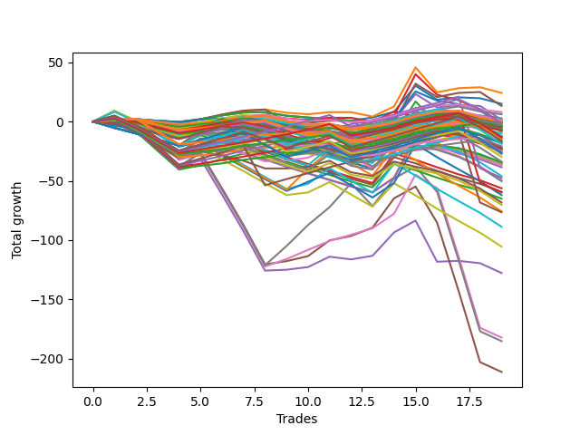

# Short Wallace Doodle 016 
- Symbol: ES_Unlimited
- Date Range: 03/18/2022 - 07/15/2022
- Trading Period: 7:20-12:30
- Number of Trades: 19



| Name | Win Percent | Profit | Avg Profit / Trade | Avg Time / Trade |      | Name | Win Percent | Profit | Avg Profit / Trade | Avg Time / Trade |
| ---- | ----------- | ------ | ------------------ | ---------------- | ---- | ---- | ----------- | ------ | ------------------ | ---------------- |
| Sorted By <br> Profit | | | | | | Sorted By <br> Win Percentage ||||
| One | 52.63 | 12125.00 | 638.16 | 21:00 |     | Eighty-One | 84.21 | -4000.00 | -210.53 | 20:41 |
| Zero | 52.63 | 7500.00 | 394.74 | 13:37 |     | Eighty-Two | 78.95 | -4000.00 | -210.53 | 24:15 |
| Fifty-Seven | 52.63 | 6625.00 | 348.68 | 16:04 |     | One Hundred Twenty-Six | 78.95 | -7000.00 | -368.42 | 09:52 |
| Ninety-One | 63.16 | 4000.00 | 210.53 | 01:40 |     | One Hundred Twenty-Seven | 73.68 | -6500.00 | -342.11 | 12:47 |
| Ninety-Two | 52.63 | 3125.00 | 164.47 | 02:47 |     | One Hundred Twenty-One | 73.68 | -12875.00 | -677.63 | 08:53 |
| Two | 57.89 | 1375.00 | 72.37 | 31:33 |     | Eighty-Four | 73.68 | -23750.00 | -1250.00 | 40:59 |
| Ninety-Four | 36.84 | 875.00 | 46.05 | 04:56 |     | Eighty-Three | 73.68 | -29875.00 | -1572.37 | 38:04 |
| Fifty-Six | 52.63 | 750.00 | 39.47 | 12:19 |     | One Hundred Twenty-Nine | 68.42 | -750.00 | -39.47 | 18:07 |
| One Hundred One | 63.16 | 625.00 | 32.89 | 02:35 |     | One Hundred Twenty-Eight | 68.42 | -6625.00 | -348.68 | 15:13 |
| Ninety-Nine | 36.84 | 375.00 | 19.74 | 02:58 |     | One Hundred Twenty-Two | 68.42 | -13625.00 | -717.11 | 12:27 |
| Ninety-Six | 52.63 | 250.00 | 13.16 | 02:12 |     | Eighty-Five | 68.42 | -38250.00 | -2013.16 | 49:43 |
| Ninety-Three | 42.11 | 250.00 | 13.16 | 03:50 |     | Ninety-One | 63.16 | 4000.00 | 210.53 | 01:40 |
| One Hundred Six | 63.16 | -125.00 | -6.58 | 03:21 |     | One Hundred One | 63.16 | 625.00 | 32.89 | 02:35 |
| One Hundred | 36.84 | -250.00 | -13.16 | 03:05 |     | One Hundred Six | 63.16 | -125.00 | -6.58 | 03:21 |
| Ninety-Five | 31.58 | -375.00 | -19.74 | 05:42 |     | One Hundred Sixteen | 63.16 | -6250.00 | -328.95 | 04:46 |
| Three | 42.11 | -500.00 | -26.32 | 39:46 |     | One Hundred Eleven | 63.16 | -6625.00 | -348.68 | 04:48 |
| Seventy-Three | 36.84 | -500.00 | -26.32 | 08:58 |     | One Hundred Twenty-Four | 63.16 | -9375.00 | -493.42 | 17:47 |
| One Hundred Twenty-Nine | 68.42 | -750.00 | -39.47 | 18:07 |     | One Hundred Twenty-Three | 63.16 | -14875.00 | -782.89 | 14:56 |
| One Hundred Two | 52.63 | -1250.00 | -65.79 | 03:44 |     | Two | 57.89 | 1375.00 | 72.37 | 31:33 |
| Forty-One | 36.84 | -1375.00 | -72.37 | 11:01 |     | Fifty-Eight | 57.89 | -7500.00 | -394.74 | 22:06 |
| One Hundred Seven | 47.37 | -2000.00 | -105.26 | 04:15 |     | One Hundred Thirty | 57.89 | -8250.00 | -434.21 | 19:58 |
| One Hundred Five | 36.84 | -2000.00 | -105.26 | 07:02 |     | One Hundred Twenty-Five | 57.89 | -13125.00 | -690.79 | 20:31 |
| Ninety-Eight | 36.84 | -2125.00 | -111.84 | 02:46 |     | One | 52.63 | 12125.00 | 638.16 | 21:00 |
| One Hundred Ten | 36.84 | -2500.00 | -131.58 | 05:42 |     | Zero | 52.63 | 7500.00 | 394.74 | 13:37 |
| One Hundred Nine | 36.84 | -2500.00 | -131.58 | 05:20 |     | Fifty-Seven | 52.63 | 6625.00 | 348.68 | 16:04 |
| Ninety-Seven | 36.84 | -3000.00 | -157.89 | 02:43 |     | Ninety-Two | 52.63 | 3125.00 | 164.47 | 02:47 |
| Sixty-Five | 47.37 | -3500.00 | -184.21 | 14:18 |     | Fifty-Six | 52.63 | 750.00 | 39.47 | 12:19 |
| One Hundred Eight | 36.84 | -3750.00 | -197.37 | 05:01 |     | Ninety-Six | 52.63 | 250.00 | 13.16 | 02:12 |
| Eighty-One | 84.21 | -4000.00 | -210.53 | 20:41 |     | One Hundred Two | 52.63 | -1250.00 | -65.79 | 03:44 |
| Eighty-Two | 78.95 | -4000.00 | -210.53 | 24:15 |     | One Hundred Seventeen | 52.63 | -8625.00 | -453.95 | 06:16 |
| One Hundred Three | 42.11 | -4875.00 | -256.58 | 04:55 |     | One Hundred Twelve | 52.63 | -10375.00 | -546.05 | 06:39 |
| One Hundred Four | 36.84 | -4875.00 | -256.58 | 06:03 |     | Sixty-Six | 52.63 | -11375.00 | -598.68 | 19:21 |
| Forty-Two | 31.58 | -6000.00 | -315.79 | 14:22 |     | One Hundred Seven | 47.37 | -2000.00 | -105.26 | 04:15 |
| One Hundred Sixteen | 63.16 | -6250.00 | -328.95 | 04:46 |     | Sixty-Five | 47.37 | -3500.00 | -184.21 | 14:18 |
| One Hundred Twenty-Seven | 73.68 | -6500.00 | -342.11 | 12:47 |     | One Hundred Thirteen | 47.37 | -11875.00 | -625.00 | 08:22 |
| One Hundred Twenty-Eight | 68.42 | -6625.00 | -348.68 | 15:13 |     | Four | 47.37 | -63875.00 | -3361.84 | 61:07 |
| One Hundred Eleven | 63.16 | -6625.00 | -348.68 | 04:48 |     | Six | 47.37 | -91125.00 | -4796.05 | 91:01 |
| One Hundred Twenty-Six | 78.95 | -7000.00 | -368.42 | 09:52 |     | Five | 47.37 | -105625.00 | -5559.21 | 86:22 |
| Fifty-Eight | 57.89 | -7500.00 | -394.74 | 22:06 |     | Ninety-Three | 42.11 | 250.00 | 13.16 | 03:50 |
| Sixty-Four | 42.11 | -8125.00 | -427.63 | 11:14 |     | Three | 42.11 | -500.00 | -26.32 | 39:46 |
| One Hundred Thirty | 57.89 | -8250.00 | -434.21 | 19:58 |     | One Hundred Three | 42.11 | -4875.00 | -256.58 | 04:55 |
| One Hundred Seventeen | 52.63 | -8625.00 | -453.95 | 06:16 |     | Sixty-Four | 42.11 | -8125.00 | -427.63 | 11:14 |
| Forty | 42.11 | -9000.00 | -473.68 | 09:26 |     | Forty | 42.11 | -9000.00 | -473.68 | 09:26 |
| One Hundred Fifteen | 42.11 | -9125.00 | -480.26 | 11:50 |     | One Hundred Fifteen | 42.11 | -9125.00 | -480.26 | 11:50 |
| One Hundred Twenty-Four | 63.16 | -9375.00 | -493.42 | 17:47 |     | One Hundred Eighteen | 42.11 | -11500.00 | -605.26 | 07:20 |
| One Hundred Twelve | 52.63 | -10375.00 | -546.05 | 06:39 |     | One Hundred Fourteen | 42.11 | -12000.00 | -631.58 | 10:51 |
| One Hundred Ninteen | 36.84 | -10875.00 | -572.37 | 08:26 |     | Fifty-Nine | 42.11 | -16875.00 | -888.16 | 25:31 |
| One Hundred Twenty | 31.58 | -11125.00 | -585.53 | 08:57 |     | Seven | 42.11 | -92625.00 | -4875.00 | 116:59 |
| Sixty-Six | 52.63 | -11375.00 | -598.68 | 19:21 |     | Ninety-Four | 36.84 | 875.00 | 46.05 | 04:56 |
| Fifty-Two | 21.05 | -11375.00 | -598.68 | 09:41 |     | Ninety-Nine | 36.84 | 375.00 | 19.74 | 02:58 |
| One Hundred Eighteen | 42.11 | -11500.00 | -605.26 | 07:20 |     | One Hundred | 36.84 | -250.00 | -13.16 | 03:05 |
| One Hundred Thirteen | 47.37 | -11875.00 | -625.00 | 08:22 |     | Seventy-Three | 36.84 | -500.00 | -26.32 | 08:58 |
| Fifty-Three | 21.05 | -11875.00 | -625.00 | 10:10 |     | Forty-One | 36.84 | -1375.00 | -72.37 | 11:01 |
| One Hundred Fourteen | 42.11 | -12000.00 | -631.58 | 10:51 |     | One Hundred Five | 36.84 | -2000.00 | -105.26 | 07:02 |
| Fifty-Five | 21.05 | -12625.00 | -664.47 | 09:57 |     | Ninety-Eight | 36.84 | -2125.00 | -111.84 | 02:46 |
| One Hundred Twenty-One | 73.68 | -12875.00 | -677.63 | 08:53 |     | One Hundred Ten | 36.84 | -2500.00 | -131.58 | 05:42 |
| One Hundred Twenty-Five | 57.89 | -13125.00 | -690.79 | 20:31 |     | One Hundred Nine | 36.84 | -2500.00 | -131.58 | 05:20 |
| One Hundred Twenty-Two | 68.42 | -13625.00 | -717.11 | 12:27 |     | Ninety-Seven | 36.84 | -3000.00 | -157.89 | 02:43 |
| One Hundred Twenty-Three | 63.16 | -14875.00 | -782.89 | 14:56 |     | One Hundred Eight | 36.84 | -3750.00 | -197.37 | 05:01 |
| Fifty-Nine | 42.11 | -16875.00 | -888.16 | 25:31 |     | One Hundred Four | 36.84 | -4875.00 | -256.58 | 06:03 |
| Fifty-One | 21.05 | -17125.00 | -901.32 | 09:30 |     | One Hundred Ninteen | 36.84 | -10875.00 | -572.37 | 08:26 |
| Fifty-Four | 21.05 | -17250.00 | -907.89 | 09:27 |     | Ninety-Five | 31.58 | -375.00 | -19.74 | 05:42 |
| Forty-Nine | 26.32 | -17625.00 | -927.63 | 08:31 |     | Forty-Two | 31.58 | -6000.00 | -315.79 | 14:22 |
| Fifty | 21.05 | -17625.00 | -927.63 | 09:21 |     | One Hundred Twenty | 31.58 | -11125.00 | -585.53 | 08:57 |
| Forty-Three | 15.79 | -18125.00 | -953.95 | 14:52 |     | Forty-Eight | 31.58 | -18500.00 | -973.68 | 07:43 |
| Forty-Eight | 31.58 | -18500.00 | -973.68 | 07:43 |     | Sixty-Eight | 31.58 | -24750.00 | -1302.63 | 23:18 |
| Forty-Six | 15.79 | -19250.00 | -1013.16 | 14:49 |     | Sixty-Two | 31.58 | -31000.00 | -1631.58 | 32:16 |
| Seventy-One | 21.05 | -23000.00 | -1210.53 | 27:20 |     | Forty-Nine | 26.32 | -17625.00 | -927.63 | 08:31 |
| Eighty-Four | 73.68 | -23750.00 | -1250.00 | 40:59 |     | Sixty-Three | 26.32 | -37875.00 | -1993.42 | 38:41 |
| Sixty-Eight | 31.58 | -24750.00 | -1302.63 | 23:18 |     | Sixty-One | 26.32 | -44375.00 | -2335.53 | 34:11 |
| Sixty-Nine | 21.05 | -25125.00 | -1322.37 | 25:18 |     | Sixty | 26.32 | -52750.00 | -2776.32 | 31:03 |
| Forty-Five | 10.53 | -28125.00 | -1480.26 | 18:01 |     | Fifty-Two | 21.05 | -11375.00 | -598.68 | 09:41 |
| Forty-Seven | 10.53 | -29625.00 | -1559.21 | 17:44 |     | Fifty-Three | 21.05 | -11875.00 | -625.00 | 10:10 |
| Eighty-Three | 73.68 | -29875.00 | -1572.37 | 38:04 |     | Fifty-Five | 21.05 | -12625.00 | -664.47 | 09:57 |
| Sixty-Two | 31.58 | -31000.00 | -1631.58 | 32:16 |     | Fifty-One | 21.05 | -17125.00 | -901.32 | 09:30 |
| Forty-Four | 10.53 | -32500.00 | -1710.53 | 16:27 |     | Fifty-Four | 21.05 | -17250.00 | -907.89 | 09:27 |
| Sixty-Seven | 21.05 | -34125.00 | -1796.05 | 21:58 |     | Fifty | 21.05 | -17625.00 | -927.63 | 09:21 |
| Seventy | 21.05 | -35125.00 | -1848.68 | 24:03 |     | Seventy-One | 21.05 | -23000.00 | -1210.53 | 27:20 |
| Sixty-Three | 26.32 | -37875.00 | -1993.42 | 38:41 |     | Sixty-Nine | 21.05 | -25125.00 | -1322.37 | 25:18 |
| Eighty-Five | 68.42 | -38250.00 | -2013.16 | 49:43 |     | Sixty-Seven | 21.05 | -34125.00 | -1796.05 | 21:58 |
| Sixty-One | 26.32 | -44375.00 | -2335.53 | 34:11 |     | Seventy | 21.05 | -35125.00 | -1848.68 | 24:03 |
| Sixty | 26.32 | -52750.00 | -2776.32 | 31:03 |     | Forty-Three | 15.79 | -18125.00 | -953.95 | 14:52 |
| Four | 47.37 | -63875.00 | -3361.84 | 61:07 |     | Forty-Six | 15.79 | -19250.00 | -1013.16 | 14:49 |
| Six | 47.37 | -91125.00 | -4796.05 | 91:01 |     | Forty-Five | 10.53 | -28125.00 | -1480.26 | 18:01 |
| Seven | 42.11 | -92625.00 | -4875.00 | 116:59 |     | Forty-Seven | 10.53 | -29625.00 | -1559.21 | 17:44 |
| Five | 47.37 | -105625.00 | -5559.21 | 86:22 |     | Forty-Four | 10.53 | -32500.00 | -1710.53 | 16:27 |

## NO STOPLOSS

### Test Zero
* Sell when price hits the middle line of the 20p bollinger
* No Stoploss
* Results:
```
Total Trades: 19
Percent Up: 47.37
Percent Down: 52.63
Total Points Moved Down: 15.00
Potential Profit: 7500.00
Total Points Ups: 26.75 Count Ups: 9
Total Points Downs: 41.75 Count Downs: 10
```

<details><summary>Trades</summary>

<code>In: 2022-03-25 11:08:00		Out: 2022-03-25 11:18:15		Total Position Time: 10:15		Total Move Down: 1.25		Total to Date: 1.25</code> <br />
<code>In: 2022-03-28 12:01:00		Out: 2022-03-28 12:12:55		Total Position Time: 11:55		Total Move Down: 0.75		Total to Date: 2.00</code> <br />
<code>In: 2022-03-29 11:40:00		Out: 2022-03-29 11:58:00		Total Position Time: 18:00		Total Move Down: -1.25		Total to Date: 0.75</code> <br />
<code>In: 2022-03-29 11:43:00		Out: 2022-03-29 11:58:00		Total Position Time: 15:00		Total Move Down: -1.00		Total to Date: -0.25</code> <br />
<code>In: 2022-04-06 08:53:00		Out: 2022-04-06 09:03:40		Total Position Time: 10:40		Total Move Down: 2.25		Total to Date: 2.00</code> <br />
<code>In: 2022-04-07 11:04:00		Out: 2022-04-07 11:15:20		Total Position Time: 11:20		Total Move Down: 3.25		Total to Date: 5.25</code> <br />
<code>In: 2022-04-07 11:05:00		Out: 2022-04-07 11:15:20		Total Position Time: 10:20		Total Move Down: 2.50		Total to Date: 7.75</code> <br />
<code>In: 2022-04-07 11:06:00		Out: 2022-04-07 11:15:20		Total Position Time: 09:20		Total Move Down: 0.25		Total to Date: 8.00</code> <br />
<code>In: 2022-04-18 10:39:00		Out: 2022-04-18 10:59:30		Total Position Time: 20:30		Total Move Down: -3.00		Total to Date: 5.00</code> <br />
<code>In: 2022-04-18 10:42:00		Out: 2022-04-18 10:59:30		Total Position Time: 17:30		Total Move Down: -1.50		Total to Date: 3.50</code> <br />
<code>In: 2022-04-20 07:43:00		Out: 2022-04-20 08:00:20		Total Position Time: 17:20		Total Move Down: -1.25		Total to Date: 2.25</code> <br />
<code>In: 2022-05-04 09:32:00		Out: 2022-05-04 09:45:30		Total Position Time: 13:30		Total Move Down: -1.50		Total to Date: 0.75</code> <br />
<code>In: 2022-05-31 07:24:00		Out: 2022-05-31 07:37:30		Total Position Time: 13:30		Total Move Down: 2.75		Total to Date: 3.50</code> <br />
<code>In: 2022-06-03 10:08:00		Out: 2022-06-03 10:13:45		Total Position Time: 05:45		Total Move Down: 4.75		Total to Date: 8.25</code> <br />
<code>In: 2022-06-15 11:48:00		Out: 2022-06-15 11:53:40		Total Position Time: 05:40		Total Move Down: 22.00		Total to Date: 30.25</code> <br />
<code>In: 2022-06-30 08:01:00		Out: 2022-06-30 08:35:20		Total Position Time: 34:20		Total Move Down: -11.75		Total to Date: 18.50</code> <br />
<code>In: 2022-07-05 08:52:00		Out: 2022-07-05 09:03:00		Total Position Time: 11:00		Total Move Down: 2.00		Total to Date: 20.50</code> <br />
<code>In: 2022-07-05 08:53:00		Out: 2022-07-05 09:03:00		Total Position Time: 10:00		Total Move Down: -0.75		Total to Date: 19.75</code> <br />
<code>In: 2022-07-06 11:37:00		Out: 2022-07-06 11:50:05		Total Position Time: 13:05		Total Move Down: -4.75		Total to Date: 15.00</code> <br />


</details>

### Test One
* Sell when the price hits the upper line of the 20p 1std bollinger
* No Stoploss
* Results:
```
Total Trades: 19
Percent Up: 47.37
Percent Down: 52.63
Total Points Moved Down: 24.25
Potential Profit: 12125.00
Total Points Ups: 37.00 Count Ups: 9
Total Points Downs: 61.25 Count Downs: 10
```

<details><summary>Trades</summary>

<code>In: 2022-03-25 11:08:00		Out: 2022-03-25 11:19:45		Total Position Time: 11:45		Total Move Down: 2.25		Total to Date: 2.25</code> <br />
<code>In: 2022-03-28 12:01:00		Out: 2022-03-28 12:41:10		Total Position Time: 40:10		Total Move Down: -3.25		Total to Date: -1.00</code> <br />
<code>In: 2022-03-29 11:40:00		Out: 2022-03-29 12:00:25		Total Position Time: 20:25		Total Move Down: -0.25		Total to Date: -1.25</code> <br />
<code>In: 2022-03-29 11:43:00		Out: 2022-03-29 12:00:25		Total Position Time: 17:25		Total Move Down: -0.00		Total to Date: -1.25</code> <br />
<code>In: 2022-04-06 08:53:00		Out: 2022-04-06 09:07:15		Total Position Time: 14:15		Total Move Down: 3.25		Total to Date: 2.00</code> <br />
<code>In: 2022-04-07 11:04:00		Out: 2022-04-07 11:18:00		Total Position Time: 14:00		Total Move Down: 4.00		Total to Date: 6.00</code> <br />
<code>In: 2022-04-07 11:05:00		Out: 2022-04-07 11:18:00		Total Position Time: 13:00		Total Move Down: 3.25		Total to Date: 9.25</code> <br />
<code>In: 2022-04-07 11:06:00		Out: 2022-04-07 11:18:00		Total Position Time: 12:00		Total Move Down: 1.00		Total to Date: 10.25</code> <br />
<code>In: 2022-04-18 10:39:00		Out: 2022-04-18 11:06:35		Total Position Time: 27:35		Total Move Down: -2.75		Total to Date: 7.50</code> <br />
<code>In: 2022-04-18 10:42:00		Out: 2022-04-18 11:06:35		Total Position Time: 24:35		Total Move Down: -1.25		Total to Date: 6.25</code> <br />
<code>In: 2022-04-20 07:43:00		Out: 2022-04-20 08:00:40		Total Position Time: 17:40		Total Move Down: 1.75		Total to Date: 8.00</code> <br />
<code>In: 2022-05-04 09:32:00		Out: 2022-05-04 09:47:10		Total Position Time: 15:10		Total Move Down: -0.00		Total to Date: 8.00</code> <br />
<code>In: 2022-05-31 07:24:00		Out: 2022-05-31 08:07:20		Total Position Time: 43:20		Total Move Down: -3.75		Total to Date: 4.25</code> <br />
<code>In: 2022-06-03 10:08:00		Out: 2022-06-03 10:15:10		Total Position Time: 07:10		Total Move Down: 8.50		Total to Date: 12.75</code> <br />
<code>In: 2022-06-15 11:48:00		Out: 2022-06-15 11:57:55		Total Position Time: 09:55		Total Move Down: 33.00		Total to Date: 45.75</code> <br />
<code>In: 2022-06-30 08:01:00		Out: 2022-06-30 09:05:50		Total Position Time: 64:50		Total Move Down: -21.00		Total to Date: 24.75</code> <br />
<code>In: 2022-07-05 08:52:00		Out: 2022-07-05 09:03:30		Total Position Time: 11:30		Total Move Down: 3.50		Total to Date: 28.25</code> <br />
<code>In: 2022-07-05 08:53:00		Out: 2022-07-05 09:03:30		Total Position Time: 10:30		Total Move Down: 0.75		Total to Date: 29.00</code> <br />
<code>In: 2022-07-06 11:37:00		Out: 2022-07-06 12:00:50		Total Position Time: 23:50		Total Move Down: -4.75		Total to Date: 24.25</code> <br />


</details>

### Test Two
* Sell when the price hits the upper line of the 20p 2std bollinger
* No Stoploss
* Results:
```
Total Trades: 19
Percent Up: 42.11
Percent Down: 57.89
Total Points Moved Down: 2.75
Potential Profit: 1375.00
Total Points Ups: 66.25 Count Ups: 8
Total Points Downs: 69.00 Count Downs: 11
```

<details><summary>Trades</summary>

<code>In: 2022-03-25 11:08:00		Out: 2022-03-25 12:01:15		Total Position Time: 53:15		Total Move Down: 0.75		Total to Date: 0.75</code> <br />
<code>In: 2022-03-28 12:01:00		Out: 2022-03-28 12:47:00		Total Position Time: 46:00		Total Move Down: -9.00		Total to Date: -8.25</code> <br />
<code>In: 2022-03-29 11:40:00		Out: 2022-03-29 12:47:00		Total Position Time: 67:00		Total Move Down: -16.25		Total to Date: -24.50</code> <br />
<code>In: 2022-03-29 11:43:00		Out: 2022-03-29 12:47:00		Total Position Time: 64:00		Total Move Down: -16.00		Total to Date: -40.50</code> <br />
<code>In: 2022-04-06 08:53:00		Out: 2022-04-06 09:09:40		Total Position Time: 16:40		Total Move Down: 3.75		Total to Date: -36.75</code> <br />
<code>In: 2022-04-07 11:04:00		Out: 2022-04-07 11:18:20		Total Position Time: 14:20		Total Move Down: 5.25		Total to Date: -31.50</code> <br />
<code>In: 2022-04-07 11:05:00		Out: 2022-04-07 11:18:20		Total Position Time: 13:20		Total Move Down: 4.50		Total to Date: -27.00</code> <br />
<code>In: 2022-04-07 11:06:00		Out: 2022-04-07 11:18:20		Total Position Time: 12:20		Total Move Down: 2.25		Total to Date: -24.75</code> <br />
<code>In: 2022-04-18 10:39:00		Out: 2022-04-18 11:10:40		Total Position Time: 31:40		Total Move Down: -1.25		Total to Date: -26.00</code> <br />
<code>In: 2022-04-18 10:42:00		Out: 2022-04-18 11:10:40		Total Position Time: 28:40		Total Move Down: 0.25		Total to Date: -25.75</code> <br />
<code>In: 2022-04-20 07:43:00		Out: 2022-04-20 08:01:10		Total Position Time: 18:10		Total Move Down: 4.75		Total to Date: -21.00</code> <br />
<code>In: 2022-05-04 09:32:00		Out: 2022-05-04 10:11:30		Total Position Time: 39:30		Total Move Down: -1.00		Total to Date: -22.00</code> <br />
<code>In: 2022-05-31 07:24:00		Out: 2022-05-31 08:07:30		Total Position Time: 43:30		Total Move Down: -1.75		Total to Date: -23.75</code> <br />
<code>In: 2022-06-03 10:08:00		Out: 2022-06-03 10:17:55		Total Position Time: 09:55		Total Move Down: 12.25		Total to Date: -11.50</code> <br />
<code>In: 2022-06-15 11:48:00		Out: 2022-06-15 12:13:05		Total Position Time: 25:05		Total Move Down: 28.50		Total to Date: 17.00</code> <br />
<code>In: 2022-06-30 08:01:00		Out: 2022-06-30 09:06:15		Total Position Time: 65:15		Total Move Down: -18.50		Total to Date: -1.50</code> <br />
<code>In: 2022-07-05 08:52:00		Out: 2022-07-05 09:05:50		Total Position Time: 13:50		Total Move Down: 4.75		Total to Date: 3.25</code> <br />
<code>In: 2022-07-05 08:53:00		Out: 2022-07-05 09:05:50		Total Position Time: 12:50		Total Move Down: 2.00		Total to Date: 5.25</code> <br />
<code>In: 2022-07-06 11:37:00		Out: 2022-07-06 12:01:25		Total Position Time: 24:25		Total Move Down: -2.50		Total to Date: 2.75</code> <br />


</details>

### Test Three
* Sell when price hits the middle line of the 50p bollinger
* No Stoploss
* Results:
```
Total Trades: 19
Percent Up: 57.89
Percent Down: 42.11
Total Points Moved Down: -1.00
Potential Profit: -500.00
Total Points Ups: 72.25 Count Ups: 11
Total Points Downs: 71.25 Count Downs: 8
```

<details><summary>Trades</summary>

<code>In: 2022-03-25 11:08:00		Out: 2022-03-25 12:00:45		Total Position Time: 52:45		Total Move Down: -0.75		Total to Date: -0.75</code> <br />
<code>In: 2022-03-28 12:01:00		Out: 2022-03-28 12:47:00		Total Position Time: 46:00		Total Move Down: -9.00		Total to Date: -9.75</code> <br />
<code>In: 2022-03-29 11:40:00		Out: 2022-03-29 12:43:10		Total Position Time: 63:10		Total Move Down: -8.25		Total to Date: -18.00</code> <br />
<code>In: 2022-03-29 11:43:00		Out: 2022-03-29 12:43:10		Total Position Time: 60:10		Total Move Down: -8.00		Total to Date: -26.00</code> <br />
<code>In: 2022-04-06 08:53:00		Out: 2022-04-06 09:12:25		Total Position Time: 19:25		Total Move Down: 4.75		Total to Date: -21.25</code> <br />
<code>In: 2022-04-07 11:04:00		Out: 2022-04-07 11:33:40		Total Position Time: 29:40		Total Move Down: 5.50		Total to Date: -15.75</code> <br />
<code>In: 2022-04-07 11:05:00		Out: 2022-04-07 11:33:40		Total Position Time: 28:40		Total Move Down: 4.75		Total to Date: -11.00</code> <br />
<code>In: 2022-04-07 11:06:00		Out: 2022-04-07 11:33:40		Total Position Time: 27:40		Total Move Down: 2.50		Total to Date: -8.50</code> <br />
<code>In: 2022-04-18 10:39:00		Out: 2022-04-18 11:16:45		Total Position Time: 37:45		Total Move Down: -0.00		Total to Date: -8.50</code> <br />
<code>In: 2022-04-18 10:42:00		Out: 2022-04-18 11:16:45		Total Position Time: 34:45		Total Move Down: 1.50		Total to Date: -7.00</code> <br />
<code>In: 2022-04-20 07:43:00		Out: 2022-04-20 08:03:05		Total Position Time: 20:05		Total Move Down: 5.00		Total to Date: -2.00</code> <br />
<code>In: 2022-05-04 09:32:00		Out: 2022-05-04 10:11:05		Total Position Time: 39:05		Total Move Down: -3.50		Total to Date: -5.50</code> <br />
<code>In: 2022-05-31 07:24:00		Out: 2022-05-31 08:07:30		Total Position Time: 43:30		Total Move Down: -1.75		Total to Date: -7.25</code> <br />
<code>In: 2022-06-03 10:08:00		Out: 2022-06-03 10:17:55		Total Position Time: 09:55		Total Move Down: 12.25		Total to Date: 5.00</code> <br />
<code>In: 2022-06-15 11:48:00		Out: 2022-06-15 11:58:10		Total Position Time: 10:10		Total Move Down: 35.00		Total to Date: 40.00</code> <br />
<code>In: 2022-06-30 08:01:00		Out: 2022-06-30 09:06:20		Total Position Time: 65:20		Total Move Down: -17.25		Total to Date: 22.75</code> <br />
<code>In: 2022-07-05 08:52:00		Out: 2022-07-05 09:43:40		Total Position Time: 51:40		Total Move Down: -4.75		Total to Date: 18.00</code> <br />
<code>In: 2022-07-05 08:53:00		Out: 2022-07-05 09:43:40		Total Position Time: 50:40		Total Move Down: -7.50		Total to Date: 10.50</code> <br />
<code>In: 2022-07-06 11:37:00		Out: 2022-07-06 12:42:10		Total Position Time: 65:10		Total Move Down: -11.50		Total to Date: -1.00</code> <br />


</details>

### Test Four
* Sell when the price hits the upper line of the 50p 1std bollinger
* No Stoploss
* Results:
```
Total Trades: 19
Percent Up: 52.63
Percent Down: 47.37
Total Points Moved Down: -127.75
Potential Profit: -63875.00
Total Points Ups: 183.00 Count Ups: 10
Total Points Downs: 55.25 Count Downs: 9
```

<details><summary>Trades</summary>

<code>In: 2022-03-25 11:08:00		Out: 2022-03-25 12:01:40		Total Position Time: 53:40		Total Move Down: 1.25		Total to Date: 1.25</code> <br />
<code>In: 2022-03-28 12:01:00		Out: 2022-03-28 12:47:00		Total Position Time: 46:00		Total Move Down: -9.00		Total to Date: -7.75</code> <br />
<code>In: 2022-03-29 11:40:00		Out: 2022-03-29 12:47:00		Total Position Time: 67:00		Total Move Down: -16.25		Total to Date: -24.00</code> <br />
<code>In: 2022-03-29 11:43:00		Out: 2022-03-29 12:47:00		Total Position Time: 64:00		Total Move Down: -16.00		Total to Date: -40.00</code> <br />
<code>In: 2022-04-06 08:53:00		Out: 2022-04-06 09:15:00		Total Position Time: 22:00		Total Move Down: 8.75		Total to Date: -31.25</code> <br />
<code>In: 2022-04-07 11:04:00		Out: 2022-04-07 12:47:00		Total Position Time: 103:00		Total Move Down: -30.25		Total to Date: -61.50</code> <br />
<code>In: 2022-04-07 11:05:00		Out: 2022-04-07 12:47:00		Total Position Time: 102:00		Total Move Down: -31.00		Total to Date: -92.50</code> <br />
<code>In: 2022-04-07 11:06:00		Out: 2022-04-07 12:47:00		Total Position Time: 101:00		Total Move Down: -33.25		Total to Date: -125.75</code> <br />
<code>In: 2022-04-18 10:39:00		Out: 2022-04-18 11:23:10		Total Position Time: 44:10		Total Move Down: 0.75		Total to Date: -125.00</code> <br />
<code>In: 2022-04-18 10:42:00		Out: 2022-04-18 11:23:10		Total Position Time: 41:10		Total Move Down: 2.25		Total to Date: -122.75</code> <br />
<code>In: 2022-04-20 07:43:00		Out: 2022-04-20 08:10:50		Total Position Time: 27:50		Total Move Down: 8.75		Total to Date: -114.00</code> <br />
<code>In: 2022-05-04 09:32:00		Out: 2022-05-04 10:30:25		Total Position Time: 58:25		Total Move Down: -2.25		Total to Date: -116.25</code> <br />
<code>In: 2022-05-31 07:24:00		Out: 2022-05-31 08:08:45		Total Position Time: 44:45		Total Move Down: 3.00		Total to Date: -113.25</code> <br />
<code>In: 2022-06-03 10:08:00		Out: 2022-06-03 10:19:05		Total Position Time: 11:05		Total Move Down: 19.75		Total to Date: -93.50</code> <br />
<code>In: 2022-06-15 11:48:00		Out: 2022-06-15 12:47:00		Total Position Time: 59:00		Total Move Down: 10.00		Total to Date: -83.50</code> <br />
<code>In: 2022-06-30 08:01:00		Out: 2022-06-30 10:10:15		Total Position Time: 129:15		Total Move Down: -34.75		Total to Date: -118.25</code> <br />
<code>In: 2022-07-05 08:52:00		Out: 2022-07-05 09:51:05		Total Position Time: 59:05		Total Move Down: 0.75		Total to Date: -117.50</code> <br />
<code>In: 2022-07-05 08:53:00		Out: 2022-07-05 09:51:05		Total Position Time: 58:05		Total Move Down: -2.00		Total to Date: -119.50</code> <br />
<code>In: 2022-07-06 11:37:00		Out: 2022-07-06 12:47:00		Total Position Time: 70:00		Total Move Down: -8.25		Total to Date: -127.75</code> <br />


</details>

### Test Five
* Sell when the price hits the upper line of the 50p 2std bollinger
* No Stoploss
* Results:
```
Total Trades: 19
Percent Up: 52.63
Percent Down: 47.37
Total Points Moved Down: -211.25
Potential Profit: -105625.00
Total Points Ups: 292.25 Count Ups: 10
Total Points Downs: 81.00 Count Downs: 9
```

<details><summary>Trades</summary>

<code>In: 2022-03-25 11:08:00		Out: 2022-03-25 12:01:55		Total Position Time: 53:55		Total Move Down: 2.75		Total to Date: 2.75</code> <br />
<code>In: 2022-03-28 12:01:00		Out: 2022-03-28 12:47:00		Total Position Time: 46:00		Total Move Down: -9.00		Total to Date: -6.25</code> <br />
<code>In: 2022-03-29 11:40:00		Out: 2022-03-29 12:47:00		Total Position Time: 67:00		Total Move Down: -16.25		Total to Date: -22.50</code> <br />
<code>In: 2022-03-29 11:43:00		Out: 2022-03-29 12:47:00		Total Position Time: 64:00		Total Move Down: -16.00		Total to Date: -38.50</code> <br />
<code>In: 2022-04-06 08:53:00		Out: 2022-04-06 09:20:20		Total Position Time: 27:20		Total Move Down: 12.50		Total to Date: -26.00</code> <br />
<code>In: 2022-04-07 11:04:00		Out: 2022-04-07 12:47:00		Total Position Time: 103:00		Total Move Down: -30.25		Total to Date: -56.25</code> <br />
<code>In: 2022-04-07 11:05:00		Out: 2022-04-07 12:47:00		Total Position Time: 102:00		Total Move Down: -31.00		Total to Date: -87.25</code> <br />
<code>In: 2022-04-07 11:06:00		Out: 2022-04-07 12:47:00		Total Position Time: 101:00		Total Move Down: -33.25		Total to Date: -120.50</code> <br />
<code>In: 2022-04-18 10:39:00		Out: 2022-04-18 11:47:00		Total Position Time: 68:00		Total Move Down: 2.75		Total to Date: -117.75</code> <br />
<code>In: 2022-04-18 10:42:00		Out: 2022-04-18 11:47:00		Total Position Time: 65:00		Total Move Down: 4.25		Total to Date: -113.50</code> <br />
<code>In: 2022-04-20 07:43:00		Out: 2022-04-20 08:16:30		Total Position Time: 33:30		Total Move Down: 13.25		Total to Date: -100.25</code> <br />
<code>In: 2022-05-04 09:32:00		Out: 2022-05-04 11:07:40		Total Position Time: 95:40		Total Move Down: 3.75		Total to Date: -96.50</code> <br />
<code>In: 2022-05-31 07:24:00		Out: 2022-05-31 08:14:30		Total Position Time: 50:30		Total Move Down: 7.00		Total to Date: -89.50</code> <br />
<code>In: 2022-06-03 10:08:00		Out: 2022-06-03 10:43:20		Total Position Time: 35:20		Total Move Down: 24.75		Total to Date: -64.75</code> <br />
<code>In: 2022-06-15 11:48:00		Out: 2022-06-15 12:47:00		Total Position Time: 59:00		Total Move Down: 10.00		Total to Date: -54.75</code> <br />
<code>In: 2022-06-30 08:01:00		Out: 2022-06-30 10:12:00		Total Position Time: 131:00		Total Move Down: -30.50		Total to Date: -85.25</code> <br />
<code>In: 2022-07-05 08:52:00		Out: 2022-07-05 12:47:00		Total Position Time: 235:00		Total Move Down: -57.50		Total to Date: -142.75</code> <br />
<code>In: 2022-07-05 08:53:00		Out: 2022-07-05 12:47:00		Total Position Time: 234:00		Total Move Down: -60.25		Total to Date: -203.00</code> <br />
<code>In: 2022-07-06 11:37:00		Out: 2022-07-06 12:47:00		Total Position Time: 70:00		Total Move Down: -8.25		Total to Date: -211.25</code> <br />


</details>

### Test Six
* Sell when the price hits the middle line of the 1std VWAP
* No Stoploss
* Results:
```
Total Trades: 19
Percent Up: 52.63
Percent Down: 47.37
Total Points Moved Down: -182.25
Potential Profit: -91125.00
Total Points Ups: 273.25 Count Ups: 10
Total Points Downs: 91.00 Count Downs: 9
```

<details><summary>Trades</summary>

<code>In: 2022-03-25 11:08:00		Out: 2022-03-25 12:20:30		Total Position Time: 72:30		Total Move Down: 9.00		Total to Date: 9.00</code> <br />
<code>In: 2022-03-28 12:01:00		Out: 2022-03-28 12:47:00		Total Position Time: 46:00		Total Move Down: -9.00		Total to Date: 0.00</code> <br />
<code>In: 2022-03-29 11:40:00		Out: 2022-03-29 12:47:00		Total Position Time: 67:00		Total Move Down: -16.25		Total to Date: -16.25</code> <br />
<code>In: 2022-03-29 11:43:00		Out: 2022-03-29 12:47:00		Total Position Time: 64:00		Total Move Down: -16.00		Total to Date: -32.25</code> <br />
<code>In: 2022-04-06 08:53:00		Out: 2022-04-06 09:11:35		Total Position Time: 18:35		Total Move Down: 4.50		Total to Date: -27.75</code> <br />
<code>In: 2022-04-07 11:04:00		Out: 2022-04-07 12:47:00		Total Position Time: 103:00		Total Move Down: -30.25		Total to Date: -58.00</code> <br />
<code>In: 2022-04-07 11:05:00		Out: 2022-04-07 12:47:00		Total Position Time: 102:00		Total Move Down: -31.00		Total to Date: -89.00</code> <br />
<code>In: 2022-04-07 11:06:00		Out: 2022-04-07 12:47:00		Total Position Time: 101:00		Total Move Down: -33.25		Total to Date: -122.25</code> <br />
<code>In: 2022-04-18 10:39:00		Out: 2022-04-18 12:04:30		Total Position Time: 85:30		Total Move Down: 6.25		Total to Date: -116.00</code> <br />
<code>In: 2022-04-18 10:42:00		Out: 2022-04-18 12:04:30		Total Position Time: 82:30		Total Move Down: 7.75		Total to Date: -108.25</code> <br />
<code>In: 2022-04-20 07:43:00		Out: 2022-04-20 08:08:10		Total Position Time: 25:10		Total Move Down: 7.50		Total to Date: -100.75</code> <br />
<code>In: 2022-05-04 09:32:00		Out: 2022-05-04 11:20:20		Total Position Time: 108:20		Total Move Down: 5.25		Total to Date: -95.50</code> <br />
<code>In: 2022-05-31 07:24:00		Out: 2022-05-31 08:14:20		Total Position Time: 50:20		Total Move Down: 5.50		Total to Date: -90.00</code> <br />
<code>In: 2022-06-03 10:08:00		Out: 2022-06-03 10:17:55		Total Position Time: 09:55		Total Move Down: 12.25		Total to Date: -77.75</code> <br />
<code>In: 2022-06-15 11:48:00		Out: 2022-06-15 11:57:55		Total Position Time: 09:55		Total Move Down: 33.00		Total to Date: -44.75</code> <br />
<code>In: 2022-06-30 08:01:00		Out: 2022-06-30 12:05:35		Total Position Time: 244:35		Total Move Down: -11.50		Total to Date: -56.25</code> <br />
<code>In: 2022-07-05 08:52:00		Out: 2022-07-05 12:47:00		Total Position Time: 235:00		Total Move Down: -57.50		Total to Date: -113.75</code> <br />
<code>In: 2022-07-05 08:53:00		Out: 2022-07-05 12:47:00		Total Position Time: 234:00		Total Move Down: -60.25		Total to Date: -174.00</code> <br />
<code>In: 2022-07-06 11:37:00		Out: 2022-07-06 12:47:00		Total Position Time: 70:00		Total Move Down: -8.25		Total to Date: -182.25</code> <br />


</details>

### Test Seven
* Sell when the price hits the upper line of the 1std VWAP
* No Stoploss
* Results:
```
Total Trades: 19
Percent Up: 57.89
Percent Down: 42.11
Total Points Moved Down: -185.25
Potential Profit: -92625.00
Total Points Ups: 302.25 Count Ups: 11
Total Points Downs: 117.00 Count Downs: 8
```

<details><summary>Trades</summary>

<code>In: 2022-03-25 11:08:00		Out: 2022-03-25 12:47:00		Total Position Time: 99:00		Total Move Down: 3.50		Total to Date: 3.50</code> <br />
<code>In: 2022-03-28 12:01:00		Out: 2022-03-28 12:47:00		Total Position Time: 46:00		Total Move Down: -9.00		Total to Date: -5.50</code> <br />
<code>In: 2022-03-29 11:40:00		Out: 2022-03-29 12:47:00		Total Position Time: 67:00		Total Move Down: -16.25		Total to Date: -21.75</code> <br />
<code>In: 2022-03-29 11:43:00		Out: 2022-03-29 12:47:00		Total Position Time: 64:00		Total Move Down: -16.00		Total to Date: -37.75</code> <br />
<code>In: 2022-04-06 08:53:00		Out: 2022-04-06 09:16:05		Total Position Time: 23:05		Total Move Down: 11.00		Total to Date: -26.75</code> <br />
<code>In: 2022-04-07 11:04:00		Out: 2022-04-07 12:47:00		Total Position Time: 103:00		Total Move Down: -30.25		Total to Date: -57.00</code> <br />
<code>In: 2022-04-07 11:05:00		Out: 2022-04-07 12:47:00		Total Position Time: 102:00		Total Move Down: -31.00		Total to Date: -88.00</code> <br />
<code>In: 2022-04-07 11:06:00		Out: 2022-04-07 12:47:00		Total Position Time: 101:00		Total Move Down: -33.25		Total to Date: -121.25</code> <br />
<code>In: 2022-04-18 10:39:00		Out: 2022-04-18 12:29:05		Total Position Time: 110:05		Total Move Down: 16.25		Total to Date: -105.00</code> <br />
<code>In: 2022-04-18 10:42:00		Out: 2022-04-18 12:29:05		Total Position Time: 107:05		Total Move Down: 17.75		Total to Date: -87.25</code> <br />
<code>In: 2022-04-20 07:43:00		Out: 2022-04-20 08:20:15		Total Position Time: 37:15		Total Move Down: 15.00		Total to Date: -72.25</code> <br />
<code>In: 2022-05-04 09:32:00		Out: 2022-05-04 11:34:05		Total Position Time: 122:05		Total Move Down: 20.25		Total to Date: -52.00</code> <br />
<code>In: 2022-05-31 07:24:00		Out: 2022-05-31 12:47:00		Total Position Time: 323:00		Total Move Down: -19.25		Total to Date: -71.25</code> <br />
<code>In: 2022-06-03 10:08:00		Out: 2022-06-03 10:42:15		Total Position Time: 34:15		Total Move Down: 23.25		Total to Date: -48.00</code> <br />
<code>In: 2022-06-15 11:48:00		Out: 2022-06-15 12:47:00		Total Position Time: 59:00		Total Move Down: 10.00		Total to Date: -38.00</code> <br />
<code>In: 2022-06-30 08:01:00		Out: 2022-06-30 12:47:00		Total Position Time: 286:00		Total Move Down: -21.25		Total to Date: -59.25</code> <br />
<code>In: 2022-07-05 08:52:00		Out: 2022-07-05 12:47:00		Total Position Time: 235:00		Total Move Down: -57.50		Total to Date: -116.75</code> <br />
<code>In: 2022-07-05 08:53:00		Out: 2022-07-05 12:47:00		Total Position Time: 234:00		Total Move Down: -60.25		Total to Date: -177.00</code> <br />
<code>In: 2022-07-06 11:37:00		Out: 2022-07-06 12:47:00		Total Position Time: 70:00		Total Move Down: -8.25		Total to Date: -185.25</code> <br />


</details>

## STOPLOSS OF 5

### Test Forty
* Sell when price hits the middle line of the 20p bollinger
* Stoploss is -5 points
* Results:
```
Total Trades: 19
Percent Up: 57.89
Percent Down: 42.11
Total Points Moved Down: -18.00
Potential Profit: -9000.00
Total Points Ups: 56.75 Count Ups: 11
Total Points Downs: 38.75 Count Downs: 8
```

<details><summary>Trades</summary>

<code>In: 2022-03-25 11:08:00		Out: 2022-03-25 11:18:15		Total Position Time: 10:15		Total Move Down: 1.25		Total to Date: 1.25</code> <br />
<code>In: 2022-03-28 12:01:00		Out: 2022-03-28 12:12:55		Total Position Time: 11:55		Total Move Down: 0.75		Total to Date: 2.00</code> <br />
<code>In: 2022-03-29 11:40:00		Out: 2022-03-29 11:57:00		Total Position Time: 17:00		Total Move Down: -5.00		Total to Date: -3.00</code> <br />
<code>In: 2022-03-29 11:43:00		Out: 2022-03-29 11:58:00		Total Position Time: 15:00		Total Move Down: -1.00		Total to Date: -4.00</code> <br />
<code>In: 2022-04-06 08:53:00		Out: 2022-04-06 09:03:40		Total Position Time: 10:40		Total Move Down: 2.25		Total to Date: -1.75</code> <br />
<code>In: 2022-04-07 11:04:00		Out: 2022-04-07 11:15:20		Total Position Time: 11:20		Total Move Down: 3.25		Total to Date: 1.50</code> <br />
<code>In: 2022-04-07 11:05:00		Out: 2022-04-07 11:15:20		Total Position Time: 10:20		Total Move Down: 2.50		Total to Date: 4.00</code> <br />
<code>In: 2022-04-07 11:06:00		Out: 2022-04-07 11:14:15		Total Position Time: 08:15		Total Move Down: -5.00		Total to Date: -1.00</code> <br />
<code>In: 2022-04-18 10:39:00		Out: 2022-04-18 10:49:15		Total Position Time: 10:15		Total Move Down: -6.00		Total to Date: -7.00</code> <br />
<code>In: 2022-04-18 10:42:00		Out: 2022-04-18 10:55:10		Total Position Time: 13:10		Total Move Down: -5.75		Total to Date: -12.75</code> <br />
<code>In: 2022-04-20 07:43:00		Out: 2022-04-20 07:55:25		Total Position Time: 12:25		Total Move Down: -5.50		Total to Date: -18.25</code> <br />
<code>In: 2022-05-04 09:32:00		Out: 2022-05-04 09:39:10		Total Position Time: 07:10		Total Move Down: -5.50		Total to Date: -23.75</code> <br />
<code>In: 2022-05-31 07:24:00		Out: 2022-05-31 07:31:25		Total Position Time: 07:25		Total Move Down: -5.00		Total to Date: -28.75</code> <br />
<code>In: 2022-06-03 10:08:00		Out: 2022-06-03 10:13:45		Total Position Time: 05:45		Total Move Down: 4.75		Total to Date: -24.00</code> <br />
<code>In: 2022-06-15 11:48:00		Out: 2022-06-15 11:53:40		Total Position Time: 05:40		Total Move Down: 22.00		Total to Date: -2.00</code> <br />
<code>In: 2022-06-30 08:01:00		Out: 2022-06-30 08:09:05		Total Position Time: 08:05		Total Move Down: -6.25		Total to Date: -8.25</code> <br />
<code>In: 2022-07-05 08:52:00		Out: 2022-07-05 09:03:00		Total Position Time: 11:00		Total Move Down: 2.00		Total to Date: -6.25</code> <br />
<code>In: 2022-07-05 08:53:00		Out: 2022-07-05 08:54:40		Total Position Time: 01:40		Total Move Down: -5.00		Total to Date: -11.25</code> <br />
<code>In: 2022-07-06 11:37:00		Out: 2022-07-06 11:39:05		Total Position Time: 02:05		Total Move Down: -6.75		Total to Date: -18.00</code> <br />


</details>

### Test Forty-One
* Sell when the price hits the upper line of the 20p 1std bollinger
* Stoploss is -5 points
* Results:
```
Total Trades: 19
Percent Up: 63.16
Percent Down: 36.84
Total Points Moved Down: -2.75
Potential Profit: -1375.00
Total Points Ups: 60.50 Count Ups: 12
Total Points Downs: 57.75 Count Downs: 7
```

<details><summary>Trades</summary>

<code>In: 2022-03-25 11:08:00		Out: 2022-03-25 11:19:45		Total Position Time: 11:45		Total Move Down: 2.25		Total to Date: 2.25</code> <br />
<code>In: 2022-03-28 12:01:00		Out: 2022-03-28 12:24:00		Total Position Time: 23:00		Total Move Down: -4.75		Total to Date: -2.50</code> <br />
<code>In: 2022-03-29 11:40:00		Out: 2022-03-29 11:57:00		Total Position Time: 17:00		Total Move Down: -5.00		Total to Date: -7.50</code> <br />
<code>In: 2022-03-29 11:43:00		Out: 2022-03-29 12:00:25		Total Position Time: 17:25		Total Move Down: -0.00		Total to Date: -7.50</code> <br />
<code>In: 2022-04-06 08:53:00		Out: 2022-04-06 09:07:15		Total Position Time: 14:15		Total Move Down: 3.25		Total to Date: -4.25</code> <br />
<code>In: 2022-04-07 11:04:00		Out: 2022-04-07 11:18:00		Total Position Time: 14:00		Total Move Down: 4.00		Total to Date: -0.25</code> <br />
<code>In: 2022-04-07 11:05:00		Out: 2022-04-07 11:18:00		Total Position Time: 13:00		Total Move Down: 3.25		Total to Date: 3.00</code> <br />
<code>In: 2022-04-07 11:06:00		Out: 2022-04-07 11:14:15		Total Position Time: 08:15		Total Move Down: -5.00		Total to Date: -2.00</code> <br />
<code>In: 2022-04-18 10:39:00		Out: 2022-04-18 10:49:15		Total Position Time: 10:15		Total Move Down: -6.00		Total to Date: -8.00</code> <br />
<code>In: 2022-04-18 10:42:00		Out: 2022-04-18 10:55:10		Total Position Time: 13:10		Total Move Down: -5.75		Total to Date: -13.75</code> <br />
<code>In: 2022-04-20 07:43:00		Out: 2022-04-20 07:55:25		Total Position Time: 12:25		Total Move Down: -5.50		Total to Date: -19.25</code> <br />
<code>In: 2022-05-04 09:32:00		Out: 2022-05-04 09:39:10		Total Position Time: 07:10		Total Move Down: -5.50		Total to Date: -24.75</code> <br />
<code>In: 2022-05-31 07:24:00		Out: 2022-05-31 07:31:25		Total Position Time: 07:25		Total Move Down: -5.00		Total to Date: -29.75</code> <br />
<code>In: 2022-06-03 10:08:00		Out: 2022-06-03 10:15:10		Total Position Time: 07:10		Total Move Down: 8.50		Total to Date: -21.25</code> <br />
<code>In: 2022-06-15 11:48:00		Out: 2022-06-15 11:57:55		Total Position Time: 09:55		Total Move Down: 33.00		Total to Date: 11.75</code> <br />
<code>In: 2022-06-30 08:01:00		Out: 2022-06-30 08:09:05		Total Position Time: 08:05		Total Move Down: -6.25		Total to Date: 5.50</code> <br />
<code>In: 2022-07-05 08:52:00		Out: 2022-07-05 09:03:30		Total Position Time: 11:30		Total Move Down: 3.50		Total to Date: 9.00</code> <br />
<code>In: 2022-07-05 08:53:00		Out: 2022-07-05 08:54:40		Total Position Time: 01:40		Total Move Down: -5.00		Total to Date: 4.00</code> <br />
<code>In: 2022-07-06 11:37:00		Out: 2022-07-06 11:39:05		Total Position Time: 02:05		Total Move Down: -6.75		Total to Date: -2.75</code> <br />


</details>

### Test Forty-Two
* Sell when the price hits the upper line of the 20p 2std bollinger
* Stoploss is -5 points
* Results:
```
Total Trades: 19
Percent Up: 68.42
Percent Down: 31.58
Total Points Moved Down: -12.00
Potential Profit: -6000.00
Total Points Ups: 71.00 Count Ups: 13
Total Points Downs: 59.00 Count Downs: 6
```

<details><summary>Trades</summary>

<code>In: 2022-03-25 11:08:00		Out: 2022-03-25 11:56:00		Total Position Time: 48:00		Total Move Down: -5.25		Total to Date: -5.25</code> <br />
<code>In: 2022-03-28 12:01:00		Out: 2022-03-28 12:24:00		Total Position Time: 23:00		Total Move Down: -4.75		Total to Date: -10.00</code> <br />
<code>In: 2022-03-29 11:40:00		Out: 2022-03-29 11:57:00		Total Position Time: 17:00		Total Move Down: -5.00		Total to Date: -15.00</code> <br />
<code>In: 2022-03-29 11:43:00		Out: 2022-03-29 12:04:35		Total Position Time: 21:35		Total Move Down: -5.25		Total to Date: -20.25</code> <br />
<code>In: 2022-04-06 08:53:00		Out: 2022-04-06 09:09:40		Total Position Time: 16:40		Total Move Down: 3.75		Total to Date: -16.50</code> <br />
<code>In: 2022-04-07 11:04:00		Out: 2022-04-07 11:18:20		Total Position Time: 14:20		Total Move Down: 5.25		Total to Date: -11.25</code> <br />
<code>In: 2022-04-07 11:05:00		Out: 2022-04-07 11:18:20		Total Position Time: 13:20		Total Move Down: 4.50		Total to Date: -6.75</code> <br />
<code>In: 2022-04-07 11:06:00		Out: 2022-04-07 11:14:15		Total Position Time: 08:15		Total Move Down: -5.00		Total to Date: -11.75</code> <br />
<code>In: 2022-04-18 10:39:00		Out: 2022-04-18 10:49:15		Total Position Time: 10:15		Total Move Down: -6.00		Total to Date: -17.75</code> <br />
<code>In: 2022-04-18 10:42:00		Out: 2022-04-18 10:55:10		Total Position Time: 13:10		Total Move Down: -5.75		Total to Date: -23.50</code> <br />
<code>In: 2022-04-20 07:43:00		Out: 2022-04-20 07:55:25		Total Position Time: 12:25		Total Move Down: -5.50		Total to Date: -29.00</code> <br />
<code>In: 2022-05-04 09:32:00		Out: 2022-05-04 09:39:10		Total Position Time: 07:10		Total Move Down: -5.50		Total to Date: -34.50</code> <br />
<code>In: 2022-05-31 07:24:00		Out: 2022-05-31 07:31:25		Total Position Time: 07:25		Total Move Down: -5.00		Total to Date: -39.50</code> <br />
<code>In: 2022-06-03 10:08:00		Out: 2022-06-03 10:17:55		Total Position Time: 09:55		Total Move Down: 12.25		Total to Date: -27.25</code> <br />
<code>In: 2022-06-15 11:48:00		Out: 2022-06-15 12:13:05		Total Position Time: 25:05		Total Move Down: 28.50		Total to Date: 1.25</code> <br />
<code>In: 2022-06-30 08:01:00		Out: 2022-06-30 08:09:05		Total Position Time: 08:05		Total Move Down: -6.25		Total to Date: -5.00</code> <br />
<code>In: 2022-07-05 08:52:00		Out: 2022-07-05 09:05:50		Total Position Time: 13:50		Total Move Down: 4.75		Total to Date: -0.25</code> <br />
<code>In: 2022-07-05 08:53:00		Out: 2022-07-05 08:54:40		Total Position Time: 01:40		Total Move Down: -5.00		Total to Date: -5.25</code> <br />
<code>In: 2022-07-06 11:37:00		Out: 2022-07-06 11:39:05		Total Position Time: 02:05		Total Move Down: -6.75		Total to Date: -12.00</code> <br />


</details>

### Test Forty-Three
* Sell when price hits the middle line of the 50p bollinger
* Stoploss is -5 points
* Results:
```
Total Trades: 19
Percent Up: 84.21
Percent Down: 15.79
Total Points Moved Down: -36.25
Potential Profit: -18125.00
Total Points Ups: 88.25 Count Ups: 16
Total Points Downs: 52.00 Count Downs: 3
```

<details><summary>Trades</summary>

<code>In: 2022-03-25 11:08:00		Out: 2022-03-25 11:56:00		Total Position Time: 48:00		Total Move Down: -5.25		Total to Date: -5.25</code> <br />
<code>In: 2022-03-28 12:01:00		Out: 2022-03-28 12:24:00		Total Position Time: 23:00		Total Move Down: -4.75		Total to Date: -10.00</code> <br />
<code>In: 2022-03-29 11:40:00		Out: 2022-03-29 11:57:00		Total Position Time: 17:00		Total Move Down: -5.00		Total to Date: -15.00</code> <br />
<code>In: 2022-03-29 11:43:00		Out: 2022-03-29 12:04:35		Total Position Time: 21:35		Total Move Down: -5.25		Total to Date: -20.25</code> <br />
<code>In: 2022-04-06 08:53:00		Out: 2022-04-06 09:12:25		Total Position Time: 19:25		Total Move Down: 4.75		Total to Date: -15.50</code> <br />
<code>In: 2022-04-07 11:04:00		Out: 2022-04-07 11:27:05		Total Position Time: 23:05		Total Move Down: -5.75		Total to Date: -21.25</code> <br />
<code>In: 2022-04-07 11:05:00		Out: 2022-04-07 11:26:15		Total Position Time: 21:15		Total Move Down: -5.50		Total to Date: -26.75</code> <br />
<code>In: 2022-04-07 11:06:00		Out: 2022-04-07 11:14:15		Total Position Time: 08:15		Total Move Down: -5.00		Total to Date: -31.75</code> <br />
<code>In: 2022-04-18 10:39:00		Out: 2022-04-18 10:49:15		Total Position Time: 10:15		Total Move Down: -6.00		Total to Date: -37.75</code> <br />
<code>In: 2022-04-18 10:42:00		Out: 2022-04-18 10:55:10		Total Position Time: 13:10		Total Move Down: -5.75		Total to Date: -43.50</code> <br />
<code>In: 2022-04-20 07:43:00		Out: 2022-04-20 07:55:25		Total Position Time: 12:25		Total Move Down: -5.50		Total to Date: -49.00</code> <br />
<code>In: 2022-05-04 09:32:00		Out: 2022-05-04 09:39:10		Total Position Time: 07:10		Total Move Down: -5.50		Total to Date: -54.50</code> <br />
<code>In: 2022-05-31 07:24:00		Out: 2022-05-31 07:31:25		Total Position Time: 07:25		Total Move Down: -5.00		Total to Date: -59.50</code> <br />
<code>In: 2022-06-03 10:08:00		Out: 2022-06-03 10:17:55		Total Position Time: 09:55		Total Move Down: 12.25		Total to Date: -47.25</code> <br />
<code>In: 2022-06-15 11:48:00		Out: 2022-06-15 11:58:10		Total Position Time: 10:10		Total Move Down: 35.00		Total to Date: -12.25</code> <br />
<code>In: 2022-06-30 08:01:00		Out: 2022-06-30 08:09:05		Total Position Time: 08:05		Total Move Down: -6.25		Total to Date: -18.50</code> <br />
<code>In: 2022-07-05 08:52:00		Out: 2022-07-05 09:10:50		Total Position Time: 18:50		Total Move Down: -6.00		Total to Date: -24.50</code> <br />
<code>In: 2022-07-05 08:53:00		Out: 2022-07-05 08:54:40		Total Position Time: 01:40		Total Move Down: -5.00		Total to Date: -29.50</code> <br />
<code>In: 2022-07-06 11:37:00		Out: 2022-07-06 11:39:05		Total Position Time: 02:05		Total Move Down: -6.75		Total to Date: -36.25</code> <br />


</details>

### Test Forty-Four
* Sell when the price hits the upper line of the 50p 1std bollinger
* Stoploss is -5 points
* Results:
```
Total Trades: 19
Percent Up: 89.47
Percent Down: 10.53
Total Points Moved Down: -65.00
Potential Profit: -32500.00
Total Points Ups: 93.50 Count Ups: 17
Total Points Downs: 28.50 Count Downs: 2
```

<details><summary>Trades</summary>

<code>In: 2022-03-25 11:08:00		Out: 2022-03-25 11:56:00		Total Position Time: 48:00		Total Move Down: -5.25		Total to Date: -5.25</code> <br />
<code>In: 2022-03-28 12:01:00		Out: 2022-03-28 12:24:00		Total Position Time: 23:00		Total Move Down: -4.75		Total to Date: -10.00</code> <br />
<code>In: 2022-03-29 11:40:00		Out: 2022-03-29 11:57:00		Total Position Time: 17:00		Total Move Down: -5.00		Total to Date: -15.00</code> <br />
<code>In: 2022-03-29 11:43:00		Out: 2022-03-29 12:04:35		Total Position Time: 21:35		Total Move Down: -5.25		Total to Date: -20.25</code> <br />
<code>In: 2022-04-06 08:53:00		Out: 2022-04-06 09:15:00		Total Position Time: 22:00		Total Move Down: 8.75		Total to Date: -11.50</code> <br />
<code>In: 2022-04-07 11:04:00		Out: 2022-04-07 11:27:05		Total Position Time: 23:05		Total Move Down: -5.75		Total to Date: -17.25</code> <br />
<code>In: 2022-04-07 11:05:00		Out: 2022-04-07 11:26:15		Total Position Time: 21:15		Total Move Down: -5.50		Total to Date: -22.75</code> <br />
<code>In: 2022-04-07 11:06:00		Out: 2022-04-07 11:14:15		Total Position Time: 08:15		Total Move Down: -5.00		Total to Date: -27.75</code> <br />
<code>In: 2022-04-18 10:39:00		Out: 2022-04-18 10:49:15		Total Position Time: 10:15		Total Move Down: -6.00		Total to Date: -33.75</code> <br />
<code>In: 2022-04-18 10:42:00		Out: 2022-04-18 10:55:10		Total Position Time: 13:10		Total Move Down: -5.75		Total to Date: -39.50</code> <br />
<code>In: 2022-04-20 07:43:00		Out: 2022-04-20 07:55:25		Total Position Time: 12:25		Total Move Down: -5.50		Total to Date: -45.00</code> <br />
<code>In: 2022-05-04 09:32:00		Out: 2022-05-04 09:39:10		Total Position Time: 07:10		Total Move Down: -5.50		Total to Date: -50.50</code> <br />
<code>In: 2022-05-31 07:24:00		Out: 2022-05-31 07:31:25		Total Position Time: 07:25		Total Move Down: -5.00		Total to Date: -55.50</code> <br />
<code>In: 2022-06-03 10:08:00		Out: 2022-06-03 10:19:05		Total Position Time: 11:05		Total Move Down: 19.75		Total to Date: -35.75</code> <br />
<code>In: 2022-06-15 11:48:00		Out: 2022-06-15 12:24:30		Total Position Time: 36:30		Total Move Down: -5.25		Total to Date: -41.00</code> <br />
<code>In: 2022-06-30 08:01:00		Out: 2022-06-30 08:09:05		Total Position Time: 08:05		Total Move Down: -6.25		Total to Date: -47.25</code> <br />
<code>In: 2022-07-05 08:52:00		Out: 2022-07-05 09:10:50		Total Position Time: 18:50		Total Move Down: -6.00		Total to Date: -53.25</code> <br />
<code>In: 2022-07-05 08:53:00		Out: 2022-07-05 08:54:40		Total Position Time: 01:40		Total Move Down: -5.00		Total to Date: -58.25</code> <br />
<code>In: 2022-07-06 11:37:00		Out: 2022-07-06 11:39:05		Total Position Time: 02:05		Total Move Down: -6.75		Total to Date: -65.00</code> <br />


</details>

### Test Forty-Five
* Sell when the price hits the upper line of the 50p 2std bollinger
* Stoploss is -5 points
* Results:
```
Total Trades: 19
Percent Up: 89.47
Percent Down: 10.53
Total Points Moved Down: -56.25
Potential Profit: -28125.00
Total Points Ups: 93.50 Count Ups: 17
Total Points Downs: 37.25 Count Downs: 2
```

<details><summary>Trades</summary>

<code>In: 2022-03-25 11:08:00		Out: 2022-03-25 11:56:00		Total Position Time: 48:00		Total Move Down: -5.25		Total to Date: -5.25</code> <br />
<code>In: 2022-03-28 12:01:00		Out: 2022-03-28 12:24:00		Total Position Time: 23:00		Total Move Down: -4.75		Total to Date: -10.00</code> <br />
<code>In: 2022-03-29 11:40:00		Out: 2022-03-29 11:57:00		Total Position Time: 17:00		Total Move Down: -5.00		Total to Date: -15.00</code> <br />
<code>In: 2022-03-29 11:43:00		Out: 2022-03-29 12:04:35		Total Position Time: 21:35		Total Move Down: -5.25		Total to Date: -20.25</code> <br />
<code>In: 2022-04-06 08:53:00		Out: 2022-04-06 09:20:20		Total Position Time: 27:20		Total Move Down: 12.50		Total to Date: -7.75</code> <br />
<code>In: 2022-04-07 11:04:00		Out: 2022-04-07 11:27:05		Total Position Time: 23:05		Total Move Down: -5.75		Total to Date: -13.50</code> <br />
<code>In: 2022-04-07 11:05:00		Out: 2022-04-07 11:26:15		Total Position Time: 21:15		Total Move Down: -5.50		Total to Date: -19.00</code> <br />
<code>In: 2022-04-07 11:06:00		Out: 2022-04-07 11:14:15		Total Position Time: 08:15		Total Move Down: -5.00		Total to Date: -24.00</code> <br />
<code>In: 2022-04-18 10:39:00		Out: 2022-04-18 10:49:15		Total Position Time: 10:15		Total Move Down: -6.00		Total to Date: -30.00</code> <br />
<code>In: 2022-04-18 10:42:00		Out: 2022-04-18 10:55:10		Total Position Time: 13:10		Total Move Down: -5.75		Total to Date: -35.75</code> <br />
<code>In: 2022-04-20 07:43:00		Out: 2022-04-20 07:55:25		Total Position Time: 12:25		Total Move Down: -5.50		Total to Date: -41.25</code> <br />
<code>In: 2022-05-04 09:32:00		Out: 2022-05-04 09:39:10		Total Position Time: 07:10		Total Move Down: -5.50		Total to Date: -46.75</code> <br />
<code>In: 2022-05-31 07:24:00		Out: 2022-05-31 07:31:25		Total Position Time: 07:25		Total Move Down: -5.00		Total to Date: -51.75</code> <br />
<code>In: 2022-06-03 10:08:00		Out: 2022-06-03 10:43:20		Total Position Time: 35:20		Total Move Down: 24.75		Total to Date: -27.00</code> <br />
<code>In: 2022-06-15 11:48:00		Out: 2022-06-15 12:24:30		Total Position Time: 36:30		Total Move Down: -5.25		Total to Date: -32.25</code> <br />
<code>In: 2022-06-30 08:01:00		Out: 2022-06-30 08:09:05		Total Position Time: 08:05		Total Move Down: -6.25		Total to Date: -38.50</code> <br />
<code>In: 2022-07-05 08:52:00		Out: 2022-07-05 09:10:50		Total Position Time: 18:50		Total Move Down: -6.00		Total to Date: -44.50</code> <br />
<code>In: 2022-07-05 08:53:00		Out: 2022-07-05 08:54:40		Total Position Time: 01:40		Total Move Down: -5.00		Total to Date: -49.50</code> <br />
<code>In: 2022-07-06 11:37:00		Out: 2022-07-06 11:39:05		Total Position Time: 02:05		Total Move Down: -6.75		Total to Date: -56.25</code> <br />


</details>

### Test Forty-Six
* Sell when the price hits the middle line of the 1std VWAP
* Stoploss is -5 points
* Results:
```
Total Trades: 19
Percent Up: 84.21
Percent Down: 15.79
Total Points Moved Down: -38.50
Potential Profit: -19250.00
Total Points Ups: 88.25 Count Ups: 16
Total Points Downs: 49.75 Count Downs: 3
```

<details><summary>Trades</summary>

<code>In: 2022-03-25 11:08:00		Out: 2022-03-25 11:56:00		Total Position Time: 48:00		Total Move Down: -5.25		Total to Date: -5.25</code> <br />
<code>In: 2022-03-28 12:01:00		Out: 2022-03-28 12:24:00		Total Position Time: 23:00		Total Move Down: -4.75		Total to Date: -10.00</code> <br />
<code>In: 2022-03-29 11:40:00		Out: 2022-03-29 11:57:00		Total Position Time: 17:00		Total Move Down: -5.00		Total to Date: -15.00</code> <br />
<code>In: 2022-03-29 11:43:00		Out: 2022-03-29 12:04:35		Total Position Time: 21:35		Total Move Down: -5.25		Total to Date: -20.25</code> <br />
<code>In: 2022-04-06 08:53:00		Out: 2022-04-06 09:11:35		Total Position Time: 18:35		Total Move Down: 4.50		Total to Date: -15.75</code> <br />
<code>In: 2022-04-07 11:04:00		Out: 2022-04-07 11:27:05		Total Position Time: 23:05		Total Move Down: -5.75		Total to Date: -21.50</code> <br />
<code>In: 2022-04-07 11:05:00		Out: 2022-04-07 11:26:15		Total Position Time: 21:15		Total Move Down: -5.50		Total to Date: -27.00</code> <br />
<code>In: 2022-04-07 11:06:00		Out: 2022-04-07 11:14:15		Total Position Time: 08:15		Total Move Down: -5.00		Total to Date: -32.00</code> <br />
<code>In: 2022-04-18 10:39:00		Out: 2022-04-18 10:49:15		Total Position Time: 10:15		Total Move Down: -6.00		Total to Date: -38.00</code> <br />
<code>In: 2022-04-18 10:42:00		Out: 2022-04-18 10:55:10		Total Position Time: 13:10		Total Move Down: -5.75		Total to Date: -43.75</code> <br />
<code>In: 2022-04-20 07:43:00		Out: 2022-04-20 07:55:25		Total Position Time: 12:25		Total Move Down: -5.50		Total to Date: -49.25</code> <br />
<code>In: 2022-05-04 09:32:00		Out: 2022-05-04 09:39:10		Total Position Time: 07:10		Total Move Down: -5.50		Total to Date: -54.75</code> <br />
<code>In: 2022-05-31 07:24:00		Out: 2022-05-31 07:31:25		Total Position Time: 07:25		Total Move Down: -5.00		Total to Date: -59.75</code> <br />
<code>In: 2022-06-03 10:08:00		Out: 2022-06-03 10:17:55		Total Position Time: 09:55		Total Move Down: 12.25		Total to Date: -47.50</code> <br />
<code>In: 2022-06-15 11:48:00		Out: 2022-06-15 11:57:55		Total Position Time: 09:55		Total Move Down: 33.00		Total to Date: -14.50</code> <br />
<code>In: 2022-06-30 08:01:00		Out: 2022-06-30 08:09:05		Total Position Time: 08:05		Total Move Down: -6.25		Total to Date: -20.75</code> <br />
<code>In: 2022-07-05 08:52:00		Out: 2022-07-05 09:10:50		Total Position Time: 18:50		Total Move Down: -6.00		Total to Date: -26.75</code> <br />
<code>In: 2022-07-05 08:53:00		Out: 2022-07-05 08:54:40		Total Position Time: 01:40		Total Move Down: -5.00		Total to Date: -31.75</code> <br />
<code>In: 2022-07-06 11:37:00		Out: 2022-07-06 11:39:05		Total Position Time: 02:05		Total Move Down: -6.75		Total to Date: -38.50</code> <br />


</details>

### Test Forty-Seven
* Sell when the price hits the upper line of the 1std VWAP
* Stoploss is -5 points
* Results:
```
Total Trades: 19
Percent Up: 89.47
Percent Down: 10.53
Total Points Moved Down: -59.25
Potential Profit: -29625.00
Total Points Ups: 93.50 Count Ups: 17
Total Points Downs: 34.25 Count Downs: 2
```

<details><summary>Trades</summary>

<code>In: 2022-03-25 11:08:00		Out: 2022-03-25 11:56:00		Total Position Time: 48:00		Total Move Down: -5.25		Total to Date: -5.25</code> <br />
<code>In: 2022-03-28 12:01:00		Out: 2022-03-28 12:24:00		Total Position Time: 23:00		Total Move Down: -4.75		Total to Date: -10.00</code> <br />
<code>In: 2022-03-29 11:40:00		Out: 2022-03-29 11:57:00		Total Position Time: 17:00		Total Move Down: -5.00		Total to Date: -15.00</code> <br />
<code>In: 2022-03-29 11:43:00		Out: 2022-03-29 12:04:35		Total Position Time: 21:35		Total Move Down: -5.25		Total to Date: -20.25</code> <br />
<code>In: 2022-04-06 08:53:00		Out: 2022-04-06 09:16:05		Total Position Time: 23:05		Total Move Down: 11.00		Total to Date: -9.25</code> <br />
<code>In: 2022-04-07 11:04:00		Out: 2022-04-07 11:27:05		Total Position Time: 23:05		Total Move Down: -5.75		Total to Date: -15.00</code> <br />
<code>In: 2022-04-07 11:05:00		Out: 2022-04-07 11:26:15		Total Position Time: 21:15		Total Move Down: -5.50		Total to Date: -20.50</code> <br />
<code>In: 2022-04-07 11:06:00		Out: 2022-04-07 11:14:15		Total Position Time: 08:15		Total Move Down: -5.00		Total to Date: -25.50</code> <br />
<code>In: 2022-04-18 10:39:00		Out: 2022-04-18 10:49:15		Total Position Time: 10:15		Total Move Down: -6.00		Total to Date: -31.50</code> <br />
<code>In: 2022-04-18 10:42:00		Out: 2022-04-18 10:55:10		Total Position Time: 13:10		Total Move Down: -5.75		Total to Date: -37.25</code> <br />
<code>In: 2022-04-20 07:43:00		Out: 2022-04-20 07:55:25		Total Position Time: 12:25		Total Move Down: -5.50		Total to Date: -42.75</code> <br />
<code>In: 2022-05-04 09:32:00		Out: 2022-05-04 09:39:10		Total Position Time: 07:10		Total Move Down: -5.50		Total to Date: -48.25</code> <br />
<code>In: 2022-05-31 07:24:00		Out: 2022-05-31 07:31:25		Total Position Time: 07:25		Total Move Down: -5.00		Total to Date: -53.25</code> <br />
<code>In: 2022-06-03 10:08:00		Out: 2022-06-03 10:42:15		Total Position Time: 34:15		Total Move Down: 23.25		Total to Date: -30.00</code> <br />
<code>In: 2022-06-15 11:48:00		Out: 2022-06-15 12:24:30		Total Position Time: 36:30		Total Move Down: -5.25		Total to Date: -35.25</code> <br />
<code>In: 2022-06-30 08:01:00		Out: 2022-06-30 08:09:05		Total Position Time: 08:05		Total Move Down: -6.25		Total to Date: -41.50</code> <br />
<code>In: 2022-07-05 08:52:00		Out: 2022-07-05 09:10:50		Total Position Time: 18:50		Total Move Down: -6.00		Total to Date: -47.50</code> <br />
<code>In: 2022-07-05 08:53:00		Out: 2022-07-05 08:54:40		Total Position Time: 01:40		Total Move Down: -5.00		Total to Date: -52.50</code> <br />
<code>In: 2022-07-06 11:37:00		Out: 2022-07-06 11:39:05		Total Position Time: 02:05		Total Move Down: -6.75		Total to Date: -59.25</code> <br />


</details>

## TRAIL STOP OF 5

### Test Forty-Eight
* Sell when price hits the middle line of the 20p bollinger
* Trailing Stop is -5 points
* Results:
```
Total Trades: 19
Percent Up: 68.42
Percent Down: 31.58
Total Points Moved Down: -37.00
Potential Profit: -18500.00
Total Points Ups: 48.00 Count Ups: 13
Total Points Downs: 11.00 Count Downs: 6
```

<details><summary>Trades</summary>

<code>In: 2022-03-25 11:08:00		Out: 2022-03-25 11:18:15		Total Position Time: 10:15		Total Move Down: 1.25		Total to Date: 1.25</code> <br />
<code>In: 2022-03-28 12:01:00		Out: 2022-03-28 12:12:55		Total Position Time: 11:55		Total Move Down: 0.75		Total to Date: 2.00</code> <br />
<code>In: 2022-03-29 11:40:00		Out: 2022-03-29 11:56:55		Total Position Time: 16:55		Total Move Down: -4.75		Total to Date: -2.75</code> <br />
<code>In: 2022-03-29 11:43:00		Out: 2022-03-29 11:56:55		Total Position Time: 13:55		Total Move Down: -4.50		Total to Date: -7.25</code> <br />
<code>In: 2022-04-06 08:53:00		Out: 2022-04-06 09:03:40		Total Position Time: 10:40		Total Move Down: 2.25		Total to Date: -5.00</code> <br />
<code>In: 2022-04-07 11:04:00		Out: 2022-04-07 11:09:45		Total Position Time: 05:45		Total Move Down: -0.00		Total to Date: -5.00</code> <br />
<code>In: 2022-04-07 11:05:00		Out: 2022-04-07 11:09:45		Total Position Time: 04:45		Total Move Down: -0.75		Total to Date: -5.75</code> <br />
<code>In: 2022-04-07 11:06:00		Out: 2022-04-07 11:09:55		Total Position Time: 03:55		Total Move Down: -3.75		Total to Date: -9.50</code> <br />
<code>In: 2022-04-18 10:39:00		Out: 2022-04-18 10:49:15		Total Position Time: 10:15		Total Move Down: -6.00		Total to Date: -15.50</code> <br />
<code>In: 2022-04-18 10:42:00		Out: 2022-04-18 10:55:10		Total Position Time: 13:10		Total Move Down: -5.75		Total to Date: -21.25</code> <br />
<code>In: 2022-04-20 07:43:00		Out: 2022-04-20 07:51:45		Total Position Time: 08:45		Total Move Down: -2.50		Total to Date: -23.75</code> <br />
<code>In: 2022-05-04 09:32:00		Out: 2022-05-04 09:39:10		Total Position Time: 07:10		Total Move Down: -5.50		Total to Date: -29.25</code> <br />
<code>In: 2022-05-31 07:24:00		Out: 2022-05-31 07:28:05		Total Position Time: 04:05		Total Move Down: 0.75		Total to Date: -28.50</code> <br />
<code>In: 2022-06-03 10:08:00		Out: 2022-06-03 10:13:45		Total Position Time: 05:45		Total Move Down: 4.75		Total to Date: -23.75</code> <br />
<code>In: 2022-06-15 11:48:00		Out: 2022-06-15 11:49:20		Total Position Time: 01:20		Total Move Down: -0.25		Total to Date: -24.00</code> <br />
<code>In: 2022-06-30 08:01:00		Out: 2022-06-30 08:05:35		Total Position Time: 04:35		Total Move Down: 1.25		Total to Date: -22.75</code> <br />
<code>In: 2022-07-05 08:52:00		Out: 2022-07-05 08:54:40		Total Position Time: 02:40		Total Move Down: -2.25		Total to Date: -25.00</code> <br />
<code>In: 2022-07-05 08:53:00		Out: 2022-07-05 09:01:50		Total Position Time: 08:50		Total Move Down: -5.25		Total to Date: -30.25</code> <br />
<code>In: 2022-07-06 11:37:00		Out: 2022-07-06 11:39:05		Total Position Time: 02:05		Total Move Down: -6.75		Total to Date: -37.00</code> <br />


</details>

### Test Forty-Nine
* Sell when the price hits the upper line of the 20p 1std bollinger
* Trailing Stop is -5 points
* Results:
```
Total Trades: 19
Percent Up: 73.68
Percent Down: 26.32
Total Points Moved Down: -35.25
Potential Profit: -17625.00
Total Points Ups: 51.25 Count Ups: 14
Total Points Downs: 16.00 Count Downs: 5
```

<details><summary>Trades</summary>

<code>In: 2022-03-25 11:08:00		Out: 2022-03-25 11:19:45		Total Position Time: 11:45		Total Move Down: 2.25		Total to Date: 2.25</code> <br />
<code>In: 2022-03-28 12:01:00		Out: 2022-03-28 12:21:45		Total Position Time: 20:45		Total Move Down: -3.25		Total to Date: -1.00</code> <br />
<code>In: 2022-03-29 11:40:00		Out: 2022-03-29 11:56:55		Total Position Time: 16:55		Total Move Down: -4.75		Total to Date: -5.75</code> <br />
<code>In: 2022-03-29 11:43:00		Out: 2022-03-29 11:56:55		Total Position Time: 13:55		Total Move Down: -4.50		Total to Date: -10.25</code> <br />
<code>In: 2022-04-06 08:53:00		Out: 2022-04-06 09:07:15		Total Position Time: 14:15		Total Move Down: 3.25		Total to Date: -7.00</code> <br />
<code>In: 2022-04-07 11:04:00		Out: 2022-04-07 11:09:45		Total Position Time: 05:45		Total Move Down: -0.00		Total to Date: -7.00</code> <br />
<code>In: 2022-04-07 11:05:00		Out: 2022-04-07 11:09:45		Total Position Time: 04:45		Total Move Down: -0.75		Total to Date: -7.75</code> <br />
<code>In: 2022-04-07 11:06:00		Out: 2022-04-07 11:09:55		Total Position Time: 03:55		Total Move Down: -3.75		Total to Date: -11.50</code> <br />
<code>In: 2022-04-18 10:39:00		Out: 2022-04-18 10:49:15		Total Position Time: 10:15		Total Move Down: -6.00		Total to Date: -17.50</code> <br />
<code>In: 2022-04-18 10:42:00		Out: 2022-04-18 10:55:10		Total Position Time: 13:10		Total Move Down: -5.75		Total to Date: -23.25</code> <br />
<code>In: 2022-04-20 07:43:00		Out: 2022-04-20 07:51:45		Total Position Time: 08:45		Total Move Down: -2.50		Total to Date: -25.75</code> <br />
<code>In: 2022-05-04 09:32:00		Out: 2022-05-04 09:39:10		Total Position Time: 07:10		Total Move Down: -5.50		Total to Date: -31.25</code> <br />
<code>In: 2022-05-31 07:24:00		Out: 2022-05-31 07:28:05		Total Position Time: 04:05		Total Move Down: 0.75		Total to Date: -30.50</code> <br />
<code>In: 2022-06-03 10:08:00		Out: 2022-06-03 10:15:10		Total Position Time: 07:10		Total Move Down: 8.50		Total to Date: -22.00</code> <br />
<code>In: 2022-06-15 11:48:00		Out: 2022-06-15 11:49:20		Total Position Time: 01:20		Total Move Down: -0.25		Total to Date: -22.25</code> <br />
<code>In: 2022-06-30 08:01:00		Out: 2022-06-30 08:05:35		Total Position Time: 04:35		Total Move Down: 1.25		Total to Date: -21.00</code> <br />
<code>In: 2022-07-05 08:52:00		Out: 2022-07-05 08:54:40		Total Position Time: 02:40		Total Move Down: -2.25		Total to Date: -23.25</code> <br />
<code>In: 2022-07-05 08:53:00		Out: 2022-07-05 09:01:50		Total Position Time: 08:50		Total Move Down: -5.25		Total to Date: -28.50</code> <br />
<code>In: 2022-07-06 11:37:00		Out: 2022-07-06 11:39:05		Total Position Time: 02:05		Total Move Down: -6.75		Total to Date: -35.25</code> <br />


</details>

### Test Fifty
* Sell when the price hits the upper line of the 20p 2std bollinger
* Trailing Stop is -5 points
* Results:
```
Total Trades: 19
Percent Up: 78.95
Percent Down: 21.05
Total Points Moved Down: -35.25
Potential Profit: -17625.00
Total Points Ups: 53.25 Count Ups: 15
Total Points Downs: 18.00 Count Downs: 4
```

<details><summary>Trades</summary>

<code>In: 2022-03-25 11:08:00		Out: 2022-03-25 11:30:15		Total Position Time: 22:15		Total Move Down: -2.00		Total to Date: -2.00</code> <br />
<code>In: 2022-03-28 12:01:00		Out: 2022-03-28 12:21:45		Total Position Time: 20:45		Total Move Down: -3.25		Total to Date: -5.25</code> <br />
<code>In: 2022-03-29 11:40:00		Out: 2022-03-29 11:56:55		Total Position Time: 16:55		Total Move Down: -4.75		Total to Date: -10.00</code> <br />
<code>In: 2022-03-29 11:43:00		Out: 2022-03-29 11:56:55		Total Position Time: 13:55		Total Move Down: -4.50		Total to Date: -14.50</code> <br />
<code>In: 2022-04-06 08:53:00		Out: 2022-04-06 09:09:40		Total Position Time: 16:40		Total Move Down: 3.75		Total to Date: -10.75</code> <br />
<code>In: 2022-04-07 11:04:00		Out: 2022-04-07 11:09:45		Total Position Time: 05:45		Total Move Down: -0.00		Total to Date: -10.75</code> <br />
<code>In: 2022-04-07 11:05:00		Out: 2022-04-07 11:09:45		Total Position Time: 04:45		Total Move Down: -0.75		Total to Date: -11.50</code> <br />
<code>In: 2022-04-07 11:06:00		Out: 2022-04-07 11:09:55		Total Position Time: 03:55		Total Move Down: -3.75		Total to Date: -15.25</code> <br />
<code>In: 2022-04-18 10:39:00		Out: 2022-04-18 10:49:15		Total Position Time: 10:15		Total Move Down: -6.00		Total to Date: -21.25</code> <br />
<code>In: 2022-04-18 10:42:00		Out: 2022-04-18 10:55:10		Total Position Time: 13:10		Total Move Down: -5.75		Total to Date: -27.00</code> <br />
<code>In: 2022-04-20 07:43:00		Out: 2022-04-20 07:51:45		Total Position Time: 08:45		Total Move Down: -2.50		Total to Date: -29.50</code> <br />
<code>In: 2022-05-04 09:32:00		Out: 2022-05-04 09:39:10		Total Position Time: 07:10		Total Move Down: -5.50		Total to Date: -35.00</code> <br />
<code>In: 2022-05-31 07:24:00		Out: 2022-05-31 07:28:05		Total Position Time: 04:05		Total Move Down: 0.75		Total to Date: -34.25</code> <br />
<code>In: 2022-06-03 10:08:00		Out: 2022-06-03 10:17:55		Total Position Time: 09:55		Total Move Down: 12.25		Total to Date: -22.00</code> <br />
<code>In: 2022-06-15 11:48:00		Out: 2022-06-15 11:49:20		Total Position Time: 01:20		Total Move Down: -0.25		Total to Date: -22.25</code> <br />
<code>In: 2022-06-30 08:01:00		Out: 2022-06-30 08:05:35		Total Position Time: 04:35		Total Move Down: 1.25		Total to Date: -21.00</code> <br />
<code>In: 2022-07-05 08:52:00		Out: 2022-07-05 08:54:40		Total Position Time: 02:40		Total Move Down: -2.25		Total to Date: -23.25</code> <br />
<code>In: 2022-07-05 08:53:00		Out: 2022-07-05 09:01:50		Total Position Time: 08:50		Total Move Down: -5.25		Total to Date: -28.50</code> <br />
<code>In: 2022-07-06 11:37:00		Out: 2022-07-06 11:39:05		Total Position Time: 02:05		Total Move Down: -6.75		Total to Date: -35.25</code> <br />


</details>

### Test Fifty-One
* Sell when price hits the middle line of the 50p bollinger
* Trailing Stop is -5 points
* Results:
```
Total Trades: 19
Percent Up: 78.95
Percent Down: 21.05
Total Points Moved Down: -34.25
Potential Profit: -17125.00
Total Points Ups: 53.25 Count Ups: 15
Total Points Downs: 19.00 Count Downs: 4
```

<details><summary>Trades</summary>

<code>In: 2022-03-25 11:08:00		Out: 2022-03-25 11:30:15		Total Position Time: 22:15		Total Move Down: -2.00		Total to Date: -2.00</code> <br />
<code>In: 2022-03-28 12:01:00		Out: 2022-03-28 12:21:45		Total Position Time: 20:45		Total Move Down: -3.25		Total to Date: -5.25</code> <br />
<code>In: 2022-03-29 11:40:00		Out: 2022-03-29 11:56:55		Total Position Time: 16:55		Total Move Down: -4.75		Total to Date: -10.00</code> <br />
<code>In: 2022-03-29 11:43:00		Out: 2022-03-29 11:56:55		Total Position Time: 13:55		Total Move Down: -4.50		Total to Date: -14.50</code> <br />
<code>In: 2022-04-06 08:53:00		Out: 2022-04-06 09:12:25		Total Position Time: 19:25		Total Move Down: 4.75		Total to Date: -9.75</code> <br />
<code>In: 2022-04-07 11:04:00		Out: 2022-04-07 11:09:45		Total Position Time: 05:45		Total Move Down: -0.00		Total to Date: -9.75</code> <br />
<code>In: 2022-04-07 11:05:00		Out: 2022-04-07 11:09:45		Total Position Time: 04:45		Total Move Down: -0.75		Total to Date: -10.50</code> <br />
<code>In: 2022-04-07 11:06:00		Out: 2022-04-07 11:09:55		Total Position Time: 03:55		Total Move Down: -3.75		Total to Date: -14.25</code> <br />
<code>In: 2022-04-18 10:39:00		Out: 2022-04-18 10:49:15		Total Position Time: 10:15		Total Move Down: -6.00		Total to Date: -20.25</code> <br />
<code>In: 2022-04-18 10:42:00		Out: 2022-04-18 10:55:10		Total Position Time: 13:10		Total Move Down: -5.75		Total to Date: -26.00</code> <br />
<code>In: 2022-04-20 07:43:00		Out: 2022-04-20 07:51:45		Total Position Time: 08:45		Total Move Down: -2.50		Total to Date: -28.50</code> <br />
<code>In: 2022-05-04 09:32:00		Out: 2022-05-04 09:39:10		Total Position Time: 07:10		Total Move Down: -5.50		Total to Date: -34.00</code> <br />
<code>In: 2022-05-31 07:24:00		Out: 2022-05-31 07:28:05		Total Position Time: 04:05		Total Move Down: 0.75		Total to Date: -33.25</code> <br />
<code>In: 2022-06-03 10:08:00		Out: 2022-06-03 10:17:55		Total Position Time: 09:55		Total Move Down: 12.25		Total to Date: -21.00</code> <br />
<code>In: 2022-06-15 11:48:00		Out: 2022-06-15 11:49:20		Total Position Time: 01:20		Total Move Down: -0.25		Total to Date: -21.25</code> <br />
<code>In: 2022-06-30 08:01:00		Out: 2022-06-30 08:05:35		Total Position Time: 04:35		Total Move Down: 1.25		Total to Date: -20.00</code> <br />
<code>In: 2022-07-05 08:52:00		Out: 2022-07-05 08:54:40		Total Position Time: 02:40		Total Move Down: -2.25		Total to Date: -22.25</code> <br />
<code>In: 2022-07-05 08:53:00		Out: 2022-07-05 09:01:50		Total Position Time: 08:50		Total Move Down: -5.25		Total to Date: -27.50</code> <br />
<code>In: 2022-07-06 11:37:00		Out: 2022-07-06 11:39:05		Total Position Time: 02:05		Total Move Down: -6.75		Total to Date: -34.25</code> <br />


</details>

### Test Fifty-Two
* Sell when the price hits the upper line of the 50p 1std bollinger
* Trailing Stop is -5 points
* Results:
```
Total Trades: 19
Percent Up: 78.95
Percent Down: 21.05
Total Points Moved Down: -22.75
Potential Profit: -11375.00
Total Points Ups: 53.25 Count Ups: 15
Total Points Downs: 30.50 Count Downs: 4
```

<details><summary>Trades</summary>

<code>In: 2022-03-25 11:08:00		Out: 2022-03-25 11:30:15		Total Position Time: 22:15		Total Move Down: -2.00		Total to Date: -2.00</code> <br />
<code>In: 2022-03-28 12:01:00		Out: 2022-03-28 12:21:45		Total Position Time: 20:45		Total Move Down: -3.25		Total to Date: -5.25</code> <br />
<code>In: 2022-03-29 11:40:00		Out: 2022-03-29 11:56:55		Total Position Time: 16:55		Total Move Down: -4.75		Total to Date: -10.00</code> <br />
<code>In: 2022-03-29 11:43:00		Out: 2022-03-29 11:56:55		Total Position Time: 13:55		Total Move Down: -4.50		Total to Date: -14.50</code> <br />
<code>In: 2022-04-06 08:53:00		Out: 2022-04-06 09:15:00		Total Position Time: 22:00		Total Move Down: 8.75		Total to Date: -5.75</code> <br />
<code>In: 2022-04-07 11:04:00		Out: 2022-04-07 11:09:45		Total Position Time: 05:45		Total Move Down: -0.00		Total to Date: -5.75</code> <br />
<code>In: 2022-04-07 11:05:00		Out: 2022-04-07 11:09:45		Total Position Time: 04:45		Total Move Down: -0.75		Total to Date: -6.50</code> <br />
<code>In: 2022-04-07 11:06:00		Out: 2022-04-07 11:09:55		Total Position Time: 03:55		Total Move Down: -3.75		Total to Date: -10.25</code> <br />
<code>In: 2022-04-18 10:39:00		Out: 2022-04-18 10:49:15		Total Position Time: 10:15		Total Move Down: -6.00		Total to Date: -16.25</code> <br />
<code>In: 2022-04-18 10:42:00		Out: 2022-04-18 10:55:10		Total Position Time: 13:10		Total Move Down: -5.75		Total to Date: -22.00</code> <br />
<code>In: 2022-04-20 07:43:00		Out: 2022-04-20 07:51:45		Total Position Time: 08:45		Total Move Down: -2.50		Total to Date: -24.50</code> <br />
<code>In: 2022-05-04 09:32:00		Out: 2022-05-04 09:39:10		Total Position Time: 07:10		Total Move Down: -5.50		Total to Date: -30.00</code> <br />
<code>In: 2022-05-31 07:24:00		Out: 2022-05-31 07:28:05		Total Position Time: 04:05		Total Move Down: 0.75		Total to Date: -29.25</code> <br />
<code>In: 2022-06-03 10:08:00		Out: 2022-06-03 10:19:05		Total Position Time: 11:05		Total Move Down: 19.75		Total to Date: -9.50</code> <br />
<code>In: 2022-06-15 11:48:00		Out: 2022-06-15 11:49:20		Total Position Time: 01:20		Total Move Down: -0.25		Total to Date: -9.75</code> <br />
<code>In: 2022-06-30 08:01:00		Out: 2022-06-30 08:05:35		Total Position Time: 04:35		Total Move Down: 1.25		Total to Date: -8.50</code> <br />
<code>In: 2022-07-05 08:52:00		Out: 2022-07-05 08:54:40		Total Position Time: 02:40		Total Move Down: -2.25		Total to Date: -10.75</code> <br />
<code>In: 2022-07-05 08:53:00		Out: 2022-07-05 09:01:50		Total Position Time: 08:50		Total Move Down: -5.25		Total to Date: -16.00</code> <br />
<code>In: 2022-07-06 11:37:00		Out: 2022-07-06 11:39:05		Total Position Time: 02:05		Total Move Down: -6.75		Total to Date: -22.75</code> <br />


</details>

### Test Fifty-Three
* Sell when the price hits the upper line of the 50p 2std bollinger
* Trailing Stop is -5 points
* Results:
```
Total Trades: 19
Percent Up: 78.95
Percent Down: 21.05
Total Points Moved Down: -23.75
Potential Profit: -11875.00
Total Points Ups: 53.25 Count Ups: 15
Total Points Downs: 29.50 Count Downs: 4
```

<details><summary>Trades</summary>

<code>In: 2022-03-25 11:08:00		Out: 2022-03-25 11:30:15		Total Position Time: 22:15		Total Move Down: -2.00		Total to Date: -2.00</code> <br />
<code>In: 2022-03-28 12:01:00		Out: 2022-03-28 12:21:45		Total Position Time: 20:45		Total Move Down: -3.25		Total to Date: -5.25</code> <br />
<code>In: 2022-03-29 11:40:00		Out: 2022-03-29 11:56:55		Total Position Time: 16:55		Total Move Down: -4.75		Total to Date: -10.00</code> <br />
<code>In: 2022-03-29 11:43:00		Out: 2022-03-29 11:56:55		Total Position Time: 13:55		Total Move Down: -4.50		Total to Date: -14.50</code> <br />
<code>In: 2022-04-06 08:53:00		Out: 2022-04-06 09:20:20		Total Position Time: 27:20		Total Move Down: 12.50		Total to Date: -2.00</code> <br />
<code>In: 2022-04-07 11:04:00		Out: 2022-04-07 11:09:45		Total Position Time: 05:45		Total Move Down: -0.00		Total to Date: -2.00</code> <br />
<code>In: 2022-04-07 11:05:00		Out: 2022-04-07 11:09:45		Total Position Time: 04:45		Total Move Down: -0.75		Total to Date: -2.75</code> <br />
<code>In: 2022-04-07 11:06:00		Out: 2022-04-07 11:09:55		Total Position Time: 03:55		Total Move Down: -3.75		Total to Date: -6.50</code> <br />
<code>In: 2022-04-18 10:39:00		Out: 2022-04-18 10:49:15		Total Position Time: 10:15		Total Move Down: -6.00		Total to Date: -12.50</code> <br />
<code>In: 2022-04-18 10:42:00		Out: 2022-04-18 10:55:10		Total Position Time: 13:10		Total Move Down: -5.75		Total to Date: -18.25</code> <br />
<code>In: 2022-04-20 07:43:00		Out: 2022-04-20 07:51:45		Total Position Time: 08:45		Total Move Down: -2.50		Total to Date: -20.75</code> <br />
<code>In: 2022-05-04 09:32:00		Out: 2022-05-04 09:39:10		Total Position Time: 07:10		Total Move Down: -5.50		Total to Date: -26.25</code> <br />
<code>In: 2022-05-31 07:24:00		Out: 2022-05-31 07:28:05		Total Position Time: 04:05		Total Move Down: 0.75		Total to Date: -25.50</code> <br />
<code>In: 2022-06-03 10:08:00		Out: 2022-06-03 10:22:55		Total Position Time: 14:55		Total Move Down: 15.00		Total to Date: -10.50</code> <br />
<code>In: 2022-06-15 11:48:00		Out: 2022-06-15 11:49:20		Total Position Time: 01:20		Total Move Down: -0.25		Total to Date: -10.75</code> <br />
<code>In: 2022-06-30 08:01:00		Out: 2022-06-30 08:05:35		Total Position Time: 04:35		Total Move Down: 1.25		Total to Date: -9.50</code> <br />
<code>In: 2022-07-05 08:52:00		Out: 2022-07-05 08:54:40		Total Position Time: 02:40		Total Move Down: -2.25		Total to Date: -11.75</code> <br />
<code>In: 2022-07-05 08:53:00		Out: 2022-07-05 09:01:50		Total Position Time: 08:50		Total Move Down: -5.25		Total to Date: -17.00</code> <br />
<code>In: 2022-07-06 11:37:00		Out: 2022-07-06 11:39:05		Total Position Time: 02:05		Total Move Down: -6.75		Total to Date: -23.75</code> <br />


</details>

### Test Fifty-Four
* Sell when the price hits the middle line of the 1std VWAP
* Trailing Stop is -5 points
* Results:
```
Total Trades: 19
Percent Up: 78.95
Percent Down: 21.05
Total Points Moved Down: -34.50
Potential Profit: -17250.00
Total Points Ups: 53.25 Count Ups: 15
Total Points Downs: 18.75 Count Downs: 4
```

<details><summary>Trades</summary>

<code>In: 2022-03-25 11:08:00		Out: 2022-03-25 11:30:15		Total Position Time: 22:15		Total Move Down: -2.00		Total to Date: -2.00</code> <br />
<code>In: 2022-03-28 12:01:00		Out: 2022-03-28 12:21:45		Total Position Time: 20:45		Total Move Down: -3.25		Total to Date: -5.25</code> <br />
<code>In: 2022-03-29 11:40:00		Out: 2022-03-29 11:56:55		Total Position Time: 16:55		Total Move Down: -4.75		Total to Date: -10.00</code> <br />
<code>In: 2022-03-29 11:43:00		Out: 2022-03-29 11:56:55		Total Position Time: 13:55		Total Move Down: -4.50		Total to Date: -14.50</code> <br />
<code>In: 2022-04-06 08:53:00		Out: 2022-04-06 09:11:35		Total Position Time: 18:35		Total Move Down: 4.50		Total to Date: -10.00</code> <br />
<code>In: 2022-04-07 11:04:00		Out: 2022-04-07 11:09:45		Total Position Time: 05:45		Total Move Down: -0.00		Total to Date: -10.00</code> <br />
<code>In: 2022-04-07 11:05:00		Out: 2022-04-07 11:09:45		Total Position Time: 04:45		Total Move Down: -0.75		Total to Date: -10.75</code> <br />
<code>In: 2022-04-07 11:06:00		Out: 2022-04-07 11:09:55		Total Position Time: 03:55		Total Move Down: -3.75		Total to Date: -14.50</code> <br />
<code>In: 2022-04-18 10:39:00		Out: 2022-04-18 10:49:15		Total Position Time: 10:15		Total Move Down: -6.00		Total to Date: -20.50</code> <br />
<code>In: 2022-04-18 10:42:00		Out: 2022-04-18 10:55:10		Total Position Time: 13:10		Total Move Down: -5.75		Total to Date: -26.25</code> <br />
<code>In: 2022-04-20 07:43:00		Out: 2022-04-20 07:51:45		Total Position Time: 08:45		Total Move Down: -2.50		Total to Date: -28.75</code> <br />
<code>In: 2022-05-04 09:32:00		Out: 2022-05-04 09:39:10		Total Position Time: 07:10		Total Move Down: -5.50		Total to Date: -34.25</code> <br />
<code>In: 2022-05-31 07:24:00		Out: 2022-05-31 07:28:05		Total Position Time: 04:05		Total Move Down: 0.75		Total to Date: -33.50</code> <br />
<code>In: 2022-06-03 10:08:00		Out: 2022-06-03 10:17:55		Total Position Time: 09:55		Total Move Down: 12.25		Total to Date: -21.25</code> <br />
<code>In: 2022-06-15 11:48:00		Out: 2022-06-15 11:49:20		Total Position Time: 01:20		Total Move Down: -0.25		Total to Date: -21.50</code> <br />
<code>In: 2022-06-30 08:01:00		Out: 2022-06-30 08:05:35		Total Position Time: 04:35		Total Move Down: 1.25		Total to Date: -20.25</code> <br />
<code>In: 2022-07-05 08:52:00		Out: 2022-07-05 08:54:40		Total Position Time: 02:40		Total Move Down: -2.25		Total to Date: -22.50</code> <br />
<code>In: 2022-07-05 08:53:00		Out: 2022-07-05 09:01:50		Total Position Time: 08:50		Total Move Down: -5.25		Total to Date: -27.75</code> <br />
<code>In: 2022-07-06 11:37:00		Out: 2022-07-06 11:39:05		Total Position Time: 02:05		Total Move Down: -6.75		Total to Date: -34.50</code> <br />


</details>

### Test Fifty-Five
* Sell when the price hits the upper line of the 1std VWAP
* Trailing Stop is -5 points
* Results:
```
Total Trades: 19
Percent Up: 78.95
Percent Down: 21.05
Total Points Moved Down: -25.25
Potential Profit: -12625.00
Total Points Ups: 53.25 Count Ups: 15
Total Points Downs: 28.00 Count Downs: 4
```

<details><summary>Trades</summary>

<code>In: 2022-03-25 11:08:00		Out: 2022-03-25 11:30:15		Total Position Time: 22:15		Total Move Down: -2.00		Total to Date: -2.00</code> <br />
<code>In: 2022-03-28 12:01:00		Out: 2022-03-28 12:21:45		Total Position Time: 20:45		Total Move Down: -3.25		Total to Date: -5.25</code> <br />
<code>In: 2022-03-29 11:40:00		Out: 2022-03-29 11:56:55		Total Position Time: 16:55		Total Move Down: -4.75		Total to Date: -10.00</code> <br />
<code>In: 2022-03-29 11:43:00		Out: 2022-03-29 11:56:55		Total Position Time: 13:55		Total Move Down: -4.50		Total to Date: -14.50</code> <br />
<code>In: 2022-04-06 08:53:00		Out: 2022-04-06 09:16:05		Total Position Time: 23:05		Total Move Down: 11.00		Total to Date: -3.50</code> <br />
<code>In: 2022-04-07 11:04:00		Out: 2022-04-07 11:09:45		Total Position Time: 05:45		Total Move Down: -0.00		Total to Date: -3.50</code> <br />
<code>In: 2022-04-07 11:05:00		Out: 2022-04-07 11:09:45		Total Position Time: 04:45		Total Move Down: -0.75		Total to Date: -4.25</code> <br />
<code>In: 2022-04-07 11:06:00		Out: 2022-04-07 11:09:55		Total Position Time: 03:55		Total Move Down: -3.75		Total to Date: -8.00</code> <br />
<code>In: 2022-04-18 10:39:00		Out: 2022-04-18 10:49:15		Total Position Time: 10:15		Total Move Down: -6.00		Total to Date: -14.00</code> <br />
<code>In: 2022-04-18 10:42:00		Out: 2022-04-18 10:55:10		Total Position Time: 13:10		Total Move Down: -5.75		Total to Date: -19.75</code> <br />
<code>In: 2022-04-20 07:43:00		Out: 2022-04-20 07:51:45		Total Position Time: 08:45		Total Move Down: -2.50		Total to Date: -22.25</code> <br />
<code>In: 2022-05-04 09:32:00		Out: 2022-05-04 09:39:10		Total Position Time: 07:10		Total Move Down: -5.50		Total to Date: -27.75</code> <br />
<code>In: 2022-05-31 07:24:00		Out: 2022-05-31 07:28:05		Total Position Time: 04:05		Total Move Down: 0.75		Total to Date: -27.00</code> <br />
<code>In: 2022-06-03 10:08:00		Out: 2022-06-03 10:22:55		Total Position Time: 14:55		Total Move Down: 15.00		Total to Date: -12.00</code> <br />
<code>In: 2022-06-15 11:48:00		Out: 2022-06-15 11:49:20		Total Position Time: 01:20		Total Move Down: -0.25		Total to Date: -12.25</code> <br />
<code>In: 2022-06-30 08:01:00		Out: 2022-06-30 08:05:35		Total Position Time: 04:35		Total Move Down: 1.25		Total to Date: -11.00</code> <br />
<code>In: 2022-07-05 08:52:00		Out: 2022-07-05 08:54:40		Total Position Time: 02:40		Total Move Down: -2.25		Total to Date: -13.25</code> <br />
<code>In: 2022-07-05 08:53:00		Out: 2022-07-05 09:01:50		Total Position Time: 08:50		Total Move Down: -5.25		Total to Date: -18.50</code> <br />
<code>In: 2022-07-06 11:37:00		Out: 2022-07-06 11:39:05		Total Position Time: 02:05		Total Move Down: -6.75		Total to Date: -25.25</code> <br />


</details>

## STOPLOSS OF 10

### Test Fifty-Six
* Sell when price hits the middle line of the 20p bollinger
* Stoploss is -10 points
* Results:
```
Total Trades: 19
Percent Up: 47.37
Percent Down: 52.63
Total Points Moved Down: 1.50
Potential Profit: 750.00
Total Points Ups: 40.25 Count Ups: 9
Total Points Downs: 41.75 Count Downs: 10
```

<details><summary>Trades</summary>

<code>In: 2022-03-25 11:08:00		Out: 2022-03-25 11:18:15		Total Position Time: 10:15		Total Move Down: 1.25		Total to Date: 1.25</code> <br />
<code>In: 2022-03-28 12:01:00		Out: 2022-03-28 12:12:55		Total Position Time: 11:55		Total Move Down: 0.75		Total to Date: 2.00</code> <br />
<code>In: 2022-03-29 11:40:00		Out: 2022-03-29 11:58:00		Total Position Time: 18:00		Total Move Down: -1.25		Total to Date: 0.75</code> <br />
<code>In: 2022-03-29 11:43:00		Out: 2022-03-29 11:58:00		Total Position Time: 15:00		Total Move Down: -1.00		Total to Date: -0.25</code> <br />
<code>In: 2022-04-06 08:53:00		Out: 2022-04-06 09:03:40		Total Position Time: 10:40		Total Move Down: 2.25		Total to Date: 2.00</code> <br />
<code>In: 2022-04-07 11:04:00		Out: 2022-04-07 11:15:20		Total Position Time: 11:20		Total Move Down: 3.25		Total to Date: 5.25</code> <br />
<code>In: 2022-04-07 11:05:00		Out: 2022-04-07 11:15:20		Total Position Time: 10:20		Total Move Down: 2.50		Total to Date: 7.75</code> <br />
<code>In: 2022-04-07 11:06:00		Out: 2022-04-07 11:15:20		Total Position Time: 09:20		Total Move Down: 0.25		Total to Date: 8.00</code> <br />
<code>In: 2022-04-18 10:39:00		Out: 2022-04-18 10:56:45		Total Position Time: 17:45		Total Move Down: -10.00		Total to Date: -2.00</code> <br />
<code>In: 2022-04-18 10:42:00		Out: 2022-04-18 10:59:30		Total Position Time: 17:30		Total Move Down: -1.50		Total to Date: -3.50</code> <br />
<code>In: 2022-04-20 07:43:00		Out: 2022-04-20 08:00:20		Total Position Time: 17:20		Total Move Down: -1.25		Total to Date: -4.75</code> <br />
<code>In: 2022-05-04 09:32:00		Out: 2022-05-04 09:45:30		Total Position Time: 13:30		Total Move Down: -1.50		Total to Date: -6.25</code> <br />
<code>In: 2022-05-31 07:24:00		Out: 2022-05-31 07:37:30		Total Position Time: 13:30		Total Move Down: 2.75		Total to Date: -3.50</code> <br />
<code>In: 2022-06-03 10:08:00		Out: 2022-06-03 10:13:45		Total Position Time: 05:45		Total Move Down: 4.75		Total to Date: 1.25</code> <br />
<code>In: 2022-06-15 11:48:00		Out: 2022-06-15 11:53:40		Total Position Time: 05:40		Total Move Down: 22.00		Total to Date: 23.25</code> <br />
<code>In: 2022-06-30 08:01:00		Out: 2022-06-30 08:23:10		Total Position Time: 22:10		Total Move Down: -11.25		Total to Date: 12.00</code> <br />
<code>In: 2022-07-05 08:52:00		Out: 2022-07-05 09:03:00		Total Position Time: 11:00		Total Move Down: 2.00		Total to Date: 14.00</code> <br />
<code>In: 2022-07-05 08:53:00		Out: 2022-07-05 09:03:00		Total Position Time: 10:00		Total Move Down: -0.75		Total to Date: 13.25</code> <br />
<code>In: 2022-07-06 11:37:00		Out: 2022-07-06 11:40:10		Total Position Time: 03:10		Total Move Down: -11.75		Total to Date: 1.50</code> <br />


</details>

### Test Fifty-Seven
* Sell when the price hits the upper line of the 20p 1std bollinger
* Stoploss is -10 points
* Results:
```
Total Trades: 19
Percent Up: 47.37
Percent Down: 52.63
Total Points Moved Down: 13.25
Potential Profit: 6625.00
Total Points Ups: 48.00 Count Ups: 9
Total Points Downs: 61.25 Count Downs: 10
```

<details><summary>Trades</summary>

<code>In: 2022-03-25 11:08:00		Out: 2022-03-25 11:19:45		Total Position Time: 11:45		Total Move Down: 2.25		Total to Date: 2.25</code> <br />
<code>In: 2022-03-28 12:01:00		Out: 2022-03-28 12:41:10		Total Position Time: 40:10		Total Move Down: -3.25		Total to Date: -1.00</code> <br />
<code>In: 2022-03-29 11:40:00		Out: 2022-03-29 12:00:25		Total Position Time: 20:25		Total Move Down: -0.25		Total to Date: -1.25</code> <br />
<code>In: 2022-03-29 11:43:00		Out: 2022-03-29 12:00:25		Total Position Time: 17:25		Total Move Down: -0.00		Total to Date: -1.25</code> <br />
<code>In: 2022-04-06 08:53:00		Out: 2022-04-06 09:07:15		Total Position Time: 14:15		Total Move Down: 3.25		Total to Date: 2.00</code> <br />
<code>In: 2022-04-07 11:04:00		Out: 2022-04-07 11:18:00		Total Position Time: 14:00		Total Move Down: 4.00		Total to Date: 6.00</code> <br />
<code>In: 2022-04-07 11:05:00		Out: 2022-04-07 11:18:00		Total Position Time: 13:00		Total Move Down: 3.25		Total to Date: 9.25</code> <br />
<code>In: 2022-04-07 11:06:00		Out: 2022-04-07 11:18:00		Total Position Time: 12:00		Total Move Down: 1.00		Total to Date: 10.25</code> <br />
<code>In: 2022-04-18 10:39:00		Out: 2022-04-18 10:56:45		Total Position Time: 17:45		Total Move Down: -10.00		Total to Date: 0.25</code> <br />
<code>In: 2022-04-18 10:42:00		Out: 2022-04-18 11:06:35		Total Position Time: 24:35		Total Move Down: -1.25		Total to Date: -1.00</code> <br />
<code>In: 2022-04-20 07:43:00		Out: 2022-04-20 08:00:40		Total Position Time: 17:40		Total Move Down: 1.75		Total to Date: 0.75</code> <br />
<code>In: 2022-05-04 09:32:00		Out: 2022-05-04 09:47:10		Total Position Time: 15:10		Total Move Down: -0.00		Total to Date: 0.75</code> <br />
<code>In: 2022-05-31 07:24:00		Out: 2022-05-31 07:46:55		Total Position Time: 22:55		Total Move Down: -10.25		Total to Date: -9.50</code> <br />
<code>In: 2022-06-03 10:08:00		Out: 2022-06-03 10:15:10		Total Position Time: 07:10		Total Move Down: 8.50		Total to Date: -1.00</code> <br />
<code>In: 2022-06-15 11:48:00		Out: 2022-06-15 11:57:55		Total Position Time: 09:55		Total Move Down: 33.00		Total to Date: 32.00</code> <br />
<code>In: 2022-06-30 08:01:00		Out: 2022-06-30 08:23:10		Total Position Time: 22:10		Total Move Down: -11.25		Total to Date: 20.75</code> <br />
<code>In: 2022-07-05 08:52:00		Out: 2022-07-05 09:03:30		Total Position Time: 11:30		Total Move Down: 3.50		Total to Date: 24.25</code> <br />
<code>In: 2022-07-05 08:53:00		Out: 2022-07-05 09:03:30		Total Position Time: 10:30		Total Move Down: 0.75		Total to Date: 25.00</code> <br />
<code>In: 2022-07-06 11:37:00		Out: 2022-07-06 11:40:10		Total Position Time: 03:10		Total Move Down: -11.75		Total to Date: 13.25</code> <br />


</details>

### Test Fifty-Eight
* Sell when the price hits the upper line of the 20p 2std bollinger
* Stoploss is -10 points
* Results:
```
Total Trades: 19
Percent Up: 42.11
Percent Down: 57.89
Total Points Moved Down: -15.00
Potential Profit: -7500.00
Total Points Ups: 84.00 Count Ups: 8
Total Points Downs: 69.00 Count Downs: 11
```

<details><summary>Trades</summary>

<code>In: 2022-03-25 11:08:00		Out: 2022-03-25 12:01:15		Total Position Time: 53:15		Total Move Down: 0.75		Total to Date: 0.75</code> <br />
<code>In: 2022-03-28 12:01:00		Out: 2022-03-28 12:47:00		Total Position Time: 46:00		Total Move Down: -9.00		Total to Date: -8.25</code> <br />
<code>In: 2022-03-29 11:40:00		Out: 2022-03-29 12:13:45		Total Position Time: 33:45		Total Move Down: -10.75		Total to Date: -19.00</code> <br />
<code>In: 2022-03-29 11:43:00		Out: 2022-03-29 12:13:45		Total Position Time: 30:45		Total Move Down: -10.50		Total to Date: -29.50</code> <br />
<code>In: 2022-04-06 08:53:00		Out: 2022-04-06 09:09:40		Total Position Time: 16:40		Total Move Down: 3.75		Total to Date: -25.75</code> <br />
<code>In: 2022-04-07 11:04:00		Out: 2022-04-07 11:18:20		Total Position Time: 14:20		Total Move Down: 5.25		Total to Date: -20.50</code> <br />
<code>In: 2022-04-07 11:05:00		Out: 2022-04-07 11:18:20		Total Position Time: 13:20		Total Move Down: 4.50		Total to Date: -16.00</code> <br />
<code>In: 2022-04-07 11:06:00		Out: 2022-04-07 11:18:20		Total Position Time: 12:20		Total Move Down: 2.25		Total to Date: -13.75</code> <br />
<code>In: 2022-04-18 10:39:00		Out: 2022-04-18 10:56:45		Total Position Time: 17:45		Total Move Down: -10.00		Total to Date: -23.75</code> <br />
<code>In: 2022-04-18 10:42:00		Out: 2022-04-18 11:10:40		Total Position Time: 28:40		Total Move Down: 0.25		Total to Date: -23.50</code> <br />
<code>In: 2022-04-20 07:43:00		Out: 2022-04-20 08:01:10		Total Position Time: 18:10		Total Move Down: 4.75		Total to Date: -18.75</code> <br />
<code>In: 2022-05-04 09:32:00		Out: 2022-05-04 09:57:05		Total Position Time: 25:05		Total Move Down: -10.50		Total to Date: -29.25</code> <br />
<code>In: 2022-05-31 07:24:00		Out: 2022-05-31 07:46:55		Total Position Time: 22:55		Total Move Down: -10.25		Total to Date: -39.50</code> <br />
<code>In: 2022-06-03 10:08:00		Out: 2022-06-03 10:17:55		Total Position Time: 09:55		Total Move Down: 12.25		Total to Date: -27.25</code> <br />
<code>In: 2022-06-15 11:48:00		Out: 2022-06-15 12:13:05		Total Position Time: 25:05		Total Move Down: 28.50		Total to Date: 1.25</code> <br />
<code>In: 2022-06-30 08:01:00		Out: 2022-06-30 08:23:10		Total Position Time: 22:10		Total Move Down: -11.25		Total to Date: -10.00</code> <br />
<code>In: 2022-07-05 08:52:00		Out: 2022-07-05 09:05:50		Total Position Time: 13:50		Total Move Down: 4.75		Total to Date: -5.25</code> <br />
<code>In: 2022-07-05 08:53:00		Out: 2022-07-05 09:05:50		Total Position Time: 12:50		Total Move Down: 2.00		Total to Date: -3.25</code> <br />
<code>In: 2022-07-06 11:37:00		Out: 2022-07-06 11:40:10		Total Position Time: 03:10		Total Move Down: -11.75		Total to Date: -15.00</code> <br />


</details>

### Test Fifty-Nine
* Sell when price hits the middle line of the 50p bollinger
* Stoploss is -10 points
* Results:
```
Total Trades: 19
Percent Up: 57.89
Percent Down: 42.11
Total Points Moved Down: -33.75
Potential Profit: -16875.00
Total Points Ups: 105.00 Count Ups: 11
Total Points Downs: 71.25 Count Downs: 8
```

<details><summary>Trades</summary>

<code>In: 2022-03-25 11:08:00		Out: 2022-03-25 12:00:45		Total Position Time: 52:45		Total Move Down: -0.75		Total to Date: -0.75</code> <br />
<code>In: 2022-03-28 12:01:00		Out: 2022-03-28 12:47:00		Total Position Time: 46:00		Total Move Down: -9.00		Total to Date: -9.75</code> <br />
<code>In: 2022-03-29 11:40:00		Out: 2022-03-29 12:13:45		Total Position Time: 33:45		Total Move Down: -10.75		Total to Date: -20.50</code> <br />
<code>In: 2022-03-29 11:43:00		Out: 2022-03-29 12:13:45		Total Position Time: 30:45		Total Move Down: -10.50		Total to Date: -31.00</code> <br />
<code>In: 2022-04-06 08:53:00		Out: 2022-04-06 09:12:25		Total Position Time: 19:25		Total Move Down: 4.75		Total to Date: -26.25</code> <br />
<code>In: 2022-04-07 11:04:00		Out: 2022-04-07 11:33:40		Total Position Time: 29:40		Total Move Down: 5.50		Total to Date: -20.75</code> <br />
<code>In: 2022-04-07 11:05:00		Out: 2022-04-07 11:33:40		Total Position Time: 28:40		Total Move Down: 4.75		Total to Date: -16.00</code> <br />
<code>In: 2022-04-07 11:06:00		Out: 2022-04-07 11:33:40		Total Position Time: 27:40		Total Move Down: 2.50		Total to Date: -13.50</code> <br />
<code>In: 2022-04-18 10:39:00		Out: 2022-04-18 10:56:45		Total Position Time: 17:45		Total Move Down: -10.00		Total to Date: -23.50</code> <br />
<code>In: 2022-04-18 10:42:00		Out: 2022-04-18 11:16:45		Total Position Time: 34:45		Total Move Down: 1.50		Total to Date: -22.00</code> <br />
<code>In: 2022-04-20 07:43:00		Out: 2022-04-20 08:03:05		Total Position Time: 20:05		Total Move Down: 5.00		Total to Date: -17.00</code> <br />
<code>In: 2022-05-04 09:32:00		Out: 2022-05-04 09:57:05		Total Position Time: 25:05		Total Move Down: -10.50		Total to Date: -27.50</code> <br />
<code>In: 2022-05-31 07:24:00		Out: 2022-05-31 07:46:55		Total Position Time: 22:55		Total Move Down: -10.25		Total to Date: -37.75</code> <br />
<code>In: 2022-06-03 10:08:00		Out: 2022-06-03 10:17:55		Total Position Time: 09:55		Total Move Down: 12.25		Total to Date: -25.50</code> <br />
<code>In: 2022-06-15 11:48:00		Out: 2022-06-15 11:58:10		Total Position Time: 10:10		Total Move Down: 35.00		Total to Date: 9.50</code> <br />
<code>In: 2022-06-30 08:01:00		Out: 2022-06-30 08:23:10		Total Position Time: 22:10		Total Move Down: -11.25		Total to Date: -1.75</code> <br />
<code>In: 2022-07-05 08:52:00		Out: 2022-07-05 09:23:20		Total Position Time: 31:20		Total Move Down: -10.25		Total to Date: -12.00</code> <br />
<code>In: 2022-07-05 08:53:00		Out: 2022-07-05 09:11:55		Total Position Time: 18:55		Total Move Down: -10.00		Total to Date: -22.00</code> <br />
<code>In: 2022-07-06 11:37:00		Out: 2022-07-06 11:40:10		Total Position Time: 03:10		Total Move Down: -11.75		Total to Date: -33.75</code> <br />


</details>

### Test Sixty
* Sell when the price hits the upper line of the 50p 1std bollinger
* Stoploss is -10 points
* Results:
```
Total Trades: 19
Percent Up: 73.68
Percent Down: 26.32
Total Points Moved Down: -105.50
Potential Profit: -52750.00
Total Points Ups: 146.25 Count Ups: 14
Total Points Downs: 40.75 Count Downs: 5
```

<details><summary>Trades</summary>

<code>In: 2022-03-25 11:08:00		Out: 2022-03-25 12:01:40		Total Position Time: 53:40		Total Move Down: 1.25		Total to Date: 1.25</code> <br />
<code>In: 2022-03-28 12:01:00		Out: 2022-03-28 12:47:00		Total Position Time: 46:00		Total Move Down: -9.00		Total to Date: -7.75</code> <br />
<code>In: 2022-03-29 11:40:00		Out: 2022-03-29 12:13:45		Total Position Time: 33:45		Total Move Down: -10.75		Total to Date: -18.50</code> <br />
<code>In: 2022-03-29 11:43:00		Out: 2022-03-29 12:13:45		Total Position Time: 30:45		Total Move Down: -10.50		Total to Date: -29.00</code> <br />
<code>In: 2022-04-06 08:53:00		Out: 2022-04-06 09:15:00		Total Position Time: 22:00		Total Move Down: 8.75		Total to Date: -20.25</code> <br />
<code>In: 2022-04-07 11:04:00		Out: 2022-04-07 11:55:10		Total Position Time: 51:10		Total Move Down: -11.75		Total to Date: -32.00</code> <br />
<code>In: 2022-04-07 11:05:00		Out: 2022-04-07 11:53:10		Total Position Time: 48:10		Total Move Down: -9.75		Total to Date: -41.75</code> <br />
<code>In: 2022-04-07 11:06:00		Out: 2022-04-07 11:49:20		Total Position Time: 43:20		Total Move Down: -10.25		Total to Date: -52.00</code> <br />
<code>In: 2022-04-18 10:39:00		Out: 2022-04-18 10:56:45		Total Position Time: 17:45		Total Move Down: -10.00		Total to Date: -62.00</code> <br />
<code>In: 2022-04-18 10:42:00		Out: 2022-04-18 11:23:10		Total Position Time: 41:10		Total Move Down: 2.25		Total to Date: -59.75</code> <br />
<code>In: 2022-04-20 07:43:00		Out: 2022-04-20 08:10:50		Total Position Time: 27:50		Total Move Down: 8.75		Total to Date: -51.00</code> <br />
<code>In: 2022-05-04 09:32:00		Out: 2022-05-04 09:57:05		Total Position Time: 25:05		Total Move Down: -10.50		Total to Date: -61.50</code> <br />
<code>In: 2022-05-31 07:24:00		Out: 2022-05-31 07:46:55		Total Position Time: 22:55		Total Move Down: -10.25		Total to Date: -71.75</code> <br />
<code>In: 2022-06-03 10:08:00		Out: 2022-06-03 10:19:05		Total Position Time: 11:05		Total Move Down: 19.75		Total to Date: -52.00</code> <br />
<code>In: 2022-06-15 11:48:00		Out: 2022-06-15 12:28:00		Total Position Time: 40:00		Total Move Down: -10.25		Total to Date: -62.25</code> <br />
<code>In: 2022-06-30 08:01:00		Out: 2022-06-30 08:23:10		Total Position Time: 22:10		Total Move Down: -11.25		Total to Date: -73.50</code> <br />
<code>In: 2022-07-05 08:52:00		Out: 2022-07-05 09:23:20		Total Position Time: 31:20		Total Move Down: -10.25		Total to Date: -83.75</code> <br />
<code>In: 2022-07-05 08:53:00		Out: 2022-07-05 09:11:55		Total Position Time: 18:55		Total Move Down: -10.00		Total to Date: -93.75</code> <br />
<code>In: 2022-07-06 11:37:00		Out: 2022-07-06 11:40:10		Total Position Time: 03:10		Total Move Down: -11.75		Total to Date: -105.50</code> <br />


</details>

### Test Sixty-One
* Sell when the price hits the upper line of the 50p 2std bollinger
* Stoploss is -10 points
* Results:
```
Total Trades: 19
Percent Up: 73.68
Percent Down: 26.32
Total Points Moved Down: -88.75
Potential Profit: -44375.00
Total Points Ups: 146.25 Count Ups: 14
Total Points Downs: 57.50 Count Downs: 5
```

<details><summary>Trades</summary>

<code>In: 2022-03-25 11:08:00		Out: 2022-03-25 12:01:55		Total Position Time: 53:55		Total Move Down: 2.75		Total to Date: 2.75</code> <br />
<code>In: 2022-03-28 12:01:00		Out: 2022-03-28 12:47:00		Total Position Time: 46:00		Total Move Down: -9.00		Total to Date: -6.25</code> <br />
<code>In: 2022-03-29 11:40:00		Out: 2022-03-29 12:13:45		Total Position Time: 33:45		Total Move Down: -10.75		Total to Date: -17.00</code> <br />
<code>In: 2022-03-29 11:43:00		Out: 2022-03-29 12:13:45		Total Position Time: 30:45		Total Move Down: -10.50		Total to Date: -27.50</code> <br />
<code>In: 2022-04-06 08:53:00		Out: 2022-04-06 09:20:20		Total Position Time: 27:20		Total Move Down: 12.50		Total to Date: -15.00</code> <br />
<code>In: 2022-04-07 11:04:00		Out: 2022-04-07 11:55:10		Total Position Time: 51:10		Total Move Down: -11.75		Total to Date: -26.75</code> <br />
<code>In: 2022-04-07 11:05:00		Out: 2022-04-07 11:53:10		Total Position Time: 48:10		Total Move Down: -9.75		Total to Date: -36.50</code> <br />
<code>In: 2022-04-07 11:06:00		Out: 2022-04-07 11:49:20		Total Position Time: 43:20		Total Move Down: -10.25		Total to Date: -46.75</code> <br />
<code>In: 2022-04-18 10:39:00		Out: 2022-04-18 10:56:45		Total Position Time: 17:45		Total Move Down: -10.00		Total to Date: -56.75</code> <br />
<code>In: 2022-04-18 10:42:00		Out: 2022-04-18 11:47:00		Total Position Time: 65:00		Total Move Down: 4.25		Total to Date: -52.50</code> <br />
<code>In: 2022-04-20 07:43:00		Out: 2022-04-20 08:16:30		Total Position Time: 33:30		Total Move Down: 13.25		Total to Date: -39.25</code> <br />
<code>In: 2022-05-04 09:32:00		Out: 2022-05-04 09:57:05		Total Position Time: 25:05		Total Move Down: -10.50		Total to Date: -49.75</code> <br />
<code>In: 2022-05-31 07:24:00		Out: 2022-05-31 07:46:55		Total Position Time: 22:55		Total Move Down: -10.25		Total to Date: -60.00</code> <br />
<code>In: 2022-06-03 10:08:00		Out: 2022-06-03 10:43:20		Total Position Time: 35:20		Total Move Down: 24.75		Total to Date: -35.25</code> <br />
<code>In: 2022-06-15 11:48:00		Out: 2022-06-15 12:28:00		Total Position Time: 40:00		Total Move Down: -10.25		Total to Date: -45.50</code> <br />
<code>In: 2022-06-30 08:01:00		Out: 2022-06-30 08:23:10		Total Position Time: 22:10		Total Move Down: -11.25		Total to Date: -56.75</code> <br />
<code>In: 2022-07-05 08:52:00		Out: 2022-07-05 09:23:20		Total Position Time: 31:20		Total Move Down: -10.25		Total to Date: -67.00</code> <br />
<code>In: 2022-07-05 08:53:00		Out: 2022-07-05 09:11:55		Total Position Time: 18:55		Total Move Down: -10.00		Total to Date: -77.00</code> <br />
<code>In: 2022-07-06 11:37:00		Out: 2022-07-06 11:40:10		Total Position Time: 03:10		Total Move Down: -11.75		Total to Date: -88.75</code> <br />


</details>

### Test Sixty-Two
* Sell when the price hits the middle line of the 1std VWAP
* Stoploss is -10 points
* Results:
```
Total Trades: 19
Percent Up: 68.42
Percent Down: 31.58
Total Points Moved Down: -62.00
Potential Profit: -31000.00
Total Points Ups: 136.00 Count Ups: 13
Total Points Downs: 74.00 Count Downs: 6
```

<details><summary>Trades</summary>

<code>In: 2022-03-25 11:08:00		Out: 2022-03-25 12:20:30		Total Position Time: 72:30		Total Move Down: 9.00		Total to Date: 9.00</code> <br />
<code>In: 2022-03-28 12:01:00		Out: 2022-03-28 12:47:00		Total Position Time: 46:00		Total Move Down: -9.00		Total to Date: 0.00</code> <br />
<code>In: 2022-03-29 11:40:00		Out: 2022-03-29 12:13:45		Total Position Time: 33:45		Total Move Down: -10.75		Total to Date: -10.75</code> <br />
<code>In: 2022-03-29 11:43:00		Out: 2022-03-29 12:13:45		Total Position Time: 30:45		Total Move Down: -10.50		Total to Date: -21.25</code> <br />
<code>In: 2022-04-06 08:53:00		Out: 2022-04-06 09:11:35		Total Position Time: 18:35		Total Move Down: 4.50		Total to Date: -16.75</code> <br />
<code>In: 2022-04-07 11:04:00		Out: 2022-04-07 11:55:10		Total Position Time: 51:10		Total Move Down: -11.75		Total to Date: -28.50</code> <br />
<code>In: 2022-04-07 11:05:00		Out: 2022-04-07 11:53:10		Total Position Time: 48:10		Total Move Down: -9.75		Total to Date: -38.25</code> <br />
<code>In: 2022-04-07 11:06:00		Out: 2022-04-07 11:49:20		Total Position Time: 43:20		Total Move Down: -10.25		Total to Date: -48.50</code> <br />
<code>In: 2022-04-18 10:39:00		Out: 2022-04-18 10:56:45		Total Position Time: 17:45		Total Move Down: -10.00		Total to Date: -58.50</code> <br />
<code>In: 2022-04-18 10:42:00		Out: 2022-04-18 12:04:30		Total Position Time: 82:30		Total Move Down: 7.75		Total to Date: -50.75</code> <br />
<code>In: 2022-04-20 07:43:00		Out: 2022-04-20 08:08:10		Total Position Time: 25:10		Total Move Down: 7.50		Total to Date: -43.25</code> <br />
<code>In: 2022-05-04 09:32:00		Out: 2022-05-04 09:57:05		Total Position Time: 25:05		Total Move Down: -10.50		Total to Date: -53.75</code> <br />
<code>In: 2022-05-31 07:24:00		Out: 2022-05-31 07:46:55		Total Position Time: 22:55		Total Move Down: -10.25		Total to Date: -64.00</code> <br />
<code>In: 2022-06-03 10:08:00		Out: 2022-06-03 10:17:55		Total Position Time: 09:55		Total Move Down: 12.25		Total to Date: -51.75</code> <br />
<code>In: 2022-06-15 11:48:00		Out: 2022-06-15 11:57:55		Total Position Time: 09:55		Total Move Down: 33.00		Total to Date: -18.75</code> <br />
<code>In: 2022-06-30 08:01:00		Out: 2022-06-30 08:23:10		Total Position Time: 22:10		Total Move Down: -11.25		Total to Date: -30.00</code> <br />
<code>In: 2022-07-05 08:52:00		Out: 2022-07-05 09:23:20		Total Position Time: 31:20		Total Move Down: -10.25		Total to Date: -40.25</code> <br />
<code>In: 2022-07-05 08:53:00		Out: 2022-07-05 09:11:55		Total Position Time: 18:55		Total Move Down: -10.00		Total to Date: -50.25</code> <br />
<code>In: 2022-07-06 11:37:00		Out: 2022-07-06 11:40:10		Total Position Time: 03:10		Total Move Down: -11.75		Total to Date: -62.00</code> <br />


</details>

### Test Sixty-Three
* Sell when the price hits the upper line of the 1std VWAP
* Stoploss is -10 points
* Results:
```
Total Trades: 19
Percent Up: 73.68
Percent Down: 26.32
Total Points Moved Down: -75.75
Potential Profit: -37875.00
Total Points Ups: 146.25 Count Ups: 14
Total Points Downs: 70.50 Count Downs: 5
```

<details><summary>Trades</summary>

<code>In: 2022-03-25 11:08:00		Out: 2022-03-25 12:47:00		Total Position Time: 99:00		Total Move Down: 3.50		Total to Date: 3.50</code> <br />
<code>In: 2022-03-28 12:01:00		Out: 2022-03-28 12:47:00		Total Position Time: 46:00		Total Move Down: -9.00		Total to Date: -5.50</code> <br />
<code>In: 2022-03-29 11:40:00		Out: 2022-03-29 12:13:45		Total Position Time: 33:45		Total Move Down: -10.75		Total to Date: -16.25</code> <br />
<code>In: 2022-03-29 11:43:00		Out: 2022-03-29 12:13:45		Total Position Time: 30:45		Total Move Down: -10.50		Total to Date: -26.75</code> <br />
<code>In: 2022-04-06 08:53:00		Out: 2022-04-06 09:16:05		Total Position Time: 23:05		Total Move Down: 11.00		Total to Date: -15.75</code> <br />
<code>In: 2022-04-07 11:04:00		Out: 2022-04-07 11:55:10		Total Position Time: 51:10		Total Move Down: -11.75		Total to Date: -27.50</code> <br />
<code>In: 2022-04-07 11:05:00		Out: 2022-04-07 11:53:10		Total Position Time: 48:10		Total Move Down: -9.75		Total to Date: -37.25</code> <br />
<code>In: 2022-04-07 11:06:00		Out: 2022-04-07 11:49:20		Total Position Time: 43:20		Total Move Down: -10.25		Total to Date: -47.50</code> <br />
<code>In: 2022-04-18 10:39:00		Out: 2022-04-18 10:56:45		Total Position Time: 17:45		Total Move Down: -10.00		Total to Date: -57.50</code> <br />
<code>In: 2022-04-18 10:42:00		Out: 2022-04-18 12:29:05		Total Position Time: 107:05		Total Move Down: 17.75		Total to Date: -39.75</code> <br />
<code>In: 2022-04-20 07:43:00		Out: 2022-04-20 08:20:15		Total Position Time: 37:15		Total Move Down: 15.00		Total to Date: -24.75</code> <br />
<code>In: 2022-05-04 09:32:00		Out: 2022-05-04 09:57:05		Total Position Time: 25:05		Total Move Down: -10.50		Total to Date: -35.25</code> <br />
<code>In: 2022-05-31 07:24:00		Out: 2022-05-31 07:46:55		Total Position Time: 22:55		Total Move Down: -10.25		Total to Date: -45.50</code> <br />
<code>In: 2022-06-03 10:08:00		Out: 2022-06-03 10:42:15		Total Position Time: 34:15		Total Move Down: 23.25		Total to Date: -22.25</code> <br />
<code>In: 2022-06-15 11:48:00		Out: 2022-06-15 12:28:00		Total Position Time: 40:00		Total Move Down: -10.25		Total to Date: -32.50</code> <br />
<code>In: 2022-06-30 08:01:00		Out: 2022-06-30 08:23:10		Total Position Time: 22:10		Total Move Down: -11.25		Total to Date: -43.75</code> <br />
<code>In: 2022-07-05 08:52:00		Out: 2022-07-05 09:23:20		Total Position Time: 31:20		Total Move Down: -10.25		Total to Date: -54.00</code> <br />
<code>In: 2022-07-05 08:53:00		Out: 2022-07-05 09:11:55		Total Position Time: 18:55		Total Move Down: -10.00		Total to Date: -64.00</code> <br />
<code>In: 2022-07-06 11:37:00		Out: 2022-07-06 11:40:10		Total Position Time: 03:10		Total Move Down: -11.75		Total to Date: -75.75</code> <br />


</details>

## TRAIL STOP OF 10

### Test Sixty-Four
* Sell when price hits the middle line of the 20p bollinger
* Trailing Stop is -10 points
* Results:
```
Total Trades: 19
Percent Up: 57.89
Percent Down: 42.11
Total Points Moved Down: -16.25
Potential Profit: -8125.00
Total Points Ups: 33.25 Count Ups: 11
Total Points Downs: 17.00 Count Downs: 8
```

<details><summary>Trades</summary>

<code>In: 2022-03-25 11:08:00		Out: 2022-03-25 11:18:15		Total Position Time: 10:15		Total Move Down: 1.25		Total to Date: 1.25</code> <br />
<code>In: 2022-03-28 12:01:00		Out: 2022-03-28 12:12:55		Total Position Time: 11:55		Total Move Down: 0.75		Total to Date: 2.00</code> <br />
<code>In: 2022-03-29 11:40:00		Out: 2022-03-29 11:58:00		Total Position Time: 18:00		Total Move Down: -1.25		Total to Date: 0.75</code> <br />
<code>In: 2022-03-29 11:43:00		Out: 2022-03-29 11:58:00		Total Position Time: 15:00		Total Move Down: -1.00		Total to Date: -0.25</code> <br />
<code>In: 2022-04-06 08:53:00		Out: 2022-04-06 09:03:40		Total Position Time: 10:40		Total Move Down: 2.25		Total to Date: 2.00</code> <br />
<code>In: 2022-04-07 11:04:00		Out: 2022-04-07 11:15:20		Total Position Time: 11:20		Total Move Down: 3.25		Total to Date: 5.25</code> <br />
<code>In: 2022-04-07 11:05:00		Out: 2022-04-07 11:15:20		Total Position Time: 10:20		Total Move Down: 2.50		Total to Date: 7.75</code> <br />
<code>In: 2022-04-07 11:06:00		Out: 2022-04-07 11:15:20		Total Position Time: 09:20		Total Move Down: 0.25		Total to Date: 8.00</code> <br />
<code>In: 2022-04-18 10:39:00		Out: 2022-04-18 10:59:30		Total Position Time: 20:30		Total Move Down: -3.00		Total to Date: 5.00</code> <br />
<code>In: 2022-04-18 10:42:00		Out: 2022-04-18 10:59:30		Total Position Time: 17:30		Total Move Down: -1.50		Total to Date: 3.50</code> <br />
<code>In: 2022-04-20 07:43:00		Out: 2022-04-20 08:00:20		Total Position Time: 17:20		Total Move Down: -1.25		Total to Date: 2.25</code> <br />
<code>In: 2022-05-04 09:32:00		Out: 2022-05-04 09:45:30		Total Position Time: 13:30		Total Move Down: -1.50		Total to Date: 0.75</code> <br />
<code>In: 2022-05-31 07:24:00		Out: 2022-05-31 07:31:20		Total Position Time: 07:20		Total Move Down: -3.25		Total to Date: -2.50</code> <br />
<code>In: 2022-06-03 10:08:00		Out: 2022-06-03 10:13:45		Total Position Time: 05:45		Total Move Down: 4.75		Total to Date: 2.25</code> <br />
<code>In: 2022-06-15 11:48:00		Out: 2022-06-15 11:51:10		Total Position Time: 03:10		Total Move Down: -4.25		Total to Date: -2.00</code> <br />
<code>In: 2022-06-30 08:01:00		Out: 2022-06-30 08:08:25		Total Position Time: 07:25		Total Move Down: -3.75		Total to Date: -5.75</code> <br />
<code>In: 2022-07-05 08:52:00		Out: 2022-07-05 09:03:00		Total Position Time: 11:00		Total Move Down: 2.00		Total to Date: -3.75</code> <br />
<code>In: 2022-07-05 08:53:00		Out: 2022-07-05 09:03:00		Total Position Time: 10:00		Total Move Down: -0.75		Total to Date: -4.50</code> <br />
<code>In: 2022-07-06 11:37:00		Out: 2022-07-06 11:40:10		Total Position Time: 03:10		Total Move Down: -11.75		Total to Date: -16.25</code> <br />


</details>

### Test Sixty-Five
* Sell when the price hits the upper line of the 20p 1std bollinger
* Trailing Stop is -10 points
* Results:
```
Total Trades: 19
Percent Up: 52.63
Percent Down: 47.37
Total Points Moved Down: -7.00
Potential Profit: -3500.00
Total Points Ups: 35.25 Count Ups: 10
Total Points Downs: 28.25 Count Downs: 9
```

<details><summary>Trades</summary>

<code>In: 2022-03-25 11:08:00		Out: 2022-03-25 11:19:45		Total Position Time: 11:45		Total Move Down: 2.25		Total to Date: 2.25</code> <br />
<code>In: 2022-03-28 12:01:00		Out: 2022-03-28 12:34:40		Total Position Time: 33:40		Total Move Down: -8.00		Total to Date: -5.75</code> <br />
<code>In: 2022-03-29 11:40:00		Out: 2022-03-29 12:00:25		Total Position Time: 20:25		Total Move Down: -0.25		Total to Date: -6.00</code> <br />
<code>In: 2022-03-29 11:43:00		Out: 2022-03-29 12:00:25		Total Position Time: 17:25		Total Move Down: -0.00		Total to Date: -6.00</code> <br />
<code>In: 2022-04-06 08:53:00		Out: 2022-04-06 09:07:15		Total Position Time: 14:15		Total Move Down: 3.25		Total to Date: -2.75</code> <br />
<code>In: 2022-04-07 11:04:00		Out: 2022-04-07 11:18:00		Total Position Time: 14:00		Total Move Down: 4.00		Total to Date: 1.25</code> <br />
<code>In: 2022-04-07 11:05:00		Out: 2022-04-07 11:18:00		Total Position Time: 13:00		Total Move Down: 3.25		Total to Date: 4.50</code> <br />
<code>In: 2022-04-07 11:06:00		Out: 2022-04-07 11:18:00		Total Position Time: 12:00		Total Move Down: 1.00		Total to Date: 5.50</code> <br />
<code>In: 2022-04-18 10:39:00		Out: 2022-04-18 11:06:35		Total Position Time: 27:35		Total Move Down: -2.75		Total to Date: 2.75</code> <br />
<code>In: 2022-04-18 10:42:00		Out: 2022-04-18 11:06:35		Total Position Time: 24:35		Total Move Down: -1.25		Total to Date: 1.50</code> <br />
<code>In: 2022-04-20 07:43:00		Out: 2022-04-20 08:00:40		Total Position Time: 17:40		Total Move Down: 1.75		Total to Date: 3.25</code> <br />
<code>In: 2022-05-04 09:32:00		Out: 2022-05-04 09:47:10		Total Position Time: 15:10		Total Move Down: -0.00		Total to Date: 3.25</code> <br />
<code>In: 2022-05-31 07:24:00		Out: 2022-05-31 07:31:20		Total Position Time: 07:20		Total Move Down: -3.25		Total to Date: 0.00</code> <br />
<code>In: 2022-06-03 10:08:00		Out: 2022-06-03 10:15:10		Total Position Time: 07:10		Total Move Down: 8.50		Total to Date: 8.50</code> <br />
<code>In: 2022-06-15 11:48:00		Out: 2022-06-15 11:51:10		Total Position Time: 03:10		Total Move Down: -4.25		Total to Date: 4.25</code> <br />
<code>In: 2022-06-30 08:01:00		Out: 2022-06-30 08:08:25		Total Position Time: 07:25		Total Move Down: -3.75		Total to Date: 0.50</code> <br />
<code>In: 2022-07-05 08:52:00		Out: 2022-07-05 09:03:30		Total Position Time: 11:30		Total Move Down: 3.50		Total to Date: 4.00</code> <br />
<code>In: 2022-07-05 08:53:00		Out: 2022-07-05 09:03:30		Total Position Time: 10:30		Total Move Down: 0.75		Total to Date: 4.75</code> <br />
<code>In: 2022-07-06 11:37:00		Out: 2022-07-06 11:40:10		Total Position Time: 03:10		Total Move Down: -11.75		Total to Date: -7.00</code> <br />


</details>

### Test Sixty-Six
* Sell when the price hits the upper line of the 20p 2std bollinger
* Trailing Stop is -10 points
* Results:
```
Total Trades: 19
Percent Up: 47.37
Percent Down: 52.63
Total Points Moved Down: -22.75
Potential Profit: -11375.00
Total Points Ups: 63.25 Count Ups: 9
Total Points Downs: 40.50 Count Downs: 10
```

<details><summary>Trades</summary>

<code>In: 2022-03-25 11:08:00		Out: 2022-03-25 12:01:15		Total Position Time: 53:15		Total Move Down: 0.75		Total to Date: 0.75</code> <br />
<code>In: 2022-03-28 12:01:00		Out: 2022-03-28 12:34:40		Total Position Time: 33:40		Total Move Down: -8.00		Total to Date: -7.25</code> <br />
<code>In: 2022-03-29 11:40:00		Out: 2022-03-29 12:13:45		Total Position Time: 33:45		Total Move Down: -10.75		Total to Date: -18.00</code> <br />
<code>In: 2022-03-29 11:43:00		Out: 2022-03-29 12:13:45		Total Position Time: 30:45		Total Move Down: -10.50		Total to Date: -28.50</code> <br />
<code>In: 2022-04-06 08:53:00		Out: 2022-04-06 09:09:40		Total Position Time: 16:40		Total Move Down: 3.75		Total to Date: -24.75</code> <br />
<code>In: 2022-04-07 11:04:00		Out: 2022-04-07 11:18:20		Total Position Time: 14:20		Total Move Down: 5.25		Total to Date: -19.50</code> <br />
<code>In: 2022-04-07 11:05:00		Out: 2022-04-07 11:18:20		Total Position Time: 13:20		Total Move Down: 4.50		Total to Date: -15.00</code> <br />
<code>In: 2022-04-07 11:06:00		Out: 2022-04-07 11:18:20		Total Position Time: 12:20		Total Move Down: 2.25		Total to Date: -12.75</code> <br />
<code>In: 2022-04-18 10:39:00		Out: 2022-04-18 11:10:40		Total Position Time: 31:40		Total Move Down: -1.25		Total to Date: -14.00</code> <br />
<code>In: 2022-04-18 10:42:00		Out: 2022-04-18 11:10:40		Total Position Time: 28:40		Total Move Down: 0.25		Total to Date: -13.75</code> <br />
<code>In: 2022-04-20 07:43:00		Out: 2022-04-20 08:01:10		Total Position Time: 18:10		Total Move Down: 4.75		Total to Date: -9.00</code> <br />
<code>In: 2022-05-04 09:32:00		Out: 2022-05-04 09:55:30		Total Position Time: 23:30		Total Move Down: -9.75		Total to Date: -18.75</code> <br />
<code>In: 2022-05-31 07:24:00		Out: 2022-05-31 07:31:20		Total Position Time: 07:20		Total Move Down: -3.25		Total to Date: -22.00</code> <br />
<code>In: 2022-06-03 10:08:00		Out: 2022-06-03 10:17:55		Total Position Time: 09:55		Total Move Down: 12.25		Total to Date: -9.75</code> <br />
<code>In: 2022-06-15 11:48:00		Out: 2022-06-15 11:51:10		Total Position Time: 03:10		Total Move Down: -4.25		Total to Date: -14.00</code> <br />
<code>In: 2022-06-30 08:01:00		Out: 2022-06-30 08:08:25		Total Position Time: 07:25		Total Move Down: -3.75		Total to Date: -17.75</code> <br />
<code>In: 2022-07-05 08:52:00		Out: 2022-07-05 09:05:50		Total Position Time: 13:50		Total Move Down: 4.75		Total to Date: -13.00</code> <br />
<code>In: 2022-07-05 08:53:00		Out: 2022-07-05 09:05:50		Total Position Time: 12:50		Total Move Down: 2.00		Total to Date: -11.00</code> <br />
<code>In: 2022-07-06 11:37:00		Out: 2022-07-06 11:40:10		Total Position Time: 03:10		Total Move Down: -11.75		Total to Date: -22.75</code> <br />


</details>

### Test Sixty-Seven
* Sell when price hits the middle line of the 50p bollinger
* Trailing Stop is -10 points
* Results:
```
Total Trades: 19
Percent Up: 78.95
Percent Down: 21.05
Total Points Moved Down: -68.25
Potential Profit: -34125.00
Total Points Ups: 91.75 Count Ups: 15
Total Points Downs: 23.50 Count Downs: 4
```

<details><summary>Trades</summary>

<code>In: 2022-03-25 11:08:00		Out: 2022-03-25 12:00:45		Total Position Time: 52:45		Total Move Down: -0.75		Total to Date: -0.75</code> <br />
<code>In: 2022-03-28 12:01:00		Out: 2022-03-28 12:34:40		Total Position Time: 33:40		Total Move Down: -8.00		Total to Date: -8.75</code> <br />
<code>In: 2022-03-29 11:40:00		Out: 2022-03-29 12:13:45		Total Position Time: 33:45		Total Move Down: -10.75		Total to Date: -19.50</code> <br />
<code>In: 2022-03-29 11:43:00		Out: 2022-03-29 12:13:45		Total Position Time: 30:45		Total Move Down: -10.50		Total to Date: -30.00</code> <br />
<code>In: 2022-04-06 08:53:00		Out: 2022-04-06 09:12:25		Total Position Time: 19:25		Total Move Down: 4.75		Total to Date: -25.25</code> <br />
<code>In: 2022-04-07 11:04:00		Out: 2022-04-07 11:26:10		Total Position Time: 22:10		Total Move Down: -3.50		Total to Date: -28.75</code> <br />
<code>In: 2022-04-07 11:05:00		Out: 2022-04-07 11:26:10		Total Position Time: 21:10		Total Move Down: -4.25		Total to Date: -33.00</code> <br />
<code>In: 2022-04-07 11:06:00		Out: 2022-04-07 11:26:10		Total Position Time: 20:10		Total Move Down: -6.50		Total to Date: -39.50</code> <br />
<code>In: 2022-04-18 10:39:00		Out: 2022-04-18 11:16:45		Total Position Time: 37:45		Total Move Down: -0.00		Total to Date: -39.50</code> <br />
<code>In: 2022-04-18 10:42:00		Out: 2022-04-18 11:16:45		Total Position Time: 34:45		Total Move Down: 1.50		Total to Date: -38.00</code> <br />
<code>In: 2022-04-20 07:43:00		Out: 2022-04-20 08:03:05		Total Position Time: 20:05		Total Move Down: 5.00		Total to Date: -33.00</code> <br />
<code>In: 2022-05-04 09:32:00		Out: 2022-05-04 09:55:30		Total Position Time: 23:30		Total Move Down: -9.75		Total to Date: -42.75</code> <br />
<code>In: 2022-05-31 07:24:00		Out: 2022-05-31 07:31:20		Total Position Time: 07:20		Total Move Down: -3.25		Total to Date: -46.00</code> <br />
<code>In: 2022-06-03 10:08:00		Out: 2022-06-03 10:17:55		Total Position Time: 09:55		Total Move Down: 12.25		Total to Date: -33.75</code> <br />
<code>In: 2022-06-15 11:48:00		Out: 2022-06-15 11:51:10		Total Position Time: 03:10		Total Move Down: -4.25		Total to Date: -38.00</code> <br />
<code>In: 2022-06-30 08:01:00		Out: 2022-06-30 08:08:25		Total Position Time: 07:25		Total Move Down: -3.75		Total to Date: -41.75</code> <br />
<code>In: 2022-07-05 08:52:00		Out: 2022-07-05 09:10:50		Total Position Time: 18:50		Total Move Down: -6.00		Total to Date: -47.75</code> <br />
<code>In: 2022-07-05 08:53:00		Out: 2022-07-05 09:10:50		Total Position Time: 17:50		Total Move Down: -8.75		Total to Date: -56.50</code> <br />
<code>In: 2022-07-06 11:37:00		Out: 2022-07-06 11:40:10		Total Position Time: 03:10		Total Move Down: -11.75		Total to Date: -68.25</code> <br />


</details>

### Test Sixty-Eight
* Sell when the price hits the upper line of the 50p 1std bollinger
* Trailing Stop is -10 points
* Results:
```
Total Trades: 19
Percent Up: 68.42
Percent Down: 31.58
Total Points Moved Down: -49.50
Potential Profit: -24750.00
Total Points Ups: 91.00 Count Ups: 13
Total Points Downs: 41.50 Count Downs: 6
```

<details><summary>Trades</summary>

<code>In: 2022-03-25 11:08:00		Out: 2022-03-25 12:01:40		Total Position Time: 53:40		Total Move Down: 1.25		Total to Date: 1.25</code> <br />
<code>In: 2022-03-28 12:01:00		Out: 2022-03-28 12:34:40		Total Position Time: 33:40		Total Move Down: -8.00		Total to Date: -6.75</code> <br />
<code>In: 2022-03-29 11:40:00		Out: 2022-03-29 12:13:45		Total Position Time: 33:45		Total Move Down: -10.75		Total to Date: -17.50</code> <br />
<code>In: 2022-03-29 11:43:00		Out: 2022-03-29 12:13:45		Total Position Time: 30:45		Total Move Down: -10.50		Total to Date: -28.00</code> <br />
<code>In: 2022-04-06 08:53:00		Out: 2022-04-06 09:15:00		Total Position Time: 22:00		Total Move Down: 8.75		Total to Date: -19.25</code> <br />
<code>In: 2022-04-07 11:04:00		Out: 2022-04-07 11:26:10		Total Position Time: 22:10		Total Move Down: -3.50		Total to Date: -22.75</code> <br />
<code>In: 2022-04-07 11:05:00		Out: 2022-04-07 11:26:10		Total Position Time: 21:10		Total Move Down: -4.25		Total to Date: -27.00</code> <br />
<code>In: 2022-04-07 11:06:00		Out: 2022-04-07 11:26:10		Total Position Time: 20:10		Total Move Down: -6.50		Total to Date: -33.50</code> <br />
<code>In: 2022-04-18 10:39:00		Out: 2022-04-18 11:23:10		Total Position Time: 44:10		Total Move Down: 0.75		Total to Date: -32.75</code> <br />
<code>In: 2022-04-18 10:42:00		Out: 2022-04-18 11:23:10		Total Position Time: 41:10		Total Move Down: 2.25		Total to Date: -30.50</code> <br />
<code>In: 2022-04-20 07:43:00		Out: 2022-04-20 08:10:50		Total Position Time: 27:50		Total Move Down: 8.75		Total to Date: -21.75</code> <br />
<code>In: 2022-05-04 09:32:00		Out: 2022-05-04 09:55:30		Total Position Time: 23:30		Total Move Down: -9.75		Total to Date: -31.50</code> <br />
<code>In: 2022-05-31 07:24:00		Out: 2022-05-31 07:31:20		Total Position Time: 07:20		Total Move Down: -3.25		Total to Date: -34.75</code> <br />
<code>In: 2022-06-03 10:08:00		Out: 2022-06-03 10:19:05		Total Position Time: 11:05		Total Move Down: 19.75		Total to Date: -15.00</code> <br />
<code>In: 2022-06-15 11:48:00		Out: 2022-06-15 11:51:10		Total Position Time: 03:10		Total Move Down: -4.25		Total to Date: -19.25</code> <br />
<code>In: 2022-06-30 08:01:00		Out: 2022-06-30 08:08:25		Total Position Time: 07:25		Total Move Down: -3.75		Total to Date: -23.00</code> <br />
<code>In: 2022-07-05 08:52:00		Out: 2022-07-05 09:10:50		Total Position Time: 18:50		Total Move Down: -6.00		Total to Date: -29.00</code> <br />
<code>In: 2022-07-05 08:53:00		Out: 2022-07-05 09:10:50		Total Position Time: 17:50		Total Move Down: -8.75		Total to Date: -37.75</code> <br />
<code>In: 2022-07-06 11:37:00		Out: 2022-07-06 11:40:10		Total Position Time: 03:10		Total Move Down: -11.75		Total to Date: -49.50</code> <br />


</details>

### Test Sixty-Nine
* Sell when the price hits the upper line of the 50p 2std bollinger
* Trailing Stop is -10 points
* Results:
```
Total Trades: 19
Percent Up: 78.95
Percent Down: 21.05
Total Points Moved Down: -50.25
Potential Profit: -25125.00
Total Points Ups: 103.50 Count Ups: 15
Total Points Downs: 53.25 Count Downs: 4
```

<details><summary>Trades</summary>

<code>In: 2022-03-25 11:08:00		Out: 2022-03-25 12:01:55		Total Position Time: 53:55		Total Move Down: 2.75		Total to Date: 2.75</code> <br />
<code>In: 2022-03-28 12:01:00		Out: 2022-03-28 12:34:40		Total Position Time: 33:40		Total Move Down: -8.00		Total to Date: -5.25</code> <br />
<code>In: 2022-03-29 11:40:00		Out: 2022-03-29 12:13:45		Total Position Time: 33:45		Total Move Down: -10.75		Total to Date: -16.00</code> <br />
<code>In: 2022-03-29 11:43:00		Out: 2022-03-29 12:13:45		Total Position Time: 30:45		Total Move Down: -10.50		Total to Date: -26.50</code> <br />
<code>In: 2022-04-06 08:53:00		Out: 2022-04-06 09:20:20		Total Position Time: 27:20		Total Move Down: 12.50		Total to Date: -14.00</code> <br />
<code>In: 2022-04-07 11:04:00		Out: 2022-04-07 11:26:10		Total Position Time: 22:10		Total Move Down: -3.50		Total to Date: -17.50</code> <br />
<code>In: 2022-04-07 11:05:00		Out: 2022-04-07 11:26:10		Total Position Time: 21:10		Total Move Down: -4.25		Total to Date: -21.75</code> <br />
<code>In: 2022-04-07 11:06:00		Out: 2022-04-07 11:26:10		Total Position Time: 20:10		Total Move Down: -6.50		Total to Date: -28.25</code> <br />
<code>In: 2022-04-18 10:39:00		Out: 2022-04-18 11:24:30		Total Position Time: 45:30		Total Move Down: -7.00		Total to Date: -35.25</code> <br />
<code>In: 2022-04-18 10:42:00		Out: 2022-04-18 11:24:30		Total Position Time: 42:30		Total Move Down: -5.50		Total to Date: -40.75</code> <br />
<code>In: 2022-04-20 07:43:00		Out: 2022-04-20 08:16:30		Total Position Time: 33:30		Total Move Down: 13.25		Total to Date: -27.50</code> <br />
<code>In: 2022-05-04 09:32:00		Out: 2022-05-04 09:55:30		Total Position Time: 23:30		Total Move Down: -9.75		Total to Date: -37.25</code> <br />
<code>In: 2022-05-31 07:24:00		Out: 2022-05-31 07:31:20		Total Position Time: 07:20		Total Move Down: -3.25		Total to Date: -40.50</code> <br />
<code>In: 2022-06-03 10:08:00		Out: 2022-06-03 10:43:20		Total Position Time: 35:20		Total Move Down: 24.75		Total to Date: -15.75</code> <br />
<code>In: 2022-06-15 11:48:00		Out: 2022-06-15 11:51:10		Total Position Time: 03:10		Total Move Down: -4.25		Total to Date: -20.00</code> <br />
<code>In: 2022-06-30 08:01:00		Out: 2022-06-30 08:08:25		Total Position Time: 07:25		Total Move Down: -3.75		Total to Date: -23.75</code> <br />
<code>In: 2022-07-05 08:52:00		Out: 2022-07-05 09:10:50		Total Position Time: 18:50		Total Move Down: -6.00		Total to Date: -29.75</code> <br />
<code>In: 2022-07-05 08:53:00		Out: 2022-07-05 09:10:50		Total Position Time: 17:50		Total Move Down: -8.75		Total to Date: -38.50</code> <br />
<code>In: 2022-07-06 11:37:00		Out: 2022-07-06 11:40:10		Total Position Time: 03:10		Total Move Down: -11.75		Total to Date: -50.25</code> <br />


</details>

### Test Seventy
* Sell when the price hits the middle line of the 1std VWAP
* Trailing Stop is -10 points
* Results:
```
Total Trades: 19
Percent Up: 78.95
Percent Down: 21.05
Total Points Moved Down: -70.25
Potential Profit: -35125.00
Total Points Ups: 103.50 Count Ups: 15
Total Points Downs: 33.25 Count Downs: 4
```

<details><summary>Trades</summary>

<code>In: 2022-03-25 11:08:00		Out: 2022-03-25 12:20:30		Total Position Time: 72:30		Total Move Down: 9.00		Total to Date: 9.00</code> <br />
<code>In: 2022-03-28 12:01:00		Out: 2022-03-28 12:34:40		Total Position Time: 33:40		Total Move Down: -8.00		Total to Date: 1.00</code> <br />
<code>In: 2022-03-29 11:40:00		Out: 2022-03-29 12:13:45		Total Position Time: 33:45		Total Move Down: -10.75		Total to Date: -9.75</code> <br />
<code>In: 2022-03-29 11:43:00		Out: 2022-03-29 12:13:45		Total Position Time: 30:45		Total Move Down: -10.50		Total to Date: -20.25</code> <br />
<code>In: 2022-04-06 08:53:00		Out: 2022-04-06 09:11:35		Total Position Time: 18:35		Total Move Down: 4.50		Total to Date: -15.75</code> <br />
<code>In: 2022-04-07 11:04:00		Out: 2022-04-07 11:26:10		Total Position Time: 22:10		Total Move Down: -3.50		Total to Date: -19.25</code> <br />
<code>In: 2022-04-07 11:05:00		Out: 2022-04-07 11:26:10		Total Position Time: 21:10		Total Move Down: -4.25		Total to Date: -23.50</code> <br />
<code>In: 2022-04-07 11:06:00		Out: 2022-04-07 11:26:10		Total Position Time: 20:10		Total Move Down: -6.50		Total to Date: -30.00</code> <br />
<code>In: 2022-04-18 10:39:00		Out: 2022-04-18 11:24:30		Total Position Time: 45:30		Total Move Down: -7.00		Total to Date: -37.00</code> <br />
<code>In: 2022-04-18 10:42:00		Out: 2022-04-18 11:24:30		Total Position Time: 42:30		Total Move Down: -5.50		Total to Date: -42.50</code> <br />
<code>In: 2022-04-20 07:43:00		Out: 2022-04-20 08:08:10		Total Position Time: 25:10		Total Move Down: 7.50		Total to Date: -35.00</code> <br />
<code>In: 2022-05-04 09:32:00		Out: 2022-05-04 09:55:30		Total Position Time: 23:30		Total Move Down: -9.75		Total to Date: -44.75</code> <br />
<code>In: 2022-05-31 07:24:00		Out: 2022-05-31 07:31:20		Total Position Time: 07:20		Total Move Down: -3.25		Total to Date: -48.00</code> <br />
<code>In: 2022-06-03 10:08:00		Out: 2022-06-03 10:17:55		Total Position Time: 09:55		Total Move Down: 12.25		Total to Date: -35.75</code> <br />
<code>In: 2022-06-15 11:48:00		Out: 2022-06-15 11:51:10		Total Position Time: 03:10		Total Move Down: -4.25		Total to Date: -40.00</code> <br />
<code>In: 2022-06-30 08:01:00		Out: 2022-06-30 08:08:25		Total Position Time: 07:25		Total Move Down: -3.75		Total to Date: -43.75</code> <br />
<code>In: 2022-07-05 08:52:00		Out: 2022-07-05 09:10:50		Total Position Time: 18:50		Total Move Down: -6.00		Total to Date: -49.75</code> <br />
<code>In: 2022-07-05 08:53:00		Out: 2022-07-05 09:10:50		Total Position Time: 17:50		Total Move Down: -8.75		Total to Date: -58.50</code> <br />
<code>In: 2022-07-06 11:37:00		Out: 2022-07-06 11:40:10		Total Position Time: 03:10		Total Move Down: -11.75		Total to Date: -70.25</code> <br />


</details>

### Test Seventy-One
* Sell when the price hits the upper line of the 1std VWAP
* Trailing Stop is -10 points
* Results:
```
Total Trades: 19
Percent Up: 78.95
Percent Down: 21.05
Total Points Moved Down: -46.00
Potential Profit: -23000.00
Total Points Ups: 103.50 Count Ups: 15
Total Points Downs: 57.50 Count Downs: 4
```

<details><summary>Trades</summary>

<code>In: 2022-03-25 11:08:00		Out: 2022-03-25 12:41:55		Total Position Time: 93:55		Total Move Down: 8.25		Total to Date: 8.25</code> <br />
<code>In: 2022-03-28 12:01:00		Out: 2022-03-28 12:34:40		Total Position Time: 33:40		Total Move Down: -8.00		Total to Date: 0.25</code> <br />
<code>In: 2022-03-29 11:40:00		Out: 2022-03-29 12:13:45		Total Position Time: 33:45		Total Move Down: -10.75		Total to Date: -10.50</code> <br />
<code>In: 2022-03-29 11:43:00		Out: 2022-03-29 12:13:45		Total Position Time: 30:45		Total Move Down: -10.50		Total to Date: -21.00</code> <br />
<code>In: 2022-04-06 08:53:00		Out: 2022-04-06 09:16:05		Total Position Time: 23:05		Total Move Down: 11.00		Total to Date: -10.00</code> <br />
<code>In: 2022-04-07 11:04:00		Out: 2022-04-07 11:26:10		Total Position Time: 22:10		Total Move Down: -3.50		Total to Date: -13.50</code> <br />
<code>In: 2022-04-07 11:05:00		Out: 2022-04-07 11:26:10		Total Position Time: 21:10		Total Move Down: -4.25		Total to Date: -17.75</code> <br />
<code>In: 2022-04-07 11:06:00		Out: 2022-04-07 11:26:10		Total Position Time: 20:10		Total Move Down: -6.50		Total to Date: -24.25</code> <br />
<code>In: 2022-04-18 10:39:00		Out: 2022-04-18 11:24:30		Total Position Time: 45:30		Total Move Down: -7.00		Total to Date: -31.25</code> <br />
<code>In: 2022-04-18 10:42:00		Out: 2022-04-18 11:24:30		Total Position Time: 42:30		Total Move Down: -5.50		Total to Date: -36.75</code> <br />
<code>In: 2022-04-20 07:43:00		Out: 2022-04-20 08:20:15		Total Position Time: 37:15		Total Move Down: 15.00		Total to Date: -21.75</code> <br />
<code>In: 2022-05-04 09:32:00		Out: 2022-05-04 09:55:30		Total Position Time: 23:30		Total Move Down: -9.75		Total to Date: -31.50</code> <br />
<code>In: 2022-05-31 07:24:00		Out: 2022-05-31 07:31:20		Total Position Time: 07:20		Total Move Down: -3.25		Total to Date: -34.75</code> <br />
<code>In: 2022-06-03 10:08:00		Out: 2022-06-03 10:42:15		Total Position Time: 34:15		Total Move Down: 23.25		Total to Date: -11.50</code> <br />
<code>In: 2022-06-15 11:48:00		Out: 2022-06-15 11:51:10		Total Position Time: 03:10		Total Move Down: -4.25		Total to Date: -15.75</code> <br />
<code>In: 2022-06-30 08:01:00		Out: 2022-06-30 08:08:25		Total Position Time: 07:25		Total Move Down: -3.75		Total to Date: -19.50</code> <br />
<code>In: 2022-07-05 08:52:00		Out: 2022-07-05 09:10:50		Total Position Time: 18:50		Total Move Down: -6.00		Total to Date: -25.50</code> <br />
<code>In: 2022-07-05 08:53:00		Out: 2022-07-05 09:10:50		Total Position Time: 17:50		Total Move Down: -8.75		Total to Date: -34.25</code> <br />
<code>In: 2022-07-06 11:37:00		Out: 2022-07-06 11:40:10		Total Position Time: 03:10		Total Move Down: -11.75		Total to Date: -46.00</code> <br />


</details>

## SPECIAL EXIT CONDITIONS 

### Test Seventy-Three
* Sell when the linear regression slope changes to negative
* No Stoploss
* Results:
```
Total Trades: 19
Percent Up: 63.16
Percent Down: 36.84
Total Points Moved Down: -1.00
Potential Profit: -500.00
Total Points Ups: 43.25 Count Ups: 12
Total Points Downs: 42.25 Count Downs: 7
```

<details><summary>Trades</summary>

<code>In: 2022-03-25 11:08:00		Out: 2022-03-25 11:12:05		Total Position Time: 04:05		Total Move Down: 2.00		Total to Date: 2.00</code> <br />
<code>In: 2022-03-28 12:01:00		Out: 2022-03-28 12:13:05		Total Position Time: 12:05		Total Move Down: 0.25		Total to Date: 2.25</code> <br />
<code>In: 2022-03-29 11:40:00		Out: 2022-03-29 11:46:05		Total Position Time: 06:05		Total Move Down: -1.50		Total to Date: 0.75</code> <br />
<code>In: 2022-03-29 11:43:00		Out: 2022-03-29 11:46:05		Total Position Time: 03:05		Total Move Down: -1.25		Total to Date: -0.50</code> <br />
<code>In: 2022-04-06 08:53:00		Out: 2022-04-06 09:08:05		Total Position Time: 15:05		Total Move Down: 2.25		Total to Date: 1.75</code> <br />
<code>In: 2022-04-07 11:04:00		Out: 2022-04-07 11:12:05		Total Position Time: 08:05		Total Move Down: 1.00		Total to Date: 2.75</code> <br />
<code>In: 2022-04-07 11:05:00		Out: 2022-04-07 11:12:05		Total Position Time: 07:05		Total Move Down: 0.25		Total to Date: 3.00</code> <br />
<code>In: 2022-04-07 11:06:00		Out: 2022-04-07 11:12:05		Total Position Time: 06:05		Total Move Down: -2.00		Total to Date: 1.00</code> <br />
<code>In: 2022-04-18 10:39:00		Out: 2022-04-18 10:52:05		Total Position Time: 13:05		Total Move Down: -4.75		Total to Date: -3.75</code> <br />
<code>In: 2022-04-18 10:42:00		Out: 2022-04-18 10:52:05		Total Position Time: 10:05		Total Move Down: -3.25		Total to Date: -7.00</code> <br />
<code>In: 2022-04-20 07:43:00		Out: 2022-04-20 07:54:05		Total Position Time: 11:05		Total Move Down: -1.50		Total to Date: -8.50</code> <br />
<code>In: 2022-05-04 09:32:00		Out: 2022-05-04 09:38:05		Total Position Time: 06:05		Total Move Down: -2.00		Total to Date: -10.50</code> <br />
<code>In: 2022-05-31 07:24:00		Out: 2022-05-31 07:34:05		Total Position Time: 10:05		Total Move Down: -0.50		Total to Date: -11.00</code> <br />
<code>In: 2022-06-03 10:08:00		Out: 2022-06-03 10:27:05		Total Position Time: 19:05		Total Move Down: 13.75		Total to Date: 2.75</code> <br />
<code>In: 2022-06-15 11:48:00		Out: 2022-06-15 12:03:05		Total Position Time: 15:05		Total Move Down: 22.75		Total to Date: 25.50</code> <br />
<code>In: 2022-06-30 08:01:00		Out: 2022-06-30 08:10:05		Total Position Time: 09:05		Total Move Down: -7.75		Total to Date: 17.75</code> <br />
<code>In: 2022-07-05 08:52:00		Out: 2022-07-05 08:57:05		Total Position Time: 05:05		Total Move Down: -3.00		Total to Date: 14.75</code> <br />
<code>In: 2022-07-05 08:53:00		Out: 2022-07-05 08:57:05		Total Position Time: 04:05		Total Move Down: -5.75		Total to Date: 9.00</code> <br />
<code>In: 2022-07-06 11:37:00		Out: 2022-07-06 11:43:05		Total Position Time: 06:05		Total Move Down: -10.00		Total to Date: -1.00</code> <br />


</details>

## TAKE PROFIT

### Test Eighty-One
* Take Profit of 1 Point
* No Stoploss
* Results:
```
Total Trades: 19
Percent Up: 15.79
Percent Down: 84.21
Total Points Moved Down: -8.00
Potential Profit: -4000.00
Total Points Ups: 40.50 Count Ups: 3
Total Points Downs: 32.50 Count Downs: 16
```

<details><summary>Trades</summary>

<code>In: 2022-03-25 11:08:00		Out: 2022-03-25 11:11:05		Total Position Time: 03:05		Total Move Down: 1.25		Total to Date: 1.25</code> <br />
<code>In: 2022-03-28 12:01:00		Out: 2022-03-28 12:03:00		Total Position Time: 02:00		Total Move Down: 1.00		Total to Date: 2.25</code> <br />
<code>In: 2022-03-29 11:40:00		Out: 2022-03-29 12:47:00		Total Position Time: 67:00		Total Move Down: -16.25		Total to Date: -14.00</code> <br />
<code>In: 2022-03-29 11:43:00		Out: 2022-03-29 12:47:00		Total Position Time: 64:00		Total Move Down: -16.00		Total to Date: -30.00</code> <br />
<code>In: 2022-04-06 08:53:00		Out: 2022-04-06 08:55:40		Total Position Time: 02:40		Total Move Down: 1.50		Total to Date: -28.50</code> <br />
<code>In: 2022-04-07 11:04:00		Out: 2022-04-07 11:05:10		Total Position Time: 01:10		Total Move Down: 2.00		Total to Date: -26.50</code> <br />
<code>In: 2022-04-07 11:05:00		Out: 2022-04-07 11:06:10		Total Position Time: 01:10		Total Move Down: 3.00		Total to Date: -23.50</code> <br />
<code>In: 2022-04-07 11:06:00		Out: 2022-04-07 11:07:10		Total Position Time: 01:10		Total Move Down: 1.50		Total to Date: -22.00</code> <br />
<code>In: 2022-04-18 10:39:00		Out: 2022-04-18 11:16:55		Total Position Time: 37:55		Total Move Down: 1.00		Total to Date: -21.00</code> <br />
<code>In: 2022-04-18 10:42:00		Out: 2022-04-18 11:11:10		Total Position Time: 29:10		Total Move Down: 1.00		Total to Date: -20.00</code> <br />
<code>In: 2022-04-20 07:43:00		Out: 2022-04-20 07:44:25		Total Position Time: 01:25		Total Move Down: 0.75		Total to Date: -19.25</code> <br />
<code>In: 2022-05-04 09:32:00		Out: 2022-05-04 11:07:40		Total Position Time: 95:40		Total Move Down: 3.75		Total to Date: -15.50</code> <br />
<code>In: 2022-05-31 07:24:00		Out: 2022-05-31 07:25:10		Total Position Time: 01:10		Total Move Down: 1.50		Total to Date: -14.00</code> <br />
<code>In: 2022-06-03 10:08:00		Out: 2022-06-03 10:09:10		Total Position Time: 01:10		Total Move Down: 3.75		Total to Date: -10.25</code> <br />
<code>In: 2022-06-15 11:48:00		Out: 2022-06-15 11:49:10		Total Position Time: 01:10		Total Move Down: 5.50		Total to Date: -4.75</code> <br />
<code>In: 2022-06-30 08:01:00		Out: 2022-06-30 08:02:10		Total Position Time: 01:10		Total Move Down: 3.25		Total to Date: -1.50</code> <br />
<code>In: 2022-07-05 08:52:00		Out: 2022-07-05 08:53:10		Total Position Time: 01:10		Total Move Down: 1.00		Total to Date: -0.50</code> <br />
<code>In: 2022-07-05 08:53:00		Out: 2022-07-05 09:03:45		Total Position Time: 10:45		Total Move Down: 0.75		Total to Date: 0.25</code> <br />
<code>In: 2022-07-06 11:37:00		Out: 2022-07-06 12:47:00		Total Position Time: 70:00		Total Move Down: -8.25		Total to Date: -8.00</code> <br />


</details>

### Test Eighty-Two
* Take Profit of 2 Point
* No Stoploss
* Results:
```
Total Trades: 19
Percent Up: 21.05
Percent Down: 78.95
Total Points Moved Down: -8.00
Potential Profit: -4000.00
Total Points Ups: 49.50 Count Ups: 4
Total Points Downs: 41.50 Count Downs: 15
```

<details><summary>Trades</summary>

<code>In: 2022-03-25 11:08:00		Out: 2022-03-25 11:12:05		Total Position Time: 04:05		Total Move Down: 2.00		Total to Date: 2.00</code> <br />
<code>In: 2022-03-28 12:01:00		Out: 2022-03-28 12:47:00		Total Position Time: 46:00		Total Move Down: -9.00		Total to Date: -7.00</code> <br />
<code>In: 2022-03-29 11:40:00		Out: 2022-03-29 12:47:00		Total Position Time: 67:00		Total Move Down: -16.25		Total to Date: -23.25</code> <br />
<code>In: 2022-03-29 11:43:00		Out: 2022-03-29 12:47:00		Total Position Time: 64:00		Total Move Down: -16.00		Total to Date: -39.25</code> <br />
<code>In: 2022-04-06 08:53:00		Out: 2022-04-06 08:57:30		Total Position Time: 04:30		Total Move Down: 2.00		Total to Date: -37.25</code> <br />
<code>In: 2022-04-07 11:04:00		Out: 2022-04-07 11:05:10		Total Position Time: 01:10		Total Move Down: 2.00		Total to Date: -35.25</code> <br />
<code>In: 2022-04-07 11:05:00		Out: 2022-04-07 11:06:10		Total Position Time: 01:10		Total Move Down: 3.00		Total to Date: -32.25</code> <br />
<code>In: 2022-04-07 11:06:00		Out: 2022-04-07 11:18:20		Total Position Time: 12:20		Total Move Down: 2.25		Total to Date: -30.00</code> <br />
<code>In: 2022-04-18 10:39:00		Out: 2022-04-18 11:17:05		Total Position Time: 38:05		Total Move Down: 2.50		Total to Date: -27.50</code> <br />
<code>In: 2022-04-18 10:42:00		Out: 2022-04-18 11:16:50		Total Position Time: 34:50		Total Move Down: 2.25		Total to Date: -25.25</code> <br />
<code>In: 2022-04-20 07:43:00		Out: 2022-04-20 07:47:45		Total Position Time: 04:45		Total Move Down: 2.00		Total to Date: -23.25</code> <br />
<code>In: 2022-05-04 09:32:00		Out: 2022-05-04 11:07:40		Total Position Time: 95:40		Total Move Down: 3.75		Total to Date: -19.50</code> <br />
<code>In: 2022-05-31 07:24:00		Out: 2022-05-31 07:25:25		Total Position Time: 01:25		Total Move Down: 2.25		Total to Date: -17.25</code> <br />
<code>In: 2022-06-03 10:08:00		Out: 2022-06-03 10:09:10		Total Position Time: 01:10		Total Move Down: 3.75		Total to Date: -13.50</code> <br />
<code>In: 2022-06-15 11:48:00		Out: 2022-06-15 11:49:10		Total Position Time: 01:10		Total Move Down: 5.50		Total to Date: -8.00</code> <br />
<code>In: 2022-06-30 08:01:00		Out: 2022-06-30 08:02:10		Total Position Time: 01:10		Total Move Down: 3.25		Total to Date: -4.75</code> <br />
<code>In: 2022-07-05 08:52:00		Out: 2022-07-05 08:53:40		Total Position Time: 01:40		Total Move Down: 2.50		Total to Date: -2.25</code> <br />
<code>In: 2022-07-05 08:53:00		Out: 2022-07-05 09:03:50		Total Position Time: 10:50		Total Move Down: 2.50		Total to Date: 0.25</code> <br />
<code>In: 2022-07-06 11:37:00		Out: 2022-07-06 12:47:00		Total Position Time: 70:00		Total Move Down: -8.25		Total to Date: -8.00</code> <br />


</details>

### Test Eighty-Three
* Take Profit of 3 Point
* No Stoploss
* Results:
```
Total Trades: 19
Percent Up: 26.32
Percent Down: 73.68
Total Points Moved Down: -59.75
Potential Profit: -29875.00
Total Points Ups: 109.75 Count Ups: 5
Total Points Downs: 50.00 Count Downs: 14
```

<details><summary>Trades</summary>

<code>In: 2022-03-25 11:08:00		Out: 2022-03-25 11:20:00		Total Position Time: 12:00		Total Move Down: 3.00		Total to Date: 3.00</code> <br />
<code>In: 2022-03-28 12:01:00		Out: 2022-03-28 12:47:00		Total Position Time: 46:00		Total Move Down: -9.00		Total to Date: -6.00</code> <br />
<code>In: 2022-03-29 11:40:00		Out: 2022-03-29 12:47:00		Total Position Time: 67:00		Total Move Down: -16.25		Total to Date: -22.25</code> <br />
<code>In: 2022-03-29 11:43:00		Out: 2022-03-29 12:47:00		Total Position Time: 64:00		Total Move Down: -16.00		Total to Date: -38.25</code> <br />
<code>In: 2022-04-06 08:53:00		Out: 2022-04-06 09:03:50		Total Position Time: 10:50		Total Move Down: 2.75		Total to Date: -35.50</code> <br />
<code>In: 2022-04-07 11:04:00		Out: 2022-04-07 11:06:00		Total Position Time: 02:00		Total Move Down: 3.00		Total to Date: -32.50</code> <br />
<code>In: 2022-04-07 11:05:00		Out: 2022-04-07 11:06:10		Total Position Time: 01:10		Total Move Down: 3.00		Total to Date: -29.50</code> <br />
<code>In: 2022-04-07 11:06:00		Out: 2022-04-07 11:18:40		Total Position Time: 12:40		Total Move Down: 3.25		Total to Date: -26.25</code> <br />
<code>In: 2022-04-18 10:39:00		Out: 2022-04-18 11:17:10		Total Position Time: 38:10		Total Move Down: 3.50		Total to Date: -22.75</code> <br />
<code>In: 2022-04-18 10:42:00		Out: 2022-04-18 11:17:05		Total Position Time: 35:05		Total Move Down: 4.00		Total to Date: -18.75</code> <br />
<code>In: 2022-04-20 07:43:00		Out: 2022-04-20 08:01:10		Total Position Time: 18:10		Total Move Down: 4.75		Total to Date: -14.00</code> <br />
<code>In: 2022-05-04 09:32:00		Out: 2022-05-04 11:07:40		Total Position Time: 95:40		Total Move Down: 3.75		Total to Date: -10.25</code> <br />
<code>In: 2022-05-31 07:24:00		Out: 2022-05-31 07:25:35		Total Position Time: 01:35		Total Move Down: 3.00		Total to Date: -7.25</code> <br />
<code>In: 2022-06-03 10:08:00		Out: 2022-06-03 10:09:10		Total Position Time: 01:10		Total Move Down: 3.75		Total to Date: -3.50</code> <br />
<code>In: 2022-06-15 11:48:00		Out: 2022-06-15 11:49:10		Total Position Time: 01:10		Total Move Down: 5.50		Total to Date: 2.00</code> <br />
<code>In: 2022-06-30 08:01:00		Out: 2022-06-30 08:02:10		Total Position Time: 01:10		Total Move Down: 3.25		Total to Date: 5.25</code> <br />
<code>In: 2022-07-05 08:52:00		Out: 2022-07-05 09:03:30		Total Position Time: 11:30		Total Move Down: 3.50		Total to Date: 8.75</code> <br />
<code>In: 2022-07-05 08:53:00		Out: 2022-07-05 12:47:00		Total Position Time: 234:00		Total Move Down: -60.25		Total to Date: -51.50</code> <br />
<code>In: 2022-07-06 11:37:00		Out: 2022-07-06 12:47:00		Total Position Time: 70:00		Total Move Down: -8.25		Total to Date: -59.75</code> <br />


</details>

### Test Eighty-Four
* Take Profit of 4 Point
* No Stoploss
* Results:
```
Total Trades: 19
Percent Up: 26.32
Percent Down: 73.68
Total Points Moved Down: -47.50
Potential Profit: -23750.00
Total Points Ups: 109.75 Count Ups: 5
Total Points Downs: 62.25 Count Downs: 14
```

<details><summary>Trades</summary>

<code>In: 2022-03-25 11:08:00		Out: 2022-03-25 12:02:30		Total Position Time: 54:30		Total Move Down: 4.25		Total to Date: 4.25</code> <br />
<code>In: 2022-03-28 12:01:00		Out: 2022-03-28 12:47:00		Total Position Time: 46:00		Total Move Down: -9.00		Total to Date: -4.75</code> <br />
<code>In: 2022-03-29 11:40:00		Out: 2022-03-29 12:47:00		Total Position Time: 67:00		Total Move Down: -16.25		Total to Date: -21.00</code> <br />
<code>In: 2022-03-29 11:43:00		Out: 2022-03-29 12:47:00		Total Position Time: 64:00		Total Move Down: -16.00		Total to Date: -37.00</code> <br />
<code>In: 2022-04-06 08:53:00		Out: 2022-04-06 09:10:30		Total Position Time: 17:30		Total Move Down: 4.00		Total to Date: -33.00</code> <br />
<code>In: 2022-04-07 11:04:00		Out: 2022-04-07 11:06:15		Total Position Time: 02:15		Total Move Down: 4.00		Total to Date: -29.00</code> <br />
<code>In: 2022-04-07 11:05:00		Out: 2022-04-07 11:06:40		Total Position Time: 01:40		Total Move Down: 4.50		Total to Date: -24.50</code> <br />
<code>In: 2022-04-07 11:06:00		Out: 2022-04-07 11:19:10		Total Position Time: 13:10		Total Move Down: 4.00		Total to Date: -20.50</code> <br />
<code>In: 2022-04-18 10:39:00		Out: 2022-04-18 11:18:10		Total Position Time: 39:10		Total Move Down: 4.25		Total to Date: -16.25</code> <br />
<code>In: 2022-04-18 10:42:00		Out: 2022-04-18 11:17:10		Total Position Time: 35:10		Total Move Down: 5.00		Total to Date: -11.25</code> <br />
<code>In: 2022-04-20 07:43:00		Out: 2022-04-20 08:01:10		Total Position Time: 18:10		Total Move Down: 4.75		Total to Date: -6.50</code> <br />
<code>In: 2022-05-04 09:32:00		Out: 2022-05-04 11:08:05		Total Position Time: 96:05		Total Move Down: 4.25		Total to Date: -2.25</code> <br />
<code>In: 2022-05-31 07:24:00		Out: 2022-05-31 07:26:15		Total Position Time: 02:15		Total Move Down: 3.75		Total to Date: 1.50</code> <br />
<code>In: 2022-06-03 10:08:00		Out: 2022-06-03 10:10:15		Total Position Time: 02:15		Total Move Down: 4.25		Total to Date: 5.75</code> <br />
<code>In: 2022-06-15 11:48:00		Out: 2022-06-15 11:49:10		Total Position Time: 01:10		Total Move Down: 5.50		Total to Date: 11.25</code> <br />
<code>In: 2022-06-30 08:01:00		Out: 2022-06-30 08:03:40		Total Position Time: 02:40		Total Move Down: 4.50		Total to Date: 15.75</code> <br />
<code>In: 2022-07-05 08:52:00		Out: 2022-07-05 09:03:50		Total Position Time: 11:50		Total Move Down: 5.25		Total to Date: 21.00</code> <br />
<code>In: 2022-07-05 08:53:00		Out: 2022-07-05 12:47:00		Total Position Time: 234:00		Total Move Down: -60.25		Total to Date: -39.25</code> <br />
<code>In: 2022-07-06 11:37:00		Out: 2022-07-06 12:47:00		Total Position Time: 70:00		Total Move Down: -8.25		Total to Date: -47.50</code> <br />


</details>

### Test Eighty-Five
* Take Profit of 5 Point
* No Stoploss
* Results:
```
Total Trades: 19
Percent Up: 31.58
Percent Down: 68.42
Total Points Moved Down: -76.50
Potential Profit: -38250.00
Total Points Ups: 143.00 Count Ups: 6
Total Points Downs: 66.50 Count Downs: 13
```

<details><summary>Trades</summary>

<code>In: 2022-03-25 11:08:00		Out: 2022-03-25 12:02:50		Total Position Time: 54:50		Total Move Down: 5.00		Total to Date: 5.00</code> <br />
<code>In: 2022-03-28 12:01:00		Out: 2022-03-28 12:47:00		Total Position Time: 46:00		Total Move Down: -9.00		Total to Date: -4.00</code> <br />
<code>In: 2022-03-29 11:40:00		Out: 2022-03-29 12:47:00		Total Position Time: 67:00		Total Move Down: -16.25		Total to Date: -20.25</code> <br />
<code>In: 2022-03-29 11:43:00		Out: 2022-03-29 12:47:00		Total Position Time: 64:00		Total Move Down: -16.00		Total to Date: -36.25</code> <br />
<code>In: 2022-04-06 08:53:00		Out: 2022-04-06 09:12:55		Total Position Time: 19:55		Total Move Down: 5.00		Total to Date: -31.25</code> <br />
<code>In: 2022-04-07 11:04:00		Out: 2022-04-07 11:06:40		Total Position Time: 02:40		Total Move Down: 5.25		Total to Date: -26.00</code> <br />
<code>In: 2022-04-07 11:05:00		Out: 2022-04-07 11:18:40		Total Position Time: 13:40		Total Move Down: 5.50		Total to Date: -20.50</code> <br />
<code>In: 2022-04-07 11:06:00		Out: 2022-04-07 12:47:00		Total Position Time: 101:00		Total Move Down: -33.25		Total to Date: -53.75</code> <br />
<code>In: 2022-04-18 10:39:00		Out: 2022-04-18 12:02:25		Total Position Time: 83:25		Total Move Down: 5.25		Total to Date: -48.50</code> <br />
<code>In: 2022-04-18 10:42:00		Out: 2022-04-18 11:18:00		Total Position Time: 36:00		Total Move Down: 5.00		Total to Date: -43.50</code> <br />
<code>In: 2022-04-20 07:43:00		Out: 2022-04-20 08:03:05		Total Position Time: 20:05		Total Move Down: 5.00		Total to Date: -38.50</code> <br />
<code>In: 2022-05-04 09:32:00		Out: 2022-05-04 11:20:05		Total Position Time: 108:05		Total Move Down: 4.75		Total to Date: -33.75</code> <br />
<code>In: 2022-05-31 07:24:00		Out: 2022-05-31 07:26:30		Total Position Time: 02:30		Total Move Down: 5.00		Total to Date: -28.75</code> <br />
<code>In: 2022-06-03 10:08:00		Out: 2022-06-03 10:13:45		Total Position Time: 05:45		Total Move Down: 4.75		Total to Date: -24.00</code> <br />
<code>In: 2022-06-15 11:48:00		Out: 2022-06-15 11:49:10		Total Position Time: 01:10		Total Move Down: 5.50		Total to Date: -18.50</code> <br />
<code>In: 2022-06-30 08:01:00		Out: 2022-06-30 08:03:50		Total Position Time: 02:50		Total Move Down: 5.25		Total to Date: -13.25</code> <br />
<code>In: 2022-07-05 08:52:00		Out: 2022-07-05 09:03:50		Total Position Time: 11:50		Total Move Down: 5.25		Total to Date: -8.00</code> <br />
<code>In: 2022-07-05 08:53:00		Out: 2022-07-05 12:47:00		Total Position Time: 234:00		Total Move Down: -60.25		Total to Date: -68.25</code> <br />
<code>In: 2022-07-06 11:37:00		Out: 2022-07-06 12:47:00		Total Position Time: 70:00		Total Move Down: -8.25		Total to Date: -76.50</code> <br />


</details>

## TAKE PROFIT Stoploss of Two

### Test Ninety-One
* Take Profit of 1 Point
* Stoploss is -2 points
* Results:
```
Total Trades: 19
Percent Up: 36.84
Percent Down: 63.16
Total Points Moved Down: 8.00
Potential Profit: 4000.00
Total Points Ups: 18.00 Count Ups: 7
Total Points Downs: 26.00 Count Downs: 12
```

<details><summary>Trades</summary>

<code>In: 2022-03-25 11:08:00		Out: 2022-03-25 11:11:05		Total Position Time: 03:05		Total Move Down: 1.25		Total to Date: 1.25</code> <br />
<code>In: 2022-03-28 12:01:00		Out: 2022-03-28 12:03:00		Total Position Time: 02:00		Total Move Down: 1.00		Total to Date: 2.25</code> <br />
<code>In: 2022-03-29 11:40:00		Out: 2022-03-29 11:43:45		Total Position Time: 03:45		Total Move Down: -2.25		Total to Date: 0.00</code> <br />
<code>In: 2022-03-29 11:43:00		Out: 2022-03-29 11:45:05		Total Position Time: 02:05		Total Move Down: -2.00		Total to Date: -2.00</code> <br />
<code>In: 2022-04-06 08:53:00		Out: 2022-04-06 08:55:40		Total Position Time: 02:40		Total Move Down: 1.50		Total to Date: -0.50</code> <br />
<code>In: 2022-04-07 11:04:00		Out: 2022-04-07 11:05:10		Total Position Time: 01:10		Total Move Down: 2.00		Total to Date: 1.50</code> <br />
<code>In: 2022-04-07 11:05:00		Out: 2022-04-07 11:06:10		Total Position Time: 01:10		Total Move Down: 3.00		Total to Date: 4.50</code> <br />
<code>In: 2022-04-07 11:06:00		Out: 2022-04-07 11:07:10		Total Position Time: 01:10		Total Move Down: 1.50		Total to Date: 6.00</code> <br />
<code>In: 2022-04-18 10:39:00		Out: 2022-04-18 10:40:10		Total Position Time: 01:10		Total Move Down: -3.50		Total to Date: 2.50</code> <br />
<code>In: 2022-04-18 10:42:00		Out: 2022-04-18 10:44:40		Total Position Time: 02:40		Total Move Down: -1.75		Total to Date: 0.75</code> <br />
<code>In: 2022-04-20 07:43:00		Out: 2022-04-20 07:44:25		Total Position Time: 01:25		Total Move Down: 0.75		Total to Date: 1.50</code> <br />
<code>In: 2022-05-04 09:32:00		Out: 2022-05-04 09:33:20		Total Position Time: 01:20		Total Move Down: -2.00		Total to Date: -0.50</code> <br />
<code>In: 2022-05-31 07:24:00		Out: 2022-05-31 07:25:10		Total Position Time: 01:10		Total Move Down: 1.50		Total to Date: 1.00</code> <br />
<code>In: 2022-06-03 10:08:00		Out: 2022-06-03 10:09:10		Total Position Time: 01:10		Total Move Down: 3.75		Total to Date: 4.75</code> <br />
<code>In: 2022-06-15 11:48:00		Out: 2022-06-15 11:49:10		Total Position Time: 01:10		Total Move Down: 5.50		Total to Date: 10.25</code> <br />
<code>In: 2022-06-30 08:01:00		Out: 2022-06-30 08:02:10		Total Position Time: 01:10		Total Move Down: 3.25		Total to Date: 13.50</code> <br />
<code>In: 2022-07-05 08:52:00		Out: 2022-07-05 08:53:10		Total Position Time: 01:10		Total Move Down: 1.00		Total to Date: 14.50</code> <br />
<code>In: 2022-07-05 08:53:00		Out: 2022-07-05 08:54:10		Total Position Time: 01:10		Total Move Down: -4.25		Total to Date: 10.25</code> <br />
<code>In: 2022-07-06 11:37:00		Out: 2022-07-06 11:38:15		Total Position Time: 01:15		Total Move Down: -2.25		Total to Date: 8.00</code> <br />


</details>

### Test Ninety-Two
* Take Profit of 2 Point
* Stoploss is -2 points
* Results:
```
Total Trades: 19
Percent Up: 47.37
Percent Down: 52.63
Total Points Moved Down: 6.25
Potential Profit: 3125.00
Total Points Ups: 22.00 Count Ups: 9
Total Points Downs: 28.25 Count Downs: 10
```

<details><summary>Trades</summary>

<code>In: 2022-03-25 11:08:00		Out: 2022-03-25 11:12:05		Total Position Time: 04:05		Total Move Down: 2.00		Total to Date: 2.00</code> <br />
<code>In: 2022-03-28 12:01:00		Out: 2022-03-28 12:14:55		Total Position Time: 13:55		Total Move Down: -1.75		Total to Date: 0.25</code> <br />
<code>In: 2022-03-29 11:40:00		Out: 2022-03-29 11:43:45		Total Position Time: 03:45		Total Move Down: -2.25		Total to Date: -2.00</code> <br />
<code>In: 2022-03-29 11:43:00		Out: 2022-03-29 11:45:05		Total Position Time: 02:05		Total Move Down: -2.00		Total to Date: -4.00</code> <br />
<code>In: 2022-04-06 08:53:00		Out: 2022-04-06 08:57:30		Total Position Time: 04:30		Total Move Down: 2.00		Total to Date: -2.00</code> <br />
<code>In: 2022-04-07 11:04:00		Out: 2022-04-07 11:05:10		Total Position Time: 01:10		Total Move Down: 2.00		Total to Date: 0.00</code> <br />
<code>In: 2022-04-07 11:05:00		Out: 2022-04-07 11:06:10		Total Position Time: 01:10		Total Move Down: 3.00		Total to Date: 3.00</code> <br />
<code>In: 2022-04-07 11:06:00		Out: 2022-04-07 11:09:20		Total Position Time: 03:20		Total Move Down: -2.25		Total to Date: 0.75</code> <br />
<code>In: 2022-04-18 10:39:00		Out: 2022-04-18 10:40:10		Total Position Time: 01:10		Total Move Down: -3.50		Total to Date: -2.75</code> <br />
<code>In: 2022-04-18 10:42:00		Out: 2022-04-18 10:44:40		Total Position Time: 02:40		Total Move Down: -1.75		Total to Date: -4.50</code> <br />
<code>In: 2022-04-20 07:43:00		Out: 2022-04-20 07:47:45		Total Position Time: 04:45		Total Move Down: 2.00		Total to Date: -2.50</code> <br />
<code>In: 2022-05-04 09:32:00		Out: 2022-05-04 09:33:20		Total Position Time: 01:20		Total Move Down: -2.00		Total to Date: -4.50</code> <br />
<code>In: 2022-05-31 07:24:00		Out: 2022-05-31 07:25:25		Total Position Time: 01:25		Total Move Down: 2.25		Total to Date: -2.25</code> <br />
<code>In: 2022-06-03 10:08:00		Out: 2022-06-03 10:09:10		Total Position Time: 01:10		Total Move Down: 3.75		Total to Date: 1.50</code> <br />
<code>In: 2022-06-15 11:48:00		Out: 2022-06-15 11:49:10		Total Position Time: 01:10		Total Move Down: 5.50		Total to Date: 7.00</code> <br />
<code>In: 2022-06-30 08:01:00		Out: 2022-06-30 08:02:10		Total Position Time: 01:10		Total Move Down: 3.25		Total to Date: 10.25</code> <br />
<code>In: 2022-07-05 08:52:00		Out: 2022-07-05 08:53:40		Total Position Time: 01:40		Total Move Down: 2.50		Total to Date: 12.75</code> <br />
<code>In: 2022-07-05 08:53:00		Out: 2022-07-05 08:54:10		Total Position Time: 01:10		Total Move Down: -4.25		Total to Date: 8.50</code> <br />
<code>In: 2022-07-06 11:37:00		Out: 2022-07-06 11:38:15		Total Position Time: 01:15		Total Move Down: -2.25		Total to Date: 6.25</code> <br />


</details>

### Test Ninety-Three
* Take Profit of 3 Point
* Stoploss is -2 points
* Results:
```
Total Trades: 19
Percent Up: 57.89
Percent Down: 42.11
Total Points Moved Down: 0.50
Potential Profit: 250.00
Total Points Ups: 26.75 Count Ups: 11
Total Points Downs: 27.25 Count Downs: 8
```

<details><summary>Trades</summary>

<code>In: 2022-03-25 11:08:00		Out: 2022-03-25 11:20:00		Total Position Time: 12:00		Total Move Down: 3.00		Total to Date: 3.00</code> <br />
<code>In: 2022-03-28 12:01:00		Out: 2022-03-28 12:14:55		Total Position Time: 13:55		Total Move Down: -1.75		Total to Date: 1.25</code> <br />
<code>In: 2022-03-29 11:40:00		Out: 2022-03-29 11:43:45		Total Position Time: 03:45		Total Move Down: -2.25		Total to Date: -1.00</code> <br />
<code>In: 2022-03-29 11:43:00		Out: 2022-03-29 11:45:05		Total Position Time: 02:05		Total Move Down: -2.00		Total to Date: -3.00</code> <br />
<code>In: 2022-04-06 08:53:00		Out: 2022-04-06 09:03:50		Total Position Time: 10:50		Total Move Down: 2.75		Total to Date: -0.25</code> <br />
<code>In: 2022-04-07 11:04:00		Out: 2022-04-07 11:06:00		Total Position Time: 02:00		Total Move Down: 3.00		Total to Date: 2.75</code> <br />
<code>In: 2022-04-07 11:05:00		Out: 2022-04-07 11:06:10		Total Position Time: 01:10		Total Move Down: 3.00		Total to Date: 5.75</code> <br />
<code>In: 2022-04-07 11:06:00		Out: 2022-04-07 11:09:20		Total Position Time: 03:20		Total Move Down: -2.25		Total to Date: 3.50</code> <br />
<code>In: 2022-04-18 10:39:00		Out: 2022-04-18 10:40:10		Total Position Time: 01:10		Total Move Down: -3.50		Total to Date: 0.00</code> <br />
<code>In: 2022-04-18 10:42:00		Out: 2022-04-18 10:44:40		Total Position Time: 02:40		Total Move Down: -1.75		Total to Date: -1.75</code> <br />
<code>In: 2022-04-20 07:43:00		Out: 2022-04-20 07:51:45		Total Position Time: 08:45		Total Move Down: -2.50		Total to Date: -4.25</code> <br />
<code>In: 2022-05-04 09:32:00		Out: 2022-05-04 09:33:20		Total Position Time: 01:20		Total Move Down: -2.00		Total to Date: -6.25</code> <br />
<code>In: 2022-05-31 07:24:00		Out: 2022-05-31 07:25:35		Total Position Time: 01:35		Total Move Down: 3.00		Total to Date: -3.25</code> <br />
<code>In: 2022-06-03 10:08:00		Out: 2022-06-03 10:09:10		Total Position Time: 01:10		Total Move Down: 3.75		Total to Date: 0.50</code> <br />
<code>In: 2022-06-15 11:48:00		Out: 2022-06-15 11:49:10		Total Position Time: 01:10		Total Move Down: 5.50		Total to Date: 6.00</code> <br />
<code>In: 2022-06-30 08:01:00		Out: 2022-06-30 08:02:10		Total Position Time: 01:10		Total Move Down: 3.25		Total to Date: 9.25</code> <br />
<code>In: 2022-07-05 08:52:00		Out: 2022-07-05 08:54:35		Total Position Time: 02:35		Total Move Down: -2.25		Total to Date: 7.00</code> <br />
<code>In: 2022-07-05 08:53:00		Out: 2022-07-05 08:54:10		Total Position Time: 01:10		Total Move Down: -4.25		Total to Date: 2.75</code> <br />
<code>In: 2022-07-06 11:37:00		Out: 2022-07-06 11:38:15		Total Position Time: 01:15		Total Move Down: -2.25		Total to Date: 0.50</code> <br />


</details>

### Test Ninety-Four
* Take Profit of 4 Point
* Stoploss is -2 points
* Results:
```
Total Trades: 19
Percent Up: 63.16
Percent Down: 36.84
Total Points Moved Down: 1.75
Potential Profit: 875.00
Total Points Ups: 28.75 Count Ups: 12
Total Points Downs: 30.50 Count Downs: 7
```

<details><summary>Trades</summary>

<code>In: 2022-03-25 11:08:00		Out: 2022-03-25 11:30:15		Total Position Time: 22:15		Total Move Down: -2.00		Total to Date: -2.00</code> <br />
<code>In: 2022-03-28 12:01:00		Out: 2022-03-28 12:14:55		Total Position Time: 13:55		Total Move Down: -1.75		Total to Date: -3.75</code> <br />
<code>In: 2022-03-29 11:40:00		Out: 2022-03-29 11:43:45		Total Position Time: 03:45		Total Move Down: -2.25		Total to Date: -6.00</code> <br />
<code>In: 2022-03-29 11:43:00		Out: 2022-03-29 11:45:05		Total Position Time: 02:05		Total Move Down: -2.00		Total to Date: -8.00</code> <br />
<code>In: 2022-04-06 08:53:00		Out: 2022-04-06 09:10:30		Total Position Time: 17:30		Total Move Down: 4.00		Total to Date: -4.00</code> <br />
<code>In: 2022-04-07 11:04:00		Out: 2022-04-07 11:06:15		Total Position Time: 02:15		Total Move Down: 4.00		Total to Date: 0.00</code> <br />
<code>In: 2022-04-07 11:05:00		Out: 2022-04-07 11:06:40		Total Position Time: 01:40		Total Move Down: 4.50		Total to Date: 4.50</code> <br />
<code>In: 2022-04-07 11:06:00		Out: 2022-04-07 11:09:20		Total Position Time: 03:20		Total Move Down: -2.25		Total to Date: 2.25</code> <br />
<code>In: 2022-04-18 10:39:00		Out: 2022-04-18 10:40:10		Total Position Time: 01:10		Total Move Down: -3.50		Total to Date: -1.25</code> <br />
<code>In: 2022-04-18 10:42:00		Out: 2022-04-18 10:44:40		Total Position Time: 02:40		Total Move Down: -1.75		Total to Date: -3.00</code> <br />
<code>In: 2022-04-20 07:43:00		Out: 2022-04-20 07:51:45		Total Position Time: 08:45		Total Move Down: -2.50		Total to Date: -5.50</code> <br />
<code>In: 2022-05-04 09:32:00		Out: 2022-05-04 09:33:20		Total Position Time: 01:20		Total Move Down: -2.00		Total to Date: -7.50</code> <br />
<code>In: 2022-05-31 07:24:00		Out: 2022-05-31 07:26:15		Total Position Time: 02:15		Total Move Down: 3.75		Total to Date: -3.75</code> <br />
<code>In: 2022-06-03 10:08:00		Out: 2022-06-03 10:10:15		Total Position Time: 02:15		Total Move Down: 4.25		Total to Date: 0.50</code> <br />
<code>In: 2022-06-15 11:48:00		Out: 2022-06-15 11:49:10		Total Position Time: 01:10		Total Move Down: 5.50		Total to Date: 6.00</code> <br />
<code>In: 2022-06-30 08:01:00		Out: 2022-06-30 08:03:40		Total Position Time: 02:40		Total Move Down: 4.50		Total to Date: 10.50</code> <br />
<code>In: 2022-07-05 08:52:00		Out: 2022-07-05 08:54:35		Total Position Time: 02:35		Total Move Down: -2.25		Total to Date: 8.25</code> <br />
<code>In: 2022-07-05 08:53:00		Out: 2022-07-05 08:54:10		Total Position Time: 01:10		Total Move Down: -4.25		Total to Date: 4.00</code> <br />
<code>In: 2022-07-06 11:37:00		Out: 2022-07-06 11:38:15		Total Position Time: 01:15		Total Move Down: -2.25		Total to Date: 1.75</code> <br />


</details>

### Test Ninety-Five
* Take Profit of 5 Point
* Stoploss is -2 points
* Results:
```
Total Trades: 19
Percent Up: 68.42
Percent Down: 31.58
Total Points Moved Down: -0.75
Potential Profit: -375.00
Total Points Ups: 31.50 Count Ups: 13
Total Points Downs: 30.75 Count Downs: 6
```

<details><summary>Trades</summary>

<code>In: 2022-03-25 11:08:00		Out: 2022-03-25 11:30:15		Total Position Time: 22:15		Total Move Down: -2.00		Total to Date: -2.00</code> <br />
<code>In: 2022-03-28 12:01:00		Out: 2022-03-28 12:14:55		Total Position Time: 13:55		Total Move Down: -1.75		Total to Date: -3.75</code> <br />
<code>In: 2022-03-29 11:40:00		Out: 2022-03-29 11:43:45		Total Position Time: 03:45		Total Move Down: -2.25		Total to Date: -6.00</code> <br />
<code>In: 2022-03-29 11:43:00		Out: 2022-03-29 11:45:05		Total Position Time: 02:05		Total Move Down: -2.00		Total to Date: -8.00</code> <br />
<code>In: 2022-04-06 08:53:00		Out: 2022-04-06 09:12:55		Total Position Time: 19:55		Total Move Down: 5.00		Total to Date: -3.00</code> <br />
<code>In: 2022-04-07 11:04:00		Out: 2022-04-07 11:06:40		Total Position Time: 02:40		Total Move Down: 5.25		Total to Date: 2.25</code> <br />
<code>In: 2022-04-07 11:05:00		Out: 2022-04-07 11:14:15		Total Position Time: 09:15		Total Move Down: -2.75		Total to Date: -0.50</code> <br />
<code>In: 2022-04-07 11:06:00		Out: 2022-04-07 11:09:20		Total Position Time: 03:20		Total Move Down: -2.25		Total to Date: -2.75</code> <br />
<code>In: 2022-04-18 10:39:00		Out: 2022-04-18 10:40:10		Total Position Time: 01:10		Total Move Down: -3.50		Total to Date: -6.25</code> <br />
<code>In: 2022-04-18 10:42:00		Out: 2022-04-18 10:44:40		Total Position Time: 02:40		Total Move Down: -1.75		Total to Date: -8.00</code> <br />
<code>In: 2022-04-20 07:43:00		Out: 2022-04-20 07:51:45		Total Position Time: 08:45		Total Move Down: -2.50		Total to Date: -10.50</code> <br />
<code>In: 2022-05-04 09:32:00		Out: 2022-05-04 09:33:20		Total Position Time: 01:20		Total Move Down: -2.00		Total to Date: -12.50</code> <br />
<code>In: 2022-05-31 07:24:00		Out: 2022-05-31 07:26:30		Total Position Time: 02:30		Total Move Down: 5.00		Total to Date: -7.50</code> <br />
<code>In: 2022-06-03 10:08:00		Out: 2022-06-03 10:13:45		Total Position Time: 05:45		Total Move Down: 4.75		Total to Date: -2.75</code> <br />
<code>In: 2022-06-15 11:48:00		Out: 2022-06-15 11:49:10		Total Position Time: 01:10		Total Move Down: 5.50		Total to Date: 2.75</code> <br />
<code>In: 2022-06-30 08:01:00		Out: 2022-06-30 08:03:50		Total Position Time: 02:50		Total Move Down: 5.25		Total to Date: 8.00</code> <br />
<code>In: 2022-07-05 08:52:00		Out: 2022-07-05 08:54:35		Total Position Time: 02:35		Total Move Down: -2.25		Total to Date: 5.75</code> <br />
<code>In: 2022-07-05 08:53:00		Out: 2022-07-05 08:54:10		Total Position Time: 01:10		Total Move Down: -4.25		Total to Date: 1.50</code> <br />
<code>In: 2022-07-06 11:37:00		Out: 2022-07-06 11:38:15		Total Position Time: 01:15		Total Move Down: -2.25		Total to Date: -0.75</code> <br />


</details>

## TAKE PROFIT Trailstop of Two

### Test Ninety-Six
* Take Profit of 1 Point
* Trailing stop is -2 points
* Results:
```
Total Trades: 19
Percent Up: 47.37
Percent Down: 52.63
Total Points Moved Down: 0.50
Potential Profit: 250.00
Total Points Ups: 22.75 Count Ups: 9
Total Points Downs: 23.25 Count Downs: 10
```

<details><summary>Trades</summary>

<code>In: 2022-03-25 11:08:00		Out: 2022-03-25 11:10:05		Total Position Time: 02:05		Total Move Down: -1.50		Total to Date: -1.50</code> <br />
<code>In: 2022-03-28 12:01:00		Out: 2022-03-28 12:03:00		Total Position Time: 02:00		Total Move Down: 1.00		Total to Date: -0.50</code> <br />
<code>In: 2022-03-29 11:40:00		Out: 2022-03-29 11:43:40		Total Position Time: 03:40		Total Move Down: -1.50		Total to Date: -2.00</code> <br />
<code>In: 2022-03-29 11:43:00		Out: 2022-03-29 11:48:40		Total Position Time: 05:40		Total Move Down: -2.50		Total to Date: -4.50</code> <br />
<code>In: 2022-04-06 08:53:00		Out: 2022-04-06 08:55:10		Total Position Time: 02:10		Total Move Down: -1.50		Total to Date: -6.00</code> <br />
<code>In: 2022-04-07 11:04:00		Out: 2022-04-07 11:05:10		Total Position Time: 01:10		Total Move Down: 2.00		Total to Date: -4.00</code> <br />
<code>In: 2022-04-07 11:05:00		Out: 2022-04-07 11:06:10		Total Position Time: 01:10		Total Move Down: 3.00		Total to Date: -1.00</code> <br />
<code>In: 2022-04-07 11:06:00		Out: 2022-04-07 11:07:10		Total Position Time: 01:10		Total Move Down: 1.50		Total to Date: 0.50</code> <br />
<code>In: 2022-04-18 10:39:00		Out: 2022-04-18 10:40:50		Total Position Time: 01:50		Total Move Down: -4.00		Total to Date: -3.50</code> <br />
<code>In: 2022-04-18 10:42:00		Out: 2022-04-18 10:49:05		Total Position Time: 07:05		Total Move Down: -2.25		Total to Date: -5.75</code> <br />
<code>In: 2022-04-20 07:43:00		Out: 2022-04-20 07:44:25		Total Position Time: 01:25		Total Move Down: 0.75		Total to Date: -5.00</code> <br />
<code>In: 2022-05-04 09:32:00		Out: 2022-05-04 09:35:55		Total Position Time: 03:55		Total Move Down: -2.25		Total to Date: -7.25</code> <br />
<code>In: 2022-05-31 07:24:00		Out: 2022-05-31 07:25:10		Total Position Time: 01:10		Total Move Down: 1.50		Total to Date: -5.75</code> <br />
<code>In: 2022-06-03 10:08:00		Out: 2022-06-03 10:09:10		Total Position Time: 01:10		Total Move Down: 3.75		Total to Date: -2.00</code> <br />
<code>In: 2022-06-15 11:48:00		Out: 2022-06-15 11:49:10		Total Position Time: 01:10		Total Move Down: 5.50		Total to Date: 3.50</code> <br />
<code>In: 2022-06-30 08:01:00		Out: 2022-06-30 08:02:10		Total Position Time: 01:10		Total Move Down: 3.25		Total to Date: 6.75</code> <br />
<code>In: 2022-07-05 08:52:00		Out: 2022-07-05 08:53:10		Total Position Time: 01:10		Total Move Down: 1.00		Total to Date: 7.75</code> <br />
<code>In: 2022-07-05 08:53:00		Out: 2022-07-05 08:54:25		Total Position Time: 01:25		Total Move Down: -4.50		Total to Date: 3.25</code> <br />
<code>In: 2022-07-06 11:37:00		Out: 2022-07-06 11:38:20		Total Position Time: 01:20		Total Move Down: -2.75		Total to Date: 0.50</code> <br />


</details>

### Test Ninety-Seven
* Take Profit of 2 Point
* Trailing stop is -2 points
* Results:
```
Total Trades: 19
Percent Up: 63.16
Percent Down: 36.84
Total Points Moved Down: -6.00
Potential Profit: -3000.00
Total Points Ups: 26.00 Count Ups: 12
Total Points Downs: 20.00 Count Downs: 7
```

<details><summary>Trades</summary>

<code>In: 2022-03-25 11:08:00		Out: 2022-03-25 11:10:05		Total Position Time: 02:05		Total Move Down: -1.50		Total to Date: -1.50</code> <br />
<code>In: 2022-03-28 12:01:00		Out: 2022-03-28 12:09:20		Total Position Time: 08:20		Total Move Down: -0.25		Total to Date: -1.75</code> <br />
<code>In: 2022-03-29 11:40:00		Out: 2022-03-29 11:43:40		Total Position Time: 03:40		Total Move Down: -1.50		Total to Date: -3.25</code> <br />
<code>In: 2022-03-29 11:43:00		Out: 2022-03-29 11:48:40		Total Position Time: 05:40		Total Move Down: -2.50		Total to Date: -5.75</code> <br />
<code>In: 2022-04-06 08:53:00		Out: 2022-04-06 08:55:10		Total Position Time: 02:10		Total Move Down: -1.50		Total to Date: -7.25</code> <br />
<code>In: 2022-04-07 11:04:00		Out: 2022-04-07 11:05:10		Total Position Time: 01:10		Total Move Down: 2.00		Total to Date: -5.25</code> <br />
<code>In: 2022-04-07 11:05:00		Out: 2022-04-07 11:06:10		Total Position Time: 01:10		Total Move Down: 3.00		Total to Date: -2.25</code> <br />
<code>In: 2022-04-07 11:06:00		Out: 2022-04-07 11:09:10		Total Position Time: 03:10		Total Move Down: -1.50		Total to Date: -3.75</code> <br />
<code>In: 2022-04-18 10:39:00		Out: 2022-04-18 10:40:50		Total Position Time: 01:50		Total Move Down: -4.00		Total to Date: -7.75</code> <br />
<code>In: 2022-04-18 10:42:00		Out: 2022-04-18 10:49:05		Total Position Time: 07:05		Total Move Down: -2.25		Total to Date: -10.00</code> <br />
<code>In: 2022-04-20 07:43:00		Out: 2022-04-20 07:45:30		Total Position Time: 02:30		Total Move Down: -1.50		Total to Date: -11.50</code> <br />
<code>In: 2022-05-04 09:32:00		Out: 2022-05-04 09:35:55		Total Position Time: 03:55		Total Move Down: -2.25		Total to Date: -13.75</code> <br />
<code>In: 2022-05-31 07:24:00		Out: 2022-05-31 07:25:25		Total Position Time: 01:25		Total Move Down: 2.25		Total to Date: -11.50</code> <br />
<code>In: 2022-06-03 10:08:00		Out: 2022-06-03 10:09:10		Total Position Time: 01:10		Total Move Down: 3.75		Total to Date: -7.75</code> <br />
<code>In: 2022-06-15 11:48:00		Out: 2022-06-15 11:49:10		Total Position Time: 01:10		Total Move Down: 5.50		Total to Date: -2.25</code> <br />
<code>In: 2022-06-30 08:01:00		Out: 2022-06-30 08:02:10		Total Position Time: 01:10		Total Move Down: 3.25		Total to Date: 1.00</code> <br />
<code>In: 2022-07-05 08:52:00		Out: 2022-07-05 08:53:15		Total Position Time: 01:15		Total Move Down: 0.25		Total to Date: 1.25</code> <br />
<code>In: 2022-07-05 08:53:00		Out: 2022-07-05 08:54:25		Total Position Time: 01:25		Total Move Down: -4.50		Total to Date: -3.25</code> <br />
<code>In: 2022-07-06 11:37:00		Out: 2022-07-06 11:38:20		Total Position Time: 01:20		Total Move Down: -2.75		Total to Date: -6.00</code> <br />


</details>

### Test Ninety-Eight
* Take Profit of 3 Point
* Trailing stop is -2 points
* Results:
```
Total Trades: 19
Percent Up: 63.16
Percent Down: 36.84
Total Points Moved Down: -4.25
Potential Profit: -2125.00
Total Points Ups: 26.00 Count Ups: 12
Total Points Downs: 21.75 Count Downs: 7
```

<details><summary>Trades</summary>

<code>In: 2022-03-25 11:08:00		Out: 2022-03-25 11:10:05		Total Position Time: 02:05		Total Move Down: -1.50		Total to Date: -1.50</code> <br />
<code>In: 2022-03-28 12:01:00		Out: 2022-03-28 12:09:20		Total Position Time: 08:20		Total Move Down: -0.25		Total to Date: -1.75</code> <br />
<code>In: 2022-03-29 11:40:00		Out: 2022-03-29 11:43:40		Total Position Time: 03:40		Total Move Down: -1.50		Total to Date: -3.25</code> <br />
<code>In: 2022-03-29 11:43:00		Out: 2022-03-29 11:48:40		Total Position Time: 05:40		Total Move Down: -2.50		Total to Date: -5.75</code> <br />
<code>In: 2022-04-06 08:53:00		Out: 2022-04-06 08:55:10		Total Position Time: 02:10		Total Move Down: -1.50		Total to Date: -7.25</code> <br />
<code>In: 2022-04-07 11:04:00		Out: 2022-04-07 11:06:00		Total Position Time: 02:00		Total Move Down: 3.00		Total to Date: -4.25</code> <br />
<code>In: 2022-04-07 11:05:00		Out: 2022-04-07 11:06:10		Total Position Time: 01:10		Total Move Down: 3.00		Total to Date: -1.25</code> <br />
<code>In: 2022-04-07 11:06:00		Out: 2022-04-07 11:09:10		Total Position Time: 03:10		Total Move Down: -1.50		Total to Date: -2.75</code> <br />
<code>In: 2022-04-18 10:39:00		Out: 2022-04-18 10:40:50		Total Position Time: 01:50		Total Move Down: -4.00		Total to Date: -6.75</code> <br />
<code>In: 2022-04-18 10:42:00		Out: 2022-04-18 10:49:05		Total Position Time: 07:05		Total Move Down: -2.25		Total to Date: -9.00</code> <br />
<code>In: 2022-04-20 07:43:00		Out: 2022-04-20 07:45:30		Total Position Time: 02:30		Total Move Down: -1.50		Total to Date: -10.50</code> <br />
<code>In: 2022-05-04 09:32:00		Out: 2022-05-04 09:35:55		Total Position Time: 03:55		Total Move Down: -2.25		Total to Date: -12.75</code> <br />
<code>In: 2022-05-31 07:24:00		Out: 2022-05-31 07:25:35		Total Position Time: 01:35		Total Move Down: 3.00		Total to Date: -9.75</code> <br />
<code>In: 2022-06-03 10:08:00		Out: 2022-06-03 10:09:10		Total Position Time: 01:10		Total Move Down: 3.75		Total to Date: -6.00</code> <br />
<code>In: 2022-06-15 11:48:00		Out: 2022-06-15 11:49:10		Total Position Time: 01:10		Total Move Down: 5.50		Total to Date: -0.50</code> <br />
<code>In: 2022-06-30 08:01:00		Out: 2022-06-30 08:02:10		Total Position Time: 01:10		Total Move Down: 3.25		Total to Date: 2.75</code> <br />
<code>In: 2022-07-05 08:52:00		Out: 2022-07-05 08:53:15		Total Position Time: 01:15		Total Move Down: 0.25		Total to Date: 3.00</code> <br />
<code>In: 2022-07-05 08:53:00		Out: 2022-07-05 08:54:25		Total Position Time: 01:25		Total Move Down: -4.50		Total to Date: -1.50</code> <br />
<code>In: 2022-07-06 11:37:00		Out: 2022-07-06 11:38:20		Total Position Time: 01:20		Total Move Down: -2.75		Total to Date: -4.25</code> <br />


</details>

### Test Ninety-Nine
* Take Profit of 4 Point
* Trailing stop is -2 points
* Results:
```
Total Trades: 19
Percent Up: 63.16
Percent Down: 36.84
Total Points Moved Down: 0.75
Potential Profit: 375.00
Total Points Ups: 26.00 Count Ups: 12
Total Points Downs: 26.75 Count Downs: 7
```

<details><summary>Trades</summary>

<code>In: 2022-03-25 11:08:00		Out: 2022-03-25 11:10:05		Total Position Time: 02:05		Total Move Down: -1.50		Total to Date: -1.50</code> <br />
<code>In: 2022-03-28 12:01:00		Out: 2022-03-28 12:09:20		Total Position Time: 08:20		Total Move Down: -0.25		Total to Date: -1.75</code> <br />
<code>In: 2022-03-29 11:40:00		Out: 2022-03-29 11:43:40		Total Position Time: 03:40		Total Move Down: -1.50		Total to Date: -3.25</code> <br />
<code>In: 2022-03-29 11:43:00		Out: 2022-03-29 11:48:40		Total Position Time: 05:40		Total Move Down: -2.50		Total to Date: -5.75</code> <br />
<code>In: 2022-04-06 08:53:00		Out: 2022-04-06 08:55:10		Total Position Time: 02:10		Total Move Down: -1.50		Total to Date: -7.25</code> <br />
<code>In: 2022-04-07 11:04:00		Out: 2022-04-07 11:06:15		Total Position Time: 02:15		Total Move Down: 4.00		Total to Date: -3.25</code> <br />
<code>In: 2022-04-07 11:05:00		Out: 2022-04-07 11:06:40		Total Position Time: 01:40		Total Move Down: 4.50		Total to Date: 1.25</code> <br />
<code>In: 2022-04-07 11:06:00		Out: 2022-04-07 11:09:10		Total Position Time: 03:10		Total Move Down: -1.50		Total to Date: -0.25</code> <br />
<code>In: 2022-04-18 10:39:00		Out: 2022-04-18 10:40:50		Total Position Time: 01:50		Total Move Down: -4.00		Total to Date: -4.25</code> <br />
<code>In: 2022-04-18 10:42:00		Out: 2022-04-18 10:49:05		Total Position Time: 07:05		Total Move Down: -2.25		Total to Date: -6.50</code> <br />
<code>In: 2022-04-20 07:43:00		Out: 2022-04-20 07:45:30		Total Position Time: 02:30		Total Move Down: -1.50		Total to Date: -8.00</code> <br />
<code>In: 2022-05-04 09:32:00		Out: 2022-05-04 09:35:55		Total Position Time: 03:55		Total Move Down: -2.25		Total to Date: -10.25</code> <br />
<code>In: 2022-05-31 07:24:00		Out: 2022-05-31 07:26:15		Total Position Time: 02:15		Total Move Down: 3.75		Total to Date: -6.50</code> <br />
<code>In: 2022-06-03 10:08:00		Out: 2022-06-03 10:10:15		Total Position Time: 02:15		Total Move Down: 4.25		Total to Date: -2.25</code> <br />
<code>In: 2022-06-15 11:48:00		Out: 2022-06-15 11:49:10		Total Position Time: 01:10		Total Move Down: 5.50		Total to Date: 3.25</code> <br />
<code>In: 2022-06-30 08:01:00		Out: 2022-06-30 08:03:40		Total Position Time: 02:40		Total Move Down: 4.50		Total to Date: 7.75</code> <br />
<code>In: 2022-07-05 08:52:00		Out: 2022-07-05 08:53:15		Total Position Time: 01:15		Total Move Down: 0.25		Total to Date: 8.00</code> <br />
<code>In: 2022-07-05 08:53:00		Out: 2022-07-05 08:54:25		Total Position Time: 01:25		Total Move Down: -4.50		Total to Date: 3.50</code> <br />
<code>In: 2022-07-06 11:37:00		Out: 2022-07-06 11:38:20		Total Position Time: 01:20		Total Move Down: -2.75		Total to Date: 0.75</code> <br />


</details>

### Test One Hundred
* Take Profit of 5 Point
* Trailing stop is -2 points
* Results:
```
Total Trades: 19
Percent Up: 63.16
Percent Down: 36.84
Total Points Moved Down: -0.50
Potential Profit: -250.00
Total Points Ups: 26.00 Count Ups: 12
Total Points Downs: 25.50 Count Downs: 7
```

<details><summary>Trades</summary>

<code>In: 2022-03-25 11:08:00		Out: 2022-03-25 11:10:05		Total Position Time: 02:05		Total Move Down: -1.50		Total to Date: -1.50</code> <br />
<code>In: 2022-03-28 12:01:00		Out: 2022-03-28 12:09:20		Total Position Time: 08:20		Total Move Down: -0.25		Total to Date: -1.75</code> <br />
<code>In: 2022-03-29 11:40:00		Out: 2022-03-29 11:43:40		Total Position Time: 03:40		Total Move Down: -1.50		Total to Date: -3.25</code> <br />
<code>In: 2022-03-29 11:43:00		Out: 2022-03-29 11:48:40		Total Position Time: 05:40		Total Move Down: -2.50		Total to Date: -5.75</code> <br />
<code>In: 2022-04-06 08:53:00		Out: 2022-04-06 08:55:10		Total Position Time: 02:10		Total Move Down: -1.50		Total to Date: -7.25</code> <br />
<code>In: 2022-04-07 11:04:00		Out: 2022-04-07 11:06:40		Total Position Time: 02:40		Total Move Down: 5.25		Total to Date: -2.00</code> <br />
<code>In: 2022-04-07 11:05:00		Out: 2022-04-07 11:07:20		Total Position Time: 02:20		Total Move Down: 2.75		Total to Date: 0.75</code> <br />
<code>In: 2022-04-07 11:06:00		Out: 2022-04-07 11:09:10		Total Position Time: 03:10		Total Move Down: -1.50		Total to Date: -0.75</code> <br />
<code>In: 2022-04-18 10:39:00		Out: 2022-04-18 10:40:50		Total Position Time: 01:50		Total Move Down: -4.00		Total to Date: -4.75</code> <br />
<code>In: 2022-04-18 10:42:00		Out: 2022-04-18 10:49:05		Total Position Time: 07:05		Total Move Down: -2.25		Total to Date: -7.00</code> <br />
<code>In: 2022-04-20 07:43:00		Out: 2022-04-20 07:45:30		Total Position Time: 02:30		Total Move Down: -1.50		Total to Date: -8.50</code> <br />
<code>In: 2022-05-04 09:32:00		Out: 2022-05-04 09:35:55		Total Position Time: 03:55		Total Move Down: -2.25		Total to Date: -10.75</code> <br />
<code>In: 2022-05-31 07:24:00		Out: 2022-05-31 07:26:30		Total Position Time: 02:30		Total Move Down: 5.00		Total to Date: -5.75</code> <br />
<code>In: 2022-06-03 10:08:00		Out: 2022-06-03 10:10:55		Total Position Time: 02:55		Total Move Down: 1.50		Total to Date: -4.25</code> <br />
<code>In: 2022-06-15 11:48:00		Out: 2022-06-15 11:49:10		Total Position Time: 01:10		Total Move Down: 5.50		Total to Date: 1.25</code> <br />
<code>In: 2022-06-30 08:01:00		Out: 2022-06-30 08:03:50		Total Position Time: 02:50		Total Move Down: 5.25		Total to Date: 6.50</code> <br />
<code>In: 2022-07-05 08:52:00		Out: 2022-07-05 08:53:15		Total Position Time: 01:15		Total Move Down: 0.25		Total to Date: 6.75</code> <br />
<code>In: 2022-07-05 08:53:00		Out: 2022-07-05 08:54:25		Total Position Time: 01:25		Total Move Down: -4.50		Total to Date: 2.25</code> <br />
<code>In: 2022-07-06 11:37:00		Out: 2022-07-06 11:38:20		Total Position Time: 01:20		Total Move Down: -2.75		Total to Date: -0.50</code> <br />


</details>

## TAKE PROFIT Stoploss of Three

### Test One Hundred One
* Take Profit of 1 Point
* Stoploss is -3 points
* Results:
```
Total Trades: 19
Percent Up: 36.84
Percent Down: 63.16
Total Points Moved Down: 1.25
Potential Profit: 625.00
Total Points Ups: 24.75 Count Ups: 7
Total Points Downs: 26.00 Count Downs: 12
```

<details><summary>Trades</summary>

<code>In: 2022-03-25 11:08:00		Out: 2022-03-25 11:11:05		Total Position Time: 03:05		Total Move Down: 1.25		Total to Date: 1.25</code> <br />
<code>In: 2022-03-28 12:01:00		Out: 2022-03-28 12:03:00		Total Position Time: 02:00		Total Move Down: 1.00		Total to Date: 2.25</code> <br />
<code>In: 2022-03-29 11:40:00		Out: 2022-03-29 11:48:40		Total Position Time: 08:40		Total Move Down: -2.75		Total to Date: -0.50</code> <br />
<code>In: 2022-03-29 11:43:00		Out: 2022-03-29 11:48:45		Total Position Time: 05:45		Total Move Down: -3.25		Total to Date: -3.75</code> <br />
<code>In: 2022-04-06 08:53:00		Out: 2022-04-06 08:55:40		Total Position Time: 02:40		Total Move Down: 1.50		Total to Date: -2.25</code> <br />
<code>In: 2022-04-07 11:04:00		Out: 2022-04-07 11:05:10		Total Position Time: 01:10		Total Move Down: 2.00		Total to Date: -0.25</code> <br />
<code>In: 2022-04-07 11:05:00		Out: 2022-04-07 11:06:10		Total Position Time: 01:10		Total Move Down: 3.00		Total to Date: 2.75</code> <br />
<code>In: 2022-04-07 11:06:00		Out: 2022-04-07 11:07:10		Total Position Time: 01:10		Total Move Down: 1.50		Total to Date: 4.25</code> <br />
<code>In: 2022-04-18 10:39:00		Out: 2022-04-18 10:40:10		Total Position Time: 01:10		Total Move Down: -3.50		Total to Date: 0.75</code> <br />
<code>In: 2022-04-18 10:42:00		Out: 2022-04-18 10:49:10		Total Position Time: 07:10		Total Move Down: -3.25		Total to Date: -2.50</code> <br />
<code>In: 2022-04-20 07:43:00		Out: 2022-04-20 07:44:25		Total Position Time: 01:25		Total Move Down: 0.75		Total to Date: -1.75</code> <br />
<code>In: 2022-05-04 09:32:00		Out: 2022-05-04 09:37:20		Total Position Time: 05:20		Total Move Down: -4.00		Total to Date: -5.75</code> <br />
<code>In: 2022-05-31 07:24:00		Out: 2022-05-31 07:25:10		Total Position Time: 01:10		Total Move Down: 1.50		Total to Date: -4.25</code> <br />
<code>In: 2022-06-03 10:08:00		Out: 2022-06-03 10:09:10		Total Position Time: 01:10		Total Move Down: 3.75		Total to Date: -0.50</code> <br />
<code>In: 2022-06-15 11:48:00		Out: 2022-06-15 11:49:10		Total Position Time: 01:10		Total Move Down: 5.50		Total to Date: 5.00</code> <br />
<code>In: 2022-06-30 08:01:00		Out: 2022-06-30 08:02:10		Total Position Time: 01:10		Total Move Down: 3.25		Total to Date: 8.25</code> <br />
<code>In: 2022-07-05 08:52:00		Out: 2022-07-05 08:53:10		Total Position Time: 01:10		Total Move Down: 1.00		Total to Date: 9.25</code> <br />
<code>In: 2022-07-05 08:53:00		Out: 2022-07-05 08:54:10		Total Position Time: 01:10		Total Move Down: -4.25		Total to Date: 5.00</code> <br />
<code>In: 2022-07-06 11:37:00		Out: 2022-07-06 11:38:25		Total Position Time: 01:25		Total Move Down: -3.75		Total to Date: 1.25</code> <br />


</details>

### Test One Hundred Two
* Take Profit of 2 Point
* Stoploss is -3 points
* Results:
```
Total Trades: 19
Percent Up: 47.37
Percent Down: 52.63
Total Points Moved Down: -2.50
Potential Profit: -1250.00
Total Points Ups: 30.75 Count Ups: 9
Total Points Downs: 28.25 Count Downs: 10
```

<details><summary>Trades</summary>

<code>In: 2022-03-25 11:08:00		Out: 2022-03-25 11:12:05		Total Position Time: 04:05		Total Move Down: 2.00		Total to Date: 2.00</code> <br />
<code>In: 2022-03-28 12:01:00		Out: 2022-03-28 12:15:25		Total Position Time: 14:25		Total Move Down: -3.00		Total to Date: -1.00</code> <br />
<code>In: 2022-03-29 11:40:00		Out: 2022-03-29 11:48:40		Total Position Time: 08:40		Total Move Down: -2.75		Total to Date: -3.75</code> <br />
<code>In: 2022-03-29 11:43:00		Out: 2022-03-29 11:48:45		Total Position Time: 05:45		Total Move Down: -3.25		Total to Date: -7.00</code> <br />
<code>In: 2022-04-06 08:53:00		Out: 2022-04-06 08:57:30		Total Position Time: 04:30		Total Move Down: 2.00		Total to Date: -5.00</code> <br />
<code>In: 2022-04-07 11:04:00		Out: 2022-04-07 11:05:10		Total Position Time: 01:10		Total Move Down: 2.00		Total to Date: -3.00</code> <br />
<code>In: 2022-04-07 11:05:00		Out: 2022-04-07 11:06:10		Total Position Time: 01:10		Total Move Down: 3.00		Total to Date: 0.00</code> <br />
<code>In: 2022-04-07 11:06:00		Out: 2022-04-07 11:09:45		Total Position Time: 03:45		Total Move Down: -3.00		Total to Date: -3.00</code> <br />
<code>In: 2022-04-18 10:39:00		Out: 2022-04-18 10:40:10		Total Position Time: 01:10		Total Move Down: -3.50		Total to Date: -6.50</code> <br />
<code>In: 2022-04-18 10:42:00		Out: 2022-04-18 10:49:10		Total Position Time: 07:10		Total Move Down: -3.25		Total to Date: -9.75</code> <br />
<code>In: 2022-04-20 07:43:00		Out: 2022-04-20 07:47:45		Total Position Time: 04:45		Total Move Down: 2.00		Total to Date: -7.75</code> <br />
<code>In: 2022-05-04 09:32:00		Out: 2022-05-04 09:37:20		Total Position Time: 05:20		Total Move Down: -4.00		Total to Date: -11.75</code> <br />
<code>In: 2022-05-31 07:24:00		Out: 2022-05-31 07:25:25		Total Position Time: 01:25		Total Move Down: 2.25		Total to Date: -9.50</code> <br />
<code>In: 2022-06-03 10:08:00		Out: 2022-06-03 10:09:10		Total Position Time: 01:10		Total Move Down: 3.75		Total to Date: -5.75</code> <br />
<code>In: 2022-06-15 11:48:00		Out: 2022-06-15 11:49:10		Total Position Time: 01:10		Total Move Down: 5.50		Total to Date: -0.25</code> <br />
<code>In: 2022-06-30 08:01:00		Out: 2022-06-30 08:02:10		Total Position Time: 01:10		Total Move Down: 3.25		Total to Date: 3.00</code> <br />
<code>In: 2022-07-05 08:52:00		Out: 2022-07-05 08:53:40		Total Position Time: 01:40		Total Move Down: 2.50		Total to Date: 5.50</code> <br />
<code>In: 2022-07-05 08:53:00		Out: 2022-07-05 08:54:10		Total Position Time: 01:10		Total Move Down: -4.25		Total to Date: 1.25</code> <br />
<code>In: 2022-07-06 11:37:00		Out: 2022-07-06 11:38:25		Total Position Time: 01:25		Total Move Down: -3.75		Total to Date: -2.50</code> <br />


</details>

### Test One Hundred Three
* Take Profit of 3 Point
* Stoploss is -3 points
* Results:
```
Total Trades: 19
Percent Up: 57.89
Percent Down: 42.11
Total Points Moved Down: -9.75
Potential Profit: -4875.00
Total Points Ups: 37.00 Count Ups: 11
Total Points Downs: 27.25 Count Downs: 8
```

<details><summary>Trades</summary>

<code>In: 2022-03-25 11:08:00		Out: 2022-03-25 11:20:00		Total Position Time: 12:00		Total Move Down: 3.00		Total to Date: 3.00</code> <br />
<code>In: 2022-03-28 12:01:00		Out: 2022-03-28 12:15:25		Total Position Time: 14:25		Total Move Down: -3.00		Total to Date: 0.00</code> <br />
<code>In: 2022-03-29 11:40:00		Out: 2022-03-29 11:48:40		Total Position Time: 08:40		Total Move Down: -2.75		Total to Date: -2.75</code> <br />
<code>In: 2022-03-29 11:43:00		Out: 2022-03-29 11:48:45		Total Position Time: 05:45		Total Move Down: -3.25		Total to Date: -6.00</code> <br />
<code>In: 2022-04-06 08:53:00		Out: 2022-04-06 09:03:50		Total Position Time: 10:50		Total Move Down: 2.75		Total to Date: -3.25</code> <br />
<code>In: 2022-04-07 11:04:00		Out: 2022-04-07 11:06:00		Total Position Time: 02:00		Total Move Down: 3.00		Total to Date: -0.25</code> <br />
<code>In: 2022-04-07 11:05:00		Out: 2022-04-07 11:06:10		Total Position Time: 01:10		Total Move Down: 3.00		Total to Date: 2.75</code> <br />
<code>In: 2022-04-07 11:06:00		Out: 2022-04-07 11:09:45		Total Position Time: 03:45		Total Move Down: -3.00		Total to Date: -0.25</code> <br />
<code>In: 2022-04-18 10:39:00		Out: 2022-04-18 10:40:10		Total Position Time: 01:10		Total Move Down: -3.50		Total to Date: -3.75</code> <br />
<code>In: 2022-04-18 10:42:00		Out: 2022-04-18 10:49:10		Total Position Time: 07:10		Total Move Down: -3.25		Total to Date: -7.00</code> <br />
<code>In: 2022-04-20 07:43:00		Out: 2022-04-20 07:52:10		Total Position Time: 09:10		Total Move Down: -3.50		Total to Date: -10.50</code> <br />
<code>In: 2022-05-04 09:32:00		Out: 2022-05-04 09:37:20		Total Position Time: 05:20		Total Move Down: -4.00		Total to Date: -14.50</code> <br />
<code>In: 2022-05-31 07:24:00		Out: 2022-05-31 07:25:35		Total Position Time: 01:35		Total Move Down: 3.00		Total to Date: -11.50</code> <br />
<code>In: 2022-06-03 10:08:00		Out: 2022-06-03 10:09:10		Total Position Time: 01:10		Total Move Down: 3.75		Total to Date: -7.75</code> <br />
<code>In: 2022-06-15 11:48:00		Out: 2022-06-15 11:49:10		Total Position Time: 01:10		Total Move Down: 5.50		Total to Date: -2.25</code> <br />
<code>In: 2022-06-30 08:01:00		Out: 2022-06-30 08:02:10		Total Position Time: 01:10		Total Move Down: 3.25		Total to Date: 1.00</code> <br />
<code>In: 2022-07-05 08:52:00		Out: 2022-07-05 08:56:20		Total Position Time: 04:20		Total Move Down: -2.75		Total to Date: -1.75</code> <br />
<code>In: 2022-07-05 08:53:00		Out: 2022-07-05 08:54:10		Total Position Time: 01:10		Total Move Down: -4.25		Total to Date: -6.00</code> <br />
<code>In: 2022-07-06 11:37:00		Out: 2022-07-06 11:38:25		Total Position Time: 01:25		Total Move Down: -3.75		Total to Date: -9.75</code> <br />


</details>

### Test One Hundred Four
* Take Profit of 4 Point
* Stoploss is -3 points
* Results:
```
Total Trades: 19
Percent Up: 63.16
Percent Down: 36.84
Total Points Moved Down: -9.75
Potential Profit: -4875.00
Total Points Ups: 40.25 Count Ups: 12
Total Points Downs: 30.50 Count Downs: 7
```

<details><summary>Trades</summary>

<code>In: 2022-03-25 11:08:00		Out: 2022-03-25 11:31:05		Total Position Time: 23:05		Total Move Down: -3.25		Total to Date: -3.25</code> <br />
<code>In: 2022-03-28 12:01:00		Out: 2022-03-28 12:15:25		Total Position Time: 14:25		Total Move Down: -3.00		Total to Date: -6.25</code> <br />
<code>In: 2022-03-29 11:40:00		Out: 2022-03-29 11:48:40		Total Position Time: 08:40		Total Move Down: -2.75		Total to Date: -9.00</code> <br />
<code>In: 2022-03-29 11:43:00		Out: 2022-03-29 11:48:45		Total Position Time: 05:45		Total Move Down: -3.25		Total to Date: -12.25</code> <br />
<code>In: 2022-04-06 08:53:00		Out: 2022-04-06 09:10:30		Total Position Time: 17:30		Total Move Down: 4.00		Total to Date: -8.25</code> <br />
<code>In: 2022-04-07 11:04:00		Out: 2022-04-07 11:06:15		Total Position Time: 02:15		Total Move Down: 4.00		Total to Date: -4.25</code> <br />
<code>In: 2022-04-07 11:05:00		Out: 2022-04-07 11:06:40		Total Position Time: 01:40		Total Move Down: 4.50		Total to Date: 0.25</code> <br />
<code>In: 2022-04-07 11:06:00		Out: 2022-04-07 11:09:45		Total Position Time: 03:45		Total Move Down: -3.00		Total to Date: -2.75</code> <br />
<code>In: 2022-04-18 10:39:00		Out: 2022-04-18 10:40:10		Total Position Time: 01:10		Total Move Down: -3.50		Total to Date: -6.25</code> <br />
<code>In: 2022-04-18 10:42:00		Out: 2022-04-18 10:49:10		Total Position Time: 07:10		Total Move Down: -3.25		Total to Date: -9.50</code> <br />
<code>In: 2022-04-20 07:43:00		Out: 2022-04-20 07:52:10		Total Position Time: 09:10		Total Move Down: -3.50		Total to Date: -13.00</code> <br />
<code>In: 2022-05-04 09:32:00		Out: 2022-05-04 09:37:20		Total Position Time: 05:20		Total Move Down: -4.00		Total to Date: -17.00</code> <br />
<code>In: 2022-05-31 07:24:00		Out: 2022-05-31 07:26:15		Total Position Time: 02:15		Total Move Down: 3.75		Total to Date: -13.25</code> <br />
<code>In: 2022-06-03 10:08:00		Out: 2022-06-03 10:10:15		Total Position Time: 02:15		Total Move Down: 4.25		Total to Date: -9.00</code> <br />
<code>In: 2022-06-15 11:48:00		Out: 2022-06-15 11:49:10		Total Position Time: 01:10		Total Move Down: 5.50		Total to Date: -3.50</code> <br />
<code>In: 2022-06-30 08:01:00		Out: 2022-06-30 08:03:40		Total Position Time: 02:40		Total Move Down: 4.50		Total to Date: 1.00</code> <br />
<code>In: 2022-07-05 08:52:00		Out: 2022-07-05 08:56:20		Total Position Time: 04:20		Total Move Down: -2.75		Total to Date: -1.75</code> <br />
<code>In: 2022-07-05 08:53:00		Out: 2022-07-05 08:54:10		Total Position Time: 01:10		Total Move Down: -4.25		Total to Date: -6.00</code> <br />
<code>In: 2022-07-06 11:37:00		Out: 2022-07-06 11:38:25		Total Position Time: 01:25		Total Move Down: -3.75		Total to Date: -9.75</code> <br />


</details>

### Test One Hundred Five
* Take Profit of 5 Point
* Stoploss is -3 points
* Results:
```
Total Trades: 19
Percent Up: 63.16
Percent Down: 36.84
Total Points Moved Down: -4.00
Potential Profit: -2000.00
Total Points Ups: 40.25 Count Ups: 12
Total Points Downs: 36.25 Count Downs: 7
```

<details><summary>Trades</summary>

<code>In: 2022-03-25 11:08:00		Out: 2022-03-25 11:31:05		Total Position Time: 23:05		Total Move Down: -3.25		Total to Date: -3.25</code> <br />
<code>In: 2022-03-28 12:01:00		Out: 2022-03-28 12:15:25		Total Position Time: 14:25		Total Move Down: -3.00		Total to Date: -6.25</code> <br />
<code>In: 2022-03-29 11:40:00		Out: 2022-03-29 11:48:40		Total Position Time: 08:40		Total Move Down: -2.75		Total to Date: -9.00</code> <br />
<code>In: 2022-03-29 11:43:00		Out: 2022-03-29 11:48:45		Total Position Time: 05:45		Total Move Down: -3.25		Total to Date: -12.25</code> <br />
<code>In: 2022-04-06 08:53:00		Out: 2022-04-06 09:12:55		Total Position Time: 19:55		Total Move Down: 5.00		Total to Date: -7.25</code> <br />
<code>In: 2022-04-07 11:04:00		Out: 2022-04-07 11:06:40		Total Position Time: 02:40		Total Move Down: 5.25		Total to Date: -2.00</code> <br />
<code>In: 2022-04-07 11:05:00		Out: 2022-04-07 11:18:40		Total Position Time: 13:40		Total Move Down: 5.50		Total to Date: 3.50</code> <br />
<code>In: 2022-04-07 11:06:00		Out: 2022-04-07 11:09:45		Total Position Time: 03:45		Total Move Down: -3.00		Total to Date: 0.50</code> <br />
<code>In: 2022-04-18 10:39:00		Out: 2022-04-18 10:40:10		Total Position Time: 01:10		Total Move Down: -3.50		Total to Date: -3.00</code> <br />
<code>In: 2022-04-18 10:42:00		Out: 2022-04-18 10:49:10		Total Position Time: 07:10		Total Move Down: -3.25		Total to Date: -6.25</code> <br />
<code>In: 2022-04-20 07:43:00		Out: 2022-04-20 07:52:10		Total Position Time: 09:10		Total Move Down: -3.50		Total to Date: -9.75</code> <br />
<code>In: 2022-05-04 09:32:00		Out: 2022-05-04 09:37:20		Total Position Time: 05:20		Total Move Down: -4.00		Total to Date: -13.75</code> <br />
<code>In: 2022-05-31 07:24:00		Out: 2022-05-31 07:26:30		Total Position Time: 02:30		Total Move Down: 5.00		Total to Date: -8.75</code> <br />
<code>In: 2022-06-03 10:08:00		Out: 2022-06-03 10:13:45		Total Position Time: 05:45		Total Move Down: 4.75		Total to Date: -4.00</code> <br />
<code>In: 2022-06-15 11:48:00		Out: 2022-06-15 11:49:10		Total Position Time: 01:10		Total Move Down: 5.50		Total to Date: 1.50</code> <br />
<code>In: 2022-06-30 08:01:00		Out: 2022-06-30 08:03:50		Total Position Time: 02:50		Total Move Down: 5.25		Total to Date: 6.75</code> <br />
<code>In: 2022-07-05 08:52:00		Out: 2022-07-05 08:56:20		Total Position Time: 04:20		Total Move Down: -2.75		Total to Date: 4.00</code> <br />
<code>In: 2022-07-05 08:53:00		Out: 2022-07-05 08:54:10		Total Position Time: 01:10		Total Move Down: -4.25		Total to Date: -0.25</code> <br />
<code>In: 2022-07-06 11:37:00		Out: 2022-07-06 11:38:25		Total Position Time: 01:25		Total Move Down: -3.75		Total to Date: -4.00</code> <br />


</details>

## TAKE PROFIT Trailstop of Three

### Test One Hundred Six
* Take Profit of 1 Point
* Trailing stop is -3 points
* Results:
```
Total Trades: 19
Percent Up: 36.84
Percent Down: 63.16
Total Points Moved Down: -0.25
Potential Profit: -125.00
Total Points Ups: 26.25 Count Ups: 7
Total Points Downs: 26.00 Count Downs: 12
```

<details><summary>Trades</summary>

<code>In: 2022-03-25 11:08:00		Out: 2022-03-25 11:11:05		Total Position Time: 03:05		Total Move Down: 1.25		Total to Date: 1.25</code> <br />
<code>In: 2022-03-28 12:01:00		Out: 2022-03-28 12:03:00		Total Position Time: 02:00		Total Move Down: 1.00		Total to Date: 2.25</code> <br />
<code>In: 2022-03-29 11:40:00		Out: 2022-03-29 11:48:10		Total Position Time: 08:10		Total Move Down: -2.50		Total to Date: -0.25</code> <br />
<code>In: 2022-03-29 11:43:00		Out: 2022-03-29 11:52:40		Total Position Time: 09:40		Total Move Down: -2.50		Total to Date: -2.75</code> <br />
<code>In: 2022-04-06 08:53:00		Out: 2022-04-06 08:55:40		Total Position Time: 02:40		Total Move Down: 1.50		Total to Date: -1.25</code> <br />
<code>In: 2022-04-07 11:04:00		Out: 2022-04-07 11:05:10		Total Position Time: 01:10		Total Move Down: 2.00		Total to Date: 0.75</code> <br />
<code>In: 2022-04-07 11:05:00		Out: 2022-04-07 11:06:10		Total Position Time: 01:10		Total Move Down: 3.00		Total to Date: 3.75</code> <br />
<code>In: 2022-04-07 11:06:00		Out: 2022-04-07 11:07:10		Total Position Time: 01:10		Total Move Down: 1.50		Total to Date: 5.25</code> <br />
<code>In: 2022-04-18 10:39:00		Out: 2022-04-18 10:49:10		Total Position Time: 10:10		Total Move Down: -4.75		Total to Date: 0.50</code> <br />
<code>In: 2022-04-18 10:42:00		Out: 2022-04-18 10:49:10		Total Position Time: 07:10		Total Move Down: -3.25		Total to Date: -2.75</code> <br />
<code>In: 2022-04-20 07:43:00		Out: 2022-04-20 07:44:25		Total Position Time: 01:25		Total Move Down: 0.75		Total to Date: -2.00</code> <br />
<code>In: 2022-05-04 09:32:00		Out: 2022-05-04 09:37:20		Total Position Time: 05:20		Total Move Down: -4.00		Total to Date: -6.00</code> <br />
<code>In: 2022-05-31 07:24:00		Out: 2022-05-31 07:25:10		Total Position Time: 01:10		Total Move Down: 1.50		Total to Date: -4.50</code> <br />
<code>In: 2022-06-03 10:08:00		Out: 2022-06-03 10:09:10		Total Position Time: 01:10		Total Move Down: 3.75		Total to Date: -0.75</code> <br />
<code>In: 2022-06-15 11:48:00		Out: 2022-06-15 11:49:10		Total Position Time: 01:10		Total Move Down: 5.50		Total to Date: 4.75</code> <br />
<code>In: 2022-06-30 08:01:00		Out: 2022-06-30 08:02:10		Total Position Time: 01:10		Total Move Down: 3.25		Total to Date: 8.00</code> <br />
<code>In: 2022-07-05 08:52:00		Out: 2022-07-05 08:53:10		Total Position Time: 01:10		Total Move Down: 1.00		Total to Date: 9.00</code> <br />
<code>In: 2022-07-05 08:53:00		Out: 2022-07-05 08:56:20		Total Position Time: 03:20		Total Move Down: -5.50		Total to Date: 3.50</code> <br />
<code>In: 2022-07-06 11:37:00		Out: 2022-07-06 11:38:25		Total Position Time: 01:25		Total Move Down: -3.75		Total to Date: -0.25</code> <br />


</details>

### Test One Hundred Seven
* Take Profit of 2 Point
* Trailing stop is -3 points
* Results:
```
Total Trades: 19
Percent Up: 52.63
Percent Down: 47.37
Total Points Moved Down: -4.00
Potential Profit: -2000.00
Total Points Ups: 29.75 Count Ups: 10
Total Points Downs: 25.75 Count Downs: 9
```

<details><summary>Trades</summary>

<code>In: 2022-03-25 11:08:00		Out: 2022-03-25 11:12:05		Total Position Time: 04:05		Total Move Down: 2.00		Total to Date: 2.00</code> <br />
<code>In: 2022-03-28 12:01:00		Out: 2022-03-28 12:11:15		Total Position Time: 10:15		Total Move Down: -1.25		Total to Date: 0.75</code> <br />
<code>In: 2022-03-29 11:40:00		Out: 2022-03-29 11:48:10		Total Position Time: 08:10		Total Move Down: -2.50		Total to Date: -1.75</code> <br />
<code>In: 2022-03-29 11:43:00		Out: 2022-03-29 11:52:40		Total Position Time: 09:40		Total Move Down: -2.50		Total to Date: -4.25</code> <br />
<code>In: 2022-04-06 08:53:00		Out: 2022-04-06 08:57:30		Total Position Time: 04:30		Total Move Down: 2.00		Total to Date: -2.25</code> <br />
<code>In: 2022-04-07 11:04:00		Out: 2022-04-07 11:05:10		Total Position Time: 01:10		Total Move Down: 2.00		Total to Date: -0.25</code> <br />
<code>In: 2022-04-07 11:05:00		Out: 2022-04-07 11:06:10		Total Position Time: 01:10		Total Move Down: 3.00		Total to Date: 2.75</code> <br />
<code>In: 2022-04-07 11:06:00		Out: 2022-04-07 11:09:15		Total Position Time: 03:15		Total Move Down: -2.00		Total to Date: 0.75</code> <br />
<code>In: 2022-04-18 10:39:00		Out: 2022-04-18 10:49:10		Total Position Time: 10:10		Total Move Down: -4.75		Total to Date: -4.00</code> <br />
<code>In: 2022-04-18 10:42:00		Out: 2022-04-18 10:49:10		Total Position Time: 07:10		Total Move Down: -3.25		Total to Date: -7.25</code> <br />
<code>In: 2022-04-20 07:43:00		Out: 2022-04-20 07:47:45		Total Position Time: 04:45		Total Move Down: 2.00		Total to Date: -5.25</code> <br />
<code>In: 2022-05-04 09:32:00		Out: 2022-05-04 09:37:20		Total Position Time: 05:20		Total Move Down: -4.00		Total to Date: -9.25</code> <br />
<code>In: 2022-05-31 07:24:00		Out: 2022-05-31 07:25:25		Total Position Time: 01:25		Total Move Down: 2.25		Total to Date: -7.00</code> <br />
<code>In: 2022-06-03 10:08:00		Out: 2022-06-03 10:09:10		Total Position Time: 01:10		Total Move Down: 3.75		Total to Date: -3.25</code> <br />
<code>In: 2022-06-15 11:48:00		Out: 2022-06-15 11:49:10		Total Position Time: 01:10		Total Move Down: 5.50		Total to Date: 2.25</code> <br />
<code>In: 2022-06-30 08:01:00		Out: 2022-06-30 08:02:10		Total Position Time: 01:10		Total Move Down: 3.25		Total to Date: 5.50</code> <br />
<code>In: 2022-07-05 08:52:00		Out: 2022-07-05 08:53:25		Total Position Time: 01:25		Total Move Down: -0.25		Total to Date: 5.25</code> <br />
<code>In: 2022-07-05 08:53:00		Out: 2022-07-05 08:56:20		Total Position Time: 03:20		Total Move Down: -5.50		Total to Date: -0.25</code> <br />
<code>In: 2022-07-06 11:37:00		Out: 2022-07-06 11:38:25		Total Position Time: 01:25		Total Move Down: -3.75		Total to Date: -4.00</code> <br />


</details>

### Test One Hundred Eight
* Take Profit of 3 Point
* Trailing stop is -3 points
* Results:
```
Total Trades: 19
Percent Up: 63.16
Percent Down: 36.84
Total Points Moved Down: -7.50
Potential Profit: -3750.00
Total Points Ups: 31.75 Count Ups: 12
Total Points Downs: 24.25 Count Downs: 7
```

<details><summary>Trades</summary>

<code>In: 2022-03-25 11:08:00		Out: 2022-03-25 11:16:00		Total Position Time: 08:00		Total Move Down: -0.75		Total to Date: -0.75</code> <br />
<code>In: 2022-03-28 12:01:00		Out: 2022-03-28 12:11:15		Total Position Time: 10:15		Total Move Down: -1.25		Total to Date: -2.00</code> <br />
<code>In: 2022-03-29 11:40:00		Out: 2022-03-29 11:48:10		Total Position Time: 08:10		Total Move Down: -2.50		Total to Date: -4.50</code> <br />
<code>In: 2022-03-29 11:43:00		Out: 2022-03-29 11:52:40		Total Position Time: 09:40		Total Move Down: -2.50		Total to Date: -7.00</code> <br />
<code>In: 2022-04-06 08:53:00		Out: 2022-04-06 09:03:50		Total Position Time: 10:50		Total Move Down: 2.75		Total to Date: -4.25</code> <br />
<code>In: 2022-04-07 11:04:00		Out: 2022-04-07 11:06:00		Total Position Time: 02:00		Total Move Down: 3.00		Total to Date: -1.25</code> <br />
<code>In: 2022-04-07 11:05:00		Out: 2022-04-07 11:06:10		Total Position Time: 01:10		Total Move Down: 3.00		Total to Date: 1.75</code> <br />
<code>In: 2022-04-07 11:06:00		Out: 2022-04-07 11:09:15		Total Position Time: 03:15		Total Move Down: -2.00		Total to Date: -0.25</code> <br />
<code>In: 2022-04-18 10:39:00		Out: 2022-04-18 10:49:10		Total Position Time: 10:10		Total Move Down: -4.75		Total to Date: -5.00</code> <br />
<code>In: 2022-04-18 10:42:00		Out: 2022-04-18 10:49:10		Total Position Time: 07:10		Total Move Down: -3.25		Total to Date: -8.25</code> <br />
<code>In: 2022-04-20 07:43:00		Out: 2022-04-20 07:51:05		Total Position Time: 08:05		Total Move Down: -1.25		Total to Date: -9.50</code> <br />
<code>In: 2022-05-04 09:32:00		Out: 2022-05-04 09:37:20		Total Position Time: 05:20		Total Move Down: -4.00		Total to Date: -13.50</code> <br />
<code>In: 2022-05-31 07:24:00		Out: 2022-05-31 07:25:35		Total Position Time: 01:35		Total Move Down: 3.00		Total to Date: -10.50</code> <br />
<code>In: 2022-06-03 10:08:00		Out: 2022-06-03 10:09:10		Total Position Time: 01:10		Total Move Down: 3.75		Total to Date: -6.75</code> <br />
<code>In: 2022-06-15 11:48:00		Out: 2022-06-15 11:49:10		Total Position Time: 01:10		Total Move Down: 5.50		Total to Date: -1.25</code> <br />
<code>In: 2022-06-30 08:01:00		Out: 2022-06-30 08:02:10		Total Position Time: 01:10		Total Move Down: 3.25		Total to Date: 2.00</code> <br />
<code>In: 2022-07-05 08:52:00		Out: 2022-07-05 08:53:25		Total Position Time: 01:25		Total Move Down: -0.25		Total to Date: 1.75</code> <br />
<code>In: 2022-07-05 08:53:00		Out: 2022-07-05 08:56:20		Total Position Time: 03:20		Total Move Down: -5.50		Total to Date: -3.75</code> <br />
<code>In: 2022-07-06 11:37:00		Out: 2022-07-06 11:38:25		Total Position Time: 01:25		Total Move Down: -3.75		Total to Date: -7.50</code> <br />


</details>

### Test One Hundred Nine
* Take Profit of 4 Point
* Trailing stop is -3 points
* Results:
```
Total Trades: 19
Percent Up: 63.16
Percent Down: 36.84
Total Points Moved Down: -5.00
Potential Profit: -2500.00
Total Points Ups: 31.75 Count Ups: 12
Total Points Downs: 26.75 Count Downs: 7
```

<details><summary>Trades</summary>

<code>In: 2022-03-25 11:08:00		Out: 2022-03-25 11:16:00		Total Position Time: 08:00		Total Move Down: -0.75		Total to Date: -0.75</code> <br />
<code>In: 2022-03-28 12:01:00		Out: 2022-03-28 12:11:15		Total Position Time: 10:15		Total Move Down: -1.25		Total to Date: -2.00</code> <br />
<code>In: 2022-03-29 11:40:00		Out: 2022-03-29 11:48:10		Total Position Time: 08:10		Total Move Down: -2.50		Total to Date: -4.50</code> <br />
<code>In: 2022-03-29 11:43:00		Out: 2022-03-29 11:52:40		Total Position Time: 09:40		Total Move Down: -2.50		Total to Date: -7.00</code> <br />
<code>In: 2022-04-06 08:53:00		Out: 2022-04-06 09:06:05		Total Position Time: 13:05		Total Move Down: 0.25		Total to Date: -6.75</code> <br />
<code>In: 2022-04-07 11:04:00		Out: 2022-04-07 11:06:15		Total Position Time: 02:15		Total Move Down: 4.00		Total to Date: -2.75</code> <br />
<code>In: 2022-04-07 11:05:00		Out: 2022-04-07 11:06:40		Total Position Time: 01:40		Total Move Down: 4.50		Total to Date: 1.75</code> <br />
<code>In: 2022-04-07 11:06:00		Out: 2022-04-07 11:09:15		Total Position Time: 03:15		Total Move Down: -2.00		Total to Date: -0.25</code> <br />
<code>In: 2022-04-18 10:39:00		Out: 2022-04-18 10:49:10		Total Position Time: 10:10		Total Move Down: -4.75		Total to Date: -5.00</code> <br />
<code>In: 2022-04-18 10:42:00		Out: 2022-04-18 10:49:10		Total Position Time: 07:10		Total Move Down: -3.25		Total to Date: -8.25</code> <br />
<code>In: 2022-04-20 07:43:00		Out: 2022-04-20 07:51:05		Total Position Time: 08:05		Total Move Down: -1.25		Total to Date: -9.50</code> <br />
<code>In: 2022-05-04 09:32:00		Out: 2022-05-04 09:37:20		Total Position Time: 05:20		Total Move Down: -4.00		Total to Date: -13.50</code> <br />
<code>In: 2022-05-31 07:24:00		Out: 2022-05-31 07:26:15		Total Position Time: 02:15		Total Move Down: 3.75		Total to Date: -9.75</code> <br />
<code>In: 2022-06-03 10:08:00		Out: 2022-06-03 10:10:15		Total Position Time: 02:15		Total Move Down: 4.25		Total to Date: -5.50</code> <br />
<code>In: 2022-06-15 11:48:00		Out: 2022-06-15 11:49:10		Total Position Time: 01:10		Total Move Down: 5.50		Total to Date: 0.00</code> <br />
<code>In: 2022-06-30 08:01:00		Out: 2022-06-30 08:03:40		Total Position Time: 02:40		Total Move Down: 4.50		Total to Date: 4.50</code> <br />
<code>In: 2022-07-05 08:52:00		Out: 2022-07-05 08:53:25		Total Position Time: 01:25		Total Move Down: -0.25		Total to Date: 4.25</code> <br />
<code>In: 2022-07-05 08:53:00		Out: 2022-07-05 08:56:20		Total Position Time: 03:20		Total Move Down: -5.50		Total to Date: -1.25</code> <br />
<code>In: 2022-07-06 11:37:00		Out: 2022-07-06 11:38:25		Total Position Time: 01:25		Total Move Down: -3.75		Total to Date: -5.00</code> <br />


</details>

### Test One Hundred Ten
* Take Profit of 5 Point
* Trailing stop is -3 points
* Results:
```
Total Trades: 19
Percent Up: 63.16
Percent Down: 36.84
Total Points Moved Down: -5.00
Potential Profit: -2500.00
Total Points Ups: 31.75 Count Ups: 12
Total Points Downs: 26.75 Count Downs: 7
```

<details><summary>Trades</summary>

<code>In: 2022-03-25 11:08:00		Out: 2022-03-25 11:16:00		Total Position Time: 08:00		Total Move Down: -0.75		Total to Date: -0.75</code> <br />
<code>In: 2022-03-28 12:01:00		Out: 2022-03-28 12:11:15		Total Position Time: 10:15		Total Move Down: -1.25		Total to Date: -2.00</code> <br />
<code>In: 2022-03-29 11:40:00		Out: 2022-03-29 11:48:10		Total Position Time: 08:10		Total Move Down: -2.50		Total to Date: -4.50</code> <br />
<code>In: 2022-03-29 11:43:00		Out: 2022-03-29 11:52:40		Total Position Time: 09:40		Total Move Down: -2.50		Total to Date: -7.00</code> <br />
<code>In: 2022-04-06 08:53:00		Out: 2022-04-06 09:06:05		Total Position Time: 13:05		Total Move Down: 0.25		Total to Date: -6.75</code> <br />
<code>In: 2022-04-07 11:04:00		Out: 2022-04-07 11:06:40		Total Position Time: 02:40		Total Move Down: 5.25		Total to Date: -1.50</code> <br />
<code>In: 2022-04-07 11:05:00		Out: 2022-04-07 11:09:10		Total Position Time: 04:10		Total Move Down: 0.75		Total to Date: -0.75</code> <br />
<code>In: 2022-04-07 11:06:00		Out: 2022-04-07 11:09:15		Total Position Time: 03:15		Total Move Down: -2.00		Total to Date: -2.75</code> <br />
<code>In: 2022-04-18 10:39:00		Out: 2022-04-18 10:49:10		Total Position Time: 10:10		Total Move Down: -4.75		Total to Date: -7.50</code> <br />
<code>In: 2022-04-18 10:42:00		Out: 2022-04-18 10:49:10		Total Position Time: 07:10		Total Move Down: -3.25		Total to Date: -10.75</code> <br />
<code>In: 2022-04-20 07:43:00		Out: 2022-04-20 07:51:05		Total Position Time: 08:05		Total Move Down: -1.25		Total to Date: -12.00</code> <br />
<code>In: 2022-05-04 09:32:00		Out: 2022-05-04 09:37:20		Total Position Time: 05:20		Total Move Down: -4.00		Total to Date: -16.00</code> <br />
<code>In: 2022-05-31 07:24:00		Out: 2022-05-31 07:26:30		Total Position Time: 02:30		Total Move Down: 5.00		Total to Date: -11.00</code> <br />
<code>In: 2022-06-03 10:08:00		Out: 2022-06-03 10:13:45		Total Position Time: 05:45		Total Move Down: 4.75		Total to Date: -6.25</code> <br />
<code>In: 2022-06-15 11:48:00		Out: 2022-06-15 11:49:10		Total Position Time: 01:10		Total Move Down: 5.50		Total to Date: -0.75</code> <br />
<code>In: 2022-06-30 08:01:00		Out: 2022-06-30 08:03:50		Total Position Time: 02:50		Total Move Down: 5.25		Total to Date: 4.50</code> <br />
<code>In: 2022-07-05 08:52:00		Out: 2022-07-05 08:53:25		Total Position Time: 01:25		Total Move Down: -0.25		Total to Date: 4.25</code> <br />
<code>In: 2022-07-05 08:53:00		Out: 2022-07-05 08:56:20		Total Position Time: 03:20		Total Move Down: -5.50		Total to Date: -1.25</code> <br />
<code>In: 2022-07-06 11:37:00		Out: 2022-07-06 11:38:25		Total Position Time: 01:25		Total Move Down: -3.75		Total to Date: -5.00</code> <br />


</details>

## TAKE PROFIT Stoploss of Five

### Test One Hundred Eleven
* Take Profit of 1 Point
* Stoploss is -5 points
* Results:
```
Total Trades: 19
Percent Up: 36.84
Percent Down: 63.16
Total Points Moved Down: -13.25
Potential Profit: -6625.00
Total Points Ups: 39.25 Count Ups: 7
Total Points Downs: 26.00 Count Downs: 12
```

<details><summary>Trades</summary>

<code>In: 2022-03-25 11:08:00		Out: 2022-03-25 11:11:05		Total Position Time: 03:05		Total Move Down: 1.25		Total to Date: 1.25</code> <br />
<code>In: 2022-03-28 12:01:00		Out: 2022-03-28 12:03:00		Total Position Time: 02:00		Total Move Down: 1.00		Total to Date: 2.25</code> <br />
<code>In: 2022-03-29 11:40:00		Out: 2022-03-29 11:57:00		Total Position Time: 17:00		Total Move Down: -5.00		Total to Date: -2.75</code> <br />
<code>In: 2022-03-29 11:43:00		Out: 2022-03-29 12:04:35		Total Position Time: 21:35		Total Move Down: -5.25		Total to Date: -8.00</code> <br />
<code>In: 2022-04-06 08:53:00		Out: 2022-04-06 08:55:40		Total Position Time: 02:40		Total Move Down: 1.50		Total to Date: -6.50</code> <br />
<code>In: 2022-04-07 11:04:00		Out: 2022-04-07 11:05:10		Total Position Time: 01:10		Total Move Down: 2.00		Total to Date: -4.50</code> <br />
<code>In: 2022-04-07 11:05:00		Out: 2022-04-07 11:06:10		Total Position Time: 01:10		Total Move Down: 3.00		Total to Date: -1.50</code> <br />
<code>In: 2022-04-07 11:06:00		Out: 2022-04-07 11:07:10		Total Position Time: 01:10		Total Move Down: 1.50		Total to Date: 0.00</code> <br />
<code>In: 2022-04-18 10:39:00		Out: 2022-04-18 10:49:15		Total Position Time: 10:15		Total Move Down: -6.00		Total to Date: -6.00</code> <br />
<code>In: 2022-04-18 10:42:00		Out: 2022-04-18 10:55:10		Total Position Time: 13:10		Total Move Down: -5.75		Total to Date: -11.75</code> <br />
<code>In: 2022-04-20 07:43:00		Out: 2022-04-20 07:44:25		Total Position Time: 01:25		Total Move Down: 0.75		Total to Date: -11.00</code> <br />
<code>In: 2022-05-04 09:32:00		Out: 2022-05-04 09:39:10		Total Position Time: 07:10		Total Move Down: -5.50		Total to Date: -16.50</code> <br />
<code>In: 2022-05-31 07:24:00		Out: 2022-05-31 07:25:10		Total Position Time: 01:10		Total Move Down: 1.50		Total to Date: -15.00</code> <br />
<code>In: 2022-06-03 10:08:00		Out: 2022-06-03 10:09:10		Total Position Time: 01:10		Total Move Down: 3.75		Total to Date: -11.25</code> <br />
<code>In: 2022-06-15 11:48:00		Out: 2022-06-15 11:49:10		Total Position Time: 01:10		Total Move Down: 5.50		Total to Date: -5.75</code> <br />
<code>In: 2022-06-30 08:01:00		Out: 2022-06-30 08:02:10		Total Position Time: 01:10		Total Move Down: 3.25		Total to Date: -2.50</code> <br />
<code>In: 2022-07-05 08:52:00		Out: 2022-07-05 08:53:10		Total Position Time: 01:10		Total Move Down: 1.00		Total to Date: -1.50</code> <br />
<code>In: 2022-07-05 08:53:00		Out: 2022-07-05 08:54:40		Total Position Time: 01:40		Total Move Down: -5.00		Total to Date: -6.50</code> <br />
<code>In: 2022-07-06 11:37:00		Out: 2022-07-06 11:39:05		Total Position Time: 02:05		Total Move Down: -6.75		Total to Date: -13.25</code> <br />


</details>

### Test One Hundred Twelve
* Take Profit of 2 Point
* Stoploss is -5 points
* Results:
```
Total Trades: 19
Percent Up: 47.37
Percent Down: 52.63
Total Points Moved Down: -20.75
Potential Profit: -10375.00
Total Points Ups: 49.00 Count Ups: 9
Total Points Downs: 28.25 Count Downs: 10
```

<details><summary>Trades</summary>

<code>In: 2022-03-25 11:08:00		Out: 2022-03-25 11:12:05		Total Position Time: 04:05		Total Move Down: 2.00		Total to Date: 2.00</code> <br />
<code>In: 2022-03-28 12:01:00		Out: 2022-03-28 12:24:00		Total Position Time: 23:00		Total Move Down: -4.75		Total to Date: -2.75</code> <br />
<code>In: 2022-03-29 11:40:00		Out: 2022-03-29 11:57:00		Total Position Time: 17:00		Total Move Down: -5.00		Total to Date: -7.75</code> <br />
<code>In: 2022-03-29 11:43:00		Out: 2022-03-29 12:04:35		Total Position Time: 21:35		Total Move Down: -5.25		Total to Date: -13.00</code> <br />
<code>In: 2022-04-06 08:53:00		Out: 2022-04-06 08:57:30		Total Position Time: 04:30		Total Move Down: 2.00		Total to Date: -11.00</code> <br />
<code>In: 2022-04-07 11:04:00		Out: 2022-04-07 11:05:10		Total Position Time: 01:10		Total Move Down: 2.00		Total to Date: -9.00</code> <br />
<code>In: 2022-04-07 11:05:00		Out: 2022-04-07 11:06:10		Total Position Time: 01:10		Total Move Down: 3.00		Total to Date: -6.00</code> <br />
<code>In: 2022-04-07 11:06:00		Out: 2022-04-07 11:14:15		Total Position Time: 08:15		Total Move Down: -5.00		Total to Date: -11.00</code> <br />
<code>In: 2022-04-18 10:39:00		Out: 2022-04-18 10:49:15		Total Position Time: 10:15		Total Move Down: -6.00		Total to Date: -17.00</code> <br />
<code>In: 2022-04-18 10:42:00		Out: 2022-04-18 10:55:10		Total Position Time: 13:10		Total Move Down: -5.75		Total to Date: -22.75</code> <br />
<code>In: 2022-04-20 07:43:00		Out: 2022-04-20 07:47:45		Total Position Time: 04:45		Total Move Down: 2.00		Total to Date: -20.75</code> <br />
<code>In: 2022-05-04 09:32:00		Out: 2022-05-04 09:39:10		Total Position Time: 07:10		Total Move Down: -5.50		Total to Date: -26.25</code> <br />
<code>In: 2022-05-31 07:24:00		Out: 2022-05-31 07:25:25		Total Position Time: 01:25		Total Move Down: 2.25		Total to Date: -24.00</code> <br />
<code>In: 2022-06-03 10:08:00		Out: 2022-06-03 10:09:10		Total Position Time: 01:10		Total Move Down: 3.75		Total to Date: -20.25</code> <br />
<code>In: 2022-06-15 11:48:00		Out: 2022-06-15 11:49:10		Total Position Time: 01:10		Total Move Down: 5.50		Total to Date: -14.75</code> <br />
<code>In: 2022-06-30 08:01:00		Out: 2022-06-30 08:02:10		Total Position Time: 01:10		Total Move Down: 3.25		Total to Date: -11.50</code> <br />
<code>In: 2022-07-05 08:52:00		Out: 2022-07-05 08:53:40		Total Position Time: 01:40		Total Move Down: 2.50		Total to Date: -9.00</code> <br />
<code>In: 2022-07-05 08:53:00		Out: 2022-07-05 08:54:40		Total Position Time: 01:40		Total Move Down: -5.00		Total to Date: -14.00</code> <br />
<code>In: 2022-07-06 11:37:00		Out: 2022-07-06 11:39:05		Total Position Time: 02:05		Total Move Down: -6.75		Total to Date: -20.75</code> <br />


</details>

### Test One Hundred Thirteen
* Take Profit of 3 Point
* Stoploss is -5 points
* Results:
```
Total Trades: 19
Percent Up: 52.63
Percent Down: 47.37
Total Points Moved Down: -23.75
Potential Profit: -11875.00
Total Points Ups: 54.50 Count Ups: 10
Total Points Downs: 30.75 Count Downs: 9
```

<details><summary>Trades</summary>

<code>In: 2022-03-25 11:08:00		Out: 2022-03-25 11:20:00		Total Position Time: 12:00		Total Move Down: 3.00		Total to Date: 3.00</code> <br />
<code>In: 2022-03-28 12:01:00		Out: 2022-03-28 12:24:00		Total Position Time: 23:00		Total Move Down: -4.75		Total to Date: -1.75</code> <br />
<code>In: 2022-03-29 11:40:00		Out: 2022-03-29 11:57:00		Total Position Time: 17:00		Total Move Down: -5.00		Total to Date: -6.75</code> <br />
<code>In: 2022-03-29 11:43:00		Out: 2022-03-29 12:04:35		Total Position Time: 21:35		Total Move Down: -5.25		Total to Date: -12.00</code> <br />
<code>In: 2022-04-06 08:53:00		Out: 2022-04-06 09:03:50		Total Position Time: 10:50		Total Move Down: 2.75		Total to Date: -9.25</code> <br />
<code>In: 2022-04-07 11:04:00		Out: 2022-04-07 11:06:00		Total Position Time: 02:00		Total Move Down: 3.00		Total to Date: -6.25</code> <br />
<code>In: 2022-04-07 11:05:00		Out: 2022-04-07 11:06:10		Total Position Time: 01:10		Total Move Down: 3.00		Total to Date: -3.25</code> <br />
<code>In: 2022-04-07 11:06:00		Out: 2022-04-07 11:14:15		Total Position Time: 08:15		Total Move Down: -5.00		Total to Date: -8.25</code> <br />
<code>In: 2022-04-18 10:39:00		Out: 2022-04-18 10:49:15		Total Position Time: 10:15		Total Move Down: -6.00		Total to Date: -14.25</code> <br />
<code>In: 2022-04-18 10:42:00		Out: 2022-04-18 10:55:10		Total Position Time: 13:10		Total Move Down: -5.75		Total to Date: -20.00</code> <br />
<code>In: 2022-04-20 07:43:00		Out: 2022-04-20 07:55:25		Total Position Time: 12:25		Total Move Down: -5.50		Total to Date: -25.50</code> <br />
<code>In: 2022-05-04 09:32:00		Out: 2022-05-04 09:39:10		Total Position Time: 07:10		Total Move Down: -5.50		Total to Date: -31.00</code> <br />
<code>In: 2022-05-31 07:24:00		Out: 2022-05-31 07:25:35		Total Position Time: 01:35		Total Move Down: 3.00		Total to Date: -28.00</code> <br />
<code>In: 2022-06-03 10:08:00		Out: 2022-06-03 10:09:10		Total Position Time: 01:10		Total Move Down: 3.75		Total to Date: -24.25</code> <br />
<code>In: 2022-06-15 11:48:00		Out: 2022-06-15 11:49:10		Total Position Time: 01:10		Total Move Down: 5.50		Total to Date: -18.75</code> <br />
<code>In: 2022-06-30 08:01:00		Out: 2022-06-30 08:02:10		Total Position Time: 01:10		Total Move Down: 3.25		Total to Date: -15.50</code> <br />
<code>In: 2022-07-05 08:52:00		Out: 2022-07-05 09:03:30		Total Position Time: 11:30		Total Move Down: 3.50		Total to Date: -12.00</code> <br />
<code>In: 2022-07-05 08:53:00		Out: 2022-07-05 08:54:40		Total Position Time: 01:40		Total Move Down: -5.00		Total to Date: -17.00</code> <br />
<code>In: 2022-07-06 11:37:00		Out: 2022-07-06 11:39:05		Total Position Time: 02:05		Total Move Down: -6.75		Total to Date: -23.75</code> <br />


</details>

### Test One Hundred Fourteen
* Take Profit of 4 Point
* Stoploss is -5 points
* Results:
```
Total Trades: 19
Percent Up: 57.89
Percent Down: 42.11
Total Points Moved Down: -24.00
Potential Profit: -12000.00
Total Points Ups: 59.75 Count Ups: 11
Total Points Downs: 35.75 Count Downs: 8
```

<details><summary>Trades</summary>

<code>In: 2022-03-25 11:08:00		Out: 2022-03-25 11:56:00		Total Position Time: 48:00		Total Move Down: -5.25		Total to Date: -5.25</code> <br />
<code>In: 2022-03-28 12:01:00		Out: 2022-03-28 12:24:00		Total Position Time: 23:00		Total Move Down: -4.75		Total to Date: -10.00</code> <br />
<code>In: 2022-03-29 11:40:00		Out: 2022-03-29 11:57:00		Total Position Time: 17:00		Total Move Down: -5.00		Total to Date: -15.00</code> <br />
<code>In: 2022-03-29 11:43:00		Out: 2022-03-29 12:04:35		Total Position Time: 21:35		Total Move Down: -5.25		Total to Date: -20.25</code> <br />
<code>In: 2022-04-06 08:53:00		Out: 2022-04-06 09:10:30		Total Position Time: 17:30		Total Move Down: 4.00		Total to Date: -16.25</code> <br />
<code>In: 2022-04-07 11:04:00		Out: 2022-04-07 11:06:15		Total Position Time: 02:15		Total Move Down: 4.00		Total to Date: -12.25</code> <br />
<code>In: 2022-04-07 11:05:00		Out: 2022-04-07 11:06:40		Total Position Time: 01:40		Total Move Down: 4.50		Total to Date: -7.75</code> <br />
<code>In: 2022-04-07 11:06:00		Out: 2022-04-07 11:14:15		Total Position Time: 08:15		Total Move Down: -5.00		Total to Date: -12.75</code> <br />
<code>In: 2022-04-18 10:39:00		Out: 2022-04-18 10:49:15		Total Position Time: 10:15		Total Move Down: -6.00		Total to Date: -18.75</code> <br />
<code>In: 2022-04-18 10:42:00		Out: 2022-04-18 10:55:10		Total Position Time: 13:10		Total Move Down: -5.75		Total to Date: -24.50</code> <br />
<code>In: 2022-04-20 07:43:00		Out: 2022-04-20 07:55:25		Total Position Time: 12:25		Total Move Down: -5.50		Total to Date: -30.00</code> <br />
<code>In: 2022-05-04 09:32:00		Out: 2022-05-04 09:39:10		Total Position Time: 07:10		Total Move Down: -5.50		Total to Date: -35.50</code> <br />
<code>In: 2022-05-31 07:24:00		Out: 2022-05-31 07:26:15		Total Position Time: 02:15		Total Move Down: 3.75		Total to Date: -31.75</code> <br />
<code>In: 2022-06-03 10:08:00		Out: 2022-06-03 10:10:15		Total Position Time: 02:15		Total Move Down: 4.25		Total to Date: -27.50</code> <br />
<code>In: 2022-06-15 11:48:00		Out: 2022-06-15 11:49:10		Total Position Time: 01:10		Total Move Down: 5.50		Total to Date: -22.00</code> <br />
<code>In: 2022-06-30 08:01:00		Out: 2022-06-30 08:03:40		Total Position Time: 02:40		Total Move Down: 4.50		Total to Date: -17.50</code> <br />
<code>In: 2022-07-05 08:52:00		Out: 2022-07-05 09:03:50		Total Position Time: 11:50		Total Move Down: 5.25		Total to Date: -12.25</code> <br />
<code>In: 2022-07-05 08:53:00		Out: 2022-07-05 08:54:40		Total Position Time: 01:40		Total Move Down: -5.00		Total to Date: -17.25</code> <br />
<code>In: 2022-07-06 11:37:00		Out: 2022-07-06 11:39:05		Total Position Time: 02:05		Total Move Down: -6.75		Total to Date: -24.00</code> <br />


</details>

### Test One Hundred Fifteen
* Take Profit of 5 Point
* Stoploss is -5 points
* Results:
```
Total Trades: 19
Percent Up: 57.89
Percent Down: 42.11
Total Points Moved Down: -18.25
Potential Profit: -9125.00
Total Points Ups: 59.75 Count Ups: 11
Total Points Downs: 41.50 Count Downs: 8
```

<details><summary>Trades</summary>

<code>In: 2022-03-25 11:08:00		Out: 2022-03-25 11:56:00		Total Position Time: 48:00		Total Move Down: -5.25		Total to Date: -5.25</code> <br />
<code>In: 2022-03-28 12:01:00		Out: 2022-03-28 12:24:00		Total Position Time: 23:00		Total Move Down: -4.75		Total to Date: -10.00</code> <br />
<code>In: 2022-03-29 11:40:00		Out: 2022-03-29 11:57:00		Total Position Time: 17:00		Total Move Down: -5.00		Total to Date: -15.00</code> <br />
<code>In: 2022-03-29 11:43:00		Out: 2022-03-29 12:04:35		Total Position Time: 21:35		Total Move Down: -5.25		Total to Date: -20.25</code> <br />
<code>In: 2022-04-06 08:53:00		Out: 2022-04-06 09:12:55		Total Position Time: 19:55		Total Move Down: 5.00		Total to Date: -15.25</code> <br />
<code>In: 2022-04-07 11:04:00		Out: 2022-04-07 11:06:40		Total Position Time: 02:40		Total Move Down: 5.25		Total to Date: -10.00</code> <br />
<code>In: 2022-04-07 11:05:00		Out: 2022-04-07 11:18:40		Total Position Time: 13:40		Total Move Down: 5.50		Total to Date: -4.50</code> <br />
<code>In: 2022-04-07 11:06:00		Out: 2022-04-07 11:14:15		Total Position Time: 08:15		Total Move Down: -5.00		Total to Date: -9.50</code> <br />
<code>In: 2022-04-18 10:39:00		Out: 2022-04-18 10:49:15		Total Position Time: 10:15		Total Move Down: -6.00		Total to Date: -15.50</code> <br />
<code>In: 2022-04-18 10:42:00		Out: 2022-04-18 10:55:10		Total Position Time: 13:10		Total Move Down: -5.75		Total to Date: -21.25</code> <br />
<code>In: 2022-04-20 07:43:00		Out: 2022-04-20 07:55:25		Total Position Time: 12:25		Total Move Down: -5.50		Total to Date: -26.75</code> <br />
<code>In: 2022-05-04 09:32:00		Out: 2022-05-04 09:39:10		Total Position Time: 07:10		Total Move Down: -5.50		Total to Date: -32.25</code> <br />
<code>In: 2022-05-31 07:24:00		Out: 2022-05-31 07:26:30		Total Position Time: 02:30		Total Move Down: 5.00		Total to Date: -27.25</code> <br />
<code>In: 2022-06-03 10:08:00		Out: 2022-06-03 10:13:45		Total Position Time: 05:45		Total Move Down: 4.75		Total to Date: -22.50</code> <br />
<code>In: 2022-06-15 11:48:00		Out: 2022-06-15 11:49:10		Total Position Time: 01:10		Total Move Down: 5.50		Total to Date: -17.00</code> <br />
<code>In: 2022-06-30 08:01:00		Out: 2022-06-30 08:03:50		Total Position Time: 02:50		Total Move Down: 5.25		Total to Date: -11.75</code> <br />
<code>In: 2022-07-05 08:52:00		Out: 2022-07-05 09:03:50		Total Position Time: 11:50		Total Move Down: 5.25		Total to Date: -6.50</code> <br />
<code>In: 2022-07-05 08:53:00		Out: 2022-07-05 08:54:40		Total Position Time: 01:40		Total Move Down: -5.00		Total to Date: -11.50</code> <br />
<code>In: 2022-07-06 11:37:00		Out: 2022-07-06 11:39:05		Total Position Time: 02:05		Total Move Down: -6.75		Total to Date: -18.25</code> <br />


</details>

## TAKE PROFIT Trailstop of Five

### Test One Hundred Sixteen
* Take Profit of 1 Point
* Trailing stop is -5 points
* Results:
```
Total Trades: 19
Percent Up: 36.84
Percent Down: 63.16
Total Points Moved Down: -12.50
Potential Profit: -6250.00
Total Points Ups: 38.50 Count Ups: 7
Total Points Downs: 26.00 Count Downs: 12
```

<details><summary>Trades</summary>

<code>In: 2022-03-25 11:08:00		Out: 2022-03-25 11:11:05		Total Position Time: 03:05		Total Move Down: 1.25		Total to Date: 1.25</code> <br />
<code>In: 2022-03-28 12:01:00		Out: 2022-03-28 12:03:00		Total Position Time: 02:00		Total Move Down: 1.00		Total to Date: 2.25</code> <br />
<code>In: 2022-03-29 11:40:00		Out: 2022-03-29 11:56:55		Total Position Time: 16:55		Total Move Down: -4.75		Total to Date: -2.50</code> <br />
<code>In: 2022-03-29 11:43:00		Out: 2022-03-29 11:56:55		Total Position Time: 13:55		Total Move Down: -4.50		Total to Date: -7.00</code> <br />
<code>In: 2022-04-06 08:53:00		Out: 2022-04-06 08:55:40		Total Position Time: 02:40		Total Move Down: 1.50		Total to Date: -5.50</code> <br />
<code>In: 2022-04-07 11:04:00		Out: 2022-04-07 11:05:10		Total Position Time: 01:10		Total Move Down: 2.00		Total to Date: -3.50</code> <br />
<code>In: 2022-04-07 11:05:00		Out: 2022-04-07 11:06:10		Total Position Time: 01:10		Total Move Down: 3.00		Total to Date: -0.50</code> <br />
<code>In: 2022-04-07 11:06:00		Out: 2022-04-07 11:07:10		Total Position Time: 01:10		Total Move Down: 1.50		Total to Date: 1.00</code> <br />
<code>In: 2022-04-18 10:39:00		Out: 2022-04-18 10:49:15		Total Position Time: 10:15		Total Move Down: -6.00		Total to Date: -5.00</code> <br />
<code>In: 2022-04-18 10:42:00		Out: 2022-04-18 10:55:10		Total Position Time: 13:10		Total Move Down: -5.75		Total to Date: -10.75</code> <br />
<code>In: 2022-04-20 07:43:00		Out: 2022-04-20 07:44:25		Total Position Time: 01:25		Total Move Down: 0.75		Total to Date: -10.00</code> <br />
<code>In: 2022-05-04 09:32:00		Out: 2022-05-04 09:39:10		Total Position Time: 07:10		Total Move Down: -5.50		Total to Date: -15.50</code> <br />
<code>In: 2022-05-31 07:24:00		Out: 2022-05-31 07:25:10		Total Position Time: 01:10		Total Move Down: 1.50		Total to Date: -14.00</code> <br />
<code>In: 2022-06-03 10:08:00		Out: 2022-06-03 10:09:10		Total Position Time: 01:10		Total Move Down: 3.75		Total to Date: -10.25</code> <br />
<code>In: 2022-06-15 11:48:00		Out: 2022-06-15 11:49:10		Total Position Time: 01:10		Total Move Down: 5.50		Total to Date: -4.75</code> <br />
<code>In: 2022-06-30 08:01:00		Out: 2022-06-30 08:02:10		Total Position Time: 01:10		Total Move Down: 3.25		Total to Date: -1.50</code> <br />
<code>In: 2022-07-05 08:52:00		Out: 2022-07-05 08:53:10		Total Position Time: 01:10		Total Move Down: 1.00		Total to Date: -0.50</code> <br />
<code>In: 2022-07-05 08:53:00		Out: 2022-07-05 09:01:50		Total Position Time: 08:50		Total Move Down: -5.25		Total to Date: -5.75</code> <br />
<code>In: 2022-07-06 11:37:00		Out: 2022-07-06 11:39:05		Total Position Time: 02:05		Total Move Down: -6.75		Total to Date: -12.50</code> <br />


</details>

### Test One Hundred Seventeen
* Take Profit of 2 Point
* Trailing stop is -5 points
* Results:
```
Total Trades: 19
Percent Up: 47.37
Percent Down: 52.63
Total Points Moved Down: -17.25
Potential Profit: -8625.00
Total Points Ups: 45.50 Count Ups: 9
Total Points Downs: 28.25 Count Downs: 10
```

<details><summary>Trades</summary>

<code>In: 2022-03-25 11:08:00		Out: 2022-03-25 11:12:05		Total Position Time: 04:05		Total Move Down: 2.00		Total to Date: 2.00</code> <br />
<code>In: 2022-03-28 12:01:00		Out: 2022-03-28 12:21:45		Total Position Time: 20:45		Total Move Down: -3.25		Total to Date: -1.25</code> <br />
<code>In: 2022-03-29 11:40:00		Out: 2022-03-29 11:56:55		Total Position Time: 16:55		Total Move Down: -4.75		Total to Date: -6.00</code> <br />
<code>In: 2022-03-29 11:43:00		Out: 2022-03-29 11:56:55		Total Position Time: 13:55		Total Move Down: -4.50		Total to Date: -10.50</code> <br />
<code>In: 2022-04-06 08:53:00		Out: 2022-04-06 08:57:30		Total Position Time: 04:30		Total Move Down: 2.00		Total to Date: -8.50</code> <br />
<code>In: 2022-04-07 11:04:00		Out: 2022-04-07 11:05:10		Total Position Time: 01:10		Total Move Down: 2.00		Total to Date: -6.50</code> <br />
<code>In: 2022-04-07 11:05:00		Out: 2022-04-07 11:06:10		Total Position Time: 01:10		Total Move Down: 3.00		Total to Date: -3.50</code> <br />
<code>In: 2022-04-07 11:06:00		Out: 2022-04-07 11:09:55		Total Position Time: 03:55		Total Move Down: -3.75		Total to Date: -7.25</code> <br />
<code>In: 2022-04-18 10:39:00		Out: 2022-04-18 10:49:15		Total Position Time: 10:15		Total Move Down: -6.00		Total to Date: -13.25</code> <br />
<code>In: 2022-04-18 10:42:00		Out: 2022-04-18 10:55:10		Total Position Time: 13:10		Total Move Down: -5.75		Total to Date: -19.00</code> <br />
<code>In: 2022-04-20 07:43:00		Out: 2022-04-20 07:47:45		Total Position Time: 04:45		Total Move Down: 2.00		Total to Date: -17.00</code> <br />
<code>In: 2022-05-04 09:32:00		Out: 2022-05-04 09:39:10		Total Position Time: 07:10		Total Move Down: -5.50		Total to Date: -22.50</code> <br />
<code>In: 2022-05-31 07:24:00		Out: 2022-05-31 07:25:25		Total Position Time: 01:25		Total Move Down: 2.25		Total to Date: -20.25</code> <br />
<code>In: 2022-06-03 10:08:00		Out: 2022-06-03 10:09:10		Total Position Time: 01:10		Total Move Down: 3.75		Total to Date: -16.50</code> <br />
<code>In: 2022-06-15 11:48:00		Out: 2022-06-15 11:49:10		Total Position Time: 01:10		Total Move Down: 5.50		Total to Date: -11.00</code> <br />
<code>In: 2022-06-30 08:01:00		Out: 2022-06-30 08:02:10		Total Position Time: 01:10		Total Move Down: 3.25		Total to Date: -7.75</code> <br />
<code>In: 2022-07-05 08:52:00		Out: 2022-07-05 08:53:40		Total Position Time: 01:40		Total Move Down: 2.50		Total to Date: -5.25</code> <br />
<code>In: 2022-07-05 08:53:00		Out: 2022-07-05 09:01:50		Total Position Time: 08:50		Total Move Down: -5.25		Total to Date: -10.50</code> <br />
<code>In: 2022-07-06 11:37:00		Out: 2022-07-06 11:39:05		Total Position Time: 02:05		Total Move Down: -6.75		Total to Date: -17.25</code> <br />


</details>

### Test One Hundred Eighteen
* Take Profit of 3 Point
* Trailing stop is -5 points
* Results:
```
Total Trades: 19
Percent Up: 57.89
Percent Down: 42.11
Total Points Moved Down: -23.00
Potential Profit: -11500.00
Total Points Ups: 50.25 Count Ups: 11
Total Points Downs: 27.25 Count Downs: 8
```

<details><summary>Trades</summary>

<code>In: 2022-03-25 11:08:00		Out: 2022-03-25 11:20:00		Total Position Time: 12:00		Total Move Down: 3.00		Total to Date: 3.00</code> <br />
<code>In: 2022-03-28 12:01:00		Out: 2022-03-28 12:21:45		Total Position Time: 20:45		Total Move Down: -3.25		Total to Date: -0.25</code> <br />
<code>In: 2022-03-29 11:40:00		Out: 2022-03-29 11:56:55		Total Position Time: 16:55		Total Move Down: -4.75		Total to Date: -5.00</code> <br />
<code>In: 2022-03-29 11:43:00		Out: 2022-03-29 11:56:55		Total Position Time: 13:55		Total Move Down: -4.50		Total to Date: -9.50</code> <br />
<code>In: 2022-04-06 08:53:00		Out: 2022-04-06 09:03:50		Total Position Time: 10:50		Total Move Down: 2.75		Total to Date: -6.75</code> <br />
<code>In: 2022-04-07 11:04:00		Out: 2022-04-07 11:06:00		Total Position Time: 02:00		Total Move Down: 3.00		Total to Date: -3.75</code> <br />
<code>In: 2022-04-07 11:05:00		Out: 2022-04-07 11:06:10		Total Position Time: 01:10		Total Move Down: 3.00		Total to Date: -0.75</code> <br />
<code>In: 2022-04-07 11:06:00		Out: 2022-04-07 11:09:55		Total Position Time: 03:55		Total Move Down: -3.75		Total to Date: -4.50</code> <br />
<code>In: 2022-04-18 10:39:00		Out: 2022-04-18 10:49:15		Total Position Time: 10:15		Total Move Down: -6.00		Total to Date: -10.50</code> <br />
<code>In: 2022-04-18 10:42:00		Out: 2022-04-18 10:55:10		Total Position Time: 13:10		Total Move Down: -5.75		Total to Date: -16.25</code> <br />
<code>In: 2022-04-20 07:43:00		Out: 2022-04-20 07:51:45		Total Position Time: 08:45		Total Move Down: -2.50		Total to Date: -18.75</code> <br />
<code>In: 2022-05-04 09:32:00		Out: 2022-05-04 09:39:10		Total Position Time: 07:10		Total Move Down: -5.50		Total to Date: -24.25</code> <br />
<code>In: 2022-05-31 07:24:00		Out: 2022-05-31 07:25:35		Total Position Time: 01:35		Total Move Down: 3.00		Total to Date: -21.25</code> <br />
<code>In: 2022-06-03 10:08:00		Out: 2022-06-03 10:09:10		Total Position Time: 01:10		Total Move Down: 3.75		Total to Date: -17.50</code> <br />
<code>In: 2022-06-15 11:48:00		Out: 2022-06-15 11:49:10		Total Position Time: 01:10		Total Move Down: 5.50		Total to Date: -12.00</code> <br />
<code>In: 2022-06-30 08:01:00		Out: 2022-06-30 08:02:10		Total Position Time: 01:10		Total Move Down: 3.25		Total to Date: -8.75</code> <br />
<code>In: 2022-07-05 08:52:00		Out: 2022-07-05 08:54:40		Total Position Time: 02:40		Total Move Down: -2.25		Total to Date: -11.00</code> <br />
<code>In: 2022-07-05 08:53:00		Out: 2022-07-05 09:01:50		Total Position Time: 08:50		Total Move Down: -5.25		Total to Date: -16.25</code> <br />
<code>In: 2022-07-06 11:37:00		Out: 2022-07-06 11:39:05		Total Position Time: 02:05		Total Move Down: -6.75		Total to Date: -23.00</code> <br />


</details>

### Test One Hundred Ninteen
* Take Profit of 4 Point
* Trailing stop is -5 points
* Results:
```
Total Trades: 19
Percent Up: 63.16
Percent Down: 36.84
Total Points Moved Down: -21.75
Potential Profit: -10875.00
Total Points Ups: 52.25 Count Ups: 12
Total Points Downs: 30.50 Count Downs: 7
```

<details><summary>Trades</summary>

<code>In: 2022-03-25 11:08:00		Out: 2022-03-25 11:30:15		Total Position Time: 22:15		Total Move Down: -2.00		Total to Date: -2.00</code> <br />
<code>In: 2022-03-28 12:01:00		Out: 2022-03-28 12:21:45		Total Position Time: 20:45		Total Move Down: -3.25		Total to Date: -5.25</code> <br />
<code>In: 2022-03-29 11:40:00		Out: 2022-03-29 11:56:55		Total Position Time: 16:55		Total Move Down: -4.75		Total to Date: -10.00</code> <br />
<code>In: 2022-03-29 11:43:00		Out: 2022-03-29 11:56:55		Total Position Time: 13:55		Total Move Down: -4.50		Total to Date: -14.50</code> <br />
<code>In: 2022-04-06 08:53:00		Out: 2022-04-06 09:10:30		Total Position Time: 17:30		Total Move Down: 4.00		Total to Date: -10.50</code> <br />
<code>In: 2022-04-07 11:04:00		Out: 2022-04-07 11:06:15		Total Position Time: 02:15		Total Move Down: 4.00		Total to Date: -6.50</code> <br />
<code>In: 2022-04-07 11:05:00		Out: 2022-04-07 11:06:40		Total Position Time: 01:40		Total Move Down: 4.50		Total to Date: -2.00</code> <br />
<code>In: 2022-04-07 11:06:00		Out: 2022-04-07 11:09:55		Total Position Time: 03:55		Total Move Down: -3.75		Total to Date: -5.75</code> <br />
<code>In: 2022-04-18 10:39:00		Out: 2022-04-18 10:49:15		Total Position Time: 10:15		Total Move Down: -6.00		Total to Date: -11.75</code> <br />
<code>In: 2022-04-18 10:42:00		Out: 2022-04-18 10:55:10		Total Position Time: 13:10		Total Move Down: -5.75		Total to Date: -17.50</code> <br />
<code>In: 2022-04-20 07:43:00		Out: 2022-04-20 07:51:45		Total Position Time: 08:45		Total Move Down: -2.50		Total to Date: -20.00</code> <br />
<code>In: 2022-05-04 09:32:00		Out: 2022-05-04 09:39:10		Total Position Time: 07:10		Total Move Down: -5.50		Total to Date: -25.50</code> <br />
<code>In: 2022-05-31 07:24:00		Out: 2022-05-31 07:26:15		Total Position Time: 02:15		Total Move Down: 3.75		Total to Date: -21.75</code> <br />
<code>In: 2022-06-03 10:08:00		Out: 2022-06-03 10:10:15		Total Position Time: 02:15		Total Move Down: 4.25		Total to Date: -17.50</code> <br />
<code>In: 2022-06-15 11:48:00		Out: 2022-06-15 11:49:10		Total Position Time: 01:10		Total Move Down: 5.50		Total to Date: -12.00</code> <br />
<code>In: 2022-06-30 08:01:00		Out: 2022-06-30 08:03:40		Total Position Time: 02:40		Total Move Down: 4.50		Total to Date: -7.50</code> <br />
<code>In: 2022-07-05 08:52:00		Out: 2022-07-05 08:54:40		Total Position Time: 02:40		Total Move Down: -2.25		Total to Date: -9.75</code> <br />
<code>In: 2022-07-05 08:53:00		Out: 2022-07-05 09:01:50		Total Position Time: 08:50		Total Move Down: -5.25		Total to Date: -15.00</code> <br />
<code>In: 2022-07-06 11:37:00		Out: 2022-07-06 11:39:05		Total Position Time: 02:05		Total Move Down: -6.75		Total to Date: -21.75</code> <br />


</details>

### Test One Hundred Twenty
* Take Profit of 5 Point
* Trailing stop is -5 points
* Results:
```
Total Trades: 19
Percent Up: 68.42
Percent Down: 31.58
Total Points Moved Down: -22.25
Potential Profit: -11125.00
Total Points Ups: 53.00 Count Ups: 13
Total Points Downs: 30.75 Count Downs: 6
```

<details><summary>Trades</summary>

<code>In: 2022-03-25 11:08:00		Out: 2022-03-25 11:30:15		Total Position Time: 22:15		Total Move Down: -2.00		Total to Date: -2.00</code> <br />
<code>In: 2022-03-28 12:01:00		Out: 2022-03-28 12:21:45		Total Position Time: 20:45		Total Move Down: -3.25		Total to Date: -5.25</code> <br />
<code>In: 2022-03-29 11:40:00		Out: 2022-03-29 11:56:55		Total Position Time: 16:55		Total Move Down: -4.75		Total to Date: -10.00</code> <br />
<code>In: 2022-03-29 11:43:00		Out: 2022-03-29 11:56:55		Total Position Time: 13:55		Total Move Down: -4.50		Total to Date: -14.50</code> <br />
<code>In: 2022-04-06 08:53:00		Out: 2022-04-06 09:12:55		Total Position Time: 19:55		Total Move Down: 5.00		Total to Date: -9.50</code> <br />
<code>In: 2022-04-07 11:04:00		Out: 2022-04-07 11:06:40		Total Position Time: 02:40		Total Move Down: 5.25		Total to Date: -4.25</code> <br />
<code>In: 2022-04-07 11:05:00		Out: 2022-04-07 11:09:45		Total Position Time: 04:45		Total Move Down: -0.75		Total to Date: -5.00</code> <br />
<code>In: 2022-04-07 11:06:00		Out: 2022-04-07 11:09:55		Total Position Time: 03:55		Total Move Down: -3.75		Total to Date: -8.75</code> <br />
<code>In: 2022-04-18 10:39:00		Out: 2022-04-18 10:49:15		Total Position Time: 10:15		Total Move Down: -6.00		Total to Date: -14.75</code> <br />
<code>In: 2022-04-18 10:42:00		Out: 2022-04-18 10:55:10		Total Position Time: 13:10		Total Move Down: -5.75		Total to Date: -20.50</code> <br />
<code>In: 2022-04-20 07:43:00		Out: 2022-04-20 07:51:45		Total Position Time: 08:45		Total Move Down: -2.50		Total to Date: -23.00</code> <br />
<code>In: 2022-05-04 09:32:00		Out: 2022-05-04 09:39:10		Total Position Time: 07:10		Total Move Down: -5.50		Total to Date: -28.50</code> <br />
<code>In: 2022-05-31 07:24:00		Out: 2022-05-31 07:26:30		Total Position Time: 02:30		Total Move Down: 5.00		Total to Date: -23.50</code> <br />
<code>In: 2022-06-03 10:08:00		Out: 2022-06-03 10:13:45		Total Position Time: 05:45		Total Move Down: 4.75		Total to Date: -18.75</code> <br />
<code>In: 2022-06-15 11:48:00		Out: 2022-06-15 11:49:10		Total Position Time: 01:10		Total Move Down: 5.50		Total to Date: -13.25</code> <br />
<code>In: 2022-06-30 08:01:00		Out: 2022-06-30 08:03:50		Total Position Time: 02:50		Total Move Down: 5.25		Total to Date: -8.00</code> <br />
<code>In: 2022-07-05 08:52:00		Out: 2022-07-05 08:54:40		Total Position Time: 02:40		Total Move Down: -2.25		Total to Date: -10.25</code> <br />
<code>In: 2022-07-05 08:53:00		Out: 2022-07-05 09:01:50		Total Position Time: 08:50		Total Move Down: -5.25		Total to Date: -15.50</code> <br />
<code>In: 2022-07-06 11:37:00		Out: 2022-07-06 11:39:05		Total Position Time: 02:05		Total Move Down: -6.75		Total to Date: -22.25</code> <br />


</details>

## TAKE PROFIT Stoploss of Ten

### Test One Hundred Twenty-One
* Take Profit of 1 Point
* Stoploss is -10 points
* Results:
```
Total Trades: 19
Percent Up: 26.32
Percent Down: 73.68
Total Points Moved Down: -25.75
Potential Profit: -12875.00
Total Points Ups: 53.50 Count Ups: 5
Total Points Downs: 27.75 Count Downs: 14
```

<details><summary>Trades</summary>

<code>In: 2022-03-25 11:08:00		Out: 2022-03-25 11:11:05		Total Position Time: 03:05		Total Move Down: 1.25		Total to Date: 1.25</code> <br />
<code>In: 2022-03-28 12:01:00		Out: 2022-03-28 12:03:00		Total Position Time: 02:00		Total Move Down: 1.00		Total to Date: 2.25</code> <br />
<code>In: 2022-03-29 11:40:00		Out: 2022-03-29 12:13:45		Total Position Time: 33:45		Total Move Down: -10.75		Total to Date: -8.50</code> <br />
<code>In: 2022-03-29 11:43:00		Out: 2022-03-29 12:13:45		Total Position Time: 30:45		Total Move Down: -10.50		Total to Date: -19.00</code> <br />
<code>In: 2022-04-06 08:53:00		Out: 2022-04-06 08:55:40		Total Position Time: 02:40		Total Move Down: 1.50		Total to Date: -17.50</code> <br />
<code>In: 2022-04-07 11:04:00		Out: 2022-04-07 11:05:10		Total Position Time: 01:10		Total Move Down: 2.00		Total to Date: -15.50</code> <br />
<code>In: 2022-04-07 11:05:00		Out: 2022-04-07 11:06:10		Total Position Time: 01:10		Total Move Down: 3.00		Total to Date: -12.50</code> <br />
<code>In: 2022-04-07 11:06:00		Out: 2022-04-07 11:07:10		Total Position Time: 01:10		Total Move Down: 1.50		Total to Date: -11.00</code> <br />
<code>In: 2022-04-18 10:39:00		Out: 2022-04-18 10:56:45		Total Position Time: 17:45		Total Move Down: -10.00		Total to Date: -21.00</code> <br />
<code>In: 2022-04-18 10:42:00		Out: 2022-04-18 11:11:10		Total Position Time: 29:10		Total Move Down: 1.00		Total to Date: -20.00</code> <br />
<code>In: 2022-04-20 07:43:00		Out: 2022-04-20 07:44:25		Total Position Time: 01:25		Total Move Down: 0.75		Total to Date: -19.25</code> <br />
<code>In: 2022-05-04 09:32:00		Out: 2022-05-04 09:57:05		Total Position Time: 25:05		Total Move Down: -10.50		Total to Date: -29.75</code> <br />
<code>In: 2022-05-31 07:24:00		Out: 2022-05-31 07:25:10		Total Position Time: 01:10		Total Move Down: 1.50		Total to Date: -28.25</code> <br />
<code>In: 2022-06-03 10:08:00		Out: 2022-06-03 10:09:10		Total Position Time: 01:10		Total Move Down: 3.75		Total to Date: -24.50</code> <br />
<code>In: 2022-06-15 11:48:00		Out: 2022-06-15 11:49:10		Total Position Time: 01:10		Total Move Down: 5.50		Total to Date: -19.00</code> <br />
<code>In: 2022-06-30 08:01:00		Out: 2022-06-30 08:02:10		Total Position Time: 01:10		Total Move Down: 3.25		Total to Date: -15.75</code> <br />
<code>In: 2022-07-05 08:52:00		Out: 2022-07-05 08:53:10		Total Position Time: 01:10		Total Move Down: 1.00		Total to Date: -14.75</code> <br />
<code>In: 2022-07-05 08:53:00		Out: 2022-07-05 09:03:45		Total Position Time: 10:45		Total Move Down: 0.75		Total to Date: -14.00</code> <br />
<code>In: 2022-07-06 11:37:00		Out: 2022-07-06 11:40:10		Total Position Time: 03:10		Total Move Down: -11.75		Total to Date: -25.75</code> <br />


</details>

### Test One Hundred Twenty-Two
* Take Profit of 2 Point
* Stoploss is -10 points
* Results:
```
Total Trades: 19
Percent Up: 31.58
Percent Down: 68.42
Total Points Moved Down: -27.25
Potential Profit: -13625.00
Total Points Ups: 62.50 Count Ups: 6
Total Points Downs: 35.25 Count Downs: 13
```

<details><summary>Trades</summary>

<code>In: 2022-03-25 11:08:00		Out: 2022-03-25 11:12:05		Total Position Time: 04:05		Total Move Down: 2.00		Total to Date: 2.00</code> <br />
<code>In: 2022-03-28 12:01:00		Out: 2022-03-28 12:47:00		Total Position Time: 46:00		Total Move Down: -9.00		Total to Date: -7.00</code> <br />
<code>In: 2022-03-29 11:40:00		Out: 2022-03-29 12:13:45		Total Position Time: 33:45		Total Move Down: -10.75		Total to Date: -17.75</code> <br />
<code>In: 2022-03-29 11:43:00		Out: 2022-03-29 12:13:45		Total Position Time: 30:45		Total Move Down: -10.50		Total to Date: -28.25</code> <br />
<code>In: 2022-04-06 08:53:00		Out: 2022-04-06 08:57:30		Total Position Time: 04:30		Total Move Down: 2.00		Total to Date: -26.25</code> <br />
<code>In: 2022-04-07 11:04:00		Out: 2022-04-07 11:05:10		Total Position Time: 01:10		Total Move Down: 2.00		Total to Date: -24.25</code> <br />
<code>In: 2022-04-07 11:05:00		Out: 2022-04-07 11:06:10		Total Position Time: 01:10		Total Move Down: 3.00		Total to Date: -21.25</code> <br />
<code>In: 2022-04-07 11:06:00		Out: 2022-04-07 11:18:20		Total Position Time: 12:20		Total Move Down: 2.25		Total to Date: -19.00</code> <br />
<code>In: 2022-04-18 10:39:00		Out: 2022-04-18 10:56:45		Total Position Time: 17:45		Total Move Down: -10.00		Total to Date: -29.00</code> <br />
<code>In: 2022-04-18 10:42:00		Out: 2022-04-18 11:16:50		Total Position Time: 34:50		Total Move Down: 2.25		Total to Date: -26.75</code> <br />
<code>In: 2022-04-20 07:43:00		Out: 2022-04-20 07:47:45		Total Position Time: 04:45		Total Move Down: 2.00		Total to Date: -24.75</code> <br />
<code>In: 2022-05-04 09:32:00		Out: 2022-05-04 09:57:05		Total Position Time: 25:05		Total Move Down: -10.50		Total to Date: -35.25</code> <br />
<code>In: 2022-05-31 07:24:00		Out: 2022-05-31 07:25:25		Total Position Time: 01:25		Total Move Down: 2.25		Total to Date: -33.00</code> <br />
<code>In: 2022-06-03 10:08:00		Out: 2022-06-03 10:09:10		Total Position Time: 01:10		Total Move Down: 3.75		Total to Date: -29.25</code> <br />
<code>In: 2022-06-15 11:48:00		Out: 2022-06-15 11:49:10		Total Position Time: 01:10		Total Move Down: 5.50		Total to Date: -23.75</code> <br />
<code>In: 2022-06-30 08:01:00		Out: 2022-06-30 08:02:10		Total Position Time: 01:10		Total Move Down: 3.25		Total to Date: -20.50</code> <br />
<code>In: 2022-07-05 08:52:00		Out: 2022-07-05 08:53:40		Total Position Time: 01:40		Total Move Down: 2.50		Total to Date: -18.00</code> <br />
<code>In: 2022-07-05 08:53:00		Out: 2022-07-05 09:03:50		Total Position Time: 10:50		Total Move Down: 2.50		Total to Date: -15.50</code> <br />
<code>In: 2022-07-06 11:37:00		Out: 2022-07-06 11:40:10		Total Position Time: 03:10		Total Move Down: -11.75		Total to Date: -27.25</code> <br />


</details>

### Test One Hundred Twenty-Three
* Take Profit of 3 Point
* Stoploss is -10 points
* Results:
```
Total Trades: 19
Percent Up: 36.84
Percent Down: 63.16
Total Points Moved Down: -29.75
Potential Profit: -14875.00
Total Points Ups: 72.50 Count Ups: 7
Total Points Downs: 42.75 Count Downs: 12
```

<details><summary>Trades</summary>

<code>In: 2022-03-25 11:08:00		Out: 2022-03-25 11:20:00		Total Position Time: 12:00		Total Move Down: 3.00		Total to Date: 3.00</code> <br />
<code>In: 2022-03-28 12:01:00		Out: 2022-03-28 12:47:00		Total Position Time: 46:00		Total Move Down: -9.00		Total to Date: -6.00</code> <br />
<code>In: 2022-03-29 11:40:00		Out: 2022-03-29 12:13:45		Total Position Time: 33:45		Total Move Down: -10.75		Total to Date: -16.75</code> <br />
<code>In: 2022-03-29 11:43:00		Out: 2022-03-29 12:13:45		Total Position Time: 30:45		Total Move Down: -10.50		Total to Date: -27.25</code> <br />
<code>In: 2022-04-06 08:53:00		Out: 2022-04-06 09:03:50		Total Position Time: 10:50		Total Move Down: 2.75		Total to Date: -24.50</code> <br />
<code>In: 2022-04-07 11:04:00		Out: 2022-04-07 11:06:00		Total Position Time: 02:00		Total Move Down: 3.00		Total to Date: -21.50</code> <br />
<code>In: 2022-04-07 11:05:00		Out: 2022-04-07 11:06:10		Total Position Time: 01:10		Total Move Down: 3.00		Total to Date: -18.50</code> <br />
<code>In: 2022-04-07 11:06:00		Out: 2022-04-07 11:18:40		Total Position Time: 12:40		Total Move Down: 3.25		Total to Date: -15.25</code> <br />
<code>In: 2022-04-18 10:39:00		Out: 2022-04-18 10:56:45		Total Position Time: 17:45		Total Move Down: -10.00		Total to Date: -25.25</code> <br />
<code>In: 2022-04-18 10:42:00		Out: 2022-04-18 11:17:05		Total Position Time: 35:05		Total Move Down: 4.00		Total to Date: -21.25</code> <br />
<code>In: 2022-04-20 07:43:00		Out: 2022-04-20 08:01:10		Total Position Time: 18:10		Total Move Down: 4.75		Total to Date: -16.50</code> <br />
<code>In: 2022-05-04 09:32:00		Out: 2022-05-04 09:57:05		Total Position Time: 25:05		Total Move Down: -10.50		Total to Date: -27.00</code> <br />
<code>In: 2022-05-31 07:24:00		Out: 2022-05-31 07:25:35		Total Position Time: 01:35		Total Move Down: 3.00		Total to Date: -24.00</code> <br />
<code>In: 2022-06-03 10:08:00		Out: 2022-06-03 10:09:10		Total Position Time: 01:10		Total Move Down: 3.75		Total to Date: -20.25</code> <br />
<code>In: 2022-06-15 11:48:00		Out: 2022-06-15 11:49:10		Total Position Time: 01:10		Total Move Down: 5.50		Total to Date: -14.75</code> <br />
<code>In: 2022-06-30 08:01:00		Out: 2022-06-30 08:02:10		Total Position Time: 01:10		Total Move Down: 3.25		Total to Date: -11.50</code> <br />
<code>In: 2022-07-05 08:52:00		Out: 2022-07-05 09:03:30		Total Position Time: 11:30		Total Move Down: 3.50		Total to Date: -8.00</code> <br />
<code>In: 2022-07-05 08:53:00		Out: 2022-07-05 09:11:55		Total Position Time: 18:55		Total Move Down: -10.00		Total to Date: -18.00</code> <br />
<code>In: 2022-07-06 11:37:00		Out: 2022-07-06 11:40:10		Total Position Time: 03:10		Total Move Down: -11.75		Total to Date: -29.75</code> <br />


</details>

### Test One Hundred Twenty-Four
* Take Profit of 4 Point
* Stoploss is -10 points
* Results:
```
Total Trades: 19
Percent Up: 36.84
Percent Down: 63.16
Total Points Moved Down: -18.75
Potential Profit: -9375.00
Total Points Ups: 72.50 Count Ups: 7
Total Points Downs: 53.75 Count Downs: 12
```

<details><summary>Trades</summary>

<code>In: 2022-03-25 11:08:00		Out: 2022-03-25 12:02:30		Total Position Time: 54:30		Total Move Down: 4.25		Total to Date: 4.25</code> <br />
<code>In: 2022-03-28 12:01:00		Out: 2022-03-28 12:47:00		Total Position Time: 46:00		Total Move Down: -9.00		Total to Date: -4.75</code> <br />
<code>In: 2022-03-29 11:40:00		Out: 2022-03-29 12:13:45		Total Position Time: 33:45		Total Move Down: -10.75		Total to Date: -15.50</code> <br />
<code>In: 2022-03-29 11:43:00		Out: 2022-03-29 12:13:45		Total Position Time: 30:45		Total Move Down: -10.50		Total to Date: -26.00</code> <br />
<code>In: 2022-04-06 08:53:00		Out: 2022-04-06 09:10:30		Total Position Time: 17:30		Total Move Down: 4.00		Total to Date: -22.00</code> <br />
<code>In: 2022-04-07 11:04:00		Out: 2022-04-07 11:06:15		Total Position Time: 02:15		Total Move Down: 4.00		Total to Date: -18.00</code> <br />
<code>In: 2022-04-07 11:05:00		Out: 2022-04-07 11:06:40		Total Position Time: 01:40		Total Move Down: 4.50		Total to Date: -13.50</code> <br />
<code>In: 2022-04-07 11:06:00		Out: 2022-04-07 11:19:10		Total Position Time: 13:10		Total Move Down: 4.00		Total to Date: -9.50</code> <br />
<code>In: 2022-04-18 10:39:00		Out: 2022-04-18 10:56:45		Total Position Time: 17:45		Total Move Down: -10.00		Total to Date: -19.50</code> <br />
<code>In: 2022-04-18 10:42:00		Out: 2022-04-18 11:17:10		Total Position Time: 35:10		Total Move Down: 5.00		Total to Date: -14.50</code> <br />
<code>In: 2022-04-20 07:43:00		Out: 2022-04-20 08:01:10		Total Position Time: 18:10		Total Move Down: 4.75		Total to Date: -9.75</code> <br />
<code>In: 2022-05-04 09:32:00		Out: 2022-05-04 09:57:05		Total Position Time: 25:05		Total Move Down: -10.50		Total to Date: -20.25</code> <br />
<code>In: 2022-05-31 07:24:00		Out: 2022-05-31 07:26:15		Total Position Time: 02:15		Total Move Down: 3.75		Total to Date: -16.50</code> <br />
<code>In: 2022-06-03 10:08:00		Out: 2022-06-03 10:10:15		Total Position Time: 02:15		Total Move Down: 4.25		Total to Date: -12.25</code> <br />
<code>In: 2022-06-15 11:48:00		Out: 2022-06-15 11:49:10		Total Position Time: 01:10		Total Move Down: 5.50		Total to Date: -6.75</code> <br />
<code>In: 2022-06-30 08:01:00		Out: 2022-06-30 08:03:40		Total Position Time: 02:40		Total Move Down: 4.50		Total to Date: -2.25</code> <br />
<code>In: 2022-07-05 08:52:00		Out: 2022-07-05 09:03:50		Total Position Time: 11:50		Total Move Down: 5.25		Total to Date: 3.00</code> <br />
<code>In: 2022-07-05 08:53:00		Out: 2022-07-05 09:11:55		Total Position Time: 18:55		Total Move Down: -10.00		Total to Date: -7.00</code> <br />
<code>In: 2022-07-06 11:37:00		Out: 2022-07-06 11:40:10		Total Position Time: 03:10		Total Move Down: -11.75		Total to Date: -18.75</code> <br />


</details>

### Test One Hundred Twenty-Five
* Take Profit of 5 Point
* Stoploss is -10 points
* Results:
```
Total Trades: 19
Percent Up: 42.11
Percent Down: 57.89
Total Points Moved Down: -26.25
Potential Profit: -13125.00
Total Points Ups: 82.75 Count Ups: 8
Total Points Downs: 56.50 Count Downs: 11
```

<details><summary>Trades</summary>

<code>In: 2022-03-25 11:08:00		Out: 2022-03-25 12:02:50		Total Position Time: 54:50		Total Move Down: 5.00		Total to Date: 5.00</code> <br />
<code>In: 2022-03-28 12:01:00		Out: 2022-03-28 12:47:00		Total Position Time: 46:00		Total Move Down: -9.00		Total to Date: -4.00</code> <br />
<code>In: 2022-03-29 11:40:00		Out: 2022-03-29 12:13:45		Total Position Time: 33:45		Total Move Down: -10.75		Total to Date: -14.75</code> <br />
<code>In: 2022-03-29 11:43:00		Out: 2022-03-29 12:13:45		Total Position Time: 30:45		Total Move Down: -10.50		Total to Date: -25.25</code> <br />
<code>In: 2022-04-06 08:53:00		Out: 2022-04-06 09:12:55		Total Position Time: 19:55		Total Move Down: 5.00		Total to Date: -20.25</code> <br />
<code>In: 2022-04-07 11:04:00		Out: 2022-04-07 11:06:40		Total Position Time: 02:40		Total Move Down: 5.25		Total to Date: -15.00</code> <br />
<code>In: 2022-04-07 11:05:00		Out: 2022-04-07 11:18:40		Total Position Time: 13:40		Total Move Down: 5.50		Total to Date: -9.50</code> <br />
<code>In: 2022-04-07 11:06:00		Out: 2022-04-07 11:49:20		Total Position Time: 43:20		Total Move Down: -10.25		Total to Date: -19.75</code> <br />
<code>In: 2022-04-18 10:39:00		Out: 2022-04-18 10:56:45		Total Position Time: 17:45		Total Move Down: -10.00		Total to Date: -29.75</code> <br />
<code>In: 2022-04-18 10:42:00		Out: 2022-04-18 11:18:00		Total Position Time: 36:00		Total Move Down: 5.00		Total to Date: -24.75</code> <br />
<code>In: 2022-04-20 07:43:00		Out: 2022-04-20 08:03:05		Total Position Time: 20:05		Total Move Down: 5.00		Total to Date: -19.75</code> <br />
<code>In: 2022-05-04 09:32:00		Out: 2022-05-04 09:57:05		Total Position Time: 25:05		Total Move Down: -10.50		Total to Date: -30.25</code> <br />
<code>In: 2022-05-31 07:24:00		Out: 2022-05-31 07:26:30		Total Position Time: 02:30		Total Move Down: 5.00		Total to Date: -25.25</code> <br />
<code>In: 2022-06-03 10:08:00		Out: 2022-06-03 10:13:45		Total Position Time: 05:45		Total Move Down: 4.75		Total to Date: -20.50</code> <br />
<code>In: 2022-06-15 11:48:00		Out: 2022-06-15 11:49:10		Total Position Time: 01:10		Total Move Down: 5.50		Total to Date: -15.00</code> <br />
<code>In: 2022-06-30 08:01:00		Out: 2022-06-30 08:03:50		Total Position Time: 02:50		Total Move Down: 5.25		Total to Date: -9.75</code> <br />
<code>In: 2022-07-05 08:52:00		Out: 2022-07-05 09:03:50		Total Position Time: 11:50		Total Move Down: 5.25		Total to Date: -4.50</code> <br />
<code>In: 2022-07-05 08:53:00		Out: 2022-07-05 09:11:55		Total Position Time: 18:55		Total Move Down: -10.00		Total to Date: -14.50</code> <br />
<code>In: 2022-07-06 11:37:00		Out: 2022-07-06 11:40:10		Total Position Time: 03:10		Total Move Down: -11.75		Total to Date: -26.25</code> <br />


</details>

## TAKE PROFIT Trailstop of Ten

### Test One Hundred Twenty-Six
* Take Profit of 1 Point
* Trailing stop is -10 points
* Results:
```
Total Trades: 19
Percent Up: 21.05
Percent Down: 78.95
Total Points Moved Down: -14.00
Potential Profit: -7000.00
Total Points Ups: 42.75 Count Ups: 4
Total Points Downs: 28.75 Count Downs: 15
```

<details><summary>Trades</summary>

<code>In: 2022-03-25 11:08:00		Out: 2022-03-25 11:11:05		Total Position Time: 03:05		Total Move Down: 1.25		Total to Date: 1.25</code> <br />
<code>In: 2022-03-28 12:01:00		Out: 2022-03-28 12:03:00		Total Position Time: 02:00		Total Move Down: 1.00		Total to Date: 2.25</code> <br />
<code>In: 2022-03-29 11:40:00		Out: 2022-03-29 12:13:45		Total Position Time: 33:45		Total Move Down: -10.75		Total to Date: -8.50</code> <br />
<code>In: 2022-03-29 11:43:00		Out: 2022-03-29 12:13:45		Total Position Time: 30:45		Total Move Down: -10.50		Total to Date: -19.00</code> <br />
<code>In: 2022-04-06 08:53:00		Out: 2022-04-06 08:55:40		Total Position Time: 02:40		Total Move Down: 1.50		Total to Date: -17.50</code> <br />
<code>In: 2022-04-07 11:04:00		Out: 2022-04-07 11:05:10		Total Position Time: 01:10		Total Move Down: 2.00		Total to Date: -15.50</code> <br />
<code>In: 2022-04-07 11:05:00		Out: 2022-04-07 11:06:10		Total Position Time: 01:10		Total Move Down: 3.00		Total to Date: -12.50</code> <br />
<code>In: 2022-04-07 11:06:00		Out: 2022-04-07 11:07:10		Total Position Time: 01:10		Total Move Down: 1.50		Total to Date: -11.00</code> <br />
<code>In: 2022-04-18 10:39:00		Out: 2022-04-18 11:16:55		Total Position Time: 37:55		Total Move Down: 1.00		Total to Date: -10.00</code> <br />
<code>In: 2022-04-18 10:42:00		Out: 2022-04-18 11:11:10		Total Position Time: 29:10		Total Move Down: 1.00		Total to Date: -9.00</code> <br />
<code>In: 2022-04-20 07:43:00		Out: 2022-04-20 07:44:25		Total Position Time: 01:25		Total Move Down: 0.75		Total to Date: -8.25</code> <br />
<code>In: 2022-05-04 09:32:00		Out: 2022-05-04 09:55:30		Total Position Time: 23:30		Total Move Down: -9.75		Total to Date: -18.00</code> <br />
<code>In: 2022-05-31 07:24:00		Out: 2022-05-31 07:25:10		Total Position Time: 01:10		Total Move Down: 1.50		Total to Date: -16.50</code> <br />
<code>In: 2022-06-03 10:08:00		Out: 2022-06-03 10:09:10		Total Position Time: 01:10		Total Move Down: 3.75		Total to Date: -12.75</code> <br />
<code>In: 2022-06-15 11:48:00		Out: 2022-06-15 11:49:10		Total Position Time: 01:10		Total Move Down: 5.50		Total to Date: -7.25</code> <br />
<code>In: 2022-06-30 08:01:00		Out: 2022-06-30 08:02:10		Total Position Time: 01:10		Total Move Down: 3.25		Total to Date: -4.00</code> <br />
<code>In: 2022-07-05 08:52:00		Out: 2022-07-05 08:53:10		Total Position Time: 01:10		Total Move Down: 1.00		Total to Date: -3.00</code> <br />
<code>In: 2022-07-05 08:53:00		Out: 2022-07-05 09:03:45		Total Position Time: 10:45		Total Move Down: 0.75		Total to Date: -2.25</code> <br />
<code>In: 2022-07-06 11:37:00		Out: 2022-07-06 11:40:10		Total Position Time: 03:10		Total Move Down: -11.75		Total to Date: -14.00</code> <br />


</details>

### Test One Hundred Twenty-Seven
* Take Profit of 2 Point
* Trailing stop is -10 points
* Results:
```
Total Trades: 19
Percent Up: 26.32
Percent Down: 73.68
Total Points Moved Down: -13.00
Potential Profit: -6500.00
Total Points Ups: 50.75 Count Ups: 5
Total Points Downs: 37.75 Count Downs: 14
```

<details><summary>Trades</summary>

<code>In: 2022-03-25 11:08:00		Out: 2022-03-25 11:12:05		Total Position Time: 04:05		Total Move Down: 2.00		Total to Date: 2.00</code> <br />
<code>In: 2022-03-28 12:01:00		Out: 2022-03-28 12:34:40		Total Position Time: 33:40		Total Move Down: -8.00		Total to Date: -6.00</code> <br />
<code>In: 2022-03-29 11:40:00		Out: 2022-03-29 12:13:45		Total Position Time: 33:45		Total Move Down: -10.75		Total to Date: -16.75</code> <br />
<code>In: 2022-03-29 11:43:00		Out: 2022-03-29 12:13:45		Total Position Time: 30:45		Total Move Down: -10.50		Total to Date: -27.25</code> <br />
<code>In: 2022-04-06 08:53:00		Out: 2022-04-06 08:57:30		Total Position Time: 04:30		Total Move Down: 2.00		Total to Date: -25.25</code> <br />
<code>In: 2022-04-07 11:04:00		Out: 2022-04-07 11:05:10		Total Position Time: 01:10		Total Move Down: 2.00		Total to Date: -23.25</code> <br />
<code>In: 2022-04-07 11:05:00		Out: 2022-04-07 11:06:10		Total Position Time: 01:10		Total Move Down: 3.00		Total to Date: -20.25</code> <br />
<code>In: 2022-04-07 11:06:00		Out: 2022-04-07 11:18:20		Total Position Time: 12:20		Total Move Down: 2.25		Total to Date: -18.00</code> <br />
<code>In: 2022-04-18 10:39:00		Out: 2022-04-18 11:17:05		Total Position Time: 38:05		Total Move Down: 2.50		Total to Date: -15.50</code> <br />
<code>In: 2022-04-18 10:42:00		Out: 2022-04-18 11:16:50		Total Position Time: 34:50		Total Move Down: 2.25		Total to Date: -13.25</code> <br />
<code>In: 2022-04-20 07:43:00		Out: 2022-04-20 07:47:45		Total Position Time: 04:45		Total Move Down: 2.00		Total to Date: -11.25</code> <br />
<code>In: 2022-05-04 09:32:00		Out: 2022-05-04 09:55:30		Total Position Time: 23:30		Total Move Down: -9.75		Total to Date: -21.00</code> <br />
<code>In: 2022-05-31 07:24:00		Out: 2022-05-31 07:25:25		Total Position Time: 01:25		Total Move Down: 2.25		Total to Date: -18.75</code> <br />
<code>In: 2022-06-03 10:08:00		Out: 2022-06-03 10:09:10		Total Position Time: 01:10		Total Move Down: 3.75		Total to Date: -15.00</code> <br />
<code>In: 2022-06-15 11:48:00		Out: 2022-06-15 11:49:10		Total Position Time: 01:10		Total Move Down: 5.50		Total to Date: -9.50</code> <br />
<code>In: 2022-06-30 08:01:00		Out: 2022-06-30 08:02:10		Total Position Time: 01:10		Total Move Down: 3.25		Total to Date: -6.25</code> <br />
<code>In: 2022-07-05 08:52:00		Out: 2022-07-05 08:53:40		Total Position Time: 01:40		Total Move Down: 2.50		Total to Date: -3.75</code> <br />
<code>In: 2022-07-05 08:53:00		Out: 2022-07-05 09:03:50		Total Position Time: 10:50		Total Move Down: 2.50		Total to Date: -1.25</code> <br />
<code>In: 2022-07-06 11:37:00		Out: 2022-07-06 11:40:10		Total Position Time: 03:10		Total Move Down: -11.75		Total to Date: -13.00</code> <br />


</details>

### Test One Hundred Twenty-Eight
* Take Profit of 3 Point
* Trailing stop is -10 points
* Results:
```
Total Trades: 19
Percent Up: 31.58
Percent Down: 68.42
Total Points Moved Down: -13.25
Potential Profit: -6625.00
Total Points Ups: 59.50 Count Ups: 6
Total Points Downs: 46.25 Count Downs: 13
```

<details><summary>Trades</summary>

<code>In: 2022-03-25 11:08:00		Out: 2022-03-25 11:20:00		Total Position Time: 12:00		Total Move Down: 3.00		Total to Date: 3.00</code> <br />
<code>In: 2022-03-28 12:01:00		Out: 2022-03-28 12:34:40		Total Position Time: 33:40		Total Move Down: -8.00		Total to Date: -5.00</code> <br />
<code>In: 2022-03-29 11:40:00		Out: 2022-03-29 12:13:45		Total Position Time: 33:45		Total Move Down: -10.75		Total to Date: -15.75</code> <br />
<code>In: 2022-03-29 11:43:00		Out: 2022-03-29 12:13:45		Total Position Time: 30:45		Total Move Down: -10.50		Total to Date: -26.25</code> <br />
<code>In: 2022-04-06 08:53:00		Out: 2022-04-06 09:03:50		Total Position Time: 10:50		Total Move Down: 2.75		Total to Date: -23.50</code> <br />
<code>In: 2022-04-07 11:04:00		Out: 2022-04-07 11:06:00		Total Position Time: 02:00		Total Move Down: 3.00		Total to Date: -20.50</code> <br />
<code>In: 2022-04-07 11:05:00		Out: 2022-04-07 11:06:10		Total Position Time: 01:10		Total Move Down: 3.00		Total to Date: -17.50</code> <br />
<code>In: 2022-04-07 11:06:00		Out: 2022-04-07 11:18:40		Total Position Time: 12:40		Total Move Down: 3.25		Total to Date: -14.25</code> <br />
<code>In: 2022-04-18 10:39:00		Out: 2022-04-18 11:17:10		Total Position Time: 38:10		Total Move Down: 3.50		Total to Date: -10.75</code> <br />
<code>In: 2022-04-18 10:42:00		Out: 2022-04-18 11:17:05		Total Position Time: 35:05		Total Move Down: 4.00		Total to Date: -6.75</code> <br />
<code>In: 2022-04-20 07:43:00		Out: 2022-04-20 08:01:10		Total Position Time: 18:10		Total Move Down: 4.75		Total to Date: -2.00</code> <br />
<code>In: 2022-05-04 09:32:00		Out: 2022-05-04 09:55:30		Total Position Time: 23:30		Total Move Down: -9.75		Total to Date: -11.75</code> <br />
<code>In: 2022-05-31 07:24:00		Out: 2022-05-31 07:25:35		Total Position Time: 01:35		Total Move Down: 3.00		Total to Date: -8.75</code> <br />
<code>In: 2022-06-03 10:08:00		Out: 2022-06-03 10:09:10		Total Position Time: 01:10		Total Move Down: 3.75		Total to Date: -5.00</code> <br />
<code>In: 2022-06-15 11:48:00		Out: 2022-06-15 11:49:10		Total Position Time: 01:10		Total Move Down: 5.50		Total to Date: 0.50</code> <br />
<code>In: 2022-06-30 08:01:00		Out: 2022-06-30 08:02:10		Total Position Time: 01:10		Total Move Down: 3.25		Total to Date: 3.75</code> <br />
<code>In: 2022-07-05 08:52:00		Out: 2022-07-05 09:03:30		Total Position Time: 11:30		Total Move Down: 3.50		Total to Date: 7.25</code> <br />
<code>In: 2022-07-05 08:53:00		Out: 2022-07-05 09:10:50		Total Position Time: 17:50		Total Move Down: -8.75		Total to Date: -1.50</code> <br />
<code>In: 2022-07-06 11:37:00		Out: 2022-07-06 11:40:10		Total Position Time: 03:10		Total Move Down: -11.75		Total to Date: -13.25</code> <br />


</details>

### Test One Hundred Twenty-Nine
* Take Profit of 4 Point
* Trailing stop is -10 points
* Results:
```
Total Trades: 19
Percent Up: 31.58
Percent Down: 68.42
Total Points Moved Down: -1.50
Potential Profit: -750.00
Total Points Ups: 59.50 Count Ups: 6
Total Points Downs: 58.00 Count Downs: 13
```

<details><summary>Trades</summary>

<code>In: 2022-03-25 11:08:00		Out: 2022-03-25 12:02:30		Total Position Time: 54:30		Total Move Down: 4.25		Total to Date: 4.25</code> <br />
<code>In: 2022-03-28 12:01:00		Out: 2022-03-28 12:34:40		Total Position Time: 33:40		Total Move Down: -8.00		Total to Date: -3.75</code> <br />
<code>In: 2022-03-29 11:40:00		Out: 2022-03-29 12:13:45		Total Position Time: 33:45		Total Move Down: -10.75		Total to Date: -14.50</code> <br />
<code>In: 2022-03-29 11:43:00		Out: 2022-03-29 12:13:45		Total Position Time: 30:45		Total Move Down: -10.50		Total to Date: -25.00</code> <br />
<code>In: 2022-04-06 08:53:00		Out: 2022-04-06 09:10:30		Total Position Time: 17:30		Total Move Down: 4.00		Total to Date: -21.00</code> <br />
<code>In: 2022-04-07 11:04:00		Out: 2022-04-07 11:06:15		Total Position Time: 02:15		Total Move Down: 4.00		Total to Date: -17.00</code> <br />
<code>In: 2022-04-07 11:05:00		Out: 2022-04-07 11:06:40		Total Position Time: 01:40		Total Move Down: 4.50		Total to Date: -12.50</code> <br />
<code>In: 2022-04-07 11:06:00		Out: 2022-04-07 11:19:10		Total Position Time: 13:10		Total Move Down: 4.00		Total to Date: -8.50</code> <br />
<code>In: 2022-04-18 10:39:00		Out: 2022-04-18 11:18:10		Total Position Time: 39:10		Total Move Down: 4.25		Total to Date: -4.25</code> <br />
<code>In: 2022-04-18 10:42:00		Out: 2022-04-18 11:17:10		Total Position Time: 35:10		Total Move Down: 5.00		Total to Date: 0.75</code> <br />
<code>In: 2022-04-20 07:43:00		Out: 2022-04-20 08:01:10		Total Position Time: 18:10		Total Move Down: 4.75		Total to Date: 5.50</code> <br />
<code>In: 2022-05-04 09:32:00		Out: 2022-05-04 09:55:30		Total Position Time: 23:30		Total Move Down: -9.75		Total to Date: -4.25</code> <br />
<code>In: 2022-05-31 07:24:00		Out: 2022-05-31 07:26:15		Total Position Time: 02:15		Total Move Down: 3.75		Total to Date: -0.50</code> <br />
<code>In: 2022-06-03 10:08:00		Out: 2022-06-03 10:10:15		Total Position Time: 02:15		Total Move Down: 4.25		Total to Date: 3.75</code> <br />
<code>In: 2022-06-15 11:48:00		Out: 2022-06-15 11:49:10		Total Position Time: 01:10		Total Move Down: 5.50		Total to Date: 9.25</code> <br />
<code>In: 2022-06-30 08:01:00		Out: 2022-06-30 08:03:40		Total Position Time: 02:40		Total Move Down: 4.50		Total to Date: 13.75</code> <br />
<code>In: 2022-07-05 08:52:00		Out: 2022-07-05 09:03:50		Total Position Time: 11:50		Total Move Down: 5.25		Total to Date: 19.00</code> <br />
<code>In: 2022-07-05 08:53:00		Out: 2022-07-05 09:10:50		Total Position Time: 17:50		Total Move Down: -8.75		Total to Date: 10.25</code> <br />
<code>In: 2022-07-06 11:37:00		Out: 2022-07-06 11:40:10		Total Position Time: 03:10		Total Move Down: -11.75		Total to Date: -1.50</code> <br />


</details>

### Test One Hundred Thirty
* Take Profit of 5 Point
* Trailing stop is -10 points
* Results:
```
Total Trades: 19
Percent Up: 42.11
Percent Down: 57.89
Total Points Moved Down: -16.50
Potential Profit: -8250.00
Total Points Ups: 73.00 Count Ups: 8
Total Points Downs: 56.50 Count Downs: 11
```

<details><summary>Trades</summary>

<code>In: 2022-03-25 11:08:00		Out: 2022-03-25 12:02:50		Total Position Time: 54:50		Total Move Down: 5.00		Total to Date: 5.00</code> <br />
<code>In: 2022-03-28 12:01:00		Out: 2022-03-28 12:34:40		Total Position Time: 33:40		Total Move Down: -8.00		Total to Date: -3.00</code> <br />
<code>In: 2022-03-29 11:40:00		Out: 2022-03-29 12:13:45		Total Position Time: 33:45		Total Move Down: -10.75		Total to Date: -13.75</code> <br />
<code>In: 2022-03-29 11:43:00		Out: 2022-03-29 12:13:45		Total Position Time: 30:45		Total Move Down: -10.50		Total to Date: -24.25</code> <br />
<code>In: 2022-04-06 08:53:00		Out: 2022-04-06 09:12:55		Total Position Time: 19:55		Total Move Down: 5.00		Total to Date: -19.25</code> <br />
<code>In: 2022-04-07 11:04:00		Out: 2022-04-07 11:06:40		Total Position Time: 02:40		Total Move Down: 5.25		Total to Date: -14.00</code> <br />
<code>In: 2022-04-07 11:05:00		Out: 2022-04-07 11:18:40		Total Position Time: 13:40		Total Move Down: 5.50		Total to Date: -8.50</code> <br />
<code>In: 2022-04-07 11:06:00		Out: 2022-04-07 11:26:10		Total Position Time: 20:10		Total Move Down: -6.50		Total to Date: -15.00</code> <br />
<code>In: 2022-04-18 10:39:00		Out: 2022-04-18 11:24:30		Total Position Time: 45:30		Total Move Down: -7.00		Total to Date: -22.00</code> <br />
<code>In: 2022-04-18 10:42:00		Out: 2022-04-18 11:18:00		Total Position Time: 36:00		Total Move Down: 5.00		Total to Date: -17.00</code> <br />
<code>In: 2022-04-20 07:43:00		Out: 2022-04-20 08:03:05		Total Position Time: 20:05		Total Move Down: 5.00		Total to Date: -12.00</code> <br />
<code>In: 2022-05-04 09:32:00		Out: 2022-05-04 09:55:30		Total Position Time: 23:30		Total Move Down: -9.75		Total to Date: -21.75</code> <br />
<code>In: 2022-05-31 07:24:00		Out: 2022-05-31 07:26:30		Total Position Time: 02:30		Total Move Down: 5.00		Total to Date: -16.75</code> <br />
<code>In: 2022-06-03 10:08:00		Out: 2022-06-03 10:13:45		Total Position Time: 05:45		Total Move Down: 4.75		Total to Date: -12.00</code> <br />
<code>In: 2022-06-15 11:48:00		Out: 2022-06-15 11:49:10		Total Position Time: 01:10		Total Move Down: 5.50		Total to Date: -6.50</code> <br />
<code>In: 2022-06-30 08:01:00		Out: 2022-06-30 08:03:50		Total Position Time: 02:50		Total Move Down: 5.25		Total to Date: -1.25</code> <br />
<code>In: 2022-07-05 08:52:00		Out: 2022-07-05 09:03:50		Total Position Time: 11:50		Total Move Down: 5.25		Total to Date: 4.00</code> <br />
<code>In: 2022-07-05 08:53:00		Out: 2022-07-05 09:10:50		Total Position Time: 17:50		Total Move Down: -8.75		Total to Date: -4.75</code> <br />
<code>In: 2022-07-06 11:37:00		Out: 2022-07-06 11:40:10		Total Position Time: 03:10		Total Move Down: -11.75		Total to Date: -16.50</code> <br />


</details>