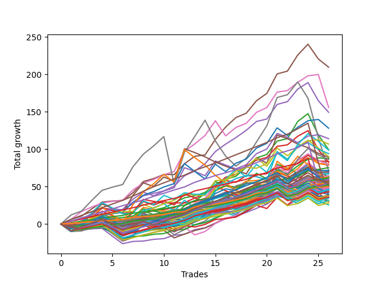

# Short Wallace 1226_003 
- Symbol: ES_Unlimited
- Date Range: 03/18/2022 - 07/15/2022
- Trading Period: 7:20-12:30
- Number of Trades: 26



| Name | Win Percent | Profit | Avg Profit / Trade | Avg Time / Trade |      | Name | Win Percent | Profit | Avg Profit / Trade | Avg Time / Trade |
| ---- | ----------- | ------ | ------------------ | ---------------- | ---- | ---- | ----------- | ------ | ------------------ | ---------------- |
| Sorted By <br> Profit | | | | | | Sorted By <br> Win Percentage ||||
| Five | 88.46 | 104750.00 | 4028.85 | 42:19 |     | Eighty-Two | 100.00 | 37625.00 | 1447.12 | 04:08 |
| Six | 92.31 | 77875.00 | 2995.19 | 38:33 |     | Eighty-One | 100.00 | 31250.00 | 1201.92 | 02:20 |
| Four | 84.62 | 74625.00 | 2870.19 | 27:59 |     | Eighty-Four | 96.15 | 30625.00 | 1177.88 | 26:44 |
| Sixty-Two | 76.92 | 64000.00 | 2461.54 | 25:54 |     | One Hundred Six | 96.15 | 28625.00 | 1100.96 | 01:58 |
| Forty-Six | 65.38 | 57000.00 | 2192.31 | 17:17 |     | One Hundred Sixteen | 96.15 | 27375.00 | 1052.88 | 02:02 |
| Seventy | 73.08 | 53375.00 | 2052.88 | 12:03 |     | One Hundred Twenty-Six | 96.15 | 25125.00 | 966.35 | 02:09 |
| Two | 80.77 | 49625.00 | 1908.65 | 21:17 |     | One Hundred Twenty-One | 96.15 | 25125.00 | 966.35 | 02:09 |
| Sixty-One | 61.54 | 49375.00 | 1899.04 | 25:46 |     | Eighty-Three | 96.15 | 19250.00 | 740.38 | 22:41 |
| Seventy-One | 53.85 | 47000.00 | 1807.69 | 21:03 |     | Six | 92.31 | 77875.00 | 2995.19 | 38:33 |
| Sixty | 69.23 | 45000.00 | 1730.77 | 17:16 |     | One Hundred Seventeen | 92.31 | 30875.00 | 1187.50 | 02:49 |
| Forty-Seven | 34.62 | 44625.00 | 1716.35 | 32:26 |     | One Hundred Twenty-Seven | 92.31 | 26125.00 | 1004.81 | 03:13 |
| Fifty-Four | 69.23 | 43750.00 | 1682.69 | 07:27 |     | One Hundred Twenty-Two | 92.31 | 25625.00 | 985.58 | 03:15 |
| Sixty-Nine | 53.85 | 43125.00 | 1658.65 | 14:45 |     | One Hundred One | 92.31 | 24250.00 | 932.69 | 01:56 |
| Fifty-Five | 57.69 | 41750.00 | 1605.77 | 11:32 |     | One Hundred Eleven | 92.31 | 23375.00 | 899.04 | 01:58 |
| Three | 80.77 | 41250.00 | 1586.54 | 18:58 |     | Eighty-Five | 92.31 | 19000.00 | 730.77 | 40:47 |
| Fifty-Three | 57.69 | 40125.00 | 1543.27 | 09:37 |     | Five | 88.46 | 104750.00 | 4028.85 | 42:19 |
| Sixty-Eight | 61.54 | 39500.00 | 1519.23 | 12:44 |     | One Hundred Seven | 88.46 | 30750.00 | 1182.69 | 02:36 |
| One | 80.77 | 39125.00 | 1504.81 | 12:41 |     | One Hundred Two | 88.46 | 27375.00 | 1052.88 | 02:40 |
| Eighty-Two | 100.00 | 37625.00 | 1447.12 | 04:08 |     | Ninety-Six | 88.46 | 26250.00 | 1009.62 | 01:49 |
| Seventy-Three | 61.54 | 35750.00 | 1375.00 | 09:51 |     | One Hundred Twelve | 88.46 | 25125.00 | 966.35 | 02:43 |
| Seven | 73.08 | 35625.00 | 1370.19 | 103:07 |     | Four | 84.62 | 74625.00 | 2870.19 | 27:59 |
| Fifty-Two | 57.69 | 35500.00 | 1365.38 | 08:30 |     | Zero | 84.62 | 34000.00 | 1307.69 | 05:58 |
| One Hundred Ten | 69.23 | 34750.00 | 1336.54 | 04:18 |     | Sixty-Four | 84.62 | 26500.00 | 1019.23 | 04:13 |
| Zero | 84.62 | 34000.00 | 1307.69 | 05:58 |     | Fifty-Six | 84.62 | 23125.00 | 889.42 | 05:03 |
| Fifty-One | 61.54 | 33500.00 | 1288.46 | 06:59 |     | Ninety-One | 84.62 | 21500.00 | 826.92 | 01:38 |
| Forty-Eight | 80.77 | 32375.00 | 1245.19 | 03:34 |     | Two | 80.77 | 49625.00 | 1908.65 | 21:17 |
| Forty-Four | 53.85 | 31750.00 | 1221.15 | 13:23 |     | Three | 80.77 | 41250.00 | 1586.54 | 18:58 |
| Eighty-One | 100.00 | 31250.00 | 1201.92 | 02:20 |     | One | 80.77 | 39125.00 | 1504.81 | 12:41 |
| One Hundred Seventeen | 92.31 | 30875.00 | 1187.50 | 02:49 |     | Forty-Eight | 80.77 | 32375.00 | 1245.19 | 03:34 |
| One Hundred Seven | 88.46 | 30750.00 | 1182.69 | 02:36 |     | One Hundred Twenty-Nine | 80.77 | 27375.00 | 1052.88 | 07:39 |
| Eighty-Four | 96.15 | 30625.00 | 1177.88 | 26:44 |     | Forty | 80.77 | 24625.00 | 947.12 | 03:41 |
| Fifty-Eight | 69.23 | 29875.00 | 1149.04 | 14:17 |     | One Hundred Twenty-Four | 80.77 | 23250.00 | 894.23 | 08:48 |
| One Hundred Nine | 69.23 | 29625.00 | 1139.42 | 04:09 |     | One Hundred Twenty-Eight | 80.77 | 18000.00 | 692.31 | 05:26 |
| Forty-Five | 42.31 | 29500.00 | 1134.62 | 17:10 |     | One Hundred Twenty-Three | 80.77 | 13875.00 | 533.65 | 06:35 |
| Sixty-Six | 61.54 | 29250.00 | 1125.00 | 10:47 |     | Sixty-Two | 76.92 | 64000.00 | 2461.54 | 25:54 |
| Sixty-Seven | 65.38 | 28875.00 | 1110.58 | 09:20 |     | Ninety-Seven | 76.92 | 28000.00 | 1076.92 | 02:16 |
| One Hundred Six | 96.15 | 28625.00 | 1100.96 | 01:58 |     | One Hundred Twenty-Five | 76.92 | 25500.00 | 980.77 | 12:01 |
| One Hundred Twenty | 61.54 | 28500.00 | 1096.15 | 05:45 |     | Ninety-Two | 76.92 | 21875.00 | 841.35 | 02:11 |
| Sixty-Three | 42.31 | 28500.00 | 1096.15 | 45:00 |     | One Hundred Thirteen | 76.92 | 18875.00 | 725.96 | 04:55 |
| Ninety-Seven | 76.92 | 28000.00 | 1076.92 | 02:16 |     | Seventy | 73.08 | 53375.00 | 2052.88 | 12:03 |
| Forty-Nine | 69.23 | 27875.00 | 1072.12 | 05:29 |     | Seven | 73.08 | 35625.00 | 1370.19 | 103:07 |
| One Hundred Sixteen | 96.15 | 27375.00 | 1052.88 | 02:02 |     | One Hundred Eight | 73.08 | 27375.00 | 1052.88 | 03:25 |
| One Hundred Two | 88.46 | 27375.00 | 1052.88 | 02:40 |     | Fifty-Nine | 73.08 | 27250.00 | 1048.08 | 11:18 |
| One Hundred Twenty-Nine | 80.77 | 27375.00 | 1052.88 | 07:39 |     | One Hundred Thirty | 73.08 | 26875.00 | 1033.65 | 08:19 |
| One Hundred Eight | 73.08 | 27375.00 | 1052.88 | 03:25 |     | One Hundred Fourteen | 73.08 | 23125.00 | 889.42 | 06:52 |
| Fifty-Nine | 73.08 | 27250.00 | 1048.08 | 11:18 |     | One Hundred Eighteen | 73.08 | 21500.00 | 826.92 | 04:29 |
| Fifty | 57.69 | 27250.00 | 1048.08 | 07:35 |     | Fifty-Seven | 73.08 | 15000.00 | 576.92 | 09:33 |
| One Hundred Thirty | 73.08 | 26875.00 | 1033.65 | 08:19 |     | Sixty | 69.23 | 45000.00 | 1730.77 | 17:16 |
| Sixty-Four | 84.62 | 26500.00 | 1019.23 | 04:13 |     | Fifty-Four | 69.23 | 43750.00 | 1682.69 | 07:27 |
| Ninety-Six | 88.46 | 26250.00 | 1009.62 | 01:49 |     | One Hundred Ten | 69.23 | 34750.00 | 1336.54 | 04:18 |
| One Hundred Twenty-Seven | 92.31 | 26125.00 | 1004.81 | 03:13 |     | Fifty-Eight | 69.23 | 29875.00 | 1149.04 | 14:17 |
| One Hundred Twenty-Two | 92.31 | 25625.00 | 985.58 | 03:15 |     | One Hundred Nine | 69.23 | 29625.00 | 1139.42 | 04:09 |
| Forty-Three | 61.54 | 25625.00 | 985.58 | 08:46 |     | Forty-Nine | 69.23 | 27875.00 | 1072.12 | 05:29 |
| One Hundred Twenty-Five | 76.92 | 25500.00 | 980.77 | 12:01 |     | One Hundred | 69.23 | 25250.00 | 971.15 | 03:05 |
| One Hundred | 69.23 | 25250.00 | 971.15 | 03:05 |     | Ninety-Eight | 69.23 | 24125.00 | 927.88 | 02:48 |
| One Hundred Twenty-Six | 96.15 | 25125.00 | 966.35 | 02:09 |     | Ninety-Nine | 69.23 | 23875.00 | 918.27 | 03:01 |
| One Hundred Twenty-One | 96.15 | 25125.00 | 966.35 | 02:09 |     | One Hundred Three | 69.23 | 17250.00 | 663.46 | 04:20 |
| One Hundred Twelve | 88.46 | 25125.00 | 966.35 | 02:43 |     | Forty-Six | 65.38 | 57000.00 | 2192.31 | 17:17 |
| Forty | 80.77 | 24625.00 | 947.12 | 03:41 |     | Sixty-Seven | 65.38 | 28875.00 | 1110.58 | 09:20 |
| One Hundred One | 92.31 | 24250.00 | 932.69 | 01:56 |     | One Hundred Ninteen | 65.38 | 23250.00 | 894.23 | 05:34 |
| Ninety-Eight | 69.23 | 24125.00 | 927.88 | 02:48 |     | One Hundred Fifteen | 65.38 | 21000.00 | 807.69 | 07:28 |
| Ninety-Nine | 69.23 | 23875.00 | 918.27 | 03:01 |     | Sixty-Five | 65.38 | 15000.00 | 576.92 | 07:11 |
| One Hundred Eleven | 92.31 | 23375.00 | 899.04 | 01:58 |     | Sixty-One | 61.54 | 49375.00 | 1899.04 | 25:46 |
| One Hundred Twenty-Four | 80.77 | 23250.00 | 894.23 | 08:48 |     | Sixty-Eight | 61.54 | 39500.00 | 1519.23 | 12:44 |
| One Hundred Ninteen | 65.38 | 23250.00 | 894.23 | 05:34 |     | Seventy-Three | 61.54 | 35750.00 | 1375.00 | 09:51 |
| Fifty-Six | 84.62 | 23125.00 | 889.42 | 05:03 |     | Fifty-One | 61.54 | 33500.00 | 1288.46 | 06:59 |
| One Hundred Fourteen | 73.08 | 23125.00 | 889.42 | 06:52 |     | Sixty-Six | 61.54 | 29250.00 | 1125.00 | 10:47 |
| Forty-Two | 57.69 | 22625.00 | 870.19 | 10:22 |     | One Hundred Twenty | 61.54 | 28500.00 | 1096.15 | 05:45 |
| Ninety-Two | 76.92 | 21875.00 | 841.35 | 02:11 |     | Forty-Three | 61.54 | 25625.00 | 985.58 | 08:46 |
| Ninety-One | 84.62 | 21500.00 | 826.92 | 01:38 |     | One Hundred Four | 61.54 | 17250.00 | 663.46 | 05:46 |
| One Hundred Eighteen | 73.08 | 21500.00 | 826.92 | 04:29 |     | Ninety-Three | 61.54 | 15125.00 | 581.73 | 03:06 |
| One Hundred Fifteen | 65.38 | 21000.00 | 807.69 | 07:28 |     | Forty-One | 61.54 | 12750.00 | 490.38 | 06:54 |
| One Hundred Five | 57.69 | 19750.00 | 759.62 | 05:58 |     | Fifty-Five | 57.69 | 41750.00 | 1605.77 | 11:32 |
| Eighty-Three | 96.15 | 19250.00 | 740.38 | 22:41 |     | Fifty-Three | 57.69 | 40125.00 | 1543.27 | 09:37 |
| Eighty-Five | 92.31 | 19000.00 | 730.77 | 40:47 |     | Fifty-Two | 57.69 | 35500.00 | 1365.38 | 08:30 |
| One Hundred Thirteen | 76.92 | 18875.00 | 725.96 | 04:55 |     | Fifty | 57.69 | 27250.00 | 1048.08 | 07:35 |
| One Hundred Twenty-Eight | 80.77 | 18000.00 | 692.31 | 05:26 |     | Forty-Two | 57.69 | 22625.00 | 870.19 | 10:22 |
| Ninety-Five | 50.00 | 17750.00 | 682.69 | 04:17 |     | One Hundred Five | 57.69 | 19750.00 | 759.62 | 05:58 |
| One Hundred Three | 69.23 | 17250.00 | 663.46 | 04:20 |     | Seventy-One | 53.85 | 47000.00 | 1807.69 | 21:03 |
| One Hundred Four | 61.54 | 17250.00 | 663.46 | 05:46 |     | Sixty-Nine | 53.85 | 43125.00 | 1658.65 | 14:45 |
| Ninety-Four | 53.85 | 15875.00 | 610.58 | 04:07 |     | Forty-Four | 53.85 | 31750.00 | 1221.15 | 13:23 |
| Ninety-Three | 61.54 | 15125.00 | 581.73 | 03:06 |     | Ninety-Four | 53.85 | 15875.00 | 610.58 | 04:07 |
| Fifty-Seven | 73.08 | 15000.00 | 576.92 | 09:33 |     | Ninety-Five | 50.00 | 17750.00 | 682.69 | 04:17 |
| Sixty-Five | 65.38 | 15000.00 | 576.92 | 07:11 |     | Forty-Five | 42.31 | 29500.00 | 1134.62 | 17:10 |
| One Hundred Twenty-Three | 80.77 | 13875.00 | 533.65 | 06:35 |     | Sixty-Three | 42.31 | 28500.00 | 1096.15 | 45:00 |
| Forty-One | 61.54 | 12750.00 | 490.38 | 06:54 |     | Forty-Seven | 34.62 | 44625.00 | 1716.35 | 32:26 |

## NO STOPLOSS

### Test Zero
* Sell when price hits the middle line of the 20p bollinger
* No Stoploss
* Results:
```
Total Trades: 26
Percent Up: 15.38
Percent Down: 84.62
Total Points Moved Down: 68.00
Potential Profit: 34000.00
Total Points Ups: 19.00 Count Ups: 4
Total Points Downs: 87.00 Count Downs: 22
```

<details><summary>Trades</summary>

<code>In: 2022-03-25 07:26:00		Out: 2022-03-25 07:51:10		Total Position Time: 25:10		Total Move Down: -5.50		Total to Date: -5.50</code> <br />
<code>In: 2022-03-25 11:34:00		Out: 2022-03-25 11:40:25		Total Position Time: 06:25		Total Move Down: 2.00		Total to Date: -3.50</code> <br />
<code>In: 2022-03-29 08:52:00		Out: 2022-03-29 08:56:35		Total Position Time: 04:35		Total Move Down: 1.50		Total to Date: -2.00</code> <br />
<code>In: 2022-03-29 08:53:00		Out: 2022-03-29 08:56:35		Total Position Time: 03:35		Total Move Down: 0.75		Total to Date: -1.25</code> <br />
<code>In: 2022-03-31 07:38:00		Out: 2022-03-31 08:03:10		Total Position Time: 25:10		Total Move Down: -5.25		Total to Date: -6.50</code> <br />
<code>In: 2022-03-31 07:39:00		Out: 2022-03-31 08:03:10		Total Position Time: 24:10		Total Move Down: -6.00		Total to Date: -12.50</code> <br />
<code>In: 2022-04-18 10:59:00		Out: 2022-04-18 11:00:10		Total Position Time: 01:10		Total Move Down: 3.00		Total to Date: -9.50</code> <br />
<code>In: 2022-04-20 07:58:00		Out: 2022-04-20 08:00:20		Total Position Time: 02:20		Total Move Down: 0.50		Total to Date: -9.00</code> <br />
<code>In: 2022-04-20 09:55:00		Out: 2022-04-20 09:59:15		Total Position Time: 04:15		Total Move Down: 2.25		Total to Date: -6.75</code> <br />
<code>In: 2022-04-20 10:50:00		Out: 2022-04-20 10:51:10		Total Position Time: 01:10		Total Move Down: 1.00		Total to Date: -5.75</code> <br />
<code>In: 2022-04-25 09:28:00		Out: 2022-04-25 09:31:10		Total Position Time: 03:10		Total Move Down: 4.50		Total to Date: -1.25</code> <br />
<code>In: 2022-04-27 09:46:00		Out: 2022-04-27 09:49:30		Total Position Time: 03:30		Total Move Down: 1.25		Total to Date: 0.00</code> <br />
<code>In: 2022-05-10 11:47:00		Out: 2022-05-10 11:48:10		Total Position Time: 01:10		Total Move Down: 6.25		Total to Date: 6.25</code> <br />
<code>In: 2022-05-17 09:49:00		Out: 2022-05-17 09:53:50		Total Position Time: 04:50		Total Move Down: 2.50		Total to Date: 8.75</code> <br />
<code>In: 2022-05-24 09:18:00		Out: 2022-05-24 09:22:10		Total Position Time: 04:10		Total Move Down: 5.75		Total to Date: 14.50</code> <br />
<code>In: 2022-05-24 11:15:00		Out: 2022-05-24 11:18:25		Total Position Time: 03:25		Total Move Down: 6.25		Total to Date: 20.75</code> <br />
<code>In: 2022-05-31 07:49:00		Out: 2022-05-31 07:56:35		Total Position Time: 07:35		Total Move Down: 3.00		Total to Date: 23.75</code> <br />
<code>In: 2022-06-10 10:53:00		Out: 2022-06-10 10:55:05		Total Position Time: 02:05		Total Move Down: 5.50		Total to Date: 29.25</code> <br />
<code>In: 2022-06-10 12:30:00		Out: 2022-06-10 12:31:10		Total Position Time: 01:10		Total Move Down: 5.50		Total to Date: 34.75</code> <br />
<code>In: 2022-06-13 09:15:00		Out: 2022-06-13 09:17:05		Total Position Time: 02:05		Total Move Down: 5.50		Total to Date: 40.25</code> <br />
<code>In: 2022-06-13 09:41:00		Out: 2022-06-13 09:44:05		Total Position Time: 03:05		Total Move Down: 9.00		Total to Date: 49.25</code> <br />
<code>In: 2022-06-29 12:21:00		Out: 2022-06-29 12:33:20		Total Position Time: 12:20		Total Move Down: -2.25		Total to Date: 47.00</code> <br />
<code>In: 2022-07-05 07:41:00		Out: 2022-07-05 07:44:30		Total Position Time: 03:30		Total Move Down: 7.25		Total to Date: 54.25</code> <br />
<code>In: 2022-07-06 11:10:00		Out: 2022-07-06 11:11:10		Total Position Time: 01:10		Total Move Down: 7.50		Total to Date: 61.75</code> <br />
<code>In: 2022-07-14 07:57:00		Out: 2022-07-14 07:58:10		Total Position Time: 01:10		Total Move Down: 1.75		Total to Date: 63.50</code> <br />
<code>In: 2022-07-14 08:13:00		Out: 2022-07-14 08:15:45		Total Position Time: 02:45		Total Move Down: 4.50		Total to Date: 68.00</code> <br />


</details>

### Test One
* Sell when the price hits the upper line of the 20p 1std bollinger
* No Stoploss
* Results:
```
Total Trades: 26
Percent Up: 19.23
Percent Down: 80.77
Total Points Moved Down: 78.25
Potential Profit: 39125.00
Total Points Ups: 28.50 Count Ups: 5
Total Points Downs: 106.75 Count Downs: 21
```

<details><summary>Trades</summary>

<code>In: 2022-03-25 07:26:00		Out: 2022-03-25 07:54:00		Total Position Time: 28:00		Total Move Down: -4.50		Total to Date: -4.50</code> <br />
<code>In: 2022-03-25 11:34:00		Out: 2022-03-25 11:41:25		Total Position Time: 07:25		Total Move Down: 2.50		Total to Date: -2.00</code> <br />
<code>In: 2022-03-29 08:52:00		Out: 2022-03-29 08:58:40		Total Position Time: 06:40		Total Move Down: 3.00		Total to Date: 1.00</code> <br />
<code>In: 2022-03-29 08:53:00		Out: 2022-03-29 08:58:40		Total Position Time: 05:40		Total Move Down: 2.25		Total to Date: 3.25</code> <br />
<code>In: 2022-03-31 07:38:00		Out: 2022-03-31 08:08:00		Total Position Time: 30:00		Total Move Down: -4.50		Total to Date: -1.25</code> <br />
<code>In: 2022-03-31 07:39:00		Out: 2022-03-31 08:08:00		Total Position Time: 29:00		Total Move Down: -5.25		Total to Date: -6.50</code> <br />
<code>In: 2022-04-18 10:59:00		Out: 2022-04-18 11:06:35		Total Position Time: 07:35		Total Move Down: 4.75		Total to Date: -1.75</code> <br />
<code>In: 2022-04-20 07:58:00		Out: 2022-04-20 08:00:40		Total Position Time: 02:40		Total Move Down: 3.50		Total to Date: 1.75</code> <br />
<code>In: 2022-04-20 09:55:00		Out: 2022-04-20 10:08:15		Total Position Time: 13:15		Total Move Down: 3.25		Total to Date: 5.00</code> <br />
<code>In: 2022-04-20 10:50:00		Out: 2022-04-20 10:55:05		Total Position Time: 05:05		Total Move Down: 2.75		Total to Date: 7.75</code> <br />
<code>In: 2022-04-25 09:28:00		Out: 2022-04-25 09:42:45		Total Position Time: 14:45		Total Move Down: 2.00		Total to Date: 9.75</code> <br />
<code>In: 2022-04-27 09:46:00		Out: 2022-04-27 09:51:25		Total Position Time: 05:25		Total Move Down: 5.00		Total to Date: 14.75</code> <br />
<code>In: 2022-05-10 11:47:00		Out: 2022-05-10 11:56:30		Total Position Time: 09:30		Total Move Down: 4.75		Total to Date: 19.50</code> <br />
<code>In: 2022-05-17 09:49:00		Out: 2022-05-17 09:56:30		Total Position Time: 07:30		Total Move Down: 3.50		Total to Date: 23.00</code> <br />
<code>In: 2022-05-24 09:18:00		Out: 2022-05-24 09:29:20		Total Position Time: 11:20		Total Move Down: 6.50		Total to Date: 29.50</code> <br />
<code>In: 2022-05-24 11:15:00		Out: 2022-05-24 11:31:25		Total Position Time: 16:25		Total Move Down: 6.75		Total to Date: 36.25</code> <br />
<code>In: 2022-05-31 07:49:00		Out: 2022-05-31 08:07:20		Total Position Time: 18:20		Total Move Down: 2.00		Total to Date: 38.25</code> <br />
<code>In: 2022-06-10 10:53:00		Out: 2022-06-10 10:56:15		Total Position Time: 03:15		Total Move Down: 7.50		Total to Date: 45.75</code> <br />
<code>In: 2022-06-10 12:30:00		Out: 2022-06-10 12:35:45		Total Position Time: 05:45		Total Move Down: 8.25		Total to Date: 54.00</code> <br />
<code>In: 2022-06-13 09:15:00		Out: 2022-06-13 09:29:05		Total Position Time: 14:05		Total Move Down: 2.25		Total to Date: 56.25</code> <br />
<code>In: 2022-06-13 09:41:00		Out: 2022-06-13 09:47:55		Total Position Time: 06:55		Total Move Down: 14.75		Total to Date: 71.00</code> <br />
<code>In: 2022-06-29 12:21:00		Out: 2022-06-29 12:34:15		Total Position Time: 13:15		Total Move Down: 2.00		Total to Date: 73.00</code> <br />
<code>In: 2022-07-05 07:41:00		Out: 2022-07-05 07:45:55		Total Position Time: 04:55		Total Move Down: 12.00		Total to Date: 85.00</code> <br />
<code>In: 2022-07-06 11:10:00		Out: 2022-07-06 11:11:10		Total Position Time: 01:10		Total Move Down: 7.50		Total to Date: 92.50</code> <br />
<code>In: 2022-07-14 07:57:00		Out: 2022-07-14 08:36:05		Total Position Time: 39:05		Total Move Down: -11.50		Total to Date: 81.00</code> <br />
<code>In: 2022-07-14 08:13:00		Out: 2022-07-14 08:36:05		Total Position Time: 23:05		Total Move Down: -2.75		Total to Date: 78.25</code> <br />


</details>

### Test Two
* Sell when the price hits the upper line of the 20p 2std bollinger
* No Stoploss
* Results:
```
Total Trades: 26
Percent Up: 19.23
Percent Down: 80.77
Total Points Moved Down: 99.25
Potential Profit: 49625.00
Total Points Ups: 56.25 Count Ups: 5
Total Points Downs: 155.50 Count Downs: 21
```

<details><summary>Trades</summary>

<code>In: 2022-03-25 07:26:00		Out: 2022-03-25 07:54:15		Total Position Time: 28:15		Total Move Down: -2.75		Total to Date: -2.75</code> <br />
<code>In: 2022-03-25 11:34:00		Out: 2022-03-25 12:01:15		Total Position Time: 27:15		Total Move Down: 2.25		Total to Date: -0.50</code> <br />
<code>In: 2022-03-29 08:52:00		Out: 2022-03-29 09:01:40		Total Position Time: 09:40		Total Move Down: 4.50		Total to Date: 4.00</code> <br />
<code>In: 2022-03-29 08:53:00		Out: 2022-03-29 09:01:40		Total Position Time: 08:40		Total Move Down: 3.75		Total to Date: 7.75</code> <br />
<code>In: 2022-03-31 07:38:00		Out: 2022-03-31 08:08:30		Total Position Time: 30:30		Total Move Down: -2.25		Total to Date: 5.50</code> <br />
<code>In: 2022-03-31 07:39:00		Out: 2022-03-31 08:08:30		Total Position Time: 29:30		Total Move Down: -3.00		Total to Date: 2.50</code> <br />
<code>In: 2022-04-18 10:59:00		Out: 2022-04-18 11:10:40		Total Position Time: 11:40		Total Move Down: 6.25		Total to Date: 8.75</code> <br />
<code>In: 2022-04-20 07:58:00		Out: 2022-04-20 08:01:10		Total Position Time: 03:10		Total Move Down: 6.50		Total to Date: 15.25</code> <br />
<code>In: 2022-04-20 09:55:00		Out: 2022-04-20 10:08:15		Total Position Time: 13:15		Total Move Down: 3.25		Total to Date: 18.50</code> <br />
<code>In: 2022-04-20 10:50:00		Out: 2022-04-20 11:14:05		Total Position Time: 24:05		Total Move Down: 3.25		Total to Date: 21.75</code> <br />
<code>In: 2022-04-25 09:28:00		Out: 2022-04-25 10:01:20		Total Position Time: 33:20		Total Move Down: 6.50		Total to Date: 28.25</code> <br />
<code>In: 2022-04-27 09:46:00		Out: 2022-04-27 10:00:10		Total Position Time: 14:10		Total Move Down: 6.75		Total to Date: 35.00</code> <br />
<code>In: 2022-05-10 11:47:00		Out: 2022-05-10 12:21:05		Total Position Time: 34:05		Total Move Down: 2.75		Total to Date: 37.75</code> <br />
<code>In: 2022-05-17 09:49:00		Out: 2022-05-17 10:01:20		Total Position Time: 12:20		Total Move Down: 4.50		Total to Date: 42.25</code> <br />
<code>In: 2022-05-24 09:18:00		Out: 2022-05-24 09:31:25		Total Position Time: 13:25		Total Move Down: 10.75		Total to Date: 53.00</code> <br />
<code>In: 2022-05-24 11:15:00		Out: 2022-05-24 11:44:00		Total Position Time: 29:00		Total Move Down: 6.75		Total to Date: 59.75</code> <br />
<code>In: 2022-05-31 07:49:00		Out: 2022-05-31 08:07:30		Total Position Time: 18:30		Total Move Down: 4.00		Total to Date: 63.75</code> <br />
<code>In: 2022-06-10 10:53:00		Out: 2022-06-10 11:01:10		Total Position Time: 08:10		Total Move Down: 12.00		Total to Date: 75.75</code> <br />
<code>In: 2022-06-10 12:30:00		Out: 2022-06-10 12:43:10		Total Position Time: 13:10		Total Move Down: 12.50		Total to Date: 88.25</code> <br />
<code>In: 2022-06-13 09:15:00		Out: 2022-06-13 09:30:35		Total Position Time: 15:35		Total Move Down: 4.75		Total to Date: 93.00</code> <br />
<code>In: 2022-06-13 09:41:00		Out: 2022-06-13 09:54:15		Total Position Time: 13:15		Total Move Down: 17.75		Total to Date: 110.75</code> <br />
<code>In: 2022-06-29 12:21:00		Out: 2022-06-29 12:36:35		Total Position Time: 15:35		Total Move Down: 3.25		Total to Date: 114.00</code> <br />
<code>In: 2022-07-05 07:41:00		Out: 2022-07-05 08:01:10		Total Position Time: 20:10		Total Move Down: 23.00		Total to Date: 137.00</code> <br />
<code>In: 2022-07-06 11:10:00		Out: 2022-07-06 11:11:45		Total Position Time: 01:45		Total Move Down: 10.50		Total to Date: 147.50</code> <br />
<code>In: 2022-07-14 07:57:00		Out: 2022-07-14 09:07:30		Total Position Time: 70:30		Total Move Down: -28.50		Total to Date: 119.00</code> <br />
<code>In: 2022-07-14 08:13:00		Out: 2022-07-14 09:07:30		Total Position Time: 54:30		Total Move Down: -19.75		Total to Date: 99.25</code> <br />


</details>

### Test Three
* Sell when price hits the middle line of the 50p bollinger
* No Stoploss
* Results:
```
Total Trades: 26
Percent Up: 19.23
Percent Down: 80.77
Total Points Moved Down: 82.50
Potential Profit: 41250.00
Total Points Ups: 49.25 Count Ups: 5
Total Points Downs: 131.75 Count Downs: 21
```

<details><summary>Trades</summary>

<code>In: 2022-03-25 07:26:00		Out: 2022-03-25 08:00:45		Total Position Time: 34:45		Total Move Down: -1.75		Total to Date: -1.75</code> <br />
<code>In: 2022-03-25 11:34:00		Out: 2022-03-25 12:00:45		Total Position Time: 26:45		Total Move Down: 0.75		Total to Date: -1.00</code> <br />
<code>In: 2022-03-29 08:52:00		Out: 2022-03-29 09:01:35		Total Position Time: 09:35		Total Move Down: 4.00		Total to Date: 3.00</code> <br />
<code>In: 2022-03-29 08:53:00		Out: 2022-03-29 09:01:35		Total Position Time: 08:35		Total Move Down: 3.25		Total to Date: 6.25</code> <br />
<code>In: 2022-03-31 07:38:00		Out: 2022-03-31 08:15:40		Total Position Time: 37:40		Total Move Down: -2.25		Total to Date: 4.00</code> <br />
<code>In: 2022-03-31 07:39:00		Out: 2022-03-31 08:15:40		Total Position Time: 36:40		Total Move Down: -3.00		Total to Date: 1.00</code> <br />
<code>In: 2022-04-18 10:59:00		Out: 2022-04-18 11:16:45		Total Position Time: 17:45		Total Move Down: 7.50		Total to Date: 8.50</code> <br />
<code>In: 2022-04-20 07:58:00		Out: 2022-04-20 08:03:05		Total Position Time: 05:05		Total Move Down: 6.75		Total to Date: 15.25</code> <br />
<code>In: 2022-04-20 09:55:00		Out: 2022-04-20 10:19:30		Total Position Time: 24:30		Total Move Down: 2.25		Total to Date: 17.50</code> <br />
<code>In: 2022-04-20 10:50:00		Out: 2022-04-20 10:51:25		Total Position Time: 01:25		Total Move Down: 1.75		Total to Date: 19.25</code> <br />
<code>In: 2022-04-25 09:28:00		Out: 2022-04-25 09:56:20		Total Position Time: 28:20		Total Move Down: 2.50		Total to Date: 21.75</code> <br />
<code>In: 2022-04-27 09:46:00		Out: 2022-04-27 10:00:10		Total Position Time: 14:10		Total Move Down: 6.75		Total to Date: 28.50</code> <br />
<code>In: 2022-05-10 11:47:00		Out: 2022-05-10 11:48:10		Total Position Time: 01:10		Total Move Down: 6.25		Total to Date: 34.75</code> <br />
<code>In: 2022-05-17 09:49:00		Out: 2022-05-17 10:01:30		Total Position Time: 12:30		Total Move Down: 5.25		Total to Date: 40.00</code> <br />
<code>In: 2022-05-24 09:18:00		Out: 2022-05-24 09:31:20		Total Position Time: 13:20		Total Move Down: 10.75		Total to Date: 50.75</code> <br />
<code>In: 2022-05-24 11:15:00		Out: 2022-05-24 11:20:25		Total Position Time: 05:25		Total Move Down: 11.75		Total to Date: 62.50</code> <br />
<code>In: 2022-05-31 07:49:00		Out: 2022-05-31 08:07:30		Total Position Time: 18:30		Total Move Down: 4.00		Total to Date: 66.50</code> <br />
<code>In: 2022-06-10 10:53:00		Out: 2022-06-10 11:00:55		Total Position Time: 07:55		Total Move Down: 11.25		Total to Date: 77.75</code> <br />
<code>In: 2022-06-10 12:30:00		Out: 2022-06-10 12:33:40		Total Position Time: 03:40		Total Move Down: 7.50		Total to Date: 85.25</code> <br />
<code>In: 2022-06-13 09:15:00		Out: 2022-06-13 09:30:20		Total Position Time: 15:20		Total Move Down: 3.75		Total to Date: 89.00</code> <br />
<code>In: 2022-06-13 09:41:00		Out: 2022-06-13 09:47:55		Total Position Time: 06:55		Total Move Down: 14.75		Total to Date: 103.75</code> <br />
<code>In: 2022-06-29 12:21:00		Out: 2022-06-29 12:34:15		Total Position Time: 13:15		Total Move Down: 2.00		Total to Date: 105.75</code> <br />
<code>In: 2022-07-05 07:41:00		Out: 2022-07-05 07:45:50		Total Position Time: 04:50		Total Move Down: 11.50		Total to Date: 117.25</code> <br />
<code>In: 2022-07-06 11:10:00		Out: 2022-07-06 11:11:10		Total Position Time: 01:10		Total Move Down: 7.50		Total to Date: 124.75</code> <br />
<code>In: 2022-07-14 07:57:00		Out: 2022-07-14 09:17:00		Total Position Time: 80:00		Total Move Down: -25.50		Total to Date: 99.25</code> <br />
<code>In: 2022-07-14 08:13:00		Out: 2022-07-14 09:17:00		Total Position Time: 64:00		Total Move Down: -16.75		Total to Date: 82.50</code> <br />


</details>

### Test Four
* Sell when the price hits the upper line of the 50p 1std bollinger
* No Stoploss
* Results:
```
Total Trades: 26
Percent Up: 15.38
Percent Down: 84.62
Total Points Moved Down: 149.25
Potential Profit: 74625.00
Total Points Ups: 41.50 Count Ups: 4
Total Points Downs: 190.75 Count Downs: 22
```

<details><summary>Trades</summary>

<code>In: 2022-03-25 07:26:00		Out: 2022-03-25 08:01:45		Total Position Time: 35:45		Total Move Down: 3.75		Total to Date: 3.75</code> <br />
<code>In: 2022-03-25 11:34:00		Out: 2022-03-25 12:01:40		Total Position Time: 27:40		Total Move Down: 2.75		Total to Date: 6.50</code> <br />
<code>In: 2022-03-29 08:52:00		Out: 2022-03-29 09:02:15		Total Position Time: 10:15		Total Move Down: 7.50		Total to Date: 14.00</code> <br />
<code>In: 2022-03-29 08:53:00		Out: 2022-03-29 09:02:15		Total Position Time: 09:15		Total Move Down: 6.75		Total to Date: 20.75</code> <br />
<code>In: 2022-03-31 07:38:00		Out: 2022-03-31 08:25:20		Total Position Time: 47:20		Total Move Down: -0.50		Total to Date: 20.25</code> <br />
<code>In: 2022-03-31 07:39:00		Out: 2022-03-31 08:25:20		Total Position Time: 46:20		Total Move Down: -1.25		Total to Date: 19.00</code> <br />
<code>In: 2022-04-18 10:59:00		Out: 2022-04-18 11:23:10		Total Position Time: 24:10		Total Move Down: 8.25		Total to Date: 27.25</code> <br />
<code>In: 2022-04-20 07:58:00		Out: 2022-04-20 08:10:50		Total Position Time: 12:50		Total Move Down: 10.50		Total to Date: 37.75</code> <br />
<code>In: 2022-04-20 09:55:00		Out: 2022-04-20 10:33:05		Total Position Time: 38:05		Total Move Down: 3.25		Total to Date: 41.00</code> <br />
<code>In: 2022-04-20 10:50:00		Out: 2022-04-20 11:14:05		Total Position Time: 24:05		Total Move Down: 3.25		Total to Date: 44.25</code> <br />
<code>In: 2022-04-25 09:28:00		Out: 2022-04-25 10:01:20		Total Position Time: 33:20		Total Move Down: 6.50		Total to Date: 50.75</code> <br />
<code>In: 2022-04-27 09:46:00		Out: 2022-04-27 10:01:20		Total Position Time: 15:20		Total Move Down: 13.75		Total to Date: 64.50</code> <br />
<code>In: 2022-05-10 11:47:00		Out: 2022-05-10 11:48:10		Total Position Time: 01:10		Total Move Down: 6.25		Total to Date: 70.75</code> <br />
<code>In: 2022-05-17 09:49:00		Out: 2022-05-17 10:02:20		Total Position Time: 13:20		Total Move Down: 9.75		Total to Date: 80.50</code> <br />
<code>In: 2022-05-24 09:18:00		Out: 2022-05-24 09:34:40		Total Position Time: 16:40		Total Move Down: 16.25		Total to Date: 96.75</code> <br />
<code>In: 2022-05-24 11:15:00		Out: 2022-05-24 11:45:05		Total Position Time: 30:05		Total Move Down: 10.00		Total to Date: 106.75</code> <br />
<code>In: 2022-05-31 07:49:00		Out: 2022-05-31 08:08:45		Total Position Time: 19:45		Total Move Down: 8.75		Total to Date: 115.50</code> <br />
<code>In: 2022-06-10 10:53:00		Out: 2022-06-10 11:41:45		Total Position Time: 48:45		Total Move Down: 9.75		Total to Date: 125.25</code> <br />
<code>In: 2022-06-10 12:30:00		Out: 2022-06-10 12:42:40		Total Position Time: 12:40		Total Move Down: 11.75		Total to Date: 137.00</code> <br />
<code>In: 2022-06-13 09:15:00		Out: 2022-06-13 09:54:40		Total Position Time: 39:40		Total Move Down: 3.25		Total to Date: 140.25</code> <br />
<code>In: 2022-06-13 09:41:00		Out: 2022-06-13 09:54:40		Total Position Time: 13:40		Total Move Down: 19.50		Total to Date: 159.75</code> <br />
<code>In: 2022-06-29 12:21:00		Out: 2022-06-29 12:47:00		Total Position Time: 26:00		Total Move Down: 3.75		Total to Date: 163.50</code> <br />
<code>In: 2022-07-05 07:41:00		Out: 2022-07-05 07:56:40		Total Position Time: 15:40		Total Move Down: 16.75		Total to Date: 180.25</code> <br />
<code>In: 2022-07-06 11:10:00		Out: 2022-07-06 11:11:35		Total Position Time: 01:35		Total Move Down: 8.75		Total to Date: 189.00</code> <br />
<code>In: 2022-07-14 07:57:00		Out: 2022-07-14 09:27:05		Total Position Time: 90:05		Total Move Down: -24.25		Total to Date: 164.75</code> <br />
<code>In: 2022-07-14 08:13:00		Out: 2022-07-14 09:27:05		Total Position Time: 74:05		Total Move Down: -15.50		Total to Date: 149.25</code> <br />


</details>

### Test Five
* Sell when the price hits the upper line of the 50p 2std bollinger
* No Stoploss
* Results:
```
Total Trades: 26
Percent Up: 11.54
Percent Down: 88.46
Total Points Moved Down: 209.50
Potential Profit: 104750.00
Total Points Ups: 31.00 Count Ups: 3
Total Points Downs: 240.50 Count Downs: 23
```

<details><summary>Trades</summary>

<code>In: 2022-03-25 07:26:00		Out: 2022-03-25 08:08:15		Total Position Time: 42:15		Total Move Down: 6.25		Total to Date: 6.25</code> <br />
<code>In: 2022-03-25 11:34:00		Out: 2022-03-25 12:01:55		Total Position Time: 27:55		Total Move Down: 4.25		Total to Date: 10.50</code> <br />
<code>In: 2022-03-29 08:52:00		Out: 2022-03-29 09:10:50		Total Position Time: 18:50		Total Move Down: 9.75		Total to Date: 20.25</code> <br />
<code>In: 2022-03-29 08:53:00		Out: 2022-03-29 09:10:50		Total Position Time: 17:50		Total Move Down: 9.00		Total to Date: 29.25</code> <br />
<code>In: 2022-03-31 07:38:00		Out: 2022-03-31 08:31:45		Total Position Time: 53:45		Total Move Down: 1.50		Total to Date: 30.75</code> <br />
<code>In: 2022-03-31 07:39:00		Out: 2022-03-31 08:31:45		Total Position Time: 52:45		Total Move Down: 0.75		Total to Date: 31.50</code> <br />
<code>In: 2022-04-18 10:59:00		Out: 2022-04-18 11:47:00		Total Position Time: 48:00		Total Move Down: 10.25		Total to Date: 41.75</code> <br />
<code>In: 2022-04-20 07:58:00		Out: 2022-04-20 08:16:30		Total Position Time: 18:30		Total Move Down: 15.00		Total to Date: 56.75</code> <br />
<code>In: 2022-04-20 09:55:00		Out: 2022-04-20 11:18:05		Total Position Time: 83:05		Total Move Down: 4.00		Total to Date: 60.75</code> <br />
<code>In: 2022-04-20 10:50:00		Out: 2022-04-20 11:18:05		Total Position Time: 28:05		Total Move Down: 5.50		Total to Date: 66.25</code> <br />
<code>In: 2022-04-25 09:28:00		Out: 2022-04-25 11:01:35		Total Position Time: 93:35		Total Move Down: -0.25		Total to Date: 66.00</code> <br />
<code>In: 2022-04-27 09:46:00		Out: 2022-04-27 10:10:20		Total Position Time: 24:20		Total Move Down: 14.50		Total to Date: 80.50</code> <br />
<code>In: 2022-05-10 11:47:00		Out: 2022-05-10 12:24:35		Total Position Time: 37:35		Total Move Down: 10.00		Total to Date: 90.50</code> <br />
<code>In: 2022-05-17 09:49:00		Out: 2022-05-17 10:59:45		Total Position Time: 70:45		Total Move Down: 1.75		Total to Date: 92.25</code> <br />
<code>In: 2022-05-24 09:18:00		Out: 2022-05-24 09:37:00		Total Position Time: 19:00		Total Move Down: 20.75		Total to Date: 113.00</code> <br />
<code>In: 2022-05-24 11:15:00		Out: 2022-05-24 11:49:15		Total Position Time: 34:15		Total Move Down: 16.50		Total to Date: 129.50</code> <br />
<code>In: 2022-05-31 07:49:00		Out: 2022-05-31 08:14:30		Total Position Time: 25:30		Total Move Down: 12.75		Total to Date: 142.25</code> <br />
<code>In: 2022-06-10 10:53:00		Out: 2022-06-10 12:45:40		Total Position Time: 112:40		Total Move Down: 5.75		Total to Date: 148.00</code> <br />
<code>In: 2022-06-10 12:30:00		Out: 2022-06-10 12:45:40		Total Position Time: 15:40		Total Move Down: 16.75		Total to Date: 164.75</code> <br />
<code>In: 2022-06-13 09:15:00		Out: 2022-06-13 09:58:15		Total Position Time: 43:15		Total Move Down: 9.75		Total to Date: 174.50</code> <br />
<code>In: 2022-06-13 09:41:00		Out: 2022-06-13 09:58:15		Total Position Time: 17:15		Total Move Down: 26.00		Total to Date: 200.50</code> <br />
<code>In: 2022-06-29 12:21:00		Out: 2022-06-29 12:47:00		Total Position Time: 26:00		Total Move Down: 3.75		Total to Date: 204.25</code> <br />
<code>In: 2022-07-05 07:41:00		Out: 2022-07-05 08:01:05		Total Position Time: 20:05		Total Move Down: 21.50		Total to Date: 225.75</code> <br />
<code>In: 2022-07-06 11:10:00		Out: 2022-07-06 11:12:15		Total Position Time: 02:15		Total Move Down: 14.50		Total to Date: 240.25</code> <br />
<code>In: 2022-07-14 07:57:00		Out: 2022-07-14 09:28:35		Total Position Time: 91:35		Total Move Down: -19.75		Total to Date: 220.50</code> <br />
<code>In: 2022-07-14 08:13:00		Out: 2022-07-14 09:28:35		Total Position Time: 75:35		Total Move Down: -11.00		Total to Date: 209.50</code> <br />


</details>

### Test Six
* Sell when the price hits the middle line of the 1std VWAP
* No Stoploss
* Results:
```
Total Trades: 26
Percent Up: 7.69
Percent Down: 92.31
Total Points Moved Down: 155.75
Potential Profit: 77875.00
Total Points Ups: 64.25 Count Ups: 2
Total Points Downs: 220.00 Count Downs: 24
```

<details><summary>Trades</summary>

<code>In: 2022-03-25 07:26:00		Out: 2022-03-25 08:08:15		Total Position Time: 42:15		Total Move Down: 6.25		Total to Date: 6.25</code> <br />
<code>In: 2022-03-25 11:34:00		Out: 2022-03-25 12:20:30		Total Position Time: 46:30		Total Move Down: 10.50		Total to Date: 16.75</code> <br />
<code>In: 2022-03-29 08:52:00		Out: 2022-03-29 09:02:10		Total Position Time: 10:10		Total Move Down: 6.00		Total to Date: 22.75</code> <br />
<code>In: 2022-03-29 08:53:00		Out: 2022-03-29 09:02:10		Total Position Time: 09:10		Total Move Down: 5.25		Total to Date: 28.00</code> <br />
<code>In: 2022-03-31 07:38:00		Out: 2022-03-31 07:41:35		Total Position Time: 03:35		Total Move Down: 2.25		Total to Date: 30.25</code> <br />
<code>In: 2022-03-31 07:39:00		Out: 2022-03-31 07:41:35		Total Position Time: 02:35		Total Move Down: 1.50		Total to Date: 31.75</code> <br />
<code>In: 2022-04-18 10:59:00		Out: 2022-04-18 12:04:30		Total Position Time: 65:30		Total Move Down: 13.75		Total to Date: 45.50</code> <br />
<code>In: 2022-04-20 07:58:00		Out: 2022-04-20 08:08:10		Total Position Time: 10:10		Total Move Down: 9.25		Total to Date: 54.75</code> <br />
<code>In: 2022-04-20 09:55:00		Out: 2022-04-20 11:18:20		Total Position Time: 83:20		Total Move Down: 4.75		Total to Date: 59.50</code> <br />
<code>In: 2022-04-20 10:50:00		Out: 2022-04-20 11:18:20		Total Position Time: 28:20		Total Move Down: 6.25		Total to Date: 65.75</code> <br />
<code>In: 2022-04-25 09:28:00		Out: 2022-04-25 09:31:10		Total Position Time: 03:10		Total Move Down: 4.50		Total to Date: 70.25</code> <br />
<code>In: 2022-04-27 09:46:00		Out: 2022-04-27 11:38:40		Total Position Time: 112:40		Total Move Down: 26.75		Total to Date: 97.00</code> <br />
<code>In: 2022-05-10 11:47:00		Out: 2022-05-10 12:24:35		Total Position Time: 37:35		Total Move Down: 10.00		Total to Date: 107.00</code> <br />
<code>In: 2022-05-17 09:49:00		Out: 2022-05-17 11:13:30		Total Position Time: 84:30		Total Move Down: 11.25		Total to Date: 118.25</code> <br />
<code>In: 2022-05-24 09:18:00		Out: 2022-05-24 09:36:45		Total Position Time: 18:45		Total Move Down: 19.75		Total to Date: 138.00</code> <br />
<code>In: 2022-05-24 11:15:00		Out: 2022-05-24 12:47:00		Total Position Time: 92:00		Total Move Down: -20.25		Total to Date: 117.75</code> <br />
<code>In: 2022-05-31 07:49:00		Out: 2022-05-31 08:14:20		Total Position Time: 25:20		Total Move Down: 11.25		Total to Date: 129.00</code> <br />
<code>In: 2022-06-10 10:53:00		Out: 2022-06-10 10:55:10		Total Position Time: 02:10		Total Move Down: 5.50		Total to Date: 134.50</code> <br />
<code>In: 2022-06-10 12:30:00		Out: 2022-06-10 12:44:00		Total Position Time: 14:00		Total Move Down: 14.75		Total to Date: 149.25</code> <br />
<code>In: 2022-06-13 09:15:00		Out: 2022-06-13 09:17:20		Total Position Time: 02:20		Total Move Down: 6.25		Total to Date: 155.50</code> <br />
<code>In: 2022-06-13 09:41:00		Out: 2022-06-13 09:55:05		Total Position Time: 14:05		Total Move Down: 20.75		Total to Date: 176.25</code> <br />
<code>In: 2022-06-29 12:21:00		Out: 2022-06-29 12:34:15		Total Position Time: 13:15		Total Move Down: 2.00		Total to Date: 178.25</code> <br />
<code>In: 2022-07-05 07:41:00		Out: 2022-07-05 07:45:30		Total Position Time: 04:30		Total Move Down: 11.00		Total to Date: 189.25</code> <br />
<code>In: 2022-07-06 11:10:00		Out: 2022-07-06 11:11:35		Total Position Time: 01:35		Total Move Down: 8.75		Total to Date: 198.00</code> <br />
<code>In: 2022-07-14 07:57:00		Out: 2022-07-14 07:58:10		Total Position Time: 01:10		Total Move Down: 1.75		Total to Date: 199.75</code> <br />
<code>In: 2022-07-14 08:13:00		Out: 2022-07-14 12:47:00		Total Position Time: 274:00		Total Move Down: -44.00		Total to Date: 155.75</code> <br />


</details>

### Test Seven
* Sell when the price hits the upper line of the 1std VWAP
* No Stoploss
* Results:
```
Total Trades: 26
Percent Up: 26.92
Percent Down: 73.08
Total Points Moved Down: 71.25
Potential Profit: 35625.00
Total Points Ups: 243.75 Count Ups: 7
Total Points Downs: 315.00 Count Downs: 19
```

<details><summary>Trades</summary>

<code>In: 2022-03-25 07:26:00		Out: 2022-03-25 08:09:20		Total Position Time: 43:20		Total Move Down: 12.25		Total to Date: 12.25</code> <br />
<code>In: 2022-03-25 11:34:00		Out: 2022-03-25 12:47:00		Total Position Time: 73:00		Total Move Down: 5.00		Total to Date: 17.25</code> <br />
<code>In: 2022-03-29 08:52:00		Out: 2022-03-29 09:27:55		Total Position Time: 35:55		Total Move Down: 14.25		Total to Date: 31.50</code> <br />
<code>In: 2022-03-29 08:53:00		Out: 2022-03-29 09:27:55		Total Position Time: 34:55		Total Move Down: 13.50		Total to Date: 45.00</code> <br />
<code>In: 2022-03-31 07:38:00		Out: 2022-03-31 09:15:10		Total Position Time: 97:10		Total Move Down: 4.25		Total to Date: 49.25</code> <br />
<code>In: 2022-03-31 07:39:00		Out: 2022-03-31 09:15:10		Total Position Time: 96:10		Total Move Down: 3.50		Total to Date: 52.75</code> <br />
<code>In: 2022-04-18 10:59:00		Out: 2022-04-18 12:29:05		Total Position Time: 90:05		Total Move Down: 23.75		Total to Date: 76.50</code> <br />
<code>In: 2022-04-20 07:58:00		Out: 2022-04-20 08:20:15		Total Position Time: 22:15		Total Move Down: 16.75		Total to Date: 93.25</code> <br />
<code>In: 2022-04-20 09:55:00		Out: 2022-04-20 11:30:15		Total Position Time: 95:15		Total Move Down: 11.00		Total to Date: 104.25</code> <br />
<code>In: 2022-04-20 10:50:00		Out: 2022-04-20 11:30:15		Total Position Time: 40:15		Total Move Down: 12.50		Total to Date: 116.75</code> <br />
<code>In: 2022-04-25 09:28:00		Out: 2022-04-25 12:47:00		Total Position Time: 199:00		Total Move Down: -63.75		Total to Date: 53.00</code> <br />
<code>In: 2022-04-27 09:46:00		Out: 2022-04-27 12:04:15		Total Position Time: 138:15		Total Move Down: 43.00		Total to Date: 96.00</code> <br />
<code>In: 2022-05-10 11:47:00		Out: 2022-05-10 12:47:00		Total Position Time: 60:00		Total Move Down: 21.00		Total to Date: 117.00</code> <br />
<code>In: 2022-05-17 09:49:00		Out: 2022-05-17 11:20:25		Total Position Time: 91:25		Total Move Down: 21.75		Total to Date: 138.75</code> <br />
<code>In: 2022-05-24 09:18:00		Out: 2022-05-24 12:47:00		Total Position Time: 209:00		Total Move Down: -27.75		Total to Date: 111.00</code> <br />
<code>In: 2022-05-24 11:15:00		Out: 2022-05-24 12:47:00		Total Position Time: 92:00		Total Move Down: -20.25		Total to Date: 90.75</code> <br />
<code>In: 2022-05-31 07:49:00		Out: 2022-05-31 12:47:00		Total Position Time: 298:00		Total Move Down: -13.50		Total to Date: 77.25</code> <br />
<code>In: 2022-06-10 10:53:00		Out: 2022-06-10 12:47:00		Total Position Time: 114:00		Total Move Down: 10.75		Total to Date: 88.00</code> <br />
<code>In: 2022-06-10 12:30:00		Out: 2022-06-10 12:47:00		Total Position Time: 17:00		Total Move Down: 21.75		Total to Date: 109.75</code> <br />
<code>In: 2022-06-13 09:15:00		Out: 2022-06-13 10:33:35		Total Position Time: 78:35		Total Move Down: 21.50		Total to Date: 131.25</code> <br />
<code>In: 2022-06-13 09:41:00		Out: 2022-06-13 10:33:35		Total Position Time: 52:35		Total Move Down: 37.75		Total to Date: 169.00</code> <br />
<code>In: 2022-06-29 12:21:00		Out: 2022-06-29 12:47:00		Total Position Time: 26:00		Total Move Down: 3.75		Total to Date: 172.75</code> <br />
<code>In: 2022-07-05 07:41:00		Out: 2022-07-05 07:57:05		Total Position Time: 16:05		Total Move Down: 17.00		Total to Date: 189.75</code> <br />
<code>In: 2022-07-06 11:10:00		Out: 2022-07-06 12:47:00		Total Position Time: 97:00		Total Move Down: -21.75		Total to Date: 168.00</code> <br />
<code>In: 2022-07-14 07:57:00		Out: 2022-07-14 12:47:00		Total Position Time: 290:00		Total Move Down: -52.75		Total to Date: 115.25</code> <br />
<code>In: 2022-07-14 08:13:00		Out: 2022-07-14 12:47:00		Total Position Time: 274:00		Total Move Down: -44.00		Total to Date: 71.25</code> <br />


</details>

## STOPLOSS OF 5

### Test Forty
* Sell when price hits the middle line of the 20p bollinger
* Stoploss is -5 points
* Results:
```
Total Trades: 26
Percent Up: 19.23
Percent Down: 80.77
Total Points Moved Down: 49.25
Potential Profit: 24625.00
Total Points Ups: 30.50 Count Ups: 5
Total Points Downs: 79.75 Count Downs: 21
```

<details><summary>Trades</summary>

<code>In: 2022-03-25 07:26:00		Out: 2022-03-25 07:35:05		Total Position Time: 09:05		Total Move Down: -6.00		Total to Date: -6.00</code> <br />
<code>In: 2022-03-25 11:34:00		Out: 2022-03-25 11:40:25		Total Position Time: 06:25		Total Move Down: 2.00		Total to Date: -4.00</code> <br />
<code>In: 2022-03-29 08:52:00		Out: 2022-03-29 08:56:35		Total Position Time: 04:35		Total Move Down: 1.50		Total to Date: -2.50</code> <br />
<code>In: 2022-03-29 08:53:00		Out: 2022-03-29 08:56:35		Total Position Time: 03:35		Total Move Down: 0.75		Total to Date: -1.75</code> <br />
<code>In: 2022-03-31 07:38:00		Out: 2022-03-31 07:46:45		Total Position Time: 08:45		Total Move Down: -5.75		Total to Date: -7.50</code> <br />
<code>In: 2022-03-31 07:39:00		Out: 2022-03-31 07:46:45		Total Position Time: 07:45		Total Move Down: -6.50		Total to Date: -14.00</code> <br />
<code>In: 2022-04-18 10:59:00		Out: 2022-04-18 11:00:10		Total Position Time: 01:10		Total Move Down: 3.00		Total to Date: -11.00</code> <br />
<code>In: 2022-04-20 07:58:00		Out: 2022-04-20 08:00:20		Total Position Time: 02:20		Total Move Down: 0.50		Total to Date: -10.50</code> <br />
<code>In: 2022-04-20 09:55:00		Out: 2022-04-20 09:59:15		Total Position Time: 04:15		Total Move Down: 2.25		Total to Date: -8.25</code> <br />
<code>In: 2022-04-20 10:50:00		Out: 2022-04-20 10:51:10		Total Position Time: 01:10		Total Move Down: 1.00		Total to Date: -7.25</code> <br />
<code>In: 2022-04-25 09:28:00		Out: 2022-04-25 09:31:10		Total Position Time: 03:10		Total Move Down: 4.50		Total to Date: -2.75</code> <br />
<code>In: 2022-04-27 09:46:00		Out: 2022-04-27 09:49:30		Total Position Time: 03:30		Total Move Down: 1.25		Total to Date: -1.50</code> <br />
<code>In: 2022-05-10 11:47:00		Out: 2022-05-10 11:48:10		Total Position Time: 01:10		Total Move Down: 6.25		Total to Date: 4.75</code> <br />
<code>In: 2022-05-17 09:49:00		Out: 2022-05-17 09:53:50		Total Position Time: 04:50		Total Move Down: 2.50		Total to Date: 7.25</code> <br />
<code>In: 2022-05-24 09:18:00		Out: 2022-05-24 09:22:10		Total Position Time: 04:10		Total Move Down: 5.75		Total to Date: 13.00</code> <br />
<code>In: 2022-05-24 11:15:00		Out: 2022-05-24 11:18:25		Total Position Time: 03:25		Total Move Down: 6.25		Total to Date: 19.25</code> <br />
<code>In: 2022-05-31 07:49:00		Out: 2022-05-31 07:56:35		Total Position Time: 07:35		Total Move Down: 3.00		Total to Date: 22.25</code> <br />
<code>In: 2022-06-10 10:53:00		Out: 2022-06-10 10:55:05		Total Position Time: 02:05		Total Move Down: 5.50		Total to Date: 27.75</code> <br />
<code>In: 2022-06-10 12:30:00		Out: 2022-06-10 12:31:10		Total Position Time: 01:10		Total Move Down: 5.50		Total to Date: 33.25</code> <br />
<code>In: 2022-06-13 09:15:00		Out: 2022-06-13 09:17:05		Total Position Time: 02:05		Total Move Down: 5.50		Total to Date: 38.75</code> <br />
<code>In: 2022-06-13 09:41:00		Out: 2022-06-13 09:44:05		Total Position Time: 03:05		Total Move Down: 9.00		Total to Date: 47.75</code> <br />
<code>In: 2022-06-29 12:21:00		Out: 2022-06-29 12:25:25		Total Position Time: 04:25		Total Move Down: -5.00		Total to Date: 42.75</code> <br />
<code>In: 2022-07-05 07:41:00		Out: 2022-07-05 07:42:10		Total Position Time: 01:10		Total Move Down: -7.25		Total to Date: 35.50</code> <br />
<code>In: 2022-07-06 11:10:00		Out: 2022-07-06 11:11:10		Total Position Time: 01:10		Total Move Down: 7.50		Total to Date: 43.00</code> <br />
<code>In: 2022-07-14 07:57:00		Out: 2022-07-14 07:58:10		Total Position Time: 01:10		Total Move Down: 1.75		Total to Date: 44.75</code> <br />
<code>In: 2022-07-14 08:13:00		Out: 2022-07-14 08:15:45		Total Position Time: 02:45		Total Move Down: 4.50		Total to Date: 49.25</code> <br />


</details>

### Test Forty-One
* Sell when the price hits the upper line of the 20p 1std bollinger
* Stoploss is -5 points
* Results:
```
Total Trades: 26
Percent Up: 38.46
Percent Down: 61.54
Total Points Moved Down: 25.50
Potential Profit: 12750.00
Total Points Ups: 58.50 Count Ups: 10
Total Points Downs: 84.00 Count Downs: 16
```

<details><summary>Trades</summary>

<code>In: 2022-03-25 07:26:00		Out: 2022-03-25 07:35:05		Total Position Time: 09:05		Total Move Down: -6.00		Total to Date: -6.00</code> <br />
<code>In: 2022-03-25 11:34:00		Out: 2022-03-25 11:41:25		Total Position Time: 07:25		Total Move Down: 2.50		Total to Date: -3.50</code> <br />
<code>In: 2022-03-29 08:52:00		Out: 2022-03-29 08:58:40		Total Position Time: 06:40		Total Move Down: 3.00		Total to Date: -0.50</code> <br />
<code>In: 2022-03-29 08:53:00		Out: 2022-03-29 08:58:40		Total Position Time: 05:40		Total Move Down: 2.25		Total to Date: 1.75</code> <br />
<code>In: 2022-03-31 07:38:00		Out: 2022-03-31 07:46:45		Total Position Time: 08:45		Total Move Down: -5.75		Total to Date: -4.00</code> <br />
<code>In: 2022-03-31 07:39:00		Out: 2022-03-31 07:46:45		Total Position Time: 07:45		Total Move Down: -6.50		Total to Date: -10.50</code> <br />
<code>In: 2022-04-18 10:59:00		Out: 2022-04-18 11:06:35		Total Position Time: 07:35		Total Move Down: 4.75		Total to Date: -5.75</code> <br />
<code>In: 2022-04-20 07:58:00		Out: 2022-04-20 08:00:40		Total Position Time: 02:40		Total Move Down: 3.50		Total to Date: -2.25</code> <br />
<code>In: 2022-04-20 09:55:00		Out: 2022-04-20 10:08:15		Total Position Time: 13:15		Total Move Down: 3.25		Total to Date: 1.00</code> <br />
<code>In: 2022-04-20 10:50:00		Out: 2022-04-20 10:55:05		Total Position Time: 05:05		Total Move Down: 2.75		Total to Date: 3.75</code> <br />
<code>In: 2022-04-25 09:28:00		Out: 2022-04-25 09:32:30		Total Position Time: 04:30		Total Move Down: -5.25		Total to Date: -1.50</code> <br />
<code>In: 2022-04-27 09:46:00		Out: 2022-04-27 09:51:25		Total Position Time: 05:25		Total Move Down: 5.00		Total to Date: 3.50</code> <br />
<code>In: 2022-05-10 11:47:00		Out: 2022-05-10 11:50:15		Total Position Time: 03:15		Total Move Down: -5.00		Total to Date: -1.50</code> <br />
<code>In: 2022-05-17 09:49:00		Out: 2022-05-17 09:56:30		Total Position Time: 07:30		Total Move Down: 3.50		Total to Date: 2.00</code> <br />
<code>In: 2022-05-24 09:18:00		Out: 2022-05-24 09:29:20		Total Position Time: 11:20		Total Move Down: 6.50		Total to Date: 8.50</code> <br />
<code>In: 2022-05-24 11:15:00		Out: 2022-05-24 11:31:25		Total Position Time: 16:25		Total Move Down: 6.75		Total to Date: 15.25</code> <br />
<code>In: 2022-05-31 07:49:00		Out: 2022-05-31 08:01:25		Total Position Time: 12:25		Total Move Down: -5.00		Total to Date: 10.25</code> <br />
<code>In: 2022-06-10 10:53:00		Out: 2022-06-10 10:56:15		Total Position Time: 03:15		Total Move Down: 7.50		Total to Date: 17.75</code> <br />
<code>In: 2022-06-10 12:30:00		Out: 2022-06-10 12:35:45		Total Position Time: 05:45		Total Move Down: 8.25		Total to Date: 26.00</code> <br />
<code>In: 2022-06-13 09:15:00		Out: 2022-06-13 09:29:05		Total Position Time: 14:05		Total Move Down: 2.25		Total to Date: 28.25</code> <br />
<code>In: 2022-06-13 09:41:00		Out: 2022-06-13 09:47:55		Total Position Time: 06:55		Total Move Down: 14.75		Total to Date: 43.00</code> <br />
<code>In: 2022-06-29 12:21:00		Out: 2022-06-29 12:25:25		Total Position Time: 04:25		Total Move Down: -5.00		Total to Date: 38.00</code> <br />
<code>In: 2022-07-05 07:41:00		Out: 2022-07-05 07:42:10		Total Position Time: 01:10		Total Move Down: -7.25		Total to Date: 30.75</code> <br />
<code>In: 2022-07-06 11:10:00		Out: 2022-07-06 11:11:10		Total Position Time: 01:10		Total Move Down: 7.50		Total to Date: 38.25</code> <br />
<code>In: 2022-07-14 07:57:00		Out: 2022-07-14 08:00:05		Total Position Time: 03:05		Total Move Down: -7.50		Total to Date: 30.75</code> <br />
<code>In: 2022-07-14 08:13:00		Out: 2022-07-14 08:18:05		Total Position Time: 05:05		Total Move Down: -5.25		Total to Date: 25.50</code> <br />


</details>

### Test Forty-Two
* Sell when the price hits the upper line of the 20p 2std bollinger
* Stoploss is -5 points
* Results:
```
Total Trades: 26
Percent Up: 42.31
Percent Down: 57.69
Total Points Moved Down: 45.25
Potential Profit: 22625.00
Total Points Ups: 64.00 Count Ups: 11
Total Points Downs: 109.25 Count Downs: 15
```

<details><summary>Trades</summary>

<code>In: 2022-03-25 07:26:00		Out: 2022-03-25 07:35:05		Total Position Time: 09:05		Total Move Down: -6.00		Total to Date: -6.00</code> <br />
<code>In: 2022-03-25 11:34:00		Out: 2022-03-25 12:01:15		Total Position Time: 27:15		Total Move Down: 2.25		Total to Date: -3.75</code> <br />
<code>In: 2022-03-29 08:52:00		Out: 2022-03-29 09:01:40		Total Position Time: 09:40		Total Move Down: 4.50		Total to Date: 0.75</code> <br />
<code>In: 2022-03-29 08:53:00		Out: 2022-03-29 09:01:40		Total Position Time: 08:40		Total Move Down: 3.75		Total to Date: 4.50</code> <br />
<code>In: 2022-03-31 07:38:00		Out: 2022-03-31 07:46:45		Total Position Time: 08:45		Total Move Down: -5.75		Total to Date: -1.25</code> <br />
<code>In: 2022-03-31 07:39:00		Out: 2022-03-31 07:46:45		Total Position Time: 07:45		Total Move Down: -6.50		Total to Date: -7.75</code> <br />
<code>In: 2022-04-18 10:59:00		Out: 2022-04-18 11:10:40		Total Position Time: 11:40		Total Move Down: 6.25		Total to Date: -1.50</code> <br />
<code>In: 2022-04-20 07:58:00		Out: 2022-04-20 08:01:10		Total Position Time: 03:10		Total Move Down: 6.50		Total to Date: 5.00</code> <br />
<code>In: 2022-04-20 09:55:00		Out: 2022-04-20 10:08:15		Total Position Time: 13:15		Total Move Down: 3.25		Total to Date: 8.25</code> <br />
<code>In: 2022-04-20 10:50:00		Out: 2022-04-20 11:14:05		Total Position Time: 24:05		Total Move Down: 3.25		Total to Date: 11.50</code> <br />
<code>In: 2022-04-25 09:28:00		Out: 2022-04-25 09:32:30		Total Position Time: 04:30		Total Move Down: -5.25		Total to Date: 6.25</code> <br />
<code>In: 2022-04-27 09:46:00		Out: 2022-04-27 10:00:10		Total Position Time: 14:10		Total Move Down: 6.75		Total to Date: 13.00</code> <br />
<code>In: 2022-05-10 11:47:00		Out: 2022-05-10 11:50:15		Total Position Time: 03:15		Total Move Down: -5.00		Total to Date: 8.00</code> <br />
<code>In: 2022-05-17 09:49:00		Out: 2022-05-17 10:01:20		Total Position Time: 12:20		Total Move Down: 4.50		Total to Date: 12.50</code> <br />
<code>In: 2022-05-24 09:18:00		Out: 2022-05-24 09:31:25		Total Position Time: 13:25		Total Move Down: 10.75		Total to Date: 23.25</code> <br />
<code>In: 2022-05-24 11:15:00		Out: 2022-05-24 11:35:30		Total Position Time: 20:30		Total Move Down: -5.50		Total to Date: 17.75</code> <br />
<code>In: 2022-05-31 07:49:00		Out: 2022-05-31 08:01:25		Total Position Time: 12:25		Total Move Down: -5.00		Total to Date: 12.75</code> <br />
<code>In: 2022-06-10 10:53:00		Out: 2022-06-10 11:01:10		Total Position Time: 08:10		Total Move Down: 12.00		Total to Date: 24.75</code> <br />
<code>In: 2022-06-10 12:30:00		Out: 2022-06-10 12:43:10		Total Position Time: 13:10		Total Move Down: 12.50		Total to Date: 37.25</code> <br />
<code>In: 2022-06-13 09:15:00		Out: 2022-06-13 09:30:35		Total Position Time: 15:35		Total Move Down: 4.75		Total to Date: 42.00</code> <br />
<code>In: 2022-06-13 09:41:00		Out: 2022-06-13 09:54:15		Total Position Time: 13:15		Total Move Down: 17.75		Total to Date: 59.75</code> <br />
<code>In: 2022-06-29 12:21:00		Out: 2022-06-29 12:25:25		Total Position Time: 04:25		Total Move Down: -5.00		Total to Date: 54.75</code> <br />
<code>In: 2022-07-05 07:41:00		Out: 2022-07-05 07:42:10		Total Position Time: 01:10		Total Move Down: -7.25		Total to Date: 47.50</code> <br />
<code>In: 2022-07-06 11:10:00		Out: 2022-07-06 11:11:45		Total Position Time: 01:45		Total Move Down: 10.50		Total to Date: 58.00</code> <br />
<code>In: 2022-07-14 07:57:00		Out: 2022-07-14 08:00:05		Total Position Time: 03:05		Total Move Down: -7.50		Total to Date: 50.50</code> <br />
<code>In: 2022-07-14 08:13:00		Out: 2022-07-14 08:18:05		Total Position Time: 05:05		Total Move Down: -5.25		Total to Date: 45.25</code> <br />


</details>

### Test Forty-Three
* Sell when price hits the middle line of the 50p bollinger
* Stoploss is -5 points
* Results:
```
Total Trades: 26
Percent Up: 38.46
Percent Down: 61.54
Total Points Moved Down: 51.25
Potential Profit: 25625.00
Total Points Ups: 58.25 Count Ups: 10
Total Points Downs: 109.50 Count Downs: 16
```

<details><summary>Trades</summary>

<code>In: 2022-03-25 07:26:00		Out: 2022-03-25 07:35:05		Total Position Time: 09:05		Total Move Down: -6.00		Total to Date: -6.00</code> <br />
<code>In: 2022-03-25 11:34:00		Out: 2022-03-25 12:00:45		Total Position Time: 26:45		Total Move Down: 0.75		Total to Date: -5.25</code> <br />
<code>In: 2022-03-29 08:52:00		Out: 2022-03-29 09:01:35		Total Position Time: 09:35		Total Move Down: 4.00		Total to Date: -1.25</code> <br />
<code>In: 2022-03-29 08:53:00		Out: 2022-03-29 09:01:35		Total Position Time: 08:35		Total Move Down: 3.25		Total to Date: 2.00</code> <br />
<code>In: 2022-03-31 07:38:00		Out: 2022-03-31 07:46:45		Total Position Time: 08:45		Total Move Down: -5.75		Total to Date: -3.75</code> <br />
<code>In: 2022-03-31 07:39:00		Out: 2022-03-31 07:46:45		Total Position Time: 07:45		Total Move Down: -6.50		Total to Date: -10.25</code> <br />
<code>In: 2022-04-18 10:59:00		Out: 2022-04-18 11:16:45		Total Position Time: 17:45		Total Move Down: 7.50		Total to Date: -2.75</code> <br />
<code>In: 2022-04-20 07:58:00		Out: 2022-04-20 08:03:05		Total Position Time: 05:05		Total Move Down: 6.75		Total to Date: 4.00</code> <br />
<code>In: 2022-04-20 09:55:00		Out: 2022-04-20 10:16:00		Total Position Time: 21:00		Total Move Down: -4.75		Total to Date: -0.75</code> <br />
<code>In: 2022-04-20 10:50:00		Out: 2022-04-20 10:51:25		Total Position Time: 01:25		Total Move Down: 1.75		Total to Date: 1.00</code> <br />
<code>In: 2022-04-25 09:28:00		Out: 2022-04-25 09:32:30		Total Position Time: 04:30		Total Move Down: -5.25		Total to Date: -4.25</code> <br />
<code>In: 2022-04-27 09:46:00		Out: 2022-04-27 10:00:10		Total Position Time: 14:10		Total Move Down: 6.75		Total to Date: 2.50</code> <br />
<code>In: 2022-05-10 11:47:00		Out: 2022-05-10 11:48:10		Total Position Time: 01:10		Total Move Down: 6.25		Total to Date: 8.75</code> <br />
<code>In: 2022-05-17 09:49:00		Out: 2022-05-17 10:01:30		Total Position Time: 12:30		Total Move Down: 5.25		Total to Date: 14.00</code> <br />
<code>In: 2022-05-24 09:18:00		Out: 2022-05-24 09:31:20		Total Position Time: 13:20		Total Move Down: 10.75		Total to Date: 24.75</code> <br />
<code>In: 2022-05-24 11:15:00		Out: 2022-05-24 11:20:25		Total Position Time: 05:25		Total Move Down: 11.75		Total to Date: 36.50</code> <br />
<code>In: 2022-05-31 07:49:00		Out: 2022-05-31 08:01:25		Total Position Time: 12:25		Total Move Down: -5.00		Total to Date: 31.50</code> <br />
<code>In: 2022-06-10 10:53:00		Out: 2022-06-10 11:00:55		Total Position Time: 07:55		Total Move Down: 11.25		Total to Date: 42.75</code> <br />
<code>In: 2022-06-10 12:30:00		Out: 2022-06-10 12:33:40		Total Position Time: 03:40		Total Move Down: 7.50		Total to Date: 50.25</code> <br />
<code>In: 2022-06-13 09:15:00		Out: 2022-06-13 09:30:20		Total Position Time: 15:20		Total Move Down: 3.75		Total to Date: 54.00</code> <br />
<code>In: 2022-06-13 09:41:00		Out: 2022-06-13 09:47:55		Total Position Time: 06:55		Total Move Down: 14.75		Total to Date: 68.75</code> <br />
<code>In: 2022-06-29 12:21:00		Out: 2022-06-29 12:25:25		Total Position Time: 04:25		Total Move Down: -5.00		Total to Date: 63.75</code> <br />
<code>In: 2022-07-05 07:41:00		Out: 2022-07-05 07:42:10		Total Position Time: 01:10		Total Move Down: -7.25		Total to Date: 56.50</code> <br />
<code>In: 2022-07-06 11:10:00		Out: 2022-07-06 11:11:10		Total Position Time: 01:10		Total Move Down: 7.50		Total to Date: 64.00</code> <br />
<code>In: 2022-07-14 07:57:00		Out: 2022-07-14 08:00:05		Total Position Time: 03:05		Total Move Down: -7.50		Total to Date: 56.50</code> <br />
<code>In: 2022-07-14 08:13:00		Out: 2022-07-14 08:18:05		Total Position Time: 05:05		Total Move Down: -5.25		Total to Date: 51.25</code> <br />


</details>

### Test Forty-Four
* Sell when the price hits the upper line of the 50p 1std bollinger
* Stoploss is -5 points
* Results:
```
Total Trades: 26
Percent Up: 46.15
Percent Down: 53.85
Total Points Moved Down: 63.50
Potential Profit: 31750.00
Total Points Ups: 71.25 Count Ups: 12
Total Points Downs: 134.75 Count Downs: 14
```

<details><summary>Trades</summary>

<code>In: 2022-03-25 07:26:00		Out: 2022-03-25 07:35:05		Total Position Time: 09:05		Total Move Down: -6.00		Total to Date: -6.00</code> <br />
<code>In: 2022-03-25 11:34:00		Out: 2022-03-25 12:01:40		Total Position Time: 27:40		Total Move Down: 2.75		Total to Date: -3.25</code> <br />
<code>In: 2022-03-29 08:52:00		Out: 2022-03-29 09:02:15		Total Position Time: 10:15		Total Move Down: 7.50		Total to Date: 4.25</code> <br />
<code>In: 2022-03-29 08:53:00		Out: 2022-03-29 09:02:15		Total Position Time: 09:15		Total Move Down: 6.75		Total to Date: 11.00</code> <br />
<code>In: 2022-03-31 07:38:00		Out: 2022-03-31 07:46:45		Total Position Time: 08:45		Total Move Down: -5.75		Total to Date: 5.25</code> <br />
<code>In: 2022-03-31 07:39:00		Out: 2022-03-31 07:46:45		Total Position Time: 07:45		Total Move Down: -6.50		Total to Date: -1.25</code> <br />
<code>In: 2022-04-18 10:59:00		Out: 2022-04-18 11:23:10		Total Position Time: 24:10		Total Move Down: 8.25		Total to Date: 7.00</code> <br />
<code>In: 2022-04-20 07:58:00		Out: 2022-04-20 08:10:50		Total Position Time: 12:50		Total Move Down: 10.50		Total to Date: 17.50</code> <br />
<code>In: 2022-04-20 09:55:00		Out: 2022-04-20 10:16:00		Total Position Time: 21:00		Total Move Down: -4.75		Total to Date: 12.75</code> <br />
<code>In: 2022-04-20 10:50:00		Out: 2022-04-20 11:14:05		Total Position Time: 24:05		Total Move Down: 3.25		Total to Date: 16.00</code> <br />
<code>In: 2022-04-25 09:28:00		Out: 2022-04-25 09:32:30		Total Position Time: 04:30		Total Move Down: -5.25		Total to Date: 10.75</code> <br />
<code>In: 2022-04-27 09:46:00		Out: 2022-04-27 10:01:20		Total Position Time: 15:20		Total Move Down: 13.75		Total to Date: 24.50</code> <br />
<code>In: 2022-05-10 11:47:00		Out: 2022-05-10 11:48:10		Total Position Time: 01:10		Total Move Down: 6.25		Total to Date: 30.75</code> <br />
<code>In: 2022-05-17 09:49:00		Out: 2022-05-17 10:02:20		Total Position Time: 13:20		Total Move Down: 9.75		Total to Date: 40.50</code> <br />
<code>In: 2022-05-24 09:18:00		Out: 2022-05-24 09:34:40		Total Position Time: 16:40		Total Move Down: 16.25		Total to Date: 56.75</code> <br />
<code>In: 2022-05-24 11:15:00		Out: 2022-05-24 11:35:30		Total Position Time: 20:30		Total Move Down: -5.50		Total to Date: 51.25</code> <br />
<code>In: 2022-05-31 07:49:00		Out: 2022-05-31 08:01:25		Total Position Time: 12:25		Total Move Down: -5.00		Total to Date: 46.25</code> <br />
<code>In: 2022-06-10 10:53:00		Out: 2022-06-10 11:41:45		Total Position Time: 48:45		Total Move Down: 9.75		Total to Date: 56.00</code> <br />
<code>In: 2022-06-10 12:30:00		Out: 2022-06-10 12:42:40		Total Position Time: 12:40		Total Move Down: 11.75		Total to Date: 67.75</code> <br />
<code>In: 2022-06-13 09:15:00		Out: 2022-06-13 09:33:50		Total Position Time: 18:50		Total Move Down: -7.50		Total to Date: 60.25</code> <br />
<code>In: 2022-06-13 09:41:00		Out: 2022-06-13 09:54:40		Total Position Time: 13:40		Total Move Down: 19.50		Total to Date: 79.75</code> <br />
<code>In: 2022-06-29 12:21:00		Out: 2022-06-29 12:25:25		Total Position Time: 04:25		Total Move Down: -5.00		Total to Date: 74.75</code> <br />
<code>In: 2022-07-05 07:41:00		Out: 2022-07-05 07:42:10		Total Position Time: 01:10		Total Move Down: -7.25		Total to Date: 67.50</code> <br />
<code>In: 2022-07-06 11:10:00		Out: 2022-07-06 11:11:35		Total Position Time: 01:35		Total Move Down: 8.75		Total to Date: 76.25</code> <br />
<code>In: 2022-07-14 07:57:00		Out: 2022-07-14 08:00:05		Total Position Time: 03:05		Total Move Down: -7.50		Total to Date: 68.75</code> <br />
<code>In: 2022-07-14 08:13:00		Out: 2022-07-14 08:18:05		Total Position Time: 05:05		Total Move Down: -5.25		Total to Date: 63.50</code> <br />


</details>

### Test Forty-Five
* Sell when the price hits the upper line of the 50p 2std bollinger
* Stoploss is -5 points
* Results:
```
Total Trades: 26
Percent Up: 57.69
Percent Down: 42.31
Total Points Moved Down: 59.00
Potential Profit: 29500.00
Total Points Ups: 87.25 Count Ups: 15
Total Points Downs: 146.25 Count Downs: 11
```

<details><summary>Trades</summary>

<code>In: 2022-03-25 07:26:00		Out: 2022-03-25 07:35:05		Total Position Time: 09:05		Total Move Down: -6.00		Total to Date: -6.00</code> <br />
<code>In: 2022-03-25 11:34:00		Out: 2022-03-25 12:01:55		Total Position Time: 27:55		Total Move Down: 4.25		Total to Date: -1.75</code> <br />
<code>In: 2022-03-29 08:52:00		Out: 2022-03-29 09:10:50		Total Position Time: 18:50		Total Move Down: 9.75		Total to Date: 8.00</code> <br />
<code>In: 2022-03-29 08:53:00		Out: 2022-03-29 09:10:50		Total Position Time: 17:50		Total Move Down: 9.00		Total to Date: 17.00</code> <br />
<code>In: 2022-03-31 07:38:00		Out: 2022-03-31 07:46:45		Total Position Time: 08:45		Total Move Down: -5.75		Total to Date: 11.25</code> <br />
<code>In: 2022-03-31 07:39:00		Out: 2022-03-31 07:46:45		Total Position Time: 07:45		Total Move Down: -6.50		Total to Date: 4.75</code> <br />
<code>In: 2022-04-18 10:59:00		Out: 2022-04-18 11:47:00		Total Position Time: 48:00		Total Move Down: 10.25		Total to Date: 15.00</code> <br />
<code>In: 2022-04-20 07:58:00		Out: 2022-04-20 08:16:30		Total Position Time: 18:30		Total Move Down: 15.00		Total to Date: 30.00</code> <br />
<code>In: 2022-04-20 09:55:00		Out: 2022-04-20 10:16:00		Total Position Time: 21:00		Total Move Down: -4.75		Total to Date: 25.25</code> <br />
<code>In: 2022-04-20 10:50:00		Out: 2022-04-20 11:18:05		Total Position Time: 28:05		Total Move Down: 5.50		Total to Date: 30.75</code> <br />
<code>In: 2022-04-25 09:28:00		Out: 2022-04-25 09:32:30		Total Position Time: 04:30		Total Move Down: -5.25		Total to Date: 25.50</code> <br />
<code>In: 2022-04-27 09:46:00		Out: 2022-04-27 10:10:20		Total Position Time: 24:20		Total Move Down: 14.50		Total to Date: 40.00</code> <br />
<code>In: 2022-05-10 11:47:00		Out: 2022-05-10 11:50:15		Total Position Time: 03:15		Total Move Down: -5.00		Total to Date: 35.00</code> <br />
<code>In: 2022-05-17 09:49:00		Out: 2022-05-17 10:15:45		Total Position Time: 26:45		Total Move Down: -5.75		Total to Date: 29.25</code> <br />
<code>In: 2022-05-24 09:18:00		Out: 2022-05-24 09:37:00		Total Position Time: 19:00		Total Move Down: 20.75		Total to Date: 50.00</code> <br />
<code>In: 2022-05-24 11:15:00		Out: 2022-05-24 11:35:30		Total Position Time: 20:30		Total Move Down: -5.50		Total to Date: 44.50</code> <br />
<code>In: 2022-05-31 07:49:00		Out: 2022-05-31 08:01:25		Total Position Time: 12:25		Total Move Down: -5.00		Total to Date: 39.50</code> <br />
<code>In: 2022-06-10 10:53:00		Out: 2022-06-10 11:55:30		Total Position Time: 62:30		Total Move Down: -5.25		Total to Date: 34.25</code> <br />
<code>In: 2022-06-10 12:30:00		Out: 2022-06-10 12:45:40		Total Position Time: 15:40		Total Move Down: 16.75		Total to Date: 51.00</code> <br />
<code>In: 2022-06-13 09:15:00		Out: 2022-06-13 09:33:50		Total Position Time: 18:50		Total Move Down: -7.50		Total to Date: 43.50</code> <br />
<code>In: 2022-06-13 09:41:00		Out: 2022-06-13 09:58:15		Total Position Time: 17:15		Total Move Down: 26.00		Total to Date: 69.50</code> <br />
<code>In: 2022-06-29 12:21:00		Out: 2022-06-29 12:25:25		Total Position Time: 04:25		Total Move Down: -5.00		Total to Date: 64.50</code> <br />
<code>In: 2022-07-05 07:41:00		Out: 2022-07-05 07:42:10		Total Position Time: 01:10		Total Move Down: -7.25		Total to Date: 57.25</code> <br />
<code>In: 2022-07-06 11:10:00		Out: 2022-07-06 11:12:15		Total Position Time: 02:15		Total Move Down: 14.50		Total to Date: 71.75</code> <br />
<code>In: 2022-07-14 07:57:00		Out: 2022-07-14 08:00:05		Total Position Time: 03:05		Total Move Down: -7.50		Total to Date: 64.25</code> <br />
<code>In: 2022-07-14 08:13:00		Out: 2022-07-14 08:18:05		Total Position Time: 05:05		Total Move Down: -5.25		Total to Date: 59.00</code> <br />


</details>

### Test Forty-Six
* Sell when the price hits the middle line of the 1std VWAP
* Stoploss is -5 points
* Results:
```
Total Trades: 26
Percent Up: 34.62
Percent Down: 65.38
Total Points Moved Down: 114.00
Potential Profit: 57000.00
Total Points Ups: 49.50 Count Ups: 9
Total Points Downs: 163.50 Count Downs: 17
```

<details><summary>Trades</summary>

<code>In: 2022-03-25 07:26:00		Out: 2022-03-25 07:35:05		Total Position Time: 09:05		Total Move Down: -6.00		Total to Date: -6.00</code> <br />
<code>In: 2022-03-25 11:34:00		Out: 2022-03-25 12:20:30		Total Position Time: 46:30		Total Move Down: 10.50		Total to Date: 4.50</code> <br />
<code>In: 2022-03-29 08:52:00		Out: 2022-03-29 09:02:10		Total Position Time: 10:10		Total Move Down: 6.00		Total to Date: 10.50</code> <br />
<code>In: 2022-03-29 08:53:00		Out: 2022-03-29 09:02:10		Total Position Time: 09:10		Total Move Down: 5.25		Total to Date: 15.75</code> <br />
<code>In: 2022-03-31 07:38:00		Out: 2022-03-31 07:41:35		Total Position Time: 03:35		Total Move Down: 2.25		Total to Date: 18.00</code> <br />
<code>In: 2022-03-31 07:39:00		Out: 2022-03-31 07:41:35		Total Position Time: 02:35		Total Move Down: 1.50		Total to Date: 19.50</code> <br />
<code>In: 2022-04-18 10:59:00		Out: 2022-04-18 12:04:30		Total Position Time: 65:30		Total Move Down: 13.75		Total to Date: 33.25</code> <br />
<code>In: 2022-04-20 07:58:00		Out: 2022-04-20 08:08:10		Total Position Time: 10:10		Total Move Down: 9.25		Total to Date: 42.50</code> <br />
<code>In: 2022-04-20 09:55:00		Out: 2022-04-20 10:16:00		Total Position Time: 21:00		Total Move Down: -4.75		Total to Date: 37.75</code> <br />
<code>In: 2022-04-20 10:50:00		Out: 2022-04-20 11:18:20		Total Position Time: 28:20		Total Move Down: 6.25		Total to Date: 44.00</code> <br />
<code>In: 2022-04-25 09:28:00		Out: 2022-04-25 09:31:10		Total Position Time: 03:10		Total Move Down: 4.50		Total to Date: 48.50</code> <br />
<code>In: 2022-04-27 09:46:00		Out: 2022-04-27 11:38:40		Total Position Time: 112:40		Total Move Down: 26.75		Total to Date: 75.25</code> <br />
<code>In: 2022-05-10 11:47:00		Out: 2022-05-10 11:50:15		Total Position Time: 03:15		Total Move Down: -5.00		Total to Date: 70.25</code> <br />
<code>In: 2022-05-17 09:49:00		Out: 2022-05-17 10:15:45		Total Position Time: 26:45		Total Move Down: -5.75		Total to Date: 64.50</code> <br />
<code>In: 2022-05-24 09:18:00		Out: 2022-05-24 09:36:45		Total Position Time: 18:45		Total Move Down: 19.75		Total to Date: 84.25</code> <br />
<code>In: 2022-05-24 11:15:00		Out: 2022-05-24 11:35:30		Total Position Time: 20:30		Total Move Down: -5.50		Total to Date: 78.75</code> <br />
<code>In: 2022-05-31 07:49:00		Out: 2022-05-31 08:01:25		Total Position Time: 12:25		Total Move Down: -5.00		Total to Date: 73.75</code> <br />
<code>In: 2022-06-10 10:53:00		Out: 2022-06-10 10:55:10		Total Position Time: 02:10		Total Move Down: 5.50		Total to Date: 79.25</code> <br />
<code>In: 2022-06-10 12:30:00		Out: 2022-06-10 12:44:00		Total Position Time: 14:00		Total Move Down: 14.75		Total to Date: 94.00</code> <br />
<code>In: 2022-06-13 09:15:00		Out: 2022-06-13 09:17:20		Total Position Time: 02:20		Total Move Down: 6.25		Total to Date: 100.25</code> <br />
<code>In: 2022-06-13 09:41:00		Out: 2022-06-13 09:55:05		Total Position Time: 14:05		Total Move Down: 20.75		Total to Date: 121.00</code> <br />
<code>In: 2022-06-29 12:21:00		Out: 2022-06-29 12:25:25		Total Position Time: 04:25		Total Move Down: -5.00		Total to Date: 116.00</code> <br />
<code>In: 2022-07-05 07:41:00		Out: 2022-07-05 07:42:10		Total Position Time: 01:10		Total Move Down: -7.25		Total to Date: 108.75</code> <br />
<code>In: 2022-07-06 11:10:00		Out: 2022-07-06 11:11:35		Total Position Time: 01:35		Total Move Down: 8.75		Total to Date: 117.50</code> <br />
<code>In: 2022-07-14 07:57:00		Out: 2022-07-14 07:58:10		Total Position Time: 01:10		Total Move Down: 1.75		Total to Date: 119.25</code> <br />
<code>In: 2022-07-14 08:13:00		Out: 2022-07-14 08:18:05		Total Position Time: 05:05		Total Move Down: -5.25		Total to Date: 114.00</code> <br />


</details>

### Test Forty-Seven
* Sell when the price hits the upper line of the 1std VWAP
* Stoploss is -5 points
* Results:
```
Total Trades: 26
Percent Up: 65.38
Percent Down: 34.62
Total Points Moved Down: 89.25
Potential Profit: 44625.00
Total Points Ups: 99.00 Count Ups: 17
Total Points Downs: 188.25 Count Downs: 9
```

<details><summary>Trades</summary>

<code>In: 2022-03-25 07:26:00		Out: 2022-03-25 07:35:05		Total Position Time: 09:05		Total Move Down: -6.00		Total to Date: -6.00</code> <br />
<code>In: 2022-03-25 11:34:00		Out: 2022-03-25 12:47:00		Total Position Time: 73:00		Total Move Down: 5.00		Total to Date: -1.00</code> <br />
<code>In: 2022-03-29 08:52:00		Out: 2022-03-29 09:27:55		Total Position Time: 35:55		Total Move Down: 14.25		Total to Date: 13.25</code> <br />
<code>In: 2022-03-29 08:53:00		Out: 2022-03-29 09:27:55		Total Position Time: 34:55		Total Move Down: 13.50		Total to Date: 26.75</code> <br />
<code>In: 2022-03-31 07:38:00		Out: 2022-03-31 07:46:45		Total Position Time: 08:45		Total Move Down: -5.75		Total to Date: 21.00</code> <br />
<code>In: 2022-03-31 07:39:00		Out: 2022-03-31 07:46:45		Total Position Time: 07:45		Total Move Down: -6.50		Total to Date: 14.50</code> <br />
<code>In: 2022-04-18 10:59:00		Out: 2022-04-18 12:29:05		Total Position Time: 90:05		Total Move Down: 23.75		Total to Date: 38.25</code> <br />
<code>In: 2022-04-20 07:58:00		Out: 2022-04-20 08:20:15		Total Position Time: 22:15		Total Move Down: 16.75		Total to Date: 55.00</code> <br />
<code>In: 2022-04-20 09:55:00		Out: 2022-04-20 10:16:00		Total Position Time: 21:00		Total Move Down: -4.75		Total to Date: 50.25</code> <br />
<code>In: 2022-04-20 10:50:00		Out: 2022-04-20 11:30:15		Total Position Time: 40:15		Total Move Down: 12.50		Total to Date: 62.75</code> <br />
<code>In: 2022-04-25 09:28:00		Out: 2022-04-25 09:32:30		Total Position Time: 04:30		Total Move Down: -5.25		Total to Date: 57.50</code> <br />
<code>In: 2022-04-27 09:46:00		Out: 2022-04-27 12:04:15		Total Position Time: 138:15		Total Move Down: 43.00		Total to Date: 100.50</code> <br />
<code>In: 2022-05-10 11:47:00		Out: 2022-05-10 11:50:15		Total Position Time: 03:15		Total Move Down: -5.00		Total to Date: 95.50</code> <br />
<code>In: 2022-05-17 09:49:00		Out: 2022-05-17 10:15:45		Total Position Time: 26:45		Total Move Down: -5.75		Total to Date: 89.75</code> <br />
<code>In: 2022-05-24 09:18:00		Out: 2022-05-24 11:09:30		Total Position Time: 111:30		Total Move Down: -7.00		Total to Date: 82.75</code> <br />
<code>In: 2022-05-24 11:15:00		Out: 2022-05-24 11:35:30		Total Position Time: 20:30		Total Move Down: -5.50		Total to Date: 77.25</code> <br />
<code>In: 2022-05-31 07:49:00		Out: 2022-05-31 08:01:25		Total Position Time: 12:25		Total Move Down: -5.00		Total to Date: 72.25</code> <br />
<code>In: 2022-06-10 10:53:00		Out: 2022-06-10 11:55:30		Total Position Time: 62:30		Total Move Down: -5.25		Total to Date: 67.00</code> <br />
<code>In: 2022-06-10 12:30:00		Out: 2022-06-10 12:47:00		Total Position Time: 17:00		Total Move Down: 21.75		Total to Date: 88.75</code> <br />
<code>In: 2022-06-13 09:15:00		Out: 2022-06-13 09:33:50		Total Position Time: 18:50		Total Move Down: -7.50		Total to Date: 81.25</code> <br />
<code>In: 2022-06-13 09:41:00		Out: 2022-06-13 10:33:35		Total Position Time: 52:35		Total Move Down: 37.75		Total to Date: 119.00</code> <br />
<code>In: 2022-06-29 12:21:00		Out: 2022-06-29 12:25:25		Total Position Time: 04:25		Total Move Down: -5.00		Total to Date: 114.00</code> <br />
<code>In: 2022-07-05 07:41:00		Out: 2022-07-05 07:42:10		Total Position Time: 01:10		Total Move Down: -7.25		Total to Date: 106.75</code> <br />
<code>In: 2022-07-06 11:10:00		Out: 2022-07-06 11:28:30		Total Position Time: 18:30		Total Move Down: -4.75		Total to Date: 102.00</code> <br />
<code>In: 2022-07-14 07:57:00		Out: 2022-07-14 08:00:05		Total Position Time: 03:05		Total Move Down: -7.50		Total to Date: 94.50</code> <br />
<code>In: 2022-07-14 08:13:00		Out: 2022-07-14 08:18:05		Total Position Time: 05:05		Total Move Down: -5.25		Total to Date: 89.25</code> <br />


</details>

## TRAIL STOP OF 5

### Test Forty-Eight
* Sell when price hits the middle line of the 20p bollinger
* Trailing Stop is -5 points
* Results:
```
Total Trades: 26
Percent Up: 19.23
Percent Down: 80.77
Total Points Moved Down: 64.75
Potential Profit: 32375.00
Total Points Ups: 19.25 Count Ups: 5
Total Points Downs: 84.00 Count Downs: 21
```

<details><summary>Trades</summary>

<code>In: 2022-03-25 07:26:00		Out: 2022-03-25 07:35:00		Total Position Time: 09:00		Total Move Down: -4.00		Total to Date: -4.00</code> <br />
<code>In: 2022-03-25 11:34:00		Out: 2022-03-25 11:40:25		Total Position Time: 06:25		Total Move Down: 2.00		Total to Date: -2.00</code> <br />
<code>In: 2022-03-29 08:52:00		Out: 2022-03-29 08:56:35		Total Position Time: 04:35		Total Move Down: 1.50		Total to Date: -0.50</code> <br />
<code>In: 2022-03-29 08:53:00		Out: 2022-03-29 08:56:35		Total Position Time: 03:35		Total Move Down: 0.75		Total to Date: 0.25</code> <br />
<code>In: 2022-03-31 07:38:00		Out: 2022-03-31 07:46:05		Total Position Time: 08:05		Total Move Down: -3.25		Total to Date: -3.00</code> <br />
<code>In: 2022-03-31 07:39:00		Out: 2022-03-31 07:46:05		Total Position Time: 07:05		Total Move Down: -4.00		Total to Date: -7.00</code> <br />
<code>In: 2022-04-18 10:59:00		Out: 2022-04-18 11:00:10		Total Position Time: 01:10		Total Move Down: 3.00		Total to Date: -4.00</code> <br />
<code>In: 2022-04-20 07:58:00		Out: 2022-04-20 08:00:20		Total Position Time: 02:20		Total Move Down: 0.50		Total to Date: -3.50</code> <br />
<code>In: 2022-04-20 09:55:00		Out: 2022-04-20 09:59:15		Total Position Time: 04:15		Total Move Down: 2.25		Total to Date: -1.25</code> <br />
<code>In: 2022-04-20 10:50:00		Out: 2022-04-20 10:51:10		Total Position Time: 01:10		Total Move Down: 1.00		Total to Date: -0.25</code> <br />
<code>In: 2022-04-25 09:28:00		Out: 2022-04-25 09:31:10		Total Position Time: 03:10		Total Move Down: 4.50		Total to Date: 4.25</code> <br />
<code>In: 2022-04-27 09:46:00		Out: 2022-04-27 09:49:30		Total Position Time: 03:30		Total Move Down: 1.25		Total to Date: 5.50</code> <br />
<code>In: 2022-05-10 11:47:00		Out: 2022-05-10 11:48:10		Total Position Time: 01:10		Total Move Down: 6.25		Total to Date: 11.75</code> <br />
<code>In: 2022-05-17 09:49:00		Out: 2022-05-17 09:53:50		Total Position Time: 04:50		Total Move Down: 2.50		Total to Date: 14.25</code> <br />
<code>In: 2022-05-24 09:18:00		Out: 2022-05-24 09:22:10		Total Position Time: 04:10		Total Move Down: 5.75		Total to Date: 20.00</code> <br />
<code>In: 2022-05-24 11:15:00		Out: 2022-05-24 11:18:25		Total Position Time: 03:25		Total Move Down: 6.25		Total to Date: 26.25</code> <br />
<code>In: 2022-05-31 07:49:00		Out: 2022-05-31 07:51:30		Total Position Time: 02:30		Total Move Down: -2.25		Total to Date: 24.00</code> <br />
<code>In: 2022-06-10 10:53:00		Out: 2022-06-10 10:55:05		Total Position Time: 02:05		Total Move Down: 5.50		Total to Date: 29.50</code> <br />
<code>In: 2022-06-10 12:30:00		Out: 2022-06-10 12:31:10		Total Position Time: 01:10		Total Move Down: 5.50		Total to Date: 35.00</code> <br />
<code>In: 2022-06-13 09:15:00		Out: 2022-06-13 09:17:05		Total Position Time: 02:05		Total Move Down: 5.50		Total to Date: 40.50</code> <br />
<code>In: 2022-06-13 09:41:00		Out: 2022-06-13 09:44:05		Total Position Time: 03:05		Total Move Down: 9.00		Total to Date: 49.50</code> <br />
<code>In: 2022-06-29 12:21:00		Out: 2022-06-29 12:26:20		Total Position Time: 05:20		Total Move Down: -5.75		Total to Date: 43.75</code> <br />
<code>In: 2022-07-05 07:41:00		Out: 2022-07-05 07:44:30		Total Position Time: 03:30		Total Move Down: 7.25		Total to Date: 51.00</code> <br />
<code>In: 2022-07-06 11:10:00		Out: 2022-07-06 11:11:10		Total Position Time: 01:10		Total Move Down: 7.50		Total to Date: 58.50</code> <br />
<code>In: 2022-07-14 07:57:00		Out: 2022-07-14 07:58:10		Total Position Time: 01:10		Total Move Down: 1.75		Total to Date: 60.25</code> <br />
<code>In: 2022-07-14 08:13:00		Out: 2022-07-14 08:15:45		Total Position Time: 02:45		Total Move Down: 4.50		Total to Date: 64.75</code> <br />


</details>

### Test Forty-Nine
* Sell when the price hits the upper line of the 20p 1std bollinger
* Trailing Stop is -5 points
* Results:
```
Total Trades: 26
Percent Up: 30.77
Percent Down: 69.23
Total Points Moved Down: 55.75
Potential Profit: 27875.00
Total Points Ups: 30.25 Count Ups: 8
Total Points Downs: 86.00 Count Downs: 18
```

<details><summary>Trades</summary>

<code>In: 2022-03-25 07:26:00		Out: 2022-03-25 07:35:00		Total Position Time: 09:00		Total Move Down: -4.00		Total to Date: -4.00</code> <br />
<code>In: 2022-03-25 11:34:00		Out: 2022-03-25 11:41:25		Total Position Time: 07:25		Total Move Down: 2.50		Total to Date: -1.50</code> <br />
<code>In: 2022-03-29 08:52:00		Out: 2022-03-29 08:58:40		Total Position Time: 06:40		Total Move Down: 3.00		Total to Date: 1.50</code> <br />
<code>In: 2022-03-29 08:53:00		Out: 2022-03-29 08:58:40		Total Position Time: 05:40		Total Move Down: 2.25		Total to Date: 3.75</code> <br />
<code>In: 2022-03-31 07:38:00		Out: 2022-03-31 07:46:05		Total Position Time: 08:05		Total Move Down: -3.25		Total to Date: 0.50</code> <br />
<code>In: 2022-03-31 07:39:00		Out: 2022-03-31 07:46:05		Total Position Time: 07:05		Total Move Down: -4.00		Total to Date: -3.50</code> <br />
<code>In: 2022-04-18 10:59:00		Out: 2022-04-18 11:06:35		Total Position Time: 07:35		Total Move Down: 4.75		Total to Date: 1.25</code> <br />
<code>In: 2022-04-20 07:58:00		Out: 2022-04-20 08:00:40		Total Position Time: 02:40		Total Move Down: 3.50		Total to Date: 4.75</code> <br />
<code>In: 2022-04-20 09:55:00		Out: 2022-04-20 10:04:10		Total Position Time: 09:10		Total Move Down: -2.75		Total to Date: 2.00</code> <br />
<code>In: 2022-04-20 10:50:00		Out: 2022-04-20 10:55:05		Total Position Time: 05:05		Total Move Down: 2.75		Total to Date: 4.75</code> <br />
<code>In: 2022-04-25 09:28:00		Out: 2022-04-25 09:31:45		Total Position Time: 03:45		Total Move Down: 0.25		Total to Date: 5.00</code> <br />
<code>In: 2022-04-27 09:46:00		Out: 2022-04-27 09:51:25		Total Position Time: 05:25		Total Move Down: 5.00		Total to Date: 10.00</code> <br />
<code>In: 2022-05-10 11:47:00		Out: 2022-05-10 11:49:10		Total Position Time: 02:10		Total Move Down: 1.50		Total to Date: 11.50</code> <br />
<code>In: 2022-05-17 09:49:00		Out: 2022-05-17 09:56:30		Total Position Time: 07:30		Total Move Down: 3.50		Total to Date: 15.00</code> <br />
<code>In: 2022-05-24 09:18:00		Out: 2022-05-24 09:29:20		Total Position Time: 11:20		Total Move Down: 6.50		Total to Date: 21.50</code> <br />
<code>In: 2022-05-24 11:15:00		Out: 2022-05-24 11:21:25		Total Position Time: 06:25		Total Move Down: 6.25		Total to Date: 27.75</code> <br />
<code>In: 2022-05-31 07:49:00		Out: 2022-05-31 07:51:30		Total Position Time: 02:30		Total Move Down: -2.25		Total to Date: 25.50</code> <br />
<code>In: 2022-06-10 10:53:00		Out: 2022-06-10 10:56:15		Total Position Time: 03:15		Total Move Down: 7.50		Total to Date: 33.00</code> <br />
<code>In: 2022-06-10 12:30:00		Out: 2022-06-10 12:31:30		Total Position Time: 01:30		Total Move Down: 1.00		Total to Date: 34.00</code> <br />
<code>In: 2022-06-13 09:15:00		Out: 2022-06-13 09:19:50		Total Position Time: 04:50		Total Move Down: 1.50		Total to Date: 35.50</code> <br />
<code>In: 2022-06-13 09:41:00		Out: 2022-06-13 09:47:55		Total Position Time: 06:55		Total Move Down: 14.75		Total to Date: 50.25</code> <br />
<code>In: 2022-06-29 12:21:00		Out: 2022-06-29 12:26:20		Total Position Time: 05:20		Total Move Down: -5.75		Total to Date: 44.50</code> <br />
<code>In: 2022-07-05 07:41:00		Out: 2022-07-05 07:45:55		Total Position Time: 04:55		Total Move Down: 12.00		Total to Date: 56.50</code> <br />
<code>In: 2022-07-06 11:10:00		Out: 2022-07-06 11:11:10		Total Position Time: 01:10		Total Move Down: 7.50		Total to Date: 64.00</code> <br />
<code>In: 2022-07-14 07:57:00		Out: 2022-07-14 08:00:05		Total Position Time: 03:05		Total Move Down: -7.50		Total to Date: 56.50</code> <br />
<code>In: 2022-07-14 08:13:00		Out: 2022-07-14 08:17:15		Total Position Time: 04:15		Total Move Down: -0.75		Total to Date: 55.75</code> <br />


</details>

### Test Fifty
* Sell when the price hits the upper line of the 20p 2std bollinger
* Trailing Stop is -5 points
* Results:
```
Total Trades: 26
Percent Up: 42.31
Percent Down: 57.69
Total Points Moved Down: 54.50
Potential Profit: 27250.00
Total Points Ups: 34.75 Count Ups: 11
Total Points Downs: 89.25 Count Downs: 15
```

<details><summary>Trades</summary>

<code>In: 2022-03-25 07:26:00		Out: 2022-03-25 07:35:00		Total Position Time: 09:00		Total Move Down: -4.00		Total to Date: -4.00</code> <br />
<code>In: 2022-03-25 11:34:00		Out: 2022-03-25 11:53:35		Total Position Time: 19:35		Total Move Down: -2.25		Total to Date: -6.25</code> <br />
<code>In: 2022-03-29 08:52:00		Out: 2022-03-29 09:01:40		Total Position Time: 09:40		Total Move Down: 4.50		Total to Date: -1.75</code> <br />
<code>In: 2022-03-29 08:53:00		Out: 2022-03-29 09:01:40		Total Position Time: 08:40		Total Move Down: 3.75		Total to Date: 2.00</code> <br />
<code>In: 2022-03-31 07:38:00		Out: 2022-03-31 07:46:05		Total Position Time: 08:05		Total Move Down: -3.25		Total to Date: -1.25</code> <br />
<code>In: 2022-03-31 07:39:00		Out: 2022-03-31 07:46:05		Total Position Time: 07:05		Total Move Down: -4.00		Total to Date: -5.25</code> <br />
<code>In: 2022-04-18 10:59:00		Out: 2022-04-18 11:10:40		Total Position Time: 11:40		Total Move Down: 6.25		Total to Date: 1.00</code> <br />
<code>In: 2022-04-20 07:58:00		Out: 2022-04-20 08:01:10		Total Position Time: 03:10		Total Move Down: 6.50		Total to Date: 7.50</code> <br />
<code>In: 2022-04-20 09:55:00		Out: 2022-04-20 10:04:10		Total Position Time: 09:10		Total Move Down: -2.75		Total to Date: 4.75</code> <br />
<code>In: 2022-04-20 10:50:00		Out: 2022-04-20 11:01:40		Total Position Time: 11:40		Total Move Down: -2.25		Total to Date: 2.50</code> <br />
<code>In: 2022-04-25 09:28:00		Out: 2022-04-25 09:31:45		Total Position Time: 03:45		Total Move Down: 0.25		Total to Date: 2.75</code> <br />
<code>In: 2022-04-27 09:46:00		Out: 2022-04-27 09:55:25		Total Position Time: 09:25		Total Move Down: -0.00		Total to Date: 2.75</code> <br />
<code>In: 2022-05-10 11:47:00		Out: 2022-05-10 11:49:10		Total Position Time: 02:10		Total Move Down: 1.50		Total to Date: 4.25</code> <br />
<code>In: 2022-05-17 09:49:00		Out: 2022-05-17 10:01:20		Total Position Time: 12:20		Total Move Down: 4.50		Total to Date: 8.75</code> <br />
<code>In: 2022-05-24 09:18:00		Out: 2022-05-24 09:31:25		Total Position Time: 13:25		Total Move Down: 10.75		Total to Date: 19.50</code> <br />
<code>In: 2022-05-24 11:15:00		Out: 2022-05-24 11:21:25		Total Position Time: 06:25		Total Move Down: 6.25		Total to Date: 25.75</code> <br />
<code>In: 2022-05-31 07:49:00		Out: 2022-05-31 07:51:30		Total Position Time: 02:30		Total Move Down: -2.25		Total to Date: 23.50</code> <br />
<code>In: 2022-06-10 10:53:00		Out: 2022-06-10 11:01:10		Total Position Time: 08:10		Total Move Down: 12.00		Total to Date: 35.50</code> <br />
<code>In: 2022-06-10 12:30:00		Out: 2022-06-10 12:31:30		Total Position Time: 01:30		Total Move Down: 1.00		Total to Date: 36.50</code> <br />
<code>In: 2022-06-13 09:15:00		Out: 2022-06-13 09:19:50		Total Position Time: 04:50		Total Move Down: 1.50		Total to Date: 38.00</code> <br />
<code>In: 2022-06-13 09:41:00		Out: 2022-06-13 09:53:00		Total Position Time: 12:00		Total Move Down: 10.50		Total to Date: 48.50</code> <br />
<code>In: 2022-06-29 12:21:00		Out: 2022-06-29 12:26:20		Total Position Time: 05:20		Total Move Down: -5.75		Total to Date: 42.75</code> <br />
<code>In: 2022-07-05 07:41:00		Out: 2022-07-05 07:49:45		Total Position Time: 08:45		Total Move Down: 9.50		Total to Date: 52.25</code> <br />
<code>In: 2022-07-06 11:10:00		Out: 2022-07-06 11:11:45		Total Position Time: 01:45		Total Move Down: 10.50		Total to Date: 62.75</code> <br />
<code>In: 2022-07-14 07:57:00		Out: 2022-07-14 08:00:05		Total Position Time: 03:05		Total Move Down: -7.50		Total to Date: 55.25</code> <br />
<code>In: 2022-07-14 08:13:00		Out: 2022-07-14 08:17:15		Total Position Time: 04:15		Total Move Down: -0.75		Total to Date: 54.50</code> <br />


</details>

### Test Fifty-One
* Sell when price hits the middle line of the 50p bollinger
* Trailing Stop is -5 points
* Results:
```
Total Trades: 26
Percent Up: 38.46
Percent Down: 61.54
Total Points Moved Down: 67.00
Potential Profit: 33500.00
Total Points Ups: 32.50 Count Ups: 10
Total Points Downs: 99.50 Count Downs: 16
```

<details><summary>Trades</summary>

<code>In: 2022-03-25 07:26:00		Out: 2022-03-25 07:35:00		Total Position Time: 09:00		Total Move Down: -4.00		Total to Date: -4.00</code> <br />
<code>In: 2022-03-25 11:34:00		Out: 2022-03-25 11:53:35		Total Position Time: 19:35		Total Move Down: -2.25		Total to Date: -6.25</code> <br />
<code>In: 2022-03-29 08:52:00		Out: 2022-03-29 09:01:35		Total Position Time: 09:35		Total Move Down: 4.00		Total to Date: -2.25</code> <br />
<code>In: 2022-03-29 08:53:00		Out: 2022-03-29 09:01:35		Total Position Time: 08:35		Total Move Down: 3.25		Total to Date: 1.00</code> <br />
<code>In: 2022-03-31 07:38:00		Out: 2022-03-31 07:46:05		Total Position Time: 08:05		Total Move Down: -3.25		Total to Date: -2.25</code> <br />
<code>In: 2022-03-31 07:39:00		Out: 2022-03-31 07:46:05		Total Position Time: 07:05		Total Move Down: -4.00		Total to Date: -6.25</code> <br />
<code>In: 2022-04-18 10:59:00		Out: 2022-04-18 11:15:15		Total Position Time: 16:15		Total Move Down: 2.00		Total to Date: -4.25</code> <br />
<code>In: 2022-04-20 07:58:00		Out: 2022-04-20 08:03:05		Total Position Time: 05:05		Total Move Down: 6.75		Total to Date: 2.50</code> <br />
<code>In: 2022-04-20 09:55:00		Out: 2022-04-20 10:04:10		Total Position Time: 09:10		Total Move Down: -2.75		Total to Date: -0.25</code> <br />
<code>In: 2022-04-20 10:50:00		Out: 2022-04-20 10:51:25		Total Position Time: 01:25		Total Move Down: 1.75		Total to Date: 1.50</code> <br />
<code>In: 2022-04-25 09:28:00		Out: 2022-04-25 09:31:45		Total Position Time: 03:45		Total Move Down: 0.25		Total to Date: 1.75</code> <br />
<code>In: 2022-04-27 09:46:00		Out: 2022-04-27 09:55:25		Total Position Time: 09:25		Total Move Down: -0.00		Total to Date: 1.75</code> <br />
<code>In: 2022-05-10 11:47:00		Out: 2022-05-10 11:48:10		Total Position Time: 01:10		Total Move Down: 6.25		Total to Date: 8.00</code> <br />
<code>In: 2022-05-17 09:49:00		Out: 2022-05-17 10:01:30		Total Position Time: 12:30		Total Move Down: 5.25		Total to Date: 13.25</code> <br />
<code>In: 2022-05-24 09:18:00		Out: 2022-05-24 09:31:20		Total Position Time: 13:20		Total Move Down: 10.75		Total to Date: 24.00</code> <br />
<code>In: 2022-05-24 11:15:00		Out: 2022-05-24 11:20:25		Total Position Time: 05:25		Total Move Down: 11.75		Total to Date: 35.75</code> <br />
<code>In: 2022-05-31 07:49:00		Out: 2022-05-31 07:51:30		Total Position Time: 02:30		Total Move Down: -2.25		Total to Date: 33.50</code> <br />
<code>In: 2022-06-10 10:53:00		Out: 2022-06-10 11:00:55		Total Position Time: 07:55		Total Move Down: 11.25		Total to Date: 44.75</code> <br />
<code>In: 2022-06-10 12:30:00		Out: 2022-06-10 12:31:30		Total Position Time: 01:30		Total Move Down: 1.00		Total to Date: 45.75</code> <br />
<code>In: 2022-06-13 09:15:00		Out: 2022-06-13 09:19:50		Total Position Time: 04:50		Total Move Down: 1.50		Total to Date: 47.25</code> <br />
<code>In: 2022-06-13 09:41:00		Out: 2022-06-13 09:47:55		Total Position Time: 06:55		Total Move Down: 14.75		Total to Date: 62.00</code> <br />
<code>In: 2022-06-29 12:21:00		Out: 2022-06-29 12:26:20		Total Position Time: 05:20		Total Move Down: -5.75		Total to Date: 56.25</code> <br />
<code>In: 2022-07-05 07:41:00		Out: 2022-07-05 07:45:50		Total Position Time: 04:50		Total Move Down: 11.50		Total to Date: 67.75</code> <br />
<code>In: 2022-07-06 11:10:00		Out: 2022-07-06 11:11:10		Total Position Time: 01:10		Total Move Down: 7.50		Total to Date: 75.25</code> <br />
<code>In: 2022-07-14 07:57:00		Out: 2022-07-14 08:00:05		Total Position Time: 03:05		Total Move Down: -7.50		Total to Date: 67.75</code> <br />
<code>In: 2022-07-14 08:13:00		Out: 2022-07-14 08:17:15		Total Position Time: 04:15		Total Move Down: -0.75		Total to Date: 67.00</code> <br />


</details>

### Test Fifty-Two
* Sell when the price hits the upper line of the 50p 1std bollinger
* Trailing Stop is -5 points
* Results:
```
Total Trades: 26
Percent Up: 42.31
Percent Down: 57.69
Total Points Moved Down: 71.00
Potential Profit: 35500.00
Total Points Ups: 34.75 Count Ups: 11
Total Points Downs: 105.75 Count Downs: 15
```

<details><summary>Trades</summary>

<code>In: 2022-03-25 07:26:00		Out: 2022-03-25 07:35:00		Total Position Time: 09:00		Total Move Down: -4.00		Total to Date: -4.00</code> <br />
<code>In: 2022-03-25 11:34:00		Out: 2022-03-25 11:53:35		Total Position Time: 19:35		Total Move Down: -2.25		Total to Date: -6.25</code> <br />
<code>In: 2022-03-29 08:52:00		Out: 2022-03-29 09:02:15		Total Position Time: 10:15		Total Move Down: 7.50		Total to Date: 1.25</code> <br />
<code>In: 2022-03-29 08:53:00		Out: 2022-03-29 09:02:15		Total Position Time: 09:15		Total Move Down: 6.75		Total to Date: 8.00</code> <br />
<code>In: 2022-03-31 07:38:00		Out: 2022-03-31 07:46:05		Total Position Time: 08:05		Total Move Down: -3.25		Total to Date: 4.75</code> <br />
<code>In: 2022-03-31 07:39:00		Out: 2022-03-31 07:46:05		Total Position Time: 07:05		Total Move Down: -4.00		Total to Date: 0.75</code> <br />
<code>In: 2022-04-18 10:59:00		Out: 2022-04-18 11:15:15		Total Position Time: 16:15		Total Move Down: 2.00		Total to Date: 2.75</code> <br />
<code>In: 2022-04-20 07:58:00		Out: 2022-04-20 08:10:50		Total Position Time: 12:50		Total Move Down: 10.50		Total to Date: 13.25</code> <br />
<code>In: 2022-04-20 09:55:00		Out: 2022-04-20 10:04:10		Total Position Time: 09:10		Total Move Down: -2.75		Total to Date: 10.50</code> <br />
<code>In: 2022-04-20 10:50:00		Out: 2022-04-20 11:01:40		Total Position Time: 11:40		Total Move Down: -2.25		Total to Date: 8.25</code> <br />
<code>In: 2022-04-25 09:28:00		Out: 2022-04-25 09:31:45		Total Position Time: 03:45		Total Move Down: 0.25		Total to Date: 8.50</code> <br />
<code>In: 2022-04-27 09:46:00		Out: 2022-04-27 09:55:25		Total Position Time: 09:25		Total Move Down: -0.00		Total to Date: 8.50</code> <br />
<code>In: 2022-05-10 11:47:00		Out: 2022-05-10 11:48:10		Total Position Time: 01:10		Total Move Down: 6.25		Total to Date: 14.75</code> <br />
<code>In: 2022-05-17 09:49:00		Out: 2022-05-17 10:02:20		Total Position Time: 13:20		Total Move Down: 9.75		Total to Date: 24.50</code> <br />
<code>In: 2022-05-24 09:18:00		Out: 2022-05-24 09:34:40		Total Position Time: 16:40		Total Move Down: 16.25		Total to Date: 40.75</code> <br />
<code>In: 2022-05-24 11:15:00		Out: 2022-05-24 11:21:25		Total Position Time: 06:25		Total Move Down: 6.25		Total to Date: 47.00</code> <br />
<code>In: 2022-05-31 07:49:00		Out: 2022-05-31 07:51:30		Total Position Time: 02:30		Total Move Down: -2.25		Total to Date: 44.75</code> <br />
<code>In: 2022-06-10 10:53:00		Out: 2022-06-10 11:06:40		Total Position Time: 13:40		Total Move Down: 9.00		Total to Date: 53.75</code> <br />
<code>In: 2022-06-10 12:30:00		Out: 2022-06-10 12:31:30		Total Position Time: 01:30		Total Move Down: 1.00		Total to Date: 54.75</code> <br />
<code>In: 2022-06-13 09:15:00		Out: 2022-06-13 09:19:50		Total Position Time: 04:50		Total Move Down: 1.50		Total to Date: 56.25</code> <br />
<code>In: 2022-06-13 09:41:00		Out: 2022-06-13 09:53:00		Total Position Time: 12:00		Total Move Down: 10.50		Total to Date: 66.75</code> <br />
<code>In: 2022-06-29 12:21:00		Out: 2022-06-29 12:26:20		Total Position Time: 05:20		Total Move Down: -5.75		Total to Date: 61.00</code> <br />
<code>In: 2022-07-05 07:41:00		Out: 2022-07-05 07:49:45		Total Position Time: 08:45		Total Move Down: 9.50		Total to Date: 70.50</code> <br />
<code>In: 2022-07-06 11:10:00		Out: 2022-07-06 11:11:35		Total Position Time: 01:35		Total Move Down: 8.75		Total to Date: 79.25</code> <br />
<code>In: 2022-07-14 07:57:00		Out: 2022-07-14 08:00:05		Total Position Time: 03:05		Total Move Down: -7.50		Total to Date: 71.75</code> <br />
<code>In: 2022-07-14 08:13:00		Out: 2022-07-14 08:17:15		Total Position Time: 04:15		Total Move Down: -0.75		Total to Date: 71.00</code> <br />


</details>

### Test Fifty-Three
* Sell when the price hits the upper line of the 50p 2std bollinger
* Trailing Stop is -5 points
* Results:
```
Total Trades: 26
Percent Up: 42.31
Percent Down: 57.69
Total Points Moved Down: 80.25
Potential Profit: 40125.00
Total Points Ups: 34.75 Count Ups: 11
Total Points Downs: 115.00 Count Downs: 15
```

<details><summary>Trades</summary>

<code>In: 2022-03-25 07:26:00		Out: 2022-03-25 07:35:00		Total Position Time: 09:00		Total Move Down: -4.00		Total to Date: -4.00</code> <br />
<code>In: 2022-03-25 11:34:00		Out: 2022-03-25 11:53:35		Total Position Time: 19:35		Total Move Down: -2.25		Total to Date: -6.25</code> <br />
<code>In: 2022-03-29 08:52:00		Out: 2022-03-29 09:10:50		Total Position Time: 18:50		Total Move Down: 9.75		Total to Date: 3.50</code> <br />
<code>In: 2022-03-29 08:53:00		Out: 2022-03-29 09:10:50		Total Position Time: 17:50		Total Move Down: 9.00		Total to Date: 12.50</code> <br />
<code>In: 2022-03-31 07:38:00		Out: 2022-03-31 07:46:05		Total Position Time: 08:05		Total Move Down: -3.25		Total to Date: 9.25</code> <br />
<code>In: 2022-03-31 07:39:00		Out: 2022-03-31 07:46:05		Total Position Time: 07:05		Total Move Down: -4.00		Total to Date: 5.25</code> <br />
<code>In: 2022-04-18 10:59:00		Out: 2022-04-18 11:15:15		Total Position Time: 16:15		Total Move Down: 2.00		Total to Date: 7.25</code> <br />
<code>In: 2022-04-20 07:58:00		Out: 2022-04-20 08:16:30		Total Position Time: 18:30		Total Move Down: 15.00		Total to Date: 22.25</code> <br />
<code>In: 2022-04-20 09:55:00		Out: 2022-04-20 10:04:10		Total Position Time: 09:10		Total Move Down: -2.75		Total to Date: 19.50</code> <br />
<code>In: 2022-04-20 10:50:00		Out: 2022-04-20 11:01:40		Total Position Time: 11:40		Total Move Down: -2.25		Total to Date: 17.25</code> <br />
<code>In: 2022-04-25 09:28:00		Out: 2022-04-25 09:31:45		Total Position Time: 03:45		Total Move Down: 0.25		Total to Date: 17.50</code> <br />
<code>In: 2022-04-27 09:46:00		Out: 2022-04-27 09:55:25		Total Position Time: 09:25		Total Move Down: -0.00		Total to Date: 17.50</code> <br />
<code>In: 2022-05-10 11:47:00		Out: 2022-05-10 11:49:10		Total Position Time: 02:10		Total Move Down: 1.50		Total to Date: 19.00</code> <br />
<code>In: 2022-05-17 09:49:00		Out: 2022-05-17 10:04:10		Total Position Time: 15:10		Total Move Down: 4.50		Total to Date: 23.50</code> <br />
<code>In: 2022-05-24 09:18:00		Out: 2022-05-24 09:37:00		Total Position Time: 19:00		Total Move Down: 20.75		Total to Date: 44.25</code> <br />
<code>In: 2022-05-24 11:15:00		Out: 2022-05-24 11:21:25		Total Position Time: 06:25		Total Move Down: 6.25		Total to Date: 50.50</code> <br />
<code>In: 2022-05-31 07:49:00		Out: 2022-05-31 07:51:30		Total Position Time: 02:30		Total Move Down: -2.25		Total to Date: 48.25</code> <br />
<code>In: 2022-06-10 10:53:00		Out: 2022-06-10 11:06:40		Total Position Time: 13:40		Total Move Down: 9.00		Total to Date: 57.25</code> <br />
<code>In: 2022-06-10 12:30:00		Out: 2022-06-10 12:31:30		Total Position Time: 01:30		Total Move Down: 1.00		Total to Date: 58.25</code> <br />
<code>In: 2022-06-13 09:15:00		Out: 2022-06-13 09:19:50		Total Position Time: 04:50		Total Move Down: 1.50		Total to Date: 59.75</code> <br />
<code>In: 2022-06-13 09:41:00		Out: 2022-06-13 09:53:00		Total Position Time: 12:00		Total Move Down: 10.50		Total to Date: 70.25</code> <br />
<code>In: 2022-06-29 12:21:00		Out: 2022-06-29 12:26:20		Total Position Time: 05:20		Total Move Down: -5.75		Total to Date: 64.50</code> <br />
<code>In: 2022-07-05 07:41:00		Out: 2022-07-05 07:49:45		Total Position Time: 08:45		Total Move Down: 9.50		Total to Date: 74.00</code> <br />
<code>In: 2022-07-06 11:10:00		Out: 2022-07-06 11:12:15		Total Position Time: 02:15		Total Move Down: 14.50		Total to Date: 88.50</code> <br />
<code>In: 2022-07-14 07:57:00		Out: 2022-07-14 08:00:05		Total Position Time: 03:05		Total Move Down: -7.50		Total to Date: 81.00</code> <br />
<code>In: 2022-07-14 08:13:00		Out: 2022-07-14 08:17:15		Total Position Time: 04:15		Total Move Down: -0.75		Total to Date: 80.25</code> <br />


</details>

### Test Fifty-Four
* Sell when the price hits the middle line of the 1std VWAP
* Trailing Stop is -5 points
* Results:
```
Total Trades: 26
Percent Up: 30.77
Percent Down: 69.23
Total Points Moved Down: 87.50
Potential Profit: 43750.00
Total Points Ups: 20.00 Count Ups: 8
Total Points Downs: 107.50 Count Downs: 18
```

<details><summary>Trades</summary>

<code>In: 2022-03-25 07:26:00		Out: 2022-03-25 07:35:00		Total Position Time: 09:00		Total Move Down: -4.00		Total to Date: -4.00</code> <br />
<code>In: 2022-03-25 11:34:00		Out: 2022-03-25 11:53:35		Total Position Time: 19:35		Total Move Down: -2.25		Total to Date: -6.25</code> <br />
<code>In: 2022-03-29 08:52:00		Out: 2022-03-29 09:02:10		Total Position Time: 10:10		Total Move Down: 6.00		Total to Date: -0.25</code> <br />
<code>In: 2022-03-29 08:53:00		Out: 2022-03-29 09:02:10		Total Position Time: 09:10		Total Move Down: 5.25		Total to Date: 5.00</code> <br />
<code>In: 2022-03-31 07:38:00		Out: 2022-03-31 07:41:35		Total Position Time: 03:35		Total Move Down: 2.25		Total to Date: 7.25</code> <br />
<code>In: 2022-03-31 07:39:00		Out: 2022-03-31 07:41:35		Total Position Time: 02:35		Total Move Down: 1.50		Total to Date: 8.75</code> <br />
<code>In: 2022-04-18 10:59:00		Out: 2022-04-18 11:15:15		Total Position Time: 16:15		Total Move Down: 2.00		Total to Date: 10.75</code> <br />
<code>In: 2022-04-20 07:58:00		Out: 2022-04-20 08:08:10		Total Position Time: 10:10		Total Move Down: 9.25		Total to Date: 20.00</code> <br />
<code>In: 2022-04-20 09:55:00		Out: 2022-04-20 10:04:10		Total Position Time: 09:10		Total Move Down: -2.75		Total to Date: 17.25</code> <br />
<code>In: 2022-04-20 10:50:00		Out: 2022-04-20 11:01:40		Total Position Time: 11:40		Total Move Down: -2.25		Total to Date: 15.00</code> <br />
<code>In: 2022-04-25 09:28:00		Out: 2022-04-25 09:31:10		Total Position Time: 03:10		Total Move Down: 4.50		Total to Date: 19.50</code> <br />
<code>In: 2022-04-27 09:46:00		Out: 2022-04-27 09:55:25		Total Position Time: 09:25		Total Move Down: -0.00		Total to Date: 19.50</code> <br />
<code>In: 2022-05-10 11:47:00		Out: 2022-05-10 11:49:10		Total Position Time: 02:10		Total Move Down: 1.50		Total to Date: 21.00</code> <br />
<code>In: 2022-05-17 09:49:00		Out: 2022-05-17 10:04:10		Total Position Time: 15:10		Total Move Down: 4.50		Total to Date: 25.50</code> <br />
<code>In: 2022-05-24 09:18:00		Out: 2022-05-24 09:36:45		Total Position Time: 18:45		Total Move Down: 19.75		Total to Date: 45.25</code> <br />
<code>In: 2022-05-24 11:15:00		Out: 2022-05-24 11:21:25		Total Position Time: 06:25		Total Move Down: 6.25		Total to Date: 51.50</code> <br />
<code>In: 2022-05-31 07:49:00		Out: 2022-05-31 07:51:30		Total Position Time: 02:30		Total Move Down: -2.25		Total to Date: 49.25</code> <br />
<code>In: 2022-06-10 10:53:00		Out: 2022-06-10 10:55:10		Total Position Time: 02:10		Total Move Down: 5.50		Total to Date: 54.75</code> <br />
<code>In: 2022-06-10 12:30:00		Out: 2022-06-10 12:31:30		Total Position Time: 01:30		Total Move Down: 1.00		Total to Date: 55.75</code> <br />
<code>In: 2022-06-13 09:15:00		Out: 2022-06-13 09:17:20		Total Position Time: 02:20		Total Move Down: 6.25		Total to Date: 62.00</code> <br />
<code>In: 2022-06-13 09:41:00		Out: 2022-06-13 09:53:00		Total Position Time: 12:00		Total Move Down: 10.50		Total to Date: 72.50</code> <br />
<code>In: 2022-06-29 12:21:00		Out: 2022-06-29 12:26:20		Total Position Time: 05:20		Total Move Down: -5.75		Total to Date: 66.75</code> <br />
<code>In: 2022-07-05 07:41:00		Out: 2022-07-05 07:45:30		Total Position Time: 04:30		Total Move Down: 11.00		Total to Date: 77.75</code> <br />
<code>In: 2022-07-06 11:10:00		Out: 2022-07-06 11:11:35		Total Position Time: 01:35		Total Move Down: 8.75		Total to Date: 86.50</code> <br />
<code>In: 2022-07-14 07:57:00		Out: 2022-07-14 07:58:10		Total Position Time: 01:10		Total Move Down: 1.75		Total to Date: 88.25</code> <br />
<code>In: 2022-07-14 08:13:00		Out: 2022-07-14 08:17:15		Total Position Time: 04:15		Total Move Down: -0.75		Total to Date: 87.50</code> <br />


</details>

### Test Fifty-Five
* Sell when the price hits the upper line of the 1std VWAP
* Trailing Stop is -5 points
* Results:
```
Total Trades: 26
Percent Up: 42.31
Percent Down: 57.69
Total Points Moved Down: 83.50
Potential Profit: 41750.00
Total Points Ups: 34.75 Count Ups: 11
Total Points Downs: 118.25 Count Downs: 15
```

<details><summary>Trades</summary>

<code>In: 2022-03-25 07:26:00		Out: 2022-03-25 07:35:00		Total Position Time: 09:00		Total Move Down: -4.00		Total to Date: -4.00</code> <br />
<code>In: 2022-03-25 11:34:00		Out: 2022-03-25 11:53:35		Total Position Time: 19:35		Total Move Down: -2.25		Total to Date: -6.25</code> <br />
<code>In: 2022-03-29 08:52:00		Out: 2022-03-29 09:27:55		Total Position Time: 35:55		Total Move Down: 14.25		Total to Date: 8.00</code> <br />
<code>In: 2022-03-29 08:53:00		Out: 2022-03-29 09:27:55		Total Position Time: 34:55		Total Move Down: 13.50		Total to Date: 21.50</code> <br />
<code>In: 2022-03-31 07:38:00		Out: 2022-03-31 07:46:05		Total Position Time: 08:05		Total Move Down: -3.25		Total to Date: 18.25</code> <br />
<code>In: 2022-03-31 07:39:00		Out: 2022-03-31 07:46:05		Total Position Time: 07:05		Total Move Down: -4.00		Total to Date: 14.25</code> <br />
<code>In: 2022-04-18 10:59:00		Out: 2022-04-18 11:15:15		Total Position Time: 16:15		Total Move Down: 2.00		Total to Date: 16.25</code> <br />
<code>In: 2022-04-20 07:58:00		Out: 2022-04-20 08:20:15		Total Position Time: 22:15		Total Move Down: 16.75		Total to Date: 33.00</code> <br />
<code>In: 2022-04-20 09:55:00		Out: 2022-04-20 10:04:10		Total Position Time: 09:10		Total Move Down: -2.75		Total to Date: 30.25</code> <br />
<code>In: 2022-04-20 10:50:00		Out: 2022-04-20 11:01:40		Total Position Time: 11:40		Total Move Down: -2.25		Total to Date: 28.00</code> <br />
<code>In: 2022-04-25 09:28:00		Out: 2022-04-25 09:31:45		Total Position Time: 03:45		Total Move Down: 0.25		Total to Date: 28.25</code> <br />
<code>In: 2022-04-27 09:46:00		Out: 2022-04-27 09:55:25		Total Position Time: 09:25		Total Move Down: -0.00		Total to Date: 28.25</code> <br />
<code>In: 2022-05-10 11:47:00		Out: 2022-05-10 11:49:10		Total Position Time: 02:10		Total Move Down: 1.50		Total to Date: 29.75</code> <br />
<code>In: 2022-05-17 09:49:00		Out: 2022-05-17 10:04:10		Total Position Time: 15:10		Total Move Down: 4.50		Total to Date: 34.25</code> <br />
<code>In: 2022-05-24 09:18:00		Out: 2022-05-24 09:48:20		Total Position Time: 30:20		Total Move Down: 17.50		Total to Date: 51.75</code> <br />
<code>In: 2022-05-24 11:15:00		Out: 2022-05-24 11:21:25		Total Position Time: 06:25		Total Move Down: 6.25		Total to Date: 58.00</code> <br />
<code>In: 2022-05-31 07:49:00		Out: 2022-05-31 07:51:30		Total Position Time: 02:30		Total Move Down: -2.25		Total to Date: 55.75</code> <br />
<code>In: 2022-06-10 10:53:00		Out: 2022-06-10 11:06:40		Total Position Time: 13:40		Total Move Down: 9.00		Total to Date: 64.75</code> <br />
<code>In: 2022-06-10 12:30:00		Out: 2022-06-10 12:31:30		Total Position Time: 01:30		Total Move Down: 1.00		Total to Date: 65.75</code> <br />
<code>In: 2022-06-13 09:15:00		Out: 2022-06-13 09:19:50		Total Position Time: 04:50		Total Move Down: 1.50		Total to Date: 67.25</code> <br />
<code>In: 2022-06-13 09:41:00		Out: 2022-06-13 09:53:00		Total Position Time: 12:00		Total Move Down: 10.50		Total to Date: 77.75</code> <br />
<code>In: 2022-06-29 12:21:00		Out: 2022-06-29 12:26:20		Total Position Time: 05:20		Total Move Down: -5.75		Total to Date: 72.00</code> <br />
<code>In: 2022-07-05 07:41:00		Out: 2022-07-05 07:49:45		Total Position Time: 08:45		Total Move Down: 9.50		Total to Date: 81.50</code> <br />
<code>In: 2022-07-06 11:10:00		Out: 2022-07-06 11:13:00		Total Position Time: 03:00		Total Move Down: 10.25		Total to Date: 91.75</code> <br />
<code>In: 2022-07-14 07:57:00		Out: 2022-07-14 08:00:05		Total Position Time: 03:05		Total Move Down: -7.50		Total to Date: 84.25</code> <br />
<code>In: 2022-07-14 08:13:00		Out: 2022-07-14 08:17:15		Total Position Time: 04:15		Total Move Down: -0.75		Total to Date: 83.50</code> <br />


</details>

## STOPLOSS OF 10

### Test Fifty-Six
* Sell when price hits the middle line of the 20p bollinger
* Stoploss is -10 points
* Results:
```
Total Trades: 26
Percent Up: 15.38
Percent Down: 84.62
Total Points Moved Down: 46.25
Potential Profit: 23125.00
Total Points Ups: 40.75 Count Ups: 4
Total Points Downs: 87.00 Count Downs: 22
```

<details><summary>Trades</summary>

<code>In: 2022-03-25 07:26:00		Out: 2022-03-25 07:43:10		Total Position Time: 17:10		Total Move Down: -10.00		Total to Date: -10.00</code> <br />
<code>In: 2022-03-25 11:34:00		Out: 2022-03-25 11:40:25		Total Position Time: 06:25		Total Move Down: 2.00		Total to Date: -8.00</code> <br />
<code>In: 2022-03-29 08:52:00		Out: 2022-03-29 08:56:35		Total Position Time: 04:35		Total Move Down: 1.50		Total to Date: -6.50</code> <br />
<code>In: 2022-03-29 08:53:00		Out: 2022-03-29 08:56:35		Total Position Time: 03:35		Total Move Down: 0.75		Total to Date: -5.75</code> <br />
<code>In: 2022-03-31 07:38:00		Out: 2022-03-31 07:57:20		Total Position Time: 19:20		Total Move Down: -10.50		Total to Date: -16.25</code> <br />
<code>In: 2022-03-31 07:39:00		Out: 2022-03-31 07:57:10		Total Position Time: 18:10		Total Move Down: -10.00		Total to Date: -26.25</code> <br />
<code>In: 2022-04-18 10:59:00		Out: 2022-04-18 11:00:10		Total Position Time: 01:10		Total Move Down: 3.00		Total to Date: -23.25</code> <br />
<code>In: 2022-04-20 07:58:00		Out: 2022-04-20 08:00:20		Total Position Time: 02:20		Total Move Down: 0.50		Total to Date: -22.75</code> <br />
<code>In: 2022-04-20 09:55:00		Out: 2022-04-20 09:59:15		Total Position Time: 04:15		Total Move Down: 2.25		Total to Date: -20.50</code> <br />
<code>In: 2022-04-20 10:50:00		Out: 2022-04-20 10:51:10		Total Position Time: 01:10		Total Move Down: 1.00		Total to Date: -19.50</code> <br />
<code>In: 2022-04-25 09:28:00		Out: 2022-04-25 09:31:10		Total Position Time: 03:10		Total Move Down: 4.50		Total to Date: -15.00</code> <br />
<code>In: 2022-04-27 09:46:00		Out: 2022-04-27 09:49:30		Total Position Time: 03:30		Total Move Down: 1.25		Total to Date: -13.75</code> <br />
<code>In: 2022-05-10 11:47:00		Out: 2022-05-10 11:48:10		Total Position Time: 01:10		Total Move Down: 6.25		Total to Date: -7.50</code> <br />
<code>In: 2022-05-17 09:49:00		Out: 2022-05-17 09:53:50		Total Position Time: 04:50		Total Move Down: 2.50		Total to Date: -5.00</code> <br />
<code>In: 2022-05-24 09:18:00		Out: 2022-05-24 09:22:10		Total Position Time: 04:10		Total Move Down: 5.75		Total to Date: 0.75</code> <br />
<code>In: 2022-05-24 11:15:00		Out: 2022-05-24 11:18:25		Total Position Time: 03:25		Total Move Down: 6.25		Total to Date: 7.00</code> <br />
<code>In: 2022-05-31 07:49:00		Out: 2022-05-31 07:56:35		Total Position Time: 07:35		Total Move Down: 3.00		Total to Date: 10.00</code> <br />
<code>In: 2022-06-10 10:53:00		Out: 2022-06-10 10:55:05		Total Position Time: 02:05		Total Move Down: 5.50		Total to Date: 15.50</code> <br />
<code>In: 2022-06-10 12:30:00		Out: 2022-06-10 12:31:10		Total Position Time: 01:10		Total Move Down: 5.50		Total to Date: 21.00</code> <br />
<code>In: 2022-06-13 09:15:00		Out: 2022-06-13 09:17:05		Total Position Time: 02:05		Total Move Down: 5.50		Total to Date: 26.50</code> <br />
<code>In: 2022-06-13 09:41:00		Out: 2022-06-13 09:44:05		Total Position Time: 03:05		Total Move Down: 9.00		Total to Date: 35.50</code> <br />
<code>In: 2022-06-29 12:21:00		Out: 2022-06-29 12:29:35		Total Position Time: 08:35		Total Move Down: -10.25		Total to Date: 25.25</code> <br />
<code>In: 2022-07-05 07:41:00		Out: 2022-07-05 07:44:30		Total Position Time: 03:30		Total Move Down: 7.25		Total to Date: 32.50</code> <br />
<code>In: 2022-07-06 11:10:00		Out: 2022-07-06 11:11:10		Total Position Time: 01:10		Total Move Down: 7.50		Total to Date: 40.00</code> <br />
<code>In: 2022-07-14 07:57:00		Out: 2022-07-14 07:58:10		Total Position Time: 01:10		Total Move Down: 1.75		Total to Date: 41.75</code> <br />
<code>In: 2022-07-14 08:13:00		Out: 2022-07-14 08:15:45		Total Position Time: 02:45		Total Move Down: 4.50		Total to Date: 46.25</code> <br />


</details>

### Test Fifty-Seven
* Sell when the price hits the upper line of the 20p 1std bollinger
* Stoploss is -10 points
* Results:
```
Total Trades: 26
Percent Up: 26.92
Percent Down: 73.08
Total Points Moved Down: 30.00
Potential Profit: 15000.00
Total Points Ups: 72.75 Count Ups: 7
Total Points Downs: 102.75 Count Downs: 19
```

<details><summary>Trades</summary>

<code>In: 2022-03-25 07:26:00		Out: 2022-03-25 07:43:10		Total Position Time: 17:10		Total Move Down: -10.00		Total to Date: -10.00</code> <br />
<code>In: 2022-03-25 11:34:00		Out: 2022-03-25 11:41:25		Total Position Time: 07:25		Total Move Down: 2.50		Total to Date: -7.50</code> <br />
<code>In: 2022-03-29 08:52:00		Out: 2022-03-29 08:58:40		Total Position Time: 06:40		Total Move Down: 3.00		Total to Date: -4.50</code> <br />
<code>In: 2022-03-29 08:53:00		Out: 2022-03-29 08:58:40		Total Position Time: 05:40		Total Move Down: 2.25		Total to Date: -2.25</code> <br />
<code>In: 2022-03-31 07:38:00		Out: 2022-03-31 07:57:20		Total Position Time: 19:20		Total Move Down: -10.50		Total to Date: -12.75</code> <br />
<code>In: 2022-03-31 07:39:00		Out: 2022-03-31 07:57:10		Total Position Time: 18:10		Total Move Down: -10.00		Total to Date: -22.75</code> <br />
<code>In: 2022-04-18 10:59:00		Out: 2022-04-18 11:06:35		Total Position Time: 07:35		Total Move Down: 4.75		Total to Date: -18.00</code> <br />
<code>In: 2022-04-20 07:58:00		Out: 2022-04-20 08:00:40		Total Position Time: 02:40		Total Move Down: 3.50		Total to Date: -14.50</code> <br />
<code>In: 2022-04-20 09:55:00		Out: 2022-04-20 10:08:15		Total Position Time: 13:15		Total Move Down: 3.25		Total to Date: -11.25</code> <br />
<code>In: 2022-04-20 10:50:00		Out: 2022-04-20 10:55:05		Total Position Time: 05:05		Total Move Down: 2.75		Total to Date: -8.50</code> <br />
<code>In: 2022-04-25 09:28:00		Out: 2022-04-25 09:38:50		Total Position Time: 10:50		Total Move Down: -10.00		Total to Date: -18.50</code> <br />
<code>In: 2022-04-27 09:46:00		Out: 2022-04-27 09:51:25		Total Position Time: 05:25		Total Move Down: 5.00		Total to Date: -13.50</code> <br />
<code>In: 2022-05-10 11:47:00		Out: 2022-05-10 11:56:30		Total Position Time: 09:30		Total Move Down: 4.75		Total to Date: -8.75</code> <br />
<code>In: 2022-05-17 09:49:00		Out: 2022-05-17 09:56:30		Total Position Time: 07:30		Total Move Down: 3.50		Total to Date: -5.25</code> <br />
<code>In: 2022-05-24 09:18:00		Out: 2022-05-24 09:29:20		Total Position Time: 11:20		Total Move Down: 6.50		Total to Date: 1.25</code> <br />
<code>In: 2022-05-24 11:15:00		Out: 2022-05-24 11:31:25		Total Position Time: 16:25		Total Move Down: 6.75		Total to Date: 8.00</code> <br />
<code>In: 2022-05-31 07:49:00		Out: 2022-05-31 08:07:20		Total Position Time: 18:20		Total Move Down: 2.00		Total to Date: 10.00</code> <br />
<code>In: 2022-06-10 10:53:00		Out: 2022-06-10 10:56:15		Total Position Time: 03:15		Total Move Down: 7.50		Total to Date: 17.50</code> <br />
<code>In: 2022-06-10 12:30:00		Out: 2022-06-10 12:35:45		Total Position Time: 05:45		Total Move Down: 8.25		Total to Date: 25.75</code> <br />
<code>In: 2022-06-13 09:15:00		Out: 2022-06-13 09:29:05		Total Position Time: 14:05		Total Move Down: 2.25		Total to Date: 28.00</code> <br />
<code>In: 2022-06-13 09:41:00		Out: 2022-06-13 09:47:55		Total Position Time: 06:55		Total Move Down: 14.75		Total to Date: 42.75</code> <br />
<code>In: 2022-06-29 12:21:00		Out: 2022-06-29 12:29:35		Total Position Time: 08:35		Total Move Down: -10.25		Total to Date: 32.50</code> <br />
<code>In: 2022-07-05 07:41:00		Out: 2022-07-05 07:45:55		Total Position Time: 04:55		Total Move Down: 12.00		Total to Date: 44.50</code> <br />
<code>In: 2022-07-06 11:10:00		Out: 2022-07-06 11:11:10		Total Position Time: 01:10		Total Move Down: 7.50		Total to Date: 52.00</code> <br />
<code>In: 2022-07-14 07:57:00		Out: 2022-07-14 08:08:45		Total Position Time: 11:45		Total Move Down: -10.25		Total to Date: 41.75</code> <br />
<code>In: 2022-07-14 08:13:00		Out: 2022-07-14 08:22:35		Total Position Time: 09:35		Total Move Down: -11.75		Total to Date: 30.00</code> <br />


</details>

### Test Fifty-Eight
* Sell when the price hits the upper line of the 20p 2std bollinger
* Stoploss is -10 points
* Results:
```
Total Trades: 26
Percent Up: 30.77
Percent Down: 69.23
Total Points Moved Down: 59.75
Potential Profit: 29875.00
Total Points Ups: 83.25 Count Ups: 8
Total Points Downs: 143.00 Count Downs: 18
```

<details><summary>Trades</summary>

<code>In: 2022-03-25 07:26:00		Out: 2022-03-25 07:43:10		Total Position Time: 17:10		Total Move Down: -10.00		Total to Date: -10.00</code> <br />
<code>In: 2022-03-25 11:34:00		Out: 2022-03-25 12:01:15		Total Position Time: 27:15		Total Move Down: 2.25		Total to Date: -7.75</code> <br />
<code>In: 2022-03-29 08:52:00		Out: 2022-03-29 09:01:40		Total Position Time: 09:40		Total Move Down: 4.50		Total to Date: -3.25</code> <br />
<code>In: 2022-03-29 08:53:00		Out: 2022-03-29 09:01:40		Total Position Time: 08:40		Total Move Down: 3.75		Total to Date: 0.50</code> <br />
<code>In: 2022-03-31 07:38:00		Out: 2022-03-31 07:57:20		Total Position Time: 19:20		Total Move Down: -10.50		Total to Date: -10.00</code> <br />
<code>In: 2022-03-31 07:39:00		Out: 2022-03-31 07:57:10		Total Position Time: 18:10		Total Move Down: -10.00		Total to Date: -20.00</code> <br />
<code>In: 2022-04-18 10:59:00		Out: 2022-04-18 11:10:40		Total Position Time: 11:40		Total Move Down: 6.25		Total to Date: -13.75</code> <br />
<code>In: 2022-04-20 07:58:00		Out: 2022-04-20 08:01:10		Total Position Time: 03:10		Total Move Down: 6.50		Total to Date: -7.25</code> <br />
<code>In: 2022-04-20 09:55:00		Out: 2022-04-20 10:08:15		Total Position Time: 13:15		Total Move Down: 3.25		Total to Date: -4.00</code> <br />
<code>In: 2022-04-20 10:50:00		Out: 2022-04-20 11:14:05		Total Position Time: 24:05		Total Move Down: 3.25		Total to Date: -0.75</code> <br />
<code>In: 2022-04-25 09:28:00		Out: 2022-04-25 09:38:50		Total Position Time: 10:50		Total Move Down: -10.00		Total to Date: -10.75</code> <br />
<code>In: 2022-04-27 09:46:00		Out: 2022-04-27 10:00:10		Total Position Time: 14:10		Total Move Down: 6.75		Total to Date: -4.00</code> <br />
<code>In: 2022-05-10 11:47:00		Out: 2022-05-10 12:05:55		Total Position Time: 18:55		Total Move Down: -10.50		Total to Date: -14.50</code> <br />
<code>In: 2022-05-17 09:49:00		Out: 2022-05-17 10:01:20		Total Position Time: 12:20		Total Move Down: 4.50		Total to Date: -10.00</code> <br />
<code>In: 2022-05-24 09:18:00		Out: 2022-05-24 09:31:25		Total Position Time: 13:25		Total Move Down: 10.75		Total to Date: 0.75</code> <br />
<code>In: 2022-05-24 11:15:00		Out: 2022-05-24 11:44:00		Total Position Time: 29:00		Total Move Down: 6.75		Total to Date: 7.50</code> <br />
<code>In: 2022-05-31 07:49:00		Out: 2022-05-31 08:07:30		Total Position Time: 18:30		Total Move Down: 4.00		Total to Date: 11.50</code> <br />
<code>In: 2022-06-10 10:53:00		Out: 2022-06-10 11:01:10		Total Position Time: 08:10		Total Move Down: 12.00		Total to Date: 23.50</code> <br />
<code>In: 2022-06-10 12:30:00		Out: 2022-06-10 12:43:10		Total Position Time: 13:10		Total Move Down: 12.50		Total to Date: 36.00</code> <br />
<code>In: 2022-06-13 09:15:00		Out: 2022-06-13 09:30:35		Total Position Time: 15:35		Total Move Down: 4.75		Total to Date: 40.75</code> <br />
<code>In: 2022-06-13 09:41:00		Out: 2022-06-13 09:54:15		Total Position Time: 13:15		Total Move Down: 17.75		Total to Date: 58.50</code> <br />
<code>In: 2022-06-29 12:21:00		Out: 2022-06-29 12:29:35		Total Position Time: 08:35		Total Move Down: -10.25		Total to Date: 48.25</code> <br />
<code>In: 2022-07-05 07:41:00		Out: 2022-07-05 08:01:10		Total Position Time: 20:10		Total Move Down: 23.00		Total to Date: 71.25</code> <br />
<code>In: 2022-07-06 11:10:00		Out: 2022-07-06 11:11:45		Total Position Time: 01:45		Total Move Down: 10.50		Total to Date: 81.75</code> <br />
<code>In: 2022-07-14 07:57:00		Out: 2022-07-14 08:08:45		Total Position Time: 11:45		Total Move Down: -10.25		Total to Date: 71.50</code> <br />
<code>In: 2022-07-14 08:13:00		Out: 2022-07-14 08:22:35		Total Position Time: 09:35		Total Move Down: -11.75		Total to Date: 59.75</code> <br />


</details>

### Test Fifty-Nine
* Sell when price hits the middle line of the 50p bollinger
* Stoploss is -10 points
* Results:
```
Total Trades: 26
Percent Up: 26.92
Percent Down: 73.08
Total Points Moved Down: 54.50
Potential Profit: 27250.00
Total Points Ups: 72.75 Count Ups: 7
Total Points Downs: 127.25 Count Downs: 19
```

<details><summary>Trades</summary>

<code>In: 2022-03-25 07:26:00		Out: 2022-03-25 07:43:10		Total Position Time: 17:10		Total Move Down: -10.00		Total to Date: -10.00</code> <br />
<code>In: 2022-03-25 11:34:00		Out: 2022-03-25 12:00:45		Total Position Time: 26:45		Total Move Down: 0.75		Total to Date: -9.25</code> <br />
<code>In: 2022-03-29 08:52:00		Out: 2022-03-29 09:01:35		Total Position Time: 09:35		Total Move Down: 4.00		Total to Date: -5.25</code> <br />
<code>In: 2022-03-29 08:53:00		Out: 2022-03-29 09:01:35		Total Position Time: 08:35		Total Move Down: 3.25		Total to Date: -2.00</code> <br />
<code>In: 2022-03-31 07:38:00		Out: 2022-03-31 07:57:20		Total Position Time: 19:20		Total Move Down: -10.50		Total to Date: -12.50</code> <br />
<code>In: 2022-03-31 07:39:00		Out: 2022-03-31 07:57:10		Total Position Time: 18:10		Total Move Down: -10.00		Total to Date: -22.50</code> <br />
<code>In: 2022-04-18 10:59:00		Out: 2022-04-18 11:16:45		Total Position Time: 17:45		Total Move Down: 7.50		Total to Date: -15.00</code> <br />
<code>In: 2022-04-20 07:58:00		Out: 2022-04-20 08:03:05		Total Position Time: 05:05		Total Move Down: 6.75		Total to Date: -8.25</code> <br />
<code>In: 2022-04-20 09:55:00		Out: 2022-04-20 10:19:30		Total Position Time: 24:30		Total Move Down: 2.25		Total to Date: -6.00</code> <br />
<code>In: 2022-04-20 10:50:00		Out: 2022-04-20 10:51:25		Total Position Time: 01:25		Total Move Down: 1.75		Total to Date: -4.25</code> <br />
<code>In: 2022-04-25 09:28:00		Out: 2022-04-25 09:38:50		Total Position Time: 10:50		Total Move Down: -10.00		Total to Date: -14.25</code> <br />
<code>In: 2022-04-27 09:46:00		Out: 2022-04-27 10:00:10		Total Position Time: 14:10		Total Move Down: 6.75		Total to Date: -7.50</code> <br />
<code>In: 2022-05-10 11:47:00		Out: 2022-05-10 11:48:10		Total Position Time: 01:10		Total Move Down: 6.25		Total to Date: -1.25</code> <br />
<code>In: 2022-05-17 09:49:00		Out: 2022-05-17 10:01:30		Total Position Time: 12:30		Total Move Down: 5.25		Total to Date: 4.00</code> <br />
<code>In: 2022-05-24 09:18:00		Out: 2022-05-24 09:31:20		Total Position Time: 13:20		Total Move Down: 10.75		Total to Date: 14.75</code> <br />
<code>In: 2022-05-24 11:15:00		Out: 2022-05-24 11:20:25		Total Position Time: 05:25		Total Move Down: 11.75		Total to Date: 26.50</code> <br />
<code>In: 2022-05-31 07:49:00		Out: 2022-05-31 08:07:30		Total Position Time: 18:30		Total Move Down: 4.00		Total to Date: 30.50</code> <br />
<code>In: 2022-06-10 10:53:00		Out: 2022-06-10 11:00:55		Total Position Time: 07:55		Total Move Down: 11.25		Total to Date: 41.75</code> <br />
<code>In: 2022-06-10 12:30:00		Out: 2022-06-10 12:33:40		Total Position Time: 03:40		Total Move Down: 7.50		Total to Date: 49.25</code> <br />
<code>In: 2022-06-13 09:15:00		Out: 2022-06-13 09:30:20		Total Position Time: 15:20		Total Move Down: 3.75		Total to Date: 53.00</code> <br />
<code>In: 2022-06-13 09:41:00		Out: 2022-06-13 09:47:55		Total Position Time: 06:55		Total Move Down: 14.75		Total to Date: 67.75</code> <br />
<code>In: 2022-06-29 12:21:00		Out: 2022-06-29 12:29:35		Total Position Time: 08:35		Total Move Down: -10.25		Total to Date: 57.50</code> <br />
<code>In: 2022-07-05 07:41:00		Out: 2022-07-05 07:45:50		Total Position Time: 04:50		Total Move Down: 11.50		Total to Date: 69.00</code> <br />
<code>In: 2022-07-06 11:10:00		Out: 2022-07-06 11:11:10		Total Position Time: 01:10		Total Move Down: 7.50		Total to Date: 76.50</code> <br />
<code>In: 2022-07-14 07:57:00		Out: 2022-07-14 08:08:45		Total Position Time: 11:45		Total Move Down: -10.25		Total to Date: 66.25</code> <br />
<code>In: 2022-07-14 08:13:00		Out: 2022-07-14 08:22:35		Total Position Time: 09:35		Total Move Down: -11.75		Total to Date: 54.50</code> <br />


</details>

### Test Sixty
* Sell when the price hits the upper line of the 50p 1std bollinger
* Stoploss is -10 points
* Results:
```
Total Trades: 26
Percent Up: 30.77
Percent Down: 69.23
Total Points Moved Down: 90.00
Potential Profit: 45000.00
Total Points Ups: 83.50 Count Ups: 8
Total Points Downs: 173.50 Count Downs: 18
```

<details><summary>Trades</summary>

<code>In: 2022-03-25 07:26:00		Out: 2022-03-25 07:43:10		Total Position Time: 17:10		Total Move Down: -10.00		Total to Date: -10.00</code> <br />
<code>In: 2022-03-25 11:34:00		Out: 2022-03-25 12:01:40		Total Position Time: 27:40		Total Move Down: 2.75		Total to Date: -7.25</code> <br />
<code>In: 2022-03-29 08:52:00		Out: 2022-03-29 09:02:15		Total Position Time: 10:15		Total Move Down: 7.50		Total to Date: 0.25</code> <br />
<code>In: 2022-03-29 08:53:00		Out: 2022-03-29 09:02:15		Total Position Time: 09:15		Total Move Down: 6.75		Total to Date: 7.00</code> <br />
<code>In: 2022-03-31 07:38:00		Out: 2022-03-31 07:57:20		Total Position Time: 19:20		Total Move Down: -10.50		Total to Date: -3.50</code> <br />
<code>In: 2022-03-31 07:39:00		Out: 2022-03-31 07:57:10		Total Position Time: 18:10		Total Move Down: -10.00		Total to Date: -13.50</code> <br />
<code>In: 2022-04-18 10:59:00		Out: 2022-04-18 11:23:10		Total Position Time: 24:10		Total Move Down: 8.25		Total to Date: -5.25</code> <br />
<code>In: 2022-04-20 07:58:00		Out: 2022-04-20 08:10:50		Total Position Time: 12:50		Total Move Down: 10.50		Total to Date: 5.25</code> <br />
<code>In: 2022-04-20 09:55:00		Out: 2022-04-20 10:33:05		Total Position Time: 38:05		Total Move Down: 3.25		Total to Date: 8.50</code> <br />
<code>In: 2022-04-20 10:50:00		Out: 2022-04-20 11:14:05		Total Position Time: 24:05		Total Move Down: 3.25		Total to Date: 11.75</code> <br />
<code>In: 2022-04-25 09:28:00		Out: 2022-04-25 09:38:50		Total Position Time: 10:50		Total Move Down: -10.00		Total to Date: 1.75</code> <br />
<code>In: 2022-04-27 09:46:00		Out: 2022-04-27 10:01:20		Total Position Time: 15:20		Total Move Down: 13.75		Total to Date: 15.50</code> <br />
<code>In: 2022-05-10 11:47:00		Out: 2022-05-10 11:48:10		Total Position Time: 01:10		Total Move Down: 6.25		Total to Date: 21.75</code> <br />
<code>In: 2022-05-17 09:49:00		Out: 2022-05-17 10:02:20		Total Position Time: 13:20		Total Move Down: 9.75		Total to Date: 31.50</code> <br />
<code>In: 2022-05-24 09:18:00		Out: 2022-05-24 09:34:40		Total Position Time: 16:40		Total Move Down: 16.25		Total to Date: 47.75</code> <br />
<code>In: 2022-05-24 11:15:00		Out: 2022-05-24 11:45:05		Total Position Time: 30:05		Total Move Down: 10.00		Total to Date: 57.75</code> <br />
<code>In: 2022-05-31 07:49:00		Out: 2022-05-31 08:08:45		Total Position Time: 19:45		Total Move Down: 8.75		Total to Date: 66.50</code> <br />
<code>In: 2022-06-10 10:53:00		Out: 2022-06-10 11:41:45		Total Position Time: 48:45		Total Move Down: 9.75		Total to Date: 76.25</code> <br />
<code>In: 2022-06-10 12:30:00		Out: 2022-06-10 12:42:40		Total Position Time: 12:40		Total Move Down: 11.75		Total to Date: 88.00</code> <br />
<code>In: 2022-06-13 09:15:00		Out: 2022-06-13 09:33:55		Total Position Time: 18:55		Total Move Down: -10.75		Total to Date: 77.25</code> <br />
<code>In: 2022-06-13 09:41:00		Out: 2022-06-13 09:54:40		Total Position Time: 13:40		Total Move Down: 19.50		Total to Date: 96.75</code> <br />
<code>In: 2022-06-29 12:21:00		Out: 2022-06-29 12:29:35		Total Position Time: 08:35		Total Move Down: -10.25		Total to Date: 86.50</code> <br />
<code>In: 2022-07-05 07:41:00		Out: 2022-07-05 07:56:40		Total Position Time: 15:40		Total Move Down: 16.75		Total to Date: 103.25</code> <br />
<code>In: 2022-07-06 11:10:00		Out: 2022-07-06 11:11:35		Total Position Time: 01:35		Total Move Down: 8.75		Total to Date: 112.00</code> <br />
<code>In: 2022-07-14 07:57:00		Out: 2022-07-14 08:08:45		Total Position Time: 11:45		Total Move Down: -10.25		Total to Date: 101.75</code> <br />
<code>In: 2022-07-14 08:13:00		Out: 2022-07-14 08:22:35		Total Position Time: 09:35		Total Move Down: -11.75		Total to Date: 90.00</code> <br />


</details>

### Test Sixty-One
* Sell when the price hits the upper line of the 50p 2std bollinger
* Stoploss is -10 points
* Results:
```
Total Trades: 26
Percent Up: 38.46
Percent Down: 61.54
Total Points Moved Down: 98.75
Potential Profit: 49375.00
Total Points Ups: 104.00 Count Ups: 10
Total Points Downs: 202.75 Count Downs: 16
```

<details><summary>Trades</summary>

<code>In: 2022-03-25 07:26:00		Out: 2022-03-25 07:43:10		Total Position Time: 17:10		Total Move Down: -10.00		Total to Date: -10.00</code> <br />
<code>In: 2022-03-25 11:34:00		Out: 2022-03-25 12:01:55		Total Position Time: 27:55		Total Move Down: 4.25		Total to Date: -5.75</code> <br />
<code>In: 2022-03-29 08:52:00		Out: 2022-03-29 09:10:50		Total Position Time: 18:50		Total Move Down: 9.75		Total to Date: 4.00</code> <br />
<code>In: 2022-03-29 08:53:00		Out: 2022-03-29 09:10:50		Total Position Time: 17:50		Total Move Down: 9.00		Total to Date: 13.00</code> <br />
<code>In: 2022-03-31 07:38:00		Out: 2022-03-31 07:57:20		Total Position Time: 19:20		Total Move Down: -10.50		Total to Date: 2.50</code> <br />
<code>In: 2022-03-31 07:39:00		Out: 2022-03-31 07:57:10		Total Position Time: 18:10		Total Move Down: -10.00		Total to Date: -7.50</code> <br />
<code>In: 2022-04-18 10:59:00		Out: 2022-04-18 11:47:00		Total Position Time: 48:00		Total Move Down: 10.25		Total to Date: 2.75</code> <br />
<code>In: 2022-04-20 07:58:00		Out: 2022-04-20 08:16:30		Total Position Time: 18:30		Total Move Down: 15.00		Total to Date: 17.75</code> <br />
<code>In: 2022-04-20 09:55:00		Out: 2022-04-20 11:18:05		Total Position Time: 83:05		Total Move Down: 4.00		Total to Date: 21.75</code> <br />
<code>In: 2022-04-20 10:50:00		Out: 2022-04-20 11:18:05		Total Position Time: 28:05		Total Move Down: 5.50		Total to Date: 27.25</code> <br />
<code>In: 2022-04-25 09:28:00		Out: 2022-04-25 09:38:50		Total Position Time: 10:50		Total Move Down: -10.00		Total to Date: 17.25</code> <br />
<code>In: 2022-04-27 09:46:00		Out: 2022-04-27 10:10:20		Total Position Time: 24:20		Total Move Down: 14.50		Total to Date: 31.75</code> <br />
<code>In: 2022-05-10 11:47:00		Out: 2022-05-10 12:05:55		Total Position Time: 18:55		Total Move Down: -10.50		Total to Date: 21.25</code> <br />
<code>In: 2022-05-17 09:49:00		Out: 2022-05-17 10:59:45		Total Position Time: 70:45		Total Move Down: 1.75		Total to Date: 23.00</code> <br />
<code>In: 2022-05-24 09:18:00		Out: 2022-05-24 09:37:00		Total Position Time: 19:00		Total Move Down: 20.75		Total to Date: 43.75</code> <br />
<code>In: 2022-05-24 11:15:00		Out: 2022-05-24 11:49:15		Total Position Time: 34:15		Total Move Down: 16.50		Total to Date: 60.25</code> <br />
<code>In: 2022-05-31 07:49:00		Out: 2022-05-31 08:14:30		Total Position Time: 25:30		Total Move Down: 12.75		Total to Date: 73.00</code> <br />
<code>In: 2022-06-10 10:53:00		Out: 2022-06-10 11:58:25		Total Position Time: 65:25		Total Move Down: -10.00		Total to Date: 63.00</code> <br />
<code>In: 2022-06-10 12:30:00		Out: 2022-06-10 12:45:40		Total Position Time: 15:40		Total Move Down: 16.75		Total to Date: 79.75</code> <br />
<code>In: 2022-06-13 09:15:00		Out: 2022-06-13 09:33:55		Total Position Time: 18:55		Total Move Down: -10.75		Total to Date: 69.00</code> <br />
<code>In: 2022-06-13 09:41:00		Out: 2022-06-13 09:58:15		Total Position Time: 17:15		Total Move Down: 26.00		Total to Date: 95.00</code> <br />
<code>In: 2022-06-29 12:21:00		Out: 2022-06-29 12:29:35		Total Position Time: 08:35		Total Move Down: -10.25		Total to Date: 84.75</code> <br />
<code>In: 2022-07-05 07:41:00		Out: 2022-07-05 08:01:05		Total Position Time: 20:05		Total Move Down: 21.50		Total to Date: 106.25</code> <br />
<code>In: 2022-07-06 11:10:00		Out: 2022-07-06 11:12:15		Total Position Time: 02:15		Total Move Down: 14.50		Total to Date: 120.75</code> <br />
<code>In: 2022-07-14 07:57:00		Out: 2022-07-14 08:08:45		Total Position Time: 11:45		Total Move Down: -10.25		Total to Date: 110.50</code> <br />
<code>In: 2022-07-14 08:13:00		Out: 2022-07-14 08:22:35		Total Position Time: 09:35		Total Move Down: -11.75		Total to Date: 98.75</code> <br />


</details>

### Test Sixty-Two
* Sell when the price hits the middle line of the 1std VWAP
* Stoploss is -10 points
* Results:
```
Total Trades: 26
Percent Up: 23.08
Percent Down: 76.92
Total Points Moved Down: 128.00
Potential Profit: 64000.00
Total Points Ups: 62.50 Count Ups: 6
Total Points Downs: 190.50 Count Downs: 20
```

<details><summary>Trades</summary>

<code>In: 2022-03-25 07:26:00		Out: 2022-03-25 07:43:10		Total Position Time: 17:10		Total Move Down: -10.00		Total to Date: -10.00</code> <br />
<code>In: 2022-03-25 11:34:00		Out: 2022-03-25 12:20:30		Total Position Time: 46:30		Total Move Down: 10.50		Total to Date: 0.50</code> <br />
<code>In: 2022-03-29 08:52:00		Out: 2022-03-29 09:02:10		Total Position Time: 10:10		Total Move Down: 6.00		Total to Date: 6.50</code> <br />
<code>In: 2022-03-29 08:53:00		Out: 2022-03-29 09:02:10		Total Position Time: 09:10		Total Move Down: 5.25		Total to Date: 11.75</code> <br />
<code>In: 2022-03-31 07:38:00		Out: 2022-03-31 07:41:35		Total Position Time: 03:35		Total Move Down: 2.25		Total to Date: 14.00</code> <br />
<code>In: 2022-03-31 07:39:00		Out: 2022-03-31 07:41:35		Total Position Time: 02:35		Total Move Down: 1.50		Total to Date: 15.50</code> <br />
<code>In: 2022-04-18 10:59:00		Out: 2022-04-18 12:04:30		Total Position Time: 65:30		Total Move Down: 13.75		Total to Date: 29.25</code> <br />
<code>In: 2022-04-20 07:58:00		Out: 2022-04-20 08:08:10		Total Position Time: 10:10		Total Move Down: 9.25		Total to Date: 38.50</code> <br />
<code>In: 2022-04-20 09:55:00		Out: 2022-04-20 11:18:20		Total Position Time: 83:20		Total Move Down: 4.75		Total to Date: 43.25</code> <br />
<code>In: 2022-04-20 10:50:00		Out: 2022-04-20 11:18:20		Total Position Time: 28:20		Total Move Down: 6.25		Total to Date: 49.50</code> <br />
<code>In: 2022-04-25 09:28:00		Out: 2022-04-25 09:31:10		Total Position Time: 03:10		Total Move Down: 4.50		Total to Date: 54.00</code> <br />
<code>In: 2022-04-27 09:46:00		Out: 2022-04-27 11:38:40		Total Position Time: 112:40		Total Move Down: 26.75		Total to Date: 80.75</code> <br />
<code>In: 2022-05-10 11:47:00		Out: 2022-05-10 12:05:55		Total Position Time: 18:55		Total Move Down: -10.50		Total to Date: 70.25</code> <br />
<code>In: 2022-05-17 09:49:00		Out: 2022-05-17 11:08:55		Total Position Time: 79:55		Total Move Down: -10.00		Total to Date: 60.25</code> <br />
<code>In: 2022-05-24 09:18:00		Out: 2022-05-24 09:36:45		Total Position Time: 18:45		Total Move Down: 19.75		Total to Date: 80.00</code> <br />
<code>In: 2022-05-24 11:15:00		Out: 2022-05-24 12:35:10		Total Position Time: 80:10		Total Move Down: -10.00		Total to Date: 70.00</code> <br />
<code>In: 2022-05-31 07:49:00		Out: 2022-05-31 08:14:20		Total Position Time: 25:20		Total Move Down: 11.25		Total to Date: 81.25</code> <br />
<code>In: 2022-06-10 10:53:00		Out: 2022-06-10 10:55:10		Total Position Time: 02:10		Total Move Down: 5.50		Total to Date: 86.75</code> <br />
<code>In: 2022-06-10 12:30:00		Out: 2022-06-10 12:44:00		Total Position Time: 14:00		Total Move Down: 14.75		Total to Date: 101.50</code> <br />
<code>In: 2022-06-13 09:15:00		Out: 2022-06-13 09:17:20		Total Position Time: 02:20		Total Move Down: 6.25		Total to Date: 107.75</code> <br />
<code>In: 2022-06-13 09:41:00		Out: 2022-06-13 09:55:05		Total Position Time: 14:05		Total Move Down: 20.75		Total to Date: 128.50</code> <br />
<code>In: 2022-06-29 12:21:00		Out: 2022-06-29 12:29:35		Total Position Time: 08:35		Total Move Down: -10.25		Total to Date: 118.25</code> <br />
<code>In: 2022-07-05 07:41:00		Out: 2022-07-05 07:45:30		Total Position Time: 04:30		Total Move Down: 11.00		Total to Date: 129.25</code> <br />
<code>In: 2022-07-06 11:10:00		Out: 2022-07-06 11:11:35		Total Position Time: 01:35		Total Move Down: 8.75		Total to Date: 138.00</code> <br />
<code>In: 2022-07-14 07:57:00		Out: 2022-07-14 07:58:10		Total Position Time: 01:10		Total Move Down: 1.75		Total to Date: 139.75</code> <br />
<code>In: 2022-07-14 08:13:00		Out: 2022-07-14 08:22:35		Total Position Time: 09:35		Total Move Down: -11.75		Total to Date: 128.00</code> <br />


</details>

### Test Sixty-Three
* Sell when the price hits the upper line of the 1std VWAP
* Stoploss is -10 points
* Results:
```
Total Trades: 26
Percent Up: 57.69
Percent Down: 42.31
Total Points Moved Down: 57.00
Potential Profit: 28500.00
Total Points Ups: 159.25 Count Ups: 15
Total Points Downs: 216.25 Count Downs: 11
```

<details><summary>Trades</summary>

<code>In: 2022-03-25 07:26:00		Out: 2022-03-25 07:43:10		Total Position Time: 17:10		Total Move Down: -10.00		Total to Date: -10.00</code> <br />
<code>In: 2022-03-25 11:34:00		Out: 2022-03-25 12:47:00		Total Position Time: 73:00		Total Move Down: 5.00		Total to Date: -5.00</code> <br />
<code>In: 2022-03-29 08:52:00		Out: 2022-03-29 09:27:55		Total Position Time: 35:55		Total Move Down: 14.25		Total to Date: 9.25</code> <br />
<code>In: 2022-03-29 08:53:00		Out: 2022-03-29 09:27:55		Total Position Time: 34:55		Total Move Down: 13.50		Total to Date: 22.75</code> <br />
<code>In: 2022-03-31 07:38:00		Out: 2022-03-31 07:57:20		Total Position Time: 19:20		Total Move Down: -10.50		Total to Date: 12.25</code> <br />
<code>In: 2022-03-31 07:39:00		Out: 2022-03-31 07:57:10		Total Position Time: 18:10		Total Move Down: -10.00		Total to Date: 2.25</code> <br />
<code>In: 2022-04-18 10:59:00		Out: 2022-04-18 12:29:05		Total Position Time: 90:05		Total Move Down: 23.75		Total to Date: 26.00</code> <br />
<code>In: 2022-04-20 07:58:00		Out: 2022-04-20 08:20:15		Total Position Time: 22:15		Total Move Down: 16.75		Total to Date: 42.75</code> <br />
<code>In: 2022-04-20 09:55:00		Out: 2022-04-20 11:30:15		Total Position Time: 95:15		Total Move Down: 11.00		Total to Date: 53.75</code> <br />
<code>In: 2022-04-20 10:50:00		Out: 2022-04-20 11:30:15		Total Position Time: 40:15		Total Move Down: 12.50		Total to Date: 66.25</code> <br />
<code>In: 2022-04-25 09:28:00		Out: 2022-04-25 09:38:50		Total Position Time: 10:50		Total Move Down: -10.00		Total to Date: 56.25</code> <br />
<code>In: 2022-04-27 09:46:00		Out: 2022-04-27 12:04:15		Total Position Time: 138:15		Total Move Down: 43.00		Total to Date: 99.25</code> <br />
<code>In: 2022-05-10 11:47:00		Out: 2022-05-10 12:05:55		Total Position Time: 18:55		Total Move Down: -10.50		Total to Date: 88.75</code> <br />
<code>In: 2022-05-17 09:49:00		Out: 2022-05-17 11:08:55		Total Position Time: 79:55		Total Move Down: -10.00		Total to Date: 78.75</code> <br />
<code>In: 2022-05-24 09:18:00		Out: 2022-05-24 11:11:05		Total Position Time: 113:05		Total Move Down: -13.75		Total to Date: 65.00</code> <br />
<code>In: 2022-05-24 11:15:00		Out: 2022-05-24 12:35:10		Total Position Time: 80:10		Total Move Down: -10.00		Total to Date: 55.00</code> <br />
<code>In: 2022-05-31 07:49:00		Out: 2022-05-31 08:51:50		Total Position Time: 62:50		Total Move Down: -10.00		Total to Date: 45.00</code> <br />
<code>In: 2022-06-10 10:53:00		Out: 2022-06-10 11:58:25		Total Position Time: 65:25		Total Move Down: -10.00		Total to Date: 35.00</code> <br />
<code>In: 2022-06-10 12:30:00		Out: 2022-06-10 12:47:00		Total Position Time: 17:00		Total Move Down: 21.75		Total to Date: 56.75</code> <br />
<code>In: 2022-06-13 09:15:00		Out: 2022-06-13 09:33:55		Total Position Time: 18:55		Total Move Down: -10.75		Total to Date: 46.00</code> <br />
<code>In: 2022-06-13 09:41:00		Out: 2022-06-13 10:33:35		Total Position Time: 52:35		Total Move Down: 37.75		Total to Date: 83.75</code> <br />
<code>In: 2022-06-29 12:21:00		Out: 2022-06-29 12:29:35		Total Position Time: 08:35		Total Move Down: -10.25		Total to Date: 73.50</code> <br />
<code>In: 2022-07-05 07:41:00		Out: 2022-07-05 07:57:05		Total Position Time: 16:05		Total Move Down: 17.00		Total to Date: 90.50</code> <br />
<code>In: 2022-07-06 11:10:00		Out: 2022-07-06 11:30:05		Total Position Time: 20:05		Total Move Down: -11.50		Total to Date: 79.00</code> <br />
<code>In: 2022-07-14 07:57:00		Out: 2022-07-14 08:08:45		Total Position Time: 11:45		Total Move Down: -10.25		Total to Date: 68.75</code> <br />
<code>In: 2022-07-14 08:13:00		Out: 2022-07-14 08:22:35		Total Position Time: 09:35		Total Move Down: -11.75		Total to Date: 57.00</code> <br />


</details>

## TRAIL STOP OF 10

### Test Sixty-Four
* Sell when price hits the middle line of the 20p bollinger
* Trailing Stop is -10 points
* Results:
```
Total Trades: 26
Percent Up: 15.38
Percent Down: 84.62
Total Points Moved Down: 53.00
Potential Profit: 26500.00
Total Points Ups: 34.00 Count Ups: 4
Total Points Downs: 87.00 Count Downs: 22
```

<details><summary>Trades</summary>

<code>In: 2022-03-25 07:26:00		Out: 2022-03-25 07:42:15		Total Position Time: 16:15		Total Move Down: -9.00		Total to Date: -9.00</code> <br />
<code>In: 2022-03-25 11:34:00		Out: 2022-03-25 11:40:25		Total Position Time: 06:25		Total Move Down: 2.00		Total to Date: -7.00</code> <br />
<code>In: 2022-03-29 08:52:00		Out: 2022-03-29 08:56:35		Total Position Time: 04:35		Total Move Down: 1.50		Total to Date: -5.50</code> <br />
<code>In: 2022-03-29 08:53:00		Out: 2022-03-29 08:56:35		Total Position Time: 03:35		Total Move Down: 0.75		Total to Date: -4.75</code> <br />
<code>In: 2022-03-31 07:38:00		Out: 2022-03-31 07:46:50		Total Position Time: 08:50		Total Move Down: -7.00		Total to Date: -11.75</code> <br />
<code>In: 2022-03-31 07:39:00		Out: 2022-03-31 07:46:50		Total Position Time: 07:50		Total Move Down: -7.75		Total to Date: -19.50</code> <br />
<code>In: 2022-04-18 10:59:00		Out: 2022-04-18 11:00:10		Total Position Time: 01:10		Total Move Down: 3.00		Total to Date: -16.50</code> <br />
<code>In: 2022-04-20 07:58:00		Out: 2022-04-20 08:00:20		Total Position Time: 02:20		Total Move Down: 0.50		Total to Date: -16.00</code> <br />
<code>In: 2022-04-20 09:55:00		Out: 2022-04-20 09:59:15		Total Position Time: 04:15		Total Move Down: 2.25		Total to Date: -13.75</code> <br />
<code>In: 2022-04-20 10:50:00		Out: 2022-04-20 10:51:10		Total Position Time: 01:10		Total Move Down: 1.00		Total to Date: -12.75</code> <br />
<code>In: 2022-04-25 09:28:00		Out: 2022-04-25 09:31:10		Total Position Time: 03:10		Total Move Down: 4.50		Total to Date: -8.25</code> <br />
<code>In: 2022-04-27 09:46:00		Out: 2022-04-27 09:49:30		Total Position Time: 03:30		Total Move Down: 1.25		Total to Date: -7.00</code> <br />
<code>In: 2022-05-10 11:47:00		Out: 2022-05-10 11:48:10		Total Position Time: 01:10		Total Move Down: 6.25		Total to Date: -0.75</code> <br />
<code>In: 2022-05-17 09:49:00		Out: 2022-05-17 09:53:50		Total Position Time: 04:50		Total Move Down: 2.50		Total to Date: 1.75</code> <br />
<code>In: 2022-05-24 09:18:00		Out: 2022-05-24 09:22:10		Total Position Time: 04:10		Total Move Down: 5.75		Total to Date: 7.50</code> <br />
<code>In: 2022-05-24 11:15:00		Out: 2022-05-24 11:18:25		Total Position Time: 03:25		Total Move Down: 6.25		Total to Date: 13.75</code> <br />
<code>In: 2022-05-31 07:49:00		Out: 2022-05-31 07:56:35		Total Position Time: 07:35		Total Move Down: 3.00		Total to Date: 16.75</code> <br />
<code>In: 2022-06-10 10:53:00		Out: 2022-06-10 10:55:05		Total Position Time: 02:05		Total Move Down: 5.50		Total to Date: 22.25</code> <br />
<code>In: 2022-06-10 12:30:00		Out: 2022-06-10 12:31:10		Total Position Time: 01:10		Total Move Down: 5.50		Total to Date: 27.75</code> <br />
<code>In: 2022-06-13 09:15:00		Out: 2022-06-13 09:17:05		Total Position Time: 02:05		Total Move Down: 5.50		Total to Date: 33.25</code> <br />
<code>In: 2022-06-13 09:41:00		Out: 2022-06-13 09:44:05		Total Position Time: 03:05		Total Move Down: 9.00		Total to Date: 42.25</code> <br />
<code>In: 2022-06-29 12:21:00		Out: 2022-06-29 12:29:35		Total Position Time: 08:35		Total Move Down: -10.25		Total to Date: 32.00</code> <br />
<code>In: 2022-07-05 07:41:00		Out: 2022-07-05 07:44:30		Total Position Time: 03:30		Total Move Down: 7.25		Total to Date: 39.25</code> <br />
<code>In: 2022-07-06 11:10:00		Out: 2022-07-06 11:11:10		Total Position Time: 01:10		Total Move Down: 7.50		Total to Date: 46.75</code> <br />
<code>In: 2022-07-14 07:57:00		Out: 2022-07-14 07:58:10		Total Position Time: 01:10		Total Move Down: 1.75		Total to Date: 48.50</code> <br />
<code>In: 2022-07-14 08:13:00		Out: 2022-07-14 08:15:45		Total Position Time: 02:45		Total Move Down: 4.50		Total to Date: 53.00</code> <br />


</details>

### Test Sixty-Five
* Sell when the price hits the upper line of the 20p 1std bollinger
* Trailing Stop is -10 points
* Results:
```
Total Trades: 26
Percent Up: 34.62
Percent Down: 65.38
Total Points Moved Down: 30.00
Potential Profit: 15000.00
Total Points Ups: 60.25 Count Ups: 9
Total Points Downs: 90.25 Count Downs: 17
```

<details><summary>Trades</summary>

<code>In: 2022-03-25 07:26:00		Out: 2022-03-25 07:42:15		Total Position Time: 16:15		Total Move Down: -9.00		Total to Date: -9.00</code> <br />
<code>In: 2022-03-25 11:34:00		Out: 2022-03-25 11:41:25		Total Position Time: 07:25		Total Move Down: 2.50		Total to Date: -6.50</code> <br />
<code>In: 2022-03-29 08:52:00		Out: 2022-03-29 08:58:40		Total Position Time: 06:40		Total Move Down: 3.00		Total to Date: -3.50</code> <br />
<code>In: 2022-03-29 08:53:00		Out: 2022-03-29 08:58:40		Total Position Time: 05:40		Total Move Down: 2.25		Total to Date: -1.25</code> <br />
<code>In: 2022-03-31 07:38:00		Out: 2022-03-31 07:46:50		Total Position Time: 08:50		Total Move Down: -7.00		Total to Date: -8.25</code> <br />
<code>In: 2022-03-31 07:39:00		Out: 2022-03-31 07:46:50		Total Position Time: 07:50		Total Move Down: -7.75		Total to Date: -16.00</code> <br />
<code>In: 2022-04-18 10:59:00		Out: 2022-04-18 11:06:35		Total Position Time: 07:35		Total Move Down: 4.75		Total to Date: -11.25</code> <br />
<code>In: 2022-04-20 07:58:00		Out: 2022-04-20 08:00:40		Total Position Time: 02:40		Total Move Down: 3.50		Total to Date: -7.75</code> <br />
<code>In: 2022-04-20 09:55:00		Out: 2022-04-20 10:08:15		Total Position Time: 13:15		Total Move Down: 3.25		Total to Date: -4.50</code> <br />
<code>In: 2022-04-20 10:50:00		Out: 2022-04-20 10:55:05		Total Position Time: 05:05		Total Move Down: 2.75		Total to Date: -1.75</code> <br />
<code>In: 2022-04-25 09:28:00		Out: 2022-04-25 09:32:30		Total Position Time: 04:30		Total Move Down: -5.25		Total to Date: -7.00</code> <br />
<code>In: 2022-04-27 09:46:00		Out: 2022-04-27 09:51:25		Total Position Time: 05:25		Total Move Down: 5.00		Total to Date: -2.00</code> <br />
<code>In: 2022-05-10 11:47:00		Out: 2022-05-10 11:50:10		Total Position Time: 03:10		Total Move Down: -2.00		Total to Date: -4.00</code> <br />
<code>In: 2022-05-17 09:49:00		Out: 2022-05-17 09:56:30		Total Position Time: 07:30		Total Move Down: 3.50		Total to Date: -0.50</code> <br />
<code>In: 2022-05-24 09:18:00		Out: 2022-05-24 09:29:20		Total Position Time: 11:20		Total Move Down: 6.50		Total to Date: 6.00</code> <br />
<code>In: 2022-05-24 11:15:00		Out: 2022-05-24 11:23:25		Total Position Time: 08:25		Total Move Down: 1.25		Total to Date: 7.25</code> <br />
<code>In: 2022-05-31 07:49:00		Out: 2022-05-31 08:07:20		Total Position Time: 18:20		Total Move Down: 2.00		Total to Date: 9.25</code> <br />
<code>In: 2022-06-10 10:53:00		Out: 2022-06-10 10:56:15		Total Position Time: 03:15		Total Move Down: 7.50		Total to Date: 16.75</code> <br />
<code>In: 2022-06-10 12:30:00		Out: 2022-06-10 12:35:45		Total Position Time: 05:45		Total Move Down: 8.25		Total to Date: 25.00</code> <br />
<code>In: 2022-06-13 09:15:00		Out: 2022-06-13 09:22:40		Total Position Time: 07:40		Total Move Down: -4.25		Total to Date: 20.75</code> <br />
<code>In: 2022-06-13 09:41:00		Out: 2022-06-13 09:47:55		Total Position Time: 06:55		Total Move Down: 14.75		Total to Date: 35.50</code> <br />
<code>In: 2022-06-29 12:21:00		Out: 2022-06-29 12:29:35		Total Position Time: 08:35		Total Move Down: -10.25		Total to Date: 25.25</code> <br />
<code>In: 2022-07-05 07:41:00		Out: 2022-07-05 07:45:55		Total Position Time: 04:55		Total Move Down: 12.00		Total to Date: 37.25</code> <br />
<code>In: 2022-07-06 11:10:00		Out: 2022-07-06 11:11:10		Total Position Time: 01:10		Total Move Down: 7.50		Total to Date: 44.75</code> <br />
<code>In: 2022-07-14 07:57:00		Out: 2022-07-14 08:00:30		Total Position Time: 03:30		Total Move Down: -8.75		Total to Date: 36.00</code> <br />
<code>In: 2022-07-14 08:13:00		Out: 2022-07-14 08:18:10		Total Position Time: 05:10		Total Move Down: -6.00		Total to Date: 30.00</code> <br />


</details>

### Test Sixty-Six
* Sell when the price hits the upper line of the 20p 2std bollinger
* Trailing Stop is -10 points
* Results:
```
Total Trades: 26
Percent Up: 38.46
Percent Down: 61.54
Total Points Moved Down: 58.50
Potential Profit: 29250.00
Total Points Ups: 61.75 Count Ups: 10
Total Points Downs: 120.25 Count Downs: 16
```

<details><summary>Trades</summary>

<code>In: 2022-03-25 07:26:00		Out: 2022-03-25 07:42:15		Total Position Time: 16:15		Total Move Down: -9.00		Total to Date: -9.00</code> <br />
<code>In: 2022-03-25 11:34:00		Out: 2022-03-25 12:01:15		Total Position Time: 27:15		Total Move Down: 2.25		Total to Date: -6.75</code> <br />
<code>In: 2022-03-29 08:52:00		Out: 2022-03-29 09:01:40		Total Position Time: 09:40		Total Move Down: 4.50		Total to Date: -2.25</code> <br />
<code>In: 2022-03-29 08:53:00		Out: 2022-03-29 09:01:40		Total Position Time: 08:40		Total Move Down: 3.75		Total to Date: 1.50</code> <br />
<code>In: 2022-03-31 07:38:00		Out: 2022-03-31 07:46:50		Total Position Time: 08:50		Total Move Down: -7.00		Total to Date: -5.50</code> <br />
<code>In: 2022-03-31 07:39:00		Out: 2022-03-31 07:46:50		Total Position Time: 07:50		Total Move Down: -7.75		Total to Date: -13.25</code> <br />
<code>In: 2022-04-18 10:59:00		Out: 2022-04-18 11:10:40		Total Position Time: 11:40		Total Move Down: 6.25		Total to Date: -7.00</code> <br />
<code>In: 2022-04-20 07:58:00		Out: 2022-04-20 08:01:10		Total Position Time: 03:10		Total Move Down: 6.50		Total to Date: -0.50</code> <br />
<code>In: 2022-04-20 09:55:00		Out: 2022-04-20 10:08:15		Total Position Time: 13:15		Total Move Down: 3.25		Total to Date: 2.75</code> <br />
<code>In: 2022-04-20 10:50:00		Out: 2022-04-20 11:14:05		Total Position Time: 24:05		Total Move Down: 3.25		Total to Date: 6.00</code> <br />
<code>In: 2022-04-25 09:28:00		Out: 2022-04-25 09:32:30		Total Position Time: 04:30		Total Move Down: -5.25		Total to Date: 0.75</code> <br />
<code>In: 2022-04-27 09:46:00		Out: 2022-04-27 10:00:10		Total Position Time: 14:10		Total Move Down: 6.75		Total to Date: 7.50</code> <br />
<code>In: 2022-05-10 11:47:00		Out: 2022-05-10 11:50:10		Total Position Time: 03:10		Total Move Down: -2.00		Total to Date: 5.50</code> <br />
<code>In: 2022-05-17 09:49:00		Out: 2022-05-17 10:01:20		Total Position Time: 12:20		Total Move Down: 4.50		Total to Date: 10.00</code> <br />
<code>In: 2022-05-24 09:18:00		Out: 2022-05-24 09:31:25		Total Position Time: 13:25		Total Move Down: 10.75		Total to Date: 20.75</code> <br />
<code>In: 2022-05-24 11:15:00		Out: 2022-05-24 11:23:25		Total Position Time: 08:25		Total Move Down: 1.25		Total to Date: 22.00</code> <br />
<code>In: 2022-05-31 07:49:00		Out: 2022-05-31 08:07:30		Total Position Time: 18:30		Total Move Down: 4.00		Total to Date: 26.00</code> <br />
<code>In: 2022-06-10 10:53:00		Out: 2022-06-10 11:01:10		Total Position Time: 08:10		Total Move Down: 12.00		Total to Date: 38.00</code> <br />
<code>In: 2022-06-10 12:30:00		Out: 2022-06-10 12:37:20		Total Position Time: 07:20		Total Move Down: -1.50		Total to Date: 36.50</code> <br />
<code>In: 2022-06-13 09:15:00		Out: 2022-06-13 09:22:40		Total Position Time: 07:40		Total Move Down: -4.25		Total to Date: 32.25</code> <br />
<code>In: 2022-06-13 09:41:00		Out: 2022-06-13 09:54:15		Total Position Time: 13:15		Total Move Down: 17.75		Total to Date: 50.00</code> <br />
<code>In: 2022-06-29 12:21:00		Out: 2022-06-29 12:29:35		Total Position Time: 08:35		Total Move Down: -10.25		Total to Date: 39.75</code> <br />
<code>In: 2022-07-05 07:41:00		Out: 2022-07-05 08:01:10		Total Position Time: 20:10		Total Move Down: 23.00		Total to Date: 62.75</code> <br />
<code>In: 2022-07-06 11:10:00		Out: 2022-07-06 11:11:45		Total Position Time: 01:45		Total Move Down: 10.50		Total to Date: 73.25</code> <br />
<code>In: 2022-07-14 07:57:00		Out: 2022-07-14 08:00:30		Total Position Time: 03:30		Total Move Down: -8.75		Total to Date: 64.50</code> <br />
<code>In: 2022-07-14 08:13:00		Out: 2022-07-14 08:18:10		Total Position Time: 05:10		Total Move Down: -6.00		Total to Date: 58.50</code> <br />


</details>

### Test Sixty-Seven
* Sell when price hits the middle line of the 50p bollinger
* Trailing Stop is -10 points
* Results:
```
Total Trades: 26
Percent Up: 34.62
Percent Down: 65.38
Total Points Moved Down: 57.75
Potential Profit: 28875.00
Total Points Ups: 63.50 Count Ups: 9
Total Points Downs: 121.25 Count Downs: 17
```

<details><summary>Trades</summary>

<code>In: 2022-03-25 07:26:00		Out: 2022-03-25 07:42:15		Total Position Time: 16:15		Total Move Down: -9.00		Total to Date: -9.00</code> <br />
<code>In: 2022-03-25 11:34:00		Out: 2022-03-25 12:00:45		Total Position Time: 26:45		Total Move Down: 0.75		Total to Date: -8.25</code> <br />
<code>In: 2022-03-29 08:52:00		Out: 2022-03-29 09:01:35		Total Position Time: 09:35		Total Move Down: 4.00		Total to Date: -4.25</code> <br />
<code>In: 2022-03-29 08:53:00		Out: 2022-03-29 09:01:35		Total Position Time: 08:35		Total Move Down: 3.25		Total to Date: -1.00</code> <br />
<code>In: 2022-03-31 07:38:00		Out: 2022-03-31 07:46:50		Total Position Time: 08:50		Total Move Down: -7.00		Total to Date: -8.00</code> <br />
<code>In: 2022-03-31 07:39:00		Out: 2022-03-31 07:46:50		Total Position Time: 07:50		Total Move Down: -7.75		Total to Date: -15.75</code> <br />
<code>In: 2022-04-18 10:59:00		Out: 2022-04-18 11:16:45		Total Position Time: 17:45		Total Move Down: 7.50		Total to Date: -8.25</code> <br />
<code>In: 2022-04-20 07:58:00		Out: 2022-04-20 08:03:05		Total Position Time: 05:05		Total Move Down: 6.75		Total to Date: -1.50</code> <br />
<code>In: 2022-04-20 09:55:00		Out: 2022-04-20 10:16:40		Total Position Time: 21:40		Total Move Down: -5.25		Total to Date: -6.75</code> <br />
<code>In: 2022-04-20 10:50:00		Out: 2022-04-20 10:51:25		Total Position Time: 01:25		Total Move Down: 1.75		Total to Date: -5.00</code> <br />
<code>In: 2022-04-25 09:28:00		Out: 2022-04-25 09:32:30		Total Position Time: 04:30		Total Move Down: -5.25		Total to Date: -10.25</code> <br />
<code>In: 2022-04-27 09:46:00		Out: 2022-04-27 10:00:10		Total Position Time: 14:10		Total Move Down: 6.75		Total to Date: -3.50</code> <br />
<code>In: 2022-05-10 11:47:00		Out: 2022-05-10 11:48:10		Total Position Time: 01:10		Total Move Down: 6.25		Total to Date: 2.75</code> <br />
<code>In: 2022-05-17 09:49:00		Out: 2022-05-17 10:01:30		Total Position Time: 12:30		Total Move Down: 5.25		Total to Date: 8.00</code> <br />
<code>In: 2022-05-24 09:18:00		Out: 2022-05-24 09:31:20		Total Position Time: 13:20		Total Move Down: 10.75		Total to Date: 18.75</code> <br />
<code>In: 2022-05-24 11:15:00		Out: 2022-05-24 11:20:25		Total Position Time: 05:25		Total Move Down: 11.75		Total to Date: 30.50</code> <br />
<code>In: 2022-05-31 07:49:00		Out: 2022-05-31 08:07:30		Total Position Time: 18:30		Total Move Down: 4.00		Total to Date: 34.50</code> <br />
<code>In: 2022-06-10 10:53:00		Out: 2022-06-10 11:00:55		Total Position Time: 07:55		Total Move Down: 11.25		Total to Date: 45.75</code> <br />
<code>In: 2022-06-10 12:30:00		Out: 2022-06-10 12:33:40		Total Position Time: 03:40		Total Move Down: 7.50		Total to Date: 53.25</code> <br />
<code>In: 2022-06-13 09:15:00		Out: 2022-06-13 09:22:40		Total Position Time: 07:40		Total Move Down: -4.25		Total to Date: 49.00</code> <br />
<code>In: 2022-06-13 09:41:00		Out: 2022-06-13 09:47:55		Total Position Time: 06:55		Total Move Down: 14.75		Total to Date: 63.75</code> <br />
<code>In: 2022-06-29 12:21:00		Out: 2022-06-29 12:29:35		Total Position Time: 08:35		Total Move Down: -10.25		Total to Date: 53.50</code> <br />
<code>In: 2022-07-05 07:41:00		Out: 2022-07-05 07:45:50		Total Position Time: 04:50		Total Move Down: 11.50		Total to Date: 65.00</code> <br />
<code>In: 2022-07-06 11:10:00		Out: 2022-07-06 11:11:10		Total Position Time: 01:10		Total Move Down: 7.50		Total to Date: 72.50</code> <br />
<code>In: 2022-07-14 07:57:00		Out: 2022-07-14 08:00:30		Total Position Time: 03:30		Total Move Down: -8.75		Total to Date: 63.75</code> <br />
<code>In: 2022-07-14 08:13:00		Out: 2022-07-14 08:18:10		Total Position Time: 05:10		Total Move Down: -6.00		Total to Date: 57.75</code> <br />


</details>

### Test Sixty-Eight
* Sell when the price hits the upper line of the 50p 1std bollinger
* Trailing Stop is -10 points
* Results:
```
Total Trades: 26
Percent Up: 38.46
Percent Down: 61.54
Total Points Moved Down: 79.00
Potential Profit: 39500.00
Total Points Ups: 65.00 Count Ups: 10
Total Points Downs: 144.00 Count Downs: 16
```

<details><summary>Trades</summary>

<code>In: 2022-03-25 07:26:00		Out: 2022-03-25 07:42:15		Total Position Time: 16:15		Total Move Down: -9.00		Total to Date: -9.00</code> <br />
<code>In: 2022-03-25 11:34:00		Out: 2022-03-25 12:01:40		Total Position Time: 27:40		Total Move Down: 2.75		Total to Date: -6.25</code> <br />
<code>In: 2022-03-29 08:52:00		Out: 2022-03-29 09:02:15		Total Position Time: 10:15		Total Move Down: 7.50		Total to Date: 1.25</code> <br />
<code>In: 2022-03-29 08:53:00		Out: 2022-03-29 09:02:15		Total Position Time: 09:15		Total Move Down: 6.75		Total to Date: 8.00</code> <br />
<code>In: 2022-03-31 07:38:00		Out: 2022-03-31 07:46:50		Total Position Time: 08:50		Total Move Down: -7.00		Total to Date: 1.00</code> <br />
<code>In: 2022-03-31 07:39:00		Out: 2022-03-31 07:46:50		Total Position Time: 07:50		Total Move Down: -7.75		Total to Date: -6.75</code> <br />
<code>In: 2022-04-18 10:59:00		Out: 2022-04-18 11:23:10		Total Position Time: 24:10		Total Move Down: 8.25		Total to Date: 1.50</code> <br />
<code>In: 2022-04-20 07:58:00		Out: 2022-04-20 08:10:50		Total Position Time: 12:50		Total Move Down: 10.50		Total to Date: 12.00</code> <br />
<code>In: 2022-04-20 09:55:00		Out: 2022-04-20 10:16:40		Total Position Time: 21:40		Total Move Down: -5.25		Total to Date: 6.75</code> <br />
<code>In: 2022-04-20 10:50:00		Out: 2022-04-20 11:14:05		Total Position Time: 24:05		Total Move Down: 3.25		Total to Date: 10.00</code> <br />
<code>In: 2022-04-25 09:28:00		Out: 2022-04-25 09:32:30		Total Position Time: 04:30		Total Move Down: -5.25		Total to Date: 4.75</code> <br />
<code>In: 2022-04-27 09:46:00		Out: 2022-04-27 10:01:20		Total Position Time: 15:20		Total Move Down: 13.75		Total to Date: 18.50</code> <br />
<code>In: 2022-05-10 11:47:00		Out: 2022-05-10 11:48:10		Total Position Time: 01:10		Total Move Down: 6.25		Total to Date: 24.75</code> <br />
<code>In: 2022-05-17 09:49:00		Out: 2022-05-17 10:02:20		Total Position Time: 13:20		Total Move Down: 9.75		Total to Date: 34.50</code> <br />
<code>In: 2022-05-24 09:18:00		Out: 2022-05-24 09:34:40		Total Position Time: 16:40		Total Move Down: 16.25		Total to Date: 50.75</code> <br />
<code>In: 2022-05-24 11:15:00		Out: 2022-05-24 11:23:25		Total Position Time: 08:25		Total Move Down: 1.25		Total to Date: 52.00</code> <br />
<code>In: 2022-05-31 07:49:00		Out: 2022-05-31 08:08:45		Total Position Time: 19:45		Total Move Down: 8.75		Total to Date: 60.75</code> <br />
<code>In: 2022-06-10 10:53:00		Out: 2022-06-10 11:19:05		Total Position Time: 26:05		Total Move Down: 4.00		Total to Date: 64.75</code> <br />
<code>In: 2022-06-10 12:30:00		Out: 2022-06-10 12:37:20		Total Position Time: 07:20		Total Move Down: -1.50		Total to Date: 63.25</code> <br />
<code>In: 2022-06-13 09:15:00		Out: 2022-06-13 09:22:40		Total Position Time: 07:40		Total Move Down: -4.25		Total to Date: 59.00</code> <br />
<code>In: 2022-06-13 09:41:00		Out: 2022-06-13 09:54:40		Total Position Time: 13:40		Total Move Down: 19.50		Total to Date: 78.50</code> <br />
<code>In: 2022-06-29 12:21:00		Out: 2022-06-29 12:29:35		Total Position Time: 08:35		Total Move Down: -10.25		Total to Date: 68.25</code> <br />
<code>In: 2022-07-05 07:41:00		Out: 2022-07-05 07:56:40		Total Position Time: 15:40		Total Move Down: 16.75		Total to Date: 85.00</code> <br />
<code>In: 2022-07-06 11:10:00		Out: 2022-07-06 11:11:35		Total Position Time: 01:35		Total Move Down: 8.75		Total to Date: 93.75</code> <br />
<code>In: 2022-07-14 07:57:00		Out: 2022-07-14 08:00:30		Total Position Time: 03:30		Total Move Down: -8.75		Total to Date: 85.00</code> <br />
<code>In: 2022-07-14 08:13:00		Out: 2022-07-14 08:18:10		Total Position Time: 05:10		Total Move Down: -6.00		Total to Date: 79.00</code> <br />


</details>

### Test Sixty-Nine
* Sell when the price hits the upper line of the 50p 2std bollinger
* Trailing Stop is -10 points
* Results:
```
Total Trades: 26
Percent Up: 46.15
Percent Down: 53.85
Total Points Moved Down: 86.25
Potential Profit: 43125.00
Total Points Ups: 67.25 Count Ups: 12
Total Points Downs: 153.50 Count Downs: 14
```

<details><summary>Trades</summary>

<code>In: 2022-03-25 07:26:00		Out: 2022-03-25 07:42:15		Total Position Time: 16:15		Total Move Down: -9.00		Total to Date: -9.00</code> <br />
<code>In: 2022-03-25 11:34:00		Out: 2022-03-25 12:01:55		Total Position Time: 27:55		Total Move Down: 4.25		Total to Date: -4.75</code> <br />
<code>In: 2022-03-29 08:52:00		Out: 2022-03-29 09:10:50		Total Position Time: 18:50		Total Move Down: 9.75		Total to Date: 5.00</code> <br />
<code>In: 2022-03-29 08:53:00		Out: 2022-03-29 09:10:50		Total Position Time: 17:50		Total Move Down: 9.00		Total to Date: 14.00</code> <br />
<code>In: 2022-03-31 07:38:00		Out: 2022-03-31 07:46:50		Total Position Time: 08:50		Total Move Down: -7.00		Total to Date: 7.00</code> <br />
<code>In: 2022-03-31 07:39:00		Out: 2022-03-31 07:46:50		Total Position Time: 07:50		Total Move Down: -7.75		Total to Date: -0.75</code> <br />
<code>In: 2022-04-18 10:59:00		Out: 2022-04-18 11:24:30		Total Position Time: 25:30		Total Move Down: 0.50		Total to Date: -0.25</code> <br />
<code>In: 2022-04-20 07:58:00		Out: 2022-04-20 08:16:30		Total Position Time: 18:30		Total Move Down: 15.00		Total to Date: 14.75</code> <br />
<code>In: 2022-04-20 09:55:00		Out: 2022-04-20 10:16:40		Total Position Time: 21:40		Total Move Down: -5.25		Total to Date: 9.50</code> <br />
<code>In: 2022-04-20 10:50:00		Out: 2022-04-20 11:18:05		Total Position Time: 28:05		Total Move Down: 5.50		Total to Date: 15.00</code> <br />
<code>In: 2022-04-25 09:28:00		Out: 2022-04-25 09:32:30		Total Position Time: 04:30		Total Move Down: -5.25		Total to Date: 9.75</code> <br />
<code>In: 2022-04-27 09:46:00		Out: 2022-04-27 10:02:10		Total Position Time: 16:10		Total Move Down: 8.75		Total to Date: 18.50</code> <br />
<code>In: 2022-05-10 11:47:00		Out: 2022-05-10 11:50:10		Total Position Time: 03:10		Total Move Down: -2.00		Total to Date: 16.50</code> <br />
<code>In: 2022-05-17 09:49:00		Out: 2022-05-17 10:06:45		Total Position Time: 17:45		Total Move Down: -0.25		Total to Date: 16.25</code> <br />
<code>In: 2022-05-24 09:18:00		Out: 2022-05-24 09:37:00		Total Position Time: 19:00		Total Move Down: 20.75		Total to Date: 37.00</code> <br />
<code>In: 2022-05-24 11:15:00		Out: 2022-05-24 11:23:25		Total Position Time: 08:25		Total Move Down: 1.25		Total to Date: 38.25</code> <br />
<code>In: 2022-05-31 07:49:00		Out: 2022-05-31 08:14:30		Total Position Time: 25:30		Total Move Down: 12.75		Total to Date: 51.00</code> <br />
<code>In: 2022-06-10 10:53:00		Out: 2022-06-10 11:19:05		Total Position Time: 26:05		Total Move Down: 4.00		Total to Date: 55.00</code> <br />
<code>In: 2022-06-10 12:30:00		Out: 2022-06-10 12:37:20		Total Position Time: 07:20		Total Move Down: -1.50		Total to Date: 53.50</code> <br />
<code>In: 2022-06-13 09:15:00		Out: 2022-06-13 09:22:40		Total Position Time: 07:40		Total Move Down: -4.25		Total to Date: 49.25</code> <br />
<code>In: 2022-06-13 09:41:00		Out: 2022-06-13 09:58:15		Total Position Time: 17:15		Total Move Down: 26.00		Total to Date: 75.25</code> <br />
<code>In: 2022-06-29 12:21:00		Out: 2022-06-29 12:29:35		Total Position Time: 08:35		Total Move Down: -10.25		Total to Date: 65.00</code> <br />
<code>In: 2022-07-05 07:41:00		Out: 2022-07-05 08:01:05		Total Position Time: 20:05		Total Move Down: 21.50		Total to Date: 86.50</code> <br />
<code>In: 2022-07-06 11:10:00		Out: 2022-07-06 11:12:15		Total Position Time: 02:15		Total Move Down: 14.50		Total to Date: 101.00</code> <br />
<code>In: 2022-07-14 07:57:00		Out: 2022-07-14 08:00:30		Total Position Time: 03:30		Total Move Down: -8.75		Total to Date: 92.25</code> <br />
<code>In: 2022-07-14 08:13:00		Out: 2022-07-14 08:18:10		Total Position Time: 05:10		Total Move Down: -6.00		Total to Date: 86.25</code> <br />


</details>

### Test Seventy
* Sell when the price hits the middle line of the 1std VWAP
* Trailing Stop is -10 points
* Results:
```
Total Trades: 26
Percent Up: 26.92
Percent Down: 73.08
Total Points Moved Down: 106.75
Potential Profit: 53375.00
Total Points Ups: 34.25 Count Ups: 7
Total Points Downs: 141.00 Count Downs: 19
```

<details><summary>Trades</summary>

<code>In: 2022-03-25 07:26:00		Out: 2022-03-25 07:42:15		Total Position Time: 16:15		Total Move Down: -9.00		Total to Date: -9.00</code> <br />
<code>In: 2022-03-25 11:34:00		Out: 2022-03-25 12:20:30		Total Position Time: 46:30		Total Move Down: 10.50		Total to Date: 1.50</code> <br />
<code>In: 2022-03-29 08:52:00		Out: 2022-03-29 09:02:10		Total Position Time: 10:10		Total Move Down: 6.00		Total to Date: 7.50</code> <br />
<code>In: 2022-03-29 08:53:00		Out: 2022-03-29 09:02:10		Total Position Time: 09:10		Total Move Down: 5.25		Total to Date: 12.75</code> <br />
<code>In: 2022-03-31 07:38:00		Out: 2022-03-31 07:41:35		Total Position Time: 03:35		Total Move Down: 2.25		Total to Date: 15.00</code> <br />
<code>In: 2022-03-31 07:39:00		Out: 2022-03-31 07:41:35		Total Position Time: 02:35		Total Move Down: 1.50		Total to Date: 16.50</code> <br />
<code>In: 2022-04-18 10:59:00		Out: 2022-04-18 11:24:30		Total Position Time: 25:30		Total Move Down: 0.50		Total to Date: 17.00</code> <br />
<code>In: 2022-04-20 07:58:00		Out: 2022-04-20 08:08:10		Total Position Time: 10:10		Total Move Down: 9.25		Total to Date: 26.25</code> <br />
<code>In: 2022-04-20 09:55:00		Out: 2022-04-20 10:16:40		Total Position Time: 21:40		Total Move Down: -5.25		Total to Date: 21.00</code> <br />
<code>In: 2022-04-20 10:50:00		Out: 2022-04-20 11:18:20		Total Position Time: 28:20		Total Move Down: 6.25		Total to Date: 27.25</code> <br />
<code>In: 2022-04-25 09:28:00		Out: 2022-04-25 09:31:10		Total Position Time: 03:10		Total Move Down: 4.50		Total to Date: 31.75</code> <br />
<code>In: 2022-04-27 09:46:00		Out: 2022-04-27 10:02:10		Total Position Time: 16:10		Total Move Down: 8.75		Total to Date: 40.50</code> <br />
<code>In: 2022-05-10 11:47:00		Out: 2022-05-10 11:50:10		Total Position Time: 03:10		Total Move Down: -2.00		Total to Date: 38.50</code> <br />
<code>In: 2022-05-17 09:49:00		Out: 2022-05-17 10:06:45		Total Position Time: 17:45		Total Move Down: -0.25		Total to Date: 38.25</code> <br />
<code>In: 2022-05-24 09:18:00		Out: 2022-05-24 09:36:45		Total Position Time: 18:45		Total Move Down: 19.75		Total to Date: 58.00</code> <br />
<code>In: 2022-05-24 11:15:00		Out: 2022-05-24 11:23:25		Total Position Time: 08:25		Total Move Down: 1.25		Total to Date: 59.25</code> <br />
<code>In: 2022-05-31 07:49:00		Out: 2022-05-31 08:14:20		Total Position Time: 25:20		Total Move Down: 11.25		Total to Date: 70.50</code> <br />
<code>In: 2022-06-10 10:53:00		Out: 2022-06-10 10:55:10		Total Position Time: 02:10		Total Move Down: 5.50		Total to Date: 76.00</code> <br />
<code>In: 2022-06-10 12:30:00		Out: 2022-06-10 12:37:20		Total Position Time: 07:20		Total Move Down: -1.50		Total to Date: 74.50</code> <br />
<code>In: 2022-06-13 09:15:00		Out: 2022-06-13 09:17:20		Total Position Time: 02:20		Total Move Down: 6.25		Total to Date: 80.75</code> <br />
<code>In: 2022-06-13 09:41:00		Out: 2022-06-13 09:55:05		Total Position Time: 14:05		Total Move Down: 20.75		Total to Date: 101.50</code> <br />
<code>In: 2022-06-29 12:21:00		Out: 2022-06-29 12:29:35		Total Position Time: 08:35		Total Move Down: -10.25		Total to Date: 91.25</code> <br />
<code>In: 2022-07-05 07:41:00		Out: 2022-07-05 07:45:30		Total Position Time: 04:30		Total Move Down: 11.00		Total to Date: 102.25</code> <br />
<code>In: 2022-07-06 11:10:00		Out: 2022-07-06 11:11:35		Total Position Time: 01:35		Total Move Down: 8.75		Total to Date: 111.00</code> <br />
<code>In: 2022-07-14 07:57:00		Out: 2022-07-14 07:58:10		Total Position Time: 01:10		Total Move Down: 1.75		Total to Date: 112.75</code> <br />
<code>In: 2022-07-14 08:13:00		Out: 2022-07-14 08:18:10		Total Position Time: 05:10		Total Move Down: -6.00		Total to Date: 106.75</code> <br />


</details>

### Test Seventy-One
* Sell when the price hits the upper line of the 1std VWAP
* Trailing Stop is -10 points
* Results:
```
Total Trades: 26
Percent Up: 46.15
Percent Down: 53.85
Total Points Moved Down: 94.00
Potential Profit: 47000.00
Total Points Ups: 67.25 Count Ups: 12
Total Points Downs: 161.25 Count Downs: 14
```

<details><summary>Trades</summary>

<code>In: 2022-03-25 07:26:00		Out: 2022-03-25 07:42:15		Total Position Time: 16:15		Total Move Down: -9.00		Total to Date: -9.00</code> <br />
<code>In: 2022-03-25 11:34:00		Out: 2022-03-25 12:41:55		Total Position Time: 67:55		Total Move Down: 9.75		Total to Date: 0.75</code> <br />
<code>In: 2022-03-29 08:52:00		Out: 2022-03-29 09:27:55		Total Position Time: 35:55		Total Move Down: 14.25		Total to Date: 15.00</code> <br />
<code>In: 2022-03-29 08:53:00		Out: 2022-03-29 09:27:55		Total Position Time: 34:55		Total Move Down: 13.50		Total to Date: 28.50</code> <br />
<code>In: 2022-03-31 07:38:00		Out: 2022-03-31 07:46:50		Total Position Time: 08:50		Total Move Down: -7.00		Total to Date: 21.50</code> <br />
<code>In: 2022-03-31 07:39:00		Out: 2022-03-31 07:46:50		Total Position Time: 07:50		Total Move Down: -7.75		Total to Date: 13.75</code> <br />
<code>In: 2022-04-18 10:59:00		Out: 2022-04-18 11:24:30		Total Position Time: 25:30		Total Move Down: 0.50		Total to Date: 14.25</code> <br />
<code>In: 2022-04-20 07:58:00		Out: 2022-04-20 08:20:15		Total Position Time: 22:15		Total Move Down: 16.75		Total to Date: 31.00</code> <br />
<code>In: 2022-04-20 09:55:00		Out: 2022-04-20 10:16:40		Total Position Time: 21:40		Total Move Down: -5.25		Total to Date: 25.75</code> <br />
<code>In: 2022-04-20 10:50:00		Out: 2022-04-20 11:30:15		Total Position Time: 40:15		Total Move Down: 12.50		Total to Date: 38.25</code> <br />
<code>In: 2022-04-25 09:28:00		Out: 2022-04-25 09:32:30		Total Position Time: 04:30		Total Move Down: -5.25		Total to Date: 33.00</code> <br />
<code>In: 2022-04-27 09:46:00		Out: 2022-04-27 10:02:10		Total Position Time: 16:10		Total Move Down: 8.75		Total to Date: 41.75</code> <br />
<code>In: 2022-05-10 11:47:00		Out: 2022-05-10 11:50:10		Total Position Time: 03:10		Total Move Down: -2.00		Total to Date: 39.75</code> <br />
<code>In: 2022-05-17 09:49:00		Out: 2022-05-17 10:06:45		Total Position Time: 17:45		Total Move Down: -0.25		Total to Date: 39.50</code> <br />
<code>In: 2022-05-24 09:18:00		Out: 2022-05-24 09:55:30		Total Position Time: 37:30		Total Move Down: 13.25		Total to Date: 52.75</code> <br />
<code>In: 2022-05-24 11:15:00		Out: 2022-05-24 11:23:25		Total Position Time: 08:25		Total Move Down: 1.25		Total to Date: 54.00</code> <br />
<code>In: 2022-05-31 07:49:00		Out: 2022-05-31 08:37:15		Total Position Time: 48:15		Total Move Down: 6.75		Total to Date: 60.75</code> <br />
<code>In: 2022-06-10 10:53:00		Out: 2022-06-10 11:19:05		Total Position Time: 26:05		Total Move Down: 4.00		Total to Date: 64.75</code> <br />
<code>In: 2022-06-10 12:30:00		Out: 2022-06-10 12:37:20		Total Position Time: 07:20		Total Move Down: -1.50		Total to Date: 63.25</code> <br />
<code>In: 2022-06-13 09:15:00		Out: 2022-06-13 09:22:40		Total Position Time: 07:40		Total Move Down: -4.25		Total to Date: 59.00</code> <br />
<code>In: 2022-06-13 09:41:00		Out: 2022-06-13 10:33:35		Total Position Time: 52:35		Total Move Down: 37.75		Total to Date: 96.75</code> <br />
<code>In: 2022-06-29 12:21:00		Out: 2022-06-29 12:29:35		Total Position Time: 08:35		Total Move Down: -10.25		Total to Date: 86.50</code> <br />
<code>In: 2022-07-05 07:41:00		Out: 2022-07-05 07:57:05		Total Position Time: 16:05		Total Move Down: 17.00		Total to Date: 103.50</code> <br />
<code>In: 2022-07-06 11:10:00		Out: 2022-07-06 11:13:25		Total Position Time: 03:25		Total Move Down: 5.25		Total to Date: 108.75</code> <br />
<code>In: 2022-07-14 07:57:00		Out: 2022-07-14 08:00:30		Total Position Time: 03:30		Total Move Down: -8.75		Total to Date: 100.00</code> <br />
<code>In: 2022-07-14 08:13:00		Out: 2022-07-14 08:18:10		Total Position Time: 05:10		Total Move Down: -6.00		Total to Date: 94.00</code> <br />


</details>

## SPECIAL EXIT CONDITIONS 

### Test Seventy-Three
* Sell when the linear regression slope changes to negative
* No Stoploss
* Results:
```
Total Trades: 26
Percent Up: 38.46
Percent Down: 61.54
Total Points Moved Down: 71.50
Potential Profit: 35750.00
Total Points Ups: 33.00 Count Ups: 10
Total Points Downs: 104.50 Count Downs: 16
```

<details><summary>Trades</summary>

<code>In: 2022-03-25 07:26:00		Out: 2022-03-25 07:37:05		Total Position Time: 11:05		Total Move Down: -5.75		Total to Date: -5.75</code> <br />
<code>In: 2022-03-25 11:34:00		Out: 2022-03-25 11:37:05		Total Position Time: 03:05		Total Move Down: 1.00		Total to Date: -4.75</code> <br />
<code>In: 2022-03-29 08:52:00		Out: 2022-03-29 08:56:05		Total Position Time: 04:05		Total Move Down: 0.75		Total to Date: -4.00</code> <br />
<code>In: 2022-03-29 08:53:00		Out: 2022-03-29 08:56:05		Total Position Time: 03:05		Total Move Down: -0.00		Total to Date: -4.00</code> <br />
<code>In: 2022-03-31 07:38:00		Out: 2022-03-31 07:47:05		Total Position Time: 09:05		Total Move Down: -7.25		Total to Date: -11.25</code> <br />
<code>In: 2022-03-31 07:39:00		Out: 2022-03-31 07:47:05		Total Position Time: 08:05		Total Move Down: -8.00		Total to Date: -19.25</code> <br />
<code>In: 2022-04-18 10:59:00		Out: 2022-04-18 11:04:05		Total Position Time: 05:05		Total Move Down: 3.50		Total to Date: -15.75</code> <br />
<code>In: 2022-04-20 07:58:00		Out: 2022-04-20 08:28:05		Total Position Time: 30:05		Total Move Down: 16.75		Total to Date: 1.00</code> <br />
<code>In: 2022-04-20 09:55:00		Out: 2022-04-20 10:03:05		Total Position Time: 08:05		Total Move Down: -1.50		Total to Date: -0.50</code> <br />
<code>In: 2022-04-20 10:50:00		Out: 2022-04-20 11:00:05		Total Position Time: 10:05		Total Move Down: -0.00		Total to Date: -0.50</code> <br />
<code>In: 2022-04-25 09:28:00		Out: 2022-04-25 09:35:05		Total Position Time: 07:05		Total Move Down: -2.75		Total to Date: -3.25</code> <br />
<code>In: 2022-04-27 09:46:00		Out: 2022-04-27 10:00:05		Total Position Time: 14:05		Total Move Down: 4.00		Total to Date: 0.75</code> <br />
<code>In: 2022-05-10 11:47:00		Out: 2022-05-10 11:52:05		Total Position Time: 05:05		Total Move Down: 2.25		Total to Date: 3.00</code> <br />
<code>In: 2022-05-17 09:49:00		Out: 2022-05-17 10:03:05		Total Position Time: 14:05		Total Move Down: 9.25		Total to Date: 12.25</code> <br />
<code>In: 2022-05-24 09:18:00		Out: 2022-05-24 09:32:05		Total Position Time: 14:05		Total Move Down: 11.50		Total to Date: 23.75</code> <br />
<code>In: 2022-05-24 11:15:00		Out: 2022-05-24 11:27:05		Total Position Time: 12:05		Total Move Down: 1.75		Total to Date: 25.50</code> <br />
<code>In: 2022-05-31 07:49:00		Out: 2022-05-31 07:57:05		Total Position Time: 08:05		Total Move Down: 1.25		Total to Date: 26.75</code> <br />
<code>In: 2022-06-10 10:53:00		Out: 2022-06-10 11:08:05		Total Position Time: 15:05		Total Move Down: 8.25		Total to Date: 35.00</code> <br />
<code>In: 2022-06-10 12:30:00		Out: 2022-06-10 12:41:05		Total Position Time: 11:05		Total Move Down: 2.50		Total to Date: 37.50</code> <br />
<code>In: 2022-06-13 09:15:00		Out: 2022-06-13 09:23:05		Total Position Time: 08:05		Total Move Down: -2.00		Total to Date: 35.50</code> <br />
<code>In: 2022-06-13 09:41:00		Out: 2022-06-13 09:55:05		Total Position Time: 14:05		Total Move Down: 20.75		Total to Date: 56.25</code> <br />
<code>In: 2022-06-29 12:21:00		Out: 2022-06-29 12:24:05		Total Position Time: 03:05		Total Move Down: -2.75		Total to Date: 53.50</code> <br />
<code>In: 2022-07-05 07:41:00		Out: 2022-07-05 07:56:05		Total Position Time: 15:05		Total Move Down: 15.00		Total to Date: 68.50</code> <br />
<code>In: 2022-07-06 11:10:00		Out: 2022-07-06 11:23:05		Total Position Time: 13:05		Total Move Down: 5.75		Total to Date: 74.25</code> <br />
<code>In: 2022-07-14 07:57:00		Out: 2022-07-14 08:03:05		Total Position Time: 06:05		Total Move Down: -3.00		Total to Date: 71.25</code> <br />
<code>In: 2022-07-14 08:13:00		Out: 2022-07-14 08:17:05		Total Position Time: 04:05		Total Move Down: 0.25		Total to Date: 71.50</code> <br />


</details>

## TAKE PROFIT

### Test Eighty-One
* Take Profit of 1 Point
* No Stoploss
* Results:
```
Total Trades: 26
Percent Up: 0.00
Percent Down: 100.00
Total Points Moved Down: 62.50
Potential Profit: 31250.00
Total Points Ups: 0.00 Count Ups: 0
Total Points Downs: 62.50 Count Downs: 26
```

<details><summary>Trades</summary>

<code>In: 2022-03-25 07:26:00		Out: 2022-03-25 07:29:00		Total Position Time: 03:00		Total Move Down: 0.75		Total to Date: 0.75</code> <br />
<code>In: 2022-03-25 11:34:00		Out: 2022-03-25 11:35:15		Total Position Time: 01:15		Total Move Down: 1.25		Total to Date: 2.00</code> <br />
<code>In: 2022-03-29 08:52:00		Out: 2022-03-29 08:56:10		Total Position Time: 04:10		Total Move Down: 1.00		Total to Date: 3.00</code> <br />
<code>In: 2022-03-29 08:53:00		Out: 2022-03-29 08:57:35		Total Position Time: 04:35		Total Move Down: 1.00		Total to Date: 4.00</code> <br />
<code>In: 2022-03-31 07:38:00		Out: 2022-03-31 07:39:15		Total Position Time: 01:15		Total Move Down: 0.75		Total to Date: 4.75</code> <br />
<code>In: 2022-03-31 07:39:00		Out: 2022-03-31 07:41:25		Total Position Time: 02:25		Total Move Down: 1.25		Total to Date: 6.00</code> <br />
<code>In: 2022-04-18 10:59:00		Out: 2022-04-18 11:00:10		Total Position Time: 01:10		Total Move Down: 3.00		Total to Date: 9.00</code> <br />
<code>In: 2022-04-20 07:58:00		Out: 2022-04-20 08:00:25		Total Position Time: 02:25		Total Move Down: 0.75		Total to Date: 9.75</code> <br />
<code>In: 2022-04-20 09:55:00		Out: 2022-04-20 09:57:25		Total Position Time: 02:25		Total Move Down: 1.25		Total to Date: 11.00</code> <br />
<code>In: 2022-04-20 10:50:00		Out: 2022-04-20 10:51:25		Total Position Time: 01:25		Total Move Down: 1.75		Total to Date: 12.75</code> <br />
<code>In: 2022-04-25 09:28:00		Out: 2022-04-25 09:29:10		Total Position Time: 01:10		Total Move Down: 2.75		Total to Date: 15.50</code> <br />
<code>In: 2022-04-27 09:46:00		Out: 2022-04-27 09:49:30		Total Position Time: 03:30		Total Move Down: 1.25		Total to Date: 16.75</code> <br />
<code>In: 2022-05-10 11:47:00		Out: 2022-05-10 11:48:10		Total Position Time: 01:10		Total Move Down: 6.25		Total to Date: 23.00</code> <br />
<code>In: 2022-05-17 09:49:00		Out: 2022-05-17 09:51:10		Total Position Time: 02:10		Total Move Down: 1.50		Total to Date: 24.50</code> <br />
<code>In: 2022-05-24 09:18:00		Out: 2022-05-24 09:20:10		Total Position Time: 02:10		Total Move Down: 2.00		Total to Date: 26.50</code> <br />
<code>In: 2022-05-24 11:15:00		Out: 2022-05-24 11:16:10		Total Position Time: 01:10		Total Move Down: 2.50		Total to Date: 29.00</code> <br />
<code>In: 2022-05-31 07:49:00		Out: 2022-05-31 07:50:10		Total Position Time: 01:10		Total Move Down: 3.25		Total to Date: 32.25</code> <br />
<code>In: 2022-06-10 10:53:00		Out: 2022-06-10 10:54:10		Total Position Time: 01:10		Total Move Down: 3.25		Total to Date: 35.50</code> <br />
<code>In: 2022-06-10 12:30:00		Out: 2022-06-10 12:31:10		Total Position Time: 01:10		Total Move Down: 5.50		Total to Date: 41.00</code> <br />
<code>In: 2022-06-13 09:15:00		Out: 2022-06-13 09:16:40		Total Position Time: 01:40		Total Move Down: 1.25		Total to Date: 42.25</code> <br />
<code>In: 2022-06-13 09:41:00		Out: 2022-06-13 09:42:10		Total Position Time: 01:10		Total Move Down: 6.25		Total to Date: 48.50</code> <br />
<code>In: 2022-06-29 12:21:00		Out: 2022-06-29 12:34:15		Total Position Time: 13:15		Total Move Down: 2.00		Total to Date: 50.50</code> <br />
<code>In: 2022-07-05 07:41:00		Out: 2022-07-05 07:43:00		Total Position Time: 02:00		Total Move Down: 1.50		Total to Date: 52.00</code> <br />
<code>In: 2022-07-06 11:10:00		Out: 2022-07-06 11:11:10		Total Position Time: 01:10		Total Move Down: 7.50		Total to Date: 59.50</code> <br />
<code>In: 2022-07-14 07:57:00		Out: 2022-07-14 07:58:10		Total Position Time: 01:10		Total Move Down: 1.75		Total to Date: 61.25</code> <br />
<code>In: 2022-07-14 08:13:00		Out: 2022-07-14 08:14:30		Total Position Time: 01:30		Total Move Down: 1.25		Total to Date: 62.50</code> <br />


</details>

### Test Eighty-Two
* Take Profit of 2 Point
* No Stoploss
* Results:
```
Total Trades: 26
Percent Up: 0.00
Percent Down: 100.00
Total Points Moved Down: 75.25
Potential Profit: 37625.00
Total Points Ups: 0.00 Count Ups: 0
Total Points Downs: 75.25 Count Downs: 26
```

<details><summary>Trades</summary>

<code>In: 2022-03-25 07:26:00		Out: 2022-03-25 08:01:30		Total Position Time: 35:30		Total Move Down: 1.75		Total to Date: 1.75</code> <br />
<code>In: 2022-03-25 11:34:00		Out: 2022-03-25 11:40:25		Total Position Time: 06:25		Total Move Down: 2.00		Total to Date: 3.75</code> <br />
<code>In: 2022-03-29 08:52:00		Out: 2022-03-29 08:57:40		Total Position Time: 05:40		Total Move Down: 2.00		Total to Date: 5.75</code> <br />
<code>In: 2022-03-29 08:53:00		Out: 2022-03-29 08:58:35		Total Position Time: 05:35		Total Move Down: 2.00		Total to Date: 7.75</code> <br />
<code>In: 2022-03-31 07:38:00		Out: 2022-03-31 07:41:25		Total Position Time: 03:25		Total Move Down: 2.00		Total to Date: 9.75</code> <br />
<code>In: 2022-03-31 07:39:00		Out: 2022-03-31 07:41:50		Total Position Time: 02:50		Total Move Down: 1.75		Total to Date: 11.50</code> <br />
<code>In: 2022-04-18 10:59:00		Out: 2022-04-18 11:00:10		Total Position Time: 01:10		Total Move Down: 3.00		Total to Date: 14.50</code> <br />
<code>In: 2022-04-20 07:58:00		Out: 2022-04-20 08:00:30		Total Position Time: 02:30		Total Move Down: 1.75		Total to Date: 16.25</code> <br />
<code>In: 2022-04-20 09:55:00		Out: 2022-04-20 09:59:05		Total Position Time: 04:05		Total Move Down: 1.75		Total to Date: 18.00</code> <br />
<code>In: 2022-04-20 10:50:00		Out: 2022-04-20 10:51:30		Total Position Time: 01:30		Total Move Down: 2.25		Total to Date: 20.25</code> <br />
<code>In: 2022-04-25 09:28:00		Out: 2022-04-25 09:29:10		Total Position Time: 01:10		Total Move Down: 2.75		Total to Date: 23.00</code> <br />
<code>In: 2022-04-27 09:46:00		Out: 2022-04-27 09:49:45		Total Position Time: 03:45		Total Move Down: 2.25		Total to Date: 25.25</code> <br />
<code>In: 2022-05-10 11:47:00		Out: 2022-05-10 11:48:10		Total Position Time: 01:10		Total Move Down: 6.25		Total to Date: 31.50</code> <br />
<code>In: 2022-05-17 09:49:00		Out: 2022-05-17 09:51:20		Total Position Time: 02:20		Total Move Down: 2.00		Total to Date: 33.50</code> <br />
<code>In: 2022-05-24 09:18:00		Out: 2022-05-24 09:20:10		Total Position Time: 02:10		Total Move Down: 2.00		Total to Date: 35.50</code> <br />
<code>In: 2022-05-24 11:15:00		Out: 2022-05-24 11:16:10		Total Position Time: 01:10		Total Move Down: 2.50		Total to Date: 38.00</code> <br />
<code>In: 2022-05-31 07:49:00		Out: 2022-05-31 07:50:10		Total Position Time: 01:10		Total Move Down: 3.25		Total to Date: 41.25</code> <br />
<code>In: 2022-06-10 10:53:00		Out: 2022-06-10 10:54:10		Total Position Time: 01:10		Total Move Down: 3.25		Total to Date: 44.50</code> <br />
<code>In: 2022-06-10 12:30:00		Out: 2022-06-10 12:31:10		Total Position Time: 01:10		Total Move Down: 5.50		Total to Date: 50.00</code> <br />
<code>In: 2022-06-13 09:15:00		Out: 2022-06-13 09:16:45		Total Position Time: 01:45		Total Move Down: 2.25		Total to Date: 52.25</code> <br />
<code>In: 2022-06-13 09:41:00		Out: 2022-06-13 09:42:10		Total Position Time: 01:10		Total Move Down: 6.25		Total to Date: 58.50</code> <br />
<code>In: 2022-06-29 12:21:00		Out: 2022-06-29 12:34:15		Total Position Time: 13:15		Total Move Down: 2.00		Total to Date: 60.50</code> <br />
<code>In: 2022-07-05 07:41:00		Out: 2022-07-05 07:44:00		Total Position Time: 03:00		Total Move Down: 3.00		Total to Date: 63.50</code> <br />
<code>In: 2022-07-06 11:10:00		Out: 2022-07-06 11:11:10		Total Position Time: 01:10		Total Move Down: 7.50		Total to Date: 71.00</code> <br />
<code>In: 2022-07-14 07:57:00		Out: 2022-07-14 07:58:20		Total Position Time: 01:20		Total Move Down: 2.00		Total to Date: 73.00</code> <br />
<code>In: 2022-07-14 08:13:00		Out: 2022-07-14 08:15:15		Total Position Time: 02:15		Total Move Down: 2.25		Total to Date: 75.25</code> <br />


</details>

### Test Eighty-Three
* Take Profit of 3 Point
* No Stoploss
* Results:
```
Total Trades: 26
Percent Up: 3.85
Percent Down: 96.15
Total Points Moved Down: 38.50
Potential Profit: 19250.00
Total Points Ups: 52.75 Count Ups: 1
Total Points Downs: 91.25 Count Downs: 25
```

<details><summary>Trades</summary>

<code>In: 2022-03-25 07:26:00		Out: 2022-03-25 08:01:45		Total Position Time: 35:45		Total Move Down: 3.75		Total to Date: 3.75</code> <br />
<code>In: 2022-03-25 11:34:00		Out: 2022-03-25 12:01:45		Total Position Time: 27:45		Total Move Down: 3.00		Total to Date: 6.75</code> <br />
<code>In: 2022-03-29 08:52:00		Out: 2022-03-29 08:58:40		Total Position Time: 06:40		Total Move Down: 3.00		Total to Date: 9.75</code> <br />
<code>In: 2022-03-29 08:53:00		Out: 2022-03-29 09:01:35		Total Position Time: 08:35		Total Move Down: 3.25		Total to Date: 13.00</code> <br />
<code>In: 2022-03-31 07:38:00		Out: 2022-03-31 08:35:35		Total Position Time: 57:35		Total Move Down: 2.75		Total to Date: 15.75</code> <br />
<code>In: 2022-03-31 07:39:00		Out: 2022-03-31 09:14:45		Total Position Time: 95:45		Total Move Down: 3.00		Total to Date: 18.75</code> <br />
<code>In: 2022-04-18 10:59:00		Out: 2022-04-18 11:00:10		Total Position Time: 01:10		Total Move Down: 3.00		Total to Date: 21.75</code> <br />
<code>In: 2022-04-20 07:58:00		Out: 2022-04-20 08:00:40		Total Position Time: 02:40		Total Move Down: 3.50		Total to Date: 25.25</code> <br />
<code>In: 2022-04-20 09:55:00		Out: 2022-04-20 10:08:15		Total Position Time: 13:15		Total Move Down: 3.25		Total to Date: 28.50</code> <br />
<code>In: 2022-04-20 10:50:00		Out: 2022-04-20 10:55:05		Total Position Time: 05:05		Total Move Down: 2.75		Total to Date: 31.25</code> <br />
<code>In: 2022-04-25 09:28:00		Out: 2022-04-25 09:31:00		Total Position Time: 03:00		Total Move Down: 3.00		Total to Date: 34.25</code> <br />
<code>In: 2022-04-27 09:46:00		Out: 2022-04-27 09:50:25		Total Position Time: 04:25		Total Move Down: 3.75		Total to Date: 38.00</code> <br />
<code>In: 2022-05-10 11:47:00		Out: 2022-05-10 11:48:10		Total Position Time: 01:10		Total Move Down: 6.25		Total to Date: 44.25</code> <br />
<code>In: 2022-05-17 09:49:00		Out: 2022-05-17 09:54:25		Total Position Time: 05:25		Total Move Down: 3.00		Total to Date: 47.25</code> <br />
<code>In: 2022-05-24 09:18:00		Out: 2022-05-24 09:21:05		Total Position Time: 03:05		Total Move Down: 3.25		Total to Date: 50.50</code> <br />
<code>In: 2022-05-24 11:15:00		Out: 2022-05-24 11:16:15		Total Position Time: 01:15		Total Move Down: 2.75		Total to Date: 53.25</code> <br />
<code>In: 2022-05-31 07:49:00		Out: 2022-05-31 07:50:10		Total Position Time: 01:10		Total Move Down: 3.25		Total to Date: 56.50</code> <br />
<code>In: 2022-06-10 10:53:00		Out: 2022-06-10 10:54:10		Total Position Time: 01:10		Total Move Down: 3.25		Total to Date: 59.75</code> <br />
<code>In: 2022-06-10 12:30:00		Out: 2022-06-10 12:31:10		Total Position Time: 01:10		Total Move Down: 5.50		Total to Date: 65.25</code> <br />
<code>In: 2022-06-13 09:15:00		Out: 2022-06-13 09:16:50		Total Position Time: 01:50		Total Move Down: 3.25		Total to Date: 68.50</code> <br />
<code>In: 2022-06-13 09:41:00		Out: 2022-06-13 09:42:10		Total Position Time: 01:10		Total Move Down: 6.25		Total to Date: 74.75</code> <br />
<code>In: 2022-06-29 12:21:00		Out: 2022-06-29 12:35:15		Total Position Time: 14:15		Total Move Down: 3.00		Total to Date: 77.75</code> <br />
<code>In: 2022-07-05 07:41:00		Out: 2022-07-05 07:44:00		Total Position Time: 03:00		Total Move Down: 3.00		Total to Date: 80.75</code> <br />
<code>In: 2022-07-06 11:10:00		Out: 2022-07-06 11:11:10		Total Position Time: 01:10		Total Move Down: 7.50		Total to Date: 88.25</code> <br />
<code>In: 2022-07-14 07:57:00		Out: 2022-07-14 12:47:00		Total Position Time: 290:00		Total Move Down: -52.75		Total to Date: 35.50</code> <br />
<code>In: 2022-07-14 08:13:00		Out: 2022-07-14 08:15:25		Total Position Time: 02:25		Total Move Down: 3.00		Total to Date: 38.50</code> <br />


</details>

### Test Eighty-Four
* Take Profit of 4 Point
* No Stoploss
* Results:
```
Total Trades: 26
Percent Up: 3.85
Percent Down: 96.15
Total Points Moved Down: 61.25
Potential Profit: 30625.00
Total Points Ups: 52.75 Count Ups: 1
Total Points Downs: 114.00 Count Downs: 25
```

<details><summary>Trades</summary>

<code>In: 2022-03-25 07:26:00		Out: 2022-03-25 08:02:05		Total Position Time: 36:05		Total Move Down: 4.00		Total to Date: 4.00</code> <br />
<code>In: 2022-03-25 11:34:00		Out: 2022-03-25 12:01:55		Total Position Time: 27:55		Total Move Down: 4.25		Total to Date: 8.25</code> <br />
<code>In: 2022-03-29 08:52:00		Out: 2022-03-29 09:01:35		Total Position Time: 09:35		Total Move Down: 4.00		Total to Date: 12.25</code> <br />
<code>In: 2022-03-29 08:53:00		Out: 2022-03-29 09:01:40		Total Position Time: 08:40		Total Move Down: 3.75		Total to Date: 16.00</code> <br />
<code>In: 2022-03-31 07:38:00		Out: 2022-03-31 09:15:10		Total Position Time: 97:10		Total Move Down: 4.25		Total to Date: 20.25</code> <br />
<code>In: 2022-03-31 07:39:00		Out: 2022-03-31 09:21:00		Total Position Time: 102:00		Total Move Down: 4.25		Total to Date: 24.50</code> <br />
<code>In: 2022-04-18 10:59:00		Out: 2022-04-18 11:06:30		Total Position Time: 07:30		Total Move Down: 3.75		Total to Date: 28.25</code> <br />
<code>In: 2022-04-20 07:58:00		Out: 2022-04-20 08:00:45		Total Position Time: 02:45		Total Move Down: 4.00		Total to Date: 32.25</code> <br />
<code>In: 2022-04-20 09:55:00		Out: 2022-04-20 10:08:35		Total Position Time: 13:35		Total Move Down: 4.75		Total to Date: 37.00</code> <br />
<code>In: 2022-04-20 10:50:00		Out: 2022-04-20 11:14:30		Total Position Time: 24:30		Total Move Down: 4.00		Total to Date: 41.00</code> <br />
<code>In: 2022-04-25 09:28:00		Out: 2022-04-25 09:31:10		Total Position Time: 03:10		Total Move Down: 4.50		Total to Date: 45.50</code> <br />
<code>In: 2022-04-27 09:46:00		Out: 2022-04-27 09:51:20		Total Position Time: 05:20		Total Move Down: 4.00		Total to Date: 49.50</code> <br />
<code>In: 2022-05-10 11:47:00		Out: 2022-05-10 11:48:10		Total Position Time: 01:10		Total Move Down: 6.25		Total to Date: 55.75</code> <br />
<code>In: 2022-05-17 09:49:00		Out: 2022-05-17 10:01:10		Total Position Time: 12:10		Total Move Down: 4.50		Total to Date: 60.25</code> <br />
<code>In: 2022-05-24 09:18:00		Out: 2022-05-24 09:21:15		Total Position Time: 03:15		Total Move Down: 4.50		Total to Date: 64.75</code> <br />
<code>In: 2022-05-24 11:15:00		Out: 2022-05-24 11:17:45		Total Position Time: 02:45		Total Move Down: 3.75		Total to Date: 68.50</code> <br />
<code>In: 2022-05-31 07:49:00		Out: 2022-05-31 08:07:30		Total Position Time: 18:30		Total Move Down: 4.00		Total to Date: 72.50</code> <br />
<code>In: 2022-06-10 10:53:00		Out: 2022-06-10 10:54:30		Total Position Time: 01:30		Total Move Down: 4.00		Total to Date: 76.50</code> <br />
<code>In: 2022-06-10 12:30:00		Out: 2022-06-10 12:31:10		Total Position Time: 01:10		Total Move Down: 5.50		Total to Date: 82.00</code> <br />
<code>In: 2022-06-13 09:15:00		Out: 2022-06-13 09:17:05		Total Position Time: 02:05		Total Move Down: 5.50		Total to Date: 87.50</code> <br />
<code>In: 2022-06-13 09:41:00		Out: 2022-06-13 09:42:10		Total Position Time: 01:10		Total Move Down: 6.25		Total to Date: 93.75</code> <br />
<code>In: 2022-06-29 12:21:00		Out: 2022-06-29 12:37:05		Total Position Time: 16:05		Total Move Down: 4.00		Total to Date: 97.75</code> <br />
<code>In: 2022-07-05 07:41:00		Out: 2022-07-05 07:44:20		Total Position Time: 03:20		Total Move Down: 4.25		Total to Date: 102.00</code> <br />
<code>In: 2022-07-06 11:10:00		Out: 2022-07-06 11:11:10		Total Position Time: 01:10		Total Move Down: 7.50		Total to Date: 109.50</code> <br />
<code>In: 2022-07-14 07:57:00		Out: 2022-07-14 12:47:00		Total Position Time: 290:00		Total Move Down: -52.75		Total to Date: 56.75</code> <br />
<code>In: 2022-07-14 08:13:00		Out: 2022-07-14 08:15:45		Total Position Time: 02:45		Total Move Down: 4.50		Total to Date: 61.25</code> <br />


</details>

### Test Eighty-Five
* Take Profit of 5 Point
* No Stoploss
* Results:
```
Total Trades: 26
Percent Up: 7.69
Percent Down: 92.31
Total Points Moved Down: 38.00
Potential Profit: 19000.00
Total Points Ups: 96.75 Count Ups: 2
Total Points Downs: 134.75 Count Downs: 24
```

<details><summary>Trades</summary>

<code>In: 2022-03-25 07:26:00		Out: 2022-03-25 08:08:15		Total Position Time: 42:15		Total Move Down: 6.25		Total to Date: 6.25</code> <br />
<code>In: 2022-03-25 11:34:00		Out: 2022-03-25 12:02:00		Total Position Time: 28:00		Total Move Down: 5.25		Total to Date: 11.50</code> <br />
<code>In: 2022-03-29 08:52:00		Out: 2022-03-29 09:01:45		Total Position Time: 09:45		Total Move Down: 5.00		Total to Date: 16.50</code> <br />
<code>In: 2022-03-29 08:53:00		Out: 2022-03-29 09:02:10		Total Position Time: 09:10		Total Move Down: 5.25		Total to Date: 21.75</code> <br />
<code>In: 2022-03-31 07:38:00		Out: 2022-03-31 09:21:20		Total Position Time: 103:20		Total Move Down: 5.00		Total to Date: 26.75</code> <br />
<code>In: 2022-03-31 07:39:00		Out: 2022-03-31 09:21:55		Total Position Time: 102:55		Total Move Down: 5.00		Total to Date: 31.75</code> <br />
<code>In: 2022-04-18 10:59:00		Out: 2022-04-18 11:06:40		Total Position Time: 07:40		Total Move Down: 5.50		Total to Date: 37.25</code> <br />
<code>In: 2022-04-20 07:58:00		Out: 2022-04-20 08:01:10		Total Position Time: 03:10		Total Move Down: 6.50		Total to Date: 43.75</code> <br />
<code>In: 2022-04-20 09:55:00		Out: 2022-04-20 11:18:30		Total Position Time: 83:30		Total Move Down: 6.00		Total to Date: 49.75</code> <br />
<code>In: 2022-04-20 10:50:00		Out: 2022-04-20 11:17:15		Total Position Time: 27:15		Total Move Down: 5.25		Total to Date: 55.00</code> <br />
<code>In: 2022-04-25 09:28:00		Out: 2022-04-25 09:31:15		Total Position Time: 03:15		Total Move Down: 5.25		Total to Date: 60.25</code> <br />
<code>In: 2022-04-27 09:46:00		Out: 2022-04-27 09:51:25		Total Position Time: 05:25		Total Move Down: 5.00		Total to Date: 65.25</code> <br />
<code>In: 2022-05-10 11:47:00		Out: 2022-05-10 11:48:10		Total Position Time: 01:10		Total Move Down: 6.25		Total to Date: 71.50</code> <br />
<code>In: 2022-05-17 09:49:00		Out: 2022-05-17 10:01:25		Total Position Time: 12:25		Total Move Down: 5.00		Total to Date: 76.50</code> <br />
<code>In: 2022-05-24 09:18:00		Out: 2022-05-24 09:21:30		Total Position Time: 03:30		Total Move Down: 5.00		Total to Date: 81.50</code> <br />
<code>In: 2022-05-24 11:15:00		Out: 2022-05-24 11:18:20		Total Position Time: 03:20		Total Move Down: 5.50		Total to Date: 87.00</code> <br />
<code>In: 2022-05-31 07:49:00		Out: 2022-05-31 08:08:15		Total Position Time: 19:15		Total Move Down: 5.50		Total to Date: 92.50</code> <br />
<code>In: 2022-06-10 10:53:00		Out: 2022-06-10 10:55:05		Total Position Time: 02:05		Total Move Down: 5.50		Total to Date: 98.00</code> <br />
<code>In: 2022-06-10 12:30:00		Out: 2022-06-10 12:31:10		Total Position Time: 01:10		Total Move Down: 5.50		Total to Date: 103.50</code> <br />
<code>In: 2022-06-13 09:15:00		Out: 2022-06-13 09:17:05		Total Position Time: 02:05		Total Move Down: 5.50		Total to Date: 109.00</code> <br />
<code>In: 2022-06-13 09:41:00		Out: 2022-06-13 09:42:10		Total Position Time: 01:10		Total Move Down: 6.25		Total to Date: 115.25</code> <br />
<code>In: 2022-06-29 12:21:00		Out: 2022-06-29 12:41:05		Total Position Time: 20:05		Total Move Down: 4.75		Total to Date: 120.00</code> <br />
<code>In: 2022-07-05 07:41:00		Out: 2022-07-05 07:44:30		Total Position Time: 03:30		Total Move Down: 7.25		Total to Date: 127.25</code> <br />
<code>In: 2022-07-06 11:10:00		Out: 2022-07-06 11:11:10		Total Position Time: 01:10		Total Move Down: 7.50		Total to Date: 134.75</code> <br />
<code>In: 2022-07-14 07:57:00		Out: 2022-07-14 12:47:00		Total Position Time: 290:00		Total Move Down: -52.75		Total to Date: 82.00</code> <br />
<code>In: 2022-07-14 08:13:00		Out: 2022-07-14 12:47:00		Total Position Time: 274:00		Total Move Down: -44.00		Total to Date: 38.00</code> <br />


</details>

## TAKE PROFIT Stoploss of Two

### Test Ninety-One
* Take Profit of 1 Point
* Stoploss is -2 points
* Results:
```
Total Trades: 26
Percent Up: 15.38
Percent Down: 84.62
Total Points Moved Down: 43.00
Potential Profit: 21500.00
Total Points Ups: 13.75 Count Ups: 4
Total Points Downs: 56.75 Count Downs: 22
```

<details><summary>Trades</summary>

<code>In: 2022-03-25 07:26:00		Out: 2022-03-25 07:29:00		Total Position Time: 03:00		Total Move Down: 0.75		Total to Date: 0.75</code> <br />
<code>In: 2022-03-25 11:34:00		Out: 2022-03-25 11:35:15		Total Position Time: 01:15		Total Move Down: 1.25		Total to Date: 2.00</code> <br />
<code>In: 2022-03-29 08:52:00		Out: 2022-03-29 08:56:10		Total Position Time: 04:10		Total Move Down: 1.00		Total to Date: 3.00</code> <br />
<code>In: 2022-03-29 08:53:00		Out: 2022-03-29 08:54:15		Total Position Time: 01:15		Total Move Down: -2.00		Total to Date: 1.00</code> <br />
<code>In: 2022-03-31 07:38:00		Out: 2022-03-31 07:39:15		Total Position Time: 01:15		Total Move Down: 0.75		Total to Date: 1.75</code> <br />
<code>In: 2022-03-31 07:39:00		Out: 2022-03-31 07:41:25		Total Position Time: 02:25		Total Move Down: 1.25		Total to Date: 3.00</code> <br />
<code>In: 2022-04-18 10:59:00		Out: 2022-04-18 11:00:10		Total Position Time: 01:10		Total Move Down: 3.00		Total to Date: 6.00</code> <br />
<code>In: 2022-04-20 07:58:00		Out: 2022-04-20 08:00:25		Total Position Time: 02:25		Total Move Down: 0.75		Total to Date: 6.75</code> <br />
<code>In: 2022-04-20 09:55:00		Out: 2022-04-20 09:57:25		Total Position Time: 02:25		Total Move Down: 1.25		Total to Date: 8.00</code> <br />
<code>In: 2022-04-20 10:50:00		Out: 2022-04-20 10:51:25		Total Position Time: 01:25		Total Move Down: 1.75		Total to Date: 9.75</code> <br />
<code>In: 2022-04-25 09:28:00		Out: 2022-04-25 09:29:10		Total Position Time: 01:10		Total Move Down: 2.75		Total to Date: 12.50</code> <br />
<code>In: 2022-04-27 09:46:00		Out: 2022-04-27 09:47:10		Total Position Time: 01:10		Total Move Down: -2.25		Total to Date: 10.25</code> <br />
<code>In: 2022-05-10 11:47:00		Out: 2022-05-10 11:48:10		Total Position Time: 01:10		Total Move Down: 6.25		Total to Date: 16.50</code> <br />
<code>In: 2022-05-17 09:49:00		Out: 2022-05-17 09:51:10		Total Position Time: 02:10		Total Move Down: 1.50		Total to Date: 18.00</code> <br />
<code>In: 2022-05-24 09:18:00		Out: 2022-05-24 09:20:10		Total Position Time: 02:10		Total Move Down: 2.00		Total to Date: 20.00</code> <br />
<code>In: 2022-05-24 11:15:00		Out: 2022-05-24 11:16:10		Total Position Time: 01:10		Total Move Down: 2.50		Total to Date: 22.50</code> <br />
<code>In: 2022-05-31 07:49:00		Out: 2022-05-31 07:50:10		Total Position Time: 01:10		Total Move Down: 3.25		Total to Date: 25.75</code> <br />
<code>In: 2022-06-10 10:53:00		Out: 2022-06-10 10:54:10		Total Position Time: 01:10		Total Move Down: 3.25		Total to Date: 29.00</code> <br />
<code>In: 2022-06-10 12:30:00		Out: 2022-06-10 12:31:10		Total Position Time: 01:10		Total Move Down: 5.50		Total to Date: 34.50</code> <br />
<code>In: 2022-06-13 09:15:00		Out: 2022-06-13 09:16:40		Total Position Time: 01:40		Total Move Down: 1.25		Total to Date: 35.75</code> <br />
<code>In: 2022-06-13 09:41:00		Out: 2022-06-13 09:42:10		Total Position Time: 01:10		Total Move Down: 6.25		Total to Date: 42.00</code> <br />
<code>In: 2022-06-29 12:21:00		Out: 2022-06-29 12:22:35		Total Position Time: 01:35		Total Move Down: -2.25		Total to Date: 39.75</code> <br />
<code>In: 2022-07-05 07:41:00		Out: 2022-07-05 07:42:10		Total Position Time: 01:10		Total Move Down: -7.25		Total to Date: 32.50</code> <br />
<code>In: 2022-07-06 11:10:00		Out: 2022-07-06 11:11:10		Total Position Time: 01:10		Total Move Down: 7.50		Total to Date: 40.00</code> <br />
<code>In: 2022-07-14 07:57:00		Out: 2022-07-14 07:58:10		Total Position Time: 01:10		Total Move Down: 1.75		Total to Date: 41.75</code> <br />
<code>In: 2022-07-14 08:13:00		Out: 2022-07-14 08:14:30		Total Position Time: 01:30		Total Move Down: 1.25		Total to Date: 43.00</code> <br />


</details>

### Test Ninety-Two
* Take Profit of 2 Point
* Stoploss is -2 points
* Results:
```
Total Trades: 26
Percent Up: 23.08
Percent Down: 76.92
Total Points Moved Down: 43.75
Potential Profit: 21875.00
Total Points Ups: 18.50 Count Ups: 6
Total Points Downs: 62.25 Count Downs: 20
```

<details><summary>Trades</summary>

<code>In: 2022-03-25 07:26:00		Out: 2022-03-25 07:33:35		Total Position Time: 07:35		Total Move Down: -2.75		Total to Date: -2.75</code> <br />
<code>In: 2022-03-25 11:34:00		Out: 2022-03-25 11:38:05		Total Position Time: 04:05		Total Move Down: -2.00		Total to Date: -4.75</code> <br />
<code>In: 2022-03-29 08:52:00		Out: 2022-03-29 08:57:40		Total Position Time: 05:40		Total Move Down: 2.00		Total to Date: -2.75</code> <br />
<code>In: 2022-03-29 08:53:00		Out: 2022-03-29 08:54:15		Total Position Time: 01:15		Total Move Down: -2.00		Total to Date: -4.75</code> <br />
<code>In: 2022-03-31 07:38:00		Out: 2022-03-31 07:41:25		Total Position Time: 03:25		Total Move Down: 2.00		Total to Date: -2.75</code> <br />
<code>In: 2022-03-31 07:39:00		Out: 2022-03-31 07:41:50		Total Position Time: 02:50		Total Move Down: 1.75		Total to Date: -1.00</code> <br />
<code>In: 2022-04-18 10:59:00		Out: 2022-04-18 11:00:10		Total Position Time: 01:10		Total Move Down: 3.00		Total to Date: 2.00</code> <br />
<code>In: 2022-04-20 07:58:00		Out: 2022-04-20 08:00:30		Total Position Time: 02:30		Total Move Down: 1.75		Total to Date: 3.75</code> <br />
<code>In: 2022-04-20 09:55:00		Out: 2022-04-20 09:59:05		Total Position Time: 04:05		Total Move Down: 1.75		Total to Date: 5.50</code> <br />
<code>In: 2022-04-20 10:50:00		Out: 2022-04-20 10:51:30		Total Position Time: 01:30		Total Move Down: 2.25		Total to Date: 7.75</code> <br />
<code>In: 2022-04-25 09:28:00		Out: 2022-04-25 09:29:10		Total Position Time: 01:10		Total Move Down: 2.75		Total to Date: 10.50</code> <br />
<code>In: 2022-04-27 09:46:00		Out: 2022-04-27 09:47:10		Total Position Time: 01:10		Total Move Down: -2.25		Total to Date: 8.25</code> <br />
<code>In: 2022-05-10 11:47:00		Out: 2022-05-10 11:48:10		Total Position Time: 01:10		Total Move Down: 6.25		Total to Date: 14.50</code> <br />
<code>In: 2022-05-17 09:49:00		Out: 2022-05-17 09:51:20		Total Position Time: 02:20		Total Move Down: 2.00		Total to Date: 16.50</code> <br />
<code>In: 2022-05-24 09:18:00		Out: 2022-05-24 09:20:10		Total Position Time: 02:10		Total Move Down: 2.00		Total to Date: 18.50</code> <br />
<code>In: 2022-05-24 11:15:00		Out: 2022-05-24 11:16:10		Total Position Time: 01:10		Total Move Down: 2.50		Total to Date: 21.00</code> <br />
<code>In: 2022-05-31 07:49:00		Out: 2022-05-31 07:50:10		Total Position Time: 01:10		Total Move Down: 3.25		Total to Date: 24.25</code> <br />
<code>In: 2022-06-10 10:53:00		Out: 2022-06-10 10:54:10		Total Position Time: 01:10		Total Move Down: 3.25		Total to Date: 27.50</code> <br />
<code>In: 2022-06-10 12:30:00		Out: 2022-06-10 12:31:10		Total Position Time: 01:10		Total Move Down: 5.50		Total to Date: 33.00</code> <br />
<code>In: 2022-06-13 09:15:00		Out: 2022-06-13 09:16:45		Total Position Time: 01:45		Total Move Down: 2.25		Total to Date: 35.25</code> <br />
<code>In: 2022-06-13 09:41:00		Out: 2022-06-13 09:42:10		Total Position Time: 01:10		Total Move Down: 6.25		Total to Date: 41.50</code> <br />
<code>In: 2022-06-29 12:21:00		Out: 2022-06-29 12:22:35		Total Position Time: 01:35		Total Move Down: -2.25		Total to Date: 39.25</code> <br />
<code>In: 2022-07-05 07:41:00		Out: 2022-07-05 07:42:10		Total Position Time: 01:10		Total Move Down: -7.25		Total to Date: 32.00</code> <br />
<code>In: 2022-07-06 11:10:00		Out: 2022-07-06 11:11:10		Total Position Time: 01:10		Total Move Down: 7.50		Total to Date: 39.50</code> <br />
<code>In: 2022-07-14 07:57:00		Out: 2022-07-14 07:58:20		Total Position Time: 01:20		Total Move Down: 2.00		Total to Date: 41.50</code> <br />
<code>In: 2022-07-14 08:13:00		Out: 2022-07-14 08:15:15		Total Position Time: 02:15		Total Move Down: 2.25		Total to Date: 43.75</code> <br />


</details>

### Test Ninety-Three
* Take Profit of 3 Point
* Stoploss is -2 points
* Results:
```
Total Trades: 26
Percent Up: 38.46
Percent Down: 61.54
Total Points Moved Down: 30.25
Potential Profit: 15125.00
Total Points Ups: 32.25 Count Ups: 10
Total Points Downs: 62.50 Count Downs: 16
```

<details><summary>Trades</summary>

<code>In: 2022-03-25 07:26:00		Out: 2022-03-25 07:33:35		Total Position Time: 07:35		Total Move Down: -2.75		Total to Date: -2.75</code> <br />
<code>In: 2022-03-25 11:34:00		Out: 2022-03-25 11:38:05		Total Position Time: 04:05		Total Move Down: -2.00		Total to Date: -4.75</code> <br />
<code>In: 2022-03-29 08:52:00		Out: 2022-03-29 08:58:40		Total Position Time: 06:40		Total Move Down: 3.00		Total to Date: -1.75</code> <br />
<code>In: 2022-03-29 08:53:00		Out: 2022-03-29 08:54:15		Total Position Time: 01:15		Total Move Down: -2.00		Total to Date: -3.75</code> <br />
<code>In: 2022-03-31 07:38:00		Out: 2022-03-31 07:46:00		Total Position Time: 08:00		Total Move Down: -1.75		Total to Date: -5.50</code> <br />
<code>In: 2022-03-31 07:39:00		Out: 2022-03-31 07:43:10		Total Position Time: 04:10		Total Move Down: -2.25		Total to Date: -7.75</code> <br />
<code>In: 2022-04-18 10:59:00		Out: 2022-04-18 11:00:10		Total Position Time: 01:10		Total Move Down: 3.00		Total to Date: -4.75</code> <br />
<code>In: 2022-04-20 07:58:00		Out: 2022-04-20 08:00:40		Total Position Time: 02:40		Total Move Down: 3.50		Total to Date: -1.25</code> <br />
<code>In: 2022-04-20 09:55:00		Out: 2022-04-20 10:04:00		Total Position Time: 09:00		Total Move Down: -2.25		Total to Date: -3.50</code> <br />
<code>In: 2022-04-20 10:50:00		Out: 2022-04-20 10:55:05		Total Position Time: 05:05		Total Move Down: 2.75		Total to Date: -0.75</code> <br />
<code>In: 2022-04-25 09:28:00		Out: 2022-04-25 09:31:00		Total Position Time: 03:00		Total Move Down: 3.00		Total to Date: 2.25</code> <br />
<code>In: 2022-04-27 09:46:00		Out: 2022-04-27 09:47:10		Total Position Time: 01:10		Total Move Down: -2.25		Total to Date: 0.00</code> <br />
<code>In: 2022-05-10 11:47:00		Out: 2022-05-10 11:48:10		Total Position Time: 01:10		Total Move Down: 6.25		Total to Date: 6.25</code> <br />
<code>In: 2022-05-17 09:49:00		Out: 2022-05-17 09:54:25		Total Position Time: 05:25		Total Move Down: 3.00		Total to Date: 9.25</code> <br />
<code>In: 2022-05-24 09:18:00		Out: 2022-05-24 09:21:05		Total Position Time: 03:05		Total Move Down: 3.25		Total to Date: 12.50</code> <br />
<code>In: 2022-05-24 11:15:00		Out: 2022-05-24 11:16:15		Total Position Time: 01:15		Total Move Down: 2.75		Total to Date: 15.25</code> <br />
<code>In: 2022-05-31 07:49:00		Out: 2022-05-31 07:50:10		Total Position Time: 01:10		Total Move Down: 3.25		Total to Date: 18.50</code> <br />
<code>In: 2022-06-10 10:53:00		Out: 2022-06-10 10:54:10		Total Position Time: 01:10		Total Move Down: 3.25		Total to Date: 21.75</code> <br />
<code>In: 2022-06-10 12:30:00		Out: 2022-06-10 12:31:10		Total Position Time: 01:10		Total Move Down: 5.50		Total to Date: 27.25</code> <br />
<code>In: 2022-06-13 09:15:00		Out: 2022-06-13 09:16:50		Total Position Time: 01:50		Total Move Down: 3.25		Total to Date: 30.50</code> <br />
<code>In: 2022-06-13 09:41:00		Out: 2022-06-13 09:42:10		Total Position Time: 01:10		Total Move Down: 6.25		Total to Date: 36.75</code> <br />
<code>In: 2022-06-29 12:21:00		Out: 2022-06-29 12:22:35		Total Position Time: 01:35		Total Move Down: -2.25		Total to Date: 34.50</code> <br />
<code>In: 2022-07-05 07:41:00		Out: 2022-07-05 07:42:10		Total Position Time: 01:10		Total Move Down: -7.25		Total to Date: 27.25</code> <br />
<code>In: 2022-07-06 11:10:00		Out: 2022-07-06 11:11:10		Total Position Time: 01:10		Total Move Down: 7.50		Total to Date: 34.75</code> <br />
<code>In: 2022-07-14 07:57:00		Out: 2022-07-14 08:00:05		Total Position Time: 03:05		Total Move Down: -7.50		Total to Date: 27.25</code> <br />
<code>In: 2022-07-14 08:13:00		Out: 2022-07-14 08:15:25		Total Position Time: 02:25		Total Move Down: 3.00		Total to Date: 30.25</code> <br />


</details>

### Test Ninety-Four
* Take Profit of 4 Point
* Stoploss is -2 points
* Results:
```
Total Trades: 26
Percent Up: 46.15
Percent Down: 53.85
Total Points Moved Down: 31.75
Potential Profit: 15875.00
Total Points Ups: 36.75 Count Ups: 12
Total Points Downs: 68.50 Count Downs: 14
```

<details><summary>Trades</summary>

<code>In: 2022-03-25 07:26:00		Out: 2022-03-25 07:33:35		Total Position Time: 07:35		Total Move Down: -2.75		Total to Date: -2.75</code> <br />
<code>In: 2022-03-25 11:34:00		Out: 2022-03-25 11:38:05		Total Position Time: 04:05		Total Move Down: -2.00		Total to Date: -4.75</code> <br />
<code>In: 2022-03-29 08:52:00		Out: 2022-03-29 09:01:35		Total Position Time: 09:35		Total Move Down: 4.00		Total to Date: -0.75</code> <br />
<code>In: 2022-03-29 08:53:00		Out: 2022-03-29 08:54:15		Total Position Time: 01:15		Total Move Down: -2.00		Total to Date: -2.75</code> <br />
<code>In: 2022-03-31 07:38:00		Out: 2022-03-31 07:46:00		Total Position Time: 08:00		Total Move Down: -1.75		Total to Date: -4.50</code> <br />
<code>In: 2022-03-31 07:39:00		Out: 2022-03-31 07:43:10		Total Position Time: 04:10		Total Move Down: -2.25		Total to Date: -6.75</code> <br />
<code>In: 2022-04-18 10:59:00		Out: 2022-04-18 11:06:30		Total Position Time: 07:30		Total Move Down: 3.75		Total to Date: -3.00</code> <br />
<code>In: 2022-04-20 07:58:00		Out: 2022-04-20 08:00:45		Total Position Time: 02:45		Total Move Down: 4.00		Total to Date: 1.00</code> <br />
<code>In: 2022-04-20 09:55:00		Out: 2022-04-20 10:04:00		Total Position Time: 09:00		Total Move Down: -2.25		Total to Date: -1.25</code> <br />
<code>In: 2022-04-20 10:50:00		Out: 2022-04-20 11:01:40		Total Position Time: 11:40		Total Move Down: -2.25		Total to Date: -3.50</code> <br />
<code>In: 2022-04-25 09:28:00		Out: 2022-04-25 09:31:10		Total Position Time: 03:10		Total Move Down: 4.50		Total to Date: 1.00</code> <br />
<code>In: 2022-04-27 09:46:00		Out: 2022-04-27 09:47:10		Total Position Time: 01:10		Total Move Down: -2.25		Total to Date: -1.25</code> <br />
<code>In: 2022-05-10 11:47:00		Out: 2022-05-10 11:48:10		Total Position Time: 01:10		Total Move Down: 6.25		Total to Date: 5.00</code> <br />
<code>In: 2022-05-17 09:49:00		Out: 2022-05-17 10:01:10		Total Position Time: 12:10		Total Move Down: 4.50		Total to Date: 9.50</code> <br />
<code>In: 2022-05-24 09:18:00		Out: 2022-05-24 09:21:15		Total Position Time: 03:15		Total Move Down: 4.50		Total to Date: 14.00</code> <br />
<code>In: 2022-05-24 11:15:00		Out: 2022-05-24 11:17:45		Total Position Time: 02:45		Total Move Down: 3.75		Total to Date: 17.75</code> <br />
<code>In: 2022-05-31 07:49:00		Out: 2022-05-31 07:51:30		Total Position Time: 02:30		Total Move Down: -2.25		Total to Date: 15.50</code> <br />
<code>In: 2022-06-10 10:53:00		Out: 2022-06-10 10:54:30		Total Position Time: 01:30		Total Move Down: 4.00		Total to Date: 19.50</code> <br />
<code>In: 2022-06-10 12:30:00		Out: 2022-06-10 12:31:10		Total Position Time: 01:10		Total Move Down: 5.50		Total to Date: 25.00</code> <br />
<code>In: 2022-06-13 09:15:00		Out: 2022-06-13 09:17:05		Total Position Time: 02:05		Total Move Down: 5.50		Total to Date: 30.50</code> <br />
<code>In: 2022-06-13 09:41:00		Out: 2022-06-13 09:42:10		Total Position Time: 01:10		Total Move Down: 6.25		Total to Date: 36.75</code> <br />
<code>In: 2022-06-29 12:21:00		Out: 2022-06-29 12:22:35		Total Position Time: 01:35		Total Move Down: -2.25		Total to Date: 34.50</code> <br />
<code>In: 2022-07-05 07:41:00		Out: 2022-07-05 07:42:10		Total Position Time: 01:10		Total Move Down: -7.25		Total to Date: 27.25</code> <br />
<code>In: 2022-07-06 11:10:00		Out: 2022-07-06 11:11:10		Total Position Time: 01:10		Total Move Down: 7.50		Total to Date: 34.75</code> <br />
<code>In: 2022-07-14 07:57:00		Out: 2022-07-14 08:00:05		Total Position Time: 03:05		Total Move Down: -7.50		Total to Date: 27.25</code> <br />
<code>In: 2022-07-14 08:13:00		Out: 2022-07-14 08:15:45		Total Position Time: 02:45		Total Move Down: 4.50		Total to Date: 31.75</code> <br />


</details>

### Test Ninety-Five
* Take Profit of 5 Point
* Stoploss is -2 points
* Results:
```
Total Trades: 26
Percent Up: 50.00
Percent Down: 50.00
Total Points Moved Down: 35.50
Potential Profit: 17750.00
Total Points Ups: 38.75 Count Ups: 13
Total Points Downs: 74.25 Count Downs: 13
```

<details><summary>Trades</summary>

<code>In: 2022-03-25 07:26:00		Out: 2022-03-25 07:33:35		Total Position Time: 07:35		Total Move Down: -2.75		Total to Date: -2.75</code> <br />
<code>In: 2022-03-25 11:34:00		Out: 2022-03-25 11:38:05		Total Position Time: 04:05		Total Move Down: -2.00		Total to Date: -4.75</code> <br />
<code>In: 2022-03-29 08:52:00		Out: 2022-03-29 09:01:45		Total Position Time: 09:45		Total Move Down: 5.00		Total to Date: 0.25</code> <br />
<code>In: 2022-03-29 08:53:00		Out: 2022-03-29 08:54:15		Total Position Time: 01:15		Total Move Down: -2.00		Total to Date: -1.75</code> <br />
<code>In: 2022-03-31 07:38:00		Out: 2022-03-31 07:46:00		Total Position Time: 08:00		Total Move Down: -1.75		Total to Date: -3.50</code> <br />
<code>In: 2022-03-31 07:39:00		Out: 2022-03-31 07:43:10		Total Position Time: 04:10		Total Move Down: -2.25		Total to Date: -5.75</code> <br />
<code>In: 2022-04-18 10:59:00		Out: 2022-04-18 11:06:40		Total Position Time: 07:40		Total Move Down: 5.50		Total to Date: -0.25</code> <br />
<code>In: 2022-04-20 07:58:00		Out: 2022-04-20 08:01:10		Total Position Time: 03:10		Total Move Down: 6.50		Total to Date: 6.25</code> <br />
<code>In: 2022-04-20 09:55:00		Out: 2022-04-20 10:04:00		Total Position Time: 09:00		Total Move Down: -2.25		Total to Date: 4.00</code> <br />
<code>In: 2022-04-20 10:50:00		Out: 2022-04-20 11:01:40		Total Position Time: 11:40		Total Move Down: -2.25		Total to Date: 1.75</code> <br />
<code>In: 2022-04-25 09:28:00		Out: 2022-04-25 09:31:15		Total Position Time: 03:15		Total Move Down: 5.25		Total to Date: 7.00</code> <br />
<code>In: 2022-04-27 09:46:00		Out: 2022-04-27 09:47:10		Total Position Time: 01:10		Total Move Down: -2.25		Total to Date: 4.75</code> <br />
<code>In: 2022-05-10 11:47:00		Out: 2022-05-10 11:48:10		Total Position Time: 01:10		Total Move Down: 6.25		Total to Date: 11.00</code> <br />
<code>In: 2022-05-17 09:49:00		Out: 2022-05-17 10:01:25		Total Position Time: 12:25		Total Move Down: 5.00		Total to Date: 16.00</code> <br />
<code>In: 2022-05-24 09:18:00		Out: 2022-05-24 09:21:30		Total Position Time: 03:30		Total Move Down: 5.00		Total to Date: 21.00</code> <br />
<code>In: 2022-05-24 11:15:00		Out: 2022-05-24 11:18:20		Total Position Time: 03:20		Total Move Down: 5.50		Total to Date: 26.50</code> <br />
<code>In: 2022-05-31 07:49:00		Out: 2022-05-31 07:51:30		Total Position Time: 02:30		Total Move Down: -2.25		Total to Date: 24.25</code> <br />
<code>In: 2022-06-10 10:53:00		Out: 2022-06-10 10:55:05		Total Position Time: 02:05		Total Move Down: 5.50		Total to Date: 29.75</code> <br />
<code>In: 2022-06-10 12:30:00		Out: 2022-06-10 12:31:10		Total Position Time: 01:10		Total Move Down: 5.50		Total to Date: 35.25</code> <br />
<code>In: 2022-06-13 09:15:00		Out: 2022-06-13 09:17:05		Total Position Time: 02:05		Total Move Down: 5.50		Total to Date: 40.75</code> <br />
<code>In: 2022-06-13 09:41:00		Out: 2022-06-13 09:42:10		Total Position Time: 01:10		Total Move Down: 6.25		Total to Date: 47.00</code> <br />
<code>In: 2022-06-29 12:21:00		Out: 2022-06-29 12:22:35		Total Position Time: 01:35		Total Move Down: -2.25		Total to Date: 44.75</code> <br />
<code>In: 2022-07-05 07:41:00		Out: 2022-07-05 07:42:10		Total Position Time: 01:10		Total Move Down: -7.25		Total to Date: 37.50</code> <br />
<code>In: 2022-07-06 11:10:00		Out: 2022-07-06 11:11:10		Total Position Time: 01:10		Total Move Down: 7.50		Total to Date: 45.00</code> <br />
<code>In: 2022-07-14 07:57:00		Out: 2022-07-14 08:00:05		Total Position Time: 03:05		Total Move Down: -7.50		Total to Date: 37.50</code> <br />
<code>In: 2022-07-14 08:13:00		Out: 2022-07-14 08:17:35		Total Position Time: 04:35		Total Move Down: -2.00		Total to Date: 35.50</code> <br />


</details>

## TAKE PROFIT Trailstop of Two

### Test Ninety-Six
* Take Profit of 1 Point
* Trailing stop is -2 points
* Results:
```
Total Trades: 26
Percent Up: 11.54
Percent Down: 88.46
Total Points Moved Down: 52.50
Potential Profit: 26250.00
Total Points Ups: 5.00 Count Ups: 3
Total Points Downs: 57.50 Count Downs: 23
```

<details><summary>Trades</summary>

<code>In: 2022-03-25 07:26:00		Out: 2022-03-25 07:29:00		Total Position Time: 03:00		Total Move Down: 0.75		Total to Date: 0.75</code> <br />
<code>In: 2022-03-25 11:34:00		Out: 2022-03-25 11:35:15		Total Position Time: 01:15		Total Move Down: 1.25		Total to Date: 2.00</code> <br />
<code>In: 2022-03-29 08:52:00		Out: 2022-03-29 08:54:15		Total Position Time: 02:15		Total Move Down: -1.25		Total to Date: 0.75</code> <br />
<code>In: 2022-03-29 08:53:00		Out: 2022-03-29 08:57:35		Total Position Time: 04:35		Total Move Down: 1.00		Total to Date: 1.75</code> <br />
<code>In: 2022-03-31 07:38:00		Out: 2022-03-31 07:39:15		Total Position Time: 01:15		Total Move Down: 0.75		Total to Date: 2.50</code> <br />
<code>In: 2022-03-31 07:39:00		Out: 2022-03-31 07:41:25		Total Position Time: 02:25		Total Move Down: 1.25		Total to Date: 3.75</code> <br />
<code>In: 2022-04-18 10:59:00		Out: 2022-04-18 11:00:10		Total Position Time: 01:10		Total Move Down: 3.00		Total to Date: 6.75</code> <br />
<code>In: 2022-04-20 07:58:00		Out: 2022-04-20 08:00:25		Total Position Time: 02:25		Total Move Down: 0.75		Total to Date: 7.50</code> <br />
<code>In: 2022-04-20 09:55:00		Out: 2022-04-20 09:57:25		Total Position Time: 02:25		Total Move Down: 1.25		Total to Date: 8.75</code> <br />
<code>In: 2022-04-20 10:50:00		Out: 2022-04-20 10:51:25		Total Position Time: 01:25		Total Move Down: 1.75		Total to Date: 10.50</code> <br />
<code>In: 2022-04-25 09:28:00		Out: 2022-04-25 09:29:10		Total Position Time: 01:10		Total Move Down: 2.75		Total to Date: 13.25</code> <br />
<code>In: 2022-04-27 09:46:00		Out: 2022-04-27 09:49:30		Total Position Time: 03:30		Total Move Down: 1.25		Total to Date: 14.50</code> <br />
<code>In: 2022-05-10 11:47:00		Out: 2022-05-10 11:48:10		Total Position Time: 01:10		Total Move Down: 6.25		Total to Date: 20.75</code> <br />
<code>In: 2022-05-17 09:49:00		Out: 2022-05-17 09:51:10		Total Position Time: 02:10		Total Move Down: 1.50		Total to Date: 22.25</code> <br />
<code>In: 2022-05-24 09:18:00		Out: 2022-05-24 09:19:15		Total Position Time: 01:15		Total Move Down: -1.75		Total to Date: 20.50</code> <br />
<code>In: 2022-05-24 11:15:00		Out: 2022-05-24 11:16:10		Total Position Time: 01:10		Total Move Down: 2.50		Total to Date: 23.00</code> <br />
<code>In: 2022-05-31 07:49:00		Out: 2022-05-31 07:50:10		Total Position Time: 01:10		Total Move Down: 3.25		Total to Date: 26.25</code> <br />
<code>In: 2022-06-10 10:53:00		Out: 2022-06-10 10:54:10		Total Position Time: 01:10		Total Move Down: 3.25		Total to Date: 29.50</code> <br />
<code>In: 2022-06-10 12:30:00		Out: 2022-06-10 12:31:10		Total Position Time: 01:10		Total Move Down: 5.50		Total to Date: 35.00</code> <br />
<code>In: 2022-06-13 09:15:00		Out: 2022-06-13 09:16:40		Total Position Time: 01:40		Total Move Down: 1.25		Total to Date: 36.25</code> <br />
<code>In: 2022-06-13 09:41:00		Out: 2022-06-13 09:42:10		Total Position Time: 01:10		Total Move Down: 6.25		Total to Date: 42.50</code> <br />
<code>In: 2022-06-29 12:21:00		Out: 2022-06-29 12:23:30		Total Position Time: 02:30		Total Move Down: -2.00		Total to Date: 40.50</code> <br />
<code>In: 2022-07-05 07:41:00		Out: 2022-07-05 07:43:00		Total Position Time: 02:00		Total Move Down: 1.50		Total to Date: 42.00</code> <br />
<code>In: 2022-07-06 11:10:00		Out: 2022-07-06 11:11:10		Total Position Time: 01:10		Total Move Down: 7.50		Total to Date: 49.50</code> <br />
<code>In: 2022-07-14 07:57:00		Out: 2022-07-14 07:58:10		Total Position Time: 01:10		Total Move Down: 1.75		Total to Date: 51.25</code> <br />
<code>In: 2022-07-14 08:13:00		Out: 2022-07-14 08:14:30		Total Position Time: 01:30		Total Move Down: 1.25		Total to Date: 52.50</code> <br />


</details>

### Test Ninety-Seven
* Take Profit of 2 Point
* Trailing stop is -2 points
* Results:
```
Total Trades: 26
Percent Up: 23.08
Percent Down: 76.92
Total Points Moved Down: 56.00
Potential Profit: 28000.00
Total Points Ups: 6.50 Count Ups: 6
Total Points Downs: 62.50 Count Downs: 20
```

<details><summary>Trades</summary>

<code>In: 2022-03-25 07:26:00		Out: 2022-03-25 07:32:25		Total Position Time: 06:25		Total Move Down: -0.75		Total to Date: -0.75</code> <br />
<code>In: 2022-03-25 11:34:00		Out: 2022-03-25 11:36:25		Total Position Time: 02:25		Total Move Down: -0.25		Total to Date: -1.00</code> <br />
<code>In: 2022-03-29 08:52:00		Out: 2022-03-29 08:54:15		Total Position Time: 02:15		Total Move Down: -1.25		Total to Date: -2.25</code> <br />
<code>In: 2022-03-29 08:53:00		Out: 2022-03-29 08:58:35		Total Position Time: 05:35		Total Move Down: 2.00		Total to Date: -0.25</code> <br />
<code>In: 2022-03-31 07:38:00		Out: 2022-03-31 07:41:25		Total Position Time: 03:25		Total Move Down: 2.00		Total to Date: 1.75</code> <br />
<code>In: 2022-03-31 07:39:00		Out: 2022-03-31 07:41:50		Total Position Time: 02:50		Total Move Down: 1.75		Total to Date: 3.50</code> <br />
<code>In: 2022-04-18 10:59:00		Out: 2022-04-18 11:00:10		Total Position Time: 01:10		Total Move Down: 3.00		Total to Date: 6.50</code> <br />
<code>In: 2022-04-20 07:58:00		Out: 2022-04-20 08:00:30		Total Position Time: 02:30		Total Move Down: 1.75		Total to Date: 8.25</code> <br />
<code>In: 2022-04-20 09:55:00		Out: 2022-04-20 09:59:05		Total Position Time: 04:05		Total Move Down: 1.75		Total to Date: 10.00</code> <br />
<code>In: 2022-04-20 10:50:00		Out: 2022-04-20 10:51:30		Total Position Time: 01:30		Total Move Down: 2.25		Total to Date: 12.25</code> <br />
<code>In: 2022-04-25 09:28:00		Out: 2022-04-25 09:29:10		Total Position Time: 01:10		Total Move Down: 2.75		Total to Date: 15.00</code> <br />
<code>In: 2022-04-27 09:46:00		Out: 2022-04-27 09:49:45		Total Position Time: 03:45		Total Move Down: 2.25		Total to Date: 17.25</code> <br />
<code>In: 2022-05-10 11:47:00		Out: 2022-05-10 11:48:10		Total Position Time: 01:10		Total Move Down: 6.25		Total to Date: 23.50</code> <br />
<code>In: 2022-05-17 09:49:00		Out: 2022-05-17 09:51:20		Total Position Time: 02:20		Total Move Down: 2.00		Total to Date: 25.50</code> <br />
<code>In: 2022-05-24 09:18:00		Out: 2022-05-24 09:19:15		Total Position Time: 01:15		Total Move Down: -1.75		Total to Date: 23.75</code> <br />
<code>In: 2022-05-24 11:15:00		Out: 2022-05-24 11:16:10		Total Position Time: 01:10		Total Move Down: 2.50		Total to Date: 26.25</code> <br />
<code>In: 2022-05-31 07:49:00		Out: 2022-05-31 07:50:10		Total Position Time: 01:10		Total Move Down: 3.25		Total to Date: 29.50</code> <br />
<code>In: 2022-06-10 10:53:00		Out: 2022-06-10 10:54:10		Total Position Time: 01:10		Total Move Down: 3.25		Total to Date: 32.75</code> <br />
<code>In: 2022-06-10 12:30:00		Out: 2022-06-10 12:31:10		Total Position Time: 01:10		Total Move Down: 5.50		Total to Date: 38.25</code> <br />
<code>In: 2022-06-13 09:15:00		Out: 2022-06-13 09:16:45		Total Position Time: 01:45		Total Move Down: 2.25		Total to Date: 40.50</code> <br />
<code>In: 2022-06-13 09:41:00		Out: 2022-06-13 09:42:10		Total Position Time: 01:10		Total Move Down: 6.25		Total to Date: 46.75</code> <br />
<code>In: 2022-06-29 12:21:00		Out: 2022-06-29 12:23:30		Total Position Time: 02:30		Total Move Down: -2.00		Total to Date: 44.75</code> <br />
<code>In: 2022-07-05 07:41:00		Out: 2022-07-05 07:43:25		Total Position Time: 02:25		Total Move Down: -0.50		Total to Date: 44.25</code> <br />
<code>In: 2022-07-06 11:10:00		Out: 2022-07-06 11:11:10		Total Position Time: 01:10		Total Move Down: 7.50		Total to Date: 51.75</code> <br />
<code>In: 2022-07-14 07:57:00		Out: 2022-07-14 07:58:20		Total Position Time: 01:20		Total Move Down: 2.00		Total to Date: 53.75</code> <br />
<code>In: 2022-07-14 08:13:00		Out: 2022-07-14 08:15:15		Total Position Time: 02:15		Total Move Down: 2.25		Total to Date: 56.00</code> <br />


</details>

### Test Ninety-Eight
* Take Profit of 3 Point
* Trailing stop is -2 points
* Results:
```
Total Trades: 26
Percent Up: 30.77
Percent Down: 69.23
Total Points Moved Down: 48.25
Potential Profit: 24125.00
Total Points Ups: 7.00 Count Ups: 8
Total Points Downs: 55.25 Count Downs: 18
```

<details><summary>Trades</summary>

<code>In: 2022-03-25 07:26:00		Out: 2022-03-25 07:32:25		Total Position Time: 06:25		Total Move Down: -0.75		Total to Date: -0.75</code> <br />
<code>In: 2022-03-25 11:34:00		Out: 2022-03-25 11:36:25		Total Position Time: 02:25		Total Move Down: -0.25		Total to Date: -1.00</code> <br />
<code>In: 2022-03-29 08:52:00		Out: 2022-03-29 08:54:15		Total Position Time: 02:15		Total Move Down: -1.25		Total to Date: -2.25</code> <br />
<code>In: 2022-03-29 08:53:00		Out: 2022-03-29 09:00:10		Total Position Time: 07:10		Total Move Down: 0.75		Total to Date: -1.50</code> <br />
<code>In: 2022-03-31 07:38:00		Out: 2022-03-31 07:42:40		Total Position Time: 04:40		Total Move Down: 0.25		Total to Date: -1.25</code> <br />
<code>In: 2022-03-31 07:39:00		Out: 2022-03-31 07:42:40		Total Position Time: 03:40		Total Move Down: -0.50		Total to Date: -1.75</code> <br />
<code>In: 2022-04-18 10:59:00		Out: 2022-04-18 11:00:10		Total Position Time: 01:10		Total Move Down: 3.00		Total to Date: 1.25</code> <br />
<code>In: 2022-04-20 07:58:00		Out: 2022-04-20 08:00:40		Total Position Time: 02:40		Total Move Down: 3.50		Total to Date: 4.75</code> <br />
<code>In: 2022-04-20 09:55:00		Out: 2022-04-20 10:00:35		Total Position Time: 05:35		Total Move Down: 0.50		Total to Date: 5.25</code> <br />
<code>In: 2022-04-20 10:50:00		Out: 2022-04-20 10:55:05		Total Position Time: 05:05		Total Move Down: 2.75		Total to Date: 8.00</code> <br />
<code>In: 2022-04-25 09:28:00		Out: 2022-04-25 09:31:00		Total Position Time: 03:00		Total Move Down: 3.00		Total to Date: 11.00</code> <br />
<code>In: 2022-04-27 09:46:00		Out: 2022-04-27 09:50:05		Total Position Time: 04:05		Total Move Down: 0.25		Total to Date: 11.25</code> <br />
<code>In: 2022-05-10 11:47:00		Out: 2022-05-10 11:48:10		Total Position Time: 01:10		Total Move Down: 6.25		Total to Date: 17.50</code> <br />
<code>In: 2022-05-17 09:49:00		Out: 2022-05-17 09:52:10		Total Position Time: 03:10		Total Move Down: 0.25		Total to Date: 17.75</code> <br />
<code>In: 2022-05-24 09:18:00		Out: 2022-05-24 09:19:15		Total Position Time: 01:15		Total Move Down: -1.75		Total to Date: 16.00</code> <br />
<code>In: 2022-05-24 11:15:00		Out: 2022-05-24 11:16:15		Total Position Time: 01:15		Total Move Down: 2.75		Total to Date: 18.75</code> <br />
<code>In: 2022-05-31 07:49:00		Out: 2022-05-31 07:50:10		Total Position Time: 01:10		Total Move Down: 3.25		Total to Date: 22.00</code> <br />
<code>In: 2022-06-10 10:53:00		Out: 2022-06-10 10:54:10		Total Position Time: 01:10		Total Move Down: 3.25		Total to Date: 25.25</code> <br />
<code>In: 2022-06-10 12:30:00		Out: 2022-06-10 12:31:10		Total Position Time: 01:10		Total Move Down: 5.50		Total to Date: 30.75</code> <br />
<code>In: 2022-06-13 09:15:00		Out: 2022-06-13 09:16:50		Total Position Time: 01:50		Total Move Down: 3.25		Total to Date: 34.00</code> <br />
<code>In: 2022-06-13 09:41:00		Out: 2022-06-13 09:42:10		Total Position Time: 01:10		Total Move Down: 6.25		Total to Date: 40.25</code> <br />
<code>In: 2022-06-29 12:21:00		Out: 2022-06-29 12:23:30		Total Position Time: 02:30		Total Move Down: -2.00		Total to Date: 38.25</code> <br />
<code>In: 2022-07-05 07:41:00		Out: 2022-07-05 07:43:25		Total Position Time: 02:25		Total Move Down: -0.50		Total to Date: 37.75</code> <br />
<code>In: 2022-07-06 11:10:00		Out: 2022-07-06 11:11:10		Total Position Time: 01:10		Total Move Down: 7.50		Total to Date: 45.25</code> <br />
<code>In: 2022-07-14 07:57:00		Out: 2022-07-14 08:00:00		Total Position Time: 03:00		Total Move Down: -0.00		Total to Date: 45.25</code> <br />
<code>In: 2022-07-14 08:13:00		Out: 2022-07-14 08:15:25		Total Position Time: 02:25		Total Move Down: 3.00		Total to Date: 48.25</code> <br />


</details>

### Test Ninety-Nine
* Take Profit of 4 Point
* Trailing stop is -2 points
* Results:
```
Total Trades: 26
Percent Up: 30.77
Percent Down: 69.23
Total Points Moved Down: 47.75
Potential Profit: 23875.00
Total Points Ups: 7.00 Count Ups: 8
Total Points Downs: 54.75 Count Downs: 18
```

<details><summary>Trades</summary>

<code>In: 2022-03-25 07:26:00		Out: 2022-03-25 07:32:25		Total Position Time: 06:25		Total Move Down: -0.75		Total to Date: -0.75</code> <br />
<code>In: 2022-03-25 11:34:00		Out: 2022-03-25 11:36:25		Total Position Time: 02:25		Total Move Down: -0.25		Total to Date: -1.00</code> <br />
<code>In: 2022-03-29 08:52:00		Out: 2022-03-29 08:54:15		Total Position Time: 02:15		Total Move Down: -1.25		Total to Date: -2.25</code> <br />
<code>In: 2022-03-29 08:53:00		Out: 2022-03-29 09:00:10		Total Position Time: 07:10		Total Move Down: 0.75		Total to Date: -1.50</code> <br />
<code>In: 2022-03-31 07:38:00		Out: 2022-03-31 07:42:40		Total Position Time: 04:40		Total Move Down: 0.25		Total to Date: -1.25</code> <br />
<code>In: 2022-03-31 07:39:00		Out: 2022-03-31 07:42:40		Total Position Time: 03:40		Total Move Down: -0.50		Total to Date: -1.75</code> <br />
<code>In: 2022-04-18 10:59:00		Out: 2022-04-18 11:01:35		Total Position Time: 02:35		Total Move Down: 1.25		Total to Date: -0.50</code> <br />
<code>In: 2022-04-20 07:58:00		Out: 2022-04-20 08:00:45		Total Position Time: 02:45		Total Move Down: 4.00		Total to Date: 3.50</code> <br />
<code>In: 2022-04-20 09:55:00		Out: 2022-04-20 10:00:35		Total Position Time: 05:35		Total Move Down: 0.50		Total to Date: 4.00</code> <br />
<code>In: 2022-04-20 10:50:00		Out: 2022-04-20 10:57:00		Total Position Time: 07:00		Total Move Down: 1.00		Total to Date: 5.00</code> <br />
<code>In: 2022-04-25 09:28:00		Out: 2022-04-25 09:31:10		Total Position Time: 03:10		Total Move Down: 4.50		Total to Date: 9.50</code> <br />
<code>In: 2022-04-27 09:46:00		Out: 2022-04-27 09:50:05		Total Position Time: 04:05		Total Move Down: 0.25		Total to Date: 9.75</code> <br />
<code>In: 2022-05-10 11:47:00		Out: 2022-05-10 11:48:10		Total Position Time: 01:10		Total Move Down: 6.25		Total to Date: 16.00</code> <br />
<code>In: 2022-05-17 09:49:00		Out: 2022-05-17 09:52:10		Total Position Time: 03:10		Total Move Down: 0.25		Total to Date: 16.25</code> <br />
<code>In: 2022-05-24 09:18:00		Out: 2022-05-24 09:19:15		Total Position Time: 01:15		Total Move Down: -1.75		Total to Date: 14.50</code> <br />
<code>In: 2022-05-24 11:15:00		Out: 2022-05-24 11:16:55		Total Position Time: 01:55		Total Move Down: 1.50		Total to Date: 16.00</code> <br />
<code>In: 2022-05-31 07:49:00		Out: 2022-05-31 07:50:45		Total Position Time: 01:45		Total Move Down: 1.00		Total to Date: 17.00</code> <br />
<code>In: 2022-06-10 10:53:00		Out: 2022-06-10 10:54:30		Total Position Time: 01:30		Total Move Down: 4.00		Total to Date: 21.00</code> <br />
<code>In: 2022-06-10 12:30:00		Out: 2022-06-10 12:31:10		Total Position Time: 01:10		Total Move Down: 5.50		Total to Date: 26.50</code> <br />
<code>In: 2022-06-13 09:15:00		Out: 2022-06-13 09:17:05		Total Position Time: 02:05		Total Move Down: 5.50		Total to Date: 32.00</code> <br />
<code>In: 2022-06-13 09:41:00		Out: 2022-06-13 09:42:10		Total Position Time: 01:10		Total Move Down: 6.25		Total to Date: 38.25</code> <br />
<code>In: 2022-06-29 12:21:00		Out: 2022-06-29 12:23:30		Total Position Time: 02:30		Total Move Down: -2.00		Total to Date: 36.25</code> <br />
<code>In: 2022-07-05 07:41:00		Out: 2022-07-05 07:43:25		Total Position Time: 02:25		Total Move Down: -0.50		Total to Date: 35.75</code> <br />
<code>In: 2022-07-06 11:10:00		Out: 2022-07-06 11:11:10		Total Position Time: 01:10		Total Move Down: 7.50		Total to Date: 43.25</code> <br />
<code>In: 2022-07-14 07:57:00		Out: 2022-07-14 08:00:00		Total Position Time: 03:00		Total Move Down: -0.00		Total to Date: 43.25</code> <br />
<code>In: 2022-07-14 08:13:00		Out: 2022-07-14 08:15:45		Total Position Time: 02:45		Total Move Down: 4.50		Total to Date: 47.75</code> <br />


</details>

### Test One Hundred
* Take Profit of 5 Point
* Trailing stop is -2 points
* Results:
```
Total Trades: 26
Percent Up: 30.77
Percent Down: 69.23
Total Points Moved Down: 50.50
Potential Profit: 25250.00
Total Points Ups: 7.00 Count Ups: 8
Total Points Downs: 57.50 Count Downs: 18
```

<details><summary>Trades</summary>

<code>In: 2022-03-25 07:26:00		Out: 2022-03-25 07:32:25		Total Position Time: 06:25		Total Move Down: -0.75		Total to Date: -0.75</code> <br />
<code>In: 2022-03-25 11:34:00		Out: 2022-03-25 11:36:25		Total Position Time: 02:25		Total Move Down: -0.25		Total to Date: -1.00</code> <br />
<code>In: 2022-03-29 08:52:00		Out: 2022-03-29 08:54:15		Total Position Time: 02:15		Total Move Down: -1.25		Total to Date: -2.25</code> <br />
<code>In: 2022-03-29 08:53:00		Out: 2022-03-29 09:00:10		Total Position Time: 07:10		Total Move Down: 0.75		Total to Date: -1.50</code> <br />
<code>In: 2022-03-31 07:38:00		Out: 2022-03-31 07:42:40		Total Position Time: 04:40		Total Move Down: 0.25		Total to Date: -1.25</code> <br />
<code>In: 2022-03-31 07:39:00		Out: 2022-03-31 07:42:40		Total Position Time: 03:40		Total Move Down: -0.50		Total to Date: -1.75</code> <br />
<code>In: 2022-04-18 10:59:00		Out: 2022-04-18 11:01:35		Total Position Time: 02:35		Total Move Down: 1.25		Total to Date: -0.50</code> <br />
<code>In: 2022-04-20 07:58:00		Out: 2022-04-20 08:01:10		Total Position Time: 03:10		Total Move Down: 6.50		Total to Date: 6.00</code> <br />
<code>In: 2022-04-20 09:55:00		Out: 2022-04-20 10:00:35		Total Position Time: 05:35		Total Move Down: 0.50		Total to Date: 6.50</code> <br />
<code>In: 2022-04-20 10:50:00		Out: 2022-04-20 10:57:00		Total Position Time: 07:00		Total Move Down: 1.00		Total to Date: 7.50</code> <br />
<code>In: 2022-04-25 09:28:00		Out: 2022-04-25 09:31:15		Total Position Time: 03:15		Total Move Down: 5.25		Total to Date: 12.75</code> <br />
<code>In: 2022-04-27 09:46:00		Out: 2022-04-27 09:50:05		Total Position Time: 04:05		Total Move Down: 0.25		Total to Date: 13.00</code> <br />
<code>In: 2022-05-10 11:47:00		Out: 2022-05-10 11:48:10		Total Position Time: 01:10		Total Move Down: 6.25		Total to Date: 19.25</code> <br />
<code>In: 2022-05-17 09:49:00		Out: 2022-05-17 09:52:10		Total Position Time: 03:10		Total Move Down: 0.25		Total to Date: 19.50</code> <br />
<code>In: 2022-05-24 09:18:00		Out: 2022-05-24 09:19:15		Total Position Time: 01:15		Total Move Down: -1.75		Total to Date: 17.75</code> <br />
<code>In: 2022-05-24 11:15:00		Out: 2022-05-24 11:16:55		Total Position Time: 01:55		Total Move Down: 1.50		Total to Date: 19.25</code> <br />
<code>In: 2022-05-31 07:49:00		Out: 2022-05-31 07:50:45		Total Position Time: 01:45		Total Move Down: 1.00		Total to Date: 20.25</code> <br />
<code>In: 2022-06-10 10:53:00		Out: 2022-06-10 10:55:05		Total Position Time: 02:05		Total Move Down: 5.50		Total to Date: 25.75</code> <br />
<code>In: 2022-06-10 12:30:00		Out: 2022-06-10 12:31:10		Total Position Time: 01:10		Total Move Down: 5.50		Total to Date: 31.25</code> <br />
<code>In: 2022-06-13 09:15:00		Out: 2022-06-13 09:17:05		Total Position Time: 02:05		Total Move Down: 5.50		Total to Date: 36.75</code> <br />
<code>In: 2022-06-13 09:41:00		Out: 2022-06-13 09:42:10		Total Position Time: 01:10		Total Move Down: 6.25		Total to Date: 43.00</code> <br />
<code>In: 2022-06-29 12:21:00		Out: 2022-06-29 12:23:30		Total Position Time: 02:30		Total Move Down: -2.00		Total to Date: 41.00</code> <br />
<code>In: 2022-07-05 07:41:00		Out: 2022-07-05 07:43:25		Total Position Time: 02:25		Total Move Down: -0.50		Total to Date: 40.50</code> <br />
<code>In: 2022-07-06 11:10:00		Out: 2022-07-06 11:11:10		Total Position Time: 01:10		Total Move Down: 7.50		Total to Date: 48.00</code> <br />
<code>In: 2022-07-14 07:57:00		Out: 2022-07-14 08:00:00		Total Position Time: 03:00		Total Move Down: -0.00		Total to Date: 48.00</code> <br />
<code>In: 2022-07-14 08:13:00		Out: 2022-07-14 08:16:25		Total Position Time: 03:25		Total Move Down: 2.50		Total to Date: 50.50</code> <br />


</details>

## TAKE PROFIT Stoploss of Three

### Test One Hundred One
* Take Profit of 1 Point
* Stoploss is -3 points
* Results:
```
Total Trades: 26
Percent Up: 7.69
Percent Down: 92.31
Total Points Moved Down: 48.50
Potential Profit: 24250.00
Total Points Ups: 10.50 Count Ups: 2
Total Points Downs: 59.00 Count Downs: 24
```

<details><summary>Trades</summary>

<code>In: 2022-03-25 07:26:00		Out: 2022-03-25 07:29:00		Total Position Time: 03:00		Total Move Down: 0.75		Total to Date: 0.75</code> <br />
<code>In: 2022-03-25 11:34:00		Out: 2022-03-25 11:35:15		Total Position Time: 01:15		Total Move Down: 1.25		Total to Date: 2.00</code> <br />
<code>In: 2022-03-29 08:52:00		Out: 2022-03-29 08:56:10		Total Position Time: 04:10		Total Move Down: 1.00		Total to Date: 3.00</code> <br />
<code>In: 2022-03-29 08:53:00		Out: 2022-03-29 08:57:35		Total Position Time: 04:35		Total Move Down: 1.00		Total to Date: 4.00</code> <br />
<code>In: 2022-03-31 07:38:00		Out: 2022-03-31 07:39:15		Total Position Time: 01:15		Total Move Down: 0.75		Total to Date: 4.75</code> <br />
<code>In: 2022-03-31 07:39:00		Out: 2022-03-31 07:41:25		Total Position Time: 02:25		Total Move Down: 1.25		Total to Date: 6.00</code> <br />
<code>In: 2022-04-18 10:59:00		Out: 2022-04-18 11:00:10		Total Position Time: 01:10		Total Move Down: 3.00		Total to Date: 9.00</code> <br />
<code>In: 2022-04-20 07:58:00		Out: 2022-04-20 08:00:25		Total Position Time: 02:25		Total Move Down: 0.75		Total to Date: 9.75</code> <br />
<code>In: 2022-04-20 09:55:00		Out: 2022-04-20 09:57:25		Total Position Time: 02:25		Total Move Down: 1.25		Total to Date: 11.00</code> <br />
<code>In: 2022-04-20 10:50:00		Out: 2022-04-20 10:51:25		Total Position Time: 01:25		Total Move Down: 1.75		Total to Date: 12.75</code> <br />
<code>In: 2022-04-25 09:28:00		Out: 2022-04-25 09:29:10		Total Position Time: 01:10		Total Move Down: 2.75		Total to Date: 15.50</code> <br />
<code>In: 2022-04-27 09:46:00		Out: 2022-04-27 09:49:30		Total Position Time: 03:30		Total Move Down: 1.25		Total to Date: 16.75</code> <br />
<code>In: 2022-05-10 11:47:00		Out: 2022-05-10 11:48:10		Total Position Time: 01:10		Total Move Down: 6.25		Total to Date: 23.00</code> <br />
<code>In: 2022-05-17 09:49:00		Out: 2022-05-17 09:51:10		Total Position Time: 02:10		Total Move Down: 1.50		Total to Date: 24.50</code> <br />
<code>In: 2022-05-24 09:18:00		Out: 2022-05-24 09:20:10		Total Position Time: 02:10		Total Move Down: 2.00		Total to Date: 26.50</code> <br />
<code>In: 2022-05-24 11:15:00		Out: 2022-05-24 11:16:10		Total Position Time: 01:10		Total Move Down: 2.50		Total to Date: 29.00</code> <br />
<code>In: 2022-05-31 07:49:00		Out: 2022-05-31 07:50:10		Total Position Time: 01:10		Total Move Down: 3.25		Total to Date: 32.25</code> <br />
<code>In: 2022-06-10 10:53:00		Out: 2022-06-10 10:54:10		Total Position Time: 01:10		Total Move Down: 3.25		Total to Date: 35.50</code> <br />
<code>In: 2022-06-10 12:30:00		Out: 2022-06-10 12:31:10		Total Position Time: 01:10		Total Move Down: 5.50		Total to Date: 41.00</code> <br />
<code>In: 2022-06-13 09:15:00		Out: 2022-06-13 09:16:40		Total Position Time: 01:40		Total Move Down: 1.25		Total to Date: 42.25</code> <br />
<code>In: 2022-06-13 09:41:00		Out: 2022-06-13 09:42:10		Total Position Time: 01:10		Total Move Down: 6.25		Total to Date: 48.50</code> <br />
<code>In: 2022-06-29 12:21:00		Out: 2022-06-29 12:24:35		Total Position Time: 03:35		Total Move Down: -3.25		Total to Date: 45.25</code> <br />
<code>In: 2022-07-05 07:41:00		Out: 2022-07-05 07:42:10		Total Position Time: 01:10		Total Move Down: -7.25		Total to Date: 38.00</code> <br />
<code>In: 2022-07-06 11:10:00		Out: 2022-07-06 11:11:10		Total Position Time: 01:10		Total Move Down: 7.50		Total to Date: 45.50</code> <br />
<code>In: 2022-07-14 07:57:00		Out: 2022-07-14 07:58:10		Total Position Time: 01:10		Total Move Down: 1.75		Total to Date: 47.25</code> <br />
<code>In: 2022-07-14 08:13:00		Out: 2022-07-14 08:14:30		Total Position Time: 01:30		Total Move Down: 1.25		Total to Date: 48.50</code> <br />


</details>

### Test One Hundred Two
* Take Profit of 2 Point
* Stoploss is -3 points
* Results:
```
Total Trades: 26
Percent Up: 11.54
Percent Down: 88.46
Total Points Moved Down: 54.75
Potential Profit: 27375.00
Total Points Ups: 13.75 Count Ups: 3
Total Points Downs: 68.50 Count Downs: 23
```

<details><summary>Trades</summary>

<code>In: 2022-03-25 07:26:00		Out: 2022-03-25 07:34:35		Total Position Time: 08:35		Total Move Down: -3.25		Total to Date: -3.25</code> <br />
<code>In: 2022-03-25 11:34:00		Out: 2022-03-25 11:40:25		Total Position Time: 06:25		Total Move Down: 2.00		Total to Date: -1.25</code> <br />
<code>In: 2022-03-29 08:52:00		Out: 2022-03-29 08:57:40		Total Position Time: 05:40		Total Move Down: 2.00		Total to Date: 0.75</code> <br />
<code>In: 2022-03-29 08:53:00		Out: 2022-03-29 08:58:35		Total Position Time: 05:35		Total Move Down: 2.00		Total to Date: 2.75</code> <br />
<code>In: 2022-03-31 07:38:00		Out: 2022-03-31 07:41:25		Total Position Time: 03:25		Total Move Down: 2.00		Total to Date: 4.75</code> <br />
<code>In: 2022-03-31 07:39:00		Out: 2022-03-31 07:41:50		Total Position Time: 02:50		Total Move Down: 1.75		Total to Date: 6.50</code> <br />
<code>In: 2022-04-18 10:59:00		Out: 2022-04-18 11:00:10		Total Position Time: 01:10		Total Move Down: 3.00		Total to Date: 9.50</code> <br />
<code>In: 2022-04-20 07:58:00		Out: 2022-04-20 08:00:30		Total Position Time: 02:30		Total Move Down: 1.75		Total to Date: 11.25</code> <br />
<code>In: 2022-04-20 09:55:00		Out: 2022-04-20 09:59:05		Total Position Time: 04:05		Total Move Down: 1.75		Total to Date: 13.00</code> <br />
<code>In: 2022-04-20 10:50:00		Out: 2022-04-20 10:51:30		Total Position Time: 01:30		Total Move Down: 2.25		Total to Date: 15.25</code> <br />
<code>In: 2022-04-25 09:28:00		Out: 2022-04-25 09:29:10		Total Position Time: 01:10		Total Move Down: 2.75		Total to Date: 18.00</code> <br />
<code>In: 2022-04-27 09:46:00		Out: 2022-04-27 09:49:45		Total Position Time: 03:45		Total Move Down: 2.25		Total to Date: 20.25</code> <br />
<code>In: 2022-05-10 11:47:00		Out: 2022-05-10 11:48:10		Total Position Time: 01:10		Total Move Down: 6.25		Total to Date: 26.50</code> <br />
<code>In: 2022-05-17 09:49:00		Out: 2022-05-17 09:51:20		Total Position Time: 02:20		Total Move Down: 2.00		Total to Date: 28.50</code> <br />
<code>In: 2022-05-24 09:18:00		Out: 2022-05-24 09:20:10		Total Position Time: 02:10		Total Move Down: 2.00		Total to Date: 30.50</code> <br />
<code>In: 2022-05-24 11:15:00		Out: 2022-05-24 11:16:10		Total Position Time: 01:10		Total Move Down: 2.50		Total to Date: 33.00</code> <br />
<code>In: 2022-05-31 07:49:00		Out: 2022-05-31 07:50:10		Total Position Time: 01:10		Total Move Down: 3.25		Total to Date: 36.25</code> <br />
<code>In: 2022-06-10 10:53:00		Out: 2022-06-10 10:54:10		Total Position Time: 01:10		Total Move Down: 3.25		Total to Date: 39.50</code> <br />
<code>In: 2022-06-10 12:30:00		Out: 2022-06-10 12:31:10		Total Position Time: 01:10		Total Move Down: 5.50		Total to Date: 45.00</code> <br />
<code>In: 2022-06-13 09:15:00		Out: 2022-06-13 09:16:45		Total Position Time: 01:45		Total Move Down: 2.25		Total to Date: 47.25</code> <br />
<code>In: 2022-06-13 09:41:00		Out: 2022-06-13 09:42:10		Total Position Time: 01:10		Total Move Down: 6.25		Total to Date: 53.50</code> <br />
<code>In: 2022-06-29 12:21:00		Out: 2022-06-29 12:24:35		Total Position Time: 03:35		Total Move Down: -3.25		Total to Date: 50.25</code> <br />
<code>In: 2022-07-05 07:41:00		Out: 2022-07-05 07:42:10		Total Position Time: 01:10		Total Move Down: -7.25		Total to Date: 43.00</code> <br />
<code>In: 2022-07-06 11:10:00		Out: 2022-07-06 11:11:10		Total Position Time: 01:10		Total Move Down: 7.50		Total to Date: 50.50</code> <br />
<code>In: 2022-07-14 07:57:00		Out: 2022-07-14 07:58:20		Total Position Time: 01:20		Total Move Down: 2.00		Total to Date: 52.50</code> <br />
<code>In: 2022-07-14 08:13:00		Out: 2022-07-14 08:15:15		Total Position Time: 02:15		Total Move Down: 2.25		Total to Date: 54.75</code> <br />


</details>

### Test One Hundred Three
* Take Profit of 3 Point
* Stoploss is -3 points
* Results:
```
Total Trades: 26
Percent Up: 30.77
Percent Down: 69.23
Total Points Moved Down: 34.50
Potential Profit: 17250.00
Total Points Ups: 35.00 Count Ups: 8
Total Points Downs: 69.50 Count Downs: 18
```

<details><summary>Trades</summary>

<code>In: 2022-03-25 07:26:00		Out: 2022-03-25 07:34:35		Total Position Time: 08:35		Total Move Down: -3.25		Total to Date: -3.25</code> <br />
<code>In: 2022-03-25 11:34:00		Out: 2022-03-25 11:53:40		Total Position Time: 19:40		Total Move Down: -3.00		Total to Date: -6.25</code> <br />
<code>In: 2022-03-29 08:52:00		Out: 2022-03-29 08:58:40		Total Position Time: 06:40		Total Move Down: 3.00		Total to Date: -3.25</code> <br />
<code>In: 2022-03-29 08:53:00		Out: 2022-03-29 09:01:35		Total Position Time: 08:35		Total Move Down: 3.25		Total to Date: 0.00</code> <br />
<code>In: 2022-03-31 07:38:00		Out: 2022-03-31 07:46:05		Total Position Time: 08:05		Total Move Down: -3.25		Total to Date: -3.25</code> <br />
<code>In: 2022-03-31 07:39:00		Out: 2022-03-31 07:46:05		Total Position Time: 07:05		Total Move Down: -4.00		Total to Date: -7.25</code> <br />
<code>In: 2022-04-18 10:59:00		Out: 2022-04-18 11:00:10		Total Position Time: 01:10		Total Move Down: 3.00		Total to Date: -4.25</code> <br />
<code>In: 2022-04-20 07:58:00		Out: 2022-04-20 08:00:40		Total Position Time: 02:40		Total Move Down: 3.50		Total to Date: -0.75</code> <br />
<code>In: 2022-04-20 09:55:00		Out: 2022-04-20 10:04:15		Total Position Time: 09:15		Total Move Down: -3.50		Total to Date: -4.25</code> <br />
<code>In: 2022-04-20 10:50:00		Out: 2022-04-20 10:55:05		Total Position Time: 05:05		Total Move Down: 2.75		Total to Date: -1.50</code> <br />
<code>In: 2022-04-25 09:28:00		Out: 2022-04-25 09:31:00		Total Position Time: 03:00		Total Move Down: 3.00		Total to Date: 1.50</code> <br />
<code>In: 2022-04-27 09:46:00		Out: 2022-04-27 09:50:25		Total Position Time: 04:25		Total Move Down: 3.75		Total to Date: 5.25</code> <br />
<code>In: 2022-05-10 11:47:00		Out: 2022-05-10 11:48:10		Total Position Time: 01:10		Total Move Down: 6.25		Total to Date: 11.50</code> <br />
<code>In: 2022-05-17 09:49:00		Out: 2022-05-17 09:54:25		Total Position Time: 05:25		Total Move Down: 3.00		Total to Date: 14.50</code> <br />
<code>In: 2022-05-24 09:18:00		Out: 2022-05-24 09:21:05		Total Position Time: 03:05		Total Move Down: 3.25		Total to Date: 17.75</code> <br />
<code>In: 2022-05-24 11:15:00		Out: 2022-05-24 11:16:15		Total Position Time: 01:15		Total Move Down: 2.75		Total to Date: 20.50</code> <br />
<code>In: 2022-05-31 07:49:00		Out: 2022-05-31 07:50:10		Total Position Time: 01:10		Total Move Down: 3.25		Total to Date: 23.75</code> <br />
<code>In: 2022-06-10 10:53:00		Out: 2022-06-10 10:54:10		Total Position Time: 01:10		Total Move Down: 3.25		Total to Date: 27.00</code> <br />
<code>In: 2022-06-10 12:30:00		Out: 2022-06-10 12:31:10		Total Position Time: 01:10		Total Move Down: 5.50		Total to Date: 32.50</code> <br />
<code>In: 2022-06-13 09:15:00		Out: 2022-06-13 09:16:50		Total Position Time: 01:50		Total Move Down: 3.25		Total to Date: 35.75</code> <br />
<code>In: 2022-06-13 09:41:00		Out: 2022-06-13 09:42:10		Total Position Time: 01:10		Total Move Down: 6.25		Total to Date: 42.00</code> <br />
<code>In: 2022-06-29 12:21:00		Out: 2022-06-29 12:24:35		Total Position Time: 03:35		Total Move Down: -3.25		Total to Date: 38.75</code> <br />
<code>In: 2022-07-05 07:41:00		Out: 2022-07-05 07:42:10		Total Position Time: 01:10		Total Move Down: -7.25		Total to Date: 31.50</code> <br />
<code>In: 2022-07-06 11:10:00		Out: 2022-07-06 11:11:10		Total Position Time: 01:10		Total Move Down: 7.50		Total to Date: 39.00</code> <br />
<code>In: 2022-07-14 07:57:00		Out: 2022-07-14 08:00:05		Total Position Time: 03:05		Total Move Down: -7.50		Total to Date: 31.50</code> <br />
<code>In: 2022-07-14 08:13:00		Out: 2022-07-14 08:15:25		Total Position Time: 02:25		Total Move Down: 3.00		Total to Date: 34.50</code> <br />


</details>

### Test One Hundred Four
* Take Profit of 4 Point
* Stoploss is -3 points
* Results:
```
Total Trades: 26
Percent Up: 38.46
Percent Down: 61.54
Total Points Moved Down: 34.50
Potential Profit: 17250.00
Total Points Ups: 41.75 Count Ups: 10
Total Points Downs: 76.25 Count Downs: 16
```

<details><summary>Trades</summary>

<code>In: 2022-03-25 07:26:00		Out: 2022-03-25 07:34:35		Total Position Time: 08:35		Total Move Down: -3.25		Total to Date: -3.25</code> <br />
<code>In: 2022-03-25 11:34:00		Out: 2022-03-25 11:53:40		Total Position Time: 19:40		Total Move Down: -3.00		Total to Date: -6.25</code> <br />
<code>In: 2022-03-29 08:52:00		Out: 2022-03-29 09:01:35		Total Position Time: 09:35		Total Move Down: 4.00		Total to Date: -2.25</code> <br />
<code>In: 2022-03-29 08:53:00		Out: 2022-03-29 09:01:40		Total Position Time: 08:40		Total Move Down: 3.75		Total to Date: 1.50</code> <br />
<code>In: 2022-03-31 07:38:00		Out: 2022-03-31 07:46:05		Total Position Time: 08:05		Total Move Down: -3.25		Total to Date: -1.75</code> <br />
<code>In: 2022-03-31 07:39:00		Out: 2022-03-31 07:46:05		Total Position Time: 07:05		Total Move Down: -4.00		Total to Date: -5.75</code> <br />
<code>In: 2022-04-18 10:59:00		Out: 2022-04-18 11:06:30		Total Position Time: 07:30		Total Move Down: 3.75		Total to Date: -2.00</code> <br />
<code>In: 2022-04-20 07:58:00		Out: 2022-04-20 08:00:45		Total Position Time: 02:45		Total Move Down: 4.00		Total to Date: 2.00</code> <br />
<code>In: 2022-04-20 09:55:00		Out: 2022-04-20 10:04:15		Total Position Time: 09:15		Total Move Down: -3.50		Total to Date: -1.50</code> <br />
<code>In: 2022-04-20 10:50:00		Out: 2022-04-20 11:01:45		Total Position Time: 11:45		Total Move Down: -3.50		Total to Date: -5.00</code> <br />
<code>In: 2022-04-25 09:28:00		Out: 2022-04-25 09:31:10		Total Position Time: 03:10		Total Move Down: 4.50		Total to Date: -0.50</code> <br />
<code>In: 2022-04-27 09:46:00		Out: 2022-04-27 09:51:20		Total Position Time: 05:20		Total Move Down: 4.00		Total to Date: 3.50</code> <br />
<code>In: 2022-05-10 11:47:00		Out: 2022-05-10 11:48:10		Total Position Time: 01:10		Total Move Down: 6.25		Total to Date: 9.75</code> <br />
<code>In: 2022-05-17 09:49:00		Out: 2022-05-17 10:01:10		Total Position Time: 12:10		Total Move Down: 4.50		Total to Date: 14.25</code> <br />
<code>In: 2022-05-24 09:18:00		Out: 2022-05-24 09:21:15		Total Position Time: 03:15		Total Move Down: 4.50		Total to Date: 18.75</code> <br />
<code>In: 2022-05-24 11:15:00		Out: 2022-05-24 11:17:45		Total Position Time: 02:45		Total Move Down: 3.75		Total to Date: 22.50</code> <br />
<code>In: 2022-05-31 07:49:00		Out: 2022-05-31 08:00:35		Total Position Time: 11:35		Total Move Down: -3.25		Total to Date: 19.25</code> <br />
<code>In: 2022-06-10 10:53:00		Out: 2022-06-10 10:54:30		Total Position Time: 01:30		Total Move Down: 4.00		Total to Date: 23.25</code> <br />
<code>In: 2022-06-10 12:30:00		Out: 2022-06-10 12:31:10		Total Position Time: 01:10		Total Move Down: 5.50		Total to Date: 28.75</code> <br />
<code>In: 2022-06-13 09:15:00		Out: 2022-06-13 09:17:05		Total Position Time: 02:05		Total Move Down: 5.50		Total to Date: 34.25</code> <br />
<code>In: 2022-06-13 09:41:00		Out: 2022-06-13 09:42:10		Total Position Time: 01:10		Total Move Down: 6.25		Total to Date: 40.50</code> <br />
<code>In: 2022-06-29 12:21:00		Out: 2022-06-29 12:24:35		Total Position Time: 03:35		Total Move Down: -3.25		Total to Date: 37.25</code> <br />
<code>In: 2022-07-05 07:41:00		Out: 2022-07-05 07:42:10		Total Position Time: 01:10		Total Move Down: -7.25		Total to Date: 30.00</code> <br />
<code>In: 2022-07-06 11:10:00		Out: 2022-07-06 11:11:10		Total Position Time: 01:10		Total Move Down: 7.50		Total to Date: 37.50</code> <br />
<code>In: 2022-07-14 07:57:00		Out: 2022-07-14 08:00:05		Total Position Time: 03:05		Total Move Down: -7.50		Total to Date: 30.00</code> <br />
<code>In: 2022-07-14 08:13:00		Out: 2022-07-14 08:15:45		Total Position Time: 02:45		Total Move Down: 4.50		Total to Date: 34.50</code> <br />


</details>

### Test One Hundred Five
* Take Profit of 5 Point
* Stoploss is -3 points
* Results:
```
Total Trades: 26
Percent Up: 42.31
Percent Down: 57.69
Total Points Moved Down: 39.50
Potential Profit: 19750.00
Total Points Ups: 45.00 Count Ups: 11
Total Points Downs: 84.50 Count Downs: 15
```

<details><summary>Trades</summary>

<code>In: 2022-03-25 07:26:00		Out: 2022-03-25 07:34:35		Total Position Time: 08:35		Total Move Down: -3.25		Total to Date: -3.25</code> <br />
<code>In: 2022-03-25 11:34:00		Out: 2022-03-25 11:53:40		Total Position Time: 19:40		Total Move Down: -3.00		Total to Date: -6.25</code> <br />
<code>In: 2022-03-29 08:52:00		Out: 2022-03-29 09:01:45		Total Position Time: 09:45		Total Move Down: 5.00		Total to Date: -1.25</code> <br />
<code>In: 2022-03-29 08:53:00		Out: 2022-03-29 09:02:10		Total Position Time: 09:10		Total Move Down: 5.25		Total to Date: 4.00</code> <br />
<code>In: 2022-03-31 07:38:00		Out: 2022-03-31 07:46:05		Total Position Time: 08:05		Total Move Down: -3.25		Total to Date: 0.75</code> <br />
<code>In: 2022-03-31 07:39:00		Out: 2022-03-31 07:46:05		Total Position Time: 07:05		Total Move Down: -4.00		Total to Date: -3.25</code> <br />
<code>In: 2022-04-18 10:59:00		Out: 2022-04-18 11:06:40		Total Position Time: 07:40		Total Move Down: 5.50		Total to Date: 2.25</code> <br />
<code>In: 2022-04-20 07:58:00		Out: 2022-04-20 08:01:10		Total Position Time: 03:10		Total Move Down: 6.50		Total to Date: 8.75</code> <br />
<code>In: 2022-04-20 09:55:00		Out: 2022-04-20 10:04:15		Total Position Time: 09:15		Total Move Down: -3.50		Total to Date: 5.25</code> <br />
<code>In: 2022-04-20 10:50:00		Out: 2022-04-20 11:01:45		Total Position Time: 11:45		Total Move Down: -3.50		Total to Date: 1.75</code> <br />
<code>In: 2022-04-25 09:28:00		Out: 2022-04-25 09:31:15		Total Position Time: 03:15		Total Move Down: 5.25		Total to Date: 7.00</code> <br />
<code>In: 2022-04-27 09:46:00		Out: 2022-04-27 09:51:25		Total Position Time: 05:25		Total Move Down: 5.00		Total to Date: 12.00</code> <br />
<code>In: 2022-05-10 11:47:00		Out: 2022-05-10 11:48:10		Total Position Time: 01:10		Total Move Down: 6.25		Total to Date: 18.25</code> <br />
<code>In: 2022-05-17 09:49:00		Out: 2022-05-17 10:01:25		Total Position Time: 12:25		Total Move Down: 5.00		Total to Date: 23.25</code> <br />
<code>In: 2022-05-24 09:18:00		Out: 2022-05-24 09:21:30		Total Position Time: 03:30		Total Move Down: 5.00		Total to Date: 28.25</code> <br />
<code>In: 2022-05-24 11:15:00		Out: 2022-05-24 11:18:20		Total Position Time: 03:20		Total Move Down: 5.50		Total to Date: 33.75</code> <br />
<code>In: 2022-05-31 07:49:00		Out: 2022-05-31 08:00:35		Total Position Time: 11:35		Total Move Down: -3.25		Total to Date: 30.50</code> <br />
<code>In: 2022-06-10 10:53:00		Out: 2022-06-10 10:55:05		Total Position Time: 02:05		Total Move Down: 5.50		Total to Date: 36.00</code> <br />
<code>In: 2022-06-10 12:30:00		Out: 2022-06-10 12:31:10		Total Position Time: 01:10		Total Move Down: 5.50		Total to Date: 41.50</code> <br />
<code>In: 2022-06-13 09:15:00		Out: 2022-06-13 09:17:05		Total Position Time: 02:05		Total Move Down: 5.50		Total to Date: 47.00</code> <br />
<code>In: 2022-06-13 09:41:00		Out: 2022-06-13 09:42:10		Total Position Time: 01:10		Total Move Down: 6.25		Total to Date: 53.25</code> <br />
<code>In: 2022-06-29 12:21:00		Out: 2022-06-29 12:24:35		Total Position Time: 03:35		Total Move Down: -3.25		Total to Date: 50.00</code> <br />
<code>In: 2022-07-05 07:41:00		Out: 2022-07-05 07:42:10		Total Position Time: 01:10		Total Move Down: -7.25		Total to Date: 42.75</code> <br />
<code>In: 2022-07-06 11:10:00		Out: 2022-07-06 11:11:10		Total Position Time: 01:10		Total Move Down: 7.50		Total to Date: 50.25</code> <br />
<code>In: 2022-07-14 07:57:00		Out: 2022-07-14 08:00:05		Total Position Time: 03:05		Total Move Down: -7.50		Total to Date: 42.75</code> <br />
<code>In: 2022-07-14 08:13:00		Out: 2022-07-14 08:17:50		Total Position Time: 04:50		Total Move Down: -3.25		Total to Date: 39.50</code> <br />


</details>

## TAKE PROFIT Trailstop of Three

### Test One Hundred Six
* Take Profit of 1 Point
* Trailing stop is -3 points
* Results:
```
Total Trades: 26
Percent Up: 3.85
Percent Down: 96.15
Total Points Moved Down: 57.25
Potential Profit: 28625.00
Total Points Ups: 3.25 Count Ups: 1
Total Points Downs: 60.50 Count Downs: 25
```

<details><summary>Trades</summary>

<code>In: 2022-03-25 07:26:00		Out: 2022-03-25 07:29:00		Total Position Time: 03:00		Total Move Down: 0.75		Total to Date: 0.75</code> <br />
<code>In: 2022-03-25 11:34:00		Out: 2022-03-25 11:35:15		Total Position Time: 01:15		Total Move Down: 1.25		Total to Date: 2.00</code> <br />
<code>In: 2022-03-29 08:52:00		Out: 2022-03-29 08:56:10		Total Position Time: 04:10		Total Move Down: 1.00		Total to Date: 3.00</code> <br />
<code>In: 2022-03-29 08:53:00		Out: 2022-03-29 08:57:35		Total Position Time: 04:35		Total Move Down: 1.00		Total to Date: 4.00</code> <br />
<code>In: 2022-03-31 07:38:00		Out: 2022-03-31 07:39:15		Total Position Time: 01:15		Total Move Down: 0.75		Total to Date: 4.75</code> <br />
<code>In: 2022-03-31 07:39:00		Out: 2022-03-31 07:41:25		Total Position Time: 02:25		Total Move Down: 1.25		Total to Date: 6.00</code> <br />
<code>In: 2022-04-18 10:59:00		Out: 2022-04-18 11:00:10		Total Position Time: 01:10		Total Move Down: 3.00		Total to Date: 9.00</code> <br />
<code>In: 2022-04-20 07:58:00		Out: 2022-04-20 08:00:25		Total Position Time: 02:25		Total Move Down: 0.75		Total to Date: 9.75</code> <br />
<code>In: 2022-04-20 09:55:00		Out: 2022-04-20 09:57:25		Total Position Time: 02:25		Total Move Down: 1.25		Total to Date: 11.00</code> <br />
<code>In: 2022-04-20 10:50:00		Out: 2022-04-20 10:51:25		Total Position Time: 01:25		Total Move Down: 1.75		Total to Date: 12.75</code> <br />
<code>In: 2022-04-25 09:28:00		Out: 2022-04-25 09:29:10		Total Position Time: 01:10		Total Move Down: 2.75		Total to Date: 15.50</code> <br />
<code>In: 2022-04-27 09:46:00		Out: 2022-04-27 09:49:30		Total Position Time: 03:30		Total Move Down: 1.25		Total to Date: 16.75</code> <br />
<code>In: 2022-05-10 11:47:00		Out: 2022-05-10 11:48:10		Total Position Time: 01:10		Total Move Down: 6.25		Total to Date: 23.00</code> <br />
<code>In: 2022-05-17 09:49:00		Out: 2022-05-17 09:51:10		Total Position Time: 02:10		Total Move Down: 1.50		Total to Date: 24.50</code> <br />
<code>In: 2022-05-24 09:18:00		Out: 2022-05-24 09:20:10		Total Position Time: 02:10		Total Move Down: 2.00		Total to Date: 26.50</code> <br />
<code>In: 2022-05-24 11:15:00		Out: 2022-05-24 11:16:10		Total Position Time: 01:10		Total Move Down: 2.50		Total to Date: 29.00</code> <br />
<code>In: 2022-05-31 07:49:00		Out: 2022-05-31 07:50:10		Total Position Time: 01:10		Total Move Down: 3.25		Total to Date: 32.25</code> <br />
<code>In: 2022-06-10 10:53:00		Out: 2022-06-10 10:54:10		Total Position Time: 01:10		Total Move Down: 3.25		Total to Date: 35.50</code> <br />
<code>In: 2022-06-10 12:30:00		Out: 2022-06-10 12:31:10		Total Position Time: 01:10		Total Move Down: 5.50		Total to Date: 41.00</code> <br />
<code>In: 2022-06-13 09:15:00		Out: 2022-06-13 09:16:40		Total Position Time: 01:40		Total Move Down: 1.25		Total to Date: 42.25</code> <br />
<code>In: 2022-06-13 09:41:00		Out: 2022-06-13 09:42:10		Total Position Time: 01:10		Total Move Down: 6.25		Total to Date: 48.50</code> <br />
<code>In: 2022-06-29 12:21:00		Out: 2022-06-29 12:24:35		Total Position Time: 03:35		Total Move Down: -3.25		Total to Date: 45.25</code> <br />
<code>In: 2022-07-05 07:41:00		Out: 2022-07-05 07:43:00		Total Position Time: 02:00		Total Move Down: 1.50		Total to Date: 46.75</code> <br />
<code>In: 2022-07-06 11:10:00		Out: 2022-07-06 11:11:10		Total Position Time: 01:10		Total Move Down: 7.50		Total to Date: 54.25</code> <br />
<code>In: 2022-07-14 07:57:00		Out: 2022-07-14 07:58:10		Total Position Time: 01:10		Total Move Down: 1.75		Total to Date: 56.00</code> <br />
<code>In: 2022-07-14 08:13:00		Out: 2022-07-14 08:14:30		Total Position Time: 01:30		Total Move Down: 1.25		Total to Date: 57.25</code> <br />


</details>

### Test One Hundred Seven
* Take Profit of 2 Point
* Trailing stop is -3 points
* Results:
```
Total Trades: 26
Percent Up: 11.54
Percent Down: 88.46
Total Points Moved Down: 61.50
Potential Profit: 30750.00
Total Points Ups: 8.00 Count Ups: 3
Total Points Downs: 69.50 Count Downs: 23
```

<details><summary>Trades</summary>

<code>In: 2022-03-25 07:26:00		Out: 2022-03-25 07:33:35		Total Position Time: 07:35		Total Move Down: -2.75		Total to Date: -2.75</code> <br />
<code>In: 2022-03-25 11:34:00		Out: 2022-03-25 11:38:05		Total Position Time: 04:05		Total Move Down: -2.00		Total to Date: -4.75</code> <br />
<code>In: 2022-03-29 08:52:00		Out: 2022-03-29 08:57:40		Total Position Time: 05:40		Total Move Down: 2.00		Total to Date: -2.75</code> <br />
<code>In: 2022-03-29 08:53:00		Out: 2022-03-29 08:58:35		Total Position Time: 05:35		Total Move Down: 2.00		Total to Date: -0.75</code> <br />
<code>In: 2022-03-31 07:38:00		Out: 2022-03-31 07:41:25		Total Position Time: 03:25		Total Move Down: 2.00		Total to Date: 1.25</code> <br />
<code>In: 2022-03-31 07:39:00		Out: 2022-03-31 07:41:50		Total Position Time: 02:50		Total Move Down: 1.75		Total to Date: 3.00</code> <br />
<code>In: 2022-04-18 10:59:00		Out: 2022-04-18 11:00:10		Total Position Time: 01:10		Total Move Down: 3.00		Total to Date: 6.00</code> <br />
<code>In: 2022-04-20 07:58:00		Out: 2022-04-20 08:00:30		Total Position Time: 02:30		Total Move Down: 1.75		Total to Date: 7.75</code> <br />
<code>In: 2022-04-20 09:55:00		Out: 2022-04-20 09:59:05		Total Position Time: 04:05		Total Move Down: 1.75		Total to Date: 9.50</code> <br />
<code>In: 2022-04-20 10:50:00		Out: 2022-04-20 10:51:30		Total Position Time: 01:30		Total Move Down: 2.25		Total to Date: 11.75</code> <br />
<code>In: 2022-04-25 09:28:00		Out: 2022-04-25 09:29:10		Total Position Time: 01:10		Total Move Down: 2.75		Total to Date: 14.50</code> <br />
<code>In: 2022-04-27 09:46:00		Out: 2022-04-27 09:49:45		Total Position Time: 03:45		Total Move Down: 2.25		Total to Date: 16.75</code> <br />
<code>In: 2022-05-10 11:47:00		Out: 2022-05-10 11:48:10		Total Position Time: 01:10		Total Move Down: 6.25		Total to Date: 23.00</code> <br />
<code>In: 2022-05-17 09:49:00		Out: 2022-05-17 09:51:20		Total Position Time: 02:20		Total Move Down: 2.00		Total to Date: 25.00</code> <br />
<code>In: 2022-05-24 09:18:00		Out: 2022-05-24 09:20:10		Total Position Time: 02:10		Total Move Down: 2.00		Total to Date: 27.00</code> <br />
<code>In: 2022-05-24 11:15:00		Out: 2022-05-24 11:16:10		Total Position Time: 01:10		Total Move Down: 2.50		Total to Date: 29.50</code> <br />
<code>In: 2022-05-31 07:49:00		Out: 2022-05-31 07:50:10		Total Position Time: 01:10		Total Move Down: 3.25		Total to Date: 32.75</code> <br />
<code>In: 2022-06-10 10:53:00		Out: 2022-06-10 10:54:10		Total Position Time: 01:10		Total Move Down: 3.25		Total to Date: 36.00</code> <br />
<code>In: 2022-06-10 12:30:00		Out: 2022-06-10 12:31:10		Total Position Time: 01:10		Total Move Down: 5.50		Total to Date: 41.50</code> <br />
<code>In: 2022-06-13 09:15:00		Out: 2022-06-13 09:16:45		Total Position Time: 01:45		Total Move Down: 2.25		Total to Date: 43.75</code> <br />
<code>In: 2022-06-13 09:41:00		Out: 2022-06-13 09:42:10		Total Position Time: 01:10		Total Move Down: 6.25		Total to Date: 50.00</code> <br />
<code>In: 2022-06-29 12:21:00		Out: 2022-06-29 12:24:35		Total Position Time: 03:35		Total Move Down: -3.25		Total to Date: 46.75</code> <br />
<code>In: 2022-07-05 07:41:00		Out: 2022-07-05 07:44:00		Total Position Time: 03:00		Total Move Down: 3.00		Total to Date: 49.75</code> <br />
<code>In: 2022-07-06 11:10:00		Out: 2022-07-06 11:11:10		Total Position Time: 01:10		Total Move Down: 7.50		Total to Date: 57.25</code> <br />
<code>In: 2022-07-14 07:57:00		Out: 2022-07-14 07:58:20		Total Position Time: 01:20		Total Move Down: 2.00		Total to Date: 59.25</code> <br />
<code>In: 2022-07-14 08:13:00		Out: 2022-07-14 08:15:15		Total Position Time: 02:15		Total Move Down: 2.25		Total to Date: 61.50</code> <br />


</details>

### Test One Hundred Eight
* Take Profit of 3 Point
* Trailing stop is -3 points
* Results:
```
Total Trades: 26
Percent Up: 26.92
Percent Down: 73.08
Total Points Moved Down: 54.75
Potential Profit: 27375.00
Total Points Ups: 17.75 Count Ups: 7
Total Points Downs: 72.50 Count Downs: 19
```

<details><summary>Trades</summary>

<code>In: 2022-03-25 07:26:00		Out: 2022-03-25 07:33:35		Total Position Time: 07:35		Total Move Down: -2.75		Total to Date: -2.75</code> <br />
<code>In: 2022-03-25 11:34:00		Out: 2022-03-25 11:38:05		Total Position Time: 04:05		Total Move Down: -2.00		Total to Date: -4.75</code> <br />
<code>In: 2022-03-29 08:52:00		Out: 2022-03-29 08:58:40		Total Position Time: 06:40		Total Move Down: 3.00		Total to Date: -1.75</code> <br />
<code>In: 2022-03-29 08:53:00		Out: 2022-03-29 09:01:35		Total Position Time: 08:35		Total Move Down: 3.25		Total to Date: 1.50</code> <br />
<code>In: 2022-03-31 07:38:00		Out: 2022-03-31 07:43:00		Total Position Time: 05:00		Total Move Down: -0.25		Total to Date: 1.25</code> <br />
<code>In: 2022-03-31 07:39:00		Out: 2022-03-31 07:43:00		Total Position Time: 04:00		Total Move Down: -1.00		Total to Date: 0.25</code> <br />
<code>In: 2022-04-18 10:59:00		Out: 2022-04-18 11:00:10		Total Position Time: 01:10		Total Move Down: 3.00		Total to Date: 3.25</code> <br />
<code>In: 2022-04-20 07:58:00		Out: 2022-04-20 08:00:40		Total Position Time: 02:40		Total Move Down: 3.50		Total to Date: 6.75</code> <br />
<code>In: 2022-04-20 09:55:00		Out: 2022-04-20 10:01:00		Total Position Time: 06:00		Total Move Down: -1.00		Total to Date: 5.75</code> <br />
<code>In: 2022-04-20 10:50:00		Out: 2022-04-20 10:55:05		Total Position Time: 05:05		Total Move Down: 2.75		Total to Date: 8.50</code> <br />
<code>In: 2022-04-25 09:28:00		Out: 2022-04-25 09:31:00		Total Position Time: 03:00		Total Move Down: 3.00		Total to Date: 11.50</code> <br />
<code>In: 2022-04-27 09:46:00		Out: 2022-04-27 09:50:25		Total Position Time: 04:25		Total Move Down: 3.75		Total to Date: 15.25</code> <br />
<code>In: 2022-05-10 11:47:00		Out: 2022-05-10 11:48:10		Total Position Time: 01:10		Total Move Down: 6.25		Total to Date: 21.50</code> <br />
<code>In: 2022-05-17 09:49:00		Out: 2022-05-17 09:54:25		Total Position Time: 05:25		Total Move Down: 3.00		Total to Date: 24.50</code> <br />
<code>In: 2022-05-24 09:18:00		Out: 2022-05-24 09:21:05		Total Position Time: 03:05		Total Move Down: 3.25		Total to Date: 27.75</code> <br />
<code>In: 2022-05-24 11:15:00		Out: 2022-05-24 11:16:15		Total Position Time: 01:15		Total Move Down: 2.75		Total to Date: 30.50</code> <br />
<code>In: 2022-05-31 07:49:00		Out: 2022-05-31 07:50:10		Total Position Time: 01:10		Total Move Down: 3.25		Total to Date: 33.75</code> <br />
<code>In: 2022-06-10 10:53:00		Out: 2022-06-10 10:54:10		Total Position Time: 01:10		Total Move Down: 3.25		Total to Date: 37.00</code> <br />
<code>In: 2022-06-10 12:30:00		Out: 2022-06-10 12:31:10		Total Position Time: 01:10		Total Move Down: 5.50		Total to Date: 42.50</code> <br />
<code>In: 2022-06-13 09:15:00		Out: 2022-06-13 09:16:50		Total Position Time: 01:50		Total Move Down: 3.25		Total to Date: 45.75</code> <br />
<code>In: 2022-06-13 09:41:00		Out: 2022-06-13 09:42:10		Total Position Time: 01:10		Total Move Down: 6.25		Total to Date: 52.00</code> <br />
<code>In: 2022-06-29 12:21:00		Out: 2022-06-29 12:24:35		Total Position Time: 03:35		Total Move Down: -3.25		Total to Date: 48.75</code> <br />
<code>In: 2022-07-05 07:41:00		Out: 2022-07-05 07:44:00		Total Position Time: 03:00		Total Move Down: 3.00		Total to Date: 51.75</code> <br />
<code>In: 2022-07-06 11:10:00		Out: 2022-07-06 11:11:10		Total Position Time: 01:10		Total Move Down: 7.50		Total to Date: 59.25</code> <br />
<code>In: 2022-07-14 07:57:00		Out: 2022-07-14 08:00:05		Total Position Time: 03:05		Total Move Down: -7.50		Total to Date: 51.75</code> <br />
<code>In: 2022-07-14 08:13:00		Out: 2022-07-14 08:15:25		Total Position Time: 02:25		Total Move Down: 3.00		Total to Date: 54.75</code> <br />


</details>

### Test One Hundred Nine
* Take Profit of 4 Point
* Trailing stop is -3 points
* Results:
```
Total Trades: 26
Percent Up: 30.77
Percent Down: 69.23
Total Points Moved Down: 59.25
Potential Profit: 29625.00
Total Points Ups: 18.25 Count Ups: 8
Total Points Downs: 77.50 Count Downs: 18
```

<details><summary>Trades</summary>

<code>In: 2022-03-25 07:26:00		Out: 2022-03-25 07:33:35		Total Position Time: 07:35		Total Move Down: -2.75		Total to Date: -2.75</code> <br />
<code>In: 2022-03-25 11:34:00		Out: 2022-03-25 11:38:05		Total Position Time: 04:05		Total Move Down: -2.00		Total to Date: -4.75</code> <br />
<code>In: 2022-03-29 08:52:00		Out: 2022-03-29 09:01:35		Total Position Time: 09:35		Total Move Down: 4.00		Total to Date: -0.75</code> <br />
<code>In: 2022-03-29 08:53:00		Out: 2022-03-29 09:01:40		Total Position Time: 08:40		Total Move Down: 3.75		Total to Date: 3.00</code> <br />
<code>In: 2022-03-31 07:38:00		Out: 2022-03-31 07:43:00		Total Position Time: 05:00		Total Move Down: -0.25		Total to Date: 2.75</code> <br />
<code>In: 2022-03-31 07:39:00		Out: 2022-03-31 07:43:00		Total Position Time: 04:00		Total Move Down: -1.00		Total to Date: 1.75</code> <br />
<code>In: 2022-04-18 10:59:00		Out: 2022-04-18 11:01:45		Total Position Time: 02:45		Total Move Down: 0.25		Total to Date: 2.00</code> <br />
<code>In: 2022-04-20 07:58:00		Out: 2022-04-20 08:00:45		Total Position Time: 02:45		Total Move Down: 4.00		Total to Date: 6.00</code> <br />
<code>In: 2022-04-20 09:55:00		Out: 2022-04-20 10:01:00		Total Position Time: 06:00		Total Move Down: -1.00		Total to Date: 5.00</code> <br />
<code>In: 2022-04-20 10:50:00		Out: 2022-04-20 10:57:30		Total Position Time: 07:30		Total Move Down: 0.50		Total to Date: 5.50</code> <br />
<code>In: 2022-04-25 09:28:00		Out: 2022-04-25 09:31:10		Total Position Time: 03:10		Total Move Down: 4.50		Total to Date: 10.00</code> <br />
<code>In: 2022-04-27 09:46:00		Out: 2022-04-27 09:51:20		Total Position Time: 05:20		Total Move Down: 4.00		Total to Date: 14.00</code> <br />
<code>In: 2022-05-10 11:47:00		Out: 2022-05-10 11:48:10		Total Position Time: 01:10		Total Move Down: 6.25		Total to Date: 20.25</code> <br />
<code>In: 2022-05-17 09:49:00		Out: 2022-05-17 10:01:10		Total Position Time: 12:10		Total Move Down: 4.50		Total to Date: 24.75</code> <br />
<code>In: 2022-05-24 09:18:00		Out: 2022-05-24 09:21:15		Total Position Time: 03:15		Total Move Down: 4.50		Total to Date: 29.25</code> <br />
<code>In: 2022-05-24 11:15:00		Out: 2022-05-24 11:17:45		Total Position Time: 02:45		Total Move Down: 3.75		Total to Date: 33.00</code> <br />
<code>In: 2022-05-31 07:49:00		Out: 2022-05-31 07:51:20		Total Position Time: 02:20		Total Move Down: -0.50		Total to Date: 32.50</code> <br />
<code>In: 2022-06-10 10:53:00		Out: 2022-06-10 10:54:30		Total Position Time: 01:30		Total Move Down: 4.00		Total to Date: 36.50</code> <br />
<code>In: 2022-06-10 12:30:00		Out: 2022-06-10 12:31:10		Total Position Time: 01:10		Total Move Down: 5.50		Total to Date: 42.00</code> <br />
<code>In: 2022-06-13 09:15:00		Out: 2022-06-13 09:17:05		Total Position Time: 02:05		Total Move Down: 5.50		Total to Date: 47.50</code> <br />
<code>In: 2022-06-13 09:41:00		Out: 2022-06-13 09:42:10		Total Position Time: 01:10		Total Move Down: 6.25		Total to Date: 53.75</code> <br />
<code>In: 2022-06-29 12:21:00		Out: 2022-06-29 12:24:35		Total Position Time: 03:35		Total Move Down: -3.25		Total to Date: 50.50</code> <br />
<code>In: 2022-07-05 07:41:00		Out: 2022-07-05 07:44:20		Total Position Time: 03:20		Total Move Down: 4.25		Total to Date: 54.75</code> <br />
<code>In: 2022-07-06 11:10:00		Out: 2022-07-06 11:11:10		Total Position Time: 01:10		Total Move Down: 7.50		Total to Date: 62.25</code> <br />
<code>In: 2022-07-14 07:57:00		Out: 2022-07-14 08:00:05		Total Position Time: 03:05		Total Move Down: -7.50		Total to Date: 54.75</code> <br />
<code>In: 2022-07-14 08:13:00		Out: 2022-07-14 08:15:45		Total Position Time: 02:45		Total Move Down: 4.50		Total to Date: 59.25</code> <br />


</details>

### Test One Hundred Ten
* Take Profit of 5 Point
* Trailing stop is -3 points
* Results:
```
Total Trades: 26
Percent Up: 30.77
Percent Down: 69.23
Total Points Moved Down: 69.50
Potential Profit: 34750.00
Total Points Ups: 18.25 Count Ups: 8
Total Points Downs: 87.75 Count Downs: 18
```

<details><summary>Trades</summary>

<code>In: 2022-03-25 07:26:00		Out: 2022-03-25 07:33:35		Total Position Time: 07:35		Total Move Down: -2.75		Total to Date: -2.75</code> <br />
<code>In: 2022-03-25 11:34:00		Out: 2022-03-25 11:38:05		Total Position Time: 04:05		Total Move Down: -2.00		Total to Date: -4.75</code> <br />
<code>In: 2022-03-29 08:52:00		Out: 2022-03-29 09:01:45		Total Position Time: 09:45		Total Move Down: 5.00		Total to Date: 0.25</code> <br />
<code>In: 2022-03-29 08:53:00		Out: 2022-03-29 09:02:10		Total Position Time: 09:10		Total Move Down: 5.25		Total to Date: 5.50</code> <br />
<code>In: 2022-03-31 07:38:00		Out: 2022-03-31 07:43:00		Total Position Time: 05:00		Total Move Down: -0.25		Total to Date: 5.25</code> <br />
<code>In: 2022-03-31 07:39:00		Out: 2022-03-31 07:43:00		Total Position Time: 04:00		Total Move Down: -1.00		Total to Date: 4.25</code> <br />
<code>In: 2022-04-18 10:59:00		Out: 2022-04-18 11:01:45		Total Position Time: 02:45		Total Move Down: 0.25		Total to Date: 4.50</code> <br />
<code>In: 2022-04-20 07:58:00		Out: 2022-04-20 08:01:10		Total Position Time: 03:10		Total Move Down: 6.50		Total to Date: 11.00</code> <br />
<code>In: 2022-04-20 09:55:00		Out: 2022-04-20 10:01:00		Total Position Time: 06:00		Total Move Down: -1.00		Total to Date: 10.00</code> <br />
<code>In: 2022-04-20 10:50:00		Out: 2022-04-20 10:57:30		Total Position Time: 07:30		Total Move Down: 0.50		Total to Date: 10.50</code> <br />
<code>In: 2022-04-25 09:28:00		Out: 2022-04-25 09:31:15		Total Position Time: 03:15		Total Move Down: 5.25		Total to Date: 15.75</code> <br />
<code>In: 2022-04-27 09:46:00		Out: 2022-04-27 09:51:25		Total Position Time: 05:25		Total Move Down: 5.00		Total to Date: 20.75</code> <br />
<code>In: 2022-05-10 11:47:00		Out: 2022-05-10 11:48:10		Total Position Time: 01:10		Total Move Down: 6.25		Total to Date: 27.00</code> <br />
<code>In: 2022-05-17 09:49:00		Out: 2022-05-17 10:01:25		Total Position Time: 12:25		Total Move Down: 5.00		Total to Date: 32.00</code> <br />
<code>In: 2022-05-24 09:18:00		Out: 2022-05-24 09:21:30		Total Position Time: 03:30		Total Move Down: 5.00		Total to Date: 37.00</code> <br />
<code>In: 2022-05-24 11:15:00		Out: 2022-05-24 11:18:20		Total Position Time: 03:20		Total Move Down: 5.50		Total to Date: 42.50</code> <br />
<code>In: 2022-05-31 07:49:00		Out: 2022-05-31 07:51:20		Total Position Time: 02:20		Total Move Down: -0.50		Total to Date: 42.00</code> <br />
<code>In: 2022-06-10 10:53:00		Out: 2022-06-10 10:55:05		Total Position Time: 02:05		Total Move Down: 5.50		Total to Date: 47.50</code> <br />
<code>In: 2022-06-10 12:30:00		Out: 2022-06-10 12:31:10		Total Position Time: 01:10		Total Move Down: 5.50		Total to Date: 53.00</code> <br />
<code>In: 2022-06-13 09:15:00		Out: 2022-06-13 09:17:05		Total Position Time: 02:05		Total Move Down: 5.50		Total to Date: 58.50</code> <br />
<code>In: 2022-06-13 09:41:00		Out: 2022-06-13 09:42:10		Total Position Time: 01:10		Total Move Down: 6.25		Total to Date: 64.75</code> <br />
<code>In: 2022-06-29 12:21:00		Out: 2022-06-29 12:24:35		Total Position Time: 03:35		Total Move Down: -3.25		Total to Date: 61.50</code> <br />
<code>In: 2022-07-05 07:41:00		Out: 2022-07-05 07:44:30		Total Position Time: 03:30		Total Move Down: 7.25		Total to Date: 68.75</code> <br />
<code>In: 2022-07-06 11:10:00		Out: 2022-07-06 11:11:10		Total Position Time: 01:10		Total Move Down: 7.50		Total to Date: 76.25</code> <br />
<code>In: 2022-07-14 07:57:00		Out: 2022-07-14 08:00:05		Total Position Time: 03:05		Total Move Down: -7.50		Total to Date: 68.75</code> <br />
<code>In: 2022-07-14 08:13:00		Out: 2022-07-14 08:16:35		Total Position Time: 03:35		Total Move Down: 0.75		Total to Date: 69.50</code> <br />


</details>

## TAKE PROFIT Stoploss of Five

### Test One Hundred Eleven
* Take Profit of 1 Point
* Stoploss is -5 points
* Results:
```
Total Trades: 26
Percent Up: 7.69
Percent Down: 92.31
Total Points Moved Down: 46.75
Potential Profit: 23375.00
Total Points Ups: 12.25 Count Ups: 2
Total Points Downs: 59.00 Count Downs: 24
```

<details><summary>Trades</summary>

<code>In: 2022-03-25 07:26:00		Out: 2022-03-25 07:29:00		Total Position Time: 03:00		Total Move Down: 0.75		Total to Date: 0.75</code> <br />
<code>In: 2022-03-25 11:34:00		Out: 2022-03-25 11:35:15		Total Position Time: 01:15		Total Move Down: 1.25		Total to Date: 2.00</code> <br />
<code>In: 2022-03-29 08:52:00		Out: 2022-03-29 08:56:10		Total Position Time: 04:10		Total Move Down: 1.00		Total to Date: 3.00</code> <br />
<code>In: 2022-03-29 08:53:00		Out: 2022-03-29 08:57:35		Total Position Time: 04:35		Total Move Down: 1.00		Total to Date: 4.00</code> <br />
<code>In: 2022-03-31 07:38:00		Out: 2022-03-31 07:39:15		Total Position Time: 01:15		Total Move Down: 0.75		Total to Date: 4.75</code> <br />
<code>In: 2022-03-31 07:39:00		Out: 2022-03-31 07:41:25		Total Position Time: 02:25		Total Move Down: 1.25		Total to Date: 6.00</code> <br />
<code>In: 2022-04-18 10:59:00		Out: 2022-04-18 11:00:10		Total Position Time: 01:10		Total Move Down: 3.00		Total to Date: 9.00</code> <br />
<code>In: 2022-04-20 07:58:00		Out: 2022-04-20 08:00:25		Total Position Time: 02:25		Total Move Down: 0.75		Total to Date: 9.75</code> <br />
<code>In: 2022-04-20 09:55:00		Out: 2022-04-20 09:57:25		Total Position Time: 02:25		Total Move Down: 1.25		Total to Date: 11.00</code> <br />
<code>In: 2022-04-20 10:50:00		Out: 2022-04-20 10:51:25		Total Position Time: 01:25		Total Move Down: 1.75		Total to Date: 12.75</code> <br />
<code>In: 2022-04-25 09:28:00		Out: 2022-04-25 09:29:10		Total Position Time: 01:10		Total Move Down: 2.75		Total to Date: 15.50</code> <br />
<code>In: 2022-04-27 09:46:00		Out: 2022-04-27 09:49:30		Total Position Time: 03:30		Total Move Down: 1.25		Total to Date: 16.75</code> <br />
<code>In: 2022-05-10 11:47:00		Out: 2022-05-10 11:48:10		Total Position Time: 01:10		Total Move Down: 6.25		Total to Date: 23.00</code> <br />
<code>In: 2022-05-17 09:49:00		Out: 2022-05-17 09:51:10		Total Position Time: 02:10		Total Move Down: 1.50		Total to Date: 24.50</code> <br />
<code>In: 2022-05-24 09:18:00		Out: 2022-05-24 09:20:10		Total Position Time: 02:10		Total Move Down: 2.00		Total to Date: 26.50</code> <br />
<code>In: 2022-05-24 11:15:00		Out: 2022-05-24 11:16:10		Total Position Time: 01:10		Total Move Down: 2.50		Total to Date: 29.00</code> <br />
<code>In: 2022-05-31 07:49:00		Out: 2022-05-31 07:50:10		Total Position Time: 01:10		Total Move Down: 3.25		Total to Date: 32.25</code> <br />
<code>In: 2022-06-10 10:53:00		Out: 2022-06-10 10:54:10		Total Position Time: 01:10		Total Move Down: 3.25		Total to Date: 35.50</code> <br />
<code>In: 2022-06-10 12:30:00		Out: 2022-06-10 12:31:10		Total Position Time: 01:10		Total Move Down: 5.50		Total to Date: 41.00</code> <br />
<code>In: 2022-06-13 09:15:00		Out: 2022-06-13 09:16:40		Total Position Time: 01:40		Total Move Down: 1.25		Total to Date: 42.25</code> <br />
<code>In: 2022-06-13 09:41:00		Out: 2022-06-13 09:42:10		Total Position Time: 01:10		Total Move Down: 6.25		Total to Date: 48.50</code> <br />
<code>In: 2022-06-29 12:21:00		Out: 2022-06-29 12:25:25		Total Position Time: 04:25		Total Move Down: -5.00		Total to Date: 43.50</code> <br />
<code>In: 2022-07-05 07:41:00		Out: 2022-07-05 07:42:10		Total Position Time: 01:10		Total Move Down: -7.25		Total to Date: 36.25</code> <br />
<code>In: 2022-07-06 11:10:00		Out: 2022-07-06 11:11:10		Total Position Time: 01:10		Total Move Down: 7.50		Total to Date: 43.75</code> <br />
<code>In: 2022-07-14 07:57:00		Out: 2022-07-14 07:58:10		Total Position Time: 01:10		Total Move Down: 1.75		Total to Date: 45.50</code> <br />
<code>In: 2022-07-14 08:13:00		Out: 2022-07-14 08:14:30		Total Position Time: 01:30		Total Move Down: 1.25		Total to Date: 46.75</code> <br />


</details>

### Test One Hundred Twelve
* Take Profit of 2 Point
* Stoploss is -5 points
* Results:
```
Total Trades: 26
Percent Up: 11.54
Percent Down: 88.46
Total Points Moved Down: 50.25
Potential Profit: 25125.00
Total Points Ups: 18.25 Count Ups: 3
Total Points Downs: 68.50 Count Downs: 23
```

<details><summary>Trades</summary>

<code>In: 2022-03-25 07:26:00		Out: 2022-03-25 07:35:05		Total Position Time: 09:05		Total Move Down: -6.00		Total to Date: -6.00</code> <br />
<code>In: 2022-03-25 11:34:00		Out: 2022-03-25 11:40:25		Total Position Time: 06:25		Total Move Down: 2.00		Total to Date: -4.00</code> <br />
<code>In: 2022-03-29 08:52:00		Out: 2022-03-29 08:57:40		Total Position Time: 05:40		Total Move Down: 2.00		Total to Date: -2.00</code> <br />
<code>In: 2022-03-29 08:53:00		Out: 2022-03-29 08:58:35		Total Position Time: 05:35		Total Move Down: 2.00		Total to Date: 0.00</code> <br />
<code>In: 2022-03-31 07:38:00		Out: 2022-03-31 07:41:25		Total Position Time: 03:25		Total Move Down: 2.00		Total to Date: 2.00</code> <br />
<code>In: 2022-03-31 07:39:00		Out: 2022-03-31 07:41:50		Total Position Time: 02:50		Total Move Down: 1.75		Total to Date: 3.75</code> <br />
<code>In: 2022-04-18 10:59:00		Out: 2022-04-18 11:00:10		Total Position Time: 01:10		Total Move Down: 3.00		Total to Date: 6.75</code> <br />
<code>In: 2022-04-20 07:58:00		Out: 2022-04-20 08:00:30		Total Position Time: 02:30		Total Move Down: 1.75		Total to Date: 8.50</code> <br />
<code>In: 2022-04-20 09:55:00		Out: 2022-04-20 09:59:05		Total Position Time: 04:05		Total Move Down: 1.75		Total to Date: 10.25</code> <br />
<code>In: 2022-04-20 10:50:00		Out: 2022-04-20 10:51:30		Total Position Time: 01:30		Total Move Down: 2.25		Total to Date: 12.50</code> <br />
<code>In: 2022-04-25 09:28:00		Out: 2022-04-25 09:29:10		Total Position Time: 01:10		Total Move Down: 2.75		Total to Date: 15.25</code> <br />
<code>In: 2022-04-27 09:46:00		Out: 2022-04-27 09:49:45		Total Position Time: 03:45		Total Move Down: 2.25		Total to Date: 17.50</code> <br />
<code>In: 2022-05-10 11:47:00		Out: 2022-05-10 11:48:10		Total Position Time: 01:10		Total Move Down: 6.25		Total to Date: 23.75</code> <br />
<code>In: 2022-05-17 09:49:00		Out: 2022-05-17 09:51:20		Total Position Time: 02:20		Total Move Down: 2.00		Total to Date: 25.75</code> <br />
<code>In: 2022-05-24 09:18:00		Out: 2022-05-24 09:20:10		Total Position Time: 02:10		Total Move Down: 2.00		Total to Date: 27.75</code> <br />
<code>In: 2022-05-24 11:15:00		Out: 2022-05-24 11:16:10		Total Position Time: 01:10		Total Move Down: 2.50		Total to Date: 30.25</code> <br />
<code>In: 2022-05-31 07:49:00		Out: 2022-05-31 07:50:10		Total Position Time: 01:10		Total Move Down: 3.25		Total to Date: 33.50</code> <br />
<code>In: 2022-06-10 10:53:00		Out: 2022-06-10 10:54:10		Total Position Time: 01:10		Total Move Down: 3.25		Total to Date: 36.75</code> <br />
<code>In: 2022-06-10 12:30:00		Out: 2022-06-10 12:31:10		Total Position Time: 01:10		Total Move Down: 5.50		Total to Date: 42.25</code> <br />
<code>In: 2022-06-13 09:15:00		Out: 2022-06-13 09:16:45		Total Position Time: 01:45		Total Move Down: 2.25		Total to Date: 44.50</code> <br />
<code>In: 2022-06-13 09:41:00		Out: 2022-06-13 09:42:10		Total Position Time: 01:10		Total Move Down: 6.25		Total to Date: 50.75</code> <br />
<code>In: 2022-06-29 12:21:00		Out: 2022-06-29 12:25:25		Total Position Time: 04:25		Total Move Down: -5.00		Total to Date: 45.75</code> <br />
<code>In: 2022-07-05 07:41:00		Out: 2022-07-05 07:42:10		Total Position Time: 01:10		Total Move Down: -7.25		Total to Date: 38.50</code> <br />
<code>In: 2022-07-06 11:10:00		Out: 2022-07-06 11:11:10		Total Position Time: 01:10		Total Move Down: 7.50		Total to Date: 46.00</code> <br />
<code>In: 2022-07-14 07:57:00		Out: 2022-07-14 07:58:20		Total Position Time: 01:20		Total Move Down: 2.00		Total to Date: 48.00</code> <br />
<code>In: 2022-07-14 08:13:00		Out: 2022-07-14 08:15:15		Total Position Time: 02:15		Total Move Down: 2.25		Total to Date: 50.25</code> <br />


</details>

### Test One Hundred Thirteen
* Take Profit of 3 Point
* Stoploss is -5 points
* Results:
```
Total Trades: 26
Percent Up: 23.08
Percent Down: 76.92
Total Points Moved Down: 37.75
Potential Profit: 18875.00
Total Points Ups: 38.00 Count Ups: 6
Total Points Downs: 75.75 Count Downs: 20
```

<details><summary>Trades</summary>

<code>In: 2022-03-25 07:26:00		Out: 2022-03-25 07:35:05		Total Position Time: 09:05		Total Move Down: -6.00		Total to Date: -6.00</code> <br />
<code>In: 2022-03-25 11:34:00		Out: 2022-03-25 12:01:45		Total Position Time: 27:45		Total Move Down: 3.00		Total to Date: -3.00</code> <br />
<code>In: 2022-03-29 08:52:00		Out: 2022-03-29 08:58:40		Total Position Time: 06:40		Total Move Down: 3.00		Total to Date: 0.00</code> <br />
<code>In: 2022-03-29 08:53:00		Out: 2022-03-29 09:01:35		Total Position Time: 08:35		Total Move Down: 3.25		Total to Date: 3.25</code> <br />
<code>In: 2022-03-31 07:38:00		Out: 2022-03-31 07:46:45		Total Position Time: 08:45		Total Move Down: -5.75		Total to Date: -2.50</code> <br />
<code>In: 2022-03-31 07:39:00		Out: 2022-03-31 07:46:45		Total Position Time: 07:45		Total Move Down: -6.50		Total to Date: -9.00</code> <br />
<code>In: 2022-04-18 10:59:00		Out: 2022-04-18 11:00:10		Total Position Time: 01:10		Total Move Down: 3.00		Total to Date: -6.00</code> <br />
<code>In: 2022-04-20 07:58:00		Out: 2022-04-20 08:00:40		Total Position Time: 02:40		Total Move Down: 3.50		Total to Date: -2.50</code> <br />
<code>In: 2022-04-20 09:55:00		Out: 2022-04-20 10:08:15		Total Position Time: 13:15		Total Move Down: 3.25		Total to Date: 0.75</code> <br />
<code>In: 2022-04-20 10:50:00		Out: 2022-04-20 10:55:05		Total Position Time: 05:05		Total Move Down: 2.75		Total to Date: 3.50</code> <br />
<code>In: 2022-04-25 09:28:00		Out: 2022-04-25 09:31:00		Total Position Time: 03:00		Total Move Down: 3.00		Total to Date: 6.50</code> <br />
<code>In: 2022-04-27 09:46:00		Out: 2022-04-27 09:50:25		Total Position Time: 04:25		Total Move Down: 3.75		Total to Date: 10.25</code> <br />
<code>In: 2022-05-10 11:47:00		Out: 2022-05-10 11:48:10		Total Position Time: 01:10		Total Move Down: 6.25		Total to Date: 16.50</code> <br />
<code>In: 2022-05-17 09:49:00		Out: 2022-05-17 09:54:25		Total Position Time: 05:25		Total Move Down: 3.00		Total to Date: 19.50</code> <br />
<code>In: 2022-05-24 09:18:00		Out: 2022-05-24 09:21:05		Total Position Time: 03:05		Total Move Down: 3.25		Total to Date: 22.75</code> <br />
<code>In: 2022-05-24 11:15:00		Out: 2022-05-24 11:16:15		Total Position Time: 01:15		Total Move Down: 2.75		Total to Date: 25.50</code> <br />
<code>In: 2022-05-31 07:49:00		Out: 2022-05-31 07:50:10		Total Position Time: 01:10		Total Move Down: 3.25		Total to Date: 28.75</code> <br />
<code>In: 2022-06-10 10:53:00		Out: 2022-06-10 10:54:10		Total Position Time: 01:10		Total Move Down: 3.25		Total to Date: 32.00</code> <br />
<code>In: 2022-06-10 12:30:00		Out: 2022-06-10 12:31:10		Total Position Time: 01:10		Total Move Down: 5.50		Total to Date: 37.50</code> <br />
<code>In: 2022-06-13 09:15:00		Out: 2022-06-13 09:16:50		Total Position Time: 01:50		Total Move Down: 3.25		Total to Date: 40.75</code> <br />
<code>In: 2022-06-13 09:41:00		Out: 2022-06-13 09:42:10		Total Position Time: 01:10		Total Move Down: 6.25		Total to Date: 47.00</code> <br />
<code>In: 2022-06-29 12:21:00		Out: 2022-06-29 12:25:25		Total Position Time: 04:25		Total Move Down: -5.00		Total to Date: 42.00</code> <br />
<code>In: 2022-07-05 07:41:00		Out: 2022-07-05 07:42:10		Total Position Time: 01:10		Total Move Down: -7.25		Total to Date: 34.75</code> <br />
<code>In: 2022-07-06 11:10:00		Out: 2022-07-06 11:11:10		Total Position Time: 01:10		Total Move Down: 7.50		Total to Date: 42.25</code> <br />
<code>In: 2022-07-14 07:57:00		Out: 2022-07-14 08:00:05		Total Position Time: 03:05		Total Move Down: -7.50		Total to Date: 34.75</code> <br />
<code>In: 2022-07-14 08:13:00		Out: 2022-07-14 08:15:25		Total Position Time: 02:25		Total Move Down: 3.00		Total to Date: 37.75</code> <br />


</details>

### Test One Hundred Fourteen
* Take Profit of 4 Point
* Stoploss is -5 points
* Results:
```
Total Trades: 26
Percent Up: 26.92
Percent Down: 73.08
Total Points Moved Down: 46.25
Potential Profit: 23125.00
Total Points Ups: 43.00 Count Ups: 7
Total Points Downs: 89.25 Count Downs: 19
```

<details><summary>Trades</summary>

<code>In: 2022-03-25 07:26:00		Out: 2022-03-25 07:35:05		Total Position Time: 09:05		Total Move Down: -6.00		Total to Date: -6.00</code> <br />
<code>In: 2022-03-25 11:34:00		Out: 2022-03-25 12:01:55		Total Position Time: 27:55		Total Move Down: 4.25		Total to Date: -1.75</code> <br />
<code>In: 2022-03-29 08:52:00		Out: 2022-03-29 09:01:35		Total Position Time: 09:35		Total Move Down: 4.00		Total to Date: 2.25</code> <br />
<code>In: 2022-03-29 08:53:00		Out: 2022-03-29 09:01:40		Total Position Time: 08:40		Total Move Down: 3.75		Total to Date: 6.00</code> <br />
<code>In: 2022-03-31 07:38:00		Out: 2022-03-31 07:46:45		Total Position Time: 08:45		Total Move Down: -5.75		Total to Date: 0.25</code> <br />
<code>In: 2022-03-31 07:39:00		Out: 2022-03-31 07:46:45		Total Position Time: 07:45		Total Move Down: -6.50		Total to Date: -6.25</code> <br />
<code>In: 2022-04-18 10:59:00		Out: 2022-04-18 11:06:30		Total Position Time: 07:30		Total Move Down: 3.75		Total to Date: -2.50</code> <br />
<code>In: 2022-04-20 07:58:00		Out: 2022-04-20 08:00:45		Total Position Time: 02:45		Total Move Down: 4.00		Total to Date: 1.50</code> <br />
<code>In: 2022-04-20 09:55:00		Out: 2022-04-20 10:08:35		Total Position Time: 13:35		Total Move Down: 4.75		Total to Date: 6.25</code> <br />
<code>In: 2022-04-20 10:50:00		Out: 2022-04-20 11:14:30		Total Position Time: 24:30		Total Move Down: 4.00		Total to Date: 10.25</code> <br />
<code>In: 2022-04-25 09:28:00		Out: 2022-04-25 09:31:10		Total Position Time: 03:10		Total Move Down: 4.50		Total to Date: 14.75</code> <br />
<code>In: 2022-04-27 09:46:00		Out: 2022-04-27 09:51:20		Total Position Time: 05:20		Total Move Down: 4.00		Total to Date: 18.75</code> <br />
<code>In: 2022-05-10 11:47:00		Out: 2022-05-10 11:48:10		Total Position Time: 01:10		Total Move Down: 6.25		Total to Date: 25.00</code> <br />
<code>In: 2022-05-17 09:49:00		Out: 2022-05-17 10:01:10		Total Position Time: 12:10		Total Move Down: 4.50		Total to Date: 29.50</code> <br />
<code>In: 2022-05-24 09:18:00		Out: 2022-05-24 09:21:15		Total Position Time: 03:15		Total Move Down: 4.50		Total to Date: 34.00</code> <br />
<code>In: 2022-05-24 11:15:00		Out: 2022-05-24 11:17:45		Total Position Time: 02:45		Total Move Down: 3.75		Total to Date: 37.75</code> <br />
<code>In: 2022-05-31 07:49:00		Out: 2022-05-31 08:01:25		Total Position Time: 12:25		Total Move Down: -5.00		Total to Date: 32.75</code> <br />
<code>In: 2022-06-10 10:53:00		Out: 2022-06-10 10:54:30		Total Position Time: 01:30		Total Move Down: 4.00		Total to Date: 36.75</code> <br />
<code>In: 2022-06-10 12:30:00		Out: 2022-06-10 12:31:10		Total Position Time: 01:10		Total Move Down: 5.50		Total to Date: 42.25</code> <br />
<code>In: 2022-06-13 09:15:00		Out: 2022-06-13 09:17:05		Total Position Time: 02:05		Total Move Down: 5.50		Total to Date: 47.75</code> <br />
<code>In: 2022-06-13 09:41:00		Out: 2022-06-13 09:42:10		Total Position Time: 01:10		Total Move Down: 6.25		Total to Date: 54.00</code> <br />
<code>In: 2022-06-29 12:21:00		Out: 2022-06-29 12:25:25		Total Position Time: 04:25		Total Move Down: -5.00		Total to Date: 49.00</code> <br />
<code>In: 2022-07-05 07:41:00		Out: 2022-07-05 07:42:10		Total Position Time: 01:10		Total Move Down: -7.25		Total to Date: 41.75</code> <br />
<code>In: 2022-07-06 11:10:00		Out: 2022-07-06 11:11:10		Total Position Time: 01:10		Total Move Down: 7.50		Total to Date: 49.25</code> <br />
<code>In: 2022-07-14 07:57:00		Out: 2022-07-14 08:00:05		Total Position Time: 03:05		Total Move Down: -7.50		Total to Date: 41.75</code> <br />
<code>In: 2022-07-14 08:13:00		Out: 2022-07-14 08:15:45		Total Position Time: 02:45		Total Move Down: 4.50		Total to Date: 46.25</code> <br />


</details>

### Test One Hundred Fifteen
* Take Profit of 5 Point
* Stoploss is -5 points
* Results:
```
Total Trades: 26
Percent Up: 34.62
Percent Down: 65.38
Total Points Moved Down: 42.00
Potential Profit: 21000.00
Total Points Ups: 53.00 Count Ups: 9
Total Points Downs: 95.00 Count Downs: 17
```

<details><summary>Trades</summary>

<code>In: 2022-03-25 07:26:00		Out: 2022-03-25 07:35:05		Total Position Time: 09:05		Total Move Down: -6.00		Total to Date: -6.00</code> <br />
<code>In: 2022-03-25 11:34:00		Out: 2022-03-25 12:02:00		Total Position Time: 28:00		Total Move Down: 5.25		Total to Date: -0.75</code> <br />
<code>In: 2022-03-29 08:52:00		Out: 2022-03-29 09:01:45		Total Position Time: 09:45		Total Move Down: 5.00		Total to Date: 4.25</code> <br />
<code>In: 2022-03-29 08:53:00		Out: 2022-03-29 09:02:10		Total Position Time: 09:10		Total Move Down: 5.25		Total to Date: 9.50</code> <br />
<code>In: 2022-03-31 07:38:00		Out: 2022-03-31 07:46:45		Total Position Time: 08:45		Total Move Down: -5.75		Total to Date: 3.75</code> <br />
<code>In: 2022-03-31 07:39:00		Out: 2022-03-31 07:46:45		Total Position Time: 07:45		Total Move Down: -6.50		Total to Date: -2.75</code> <br />
<code>In: 2022-04-18 10:59:00		Out: 2022-04-18 11:06:40		Total Position Time: 07:40		Total Move Down: 5.50		Total to Date: 2.75</code> <br />
<code>In: 2022-04-20 07:58:00		Out: 2022-04-20 08:01:10		Total Position Time: 03:10		Total Move Down: 6.50		Total to Date: 9.25</code> <br />
<code>In: 2022-04-20 09:55:00		Out: 2022-04-20 10:16:00		Total Position Time: 21:00		Total Move Down: -4.75		Total to Date: 4.50</code> <br />
<code>In: 2022-04-20 10:50:00		Out: 2022-04-20 11:17:15		Total Position Time: 27:15		Total Move Down: 5.25		Total to Date: 9.75</code> <br />
<code>In: 2022-04-25 09:28:00		Out: 2022-04-25 09:31:15		Total Position Time: 03:15		Total Move Down: 5.25		Total to Date: 15.00</code> <br />
<code>In: 2022-04-27 09:46:00		Out: 2022-04-27 09:51:25		Total Position Time: 05:25		Total Move Down: 5.00		Total to Date: 20.00</code> <br />
<code>In: 2022-05-10 11:47:00		Out: 2022-05-10 11:48:10		Total Position Time: 01:10		Total Move Down: 6.25		Total to Date: 26.25</code> <br />
<code>In: 2022-05-17 09:49:00		Out: 2022-05-17 10:01:25		Total Position Time: 12:25		Total Move Down: 5.00		Total to Date: 31.25</code> <br />
<code>In: 2022-05-24 09:18:00		Out: 2022-05-24 09:21:30		Total Position Time: 03:30		Total Move Down: 5.00		Total to Date: 36.25</code> <br />
<code>In: 2022-05-24 11:15:00		Out: 2022-05-24 11:18:20		Total Position Time: 03:20		Total Move Down: 5.50		Total to Date: 41.75</code> <br />
<code>In: 2022-05-31 07:49:00		Out: 2022-05-31 08:01:25		Total Position Time: 12:25		Total Move Down: -5.00		Total to Date: 36.75</code> <br />
<code>In: 2022-06-10 10:53:00		Out: 2022-06-10 10:55:05		Total Position Time: 02:05		Total Move Down: 5.50		Total to Date: 42.25</code> <br />
<code>In: 2022-06-10 12:30:00		Out: 2022-06-10 12:31:10		Total Position Time: 01:10		Total Move Down: 5.50		Total to Date: 47.75</code> <br />
<code>In: 2022-06-13 09:15:00		Out: 2022-06-13 09:17:05		Total Position Time: 02:05		Total Move Down: 5.50		Total to Date: 53.25</code> <br />
<code>In: 2022-06-13 09:41:00		Out: 2022-06-13 09:42:10		Total Position Time: 01:10		Total Move Down: 6.25		Total to Date: 59.50</code> <br />
<code>In: 2022-06-29 12:21:00		Out: 2022-06-29 12:25:25		Total Position Time: 04:25		Total Move Down: -5.00		Total to Date: 54.50</code> <br />
<code>In: 2022-07-05 07:41:00		Out: 2022-07-05 07:42:10		Total Position Time: 01:10		Total Move Down: -7.25		Total to Date: 47.25</code> <br />
<code>In: 2022-07-06 11:10:00		Out: 2022-07-06 11:11:10		Total Position Time: 01:10		Total Move Down: 7.50		Total to Date: 54.75</code> <br />
<code>In: 2022-07-14 07:57:00		Out: 2022-07-14 08:00:05		Total Position Time: 03:05		Total Move Down: -7.50		Total to Date: 47.25</code> <br />
<code>In: 2022-07-14 08:13:00		Out: 2022-07-14 08:18:05		Total Position Time: 05:05		Total Move Down: -5.25		Total to Date: 42.00</code> <br />


</details>

## TAKE PROFIT Trailstop of Five

### Test One Hundred Sixteen
* Take Profit of 1 Point
* Trailing stop is -5 points
* Results:
```
Total Trades: 26
Percent Up: 3.85
Percent Down: 96.15
Total Points Moved Down: 54.75
Potential Profit: 27375.00
Total Points Ups: 5.75 Count Ups: 1
Total Points Downs: 60.50 Count Downs: 25
```

<details><summary>Trades</summary>

<code>In: 2022-03-25 07:26:00		Out: 2022-03-25 07:29:00		Total Position Time: 03:00		Total Move Down: 0.75		Total to Date: 0.75</code> <br />
<code>In: 2022-03-25 11:34:00		Out: 2022-03-25 11:35:15		Total Position Time: 01:15		Total Move Down: 1.25		Total to Date: 2.00</code> <br />
<code>In: 2022-03-29 08:52:00		Out: 2022-03-29 08:56:10		Total Position Time: 04:10		Total Move Down: 1.00		Total to Date: 3.00</code> <br />
<code>In: 2022-03-29 08:53:00		Out: 2022-03-29 08:57:35		Total Position Time: 04:35		Total Move Down: 1.00		Total to Date: 4.00</code> <br />
<code>In: 2022-03-31 07:38:00		Out: 2022-03-31 07:39:15		Total Position Time: 01:15		Total Move Down: 0.75		Total to Date: 4.75</code> <br />
<code>In: 2022-03-31 07:39:00		Out: 2022-03-31 07:41:25		Total Position Time: 02:25		Total Move Down: 1.25		Total to Date: 6.00</code> <br />
<code>In: 2022-04-18 10:59:00		Out: 2022-04-18 11:00:10		Total Position Time: 01:10		Total Move Down: 3.00		Total to Date: 9.00</code> <br />
<code>In: 2022-04-20 07:58:00		Out: 2022-04-20 08:00:25		Total Position Time: 02:25		Total Move Down: 0.75		Total to Date: 9.75</code> <br />
<code>In: 2022-04-20 09:55:00		Out: 2022-04-20 09:57:25		Total Position Time: 02:25		Total Move Down: 1.25		Total to Date: 11.00</code> <br />
<code>In: 2022-04-20 10:50:00		Out: 2022-04-20 10:51:25		Total Position Time: 01:25		Total Move Down: 1.75		Total to Date: 12.75</code> <br />
<code>In: 2022-04-25 09:28:00		Out: 2022-04-25 09:29:10		Total Position Time: 01:10		Total Move Down: 2.75		Total to Date: 15.50</code> <br />
<code>In: 2022-04-27 09:46:00		Out: 2022-04-27 09:49:30		Total Position Time: 03:30		Total Move Down: 1.25		Total to Date: 16.75</code> <br />
<code>In: 2022-05-10 11:47:00		Out: 2022-05-10 11:48:10		Total Position Time: 01:10		Total Move Down: 6.25		Total to Date: 23.00</code> <br />
<code>In: 2022-05-17 09:49:00		Out: 2022-05-17 09:51:10		Total Position Time: 02:10		Total Move Down: 1.50		Total to Date: 24.50</code> <br />
<code>In: 2022-05-24 09:18:00		Out: 2022-05-24 09:20:10		Total Position Time: 02:10		Total Move Down: 2.00		Total to Date: 26.50</code> <br />
<code>In: 2022-05-24 11:15:00		Out: 2022-05-24 11:16:10		Total Position Time: 01:10		Total Move Down: 2.50		Total to Date: 29.00</code> <br />
<code>In: 2022-05-31 07:49:00		Out: 2022-05-31 07:50:10		Total Position Time: 01:10		Total Move Down: 3.25		Total to Date: 32.25</code> <br />
<code>In: 2022-06-10 10:53:00		Out: 2022-06-10 10:54:10		Total Position Time: 01:10		Total Move Down: 3.25		Total to Date: 35.50</code> <br />
<code>In: 2022-06-10 12:30:00		Out: 2022-06-10 12:31:10		Total Position Time: 01:10		Total Move Down: 5.50		Total to Date: 41.00</code> <br />
<code>In: 2022-06-13 09:15:00		Out: 2022-06-13 09:16:40		Total Position Time: 01:40		Total Move Down: 1.25		Total to Date: 42.25</code> <br />
<code>In: 2022-06-13 09:41:00		Out: 2022-06-13 09:42:10		Total Position Time: 01:10		Total Move Down: 6.25		Total to Date: 48.50</code> <br />
<code>In: 2022-06-29 12:21:00		Out: 2022-06-29 12:26:20		Total Position Time: 05:20		Total Move Down: -5.75		Total to Date: 42.75</code> <br />
<code>In: 2022-07-05 07:41:00		Out: 2022-07-05 07:43:00		Total Position Time: 02:00		Total Move Down: 1.50		Total to Date: 44.25</code> <br />
<code>In: 2022-07-06 11:10:00		Out: 2022-07-06 11:11:10		Total Position Time: 01:10		Total Move Down: 7.50		Total to Date: 51.75</code> <br />
<code>In: 2022-07-14 07:57:00		Out: 2022-07-14 07:58:10		Total Position Time: 01:10		Total Move Down: 1.75		Total to Date: 53.50</code> <br />
<code>In: 2022-07-14 08:13:00		Out: 2022-07-14 08:14:30		Total Position Time: 01:30		Total Move Down: 1.25		Total to Date: 54.75</code> <br />


</details>

### Test One Hundred Seventeen
* Take Profit of 2 Point
* Trailing stop is -5 points
* Results:
```
Total Trades: 26
Percent Up: 7.69
Percent Down: 92.31
Total Points Moved Down: 61.75
Potential Profit: 30875.00
Total Points Ups: 9.75 Count Ups: 2
Total Points Downs: 71.50 Count Downs: 24
```

<details><summary>Trades</summary>

<code>In: 2022-03-25 07:26:00		Out: 2022-03-25 07:35:00		Total Position Time: 09:00		Total Move Down: -4.00		Total to Date: -4.00</code> <br />
<code>In: 2022-03-25 11:34:00		Out: 2022-03-25 11:40:25		Total Position Time: 06:25		Total Move Down: 2.00		Total to Date: -2.00</code> <br />
<code>In: 2022-03-29 08:52:00		Out: 2022-03-29 08:57:40		Total Position Time: 05:40		Total Move Down: 2.00		Total to Date: 0.00</code> <br />
<code>In: 2022-03-29 08:53:00		Out: 2022-03-29 08:58:35		Total Position Time: 05:35		Total Move Down: 2.00		Total to Date: 2.00</code> <br />
<code>In: 2022-03-31 07:38:00		Out: 2022-03-31 07:41:25		Total Position Time: 03:25		Total Move Down: 2.00		Total to Date: 4.00</code> <br />
<code>In: 2022-03-31 07:39:00		Out: 2022-03-31 07:41:50		Total Position Time: 02:50		Total Move Down: 1.75		Total to Date: 5.75</code> <br />
<code>In: 2022-04-18 10:59:00		Out: 2022-04-18 11:00:10		Total Position Time: 01:10		Total Move Down: 3.00		Total to Date: 8.75</code> <br />
<code>In: 2022-04-20 07:58:00		Out: 2022-04-20 08:00:30		Total Position Time: 02:30		Total Move Down: 1.75		Total to Date: 10.50</code> <br />
<code>In: 2022-04-20 09:55:00		Out: 2022-04-20 09:59:05		Total Position Time: 04:05		Total Move Down: 1.75		Total to Date: 12.25</code> <br />
<code>In: 2022-04-20 10:50:00		Out: 2022-04-20 10:51:30		Total Position Time: 01:30		Total Move Down: 2.25		Total to Date: 14.50</code> <br />
<code>In: 2022-04-25 09:28:00		Out: 2022-04-25 09:29:10		Total Position Time: 01:10		Total Move Down: 2.75		Total to Date: 17.25</code> <br />
<code>In: 2022-04-27 09:46:00		Out: 2022-04-27 09:49:45		Total Position Time: 03:45		Total Move Down: 2.25		Total to Date: 19.50</code> <br />
<code>In: 2022-05-10 11:47:00		Out: 2022-05-10 11:48:10		Total Position Time: 01:10		Total Move Down: 6.25		Total to Date: 25.75</code> <br />
<code>In: 2022-05-17 09:49:00		Out: 2022-05-17 09:51:20		Total Position Time: 02:20		Total Move Down: 2.00		Total to Date: 27.75</code> <br />
<code>In: 2022-05-24 09:18:00		Out: 2022-05-24 09:20:10		Total Position Time: 02:10		Total Move Down: 2.00		Total to Date: 29.75</code> <br />
<code>In: 2022-05-24 11:15:00		Out: 2022-05-24 11:16:10		Total Position Time: 01:10		Total Move Down: 2.50		Total to Date: 32.25</code> <br />
<code>In: 2022-05-31 07:49:00		Out: 2022-05-31 07:50:10		Total Position Time: 01:10		Total Move Down: 3.25		Total to Date: 35.50</code> <br />
<code>In: 2022-06-10 10:53:00		Out: 2022-06-10 10:54:10		Total Position Time: 01:10		Total Move Down: 3.25		Total to Date: 38.75</code> <br />
<code>In: 2022-06-10 12:30:00		Out: 2022-06-10 12:31:10		Total Position Time: 01:10		Total Move Down: 5.50		Total to Date: 44.25</code> <br />
<code>In: 2022-06-13 09:15:00		Out: 2022-06-13 09:16:45		Total Position Time: 01:45		Total Move Down: 2.25		Total to Date: 46.50</code> <br />
<code>In: 2022-06-13 09:41:00		Out: 2022-06-13 09:42:10		Total Position Time: 01:10		Total Move Down: 6.25		Total to Date: 52.75</code> <br />
<code>In: 2022-06-29 12:21:00		Out: 2022-06-29 12:26:20		Total Position Time: 05:20		Total Move Down: -5.75		Total to Date: 47.00</code> <br />
<code>In: 2022-07-05 07:41:00		Out: 2022-07-05 07:44:00		Total Position Time: 03:00		Total Move Down: 3.00		Total to Date: 50.00</code> <br />
<code>In: 2022-07-06 11:10:00		Out: 2022-07-06 11:11:10		Total Position Time: 01:10		Total Move Down: 7.50		Total to Date: 57.50</code> <br />
<code>In: 2022-07-14 07:57:00		Out: 2022-07-14 07:58:20		Total Position Time: 01:20		Total Move Down: 2.00		Total to Date: 59.50</code> <br />
<code>In: 2022-07-14 08:13:00		Out: 2022-07-14 08:15:15		Total Position Time: 02:15		Total Move Down: 2.25		Total to Date: 61.75</code> <br />


</details>

### Test One Hundred Eighteen
* Take Profit of 3 Point
* Trailing stop is -5 points
* Results:
```
Total Trades: 26
Percent Up: 26.92
Percent Down: 73.08
Total Points Moved Down: 43.00
Potential Profit: 21500.00
Total Points Ups: 29.50 Count Ups: 7
Total Points Downs: 72.50 Count Downs: 19
```

<details><summary>Trades</summary>

<code>In: 2022-03-25 07:26:00		Out: 2022-03-25 07:35:00		Total Position Time: 09:00		Total Move Down: -4.00		Total to Date: -4.00</code> <br />
<code>In: 2022-03-25 11:34:00		Out: 2022-03-25 11:53:35		Total Position Time: 19:35		Total Move Down: -2.25		Total to Date: -6.25</code> <br />
<code>In: 2022-03-29 08:52:00		Out: 2022-03-29 08:58:40		Total Position Time: 06:40		Total Move Down: 3.00		Total to Date: -3.25</code> <br />
<code>In: 2022-03-29 08:53:00		Out: 2022-03-29 09:01:35		Total Position Time: 08:35		Total Move Down: 3.25		Total to Date: 0.00</code> <br />
<code>In: 2022-03-31 07:38:00		Out: 2022-03-31 07:46:05		Total Position Time: 08:05		Total Move Down: -3.25		Total to Date: -3.25</code> <br />
<code>In: 2022-03-31 07:39:00		Out: 2022-03-31 07:46:05		Total Position Time: 07:05		Total Move Down: -4.00		Total to Date: -7.25</code> <br />
<code>In: 2022-04-18 10:59:00		Out: 2022-04-18 11:00:10		Total Position Time: 01:10		Total Move Down: 3.00		Total to Date: -4.25</code> <br />
<code>In: 2022-04-20 07:58:00		Out: 2022-04-20 08:00:40		Total Position Time: 02:40		Total Move Down: 3.50		Total to Date: -0.75</code> <br />
<code>In: 2022-04-20 09:55:00		Out: 2022-04-20 10:04:10		Total Position Time: 09:10		Total Move Down: -2.75		Total to Date: -3.50</code> <br />
<code>In: 2022-04-20 10:50:00		Out: 2022-04-20 10:55:05		Total Position Time: 05:05		Total Move Down: 2.75		Total to Date: -0.75</code> <br />
<code>In: 2022-04-25 09:28:00		Out: 2022-04-25 09:31:00		Total Position Time: 03:00		Total Move Down: 3.00		Total to Date: 2.25</code> <br />
<code>In: 2022-04-27 09:46:00		Out: 2022-04-27 09:50:25		Total Position Time: 04:25		Total Move Down: 3.75		Total to Date: 6.00</code> <br />
<code>In: 2022-05-10 11:47:00		Out: 2022-05-10 11:48:10		Total Position Time: 01:10		Total Move Down: 6.25		Total to Date: 12.25</code> <br />
<code>In: 2022-05-17 09:49:00		Out: 2022-05-17 09:54:25		Total Position Time: 05:25		Total Move Down: 3.00		Total to Date: 15.25</code> <br />
<code>In: 2022-05-24 09:18:00		Out: 2022-05-24 09:21:05		Total Position Time: 03:05		Total Move Down: 3.25		Total to Date: 18.50</code> <br />
<code>In: 2022-05-24 11:15:00		Out: 2022-05-24 11:16:15		Total Position Time: 01:15		Total Move Down: 2.75		Total to Date: 21.25</code> <br />
<code>In: 2022-05-31 07:49:00		Out: 2022-05-31 07:50:10		Total Position Time: 01:10		Total Move Down: 3.25		Total to Date: 24.50</code> <br />
<code>In: 2022-06-10 10:53:00		Out: 2022-06-10 10:54:10		Total Position Time: 01:10		Total Move Down: 3.25		Total to Date: 27.75</code> <br />
<code>In: 2022-06-10 12:30:00		Out: 2022-06-10 12:31:10		Total Position Time: 01:10		Total Move Down: 5.50		Total to Date: 33.25</code> <br />
<code>In: 2022-06-13 09:15:00		Out: 2022-06-13 09:16:50		Total Position Time: 01:50		Total Move Down: 3.25		Total to Date: 36.50</code> <br />
<code>In: 2022-06-13 09:41:00		Out: 2022-06-13 09:42:10		Total Position Time: 01:10		Total Move Down: 6.25		Total to Date: 42.75</code> <br />
<code>In: 2022-06-29 12:21:00		Out: 2022-06-29 12:26:20		Total Position Time: 05:20		Total Move Down: -5.75		Total to Date: 37.00</code> <br />
<code>In: 2022-07-05 07:41:00		Out: 2022-07-05 07:44:00		Total Position Time: 03:00		Total Move Down: 3.00		Total to Date: 40.00</code> <br />
<code>In: 2022-07-06 11:10:00		Out: 2022-07-06 11:11:10		Total Position Time: 01:10		Total Move Down: 7.50		Total to Date: 47.50</code> <br />
<code>In: 2022-07-14 07:57:00		Out: 2022-07-14 08:00:05		Total Position Time: 03:05		Total Move Down: -7.50		Total to Date: 40.00</code> <br />
<code>In: 2022-07-14 08:13:00		Out: 2022-07-14 08:15:25		Total Position Time: 02:25		Total Move Down: 3.00		Total to Date: 43.00</code> <br />


</details>

### Test One Hundred Ninteen
* Take Profit of 4 Point
* Trailing stop is -5 points
* Results:
```
Total Trades: 26
Percent Up: 34.62
Percent Down: 65.38
Total Points Moved Down: 46.50
Potential Profit: 23250.00
Total Points Ups: 34.00 Count Ups: 9
Total Points Downs: 80.50 Count Downs: 17
```

<details><summary>Trades</summary>

<code>In: 2022-03-25 07:26:00		Out: 2022-03-25 07:35:00		Total Position Time: 09:00		Total Move Down: -4.00		Total to Date: -4.00</code> <br />
<code>In: 2022-03-25 11:34:00		Out: 2022-03-25 11:53:35		Total Position Time: 19:35		Total Move Down: -2.25		Total to Date: -6.25</code> <br />
<code>In: 2022-03-29 08:52:00		Out: 2022-03-29 09:01:35		Total Position Time: 09:35		Total Move Down: 4.00		Total to Date: -2.25</code> <br />
<code>In: 2022-03-29 08:53:00		Out: 2022-03-29 09:01:40		Total Position Time: 08:40		Total Move Down: 3.75		Total to Date: 1.50</code> <br />
<code>In: 2022-03-31 07:38:00		Out: 2022-03-31 07:46:05		Total Position Time: 08:05		Total Move Down: -3.25		Total to Date: -1.75</code> <br />
<code>In: 2022-03-31 07:39:00		Out: 2022-03-31 07:46:05		Total Position Time: 07:05		Total Move Down: -4.00		Total to Date: -5.75</code> <br />
<code>In: 2022-04-18 10:59:00		Out: 2022-04-18 11:06:30		Total Position Time: 07:30		Total Move Down: 3.75		Total to Date: -2.00</code> <br />
<code>In: 2022-04-20 07:58:00		Out: 2022-04-20 08:00:45		Total Position Time: 02:45		Total Move Down: 4.00		Total to Date: 2.00</code> <br />
<code>In: 2022-04-20 09:55:00		Out: 2022-04-20 10:04:10		Total Position Time: 09:10		Total Move Down: -2.75		Total to Date: -0.75</code> <br />
<code>In: 2022-04-20 10:50:00		Out: 2022-04-20 11:01:40		Total Position Time: 11:40		Total Move Down: -2.25		Total to Date: -3.00</code> <br />
<code>In: 2022-04-25 09:28:00		Out: 2022-04-25 09:31:10		Total Position Time: 03:10		Total Move Down: 4.50		Total to Date: 1.50</code> <br />
<code>In: 2022-04-27 09:46:00		Out: 2022-04-27 09:51:20		Total Position Time: 05:20		Total Move Down: 4.00		Total to Date: 5.50</code> <br />
<code>In: 2022-05-10 11:47:00		Out: 2022-05-10 11:48:10		Total Position Time: 01:10		Total Move Down: 6.25		Total to Date: 11.75</code> <br />
<code>In: 2022-05-17 09:49:00		Out: 2022-05-17 10:01:10		Total Position Time: 12:10		Total Move Down: 4.50		Total to Date: 16.25</code> <br />
<code>In: 2022-05-24 09:18:00		Out: 2022-05-24 09:21:15		Total Position Time: 03:15		Total Move Down: 4.50		Total to Date: 20.75</code> <br />
<code>In: 2022-05-24 11:15:00		Out: 2022-05-24 11:17:45		Total Position Time: 02:45		Total Move Down: 3.75		Total to Date: 24.50</code> <br />
<code>In: 2022-05-31 07:49:00		Out: 2022-05-31 07:51:30		Total Position Time: 02:30		Total Move Down: -2.25		Total to Date: 22.25</code> <br />
<code>In: 2022-06-10 10:53:00		Out: 2022-06-10 10:54:30		Total Position Time: 01:30		Total Move Down: 4.00		Total to Date: 26.25</code> <br />
<code>In: 2022-06-10 12:30:00		Out: 2022-06-10 12:31:10		Total Position Time: 01:10		Total Move Down: 5.50		Total to Date: 31.75</code> <br />
<code>In: 2022-06-13 09:15:00		Out: 2022-06-13 09:17:05		Total Position Time: 02:05		Total Move Down: 5.50		Total to Date: 37.25</code> <br />
<code>In: 2022-06-13 09:41:00		Out: 2022-06-13 09:42:10		Total Position Time: 01:10		Total Move Down: 6.25		Total to Date: 43.50</code> <br />
<code>In: 2022-06-29 12:21:00		Out: 2022-06-29 12:26:20		Total Position Time: 05:20		Total Move Down: -5.75		Total to Date: 37.75</code> <br />
<code>In: 2022-07-05 07:41:00		Out: 2022-07-05 07:44:20		Total Position Time: 03:20		Total Move Down: 4.25		Total to Date: 42.00</code> <br />
<code>In: 2022-07-06 11:10:00		Out: 2022-07-06 11:11:10		Total Position Time: 01:10		Total Move Down: 7.50		Total to Date: 49.50</code> <br />
<code>In: 2022-07-14 07:57:00		Out: 2022-07-14 08:00:05		Total Position Time: 03:05		Total Move Down: -7.50		Total to Date: 42.00</code> <br />
<code>In: 2022-07-14 08:13:00		Out: 2022-07-14 08:15:45		Total Position Time: 02:45		Total Move Down: 4.50		Total to Date: 46.50</code> <br />


</details>

### Test One Hundred Twenty
* Take Profit of 5 Point
* Trailing stop is -5 points
* Results:
```
Total Trades: 26
Percent Up: 38.46
Percent Down: 61.54
Total Points Moved Down: 57.00
Potential Profit: 28500.00
Total Points Ups: 34.75 Count Ups: 10
Total Points Downs: 91.75 Count Downs: 16
```

<details><summary>Trades</summary>

<code>In: 2022-03-25 07:26:00		Out: 2022-03-25 07:35:00		Total Position Time: 09:00		Total Move Down: -4.00		Total to Date: -4.00</code> <br />
<code>In: 2022-03-25 11:34:00		Out: 2022-03-25 11:53:35		Total Position Time: 19:35		Total Move Down: -2.25		Total to Date: -6.25</code> <br />
<code>In: 2022-03-29 08:52:00		Out: 2022-03-29 09:01:45		Total Position Time: 09:45		Total Move Down: 5.00		Total to Date: -1.25</code> <br />
<code>In: 2022-03-29 08:53:00		Out: 2022-03-29 09:02:10		Total Position Time: 09:10		Total Move Down: 5.25		Total to Date: 4.00</code> <br />
<code>In: 2022-03-31 07:38:00		Out: 2022-03-31 07:46:05		Total Position Time: 08:05		Total Move Down: -3.25		Total to Date: 0.75</code> <br />
<code>In: 2022-03-31 07:39:00		Out: 2022-03-31 07:46:05		Total Position Time: 07:05		Total Move Down: -4.00		Total to Date: -3.25</code> <br />
<code>In: 2022-04-18 10:59:00		Out: 2022-04-18 11:06:40		Total Position Time: 07:40		Total Move Down: 5.50		Total to Date: 2.25</code> <br />
<code>In: 2022-04-20 07:58:00		Out: 2022-04-20 08:01:10		Total Position Time: 03:10		Total Move Down: 6.50		Total to Date: 8.75</code> <br />
<code>In: 2022-04-20 09:55:00		Out: 2022-04-20 10:04:10		Total Position Time: 09:10		Total Move Down: -2.75		Total to Date: 6.00</code> <br />
<code>In: 2022-04-20 10:50:00		Out: 2022-04-20 11:01:40		Total Position Time: 11:40		Total Move Down: -2.25		Total to Date: 3.75</code> <br />
<code>In: 2022-04-25 09:28:00		Out: 2022-04-25 09:31:15		Total Position Time: 03:15		Total Move Down: 5.25		Total to Date: 9.00</code> <br />
<code>In: 2022-04-27 09:46:00		Out: 2022-04-27 09:51:25		Total Position Time: 05:25		Total Move Down: 5.00		Total to Date: 14.00</code> <br />
<code>In: 2022-05-10 11:47:00		Out: 2022-05-10 11:48:10		Total Position Time: 01:10		Total Move Down: 6.25		Total to Date: 20.25</code> <br />
<code>In: 2022-05-17 09:49:00		Out: 2022-05-17 10:01:25		Total Position Time: 12:25		Total Move Down: 5.00		Total to Date: 25.25</code> <br />
<code>In: 2022-05-24 09:18:00		Out: 2022-05-24 09:21:30		Total Position Time: 03:30		Total Move Down: 5.00		Total to Date: 30.25</code> <br />
<code>In: 2022-05-24 11:15:00		Out: 2022-05-24 11:18:20		Total Position Time: 03:20		Total Move Down: 5.50		Total to Date: 35.75</code> <br />
<code>In: 2022-05-31 07:49:00		Out: 2022-05-31 07:51:30		Total Position Time: 02:30		Total Move Down: -2.25		Total to Date: 33.50</code> <br />
<code>In: 2022-06-10 10:53:00		Out: 2022-06-10 10:55:05		Total Position Time: 02:05		Total Move Down: 5.50		Total to Date: 39.00</code> <br />
<code>In: 2022-06-10 12:30:00		Out: 2022-06-10 12:31:10		Total Position Time: 01:10		Total Move Down: 5.50		Total to Date: 44.50</code> <br />
<code>In: 2022-06-13 09:15:00		Out: 2022-06-13 09:17:05		Total Position Time: 02:05		Total Move Down: 5.50		Total to Date: 50.00</code> <br />
<code>In: 2022-06-13 09:41:00		Out: 2022-06-13 09:42:10		Total Position Time: 01:10		Total Move Down: 6.25		Total to Date: 56.25</code> <br />
<code>In: 2022-06-29 12:21:00		Out: 2022-06-29 12:26:20		Total Position Time: 05:20		Total Move Down: -5.75		Total to Date: 50.50</code> <br />
<code>In: 2022-07-05 07:41:00		Out: 2022-07-05 07:44:30		Total Position Time: 03:30		Total Move Down: 7.25		Total to Date: 57.75</code> <br />
<code>In: 2022-07-06 11:10:00		Out: 2022-07-06 11:11:10		Total Position Time: 01:10		Total Move Down: 7.50		Total to Date: 65.25</code> <br />
<code>In: 2022-07-14 07:57:00		Out: 2022-07-14 08:00:05		Total Position Time: 03:05		Total Move Down: -7.50		Total to Date: 57.75</code> <br />
<code>In: 2022-07-14 08:13:00		Out: 2022-07-14 08:17:15		Total Position Time: 04:15		Total Move Down: -0.75		Total to Date: 57.00</code> <br />


</details>

## TAKE PROFIT Stoploss of Ten

### Test One Hundred Twenty-One
* Take Profit of 1 Point
* Stoploss is -10 points
* Results:
```
Total Trades: 26
Percent Up: 3.85
Percent Down: 96.15
Total Points Moved Down: 50.25
Potential Profit: 25125.00
Total Points Ups: 10.25 Count Ups: 1
Total Points Downs: 60.50 Count Downs: 25
```

<details><summary>Trades</summary>

<code>In: 2022-03-25 07:26:00		Out: 2022-03-25 07:29:00		Total Position Time: 03:00		Total Move Down: 0.75		Total to Date: 0.75</code> <br />
<code>In: 2022-03-25 11:34:00		Out: 2022-03-25 11:35:15		Total Position Time: 01:15		Total Move Down: 1.25		Total to Date: 2.00</code> <br />
<code>In: 2022-03-29 08:52:00		Out: 2022-03-29 08:56:10		Total Position Time: 04:10		Total Move Down: 1.00		Total to Date: 3.00</code> <br />
<code>In: 2022-03-29 08:53:00		Out: 2022-03-29 08:57:35		Total Position Time: 04:35		Total Move Down: 1.00		Total to Date: 4.00</code> <br />
<code>In: 2022-03-31 07:38:00		Out: 2022-03-31 07:39:15		Total Position Time: 01:15		Total Move Down: 0.75		Total to Date: 4.75</code> <br />
<code>In: 2022-03-31 07:39:00		Out: 2022-03-31 07:41:25		Total Position Time: 02:25		Total Move Down: 1.25		Total to Date: 6.00</code> <br />
<code>In: 2022-04-18 10:59:00		Out: 2022-04-18 11:00:10		Total Position Time: 01:10		Total Move Down: 3.00		Total to Date: 9.00</code> <br />
<code>In: 2022-04-20 07:58:00		Out: 2022-04-20 08:00:25		Total Position Time: 02:25		Total Move Down: 0.75		Total to Date: 9.75</code> <br />
<code>In: 2022-04-20 09:55:00		Out: 2022-04-20 09:57:25		Total Position Time: 02:25		Total Move Down: 1.25		Total to Date: 11.00</code> <br />
<code>In: 2022-04-20 10:50:00		Out: 2022-04-20 10:51:25		Total Position Time: 01:25		Total Move Down: 1.75		Total to Date: 12.75</code> <br />
<code>In: 2022-04-25 09:28:00		Out: 2022-04-25 09:29:10		Total Position Time: 01:10		Total Move Down: 2.75		Total to Date: 15.50</code> <br />
<code>In: 2022-04-27 09:46:00		Out: 2022-04-27 09:49:30		Total Position Time: 03:30		Total Move Down: 1.25		Total to Date: 16.75</code> <br />
<code>In: 2022-05-10 11:47:00		Out: 2022-05-10 11:48:10		Total Position Time: 01:10		Total Move Down: 6.25		Total to Date: 23.00</code> <br />
<code>In: 2022-05-17 09:49:00		Out: 2022-05-17 09:51:10		Total Position Time: 02:10		Total Move Down: 1.50		Total to Date: 24.50</code> <br />
<code>In: 2022-05-24 09:18:00		Out: 2022-05-24 09:20:10		Total Position Time: 02:10		Total Move Down: 2.00		Total to Date: 26.50</code> <br />
<code>In: 2022-05-24 11:15:00		Out: 2022-05-24 11:16:10		Total Position Time: 01:10		Total Move Down: 2.50		Total to Date: 29.00</code> <br />
<code>In: 2022-05-31 07:49:00		Out: 2022-05-31 07:50:10		Total Position Time: 01:10		Total Move Down: 3.25		Total to Date: 32.25</code> <br />
<code>In: 2022-06-10 10:53:00		Out: 2022-06-10 10:54:10		Total Position Time: 01:10		Total Move Down: 3.25		Total to Date: 35.50</code> <br />
<code>In: 2022-06-10 12:30:00		Out: 2022-06-10 12:31:10		Total Position Time: 01:10		Total Move Down: 5.50		Total to Date: 41.00</code> <br />
<code>In: 2022-06-13 09:15:00		Out: 2022-06-13 09:16:40		Total Position Time: 01:40		Total Move Down: 1.25		Total to Date: 42.25</code> <br />
<code>In: 2022-06-13 09:41:00		Out: 2022-06-13 09:42:10		Total Position Time: 01:10		Total Move Down: 6.25		Total to Date: 48.50</code> <br />
<code>In: 2022-06-29 12:21:00		Out: 2022-06-29 12:29:35		Total Position Time: 08:35		Total Move Down: -10.25		Total to Date: 38.25</code> <br />
<code>In: 2022-07-05 07:41:00		Out: 2022-07-05 07:43:00		Total Position Time: 02:00		Total Move Down: 1.50		Total to Date: 39.75</code> <br />
<code>In: 2022-07-06 11:10:00		Out: 2022-07-06 11:11:10		Total Position Time: 01:10		Total Move Down: 7.50		Total to Date: 47.25</code> <br />
<code>In: 2022-07-14 07:57:00		Out: 2022-07-14 07:58:10		Total Position Time: 01:10		Total Move Down: 1.75		Total to Date: 49.00</code> <br />
<code>In: 2022-07-14 08:13:00		Out: 2022-07-14 08:14:30		Total Position Time: 01:30		Total Move Down: 1.25		Total to Date: 50.25</code> <br />


</details>

### Test One Hundred Twenty-Two
* Take Profit of 2 Point
* Stoploss is -10 points
* Results:
```
Total Trades: 26
Percent Up: 7.69
Percent Down: 92.31
Total Points Moved Down: 51.25
Potential Profit: 25625.00
Total Points Ups: 20.25 Count Ups: 2
Total Points Downs: 71.50 Count Downs: 24
```

<details><summary>Trades</summary>

<code>In: 2022-03-25 07:26:00		Out: 2022-03-25 07:43:10		Total Position Time: 17:10		Total Move Down: -10.00		Total to Date: -10.00</code> <br />
<code>In: 2022-03-25 11:34:00		Out: 2022-03-25 11:40:25		Total Position Time: 06:25		Total Move Down: 2.00		Total to Date: -8.00</code> <br />
<code>In: 2022-03-29 08:52:00		Out: 2022-03-29 08:57:40		Total Position Time: 05:40		Total Move Down: 2.00		Total to Date: -6.00</code> <br />
<code>In: 2022-03-29 08:53:00		Out: 2022-03-29 08:58:35		Total Position Time: 05:35		Total Move Down: 2.00		Total to Date: -4.00</code> <br />
<code>In: 2022-03-31 07:38:00		Out: 2022-03-31 07:41:25		Total Position Time: 03:25		Total Move Down: 2.00		Total to Date: -2.00</code> <br />
<code>In: 2022-03-31 07:39:00		Out: 2022-03-31 07:41:50		Total Position Time: 02:50		Total Move Down: 1.75		Total to Date: -0.25</code> <br />
<code>In: 2022-04-18 10:59:00		Out: 2022-04-18 11:00:10		Total Position Time: 01:10		Total Move Down: 3.00		Total to Date: 2.75</code> <br />
<code>In: 2022-04-20 07:58:00		Out: 2022-04-20 08:00:30		Total Position Time: 02:30		Total Move Down: 1.75		Total to Date: 4.50</code> <br />
<code>In: 2022-04-20 09:55:00		Out: 2022-04-20 09:59:05		Total Position Time: 04:05		Total Move Down: 1.75		Total to Date: 6.25</code> <br />
<code>In: 2022-04-20 10:50:00		Out: 2022-04-20 10:51:30		Total Position Time: 01:30		Total Move Down: 2.25		Total to Date: 8.50</code> <br />
<code>In: 2022-04-25 09:28:00		Out: 2022-04-25 09:29:10		Total Position Time: 01:10		Total Move Down: 2.75		Total to Date: 11.25</code> <br />
<code>In: 2022-04-27 09:46:00		Out: 2022-04-27 09:49:45		Total Position Time: 03:45		Total Move Down: 2.25		Total to Date: 13.50</code> <br />
<code>In: 2022-05-10 11:47:00		Out: 2022-05-10 11:48:10		Total Position Time: 01:10		Total Move Down: 6.25		Total to Date: 19.75</code> <br />
<code>In: 2022-05-17 09:49:00		Out: 2022-05-17 09:51:20		Total Position Time: 02:20		Total Move Down: 2.00		Total to Date: 21.75</code> <br />
<code>In: 2022-05-24 09:18:00		Out: 2022-05-24 09:20:10		Total Position Time: 02:10		Total Move Down: 2.00		Total to Date: 23.75</code> <br />
<code>In: 2022-05-24 11:15:00		Out: 2022-05-24 11:16:10		Total Position Time: 01:10		Total Move Down: 2.50		Total to Date: 26.25</code> <br />
<code>In: 2022-05-31 07:49:00		Out: 2022-05-31 07:50:10		Total Position Time: 01:10		Total Move Down: 3.25		Total to Date: 29.50</code> <br />
<code>In: 2022-06-10 10:53:00		Out: 2022-06-10 10:54:10		Total Position Time: 01:10		Total Move Down: 3.25		Total to Date: 32.75</code> <br />
<code>In: 2022-06-10 12:30:00		Out: 2022-06-10 12:31:10		Total Position Time: 01:10		Total Move Down: 5.50		Total to Date: 38.25</code> <br />
<code>In: 2022-06-13 09:15:00		Out: 2022-06-13 09:16:45		Total Position Time: 01:45		Total Move Down: 2.25		Total to Date: 40.50</code> <br />
<code>In: 2022-06-13 09:41:00		Out: 2022-06-13 09:42:10		Total Position Time: 01:10		Total Move Down: 6.25		Total to Date: 46.75</code> <br />
<code>In: 2022-06-29 12:21:00		Out: 2022-06-29 12:29:35		Total Position Time: 08:35		Total Move Down: -10.25		Total to Date: 36.50</code> <br />
<code>In: 2022-07-05 07:41:00		Out: 2022-07-05 07:44:00		Total Position Time: 03:00		Total Move Down: 3.00		Total to Date: 39.50</code> <br />
<code>In: 2022-07-06 11:10:00		Out: 2022-07-06 11:11:10		Total Position Time: 01:10		Total Move Down: 7.50		Total to Date: 47.00</code> <br />
<code>In: 2022-07-14 07:57:00		Out: 2022-07-14 07:58:20		Total Position Time: 01:20		Total Move Down: 2.00		Total to Date: 49.00</code> <br />
<code>In: 2022-07-14 08:13:00		Out: 2022-07-14 08:15:15		Total Position Time: 02:15		Total Move Down: 2.25		Total to Date: 51.25</code> <br />


</details>

### Test One Hundred Twenty-Three
* Take Profit of 3 Point
* Stoploss is -10 points
* Results:
```
Total Trades: 26
Percent Up: 19.23
Percent Down: 80.77
Total Points Moved Down: 27.75
Potential Profit: 13875.00
Total Points Ups: 51.00 Count Ups: 5
Total Points Downs: 78.75 Count Downs: 21
```

<details><summary>Trades</summary>

<code>In: 2022-03-25 07:26:00		Out: 2022-03-25 07:43:10		Total Position Time: 17:10		Total Move Down: -10.00		Total to Date: -10.00</code> <br />
<code>In: 2022-03-25 11:34:00		Out: 2022-03-25 12:01:45		Total Position Time: 27:45		Total Move Down: 3.00		Total to Date: -7.00</code> <br />
<code>In: 2022-03-29 08:52:00		Out: 2022-03-29 08:58:40		Total Position Time: 06:40		Total Move Down: 3.00		Total to Date: -4.00</code> <br />
<code>In: 2022-03-29 08:53:00		Out: 2022-03-29 09:01:35		Total Position Time: 08:35		Total Move Down: 3.25		Total to Date: -0.75</code> <br />
<code>In: 2022-03-31 07:38:00		Out: 2022-03-31 07:57:20		Total Position Time: 19:20		Total Move Down: -10.50		Total to Date: -11.25</code> <br />
<code>In: 2022-03-31 07:39:00		Out: 2022-03-31 07:57:10		Total Position Time: 18:10		Total Move Down: -10.00		Total to Date: -21.25</code> <br />
<code>In: 2022-04-18 10:59:00		Out: 2022-04-18 11:00:10		Total Position Time: 01:10		Total Move Down: 3.00		Total to Date: -18.25</code> <br />
<code>In: 2022-04-20 07:58:00		Out: 2022-04-20 08:00:40		Total Position Time: 02:40		Total Move Down: 3.50		Total to Date: -14.75</code> <br />
<code>In: 2022-04-20 09:55:00		Out: 2022-04-20 10:08:15		Total Position Time: 13:15		Total Move Down: 3.25		Total to Date: -11.50</code> <br />
<code>In: 2022-04-20 10:50:00		Out: 2022-04-20 10:55:05		Total Position Time: 05:05		Total Move Down: 2.75		Total to Date: -8.75</code> <br />
<code>In: 2022-04-25 09:28:00		Out: 2022-04-25 09:31:00		Total Position Time: 03:00		Total Move Down: 3.00		Total to Date: -5.75</code> <br />
<code>In: 2022-04-27 09:46:00		Out: 2022-04-27 09:50:25		Total Position Time: 04:25		Total Move Down: 3.75		Total to Date: -2.00</code> <br />
<code>In: 2022-05-10 11:47:00		Out: 2022-05-10 11:48:10		Total Position Time: 01:10		Total Move Down: 6.25		Total to Date: 4.25</code> <br />
<code>In: 2022-05-17 09:49:00		Out: 2022-05-17 09:54:25		Total Position Time: 05:25		Total Move Down: 3.00		Total to Date: 7.25</code> <br />
<code>In: 2022-05-24 09:18:00		Out: 2022-05-24 09:21:05		Total Position Time: 03:05		Total Move Down: 3.25		Total to Date: 10.50</code> <br />
<code>In: 2022-05-24 11:15:00		Out: 2022-05-24 11:16:15		Total Position Time: 01:15		Total Move Down: 2.75		Total to Date: 13.25</code> <br />
<code>In: 2022-05-31 07:49:00		Out: 2022-05-31 07:50:10		Total Position Time: 01:10		Total Move Down: 3.25		Total to Date: 16.50</code> <br />
<code>In: 2022-06-10 10:53:00		Out: 2022-06-10 10:54:10		Total Position Time: 01:10		Total Move Down: 3.25		Total to Date: 19.75</code> <br />
<code>In: 2022-06-10 12:30:00		Out: 2022-06-10 12:31:10		Total Position Time: 01:10		Total Move Down: 5.50		Total to Date: 25.25</code> <br />
<code>In: 2022-06-13 09:15:00		Out: 2022-06-13 09:16:50		Total Position Time: 01:50		Total Move Down: 3.25		Total to Date: 28.50</code> <br />
<code>In: 2022-06-13 09:41:00		Out: 2022-06-13 09:42:10		Total Position Time: 01:10		Total Move Down: 6.25		Total to Date: 34.75</code> <br />
<code>In: 2022-06-29 12:21:00		Out: 2022-06-29 12:29:35		Total Position Time: 08:35		Total Move Down: -10.25		Total to Date: 24.50</code> <br />
<code>In: 2022-07-05 07:41:00		Out: 2022-07-05 07:44:00		Total Position Time: 03:00		Total Move Down: 3.00		Total to Date: 27.50</code> <br />
<code>In: 2022-07-06 11:10:00		Out: 2022-07-06 11:11:10		Total Position Time: 01:10		Total Move Down: 7.50		Total to Date: 35.00</code> <br />
<code>In: 2022-07-14 07:57:00		Out: 2022-07-14 08:08:45		Total Position Time: 11:45		Total Move Down: -10.25		Total to Date: 24.75</code> <br />
<code>In: 2022-07-14 08:13:00		Out: 2022-07-14 08:15:25		Total Position Time: 02:25		Total Move Down: 3.00		Total to Date: 27.75</code> <br />


</details>

### Test One Hundred Twenty-Four
* Take Profit of 4 Point
* Stoploss is -10 points
* Results:
```
Total Trades: 26
Percent Up: 19.23
Percent Down: 80.77
Total Points Moved Down: 46.50
Potential Profit: 23250.00
Total Points Ups: 51.00 Count Ups: 5
Total Points Downs: 97.50 Count Downs: 21
```

<details><summary>Trades</summary>

<code>In: 2022-03-25 07:26:00		Out: 2022-03-25 07:43:10		Total Position Time: 17:10		Total Move Down: -10.00		Total to Date: -10.00</code> <br />
<code>In: 2022-03-25 11:34:00		Out: 2022-03-25 12:01:55		Total Position Time: 27:55		Total Move Down: 4.25		Total to Date: -5.75</code> <br />
<code>In: 2022-03-29 08:52:00		Out: 2022-03-29 09:01:35		Total Position Time: 09:35		Total Move Down: 4.00		Total to Date: -1.75</code> <br />
<code>In: 2022-03-29 08:53:00		Out: 2022-03-29 09:01:40		Total Position Time: 08:40		Total Move Down: 3.75		Total to Date: 2.00</code> <br />
<code>In: 2022-03-31 07:38:00		Out: 2022-03-31 07:57:20		Total Position Time: 19:20		Total Move Down: -10.50		Total to Date: -8.50</code> <br />
<code>In: 2022-03-31 07:39:00		Out: 2022-03-31 07:57:10		Total Position Time: 18:10		Total Move Down: -10.00		Total to Date: -18.50</code> <br />
<code>In: 2022-04-18 10:59:00		Out: 2022-04-18 11:06:30		Total Position Time: 07:30		Total Move Down: 3.75		Total to Date: -14.75</code> <br />
<code>In: 2022-04-20 07:58:00		Out: 2022-04-20 08:00:45		Total Position Time: 02:45		Total Move Down: 4.00		Total to Date: -10.75</code> <br />
<code>In: 2022-04-20 09:55:00		Out: 2022-04-20 10:08:35		Total Position Time: 13:35		Total Move Down: 4.75		Total to Date: -6.00</code> <br />
<code>In: 2022-04-20 10:50:00		Out: 2022-04-20 11:14:30		Total Position Time: 24:30		Total Move Down: 4.00		Total to Date: -2.00</code> <br />
<code>In: 2022-04-25 09:28:00		Out: 2022-04-25 09:31:10		Total Position Time: 03:10		Total Move Down: 4.50		Total to Date: 2.50</code> <br />
<code>In: 2022-04-27 09:46:00		Out: 2022-04-27 09:51:20		Total Position Time: 05:20		Total Move Down: 4.00		Total to Date: 6.50</code> <br />
<code>In: 2022-05-10 11:47:00		Out: 2022-05-10 11:48:10		Total Position Time: 01:10		Total Move Down: 6.25		Total to Date: 12.75</code> <br />
<code>In: 2022-05-17 09:49:00		Out: 2022-05-17 10:01:10		Total Position Time: 12:10		Total Move Down: 4.50		Total to Date: 17.25</code> <br />
<code>In: 2022-05-24 09:18:00		Out: 2022-05-24 09:21:15		Total Position Time: 03:15		Total Move Down: 4.50		Total to Date: 21.75</code> <br />
<code>In: 2022-05-24 11:15:00		Out: 2022-05-24 11:17:45		Total Position Time: 02:45		Total Move Down: 3.75		Total to Date: 25.50</code> <br />
<code>In: 2022-05-31 07:49:00		Out: 2022-05-31 08:07:30		Total Position Time: 18:30		Total Move Down: 4.00		Total to Date: 29.50</code> <br />
<code>In: 2022-06-10 10:53:00		Out: 2022-06-10 10:54:30		Total Position Time: 01:30		Total Move Down: 4.00		Total to Date: 33.50</code> <br />
<code>In: 2022-06-10 12:30:00		Out: 2022-06-10 12:31:10		Total Position Time: 01:10		Total Move Down: 5.50		Total to Date: 39.00</code> <br />
<code>In: 2022-06-13 09:15:00		Out: 2022-06-13 09:17:05		Total Position Time: 02:05		Total Move Down: 5.50		Total to Date: 44.50</code> <br />
<code>In: 2022-06-13 09:41:00		Out: 2022-06-13 09:42:10		Total Position Time: 01:10		Total Move Down: 6.25		Total to Date: 50.75</code> <br />
<code>In: 2022-06-29 12:21:00		Out: 2022-06-29 12:29:35		Total Position Time: 08:35		Total Move Down: -10.25		Total to Date: 40.50</code> <br />
<code>In: 2022-07-05 07:41:00		Out: 2022-07-05 07:44:20		Total Position Time: 03:20		Total Move Down: 4.25		Total to Date: 44.75</code> <br />
<code>In: 2022-07-06 11:10:00		Out: 2022-07-06 11:11:10		Total Position Time: 01:10		Total Move Down: 7.50		Total to Date: 52.25</code> <br />
<code>In: 2022-07-14 07:57:00		Out: 2022-07-14 08:08:45		Total Position Time: 11:45		Total Move Down: -10.25		Total to Date: 42.00</code> <br />
<code>In: 2022-07-14 08:13:00		Out: 2022-07-14 08:15:45		Total Position Time: 02:45		Total Move Down: 4.50		Total to Date: 46.50</code> <br />


</details>

### Test One Hundred Twenty-Five
* Take Profit of 5 Point
* Stoploss is -10 points
* Results:
```
Total Trades: 26
Percent Up: 23.08
Percent Down: 76.92
Total Points Moved Down: 51.00
Potential Profit: 25500.00
Total Points Ups: 62.75 Count Ups: 6
Total Points Downs: 113.75 Count Downs: 20
```

<details><summary>Trades</summary>

<code>In: 2022-03-25 07:26:00		Out: 2022-03-25 07:43:10		Total Position Time: 17:10		Total Move Down: -10.00		Total to Date: -10.00</code> <br />
<code>In: 2022-03-25 11:34:00		Out: 2022-03-25 12:02:00		Total Position Time: 28:00		Total Move Down: 5.25		Total to Date: -4.75</code> <br />
<code>In: 2022-03-29 08:52:00		Out: 2022-03-29 09:01:45		Total Position Time: 09:45		Total Move Down: 5.00		Total to Date: 0.25</code> <br />
<code>In: 2022-03-29 08:53:00		Out: 2022-03-29 09:02:10		Total Position Time: 09:10		Total Move Down: 5.25		Total to Date: 5.50</code> <br />
<code>In: 2022-03-31 07:38:00		Out: 2022-03-31 07:57:20		Total Position Time: 19:20		Total Move Down: -10.50		Total to Date: -5.00</code> <br />
<code>In: 2022-03-31 07:39:00		Out: 2022-03-31 07:57:10		Total Position Time: 18:10		Total Move Down: -10.00		Total to Date: -15.00</code> <br />
<code>In: 2022-04-18 10:59:00		Out: 2022-04-18 11:06:40		Total Position Time: 07:40		Total Move Down: 5.50		Total to Date: -9.50</code> <br />
<code>In: 2022-04-20 07:58:00		Out: 2022-04-20 08:01:10		Total Position Time: 03:10		Total Move Down: 6.50		Total to Date: -3.00</code> <br />
<code>In: 2022-04-20 09:55:00		Out: 2022-04-20 11:18:30		Total Position Time: 83:30		Total Move Down: 6.00		Total to Date: 3.00</code> <br />
<code>In: 2022-04-20 10:50:00		Out: 2022-04-20 11:17:15		Total Position Time: 27:15		Total Move Down: 5.25		Total to Date: 8.25</code> <br />
<code>In: 2022-04-25 09:28:00		Out: 2022-04-25 09:31:15		Total Position Time: 03:15		Total Move Down: 5.25		Total to Date: 13.50</code> <br />
<code>In: 2022-04-27 09:46:00		Out: 2022-04-27 09:51:25		Total Position Time: 05:25		Total Move Down: 5.00		Total to Date: 18.50</code> <br />
<code>In: 2022-05-10 11:47:00		Out: 2022-05-10 11:48:10		Total Position Time: 01:10		Total Move Down: 6.25		Total to Date: 24.75</code> <br />
<code>In: 2022-05-17 09:49:00		Out: 2022-05-17 10:01:25		Total Position Time: 12:25		Total Move Down: 5.00		Total to Date: 29.75</code> <br />
<code>In: 2022-05-24 09:18:00		Out: 2022-05-24 09:21:30		Total Position Time: 03:30		Total Move Down: 5.00		Total to Date: 34.75</code> <br />
<code>In: 2022-05-24 11:15:00		Out: 2022-05-24 11:18:20		Total Position Time: 03:20		Total Move Down: 5.50		Total to Date: 40.25</code> <br />
<code>In: 2022-05-31 07:49:00		Out: 2022-05-31 08:08:15		Total Position Time: 19:15		Total Move Down: 5.50		Total to Date: 45.75</code> <br />
<code>In: 2022-06-10 10:53:00		Out: 2022-06-10 10:55:05		Total Position Time: 02:05		Total Move Down: 5.50		Total to Date: 51.25</code> <br />
<code>In: 2022-06-10 12:30:00		Out: 2022-06-10 12:31:10		Total Position Time: 01:10		Total Move Down: 5.50		Total to Date: 56.75</code> <br />
<code>In: 2022-06-13 09:15:00		Out: 2022-06-13 09:17:05		Total Position Time: 02:05		Total Move Down: 5.50		Total to Date: 62.25</code> <br />
<code>In: 2022-06-13 09:41:00		Out: 2022-06-13 09:42:10		Total Position Time: 01:10		Total Move Down: 6.25		Total to Date: 68.50</code> <br />
<code>In: 2022-06-29 12:21:00		Out: 2022-06-29 12:29:35		Total Position Time: 08:35		Total Move Down: -10.25		Total to Date: 58.25</code> <br />
<code>In: 2022-07-05 07:41:00		Out: 2022-07-05 07:44:30		Total Position Time: 03:30		Total Move Down: 7.25		Total to Date: 65.50</code> <br />
<code>In: 2022-07-06 11:10:00		Out: 2022-07-06 11:11:10		Total Position Time: 01:10		Total Move Down: 7.50		Total to Date: 73.00</code> <br />
<code>In: 2022-07-14 07:57:00		Out: 2022-07-14 08:08:45		Total Position Time: 11:45		Total Move Down: -10.25		Total to Date: 62.75</code> <br />
<code>In: 2022-07-14 08:13:00		Out: 2022-07-14 08:22:35		Total Position Time: 09:35		Total Move Down: -11.75		Total to Date: 51.00</code> <br />


</details>

## TAKE PROFIT Trailstop of Ten

### Test One Hundred Twenty-Six
* Take Profit of 1 Point
* Trailing stop is -10 points
* Results:
```
Total Trades: 26
Percent Up: 3.85
Percent Down: 96.15
Total Points Moved Down: 50.25
Potential Profit: 25125.00
Total Points Ups: 10.25 Count Ups: 1
Total Points Downs: 60.50 Count Downs: 25
```

<details><summary>Trades</summary>

<code>In: 2022-03-25 07:26:00		Out: 2022-03-25 07:29:00		Total Position Time: 03:00		Total Move Down: 0.75		Total to Date: 0.75</code> <br />
<code>In: 2022-03-25 11:34:00		Out: 2022-03-25 11:35:15		Total Position Time: 01:15		Total Move Down: 1.25		Total to Date: 2.00</code> <br />
<code>In: 2022-03-29 08:52:00		Out: 2022-03-29 08:56:10		Total Position Time: 04:10		Total Move Down: 1.00		Total to Date: 3.00</code> <br />
<code>In: 2022-03-29 08:53:00		Out: 2022-03-29 08:57:35		Total Position Time: 04:35		Total Move Down: 1.00		Total to Date: 4.00</code> <br />
<code>In: 2022-03-31 07:38:00		Out: 2022-03-31 07:39:15		Total Position Time: 01:15		Total Move Down: 0.75		Total to Date: 4.75</code> <br />
<code>In: 2022-03-31 07:39:00		Out: 2022-03-31 07:41:25		Total Position Time: 02:25		Total Move Down: 1.25		Total to Date: 6.00</code> <br />
<code>In: 2022-04-18 10:59:00		Out: 2022-04-18 11:00:10		Total Position Time: 01:10		Total Move Down: 3.00		Total to Date: 9.00</code> <br />
<code>In: 2022-04-20 07:58:00		Out: 2022-04-20 08:00:25		Total Position Time: 02:25		Total Move Down: 0.75		Total to Date: 9.75</code> <br />
<code>In: 2022-04-20 09:55:00		Out: 2022-04-20 09:57:25		Total Position Time: 02:25		Total Move Down: 1.25		Total to Date: 11.00</code> <br />
<code>In: 2022-04-20 10:50:00		Out: 2022-04-20 10:51:25		Total Position Time: 01:25		Total Move Down: 1.75		Total to Date: 12.75</code> <br />
<code>In: 2022-04-25 09:28:00		Out: 2022-04-25 09:29:10		Total Position Time: 01:10		Total Move Down: 2.75		Total to Date: 15.50</code> <br />
<code>In: 2022-04-27 09:46:00		Out: 2022-04-27 09:49:30		Total Position Time: 03:30		Total Move Down: 1.25		Total to Date: 16.75</code> <br />
<code>In: 2022-05-10 11:47:00		Out: 2022-05-10 11:48:10		Total Position Time: 01:10		Total Move Down: 6.25		Total to Date: 23.00</code> <br />
<code>In: 2022-05-17 09:49:00		Out: 2022-05-17 09:51:10		Total Position Time: 02:10		Total Move Down: 1.50		Total to Date: 24.50</code> <br />
<code>In: 2022-05-24 09:18:00		Out: 2022-05-24 09:20:10		Total Position Time: 02:10		Total Move Down: 2.00		Total to Date: 26.50</code> <br />
<code>In: 2022-05-24 11:15:00		Out: 2022-05-24 11:16:10		Total Position Time: 01:10		Total Move Down: 2.50		Total to Date: 29.00</code> <br />
<code>In: 2022-05-31 07:49:00		Out: 2022-05-31 07:50:10		Total Position Time: 01:10		Total Move Down: 3.25		Total to Date: 32.25</code> <br />
<code>In: 2022-06-10 10:53:00		Out: 2022-06-10 10:54:10		Total Position Time: 01:10		Total Move Down: 3.25		Total to Date: 35.50</code> <br />
<code>In: 2022-06-10 12:30:00		Out: 2022-06-10 12:31:10		Total Position Time: 01:10		Total Move Down: 5.50		Total to Date: 41.00</code> <br />
<code>In: 2022-06-13 09:15:00		Out: 2022-06-13 09:16:40		Total Position Time: 01:40		Total Move Down: 1.25		Total to Date: 42.25</code> <br />
<code>In: 2022-06-13 09:41:00		Out: 2022-06-13 09:42:10		Total Position Time: 01:10		Total Move Down: 6.25		Total to Date: 48.50</code> <br />
<code>In: 2022-06-29 12:21:00		Out: 2022-06-29 12:29:35		Total Position Time: 08:35		Total Move Down: -10.25		Total to Date: 38.25</code> <br />
<code>In: 2022-07-05 07:41:00		Out: 2022-07-05 07:43:00		Total Position Time: 02:00		Total Move Down: 1.50		Total to Date: 39.75</code> <br />
<code>In: 2022-07-06 11:10:00		Out: 2022-07-06 11:11:10		Total Position Time: 01:10		Total Move Down: 7.50		Total to Date: 47.25</code> <br />
<code>In: 2022-07-14 07:57:00		Out: 2022-07-14 07:58:10		Total Position Time: 01:10		Total Move Down: 1.75		Total to Date: 49.00</code> <br />
<code>In: 2022-07-14 08:13:00		Out: 2022-07-14 08:14:30		Total Position Time: 01:30		Total Move Down: 1.25		Total to Date: 50.25</code> <br />


</details>

### Test One Hundred Twenty-Seven
* Take Profit of 2 Point
* Trailing stop is -10 points
* Results:
```
Total Trades: 26
Percent Up: 7.69
Percent Down: 92.31
Total Points Moved Down: 52.25
Potential Profit: 26125.00
Total Points Ups: 19.25 Count Ups: 2
Total Points Downs: 71.50 Count Downs: 24
```

<details><summary>Trades</summary>

<code>In: 2022-03-25 07:26:00		Out: 2022-03-25 07:42:15		Total Position Time: 16:15		Total Move Down: -9.00		Total to Date: -9.00</code> <br />
<code>In: 2022-03-25 11:34:00		Out: 2022-03-25 11:40:25		Total Position Time: 06:25		Total Move Down: 2.00		Total to Date: -7.00</code> <br />
<code>In: 2022-03-29 08:52:00		Out: 2022-03-29 08:57:40		Total Position Time: 05:40		Total Move Down: 2.00		Total to Date: -5.00</code> <br />
<code>In: 2022-03-29 08:53:00		Out: 2022-03-29 08:58:35		Total Position Time: 05:35		Total Move Down: 2.00		Total to Date: -3.00</code> <br />
<code>In: 2022-03-31 07:38:00		Out: 2022-03-31 07:41:25		Total Position Time: 03:25		Total Move Down: 2.00		Total to Date: -1.00</code> <br />
<code>In: 2022-03-31 07:39:00		Out: 2022-03-31 07:41:50		Total Position Time: 02:50		Total Move Down: 1.75		Total to Date: 0.75</code> <br />
<code>In: 2022-04-18 10:59:00		Out: 2022-04-18 11:00:10		Total Position Time: 01:10		Total Move Down: 3.00		Total to Date: 3.75</code> <br />
<code>In: 2022-04-20 07:58:00		Out: 2022-04-20 08:00:30		Total Position Time: 02:30		Total Move Down: 1.75		Total to Date: 5.50</code> <br />
<code>In: 2022-04-20 09:55:00		Out: 2022-04-20 09:59:05		Total Position Time: 04:05		Total Move Down: 1.75		Total to Date: 7.25</code> <br />
<code>In: 2022-04-20 10:50:00		Out: 2022-04-20 10:51:30		Total Position Time: 01:30		Total Move Down: 2.25		Total to Date: 9.50</code> <br />
<code>In: 2022-04-25 09:28:00		Out: 2022-04-25 09:29:10		Total Position Time: 01:10		Total Move Down: 2.75		Total to Date: 12.25</code> <br />
<code>In: 2022-04-27 09:46:00		Out: 2022-04-27 09:49:45		Total Position Time: 03:45		Total Move Down: 2.25		Total to Date: 14.50</code> <br />
<code>In: 2022-05-10 11:47:00		Out: 2022-05-10 11:48:10		Total Position Time: 01:10		Total Move Down: 6.25		Total to Date: 20.75</code> <br />
<code>In: 2022-05-17 09:49:00		Out: 2022-05-17 09:51:20		Total Position Time: 02:20		Total Move Down: 2.00		Total to Date: 22.75</code> <br />
<code>In: 2022-05-24 09:18:00		Out: 2022-05-24 09:20:10		Total Position Time: 02:10		Total Move Down: 2.00		Total to Date: 24.75</code> <br />
<code>In: 2022-05-24 11:15:00		Out: 2022-05-24 11:16:10		Total Position Time: 01:10		Total Move Down: 2.50		Total to Date: 27.25</code> <br />
<code>In: 2022-05-31 07:49:00		Out: 2022-05-31 07:50:10		Total Position Time: 01:10		Total Move Down: 3.25		Total to Date: 30.50</code> <br />
<code>In: 2022-06-10 10:53:00		Out: 2022-06-10 10:54:10		Total Position Time: 01:10		Total Move Down: 3.25		Total to Date: 33.75</code> <br />
<code>In: 2022-06-10 12:30:00		Out: 2022-06-10 12:31:10		Total Position Time: 01:10		Total Move Down: 5.50		Total to Date: 39.25</code> <br />
<code>In: 2022-06-13 09:15:00		Out: 2022-06-13 09:16:45		Total Position Time: 01:45		Total Move Down: 2.25		Total to Date: 41.50</code> <br />
<code>In: 2022-06-13 09:41:00		Out: 2022-06-13 09:42:10		Total Position Time: 01:10		Total Move Down: 6.25		Total to Date: 47.75</code> <br />
<code>In: 2022-06-29 12:21:00		Out: 2022-06-29 12:29:35		Total Position Time: 08:35		Total Move Down: -10.25		Total to Date: 37.50</code> <br />
<code>In: 2022-07-05 07:41:00		Out: 2022-07-05 07:44:00		Total Position Time: 03:00		Total Move Down: 3.00		Total to Date: 40.50</code> <br />
<code>In: 2022-07-06 11:10:00		Out: 2022-07-06 11:11:10		Total Position Time: 01:10		Total Move Down: 7.50		Total to Date: 48.00</code> <br />
<code>In: 2022-07-14 07:57:00		Out: 2022-07-14 07:58:20		Total Position Time: 01:20		Total Move Down: 2.00		Total to Date: 50.00</code> <br />
<code>In: 2022-07-14 08:13:00		Out: 2022-07-14 08:15:15		Total Position Time: 02:15		Total Move Down: 2.25		Total to Date: 52.25</code> <br />


</details>

### Test One Hundred Twenty-Eight
* Take Profit of 3 Point
* Trailing stop is -10 points
* Results:
```
Total Trades: 26
Percent Up: 19.23
Percent Down: 80.77
Total Points Moved Down: 36.00
Potential Profit: 18000.00
Total Points Ups: 42.75 Count Ups: 5
Total Points Downs: 78.75 Count Downs: 21
```

<details><summary>Trades</summary>

<code>In: 2022-03-25 07:26:00		Out: 2022-03-25 07:42:15		Total Position Time: 16:15		Total Move Down: -9.00		Total to Date: -9.00</code> <br />
<code>In: 2022-03-25 11:34:00		Out: 2022-03-25 12:01:45		Total Position Time: 27:45		Total Move Down: 3.00		Total to Date: -6.00</code> <br />
<code>In: 2022-03-29 08:52:00		Out: 2022-03-29 08:58:40		Total Position Time: 06:40		Total Move Down: 3.00		Total to Date: -3.00</code> <br />
<code>In: 2022-03-29 08:53:00		Out: 2022-03-29 09:01:35		Total Position Time: 08:35		Total Move Down: 3.25		Total to Date: 0.25</code> <br />
<code>In: 2022-03-31 07:38:00		Out: 2022-03-31 07:46:50		Total Position Time: 08:50		Total Move Down: -7.00		Total to Date: -6.75</code> <br />
<code>In: 2022-03-31 07:39:00		Out: 2022-03-31 07:46:50		Total Position Time: 07:50		Total Move Down: -7.75		Total to Date: -14.50</code> <br />
<code>In: 2022-04-18 10:59:00		Out: 2022-04-18 11:00:10		Total Position Time: 01:10		Total Move Down: 3.00		Total to Date: -11.50</code> <br />
<code>In: 2022-04-20 07:58:00		Out: 2022-04-20 08:00:40		Total Position Time: 02:40		Total Move Down: 3.50		Total to Date: -8.00</code> <br />
<code>In: 2022-04-20 09:55:00		Out: 2022-04-20 10:08:15		Total Position Time: 13:15		Total Move Down: 3.25		Total to Date: -4.75</code> <br />
<code>In: 2022-04-20 10:50:00		Out: 2022-04-20 10:55:05		Total Position Time: 05:05		Total Move Down: 2.75		Total to Date: -2.00</code> <br />
<code>In: 2022-04-25 09:28:00		Out: 2022-04-25 09:31:00		Total Position Time: 03:00		Total Move Down: 3.00		Total to Date: 1.00</code> <br />
<code>In: 2022-04-27 09:46:00		Out: 2022-04-27 09:50:25		Total Position Time: 04:25		Total Move Down: 3.75		Total to Date: 4.75</code> <br />
<code>In: 2022-05-10 11:47:00		Out: 2022-05-10 11:48:10		Total Position Time: 01:10		Total Move Down: 6.25		Total to Date: 11.00</code> <br />
<code>In: 2022-05-17 09:49:00		Out: 2022-05-17 09:54:25		Total Position Time: 05:25		Total Move Down: 3.00		Total to Date: 14.00</code> <br />
<code>In: 2022-05-24 09:18:00		Out: 2022-05-24 09:21:05		Total Position Time: 03:05		Total Move Down: 3.25		Total to Date: 17.25</code> <br />
<code>In: 2022-05-24 11:15:00		Out: 2022-05-24 11:16:15		Total Position Time: 01:15		Total Move Down: 2.75		Total to Date: 20.00</code> <br />
<code>In: 2022-05-31 07:49:00		Out: 2022-05-31 07:50:10		Total Position Time: 01:10		Total Move Down: 3.25		Total to Date: 23.25</code> <br />
<code>In: 2022-06-10 10:53:00		Out: 2022-06-10 10:54:10		Total Position Time: 01:10		Total Move Down: 3.25		Total to Date: 26.50</code> <br />
<code>In: 2022-06-10 12:30:00		Out: 2022-06-10 12:31:10		Total Position Time: 01:10		Total Move Down: 5.50		Total to Date: 32.00</code> <br />
<code>In: 2022-06-13 09:15:00		Out: 2022-06-13 09:16:50		Total Position Time: 01:50		Total Move Down: 3.25		Total to Date: 35.25</code> <br />
<code>In: 2022-06-13 09:41:00		Out: 2022-06-13 09:42:10		Total Position Time: 01:10		Total Move Down: 6.25		Total to Date: 41.50</code> <br />
<code>In: 2022-06-29 12:21:00		Out: 2022-06-29 12:29:35		Total Position Time: 08:35		Total Move Down: -10.25		Total to Date: 31.25</code> <br />
<code>In: 2022-07-05 07:41:00		Out: 2022-07-05 07:44:00		Total Position Time: 03:00		Total Move Down: 3.00		Total to Date: 34.25</code> <br />
<code>In: 2022-07-06 11:10:00		Out: 2022-07-06 11:11:10		Total Position Time: 01:10		Total Move Down: 7.50		Total to Date: 41.75</code> <br />
<code>In: 2022-07-14 07:57:00		Out: 2022-07-14 08:00:30		Total Position Time: 03:30		Total Move Down: -8.75		Total to Date: 33.00</code> <br />
<code>In: 2022-07-14 08:13:00		Out: 2022-07-14 08:15:25		Total Position Time: 02:25		Total Move Down: 3.00		Total to Date: 36.00</code> <br />


</details>

### Test One Hundred Twenty-Nine
* Take Profit of 4 Point
* Trailing stop is -10 points
* Results:
```
Total Trades: 26
Percent Up: 19.23
Percent Down: 80.77
Total Points Moved Down: 54.75
Potential Profit: 27375.00
Total Points Ups: 42.75 Count Ups: 5
Total Points Downs: 97.50 Count Downs: 21
```

<details><summary>Trades</summary>

<code>In: 2022-03-25 07:26:00		Out: 2022-03-25 07:42:15		Total Position Time: 16:15		Total Move Down: -9.00		Total to Date: -9.00</code> <br />
<code>In: 2022-03-25 11:34:00		Out: 2022-03-25 12:01:55		Total Position Time: 27:55		Total Move Down: 4.25		Total to Date: -4.75</code> <br />
<code>In: 2022-03-29 08:52:00		Out: 2022-03-29 09:01:35		Total Position Time: 09:35		Total Move Down: 4.00		Total to Date: -0.75</code> <br />
<code>In: 2022-03-29 08:53:00		Out: 2022-03-29 09:01:40		Total Position Time: 08:40		Total Move Down: 3.75		Total to Date: 3.00</code> <br />
<code>In: 2022-03-31 07:38:00		Out: 2022-03-31 07:46:50		Total Position Time: 08:50		Total Move Down: -7.00		Total to Date: -4.00</code> <br />
<code>In: 2022-03-31 07:39:00		Out: 2022-03-31 07:46:50		Total Position Time: 07:50		Total Move Down: -7.75		Total to Date: -11.75</code> <br />
<code>In: 2022-04-18 10:59:00		Out: 2022-04-18 11:06:30		Total Position Time: 07:30		Total Move Down: 3.75		Total to Date: -8.00</code> <br />
<code>In: 2022-04-20 07:58:00		Out: 2022-04-20 08:00:45		Total Position Time: 02:45		Total Move Down: 4.00		Total to Date: -4.00</code> <br />
<code>In: 2022-04-20 09:55:00		Out: 2022-04-20 10:08:35		Total Position Time: 13:35		Total Move Down: 4.75		Total to Date: 0.75</code> <br />
<code>In: 2022-04-20 10:50:00		Out: 2022-04-20 11:14:30		Total Position Time: 24:30		Total Move Down: 4.00		Total to Date: 4.75</code> <br />
<code>In: 2022-04-25 09:28:00		Out: 2022-04-25 09:31:10		Total Position Time: 03:10		Total Move Down: 4.50		Total to Date: 9.25</code> <br />
<code>In: 2022-04-27 09:46:00		Out: 2022-04-27 09:51:20		Total Position Time: 05:20		Total Move Down: 4.00		Total to Date: 13.25</code> <br />
<code>In: 2022-05-10 11:47:00		Out: 2022-05-10 11:48:10		Total Position Time: 01:10		Total Move Down: 6.25		Total to Date: 19.50</code> <br />
<code>In: 2022-05-17 09:49:00		Out: 2022-05-17 10:01:10		Total Position Time: 12:10		Total Move Down: 4.50		Total to Date: 24.00</code> <br />
<code>In: 2022-05-24 09:18:00		Out: 2022-05-24 09:21:15		Total Position Time: 03:15		Total Move Down: 4.50		Total to Date: 28.50</code> <br />
<code>In: 2022-05-24 11:15:00		Out: 2022-05-24 11:17:45		Total Position Time: 02:45		Total Move Down: 3.75		Total to Date: 32.25</code> <br />
<code>In: 2022-05-31 07:49:00		Out: 2022-05-31 08:07:30		Total Position Time: 18:30		Total Move Down: 4.00		Total to Date: 36.25</code> <br />
<code>In: 2022-06-10 10:53:00		Out: 2022-06-10 10:54:30		Total Position Time: 01:30		Total Move Down: 4.00		Total to Date: 40.25</code> <br />
<code>In: 2022-06-10 12:30:00		Out: 2022-06-10 12:31:10		Total Position Time: 01:10		Total Move Down: 5.50		Total to Date: 45.75</code> <br />
<code>In: 2022-06-13 09:15:00		Out: 2022-06-13 09:17:05		Total Position Time: 02:05		Total Move Down: 5.50		Total to Date: 51.25</code> <br />
<code>In: 2022-06-13 09:41:00		Out: 2022-06-13 09:42:10		Total Position Time: 01:10		Total Move Down: 6.25		Total to Date: 57.50</code> <br />
<code>In: 2022-06-29 12:21:00		Out: 2022-06-29 12:29:35		Total Position Time: 08:35		Total Move Down: -10.25		Total to Date: 47.25</code> <br />
<code>In: 2022-07-05 07:41:00		Out: 2022-07-05 07:44:20		Total Position Time: 03:20		Total Move Down: 4.25		Total to Date: 51.50</code> <br />
<code>In: 2022-07-06 11:10:00		Out: 2022-07-06 11:11:10		Total Position Time: 01:10		Total Move Down: 7.50		Total to Date: 59.00</code> <br />
<code>In: 2022-07-14 07:57:00		Out: 2022-07-14 08:00:30		Total Position Time: 03:30		Total Move Down: -8.75		Total to Date: 50.25</code> <br />
<code>In: 2022-07-14 08:13:00		Out: 2022-07-14 08:15:45		Total Position Time: 02:45		Total Move Down: 4.50		Total to Date: 54.75</code> <br />


</details>

### Test One Hundred Thirty
* Take Profit of 5 Point
* Trailing stop is -10 points
* Results:
```
Total Trades: 26
Percent Up: 26.92
Percent Down: 73.08
Total Points Moved Down: 53.75
Potential Profit: 26875.00
Total Points Ups: 54.00 Count Ups: 7
Total Points Downs: 107.75 Count Downs: 19
```

<details><summary>Trades</summary>

<code>In: 2022-03-25 07:26:00		Out: 2022-03-25 07:42:15		Total Position Time: 16:15		Total Move Down: -9.00		Total to Date: -9.00</code> <br />
<code>In: 2022-03-25 11:34:00		Out: 2022-03-25 12:02:00		Total Position Time: 28:00		Total Move Down: 5.25		Total to Date: -3.75</code> <br />
<code>In: 2022-03-29 08:52:00		Out: 2022-03-29 09:01:45		Total Position Time: 09:45		Total Move Down: 5.00		Total to Date: 1.25</code> <br />
<code>In: 2022-03-29 08:53:00		Out: 2022-03-29 09:02:10		Total Position Time: 09:10		Total Move Down: 5.25		Total to Date: 6.50</code> <br />
<code>In: 2022-03-31 07:38:00		Out: 2022-03-31 07:46:50		Total Position Time: 08:50		Total Move Down: -7.00		Total to Date: -0.50</code> <br />
<code>In: 2022-03-31 07:39:00		Out: 2022-03-31 07:46:50		Total Position Time: 07:50		Total Move Down: -7.75		Total to Date: -8.25</code> <br />
<code>In: 2022-04-18 10:59:00		Out: 2022-04-18 11:06:40		Total Position Time: 07:40		Total Move Down: 5.50		Total to Date: -2.75</code> <br />
<code>In: 2022-04-20 07:58:00		Out: 2022-04-20 08:01:10		Total Position Time: 03:10		Total Move Down: 6.50		Total to Date: 3.75</code> <br />
<code>In: 2022-04-20 09:55:00		Out: 2022-04-20 10:16:40		Total Position Time: 21:40		Total Move Down: -5.25		Total to Date: -1.50</code> <br />
<code>In: 2022-04-20 10:50:00		Out: 2022-04-20 11:17:15		Total Position Time: 27:15		Total Move Down: 5.25		Total to Date: 3.75</code> <br />
<code>In: 2022-04-25 09:28:00		Out: 2022-04-25 09:31:15		Total Position Time: 03:15		Total Move Down: 5.25		Total to Date: 9.00</code> <br />
<code>In: 2022-04-27 09:46:00		Out: 2022-04-27 09:51:25		Total Position Time: 05:25		Total Move Down: 5.00		Total to Date: 14.00</code> <br />
<code>In: 2022-05-10 11:47:00		Out: 2022-05-10 11:48:10		Total Position Time: 01:10		Total Move Down: 6.25		Total to Date: 20.25</code> <br />
<code>In: 2022-05-17 09:49:00		Out: 2022-05-17 10:01:25		Total Position Time: 12:25		Total Move Down: 5.00		Total to Date: 25.25</code> <br />
<code>In: 2022-05-24 09:18:00		Out: 2022-05-24 09:21:30		Total Position Time: 03:30		Total Move Down: 5.00		Total to Date: 30.25</code> <br />
<code>In: 2022-05-24 11:15:00		Out: 2022-05-24 11:18:20		Total Position Time: 03:20		Total Move Down: 5.50		Total to Date: 35.75</code> <br />
<code>In: 2022-05-31 07:49:00		Out: 2022-05-31 08:08:15		Total Position Time: 19:15		Total Move Down: 5.50		Total to Date: 41.25</code> <br />
<code>In: 2022-06-10 10:53:00		Out: 2022-06-10 10:55:05		Total Position Time: 02:05		Total Move Down: 5.50		Total to Date: 46.75</code> <br />
<code>In: 2022-06-10 12:30:00		Out: 2022-06-10 12:31:10		Total Position Time: 01:10		Total Move Down: 5.50		Total to Date: 52.25</code> <br />
<code>In: 2022-06-13 09:15:00		Out: 2022-06-13 09:17:05		Total Position Time: 02:05		Total Move Down: 5.50		Total to Date: 57.75</code> <br />
<code>In: 2022-06-13 09:41:00		Out: 2022-06-13 09:42:10		Total Position Time: 01:10		Total Move Down: 6.25		Total to Date: 64.00</code> <br />
<code>In: 2022-06-29 12:21:00		Out: 2022-06-29 12:29:35		Total Position Time: 08:35		Total Move Down: -10.25		Total to Date: 53.75</code> <br />
<code>In: 2022-07-05 07:41:00		Out: 2022-07-05 07:44:30		Total Position Time: 03:30		Total Move Down: 7.25		Total to Date: 61.00</code> <br />
<code>In: 2022-07-06 11:10:00		Out: 2022-07-06 11:11:10		Total Position Time: 01:10		Total Move Down: 7.50		Total to Date: 68.50</code> <br />
<code>In: 2022-07-14 07:57:00		Out: 2022-07-14 08:00:30		Total Position Time: 03:30		Total Move Down: -8.75		Total to Date: 59.75</code> <br />
<code>In: 2022-07-14 08:13:00		Out: 2022-07-14 08:18:10		Total Position Time: 05:10		Total Move Down: -6.00		Total to Date: 53.75</code> <br />


</details>