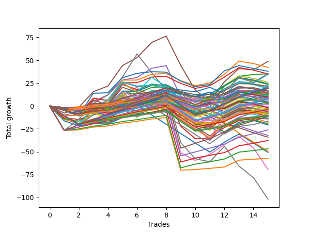

# Short Wallace 004 
- Symbol: ES_Unlimited
- Date Range: 03/18/2022 - 07/15/2022
- Trading Period: 7:20-12:30
- Number of Trades: 15



| Name | Win Percent | Profit | Avg Profit / Trade | Avg Time / Trade |      | Name | Win Percent | Profit | Avg Profit / Trade | Avg Time / Trade |
| ---- | ----------- | ------ | ------------------ | ---------------- | ---- | ---- | ----------- | ------ | ------------------ | ---------------- |
| Sorted By <br> Profit | | | | | | Sorted By <br> Win Percentage ||||
| Five | 66.67 | 24500.00 | 1633.33 | 59:13 |     | Eighty-Five | 86.67 | -5625.00 | -375.00 | 64:30 |
| Fifty-Three | 46.67 | 21125.00 | 1408.33 | 06:35 |     | Eighty-Four | 86.67 | -13000.00 | -866.67 | 63:22 |
| Seventy-Three | 53.33 | 19000.00 | 1266.67 | 11:45 |     | Eighty-Three | 86.67 | -18875.00 | -1258.33 | 61:43 |
| Sixty-Nine | 46.67 | 17750.00 | 1183.33 | 19:29 |     | Eighty-Two | 86.67 | -23375.00 | -1558.33 | 58:20 |
| Two | 60.00 | 17625.00 | 1175.00 | 26:52 |     | Eighty-One | 86.67 | -28625.00 | -1908.33 | 54:21 |
| Fifty-Five | 46.67 | 17500.00 | 1166.67 | 06:36 |     | One Hundred Six | 80.00 | 7000.00 | 466.67 | 02:03 |
| Sixty-One | 46.67 | 17375.00 | 1158.33 | 27:36 |     | One Hundred Sixteen | 80.00 | 4125.00 | 275.00 | 02:14 |
| Fifty | 46.67 | 13000.00 | 866.67 | 06:14 |     | One Hundred Twenty-One | 80.00 | -2500.00 | -166.67 | 03:35 |
| Fifty-Two | 46.67 | 12125.00 | 808.33 | 06:13 |     | One Hundred Twenty-Six | 80.00 | -3500.00 | -233.33 | 03:39 |
| Fifty-Four | 46.67 | 11750.00 | 783.33 | 05:50 |     | One Hundred Twenty-Five | 73.33 | 10125.00 | 675.00 | 11:33 |
| Seventy-One | 46.67 | 11500.00 | 766.67 | 22:45 |     | One Hundred Thirty | 73.33 | 9625.00 | 641.67 | 11:34 |
| One Hundred Ten | 46.67 | 10750.00 | 716.67 | 03:42 |     | Ninety-Six | 73.33 | 6250.00 | 416.67 | 01:38 |
| One Hundred Twenty-Five | 73.33 | 10125.00 | 675.00 | 11:33 |     | One Hundred Twenty-Four | 73.33 | 4375.00 | 291.67 | 10:52 |
| Forty-Nine | 53.33 | 9750.00 | 650.00 | 05:23 |     | One Hundred Twenty-Nine | 73.33 | 3875.00 | 258.33 | 10:53 |
| One Hundred Thirty | 73.33 | 9625.00 | 641.67 | 11:34 |     | One Hundred Eleven | 73.33 | 1000.00 | 66.67 | 02:08 |
| Sixty-Eight | 53.33 | 9500.00 | 633.33 | 14:35 |     | Four | 73.33 | -1250.00 | -83.33 | 45:55 |
| Fifty-One | 46.67 | 9500.00 | 633.33 | 05:36 |     | One Hundred Twenty-Three | 73.33 | -1375.00 | -91.67 | 09:14 |
| One Hundred | 53.33 | 8250.00 | 550.00 | 02:38 |     | One Hundred Twenty-Eight | 73.33 | -1875.00 | -125.00 | 09:15 |
| Ninety-Five | 46.67 | 8125.00 | 541.67 | 03:09 |     | One Hundred Twenty-Two | 73.33 | -4875.00 | -325.00 | 05:52 |
| Sixty-Six | 53.33 | 7625.00 | 508.33 | 13:12 |     | One Hundred Twenty-Seven | 73.33 | -5375.00 | -358.33 | 05:53 |
| One Hundred Twenty | 53.33 | 7250.00 | 483.33 | 04:17 |     | Five | 66.67 | 24500.00 | 1633.33 | 59:13 |
| One Hundred Six | 80.00 | 7000.00 | 466.67 | 02:03 |     | One Hundred Seven | 66.67 | 6000.00 | 400.00 | 02:33 |
| One Hundred Nine | 46.67 | 7000.00 | 466.67 | 03:37 |     | Ninety-One | 66.67 | 4000.00 | 266.67 | 01:25 |
| Ninety-Nine | 53.33 | 6875.00 | 458.33 | 02:36 |     | One Hundred One | 66.67 | 1750.00 | 116.67 | 01:36 |
| Ninety-Eight | 60.00 | 6625.00 | 441.67 | 02:25 |     | One Hundred Seventeen | 66.67 | 1625.00 | 108.33 | 02:52 |
| Ninety-Six | 73.33 | 6250.00 | 416.67 | 01:38 |     | Three | 66.67 | -5125.00 | -341.67 | 31:48 |
| Ninety-Seven | 60.00 | 6250.00 | 416.67 | 02:00 |     | Two | 60.00 | 17625.00 | 1175.00 | 26:52 |
| One Hundred Seven | 66.67 | 6000.00 | 400.00 | 02:33 |     | Ninety-Eight | 60.00 | 6625.00 | 441.67 | 02:25 |
| Ninety-Four | 46.67 | 5500.00 | 366.67 | 03:04 |     | Ninety-Seven | 60.00 | 6250.00 | 416.67 | 02:00 |
| Forty-Eight | 53.33 | 5250.00 | 350.00 | 04:29 |     | Ninety-Two | 60.00 | 4000.00 | 266.67 | 01:50 |
| One Hundred Eight | 53.33 | 5000.00 | 333.33 | 03:21 |     | One Hundred Two | 60.00 | 1500.00 | 100.00 | 02:05 |
| One Hundred Five | 46.67 | 4500.00 | 300.00 | 03:48 |     | One Hundred Twelve | 60.00 | -3625.00 | -241.67 | 02:48 |
| One Hundred Twenty-Four | 73.33 | 4375.00 | 291.67 | 10:52 |     | Six | 60.00 | -34750.00 | -2316.67 | 124:15 |
| Sixty | 53.33 | 4250.00 | 283.33 | 18:27 |     | Seventy-Three | 53.33 | 19000.00 | 1266.67 | 11:45 |
| One Hundred Sixteen | 80.00 | 4125.00 | 275.00 | 02:14 |     | Forty-Nine | 53.33 | 9750.00 | 650.00 | 05:23 |
| Ninety-One | 66.67 | 4000.00 | 266.67 | 01:25 |     | Sixty-Eight | 53.33 | 9500.00 | 633.33 | 14:35 |
| Ninety-Two | 60.00 | 4000.00 | 266.67 | 01:50 |     | One Hundred | 53.33 | 8250.00 | 550.00 | 02:38 |
| One Hundred Twenty-Nine | 73.33 | 3875.00 | 258.33 | 10:53 |     | Sixty-Six | 53.33 | 7625.00 | 508.33 | 13:12 |
| One Hundred Ninteen | 53.33 | 3125.00 | 208.33 | 04:12 |     | One Hundred Twenty | 53.33 | 7250.00 | 483.33 | 04:17 |
| Seventy | 46.67 | 2625.00 | 175.00 | 19:52 |     | Ninety-Nine | 53.33 | 6875.00 | 458.33 | 02:36 |
| One Hundred Fifteen | 53.33 | 2125.00 | 141.67 | 06:14 |     | Forty-Eight | 53.33 | 5250.00 | 350.00 | 04:29 |
| Ninety-Three | 46.67 | 2000.00 | 133.33 | 02:44 |     | One Hundred Eight | 53.33 | 5000.00 | 333.33 | 03:21 |
| One Hundred Four | 46.67 | 1875.00 | 125.00 | 03:43 |     | Sixty | 53.33 | 4250.00 | 283.33 | 18:27 |
| One Hundred One | 66.67 | 1750.00 | 116.67 | 01:36 |     | One Hundred Ninteen | 53.33 | 3125.00 | 208.33 | 04:12 |
| One Hundred Seventeen | 66.67 | 1625.00 | 108.33 | 02:52 |     | One Hundred Fifteen | 53.33 | 2125.00 | 141.67 | 06:14 |
| One Hundred Two | 60.00 | 1500.00 | 100.00 | 02:05 |     | Sixty-Seven | 53.33 | 1375.00 | 91.67 | 12:20 |
| Sixty-Seven | 53.33 | 1375.00 | 91.67 | 12:20 |     | Fifty-Eight | 53.33 | 750.00 | 50.00 | 16:59 |
| One Hundred Eleven | 73.33 | 1000.00 | 66.67 | 02:08 |     | Zero | 53.33 | 750.00 | 50.00 | 12:54 |
| Fifty-Eight | 53.33 | 750.00 | 50.00 | 16:59 |     | Fifty-Six | 53.33 | -500.00 | -33.33 | 08:53 |
| Zero | 53.33 | 750.00 | 50.00 | 12:54 |     | One Hundred Fourteen | 53.33 | -875.00 | -58.33 | 05:40 |
| Fifty-Six | 53.33 | -500.00 | -33.33 | 08:53 |     | One Hundred Eighteen | 53.33 | -1000.00 | -66.67 | 03:51 |
| One Hundred Fourteen | 53.33 | -875.00 | -58.33 | 05:40 |     | One | 53.33 | -2000.00 | -133.33 | 21:58 |
| One Hundred Eighteen | 53.33 | -1000.00 | -66.67 | 03:51 |     | Sixty-Five | 53.33 | -2875.00 | -191.67 | 11:03 |
| Four | 73.33 | -1250.00 | -83.33 | 45:55 |     | One Hundred Thirteen | 53.33 | -5000.00 | -333.33 | 05:20 |
| One Hundred Twenty-Three | 73.33 | -1375.00 | -91.67 | 09:14 |     | Fifty-Seven | 53.33 | -7125.00 | -475.00 | 13:32 |
| One Hundred Three | 46.67 | -1625.00 | -108.33 | 03:24 |     | Fifty-Nine | 53.33 | -8250.00 | -550.00 | 14:45 |
| One Hundred Twenty-Eight | 73.33 | -1875.00 | -125.00 | 09:15 |     | Fifty-Three | 46.67 | 21125.00 | 1408.33 | 06:35 |
| One | 53.33 | -2000.00 | -133.33 | 21:58 |     | Sixty-Nine | 46.67 | 17750.00 | 1183.33 | 19:29 |
| One Hundred Twenty-One | 80.00 | -2500.00 | -166.67 | 03:35 |     | Fifty-Five | 46.67 | 17500.00 | 1166.67 | 06:36 |
| Sixty-Five | 53.33 | -2875.00 | -191.67 | 11:03 |     | Sixty-One | 46.67 | 17375.00 | 1158.33 | 27:36 |
| One Hundred Twenty-Six | 80.00 | -3500.00 | -233.33 | 03:39 |     | Fifty | 46.67 | 13000.00 | 866.67 | 06:14 |
| One Hundred Twelve | 60.00 | -3625.00 | -241.67 | 02:48 |     | Fifty-Two | 46.67 | 12125.00 | 808.33 | 06:13 |
| Sixty-Four | 46.67 | -4000.00 | -266.67 | 08:29 |     | Fifty-Four | 46.67 | 11750.00 | 783.33 | 05:50 |
| One Hundred Twenty-Two | 73.33 | -4875.00 | -325.00 | 05:52 |     | Seventy-One | 46.67 | 11500.00 | 766.67 | 22:45 |
| One Hundred Thirteen | 53.33 | -5000.00 | -333.33 | 05:20 |     | One Hundred Ten | 46.67 | 10750.00 | 716.67 | 03:42 |
| Three | 66.67 | -5125.00 | -341.67 | 31:48 |     | Fifty-One | 46.67 | 9500.00 | 633.33 | 05:36 |
| Forty | 40.00 | -5250.00 | -350.00 | 05:23 |     | Ninety-Five | 46.67 | 8125.00 | 541.67 | 03:09 |
| One Hundred Twenty-Seven | 73.33 | -5375.00 | -358.33 | 05:53 |     | One Hundred Nine | 46.67 | 7000.00 | 466.67 | 03:37 |
| Eighty-Five | 86.67 | -5625.00 | -375.00 | 64:30 |     | Ninety-Four | 46.67 | 5500.00 | 366.67 | 03:04 |
| Forty-Five | 20.00 | -6000.00 | -400.00 | 12:38 |     | One Hundred Five | 46.67 | 4500.00 | 300.00 | 03:48 |
| Forty-One | 40.00 | -6875.00 | -458.33 | 07:59 |     | Seventy | 46.67 | 2625.00 | 175.00 | 19:52 |
| Fifty-Seven | 53.33 | -7125.00 | -475.00 | 13:32 |     | Ninety-Three | 46.67 | 2000.00 | 133.33 | 02:44 |
| Fifty-Nine | 53.33 | -8250.00 | -550.00 | 14:45 |     | One Hundred Four | 46.67 | 1875.00 | 125.00 | 03:43 |
| Forty-Three | 33.33 | -9000.00 | -600.00 | 08:00 |     | One Hundred Three | 46.67 | -1625.00 | -108.33 | 03:24 |
| Forty-Four | 26.67 | -9875.00 | -658.33 | 09:20 |     | Sixty-Four | 46.67 | -4000.00 | -266.67 | 08:29 |
| Forty-Two | 26.67 | -10375.00 | -691.67 | 09:19 |     | Forty | 40.00 | -5250.00 | -350.00 | 05:23 |
| Eighty-Four | 86.67 | -13000.00 | -866.67 | 63:22 |     | Forty-One | 40.00 | -6875.00 | -458.33 | 07:59 |
| Forty-Six | 20.00 | -16125.00 | -1075.00 | 12:10 |     | Seven | 40.00 | -51000.00 | -3400.00 | 158:03 |
| Forty-Seven | 13.33 | -17125.00 | -1141.67 | 13:41 |     | Forty-Three | 33.33 | -9000.00 | -600.00 | 08:00 |
| Eighty-Three | 86.67 | -18875.00 | -1258.33 | 61:43 |     | Sixty-Two | 33.33 | -25375.00 | -1691.67 | 37:57 |
| Eighty-Two | 86.67 | -23375.00 | -1558.33 | 58:20 |     | Forty-Four | 26.67 | -9875.00 | -658.33 | 09:20 |
| Sixty-Three | 26.67 | -24875.00 | -1658.33 | 41:56 |     | Forty-Two | 26.67 | -10375.00 | -691.67 | 09:19 |
| Sixty-Two | 33.33 | -25375.00 | -1691.67 | 37:57 |     | Sixty-Three | 26.67 | -24875.00 | -1658.33 | 41:56 |
| Eighty-One | 86.67 | -28625.00 | -1908.33 | 54:21 |     | Forty-Five | 20.00 | -6000.00 | -400.00 | 12:38 |
| Six | 60.00 | -34750.00 | -2316.67 | 124:15 |     | Forty-Six | 20.00 | -16125.00 | -1075.00 | 12:10 |
| Seven | 40.00 | -51000.00 | -3400.00 | 158:03 |     | Forty-Seven | 13.33 | -17125.00 | -1141.67 | 13:41 |

## NO STOPLOSS

### Test Zero
* Sell when price hits the middle line of the 20p bollinger
* No Stoploss
* Results:
```
Total Trades: 15
Percent Up: 46.67
Percent Down: 53.33
Total Points Moved Down: 1.50
Potential Profit: 750.00
Total Points Ups: 42.50 Count Ups: 7
Total Points Downs: 44.00 Count Downs: 8
```

<details><summary>Trades</summary>

<code>In: 2022-03-24 08:09:00		Out: 2022-03-24 08:50:10		Total Position Time: 41:10		Total Move Down: -16.25		Total to Date: -16.25</code> <br />
<code>In: 2022-03-25 07:26:00		Out: 2022-03-25 07:51:10		Total Position Time: 25:10		Total Move Down: -5.50		Total to Date: -21.75</code> <br />
<code>In: 2022-04-06 11:06:00		Out: 2022-04-06 11:07:10		Total Position Time: 01:10		Total Move Down: 3.00		Total to Date: -18.75</code> <br />
<code>In: 2022-04-18 07:28:00		Out: 2022-04-18 07:46:00		Total Position Time: 18:00		Total Move Down: -1.25		Total to Date: -20.00</code> <br />
<code>In: 2022-05-03 07:36:00		Out: 2022-05-03 07:38:45		Total Position Time: 02:45		Total Move Down: 7.50		Total to Date: -12.50</code> <br />
<code>In: 2022-05-04 09:42:00		Out: 2022-05-04 09:45:30		Total Position Time: 03:30		Total Move Down: 3.50		Total to Date: -9.00</code> <br />
<code>In: 2022-05-24 11:15:00		Out: 2022-05-24 11:18:25		Total Position Time: 03:25		Total Move Down: 6.25		Total to Date: -2.75</code> <br />
<code>In: 2022-05-31 07:24:00		Out: 2022-05-31 07:37:30		Total Position Time: 13:30		Total Move Down: 2.75		Total to Date: 0.00</code> <br />
<code>In: 2022-06-02 08:06:00		Out: 2022-06-02 08:27:20		Total Position Time: 21:20		Total Move Down: -8.75		Total to Date: -8.75</code> <br />
<code>In: 2022-06-30 08:12:00		Out: 2022-06-30 08:35:20		Total Position Time: 23:20		Total Move Down: -8.25		Total to Date: -17.00</code> <br />
<code>In: 2022-06-30 08:30:00		Out: 2022-06-30 08:35:20		Total Position Time: 05:20		Total Move Down: 6.25		Total to Date: -10.75</code> <br />
<code>In: 2022-07-05 07:41:00		Out: 2022-07-05 07:44:30		Total Position Time: 03:30		Total Move Down: 7.25		Total to Date: -3.50</code> <br />
<code>In: 2022-07-06 11:10:00		Out: 2022-07-06 11:11:10		Total Position Time: 01:10		Total Move Down: 7.50		Total to Date: 4.00</code> <br />
<code>In: 2022-07-07 07:57:00		Out: 2022-07-07 08:11:15		Total Position Time: 14:15		Total Move Down: -0.25		Total to Date: 3.75</code> <br />
<code>In: 2022-07-14 08:46:00		Out: 2022-07-14 09:01:55		Total Position Time: 15:55		Total Move Down: -2.25		Total to Date: 1.50</code> <br />


</details>

### Test One
* Sell when the price hits the upper line of the 20p 1std bollinger
* No Stoploss
* Results:
```
Total Trades: 15
Percent Up: 46.67
Percent Down: 53.33
Total Points Moved Down: -4.00
Potential Profit: -2000.00
Total Points Ups: 52.50 Count Ups: 7
Total Points Downs: 48.50 Count Downs: 8
```

<details><summary>Trades</summary>

<code>In: 2022-03-24 08:09:00		Out: 2022-03-24 08:53:50		Total Position Time: 44:50		Total Move Down: -14.75		Total to Date: -14.75</code> <br />
<code>In: 2022-03-25 07:26:00		Out: 2022-03-25 07:54:00		Total Position Time: 28:00		Total Move Down: -4.50		Total to Date: -19.25</code> <br />
<code>In: 2022-04-06 11:06:00		Out: 2022-04-06 11:07:20		Total Position Time: 01:20		Total Move Down: 5.25		Total to Date: -14.00</code> <br />
<code>In: 2022-04-18 07:28:00		Out: 2022-04-18 07:51:30		Total Position Time: 23:30		Total Move Down: 0.50		Total to Date: -13.50</code> <br />
<code>In: 2022-05-03 07:36:00		Out: 2022-05-03 07:41:55		Total Position Time: 05:55		Total Move Down: 11.25		Total to Date: -2.25</code> <br />
<code>In: 2022-05-04 09:42:00		Out: 2022-05-04 09:47:10		Total Position Time: 05:10		Total Move Down: 5.00		Total to Date: 2.75</code> <br />
<code>In: 2022-05-24 11:15:00		Out: 2022-05-24 11:31:25		Total Position Time: 16:25		Total Move Down: 6.75		Total to Date: 9.50</code> <br />
<code>In: 2022-05-31 07:24:00		Out: 2022-05-31 08:07:20		Total Position Time: 43:20		Total Move Down: -3.75		Total to Date: 5.75</code> <br />
<code>In: 2022-06-02 08:06:00		Out: 2022-06-02 08:29:05		Total Position Time: 23:05		Total Move Down: -7.75		Total to Date: -2.00</code> <br />
<code>In: 2022-06-30 08:12:00		Out: 2022-06-30 09:05:50		Total Position Time: 53:50		Total Move Down: -17.50		Total to Date: -19.50</code> <br />
<code>In: 2022-06-30 08:30:00		Out: 2022-06-30 09:05:50		Total Position Time: 35:50		Total Move Down: -3.00		Total to Date: -22.50</code> <br />
<code>In: 2022-07-05 07:41:00		Out: 2022-07-05 07:45:55		Total Position Time: 04:55		Total Move Down: 12.00		Total to Date: -10.50</code> <br />
<code>In: 2022-07-06 11:10:00		Out: 2022-07-06 11:11:10		Total Position Time: 01:10		Total Move Down: 7.50		Total to Date: -3.00</code> <br />
<code>In: 2022-07-07 07:57:00		Out: 2022-07-07 08:20:05		Total Position Time: 23:05		Total Move Down: 0.25		Total to Date: -2.75</code> <br />
<code>In: 2022-07-14 08:46:00		Out: 2022-07-14 09:05:15		Total Position Time: 19:15		Total Move Down: -1.25		Total to Date: -4.00</code> <br />


</details>

### Test Two
* Sell when the price hits the upper line of the 20p 2std bollinger
* No Stoploss
* Results:
```
Total Trades: 15
Percent Up: 40.00
Percent Down: 60.00
Total Points Moved Down: 35.25
Potential Profit: 17625.00
Total Points Ups: 41.75 Count Ups: 6
Total Points Downs: 77.00 Count Downs: 9
```

<details><summary>Trades</summary>

<code>In: 2022-03-24 08:09:00		Out: 2022-03-24 09:03:05		Total Position Time: 54:05		Total Move Down: -14.00		Total to Date: -14.00</code> <br />
<code>In: 2022-03-25 07:26:00		Out: 2022-03-25 07:54:15		Total Position Time: 28:15		Total Move Down: -2.75		Total to Date: -16.75</code> <br />
<code>In: 2022-04-06 11:06:00		Out: 2022-04-06 11:08:10		Total Position Time: 02:10		Total Move Down: 11.25		Total to Date: -5.50</code> <br />
<code>In: 2022-04-18 07:28:00		Out: 2022-04-18 07:51:45		Total Position Time: 23:45		Total Move Down: 2.50		Total to Date: -3.00</code> <br />
<code>In: 2022-05-03 07:36:00		Out: 2022-05-03 07:43:50		Total Position Time: 07:50		Total Move Down: 16.25		Total to Date: 13.25</code> <br />
<code>In: 2022-05-04 09:42:00		Out: 2022-05-04 10:11:30		Total Position Time: 29:30		Total Move Down: 4.00		Total to Date: 17.25</code> <br />
<code>In: 2022-05-24 11:15:00		Out: 2022-05-24 11:44:00		Total Position Time: 29:00		Total Move Down: 6.75		Total to Date: 24.00</code> <br />
<code>In: 2022-05-31 07:24:00		Out: 2022-05-31 08:07:30		Total Position Time: 43:30		Total Move Down: -1.75		Total to Date: 22.25</code> <br />
<code>In: 2022-06-02 08:06:00		Out: 2022-06-02 08:31:25		Total Position Time: 25:25		Total Move Down: -7.75		Total to Date: 14.50</code> <br />
<code>In: 2022-06-30 08:12:00		Out: 2022-06-30 09:06:15		Total Position Time: 54:15		Total Move Down: -15.00		Total to Date: -0.50</code> <br />
<code>In: 2022-06-30 08:30:00		Out: 2022-06-30 09:06:15		Total Position Time: 36:15		Total Move Down: -0.50		Total to Date: -1.00</code> <br />
<code>In: 2022-07-05 07:41:00		Out: 2022-07-05 08:01:10		Total Position Time: 20:10		Total Move Down: 23.00		Total to Date: 22.00</code> <br />
<code>In: 2022-07-06 11:10:00		Out: 2022-07-06 11:11:45		Total Position Time: 01:45		Total Move Down: 10.50		Total to Date: 32.50</code> <br />
<code>In: 2022-07-07 07:57:00		Out: 2022-07-07 08:22:45		Total Position Time: 25:45		Total Move Down: 2.00		Total to Date: 34.50</code> <br />
<code>In: 2022-07-14 08:46:00		Out: 2022-07-14 09:07:30		Total Position Time: 21:30		Total Move Down: 0.75		Total to Date: 35.25</code> <br />


</details>

### Test Three
* Sell when price hits the middle line of the 50p bollinger
* No Stoploss
* Results:
```
Total Trades: 15
Percent Up: 33.33
Percent Down: 66.67
Total Points Moved Down: -10.25
Potential Profit: -5125.00
Total Points Ups: 67.50 Count Ups: 5
Total Points Downs: 57.25 Count Downs: 10
```

<details><summary>Trades</summary>

<code>In: 2022-03-24 08:09:00		Out: 2022-03-24 09:03:10		Total Position Time: 54:10		Total Move Down: -13.00		Total to Date: -13.00</code> <br />
<code>In: 2022-03-25 07:26:00		Out: 2022-03-25 08:00:45		Total Position Time: 34:45		Total Move Down: -1.75		Total to Date: -14.75</code> <br />
<code>In: 2022-04-06 11:06:00		Out: 2022-04-06 11:07:20		Total Position Time: 01:20		Total Move Down: 5.25		Total to Date: -9.50</code> <br />
<code>In: 2022-04-18 07:28:00		Out: 2022-04-18 07:52:15		Total Position Time: 24:15		Total Move Down: 2.50		Total to Date: -7.00</code> <br />
<code>In: 2022-05-03 07:36:00		Out: 2022-05-03 07:40:40		Total Position Time: 04:40		Total Move Down: 10.75		Total to Date: 3.75</code> <br />
<code>In: 2022-05-04 09:42:00		Out: 2022-05-04 10:11:05		Total Position Time: 29:05		Total Move Down: 1.50		Total to Date: 5.25</code> <br />
<code>In: 2022-05-24 11:15:00		Out: 2022-05-24 11:20:25		Total Position Time: 05:25		Total Move Down: 11.75		Total to Date: 17.00</code> <br />
<code>In: 2022-05-31 07:24:00		Out: 2022-05-31 08:07:30		Total Position Time: 43:30		Total Move Down: -1.75		Total to Date: 15.25</code> <br />
<code>In: 2022-06-02 08:06:00		Out: 2022-06-02 10:12:25		Total Position Time: 126:25		Total Move Down: -37.25		Total to Date: -22.00</code> <br />
<code>In: 2022-06-30 08:12:00		Out: 2022-06-30 09:06:20		Total Position Time: 54:20		Total Move Down: -13.75		Total to Date: -35.75</code> <br />
<code>In: 2022-06-30 08:30:00		Out: 2022-06-30 09:06:20		Total Position Time: 36:20		Total Move Down: 0.75		Total to Date: -35.00</code> <br />
<code>In: 2022-07-05 07:41:00		Out: 2022-07-05 07:45:50		Total Position Time: 04:50		Total Move Down: 11.50		Total to Date: -23.50</code> <br />
<code>In: 2022-07-06 11:10:00		Out: 2022-07-06 11:11:10		Total Position Time: 01:10		Total Move Down: 7.50		Total to Date: -16.00</code> <br />
<code>In: 2022-07-07 07:57:00		Out: 2022-07-07 08:22:45		Total Position Time: 25:45		Total Move Down: 2.00		Total to Date: -14.00</code> <br />
<code>In: 2022-07-14 08:46:00		Out: 2022-07-14 09:17:00		Total Position Time: 31:00		Total Move Down: 3.75		Total to Date: -10.25</code> <br />


</details>

### Test Four
* Sell when the price hits the upper line of the 50p 1std bollinger
* No Stoploss
* Results:
```
Total Trades: 15
Percent Up: 26.67
Percent Down: 73.33
Total Points Moved Down: -2.50
Potential Profit: -1250.00
Total Points Ups: 92.00 Count Ups: 4
Total Points Downs: 89.50 Count Downs: 11
```

<details><summary>Trades</summary>

<code>In: 2022-03-24 08:09:00		Out: 2022-03-24 09:08:30		Total Position Time: 59:30		Total Move Down: -10.00		Total to Date: -10.00</code> <br />
<code>In: 2022-03-25 07:26:00		Out: 2022-03-25 08:01:45		Total Position Time: 35:45		Total Move Down: 3.75		Total to Date: -6.25</code> <br />
<code>In: 2022-04-06 11:06:00		Out: 2022-04-06 11:08:10		Total Position Time: 02:10		Total Move Down: 11.25		Total to Date: 5.00</code> <br />
<code>In: 2022-04-18 07:28:00		Out: 2022-04-18 07:57:05		Total Position Time: 29:05		Total Move Down: 7.25		Total to Date: 12.25</code> <br />
<code>In: 2022-05-03 07:36:00		Out: 2022-05-03 07:43:50		Total Position Time: 07:50		Total Move Down: 16.25		Total to Date: 28.50</code> <br />
<code>In: 2022-05-04 09:42:00		Out: 2022-05-04 10:30:25		Total Position Time: 48:25		Total Move Down: 2.75		Total to Date: 31.25</code> <br />
<code>In: 2022-05-24 11:15:00		Out: 2022-05-24 11:45:05		Total Position Time: 30:05		Total Move Down: 10.00		Total to Date: 41.25</code> <br />
<code>In: 2022-05-31 07:24:00		Out: 2022-05-31 08:08:45		Total Position Time: 44:45		Total Move Down: 3.00		Total to Date: 44.25</code> <br />
<code>In: 2022-06-02 08:06:00		Out: 2022-06-02 10:14:00		Total Position Time: 128:00		Total Move Down: -34.00		Total to Date: 10.25</code> <br />
<code>In: 2022-06-30 08:12:00		Out: 2022-06-30 10:10:15		Total Position Time: 118:15		Total Move Down: -31.25		Total to Date: -21.00</code> <br />
<code>In: 2022-06-30 08:30:00		Out: 2022-06-30 10:10:15		Total Position Time: 100:15		Total Move Down: -16.75		Total to Date: -37.75</code> <br />
<code>In: 2022-07-05 07:41:00		Out: 2022-07-05 07:56:40		Total Position Time: 15:40		Total Move Down: 16.75		Total to Date: -21.00</code> <br />
<code>In: 2022-07-06 11:10:00		Out: 2022-07-06 11:11:35		Total Position Time: 01:35		Total Move Down: 8.75		Total to Date: -12.25</code> <br />
<code>In: 2022-07-07 07:57:00		Out: 2022-07-07 08:23:20		Total Position Time: 26:20		Total Move Down: 4.75		Total to Date: -7.50</code> <br />
<code>In: 2022-07-14 08:46:00		Out: 2022-07-14 09:27:05		Total Position Time: 41:05		Total Move Down: 5.00		Total to Date: -2.50</code> <br />


</details>

### Test Five
* Sell when the price hits the upper line of the 50p 2std bollinger
* No Stoploss
* Results:
```
Total Trades: 15
Percent Up: 33.33
Percent Down: 66.67
Total Points Moved Down: 49.00
Potential Profit: 24500.00
Total Points Ups: 80.75 Count Ups: 5
Total Points Downs: 129.75 Count Downs: 10
```

<details><summary>Trades</summary>

<code>In: 2022-03-24 08:09:00		Out: 2022-03-24 09:17:20		Total Position Time: 68:20		Total Move Down: -7.75		Total to Date: -7.75</code> <br />
<code>In: 2022-03-25 07:26:00		Out: 2022-03-25 08:08:15		Total Position Time: 42:15		Total Move Down: 6.25		Total to Date: -1.50</code> <br />
<code>In: 2022-04-06 11:06:00		Out: 2022-04-06 11:09:40		Total Position Time: 03:40		Total Move Down: 17.25		Total to Date: 15.75</code> <br />
<code>In: 2022-04-18 07:28:00		Out: 2022-04-18 08:15:50		Total Position Time: 47:50		Total Move Down: 6.00		Total to Date: 21.75</code> <br />
<code>In: 2022-05-03 07:36:00		Out: 2022-05-03 07:47:05		Total Position Time: 11:05		Total Move Down: 22.50		Total to Date: 44.25</code> <br />
<code>In: 2022-05-04 09:42:00		Out: 2022-05-04 11:07:40		Total Position Time: 85:40		Total Move Down: 8.75		Total to Date: 53.00</code> <br />
<code>In: 2022-05-24 11:15:00		Out: 2022-05-24 11:49:15		Total Position Time: 34:15		Total Move Down: 16.50		Total to Date: 69.50</code> <br />
<code>In: 2022-05-31 07:24:00		Out: 2022-05-31 08:14:30		Total Position Time: 50:30		Total Move Down: 7.00		Total to Date: 76.50</code> <br />
<code>In: 2022-06-02 08:06:00		Out: 2022-06-02 10:14:30		Total Position Time: 128:30		Total Move Down: -32.00		Total to Date: 44.50</code> <br />
<code>In: 2022-06-30 08:12:00		Out: 2022-06-30 10:12:00		Total Position Time: 120:00		Total Move Down: -27.00		Total to Date: 17.50</code> <br />
<code>In: 2022-06-30 08:30:00		Out: 2022-06-30 10:12:00		Total Position Time: 102:00		Total Move Down: -12.50		Total to Date: 5.00</code> <br />
<code>In: 2022-07-05 07:41:00		Out: 2022-07-05 08:01:05		Total Position Time: 20:05		Total Move Down: 21.50		Total to Date: 26.50</code> <br />
<code>In: 2022-07-06 11:10:00		Out: 2022-07-06 11:12:15		Total Position Time: 02:15		Total Move Down: 14.50		Total to Date: 41.00</code> <br />
<code>In: 2022-07-07 07:57:00		Out: 2022-07-07 10:06:20		Total Position Time: 129:20		Total Move Down: -1.50		Total to Date: 39.50</code> <br />
<code>In: 2022-07-14 08:46:00		Out: 2022-07-14 09:28:35		Total Position Time: 42:35		Total Move Down: 9.50		Total to Date: 49.00</code> <br />


</details>

### Test Six
* Sell when the price hits the middle line of the 1std VWAP
* No Stoploss
* Results:
```
Total Trades: 15
Percent Up: 40.00
Percent Down: 60.00
Total Points Moved Down: -69.50
Potential Profit: -34750.00
Total Points Ups: 148.75 Count Ups: 6
Total Points Downs: 79.25 Count Downs: 9
```

<details><summary>Trades</summary>

<code>In: 2022-03-24 08:09:00		Out: 2022-03-24 12:47:00		Total Position Time: 278:00		Total Move Down: -26.75		Total to Date: -26.75</code> <br />
<code>In: 2022-03-25 07:26:00		Out: 2022-03-25 08:08:15		Total Position Time: 42:15		Total Move Down: 6.25		Total to Date: -20.50</code> <br />
<code>In: 2022-04-06 11:06:00		Out: 2022-04-06 11:08:10		Total Position Time: 02:10		Total Move Down: 11.25		Total to Date: -9.25</code> <br />
<code>In: 2022-04-18 07:28:00		Out: 2022-04-18 07:55:15		Total Position Time: 27:15		Total Move Down: 5.75		Total to Date: -3.50</code> <br />
<code>In: 2022-05-03 07:36:00		Out: 2022-05-03 07:42:15		Total Position Time: 06:15		Total Move Down: 14.00		Total to Date: 10.50</code> <br />
<code>In: 2022-05-04 09:42:00		Out: 2022-05-04 11:20:20		Total Position Time: 98:20		Total Move Down: 10.25		Total to Date: 20.75</code> <br />
<code>In: 2022-05-24 11:15:00		Out: 2022-05-24 12:47:00		Total Position Time: 92:00		Total Move Down: -20.25		Total to Date: 0.50</code> <br />
<code>In: 2022-05-31 07:24:00		Out: 2022-05-31 08:14:20		Total Position Time: 50:20		Total Move Down: 5.50		Total to Date: 6.00</code> <br />
<code>In: 2022-06-02 08:06:00		Out: 2022-06-02 12:47:00		Total Position Time: 281:00		Total Move Down: -57.50		Total to Date: -51.50</code> <br />
<code>In: 2022-06-30 08:12:00		Out: 2022-06-30 12:05:35		Total Position Time: 233:35		Total Move Down: -8.00		Total to Date: -59.50</code> <br />
<code>In: 2022-06-30 08:30:00		Out: 2022-06-30 12:05:35		Total Position Time: 215:35		Total Move Down: 6.50		Total to Date: -53.00</code> <br />
<code>In: 2022-07-05 07:41:00		Out: 2022-07-05 07:45:30		Total Position Time: 04:30		Total Move Down: 11.00		Total to Date: -42.00</code> <br />
<code>In: 2022-07-06 11:10:00		Out: 2022-07-06 11:11:35		Total Position Time: 01:35		Total Move Down: 8.75		Total to Date: -33.25</code> <br />
<code>In: 2022-07-07 07:57:00		Out: 2022-07-07 12:47:00		Total Position Time: 290:00		Total Move Down: -12.75		Total to Date: -46.00</code> <br />
<code>In: 2022-07-14 08:46:00		Out: 2022-07-14 12:47:00		Total Position Time: 241:00		Total Move Down: -23.50		Total to Date: -69.50</code> <br />


</details>

### Test Seven
* Sell when the price hits the upper line of the 1std VWAP
* No Stoploss
* Results:
```
Total Trades: 15
Percent Up: 60.00
Percent Down: 40.00
Total Points Moved Down: -102.00
Potential Profit: -51000.00
Total Points Ups: 202.75 Count Ups: 9
Total Points Downs: 100.75 Count Downs: 6
```

<details><summary>Trades</summary>

<code>In: 2022-03-24 08:09:00		Out: 2022-03-24 12:47:00		Total Position Time: 278:00		Total Move Down: -26.75		Total to Date: -26.75</code> <br />
<code>In: 2022-03-25 07:26:00		Out: 2022-03-25 08:09:20		Total Position Time: 43:20		Total Move Down: 12.25		Total to Date: -14.50</code> <br />
<code>In: 2022-04-06 11:06:00		Out: 2022-04-06 11:09:40		Total Position Time: 03:40		Total Move Down: 17.25		Total to Date: 2.75</code> <br />
<code>In: 2022-04-18 07:28:00		Out: 2022-04-18 08:18:55		Total Position Time: 50:55		Total Move Down: 9.50		Total to Date: 12.25</code> <br />
<code>In: 2022-05-03 07:36:00		Out: 2022-05-03 07:46:45		Total Position Time: 10:45		Total Move Down: 19.50		Total to Date: 31.75</code> <br />
<code>In: 2022-05-04 09:42:00		Out: 2022-05-04 11:34:05		Total Position Time: 112:05		Total Move Down: 25.25		Total to Date: 57.00</code> <br />
<code>In: 2022-05-24 11:15:00		Out: 2022-05-24 12:47:00		Total Position Time: 92:00		Total Move Down: -20.25		Total to Date: 36.75</code> <br />
<code>In: 2022-05-31 07:24:00		Out: 2022-05-31 12:47:00		Total Position Time: 323:00		Total Move Down: -19.25		Total to Date: 17.50</code> <br />
<code>In: 2022-06-02 08:06:00		Out: 2022-06-02 12:47:00		Total Position Time: 281:00		Total Move Down: -57.50		Total to Date: -40.00</code> <br />
<code>In: 2022-06-30 08:12:00		Out: 2022-06-30 12:47:00		Total Position Time: 275:00		Total Move Down: -17.75		Total to Date: -57.75</code> <br />
<code>In: 2022-06-30 08:30:00		Out: 2022-06-30 12:47:00		Total Position Time: 257:00		Total Move Down: -3.25		Total to Date: -61.00</code> <br />
<code>In: 2022-07-05 07:41:00		Out: 2022-07-05 07:57:05		Total Position Time: 16:05		Total Move Down: 17.00		Total to Date: -44.00</code> <br />
<code>In: 2022-07-06 11:10:00		Out: 2022-07-06 12:47:00		Total Position Time: 97:00		Total Move Down: -21.75		Total to Date: -65.75</code> <br />
<code>In: 2022-07-07 07:57:00		Out: 2022-07-07 12:47:00		Total Position Time: 290:00		Total Move Down: -12.75		Total to Date: -78.50</code> <br />
<code>In: 2022-07-14 08:46:00		Out: 2022-07-14 12:47:00		Total Position Time: 241:00		Total Move Down: -23.50		Total to Date: -102.00</code> <br />


</details>

## STOPLOSS OF 5

### Test Forty
* Sell when price hits the middle line of the 20p bollinger
* Stoploss is -5 points
* Results:
```
Total Trades: 15
Percent Up: 60.00
Percent Down: 40.00
Total Points Moved Down: -10.50
Potential Profit: -5250.00
Total Points Ups: 44.50 Count Ups: 9
Total Points Downs: 34.00 Count Downs: 6
```

<details><summary>Trades</summary>

<code>In: 2022-03-24 08:09:00		Out: 2022-03-24 08:12:30		Total Position Time: 03:30		Total Move Down: -4.75		Total to Date: -4.75</code> <br />
<code>In: 2022-03-25 07:26:00		Out: 2022-03-25 07:35:05		Total Position Time: 09:05		Total Move Down: -6.00		Total to Date: -10.75</code> <br />
<code>In: 2022-04-06 11:06:00		Out: 2022-04-06 11:07:10		Total Position Time: 01:10		Total Move Down: 3.00		Total to Date: -7.75</code> <br />
<code>In: 2022-04-18 07:28:00		Out: 2022-04-18 07:40:15		Total Position Time: 12:15		Total Move Down: -5.50		Total to Date: -13.25</code> <br />
<code>In: 2022-05-03 07:36:00		Out: 2022-05-03 07:38:45		Total Position Time: 02:45		Total Move Down: 7.50		Total to Date: -5.75</code> <br />
<code>In: 2022-05-04 09:42:00		Out: 2022-05-04 09:45:30		Total Position Time: 03:30		Total Move Down: 3.50		Total to Date: -2.25</code> <br />
<code>In: 2022-05-24 11:15:00		Out: 2022-05-24 11:18:25		Total Position Time: 03:25		Total Move Down: 6.25		Total to Date: 4.00</code> <br />
<code>In: 2022-05-31 07:24:00		Out: 2022-05-31 07:31:25		Total Position Time: 07:25		Total Move Down: -5.00		Total to Date: -1.00</code> <br />
<code>In: 2022-06-02 08:06:00		Out: 2022-06-02 08:09:35		Total Position Time: 03:35		Total Move Down: -5.50		Total to Date: -6.50</code> <br />
<code>In: 2022-06-30 08:12:00		Out: 2022-06-30 08:17:35		Total Position Time: 05:35		Total Move Down: -5.25		Total to Date: -11.75</code> <br />
<code>In: 2022-06-30 08:30:00		Out: 2022-06-30 08:35:20		Total Position Time: 05:20		Total Move Down: 6.25		Total to Date: -5.50</code> <br />
<code>In: 2022-07-05 07:41:00		Out: 2022-07-05 07:42:10		Total Position Time: 01:10		Total Move Down: -7.25		Total to Date: -12.75</code> <br />
<code>In: 2022-07-06 11:10:00		Out: 2022-07-06 11:11:10		Total Position Time: 01:10		Total Move Down: 7.50		Total to Date: -5.25</code> <br />
<code>In: 2022-07-07 07:57:00		Out: 2022-07-07 08:11:15		Total Position Time: 14:15		Total Move Down: -0.25		Total to Date: -5.50</code> <br />
<code>In: 2022-07-14 08:46:00		Out: 2022-07-14 08:52:40		Total Position Time: 06:40		Total Move Down: -5.00		Total to Date: -10.50</code> <br />


</details>

### Test Forty-One
* Sell when the price hits the upper line of the 20p 1std bollinger
* Stoploss is -5 points
* Results:
```
Total Trades: 15
Percent Up: 60.00
Percent Down: 40.00
Total Points Moved Down: -13.75
Potential Profit: -6875.00
Total Points Ups: 49.75 Count Ups: 9
Total Points Downs: 36.00 Count Downs: 6
```

<details><summary>Trades</summary>

<code>In: 2022-03-24 08:09:00		Out: 2022-03-24 08:12:30		Total Position Time: 03:30		Total Move Down: -4.75		Total to Date: -4.75</code> <br />
<code>In: 2022-03-25 07:26:00		Out: 2022-03-25 07:35:05		Total Position Time: 09:05		Total Move Down: -6.00		Total to Date: -10.75</code> <br />
<code>In: 2022-04-06 11:06:00		Out: 2022-04-06 11:07:20		Total Position Time: 01:20		Total Move Down: 5.25		Total to Date: -5.50</code> <br />
<code>In: 2022-04-18 07:28:00		Out: 2022-04-18 07:40:15		Total Position Time: 12:15		Total Move Down: -5.50		Total to Date: -11.00</code> <br />
<code>In: 2022-05-03 07:36:00		Out: 2022-05-03 07:41:55		Total Position Time: 05:55		Total Move Down: 11.25		Total to Date: 0.25</code> <br />
<code>In: 2022-05-04 09:42:00		Out: 2022-05-04 09:47:10		Total Position Time: 05:10		Total Move Down: 5.00		Total to Date: 5.25</code> <br />
<code>In: 2022-05-24 11:15:00		Out: 2022-05-24 11:31:25		Total Position Time: 16:25		Total Move Down: 6.75		Total to Date: 12.00</code> <br />
<code>In: 2022-05-31 07:24:00		Out: 2022-05-31 07:31:25		Total Position Time: 07:25		Total Move Down: -5.00		Total to Date: 7.00</code> <br />
<code>In: 2022-06-02 08:06:00		Out: 2022-06-02 08:09:35		Total Position Time: 03:35		Total Move Down: -5.50		Total to Date: 1.50</code> <br />
<code>In: 2022-06-30 08:12:00		Out: 2022-06-30 08:17:35		Total Position Time: 05:35		Total Move Down: -5.25		Total to Date: -3.75</code> <br />
<code>In: 2022-06-30 08:30:00		Out: 2022-06-30 08:47:25		Total Position Time: 17:25		Total Move Down: -5.50		Total to Date: -9.25</code> <br />
<code>In: 2022-07-05 07:41:00		Out: 2022-07-05 07:42:10		Total Position Time: 01:10		Total Move Down: -7.25		Total to Date: -16.50</code> <br />
<code>In: 2022-07-06 11:10:00		Out: 2022-07-06 11:11:10		Total Position Time: 01:10		Total Move Down: 7.50		Total to Date: -9.00</code> <br />
<code>In: 2022-07-07 07:57:00		Out: 2022-07-07 08:20:05		Total Position Time: 23:05		Total Move Down: 0.25		Total to Date: -8.75</code> <br />
<code>In: 2022-07-14 08:46:00		Out: 2022-07-14 08:52:40		Total Position Time: 06:40		Total Move Down: -5.00		Total to Date: -13.75</code> <br />


</details>

### Test Forty-Two
* Sell when the price hits the upper line of the 20p 2std bollinger
* Stoploss is -5 points
* Results:
```
Total Trades: 15
Percent Up: 73.33
Percent Down: 26.67
Total Points Moved Down: -20.75
Potential Profit: -10375.00
Total Points Ups: 60.75 Count Ups: 11
Total Points Downs: 40.00 Count Downs: 4
```

<details><summary>Trades</summary>

<code>In: 2022-03-24 08:09:00		Out: 2022-03-24 08:12:30		Total Position Time: 03:30		Total Move Down: -4.75		Total to Date: -4.75</code> <br />
<code>In: 2022-03-25 07:26:00		Out: 2022-03-25 07:35:05		Total Position Time: 09:05		Total Move Down: -6.00		Total to Date: -10.75</code> <br />
<code>In: 2022-04-06 11:06:00		Out: 2022-04-06 11:08:10		Total Position Time: 02:10		Total Move Down: 11.25		Total to Date: 0.50</code> <br />
<code>In: 2022-04-18 07:28:00		Out: 2022-04-18 07:40:15		Total Position Time: 12:15		Total Move Down: -5.50		Total to Date: -5.00</code> <br />
<code>In: 2022-05-03 07:36:00		Out: 2022-05-03 07:43:50		Total Position Time: 07:50		Total Move Down: 16.25		Total to Date: 11.25</code> <br />
<code>In: 2022-05-04 09:42:00		Out: 2022-05-04 09:57:05		Total Position Time: 15:05		Total Move Down: -5.50		Total to Date: 5.75</code> <br />
<code>In: 2022-05-24 11:15:00		Out: 2022-05-24 11:35:30		Total Position Time: 20:30		Total Move Down: -5.50		Total to Date: 0.25</code> <br />
<code>In: 2022-05-31 07:24:00		Out: 2022-05-31 07:31:25		Total Position Time: 07:25		Total Move Down: -5.00		Total to Date: -4.75</code> <br />
<code>In: 2022-06-02 08:06:00		Out: 2022-06-02 08:09:35		Total Position Time: 03:35		Total Move Down: -5.50		Total to Date: -10.25</code> <br />
<code>In: 2022-06-30 08:12:00		Out: 2022-06-30 08:17:35		Total Position Time: 05:35		Total Move Down: -5.25		Total to Date: -15.50</code> <br />
<code>In: 2022-06-30 08:30:00		Out: 2022-06-30 08:47:25		Total Position Time: 17:25		Total Move Down: -5.50		Total to Date: -21.00</code> <br />
<code>In: 2022-07-05 07:41:00		Out: 2022-07-05 07:42:10		Total Position Time: 01:10		Total Move Down: -7.25		Total to Date: -28.25</code> <br />
<code>In: 2022-07-06 11:10:00		Out: 2022-07-06 11:11:45		Total Position Time: 01:45		Total Move Down: 10.50		Total to Date: -17.75</code> <br />
<code>In: 2022-07-07 07:57:00		Out: 2022-07-07 08:22:45		Total Position Time: 25:45		Total Move Down: 2.00		Total to Date: -15.75</code> <br />
<code>In: 2022-07-14 08:46:00		Out: 2022-07-14 08:52:40		Total Position Time: 06:40		Total Move Down: -5.00		Total to Date: -20.75</code> <br />


</details>

### Test Forty-Three
* Sell when price hits the middle line of the 50p bollinger
* Stoploss is -5 points
* Results:
```
Total Trades: 15
Percent Up: 66.67
Percent Down: 33.33
Total Points Moved Down: -18.00
Potential Profit: -9000.00
Total Points Ups: 55.25 Count Ups: 10
Total Points Downs: 37.25 Count Downs: 5
```

<details><summary>Trades</summary>

<code>In: 2022-03-24 08:09:00		Out: 2022-03-24 08:12:30		Total Position Time: 03:30		Total Move Down: -4.75		Total to Date: -4.75</code> <br />
<code>In: 2022-03-25 07:26:00		Out: 2022-03-25 07:35:05		Total Position Time: 09:05		Total Move Down: -6.00		Total to Date: -10.75</code> <br />
<code>In: 2022-04-06 11:06:00		Out: 2022-04-06 11:07:20		Total Position Time: 01:20		Total Move Down: 5.25		Total to Date: -5.50</code> <br />
<code>In: 2022-04-18 07:28:00		Out: 2022-04-18 07:40:15		Total Position Time: 12:15		Total Move Down: -5.50		Total to Date: -11.00</code> <br />
<code>In: 2022-05-03 07:36:00		Out: 2022-05-03 07:40:40		Total Position Time: 04:40		Total Move Down: 10.75		Total to Date: -0.25</code> <br />
<code>In: 2022-05-04 09:42:00		Out: 2022-05-04 09:57:05		Total Position Time: 15:05		Total Move Down: -5.50		Total to Date: -5.75</code> <br />
<code>In: 2022-05-24 11:15:00		Out: 2022-05-24 11:20:25		Total Position Time: 05:25		Total Move Down: 11.75		Total to Date: 6.00</code> <br />
<code>In: 2022-05-31 07:24:00		Out: 2022-05-31 07:31:25		Total Position Time: 07:25		Total Move Down: -5.00		Total to Date: 1.00</code> <br />
<code>In: 2022-06-02 08:06:00		Out: 2022-06-02 08:09:35		Total Position Time: 03:35		Total Move Down: -5.50		Total to Date: -4.50</code> <br />
<code>In: 2022-06-30 08:12:00		Out: 2022-06-30 08:17:35		Total Position Time: 05:35		Total Move Down: -5.25		Total to Date: -9.75</code> <br />
<code>In: 2022-06-30 08:30:00		Out: 2022-06-30 08:47:25		Total Position Time: 17:25		Total Move Down: -5.50		Total to Date: -15.25</code> <br />
<code>In: 2022-07-05 07:41:00		Out: 2022-07-05 07:42:10		Total Position Time: 01:10		Total Move Down: -7.25		Total to Date: -22.50</code> <br />
<code>In: 2022-07-06 11:10:00		Out: 2022-07-06 11:11:10		Total Position Time: 01:10		Total Move Down: 7.50		Total to Date: -15.00</code> <br />
<code>In: 2022-07-07 07:57:00		Out: 2022-07-07 08:22:45		Total Position Time: 25:45		Total Move Down: 2.00		Total to Date: -13.00</code> <br />
<code>In: 2022-07-14 08:46:00		Out: 2022-07-14 08:52:40		Total Position Time: 06:40		Total Move Down: -5.00		Total to Date: -18.00</code> <br />


</details>

### Test Forty-Four
* Sell when the price hits the upper line of the 50p 1std bollinger
* Stoploss is -5 points
* Results:
```
Total Trades: 15
Percent Up: 73.33
Percent Down: 26.67
Total Points Moved Down: -19.75
Potential Profit: -9875.00
Total Points Ups: 60.75 Count Ups: 11
Total Points Downs: 41.00 Count Downs: 4
```

<details><summary>Trades</summary>

<code>In: 2022-03-24 08:09:00		Out: 2022-03-24 08:12:30		Total Position Time: 03:30		Total Move Down: -4.75		Total to Date: -4.75</code> <br />
<code>In: 2022-03-25 07:26:00		Out: 2022-03-25 07:35:05		Total Position Time: 09:05		Total Move Down: -6.00		Total to Date: -10.75</code> <br />
<code>In: 2022-04-06 11:06:00		Out: 2022-04-06 11:08:10		Total Position Time: 02:10		Total Move Down: 11.25		Total to Date: 0.50</code> <br />
<code>In: 2022-04-18 07:28:00		Out: 2022-04-18 07:40:15		Total Position Time: 12:15		Total Move Down: -5.50		Total to Date: -5.00</code> <br />
<code>In: 2022-05-03 07:36:00		Out: 2022-05-03 07:43:50		Total Position Time: 07:50		Total Move Down: 16.25		Total to Date: 11.25</code> <br />
<code>In: 2022-05-04 09:42:00		Out: 2022-05-04 09:57:05		Total Position Time: 15:05		Total Move Down: -5.50		Total to Date: 5.75</code> <br />
<code>In: 2022-05-24 11:15:00		Out: 2022-05-24 11:35:30		Total Position Time: 20:30		Total Move Down: -5.50		Total to Date: 0.25</code> <br />
<code>In: 2022-05-31 07:24:00		Out: 2022-05-31 07:31:25		Total Position Time: 07:25		Total Move Down: -5.00		Total to Date: -4.75</code> <br />
<code>In: 2022-06-02 08:06:00		Out: 2022-06-02 08:09:35		Total Position Time: 03:35		Total Move Down: -5.50		Total to Date: -10.25</code> <br />
<code>In: 2022-06-30 08:12:00		Out: 2022-06-30 08:17:35		Total Position Time: 05:35		Total Move Down: -5.25		Total to Date: -15.50</code> <br />
<code>In: 2022-06-30 08:30:00		Out: 2022-06-30 08:47:25		Total Position Time: 17:25		Total Move Down: -5.50		Total to Date: -21.00</code> <br />
<code>In: 2022-07-05 07:41:00		Out: 2022-07-05 07:42:10		Total Position Time: 01:10		Total Move Down: -7.25		Total to Date: -28.25</code> <br />
<code>In: 2022-07-06 11:10:00		Out: 2022-07-06 11:11:35		Total Position Time: 01:35		Total Move Down: 8.75		Total to Date: -19.50</code> <br />
<code>In: 2022-07-07 07:57:00		Out: 2022-07-07 08:23:20		Total Position Time: 26:20		Total Move Down: 4.75		Total to Date: -14.75</code> <br />
<code>In: 2022-07-14 08:46:00		Out: 2022-07-14 08:52:40		Total Position Time: 06:40		Total Move Down: -5.00		Total to Date: -19.75</code> <br />


</details>

### Test Forty-Five
* Sell when the price hits the upper line of the 50p 2std bollinger
* Stoploss is -5 points
* Results:
```
Total Trades: 15
Percent Up: 80.00
Percent Down: 20.00
Total Points Moved Down: -12.00
Potential Profit: -6000.00
Total Points Ups: 66.25 Count Ups: 12
Total Points Downs: 54.25 Count Downs: 3
```

<details><summary>Trades</summary>

<code>In: 2022-03-24 08:09:00		Out: 2022-03-24 08:12:30		Total Position Time: 03:30		Total Move Down: -4.75		Total to Date: -4.75</code> <br />
<code>In: 2022-03-25 07:26:00		Out: 2022-03-25 07:35:05		Total Position Time: 09:05		Total Move Down: -6.00		Total to Date: -10.75</code> <br />
<code>In: 2022-04-06 11:06:00		Out: 2022-04-06 11:09:40		Total Position Time: 03:40		Total Move Down: 17.25		Total to Date: 6.50</code> <br />
<code>In: 2022-04-18 07:28:00		Out: 2022-04-18 07:40:15		Total Position Time: 12:15		Total Move Down: -5.50		Total to Date: 1.00</code> <br />
<code>In: 2022-05-03 07:36:00		Out: 2022-05-03 07:47:05		Total Position Time: 11:05		Total Move Down: 22.50		Total to Date: 23.50</code> <br />
<code>In: 2022-05-04 09:42:00		Out: 2022-05-04 09:57:05		Total Position Time: 15:05		Total Move Down: -5.50		Total to Date: 18.00</code> <br />
<code>In: 2022-05-24 11:15:00		Out: 2022-05-24 11:35:30		Total Position Time: 20:30		Total Move Down: -5.50		Total to Date: 12.50</code> <br />
<code>In: 2022-05-31 07:24:00		Out: 2022-05-31 07:31:25		Total Position Time: 07:25		Total Move Down: -5.00		Total to Date: 7.50</code> <br />
<code>In: 2022-06-02 08:06:00		Out: 2022-06-02 08:09:35		Total Position Time: 03:35		Total Move Down: -5.50		Total to Date: 2.00</code> <br />
<code>In: 2022-06-30 08:12:00		Out: 2022-06-30 08:17:35		Total Position Time: 05:35		Total Move Down: -5.25		Total to Date: -3.25</code> <br />
<code>In: 2022-06-30 08:30:00		Out: 2022-06-30 08:47:25		Total Position Time: 17:25		Total Move Down: -5.50		Total to Date: -8.75</code> <br />
<code>In: 2022-07-05 07:41:00		Out: 2022-07-05 07:42:10		Total Position Time: 01:10		Total Move Down: -7.25		Total to Date: -16.00</code> <br />
<code>In: 2022-07-06 11:10:00		Out: 2022-07-06 11:12:15		Total Position Time: 02:15		Total Move Down: 14.50		Total to Date: -1.50</code> <br />
<code>In: 2022-07-07 07:57:00		Out: 2022-07-07 09:07:15		Total Position Time: 70:15		Total Move Down: -5.50		Total to Date: -7.00</code> <br />
<code>In: 2022-07-14 08:46:00		Out: 2022-07-14 08:52:40		Total Position Time: 06:40		Total Move Down: -5.00		Total to Date: -12.00</code> <br />


</details>

### Test Forty-Six
* Sell when the price hits the middle line of the 1std VWAP
* Stoploss is -5 points
* Results:
```
Total Trades: 15
Percent Up: 80.00
Percent Down: 20.00
Total Points Moved Down: -32.25
Potential Profit: -16125.00
Total Points Ups: 66.25 Count Ups: 12
Total Points Downs: 34.00 Count Downs: 3
```

<details><summary>Trades</summary>

<code>In: 2022-03-24 08:09:00		Out: 2022-03-24 08:12:30		Total Position Time: 03:30		Total Move Down: -4.75		Total to Date: -4.75</code> <br />
<code>In: 2022-03-25 07:26:00		Out: 2022-03-25 07:35:05		Total Position Time: 09:05		Total Move Down: -6.00		Total to Date: -10.75</code> <br />
<code>In: 2022-04-06 11:06:00		Out: 2022-04-06 11:08:10		Total Position Time: 02:10		Total Move Down: 11.25		Total to Date: 0.50</code> <br />
<code>In: 2022-04-18 07:28:00		Out: 2022-04-18 07:40:15		Total Position Time: 12:15		Total Move Down: -5.50		Total to Date: -5.00</code> <br />
<code>In: 2022-05-03 07:36:00		Out: 2022-05-03 07:42:15		Total Position Time: 06:15		Total Move Down: 14.00		Total to Date: 9.00</code> <br />
<code>In: 2022-05-04 09:42:00		Out: 2022-05-04 09:57:05		Total Position Time: 15:05		Total Move Down: -5.50		Total to Date: 3.50</code> <br />
<code>In: 2022-05-24 11:15:00		Out: 2022-05-24 11:35:30		Total Position Time: 20:30		Total Move Down: -5.50		Total to Date: -2.00</code> <br />
<code>In: 2022-05-31 07:24:00		Out: 2022-05-31 07:31:25		Total Position Time: 07:25		Total Move Down: -5.00		Total to Date: -7.00</code> <br />
<code>In: 2022-06-02 08:06:00		Out: 2022-06-02 08:09:35		Total Position Time: 03:35		Total Move Down: -5.50		Total to Date: -12.50</code> <br />
<code>In: 2022-06-30 08:12:00		Out: 2022-06-30 08:17:35		Total Position Time: 05:35		Total Move Down: -5.25		Total to Date: -17.75</code> <br />
<code>In: 2022-06-30 08:30:00		Out: 2022-06-30 08:47:25		Total Position Time: 17:25		Total Move Down: -5.50		Total to Date: -23.25</code> <br />
<code>In: 2022-07-05 07:41:00		Out: 2022-07-05 07:42:10		Total Position Time: 01:10		Total Move Down: -7.25		Total to Date: -30.50</code> <br />
<code>In: 2022-07-06 11:10:00		Out: 2022-07-06 11:11:35		Total Position Time: 01:35		Total Move Down: 8.75		Total to Date: -21.75</code> <br />
<code>In: 2022-07-07 07:57:00		Out: 2022-07-07 09:07:15		Total Position Time: 70:15		Total Move Down: -5.50		Total to Date: -27.25</code> <br />
<code>In: 2022-07-14 08:46:00		Out: 2022-07-14 08:52:40		Total Position Time: 06:40		Total Move Down: -5.00		Total to Date: -32.25</code> <br />


</details>

### Test Forty-Seven
* Sell when the price hits the upper line of the 1std VWAP
* Stoploss is -5 points
* Results:
```
Total Trades: 15
Percent Up: 86.67
Percent Down: 13.33
Total Points Moved Down: -34.25
Potential Profit: -17125.00
Total Points Ups: 71.00 Count Ups: 13
Total Points Downs: 36.75 Count Downs: 2
```

<details><summary>Trades</summary>

<code>In: 2022-03-24 08:09:00		Out: 2022-03-24 08:12:30		Total Position Time: 03:30		Total Move Down: -4.75		Total to Date: -4.75</code> <br />
<code>In: 2022-03-25 07:26:00		Out: 2022-03-25 07:35:05		Total Position Time: 09:05		Total Move Down: -6.00		Total to Date: -10.75</code> <br />
<code>In: 2022-04-06 11:06:00		Out: 2022-04-06 11:09:40		Total Position Time: 03:40		Total Move Down: 17.25		Total to Date: 6.50</code> <br />
<code>In: 2022-04-18 07:28:00		Out: 2022-04-18 07:40:15		Total Position Time: 12:15		Total Move Down: -5.50		Total to Date: 1.00</code> <br />
<code>In: 2022-05-03 07:36:00		Out: 2022-05-03 07:46:45		Total Position Time: 10:45		Total Move Down: 19.50		Total to Date: 20.50</code> <br />
<code>In: 2022-05-04 09:42:00		Out: 2022-05-04 09:57:05		Total Position Time: 15:05		Total Move Down: -5.50		Total to Date: 15.00</code> <br />
<code>In: 2022-05-24 11:15:00		Out: 2022-05-24 11:35:30		Total Position Time: 20:30		Total Move Down: -5.50		Total to Date: 9.50</code> <br />
<code>In: 2022-05-31 07:24:00		Out: 2022-05-31 07:31:25		Total Position Time: 07:25		Total Move Down: -5.00		Total to Date: 4.50</code> <br />
<code>In: 2022-06-02 08:06:00		Out: 2022-06-02 08:09:35		Total Position Time: 03:35		Total Move Down: -5.50		Total to Date: -1.00</code> <br />
<code>In: 2022-06-30 08:12:00		Out: 2022-06-30 08:17:35		Total Position Time: 05:35		Total Move Down: -5.25		Total to Date: -6.25</code> <br />
<code>In: 2022-06-30 08:30:00		Out: 2022-06-30 08:47:25		Total Position Time: 17:25		Total Move Down: -5.50		Total to Date: -11.75</code> <br />
<code>In: 2022-07-05 07:41:00		Out: 2022-07-05 07:42:10		Total Position Time: 01:10		Total Move Down: -7.25		Total to Date: -19.00</code> <br />
<code>In: 2022-07-06 11:10:00		Out: 2022-07-06 11:28:30		Total Position Time: 18:30		Total Move Down: -4.75		Total to Date: -23.75</code> <br />
<code>In: 2022-07-07 07:57:00		Out: 2022-07-07 09:07:15		Total Position Time: 70:15		Total Move Down: -5.50		Total to Date: -29.25</code> <br />
<code>In: 2022-07-14 08:46:00		Out: 2022-07-14 08:52:40		Total Position Time: 06:40		Total Move Down: -5.00		Total to Date: -34.25</code> <br />


</details>

## TRAIL STOP OF 5

### Test Forty-Eight
* Sell when price hits the middle line of the 20p bollinger
* Trailing Stop is -5 points
* Results:
```
Total Trades: 15
Percent Up: 46.67
Percent Down: 53.33
Total Points Moved Down: 10.50
Potential Profit: 5250.00
Total Points Ups: 31.50 Count Ups: 7
Total Points Downs: 42.00 Count Downs: 8
```

<details><summary>Trades</summary>

<code>In: 2022-03-24 08:09:00		Out: 2022-03-24 08:12:30		Total Position Time: 03:30		Total Move Down: -4.75		Total to Date: -4.75</code> <br />
<code>In: 2022-03-25 07:26:00		Out: 2022-03-25 07:35:00		Total Position Time: 09:00		Total Move Down: -4.00		Total to Date: -8.75</code> <br />
<code>In: 2022-04-06 11:06:00		Out: 2022-04-06 11:07:10		Total Position Time: 01:10		Total Move Down: 3.00		Total to Date: -5.75</code> <br />
<code>In: 2022-04-18 07:28:00		Out: 2022-04-18 07:35:00		Total Position Time: 07:00		Total Move Down: -2.50		Total to Date: -8.25</code> <br />
<code>In: 2022-05-03 07:36:00		Out: 2022-05-03 07:38:45		Total Position Time: 02:45		Total Move Down: 7.50		Total to Date: -0.75</code> <br />
<code>In: 2022-05-04 09:42:00		Out: 2022-05-04 09:45:30		Total Position Time: 03:30		Total Move Down: 3.50		Total to Date: 2.75</code> <br />
<code>In: 2022-05-24 11:15:00		Out: 2022-05-24 11:18:25		Total Position Time: 03:25		Total Move Down: 6.25		Total to Date: 9.00</code> <br />
<code>In: 2022-05-31 07:24:00		Out: 2022-05-31 07:28:05		Total Position Time: 04:05		Total Move Down: 0.75		Total to Date: 9.75</code> <br />
<code>In: 2022-06-02 08:06:00		Out: 2022-06-02 08:10:20		Total Position Time: 04:20		Total Move Down: -7.75		Total to Date: 2.00</code> <br />
<code>In: 2022-06-30 08:12:00		Out: 2022-06-30 08:17:40		Total Position Time: 05:40		Total Move Down: -5.50		Total to Date: -3.50</code> <br />
<code>In: 2022-06-30 08:30:00		Out: 2022-06-30 08:35:20		Total Position Time: 05:20		Total Move Down: 6.25		Total to Date: 2.75</code> <br />
<code>In: 2022-07-05 07:41:00		Out: 2022-07-05 07:44:30		Total Position Time: 03:30		Total Move Down: 7.25		Total to Date: 10.00</code> <br />
<code>In: 2022-07-06 11:10:00		Out: 2022-07-06 11:11:10		Total Position Time: 01:10		Total Move Down: 7.50		Total to Date: 17.50</code> <br />
<code>In: 2022-07-07 07:57:00		Out: 2022-07-07 08:04:45		Total Position Time: 07:45		Total Move Down: -2.75		Total to Date: 14.75</code> <br />
<code>In: 2022-07-14 08:46:00		Out: 2022-07-14 08:51:10		Total Position Time: 05:10		Total Move Down: -4.25		Total to Date: 10.50</code> <br />


</details>

### Test Forty-Nine
* Sell when the price hits the upper line of the 20p 1std bollinger
* Trailing Stop is -5 points
* Results:
```
Total Trades: 15
Percent Up: 46.67
Percent Down: 53.33
Total Points Moved Down: 19.50
Potential Profit: 9750.00
Total Points Ups: 31.50 Count Ups: 7
Total Points Downs: 51.00 Count Downs: 8
```

<details><summary>Trades</summary>

<code>In: 2022-03-24 08:09:00		Out: 2022-03-24 08:12:30		Total Position Time: 03:30		Total Move Down: -4.75		Total to Date: -4.75</code> <br />
<code>In: 2022-03-25 07:26:00		Out: 2022-03-25 07:35:00		Total Position Time: 09:00		Total Move Down: -4.00		Total to Date: -8.75</code> <br />
<code>In: 2022-04-06 11:06:00		Out: 2022-04-06 11:07:20		Total Position Time: 01:20		Total Move Down: 5.25		Total to Date: -3.50</code> <br />
<code>In: 2022-04-18 07:28:00		Out: 2022-04-18 07:35:00		Total Position Time: 07:00		Total Move Down: -2.50		Total to Date: -6.00</code> <br />
<code>In: 2022-05-03 07:36:00		Out: 2022-05-03 07:41:55		Total Position Time: 05:55		Total Move Down: 11.25		Total to Date: 5.25</code> <br />
<code>In: 2022-05-04 09:42:00		Out: 2022-05-04 09:47:10		Total Position Time: 05:10		Total Move Down: 5.00		Total to Date: 10.25</code> <br />
<code>In: 2022-05-24 11:15:00		Out: 2022-05-24 11:21:25		Total Position Time: 06:25		Total Move Down: 6.25		Total to Date: 16.50</code> <br />
<code>In: 2022-05-31 07:24:00		Out: 2022-05-31 07:28:05		Total Position Time: 04:05		Total Move Down: 0.75		Total to Date: 17.25</code> <br />
<code>In: 2022-06-02 08:06:00		Out: 2022-06-02 08:10:20		Total Position Time: 04:20		Total Move Down: -7.75		Total to Date: 9.50</code> <br />
<code>In: 2022-06-30 08:12:00		Out: 2022-06-30 08:17:40		Total Position Time: 05:40		Total Move Down: -5.50		Total to Date: 4.00</code> <br />
<code>In: 2022-06-30 08:30:00		Out: 2022-06-30 08:39:30		Total Position Time: 09:30		Total Move Down: 3.00		Total to Date: 7.00</code> <br />
<code>In: 2022-07-05 07:41:00		Out: 2022-07-05 07:45:55		Total Position Time: 04:55		Total Move Down: 12.00		Total to Date: 19.00</code> <br />
<code>In: 2022-07-06 11:10:00		Out: 2022-07-06 11:11:10		Total Position Time: 01:10		Total Move Down: 7.50		Total to Date: 26.50</code> <br />
<code>In: 2022-07-07 07:57:00		Out: 2022-07-07 08:04:45		Total Position Time: 07:45		Total Move Down: -2.75		Total to Date: 23.75</code> <br />
<code>In: 2022-07-14 08:46:00		Out: 2022-07-14 08:51:10		Total Position Time: 05:10		Total Move Down: -4.25		Total to Date: 19.50</code> <br />


</details>

### Test Fifty
* Sell when the price hits the upper line of the 20p 2std bollinger
* Trailing Stop is -5 points
* Results:
```
Total Trades: 15
Percent Up: 53.33
Percent Down: 46.67
Total Points Moved Down: 26.00
Potential Profit: 13000.00
Total Points Ups: 31.50 Count Ups: 8
Total Points Downs: 57.50 Count Downs: 7
```

<details><summary>Trades</summary>

<code>In: 2022-03-24 08:09:00		Out: 2022-03-24 08:12:30		Total Position Time: 03:30		Total Move Down: -4.75		Total to Date: -4.75</code> <br />
<code>In: 2022-03-25 07:26:00		Out: 2022-03-25 07:35:00		Total Position Time: 09:00		Total Move Down: -4.00		Total to Date: -8.75</code> <br />
<code>In: 2022-04-06 11:06:00		Out: 2022-04-06 11:08:10		Total Position Time: 02:10		Total Move Down: 11.25		Total to Date: 2.50</code> <br />
<code>In: 2022-04-18 07:28:00		Out: 2022-04-18 07:35:00		Total Position Time: 07:00		Total Move Down: -2.50		Total to Date: 0.00</code> <br />
<code>In: 2022-05-03 07:36:00		Out: 2022-05-03 07:43:50		Total Position Time: 07:50		Total Move Down: 16.25		Total to Date: 16.25</code> <br />
<code>In: 2022-05-04 09:42:00		Out: 2022-05-04 09:52:35		Total Position Time: 10:35		Total Move Down: -0.00		Total to Date: 16.25</code> <br />
<code>In: 2022-05-24 11:15:00		Out: 2022-05-24 11:21:25		Total Position Time: 06:25		Total Move Down: 6.25		Total to Date: 22.50</code> <br />
<code>In: 2022-05-31 07:24:00		Out: 2022-05-31 07:28:05		Total Position Time: 04:05		Total Move Down: 0.75		Total to Date: 23.25</code> <br />
<code>In: 2022-06-02 08:06:00		Out: 2022-06-02 08:10:20		Total Position Time: 04:20		Total Move Down: -7.75		Total to Date: 15.50</code> <br />
<code>In: 2022-06-30 08:12:00		Out: 2022-06-30 08:17:40		Total Position Time: 05:40		Total Move Down: -5.50		Total to Date: 10.00</code> <br />
<code>In: 2022-06-30 08:30:00		Out: 2022-06-30 08:39:30		Total Position Time: 09:30		Total Move Down: 3.00		Total to Date: 13.00</code> <br />
<code>In: 2022-07-05 07:41:00		Out: 2022-07-05 07:49:45		Total Position Time: 08:45		Total Move Down: 9.50		Total to Date: 22.50</code> <br />
<code>In: 2022-07-06 11:10:00		Out: 2022-07-06 11:11:45		Total Position Time: 01:45		Total Move Down: 10.50		Total to Date: 33.00</code> <br />
<code>In: 2022-07-07 07:57:00		Out: 2022-07-07 08:04:45		Total Position Time: 07:45		Total Move Down: -2.75		Total to Date: 30.25</code> <br />
<code>In: 2022-07-14 08:46:00		Out: 2022-07-14 08:51:10		Total Position Time: 05:10		Total Move Down: -4.25		Total to Date: 26.00</code> <br />


</details>

### Test Fifty-One
* Sell when price hits the middle line of the 50p bollinger
* Trailing Stop is -5 points
* Results:
```
Total Trades: 15
Percent Up: 53.33
Percent Down: 46.67
Total Points Moved Down: 19.00
Potential Profit: 9500.00
Total Points Ups: 31.50 Count Ups: 8
Total Points Downs: 50.50 Count Downs: 7
```

<details><summary>Trades</summary>

<code>In: 2022-03-24 08:09:00		Out: 2022-03-24 08:12:30		Total Position Time: 03:30		Total Move Down: -4.75		Total to Date: -4.75</code> <br />
<code>In: 2022-03-25 07:26:00		Out: 2022-03-25 07:35:00		Total Position Time: 09:00		Total Move Down: -4.00		Total to Date: -8.75</code> <br />
<code>In: 2022-04-06 11:06:00		Out: 2022-04-06 11:07:20		Total Position Time: 01:20		Total Move Down: 5.25		Total to Date: -3.50</code> <br />
<code>In: 2022-04-18 07:28:00		Out: 2022-04-18 07:35:00		Total Position Time: 07:00		Total Move Down: -2.50		Total to Date: -6.00</code> <br />
<code>In: 2022-05-03 07:36:00		Out: 2022-05-03 07:40:40		Total Position Time: 04:40		Total Move Down: 10.75		Total to Date: 4.75</code> <br />
<code>In: 2022-05-04 09:42:00		Out: 2022-05-04 09:52:35		Total Position Time: 10:35		Total Move Down: -0.00		Total to Date: 4.75</code> <br />
<code>In: 2022-05-24 11:15:00		Out: 2022-05-24 11:20:25		Total Position Time: 05:25		Total Move Down: 11.75		Total to Date: 16.50</code> <br />
<code>In: 2022-05-31 07:24:00		Out: 2022-05-31 07:28:05		Total Position Time: 04:05		Total Move Down: 0.75		Total to Date: 17.25</code> <br />
<code>In: 2022-06-02 08:06:00		Out: 2022-06-02 08:10:20		Total Position Time: 04:20		Total Move Down: -7.75		Total to Date: 9.50</code> <br />
<code>In: 2022-06-30 08:12:00		Out: 2022-06-30 08:17:40		Total Position Time: 05:40		Total Move Down: -5.50		Total to Date: 4.00</code> <br />
<code>In: 2022-06-30 08:30:00		Out: 2022-06-30 08:39:30		Total Position Time: 09:30		Total Move Down: 3.00		Total to Date: 7.00</code> <br />
<code>In: 2022-07-05 07:41:00		Out: 2022-07-05 07:45:50		Total Position Time: 04:50		Total Move Down: 11.50		Total to Date: 18.50</code> <br />
<code>In: 2022-07-06 11:10:00		Out: 2022-07-06 11:11:10		Total Position Time: 01:10		Total Move Down: 7.50		Total to Date: 26.00</code> <br />
<code>In: 2022-07-07 07:57:00		Out: 2022-07-07 08:04:45		Total Position Time: 07:45		Total Move Down: -2.75		Total to Date: 23.25</code> <br />
<code>In: 2022-07-14 08:46:00		Out: 2022-07-14 08:51:10		Total Position Time: 05:10		Total Move Down: -4.25		Total to Date: 19.00</code> <br />


</details>

### Test Fifty-Two
* Sell when the price hits the upper line of the 50p 1std bollinger
* Trailing Stop is -5 points
* Results:
```
Total Trades: 15
Percent Up: 53.33
Percent Down: 46.67
Total Points Moved Down: 24.25
Potential Profit: 12125.00
Total Points Ups: 31.50 Count Ups: 8
Total Points Downs: 55.75 Count Downs: 7
```

<details><summary>Trades</summary>

<code>In: 2022-03-24 08:09:00		Out: 2022-03-24 08:12:30		Total Position Time: 03:30		Total Move Down: -4.75		Total to Date: -4.75</code> <br />
<code>In: 2022-03-25 07:26:00		Out: 2022-03-25 07:35:00		Total Position Time: 09:00		Total Move Down: -4.00		Total to Date: -8.75</code> <br />
<code>In: 2022-04-06 11:06:00		Out: 2022-04-06 11:08:10		Total Position Time: 02:10		Total Move Down: 11.25		Total to Date: 2.50</code> <br />
<code>In: 2022-04-18 07:28:00		Out: 2022-04-18 07:35:00		Total Position Time: 07:00		Total Move Down: -2.50		Total to Date: 0.00</code> <br />
<code>In: 2022-05-03 07:36:00		Out: 2022-05-03 07:43:50		Total Position Time: 07:50		Total Move Down: 16.25		Total to Date: 16.25</code> <br />
<code>In: 2022-05-04 09:42:00		Out: 2022-05-04 09:52:35		Total Position Time: 10:35		Total Move Down: -0.00		Total to Date: 16.25</code> <br />
<code>In: 2022-05-24 11:15:00		Out: 2022-05-24 11:21:25		Total Position Time: 06:25		Total Move Down: 6.25		Total to Date: 22.50</code> <br />
<code>In: 2022-05-31 07:24:00		Out: 2022-05-31 07:28:05		Total Position Time: 04:05		Total Move Down: 0.75		Total to Date: 23.25</code> <br />
<code>In: 2022-06-02 08:06:00		Out: 2022-06-02 08:10:20		Total Position Time: 04:20		Total Move Down: -7.75		Total to Date: 15.50</code> <br />
<code>In: 2022-06-30 08:12:00		Out: 2022-06-30 08:17:40		Total Position Time: 05:40		Total Move Down: -5.50		Total to Date: 10.00</code> <br />
<code>In: 2022-06-30 08:30:00		Out: 2022-06-30 08:39:30		Total Position Time: 09:30		Total Move Down: 3.00		Total to Date: 13.00</code> <br />
<code>In: 2022-07-05 07:41:00		Out: 2022-07-05 07:49:45		Total Position Time: 08:45		Total Move Down: 9.50		Total to Date: 22.50</code> <br />
<code>In: 2022-07-06 11:10:00		Out: 2022-07-06 11:11:35		Total Position Time: 01:35		Total Move Down: 8.75		Total to Date: 31.25</code> <br />
<code>In: 2022-07-07 07:57:00		Out: 2022-07-07 08:04:45		Total Position Time: 07:45		Total Move Down: -2.75		Total to Date: 28.50</code> <br />
<code>In: 2022-07-14 08:46:00		Out: 2022-07-14 08:51:10		Total Position Time: 05:10		Total Move Down: -4.25		Total to Date: 24.25</code> <br />


</details>

### Test Fifty-Three
* Sell when the price hits the upper line of the 50p 2std bollinger
* Trailing Stop is -5 points
* Results:
```
Total Trades: 15
Percent Up: 53.33
Percent Down: 46.67
Total Points Moved Down: 42.25
Potential Profit: 21125.00
Total Points Ups: 31.50 Count Ups: 8
Total Points Downs: 73.75 Count Downs: 7
```

<details><summary>Trades</summary>

<code>In: 2022-03-24 08:09:00		Out: 2022-03-24 08:12:30		Total Position Time: 03:30		Total Move Down: -4.75		Total to Date: -4.75</code> <br />
<code>In: 2022-03-25 07:26:00		Out: 2022-03-25 07:35:00		Total Position Time: 09:00		Total Move Down: -4.00		Total to Date: -8.75</code> <br />
<code>In: 2022-04-06 11:06:00		Out: 2022-04-06 11:09:40		Total Position Time: 03:40		Total Move Down: 17.25		Total to Date: 8.50</code> <br />
<code>In: 2022-04-18 07:28:00		Out: 2022-04-18 07:35:00		Total Position Time: 07:00		Total Move Down: -2.50		Total to Date: 6.00</code> <br />
<code>In: 2022-05-03 07:36:00		Out: 2022-05-03 07:47:05		Total Position Time: 11:05		Total Move Down: 22.50		Total to Date: 28.50</code> <br />
<code>In: 2022-05-04 09:42:00		Out: 2022-05-04 09:52:35		Total Position Time: 10:35		Total Move Down: -0.00		Total to Date: 28.50</code> <br />
<code>In: 2022-05-24 11:15:00		Out: 2022-05-24 11:21:25		Total Position Time: 06:25		Total Move Down: 6.25		Total to Date: 34.75</code> <br />
<code>In: 2022-05-31 07:24:00		Out: 2022-05-31 07:28:05		Total Position Time: 04:05		Total Move Down: 0.75		Total to Date: 35.50</code> <br />
<code>In: 2022-06-02 08:06:00		Out: 2022-06-02 08:10:20		Total Position Time: 04:20		Total Move Down: -7.75		Total to Date: 27.75</code> <br />
<code>In: 2022-06-30 08:12:00		Out: 2022-06-30 08:17:40		Total Position Time: 05:40		Total Move Down: -5.50		Total to Date: 22.25</code> <br />
<code>In: 2022-06-30 08:30:00		Out: 2022-06-30 08:39:30		Total Position Time: 09:30		Total Move Down: 3.00		Total to Date: 25.25</code> <br />
<code>In: 2022-07-05 07:41:00		Out: 2022-07-05 07:49:45		Total Position Time: 08:45		Total Move Down: 9.50		Total to Date: 34.75</code> <br />
<code>In: 2022-07-06 11:10:00		Out: 2022-07-06 11:12:15		Total Position Time: 02:15		Total Move Down: 14.50		Total to Date: 49.25</code> <br />
<code>In: 2022-07-07 07:57:00		Out: 2022-07-07 08:04:45		Total Position Time: 07:45		Total Move Down: -2.75		Total to Date: 46.50</code> <br />
<code>In: 2022-07-14 08:46:00		Out: 2022-07-14 08:51:10		Total Position Time: 05:10		Total Move Down: -4.25		Total to Date: 42.25</code> <br />


</details>

### Test Fifty-Four
* Sell when the price hits the middle line of the 1std VWAP
* Trailing Stop is -5 points
* Results:
```
Total Trades: 15
Percent Up: 53.33
Percent Down: 46.67
Total Points Moved Down: 23.50
Potential Profit: 11750.00
Total Points Ups: 31.50 Count Ups: 8
Total Points Downs: 55.00 Count Downs: 7
```

<details><summary>Trades</summary>

<code>In: 2022-03-24 08:09:00		Out: 2022-03-24 08:12:30		Total Position Time: 03:30		Total Move Down: -4.75		Total to Date: -4.75</code> <br />
<code>In: 2022-03-25 07:26:00		Out: 2022-03-25 07:35:00		Total Position Time: 09:00		Total Move Down: -4.00		Total to Date: -8.75</code> <br />
<code>In: 2022-04-06 11:06:00		Out: 2022-04-06 11:08:10		Total Position Time: 02:10		Total Move Down: 11.25		Total to Date: 2.50</code> <br />
<code>In: 2022-04-18 07:28:00		Out: 2022-04-18 07:35:00		Total Position Time: 07:00		Total Move Down: -2.50		Total to Date: 0.00</code> <br />
<code>In: 2022-05-03 07:36:00		Out: 2022-05-03 07:42:15		Total Position Time: 06:15		Total Move Down: 14.00		Total to Date: 14.00</code> <br />
<code>In: 2022-05-04 09:42:00		Out: 2022-05-04 09:52:35		Total Position Time: 10:35		Total Move Down: -0.00		Total to Date: 14.00</code> <br />
<code>In: 2022-05-24 11:15:00		Out: 2022-05-24 11:21:25		Total Position Time: 06:25		Total Move Down: 6.25		Total to Date: 20.25</code> <br />
<code>In: 2022-05-31 07:24:00		Out: 2022-05-31 07:28:05		Total Position Time: 04:05		Total Move Down: 0.75		Total to Date: 21.00</code> <br />
<code>In: 2022-06-02 08:06:00		Out: 2022-06-02 08:10:20		Total Position Time: 04:20		Total Move Down: -7.75		Total to Date: 13.25</code> <br />
<code>In: 2022-06-30 08:12:00		Out: 2022-06-30 08:17:40		Total Position Time: 05:40		Total Move Down: -5.50		Total to Date: 7.75</code> <br />
<code>In: 2022-06-30 08:30:00		Out: 2022-06-30 08:39:30		Total Position Time: 09:30		Total Move Down: 3.00		Total to Date: 10.75</code> <br />
<code>In: 2022-07-05 07:41:00		Out: 2022-07-05 07:45:30		Total Position Time: 04:30		Total Move Down: 11.00		Total to Date: 21.75</code> <br />
<code>In: 2022-07-06 11:10:00		Out: 2022-07-06 11:11:35		Total Position Time: 01:35		Total Move Down: 8.75		Total to Date: 30.50</code> <br />
<code>In: 2022-07-07 07:57:00		Out: 2022-07-07 08:04:45		Total Position Time: 07:45		Total Move Down: -2.75		Total to Date: 27.75</code> <br />
<code>In: 2022-07-14 08:46:00		Out: 2022-07-14 08:51:10		Total Position Time: 05:10		Total Move Down: -4.25		Total to Date: 23.50</code> <br />


</details>

### Test Fifty-Five
* Sell when the price hits the upper line of the 1std VWAP
* Trailing Stop is -5 points
* Results:
```
Total Trades: 15
Percent Up: 53.33
Percent Down: 46.67
Total Points Moved Down: 35.00
Potential Profit: 17500.00
Total Points Ups: 31.50 Count Ups: 8
Total Points Downs: 66.50 Count Downs: 7
```

<details><summary>Trades</summary>

<code>In: 2022-03-24 08:09:00		Out: 2022-03-24 08:12:30		Total Position Time: 03:30		Total Move Down: -4.75		Total to Date: -4.75</code> <br />
<code>In: 2022-03-25 07:26:00		Out: 2022-03-25 07:35:00		Total Position Time: 09:00		Total Move Down: -4.00		Total to Date: -8.75</code> <br />
<code>In: 2022-04-06 11:06:00		Out: 2022-04-06 11:09:40		Total Position Time: 03:40		Total Move Down: 17.25		Total to Date: 8.50</code> <br />
<code>In: 2022-04-18 07:28:00		Out: 2022-04-18 07:35:00		Total Position Time: 07:00		Total Move Down: -2.50		Total to Date: 6.00</code> <br />
<code>In: 2022-05-03 07:36:00		Out: 2022-05-03 07:46:45		Total Position Time: 10:45		Total Move Down: 19.50		Total to Date: 25.50</code> <br />
<code>In: 2022-05-04 09:42:00		Out: 2022-05-04 09:52:35		Total Position Time: 10:35		Total Move Down: -0.00		Total to Date: 25.50</code> <br />
<code>In: 2022-05-24 11:15:00		Out: 2022-05-24 11:21:25		Total Position Time: 06:25		Total Move Down: 6.25		Total to Date: 31.75</code> <br />
<code>In: 2022-05-31 07:24:00		Out: 2022-05-31 07:28:05		Total Position Time: 04:05		Total Move Down: 0.75		Total to Date: 32.50</code> <br />
<code>In: 2022-06-02 08:06:00		Out: 2022-06-02 08:10:20		Total Position Time: 04:20		Total Move Down: -7.75		Total to Date: 24.75</code> <br />
<code>In: 2022-06-30 08:12:00		Out: 2022-06-30 08:17:40		Total Position Time: 05:40		Total Move Down: -5.50		Total to Date: 19.25</code> <br />
<code>In: 2022-06-30 08:30:00		Out: 2022-06-30 08:39:30		Total Position Time: 09:30		Total Move Down: 3.00		Total to Date: 22.25</code> <br />
<code>In: 2022-07-05 07:41:00		Out: 2022-07-05 07:49:45		Total Position Time: 08:45		Total Move Down: 9.50		Total to Date: 31.75</code> <br />
<code>In: 2022-07-06 11:10:00		Out: 2022-07-06 11:13:00		Total Position Time: 03:00		Total Move Down: 10.25		Total to Date: 42.00</code> <br />
<code>In: 2022-07-07 07:57:00		Out: 2022-07-07 08:04:45		Total Position Time: 07:45		Total Move Down: -2.75		Total to Date: 39.25</code> <br />
<code>In: 2022-07-14 08:46:00		Out: 2022-07-14 08:51:10		Total Position Time: 05:10		Total Move Down: -4.25		Total to Date: 35.00</code> <br />


</details>

## STOPLOSS OF 10

### Test Fifty-Six
* Sell when price hits the middle line of the 20p bollinger
* Stoploss is -10 points
* Results:
```
Total Trades: 15
Percent Up: 46.67
Percent Down: 53.33
Total Points Moved Down: -1.00
Potential Profit: -500.00
Total Points Ups: 45.00 Count Ups: 7
Total Points Downs: 44.00 Count Downs: 8
```

<details><summary>Trades</summary>

<code>In: 2022-03-24 08:09:00		Out: 2022-03-24 08:25:50		Total Position Time: 16:50		Total Move Down: -10.75		Total to Date: -10.75</code> <br />
<code>In: 2022-03-25 07:26:00		Out: 2022-03-25 07:43:10		Total Position Time: 17:10		Total Move Down: -10.00		Total to Date: -20.75</code> <br />
<code>In: 2022-04-06 11:06:00		Out: 2022-04-06 11:07:10		Total Position Time: 01:10		Total Move Down: 3.00		Total to Date: -17.75</code> <br />
<code>In: 2022-04-18 07:28:00		Out: 2022-04-18 07:46:00		Total Position Time: 18:00		Total Move Down: -1.25		Total to Date: -19.00</code> <br />
<code>In: 2022-05-03 07:36:00		Out: 2022-05-03 07:38:45		Total Position Time: 02:45		Total Move Down: 7.50		Total to Date: -11.50</code> <br />
<code>In: 2022-05-04 09:42:00		Out: 2022-05-04 09:45:30		Total Position Time: 03:30		Total Move Down: 3.50		Total to Date: -8.00</code> <br />
<code>In: 2022-05-24 11:15:00		Out: 2022-05-24 11:18:25		Total Position Time: 03:25		Total Move Down: 6.25		Total to Date: -1.75</code> <br />
<code>In: 2022-05-31 07:24:00		Out: 2022-05-31 07:37:30		Total Position Time: 13:30		Total Move Down: 2.75		Total to Date: 1.00</code> <br />
<code>In: 2022-06-02 08:06:00		Out: 2022-06-02 08:10:45		Total Position Time: 04:45		Total Move Down: -10.00		Total to Date: -9.00</code> <br />
<code>In: 2022-06-30 08:12:00		Out: 2022-06-30 08:24:05		Total Position Time: 12:05		Total Move Down: -10.50		Total to Date: -19.50</code> <br />
<code>In: 2022-06-30 08:30:00		Out: 2022-06-30 08:35:20		Total Position Time: 05:20		Total Move Down: 6.25		Total to Date: -13.25</code> <br />
<code>In: 2022-07-05 07:41:00		Out: 2022-07-05 07:44:30		Total Position Time: 03:30		Total Move Down: 7.25		Total to Date: -6.00</code> <br />
<code>In: 2022-07-06 11:10:00		Out: 2022-07-06 11:11:10		Total Position Time: 01:10		Total Move Down: 7.50		Total to Date: 1.50</code> <br />
<code>In: 2022-07-07 07:57:00		Out: 2022-07-07 08:11:15		Total Position Time: 14:15		Total Move Down: -0.25		Total to Date: 1.25</code> <br />
<code>In: 2022-07-14 08:46:00		Out: 2022-07-14 09:01:55		Total Position Time: 15:55		Total Move Down: -2.25		Total to Date: -1.00</code> <br />


</details>

### Test Fifty-Seven
* Sell when the price hits the upper line of the 20p 1std bollinger
* Stoploss is -10 points
* Results:
```
Total Trades: 15
Percent Up: 46.67
Percent Down: 53.33
Total Points Moved Down: -14.25
Potential Profit: -7125.00
Total Points Ups: 62.75 Count Ups: 7
Total Points Downs: 48.50 Count Downs: 8
```

<details><summary>Trades</summary>

<code>In: 2022-03-24 08:09:00		Out: 2022-03-24 08:25:50		Total Position Time: 16:50		Total Move Down: -10.75		Total to Date: -10.75</code> <br />
<code>In: 2022-03-25 07:26:00		Out: 2022-03-25 07:43:10		Total Position Time: 17:10		Total Move Down: -10.00		Total to Date: -20.75</code> <br />
<code>In: 2022-04-06 11:06:00		Out: 2022-04-06 11:07:20		Total Position Time: 01:20		Total Move Down: 5.25		Total to Date: -15.50</code> <br />
<code>In: 2022-04-18 07:28:00		Out: 2022-04-18 07:51:30		Total Position Time: 23:30		Total Move Down: 0.50		Total to Date: -15.00</code> <br />
<code>In: 2022-05-03 07:36:00		Out: 2022-05-03 07:41:55		Total Position Time: 05:55		Total Move Down: 11.25		Total to Date: -3.75</code> <br />
<code>In: 2022-05-04 09:42:00		Out: 2022-05-04 09:47:10		Total Position Time: 05:10		Total Move Down: 5.00		Total to Date: 1.25</code> <br />
<code>In: 2022-05-24 11:15:00		Out: 2022-05-24 11:31:25		Total Position Time: 16:25		Total Move Down: 6.75		Total to Date: 8.00</code> <br />
<code>In: 2022-05-31 07:24:00		Out: 2022-05-31 07:46:55		Total Position Time: 22:55		Total Move Down: -10.25		Total to Date: -2.25</code> <br />
<code>In: 2022-06-02 08:06:00		Out: 2022-06-02 08:10:45		Total Position Time: 04:45		Total Move Down: -10.00		Total to Date: -12.25</code> <br />
<code>In: 2022-06-30 08:12:00		Out: 2022-06-30 08:24:05		Total Position Time: 12:05		Total Move Down: -10.50		Total to Date: -22.75</code> <br />
<code>In: 2022-06-30 08:30:00		Out: 2022-06-30 08:58:40		Total Position Time: 28:40		Total Move Down: -10.00		Total to Date: -32.75</code> <br />
<code>In: 2022-07-05 07:41:00		Out: 2022-07-05 07:45:55		Total Position Time: 04:55		Total Move Down: 12.00		Total to Date: -20.75</code> <br />
<code>In: 2022-07-06 11:10:00		Out: 2022-07-06 11:11:10		Total Position Time: 01:10		Total Move Down: 7.50		Total to Date: -13.25</code> <br />
<code>In: 2022-07-07 07:57:00		Out: 2022-07-07 08:20:05		Total Position Time: 23:05		Total Move Down: 0.25		Total to Date: -13.00</code> <br />
<code>In: 2022-07-14 08:46:00		Out: 2022-07-14 09:05:15		Total Position Time: 19:15		Total Move Down: -1.25		Total to Date: -14.25</code> <br />


</details>

### Test Fifty-Eight
* Sell when the price hits the upper line of the 20p 2std bollinger
* Stoploss is -10 points
* Results:
```
Total Trades: 15
Percent Up: 46.67
Percent Down: 53.33
Total Points Moved Down: 1.50
Potential Profit: 750.00
Total Points Ups: 71.50 Count Ups: 7
Total Points Downs: 73.00 Count Downs: 8
```

<details><summary>Trades</summary>

<code>In: 2022-03-24 08:09:00		Out: 2022-03-24 08:25:50		Total Position Time: 16:50		Total Move Down: -10.75		Total to Date: -10.75</code> <br />
<code>In: 2022-03-25 07:26:00		Out: 2022-03-25 07:43:10		Total Position Time: 17:10		Total Move Down: -10.00		Total to Date: -20.75</code> <br />
<code>In: 2022-04-06 11:06:00		Out: 2022-04-06 11:08:10		Total Position Time: 02:10		Total Move Down: 11.25		Total to Date: -9.50</code> <br />
<code>In: 2022-04-18 07:28:00		Out: 2022-04-18 07:51:45		Total Position Time: 23:45		Total Move Down: 2.50		Total to Date: -7.00</code> <br />
<code>In: 2022-05-03 07:36:00		Out: 2022-05-03 07:43:50		Total Position Time: 07:50		Total Move Down: 16.25		Total to Date: 9.25</code> <br />
<code>In: 2022-05-04 09:42:00		Out: 2022-05-04 10:02:35		Total Position Time: 20:35		Total Move Down: -10.00		Total to Date: -0.75</code> <br />
<code>In: 2022-05-24 11:15:00		Out: 2022-05-24 11:44:00		Total Position Time: 29:00		Total Move Down: 6.75		Total to Date: 6.00</code> <br />
<code>In: 2022-05-31 07:24:00		Out: 2022-05-31 07:46:55		Total Position Time: 22:55		Total Move Down: -10.25		Total to Date: -4.25</code> <br />
<code>In: 2022-06-02 08:06:00		Out: 2022-06-02 08:10:45		Total Position Time: 04:45		Total Move Down: -10.00		Total to Date: -14.25</code> <br />
<code>In: 2022-06-30 08:12:00		Out: 2022-06-30 08:24:05		Total Position Time: 12:05		Total Move Down: -10.50		Total to Date: -24.75</code> <br />
<code>In: 2022-06-30 08:30:00		Out: 2022-06-30 08:58:40		Total Position Time: 28:40		Total Move Down: -10.00		Total to Date: -34.75</code> <br />
<code>In: 2022-07-05 07:41:00		Out: 2022-07-05 08:01:10		Total Position Time: 20:10		Total Move Down: 23.00		Total to Date: -11.75</code> <br />
<code>In: 2022-07-06 11:10:00		Out: 2022-07-06 11:11:45		Total Position Time: 01:45		Total Move Down: 10.50		Total to Date: -1.25</code> <br />
<code>In: 2022-07-07 07:57:00		Out: 2022-07-07 08:22:45		Total Position Time: 25:45		Total Move Down: 2.00		Total to Date: 0.75</code> <br />
<code>In: 2022-07-14 08:46:00		Out: 2022-07-14 09:07:30		Total Position Time: 21:30		Total Move Down: 0.75		Total to Date: 1.50</code> <br />


</details>

### Test Fifty-Nine
* Sell when price hits the middle line of the 50p bollinger
* Stoploss is -10 points
* Results:
```
Total Trades: 15
Percent Up: 46.67
Percent Down: 53.33
Total Points Moved Down: -16.50
Potential Profit: -8250.00
Total Points Ups: 71.50 Count Ups: 7
Total Points Downs: 55.00 Count Downs: 8
```

<details><summary>Trades</summary>

<code>In: 2022-03-24 08:09:00		Out: 2022-03-24 08:25:50		Total Position Time: 16:50		Total Move Down: -10.75		Total to Date: -10.75</code> <br />
<code>In: 2022-03-25 07:26:00		Out: 2022-03-25 07:43:10		Total Position Time: 17:10		Total Move Down: -10.00		Total to Date: -20.75</code> <br />
<code>In: 2022-04-06 11:06:00		Out: 2022-04-06 11:07:20		Total Position Time: 01:20		Total Move Down: 5.25		Total to Date: -15.50</code> <br />
<code>In: 2022-04-18 07:28:00		Out: 2022-04-18 07:52:15		Total Position Time: 24:15		Total Move Down: 2.50		Total to Date: -13.00</code> <br />
<code>In: 2022-05-03 07:36:00		Out: 2022-05-03 07:40:40		Total Position Time: 04:40		Total Move Down: 10.75		Total to Date: -2.25</code> <br />
<code>In: 2022-05-04 09:42:00		Out: 2022-05-04 10:02:35		Total Position Time: 20:35		Total Move Down: -10.00		Total to Date: -12.25</code> <br />
<code>In: 2022-05-24 11:15:00		Out: 2022-05-24 11:20:25		Total Position Time: 05:25		Total Move Down: 11.75		Total to Date: -0.50</code> <br />
<code>In: 2022-05-31 07:24:00		Out: 2022-05-31 07:46:55		Total Position Time: 22:55		Total Move Down: -10.25		Total to Date: -10.75</code> <br />
<code>In: 2022-06-02 08:06:00		Out: 2022-06-02 08:10:45		Total Position Time: 04:45		Total Move Down: -10.00		Total to Date: -20.75</code> <br />
<code>In: 2022-06-30 08:12:00		Out: 2022-06-30 08:24:05		Total Position Time: 12:05		Total Move Down: -10.50		Total to Date: -31.25</code> <br />
<code>In: 2022-06-30 08:30:00		Out: 2022-06-30 08:58:40		Total Position Time: 28:40		Total Move Down: -10.00		Total to Date: -41.25</code> <br />
<code>In: 2022-07-05 07:41:00		Out: 2022-07-05 07:45:50		Total Position Time: 04:50		Total Move Down: 11.50		Total to Date: -29.75</code> <br />
<code>In: 2022-07-06 11:10:00		Out: 2022-07-06 11:11:10		Total Position Time: 01:10		Total Move Down: 7.50		Total to Date: -22.25</code> <br />
<code>In: 2022-07-07 07:57:00		Out: 2022-07-07 08:22:45		Total Position Time: 25:45		Total Move Down: 2.00		Total to Date: -20.25</code> <br />
<code>In: 2022-07-14 08:46:00		Out: 2022-07-14 09:17:00		Total Position Time: 31:00		Total Move Down: 3.75		Total to Date: -16.50</code> <br />


</details>

### Test Sixty
* Sell when the price hits the upper line of the 50p 1std bollinger
* Stoploss is -10 points
* Results:
```
Total Trades: 15
Percent Up: 46.67
Percent Down: 53.33
Total Points Moved Down: 8.50
Potential Profit: 4250.00
Total Points Ups: 71.50 Count Ups: 7
Total Points Downs: 80.00 Count Downs: 8
```

<details><summary>Trades</summary>

<code>In: 2022-03-24 08:09:00		Out: 2022-03-24 08:25:50		Total Position Time: 16:50		Total Move Down: -10.75		Total to Date: -10.75</code> <br />
<code>In: 2022-03-25 07:26:00		Out: 2022-03-25 07:43:10		Total Position Time: 17:10		Total Move Down: -10.00		Total to Date: -20.75</code> <br />
<code>In: 2022-04-06 11:06:00		Out: 2022-04-06 11:08:10		Total Position Time: 02:10		Total Move Down: 11.25		Total to Date: -9.50</code> <br />
<code>In: 2022-04-18 07:28:00		Out: 2022-04-18 07:57:05		Total Position Time: 29:05		Total Move Down: 7.25		Total to Date: -2.25</code> <br />
<code>In: 2022-05-03 07:36:00		Out: 2022-05-03 07:43:50		Total Position Time: 07:50		Total Move Down: 16.25		Total to Date: 14.00</code> <br />
<code>In: 2022-05-04 09:42:00		Out: 2022-05-04 10:02:35		Total Position Time: 20:35		Total Move Down: -10.00		Total to Date: 4.00</code> <br />
<code>In: 2022-05-24 11:15:00		Out: 2022-05-24 11:45:05		Total Position Time: 30:05		Total Move Down: 10.00		Total to Date: 14.00</code> <br />
<code>In: 2022-05-31 07:24:00		Out: 2022-05-31 07:46:55		Total Position Time: 22:55		Total Move Down: -10.25		Total to Date: 3.75</code> <br />
<code>In: 2022-06-02 08:06:00		Out: 2022-06-02 08:10:45		Total Position Time: 04:45		Total Move Down: -10.00		Total to Date: -6.25</code> <br />
<code>In: 2022-06-30 08:12:00		Out: 2022-06-30 08:24:05		Total Position Time: 12:05		Total Move Down: -10.50		Total to Date: -16.75</code> <br />
<code>In: 2022-06-30 08:30:00		Out: 2022-06-30 08:58:40		Total Position Time: 28:40		Total Move Down: -10.00		Total to Date: -26.75</code> <br />
<code>In: 2022-07-05 07:41:00		Out: 2022-07-05 07:56:40		Total Position Time: 15:40		Total Move Down: 16.75		Total to Date: -10.00</code> <br />
<code>In: 2022-07-06 11:10:00		Out: 2022-07-06 11:11:35		Total Position Time: 01:35		Total Move Down: 8.75		Total to Date: -1.25</code> <br />
<code>In: 2022-07-07 07:57:00		Out: 2022-07-07 08:23:20		Total Position Time: 26:20		Total Move Down: 4.75		Total to Date: 3.50</code> <br />
<code>In: 2022-07-14 08:46:00		Out: 2022-07-14 09:27:05		Total Position Time: 41:05		Total Move Down: 5.00		Total to Date: 8.50</code> <br />


</details>

### Test Sixty-One
* Sell when the price hits the upper line of the 50p 2std bollinger
* Stoploss is -10 points
* Results:
```
Total Trades: 15
Percent Up: 53.33
Percent Down: 46.67
Total Points Moved Down: 34.75
Potential Profit: 17375.00
Total Points Ups: 73.00 Count Ups: 8
Total Points Downs: 107.75 Count Downs: 7
```

<details><summary>Trades</summary>

<code>In: 2022-03-24 08:09:00		Out: 2022-03-24 08:25:50		Total Position Time: 16:50		Total Move Down: -10.75		Total to Date: -10.75</code> <br />
<code>In: 2022-03-25 07:26:00		Out: 2022-03-25 07:43:10		Total Position Time: 17:10		Total Move Down: -10.00		Total to Date: -20.75</code> <br />
<code>In: 2022-04-06 11:06:00		Out: 2022-04-06 11:09:40		Total Position Time: 03:40		Total Move Down: 17.25		Total to Date: -3.50</code> <br />
<code>In: 2022-04-18 07:28:00		Out: 2022-04-18 08:15:50		Total Position Time: 47:50		Total Move Down: 6.00		Total to Date: 2.50</code> <br />
<code>In: 2022-05-03 07:36:00		Out: 2022-05-03 07:47:05		Total Position Time: 11:05		Total Move Down: 22.50		Total to Date: 25.00</code> <br />
<code>In: 2022-05-04 09:42:00		Out: 2022-05-04 10:02:35		Total Position Time: 20:35		Total Move Down: -10.00		Total to Date: 15.00</code> <br />
<code>In: 2022-05-24 11:15:00		Out: 2022-05-24 11:49:15		Total Position Time: 34:15		Total Move Down: 16.50		Total to Date: 31.50</code> <br />
<code>In: 2022-05-31 07:24:00		Out: 2022-05-31 07:46:55		Total Position Time: 22:55		Total Move Down: -10.25		Total to Date: 21.25</code> <br />
<code>In: 2022-06-02 08:06:00		Out: 2022-06-02 08:10:45		Total Position Time: 04:45		Total Move Down: -10.00		Total to Date: 11.25</code> <br />
<code>In: 2022-06-30 08:12:00		Out: 2022-06-30 08:24:05		Total Position Time: 12:05		Total Move Down: -10.50		Total to Date: 0.75</code> <br />
<code>In: 2022-06-30 08:30:00		Out: 2022-06-30 08:58:40		Total Position Time: 28:40		Total Move Down: -10.00		Total to Date: -9.25</code> <br />
<code>In: 2022-07-05 07:41:00		Out: 2022-07-05 08:01:05		Total Position Time: 20:05		Total Move Down: 21.50		Total to Date: 12.25</code> <br />
<code>In: 2022-07-06 11:10:00		Out: 2022-07-06 11:12:15		Total Position Time: 02:15		Total Move Down: 14.50		Total to Date: 26.75</code> <br />
<code>In: 2022-07-07 07:57:00		Out: 2022-07-07 10:06:20		Total Position Time: 129:20		Total Move Down: -1.50		Total to Date: 25.25</code> <br />
<code>In: 2022-07-14 08:46:00		Out: 2022-07-14 09:28:35		Total Position Time: 42:35		Total Move Down: 9.50		Total to Date: 34.75</code> <br />


</details>

### Test Sixty-Two
* Sell when the price hits the middle line of the 1std VWAP
* Stoploss is -10 points
* Results:
```
Total Trades: 15
Percent Up: 66.67
Percent Down: 33.33
Total Points Moved Down: -50.75
Potential Profit: -25375.00
Total Points Ups: 101.50 Count Ups: 10
Total Points Downs: 50.75 Count Downs: 5
```

<details><summary>Trades</summary>

<code>In: 2022-03-24 08:09:00		Out: 2022-03-24 08:25:50		Total Position Time: 16:50		Total Move Down: -10.75		Total to Date: -10.75</code> <br />
<code>In: 2022-03-25 07:26:00		Out: 2022-03-25 07:43:10		Total Position Time: 17:10		Total Move Down: -10.00		Total to Date: -20.75</code> <br />
<code>In: 2022-04-06 11:06:00		Out: 2022-04-06 11:08:10		Total Position Time: 02:10		Total Move Down: 11.25		Total to Date: -9.50</code> <br />
<code>In: 2022-04-18 07:28:00		Out: 2022-04-18 07:55:15		Total Position Time: 27:15		Total Move Down: 5.75		Total to Date: -3.75</code> <br />
<code>In: 2022-05-03 07:36:00		Out: 2022-05-03 07:42:15		Total Position Time: 06:15		Total Move Down: 14.00		Total to Date: 10.25</code> <br />
<code>In: 2022-05-04 09:42:00		Out: 2022-05-04 10:02:35		Total Position Time: 20:35		Total Move Down: -10.00		Total to Date: 0.25</code> <br />
<code>In: 2022-05-24 11:15:00		Out: 2022-05-24 12:35:10		Total Position Time: 80:10		Total Move Down: -10.00		Total to Date: -9.75</code> <br />
<code>In: 2022-05-31 07:24:00		Out: 2022-05-31 07:46:55		Total Position Time: 22:55		Total Move Down: -10.25		Total to Date: -20.00</code> <br />
<code>In: 2022-06-02 08:06:00		Out: 2022-06-02 08:10:45		Total Position Time: 04:45		Total Move Down: -10.00		Total to Date: -30.00</code> <br />
<code>In: 2022-06-30 08:12:00		Out: 2022-06-30 08:24:05		Total Position Time: 12:05		Total Move Down: -10.50		Total to Date: -40.50</code> <br />
<code>In: 2022-06-30 08:30:00		Out: 2022-06-30 08:58:40		Total Position Time: 28:40		Total Move Down: -10.00		Total to Date: -50.50</code> <br />
<code>In: 2022-07-05 07:41:00		Out: 2022-07-05 07:45:30		Total Position Time: 04:30		Total Move Down: 11.00		Total to Date: -39.50</code> <br />
<code>In: 2022-07-06 11:10:00		Out: 2022-07-06 11:11:35		Total Position Time: 01:35		Total Move Down: 8.75		Total to Date: -30.75</code> <br />
<code>In: 2022-07-07 07:57:00		Out: 2022-07-07 11:00:35		Total Position Time: 183:35		Total Move Down: -9.75		Total to Date: -40.50</code> <br />
<code>In: 2022-07-14 08:46:00		Out: 2022-07-14 11:06:55		Total Position Time: 140:55		Total Move Down: -10.25		Total to Date: -50.75</code> <br />


</details>

### Test Sixty-Three
* Sell when the price hits the upper line of the 1std VWAP
* Stoploss is -10 points
* Results:
```
Total Trades: 15
Percent Up: 73.33
Percent Down: 26.67
Total Points Moved Down: -49.75
Potential Profit: -24875.00
Total Points Ups: 113.00 Count Ups: 11
Total Points Downs: 63.25 Count Downs: 4
```

<details><summary>Trades</summary>

<code>In: 2022-03-24 08:09:00		Out: 2022-03-24 08:25:50		Total Position Time: 16:50		Total Move Down: -10.75		Total to Date: -10.75</code> <br />
<code>In: 2022-03-25 07:26:00		Out: 2022-03-25 07:43:10		Total Position Time: 17:10		Total Move Down: -10.00		Total to Date: -20.75</code> <br />
<code>In: 2022-04-06 11:06:00		Out: 2022-04-06 11:09:40		Total Position Time: 03:40		Total Move Down: 17.25		Total to Date: -3.50</code> <br />
<code>In: 2022-04-18 07:28:00		Out: 2022-04-18 08:18:55		Total Position Time: 50:55		Total Move Down: 9.50		Total to Date: 6.00</code> <br />
<code>In: 2022-05-03 07:36:00		Out: 2022-05-03 07:46:45		Total Position Time: 10:45		Total Move Down: 19.50		Total to Date: 25.50</code> <br />
<code>In: 2022-05-04 09:42:00		Out: 2022-05-04 10:02:35		Total Position Time: 20:35		Total Move Down: -10.00		Total to Date: 15.50</code> <br />
<code>In: 2022-05-24 11:15:00		Out: 2022-05-24 12:35:10		Total Position Time: 80:10		Total Move Down: -10.00		Total to Date: 5.50</code> <br />
<code>In: 2022-05-31 07:24:00		Out: 2022-05-31 07:46:55		Total Position Time: 22:55		Total Move Down: -10.25		Total to Date: -4.75</code> <br />
<code>In: 2022-06-02 08:06:00		Out: 2022-06-02 08:10:45		Total Position Time: 04:45		Total Move Down: -10.00		Total to Date: -14.75</code> <br />
<code>In: 2022-06-30 08:12:00		Out: 2022-06-30 08:24:05		Total Position Time: 12:05		Total Move Down: -10.50		Total to Date: -25.25</code> <br />
<code>In: 2022-06-30 08:30:00		Out: 2022-06-30 08:58:40		Total Position Time: 28:40		Total Move Down: -10.00		Total to Date: -35.25</code> <br />
<code>In: 2022-07-05 07:41:00		Out: 2022-07-05 07:57:05		Total Position Time: 16:05		Total Move Down: 17.00		Total to Date: -18.25</code> <br />
<code>In: 2022-07-06 11:10:00		Out: 2022-07-06 11:30:05		Total Position Time: 20:05		Total Move Down: -11.50		Total to Date: -29.75</code> <br />
<code>In: 2022-07-07 07:57:00		Out: 2022-07-07 11:00:35		Total Position Time: 183:35		Total Move Down: -9.75		Total to Date: -39.50</code> <br />
<code>In: 2022-07-14 08:46:00		Out: 2022-07-14 11:06:55		Total Position Time: 140:55		Total Move Down: -10.25		Total to Date: -49.75</code> <br />


</details>

## TRAIL STOP OF 10

### Test Sixty-Four
* Sell when price hits the middle line of the 20p bollinger
* Trailing Stop is -10 points
* Results:
```
Total Trades: 15
Percent Up: 53.33
Percent Down: 46.67
Total Points Moved Down: -8.00
Potential Profit: -4000.00
Total Points Ups: 49.25 Count Ups: 8
Total Points Downs: 41.25 Count Downs: 7
```

<details><summary>Trades</summary>

<code>In: 2022-03-24 08:09:00		Out: 2022-03-24 08:25:50		Total Position Time: 16:50		Total Move Down: -10.75		Total to Date: -10.75</code> <br />
<code>In: 2022-03-25 07:26:00		Out: 2022-03-25 07:42:15		Total Position Time: 16:15		Total Move Down: -9.00		Total to Date: -19.75</code> <br />
<code>In: 2022-04-06 11:06:00		Out: 2022-04-06 11:07:10		Total Position Time: 01:10		Total Move Down: 3.00		Total to Date: -16.75</code> <br />
<code>In: 2022-04-18 07:28:00		Out: 2022-04-18 07:46:00		Total Position Time: 18:00		Total Move Down: -1.25		Total to Date: -18.00</code> <br />
<code>In: 2022-05-03 07:36:00		Out: 2022-05-03 07:38:45		Total Position Time: 02:45		Total Move Down: 7.50		Total to Date: -10.50</code> <br />
<code>In: 2022-05-04 09:42:00		Out: 2022-05-04 09:45:30		Total Position Time: 03:30		Total Move Down: 3.50		Total to Date: -7.00</code> <br />
<code>In: 2022-05-24 11:15:00		Out: 2022-05-24 11:18:25		Total Position Time: 03:25		Total Move Down: 6.25		Total to Date: -0.75</code> <br />
<code>In: 2022-05-31 07:24:00		Out: 2022-05-31 07:31:20		Total Position Time: 07:20		Total Move Down: -3.25		Total to Date: -4.00</code> <br />
<code>In: 2022-06-02 08:06:00		Out: 2022-06-02 08:11:50		Total Position Time: 05:50		Total Move Down: -12.00		Total to Date: -16.00</code> <br />
<code>In: 2022-06-30 08:12:00		Out: 2022-06-30 08:24:05		Total Position Time: 12:05		Total Move Down: -10.50		Total to Date: -26.50</code> <br />
<code>In: 2022-06-30 08:30:00		Out: 2022-06-30 08:35:20		Total Position Time: 05:20		Total Move Down: 6.25		Total to Date: -20.25</code> <br />
<code>In: 2022-07-05 07:41:00		Out: 2022-07-05 07:44:30		Total Position Time: 03:30		Total Move Down: 7.25		Total to Date: -13.00</code> <br />
<code>In: 2022-07-06 11:10:00		Out: 2022-07-06 11:11:10		Total Position Time: 01:10		Total Move Down: 7.50		Total to Date: -5.50</code> <br />
<code>In: 2022-07-07 07:57:00		Out: 2022-07-07 08:11:15		Total Position Time: 14:15		Total Move Down: -0.25		Total to Date: -5.75</code> <br />
<code>In: 2022-07-14 08:46:00		Out: 2022-07-14 09:01:55		Total Position Time: 15:55		Total Move Down: -2.25		Total to Date: -8.00</code> <br />


</details>

### Test Sixty-Five
* Sell when the price hits the upper line of the 20p 1std bollinger
* Trailing Stop is -10 points
* Results:
```
Total Trades: 15
Percent Up: 46.67
Percent Down: 53.33
Total Points Moved Down: -5.75
Potential Profit: -2875.00
Total Points Ups: 48.75 Count Ups: 7
Total Points Downs: 43.00 Count Downs: 8
```

<details><summary>Trades</summary>

<code>In: 2022-03-24 08:09:00		Out: 2022-03-24 08:25:50		Total Position Time: 16:50		Total Move Down: -10.75		Total to Date: -10.75</code> <br />
<code>In: 2022-03-25 07:26:00		Out: 2022-03-25 07:42:15		Total Position Time: 16:15		Total Move Down: -9.00		Total to Date: -19.75</code> <br />
<code>In: 2022-04-06 11:06:00		Out: 2022-04-06 11:07:20		Total Position Time: 01:20		Total Move Down: 5.25		Total to Date: -14.50</code> <br />
<code>In: 2022-04-18 07:28:00		Out: 2022-04-18 07:51:30		Total Position Time: 23:30		Total Move Down: 0.50		Total to Date: -14.00</code> <br />
<code>In: 2022-05-03 07:36:00		Out: 2022-05-03 07:41:55		Total Position Time: 05:55		Total Move Down: 11.25		Total to Date: -2.75</code> <br />
<code>In: 2022-05-04 09:42:00		Out: 2022-05-04 09:47:10		Total Position Time: 05:10		Total Move Down: 5.00		Total to Date: 2.25</code> <br />
<code>In: 2022-05-24 11:15:00		Out: 2022-05-24 11:23:25		Total Position Time: 08:25		Total Move Down: 1.25		Total to Date: 3.50</code> <br />
<code>In: 2022-05-31 07:24:00		Out: 2022-05-31 07:31:20		Total Position Time: 07:20		Total Move Down: -3.25		Total to Date: 0.25</code> <br />
<code>In: 2022-06-02 08:06:00		Out: 2022-06-02 08:11:50		Total Position Time: 05:50		Total Move Down: -12.00		Total to Date: -11.75</code> <br />
<code>In: 2022-06-30 08:12:00		Out: 2022-06-30 08:24:05		Total Position Time: 12:05		Total Move Down: -10.50		Total to Date: -22.25</code> <br />
<code>In: 2022-06-30 08:30:00		Out: 2022-06-30 08:44:50		Total Position Time: 14:50		Total Move Down: -2.00		Total to Date: -24.25</code> <br />
<code>In: 2022-07-05 07:41:00		Out: 2022-07-05 07:45:55		Total Position Time: 04:55		Total Move Down: 12.00		Total to Date: -12.25</code> <br />
<code>In: 2022-07-06 11:10:00		Out: 2022-07-06 11:11:10		Total Position Time: 01:10		Total Move Down: 7.50		Total to Date: -4.75</code> <br />
<code>In: 2022-07-07 07:57:00		Out: 2022-07-07 08:20:05		Total Position Time: 23:05		Total Move Down: 0.25		Total to Date: -4.50</code> <br />
<code>In: 2022-07-14 08:46:00		Out: 2022-07-14 09:05:15		Total Position Time: 19:15		Total Move Down: -1.25		Total to Date: -5.75</code> <br />


</details>

### Test Sixty-Six
* Sell when the price hits the upper line of the 20p 2std bollinger
* Trailing Stop is -10 points
* Results:
```
Total Trades: 15
Percent Up: 46.67
Percent Down: 53.33
Total Points Moved Down: 15.25
Potential Profit: 7625.00
Total Points Ups: 52.25 Count Ups: 7
Total Points Downs: 67.50 Count Downs: 8
```

<details><summary>Trades</summary>

<code>In: 2022-03-24 08:09:00		Out: 2022-03-24 08:25:50		Total Position Time: 16:50		Total Move Down: -10.75		Total to Date: -10.75</code> <br />
<code>In: 2022-03-25 07:26:00		Out: 2022-03-25 07:42:15		Total Position Time: 16:15		Total Move Down: -9.00		Total to Date: -19.75</code> <br />
<code>In: 2022-04-06 11:06:00		Out: 2022-04-06 11:08:10		Total Position Time: 02:10		Total Move Down: 11.25		Total to Date: -8.50</code> <br />
<code>In: 2022-04-18 07:28:00		Out: 2022-04-18 07:51:45		Total Position Time: 23:45		Total Move Down: 2.50		Total to Date: -6.00</code> <br />
<code>In: 2022-05-03 07:36:00		Out: 2022-05-03 07:43:50		Total Position Time: 07:50		Total Move Down: 16.25		Total to Date: 10.25</code> <br />
<code>In: 2022-05-04 09:42:00		Out: 2022-05-04 09:55:30		Total Position Time: 13:30		Total Move Down: -4.75		Total to Date: 5.50</code> <br />
<code>In: 2022-05-24 11:15:00		Out: 2022-05-24 11:23:25		Total Position Time: 08:25		Total Move Down: 1.25		Total to Date: 6.75</code> <br />
<code>In: 2022-05-31 07:24:00		Out: 2022-05-31 07:31:20		Total Position Time: 07:20		Total Move Down: -3.25		Total to Date: 3.50</code> <br />
<code>In: 2022-06-02 08:06:00		Out: 2022-06-02 08:11:50		Total Position Time: 05:50		Total Move Down: -12.00		Total to Date: -8.50</code> <br />
<code>In: 2022-06-30 08:12:00		Out: 2022-06-30 08:24:05		Total Position Time: 12:05		Total Move Down: -10.50		Total to Date: -19.00</code> <br />
<code>In: 2022-06-30 08:30:00		Out: 2022-06-30 08:44:50		Total Position Time: 14:50		Total Move Down: -2.00		Total to Date: -21.00</code> <br />
<code>In: 2022-07-05 07:41:00		Out: 2022-07-05 08:01:10		Total Position Time: 20:10		Total Move Down: 23.00		Total to Date: 2.00</code> <br />
<code>In: 2022-07-06 11:10:00		Out: 2022-07-06 11:11:45		Total Position Time: 01:45		Total Move Down: 10.50		Total to Date: 12.50</code> <br />
<code>In: 2022-07-07 07:57:00		Out: 2022-07-07 08:22:45		Total Position Time: 25:45		Total Move Down: 2.00		Total to Date: 14.50</code> <br />
<code>In: 2022-07-14 08:46:00		Out: 2022-07-14 09:07:30		Total Position Time: 21:30		Total Move Down: 0.75		Total to Date: 15.25</code> <br />


</details>

### Test Sixty-Seven
* Sell when price hits the middle line of the 50p bollinger
* Trailing Stop is -10 points
* Results:
```
Total Trades: 15
Percent Up: 46.67
Percent Down: 53.33
Total Points Moved Down: 2.75
Potential Profit: 1375.00
Total Points Ups: 52.25 Count Ups: 7
Total Points Downs: 55.00 Count Downs: 8
```

<details><summary>Trades</summary>

<code>In: 2022-03-24 08:09:00		Out: 2022-03-24 08:25:50		Total Position Time: 16:50		Total Move Down: -10.75		Total to Date: -10.75</code> <br />
<code>In: 2022-03-25 07:26:00		Out: 2022-03-25 07:42:15		Total Position Time: 16:15		Total Move Down: -9.00		Total to Date: -19.75</code> <br />
<code>In: 2022-04-06 11:06:00		Out: 2022-04-06 11:07:20		Total Position Time: 01:20		Total Move Down: 5.25		Total to Date: -14.50</code> <br />
<code>In: 2022-04-18 07:28:00		Out: 2022-04-18 07:52:15		Total Position Time: 24:15		Total Move Down: 2.50		Total to Date: -12.00</code> <br />
<code>In: 2022-05-03 07:36:00		Out: 2022-05-03 07:40:40		Total Position Time: 04:40		Total Move Down: 10.75		Total to Date: -1.25</code> <br />
<code>In: 2022-05-04 09:42:00		Out: 2022-05-04 09:55:30		Total Position Time: 13:30		Total Move Down: -4.75		Total to Date: -6.00</code> <br />
<code>In: 2022-05-24 11:15:00		Out: 2022-05-24 11:20:25		Total Position Time: 05:25		Total Move Down: 11.75		Total to Date: 5.75</code> <br />
<code>In: 2022-05-31 07:24:00		Out: 2022-05-31 07:31:20		Total Position Time: 07:20		Total Move Down: -3.25		Total to Date: 2.50</code> <br />
<code>In: 2022-06-02 08:06:00		Out: 2022-06-02 08:11:50		Total Position Time: 05:50		Total Move Down: -12.00		Total to Date: -9.50</code> <br />
<code>In: 2022-06-30 08:12:00		Out: 2022-06-30 08:24:05		Total Position Time: 12:05		Total Move Down: -10.50		Total to Date: -20.00</code> <br />
<code>In: 2022-06-30 08:30:00		Out: 2022-06-30 08:44:50		Total Position Time: 14:50		Total Move Down: -2.00		Total to Date: -22.00</code> <br />
<code>In: 2022-07-05 07:41:00		Out: 2022-07-05 07:45:50		Total Position Time: 04:50		Total Move Down: 11.50		Total to Date: -10.50</code> <br />
<code>In: 2022-07-06 11:10:00		Out: 2022-07-06 11:11:10		Total Position Time: 01:10		Total Move Down: 7.50		Total to Date: -3.00</code> <br />
<code>In: 2022-07-07 07:57:00		Out: 2022-07-07 08:22:45		Total Position Time: 25:45		Total Move Down: 2.00		Total to Date: -1.00</code> <br />
<code>In: 2022-07-14 08:46:00		Out: 2022-07-14 09:17:00		Total Position Time: 31:00		Total Move Down: 3.75		Total to Date: 2.75</code> <br />


</details>

### Test Sixty-Eight
* Sell when the price hits the upper line of the 50p 1std bollinger
* Trailing Stop is -10 points
* Results:
```
Total Trades: 15
Percent Up: 46.67
Percent Down: 53.33
Total Points Moved Down: 19.00
Potential Profit: 9500.00
Total Points Ups: 52.25 Count Ups: 7
Total Points Downs: 71.25 Count Downs: 8
```

<details><summary>Trades</summary>

<code>In: 2022-03-24 08:09:00		Out: 2022-03-24 08:25:50		Total Position Time: 16:50		Total Move Down: -10.75		Total to Date: -10.75</code> <br />
<code>In: 2022-03-25 07:26:00		Out: 2022-03-25 07:42:15		Total Position Time: 16:15		Total Move Down: -9.00		Total to Date: -19.75</code> <br />
<code>In: 2022-04-06 11:06:00		Out: 2022-04-06 11:08:10		Total Position Time: 02:10		Total Move Down: 11.25		Total to Date: -8.50</code> <br />
<code>In: 2022-04-18 07:28:00		Out: 2022-04-18 07:57:05		Total Position Time: 29:05		Total Move Down: 7.25		Total to Date: -1.25</code> <br />
<code>In: 2022-05-03 07:36:00		Out: 2022-05-03 07:43:50		Total Position Time: 07:50		Total Move Down: 16.25		Total to Date: 15.00</code> <br />
<code>In: 2022-05-04 09:42:00		Out: 2022-05-04 09:55:30		Total Position Time: 13:30		Total Move Down: -4.75		Total to Date: 10.25</code> <br />
<code>In: 2022-05-24 11:15:00		Out: 2022-05-24 11:23:25		Total Position Time: 08:25		Total Move Down: 1.25		Total to Date: 11.50</code> <br />
<code>In: 2022-05-31 07:24:00		Out: 2022-05-31 07:31:20		Total Position Time: 07:20		Total Move Down: -3.25		Total to Date: 8.25</code> <br />
<code>In: 2022-06-02 08:06:00		Out: 2022-06-02 08:11:50		Total Position Time: 05:50		Total Move Down: -12.00		Total to Date: -3.75</code> <br />
<code>In: 2022-06-30 08:12:00		Out: 2022-06-30 08:24:05		Total Position Time: 12:05		Total Move Down: -10.50		Total to Date: -14.25</code> <br />
<code>In: 2022-06-30 08:30:00		Out: 2022-06-30 08:44:50		Total Position Time: 14:50		Total Move Down: -2.00		Total to Date: -16.25</code> <br />
<code>In: 2022-07-05 07:41:00		Out: 2022-07-05 07:56:40		Total Position Time: 15:40		Total Move Down: 16.75		Total to Date: 0.50</code> <br />
<code>In: 2022-07-06 11:10:00		Out: 2022-07-06 11:11:35		Total Position Time: 01:35		Total Move Down: 8.75		Total to Date: 9.25</code> <br />
<code>In: 2022-07-07 07:57:00		Out: 2022-07-07 08:23:20		Total Position Time: 26:20		Total Move Down: 4.75		Total to Date: 14.00</code> <br />
<code>In: 2022-07-14 08:46:00		Out: 2022-07-14 09:27:05		Total Position Time: 41:05		Total Move Down: 5.00		Total to Date: 19.00</code> <br />


</details>

### Test Sixty-Nine
* Sell when the price hits the upper line of the 50p 2std bollinger
* Trailing Stop is -10 points
* Results:
```
Total Trades: 15
Percent Up: 53.33
Percent Down: 46.67
Total Points Moved Down: 35.50
Potential Profit: 17750.00
Total Points Ups: 57.00 Count Ups: 8
Total Points Downs: 92.50 Count Downs: 7
```

<details><summary>Trades</summary>

<code>In: 2022-03-24 08:09:00		Out: 2022-03-24 08:25:50		Total Position Time: 16:50		Total Move Down: -10.75		Total to Date: -10.75</code> <br />
<code>In: 2022-03-25 07:26:00		Out: 2022-03-25 07:42:15		Total Position Time: 16:15		Total Move Down: -9.00		Total to Date: -19.75</code> <br />
<code>In: 2022-04-06 11:06:00		Out: 2022-04-06 11:09:40		Total Position Time: 03:40		Total Move Down: 17.25		Total to Date: -2.50</code> <br />
<code>In: 2022-04-18 07:28:00		Out: 2022-04-18 08:15:50		Total Position Time: 47:50		Total Move Down: 6.00		Total to Date: 3.50</code> <br />
<code>In: 2022-05-03 07:36:00		Out: 2022-05-03 07:47:05		Total Position Time: 11:05		Total Move Down: 22.50		Total to Date: 26.00</code> <br />
<code>In: 2022-05-04 09:42:00		Out: 2022-05-04 09:55:30		Total Position Time: 13:30		Total Move Down: -4.75		Total to Date: 21.25</code> <br />
<code>In: 2022-05-24 11:15:00		Out: 2022-05-24 11:23:25		Total Position Time: 08:25		Total Move Down: 1.25		Total to Date: 22.50</code> <br />
<code>In: 2022-05-31 07:24:00		Out: 2022-05-31 07:31:20		Total Position Time: 07:20		Total Move Down: -3.25		Total to Date: 19.25</code> <br />
<code>In: 2022-06-02 08:06:00		Out: 2022-06-02 08:11:50		Total Position Time: 05:50		Total Move Down: -12.00		Total to Date: 7.25</code> <br />
<code>In: 2022-06-30 08:12:00		Out: 2022-06-30 08:24:05		Total Position Time: 12:05		Total Move Down: -10.50		Total to Date: -3.25</code> <br />
<code>In: 2022-06-30 08:30:00		Out: 2022-06-30 08:44:50		Total Position Time: 14:50		Total Move Down: -2.00		Total to Date: -5.25</code> <br />
<code>In: 2022-07-05 07:41:00		Out: 2022-07-05 08:01:05		Total Position Time: 20:05		Total Move Down: 21.50		Total to Date: 16.25</code> <br />
<code>In: 2022-07-06 11:10:00		Out: 2022-07-06 11:12:15		Total Position Time: 02:15		Total Move Down: 14.50		Total to Date: 30.75</code> <br />
<code>In: 2022-07-07 07:57:00		Out: 2022-07-07 09:06:45		Total Position Time: 69:45		Total Move Down: -4.75		Total to Date: 26.00</code> <br />
<code>In: 2022-07-14 08:46:00		Out: 2022-07-14 09:28:35		Total Position Time: 42:35		Total Move Down: 9.50		Total to Date: 35.50</code> <br />


</details>

### Test Seventy
* Sell when the price hits the middle line of the 1std VWAP
* Trailing Stop is -10 points
* Results:
```
Total Trades: 15
Percent Up: 53.33
Percent Down: 46.67
Total Points Moved Down: 5.25
Potential Profit: 2625.00
Total Points Ups: 57.00 Count Ups: 8
Total Points Downs: 62.25 Count Downs: 7
```

<details><summary>Trades</summary>

<code>In: 2022-03-24 08:09:00		Out: 2022-03-24 08:25:50		Total Position Time: 16:50		Total Move Down: -10.75		Total to Date: -10.75</code> <br />
<code>In: 2022-03-25 07:26:00		Out: 2022-03-25 07:42:15		Total Position Time: 16:15		Total Move Down: -9.00		Total to Date: -19.75</code> <br />
<code>In: 2022-04-06 11:06:00		Out: 2022-04-06 11:08:10		Total Position Time: 02:10		Total Move Down: 11.25		Total to Date: -8.50</code> <br />
<code>In: 2022-04-18 07:28:00		Out: 2022-04-18 07:55:15		Total Position Time: 27:15		Total Move Down: 5.75		Total to Date: -2.75</code> <br />
<code>In: 2022-05-03 07:36:00		Out: 2022-05-03 07:42:15		Total Position Time: 06:15		Total Move Down: 14.00		Total to Date: 11.25</code> <br />
<code>In: 2022-05-04 09:42:00		Out: 2022-05-04 09:55:30		Total Position Time: 13:30		Total Move Down: -4.75		Total to Date: 6.50</code> <br />
<code>In: 2022-05-24 11:15:00		Out: 2022-05-24 11:23:25		Total Position Time: 08:25		Total Move Down: 1.25		Total to Date: 7.75</code> <br />
<code>In: 2022-05-31 07:24:00		Out: 2022-05-31 07:31:20		Total Position Time: 07:20		Total Move Down: -3.25		Total to Date: 4.50</code> <br />
<code>In: 2022-06-02 08:06:00		Out: 2022-06-02 08:11:50		Total Position Time: 05:50		Total Move Down: -12.00		Total to Date: -7.50</code> <br />
<code>In: 2022-06-30 08:12:00		Out: 2022-06-30 08:24:05		Total Position Time: 12:05		Total Move Down: -10.50		Total to Date: -18.00</code> <br />
<code>In: 2022-06-30 08:30:00		Out: 2022-06-30 08:44:50		Total Position Time: 14:50		Total Move Down: -2.00		Total to Date: -20.00</code> <br />
<code>In: 2022-07-05 07:41:00		Out: 2022-07-05 07:45:30		Total Position Time: 04:30		Total Move Down: 11.00		Total to Date: -9.00</code> <br />
<code>In: 2022-07-06 11:10:00		Out: 2022-07-06 11:11:35		Total Position Time: 01:35		Total Move Down: 8.75		Total to Date: -0.25</code> <br />
<code>In: 2022-07-07 07:57:00		Out: 2022-07-07 09:06:45		Total Position Time: 69:45		Total Move Down: -4.75		Total to Date: -5.00</code> <br />
<code>In: 2022-07-14 08:46:00		Out: 2022-07-14 10:17:35		Total Position Time: 91:35		Total Move Down: 10.25		Total to Date: 5.25</code> <br />


</details>

### Test Seventy-One
* Sell when the price hits the upper line of the 1std VWAP
* Trailing Stop is -10 points
* Results:
```
Total Trades: 15
Percent Up: 53.33
Percent Down: 46.67
Total Points Moved Down: 23.00
Potential Profit: 11500.00
Total Points Ups: 57.00 Count Ups: 8
Total Points Downs: 80.00 Count Downs: 7
```

<details><summary>Trades</summary>

<code>In: 2022-03-24 08:09:00		Out: 2022-03-24 08:25:50		Total Position Time: 16:50		Total Move Down: -10.75		Total to Date: -10.75</code> <br />
<code>In: 2022-03-25 07:26:00		Out: 2022-03-25 07:42:15		Total Position Time: 16:15		Total Move Down: -9.00		Total to Date: -19.75</code> <br />
<code>In: 2022-04-06 11:06:00		Out: 2022-04-06 11:09:40		Total Position Time: 03:40		Total Move Down: 17.25		Total to Date: -2.50</code> <br />
<code>In: 2022-04-18 07:28:00		Out: 2022-04-18 08:18:55		Total Position Time: 50:55		Total Move Down: 9.50		Total to Date: 7.00</code> <br />
<code>In: 2022-05-03 07:36:00		Out: 2022-05-03 07:46:45		Total Position Time: 10:45		Total Move Down: 19.50		Total to Date: 26.50</code> <br />
<code>In: 2022-05-04 09:42:00		Out: 2022-05-04 09:55:30		Total Position Time: 13:30		Total Move Down: -4.75		Total to Date: 21.75</code> <br />
<code>In: 2022-05-24 11:15:00		Out: 2022-05-24 11:23:25		Total Position Time: 08:25		Total Move Down: 1.25		Total to Date: 23.00</code> <br />
<code>In: 2022-05-31 07:24:00		Out: 2022-05-31 07:31:20		Total Position Time: 07:20		Total Move Down: -3.25		Total to Date: 19.75</code> <br />
<code>In: 2022-06-02 08:06:00		Out: 2022-06-02 08:11:50		Total Position Time: 05:50		Total Move Down: -12.00		Total to Date: 7.75</code> <br />
<code>In: 2022-06-30 08:12:00		Out: 2022-06-30 08:24:05		Total Position Time: 12:05		Total Move Down: -10.50		Total to Date: -2.75</code> <br />
<code>In: 2022-06-30 08:30:00		Out: 2022-06-30 08:44:50		Total Position Time: 14:50		Total Move Down: -2.00		Total to Date: -4.75</code> <br />
<code>In: 2022-07-05 07:41:00		Out: 2022-07-05 07:57:05		Total Position Time: 16:05		Total Move Down: 17.00		Total to Date: 12.25</code> <br />
<code>In: 2022-07-06 11:10:00		Out: 2022-07-06 11:13:25		Total Position Time: 03:25		Total Move Down: 5.25		Total to Date: 17.50</code> <br />
<code>In: 2022-07-07 07:57:00		Out: 2022-07-07 09:06:45		Total Position Time: 69:45		Total Move Down: -4.75		Total to Date: 12.75</code> <br />
<code>In: 2022-07-14 08:46:00		Out: 2022-07-14 10:17:35		Total Position Time: 91:35		Total Move Down: 10.25		Total to Date: 23.00</code> <br />


</details>

## SPECIAL EXIT CONDITIONS 

### Test Seventy-Three
* Sell when the linear regression slope changes to negative
* No Stoploss
* Results:
```
Total Trades: 15
Percent Up: 46.67
Percent Down: 53.33
Total Points Moved Down: 38.00
Potential Profit: 19000.00
Total Points Ups: 33.00 Count Ups: 7
Total Points Downs: 71.00 Count Downs: 8
```

<details><summary>Trades</summary>

<code>In: 2022-03-24 08:09:00		Out: 2022-03-24 08:15:05		Total Position Time: 06:05		Total Move Down: -4.75		Total to Date: -4.75</code> <br />
<code>In: 2022-03-25 07:26:00		Out: 2022-03-25 07:37:05		Total Position Time: 11:05		Total Move Down: -5.75		Total to Date: -10.50</code> <br />
<code>In: 2022-04-06 11:06:00		Out: 2022-04-06 11:23:05		Total Position Time: 17:05		Total Move Down: 24.50		Total to Date: 14.00</code> <br />
<code>In: 2022-04-18 07:28:00		Out: 2022-04-18 07:37:05		Total Position Time: 09:05		Total Move Down: 0.50		Total to Date: 14.50</code> <br />
<code>In: 2022-05-03 07:36:00		Out: 2022-05-03 07:53:05		Total Position Time: 17:05		Total Move Down: 16.50		Total to Date: 31.00</code> <br />
<code>In: 2022-05-04 09:42:00		Out: 2022-05-04 09:47:05		Total Position Time: 05:05		Total Move Down: 4.75		Total to Date: 35.75</code> <br />
<code>In: 2022-05-24 11:15:00		Out: 2022-05-24 11:27:05		Total Position Time: 12:05		Total Move Down: 1.75		Total to Date: 37.50</code> <br />
<code>In: 2022-05-31 07:24:00		Out: 2022-05-31 07:34:05		Total Position Time: 10:05		Total Move Down: -0.50		Total to Date: 37.00</code> <br />
<code>In: 2022-06-02 08:06:00		Out: 2022-06-02 08:21:05		Total Position Time: 15:05		Total Move Down: -9.75		Total to Date: 27.25</code> <br />
<code>In: 2022-06-30 08:12:00		Out: 2022-06-30 08:23:05		Total Position Time: 11:05		Total Move Down: -6.00		Total to Date: 21.25</code> <br />
<code>In: 2022-06-30 08:30:00		Out: 2022-06-30 08:42:05		Total Position Time: 12:05		Total Move Down: 2.25		Total to Date: 23.50</code> <br />
<code>In: 2022-07-05 07:41:00		Out: 2022-07-05 07:56:05		Total Position Time: 15:05		Total Move Down: 15.00		Total to Date: 38.50</code> <br />
<code>In: 2022-07-06 11:10:00		Out: 2022-07-06 11:23:05		Total Position Time: 13:05		Total Move Down: 5.75		Total to Date: 44.25</code> <br />
<code>In: 2022-07-07 07:57:00		Out: 2022-07-07 08:06:05		Total Position Time: 09:05		Total Move Down: -3.25		Total to Date: 41.00</code> <br />
<code>In: 2022-07-14 08:46:00		Out: 2022-07-14 08:59:05		Total Position Time: 13:05		Total Move Down: -3.00		Total to Date: 38.00</code> <br />


</details>

## TAKE PROFIT

### Test Eighty-One
* Take Profit of 1 Point
* No Stoploss
* Results:
```
Total Trades: 15
Percent Up: 13.33
Percent Down: 86.67
Total Points Moved Down: -57.25
Potential Profit: -28625.00
Total Points Ups: 84.25 Count Ups: 2
Total Points Downs: 27.00 Count Downs: 13
```

<details><summary>Trades</summary>

<code>In: 2022-03-24 08:09:00		Out: 2022-03-24 12:47:00		Total Position Time: 278:00		Total Move Down: -26.75		Total to Date: -26.75</code> <br />
<code>In: 2022-03-25 07:26:00		Out: 2022-03-25 07:29:00		Total Position Time: 03:00		Total Move Down: 0.75		Total to Date: -26.00</code> <br />
<code>In: 2022-04-06 11:06:00		Out: 2022-04-06 11:07:10		Total Position Time: 01:10		Total Move Down: 3.00		Total to Date: -23.00</code> <br />
<code>In: 2022-04-18 07:28:00		Out: 2022-04-18 07:29:10		Total Position Time: 01:10		Total Move Down: 1.25		Total to Date: -21.75</code> <br />
<code>In: 2022-05-03 07:36:00		Out: 2022-05-03 07:37:10		Total Position Time: 01:10		Total Move Down: 3.00		Total to Date: -18.75</code> <br />
<code>In: 2022-05-04 09:42:00		Out: 2022-05-04 09:43:10		Total Position Time: 01:10		Total Move Down: 2.00		Total to Date: -16.75</code> <br />
<code>In: 2022-05-24 11:15:00		Out: 2022-05-24 11:16:10		Total Position Time: 01:10		Total Move Down: 2.50		Total to Date: -14.25</code> <br />
<code>In: 2022-05-31 07:24:00		Out: 2022-05-31 07:25:10		Total Position Time: 01:10		Total Move Down: 1.50		Total to Date: -12.75</code> <br />
<code>In: 2022-06-02 08:06:00		Out: 2022-06-02 12:47:00		Total Position Time: 281:00		Total Move Down: -57.50		Total to Date: -70.25</code> <br />
<code>In: 2022-06-30 08:12:00		Out: 2022-06-30 12:08:05		Total Position Time: 236:05		Total Move Down: 0.75		Total to Date: -69.50</code> <br />
<code>In: 2022-06-30 08:30:00		Out: 2022-06-30 08:31:35		Total Position Time: 01:35		Total Move Down: 1.25		Total to Date: -68.25</code> <br />
<code>In: 2022-07-05 07:41:00		Out: 2022-07-05 07:43:00		Total Position Time: 02:00		Total Move Down: 1.50		Total to Date: -66.75</code> <br />
<code>In: 2022-07-06 11:10:00		Out: 2022-07-06 11:11:10		Total Position Time: 01:10		Total Move Down: 7.50		Total to Date: -59.25</code> <br />
<code>In: 2022-07-07 07:57:00		Out: 2022-07-07 07:58:10		Total Position Time: 01:10		Total Move Down: 1.00		Total to Date: -58.25</code> <br />
<code>In: 2022-07-14 08:46:00		Out: 2022-07-14 08:50:15		Total Position Time: 04:15		Total Move Down: 1.00		Total to Date: -57.25</code> <br />


</details>

### Test Eighty-Two
* Take Profit of 2 Point
* No Stoploss
* Results:
```
Total Trades: 15
Percent Up: 13.33
Percent Down: 86.67
Total Points Moved Down: -46.75
Potential Profit: -23375.00
Total Points Ups: 84.25 Count Ups: 2
Total Points Downs: 37.50 Count Downs: 13
```

<details><summary>Trades</summary>

<code>In: 2022-03-24 08:09:00		Out: 2022-03-24 12:47:00		Total Position Time: 278:00		Total Move Down: -26.75		Total to Date: -26.75</code> <br />
<code>In: 2022-03-25 07:26:00		Out: 2022-03-25 08:01:30		Total Position Time: 35:30		Total Move Down: 1.75		Total to Date: -25.00</code> <br />
<code>In: 2022-04-06 11:06:00		Out: 2022-04-06 11:07:10		Total Position Time: 01:10		Total Move Down: 3.00		Total to Date: -22.00</code> <br />
<code>In: 2022-04-18 07:28:00		Out: 2022-04-18 07:29:50		Total Position Time: 01:50		Total Move Down: 2.00		Total to Date: -20.00</code> <br />
<code>In: 2022-05-03 07:36:00		Out: 2022-05-03 07:37:10		Total Position Time: 01:10		Total Move Down: 3.00		Total to Date: -17.00</code> <br />
<code>In: 2022-05-04 09:42:00		Out: 2022-05-04 09:43:10		Total Position Time: 01:10		Total Move Down: 2.00		Total to Date: -15.00</code> <br />
<code>In: 2022-05-24 11:15:00		Out: 2022-05-24 11:16:10		Total Position Time: 01:10		Total Move Down: 2.50		Total to Date: -12.50</code> <br />
<code>In: 2022-05-31 07:24:00		Out: 2022-05-31 07:25:25		Total Position Time: 01:25		Total Move Down: 2.25		Total to Date: -10.25</code> <br />
<code>In: 2022-06-02 08:06:00		Out: 2022-06-02 12:47:00		Total Position Time: 281:00		Total Move Down: -57.50		Total to Date: -67.75</code> <br />
<code>In: 2022-06-30 08:12:00		Out: 2022-06-30 12:15:15		Total Position Time: 243:15		Total Move Down: 4.25		Total to Date: -63.50</code> <br />
<code>In: 2022-06-30 08:30:00		Out: 2022-06-30 08:32:00		Total Position Time: 02:00		Total Move Down: 2.50		Total to Date: -61.00</code> <br />
<code>In: 2022-07-05 07:41:00		Out: 2022-07-05 07:44:00		Total Position Time: 03:00		Total Move Down: 3.00		Total to Date: -58.00</code> <br />
<code>In: 2022-07-06 11:10:00		Out: 2022-07-06 11:11:10		Total Position Time: 01:10		Total Move Down: 7.50		Total to Date: -50.50</code> <br />
<code>In: 2022-07-07 07:57:00		Out: 2022-07-07 07:58:25		Total Position Time: 01:25		Total Move Down: 1.75		Total to Date: -48.75</code> <br />
<code>In: 2022-07-14 08:46:00		Out: 2022-07-14 09:07:50		Total Position Time: 21:50		Total Move Down: 2.00		Total to Date: -46.75</code> <br />


</details>

### Test Eighty-Three
* Take Profit of 3 Point
* No Stoploss
* Results:
```
Total Trades: 15
Percent Up: 13.33
Percent Down: 86.67
Total Points Moved Down: -37.75
Potential Profit: -18875.00
Total Points Ups: 84.25 Count Ups: 2
Total Points Downs: 46.50 Count Downs: 13
```

<details><summary>Trades</summary>

<code>In: 2022-03-24 08:09:00		Out: 2022-03-24 12:47:00		Total Position Time: 278:00		Total Move Down: -26.75		Total to Date: -26.75</code> <br />
<code>In: 2022-03-25 07:26:00		Out: 2022-03-25 08:01:45		Total Position Time: 35:45		Total Move Down: 3.75		Total to Date: -23.00</code> <br />
<code>In: 2022-04-06 11:06:00		Out: 2022-04-06 11:07:15		Total Position Time: 01:15		Total Move Down: 3.50		Total to Date: -19.50</code> <br />
<code>In: 2022-04-18 07:28:00		Out: 2022-04-18 07:52:25		Total Position Time: 24:25		Total Move Down: 3.25		Total to Date: -16.25</code> <br />
<code>In: 2022-05-03 07:36:00		Out: 2022-05-03 07:37:25		Total Position Time: 01:25		Total Move Down: 3.25		Total to Date: -13.00</code> <br />
<code>In: 2022-05-04 09:42:00		Out: 2022-05-04 09:45:30		Total Position Time: 03:30		Total Move Down: 3.50		Total to Date: -9.50</code> <br />
<code>In: 2022-05-24 11:15:00		Out: 2022-05-24 11:16:15		Total Position Time: 01:15		Total Move Down: 2.75		Total to Date: -6.75</code> <br />
<code>In: 2022-05-31 07:24:00		Out: 2022-05-31 07:25:35		Total Position Time: 01:35		Total Move Down: 3.00		Total to Date: -3.75</code> <br />
<code>In: 2022-06-02 08:06:00		Out: 2022-06-02 12:47:00		Total Position Time: 281:00		Total Move Down: -57.50		Total to Date: -61.25</code> <br />
<code>In: 2022-06-30 08:12:00		Out: 2022-06-30 12:15:15		Total Position Time: 243:15		Total Move Down: 4.25		Total to Date: -57.00</code> <br />
<code>In: 2022-06-30 08:30:00		Out: 2022-06-30 08:32:10		Total Position Time: 02:10		Total Move Down: 3.00		Total to Date: -54.00</code> <br />
<code>In: 2022-07-05 07:41:00		Out: 2022-07-05 07:44:00		Total Position Time: 03:00		Total Move Down: 3.00		Total to Date: -51.00</code> <br />
<code>In: 2022-07-06 11:10:00		Out: 2022-07-06 11:11:10		Total Position Time: 01:10		Total Move Down: 7.50		Total to Date: -43.50</code> <br />
<code>In: 2022-07-07 07:57:00		Out: 2022-07-07 08:22:50		Total Position Time: 25:50		Total Move Down: 2.75		Total to Date: -40.75</code> <br />
<code>In: 2022-07-14 08:46:00		Out: 2022-07-14 09:08:10		Total Position Time: 22:10		Total Move Down: 3.00		Total to Date: -37.75</code> <br />


</details>

### Test Eighty-Four
* Take Profit of 4 Point
* No Stoploss
* Results:
```
Total Trades: 15
Percent Up: 13.33
Percent Down: 86.67
Total Points Moved Down: -26.00
Potential Profit: -13000.00
Total Points Ups: 84.25 Count Ups: 2
Total Points Downs: 58.25 Count Downs: 13
```

<details><summary>Trades</summary>

<code>In: 2022-03-24 08:09:00		Out: 2022-03-24 12:47:00		Total Position Time: 278:00		Total Move Down: -26.75		Total to Date: -26.75</code> <br />
<code>In: 2022-03-25 07:26:00		Out: 2022-03-25 08:02:05		Total Position Time: 36:05		Total Move Down: 4.00		Total to Date: -22.75</code> <br />
<code>In: 2022-04-06 11:06:00		Out: 2022-04-06 11:07:20		Total Position Time: 01:20		Total Move Down: 5.25		Total to Date: -17.50</code> <br />
<code>In: 2022-04-18 07:28:00		Out: 2022-04-18 07:54:25		Total Position Time: 26:25		Total Move Down: 4.00		Total to Date: -13.50</code> <br />
<code>In: 2022-05-03 07:36:00		Out: 2022-05-03 07:37:35		Total Position Time: 01:35		Total Move Down: 4.75		Total to Date: -8.75</code> <br />
<code>In: 2022-05-04 09:42:00		Out: 2022-05-04 09:46:15		Total Position Time: 04:15		Total Move Down: 4.25		Total to Date: -4.50</code> <br />
<code>In: 2022-05-24 11:15:00		Out: 2022-05-24 11:17:45		Total Position Time: 02:45		Total Move Down: 3.75		Total to Date: -0.75</code> <br />
<code>In: 2022-05-31 07:24:00		Out: 2022-05-31 07:26:15		Total Position Time: 02:15		Total Move Down: 3.75		Total to Date: 3.00</code> <br />
<code>In: 2022-06-02 08:06:00		Out: 2022-06-02 12:47:00		Total Position Time: 281:00		Total Move Down: -57.50		Total to Date: -54.50</code> <br />
<code>In: 2022-06-30 08:12:00		Out: 2022-06-30 12:15:15		Total Position Time: 243:15		Total Move Down: 4.25		Total to Date: -50.25</code> <br />
<code>In: 2022-06-30 08:30:00		Out: 2022-06-30 08:33:55		Total Position Time: 03:55		Total Move Down: 4.25		Total to Date: -46.00</code> <br />
<code>In: 2022-07-05 07:41:00		Out: 2022-07-05 07:44:20		Total Position Time: 03:20		Total Move Down: 4.25		Total to Date: -41.75</code> <br />
<code>In: 2022-07-06 11:10:00		Out: 2022-07-06 11:11:10		Total Position Time: 01:10		Total Move Down: 7.50		Total to Date: -34.25</code> <br />
<code>In: 2022-07-07 07:57:00		Out: 2022-07-07 08:23:05		Total Position Time: 26:05		Total Move Down: 4.00		Total to Date: -30.25</code> <br />
<code>In: 2022-07-14 08:46:00		Out: 2022-07-14 09:25:10		Total Position Time: 39:10		Total Move Down: 4.25		Total to Date: -26.00</code> <br />


</details>

### Test Eighty-Five
* Take Profit of 5 Point
* No Stoploss
* Results:
```
Total Trades: 15
Percent Up: 13.33
Percent Down: 86.67
Total Points Moved Down: -11.25
Potential Profit: -5625.00
Total Points Ups: 84.25 Count Ups: 2
Total Points Downs: 73.00 Count Downs: 13
```

<details><summary>Trades</summary>

<code>In: 2022-03-24 08:09:00		Out: 2022-03-24 12:47:00		Total Position Time: 278:00		Total Move Down: -26.75		Total to Date: -26.75</code> <br />
<code>In: 2022-03-25 07:26:00		Out: 2022-03-25 08:08:15		Total Position Time: 42:15		Total Move Down: 6.25		Total to Date: -20.50</code> <br />
<code>In: 2022-04-06 11:06:00		Out: 2022-04-06 11:07:20		Total Position Time: 01:20		Total Move Down: 5.25		Total to Date: -15.25</code> <br />
<code>In: 2022-04-18 07:28:00		Out: 2022-04-18 07:55:15		Total Position Time: 27:15		Total Move Down: 5.75		Total to Date: -9.50</code> <br />
<code>In: 2022-05-03 07:36:00		Out: 2022-05-03 07:37:40		Total Position Time: 01:40		Total Move Down: 5.50		Total to Date: -4.00</code> <br />
<code>In: 2022-05-04 09:42:00		Out: 2022-05-04 09:46:30		Total Position Time: 04:30		Total Move Down: 5.00		Total to Date: 1.00</code> <br />
<code>In: 2022-05-24 11:15:00		Out: 2022-05-24 11:18:20		Total Position Time: 03:20		Total Move Down: 5.50		Total to Date: 6.50</code> <br />
<code>In: 2022-05-31 07:24:00		Out: 2022-05-31 07:26:30		Total Position Time: 02:30		Total Move Down: 5.00		Total to Date: 11.50</code> <br />
<code>In: 2022-06-02 08:06:00		Out: 2022-06-02 12:47:00		Total Position Time: 281:00		Total Move Down: -57.50		Total to Date: -46.00</code> <br />
<code>In: 2022-06-30 08:12:00		Out: 2022-06-30 12:15:50		Total Position Time: 243:50		Total Move Down: 5.25		Total to Date: -40.75</code> <br />
<code>In: 2022-06-30 08:30:00		Out: 2022-06-30 08:34:00		Total Position Time: 04:00		Total Move Down: 5.00		Total to Date: -35.75</code> <br />
<code>In: 2022-07-05 07:41:00		Out: 2022-07-05 07:44:30		Total Position Time: 03:30		Total Move Down: 7.25		Total to Date: -28.50</code> <br />
<code>In: 2022-07-06 11:10:00		Out: 2022-07-06 11:11:10		Total Position Time: 01:10		Total Move Down: 7.50		Total to Date: -21.00</code> <br />
<code>In: 2022-07-07 07:57:00		Out: 2022-07-07 08:30:15		Total Position Time: 33:15		Total Move Down: 4.75		Total to Date: -16.25</code> <br />
<code>In: 2022-07-14 08:46:00		Out: 2022-07-14 09:26:00		Total Position Time: 40:00		Total Move Down: 5.00		Total to Date: -11.25</code> <br />


</details>

## TAKE PROFIT Stoploss of Two

### Test Ninety-One
* Take Profit of 1 Point
* Stoploss is -2 points
* Results:
```
Total Trades: 15
Percent Up: 33.33
Percent Down: 66.67
Total Points Moved Down: 8.00
Potential Profit: 4000.00
Total Points Ups: 15.75 Count Ups: 5
Total Points Downs: 23.75 Count Downs: 10
```

<details><summary>Trades</summary>

<code>In: 2022-03-24 08:09:00		Out: 2022-03-24 08:11:35		Total Position Time: 02:35		Total Move Down: -2.00		Total to Date: -2.00</code> <br />
<code>In: 2022-03-25 07:26:00		Out: 2022-03-25 07:29:00		Total Position Time: 03:00		Total Move Down: 0.75		Total to Date: -1.25</code> <br />
<code>In: 2022-04-06 11:06:00		Out: 2022-04-06 11:07:10		Total Position Time: 01:10		Total Move Down: 3.00		Total to Date: 1.75</code> <br />
<code>In: 2022-04-18 07:28:00		Out: 2022-04-18 07:29:10		Total Position Time: 01:10		Total Move Down: 1.25		Total to Date: 3.00</code> <br />
<code>In: 2022-05-03 07:36:00		Out: 2022-05-03 07:37:10		Total Position Time: 01:10		Total Move Down: 3.00		Total to Date: 6.00</code> <br />
<code>In: 2022-05-04 09:42:00		Out: 2022-05-04 09:43:10		Total Position Time: 01:10		Total Move Down: 2.00		Total to Date: 8.00</code> <br />
<code>In: 2022-05-24 11:15:00		Out: 2022-05-24 11:16:10		Total Position Time: 01:10		Total Move Down: 2.50		Total to Date: 10.50</code> <br />
<code>In: 2022-05-31 07:24:00		Out: 2022-05-31 07:25:10		Total Position Time: 01:10		Total Move Down: 1.50		Total to Date: 12.00</code> <br />
<code>In: 2022-06-02 08:06:00		Out: 2022-06-02 08:07:10		Total Position Time: 01:10		Total Move Down: -2.00		Total to Date: 10.00</code> <br />
<code>In: 2022-06-30 08:12:00		Out: 2022-06-30 08:13:20		Total Position Time: 01:20		Total Move Down: -2.00		Total to Date: 8.00</code> <br />
<code>In: 2022-06-30 08:30:00		Out: 2022-06-30 08:31:35		Total Position Time: 01:35		Total Move Down: 1.25		Total to Date: 9.25</code> <br />
<code>In: 2022-07-05 07:41:00		Out: 2022-07-05 07:42:10		Total Position Time: 01:10		Total Move Down: -7.25		Total to Date: 2.00</code> <br />
<code>In: 2022-07-06 11:10:00		Out: 2022-07-06 11:11:10		Total Position Time: 01:10		Total Move Down: 7.50		Total to Date: 9.50</code> <br />
<code>In: 2022-07-07 07:57:00		Out: 2022-07-07 07:58:10		Total Position Time: 01:10		Total Move Down: 1.00		Total to Date: 10.50</code> <br />
<code>In: 2022-07-14 08:46:00		Out: 2022-07-14 08:47:10		Total Position Time: 01:10		Total Move Down: -2.50		Total to Date: 8.00</code> <br />


</details>

### Test Ninety-Two
* Take Profit of 2 Point
* Stoploss is -2 points
* Results:
```
Total Trades: 15
Percent Up: 40.00
Percent Down: 60.00
Total Points Moved Down: 8.00
Potential Profit: 4000.00
Total Points Ups: 18.50 Count Ups: 6
Total Points Downs: 26.50 Count Downs: 9
```

<details><summary>Trades</summary>

<code>In: 2022-03-24 08:09:00		Out: 2022-03-24 08:11:35		Total Position Time: 02:35		Total Move Down: -2.00		Total to Date: -2.00</code> <br />
<code>In: 2022-03-25 07:26:00		Out: 2022-03-25 07:33:35		Total Position Time: 07:35		Total Move Down: -2.75		Total to Date: -4.75</code> <br />
<code>In: 2022-04-06 11:06:00		Out: 2022-04-06 11:07:10		Total Position Time: 01:10		Total Move Down: 3.00		Total to Date: -1.75</code> <br />
<code>In: 2022-04-18 07:28:00		Out: 2022-04-18 07:29:50		Total Position Time: 01:50		Total Move Down: 2.00		Total to Date: 0.25</code> <br />
<code>In: 2022-05-03 07:36:00		Out: 2022-05-03 07:37:10		Total Position Time: 01:10		Total Move Down: 3.00		Total to Date: 3.25</code> <br />
<code>In: 2022-05-04 09:42:00		Out: 2022-05-04 09:43:10		Total Position Time: 01:10		Total Move Down: 2.00		Total to Date: 5.25</code> <br />
<code>In: 2022-05-24 11:15:00		Out: 2022-05-24 11:16:10		Total Position Time: 01:10		Total Move Down: 2.50		Total to Date: 7.75</code> <br />
<code>In: 2022-05-31 07:24:00		Out: 2022-05-31 07:25:25		Total Position Time: 01:25		Total Move Down: 2.25		Total to Date: 10.00</code> <br />
<code>In: 2022-06-02 08:06:00		Out: 2022-06-02 08:07:10		Total Position Time: 01:10		Total Move Down: -2.00		Total to Date: 8.00</code> <br />
<code>In: 2022-06-30 08:12:00		Out: 2022-06-30 08:13:20		Total Position Time: 01:20		Total Move Down: -2.00		Total to Date: 6.00</code> <br />
<code>In: 2022-06-30 08:30:00		Out: 2022-06-30 08:32:00		Total Position Time: 02:00		Total Move Down: 2.50		Total to Date: 8.50</code> <br />
<code>In: 2022-07-05 07:41:00		Out: 2022-07-05 07:42:10		Total Position Time: 01:10		Total Move Down: -7.25		Total to Date: 1.25</code> <br />
<code>In: 2022-07-06 11:10:00		Out: 2022-07-06 11:11:10		Total Position Time: 01:10		Total Move Down: 7.50		Total to Date: 8.75</code> <br />
<code>In: 2022-07-07 07:57:00		Out: 2022-07-07 07:58:25		Total Position Time: 01:25		Total Move Down: 1.75		Total to Date: 10.50</code> <br />
<code>In: 2022-07-14 08:46:00		Out: 2022-07-14 08:47:10		Total Position Time: 01:10		Total Move Down: -2.50		Total to Date: 8.00</code> <br />


</details>

### Test Ninety-Three
* Take Profit of 3 Point
* Stoploss is -2 points
* Results:
```
Total Trades: 15
Percent Up: 53.33
Percent Down: 46.67
Total Points Moved Down: 4.00
Potential Profit: 2000.00
Total Points Ups: 22.50 Count Ups: 8
Total Points Downs: 26.50 Count Downs: 7
```

<details><summary>Trades</summary>

<code>In: 2022-03-24 08:09:00		Out: 2022-03-24 08:11:35		Total Position Time: 02:35		Total Move Down: -2.00		Total to Date: -2.00</code> <br />
<code>In: 2022-03-25 07:26:00		Out: 2022-03-25 07:33:35		Total Position Time: 07:35		Total Move Down: -2.75		Total to Date: -4.75</code> <br />
<code>In: 2022-04-06 11:06:00		Out: 2022-04-06 11:07:15		Total Position Time: 01:15		Total Move Down: 3.50		Total to Date: -1.25</code> <br />
<code>In: 2022-04-18 07:28:00		Out: 2022-04-18 07:34:45		Total Position Time: 06:45		Total Move Down: -2.00		Total to Date: -3.25</code> <br />
<code>In: 2022-05-03 07:36:00		Out: 2022-05-03 07:37:25		Total Position Time: 01:25		Total Move Down: 3.25		Total to Date: 0.00</code> <br />
<code>In: 2022-05-04 09:42:00		Out: 2022-05-04 09:45:30		Total Position Time: 03:30		Total Move Down: 3.50		Total to Date: 3.50</code> <br />
<code>In: 2022-05-24 11:15:00		Out: 2022-05-24 11:16:15		Total Position Time: 01:15		Total Move Down: 2.75		Total to Date: 6.25</code> <br />
<code>In: 2022-05-31 07:24:00		Out: 2022-05-31 07:25:35		Total Position Time: 01:35		Total Move Down: 3.00		Total to Date: 9.25</code> <br />
<code>In: 2022-06-02 08:06:00		Out: 2022-06-02 08:07:10		Total Position Time: 01:10		Total Move Down: -2.00		Total to Date: 7.25</code> <br />
<code>In: 2022-06-30 08:12:00		Out: 2022-06-30 08:13:20		Total Position Time: 01:20		Total Move Down: -2.00		Total to Date: 5.25</code> <br />
<code>In: 2022-06-30 08:30:00		Out: 2022-06-30 08:32:10		Total Position Time: 02:10		Total Move Down: 3.00		Total to Date: 8.25</code> <br />
<code>In: 2022-07-05 07:41:00		Out: 2022-07-05 07:42:10		Total Position Time: 01:10		Total Move Down: -7.25		Total to Date: 1.00</code> <br />
<code>In: 2022-07-06 11:10:00		Out: 2022-07-06 11:11:10		Total Position Time: 01:10		Total Move Down: 7.50		Total to Date: 8.50</code> <br />
<code>In: 2022-07-07 07:57:00		Out: 2022-07-07 08:04:00		Total Position Time: 07:00		Total Move Down: -2.00		Total to Date: 6.50</code> <br />
<code>In: 2022-07-14 08:46:00		Out: 2022-07-14 08:47:10		Total Position Time: 01:10		Total Move Down: -2.50		Total to Date: 4.00</code> <br />


</details>

### Test Ninety-Four
* Take Profit of 4 Point
* Stoploss is -2 points
* Results:
```
Total Trades: 15
Percent Up: 53.33
Percent Down: 46.67
Total Points Moved Down: 11.00
Potential Profit: 5500.00
Total Points Ups: 22.50 Count Ups: 8
Total Points Downs: 33.50 Count Downs: 7
```

<details><summary>Trades</summary>

<code>In: 2022-03-24 08:09:00		Out: 2022-03-24 08:11:35		Total Position Time: 02:35		Total Move Down: -2.00		Total to Date: -2.00</code> <br />
<code>In: 2022-03-25 07:26:00		Out: 2022-03-25 07:33:35		Total Position Time: 07:35		Total Move Down: -2.75		Total to Date: -4.75</code> <br />
<code>In: 2022-04-06 11:06:00		Out: 2022-04-06 11:07:20		Total Position Time: 01:20		Total Move Down: 5.25		Total to Date: 0.50</code> <br />
<code>In: 2022-04-18 07:28:00		Out: 2022-04-18 07:34:45		Total Position Time: 06:45		Total Move Down: -2.00		Total to Date: -1.50</code> <br />
<code>In: 2022-05-03 07:36:00		Out: 2022-05-03 07:37:35		Total Position Time: 01:35		Total Move Down: 4.75		Total to Date: 3.25</code> <br />
<code>In: 2022-05-04 09:42:00		Out: 2022-05-04 09:46:15		Total Position Time: 04:15		Total Move Down: 4.25		Total to Date: 7.50</code> <br />
<code>In: 2022-05-24 11:15:00		Out: 2022-05-24 11:17:45		Total Position Time: 02:45		Total Move Down: 3.75		Total to Date: 11.25</code> <br />
<code>In: 2022-05-31 07:24:00		Out: 2022-05-31 07:26:15		Total Position Time: 02:15		Total Move Down: 3.75		Total to Date: 15.00</code> <br />
<code>In: 2022-06-02 08:06:00		Out: 2022-06-02 08:07:10		Total Position Time: 01:10		Total Move Down: -2.00		Total to Date: 13.00</code> <br />
<code>In: 2022-06-30 08:12:00		Out: 2022-06-30 08:13:20		Total Position Time: 01:20		Total Move Down: -2.00		Total to Date: 11.00</code> <br />
<code>In: 2022-06-30 08:30:00		Out: 2022-06-30 08:33:55		Total Position Time: 03:55		Total Move Down: 4.25		Total to Date: 15.25</code> <br />
<code>In: 2022-07-05 07:41:00		Out: 2022-07-05 07:42:10		Total Position Time: 01:10		Total Move Down: -7.25		Total to Date: 8.00</code> <br />
<code>In: 2022-07-06 11:10:00		Out: 2022-07-06 11:11:10		Total Position Time: 01:10		Total Move Down: 7.50		Total to Date: 15.50</code> <br />
<code>In: 2022-07-07 07:57:00		Out: 2022-07-07 08:04:00		Total Position Time: 07:00		Total Move Down: -2.00		Total to Date: 13.50</code> <br />
<code>In: 2022-07-14 08:46:00		Out: 2022-07-14 08:47:10		Total Position Time: 01:10		Total Move Down: -2.50		Total to Date: 11.00</code> <br />


</details>

### Test Ninety-Five
* Take Profit of 5 Point
* Stoploss is -2 points
* Results:
```
Total Trades: 15
Percent Up: 53.33
Percent Down: 46.67
Total Points Moved Down: 16.25
Potential Profit: 8125.00
Total Points Ups: 22.50 Count Ups: 8
Total Points Downs: 38.75 Count Downs: 7
```

<details><summary>Trades</summary>

<code>In: 2022-03-24 08:09:00		Out: 2022-03-24 08:11:35		Total Position Time: 02:35		Total Move Down: -2.00		Total to Date: -2.00</code> <br />
<code>In: 2022-03-25 07:26:00		Out: 2022-03-25 07:33:35		Total Position Time: 07:35		Total Move Down: -2.75		Total to Date: -4.75</code> <br />
<code>In: 2022-04-06 11:06:00		Out: 2022-04-06 11:07:20		Total Position Time: 01:20		Total Move Down: 5.25		Total to Date: 0.50</code> <br />
<code>In: 2022-04-18 07:28:00		Out: 2022-04-18 07:34:45		Total Position Time: 06:45		Total Move Down: -2.00		Total to Date: -1.50</code> <br />
<code>In: 2022-05-03 07:36:00		Out: 2022-05-03 07:37:40		Total Position Time: 01:40		Total Move Down: 5.50		Total to Date: 4.00</code> <br />
<code>In: 2022-05-04 09:42:00		Out: 2022-05-04 09:46:30		Total Position Time: 04:30		Total Move Down: 5.00		Total to Date: 9.00</code> <br />
<code>In: 2022-05-24 11:15:00		Out: 2022-05-24 11:18:20		Total Position Time: 03:20		Total Move Down: 5.50		Total to Date: 14.50</code> <br />
<code>In: 2022-05-31 07:24:00		Out: 2022-05-31 07:26:30		Total Position Time: 02:30		Total Move Down: 5.00		Total to Date: 19.50</code> <br />
<code>In: 2022-06-02 08:06:00		Out: 2022-06-02 08:07:10		Total Position Time: 01:10		Total Move Down: -2.00		Total to Date: 17.50</code> <br />
<code>In: 2022-06-30 08:12:00		Out: 2022-06-30 08:13:20		Total Position Time: 01:20		Total Move Down: -2.00		Total to Date: 15.50</code> <br />
<code>In: 2022-06-30 08:30:00		Out: 2022-06-30 08:34:00		Total Position Time: 04:00		Total Move Down: 5.00		Total to Date: 20.50</code> <br />
<code>In: 2022-07-05 07:41:00		Out: 2022-07-05 07:42:10		Total Position Time: 01:10		Total Move Down: -7.25		Total to Date: 13.25</code> <br />
<code>In: 2022-07-06 11:10:00		Out: 2022-07-06 11:11:10		Total Position Time: 01:10		Total Move Down: 7.50		Total to Date: 20.75</code> <br />
<code>In: 2022-07-07 07:57:00		Out: 2022-07-07 08:04:00		Total Position Time: 07:00		Total Move Down: -2.00		Total to Date: 18.75</code> <br />
<code>In: 2022-07-14 08:46:00		Out: 2022-07-14 08:47:10		Total Position Time: 01:10		Total Move Down: -2.50		Total to Date: 16.25</code> <br />


</details>

## TAKE PROFIT Trailstop of Two

### Test Ninety-Six
* Take Profit of 1 Point
* Trailing stop is -2 points
* Results:
```
Total Trades: 15
Percent Up: 26.67
Percent Down: 73.33
Total Points Moved Down: 12.50
Potential Profit: 6250.00
Total Points Ups: 12.75 Count Ups: 4
Total Points Downs: 25.25 Count Downs: 11
```

<details><summary>Trades</summary>

<code>In: 2022-03-24 08:09:00		Out: 2022-03-24 08:11:15		Total Position Time: 02:15		Total Move Down: -1.75		Total to Date: -1.75</code> <br />
<code>In: 2022-03-25 07:26:00		Out: 2022-03-25 07:29:00		Total Position Time: 03:00		Total Move Down: 0.75		Total to Date: -1.00</code> <br />
<code>In: 2022-04-06 11:06:00		Out: 2022-04-06 11:07:10		Total Position Time: 01:10		Total Move Down: 3.00		Total to Date: 2.00</code> <br />
<code>In: 2022-04-18 07:28:00		Out: 2022-04-18 07:29:10		Total Position Time: 01:10		Total Move Down: 1.25		Total to Date: 3.25</code> <br />
<code>In: 2022-05-03 07:36:00		Out: 2022-05-03 07:37:10		Total Position Time: 01:10		Total Move Down: 3.00		Total to Date: 6.25</code> <br />
<code>In: 2022-05-04 09:42:00		Out: 2022-05-04 09:43:10		Total Position Time: 01:10		Total Move Down: 2.00		Total to Date: 8.25</code> <br />
<code>In: 2022-05-24 11:15:00		Out: 2022-05-24 11:16:10		Total Position Time: 01:10		Total Move Down: 2.50		Total to Date: 10.75</code> <br />
<code>In: 2022-05-31 07:24:00		Out: 2022-05-31 07:25:10		Total Position Time: 01:10		Total Move Down: 1.50		Total to Date: 12.25</code> <br />
<code>In: 2022-06-02 08:06:00		Out: 2022-06-02 08:08:45		Total Position Time: 02:45		Total Move Down: -4.25		Total to Date: 8.00</code> <br />
<code>In: 2022-06-30 08:12:00		Out: 2022-06-30 08:13:55		Total Position Time: 01:55		Total Move Down: -3.25		Total to Date: 4.75</code> <br />
<code>In: 2022-06-30 08:30:00		Out: 2022-06-30 08:31:35		Total Position Time: 01:35		Total Move Down: 1.25		Total to Date: 6.00</code> <br />
<code>In: 2022-07-05 07:41:00		Out: 2022-07-05 07:43:00		Total Position Time: 02:00		Total Move Down: 1.50		Total to Date: 7.50</code> <br />
<code>In: 2022-07-06 11:10:00		Out: 2022-07-06 11:11:10		Total Position Time: 01:10		Total Move Down: 7.50		Total to Date: 15.00</code> <br />
<code>In: 2022-07-07 07:57:00		Out: 2022-07-07 07:58:10		Total Position Time: 01:10		Total Move Down: 1.00		Total to Date: 16.00</code> <br />
<code>In: 2022-07-14 08:46:00		Out: 2022-07-14 08:47:45		Total Position Time: 01:45		Total Move Down: -3.50		Total to Date: 12.50</code> <br />


</details>

### Test Ninety-Seven
* Take Profit of 2 Point
* Trailing stop is -2 points
* Results:
```
Total Trades: 15
Percent Up: 40.00
Percent Down: 60.00
Total Points Moved Down: 12.50
Potential Profit: 6250.00
Total Points Ups: 14.00 Count Ups: 6
Total Points Downs: 26.50 Count Downs: 9
```

<details><summary>Trades</summary>

<code>In: 2022-03-24 08:09:00		Out: 2022-03-24 08:11:15		Total Position Time: 02:15		Total Move Down: -1.75		Total to Date: -1.75</code> <br />
<code>In: 2022-03-25 07:26:00		Out: 2022-03-25 07:32:25		Total Position Time: 06:25		Total Move Down: -0.75		Total to Date: -2.50</code> <br />
<code>In: 2022-04-06 11:06:00		Out: 2022-04-06 11:07:10		Total Position Time: 01:10		Total Move Down: 3.00		Total to Date: 0.50</code> <br />
<code>In: 2022-04-18 07:28:00		Out: 2022-04-18 07:29:50		Total Position Time: 01:50		Total Move Down: 2.00		Total to Date: 2.50</code> <br />
<code>In: 2022-05-03 07:36:00		Out: 2022-05-03 07:37:10		Total Position Time: 01:10		Total Move Down: 3.00		Total to Date: 5.50</code> <br />
<code>In: 2022-05-04 09:42:00		Out: 2022-05-04 09:43:10		Total Position Time: 01:10		Total Move Down: 2.00		Total to Date: 7.50</code> <br />
<code>In: 2022-05-24 11:15:00		Out: 2022-05-24 11:16:10		Total Position Time: 01:10		Total Move Down: 2.50		Total to Date: 10.00</code> <br />
<code>In: 2022-05-31 07:24:00		Out: 2022-05-31 07:25:25		Total Position Time: 01:25		Total Move Down: 2.25		Total to Date: 12.25</code> <br />
<code>In: 2022-06-02 08:06:00		Out: 2022-06-02 08:08:45		Total Position Time: 02:45		Total Move Down: -4.25		Total to Date: 8.00</code> <br />
<code>In: 2022-06-30 08:12:00		Out: 2022-06-30 08:13:55		Total Position Time: 01:55		Total Move Down: -3.25		Total to Date: 4.75</code> <br />
<code>In: 2022-06-30 08:30:00		Out: 2022-06-30 08:32:00		Total Position Time: 02:00		Total Move Down: 2.50		Total to Date: 7.25</code> <br />
<code>In: 2022-07-05 07:41:00		Out: 2022-07-05 07:43:25		Total Position Time: 02:25		Total Move Down: -0.50		Total to Date: 6.75</code> <br />
<code>In: 2022-07-06 11:10:00		Out: 2022-07-06 11:11:10		Total Position Time: 01:10		Total Move Down: 7.50		Total to Date: 14.25</code> <br />
<code>In: 2022-07-07 07:57:00		Out: 2022-07-07 07:58:25		Total Position Time: 01:25		Total Move Down: 1.75		Total to Date: 16.00</code> <br />
<code>In: 2022-07-14 08:46:00		Out: 2022-07-14 08:47:45		Total Position Time: 01:45		Total Move Down: -3.50		Total to Date: 12.50</code> <br />


</details>

### Test Ninety-Eight
* Take Profit of 3 Point
* Trailing stop is -2 points
* Results:
```
Total Trades: 15
Percent Up: 40.00
Percent Down: 60.00
Total Points Moved Down: 13.25
Potential Profit: 6625.00
Total Points Ups: 14.00 Count Ups: 6
Total Points Downs: 27.25 Count Downs: 9
```

<details><summary>Trades</summary>

<code>In: 2022-03-24 08:09:00		Out: 2022-03-24 08:11:15		Total Position Time: 02:15		Total Move Down: -1.75		Total to Date: -1.75</code> <br />
<code>In: 2022-03-25 07:26:00		Out: 2022-03-25 07:32:25		Total Position Time: 06:25		Total Move Down: -0.75		Total to Date: -2.50</code> <br />
<code>In: 2022-04-06 11:06:00		Out: 2022-04-06 11:07:15		Total Position Time: 01:15		Total Move Down: 3.50		Total to Date: 1.00</code> <br />
<code>In: 2022-04-18 07:28:00		Out: 2022-04-18 07:30:05		Total Position Time: 02:05		Total Move Down: 0.25		Total to Date: 1.25</code> <br />
<code>In: 2022-05-03 07:36:00		Out: 2022-05-03 07:37:25		Total Position Time: 01:25		Total Move Down: 3.25		Total to Date: 4.50</code> <br />
<code>In: 2022-05-04 09:42:00		Out: 2022-05-04 09:45:30		Total Position Time: 03:30		Total Move Down: 3.50		Total to Date: 8.00</code> <br />
<code>In: 2022-05-24 11:15:00		Out: 2022-05-24 11:16:15		Total Position Time: 01:15		Total Move Down: 2.75		Total to Date: 10.75</code> <br />
<code>In: 2022-05-31 07:24:00		Out: 2022-05-31 07:25:35		Total Position Time: 01:35		Total Move Down: 3.00		Total to Date: 13.75</code> <br />
<code>In: 2022-06-02 08:06:00		Out: 2022-06-02 08:08:45		Total Position Time: 02:45		Total Move Down: -4.25		Total to Date: 9.50</code> <br />
<code>In: 2022-06-30 08:12:00		Out: 2022-06-30 08:13:55		Total Position Time: 01:55		Total Move Down: -3.25		Total to Date: 6.25</code> <br />
<code>In: 2022-06-30 08:30:00		Out: 2022-06-30 08:32:10		Total Position Time: 02:10		Total Move Down: 3.00		Total to Date: 9.25</code> <br />
<code>In: 2022-07-05 07:41:00		Out: 2022-07-05 07:43:25		Total Position Time: 02:25		Total Move Down: -0.50		Total to Date: 8.75</code> <br />
<code>In: 2022-07-06 11:10:00		Out: 2022-07-06 11:11:10		Total Position Time: 01:10		Total Move Down: 7.50		Total to Date: 16.25</code> <br />
<code>In: 2022-07-07 07:57:00		Out: 2022-07-07 08:01:20		Total Position Time: 04:20		Total Move Down: 0.50		Total to Date: 16.75</code> <br />
<code>In: 2022-07-14 08:46:00		Out: 2022-07-14 08:47:45		Total Position Time: 01:45		Total Move Down: -3.50		Total to Date: 13.25</code> <br />


</details>

### Test Ninety-Nine
* Take Profit of 4 Point
* Trailing stop is -2 points
* Results:
```
Total Trades: 15
Percent Up: 46.67
Percent Down: 53.33
Total Points Moved Down: 13.75
Potential Profit: 6875.00
Total Points Ups: 14.00 Count Ups: 7
Total Points Downs: 27.75 Count Downs: 8
```

<details><summary>Trades</summary>

<code>In: 2022-03-24 08:09:00		Out: 2022-03-24 08:11:15		Total Position Time: 02:15		Total Move Down: -1.75		Total to Date: -1.75</code> <br />
<code>In: 2022-03-25 07:26:00		Out: 2022-03-25 07:32:25		Total Position Time: 06:25		Total Move Down: -0.75		Total to Date: -2.50</code> <br />
<code>In: 2022-04-06 11:06:00		Out: 2022-04-06 11:07:20		Total Position Time: 01:20		Total Move Down: 5.25		Total to Date: 2.75</code> <br />
<code>In: 2022-04-18 07:28:00		Out: 2022-04-18 07:30:05		Total Position Time: 02:05		Total Move Down: 0.25		Total to Date: 3.00</code> <br />
<code>In: 2022-05-03 07:36:00		Out: 2022-05-03 07:37:35		Total Position Time: 01:35		Total Move Down: 4.75		Total to Date: 7.75</code> <br />
<code>In: 2022-05-04 09:42:00		Out: 2022-05-04 09:46:15		Total Position Time: 04:15		Total Move Down: 4.25		Total to Date: 12.00</code> <br />
<code>In: 2022-05-24 11:15:00		Out: 2022-05-24 11:16:55		Total Position Time: 01:55		Total Move Down: 1.50		Total to Date: 13.50</code> <br />
<code>In: 2022-05-31 07:24:00		Out: 2022-05-31 07:26:15		Total Position Time: 02:15		Total Move Down: 3.75		Total to Date: 17.25</code> <br />
<code>In: 2022-06-02 08:06:00		Out: 2022-06-02 08:08:45		Total Position Time: 02:45		Total Move Down: -4.25		Total to Date: 13.00</code> <br />
<code>In: 2022-06-30 08:12:00		Out: 2022-06-30 08:13:55		Total Position Time: 01:55		Total Move Down: -3.25		Total to Date: 9.75</code> <br />
<code>In: 2022-06-30 08:30:00		Out: 2022-06-30 08:32:35		Total Position Time: 02:35		Total Move Down: -0.00		Total to Date: 9.75</code> <br />
<code>In: 2022-07-05 07:41:00		Out: 2022-07-05 07:43:25		Total Position Time: 02:25		Total Move Down: -0.50		Total to Date: 9.25</code> <br />
<code>In: 2022-07-06 11:10:00		Out: 2022-07-06 11:11:10		Total Position Time: 01:10		Total Move Down: 7.50		Total to Date: 16.75</code> <br />
<code>In: 2022-07-07 07:57:00		Out: 2022-07-07 08:01:20		Total Position Time: 04:20		Total Move Down: 0.50		Total to Date: 17.25</code> <br />
<code>In: 2022-07-14 08:46:00		Out: 2022-07-14 08:47:45		Total Position Time: 01:45		Total Move Down: -3.50		Total to Date: 13.75</code> <br />


</details>

### Test One Hundred
* Take Profit of 5 Point
* Trailing stop is -2 points
* Results:
```
Total Trades: 15
Percent Up: 46.67
Percent Down: 53.33
Total Points Moved Down: 16.50
Potential Profit: 8250.00
Total Points Ups: 14.00 Count Ups: 7
Total Points Downs: 30.50 Count Downs: 8
```

<details><summary>Trades</summary>

<code>In: 2022-03-24 08:09:00		Out: 2022-03-24 08:11:15		Total Position Time: 02:15		Total Move Down: -1.75		Total to Date: -1.75</code> <br />
<code>In: 2022-03-25 07:26:00		Out: 2022-03-25 07:32:25		Total Position Time: 06:25		Total Move Down: -0.75		Total to Date: -2.50</code> <br />
<code>In: 2022-04-06 11:06:00		Out: 2022-04-06 11:07:20		Total Position Time: 01:20		Total Move Down: 5.25		Total to Date: 2.75</code> <br />
<code>In: 2022-04-18 07:28:00		Out: 2022-04-18 07:30:05		Total Position Time: 02:05		Total Move Down: 0.25		Total to Date: 3.00</code> <br />
<code>In: 2022-05-03 07:36:00		Out: 2022-05-03 07:37:40		Total Position Time: 01:40		Total Move Down: 5.50		Total to Date: 8.50</code> <br />
<code>In: 2022-05-04 09:42:00		Out: 2022-05-04 09:46:30		Total Position Time: 04:30		Total Move Down: 5.00		Total to Date: 13.50</code> <br />
<code>In: 2022-05-24 11:15:00		Out: 2022-05-24 11:16:55		Total Position Time: 01:55		Total Move Down: 1.50		Total to Date: 15.00</code> <br />
<code>In: 2022-05-31 07:24:00		Out: 2022-05-31 07:26:30		Total Position Time: 02:30		Total Move Down: 5.00		Total to Date: 20.00</code> <br />
<code>In: 2022-06-02 08:06:00		Out: 2022-06-02 08:08:45		Total Position Time: 02:45		Total Move Down: -4.25		Total to Date: 15.75</code> <br />
<code>In: 2022-06-30 08:12:00		Out: 2022-06-30 08:13:55		Total Position Time: 01:55		Total Move Down: -3.25		Total to Date: 12.50</code> <br />
<code>In: 2022-06-30 08:30:00		Out: 2022-06-30 08:32:35		Total Position Time: 02:35		Total Move Down: -0.00		Total to Date: 12.50</code> <br />
<code>In: 2022-07-05 07:41:00		Out: 2022-07-05 07:43:25		Total Position Time: 02:25		Total Move Down: -0.50		Total to Date: 12.00</code> <br />
<code>In: 2022-07-06 11:10:00		Out: 2022-07-06 11:11:10		Total Position Time: 01:10		Total Move Down: 7.50		Total to Date: 19.50</code> <br />
<code>In: 2022-07-07 07:57:00		Out: 2022-07-07 08:01:20		Total Position Time: 04:20		Total Move Down: 0.50		Total to Date: 20.00</code> <br />
<code>In: 2022-07-14 08:46:00		Out: 2022-07-14 08:47:45		Total Position Time: 01:45		Total Move Down: -3.50		Total to Date: 16.50</code> <br />


</details>

## TAKE PROFIT Stoploss of Three

### Test One Hundred One
* Take Profit of 1 Point
* Stoploss is -3 points
* Results:
```
Total Trades: 15
Percent Up: 33.33
Percent Down: 66.67
Total Points Moved Down: 3.50
Potential Profit: 1750.00
Total Points Ups: 20.25 Count Ups: 5
Total Points Downs: 23.75 Count Downs: 10
```

<details><summary>Trades</summary>

<code>In: 2022-03-24 08:09:00		Out: 2022-03-24 08:12:15		Total Position Time: 03:15		Total Move Down: -3.25		Total to Date: -3.25</code> <br />
<code>In: 2022-03-25 07:26:00		Out: 2022-03-25 07:29:00		Total Position Time: 03:00		Total Move Down: 0.75		Total to Date: -2.50</code> <br />
<code>In: 2022-04-06 11:06:00		Out: 2022-04-06 11:07:10		Total Position Time: 01:10		Total Move Down: 3.00		Total to Date: 0.50</code> <br />
<code>In: 2022-04-18 07:28:00		Out: 2022-04-18 07:29:10		Total Position Time: 01:10		Total Move Down: 1.25		Total to Date: 1.75</code> <br />
<code>In: 2022-05-03 07:36:00		Out: 2022-05-03 07:37:10		Total Position Time: 01:10		Total Move Down: 3.00		Total to Date: 4.75</code> <br />
<code>In: 2022-05-04 09:42:00		Out: 2022-05-04 09:43:10		Total Position Time: 01:10		Total Move Down: 2.00		Total to Date: 6.75</code> <br />
<code>In: 2022-05-24 11:15:00		Out: 2022-05-24 11:16:10		Total Position Time: 01:10		Total Move Down: 2.50		Total to Date: 9.25</code> <br />
<code>In: 2022-05-31 07:24:00		Out: 2022-05-31 07:25:10		Total Position Time: 01:10		Total Move Down: 1.50		Total to Date: 10.75</code> <br />
<code>In: 2022-06-02 08:06:00		Out: 2022-06-02 08:08:35		Total Position Time: 02:35		Total Move Down: -3.25		Total to Date: 7.50</code> <br />
<code>In: 2022-06-30 08:12:00		Out: 2022-06-30 08:13:55		Total Position Time: 01:55		Total Move Down: -3.25		Total to Date: 4.25</code> <br />
<code>In: 2022-06-30 08:30:00		Out: 2022-06-30 08:31:35		Total Position Time: 01:35		Total Move Down: 1.25		Total to Date: 5.50</code> <br />
<code>In: 2022-07-05 07:41:00		Out: 2022-07-05 07:42:10		Total Position Time: 01:10		Total Move Down: -7.25		Total to Date: -1.75</code> <br />
<code>In: 2022-07-06 11:10:00		Out: 2022-07-06 11:11:10		Total Position Time: 01:10		Total Move Down: 7.50		Total to Date: 5.75</code> <br />
<code>In: 2022-07-07 07:57:00		Out: 2022-07-07 07:58:10		Total Position Time: 01:10		Total Move Down: 1.00		Total to Date: 6.75</code> <br />
<code>In: 2022-07-14 08:46:00		Out: 2022-07-14 08:47:20		Total Position Time: 01:20		Total Move Down: -3.25		Total to Date: 3.50</code> <br />


</details>

### Test One Hundred Two
* Take Profit of 2 Point
* Stoploss is -3 points
* Results:
```
Total Trades: 15
Percent Up: 40.00
Percent Down: 60.00
Total Points Moved Down: 3.00
Potential Profit: 1500.00
Total Points Ups: 23.50 Count Ups: 6
Total Points Downs: 26.50 Count Downs: 9
```

<details><summary>Trades</summary>

<code>In: 2022-03-24 08:09:00		Out: 2022-03-24 08:12:15		Total Position Time: 03:15		Total Move Down: -3.25		Total to Date: -3.25</code> <br />
<code>In: 2022-03-25 07:26:00		Out: 2022-03-25 07:34:35		Total Position Time: 08:35		Total Move Down: -3.25		Total to Date: -6.50</code> <br />
<code>In: 2022-04-06 11:06:00		Out: 2022-04-06 11:07:10		Total Position Time: 01:10		Total Move Down: 3.00		Total to Date: -3.50</code> <br />
<code>In: 2022-04-18 07:28:00		Out: 2022-04-18 07:29:50		Total Position Time: 01:50		Total Move Down: 2.00		Total to Date: -1.50</code> <br />
<code>In: 2022-05-03 07:36:00		Out: 2022-05-03 07:37:10		Total Position Time: 01:10		Total Move Down: 3.00		Total to Date: 1.50</code> <br />
<code>In: 2022-05-04 09:42:00		Out: 2022-05-04 09:43:10		Total Position Time: 01:10		Total Move Down: 2.00		Total to Date: 3.50</code> <br />
<code>In: 2022-05-24 11:15:00		Out: 2022-05-24 11:16:10		Total Position Time: 01:10		Total Move Down: 2.50		Total to Date: 6.00</code> <br />
<code>In: 2022-05-31 07:24:00		Out: 2022-05-31 07:25:25		Total Position Time: 01:25		Total Move Down: 2.25		Total to Date: 8.25</code> <br />
<code>In: 2022-06-02 08:06:00		Out: 2022-06-02 08:08:35		Total Position Time: 02:35		Total Move Down: -3.25		Total to Date: 5.00</code> <br />
<code>In: 2022-06-30 08:12:00		Out: 2022-06-30 08:13:55		Total Position Time: 01:55		Total Move Down: -3.25		Total to Date: 1.75</code> <br />
<code>In: 2022-06-30 08:30:00		Out: 2022-06-30 08:32:00		Total Position Time: 02:00		Total Move Down: 2.50		Total to Date: 4.25</code> <br />
<code>In: 2022-07-05 07:41:00		Out: 2022-07-05 07:42:10		Total Position Time: 01:10		Total Move Down: -7.25		Total to Date: -3.00</code> <br />
<code>In: 2022-07-06 11:10:00		Out: 2022-07-06 11:11:10		Total Position Time: 01:10		Total Move Down: 7.50		Total to Date: 4.50</code> <br />
<code>In: 2022-07-07 07:57:00		Out: 2022-07-07 07:58:25		Total Position Time: 01:25		Total Move Down: 1.75		Total to Date: 6.25</code> <br />
<code>In: 2022-07-14 08:46:00		Out: 2022-07-14 08:47:20		Total Position Time: 01:20		Total Move Down: -3.25		Total to Date: 3.00</code> <br />


</details>

### Test One Hundred Three
* Take Profit of 3 Point
* Stoploss is -3 points
* Results:
```
Total Trades: 15
Percent Up: 53.33
Percent Down: 46.67
Total Points Moved Down: -3.25
Potential Profit: -1625.00
Total Points Ups: 29.75 Count Ups: 8
Total Points Downs: 26.50 Count Downs: 7
```

<details><summary>Trades</summary>

<code>In: 2022-03-24 08:09:00		Out: 2022-03-24 08:12:15		Total Position Time: 03:15		Total Move Down: -3.25		Total to Date: -3.25</code> <br />
<code>In: 2022-03-25 07:26:00		Out: 2022-03-25 07:34:35		Total Position Time: 08:35		Total Move Down: -3.25		Total to Date: -6.50</code> <br />
<code>In: 2022-04-06 11:06:00		Out: 2022-04-06 11:07:15		Total Position Time: 01:15		Total Move Down: 3.50		Total to Date: -3.00</code> <br />
<code>In: 2022-04-18 07:28:00		Out: 2022-04-18 07:40:00		Total Position Time: 12:00		Total Move Down: -3.00		Total to Date: -6.00</code> <br />
<code>In: 2022-05-03 07:36:00		Out: 2022-05-03 07:37:25		Total Position Time: 01:25		Total Move Down: 3.25		Total to Date: -2.75</code> <br />
<code>In: 2022-05-04 09:42:00		Out: 2022-05-04 09:45:30		Total Position Time: 03:30		Total Move Down: 3.50		Total to Date: 0.75</code> <br />
<code>In: 2022-05-24 11:15:00		Out: 2022-05-24 11:16:15		Total Position Time: 01:15		Total Move Down: 2.75		Total to Date: 3.50</code> <br />
<code>In: 2022-05-31 07:24:00		Out: 2022-05-31 07:25:35		Total Position Time: 01:35		Total Move Down: 3.00		Total to Date: 6.50</code> <br />
<code>In: 2022-06-02 08:06:00		Out: 2022-06-02 08:08:35		Total Position Time: 02:35		Total Move Down: -3.25		Total to Date: 3.25</code> <br />
<code>In: 2022-06-30 08:12:00		Out: 2022-06-30 08:13:55		Total Position Time: 01:55		Total Move Down: -3.25		Total to Date: 0.00</code> <br />
<code>In: 2022-06-30 08:30:00		Out: 2022-06-30 08:32:10		Total Position Time: 02:10		Total Move Down: 3.00		Total to Date: 3.00</code> <br />
<code>In: 2022-07-05 07:41:00		Out: 2022-07-05 07:42:10		Total Position Time: 01:10		Total Move Down: -7.25		Total to Date: -4.25</code> <br />
<code>In: 2022-07-06 11:10:00		Out: 2022-07-06 11:11:10		Total Position Time: 01:10		Total Move Down: 7.50		Total to Date: 3.25</code> <br />
<code>In: 2022-07-07 07:57:00		Out: 2022-07-07 08:04:50		Total Position Time: 07:50		Total Move Down: -3.25		Total to Date: 0.00</code> <br />
<code>In: 2022-07-14 08:46:00		Out: 2022-07-14 08:47:20		Total Position Time: 01:20		Total Move Down: -3.25		Total to Date: -3.25</code> <br />


</details>

### Test One Hundred Four
* Take Profit of 4 Point
* Stoploss is -3 points
* Results:
```
Total Trades: 15
Percent Up: 53.33
Percent Down: 46.67
Total Points Moved Down: 3.75
Potential Profit: 1875.00
Total Points Ups: 29.75 Count Ups: 8
Total Points Downs: 33.50 Count Downs: 7
```

<details><summary>Trades</summary>

<code>In: 2022-03-24 08:09:00		Out: 2022-03-24 08:12:15		Total Position Time: 03:15		Total Move Down: -3.25		Total to Date: -3.25</code> <br />
<code>In: 2022-03-25 07:26:00		Out: 2022-03-25 07:34:35		Total Position Time: 08:35		Total Move Down: -3.25		Total to Date: -6.50</code> <br />
<code>In: 2022-04-06 11:06:00		Out: 2022-04-06 11:07:20		Total Position Time: 01:20		Total Move Down: 5.25		Total to Date: -1.25</code> <br />
<code>In: 2022-04-18 07:28:00		Out: 2022-04-18 07:40:00		Total Position Time: 12:00		Total Move Down: -3.00		Total to Date: -4.25</code> <br />
<code>In: 2022-05-03 07:36:00		Out: 2022-05-03 07:37:35		Total Position Time: 01:35		Total Move Down: 4.75		Total to Date: 0.50</code> <br />
<code>In: 2022-05-04 09:42:00		Out: 2022-05-04 09:46:15		Total Position Time: 04:15		Total Move Down: 4.25		Total to Date: 4.75</code> <br />
<code>In: 2022-05-24 11:15:00		Out: 2022-05-24 11:17:45		Total Position Time: 02:45		Total Move Down: 3.75		Total to Date: 8.50</code> <br />
<code>In: 2022-05-31 07:24:00		Out: 2022-05-31 07:26:15		Total Position Time: 02:15		Total Move Down: 3.75		Total to Date: 12.25</code> <br />
<code>In: 2022-06-02 08:06:00		Out: 2022-06-02 08:08:35		Total Position Time: 02:35		Total Move Down: -3.25		Total to Date: 9.00</code> <br />
<code>In: 2022-06-30 08:12:00		Out: 2022-06-30 08:13:55		Total Position Time: 01:55		Total Move Down: -3.25		Total to Date: 5.75</code> <br />
<code>In: 2022-06-30 08:30:00		Out: 2022-06-30 08:33:55		Total Position Time: 03:55		Total Move Down: 4.25		Total to Date: 10.00</code> <br />
<code>In: 2022-07-05 07:41:00		Out: 2022-07-05 07:42:10		Total Position Time: 01:10		Total Move Down: -7.25		Total to Date: 2.75</code> <br />
<code>In: 2022-07-06 11:10:00		Out: 2022-07-06 11:11:10		Total Position Time: 01:10		Total Move Down: 7.50		Total to Date: 10.25</code> <br />
<code>In: 2022-07-07 07:57:00		Out: 2022-07-07 08:04:50		Total Position Time: 07:50		Total Move Down: -3.25		Total to Date: 7.00</code> <br />
<code>In: 2022-07-14 08:46:00		Out: 2022-07-14 08:47:20		Total Position Time: 01:20		Total Move Down: -3.25		Total to Date: 3.75</code> <br />


</details>

### Test One Hundred Five
* Take Profit of 5 Point
* Stoploss is -3 points
* Results:
```
Total Trades: 15
Percent Up: 53.33
Percent Down: 46.67
Total Points Moved Down: 9.00
Potential Profit: 4500.00
Total Points Ups: 29.75 Count Ups: 8
Total Points Downs: 38.75 Count Downs: 7
```

<details><summary>Trades</summary>

<code>In: 2022-03-24 08:09:00		Out: 2022-03-24 08:12:15		Total Position Time: 03:15		Total Move Down: -3.25		Total to Date: -3.25</code> <br />
<code>In: 2022-03-25 07:26:00		Out: 2022-03-25 07:34:35		Total Position Time: 08:35		Total Move Down: -3.25		Total to Date: -6.50</code> <br />
<code>In: 2022-04-06 11:06:00		Out: 2022-04-06 11:07:20		Total Position Time: 01:20		Total Move Down: 5.25		Total to Date: -1.25</code> <br />
<code>In: 2022-04-18 07:28:00		Out: 2022-04-18 07:40:00		Total Position Time: 12:00		Total Move Down: -3.00		Total to Date: -4.25</code> <br />
<code>In: 2022-05-03 07:36:00		Out: 2022-05-03 07:37:40		Total Position Time: 01:40		Total Move Down: 5.50		Total to Date: 1.25</code> <br />
<code>In: 2022-05-04 09:42:00		Out: 2022-05-04 09:46:30		Total Position Time: 04:30		Total Move Down: 5.00		Total to Date: 6.25</code> <br />
<code>In: 2022-05-24 11:15:00		Out: 2022-05-24 11:18:20		Total Position Time: 03:20		Total Move Down: 5.50		Total to Date: 11.75</code> <br />
<code>In: 2022-05-31 07:24:00		Out: 2022-05-31 07:26:30		Total Position Time: 02:30		Total Move Down: 5.00		Total to Date: 16.75</code> <br />
<code>In: 2022-06-02 08:06:00		Out: 2022-06-02 08:08:35		Total Position Time: 02:35		Total Move Down: -3.25		Total to Date: 13.50</code> <br />
<code>In: 2022-06-30 08:12:00		Out: 2022-06-30 08:13:55		Total Position Time: 01:55		Total Move Down: -3.25		Total to Date: 10.25</code> <br />
<code>In: 2022-06-30 08:30:00		Out: 2022-06-30 08:34:00		Total Position Time: 04:00		Total Move Down: 5.00		Total to Date: 15.25</code> <br />
<code>In: 2022-07-05 07:41:00		Out: 2022-07-05 07:42:10		Total Position Time: 01:10		Total Move Down: -7.25		Total to Date: 8.00</code> <br />
<code>In: 2022-07-06 11:10:00		Out: 2022-07-06 11:11:10		Total Position Time: 01:10		Total Move Down: 7.50		Total to Date: 15.50</code> <br />
<code>In: 2022-07-07 07:57:00		Out: 2022-07-07 08:04:50		Total Position Time: 07:50		Total Move Down: -3.25		Total to Date: 12.25</code> <br />
<code>In: 2022-07-14 08:46:00		Out: 2022-07-14 08:47:20		Total Position Time: 01:20		Total Move Down: -3.25		Total to Date: 9.00</code> <br />


</details>

## TAKE PROFIT Trailstop of Three

### Test One Hundred Six
* Take Profit of 1 Point
* Trailing stop is -3 points
* Results:
```
Total Trades: 15
Percent Up: 20.00
Percent Down: 80.00
Total Points Moved Down: 14.00
Potential Profit: 7000.00
Total Points Ups: 12.25 Count Ups: 3
Total Points Downs: 26.25 Count Downs: 12
```

<details><summary>Trades</summary>

<code>In: 2022-03-24 08:09:00		Out: 2022-03-24 08:11:55		Total Position Time: 02:55		Total Move Down: -2.75		Total to Date: -2.75</code> <br />
<code>In: 2022-03-25 07:26:00		Out: 2022-03-25 07:29:00		Total Position Time: 03:00		Total Move Down: 0.75		Total to Date: -2.00</code> <br />
<code>In: 2022-04-06 11:06:00		Out: 2022-04-06 11:07:10		Total Position Time: 01:10		Total Move Down: 3.00		Total to Date: 1.00</code> <br />
<code>In: 2022-04-18 07:28:00		Out: 2022-04-18 07:29:10		Total Position Time: 01:10		Total Move Down: 1.25		Total to Date: 2.25</code> <br />
<code>In: 2022-05-03 07:36:00		Out: 2022-05-03 07:37:10		Total Position Time: 01:10		Total Move Down: 3.00		Total to Date: 5.25</code> <br />
<code>In: 2022-05-04 09:42:00		Out: 2022-05-04 09:43:10		Total Position Time: 01:10		Total Move Down: 2.00		Total to Date: 7.25</code> <br />
<code>In: 2022-05-24 11:15:00		Out: 2022-05-24 11:16:10		Total Position Time: 01:10		Total Move Down: 2.50		Total to Date: 9.75</code> <br />
<code>In: 2022-05-31 07:24:00		Out: 2022-05-31 07:25:10		Total Position Time: 01:10		Total Move Down: 1.50		Total to Date: 11.25</code> <br />
<code>In: 2022-06-02 08:06:00		Out: 2022-06-02 08:09:35		Total Position Time: 03:35		Total Move Down: -5.50		Total to Date: 5.75</code> <br />
<code>In: 2022-06-30 08:12:00		Out: 2022-06-30 08:16:10		Total Position Time: 04:10		Total Move Down: -4.00		Total to Date: 1.75</code> <br />
<code>In: 2022-06-30 08:30:00		Out: 2022-06-30 08:31:35		Total Position Time: 01:35		Total Move Down: 1.25		Total to Date: 3.00</code> <br />
<code>In: 2022-07-05 07:41:00		Out: 2022-07-05 07:43:00		Total Position Time: 02:00		Total Move Down: 1.50		Total to Date: 4.50</code> <br />
<code>In: 2022-07-06 11:10:00		Out: 2022-07-06 11:11:10		Total Position Time: 01:10		Total Move Down: 7.50		Total to Date: 12.00</code> <br />
<code>In: 2022-07-07 07:57:00		Out: 2022-07-07 07:58:10		Total Position Time: 01:10		Total Move Down: 1.00		Total to Date: 13.00</code> <br />
<code>In: 2022-07-14 08:46:00		Out: 2022-07-14 08:50:15		Total Position Time: 04:15		Total Move Down: 1.00		Total to Date: 14.00</code> <br />


</details>

### Test One Hundred Seven
* Take Profit of 2 Point
* Trailing stop is -3 points
* Results:
```
Total Trades: 15
Percent Up: 33.33
Percent Down: 66.67
Total Points Moved Down: 12.00
Potential Profit: 6000.00
Total Points Ups: 17.50 Count Ups: 5
Total Points Downs: 29.50 Count Downs: 10
```

<details><summary>Trades</summary>

<code>In: 2022-03-24 08:09:00		Out: 2022-03-24 08:11:55		Total Position Time: 02:55		Total Move Down: -2.75		Total to Date: -2.75</code> <br />
<code>In: 2022-03-25 07:26:00		Out: 2022-03-25 07:33:35		Total Position Time: 07:35		Total Move Down: -2.75		Total to Date: -5.50</code> <br />
<code>In: 2022-04-06 11:06:00		Out: 2022-04-06 11:07:10		Total Position Time: 01:10		Total Move Down: 3.00		Total to Date: -2.50</code> <br />
<code>In: 2022-04-18 07:28:00		Out: 2022-04-18 07:29:50		Total Position Time: 01:50		Total Move Down: 2.00		Total to Date: -0.50</code> <br />
<code>In: 2022-05-03 07:36:00		Out: 2022-05-03 07:37:10		Total Position Time: 01:10		Total Move Down: 3.00		Total to Date: 2.50</code> <br />
<code>In: 2022-05-04 09:42:00		Out: 2022-05-04 09:43:10		Total Position Time: 01:10		Total Move Down: 2.00		Total to Date: 4.50</code> <br />
<code>In: 2022-05-24 11:15:00		Out: 2022-05-24 11:16:10		Total Position Time: 01:10		Total Move Down: 2.50		Total to Date: 7.00</code> <br />
<code>In: 2022-05-31 07:24:00		Out: 2022-05-31 07:25:25		Total Position Time: 01:25		Total Move Down: 2.25		Total to Date: 9.25</code> <br />
<code>In: 2022-06-02 08:06:00		Out: 2022-06-02 08:09:35		Total Position Time: 03:35		Total Move Down: -5.50		Total to Date: 3.75</code> <br />
<code>In: 2022-06-30 08:12:00		Out: 2022-06-30 08:16:10		Total Position Time: 04:10		Total Move Down: -4.00		Total to Date: -0.25</code> <br />
<code>In: 2022-06-30 08:30:00		Out: 2022-06-30 08:32:00		Total Position Time: 02:00		Total Move Down: 2.50		Total to Date: 2.25</code> <br />
<code>In: 2022-07-05 07:41:00		Out: 2022-07-05 07:44:00		Total Position Time: 03:00		Total Move Down: 3.00		Total to Date: 5.25</code> <br />
<code>In: 2022-07-06 11:10:00		Out: 2022-07-06 11:11:10		Total Position Time: 01:10		Total Move Down: 7.50		Total to Date: 12.75</code> <br />
<code>In: 2022-07-07 07:57:00		Out: 2022-07-07 07:58:25		Total Position Time: 01:25		Total Move Down: 1.75		Total to Date: 14.50</code> <br />
<code>In: 2022-07-14 08:46:00		Out: 2022-07-14 08:50:40		Total Position Time: 04:40		Total Move Down: -2.50		Total to Date: 12.00</code> <br />


</details>

### Test One Hundred Eight
* Take Profit of 3 Point
* Trailing stop is -3 points
* Results:
```
Total Trades: 15
Percent Up: 46.67
Percent Down: 53.33
Total Points Moved Down: 10.00
Potential Profit: 5000.00
Total Points Ups: 19.50 Count Ups: 7
Total Points Downs: 29.50 Count Downs: 8
```

<details><summary>Trades</summary>

<code>In: 2022-03-24 08:09:00		Out: 2022-03-24 08:11:55		Total Position Time: 02:55		Total Move Down: -2.75		Total to Date: -2.75</code> <br />
<code>In: 2022-03-25 07:26:00		Out: 2022-03-25 07:33:35		Total Position Time: 07:35		Total Move Down: -2.75		Total to Date: -5.50</code> <br />
<code>In: 2022-04-06 11:06:00		Out: 2022-04-06 11:07:15		Total Position Time: 01:15		Total Move Down: 3.50		Total to Date: -2.00</code> <br />
<code>In: 2022-04-18 07:28:00		Out: 2022-04-18 07:34:30		Total Position Time: 06:30		Total Move Down: -1.50		Total to Date: -3.50</code> <br />
<code>In: 2022-05-03 07:36:00		Out: 2022-05-03 07:37:25		Total Position Time: 01:25		Total Move Down: 3.25		Total to Date: -0.25</code> <br />
<code>In: 2022-05-04 09:42:00		Out: 2022-05-04 09:45:30		Total Position Time: 03:30		Total Move Down: 3.50		Total to Date: 3.25</code> <br />
<code>In: 2022-05-24 11:15:00		Out: 2022-05-24 11:16:15		Total Position Time: 01:15		Total Move Down: 2.75		Total to Date: 6.00</code> <br />
<code>In: 2022-05-31 07:24:00		Out: 2022-05-31 07:25:35		Total Position Time: 01:35		Total Move Down: 3.00		Total to Date: 9.00</code> <br />
<code>In: 2022-06-02 08:06:00		Out: 2022-06-02 08:09:35		Total Position Time: 03:35		Total Move Down: -5.50		Total to Date: 3.50</code> <br />
<code>In: 2022-06-30 08:12:00		Out: 2022-06-30 08:16:10		Total Position Time: 04:10		Total Move Down: -4.00		Total to Date: -0.50</code> <br />
<code>In: 2022-06-30 08:30:00		Out: 2022-06-30 08:32:10		Total Position Time: 02:10		Total Move Down: 3.00		Total to Date: 2.50</code> <br />
<code>In: 2022-07-05 07:41:00		Out: 2022-07-05 07:44:00		Total Position Time: 03:00		Total Move Down: 3.00		Total to Date: 5.50</code> <br />
<code>In: 2022-07-06 11:10:00		Out: 2022-07-06 11:11:10		Total Position Time: 01:10		Total Move Down: 7.50		Total to Date: 13.00</code> <br />
<code>In: 2022-07-07 07:57:00		Out: 2022-07-07 08:02:40		Total Position Time: 05:40		Total Move Down: -0.50		Total to Date: 12.50</code> <br />
<code>In: 2022-07-14 08:46:00		Out: 2022-07-14 08:50:40		Total Position Time: 04:40		Total Move Down: -2.50		Total to Date: 10.00</code> <br />


</details>

### Test One Hundred Nine
* Take Profit of 4 Point
* Trailing stop is -3 points
* Results:
```
Total Trades: 15
Percent Up: 53.33
Percent Down: 46.67
Total Points Moved Down: 14.00
Potential Profit: 7000.00
Total Points Ups: 19.50 Count Ups: 8
Total Points Downs: 33.50 Count Downs: 7
```

<details><summary>Trades</summary>

<code>In: 2022-03-24 08:09:00		Out: 2022-03-24 08:11:55		Total Position Time: 02:55		Total Move Down: -2.75		Total to Date: -2.75</code> <br />
<code>In: 2022-03-25 07:26:00		Out: 2022-03-25 07:33:35		Total Position Time: 07:35		Total Move Down: -2.75		Total to Date: -5.50</code> <br />
<code>In: 2022-04-06 11:06:00		Out: 2022-04-06 11:07:20		Total Position Time: 01:20		Total Move Down: 5.25		Total to Date: -0.25</code> <br />
<code>In: 2022-04-18 07:28:00		Out: 2022-04-18 07:34:30		Total Position Time: 06:30		Total Move Down: -1.50		Total to Date: -1.75</code> <br />
<code>In: 2022-05-03 07:36:00		Out: 2022-05-03 07:37:35		Total Position Time: 01:35		Total Move Down: 4.75		Total to Date: 3.00</code> <br />
<code>In: 2022-05-04 09:42:00		Out: 2022-05-04 09:46:15		Total Position Time: 04:15		Total Move Down: 4.25		Total to Date: 7.25</code> <br />
<code>In: 2022-05-24 11:15:00		Out: 2022-05-24 11:17:45		Total Position Time: 02:45		Total Move Down: 3.75		Total to Date: 11.00</code> <br />
<code>In: 2022-05-31 07:24:00		Out: 2022-05-31 07:26:15		Total Position Time: 02:15		Total Move Down: 3.75		Total to Date: 14.75</code> <br />
<code>In: 2022-06-02 08:06:00		Out: 2022-06-02 08:09:35		Total Position Time: 03:35		Total Move Down: -5.50		Total to Date: 9.25</code> <br />
<code>In: 2022-06-30 08:12:00		Out: 2022-06-30 08:16:10		Total Position Time: 04:10		Total Move Down: -4.00		Total to Date: 5.25</code> <br />
<code>In: 2022-06-30 08:30:00		Out: 2022-06-30 08:32:35		Total Position Time: 02:35		Total Move Down: -0.00		Total to Date: 5.25</code> <br />
<code>In: 2022-07-05 07:41:00		Out: 2022-07-05 07:44:20		Total Position Time: 03:20		Total Move Down: 4.25		Total to Date: 9.50</code> <br />
<code>In: 2022-07-06 11:10:00		Out: 2022-07-06 11:11:10		Total Position Time: 01:10		Total Move Down: 7.50		Total to Date: 17.00</code> <br />
<code>In: 2022-07-07 07:57:00		Out: 2022-07-07 08:02:40		Total Position Time: 05:40		Total Move Down: -0.50		Total to Date: 16.50</code> <br />
<code>In: 2022-07-14 08:46:00		Out: 2022-07-14 08:50:40		Total Position Time: 04:40		Total Move Down: -2.50		Total to Date: 14.00</code> <br />


</details>

### Test One Hundred Ten
* Take Profit of 5 Point
* Trailing stop is -3 points
* Results:
```
Total Trades: 15
Percent Up: 53.33
Percent Down: 46.67
Total Points Moved Down: 21.50
Potential Profit: 10750.00
Total Points Ups: 19.50 Count Ups: 8
Total Points Downs: 41.00 Count Downs: 7
```

<details><summary>Trades</summary>

<code>In: 2022-03-24 08:09:00		Out: 2022-03-24 08:11:55		Total Position Time: 02:55		Total Move Down: -2.75		Total to Date: -2.75</code> <br />
<code>In: 2022-03-25 07:26:00		Out: 2022-03-25 07:33:35		Total Position Time: 07:35		Total Move Down: -2.75		Total to Date: -5.50</code> <br />
<code>In: 2022-04-06 11:06:00		Out: 2022-04-06 11:07:20		Total Position Time: 01:20		Total Move Down: 5.25		Total to Date: -0.25</code> <br />
<code>In: 2022-04-18 07:28:00		Out: 2022-04-18 07:34:30		Total Position Time: 06:30		Total Move Down: -1.50		Total to Date: -1.75</code> <br />
<code>In: 2022-05-03 07:36:00		Out: 2022-05-03 07:37:40		Total Position Time: 01:40		Total Move Down: 5.50		Total to Date: 3.75</code> <br />
<code>In: 2022-05-04 09:42:00		Out: 2022-05-04 09:46:30		Total Position Time: 04:30		Total Move Down: 5.00		Total to Date: 8.75</code> <br />
<code>In: 2022-05-24 11:15:00		Out: 2022-05-24 11:18:20		Total Position Time: 03:20		Total Move Down: 5.50		Total to Date: 14.25</code> <br />
<code>In: 2022-05-31 07:24:00		Out: 2022-05-31 07:26:30		Total Position Time: 02:30		Total Move Down: 5.00		Total to Date: 19.25</code> <br />
<code>In: 2022-06-02 08:06:00		Out: 2022-06-02 08:09:35		Total Position Time: 03:35		Total Move Down: -5.50		Total to Date: 13.75</code> <br />
<code>In: 2022-06-30 08:12:00		Out: 2022-06-30 08:16:10		Total Position Time: 04:10		Total Move Down: -4.00		Total to Date: 9.75</code> <br />
<code>In: 2022-06-30 08:30:00		Out: 2022-06-30 08:32:35		Total Position Time: 02:35		Total Move Down: -0.00		Total to Date: 9.75</code> <br />
<code>In: 2022-07-05 07:41:00		Out: 2022-07-05 07:44:30		Total Position Time: 03:30		Total Move Down: 7.25		Total to Date: 17.00</code> <br />
<code>In: 2022-07-06 11:10:00		Out: 2022-07-06 11:11:10		Total Position Time: 01:10		Total Move Down: 7.50		Total to Date: 24.50</code> <br />
<code>In: 2022-07-07 07:57:00		Out: 2022-07-07 08:02:40		Total Position Time: 05:40		Total Move Down: -0.50		Total to Date: 24.00</code> <br />
<code>In: 2022-07-14 08:46:00		Out: 2022-07-14 08:50:40		Total Position Time: 04:40		Total Move Down: -2.50		Total to Date: 21.50</code> <br />


</details>

## TAKE PROFIT Stoploss of Five

### Test One Hundred Eleven
* Take Profit of 1 Point
* Stoploss is -5 points
* Results:
```
Total Trades: 15
Percent Up: 26.67
Percent Down: 73.33
Total Points Moved Down: 2.00
Potential Profit: 1000.00
Total Points Ups: 22.75 Count Ups: 4
Total Points Downs: 24.75 Count Downs: 11
```

<details><summary>Trades</summary>

<code>In: 2022-03-24 08:09:00		Out: 2022-03-24 08:12:30		Total Position Time: 03:30		Total Move Down: -4.75		Total to Date: -4.75</code> <br />
<code>In: 2022-03-25 07:26:00		Out: 2022-03-25 07:29:00		Total Position Time: 03:00		Total Move Down: 0.75		Total to Date: -4.00</code> <br />
<code>In: 2022-04-06 11:06:00		Out: 2022-04-06 11:07:10		Total Position Time: 01:10		Total Move Down: 3.00		Total to Date: -1.00</code> <br />
<code>In: 2022-04-18 07:28:00		Out: 2022-04-18 07:29:10		Total Position Time: 01:10		Total Move Down: 1.25		Total to Date: 0.25</code> <br />
<code>In: 2022-05-03 07:36:00		Out: 2022-05-03 07:37:10		Total Position Time: 01:10		Total Move Down: 3.00		Total to Date: 3.25</code> <br />
<code>In: 2022-05-04 09:42:00		Out: 2022-05-04 09:43:10		Total Position Time: 01:10		Total Move Down: 2.00		Total to Date: 5.25</code> <br />
<code>In: 2022-05-24 11:15:00		Out: 2022-05-24 11:16:10		Total Position Time: 01:10		Total Move Down: 2.50		Total to Date: 7.75</code> <br />
<code>In: 2022-05-31 07:24:00		Out: 2022-05-31 07:25:10		Total Position Time: 01:10		Total Move Down: 1.50		Total to Date: 9.25</code> <br />
<code>In: 2022-06-02 08:06:00		Out: 2022-06-02 08:09:35		Total Position Time: 03:35		Total Move Down: -5.50		Total to Date: 3.75</code> <br />
<code>In: 2022-06-30 08:12:00		Out: 2022-06-30 08:17:35		Total Position Time: 05:35		Total Move Down: -5.25		Total to Date: -1.50</code> <br />
<code>In: 2022-06-30 08:30:00		Out: 2022-06-30 08:31:35		Total Position Time: 01:35		Total Move Down: 1.25		Total to Date: -0.25</code> <br />
<code>In: 2022-07-05 07:41:00		Out: 2022-07-05 07:42:10		Total Position Time: 01:10		Total Move Down: -7.25		Total to Date: -7.50</code> <br />
<code>In: 2022-07-06 11:10:00		Out: 2022-07-06 11:11:10		Total Position Time: 01:10		Total Move Down: 7.50		Total to Date: 0.00</code> <br />
<code>In: 2022-07-07 07:57:00		Out: 2022-07-07 07:58:10		Total Position Time: 01:10		Total Move Down: 1.00		Total to Date: 1.00</code> <br />
<code>In: 2022-07-14 08:46:00		Out: 2022-07-14 08:50:15		Total Position Time: 04:15		Total Move Down: 1.00		Total to Date: 2.00</code> <br />


</details>

### Test One Hundred Twelve
* Take Profit of 2 Point
* Stoploss is -5 points
* Results:
```
Total Trades: 15
Percent Up: 40.00
Percent Down: 60.00
Total Points Moved Down: -7.25
Potential Profit: -3625.00
Total Points Ups: 33.75 Count Ups: 6
Total Points Downs: 26.50 Count Downs: 9
```

<details><summary>Trades</summary>

<code>In: 2022-03-24 08:09:00		Out: 2022-03-24 08:12:30		Total Position Time: 03:30		Total Move Down: -4.75		Total to Date: -4.75</code> <br />
<code>In: 2022-03-25 07:26:00		Out: 2022-03-25 07:35:05		Total Position Time: 09:05		Total Move Down: -6.00		Total to Date: -10.75</code> <br />
<code>In: 2022-04-06 11:06:00		Out: 2022-04-06 11:07:10		Total Position Time: 01:10		Total Move Down: 3.00		Total to Date: -7.75</code> <br />
<code>In: 2022-04-18 07:28:00		Out: 2022-04-18 07:29:50		Total Position Time: 01:50		Total Move Down: 2.00		Total to Date: -5.75</code> <br />
<code>In: 2022-05-03 07:36:00		Out: 2022-05-03 07:37:10		Total Position Time: 01:10		Total Move Down: 3.00		Total to Date: -2.75</code> <br />
<code>In: 2022-05-04 09:42:00		Out: 2022-05-04 09:43:10		Total Position Time: 01:10		Total Move Down: 2.00		Total to Date: -0.75</code> <br />
<code>In: 2022-05-24 11:15:00		Out: 2022-05-24 11:16:10		Total Position Time: 01:10		Total Move Down: 2.50		Total to Date: 1.75</code> <br />
<code>In: 2022-05-31 07:24:00		Out: 2022-05-31 07:25:25		Total Position Time: 01:25		Total Move Down: 2.25		Total to Date: 4.00</code> <br />
<code>In: 2022-06-02 08:06:00		Out: 2022-06-02 08:09:35		Total Position Time: 03:35		Total Move Down: -5.50		Total to Date: -1.50</code> <br />
<code>In: 2022-06-30 08:12:00		Out: 2022-06-30 08:17:35		Total Position Time: 05:35		Total Move Down: -5.25		Total to Date: -6.75</code> <br />
<code>In: 2022-06-30 08:30:00		Out: 2022-06-30 08:32:00		Total Position Time: 02:00		Total Move Down: 2.50		Total to Date: -4.25</code> <br />
<code>In: 2022-07-05 07:41:00		Out: 2022-07-05 07:42:10		Total Position Time: 01:10		Total Move Down: -7.25		Total to Date: -11.50</code> <br />
<code>In: 2022-07-06 11:10:00		Out: 2022-07-06 11:11:10		Total Position Time: 01:10		Total Move Down: 7.50		Total to Date: -4.00</code> <br />
<code>In: 2022-07-07 07:57:00		Out: 2022-07-07 07:58:25		Total Position Time: 01:25		Total Move Down: 1.75		Total to Date: -2.25</code> <br />
<code>In: 2022-07-14 08:46:00		Out: 2022-07-14 08:52:40		Total Position Time: 06:40		Total Move Down: -5.00		Total to Date: -7.25</code> <br />


</details>

### Test One Hundred Thirteen
* Take Profit of 3 Point
* Stoploss is -5 points
* Results:
```
Total Trades: 15
Percent Up: 46.67
Percent Down: 53.33
Total Points Moved Down: -10.00
Potential Profit: -5000.00
Total Points Ups: 39.25 Count Ups: 7
Total Points Downs: 29.25 Count Downs: 8
```

<details><summary>Trades</summary>

<code>In: 2022-03-24 08:09:00		Out: 2022-03-24 08:12:30		Total Position Time: 03:30		Total Move Down: -4.75		Total to Date: -4.75</code> <br />
<code>In: 2022-03-25 07:26:00		Out: 2022-03-25 07:35:05		Total Position Time: 09:05		Total Move Down: -6.00		Total to Date: -10.75</code> <br />
<code>In: 2022-04-06 11:06:00		Out: 2022-04-06 11:07:15		Total Position Time: 01:15		Total Move Down: 3.50		Total to Date: -7.25</code> <br />
<code>In: 2022-04-18 07:28:00		Out: 2022-04-18 07:40:15		Total Position Time: 12:15		Total Move Down: -5.50		Total to Date: -12.75</code> <br />
<code>In: 2022-05-03 07:36:00		Out: 2022-05-03 07:37:25		Total Position Time: 01:25		Total Move Down: 3.25		Total to Date: -9.50</code> <br />
<code>In: 2022-05-04 09:42:00		Out: 2022-05-04 09:45:30		Total Position Time: 03:30		Total Move Down: 3.50		Total to Date: -6.00</code> <br />
<code>In: 2022-05-24 11:15:00		Out: 2022-05-24 11:16:15		Total Position Time: 01:15		Total Move Down: 2.75		Total to Date: -3.25</code> <br />
<code>In: 2022-05-31 07:24:00		Out: 2022-05-31 07:25:35		Total Position Time: 01:35		Total Move Down: 3.00		Total to Date: -0.25</code> <br />
<code>In: 2022-06-02 08:06:00		Out: 2022-06-02 08:09:35		Total Position Time: 03:35		Total Move Down: -5.50		Total to Date: -5.75</code> <br />
<code>In: 2022-06-30 08:12:00		Out: 2022-06-30 08:17:35		Total Position Time: 05:35		Total Move Down: -5.25		Total to Date: -11.00</code> <br />
<code>In: 2022-06-30 08:30:00		Out: 2022-06-30 08:32:10		Total Position Time: 02:10		Total Move Down: 3.00		Total to Date: -8.00</code> <br />
<code>In: 2022-07-05 07:41:00		Out: 2022-07-05 07:42:10		Total Position Time: 01:10		Total Move Down: -7.25		Total to Date: -15.25</code> <br />
<code>In: 2022-07-06 11:10:00		Out: 2022-07-06 11:11:10		Total Position Time: 01:10		Total Move Down: 7.50		Total to Date: -7.75</code> <br />
<code>In: 2022-07-07 07:57:00		Out: 2022-07-07 08:22:50		Total Position Time: 25:50		Total Move Down: 2.75		Total to Date: -5.00</code> <br />
<code>In: 2022-07-14 08:46:00		Out: 2022-07-14 08:52:40		Total Position Time: 06:40		Total Move Down: -5.00		Total to Date: -10.00</code> <br />


</details>

### Test One Hundred Fourteen
* Take Profit of 4 Point
* Stoploss is -5 points
* Results:
```
Total Trades: 15
Percent Up: 46.67
Percent Down: 53.33
Total Points Moved Down: -1.75
Potential Profit: -875.00
Total Points Ups: 39.25 Count Ups: 7
Total Points Downs: 37.50 Count Downs: 8
```

<details><summary>Trades</summary>

<code>In: 2022-03-24 08:09:00		Out: 2022-03-24 08:12:30		Total Position Time: 03:30		Total Move Down: -4.75		Total to Date: -4.75</code> <br />
<code>In: 2022-03-25 07:26:00		Out: 2022-03-25 07:35:05		Total Position Time: 09:05		Total Move Down: -6.00		Total to Date: -10.75</code> <br />
<code>In: 2022-04-06 11:06:00		Out: 2022-04-06 11:07:20		Total Position Time: 01:20		Total Move Down: 5.25		Total to Date: -5.50</code> <br />
<code>In: 2022-04-18 07:28:00		Out: 2022-04-18 07:40:15		Total Position Time: 12:15		Total Move Down: -5.50		Total to Date: -11.00</code> <br />
<code>In: 2022-05-03 07:36:00		Out: 2022-05-03 07:37:35		Total Position Time: 01:35		Total Move Down: 4.75		Total to Date: -6.25</code> <br />
<code>In: 2022-05-04 09:42:00		Out: 2022-05-04 09:46:15		Total Position Time: 04:15		Total Move Down: 4.25		Total to Date: -2.00</code> <br />
<code>In: 2022-05-24 11:15:00		Out: 2022-05-24 11:17:45		Total Position Time: 02:45		Total Move Down: 3.75		Total to Date: 1.75</code> <br />
<code>In: 2022-05-31 07:24:00		Out: 2022-05-31 07:26:15		Total Position Time: 02:15		Total Move Down: 3.75		Total to Date: 5.50</code> <br />
<code>In: 2022-06-02 08:06:00		Out: 2022-06-02 08:09:35		Total Position Time: 03:35		Total Move Down: -5.50		Total to Date: 0.00</code> <br />
<code>In: 2022-06-30 08:12:00		Out: 2022-06-30 08:17:35		Total Position Time: 05:35		Total Move Down: -5.25		Total to Date: -5.25</code> <br />
<code>In: 2022-06-30 08:30:00		Out: 2022-06-30 08:33:55		Total Position Time: 03:55		Total Move Down: 4.25		Total to Date: -1.00</code> <br />
<code>In: 2022-07-05 07:41:00		Out: 2022-07-05 07:42:10		Total Position Time: 01:10		Total Move Down: -7.25		Total to Date: -8.25</code> <br />
<code>In: 2022-07-06 11:10:00		Out: 2022-07-06 11:11:10		Total Position Time: 01:10		Total Move Down: 7.50		Total to Date: -0.75</code> <br />
<code>In: 2022-07-07 07:57:00		Out: 2022-07-07 08:23:05		Total Position Time: 26:05		Total Move Down: 4.00		Total to Date: 3.25</code> <br />
<code>In: 2022-07-14 08:46:00		Out: 2022-07-14 08:52:40		Total Position Time: 06:40		Total Move Down: -5.00		Total to Date: -1.75</code> <br />


</details>

### Test One Hundred Fifteen
* Take Profit of 5 Point
* Stoploss is -5 points
* Results:
```
Total Trades: 15
Percent Up: 46.67
Percent Down: 53.33
Total Points Moved Down: 4.25
Potential Profit: 2125.00
Total Points Ups: 39.25 Count Ups: 7
Total Points Downs: 43.50 Count Downs: 8
```

<details><summary>Trades</summary>

<code>In: 2022-03-24 08:09:00		Out: 2022-03-24 08:12:30		Total Position Time: 03:30		Total Move Down: -4.75		Total to Date: -4.75</code> <br />
<code>In: 2022-03-25 07:26:00		Out: 2022-03-25 07:35:05		Total Position Time: 09:05		Total Move Down: -6.00		Total to Date: -10.75</code> <br />
<code>In: 2022-04-06 11:06:00		Out: 2022-04-06 11:07:20		Total Position Time: 01:20		Total Move Down: 5.25		Total to Date: -5.50</code> <br />
<code>In: 2022-04-18 07:28:00		Out: 2022-04-18 07:40:15		Total Position Time: 12:15		Total Move Down: -5.50		Total to Date: -11.00</code> <br />
<code>In: 2022-05-03 07:36:00		Out: 2022-05-03 07:37:40		Total Position Time: 01:40		Total Move Down: 5.50		Total to Date: -5.50</code> <br />
<code>In: 2022-05-04 09:42:00		Out: 2022-05-04 09:46:30		Total Position Time: 04:30		Total Move Down: 5.00		Total to Date: -0.50</code> <br />
<code>In: 2022-05-24 11:15:00		Out: 2022-05-24 11:18:20		Total Position Time: 03:20		Total Move Down: 5.50		Total to Date: 5.00</code> <br />
<code>In: 2022-05-31 07:24:00		Out: 2022-05-31 07:26:30		Total Position Time: 02:30		Total Move Down: 5.00		Total to Date: 10.00</code> <br />
<code>In: 2022-06-02 08:06:00		Out: 2022-06-02 08:09:35		Total Position Time: 03:35		Total Move Down: -5.50		Total to Date: 4.50</code> <br />
<code>In: 2022-06-30 08:12:00		Out: 2022-06-30 08:17:35		Total Position Time: 05:35		Total Move Down: -5.25		Total to Date: -0.75</code> <br />
<code>In: 2022-06-30 08:30:00		Out: 2022-06-30 08:34:00		Total Position Time: 04:00		Total Move Down: 5.00		Total to Date: 4.25</code> <br />
<code>In: 2022-07-05 07:41:00		Out: 2022-07-05 07:42:10		Total Position Time: 01:10		Total Move Down: -7.25		Total to Date: -3.00</code> <br />
<code>In: 2022-07-06 11:10:00		Out: 2022-07-06 11:11:10		Total Position Time: 01:10		Total Move Down: 7.50		Total to Date: 4.50</code> <br />
<code>In: 2022-07-07 07:57:00		Out: 2022-07-07 08:30:15		Total Position Time: 33:15		Total Move Down: 4.75		Total to Date: 9.25</code> <br />
<code>In: 2022-07-14 08:46:00		Out: 2022-07-14 08:52:40		Total Position Time: 06:40		Total Move Down: -5.00		Total to Date: 4.25</code> <br />


</details>

## TAKE PROFIT Trailstop of Five

### Test One Hundred Sixteen
* Take Profit of 1 Point
* Trailing stop is -5 points
* Results:
```
Total Trades: 15
Percent Up: 20.00
Percent Down: 80.00
Total Points Moved Down: 8.25
Potential Profit: 4125.00
Total Points Ups: 18.00 Count Ups: 3
Total Points Downs: 26.25 Count Downs: 12
```

<details><summary>Trades</summary>

<code>In: 2022-03-24 08:09:00		Out: 2022-03-24 08:12:30		Total Position Time: 03:30		Total Move Down: -4.75		Total to Date: -4.75</code> <br />
<code>In: 2022-03-25 07:26:00		Out: 2022-03-25 07:29:00		Total Position Time: 03:00		Total Move Down: 0.75		Total to Date: -4.00</code> <br />
<code>In: 2022-04-06 11:06:00		Out: 2022-04-06 11:07:10		Total Position Time: 01:10		Total Move Down: 3.00		Total to Date: -1.00</code> <br />
<code>In: 2022-04-18 07:28:00		Out: 2022-04-18 07:29:10		Total Position Time: 01:10		Total Move Down: 1.25		Total to Date: 0.25</code> <br />
<code>In: 2022-05-03 07:36:00		Out: 2022-05-03 07:37:10		Total Position Time: 01:10		Total Move Down: 3.00		Total to Date: 3.25</code> <br />
<code>In: 2022-05-04 09:42:00		Out: 2022-05-04 09:43:10		Total Position Time: 01:10		Total Move Down: 2.00		Total to Date: 5.25</code> <br />
<code>In: 2022-05-24 11:15:00		Out: 2022-05-24 11:16:10		Total Position Time: 01:10		Total Move Down: 2.50		Total to Date: 7.75</code> <br />
<code>In: 2022-05-31 07:24:00		Out: 2022-05-31 07:25:10		Total Position Time: 01:10		Total Move Down: 1.50		Total to Date: 9.25</code> <br />
<code>In: 2022-06-02 08:06:00		Out: 2022-06-02 08:10:20		Total Position Time: 04:20		Total Move Down: -7.75		Total to Date: 1.50</code> <br />
<code>In: 2022-06-30 08:12:00		Out: 2022-06-30 08:17:40		Total Position Time: 05:40		Total Move Down: -5.50		Total to Date: -4.00</code> <br />
<code>In: 2022-06-30 08:30:00		Out: 2022-06-30 08:31:35		Total Position Time: 01:35		Total Move Down: 1.25		Total to Date: -2.75</code> <br />
<code>In: 2022-07-05 07:41:00		Out: 2022-07-05 07:43:00		Total Position Time: 02:00		Total Move Down: 1.50		Total to Date: -1.25</code> <br />
<code>In: 2022-07-06 11:10:00		Out: 2022-07-06 11:11:10		Total Position Time: 01:10		Total Move Down: 7.50		Total to Date: 6.25</code> <br />
<code>In: 2022-07-07 07:57:00		Out: 2022-07-07 07:58:10		Total Position Time: 01:10		Total Move Down: 1.00		Total to Date: 7.25</code> <br />
<code>In: 2022-07-14 08:46:00		Out: 2022-07-14 08:50:15		Total Position Time: 04:15		Total Move Down: 1.00		Total to Date: 8.25</code> <br />


</details>

### Test One Hundred Seventeen
* Take Profit of 2 Point
* Trailing stop is -5 points
* Results:
```
Total Trades: 15
Percent Up: 33.33
Percent Down: 66.67
Total Points Moved Down: 3.25
Potential Profit: 1625.00
Total Points Ups: 26.25 Count Ups: 5
Total Points Downs: 29.50 Count Downs: 10
```

<details><summary>Trades</summary>

<code>In: 2022-03-24 08:09:00		Out: 2022-03-24 08:12:30		Total Position Time: 03:30		Total Move Down: -4.75		Total to Date: -4.75</code> <br />
<code>In: 2022-03-25 07:26:00		Out: 2022-03-25 07:35:00		Total Position Time: 09:00		Total Move Down: -4.00		Total to Date: -8.75</code> <br />
<code>In: 2022-04-06 11:06:00		Out: 2022-04-06 11:07:10		Total Position Time: 01:10		Total Move Down: 3.00		Total to Date: -5.75</code> <br />
<code>In: 2022-04-18 07:28:00		Out: 2022-04-18 07:29:50		Total Position Time: 01:50		Total Move Down: 2.00		Total to Date: -3.75</code> <br />
<code>In: 2022-05-03 07:36:00		Out: 2022-05-03 07:37:10		Total Position Time: 01:10		Total Move Down: 3.00		Total to Date: -0.75</code> <br />
<code>In: 2022-05-04 09:42:00		Out: 2022-05-04 09:43:10		Total Position Time: 01:10		Total Move Down: 2.00		Total to Date: 1.25</code> <br />
<code>In: 2022-05-24 11:15:00		Out: 2022-05-24 11:16:10		Total Position Time: 01:10		Total Move Down: 2.50		Total to Date: 3.75</code> <br />
<code>In: 2022-05-31 07:24:00		Out: 2022-05-31 07:25:25		Total Position Time: 01:25		Total Move Down: 2.25		Total to Date: 6.00</code> <br />
<code>In: 2022-06-02 08:06:00		Out: 2022-06-02 08:10:20		Total Position Time: 04:20		Total Move Down: -7.75		Total to Date: -1.75</code> <br />
<code>In: 2022-06-30 08:12:00		Out: 2022-06-30 08:17:40		Total Position Time: 05:40		Total Move Down: -5.50		Total to Date: -7.25</code> <br />
<code>In: 2022-06-30 08:30:00		Out: 2022-06-30 08:32:00		Total Position Time: 02:00		Total Move Down: 2.50		Total to Date: -4.75</code> <br />
<code>In: 2022-07-05 07:41:00		Out: 2022-07-05 07:44:00		Total Position Time: 03:00		Total Move Down: 3.00		Total to Date: -1.75</code> <br />
<code>In: 2022-07-06 11:10:00		Out: 2022-07-06 11:11:10		Total Position Time: 01:10		Total Move Down: 7.50		Total to Date: 5.75</code> <br />
<code>In: 2022-07-07 07:57:00		Out: 2022-07-07 07:58:25		Total Position Time: 01:25		Total Move Down: 1.75		Total to Date: 7.50</code> <br />
<code>In: 2022-07-14 08:46:00		Out: 2022-07-14 08:51:10		Total Position Time: 05:10		Total Move Down: -4.25		Total to Date: 3.25</code> <br />


</details>

### Test One Hundred Eighteen
* Take Profit of 3 Point
* Trailing stop is -5 points
* Results:
```
Total Trades: 15
Percent Up: 46.67
Percent Down: 53.33
Total Points Moved Down: -2.00
Potential Profit: -1000.00
Total Points Ups: 31.50 Count Ups: 7
Total Points Downs: 29.50 Count Downs: 8
```

<details><summary>Trades</summary>

<code>In: 2022-03-24 08:09:00		Out: 2022-03-24 08:12:30		Total Position Time: 03:30		Total Move Down: -4.75		Total to Date: -4.75</code> <br />
<code>In: 2022-03-25 07:26:00		Out: 2022-03-25 07:35:00		Total Position Time: 09:00		Total Move Down: -4.00		Total to Date: -8.75</code> <br />
<code>In: 2022-04-06 11:06:00		Out: 2022-04-06 11:07:15		Total Position Time: 01:15		Total Move Down: 3.50		Total to Date: -5.25</code> <br />
<code>In: 2022-04-18 07:28:00		Out: 2022-04-18 07:35:00		Total Position Time: 07:00		Total Move Down: -2.50		Total to Date: -7.75</code> <br />
<code>In: 2022-05-03 07:36:00		Out: 2022-05-03 07:37:25		Total Position Time: 01:25		Total Move Down: 3.25		Total to Date: -4.50</code> <br />
<code>In: 2022-05-04 09:42:00		Out: 2022-05-04 09:45:30		Total Position Time: 03:30		Total Move Down: 3.50		Total to Date: -1.00</code> <br />
<code>In: 2022-05-24 11:15:00		Out: 2022-05-24 11:16:15		Total Position Time: 01:15		Total Move Down: 2.75		Total to Date: 1.75</code> <br />
<code>In: 2022-05-31 07:24:00		Out: 2022-05-31 07:25:35		Total Position Time: 01:35		Total Move Down: 3.00		Total to Date: 4.75</code> <br />
<code>In: 2022-06-02 08:06:00		Out: 2022-06-02 08:10:20		Total Position Time: 04:20		Total Move Down: -7.75		Total to Date: -3.00</code> <br />
<code>In: 2022-06-30 08:12:00		Out: 2022-06-30 08:17:40		Total Position Time: 05:40		Total Move Down: -5.50		Total to Date: -8.50</code> <br />
<code>In: 2022-06-30 08:30:00		Out: 2022-06-30 08:32:10		Total Position Time: 02:10		Total Move Down: 3.00		Total to Date: -5.50</code> <br />
<code>In: 2022-07-05 07:41:00		Out: 2022-07-05 07:44:00		Total Position Time: 03:00		Total Move Down: 3.00		Total to Date: -2.50</code> <br />
<code>In: 2022-07-06 11:10:00		Out: 2022-07-06 11:11:10		Total Position Time: 01:10		Total Move Down: 7.50		Total to Date: 5.00</code> <br />
<code>In: 2022-07-07 07:57:00		Out: 2022-07-07 08:04:45		Total Position Time: 07:45		Total Move Down: -2.75		Total to Date: 2.25</code> <br />
<code>In: 2022-07-14 08:46:00		Out: 2022-07-14 08:51:10		Total Position Time: 05:10		Total Move Down: -4.25		Total to Date: -2.00</code> <br />


</details>

### Test One Hundred Ninteen
* Take Profit of 4 Point
* Trailing stop is -5 points
* Results:
```
Total Trades: 15
Percent Up: 46.67
Percent Down: 53.33
Total Points Moved Down: 6.25
Potential Profit: 3125.00
Total Points Ups: 31.50 Count Ups: 7
Total Points Downs: 37.75 Count Downs: 8
```

<details><summary>Trades</summary>

<code>In: 2022-03-24 08:09:00		Out: 2022-03-24 08:12:30		Total Position Time: 03:30		Total Move Down: -4.75		Total to Date: -4.75</code> <br />
<code>In: 2022-03-25 07:26:00		Out: 2022-03-25 07:35:00		Total Position Time: 09:00		Total Move Down: -4.00		Total to Date: -8.75</code> <br />
<code>In: 2022-04-06 11:06:00		Out: 2022-04-06 11:07:20		Total Position Time: 01:20		Total Move Down: 5.25		Total to Date: -3.50</code> <br />
<code>In: 2022-04-18 07:28:00		Out: 2022-04-18 07:35:00		Total Position Time: 07:00		Total Move Down: -2.50		Total to Date: -6.00</code> <br />
<code>In: 2022-05-03 07:36:00		Out: 2022-05-03 07:37:35		Total Position Time: 01:35		Total Move Down: 4.75		Total to Date: -1.25</code> <br />
<code>In: 2022-05-04 09:42:00		Out: 2022-05-04 09:46:15		Total Position Time: 04:15		Total Move Down: 4.25		Total to Date: 3.00</code> <br />
<code>In: 2022-05-24 11:15:00		Out: 2022-05-24 11:17:45		Total Position Time: 02:45		Total Move Down: 3.75		Total to Date: 6.75</code> <br />
<code>In: 2022-05-31 07:24:00		Out: 2022-05-31 07:26:15		Total Position Time: 02:15		Total Move Down: 3.75		Total to Date: 10.50</code> <br />
<code>In: 2022-06-02 08:06:00		Out: 2022-06-02 08:10:20		Total Position Time: 04:20		Total Move Down: -7.75		Total to Date: 2.75</code> <br />
<code>In: 2022-06-30 08:12:00		Out: 2022-06-30 08:17:40		Total Position Time: 05:40		Total Move Down: -5.50		Total to Date: -2.75</code> <br />
<code>In: 2022-06-30 08:30:00		Out: 2022-06-30 08:33:55		Total Position Time: 03:55		Total Move Down: 4.25		Total to Date: 1.50</code> <br />
<code>In: 2022-07-05 07:41:00		Out: 2022-07-05 07:44:20		Total Position Time: 03:20		Total Move Down: 4.25		Total to Date: 5.75</code> <br />
<code>In: 2022-07-06 11:10:00		Out: 2022-07-06 11:11:10		Total Position Time: 01:10		Total Move Down: 7.50		Total to Date: 13.25</code> <br />
<code>In: 2022-07-07 07:57:00		Out: 2022-07-07 08:04:45		Total Position Time: 07:45		Total Move Down: -2.75		Total to Date: 10.50</code> <br />
<code>In: 2022-07-14 08:46:00		Out: 2022-07-14 08:51:10		Total Position Time: 05:10		Total Move Down: -4.25		Total to Date: 6.25</code> <br />


</details>

### Test One Hundred Twenty
* Take Profit of 5 Point
* Trailing stop is -5 points
* Results:
```
Total Trades: 15
Percent Up: 46.67
Percent Down: 53.33
Total Points Moved Down: 14.50
Potential Profit: 7250.00
Total Points Ups: 31.50 Count Ups: 7
Total Points Downs: 46.00 Count Downs: 8
```

<details><summary>Trades</summary>

<code>In: 2022-03-24 08:09:00		Out: 2022-03-24 08:12:30		Total Position Time: 03:30		Total Move Down: -4.75		Total to Date: -4.75</code> <br />
<code>In: 2022-03-25 07:26:00		Out: 2022-03-25 07:35:00		Total Position Time: 09:00		Total Move Down: -4.00		Total to Date: -8.75</code> <br />
<code>In: 2022-04-06 11:06:00		Out: 2022-04-06 11:07:20		Total Position Time: 01:20		Total Move Down: 5.25		Total to Date: -3.50</code> <br />
<code>In: 2022-04-18 07:28:00		Out: 2022-04-18 07:35:00		Total Position Time: 07:00		Total Move Down: -2.50		Total to Date: -6.00</code> <br />
<code>In: 2022-05-03 07:36:00		Out: 2022-05-03 07:37:40		Total Position Time: 01:40		Total Move Down: 5.50		Total to Date: -0.50</code> <br />
<code>In: 2022-05-04 09:42:00		Out: 2022-05-04 09:46:30		Total Position Time: 04:30		Total Move Down: 5.00		Total to Date: 4.50</code> <br />
<code>In: 2022-05-24 11:15:00		Out: 2022-05-24 11:18:20		Total Position Time: 03:20		Total Move Down: 5.50		Total to Date: 10.00</code> <br />
<code>In: 2022-05-31 07:24:00		Out: 2022-05-31 07:26:30		Total Position Time: 02:30		Total Move Down: 5.00		Total to Date: 15.00</code> <br />
<code>In: 2022-06-02 08:06:00		Out: 2022-06-02 08:10:20		Total Position Time: 04:20		Total Move Down: -7.75		Total to Date: 7.25</code> <br />
<code>In: 2022-06-30 08:12:00		Out: 2022-06-30 08:17:40		Total Position Time: 05:40		Total Move Down: -5.50		Total to Date: 1.75</code> <br />
<code>In: 2022-06-30 08:30:00		Out: 2022-06-30 08:34:00		Total Position Time: 04:00		Total Move Down: 5.00		Total to Date: 6.75</code> <br />
<code>In: 2022-07-05 07:41:00		Out: 2022-07-05 07:44:30		Total Position Time: 03:30		Total Move Down: 7.25		Total to Date: 14.00</code> <br />
<code>In: 2022-07-06 11:10:00		Out: 2022-07-06 11:11:10		Total Position Time: 01:10		Total Move Down: 7.50		Total to Date: 21.50</code> <br />
<code>In: 2022-07-07 07:57:00		Out: 2022-07-07 08:04:45		Total Position Time: 07:45		Total Move Down: -2.75		Total to Date: 18.75</code> <br />
<code>In: 2022-07-14 08:46:00		Out: 2022-07-14 08:51:10		Total Position Time: 05:10		Total Move Down: -4.25		Total to Date: 14.50</code> <br />


</details>

## TAKE PROFIT Stoploss of Ten

### Test One Hundred Twenty-One
* Take Profit of 1 Point
* Stoploss is -10 points
* Results:
```
Total Trades: 15
Percent Up: 20.00
Percent Down: 80.00
Total Points Moved Down: -5.00
Potential Profit: -2500.00
Total Points Ups: 31.25 Count Ups: 3
Total Points Downs: 26.25 Count Downs: 12
```

<details><summary>Trades</summary>

<code>In: 2022-03-24 08:09:00		Out: 2022-03-24 08:25:50		Total Position Time: 16:50		Total Move Down: -10.75		Total to Date: -10.75</code> <br />
<code>In: 2022-03-25 07:26:00		Out: 2022-03-25 07:29:00		Total Position Time: 03:00		Total Move Down: 0.75		Total to Date: -10.00</code> <br />
<code>In: 2022-04-06 11:06:00		Out: 2022-04-06 11:07:10		Total Position Time: 01:10		Total Move Down: 3.00		Total to Date: -7.00</code> <br />
<code>In: 2022-04-18 07:28:00		Out: 2022-04-18 07:29:10		Total Position Time: 01:10		Total Move Down: 1.25		Total to Date: -5.75</code> <br />
<code>In: 2022-05-03 07:36:00		Out: 2022-05-03 07:37:10		Total Position Time: 01:10		Total Move Down: 3.00		Total to Date: -2.75</code> <br />
<code>In: 2022-05-04 09:42:00		Out: 2022-05-04 09:43:10		Total Position Time: 01:10		Total Move Down: 2.00		Total to Date: -0.75</code> <br />
<code>In: 2022-05-24 11:15:00		Out: 2022-05-24 11:16:10		Total Position Time: 01:10		Total Move Down: 2.50		Total to Date: 1.75</code> <br />
<code>In: 2022-05-31 07:24:00		Out: 2022-05-31 07:25:10		Total Position Time: 01:10		Total Move Down: 1.50		Total to Date: 3.25</code> <br />
<code>In: 2022-06-02 08:06:00		Out: 2022-06-02 08:10:45		Total Position Time: 04:45		Total Move Down: -10.00		Total to Date: -6.75</code> <br />
<code>In: 2022-06-30 08:12:00		Out: 2022-06-30 08:24:05		Total Position Time: 12:05		Total Move Down: -10.50		Total to Date: -17.25</code> <br />
<code>In: 2022-06-30 08:30:00		Out: 2022-06-30 08:31:35		Total Position Time: 01:35		Total Move Down: 1.25		Total to Date: -16.00</code> <br />
<code>In: 2022-07-05 07:41:00		Out: 2022-07-05 07:43:00		Total Position Time: 02:00		Total Move Down: 1.50		Total to Date: -14.50</code> <br />
<code>In: 2022-07-06 11:10:00		Out: 2022-07-06 11:11:10		Total Position Time: 01:10		Total Move Down: 7.50		Total to Date: -7.00</code> <br />
<code>In: 2022-07-07 07:57:00		Out: 2022-07-07 07:58:10		Total Position Time: 01:10		Total Move Down: 1.00		Total to Date: -6.00</code> <br />
<code>In: 2022-07-14 08:46:00		Out: 2022-07-14 08:50:15		Total Position Time: 04:15		Total Move Down: 1.00		Total to Date: -5.00</code> <br />


</details>

### Test One Hundred Twenty-Two
* Take Profit of 2 Point
* Stoploss is -10 points
* Results:
```
Total Trades: 15
Percent Up: 26.67
Percent Down: 73.33
Total Points Moved Down: -9.75
Potential Profit: -4875.00
Total Points Ups: 41.25 Count Ups: 4
Total Points Downs: 31.50 Count Downs: 11
```

<details><summary>Trades</summary>

<code>In: 2022-03-24 08:09:00		Out: 2022-03-24 08:25:50		Total Position Time: 16:50		Total Move Down: -10.75		Total to Date: -10.75</code> <br />
<code>In: 2022-03-25 07:26:00		Out: 2022-03-25 07:43:10		Total Position Time: 17:10		Total Move Down: -10.00		Total to Date: -20.75</code> <br />
<code>In: 2022-04-06 11:06:00		Out: 2022-04-06 11:07:10		Total Position Time: 01:10		Total Move Down: 3.00		Total to Date: -17.75</code> <br />
<code>In: 2022-04-18 07:28:00		Out: 2022-04-18 07:29:50		Total Position Time: 01:50		Total Move Down: 2.00		Total to Date: -15.75</code> <br />
<code>In: 2022-05-03 07:36:00		Out: 2022-05-03 07:37:10		Total Position Time: 01:10		Total Move Down: 3.00		Total to Date: -12.75</code> <br />
<code>In: 2022-05-04 09:42:00		Out: 2022-05-04 09:43:10		Total Position Time: 01:10		Total Move Down: 2.00		Total to Date: -10.75</code> <br />
<code>In: 2022-05-24 11:15:00		Out: 2022-05-24 11:16:10		Total Position Time: 01:10		Total Move Down: 2.50		Total to Date: -8.25</code> <br />
<code>In: 2022-05-31 07:24:00		Out: 2022-05-31 07:25:25		Total Position Time: 01:25		Total Move Down: 2.25		Total to Date: -6.00</code> <br />
<code>In: 2022-06-02 08:06:00		Out: 2022-06-02 08:10:45		Total Position Time: 04:45		Total Move Down: -10.00		Total to Date: -16.00</code> <br />
<code>In: 2022-06-30 08:12:00		Out: 2022-06-30 08:24:05		Total Position Time: 12:05		Total Move Down: -10.50		Total to Date: -26.50</code> <br />
<code>In: 2022-06-30 08:30:00		Out: 2022-06-30 08:32:00		Total Position Time: 02:00		Total Move Down: 2.50		Total to Date: -24.00</code> <br />
<code>In: 2022-07-05 07:41:00		Out: 2022-07-05 07:44:00		Total Position Time: 03:00		Total Move Down: 3.00		Total to Date: -21.00</code> <br />
<code>In: 2022-07-06 11:10:00		Out: 2022-07-06 11:11:10		Total Position Time: 01:10		Total Move Down: 7.50		Total to Date: -13.50</code> <br />
<code>In: 2022-07-07 07:57:00		Out: 2022-07-07 07:58:25		Total Position Time: 01:25		Total Move Down: 1.75		Total to Date: -11.75</code> <br />
<code>In: 2022-07-14 08:46:00		Out: 2022-07-14 09:07:50		Total Position Time: 21:50		Total Move Down: 2.00		Total to Date: -9.75</code> <br />


</details>

### Test One Hundred Twenty-Three
* Take Profit of 3 Point
* Stoploss is -10 points
* Results:
```
Total Trades: 15
Percent Up: 26.67
Percent Down: 73.33
Total Points Moved Down: -2.75
Potential Profit: -1375.00
Total Points Ups: 41.25 Count Ups: 4
Total Points Downs: 38.50 Count Downs: 11
```

<details><summary>Trades</summary>

<code>In: 2022-03-24 08:09:00		Out: 2022-03-24 08:25:50		Total Position Time: 16:50		Total Move Down: -10.75		Total to Date: -10.75</code> <br />
<code>In: 2022-03-25 07:26:00		Out: 2022-03-25 07:43:10		Total Position Time: 17:10		Total Move Down: -10.00		Total to Date: -20.75</code> <br />
<code>In: 2022-04-06 11:06:00		Out: 2022-04-06 11:07:15		Total Position Time: 01:15		Total Move Down: 3.50		Total to Date: -17.25</code> <br />
<code>In: 2022-04-18 07:28:00		Out: 2022-04-18 07:52:25		Total Position Time: 24:25		Total Move Down: 3.25		Total to Date: -14.00</code> <br />
<code>In: 2022-05-03 07:36:00		Out: 2022-05-03 07:37:25		Total Position Time: 01:25		Total Move Down: 3.25		Total to Date: -10.75</code> <br />
<code>In: 2022-05-04 09:42:00		Out: 2022-05-04 09:45:30		Total Position Time: 03:30		Total Move Down: 3.50		Total to Date: -7.25</code> <br />
<code>In: 2022-05-24 11:15:00		Out: 2022-05-24 11:16:15		Total Position Time: 01:15		Total Move Down: 2.75		Total to Date: -4.50</code> <br />
<code>In: 2022-05-31 07:24:00		Out: 2022-05-31 07:25:35		Total Position Time: 01:35		Total Move Down: 3.00		Total to Date: -1.50</code> <br />
<code>In: 2022-06-02 08:06:00		Out: 2022-06-02 08:10:45		Total Position Time: 04:45		Total Move Down: -10.00		Total to Date: -11.50</code> <br />
<code>In: 2022-06-30 08:12:00		Out: 2022-06-30 08:24:05		Total Position Time: 12:05		Total Move Down: -10.50		Total to Date: -22.00</code> <br />
<code>In: 2022-06-30 08:30:00		Out: 2022-06-30 08:32:10		Total Position Time: 02:10		Total Move Down: 3.00		Total to Date: -19.00</code> <br />
<code>In: 2022-07-05 07:41:00		Out: 2022-07-05 07:44:00		Total Position Time: 03:00		Total Move Down: 3.00		Total to Date: -16.00</code> <br />
<code>In: 2022-07-06 11:10:00		Out: 2022-07-06 11:11:10		Total Position Time: 01:10		Total Move Down: 7.50		Total to Date: -8.50</code> <br />
<code>In: 2022-07-07 07:57:00		Out: 2022-07-07 08:22:50		Total Position Time: 25:50		Total Move Down: 2.75		Total to Date: -5.75</code> <br />
<code>In: 2022-07-14 08:46:00		Out: 2022-07-14 09:08:10		Total Position Time: 22:10		Total Move Down: 3.00		Total to Date: -2.75</code> <br />


</details>

### Test One Hundred Twenty-Four
* Take Profit of 4 Point
* Stoploss is -10 points
* Results:
```
Total Trades: 15
Percent Up: 26.67
Percent Down: 73.33
Total Points Moved Down: 8.75
Potential Profit: 4375.00
Total Points Ups: 41.25 Count Ups: 4
Total Points Downs: 50.00 Count Downs: 11
```

<details><summary>Trades</summary>

<code>In: 2022-03-24 08:09:00		Out: 2022-03-24 08:25:50		Total Position Time: 16:50		Total Move Down: -10.75		Total to Date: -10.75</code> <br />
<code>In: 2022-03-25 07:26:00		Out: 2022-03-25 07:43:10		Total Position Time: 17:10		Total Move Down: -10.00		Total to Date: -20.75</code> <br />
<code>In: 2022-04-06 11:06:00		Out: 2022-04-06 11:07:20		Total Position Time: 01:20		Total Move Down: 5.25		Total to Date: -15.50</code> <br />
<code>In: 2022-04-18 07:28:00		Out: 2022-04-18 07:54:25		Total Position Time: 26:25		Total Move Down: 4.00		Total to Date: -11.50</code> <br />
<code>In: 2022-05-03 07:36:00		Out: 2022-05-03 07:37:35		Total Position Time: 01:35		Total Move Down: 4.75		Total to Date: -6.75</code> <br />
<code>In: 2022-05-04 09:42:00		Out: 2022-05-04 09:46:15		Total Position Time: 04:15		Total Move Down: 4.25		Total to Date: -2.50</code> <br />
<code>In: 2022-05-24 11:15:00		Out: 2022-05-24 11:17:45		Total Position Time: 02:45		Total Move Down: 3.75		Total to Date: 1.25</code> <br />
<code>In: 2022-05-31 07:24:00		Out: 2022-05-31 07:26:15		Total Position Time: 02:15		Total Move Down: 3.75		Total to Date: 5.00</code> <br />
<code>In: 2022-06-02 08:06:00		Out: 2022-06-02 08:10:45		Total Position Time: 04:45		Total Move Down: -10.00		Total to Date: -5.00</code> <br />
<code>In: 2022-06-30 08:12:00		Out: 2022-06-30 08:24:05		Total Position Time: 12:05		Total Move Down: -10.50		Total to Date: -15.50</code> <br />
<code>In: 2022-06-30 08:30:00		Out: 2022-06-30 08:33:55		Total Position Time: 03:55		Total Move Down: 4.25		Total to Date: -11.25</code> <br />
<code>In: 2022-07-05 07:41:00		Out: 2022-07-05 07:44:20		Total Position Time: 03:20		Total Move Down: 4.25		Total to Date: -7.00</code> <br />
<code>In: 2022-07-06 11:10:00		Out: 2022-07-06 11:11:10		Total Position Time: 01:10		Total Move Down: 7.50		Total to Date: 0.50</code> <br />
<code>In: 2022-07-07 07:57:00		Out: 2022-07-07 08:23:05		Total Position Time: 26:05		Total Move Down: 4.00		Total to Date: 4.50</code> <br />
<code>In: 2022-07-14 08:46:00		Out: 2022-07-14 09:25:10		Total Position Time: 39:10		Total Move Down: 4.25		Total to Date: 8.75</code> <br />


</details>

### Test One Hundred Twenty-Five
* Take Profit of 5 Point
* Stoploss is -10 points
* Results:
```
Total Trades: 15
Percent Up: 26.67
Percent Down: 73.33
Total Points Moved Down: 20.25
Potential Profit: 10125.00
Total Points Ups: 41.25 Count Ups: 4
Total Points Downs: 61.50 Count Downs: 11
```

<details><summary>Trades</summary>

<code>In: 2022-03-24 08:09:00		Out: 2022-03-24 08:25:50		Total Position Time: 16:50		Total Move Down: -10.75		Total to Date: -10.75</code> <br />
<code>In: 2022-03-25 07:26:00		Out: 2022-03-25 07:43:10		Total Position Time: 17:10		Total Move Down: -10.00		Total to Date: -20.75</code> <br />
<code>In: 2022-04-06 11:06:00		Out: 2022-04-06 11:07:20		Total Position Time: 01:20		Total Move Down: 5.25		Total to Date: -15.50</code> <br />
<code>In: 2022-04-18 07:28:00		Out: 2022-04-18 07:55:15		Total Position Time: 27:15		Total Move Down: 5.75		Total to Date: -9.75</code> <br />
<code>In: 2022-05-03 07:36:00		Out: 2022-05-03 07:37:40		Total Position Time: 01:40		Total Move Down: 5.50		Total to Date: -4.25</code> <br />
<code>In: 2022-05-04 09:42:00		Out: 2022-05-04 09:46:30		Total Position Time: 04:30		Total Move Down: 5.00		Total to Date: 0.75</code> <br />
<code>In: 2022-05-24 11:15:00		Out: 2022-05-24 11:18:20		Total Position Time: 03:20		Total Move Down: 5.50		Total to Date: 6.25</code> <br />
<code>In: 2022-05-31 07:24:00		Out: 2022-05-31 07:26:30		Total Position Time: 02:30		Total Move Down: 5.00		Total to Date: 11.25</code> <br />
<code>In: 2022-06-02 08:06:00		Out: 2022-06-02 08:10:45		Total Position Time: 04:45		Total Move Down: -10.00		Total to Date: 1.25</code> <br />
<code>In: 2022-06-30 08:12:00		Out: 2022-06-30 08:24:05		Total Position Time: 12:05		Total Move Down: -10.50		Total to Date: -9.25</code> <br />
<code>In: 2022-06-30 08:30:00		Out: 2022-06-30 08:34:00		Total Position Time: 04:00		Total Move Down: 5.00		Total to Date: -4.25</code> <br />
<code>In: 2022-07-05 07:41:00		Out: 2022-07-05 07:44:30		Total Position Time: 03:30		Total Move Down: 7.25		Total to Date: 3.00</code> <br />
<code>In: 2022-07-06 11:10:00		Out: 2022-07-06 11:11:10		Total Position Time: 01:10		Total Move Down: 7.50		Total to Date: 10.50</code> <br />
<code>In: 2022-07-07 07:57:00		Out: 2022-07-07 08:30:15		Total Position Time: 33:15		Total Move Down: 4.75		Total to Date: 15.25</code> <br />
<code>In: 2022-07-14 08:46:00		Out: 2022-07-14 09:26:00		Total Position Time: 40:00		Total Move Down: 5.00		Total to Date: 20.25</code> <br />


</details>

## TAKE PROFIT Trailstop of Ten

### Test One Hundred Twenty-Six
* Take Profit of 1 Point
* Trailing stop is -10 points
* Results:
```
Total Trades: 15
Percent Up: 20.00
Percent Down: 80.00
Total Points Moved Down: -7.00
Potential Profit: -3500.00
Total Points Ups: 33.25 Count Ups: 3
Total Points Downs: 26.25 Count Downs: 12
```

<details><summary>Trades</summary>

<code>In: 2022-03-24 08:09:00		Out: 2022-03-24 08:25:50		Total Position Time: 16:50		Total Move Down: -10.75		Total to Date: -10.75</code> <br />
<code>In: 2022-03-25 07:26:00		Out: 2022-03-25 07:29:00		Total Position Time: 03:00		Total Move Down: 0.75		Total to Date: -10.00</code> <br />
<code>In: 2022-04-06 11:06:00		Out: 2022-04-06 11:07:10		Total Position Time: 01:10		Total Move Down: 3.00		Total to Date: -7.00</code> <br />
<code>In: 2022-04-18 07:28:00		Out: 2022-04-18 07:29:10		Total Position Time: 01:10		Total Move Down: 1.25		Total to Date: -5.75</code> <br />
<code>In: 2022-05-03 07:36:00		Out: 2022-05-03 07:37:10		Total Position Time: 01:10		Total Move Down: 3.00		Total to Date: -2.75</code> <br />
<code>In: 2022-05-04 09:42:00		Out: 2022-05-04 09:43:10		Total Position Time: 01:10		Total Move Down: 2.00		Total to Date: -0.75</code> <br />
<code>In: 2022-05-24 11:15:00		Out: 2022-05-24 11:16:10		Total Position Time: 01:10		Total Move Down: 2.50		Total to Date: 1.75</code> <br />
<code>In: 2022-05-31 07:24:00		Out: 2022-05-31 07:25:10		Total Position Time: 01:10		Total Move Down: 1.50		Total to Date: 3.25</code> <br />
<code>In: 2022-06-02 08:06:00		Out: 2022-06-02 08:11:50		Total Position Time: 05:50		Total Move Down: -12.00		Total to Date: -8.75</code> <br />
<code>In: 2022-06-30 08:12:00		Out: 2022-06-30 08:24:05		Total Position Time: 12:05		Total Move Down: -10.50		Total to Date: -19.25</code> <br />
<code>In: 2022-06-30 08:30:00		Out: 2022-06-30 08:31:35		Total Position Time: 01:35		Total Move Down: 1.25		Total to Date: -18.00</code> <br />
<code>In: 2022-07-05 07:41:00		Out: 2022-07-05 07:43:00		Total Position Time: 02:00		Total Move Down: 1.50		Total to Date: -16.50</code> <br />
<code>In: 2022-07-06 11:10:00		Out: 2022-07-06 11:11:10		Total Position Time: 01:10		Total Move Down: 7.50		Total to Date: -9.00</code> <br />
<code>In: 2022-07-07 07:57:00		Out: 2022-07-07 07:58:10		Total Position Time: 01:10		Total Move Down: 1.00		Total to Date: -8.00</code> <br />
<code>In: 2022-07-14 08:46:00		Out: 2022-07-14 08:50:15		Total Position Time: 04:15		Total Move Down: 1.00		Total to Date: -7.00</code> <br />


</details>

### Test One Hundred Twenty-Seven
* Take Profit of 2 Point
* Trailing stop is -10 points
* Results:
```
Total Trades: 15
Percent Up: 26.67
Percent Down: 73.33
Total Points Moved Down: -10.75
Potential Profit: -5375.00
Total Points Ups: 42.25 Count Ups: 4
Total Points Downs: 31.50 Count Downs: 11
```

<details><summary>Trades</summary>

<code>In: 2022-03-24 08:09:00		Out: 2022-03-24 08:25:50		Total Position Time: 16:50		Total Move Down: -10.75		Total to Date: -10.75</code> <br />
<code>In: 2022-03-25 07:26:00		Out: 2022-03-25 07:42:15		Total Position Time: 16:15		Total Move Down: -9.00		Total to Date: -19.75</code> <br />
<code>In: 2022-04-06 11:06:00		Out: 2022-04-06 11:07:10		Total Position Time: 01:10		Total Move Down: 3.00		Total to Date: -16.75</code> <br />
<code>In: 2022-04-18 07:28:00		Out: 2022-04-18 07:29:50		Total Position Time: 01:50		Total Move Down: 2.00		Total to Date: -14.75</code> <br />
<code>In: 2022-05-03 07:36:00		Out: 2022-05-03 07:37:10		Total Position Time: 01:10		Total Move Down: 3.00		Total to Date: -11.75</code> <br />
<code>In: 2022-05-04 09:42:00		Out: 2022-05-04 09:43:10		Total Position Time: 01:10		Total Move Down: 2.00		Total to Date: -9.75</code> <br />
<code>In: 2022-05-24 11:15:00		Out: 2022-05-24 11:16:10		Total Position Time: 01:10		Total Move Down: 2.50		Total to Date: -7.25</code> <br />
<code>In: 2022-05-31 07:24:00		Out: 2022-05-31 07:25:25		Total Position Time: 01:25		Total Move Down: 2.25		Total to Date: -5.00</code> <br />
<code>In: 2022-06-02 08:06:00		Out: 2022-06-02 08:11:50		Total Position Time: 05:50		Total Move Down: -12.00		Total to Date: -17.00</code> <br />
<code>In: 2022-06-30 08:12:00		Out: 2022-06-30 08:24:05		Total Position Time: 12:05		Total Move Down: -10.50		Total to Date: -27.50</code> <br />
<code>In: 2022-06-30 08:30:00		Out: 2022-06-30 08:32:00		Total Position Time: 02:00		Total Move Down: 2.50		Total to Date: -25.00</code> <br />
<code>In: 2022-07-05 07:41:00		Out: 2022-07-05 07:44:00		Total Position Time: 03:00		Total Move Down: 3.00		Total to Date: -22.00</code> <br />
<code>In: 2022-07-06 11:10:00		Out: 2022-07-06 11:11:10		Total Position Time: 01:10		Total Move Down: 7.50		Total to Date: -14.50</code> <br />
<code>In: 2022-07-07 07:57:00		Out: 2022-07-07 07:58:25		Total Position Time: 01:25		Total Move Down: 1.75		Total to Date: -12.75</code> <br />
<code>In: 2022-07-14 08:46:00		Out: 2022-07-14 09:07:50		Total Position Time: 21:50		Total Move Down: 2.00		Total to Date: -10.75</code> <br />


</details>

### Test One Hundred Twenty-Eight
* Take Profit of 3 Point
* Trailing stop is -10 points
* Results:
```
Total Trades: 15
Percent Up: 26.67
Percent Down: 73.33
Total Points Moved Down: -3.75
Potential Profit: -1875.00
Total Points Ups: 42.25 Count Ups: 4
Total Points Downs: 38.50 Count Downs: 11
```

<details><summary>Trades</summary>

<code>In: 2022-03-24 08:09:00		Out: 2022-03-24 08:25:50		Total Position Time: 16:50		Total Move Down: -10.75		Total to Date: -10.75</code> <br />
<code>In: 2022-03-25 07:26:00		Out: 2022-03-25 07:42:15		Total Position Time: 16:15		Total Move Down: -9.00		Total to Date: -19.75</code> <br />
<code>In: 2022-04-06 11:06:00		Out: 2022-04-06 11:07:15		Total Position Time: 01:15		Total Move Down: 3.50		Total to Date: -16.25</code> <br />
<code>In: 2022-04-18 07:28:00		Out: 2022-04-18 07:52:25		Total Position Time: 24:25		Total Move Down: 3.25		Total to Date: -13.00</code> <br />
<code>In: 2022-05-03 07:36:00		Out: 2022-05-03 07:37:25		Total Position Time: 01:25		Total Move Down: 3.25		Total to Date: -9.75</code> <br />
<code>In: 2022-05-04 09:42:00		Out: 2022-05-04 09:45:30		Total Position Time: 03:30		Total Move Down: 3.50		Total to Date: -6.25</code> <br />
<code>In: 2022-05-24 11:15:00		Out: 2022-05-24 11:16:15		Total Position Time: 01:15		Total Move Down: 2.75		Total to Date: -3.50</code> <br />
<code>In: 2022-05-31 07:24:00		Out: 2022-05-31 07:25:35		Total Position Time: 01:35		Total Move Down: 3.00		Total to Date: -0.50</code> <br />
<code>In: 2022-06-02 08:06:00		Out: 2022-06-02 08:11:50		Total Position Time: 05:50		Total Move Down: -12.00		Total to Date: -12.50</code> <br />
<code>In: 2022-06-30 08:12:00		Out: 2022-06-30 08:24:05		Total Position Time: 12:05		Total Move Down: -10.50		Total to Date: -23.00</code> <br />
<code>In: 2022-06-30 08:30:00		Out: 2022-06-30 08:32:10		Total Position Time: 02:10		Total Move Down: 3.00		Total to Date: -20.00</code> <br />
<code>In: 2022-07-05 07:41:00		Out: 2022-07-05 07:44:00		Total Position Time: 03:00		Total Move Down: 3.00		Total to Date: -17.00</code> <br />
<code>In: 2022-07-06 11:10:00		Out: 2022-07-06 11:11:10		Total Position Time: 01:10		Total Move Down: 7.50		Total to Date: -9.50</code> <br />
<code>In: 2022-07-07 07:57:00		Out: 2022-07-07 08:22:50		Total Position Time: 25:50		Total Move Down: 2.75		Total to Date: -6.75</code> <br />
<code>In: 2022-07-14 08:46:00		Out: 2022-07-14 09:08:10		Total Position Time: 22:10		Total Move Down: 3.00		Total to Date: -3.75</code> <br />


</details>

### Test One Hundred Twenty-Nine
* Take Profit of 4 Point
* Trailing stop is -10 points
* Results:
```
Total Trades: 15
Percent Up: 26.67
Percent Down: 73.33
Total Points Moved Down: 7.75
Potential Profit: 3875.00
Total Points Ups: 42.25 Count Ups: 4
Total Points Downs: 50.00 Count Downs: 11
```

<details><summary>Trades</summary>

<code>In: 2022-03-24 08:09:00		Out: 2022-03-24 08:25:50		Total Position Time: 16:50		Total Move Down: -10.75		Total to Date: -10.75</code> <br />
<code>In: 2022-03-25 07:26:00		Out: 2022-03-25 07:42:15		Total Position Time: 16:15		Total Move Down: -9.00		Total to Date: -19.75</code> <br />
<code>In: 2022-04-06 11:06:00		Out: 2022-04-06 11:07:20		Total Position Time: 01:20		Total Move Down: 5.25		Total to Date: -14.50</code> <br />
<code>In: 2022-04-18 07:28:00		Out: 2022-04-18 07:54:25		Total Position Time: 26:25		Total Move Down: 4.00		Total to Date: -10.50</code> <br />
<code>In: 2022-05-03 07:36:00		Out: 2022-05-03 07:37:35		Total Position Time: 01:35		Total Move Down: 4.75		Total to Date: -5.75</code> <br />
<code>In: 2022-05-04 09:42:00		Out: 2022-05-04 09:46:15		Total Position Time: 04:15		Total Move Down: 4.25		Total to Date: -1.50</code> <br />
<code>In: 2022-05-24 11:15:00		Out: 2022-05-24 11:17:45		Total Position Time: 02:45		Total Move Down: 3.75		Total to Date: 2.25</code> <br />
<code>In: 2022-05-31 07:24:00		Out: 2022-05-31 07:26:15		Total Position Time: 02:15		Total Move Down: 3.75		Total to Date: 6.00</code> <br />
<code>In: 2022-06-02 08:06:00		Out: 2022-06-02 08:11:50		Total Position Time: 05:50		Total Move Down: -12.00		Total to Date: -6.00</code> <br />
<code>In: 2022-06-30 08:12:00		Out: 2022-06-30 08:24:05		Total Position Time: 12:05		Total Move Down: -10.50		Total to Date: -16.50</code> <br />
<code>In: 2022-06-30 08:30:00		Out: 2022-06-30 08:33:55		Total Position Time: 03:55		Total Move Down: 4.25		Total to Date: -12.25</code> <br />
<code>In: 2022-07-05 07:41:00		Out: 2022-07-05 07:44:20		Total Position Time: 03:20		Total Move Down: 4.25		Total to Date: -8.00</code> <br />
<code>In: 2022-07-06 11:10:00		Out: 2022-07-06 11:11:10		Total Position Time: 01:10		Total Move Down: 7.50		Total to Date: -0.50</code> <br />
<code>In: 2022-07-07 07:57:00		Out: 2022-07-07 08:23:05		Total Position Time: 26:05		Total Move Down: 4.00		Total to Date: 3.50</code> <br />
<code>In: 2022-07-14 08:46:00		Out: 2022-07-14 09:25:10		Total Position Time: 39:10		Total Move Down: 4.25		Total to Date: 7.75</code> <br />


</details>

### Test One Hundred Thirty
* Take Profit of 5 Point
* Trailing stop is -10 points
* Results:
```
Total Trades: 15
Percent Up: 26.67
Percent Down: 73.33
Total Points Moved Down: 19.25
Potential Profit: 9625.00
Total Points Ups: 42.25 Count Ups: 4
Total Points Downs: 61.50 Count Downs: 11
```

<details><summary>Trades</summary>

<code>In: 2022-03-24 08:09:00		Out: 2022-03-24 08:25:50		Total Position Time: 16:50		Total Move Down: -10.75		Total to Date: -10.75</code> <br />
<code>In: 2022-03-25 07:26:00		Out: 2022-03-25 07:42:15		Total Position Time: 16:15		Total Move Down: -9.00		Total to Date: -19.75</code> <br />
<code>In: 2022-04-06 11:06:00		Out: 2022-04-06 11:07:20		Total Position Time: 01:20		Total Move Down: 5.25		Total to Date: -14.50</code> <br />
<code>In: 2022-04-18 07:28:00		Out: 2022-04-18 07:55:15		Total Position Time: 27:15		Total Move Down: 5.75		Total to Date: -8.75</code> <br />
<code>In: 2022-05-03 07:36:00		Out: 2022-05-03 07:37:40		Total Position Time: 01:40		Total Move Down: 5.50		Total to Date: -3.25</code> <br />
<code>In: 2022-05-04 09:42:00		Out: 2022-05-04 09:46:30		Total Position Time: 04:30		Total Move Down: 5.00		Total to Date: 1.75</code> <br />
<code>In: 2022-05-24 11:15:00		Out: 2022-05-24 11:18:20		Total Position Time: 03:20		Total Move Down: 5.50		Total to Date: 7.25</code> <br />
<code>In: 2022-05-31 07:24:00		Out: 2022-05-31 07:26:30		Total Position Time: 02:30		Total Move Down: 5.00		Total to Date: 12.25</code> <br />
<code>In: 2022-06-02 08:06:00		Out: 2022-06-02 08:11:50		Total Position Time: 05:50		Total Move Down: -12.00		Total to Date: 0.25</code> <br />
<code>In: 2022-06-30 08:12:00		Out: 2022-06-30 08:24:05		Total Position Time: 12:05		Total Move Down: -10.50		Total to Date: -10.25</code> <br />
<code>In: 2022-06-30 08:30:00		Out: 2022-06-30 08:34:00		Total Position Time: 04:00		Total Move Down: 5.00		Total to Date: -5.25</code> <br />
<code>In: 2022-07-05 07:41:00		Out: 2022-07-05 07:44:30		Total Position Time: 03:30		Total Move Down: 7.25		Total to Date: 2.00</code> <br />
<code>In: 2022-07-06 11:10:00		Out: 2022-07-06 11:11:10		Total Position Time: 01:10		Total Move Down: 7.50		Total to Date: 9.50</code> <br />
<code>In: 2022-07-07 07:57:00		Out: 2022-07-07 08:30:15		Total Position Time: 33:15		Total Move Down: 4.75		Total to Date: 14.25</code> <br />
<code>In: 2022-07-14 08:46:00		Out: 2022-07-14 09:26:00		Total Position Time: 40:00		Total Move Down: 5.00		Total to Date: 19.25</code> <br />


</details>