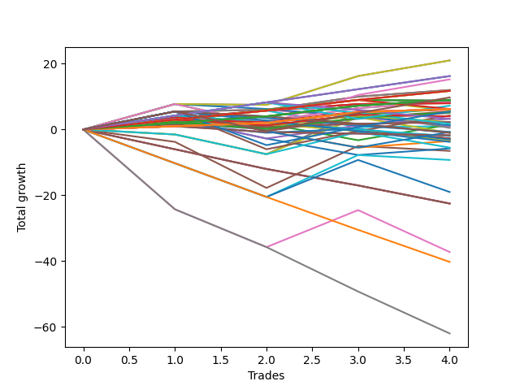

# Short Entry Wallace MJ 007 
- Symbol: ES_Unlimited
- Date Range: 03/18/2022 - 07/15/2022
- Trading Period: 7:20-12:30
- Number of Trades: 4



| Name | Win Percent | Profit | Avg Profit / Trade | Avg Time / Trade |      | Name | Win Percent | Profit | Avg Profit / Trade | Avg Time / Trade |
| ---- | ----------- | ------ | ------------------ | ---------------- | ---- | ---- | ----------- | ------ | ------------------ | ---------------- |
| Sorted By <br> Profit | | | | | | Sorted By <br> Win Percentage ||||
| Sixty | 75.00 | 10500.00 | 2625.00 | 31:30 |     | One Hundred Twenty-Nine | 100.00 | 8125.00 | 2031.25 | 14:56 |
| Four | 75.00 | 10500.00 | 2625.00 | 31:30 |     | One Hundred Twenty-Four | 100.00 | 8125.00 | 2031.25 | 14:56 |
| One Hundred Twenty-Nine | 100.00 | 8125.00 | 2031.25 | 14:56 |     | Eighty-Four | 100.00 | 8125.00 | 2031.25 | 14:56 |
| One Hundred Twenty-Four | 100.00 | 8125.00 | 2031.25 | 14:56 |     | Fifty-Nine | 100.00 | 6000.00 | 1500.00 | 23:37 |
| Eighty-Four | 100.00 | 8125.00 | 2031.25 | 14:56 |     | Three | 100.00 | 6000.00 | 1500.00 | 23:37 |
| Sixty-Eight | 75.00 | 7625.00 | 1906.25 | 22:26 |     | One Hundred Twenty-Eight | 100.00 | 5875.00 | 1468.75 | 08:33 |
| Fifty-Nine | 100.00 | 6000.00 | 1500.00 | 23:37 |     | One Hundred Twenty-Three | 100.00 | 5875.00 | 1468.75 | 08:33 |
| Three | 100.00 | 6000.00 | 1500.00 | 23:37 |     | One Hundred Thirteen | 100.00 | 5875.00 | 1468.75 | 08:33 |
| One Hundred Twenty-Eight | 100.00 | 5875.00 | 1468.75 | 08:33 |     | Eighty-Three | 100.00 | 5875.00 | 1468.75 | 08:33 |
| One Hundred Twenty-Three | 100.00 | 5875.00 | 1468.75 | 08:33 |     | One Hundred Twenty-Seven | 100.00 | 4500.00 | 1125.00 | 02:11 |
| One Hundred Thirteen | 100.00 | 5875.00 | 1468.75 | 08:33 |     | One Hundred Twenty-Two | 100.00 | 4500.00 | 1125.00 | 02:11 |
| Eighty-Three | 100.00 | 5875.00 | 1468.75 | 08:33 |     | One Hundred Seventeen | 100.00 | 4500.00 | 1125.00 | 02:11 |
| One Hundred Thirty | 75.00 | 4875.00 | 1218.75 | 22:23 |     | One Hundred Twelve | 100.00 | 4500.00 | 1125.00 | 02:11 |
| One Hundred Twenty-Seven | 100.00 | 4500.00 | 1125.00 | 02:11 |     | One Hundred Two | 100.00 | 4500.00 | 1125.00 | 02:11 |
| One Hundred Twenty-Two | 100.00 | 4500.00 | 1125.00 | 02:11 |     | Eighty-Two | 100.00 | 4500.00 | 1125.00 | 02:11 |
| One Hundred Seventeen | 100.00 | 4500.00 | 1125.00 | 02:11 |     | Sixty-Five | 100.00 | 4000.00 | 1000.00 | 15:17 |
| One Hundred Twelve | 100.00 | 4500.00 | 1125.00 | 02:11 |     | Fifty-Seven | 100.00 | 4000.00 | 1000.00 | 15:17 |
| One Hundred Two | 100.00 | 4500.00 | 1125.00 | 02:11 |     | One | 100.00 | 4000.00 | 1000.00 | 15:17 |
| Eighty-Two | 100.00 | 4500.00 | 1125.00 | 02:11 |     | One Hundred Twenty-Six | 100.00 | 3125.00 | 781.25 | 01:11 |
| Sixty-Four | 75.00 | 4375.00 | 1093.75 | 07:10 |     | One Hundred Twenty-One | 100.00 | 3125.00 | 781.25 | 01:11 |
| Fifty-Six | 75.00 | 4375.00 | 1093.75 | 07:10 |     | One Hundred Sixteen | 100.00 | 3125.00 | 781.25 | 01:11 |
| Forty | 75.00 | 4375.00 | 1093.75 | 07:10 |     | One Hundred Eleven | 100.00 | 3125.00 | 781.25 | 01:11 |
| Zero | 75.00 | 4375.00 | 1093.75 | 07:10 |     | One Hundred Six | 100.00 | 3125.00 | 781.25 | 01:11 |
| Fifty-Eight | 75.00 | 4250.00 | 1062.50 | 28:03 |     | One Hundred One | 100.00 | 3125.00 | 781.25 | 01:11 |
| Two | 75.00 | 4250.00 | 1062.50 | 28:03 |     | Ninety-Six | 100.00 | 3125.00 | 781.25 | 01:11 |
| Sixty-Five | 100.00 | 4000.00 | 1000.00 | 15:17 |     | Ninety-One | 100.00 | 3125.00 | 781.25 | 01:11 |
| Fifty-Seven | 100.00 | 4000.00 | 1000.00 | 15:17 |     | Eighty-One | 100.00 | 3125.00 | 781.25 | 01:11 |
| One | 100.00 | 4000.00 | 1000.00 | 15:17 |     | Sixty | 75.00 | 10500.00 | 2625.00 | 31:30 |
| One Hundred Fourteen | 75.00 | 3625.00 | 906.25 | 13:25 |     | Four | 75.00 | 10500.00 | 2625.00 | 31:30 |
| One Hundred Twenty-Six | 100.00 | 3125.00 | 781.25 | 01:11 |     | Sixty-Eight | 75.00 | 7625.00 | 1906.25 | 22:26 |
| One Hundred Twenty-One | 100.00 | 3125.00 | 781.25 | 01:11 |     | One Hundred Thirty | 75.00 | 4875.00 | 1218.75 | 22:23 |
| One Hundred Sixteen | 100.00 | 3125.00 | 781.25 | 01:11 |     | Sixty-Four | 75.00 | 4375.00 | 1093.75 | 07:10 |
| One Hundred Eleven | 100.00 | 3125.00 | 781.25 | 01:11 |     | Fifty-Six | 75.00 | 4375.00 | 1093.75 | 07:10 |
| One Hundred Six | 100.00 | 3125.00 | 781.25 | 01:11 |     | Forty | 75.00 | 4375.00 | 1093.75 | 07:10 |
| One Hundred One | 100.00 | 3125.00 | 781.25 | 01:11 |     | Zero | 75.00 | 4375.00 | 1093.75 | 07:10 |
| Ninety-Six | 100.00 | 3125.00 | 781.25 | 01:11 |     | Fifty-Eight | 75.00 | 4250.00 | 1062.50 | 28:03 |
| Ninety-One | 100.00 | 3125.00 | 781.25 | 01:11 |     | Two | 75.00 | 4250.00 | 1062.50 | 28:03 |
| Eighty-One | 100.00 | 3125.00 | 781.25 | 01:11 |     | One Hundred Fourteen | 75.00 | 3625.00 | 906.25 | 13:25 |
| One Hundred Eighteen | 75.00 | 3125.00 | 781.25 | 04:02 |     | One Hundred Eighteen | 75.00 | 3125.00 | 781.25 | 04:02 |
| Ninety-Seven | 75.00 | 3125.00 | 781.25 | 01:33 |     | Ninety-Seven | 75.00 | 3125.00 | 781.25 | 01:33 |
| Ninety-Eight | 75.00 | 3000.00 | 750.00 | 02:30 |     | Ninety-Eight | 75.00 | 3000.00 | 750.00 | 02:30 |
| One Hundred Three | 75.00 | 2875.00 | 718.75 | 04:03 |     | One Hundred Three | 75.00 | 2875.00 | 718.75 | 04:03 |
| One Hundred Twenty-Five | 75.00 | 2750.00 | 687.50 | 35:07 |     | One Hundred Twenty-Five | 75.00 | 2750.00 | 687.50 | 35:07 |
| Sixty-Seven | 75.00 | 2750.00 | 687.50 | 20:20 |     | Sixty-Seven | 75.00 | 2750.00 | 687.50 | 20:20 |
| One Hundred Seven | 75.00 | 2625.00 | 656.25 | 01:35 |     | One Hundred Seven | 75.00 | 2625.00 | 656.25 | 01:35 |
| Ninety-Two | 75.00 | 2500.00 | 625.00 | 01:36 |     | Ninety-Two | 75.00 | 2500.00 | 625.00 | 01:36 |
| Eighty-Five | 75.00 | 2125.00 | 531.25 | 54:13 |     | Eighty-Five | 75.00 | 2125.00 | 531.25 | 54:13 |
| One Hundred Eight | 50.00 | 2000.00 | 500.00 | 02:51 |     | Sixty-Six | 75.00 | 1625.00 | 406.25 | 19:02 |
| Sixty-Six | 75.00 | 1625.00 | 406.25 | 19:02 |     | One Hundred | 75.00 | 1125.00 | 281.25 | 03:40 |
| One Hundred Ninteen | 50.00 | 1625.00 | 406.25 | 06:21 |     | Ninety-Nine | 75.00 | 1125.00 | 281.25 | 03:40 |
| One Hundred | 75.00 | 1125.00 | 281.25 | 03:40 |     | Forty-One | 75.00 | 500.00 | 125.00 | 13:48 |
| Ninety-Nine | 75.00 | 1125.00 | 281.25 | 03:40 |     | One Hundred Eight | 50.00 | 2000.00 | 500.00 | 02:51 |
| Ninety-Three | 50.00 | 1125.00 | 281.25 | 03:12 |     | One Hundred Ninteen | 50.00 | 1625.00 | 406.25 | 06:21 |
| One Hundred Four | 50.00 | 875.00 | 218.75 | 08:38 |     | Ninety-Three | 50.00 | 1125.00 | 281.25 | 03:12 |
| Forty-Four | 50.00 | 750.00 | 187.50 | 20:36 |     | One Hundred Four | 50.00 | 875.00 | 218.75 | 08:38 |
| Fifty-Two | 25.00 | 625.00 | 156.25 | 10:37 |     | Forty-Four | 50.00 | 750.00 | 187.50 | 20:36 |
| Forty-One | 75.00 | 500.00 | 125.00 | 13:48 |     | Forty-Eight | 50.00 | 500.00 | 125.00 | 04:16 |
| Forty-Eight | 50.00 | 500.00 | 125.00 | 04:16 |     | One Hundred Fifteen | 50.00 | -375.00 | -93.75 | 20:41 |
| Sixty-Nine | 25.00 | 250.00 | 62.50 | 41:11 |     | Seventy-Three | 50.00 | -1500.00 | -375.00 | 09:35 |
| One Hundred Fifteen | 50.00 | -375.00 | -93.75 | 20:41 |     | Forty-Three | 50.00 | -1750.00 | -437.50 | 18:48 |
| Ninety-Five | 25.00 | -375.00 | -93.75 | 06:36 |     | Forty-Two | 50.00 | -2875.00 | -718.75 | 17:31 |
| One Hundred Twenty | 25.00 | -500.00 | -125.00 | 08:58 |     | Fifty-Two | 25.00 | 625.00 | 156.25 | 10:37 |
| Seventy | 25.00 | -500.00 | -125.00 | 41:08 |     | Sixty-Nine | 25.00 | 250.00 | 62.50 | 41:11 |
| Fifty-One | 25.00 | -500.00 | -125.00 | 08:58 |     | Ninety-Five | 25.00 | -375.00 | -93.75 | 06:36 |
| One Hundred Ten | 25.00 | -875.00 | -218.75 | 04:16 |     | One Hundred Twenty | 25.00 | -500.00 | -125.00 | 08:58 |
| One Hundred Nine | 25.00 | -875.00 | -218.75 | 04:16 |     | Seventy | 25.00 | -500.00 | -125.00 | 41:08 |
| Ninety-Four | 25.00 | -1000.00 | -250.00 | 05:28 |     | Fifty-One | 25.00 | -500.00 | -125.00 | 08:58 |
| Fifty-Five | 25.00 | -1375.00 | -343.75 | 13:10 |     | One Hundred Ten | 25.00 | -875.00 | -218.75 | 04:16 |
| Fifty-Four | 25.00 | -1375.00 | -343.75 | 13:10 |     | One Hundred Nine | 25.00 | -875.00 | -218.75 | 04:16 |
| Fifty-Three | 25.00 | -1375.00 | -343.75 | 13:10 |     | Ninety-Four | 25.00 | -1000.00 | -250.00 | 05:28 |
| Seventy-Three | 50.00 | -1500.00 | -375.00 | 09:35 |     | Fifty-Five | 25.00 | -1375.00 | -343.75 | 13:10 |
| Forty-Nine | 25.00 | -1500.00 | -375.00 | 06:50 |     | Fifty-Four | 25.00 | -1375.00 | -343.75 | 13:10 |
| Fifty | 25.00 | -1625.00 | -406.25 | 07:41 |     | Fifty-Three | 25.00 | -1375.00 | -343.75 | 13:10 |
| Forty-Three | 50.00 | -1750.00 | -437.50 | 18:48 |     | Forty-Nine | 25.00 | -1500.00 | -375.00 | 06:50 |
| One Hundred Five | 25.00 | -1875.00 | -468.75 | 11:27 |     | Fifty | 25.00 | -1625.00 | -406.25 | 07:41 |
| Seventy-One | 25.00 | -2750.00 | -687.50 | 46:52 |     | One Hundred Five | 25.00 | -1875.00 | -468.75 | 11:27 |
| Forty-Two | 50.00 | -2875.00 | -718.75 | 17:31 |     | Seventy-One | 25.00 | -2750.00 | -687.50 | 46:52 |
| Five | 25.00 | -3250.00 | -812.50 | 102:20 |     | Five | 25.00 | -3250.00 | -812.50 | 102:20 |
| Sixty-One | 25.00 | -4625.00 | -1156.25 | 80:57 |     | Sixty-One | 25.00 | -4625.00 | -1156.25 | 80:57 |
| Sixty-Two | 25.00 | -9500.00 | -2375.00 | 94:28 |     | Sixty-Two | 25.00 | -9500.00 | -2375.00 | 94:28 |
| Forty-Seven | 0.00 | -11250.00 | -2812.50 | 42:31 |     | Six | 25.00 | -18625.00 | -4656.25 | 179:05 |
| Forty-Six | 0.00 | -11250.00 | -2812.50 | 42:31 |     | Forty-Seven | 0.00 | -11250.00 | -2812.50 | 42:31 |
| Forty-Five | 0.00 | -11250.00 | -2812.50 | 42:31 |     | Forty-Six | 0.00 | -11250.00 | -2812.50 | 42:31 |
| Six | 25.00 | -18625.00 | -4656.25 | 179:05 |     | Forty-Five | 0.00 | -11250.00 | -2812.50 | 42:31 |
| Sixty-Three | 0.00 | -20125.00 | -5031.25 | 103:51 |     | Sixty-Three | 0.00 | -20125.00 | -5031.25 | 103:51 |
| Seven | 0.00 | -31000.00 | -7750.00 | 247:15 |     | Seven | 0.00 | -31000.00 | -7750.00 | 247:15 |

## NO STOPLOSS

### Test Zero
* Sell when price hits the middle line of the 20p bollinger
* No Stoploss
* Results:
```
Total Trades: 4
Percent Up: 25.00
Percent Down: 75.00
Total Points Moved Down: 8.75
Potential Profit: 4375.00
Total Points Ups: 0.25 Count Ups: 1
Total Points Downs: 9.00 Count Downs: 3
```

<details><summary>Trades</summary>

<code>In: 2022-04-13 08:36:00		Out: 2022-04-13 08:37:40		Total Position Time: 01:40		Total Move Down: 2.50		Total to Date: 2.50</code> <br />
<code>In: 2022-04-28 10:17:00		Out: 2022-04-28 10:22:10		Total Position Time: 05:10		Total Move Down: 3.50		Total to Date: 6.00</code> <br />
<code>In: 2022-05-31 07:49:00		Out: 2022-05-31 07:56:35		Total Position Time: 07:35		Total Move Down: 3.00		Total to Date: 9.00</code> <br />
<code>In: 2022-07-07 07:57:00		Out: 2022-07-07 08:11:15		Total Position Time: 14:15		Total Move Down: -0.25		Total to Date: 8.75</code> <br />


</details>

### Test One
* Sell when the price hits the upper line of the 20p 1std bollinger
* No Stoploss
* Results:
```
Total Trades: 4
Percent Up: 0.00
Percent Down: 100.00
Total Points Moved Down: 8.00
Potential Profit: 4000.00
Total Points Ups: 0.00 Count Ups: 0
Total Points Downs: 8.00 Count Downs: 4
```

<details><summary>Trades</summary>

<code>In: 2022-04-13 08:36:00		Out: 2022-04-13 08:41:50		Total Position Time: 05:50		Total Move Down: 3.50		Total to Date: 3.50</code> <br />
<code>In: 2022-04-28 10:17:00		Out: 2022-04-28 10:30:55		Total Position Time: 13:55		Total Move Down: 2.25		Total to Date: 5.75</code> <br />
<code>In: 2022-05-31 07:49:00		Out: 2022-05-31 08:07:20		Total Position Time: 18:20		Total Move Down: 2.00		Total to Date: 7.75</code> <br />
<code>In: 2022-07-07 07:57:00		Out: 2022-07-07 08:20:05		Total Position Time: 23:05		Total Move Down: 0.25		Total to Date: 8.00</code> <br />


</details>

### Test Two
* Sell when the price hits the upper line of the 20p 2std bollinger
* No Stoploss
* Results:
```
Total Trades: 4
Percent Up: 25.00
Percent Down: 75.00
Total Points Moved Down: 8.50
Potential Profit: 4250.00
Total Points Ups: 0.75 Count Ups: 1
Total Points Downs: 9.25 Count Downs: 3
```

<details><summary>Trades</summary>

<code>In: 2022-04-13 08:36:00		Out: 2022-04-13 08:45:15		Total Position Time: 09:15		Total Move Down: 3.25		Total to Date: 3.25</code> <br />
<code>In: 2022-04-28 10:17:00		Out: 2022-04-28 11:15:45		Total Position Time: 58:45		Total Move Down: -0.75		Total to Date: 2.50</code> <br />
<code>In: 2022-05-31 07:49:00		Out: 2022-05-31 08:07:30		Total Position Time: 18:30		Total Move Down: 4.00		Total to Date: 6.50</code> <br />
<code>In: 2022-07-07 07:57:00		Out: 2022-07-07 08:22:45		Total Position Time: 25:45		Total Move Down: 2.00		Total to Date: 8.50</code> <br />


</details>

### Test Three
* Sell when price hits the middle line of the 50p bollinger
* No Stoploss
* Results:
```
Total Trades: 4
Percent Up: 0.00
Percent Down: 100.00
Total Points Moved Down: 12.00
Potential Profit: 6000.00
Total Points Ups: 0.00 Count Ups: 0
Total Points Downs: 12.00 Count Downs: 4
```

<details><summary>Trades</summary>

<code>In: 2022-04-13 08:36:00		Out: 2022-04-13 08:50:25		Total Position Time: 14:25		Total Move Down: 5.50		Total to Date: 5.50</code> <br />
<code>In: 2022-04-28 10:17:00		Out: 2022-04-28 10:52:50		Total Position Time: 35:50		Total Move Down: 0.50		Total to Date: 6.00</code> <br />
<code>In: 2022-05-31 07:49:00		Out: 2022-05-31 08:07:30		Total Position Time: 18:30		Total Move Down: 4.00		Total to Date: 10.00</code> <br />
<code>In: 2022-07-07 07:57:00		Out: 2022-07-07 08:22:45		Total Position Time: 25:45		Total Move Down: 2.00		Total to Date: 12.00</code> <br />


</details>

### Test Four
* Sell when the price hits the upper line of the 50p 1std bollinger
* No Stoploss
* Results:
```
Total Trades: 4
Percent Up: 25.00
Percent Down: 75.00
Total Points Moved Down: 21.00
Potential Profit: 10500.00
Total Points Ups: 0.25 Count Ups: 1
Total Points Downs: 21.25 Count Downs: 3
```

<details><summary>Trades</summary>

<code>In: 2022-04-13 08:36:00		Out: 2022-04-13 08:57:00		Total Position Time: 21:00		Total Move Down: 7.75		Total to Date: 7.75</code> <br />
<code>In: 2022-04-28 10:17:00		Out: 2022-04-28 11:15:55		Total Position Time: 58:55		Total Move Down: -0.25		Total to Date: 7.50</code> <br />
<code>In: 2022-05-31 07:49:00		Out: 2022-05-31 08:08:45		Total Position Time: 19:45		Total Move Down: 8.75		Total to Date: 16.25</code> <br />
<code>In: 2022-07-07 07:57:00		Out: 2022-07-07 08:23:20		Total Position Time: 26:20		Total Move Down: 4.75		Total to Date: 21.00</code> <br />


</details>

### Test Five
* Sell when the price hits the upper line of the 50p 2std bollinger
* No Stoploss
* Results:
```
Total Trades: 4
Percent Up: 75.00
Percent Down: 25.00
Total Points Moved Down: -6.50
Potential Profit: -3250.00
Total Points Ups: 19.25 Count Ups: 3
Total Points Downs: 12.75 Count Downs: 1
```

<details><summary>Trades</summary>

<code>In: 2022-04-13 08:36:00		Out: 2022-04-13 10:33:25		Total Position Time: 117:25		Total Move Down: -3.75		Total to Date: -3.75</code> <br />
<code>In: 2022-04-28 10:17:00		Out: 2022-04-28 12:34:05		Total Position Time: 137:05		Total Move Down: -14.00		Total to Date: -17.75</code> <br />
<code>In: 2022-05-31 07:49:00		Out: 2022-05-31 08:14:30		Total Position Time: 25:30		Total Move Down: 12.75		Total to Date: -5.00</code> <br />
<code>In: 2022-07-07 07:57:00		Out: 2022-07-07 10:06:20		Total Position Time: 129:20		Total Move Down: -1.50		Total to Date: -6.50</code> <br />


</details>

### Test Six
* Sell when the price hits the middle line of the 1std VWAP
* No Stoploss
* Results:
```
Total Trades: 4
Percent Up: 75.00
Percent Down: 25.00
Total Points Moved Down: -37.25
Potential Profit: -18625.00
Total Points Ups: 48.50 Count Ups: 3
Total Points Downs: 11.25 Count Downs: 1
```

<details><summary>Trades</summary>

<code>In: 2022-04-13 08:36:00		Out: 2022-04-13 12:47:00		Total Position Time: 251:00		Total Move Down: -24.25		Total to Date: -24.25</code> <br />
<code>In: 2022-04-28 10:17:00		Out: 2022-04-28 12:47:00		Total Position Time: 150:00		Total Move Down: -11.50		Total to Date: -35.75</code> <br />
<code>In: 2022-05-31 07:49:00		Out: 2022-05-31 08:14:20		Total Position Time: 25:20		Total Move Down: 11.25		Total to Date: -24.50</code> <br />
<code>In: 2022-07-07 07:57:00		Out: 2022-07-07 12:47:00		Total Position Time: 290:00		Total Move Down: -12.75		Total to Date: -37.25</code> <br />


</details>

### Test Seven
* Sell when the price hits the upper line of the 1std VWAP
* No Stoploss
* Results:
```
Total Trades: 4
Percent Up: 100.00
Percent Down: 0.00
Total Points Moved Down: -62.00
Potential Profit: -31000.00
Total Points Ups: 62.00 Count Ups: 4
Total Points Downs: 0.00 Count Downs: 0
```

<details><summary>Trades</summary>

<code>In: 2022-04-13 08:36:00		Out: 2022-04-13 12:47:00		Total Position Time: 251:00		Total Move Down: -24.25		Total to Date: -24.25</code> <br />
<code>In: 2022-04-28 10:17:00		Out: 2022-04-28 12:47:00		Total Position Time: 150:00		Total Move Down: -11.50		Total to Date: -35.75</code> <br />
<code>In: 2022-05-31 07:49:00		Out: 2022-05-31 12:47:00		Total Position Time: 298:00		Total Move Down: -13.50		Total to Date: -49.25</code> <br />
<code>In: 2022-07-07 07:57:00		Out: 2022-07-07 12:47:00		Total Position Time: 290:00		Total Move Down: -12.75		Total to Date: -62.00</code> <br />


</details>

## STOPLOSS OF 5

### Test Forty
* Sell when price hits the middle line of the 20p bollinger
* Stoploss is -5 points
* Results:
```
Total Trades: 4
Percent Up: 25.00
Percent Down: 75.00
Total Points Moved Down: 8.75
Potential Profit: 4375.00
Total Points Ups: 0.25 Count Ups: 1
Total Points Downs: 9.00 Count Downs: 3
```

<details><summary>Trades</summary>

<code>In: 2022-04-13 08:36:00		Out: 2022-04-13 08:37:40		Total Position Time: 01:40		Total Move Down: 2.50		Total to Date: 2.50</code> <br />
<code>In: 2022-04-28 10:17:00		Out: 2022-04-28 10:22:10		Total Position Time: 05:10		Total Move Down: 3.50		Total to Date: 6.00</code> <br />
<code>In: 2022-05-31 07:49:00		Out: 2022-05-31 07:56:35		Total Position Time: 07:35		Total Move Down: 3.00		Total to Date: 9.00</code> <br />
<code>In: 2022-07-07 07:57:00		Out: 2022-07-07 08:11:15		Total Position Time: 14:15		Total Move Down: -0.25		Total to Date: 8.75</code> <br />


</details>

### Test Forty-One
* Sell when the price hits the upper line of the 20p 1std bollinger
* Stoploss is -5 points
* Results:
```
Total Trades: 4
Percent Up: 25.00
Percent Down: 75.00
Total Points Moved Down: 1.00
Potential Profit: 500.00
Total Points Ups: 5.00 Count Ups: 1
Total Points Downs: 6.00 Count Downs: 3
```

<details><summary>Trades</summary>

<code>In: 2022-04-13 08:36:00		Out: 2022-04-13 08:41:50		Total Position Time: 05:50		Total Move Down: 3.50		Total to Date: 3.50</code> <br />
<code>In: 2022-04-28 10:17:00		Out: 2022-04-28 10:30:55		Total Position Time: 13:55		Total Move Down: 2.25		Total to Date: 5.75</code> <br />
<code>In: 2022-05-31 07:49:00		Out: 2022-05-31 08:01:25		Total Position Time: 12:25		Total Move Down: -5.00		Total to Date: 0.75</code> <br />
<code>In: 2022-07-07 07:57:00		Out: 2022-07-07 08:20:05		Total Position Time: 23:05		Total Move Down: 0.25		Total to Date: 1.00</code> <br />


</details>

### Test Forty-Two
* Sell when the price hits the upper line of the 20p 2std bollinger
* Stoploss is -5 points
* Results:
```
Total Trades: 4
Percent Up: 50.00
Percent Down: 50.00
Total Points Moved Down: -5.75
Potential Profit: -2875.00
Total Points Ups: 11.00 Count Ups: 2
Total Points Downs: 5.25 Count Downs: 2
```

<details><summary>Trades</summary>

<code>In: 2022-04-13 08:36:00		Out: 2022-04-13 08:45:15		Total Position Time: 09:15		Total Move Down: 3.25		Total to Date: 3.25</code> <br />
<code>In: 2022-04-28 10:17:00		Out: 2022-04-28 10:39:40		Total Position Time: 22:40		Total Move Down: -6.00		Total to Date: -2.75</code> <br />
<code>In: 2022-05-31 07:49:00		Out: 2022-05-31 08:01:25		Total Position Time: 12:25		Total Move Down: -5.00		Total to Date: -7.75</code> <br />
<code>In: 2022-07-07 07:57:00		Out: 2022-07-07 08:22:45		Total Position Time: 25:45		Total Move Down: 2.00		Total to Date: -5.75</code> <br />


</details>

### Test Forty-Three
* Sell when price hits the middle line of the 50p bollinger
* Stoploss is -5 points
* Results:
```
Total Trades: 4
Percent Up: 50.00
Percent Down: 50.00
Total Points Moved Down: -3.50
Potential Profit: -1750.00
Total Points Ups: 11.00 Count Ups: 2
Total Points Downs: 7.50 Count Downs: 2
```

<details><summary>Trades</summary>

<code>In: 2022-04-13 08:36:00		Out: 2022-04-13 08:50:25		Total Position Time: 14:25		Total Move Down: 5.50		Total to Date: 5.50</code> <br />
<code>In: 2022-04-28 10:17:00		Out: 2022-04-28 10:39:40		Total Position Time: 22:40		Total Move Down: -6.00		Total to Date: -0.50</code> <br />
<code>In: 2022-05-31 07:49:00		Out: 2022-05-31 08:01:25		Total Position Time: 12:25		Total Move Down: -5.00		Total to Date: -5.50</code> <br />
<code>In: 2022-07-07 07:57:00		Out: 2022-07-07 08:22:45		Total Position Time: 25:45		Total Move Down: 2.00		Total to Date: -3.50</code> <br />


</details>

### Test Forty-Four
* Sell when the price hits the upper line of the 50p 1std bollinger
* Stoploss is -5 points
* Results:
```
Total Trades: 4
Percent Up: 50.00
Percent Down: 50.00
Total Points Moved Down: 1.50
Potential Profit: 750.00
Total Points Ups: 11.00 Count Ups: 2
Total Points Downs: 12.50 Count Downs: 2
```

<details><summary>Trades</summary>

<code>In: 2022-04-13 08:36:00		Out: 2022-04-13 08:57:00		Total Position Time: 21:00		Total Move Down: 7.75		Total to Date: 7.75</code> <br />
<code>In: 2022-04-28 10:17:00		Out: 2022-04-28 10:39:40		Total Position Time: 22:40		Total Move Down: -6.00		Total to Date: 1.75</code> <br />
<code>In: 2022-05-31 07:49:00		Out: 2022-05-31 08:01:25		Total Position Time: 12:25		Total Move Down: -5.00		Total to Date: -3.25</code> <br />
<code>In: 2022-07-07 07:57:00		Out: 2022-07-07 08:23:20		Total Position Time: 26:20		Total Move Down: 4.75		Total to Date: 1.50</code> <br />


</details>

### Test Forty-Five
* Sell when the price hits the upper line of the 50p 2std bollinger
* Stoploss is -5 points
* Results:
```
Total Trades: 4
Percent Up: 100.00
Percent Down: 0.00
Total Points Moved Down: -22.50
Potential Profit: -11250.00
Total Points Ups: 22.50 Count Ups: 4
Total Points Downs: 0.00 Count Downs: 0
```

<details><summary>Trades</summary>

<code>In: 2022-04-13 08:36:00		Out: 2022-04-13 09:40:45		Total Position Time: 64:45		Total Move Down: -6.00		Total to Date: -6.00</code> <br />
<code>In: 2022-04-28 10:17:00		Out: 2022-04-28 10:39:40		Total Position Time: 22:40		Total Move Down: -6.00		Total to Date: -12.00</code> <br />
<code>In: 2022-05-31 07:49:00		Out: 2022-05-31 08:01:25		Total Position Time: 12:25		Total Move Down: -5.00		Total to Date: -17.00</code> <br />
<code>In: 2022-07-07 07:57:00		Out: 2022-07-07 09:07:15		Total Position Time: 70:15		Total Move Down: -5.50		Total to Date: -22.50</code> <br />


</details>

### Test Forty-Six
* Sell when the price hits the middle line of the 1std VWAP
* Stoploss is -5 points
* Results:
```
Total Trades: 4
Percent Up: 100.00
Percent Down: 0.00
Total Points Moved Down: -22.50
Potential Profit: -11250.00
Total Points Ups: 22.50 Count Ups: 4
Total Points Downs: 0.00 Count Downs: 0
```

<details><summary>Trades</summary>

<code>In: 2022-04-13 08:36:00		Out: 2022-04-13 09:40:45		Total Position Time: 64:45		Total Move Down: -6.00		Total to Date: -6.00</code> <br />
<code>In: 2022-04-28 10:17:00		Out: 2022-04-28 10:39:40		Total Position Time: 22:40		Total Move Down: -6.00		Total to Date: -12.00</code> <br />
<code>In: 2022-05-31 07:49:00		Out: 2022-05-31 08:01:25		Total Position Time: 12:25		Total Move Down: -5.00		Total to Date: -17.00</code> <br />
<code>In: 2022-07-07 07:57:00		Out: 2022-07-07 09:07:15		Total Position Time: 70:15		Total Move Down: -5.50		Total to Date: -22.50</code> <br />


</details>

### Test Forty-Seven
* Sell when the price hits the upper line of the 1std VWAP
* Stoploss is -5 points
* Results:
```
Total Trades: 4
Percent Up: 100.00
Percent Down: 0.00
Total Points Moved Down: -22.50
Potential Profit: -11250.00
Total Points Ups: 22.50 Count Ups: 4
Total Points Downs: 0.00 Count Downs: 0
```

<details><summary>Trades</summary>

<code>In: 2022-04-13 08:36:00		Out: 2022-04-13 09:40:45		Total Position Time: 64:45		Total Move Down: -6.00		Total to Date: -6.00</code> <br />
<code>In: 2022-04-28 10:17:00		Out: 2022-04-28 10:39:40		Total Position Time: 22:40		Total Move Down: -6.00		Total to Date: -12.00</code> <br />
<code>In: 2022-05-31 07:49:00		Out: 2022-05-31 08:01:25		Total Position Time: 12:25		Total Move Down: -5.00		Total to Date: -17.00</code> <br />
<code>In: 2022-07-07 07:57:00		Out: 2022-07-07 09:07:15		Total Position Time: 70:15		Total Move Down: -5.50		Total to Date: -22.50</code> <br />


</details>

## TRAIL STOP OF 5

### Test Forty-Eight
* Sell when price hits the middle line of the 20p bollinger
* Trailing Stop is -5 points
* Results:
```
Total Trades: 4
Percent Up: 50.00
Percent Down: 50.00
Total Points Moved Down: 1.00
Potential Profit: 500.00
Total Points Ups: 5.00 Count Ups: 2
Total Points Downs: 6.00 Count Downs: 2
```

<details><summary>Trades</summary>

<code>In: 2022-04-13 08:36:00		Out: 2022-04-13 08:37:40		Total Position Time: 01:40		Total Move Down: 2.50		Total to Date: 2.50</code> <br />
<code>In: 2022-04-28 10:17:00		Out: 2022-04-28 10:22:10		Total Position Time: 05:10		Total Move Down: 3.50		Total to Date: 6.00</code> <br />
<code>In: 2022-05-31 07:49:00		Out: 2022-05-31 07:51:30		Total Position Time: 02:30		Total Move Down: -2.25		Total to Date: 3.75</code> <br />
<code>In: 2022-07-07 07:57:00		Out: 2022-07-07 08:04:45		Total Position Time: 07:45		Total Move Down: -2.75		Total to Date: 1.00</code> <br />


</details>

### Test Forty-Nine
* Sell when the price hits the upper line of the 20p 1std bollinger
* Trailing Stop is -5 points
* Results:
```
Total Trades: 4
Percent Up: 75.00
Percent Down: 25.00
Total Points Moved Down: -3.00
Potential Profit: -1500.00
Total Points Ups: 6.50 Count Ups: 3
Total Points Downs: 3.50 Count Downs: 1
```

<details><summary>Trades</summary>

<code>In: 2022-04-13 08:36:00		Out: 2022-04-13 08:41:50		Total Position Time: 05:50		Total Move Down: 3.50		Total to Date: 3.50</code> <br />
<code>In: 2022-04-28 10:17:00		Out: 2022-04-28 10:28:15		Total Position Time: 11:15		Total Move Down: -1.50		Total to Date: 2.00</code> <br />
<code>In: 2022-05-31 07:49:00		Out: 2022-05-31 07:51:30		Total Position Time: 02:30		Total Move Down: -2.25		Total to Date: -0.25</code> <br />
<code>In: 2022-07-07 07:57:00		Out: 2022-07-07 08:04:45		Total Position Time: 07:45		Total Move Down: -2.75		Total to Date: -3.00</code> <br />


</details>

### Test Fifty
* Sell when the price hits the upper line of the 20p 2std bollinger
* Trailing Stop is -5 points
* Results:
```
Total Trades: 4
Percent Up: 75.00
Percent Down: 25.00
Total Points Moved Down: -3.25
Potential Profit: -1625.00
Total Points Ups: 6.50 Count Ups: 3
Total Points Downs: 3.25 Count Downs: 1
```

<details><summary>Trades</summary>

<code>In: 2022-04-13 08:36:00		Out: 2022-04-13 08:45:15		Total Position Time: 09:15		Total Move Down: 3.25		Total to Date: 3.25</code> <br />
<code>In: 2022-04-28 10:17:00		Out: 2022-04-28 10:28:15		Total Position Time: 11:15		Total Move Down: -1.50		Total to Date: 1.75</code> <br />
<code>In: 2022-05-31 07:49:00		Out: 2022-05-31 07:51:30		Total Position Time: 02:30		Total Move Down: -2.25		Total to Date: -0.50</code> <br />
<code>In: 2022-07-07 07:57:00		Out: 2022-07-07 08:04:45		Total Position Time: 07:45		Total Move Down: -2.75		Total to Date: -3.25</code> <br />


</details>

### Test Fifty-One
* Sell when price hits the middle line of the 50p bollinger
* Trailing Stop is -5 points
* Results:
```
Total Trades: 4
Percent Up: 75.00
Percent Down: 25.00
Total Points Moved Down: -1.00
Potential Profit: -500.00
Total Points Ups: 6.50 Count Ups: 3
Total Points Downs: 5.50 Count Downs: 1
```

<details><summary>Trades</summary>

<code>In: 2022-04-13 08:36:00		Out: 2022-04-13 08:50:25		Total Position Time: 14:25		Total Move Down: 5.50		Total to Date: 5.50</code> <br />
<code>In: 2022-04-28 10:17:00		Out: 2022-04-28 10:28:15		Total Position Time: 11:15		Total Move Down: -1.50		Total to Date: 4.00</code> <br />
<code>In: 2022-05-31 07:49:00		Out: 2022-05-31 07:51:30		Total Position Time: 02:30		Total Move Down: -2.25		Total to Date: 1.75</code> <br />
<code>In: 2022-07-07 07:57:00		Out: 2022-07-07 08:04:45		Total Position Time: 07:45		Total Move Down: -2.75		Total to Date: -1.00</code> <br />


</details>

### Test Fifty-Two
* Sell when the price hits the upper line of the 50p 1std bollinger
* Trailing Stop is -5 points
* Results:
```
Total Trades: 4
Percent Up: 75.00
Percent Down: 25.00
Total Points Moved Down: 1.25
Potential Profit: 625.00
Total Points Ups: 6.50 Count Ups: 3
Total Points Downs: 7.75 Count Downs: 1
```

<details><summary>Trades</summary>

<code>In: 2022-04-13 08:36:00		Out: 2022-04-13 08:57:00		Total Position Time: 21:00		Total Move Down: 7.75		Total to Date: 7.75</code> <br />
<code>In: 2022-04-28 10:17:00		Out: 2022-04-28 10:28:15		Total Position Time: 11:15		Total Move Down: -1.50		Total to Date: 6.25</code> <br />
<code>In: 2022-05-31 07:49:00		Out: 2022-05-31 07:51:30		Total Position Time: 02:30		Total Move Down: -2.25		Total to Date: 4.00</code> <br />
<code>In: 2022-07-07 07:57:00		Out: 2022-07-07 08:04:45		Total Position Time: 07:45		Total Move Down: -2.75		Total to Date: 1.25</code> <br />


</details>

### Test Fifty-Three
* Sell when the price hits the upper line of the 50p 2std bollinger
* Trailing Stop is -5 points
* Results:
```
Total Trades: 4
Percent Up: 75.00
Percent Down: 25.00
Total Points Moved Down: -2.75
Potential Profit: -1375.00
Total Points Ups: 6.50 Count Ups: 3
Total Points Downs: 3.75 Count Downs: 1
```

<details><summary>Trades</summary>

<code>In: 2022-04-13 08:36:00		Out: 2022-04-13 09:07:10		Total Position Time: 31:10		Total Move Down: 3.75		Total to Date: 3.75</code> <br />
<code>In: 2022-04-28 10:17:00		Out: 2022-04-28 10:28:15		Total Position Time: 11:15		Total Move Down: -1.50		Total to Date: 2.25</code> <br />
<code>In: 2022-05-31 07:49:00		Out: 2022-05-31 07:51:30		Total Position Time: 02:30		Total Move Down: -2.25		Total to Date: 0.00</code> <br />
<code>In: 2022-07-07 07:57:00		Out: 2022-07-07 08:04:45		Total Position Time: 07:45		Total Move Down: -2.75		Total to Date: -2.75</code> <br />


</details>

### Test Fifty-Four
* Sell when the price hits the middle line of the 1std VWAP
* Trailing Stop is -5 points
* Results:
```
Total Trades: 4
Percent Up: 75.00
Percent Down: 25.00
Total Points Moved Down: -2.75
Potential Profit: -1375.00
Total Points Ups: 6.50 Count Ups: 3
Total Points Downs: 3.75 Count Downs: 1
```

<details><summary>Trades</summary>

<code>In: 2022-04-13 08:36:00		Out: 2022-04-13 09:07:10		Total Position Time: 31:10		Total Move Down: 3.75		Total to Date: 3.75</code> <br />
<code>In: 2022-04-28 10:17:00		Out: 2022-04-28 10:28:15		Total Position Time: 11:15		Total Move Down: -1.50		Total to Date: 2.25</code> <br />
<code>In: 2022-05-31 07:49:00		Out: 2022-05-31 07:51:30		Total Position Time: 02:30		Total Move Down: -2.25		Total to Date: 0.00</code> <br />
<code>In: 2022-07-07 07:57:00		Out: 2022-07-07 08:04:45		Total Position Time: 07:45		Total Move Down: -2.75		Total to Date: -2.75</code> <br />


</details>

### Test Fifty-Five
* Sell when the price hits the upper line of the 1std VWAP
* Trailing Stop is -5 points
* Results:
```
Total Trades: 4
Percent Up: 75.00
Percent Down: 25.00
Total Points Moved Down: -2.75
Potential Profit: -1375.00
Total Points Ups: 6.50 Count Ups: 3
Total Points Downs: 3.75 Count Downs: 1
```

<details><summary>Trades</summary>

<code>In: 2022-04-13 08:36:00		Out: 2022-04-13 09:07:10		Total Position Time: 31:10		Total Move Down: 3.75		Total to Date: 3.75</code> <br />
<code>In: 2022-04-28 10:17:00		Out: 2022-04-28 10:28:15		Total Position Time: 11:15		Total Move Down: -1.50		Total to Date: 2.25</code> <br />
<code>In: 2022-05-31 07:49:00		Out: 2022-05-31 07:51:30		Total Position Time: 02:30		Total Move Down: -2.25		Total to Date: 0.00</code> <br />
<code>In: 2022-07-07 07:57:00		Out: 2022-07-07 08:04:45		Total Position Time: 07:45		Total Move Down: -2.75		Total to Date: -2.75</code> <br />


</details>

## STOPLOSS OF 10

### Test Fifty-Six
* Sell when price hits the middle line of the 20p bollinger
* Stoploss is -10 points
* Results:
```
Total Trades: 4
Percent Up: 25.00
Percent Down: 75.00
Total Points Moved Down: 8.75
Potential Profit: 4375.00
Total Points Ups: 0.25 Count Ups: 1
Total Points Downs: 9.00 Count Downs: 3
```

<details><summary>Trades</summary>

<code>In: 2022-04-13 08:36:00		Out: 2022-04-13 08:37:40		Total Position Time: 01:40		Total Move Down: 2.50		Total to Date: 2.50</code> <br />
<code>In: 2022-04-28 10:17:00		Out: 2022-04-28 10:22:10		Total Position Time: 05:10		Total Move Down: 3.50		Total to Date: 6.00</code> <br />
<code>In: 2022-05-31 07:49:00		Out: 2022-05-31 07:56:35		Total Position Time: 07:35		Total Move Down: 3.00		Total to Date: 9.00</code> <br />
<code>In: 2022-07-07 07:57:00		Out: 2022-07-07 08:11:15		Total Position Time: 14:15		Total Move Down: -0.25		Total to Date: 8.75</code> <br />


</details>

### Test Fifty-Seven
* Sell when the price hits the upper line of the 20p 1std bollinger
* Stoploss is -10 points
* Results:
```
Total Trades: 4
Percent Up: 0.00
Percent Down: 100.00
Total Points Moved Down: 8.00
Potential Profit: 4000.00
Total Points Ups: 0.00 Count Ups: 0
Total Points Downs: 8.00 Count Downs: 4
```

<details><summary>Trades</summary>

<code>In: 2022-04-13 08:36:00		Out: 2022-04-13 08:41:50		Total Position Time: 05:50		Total Move Down: 3.50		Total to Date: 3.50</code> <br />
<code>In: 2022-04-28 10:17:00		Out: 2022-04-28 10:30:55		Total Position Time: 13:55		Total Move Down: 2.25		Total to Date: 5.75</code> <br />
<code>In: 2022-05-31 07:49:00		Out: 2022-05-31 08:07:20		Total Position Time: 18:20		Total Move Down: 2.00		Total to Date: 7.75</code> <br />
<code>In: 2022-07-07 07:57:00		Out: 2022-07-07 08:20:05		Total Position Time: 23:05		Total Move Down: 0.25		Total to Date: 8.00</code> <br />


</details>

### Test Fifty-Eight
* Sell when the price hits the upper line of the 20p 2std bollinger
* Stoploss is -10 points
* Results:
```
Total Trades: 4
Percent Up: 25.00
Percent Down: 75.00
Total Points Moved Down: 8.50
Potential Profit: 4250.00
Total Points Ups: 0.75 Count Ups: 1
Total Points Downs: 9.25 Count Downs: 3
```

<details><summary>Trades</summary>

<code>In: 2022-04-13 08:36:00		Out: 2022-04-13 08:45:15		Total Position Time: 09:15		Total Move Down: 3.25		Total to Date: 3.25</code> <br />
<code>In: 2022-04-28 10:17:00		Out: 2022-04-28 11:15:45		Total Position Time: 58:45		Total Move Down: -0.75		Total to Date: 2.50</code> <br />
<code>In: 2022-05-31 07:49:00		Out: 2022-05-31 08:07:30		Total Position Time: 18:30		Total Move Down: 4.00		Total to Date: 6.50</code> <br />
<code>In: 2022-07-07 07:57:00		Out: 2022-07-07 08:22:45		Total Position Time: 25:45		Total Move Down: 2.00		Total to Date: 8.50</code> <br />


</details>

### Test Fifty-Nine
* Sell when price hits the middle line of the 50p bollinger
* Stoploss is -10 points
* Results:
```
Total Trades: 4
Percent Up: 0.00
Percent Down: 100.00
Total Points Moved Down: 12.00
Potential Profit: 6000.00
Total Points Ups: 0.00 Count Ups: 0
Total Points Downs: 12.00 Count Downs: 4
```

<details><summary>Trades</summary>

<code>In: 2022-04-13 08:36:00		Out: 2022-04-13 08:50:25		Total Position Time: 14:25		Total Move Down: 5.50		Total to Date: 5.50</code> <br />
<code>In: 2022-04-28 10:17:00		Out: 2022-04-28 10:52:50		Total Position Time: 35:50		Total Move Down: 0.50		Total to Date: 6.00</code> <br />
<code>In: 2022-05-31 07:49:00		Out: 2022-05-31 08:07:30		Total Position Time: 18:30		Total Move Down: 4.00		Total to Date: 10.00</code> <br />
<code>In: 2022-07-07 07:57:00		Out: 2022-07-07 08:22:45		Total Position Time: 25:45		Total Move Down: 2.00		Total to Date: 12.00</code> <br />


</details>

### Test Sixty
* Sell when the price hits the upper line of the 50p 1std bollinger
* Stoploss is -10 points
* Results:
```
Total Trades: 4
Percent Up: 25.00
Percent Down: 75.00
Total Points Moved Down: 21.00
Potential Profit: 10500.00
Total Points Ups: 0.25 Count Ups: 1
Total Points Downs: 21.25 Count Downs: 3
```

<details><summary>Trades</summary>

<code>In: 2022-04-13 08:36:00		Out: 2022-04-13 08:57:00		Total Position Time: 21:00		Total Move Down: 7.75		Total to Date: 7.75</code> <br />
<code>In: 2022-04-28 10:17:00		Out: 2022-04-28 11:15:55		Total Position Time: 58:55		Total Move Down: -0.25		Total to Date: 7.50</code> <br />
<code>In: 2022-05-31 07:49:00		Out: 2022-05-31 08:08:45		Total Position Time: 19:45		Total Move Down: 8.75		Total to Date: 16.25</code> <br />
<code>In: 2022-07-07 07:57:00		Out: 2022-07-07 08:23:20		Total Position Time: 26:20		Total Move Down: 4.75		Total to Date: 21.00</code> <br />


</details>

### Test Sixty-One
* Sell when the price hits the upper line of the 50p 2std bollinger
* Stoploss is -10 points
* Results:
```
Total Trades: 4
Percent Up: 75.00
Percent Down: 25.00
Total Points Moved Down: -9.25
Potential Profit: -4625.00
Total Points Ups: 22.00 Count Ups: 3
Total Points Downs: 12.75 Count Downs: 1
```

<details><summary>Trades</summary>

<code>In: 2022-04-13 08:36:00		Out: 2022-04-13 10:11:25		Total Position Time: 95:25		Total Move Down: -10.25		Total to Date: -10.25</code> <br />
<code>In: 2022-04-28 10:17:00		Out: 2022-04-28 11:30:35		Total Position Time: 73:35		Total Move Down: -10.25		Total to Date: -20.50</code> <br />
<code>In: 2022-05-31 07:49:00		Out: 2022-05-31 08:14:30		Total Position Time: 25:30		Total Move Down: 12.75		Total to Date: -7.75</code> <br />
<code>In: 2022-07-07 07:57:00		Out: 2022-07-07 10:06:20		Total Position Time: 129:20		Total Move Down: -1.50		Total to Date: -9.25</code> <br />


</details>

### Test Sixty-Two
* Sell when the price hits the middle line of the 1std VWAP
* Stoploss is -10 points
* Results:
```
Total Trades: 4
Percent Up: 75.00
Percent Down: 25.00
Total Points Moved Down: -19.00
Potential Profit: -9500.00
Total Points Ups: 30.25 Count Ups: 3
Total Points Downs: 11.25 Count Downs: 1
```

<details><summary>Trades</summary>

<code>In: 2022-04-13 08:36:00		Out: 2022-04-13 10:11:25		Total Position Time: 95:25		Total Move Down: -10.25		Total to Date: -10.25</code> <br />
<code>In: 2022-04-28 10:17:00		Out: 2022-04-28 11:30:35		Total Position Time: 73:35		Total Move Down: -10.25		Total to Date: -20.50</code> <br />
<code>In: 2022-05-31 07:49:00		Out: 2022-05-31 08:14:20		Total Position Time: 25:20		Total Move Down: 11.25		Total to Date: -9.25</code> <br />
<code>In: 2022-07-07 07:57:00		Out: 2022-07-07 11:00:35		Total Position Time: 183:35		Total Move Down: -9.75		Total to Date: -19.00</code> <br />


</details>

### Test Sixty-Three
* Sell when the price hits the upper line of the 1std VWAP
* Stoploss is -10 points
* Results:
```
Total Trades: 4
Percent Up: 100.00
Percent Down: 0.00
Total Points Moved Down: -40.25
Potential Profit: -20125.00
Total Points Ups: 40.25 Count Ups: 4
Total Points Downs: 0.00 Count Downs: 0
```

<details><summary>Trades</summary>

<code>In: 2022-04-13 08:36:00		Out: 2022-04-13 10:11:25		Total Position Time: 95:25		Total Move Down: -10.25		Total to Date: -10.25</code> <br />
<code>In: 2022-04-28 10:17:00		Out: 2022-04-28 11:30:35		Total Position Time: 73:35		Total Move Down: -10.25		Total to Date: -20.50</code> <br />
<code>In: 2022-05-31 07:49:00		Out: 2022-05-31 08:51:50		Total Position Time: 62:50		Total Move Down: -10.00		Total to Date: -30.50</code> <br />
<code>In: 2022-07-07 07:57:00		Out: 2022-07-07 11:00:35		Total Position Time: 183:35		Total Move Down: -9.75		Total to Date: -40.25</code> <br />


</details>

## TRAIL STOP OF 10

### Test Sixty-Four
* Sell when price hits the middle line of the 20p bollinger
* Trailing Stop is -10 points
* Results:
```
Total Trades: 4
Percent Up: 25.00
Percent Down: 75.00
Total Points Moved Down: 8.75
Potential Profit: 4375.00
Total Points Ups: 0.25 Count Ups: 1
Total Points Downs: 9.00 Count Downs: 3
```

<details><summary>Trades</summary>

<code>In: 2022-04-13 08:36:00		Out: 2022-04-13 08:37:40		Total Position Time: 01:40		Total Move Down: 2.50		Total to Date: 2.50</code> <br />
<code>In: 2022-04-28 10:17:00		Out: 2022-04-28 10:22:10		Total Position Time: 05:10		Total Move Down: 3.50		Total to Date: 6.00</code> <br />
<code>In: 2022-05-31 07:49:00		Out: 2022-05-31 07:56:35		Total Position Time: 07:35		Total Move Down: 3.00		Total to Date: 9.00</code> <br />
<code>In: 2022-07-07 07:57:00		Out: 2022-07-07 08:11:15		Total Position Time: 14:15		Total Move Down: -0.25		Total to Date: 8.75</code> <br />


</details>

### Test Sixty-Five
* Sell when the price hits the upper line of the 20p 1std bollinger
* Trailing Stop is -10 points
* Results:
```
Total Trades: 4
Percent Up: 0.00
Percent Down: 100.00
Total Points Moved Down: 8.00
Potential Profit: 4000.00
Total Points Ups: 0.00 Count Ups: 0
Total Points Downs: 8.00 Count Downs: 4
```

<details><summary>Trades</summary>

<code>In: 2022-04-13 08:36:00		Out: 2022-04-13 08:41:50		Total Position Time: 05:50		Total Move Down: 3.50		Total to Date: 3.50</code> <br />
<code>In: 2022-04-28 10:17:00		Out: 2022-04-28 10:30:55		Total Position Time: 13:55		Total Move Down: 2.25		Total to Date: 5.75</code> <br />
<code>In: 2022-05-31 07:49:00		Out: 2022-05-31 08:07:20		Total Position Time: 18:20		Total Move Down: 2.00		Total to Date: 7.75</code> <br />
<code>In: 2022-07-07 07:57:00		Out: 2022-07-07 08:20:05		Total Position Time: 23:05		Total Move Down: 0.25		Total to Date: 8.00</code> <br />


</details>

### Test Sixty-Six
* Sell when the price hits the upper line of the 20p 2std bollinger
* Trailing Stop is -10 points
* Results:
```
Total Trades: 4
Percent Up: 25.00
Percent Down: 75.00
Total Points Moved Down: 3.25
Potential Profit: 1625.00
Total Points Ups: 6.00 Count Ups: 1
Total Points Downs: 9.25 Count Downs: 3
```

<details><summary>Trades</summary>

<code>In: 2022-04-13 08:36:00		Out: 2022-04-13 08:45:15		Total Position Time: 09:15		Total Move Down: 3.25		Total to Date: 3.25</code> <br />
<code>In: 2022-04-28 10:17:00		Out: 2022-04-28 10:39:40		Total Position Time: 22:40		Total Move Down: -6.00		Total to Date: -2.75</code> <br />
<code>In: 2022-05-31 07:49:00		Out: 2022-05-31 08:07:30		Total Position Time: 18:30		Total Move Down: 4.00		Total to Date: 1.25</code> <br />
<code>In: 2022-07-07 07:57:00		Out: 2022-07-07 08:22:45		Total Position Time: 25:45		Total Move Down: 2.00		Total to Date: 3.25</code> <br />


</details>

### Test Sixty-Seven
* Sell when price hits the middle line of the 50p bollinger
* Trailing Stop is -10 points
* Results:
```
Total Trades: 4
Percent Up: 25.00
Percent Down: 75.00
Total Points Moved Down: 5.50
Potential Profit: 2750.00
Total Points Ups: 6.00 Count Ups: 1
Total Points Downs: 11.50 Count Downs: 3
```

<details><summary>Trades</summary>

<code>In: 2022-04-13 08:36:00		Out: 2022-04-13 08:50:25		Total Position Time: 14:25		Total Move Down: 5.50		Total to Date: 5.50</code> <br />
<code>In: 2022-04-28 10:17:00		Out: 2022-04-28 10:39:40		Total Position Time: 22:40		Total Move Down: -6.00		Total to Date: -0.50</code> <br />
<code>In: 2022-05-31 07:49:00		Out: 2022-05-31 08:07:30		Total Position Time: 18:30		Total Move Down: 4.00		Total to Date: 3.50</code> <br />
<code>In: 2022-07-07 07:57:00		Out: 2022-07-07 08:22:45		Total Position Time: 25:45		Total Move Down: 2.00		Total to Date: 5.50</code> <br />


</details>

### Test Sixty-Eight
* Sell when the price hits the upper line of the 50p 1std bollinger
* Trailing Stop is -10 points
* Results:
```
Total Trades: 4
Percent Up: 25.00
Percent Down: 75.00
Total Points Moved Down: 15.25
Potential Profit: 7625.00
Total Points Ups: 6.00 Count Ups: 1
Total Points Downs: 21.25 Count Downs: 3
```

<details><summary>Trades</summary>

<code>In: 2022-04-13 08:36:00		Out: 2022-04-13 08:57:00		Total Position Time: 21:00		Total Move Down: 7.75		Total to Date: 7.75</code> <br />
<code>In: 2022-04-28 10:17:00		Out: 2022-04-28 10:39:40		Total Position Time: 22:40		Total Move Down: -6.00		Total to Date: 1.75</code> <br />
<code>In: 2022-05-31 07:49:00		Out: 2022-05-31 08:08:45		Total Position Time: 19:45		Total Move Down: 8.75		Total to Date: 10.50</code> <br />
<code>In: 2022-07-07 07:57:00		Out: 2022-07-07 08:23:20		Total Position Time: 26:20		Total Move Down: 4.75		Total to Date: 15.25</code> <br />


</details>

### Test Sixty-Nine
* Sell when the price hits the upper line of the 50p 2std bollinger
* Trailing Stop is -10 points
* Results:
```
Total Trades: 4
Percent Up: 75.00
Percent Down: 25.00
Total Points Moved Down: 0.50
Potential Profit: 250.00
Total Points Ups: 12.25 Count Ups: 3
Total Points Downs: 12.75 Count Downs: 1
```

<details><summary>Trades</summary>

<code>In: 2022-04-13 08:36:00		Out: 2022-04-13 09:22:50		Total Position Time: 46:50		Total Move Down: -1.50		Total to Date: -1.50</code> <br />
<code>In: 2022-04-28 10:17:00		Out: 2022-04-28 10:39:40		Total Position Time: 22:40		Total Move Down: -6.00		Total to Date: -7.50</code> <br />
<code>In: 2022-05-31 07:49:00		Out: 2022-05-31 08:14:30		Total Position Time: 25:30		Total Move Down: 12.75		Total to Date: 5.25</code> <br />
<code>In: 2022-07-07 07:57:00		Out: 2022-07-07 09:06:45		Total Position Time: 69:45		Total Move Down: -4.75		Total to Date: 0.50</code> <br />


</details>

### Test Seventy
* Sell when the price hits the middle line of the 1std VWAP
* Trailing Stop is -10 points
* Results:
```
Total Trades: 4
Percent Up: 75.00
Percent Down: 25.00
Total Points Moved Down: -1.00
Potential Profit: -500.00
Total Points Ups: 12.25 Count Ups: 3
Total Points Downs: 11.25 Count Downs: 1
```

<details><summary>Trades</summary>

<code>In: 2022-04-13 08:36:00		Out: 2022-04-13 09:22:50		Total Position Time: 46:50		Total Move Down: -1.50		Total to Date: -1.50</code> <br />
<code>In: 2022-04-28 10:17:00		Out: 2022-04-28 10:39:40		Total Position Time: 22:40		Total Move Down: -6.00		Total to Date: -7.50</code> <br />
<code>In: 2022-05-31 07:49:00		Out: 2022-05-31 08:14:20		Total Position Time: 25:20		Total Move Down: 11.25		Total to Date: 3.75</code> <br />
<code>In: 2022-07-07 07:57:00		Out: 2022-07-07 09:06:45		Total Position Time: 69:45		Total Move Down: -4.75		Total to Date: -1.00</code> <br />


</details>

### Test Seventy-One
* Sell when the price hits the upper line of the 1std VWAP
* Trailing Stop is -10 points
* Results:
```
Total Trades: 4
Percent Up: 75.00
Percent Down: 25.00
Total Points Moved Down: -5.50
Potential Profit: -2750.00
Total Points Ups: 12.25 Count Ups: 3
Total Points Downs: 6.75 Count Downs: 1
```

<details><summary>Trades</summary>

<code>In: 2022-04-13 08:36:00		Out: 2022-04-13 09:22:50		Total Position Time: 46:50		Total Move Down: -1.50		Total to Date: -1.50</code> <br />
<code>In: 2022-04-28 10:17:00		Out: 2022-04-28 10:39:40		Total Position Time: 22:40		Total Move Down: -6.00		Total to Date: -7.50</code> <br />
<code>In: 2022-05-31 07:49:00		Out: 2022-05-31 08:37:15		Total Position Time: 48:15		Total Move Down: 6.75		Total to Date: -0.75</code> <br />
<code>In: 2022-07-07 07:57:00		Out: 2022-07-07 09:06:45		Total Position Time: 69:45		Total Move Down: -4.75		Total to Date: -5.50</code> <br />


</details>

## SPECIAL EXIT CONDITIONS 

### Test Seventy-Three
* Sell when the linear regression slope changes to negative
* No Stoploss
* Results:
```
Total Trades: 4
Percent Up: 50.00
Percent Down: 50.00
Total Points Moved Down: -3.00
Potential Profit: -1500.00
Total Points Ups: 6.00 Count Ups: 2
Total Points Downs: 3.00 Count Downs: 2
```

<details><summary>Trades</summary>

<code>In: 2022-04-13 08:36:00		Out: 2022-04-13 08:45:05		Total Position Time: 09:05		Total Move Down: 1.75		Total to Date: 1.75</code> <br />
<code>In: 2022-04-28 10:17:00		Out: 2022-04-28 10:29:05		Total Position Time: 12:05		Total Move Down: -2.75		Total to Date: -1.00</code> <br />
<code>In: 2022-05-31 07:49:00		Out: 2022-05-31 07:57:05		Total Position Time: 08:05		Total Move Down: 1.25		Total to Date: 0.25</code> <br />
<code>In: 2022-07-07 07:57:00		Out: 2022-07-07 08:06:05		Total Position Time: 09:05		Total Move Down: -3.25		Total to Date: -3.00</code> <br />


</details>

## TAKE PROFIT

### Test Eighty-One
* Take Profit of 1 Point
* No Stoploss
* Results:
```
Total Trades: 4
Percent Up: 0.00
Percent Down: 100.00
Total Points Moved Down: 6.25
Potential Profit: 3125.00
Total Points Ups: 0.00 Count Ups: 0
Total Points Downs: 6.25 Count Downs: 4
```

<details><summary>Trades</summary>

<code>In: 2022-04-13 08:36:00		Out: 2022-04-13 08:37:10		Total Position Time: 01:10		Total Move Down: 1.00		Total to Date: 1.00</code> <br />
<code>In: 2022-04-28 10:17:00		Out: 2022-04-28 10:18:15		Total Position Time: 01:15		Total Move Down: 1.00		Total to Date: 2.00</code> <br />
<code>In: 2022-05-31 07:49:00		Out: 2022-05-31 07:50:10		Total Position Time: 01:10		Total Move Down: 3.25		Total to Date: 5.25</code> <br />
<code>In: 2022-07-07 07:57:00		Out: 2022-07-07 07:58:10		Total Position Time: 01:10		Total Move Down: 1.00		Total to Date: 6.25</code> <br />


</details>

### Test Eighty-Two
* Take Profit of 2 Point
* No Stoploss
* Results:
```
Total Trades: 4
Percent Up: 0.00
Percent Down: 100.00
Total Points Moved Down: 9.00
Potential Profit: 4500.00
Total Points Ups: 0.00 Count Ups: 0
Total Points Downs: 9.00 Count Downs: 4
```

<details><summary>Trades</summary>

<code>In: 2022-04-13 08:36:00		Out: 2022-04-13 08:37:20		Total Position Time: 01:20		Total Move Down: 2.00		Total to Date: 2.00</code> <br />
<code>In: 2022-04-28 10:17:00		Out: 2022-04-28 10:21:50		Total Position Time: 04:50		Total Move Down: 2.00		Total to Date: 4.00</code> <br />
<code>In: 2022-05-31 07:49:00		Out: 2022-05-31 07:50:10		Total Position Time: 01:10		Total Move Down: 3.25		Total to Date: 7.25</code> <br />
<code>In: 2022-07-07 07:57:00		Out: 2022-07-07 07:58:25		Total Position Time: 01:25		Total Move Down: 1.75		Total to Date: 9.00</code> <br />


</details>

### Test Eighty-Three
* Take Profit of 3 Point
* No Stoploss
* Results:
```
Total Trades: 4
Percent Up: 0.00
Percent Down: 100.00
Total Points Moved Down: 11.75
Potential Profit: 5875.00
Total Points Ups: 0.00 Count Ups: 0
Total Points Downs: 11.75 Count Downs: 4
```

<details><summary>Trades</summary>

<code>In: 2022-04-13 08:36:00		Out: 2022-04-13 08:38:10		Total Position Time: 02:10		Total Move Down: 3.00		Total to Date: 3.00</code> <br />
<code>In: 2022-04-28 10:17:00		Out: 2022-04-28 10:22:05		Total Position Time: 05:05		Total Move Down: 2.75		Total to Date: 5.75</code> <br />
<code>In: 2022-05-31 07:49:00		Out: 2022-05-31 07:50:10		Total Position Time: 01:10		Total Move Down: 3.25		Total to Date: 9.00</code> <br />
<code>In: 2022-07-07 07:57:00		Out: 2022-07-07 08:22:50		Total Position Time: 25:50		Total Move Down: 2.75		Total to Date: 11.75</code> <br />


</details>

### Test Eighty-Four
* Take Profit of 4 Point
* No Stoploss
* Results:
```
Total Trades: 4
Percent Up: 0.00
Percent Down: 100.00
Total Points Moved Down: 16.25
Potential Profit: 8125.00
Total Points Ups: 0.00 Count Ups: 0
Total Points Downs: 16.25 Count Downs: 4
```

<details><summary>Trades</summary>

<code>In: 2022-04-13 08:36:00		Out: 2022-04-13 08:45:55		Total Position Time: 09:55		Total Move Down: 4.25		Total to Date: 4.25</code> <br />
<code>In: 2022-04-28 10:17:00		Out: 2022-04-28 10:22:15		Total Position Time: 05:15		Total Move Down: 4.00		Total to Date: 8.25</code> <br />
<code>In: 2022-05-31 07:49:00		Out: 2022-05-31 08:07:30		Total Position Time: 18:30		Total Move Down: 4.00		Total to Date: 12.25</code> <br />
<code>In: 2022-07-07 07:57:00		Out: 2022-07-07 08:23:05		Total Position Time: 26:05		Total Move Down: 4.00		Total to Date: 16.25</code> <br />


</details>

### Test Eighty-Five
* Take Profit of 5 Point
* No Stoploss
* Results:
```
Total Trades: 4
Percent Up: 25.00
Percent Down: 75.00
Total Points Moved Down: 4.25
Potential Profit: 2125.00
Total Points Ups: 11.50 Count Ups: 1
Total Points Downs: 15.75 Count Downs: 3
```

<details><summary>Trades</summary>

<code>In: 2022-04-13 08:36:00		Out: 2022-04-13 08:50:25		Total Position Time: 14:25		Total Move Down: 5.50		Total to Date: 5.50</code> <br />
<code>In: 2022-04-28 10:17:00		Out: 2022-04-28 12:47:00		Total Position Time: 150:00		Total Move Down: -11.50		Total to Date: -6.00</code> <br />
<code>In: 2022-05-31 07:49:00		Out: 2022-05-31 08:08:15		Total Position Time: 19:15		Total Move Down: 5.50		Total to Date: -0.50</code> <br />
<code>In: 2022-07-07 07:57:00		Out: 2022-07-07 08:30:15		Total Position Time: 33:15		Total Move Down: 4.75		Total to Date: 4.25</code> <br />


</details>

## TAKE PROFIT Stoploss of Two

### Test Ninety-One
* Take Profit of 1 Point
* Stoploss is -2 points
* Results:
```
Total Trades: 4
Percent Up: 0.00
Percent Down: 100.00
Total Points Moved Down: 6.25
Potential Profit: 3125.00
Total Points Ups: 0.00 Count Ups: 0
Total Points Downs: 6.25 Count Downs: 4
```

<details><summary>Trades</summary>

<code>In: 2022-04-13 08:36:00		Out: 2022-04-13 08:37:10		Total Position Time: 01:10		Total Move Down: 1.00		Total to Date: 1.00</code> <br />
<code>In: 2022-04-28 10:17:00		Out: 2022-04-28 10:18:15		Total Position Time: 01:15		Total Move Down: 1.00		Total to Date: 2.00</code> <br />
<code>In: 2022-05-31 07:49:00		Out: 2022-05-31 07:50:10		Total Position Time: 01:10		Total Move Down: 3.25		Total to Date: 5.25</code> <br />
<code>In: 2022-07-07 07:57:00		Out: 2022-07-07 07:58:10		Total Position Time: 01:10		Total Move Down: 1.00		Total to Date: 6.25</code> <br />


</details>

### Test Ninety-Two
* Take Profit of 2 Point
* Stoploss is -2 points
* Results:
```
Total Trades: 4
Percent Up: 25.00
Percent Down: 75.00
Total Points Moved Down: 5.00
Potential Profit: 2500.00
Total Points Ups: 2.00 Count Ups: 1
Total Points Downs: 7.00 Count Downs: 3
```

<details><summary>Trades</summary>

<code>In: 2022-04-13 08:36:00		Out: 2022-04-13 08:37:20		Total Position Time: 01:20		Total Move Down: 2.00		Total to Date: 2.00</code> <br />
<code>In: 2022-04-28 10:17:00		Out: 2022-04-28 10:19:30		Total Position Time: 02:30		Total Move Down: -2.00		Total to Date: 0.00</code> <br />
<code>In: 2022-05-31 07:49:00		Out: 2022-05-31 07:50:10		Total Position Time: 01:10		Total Move Down: 3.25		Total to Date: 3.25</code> <br />
<code>In: 2022-07-07 07:57:00		Out: 2022-07-07 07:58:25		Total Position Time: 01:25		Total Move Down: 1.75		Total to Date: 5.00</code> <br />


</details>

### Test Ninety-Three
* Take Profit of 3 Point
* Stoploss is -2 points
* Results:
```
Total Trades: 4
Percent Up: 50.00
Percent Down: 50.00
Total Points Moved Down: 2.25
Potential Profit: 1125.00
Total Points Ups: 4.00 Count Ups: 2
Total Points Downs: 6.25 Count Downs: 2
```

<details><summary>Trades</summary>

<code>In: 2022-04-13 08:36:00		Out: 2022-04-13 08:38:10		Total Position Time: 02:10		Total Move Down: 3.00		Total to Date: 3.00</code> <br />
<code>In: 2022-04-28 10:17:00		Out: 2022-04-28 10:19:30		Total Position Time: 02:30		Total Move Down: -2.00		Total to Date: 1.00</code> <br />
<code>In: 2022-05-31 07:49:00		Out: 2022-05-31 07:50:10		Total Position Time: 01:10		Total Move Down: 3.25		Total to Date: 4.25</code> <br />
<code>In: 2022-07-07 07:57:00		Out: 2022-07-07 08:04:00		Total Position Time: 07:00		Total Move Down: -2.00		Total to Date: 2.25</code> <br />


</details>

### Test Ninety-Four
* Take Profit of 4 Point
* Stoploss is -2 points
* Results:
```
Total Trades: 4
Percent Up: 75.00
Percent Down: 25.00
Total Points Moved Down: -2.00
Potential Profit: -1000.00
Total Points Ups: 6.25 Count Ups: 3
Total Points Downs: 4.25 Count Downs: 1
```

<details><summary>Trades</summary>

<code>In: 2022-04-13 08:36:00		Out: 2022-04-13 08:45:55		Total Position Time: 09:55		Total Move Down: 4.25		Total to Date: 4.25</code> <br />
<code>In: 2022-04-28 10:17:00		Out: 2022-04-28 10:19:30		Total Position Time: 02:30		Total Move Down: -2.00		Total to Date: 2.25</code> <br />
<code>In: 2022-05-31 07:49:00		Out: 2022-05-31 07:51:30		Total Position Time: 02:30		Total Move Down: -2.25		Total to Date: 0.00</code> <br />
<code>In: 2022-07-07 07:57:00		Out: 2022-07-07 08:04:00		Total Position Time: 07:00		Total Move Down: -2.00		Total to Date: -2.00</code> <br />


</details>

### Test Ninety-Five
* Take Profit of 5 Point
* Stoploss is -2 points
* Results:
```
Total Trades: 4
Percent Up: 75.00
Percent Down: 25.00
Total Points Moved Down: -0.75
Potential Profit: -375.00
Total Points Ups: 6.25 Count Ups: 3
Total Points Downs: 5.50 Count Downs: 1
```

<details><summary>Trades</summary>

<code>In: 2022-04-13 08:36:00		Out: 2022-04-13 08:50:25		Total Position Time: 14:25		Total Move Down: 5.50		Total to Date: 5.50</code> <br />
<code>In: 2022-04-28 10:17:00		Out: 2022-04-28 10:19:30		Total Position Time: 02:30		Total Move Down: -2.00		Total to Date: 3.50</code> <br />
<code>In: 2022-05-31 07:49:00		Out: 2022-05-31 07:51:30		Total Position Time: 02:30		Total Move Down: -2.25		Total to Date: 1.25</code> <br />
<code>In: 2022-07-07 07:57:00		Out: 2022-07-07 08:04:00		Total Position Time: 07:00		Total Move Down: -2.00		Total to Date: -0.75</code> <br />


</details>

## TAKE PROFIT Trailstop of Two

### Test Ninety-Six
* Take Profit of 1 Point
* Trailing stop is -2 points
* Results:
```
Total Trades: 4
Percent Up: 0.00
Percent Down: 100.00
Total Points Moved Down: 6.25
Potential Profit: 3125.00
Total Points Ups: 0.00 Count Ups: 0
Total Points Downs: 6.25 Count Downs: 4
```

<details><summary>Trades</summary>

<code>In: 2022-04-13 08:36:00		Out: 2022-04-13 08:37:10		Total Position Time: 01:10		Total Move Down: 1.00		Total to Date: 1.00</code> <br />
<code>In: 2022-04-28 10:17:00		Out: 2022-04-28 10:18:15		Total Position Time: 01:15		Total Move Down: 1.00		Total to Date: 2.00</code> <br />
<code>In: 2022-05-31 07:49:00		Out: 2022-05-31 07:50:10		Total Position Time: 01:10		Total Move Down: 3.25		Total to Date: 5.25</code> <br />
<code>In: 2022-07-07 07:57:00		Out: 2022-07-07 07:58:10		Total Position Time: 01:10		Total Move Down: 1.00		Total to Date: 6.25</code> <br />


</details>

### Test Ninety-Seven
* Take Profit of 2 Point
* Trailing stop is -2 points
* Results:
```
Total Trades: 4
Percent Up: 25.00
Percent Down: 75.00
Total Points Moved Down: 6.25
Potential Profit: 3125.00
Total Points Ups: 0.75 Count Ups: 1
Total Points Downs: 7.00 Count Downs: 3
```

<details><summary>Trades</summary>

<code>In: 2022-04-13 08:36:00		Out: 2022-04-13 08:37:20		Total Position Time: 01:20		Total Move Down: 2.00		Total to Date: 2.00</code> <br />
<code>In: 2022-04-28 10:17:00		Out: 2022-04-28 10:19:20		Total Position Time: 02:20		Total Move Down: -0.75		Total to Date: 1.25</code> <br />
<code>In: 2022-05-31 07:49:00		Out: 2022-05-31 07:50:10		Total Position Time: 01:10		Total Move Down: 3.25		Total to Date: 4.50</code> <br />
<code>In: 2022-07-07 07:57:00		Out: 2022-07-07 07:58:25		Total Position Time: 01:25		Total Move Down: 1.75		Total to Date: 6.25</code> <br />


</details>

### Test Ninety-Eight
* Take Profit of 3 Point
* Trailing stop is -2 points
* Results:
```
Total Trades: 4
Percent Up: 25.00
Percent Down: 75.00
Total Points Moved Down: 6.00
Potential Profit: 3000.00
Total Points Ups: 0.75 Count Ups: 1
Total Points Downs: 6.75 Count Downs: 3
```

<details><summary>Trades</summary>

<code>In: 2022-04-13 08:36:00		Out: 2022-04-13 08:38:10		Total Position Time: 02:10		Total Move Down: 3.00		Total to Date: 3.00</code> <br />
<code>In: 2022-04-28 10:17:00		Out: 2022-04-28 10:19:20		Total Position Time: 02:20		Total Move Down: -0.75		Total to Date: 2.25</code> <br />
<code>In: 2022-05-31 07:49:00		Out: 2022-05-31 07:50:10		Total Position Time: 01:10		Total Move Down: 3.25		Total to Date: 5.50</code> <br />
<code>In: 2022-07-07 07:57:00		Out: 2022-07-07 08:01:20		Total Position Time: 04:20		Total Move Down: 0.50		Total to Date: 6.00</code> <br />


</details>

### Test Ninety-Nine
* Take Profit of 4 Point
* Trailing stop is -2 points
* Results:
```
Total Trades: 4
Percent Up: 25.00
Percent Down: 75.00
Total Points Moved Down: 2.25
Potential Profit: 1125.00
Total Points Ups: 0.75 Count Ups: 1
Total Points Downs: 3.00 Count Downs: 3
```

<details><summary>Trades</summary>

<code>In: 2022-04-13 08:36:00		Out: 2022-04-13 08:42:15		Total Position Time: 06:15		Total Move Down: 1.50		Total to Date: 1.50</code> <br />
<code>In: 2022-04-28 10:17:00		Out: 2022-04-28 10:19:20		Total Position Time: 02:20		Total Move Down: -0.75		Total to Date: 0.75</code> <br />
<code>In: 2022-05-31 07:49:00		Out: 2022-05-31 07:50:45		Total Position Time: 01:45		Total Move Down: 1.00		Total to Date: 1.75</code> <br />
<code>In: 2022-07-07 07:57:00		Out: 2022-07-07 08:01:20		Total Position Time: 04:20		Total Move Down: 0.50		Total to Date: 2.25</code> <br />


</details>

### Test One Hundred
* Take Profit of 5 Point
* Trailing stop is -2 points
* Results:
```
Total Trades: 4
Percent Up: 25.00
Percent Down: 75.00
Total Points Moved Down: 2.25
Potential Profit: 1125.00
Total Points Ups: 0.75 Count Ups: 1
Total Points Downs: 3.00 Count Downs: 3
```

<details><summary>Trades</summary>

<code>In: 2022-04-13 08:36:00		Out: 2022-04-13 08:42:15		Total Position Time: 06:15		Total Move Down: 1.50		Total to Date: 1.50</code> <br />
<code>In: 2022-04-28 10:17:00		Out: 2022-04-28 10:19:20		Total Position Time: 02:20		Total Move Down: -0.75		Total to Date: 0.75</code> <br />
<code>In: 2022-05-31 07:49:00		Out: 2022-05-31 07:50:45		Total Position Time: 01:45		Total Move Down: 1.00		Total to Date: 1.75</code> <br />
<code>In: 2022-07-07 07:57:00		Out: 2022-07-07 08:01:20		Total Position Time: 04:20		Total Move Down: 0.50		Total to Date: 2.25</code> <br />


</details>

## TAKE PROFIT Stoploss of Three

### Test One Hundred One
* Take Profit of 1 Point
* Stoploss is -3 points
* Results:
```
Total Trades: 4
Percent Up: 0.00
Percent Down: 100.00
Total Points Moved Down: 6.25
Potential Profit: 3125.00
Total Points Ups: 0.00 Count Ups: 0
Total Points Downs: 6.25 Count Downs: 4
```

<details><summary>Trades</summary>

<code>In: 2022-04-13 08:36:00		Out: 2022-04-13 08:37:10		Total Position Time: 01:10		Total Move Down: 1.00		Total to Date: 1.00</code> <br />
<code>In: 2022-04-28 10:17:00		Out: 2022-04-28 10:18:15		Total Position Time: 01:15		Total Move Down: 1.00		Total to Date: 2.00</code> <br />
<code>In: 2022-05-31 07:49:00		Out: 2022-05-31 07:50:10		Total Position Time: 01:10		Total Move Down: 3.25		Total to Date: 5.25</code> <br />
<code>In: 2022-07-07 07:57:00		Out: 2022-07-07 07:58:10		Total Position Time: 01:10		Total Move Down: 1.00		Total to Date: 6.25</code> <br />


</details>

### Test One Hundred Two
* Take Profit of 2 Point
* Stoploss is -3 points
* Results:
```
Total Trades: 4
Percent Up: 0.00
Percent Down: 100.00
Total Points Moved Down: 9.00
Potential Profit: 4500.00
Total Points Ups: 0.00 Count Ups: 0
Total Points Downs: 9.00 Count Downs: 4
```

<details><summary>Trades</summary>

<code>In: 2022-04-13 08:36:00		Out: 2022-04-13 08:37:20		Total Position Time: 01:20		Total Move Down: 2.00		Total to Date: 2.00</code> <br />
<code>In: 2022-04-28 10:17:00		Out: 2022-04-28 10:21:50		Total Position Time: 04:50		Total Move Down: 2.00		Total to Date: 4.00</code> <br />
<code>In: 2022-05-31 07:49:00		Out: 2022-05-31 07:50:10		Total Position Time: 01:10		Total Move Down: 3.25		Total to Date: 7.25</code> <br />
<code>In: 2022-07-07 07:57:00		Out: 2022-07-07 07:58:25		Total Position Time: 01:25		Total Move Down: 1.75		Total to Date: 9.00</code> <br />


</details>

### Test One Hundred Three
* Take Profit of 3 Point
* Stoploss is -3 points
* Results:
```
Total Trades: 4
Percent Up: 25.00
Percent Down: 75.00
Total Points Moved Down: 5.75
Potential Profit: 2875.00
Total Points Ups: 3.25 Count Ups: 1
Total Points Downs: 9.00 Count Downs: 3
```

<details><summary>Trades</summary>

<code>In: 2022-04-13 08:36:00		Out: 2022-04-13 08:38:10		Total Position Time: 02:10		Total Move Down: 3.00		Total to Date: 3.00</code> <br />
<code>In: 2022-04-28 10:17:00		Out: 2022-04-28 10:22:05		Total Position Time: 05:05		Total Move Down: 2.75		Total to Date: 5.75</code> <br />
<code>In: 2022-05-31 07:49:00		Out: 2022-05-31 07:50:10		Total Position Time: 01:10		Total Move Down: 3.25		Total to Date: 9.00</code> <br />
<code>In: 2022-07-07 07:57:00		Out: 2022-07-07 08:04:50		Total Position Time: 07:50		Total Move Down: -3.25		Total to Date: 5.75</code> <br />


</details>

### Test One Hundred Four
* Take Profit of 4 Point
* Stoploss is -3 points
* Results:
```
Total Trades: 4
Percent Up: 50.00
Percent Down: 50.00
Total Points Moved Down: 1.75
Potential Profit: 875.00
Total Points Ups: 6.50 Count Ups: 2
Total Points Downs: 8.25 Count Downs: 2
```

<details><summary>Trades</summary>

<code>In: 2022-04-13 08:36:00		Out: 2022-04-13 08:45:55		Total Position Time: 09:55		Total Move Down: 4.25		Total to Date: 4.25</code> <br />
<code>In: 2022-04-28 10:17:00		Out: 2022-04-28 10:22:15		Total Position Time: 05:15		Total Move Down: 4.00		Total to Date: 8.25</code> <br />
<code>In: 2022-05-31 07:49:00		Out: 2022-05-31 08:00:35		Total Position Time: 11:35		Total Move Down: -3.25		Total to Date: 5.00</code> <br />
<code>In: 2022-07-07 07:57:00		Out: 2022-07-07 08:04:50		Total Position Time: 07:50		Total Move Down: -3.25		Total to Date: 1.75</code> <br />


</details>

### Test One Hundred Five
* Take Profit of 5 Point
* Stoploss is -3 points
* Results:
```
Total Trades: 4
Percent Up: 75.00
Percent Down: 25.00
Total Points Moved Down: -3.75
Potential Profit: -1875.00
Total Points Ups: 9.25 Count Ups: 3
Total Points Downs: 5.50 Count Downs: 1
```

<details><summary>Trades</summary>

<code>In: 2022-04-13 08:36:00		Out: 2022-04-13 08:50:25		Total Position Time: 14:25		Total Move Down: 5.50		Total to Date: 5.50</code> <br />
<code>In: 2022-04-28 10:17:00		Out: 2022-04-28 10:29:00		Total Position Time: 12:00		Total Move Down: -2.75		Total to Date: 2.75</code> <br />
<code>In: 2022-05-31 07:49:00		Out: 2022-05-31 08:00:35		Total Position Time: 11:35		Total Move Down: -3.25		Total to Date: -0.50</code> <br />
<code>In: 2022-07-07 07:57:00		Out: 2022-07-07 08:04:50		Total Position Time: 07:50		Total Move Down: -3.25		Total to Date: -3.75</code> <br />


</details>

## TAKE PROFIT Trailstop of Three

### Test One Hundred Six
* Take Profit of 1 Point
* Trailing stop is -3 points
* Results:
```
Total Trades: 4
Percent Up: 0.00
Percent Down: 100.00
Total Points Moved Down: 6.25
Potential Profit: 3125.00
Total Points Ups: 0.00 Count Ups: 0
Total Points Downs: 6.25 Count Downs: 4
```

<details><summary>Trades</summary>

<code>In: 2022-04-13 08:36:00		Out: 2022-04-13 08:37:10		Total Position Time: 01:10		Total Move Down: 1.00		Total to Date: 1.00</code> <br />
<code>In: 2022-04-28 10:17:00		Out: 2022-04-28 10:18:15		Total Position Time: 01:15		Total Move Down: 1.00		Total to Date: 2.00</code> <br />
<code>In: 2022-05-31 07:49:00		Out: 2022-05-31 07:50:10		Total Position Time: 01:10		Total Move Down: 3.25		Total to Date: 5.25</code> <br />
<code>In: 2022-07-07 07:57:00		Out: 2022-07-07 07:58:10		Total Position Time: 01:10		Total Move Down: 1.00		Total to Date: 6.25</code> <br />


</details>

### Test One Hundred Seven
* Take Profit of 2 Point
* Trailing stop is -3 points
* Results:
```
Total Trades: 4
Percent Up: 25.00
Percent Down: 75.00
Total Points Moved Down: 5.25
Potential Profit: 2625.00
Total Points Ups: 1.75 Count Ups: 1
Total Points Downs: 7.00 Count Downs: 3
```

<details><summary>Trades</summary>

<code>In: 2022-04-13 08:36:00		Out: 2022-04-13 08:37:20		Total Position Time: 01:20		Total Move Down: 2.00		Total to Date: 2.00</code> <br />
<code>In: 2022-04-28 10:17:00		Out: 2022-04-28 10:19:25		Total Position Time: 02:25		Total Move Down: -1.75		Total to Date: 0.25</code> <br />
<code>In: 2022-05-31 07:49:00		Out: 2022-05-31 07:50:10		Total Position Time: 01:10		Total Move Down: 3.25		Total to Date: 3.50</code> <br />
<code>In: 2022-07-07 07:57:00		Out: 2022-07-07 07:58:25		Total Position Time: 01:25		Total Move Down: 1.75		Total to Date: 5.25</code> <br />


</details>

### Test One Hundred Eight
* Take Profit of 3 Point
* Trailing stop is -3 points
* Results:
```
Total Trades: 4
Percent Up: 50.00
Percent Down: 50.00
Total Points Moved Down: 4.00
Potential Profit: 2000.00
Total Points Ups: 2.25 Count Ups: 2
Total Points Downs: 6.25 Count Downs: 2
```

<details><summary>Trades</summary>

<code>In: 2022-04-13 08:36:00		Out: 2022-04-13 08:38:10		Total Position Time: 02:10		Total Move Down: 3.00		Total to Date: 3.00</code> <br />
<code>In: 2022-04-28 10:17:00		Out: 2022-04-28 10:19:25		Total Position Time: 02:25		Total Move Down: -1.75		Total to Date: 1.25</code> <br />
<code>In: 2022-05-31 07:49:00		Out: 2022-05-31 07:50:10		Total Position Time: 01:10		Total Move Down: 3.25		Total to Date: 4.50</code> <br />
<code>In: 2022-07-07 07:57:00		Out: 2022-07-07 08:02:40		Total Position Time: 05:40		Total Move Down: -0.50		Total to Date: 4.00</code> <br />


</details>

### Test One Hundred Nine
* Take Profit of 4 Point
* Trailing stop is -3 points
* Results:
```
Total Trades: 4
Percent Up: 75.00
Percent Down: 25.00
Total Points Moved Down: -1.75
Potential Profit: -875.00
Total Points Ups: 2.75 Count Ups: 3
Total Points Downs: 1.00 Count Downs: 1
```

<details><summary>Trades</summary>

<code>In: 2022-04-13 08:36:00		Out: 2022-04-13 08:42:40		Total Position Time: 06:40		Total Move Down: 1.00		Total to Date: 1.00</code> <br />
<code>In: 2022-04-28 10:17:00		Out: 2022-04-28 10:19:25		Total Position Time: 02:25		Total Move Down: -1.75		Total to Date: -0.75</code> <br />
<code>In: 2022-05-31 07:49:00		Out: 2022-05-31 07:51:20		Total Position Time: 02:20		Total Move Down: -0.50		Total to Date: -1.25</code> <br />
<code>In: 2022-07-07 07:57:00		Out: 2022-07-07 08:02:40		Total Position Time: 05:40		Total Move Down: -0.50		Total to Date: -1.75</code> <br />


</details>

### Test One Hundred Ten
* Take Profit of 5 Point
* Trailing stop is -3 points
* Results:
```
Total Trades: 4
Percent Up: 75.00
Percent Down: 25.00
Total Points Moved Down: -1.75
Potential Profit: -875.00
Total Points Ups: 2.75 Count Ups: 3
Total Points Downs: 1.00 Count Downs: 1
```

<details><summary>Trades</summary>

<code>In: 2022-04-13 08:36:00		Out: 2022-04-13 08:42:40		Total Position Time: 06:40		Total Move Down: 1.00		Total to Date: 1.00</code> <br />
<code>In: 2022-04-28 10:17:00		Out: 2022-04-28 10:19:25		Total Position Time: 02:25		Total Move Down: -1.75		Total to Date: -0.75</code> <br />
<code>In: 2022-05-31 07:49:00		Out: 2022-05-31 07:51:20		Total Position Time: 02:20		Total Move Down: -0.50		Total to Date: -1.25</code> <br />
<code>In: 2022-07-07 07:57:00		Out: 2022-07-07 08:02:40		Total Position Time: 05:40		Total Move Down: -0.50		Total to Date: -1.75</code> <br />


</details>

## TAKE PROFIT Stoploss of Five

### Test One Hundred Eleven
* Take Profit of 1 Point
* Stoploss is -5 points
* Results:
```
Total Trades: 4
Percent Up: 0.00
Percent Down: 100.00
Total Points Moved Down: 6.25
Potential Profit: 3125.00
Total Points Ups: 0.00 Count Ups: 0
Total Points Downs: 6.25 Count Downs: 4
```

<details><summary>Trades</summary>

<code>In: 2022-04-13 08:36:00		Out: 2022-04-13 08:37:10		Total Position Time: 01:10		Total Move Down: 1.00		Total to Date: 1.00</code> <br />
<code>In: 2022-04-28 10:17:00		Out: 2022-04-28 10:18:15		Total Position Time: 01:15		Total Move Down: 1.00		Total to Date: 2.00</code> <br />
<code>In: 2022-05-31 07:49:00		Out: 2022-05-31 07:50:10		Total Position Time: 01:10		Total Move Down: 3.25		Total to Date: 5.25</code> <br />
<code>In: 2022-07-07 07:57:00		Out: 2022-07-07 07:58:10		Total Position Time: 01:10		Total Move Down: 1.00		Total to Date: 6.25</code> <br />


</details>

### Test One Hundred Twelve
* Take Profit of 2 Point
* Stoploss is -5 points
* Results:
```
Total Trades: 4
Percent Up: 0.00
Percent Down: 100.00
Total Points Moved Down: 9.00
Potential Profit: 4500.00
Total Points Ups: 0.00 Count Ups: 0
Total Points Downs: 9.00 Count Downs: 4
```

<details><summary>Trades</summary>

<code>In: 2022-04-13 08:36:00		Out: 2022-04-13 08:37:20		Total Position Time: 01:20		Total Move Down: 2.00		Total to Date: 2.00</code> <br />
<code>In: 2022-04-28 10:17:00		Out: 2022-04-28 10:21:50		Total Position Time: 04:50		Total Move Down: 2.00		Total to Date: 4.00</code> <br />
<code>In: 2022-05-31 07:49:00		Out: 2022-05-31 07:50:10		Total Position Time: 01:10		Total Move Down: 3.25		Total to Date: 7.25</code> <br />
<code>In: 2022-07-07 07:57:00		Out: 2022-07-07 07:58:25		Total Position Time: 01:25		Total Move Down: 1.75		Total to Date: 9.00</code> <br />


</details>

### Test One Hundred Thirteen
* Take Profit of 3 Point
* Stoploss is -5 points
* Results:
```
Total Trades: 4
Percent Up: 0.00
Percent Down: 100.00
Total Points Moved Down: 11.75
Potential Profit: 5875.00
Total Points Ups: 0.00 Count Ups: 0
Total Points Downs: 11.75 Count Downs: 4
```

<details><summary>Trades</summary>

<code>In: 2022-04-13 08:36:00		Out: 2022-04-13 08:38:10		Total Position Time: 02:10		Total Move Down: 3.00		Total to Date: 3.00</code> <br />
<code>In: 2022-04-28 10:17:00		Out: 2022-04-28 10:22:05		Total Position Time: 05:05		Total Move Down: 2.75		Total to Date: 5.75</code> <br />
<code>In: 2022-05-31 07:49:00		Out: 2022-05-31 07:50:10		Total Position Time: 01:10		Total Move Down: 3.25		Total to Date: 9.00</code> <br />
<code>In: 2022-07-07 07:57:00		Out: 2022-07-07 08:22:50		Total Position Time: 25:50		Total Move Down: 2.75		Total to Date: 11.75</code> <br />


</details>

### Test One Hundred Fourteen
* Take Profit of 4 Point
* Stoploss is -5 points
* Results:
```
Total Trades: 4
Percent Up: 25.00
Percent Down: 75.00
Total Points Moved Down: 7.25
Potential Profit: 3625.00
Total Points Ups: 5.00 Count Ups: 1
Total Points Downs: 12.25 Count Downs: 3
```

<details><summary>Trades</summary>

<code>In: 2022-04-13 08:36:00		Out: 2022-04-13 08:45:55		Total Position Time: 09:55		Total Move Down: 4.25		Total to Date: 4.25</code> <br />
<code>In: 2022-04-28 10:17:00		Out: 2022-04-28 10:22:15		Total Position Time: 05:15		Total Move Down: 4.00		Total to Date: 8.25</code> <br />
<code>In: 2022-05-31 07:49:00		Out: 2022-05-31 08:01:25		Total Position Time: 12:25		Total Move Down: -5.00		Total to Date: 3.25</code> <br />
<code>In: 2022-07-07 07:57:00		Out: 2022-07-07 08:23:05		Total Position Time: 26:05		Total Move Down: 4.00		Total to Date: 7.25</code> <br />


</details>

### Test One Hundred Fifteen
* Take Profit of 5 Point
* Stoploss is -5 points
* Results:
```
Total Trades: 4
Percent Up: 50.00
Percent Down: 50.00
Total Points Moved Down: -0.75
Potential Profit: -375.00
Total Points Ups: 11.00 Count Ups: 2
Total Points Downs: 10.25 Count Downs: 2
```

<details><summary>Trades</summary>

<code>In: 2022-04-13 08:36:00		Out: 2022-04-13 08:50:25		Total Position Time: 14:25		Total Move Down: 5.50		Total to Date: 5.50</code> <br />
<code>In: 2022-04-28 10:17:00		Out: 2022-04-28 10:39:40		Total Position Time: 22:40		Total Move Down: -6.00		Total to Date: -0.50</code> <br />
<code>In: 2022-05-31 07:49:00		Out: 2022-05-31 08:01:25		Total Position Time: 12:25		Total Move Down: -5.00		Total to Date: -5.50</code> <br />
<code>In: 2022-07-07 07:57:00		Out: 2022-07-07 08:30:15		Total Position Time: 33:15		Total Move Down: 4.75		Total to Date: -0.75</code> <br />


</details>

## TAKE PROFIT Trailstop of Five

### Test One Hundred Sixteen
* Take Profit of 1 Point
* Trailing stop is -5 points
* Results:
```
Total Trades: 4
Percent Up: 0.00
Percent Down: 100.00
Total Points Moved Down: 6.25
Potential Profit: 3125.00
Total Points Ups: 0.00 Count Ups: 0
Total Points Downs: 6.25 Count Downs: 4
```

<details><summary>Trades</summary>

<code>In: 2022-04-13 08:36:00		Out: 2022-04-13 08:37:10		Total Position Time: 01:10		Total Move Down: 1.00		Total to Date: 1.00</code> <br />
<code>In: 2022-04-28 10:17:00		Out: 2022-04-28 10:18:15		Total Position Time: 01:15		Total Move Down: 1.00		Total to Date: 2.00</code> <br />
<code>In: 2022-05-31 07:49:00		Out: 2022-05-31 07:50:10		Total Position Time: 01:10		Total Move Down: 3.25		Total to Date: 5.25</code> <br />
<code>In: 2022-07-07 07:57:00		Out: 2022-07-07 07:58:10		Total Position Time: 01:10		Total Move Down: 1.00		Total to Date: 6.25</code> <br />


</details>

### Test One Hundred Seventeen
* Take Profit of 2 Point
* Trailing stop is -5 points
* Results:
```
Total Trades: 4
Percent Up: 0.00
Percent Down: 100.00
Total Points Moved Down: 9.00
Potential Profit: 4500.00
Total Points Ups: 0.00 Count Ups: 0
Total Points Downs: 9.00 Count Downs: 4
```

<details><summary>Trades</summary>

<code>In: 2022-04-13 08:36:00		Out: 2022-04-13 08:37:20		Total Position Time: 01:20		Total Move Down: 2.00		Total to Date: 2.00</code> <br />
<code>In: 2022-04-28 10:17:00		Out: 2022-04-28 10:21:50		Total Position Time: 04:50		Total Move Down: 2.00		Total to Date: 4.00</code> <br />
<code>In: 2022-05-31 07:49:00		Out: 2022-05-31 07:50:10		Total Position Time: 01:10		Total Move Down: 3.25		Total to Date: 7.25</code> <br />
<code>In: 2022-07-07 07:57:00		Out: 2022-07-07 07:58:25		Total Position Time: 01:25		Total Move Down: 1.75		Total to Date: 9.00</code> <br />


</details>

### Test One Hundred Eighteen
* Take Profit of 3 Point
* Trailing stop is -5 points
* Results:
```
Total Trades: 4
Percent Up: 25.00
Percent Down: 75.00
Total Points Moved Down: 6.25
Potential Profit: 3125.00
Total Points Ups: 2.75 Count Ups: 1
Total Points Downs: 9.00 Count Downs: 3
```

<details><summary>Trades</summary>

<code>In: 2022-04-13 08:36:00		Out: 2022-04-13 08:38:10		Total Position Time: 02:10		Total Move Down: 3.00		Total to Date: 3.00</code> <br />
<code>In: 2022-04-28 10:17:00		Out: 2022-04-28 10:22:05		Total Position Time: 05:05		Total Move Down: 2.75		Total to Date: 5.75</code> <br />
<code>In: 2022-05-31 07:49:00		Out: 2022-05-31 07:50:10		Total Position Time: 01:10		Total Move Down: 3.25		Total to Date: 9.00</code> <br />
<code>In: 2022-07-07 07:57:00		Out: 2022-07-07 08:04:45		Total Position Time: 07:45		Total Move Down: -2.75		Total to Date: 6.25</code> <br />


</details>

### Test One Hundred Ninteen
* Take Profit of 4 Point
* Trailing stop is -5 points
* Results:
```
Total Trades: 4
Percent Up: 50.00
Percent Down: 50.00
Total Points Moved Down: 3.25
Potential Profit: 1625.00
Total Points Ups: 5.00 Count Ups: 2
Total Points Downs: 8.25 Count Downs: 2
```

<details><summary>Trades</summary>

<code>In: 2022-04-13 08:36:00		Out: 2022-04-13 08:45:55		Total Position Time: 09:55		Total Move Down: 4.25		Total to Date: 4.25</code> <br />
<code>In: 2022-04-28 10:17:00		Out: 2022-04-28 10:22:15		Total Position Time: 05:15		Total Move Down: 4.00		Total to Date: 8.25</code> <br />
<code>In: 2022-05-31 07:49:00		Out: 2022-05-31 07:51:30		Total Position Time: 02:30		Total Move Down: -2.25		Total to Date: 6.00</code> <br />
<code>In: 2022-07-07 07:57:00		Out: 2022-07-07 08:04:45		Total Position Time: 07:45		Total Move Down: -2.75		Total to Date: 3.25</code> <br />


</details>

### Test One Hundred Twenty
* Take Profit of 5 Point
* Trailing stop is -5 points
* Results:
```
Total Trades: 4
Percent Up: 75.00
Percent Down: 25.00
Total Points Moved Down: -1.00
Potential Profit: -500.00
Total Points Ups: 6.50 Count Ups: 3
Total Points Downs: 5.50 Count Downs: 1
```

<details><summary>Trades</summary>

<code>In: 2022-04-13 08:36:00		Out: 2022-04-13 08:50:25		Total Position Time: 14:25		Total Move Down: 5.50		Total to Date: 5.50</code> <br />
<code>In: 2022-04-28 10:17:00		Out: 2022-04-28 10:28:15		Total Position Time: 11:15		Total Move Down: -1.50		Total to Date: 4.00</code> <br />
<code>In: 2022-05-31 07:49:00		Out: 2022-05-31 07:51:30		Total Position Time: 02:30		Total Move Down: -2.25		Total to Date: 1.75</code> <br />
<code>In: 2022-07-07 07:57:00		Out: 2022-07-07 08:04:45		Total Position Time: 07:45		Total Move Down: -2.75		Total to Date: -1.00</code> <br />


</details>

## TAKE PROFIT Stoploss of Ten

### Test One Hundred Twenty-One
* Take Profit of 1 Point
* Stoploss is -10 points
* Results:
```
Total Trades: 4
Percent Up: 0.00
Percent Down: 100.00
Total Points Moved Down: 6.25
Potential Profit: 3125.00
Total Points Ups: 0.00 Count Ups: 0
Total Points Downs: 6.25 Count Downs: 4
```

<details><summary>Trades</summary>

<code>In: 2022-04-13 08:36:00		Out: 2022-04-13 08:37:10		Total Position Time: 01:10		Total Move Down: 1.00		Total to Date: 1.00</code> <br />
<code>In: 2022-04-28 10:17:00		Out: 2022-04-28 10:18:15		Total Position Time: 01:15		Total Move Down: 1.00		Total to Date: 2.00</code> <br />
<code>In: 2022-05-31 07:49:00		Out: 2022-05-31 07:50:10		Total Position Time: 01:10		Total Move Down: 3.25		Total to Date: 5.25</code> <br />
<code>In: 2022-07-07 07:57:00		Out: 2022-07-07 07:58:10		Total Position Time: 01:10		Total Move Down: 1.00		Total to Date: 6.25</code> <br />


</details>

### Test One Hundred Twenty-Two
* Take Profit of 2 Point
* Stoploss is -10 points
* Results:
```
Total Trades: 4
Percent Up: 0.00
Percent Down: 100.00
Total Points Moved Down: 9.00
Potential Profit: 4500.00
Total Points Ups: 0.00 Count Ups: 0
Total Points Downs: 9.00 Count Downs: 4
```

<details><summary>Trades</summary>

<code>In: 2022-04-13 08:36:00		Out: 2022-04-13 08:37:20		Total Position Time: 01:20		Total Move Down: 2.00		Total to Date: 2.00</code> <br />
<code>In: 2022-04-28 10:17:00		Out: 2022-04-28 10:21:50		Total Position Time: 04:50		Total Move Down: 2.00		Total to Date: 4.00</code> <br />
<code>In: 2022-05-31 07:49:00		Out: 2022-05-31 07:50:10		Total Position Time: 01:10		Total Move Down: 3.25		Total to Date: 7.25</code> <br />
<code>In: 2022-07-07 07:57:00		Out: 2022-07-07 07:58:25		Total Position Time: 01:25		Total Move Down: 1.75		Total to Date: 9.00</code> <br />


</details>

### Test One Hundred Twenty-Three
* Take Profit of 3 Point
* Stoploss is -10 points
* Results:
```
Total Trades: 4
Percent Up: 0.00
Percent Down: 100.00
Total Points Moved Down: 11.75
Potential Profit: 5875.00
Total Points Ups: 0.00 Count Ups: 0
Total Points Downs: 11.75 Count Downs: 4
```

<details><summary>Trades</summary>

<code>In: 2022-04-13 08:36:00		Out: 2022-04-13 08:38:10		Total Position Time: 02:10		Total Move Down: 3.00		Total to Date: 3.00</code> <br />
<code>In: 2022-04-28 10:17:00		Out: 2022-04-28 10:22:05		Total Position Time: 05:05		Total Move Down: 2.75		Total to Date: 5.75</code> <br />
<code>In: 2022-05-31 07:49:00		Out: 2022-05-31 07:50:10		Total Position Time: 01:10		Total Move Down: 3.25		Total to Date: 9.00</code> <br />
<code>In: 2022-07-07 07:57:00		Out: 2022-07-07 08:22:50		Total Position Time: 25:50		Total Move Down: 2.75		Total to Date: 11.75</code> <br />


</details>

### Test One Hundred Twenty-Four
* Take Profit of 4 Point
* Stoploss is -10 points
* Results:
```
Total Trades: 4
Percent Up: 0.00
Percent Down: 100.00
Total Points Moved Down: 16.25
Potential Profit: 8125.00
Total Points Ups: 0.00 Count Ups: 0
Total Points Downs: 16.25 Count Downs: 4
```

<details><summary>Trades</summary>

<code>In: 2022-04-13 08:36:00		Out: 2022-04-13 08:45:55		Total Position Time: 09:55		Total Move Down: 4.25		Total to Date: 4.25</code> <br />
<code>In: 2022-04-28 10:17:00		Out: 2022-04-28 10:22:15		Total Position Time: 05:15		Total Move Down: 4.00		Total to Date: 8.25</code> <br />
<code>In: 2022-05-31 07:49:00		Out: 2022-05-31 08:07:30		Total Position Time: 18:30		Total Move Down: 4.00		Total to Date: 12.25</code> <br />
<code>In: 2022-07-07 07:57:00		Out: 2022-07-07 08:23:05		Total Position Time: 26:05		Total Move Down: 4.00		Total to Date: 16.25</code> <br />


</details>

### Test One Hundred Twenty-Five
* Take Profit of 5 Point
* Stoploss is -10 points
* Results:
```
Total Trades: 4
Percent Up: 25.00
Percent Down: 75.00
Total Points Moved Down: 5.50
Potential Profit: 2750.00
Total Points Ups: 10.25 Count Ups: 1
Total Points Downs: 15.75 Count Downs: 3
```

<details><summary>Trades</summary>

<code>In: 2022-04-13 08:36:00		Out: 2022-04-13 08:50:25		Total Position Time: 14:25		Total Move Down: 5.50		Total to Date: 5.50</code> <br />
<code>In: 2022-04-28 10:17:00		Out: 2022-04-28 11:30:35		Total Position Time: 73:35		Total Move Down: -10.25		Total to Date: -4.75</code> <br />
<code>In: 2022-05-31 07:49:00		Out: 2022-05-31 08:08:15		Total Position Time: 19:15		Total Move Down: 5.50		Total to Date: 0.75</code> <br />
<code>In: 2022-07-07 07:57:00		Out: 2022-07-07 08:30:15		Total Position Time: 33:15		Total Move Down: 4.75		Total to Date: 5.50</code> <br />


</details>

## TAKE PROFIT Trailstop of Ten

### Test One Hundred Twenty-Six
* Take Profit of 1 Point
* Trailing stop is -10 points
* Results:
```
Total Trades: 4
Percent Up: 0.00
Percent Down: 100.00
Total Points Moved Down: 6.25
Potential Profit: 3125.00
Total Points Ups: 0.00 Count Ups: 0
Total Points Downs: 6.25 Count Downs: 4
```

<details><summary>Trades</summary>

<code>In: 2022-04-13 08:36:00		Out: 2022-04-13 08:37:10		Total Position Time: 01:10		Total Move Down: 1.00		Total to Date: 1.00</code> <br />
<code>In: 2022-04-28 10:17:00		Out: 2022-04-28 10:18:15		Total Position Time: 01:15		Total Move Down: 1.00		Total to Date: 2.00</code> <br />
<code>In: 2022-05-31 07:49:00		Out: 2022-05-31 07:50:10		Total Position Time: 01:10		Total Move Down: 3.25		Total to Date: 5.25</code> <br />
<code>In: 2022-07-07 07:57:00		Out: 2022-07-07 07:58:10		Total Position Time: 01:10		Total Move Down: 1.00		Total to Date: 6.25</code> <br />


</details>

### Test One Hundred Twenty-Seven
* Take Profit of 2 Point
* Trailing stop is -10 points
* Results:
```
Total Trades: 4
Percent Up: 0.00
Percent Down: 100.00
Total Points Moved Down: 9.00
Potential Profit: 4500.00
Total Points Ups: 0.00 Count Ups: 0
Total Points Downs: 9.00 Count Downs: 4
```

<details><summary>Trades</summary>

<code>In: 2022-04-13 08:36:00		Out: 2022-04-13 08:37:20		Total Position Time: 01:20		Total Move Down: 2.00		Total to Date: 2.00</code> <br />
<code>In: 2022-04-28 10:17:00		Out: 2022-04-28 10:21:50		Total Position Time: 04:50		Total Move Down: 2.00		Total to Date: 4.00</code> <br />
<code>In: 2022-05-31 07:49:00		Out: 2022-05-31 07:50:10		Total Position Time: 01:10		Total Move Down: 3.25		Total to Date: 7.25</code> <br />
<code>In: 2022-07-07 07:57:00		Out: 2022-07-07 07:58:25		Total Position Time: 01:25		Total Move Down: 1.75		Total to Date: 9.00</code> <br />


</details>

### Test One Hundred Twenty-Eight
* Take Profit of 3 Point
* Trailing stop is -10 points
* Results:
```
Total Trades: 4
Percent Up: 0.00
Percent Down: 100.00
Total Points Moved Down: 11.75
Potential Profit: 5875.00
Total Points Ups: 0.00 Count Ups: 0
Total Points Downs: 11.75 Count Downs: 4
```

<details><summary>Trades</summary>

<code>In: 2022-04-13 08:36:00		Out: 2022-04-13 08:38:10		Total Position Time: 02:10		Total Move Down: 3.00		Total to Date: 3.00</code> <br />
<code>In: 2022-04-28 10:17:00		Out: 2022-04-28 10:22:05		Total Position Time: 05:05		Total Move Down: 2.75		Total to Date: 5.75</code> <br />
<code>In: 2022-05-31 07:49:00		Out: 2022-05-31 07:50:10		Total Position Time: 01:10		Total Move Down: 3.25		Total to Date: 9.00</code> <br />
<code>In: 2022-07-07 07:57:00		Out: 2022-07-07 08:22:50		Total Position Time: 25:50		Total Move Down: 2.75		Total to Date: 11.75</code> <br />


</details>

### Test One Hundred Twenty-Nine
* Take Profit of 4 Point
* Trailing stop is -10 points
* Results:
```
Total Trades: 4
Percent Up: 0.00
Percent Down: 100.00
Total Points Moved Down: 16.25
Potential Profit: 8125.00
Total Points Ups: 0.00 Count Ups: 0
Total Points Downs: 16.25 Count Downs: 4
```

<details><summary>Trades</summary>

<code>In: 2022-04-13 08:36:00		Out: 2022-04-13 08:45:55		Total Position Time: 09:55		Total Move Down: 4.25		Total to Date: 4.25</code> <br />
<code>In: 2022-04-28 10:17:00		Out: 2022-04-28 10:22:15		Total Position Time: 05:15		Total Move Down: 4.00		Total to Date: 8.25</code> <br />
<code>In: 2022-05-31 07:49:00		Out: 2022-05-31 08:07:30		Total Position Time: 18:30		Total Move Down: 4.00		Total to Date: 12.25</code> <br />
<code>In: 2022-07-07 07:57:00		Out: 2022-07-07 08:23:05		Total Position Time: 26:05		Total Move Down: 4.00		Total to Date: 16.25</code> <br />


</details>

### Test One Hundred Thirty
* Take Profit of 5 Point
* Trailing stop is -10 points
* Results:
```
Total Trades: 4
Percent Up: 25.00
Percent Down: 75.00
Total Points Moved Down: 9.75
Potential Profit: 4875.00
Total Points Ups: 6.00 Count Ups: 1
Total Points Downs: 15.75 Count Downs: 3
```

<details><summary>Trades</summary>

<code>In: 2022-04-13 08:36:00		Out: 2022-04-13 08:50:25		Total Position Time: 14:25		Total Move Down: 5.50		Total to Date: 5.50</code> <br />
<code>In: 2022-04-28 10:17:00		Out: 2022-04-28 10:39:40		Total Position Time: 22:40		Total Move Down: -6.00		Total to Date: -0.50</code> <br />
<code>In: 2022-05-31 07:49:00		Out: 2022-05-31 08:08:15		Total Position Time: 19:15		Total Move Down: 5.50		Total to Date: 5.00</code> <br />
<code>In: 2022-07-07 07:57:00		Out: 2022-07-07 08:30:15		Total Position Time: 33:15		Total Move Down: 4.75		Total to Date: 9.75</code> <br />


</details>