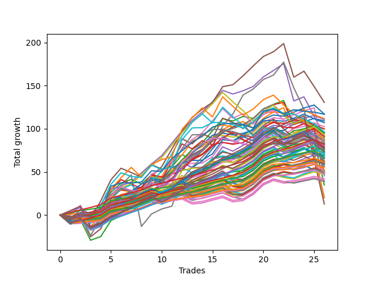

# Short Wallace Doodle 0225_009 
- Symbol: ES_Unlimited
- Date Range: 03/18/2022 - 07/15/2022
- Trading Period: 7:20-12:30
- Number of Trades: 26



| Name | Win Percent | Profit | Avg Profit / Trade | Avg Time / Trade |      | Name | Win Percent | Profit | Avg Profit / Trade | Avg Time / Trade |
| ---- | ----------- | ------ | ------------------ | ---------------- | ---- | ---- | ----------- | ------ | ------------------ | ---------------- |
| Sorted By <br> Profit | | | | | | Sorted By <br> Win Percentage ||||
| Five | 80.77 | 65250.00 | 2509.62 | 49:42 |     | Eighty-Three | 96.15 | 24125.00 | 927.88 | 17:05 |
| Sixty-Two | 76.92 | 58500.00 | 2250.00 | 10:25 |     | Eighty-Two | 96.15 | 17375.00 | 668.27 | 16:21 |
| Seventy-Three | 65.38 | 58375.00 | 2245.19 | 11:11 |     | Eighty-One | 96.15 | 10125.00 | 389.42 | 16:00 |
| Fifty-Three | 61.54 | 55875.00 | 2149.04 | 07:52 |     | Zero | 92.31 | 54500.00 | 2096.15 | 05:13 |
| Forty-Six | 69.23 | 55375.00 | 2129.81 | 08:23 |     | One Hundred Twenty-Eight | 92.31 | 39125.00 | 1504.81 | 03:21 |
| Zero | 92.31 | 54500.00 | 2096.15 | 05:13 |     | One Hundred Twenty-Three | 92.31 | 38000.00 | 1461.54 | 03:28 |
| Fifty-Two | 69.23 | 53500.00 | 2057.69 | 06:05 |     | One Hundred Seventeen | 92.31 | 37250.00 | 1432.69 | 02:13 |
| Forty-Eight | 80.77 | 51125.00 | 1966.35 | 03:17 |     | One Hundred Twenty-Seven | 92.31 | 32750.00 | 1259.62 | 02:41 |
| Fifty-Five | 61.54 | 49875.00 | 1918.27 | 07:14 |     | One Hundred Twenty-Two | 92.31 | 31625.00 | 1216.35 | 02:47 |
| Fifty | 61.54 | 49875.00 | 1918.27 | 06:34 |     | One Hundred Sixteen | 92.31 | 30625.00 | 1177.88 | 01:53 |
| Seventy-One | 50.00 | 48250.00 | 1855.77 | 16:14 |     | One Hundred Twenty-Six | 92.31 | 26125.00 | 1004.81 | 02:21 |
| Forty-Seven | 46.15 | 47750.00 | 1836.54 | 19:14 |     | One Hundred Twenty-One | 92.31 | 25000.00 | 961.54 | 02:27 |
| Sixty-Four | 88.46 | 47375.00 | 1822.12 | 04:13 |     | Eighty-Four | 92.31 | 22750.00 | 875.00 | 21:53 |
| Seventy | 69.23 | 46500.00 | 1788.46 | 07:41 |     | Sixty-Four | 88.46 | 47375.00 | 1822.12 | 04:13 |
| Four | 80.77 | 45875.00 | 1764.42 | 33:09 |     | Fifty-Six | 88.46 | 43750.00 | 1682.69 | 04:20 |
| Sixty-Five | 69.23 | 45500.00 | 1750.00 | 07:19 |     | One Hundred Eighteen | 88.46 | 41000.00 | 1576.92 | 02:46 |
| Fifty-Nine | 80.77 | 45125.00 | 1735.58 | 10:40 |     | One Hundred Six | 88.46 | 27750.00 | 1067.31 | 01:42 |
| Sixty | 69.23 | 44875.00 | 1725.96 | 15:38 |     | Eighty-Five | 88.46 | 6375.00 | 245.19 | 35:14 |
| Fifty-One | 69.23 | 44375.00 | 1706.73 | 05:09 |     | One Hundred Twenty-Nine | 84.62 | 38375.00 | 1475.96 | 05:29 |
| Fifty-Six | 88.46 | 43750.00 | 1682.69 | 04:20 |     | One Hundred Thirteen | 84.62 | 35250.00 | 1355.77 | 02:41 |
| Sixty-Three | 57.69 | 43500.00 | 1673.08 | 26:06 |     | One Hundred Twenty-Four | 84.62 | 34750.00 | 1336.54 | 05:37 |
| Forty-Two | 57.69 | 43375.00 | 1668.27 | 10:38 |     | Three | 84.62 | 30875.00 | 1187.50 | 21:32 |
| Fifty-Eight | 69.23 | 43125.00 | 1658.65 | 14:21 |     | One Hundred Twelve | 84.62 | 29250.00 | 1125.00 | 02:02 |
| Forty | 80.77 | 42750.00 | 1644.23 | 03:33 |     | Ninety-Six | 84.62 | 24750.00 | 951.92 | 01:36 |
| Sixty-Nine | 46.15 | 42250.00 | 1625.00 | 14:08 |     | One Hundred Eleven | 84.62 | 23750.00 | 913.46 | 01:44 |
| Fifty-Four | 69.23 | 41375.00 | 1591.35 | 03:50 |     | Five | 80.77 | 65250.00 | 2509.62 | 49:42 |
| Forty-Four | 57.69 | 41375.00 | 1591.35 | 11:48 |     | Forty-Eight | 80.77 | 51125.00 | 1966.35 | 03:17 |
| One Hundred Twenty | 65.38 | 41250.00 | 1586.54 | 04:21 |     | Four | 80.77 | 45875.00 | 1764.42 | 33:09 |
| One Hundred Eighteen | 88.46 | 41000.00 | 1576.92 | 02:46 |     | Fifty-Nine | 80.77 | 45125.00 | 1735.58 | 10:40 |
| Sixty-Eight | 53.85 | 40750.00 | 1567.31 | 10:34 |     | Forty | 80.77 | 42750.00 | 1644.23 | 03:33 |
| One | 80.77 | 39875.00 | 1533.65 | 14:53 |     | One | 80.77 | 39875.00 | 1533.65 | 14:53 |
| One Hundred Ninteen | 73.08 | 39875.00 | 1533.65 | 03:53 |     | One Hundred Twenty-Five | 80.77 | 38000.00 | 1461.54 | 07:18 |
| Forty-Nine | 69.23 | 39750.00 | 1528.85 | 05:08 |     | One Hundred Seven | 80.77 | 29750.00 | 1144.23 | 01:55 |
| One Hundred Twenty-Eight | 92.31 | 39125.00 | 1504.81 | 03:21 |     | Sixty-Two | 76.92 | 58500.00 | 2250.00 | 10:25 |
| One Hundred Twenty-Nine | 84.62 | 38375.00 | 1475.96 | 05:29 |     | One Hundred Thirty | 76.92 | 38375.00 | 1475.96 | 06:36 |
| One Hundred Thirty | 76.92 | 38375.00 | 1475.96 | 06:36 |     | Fifty-Seven | 76.92 | 36875.00 | 1418.27 | 09:04 |
| One Hundred Twenty-Three | 92.31 | 38000.00 | 1461.54 | 03:28 |     | Six | 76.92 | 36375.00 | 1399.04 | 26:21 |
| One Hundred Twenty-Five | 80.77 | 38000.00 | 1461.54 | 07:18 |     | One Hundred Fourteen | 76.92 | 35500.00 | 1365.38 | 04:38 |
| One Hundred Seventeen | 92.31 | 37250.00 | 1432.69 | 02:13 |     | One Hundred Three | 76.92 | 30875.00 | 1187.50 | 02:15 |
| Fifty-Seven | 76.92 | 36875.00 | 1418.27 | 09:04 |     | One Hundred Two | 76.92 | 25250.00 | 971.15 | 01:47 |
| Sixty-Six | 50.00 | 36875.00 | 1418.27 | 10:27 |     | One Hundred One | 76.92 | 20875.00 | 802.88 | 01:30 |
| Six | 76.92 | 36375.00 | 1399.04 | 26:21 |     | One Hundred Ninteen | 73.08 | 39875.00 | 1533.65 | 03:53 |
| Sixty-Seven | 61.54 | 36375.00 | 1399.04 | 08:15 |     | One Hundred Four | 73.08 | 36000.00 | 1384.62 | 03:20 |
| One Hundred Four | 73.08 | 36000.00 | 1384.62 | 03:20 |     | One Hundred Eight | 73.08 | 30875.00 | 1187.50 | 02:27 |
| Forty-Five | 42.31 | 36000.00 | 1384.62 | 17:36 |     | Two | 73.08 | 29500.00 | 1134.62 | 28:07 |
| One Hundred Fourteen | 76.92 | 35500.00 | 1365.38 | 04:38 |     | Ninety-Seven | 73.08 | 24875.00 | 956.73 | 01:47 |
| Forty-Three | 65.38 | 35500.00 | 1365.38 | 07:40 |     | Ninety-One | 73.08 | 20000.00 | 769.23 | 01:24 |
| One Hundred Thirteen | 84.62 | 35250.00 | 1355.77 | 02:41 |     | Seven | 73.08 | 10125.00 | 389.42 | 82:24 |
| One Hundred Twenty-Four | 84.62 | 34750.00 | 1336.54 | 05:37 |     | Forty-Six | 69.23 | 55375.00 | 2129.81 | 08:23 |
| One Hundred Five | 65.38 | 34500.00 | 1326.92 | 04:00 |     | Fifty-Two | 69.23 | 53500.00 | 2057.69 | 06:05 |
| Forty-One | 65.38 | 34000.00 | 1307.69 | 07:03 |     | Seventy | 69.23 | 46500.00 | 1788.46 | 07:41 |
| One Hundred Fifteen | 69.23 | 33250.00 | 1278.85 | 05:44 |     | Sixty-Five | 69.23 | 45500.00 | 1750.00 | 07:19 |
| One Hundred Nine | 65.38 | 33125.00 | 1274.04 | 03:07 |     | Sixty | 69.23 | 44875.00 | 1725.96 | 15:38 |
| One Hundred Twenty-Seven | 92.31 | 32750.00 | 1259.62 | 02:41 |     | Fifty-One | 69.23 | 44375.00 | 1706.73 | 05:09 |
| One Hundred Twenty-Two | 92.31 | 31625.00 | 1216.35 | 02:47 |     | Fifty-Eight | 69.23 | 43125.00 | 1658.65 | 14:21 |
| Three | 84.62 | 30875.00 | 1187.50 | 21:32 |     | Fifty-Four | 69.23 | 41375.00 | 1591.35 | 03:50 |
| One Hundred Three | 76.92 | 30875.00 | 1187.50 | 02:15 |     | Forty-Nine | 69.23 | 39750.00 | 1528.85 | 05:08 |
| One Hundred Eight | 73.08 | 30875.00 | 1187.50 | 02:27 |     | One Hundred Fifteen | 69.23 | 33250.00 | 1278.85 | 05:44 |
| One Hundred Sixteen | 92.31 | 30625.00 | 1177.88 | 01:53 |     | Seventy-Three | 65.38 | 58375.00 | 2245.19 | 11:11 |
| One Hundred Ten | 61.54 | 29875.00 | 1149.04 | 03:26 |     | One Hundred Twenty | 65.38 | 41250.00 | 1586.54 | 04:21 |
| One Hundred Seven | 80.77 | 29750.00 | 1144.23 | 01:55 |     | Forty-Three | 65.38 | 35500.00 | 1365.38 | 07:40 |
| Two | 73.08 | 29500.00 | 1134.62 | 28:07 |     | One Hundred Five | 65.38 | 34500.00 | 1326.92 | 04:00 |
| One Hundred | 65.38 | 29500.00 | 1134.62 | 02:30 |     | Forty-One | 65.38 | 34000.00 | 1307.69 | 07:03 |
| One Hundred Twelve | 84.62 | 29250.00 | 1125.00 | 02:02 |     | One Hundred Nine | 65.38 | 33125.00 | 1274.04 | 03:07 |
| Sixty-One | 53.85 | 28375.00 | 1091.35 | 25:40 |     | One Hundred | 65.38 | 29500.00 | 1134.62 | 02:30 |
| Ninety-Nine | 65.38 | 28000.00 | 1076.92 | 02:20 |     | Ninety-Nine | 65.38 | 28000.00 | 1076.92 | 02:20 |
| One Hundred Six | 88.46 | 27750.00 | 1067.31 | 01:42 |     | Ninety-Eight | 65.38 | 25750.00 | 990.38 | 02:01 |
| One Hundred Twenty-Six | 92.31 | 26125.00 | 1004.81 | 02:21 |     | Ninety-Three | 65.38 | 23500.00 | 903.85 | 02:02 |
| Ninety-Eight | 65.38 | 25750.00 | 990.38 | 02:01 |     | Ninety-Two | 65.38 | 19500.00 | 750.00 | 01:36 |
| One Hundred Two | 76.92 | 25250.00 | 971.15 | 01:47 |     | Fifty-Three | 61.54 | 55875.00 | 2149.04 | 07:52 |
| One Hundred Twenty-One | 92.31 | 25000.00 | 961.54 | 02:27 |     | Fifty-Five | 61.54 | 49875.00 | 1918.27 | 07:14 |
| Ninety-Seven | 73.08 | 24875.00 | 956.73 | 01:47 |     | Fifty | 61.54 | 49875.00 | 1918.27 | 06:34 |
| Ninety-Six | 84.62 | 24750.00 | 951.92 | 01:36 |     | Sixty-Seven | 61.54 | 36375.00 | 1399.04 | 08:15 |
| Ninety-Five | 53.85 | 24625.00 | 947.12 | 03:13 |     | One Hundred Ten | 61.54 | 29875.00 | 1149.04 | 03:26 |
| Ninety-Four | 57.69 | 24375.00 | 937.50 | 02:53 |     | Sixty-Three | 57.69 | 43500.00 | 1673.08 | 26:06 |
| Eighty-Three | 96.15 | 24125.00 | 927.88 | 17:05 |     | Forty-Two | 57.69 | 43375.00 | 1668.27 | 10:38 |
| One Hundred Eleven | 84.62 | 23750.00 | 913.46 | 01:44 |     | Forty-Four | 57.69 | 41375.00 | 1591.35 | 11:48 |
| Ninety-Three | 65.38 | 23500.00 | 903.85 | 02:02 |     | Ninety-Four | 57.69 | 24375.00 | 937.50 | 02:53 |
| Eighty-Four | 92.31 | 22750.00 | 875.00 | 21:53 |     | Sixty-Eight | 53.85 | 40750.00 | 1567.31 | 10:34 |
| One Hundred One | 76.92 | 20875.00 | 802.88 | 01:30 |     | Sixty-One | 53.85 | 28375.00 | 1091.35 | 25:40 |
| Ninety-One | 73.08 | 20000.00 | 769.23 | 01:24 |     | Ninety-Five | 53.85 | 24625.00 | 947.12 | 03:13 |
| Ninety-Two | 65.38 | 19500.00 | 750.00 | 01:36 |     | Seventy-One | 50.00 | 48250.00 | 1855.77 | 16:14 |
| Eighty-Two | 96.15 | 17375.00 | 668.27 | 16:21 |     | Sixty-Six | 50.00 | 36875.00 | 1418.27 | 10:27 |
| Eighty-One | 96.15 | 10125.00 | 389.42 | 16:00 |     | Forty-Seven | 46.15 | 47750.00 | 1836.54 | 19:14 |
| Seven | 73.08 | 10125.00 | 389.42 | 82:24 |     | Sixty-Nine | 46.15 | 42250.00 | 1625.00 | 14:08 |
| Eighty-Five | 88.46 | 6375.00 | 245.19 | 35:14 |     | Forty-Five | 42.31 | 36000.00 | 1384.62 | 17:36 |

## NO STOPLOSS

### Test Zero
* Sell when price hits the middle line of the 20p bollinger
* No Stoploss
* Results:
```
Total Trades: 26
Percent Up: 7.69
Percent Down: 92.31
Total Points Moved Down: 109.00
Potential Profit: 54500.00
Total Points Ups: 11.00 Count Ups: 2
Total Points Downs: 120.00 Count Downs: 24
```

<details><summary>Trades</summary>

<code>In: 2022-03-25 10:52:00		Out: 2022-03-25 11:18:15		Total Position Time: 26:15		Total Move Down: -8.00		Total to Date: -8.00</code> <br />
<code>In: 2022-03-25 11:57:00		Out: 2022-03-25 11:58:35		Total Position Time: 01:35		Total Move Down: 0.75		Total to Date: -7.25</code> <br />
<code>In: 2022-03-28 11:12:00		Out: 2022-03-28 11:13:30		Total Position Time: 01:30		Total Move Down: 1.75		Total to Date: -5.50</code> <br />
<code>In: 2022-04-01 11:34:00		Out: 2022-04-01 11:47:25		Total Position Time: 13:25		Total Move Down: 1.50		Total to Date: -4.00</code> <br />
<code>In: 2022-04-06 11:05:00		Out: 2022-04-06 11:06:10		Total Position Time: 01:10		Total Move Down: 7.75		Total to Date: 3.75</code> <br />
<code>In: 2022-04-14 11:06:00		Out: 2022-04-14 11:14:10		Total Position Time: 08:10		Total Move Down: 4.00		Total to Date: 7.75</code> <br />
<code>In: 2022-04-20 09:54:00		Out: 2022-04-20 09:59:15		Total Position Time: 05:15		Total Move Down: 3.25		Total to Date: 11.00</code> <br />
<code>In: 2022-04-25 09:27:00		Out: 2022-04-25 09:31:10		Total Position Time: 04:10		Total Move Down: 8.50		Total to Date: 19.50</code> <br />
<code>In: 2022-04-26 10:01:00		Out: 2022-04-26 10:02:25		Total Position Time: 01:25		Total Move Down: 6.75		Total to Date: 26.25</code> <br />
<code>In: 2022-04-26 11:23:00		Out: 2022-04-26 11:32:15		Total Position Time: 09:15		Total Move Down: 2.25		Total to Date: 28.50</code> <br />
<code>In: 2022-04-29 10:39:00		Out: 2022-04-29 10:40:30		Total Position Time: 01:30		Total Move Down: 4.50		Total to Date: 33.00</code> <br />
<code>In: 2022-05-10 12:08:00		Out: 2022-05-10 12:10:05		Total Position Time: 02:05		Total Move Down: 9.75		Total to Date: 42.75</code> <br />
<code>In: 2022-05-25 11:04:00		Out: 2022-05-25 11:06:25		Total Position Time: 02:25		Total Move Down: 4.50		Total to Date: 47.25</code> <br />
<code>In: 2022-06-03 11:31:00		Out: 2022-06-03 11:33:25		Total Position Time: 02:25		Total Move Down: 3.50		Total to Date: 50.75</code> <br />
<code>In: 2022-06-10 10:52:00		Out: 2022-06-10 10:55:05		Total Position Time: 03:05		Total Move Down: 7.50		Total to Date: 58.25</code> <br />
<code>In: 2022-06-10 12:29:00		Out: 2022-06-10 12:30:35		Total Position Time: 01:35		Total Move Down: 6.75		Total to Date: 65.00</code> <br />
<code>In: 2022-06-13 08:42:00		Out: 2022-06-13 08:47:40		Total Position Time: 05:40		Total Move Down: 2.75		Total to Date: 67.75</code> <br />
<code>In: 2022-06-13 09:14:00		Out: 2022-06-13 09:17:05		Total Position Time: 03:05		Total Move Down: 6.00		Total to Date: 73.75</code> <br />
<code>In: 2022-06-14 10:02:00		Out: 2022-06-14 10:03:10		Total Position Time: 01:10		Total Move Down: 7.00		Total to Date: 80.75</code> <br />
<code>In: 2022-06-15 11:02:00		Out: 2022-06-15 11:03:10		Total Position Time: 01:10		Total Move Down: 11.00		Total to Date: 91.75</code> <br />
<code>In: 2022-06-16 09:31:00		Out: 2022-06-16 09:32:20		Total Position Time: 01:20		Total Move Down: 6.00		Total to Date: 97.75</code> <br />
<code>In: 2022-06-17 08:09:00		Out: 2022-06-17 08:24:05		Total Position Time: 15:05		Total Move Down: 0.25		Total to Date: 98.00</code> <br />
<code>In: 2022-06-30 07:36:00		Out: 2022-06-30 07:42:30		Total Position Time: 06:30		Total Move Down: 7.50		Total to Date: 105.50</code> <br />
<code>In: 2022-07-06 11:00:00		Out: 2022-07-06 11:01:10		Total Position Time: 01:10		Total Move Down: 2.50		Total to Date: 108.00</code> <br />
<code>In: 2022-07-14 07:56:00		Out: 2022-07-14 07:57:50		Total Position Time: 01:50		Total Move Down: 4.00		Total to Date: 112.00</code> <br />
<code>In: 2022-07-14 08:02:00		Out: 2022-07-14 08:15:45		Total Position Time: 13:45		Total Move Down: -3.00		Total to Date: 109.00</code> <br />


</details>

### Test One
* Sell when the price hits the upper line of the 20p 1std bollinger
* No Stoploss
* Results:
```
Total Trades: 26
Percent Up: 19.23
Percent Down: 80.77
Total Points Moved Down: 79.75
Potential Profit: 39875.00
Total Points Ups: 63.50 Count Ups: 5
Total Points Downs: 143.25 Count Downs: 21
```

<details><summary>Trades</summary>

<code>In: 2022-03-25 10:52:00		Out: 2022-03-25 11:19:45		Total Position Time: 27:45		Total Move Down: -7.00		Total to Date: -7.00</code> <br />
<code>In: 2022-03-25 11:57:00		Out: 2022-03-25 12:00:50		Total Position Time: 03:50		Total Move Down: 2.75		Total to Date: -4.25</code> <br />
<code>In: 2022-03-28 11:12:00		Out: 2022-03-28 11:19:35		Total Position Time: 07:35		Total Move Down: 2.50		Total to Date: -1.75</code> <br />
<code>In: 2022-04-01 11:34:00		Out: 2022-04-01 11:50:15		Total Position Time: 16:15		Total Move Down: 3.25		Total to Date: 1.50</code> <br />
<code>In: 2022-04-06 11:05:00		Out: 2022-04-06 11:07:20		Total Position Time: 02:20		Total Move Down: 12.50		Total to Date: 14.00</code> <br />
<code>In: 2022-04-14 11:06:00		Out: 2022-04-14 11:18:05		Total Position Time: 12:05		Total Move Down: 4.25		Total to Date: 18.25</code> <br />
<code>In: 2022-04-20 09:54:00		Out: 2022-04-20 10:08:15		Total Position Time: 14:15		Total Move Down: 4.25		Total to Date: 22.50</code> <br />
<code>In: 2022-04-25 09:27:00		Out: 2022-04-25 09:42:45		Total Position Time: 15:45		Total Move Down: 6.00		Total to Date: 28.50</code> <br />
<code>In: 2022-04-26 10:01:00		Out: 2022-04-26 10:03:20		Total Position Time: 02:20		Total Move Down: 10.50		Total to Date: 39.00</code> <br />
<code>In: 2022-04-26 11:23:00		Out: 2022-04-26 11:34:20		Total Position Time: 11:20		Total Move Down: 4.25		Total to Date: 43.25</code> <br />
<code>In: 2022-04-29 10:39:00		Out: 2022-04-29 10:43:15		Total Position Time: 04:15		Total Move Down: 8.75		Total to Date: 52.00</code> <br />
<code>In: 2022-05-10 12:08:00		Out: 2022-05-10 12:17:20		Total Position Time: 09:20		Total Move Down: 12.00		Total to Date: 64.00</code> <br />
<code>In: 2022-05-25 11:04:00		Out: 2022-05-25 11:06:35		Total Position Time: 02:35		Total Move Down: 9.25		Total to Date: 73.25</code> <br />
<code>In: 2022-06-03 11:31:00		Out: 2022-06-03 11:37:10		Total Position Time: 06:10		Total Move Down: 6.25		Total to Date: 79.50</code> <br />
<code>In: 2022-06-10 10:52:00		Out: 2022-06-10 10:56:15		Total Position Time: 04:15		Total Move Down: 9.50		Total to Date: 89.00</code> <br />
<code>In: 2022-06-10 12:29:00		Out: 2022-06-10 12:35:45		Total Position Time: 06:45		Total Move Down: 9.75		Total to Date: 98.75</code> <br />
<code>In: 2022-06-13 08:42:00		Out: 2022-06-13 08:52:05		Total Position Time: 10:05		Total Move Down: 6.75		Total to Date: 105.50</code> <br />
<code>In: 2022-06-13 09:14:00		Out: 2022-06-13 09:29:05		Total Position Time: 15:05		Total Move Down: 2.75		Total to Date: 108.25</code> <br />
<code>In: 2022-06-14 10:02:00		Out: 2022-06-14 10:29:05		Total Position Time: 27:05		Total Move Down: -7.25		Total to Date: 101.00</code> <br />
<code>In: 2022-06-15 11:02:00		Out: 2022-06-15 11:03:10		Total Position Time: 01:10		Total Move Down: 11.00		Total to Date: 112.00</code> <br />
<code>In: 2022-06-16 09:31:00		Out: 2022-06-16 09:36:05		Total Position Time: 05:05		Total Move Down: 7.50		Total to Date: 119.50</code> <br />
<code>In: 2022-06-17 08:09:00		Out: 2022-06-17 08:25:45		Total Position Time: 16:45		Total Move Down: 4.75		Total to Date: 124.25</code> <br />
<code>In: 2022-06-30 07:36:00		Out: 2022-06-30 09:05:50		Total Position Time: 89:50		Total Move Down: -29.50		Total to Date: 94.75</code> <br />
<code>In: 2022-07-06 11:00:00		Out: 2022-07-06 11:01:15		Total Position Time: 01:15		Total Move Down: 4.75		Total to Date: 99.50</code> <br />
<code>In: 2022-07-14 07:56:00		Out: 2022-07-14 08:36:05		Total Position Time: 40:05		Total Move Down: -9.50		Total to Date: 90.00</code> <br />
<code>In: 2022-07-14 08:02:00		Out: 2022-07-14 08:36:05		Total Position Time: 34:05		Total Move Down: -10.25		Total to Date: 79.75</code> <br />


</details>

### Test Two
* Sell when the price hits the upper line of the 20p 2std bollinger
* No Stoploss
* Results:
```
Total Trades: 26
Percent Up: 26.92
Percent Down: 73.08
Total Points Moved Down: 59.00
Potential Profit: 29500.00
Total Points Ups: 118.25 Count Ups: 7
Total Points Downs: 177.25 Count Downs: 19
```

<details><summary>Trades</summary>

<code>In: 2022-03-25 10:52:00		Out: 2022-03-25 12:01:15		Total Position Time: 69:15		Total Move Down: -8.50		Total to Date: -8.50</code> <br />
<code>In: 2022-03-25 11:57:00		Out: 2022-03-25 12:01:15		Total Position Time: 04:15		Total Move Down: 3.25		Total to Date: -5.25</code> <br />
<code>In: 2022-03-28 11:12:00		Out: 2022-03-28 12:47:00		Total Position Time: 95:00		Total Move Down: -24.00		Total to Date: -29.25</code> <br />
<code>In: 2022-04-01 11:34:00		Out: 2022-04-01 11:50:45		Total Position Time: 16:45		Total Move Down: 4.25		Total to Date: -25.00</code> <br />
<code>In: 2022-04-06 11:05:00		Out: 2022-04-06 11:08:10		Total Position Time: 03:10		Total Move Down: 18.50		Total to Date: -6.50</code> <br />
<code>In: 2022-04-14 11:06:00		Out: 2022-04-14 11:19:20		Total Position Time: 13:20		Total Move Down: 5.50		Total to Date: -1.00</code> <br />
<code>In: 2022-04-20 09:54:00		Out: 2022-04-20 10:08:15		Total Position Time: 14:15		Total Move Down: 4.25		Total to Date: 3.25</code> <br />
<code>In: 2022-04-25 09:27:00		Out: 2022-04-25 10:01:20		Total Position Time: 34:20		Total Move Down: 10.50		Total to Date: 13.75</code> <br />
<code>In: 2022-04-26 10:01:00		Out: 2022-04-26 10:23:00		Total Position Time: 22:00		Total Move Down: 22.50		Total to Date: 36.25</code> <br />
<code>In: 2022-04-26 11:23:00		Out: 2022-04-26 11:41:30		Total Position Time: 18:30		Total Move Down: 4.50		Total to Date: 40.75</code> <br />
<code>In: 2022-04-29 10:39:00		Out: 2022-04-29 10:43:50		Total Position Time: 04:50		Total Move Down: 9.50		Total to Date: 50.25</code> <br />
<code>In: 2022-05-10 12:08:00		Out: 2022-05-10 12:21:05		Total Position Time: 13:05		Total Move Down: 13.50		Total to Date: 63.75</code> <br />
<code>In: 2022-05-25 11:04:00		Out: 2022-05-25 11:06:40		Total Position Time: 02:40		Total Move Down: 12.25		Total to Date: 76.00</code> <br />
<code>In: 2022-06-03 11:31:00		Out: 2022-06-03 11:37:25		Total Position Time: 06:25		Total Move Down: 7.75		Total to Date: 83.75</code> <br />
<code>In: 2022-06-10 10:52:00		Out: 2022-06-10 11:01:10		Total Position Time: 09:10		Total Move Down: 14.00		Total to Date: 97.75</code> <br />
<code>In: 2022-06-10 12:29:00		Out: 2022-06-10 12:43:10		Total Position Time: 14:10		Total Move Down: 14.00		Total to Date: 111.75</code> <br />
<code>In: 2022-06-13 08:42:00		Out: 2022-06-13 09:30:35		Total Position Time: 48:35		Total Move Down: -2.75		Total to Date: 109.00</code> <br />
<code>In: 2022-06-13 09:14:00		Out: 2022-06-13 09:30:35		Total Position Time: 16:35		Total Move Down: 5.25		Total to Date: 114.25</code> <br />
<code>In: 2022-06-14 10:02:00		Out: 2022-06-14 10:31:10		Total Position Time: 29:10		Total Move Down: -2.25		Total to Date: 112.00</code> <br />
<code>In: 2022-06-15 11:02:00		Out: 2022-06-15 11:03:10		Total Position Time: 01:10		Total Move Down: 11.00		Total to Date: 123.00</code> <br />
<code>In: 2022-06-16 09:31:00		Out: 2022-06-16 09:59:50		Total Position Time: 28:50		Total Move Down: 5.25		Total to Date: 128.25</code> <br />
<code>In: 2022-06-17 08:09:00		Out: 2022-06-17 08:45:15		Total Position Time: 36:15		Total Move Down: 4.50		Total to Date: 132.75</code> <br />
<code>In: 2022-06-30 07:36:00		Out: 2022-06-30 09:06:15		Total Position Time: 90:15		Total Move Down: -27.00		Total to Date: 105.75</code> <br />
<code>In: 2022-07-06 11:00:00		Out: 2022-07-06 11:02:25		Total Position Time: 02:25		Total Move Down: 7.00		Total to Date: 112.75</code> <br />
<code>In: 2022-07-14 07:56:00		Out: 2022-07-14 09:07:30		Total Position Time: 71:30		Total Move Down: -26.50		Total to Date: 86.25</code> <br />
<code>In: 2022-07-14 08:02:00		Out: 2022-07-14 09:07:30		Total Position Time: 65:30		Total Move Down: -27.25		Total to Date: 59.00</code> <br />


</details>

### Test Three
* Sell when price hits the middle line of the 50p bollinger
* No Stoploss
* Results:
```
Total Trades: 26
Percent Up: 15.38
Percent Down: 84.62
Total Points Moved Down: 61.75
Potential Profit: 30875.00
Total Points Ups: 83.50 Count Ups: 4
Total Points Downs: 145.25 Count Downs: 22
```

<details><summary>Trades</summary>

<code>In: 2022-03-25 10:52:00		Out: 2022-03-25 12:00:45		Total Position Time: 68:45		Total Move Down: -10.00		Total to Date: -10.00</code> <br />
<code>In: 2022-03-25 11:57:00		Out: 2022-03-25 12:00:45		Total Position Time: 03:45		Total Move Down: 1.75		Total to Date: -8.25</code> <br />
<code>In: 2022-03-28 11:12:00		Out: 2022-03-28 11:19:20		Total Position Time: 07:20		Total Move Down: 2.00		Total to Date: -6.25</code> <br />
<code>In: 2022-04-01 11:34:00		Out: 2022-04-01 11:58:00		Total Position Time: 24:00		Total Move Down: 5.00		Total to Date: -1.25</code> <br />
<code>In: 2022-04-06 11:05:00		Out: 2022-04-06 11:07:20		Total Position Time: 02:20		Total Move Down: 12.50		Total to Date: 11.25</code> <br />
<code>In: 2022-04-14 11:06:00		Out: 2022-04-14 11:20:05		Total Position Time: 14:05		Total Move Down: 7.50		Total to Date: 18.75</code> <br />
<code>In: 2022-04-20 09:54:00		Out: 2022-04-20 10:19:30		Total Position Time: 25:30		Total Move Down: 3.25		Total to Date: 22.00</code> <br />
<code>In: 2022-04-25 09:27:00		Out: 2022-04-25 09:56:20		Total Position Time: 29:20		Total Move Down: 6.50		Total to Date: 28.50</code> <br />
<code>In: 2022-04-26 10:01:00		Out: 2022-04-26 10:02:20		Total Position Time: 01:20		Total Move Down: 5.25		Total to Date: 33.75</code> <br />
<code>In: 2022-04-26 11:23:00		Out: 2022-04-26 11:41:30		Total Position Time: 18:30		Total Move Down: 4.50		Total to Date: 38.25</code> <br />
<code>In: 2022-04-29 10:39:00		Out: 2022-04-29 10:43:50		Total Position Time: 04:50		Total Move Down: 9.50		Total to Date: 47.75</code> <br />
<code>In: 2022-05-10 12:08:00		Out: 2022-05-10 12:17:20		Total Position Time: 09:20		Total Move Down: 12.00		Total to Date: 59.75</code> <br />
<code>In: 2022-05-25 11:04:00		Out: 2022-05-25 11:06:35		Total Position Time: 02:35		Total Move Down: 9.25		Total to Date: 69.00</code> <br />
<code>In: 2022-06-03 11:31:00		Out: 2022-06-03 11:37:10		Total Position Time: 06:10		Total Move Down: 6.25		Total to Date: 75.25</code> <br />
<code>In: 2022-06-10 10:52:00		Out: 2022-06-10 11:00:55		Total Position Time: 08:55		Total Move Down: 13.25		Total to Date: 88.50</code> <br />
<code>In: 2022-06-10 12:29:00		Out: 2022-06-10 12:33:40		Total Position Time: 04:40		Total Move Down: 9.00		Total to Date: 97.50</code> <br />
<code>In: 2022-06-13 08:42:00		Out: 2022-06-13 09:07:15		Total Position Time: 25:15		Total Move Down: 3.00		Total to Date: 100.50</code> <br />
<code>In: 2022-06-13 09:14:00		Out: 2022-06-13 09:30:20		Total Position Time: 16:20		Total Move Down: 4.25		Total to Date: 104.75</code> <br />
<code>In: 2022-06-14 10:02:00		Out: 2022-06-14 10:03:10		Total Position Time: 01:10		Total Move Down: 7.00		Total to Date: 111.75</code> <br />
<code>In: 2022-06-15 11:02:00		Out: 2022-06-15 11:03:10		Total Position Time: 01:10		Total Move Down: 11.00		Total to Date: 122.75</code> <br />
<code>In: 2022-06-16 09:31:00		Out: 2022-06-16 09:32:10		Total Position Time: 01:10		Total Move Down: 5.25		Total to Date: 128.00</code> <br />
<code>In: 2022-06-17 08:09:00		Out: 2022-06-17 08:45:05		Total Position Time: 36:05		Total Move Down: 2.50		Total to Date: 130.50</code> <br />
<code>In: 2022-06-30 07:36:00		Out: 2022-06-30 09:06:20		Total Position Time: 90:20		Total Move Down: -25.75		Total to Date: 104.75</code> <br />
<code>In: 2022-07-06 11:00:00		Out: 2022-07-06 11:01:15		Total Position Time: 01:15		Total Move Down: 4.75		Total to Date: 109.50</code> <br />
<code>In: 2022-07-14 07:56:00		Out: 2022-07-14 09:17:00		Total Position Time: 81:00		Total Move Down: -23.50		Total to Date: 86.00</code> <br />
<code>In: 2022-07-14 08:02:00		Out: 2022-07-14 09:17:00		Total Position Time: 75:00		Total Move Down: -24.25		Total to Date: 61.75</code> <br />


</details>

### Test Four
* Sell when the price hits the upper line of the 50p 1std bollinger
* No Stoploss
* Results:
```
Total Trades: 26
Percent Up: 19.23
Percent Down: 80.77
Total Points Moved Down: 91.75
Potential Profit: 45875.00
Total Points Ups: 100.75 Count Ups: 5
Total Points Downs: 192.50 Count Downs: 21
```

<details><summary>Trades</summary>

<code>In: 2022-03-25 10:52:00		Out: 2022-03-25 12:01:40		Total Position Time: 69:40		Total Move Down: -8.00		Total to Date: -8.00</code> <br />
<code>In: 2022-03-25 11:57:00		Out: 2022-03-25 12:01:40		Total Position Time: 04:40		Total Move Down: 3.75		Total to Date: -4.25</code> <br />
<code>In: 2022-03-28 11:12:00		Out: 2022-03-28 11:20:40		Total Position Time: 08:40		Total Move Down: 2.75		Total to Date: -1.50</code> <br />
<code>In: 2022-04-01 11:34:00		Out: 2022-04-01 12:09:35		Total Position Time: 35:35		Total Move Down: 6.25		Total to Date: 4.75</code> <br />
<code>In: 2022-04-06 11:05:00		Out: 2022-04-06 11:08:10		Total Position Time: 03:10		Total Move Down: 18.50		Total to Date: 23.25</code> <br />
<code>In: 2022-04-14 11:06:00		Out: 2022-04-14 11:23:55		Total Position Time: 17:55		Total Move Down: 10.75		Total to Date: 34.00</code> <br />
<code>In: 2022-04-20 09:54:00		Out: 2022-04-20 10:33:05		Total Position Time: 39:05		Total Move Down: 4.25		Total to Date: 38.25</code> <br />
<code>In: 2022-04-25 09:27:00		Out: 2022-04-25 10:01:20		Total Position Time: 34:20		Total Move Down: 10.50		Total to Date: 48.75</code> <br />
<code>In: 2022-04-26 10:01:00		Out: 2022-04-26 10:03:20		Total Position Time: 02:20		Total Move Down: 10.50		Total to Date: 59.25</code> <br />
<code>In: 2022-04-26 11:23:00		Out: 2022-04-26 11:45:05		Total Position Time: 22:05		Total Move Down: 9.50		Total to Date: 68.75</code> <br />
<code>In: 2022-04-29 10:39:00		Out: 2022-04-29 10:47:20		Total Position Time: 08:20		Total Move Down: 14.50		Total to Date: 83.25</code> <br />
<code>In: 2022-05-10 12:08:00		Out: 2022-05-10 12:22:15		Total Position Time: 14:15		Total Move Down: 14.25		Total to Date: 97.50</code> <br />
<code>In: 2022-05-25 11:04:00		Out: 2022-05-25 11:06:40		Total Position Time: 02:40		Total Move Down: 12.25		Total to Date: 109.75</code> <br />
<code>In: 2022-06-03 11:31:00		Out: 2022-06-03 11:38:55		Total Position Time: 07:55		Total Move Down: 9.75		Total to Date: 119.50</code> <br />
<code>In: 2022-06-10 10:52:00		Out: 2022-06-10 11:41:45		Total Position Time: 49:45		Total Move Down: 11.75		Total to Date: 131.25</code> <br />
<code>In: 2022-06-10 12:29:00		Out: 2022-06-10 12:42:40		Total Position Time: 13:40		Total Move Down: 13.25		Total to Date: 144.50</code> <br />
<code>In: 2022-06-13 08:42:00		Out: 2022-06-13 09:54:40		Total Position Time: 72:40		Total Move Down: -4.25		Total to Date: 140.25</code> <br />
<code>In: 2022-06-13 09:14:00		Out: 2022-06-13 09:54:40		Total Position Time: 40:40		Total Move Down: 3.75		Total to Date: 144.00</code> <br />
<code>In: 2022-06-14 10:02:00		Out: 2022-06-14 10:36:20		Total Position Time: 34:20		Total Move Down: 5.00		Total to Date: 149.00</code> <br />
<code>In: 2022-06-15 11:02:00		Out: 2022-06-15 11:03:10		Total Position Time: 01:10		Total Move Down: 11.00		Total to Date: 160.00</code> <br />
<code>In: 2022-06-16 09:31:00		Out: 2022-06-16 09:36:05		Total Position Time: 05:05		Total Move Down: 7.50		Total to Date: 167.50</code> <br />
<code>In: 2022-06-17 08:09:00		Out: 2022-06-17 08:51:25		Total Position Time: 42:25		Total Move Down: 8.00		Total to Date: 175.50</code> <br />
<code>In: 2022-06-30 07:36:00		Out: 2022-06-30 10:10:15		Total Position Time: 154:15		Total Move Down: -43.25		Total to Date: 132.25</code> <br />
<code>In: 2022-07-06 11:00:00		Out: 2022-07-06 11:01:15		Total Position Time: 01:15		Total Move Down: 4.75		Total to Date: 137.00</code> <br />
<code>In: 2022-07-14 07:56:00		Out: 2022-07-14 09:27:05		Total Position Time: 91:05		Total Move Down: -22.25		Total to Date: 114.75</code> <br />
<code>In: 2022-07-14 08:02:00		Out: 2022-07-14 09:27:05		Total Position Time: 85:05		Total Move Down: -23.00		Total to Date: 91.75</code> <br />


</details>

### Test Five
* Sell when the price hits the upper line of the 50p 2std bollinger
* No Stoploss
* Results:
```
Total Trades: 26
Percent Up: 19.23
Percent Down: 80.77
Total Points Moved Down: 130.50
Potential Profit: 65250.00
Total Points Ups: 105.75 Count Ups: 5
Total Points Downs: 236.25 Count Downs: 21
```

<details><summary>Trades</summary>

<code>In: 2022-03-25 10:52:00		Out: 2022-03-25 12:01:55		Total Position Time: 69:55		Total Move Down: -6.50		Total to Date: -6.50</code> <br />
<code>In: 2022-03-25 11:57:00		Out: 2022-03-25 12:01:55		Total Position Time: 04:55		Total Move Down: 5.25		Total to Date: -1.25</code> <br />
<code>In: 2022-03-28 11:12:00		Out: 2022-03-28 12:47:00		Total Position Time: 95:00		Total Move Down: -24.00		Total to Date: -25.25</code> <br />
<code>In: 2022-04-01 11:34:00		Out: 2022-04-01 12:11:25		Total Position Time: 37:25		Total Move Down: 9.25		Total to Date: -16.00</code> <br />
<code>In: 2022-04-06 11:05:00		Out: 2022-04-06 11:09:40		Total Position Time: 04:40		Total Move Down: 24.50		Total to Date: 8.50</code> <br />
<code>In: 2022-04-14 11:06:00		Out: 2022-04-14 11:34:10		Total Position Time: 28:10		Total Move Down: 12.00		Total to Date: 20.50</code> <br />
<code>In: 2022-04-20 09:54:00		Out: 2022-04-20 11:18:05		Total Position Time: 84:05		Total Move Down: 5.00		Total to Date: 25.50</code> <br />
<code>In: 2022-04-25 09:27:00		Out: 2022-04-25 11:01:35		Total Position Time: 94:35		Total Move Down: 3.75		Total to Date: 29.25</code> <br />
<code>In: 2022-04-26 10:01:00		Out: 2022-04-26 10:14:35		Total Position Time: 13:35		Total Move Down: 15.75		Total to Date: 45.00</code> <br />
<code>In: 2022-04-26 11:23:00		Out: 2022-04-26 12:13:05		Total Position Time: 50:05		Total Move Down: 11.00		Total to Date: 56.00</code> <br />
<code>In: 2022-04-29 10:39:00		Out: 2022-04-29 11:01:05		Total Position Time: 22:05		Total Move Down: 20.50		Total to Date: 76.50</code> <br />
<code>In: 2022-05-10 12:08:00		Out: 2022-05-10 12:24:35		Total Position Time: 16:35		Total Move Down: 20.75		Total to Date: 97.25</code> <br />
<code>In: 2022-05-25 11:04:00		Out: 2022-05-25 11:06:50		Total Position Time: 02:50		Total Move Down: 16.00		Total to Date: 113.25</code> <br />
<code>In: 2022-06-03 11:31:00		Out: 2022-06-03 12:07:45		Total Position Time: 36:45		Total Move Down: 9.50		Total to Date: 122.75</code> <br />
<code>In: 2022-06-10 10:52:00		Out: 2022-06-10 12:45:40		Total Position Time: 113:40		Total Move Down: 7.75		Total to Date: 130.50</code> <br />
<code>In: 2022-06-10 12:29:00		Out: 2022-06-10 12:45:40		Total Position Time: 16:40		Total Move Down: 18.25		Total to Date: 148.75</code> <br />
<code>In: 2022-06-13 08:42:00		Out: 2022-06-13 09:58:15		Total Position Time: 76:15		Total Move Down: 2.25		Total to Date: 151.00</code> <br />
<code>In: 2022-06-13 09:14:00		Out: 2022-06-13 09:58:15		Total Position Time: 44:15		Total Move Down: 10.25		Total to Date: 161.25</code> <br />
<code>In: 2022-06-14 10:02:00		Out: 2022-06-14 10:43:05		Total Position Time: 41:05		Total Move Down: 11.50		Total to Date: 172.75</code> <br />
<code>In: 2022-06-15 11:02:00		Out: 2022-06-15 11:03:10		Total Position Time: 01:10		Total Move Down: 11.00		Total to Date: 183.75</code> <br />
<code>In: 2022-06-16 09:31:00		Out: 2022-06-16 10:25:05		Total Position Time: 54:05		Total Move Down: 5.50		Total to Date: 189.25</code> <br />
<code>In: 2022-06-17 08:09:00		Out: 2022-06-17 08:55:55		Total Position Time: 46:55		Total Move Down: 9.50		Total to Date: 198.75</code> <br />
<code>In: 2022-06-30 07:36:00		Out: 2022-06-30 10:12:00		Total Position Time: 156:00		Total Move Down: -39.00		Total to Date: 159.75</code> <br />
<code>In: 2022-07-06 11:00:00		Out: 2022-07-06 11:02:25		Total Position Time: 02:25		Total Move Down: 7.00		Total to Date: 166.75</code> <br />
<code>In: 2022-07-14 07:56:00		Out: 2022-07-14 09:28:35		Total Position Time: 92:35		Total Move Down: -17.75		Total to Date: 149.00</code> <br />
<code>In: 2022-07-14 08:02:00		Out: 2022-07-14 09:28:35		Total Position Time: 86:35		Total Move Down: -18.50		Total to Date: 130.50</code> <br />


</details>

### Test Six
* Sell when the price hits the middle line of the 1std VWAP
* No Stoploss
* Results:
```
Total Trades: 26
Percent Up: 23.08
Percent Down: 76.92
Total Points Moved Down: 72.75
Potential Profit: 36375.00
Total Points Ups: 81.50 Count Ups: 6
Total Points Downs: 154.25 Count Downs: 20
```

<details><summary>Trades</summary>

<code>In: 2022-03-25 10:52:00		Out: 2022-03-25 12:20:30		Total Position Time: 88:30		Total Move Down: -0.25		Total to Date: -0.25</code> <br />
<code>In: 2022-03-25 11:57:00		Out: 2022-03-25 12:20:30		Total Position Time: 23:30		Total Move Down: 11.50		Total to Date: 11.25</code> <br />
<code>In: 2022-03-28 11:12:00		Out: 2022-03-28 12:47:00		Total Position Time: 95:00		Total Move Down: -24.00		Total to Date: -12.75</code> <br />
<code>In: 2022-04-01 11:34:00		Out: 2022-04-01 12:12:50		Total Position Time: 38:50		Total Move Down: 10.50		Total to Date: -2.25</code> <br />
<code>In: 2022-04-06 11:05:00		Out: 2022-04-06 11:08:10		Total Position Time: 03:10		Total Move Down: 18.50		Total to Date: 16.25</code> <br />
<code>In: 2022-04-14 11:06:00		Out: 2022-04-14 11:07:40		Total Position Time: 01:40		Total Move Down: 2.00		Total to Date: 18.25</code> <br />
<code>In: 2022-04-20 09:54:00		Out: 2022-04-20 11:18:20		Total Position Time: 84:20		Total Move Down: 5.75		Total to Date: 24.00</code> <br />
<code>In: 2022-04-25 09:27:00		Out: 2022-04-25 09:31:10		Total Position Time: 04:10		Total Move Down: 8.50		Total to Date: 32.50</code> <br />
<code>In: 2022-04-26 10:01:00		Out: 2022-04-26 10:02:10		Total Position Time: 01:10		Total Move Down: 4.75		Total to Date: 37.25</code> <br />
<code>In: 2022-04-26 11:23:00		Out: 2022-04-26 11:24:10		Total Position Time: 01:10		Total Move Down: -3.00		Total to Date: 34.25</code> <br />
<code>In: 2022-04-29 10:39:00		Out: 2022-04-29 10:40:10		Total Position Time: 01:10		Total Move Down: 2.25		Total to Date: 36.50</code> <br />
<code>In: 2022-05-10 12:08:00		Out: 2022-05-10 12:24:35		Total Position Time: 16:35		Total Move Down: 20.75		Total to Date: 57.25</code> <br />
<code>In: 2022-05-25 11:04:00		Out: 2022-05-25 11:06:20		Total Position Time: 02:20		Total Move Down: 2.75		Total to Date: 60.00</code> <br />
<code>In: 2022-06-03 11:31:00		Out: 2022-06-03 11:32:25		Total Position Time: 01:25		Total Move Down: 0.25		Total to Date: 60.25</code> <br />
<code>In: 2022-06-10 10:52:00		Out: 2022-06-10 10:55:10		Total Position Time: 03:10		Total Move Down: 7.50		Total to Date: 67.75</code> <br />
<code>In: 2022-06-10 12:29:00		Out: 2022-06-10 12:44:00		Total Position Time: 15:00		Total Move Down: 16.25		Total to Date: 84.00</code> <br />
<code>In: 2022-06-13 08:42:00		Out: 2022-06-13 08:46:30		Total Position Time: 04:30		Total Move Down: -1.25		Total to Date: 82.75</code> <br />
<code>In: 2022-06-13 09:14:00		Out: 2022-06-13 09:17:20		Total Position Time: 03:20		Total Move Down: 6.75		Total to Date: 89.50</code> <br />
<code>In: 2022-06-14 10:02:00		Out: 2022-06-14 10:03:10		Total Position Time: 01:10		Total Move Down: 7.00		Total to Date: 96.50</code> <br />
<code>In: 2022-06-15 11:02:00		Out: 2022-06-15 11:03:10		Total Position Time: 01:10		Total Move Down: 11.00		Total to Date: 107.50</code> <br />
<code>In: 2022-06-16 09:31:00		Out: 2022-06-16 09:32:10		Total Position Time: 01:10		Total Move Down: 5.25		Total to Date: 112.75</code> <br />
<code>In: 2022-06-17 08:09:00		Out: 2022-06-17 08:10:15		Total Position Time: 01:15		Total Move Down: -1.50		Total to Date: 111.25</code> <br />
<code>In: 2022-06-30 07:36:00		Out: 2022-06-30 07:39:55		Total Position Time: 03:55		Total Move Down: 4.75		Total to Date: 116.00</code> <br />
<code>In: 2022-07-06 11:00:00		Out: 2022-07-06 11:01:15		Total Position Time: 01:15		Total Move Down: 4.75		Total to Date: 120.75</code> <br />
<code>In: 2022-07-14 07:56:00		Out: 2022-07-14 07:57:15		Total Position Time: 01:15		Total Move Down: 3.50		Total to Date: 124.25</code> <br />
<code>In: 2022-07-14 08:02:00		Out: 2022-07-14 12:47:00		Total Position Time: 285:00		Total Move Down: -51.50		Total to Date: 72.75</code> <br />


</details>

### Test Seven
* Sell when the price hits the upper line of the 1std VWAP
* No Stoploss
* Results:
```
Total Trades: 26
Percent Up: 26.92
Percent Down: 73.08
Total Points Moved Down: 20.25
Potential Profit: 10125.00
Total Points Ups: 246.50 Count Ups: 7
Total Points Downs: 266.75 Count Downs: 19
```

<details><summary>Trades</summary>

<code>In: 2022-03-25 10:52:00		Out: 2022-03-25 12:47:00		Total Position Time: 115:00		Total Move Down: -5.75		Total to Date: -5.75</code> <br />
<code>In: 2022-03-25 11:57:00		Out: 2022-03-25 12:47:00		Total Position Time: 50:00		Total Move Down: 6.00		Total to Date: 0.25</code> <br />
<code>In: 2022-03-28 11:12:00		Out: 2022-03-28 12:47:00		Total Position Time: 95:00		Total Move Down: -24.00		Total to Date: -23.75</code> <br />
<code>In: 2022-04-01 11:34:00		Out: 2022-04-01 12:33:35		Total Position Time: 59:35		Total Move Down: 20.25		Total to Date: -3.50</code> <br />
<code>In: 2022-04-06 11:05:00		Out: 2022-04-06 11:09:40		Total Position Time: 04:40		Total Move Down: 24.50		Total to Date: 21.00</code> <br />
<code>In: 2022-04-14 11:06:00		Out: 2022-04-14 11:39:35		Total Position Time: 33:35		Total Move Down: 13.50		Total to Date: 34.50</code> <br />
<code>In: 2022-04-20 09:54:00		Out: 2022-04-20 11:30:15		Total Position Time: 96:15		Total Move Down: 12.00		Total to Date: 46.50</code> <br />
<code>In: 2022-04-25 09:27:00		Out: 2022-04-25 12:47:00		Total Position Time: 200:00		Total Move Down: -59.75		Total to Date: -13.25</code> <br />
<code>In: 2022-04-26 10:01:00		Out: 2022-04-26 10:14:15		Total Position Time: 13:15		Total Move Down: 14.50		Total to Date: 1.25</code> <br />
<code>In: 2022-04-26 11:23:00		Out: 2022-04-26 11:42:05		Total Position Time: 19:05		Total Move Down: 5.75		Total to Date: 7.00</code> <br />
<code>In: 2022-04-29 10:39:00		Out: 2022-04-29 10:40:25		Total Position Time: 01:25		Total Move Down: 3.25		Total to Date: 10.25</code> <br />
<code>In: 2022-05-10 12:08:00		Out: 2022-05-10 12:47:00		Total Position Time: 39:00		Total Move Down: 31.75		Total to Date: 42.00</code> <br />
<code>In: 2022-05-25 11:04:00		Out: 2022-05-25 11:06:45		Total Position Time: 02:45		Total Move Down: 13.50		Total to Date: 55.50</code> <br />
<code>In: 2022-06-03 11:31:00		Out: 2022-06-03 12:08:05		Total Position Time: 37:05		Total Move Down: 11.50		Total to Date: 67.00</code> <br />
<code>In: 2022-06-10 10:52:00		Out: 2022-06-10 12:47:00		Total Position Time: 115:00		Total Move Down: 12.75		Total to Date: 79.75</code> <br />
<code>In: 2022-06-10 12:29:00		Out: 2022-06-10 12:47:00		Total Position Time: 18:00		Total Move Down: 23.25		Total to Date: 103.00</code> <br />
<code>In: 2022-06-13 08:42:00		Out: 2022-06-13 10:33:35		Total Position Time: 111:35		Total Move Down: 14.00		Total to Date: 117.00</code> <br />
<code>In: 2022-06-13 09:14:00		Out: 2022-06-13 10:33:35		Total Position Time: 79:35		Total Move Down: 22.00		Total to Date: 139.00</code> <br />
<code>In: 2022-06-14 10:02:00		Out: 2022-06-14 10:03:10		Total Position Time: 01:10		Total Move Down: 7.00		Total to Date: 146.00</code> <br />
<code>In: 2022-06-15 11:02:00		Out: 2022-06-15 11:03:10		Total Position Time: 01:10		Total Move Down: 11.00		Total to Date: 157.00</code> <br />
<code>In: 2022-06-16 09:31:00		Out: 2022-06-16 09:32:10		Total Position Time: 01:10		Total Move Down: 5.25		Total to Date: 162.25</code> <br />
<code>In: 2022-06-17 08:09:00		Out: 2022-06-17 09:03:15		Total Position Time: 54:15		Total Move Down: 15.00		Total to Date: 177.25</code> <br />
<code>In: 2022-06-30 07:36:00		Out: 2022-06-30 12:47:00		Total Position Time: 311:00		Total Move Down: -29.75		Total to Date: 147.50</code> <br />
<code>In: 2022-07-06 11:00:00		Out: 2022-07-06 12:47:00		Total Position Time: 107:00		Total Move Down: -25.00		Total to Date: 122.50</code> <br />
<code>In: 2022-07-14 07:56:00		Out: 2022-07-14 12:47:00		Total Position Time: 291:00		Total Move Down: -50.75		Total to Date: 71.75</code> <br />
<code>In: 2022-07-14 08:02:00		Out: 2022-07-14 12:47:00		Total Position Time: 285:00		Total Move Down: -51.50		Total to Date: 20.25</code> <br />


</details>

## STOPLOSS OF 5

### Test Forty
* Sell when price hits the middle line of the 20p bollinger
* Stoploss is -5 points
* Results:
```
Total Trades: 26
Percent Up: 19.23
Percent Down: 80.77
Total Points Moved Down: 85.50
Potential Profit: 42750.00
Total Points Ups: 27.00 Count Ups: 5
Total Points Downs: 112.50 Count Downs: 21
```

<details><summary>Trades</summary>

<code>In: 2022-03-25 10:52:00		Out: 2022-03-25 10:57:10		Total Position Time: 05:10		Total Move Down: -5.00		Total to Date: -5.00</code> <br />
<code>In: 2022-03-25 11:57:00		Out: 2022-03-25 11:58:35		Total Position Time: 01:35		Total Move Down: 0.75		Total to Date: -4.25</code> <br />
<code>In: 2022-03-28 11:12:00		Out: 2022-03-28 11:13:30		Total Position Time: 01:30		Total Move Down: 1.75		Total to Date: -2.50</code> <br />
<code>In: 2022-04-01 11:34:00		Out: 2022-04-01 11:47:25		Total Position Time: 13:25		Total Move Down: 1.50		Total to Date: -1.00</code> <br />
<code>In: 2022-04-06 11:05:00		Out: 2022-04-06 11:06:10		Total Position Time: 01:10		Total Move Down: 7.75		Total to Date: 6.75</code> <br />
<code>In: 2022-04-14 11:06:00		Out: 2022-04-14 11:14:10		Total Position Time: 08:10		Total Move Down: 4.00		Total to Date: 10.75</code> <br />
<code>In: 2022-04-20 09:54:00		Out: 2022-04-20 09:59:15		Total Position Time: 05:15		Total Move Down: 3.25		Total to Date: 14.00</code> <br />
<code>In: 2022-04-25 09:27:00		Out: 2022-04-25 09:31:10		Total Position Time: 04:10		Total Move Down: 8.50		Total to Date: 22.50</code> <br />
<code>In: 2022-04-26 10:01:00		Out: 2022-04-26 10:02:25		Total Position Time: 01:25		Total Move Down: 6.75		Total to Date: 29.25</code> <br />
<code>In: 2022-04-26 11:23:00		Out: 2022-04-26 11:32:15		Total Position Time: 09:15		Total Move Down: 2.25		Total to Date: 31.50</code> <br />
<code>In: 2022-04-29 10:39:00		Out: 2022-04-29 10:40:30		Total Position Time: 01:30		Total Move Down: 4.50		Total to Date: 36.00</code> <br />
<code>In: 2022-05-10 12:08:00		Out: 2022-05-10 12:10:05		Total Position Time: 02:05		Total Move Down: 9.75		Total to Date: 45.75</code> <br />
<code>In: 2022-05-25 11:04:00		Out: 2022-05-25 11:05:10		Total Position Time: 01:10		Total Move Down: -5.75		Total to Date: 40.00</code> <br />
<code>In: 2022-06-03 11:31:00		Out: 2022-06-03 11:33:25		Total Position Time: 02:25		Total Move Down: 3.50		Total to Date: 43.50</code> <br />
<code>In: 2022-06-10 10:52:00		Out: 2022-06-10 10:55:05		Total Position Time: 03:05		Total Move Down: 7.50		Total to Date: 51.00</code> <br />
<code>In: 2022-06-10 12:29:00		Out: 2022-06-10 12:30:35		Total Position Time: 01:35		Total Move Down: 6.75		Total to Date: 57.75</code> <br />
<code>In: 2022-06-13 08:42:00		Out: 2022-06-13 08:43:10		Total Position Time: 01:10		Total Move Down: -5.00		Total to Date: 52.75</code> <br />
<code>In: 2022-06-13 09:14:00		Out: 2022-06-13 09:17:05		Total Position Time: 03:05		Total Move Down: 6.00		Total to Date: 58.75</code> <br />
<code>In: 2022-06-14 10:02:00		Out: 2022-06-14 10:03:10		Total Position Time: 01:10		Total Move Down: 7.00		Total to Date: 65.75</code> <br />
<code>In: 2022-06-15 11:02:00		Out: 2022-06-15 11:03:10		Total Position Time: 01:10		Total Move Down: 11.00		Total to Date: 76.75</code> <br />
<code>In: 2022-06-16 09:31:00		Out: 2022-06-16 09:32:20		Total Position Time: 01:20		Total Move Down: 6.00		Total to Date: 82.75</code> <br />
<code>In: 2022-06-17 08:09:00		Out: 2022-06-17 08:18:50		Total Position Time: 09:50		Total Move Down: -6.50		Total to Date: 76.25</code> <br />
<code>In: 2022-06-30 07:36:00		Out: 2022-06-30 07:42:30		Total Position Time: 06:30		Total Move Down: 7.50		Total to Date: 83.75</code> <br />
<code>In: 2022-07-06 11:00:00		Out: 2022-07-06 11:01:10		Total Position Time: 01:10		Total Move Down: 2.50		Total to Date: 86.25</code> <br />
<code>In: 2022-07-14 07:56:00		Out: 2022-07-14 07:57:50		Total Position Time: 01:50		Total Move Down: 4.00		Total to Date: 90.25</code> <br />
<code>In: 2022-07-14 08:02:00		Out: 2022-07-14 08:04:10		Total Position Time: 02:10		Total Move Down: -4.75		Total to Date: 85.50</code> <br />


</details>

### Test Forty-One
* Sell when the price hits the upper line of the 20p 1std bollinger
* Stoploss is -5 points
* Results:
```
Total Trades: 26
Percent Up: 34.62
Percent Down: 65.38
Total Points Moved Down: 68.00
Potential Profit: 34000.00
Total Points Ups: 48.50 Count Ups: 9
Total Points Downs: 116.50 Count Downs: 17
```

<details><summary>Trades</summary>

<code>In: 2022-03-25 10:52:00		Out: 2022-03-25 10:57:10		Total Position Time: 05:10		Total Move Down: -5.00		Total to Date: -5.00</code> <br />
<code>In: 2022-03-25 11:57:00		Out: 2022-03-25 12:00:50		Total Position Time: 03:50		Total Move Down: 2.75		Total to Date: -2.25</code> <br />
<code>In: 2022-03-28 11:12:00		Out: 2022-03-28 11:19:35		Total Position Time: 07:35		Total Move Down: 2.50		Total to Date: 0.25</code> <br />
<code>In: 2022-04-01 11:34:00		Out: 2022-04-01 11:50:15		Total Position Time: 16:15		Total Move Down: 3.25		Total to Date: 3.50</code> <br />
<code>In: 2022-04-06 11:05:00		Out: 2022-04-06 11:07:20		Total Position Time: 02:20		Total Move Down: 12.50		Total to Date: 16.00</code> <br />
<code>In: 2022-04-14 11:06:00		Out: 2022-04-14 11:18:05		Total Position Time: 12:05		Total Move Down: 4.25		Total to Date: 20.25</code> <br />
<code>In: 2022-04-20 09:54:00		Out: 2022-04-20 10:08:15		Total Position Time: 14:15		Total Move Down: 4.25		Total to Date: 24.50</code> <br />
<code>In: 2022-04-25 09:27:00		Out: 2022-04-25 09:38:20		Total Position Time: 11:20		Total Move Down: -5.25		Total to Date: 19.25</code> <br />
<code>In: 2022-04-26 10:01:00		Out: 2022-04-26 10:03:20		Total Position Time: 02:20		Total Move Down: 10.50		Total to Date: 29.75</code> <br />
<code>In: 2022-04-26 11:23:00		Out: 2022-04-26 11:34:20		Total Position Time: 11:20		Total Move Down: 4.25		Total to Date: 34.00</code> <br />
<code>In: 2022-04-29 10:39:00		Out: 2022-04-29 10:43:15		Total Position Time: 04:15		Total Move Down: 8.75		Total to Date: 42.75</code> <br />
<code>In: 2022-05-10 12:08:00		Out: 2022-05-10 12:17:20		Total Position Time: 09:20		Total Move Down: 12.00		Total to Date: 54.75</code> <br />
<code>In: 2022-05-25 11:04:00		Out: 2022-05-25 11:05:10		Total Position Time: 01:10		Total Move Down: -5.75		Total to Date: 49.00</code> <br />
<code>In: 2022-06-03 11:31:00		Out: 2022-06-03 11:37:10		Total Position Time: 06:10		Total Move Down: 6.25		Total to Date: 55.25</code> <br />
<code>In: 2022-06-10 10:52:00		Out: 2022-06-10 10:56:15		Total Position Time: 04:15		Total Move Down: 9.50		Total to Date: 64.75</code> <br />
<code>In: 2022-06-10 12:29:00		Out: 2022-06-10 12:35:45		Total Position Time: 06:45		Total Move Down: 9.75		Total to Date: 74.50</code> <br />
<code>In: 2022-06-13 08:42:00		Out: 2022-06-13 08:43:10		Total Position Time: 01:10		Total Move Down: -5.00		Total to Date: 69.50</code> <br />
<code>In: 2022-06-13 09:14:00		Out: 2022-06-13 09:29:05		Total Position Time: 15:05		Total Move Down: 2.75		Total to Date: 72.25</code> <br />
<code>In: 2022-06-14 10:02:00		Out: 2022-06-14 10:09:55		Total Position Time: 07:55		Total Move Down: -5.25		Total to Date: 67.00</code> <br />
<code>In: 2022-06-15 11:02:00		Out: 2022-06-15 11:03:10		Total Position Time: 01:10		Total Move Down: 11.00		Total to Date: 78.00</code> <br />
<code>In: 2022-06-16 09:31:00		Out: 2022-06-16 09:36:05		Total Position Time: 05:05		Total Move Down: 7.50		Total to Date: 85.50</code> <br />
<code>In: 2022-06-17 08:09:00		Out: 2022-06-17 08:18:50		Total Position Time: 09:50		Total Move Down: -6.50		Total to Date: 79.00</code> <br />
<code>In: 2022-06-30 07:36:00		Out: 2022-06-30 07:53:25		Total Position Time: 17:25		Total Move Down: -5.50		Total to Date: 73.50</code> <br />
<code>In: 2022-07-06 11:00:00		Out: 2022-07-06 11:01:15		Total Position Time: 01:15		Total Move Down: 4.75		Total to Date: 78.25</code> <br />
<code>In: 2022-07-14 07:56:00		Out: 2022-07-14 08:00:05		Total Position Time: 04:05		Total Move Down: -5.50		Total to Date: 72.75</code> <br />
<code>In: 2022-07-14 08:02:00		Out: 2022-07-14 08:04:10		Total Position Time: 02:10		Total Move Down: -4.75		Total to Date: 68.00</code> <br />


</details>

### Test Forty-Two
* Sell when the price hits the upper line of the 20p 2std bollinger
* Stoploss is -5 points
* Results:
```
Total Trades: 26
Percent Up: 42.31
Percent Down: 57.69
Total Points Moved Down: 86.75
Potential Profit: 43375.00
Total Points Ups: 58.75 Count Ups: 11
Total Points Downs: 145.50 Count Downs: 15
```

<details><summary>Trades</summary>

<code>In: 2022-03-25 10:52:00		Out: 2022-03-25 10:57:10		Total Position Time: 05:10		Total Move Down: -5.00		Total to Date: -5.00</code> <br />
<code>In: 2022-03-25 11:57:00		Out: 2022-03-25 12:01:15		Total Position Time: 04:15		Total Move Down: 3.25		Total to Date: -1.75</code> <br />
<code>In: 2022-03-28 11:12:00		Out: 2022-03-28 11:43:50		Total Position Time: 31:50		Total Move Down: -5.00		Total to Date: -6.75</code> <br />
<code>In: 2022-04-01 11:34:00		Out: 2022-04-01 11:50:45		Total Position Time: 16:45		Total Move Down: 4.25		Total to Date: -2.50</code> <br />
<code>In: 2022-04-06 11:05:00		Out: 2022-04-06 11:08:10		Total Position Time: 03:10		Total Move Down: 18.50		Total to Date: 16.00</code> <br />
<code>In: 2022-04-14 11:06:00		Out: 2022-04-14 11:19:20		Total Position Time: 13:20		Total Move Down: 5.50		Total to Date: 21.50</code> <br />
<code>In: 2022-04-20 09:54:00		Out: 2022-04-20 10:08:15		Total Position Time: 14:15		Total Move Down: 4.25		Total to Date: 25.75</code> <br />
<code>In: 2022-04-25 09:27:00		Out: 2022-04-25 09:38:20		Total Position Time: 11:20		Total Move Down: -5.25		Total to Date: 20.50</code> <br />
<code>In: 2022-04-26 10:01:00		Out: 2022-04-26 10:23:00		Total Position Time: 22:00		Total Move Down: 22.50		Total to Date: 43.00</code> <br />
<code>In: 2022-04-26 11:23:00		Out: 2022-04-26 11:37:00		Total Position Time: 14:00		Total Move Down: -5.25		Total to Date: 37.75</code> <br />
<code>In: 2022-04-29 10:39:00		Out: 2022-04-29 10:43:50		Total Position Time: 04:50		Total Move Down: 9.50		Total to Date: 47.25</code> <br />
<code>In: 2022-05-10 12:08:00		Out: 2022-05-10 12:21:05		Total Position Time: 13:05		Total Move Down: 13.50		Total to Date: 60.75</code> <br />
<code>In: 2022-05-25 11:04:00		Out: 2022-05-25 11:05:10		Total Position Time: 01:10		Total Move Down: -5.75		Total to Date: 55.00</code> <br />
<code>In: 2022-06-03 11:31:00		Out: 2022-06-03 11:37:25		Total Position Time: 06:25		Total Move Down: 7.75		Total to Date: 62.75</code> <br />
<code>In: 2022-06-10 10:52:00		Out: 2022-06-10 11:01:10		Total Position Time: 09:10		Total Move Down: 14.00		Total to Date: 76.75</code> <br />
<code>In: 2022-06-10 12:29:00		Out: 2022-06-10 12:43:10		Total Position Time: 14:10		Total Move Down: 14.00		Total to Date: 90.75</code> <br />
<code>In: 2022-06-13 08:42:00		Out: 2022-06-13 08:43:10		Total Position Time: 01:10		Total Move Down: -5.00		Total to Date: 85.75</code> <br />
<code>In: 2022-06-13 09:14:00		Out: 2022-06-13 09:30:35		Total Position Time: 16:35		Total Move Down: 5.25		Total to Date: 91.00</code> <br />
<code>In: 2022-06-14 10:02:00		Out: 2022-06-14 10:09:55		Total Position Time: 07:55		Total Move Down: -5.25		Total to Date: 85.75</code> <br />
<code>In: 2022-06-15 11:02:00		Out: 2022-06-15 11:03:10		Total Position Time: 01:10		Total Move Down: 11.00		Total to Date: 96.75</code> <br />
<code>In: 2022-06-16 09:31:00		Out: 2022-06-16 09:59:50		Total Position Time: 28:50		Total Move Down: 5.25		Total to Date: 102.00</code> <br />
<code>In: 2022-06-17 08:09:00		Out: 2022-06-17 08:18:50		Total Position Time: 09:50		Total Move Down: -6.50		Total to Date: 95.50</code> <br />
<code>In: 2022-06-30 07:36:00		Out: 2022-06-30 07:53:25		Total Position Time: 17:25		Total Move Down: -5.50		Total to Date: 90.00</code> <br />
<code>In: 2022-07-06 11:00:00		Out: 2022-07-06 11:02:25		Total Position Time: 02:25		Total Move Down: 7.00		Total to Date: 97.00</code> <br />
<code>In: 2022-07-14 07:56:00		Out: 2022-07-14 08:00:05		Total Position Time: 04:05		Total Move Down: -5.50		Total to Date: 91.50</code> <br />
<code>In: 2022-07-14 08:02:00		Out: 2022-07-14 08:04:10		Total Position Time: 02:10		Total Move Down: -4.75		Total to Date: 86.75</code> <br />


</details>

### Test Forty-Three
* Sell when price hits the middle line of the 50p bollinger
* Stoploss is -5 points
* Results:
```
Total Trades: 26
Percent Up: 34.62
Percent Down: 65.38
Total Points Moved Down: 71.00
Potential Profit: 35500.00
Total Points Ups: 48.50 Count Ups: 9
Total Points Downs: 119.50 Count Downs: 17
```

<details><summary>Trades</summary>

<code>In: 2022-03-25 10:52:00		Out: 2022-03-25 10:57:10		Total Position Time: 05:10		Total Move Down: -5.00		Total to Date: -5.00</code> <br />
<code>In: 2022-03-25 11:57:00		Out: 2022-03-25 12:00:45		Total Position Time: 03:45		Total Move Down: 1.75		Total to Date: -3.25</code> <br />
<code>In: 2022-03-28 11:12:00		Out: 2022-03-28 11:19:20		Total Position Time: 07:20		Total Move Down: 2.00		Total to Date: -1.25</code> <br />
<code>In: 2022-04-01 11:34:00		Out: 2022-04-01 11:58:00		Total Position Time: 24:00		Total Move Down: 5.00		Total to Date: 3.75</code> <br />
<code>In: 2022-04-06 11:05:00		Out: 2022-04-06 11:07:20		Total Position Time: 02:20		Total Move Down: 12.50		Total to Date: 16.25</code> <br />
<code>In: 2022-04-14 11:06:00		Out: 2022-04-14 11:20:05		Total Position Time: 14:05		Total Move Down: 7.50		Total to Date: 23.75</code> <br />
<code>In: 2022-04-20 09:54:00		Out: 2022-04-20 10:19:30		Total Position Time: 25:30		Total Move Down: 3.25		Total to Date: 27.00</code> <br />
<code>In: 2022-04-25 09:27:00		Out: 2022-04-25 09:38:20		Total Position Time: 11:20		Total Move Down: -5.25		Total to Date: 21.75</code> <br />
<code>In: 2022-04-26 10:01:00		Out: 2022-04-26 10:02:20		Total Position Time: 01:20		Total Move Down: 5.25		Total to Date: 27.00</code> <br />
<code>In: 2022-04-26 11:23:00		Out: 2022-04-26 11:37:00		Total Position Time: 14:00		Total Move Down: -5.25		Total to Date: 21.75</code> <br />
<code>In: 2022-04-29 10:39:00		Out: 2022-04-29 10:43:50		Total Position Time: 04:50		Total Move Down: 9.50		Total to Date: 31.25</code> <br />
<code>In: 2022-05-10 12:08:00		Out: 2022-05-10 12:17:20		Total Position Time: 09:20		Total Move Down: 12.00		Total to Date: 43.25</code> <br />
<code>In: 2022-05-25 11:04:00		Out: 2022-05-25 11:05:10		Total Position Time: 01:10		Total Move Down: -5.75		Total to Date: 37.50</code> <br />
<code>In: 2022-06-03 11:31:00		Out: 2022-06-03 11:37:10		Total Position Time: 06:10		Total Move Down: 6.25		Total to Date: 43.75</code> <br />
<code>In: 2022-06-10 10:52:00		Out: 2022-06-10 11:00:55		Total Position Time: 08:55		Total Move Down: 13.25		Total to Date: 57.00</code> <br />
<code>In: 2022-06-10 12:29:00		Out: 2022-06-10 12:33:40		Total Position Time: 04:40		Total Move Down: 9.00		Total to Date: 66.00</code> <br />
<code>In: 2022-06-13 08:42:00		Out: 2022-06-13 08:43:10		Total Position Time: 01:10		Total Move Down: -5.00		Total to Date: 61.00</code> <br />
<code>In: 2022-06-13 09:14:00		Out: 2022-06-13 09:30:20		Total Position Time: 16:20		Total Move Down: 4.25		Total to Date: 65.25</code> <br />
<code>In: 2022-06-14 10:02:00		Out: 2022-06-14 10:03:10		Total Position Time: 01:10		Total Move Down: 7.00		Total to Date: 72.25</code> <br />
<code>In: 2022-06-15 11:02:00		Out: 2022-06-15 11:03:10		Total Position Time: 01:10		Total Move Down: 11.00		Total to Date: 83.25</code> <br />
<code>In: 2022-06-16 09:31:00		Out: 2022-06-16 09:32:10		Total Position Time: 01:10		Total Move Down: 5.25		Total to Date: 88.50</code> <br />
<code>In: 2022-06-17 08:09:00		Out: 2022-06-17 08:18:50		Total Position Time: 09:50		Total Move Down: -6.50		Total to Date: 82.00</code> <br />
<code>In: 2022-06-30 07:36:00		Out: 2022-06-30 07:53:25		Total Position Time: 17:25		Total Move Down: -5.50		Total to Date: 76.50</code> <br />
<code>In: 2022-07-06 11:00:00		Out: 2022-07-06 11:01:15		Total Position Time: 01:15		Total Move Down: 4.75		Total to Date: 81.25</code> <br />
<code>In: 2022-07-14 07:56:00		Out: 2022-07-14 08:00:05		Total Position Time: 04:05		Total Move Down: -5.50		Total to Date: 75.75</code> <br />
<code>In: 2022-07-14 08:02:00		Out: 2022-07-14 08:04:10		Total Position Time: 02:10		Total Move Down: -4.75		Total to Date: 71.00</code> <br />


</details>

### Test Forty-Four
* Sell when the price hits the upper line of the 50p 1std bollinger
* Stoploss is -5 points
* Results:
```
Total Trades: 26
Percent Up: 42.31
Percent Down: 57.69
Total Points Moved Down: 82.75
Potential Profit: 41375.00
Total Points Ups: 60.75 Count Ups: 11
Total Points Downs: 143.50 Count Downs: 15
```

<details><summary>Trades</summary>

<code>In: 2022-03-25 10:52:00		Out: 2022-03-25 10:57:10		Total Position Time: 05:10		Total Move Down: -5.00		Total to Date: -5.00</code> <br />
<code>In: 2022-03-25 11:57:00		Out: 2022-03-25 12:01:40		Total Position Time: 04:40		Total Move Down: 3.75		Total to Date: -1.25</code> <br />
<code>In: 2022-03-28 11:12:00		Out: 2022-03-28 11:20:40		Total Position Time: 08:40		Total Move Down: 2.75		Total to Date: 1.50</code> <br />
<code>In: 2022-04-01 11:34:00		Out: 2022-04-01 12:09:35		Total Position Time: 35:35		Total Move Down: 6.25		Total to Date: 7.75</code> <br />
<code>In: 2022-04-06 11:05:00		Out: 2022-04-06 11:08:10		Total Position Time: 03:10		Total Move Down: 18.50		Total to Date: 26.25</code> <br />
<code>In: 2022-04-14 11:06:00		Out: 2022-04-14 11:23:55		Total Position Time: 17:55		Total Move Down: 10.75		Total to Date: 37.00</code> <br />
<code>In: 2022-04-20 09:54:00		Out: 2022-04-20 10:33:05		Total Position Time: 39:05		Total Move Down: 4.25		Total to Date: 41.25</code> <br />
<code>In: 2022-04-25 09:27:00		Out: 2022-04-25 09:38:20		Total Position Time: 11:20		Total Move Down: -5.25		Total to Date: 36.00</code> <br />
<code>In: 2022-04-26 10:01:00		Out: 2022-04-26 10:03:20		Total Position Time: 02:20		Total Move Down: 10.50		Total to Date: 46.50</code> <br />
<code>In: 2022-04-26 11:23:00		Out: 2022-04-26 11:37:00		Total Position Time: 14:00		Total Move Down: -5.25		Total to Date: 41.25</code> <br />
<code>In: 2022-04-29 10:39:00		Out: 2022-04-29 10:47:20		Total Position Time: 08:20		Total Move Down: 14.50		Total to Date: 55.75</code> <br />
<code>In: 2022-05-10 12:08:00		Out: 2022-05-10 12:22:15		Total Position Time: 14:15		Total Move Down: 14.25		Total to Date: 70.00</code> <br />
<code>In: 2022-05-25 11:04:00		Out: 2022-05-25 11:05:10		Total Position Time: 01:10		Total Move Down: -5.75		Total to Date: 64.25</code> <br />
<code>In: 2022-06-03 11:31:00		Out: 2022-06-03 11:38:55		Total Position Time: 07:55		Total Move Down: 9.75		Total to Date: 74.00</code> <br />
<code>In: 2022-06-10 10:52:00		Out: 2022-06-10 11:41:45		Total Position Time: 49:45		Total Move Down: 11.75		Total to Date: 85.75</code> <br />
<code>In: 2022-06-10 12:29:00		Out: 2022-06-10 12:42:40		Total Position Time: 13:40		Total Move Down: 13.25		Total to Date: 99.00</code> <br />
<code>In: 2022-06-13 08:42:00		Out: 2022-06-13 08:43:10		Total Position Time: 01:10		Total Move Down: -5.00		Total to Date: 94.00</code> <br />
<code>In: 2022-06-13 09:14:00		Out: 2022-06-13 09:33:50		Total Position Time: 19:50		Total Move Down: -7.00		Total to Date: 87.00</code> <br />
<code>In: 2022-06-14 10:02:00		Out: 2022-06-14 10:09:55		Total Position Time: 07:55		Total Move Down: -5.25		Total to Date: 81.75</code> <br />
<code>In: 2022-06-15 11:02:00		Out: 2022-06-15 11:03:10		Total Position Time: 01:10		Total Move Down: 11.00		Total to Date: 92.75</code> <br />
<code>In: 2022-06-16 09:31:00		Out: 2022-06-16 09:36:05		Total Position Time: 05:05		Total Move Down: 7.50		Total to Date: 100.25</code> <br />
<code>In: 2022-06-17 08:09:00		Out: 2022-06-17 08:18:50		Total Position Time: 09:50		Total Move Down: -6.50		Total to Date: 93.75</code> <br />
<code>In: 2022-06-30 07:36:00		Out: 2022-06-30 07:53:25		Total Position Time: 17:25		Total Move Down: -5.50		Total to Date: 88.25</code> <br />
<code>In: 2022-07-06 11:00:00		Out: 2022-07-06 11:01:15		Total Position Time: 01:15		Total Move Down: 4.75		Total to Date: 93.00</code> <br />
<code>In: 2022-07-14 07:56:00		Out: 2022-07-14 08:00:05		Total Position Time: 04:05		Total Move Down: -5.50		Total to Date: 87.50</code> <br />
<code>In: 2022-07-14 08:02:00		Out: 2022-07-14 08:04:10		Total Position Time: 02:10		Total Move Down: -4.75		Total to Date: 82.75</code> <br />


</details>

### Test Forty-Five
* Sell when the price hits the upper line of the 50p 2std bollinger
* Stoploss is -5 points
* Results:
```
Total Trades: 26
Percent Up: 57.69
Percent Down: 42.31
Total Points Moved Down: 72.00
Potential Profit: 36000.00
Total Points Ups: 81.75 Count Ups: 15
Total Points Downs: 153.75 Count Downs: 11
```

<details><summary>Trades</summary>

<code>In: 2022-03-25 10:52:00		Out: 2022-03-25 10:57:10		Total Position Time: 05:10		Total Move Down: -5.00		Total to Date: -5.00</code> <br />
<code>In: 2022-03-25 11:57:00		Out: 2022-03-25 12:01:55		Total Position Time: 04:55		Total Move Down: 5.25		Total to Date: 0.25</code> <br />
<code>In: 2022-03-28 11:12:00		Out: 2022-03-28 11:43:50		Total Position Time: 31:50		Total Move Down: -5.00		Total to Date: -4.75</code> <br />
<code>In: 2022-04-01 11:34:00		Out: 2022-04-01 12:11:25		Total Position Time: 37:25		Total Move Down: 9.25		Total to Date: 4.50</code> <br />
<code>In: 2022-04-06 11:05:00		Out: 2022-04-06 11:09:40		Total Position Time: 04:40		Total Move Down: 24.50		Total to Date: 29.00</code> <br />
<code>In: 2022-04-14 11:06:00		Out: 2022-04-14 11:34:10		Total Position Time: 28:10		Total Move Down: 12.00		Total to Date: 41.00</code> <br />
<code>In: 2022-04-20 09:54:00		Out: 2022-04-20 10:45:20		Total Position Time: 51:20		Total Move Down: -5.00		Total to Date: 36.00</code> <br />
<code>In: 2022-04-25 09:27:00		Out: 2022-04-25 09:38:20		Total Position Time: 11:20		Total Move Down: -5.25		Total to Date: 30.75</code> <br />
<code>In: 2022-04-26 10:01:00		Out: 2022-04-26 10:14:35		Total Position Time: 13:35		Total Move Down: 15.75		Total to Date: 46.50</code> <br />
<code>In: 2022-04-26 11:23:00		Out: 2022-04-26 11:37:00		Total Position Time: 14:00		Total Move Down: -5.25		Total to Date: 41.25</code> <br />
<code>In: 2022-04-29 10:39:00		Out: 2022-04-29 11:01:05		Total Position Time: 22:05		Total Move Down: 20.50		Total to Date: 61.75</code> <br />
<code>In: 2022-05-10 12:08:00		Out: 2022-05-10 12:24:35		Total Position Time: 16:35		Total Move Down: 20.75		Total to Date: 82.50</code> <br />
<code>In: 2022-05-25 11:04:00		Out: 2022-05-25 11:05:10		Total Position Time: 01:10		Total Move Down: -5.75		Total to Date: 76.75</code> <br />
<code>In: 2022-06-03 11:31:00		Out: 2022-06-03 12:07:45		Total Position Time: 36:45		Total Move Down: 9.50		Total to Date: 86.25</code> <br />
<code>In: 2022-06-10 10:52:00		Out: 2022-06-10 11:57:30		Total Position Time: 65:30		Total Move Down: -5.00		Total to Date: 81.25</code> <br />
<code>In: 2022-06-10 12:29:00		Out: 2022-06-10 12:45:40		Total Position Time: 16:40		Total Move Down: 18.25		Total to Date: 99.50</code> <br />
<code>In: 2022-06-13 08:42:00		Out: 2022-06-13 08:43:10		Total Position Time: 01:10		Total Move Down: -5.00		Total to Date: 94.50</code> <br />
<code>In: 2022-06-13 09:14:00		Out: 2022-06-13 09:33:50		Total Position Time: 19:50		Total Move Down: -7.00		Total to Date: 87.50</code> <br />
<code>In: 2022-06-14 10:02:00		Out: 2022-06-14 10:09:55		Total Position Time: 07:55		Total Move Down: -5.25		Total to Date: 82.25</code> <br />
<code>In: 2022-06-15 11:02:00		Out: 2022-06-15 11:03:10		Total Position Time: 01:10		Total Move Down: 11.00		Total to Date: 93.25</code> <br />
<code>In: 2022-06-16 09:31:00		Out: 2022-06-16 10:01:45		Total Position Time: 30:45		Total Move Down: -6.00		Total to Date: 87.25</code> <br />
<code>In: 2022-06-17 08:09:00		Out: 2022-06-17 08:18:50		Total Position Time: 09:50		Total Move Down: -6.50		Total to Date: 80.75</code> <br />
<code>In: 2022-06-30 07:36:00		Out: 2022-06-30 07:53:25		Total Position Time: 17:25		Total Move Down: -5.50		Total to Date: 75.25</code> <br />
<code>In: 2022-07-06 11:00:00		Out: 2022-07-06 11:02:25		Total Position Time: 02:25		Total Move Down: 7.00		Total to Date: 82.25</code> <br />
<code>In: 2022-07-14 07:56:00		Out: 2022-07-14 08:00:05		Total Position Time: 04:05		Total Move Down: -5.50		Total to Date: 76.75</code> <br />
<code>In: 2022-07-14 08:02:00		Out: 2022-07-14 08:04:10		Total Position Time: 02:10		Total Move Down: -4.75		Total to Date: 72.00</code> <br />


</details>

### Test Forty-Six
* Sell when the price hits the middle line of the 1std VWAP
* Stoploss is -5 points
* Results:
```
Total Trades: 26
Percent Up: 30.77
Percent Down: 69.23
Total Points Moved Down: 110.75
Potential Profit: 55375.00
Total Points Ups: 35.00 Count Ups: 8
Total Points Downs: 145.75 Count Downs: 18
```

<details><summary>Trades</summary>

<code>In: 2022-03-25 10:52:00		Out: 2022-03-25 10:57:10		Total Position Time: 05:10		Total Move Down: -5.00		Total to Date: -5.00</code> <br />
<code>In: 2022-03-25 11:57:00		Out: 2022-03-25 12:20:30		Total Position Time: 23:30		Total Move Down: 11.50		Total to Date: 6.50</code> <br />
<code>In: 2022-03-28 11:12:00		Out: 2022-03-28 11:43:50		Total Position Time: 31:50		Total Move Down: -5.00		Total to Date: 1.50</code> <br />
<code>In: 2022-04-01 11:34:00		Out: 2022-04-01 12:12:50		Total Position Time: 38:50		Total Move Down: 10.50		Total to Date: 12.00</code> <br />
<code>In: 2022-04-06 11:05:00		Out: 2022-04-06 11:08:10		Total Position Time: 03:10		Total Move Down: 18.50		Total to Date: 30.50</code> <br />
<code>In: 2022-04-14 11:06:00		Out: 2022-04-14 11:07:40		Total Position Time: 01:40		Total Move Down: 2.00		Total to Date: 32.50</code> <br />
<code>In: 2022-04-20 09:54:00		Out: 2022-04-20 10:45:20		Total Position Time: 51:20		Total Move Down: -5.00		Total to Date: 27.50</code> <br />
<code>In: 2022-04-25 09:27:00		Out: 2022-04-25 09:31:10		Total Position Time: 04:10		Total Move Down: 8.50		Total to Date: 36.00</code> <br />
<code>In: 2022-04-26 10:01:00		Out: 2022-04-26 10:02:10		Total Position Time: 01:10		Total Move Down: 4.75		Total to Date: 40.75</code> <br />
<code>In: 2022-04-26 11:23:00		Out: 2022-04-26 11:24:10		Total Position Time: 01:10		Total Move Down: -3.00		Total to Date: 37.75</code> <br />
<code>In: 2022-04-29 10:39:00		Out: 2022-04-29 10:40:10		Total Position Time: 01:10		Total Move Down: 2.25		Total to Date: 40.00</code> <br />
<code>In: 2022-05-10 12:08:00		Out: 2022-05-10 12:24:35		Total Position Time: 16:35		Total Move Down: 20.75		Total to Date: 60.75</code> <br />
<code>In: 2022-05-25 11:04:00		Out: 2022-05-25 11:05:10		Total Position Time: 01:10		Total Move Down: -5.75		Total to Date: 55.00</code> <br />
<code>In: 2022-06-03 11:31:00		Out: 2022-06-03 11:32:25		Total Position Time: 01:25		Total Move Down: 0.25		Total to Date: 55.25</code> <br />
<code>In: 2022-06-10 10:52:00		Out: 2022-06-10 10:55:10		Total Position Time: 03:10		Total Move Down: 7.50		Total to Date: 62.75</code> <br />
<code>In: 2022-06-10 12:29:00		Out: 2022-06-10 12:44:00		Total Position Time: 15:00		Total Move Down: 16.25		Total to Date: 79.00</code> <br />
<code>In: 2022-06-13 08:42:00		Out: 2022-06-13 08:43:10		Total Position Time: 01:10		Total Move Down: -5.00		Total to Date: 74.00</code> <br />
<code>In: 2022-06-13 09:14:00		Out: 2022-06-13 09:17:20		Total Position Time: 03:20		Total Move Down: 6.75		Total to Date: 80.75</code> <br />
<code>In: 2022-06-14 10:02:00		Out: 2022-06-14 10:03:10		Total Position Time: 01:10		Total Move Down: 7.00		Total to Date: 87.75</code> <br />
<code>In: 2022-06-15 11:02:00		Out: 2022-06-15 11:03:10		Total Position Time: 01:10		Total Move Down: 11.00		Total to Date: 98.75</code> <br />
<code>In: 2022-06-16 09:31:00		Out: 2022-06-16 09:32:10		Total Position Time: 01:10		Total Move Down: 5.25		Total to Date: 104.00</code> <br />
<code>In: 2022-06-17 08:09:00		Out: 2022-06-17 08:10:15		Total Position Time: 01:15		Total Move Down: -1.50		Total to Date: 102.50</code> <br />
<code>In: 2022-06-30 07:36:00		Out: 2022-06-30 07:39:55		Total Position Time: 03:55		Total Move Down: 4.75		Total to Date: 107.25</code> <br />
<code>In: 2022-07-06 11:00:00		Out: 2022-07-06 11:01:15		Total Position Time: 01:15		Total Move Down: 4.75		Total to Date: 112.00</code> <br />
<code>In: 2022-07-14 07:56:00		Out: 2022-07-14 07:57:15		Total Position Time: 01:15		Total Move Down: 3.50		Total to Date: 115.50</code> <br />
<code>In: 2022-07-14 08:02:00		Out: 2022-07-14 08:04:10		Total Position Time: 02:10		Total Move Down: -4.75		Total to Date: 110.75</code> <br />


</details>

### Test Forty-Seven
* Sell when the price hits the upper line of the 1std VWAP
* Stoploss is -5 points
* Results:
```
Total Trades: 26
Percent Up: 53.85
Percent Down: 46.15
Total Points Moved Down: 95.50
Potential Profit: 47750.00
Total Points Ups: 76.25 Count Ups: 14
Total Points Downs: 171.75 Count Downs: 12
```

<details><summary>Trades</summary>

<code>In: 2022-03-25 10:52:00		Out: 2022-03-25 10:57:10		Total Position Time: 05:10		Total Move Down: -5.00		Total to Date: -5.00</code> <br />
<code>In: 2022-03-25 11:57:00		Out: 2022-03-25 12:47:00		Total Position Time: 50:00		Total Move Down: 6.00		Total to Date: 1.00</code> <br />
<code>In: 2022-03-28 11:12:00		Out: 2022-03-28 11:43:50		Total Position Time: 31:50		Total Move Down: -5.00		Total to Date: -4.00</code> <br />
<code>In: 2022-04-01 11:34:00		Out: 2022-04-01 12:33:35		Total Position Time: 59:35		Total Move Down: 20.25		Total to Date: 16.25</code> <br />
<code>In: 2022-04-06 11:05:00		Out: 2022-04-06 11:09:40		Total Position Time: 04:40		Total Move Down: 24.50		Total to Date: 40.75</code> <br />
<code>In: 2022-04-14 11:06:00		Out: 2022-04-14 11:39:35		Total Position Time: 33:35		Total Move Down: 13.50		Total to Date: 54.25</code> <br />
<code>In: 2022-04-20 09:54:00		Out: 2022-04-20 10:45:20		Total Position Time: 51:20		Total Move Down: -5.00		Total to Date: 49.25</code> <br />
<code>In: 2022-04-25 09:27:00		Out: 2022-04-25 09:38:20		Total Position Time: 11:20		Total Move Down: -5.25		Total to Date: 44.00</code> <br />
<code>In: 2022-04-26 10:01:00		Out: 2022-04-26 10:14:15		Total Position Time: 13:15		Total Move Down: 14.50		Total to Date: 58.50</code> <br />
<code>In: 2022-04-26 11:23:00		Out: 2022-04-26 11:37:00		Total Position Time: 14:00		Total Move Down: -5.25		Total to Date: 53.25</code> <br />
<code>In: 2022-04-29 10:39:00		Out: 2022-04-29 10:40:25		Total Position Time: 01:25		Total Move Down: 3.25		Total to Date: 56.50</code> <br />
<code>In: 2022-05-10 12:08:00		Out: 2022-05-10 12:47:00		Total Position Time: 39:00		Total Move Down: 31.75		Total to Date: 88.25</code> <br />
<code>In: 2022-05-25 11:04:00		Out: 2022-05-25 11:05:10		Total Position Time: 01:10		Total Move Down: -5.75		Total to Date: 82.50</code> <br />
<code>In: 2022-06-03 11:31:00		Out: 2022-06-03 12:08:05		Total Position Time: 37:05		Total Move Down: 11.50		Total to Date: 94.00</code> <br />
<code>In: 2022-06-10 10:52:00		Out: 2022-06-10 11:57:30		Total Position Time: 65:30		Total Move Down: -5.00		Total to Date: 89.00</code> <br />
<code>In: 2022-06-10 12:29:00		Out: 2022-06-10 12:47:00		Total Position Time: 18:00		Total Move Down: 23.25		Total to Date: 112.25</code> <br />
<code>In: 2022-06-13 08:42:00		Out: 2022-06-13 08:43:10		Total Position Time: 01:10		Total Move Down: -5.00		Total to Date: 107.25</code> <br />
<code>In: 2022-06-13 09:14:00		Out: 2022-06-13 09:33:50		Total Position Time: 19:50		Total Move Down: -7.00		Total to Date: 100.25</code> <br />
<code>In: 2022-06-14 10:02:00		Out: 2022-06-14 10:03:10		Total Position Time: 01:10		Total Move Down: 7.00		Total to Date: 107.25</code> <br />
<code>In: 2022-06-15 11:02:00		Out: 2022-06-15 11:03:10		Total Position Time: 01:10		Total Move Down: 11.00		Total to Date: 118.25</code> <br />
<code>In: 2022-06-16 09:31:00		Out: 2022-06-16 09:32:10		Total Position Time: 01:10		Total Move Down: 5.25		Total to Date: 123.50</code> <br />
<code>In: 2022-06-17 08:09:00		Out: 2022-06-17 08:18:50		Total Position Time: 09:50		Total Move Down: -6.50		Total to Date: 117.00</code> <br />
<code>In: 2022-06-30 07:36:00		Out: 2022-06-30 07:53:25		Total Position Time: 17:25		Total Move Down: -5.50		Total to Date: 111.50</code> <br />
<code>In: 2022-07-06 11:00:00		Out: 2022-07-06 11:05:15		Total Position Time: 05:15		Total Move Down: -5.75		Total to Date: 105.75</code> <br />
<code>In: 2022-07-14 07:56:00		Out: 2022-07-14 08:00:05		Total Position Time: 04:05		Total Move Down: -5.50		Total to Date: 100.25</code> <br />
<code>In: 2022-07-14 08:02:00		Out: 2022-07-14 08:04:10		Total Position Time: 02:10		Total Move Down: -4.75		Total to Date: 95.50</code> <br />


</details>

## TRAIL STOP OF 5

### Test Forty-Eight
* Sell when price hits the middle line of the 20p bollinger
* Trailing Stop is -5 points
* Results:
```
Total Trades: 26
Percent Up: 19.23
Percent Down: 80.77
Total Points Moved Down: 102.25
Potential Profit: 51125.00
Total Points Ups: 13.75 Count Ups: 5
Total Points Downs: 116.00 Count Downs: 21
```

<details><summary>Trades</summary>

<code>In: 2022-03-25 10:52:00		Out: 2022-03-25 10:57:10		Total Position Time: 05:10		Total Move Down: -5.00		Total to Date: -5.00</code> <br />
<code>In: 2022-03-25 11:57:00		Out: 2022-03-25 11:58:35		Total Position Time: 01:35		Total Move Down: 0.75		Total to Date: -4.25</code> <br />
<code>In: 2022-03-28 11:12:00		Out: 2022-03-28 11:13:30		Total Position Time: 01:30		Total Move Down: 1.75		Total to Date: -2.50</code> <br />
<code>In: 2022-04-01 11:34:00		Out: 2022-04-01 11:41:10		Total Position Time: 07:10		Total Move Down: -0.75		Total to Date: -3.25</code> <br />
<code>In: 2022-04-06 11:05:00		Out: 2022-04-06 11:06:10		Total Position Time: 01:10		Total Move Down: 7.75		Total to Date: 4.50</code> <br />
<code>In: 2022-04-14 11:06:00		Out: 2022-04-14 11:14:10		Total Position Time: 08:10		Total Move Down: 4.00		Total to Date: 8.50</code> <br />
<code>In: 2022-04-20 09:54:00		Out: 2022-04-20 09:59:15		Total Position Time: 05:15		Total Move Down: 3.25		Total to Date: 11.75</code> <br />
<code>In: 2022-04-25 09:27:00		Out: 2022-04-25 09:31:10		Total Position Time: 04:10		Total Move Down: 8.50		Total to Date: 20.25</code> <br />
<code>In: 2022-04-26 10:01:00		Out: 2022-04-26 10:02:25		Total Position Time: 01:25		Total Move Down: 6.75		Total to Date: 27.00</code> <br />
<code>In: 2022-04-26 11:23:00		Out: 2022-04-26 11:29:15		Total Position Time: 06:15		Total Move Down: -2.50		Total to Date: 24.50</code> <br />
<code>In: 2022-04-29 10:39:00		Out: 2022-04-29 10:40:30		Total Position Time: 01:30		Total Move Down: 4.50		Total to Date: 29.00</code> <br />
<code>In: 2022-05-10 12:08:00		Out: 2022-05-10 12:10:05		Total Position Time: 02:05		Total Move Down: 9.75		Total to Date: 38.75</code> <br />
<code>In: 2022-05-25 11:04:00		Out: 2022-05-25 11:06:25		Total Position Time: 02:25		Total Move Down: 4.50		Total to Date: 43.25</code> <br />
<code>In: 2022-06-03 11:31:00		Out: 2022-06-03 11:33:25		Total Position Time: 02:25		Total Move Down: 3.50		Total to Date: 46.75</code> <br />
<code>In: 2022-06-10 10:52:00		Out: 2022-06-10 10:55:05		Total Position Time: 03:05		Total Move Down: 7.50		Total to Date: 54.25</code> <br />
<code>In: 2022-06-10 12:29:00		Out: 2022-06-10 12:30:35		Total Position Time: 01:35		Total Move Down: 6.75		Total to Date: 61.00</code> <br />
<code>In: 2022-06-13 08:42:00		Out: 2022-06-13 08:47:40		Total Position Time: 05:40		Total Move Down: 2.75		Total to Date: 63.75</code> <br />
<code>In: 2022-06-13 09:14:00		Out: 2022-06-13 09:17:05		Total Position Time: 03:05		Total Move Down: 6.00		Total to Date: 69.75</code> <br />
<code>In: 2022-06-14 10:02:00		Out: 2022-06-14 10:03:10		Total Position Time: 01:10		Total Move Down: 7.00		Total to Date: 76.75</code> <br />
<code>In: 2022-06-15 11:02:00		Out: 2022-06-15 11:03:10		Total Position Time: 01:10		Total Move Down: 11.00		Total to Date: 87.75</code> <br />
<code>In: 2022-06-16 09:31:00		Out: 2022-06-16 09:32:20		Total Position Time: 01:20		Total Move Down: 6.00		Total to Date: 93.75</code> <br />
<code>In: 2022-06-17 08:09:00		Out: 2022-06-17 08:15:50		Total Position Time: 06:50		Total Move Down: -1.00		Total to Date: 92.75</code> <br />
<code>In: 2022-06-30 07:36:00		Out: 2022-06-30 07:42:30		Total Position Time: 06:30		Total Move Down: 7.50		Total to Date: 100.25</code> <br />
<code>In: 2022-07-06 11:00:00		Out: 2022-07-06 11:01:10		Total Position Time: 01:10		Total Move Down: 2.50		Total to Date: 102.75</code> <br />
<code>In: 2022-07-14 07:56:00		Out: 2022-07-14 07:57:50		Total Position Time: 01:50		Total Move Down: 4.00		Total to Date: 106.75</code> <br />
<code>In: 2022-07-14 08:02:00		Out: 2022-07-14 08:03:50		Total Position Time: 01:50		Total Move Down: -4.50		Total to Date: 102.25</code> <br />


</details>

### Test Forty-Nine
* Sell when the price hits the upper line of the 20p 1std bollinger
* Trailing Stop is -5 points
* Results:
```
Total Trades: 26
Percent Up: 30.77
Percent Down: 69.23
Total Points Moved Down: 79.50
Potential Profit: 39750.00
Total Points Ups: 23.25 Count Ups: 8
Total Points Downs: 102.75 Count Downs: 18
```

<details><summary>Trades</summary>

<code>In: 2022-03-25 10:52:00		Out: 2022-03-25 10:57:10		Total Position Time: 05:10		Total Move Down: -5.00		Total to Date: -5.00</code> <br />
<code>In: 2022-03-25 11:57:00		Out: 2022-03-25 12:00:50		Total Position Time: 03:50		Total Move Down: 2.75		Total to Date: -2.25</code> <br />
<code>In: 2022-03-28 11:12:00		Out: 2022-03-28 11:19:35		Total Position Time: 07:35		Total Move Down: 2.50		Total to Date: 0.25</code> <br />
<code>In: 2022-04-01 11:34:00		Out: 2022-04-01 11:41:10		Total Position Time: 07:10		Total Move Down: -0.75		Total to Date: -0.50</code> <br />
<code>In: 2022-04-06 11:05:00		Out: 2022-04-06 11:07:20		Total Position Time: 02:20		Total Move Down: 12.50		Total to Date: 12.00</code> <br />
<code>In: 2022-04-14 11:06:00		Out: 2022-04-14 11:18:05		Total Position Time: 12:05		Total Move Down: 4.25		Total to Date: 16.25</code> <br />
<code>In: 2022-04-20 09:54:00		Out: 2022-04-20 10:04:10		Total Position Time: 10:10		Total Move Down: -1.75		Total to Date: 14.50</code> <br />
<code>In: 2022-04-25 09:27:00		Out: 2022-04-25 09:31:45		Total Position Time: 04:45		Total Move Down: 4.25		Total to Date: 18.75</code> <br />
<code>In: 2022-04-26 10:01:00		Out: 2022-04-26 10:03:20		Total Position Time: 02:20		Total Move Down: 10.50		Total to Date: 29.25</code> <br />
<code>In: 2022-04-26 11:23:00		Out: 2022-04-26 11:29:15		Total Position Time: 06:15		Total Move Down: -2.50		Total to Date: 26.75</code> <br />
<code>In: 2022-04-29 10:39:00		Out: 2022-04-29 10:43:15		Total Position Time: 04:15		Total Move Down: 8.75		Total to Date: 35.50</code> <br />
<code>In: 2022-05-10 12:08:00		Out: 2022-05-10 12:11:30		Total Position Time: 03:30		Total Move Down: 4.50		Total to Date: 40.00</code> <br />
<code>In: 2022-05-25 11:04:00		Out: 2022-05-25 11:06:35		Total Position Time: 02:35		Total Move Down: 9.25		Total to Date: 49.25</code> <br />
<code>In: 2022-06-03 11:31:00		Out: 2022-06-03 11:37:10		Total Position Time: 06:10		Total Move Down: 6.25		Total to Date: 55.50</code> <br />
<code>In: 2022-06-10 10:52:00		Out: 2022-06-10 10:56:15		Total Position Time: 04:15		Total Move Down: 9.50		Total to Date: 65.00</code> <br />
<code>In: 2022-06-10 12:29:00		Out: 2022-06-10 12:31:30		Total Position Time: 02:30		Total Move Down: 2.50		Total to Date: 67.50</code> <br />
<code>In: 2022-06-13 08:42:00		Out: 2022-06-13 08:49:40		Total Position Time: 07:40		Total Move Down: -2.25		Total to Date: 65.25</code> <br />
<code>In: 2022-06-13 09:14:00		Out: 2022-06-13 09:19:50		Total Position Time: 05:50		Total Move Down: 2.00		Total to Date: 67.25</code> <br />
<code>In: 2022-06-14 10:02:00		Out: 2022-06-14 10:06:55		Total Position Time: 04:55		Total Move Down: 3.50		Total to Date: 70.75</code> <br />
<code>In: 2022-06-15 11:02:00		Out: 2022-06-15 11:03:10		Total Position Time: 01:10		Total Move Down: 11.00		Total to Date: 81.75</code> <br />
<code>In: 2022-06-16 09:31:00		Out: 2022-06-16 09:33:50		Total Position Time: 02:50		Total Move Down: 0.50		Total to Date: 82.25</code> <br />
<code>In: 2022-06-17 08:09:00		Out: 2022-06-17 08:15:50		Total Position Time: 06:50		Total Move Down: -1.00		Total to Date: 81.25</code> <br />
<code>In: 2022-06-30 07:36:00		Out: 2022-06-30 07:48:15		Total Position Time: 12:15		Total Move Down: 3.50		Total to Date: 84.75</code> <br />
<code>In: 2022-07-06 11:00:00		Out: 2022-07-06 11:01:15		Total Position Time: 01:15		Total Move Down: 4.75		Total to Date: 89.50</code> <br />
<code>In: 2022-07-14 07:56:00		Out: 2022-07-14 08:00:05		Total Position Time: 04:05		Total Move Down: -5.50		Total to Date: 84.00</code> <br />
<code>In: 2022-07-14 08:02:00		Out: 2022-07-14 08:03:50		Total Position Time: 01:50		Total Move Down: -4.50		Total to Date: 79.50</code> <br />


</details>

### Test Fifty
* Sell when the price hits the upper line of the 20p 2std bollinger
* Trailing Stop is -5 points
* Results:
```
Total Trades: 26
Percent Up: 38.46
Percent Down: 61.54
Total Points Moved Down: 99.75
Potential Profit: 49875.00
Total Points Ups: 25.25 Count Ups: 10
Total Points Downs: 125.00 Count Downs: 16
```

<details><summary>Trades</summary>

<code>In: 2022-03-25 10:52:00		Out: 2022-03-25 10:57:10		Total Position Time: 05:10		Total Move Down: -5.00		Total to Date: -5.00</code> <br />
<code>In: 2022-03-25 11:57:00		Out: 2022-03-25 12:01:15		Total Position Time: 04:15		Total Move Down: 3.25		Total to Date: -1.75</code> <br />
<code>In: 2022-03-28 11:12:00		Out: 2022-03-28 11:28:15		Total Position Time: 16:15		Total Move Down: -2.00		Total to Date: -3.75</code> <br />
<code>In: 2022-04-01 11:34:00		Out: 2022-04-01 11:41:10		Total Position Time: 07:10		Total Move Down: -0.75		Total to Date: -4.50</code> <br />
<code>In: 2022-04-06 11:05:00		Out: 2022-04-06 11:08:10		Total Position Time: 03:10		Total Move Down: 18.50		Total to Date: 14.00</code> <br />
<code>In: 2022-04-14 11:06:00		Out: 2022-04-14 11:19:20		Total Position Time: 13:20		Total Move Down: 5.50		Total to Date: 19.50</code> <br />
<code>In: 2022-04-20 09:54:00		Out: 2022-04-20 10:04:10		Total Position Time: 10:10		Total Move Down: -1.75		Total to Date: 17.75</code> <br />
<code>In: 2022-04-25 09:27:00		Out: 2022-04-25 09:31:45		Total Position Time: 04:45		Total Move Down: 4.25		Total to Date: 22.00</code> <br />
<code>In: 2022-04-26 10:01:00		Out: 2022-04-26 10:23:00		Total Position Time: 22:00		Total Move Down: 22.50		Total to Date: 44.50</code> <br />
<code>In: 2022-04-26 11:23:00		Out: 2022-04-26 11:29:15		Total Position Time: 06:15		Total Move Down: -2.50		Total to Date: 42.00</code> <br />
<code>In: 2022-04-29 10:39:00		Out: 2022-04-29 10:43:50		Total Position Time: 04:50		Total Move Down: 9.50		Total to Date: 51.50</code> <br />
<code>In: 2022-05-10 12:08:00		Out: 2022-05-10 12:11:30		Total Position Time: 03:30		Total Move Down: 4.50		Total to Date: 56.00</code> <br />
<code>In: 2022-05-25 11:04:00		Out: 2022-05-25 11:06:40		Total Position Time: 02:40		Total Move Down: 12.25		Total to Date: 68.25</code> <br />
<code>In: 2022-06-03 11:31:00		Out: 2022-06-03 11:37:25		Total Position Time: 06:25		Total Move Down: 7.75		Total to Date: 76.00</code> <br />
<code>In: 2022-06-10 10:52:00		Out: 2022-06-10 11:01:10		Total Position Time: 09:10		Total Move Down: 14.00		Total to Date: 90.00</code> <br />
<code>In: 2022-06-10 12:29:00		Out: 2022-06-10 12:31:30		Total Position Time: 02:30		Total Move Down: 2.50		Total to Date: 92.50</code> <br />
<code>In: 2022-06-13 08:42:00		Out: 2022-06-13 08:49:40		Total Position Time: 07:40		Total Move Down: -2.25		Total to Date: 90.25</code> <br />
<code>In: 2022-06-13 09:14:00		Out: 2022-06-13 09:19:50		Total Position Time: 05:50		Total Move Down: 2.00		Total to Date: 92.25</code> <br />
<code>In: 2022-06-14 10:02:00		Out: 2022-06-14 10:06:55		Total Position Time: 04:55		Total Move Down: 3.50		Total to Date: 95.75</code> <br />
<code>In: 2022-06-15 11:02:00		Out: 2022-06-15 11:03:10		Total Position Time: 01:10		Total Move Down: 11.00		Total to Date: 106.75</code> <br />
<code>In: 2022-06-16 09:31:00		Out: 2022-06-16 09:33:50		Total Position Time: 02:50		Total Move Down: 0.50		Total to Date: 107.25</code> <br />
<code>In: 2022-06-17 08:09:00		Out: 2022-06-17 08:15:50		Total Position Time: 06:50		Total Move Down: -1.00		Total to Date: 106.25</code> <br />
<code>In: 2022-06-30 07:36:00		Out: 2022-06-30 07:48:15		Total Position Time: 12:15		Total Move Down: 3.50		Total to Date: 109.75</code> <br />
<code>In: 2022-07-06 11:00:00		Out: 2022-07-06 11:02:05		Total Position Time: 02:05		Total Move Down: -0.00		Total to Date: 109.75</code> <br />
<code>In: 2022-07-14 07:56:00		Out: 2022-07-14 08:00:05		Total Position Time: 04:05		Total Move Down: -5.50		Total to Date: 104.25</code> <br />
<code>In: 2022-07-14 08:02:00		Out: 2022-07-14 08:03:50		Total Position Time: 01:50		Total Move Down: -4.50		Total to Date: 99.75</code> <br />


</details>

### Test Fifty-One
* Sell when price hits the middle line of the 50p bollinger
* Trailing Stop is -5 points
* Results:
```
Total Trades: 26
Percent Up: 30.77
Percent Down: 69.23
Total Points Moved Down: 88.75
Potential Profit: 44375.00
Total Points Ups: 23.25 Count Ups: 8
Total Points Downs: 112.00 Count Downs: 18
```

<details><summary>Trades</summary>

<code>In: 2022-03-25 10:52:00		Out: 2022-03-25 10:57:10		Total Position Time: 05:10		Total Move Down: -5.00		Total to Date: -5.00</code> <br />
<code>In: 2022-03-25 11:57:00		Out: 2022-03-25 12:00:45		Total Position Time: 03:45		Total Move Down: 1.75		Total to Date: -3.25</code> <br />
<code>In: 2022-03-28 11:12:00		Out: 2022-03-28 11:19:20		Total Position Time: 07:20		Total Move Down: 2.00		Total to Date: -1.25</code> <br />
<code>In: 2022-04-01 11:34:00		Out: 2022-04-01 11:41:10		Total Position Time: 07:10		Total Move Down: -0.75		Total to Date: -2.00</code> <br />
<code>In: 2022-04-06 11:05:00		Out: 2022-04-06 11:07:20		Total Position Time: 02:20		Total Move Down: 12.50		Total to Date: 10.50</code> <br />
<code>In: 2022-04-14 11:06:00		Out: 2022-04-14 11:20:05		Total Position Time: 14:05		Total Move Down: 7.50		Total to Date: 18.00</code> <br />
<code>In: 2022-04-20 09:54:00		Out: 2022-04-20 10:04:10		Total Position Time: 10:10		Total Move Down: -1.75		Total to Date: 16.25</code> <br />
<code>In: 2022-04-25 09:27:00		Out: 2022-04-25 09:31:45		Total Position Time: 04:45		Total Move Down: 4.25		Total to Date: 20.50</code> <br />
<code>In: 2022-04-26 10:01:00		Out: 2022-04-26 10:02:20		Total Position Time: 01:20		Total Move Down: 5.25		Total to Date: 25.75</code> <br />
<code>In: 2022-04-26 11:23:00		Out: 2022-04-26 11:29:15		Total Position Time: 06:15		Total Move Down: -2.50		Total to Date: 23.25</code> <br />
<code>In: 2022-04-29 10:39:00		Out: 2022-04-29 10:43:50		Total Position Time: 04:50		Total Move Down: 9.50		Total to Date: 32.75</code> <br />
<code>In: 2022-05-10 12:08:00		Out: 2022-05-10 12:11:30		Total Position Time: 03:30		Total Move Down: 4.50		Total to Date: 37.25</code> <br />
<code>In: 2022-05-25 11:04:00		Out: 2022-05-25 11:06:35		Total Position Time: 02:35		Total Move Down: 9.25		Total to Date: 46.50</code> <br />
<code>In: 2022-06-03 11:31:00		Out: 2022-06-03 11:37:10		Total Position Time: 06:10		Total Move Down: 6.25		Total to Date: 52.75</code> <br />
<code>In: 2022-06-10 10:52:00		Out: 2022-06-10 11:00:55		Total Position Time: 08:55		Total Move Down: 13.25		Total to Date: 66.00</code> <br />
<code>In: 2022-06-10 12:29:00		Out: 2022-06-10 12:31:30		Total Position Time: 02:30		Total Move Down: 2.50		Total to Date: 68.50</code> <br />
<code>In: 2022-06-13 08:42:00		Out: 2022-06-13 08:49:40		Total Position Time: 07:40		Total Move Down: -2.25		Total to Date: 66.25</code> <br />
<code>In: 2022-06-13 09:14:00		Out: 2022-06-13 09:19:50		Total Position Time: 05:50		Total Move Down: 2.00		Total to Date: 68.25</code> <br />
<code>In: 2022-06-14 10:02:00		Out: 2022-06-14 10:03:10		Total Position Time: 01:10		Total Move Down: 7.00		Total to Date: 75.25</code> <br />
<code>In: 2022-06-15 11:02:00		Out: 2022-06-15 11:03:10		Total Position Time: 01:10		Total Move Down: 11.00		Total to Date: 86.25</code> <br />
<code>In: 2022-06-16 09:31:00		Out: 2022-06-16 09:32:10		Total Position Time: 01:10		Total Move Down: 5.25		Total to Date: 91.50</code> <br />
<code>In: 2022-06-17 08:09:00		Out: 2022-06-17 08:15:50		Total Position Time: 06:50		Total Move Down: -1.00		Total to Date: 90.50</code> <br />
<code>In: 2022-06-30 07:36:00		Out: 2022-06-30 07:48:15		Total Position Time: 12:15		Total Move Down: 3.50		Total to Date: 94.00</code> <br />
<code>In: 2022-07-06 11:00:00		Out: 2022-07-06 11:01:15		Total Position Time: 01:15		Total Move Down: 4.75		Total to Date: 98.75</code> <br />
<code>In: 2022-07-14 07:56:00		Out: 2022-07-14 08:00:05		Total Position Time: 04:05		Total Move Down: -5.50		Total to Date: 93.25</code> <br />
<code>In: 2022-07-14 08:02:00		Out: 2022-07-14 08:03:50		Total Position Time: 01:50		Total Move Down: -4.50		Total to Date: 88.75</code> <br />


</details>

### Test Fifty-Two
* Sell when the price hits the upper line of the 50p 1std bollinger
* Trailing Stop is -5 points
* Results:
```
Total Trades: 26
Percent Up: 30.77
Percent Down: 69.23
Total Points Moved Down: 107.00
Potential Profit: 53500.00
Total Points Ups: 23.25 Count Ups: 8
Total Points Downs: 130.25 Count Downs: 18
```

<details><summary>Trades</summary>

<code>In: 2022-03-25 10:52:00		Out: 2022-03-25 10:57:10		Total Position Time: 05:10		Total Move Down: -5.00		Total to Date: -5.00</code> <br />
<code>In: 2022-03-25 11:57:00		Out: 2022-03-25 12:01:40		Total Position Time: 04:40		Total Move Down: 3.75		Total to Date: -1.25</code> <br />
<code>In: 2022-03-28 11:12:00		Out: 2022-03-28 11:20:40		Total Position Time: 08:40		Total Move Down: 2.75		Total to Date: 1.50</code> <br />
<code>In: 2022-04-01 11:34:00		Out: 2022-04-01 11:41:10		Total Position Time: 07:10		Total Move Down: -0.75		Total to Date: 0.75</code> <br />
<code>In: 2022-04-06 11:05:00		Out: 2022-04-06 11:08:10		Total Position Time: 03:10		Total Move Down: 18.50		Total to Date: 19.25</code> <br />
<code>In: 2022-04-14 11:06:00		Out: 2022-04-14 11:23:55		Total Position Time: 17:55		Total Move Down: 10.75		Total to Date: 30.00</code> <br />
<code>In: 2022-04-20 09:54:00		Out: 2022-04-20 10:04:10		Total Position Time: 10:10		Total Move Down: -1.75		Total to Date: 28.25</code> <br />
<code>In: 2022-04-25 09:27:00		Out: 2022-04-25 09:31:45		Total Position Time: 04:45		Total Move Down: 4.25		Total to Date: 32.50</code> <br />
<code>In: 2022-04-26 10:01:00		Out: 2022-04-26 10:03:20		Total Position Time: 02:20		Total Move Down: 10.50		Total to Date: 43.00</code> <br />
<code>In: 2022-04-26 11:23:00		Out: 2022-04-26 11:29:15		Total Position Time: 06:15		Total Move Down: -2.50		Total to Date: 40.50</code> <br />
<code>In: 2022-04-29 10:39:00		Out: 2022-04-29 10:47:20		Total Position Time: 08:20		Total Move Down: 14.50		Total to Date: 55.00</code> <br />
<code>In: 2022-05-10 12:08:00		Out: 2022-05-10 12:11:30		Total Position Time: 03:30		Total Move Down: 4.50		Total to Date: 59.50</code> <br />
<code>In: 2022-05-25 11:04:00		Out: 2022-05-25 11:06:40		Total Position Time: 02:40		Total Move Down: 12.25		Total to Date: 71.75</code> <br />
<code>In: 2022-06-03 11:31:00		Out: 2022-06-03 11:38:55		Total Position Time: 07:55		Total Move Down: 9.75		Total to Date: 81.50</code> <br />
<code>In: 2022-06-10 10:52:00		Out: 2022-06-10 11:06:40		Total Position Time: 14:40		Total Move Down: 11.00		Total to Date: 92.50</code> <br />
<code>In: 2022-06-10 12:29:00		Out: 2022-06-10 12:31:30		Total Position Time: 02:30		Total Move Down: 2.50		Total to Date: 95.00</code> <br />
<code>In: 2022-06-13 08:42:00		Out: 2022-06-13 08:49:40		Total Position Time: 07:40		Total Move Down: -2.25		Total to Date: 92.75</code> <br />
<code>In: 2022-06-13 09:14:00		Out: 2022-06-13 09:19:50		Total Position Time: 05:50		Total Move Down: 2.00		Total to Date: 94.75</code> <br />
<code>In: 2022-06-14 10:02:00		Out: 2022-06-14 10:06:55		Total Position Time: 04:55		Total Move Down: 3.50		Total to Date: 98.25</code> <br />
<code>In: 2022-06-15 11:02:00		Out: 2022-06-15 11:03:10		Total Position Time: 01:10		Total Move Down: 11.00		Total to Date: 109.25</code> <br />
<code>In: 2022-06-16 09:31:00		Out: 2022-06-16 09:33:50		Total Position Time: 02:50		Total Move Down: 0.50		Total to Date: 109.75</code> <br />
<code>In: 2022-06-17 08:09:00		Out: 2022-06-17 08:15:50		Total Position Time: 06:50		Total Move Down: -1.00		Total to Date: 108.75</code> <br />
<code>In: 2022-06-30 07:36:00		Out: 2022-06-30 07:48:15		Total Position Time: 12:15		Total Move Down: 3.50		Total to Date: 112.25</code> <br />
<code>In: 2022-07-06 11:00:00		Out: 2022-07-06 11:01:15		Total Position Time: 01:15		Total Move Down: 4.75		Total to Date: 117.00</code> <br />
<code>In: 2022-07-14 07:56:00		Out: 2022-07-14 08:00:05		Total Position Time: 04:05		Total Move Down: -5.50		Total to Date: 111.50</code> <br />
<code>In: 2022-07-14 08:02:00		Out: 2022-07-14 08:03:50		Total Position Time: 01:50		Total Move Down: -4.50		Total to Date: 107.00</code> <br />


</details>

### Test Fifty-Three
* Sell when the price hits the upper line of the 50p 2std bollinger
* Trailing Stop is -5 points
* Results:
```
Total Trades: 26
Percent Up: 38.46
Percent Down: 61.54
Total Points Moved Down: 111.75
Potential Profit: 55875.00
Total Points Ups: 25.25 Count Ups: 10
Total Points Downs: 137.00 Count Downs: 16
```

<details><summary>Trades</summary>

<code>In: 2022-03-25 10:52:00		Out: 2022-03-25 10:57:10		Total Position Time: 05:10		Total Move Down: -5.00		Total to Date: -5.00</code> <br />
<code>In: 2022-03-25 11:57:00		Out: 2022-03-25 12:01:55		Total Position Time: 04:55		Total Move Down: 5.25		Total to Date: 0.25</code> <br />
<code>In: 2022-03-28 11:12:00		Out: 2022-03-28 11:28:15		Total Position Time: 16:15		Total Move Down: -2.00		Total to Date: -1.75</code> <br />
<code>In: 2022-04-01 11:34:00		Out: 2022-04-01 11:41:10		Total Position Time: 07:10		Total Move Down: -0.75		Total to Date: -2.50</code> <br />
<code>In: 2022-04-06 11:05:00		Out: 2022-04-06 11:09:40		Total Position Time: 04:40		Total Move Down: 24.50		Total to Date: 22.00</code> <br />
<code>In: 2022-04-14 11:06:00		Out: 2022-04-14 11:28:50		Total Position Time: 22:50		Total Move Down: 6.75		Total to Date: 28.75</code> <br />
<code>In: 2022-04-20 09:54:00		Out: 2022-04-20 10:04:10		Total Position Time: 10:10		Total Move Down: -1.75		Total to Date: 27.00</code> <br />
<code>In: 2022-04-25 09:27:00		Out: 2022-04-25 09:31:45		Total Position Time: 04:45		Total Move Down: 4.25		Total to Date: 31.25</code> <br />
<code>In: 2022-04-26 10:01:00		Out: 2022-04-26 10:14:35		Total Position Time: 13:35		Total Move Down: 15.75		Total to Date: 47.00</code> <br />
<code>In: 2022-04-26 11:23:00		Out: 2022-04-26 11:29:15		Total Position Time: 06:15		Total Move Down: -2.50		Total to Date: 44.50</code> <br />
<code>In: 2022-04-29 10:39:00		Out: 2022-04-29 11:01:05		Total Position Time: 22:05		Total Move Down: 20.50		Total to Date: 65.00</code> <br />
<code>In: 2022-05-10 12:08:00		Out: 2022-05-10 12:11:30		Total Position Time: 03:30		Total Move Down: 4.50		Total to Date: 69.50</code> <br />
<code>In: 2022-05-25 11:04:00		Out: 2022-05-25 11:06:50		Total Position Time: 02:50		Total Move Down: 16.00		Total to Date: 85.50</code> <br />
<code>In: 2022-06-03 11:31:00		Out: 2022-06-03 11:44:55		Total Position Time: 13:55		Total Move Down: 5.50		Total to Date: 91.00</code> <br />
<code>In: 2022-06-10 10:52:00		Out: 2022-06-10 11:06:40		Total Position Time: 14:40		Total Move Down: 11.00		Total to Date: 102.00</code> <br />
<code>In: 2022-06-10 12:29:00		Out: 2022-06-10 12:31:30		Total Position Time: 02:30		Total Move Down: 2.50		Total to Date: 104.50</code> <br />
<code>In: 2022-06-13 08:42:00		Out: 2022-06-13 08:49:40		Total Position Time: 07:40		Total Move Down: -2.25		Total to Date: 102.25</code> <br />
<code>In: 2022-06-13 09:14:00		Out: 2022-06-13 09:19:50		Total Position Time: 05:50		Total Move Down: 2.00		Total to Date: 104.25</code> <br />
<code>In: 2022-06-14 10:02:00		Out: 2022-06-14 10:06:55		Total Position Time: 04:55		Total Move Down: 3.50		Total to Date: 107.75</code> <br />
<code>In: 2022-06-15 11:02:00		Out: 2022-06-15 11:03:10		Total Position Time: 01:10		Total Move Down: 11.00		Total to Date: 118.75</code> <br />
<code>In: 2022-06-16 09:31:00		Out: 2022-06-16 09:33:50		Total Position Time: 02:50		Total Move Down: 0.50		Total to Date: 119.25</code> <br />
<code>In: 2022-06-17 08:09:00		Out: 2022-06-17 08:15:50		Total Position Time: 06:50		Total Move Down: -1.00		Total to Date: 118.25</code> <br />
<code>In: 2022-06-30 07:36:00		Out: 2022-06-30 07:48:15		Total Position Time: 12:15		Total Move Down: 3.50		Total to Date: 121.75</code> <br />
<code>In: 2022-07-06 11:00:00		Out: 2022-07-06 11:02:05		Total Position Time: 02:05		Total Move Down: -0.00		Total to Date: 121.75</code> <br />
<code>In: 2022-07-14 07:56:00		Out: 2022-07-14 08:00:05		Total Position Time: 04:05		Total Move Down: -5.50		Total to Date: 116.25</code> <br />
<code>In: 2022-07-14 08:02:00		Out: 2022-07-14 08:03:50		Total Position Time: 01:50		Total Move Down: -4.50		Total to Date: 111.75</code> <br />


</details>

### Test Fifty-Four
* Sell when the price hits the middle line of the 1std VWAP
* Trailing Stop is -5 points
* Results:
```
Total Trades: 26
Percent Up: 30.77
Percent Down: 69.23
Total Points Moved Down: 82.75
Potential Profit: 41375.00
Total Points Ups: 19.75 Count Ups: 8
Total Points Downs: 102.50 Count Downs: 18
```

<details><summary>Trades</summary>

<code>In: 2022-03-25 10:52:00		Out: 2022-03-25 10:57:10		Total Position Time: 05:10		Total Move Down: -5.00		Total to Date: -5.00</code> <br />
<code>In: 2022-03-25 11:57:00		Out: 2022-03-25 12:12:00		Total Position Time: 15:00		Total Move Down: 6.00		Total to Date: 1.00</code> <br />
<code>In: 2022-03-28 11:12:00		Out: 2022-03-28 11:28:15		Total Position Time: 16:15		Total Move Down: -2.00		Total to Date: -1.00</code> <br />
<code>In: 2022-04-01 11:34:00		Out: 2022-04-01 11:41:10		Total Position Time: 07:10		Total Move Down: -0.75		Total to Date: -1.75</code> <br />
<code>In: 2022-04-06 11:05:00		Out: 2022-04-06 11:08:10		Total Position Time: 03:10		Total Move Down: 18.50		Total to Date: 16.75</code> <br />
<code>In: 2022-04-14 11:06:00		Out: 2022-04-14 11:07:40		Total Position Time: 01:40		Total Move Down: 2.00		Total to Date: 18.75</code> <br />
<code>In: 2022-04-20 09:54:00		Out: 2022-04-20 10:04:10		Total Position Time: 10:10		Total Move Down: -1.75		Total to Date: 17.00</code> <br />
<code>In: 2022-04-25 09:27:00		Out: 2022-04-25 09:31:10		Total Position Time: 04:10		Total Move Down: 8.50		Total to Date: 25.50</code> <br />
<code>In: 2022-04-26 10:01:00		Out: 2022-04-26 10:02:10		Total Position Time: 01:10		Total Move Down: 4.75		Total to Date: 30.25</code> <br />
<code>In: 2022-04-26 11:23:00		Out: 2022-04-26 11:24:10		Total Position Time: 01:10		Total Move Down: -3.00		Total to Date: 27.25</code> <br />
<code>In: 2022-04-29 10:39:00		Out: 2022-04-29 10:40:10		Total Position Time: 01:10		Total Move Down: 2.25		Total to Date: 29.50</code> <br />
<code>In: 2022-05-10 12:08:00		Out: 2022-05-10 12:11:30		Total Position Time: 03:30		Total Move Down: 4.50		Total to Date: 34.00</code> <br />
<code>In: 2022-05-25 11:04:00		Out: 2022-05-25 11:06:20		Total Position Time: 02:20		Total Move Down: 2.75		Total to Date: 36.75</code> <br />
<code>In: 2022-06-03 11:31:00		Out: 2022-06-03 11:32:25		Total Position Time: 01:25		Total Move Down: 0.25		Total to Date: 37.00</code> <br />
<code>In: 2022-06-10 10:52:00		Out: 2022-06-10 10:55:10		Total Position Time: 03:10		Total Move Down: 7.50		Total to Date: 44.50</code> <br />
<code>In: 2022-06-10 12:29:00		Out: 2022-06-10 12:31:30		Total Position Time: 02:30		Total Move Down: 2.50		Total to Date: 47.00</code> <br />
<code>In: 2022-06-13 08:42:00		Out: 2022-06-13 08:46:30		Total Position Time: 04:30		Total Move Down: -1.25		Total to Date: 45.75</code> <br />
<code>In: 2022-06-13 09:14:00		Out: 2022-06-13 09:17:20		Total Position Time: 03:20		Total Move Down: 6.75		Total to Date: 52.50</code> <br />
<code>In: 2022-06-14 10:02:00		Out: 2022-06-14 10:03:10		Total Position Time: 01:10		Total Move Down: 7.00		Total to Date: 59.50</code> <br />
<code>In: 2022-06-15 11:02:00		Out: 2022-06-15 11:03:10		Total Position Time: 01:10		Total Move Down: 11.00		Total to Date: 70.50</code> <br />
<code>In: 2022-06-16 09:31:00		Out: 2022-06-16 09:32:10		Total Position Time: 01:10		Total Move Down: 5.25		Total to Date: 75.75</code> <br />
<code>In: 2022-06-17 08:09:00		Out: 2022-06-17 08:10:15		Total Position Time: 01:15		Total Move Down: -1.50		Total to Date: 74.25</code> <br />
<code>In: 2022-06-30 07:36:00		Out: 2022-06-30 07:39:55		Total Position Time: 03:55		Total Move Down: 4.75		Total to Date: 79.00</code> <br />
<code>In: 2022-07-06 11:00:00		Out: 2022-07-06 11:01:15		Total Position Time: 01:15		Total Move Down: 4.75		Total to Date: 83.75</code> <br />
<code>In: 2022-07-14 07:56:00		Out: 2022-07-14 07:57:15		Total Position Time: 01:15		Total Move Down: 3.50		Total to Date: 87.25</code> <br />
<code>In: 2022-07-14 08:02:00		Out: 2022-07-14 08:03:50		Total Position Time: 01:50		Total Move Down: -4.50		Total to Date: 82.75</code> <br />


</details>

### Test Fifty-Five
* Sell when the price hits the upper line of the 1std VWAP
* Trailing Stop is -5 points
* Results:
```
Total Trades: 26
Percent Up: 38.46
Percent Down: 61.54
Total Points Moved Down: 99.75
Potential Profit: 49875.00
Total Points Ups: 25.25 Count Ups: 10
Total Points Downs: 125.00 Count Downs: 16
```

<details><summary>Trades</summary>

<code>In: 2022-03-25 10:52:00		Out: 2022-03-25 10:57:10		Total Position Time: 05:10		Total Move Down: -5.00		Total to Date: -5.00</code> <br />
<code>In: 2022-03-25 11:57:00		Out: 2022-03-25 12:12:00		Total Position Time: 15:00		Total Move Down: 6.00		Total to Date: 1.00</code> <br />
<code>In: 2022-03-28 11:12:00		Out: 2022-03-28 11:28:15		Total Position Time: 16:15		Total Move Down: -2.00		Total to Date: -1.00</code> <br />
<code>In: 2022-04-01 11:34:00		Out: 2022-04-01 11:41:10		Total Position Time: 07:10		Total Move Down: -0.75		Total to Date: -1.75</code> <br />
<code>In: 2022-04-06 11:05:00		Out: 2022-04-06 11:09:40		Total Position Time: 04:40		Total Move Down: 24.50		Total to Date: 22.75</code> <br />
<code>In: 2022-04-14 11:06:00		Out: 2022-04-14 11:28:50		Total Position Time: 22:50		Total Move Down: 6.75		Total to Date: 29.50</code> <br />
<code>In: 2022-04-20 09:54:00		Out: 2022-04-20 10:04:10		Total Position Time: 10:10		Total Move Down: -1.75		Total to Date: 27.75</code> <br />
<code>In: 2022-04-25 09:27:00		Out: 2022-04-25 09:31:45		Total Position Time: 04:45		Total Move Down: 4.25		Total to Date: 32.00</code> <br />
<code>In: 2022-04-26 10:01:00		Out: 2022-04-26 10:14:15		Total Position Time: 13:15		Total Move Down: 14.50		Total to Date: 46.50</code> <br />
<code>In: 2022-04-26 11:23:00		Out: 2022-04-26 11:29:15		Total Position Time: 06:15		Total Move Down: -2.50		Total to Date: 44.00</code> <br />
<code>In: 2022-04-29 10:39:00		Out: 2022-04-29 10:40:25		Total Position Time: 01:25		Total Move Down: 3.25		Total to Date: 47.25</code> <br />
<code>In: 2022-05-10 12:08:00		Out: 2022-05-10 12:11:30		Total Position Time: 03:30		Total Move Down: 4.50		Total to Date: 51.75</code> <br />
<code>In: 2022-05-25 11:04:00		Out: 2022-05-25 11:06:45		Total Position Time: 02:45		Total Move Down: 13.50		Total to Date: 65.25</code> <br />
<code>In: 2022-06-03 11:31:00		Out: 2022-06-03 11:44:55		Total Position Time: 13:55		Total Move Down: 5.50		Total to Date: 70.75</code> <br />
<code>In: 2022-06-10 10:52:00		Out: 2022-06-10 11:06:40		Total Position Time: 14:40		Total Move Down: 11.00		Total to Date: 81.75</code> <br />
<code>In: 2022-06-10 12:29:00		Out: 2022-06-10 12:31:30		Total Position Time: 02:30		Total Move Down: 2.50		Total to Date: 84.25</code> <br />
<code>In: 2022-06-13 08:42:00		Out: 2022-06-13 08:49:40		Total Position Time: 07:40		Total Move Down: -2.25		Total to Date: 82.00</code> <br />
<code>In: 2022-06-13 09:14:00		Out: 2022-06-13 09:19:50		Total Position Time: 05:50		Total Move Down: 2.00		Total to Date: 84.00</code> <br />
<code>In: 2022-06-14 10:02:00		Out: 2022-06-14 10:03:10		Total Position Time: 01:10		Total Move Down: 7.00		Total to Date: 91.00</code> <br />
<code>In: 2022-06-15 11:02:00		Out: 2022-06-15 11:03:10		Total Position Time: 01:10		Total Move Down: 11.00		Total to Date: 102.00</code> <br />
<code>In: 2022-06-16 09:31:00		Out: 2022-06-16 09:32:10		Total Position Time: 01:10		Total Move Down: 5.25		Total to Date: 107.25</code> <br />
<code>In: 2022-06-17 08:09:00		Out: 2022-06-17 08:15:50		Total Position Time: 06:50		Total Move Down: -1.00		Total to Date: 106.25</code> <br />
<code>In: 2022-06-30 07:36:00		Out: 2022-06-30 07:48:15		Total Position Time: 12:15		Total Move Down: 3.50		Total to Date: 109.75</code> <br />
<code>In: 2022-07-06 11:00:00		Out: 2022-07-06 11:02:05		Total Position Time: 02:05		Total Move Down: -0.00		Total to Date: 109.75</code> <br />
<code>In: 2022-07-14 07:56:00		Out: 2022-07-14 08:00:05		Total Position Time: 04:05		Total Move Down: -5.50		Total to Date: 104.25</code> <br />
<code>In: 2022-07-14 08:02:00		Out: 2022-07-14 08:03:50		Total Position Time: 01:50		Total Move Down: -4.50		Total to Date: 99.75</code> <br />


</details>

## STOPLOSS OF 10

### Test Fifty-Six
* Sell when price hits the middle line of the 20p bollinger
* Stoploss is -10 points
* Results:
```
Total Trades: 26
Percent Up: 11.54
Percent Down: 88.46
Total Points Moved Down: 87.50
Potential Profit: 43750.00
Total Points Ups: 32.25 Count Ups: 3
Total Points Downs: 119.75 Count Downs: 23
```

<details><summary>Trades</summary>

<code>In: 2022-03-25 10:52:00		Out: 2022-03-25 11:06:05		Total Position Time: 14:05		Total Move Down: -10.25		Total to Date: -10.25</code> <br />
<code>In: 2022-03-25 11:57:00		Out: 2022-03-25 11:58:35		Total Position Time: 01:35		Total Move Down: 0.75		Total to Date: -9.50</code> <br />
<code>In: 2022-03-28 11:12:00		Out: 2022-03-28 11:13:30		Total Position Time: 01:30		Total Move Down: 1.75		Total to Date: -7.75</code> <br />
<code>In: 2022-04-01 11:34:00		Out: 2022-04-01 11:47:25		Total Position Time: 13:25		Total Move Down: 1.50		Total to Date: -6.25</code> <br />
<code>In: 2022-04-06 11:05:00		Out: 2022-04-06 11:06:10		Total Position Time: 01:10		Total Move Down: 7.75		Total to Date: 1.50</code> <br />
<code>In: 2022-04-14 11:06:00		Out: 2022-04-14 11:14:10		Total Position Time: 08:10		Total Move Down: 4.00		Total to Date: 5.50</code> <br />
<code>In: 2022-04-20 09:54:00		Out: 2022-04-20 09:59:15		Total Position Time: 05:15		Total Move Down: 3.25		Total to Date: 8.75</code> <br />
<code>In: 2022-04-25 09:27:00		Out: 2022-04-25 09:31:10		Total Position Time: 04:10		Total Move Down: 8.50		Total to Date: 17.25</code> <br />
<code>In: 2022-04-26 10:01:00		Out: 2022-04-26 10:02:25		Total Position Time: 01:25		Total Move Down: 6.75		Total to Date: 24.00</code> <br />
<code>In: 2022-04-26 11:23:00		Out: 2022-04-26 11:32:15		Total Position Time: 09:15		Total Move Down: 2.25		Total to Date: 26.25</code> <br />
<code>In: 2022-04-29 10:39:00		Out: 2022-04-29 10:40:30		Total Position Time: 01:30		Total Move Down: 4.50		Total to Date: 30.75</code> <br />
<code>In: 2022-05-10 12:08:00		Out: 2022-05-10 12:10:05		Total Position Time: 02:05		Total Move Down: 9.75		Total to Date: 40.50</code> <br />
<code>In: 2022-05-25 11:04:00		Out: 2022-05-25 11:06:25		Total Position Time: 02:25		Total Move Down: 4.50		Total to Date: 45.00</code> <br />
<code>In: 2022-06-03 11:31:00		Out: 2022-06-03 11:33:25		Total Position Time: 02:25		Total Move Down: 3.50		Total to Date: 48.50</code> <br />
<code>In: 2022-06-10 10:52:00		Out: 2022-06-10 10:55:05		Total Position Time: 03:05		Total Move Down: 7.50		Total to Date: 56.00</code> <br />
<code>In: 2022-06-10 12:29:00		Out: 2022-06-10 12:30:35		Total Position Time: 01:35		Total Move Down: 6.75		Total to Date: 62.75</code> <br />
<code>In: 2022-06-13 08:42:00		Out: 2022-06-13 08:47:40		Total Position Time: 05:40		Total Move Down: 2.75		Total to Date: 65.50</code> <br />
<code>In: 2022-06-13 09:14:00		Out: 2022-06-13 09:17:05		Total Position Time: 03:05		Total Move Down: 6.00		Total to Date: 71.50</code> <br />
<code>In: 2022-06-14 10:02:00		Out: 2022-06-14 10:03:10		Total Position Time: 01:10		Total Move Down: 7.00		Total to Date: 78.50</code> <br />
<code>In: 2022-06-15 11:02:00		Out: 2022-06-15 11:03:10		Total Position Time: 01:10		Total Move Down: 11.00		Total to Date: 89.50</code> <br />
<code>In: 2022-06-16 09:31:00		Out: 2022-06-16 09:32:20		Total Position Time: 01:20		Total Move Down: 6.00		Total to Date: 95.50</code> <br />
<code>In: 2022-06-17 08:09:00		Out: 2022-06-17 08:19:15		Total Position Time: 10:15		Total Move Down: -11.50		Total to Date: 84.00</code> <br />
<code>In: 2022-06-30 07:36:00		Out: 2022-06-30 07:42:30		Total Position Time: 06:30		Total Move Down: 7.50		Total to Date: 91.50</code> <br />
<code>In: 2022-07-06 11:00:00		Out: 2022-07-06 11:01:10		Total Position Time: 01:10		Total Move Down: 2.50		Total to Date: 94.00</code> <br />
<code>In: 2022-07-14 07:56:00		Out: 2022-07-14 07:57:50		Total Position Time: 01:50		Total Move Down: 4.00		Total to Date: 98.00</code> <br />
<code>In: 2022-07-14 08:02:00		Out: 2022-07-14 08:09:50		Total Position Time: 07:50		Total Move Down: -10.50		Total to Date: 87.50</code> <br />


</details>

### Test Fifty-Seven
* Sell when the price hits the upper line of the 20p 1std bollinger
* Stoploss is -10 points
* Results:
```
Total Trades: 26
Percent Up: 23.08
Percent Down: 76.92
Total Points Moved Down: 73.75
Potential Profit: 36875.00
Total Points Ups: 64.75 Count Ups: 6
Total Points Downs: 138.50 Count Downs: 20
```

<details><summary>Trades</summary>

<code>In: 2022-03-25 10:52:00		Out: 2022-03-25 11:06:05		Total Position Time: 14:05		Total Move Down: -10.25		Total to Date: -10.25</code> <br />
<code>In: 2022-03-25 11:57:00		Out: 2022-03-25 12:00:50		Total Position Time: 03:50		Total Move Down: 2.75		Total to Date: -7.50</code> <br />
<code>In: 2022-03-28 11:12:00		Out: 2022-03-28 11:19:35		Total Position Time: 07:35		Total Move Down: 2.50		Total to Date: -5.00</code> <br />
<code>In: 2022-04-01 11:34:00		Out: 2022-04-01 11:50:15		Total Position Time: 16:15		Total Move Down: 3.25		Total to Date: -1.75</code> <br />
<code>In: 2022-04-06 11:05:00		Out: 2022-04-06 11:07:20		Total Position Time: 02:20		Total Move Down: 12.50		Total to Date: 10.75</code> <br />
<code>In: 2022-04-14 11:06:00		Out: 2022-04-14 11:18:05		Total Position Time: 12:05		Total Move Down: 4.25		Total to Date: 15.00</code> <br />
<code>In: 2022-04-20 09:54:00		Out: 2022-04-20 10:08:15		Total Position Time: 14:15		Total Move Down: 4.25		Total to Date: 19.25</code> <br />
<code>In: 2022-04-25 09:27:00		Out: 2022-04-25 09:42:45		Total Position Time: 15:45		Total Move Down: 6.00		Total to Date: 25.25</code> <br />
<code>In: 2022-04-26 10:01:00		Out: 2022-04-26 10:03:20		Total Position Time: 02:20		Total Move Down: 10.50		Total to Date: 35.75</code> <br />
<code>In: 2022-04-26 11:23:00		Out: 2022-04-26 11:34:20		Total Position Time: 11:20		Total Move Down: 4.25		Total to Date: 40.00</code> <br />
<code>In: 2022-04-29 10:39:00		Out: 2022-04-29 10:43:15		Total Position Time: 04:15		Total Move Down: 8.75		Total to Date: 48.75</code> <br />
<code>In: 2022-05-10 12:08:00		Out: 2022-05-10 12:17:20		Total Position Time: 09:20		Total Move Down: 12.00		Total to Date: 60.75</code> <br />
<code>In: 2022-05-25 11:04:00		Out: 2022-05-25 11:06:35		Total Position Time: 02:35		Total Move Down: 9.25		Total to Date: 70.00</code> <br />
<code>In: 2022-06-03 11:31:00		Out: 2022-06-03 11:37:10		Total Position Time: 06:10		Total Move Down: 6.25		Total to Date: 76.25</code> <br />
<code>In: 2022-06-10 10:52:00		Out: 2022-06-10 10:56:15		Total Position Time: 04:15		Total Move Down: 9.50		Total to Date: 85.75</code> <br />
<code>In: 2022-06-10 12:29:00		Out: 2022-06-10 12:35:45		Total Position Time: 06:45		Total Move Down: 9.75		Total to Date: 95.50</code> <br />
<code>In: 2022-06-13 08:42:00		Out: 2022-06-13 08:52:05		Total Position Time: 10:05		Total Move Down: 6.75		Total to Date: 102.25</code> <br />
<code>In: 2022-06-13 09:14:00		Out: 2022-06-13 09:29:05		Total Position Time: 15:05		Total Move Down: 2.75		Total to Date: 105.00</code> <br />
<code>In: 2022-06-14 10:02:00		Out: 2022-06-14 10:17:15		Total Position Time: 15:15		Total Move Down: -12.25		Total to Date: 92.75</code> <br />
<code>In: 2022-06-15 11:02:00		Out: 2022-06-15 11:03:10		Total Position Time: 01:10		Total Move Down: 11.00		Total to Date: 103.75</code> <br />
<code>In: 2022-06-16 09:31:00		Out: 2022-06-16 09:36:05		Total Position Time: 05:05		Total Move Down: 7.50		Total to Date: 111.25</code> <br />
<code>In: 2022-06-17 08:09:00		Out: 2022-06-17 08:19:15		Total Position Time: 10:15		Total Move Down: -11.50		Total to Date: 99.75</code> <br />
<code>In: 2022-06-30 07:36:00		Out: 2022-06-30 07:58:25		Total Position Time: 22:25		Total Move Down: -10.00		Total to Date: 89.75</code> <br />
<code>In: 2022-07-06 11:00:00		Out: 2022-07-06 11:01:15		Total Position Time: 01:15		Total Move Down: 4.75		Total to Date: 94.50</code> <br />
<code>In: 2022-07-14 07:56:00		Out: 2022-07-14 08:10:10		Total Position Time: 14:10		Total Move Down: -10.25		Total to Date: 84.25</code> <br />
<code>In: 2022-07-14 08:02:00		Out: 2022-07-14 08:09:50		Total Position Time: 07:50		Total Move Down: -10.50		Total to Date: 73.75</code> <br />


</details>

### Test Fifty-Eight
* Sell when the price hits the upper line of the 20p 2std bollinger
* Stoploss is -10 points
* Results:
```
Total Trades: 26
Percent Up: 30.77
Percent Down: 69.23
Total Points Moved Down: 86.25
Potential Profit: 43125.00
Total Points Ups: 86.50 Count Ups: 8
Total Points Downs: 172.75 Count Downs: 18
```

<details><summary>Trades</summary>

<code>In: 2022-03-25 10:52:00		Out: 2022-03-25 11:06:05		Total Position Time: 14:05		Total Move Down: -10.25		Total to Date: -10.25</code> <br />
<code>In: 2022-03-25 11:57:00		Out: 2022-03-25 12:01:15		Total Position Time: 04:15		Total Move Down: 3.25		Total to Date: -7.00</code> <br />
<code>In: 2022-03-28 11:12:00		Out: 2022-03-28 11:44:35		Total Position Time: 32:35		Total Move Down: -10.75		Total to Date: -17.75</code> <br />
<code>In: 2022-04-01 11:34:00		Out: 2022-04-01 11:50:45		Total Position Time: 16:45		Total Move Down: 4.25		Total to Date: -13.50</code> <br />
<code>In: 2022-04-06 11:05:00		Out: 2022-04-06 11:08:10		Total Position Time: 03:10		Total Move Down: 18.50		Total to Date: 5.00</code> <br />
<code>In: 2022-04-14 11:06:00		Out: 2022-04-14 11:19:20		Total Position Time: 13:20		Total Move Down: 5.50		Total to Date: 10.50</code> <br />
<code>In: 2022-04-20 09:54:00		Out: 2022-04-20 10:08:15		Total Position Time: 14:15		Total Move Down: 4.25		Total to Date: 14.75</code> <br />
<code>In: 2022-04-25 09:27:00		Out: 2022-04-25 10:01:20		Total Position Time: 34:20		Total Move Down: 10.50		Total to Date: 25.25</code> <br />
<code>In: 2022-04-26 10:01:00		Out: 2022-04-26 10:23:00		Total Position Time: 22:00		Total Move Down: 22.50		Total to Date: 47.75</code> <br />
<code>In: 2022-04-26 11:23:00		Out: 2022-04-26 11:41:30		Total Position Time: 18:30		Total Move Down: 4.50		Total to Date: 52.25</code> <br />
<code>In: 2022-04-29 10:39:00		Out: 2022-04-29 10:43:50		Total Position Time: 04:50		Total Move Down: 9.50		Total to Date: 61.75</code> <br />
<code>In: 2022-05-10 12:08:00		Out: 2022-05-10 12:21:05		Total Position Time: 13:05		Total Move Down: 13.50		Total to Date: 75.25</code> <br />
<code>In: 2022-05-25 11:04:00		Out: 2022-05-25 11:06:40		Total Position Time: 02:40		Total Move Down: 12.25		Total to Date: 87.50</code> <br />
<code>In: 2022-06-03 11:31:00		Out: 2022-06-03 11:37:25		Total Position Time: 06:25		Total Move Down: 7.75		Total to Date: 95.25</code> <br />
<code>In: 2022-06-10 10:52:00		Out: 2022-06-10 11:01:10		Total Position Time: 09:10		Total Move Down: 14.00		Total to Date: 109.25</code> <br />
<code>In: 2022-06-10 12:29:00		Out: 2022-06-10 12:43:10		Total Position Time: 14:10		Total Move Down: 14.00		Total to Date: 123.25</code> <br />
<code>In: 2022-06-13 08:42:00		Out: 2022-06-13 09:12:55		Total Position Time: 30:55		Total Move Down: -11.00		Total to Date: 112.25</code> <br />
<code>In: 2022-06-13 09:14:00		Out: 2022-06-13 09:30:35		Total Position Time: 16:35		Total Move Down: 5.25		Total to Date: 117.50</code> <br />
<code>In: 2022-06-14 10:02:00		Out: 2022-06-14 10:17:15		Total Position Time: 15:15		Total Move Down: -12.25		Total to Date: 105.25</code> <br />
<code>In: 2022-06-15 11:02:00		Out: 2022-06-15 11:03:10		Total Position Time: 01:10		Total Move Down: 11.00		Total to Date: 116.25</code> <br />
<code>In: 2022-06-16 09:31:00		Out: 2022-06-16 09:59:50		Total Position Time: 28:50		Total Move Down: 5.25		Total to Date: 121.50</code> <br />
<code>In: 2022-06-17 08:09:00		Out: 2022-06-17 08:19:15		Total Position Time: 10:15		Total Move Down: -11.50		Total to Date: 110.00</code> <br />
<code>In: 2022-06-30 07:36:00		Out: 2022-06-30 07:58:25		Total Position Time: 22:25		Total Move Down: -10.00		Total to Date: 100.00</code> <br />
<code>In: 2022-07-06 11:00:00		Out: 2022-07-06 11:02:25		Total Position Time: 02:25		Total Move Down: 7.00		Total to Date: 107.00</code> <br />
<code>In: 2022-07-14 07:56:00		Out: 2022-07-14 08:10:10		Total Position Time: 14:10		Total Move Down: -10.25		Total to Date: 96.75</code> <br />
<code>In: 2022-07-14 08:02:00		Out: 2022-07-14 08:09:50		Total Position Time: 07:50		Total Move Down: -10.50		Total to Date: 86.25</code> <br />


</details>

### Test Fifty-Nine
* Sell when price hits the middle line of the 50p bollinger
* Stoploss is -10 points
* Results:
```
Total Trades: 26
Percent Up: 19.23
Percent Down: 80.77
Total Points Moved Down: 90.25
Potential Profit: 45125.00
Total Points Ups: 52.50 Count Ups: 5
Total Points Downs: 142.75 Count Downs: 21
```

<details><summary>Trades</summary>

<code>In: 2022-03-25 10:52:00		Out: 2022-03-25 11:06:05		Total Position Time: 14:05		Total Move Down: -10.25		Total to Date: -10.25</code> <br />
<code>In: 2022-03-25 11:57:00		Out: 2022-03-25 12:00:45		Total Position Time: 03:45		Total Move Down: 1.75		Total to Date: -8.50</code> <br />
<code>In: 2022-03-28 11:12:00		Out: 2022-03-28 11:19:20		Total Position Time: 07:20		Total Move Down: 2.00		Total to Date: -6.50</code> <br />
<code>In: 2022-04-01 11:34:00		Out: 2022-04-01 11:58:00		Total Position Time: 24:00		Total Move Down: 5.00		Total to Date: -1.50</code> <br />
<code>In: 2022-04-06 11:05:00		Out: 2022-04-06 11:07:20		Total Position Time: 02:20		Total Move Down: 12.50		Total to Date: 11.00</code> <br />
<code>In: 2022-04-14 11:06:00		Out: 2022-04-14 11:20:05		Total Position Time: 14:05		Total Move Down: 7.50		Total to Date: 18.50</code> <br />
<code>In: 2022-04-20 09:54:00		Out: 2022-04-20 10:19:30		Total Position Time: 25:30		Total Move Down: 3.25		Total to Date: 21.75</code> <br />
<code>In: 2022-04-25 09:27:00		Out: 2022-04-25 09:56:20		Total Position Time: 29:20		Total Move Down: 6.50		Total to Date: 28.25</code> <br />
<code>In: 2022-04-26 10:01:00		Out: 2022-04-26 10:02:20		Total Position Time: 01:20		Total Move Down: 5.25		Total to Date: 33.50</code> <br />
<code>In: 2022-04-26 11:23:00		Out: 2022-04-26 11:41:30		Total Position Time: 18:30		Total Move Down: 4.50		Total to Date: 38.00</code> <br />
<code>In: 2022-04-29 10:39:00		Out: 2022-04-29 10:43:50		Total Position Time: 04:50		Total Move Down: 9.50		Total to Date: 47.50</code> <br />
<code>In: 2022-05-10 12:08:00		Out: 2022-05-10 12:17:20		Total Position Time: 09:20		Total Move Down: 12.00		Total to Date: 59.50</code> <br />
<code>In: 2022-05-25 11:04:00		Out: 2022-05-25 11:06:35		Total Position Time: 02:35		Total Move Down: 9.25		Total to Date: 68.75</code> <br />
<code>In: 2022-06-03 11:31:00		Out: 2022-06-03 11:37:10		Total Position Time: 06:10		Total Move Down: 6.25		Total to Date: 75.00</code> <br />
<code>In: 2022-06-10 10:52:00		Out: 2022-06-10 11:00:55		Total Position Time: 08:55		Total Move Down: 13.25		Total to Date: 88.25</code> <br />
<code>In: 2022-06-10 12:29:00		Out: 2022-06-10 12:33:40		Total Position Time: 04:40		Total Move Down: 9.00		Total to Date: 97.25</code> <br />
<code>In: 2022-06-13 08:42:00		Out: 2022-06-13 09:07:15		Total Position Time: 25:15		Total Move Down: 3.00		Total to Date: 100.25</code> <br />
<code>In: 2022-06-13 09:14:00		Out: 2022-06-13 09:30:20		Total Position Time: 16:20		Total Move Down: 4.25		Total to Date: 104.50</code> <br />
<code>In: 2022-06-14 10:02:00		Out: 2022-06-14 10:03:10		Total Position Time: 01:10		Total Move Down: 7.00		Total to Date: 111.50</code> <br />
<code>In: 2022-06-15 11:02:00		Out: 2022-06-15 11:03:10		Total Position Time: 01:10		Total Move Down: 11.00		Total to Date: 122.50</code> <br />
<code>In: 2022-06-16 09:31:00		Out: 2022-06-16 09:32:10		Total Position Time: 01:10		Total Move Down: 5.25		Total to Date: 127.75</code> <br />
<code>In: 2022-06-17 08:09:00		Out: 2022-06-17 08:19:15		Total Position Time: 10:15		Total Move Down: -11.50		Total to Date: 116.25</code> <br />
<code>In: 2022-06-30 07:36:00		Out: 2022-06-30 07:58:25		Total Position Time: 22:25		Total Move Down: -10.00		Total to Date: 106.25</code> <br />
<code>In: 2022-07-06 11:00:00		Out: 2022-07-06 11:01:15		Total Position Time: 01:15		Total Move Down: 4.75		Total to Date: 111.00</code> <br />
<code>In: 2022-07-14 07:56:00		Out: 2022-07-14 08:10:10		Total Position Time: 14:10		Total Move Down: -10.25		Total to Date: 100.75</code> <br />
<code>In: 2022-07-14 08:02:00		Out: 2022-07-14 08:09:50		Total Position Time: 07:50		Total Move Down: -10.50		Total to Date: 90.25</code> <br />


</details>

### Test Sixty
* Sell when the price hits the upper line of the 50p 1std bollinger
* Stoploss is -10 points
* Results:
```
Total Trades: 26
Percent Up: 30.77
Percent Down: 69.23
Total Points Moved Down: 89.75
Potential Profit: 44875.00
Total Points Ups: 86.00 Count Ups: 8
Total Points Downs: 175.75 Count Downs: 18
```

<details><summary>Trades</summary>

<code>In: 2022-03-25 10:52:00		Out: 2022-03-25 11:06:05		Total Position Time: 14:05		Total Move Down: -10.25		Total to Date: -10.25</code> <br />
<code>In: 2022-03-25 11:57:00		Out: 2022-03-25 12:01:40		Total Position Time: 04:40		Total Move Down: 3.75		Total to Date: -6.50</code> <br />
<code>In: 2022-03-28 11:12:00		Out: 2022-03-28 11:20:40		Total Position Time: 08:40		Total Move Down: 2.75		Total to Date: -3.75</code> <br />
<code>In: 2022-04-01 11:34:00		Out: 2022-04-01 12:09:35		Total Position Time: 35:35		Total Move Down: 6.25		Total to Date: 2.50</code> <br />
<code>In: 2022-04-06 11:05:00		Out: 2022-04-06 11:08:10		Total Position Time: 03:10		Total Move Down: 18.50		Total to Date: 21.00</code> <br />
<code>In: 2022-04-14 11:06:00		Out: 2022-04-14 11:23:55		Total Position Time: 17:55		Total Move Down: 10.75		Total to Date: 31.75</code> <br />
<code>In: 2022-04-20 09:54:00		Out: 2022-04-20 10:33:05		Total Position Time: 39:05		Total Move Down: 4.25		Total to Date: 36.00</code> <br />
<code>In: 2022-04-25 09:27:00		Out: 2022-04-25 10:01:20		Total Position Time: 34:20		Total Move Down: 10.50		Total to Date: 46.50</code> <br />
<code>In: 2022-04-26 10:01:00		Out: 2022-04-26 10:03:20		Total Position Time: 02:20		Total Move Down: 10.50		Total to Date: 57.00</code> <br />
<code>In: 2022-04-26 11:23:00		Out: 2022-04-26 11:45:05		Total Position Time: 22:05		Total Move Down: 9.50		Total to Date: 66.50</code> <br />
<code>In: 2022-04-29 10:39:00		Out: 2022-04-29 10:47:20		Total Position Time: 08:20		Total Move Down: 14.50		Total to Date: 81.00</code> <br />
<code>In: 2022-05-10 12:08:00		Out: 2022-05-10 12:22:15		Total Position Time: 14:15		Total Move Down: 14.25		Total to Date: 95.25</code> <br />
<code>In: 2022-05-25 11:04:00		Out: 2022-05-25 11:06:40		Total Position Time: 02:40		Total Move Down: 12.25		Total to Date: 107.50</code> <br />
<code>In: 2022-06-03 11:31:00		Out: 2022-06-03 11:38:55		Total Position Time: 07:55		Total Move Down: 9.75		Total to Date: 117.25</code> <br />
<code>In: 2022-06-10 10:52:00		Out: 2022-06-10 11:41:45		Total Position Time: 49:45		Total Move Down: 11.75		Total to Date: 129.00</code> <br />
<code>In: 2022-06-10 12:29:00		Out: 2022-06-10 12:42:40		Total Position Time: 13:40		Total Move Down: 13.25		Total to Date: 142.25</code> <br />
<code>In: 2022-06-13 08:42:00		Out: 2022-06-13 09:12:55		Total Position Time: 30:55		Total Move Down: -11.00		Total to Date: 131.25</code> <br />
<code>In: 2022-06-13 09:14:00		Out: 2022-06-13 09:33:55		Total Position Time: 19:55		Total Move Down: -10.25		Total to Date: 121.00</code> <br />
<code>In: 2022-06-14 10:02:00		Out: 2022-06-14 10:17:15		Total Position Time: 15:15		Total Move Down: -12.25		Total to Date: 108.75</code> <br />
<code>In: 2022-06-15 11:02:00		Out: 2022-06-15 11:03:10		Total Position Time: 01:10		Total Move Down: 11.00		Total to Date: 119.75</code> <br />
<code>In: 2022-06-16 09:31:00		Out: 2022-06-16 09:36:05		Total Position Time: 05:05		Total Move Down: 7.50		Total to Date: 127.25</code> <br />
<code>In: 2022-06-17 08:09:00		Out: 2022-06-17 08:19:15		Total Position Time: 10:15		Total Move Down: -11.50		Total to Date: 115.75</code> <br />
<code>In: 2022-06-30 07:36:00		Out: 2022-06-30 07:58:25		Total Position Time: 22:25		Total Move Down: -10.00		Total to Date: 105.75</code> <br />
<code>In: 2022-07-06 11:00:00		Out: 2022-07-06 11:01:15		Total Position Time: 01:15		Total Move Down: 4.75		Total to Date: 110.50</code> <br />
<code>In: 2022-07-14 07:56:00		Out: 2022-07-14 08:10:10		Total Position Time: 14:10		Total Move Down: -10.25		Total to Date: 100.25</code> <br />
<code>In: 2022-07-14 08:02:00		Out: 2022-07-14 08:09:50		Total Position Time: 07:50		Total Move Down: -10.50		Total to Date: 89.75</code> <br />


</details>

### Test Sixty-One
* Sell when the price hits the upper line of the 50p 2std bollinger
* Stoploss is -10 points
* Results:
```
Total Trades: 26
Percent Up: 46.15
Percent Down: 53.85
Total Points Moved Down: 56.75
Potential Profit: 28375.00
Total Points Ups: 129.00 Count Ups: 12
Total Points Downs: 185.75 Count Downs: 14
```

<details><summary>Trades</summary>

<code>In: 2022-03-25 10:52:00		Out: 2022-03-25 11:06:05		Total Position Time: 14:05		Total Move Down: -10.25		Total to Date: -10.25</code> <br />
<code>In: 2022-03-25 11:57:00		Out: 2022-03-25 12:01:55		Total Position Time: 04:55		Total Move Down: 5.25		Total to Date: -5.00</code> <br />
<code>In: 2022-03-28 11:12:00		Out: 2022-03-28 11:44:35		Total Position Time: 32:35		Total Move Down: -10.75		Total to Date: -15.75</code> <br />
<code>In: 2022-04-01 11:34:00		Out: 2022-04-01 12:11:25		Total Position Time: 37:25		Total Move Down: 9.25		Total to Date: -6.50</code> <br />
<code>In: 2022-04-06 11:05:00		Out: 2022-04-06 11:09:40		Total Position Time: 04:40		Total Move Down: 24.50		Total to Date: 18.00</code> <br />
<code>In: 2022-04-14 11:06:00		Out: 2022-04-14 11:34:10		Total Position Time: 28:10		Total Move Down: 12.00		Total to Date: 30.00</code> <br />
<code>In: 2022-04-20 09:54:00		Out: 2022-04-20 11:18:05		Total Position Time: 84:05		Total Move Down: 5.00		Total to Date: 35.00</code> <br />
<code>In: 2022-04-25 09:27:00		Out: 2022-04-25 10:15:15		Total Position Time: 48:15		Total Move Down: -11.25		Total to Date: 23.75</code> <br />
<code>In: 2022-04-26 10:01:00		Out: 2022-04-26 10:14:35		Total Position Time: 13:35		Total Move Down: 15.75		Total to Date: 39.50</code> <br />
<code>In: 2022-04-26 11:23:00		Out: 2022-04-26 12:13:05		Total Position Time: 50:05		Total Move Down: 11.00		Total to Date: 50.50</code> <br />
<code>In: 2022-04-29 10:39:00		Out: 2022-04-29 11:01:05		Total Position Time: 22:05		Total Move Down: 20.50		Total to Date: 71.00</code> <br />
<code>In: 2022-05-10 12:08:00		Out: 2022-05-10 12:24:35		Total Position Time: 16:35		Total Move Down: 20.75		Total to Date: 91.75</code> <br />
<code>In: 2022-05-25 11:04:00		Out: 2022-05-25 11:06:50		Total Position Time: 02:50		Total Move Down: 16.00		Total to Date: 107.75</code> <br />
<code>In: 2022-06-03 11:31:00		Out: 2022-06-03 12:07:45		Total Position Time: 36:45		Total Move Down: 9.50		Total to Date: 117.25</code> <br />
<code>In: 2022-06-10 10:52:00		Out: 2022-06-10 12:25:30		Total Position Time: 93:30		Total Move Down: -10.50		Total to Date: 106.75</code> <br />
<code>In: 2022-06-10 12:29:00		Out: 2022-06-10 12:45:40		Total Position Time: 16:40		Total Move Down: 18.25		Total to Date: 125.00</code> <br />
<code>In: 2022-06-13 08:42:00		Out: 2022-06-13 09:12:55		Total Position Time: 30:55		Total Move Down: -11.00		Total to Date: 114.00</code> <br />
<code>In: 2022-06-13 09:14:00		Out: 2022-06-13 09:33:55		Total Position Time: 19:55		Total Move Down: -10.25		Total to Date: 103.75</code> <br />
<code>In: 2022-06-14 10:02:00		Out: 2022-06-14 10:17:15		Total Position Time: 15:15		Total Move Down: -12.25		Total to Date: 91.50</code> <br />
<code>In: 2022-06-15 11:02:00		Out: 2022-06-15 11:03:10		Total Position Time: 01:10		Total Move Down: 11.00		Total to Date: 102.50</code> <br />
<code>In: 2022-06-16 09:31:00		Out: 2022-06-16 10:08:05		Total Position Time: 37:05		Total Move Down: -10.50		Total to Date: 92.00</code> <br />
<code>In: 2022-06-17 08:09:00		Out: 2022-06-17 08:19:15		Total Position Time: 10:15		Total Move Down: -11.50		Total to Date: 80.50</code> <br />
<code>In: 2022-06-30 07:36:00		Out: 2022-06-30 07:58:25		Total Position Time: 22:25		Total Move Down: -10.00		Total to Date: 70.50</code> <br />
<code>In: 2022-07-06 11:00:00		Out: 2022-07-06 11:02:25		Total Position Time: 02:25		Total Move Down: 7.00		Total to Date: 77.50</code> <br />
<code>In: 2022-07-14 07:56:00		Out: 2022-07-14 08:10:10		Total Position Time: 14:10		Total Move Down: -10.25		Total to Date: 67.25</code> <br />
<code>In: 2022-07-14 08:02:00		Out: 2022-07-14 08:09:50		Total Position Time: 07:50		Total Move Down: -10.50		Total to Date: 56.75</code> <br />


</details>

### Test Sixty-Two
* Sell when the price hits the middle line of the 1std VWAP
* Stoploss is -10 points
* Results:
```
Total Trades: 26
Percent Up: 23.08
Percent Down: 76.92
Total Points Moved Down: 117.00
Potential Profit: 58500.00
Total Points Ups: 37.25 Count Ups: 6
Total Points Downs: 154.25 Count Downs: 20
```

<details><summary>Trades</summary>

<code>In: 2022-03-25 10:52:00		Out: 2022-03-25 11:06:05		Total Position Time: 14:05		Total Move Down: -10.25		Total to Date: -10.25</code> <br />
<code>In: 2022-03-25 11:57:00		Out: 2022-03-25 12:20:30		Total Position Time: 23:30		Total Move Down: 11.50		Total to Date: 1.25</code> <br />
<code>In: 2022-03-28 11:12:00		Out: 2022-03-28 11:44:35		Total Position Time: 32:35		Total Move Down: -10.75		Total to Date: -9.50</code> <br />
<code>In: 2022-04-01 11:34:00		Out: 2022-04-01 12:12:50		Total Position Time: 38:50		Total Move Down: 10.50		Total to Date: 1.00</code> <br />
<code>In: 2022-04-06 11:05:00		Out: 2022-04-06 11:08:10		Total Position Time: 03:10		Total Move Down: 18.50		Total to Date: 19.50</code> <br />
<code>In: 2022-04-14 11:06:00		Out: 2022-04-14 11:07:40		Total Position Time: 01:40		Total Move Down: 2.00		Total to Date: 21.50</code> <br />
<code>In: 2022-04-20 09:54:00		Out: 2022-04-20 11:18:20		Total Position Time: 84:20		Total Move Down: 5.75		Total to Date: 27.25</code> <br />
<code>In: 2022-04-25 09:27:00		Out: 2022-04-25 09:31:10		Total Position Time: 04:10		Total Move Down: 8.50		Total to Date: 35.75</code> <br />
<code>In: 2022-04-26 10:01:00		Out: 2022-04-26 10:02:10		Total Position Time: 01:10		Total Move Down: 4.75		Total to Date: 40.50</code> <br />
<code>In: 2022-04-26 11:23:00		Out: 2022-04-26 11:24:10		Total Position Time: 01:10		Total Move Down: -3.00		Total to Date: 37.50</code> <br />
<code>In: 2022-04-29 10:39:00		Out: 2022-04-29 10:40:10		Total Position Time: 01:10		Total Move Down: 2.25		Total to Date: 39.75</code> <br />
<code>In: 2022-05-10 12:08:00		Out: 2022-05-10 12:24:35		Total Position Time: 16:35		Total Move Down: 20.75		Total to Date: 60.50</code> <br />
<code>In: 2022-05-25 11:04:00		Out: 2022-05-25 11:06:20		Total Position Time: 02:20		Total Move Down: 2.75		Total to Date: 63.25</code> <br />
<code>In: 2022-06-03 11:31:00		Out: 2022-06-03 11:32:25		Total Position Time: 01:25		Total Move Down: 0.25		Total to Date: 63.50</code> <br />
<code>In: 2022-06-10 10:52:00		Out: 2022-06-10 10:55:10		Total Position Time: 03:10		Total Move Down: 7.50		Total to Date: 71.00</code> <br />
<code>In: 2022-06-10 12:29:00		Out: 2022-06-10 12:44:00		Total Position Time: 15:00		Total Move Down: 16.25		Total to Date: 87.25</code> <br />
<code>In: 2022-06-13 08:42:00		Out: 2022-06-13 08:46:30		Total Position Time: 04:30		Total Move Down: -1.25		Total to Date: 86.00</code> <br />
<code>In: 2022-06-13 09:14:00		Out: 2022-06-13 09:17:20		Total Position Time: 03:20		Total Move Down: 6.75		Total to Date: 92.75</code> <br />
<code>In: 2022-06-14 10:02:00		Out: 2022-06-14 10:03:10		Total Position Time: 01:10		Total Move Down: 7.00		Total to Date: 99.75</code> <br />
<code>In: 2022-06-15 11:02:00		Out: 2022-06-15 11:03:10		Total Position Time: 01:10		Total Move Down: 11.00		Total to Date: 110.75</code> <br />
<code>In: 2022-06-16 09:31:00		Out: 2022-06-16 09:32:10		Total Position Time: 01:10		Total Move Down: 5.25		Total to Date: 116.00</code> <br />
<code>In: 2022-06-17 08:09:00		Out: 2022-06-17 08:10:15		Total Position Time: 01:15		Total Move Down: -1.50		Total to Date: 114.50</code> <br />
<code>In: 2022-06-30 07:36:00		Out: 2022-06-30 07:39:55		Total Position Time: 03:55		Total Move Down: 4.75		Total to Date: 119.25</code> <br />
<code>In: 2022-07-06 11:00:00		Out: 2022-07-06 11:01:15		Total Position Time: 01:15		Total Move Down: 4.75		Total to Date: 124.00</code> <br />
<code>In: 2022-07-14 07:56:00		Out: 2022-07-14 07:57:15		Total Position Time: 01:15		Total Move Down: 3.50		Total to Date: 127.50</code> <br />
<code>In: 2022-07-14 08:02:00		Out: 2022-07-14 08:09:50		Total Position Time: 07:50		Total Move Down: -10.50		Total to Date: 117.00</code> <br />


</details>

### Test Sixty-Three
* Sell when the price hits the upper line of the 1std VWAP
* Stoploss is -10 points
* Results:
```
Total Trades: 26
Percent Up: 42.31
Percent Down: 57.69
Total Points Moved Down: 87.00
Potential Profit: 43500.00
Total Points Ups: 116.00 Count Ups: 11
Total Points Downs: 203.00 Count Downs: 15
```

<details><summary>Trades</summary>

<code>In: 2022-03-25 10:52:00		Out: 2022-03-25 11:06:05		Total Position Time: 14:05		Total Move Down: -10.25		Total to Date: -10.25</code> <br />
<code>In: 2022-03-25 11:57:00		Out: 2022-03-25 12:47:00		Total Position Time: 50:00		Total Move Down: 6.00		Total to Date: -4.25</code> <br />
<code>In: 2022-03-28 11:12:00		Out: 2022-03-28 11:44:35		Total Position Time: 32:35		Total Move Down: -10.75		Total to Date: -15.00</code> <br />
<code>In: 2022-04-01 11:34:00		Out: 2022-04-01 12:33:35		Total Position Time: 59:35		Total Move Down: 20.25		Total to Date: 5.25</code> <br />
<code>In: 2022-04-06 11:05:00		Out: 2022-04-06 11:09:40		Total Position Time: 04:40		Total Move Down: 24.50		Total to Date: 29.75</code> <br />
<code>In: 2022-04-14 11:06:00		Out: 2022-04-14 11:39:35		Total Position Time: 33:35		Total Move Down: 13.50		Total to Date: 43.25</code> <br />
<code>In: 2022-04-20 09:54:00		Out: 2022-04-20 11:30:15		Total Position Time: 96:15		Total Move Down: 12.00		Total to Date: 55.25</code> <br />
<code>In: 2022-04-25 09:27:00		Out: 2022-04-25 10:15:15		Total Position Time: 48:15		Total Move Down: -11.25		Total to Date: 44.00</code> <br />
<code>In: 2022-04-26 10:01:00		Out: 2022-04-26 10:14:15		Total Position Time: 13:15		Total Move Down: 14.50		Total to Date: 58.50</code> <br />
<code>In: 2022-04-26 11:23:00		Out: 2022-04-26 11:42:05		Total Position Time: 19:05		Total Move Down: 5.75		Total to Date: 64.25</code> <br />
<code>In: 2022-04-29 10:39:00		Out: 2022-04-29 10:40:25		Total Position Time: 01:25		Total Move Down: 3.25		Total to Date: 67.50</code> <br />
<code>In: 2022-05-10 12:08:00		Out: 2022-05-10 12:47:00		Total Position Time: 39:00		Total Move Down: 31.75		Total to Date: 99.25</code> <br />
<code>In: 2022-05-25 11:04:00		Out: 2022-05-25 11:06:45		Total Position Time: 02:45		Total Move Down: 13.50		Total to Date: 112.75</code> <br />
<code>In: 2022-06-03 11:31:00		Out: 2022-06-03 12:08:05		Total Position Time: 37:05		Total Move Down: 11.50		Total to Date: 124.25</code> <br />
<code>In: 2022-06-10 10:52:00		Out: 2022-06-10 12:25:30		Total Position Time: 93:30		Total Move Down: -10.50		Total to Date: 113.75</code> <br />
<code>In: 2022-06-10 12:29:00		Out: 2022-06-10 12:47:00		Total Position Time: 18:00		Total Move Down: 23.25		Total to Date: 137.00</code> <br />
<code>In: 2022-06-13 08:42:00		Out: 2022-06-13 09:12:55		Total Position Time: 30:55		Total Move Down: -11.00		Total to Date: 126.00</code> <br />
<code>In: 2022-06-13 09:14:00		Out: 2022-06-13 09:33:55		Total Position Time: 19:55		Total Move Down: -10.25		Total to Date: 115.75</code> <br />
<code>In: 2022-06-14 10:02:00		Out: 2022-06-14 10:03:10		Total Position Time: 01:10		Total Move Down: 7.00		Total to Date: 122.75</code> <br />
<code>In: 2022-06-15 11:02:00		Out: 2022-06-15 11:03:10		Total Position Time: 01:10		Total Move Down: 11.00		Total to Date: 133.75</code> <br />
<code>In: 2022-06-16 09:31:00		Out: 2022-06-16 09:32:10		Total Position Time: 01:10		Total Move Down: 5.25		Total to Date: 139.00</code> <br />
<code>In: 2022-06-17 08:09:00		Out: 2022-06-17 08:19:15		Total Position Time: 10:15		Total Move Down: -11.50		Total to Date: 127.50</code> <br />
<code>In: 2022-06-30 07:36:00		Out: 2022-06-30 07:58:25		Total Position Time: 22:25		Total Move Down: -10.00		Total to Date: 117.50</code> <br />
<code>In: 2022-07-06 11:00:00		Out: 2022-07-06 11:06:50		Total Position Time: 06:50		Total Move Down: -9.75		Total to Date: 107.75</code> <br />
<code>In: 2022-07-14 07:56:00		Out: 2022-07-14 08:10:10		Total Position Time: 14:10		Total Move Down: -10.25		Total to Date: 97.50</code> <br />
<code>In: 2022-07-14 08:02:00		Out: 2022-07-14 08:09:50		Total Position Time: 07:50		Total Move Down: -10.50		Total to Date: 87.00</code> <br />


</details>

## TRAIL STOP OF 10

### Test Sixty-Four
* Sell when price hits the middle line of the 20p bollinger
* Trailing Stop is -10 points
* Results:
```
Total Trades: 26
Percent Up: 11.54
Percent Down: 88.46
Total Points Moved Down: 94.75
Potential Profit: 47375.00
Total Points Ups: 25.00 Count Ups: 3
Total Points Downs: 119.75 Count Downs: 23
```

<details><summary>Trades</summary>

<code>In: 2022-03-25 10:52:00		Out: 2022-03-25 11:04:10		Total Position Time: 12:10		Total Move Down: -9.25		Total to Date: -9.25</code> <br />
<code>In: 2022-03-25 11:57:00		Out: 2022-03-25 11:58:35		Total Position Time: 01:35		Total Move Down: 0.75		Total to Date: -8.50</code> <br />
<code>In: 2022-03-28 11:12:00		Out: 2022-03-28 11:13:30		Total Position Time: 01:30		Total Move Down: 1.75		Total to Date: -6.75</code> <br />
<code>In: 2022-04-01 11:34:00		Out: 2022-04-01 11:47:25		Total Position Time: 13:25		Total Move Down: 1.50		Total to Date: -5.25</code> <br />
<code>In: 2022-04-06 11:05:00		Out: 2022-04-06 11:06:10		Total Position Time: 01:10		Total Move Down: 7.75		Total to Date: 2.50</code> <br />
<code>In: 2022-04-14 11:06:00		Out: 2022-04-14 11:14:10		Total Position Time: 08:10		Total Move Down: 4.00		Total to Date: 6.50</code> <br />
<code>In: 2022-04-20 09:54:00		Out: 2022-04-20 09:59:15		Total Position Time: 05:15		Total Move Down: 3.25		Total to Date: 9.75</code> <br />
<code>In: 2022-04-25 09:27:00		Out: 2022-04-25 09:31:10		Total Position Time: 04:10		Total Move Down: 8.50		Total to Date: 18.25</code> <br />
<code>In: 2022-04-26 10:01:00		Out: 2022-04-26 10:02:25		Total Position Time: 01:25		Total Move Down: 6.75		Total to Date: 25.00</code> <br />
<code>In: 2022-04-26 11:23:00		Out: 2022-04-26 11:32:15		Total Position Time: 09:15		Total Move Down: 2.25		Total to Date: 27.25</code> <br />
<code>In: 2022-04-29 10:39:00		Out: 2022-04-29 10:40:30		Total Position Time: 01:30		Total Move Down: 4.50		Total to Date: 31.75</code> <br />
<code>In: 2022-05-10 12:08:00		Out: 2022-05-10 12:10:05		Total Position Time: 02:05		Total Move Down: 9.75		Total to Date: 41.50</code> <br />
<code>In: 2022-05-25 11:04:00		Out: 2022-05-25 11:06:25		Total Position Time: 02:25		Total Move Down: 4.50		Total to Date: 46.00</code> <br />
<code>In: 2022-06-03 11:31:00		Out: 2022-06-03 11:33:25		Total Position Time: 02:25		Total Move Down: 3.50		Total to Date: 49.50</code> <br />
<code>In: 2022-06-10 10:52:00		Out: 2022-06-10 10:55:05		Total Position Time: 03:05		Total Move Down: 7.50		Total to Date: 57.00</code> <br />
<code>In: 2022-06-10 12:29:00		Out: 2022-06-10 12:30:35		Total Position Time: 01:35		Total Move Down: 6.75		Total to Date: 63.75</code> <br />
<code>In: 2022-06-13 08:42:00		Out: 2022-06-13 08:47:40		Total Position Time: 05:40		Total Move Down: 2.75		Total to Date: 66.50</code> <br />
<code>In: 2022-06-13 09:14:00		Out: 2022-06-13 09:17:05		Total Position Time: 03:05		Total Move Down: 6.00		Total to Date: 72.50</code> <br />
<code>In: 2022-06-14 10:02:00		Out: 2022-06-14 10:03:10		Total Position Time: 01:10		Total Move Down: 7.00		Total to Date: 79.50</code> <br />
<code>In: 2022-06-15 11:02:00		Out: 2022-06-15 11:03:10		Total Position Time: 01:10		Total Move Down: 11.00		Total to Date: 90.50</code> <br />
<code>In: 2022-06-16 09:31:00		Out: 2022-06-16 09:32:20		Total Position Time: 01:20		Total Move Down: 6.00		Total to Date: 96.50</code> <br />
<code>In: 2022-06-17 08:09:00		Out: 2022-06-17 08:18:50		Total Position Time: 09:50		Total Move Down: -6.50		Total to Date: 90.00</code> <br />
<code>In: 2022-06-30 07:36:00		Out: 2022-06-30 07:42:30		Total Position Time: 06:30		Total Move Down: 7.50		Total to Date: 97.50</code> <br />
<code>In: 2022-07-06 11:00:00		Out: 2022-07-06 11:01:10		Total Position Time: 01:10		Total Move Down: 2.50		Total to Date: 100.00</code> <br />
<code>In: 2022-07-14 07:56:00		Out: 2022-07-14 07:57:50		Total Position Time: 01:50		Total Move Down: 4.00		Total to Date: 104.00</code> <br />
<code>In: 2022-07-14 08:02:00		Out: 2022-07-14 08:08:50		Total Position Time: 06:50		Total Move Down: -9.25		Total to Date: 94.75</code> <br />


</details>

### Test Sixty-Five
* Sell when the price hits the upper line of the 20p 1std bollinger
* Trailing Stop is -10 points
* Results:
```
Total Trades: 26
Percent Up: 30.77
Percent Down: 69.23
Total Points Moved Down: 91.00
Potential Profit: 45500.00
Total Points Ups: 38.75 Count Ups: 8
Total Points Downs: 129.75 Count Downs: 18
```

<details><summary>Trades</summary>

<code>In: 2022-03-25 10:52:00		Out: 2022-03-25 11:04:10		Total Position Time: 12:10		Total Move Down: -9.25		Total to Date: -9.25</code> <br />
<code>In: 2022-03-25 11:57:00		Out: 2022-03-25 12:00:50		Total Position Time: 03:50		Total Move Down: 2.75		Total to Date: -6.50</code> <br />
<code>In: 2022-03-28 11:12:00		Out: 2022-03-28 11:19:35		Total Position Time: 07:35		Total Move Down: 2.50		Total to Date: -4.00</code> <br />
<code>In: 2022-04-01 11:34:00		Out: 2022-04-01 11:50:15		Total Position Time: 16:15		Total Move Down: 3.25		Total to Date: -0.75</code> <br />
<code>In: 2022-04-06 11:05:00		Out: 2022-04-06 11:07:20		Total Position Time: 02:20		Total Move Down: 12.50		Total to Date: 11.75</code> <br />
<code>In: 2022-04-14 11:06:00		Out: 2022-04-14 11:18:05		Total Position Time: 12:05		Total Move Down: 4.25		Total to Date: 16.00</code> <br />
<code>In: 2022-04-20 09:54:00		Out: 2022-04-20 10:08:15		Total Position Time: 14:15		Total Move Down: 4.25		Total to Date: 20.25</code> <br />
<code>In: 2022-04-25 09:27:00		Out: 2022-04-25 09:32:30		Total Position Time: 05:30		Total Move Down: -1.25		Total to Date: 19.00</code> <br />
<code>In: 2022-04-26 10:01:00		Out: 2022-04-26 10:03:20		Total Position Time: 02:20		Total Move Down: 10.50		Total to Date: 29.50</code> <br />
<code>In: 2022-04-26 11:23:00		Out: 2022-04-26 11:34:20		Total Position Time: 11:20		Total Move Down: 4.25		Total to Date: 33.75</code> <br />
<code>In: 2022-04-29 10:39:00		Out: 2022-04-29 10:43:15		Total Position Time: 04:15		Total Move Down: 8.75		Total to Date: 42.50</code> <br />
<code>In: 2022-05-10 12:08:00		Out: 2022-05-10 12:17:20		Total Position Time: 09:20		Total Move Down: 12.00		Total to Date: 54.50</code> <br />
<code>In: 2022-05-25 11:04:00		Out: 2022-05-25 11:06:35		Total Position Time: 02:35		Total Move Down: 9.25		Total to Date: 63.75</code> <br />
<code>In: 2022-06-03 11:31:00		Out: 2022-06-03 11:37:10		Total Position Time: 06:10		Total Move Down: 6.25		Total to Date: 70.00</code> <br />
<code>In: 2022-06-10 10:52:00		Out: 2022-06-10 10:56:15		Total Position Time: 04:15		Total Move Down: 9.50		Total to Date: 79.50</code> <br />
<code>In: 2022-06-10 12:29:00		Out: 2022-06-10 12:35:45		Total Position Time: 06:45		Total Move Down: 9.75		Total to Date: 89.25</code> <br />
<code>In: 2022-06-13 08:42:00		Out: 2022-06-13 08:52:05		Total Position Time: 10:05		Total Move Down: 6.75		Total to Date: 96.00</code> <br />
<code>In: 2022-06-13 09:14:00		Out: 2022-06-13 09:22:40		Total Position Time: 08:40		Total Move Down: -3.75		Total to Date: 92.25</code> <br />
<code>In: 2022-06-14 10:02:00		Out: 2022-06-14 10:08:10		Total Position Time: 06:10		Total Move Down: -2.50		Total to Date: 89.75</code> <br />
<code>In: 2022-06-15 11:02:00		Out: 2022-06-15 11:03:10		Total Position Time: 01:10		Total Move Down: 11.00		Total to Date: 100.75</code> <br />
<code>In: 2022-06-16 09:31:00		Out: 2022-06-16 09:36:05		Total Position Time: 05:05		Total Move Down: 7.50		Total to Date: 108.25</code> <br />
<code>In: 2022-06-17 08:09:00		Out: 2022-06-17 08:18:50		Total Position Time: 09:50		Total Move Down: -6.50		Total to Date: 101.75</code> <br />
<code>In: 2022-06-30 07:36:00		Out: 2022-06-30 07:52:10		Total Position Time: 16:10		Total Move Down: -0.75		Total to Date: 101.00</code> <br />
<code>In: 2022-07-06 11:00:00		Out: 2022-07-06 11:01:15		Total Position Time: 01:15		Total Move Down: 4.75		Total to Date: 105.75</code> <br />
<code>In: 2022-07-14 07:56:00		Out: 2022-07-14 08:00:05		Total Position Time: 04:05		Total Move Down: -5.50		Total to Date: 100.25</code> <br />
<code>In: 2022-07-14 08:02:00		Out: 2022-07-14 08:08:50		Total Position Time: 06:50		Total Move Down: -9.25		Total to Date: 91.00</code> <br />


</details>

### Test Sixty-Six
* Sell when the price hits the upper line of the 20p 2std bollinger
* Trailing Stop is -10 points
* Results:
```
Total Trades: 26
Percent Up: 50.00
Percent Down: 50.00
Total Points Moved Down: 73.75
Potential Profit: 36875.00
Total Points Ups: 59.50 Count Ups: 13
Total Points Downs: 133.25 Count Downs: 13
```

<details><summary>Trades</summary>

<code>In: 2022-03-25 10:52:00		Out: 2022-03-25 11:04:10		Total Position Time: 12:10		Total Move Down: -9.25		Total to Date: -9.25</code> <br />
<code>In: 2022-03-25 11:57:00		Out: 2022-03-25 12:01:15		Total Position Time: 04:15		Total Move Down: 3.25		Total to Date: -6.00</code> <br />
<code>In: 2022-03-28 11:12:00		Out: 2022-03-28 11:44:35		Total Position Time: 32:35		Total Move Down: -10.75		Total to Date: -16.75</code> <br />
<code>In: 2022-04-01 11:34:00		Out: 2022-04-01 11:50:45		Total Position Time: 16:45		Total Move Down: 4.25		Total to Date: -12.50</code> <br />
<code>In: 2022-04-06 11:05:00		Out: 2022-04-06 11:08:10		Total Position Time: 03:10		Total Move Down: 18.50		Total to Date: 6.00</code> <br />
<code>In: 2022-04-14 11:06:00		Out: 2022-04-14 11:19:20		Total Position Time: 13:20		Total Move Down: 5.50		Total to Date: 11.50</code> <br />
<code>In: 2022-04-20 09:54:00		Out: 2022-04-20 10:08:15		Total Position Time: 14:15		Total Move Down: 4.25		Total to Date: 15.75</code> <br />
<code>In: 2022-04-25 09:27:00		Out: 2022-04-25 09:32:30		Total Position Time: 05:30		Total Move Down: -1.25		Total to Date: 14.50</code> <br />
<code>In: 2022-04-26 10:01:00		Out: 2022-04-26 10:23:00		Total Position Time: 22:00		Total Move Down: 22.50		Total to Date: 37.00</code> <br />
<code>In: 2022-04-26 11:23:00		Out: 2022-04-26 11:37:15		Total Position Time: 14:15		Total Move Down: -5.50		Total to Date: 31.50</code> <br />
<code>In: 2022-04-29 10:39:00		Out: 2022-04-29 10:43:50		Total Position Time: 04:50		Total Move Down: 9.50		Total to Date: 41.00</code> <br />
<code>In: 2022-05-10 12:08:00		Out: 2022-05-10 12:21:05		Total Position Time: 13:05		Total Move Down: 13.50		Total to Date: 54.50</code> <br />
<code>In: 2022-05-25 11:04:00		Out: 2022-05-25 11:06:40		Total Position Time: 02:40		Total Move Down: 12.25		Total to Date: 66.75</code> <br />
<code>In: 2022-06-03 11:31:00		Out: 2022-06-03 11:37:25		Total Position Time: 06:25		Total Move Down: 7.75		Total to Date: 74.50</code> <br />
<code>In: 2022-06-10 10:52:00		Out: 2022-06-10 11:01:10		Total Position Time: 09:10		Total Move Down: 14.00		Total to Date: 88.50</code> <br />
<code>In: 2022-06-10 12:29:00		Out: 2022-06-10 12:37:20		Total Position Time: 08:20		Total Move Down: -0.00		Total to Date: 88.50</code> <br />
<code>In: 2022-06-13 08:42:00		Out: 2022-06-13 09:02:20		Total Position Time: 20:20		Total Move Down: -2.50		Total to Date: 86.00</code> <br />
<code>In: 2022-06-13 09:14:00		Out: 2022-06-13 09:22:40		Total Position Time: 08:40		Total Move Down: -3.75		Total to Date: 82.25</code> <br />
<code>In: 2022-06-14 10:02:00		Out: 2022-06-14 10:08:10		Total Position Time: 06:10		Total Move Down: -2.50		Total to Date: 79.75</code> <br />
<code>In: 2022-06-15 11:02:00		Out: 2022-06-15 11:03:10		Total Position Time: 01:10		Total Move Down: 11.00		Total to Date: 90.75</code> <br />
<code>In: 2022-06-16 09:31:00		Out: 2022-06-16 09:44:30		Total Position Time: 13:30		Total Move Down: -2.00		Total to Date: 88.75</code> <br />
<code>In: 2022-06-17 08:09:00		Out: 2022-06-17 08:18:50		Total Position Time: 09:50		Total Move Down: -6.50		Total to Date: 82.25</code> <br />
<code>In: 2022-06-30 07:36:00		Out: 2022-06-30 07:52:10		Total Position Time: 16:10		Total Move Down: -0.75		Total to Date: 81.50</code> <br />
<code>In: 2022-07-06 11:00:00		Out: 2022-07-06 11:02:25		Total Position Time: 02:25		Total Move Down: 7.00		Total to Date: 88.50</code> <br />
<code>In: 2022-07-14 07:56:00		Out: 2022-07-14 08:00:05		Total Position Time: 04:05		Total Move Down: -5.50		Total to Date: 83.00</code> <br />
<code>In: 2022-07-14 08:02:00		Out: 2022-07-14 08:08:50		Total Position Time: 06:50		Total Move Down: -9.25		Total to Date: 73.75</code> <br />


</details>

### Test Sixty-Seven
* Sell when price hits the middle line of the 50p bollinger
* Trailing Stop is -10 points
* Results:
```
Total Trades: 26
Percent Up: 38.46
Percent Down: 61.54
Total Points Moved Down: 72.75
Potential Profit: 36375.00
Total Points Ups: 48.50 Count Ups: 10
Total Points Downs: 121.25 Count Downs: 16
```

<details><summary>Trades</summary>

<code>In: 2022-03-25 10:52:00		Out: 2022-03-25 11:04:10		Total Position Time: 12:10		Total Move Down: -9.25		Total to Date: -9.25</code> <br />
<code>In: 2022-03-25 11:57:00		Out: 2022-03-25 12:00:45		Total Position Time: 03:45		Total Move Down: 1.75		Total to Date: -7.50</code> <br />
<code>In: 2022-03-28 11:12:00		Out: 2022-03-28 11:19:20		Total Position Time: 07:20		Total Move Down: 2.00		Total to Date: -5.50</code> <br />
<code>In: 2022-04-01 11:34:00		Out: 2022-04-01 11:58:00		Total Position Time: 24:00		Total Move Down: 5.00		Total to Date: -0.50</code> <br />
<code>In: 2022-04-06 11:05:00		Out: 2022-04-06 11:07:20		Total Position Time: 02:20		Total Move Down: 12.50		Total to Date: 12.00</code> <br />
<code>In: 2022-04-14 11:06:00		Out: 2022-04-14 11:20:05		Total Position Time: 14:05		Total Move Down: 7.50		Total to Date: 19.50</code> <br />
<code>In: 2022-04-20 09:54:00		Out: 2022-04-20 10:16:40		Total Position Time: 22:40		Total Move Down: -4.25		Total to Date: 15.25</code> <br />
<code>In: 2022-04-25 09:27:00		Out: 2022-04-25 09:32:30		Total Position Time: 05:30		Total Move Down: -1.25		Total to Date: 14.00</code> <br />
<code>In: 2022-04-26 10:01:00		Out: 2022-04-26 10:02:20		Total Position Time: 01:20		Total Move Down: 5.25		Total to Date: 19.25</code> <br />
<code>In: 2022-04-26 11:23:00		Out: 2022-04-26 11:37:15		Total Position Time: 14:15		Total Move Down: -5.50		Total to Date: 13.75</code> <br />
<code>In: 2022-04-29 10:39:00		Out: 2022-04-29 10:43:50		Total Position Time: 04:50		Total Move Down: 9.50		Total to Date: 23.25</code> <br />
<code>In: 2022-05-10 12:08:00		Out: 2022-05-10 12:17:20		Total Position Time: 09:20		Total Move Down: 12.00		Total to Date: 35.25</code> <br />
<code>In: 2022-05-25 11:04:00		Out: 2022-05-25 11:06:35		Total Position Time: 02:35		Total Move Down: 9.25		Total to Date: 44.50</code> <br />
<code>In: 2022-06-03 11:31:00		Out: 2022-06-03 11:37:10		Total Position Time: 06:10		Total Move Down: 6.25		Total to Date: 50.75</code> <br />
<code>In: 2022-06-10 10:52:00		Out: 2022-06-10 11:00:55		Total Position Time: 08:55		Total Move Down: 13.25		Total to Date: 64.00</code> <br />
<code>In: 2022-06-10 12:29:00		Out: 2022-06-10 12:33:40		Total Position Time: 04:40		Total Move Down: 9.00		Total to Date: 73.00</code> <br />
<code>In: 2022-06-13 08:42:00		Out: 2022-06-13 09:02:20		Total Position Time: 20:20		Total Move Down: -2.50		Total to Date: 70.50</code> <br />
<code>In: 2022-06-13 09:14:00		Out: 2022-06-13 09:22:40		Total Position Time: 08:40		Total Move Down: -3.75		Total to Date: 66.75</code> <br />
<code>In: 2022-06-14 10:02:00		Out: 2022-06-14 10:03:10		Total Position Time: 01:10		Total Move Down: 7.00		Total to Date: 73.75</code> <br />
<code>In: 2022-06-15 11:02:00		Out: 2022-06-15 11:03:10		Total Position Time: 01:10		Total Move Down: 11.00		Total to Date: 84.75</code> <br />
<code>In: 2022-06-16 09:31:00		Out: 2022-06-16 09:32:10		Total Position Time: 01:10		Total Move Down: 5.25		Total to Date: 90.00</code> <br />
<code>In: 2022-06-17 08:09:00		Out: 2022-06-17 08:18:50		Total Position Time: 09:50		Total Move Down: -6.50		Total to Date: 83.50</code> <br />
<code>In: 2022-06-30 07:36:00		Out: 2022-06-30 07:52:10		Total Position Time: 16:10		Total Move Down: -0.75		Total to Date: 82.75</code> <br />
<code>In: 2022-07-06 11:00:00		Out: 2022-07-06 11:01:15		Total Position Time: 01:15		Total Move Down: 4.75		Total to Date: 87.50</code> <br />
<code>In: 2022-07-14 07:56:00		Out: 2022-07-14 08:00:05		Total Position Time: 04:05		Total Move Down: -5.50		Total to Date: 82.00</code> <br />
<code>In: 2022-07-14 08:02:00		Out: 2022-07-14 08:08:50		Total Position Time: 06:50		Total Move Down: -9.25		Total to Date: 72.75</code> <br />


</details>

### Test Sixty-Eight
* Sell when the price hits the upper line of the 50p 1std bollinger
* Trailing Stop is -10 points
* Results:
```
Total Trades: 26
Percent Up: 46.15
Percent Down: 53.85
Total Points Moved Down: 81.50
Potential Profit: 40750.00
Total Points Ups: 51.00 Count Ups: 12
Total Points Downs: 132.50 Count Downs: 14
```

<details><summary>Trades</summary>

<code>In: 2022-03-25 10:52:00		Out: 2022-03-25 11:04:10		Total Position Time: 12:10		Total Move Down: -9.25		Total to Date: -9.25</code> <br />
<code>In: 2022-03-25 11:57:00		Out: 2022-03-25 12:01:40		Total Position Time: 04:40		Total Move Down: 3.75		Total to Date: -5.50</code> <br />
<code>In: 2022-03-28 11:12:00		Out: 2022-03-28 11:20:40		Total Position Time: 08:40		Total Move Down: 2.75		Total to Date: -2.75</code> <br />
<code>In: 2022-04-01 11:34:00		Out: 2022-04-01 12:09:35		Total Position Time: 35:35		Total Move Down: 6.25		Total to Date: 3.50</code> <br />
<code>In: 2022-04-06 11:05:00		Out: 2022-04-06 11:08:10		Total Position Time: 03:10		Total Move Down: 18.50		Total to Date: 22.00</code> <br />
<code>In: 2022-04-14 11:06:00		Out: 2022-04-14 11:23:55		Total Position Time: 17:55		Total Move Down: 10.75		Total to Date: 32.75</code> <br />
<code>In: 2022-04-20 09:54:00		Out: 2022-04-20 10:16:40		Total Position Time: 22:40		Total Move Down: -4.25		Total to Date: 28.50</code> <br />
<code>In: 2022-04-25 09:27:00		Out: 2022-04-25 09:32:30		Total Position Time: 05:30		Total Move Down: -1.25		Total to Date: 27.25</code> <br />
<code>In: 2022-04-26 10:01:00		Out: 2022-04-26 10:03:20		Total Position Time: 02:20		Total Move Down: 10.50		Total to Date: 37.75</code> <br />
<code>In: 2022-04-26 11:23:00		Out: 2022-04-26 11:37:15		Total Position Time: 14:15		Total Move Down: -5.50		Total to Date: 32.25</code> <br />
<code>In: 2022-04-29 10:39:00		Out: 2022-04-29 10:47:20		Total Position Time: 08:20		Total Move Down: 14.50		Total to Date: 46.75</code> <br />
<code>In: 2022-05-10 12:08:00		Out: 2022-05-10 12:22:15		Total Position Time: 14:15		Total Move Down: 14.25		Total to Date: 61.00</code> <br />
<code>In: 2022-05-25 11:04:00		Out: 2022-05-25 11:06:40		Total Position Time: 02:40		Total Move Down: 12.25		Total to Date: 73.25</code> <br />
<code>In: 2022-06-03 11:31:00		Out: 2022-06-03 11:38:55		Total Position Time: 07:55		Total Move Down: 9.75		Total to Date: 83.00</code> <br />
<code>In: 2022-06-10 10:52:00		Out: 2022-06-10 11:19:05		Total Position Time: 27:05		Total Move Down: 6.00		Total to Date: 89.00</code> <br />
<code>In: 2022-06-10 12:29:00		Out: 2022-06-10 12:37:20		Total Position Time: 08:20		Total Move Down: -0.00		Total to Date: 89.00</code> <br />
<code>In: 2022-06-13 08:42:00		Out: 2022-06-13 09:02:20		Total Position Time: 20:20		Total Move Down: -2.50		Total to Date: 86.50</code> <br />
<code>In: 2022-06-13 09:14:00		Out: 2022-06-13 09:22:40		Total Position Time: 08:40		Total Move Down: -3.75		Total to Date: 82.75</code> <br />
<code>In: 2022-06-14 10:02:00		Out: 2022-06-14 10:08:10		Total Position Time: 06:10		Total Move Down: -2.50		Total to Date: 80.25</code> <br />
<code>In: 2022-06-15 11:02:00		Out: 2022-06-15 11:03:10		Total Position Time: 01:10		Total Move Down: 11.00		Total to Date: 91.25</code> <br />
<code>In: 2022-06-16 09:31:00		Out: 2022-06-16 09:36:05		Total Position Time: 05:05		Total Move Down: 7.50		Total to Date: 98.75</code> <br />
<code>In: 2022-06-17 08:09:00		Out: 2022-06-17 08:18:50		Total Position Time: 09:50		Total Move Down: -6.50		Total to Date: 92.25</code> <br />
<code>In: 2022-06-30 07:36:00		Out: 2022-06-30 07:52:10		Total Position Time: 16:10		Total Move Down: -0.75		Total to Date: 91.50</code> <br />
<code>In: 2022-07-06 11:00:00		Out: 2022-07-06 11:01:15		Total Position Time: 01:15		Total Move Down: 4.75		Total to Date: 96.25</code> <br />
<code>In: 2022-07-14 07:56:00		Out: 2022-07-14 08:00:05		Total Position Time: 04:05		Total Move Down: -5.50		Total to Date: 90.75</code> <br />
<code>In: 2022-07-14 08:02:00		Out: 2022-07-14 08:08:50		Total Position Time: 06:50		Total Move Down: -9.25		Total to Date: 81.50</code> <br />


</details>

### Test Sixty-Nine
* Sell when the price hits the upper line of the 50p 2std bollinger
* Trailing Stop is -10 points
* Results:
```
Total Trades: 26
Percent Up: 53.85
Percent Down: 46.15
Total Points Moved Down: 84.50
Potential Profit: 42250.00
Total Points Ups: 63.75 Count Ups: 14
Total Points Downs: 148.25 Count Downs: 12
```

<details><summary>Trades</summary>

<code>In: 2022-03-25 10:52:00		Out: 2022-03-25 11:04:10		Total Position Time: 12:10		Total Move Down: -9.25		Total to Date: -9.25</code> <br />
<code>In: 2022-03-25 11:57:00		Out: 2022-03-25 12:01:55		Total Position Time: 04:55		Total Move Down: 5.25		Total to Date: -4.00</code> <br />
<code>In: 2022-03-28 11:12:00		Out: 2022-03-28 11:44:35		Total Position Time: 32:35		Total Move Down: -10.75		Total to Date: -14.75</code> <br />
<code>In: 2022-04-01 11:34:00		Out: 2022-04-01 12:11:25		Total Position Time: 37:25		Total Move Down: 9.25		Total to Date: -5.50</code> <br />
<code>In: 2022-04-06 11:05:00		Out: 2022-04-06 11:09:40		Total Position Time: 04:40		Total Move Down: 24.50		Total to Date: 19.00</code> <br />
<code>In: 2022-04-14 11:06:00		Out: 2022-04-14 11:34:10		Total Position Time: 28:10		Total Move Down: 12.00		Total to Date: 31.00</code> <br />
<code>In: 2022-04-20 09:54:00		Out: 2022-04-20 10:16:40		Total Position Time: 22:40		Total Move Down: -4.25		Total to Date: 26.75</code> <br />
<code>In: 2022-04-25 09:27:00		Out: 2022-04-25 09:32:30		Total Position Time: 05:30		Total Move Down: -1.25		Total to Date: 25.50</code> <br />
<code>In: 2022-04-26 10:01:00		Out: 2022-04-26 10:14:35		Total Position Time: 13:35		Total Move Down: 15.75		Total to Date: 41.25</code> <br />
<code>In: 2022-04-26 11:23:00		Out: 2022-04-26 11:37:15		Total Position Time: 14:15		Total Move Down: -5.50		Total to Date: 35.75</code> <br />
<code>In: 2022-04-29 10:39:00		Out: 2022-04-29 11:01:05		Total Position Time: 22:05		Total Move Down: 20.50		Total to Date: 56.25</code> <br />
<code>In: 2022-05-10 12:08:00		Out: 2022-05-10 12:24:35		Total Position Time: 16:35		Total Move Down: 20.75		Total to Date: 77.00</code> <br />
<code>In: 2022-05-25 11:04:00		Out: 2022-05-25 11:06:50		Total Position Time: 02:50		Total Move Down: 16.00		Total to Date: 93.00</code> <br />
<code>In: 2022-06-03 11:31:00		Out: 2022-06-03 11:56:45		Total Position Time: 25:45		Total Move Down: 0.25		Total to Date: 93.25</code> <br />
<code>In: 2022-06-10 10:52:00		Out: 2022-06-10 11:19:05		Total Position Time: 27:05		Total Move Down: 6.00		Total to Date: 99.25</code> <br />
<code>In: 2022-06-10 12:29:00		Out: 2022-06-10 12:37:20		Total Position Time: 08:20		Total Move Down: -0.00		Total to Date: 99.25</code> <br />
<code>In: 2022-06-13 08:42:00		Out: 2022-06-13 09:02:20		Total Position Time: 20:20		Total Move Down: -2.50		Total to Date: 96.75</code> <br />
<code>In: 2022-06-13 09:14:00		Out: 2022-06-13 09:22:40		Total Position Time: 08:40		Total Move Down: -3.75		Total to Date: 93.00</code> <br />
<code>In: 2022-06-14 10:02:00		Out: 2022-06-14 10:08:10		Total Position Time: 06:10		Total Move Down: -2.50		Total to Date: 90.50</code> <br />
<code>In: 2022-06-15 11:02:00		Out: 2022-06-15 11:03:10		Total Position Time: 01:10		Total Move Down: 11.00		Total to Date: 101.50</code> <br />
<code>In: 2022-06-16 09:31:00		Out: 2022-06-16 09:44:30		Total Position Time: 13:30		Total Move Down: -2.00		Total to Date: 99.50</code> <br />
<code>In: 2022-06-17 08:09:00		Out: 2022-06-17 08:18:50		Total Position Time: 09:50		Total Move Down: -6.50		Total to Date: 93.00</code> <br />
<code>In: 2022-06-30 07:36:00		Out: 2022-06-30 07:52:10		Total Position Time: 16:10		Total Move Down: -0.75		Total to Date: 92.25</code> <br />
<code>In: 2022-07-06 11:00:00		Out: 2022-07-06 11:02:25		Total Position Time: 02:25		Total Move Down: 7.00		Total to Date: 99.25</code> <br />
<code>In: 2022-07-14 07:56:00		Out: 2022-07-14 08:00:05		Total Position Time: 04:05		Total Move Down: -5.50		Total to Date: 93.75</code> <br />
<code>In: 2022-07-14 08:02:00		Out: 2022-07-14 08:08:50		Total Position Time: 06:50		Total Move Down: -9.25		Total to Date: 84.50</code> <br />


</details>

### Test Seventy
* Sell when the price hits the middle line of the 1std VWAP
* Trailing Stop is -10 points
* Results:
```
Total Trades: 26
Percent Up: 30.77
Percent Down: 69.23
Total Points Moved Down: 93.00
Potential Profit: 46500.00
Total Points Ups: 39.25 Count Ups: 8
Total Points Downs: 132.25 Count Downs: 18
```

<details><summary>Trades</summary>

<code>In: 2022-03-25 10:52:00		Out: 2022-03-25 11:04:10		Total Position Time: 12:10		Total Move Down: -9.25		Total to Date: -9.25</code> <br />
<code>In: 2022-03-25 11:57:00		Out: 2022-03-25 12:20:30		Total Position Time: 23:30		Total Move Down: 11.50		Total to Date: 2.25</code> <br />
<code>In: 2022-03-28 11:12:00		Out: 2022-03-28 11:44:35		Total Position Time: 32:35		Total Move Down: -10.75		Total to Date: -8.50</code> <br />
<code>In: 2022-04-01 11:34:00		Out: 2022-04-01 12:12:50		Total Position Time: 38:50		Total Move Down: 10.50		Total to Date: 2.00</code> <br />
<code>In: 2022-04-06 11:05:00		Out: 2022-04-06 11:08:10		Total Position Time: 03:10		Total Move Down: 18.50		Total to Date: 20.50</code> <br />
<code>In: 2022-04-14 11:06:00		Out: 2022-04-14 11:07:40		Total Position Time: 01:40		Total Move Down: 2.00		Total to Date: 22.50</code> <br />
<code>In: 2022-04-20 09:54:00		Out: 2022-04-20 10:16:40		Total Position Time: 22:40		Total Move Down: -4.25		Total to Date: 18.25</code> <br />
<code>In: 2022-04-25 09:27:00		Out: 2022-04-25 09:31:10		Total Position Time: 04:10		Total Move Down: 8.50		Total to Date: 26.75</code> <br />
<code>In: 2022-04-26 10:01:00		Out: 2022-04-26 10:02:10		Total Position Time: 01:10		Total Move Down: 4.75		Total to Date: 31.50</code> <br />
<code>In: 2022-04-26 11:23:00		Out: 2022-04-26 11:24:10		Total Position Time: 01:10		Total Move Down: -3.00		Total to Date: 28.50</code> <br />
<code>In: 2022-04-29 10:39:00		Out: 2022-04-29 10:40:10		Total Position Time: 01:10		Total Move Down: 2.25		Total to Date: 30.75</code> <br />
<code>In: 2022-05-10 12:08:00		Out: 2022-05-10 12:24:35		Total Position Time: 16:35		Total Move Down: 20.75		Total to Date: 51.50</code> <br />
<code>In: 2022-05-25 11:04:00		Out: 2022-05-25 11:06:20		Total Position Time: 02:20		Total Move Down: 2.75		Total to Date: 54.25</code> <br />
<code>In: 2022-06-03 11:31:00		Out: 2022-06-03 11:32:25		Total Position Time: 01:25		Total Move Down: 0.25		Total to Date: 54.50</code> <br />
<code>In: 2022-06-10 10:52:00		Out: 2022-06-10 10:55:10		Total Position Time: 03:10		Total Move Down: 7.50		Total to Date: 62.00</code> <br />
<code>In: 2022-06-10 12:29:00		Out: 2022-06-10 12:37:20		Total Position Time: 08:20		Total Move Down: -0.00		Total to Date: 62.00</code> <br />
<code>In: 2022-06-13 08:42:00		Out: 2022-06-13 08:46:30		Total Position Time: 04:30		Total Move Down: -1.25		Total to Date: 60.75</code> <br />
<code>In: 2022-06-13 09:14:00		Out: 2022-06-13 09:17:20		Total Position Time: 03:20		Total Move Down: 6.75		Total to Date: 67.50</code> <br />
<code>In: 2022-06-14 10:02:00		Out: 2022-06-14 10:03:10		Total Position Time: 01:10		Total Move Down: 7.00		Total to Date: 74.50</code> <br />
<code>In: 2022-06-15 11:02:00		Out: 2022-06-15 11:03:10		Total Position Time: 01:10		Total Move Down: 11.00		Total to Date: 85.50</code> <br />
<code>In: 2022-06-16 09:31:00		Out: 2022-06-16 09:32:10		Total Position Time: 01:10		Total Move Down: 5.25		Total to Date: 90.75</code> <br />
<code>In: 2022-06-17 08:09:00		Out: 2022-06-17 08:10:15		Total Position Time: 01:15		Total Move Down: -1.50		Total to Date: 89.25</code> <br />
<code>In: 2022-06-30 07:36:00		Out: 2022-06-30 07:39:55		Total Position Time: 03:55		Total Move Down: 4.75		Total to Date: 94.00</code> <br />
<code>In: 2022-07-06 11:00:00		Out: 2022-07-06 11:01:15		Total Position Time: 01:15		Total Move Down: 4.75		Total to Date: 98.75</code> <br />
<code>In: 2022-07-14 07:56:00		Out: 2022-07-14 07:57:15		Total Position Time: 01:15		Total Move Down: 3.50		Total to Date: 102.25</code> <br />
<code>In: 2022-07-14 08:02:00		Out: 2022-07-14 08:08:50		Total Position Time: 06:50		Total Move Down: -9.25		Total to Date: 93.00</code> <br />


</details>

### Test Seventy-One
* Sell when the price hits the upper line of the 1std VWAP
* Trailing Stop is -10 points
* Results:
```
Total Trades: 26
Percent Up: 50.00
Percent Down: 50.00
Total Points Moved Down: 96.50
Potential Profit: 48250.00
Total Points Ups: 65.00 Count Ups: 13
Total Points Downs: 161.50 Count Downs: 13
```

<details><summary>Trades</summary>

<code>In: 2022-03-25 10:52:00		Out: 2022-03-25 11:04:10		Total Position Time: 12:10		Total Move Down: -9.25		Total to Date: -9.25</code> <br />
<code>In: 2022-03-25 11:57:00		Out: 2022-03-25 12:41:55		Total Position Time: 44:55		Total Move Down: 10.75		Total to Date: 1.50</code> <br />
<code>In: 2022-03-28 11:12:00		Out: 2022-03-28 11:44:35		Total Position Time: 32:35		Total Move Down: -10.75		Total to Date: -9.25</code> <br />
<code>In: 2022-04-01 11:34:00		Out: 2022-04-01 12:33:35		Total Position Time: 59:35		Total Move Down: 20.25		Total to Date: 11.00</code> <br />
<code>In: 2022-04-06 11:05:00		Out: 2022-04-06 11:09:40		Total Position Time: 04:40		Total Move Down: 24.50		Total to Date: 35.50</code> <br />
<code>In: 2022-04-14 11:06:00		Out: 2022-04-14 11:39:35		Total Position Time: 33:35		Total Move Down: 13.50		Total to Date: 49.00</code> <br />
<code>In: 2022-04-20 09:54:00		Out: 2022-04-20 10:16:40		Total Position Time: 22:40		Total Move Down: -4.25		Total to Date: 44.75</code> <br />
<code>In: 2022-04-25 09:27:00		Out: 2022-04-25 09:32:30		Total Position Time: 05:30		Total Move Down: -1.25		Total to Date: 43.50</code> <br />
<code>In: 2022-04-26 10:01:00		Out: 2022-04-26 10:14:15		Total Position Time: 13:15		Total Move Down: 14.50		Total to Date: 58.00</code> <br />
<code>In: 2022-04-26 11:23:00		Out: 2022-04-26 11:37:15		Total Position Time: 14:15		Total Move Down: -5.50		Total to Date: 52.50</code> <br />
<code>In: 2022-04-29 10:39:00		Out: 2022-04-29 10:40:25		Total Position Time: 01:25		Total Move Down: 3.25		Total to Date: 55.75</code> <br />
<code>In: 2022-05-10 12:08:00		Out: 2022-05-10 12:47:00		Total Position Time: 39:00		Total Move Down: 31.75		Total to Date: 87.50</code> <br />
<code>In: 2022-05-25 11:04:00		Out: 2022-05-25 11:06:45		Total Position Time: 02:45		Total Move Down: 13.50		Total to Date: 101.00</code> <br />
<code>In: 2022-06-03 11:31:00		Out: 2022-06-03 11:56:45		Total Position Time: 25:45		Total Move Down: 0.25		Total to Date: 101.25</code> <br />
<code>In: 2022-06-10 10:52:00		Out: 2022-06-10 11:19:05		Total Position Time: 27:05		Total Move Down: 6.00		Total to Date: 107.25</code> <br />
<code>In: 2022-06-10 12:29:00		Out: 2022-06-10 12:37:20		Total Position Time: 08:20		Total Move Down: -0.00		Total to Date: 107.25</code> <br />
<code>In: 2022-06-13 08:42:00		Out: 2022-06-13 09:02:20		Total Position Time: 20:20		Total Move Down: -2.50		Total to Date: 104.75</code> <br />
<code>In: 2022-06-13 09:14:00		Out: 2022-06-13 09:22:40		Total Position Time: 08:40		Total Move Down: -3.75		Total to Date: 101.00</code> <br />
<code>In: 2022-06-14 10:02:00		Out: 2022-06-14 10:03:10		Total Position Time: 01:10		Total Move Down: 7.00		Total to Date: 108.00</code> <br />
<code>In: 2022-06-15 11:02:00		Out: 2022-06-15 11:03:10		Total Position Time: 01:10		Total Move Down: 11.00		Total to Date: 119.00</code> <br />
<code>In: 2022-06-16 09:31:00		Out: 2022-06-16 09:32:10		Total Position Time: 01:10		Total Move Down: 5.25		Total to Date: 124.25</code> <br />
<code>In: 2022-06-17 08:09:00		Out: 2022-06-17 08:18:50		Total Position Time: 09:50		Total Move Down: -6.50		Total to Date: 117.75</code> <br />
<code>In: 2022-06-30 07:36:00		Out: 2022-06-30 07:52:10		Total Position Time: 16:10		Total Move Down: -0.75		Total to Date: 117.00</code> <br />
<code>In: 2022-07-06 11:00:00		Out: 2022-07-06 11:05:15		Total Position Time: 05:15		Total Move Down: -5.75		Total to Date: 111.25</code> <br />
<code>In: 2022-07-14 07:56:00		Out: 2022-07-14 08:00:05		Total Position Time: 04:05		Total Move Down: -5.50		Total to Date: 105.75</code> <br />
<code>In: 2022-07-14 08:02:00		Out: 2022-07-14 08:08:50		Total Position Time: 06:50		Total Move Down: -9.25		Total to Date: 96.50</code> <br />


</details>

## SPECIAL EXIT CONDITIONS 

### Test Seventy-Three
* Sell when the linear regression slope changes to negative
* No Stoploss
* Results:
```
Total Trades: 26
Percent Up: 34.62
Percent Down: 65.38
Total Points Moved Down: 116.75
Potential Profit: 58375.00
Total Points Ups: 25.00 Count Ups: 9
Total Points Downs: 141.75 Count Downs: 17
```

<details><summary>Trades</summary>

<code>In: 2022-03-25 10:52:00		Out: 2022-03-25 11:12:05		Total Position Time: 20:05		Total Move Down: -7.25		Total to Date: -7.25</code> <br />
<code>In: 2022-03-25 11:57:00		Out: 2022-03-25 12:14:05		Total Position Time: 17:05		Total Move Down: 7.00		Total to Date: -0.25</code> <br />
<code>In: 2022-03-28 11:12:00		Out: 2022-03-28 11:16:05		Total Position Time: 04:05		Total Move Down: 0.50		Total to Date: 0.25</code> <br />
<code>In: 2022-04-01 11:34:00		Out: 2022-04-01 11:47:05		Total Position Time: 13:05		Total Move Down: 1.25		Total to Date: 1.50</code> <br />
<code>In: 2022-04-06 11:05:00		Out: 2022-04-06 11:23:05		Total Position Time: 18:05		Total Move Down: 31.75		Total to Date: 33.25</code> <br />
<code>In: 2022-04-14 11:06:00		Out: 2022-04-14 11:18:05		Total Position Time: 12:05		Total Move Down: 4.25		Total to Date: 37.50</code> <br />
<code>In: 2022-04-20 09:54:00		Out: 2022-04-20 10:03:05		Total Position Time: 09:05		Total Move Down: -0.50		Total to Date: 37.00</code> <br />
<code>In: 2022-04-25 09:27:00		Out: 2022-04-25 09:35:05		Total Position Time: 08:05		Total Move Down: 1.25		Total to Date: 38.25</code> <br />
<code>In: 2022-04-26 10:01:00		Out: 2022-04-26 10:14:05		Total Position Time: 13:05		Total Move Down: 13.00		Total to Date: 51.25</code> <br />
<code>In: 2022-04-26 11:23:00		Out: 2022-04-26 11:31:05		Total Position Time: 08:05		Total Move Down: -0.75		Total to Date: 50.50</code> <br />
<code>In: 2022-04-29 10:39:00		Out: 2022-04-29 10:54:05		Total Position Time: 15:05		Total Move Down: 15.25		Total to Date: 65.75</code> <br />
<code>In: 2022-05-10 12:08:00		Out: 2022-05-10 12:18:05		Total Position Time: 10:05		Total Move Down: 8.75		Total to Date: 74.50</code> <br />
<code>In: 2022-05-25 11:04:00		Out: 2022-05-25 11:13:05		Total Position Time: 09:05		Total Move Down: 10.00		Total to Date: 84.50</code> <br />
<code>In: 2022-06-03 11:31:00		Out: 2022-06-03 11:47:05		Total Position Time: 16:05		Total Move Down: 7.00		Total to Date: 91.50</code> <br />
<code>In: 2022-06-10 10:52:00		Out: 2022-06-10 11:08:05		Total Position Time: 16:05		Total Move Down: 10.25		Total to Date: 101.75</code> <br />
<code>In: 2022-06-10 12:29:00		Out: 2022-06-10 12:41:05		Total Position Time: 12:05		Total Move Down: 4.00		Total to Date: 105.75</code> <br />
<code>In: 2022-06-13 08:42:00		Out: 2022-06-13 08:59:05		Total Position Time: 17:05		Total Move Down: 0.75		Total to Date: 106.50</code> <br />
<code>In: 2022-06-13 09:14:00		Out: 2022-06-13 09:23:05		Total Position Time: 09:05		Total Move Down: -1.50		Total to Date: 105.00</code> <br />
<code>In: 2022-06-14 10:02:00		Out: 2022-06-14 10:09:05		Total Position Time: 07:05		Total Move Down: -4.25		Total to Date: 100.75</code> <br />
<code>In: 2022-06-15 11:02:00		Out: 2022-06-15 11:14:05		Total Position Time: 12:05		Total Move Down: 19.75		Total to Date: 120.50</code> <br />
<code>In: 2022-06-16 09:31:00		Out: 2022-06-16 09:35:05		Total Position Time: 04:05		Total Move Down: 2.25		Total to Date: 122.75</code> <br />
<code>In: 2022-06-17 08:09:00		Out: 2022-06-17 08:19:05		Total Position Time: 10:05		Total Move Down: -5.50		Total to Date: 117.25</code> <br />
<code>In: 2022-06-30 07:36:00		Out: 2022-06-30 07:50:05		Total Position Time: 14:05		Total Move Down: 4.75		Total to Date: 122.00</code> <br />
<code>In: 2022-07-06 11:00:00		Out: 2022-07-06 11:05:05		Total Position Time: 05:05		Total Move Down: -1.75		Total to Date: 120.25</code> <br />
<code>In: 2022-07-14 07:56:00		Out: 2022-07-14 08:03:05		Total Position Time: 07:05		Total Move Down: -1.00		Total to Date: 119.25</code> <br />
<code>In: 2022-07-14 08:02:00		Out: 2022-07-14 08:06:05		Total Position Time: 04:05		Total Move Down: -2.50		Total to Date: 116.75</code> <br />


</details>

## TAKE PROFIT

### Test Eighty-One
* Take Profit of 1 Point
* No Stoploss
* Results:
```
Total Trades: 26
Percent Up: 3.85
Percent Down: 96.15
Total Points Moved Down: 20.25
Potential Profit: 10125.00
Total Points Ups: 51.50 Count Ups: 1
Total Points Downs: 71.75 Count Downs: 25
```

<details><summary>Trades</summary>

<code>In: 2022-03-25 10:52:00		Out: 2022-03-25 12:21:05		Total Position Time: 89:05		Total Move Down: 1.00		Total to Date: 1.00</code> <br />
<code>In: 2022-03-25 11:57:00		Out: 2022-03-25 11:58:45		Total Position Time: 01:45		Total Move Down: 1.00		Total to Date: 2.00</code> <br />
<code>In: 2022-03-28 11:12:00		Out: 2022-03-28 11:13:10		Total Position Time: 01:10		Total Move Down: 1.25		Total to Date: 3.25</code> <br />
<code>In: 2022-04-01 11:34:00		Out: 2022-04-01 11:36:40		Total Position Time: 02:40		Total Move Down: 1.00		Total to Date: 4.25</code> <br />
<code>In: 2022-04-06 11:05:00		Out: 2022-04-06 11:06:10		Total Position Time: 01:10		Total Move Down: 7.75		Total to Date: 12.00</code> <br />
<code>In: 2022-04-14 11:06:00		Out: 2022-04-14 11:07:40		Total Position Time: 01:40		Total Move Down: 2.00		Total to Date: 14.00</code> <br />
<code>In: 2022-04-20 09:54:00		Out: 2022-04-20 09:56:30		Total Position Time: 02:30		Total Move Down: 1.00		Total to Date: 15.00</code> <br />
<code>In: 2022-04-25 09:27:00		Out: 2022-04-25 09:28:10		Total Position Time: 01:10		Total Move Down: 3.75		Total to Date: 18.75</code> <br />
<code>In: 2022-04-26 10:01:00		Out: 2022-04-26 10:02:10		Total Position Time: 01:10		Total Move Down: 4.75		Total to Date: 23.50</code> <br />
<code>In: 2022-04-26 11:23:00		Out: 2022-04-26 11:27:25		Total Position Time: 04:25		Total Move Down: 2.00		Total to Date: 25.50</code> <br />
<code>In: 2022-04-29 10:39:00		Out: 2022-04-29 10:40:10		Total Position Time: 01:10		Total Move Down: 2.25		Total to Date: 27.75</code> <br />
<code>In: 2022-05-10 12:08:00		Out: 2022-05-10 12:09:10		Total Position Time: 01:10		Total Move Down: 2.00		Total to Date: 29.75</code> <br />
<code>In: 2022-05-25 11:04:00		Out: 2022-05-25 11:05:40		Total Position Time: 01:40		Total Move Down: 1.75		Total to Date: 31.50</code> <br />
<code>In: 2022-06-03 11:31:00		Out: 2022-06-03 11:32:35		Total Position Time: 01:35		Total Move Down: 1.25		Total to Date: 32.75</code> <br />
<code>In: 2022-06-10 10:52:00		Out: 2022-06-10 10:53:10		Total Position Time: 01:10		Total Move Down: 3.25		Total to Date: 36.00</code> <br />
<code>In: 2022-06-10 12:29:00		Out: 2022-06-10 12:30:10		Total Position Time: 01:10		Total Move Down: 3.00		Total to Date: 39.00</code> <br />
<code>In: 2022-06-13 08:42:00		Out: 2022-06-13 08:47:05		Total Position Time: 05:05		Total Move Down: 1.00		Total to Date: 40.00</code> <br />
<code>In: 2022-06-13 09:14:00		Out: 2022-06-13 09:15:10		Total Position Time: 01:10		Total Move Down: 1.50		Total to Date: 41.50</code> <br />
<code>In: 2022-06-14 10:02:00		Out: 2022-06-14 10:03:10		Total Position Time: 01:10		Total Move Down: 7.00		Total to Date: 48.50</code> <br />
<code>In: 2022-06-15 11:02:00		Out: 2022-06-15 11:03:10		Total Position Time: 01:10		Total Move Down: 11.00		Total to Date: 59.50</code> <br />
<code>In: 2022-06-16 09:31:00		Out: 2022-06-16 09:32:10		Total Position Time: 01:10		Total Move Down: 5.25		Total to Date: 64.75</code> <br />
<code>In: 2022-06-17 08:09:00		Out: 2022-06-17 08:12:20		Total Position Time: 03:20		Total Move Down: 1.00		Total to Date: 65.75</code> <br />
<code>In: 2022-06-30 07:36:00		Out: 2022-06-30 07:37:10		Total Position Time: 01:10		Total Move Down: 1.00		Total to Date: 66.75</code> <br />
<code>In: 2022-07-06 11:00:00		Out: 2022-07-06 11:01:10		Total Position Time: 01:10		Total Move Down: 2.50		Total to Date: 69.25</code> <br />
<code>In: 2022-07-14 07:56:00		Out: 2022-07-14 07:57:10		Total Position Time: 01:10		Total Move Down: 2.50		Total to Date: 71.75</code> <br />
<code>In: 2022-07-14 08:02:00		Out: 2022-07-14 12:47:00		Total Position Time: 285:00		Total Move Down: -51.50		Total to Date: 20.25</code> <br />


</details>

### Test Eighty-Two
* Take Profit of 2 Point
* No Stoploss
* Results:
```
Total Trades: 26
Percent Up: 3.85
Percent Down: 96.15
Total Points Moved Down: 34.75
Potential Profit: 17375.00
Total Points Ups: 51.50 Count Ups: 1
Total Points Downs: 86.25 Count Downs: 25
```

<details><summary>Trades</summary>

<code>In: 2022-03-25 10:52:00		Out: 2022-03-25 12:21:25		Total Position Time: 89:25		Total Move Down: 2.25		Total to Date: 2.25</code> <br />
<code>In: 2022-03-25 11:57:00		Out: 2022-03-25 12:00:50		Total Position Time: 03:50		Total Move Down: 2.75		Total to Date: 5.00</code> <br />
<code>In: 2022-03-28 11:12:00		Out: 2022-03-28 11:13:30		Total Position Time: 01:30		Total Move Down: 1.75		Total to Date: 6.75</code> <br />
<code>In: 2022-04-01 11:34:00		Out: 2022-04-01 11:36:55		Total Position Time: 02:55		Total Move Down: 2.00		Total to Date: 8.75</code> <br />
<code>In: 2022-04-06 11:05:00		Out: 2022-04-06 11:06:10		Total Position Time: 01:10		Total Move Down: 7.75		Total to Date: 16.50</code> <br />
<code>In: 2022-04-14 11:06:00		Out: 2022-04-14 11:07:50		Total Position Time: 01:50		Total Move Down: 2.00		Total to Date: 18.50</code> <br />
<code>In: 2022-04-20 09:54:00		Out: 2022-04-20 09:57:25		Total Position Time: 03:25		Total Move Down: 2.25		Total to Date: 20.75</code> <br />
<code>In: 2022-04-25 09:27:00		Out: 2022-04-25 09:28:10		Total Position Time: 01:10		Total Move Down: 3.75		Total to Date: 24.50</code> <br />
<code>In: 2022-04-26 10:01:00		Out: 2022-04-26 10:02:10		Total Position Time: 01:10		Total Move Down: 4.75		Total to Date: 29.25</code> <br />
<code>In: 2022-04-26 11:23:00		Out: 2022-04-26 11:27:30		Total Position Time: 04:30		Total Move Down: 2.00		Total to Date: 31.25</code> <br />
<code>In: 2022-04-29 10:39:00		Out: 2022-04-29 10:40:10		Total Position Time: 01:10		Total Move Down: 2.25		Total to Date: 33.50</code> <br />
<code>In: 2022-05-10 12:08:00		Out: 2022-05-10 12:09:15		Total Position Time: 01:15		Total Move Down: 2.75		Total to Date: 36.25</code> <br />
<code>In: 2022-05-25 11:04:00		Out: 2022-05-25 11:05:45		Total Position Time: 01:45		Total Move Down: 2.25		Total to Date: 38.50</code> <br />
<code>In: 2022-06-03 11:31:00		Out: 2022-06-03 11:33:10		Total Position Time: 02:10		Total Move Down: 2.50		Total to Date: 41.00</code> <br />
<code>In: 2022-06-10 10:52:00		Out: 2022-06-10 10:53:10		Total Position Time: 01:10		Total Move Down: 3.25		Total to Date: 44.25</code> <br />
<code>In: 2022-06-10 12:29:00		Out: 2022-06-10 12:30:10		Total Position Time: 01:10		Total Move Down: 3.00		Total to Date: 47.25</code> <br />
<code>In: 2022-06-13 08:42:00		Out: 2022-06-13 08:47:40		Total Position Time: 05:40		Total Move Down: 2.75		Total to Date: 50.00</code> <br />
<code>In: 2022-06-13 09:14:00		Out: 2022-06-13 09:16:40		Total Position Time: 02:40		Total Move Down: 1.75		Total to Date: 51.75</code> <br />
<code>In: 2022-06-14 10:02:00		Out: 2022-06-14 10:03:10		Total Position Time: 01:10		Total Move Down: 7.00		Total to Date: 58.75</code> <br />
<code>In: 2022-06-15 11:02:00		Out: 2022-06-15 11:03:10		Total Position Time: 01:10		Total Move Down: 11.00		Total to Date: 69.75</code> <br />
<code>In: 2022-06-16 09:31:00		Out: 2022-06-16 09:32:10		Total Position Time: 01:10		Total Move Down: 5.25		Total to Date: 75.00</code> <br />
<code>In: 2022-06-17 08:09:00		Out: 2022-06-17 08:12:30		Total Position Time: 03:30		Total Move Down: 3.25		Total to Date: 78.25</code> <br />
<code>In: 2022-06-30 07:36:00		Out: 2022-06-30 07:39:00		Total Position Time: 03:00		Total Move Down: 3.00		Total to Date: 81.25</code> <br />
<code>In: 2022-07-06 11:00:00		Out: 2022-07-06 11:01:10		Total Position Time: 01:10		Total Move Down: 2.50		Total to Date: 83.75</code> <br />
<code>In: 2022-07-14 07:56:00		Out: 2022-07-14 07:57:10		Total Position Time: 01:10		Total Move Down: 2.50		Total to Date: 86.25</code> <br />
<code>In: 2022-07-14 08:02:00		Out: 2022-07-14 12:47:00		Total Position Time: 285:00		Total Move Down: -51.50		Total to Date: 34.75</code> <br />


</details>

### Test Eighty-Three
* Take Profit of 3 Point
* No Stoploss
* Results:
```
Total Trades: 26
Percent Up: 3.85
Percent Down: 96.15
Total Points Moved Down: 48.25
Potential Profit: 24125.00
Total Points Ups: 51.50 Count Ups: 1
Total Points Downs: 99.75 Count Downs: 25
```

<details><summary>Trades</summary>

<code>In: 2022-03-25 10:52:00		Out: 2022-03-25 12:22:55		Total Position Time: 90:55		Total Move Down: 3.00		Total to Date: 3.00</code> <br />
<code>In: 2022-03-25 11:57:00		Out: 2022-03-25 12:01:00		Total Position Time: 04:00		Total Move Down: 3.00		Total to Date: 6.00</code> <br />
<code>In: 2022-03-28 11:12:00		Out: 2022-03-28 11:20:40		Total Position Time: 08:40		Total Move Down: 2.75		Total to Date: 8.75</code> <br />
<code>In: 2022-04-01 11:34:00		Out: 2022-04-01 11:37:40		Total Position Time: 03:40		Total Move Down: 3.25		Total to Date: 12.00</code> <br />
<code>In: 2022-04-06 11:05:00		Out: 2022-04-06 11:06:10		Total Position Time: 01:10		Total Move Down: 7.75		Total to Date: 19.75</code> <br />
<code>In: 2022-04-14 11:06:00		Out: 2022-04-14 11:09:00		Total Position Time: 03:00		Total Move Down: 3.00		Total to Date: 22.75</code> <br />
<code>In: 2022-04-20 09:54:00		Out: 2022-04-20 09:59:05		Total Position Time: 05:05		Total Move Down: 2.75		Total to Date: 25.50</code> <br />
<code>In: 2022-04-25 09:27:00		Out: 2022-04-25 09:28:10		Total Position Time: 01:10		Total Move Down: 3.75		Total to Date: 29.25</code> <br />
<code>In: 2022-04-26 10:01:00		Out: 2022-04-26 10:02:10		Total Position Time: 01:10		Total Move Down: 4.75		Total to Date: 34.00</code> <br />
<code>In: 2022-04-26 11:23:00		Out: 2022-04-26 11:32:20		Total Position Time: 09:20		Total Move Down: 2.75		Total to Date: 36.75</code> <br />
<code>In: 2022-04-29 10:39:00		Out: 2022-04-29 10:40:25		Total Position Time: 01:25		Total Move Down: 3.25		Total to Date: 40.00</code> <br />
<code>In: 2022-05-10 12:08:00		Out: 2022-05-10 12:09:25		Total Position Time: 01:25		Total Move Down: 2.75		Total to Date: 42.75</code> <br />
<code>In: 2022-05-25 11:04:00		Out: 2022-05-25 11:06:20		Total Position Time: 02:20		Total Move Down: 2.75		Total to Date: 45.50</code> <br />
<code>In: 2022-06-03 11:31:00		Out: 2022-06-03 11:33:25		Total Position Time: 02:25		Total Move Down: 3.50		Total to Date: 49.00</code> <br />
<code>In: 2022-06-10 10:52:00		Out: 2022-06-10 10:53:10		Total Position Time: 01:10		Total Move Down: 3.25		Total to Date: 52.25</code> <br />
<code>In: 2022-06-10 12:29:00		Out: 2022-06-10 12:30:10		Total Position Time: 01:10		Total Move Down: 3.00		Total to Date: 55.25</code> <br />
<code>In: 2022-06-13 08:42:00		Out: 2022-06-13 08:47:50		Total Position Time: 05:50		Total Move Down: 3.00		Total to Date: 58.25</code> <br />
<code>In: 2022-06-13 09:14:00		Out: 2022-06-13 09:16:50		Total Position Time: 02:50		Total Move Down: 3.75		Total to Date: 62.00</code> <br />
<code>In: 2022-06-14 10:02:00		Out: 2022-06-14 10:03:10		Total Position Time: 01:10		Total Move Down: 7.00		Total to Date: 69.00</code> <br />
<code>In: 2022-06-15 11:02:00		Out: 2022-06-15 11:03:10		Total Position Time: 01:10		Total Move Down: 11.00		Total to Date: 80.00</code> <br />
<code>In: 2022-06-16 09:31:00		Out: 2022-06-16 09:32:10		Total Position Time: 01:10		Total Move Down: 5.25		Total to Date: 85.25</code> <br />
<code>In: 2022-06-17 08:09:00		Out: 2022-06-17 08:12:30		Total Position Time: 03:30		Total Move Down: 3.25		Total to Date: 88.50</code> <br />
<code>In: 2022-06-30 07:36:00		Out: 2022-06-30 07:39:00		Total Position Time: 03:00		Total Move Down: 3.00		Total to Date: 91.50</code> <br />
<code>In: 2022-07-06 11:00:00		Out: 2022-07-06 11:01:15		Total Position Time: 01:15		Total Move Down: 4.75		Total to Date: 96.25</code> <br />
<code>In: 2022-07-14 07:56:00		Out: 2022-07-14 07:57:15		Total Position Time: 01:15		Total Move Down: 3.50		Total to Date: 99.75</code> <br />
<code>In: 2022-07-14 08:02:00		Out: 2022-07-14 12:47:00		Total Position Time: 285:00		Total Move Down: -51.50		Total to Date: 48.25</code> <br />


</details>

### Test Eighty-Four
* Take Profit of 4 Point
* No Stoploss
* Results:
```
Total Trades: 26
Percent Up: 7.69
Percent Down: 92.31
Total Points Moved Down: 45.50
Potential Profit: 22750.00
Total Points Ups: 75.50 Count Ups: 2
Total Points Downs: 121.00 Count Downs: 24
```

<details><summary>Trades</summary>

<code>In: 2022-03-25 10:52:00		Out: 2022-03-25 12:23:15		Total Position Time: 91:15		Total Move Down: 4.50		Total to Date: 4.50</code> <br />
<code>In: 2022-03-25 11:57:00		Out: 2022-03-25 12:01:45		Total Position Time: 04:45		Total Move Down: 4.00		Total to Date: 8.50</code> <br />
<code>In: 2022-03-28 11:12:00		Out: 2022-03-28 12:47:00		Total Position Time: 95:00		Total Move Down: -24.00		Total to Date: -15.50</code> <br />
<code>In: 2022-04-01 11:34:00		Out: 2022-04-01 11:37:50		Total Position Time: 03:50		Total Move Down: 4.00		Total to Date: -11.50</code> <br />
<code>In: 2022-04-06 11:05:00		Out: 2022-04-06 11:06:10		Total Position Time: 01:10		Total Move Down: 7.75		Total to Date: -3.75</code> <br />
<code>In: 2022-04-14 11:06:00		Out: 2022-04-14 11:14:15		Total Position Time: 08:15		Total Move Down: 3.75		Total to Date: 0.00</code> <br />
<code>In: 2022-04-20 09:54:00		Out: 2022-04-20 10:08:15		Total Position Time: 14:15		Total Move Down: 4.25		Total to Date: 4.25</code> <br />
<code>In: 2022-04-25 09:27:00		Out: 2022-04-25 09:28:15		Total Position Time: 01:15		Total Move Down: 4.00		Total to Date: 8.25</code> <br />
<code>In: 2022-04-26 10:01:00		Out: 2022-04-26 10:02:10		Total Position Time: 01:10		Total Move Down: 4.75		Total to Date: 13.00</code> <br />
<code>In: 2022-04-26 11:23:00		Out: 2022-04-26 11:33:45		Total Position Time: 10:45		Total Move Down: 4.50		Total to Date: 17.50</code> <br />
<code>In: 2022-04-29 10:39:00		Out: 2022-04-29 10:40:30		Total Position Time: 01:30		Total Move Down: 4.50		Total to Date: 22.00</code> <br />
<code>In: 2022-05-10 12:08:00		Out: 2022-05-10 12:09:45		Total Position Time: 01:45		Total Move Down: 7.75		Total to Date: 29.75</code> <br />
<code>In: 2022-05-25 11:04:00		Out: 2022-05-25 11:06:25		Total Position Time: 02:25		Total Move Down: 4.50		Total to Date: 34.25</code> <br />
<code>In: 2022-06-03 11:31:00		Out: 2022-06-03 11:35:45		Total Position Time: 04:45		Total Move Down: 4.25		Total to Date: 38.50</code> <br />
<code>In: 2022-06-10 10:52:00		Out: 2022-06-10 10:53:15		Total Position Time: 01:15		Total Move Down: 4.25		Total to Date: 42.75</code> <br />
<code>In: 2022-06-10 12:29:00		Out: 2022-06-10 12:30:20		Total Position Time: 01:20		Total Move Down: 4.25		Total to Date: 47.00</code> <br />
<code>In: 2022-06-13 08:42:00		Out: 2022-06-13 08:51:35		Total Position Time: 09:35		Total Move Down: 5.00		Total to Date: 52.00</code> <br />
<code>In: 2022-06-13 09:14:00		Out: 2022-06-13 09:16:55		Total Position Time: 02:55		Total Move Down: 4.25		Total to Date: 56.25</code> <br />
<code>In: 2022-06-14 10:02:00		Out: 2022-06-14 10:03:10		Total Position Time: 01:10		Total Move Down: 7.00		Total to Date: 63.25</code> <br />
<code>In: 2022-06-15 11:02:00		Out: 2022-06-15 11:03:10		Total Position Time: 01:10		Total Move Down: 11.00		Total to Date: 74.25</code> <br />
<code>In: 2022-06-16 09:31:00		Out: 2022-06-16 09:32:10		Total Position Time: 01:10		Total Move Down: 5.25		Total to Date: 79.50</code> <br />
<code>In: 2022-06-17 08:09:00		Out: 2022-06-17 08:25:35		Total Position Time: 16:35		Total Move Down: 4.00		Total to Date: 83.50</code> <br />
<code>In: 2022-06-30 07:36:00		Out: 2022-06-30 07:39:55		Total Position Time: 03:55		Total Move Down: 4.75		Total to Date: 88.25</code> <br />
<code>In: 2022-07-06 11:00:00		Out: 2022-07-06 11:01:15		Total Position Time: 01:15		Total Move Down: 4.75		Total to Date: 93.00</code> <br />
<code>In: 2022-07-14 07:56:00		Out: 2022-07-14 07:57:50		Total Position Time: 01:50		Total Move Down: 4.00		Total to Date: 97.00</code> <br />
<code>In: 2022-07-14 08:02:00		Out: 2022-07-14 12:47:00		Total Position Time: 285:00		Total Move Down: -51.50		Total to Date: 45.50</code> <br />


</details>

### Test Eighty-Five
* Take Profit of 5 Point
* No Stoploss
* Results:
```
Total Trades: 26
Percent Up: 11.54
Percent Down: 88.46
Total Points Moved Down: 12.75
Potential Profit: 6375.00
Total Points Ups: 126.25 Count Ups: 3
Total Points Downs: 139.00 Count Downs: 23
```

<details><summary>Trades</summary>

<code>In: 2022-03-25 10:52:00		Out: 2022-03-25 12:23:40		Total Position Time: 91:40		Total Move Down: 5.00		Total to Date: 5.00</code> <br />
<code>In: 2022-03-25 11:57:00		Out: 2022-03-25 12:01:55		Total Position Time: 04:55		Total Move Down: 5.25		Total to Date: 10.25</code> <br />
<code>In: 2022-03-28 11:12:00		Out: 2022-03-28 12:47:00		Total Position Time: 95:00		Total Move Down: -24.00		Total to Date: -13.75</code> <br />
<code>In: 2022-04-01 11:34:00		Out: 2022-04-01 11:54:00		Total Position Time: 20:00		Total Move Down: 5.00		Total to Date: -8.75</code> <br />
<code>In: 2022-04-06 11:05:00		Out: 2022-04-06 11:06:10		Total Position Time: 01:10		Total Move Down: 7.75		Total to Date: -1.00</code> <br />
<code>In: 2022-04-14 11:06:00		Out: 2022-04-14 11:18:25		Total Position Time: 12:25		Total Move Down: 5.00		Total to Date: 4.00</code> <br />
<code>In: 2022-04-20 09:54:00		Out: 2022-04-20 10:08:35		Total Position Time: 14:35		Total Move Down: 5.75		Total to Date: 9.75</code> <br />
<code>In: 2022-04-25 09:27:00		Out: 2022-04-25 09:28:30		Total Position Time: 01:30		Total Move Down: 6.50		Total to Date: 16.25</code> <br />
<code>In: 2022-04-26 10:01:00		Out: 2022-04-26 10:02:15		Total Position Time: 01:15		Total Move Down: 5.25		Total to Date: 21.50</code> <br />
<code>In: 2022-04-26 11:23:00		Out: 2022-04-26 11:42:05		Total Position Time: 19:05		Total Move Down: 5.75		Total to Date: 27.25</code> <br />
<code>In: 2022-04-29 10:39:00		Out: 2022-04-29 10:40:40		Total Position Time: 01:40		Total Move Down: 5.75		Total to Date: 33.00</code> <br />
<code>In: 2022-05-10 12:08:00		Out: 2022-05-10 12:09:45		Total Position Time: 01:45		Total Move Down: 7.75		Total to Date: 40.75</code> <br />
<code>In: 2022-05-25 11:04:00		Out: 2022-05-25 11:06:35		Total Position Time: 02:35		Total Move Down: 9.25		Total to Date: 50.00</code> <br />
<code>In: 2022-06-03 11:31:00		Out: 2022-06-03 11:36:20		Total Position Time: 05:20		Total Move Down: 5.00		Total to Date: 55.00</code> <br />
<code>In: 2022-06-10 10:52:00		Out: 2022-06-10 10:53:55		Total Position Time: 01:55		Total Move Down: 4.75		Total to Date: 59.75</code> <br />
<code>In: 2022-06-10 12:29:00		Out: 2022-06-10 12:30:30		Total Position Time: 01:30		Total Move Down: 6.25		Total to Date: 66.00</code> <br />
<code>In: 2022-06-13 08:42:00		Out: 2022-06-13 08:51:35		Total Position Time: 09:35		Total Move Down: 5.00		Total to Date: 71.00</code> <br />
<code>In: 2022-06-13 09:14:00		Out: 2022-06-13 09:17:05		Total Position Time: 03:05		Total Move Down: 6.00		Total to Date: 77.00</code> <br />
<code>In: 2022-06-14 10:02:00		Out: 2022-06-14 10:03:10		Total Position Time: 01:10		Total Move Down: 7.00		Total to Date: 84.00</code> <br />
<code>In: 2022-06-15 11:02:00		Out: 2022-06-15 11:03:10		Total Position Time: 01:10		Total Move Down: 11.00		Total to Date: 95.00</code> <br />
<code>In: 2022-06-16 09:31:00		Out: 2022-06-16 09:32:10		Total Position Time: 01:10		Total Move Down: 5.25		Total to Date: 100.25</code> <br />
<code>In: 2022-06-17 08:09:00		Out: 2022-06-17 08:51:20		Total Position Time: 42:20		Total Move Down: 4.75		Total to Date: 105.00</code> <br />
<code>In: 2022-06-30 07:36:00		Out: 2022-06-30 07:40:00		Total Position Time: 04:00		Total Move Down: 5.25		Total to Date: 110.25</code> <br />
<code>In: 2022-07-06 11:00:00		Out: 2022-07-06 11:01:15		Total Position Time: 01:15		Total Move Down: 4.75		Total to Date: 115.00</code> <br />
<code>In: 2022-07-14 07:56:00		Out: 2022-07-14 12:47:00		Total Position Time: 291:00		Total Move Down: -50.75		Total to Date: 64.25</code> <br />
<code>In: 2022-07-14 08:02:00		Out: 2022-07-14 12:47:00		Total Position Time: 285:00		Total Move Down: -51.50		Total to Date: 12.75</code> <br />


</details>

## TAKE PROFIT Stoploss of Two

### Test Ninety-One
* Take Profit of 1 Point
* Stoploss is -2 points
* Results:
```
Total Trades: 26
Percent Up: 26.92
Percent Down: 73.08
Total Points Moved Down: 40.00
Potential Profit: 20000.00
Total Points Ups: 24.00 Count Ups: 7
Total Points Downs: 64.00 Count Downs: 19
```

<details><summary>Trades</summary>

<code>In: 2022-03-25 10:52:00		Out: 2022-03-25 10:55:50		Total Position Time: 03:50		Total Move Down: -2.50		Total to Date: -2.50</code> <br />
<code>In: 2022-03-25 11:57:00		Out: 2022-03-25 11:58:45		Total Position Time: 01:45		Total Move Down: 1.00		Total to Date: -1.50</code> <br />
<code>In: 2022-03-28 11:12:00		Out: 2022-03-28 11:13:10		Total Position Time: 01:10		Total Move Down: 1.25		Total to Date: -0.25</code> <br />
<code>In: 2022-04-01 11:34:00		Out: 2022-04-01 11:35:15		Total Position Time: 01:15		Total Move Down: -1.75		Total to Date: -2.00</code> <br />
<code>In: 2022-04-06 11:05:00		Out: 2022-04-06 11:06:10		Total Position Time: 01:10		Total Move Down: 7.75		Total to Date: 5.75</code> <br />
<code>In: 2022-04-14 11:06:00		Out: 2022-04-14 11:07:40		Total Position Time: 01:40		Total Move Down: 2.00		Total to Date: 7.75</code> <br />
<code>In: 2022-04-20 09:54:00		Out: 2022-04-20 09:56:30		Total Position Time: 02:30		Total Move Down: 1.00		Total to Date: 8.75</code> <br />
<code>In: 2022-04-25 09:27:00		Out: 2022-04-25 09:28:10		Total Position Time: 01:10		Total Move Down: 3.75		Total to Date: 12.50</code> <br />
<code>In: 2022-04-26 10:01:00		Out: 2022-04-26 10:02:10		Total Position Time: 01:10		Total Move Down: 4.75		Total to Date: 17.25</code> <br />
<code>In: 2022-04-26 11:23:00		Out: 2022-04-26 11:24:10		Total Position Time: 01:10		Total Move Down: -3.00		Total to Date: 14.25</code> <br />
<code>In: 2022-04-29 10:39:00		Out: 2022-04-29 10:40:10		Total Position Time: 01:10		Total Move Down: 2.25		Total to Date: 16.50</code> <br />
<code>In: 2022-05-10 12:08:00		Out: 2022-05-10 12:09:10		Total Position Time: 01:10		Total Move Down: 2.00		Total to Date: 18.50</code> <br />
<code>In: 2022-05-25 11:04:00		Out: 2022-05-25 11:05:10		Total Position Time: 01:10		Total Move Down: -5.75		Total to Date: 12.75</code> <br />
<code>In: 2022-06-03 11:31:00		Out: 2022-06-03 11:32:35		Total Position Time: 01:35		Total Move Down: 1.25		Total to Date: 14.00</code> <br />
<code>In: 2022-06-10 10:52:00		Out: 2022-06-10 10:53:10		Total Position Time: 01:10		Total Move Down: 3.25		Total to Date: 17.25</code> <br />
<code>In: 2022-06-10 12:29:00		Out: 2022-06-10 12:30:10		Total Position Time: 01:10		Total Move Down: 3.00		Total to Date: 20.25</code> <br />
<code>In: 2022-06-13 08:42:00		Out: 2022-06-13 08:43:10		Total Position Time: 01:10		Total Move Down: -5.00		Total to Date: 15.25</code> <br />
<code>In: 2022-06-13 09:14:00		Out: 2022-06-13 09:15:10		Total Position Time: 01:10		Total Move Down: 1.50		Total to Date: 16.75</code> <br />
<code>In: 2022-06-14 10:02:00		Out: 2022-06-14 10:03:10		Total Position Time: 01:10		Total Move Down: 7.00		Total to Date: 23.75</code> <br />
<code>In: 2022-06-15 11:02:00		Out: 2022-06-15 11:03:10		Total Position Time: 01:10		Total Move Down: 11.00		Total to Date: 34.75</code> <br />
<code>In: 2022-06-16 09:31:00		Out: 2022-06-16 09:32:10		Total Position Time: 01:10		Total Move Down: 5.25		Total to Date: 40.00</code> <br />
<code>In: 2022-06-17 08:09:00		Out: 2022-06-17 08:10:10		Total Position Time: 01:10		Total Move Down: -3.00		Total to Date: 37.00</code> <br />
<code>In: 2022-06-30 07:36:00		Out: 2022-06-30 07:37:10		Total Position Time: 01:10		Total Move Down: 1.00		Total to Date: 38.00</code> <br />
<code>In: 2022-07-06 11:00:00		Out: 2022-07-06 11:01:10		Total Position Time: 01:10		Total Move Down: 2.50		Total to Date: 40.50</code> <br />
<code>In: 2022-07-14 07:56:00		Out: 2022-07-14 07:57:10		Total Position Time: 01:10		Total Move Down: 2.50		Total to Date: 43.00</code> <br />
<code>In: 2022-07-14 08:02:00		Out: 2022-07-14 08:03:45		Total Position Time: 01:45		Total Move Down: -3.00		Total to Date: 40.00</code> <br />


</details>

### Test Ninety-Two
* Take Profit of 2 Point
* Stoploss is -2 points
* Results:
```
Total Trades: 26
Percent Up: 34.62
Percent Down: 65.38
Total Points Moved Down: 39.00
Potential Profit: 19500.00
Total Points Ups: 28.00 Count Ups: 9
Total Points Downs: 67.00 Count Downs: 17
```

<details><summary>Trades</summary>

<code>In: 2022-03-25 10:52:00		Out: 2022-03-25 10:55:50		Total Position Time: 03:50		Total Move Down: -2.50		Total to Date: -2.50</code> <br />
<code>In: 2022-03-25 11:57:00		Out: 2022-03-25 12:00:50		Total Position Time: 03:50		Total Move Down: 2.75		Total to Date: 0.25</code> <br />
<code>In: 2022-03-28 11:12:00		Out: 2022-03-28 11:13:30		Total Position Time: 01:30		Total Move Down: 1.75		Total to Date: 2.00</code> <br />
<code>In: 2022-04-01 11:34:00		Out: 2022-04-01 11:35:15		Total Position Time: 01:15		Total Move Down: -1.75		Total to Date: 0.25</code> <br />
<code>In: 2022-04-06 11:05:00		Out: 2022-04-06 11:06:10		Total Position Time: 01:10		Total Move Down: 7.75		Total to Date: 8.00</code> <br />
<code>In: 2022-04-14 11:06:00		Out: 2022-04-14 11:07:50		Total Position Time: 01:50		Total Move Down: 2.00		Total to Date: 10.00</code> <br />
<code>In: 2022-04-20 09:54:00		Out: 2022-04-20 09:57:25		Total Position Time: 03:25		Total Move Down: 2.25		Total to Date: 12.25</code> <br />
<code>In: 2022-04-25 09:27:00		Out: 2022-04-25 09:28:10		Total Position Time: 01:10		Total Move Down: 3.75		Total to Date: 16.00</code> <br />
<code>In: 2022-04-26 10:01:00		Out: 2022-04-26 10:02:10		Total Position Time: 01:10		Total Move Down: 4.75		Total to Date: 20.75</code> <br />
<code>In: 2022-04-26 11:23:00		Out: 2022-04-26 11:24:10		Total Position Time: 01:10		Total Move Down: -3.00		Total to Date: 17.75</code> <br />
<code>In: 2022-04-29 10:39:00		Out: 2022-04-29 10:40:10		Total Position Time: 01:10		Total Move Down: 2.25		Total to Date: 20.00</code> <br />
<code>In: 2022-05-10 12:08:00		Out: 2022-05-10 12:09:15		Total Position Time: 01:15		Total Move Down: 2.75		Total to Date: 22.75</code> <br />
<code>In: 2022-05-25 11:04:00		Out: 2022-05-25 11:05:10		Total Position Time: 01:10		Total Move Down: -5.75		Total to Date: 17.00</code> <br />
<code>In: 2022-06-03 11:31:00		Out: 2022-06-03 11:33:10		Total Position Time: 02:10		Total Move Down: 2.50		Total to Date: 19.50</code> <br />
<code>In: 2022-06-10 10:52:00		Out: 2022-06-10 10:53:10		Total Position Time: 01:10		Total Move Down: 3.25		Total to Date: 22.75</code> <br />
<code>In: 2022-06-10 12:29:00		Out: 2022-06-10 12:30:10		Total Position Time: 01:10		Total Move Down: 3.00		Total to Date: 25.75</code> <br />
<code>In: 2022-06-13 08:42:00		Out: 2022-06-13 08:43:10		Total Position Time: 01:10		Total Move Down: -5.00		Total to Date: 20.75</code> <br />
<code>In: 2022-06-13 09:14:00		Out: 2022-06-13 09:15:40		Total Position Time: 01:40		Total Move Down: -2.25		Total to Date: 18.50</code> <br />
<code>In: 2022-06-14 10:02:00		Out: 2022-06-14 10:03:10		Total Position Time: 01:10		Total Move Down: 7.00		Total to Date: 25.50</code> <br />
<code>In: 2022-06-15 11:02:00		Out: 2022-06-15 11:03:10		Total Position Time: 01:10		Total Move Down: 11.00		Total to Date: 36.50</code> <br />
<code>In: 2022-06-16 09:31:00		Out: 2022-06-16 09:32:10		Total Position Time: 01:10		Total Move Down: 5.25		Total to Date: 41.75</code> <br />
<code>In: 2022-06-17 08:09:00		Out: 2022-06-17 08:10:10		Total Position Time: 01:10		Total Move Down: -3.00		Total to Date: 38.75</code> <br />
<code>In: 2022-06-30 07:36:00		Out: 2022-06-30 07:37:55		Total Position Time: 01:55		Total Move Down: -1.75		Total to Date: 37.00</code> <br />
<code>In: 2022-07-06 11:00:00		Out: 2022-07-06 11:01:10		Total Position Time: 01:10		Total Move Down: 2.50		Total to Date: 39.50</code> <br />
<code>In: 2022-07-14 07:56:00		Out: 2022-07-14 07:57:10		Total Position Time: 01:10		Total Move Down: 2.50		Total to Date: 42.00</code> <br />
<code>In: 2022-07-14 08:02:00		Out: 2022-07-14 08:03:45		Total Position Time: 01:45		Total Move Down: -3.00		Total to Date: 39.00</code> <br />


</details>

### Test Ninety-Three
* Take Profit of 3 Point
* Stoploss is -2 points
* Results:
```
Total Trades: 26
Percent Up: 34.62
Percent Down: 65.38
Total Points Moved Down: 47.00
Potential Profit: 23500.00
Total Points Ups: 28.00 Count Ups: 9
Total Points Downs: 75.00 Count Downs: 17
```

<details><summary>Trades</summary>

<code>In: 2022-03-25 10:52:00		Out: 2022-03-25 10:55:50		Total Position Time: 03:50		Total Move Down: -2.50		Total to Date: -2.50</code> <br />
<code>In: 2022-03-25 11:57:00		Out: 2022-03-25 12:01:00		Total Position Time: 04:00		Total Move Down: 3.00		Total to Date: 0.50</code> <br />
<code>In: 2022-03-28 11:12:00		Out: 2022-03-28 11:20:40		Total Position Time: 08:40		Total Move Down: 2.75		Total to Date: 3.25</code> <br />
<code>In: 2022-04-01 11:34:00		Out: 2022-04-01 11:35:15		Total Position Time: 01:15		Total Move Down: -1.75		Total to Date: 1.50</code> <br />
<code>In: 2022-04-06 11:05:00		Out: 2022-04-06 11:06:10		Total Position Time: 01:10		Total Move Down: 7.75		Total to Date: 9.25</code> <br />
<code>In: 2022-04-14 11:06:00		Out: 2022-04-14 11:09:00		Total Position Time: 03:00		Total Move Down: 3.00		Total to Date: 12.25</code> <br />
<code>In: 2022-04-20 09:54:00		Out: 2022-04-20 09:59:05		Total Position Time: 05:05		Total Move Down: 2.75		Total to Date: 15.00</code> <br />
<code>In: 2022-04-25 09:27:00		Out: 2022-04-25 09:28:10		Total Position Time: 01:10		Total Move Down: 3.75		Total to Date: 18.75</code> <br />
<code>In: 2022-04-26 10:01:00		Out: 2022-04-26 10:02:10		Total Position Time: 01:10		Total Move Down: 4.75		Total to Date: 23.50</code> <br />
<code>In: 2022-04-26 11:23:00		Out: 2022-04-26 11:24:10		Total Position Time: 01:10		Total Move Down: -3.00		Total to Date: 20.50</code> <br />
<code>In: 2022-04-29 10:39:00		Out: 2022-04-29 10:40:25		Total Position Time: 01:25		Total Move Down: 3.25		Total to Date: 23.75</code> <br />
<code>In: 2022-05-10 12:08:00		Out: 2022-05-10 12:09:25		Total Position Time: 01:25		Total Move Down: 2.75		Total to Date: 26.50</code> <br />
<code>In: 2022-05-25 11:04:00		Out: 2022-05-25 11:05:10		Total Position Time: 01:10		Total Move Down: -5.75		Total to Date: 20.75</code> <br />
<code>In: 2022-06-03 11:31:00		Out: 2022-06-03 11:33:25		Total Position Time: 02:25		Total Move Down: 3.50		Total to Date: 24.25</code> <br />
<code>In: 2022-06-10 10:52:00		Out: 2022-06-10 10:53:10		Total Position Time: 01:10		Total Move Down: 3.25		Total to Date: 27.50</code> <br />
<code>In: 2022-06-10 12:29:00		Out: 2022-06-10 12:30:10		Total Position Time: 01:10		Total Move Down: 3.00		Total to Date: 30.50</code> <br />
<code>In: 2022-06-13 08:42:00		Out: 2022-06-13 08:43:10		Total Position Time: 01:10		Total Move Down: -5.00		Total to Date: 25.50</code> <br />
<code>In: 2022-06-13 09:14:00		Out: 2022-06-13 09:15:40		Total Position Time: 01:40		Total Move Down: -2.25		Total to Date: 23.25</code> <br />
<code>In: 2022-06-14 10:02:00		Out: 2022-06-14 10:03:10		Total Position Time: 01:10		Total Move Down: 7.00		Total to Date: 30.25</code> <br />
<code>In: 2022-06-15 11:02:00		Out: 2022-06-15 11:03:10		Total Position Time: 01:10		Total Move Down: 11.00		Total to Date: 41.25</code> <br />
<code>In: 2022-06-16 09:31:00		Out: 2022-06-16 09:32:10		Total Position Time: 01:10		Total Move Down: 5.25		Total to Date: 46.50</code> <br />
<code>In: 2022-06-17 08:09:00		Out: 2022-06-17 08:10:10		Total Position Time: 01:10		Total Move Down: -3.00		Total to Date: 43.50</code> <br />
<code>In: 2022-06-30 07:36:00		Out: 2022-06-30 07:37:55		Total Position Time: 01:55		Total Move Down: -1.75		Total to Date: 41.75</code> <br />
<code>In: 2022-07-06 11:00:00		Out: 2022-07-06 11:01:15		Total Position Time: 01:15		Total Move Down: 4.75		Total to Date: 46.50</code> <br />
<code>In: 2022-07-14 07:56:00		Out: 2022-07-14 07:57:15		Total Position Time: 01:15		Total Move Down: 3.50		Total to Date: 50.00</code> <br />
<code>In: 2022-07-14 08:02:00		Out: 2022-07-14 08:03:45		Total Position Time: 01:45		Total Move Down: -3.00		Total to Date: 47.00</code> <br />


</details>

### Test Ninety-Four
* Take Profit of 4 Point
* Stoploss is -2 points
* Results:
```
Total Trades: 26
Percent Up: 42.31
Percent Down: 57.69
Total Points Moved Down: 48.75
Potential Profit: 24375.00
Total Points Ups: 32.50 Count Ups: 11
Total Points Downs: 81.25 Count Downs: 15
```

<details><summary>Trades</summary>

<code>In: 2022-03-25 10:52:00		Out: 2022-03-25 10:55:50		Total Position Time: 03:50		Total Move Down: -2.50		Total to Date: -2.50</code> <br />
<code>In: 2022-03-25 11:57:00		Out: 2022-03-25 12:01:45		Total Position Time: 04:45		Total Move Down: 4.00		Total to Date: 1.50</code> <br />
<code>In: 2022-03-28 11:12:00		Out: 2022-03-28 11:28:15		Total Position Time: 16:15		Total Move Down: -2.00		Total to Date: -0.50</code> <br />
<code>In: 2022-04-01 11:34:00		Out: 2022-04-01 11:35:15		Total Position Time: 01:15		Total Move Down: -1.75		Total to Date: -2.25</code> <br />
<code>In: 2022-04-06 11:05:00		Out: 2022-04-06 11:06:10		Total Position Time: 01:10		Total Move Down: 7.75		Total to Date: 5.50</code> <br />
<code>In: 2022-04-14 11:06:00		Out: 2022-04-14 11:14:15		Total Position Time: 08:15		Total Move Down: 3.75		Total to Date: 9.25</code> <br />
<code>In: 2022-04-20 09:54:00		Out: 2022-04-20 10:04:15		Total Position Time: 10:15		Total Move Down: -2.50		Total to Date: 6.75</code> <br />
<code>In: 2022-04-25 09:27:00		Out: 2022-04-25 09:28:15		Total Position Time: 01:15		Total Move Down: 4.00		Total to Date: 10.75</code> <br />
<code>In: 2022-04-26 10:01:00		Out: 2022-04-26 10:02:10		Total Position Time: 01:10		Total Move Down: 4.75		Total to Date: 15.50</code> <br />
<code>In: 2022-04-26 11:23:00		Out: 2022-04-26 11:24:10		Total Position Time: 01:10		Total Move Down: -3.00		Total to Date: 12.50</code> <br />
<code>In: 2022-04-29 10:39:00		Out: 2022-04-29 10:40:30		Total Position Time: 01:30		Total Move Down: 4.50		Total to Date: 17.00</code> <br />
<code>In: 2022-05-10 12:08:00		Out: 2022-05-10 12:09:45		Total Position Time: 01:45		Total Move Down: 7.75		Total to Date: 24.75</code> <br />
<code>In: 2022-05-25 11:04:00		Out: 2022-05-25 11:05:10		Total Position Time: 01:10		Total Move Down: -5.75		Total to Date: 19.00</code> <br />
<code>In: 2022-06-03 11:31:00		Out: 2022-06-03 11:35:45		Total Position Time: 04:45		Total Move Down: 4.25		Total to Date: 23.25</code> <br />
<code>In: 2022-06-10 10:52:00		Out: 2022-06-10 10:53:15		Total Position Time: 01:15		Total Move Down: 4.25		Total to Date: 27.50</code> <br />
<code>In: 2022-06-10 12:29:00		Out: 2022-06-10 12:30:20		Total Position Time: 01:20		Total Move Down: 4.25		Total to Date: 31.75</code> <br />
<code>In: 2022-06-13 08:42:00		Out: 2022-06-13 08:43:10		Total Position Time: 01:10		Total Move Down: -5.00		Total to Date: 26.75</code> <br />
<code>In: 2022-06-13 09:14:00		Out: 2022-06-13 09:15:40		Total Position Time: 01:40		Total Move Down: -2.25		Total to Date: 24.50</code> <br />
<code>In: 2022-06-14 10:02:00		Out: 2022-06-14 10:03:10		Total Position Time: 01:10		Total Move Down: 7.00		Total to Date: 31.50</code> <br />
<code>In: 2022-06-15 11:02:00		Out: 2022-06-15 11:03:10		Total Position Time: 01:10		Total Move Down: 11.00		Total to Date: 42.50</code> <br />
<code>In: 2022-06-16 09:31:00		Out: 2022-06-16 09:32:10		Total Position Time: 01:10		Total Move Down: 5.25		Total to Date: 47.75</code> <br />
<code>In: 2022-06-17 08:09:00		Out: 2022-06-17 08:10:10		Total Position Time: 01:10		Total Move Down: -3.00		Total to Date: 44.75</code> <br />
<code>In: 2022-06-30 07:36:00		Out: 2022-06-30 07:37:55		Total Position Time: 01:55		Total Move Down: -1.75		Total to Date: 43.00</code> <br />
<code>In: 2022-07-06 11:00:00		Out: 2022-07-06 11:01:15		Total Position Time: 01:15		Total Move Down: 4.75		Total to Date: 47.75</code> <br />
<code>In: 2022-07-14 07:56:00		Out: 2022-07-14 07:57:50		Total Position Time: 01:50		Total Move Down: 4.00		Total to Date: 51.75</code> <br />
<code>In: 2022-07-14 08:02:00		Out: 2022-07-14 08:03:45		Total Position Time: 01:45		Total Move Down: -3.00		Total to Date: 48.75</code> <br />


</details>

### Test Ninety-Five
* Take Profit of 5 Point
* Stoploss is -2 points
* Results:
```
Total Trades: 26
Percent Up: 46.15
Percent Down: 53.85
Total Points Moved Down: 49.25
Potential Profit: 24625.00
Total Points Ups: 38.00 Count Ups: 12
Total Points Downs: 87.25 Count Downs: 14
```

<details><summary>Trades</summary>

<code>In: 2022-03-25 10:52:00		Out: 2022-03-25 10:55:50		Total Position Time: 03:50		Total Move Down: -2.50		Total to Date: -2.50</code> <br />
<code>In: 2022-03-25 11:57:00		Out: 2022-03-25 12:01:55		Total Position Time: 04:55		Total Move Down: 5.25		Total to Date: 2.75</code> <br />
<code>In: 2022-03-28 11:12:00		Out: 2022-03-28 11:28:15		Total Position Time: 16:15		Total Move Down: -2.00		Total to Date: 0.75</code> <br />
<code>In: 2022-04-01 11:34:00		Out: 2022-04-01 11:35:15		Total Position Time: 01:15		Total Move Down: -1.75		Total to Date: -1.00</code> <br />
<code>In: 2022-04-06 11:05:00		Out: 2022-04-06 11:06:10		Total Position Time: 01:10		Total Move Down: 7.75		Total to Date: 6.75</code> <br />
<code>In: 2022-04-14 11:06:00		Out: 2022-04-14 11:18:25		Total Position Time: 12:25		Total Move Down: 5.00		Total to Date: 11.75</code> <br />
<code>In: 2022-04-20 09:54:00		Out: 2022-04-20 10:04:15		Total Position Time: 10:15		Total Move Down: -2.50		Total to Date: 9.25</code> <br />
<code>In: 2022-04-25 09:27:00		Out: 2022-04-25 09:28:30		Total Position Time: 01:30		Total Move Down: 6.50		Total to Date: 15.75</code> <br />
<code>In: 2022-04-26 10:01:00		Out: 2022-04-26 10:02:15		Total Position Time: 01:15		Total Move Down: 5.25		Total to Date: 21.00</code> <br />
<code>In: 2022-04-26 11:23:00		Out: 2022-04-26 11:24:10		Total Position Time: 01:10		Total Move Down: -3.00		Total to Date: 18.00</code> <br />
<code>In: 2022-04-29 10:39:00		Out: 2022-04-29 10:40:40		Total Position Time: 01:40		Total Move Down: 5.75		Total to Date: 23.75</code> <br />
<code>In: 2022-05-10 12:08:00		Out: 2022-05-10 12:09:45		Total Position Time: 01:45		Total Move Down: 7.75		Total to Date: 31.50</code> <br />
<code>In: 2022-05-25 11:04:00		Out: 2022-05-25 11:05:10		Total Position Time: 01:10		Total Move Down: -5.75		Total to Date: 25.75</code> <br />
<code>In: 2022-06-03 11:31:00		Out: 2022-06-03 11:36:20		Total Position Time: 05:20		Total Move Down: 5.00		Total to Date: 30.75</code> <br />
<code>In: 2022-06-10 10:52:00		Out: 2022-06-10 10:53:55		Total Position Time: 01:55		Total Move Down: 4.75		Total to Date: 35.50</code> <br />
<code>In: 2022-06-10 12:29:00		Out: 2022-06-10 12:30:30		Total Position Time: 01:30		Total Move Down: 6.25		Total to Date: 41.75</code> <br />
<code>In: 2022-06-13 08:42:00		Out: 2022-06-13 08:43:10		Total Position Time: 01:10		Total Move Down: -5.00		Total to Date: 36.75</code> <br />
<code>In: 2022-06-13 09:14:00		Out: 2022-06-13 09:15:40		Total Position Time: 01:40		Total Move Down: -2.25		Total to Date: 34.50</code> <br />
<code>In: 2022-06-14 10:02:00		Out: 2022-06-14 10:03:10		Total Position Time: 01:10		Total Move Down: 7.00		Total to Date: 41.50</code> <br />
<code>In: 2022-06-15 11:02:00		Out: 2022-06-15 11:03:10		Total Position Time: 01:10		Total Move Down: 11.00		Total to Date: 52.50</code> <br />
<code>In: 2022-06-16 09:31:00		Out: 2022-06-16 09:32:10		Total Position Time: 01:10		Total Move Down: 5.25		Total to Date: 57.75</code> <br />
<code>In: 2022-06-17 08:09:00		Out: 2022-06-17 08:10:10		Total Position Time: 01:10		Total Move Down: -3.00		Total to Date: 54.75</code> <br />
<code>In: 2022-06-30 07:36:00		Out: 2022-06-30 07:37:55		Total Position Time: 01:55		Total Move Down: -1.75		Total to Date: 53.00</code> <br />
<code>In: 2022-07-06 11:00:00		Out: 2022-07-06 11:01:15		Total Position Time: 01:15		Total Move Down: 4.75		Total to Date: 57.75</code> <br />
<code>In: 2022-07-14 07:56:00		Out: 2022-07-14 08:00:05		Total Position Time: 04:05		Total Move Down: -5.50		Total to Date: 52.25</code> <br />
<code>In: 2022-07-14 08:02:00		Out: 2022-07-14 08:03:45		Total Position Time: 01:45		Total Move Down: -3.00		Total to Date: 49.25</code> <br />


</details>

## TAKE PROFIT Trailstop of Two

### Test Ninety-Six
* Take Profit of 1 Point
* Trailing stop is -2 points
* Results:
```
Total Trades: 26
Percent Up: 15.38
Percent Down: 84.62
Total Points Moved Down: 49.50
Potential Profit: 24750.00
Total Points Ups: 18.50 Count Ups: 4
Total Points Downs: 68.00 Count Downs: 22
```

<details><summary>Trades</summary>

<code>In: 2022-03-25 10:52:00		Out: 2022-03-25 10:54:15		Total Position Time: 02:15		Total Move Down: -1.75		Total to Date: -1.75</code> <br />
<code>In: 2022-03-25 11:57:00		Out: 2022-03-25 11:58:45		Total Position Time: 01:45		Total Move Down: 1.00		Total to Date: -0.75</code> <br />
<code>In: 2022-03-28 11:12:00		Out: 2022-03-28 11:13:10		Total Position Time: 01:10		Total Move Down: 1.25		Total to Date: 0.50</code> <br />
<code>In: 2022-04-01 11:34:00		Out: 2022-04-01 11:36:40		Total Position Time: 02:40		Total Move Down: 1.00		Total to Date: 1.50</code> <br />
<code>In: 2022-04-06 11:05:00		Out: 2022-04-06 11:06:10		Total Position Time: 01:10		Total Move Down: 7.75		Total to Date: 9.25</code> <br />
<code>In: 2022-04-14 11:06:00		Out: 2022-04-14 11:07:40		Total Position Time: 01:40		Total Move Down: 2.00		Total to Date: 11.25</code> <br />
<code>In: 2022-04-20 09:54:00		Out: 2022-04-20 09:56:30		Total Position Time: 02:30		Total Move Down: 1.00		Total to Date: 12.25</code> <br />
<code>In: 2022-04-25 09:27:00		Out: 2022-04-25 09:28:10		Total Position Time: 01:10		Total Move Down: 3.75		Total to Date: 16.00</code> <br />
<code>In: 2022-04-26 10:01:00		Out: 2022-04-26 10:02:10		Total Position Time: 01:10		Total Move Down: 4.75		Total to Date: 20.75</code> <br />
<code>In: 2022-04-26 11:23:00		Out: 2022-04-26 11:27:25		Total Position Time: 04:25		Total Move Down: 2.00		Total to Date: 22.75</code> <br />
<code>In: 2022-04-29 10:39:00		Out: 2022-04-29 10:40:10		Total Position Time: 01:10		Total Move Down: 2.25		Total to Date: 25.00</code> <br />
<code>In: 2022-05-10 12:08:00		Out: 2022-05-10 12:09:10		Total Position Time: 01:10		Total Move Down: 2.00		Total to Date: 27.00</code> <br />
<code>In: 2022-05-25 11:04:00		Out: 2022-05-25 11:05:10		Total Position Time: 01:10		Total Move Down: -5.75		Total to Date: 21.25</code> <br />
<code>In: 2022-06-03 11:31:00		Out: 2022-06-03 11:32:35		Total Position Time: 01:35		Total Move Down: 1.25		Total to Date: 22.50</code> <br />
<code>In: 2022-06-10 10:52:00		Out: 2022-06-10 10:53:10		Total Position Time: 01:10		Total Move Down: 3.25		Total to Date: 25.75</code> <br />
<code>In: 2022-06-10 12:29:00		Out: 2022-06-10 12:30:10		Total Position Time: 01:10		Total Move Down: 3.00		Total to Date: 28.75</code> <br />
<code>In: 2022-06-13 08:42:00		Out: 2022-06-13 08:43:25		Total Position Time: 01:25		Total Move Down: -8.00		Total to Date: 20.75</code> <br />
<code>In: 2022-06-13 09:14:00		Out: 2022-06-13 09:15:10		Total Position Time: 01:10		Total Move Down: 1.50		Total to Date: 22.25</code> <br />
<code>In: 2022-06-14 10:02:00		Out: 2022-06-14 10:03:10		Total Position Time: 01:10		Total Move Down: 7.00		Total to Date: 29.25</code> <br />
<code>In: 2022-06-15 11:02:00		Out: 2022-06-15 11:03:10		Total Position Time: 01:10		Total Move Down: 11.00		Total to Date: 40.25</code> <br />
<code>In: 2022-06-16 09:31:00		Out: 2022-06-16 09:32:10		Total Position Time: 01:10		Total Move Down: 5.25		Total to Date: 45.50</code> <br />
<code>In: 2022-06-17 08:09:00		Out: 2022-06-17 08:12:20		Total Position Time: 03:20		Total Move Down: 1.00		Total to Date: 46.50</code> <br />
<code>In: 2022-06-30 07:36:00		Out: 2022-06-30 07:37:10		Total Position Time: 01:10		Total Move Down: 1.00		Total to Date: 47.50</code> <br />
<code>In: 2022-07-06 11:00:00		Out: 2022-07-06 11:01:10		Total Position Time: 01:10		Total Move Down: 2.50		Total to Date: 50.00</code> <br />
<code>In: 2022-07-14 07:56:00		Out: 2022-07-14 07:57:10		Total Position Time: 01:10		Total Move Down: 2.50		Total to Date: 52.50</code> <br />
<code>In: 2022-07-14 08:02:00		Out: 2022-07-14 08:03:45		Total Position Time: 01:45		Total Move Down: -3.00		Total to Date: 49.50</code> <br />


</details>

### Test Ninety-Seven
* Take Profit of 2 Point
* Trailing stop is -2 points
* Results:
```
Total Trades: 26
Percent Up: 26.92
Percent Down: 73.08
Total Points Moved Down: 49.75
Potential Profit: 24875.00
Total Points Ups: 21.75 Count Ups: 7
Total Points Downs: 71.50 Count Downs: 19
```

<details><summary>Trades</summary>

<code>In: 2022-03-25 10:52:00		Out: 2022-03-25 10:54:15		Total Position Time: 02:15		Total Move Down: -1.75		Total to Date: -1.75</code> <br />
<code>In: 2022-03-25 11:57:00		Out: 2022-03-25 11:59:40		Total Position Time: 02:40		Total Move Down: -1.25		Total to Date: -3.00</code> <br />
<code>In: 2022-03-28 11:12:00		Out: 2022-03-28 11:13:30		Total Position Time: 01:30		Total Move Down: 1.75		Total to Date: -1.25</code> <br />
<code>In: 2022-04-01 11:34:00		Out: 2022-04-01 11:36:55		Total Position Time: 02:55		Total Move Down: 2.00		Total to Date: 0.75</code> <br />
<code>In: 2022-04-06 11:05:00		Out: 2022-04-06 11:06:10		Total Position Time: 01:10		Total Move Down: 7.75		Total to Date: 8.50</code> <br />
<code>In: 2022-04-14 11:06:00		Out: 2022-04-14 11:07:50		Total Position Time: 01:50		Total Move Down: 2.00		Total to Date: 10.50</code> <br />
<code>In: 2022-04-20 09:54:00		Out: 2022-04-20 09:57:25		Total Position Time: 03:25		Total Move Down: 2.25		Total to Date: 12.75</code> <br />
<code>In: 2022-04-25 09:27:00		Out: 2022-04-25 09:28:10		Total Position Time: 01:10		Total Move Down: 3.75		Total to Date: 16.50</code> <br />
<code>In: 2022-04-26 10:01:00		Out: 2022-04-26 10:02:10		Total Position Time: 01:10		Total Move Down: 4.75		Total to Date: 21.25</code> <br />
<code>In: 2022-04-26 11:23:00		Out: 2022-04-26 11:27:30		Total Position Time: 04:30		Total Move Down: 2.00		Total to Date: 23.25</code> <br />
<code>In: 2022-04-29 10:39:00		Out: 2022-04-29 10:40:10		Total Position Time: 01:10		Total Move Down: 2.25		Total to Date: 25.50</code> <br />
<code>In: 2022-05-10 12:08:00		Out: 2022-05-10 12:09:15		Total Position Time: 01:15		Total Move Down: 2.75		Total to Date: 28.25</code> <br />
<code>In: 2022-05-25 11:04:00		Out: 2022-05-25 11:05:10		Total Position Time: 01:10		Total Move Down: -5.75		Total to Date: 22.50</code> <br />
<code>In: 2022-06-03 11:31:00		Out: 2022-06-03 11:33:10		Total Position Time: 02:10		Total Move Down: 2.50		Total to Date: 25.00</code> <br />
<code>In: 2022-06-10 10:52:00		Out: 2022-06-10 10:53:10		Total Position Time: 01:10		Total Move Down: 3.25		Total to Date: 28.25</code> <br />
<code>In: 2022-06-10 12:29:00		Out: 2022-06-10 12:30:10		Total Position Time: 01:10		Total Move Down: 3.00		Total to Date: 31.25</code> <br />
<code>In: 2022-06-13 08:42:00		Out: 2022-06-13 08:43:25		Total Position Time: 01:25		Total Move Down: -8.00		Total to Date: 23.25</code> <br />
<code>In: 2022-06-13 09:14:00		Out: 2022-06-13 09:15:20		Total Position Time: 01:20		Total Move Down: -0.25		Total to Date: 23.00</code> <br />
<code>In: 2022-06-14 10:02:00		Out: 2022-06-14 10:03:10		Total Position Time: 01:10		Total Move Down: 7.00		Total to Date: 30.00</code> <br />
<code>In: 2022-06-15 11:02:00		Out: 2022-06-15 11:03:10		Total Position Time: 01:10		Total Move Down: 11.00		Total to Date: 41.00</code> <br />
<code>In: 2022-06-16 09:31:00		Out: 2022-06-16 09:32:10		Total Position Time: 01:10		Total Move Down: 5.25		Total to Date: 46.25</code> <br />
<code>In: 2022-06-17 08:09:00		Out: 2022-06-17 08:12:30		Total Position Time: 03:30		Total Move Down: 3.25		Total to Date: 49.50</code> <br />
<code>In: 2022-06-30 07:36:00		Out: 2022-06-30 07:37:55		Total Position Time: 01:55		Total Move Down: -1.75		Total to Date: 47.75</code> <br />
<code>In: 2022-07-06 11:00:00		Out: 2022-07-06 11:01:10		Total Position Time: 01:10		Total Move Down: 2.50		Total to Date: 50.25</code> <br />
<code>In: 2022-07-14 07:56:00		Out: 2022-07-14 07:57:10		Total Position Time: 01:10		Total Move Down: 2.50		Total to Date: 52.75</code> <br />
<code>In: 2022-07-14 08:02:00		Out: 2022-07-14 08:03:45		Total Position Time: 01:45		Total Move Down: -3.00		Total to Date: 49.75</code> <br />


</details>

### Test Ninety-Eight
* Take Profit of 3 Point
* Trailing stop is -2 points
* Results:
```
Total Trades: 26
Percent Up: 34.62
Percent Down: 65.38
Total Points Moved Down: 51.50
Potential Profit: 25750.00
Total Points Ups: 22.00 Count Ups: 9
Total Points Downs: 73.50 Count Downs: 17
```

<details><summary>Trades</summary>

<code>In: 2022-03-25 10:52:00		Out: 2022-03-25 10:54:15		Total Position Time: 02:15		Total Move Down: -1.75		Total to Date: -1.75</code> <br />
<code>In: 2022-03-25 11:57:00		Out: 2022-03-25 11:59:40		Total Position Time: 02:40		Total Move Down: -1.25		Total to Date: -3.00</code> <br />
<code>In: 2022-03-28 11:12:00		Out: 2022-03-28 11:14:35		Total Position Time: 02:35		Total Move Down: -0.25		Total to Date: -3.25</code> <br />
<code>In: 2022-04-01 11:34:00		Out: 2022-04-01 11:37:40		Total Position Time: 03:40		Total Move Down: 3.25		Total to Date: 0.00</code> <br />
<code>In: 2022-04-06 11:05:00		Out: 2022-04-06 11:06:10		Total Position Time: 01:10		Total Move Down: 7.75		Total to Date: 7.75</code> <br />
<code>In: 2022-04-14 11:06:00		Out: 2022-04-14 11:09:00		Total Position Time: 03:00		Total Move Down: 3.00		Total to Date: 10.75</code> <br />
<code>In: 2022-04-20 09:54:00		Out: 2022-04-20 09:59:05		Total Position Time: 05:05		Total Move Down: 2.75		Total to Date: 13.50</code> <br />
<code>In: 2022-04-25 09:27:00		Out: 2022-04-25 09:28:10		Total Position Time: 01:10		Total Move Down: 3.75		Total to Date: 17.25</code> <br />
<code>In: 2022-04-26 10:01:00		Out: 2022-04-26 10:02:10		Total Position Time: 01:10		Total Move Down: 4.75		Total to Date: 22.00</code> <br />
<code>In: 2022-04-26 11:23:00		Out: 2022-04-26 11:28:20		Total Position Time: 05:20		Total Move Down: -0.00		Total to Date: 22.00</code> <br />
<code>In: 2022-04-29 10:39:00		Out: 2022-04-29 10:40:25		Total Position Time: 01:25		Total Move Down: 3.25		Total to Date: 25.25</code> <br />
<code>In: 2022-05-10 12:08:00		Out: 2022-05-10 12:09:25		Total Position Time: 01:25		Total Move Down: 2.75		Total to Date: 28.00</code> <br />
<code>In: 2022-05-25 11:04:00		Out: 2022-05-25 11:05:10		Total Position Time: 01:10		Total Move Down: -5.75		Total to Date: 22.25</code> <br />
<code>In: 2022-06-03 11:31:00		Out: 2022-06-03 11:33:25		Total Position Time: 02:25		Total Move Down: 3.50		Total to Date: 25.75</code> <br />
<code>In: 2022-06-10 10:52:00		Out: 2022-06-10 10:53:10		Total Position Time: 01:10		Total Move Down: 3.25		Total to Date: 29.00</code> <br />
<code>In: 2022-06-10 12:29:00		Out: 2022-06-10 12:30:10		Total Position Time: 01:10		Total Move Down: 3.00		Total to Date: 32.00</code> <br />
<code>In: 2022-06-13 08:42:00		Out: 2022-06-13 08:43:25		Total Position Time: 01:25		Total Move Down: -8.00		Total to Date: 24.00</code> <br />
<code>In: 2022-06-13 09:14:00		Out: 2022-06-13 09:15:20		Total Position Time: 01:20		Total Move Down: -0.25		Total to Date: 23.75</code> <br />
<code>In: 2022-06-14 10:02:00		Out: 2022-06-14 10:03:10		Total Position Time: 01:10		Total Move Down: 7.00		Total to Date: 30.75</code> <br />
<code>In: 2022-06-15 11:02:00		Out: 2022-06-15 11:03:10		Total Position Time: 01:10		Total Move Down: 11.00		Total to Date: 41.75</code> <br />
<code>In: 2022-06-16 09:31:00		Out: 2022-06-16 09:32:10		Total Position Time: 01:10		Total Move Down: 5.25		Total to Date: 47.00</code> <br />
<code>In: 2022-06-17 08:09:00		Out: 2022-06-17 08:12:30		Total Position Time: 03:30		Total Move Down: 3.25		Total to Date: 50.25</code> <br />
<code>In: 2022-06-30 07:36:00		Out: 2022-06-30 07:37:55		Total Position Time: 01:55		Total Move Down: -1.75		Total to Date: 48.50</code> <br />
<code>In: 2022-07-06 11:00:00		Out: 2022-07-06 11:01:10		Total Position Time: 01:10		Total Move Down: 2.50		Total to Date: 51.00</code> <br />
<code>In: 2022-07-14 07:56:00		Out: 2022-07-14 07:57:15		Total Position Time: 01:15		Total Move Down: 3.50		Total to Date: 54.50</code> <br />
<code>In: 2022-07-14 08:02:00		Out: 2022-07-14 08:03:45		Total Position Time: 01:45		Total Move Down: -3.00		Total to Date: 51.50</code> <br />


</details>

### Test Ninety-Nine
* Take Profit of 4 Point
* Trailing stop is -2 points
* Results:
```
Total Trades: 26
Percent Up: 34.62
Percent Down: 65.38
Total Points Moved Down: 56.00
Potential Profit: 28000.00
Total Points Ups: 22.00 Count Ups: 9
Total Points Downs: 78.00 Count Downs: 17
```

<details><summary>Trades</summary>

<code>In: 2022-03-25 10:52:00		Out: 2022-03-25 10:54:15		Total Position Time: 02:15		Total Move Down: -1.75		Total to Date: -1.75</code> <br />
<code>In: 2022-03-25 11:57:00		Out: 2022-03-25 11:59:40		Total Position Time: 02:40		Total Move Down: -1.25		Total to Date: -3.00</code> <br />
<code>In: 2022-03-28 11:12:00		Out: 2022-03-28 11:14:35		Total Position Time: 02:35		Total Move Down: -0.25		Total to Date: -3.25</code> <br />
<code>In: 2022-04-01 11:34:00		Out: 2022-04-01 11:37:50		Total Position Time: 03:50		Total Move Down: 4.00		Total to Date: 0.75</code> <br />
<code>In: 2022-04-06 11:05:00		Out: 2022-04-06 11:06:10		Total Position Time: 01:10		Total Move Down: 7.75		Total to Date: 8.50</code> <br />
<code>In: 2022-04-14 11:06:00		Out: 2022-04-14 11:12:05		Total Position Time: 06:05		Total Move Down: 2.00		Total to Date: 10.50</code> <br />
<code>In: 2022-04-20 09:54:00		Out: 2022-04-20 10:00:35		Total Position Time: 06:35		Total Move Down: 1.50		Total to Date: 12.00</code> <br />
<code>In: 2022-04-25 09:27:00		Out: 2022-04-25 09:28:15		Total Position Time: 01:15		Total Move Down: 4.00		Total to Date: 16.00</code> <br />
<code>In: 2022-04-26 10:01:00		Out: 2022-04-26 10:02:10		Total Position Time: 01:10		Total Move Down: 4.75		Total to Date: 20.75</code> <br />
<code>In: 2022-04-26 11:23:00		Out: 2022-04-26 11:28:20		Total Position Time: 05:20		Total Move Down: -0.00		Total to Date: 20.75</code> <br />
<code>In: 2022-04-29 10:39:00		Out: 2022-04-29 10:40:30		Total Position Time: 01:30		Total Move Down: 4.50		Total to Date: 25.25</code> <br />
<code>In: 2022-05-10 12:08:00		Out: 2022-05-10 12:09:45		Total Position Time: 01:45		Total Move Down: 7.75		Total to Date: 33.00</code> <br />
<code>In: 2022-05-25 11:04:00		Out: 2022-05-25 11:05:10		Total Position Time: 01:10		Total Move Down: -5.75		Total to Date: 27.25</code> <br />
<code>In: 2022-06-03 11:31:00		Out: 2022-06-03 11:33:45		Total Position Time: 02:45		Total Move Down: 1.50		Total to Date: 28.75</code> <br />
<code>In: 2022-06-10 10:52:00		Out: 2022-06-10 10:53:15		Total Position Time: 01:15		Total Move Down: 4.25		Total to Date: 33.00</code> <br />
<code>In: 2022-06-10 12:29:00		Out: 2022-06-10 12:30:20		Total Position Time: 01:20		Total Move Down: 4.25		Total to Date: 37.25</code> <br />
<code>In: 2022-06-13 08:42:00		Out: 2022-06-13 08:43:25		Total Position Time: 01:25		Total Move Down: -8.00		Total to Date: 29.25</code> <br />
<code>In: 2022-06-13 09:14:00		Out: 2022-06-13 09:15:20		Total Position Time: 01:20		Total Move Down: -0.25		Total to Date: 29.00</code> <br />
<code>In: 2022-06-14 10:02:00		Out: 2022-06-14 10:03:10		Total Position Time: 01:10		Total Move Down: 7.00		Total to Date: 36.00</code> <br />
<code>In: 2022-06-15 11:02:00		Out: 2022-06-15 11:03:10		Total Position Time: 01:10		Total Move Down: 11.00		Total to Date: 47.00</code> <br />
<code>In: 2022-06-16 09:31:00		Out: 2022-06-16 09:32:10		Total Position Time: 01:10		Total Move Down: 5.25		Total to Date: 52.25</code> <br />
<code>In: 2022-06-17 08:09:00		Out: 2022-06-17 08:14:10		Total Position Time: 05:10		Total Move Down: 2.00		Total to Date: 54.25</code> <br />
<code>In: 2022-06-30 07:36:00		Out: 2022-06-30 07:37:55		Total Position Time: 01:55		Total Move Down: -1.75		Total to Date: 52.50</code> <br />
<code>In: 2022-07-06 11:00:00		Out: 2022-07-06 11:01:10		Total Position Time: 01:10		Total Move Down: 2.50		Total to Date: 55.00</code> <br />
<code>In: 2022-07-14 07:56:00		Out: 2022-07-14 07:57:50		Total Position Time: 01:50		Total Move Down: 4.00		Total to Date: 59.00</code> <br />
<code>In: 2022-07-14 08:02:00		Out: 2022-07-14 08:03:45		Total Position Time: 01:45		Total Move Down: -3.00		Total to Date: 56.00</code> <br />


</details>

### Test One Hundred
* Take Profit of 5 Point
* Trailing stop is -2 points
* Results:
```
Total Trades: 26
Percent Up: 34.62
Percent Down: 65.38
Total Points Moved Down: 59.00
Potential Profit: 29500.00
Total Points Ups: 22.00 Count Ups: 9
Total Points Downs: 81.00 Count Downs: 17
```

<details><summary>Trades</summary>

<code>In: 2022-03-25 10:52:00		Out: 2022-03-25 10:54:15		Total Position Time: 02:15		Total Move Down: -1.75		Total to Date: -1.75</code> <br />
<code>In: 2022-03-25 11:57:00		Out: 2022-03-25 11:59:40		Total Position Time: 02:40		Total Move Down: -1.25		Total to Date: -3.00</code> <br />
<code>In: 2022-03-28 11:12:00		Out: 2022-03-28 11:14:35		Total Position Time: 02:35		Total Move Down: -0.25		Total to Date: -3.25</code> <br />
<code>In: 2022-04-01 11:34:00		Out: 2022-04-01 11:39:15		Total Position Time: 05:15		Total Move Down: 1.50		Total to Date: -1.75</code> <br />
<code>In: 2022-04-06 11:05:00		Out: 2022-04-06 11:06:10		Total Position Time: 01:10		Total Move Down: 7.75		Total to Date: 6.00</code> <br />
<code>In: 2022-04-14 11:06:00		Out: 2022-04-14 11:12:05		Total Position Time: 06:05		Total Move Down: 2.00		Total to Date: 8.00</code> <br />
<code>In: 2022-04-20 09:54:00		Out: 2022-04-20 10:00:35		Total Position Time: 06:35		Total Move Down: 1.50		Total to Date: 9.50</code> <br />
<code>In: 2022-04-25 09:27:00		Out: 2022-04-25 09:28:30		Total Position Time: 01:30		Total Move Down: 6.50		Total to Date: 16.00</code> <br />
<code>In: 2022-04-26 10:01:00		Out: 2022-04-26 10:02:15		Total Position Time: 01:15		Total Move Down: 5.25		Total to Date: 21.25</code> <br />
<code>In: 2022-04-26 11:23:00		Out: 2022-04-26 11:28:20		Total Position Time: 05:20		Total Move Down: -0.00		Total to Date: 21.25</code> <br />
<code>In: 2022-04-29 10:39:00		Out: 2022-04-29 10:40:40		Total Position Time: 01:40		Total Move Down: 5.75		Total to Date: 27.00</code> <br />
<code>In: 2022-05-10 12:08:00		Out: 2022-05-10 12:09:45		Total Position Time: 01:45		Total Move Down: 7.75		Total to Date: 34.75</code> <br />
<code>In: 2022-05-25 11:04:00		Out: 2022-05-25 11:05:10		Total Position Time: 01:10		Total Move Down: -5.75		Total to Date: 29.00</code> <br />
<code>In: 2022-06-03 11:31:00		Out: 2022-06-03 11:33:45		Total Position Time: 02:45		Total Move Down: 1.50		Total to Date: 30.50</code> <br />
<code>In: 2022-06-10 10:52:00		Out: 2022-06-10 10:53:55		Total Position Time: 01:55		Total Move Down: 4.75		Total to Date: 35.25</code> <br />
<code>In: 2022-06-10 12:29:00		Out: 2022-06-10 12:30:30		Total Position Time: 01:30		Total Move Down: 6.25		Total to Date: 41.50</code> <br />
<code>In: 2022-06-13 08:42:00		Out: 2022-06-13 08:43:25		Total Position Time: 01:25		Total Move Down: -8.00		Total to Date: 33.50</code> <br />
<code>In: 2022-06-13 09:14:00		Out: 2022-06-13 09:15:20		Total Position Time: 01:20		Total Move Down: -0.25		Total to Date: 33.25</code> <br />
<code>In: 2022-06-14 10:02:00		Out: 2022-06-14 10:03:10		Total Position Time: 01:10		Total Move Down: 7.00		Total to Date: 40.25</code> <br />
<code>In: 2022-06-15 11:02:00		Out: 2022-06-15 11:03:10		Total Position Time: 01:10		Total Move Down: 11.00		Total to Date: 51.25</code> <br />
<code>In: 2022-06-16 09:31:00		Out: 2022-06-16 09:32:10		Total Position Time: 01:10		Total Move Down: 5.25		Total to Date: 56.50</code> <br />
<code>In: 2022-06-17 08:09:00		Out: 2022-06-17 08:14:10		Total Position Time: 05:10		Total Move Down: 2.00		Total to Date: 58.50</code> <br />
<code>In: 2022-06-30 07:36:00		Out: 2022-06-30 07:37:55		Total Position Time: 01:55		Total Move Down: -1.75		Total to Date: 56.75</code> <br />
<code>In: 2022-07-06 11:00:00		Out: 2022-07-06 11:01:10		Total Position Time: 01:10		Total Move Down: 2.50		Total to Date: 59.25</code> <br />
<code>In: 2022-07-14 07:56:00		Out: 2022-07-14 07:59:40		Total Position Time: 03:40		Total Move Down: 2.75		Total to Date: 62.00</code> <br />
<code>In: 2022-07-14 08:02:00		Out: 2022-07-14 08:03:45		Total Position Time: 01:45		Total Move Down: -3.00		Total to Date: 59.00</code> <br />


</details>

## TAKE PROFIT Stoploss of Three

### Test One Hundred One
* Take Profit of 1 Point
* Stoploss is -3 points
* Results:
```
Total Trades: 26
Percent Up: 23.08
Percent Down: 76.92
Total Points Moved Down: 41.75
Potential Profit: 20875.00
Total Points Ups: 23.25 Count Ups: 6
Total Points Downs: 65.00 Count Downs: 20
```

<details><summary>Trades</summary>

<code>In: 2022-03-25 10:52:00		Out: 2022-03-25 10:56:40		Total Position Time: 04:40		Total Move Down: -3.25		Total to Date: -3.25</code> <br />
<code>In: 2022-03-25 11:57:00		Out: 2022-03-25 11:58:45		Total Position Time: 01:45		Total Move Down: 1.00		Total to Date: -2.25</code> <br />
<code>In: 2022-03-28 11:12:00		Out: 2022-03-28 11:13:10		Total Position Time: 01:10		Total Move Down: 1.25		Total to Date: -1.00</code> <br />
<code>In: 2022-04-01 11:34:00		Out: 2022-04-01 11:36:40		Total Position Time: 02:40		Total Move Down: 1.00		Total to Date: 0.00</code> <br />
<code>In: 2022-04-06 11:05:00		Out: 2022-04-06 11:06:10		Total Position Time: 01:10		Total Move Down: 7.75		Total to Date: 7.75</code> <br />
<code>In: 2022-04-14 11:06:00		Out: 2022-04-14 11:07:40		Total Position Time: 01:40		Total Move Down: 2.00		Total to Date: 9.75</code> <br />
<code>In: 2022-04-20 09:54:00		Out: 2022-04-20 09:56:30		Total Position Time: 02:30		Total Move Down: 1.00		Total to Date: 10.75</code> <br />
<code>In: 2022-04-25 09:27:00		Out: 2022-04-25 09:28:10		Total Position Time: 01:10		Total Move Down: 3.75		Total to Date: 14.50</code> <br />
<code>In: 2022-04-26 10:01:00		Out: 2022-04-26 10:02:10		Total Position Time: 01:10		Total Move Down: 4.75		Total to Date: 19.25</code> <br />
<code>In: 2022-04-26 11:23:00		Out: 2022-04-26 11:24:25		Total Position Time: 01:25		Total Move Down: -3.25		Total to Date: 16.00</code> <br />
<code>In: 2022-04-29 10:39:00		Out: 2022-04-29 10:40:10		Total Position Time: 01:10		Total Move Down: 2.25		Total to Date: 18.25</code> <br />
<code>In: 2022-05-10 12:08:00		Out: 2022-05-10 12:09:10		Total Position Time: 01:10		Total Move Down: 2.00		Total to Date: 20.25</code> <br />
<code>In: 2022-05-25 11:04:00		Out: 2022-05-25 11:05:10		Total Position Time: 01:10		Total Move Down: -5.75		Total to Date: 14.50</code> <br />
<code>In: 2022-06-03 11:31:00		Out: 2022-06-03 11:32:35		Total Position Time: 01:35		Total Move Down: 1.25		Total to Date: 15.75</code> <br />
<code>In: 2022-06-10 10:52:00		Out: 2022-06-10 10:53:10		Total Position Time: 01:10		Total Move Down: 3.25		Total to Date: 19.00</code> <br />
<code>In: 2022-06-10 12:29:00		Out: 2022-06-10 12:30:10		Total Position Time: 01:10		Total Move Down: 3.00		Total to Date: 22.00</code> <br />
<code>In: 2022-06-13 08:42:00		Out: 2022-06-13 08:43:10		Total Position Time: 01:10		Total Move Down: -5.00		Total to Date: 17.00</code> <br />
<code>In: 2022-06-13 09:14:00		Out: 2022-06-13 09:15:10		Total Position Time: 01:10		Total Move Down: 1.50		Total to Date: 18.50</code> <br />
<code>In: 2022-06-14 10:02:00		Out: 2022-06-14 10:03:10		Total Position Time: 01:10		Total Move Down: 7.00		Total to Date: 25.50</code> <br />
<code>In: 2022-06-15 11:02:00		Out: 2022-06-15 11:03:10		Total Position Time: 01:10		Total Move Down: 11.00		Total to Date: 36.50</code> <br />
<code>In: 2022-06-16 09:31:00		Out: 2022-06-16 09:32:10		Total Position Time: 01:10		Total Move Down: 5.25		Total to Date: 41.75</code> <br />
<code>In: 2022-06-17 08:09:00		Out: 2022-06-17 08:10:10		Total Position Time: 01:10		Total Move Down: -3.00		Total to Date: 38.75</code> <br />
<code>In: 2022-06-30 07:36:00		Out: 2022-06-30 07:37:10		Total Position Time: 01:10		Total Move Down: 1.00		Total to Date: 39.75</code> <br />
<code>In: 2022-07-06 11:00:00		Out: 2022-07-06 11:01:10		Total Position Time: 01:10		Total Move Down: 2.50		Total to Date: 42.25</code> <br />
<code>In: 2022-07-14 07:56:00		Out: 2022-07-14 07:57:10		Total Position Time: 01:10		Total Move Down: 2.50		Total to Date: 44.75</code> <br />
<code>In: 2022-07-14 08:02:00		Out: 2022-07-14 08:03:45		Total Position Time: 01:45		Total Move Down: -3.00		Total to Date: 41.75</code> <br />


</details>

### Test One Hundred Two
* Take Profit of 2 Point
* Stoploss is -3 points
* Results:
```
Total Trades: 26
Percent Up: 23.08
Percent Down: 76.92
Total Points Moved Down: 50.50
Potential Profit: 25250.00
Total Points Ups: 23.25 Count Ups: 6
Total Points Downs: 73.75 Count Downs: 20
```

<details><summary>Trades</summary>

<code>In: 2022-03-25 10:52:00		Out: 2022-03-25 10:56:40		Total Position Time: 04:40		Total Move Down: -3.25		Total to Date: -3.25</code> <br />
<code>In: 2022-03-25 11:57:00		Out: 2022-03-25 12:00:50		Total Position Time: 03:50		Total Move Down: 2.75		Total to Date: -0.50</code> <br />
<code>In: 2022-03-28 11:12:00		Out: 2022-03-28 11:13:30		Total Position Time: 01:30		Total Move Down: 1.75		Total to Date: 1.25</code> <br />
<code>In: 2022-04-01 11:34:00		Out: 2022-04-01 11:36:55		Total Position Time: 02:55		Total Move Down: 2.00		Total to Date: 3.25</code> <br />
<code>In: 2022-04-06 11:05:00		Out: 2022-04-06 11:06:10		Total Position Time: 01:10		Total Move Down: 7.75		Total to Date: 11.00</code> <br />
<code>In: 2022-04-14 11:06:00		Out: 2022-04-14 11:07:50		Total Position Time: 01:50		Total Move Down: 2.00		Total to Date: 13.00</code> <br />
<code>In: 2022-04-20 09:54:00		Out: 2022-04-20 09:57:25		Total Position Time: 03:25		Total Move Down: 2.25		Total to Date: 15.25</code> <br />
<code>In: 2022-04-25 09:27:00		Out: 2022-04-25 09:28:10		Total Position Time: 01:10		Total Move Down: 3.75		Total to Date: 19.00</code> <br />
<code>In: 2022-04-26 10:01:00		Out: 2022-04-26 10:02:10		Total Position Time: 01:10		Total Move Down: 4.75		Total to Date: 23.75</code> <br />
<code>In: 2022-04-26 11:23:00		Out: 2022-04-26 11:24:25		Total Position Time: 01:25		Total Move Down: -3.25		Total to Date: 20.50</code> <br />
<code>In: 2022-04-29 10:39:00		Out: 2022-04-29 10:40:10		Total Position Time: 01:10		Total Move Down: 2.25		Total to Date: 22.75</code> <br />
<code>In: 2022-05-10 12:08:00		Out: 2022-05-10 12:09:15		Total Position Time: 01:15		Total Move Down: 2.75		Total to Date: 25.50</code> <br />
<code>In: 2022-05-25 11:04:00		Out: 2022-05-25 11:05:10		Total Position Time: 01:10		Total Move Down: -5.75		Total to Date: 19.75</code> <br />
<code>In: 2022-06-03 11:31:00		Out: 2022-06-03 11:33:10		Total Position Time: 02:10		Total Move Down: 2.50		Total to Date: 22.25</code> <br />
<code>In: 2022-06-10 10:52:00		Out: 2022-06-10 10:53:10		Total Position Time: 01:10		Total Move Down: 3.25		Total to Date: 25.50</code> <br />
<code>In: 2022-06-10 12:29:00		Out: 2022-06-10 12:30:10		Total Position Time: 01:10		Total Move Down: 3.00		Total to Date: 28.50</code> <br />
<code>In: 2022-06-13 08:42:00		Out: 2022-06-13 08:43:10		Total Position Time: 01:10		Total Move Down: -5.00		Total to Date: 23.50</code> <br />
<code>In: 2022-06-13 09:14:00		Out: 2022-06-13 09:16:40		Total Position Time: 02:40		Total Move Down: 1.75		Total to Date: 25.25</code> <br />
<code>In: 2022-06-14 10:02:00		Out: 2022-06-14 10:03:10		Total Position Time: 01:10		Total Move Down: 7.00		Total to Date: 32.25</code> <br />
<code>In: 2022-06-15 11:02:00		Out: 2022-06-15 11:03:10		Total Position Time: 01:10		Total Move Down: 11.00		Total to Date: 43.25</code> <br />
<code>In: 2022-06-16 09:31:00		Out: 2022-06-16 09:32:10		Total Position Time: 01:10		Total Move Down: 5.25		Total to Date: 48.50</code> <br />
<code>In: 2022-06-17 08:09:00		Out: 2022-06-17 08:10:10		Total Position Time: 01:10		Total Move Down: -3.00		Total to Date: 45.50</code> <br />
<code>In: 2022-06-30 07:36:00		Out: 2022-06-30 07:39:00		Total Position Time: 03:00		Total Move Down: 3.00		Total to Date: 48.50</code> <br />
<code>In: 2022-07-06 11:00:00		Out: 2022-07-06 11:01:10		Total Position Time: 01:10		Total Move Down: 2.50		Total to Date: 51.00</code> <br />
<code>In: 2022-07-14 07:56:00		Out: 2022-07-14 07:57:10		Total Position Time: 01:10		Total Move Down: 2.50		Total to Date: 53.50</code> <br />
<code>In: 2022-07-14 08:02:00		Out: 2022-07-14 08:03:45		Total Position Time: 01:45		Total Move Down: -3.00		Total to Date: 50.50</code> <br />


</details>

### Test One Hundred Three
* Take Profit of 3 Point
* Stoploss is -3 points
* Results:
```
Total Trades: 26
Percent Up: 23.08
Percent Down: 76.92
Total Points Moved Down: 61.75
Potential Profit: 30875.00
Total Points Ups: 23.25 Count Ups: 6
Total Points Downs: 85.00 Count Downs: 20
```

<details><summary>Trades</summary>

<code>In: 2022-03-25 10:52:00		Out: 2022-03-25 10:56:40		Total Position Time: 04:40		Total Move Down: -3.25		Total to Date: -3.25</code> <br />
<code>In: 2022-03-25 11:57:00		Out: 2022-03-25 12:01:00		Total Position Time: 04:00		Total Move Down: 3.00		Total to Date: -0.25</code> <br />
<code>In: 2022-03-28 11:12:00		Out: 2022-03-28 11:20:40		Total Position Time: 08:40		Total Move Down: 2.75		Total to Date: 2.50</code> <br />
<code>In: 2022-04-01 11:34:00		Out: 2022-04-01 11:37:40		Total Position Time: 03:40		Total Move Down: 3.25		Total to Date: 5.75</code> <br />
<code>In: 2022-04-06 11:05:00		Out: 2022-04-06 11:06:10		Total Position Time: 01:10		Total Move Down: 7.75		Total to Date: 13.50</code> <br />
<code>In: 2022-04-14 11:06:00		Out: 2022-04-14 11:09:00		Total Position Time: 03:00		Total Move Down: 3.00		Total to Date: 16.50</code> <br />
<code>In: 2022-04-20 09:54:00		Out: 2022-04-20 09:59:05		Total Position Time: 05:05		Total Move Down: 2.75		Total to Date: 19.25</code> <br />
<code>In: 2022-04-25 09:27:00		Out: 2022-04-25 09:28:10		Total Position Time: 01:10		Total Move Down: 3.75		Total to Date: 23.00</code> <br />
<code>In: 2022-04-26 10:01:00		Out: 2022-04-26 10:02:10		Total Position Time: 01:10		Total Move Down: 4.75		Total to Date: 27.75</code> <br />
<code>In: 2022-04-26 11:23:00		Out: 2022-04-26 11:24:25		Total Position Time: 01:25		Total Move Down: -3.25		Total to Date: 24.50</code> <br />
<code>In: 2022-04-29 10:39:00		Out: 2022-04-29 10:40:25		Total Position Time: 01:25		Total Move Down: 3.25		Total to Date: 27.75</code> <br />
<code>In: 2022-05-10 12:08:00		Out: 2022-05-10 12:09:25		Total Position Time: 01:25		Total Move Down: 2.75		Total to Date: 30.50</code> <br />
<code>In: 2022-05-25 11:04:00		Out: 2022-05-25 11:05:10		Total Position Time: 01:10		Total Move Down: -5.75		Total to Date: 24.75</code> <br />
<code>In: 2022-06-03 11:31:00		Out: 2022-06-03 11:33:25		Total Position Time: 02:25		Total Move Down: 3.50		Total to Date: 28.25</code> <br />
<code>In: 2022-06-10 10:52:00		Out: 2022-06-10 10:53:10		Total Position Time: 01:10		Total Move Down: 3.25		Total to Date: 31.50</code> <br />
<code>In: 2022-06-10 12:29:00		Out: 2022-06-10 12:30:10		Total Position Time: 01:10		Total Move Down: 3.00		Total to Date: 34.50</code> <br />
<code>In: 2022-06-13 08:42:00		Out: 2022-06-13 08:43:10		Total Position Time: 01:10		Total Move Down: -5.00		Total to Date: 29.50</code> <br />
<code>In: 2022-06-13 09:14:00		Out: 2022-06-13 09:16:50		Total Position Time: 02:50		Total Move Down: 3.75		Total to Date: 33.25</code> <br />
<code>In: 2022-06-14 10:02:00		Out: 2022-06-14 10:03:10		Total Position Time: 01:10		Total Move Down: 7.00		Total to Date: 40.25</code> <br />
<code>In: 2022-06-15 11:02:00		Out: 2022-06-15 11:03:10		Total Position Time: 01:10		Total Move Down: 11.00		Total to Date: 51.25</code> <br />
<code>In: 2022-06-16 09:31:00		Out: 2022-06-16 09:32:10		Total Position Time: 01:10		Total Move Down: 5.25		Total to Date: 56.50</code> <br />
<code>In: 2022-06-17 08:09:00		Out: 2022-06-17 08:10:10		Total Position Time: 01:10		Total Move Down: -3.00		Total to Date: 53.50</code> <br />
<code>In: 2022-06-30 07:36:00		Out: 2022-06-30 07:39:00		Total Position Time: 03:00		Total Move Down: 3.00		Total to Date: 56.50</code> <br />
<code>In: 2022-07-06 11:00:00		Out: 2022-07-06 11:01:15		Total Position Time: 01:15		Total Move Down: 4.75		Total to Date: 61.25</code> <br />
<code>In: 2022-07-14 07:56:00		Out: 2022-07-14 07:57:15		Total Position Time: 01:15		Total Move Down: 3.50		Total to Date: 64.75</code> <br />
<code>In: 2022-07-14 08:02:00		Out: 2022-07-14 08:03:45		Total Position Time: 01:45		Total Move Down: -3.00		Total to Date: 61.75</code> <br />


</details>

### Test One Hundred Four
* Take Profit of 4 Point
* Stoploss is -3 points
* Results:
```
Total Trades: 26
Percent Up: 26.92
Percent Down: 73.08
Total Points Moved Down: 72.00
Potential Profit: 36000.00
Total Points Ups: 26.50 Count Ups: 7
Total Points Downs: 98.50 Count Downs: 19
```

<details><summary>Trades</summary>

<code>In: 2022-03-25 10:52:00		Out: 2022-03-25 10:56:40		Total Position Time: 04:40		Total Move Down: -3.25		Total to Date: -3.25</code> <br />
<code>In: 2022-03-25 11:57:00		Out: 2022-03-25 12:01:45		Total Position Time: 04:45		Total Move Down: 4.00		Total to Date: 0.75</code> <br />
<code>In: 2022-03-28 11:12:00		Out: 2022-03-28 11:29:05		Total Position Time: 17:05		Total Move Down: -3.25		Total to Date: -2.50</code> <br />
<code>In: 2022-04-01 11:34:00		Out: 2022-04-01 11:37:50		Total Position Time: 03:50		Total Move Down: 4.00		Total to Date: 1.50</code> <br />
<code>In: 2022-04-06 11:05:00		Out: 2022-04-06 11:06:10		Total Position Time: 01:10		Total Move Down: 7.75		Total to Date: 9.25</code> <br />
<code>In: 2022-04-14 11:06:00		Out: 2022-04-14 11:14:15		Total Position Time: 08:15		Total Move Down: 3.75		Total to Date: 13.00</code> <br />
<code>In: 2022-04-20 09:54:00		Out: 2022-04-20 10:08:15		Total Position Time: 14:15		Total Move Down: 4.25		Total to Date: 17.25</code> <br />
<code>In: 2022-04-25 09:27:00		Out: 2022-04-25 09:28:15		Total Position Time: 01:15		Total Move Down: 4.00		Total to Date: 21.25</code> <br />
<code>In: 2022-04-26 10:01:00		Out: 2022-04-26 10:02:10		Total Position Time: 01:10		Total Move Down: 4.75		Total to Date: 26.00</code> <br />
<code>In: 2022-04-26 11:23:00		Out: 2022-04-26 11:24:25		Total Position Time: 01:25		Total Move Down: -3.25		Total to Date: 22.75</code> <br />
<code>In: 2022-04-29 10:39:00		Out: 2022-04-29 10:40:30		Total Position Time: 01:30		Total Move Down: 4.50		Total to Date: 27.25</code> <br />
<code>In: 2022-05-10 12:08:00		Out: 2022-05-10 12:09:45		Total Position Time: 01:45		Total Move Down: 7.75		Total to Date: 35.00</code> <br />
<code>In: 2022-05-25 11:04:00		Out: 2022-05-25 11:05:10		Total Position Time: 01:10		Total Move Down: -5.75		Total to Date: 29.25</code> <br />
<code>In: 2022-06-03 11:31:00		Out: 2022-06-03 11:35:45		Total Position Time: 04:45		Total Move Down: 4.25		Total to Date: 33.50</code> <br />
<code>In: 2022-06-10 10:52:00		Out: 2022-06-10 10:53:15		Total Position Time: 01:15		Total Move Down: 4.25		Total to Date: 37.75</code> <br />
<code>In: 2022-06-10 12:29:00		Out: 2022-06-10 12:30:20		Total Position Time: 01:20		Total Move Down: 4.25		Total to Date: 42.00</code> <br />
<code>In: 2022-06-13 08:42:00		Out: 2022-06-13 08:43:10		Total Position Time: 01:10		Total Move Down: -5.00		Total to Date: 37.00</code> <br />
<code>In: 2022-06-13 09:14:00		Out: 2022-06-13 09:16:55		Total Position Time: 02:55		Total Move Down: 4.25		Total to Date: 41.25</code> <br />
<code>In: 2022-06-14 10:02:00		Out: 2022-06-14 10:03:10		Total Position Time: 01:10		Total Move Down: 7.00		Total to Date: 48.25</code> <br />
<code>In: 2022-06-15 11:02:00		Out: 2022-06-15 11:03:10		Total Position Time: 01:10		Total Move Down: 11.00		Total to Date: 59.25</code> <br />
<code>In: 2022-06-16 09:31:00		Out: 2022-06-16 09:32:10		Total Position Time: 01:10		Total Move Down: 5.25		Total to Date: 64.50</code> <br />
<code>In: 2022-06-17 08:09:00		Out: 2022-06-17 08:10:10		Total Position Time: 01:10		Total Move Down: -3.00		Total to Date: 61.50</code> <br />
<code>In: 2022-06-30 07:36:00		Out: 2022-06-30 07:39:55		Total Position Time: 03:55		Total Move Down: 4.75		Total to Date: 66.25</code> <br />
<code>In: 2022-07-06 11:00:00		Out: 2022-07-06 11:01:15		Total Position Time: 01:15		Total Move Down: 4.75		Total to Date: 71.00</code> <br />
<code>In: 2022-07-14 07:56:00		Out: 2022-07-14 07:57:50		Total Position Time: 01:50		Total Move Down: 4.00		Total to Date: 75.00</code> <br />
<code>In: 2022-07-14 08:02:00		Out: 2022-07-14 08:03:45		Total Position Time: 01:45		Total Move Down: -3.00		Total to Date: 72.00</code> <br />


</details>

### Test One Hundred Five
* Take Profit of 5 Point
* Stoploss is -3 points
* Results:
```
Total Trades: 26
Percent Up: 34.62
Percent Down: 65.38
Total Points Moved Down: 69.00
Potential Profit: 34500.00
Total Points Ups: 35.25 Count Ups: 9
Total Points Downs: 104.25 Count Downs: 17
```

<details><summary>Trades</summary>

<code>In: 2022-03-25 10:52:00		Out: 2022-03-25 10:56:40		Total Position Time: 04:40		Total Move Down: -3.25		Total to Date: -3.25</code> <br />
<code>In: 2022-03-25 11:57:00		Out: 2022-03-25 12:01:55		Total Position Time: 04:55		Total Move Down: 5.25		Total to Date: 2.00</code> <br />
<code>In: 2022-03-28 11:12:00		Out: 2022-03-28 11:29:05		Total Position Time: 17:05		Total Move Down: -3.25		Total to Date: -1.25</code> <br />
<code>In: 2022-04-01 11:34:00		Out: 2022-04-01 11:45:40		Total Position Time: 11:40		Total Move Down: -3.25		Total to Date: -4.50</code> <br />
<code>In: 2022-04-06 11:05:00		Out: 2022-04-06 11:06:10		Total Position Time: 01:10		Total Move Down: 7.75		Total to Date: 3.25</code> <br />
<code>In: 2022-04-14 11:06:00		Out: 2022-04-14 11:18:25		Total Position Time: 12:25		Total Move Down: 5.00		Total to Date: 8.25</code> <br />
<code>In: 2022-04-20 09:54:00		Out: 2022-04-20 10:08:35		Total Position Time: 14:35		Total Move Down: 5.75		Total to Date: 14.00</code> <br />
<code>In: 2022-04-25 09:27:00		Out: 2022-04-25 09:28:30		Total Position Time: 01:30		Total Move Down: 6.50		Total to Date: 20.50</code> <br />
<code>In: 2022-04-26 10:01:00		Out: 2022-04-26 10:02:15		Total Position Time: 01:15		Total Move Down: 5.25		Total to Date: 25.75</code> <br />
<code>In: 2022-04-26 11:23:00		Out: 2022-04-26 11:24:25		Total Position Time: 01:25		Total Move Down: -3.25		Total to Date: 22.50</code> <br />
<code>In: 2022-04-29 10:39:00		Out: 2022-04-29 10:40:40		Total Position Time: 01:40		Total Move Down: 5.75		Total to Date: 28.25</code> <br />
<code>In: 2022-05-10 12:08:00		Out: 2022-05-10 12:09:45		Total Position Time: 01:45		Total Move Down: 7.75		Total to Date: 36.00</code> <br />
<code>In: 2022-05-25 11:04:00		Out: 2022-05-25 11:05:10		Total Position Time: 01:10		Total Move Down: -5.75		Total to Date: 30.25</code> <br />
<code>In: 2022-06-03 11:31:00		Out: 2022-06-03 11:36:20		Total Position Time: 05:20		Total Move Down: 5.00		Total to Date: 35.25</code> <br />
<code>In: 2022-06-10 10:52:00		Out: 2022-06-10 10:53:55		Total Position Time: 01:55		Total Move Down: 4.75		Total to Date: 40.00</code> <br />
<code>In: 2022-06-10 12:29:00		Out: 2022-06-10 12:30:30		Total Position Time: 01:30		Total Move Down: 6.25		Total to Date: 46.25</code> <br />
<code>In: 2022-06-13 08:42:00		Out: 2022-06-13 08:43:10		Total Position Time: 01:10		Total Move Down: -5.00		Total to Date: 41.25</code> <br />
<code>In: 2022-06-13 09:14:00		Out: 2022-06-13 09:17:05		Total Position Time: 03:05		Total Move Down: 6.00		Total to Date: 47.25</code> <br />
<code>In: 2022-06-14 10:02:00		Out: 2022-06-14 10:03:10		Total Position Time: 01:10		Total Move Down: 7.00		Total to Date: 54.25</code> <br />
<code>In: 2022-06-15 11:02:00		Out: 2022-06-15 11:03:10		Total Position Time: 01:10		Total Move Down: 11.00		Total to Date: 65.25</code> <br />
<code>In: 2022-06-16 09:31:00		Out: 2022-06-16 09:32:10		Total Position Time: 01:10		Total Move Down: 5.25		Total to Date: 70.50</code> <br />
<code>In: 2022-06-17 08:09:00		Out: 2022-06-17 08:10:10		Total Position Time: 01:10		Total Move Down: -3.00		Total to Date: 67.50</code> <br />
<code>In: 2022-06-30 07:36:00		Out: 2022-06-30 07:40:00		Total Position Time: 04:00		Total Move Down: 5.25		Total to Date: 72.75</code> <br />
<code>In: 2022-07-06 11:00:00		Out: 2022-07-06 11:01:15		Total Position Time: 01:15		Total Move Down: 4.75		Total to Date: 77.50</code> <br />
<code>In: 2022-07-14 07:56:00		Out: 2022-07-14 08:00:05		Total Position Time: 04:05		Total Move Down: -5.50		Total to Date: 72.00</code> <br />
<code>In: 2022-07-14 08:02:00		Out: 2022-07-14 08:03:45		Total Position Time: 01:45		Total Move Down: -3.00		Total to Date: 69.00</code> <br />


</details>

## TAKE PROFIT Trailstop of Three

### Test One Hundred Six
* Take Profit of 1 Point
* Trailing stop is -3 points
* Results:
```
Total Trades: 26
Percent Up: 11.54
Percent Down: 88.46
Total Points Moved Down: 55.50
Potential Profit: 27750.00
Total Points Ups: 14.25 Count Ups: 3
Total Points Downs: 69.75 Count Downs: 23
```

<details><summary>Trades</summary>

<code>In: 2022-03-25 10:52:00		Out: 2022-03-25 10:56:05		Total Position Time: 04:05		Total Move Down: -2.50		Total to Date: -2.50</code> <br />
<code>In: 2022-03-25 11:57:00		Out: 2022-03-25 11:58:45		Total Position Time: 01:45		Total Move Down: 1.00		Total to Date: -1.50</code> <br />
<code>In: 2022-03-28 11:12:00		Out: 2022-03-28 11:13:10		Total Position Time: 01:10		Total Move Down: 1.25		Total to Date: -0.25</code> <br />
<code>In: 2022-04-01 11:34:00		Out: 2022-04-01 11:36:40		Total Position Time: 02:40		Total Move Down: 1.00		Total to Date: 0.75</code> <br />
<code>In: 2022-04-06 11:05:00		Out: 2022-04-06 11:06:10		Total Position Time: 01:10		Total Move Down: 7.75		Total to Date: 8.50</code> <br />
<code>In: 2022-04-14 11:06:00		Out: 2022-04-14 11:07:40		Total Position Time: 01:40		Total Move Down: 2.00		Total to Date: 10.50</code> <br />
<code>In: 2022-04-20 09:54:00		Out: 2022-04-20 09:56:30		Total Position Time: 02:30		Total Move Down: 1.00		Total to Date: 11.50</code> <br />
<code>In: 2022-04-25 09:27:00		Out: 2022-04-25 09:28:10		Total Position Time: 01:10		Total Move Down: 3.75		Total to Date: 15.25</code> <br />
<code>In: 2022-04-26 10:01:00		Out: 2022-04-26 10:02:10		Total Position Time: 01:10		Total Move Down: 4.75		Total to Date: 20.00</code> <br />
<code>In: 2022-04-26 11:23:00		Out: 2022-04-26 11:27:25		Total Position Time: 04:25		Total Move Down: 2.00		Total to Date: 22.00</code> <br />
<code>In: 2022-04-29 10:39:00		Out: 2022-04-29 10:40:10		Total Position Time: 01:10		Total Move Down: 2.25		Total to Date: 24.25</code> <br />
<code>In: 2022-05-10 12:08:00		Out: 2022-05-10 12:09:10		Total Position Time: 01:10		Total Move Down: 2.00		Total to Date: 26.25</code> <br />
<code>In: 2022-05-25 11:04:00		Out: 2022-05-25 11:05:40		Total Position Time: 01:40		Total Move Down: 1.75		Total to Date: 28.00</code> <br />
<code>In: 2022-06-03 11:31:00		Out: 2022-06-03 11:32:35		Total Position Time: 01:35		Total Move Down: 1.25		Total to Date: 29.25</code> <br />
<code>In: 2022-06-10 10:52:00		Out: 2022-06-10 10:53:10		Total Position Time: 01:10		Total Move Down: 3.25		Total to Date: 32.50</code> <br />
<code>In: 2022-06-10 12:29:00		Out: 2022-06-10 12:30:10		Total Position Time: 01:10		Total Move Down: 3.00		Total to Date: 35.50</code> <br />
<code>In: 2022-06-13 08:42:00		Out: 2022-06-13 08:43:30		Total Position Time: 01:30		Total Move Down: -8.75		Total to Date: 26.75</code> <br />
<code>In: 2022-06-13 09:14:00		Out: 2022-06-13 09:15:10		Total Position Time: 01:10		Total Move Down: 1.50		Total to Date: 28.25</code> <br />
<code>In: 2022-06-14 10:02:00		Out: 2022-06-14 10:03:10		Total Position Time: 01:10		Total Move Down: 7.00		Total to Date: 35.25</code> <br />
<code>In: 2022-06-15 11:02:00		Out: 2022-06-15 11:03:10		Total Position Time: 01:10		Total Move Down: 11.00		Total to Date: 46.25</code> <br />
<code>In: 2022-06-16 09:31:00		Out: 2022-06-16 09:32:10		Total Position Time: 01:10		Total Move Down: 5.25		Total to Date: 51.50</code> <br />
<code>In: 2022-06-17 08:09:00		Out: 2022-06-17 08:12:20		Total Position Time: 03:20		Total Move Down: 1.00		Total to Date: 52.50</code> <br />
<code>In: 2022-06-30 07:36:00		Out: 2022-06-30 07:37:10		Total Position Time: 01:10		Total Move Down: 1.00		Total to Date: 53.50</code> <br />
<code>In: 2022-07-06 11:00:00		Out: 2022-07-06 11:01:10		Total Position Time: 01:10		Total Move Down: 2.50		Total to Date: 56.00</code> <br />
<code>In: 2022-07-14 07:56:00		Out: 2022-07-14 07:57:10		Total Position Time: 01:10		Total Move Down: 2.50		Total to Date: 58.50</code> <br />
<code>In: 2022-07-14 08:02:00		Out: 2022-07-14 08:03:45		Total Position Time: 01:45		Total Move Down: -3.00		Total to Date: 55.50</code> <br />


</details>

### Test One Hundred Seven
* Take Profit of 2 Point
* Trailing stop is -3 points
* Results:
```
Total Trades: 26
Percent Up: 19.23
Percent Down: 80.77
Total Points Moved Down: 59.50
Potential Profit: 29750.00
Total Points Ups: 17.00 Count Ups: 5
Total Points Downs: 76.50 Count Downs: 21
```

<details><summary>Trades</summary>

<code>In: 2022-03-25 10:52:00		Out: 2022-03-25 10:56:05		Total Position Time: 04:05		Total Move Down: -2.50		Total to Date: -2.50</code> <br />
<code>In: 2022-03-25 11:57:00		Out: 2022-03-25 12:00:50		Total Position Time: 03:50		Total Move Down: 2.75		Total to Date: 0.25</code> <br />
<code>In: 2022-03-28 11:12:00		Out: 2022-03-28 11:13:30		Total Position Time: 01:30		Total Move Down: 1.75		Total to Date: 2.00</code> <br />
<code>In: 2022-04-01 11:34:00		Out: 2022-04-01 11:36:55		Total Position Time: 02:55		Total Move Down: 2.00		Total to Date: 4.00</code> <br />
<code>In: 2022-04-06 11:05:00		Out: 2022-04-06 11:06:10		Total Position Time: 01:10		Total Move Down: 7.75		Total to Date: 11.75</code> <br />
<code>In: 2022-04-14 11:06:00		Out: 2022-04-14 11:07:50		Total Position Time: 01:50		Total Move Down: 2.00		Total to Date: 13.75</code> <br />
<code>In: 2022-04-20 09:54:00		Out: 2022-04-20 09:57:25		Total Position Time: 03:25		Total Move Down: 2.25		Total to Date: 16.00</code> <br />
<code>In: 2022-04-25 09:27:00		Out: 2022-04-25 09:28:10		Total Position Time: 01:10		Total Move Down: 3.75		Total to Date: 19.75</code> <br />
<code>In: 2022-04-26 10:01:00		Out: 2022-04-26 10:02:10		Total Position Time: 01:10		Total Move Down: 4.75		Total to Date: 24.50</code> <br />
<code>In: 2022-04-26 11:23:00		Out: 2022-04-26 11:27:30		Total Position Time: 04:30		Total Move Down: 2.00		Total to Date: 26.50</code> <br />
<code>In: 2022-04-29 10:39:00		Out: 2022-04-29 10:40:10		Total Position Time: 01:10		Total Move Down: 2.25		Total to Date: 28.75</code> <br />
<code>In: 2022-05-10 12:08:00		Out: 2022-05-10 12:09:15		Total Position Time: 01:15		Total Move Down: 2.75		Total to Date: 31.50</code> <br />
<code>In: 2022-05-25 11:04:00		Out: 2022-05-25 11:05:45		Total Position Time: 01:45		Total Move Down: 2.25		Total to Date: 33.75</code> <br />
<code>In: 2022-06-03 11:31:00		Out: 2022-06-03 11:33:10		Total Position Time: 02:10		Total Move Down: 2.50		Total to Date: 36.25</code> <br />
<code>In: 2022-06-10 10:52:00		Out: 2022-06-10 10:53:10		Total Position Time: 01:10		Total Move Down: 3.25		Total to Date: 39.50</code> <br />
<code>In: 2022-06-10 12:29:00		Out: 2022-06-10 12:30:10		Total Position Time: 01:10		Total Move Down: 3.00		Total to Date: 42.50</code> <br />
<code>In: 2022-06-13 08:42:00		Out: 2022-06-13 08:43:30		Total Position Time: 01:30		Total Move Down: -8.75		Total to Date: 33.75</code> <br />
<code>In: 2022-06-13 09:14:00		Out: 2022-06-13 09:15:30		Total Position Time: 01:30		Total Move Down: -1.00		Total to Date: 32.75</code> <br />
<code>In: 2022-06-14 10:02:00		Out: 2022-06-14 10:03:10		Total Position Time: 01:10		Total Move Down: 7.00		Total to Date: 39.75</code> <br />
<code>In: 2022-06-15 11:02:00		Out: 2022-06-15 11:03:10		Total Position Time: 01:10		Total Move Down: 11.00		Total to Date: 50.75</code> <br />
<code>In: 2022-06-16 09:31:00		Out: 2022-06-16 09:32:10		Total Position Time: 01:10		Total Move Down: 5.25		Total to Date: 56.00</code> <br />
<code>In: 2022-06-17 08:09:00		Out: 2022-06-17 08:12:30		Total Position Time: 03:30		Total Move Down: 3.25		Total to Date: 59.25</code> <br />
<code>In: 2022-06-30 07:36:00		Out: 2022-06-30 07:37:55		Total Position Time: 01:55		Total Move Down: -1.75		Total to Date: 57.50</code> <br />
<code>In: 2022-07-06 11:00:00		Out: 2022-07-06 11:01:10		Total Position Time: 01:10		Total Move Down: 2.50		Total to Date: 60.00</code> <br />
<code>In: 2022-07-14 07:56:00		Out: 2022-07-14 07:57:10		Total Position Time: 01:10		Total Move Down: 2.50		Total to Date: 62.50</code> <br />
<code>In: 2022-07-14 08:02:00		Out: 2022-07-14 08:03:45		Total Position Time: 01:45		Total Move Down: -3.00		Total to Date: 59.50</code> <br />


</details>

### Test One Hundred Eight
* Take Profit of 3 Point
* Trailing stop is -3 points
* Results:
```
Total Trades: 26
Percent Up: 26.92
Percent Down: 73.08
Total Points Moved Down: 61.75
Potential Profit: 30875.00
Total Points Ups: 19.75 Count Ups: 7
Total Points Downs: 81.50 Count Downs: 19
```

<details><summary>Trades</summary>

<code>In: 2022-03-25 10:52:00		Out: 2022-03-25 10:56:05		Total Position Time: 04:05		Total Move Down: -2.50		Total to Date: -2.50</code> <br />
<code>In: 2022-03-25 11:57:00		Out: 2022-03-25 12:01:00		Total Position Time: 04:00		Total Move Down: 3.00		Total to Date: 0.50</code> <br />
<code>In: 2022-03-28 11:12:00		Out: 2022-03-28 11:20:40		Total Position Time: 08:40		Total Move Down: 2.75		Total to Date: 3.25</code> <br />
<code>In: 2022-04-01 11:34:00		Out: 2022-04-01 11:37:40		Total Position Time: 03:40		Total Move Down: 3.25		Total to Date: 6.50</code> <br />
<code>In: 2022-04-06 11:05:00		Out: 2022-04-06 11:06:10		Total Position Time: 01:10		Total Move Down: 7.75		Total to Date: 14.25</code> <br />
<code>In: 2022-04-14 11:06:00		Out: 2022-04-14 11:09:00		Total Position Time: 03:00		Total Move Down: 3.00		Total to Date: 17.25</code> <br />
<code>In: 2022-04-20 09:54:00		Out: 2022-04-20 09:59:05		Total Position Time: 05:05		Total Move Down: 2.75		Total to Date: 20.00</code> <br />
<code>In: 2022-04-25 09:27:00		Out: 2022-04-25 09:28:10		Total Position Time: 01:10		Total Move Down: 3.75		Total to Date: 23.75</code> <br />
<code>In: 2022-04-26 10:01:00		Out: 2022-04-26 10:02:10		Total Position Time: 01:10		Total Move Down: 4.75		Total to Date: 28.50</code> <br />
<code>In: 2022-04-26 11:23:00		Out: 2022-04-26 11:28:55		Total Position Time: 05:55		Total Move Down: -1.75		Total to Date: 26.75</code> <br />
<code>In: 2022-04-29 10:39:00		Out: 2022-04-29 10:40:25		Total Position Time: 01:25		Total Move Down: 3.25		Total to Date: 30.00</code> <br />
<code>In: 2022-05-10 12:08:00		Out: 2022-05-10 12:09:25		Total Position Time: 01:25		Total Move Down: 2.75		Total to Date: 32.75</code> <br />
<code>In: 2022-05-25 11:04:00		Out: 2022-05-25 11:06:05		Total Position Time: 02:05		Total Move Down: -1.00		Total to Date: 31.75</code> <br />
<code>In: 2022-06-03 11:31:00		Out: 2022-06-03 11:33:25		Total Position Time: 02:25		Total Move Down: 3.50		Total to Date: 35.25</code> <br />
<code>In: 2022-06-10 10:52:00		Out: 2022-06-10 10:53:10		Total Position Time: 01:10		Total Move Down: 3.25		Total to Date: 38.50</code> <br />
<code>In: 2022-06-10 12:29:00		Out: 2022-06-10 12:30:10		Total Position Time: 01:10		Total Move Down: 3.00		Total to Date: 41.50</code> <br />
<code>In: 2022-06-13 08:42:00		Out: 2022-06-13 08:43:30		Total Position Time: 01:30		Total Move Down: -8.75		Total to Date: 32.75</code> <br />
<code>In: 2022-06-13 09:14:00		Out: 2022-06-13 09:15:30		Total Position Time: 01:30		Total Move Down: -1.00		Total to Date: 31.75</code> <br />
<code>In: 2022-06-14 10:02:00		Out: 2022-06-14 10:03:10		Total Position Time: 01:10		Total Move Down: 7.00		Total to Date: 38.75</code> <br />
<code>In: 2022-06-15 11:02:00		Out: 2022-06-15 11:03:10		Total Position Time: 01:10		Total Move Down: 11.00		Total to Date: 49.75</code> <br />
<code>In: 2022-06-16 09:31:00		Out: 2022-06-16 09:32:10		Total Position Time: 01:10		Total Move Down: 5.25		Total to Date: 55.00</code> <br />
<code>In: 2022-06-17 08:09:00		Out: 2022-06-17 08:12:30		Total Position Time: 03:30		Total Move Down: 3.25		Total to Date: 58.25</code> <br />
<code>In: 2022-06-30 07:36:00		Out: 2022-06-30 07:37:55		Total Position Time: 01:55		Total Move Down: -1.75		Total to Date: 56.50</code> <br />
<code>In: 2022-07-06 11:00:00		Out: 2022-07-06 11:01:15		Total Position Time: 01:15		Total Move Down: 4.75		Total to Date: 61.25</code> <br />
<code>In: 2022-07-14 07:56:00		Out: 2022-07-14 07:57:15		Total Position Time: 01:15		Total Move Down: 3.50		Total to Date: 64.75</code> <br />
<code>In: 2022-07-14 08:02:00		Out: 2022-07-14 08:03:45		Total Position Time: 01:45		Total Move Down: -3.00		Total to Date: 61.75</code> <br />


</details>

### Test One Hundred Nine
* Take Profit of 4 Point
* Trailing stop is -3 points
* Results:
```
Total Trades: 26
Percent Up: 34.62
Percent Down: 65.38
Total Points Moved Down: 66.25
Potential Profit: 33125.00
Total Points Ups: 19.75 Count Ups: 9
Total Points Downs: 86.00 Count Downs: 17
```

<details><summary>Trades</summary>

<code>In: 2022-03-25 10:52:00		Out: 2022-03-25 10:56:05		Total Position Time: 04:05		Total Move Down: -2.50		Total to Date: -2.50</code> <br />
<code>In: 2022-03-25 11:57:00		Out: 2022-03-25 12:01:45		Total Position Time: 04:45		Total Move Down: 4.00		Total to Date: 1.50</code> <br />
<code>In: 2022-03-28 11:12:00		Out: 2022-03-28 11:23:50		Total Position Time: 11:50		Total Move Down: -0.00		Total to Date: 1.50</code> <br />
<code>In: 2022-04-01 11:34:00		Out: 2022-04-01 11:37:50		Total Position Time: 03:50		Total Move Down: 4.00		Total to Date: 5.50</code> <br />
<code>In: 2022-04-06 11:05:00		Out: 2022-04-06 11:06:10		Total Position Time: 01:10		Total Move Down: 7.75		Total to Date: 13.25</code> <br />
<code>In: 2022-04-14 11:06:00		Out: 2022-04-14 11:14:15		Total Position Time: 08:15		Total Move Down: 3.75		Total to Date: 17.00</code> <br />
<code>In: 2022-04-20 09:54:00		Out: 2022-04-20 10:01:00		Total Position Time: 07:00		Total Move Down: -0.00		Total to Date: 17.00</code> <br />
<code>In: 2022-04-25 09:27:00		Out: 2022-04-25 09:28:15		Total Position Time: 01:15		Total Move Down: 4.00		Total to Date: 21.00</code> <br />
<code>In: 2022-04-26 10:01:00		Out: 2022-04-26 10:02:10		Total Position Time: 01:10		Total Move Down: 4.75		Total to Date: 25.75</code> <br />
<code>In: 2022-04-26 11:23:00		Out: 2022-04-26 11:28:55		Total Position Time: 05:55		Total Move Down: -1.75		Total to Date: 24.00</code> <br />
<code>In: 2022-04-29 10:39:00		Out: 2022-04-29 10:40:30		Total Position Time: 01:30		Total Move Down: 4.50		Total to Date: 28.50</code> <br />
<code>In: 2022-05-10 12:08:00		Out: 2022-05-10 12:09:45		Total Position Time: 01:45		Total Move Down: 7.75		Total to Date: 36.25</code> <br />
<code>In: 2022-05-25 11:04:00		Out: 2022-05-25 11:06:05		Total Position Time: 02:05		Total Move Down: -1.00		Total to Date: 35.25</code> <br />
<code>In: 2022-06-03 11:31:00		Out: 2022-06-03 11:35:45		Total Position Time: 04:45		Total Move Down: 4.25		Total to Date: 39.50</code> <br />
<code>In: 2022-06-10 10:52:00		Out: 2022-06-10 10:53:15		Total Position Time: 01:15		Total Move Down: 4.25		Total to Date: 43.75</code> <br />
<code>In: 2022-06-10 12:29:00		Out: 2022-06-10 12:30:20		Total Position Time: 01:20		Total Move Down: 4.25		Total to Date: 48.00</code> <br />
<code>In: 2022-06-13 08:42:00		Out: 2022-06-13 08:43:30		Total Position Time: 01:30		Total Move Down: -8.75		Total to Date: 39.25</code> <br />
<code>In: 2022-06-13 09:14:00		Out: 2022-06-13 09:15:30		Total Position Time: 01:30		Total Move Down: -1.00		Total to Date: 38.25</code> <br />
<code>In: 2022-06-14 10:02:00		Out: 2022-06-14 10:03:10		Total Position Time: 01:10		Total Move Down: 7.00		Total to Date: 45.25</code> <br />
<code>In: 2022-06-15 11:02:00		Out: 2022-06-15 11:03:10		Total Position Time: 01:10		Total Move Down: 11.00		Total to Date: 56.25</code> <br />
<code>In: 2022-06-16 09:31:00		Out: 2022-06-16 09:32:10		Total Position Time: 01:10		Total Move Down: 5.25		Total to Date: 61.50</code> <br />
<code>In: 2022-06-17 08:09:00		Out: 2022-06-17 08:15:15		Total Position Time: 06:15		Total Move Down: 0.75		Total to Date: 62.25</code> <br />
<code>In: 2022-06-30 07:36:00		Out: 2022-06-30 07:37:55		Total Position Time: 01:55		Total Move Down: -1.75		Total to Date: 60.50</code> <br />
<code>In: 2022-07-06 11:00:00		Out: 2022-07-06 11:01:15		Total Position Time: 01:15		Total Move Down: 4.75		Total to Date: 65.25</code> <br />
<code>In: 2022-07-14 07:56:00		Out: 2022-07-14 07:57:50		Total Position Time: 01:50		Total Move Down: 4.00		Total to Date: 69.25</code> <br />
<code>In: 2022-07-14 08:02:00		Out: 2022-07-14 08:03:45		Total Position Time: 01:45		Total Move Down: -3.00		Total to Date: 66.25</code> <br />


</details>

### Test One Hundred Ten
* Take Profit of 5 Point
* Trailing stop is -3 points
* Results:
```
Total Trades: 26
Percent Up: 38.46
Percent Down: 61.54
Total Points Moved Down: 59.75
Potential Profit: 29875.00
Total Points Ups: 25.25 Count Ups: 10
Total Points Downs: 85.00 Count Downs: 16
```

<details><summary>Trades</summary>

<code>In: 2022-03-25 10:52:00		Out: 2022-03-25 10:56:05		Total Position Time: 04:05		Total Move Down: -2.50		Total to Date: -2.50</code> <br />
<code>In: 2022-03-25 11:57:00		Out: 2022-03-25 12:01:55		Total Position Time: 04:55		Total Move Down: 5.25		Total to Date: 2.75</code> <br />
<code>In: 2022-03-28 11:12:00		Out: 2022-03-28 11:23:50		Total Position Time: 11:50		Total Move Down: -0.00		Total to Date: 2.75</code> <br />
<code>In: 2022-04-01 11:34:00		Out: 2022-04-01 11:40:35		Total Position Time: 06:35		Total Move Down: 1.00		Total to Date: 3.75</code> <br />
<code>In: 2022-04-06 11:05:00		Out: 2022-04-06 11:06:10		Total Position Time: 01:10		Total Move Down: 7.75		Total to Date: 11.50</code> <br />
<code>In: 2022-04-14 11:06:00		Out: 2022-04-14 11:15:05		Total Position Time: 09:05		Total Move Down: 1.00		Total to Date: 12.50</code> <br />
<code>In: 2022-04-20 09:54:00		Out: 2022-04-20 10:01:00		Total Position Time: 07:00		Total Move Down: -0.00		Total to Date: 12.50</code> <br />
<code>In: 2022-04-25 09:27:00		Out: 2022-04-25 09:28:30		Total Position Time: 01:30		Total Move Down: 6.50		Total to Date: 19.00</code> <br />
<code>In: 2022-04-26 10:01:00		Out: 2022-04-26 10:02:15		Total Position Time: 01:15		Total Move Down: 5.25		Total to Date: 24.25</code> <br />
<code>In: 2022-04-26 11:23:00		Out: 2022-04-26 11:28:55		Total Position Time: 05:55		Total Move Down: -1.75		Total to Date: 22.50</code> <br />
<code>In: 2022-04-29 10:39:00		Out: 2022-04-29 10:40:40		Total Position Time: 01:40		Total Move Down: 5.75		Total to Date: 28.25</code> <br />
<code>In: 2022-05-10 12:08:00		Out: 2022-05-10 12:09:45		Total Position Time: 01:45		Total Move Down: 7.75		Total to Date: 36.00</code> <br />
<code>In: 2022-05-25 11:04:00		Out: 2022-05-25 11:06:05		Total Position Time: 02:05		Total Move Down: -1.00		Total to Date: 35.00</code> <br />
<code>In: 2022-06-03 11:31:00		Out: 2022-06-03 11:36:20		Total Position Time: 05:20		Total Move Down: 5.00		Total to Date: 40.00</code> <br />
<code>In: 2022-06-10 10:52:00		Out: 2022-06-10 10:53:55		Total Position Time: 01:55		Total Move Down: 4.75		Total to Date: 44.75</code> <br />
<code>In: 2022-06-10 12:29:00		Out: 2022-06-10 12:30:30		Total Position Time: 01:30		Total Move Down: 6.25		Total to Date: 51.00</code> <br />
<code>In: 2022-06-13 08:42:00		Out: 2022-06-13 08:43:30		Total Position Time: 01:30		Total Move Down: -8.75		Total to Date: 42.25</code> <br />
<code>In: 2022-06-13 09:14:00		Out: 2022-06-13 09:15:30		Total Position Time: 01:30		Total Move Down: -1.00		Total to Date: 41.25</code> <br />
<code>In: 2022-06-14 10:02:00		Out: 2022-06-14 10:03:10		Total Position Time: 01:10		Total Move Down: 7.00		Total to Date: 48.25</code> <br />
<code>In: 2022-06-15 11:02:00		Out: 2022-06-15 11:03:10		Total Position Time: 01:10		Total Move Down: 11.00		Total to Date: 59.25</code> <br />
<code>In: 2022-06-16 09:31:00		Out: 2022-06-16 09:32:10		Total Position Time: 01:10		Total Move Down: 5.25		Total to Date: 64.50</code> <br />
<code>In: 2022-06-17 08:09:00		Out: 2022-06-17 08:15:15		Total Position Time: 06:15		Total Move Down: 0.75		Total to Date: 65.25</code> <br />
<code>In: 2022-06-30 07:36:00		Out: 2022-06-30 07:37:55		Total Position Time: 01:55		Total Move Down: -1.75		Total to Date: 63.50</code> <br />
<code>In: 2022-07-06 11:00:00		Out: 2022-07-06 11:01:15		Total Position Time: 01:15		Total Move Down: 4.75		Total to Date: 68.25</code> <br />
<code>In: 2022-07-14 07:56:00		Out: 2022-07-14 08:00:05		Total Position Time: 04:05		Total Move Down: -5.50		Total to Date: 62.75</code> <br />
<code>In: 2022-07-14 08:02:00		Out: 2022-07-14 08:03:45		Total Position Time: 01:45		Total Move Down: -3.00		Total to Date: 59.75</code> <br />


</details>

## TAKE PROFIT Stoploss of Five

### Test One Hundred Eleven
* Take Profit of 1 Point
* Stoploss is -5 points
* Results:
```
Total Trades: 26
Percent Up: 15.38
Percent Down: 84.62
Total Points Moved Down: 47.50
Potential Profit: 23750.00
Total Points Ups: 20.50 Count Ups: 4
Total Points Downs: 68.00 Count Downs: 22
```

<details><summary>Trades</summary>

<code>In: 2022-03-25 10:52:00		Out: 2022-03-25 10:57:10		Total Position Time: 05:10		Total Move Down: -5.00		Total to Date: -5.00</code> <br />
<code>In: 2022-03-25 11:57:00		Out: 2022-03-25 11:58:45		Total Position Time: 01:45		Total Move Down: 1.00		Total to Date: -4.00</code> <br />
<code>In: 2022-03-28 11:12:00		Out: 2022-03-28 11:13:10		Total Position Time: 01:10		Total Move Down: 1.25		Total to Date: -2.75</code> <br />
<code>In: 2022-04-01 11:34:00		Out: 2022-04-01 11:36:40		Total Position Time: 02:40		Total Move Down: 1.00		Total to Date: -1.75</code> <br />
<code>In: 2022-04-06 11:05:00		Out: 2022-04-06 11:06:10		Total Position Time: 01:10		Total Move Down: 7.75		Total to Date: 6.00</code> <br />
<code>In: 2022-04-14 11:06:00		Out: 2022-04-14 11:07:40		Total Position Time: 01:40		Total Move Down: 2.00		Total to Date: 8.00</code> <br />
<code>In: 2022-04-20 09:54:00		Out: 2022-04-20 09:56:30		Total Position Time: 02:30		Total Move Down: 1.00		Total to Date: 9.00</code> <br />
<code>In: 2022-04-25 09:27:00		Out: 2022-04-25 09:28:10		Total Position Time: 01:10		Total Move Down: 3.75		Total to Date: 12.75</code> <br />
<code>In: 2022-04-26 10:01:00		Out: 2022-04-26 10:02:10		Total Position Time: 01:10		Total Move Down: 4.75		Total to Date: 17.50</code> <br />
<code>In: 2022-04-26 11:23:00		Out: 2022-04-26 11:27:25		Total Position Time: 04:25		Total Move Down: 2.00		Total to Date: 19.50</code> <br />
<code>In: 2022-04-29 10:39:00		Out: 2022-04-29 10:40:10		Total Position Time: 01:10		Total Move Down: 2.25		Total to Date: 21.75</code> <br />
<code>In: 2022-05-10 12:08:00		Out: 2022-05-10 12:09:10		Total Position Time: 01:10		Total Move Down: 2.00		Total to Date: 23.75</code> <br />
<code>In: 2022-05-25 11:04:00		Out: 2022-05-25 11:05:10		Total Position Time: 01:10		Total Move Down: -5.75		Total to Date: 18.00</code> <br />
<code>In: 2022-06-03 11:31:00		Out: 2022-06-03 11:32:35		Total Position Time: 01:35		Total Move Down: 1.25		Total to Date: 19.25</code> <br />
<code>In: 2022-06-10 10:52:00		Out: 2022-06-10 10:53:10		Total Position Time: 01:10		Total Move Down: 3.25		Total to Date: 22.50</code> <br />
<code>In: 2022-06-10 12:29:00		Out: 2022-06-10 12:30:10		Total Position Time: 01:10		Total Move Down: 3.00		Total to Date: 25.50</code> <br />
<code>In: 2022-06-13 08:42:00		Out: 2022-06-13 08:43:10		Total Position Time: 01:10		Total Move Down: -5.00		Total to Date: 20.50</code> <br />
<code>In: 2022-06-13 09:14:00		Out: 2022-06-13 09:15:10		Total Position Time: 01:10		Total Move Down: 1.50		Total to Date: 22.00</code> <br />
<code>In: 2022-06-14 10:02:00		Out: 2022-06-14 10:03:10		Total Position Time: 01:10		Total Move Down: 7.00		Total to Date: 29.00</code> <br />
<code>In: 2022-06-15 11:02:00		Out: 2022-06-15 11:03:10		Total Position Time: 01:10		Total Move Down: 11.00		Total to Date: 40.00</code> <br />
<code>In: 2022-06-16 09:31:00		Out: 2022-06-16 09:32:10		Total Position Time: 01:10		Total Move Down: 5.25		Total to Date: 45.25</code> <br />
<code>In: 2022-06-17 08:09:00		Out: 2022-06-17 08:12:20		Total Position Time: 03:20		Total Move Down: 1.00		Total to Date: 46.25</code> <br />
<code>In: 2022-06-30 07:36:00		Out: 2022-06-30 07:37:10		Total Position Time: 01:10		Total Move Down: 1.00		Total to Date: 47.25</code> <br />
<code>In: 2022-07-06 11:00:00		Out: 2022-07-06 11:01:10		Total Position Time: 01:10		Total Move Down: 2.50		Total to Date: 49.75</code> <br />
<code>In: 2022-07-14 07:56:00		Out: 2022-07-14 07:57:10		Total Position Time: 01:10		Total Move Down: 2.50		Total to Date: 52.25</code> <br />
<code>In: 2022-07-14 08:02:00		Out: 2022-07-14 08:04:10		Total Position Time: 02:10		Total Move Down: -4.75		Total to Date: 47.50</code> <br />


</details>

### Test One Hundred Twelve
* Take Profit of 2 Point
* Stoploss is -5 points
* Results:
```
Total Trades: 26
Percent Up: 15.38
Percent Down: 84.62
Total Points Moved Down: 58.50
Potential Profit: 29250.00
Total Points Ups: 20.50 Count Ups: 4
Total Points Downs: 79.00 Count Downs: 22
```

<details><summary>Trades</summary>

<code>In: 2022-03-25 10:52:00		Out: 2022-03-25 10:57:10		Total Position Time: 05:10		Total Move Down: -5.00		Total to Date: -5.00</code> <br />
<code>In: 2022-03-25 11:57:00		Out: 2022-03-25 12:00:50		Total Position Time: 03:50		Total Move Down: 2.75		Total to Date: -2.25</code> <br />
<code>In: 2022-03-28 11:12:00		Out: 2022-03-28 11:13:30		Total Position Time: 01:30		Total Move Down: 1.75		Total to Date: -0.50</code> <br />
<code>In: 2022-04-01 11:34:00		Out: 2022-04-01 11:36:55		Total Position Time: 02:55		Total Move Down: 2.00		Total to Date: 1.50</code> <br />
<code>In: 2022-04-06 11:05:00		Out: 2022-04-06 11:06:10		Total Position Time: 01:10		Total Move Down: 7.75		Total to Date: 9.25</code> <br />
<code>In: 2022-04-14 11:06:00		Out: 2022-04-14 11:07:50		Total Position Time: 01:50		Total Move Down: 2.00		Total to Date: 11.25</code> <br />
<code>In: 2022-04-20 09:54:00		Out: 2022-04-20 09:57:25		Total Position Time: 03:25		Total Move Down: 2.25		Total to Date: 13.50</code> <br />
<code>In: 2022-04-25 09:27:00		Out: 2022-04-25 09:28:10		Total Position Time: 01:10		Total Move Down: 3.75		Total to Date: 17.25</code> <br />
<code>In: 2022-04-26 10:01:00		Out: 2022-04-26 10:02:10		Total Position Time: 01:10		Total Move Down: 4.75		Total to Date: 22.00</code> <br />
<code>In: 2022-04-26 11:23:00		Out: 2022-04-26 11:27:30		Total Position Time: 04:30		Total Move Down: 2.00		Total to Date: 24.00</code> <br />
<code>In: 2022-04-29 10:39:00		Out: 2022-04-29 10:40:10		Total Position Time: 01:10		Total Move Down: 2.25		Total to Date: 26.25</code> <br />
<code>In: 2022-05-10 12:08:00		Out: 2022-05-10 12:09:15		Total Position Time: 01:15		Total Move Down: 2.75		Total to Date: 29.00</code> <br />
<code>In: 2022-05-25 11:04:00		Out: 2022-05-25 11:05:10		Total Position Time: 01:10		Total Move Down: -5.75		Total to Date: 23.25</code> <br />
<code>In: 2022-06-03 11:31:00		Out: 2022-06-03 11:33:10		Total Position Time: 02:10		Total Move Down: 2.50		Total to Date: 25.75</code> <br />
<code>In: 2022-06-10 10:52:00		Out: 2022-06-10 10:53:10		Total Position Time: 01:10		Total Move Down: 3.25		Total to Date: 29.00</code> <br />
<code>In: 2022-06-10 12:29:00		Out: 2022-06-10 12:30:10		Total Position Time: 01:10		Total Move Down: 3.00		Total to Date: 32.00</code> <br />
<code>In: 2022-06-13 08:42:00		Out: 2022-06-13 08:43:10		Total Position Time: 01:10		Total Move Down: -5.00		Total to Date: 27.00</code> <br />
<code>In: 2022-06-13 09:14:00		Out: 2022-06-13 09:16:40		Total Position Time: 02:40		Total Move Down: 1.75		Total to Date: 28.75</code> <br />
<code>In: 2022-06-14 10:02:00		Out: 2022-06-14 10:03:10		Total Position Time: 01:10		Total Move Down: 7.00		Total to Date: 35.75</code> <br />
<code>In: 2022-06-15 11:02:00		Out: 2022-06-15 11:03:10		Total Position Time: 01:10		Total Move Down: 11.00		Total to Date: 46.75</code> <br />
<code>In: 2022-06-16 09:31:00		Out: 2022-06-16 09:32:10		Total Position Time: 01:10		Total Move Down: 5.25		Total to Date: 52.00</code> <br />
<code>In: 2022-06-17 08:09:00		Out: 2022-06-17 08:12:30		Total Position Time: 03:30		Total Move Down: 3.25		Total to Date: 55.25</code> <br />
<code>In: 2022-06-30 07:36:00		Out: 2022-06-30 07:39:00		Total Position Time: 03:00		Total Move Down: 3.00		Total to Date: 58.25</code> <br />
<code>In: 2022-07-06 11:00:00		Out: 2022-07-06 11:01:10		Total Position Time: 01:10		Total Move Down: 2.50		Total to Date: 60.75</code> <br />
<code>In: 2022-07-14 07:56:00		Out: 2022-07-14 07:57:10		Total Position Time: 01:10		Total Move Down: 2.50		Total to Date: 63.25</code> <br />
<code>In: 2022-07-14 08:02:00		Out: 2022-07-14 08:04:10		Total Position Time: 02:10		Total Move Down: -4.75		Total to Date: 58.50</code> <br />


</details>

### Test One Hundred Thirteen
* Take Profit of 3 Point
* Stoploss is -5 points
* Results:
```
Total Trades: 26
Percent Up: 15.38
Percent Down: 84.62
Total Points Moved Down: 70.50
Potential Profit: 35250.00
Total Points Ups: 20.50 Count Ups: 4
Total Points Downs: 91.00 Count Downs: 22
```

<details><summary>Trades</summary>

<code>In: 2022-03-25 10:52:00		Out: 2022-03-25 10:57:10		Total Position Time: 05:10		Total Move Down: -5.00		Total to Date: -5.00</code> <br />
<code>In: 2022-03-25 11:57:00		Out: 2022-03-25 12:01:00		Total Position Time: 04:00		Total Move Down: 3.00		Total to Date: -2.00</code> <br />
<code>In: 2022-03-28 11:12:00		Out: 2022-03-28 11:20:40		Total Position Time: 08:40		Total Move Down: 2.75		Total to Date: 0.75</code> <br />
<code>In: 2022-04-01 11:34:00		Out: 2022-04-01 11:37:40		Total Position Time: 03:40		Total Move Down: 3.25		Total to Date: 4.00</code> <br />
<code>In: 2022-04-06 11:05:00		Out: 2022-04-06 11:06:10		Total Position Time: 01:10		Total Move Down: 7.75		Total to Date: 11.75</code> <br />
<code>In: 2022-04-14 11:06:00		Out: 2022-04-14 11:09:00		Total Position Time: 03:00		Total Move Down: 3.00		Total to Date: 14.75</code> <br />
<code>In: 2022-04-20 09:54:00		Out: 2022-04-20 09:59:05		Total Position Time: 05:05		Total Move Down: 2.75		Total to Date: 17.50</code> <br />
<code>In: 2022-04-25 09:27:00		Out: 2022-04-25 09:28:10		Total Position Time: 01:10		Total Move Down: 3.75		Total to Date: 21.25</code> <br />
<code>In: 2022-04-26 10:01:00		Out: 2022-04-26 10:02:10		Total Position Time: 01:10		Total Move Down: 4.75		Total to Date: 26.00</code> <br />
<code>In: 2022-04-26 11:23:00		Out: 2022-04-26 11:32:20		Total Position Time: 09:20		Total Move Down: 2.75		Total to Date: 28.75</code> <br />
<code>In: 2022-04-29 10:39:00		Out: 2022-04-29 10:40:25		Total Position Time: 01:25		Total Move Down: 3.25		Total to Date: 32.00</code> <br />
<code>In: 2022-05-10 12:08:00		Out: 2022-05-10 12:09:25		Total Position Time: 01:25		Total Move Down: 2.75		Total to Date: 34.75</code> <br />
<code>In: 2022-05-25 11:04:00		Out: 2022-05-25 11:05:10		Total Position Time: 01:10		Total Move Down: -5.75		Total to Date: 29.00</code> <br />
<code>In: 2022-06-03 11:31:00		Out: 2022-06-03 11:33:25		Total Position Time: 02:25		Total Move Down: 3.50		Total to Date: 32.50</code> <br />
<code>In: 2022-06-10 10:52:00		Out: 2022-06-10 10:53:10		Total Position Time: 01:10		Total Move Down: 3.25		Total to Date: 35.75</code> <br />
<code>In: 2022-06-10 12:29:00		Out: 2022-06-10 12:30:10		Total Position Time: 01:10		Total Move Down: 3.00		Total to Date: 38.75</code> <br />
<code>In: 2022-06-13 08:42:00		Out: 2022-06-13 08:43:10		Total Position Time: 01:10		Total Move Down: -5.00		Total to Date: 33.75</code> <br />
<code>In: 2022-06-13 09:14:00		Out: 2022-06-13 09:16:50		Total Position Time: 02:50		Total Move Down: 3.75		Total to Date: 37.50</code> <br />
<code>In: 2022-06-14 10:02:00		Out: 2022-06-14 10:03:10		Total Position Time: 01:10		Total Move Down: 7.00		Total to Date: 44.50</code> <br />
<code>In: 2022-06-15 11:02:00		Out: 2022-06-15 11:03:10		Total Position Time: 01:10		Total Move Down: 11.00		Total to Date: 55.50</code> <br />
<code>In: 2022-06-16 09:31:00		Out: 2022-06-16 09:32:10		Total Position Time: 01:10		Total Move Down: 5.25		Total to Date: 60.75</code> <br />
<code>In: 2022-06-17 08:09:00		Out: 2022-06-17 08:12:30		Total Position Time: 03:30		Total Move Down: 3.25		Total to Date: 64.00</code> <br />
<code>In: 2022-06-30 07:36:00		Out: 2022-06-30 07:39:00		Total Position Time: 03:00		Total Move Down: 3.00		Total to Date: 67.00</code> <br />
<code>In: 2022-07-06 11:00:00		Out: 2022-07-06 11:01:15		Total Position Time: 01:15		Total Move Down: 4.75		Total to Date: 71.75</code> <br />
<code>In: 2022-07-14 07:56:00		Out: 2022-07-14 07:57:15		Total Position Time: 01:15		Total Move Down: 3.50		Total to Date: 75.25</code> <br />
<code>In: 2022-07-14 08:02:00		Out: 2022-07-14 08:04:10		Total Position Time: 02:10		Total Move Down: -4.75		Total to Date: 70.50</code> <br />


</details>

### Test One Hundred Fourteen
* Take Profit of 4 Point
* Stoploss is -5 points
* Results:
```
Total Trades: 26
Percent Up: 23.08
Percent Down: 76.92
Total Points Moved Down: 71.00
Potential Profit: 35500.00
Total Points Ups: 32.00 Count Ups: 6
Total Points Downs: 103.00 Count Downs: 20
```

<details><summary>Trades</summary>

<code>In: 2022-03-25 10:52:00		Out: 2022-03-25 10:57:10		Total Position Time: 05:10		Total Move Down: -5.00		Total to Date: -5.00</code> <br />
<code>In: 2022-03-25 11:57:00		Out: 2022-03-25 12:01:45		Total Position Time: 04:45		Total Move Down: 4.00		Total to Date: -1.00</code> <br />
<code>In: 2022-03-28 11:12:00		Out: 2022-03-28 11:43:50		Total Position Time: 31:50		Total Move Down: -5.00		Total to Date: -6.00</code> <br />
<code>In: 2022-04-01 11:34:00		Out: 2022-04-01 11:37:50		Total Position Time: 03:50		Total Move Down: 4.00		Total to Date: -2.00</code> <br />
<code>In: 2022-04-06 11:05:00		Out: 2022-04-06 11:06:10		Total Position Time: 01:10		Total Move Down: 7.75		Total to Date: 5.75</code> <br />
<code>In: 2022-04-14 11:06:00		Out: 2022-04-14 11:14:15		Total Position Time: 08:15		Total Move Down: 3.75		Total to Date: 9.50</code> <br />
<code>In: 2022-04-20 09:54:00		Out: 2022-04-20 10:08:15		Total Position Time: 14:15		Total Move Down: 4.25		Total to Date: 13.75</code> <br />
<code>In: 2022-04-25 09:27:00		Out: 2022-04-25 09:28:15		Total Position Time: 01:15		Total Move Down: 4.00		Total to Date: 17.75</code> <br />
<code>In: 2022-04-26 10:01:00		Out: 2022-04-26 10:02:10		Total Position Time: 01:10		Total Move Down: 4.75		Total to Date: 22.50</code> <br />
<code>In: 2022-04-26 11:23:00		Out: 2022-04-26 11:33:45		Total Position Time: 10:45		Total Move Down: 4.50		Total to Date: 27.00</code> <br />
<code>In: 2022-04-29 10:39:00		Out: 2022-04-29 10:40:30		Total Position Time: 01:30		Total Move Down: 4.50		Total to Date: 31.50</code> <br />
<code>In: 2022-05-10 12:08:00		Out: 2022-05-10 12:09:45		Total Position Time: 01:45		Total Move Down: 7.75		Total to Date: 39.25</code> <br />
<code>In: 2022-05-25 11:04:00		Out: 2022-05-25 11:05:10		Total Position Time: 01:10		Total Move Down: -5.75		Total to Date: 33.50</code> <br />
<code>In: 2022-06-03 11:31:00		Out: 2022-06-03 11:35:45		Total Position Time: 04:45		Total Move Down: 4.25		Total to Date: 37.75</code> <br />
<code>In: 2022-06-10 10:52:00		Out: 2022-06-10 10:53:15		Total Position Time: 01:15		Total Move Down: 4.25		Total to Date: 42.00</code> <br />
<code>In: 2022-06-10 12:29:00		Out: 2022-06-10 12:30:20		Total Position Time: 01:20		Total Move Down: 4.25		Total to Date: 46.25</code> <br />
<code>In: 2022-06-13 08:42:00		Out: 2022-06-13 08:43:10		Total Position Time: 01:10		Total Move Down: -5.00		Total to Date: 41.25</code> <br />
<code>In: 2022-06-13 09:14:00		Out: 2022-06-13 09:16:55		Total Position Time: 02:55		Total Move Down: 4.25		Total to Date: 45.50</code> <br />
<code>In: 2022-06-14 10:02:00		Out: 2022-06-14 10:03:10		Total Position Time: 01:10		Total Move Down: 7.00		Total to Date: 52.50</code> <br />
<code>In: 2022-06-15 11:02:00		Out: 2022-06-15 11:03:10		Total Position Time: 01:10		Total Move Down: 11.00		Total to Date: 63.50</code> <br />
<code>In: 2022-06-16 09:31:00		Out: 2022-06-16 09:32:10		Total Position Time: 01:10		Total Move Down: 5.25		Total to Date: 68.75</code> <br />
<code>In: 2022-06-17 08:09:00		Out: 2022-06-17 08:18:50		Total Position Time: 09:50		Total Move Down: -6.50		Total to Date: 62.25</code> <br />
<code>In: 2022-06-30 07:36:00		Out: 2022-06-30 07:39:55		Total Position Time: 03:55		Total Move Down: 4.75		Total to Date: 67.00</code> <br />
<code>In: 2022-07-06 11:00:00		Out: 2022-07-06 11:01:15		Total Position Time: 01:15		Total Move Down: 4.75		Total to Date: 71.75</code> <br />
<code>In: 2022-07-14 07:56:00		Out: 2022-07-14 07:57:50		Total Position Time: 01:50		Total Move Down: 4.00		Total to Date: 75.75</code> <br />
<code>In: 2022-07-14 08:02:00		Out: 2022-07-14 08:04:10		Total Position Time: 02:10		Total Move Down: -4.75		Total to Date: 71.00</code> <br />


</details>

### Test One Hundred Fifteen
* Take Profit of 5 Point
* Stoploss is -5 points
* Results:
```
Total Trades: 26
Percent Up: 30.77
Percent Down: 69.23
Total Points Moved Down: 66.50
Potential Profit: 33250.00
Total Points Ups: 42.75 Count Ups: 8
Total Points Downs: 109.25 Count Downs: 18
```

<details><summary>Trades</summary>

<code>In: 2022-03-25 10:52:00		Out: 2022-03-25 10:57:10		Total Position Time: 05:10		Total Move Down: -5.00		Total to Date: -5.00</code> <br />
<code>In: 2022-03-25 11:57:00		Out: 2022-03-25 12:01:55		Total Position Time: 04:55		Total Move Down: 5.25		Total to Date: 0.25</code> <br />
<code>In: 2022-03-28 11:12:00		Out: 2022-03-28 11:43:50		Total Position Time: 31:50		Total Move Down: -5.00		Total to Date: -4.75</code> <br />
<code>In: 2022-04-01 11:34:00		Out: 2022-04-01 11:54:00		Total Position Time: 20:00		Total Move Down: 5.00		Total to Date: 0.25</code> <br />
<code>In: 2022-04-06 11:05:00		Out: 2022-04-06 11:06:10		Total Position Time: 01:10		Total Move Down: 7.75		Total to Date: 8.00</code> <br />
<code>In: 2022-04-14 11:06:00		Out: 2022-04-14 11:18:25		Total Position Time: 12:25		Total Move Down: 5.00		Total to Date: 13.00</code> <br />
<code>In: 2022-04-20 09:54:00		Out: 2022-04-20 10:08:35		Total Position Time: 14:35		Total Move Down: 5.75		Total to Date: 18.75</code> <br />
<code>In: 2022-04-25 09:27:00		Out: 2022-04-25 09:28:30		Total Position Time: 01:30		Total Move Down: 6.50		Total to Date: 25.25</code> <br />
<code>In: 2022-04-26 10:01:00		Out: 2022-04-26 10:02:15		Total Position Time: 01:15		Total Move Down: 5.25		Total to Date: 30.50</code> <br />
<code>In: 2022-04-26 11:23:00		Out: 2022-04-26 11:37:00		Total Position Time: 14:00		Total Move Down: -5.25		Total to Date: 25.25</code> <br />
<code>In: 2022-04-29 10:39:00		Out: 2022-04-29 10:40:40		Total Position Time: 01:40		Total Move Down: 5.75		Total to Date: 31.00</code> <br />
<code>In: 2022-05-10 12:08:00		Out: 2022-05-10 12:09:45		Total Position Time: 01:45		Total Move Down: 7.75		Total to Date: 38.75</code> <br />
<code>In: 2022-05-25 11:04:00		Out: 2022-05-25 11:05:10		Total Position Time: 01:10		Total Move Down: -5.75		Total to Date: 33.00</code> <br />
<code>In: 2022-06-03 11:31:00		Out: 2022-06-03 11:36:20		Total Position Time: 05:20		Total Move Down: 5.00		Total to Date: 38.00</code> <br />
<code>In: 2022-06-10 10:52:00		Out: 2022-06-10 10:53:55		Total Position Time: 01:55		Total Move Down: 4.75		Total to Date: 42.75</code> <br />
<code>In: 2022-06-10 12:29:00		Out: 2022-06-10 12:30:30		Total Position Time: 01:30		Total Move Down: 6.25		Total to Date: 49.00</code> <br />
<code>In: 2022-06-13 08:42:00		Out: 2022-06-13 08:43:10		Total Position Time: 01:10		Total Move Down: -5.00		Total to Date: 44.00</code> <br />
<code>In: 2022-06-13 09:14:00		Out: 2022-06-13 09:17:05		Total Position Time: 03:05		Total Move Down: 6.00		Total to Date: 50.00</code> <br />
<code>In: 2022-06-14 10:02:00		Out: 2022-06-14 10:03:10		Total Position Time: 01:10		Total Move Down: 7.00		Total to Date: 57.00</code> <br />
<code>In: 2022-06-15 11:02:00		Out: 2022-06-15 11:03:10		Total Position Time: 01:10		Total Move Down: 11.00		Total to Date: 68.00</code> <br />
<code>In: 2022-06-16 09:31:00		Out: 2022-06-16 09:32:10		Total Position Time: 01:10		Total Move Down: 5.25		Total to Date: 73.25</code> <br />
<code>In: 2022-06-17 08:09:00		Out: 2022-06-17 08:18:50		Total Position Time: 09:50		Total Move Down: -6.50		Total to Date: 66.75</code> <br />
<code>In: 2022-06-30 07:36:00		Out: 2022-06-30 07:40:00		Total Position Time: 04:00		Total Move Down: 5.25		Total to Date: 72.00</code> <br />
<code>In: 2022-07-06 11:00:00		Out: 2022-07-06 11:01:15		Total Position Time: 01:15		Total Move Down: 4.75		Total to Date: 76.75</code> <br />
<code>In: 2022-07-14 07:56:00		Out: 2022-07-14 08:00:05		Total Position Time: 04:05		Total Move Down: -5.50		Total to Date: 71.25</code> <br />
<code>In: 2022-07-14 08:02:00		Out: 2022-07-14 08:04:10		Total Position Time: 02:10		Total Move Down: -4.75		Total to Date: 66.50</code> <br />


</details>

## TAKE PROFIT Trailstop of Five

### Test One Hundred Sixteen
* Take Profit of 1 Point
* Trailing stop is -5 points
* Results:
```
Total Trades: 26
Percent Up: 7.69
Percent Down: 92.31
Total Points Moved Down: 61.25
Potential Profit: 30625.00
Total Points Ups: 9.50 Count Ups: 2
Total Points Downs: 70.75 Count Downs: 24
```

<details><summary>Trades</summary>

<code>In: 2022-03-25 10:52:00		Out: 2022-03-25 10:57:10		Total Position Time: 05:10		Total Move Down: -5.00		Total to Date: -5.00</code> <br />
<code>In: 2022-03-25 11:57:00		Out: 2022-03-25 11:58:45		Total Position Time: 01:45		Total Move Down: 1.00		Total to Date: -4.00</code> <br />
<code>In: 2022-03-28 11:12:00		Out: 2022-03-28 11:13:10		Total Position Time: 01:10		Total Move Down: 1.25		Total to Date: -2.75</code> <br />
<code>In: 2022-04-01 11:34:00		Out: 2022-04-01 11:36:40		Total Position Time: 02:40		Total Move Down: 1.00		Total to Date: -1.75</code> <br />
<code>In: 2022-04-06 11:05:00		Out: 2022-04-06 11:06:10		Total Position Time: 01:10		Total Move Down: 7.75		Total to Date: 6.00</code> <br />
<code>In: 2022-04-14 11:06:00		Out: 2022-04-14 11:07:40		Total Position Time: 01:40		Total Move Down: 2.00		Total to Date: 8.00</code> <br />
<code>In: 2022-04-20 09:54:00		Out: 2022-04-20 09:56:30		Total Position Time: 02:30		Total Move Down: 1.00		Total to Date: 9.00</code> <br />
<code>In: 2022-04-25 09:27:00		Out: 2022-04-25 09:28:10		Total Position Time: 01:10		Total Move Down: 3.75		Total to Date: 12.75</code> <br />
<code>In: 2022-04-26 10:01:00		Out: 2022-04-26 10:02:10		Total Position Time: 01:10		Total Move Down: 4.75		Total to Date: 17.50</code> <br />
<code>In: 2022-04-26 11:23:00		Out: 2022-04-26 11:27:25		Total Position Time: 04:25		Total Move Down: 2.00		Total to Date: 19.50</code> <br />
<code>In: 2022-04-29 10:39:00		Out: 2022-04-29 10:40:10		Total Position Time: 01:10		Total Move Down: 2.25		Total to Date: 21.75</code> <br />
<code>In: 2022-05-10 12:08:00		Out: 2022-05-10 12:09:10		Total Position Time: 01:10		Total Move Down: 2.00		Total to Date: 23.75</code> <br />
<code>In: 2022-05-25 11:04:00		Out: 2022-05-25 11:05:40		Total Position Time: 01:40		Total Move Down: 1.75		Total to Date: 25.50</code> <br />
<code>In: 2022-06-03 11:31:00		Out: 2022-06-03 11:32:35		Total Position Time: 01:35		Total Move Down: 1.25		Total to Date: 26.75</code> <br />
<code>In: 2022-06-10 10:52:00		Out: 2022-06-10 10:53:10		Total Position Time: 01:10		Total Move Down: 3.25		Total to Date: 30.00</code> <br />
<code>In: 2022-06-10 12:29:00		Out: 2022-06-10 12:30:10		Total Position Time: 01:10		Total Move Down: 3.00		Total to Date: 33.00</code> <br />
<code>In: 2022-06-13 08:42:00		Out: 2022-06-13 08:47:05		Total Position Time: 05:05		Total Move Down: 1.00		Total to Date: 34.00</code> <br />
<code>In: 2022-06-13 09:14:00		Out: 2022-06-13 09:15:10		Total Position Time: 01:10		Total Move Down: 1.50		Total to Date: 35.50</code> <br />
<code>In: 2022-06-14 10:02:00		Out: 2022-06-14 10:03:10		Total Position Time: 01:10		Total Move Down: 7.00		Total to Date: 42.50</code> <br />
<code>In: 2022-06-15 11:02:00		Out: 2022-06-15 11:03:10		Total Position Time: 01:10		Total Move Down: 11.00		Total to Date: 53.50</code> <br />
<code>In: 2022-06-16 09:31:00		Out: 2022-06-16 09:32:10		Total Position Time: 01:10		Total Move Down: 5.25		Total to Date: 58.75</code> <br />
<code>In: 2022-06-17 08:09:00		Out: 2022-06-17 08:12:20		Total Position Time: 03:20		Total Move Down: 1.00		Total to Date: 59.75</code> <br />
<code>In: 2022-06-30 07:36:00		Out: 2022-06-30 07:37:10		Total Position Time: 01:10		Total Move Down: 1.00		Total to Date: 60.75</code> <br />
<code>In: 2022-07-06 11:00:00		Out: 2022-07-06 11:01:10		Total Position Time: 01:10		Total Move Down: 2.50		Total to Date: 63.25</code> <br />
<code>In: 2022-07-14 07:56:00		Out: 2022-07-14 07:57:10		Total Position Time: 01:10		Total Move Down: 2.50		Total to Date: 65.75</code> <br />
<code>In: 2022-07-14 08:02:00		Out: 2022-07-14 08:03:50		Total Position Time: 01:50		Total Move Down: -4.50		Total to Date: 61.25</code> <br />


</details>

### Test One Hundred Seventeen
* Take Profit of 2 Point
* Trailing stop is -5 points
* Results:
```
Total Trades: 26
Percent Up: 7.69
Percent Down: 92.31
Total Points Moved Down: 74.50
Potential Profit: 37250.00
Total Points Ups: 9.50 Count Ups: 2
Total Points Downs: 84.00 Count Downs: 24
```

<details><summary>Trades</summary>

<code>In: 2022-03-25 10:52:00		Out: 2022-03-25 10:57:10		Total Position Time: 05:10		Total Move Down: -5.00		Total to Date: -5.00</code> <br />
<code>In: 2022-03-25 11:57:00		Out: 2022-03-25 12:00:50		Total Position Time: 03:50		Total Move Down: 2.75		Total to Date: -2.25</code> <br />
<code>In: 2022-03-28 11:12:00		Out: 2022-03-28 11:13:30		Total Position Time: 01:30		Total Move Down: 1.75		Total to Date: -0.50</code> <br />
<code>In: 2022-04-01 11:34:00		Out: 2022-04-01 11:36:55		Total Position Time: 02:55		Total Move Down: 2.00		Total to Date: 1.50</code> <br />
<code>In: 2022-04-06 11:05:00		Out: 2022-04-06 11:06:10		Total Position Time: 01:10		Total Move Down: 7.75		Total to Date: 9.25</code> <br />
<code>In: 2022-04-14 11:06:00		Out: 2022-04-14 11:07:50		Total Position Time: 01:50		Total Move Down: 2.00		Total to Date: 11.25</code> <br />
<code>In: 2022-04-20 09:54:00		Out: 2022-04-20 09:57:25		Total Position Time: 03:25		Total Move Down: 2.25		Total to Date: 13.50</code> <br />
<code>In: 2022-04-25 09:27:00		Out: 2022-04-25 09:28:10		Total Position Time: 01:10		Total Move Down: 3.75		Total to Date: 17.25</code> <br />
<code>In: 2022-04-26 10:01:00		Out: 2022-04-26 10:02:10		Total Position Time: 01:10		Total Move Down: 4.75		Total to Date: 22.00</code> <br />
<code>In: 2022-04-26 11:23:00		Out: 2022-04-26 11:27:30		Total Position Time: 04:30		Total Move Down: 2.00		Total to Date: 24.00</code> <br />
<code>In: 2022-04-29 10:39:00		Out: 2022-04-29 10:40:10		Total Position Time: 01:10		Total Move Down: 2.25		Total to Date: 26.25</code> <br />
<code>In: 2022-05-10 12:08:00		Out: 2022-05-10 12:09:15		Total Position Time: 01:15		Total Move Down: 2.75		Total to Date: 29.00</code> <br />
<code>In: 2022-05-25 11:04:00		Out: 2022-05-25 11:05:45		Total Position Time: 01:45		Total Move Down: 2.25		Total to Date: 31.25</code> <br />
<code>In: 2022-06-03 11:31:00		Out: 2022-06-03 11:33:10		Total Position Time: 02:10		Total Move Down: 2.50		Total to Date: 33.75</code> <br />
<code>In: 2022-06-10 10:52:00		Out: 2022-06-10 10:53:10		Total Position Time: 01:10		Total Move Down: 3.25		Total to Date: 37.00</code> <br />
<code>In: 2022-06-10 12:29:00		Out: 2022-06-10 12:30:10		Total Position Time: 01:10		Total Move Down: 3.00		Total to Date: 40.00</code> <br />
<code>In: 2022-06-13 08:42:00		Out: 2022-06-13 08:47:40		Total Position Time: 05:40		Total Move Down: 2.75		Total to Date: 42.75</code> <br />
<code>In: 2022-06-13 09:14:00		Out: 2022-06-13 09:16:40		Total Position Time: 02:40		Total Move Down: 1.75		Total to Date: 44.50</code> <br />
<code>In: 2022-06-14 10:02:00		Out: 2022-06-14 10:03:10		Total Position Time: 01:10		Total Move Down: 7.00		Total to Date: 51.50</code> <br />
<code>In: 2022-06-15 11:02:00		Out: 2022-06-15 11:03:10		Total Position Time: 01:10		Total Move Down: 11.00		Total to Date: 62.50</code> <br />
<code>In: 2022-06-16 09:31:00		Out: 2022-06-16 09:32:10		Total Position Time: 01:10		Total Move Down: 5.25		Total to Date: 67.75</code> <br />
<code>In: 2022-06-17 08:09:00		Out: 2022-06-17 08:12:30		Total Position Time: 03:30		Total Move Down: 3.25		Total to Date: 71.00</code> <br />
<code>In: 2022-06-30 07:36:00		Out: 2022-06-30 07:39:00		Total Position Time: 03:00		Total Move Down: 3.00		Total to Date: 74.00</code> <br />
<code>In: 2022-07-06 11:00:00		Out: 2022-07-06 11:01:10		Total Position Time: 01:10		Total Move Down: 2.50		Total to Date: 76.50</code> <br />
<code>In: 2022-07-14 07:56:00		Out: 2022-07-14 07:57:10		Total Position Time: 01:10		Total Move Down: 2.50		Total to Date: 79.00</code> <br />
<code>In: 2022-07-14 08:02:00		Out: 2022-07-14 08:03:50		Total Position Time: 01:50		Total Move Down: -4.50		Total to Date: 74.50</code> <br />


</details>

### Test One Hundred Eighteen
* Take Profit of 3 Point
* Trailing stop is -5 points
* Results:
```
Total Trades: 26
Percent Up: 11.54
Percent Down: 88.46
Total Points Moved Down: 82.00
Potential Profit: 41000.00
Total Points Ups: 12.00 Count Ups: 3
Total Points Downs: 94.00 Count Downs: 23
```

<details><summary>Trades</summary>

<code>In: 2022-03-25 10:52:00		Out: 2022-03-25 10:57:10		Total Position Time: 05:10		Total Move Down: -5.00		Total to Date: -5.00</code> <br />
<code>In: 2022-03-25 11:57:00		Out: 2022-03-25 12:01:00		Total Position Time: 04:00		Total Move Down: 3.00		Total to Date: -2.00</code> <br />
<code>In: 2022-03-28 11:12:00		Out: 2022-03-28 11:20:40		Total Position Time: 08:40		Total Move Down: 2.75		Total to Date: 0.75</code> <br />
<code>In: 2022-04-01 11:34:00		Out: 2022-04-01 11:37:40		Total Position Time: 03:40		Total Move Down: 3.25		Total to Date: 4.00</code> <br />
<code>In: 2022-04-06 11:05:00		Out: 2022-04-06 11:06:10		Total Position Time: 01:10		Total Move Down: 7.75		Total to Date: 11.75</code> <br />
<code>In: 2022-04-14 11:06:00		Out: 2022-04-14 11:09:00		Total Position Time: 03:00		Total Move Down: 3.00		Total to Date: 14.75</code> <br />
<code>In: 2022-04-20 09:54:00		Out: 2022-04-20 09:59:05		Total Position Time: 05:05		Total Move Down: 2.75		Total to Date: 17.50</code> <br />
<code>In: 2022-04-25 09:27:00		Out: 2022-04-25 09:28:10		Total Position Time: 01:10		Total Move Down: 3.75		Total to Date: 21.25</code> <br />
<code>In: 2022-04-26 10:01:00		Out: 2022-04-26 10:02:10		Total Position Time: 01:10		Total Move Down: 4.75		Total to Date: 26.00</code> <br />
<code>In: 2022-04-26 11:23:00		Out: 2022-04-26 11:29:15		Total Position Time: 06:15		Total Move Down: -2.50		Total to Date: 23.50</code> <br />
<code>In: 2022-04-29 10:39:00		Out: 2022-04-29 10:40:25		Total Position Time: 01:25		Total Move Down: 3.25		Total to Date: 26.75</code> <br />
<code>In: 2022-05-10 12:08:00		Out: 2022-05-10 12:09:25		Total Position Time: 01:25		Total Move Down: 2.75		Total to Date: 29.50</code> <br />
<code>In: 2022-05-25 11:04:00		Out: 2022-05-25 11:06:20		Total Position Time: 02:20		Total Move Down: 2.75		Total to Date: 32.25</code> <br />
<code>In: 2022-06-03 11:31:00		Out: 2022-06-03 11:33:25		Total Position Time: 02:25		Total Move Down: 3.50		Total to Date: 35.75</code> <br />
<code>In: 2022-06-10 10:52:00		Out: 2022-06-10 10:53:10		Total Position Time: 01:10		Total Move Down: 3.25		Total to Date: 39.00</code> <br />
<code>In: 2022-06-10 12:29:00		Out: 2022-06-10 12:30:10		Total Position Time: 01:10		Total Move Down: 3.00		Total to Date: 42.00</code> <br />
<code>In: 2022-06-13 08:42:00		Out: 2022-06-13 08:47:50		Total Position Time: 05:50		Total Move Down: 3.00		Total to Date: 45.00</code> <br />
<code>In: 2022-06-13 09:14:00		Out: 2022-06-13 09:16:50		Total Position Time: 02:50		Total Move Down: 3.75		Total to Date: 48.75</code> <br />
<code>In: 2022-06-14 10:02:00		Out: 2022-06-14 10:03:10		Total Position Time: 01:10		Total Move Down: 7.00		Total to Date: 55.75</code> <br />
<code>In: 2022-06-15 11:02:00		Out: 2022-06-15 11:03:10		Total Position Time: 01:10		Total Move Down: 11.00		Total to Date: 66.75</code> <br />
<code>In: 2022-06-16 09:31:00		Out: 2022-06-16 09:32:10		Total Position Time: 01:10		Total Move Down: 5.25		Total to Date: 72.00</code> <br />
<code>In: 2022-06-17 08:09:00		Out: 2022-06-17 08:12:30		Total Position Time: 03:30		Total Move Down: 3.25		Total to Date: 75.25</code> <br />
<code>In: 2022-06-30 07:36:00		Out: 2022-06-30 07:39:00		Total Position Time: 03:00		Total Move Down: 3.00		Total to Date: 78.25</code> <br />
<code>In: 2022-07-06 11:00:00		Out: 2022-07-06 11:01:15		Total Position Time: 01:15		Total Move Down: 4.75		Total to Date: 83.00</code> <br />
<code>In: 2022-07-14 07:56:00		Out: 2022-07-14 07:57:15		Total Position Time: 01:15		Total Move Down: 3.50		Total to Date: 86.50</code> <br />
<code>In: 2022-07-14 08:02:00		Out: 2022-07-14 08:03:50		Total Position Time: 01:50		Total Move Down: -4.50		Total to Date: 82.00</code> <br />


</details>

### Test One Hundred Ninteen
* Take Profit of 4 Point
* Trailing stop is -5 points
* Results:
```
Total Trades: 26
Percent Up: 26.92
Percent Down: 73.08
Total Points Moved Down: 79.75
Potential Profit: 39875.00
Total Points Ups: 19.00 Count Ups: 7
Total Points Downs: 98.75 Count Downs: 19
```

<details><summary>Trades</summary>

<code>In: 2022-03-25 10:52:00		Out: 2022-03-25 10:57:10		Total Position Time: 05:10		Total Move Down: -5.00		Total to Date: -5.00</code> <br />
<code>In: 2022-03-25 11:57:00		Out: 2022-03-25 12:01:45		Total Position Time: 04:45		Total Move Down: 4.00		Total to Date: -1.00</code> <br />
<code>In: 2022-03-28 11:12:00		Out: 2022-03-28 11:28:15		Total Position Time: 16:15		Total Move Down: -2.00		Total to Date: -3.00</code> <br />
<code>In: 2022-04-01 11:34:00		Out: 2022-04-01 11:37:50		Total Position Time: 03:50		Total Move Down: 4.00		Total to Date: 1.00</code> <br />
<code>In: 2022-04-06 11:05:00		Out: 2022-04-06 11:06:10		Total Position Time: 01:10		Total Move Down: 7.75		Total to Date: 8.75</code> <br />
<code>In: 2022-04-14 11:06:00		Out: 2022-04-14 11:14:15		Total Position Time: 08:15		Total Move Down: 3.75		Total to Date: 12.50</code> <br />
<code>In: 2022-04-20 09:54:00		Out: 2022-04-20 10:04:10		Total Position Time: 10:10		Total Move Down: -1.75		Total to Date: 10.75</code> <br />
<code>In: 2022-04-25 09:27:00		Out: 2022-04-25 09:28:15		Total Position Time: 01:15		Total Move Down: 4.00		Total to Date: 14.75</code> <br />
<code>In: 2022-04-26 10:01:00		Out: 2022-04-26 10:02:10		Total Position Time: 01:10		Total Move Down: 4.75		Total to Date: 19.50</code> <br />
<code>In: 2022-04-26 11:23:00		Out: 2022-04-26 11:29:15		Total Position Time: 06:15		Total Move Down: -2.50		Total to Date: 17.00</code> <br />
<code>In: 2022-04-29 10:39:00		Out: 2022-04-29 10:40:30		Total Position Time: 01:30		Total Move Down: 4.50		Total to Date: 21.50</code> <br />
<code>In: 2022-05-10 12:08:00		Out: 2022-05-10 12:09:45		Total Position Time: 01:45		Total Move Down: 7.75		Total to Date: 29.25</code> <br />
<code>In: 2022-05-25 11:04:00		Out: 2022-05-25 11:06:25		Total Position Time: 02:25		Total Move Down: 4.50		Total to Date: 33.75</code> <br />
<code>In: 2022-06-03 11:31:00		Out: 2022-06-03 11:35:45		Total Position Time: 04:45		Total Move Down: 4.25		Total to Date: 38.00</code> <br />
<code>In: 2022-06-10 10:52:00		Out: 2022-06-10 10:53:15		Total Position Time: 01:15		Total Move Down: 4.25		Total to Date: 42.25</code> <br />
<code>In: 2022-06-10 12:29:00		Out: 2022-06-10 12:30:20		Total Position Time: 01:20		Total Move Down: 4.25		Total to Date: 46.50</code> <br />
<code>In: 2022-06-13 08:42:00		Out: 2022-06-13 08:49:40		Total Position Time: 07:40		Total Move Down: -2.25		Total to Date: 44.25</code> <br />
<code>In: 2022-06-13 09:14:00		Out: 2022-06-13 09:16:55		Total Position Time: 02:55		Total Move Down: 4.25		Total to Date: 48.50</code> <br />
<code>In: 2022-06-14 10:02:00		Out: 2022-06-14 10:03:10		Total Position Time: 01:10		Total Move Down: 7.00		Total to Date: 55.50</code> <br />
<code>In: 2022-06-15 11:02:00		Out: 2022-06-15 11:03:10		Total Position Time: 01:10		Total Move Down: 11.00		Total to Date: 66.50</code> <br />
<code>In: 2022-06-16 09:31:00		Out: 2022-06-16 09:32:10		Total Position Time: 01:10		Total Move Down: 5.25		Total to Date: 71.75</code> <br />
<code>In: 2022-06-17 08:09:00		Out: 2022-06-17 08:15:50		Total Position Time: 06:50		Total Move Down: -1.00		Total to Date: 70.75</code> <br />
<code>In: 2022-06-30 07:36:00		Out: 2022-06-30 07:39:55		Total Position Time: 03:55		Total Move Down: 4.75		Total to Date: 75.50</code> <br />
<code>In: 2022-07-06 11:00:00		Out: 2022-07-06 11:01:15		Total Position Time: 01:15		Total Move Down: 4.75		Total to Date: 80.25</code> <br />
<code>In: 2022-07-14 07:56:00		Out: 2022-07-14 07:57:50		Total Position Time: 01:50		Total Move Down: 4.00		Total to Date: 84.25</code> <br />
<code>In: 2022-07-14 08:02:00		Out: 2022-07-14 08:03:50		Total Position Time: 01:50		Total Move Down: -4.50		Total to Date: 79.75</code> <br />


</details>

### Test One Hundred Twenty
* Take Profit of 5 Point
* Trailing stop is -5 points
* Results:
```
Total Trades: 26
Percent Up: 34.62
Percent Down: 65.38
Total Points Moved Down: 82.50
Potential Profit: 41250.00
Total Points Ups: 25.25 Count Ups: 9
Total Points Downs: 107.75 Count Downs: 17
```

<details><summary>Trades</summary>

<code>In: 2022-03-25 10:52:00		Out: 2022-03-25 10:57:10		Total Position Time: 05:10		Total Move Down: -5.00		Total to Date: -5.00</code> <br />
<code>In: 2022-03-25 11:57:00		Out: 2022-03-25 12:01:55		Total Position Time: 04:55		Total Move Down: 5.25		Total to Date: 0.25</code> <br />
<code>In: 2022-03-28 11:12:00		Out: 2022-03-28 11:28:15		Total Position Time: 16:15		Total Move Down: -2.00		Total to Date: -1.75</code> <br />
<code>In: 2022-04-01 11:34:00		Out: 2022-04-01 11:41:10		Total Position Time: 07:10		Total Move Down: -0.75		Total to Date: -2.50</code> <br />
<code>In: 2022-04-06 11:05:00		Out: 2022-04-06 11:06:10		Total Position Time: 01:10		Total Move Down: 7.75		Total to Date: 5.25</code> <br />
<code>In: 2022-04-14 11:06:00		Out: 2022-04-14 11:18:25		Total Position Time: 12:25		Total Move Down: 5.00		Total to Date: 10.25</code> <br />
<code>In: 2022-04-20 09:54:00		Out: 2022-04-20 10:04:10		Total Position Time: 10:10		Total Move Down: -1.75		Total to Date: 8.50</code> <br />
<code>In: 2022-04-25 09:27:00		Out: 2022-04-25 09:28:30		Total Position Time: 01:30		Total Move Down: 6.50		Total to Date: 15.00</code> <br />
<code>In: 2022-04-26 10:01:00		Out: 2022-04-26 10:02:15		Total Position Time: 01:15		Total Move Down: 5.25		Total to Date: 20.25</code> <br />
<code>In: 2022-04-26 11:23:00		Out: 2022-04-26 11:29:15		Total Position Time: 06:15		Total Move Down: -2.50		Total to Date: 17.75</code> <br />
<code>In: 2022-04-29 10:39:00		Out: 2022-04-29 10:40:40		Total Position Time: 01:40		Total Move Down: 5.75		Total to Date: 23.50</code> <br />
<code>In: 2022-05-10 12:08:00		Out: 2022-05-10 12:09:45		Total Position Time: 01:45		Total Move Down: 7.75		Total to Date: 31.25</code> <br />
<code>In: 2022-05-25 11:04:00		Out: 2022-05-25 11:06:35		Total Position Time: 02:35		Total Move Down: 9.25		Total to Date: 40.50</code> <br />
<code>In: 2022-06-03 11:31:00		Out: 2022-06-03 11:36:20		Total Position Time: 05:20		Total Move Down: 5.00		Total to Date: 45.50</code> <br />
<code>In: 2022-06-10 10:52:00		Out: 2022-06-10 10:53:55		Total Position Time: 01:55		Total Move Down: 4.75		Total to Date: 50.25</code> <br />
<code>In: 2022-06-10 12:29:00		Out: 2022-06-10 12:30:30		Total Position Time: 01:30		Total Move Down: 6.25		Total to Date: 56.50</code> <br />
<code>In: 2022-06-13 08:42:00		Out: 2022-06-13 08:49:40		Total Position Time: 07:40		Total Move Down: -2.25		Total to Date: 54.25</code> <br />
<code>In: 2022-06-13 09:14:00		Out: 2022-06-13 09:17:05		Total Position Time: 03:05		Total Move Down: 6.00		Total to Date: 60.25</code> <br />
<code>In: 2022-06-14 10:02:00		Out: 2022-06-14 10:03:10		Total Position Time: 01:10		Total Move Down: 7.00		Total to Date: 67.25</code> <br />
<code>In: 2022-06-15 11:02:00		Out: 2022-06-15 11:03:10		Total Position Time: 01:10		Total Move Down: 11.00		Total to Date: 78.25</code> <br />
<code>In: 2022-06-16 09:31:00		Out: 2022-06-16 09:32:10		Total Position Time: 01:10		Total Move Down: 5.25		Total to Date: 83.50</code> <br />
<code>In: 2022-06-17 08:09:00		Out: 2022-06-17 08:15:50		Total Position Time: 06:50		Total Move Down: -1.00		Total to Date: 82.50</code> <br />
<code>In: 2022-06-30 07:36:00		Out: 2022-06-30 07:40:00		Total Position Time: 04:00		Total Move Down: 5.25		Total to Date: 87.75</code> <br />
<code>In: 2022-07-06 11:00:00		Out: 2022-07-06 11:01:15		Total Position Time: 01:15		Total Move Down: 4.75		Total to Date: 92.50</code> <br />
<code>In: 2022-07-14 07:56:00		Out: 2022-07-14 08:00:05		Total Position Time: 04:05		Total Move Down: -5.50		Total to Date: 87.00</code> <br />
<code>In: 2022-07-14 08:02:00		Out: 2022-07-14 08:03:50		Total Position Time: 01:50		Total Move Down: -4.50		Total to Date: 82.50</code> <br />


</details>

## TAKE PROFIT Stoploss of Ten

### Test One Hundred Twenty-One
* Take Profit of 1 Point
* Stoploss is -10 points
* Results:
```
Total Trades: 26
Percent Up: 7.69
Percent Down: 92.31
Total Points Moved Down: 50.00
Potential Profit: 25000.00
Total Points Ups: 20.75 Count Ups: 2
Total Points Downs: 70.75 Count Downs: 24
```

<details><summary>Trades</summary>

<code>In: 2022-03-25 10:52:00		Out: 2022-03-25 11:06:05		Total Position Time: 14:05		Total Move Down: -10.25		Total to Date: -10.25</code> <br />
<code>In: 2022-03-25 11:57:00		Out: 2022-03-25 11:58:45		Total Position Time: 01:45		Total Move Down: 1.00		Total to Date: -9.25</code> <br />
<code>In: 2022-03-28 11:12:00		Out: 2022-03-28 11:13:10		Total Position Time: 01:10		Total Move Down: 1.25		Total to Date: -8.00</code> <br />
<code>In: 2022-04-01 11:34:00		Out: 2022-04-01 11:36:40		Total Position Time: 02:40		Total Move Down: 1.00		Total to Date: -7.00</code> <br />
<code>In: 2022-04-06 11:05:00		Out: 2022-04-06 11:06:10		Total Position Time: 01:10		Total Move Down: 7.75		Total to Date: 0.75</code> <br />
<code>In: 2022-04-14 11:06:00		Out: 2022-04-14 11:07:40		Total Position Time: 01:40		Total Move Down: 2.00		Total to Date: 2.75</code> <br />
<code>In: 2022-04-20 09:54:00		Out: 2022-04-20 09:56:30		Total Position Time: 02:30		Total Move Down: 1.00		Total to Date: 3.75</code> <br />
<code>In: 2022-04-25 09:27:00		Out: 2022-04-25 09:28:10		Total Position Time: 01:10		Total Move Down: 3.75		Total to Date: 7.50</code> <br />
<code>In: 2022-04-26 10:01:00		Out: 2022-04-26 10:02:10		Total Position Time: 01:10		Total Move Down: 4.75		Total to Date: 12.25</code> <br />
<code>In: 2022-04-26 11:23:00		Out: 2022-04-26 11:27:25		Total Position Time: 04:25		Total Move Down: 2.00		Total to Date: 14.25</code> <br />
<code>In: 2022-04-29 10:39:00		Out: 2022-04-29 10:40:10		Total Position Time: 01:10		Total Move Down: 2.25		Total to Date: 16.50</code> <br />
<code>In: 2022-05-10 12:08:00		Out: 2022-05-10 12:09:10		Total Position Time: 01:10		Total Move Down: 2.00		Total to Date: 18.50</code> <br />
<code>In: 2022-05-25 11:04:00		Out: 2022-05-25 11:05:40		Total Position Time: 01:40		Total Move Down: 1.75		Total to Date: 20.25</code> <br />
<code>In: 2022-06-03 11:31:00		Out: 2022-06-03 11:32:35		Total Position Time: 01:35		Total Move Down: 1.25		Total to Date: 21.50</code> <br />
<code>In: 2022-06-10 10:52:00		Out: 2022-06-10 10:53:10		Total Position Time: 01:10		Total Move Down: 3.25		Total to Date: 24.75</code> <br />
<code>In: 2022-06-10 12:29:00		Out: 2022-06-10 12:30:10		Total Position Time: 01:10		Total Move Down: 3.00		Total to Date: 27.75</code> <br />
<code>In: 2022-06-13 08:42:00		Out: 2022-06-13 08:47:05		Total Position Time: 05:05		Total Move Down: 1.00		Total to Date: 28.75</code> <br />
<code>In: 2022-06-13 09:14:00		Out: 2022-06-13 09:15:10		Total Position Time: 01:10		Total Move Down: 1.50		Total to Date: 30.25</code> <br />
<code>In: 2022-06-14 10:02:00		Out: 2022-06-14 10:03:10		Total Position Time: 01:10		Total Move Down: 7.00		Total to Date: 37.25</code> <br />
<code>In: 2022-06-15 11:02:00		Out: 2022-06-15 11:03:10		Total Position Time: 01:10		Total Move Down: 11.00		Total to Date: 48.25</code> <br />
<code>In: 2022-06-16 09:31:00		Out: 2022-06-16 09:32:10		Total Position Time: 01:10		Total Move Down: 5.25		Total to Date: 53.50</code> <br />
<code>In: 2022-06-17 08:09:00		Out: 2022-06-17 08:12:20		Total Position Time: 03:20		Total Move Down: 1.00		Total to Date: 54.50</code> <br />
<code>In: 2022-06-30 07:36:00		Out: 2022-06-30 07:37:10		Total Position Time: 01:10		Total Move Down: 1.00		Total to Date: 55.50</code> <br />
<code>In: 2022-07-06 11:00:00		Out: 2022-07-06 11:01:10		Total Position Time: 01:10		Total Move Down: 2.50		Total to Date: 58.00</code> <br />
<code>In: 2022-07-14 07:56:00		Out: 2022-07-14 07:57:10		Total Position Time: 01:10		Total Move Down: 2.50		Total to Date: 60.50</code> <br />
<code>In: 2022-07-14 08:02:00		Out: 2022-07-14 08:09:50		Total Position Time: 07:50		Total Move Down: -10.50		Total to Date: 50.00</code> <br />


</details>

### Test One Hundred Twenty-Two
* Take Profit of 2 Point
* Stoploss is -10 points
* Results:
```
Total Trades: 26
Percent Up: 7.69
Percent Down: 92.31
Total Points Moved Down: 63.25
Potential Profit: 31625.00
Total Points Ups: 20.75 Count Ups: 2
Total Points Downs: 84.00 Count Downs: 24
```

<details><summary>Trades</summary>

<code>In: 2022-03-25 10:52:00		Out: 2022-03-25 11:06:05		Total Position Time: 14:05		Total Move Down: -10.25		Total to Date: -10.25</code> <br />
<code>In: 2022-03-25 11:57:00		Out: 2022-03-25 12:00:50		Total Position Time: 03:50		Total Move Down: 2.75		Total to Date: -7.50</code> <br />
<code>In: 2022-03-28 11:12:00		Out: 2022-03-28 11:13:30		Total Position Time: 01:30		Total Move Down: 1.75		Total to Date: -5.75</code> <br />
<code>In: 2022-04-01 11:34:00		Out: 2022-04-01 11:36:55		Total Position Time: 02:55		Total Move Down: 2.00		Total to Date: -3.75</code> <br />
<code>In: 2022-04-06 11:05:00		Out: 2022-04-06 11:06:10		Total Position Time: 01:10		Total Move Down: 7.75		Total to Date: 4.00</code> <br />
<code>In: 2022-04-14 11:06:00		Out: 2022-04-14 11:07:50		Total Position Time: 01:50		Total Move Down: 2.00		Total to Date: 6.00</code> <br />
<code>In: 2022-04-20 09:54:00		Out: 2022-04-20 09:57:25		Total Position Time: 03:25		Total Move Down: 2.25		Total to Date: 8.25</code> <br />
<code>In: 2022-04-25 09:27:00		Out: 2022-04-25 09:28:10		Total Position Time: 01:10		Total Move Down: 3.75		Total to Date: 12.00</code> <br />
<code>In: 2022-04-26 10:01:00		Out: 2022-04-26 10:02:10		Total Position Time: 01:10		Total Move Down: 4.75		Total to Date: 16.75</code> <br />
<code>In: 2022-04-26 11:23:00		Out: 2022-04-26 11:27:30		Total Position Time: 04:30		Total Move Down: 2.00		Total to Date: 18.75</code> <br />
<code>In: 2022-04-29 10:39:00		Out: 2022-04-29 10:40:10		Total Position Time: 01:10		Total Move Down: 2.25		Total to Date: 21.00</code> <br />
<code>In: 2022-05-10 12:08:00		Out: 2022-05-10 12:09:15		Total Position Time: 01:15		Total Move Down: 2.75		Total to Date: 23.75</code> <br />
<code>In: 2022-05-25 11:04:00		Out: 2022-05-25 11:05:45		Total Position Time: 01:45		Total Move Down: 2.25		Total to Date: 26.00</code> <br />
<code>In: 2022-06-03 11:31:00		Out: 2022-06-03 11:33:10		Total Position Time: 02:10		Total Move Down: 2.50		Total to Date: 28.50</code> <br />
<code>In: 2022-06-10 10:52:00		Out: 2022-06-10 10:53:10		Total Position Time: 01:10		Total Move Down: 3.25		Total to Date: 31.75</code> <br />
<code>In: 2022-06-10 12:29:00		Out: 2022-06-10 12:30:10		Total Position Time: 01:10		Total Move Down: 3.00		Total to Date: 34.75</code> <br />
<code>In: 2022-06-13 08:42:00		Out: 2022-06-13 08:47:40		Total Position Time: 05:40		Total Move Down: 2.75		Total to Date: 37.50</code> <br />
<code>In: 2022-06-13 09:14:00		Out: 2022-06-13 09:16:40		Total Position Time: 02:40		Total Move Down: 1.75		Total to Date: 39.25</code> <br />
<code>In: 2022-06-14 10:02:00		Out: 2022-06-14 10:03:10		Total Position Time: 01:10		Total Move Down: 7.00		Total to Date: 46.25</code> <br />
<code>In: 2022-06-15 11:02:00		Out: 2022-06-15 11:03:10		Total Position Time: 01:10		Total Move Down: 11.00		Total to Date: 57.25</code> <br />
<code>In: 2022-06-16 09:31:00		Out: 2022-06-16 09:32:10		Total Position Time: 01:10		Total Move Down: 5.25		Total to Date: 62.50</code> <br />
<code>In: 2022-06-17 08:09:00		Out: 2022-06-17 08:12:30		Total Position Time: 03:30		Total Move Down: 3.25		Total to Date: 65.75</code> <br />
<code>In: 2022-06-30 07:36:00		Out: 2022-06-30 07:39:00		Total Position Time: 03:00		Total Move Down: 3.00		Total to Date: 68.75</code> <br />
<code>In: 2022-07-06 11:00:00		Out: 2022-07-06 11:01:10		Total Position Time: 01:10		Total Move Down: 2.50		Total to Date: 71.25</code> <br />
<code>In: 2022-07-14 07:56:00		Out: 2022-07-14 07:57:10		Total Position Time: 01:10		Total Move Down: 2.50		Total to Date: 73.75</code> <br />
<code>In: 2022-07-14 08:02:00		Out: 2022-07-14 08:09:50		Total Position Time: 07:50		Total Move Down: -10.50		Total to Date: 63.25</code> <br />


</details>

### Test One Hundred Twenty-Three
* Take Profit of 3 Point
* Stoploss is -10 points
* Results:
```
Total Trades: 26
Percent Up: 7.69
Percent Down: 92.31
Total Points Moved Down: 76.00
Potential Profit: 38000.00
Total Points Ups: 20.75 Count Ups: 2
Total Points Downs: 96.75 Count Downs: 24
```

<details><summary>Trades</summary>

<code>In: 2022-03-25 10:52:00		Out: 2022-03-25 11:06:05		Total Position Time: 14:05		Total Move Down: -10.25		Total to Date: -10.25</code> <br />
<code>In: 2022-03-25 11:57:00		Out: 2022-03-25 12:01:00		Total Position Time: 04:00		Total Move Down: 3.00		Total to Date: -7.25</code> <br />
<code>In: 2022-03-28 11:12:00		Out: 2022-03-28 11:20:40		Total Position Time: 08:40		Total Move Down: 2.75		Total to Date: -4.50</code> <br />
<code>In: 2022-04-01 11:34:00		Out: 2022-04-01 11:37:40		Total Position Time: 03:40		Total Move Down: 3.25		Total to Date: -1.25</code> <br />
<code>In: 2022-04-06 11:05:00		Out: 2022-04-06 11:06:10		Total Position Time: 01:10		Total Move Down: 7.75		Total to Date: 6.50</code> <br />
<code>In: 2022-04-14 11:06:00		Out: 2022-04-14 11:09:00		Total Position Time: 03:00		Total Move Down: 3.00		Total to Date: 9.50</code> <br />
<code>In: 2022-04-20 09:54:00		Out: 2022-04-20 09:59:05		Total Position Time: 05:05		Total Move Down: 2.75		Total to Date: 12.25</code> <br />
<code>In: 2022-04-25 09:27:00		Out: 2022-04-25 09:28:10		Total Position Time: 01:10		Total Move Down: 3.75		Total to Date: 16.00</code> <br />
<code>In: 2022-04-26 10:01:00		Out: 2022-04-26 10:02:10		Total Position Time: 01:10		Total Move Down: 4.75		Total to Date: 20.75</code> <br />
<code>In: 2022-04-26 11:23:00		Out: 2022-04-26 11:32:20		Total Position Time: 09:20		Total Move Down: 2.75		Total to Date: 23.50</code> <br />
<code>In: 2022-04-29 10:39:00		Out: 2022-04-29 10:40:25		Total Position Time: 01:25		Total Move Down: 3.25		Total to Date: 26.75</code> <br />
<code>In: 2022-05-10 12:08:00		Out: 2022-05-10 12:09:25		Total Position Time: 01:25		Total Move Down: 2.75		Total to Date: 29.50</code> <br />
<code>In: 2022-05-25 11:04:00		Out: 2022-05-25 11:06:20		Total Position Time: 02:20		Total Move Down: 2.75		Total to Date: 32.25</code> <br />
<code>In: 2022-06-03 11:31:00		Out: 2022-06-03 11:33:25		Total Position Time: 02:25		Total Move Down: 3.50		Total to Date: 35.75</code> <br />
<code>In: 2022-06-10 10:52:00		Out: 2022-06-10 10:53:10		Total Position Time: 01:10		Total Move Down: 3.25		Total to Date: 39.00</code> <br />
<code>In: 2022-06-10 12:29:00		Out: 2022-06-10 12:30:10		Total Position Time: 01:10		Total Move Down: 3.00		Total to Date: 42.00</code> <br />
<code>In: 2022-06-13 08:42:00		Out: 2022-06-13 08:47:50		Total Position Time: 05:50		Total Move Down: 3.00		Total to Date: 45.00</code> <br />
<code>In: 2022-06-13 09:14:00		Out: 2022-06-13 09:16:50		Total Position Time: 02:50		Total Move Down: 3.75		Total to Date: 48.75</code> <br />
<code>In: 2022-06-14 10:02:00		Out: 2022-06-14 10:03:10		Total Position Time: 01:10		Total Move Down: 7.00		Total to Date: 55.75</code> <br />
<code>In: 2022-06-15 11:02:00		Out: 2022-06-15 11:03:10		Total Position Time: 01:10		Total Move Down: 11.00		Total to Date: 66.75</code> <br />
<code>In: 2022-06-16 09:31:00		Out: 2022-06-16 09:32:10		Total Position Time: 01:10		Total Move Down: 5.25		Total to Date: 72.00</code> <br />
<code>In: 2022-06-17 08:09:00		Out: 2022-06-17 08:12:30		Total Position Time: 03:30		Total Move Down: 3.25		Total to Date: 75.25</code> <br />
<code>In: 2022-06-30 07:36:00		Out: 2022-06-30 07:39:00		Total Position Time: 03:00		Total Move Down: 3.00		Total to Date: 78.25</code> <br />
<code>In: 2022-07-06 11:00:00		Out: 2022-07-06 11:01:15		Total Position Time: 01:15		Total Move Down: 4.75		Total to Date: 83.00</code> <br />
<code>In: 2022-07-14 07:56:00		Out: 2022-07-14 07:57:15		Total Position Time: 01:15		Total Move Down: 3.50		Total to Date: 86.50</code> <br />
<code>In: 2022-07-14 08:02:00		Out: 2022-07-14 08:09:50		Total Position Time: 07:50		Total Move Down: -10.50		Total to Date: 76.00</code> <br />


</details>

### Test One Hundred Twenty-Four
* Take Profit of 4 Point
* Stoploss is -10 points
* Results:
```
Total Trades: 26
Percent Up: 15.38
Percent Down: 84.62
Total Points Moved Down: 69.50
Potential Profit: 34750.00
Total Points Ups: 43.00 Count Ups: 4
Total Points Downs: 112.50 Count Downs: 22
```

<details><summary>Trades</summary>

<code>In: 2022-03-25 10:52:00		Out: 2022-03-25 11:06:05		Total Position Time: 14:05		Total Move Down: -10.25		Total to Date: -10.25</code> <br />
<code>In: 2022-03-25 11:57:00		Out: 2022-03-25 12:01:45		Total Position Time: 04:45		Total Move Down: 4.00		Total to Date: -6.25</code> <br />
<code>In: 2022-03-28 11:12:00		Out: 2022-03-28 11:44:35		Total Position Time: 32:35		Total Move Down: -10.75		Total to Date: -17.00</code> <br />
<code>In: 2022-04-01 11:34:00		Out: 2022-04-01 11:37:50		Total Position Time: 03:50		Total Move Down: 4.00		Total to Date: -13.00</code> <br />
<code>In: 2022-04-06 11:05:00		Out: 2022-04-06 11:06:10		Total Position Time: 01:10		Total Move Down: 7.75		Total to Date: -5.25</code> <br />
<code>In: 2022-04-14 11:06:00		Out: 2022-04-14 11:14:15		Total Position Time: 08:15		Total Move Down: 3.75		Total to Date: -1.50</code> <br />
<code>In: 2022-04-20 09:54:00		Out: 2022-04-20 10:08:15		Total Position Time: 14:15		Total Move Down: 4.25		Total to Date: 2.75</code> <br />
<code>In: 2022-04-25 09:27:00		Out: 2022-04-25 09:28:15		Total Position Time: 01:15		Total Move Down: 4.00		Total to Date: 6.75</code> <br />
<code>In: 2022-04-26 10:01:00		Out: 2022-04-26 10:02:10		Total Position Time: 01:10		Total Move Down: 4.75		Total to Date: 11.50</code> <br />
<code>In: 2022-04-26 11:23:00		Out: 2022-04-26 11:33:45		Total Position Time: 10:45		Total Move Down: 4.50		Total to Date: 16.00</code> <br />
<code>In: 2022-04-29 10:39:00		Out: 2022-04-29 10:40:30		Total Position Time: 01:30		Total Move Down: 4.50		Total to Date: 20.50</code> <br />
<code>In: 2022-05-10 12:08:00		Out: 2022-05-10 12:09:45		Total Position Time: 01:45		Total Move Down: 7.75		Total to Date: 28.25</code> <br />
<code>In: 2022-05-25 11:04:00		Out: 2022-05-25 11:06:25		Total Position Time: 02:25		Total Move Down: 4.50		Total to Date: 32.75</code> <br />
<code>In: 2022-06-03 11:31:00		Out: 2022-06-03 11:35:45		Total Position Time: 04:45		Total Move Down: 4.25		Total to Date: 37.00</code> <br />
<code>In: 2022-06-10 10:52:00		Out: 2022-06-10 10:53:15		Total Position Time: 01:15		Total Move Down: 4.25		Total to Date: 41.25</code> <br />
<code>In: 2022-06-10 12:29:00		Out: 2022-06-10 12:30:20		Total Position Time: 01:20		Total Move Down: 4.25		Total to Date: 45.50</code> <br />
<code>In: 2022-06-13 08:42:00		Out: 2022-06-13 08:51:35		Total Position Time: 09:35		Total Move Down: 5.00		Total to Date: 50.50</code> <br />
<code>In: 2022-06-13 09:14:00		Out: 2022-06-13 09:16:55		Total Position Time: 02:55		Total Move Down: 4.25		Total to Date: 54.75</code> <br />
<code>In: 2022-06-14 10:02:00		Out: 2022-06-14 10:03:10		Total Position Time: 01:10		Total Move Down: 7.00		Total to Date: 61.75</code> <br />
<code>In: 2022-06-15 11:02:00		Out: 2022-06-15 11:03:10		Total Position Time: 01:10		Total Move Down: 11.00		Total to Date: 72.75</code> <br />
<code>In: 2022-06-16 09:31:00		Out: 2022-06-16 09:32:10		Total Position Time: 01:10		Total Move Down: 5.25		Total to Date: 78.00</code> <br />
<code>In: 2022-06-17 08:09:00		Out: 2022-06-17 08:19:15		Total Position Time: 10:15		Total Move Down: -11.50		Total to Date: 66.50</code> <br />
<code>In: 2022-06-30 07:36:00		Out: 2022-06-30 07:39:55		Total Position Time: 03:55		Total Move Down: 4.75		Total to Date: 71.25</code> <br />
<code>In: 2022-07-06 11:00:00		Out: 2022-07-06 11:01:15		Total Position Time: 01:15		Total Move Down: 4.75		Total to Date: 76.00</code> <br />
<code>In: 2022-07-14 07:56:00		Out: 2022-07-14 07:57:50		Total Position Time: 01:50		Total Move Down: 4.00		Total to Date: 80.00</code> <br />
<code>In: 2022-07-14 08:02:00		Out: 2022-07-14 08:09:50		Total Position Time: 07:50		Total Move Down: -10.50		Total to Date: 69.50</code> <br />


</details>

### Test One Hundred Twenty-Five
* Take Profit of 5 Point
* Stoploss is -10 points
* Results:
```
Total Trades: 26
Percent Up: 19.23
Percent Down: 80.77
Total Points Moved Down: 76.00
Potential Profit: 38000.00
Total Points Ups: 53.25 Count Ups: 5
Total Points Downs: 129.25 Count Downs: 21
```

<details><summary>Trades</summary>

<code>In: 2022-03-25 10:52:00		Out: 2022-03-25 11:06:05		Total Position Time: 14:05		Total Move Down: -10.25		Total to Date: -10.25</code> <br />
<code>In: 2022-03-25 11:57:00		Out: 2022-03-25 12:01:55		Total Position Time: 04:55		Total Move Down: 5.25		Total to Date: -5.00</code> <br />
<code>In: 2022-03-28 11:12:00		Out: 2022-03-28 11:44:35		Total Position Time: 32:35		Total Move Down: -10.75		Total to Date: -15.75</code> <br />
<code>In: 2022-04-01 11:34:00		Out: 2022-04-01 11:54:00		Total Position Time: 20:00		Total Move Down: 5.00		Total to Date: -10.75</code> <br />
<code>In: 2022-04-06 11:05:00		Out: 2022-04-06 11:06:10		Total Position Time: 01:10		Total Move Down: 7.75		Total to Date: -3.00</code> <br />
<code>In: 2022-04-14 11:06:00		Out: 2022-04-14 11:18:25		Total Position Time: 12:25		Total Move Down: 5.00		Total to Date: 2.00</code> <br />
<code>In: 2022-04-20 09:54:00		Out: 2022-04-20 10:08:35		Total Position Time: 14:35		Total Move Down: 5.75		Total to Date: 7.75</code> <br />
<code>In: 2022-04-25 09:27:00		Out: 2022-04-25 09:28:30		Total Position Time: 01:30		Total Move Down: 6.50		Total to Date: 14.25</code> <br />
<code>In: 2022-04-26 10:01:00		Out: 2022-04-26 10:02:15		Total Position Time: 01:15		Total Move Down: 5.25		Total to Date: 19.50</code> <br />
<code>In: 2022-04-26 11:23:00		Out: 2022-04-26 11:42:05		Total Position Time: 19:05		Total Move Down: 5.75		Total to Date: 25.25</code> <br />
<code>In: 2022-04-29 10:39:00		Out: 2022-04-29 10:40:40		Total Position Time: 01:40		Total Move Down: 5.75		Total to Date: 31.00</code> <br />
<code>In: 2022-05-10 12:08:00		Out: 2022-05-10 12:09:45		Total Position Time: 01:45		Total Move Down: 7.75		Total to Date: 38.75</code> <br />
<code>In: 2022-05-25 11:04:00		Out: 2022-05-25 11:06:35		Total Position Time: 02:35		Total Move Down: 9.25		Total to Date: 48.00</code> <br />
<code>In: 2022-06-03 11:31:00		Out: 2022-06-03 11:36:20		Total Position Time: 05:20		Total Move Down: 5.00		Total to Date: 53.00</code> <br />
<code>In: 2022-06-10 10:52:00		Out: 2022-06-10 10:53:55		Total Position Time: 01:55		Total Move Down: 4.75		Total to Date: 57.75</code> <br />
<code>In: 2022-06-10 12:29:00		Out: 2022-06-10 12:30:30		Total Position Time: 01:30		Total Move Down: 6.25		Total to Date: 64.00</code> <br />
<code>In: 2022-06-13 08:42:00		Out: 2022-06-13 08:51:35		Total Position Time: 09:35		Total Move Down: 5.00		Total to Date: 69.00</code> <br />
<code>In: 2022-06-13 09:14:00		Out: 2022-06-13 09:17:05		Total Position Time: 03:05		Total Move Down: 6.00		Total to Date: 75.00</code> <br />
<code>In: 2022-06-14 10:02:00		Out: 2022-06-14 10:03:10		Total Position Time: 01:10		Total Move Down: 7.00		Total to Date: 82.00</code> <br />
<code>In: 2022-06-15 11:02:00		Out: 2022-06-15 11:03:10		Total Position Time: 01:10		Total Move Down: 11.00		Total to Date: 93.00</code> <br />
<code>In: 2022-06-16 09:31:00		Out: 2022-06-16 09:32:10		Total Position Time: 01:10		Total Move Down: 5.25		Total to Date: 98.25</code> <br />
<code>In: 2022-06-17 08:09:00		Out: 2022-06-17 08:19:15		Total Position Time: 10:15		Total Move Down: -11.50		Total to Date: 86.75</code> <br />
<code>In: 2022-06-30 07:36:00		Out: 2022-06-30 07:40:00		Total Position Time: 04:00		Total Move Down: 5.25		Total to Date: 92.00</code> <br />
<code>In: 2022-07-06 11:00:00		Out: 2022-07-06 11:01:15		Total Position Time: 01:15		Total Move Down: 4.75		Total to Date: 96.75</code> <br />
<code>In: 2022-07-14 07:56:00		Out: 2022-07-14 08:10:10		Total Position Time: 14:10		Total Move Down: -10.25		Total to Date: 86.50</code> <br />
<code>In: 2022-07-14 08:02:00		Out: 2022-07-14 08:09:50		Total Position Time: 07:50		Total Move Down: -10.50		Total to Date: 76.00</code> <br />


</details>

## TAKE PROFIT Trailstop of Ten

### Test One Hundred Twenty-Six
* Take Profit of 1 Point
* Trailing stop is -10 points
* Results:
```
Total Trades: 26
Percent Up: 7.69
Percent Down: 92.31
Total Points Moved Down: 52.25
Potential Profit: 26125.00
Total Points Ups: 18.50 Count Ups: 2
Total Points Downs: 70.75 Count Downs: 24
```

<details><summary>Trades</summary>

<code>In: 2022-03-25 10:52:00		Out: 2022-03-25 11:04:10		Total Position Time: 12:10		Total Move Down: -9.25		Total to Date: -9.25</code> <br />
<code>In: 2022-03-25 11:57:00		Out: 2022-03-25 11:58:45		Total Position Time: 01:45		Total Move Down: 1.00		Total to Date: -8.25</code> <br />
<code>In: 2022-03-28 11:12:00		Out: 2022-03-28 11:13:10		Total Position Time: 01:10		Total Move Down: 1.25		Total to Date: -7.00</code> <br />
<code>In: 2022-04-01 11:34:00		Out: 2022-04-01 11:36:40		Total Position Time: 02:40		Total Move Down: 1.00		Total to Date: -6.00</code> <br />
<code>In: 2022-04-06 11:05:00		Out: 2022-04-06 11:06:10		Total Position Time: 01:10		Total Move Down: 7.75		Total to Date: 1.75</code> <br />
<code>In: 2022-04-14 11:06:00		Out: 2022-04-14 11:07:40		Total Position Time: 01:40		Total Move Down: 2.00		Total to Date: 3.75</code> <br />
<code>In: 2022-04-20 09:54:00		Out: 2022-04-20 09:56:30		Total Position Time: 02:30		Total Move Down: 1.00		Total to Date: 4.75</code> <br />
<code>In: 2022-04-25 09:27:00		Out: 2022-04-25 09:28:10		Total Position Time: 01:10		Total Move Down: 3.75		Total to Date: 8.50</code> <br />
<code>In: 2022-04-26 10:01:00		Out: 2022-04-26 10:02:10		Total Position Time: 01:10		Total Move Down: 4.75		Total to Date: 13.25</code> <br />
<code>In: 2022-04-26 11:23:00		Out: 2022-04-26 11:27:25		Total Position Time: 04:25		Total Move Down: 2.00		Total to Date: 15.25</code> <br />
<code>In: 2022-04-29 10:39:00		Out: 2022-04-29 10:40:10		Total Position Time: 01:10		Total Move Down: 2.25		Total to Date: 17.50</code> <br />
<code>In: 2022-05-10 12:08:00		Out: 2022-05-10 12:09:10		Total Position Time: 01:10		Total Move Down: 2.00		Total to Date: 19.50</code> <br />
<code>In: 2022-05-25 11:04:00		Out: 2022-05-25 11:05:40		Total Position Time: 01:40		Total Move Down: 1.75		Total to Date: 21.25</code> <br />
<code>In: 2022-06-03 11:31:00		Out: 2022-06-03 11:32:35		Total Position Time: 01:35		Total Move Down: 1.25		Total to Date: 22.50</code> <br />
<code>In: 2022-06-10 10:52:00		Out: 2022-06-10 10:53:10		Total Position Time: 01:10		Total Move Down: 3.25		Total to Date: 25.75</code> <br />
<code>In: 2022-06-10 12:29:00		Out: 2022-06-10 12:30:10		Total Position Time: 01:10		Total Move Down: 3.00		Total to Date: 28.75</code> <br />
<code>In: 2022-06-13 08:42:00		Out: 2022-06-13 08:47:05		Total Position Time: 05:05		Total Move Down: 1.00		Total to Date: 29.75</code> <br />
<code>In: 2022-06-13 09:14:00		Out: 2022-06-13 09:15:10		Total Position Time: 01:10		Total Move Down: 1.50		Total to Date: 31.25</code> <br />
<code>In: 2022-06-14 10:02:00		Out: 2022-06-14 10:03:10		Total Position Time: 01:10		Total Move Down: 7.00		Total to Date: 38.25</code> <br />
<code>In: 2022-06-15 11:02:00		Out: 2022-06-15 11:03:10		Total Position Time: 01:10		Total Move Down: 11.00		Total to Date: 49.25</code> <br />
<code>In: 2022-06-16 09:31:00		Out: 2022-06-16 09:32:10		Total Position Time: 01:10		Total Move Down: 5.25		Total to Date: 54.50</code> <br />
<code>In: 2022-06-17 08:09:00		Out: 2022-06-17 08:12:20		Total Position Time: 03:20		Total Move Down: 1.00		Total to Date: 55.50</code> <br />
<code>In: 2022-06-30 07:36:00		Out: 2022-06-30 07:37:10		Total Position Time: 01:10		Total Move Down: 1.00		Total to Date: 56.50</code> <br />
<code>In: 2022-07-06 11:00:00		Out: 2022-07-06 11:01:10		Total Position Time: 01:10		Total Move Down: 2.50		Total to Date: 59.00</code> <br />
<code>In: 2022-07-14 07:56:00		Out: 2022-07-14 07:57:10		Total Position Time: 01:10		Total Move Down: 2.50		Total to Date: 61.50</code> <br />
<code>In: 2022-07-14 08:02:00		Out: 2022-07-14 08:08:50		Total Position Time: 06:50		Total Move Down: -9.25		Total to Date: 52.25</code> <br />


</details>

### Test One Hundred Twenty-Seven
* Take Profit of 2 Point
* Trailing stop is -10 points
* Results:
```
Total Trades: 26
Percent Up: 7.69
Percent Down: 92.31
Total Points Moved Down: 65.50
Potential Profit: 32750.00
Total Points Ups: 18.50 Count Ups: 2
Total Points Downs: 84.00 Count Downs: 24
```

<details><summary>Trades</summary>

<code>In: 2022-03-25 10:52:00		Out: 2022-03-25 11:04:10		Total Position Time: 12:10		Total Move Down: -9.25		Total to Date: -9.25</code> <br />
<code>In: 2022-03-25 11:57:00		Out: 2022-03-25 12:00:50		Total Position Time: 03:50		Total Move Down: 2.75		Total to Date: -6.50</code> <br />
<code>In: 2022-03-28 11:12:00		Out: 2022-03-28 11:13:30		Total Position Time: 01:30		Total Move Down: 1.75		Total to Date: -4.75</code> <br />
<code>In: 2022-04-01 11:34:00		Out: 2022-04-01 11:36:55		Total Position Time: 02:55		Total Move Down: 2.00		Total to Date: -2.75</code> <br />
<code>In: 2022-04-06 11:05:00		Out: 2022-04-06 11:06:10		Total Position Time: 01:10		Total Move Down: 7.75		Total to Date: 5.00</code> <br />
<code>In: 2022-04-14 11:06:00		Out: 2022-04-14 11:07:50		Total Position Time: 01:50		Total Move Down: 2.00		Total to Date: 7.00</code> <br />
<code>In: 2022-04-20 09:54:00		Out: 2022-04-20 09:57:25		Total Position Time: 03:25		Total Move Down: 2.25		Total to Date: 9.25</code> <br />
<code>In: 2022-04-25 09:27:00		Out: 2022-04-25 09:28:10		Total Position Time: 01:10		Total Move Down: 3.75		Total to Date: 13.00</code> <br />
<code>In: 2022-04-26 10:01:00		Out: 2022-04-26 10:02:10		Total Position Time: 01:10		Total Move Down: 4.75		Total to Date: 17.75</code> <br />
<code>In: 2022-04-26 11:23:00		Out: 2022-04-26 11:27:30		Total Position Time: 04:30		Total Move Down: 2.00		Total to Date: 19.75</code> <br />
<code>In: 2022-04-29 10:39:00		Out: 2022-04-29 10:40:10		Total Position Time: 01:10		Total Move Down: 2.25		Total to Date: 22.00</code> <br />
<code>In: 2022-05-10 12:08:00		Out: 2022-05-10 12:09:15		Total Position Time: 01:15		Total Move Down: 2.75		Total to Date: 24.75</code> <br />
<code>In: 2022-05-25 11:04:00		Out: 2022-05-25 11:05:45		Total Position Time: 01:45		Total Move Down: 2.25		Total to Date: 27.00</code> <br />
<code>In: 2022-06-03 11:31:00		Out: 2022-06-03 11:33:10		Total Position Time: 02:10		Total Move Down: 2.50		Total to Date: 29.50</code> <br />
<code>In: 2022-06-10 10:52:00		Out: 2022-06-10 10:53:10		Total Position Time: 01:10		Total Move Down: 3.25		Total to Date: 32.75</code> <br />
<code>In: 2022-06-10 12:29:00		Out: 2022-06-10 12:30:10		Total Position Time: 01:10		Total Move Down: 3.00		Total to Date: 35.75</code> <br />
<code>In: 2022-06-13 08:42:00		Out: 2022-06-13 08:47:40		Total Position Time: 05:40		Total Move Down: 2.75		Total to Date: 38.50</code> <br />
<code>In: 2022-06-13 09:14:00		Out: 2022-06-13 09:16:40		Total Position Time: 02:40		Total Move Down: 1.75		Total to Date: 40.25</code> <br />
<code>In: 2022-06-14 10:02:00		Out: 2022-06-14 10:03:10		Total Position Time: 01:10		Total Move Down: 7.00		Total to Date: 47.25</code> <br />
<code>In: 2022-06-15 11:02:00		Out: 2022-06-15 11:03:10		Total Position Time: 01:10		Total Move Down: 11.00		Total to Date: 58.25</code> <br />
<code>In: 2022-06-16 09:31:00		Out: 2022-06-16 09:32:10		Total Position Time: 01:10		Total Move Down: 5.25		Total to Date: 63.50</code> <br />
<code>In: 2022-06-17 08:09:00		Out: 2022-06-17 08:12:30		Total Position Time: 03:30		Total Move Down: 3.25		Total to Date: 66.75</code> <br />
<code>In: 2022-06-30 07:36:00		Out: 2022-06-30 07:39:00		Total Position Time: 03:00		Total Move Down: 3.00		Total to Date: 69.75</code> <br />
<code>In: 2022-07-06 11:00:00		Out: 2022-07-06 11:01:10		Total Position Time: 01:10		Total Move Down: 2.50		Total to Date: 72.25</code> <br />
<code>In: 2022-07-14 07:56:00		Out: 2022-07-14 07:57:10		Total Position Time: 01:10		Total Move Down: 2.50		Total to Date: 74.75</code> <br />
<code>In: 2022-07-14 08:02:00		Out: 2022-07-14 08:08:50		Total Position Time: 06:50		Total Move Down: -9.25		Total to Date: 65.50</code> <br />


</details>

### Test One Hundred Twenty-Eight
* Take Profit of 3 Point
* Trailing stop is -10 points
* Results:
```
Total Trades: 26
Percent Up: 7.69
Percent Down: 92.31
Total Points Moved Down: 78.25
Potential Profit: 39125.00
Total Points Ups: 18.50 Count Ups: 2
Total Points Downs: 96.75 Count Downs: 24
```

<details><summary>Trades</summary>

<code>In: 2022-03-25 10:52:00		Out: 2022-03-25 11:04:10		Total Position Time: 12:10		Total Move Down: -9.25		Total to Date: -9.25</code> <br />
<code>In: 2022-03-25 11:57:00		Out: 2022-03-25 12:01:00		Total Position Time: 04:00		Total Move Down: 3.00		Total to Date: -6.25</code> <br />
<code>In: 2022-03-28 11:12:00		Out: 2022-03-28 11:20:40		Total Position Time: 08:40		Total Move Down: 2.75		Total to Date: -3.50</code> <br />
<code>In: 2022-04-01 11:34:00		Out: 2022-04-01 11:37:40		Total Position Time: 03:40		Total Move Down: 3.25		Total to Date: -0.25</code> <br />
<code>In: 2022-04-06 11:05:00		Out: 2022-04-06 11:06:10		Total Position Time: 01:10		Total Move Down: 7.75		Total to Date: 7.50</code> <br />
<code>In: 2022-04-14 11:06:00		Out: 2022-04-14 11:09:00		Total Position Time: 03:00		Total Move Down: 3.00		Total to Date: 10.50</code> <br />
<code>In: 2022-04-20 09:54:00		Out: 2022-04-20 09:59:05		Total Position Time: 05:05		Total Move Down: 2.75		Total to Date: 13.25</code> <br />
<code>In: 2022-04-25 09:27:00		Out: 2022-04-25 09:28:10		Total Position Time: 01:10		Total Move Down: 3.75		Total to Date: 17.00</code> <br />
<code>In: 2022-04-26 10:01:00		Out: 2022-04-26 10:02:10		Total Position Time: 01:10		Total Move Down: 4.75		Total to Date: 21.75</code> <br />
<code>In: 2022-04-26 11:23:00		Out: 2022-04-26 11:32:20		Total Position Time: 09:20		Total Move Down: 2.75		Total to Date: 24.50</code> <br />
<code>In: 2022-04-29 10:39:00		Out: 2022-04-29 10:40:25		Total Position Time: 01:25		Total Move Down: 3.25		Total to Date: 27.75</code> <br />
<code>In: 2022-05-10 12:08:00		Out: 2022-05-10 12:09:25		Total Position Time: 01:25		Total Move Down: 2.75		Total to Date: 30.50</code> <br />
<code>In: 2022-05-25 11:04:00		Out: 2022-05-25 11:06:20		Total Position Time: 02:20		Total Move Down: 2.75		Total to Date: 33.25</code> <br />
<code>In: 2022-06-03 11:31:00		Out: 2022-06-03 11:33:25		Total Position Time: 02:25		Total Move Down: 3.50		Total to Date: 36.75</code> <br />
<code>In: 2022-06-10 10:52:00		Out: 2022-06-10 10:53:10		Total Position Time: 01:10		Total Move Down: 3.25		Total to Date: 40.00</code> <br />
<code>In: 2022-06-10 12:29:00		Out: 2022-06-10 12:30:10		Total Position Time: 01:10		Total Move Down: 3.00		Total to Date: 43.00</code> <br />
<code>In: 2022-06-13 08:42:00		Out: 2022-06-13 08:47:50		Total Position Time: 05:50		Total Move Down: 3.00		Total to Date: 46.00</code> <br />
<code>In: 2022-06-13 09:14:00		Out: 2022-06-13 09:16:50		Total Position Time: 02:50		Total Move Down: 3.75		Total to Date: 49.75</code> <br />
<code>In: 2022-06-14 10:02:00		Out: 2022-06-14 10:03:10		Total Position Time: 01:10		Total Move Down: 7.00		Total to Date: 56.75</code> <br />
<code>In: 2022-06-15 11:02:00		Out: 2022-06-15 11:03:10		Total Position Time: 01:10		Total Move Down: 11.00		Total to Date: 67.75</code> <br />
<code>In: 2022-06-16 09:31:00		Out: 2022-06-16 09:32:10		Total Position Time: 01:10		Total Move Down: 5.25		Total to Date: 73.00</code> <br />
<code>In: 2022-06-17 08:09:00		Out: 2022-06-17 08:12:30		Total Position Time: 03:30		Total Move Down: 3.25		Total to Date: 76.25</code> <br />
<code>In: 2022-06-30 07:36:00		Out: 2022-06-30 07:39:00		Total Position Time: 03:00		Total Move Down: 3.00		Total to Date: 79.25</code> <br />
<code>In: 2022-07-06 11:00:00		Out: 2022-07-06 11:01:15		Total Position Time: 01:15		Total Move Down: 4.75		Total to Date: 84.00</code> <br />
<code>In: 2022-07-14 07:56:00		Out: 2022-07-14 07:57:15		Total Position Time: 01:15		Total Move Down: 3.50		Total to Date: 87.50</code> <br />
<code>In: 2022-07-14 08:02:00		Out: 2022-07-14 08:08:50		Total Position Time: 06:50		Total Move Down: -9.25		Total to Date: 78.25</code> <br />


</details>

### Test One Hundred Twenty-Nine
* Take Profit of 4 Point
* Trailing stop is -10 points
* Results:
```
Total Trades: 26
Percent Up: 15.38
Percent Down: 84.62
Total Points Moved Down: 76.75
Potential Profit: 38375.00
Total Points Ups: 35.75 Count Ups: 4
Total Points Downs: 112.50 Count Downs: 22
```

<details><summary>Trades</summary>

<code>In: 2022-03-25 10:52:00		Out: 2022-03-25 11:04:10		Total Position Time: 12:10		Total Move Down: -9.25		Total to Date: -9.25</code> <br />
<code>In: 2022-03-25 11:57:00		Out: 2022-03-25 12:01:45		Total Position Time: 04:45		Total Move Down: 4.00		Total to Date: -5.25</code> <br />
<code>In: 2022-03-28 11:12:00		Out: 2022-03-28 11:44:35		Total Position Time: 32:35		Total Move Down: -10.75		Total to Date: -16.00</code> <br />
<code>In: 2022-04-01 11:34:00		Out: 2022-04-01 11:37:50		Total Position Time: 03:50		Total Move Down: 4.00		Total to Date: -12.00</code> <br />
<code>In: 2022-04-06 11:05:00		Out: 2022-04-06 11:06:10		Total Position Time: 01:10		Total Move Down: 7.75		Total to Date: -4.25</code> <br />
<code>In: 2022-04-14 11:06:00		Out: 2022-04-14 11:14:15		Total Position Time: 08:15		Total Move Down: 3.75		Total to Date: -0.50</code> <br />
<code>In: 2022-04-20 09:54:00		Out: 2022-04-20 10:08:15		Total Position Time: 14:15		Total Move Down: 4.25		Total to Date: 3.75</code> <br />
<code>In: 2022-04-25 09:27:00		Out: 2022-04-25 09:28:15		Total Position Time: 01:15		Total Move Down: 4.00		Total to Date: 7.75</code> <br />
<code>In: 2022-04-26 10:01:00		Out: 2022-04-26 10:02:10		Total Position Time: 01:10		Total Move Down: 4.75		Total to Date: 12.50</code> <br />
<code>In: 2022-04-26 11:23:00		Out: 2022-04-26 11:33:45		Total Position Time: 10:45		Total Move Down: 4.50		Total to Date: 17.00</code> <br />
<code>In: 2022-04-29 10:39:00		Out: 2022-04-29 10:40:30		Total Position Time: 01:30		Total Move Down: 4.50		Total to Date: 21.50</code> <br />
<code>In: 2022-05-10 12:08:00		Out: 2022-05-10 12:09:45		Total Position Time: 01:45		Total Move Down: 7.75		Total to Date: 29.25</code> <br />
<code>In: 2022-05-25 11:04:00		Out: 2022-05-25 11:06:25		Total Position Time: 02:25		Total Move Down: 4.50		Total to Date: 33.75</code> <br />
<code>In: 2022-06-03 11:31:00		Out: 2022-06-03 11:35:45		Total Position Time: 04:45		Total Move Down: 4.25		Total to Date: 38.00</code> <br />
<code>In: 2022-06-10 10:52:00		Out: 2022-06-10 10:53:15		Total Position Time: 01:15		Total Move Down: 4.25		Total to Date: 42.25</code> <br />
<code>In: 2022-06-10 12:29:00		Out: 2022-06-10 12:30:20		Total Position Time: 01:20		Total Move Down: 4.25		Total to Date: 46.50</code> <br />
<code>In: 2022-06-13 08:42:00		Out: 2022-06-13 08:51:35		Total Position Time: 09:35		Total Move Down: 5.00		Total to Date: 51.50</code> <br />
<code>In: 2022-06-13 09:14:00		Out: 2022-06-13 09:16:55		Total Position Time: 02:55		Total Move Down: 4.25		Total to Date: 55.75</code> <br />
<code>In: 2022-06-14 10:02:00		Out: 2022-06-14 10:03:10		Total Position Time: 01:10		Total Move Down: 7.00		Total to Date: 62.75</code> <br />
<code>In: 2022-06-15 11:02:00		Out: 2022-06-15 11:03:10		Total Position Time: 01:10		Total Move Down: 11.00		Total to Date: 73.75</code> <br />
<code>In: 2022-06-16 09:31:00		Out: 2022-06-16 09:32:10		Total Position Time: 01:10		Total Move Down: 5.25		Total to Date: 79.00</code> <br />
<code>In: 2022-06-17 08:09:00		Out: 2022-06-17 08:18:50		Total Position Time: 09:50		Total Move Down: -6.50		Total to Date: 72.50</code> <br />
<code>In: 2022-06-30 07:36:00		Out: 2022-06-30 07:39:55		Total Position Time: 03:55		Total Move Down: 4.75		Total to Date: 77.25</code> <br />
<code>In: 2022-07-06 11:00:00		Out: 2022-07-06 11:01:15		Total Position Time: 01:15		Total Move Down: 4.75		Total to Date: 82.00</code> <br />
<code>In: 2022-07-14 07:56:00		Out: 2022-07-14 07:57:50		Total Position Time: 01:50		Total Move Down: 4.00		Total to Date: 86.00</code> <br />
<code>In: 2022-07-14 08:02:00		Out: 2022-07-14 08:08:50		Total Position Time: 06:50		Total Move Down: -9.25		Total to Date: 76.75</code> <br />


</details>

### Test One Hundred Thirty
* Take Profit of 5 Point
* Trailing stop is -10 points
* Results:
```
Total Trades: 26
Percent Up: 23.08
Percent Down: 76.92
Total Points Moved Down: 76.75
Potential Profit: 38375.00
Total Points Ups: 46.75 Count Ups: 6
Total Points Downs: 123.50 Count Downs: 20
```

<details><summary>Trades</summary>

<code>In: 2022-03-25 10:52:00		Out: 2022-03-25 11:04:10		Total Position Time: 12:10		Total Move Down: -9.25		Total to Date: -9.25</code> <br />
<code>In: 2022-03-25 11:57:00		Out: 2022-03-25 12:01:55		Total Position Time: 04:55		Total Move Down: 5.25		Total to Date: -4.00</code> <br />
<code>In: 2022-03-28 11:12:00		Out: 2022-03-28 11:44:35		Total Position Time: 32:35		Total Move Down: -10.75		Total to Date: -14.75</code> <br />
<code>In: 2022-04-01 11:34:00		Out: 2022-04-01 11:54:00		Total Position Time: 20:00		Total Move Down: 5.00		Total to Date: -9.75</code> <br />
<code>In: 2022-04-06 11:05:00		Out: 2022-04-06 11:06:10		Total Position Time: 01:10		Total Move Down: 7.75		Total to Date: -2.00</code> <br />
<code>In: 2022-04-14 11:06:00		Out: 2022-04-14 11:18:25		Total Position Time: 12:25		Total Move Down: 5.00		Total to Date: 3.00</code> <br />
<code>In: 2022-04-20 09:54:00		Out: 2022-04-20 10:08:35		Total Position Time: 14:35		Total Move Down: 5.75		Total to Date: 8.75</code> <br />
<code>In: 2022-04-25 09:27:00		Out: 2022-04-25 09:28:30		Total Position Time: 01:30		Total Move Down: 6.50		Total to Date: 15.25</code> <br />
<code>In: 2022-04-26 10:01:00		Out: 2022-04-26 10:02:15		Total Position Time: 01:15		Total Move Down: 5.25		Total to Date: 20.50</code> <br />
<code>In: 2022-04-26 11:23:00		Out: 2022-04-26 11:37:15		Total Position Time: 14:15		Total Move Down: -5.50		Total to Date: 15.00</code> <br />
<code>In: 2022-04-29 10:39:00		Out: 2022-04-29 10:40:40		Total Position Time: 01:40		Total Move Down: 5.75		Total to Date: 20.75</code> <br />
<code>In: 2022-05-10 12:08:00		Out: 2022-05-10 12:09:45		Total Position Time: 01:45		Total Move Down: 7.75		Total to Date: 28.50</code> <br />
<code>In: 2022-05-25 11:04:00		Out: 2022-05-25 11:06:35		Total Position Time: 02:35		Total Move Down: 9.25		Total to Date: 37.75</code> <br />
<code>In: 2022-06-03 11:31:00		Out: 2022-06-03 11:36:20		Total Position Time: 05:20		Total Move Down: 5.00		Total to Date: 42.75</code> <br />
<code>In: 2022-06-10 10:52:00		Out: 2022-06-10 10:53:55		Total Position Time: 01:55		Total Move Down: 4.75		Total to Date: 47.50</code> <br />
<code>In: 2022-06-10 12:29:00		Out: 2022-06-10 12:30:30		Total Position Time: 01:30		Total Move Down: 6.25		Total to Date: 53.75</code> <br />
<code>In: 2022-06-13 08:42:00		Out: 2022-06-13 08:51:35		Total Position Time: 09:35		Total Move Down: 5.00		Total to Date: 58.75</code> <br />
<code>In: 2022-06-13 09:14:00		Out: 2022-06-13 09:17:05		Total Position Time: 03:05		Total Move Down: 6.00		Total to Date: 64.75</code> <br />
<code>In: 2022-06-14 10:02:00		Out: 2022-06-14 10:03:10		Total Position Time: 01:10		Total Move Down: 7.00		Total to Date: 71.75</code> <br />
<code>In: 2022-06-15 11:02:00		Out: 2022-06-15 11:03:10		Total Position Time: 01:10		Total Move Down: 11.00		Total to Date: 82.75</code> <br />
<code>In: 2022-06-16 09:31:00		Out: 2022-06-16 09:32:10		Total Position Time: 01:10		Total Move Down: 5.25		Total to Date: 88.00</code> <br />
<code>In: 2022-06-17 08:09:00		Out: 2022-06-17 08:18:50		Total Position Time: 09:50		Total Move Down: -6.50		Total to Date: 81.50</code> <br />
<code>In: 2022-06-30 07:36:00		Out: 2022-06-30 07:40:00		Total Position Time: 04:00		Total Move Down: 5.25		Total to Date: 86.75</code> <br />
<code>In: 2022-07-06 11:00:00		Out: 2022-07-06 11:01:15		Total Position Time: 01:15		Total Move Down: 4.75		Total to Date: 91.50</code> <br />
<code>In: 2022-07-14 07:56:00		Out: 2022-07-14 08:00:05		Total Position Time: 04:05		Total Move Down: -5.50		Total to Date: 86.00</code> <br />
<code>In: 2022-07-14 08:02:00		Out: 2022-07-14 08:08:50		Total Position Time: 06:50		Total Move Down: -9.25		Total to Date: 76.75</code> <br />


</details>