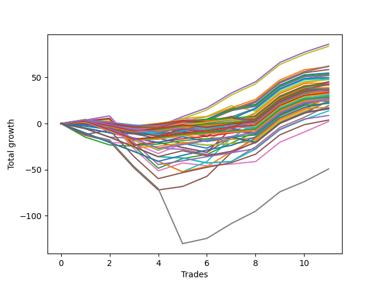

# Short Wallace Doodle 010 
- Symbol: ES_Unlimited
- Date Range: 03/18/2022 - 07/15/2022
- Trading Period: 7:20-12:30
- Number of Trades: 11



| Name | Win Percent | Profit | Avg Profit / Trade | Avg Time / Trade |      | Name | Win Percent | Profit | Avg Profit / Trade | Avg Time / Trade |
| ---- | ----------- | ------ | ------------------ | ---------------- | ---- | ---- | ----------- | ------ | ------------------ | ---------------- |
| Sorted By <br> Profit | | | | | | Sorted By <br> Win Percentage ||||
| Four | 81.82 | 43000.00 | 3909.09 | 22:58 |     | Eighty-Three | 90.91 | 13750.00 | 1250.00 | 24:46 |
| Sixty | 81.82 | 41875.00 | 3806.82 | 17:55 |     | Eighty-Two | 90.91 | 10875.00 | 988.64 | 22:17 |
| Three | 81.82 | 31125.00 | 2829.55 | 17:58 |     | Eighty-One | 90.91 | 8625.00 | 784.09 | 22:10 |
| Fifty-Nine | 81.82 | 31000.00 | 2818.18 | 13:00 |     | Four | 81.82 | 43000.00 | 3909.09 | 22:58 |
| One | 81.82 | 30875.00 | 2806.82 | 10:47 |     | Sixty | 81.82 | 41875.00 | 3806.82 | 17:55 |
| Fifty-Seven | 81.82 | 29250.00 | 2659.09 | 09:32 |     | Three | 81.82 | 31125.00 | 2829.55 | 17:58 |
| Zero | 81.82 | 27375.00 | 2488.64 | 07:20 |     | Fifty-Nine | 81.82 | 31000.00 | 2818.18 | 13:00 |
| Sixty-Four | 81.82 | 26750.00 | 2431.82 | 06:03 |     | One | 81.82 | 30875.00 | 2806.82 | 10:47 |
| Forty-Eight | 72.73 | 26500.00 | 2409.09 | 05:09 |     | Fifty-Seven | 81.82 | 29250.00 | 2659.09 | 09:32 |
| Fifty-Six | 81.82 | 26250.00 | 2386.36 | 06:14 |     | Zero | 81.82 | 27375.00 | 2488.64 | 07:20 |
| Forty-Nine | 72.73 | 26000.00 | 2363.64 | 06:25 |     | Sixty-Four | 81.82 | 26750.00 | 2431.82 | 06:03 |
| Fifty-Two | 72.73 | 24875.00 | 2261.36 | 09:02 |     | Fifty-Six | 81.82 | 26250.00 | 2386.36 | 06:14 |
| Fifty-One | 72.73 | 24250.00 | 2204.55 | 08:28 |     | One Hundred Seven | 81.82 | 21125.00 | 1920.45 | 03:55 |
| Fifty | 54.55 | 24000.00 | 2181.82 | 08:35 |     | One Hundred Six | 81.82 | 19500.00 | 1772.73 | 03:50 |
| Forty | 72.73 | 23750.00 | 2159.09 | 05:18 |     | One Hundred Seventeen | 81.82 | 18750.00 | 1704.55 | 05:11 |
| Sixty-Seven | 63.64 | 22625.00 | 2056.82 | 10:16 |     | One Hundred Sixteen | 81.82 | 17125.00 | 1556.82 | 05:06 |
| Sixty-One | 54.55 | 22625.00 | 2056.82 | 29:51 |     | One Hundred Twenty-Eight | 81.82 | 16750.00 | 1522.73 | 11:53 |
| Fifty-Three | 54.55 | 22125.00 | 2011.36 | 10:02 |     | One Hundred Twenty-Three | 81.82 | 16625.00 | 1511.36 | 12:02 |
| Sixty-Five | 72.73 | 22000.00 | 2000.00 | 08:05 |     | One Hundred Twenty-Seven | 81.82 | 14250.00 | 1295.45 | 09:33 |
| Sixty-Eight | 63.64 | 21750.00 | 1977.27 | 13:30 |     | One Hundred Twenty-Two | 81.82 | 14125.00 | 1284.09 | 09:42 |
| Fifty-Eight | 63.64 | 21500.00 | 1954.55 | 18:08 |     | One Hundred Twenty-Six | 81.82 | 12625.00 | 1147.73 | 09:28 |
| One Hundred Seven | 81.82 | 21125.00 | 1920.45 | 03:55 |     | One Hundred Twenty-One | 81.82 | 12500.00 | 1136.36 | 09:37 |
| One Hundred Twenty | 54.55 | 21125.00 | 1920.45 | 08:48 |     | Eighty-Four | 81.82 | 4375.00 | 397.73 | 33:11 |
| Fifty-Five | 54.55 | 20875.00 | 1897.73 | 10:02 |     | Forty-Eight | 72.73 | 26500.00 | 2409.09 | 05:09 |
| One Hundred Six | 81.82 | 19500.00 | 1772.73 | 03:50 |     | Forty-Nine | 72.73 | 26000.00 | 2363.64 | 06:25 |
| Seventy-Three | 63.64 | 19000.00 | 1727.27 | 10:32 |     | Fifty-Two | 72.73 | 24875.00 | 2261.36 | 09:02 |
| One Hundred Seventeen | 81.82 | 18750.00 | 1704.55 | 05:11 |     | Fifty-One | 72.73 | 24250.00 | 2204.55 | 08:28 |
| Forty-One | 63.64 | 18750.00 | 1704.55 | 08:12 |     | Forty | 72.73 | 23750.00 | 2159.09 | 05:18 |
| One Hundred Eighteen | 72.73 | 18625.00 | 1693.18 | 07:15 |     | Sixty-Five | 72.73 | 22000.00 | 2000.00 | 08:05 |
| One Hundred Ninteen | 63.64 | 18625.00 | 1693.18 | 08:21 |     | One Hundred Eighteen | 72.73 | 18625.00 | 1693.18 | 07:15 |
| Forty-Four | 54.55 | 18375.00 | 1670.45 | 12:32 |     | Ninety-Seven | 72.73 | 17375.00 | 1579.55 | 01:59 |
| One Hundred Ten | 45.45 | 18000.00 | 1636.36 | 06:10 |     | One Hundred Thirteen | 72.73 | 17000.00 | 1545.45 | 07:25 |
| One Hundred Eight | 54.55 | 17750.00 | 1613.64 | 05:13 |     | Ninety-Six | 72.73 | 16000.00 | 1454.55 | 01:54 |
| Ninety-Seven | 72.73 | 17375.00 | 1579.55 | 01:59 |     | One Hundred Twelve | 72.73 | 14750.00 | 1340.91 | 05:08 |
| One Hundred Nine | 45.45 | 17375.00 | 1579.55 | 05:52 |     | One Hundred Eleven | 72.73 | 13375.00 | 1215.91 | 05:03 |
| One Hundred | 54.55 | 17250.00 | 1568.18 | 02:30 |     | One Hundred Twenty-Nine | 72.73 | 13250.00 | 1204.55 | 14:36 |
| One Hundred Sixteen | 81.82 | 17125.00 | 1556.82 | 05:06 |     | One Hundred Twenty-Four | 72.73 | 13125.00 | 1193.18 | 14:45 |
| One Hundred Thirteen | 72.73 | 17000.00 | 1545.45 | 07:25 |     | Eighty-Five | 72.73 | 1875.00 | 170.45 | 46:50 |
| One Hundred Twenty-Eight | 81.82 | 16750.00 | 1522.73 | 11:53 |     | Sixty-Seven | 63.64 | 22625.00 | 2056.82 | 10:16 |
| Forty-Five | 36.36 | 16750.00 | 1522.73 | 17:22 |     | Sixty-Eight | 63.64 | 21750.00 | 1977.27 | 13:30 |
| One Hundred Twenty-Three | 81.82 | 16625.00 | 1511.36 | 12:02 |     | Fifty-Eight | 63.64 | 21500.00 | 1954.55 | 18:08 |
| Ninety-Six | 72.73 | 16000.00 | 1454.55 | 01:54 |     | Seventy-Three | 63.64 | 19000.00 | 1727.27 | 10:32 |
| One Hundred Three | 63.64 | 16000.00 | 1454.55 | 03:30 |     | Forty-One | 63.64 | 18750.00 | 1704.55 | 08:12 |
| Fifty-Four | 63.64 | 16000.00 | 1454.55 | 08:28 |     | One Hundred Ninteen | 63.64 | 18625.00 | 1693.18 | 08:21 |
| Ninety-Nine | 54.55 | 15625.00 | 1420.45 | 02:27 |     | One Hundred Three | 63.64 | 16000.00 | 1454.55 | 03:30 |
| Ninety-Eight | 54.55 | 15625.00 | 1420.45 | 02:16 |     | Fifty-Four | 63.64 | 16000.00 | 1454.55 | 08:28 |
| One Hundred Fourteen | 63.64 | 15500.00 | 1409.09 | 10:04 |     | One Hundred Fourteen | 63.64 | 15500.00 | 1409.09 | 10:04 |
| Forty-Six | 54.55 | 15500.00 | 1409.09 | 10:51 |     | Ninety-Two | 63.64 | 15000.00 | 1363.64 | 01:32 |
| Ninety-Two | 63.64 | 15000.00 | 1363.64 | 01:32 |     | Five | 63.64 | 14625.00 | 1329.55 | 56:27 |
| One Hundred Twelve | 72.73 | 14750.00 | 1340.91 | 05:08 |     | One Hundred Two | 63.64 | 14125.00 | 1284.09 | 01:39 |
| Five | 63.64 | 14625.00 | 1329.55 | 56:27 |     | Ninety-One | 63.64 | 13625.00 | 1238.64 | 01:28 |
| One Hundred Four | 54.55 | 14500.00 | 1318.18 | 04:40 |     | Two | 63.64 | 13500.00 | 1227.27 | 34:40 |
| Ninety-Three | 54.55 | 14375.00 | 1306.82 | 03:02 |     | One Hundred One | 63.64 | 12750.00 | 1159.09 | 01:35 |
| Sixty-Three | 54.55 | 14375.00 | 1306.82 | 32:01 |     | Seventy | 63.64 | 12375.00 | 1125.00 | 15:24 |
| One Hundred Twenty-Seven | 81.82 | 14250.00 | 1295.45 | 09:33 |     | Sixty-Two | 63.64 | 12250.00 | 1113.64 | 15:33 |
| One Hundred Twenty-Two | 81.82 | 14125.00 | 1284.09 | 09:42 |     | One Hundred Twenty-Five | 63.64 | 11250.00 | 1022.73 | 18:22 |
| One Hundred Two | 63.64 | 14125.00 | 1284.09 | 01:39 |     | Six | 63.64 | 1125.00 | 102.27 | 33:44 |
| Eighty-Three | 90.91 | 13750.00 | 1250.00 | 24:46 |     | Fifty | 54.55 | 24000.00 | 2181.82 | 08:35 |
| Ninety-One | 63.64 | 13625.00 | 1238.64 | 01:28 |     | Sixty-One | 54.55 | 22625.00 | 2056.82 | 29:51 |
| Two | 63.64 | 13500.00 | 1227.27 | 34:40 |     | Fifty-Three | 54.55 | 22125.00 | 2011.36 | 10:02 |
| One Hundred Eleven | 72.73 | 13375.00 | 1215.91 | 05:03 |     | One Hundred Twenty | 54.55 | 21125.00 | 1920.45 | 08:48 |
| One Hundred Twenty-Nine | 72.73 | 13250.00 | 1204.55 | 14:36 |     | Fifty-Five | 54.55 | 20875.00 | 1897.73 | 10:02 |
| One Hundred Five | 45.45 | 13250.00 | 1204.55 | 05:30 |     | Forty-Four | 54.55 | 18375.00 | 1670.45 | 12:32 |
| One Hundred Twenty-Four | 72.73 | 13125.00 | 1193.18 | 14:45 |     | One Hundred Eight | 54.55 | 17750.00 | 1613.64 | 05:13 |
| Forty-Three | 54.55 | 13125.00 | 1193.18 | 09:49 |     | One Hundred | 54.55 | 17250.00 | 1568.18 | 02:30 |
| Ninety-Four | 45.45 | 13000.00 | 1181.82 | 04:05 |     | Ninety-Nine | 54.55 | 15625.00 | 1420.45 | 02:27 |
| One Hundred One | 63.64 | 12750.00 | 1159.09 | 01:35 |     | Ninety-Eight | 54.55 | 15625.00 | 1420.45 | 02:16 |
| One Hundred Twenty-Six | 81.82 | 12625.00 | 1147.73 | 09:28 |     | Forty-Six | 54.55 | 15500.00 | 1409.09 | 10:51 |
| One Hundred Twenty-One | 81.82 | 12500.00 | 1136.36 | 09:37 |     | One Hundred Four | 54.55 | 14500.00 | 1318.18 | 04:40 |
| Seventy | 63.64 | 12375.00 | 1125.00 | 15:24 |     | Ninety-Three | 54.55 | 14375.00 | 1306.82 | 03:02 |
| Forty-Seven | 36.36 | 12375.00 | 1125.00 | 22:21 |     | Sixty-Three | 54.55 | 14375.00 | 1306.82 | 32:01 |
| Sixty-Two | 63.64 | 12250.00 | 1113.64 | 15:33 |     | Forty-Three | 54.55 | 13125.00 | 1193.18 | 09:49 |
| Ninety-Five | 36.36 | 11875.00 | 1079.55 | 04:42 |     | One Hundred Thirty | 54.55 | 8125.00 | 738.64 | 17:02 |
| One Hundred Twenty-Five | 63.64 | 11250.00 | 1022.73 | 18:22 |     | Seven | 54.55 | -24625.00 | -2238.64 | 76:24 |
| Eighty-Two | 90.91 | 10875.00 | 988.64 | 22:17 |     | One Hundred Ten | 45.45 | 18000.00 | 1636.36 | 06:10 |
| Sixty-Nine | 45.45 | 9750.00 | 886.36 | 19:55 |     | One Hundred Nine | 45.45 | 17375.00 | 1579.55 | 05:52 |
| Eighty-One | 90.91 | 8625.00 | 784.09 | 22:10 |     | One Hundred Five | 45.45 | 13250.00 | 1204.55 | 05:30 |
| One Hundred Fifteen | 45.45 | 8375.00 | 761.36 | 12:05 |     | Ninety-Four | 45.45 | 13000.00 | 1181.82 | 04:05 |
| One Hundred Thirty | 54.55 | 8125.00 | 738.64 | 17:02 |     | Sixty-Nine | 45.45 | 9750.00 | 886.36 | 19:55 |
| Sixty-Six | 45.45 | 8125.00 | 738.64 | 13:38 |     | One Hundred Fifteen | 45.45 | 8375.00 | 761.36 | 12:05 |
| Forty-Two | 36.36 | 7875.00 | 715.91 | 13:30 |     | Sixty-Six | 45.45 | 8125.00 | 738.64 | 13:38 |
| Seventy-One | 45.45 | 6875.00 | 625.00 | 22:30 |     | Seventy-One | 45.45 | 6875.00 | 625.00 | 22:30 |
| Eighty-Four | 81.82 | 4375.00 | 397.73 | 33:11 |     | Forty-Five | 36.36 | 16750.00 | 1522.73 | 17:22 |
| Eighty-Five | 72.73 | 1875.00 | 170.45 | 46:50 |     | Forty-Seven | 36.36 | 12375.00 | 1125.00 | 22:21 |
| Six | 63.64 | 1125.00 | 102.27 | 33:44 |     | Ninety-Five | 36.36 | 11875.00 | 1079.55 | 04:42 |
| Seven | 54.55 | -24625.00 | -2238.64 | 76:24 |     | Forty-Two | 36.36 | 7875.00 | 715.91 | 13:30 |

## NO STOPLOSS

### Test Zero
* Sell when price hits the middle line of the 20p bollinger
* No Stoploss
* Results:
```
Total Trades: 11
Percent Up: 18.18
Percent Down: 81.82
Total Points Moved Down: 54.75
Potential Profit: 27375.00
Total Points Ups: 9.50 Count Ups: 2
Total Points Downs: 64.25 Count Downs: 9
```

<details><summary>Trades</summary>

<code>In: 2022-03-25 10:22:00		Out: 2022-03-25 10:23:10		Total Position Time: 01:10		Total Move Down: 1.75		Total to Date: 1.75</code> <br />
<code>In: 2022-03-25 10:52:00		Out: 2022-03-25 11:18:15		Total Position Time: 26:15		Total Move Down: -8.00		Total to Date: -6.25</code> <br />
<code>In: 2022-03-28 10:27:00		Out: 2022-03-28 10:42:15		Total Position Time: 15:15		Total Move Down: -1.50		Total to Date: -7.75</code> <br />
<code>In: 2022-03-28 11:12:00		Out: 2022-03-28 11:13:30		Total Position Time: 01:30		Total Move Down: 1.75		Total to Date: -6.00</code> <br />
<code>In: 2022-04-25 09:27:00		Out: 2022-04-25 09:31:10		Total Position Time: 04:10		Total Move Down: 8.50		Total to Date: 2.50</code> <br />
<code>In: 2022-04-26 11:23:00		Out: 2022-04-26 11:32:15		Total Position Time: 09:15		Total Move Down: 2.25		Total to Date: 4.75</code> <br />
<code>In: 2022-05-02 09:23:00		Out: 2022-05-02 09:27:20		Total Position Time: 04:20		Total Move Down: 11.50		Total to Date: 16.25</code> <br />
<code>In: 2022-05-25 11:04:00		Out: 2022-05-25 11:06:25		Total Position Time: 02:25		Total Move Down: 4.50		Total to Date: 20.75</code> <br />
<code>In: 2022-05-25 11:06:00		Out: 2022-05-25 11:07:10		Total Position Time: 01:10		Total Move Down: 21.00		Total to Date: 41.75</code> <br />
<code>In: 2022-06-15 11:02:00		Out: 2022-06-15 11:03:10		Total Position Time: 01:10		Total Move Down: 11.00		Total to Date: 52.75</code> <br />
<code>In: 2022-06-29 11:06:00		Out: 2022-06-29 11:20:05		Total Position Time: 14:05		Total Move Down: 2.00		Total to Date: 54.75</code> <br />


</details>

### Test One
* Sell when the price hits the upper line of the 20p 1std bollinger
* No Stoploss
* Results:
```
Total Trades: 11
Percent Up: 18.18
Percent Down: 81.82
Total Points Moved Down: 61.75
Potential Profit: 30875.00
Total Points Ups: 8.50 Count Ups: 2
Total Points Downs: 70.25 Count Downs: 9
```

<details><summary>Trades</summary>

<code>In: 2022-03-25 10:22:00		Out: 2022-03-25 10:24:15		Total Position Time: 02:15		Total Move Down: 3.00		Total to Date: 3.00</code> <br />
<code>In: 2022-03-25 10:52:00		Out: 2022-03-25 11:19:45		Total Position Time: 27:45		Total Move Down: -7.00		Total to Date: -4.00</code> <br />
<code>In: 2022-03-28 10:27:00		Out: 2022-03-28 10:47:15		Total Position Time: 20:15		Total Move Down: -1.50		Total to Date: -5.50</code> <br />
<code>In: 2022-03-28 11:12:00		Out: 2022-03-28 11:19:35		Total Position Time: 07:35		Total Move Down: 2.50		Total to Date: -3.00</code> <br />
<code>In: 2022-04-25 09:27:00		Out: 2022-04-25 09:42:45		Total Position Time: 15:45		Total Move Down: 6.00		Total to Date: 3.00</code> <br />
<code>In: 2022-04-26 11:23:00		Out: 2022-04-26 11:34:20		Total Position Time: 11:20		Total Move Down: 4.25		Total to Date: 7.25</code> <br />
<code>In: 2022-05-02 09:23:00		Out: 2022-05-02 09:37:10		Total Position Time: 14:10		Total Move Down: 9.75		Total to Date: 17.00</code> <br />
<code>In: 2022-05-25 11:04:00		Out: 2022-05-25 11:06:35		Total Position Time: 02:35		Total Move Down: 9.25		Total to Date: 26.25</code> <br />
<code>In: 2022-05-25 11:06:00		Out: 2022-05-25 11:07:10		Total Position Time: 01:10		Total Move Down: 21.00		Total to Date: 47.25</code> <br />
<code>In: 2022-06-15 11:02:00		Out: 2022-06-15 11:03:10		Total Position Time: 01:10		Total Move Down: 11.00		Total to Date: 58.25</code> <br />
<code>In: 2022-06-29 11:06:00		Out: 2022-06-29 11:20:40		Total Position Time: 14:40		Total Move Down: 3.50		Total to Date: 61.75</code> <br />


</details>

### Test Two
* Sell when the price hits the upper line of the 20p 2std bollinger
* No Stoploss
* Results:
```
Total Trades: 11
Percent Up: 36.36
Percent Down: 63.64
Total Points Moved Down: 27.00
Potential Profit: 13500.00
Total Points Ups: 48.50 Count Ups: 4
Total Points Downs: 75.50 Count Downs: 7
```

<details><summary>Trades</summary>

<code>In: 2022-03-25 10:22:00		Out: 2022-03-25 12:01:15		Total Position Time: 99:15		Total Move Down: -14.75		Total to Date: -14.75</code> <br />
<code>In: 2022-03-25 10:52:00		Out: 2022-03-25 12:01:15		Total Position Time: 69:15		Total Move Down: -8.50		Total to Date: -23.25</code> <br />
<code>In: 2022-03-28 10:27:00		Out: 2022-03-28 10:55:10		Total Position Time: 28:10		Total Move Down: -1.25		Total to Date: -24.50</code> <br />
<code>In: 2022-03-28 11:12:00		Out: 2022-03-28 12:47:00		Total Position Time: 95:00		Total Move Down: -24.00		Total to Date: -48.50</code> <br />
<code>In: 2022-04-25 09:27:00		Out: 2022-04-25 10:01:20		Total Position Time: 34:20		Total Move Down: 10.50		Total to Date: -38.00</code> <br />
<code>In: 2022-04-26 11:23:00		Out: 2022-04-26 11:41:30		Total Position Time: 18:30		Total Move Down: 4.50		Total to Date: -33.50</code> <br />
<code>In: 2022-05-02 09:23:00		Out: 2022-05-02 09:39:35		Total Position Time: 16:35		Total Move Down: 12.25		Total to Date: -21.25</code> <br />
<code>In: 2022-05-25 11:04:00		Out: 2022-05-25 11:06:40		Total Position Time: 02:40		Total Move Down: 12.25		Total to Date: -9.00</code> <br />
<code>In: 2022-05-25 11:06:00		Out: 2022-05-25 11:07:10		Total Position Time: 01:10		Total Move Down: 21.00		Total to Date: 12.00</code> <br />
<code>In: 2022-06-15 11:02:00		Out: 2022-06-15 11:03:10		Total Position Time: 01:10		Total Move Down: 11.00		Total to Date: 23.00</code> <br />
<code>In: 2022-06-29 11:06:00		Out: 2022-06-29 11:21:15		Total Position Time: 15:15		Total Move Down: 4.00		Total to Date: 27.00</code> <br />


</details>

### Test Three
* Sell when price hits the middle line of the 50p bollinger
* No Stoploss
* Results:
```
Total Trades: 11
Percent Up: 18.18
Percent Down: 81.82
Total Points Moved Down: 62.25
Potential Profit: 31125.00
Total Points Ups: 11.25 Count Ups: 2
Total Points Downs: 73.50 Count Downs: 9
```

<details><summary>Trades</summary>

<code>In: 2022-03-25 10:22:00		Out: 2022-03-25 10:23:10		Total Position Time: 01:10		Total Move Down: 1.75		Total to Date: 1.75</code> <br />
<code>In: 2022-03-25 10:52:00		Out: 2022-03-25 12:00:45		Total Position Time: 68:45		Total Move Down: -10.00		Total to Date: -8.25</code> <br />
<code>In: 2022-03-28 10:27:00		Out: 2022-03-28 11:05:15		Total Position Time: 38:15		Total Move Down: -1.25		Total to Date: -9.50</code> <br />
<code>In: 2022-03-28 11:12:00		Out: 2022-03-28 11:19:20		Total Position Time: 07:20		Total Move Down: 2.00		Total to Date: -7.50</code> <br />
<code>In: 2022-04-25 09:27:00		Out: 2022-04-25 09:56:20		Total Position Time: 29:20		Total Move Down: 6.50		Total to Date: -1.00</code> <br />
<code>In: 2022-04-26 11:23:00		Out: 2022-04-26 11:41:30		Total Position Time: 18:30		Total Move Down: 4.50		Total to Date: 3.50</code> <br />
<code>In: 2022-05-02 09:23:00		Out: 2022-05-02 09:27:20		Total Position Time: 04:20		Total Move Down: 11.50		Total to Date: 15.00</code> <br />
<code>In: 2022-05-25 11:04:00		Out: 2022-05-25 11:06:35		Total Position Time: 02:35		Total Move Down: 9.25		Total to Date: 24.25</code> <br />
<code>In: 2022-05-25 11:06:00		Out: 2022-05-25 11:07:10		Total Position Time: 01:10		Total Move Down: 21.00		Total to Date: 45.25</code> <br />
<code>In: 2022-06-15 11:02:00		Out: 2022-06-15 11:03:10		Total Position Time: 01:10		Total Move Down: 11.00		Total to Date: 56.25</code> <br />
<code>In: 2022-06-29 11:06:00		Out: 2022-06-29 11:31:05		Total Position Time: 25:05		Total Move Down: 6.00		Total to Date: 62.25</code> <br />


</details>

### Test Four
* Sell when the price hits the upper line of the 50p 1std bollinger
* No Stoploss
* Results:
```
Total Trades: 11
Percent Up: 18.18
Percent Down: 81.82
Total Points Moved Down: 86.00
Potential Profit: 43000.00
Total Points Ups: 10.00 Count Ups: 2
Total Points Downs: 96.00 Count Downs: 9
```

<details><summary>Trades</summary>

<code>In: 2022-03-25 10:22:00		Out: 2022-03-25 10:27:20		Total Position Time: 05:20		Total Move Down: 4.25		Total to Date: 4.25</code> <br />
<code>In: 2022-03-25 10:52:00		Out: 2022-03-25 12:01:40		Total Position Time: 69:40		Total Move Down: -8.00		Total to Date: -3.75</code> <br />
<code>In: 2022-03-28 10:27:00		Out: 2022-03-28 11:20:40		Total Position Time: 53:40		Total Move Down: -2.00		Total to Date: -5.75</code> <br />
<code>In: 2022-03-28 11:12:00		Out: 2022-03-28 11:20:40		Total Position Time: 08:40		Total Move Down: 2.75		Total to Date: -3.00</code> <br />
<code>In: 2022-04-25 09:27:00		Out: 2022-04-25 10:01:20		Total Position Time: 34:20		Total Move Down: 10.50		Total to Date: 7.50</code> <br />
<code>In: 2022-04-26 11:23:00		Out: 2022-04-26 11:45:05		Total Position Time: 22:05		Total Move Down: 9.50		Total to Date: 17.00</code> <br />
<code>In: 2022-05-02 09:23:00		Out: 2022-05-02 09:43:15		Total Position Time: 20:15		Total Move Down: 16.00		Total to Date: 33.00</code> <br />
<code>In: 2022-05-25 11:04:00		Out: 2022-05-25 11:06:40		Total Position Time: 02:40		Total Move Down: 12.25		Total to Date: 45.25</code> <br />
<code>In: 2022-05-25 11:06:00		Out: 2022-05-25 11:07:10		Total Position Time: 01:10		Total Move Down: 21.00		Total to Date: 66.25</code> <br />
<code>In: 2022-06-15 11:02:00		Out: 2022-06-15 11:03:10		Total Position Time: 01:10		Total Move Down: 11.00		Total to Date: 77.25</code> <br />
<code>In: 2022-06-29 11:06:00		Out: 2022-06-29 11:39:40		Total Position Time: 33:40		Total Move Down: 8.75		Total to Date: 86.00</code> <br />


</details>

### Test Five
* Sell when the price hits the upper line of the 50p 2std bollinger
* No Stoploss
* Results:
```
Total Trades: 11
Percent Up: 36.36
Percent Down: 63.64
Total Points Moved Down: 29.25
Potential Profit: 14625.00
Total Points Ups: 72.00 Count Ups: 4
Total Points Downs: 101.25 Count Downs: 7
```

<details><summary>Trades</summary>

<code>In: 2022-03-25 10:22:00		Out: 2022-03-25 12:01:55		Total Position Time: 99:55		Total Move Down: -12.75		Total to Date: -12.75</code> <br />
<code>In: 2022-03-25 10:52:00		Out: 2022-03-25 12:01:55		Total Position Time: 69:55		Total Move Down: -6.50		Total to Date: -19.25</code> <br />
<code>In: 2022-03-28 10:27:00		Out: 2022-03-28 12:47:00		Total Position Time: 140:00		Total Move Down: -28.75		Total to Date: -48.00</code> <br />
<code>In: 2022-03-28 11:12:00		Out: 2022-03-28 12:47:00		Total Position Time: 95:00		Total Move Down: -24.00		Total to Date: -72.00</code> <br />
<code>In: 2022-04-25 09:27:00		Out: 2022-04-25 11:01:35		Total Position Time: 94:35		Total Move Down: 3.75		Total to Date: -68.25</code> <br />
<code>In: 2022-04-26 11:23:00		Out: 2022-04-26 12:13:05		Total Position Time: 50:05		Total Move Down: 11.00		Total to Date: -57.25</code> <br />
<code>In: 2022-05-02 09:23:00		Out: 2022-05-02 09:54:10		Total Position Time: 31:10		Total Move Down: 25.75		Total to Date: -31.50</code> <br />
<code>In: 2022-05-25 11:04:00		Out: 2022-05-25 11:06:50		Total Position Time: 02:50		Total Move Down: 16.00		Total to Date: -15.50</code> <br />
<code>In: 2022-05-25 11:06:00		Out: 2022-05-25 11:07:10		Total Position Time: 01:10		Total Move Down: 21.00		Total to Date: 5.50</code> <br />
<code>In: 2022-06-15 11:02:00		Out: 2022-06-15 11:03:10		Total Position Time: 01:10		Total Move Down: 11.00		Total to Date: 16.50</code> <br />
<code>In: 2022-06-29 11:06:00		Out: 2022-06-29 11:41:15		Total Position Time: 35:15		Total Move Down: 12.75		Total to Date: 29.25</code> <br />


</details>

### Test Six
* Sell when the price hits the middle line of the 1std VWAP
* No Stoploss
* Results:
```
Total Trades: 11
Percent Up: 36.36
Percent Down: 63.64
Total Points Moved Down: 2.25
Potential Profit: 1125.00
Total Points Ups: 56.00 Count Ups: 4
Total Points Downs: 58.25 Count Downs: 7
```

<details><summary>Trades</summary>

<code>In: 2022-03-25 10:22:00		Out: 2022-03-25 10:23:10		Total Position Time: 01:10		Total Move Down: 1.75		Total to Date: 1.75</code> <br />
<code>In: 2022-03-25 10:52:00		Out: 2022-03-25 12:20:30		Total Position Time: 88:30		Total Move Down: -0.25		Total to Date: 1.50</code> <br />
<code>In: 2022-03-28 10:27:00		Out: 2022-03-28 12:47:00		Total Position Time: 140:00		Total Move Down: -28.75		Total to Date: -27.25</code> <br />
<code>In: 2022-03-28 11:12:00		Out: 2022-03-28 12:47:00		Total Position Time: 95:00		Total Move Down: -24.00		Total to Date: -51.25</code> <br />
<code>In: 2022-04-25 09:27:00		Out: 2022-04-25 09:31:10		Total Position Time: 04:10		Total Move Down: 8.50		Total to Date: -42.75</code> <br />
<code>In: 2022-04-26 11:23:00		Out: 2022-04-26 11:24:10		Total Position Time: 01:10		Total Move Down: -3.00		Total to Date: -45.75</code> <br />
<code>In: 2022-05-02 09:23:00		Out: 2022-05-02 09:24:15		Total Position Time: 01:15		Total Move Down: 1.75		Total to Date: -44.00</code> <br />
<code>In: 2022-05-25 11:04:00		Out: 2022-05-25 11:06:20		Total Position Time: 02:20		Total Move Down: 2.75		Total to Date: -41.25</code> <br />
<code>In: 2022-05-25 11:06:00		Out: 2022-05-25 11:07:10		Total Position Time: 01:10		Total Move Down: 21.00		Total to Date: -20.25</code> <br />
<code>In: 2022-06-15 11:02:00		Out: 2022-06-15 11:03:10		Total Position Time: 01:10		Total Move Down: 11.00		Total to Date: -9.25</code> <br />
<code>In: 2022-06-29 11:06:00		Out: 2022-06-29 11:41:10		Total Position Time: 35:10		Total Move Down: 11.50		Total to Date: 2.25</code> <br />


</details>

### Test Seven
* Sell when the price hits the upper line of the 1std VWAP
* No Stoploss
* Results:
```
Total Trades: 11
Percent Up: 45.45
Percent Down: 54.55
Total Points Moved Down: -49.25
Potential Profit: -24625.00
Total Points Ups: 130.25 Count Ups: 5
Total Points Downs: 81.00 Count Downs: 6
```

<details><summary>Trades</summary>

<code>In: 2022-03-25 10:22:00		Out: 2022-03-25 12:47:00		Total Position Time: 145:00		Total Move Down: -12.00		Total to Date: -12.00</code> <br />
<code>In: 2022-03-25 10:52:00		Out: 2022-03-25 12:47:00		Total Position Time: 115:00		Total Move Down: -5.75		Total to Date: -17.75</code> <br />
<code>In: 2022-03-28 10:27:00		Out: 2022-03-28 12:47:00		Total Position Time: 140:00		Total Move Down: -28.75		Total to Date: -46.50</code> <br />
<code>In: 2022-03-28 11:12:00		Out: 2022-03-28 12:47:00		Total Position Time: 95:00		Total Move Down: -24.00		Total to Date: -70.50</code> <br />
<code>In: 2022-04-25 09:27:00		Out: 2022-04-25 12:47:00		Total Position Time: 200:00		Total Move Down: -59.75		Total to Date: -130.25</code> <br />
<code>In: 2022-04-26 11:23:00		Out: 2022-04-26 11:42:05		Total Position Time: 19:05		Total Move Down: 5.75		Total to Date: -124.50</code> <br />
<code>In: 2022-05-02 09:23:00		Out: 2022-05-02 09:43:15		Total Position Time: 20:15		Total Move Down: 16.00		Total to Date: -108.50</code> <br />
<code>In: 2022-05-25 11:04:00		Out: 2022-05-25 11:06:45		Total Position Time: 02:45		Total Move Down: 13.50		Total to Date: -95.00</code> <br />
<code>In: 2022-05-25 11:06:00		Out: 2022-05-25 11:07:10		Total Position Time: 01:10		Total Move Down: 21.00		Total to Date: -74.00</code> <br />
<code>In: 2022-06-15 11:02:00		Out: 2022-06-15 11:03:10		Total Position Time: 01:10		Total Move Down: 11.00		Total to Date: -63.00</code> <br />
<code>In: 2022-06-29 11:06:00		Out: 2022-06-29 12:47:00		Total Position Time: 101:00		Total Move Down: 13.75		Total to Date: -49.25</code> <br />


</details>

## STOPLOSS OF 5

### Test Forty
* Sell when price hits the middle line of the 20p bollinger
* Stoploss is -5 points
* Results:
```
Total Trades: 11
Percent Up: 27.27
Percent Down: 72.73
Total Points Moved Down: 47.50
Potential Profit: 23750.00
Total Points Ups: 12.25 Count Ups: 3
Total Points Downs: 59.75 Count Downs: 8
```

<details><summary>Trades</summary>

<code>In: 2022-03-25 10:22:00		Out: 2022-03-25 10:23:10		Total Position Time: 01:10		Total Move Down: 1.75		Total to Date: 1.75</code> <br />
<code>In: 2022-03-25 10:52:00		Out: 2022-03-25 10:57:10		Total Position Time: 05:10		Total Move Down: -5.00		Total to Date: -3.25</code> <br />
<code>In: 2022-03-28 10:27:00		Out: 2022-03-28 10:42:15		Total Position Time: 15:15		Total Move Down: -1.50		Total to Date: -4.75</code> <br />
<code>In: 2022-03-28 11:12:00		Out: 2022-03-28 11:13:30		Total Position Time: 01:30		Total Move Down: 1.75		Total to Date: -3.00</code> <br />
<code>In: 2022-04-25 09:27:00		Out: 2022-04-25 09:31:10		Total Position Time: 04:10		Total Move Down: 8.50		Total to Date: 5.50</code> <br />
<code>In: 2022-04-26 11:23:00		Out: 2022-04-26 11:32:15		Total Position Time: 09:15		Total Move Down: 2.25		Total to Date: 7.75</code> <br />
<code>In: 2022-05-02 09:23:00		Out: 2022-05-02 09:27:20		Total Position Time: 04:20		Total Move Down: 11.50		Total to Date: 19.25</code> <br />
<code>In: 2022-05-25 11:04:00		Out: 2022-05-25 11:05:10		Total Position Time: 01:10		Total Move Down: -5.75		Total to Date: 13.50</code> <br />
<code>In: 2022-05-25 11:06:00		Out: 2022-05-25 11:07:10		Total Position Time: 01:10		Total Move Down: 21.00		Total to Date: 34.50</code> <br />
<code>In: 2022-06-15 11:02:00		Out: 2022-06-15 11:03:10		Total Position Time: 01:10		Total Move Down: 11.00		Total to Date: 45.50</code> <br />
<code>In: 2022-06-29 11:06:00		Out: 2022-06-29 11:20:05		Total Position Time: 14:05		Total Move Down: 2.00		Total to Date: 47.50</code> <br />


</details>

### Test Forty-One
* Sell when the price hits the upper line of the 20p 1std bollinger
* Stoploss is -5 points
* Results:
```
Total Trades: 11
Percent Up: 36.36
Percent Down: 63.64
Total Points Moved Down: 37.50
Potential Profit: 18750.00
Total Points Ups: 17.50 Count Ups: 4
Total Points Downs: 55.00 Count Downs: 7
```

<details><summary>Trades</summary>

<code>In: 2022-03-25 10:22:00		Out: 2022-03-25 10:24:15		Total Position Time: 02:15		Total Move Down: 3.00		Total to Date: 3.00</code> <br />
<code>In: 2022-03-25 10:52:00		Out: 2022-03-25 10:57:10		Total Position Time: 05:10		Total Move Down: -5.00		Total to Date: -2.00</code> <br />
<code>In: 2022-03-28 10:27:00		Out: 2022-03-28 10:47:15		Total Position Time: 20:15		Total Move Down: -1.50		Total to Date: -3.50</code> <br />
<code>In: 2022-03-28 11:12:00		Out: 2022-03-28 11:19:35		Total Position Time: 07:35		Total Move Down: 2.50		Total to Date: -1.00</code> <br />
<code>In: 2022-04-25 09:27:00		Out: 2022-04-25 09:38:20		Total Position Time: 11:20		Total Move Down: -5.25		Total to Date: -6.25</code> <br />
<code>In: 2022-04-26 11:23:00		Out: 2022-04-26 11:34:20		Total Position Time: 11:20		Total Move Down: 4.25		Total to Date: -2.00</code> <br />
<code>In: 2022-05-02 09:23:00		Out: 2022-05-02 09:37:10		Total Position Time: 14:10		Total Move Down: 9.75		Total to Date: 7.75</code> <br />
<code>In: 2022-05-25 11:04:00		Out: 2022-05-25 11:05:10		Total Position Time: 01:10		Total Move Down: -5.75		Total to Date: 2.00</code> <br />
<code>In: 2022-05-25 11:06:00		Out: 2022-05-25 11:07:10		Total Position Time: 01:10		Total Move Down: 21.00		Total to Date: 23.00</code> <br />
<code>In: 2022-06-15 11:02:00		Out: 2022-06-15 11:03:10		Total Position Time: 01:10		Total Move Down: 11.00		Total to Date: 34.00</code> <br />
<code>In: 2022-06-29 11:06:00		Out: 2022-06-29 11:20:40		Total Position Time: 14:40		Total Move Down: 3.50		Total to Date: 37.50</code> <br />


</details>

### Test Forty-Two
* Sell when the price hits the upper line of the 20p 2std bollinger
* Stoploss is -5 points
* Results:
```
Total Trades: 11
Percent Up: 63.64
Percent Down: 36.36
Total Points Moved Down: 15.75
Potential Profit: 7875.00
Total Points Ups: 32.50 Count Ups: 7
Total Points Downs: 48.25 Count Downs: 4
```

<details><summary>Trades</summary>

<code>In: 2022-03-25 10:22:00		Out: 2022-03-25 10:44:45		Total Position Time: 22:45		Total Move Down: -5.00		Total to Date: -5.00</code> <br />
<code>In: 2022-03-25 10:52:00		Out: 2022-03-25 10:57:10		Total Position Time: 05:10		Total Move Down: -5.00		Total to Date: -10.00</code> <br />
<code>In: 2022-03-28 10:27:00		Out: 2022-03-28 10:55:10		Total Position Time: 28:10		Total Move Down: -1.25		Total to Date: -11.25</code> <br />
<code>In: 2022-03-28 11:12:00		Out: 2022-03-28 11:43:50		Total Position Time: 31:50		Total Move Down: -5.00		Total to Date: -16.25</code> <br />
<code>In: 2022-04-25 09:27:00		Out: 2022-04-25 09:38:20		Total Position Time: 11:20		Total Move Down: -5.25		Total to Date: -21.50</code> <br />
<code>In: 2022-04-26 11:23:00		Out: 2022-04-26 11:37:00		Total Position Time: 14:00		Total Move Down: -5.25		Total to Date: -26.75</code> <br />
<code>In: 2022-05-02 09:23:00		Out: 2022-05-02 09:39:35		Total Position Time: 16:35		Total Move Down: 12.25		Total to Date: -14.50</code> <br />
<code>In: 2022-05-25 11:04:00		Out: 2022-05-25 11:05:10		Total Position Time: 01:10		Total Move Down: -5.75		Total to Date: -20.25</code> <br />
<code>In: 2022-05-25 11:06:00		Out: 2022-05-25 11:07:10		Total Position Time: 01:10		Total Move Down: 21.00		Total to Date: 0.75</code> <br />
<code>In: 2022-06-15 11:02:00		Out: 2022-06-15 11:03:10		Total Position Time: 01:10		Total Move Down: 11.00		Total to Date: 11.75</code> <br />
<code>In: 2022-06-29 11:06:00		Out: 2022-06-29 11:21:15		Total Position Time: 15:15		Total Move Down: 4.00		Total to Date: 15.75</code> <br />


</details>

### Test Forty-Three
* Sell when price hits the middle line of the 50p bollinger
* Stoploss is -5 points
* Results:
```
Total Trades: 11
Percent Up: 45.45
Percent Down: 54.55
Total Points Moved Down: 26.25
Potential Profit: 13125.00
Total Points Ups: 27.00 Count Ups: 5
Total Points Downs: 53.25 Count Downs: 6
```

<details><summary>Trades</summary>

<code>In: 2022-03-25 10:22:00		Out: 2022-03-25 10:23:10		Total Position Time: 01:10		Total Move Down: 1.75		Total to Date: 1.75</code> <br />
<code>In: 2022-03-25 10:52:00		Out: 2022-03-25 10:57:10		Total Position Time: 05:10		Total Move Down: -5.00		Total to Date: -3.25</code> <br />
<code>In: 2022-03-28 10:27:00		Out: 2022-03-28 11:03:05		Total Position Time: 36:05		Total Move Down: -5.75		Total to Date: -9.00</code> <br />
<code>In: 2022-03-28 11:12:00		Out: 2022-03-28 11:19:20		Total Position Time: 07:20		Total Move Down: 2.00		Total to Date: -7.00</code> <br />
<code>In: 2022-04-25 09:27:00		Out: 2022-04-25 09:38:20		Total Position Time: 11:20		Total Move Down: -5.25		Total to Date: -12.25</code> <br />
<code>In: 2022-04-26 11:23:00		Out: 2022-04-26 11:37:00		Total Position Time: 14:00		Total Move Down: -5.25		Total to Date: -17.50</code> <br />
<code>In: 2022-05-02 09:23:00		Out: 2022-05-02 09:27:20		Total Position Time: 04:20		Total Move Down: 11.50		Total to Date: -6.00</code> <br />
<code>In: 2022-05-25 11:04:00		Out: 2022-05-25 11:05:10		Total Position Time: 01:10		Total Move Down: -5.75		Total to Date: -11.75</code> <br />
<code>In: 2022-05-25 11:06:00		Out: 2022-05-25 11:07:10		Total Position Time: 01:10		Total Move Down: 21.00		Total to Date: 9.25</code> <br />
<code>In: 2022-06-15 11:02:00		Out: 2022-06-15 11:03:10		Total Position Time: 01:10		Total Move Down: 11.00		Total to Date: 20.25</code> <br />
<code>In: 2022-06-29 11:06:00		Out: 2022-06-29 11:31:05		Total Position Time: 25:05		Total Move Down: 6.00		Total to Date: 26.25</code> <br />


</details>

### Test Forty-Four
* Sell when the price hits the upper line of the 50p 1std bollinger
* Stoploss is -5 points
* Results:
```
Total Trades: 11
Percent Up: 45.45
Percent Down: 54.55
Total Points Moved Down: 36.75
Potential Profit: 18375.00
Total Points Ups: 27.00 Count Ups: 5
Total Points Downs: 63.75 Count Downs: 6
```

<details><summary>Trades</summary>

<code>In: 2022-03-25 10:22:00		Out: 2022-03-25 10:27:20		Total Position Time: 05:20		Total Move Down: 4.25		Total to Date: 4.25</code> <br />
<code>In: 2022-03-25 10:52:00		Out: 2022-03-25 10:57:10		Total Position Time: 05:10		Total Move Down: -5.00		Total to Date: -0.75</code> <br />
<code>In: 2022-03-28 10:27:00		Out: 2022-03-28 11:03:05		Total Position Time: 36:05		Total Move Down: -5.75		Total to Date: -6.50</code> <br />
<code>In: 2022-03-28 11:12:00		Out: 2022-03-28 11:20:40		Total Position Time: 08:40		Total Move Down: 2.75		Total to Date: -3.75</code> <br />
<code>In: 2022-04-25 09:27:00		Out: 2022-04-25 09:38:20		Total Position Time: 11:20		Total Move Down: -5.25		Total to Date: -9.00</code> <br />
<code>In: 2022-04-26 11:23:00		Out: 2022-04-26 11:37:00		Total Position Time: 14:00		Total Move Down: -5.25		Total to Date: -14.25</code> <br />
<code>In: 2022-05-02 09:23:00		Out: 2022-05-02 09:43:15		Total Position Time: 20:15		Total Move Down: 16.00		Total to Date: 1.75</code> <br />
<code>In: 2022-05-25 11:04:00		Out: 2022-05-25 11:05:10		Total Position Time: 01:10		Total Move Down: -5.75		Total to Date: -4.00</code> <br />
<code>In: 2022-05-25 11:06:00		Out: 2022-05-25 11:07:10		Total Position Time: 01:10		Total Move Down: 21.00		Total to Date: 17.00</code> <br />
<code>In: 2022-06-15 11:02:00		Out: 2022-06-15 11:03:10		Total Position Time: 01:10		Total Move Down: 11.00		Total to Date: 28.00</code> <br />
<code>In: 2022-06-29 11:06:00		Out: 2022-06-29 11:39:40		Total Position Time: 33:40		Total Move Down: 8.75		Total to Date: 36.75</code> <br />


</details>

### Test Forty-Five
* Sell when the price hits the upper line of the 50p 2std bollinger
* Stoploss is -5 points
* Results:
```
Total Trades: 11
Percent Up: 63.64
Percent Down: 36.36
Total Points Moved Down: 33.50
Potential Profit: 16750.00
Total Points Ups: 37.00 Count Ups: 7
Total Points Downs: 70.50 Count Downs: 4
```

<details><summary>Trades</summary>

<code>In: 2022-03-25 10:22:00		Out: 2022-03-25 10:44:45		Total Position Time: 22:45		Total Move Down: -5.00		Total to Date: -5.00</code> <br />
<code>In: 2022-03-25 10:52:00		Out: 2022-03-25 10:57:10		Total Position Time: 05:10		Total Move Down: -5.00		Total to Date: -10.00</code> <br />
<code>In: 2022-03-28 10:27:00		Out: 2022-03-28 11:03:05		Total Position Time: 36:05		Total Move Down: -5.75		Total to Date: -15.75</code> <br />
<code>In: 2022-03-28 11:12:00		Out: 2022-03-28 11:43:50		Total Position Time: 31:50		Total Move Down: -5.00		Total to Date: -20.75</code> <br />
<code>In: 2022-04-25 09:27:00		Out: 2022-04-25 09:38:20		Total Position Time: 11:20		Total Move Down: -5.25		Total to Date: -26.00</code> <br />
<code>In: 2022-04-26 11:23:00		Out: 2022-04-26 11:37:00		Total Position Time: 14:00		Total Move Down: -5.25		Total to Date: -31.25</code> <br />
<code>In: 2022-05-02 09:23:00		Out: 2022-05-02 09:54:10		Total Position Time: 31:10		Total Move Down: 25.75		Total to Date: -5.50</code> <br />
<code>In: 2022-05-25 11:04:00		Out: 2022-05-25 11:05:10		Total Position Time: 01:10		Total Move Down: -5.75		Total to Date: -11.25</code> <br />
<code>In: 2022-05-25 11:06:00		Out: 2022-05-25 11:07:10		Total Position Time: 01:10		Total Move Down: 21.00		Total to Date: 9.75</code> <br />
<code>In: 2022-06-15 11:02:00		Out: 2022-06-15 11:03:10		Total Position Time: 01:10		Total Move Down: 11.00		Total to Date: 20.75</code> <br />
<code>In: 2022-06-29 11:06:00		Out: 2022-06-29 11:41:15		Total Position Time: 35:15		Total Move Down: 12.75		Total to Date: 33.50</code> <br />


</details>

### Test Forty-Six
* Sell when the price hits the middle line of the 1std VWAP
* Stoploss is -5 points
* Results:
```
Total Trades: 11
Percent Up: 45.45
Percent Down: 54.55
Total Points Moved Down: 31.00
Potential Profit: 15500.00
Total Points Ups: 24.50 Count Ups: 5
Total Points Downs: 55.50 Count Downs: 6
```

<details><summary>Trades</summary>

<code>In: 2022-03-25 10:22:00		Out: 2022-03-25 10:23:10		Total Position Time: 01:10		Total Move Down: 1.75		Total to Date: 1.75</code> <br />
<code>In: 2022-03-25 10:52:00		Out: 2022-03-25 10:57:10		Total Position Time: 05:10		Total Move Down: -5.00		Total to Date: -3.25</code> <br />
<code>In: 2022-03-28 10:27:00		Out: 2022-03-28 11:03:05		Total Position Time: 36:05		Total Move Down: -5.75		Total to Date: -9.00</code> <br />
<code>In: 2022-03-28 11:12:00		Out: 2022-03-28 11:43:50		Total Position Time: 31:50		Total Move Down: -5.00		Total to Date: -14.00</code> <br />
<code>In: 2022-04-25 09:27:00		Out: 2022-04-25 09:31:10		Total Position Time: 04:10		Total Move Down: 8.50		Total to Date: -5.50</code> <br />
<code>In: 2022-04-26 11:23:00		Out: 2022-04-26 11:24:10		Total Position Time: 01:10		Total Move Down: -3.00		Total to Date: -8.50</code> <br />
<code>In: 2022-05-02 09:23:00		Out: 2022-05-02 09:24:15		Total Position Time: 01:15		Total Move Down: 1.75		Total to Date: -6.75</code> <br />
<code>In: 2022-05-25 11:04:00		Out: 2022-05-25 11:05:10		Total Position Time: 01:10		Total Move Down: -5.75		Total to Date: -12.50</code> <br />
<code>In: 2022-05-25 11:06:00		Out: 2022-05-25 11:07:10		Total Position Time: 01:10		Total Move Down: 21.00		Total to Date: 8.50</code> <br />
<code>In: 2022-06-15 11:02:00		Out: 2022-06-15 11:03:10		Total Position Time: 01:10		Total Move Down: 11.00		Total to Date: 19.50</code> <br />
<code>In: 2022-06-29 11:06:00		Out: 2022-06-29 11:41:10		Total Position Time: 35:10		Total Move Down: 11.50		Total to Date: 31.00</code> <br />


</details>

### Test Forty-Seven
* Sell when the price hits the upper line of the 1std VWAP
* Stoploss is -5 points
* Results:
```
Total Trades: 11
Percent Up: 63.64
Percent Down: 36.36
Total Points Moved Down: 24.75
Potential Profit: 12375.00
Total Points Ups: 37.00 Count Ups: 7
Total Points Downs: 61.75 Count Downs: 4
```

<details><summary>Trades</summary>

<code>In: 2022-03-25 10:22:00		Out: 2022-03-25 10:44:45		Total Position Time: 22:45		Total Move Down: -5.00		Total to Date: -5.00</code> <br />
<code>In: 2022-03-25 10:52:00		Out: 2022-03-25 10:57:10		Total Position Time: 05:10		Total Move Down: -5.00		Total to Date: -10.00</code> <br />
<code>In: 2022-03-28 10:27:00		Out: 2022-03-28 11:03:05		Total Position Time: 36:05		Total Move Down: -5.75		Total to Date: -15.75</code> <br />
<code>In: 2022-03-28 11:12:00		Out: 2022-03-28 11:43:50		Total Position Time: 31:50		Total Move Down: -5.00		Total to Date: -20.75</code> <br />
<code>In: 2022-04-25 09:27:00		Out: 2022-04-25 09:38:20		Total Position Time: 11:20		Total Move Down: -5.25		Total to Date: -26.00</code> <br />
<code>In: 2022-04-26 11:23:00		Out: 2022-04-26 11:37:00		Total Position Time: 14:00		Total Move Down: -5.25		Total to Date: -31.25</code> <br />
<code>In: 2022-05-02 09:23:00		Out: 2022-05-02 09:43:15		Total Position Time: 20:15		Total Move Down: 16.00		Total to Date: -15.25</code> <br />
<code>In: 2022-05-25 11:04:00		Out: 2022-05-25 11:05:10		Total Position Time: 01:10		Total Move Down: -5.75		Total to Date: -21.00</code> <br />
<code>In: 2022-05-25 11:06:00		Out: 2022-05-25 11:07:10		Total Position Time: 01:10		Total Move Down: 21.00		Total to Date: 0.00</code> <br />
<code>In: 2022-06-15 11:02:00		Out: 2022-06-15 11:03:10		Total Position Time: 01:10		Total Move Down: 11.00		Total to Date: 11.00</code> <br />
<code>In: 2022-06-29 11:06:00		Out: 2022-06-29 12:47:00		Total Position Time: 101:00		Total Move Down: 13.75		Total to Date: 24.75</code> <br />


</details>

## TRAIL STOP OF 5

### Test Forty-Eight
* Sell when price hits the middle line of the 20p bollinger
* Trailing Stop is -5 points
* Results:
```
Total Trades: 11
Percent Up: 27.27
Percent Down: 72.73
Total Points Moved Down: 53.00
Potential Profit: 26500.00
Total Points Ups: 9.00 Count Ups: 3
Total Points Downs: 62.00 Count Downs: 8
```

<details><summary>Trades</summary>

<code>In: 2022-03-25 10:22:00		Out: 2022-03-25 10:23:10		Total Position Time: 01:10		Total Move Down: 1.75		Total to Date: 1.75</code> <br />
<code>In: 2022-03-25 10:52:00		Out: 2022-03-25 10:57:10		Total Position Time: 05:10		Total Move Down: -5.00		Total to Date: -3.25</code> <br />
<code>In: 2022-03-28 10:27:00		Out: 2022-03-28 10:42:15		Total Position Time: 15:15		Total Move Down: -1.50		Total to Date: -4.75</code> <br />
<code>In: 2022-03-28 11:12:00		Out: 2022-03-28 11:13:30		Total Position Time: 01:30		Total Move Down: 1.75		Total to Date: -3.00</code> <br />
<code>In: 2022-04-25 09:27:00		Out: 2022-04-25 09:31:10		Total Position Time: 04:10		Total Move Down: 8.50		Total to Date: 5.50</code> <br />
<code>In: 2022-04-26 11:23:00		Out: 2022-04-26 11:29:15		Total Position Time: 06:15		Total Move Down: -2.50		Total to Date: 3.00</code> <br />
<code>In: 2022-05-02 09:23:00		Out: 2022-05-02 09:27:20		Total Position Time: 04:20		Total Move Down: 11.50		Total to Date: 14.50</code> <br />
<code>In: 2022-05-25 11:04:00		Out: 2022-05-25 11:06:25		Total Position Time: 02:25		Total Move Down: 4.50		Total to Date: 19.00</code> <br />
<code>In: 2022-05-25 11:06:00		Out: 2022-05-25 11:07:10		Total Position Time: 01:10		Total Move Down: 21.00		Total to Date: 40.00</code> <br />
<code>In: 2022-06-15 11:02:00		Out: 2022-06-15 11:03:10		Total Position Time: 01:10		Total Move Down: 11.00		Total to Date: 51.00</code> <br />
<code>In: 2022-06-29 11:06:00		Out: 2022-06-29 11:20:05		Total Position Time: 14:05		Total Move Down: 2.00		Total to Date: 53.00</code> <br />


</details>

### Test Forty-Nine
* Sell when the price hits the upper line of the 20p 1std bollinger
* Trailing Stop is -5 points
* Results:
```
Total Trades: 11
Percent Up: 27.27
Percent Down: 72.73
Total Points Moved Down: 52.00
Potential Profit: 26000.00
Total Points Ups: 9.00 Count Ups: 3
Total Points Downs: 61.00 Count Downs: 8
```

<details><summary>Trades</summary>

<code>In: 2022-03-25 10:22:00		Out: 2022-03-25 10:24:15		Total Position Time: 02:15		Total Move Down: 3.00		Total to Date: 3.00</code> <br />
<code>In: 2022-03-25 10:52:00		Out: 2022-03-25 10:57:10		Total Position Time: 05:10		Total Move Down: -5.00		Total to Date: -2.00</code> <br />
<code>In: 2022-03-28 10:27:00		Out: 2022-03-28 10:47:15		Total Position Time: 20:15		Total Move Down: -1.50		Total to Date: -3.50</code> <br />
<code>In: 2022-03-28 11:12:00		Out: 2022-03-28 11:19:35		Total Position Time: 07:35		Total Move Down: 2.50		Total to Date: -1.00</code> <br />
<code>In: 2022-04-25 09:27:00		Out: 2022-04-25 09:31:45		Total Position Time: 04:45		Total Move Down: 4.25		Total to Date: 3.25</code> <br />
<code>In: 2022-04-26 11:23:00		Out: 2022-04-26 11:29:15		Total Position Time: 06:15		Total Move Down: -2.50		Total to Date: 0.75</code> <br />
<code>In: 2022-05-02 09:23:00		Out: 2022-05-02 09:27:55		Total Position Time: 04:55		Total Move Down: 6.50		Total to Date: 7.25</code> <br />
<code>In: 2022-05-25 11:04:00		Out: 2022-05-25 11:06:35		Total Position Time: 02:35		Total Move Down: 9.25		Total to Date: 16.50</code> <br />
<code>In: 2022-05-25 11:06:00		Out: 2022-05-25 11:07:10		Total Position Time: 01:10		Total Move Down: 21.00		Total to Date: 37.50</code> <br />
<code>In: 2022-06-15 11:02:00		Out: 2022-06-15 11:03:10		Total Position Time: 01:10		Total Move Down: 11.00		Total to Date: 48.50</code> <br />
<code>In: 2022-06-29 11:06:00		Out: 2022-06-29 11:20:40		Total Position Time: 14:40		Total Move Down: 3.50		Total to Date: 52.00</code> <br />


</details>

### Test Fifty
* Sell when the price hits the upper line of the 20p 2std bollinger
* Trailing Stop is -5 points
* Results:
```
Total Trades: 11
Percent Up: 45.45
Percent Down: 54.55
Total Points Moved Down: 48.00
Potential Profit: 24000.00
Total Points Ups: 11.00 Count Ups: 5
Total Points Downs: 59.00 Count Downs: 6
```

<details><summary>Trades</summary>

<code>In: 2022-03-25 10:22:00		Out: 2022-03-25 10:30:40		Total Position Time: 08:40		Total Move Down: -0.25		Total to Date: -0.25</code> <br />
<code>In: 2022-03-25 10:52:00		Out: 2022-03-25 10:57:10		Total Position Time: 05:10		Total Move Down: -5.00		Total to Date: -5.25</code> <br />
<code>In: 2022-03-28 10:27:00		Out: 2022-03-28 10:55:10		Total Position Time: 28:10		Total Move Down: -1.25		Total to Date: -6.50</code> <br />
<code>In: 2022-03-28 11:12:00		Out: 2022-03-28 11:28:15		Total Position Time: 16:15		Total Move Down: -2.00		Total to Date: -8.50</code> <br />
<code>In: 2022-04-25 09:27:00		Out: 2022-04-25 09:31:45		Total Position Time: 04:45		Total Move Down: 4.25		Total to Date: -4.25</code> <br />
<code>In: 2022-04-26 11:23:00		Out: 2022-04-26 11:29:15		Total Position Time: 06:15		Total Move Down: -2.50		Total to Date: -6.75</code> <br />
<code>In: 2022-05-02 09:23:00		Out: 2022-05-02 09:27:55		Total Position Time: 04:55		Total Move Down: 6.50		Total to Date: -0.25</code> <br />
<code>In: 2022-05-25 11:04:00		Out: 2022-05-25 11:06:40		Total Position Time: 02:40		Total Move Down: 12.25		Total to Date: 12.00</code> <br />
<code>In: 2022-05-25 11:06:00		Out: 2022-05-25 11:07:10		Total Position Time: 01:10		Total Move Down: 21.00		Total to Date: 33.00</code> <br />
<code>In: 2022-06-15 11:02:00		Out: 2022-06-15 11:03:10		Total Position Time: 01:10		Total Move Down: 11.00		Total to Date: 44.00</code> <br />
<code>In: 2022-06-29 11:06:00		Out: 2022-06-29 11:21:15		Total Position Time: 15:15		Total Move Down: 4.00		Total to Date: 48.00</code> <br />


</details>

### Test Fifty-One
* Sell when price hits the middle line of the 50p bollinger
* Trailing Stop is -5 points
* Results:
```
Total Trades: 11
Percent Up: 27.27
Percent Down: 72.73
Total Points Moved Down: 48.50
Potential Profit: 24250.00
Total Points Ups: 13.25 Count Ups: 3
Total Points Downs: 61.75 Count Downs: 8
```

<details><summary>Trades</summary>

<code>In: 2022-03-25 10:22:00		Out: 2022-03-25 10:23:10		Total Position Time: 01:10		Total Move Down: 1.75		Total to Date: 1.75</code> <br />
<code>In: 2022-03-25 10:52:00		Out: 2022-03-25 10:57:10		Total Position Time: 05:10		Total Move Down: -5.00		Total to Date: -3.25</code> <br />
<code>In: 2022-03-28 10:27:00		Out: 2022-03-28 11:03:05		Total Position Time: 36:05		Total Move Down: -5.75		Total to Date: -9.00</code> <br />
<code>In: 2022-03-28 11:12:00		Out: 2022-03-28 11:19:20		Total Position Time: 07:20		Total Move Down: 2.00		Total to Date: -7.00</code> <br />
<code>In: 2022-04-25 09:27:00		Out: 2022-04-25 09:31:45		Total Position Time: 04:45		Total Move Down: 4.25		Total to Date: -2.75</code> <br />
<code>In: 2022-04-26 11:23:00		Out: 2022-04-26 11:29:15		Total Position Time: 06:15		Total Move Down: -2.50		Total to Date: -5.25</code> <br />
<code>In: 2022-05-02 09:23:00		Out: 2022-05-02 09:27:20		Total Position Time: 04:20		Total Move Down: 11.50		Total to Date: 6.25</code> <br />
<code>In: 2022-05-25 11:04:00		Out: 2022-05-25 11:06:35		Total Position Time: 02:35		Total Move Down: 9.25		Total to Date: 15.50</code> <br />
<code>In: 2022-05-25 11:06:00		Out: 2022-05-25 11:07:10		Total Position Time: 01:10		Total Move Down: 21.00		Total to Date: 36.50</code> <br />
<code>In: 2022-06-15 11:02:00		Out: 2022-06-15 11:03:10		Total Position Time: 01:10		Total Move Down: 11.00		Total to Date: 47.50</code> <br />
<code>In: 2022-06-29 11:06:00		Out: 2022-06-29 11:29:15		Total Position Time: 23:15		Total Move Down: 1.00		Total to Date: 48.50</code> <br />


</details>

### Test Fifty-Two
* Sell when the price hits the upper line of the 50p 1std bollinger
* Trailing Stop is -5 points
* Results:
```
Total Trades: 11
Percent Up: 27.27
Percent Down: 72.73
Total Points Moved Down: 49.75
Potential Profit: 24875.00
Total Points Ups: 13.25 Count Ups: 3
Total Points Downs: 63.00 Count Downs: 8
```

<details><summary>Trades</summary>

<code>In: 2022-03-25 10:22:00		Out: 2022-03-25 10:27:20		Total Position Time: 05:20		Total Move Down: 4.25		Total to Date: 4.25</code> <br />
<code>In: 2022-03-25 10:52:00		Out: 2022-03-25 10:57:10		Total Position Time: 05:10		Total Move Down: -5.00		Total to Date: -0.75</code> <br />
<code>In: 2022-03-28 10:27:00		Out: 2022-03-28 11:03:05		Total Position Time: 36:05		Total Move Down: -5.75		Total to Date: -6.50</code> <br />
<code>In: 2022-03-28 11:12:00		Out: 2022-03-28 11:20:40		Total Position Time: 08:40		Total Move Down: 2.75		Total to Date: -3.75</code> <br />
<code>In: 2022-04-25 09:27:00		Out: 2022-04-25 09:31:45		Total Position Time: 04:45		Total Move Down: 4.25		Total to Date: 0.50</code> <br />
<code>In: 2022-04-26 11:23:00		Out: 2022-04-26 11:29:15		Total Position Time: 06:15		Total Move Down: -2.50		Total to Date: -2.00</code> <br />
<code>In: 2022-05-02 09:23:00		Out: 2022-05-02 09:27:55		Total Position Time: 04:55		Total Move Down: 6.50		Total to Date: 4.50</code> <br />
<code>In: 2022-05-25 11:04:00		Out: 2022-05-25 11:06:40		Total Position Time: 02:40		Total Move Down: 12.25		Total to Date: 16.75</code> <br />
<code>In: 2022-05-25 11:06:00		Out: 2022-05-25 11:07:10		Total Position Time: 01:10		Total Move Down: 21.00		Total to Date: 37.75</code> <br />
<code>In: 2022-06-15 11:02:00		Out: 2022-06-15 11:03:10		Total Position Time: 01:10		Total Move Down: 11.00		Total to Date: 48.75</code> <br />
<code>In: 2022-06-29 11:06:00		Out: 2022-06-29 11:29:15		Total Position Time: 23:15		Total Move Down: 1.00		Total to Date: 49.75</code> <br />


</details>

### Test Fifty-Three
* Sell when the price hits the upper line of the 50p 2std bollinger
* Trailing Stop is -5 points
* Results:
```
Total Trades: 11
Percent Up: 45.45
Percent Down: 54.55
Total Points Moved Down: 44.25
Potential Profit: 22125.00
Total Points Ups: 15.50 Count Ups: 5
Total Points Downs: 59.75 Count Downs: 6
```

<details><summary>Trades</summary>

<code>In: 2022-03-25 10:22:00		Out: 2022-03-25 10:30:40		Total Position Time: 08:40		Total Move Down: -0.25		Total to Date: -0.25</code> <br />
<code>In: 2022-03-25 10:52:00		Out: 2022-03-25 10:57:10		Total Position Time: 05:10		Total Move Down: -5.00		Total to Date: -5.25</code> <br />
<code>In: 2022-03-28 10:27:00		Out: 2022-03-28 11:03:05		Total Position Time: 36:05		Total Move Down: -5.75		Total to Date: -11.00</code> <br />
<code>In: 2022-03-28 11:12:00		Out: 2022-03-28 11:28:15		Total Position Time: 16:15		Total Move Down: -2.00		Total to Date: -13.00</code> <br />
<code>In: 2022-04-25 09:27:00		Out: 2022-04-25 09:31:45		Total Position Time: 04:45		Total Move Down: 4.25		Total to Date: -8.75</code> <br />
<code>In: 2022-04-26 11:23:00		Out: 2022-04-26 11:29:15		Total Position Time: 06:15		Total Move Down: -2.50		Total to Date: -11.25</code> <br />
<code>In: 2022-05-02 09:23:00		Out: 2022-05-02 09:27:55		Total Position Time: 04:55		Total Move Down: 6.50		Total to Date: -4.75</code> <br />
<code>In: 2022-05-25 11:04:00		Out: 2022-05-25 11:06:50		Total Position Time: 02:50		Total Move Down: 16.00		Total to Date: 11.25</code> <br />
<code>In: 2022-05-25 11:06:00		Out: 2022-05-25 11:07:10		Total Position Time: 01:10		Total Move Down: 21.00		Total to Date: 32.25</code> <br />
<code>In: 2022-06-15 11:02:00		Out: 2022-06-15 11:03:10		Total Position Time: 01:10		Total Move Down: 11.00		Total to Date: 43.25</code> <br />
<code>In: 2022-06-29 11:06:00		Out: 2022-06-29 11:29:15		Total Position Time: 23:15		Total Move Down: 1.00		Total to Date: 44.25</code> <br />


</details>

### Test Fifty-Four
* Sell when the price hits the middle line of the 1std VWAP
* Trailing Stop is -5 points
* Results:
```
Total Trades: 11
Percent Up: 36.36
Percent Down: 63.64
Total Points Moved Down: 32.00
Potential Profit: 16000.00
Total Points Ups: 15.75 Count Ups: 4
Total Points Downs: 47.75 Count Downs: 7
```

<details><summary>Trades</summary>

<code>In: 2022-03-25 10:22:00		Out: 2022-03-25 10:23:10		Total Position Time: 01:10		Total Move Down: 1.75		Total to Date: 1.75</code> <br />
<code>In: 2022-03-25 10:52:00		Out: 2022-03-25 10:57:10		Total Position Time: 05:10		Total Move Down: -5.00		Total to Date: -3.25</code> <br />
<code>In: 2022-03-28 10:27:00		Out: 2022-03-28 11:03:05		Total Position Time: 36:05		Total Move Down: -5.75		Total to Date: -9.00</code> <br />
<code>In: 2022-03-28 11:12:00		Out: 2022-03-28 11:28:15		Total Position Time: 16:15		Total Move Down: -2.00		Total to Date: -11.00</code> <br />
<code>In: 2022-04-25 09:27:00		Out: 2022-04-25 09:31:10		Total Position Time: 04:10		Total Move Down: 8.50		Total to Date: -2.50</code> <br />
<code>In: 2022-04-26 11:23:00		Out: 2022-04-26 11:24:10		Total Position Time: 01:10		Total Move Down: -3.00		Total to Date: -5.50</code> <br />
<code>In: 2022-05-02 09:23:00		Out: 2022-05-02 09:24:15		Total Position Time: 01:15		Total Move Down: 1.75		Total to Date: -3.75</code> <br />
<code>In: 2022-05-25 11:04:00		Out: 2022-05-25 11:06:20		Total Position Time: 02:20		Total Move Down: 2.75		Total to Date: -1.00</code> <br />
<code>In: 2022-05-25 11:06:00		Out: 2022-05-25 11:07:10		Total Position Time: 01:10		Total Move Down: 21.00		Total to Date: 20.00</code> <br />
<code>In: 2022-06-15 11:02:00		Out: 2022-06-15 11:03:10		Total Position Time: 01:10		Total Move Down: 11.00		Total to Date: 31.00</code> <br />
<code>In: 2022-06-29 11:06:00		Out: 2022-06-29 11:29:15		Total Position Time: 23:15		Total Move Down: 1.00		Total to Date: 32.00</code> <br />


</details>

### Test Fifty-Five
* Sell when the price hits the upper line of the 1std VWAP
* Trailing Stop is -5 points
* Results:
```
Total Trades: 11
Percent Up: 45.45
Percent Down: 54.55
Total Points Moved Down: 41.75
Potential Profit: 20875.00
Total Points Ups: 15.50 Count Ups: 5
Total Points Downs: 57.25 Count Downs: 6
```

<details><summary>Trades</summary>

<code>In: 2022-03-25 10:22:00		Out: 2022-03-25 10:30:40		Total Position Time: 08:40		Total Move Down: -0.25		Total to Date: -0.25</code> <br />
<code>In: 2022-03-25 10:52:00		Out: 2022-03-25 10:57:10		Total Position Time: 05:10		Total Move Down: -5.00		Total to Date: -5.25</code> <br />
<code>In: 2022-03-28 10:27:00		Out: 2022-03-28 11:03:05		Total Position Time: 36:05		Total Move Down: -5.75		Total to Date: -11.00</code> <br />
<code>In: 2022-03-28 11:12:00		Out: 2022-03-28 11:28:15		Total Position Time: 16:15		Total Move Down: -2.00		Total to Date: -13.00</code> <br />
<code>In: 2022-04-25 09:27:00		Out: 2022-04-25 09:31:45		Total Position Time: 04:45		Total Move Down: 4.25		Total to Date: -8.75</code> <br />
<code>In: 2022-04-26 11:23:00		Out: 2022-04-26 11:29:15		Total Position Time: 06:15		Total Move Down: -2.50		Total to Date: -11.25</code> <br />
<code>In: 2022-05-02 09:23:00		Out: 2022-05-02 09:27:55		Total Position Time: 04:55		Total Move Down: 6.50		Total to Date: -4.75</code> <br />
<code>In: 2022-05-25 11:04:00		Out: 2022-05-25 11:06:45		Total Position Time: 02:45		Total Move Down: 13.50		Total to Date: 8.75</code> <br />
<code>In: 2022-05-25 11:06:00		Out: 2022-05-25 11:07:10		Total Position Time: 01:10		Total Move Down: 21.00		Total to Date: 29.75</code> <br />
<code>In: 2022-06-15 11:02:00		Out: 2022-06-15 11:03:10		Total Position Time: 01:10		Total Move Down: 11.00		Total to Date: 40.75</code> <br />
<code>In: 2022-06-29 11:06:00		Out: 2022-06-29 11:29:15		Total Position Time: 23:15		Total Move Down: 1.00		Total to Date: 41.75</code> <br />


</details>

## STOPLOSS OF 10

### Test Fifty-Six
* Sell when price hits the middle line of the 20p bollinger
* Stoploss is -10 points
* Results:
```
Total Trades: 11
Percent Up: 18.18
Percent Down: 81.82
Total Points Moved Down: 52.50
Potential Profit: 26250.00
Total Points Ups: 11.75 Count Ups: 2
Total Points Downs: 64.25 Count Downs: 9
```

<details><summary>Trades</summary>

<code>In: 2022-03-25 10:22:00		Out: 2022-03-25 10:23:10		Total Position Time: 01:10		Total Move Down: 1.75		Total to Date: 1.75</code> <br />
<code>In: 2022-03-25 10:52:00		Out: 2022-03-25 11:06:05		Total Position Time: 14:05		Total Move Down: -10.25		Total to Date: -8.50</code> <br />
<code>In: 2022-03-28 10:27:00		Out: 2022-03-28 10:42:15		Total Position Time: 15:15		Total Move Down: -1.50		Total to Date: -10.00</code> <br />
<code>In: 2022-03-28 11:12:00		Out: 2022-03-28 11:13:30		Total Position Time: 01:30		Total Move Down: 1.75		Total to Date: -8.25</code> <br />
<code>In: 2022-04-25 09:27:00		Out: 2022-04-25 09:31:10		Total Position Time: 04:10		Total Move Down: 8.50		Total to Date: 0.25</code> <br />
<code>In: 2022-04-26 11:23:00		Out: 2022-04-26 11:32:15		Total Position Time: 09:15		Total Move Down: 2.25		Total to Date: 2.50</code> <br />
<code>In: 2022-05-02 09:23:00		Out: 2022-05-02 09:27:20		Total Position Time: 04:20		Total Move Down: 11.50		Total to Date: 14.00</code> <br />
<code>In: 2022-05-25 11:04:00		Out: 2022-05-25 11:06:25		Total Position Time: 02:25		Total Move Down: 4.50		Total to Date: 18.50</code> <br />
<code>In: 2022-05-25 11:06:00		Out: 2022-05-25 11:07:10		Total Position Time: 01:10		Total Move Down: 21.00		Total to Date: 39.50</code> <br />
<code>In: 2022-06-15 11:02:00		Out: 2022-06-15 11:03:10		Total Position Time: 01:10		Total Move Down: 11.00		Total to Date: 50.50</code> <br />
<code>In: 2022-06-29 11:06:00		Out: 2022-06-29 11:20:05		Total Position Time: 14:05		Total Move Down: 2.00		Total to Date: 52.50</code> <br />


</details>

### Test Fifty-Seven
* Sell when the price hits the upper line of the 20p 1std bollinger
* Stoploss is -10 points
* Results:
```
Total Trades: 11
Percent Up: 18.18
Percent Down: 81.82
Total Points Moved Down: 58.50
Potential Profit: 29250.00
Total Points Ups: 11.75 Count Ups: 2
Total Points Downs: 70.25 Count Downs: 9
```

<details><summary>Trades</summary>

<code>In: 2022-03-25 10:22:00		Out: 2022-03-25 10:24:15		Total Position Time: 02:15		Total Move Down: 3.00		Total to Date: 3.00</code> <br />
<code>In: 2022-03-25 10:52:00		Out: 2022-03-25 11:06:05		Total Position Time: 14:05		Total Move Down: -10.25		Total to Date: -7.25</code> <br />
<code>In: 2022-03-28 10:27:00		Out: 2022-03-28 10:47:15		Total Position Time: 20:15		Total Move Down: -1.50		Total to Date: -8.75</code> <br />
<code>In: 2022-03-28 11:12:00		Out: 2022-03-28 11:19:35		Total Position Time: 07:35		Total Move Down: 2.50		Total to Date: -6.25</code> <br />
<code>In: 2022-04-25 09:27:00		Out: 2022-04-25 09:42:45		Total Position Time: 15:45		Total Move Down: 6.00		Total to Date: -0.25</code> <br />
<code>In: 2022-04-26 11:23:00		Out: 2022-04-26 11:34:20		Total Position Time: 11:20		Total Move Down: 4.25		Total to Date: 4.00</code> <br />
<code>In: 2022-05-02 09:23:00		Out: 2022-05-02 09:37:10		Total Position Time: 14:10		Total Move Down: 9.75		Total to Date: 13.75</code> <br />
<code>In: 2022-05-25 11:04:00		Out: 2022-05-25 11:06:35		Total Position Time: 02:35		Total Move Down: 9.25		Total to Date: 23.00</code> <br />
<code>In: 2022-05-25 11:06:00		Out: 2022-05-25 11:07:10		Total Position Time: 01:10		Total Move Down: 21.00		Total to Date: 44.00</code> <br />
<code>In: 2022-06-15 11:02:00		Out: 2022-06-15 11:03:10		Total Position Time: 01:10		Total Move Down: 11.00		Total to Date: 55.00</code> <br />
<code>In: 2022-06-29 11:06:00		Out: 2022-06-29 11:20:40		Total Position Time: 14:40		Total Move Down: 3.50		Total to Date: 58.50</code> <br />


</details>

### Test Fifty-Eight
* Sell when the price hits the upper line of the 20p 2std bollinger
* Stoploss is -10 points
* Results:
```
Total Trades: 11
Percent Up: 36.36
Percent Down: 63.64
Total Points Moved Down: 43.00
Potential Profit: 21500.00
Total Points Ups: 32.50 Count Ups: 4
Total Points Downs: 75.50 Count Downs: 7
```

<details><summary>Trades</summary>

<code>In: 2022-03-25 10:22:00		Out: 2022-03-25 10:57:05		Total Position Time: 35:05		Total Move Down: -10.25		Total to Date: -10.25</code> <br />
<code>In: 2022-03-25 10:52:00		Out: 2022-03-25 11:06:05		Total Position Time: 14:05		Total Move Down: -10.25		Total to Date: -20.50</code> <br />
<code>In: 2022-03-28 10:27:00		Out: 2022-03-28 10:55:10		Total Position Time: 28:10		Total Move Down: -1.25		Total to Date: -21.75</code> <br />
<code>In: 2022-03-28 11:12:00		Out: 2022-03-28 11:44:35		Total Position Time: 32:35		Total Move Down: -10.75		Total to Date: -32.50</code> <br />
<code>In: 2022-04-25 09:27:00		Out: 2022-04-25 10:01:20		Total Position Time: 34:20		Total Move Down: 10.50		Total to Date: -22.00</code> <br />
<code>In: 2022-04-26 11:23:00		Out: 2022-04-26 11:41:30		Total Position Time: 18:30		Total Move Down: 4.50		Total to Date: -17.50</code> <br />
<code>In: 2022-05-02 09:23:00		Out: 2022-05-02 09:39:35		Total Position Time: 16:35		Total Move Down: 12.25		Total to Date: -5.25</code> <br />
<code>In: 2022-05-25 11:04:00		Out: 2022-05-25 11:06:40		Total Position Time: 02:40		Total Move Down: 12.25		Total to Date: 7.00</code> <br />
<code>In: 2022-05-25 11:06:00		Out: 2022-05-25 11:07:10		Total Position Time: 01:10		Total Move Down: 21.00		Total to Date: 28.00</code> <br />
<code>In: 2022-06-15 11:02:00		Out: 2022-06-15 11:03:10		Total Position Time: 01:10		Total Move Down: 11.00		Total to Date: 39.00</code> <br />
<code>In: 2022-06-29 11:06:00		Out: 2022-06-29 11:21:15		Total Position Time: 15:15		Total Move Down: 4.00		Total to Date: 43.00</code> <br />


</details>

### Test Fifty-Nine
* Sell when price hits the middle line of the 50p bollinger
* Stoploss is -10 points
* Results:
```
Total Trades: 11
Percent Up: 18.18
Percent Down: 81.82
Total Points Moved Down: 62.00
Potential Profit: 31000.00
Total Points Ups: 11.50 Count Ups: 2
Total Points Downs: 73.50 Count Downs: 9
```

<details><summary>Trades</summary>

<code>In: 2022-03-25 10:22:00		Out: 2022-03-25 10:23:10		Total Position Time: 01:10		Total Move Down: 1.75		Total to Date: 1.75</code> <br />
<code>In: 2022-03-25 10:52:00		Out: 2022-03-25 11:06:05		Total Position Time: 14:05		Total Move Down: -10.25		Total to Date: -8.50</code> <br />
<code>In: 2022-03-28 10:27:00		Out: 2022-03-28 11:05:15		Total Position Time: 38:15		Total Move Down: -1.25		Total to Date: -9.75</code> <br />
<code>In: 2022-03-28 11:12:00		Out: 2022-03-28 11:19:20		Total Position Time: 07:20		Total Move Down: 2.00		Total to Date: -7.75</code> <br />
<code>In: 2022-04-25 09:27:00		Out: 2022-04-25 09:56:20		Total Position Time: 29:20		Total Move Down: 6.50		Total to Date: -1.25</code> <br />
<code>In: 2022-04-26 11:23:00		Out: 2022-04-26 11:41:30		Total Position Time: 18:30		Total Move Down: 4.50		Total to Date: 3.25</code> <br />
<code>In: 2022-05-02 09:23:00		Out: 2022-05-02 09:27:20		Total Position Time: 04:20		Total Move Down: 11.50		Total to Date: 14.75</code> <br />
<code>In: 2022-05-25 11:04:00		Out: 2022-05-25 11:06:35		Total Position Time: 02:35		Total Move Down: 9.25		Total to Date: 24.00</code> <br />
<code>In: 2022-05-25 11:06:00		Out: 2022-05-25 11:07:10		Total Position Time: 01:10		Total Move Down: 21.00		Total to Date: 45.00</code> <br />
<code>In: 2022-06-15 11:02:00		Out: 2022-06-15 11:03:10		Total Position Time: 01:10		Total Move Down: 11.00		Total to Date: 56.00</code> <br />
<code>In: 2022-06-29 11:06:00		Out: 2022-06-29 11:31:05		Total Position Time: 25:05		Total Move Down: 6.00		Total to Date: 62.00</code> <br />


</details>

### Test Sixty
* Sell when the price hits the upper line of the 50p 1std bollinger
* Stoploss is -10 points
* Results:
```
Total Trades: 11
Percent Up: 18.18
Percent Down: 81.82
Total Points Moved Down: 83.75
Potential Profit: 41875.00
Total Points Ups: 12.25 Count Ups: 2
Total Points Downs: 96.00 Count Downs: 9
```

<details><summary>Trades</summary>

<code>In: 2022-03-25 10:22:00		Out: 2022-03-25 10:27:20		Total Position Time: 05:20		Total Move Down: 4.25		Total to Date: 4.25</code> <br />
<code>In: 2022-03-25 10:52:00		Out: 2022-03-25 11:06:05		Total Position Time: 14:05		Total Move Down: -10.25		Total to Date: -6.00</code> <br />
<code>In: 2022-03-28 10:27:00		Out: 2022-03-28 11:20:40		Total Position Time: 53:40		Total Move Down: -2.00		Total to Date: -8.00</code> <br />
<code>In: 2022-03-28 11:12:00		Out: 2022-03-28 11:20:40		Total Position Time: 08:40		Total Move Down: 2.75		Total to Date: -5.25</code> <br />
<code>In: 2022-04-25 09:27:00		Out: 2022-04-25 10:01:20		Total Position Time: 34:20		Total Move Down: 10.50		Total to Date: 5.25</code> <br />
<code>In: 2022-04-26 11:23:00		Out: 2022-04-26 11:45:05		Total Position Time: 22:05		Total Move Down: 9.50		Total to Date: 14.75</code> <br />
<code>In: 2022-05-02 09:23:00		Out: 2022-05-02 09:43:15		Total Position Time: 20:15		Total Move Down: 16.00		Total to Date: 30.75</code> <br />
<code>In: 2022-05-25 11:04:00		Out: 2022-05-25 11:06:40		Total Position Time: 02:40		Total Move Down: 12.25		Total to Date: 43.00</code> <br />
<code>In: 2022-05-25 11:06:00		Out: 2022-05-25 11:07:10		Total Position Time: 01:10		Total Move Down: 21.00		Total to Date: 64.00</code> <br />
<code>In: 2022-06-15 11:02:00		Out: 2022-06-15 11:03:10		Total Position Time: 01:10		Total Move Down: 11.00		Total to Date: 75.00</code> <br />
<code>In: 2022-06-29 11:06:00		Out: 2022-06-29 11:39:40		Total Position Time: 33:40		Total Move Down: 8.75		Total to Date: 83.75</code> <br />


</details>

### Test Sixty-One
* Sell when the price hits the upper line of the 50p 2std bollinger
* Stoploss is -10 points
* Results:
```
Total Trades: 11
Percent Up: 45.45
Percent Down: 54.55
Total Points Moved Down: 45.25
Potential Profit: 22625.00
Total Points Ups: 52.25 Count Ups: 5
Total Points Downs: 97.50 Count Downs: 6
```

<details><summary>Trades</summary>

<code>In: 2022-03-25 10:22:00		Out: 2022-03-25 10:57:05		Total Position Time: 35:05		Total Move Down: -10.25		Total to Date: -10.25</code> <br />
<code>In: 2022-03-25 10:52:00		Out: 2022-03-25 11:06:05		Total Position Time: 14:05		Total Move Down: -10.25		Total to Date: -20.50</code> <br />
<code>In: 2022-03-28 10:27:00		Out: 2022-03-28 11:43:50		Total Position Time: 76:50		Total Move Down: -9.75		Total to Date: -30.25</code> <br />
<code>In: 2022-03-28 11:12:00		Out: 2022-03-28 11:44:35		Total Position Time: 32:35		Total Move Down: -10.75		Total to Date: -41.00</code> <br />
<code>In: 2022-04-25 09:27:00		Out: 2022-04-25 10:15:15		Total Position Time: 48:15		Total Move Down: -11.25		Total to Date: -52.25</code> <br />
<code>In: 2022-04-26 11:23:00		Out: 2022-04-26 12:13:05		Total Position Time: 50:05		Total Move Down: 11.00		Total to Date: -41.25</code> <br />
<code>In: 2022-05-02 09:23:00		Out: 2022-05-02 09:54:10		Total Position Time: 31:10		Total Move Down: 25.75		Total to Date: -15.50</code> <br />
<code>In: 2022-05-25 11:04:00		Out: 2022-05-25 11:06:50		Total Position Time: 02:50		Total Move Down: 16.00		Total to Date: 0.50</code> <br />
<code>In: 2022-05-25 11:06:00		Out: 2022-05-25 11:07:10		Total Position Time: 01:10		Total Move Down: 21.00		Total to Date: 21.50</code> <br />
<code>In: 2022-06-15 11:02:00		Out: 2022-06-15 11:03:10		Total Position Time: 01:10		Total Move Down: 11.00		Total to Date: 32.50</code> <br />
<code>In: 2022-06-29 11:06:00		Out: 2022-06-29 11:41:15		Total Position Time: 35:15		Total Move Down: 12.75		Total to Date: 45.25</code> <br />


</details>

### Test Sixty-Two
* Sell when the price hits the middle line of the 1std VWAP
* Stoploss is -10 points
* Results:
```
Total Trades: 11
Percent Up: 36.36
Percent Down: 63.64
Total Points Moved Down: 24.50
Potential Profit: 12250.00
Total Points Ups: 33.75 Count Ups: 4
Total Points Downs: 58.25 Count Downs: 7
```

<details><summary>Trades</summary>

<code>In: 2022-03-25 10:22:00		Out: 2022-03-25 10:23:10		Total Position Time: 01:10		Total Move Down: 1.75		Total to Date: 1.75</code> <br />
<code>In: 2022-03-25 10:52:00		Out: 2022-03-25 11:06:05		Total Position Time: 14:05		Total Move Down: -10.25		Total to Date: -8.50</code> <br />
<code>In: 2022-03-28 10:27:00		Out: 2022-03-28 11:43:50		Total Position Time: 76:50		Total Move Down: -9.75		Total to Date: -18.25</code> <br />
<code>In: 2022-03-28 11:12:00		Out: 2022-03-28 11:44:35		Total Position Time: 32:35		Total Move Down: -10.75		Total to Date: -29.00</code> <br />
<code>In: 2022-04-25 09:27:00		Out: 2022-04-25 09:31:10		Total Position Time: 04:10		Total Move Down: 8.50		Total to Date: -20.50</code> <br />
<code>In: 2022-04-26 11:23:00		Out: 2022-04-26 11:24:10		Total Position Time: 01:10		Total Move Down: -3.00		Total to Date: -23.50</code> <br />
<code>In: 2022-05-02 09:23:00		Out: 2022-05-02 09:24:15		Total Position Time: 01:15		Total Move Down: 1.75		Total to Date: -21.75</code> <br />
<code>In: 2022-05-25 11:04:00		Out: 2022-05-25 11:06:20		Total Position Time: 02:20		Total Move Down: 2.75		Total to Date: -19.00</code> <br />
<code>In: 2022-05-25 11:06:00		Out: 2022-05-25 11:07:10		Total Position Time: 01:10		Total Move Down: 21.00		Total to Date: 2.00</code> <br />
<code>In: 2022-06-15 11:02:00		Out: 2022-06-15 11:03:10		Total Position Time: 01:10		Total Move Down: 11.00		Total to Date: 13.00</code> <br />
<code>In: 2022-06-29 11:06:00		Out: 2022-06-29 11:41:10		Total Position Time: 35:10		Total Move Down: 11.50		Total to Date: 24.50</code> <br />


</details>

### Test Sixty-Three
* Sell when the price hits the upper line of the 1std VWAP
* Stoploss is -10 points
* Results:
```
Total Trades: 11
Percent Up: 45.45
Percent Down: 54.55
Total Points Moved Down: 28.75
Potential Profit: 14375.00
Total Points Ups: 52.25 Count Ups: 5
Total Points Downs: 81.00 Count Downs: 6
```

<details><summary>Trades</summary>

<code>In: 2022-03-25 10:22:00		Out: 2022-03-25 10:57:05		Total Position Time: 35:05		Total Move Down: -10.25		Total to Date: -10.25</code> <br />
<code>In: 2022-03-25 10:52:00		Out: 2022-03-25 11:06:05		Total Position Time: 14:05		Total Move Down: -10.25		Total to Date: -20.50</code> <br />
<code>In: 2022-03-28 10:27:00		Out: 2022-03-28 11:43:50		Total Position Time: 76:50		Total Move Down: -9.75		Total to Date: -30.25</code> <br />
<code>In: 2022-03-28 11:12:00		Out: 2022-03-28 11:44:35		Total Position Time: 32:35		Total Move Down: -10.75		Total to Date: -41.00</code> <br />
<code>In: 2022-04-25 09:27:00		Out: 2022-04-25 10:15:15		Total Position Time: 48:15		Total Move Down: -11.25		Total to Date: -52.25</code> <br />
<code>In: 2022-04-26 11:23:00		Out: 2022-04-26 11:42:05		Total Position Time: 19:05		Total Move Down: 5.75		Total to Date: -46.50</code> <br />
<code>In: 2022-05-02 09:23:00		Out: 2022-05-02 09:43:15		Total Position Time: 20:15		Total Move Down: 16.00		Total to Date: -30.50</code> <br />
<code>In: 2022-05-25 11:04:00		Out: 2022-05-25 11:06:45		Total Position Time: 02:45		Total Move Down: 13.50		Total to Date: -17.00</code> <br />
<code>In: 2022-05-25 11:06:00		Out: 2022-05-25 11:07:10		Total Position Time: 01:10		Total Move Down: 21.00		Total to Date: 4.00</code> <br />
<code>In: 2022-06-15 11:02:00		Out: 2022-06-15 11:03:10		Total Position Time: 01:10		Total Move Down: 11.00		Total to Date: 15.00</code> <br />
<code>In: 2022-06-29 11:06:00		Out: 2022-06-29 12:47:00		Total Position Time: 101:00		Total Move Down: 13.75		Total to Date: 28.75</code> <br />


</details>

## TRAIL STOP OF 10

### Test Sixty-Four
* Sell when price hits the middle line of the 20p bollinger
* Trailing Stop is -10 points
* Results:
```
Total Trades: 11
Percent Up: 18.18
Percent Down: 81.82
Total Points Moved Down: 53.50
Potential Profit: 26750.00
Total Points Ups: 10.75 Count Ups: 2
Total Points Downs: 64.25 Count Downs: 9
```

<details><summary>Trades</summary>

<code>In: 2022-03-25 10:22:00		Out: 2022-03-25 10:23:10		Total Position Time: 01:10		Total Move Down: 1.75		Total to Date: 1.75</code> <br />
<code>In: 2022-03-25 10:52:00		Out: 2022-03-25 11:04:10		Total Position Time: 12:10		Total Move Down: -9.25		Total to Date: -7.50</code> <br />
<code>In: 2022-03-28 10:27:00		Out: 2022-03-28 10:42:15		Total Position Time: 15:15		Total Move Down: -1.50		Total to Date: -9.00</code> <br />
<code>In: 2022-03-28 11:12:00		Out: 2022-03-28 11:13:30		Total Position Time: 01:30		Total Move Down: 1.75		Total to Date: -7.25</code> <br />
<code>In: 2022-04-25 09:27:00		Out: 2022-04-25 09:31:10		Total Position Time: 04:10		Total Move Down: 8.50		Total to Date: 1.25</code> <br />
<code>In: 2022-04-26 11:23:00		Out: 2022-04-26 11:32:15		Total Position Time: 09:15		Total Move Down: 2.25		Total to Date: 3.50</code> <br />
<code>In: 2022-05-02 09:23:00		Out: 2022-05-02 09:27:20		Total Position Time: 04:20		Total Move Down: 11.50		Total to Date: 15.00</code> <br />
<code>In: 2022-05-25 11:04:00		Out: 2022-05-25 11:06:25		Total Position Time: 02:25		Total Move Down: 4.50		Total to Date: 19.50</code> <br />
<code>In: 2022-05-25 11:06:00		Out: 2022-05-25 11:07:10		Total Position Time: 01:10		Total Move Down: 21.00		Total to Date: 40.50</code> <br />
<code>In: 2022-06-15 11:02:00		Out: 2022-06-15 11:03:10		Total Position Time: 01:10		Total Move Down: 11.00		Total to Date: 51.50</code> <br />
<code>In: 2022-06-29 11:06:00		Out: 2022-06-29 11:20:05		Total Position Time: 14:05		Total Move Down: 2.00		Total to Date: 53.50</code> <br />


</details>

### Test Sixty-Five
* Sell when the price hits the upper line of the 20p 1std bollinger
* Trailing Stop is -10 points
* Results:
```
Total Trades: 11
Percent Up: 27.27
Percent Down: 72.73
Total Points Moved Down: 44.00
Potential Profit: 22000.00
Total Points Ups: 12.00 Count Ups: 3
Total Points Downs: 56.00 Count Downs: 8
```

<details><summary>Trades</summary>

<code>In: 2022-03-25 10:22:00		Out: 2022-03-25 10:24:15		Total Position Time: 02:15		Total Move Down: 3.00		Total to Date: 3.00</code> <br />
<code>In: 2022-03-25 10:52:00		Out: 2022-03-25 11:04:10		Total Position Time: 12:10		Total Move Down: -9.25		Total to Date: -6.25</code> <br />
<code>In: 2022-03-28 10:27:00		Out: 2022-03-28 10:47:15		Total Position Time: 20:15		Total Move Down: -1.50		Total to Date: -7.75</code> <br />
<code>In: 2022-03-28 11:12:00		Out: 2022-03-28 11:19:35		Total Position Time: 07:35		Total Move Down: 2.50		Total to Date: -5.25</code> <br />
<code>In: 2022-04-25 09:27:00		Out: 2022-04-25 09:32:30		Total Position Time: 05:30		Total Move Down: -1.25		Total to Date: -6.50</code> <br />
<code>In: 2022-04-26 11:23:00		Out: 2022-04-26 11:34:20		Total Position Time: 11:20		Total Move Down: 4.25		Total to Date: -2.25</code> <br />
<code>In: 2022-05-02 09:23:00		Out: 2022-05-02 09:33:20		Total Position Time: 10:20		Total Move Down: 1.50		Total to Date: -0.75</code> <br />
<code>In: 2022-05-25 11:04:00		Out: 2022-05-25 11:06:35		Total Position Time: 02:35		Total Move Down: 9.25		Total to Date: 8.50</code> <br />
<code>In: 2022-05-25 11:06:00		Out: 2022-05-25 11:07:10		Total Position Time: 01:10		Total Move Down: 21.00		Total to Date: 29.50</code> <br />
<code>In: 2022-06-15 11:02:00		Out: 2022-06-15 11:03:10		Total Position Time: 01:10		Total Move Down: 11.00		Total to Date: 40.50</code> <br />
<code>In: 2022-06-29 11:06:00		Out: 2022-06-29 11:20:40		Total Position Time: 14:40		Total Move Down: 3.50		Total to Date: 44.00</code> <br />


</details>

### Test Sixty-Six
* Sell when the price hits the upper line of the 20p 2std bollinger
* Trailing Stop is -10 points
* Results:
```
Total Trades: 11
Percent Up: 54.55
Percent Down: 45.45
Total Points Moved Down: 16.25
Potential Profit: 8125.00
Total Points Ups: 33.50 Count Ups: 6
Total Points Downs: 49.75 Count Downs: 5
```

<details><summary>Trades</summary>

<code>In: 2022-03-25 10:22:00		Out: 2022-03-25 10:48:50		Total Position Time: 26:50		Total Move Down: -5.50		Total to Date: -5.50</code> <br />
<code>In: 2022-03-25 10:52:00		Out: 2022-03-25 11:04:10		Total Position Time: 12:10		Total Move Down: -9.25		Total to Date: -14.75</code> <br />
<code>In: 2022-03-28 10:27:00		Out: 2022-03-28 10:55:10		Total Position Time: 28:10		Total Move Down: -1.25		Total to Date: -16.00</code> <br />
<code>In: 2022-03-28 11:12:00		Out: 2022-03-28 11:44:35		Total Position Time: 32:35		Total Move Down: -10.75		Total to Date: -26.75</code> <br />
<code>In: 2022-04-25 09:27:00		Out: 2022-04-25 09:32:30		Total Position Time: 05:30		Total Move Down: -1.25		Total to Date: -28.00</code> <br />
<code>In: 2022-04-26 11:23:00		Out: 2022-04-26 11:37:15		Total Position Time: 14:15		Total Move Down: -5.50		Total to Date: -33.50</code> <br />
<code>In: 2022-05-02 09:23:00		Out: 2022-05-02 09:33:20		Total Position Time: 10:20		Total Move Down: 1.50		Total to Date: -32.00</code> <br />
<code>In: 2022-05-25 11:04:00		Out: 2022-05-25 11:06:40		Total Position Time: 02:40		Total Move Down: 12.25		Total to Date: -19.75</code> <br />
<code>In: 2022-05-25 11:06:00		Out: 2022-05-25 11:07:10		Total Position Time: 01:10		Total Move Down: 21.00		Total to Date: 1.25</code> <br />
<code>In: 2022-06-15 11:02:00		Out: 2022-06-15 11:03:10		Total Position Time: 01:10		Total Move Down: 11.00		Total to Date: 12.25</code> <br />
<code>In: 2022-06-29 11:06:00		Out: 2022-06-29 11:21:15		Total Position Time: 15:15		Total Move Down: 4.00		Total to Date: 16.25</code> <br />


</details>

### Test Sixty-Seven
* Sell when price hits the middle line of the 50p bollinger
* Trailing Stop is -10 points
* Results:
```
Total Trades: 11
Percent Up: 36.36
Percent Down: 63.64
Total Points Moved Down: 45.25
Potential Profit: 22625.00
Total Points Ups: 17.25 Count Ups: 4
Total Points Downs: 62.50 Count Downs: 7
```

<details><summary>Trades</summary>

<code>In: 2022-03-25 10:22:00		Out: 2022-03-25 10:23:10		Total Position Time: 01:10		Total Move Down: 1.75		Total to Date: 1.75</code> <br />
<code>In: 2022-03-25 10:52:00		Out: 2022-03-25 11:04:10		Total Position Time: 12:10		Total Move Down: -9.25		Total to Date: -7.50</code> <br />
<code>In: 2022-03-28 10:27:00		Out: 2022-03-28 11:05:15		Total Position Time: 38:15		Total Move Down: -1.25		Total to Date: -8.75</code> <br />
<code>In: 2022-03-28 11:12:00		Out: 2022-03-28 11:19:20		Total Position Time: 07:20		Total Move Down: 2.00		Total to Date: -6.75</code> <br />
<code>In: 2022-04-25 09:27:00		Out: 2022-04-25 09:32:30		Total Position Time: 05:30		Total Move Down: -1.25		Total to Date: -8.00</code> <br />
<code>In: 2022-04-26 11:23:00		Out: 2022-04-26 11:37:15		Total Position Time: 14:15		Total Move Down: -5.50		Total to Date: -13.50</code> <br />
<code>In: 2022-05-02 09:23:00		Out: 2022-05-02 09:27:20		Total Position Time: 04:20		Total Move Down: 11.50		Total to Date: -2.00</code> <br />
<code>In: 2022-05-25 11:04:00		Out: 2022-05-25 11:06:35		Total Position Time: 02:35		Total Move Down: 9.25		Total to Date: 7.25</code> <br />
<code>In: 2022-05-25 11:06:00		Out: 2022-05-25 11:07:10		Total Position Time: 01:10		Total Move Down: 21.00		Total to Date: 28.25</code> <br />
<code>In: 2022-06-15 11:02:00		Out: 2022-06-15 11:03:10		Total Position Time: 01:10		Total Move Down: 11.00		Total to Date: 39.25</code> <br />
<code>In: 2022-06-29 11:06:00		Out: 2022-06-29 11:31:05		Total Position Time: 25:05		Total Move Down: 6.00		Total to Date: 45.25</code> <br />


</details>

### Test Sixty-Eight
* Sell when the price hits the upper line of the 50p 1std bollinger
* Trailing Stop is -10 points
* Results:
```
Total Trades: 11
Percent Up: 36.36
Percent Down: 63.64
Total Points Moved Down: 43.50
Potential Profit: 21750.00
Total Points Ups: 18.00 Count Ups: 4
Total Points Downs: 61.50 Count Downs: 7
```

<details><summary>Trades</summary>

<code>In: 2022-03-25 10:22:00		Out: 2022-03-25 10:27:20		Total Position Time: 05:20		Total Move Down: 4.25		Total to Date: 4.25</code> <br />
<code>In: 2022-03-25 10:52:00		Out: 2022-03-25 11:04:10		Total Position Time: 12:10		Total Move Down: -9.25		Total to Date: -5.00</code> <br />
<code>In: 2022-03-28 10:27:00		Out: 2022-03-28 11:20:40		Total Position Time: 53:40		Total Move Down: -2.00		Total to Date: -7.00</code> <br />
<code>In: 2022-03-28 11:12:00		Out: 2022-03-28 11:20:40		Total Position Time: 08:40		Total Move Down: 2.75		Total to Date: -4.25</code> <br />
<code>In: 2022-04-25 09:27:00		Out: 2022-04-25 09:32:30		Total Position Time: 05:30		Total Move Down: -1.25		Total to Date: -5.50</code> <br />
<code>In: 2022-04-26 11:23:00		Out: 2022-04-26 11:37:15		Total Position Time: 14:15		Total Move Down: -5.50		Total to Date: -11.00</code> <br />
<code>In: 2022-05-02 09:23:00		Out: 2022-05-02 09:33:20		Total Position Time: 10:20		Total Move Down: 1.50		Total to Date: -9.50</code> <br />
<code>In: 2022-05-25 11:04:00		Out: 2022-05-25 11:06:40		Total Position Time: 02:40		Total Move Down: 12.25		Total to Date: 2.75</code> <br />
<code>In: 2022-05-25 11:06:00		Out: 2022-05-25 11:07:10		Total Position Time: 01:10		Total Move Down: 21.00		Total to Date: 23.75</code> <br />
<code>In: 2022-06-15 11:02:00		Out: 2022-06-15 11:03:10		Total Position Time: 01:10		Total Move Down: 11.00		Total to Date: 34.75</code> <br />
<code>In: 2022-06-29 11:06:00		Out: 2022-06-29 11:39:40		Total Position Time: 33:40		Total Move Down: 8.75		Total to Date: 43.50</code> <br />


</details>

### Test Sixty-Nine
* Sell when the price hits the upper line of the 50p 2std bollinger
* Trailing Stop is -10 points
* Results:
```
Total Trades: 11
Percent Up: 54.55
Percent Down: 45.45
Total Points Moved Down: 19.50
Potential Profit: 9750.00
Total Points Ups: 42.75 Count Ups: 6
Total Points Downs: 62.25 Count Downs: 5
```

<details><summary>Trades</summary>

<code>In: 2022-03-25 10:22:00		Out: 2022-03-25 10:48:50		Total Position Time: 26:50		Total Move Down: -5.50		Total to Date: -5.50</code> <br />
<code>In: 2022-03-25 10:52:00		Out: 2022-03-25 11:04:10		Total Position Time: 12:10		Total Move Down: -9.25		Total to Date: -14.75</code> <br />
<code>In: 2022-03-28 10:27:00		Out: 2022-03-28 11:44:05		Total Position Time: 77:05		Total Move Down: -10.50		Total to Date: -25.25</code> <br />
<code>In: 2022-03-28 11:12:00		Out: 2022-03-28 11:44:35		Total Position Time: 32:35		Total Move Down: -10.75		Total to Date: -36.00</code> <br />
<code>In: 2022-04-25 09:27:00		Out: 2022-04-25 09:32:30		Total Position Time: 05:30		Total Move Down: -1.25		Total to Date: -37.25</code> <br />
<code>In: 2022-04-26 11:23:00		Out: 2022-04-26 11:37:15		Total Position Time: 14:15		Total Move Down: -5.50		Total to Date: -42.75</code> <br />
<code>In: 2022-05-02 09:23:00		Out: 2022-05-02 09:33:20		Total Position Time: 10:20		Total Move Down: 1.50		Total to Date: -41.25</code> <br />
<code>In: 2022-05-25 11:04:00		Out: 2022-05-25 11:06:50		Total Position Time: 02:50		Total Move Down: 16.00		Total to Date: -25.25</code> <br />
<code>In: 2022-05-25 11:06:00		Out: 2022-05-25 11:07:10		Total Position Time: 01:10		Total Move Down: 21.00		Total to Date: -4.25</code> <br />
<code>In: 2022-06-15 11:02:00		Out: 2022-06-15 11:03:10		Total Position Time: 01:10		Total Move Down: 11.00		Total to Date: 6.75</code> <br />
<code>In: 2022-06-29 11:06:00		Out: 2022-06-29 11:41:15		Total Position Time: 35:15		Total Move Down: 12.75		Total to Date: 19.50</code> <br />


</details>

### Test Seventy
* Sell when the price hits the middle line of the 1std VWAP
* Trailing Stop is -10 points
* Results:
```
Total Trades: 11
Percent Up: 36.36
Percent Down: 63.64
Total Points Moved Down: 24.75
Potential Profit: 12375.00
Total Points Ups: 33.50 Count Ups: 4
Total Points Downs: 58.25 Count Downs: 7
```

<details><summary>Trades</summary>

<code>In: 2022-03-25 10:22:00		Out: 2022-03-25 10:23:10		Total Position Time: 01:10		Total Move Down: 1.75		Total to Date: 1.75</code> <br />
<code>In: 2022-03-25 10:52:00		Out: 2022-03-25 11:04:10		Total Position Time: 12:10		Total Move Down: -9.25		Total to Date: -7.50</code> <br />
<code>In: 2022-03-28 10:27:00		Out: 2022-03-28 11:44:05		Total Position Time: 77:05		Total Move Down: -10.50		Total to Date: -18.00</code> <br />
<code>In: 2022-03-28 11:12:00		Out: 2022-03-28 11:44:35		Total Position Time: 32:35		Total Move Down: -10.75		Total to Date: -28.75</code> <br />
<code>In: 2022-04-25 09:27:00		Out: 2022-04-25 09:31:10		Total Position Time: 04:10		Total Move Down: 8.50		Total to Date: -20.25</code> <br />
<code>In: 2022-04-26 11:23:00		Out: 2022-04-26 11:24:10		Total Position Time: 01:10		Total Move Down: -3.00		Total to Date: -23.25</code> <br />
<code>In: 2022-05-02 09:23:00		Out: 2022-05-02 09:24:15		Total Position Time: 01:15		Total Move Down: 1.75		Total to Date: -21.50</code> <br />
<code>In: 2022-05-25 11:04:00		Out: 2022-05-25 11:06:20		Total Position Time: 02:20		Total Move Down: 2.75		Total to Date: -18.75</code> <br />
<code>In: 2022-05-25 11:06:00		Out: 2022-05-25 11:07:10		Total Position Time: 01:10		Total Move Down: 21.00		Total to Date: 2.25</code> <br />
<code>In: 2022-06-15 11:02:00		Out: 2022-06-15 11:03:10		Total Position Time: 01:10		Total Move Down: 11.00		Total to Date: 13.25</code> <br />
<code>In: 2022-06-29 11:06:00		Out: 2022-06-29 11:41:10		Total Position Time: 35:10		Total Move Down: 11.50		Total to Date: 24.75</code> <br />


</details>

### Test Seventy-One
* Sell when the price hits the upper line of the 1std VWAP
* Trailing Stop is -10 points
* Results:
```
Total Trades: 11
Percent Up: 54.55
Percent Down: 45.45
Total Points Moved Down: 13.75
Potential Profit: 6875.00
Total Points Ups: 42.75 Count Ups: 6
Total Points Downs: 56.50 Count Downs: 5
```

<details><summary>Trades</summary>

<code>In: 2022-03-25 10:22:00		Out: 2022-03-25 10:48:50		Total Position Time: 26:50		Total Move Down: -5.50		Total to Date: -5.50</code> <br />
<code>In: 2022-03-25 10:52:00		Out: 2022-03-25 11:04:10		Total Position Time: 12:10		Total Move Down: -9.25		Total to Date: -14.75</code> <br />
<code>In: 2022-03-28 10:27:00		Out: 2022-03-28 11:44:05		Total Position Time: 77:05		Total Move Down: -10.50		Total to Date: -25.25</code> <br />
<code>In: 2022-03-28 11:12:00		Out: 2022-03-28 11:44:35		Total Position Time: 32:35		Total Move Down: -10.75		Total to Date: -36.00</code> <br />
<code>In: 2022-04-25 09:27:00		Out: 2022-04-25 09:32:30		Total Position Time: 05:30		Total Move Down: -1.25		Total to Date: -37.25</code> <br />
<code>In: 2022-04-26 11:23:00		Out: 2022-04-26 11:37:15		Total Position Time: 14:15		Total Move Down: -5.50		Total to Date: -42.75</code> <br />
<code>In: 2022-05-02 09:23:00		Out: 2022-05-02 09:33:20		Total Position Time: 10:20		Total Move Down: 1.50		Total to Date: -41.25</code> <br />
<code>In: 2022-05-25 11:04:00		Out: 2022-05-25 11:06:45		Total Position Time: 02:45		Total Move Down: 13.50		Total to Date: -27.75</code> <br />
<code>In: 2022-05-25 11:06:00		Out: 2022-05-25 11:07:10		Total Position Time: 01:10		Total Move Down: 21.00		Total to Date: -6.75</code> <br />
<code>In: 2022-06-15 11:02:00		Out: 2022-06-15 11:03:10		Total Position Time: 01:10		Total Move Down: 11.00		Total to Date: 4.25</code> <br />
<code>In: 2022-06-29 11:06:00		Out: 2022-06-29 12:09:50		Total Position Time: 63:50		Total Move Down: 9.50		Total to Date: 13.75</code> <br />


</details>

## SPECIAL EXIT CONDITIONS 

### Test Seventy-Three
* Sell when the linear regression slope changes to negative
* No Stoploss
* Results:
```
Total Trades: 11
Percent Up: 36.36
Percent Down: 63.64
Total Points Moved Down: 38.00
Potential Profit: 19000.00
Total Points Ups: 11.75 Count Ups: 4
Total Points Downs: 49.75 Count Downs: 7
```

<details><summary>Trades</summary>

<code>In: 2022-03-25 10:22:00		Out: 2022-03-25 10:33:05		Total Position Time: 11:05		Total Move Down: -0.50		Total to Date: -0.50</code> <br />
<code>In: 2022-03-25 10:52:00		Out: 2022-03-25 11:12:05		Total Position Time: 20:05		Total Move Down: -7.25		Total to Date: -7.75</code> <br />
<code>In: 2022-03-28 10:27:00		Out: 2022-03-28 10:38:05		Total Position Time: 11:05		Total Move Down: -3.25		Total to Date: -11.00</code> <br />
<code>In: 2022-03-28 11:12:00		Out: 2022-03-28 11:16:05		Total Position Time: 04:05		Total Move Down: 0.50		Total to Date: -10.50</code> <br />
<code>In: 2022-04-25 09:27:00		Out: 2022-04-25 09:35:05		Total Position Time: 08:05		Total Move Down: 1.25		Total to Date: -9.25</code> <br />
<code>In: 2022-04-26 11:23:00		Out: 2022-04-26 11:31:05		Total Position Time: 08:05		Total Move Down: -0.75		Total to Date: -10.00</code> <br />
<code>In: 2022-05-02 09:23:00		Out: 2022-05-02 09:36:05		Total Position Time: 13:05		Total Move Down: 7.75		Total to Date: -2.25</code> <br />
<code>In: 2022-05-25 11:04:00		Out: 2022-05-25 11:13:05		Total Position Time: 09:05		Total Move Down: 10.00		Total to Date: 7.75</code> <br />
<code>In: 2022-05-25 11:06:00		Out: 2022-05-25 11:13:05		Total Position Time: 07:05		Total Move Down: 9.25		Total to Date: 17.00</code> <br />
<code>In: 2022-06-15 11:02:00		Out: 2022-06-15 11:14:05		Total Position Time: 12:05		Total Move Down: 19.75		Total to Date: 36.75</code> <br />
<code>In: 2022-06-29 11:06:00		Out: 2022-06-29 11:18:05		Total Position Time: 12:05		Total Move Down: 1.25		Total to Date: 38.00</code> <br />


</details>

## TAKE PROFIT

### Test Eighty-One
* Take Profit of 1 Point
* No Stoploss
* Results:
```
Total Trades: 11
Percent Up: 9.09
Percent Down: 90.91
Total Points Moved Down: 17.25
Potential Profit: 8625.00
Total Points Ups: 28.75 Count Ups: 1
Total Points Downs: 46.00 Count Downs: 10
```

<details><summary>Trades</summary>

<code>In: 2022-03-25 10:22:00		Out: 2022-03-25 10:23:10		Total Position Time: 01:10		Total Move Down: 1.75		Total to Date: 1.75</code> <br />
<code>In: 2022-03-25 10:52:00		Out: 2022-03-25 12:21:05		Total Position Time: 89:05		Total Move Down: 1.00		Total to Date: 2.75</code> <br />
<code>In: 2022-03-28 10:27:00		Out: 2022-03-28 12:47:00		Total Position Time: 140:00		Total Move Down: -28.75		Total to Date: -26.00</code> <br />
<code>In: 2022-03-28 11:12:00		Out: 2022-03-28 11:13:10		Total Position Time: 01:10		Total Move Down: 1.25		Total to Date: -24.75</code> <br />
<code>In: 2022-04-25 09:27:00		Out: 2022-04-25 09:28:10		Total Position Time: 01:10		Total Move Down: 3.75		Total to Date: -21.00</code> <br />
<code>In: 2022-04-26 11:23:00		Out: 2022-04-26 11:27:25		Total Position Time: 04:25		Total Move Down: 2.00		Total to Date: -19.00</code> <br />
<code>In: 2022-05-02 09:23:00		Out: 2022-05-02 09:24:15		Total Position Time: 01:15		Total Move Down: 1.75		Total to Date: -17.25</code> <br />
<code>In: 2022-05-25 11:04:00		Out: 2022-05-25 11:05:40		Total Position Time: 01:40		Total Move Down: 1.75		Total to Date: -15.50</code> <br />
<code>In: 2022-05-25 11:06:00		Out: 2022-05-25 11:07:10		Total Position Time: 01:10		Total Move Down: 21.00		Total to Date: 5.50</code> <br />
<code>In: 2022-06-15 11:02:00		Out: 2022-06-15 11:03:10		Total Position Time: 01:10		Total Move Down: 11.00		Total to Date: 16.50</code> <br />
<code>In: 2022-06-29 11:06:00		Out: 2022-06-29 11:07:45		Total Position Time: 01:45		Total Move Down: 0.75		Total to Date: 17.25</code> <br />


</details>

### Test Eighty-Two
* Take Profit of 2 Point
* No Stoploss
* Results:
```
Total Trades: 11
Percent Up: 9.09
Percent Down: 90.91
Total Points Moved Down: 21.75
Potential Profit: 10875.00
Total Points Ups: 28.75 Count Ups: 1
Total Points Downs: 50.50 Count Downs: 10
```

<details><summary>Trades</summary>

<code>In: 2022-03-25 10:22:00		Out: 2022-03-25 10:23:15		Total Position Time: 01:15		Total Move Down: 2.50		Total to Date: 2.50</code> <br />
<code>In: 2022-03-25 10:52:00		Out: 2022-03-25 12:21:25		Total Position Time: 89:25		Total Move Down: 2.25		Total to Date: 4.75</code> <br />
<code>In: 2022-03-28 10:27:00		Out: 2022-03-28 12:47:00		Total Position Time: 140:00		Total Move Down: -28.75		Total to Date: -24.00</code> <br />
<code>In: 2022-03-28 11:12:00		Out: 2022-03-28 11:13:30		Total Position Time: 01:30		Total Move Down: 1.75		Total to Date: -22.25</code> <br />
<code>In: 2022-04-25 09:27:00		Out: 2022-04-25 09:28:10		Total Position Time: 01:10		Total Move Down: 3.75		Total to Date: -18.50</code> <br />
<code>In: 2022-04-26 11:23:00		Out: 2022-04-26 11:27:30		Total Position Time: 04:30		Total Move Down: 2.00		Total to Date: -16.50</code> <br />
<code>In: 2022-05-02 09:23:00		Out: 2022-05-02 09:24:15		Total Position Time: 01:15		Total Move Down: 1.75		Total to Date: -14.75</code> <br />
<code>In: 2022-05-25 11:04:00		Out: 2022-05-25 11:05:45		Total Position Time: 01:45		Total Move Down: 2.25		Total to Date: -12.50</code> <br />
<code>In: 2022-05-25 11:06:00		Out: 2022-05-25 11:07:10		Total Position Time: 01:10		Total Move Down: 21.00		Total to Date: 8.50</code> <br />
<code>In: 2022-06-15 11:02:00		Out: 2022-06-15 11:03:10		Total Position Time: 01:10		Total Move Down: 11.00		Total to Date: 19.50</code> <br />
<code>In: 2022-06-29 11:06:00		Out: 2022-06-29 11:08:05		Total Position Time: 02:05		Total Move Down: 2.25		Total to Date: 21.75</code> <br />


</details>

### Test Eighty-Three
* Take Profit of 3 Point
* No Stoploss
* Results:
```
Total Trades: 11
Percent Up: 9.09
Percent Down: 90.91
Total Points Moved Down: 27.50
Potential Profit: 13750.00
Total Points Ups: 28.75 Count Ups: 1
Total Points Downs: 56.25 Count Downs: 10
```

<details><summary>Trades</summary>

<code>In: 2022-03-25 10:22:00		Out: 2022-03-25 10:23:25		Total Position Time: 01:25		Total Move Down: 2.75		Total to Date: 2.75</code> <br />
<code>In: 2022-03-25 10:52:00		Out: 2022-03-25 12:22:55		Total Position Time: 90:55		Total Move Down: 3.00		Total to Date: 5.75</code> <br />
<code>In: 2022-03-28 10:27:00		Out: 2022-03-28 12:47:00		Total Position Time: 140:00		Total Move Down: -28.75		Total to Date: -23.00</code> <br />
<code>In: 2022-03-28 11:12:00		Out: 2022-03-28 11:20:40		Total Position Time: 08:40		Total Move Down: 2.75		Total to Date: -20.25</code> <br />
<code>In: 2022-04-25 09:27:00		Out: 2022-04-25 09:28:10		Total Position Time: 01:10		Total Move Down: 3.75		Total to Date: -16.50</code> <br />
<code>In: 2022-04-26 11:23:00		Out: 2022-04-26 11:32:20		Total Position Time: 09:20		Total Move Down: 2.75		Total to Date: -13.75</code> <br />
<code>In: 2022-05-02 09:23:00		Out: 2022-05-02 09:24:45		Total Position Time: 01:45		Total Move Down: 3.50		Total to Date: -10.25</code> <br />
<code>In: 2022-05-25 11:04:00		Out: 2022-05-25 11:06:20		Total Position Time: 02:20		Total Move Down: 2.75		Total to Date: -7.50</code> <br />
<code>In: 2022-05-25 11:06:00		Out: 2022-05-25 11:07:10		Total Position Time: 01:10		Total Move Down: 21.00		Total to Date: 13.50</code> <br />
<code>In: 2022-06-15 11:02:00		Out: 2022-06-15 11:03:10		Total Position Time: 01:10		Total Move Down: 11.00		Total to Date: 24.50</code> <br />
<code>In: 2022-06-29 11:06:00		Out: 2022-06-29 11:20:35		Total Position Time: 14:35		Total Move Down: 3.00		Total to Date: 27.50</code> <br />


</details>

### Test Eighty-Four
* Take Profit of 4 Point
* No Stoploss
* Results:
```
Total Trades: 11
Percent Up: 18.18
Percent Down: 81.82
Total Points Moved Down: 8.75
Potential Profit: 4375.00
Total Points Ups: 52.75 Count Ups: 2
Total Points Downs: 61.50 Count Downs: 9
```

<details><summary>Trades</summary>

<code>In: 2022-03-25 10:22:00		Out: 2022-03-25 10:27:05		Total Position Time: 05:05		Total Move Down: 3.75		Total to Date: 3.75</code> <br />
<code>In: 2022-03-25 10:52:00		Out: 2022-03-25 12:23:15		Total Position Time: 91:15		Total Move Down: 4.50		Total to Date: 8.25</code> <br />
<code>In: 2022-03-28 10:27:00		Out: 2022-03-28 12:47:00		Total Position Time: 140:00		Total Move Down: -28.75		Total to Date: -20.50</code> <br />
<code>In: 2022-03-28 11:12:00		Out: 2022-03-28 12:47:00		Total Position Time: 95:00		Total Move Down: -24.00		Total to Date: -44.50</code> <br />
<code>In: 2022-04-25 09:27:00		Out: 2022-04-25 09:28:15		Total Position Time: 01:15		Total Move Down: 4.00		Total to Date: -40.50</code> <br />
<code>In: 2022-04-26 11:23:00		Out: 2022-04-26 11:33:45		Total Position Time: 10:45		Total Move Down: 4.50		Total to Date: -36.00</code> <br />
<code>In: 2022-05-02 09:23:00		Out: 2022-05-02 09:24:55		Total Position Time: 01:55		Total Move Down: 4.25		Total to Date: -31.75</code> <br />
<code>In: 2022-05-25 11:04:00		Out: 2022-05-25 11:06:25		Total Position Time: 02:25		Total Move Down: 4.50		Total to Date: -27.25</code> <br />
<code>In: 2022-05-25 11:06:00		Out: 2022-05-25 11:07:10		Total Position Time: 01:10		Total Move Down: 21.00		Total to Date: -6.25</code> <br />
<code>In: 2022-06-15 11:02:00		Out: 2022-06-15 11:03:10		Total Position Time: 01:10		Total Move Down: 11.00		Total to Date: 4.75</code> <br />
<code>In: 2022-06-29 11:06:00		Out: 2022-06-29 11:21:10		Total Position Time: 15:10		Total Move Down: 4.00		Total to Date: 8.75</code> <br />


</details>

### Test Eighty-Five
* Take Profit of 5 Point
* No Stoploss
* Results:
```
Total Trades: 11
Percent Up: 27.27
Percent Down: 72.73
Total Points Moved Down: 3.75
Potential Profit: 1875.00
Total Points Ups: 64.75 Count Ups: 3
Total Points Downs: 68.50 Count Downs: 8
```

<details><summary>Trades</summary>

<code>In: 2022-03-25 10:22:00		Out: 2022-03-25 12:47:00		Total Position Time: 145:00		Total Move Down: -12.00		Total to Date: -12.00</code> <br />
<code>In: 2022-03-25 10:52:00		Out: 2022-03-25 12:23:40		Total Position Time: 91:40		Total Move Down: 5.00		Total to Date: -7.00</code> <br />
<code>In: 2022-03-28 10:27:00		Out: 2022-03-28 12:47:00		Total Position Time: 140:00		Total Move Down: -28.75		Total to Date: -35.75</code> <br />
<code>In: 2022-03-28 11:12:00		Out: 2022-03-28 12:47:00		Total Position Time: 95:00		Total Move Down: -24.00		Total to Date: -59.75</code> <br />
<code>In: 2022-04-25 09:27:00		Out: 2022-04-25 09:28:30		Total Position Time: 01:30		Total Move Down: 6.50		Total to Date: -53.25</code> <br />
<code>In: 2022-04-26 11:23:00		Out: 2022-04-26 11:42:05		Total Position Time: 19:05		Total Move Down: 5.75		Total to Date: -47.50</code> <br />
<code>In: 2022-05-02 09:23:00		Out: 2022-05-02 09:25:10		Total Position Time: 02:10		Total Move Down: 5.00		Total to Date: -42.50</code> <br />
<code>In: 2022-05-25 11:04:00		Out: 2022-05-25 11:06:35		Total Position Time: 02:35		Total Move Down: 9.25		Total to Date: -33.25</code> <br />
<code>In: 2022-05-25 11:06:00		Out: 2022-05-25 11:07:10		Total Position Time: 01:10		Total Move Down: 21.00		Total to Date: -12.25</code> <br />
<code>In: 2022-06-15 11:02:00		Out: 2022-06-15 11:03:10		Total Position Time: 01:10		Total Move Down: 11.00		Total to Date: -1.25</code> <br />
<code>In: 2022-06-29 11:06:00		Out: 2022-06-29 11:21:55		Total Position Time: 15:55		Total Move Down: 5.00		Total to Date: 3.75</code> <br />


</details>

## TAKE PROFIT Stoploss of Two

### Test Ninety-One
* Take Profit of 1 Point
* Stoploss is -2 points
* Results:
```
Total Trades: 11
Percent Up: 36.36
Percent Down: 63.64
Total Points Moved Down: 27.25
Potential Profit: 13625.00
Total Points Ups: 14.00 Count Ups: 4
Total Points Downs: 41.25 Count Downs: 7
```

<details><summary>Trades</summary>

<code>In: 2022-03-25 10:22:00		Out: 2022-03-25 10:23:10		Total Position Time: 01:10		Total Move Down: 1.75		Total to Date: 1.75</code> <br />
<code>In: 2022-03-25 10:52:00		Out: 2022-03-25 10:55:50		Total Position Time: 03:50		Total Move Down: -2.50		Total to Date: -0.75</code> <br />
<code>In: 2022-03-28 10:27:00		Out: 2022-03-28 10:28:10		Total Position Time: 01:10		Total Move Down: -2.75		Total to Date: -3.50</code> <br />
<code>In: 2022-03-28 11:12:00		Out: 2022-03-28 11:13:10		Total Position Time: 01:10		Total Move Down: 1.25		Total to Date: -2.25</code> <br />
<code>In: 2022-04-25 09:27:00		Out: 2022-04-25 09:28:10		Total Position Time: 01:10		Total Move Down: 3.75		Total to Date: 1.50</code> <br />
<code>In: 2022-04-26 11:23:00		Out: 2022-04-26 11:24:10		Total Position Time: 01:10		Total Move Down: -3.00		Total to Date: -1.50</code> <br />
<code>In: 2022-05-02 09:23:00		Out: 2022-05-02 09:24:15		Total Position Time: 01:15		Total Move Down: 1.75		Total to Date: 0.25</code> <br />
<code>In: 2022-05-25 11:04:00		Out: 2022-05-25 11:05:10		Total Position Time: 01:10		Total Move Down: -5.75		Total to Date: -5.50</code> <br />
<code>In: 2022-05-25 11:06:00		Out: 2022-05-25 11:07:10		Total Position Time: 01:10		Total Move Down: 21.00		Total to Date: 15.50</code> <br />
<code>In: 2022-06-15 11:02:00		Out: 2022-06-15 11:03:10		Total Position Time: 01:10		Total Move Down: 11.00		Total to Date: 26.50</code> <br />
<code>In: 2022-06-29 11:06:00		Out: 2022-06-29 11:07:45		Total Position Time: 01:45		Total Move Down: 0.75		Total to Date: 27.25</code> <br />


</details>

### Test Ninety-Two
* Take Profit of 2 Point
* Stoploss is -2 points
* Results:
```
Total Trades: 11
Percent Up: 36.36
Percent Down: 63.64
Total Points Moved Down: 30.00
Potential Profit: 15000.00
Total Points Ups: 14.00 Count Ups: 4
Total Points Downs: 44.00 Count Downs: 7
```

<details><summary>Trades</summary>

<code>In: 2022-03-25 10:22:00		Out: 2022-03-25 10:23:15		Total Position Time: 01:15		Total Move Down: 2.50		Total to Date: 2.50</code> <br />
<code>In: 2022-03-25 10:52:00		Out: 2022-03-25 10:55:50		Total Position Time: 03:50		Total Move Down: -2.50		Total to Date: 0.00</code> <br />
<code>In: 2022-03-28 10:27:00		Out: 2022-03-28 10:28:10		Total Position Time: 01:10		Total Move Down: -2.75		Total to Date: -2.75</code> <br />
<code>In: 2022-03-28 11:12:00		Out: 2022-03-28 11:13:30		Total Position Time: 01:30		Total Move Down: 1.75		Total to Date: -1.00</code> <br />
<code>In: 2022-04-25 09:27:00		Out: 2022-04-25 09:28:10		Total Position Time: 01:10		Total Move Down: 3.75		Total to Date: 2.75</code> <br />
<code>In: 2022-04-26 11:23:00		Out: 2022-04-26 11:24:10		Total Position Time: 01:10		Total Move Down: -3.00		Total to Date: -0.25</code> <br />
<code>In: 2022-05-02 09:23:00		Out: 2022-05-02 09:24:15		Total Position Time: 01:15		Total Move Down: 1.75		Total to Date: 1.50</code> <br />
<code>In: 2022-05-25 11:04:00		Out: 2022-05-25 11:05:10		Total Position Time: 01:10		Total Move Down: -5.75		Total to Date: -4.25</code> <br />
<code>In: 2022-05-25 11:06:00		Out: 2022-05-25 11:07:10		Total Position Time: 01:10		Total Move Down: 21.00		Total to Date: 16.75</code> <br />
<code>In: 2022-06-15 11:02:00		Out: 2022-06-15 11:03:10		Total Position Time: 01:10		Total Move Down: 11.00		Total to Date: 27.75</code> <br />
<code>In: 2022-06-29 11:06:00		Out: 2022-06-29 11:08:05		Total Position Time: 02:05		Total Move Down: 2.25		Total to Date: 30.00</code> <br />


</details>

### Test Ninety-Three
* Take Profit of 3 Point
* Stoploss is -2 points
* Results:
```
Total Trades: 11
Percent Up: 45.45
Percent Down: 54.55
Total Points Moved Down: 28.75
Potential Profit: 14375.00
Total Points Ups: 16.00 Count Ups: 5
Total Points Downs: 44.75 Count Downs: 6
```

<details><summary>Trades</summary>

<code>In: 2022-03-25 10:22:00		Out: 2022-03-25 10:23:25		Total Position Time: 01:25		Total Move Down: 2.75		Total to Date: 2.75</code> <br />
<code>In: 2022-03-25 10:52:00		Out: 2022-03-25 10:55:50		Total Position Time: 03:50		Total Move Down: -2.50		Total to Date: 0.25</code> <br />
<code>In: 2022-03-28 10:27:00		Out: 2022-03-28 10:28:10		Total Position Time: 01:10		Total Move Down: -2.75		Total to Date: -2.50</code> <br />
<code>In: 2022-03-28 11:12:00		Out: 2022-03-28 11:20:40		Total Position Time: 08:40		Total Move Down: 2.75		Total to Date: 0.25</code> <br />
<code>In: 2022-04-25 09:27:00		Out: 2022-04-25 09:28:10		Total Position Time: 01:10		Total Move Down: 3.75		Total to Date: 4.00</code> <br />
<code>In: 2022-04-26 11:23:00		Out: 2022-04-26 11:24:10		Total Position Time: 01:10		Total Move Down: -3.00		Total to Date: 1.00</code> <br />
<code>In: 2022-05-02 09:23:00		Out: 2022-05-02 09:24:45		Total Position Time: 01:45		Total Move Down: 3.50		Total to Date: 4.50</code> <br />
<code>In: 2022-05-25 11:04:00		Out: 2022-05-25 11:05:10		Total Position Time: 01:10		Total Move Down: -5.75		Total to Date: -1.25</code> <br />
<code>In: 2022-05-25 11:06:00		Out: 2022-05-25 11:07:10		Total Position Time: 01:10		Total Move Down: 21.00		Total to Date: 19.75</code> <br />
<code>In: 2022-06-15 11:02:00		Out: 2022-06-15 11:03:10		Total Position Time: 01:10		Total Move Down: 11.00		Total to Date: 30.75</code> <br />
<code>In: 2022-06-29 11:06:00		Out: 2022-06-29 11:16:50		Total Position Time: 10:50		Total Move Down: -2.00		Total to Date: 28.75</code> <br />


</details>

### Test Ninety-Four
* Take Profit of 4 Point
* Stoploss is -2 points
* Results:
```
Total Trades: 11
Percent Up: 54.55
Percent Down: 45.45
Total Points Moved Down: 26.00
Potential Profit: 13000.00
Total Points Ups: 18.00 Count Ups: 6
Total Points Downs: 44.00 Count Downs: 5
```

<details><summary>Trades</summary>

<code>In: 2022-03-25 10:22:00		Out: 2022-03-25 10:27:05		Total Position Time: 05:05		Total Move Down: 3.75		Total to Date: 3.75</code> <br />
<code>In: 2022-03-25 10:52:00		Out: 2022-03-25 10:55:50		Total Position Time: 03:50		Total Move Down: -2.50		Total to Date: 1.25</code> <br />
<code>In: 2022-03-28 10:27:00		Out: 2022-03-28 10:28:10		Total Position Time: 01:10		Total Move Down: -2.75		Total to Date: -1.50</code> <br />
<code>In: 2022-03-28 11:12:00		Out: 2022-03-28 11:28:15		Total Position Time: 16:15		Total Move Down: -2.00		Total to Date: -3.50</code> <br />
<code>In: 2022-04-25 09:27:00		Out: 2022-04-25 09:28:15		Total Position Time: 01:15		Total Move Down: 4.00		Total to Date: 0.50</code> <br />
<code>In: 2022-04-26 11:23:00		Out: 2022-04-26 11:24:10		Total Position Time: 01:10		Total Move Down: -3.00		Total to Date: -2.50</code> <br />
<code>In: 2022-05-02 09:23:00		Out: 2022-05-02 09:24:55		Total Position Time: 01:55		Total Move Down: 4.25		Total to Date: 1.75</code> <br />
<code>In: 2022-05-25 11:04:00		Out: 2022-05-25 11:05:10		Total Position Time: 01:10		Total Move Down: -5.75		Total to Date: -4.00</code> <br />
<code>In: 2022-05-25 11:06:00		Out: 2022-05-25 11:07:10		Total Position Time: 01:10		Total Move Down: 21.00		Total to Date: 17.00</code> <br />
<code>In: 2022-06-15 11:02:00		Out: 2022-06-15 11:03:10		Total Position Time: 01:10		Total Move Down: 11.00		Total to Date: 28.00</code> <br />
<code>In: 2022-06-29 11:06:00		Out: 2022-06-29 11:16:50		Total Position Time: 10:50		Total Move Down: -2.00		Total to Date: 26.00</code> <br />


</details>

### Test Ninety-Five
* Take Profit of 5 Point
* Stoploss is -2 points
* Results:
```
Total Trades: 11
Percent Up: 63.64
Percent Down: 36.36
Total Points Moved Down: 23.75
Potential Profit: 11875.00
Total Points Ups: 19.75 Count Ups: 7
Total Points Downs: 43.50 Count Downs: 4
```

<details><summary>Trades</summary>

<code>In: 2022-03-25 10:22:00		Out: 2022-03-25 10:33:25		Total Position Time: 11:25		Total Move Down: -1.75		Total to Date: -1.75</code> <br />
<code>In: 2022-03-25 10:52:00		Out: 2022-03-25 10:55:50		Total Position Time: 03:50		Total Move Down: -2.50		Total to Date: -4.25</code> <br />
<code>In: 2022-03-28 10:27:00		Out: 2022-03-28 10:28:10		Total Position Time: 01:10		Total Move Down: -2.75		Total to Date: -7.00</code> <br />
<code>In: 2022-03-28 11:12:00		Out: 2022-03-28 11:28:15		Total Position Time: 16:15		Total Move Down: -2.00		Total to Date: -9.00</code> <br />
<code>In: 2022-04-25 09:27:00		Out: 2022-04-25 09:28:30		Total Position Time: 01:30		Total Move Down: 6.50		Total to Date: -2.50</code> <br />
<code>In: 2022-04-26 11:23:00		Out: 2022-04-26 11:24:10		Total Position Time: 01:10		Total Move Down: -3.00		Total to Date: -5.50</code> <br />
<code>In: 2022-05-02 09:23:00		Out: 2022-05-02 09:25:10		Total Position Time: 02:10		Total Move Down: 5.00		Total to Date: -0.50</code> <br />
<code>In: 2022-05-25 11:04:00		Out: 2022-05-25 11:05:10		Total Position Time: 01:10		Total Move Down: -5.75		Total to Date: -6.25</code> <br />
<code>In: 2022-05-25 11:06:00		Out: 2022-05-25 11:07:10		Total Position Time: 01:10		Total Move Down: 21.00		Total to Date: 14.75</code> <br />
<code>In: 2022-06-15 11:02:00		Out: 2022-06-15 11:03:10		Total Position Time: 01:10		Total Move Down: 11.00		Total to Date: 25.75</code> <br />
<code>In: 2022-06-29 11:06:00		Out: 2022-06-29 11:16:50		Total Position Time: 10:50		Total Move Down: -2.00		Total to Date: 23.75</code> <br />


</details>

## TAKE PROFIT Trailstop of Two

### Test Ninety-Six
* Take Profit of 1 Point
* Trailing stop is -2 points
* Results:
```
Total Trades: 11
Percent Up: 27.27
Percent Down: 72.73
Total Points Moved Down: 32.00
Potential Profit: 16000.00
Total Points Ups: 11.25 Count Ups: 3
Total Points Downs: 43.25 Count Downs: 8
```

<details><summary>Trades</summary>

<code>In: 2022-03-25 10:22:00		Out: 2022-03-25 10:23:10		Total Position Time: 01:10		Total Move Down: 1.75		Total to Date: 1.75</code> <br />
<code>In: 2022-03-25 10:52:00		Out: 2022-03-25 10:54:15		Total Position Time: 02:15		Total Move Down: -1.75		Total to Date: 0.00</code> <br />
<code>In: 2022-03-28 10:27:00		Out: 2022-03-28 10:31:20		Total Position Time: 04:20		Total Move Down: -3.75		Total to Date: -3.75</code> <br />
<code>In: 2022-03-28 11:12:00		Out: 2022-03-28 11:13:10		Total Position Time: 01:10		Total Move Down: 1.25		Total to Date: -2.50</code> <br />
<code>In: 2022-04-25 09:27:00		Out: 2022-04-25 09:28:10		Total Position Time: 01:10		Total Move Down: 3.75		Total to Date: 1.25</code> <br />
<code>In: 2022-04-26 11:23:00		Out: 2022-04-26 11:27:25		Total Position Time: 04:25		Total Move Down: 2.00		Total to Date: 3.25</code> <br />
<code>In: 2022-05-02 09:23:00		Out: 2022-05-02 09:24:15		Total Position Time: 01:15		Total Move Down: 1.75		Total to Date: 5.00</code> <br />
<code>In: 2022-05-25 11:04:00		Out: 2022-05-25 11:05:10		Total Position Time: 01:10		Total Move Down: -5.75		Total to Date: -0.75</code> <br />
<code>In: 2022-05-25 11:06:00		Out: 2022-05-25 11:07:10		Total Position Time: 01:10		Total Move Down: 21.00		Total to Date: 20.25</code> <br />
<code>In: 2022-06-15 11:02:00		Out: 2022-06-15 11:03:10		Total Position Time: 01:10		Total Move Down: 11.00		Total to Date: 31.25</code> <br />
<code>In: 2022-06-29 11:06:00		Out: 2022-06-29 11:07:45		Total Position Time: 01:45		Total Move Down: 0.75		Total to Date: 32.00</code> <br />


</details>

### Test Ninety-Seven
* Take Profit of 2 Point
* Trailing stop is -2 points
* Results:
```
Total Trades: 11
Percent Up: 27.27
Percent Down: 72.73
Total Points Moved Down: 34.75
Potential Profit: 17375.00
Total Points Ups: 11.25 Count Ups: 3
Total Points Downs: 46.00 Count Downs: 8
```

<details><summary>Trades</summary>

<code>In: 2022-03-25 10:22:00		Out: 2022-03-25 10:23:15		Total Position Time: 01:15		Total Move Down: 2.50		Total to Date: 2.50</code> <br />
<code>In: 2022-03-25 10:52:00		Out: 2022-03-25 10:54:15		Total Position Time: 02:15		Total Move Down: -1.75		Total to Date: 0.75</code> <br />
<code>In: 2022-03-28 10:27:00		Out: 2022-03-28 10:31:20		Total Position Time: 04:20		Total Move Down: -3.75		Total to Date: -3.00</code> <br />
<code>In: 2022-03-28 11:12:00		Out: 2022-03-28 11:13:30		Total Position Time: 01:30		Total Move Down: 1.75		Total to Date: -1.25</code> <br />
<code>In: 2022-04-25 09:27:00		Out: 2022-04-25 09:28:10		Total Position Time: 01:10		Total Move Down: 3.75		Total to Date: 2.50</code> <br />
<code>In: 2022-04-26 11:23:00		Out: 2022-04-26 11:27:30		Total Position Time: 04:30		Total Move Down: 2.00		Total to Date: 4.50</code> <br />
<code>In: 2022-05-02 09:23:00		Out: 2022-05-02 09:24:15		Total Position Time: 01:15		Total Move Down: 1.75		Total to Date: 6.25</code> <br />
<code>In: 2022-05-25 11:04:00		Out: 2022-05-25 11:05:10		Total Position Time: 01:10		Total Move Down: -5.75		Total to Date: 0.50</code> <br />
<code>In: 2022-05-25 11:06:00		Out: 2022-05-25 11:07:10		Total Position Time: 01:10		Total Move Down: 21.00		Total to Date: 21.50</code> <br />
<code>In: 2022-06-15 11:02:00		Out: 2022-06-15 11:03:10		Total Position Time: 01:10		Total Move Down: 11.00		Total to Date: 32.50</code> <br />
<code>In: 2022-06-29 11:06:00		Out: 2022-06-29 11:08:05		Total Position Time: 02:05		Total Move Down: 2.25		Total to Date: 34.75</code> <br />


</details>

### Test Ninety-Eight
* Take Profit of 3 Point
* Trailing stop is -2 points
* Results:
```
Total Trades: 11
Percent Up: 45.45
Percent Down: 54.55
Total Points Moved Down: 31.25
Potential Profit: 15625.00
Total Points Ups: 11.50 Count Ups: 5
Total Points Downs: 42.75 Count Downs: 6
```

<details><summary>Trades</summary>

<code>In: 2022-03-25 10:22:00		Out: 2022-03-25 10:23:25		Total Position Time: 01:25		Total Move Down: 2.75		Total to Date: 2.75</code> <br />
<code>In: 2022-03-25 10:52:00		Out: 2022-03-25 10:54:15		Total Position Time: 02:15		Total Move Down: -1.75		Total to Date: 1.00</code> <br />
<code>In: 2022-03-28 10:27:00		Out: 2022-03-28 10:31:20		Total Position Time: 04:20		Total Move Down: -3.75		Total to Date: -2.75</code> <br />
<code>In: 2022-03-28 11:12:00		Out: 2022-03-28 11:14:35		Total Position Time: 02:35		Total Move Down: -0.25		Total to Date: -3.00</code> <br />
<code>In: 2022-04-25 09:27:00		Out: 2022-04-25 09:28:10		Total Position Time: 01:10		Total Move Down: 3.75		Total to Date: 0.75</code> <br />
<code>In: 2022-04-26 11:23:00		Out: 2022-04-26 11:28:20		Total Position Time: 05:20		Total Move Down: -0.00		Total to Date: 0.75</code> <br />
<code>In: 2022-05-02 09:23:00		Out: 2022-05-02 09:24:45		Total Position Time: 01:45		Total Move Down: 3.50		Total to Date: 4.25</code> <br />
<code>In: 2022-05-25 11:04:00		Out: 2022-05-25 11:05:10		Total Position Time: 01:10		Total Move Down: -5.75		Total to Date: -1.50</code> <br />
<code>In: 2022-05-25 11:06:00		Out: 2022-05-25 11:07:10		Total Position Time: 01:10		Total Move Down: 21.00		Total to Date: 19.50</code> <br />
<code>In: 2022-06-15 11:02:00		Out: 2022-06-15 11:03:10		Total Position Time: 01:10		Total Move Down: 11.00		Total to Date: 30.50</code> <br />
<code>In: 2022-06-29 11:06:00		Out: 2022-06-29 11:08:40		Total Position Time: 02:40		Total Move Down: 0.75		Total to Date: 31.25</code> <br />


</details>

### Test Ninety-Nine
* Take Profit of 4 Point
* Trailing stop is -2 points
* Results:
```
Total Trades: 11
Percent Up: 45.45
Percent Down: 54.55
Total Points Moved Down: 31.25
Potential Profit: 15625.00
Total Points Ups: 11.50 Count Ups: 5
Total Points Downs: 42.75 Count Downs: 6
```

<details><summary>Trades</summary>

<code>In: 2022-03-25 10:22:00		Out: 2022-03-25 10:25:10		Total Position Time: 03:10		Total Move Down: 1.75		Total to Date: 1.75</code> <br />
<code>In: 2022-03-25 10:52:00		Out: 2022-03-25 10:54:15		Total Position Time: 02:15		Total Move Down: -1.75		Total to Date: 0.00</code> <br />
<code>In: 2022-03-28 10:27:00		Out: 2022-03-28 10:31:20		Total Position Time: 04:20		Total Move Down: -3.75		Total to Date: -3.75</code> <br />
<code>In: 2022-03-28 11:12:00		Out: 2022-03-28 11:14:35		Total Position Time: 02:35		Total Move Down: -0.25		Total to Date: -4.00</code> <br />
<code>In: 2022-04-25 09:27:00		Out: 2022-04-25 09:28:15		Total Position Time: 01:15		Total Move Down: 4.00		Total to Date: 0.00</code> <br />
<code>In: 2022-04-26 11:23:00		Out: 2022-04-26 11:28:20		Total Position Time: 05:20		Total Move Down: -0.00		Total to Date: 0.00</code> <br />
<code>In: 2022-05-02 09:23:00		Out: 2022-05-02 09:24:55		Total Position Time: 01:55		Total Move Down: 4.25		Total to Date: 4.25</code> <br />
<code>In: 2022-05-25 11:04:00		Out: 2022-05-25 11:05:10		Total Position Time: 01:10		Total Move Down: -5.75		Total to Date: -1.50</code> <br />
<code>In: 2022-05-25 11:06:00		Out: 2022-05-25 11:07:10		Total Position Time: 01:10		Total Move Down: 21.00		Total to Date: 19.50</code> <br />
<code>In: 2022-06-15 11:02:00		Out: 2022-06-15 11:03:10		Total Position Time: 01:10		Total Move Down: 11.00		Total to Date: 30.50</code> <br />
<code>In: 2022-06-29 11:06:00		Out: 2022-06-29 11:08:40		Total Position Time: 02:40		Total Move Down: 0.75		Total to Date: 31.25</code> <br />


</details>

### Test One Hundred
* Take Profit of 5 Point
* Trailing stop is -2 points
* Results:
```
Total Trades: 11
Percent Up: 45.45
Percent Down: 54.55
Total Points Moved Down: 34.50
Potential Profit: 17250.00
Total Points Ups: 11.50 Count Ups: 5
Total Points Downs: 46.00 Count Downs: 6
```

<details><summary>Trades</summary>

<code>In: 2022-03-25 10:22:00		Out: 2022-03-25 10:25:10		Total Position Time: 03:10		Total Move Down: 1.75		Total to Date: 1.75</code> <br />
<code>In: 2022-03-25 10:52:00		Out: 2022-03-25 10:54:15		Total Position Time: 02:15		Total Move Down: -1.75		Total to Date: 0.00</code> <br />
<code>In: 2022-03-28 10:27:00		Out: 2022-03-28 10:31:20		Total Position Time: 04:20		Total Move Down: -3.75		Total to Date: -3.75</code> <br />
<code>In: 2022-03-28 11:12:00		Out: 2022-03-28 11:14:35		Total Position Time: 02:35		Total Move Down: -0.25		Total to Date: -4.00</code> <br />
<code>In: 2022-04-25 09:27:00		Out: 2022-04-25 09:28:30		Total Position Time: 01:30		Total Move Down: 6.50		Total to Date: 2.50</code> <br />
<code>In: 2022-04-26 11:23:00		Out: 2022-04-26 11:28:20		Total Position Time: 05:20		Total Move Down: -0.00		Total to Date: 2.50</code> <br />
<code>In: 2022-05-02 09:23:00		Out: 2022-05-02 09:25:10		Total Position Time: 02:10		Total Move Down: 5.00		Total to Date: 7.50</code> <br />
<code>In: 2022-05-25 11:04:00		Out: 2022-05-25 11:05:10		Total Position Time: 01:10		Total Move Down: -5.75		Total to Date: 1.75</code> <br />
<code>In: 2022-05-25 11:06:00		Out: 2022-05-25 11:07:10		Total Position Time: 01:10		Total Move Down: 21.00		Total to Date: 22.75</code> <br />
<code>In: 2022-06-15 11:02:00		Out: 2022-06-15 11:03:10		Total Position Time: 01:10		Total Move Down: 11.00		Total to Date: 33.75</code> <br />
<code>In: 2022-06-29 11:06:00		Out: 2022-06-29 11:08:40		Total Position Time: 02:40		Total Move Down: 0.75		Total to Date: 34.50</code> <br />


</details>

## TAKE PROFIT Stoploss of Three

### Test One Hundred One
* Take Profit of 1 Point
* Stoploss is -3 points
* Results:
```
Total Trades: 11
Percent Up: 36.36
Percent Down: 63.64
Total Points Moved Down: 25.50
Potential Profit: 12750.00
Total Points Ups: 15.75 Count Ups: 4
Total Points Downs: 41.25 Count Downs: 7
```

<details><summary>Trades</summary>

<code>In: 2022-03-25 10:22:00		Out: 2022-03-25 10:23:10		Total Position Time: 01:10		Total Move Down: 1.75		Total to Date: 1.75</code> <br />
<code>In: 2022-03-25 10:52:00		Out: 2022-03-25 10:56:40		Total Position Time: 04:40		Total Move Down: -3.25		Total to Date: -1.50</code> <br />
<code>In: 2022-03-28 10:27:00		Out: 2022-03-28 10:28:20		Total Position Time: 01:20		Total Move Down: -3.50		Total to Date: -5.00</code> <br />
<code>In: 2022-03-28 11:12:00		Out: 2022-03-28 11:13:10		Total Position Time: 01:10		Total Move Down: 1.25		Total to Date: -3.75</code> <br />
<code>In: 2022-04-25 09:27:00		Out: 2022-04-25 09:28:10		Total Position Time: 01:10		Total Move Down: 3.75		Total to Date: 0.00</code> <br />
<code>In: 2022-04-26 11:23:00		Out: 2022-04-26 11:24:25		Total Position Time: 01:25		Total Move Down: -3.25		Total to Date: -3.25</code> <br />
<code>In: 2022-05-02 09:23:00		Out: 2022-05-02 09:24:15		Total Position Time: 01:15		Total Move Down: 1.75		Total to Date: -1.50</code> <br />
<code>In: 2022-05-25 11:04:00		Out: 2022-05-25 11:05:10		Total Position Time: 01:10		Total Move Down: -5.75		Total to Date: -7.25</code> <br />
<code>In: 2022-05-25 11:06:00		Out: 2022-05-25 11:07:10		Total Position Time: 01:10		Total Move Down: 21.00		Total to Date: 13.75</code> <br />
<code>In: 2022-06-15 11:02:00		Out: 2022-06-15 11:03:10		Total Position Time: 01:10		Total Move Down: 11.00		Total to Date: 24.75</code> <br />
<code>In: 2022-06-29 11:06:00		Out: 2022-06-29 11:07:45		Total Position Time: 01:45		Total Move Down: 0.75		Total to Date: 25.50</code> <br />


</details>

### Test One Hundred Two
* Take Profit of 2 Point
* Stoploss is -3 points
* Results:
```
Total Trades: 11
Percent Up: 36.36
Percent Down: 63.64
Total Points Moved Down: 28.25
Potential Profit: 14125.00
Total Points Ups: 15.75 Count Ups: 4
Total Points Downs: 44.00 Count Downs: 7
```

<details><summary>Trades</summary>

<code>In: 2022-03-25 10:22:00		Out: 2022-03-25 10:23:15		Total Position Time: 01:15		Total Move Down: 2.50		Total to Date: 2.50</code> <br />
<code>In: 2022-03-25 10:52:00		Out: 2022-03-25 10:56:40		Total Position Time: 04:40		Total Move Down: -3.25		Total to Date: -0.75</code> <br />
<code>In: 2022-03-28 10:27:00		Out: 2022-03-28 10:28:20		Total Position Time: 01:20		Total Move Down: -3.50		Total to Date: -4.25</code> <br />
<code>In: 2022-03-28 11:12:00		Out: 2022-03-28 11:13:30		Total Position Time: 01:30		Total Move Down: 1.75		Total to Date: -2.50</code> <br />
<code>In: 2022-04-25 09:27:00		Out: 2022-04-25 09:28:10		Total Position Time: 01:10		Total Move Down: 3.75		Total to Date: 1.25</code> <br />
<code>In: 2022-04-26 11:23:00		Out: 2022-04-26 11:24:25		Total Position Time: 01:25		Total Move Down: -3.25		Total to Date: -2.00</code> <br />
<code>In: 2022-05-02 09:23:00		Out: 2022-05-02 09:24:15		Total Position Time: 01:15		Total Move Down: 1.75		Total to Date: -0.25</code> <br />
<code>In: 2022-05-25 11:04:00		Out: 2022-05-25 11:05:10		Total Position Time: 01:10		Total Move Down: -5.75		Total to Date: -6.00</code> <br />
<code>In: 2022-05-25 11:06:00		Out: 2022-05-25 11:07:10		Total Position Time: 01:10		Total Move Down: 21.00		Total to Date: 15.00</code> <br />
<code>In: 2022-06-15 11:02:00		Out: 2022-06-15 11:03:10		Total Position Time: 01:10		Total Move Down: 11.00		Total to Date: 26.00</code> <br />
<code>In: 2022-06-29 11:06:00		Out: 2022-06-29 11:08:05		Total Position Time: 02:05		Total Move Down: 2.25		Total to Date: 28.25</code> <br />


</details>

### Test One Hundred Three
* Take Profit of 3 Point
* Stoploss is -3 points
* Results:
```
Total Trades: 11
Percent Up: 36.36
Percent Down: 63.64
Total Points Moved Down: 32.00
Potential Profit: 16000.00
Total Points Ups: 15.75 Count Ups: 4
Total Points Downs: 47.75 Count Downs: 7
```

<details><summary>Trades</summary>

<code>In: 2022-03-25 10:22:00		Out: 2022-03-25 10:23:25		Total Position Time: 01:25		Total Move Down: 2.75		Total to Date: 2.75</code> <br />
<code>In: 2022-03-25 10:52:00		Out: 2022-03-25 10:56:40		Total Position Time: 04:40		Total Move Down: -3.25		Total to Date: -0.50</code> <br />
<code>In: 2022-03-28 10:27:00		Out: 2022-03-28 10:28:20		Total Position Time: 01:20		Total Move Down: -3.50		Total to Date: -4.00</code> <br />
<code>In: 2022-03-28 11:12:00		Out: 2022-03-28 11:20:40		Total Position Time: 08:40		Total Move Down: 2.75		Total to Date: -1.25</code> <br />
<code>In: 2022-04-25 09:27:00		Out: 2022-04-25 09:28:10		Total Position Time: 01:10		Total Move Down: 3.75		Total to Date: 2.50</code> <br />
<code>In: 2022-04-26 11:23:00		Out: 2022-04-26 11:24:25		Total Position Time: 01:25		Total Move Down: -3.25		Total to Date: -0.75</code> <br />
<code>In: 2022-05-02 09:23:00		Out: 2022-05-02 09:24:45		Total Position Time: 01:45		Total Move Down: 3.50		Total to Date: 2.75</code> <br />
<code>In: 2022-05-25 11:04:00		Out: 2022-05-25 11:05:10		Total Position Time: 01:10		Total Move Down: -5.75		Total to Date: -3.00</code> <br />
<code>In: 2022-05-25 11:06:00		Out: 2022-05-25 11:07:10		Total Position Time: 01:10		Total Move Down: 21.00		Total to Date: 18.00</code> <br />
<code>In: 2022-06-15 11:02:00		Out: 2022-06-15 11:03:10		Total Position Time: 01:10		Total Move Down: 11.00		Total to Date: 29.00</code> <br />
<code>In: 2022-06-29 11:06:00		Out: 2022-06-29 11:20:35		Total Position Time: 14:35		Total Move Down: 3.00		Total to Date: 32.00</code> <br />


</details>

### Test One Hundred Four
* Take Profit of 4 Point
* Stoploss is -3 points
* Results:
```
Total Trades: 11
Percent Up: 45.45
Percent Down: 54.55
Total Points Moved Down: 29.00
Potential Profit: 14500.00
Total Points Ups: 19.00 Count Ups: 5
Total Points Downs: 48.00 Count Downs: 6
```

<details><summary>Trades</summary>

<code>In: 2022-03-25 10:22:00		Out: 2022-03-25 10:27:05		Total Position Time: 05:05		Total Move Down: 3.75		Total to Date: 3.75</code> <br />
<code>In: 2022-03-25 10:52:00		Out: 2022-03-25 10:56:40		Total Position Time: 04:40		Total Move Down: -3.25		Total to Date: 0.50</code> <br />
<code>In: 2022-03-28 10:27:00		Out: 2022-03-28 10:28:20		Total Position Time: 01:20		Total Move Down: -3.50		Total to Date: -3.00</code> <br />
<code>In: 2022-03-28 11:12:00		Out: 2022-03-28 11:29:05		Total Position Time: 17:05		Total Move Down: -3.25		Total to Date: -6.25</code> <br />
<code>In: 2022-04-25 09:27:00		Out: 2022-04-25 09:28:15		Total Position Time: 01:15		Total Move Down: 4.00		Total to Date: -2.25</code> <br />
<code>In: 2022-04-26 11:23:00		Out: 2022-04-26 11:24:25		Total Position Time: 01:25		Total Move Down: -3.25		Total to Date: -5.50</code> <br />
<code>In: 2022-05-02 09:23:00		Out: 2022-05-02 09:24:55		Total Position Time: 01:55		Total Move Down: 4.25		Total to Date: -1.25</code> <br />
<code>In: 2022-05-25 11:04:00		Out: 2022-05-25 11:05:10		Total Position Time: 01:10		Total Move Down: -5.75		Total to Date: -7.00</code> <br />
<code>In: 2022-05-25 11:06:00		Out: 2022-05-25 11:07:10		Total Position Time: 01:10		Total Move Down: 21.00		Total to Date: 14.00</code> <br />
<code>In: 2022-06-15 11:02:00		Out: 2022-06-15 11:03:10		Total Position Time: 01:10		Total Move Down: 11.00		Total to Date: 25.00</code> <br />
<code>In: 2022-06-29 11:06:00		Out: 2022-06-29 11:21:10		Total Position Time: 15:10		Total Move Down: 4.00		Total to Date: 29.00</code> <br />


</details>

### Test One Hundred Five
* Take Profit of 5 Point
* Stoploss is -3 points
* Results:
```
Total Trades: 11
Percent Up: 54.55
Percent Down: 45.45
Total Points Moved Down: 26.50
Potential Profit: 13250.00
Total Points Ups: 22.00 Count Ups: 6
Total Points Downs: 48.50 Count Downs: 5
```

<details><summary>Trades</summary>

<code>In: 2022-03-25 10:22:00		Out: 2022-03-25 10:35:00		Total Position Time: 13:00		Total Move Down: -3.00		Total to Date: -3.00</code> <br />
<code>In: 2022-03-25 10:52:00		Out: 2022-03-25 10:56:40		Total Position Time: 04:40		Total Move Down: -3.25		Total to Date: -6.25</code> <br />
<code>In: 2022-03-28 10:27:00		Out: 2022-03-28 10:28:20		Total Position Time: 01:20		Total Move Down: -3.50		Total to Date: -9.75</code> <br />
<code>In: 2022-03-28 11:12:00		Out: 2022-03-28 11:29:05		Total Position Time: 17:05		Total Move Down: -3.25		Total to Date: -13.00</code> <br />
<code>In: 2022-04-25 09:27:00		Out: 2022-04-25 09:28:30		Total Position Time: 01:30		Total Move Down: 6.50		Total to Date: -6.50</code> <br />
<code>In: 2022-04-26 11:23:00		Out: 2022-04-26 11:24:25		Total Position Time: 01:25		Total Move Down: -3.25		Total to Date: -9.75</code> <br />
<code>In: 2022-05-02 09:23:00		Out: 2022-05-02 09:25:10		Total Position Time: 02:10		Total Move Down: 5.00		Total to Date: -4.75</code> <br />
<code>In: 2022-05-25 11:04:00		Out: 2022-05-25 11:05:10		Total Position Time: 01:10		Total Move Down: -5.75		Total to Date: -10.50</code> <br />
<code>In: 2022-05-25 11:06:00		Out: 2022-05-25 11:07:10		Total Position Time: 01:10		Total Move Down: 21.00		Total to Date: 10.50</code> <br />
<code>In: 2022-06-15 11:02:00		Out: 2022-06-15 11:03:10		Total Position Time: 01:10		Total Move Down: 11.00		Total to Date: 21.50</code> <br />
<code>In: 2022-06-29 11:06:00		Out: 2022-06-29 11:21:55		Total Position Time: 15:55		Total Move Down: 5.00		Total to Date: 26.50</code> <br />


</details>

## TAKE PROFIT Trailstop of Three

### Test One Hundred Six
* Take Profit of 1 Point
* Trailing stop is -3 points
* Results:
```
Total Trades: 11
Percent Up: 18.18
Percent Down: 81.82
Total Points Moved Down: 39.00
Potential Profit: 19500.00
Total Points Ups: 6.00 Count Ups: 2
Total Points Downs: 45.00 Count Downs: 9
```

<details><summary>Trades</summary>

<code>In: 2022-03-25 10:22:00		Out: 2022-03-25 10:23:10		Total Position Time: 01:10		Total Move Down: 1.75		Total to Date: 1.75</code> <br />
<code>In: 2022-03-25 10:52:00		Out: 2022-03-25 10:56:05		Total Position Time: 04:05		Total Move Down: -2.50		Total to Date: -0.75</code> <br />
<code>In: 2022-03-28 10:27:00		Out: 2022-03-28 10:50:20		Total Position Time: 23:20		Total Move Down: -3.50		Total to Date: -4.25</code> <br />
<code>In: 2022-03-28 11:12:00		Out: 2022-03-28 11:13:10		Total Position Time: 01:10		Total Move Down: 1.25		Total to Date: -3.00</code> <br />
<code>In: 2022-04-25 09:27:00		Out: 2022-04-25 09:28:10		Total Position Time: 01:10		Total Move Down: 3.75		Total to Date: 0.75</code> <br />
<code>In: 2022-04-26 11:23:00		Out: 2022-04-26 11:27:25		Total Position Time: 04:25		Total Move Down: 2.00		Total to Date: 2.75</code> <br />
<code>In: 2022-05-02 09:23:00		Out: 2022-05-02 09:24:15		Total Position Time: 01:15		Total Move Down: 1.75		Total to Date: 4.50</code> <br />
<code>In: 2022-05-25 11:04:00		Out: 2022-05-25 11:05:40		Total Position Time: 01:40		Total Move Down: 1.75		Total to Date: 6.25</code> <br />
<code>In: 2022-05-25 11:06:00		Out: 2022-05-25 11:07:10		Total Position Time: 01:10		Total Move Down: 21.00		Total to Date: 27.25</code> <br />
<code>In: 2022-06-15 11:02:00		Out: 2022-06-15 11:03:10		Total Position Time: 01:10		Total Move Down: 11.00		Total to Date: 38.25</code> <br />
<code>In: 2022-06-29 11:06:00		Out: 2022-06-29 11:07:45		Total Position Time: 01:45		Total Move Down: 0.75		Total to Date: 39.00</code> <br />


</details>

### Test One Hundred Seven
* Take Profit of 2 Point
* Trailing stop is -3 points
* Results:
```
Total Trades: 11
Percent Up: 18.18
Percent Down: 81.82
Total Points Moved Down: 42.25
Potential Profit: 21125.00
Total Points Ups: 6.00 Count Ups: 2
Total Points Downs: 48.25 Count Downs: 9
```

<details><summary>Trades</summary>

<code>In: 2022-03-25 10:22:00		Out: 2022-03-25 10:23:15		Total Position Time: 01:15		Total Move Down: 2.50		Total to Date: 2.50</code> <br />
<code>In: 2022-03-25 10:52:00		Out: 2022-03-25 10:56:05		Total Position Time: 04:05		Total Move Down: -2.50		Total to Date: 0.00</code> <br />
<code>In: 2022-03-28 10:27:00		Out: 2022-03-28 10:50:20		Total Position Time: 23:20		Total Move Down: -3.50		Total to Date: -3.50</code> <br />
<code>In: 2022-03-28 11:12:00		Out: 2022-03-28 11:13:30		Total Position Time: 01:30		Total Move Down: 1.75		Total to Date: -1.75</code> <br />
<code>In: 2022-04-25 09:27:00		Out: 2022-04-25 09:28:10		Total Position Time: 01:10		Total Move Down: 3.75		Total to Date: 2.00</code> <br />
<code>In: 2022-04-26 11:23:00		Out: 2022-04-26 11:27:30		Total Position Time: 04:30		Total Move Down: 2.00		Total to Date: 4.00</code> <br />
<code>In: 2022-05-02 09:23:00		Out: 2022-05-02 09:24:15		Total Position Time: 01:15		Total Move Down: 1.75		Total to Date: 5.75</code> <br />
<code>In: 2022-05-25 11:04:00		Out: 2022-05-25 11:05:45		Total Position Time: 01:45		Total Move Down: 2.25		Total to Date: 8.00</code> <br />
<code>In: 2022-05-25 11:06:00		Out: 2022-05-25 11:07:10		Total Position Time: 01:10		Total Move Down: 21.00		Total to Date: 29.00</code> <br />
<code>In: 2022-06-15 11:02:00		Out: 2022-06-15 11:03:10		Total Position Time: 01:10		Total Move Down: 11.00		Total to Date: 40.00</code> <br />
<code>In: 2022-06-29 11:06:00		Out: 2022-06-29 11:08:05		Total Position Time: 02:05		Total Move Down: 2.25		Total to Date: 42.25</code> <br />


</details>

### Test One Hundred Eight
* Take Profit of 3 Point
* Trailing stop is -3 points
* Results:
```
Total Trades: 11
Percent Up: 45.45
Percent Down: 54.55
Total Points Moved Down: 35.50
Potential Profit: 17750.00
Total Points Ups: 9.25 Count Ups: 5
Total Points Downs: 44.75 Count Downs: 6
```

<details><summary>Trades</summary>

<code>In: 2022-03-25 10:22:00		Out: 2022-03-25 10:23:25		Total Position Time: 01:25		Total Move Down: 2.75		Total to Date: 2.75</code> <br />
<code>In: 2022-03-25 10:52:00		Out: 2022-03-25 10:56:05		Total Position Time: 04:05		Total Move Down: -2.50		Total to Date: 0.25</code> <br />
<code>In: 2022-03-28 10:27:00		Out: 2022-03-28 10:50:20		Total Position Time: 23:20		Total Move Down: -3.50		Total to Date: -3.25</code> <br />
<code>In: 2022-03-28 11:12:00		Out: 2022-03-28 11:20:40		Total Position Time: 08:40		Total Move Down: 2.75		Total to Date: -0.50</code> <br />
<code>In: 2022-04-25 09:27:00		Out: 2022-04-25 09:28:10		Total Position Time: 01:10		Total Move Down: 3.75		Total to Date: 3.25</code> <br />
<code>In: 2022-04-26 11:23:00		Out: 2022-04-26 11:28:55		Total Position Time: 05:55		Total Move Down: -1.75		Total to Date: 1.50</code> <br />
<code>In: 2022-05-02 09:23:00		Out: 2022-05-02 09:24:45		Total Position Time: 01:45		Total Move Down: 3.50		Total to Date: 5.00</code> <br />
<code>In: 2022-05-25 11:04:00		Out: 2022-05-25 11:06:05		Total Position Time: 02:05		Total Move Down: -1.00		Total to Date: 4.00</code> <br />
<code>In: 2022-05-25 11:06:00		Out: 2022-05-25 11:07:10		Total Position Time: 01:10		Total Move Down: 21.00		Total to Date: 25.00</code> <br />
<code>In: 2022-06-15 11:02:00		Out: 2022-06-15 11:03:10		Total Position Time: 01:10		Total Move Down: 11.00		Total to Date: 36.00</code> <br />
<code>In: 2022-06-29 11:06:00		Out: 2022-06-29 11:12:45		Total Position Time: 06:45		Total Move Down: -0.50		Total to Date: 35.50</code> <br />


</details>

### Test One Hundred Nine
* Take Profit of 4 Point
* Trailing stop is -3 points
* Results:
```
Total Trades: 11
Percent Up: 54.55
Percent Down: 45.45
Total Points Moved Down: 34.75
Potential Profit: 17375.00
Total Points Ups: 9.25 Count Ups: 6
Total Points Downs: 44.00 Count Downs: 5
```

<details><summary>Trades</summary>

<code>In: 2022-03-25 10:22:00		Out: 2022-03-25 10:27:05		Total Position Time: 05:05		Total Move Down: 3.75		Total to Date: 3.75</code> <br />
<code>In: 2022-03-25 10:52:00		Out: 2022-03-25 10:56:05		Total Position Time: 04:05		Total Move Down: -2.50		Total to Date: 1.25</code> <br />
<code>In: 2022-03-28 10:27:00		Out: 2022-03-28 10:50:20		Total Position Time: 23:20		Total Move Down: -3.50		Total to Date: -2.25</code> <br />
<code>In: 2022-03-28 11:12:00		Out: 2022-03-28 11:23:50		Total Position Time: 11:50		Total Move Down: -0.00		Total to Date: -2.25</code> <br />
<code>In: 2022-04-25 09:27:00		Out: 2022-04-25 09:28:15		Total Position Time: 01:15		Total Move Down: 4.00		Total to Date: 1.75</code> <br />
<code>In: 2022-04-26 11:23:00		Out: 2022-04-26 11:28:55		Total Position Time: 05:55		Total Move Down: -1.75		Total to Date: 0.00</code> <br />
<code>In: 2022-05-02 09:23:00		Out: 2022-05-02 09:24:55		Total Position Time: 01:55		Total Move Down: 4.25		Total to Date: 4.25</code> <br />
<code>In: 2022-05-25 11:04:00		Out: 2022-05-25 11:06:05		Total Position Time: 02:05		Total Move Down: -1.00		Total to Date: 3.25</code> <br />
<code>In: 2022-05-25 11:06:00		Out: 2022-05-25 11:07:10		Total Position Time: 01:10		Total Move Down: 21.00		Total to Date: 24.25</code> <br />
<code>In: 2022-06-15 11:02:00		Out: 2022-06-15 11:03:10		Total Position Time: 01:10		Total Move Down: 11.00		Total to Date: 35.25</code> <br />
<code>In: 2022-06-29 11:06:00		Out: 2022-06-29 11:12:45		Total Position Time: 06:45		Total Move Down: -0.50		Total to Date: 34.75</code> <br />


</details>

### Test One Hundred Ten
* Take Profit of 5 Point
* Trailing stop is -3 points
* Results:
```
Total Trades: 11
Percent Up: 54.55
Percent Down: 45.45
Total Points Moved Down: 36.00
Potential Profit: 18000.00
Total Points Ups: 9.25 Count Ups: 6
Total Points Downs: 45.25 Count Downs: 5
```

<details><summary>Trades</summary>

<code>In: 2022-03-25 10:22:00		Out: 2022-03-25 10:29:55		Total Position Time: 07:55		Total Move Down: 1.75		Total to Date: 1.75</code> <br />
<code>In: 2022-03-25 10:52:00		Out: 2022-03-25 10:56:05		Total Position Time: 04:05		Total Move Down: -2.50		Total to Date: -0.75</code> <br />
<code>In: 2022-03-28 10:27:00		Out: 2022-03-28 10:50:20		Total Position Time: 23:20		Total Move Down: -3.50		Total to Date: -4.25</code> <br />
<code>In: 2022-03-28 11:12:00		Out: 2022-03-28 11:23:50		Total Position Time: 11:50		Total Move Down: -0.00		Total to Date: -4.25</code> <br />
<code>In: 2022-04-25 09:27:00		Out: 2022-04-25 09:28:30		Total Position Time: 01:30		Total Move Down: 6.50		Total to Date: 2.25</code> <br />
<code>In: 2022-04-26 11:23:00		Out: 2022-04-26 11:28:55		Total Position Time: 05:55		Total Move Down: -1.75		Total to Date: 0.50</code> <br />
<code>In: 2022-05-02 09:23:00		Out: 2022-05-02 09:25:10		Total Position Time: 02:10		Total Move Down: 5.00		Total to Date: 5.50</code> <br />
<code>In: 2022-05-25 11:04:00		Out: 2022-05-25 11:06:05		Total Position Time: 02:05		Total Move Down: -1.00		Total to Date: 4.50</code> <br />
<code>In: 2022-05-25 11:06:00		Out: 2022-05-25 11:07:10		Total Position Time: 01:10		Total Move Down: 21.00		Total to Date: 25.50</code> <br />
<code>In: 2022-06-15 11:02:00		Out: 2022-06-15 11:03:10		Total Position Time: 01:10		Total Move Down: 11.00		Total to Date: 36.50</code> <br />
<code>In: 2022-06-29 11:06:00		Out: 2022-06-29 11:12:45		Total Position Time: 06:45		Total Move Down: -0.50		Total to Date: 36.00</code> <br />


</details>

## TAKE PROFIT Stoploss of Five

### Test One Hundred Eleven
* Take Profit of 1 Point
* Stoploss is -5 points
* Results:
```
Total Trades: 11
Percent Up: 27.27
Percent Down: 72.73
Total Points Moved Down: 26.75
Potential Profit: 13375.00
Total Points Ups: 16.50 Count Ups: 3
Total Points Downs: 43.25 Count Downs: 8
```

<details><summary>Trades</summary>

<code>In: 2022-03-25 10:22:00		Out: 2022-03-25 10:23:10		Total Position Time: 01:10		Total Move Down: 1.75		Total to Date: 1.75</code> <br />
<code>In: 2022-03-25 10:52:00		Out: 2022-03-25 10:57:10		Total Position Time: 05:10		Total Move Down: -5.00		Total to Date: -3.25</code> <br />
<code>In: 2022-03-28 10:27:00		Out: 2022-03-28 11:03:05		Total Position Time: 36:05		Total Move Down: -5.75		Total to Date: -9.00</code> <br />
<code>In: 2022-03-28 11:12:00		Out: 2022-03-28 11:13:10		Total Position Time: 01:10		Total Move Down: 1.25		Total to Date: -7.75</code> <br />
<code>In: 2022-04-25 09:27:00		Out: 2022-04-25 09:28:10		Total Position Time: 01:10		Total Move Down: 3.75		Total to Date: -4.00</code> <br />
<code>In: 2022-04-26 11:23:00		Out: 2022-04-26 11:27:25		Total Position Time: 04:25		Total Move Down: 2.00		Total to Date: -2.00</code> <br />
<code>In: 2022-05-02 09:23:00		Out: 2022-05-02 09:24:15		Total Position Time: 01:15		Total Move Down: 1.75		Total to Date: -0.25</code> <br />
<code>In: 2022-05-25 11:04:00		Out: 2022-05-25 11:05:10		Total Position Time: 01:10		Total Move Down: -5.75		Total to Date: -6.00</code> <br />
<code>In: 2022-05-25 11:06:00		Out: 2022-05-25 11:07:10		Total Position Time: 01:10		Total Move Down: 21.00		Total to Date: 15.00</code> <br />
<code>In: 2022-06-15 11:02:00		Out: 2022-06-15 11:03:10		Total Position Time: 01:10		Total Move Down: 11.00		Total to Date: 26.00</code> <br />
<code>In: 2022-06-29 11:06:00		Out: 2022-06-29 11:07:45		Total Position Time: 01:45		Total Move Down: 0.75		Total to Date: 26.75</code> <br />


</details>

### Test One Hundred Twelve
* Take Profit of 2 Point
* Stoploss is -5 points
* Results:
```
Total Trades: 11
Percent Up: 27.27
Percent Down: 72.73
Total Points Moved Down: 29.50
Potential Profit: 14750.00
Total Points Ups: 16.50 Count Ups: 3
Total Points Downs: 46.00 Count Downs: 8
```

<details><summary>Trades</summary>

<code>In: 2022-03-25 10:22:00		Out: 2022-03-25 10:23:15		Total Position Time: 01:15		Total Move Down: 2.50		Total to Date: 2.50</code> <br />
<code>In: 2022-03-25 10:52:00		Out: 2022-03-25 10:57:10		Total Position Time: 05:10		Total Move Down: -5.00		Total to Date: -2.50</code> <br />
<code>In: 2022-03-28 10:27:00		Out: 2022-03-28 11:03:05		Total Position Time: 36:05		Total Move Down: -5.75		Total to Date: -8.25</code> <br />
<code>In: 2022-03-28 11:12:00		Out: 2022-03-28 11:13:30		Total Position Time: 01:30		Total Move Down: 1.75		Total to Date: -6.50</code> <br />
<code>In: 2022-04-25 09:27:00		Out: 2022-04-25 09:28:10		Total Position Time: 01:10		Total Move Down: 3.75		Total to Date: -2.75</code> <br />
<code>In: 2022-04-26 11:23:00		Out: 2022-04-26 11:27:30		Total Position Time: 04:30		Total Move Down: 2.00		Total to Date: -0.75</code> <br />
<code>In: 2022-05-02 09:23:00		Out: 2022-05-02 09:24:15		Total Position Time: 01:15		Total Move Down: 1.75		Total to Date: 1.00</code> <br />
<code>In: 2022-05-25 11:04:00		Out: 2022-05-25 11:05:10		Total Position Time: 01:10		Total Move Down: -5.75		Total to Date: -4.75</code> <br />
<code>In: 2022-05-25 11:06:00		Out: 2022-05-25 11:07:10		Total Position Time: 01:10		Total Move Down: 21.00		Total to Date: 16.25</code> <br />
<code>In: 2022-06-15 11:02:00		Out: 2022-06-15 11:03:10		Total Position Time: 01:10		Total Move Down: 11.00		Total to Date: 27.25</code> <br />
<code>In: 2022-06-29 11:06:00		Out: 2022-06-29 11:08:05		Total Position Time: 02:05		Total Move Down: 2.25		Total to Date: 29.50</code> <br />


</details>

### Test One Hundred Thirteen
* Take Profit of 3 Point
* Stoploss is -5 points
* Results:
```
Total Trades: 11
Percent Up: 27.27
Percent Down: 72.73
Total Points Moved Down: 34.00
Potential Profit: 17000.00
Total Points Ups: 16.50 Count Ups: 3
Total Points Downs: 50.50 Count Downs: 8
```

<details><summary>Trades</summary>

<code>In: 2022-03-25 10:22:00		Out: 2022-03-25 10:23:25		Total Position Time: 01:25		Total Move Down: 2.75		Total to Date: 2.75</code> <br />
<code>In: 2022-03-25 10:52:00		Out: 2022-03-25 10:57:10		Total Position Time: 05:10		Total Move Down: -5.00		Total to Date: -2.25</code> <br />
<code>In: 2022-03-28 10:27:00		Out: 2022-03-28 11:03:05		Total Position Time: 36:05		Total Move Down: -5.75		Total to Date: -8.00</code> <br />
<code>In: 2022-03-28 11:12:00		Out: 2022-03-28 11:20:40		Total Position Time: 08:40		Total Move Down: 2.75		Total to Date: -5.25</code> <br />
<code>In: 2022-04-25 09:27:00		Out: 2022-04-25 09:28:10		Total Position Time: 01:10		Total Move Down: 3.75		Total to Date: -1.50</code> <br />
<code>In: 2022-04-26 11:23:00		Out: 2022-04-26 11:32:20		Total Position Time: 09:20		Total Move Down: 2.75		Total to Date: 1.25</code> <br />
<code>In: 2022-05-02 09:23:00		Out: 2022-05-02 09:24:45		Total Position Time: 01:45		Total Move Down: 3.50		Total to Date: 4.75</code> <br />
<code>In: 2022-05-25 11:04:00		Out: 2022-05-25 11:05:10		Total Position Time: 01:10		Total Move Down: -5.75		Total to Date: -1.00</code> <br />
<code>In: 2022-05-25 11:06:00		Out: 2022-05-25 11:07:10		Total Position Time: 01:10		Total Move Down: 21.00		Total to Date: 20.00</code> <br />
<code>In: 2022-06-15 11:02:00		Out: 2022-06-15 11:03:10		Total Position Time: 01:10		Total Move Down: 11.00		Total to Date: 31.00</code> <br />
<code>In: 2022-06-29 11:06:00		Out: 2022-06-29 11:20:35		Total Position Time: 14:35		Total Move Down: 3.00		Total to Date: 34.00</code> <br />


</details>

### Test One Hundred Fourteen
* Take Profit of 4 Point
* Stoploss is -5 points
* Results:
```
Total Trades: 11
Percent Up: 36.36
Percent Down: 63.64
Total Points Moved Down: 31.00
Potential Profit: 15500.00
Total Points Ups: 21.50 Count Ups: 4
Total Points Downs: 52.50 Count Downs: 7
```

<details><summary>Trades</summary>

<code>In: 2022-03-25 10:22:00		Out: 2022-03-25 10:27:05		Total Position Time: 05:05		Total Move Down: 3.75		Total to Date: 3.75</code> <br />
<code>In: 2022-03-25 10:52:00		Out: 2022-03-25 10:57:10		Total Position Time: 05:10		Total Move Down: -5.00		Total to Date: -1.25</code> <br />
<code>In: 2022-03-28 10:27:00		Out: 2022-03-28 11:03:05		Total Position Time: 36:05		Total Move Down: -5.75		Total to Date: -7.00</code> <br />
<code>In: 2022-03-28 11:12:00		Out: 2022-03-28 11:43:50		Total Position Time: 31:50		Total Move Down: -5.00		Total to Date: -12.00</code> <br />
<code>In: 2022-04-25 09:27:00		Out: 2022-04-25 09:28:15		Total Position Time: 01:15		Total Move Down: 4.00		Total to Date: -8.00</code> <br />
<code>In: 2022-04-26 11:23:00		Out: 2022-04-26 11:33:45		Total Position Time: 10:45		Total Move Down: 4.50		Total to Date: -3.50</code> <br />
<code>In: 2022-05-02 09:23:00		Out: 2022-05-02 09:24:55		Total Position Time: 01:55		Total Move Down: 4.25		Total to Date: 0.75</code> <br />
<code>In: 2022-05-25 11:04:00		Out: 2022-05-25 11:05:10		Total Position Time: 01:10		Total Move Down: -5.75		Total to Date: -5.00</code> <br />
<code>In: 2022-05-25 11:06:00		Out: 2022-05-25 11:07:10		Total Position Time: 01:10		Total Move Down: 21.00		Total to Date: 16.00</code> <br />
<code>In: 2022-06-15 11:02:00		Out: 2022-06-15 11:03:10		Total Position Time: 01:10		Total Move Down: 11.00		Total to Date: 27.00</code> <br />
<code>In: 2022-06-29 11:06:00		Out: 2022-06-29 11:21:10		Total Position Time: 15:10		Total Move Down: 4.00		Total to Date: 31.00</code> <br />


</details>

### Test One Hundred Fifteen
* Take Profit of 5 Point
* Stoploss is -5 points
* Results:
```
Total Trades: 11
Percent Up: 54.55
Percent Down: 45.45
Total Points Moved Down: 16.75
Potential Profit: 8375.00
Total Points Ups: 31.75 Count Ups: 6
Total Points Downs: 48.50 Count Downs: 5
```

<details><summary>Trades</summary>

<code>In: 2022-03-25 10:22:00		Out: 2022-03-25 10:44:45		Total Position Time: 22:45		Total Move Down: -5.00		Total to Date: -5.00</code> <br />
<code>In: 2022-03-25 10:52:00		Out: 2022-03-25 10:57:10		Total Position Time: 05:10		Total Move Down: -5.00		Total to Date: -10.00</code> <br />
<code>In: 2022-03-28 10:27:00		Out: 2022-03-28 11:03:05		Total Position Time: 36:05		Total Move Down: -5.75		Total to Date: -15.75</code> <br />
<code>In: 2022-03-28 11:12:00		Out: 2022-03-28 11:43:50		Total Position Time: 31:50		Total Move Down: -5.00		Total to Date: -20.75</code> <br />
<code>In: 2022-04-25 09:27:00		Out: 2022-04-25 09:28:30		Total Position Time: 01:30		Total Move Down: 6.50		Total to Date: -14.25</code> <br />
<code>In: 2022-04-26 11:23:00		Out: 2022-04-26 11:37:00		Total Position Time: 14:00		Total Move Down: -5.25		Total to Date: -19.50</code> <br />
<code>In: 2022-05-02 09:23:00		Out: 2022-05-02 09:25:10		Total Position Time: 02:10		Total Move Down: 5.00		Total to Date: -14.50</code> <br />
<code>In: 2022-05-25 11:04:00		Out: 2022-05-25 11:05:10		Total Position Time: 01:10		Total Move Down: -5.75		Total to Date: -20.25</code> <br />
<code>In: 2022-05-25 11:06:00		Out: 2022-05-25 11:07:10		Total Position Time: 01:10		Total Move Down: 21.00		Total to Date: 0.75</code> <br />
<code>In: 2022-06-15 11:02:00		Out: 2022-06-15 11:03:10		Total Position Time: 01:10		Total Move Down: 11.00		Total to Date: 11.75</code> <br />
<code>In: 2022-06-29 11:06:00		Out: 2022-06-29 11:21:55		Total Position Time: 15:55		Total Move Down: 5.00		Total to Date: 16.75</code> <br />


</details>

## TAKE PROFIT Trailstop of Five

### Test One Hundred Sixteen
* Take Profit of 1 Point
* Trailing stop is -5 points
* Results:
```
Total Trades: 11
Percent Up: 18.18
Percent Down: 81.82
Total Points Moved Down: 34.25
Potential Profit: 17125.00
Total Points Ups: 10.75 Count Ups: 2
Total Points Downs: 45.00 Count Downs: 9
```

<details><summary>Trades</summary>

<code>In: 2022-03-25 10:22:00		Out: 2022-03-25 10:23:10		Total Position Time: 01:10		Total Move Down: 1.75		Total to Date: 1.75</code> <br />
<code>In: 2022-03-25 10:52:00		Out: 2022-03-25 10:57:10		Total Position Time: 05:10		Total Move Down: -5.00		Total to Date: -3.25</code> <br />
<code>In: 2022-03-28 10:27:00		Out: 2022-03-28 11:03:05		Total Position Time: 36:05		Total Move Down: -5.75		Total to Date: -9.00</code> <br />
<code>In: 2022-03-28 11:12:00		Out: 2022-03-28 11:13:10		Total Position Time: 01:10		Total Move Down: 1.25		Total to Date: -7.75</code> <br />
<code>In: 2022-04-25 09:27:00		Out: 2022-04-25 09:28:10		Total Position Time: 01:10		Total Move Down: 3.75		Total to Date: -4.00</code> <br />
<code>In: 2022-04-26 11:23:00		Out: 2022-04-26 11:27:25		Total Position Time: 04:25		Total Move Down: 2.00		Total to Date: -2.00</code> <br />
<code>In: 2022-05-02 09:23:00		Out: 2022-05-02 09:24:15		Total Position Time: 01:15		Total Move Down: 1.75		Total to Date: -0.25</code> <br />
<code>In: 2022-05-25 11:04:00		Out: 2022-05-25 11:05:40		Total Position Time: 01:40		Total Move Down: 1.75		Total to Date: 1.50</code> <br />
<code>In: 2022-05-25 11:06:00		Out: 2022-05-25 11:07:10		Total Position Time: 01:10		Total Move Down: 21.00		Total to Date: 22.50</code> <br />
<code>In: 2022-06-15 11:02:00		Out: 2022-06-15 11:03:10		Total Position Time: 01:10		Total Move Down: 11.00		Total to Date: 33.50</code> <br />
<code>In: 2022-06-29 11:06:00		Out: 2022-06-29 11:07:45		Total Position Time: 01:45		Total Move Down: 0.75		Total to Date: 34.25</code> <br />


</details>

### Test One Hundred Seventeen
* Take Profit of 2 Point
* Trailing stop is -5 points
* Results:
```
Total Trades: 11
Percent Up: 18.18
Percent Down: 81.82
Total Points Moved Down: 37.50
Potential Profit: 18750.00
Total Points Ups: 10.75 Count Ups: 2
Total Points Downs: 48.25 Count Downs: 9
```

<details><summary>Trades</summary>

<code>In: 2022-03-25 10:22:00		Out: 2022-03-25 10:23:15		Total Position Time: 01:15		Total Move Down: 2.50		Total to Date: 2.50</code> <br />
<code>In: 2022-03-25 10:52:00		Out: 2022-03-25 10:57:10		Total Position Time: 05:10		Total Move Down: -5.00		Total to Date: -2.50</code> <br />
<code>In: 2022-03-28 10:27:00		Out: 2022-03-28 11:03:05		Total Position Time: 36:05		Total Move Down: -5.75		Total to Date: -8.25</code> <br />
<code>In: 2022-03-28 11:12:00		Out: 2022-03-28 11:13:30		Total Position Time: 01:30		Total Move Down: 1.75		Total to Date: -6.50</code> <br />
<code>In: 2022-04-25 09:27:00		Out: 2022-04-25 09:28:10		Total Position Time: 01:10		Total Move Down: 3.75		Total to Date: -2.75</code> <br />
<code>In: 2022-04-26 11:23:00		Out: 2022-04-26 11:27:30		Total Position Time: 04:30		Total Move Down: 2.00		Total to Date: -0.75</code> <br />
<code>In: 2022-05-02 09:23:00		Out: 2022-05-02 09:24:15		Total Position Time: 01:15		Total Move Down: 1.75		Total to Date: 1.00</code> <br />
<code>In: 2022-05-25 11:04:00		Out: 2022-05-25 11:05:45		Total Position Time: 01:45		Total Move Down: 2.25		Total to Date: 3.25</code> <br />
<code>In: 2022-05-25 11:06:00		Out: 2022-05-25 11:07:10		Total Position Time: 01:10		Total Move Down: 21.00		Total to Date: 24.25</code> <br />
<code>In: 2022-06-15 11:02:00		Out: 2022-06-15 11:03:10		Total Position Time: 01:10		Total Move Down: 11.00		Total to Date: 35.25</code> <br />
<code>In: 2022-06-29 11:06:00		Out: 2022-06-29 11:08:05		Total Position Time: 02:05		Total Move Down: 2.25		Total to Date: 37.50</code> <br />


</details>

### Test One Hundred Eighteen
* Take Profit of 3 Point
* Trailing stop is -5 points
* Results:
```
Total Trades: 11
Percent Up: 27.27
Percent Down: 72.73
Total Points Moved Down: 37.25
Potential Profit: 18625.00
Total Points Ups: 13.25 Count Ups: 3
Total Points Downs: 50.50 Count Downs: 8
```

<details><summary>Trades</summary>

<code>In: 2022-03-25 10:22:00		Out: 2022-03-25 10:23:25		Total Position Time: 01:25		Total Move Down: 2.75		Total to Date: 2.75</code> <br />
<code>In: 2022-03-25 10:52:00		Out: 2022-03-25 10:57:10		Total Position Time: 05:10		Total Move Down: -5.00		Total to Date: -2.25</code> <br />
<code>In: 2022-03-28 10:27:00		Out: 2022-03-28 11:03:05		Total Position Time: 36:05		Total Move Down: -5.75		Total to Date: -8.00</code> <br />
<code>In: 2022-03-28 11:12:00		Out: 2022-03-28 11:20:40		Total Position Time: 08:40		Total Move Down: 2.75		Total to Date: -5.25</code> <br />
<code>In: 2022-04-25 09:27:00		Out: 2022-04-25 09:28:10		Total Position Time: 01:10		Total Move Down: 3.75		Total to Date: -1.50</code> <br />
<code>In: 2022-04-26 11:23:00		Out: 2022-04-26 11:29:15		Total Position Time: 06:15		Total Move Down: -2.50		Total to Date: -4.00</code> <br />
<code>In: 2022-05-02 09:23:00		Out: 2022-05-02 09:24:45		Total Position Time: 01:45		Total Move Down: 3.50		Total to Date: -0.50</code> <br />
<code>In: 2022-05-25 11:04:00		Out: 2022-05-25 11:06:20		Total Position Time: 02:20		Total Move Down: 2.75		Total to Date: 2.25</code> <br />
<code>In: 2022-05-25 11:06:00		Out: 2022-05-25 11:07:10		Total Position Time: 01:10		Total Move Down: 21.00		Total to Date: 23.25</code> <br />
<code>In: 2022-06-15 11:02:00		Out: 2022-06-15 11:03:10		Total Position Time: 01:10		Total Move Down: 11.00		Total to Date: 34.25</code> <br />
<code>In: 2022-06-29 11:06:00		Out: 2022-06-29 11:20:35		Total Position Time: 14:35		Total Move Down: 3.00		Total to Date: 37.25</code> <br />


</details>

### Test One Hundred Ninteen
* Take Profit of 4 Point
* Trailing stop is -5 points
* Results:
```
Total Trades: 11
Percent Up: 36.36
Percent Down: 63.64
Total Points Moved Down: 37.25
Potential Profit: 18625.00
Total Points Ups: 15.25 Count Ups: 4
Total Points Downs: 52.50 Count Downs: 7
```

<details><summary>Trades</summary>

<code>In: 2022-03-25 10:22:00		Out: 2022-03-25 10:27:05		Total Position Time: 05:05		Total Move Down: 3.75		Total to Date: 3.75</code> <br />
<code>In: 2022-03-25 10:52:00		Out: 2022-03-25 10:57:10		Total Position Time: 05:10		Total Move Down: -5.00		Total to Date: -1.25</code> <br />
<code>In: 2022-03-28 10:27:00		Out: 2022-03-28 11:03:05		Total Position Time: 36:05		Total Move Down: -5.75		Total to Date: -7.00</code> <br />
<code>In: 2022-03-28 11:12:00		Out: 2022-03-28 11:28:15		Total Position Time: 16:15		Total Move Down: -2.00		Total to Date: -9.00</code> <br />
<code>In: 2022-04-25 09:27:00		Out: 2022-04-25 09:28:15		Total Position Time: 01:15		Total Move Down: 4.00		Total to Date: -5.00</code> <br />
<code>In: 2022-04-26 11:23:00		Out: 2022-04-26 11:29:15		Total Position Time: 06:15		Total Move Down: -2.50		Total to Date: -7.50</code> <br />
<code>In: 2022-05-02 09:23:00		Out: 2022-05-02 09:24:55		Total Position Time: 01:55		Total Move Down: 4.25		Total to Date: -3.25</code> <br />
<code>In: 2022-05-25 11:04:00		Out: 2022-05-25 11:06:25		Total Position Time: 02:25		Total Move Down: 4.50		Total to Date: 1.25</code> <br />
<code>In: 2022-05-25 11:06:00		Out: 2022-05-25 11:07:10		Total Position Time: 01:10		Total Move Down: 21.00		Total to Date: 22.25</code> <br />
<code>In: 2022-06-15 11:02:00		Out: 2022-06-15 11:03:10		Total Position Time: 01:10		Total Move Down: 11.00		Total to Date: 33.25</code> <br />
<code>In: 2022-06-29 11:06:00		Out: 2022-06-29 11:21:10		Total Position Time: 15:10		Total Move Down: 4.00		Total to Date: 37.25</code> <br />


</details>

### Test One Hundred Twenty
* Take Profit of 5 Point
* Trailing stop is -5 points
* Results:
```
Total Trades: 11
Percent Up: 45.45
Percent Down: 54.55
Total Points Moved Down: 42.25
Potential Profit: 21125.00
Total Points Ups: 15.50 Count Ups: 5
Total Points Downs: 57.75 Count Downs: 6
```

<details><summary>Trades</summary>

<code>In: 2022-03-25 10:22:00		Out: 2022-03-25 10:30:40		Total Position Time: 08:40		Total Move Down: -0.25		Total to Date: -0.25</code> <br />
<code>In: 2022-03-25 10:52:00		Out: 2022-03-25 10:57:10		Total Position Time: 05:10		Total Move Down: -5.00		Total to Date: -5.25</code> <br />
<code>In: 2022-03-28 10:27:00		Out: 2022-03-28 11:03:05		Total Position Time: 36:05		Total Move Down: -5.75		Total to Date: -11.00</code> <br />
<code>In: 2022-03-28 11:12:00		Out: 2022-03-28 11:28:15		Total Position Time: 16:15		Total Move Down: -2.00		Total to Date: -13.00</code> <br />
<code>In: 2022-04-25 09:27:00		Out: 2022-04-25 09:28:30		Total Position Time: 01:30		Total Move Down: 6.50		Total to Date: -6.50</code> <br />
<code>In: 2022-04-26 11:23:00		Out: 2022-04-26 11:29:15		Total Position Time: 06:15		Total Move Down: -2.50		Total to Date: -9.00</code> <br />
<code>In: 2022-05-02 09:23:00		Out: 2022-05-02 09:25:10		Total Position Time: 02:10		Total Move Down: 5.00		Total to Date: -4.00</code> <br />
<code>In: 2022-05-25 11:04:00		Out: 2022-05-25 11:06:35		Total Position Time: 02:35		Total Move Down: 9.25		Total to Date: 5.25</code> <br />
<code>In: 2022-05-25 11:06:00		Out: 2022-05-25 11:07:10		Total Position Time: 01:10		Total Move Down: 21.00		Total to Date: 26.25</code> <br />
<code>In: 2022-06-15 11:02:00		Out: 2022-06-15 11:03:10		Total Position Time: 01:10		Total Move Down: 11.00		Total to Date: 37.25</code> <br />
<code>In: 2022-06-29 11:06:00		Out: 2022-06-29 11:21:55		Total Position Time: 15:55		Total Move Down: 5.00		Total to Date: 42.25</code> <br />


</details>

## TAKE PROFIT Stoploss of Ten

### Test One Hundred Twenty-One
* Take Profit of 1 Point
* Stoploss is -10 points
* Results:
```
Total Trades: 11
Percent Up: 18.18
Percent Down: 81.82
Total Points Moved Down: 25.00
Potential Profit: 12500.00
Total Points Ups: 20.00 Count Ups: 2
Total Points Downs: 45.00 Count Downs: 9
```

<details><summary>Trades</summary>

<code>In: 2022-03-25 10:22:00		Out: 2022-03-25 10:23:10		Total Position Time: 01:10		Total Move Down: 1.75		Total to Date: 1.75</code> <br />
<code>In: 2022-03-25 10:52:00		Out: 2022-03-25 11:06:05		Total Position Time: 14:05		Total Move Down: -10.25		Total to Date: -8.50</code> <br />
<code>In: 2022-03-28 10:27:00		Out: 2022-03-28 11:43:50		Total Position Time: 76:50		Total Move Down: -9.75		Total to Date: -18.25</code> <br />
<code>In: 2022-03-28 11:12:00		Out: 2022-03-28 11:13:10		Total Position Time: 01:10		Total Move Down: 1.25		Total to Date: -17.00</code> <br />
<code>In: 2022-04-25 09:27:00		Out: 2022-04-25 09:28:10		Total Position Time: 01:10		Total Move Down: 3.75		Total to Date: -13.25</code> <br />
<code>In: 2022-04-26 11:23:00		Out: 2022-04-26 11:27:25		Total Position Time: 04:25		Total Move Down: 2.00		Total to Date: -11.25</code> <br />
<code>In: 2022-05-02 09:23:00		Out: 2022-05-02 09:24:15		Total Position Time: 01:15		Total Move Down: 1.75		Total to Date: -9.50</code> <br />
<code>In: 2022-05-25 11:04:00		Out: 2022-05-25 11:05:40		Total Position Time: 01:40		Total Move Down: 1.75		Total to Date: -7.75</code> <br />
<code>In: 2022-05-25 11:06:00		Out: 2022-05-25 11:07:10		Total Position Time: 01:10		Total Move Down: 21.00		Total to Date: 13.25</code> <br />
<code>In: 2022-06-15 11:02:00		Out: 2022-06-15 11:03:10		Total Position Time: 01:10		Total Move Down: 11.00		Total to Date: 24.25</code> <br />
<code>In: 2022-06-29 11:06:00		Out: 2022-06-29 11:07:45		Total Position Time: 01:45		Total Move Down: 0.75		Total to Date: 25.00</code> <br />


</details>

### Test One Hundred Twenty-Two
* Take Profit of 2 Point
* Stoploss is -10 points
* Results:
```
Total Trades: 11
Percent Up: 18.18
Percent Down: 81.82
Total Points Moved Down: 28.25
Potential Profit: 14125.00
Total Points Ups: 20.00 Count Ups: 2
Total Points Downs: 48.25 Count Downs: 9
```

<details><summary>Trades</summary>

<code>In: 2022-03-25 10:22:00		Out: 2022-03-25 10:23:15		Total Position Time: 01:15		Total Move Down: 2.50		Total to Date: 2.50</code> <br />
<code>In: 2022-03-25 10:52:00		Out: 2022-03-25 11:06:05		Total Position Time: 14:05		Total Move Down: -10.25		Total to Date: -7.75</code> <br />
<code>In: 2022-03-28 10:27:00		Out: 2022-03-28 11:43:50		Total Position Time: 76:50		Total Move Down: -9.75		Total to Date: -17.50</code> <br />
<code>In: 2022-03-28 11:12:00		Out: 2022-03-28 11:13:30		Total Position Time: 01:30		Total Move Down: 1.75		Total to Date: -15.75</code> <br />
<code>In: 2022-04-25 09:27:00		Out: 2022-04-25 09:28:10		Total Position Time: 01:10		Total Move Down: 3.75		Total to Date: -12.00</code> <br />
<code>In: 2022-04-26 11:23:00		Out: 2022-04-26 11:27:30		Total Position Time: 04:30		Total Move Down: 2.00		Total to Date: -10.00</code> <br />
<code>In: 2022-05-02 09:23:00		Out: 2022-05-02 09:24:15		Total Position Time: 01:15		Total Move Down: 1.75		Total to Date: -8.25</code> <br />
<code>In: 2022-05-25 11:04:00		Out: 2022-05-25 11:05:45		Total Position Time: 01:45		Total Move Down: 2.25		Total to Date: -6.00</code> <br />
<code>In: 2022-05-25 11:06:00		Out: 2022-05-25 11:07:10		Total Position Time: 01:10		Total Move Down: 21.00		Total to Date: 15.00</code> <br />
<code>In: 2022-06-15 11:02:00		Out: 2022-06-15 11:03:10		Total Position Time: 01:10		Total Move Down: 11.00		Total to Date: 26.00</code> <br />
<code>In: 2022-06-29 11:06:00		Out: 2022-06-29 11:08:05		Total Position Time: 02:05		Total Move Down: 2.25		Total to Date: 28.25</code> <br />


</details>

### Test One Hundred Twenty-Three
* Take Profit of 3 Point
* Stoploss is -10 points
* Results:
```
Total Trades: 11
Percent Up: 18.18
Percent Down: 81.82
Total Points Moved Down: 33.25
Potential Profit: 16625.00
Total Points Ups: 20.00 Count Ups: 2
Total Points Downs: 53.25 Count Downs: 9
```

<details><summary>Trades</summary>

<code>In: 2022-03-25 10:22:00		Out: 2022-03-25 10:23:25		Total Position Time: 01:25		Total Move Down: 2.75		Total to Date: 2.75</code> <br />
<code>In: 2022-03-25 10:52:00		Out: 2022-03-25 11:06:05		Total Position Time: 14:05		Total Move Down: -10.25		Total to Date: -7.50</code> <br />
<code>In: 2022-03-28 10:27:00		Out: 2022-03-28 11:43:50		Total Position Time: 76:50		Total Move Down: -9.75		Total to Date: -17.25</code> <br />
<code>In: 2022-03-28 11:12:00		Out: 2022-03-28 11:20:40		Total Position Time: 08:40		Total Move Down: 2.75		Total to Date: -14.50</code> <br />
<code>In: 2022-04-25 09:27:00		Out: 2022-04-25 09:28:10		Total Position Time: 01:10		Total Move Down: 3.75		Total to Date: -10.75</code> <br />
<code>In: 2022-04-26 11:23:00		Out: 2022-04-26 11:32:20		Total Position Time: 09:20		Total Move Down: 2.75		Total to Date: -8.00</code> <br />
<code>In: 2022-05-02 09:23:00		Out: 2022-05-02 09:24:45		Total Position Time: 01:45		Total Move Down: 3.50		Total to Date: -4.50</code> <br />
<code>In: 2022-05-25 11:04:00		Out: 2022-05-25 11:06:20		Total Position Time: 02:20		Total Move Down: 2.75		Total to Date: -1.75</code> <br />
<code>In: 2022-05-25 11:06:00		Out: 2022-05-25 11:07:10		Total Position Time: 01:10		Total Move Down: 21.00		Total to Date: 19.25</code> <br />
<code>In: 2022-06-15 11:02:00		Out: 2022-06-15 11:03:10		Total Position Time: 01:10		Total Move Down: 11.00		Total to Date: 30.25</code> <br />
<code>In: 2022-06-29 11:06:00		Out: 2022-06-29 11:20:35		Total Position Time: 14:35		Total Move Down: 3.00		Total to Date: 33.25</code> <br />


</details>

### Test One Hundred Twenty-Four
* Take Profit of 4 Point
* Stoploss is -10 points
* Results:
```
Total Trades: 11
Percent Up: 27.27
Percent Down: 72.73
Total Points Moved Down: 26.25
Potential Profit: 13125.00
Total Points Ups: 30.75 Count Ups: 3
Total Points Downs: 57.00 Count Downs: 8
```

<details><summary>Trades</summary>

<code>In: 2022-03-25 10:22:00		Out: 2022-03-25 10:27:05		Total Position Time: 05:05		Total Move Down: 3.75		Total to Date: 3.75</code> <br />
<code>In: 2022-03-25 10:52:00		Out: 2022-03-25 11:06:05		Total Position Time: 14:05		Total Move Down: -10.25		Total to Date: -6.50</code> <br />
<code>In: 2022-03-28 10:27:00		Out: 2022-03-28 11:43:50		Total Position Time: 76:50		Total Move Down: -9.75		Total to Date: -16.25</code> <br />
<code>In: 2022-03-28 11:12:00		Out: 2022-03-28 11:44:35		Total Position Time: 32:35		Total Move Down: -10.75		Total to Date: -27.00</code> <br />
<code>In: 2022-04-25 09:27:00		Out: 2022-04-25 09:28:15		Total Position Time: 01:15		Total Move Down: 4.00		Total to Date: -23.00</code> <br />
<code>In: 2022-04-26 11:23:00		Out: 2022-04-26 11:33:45		Total Position Time: 10:45		Total Move Down: 4.50		Total to Date: -18.50</code> <br />
<code>In: 2022-05-02 09:23:00		Out: 2022-05-02 09:24:55		Total Position Time: 01:55		Total Move Down: 4.25		Total to Date: -14.25</code> <br />
<code>In: 2022-05-25 11:04:00		Out: 2022-05-25 11:06:25		Total Position Time: 02:25		Total Move Down: 4.50		Total to Date: -9.75</code> <br />
<code>In: 2022-05-25 11:06:00		Out: 2022-05-25 11:07:10		Total Position Time: 01:10		Total Move Down: 21.00		Total to Date: 11.25</code> <br />
<code>In: 2022-06-15 11:02:00		Out: 2022-06-15 11:03:10		Total Position Time: 01:10		Total Move Down: 11.00		Total to Date: 22.25</code> <br />
<code>In: 2022-06-29 11:06:00		Out: 2022-06-29 11:21:10		Total Position Time: 15:10		Total Move Down: 4.00		Total to Date: 26.25</code> <br />


</details>

### Test One Hundred Twenty-Five
* Take Profit of 5 Point
* Stoploss is -10 points
* Results:
```
Total Trades: 11
Percent Up: 36.36
Percent Down: 63.64
Total Points Moved Down: 22.50
Potential Profit: 11250.00
Total Points Ups: 41.00 Count Ups: 4
Total Points Downs: 63.50 Count Downs: 7
```

<details><summary>Trades</summary>

<code>In: 2022-03-25 10:22:00		Out: 2022-03-25 10:57:05		Total Position Time: 35:05		Total Move Down: -10.25		Total to Date: -10.25</code> <br />
<code>In: 2022-03-25 10:52:00		Out: 2022-03-25 11:06:05		Total Position Time: 14:05		Total Move Down: -10.25		Total to Date: -20.50</code> <br />
<code>In: 2022-03-28 10:27:00		Out: 2022-03-28 11:43:50		Total Position Time: 76:50		Total Move Down: -9.75		Total to Date: -30.25</code> <br />
<code>In: 2022-03-28 11:12:00		Out: 2022-03-28 11:44:35		Total Position Time: 32:35		Total Move Down: -10.75		Total to Date: -41.00</code> <br />
<code>In: 2022-04-25 09:27:00		Out: 2022-04-25 09:28:30		Total Position Time: 01:30		Total Move Down: 6.50		Total to Date: -34.50</code> <br />
<code>In: 2022-04-26 11:23:00		Out: 2022-04-26 11:42:05		Total Position Time: 19:05		Total Move Down: 5.75		Total to Date: -28.75</code> <br />
<code>In: 2022-05-02 09:23:00		Out: 2022-05-02 09:25:10		Total Position Time: 02:10		Total Move Down: 5.00		Total to Date: -23.75</code> <br />
<code>In: 2022-05-25 11:04:00		Out: 2022-05-25 11:06:35		Total Position Time: 02:35		Total Move Down: 9.25		Total to Date: -14.50</code> <br />
<code>In: 2022-05-25 11:06:00		Out: 2022-05-25 11:07:10		Total Position Time: 01:10		Total Move Down: 21.00		Total to Date: 6.50</code> <br />
<code>In: 2022-06-15 11:02:00		Out: 2022-06-15 11:03:10		Total Position Time: 01:10		Total Move Down: 11.00		Total to Date: 17.50</code> <br />
<code>In: 2022-06-29 11:06:00		Out: 2022-06-29 11:21:55		Total Position Time: 15:55		Total Move Down: 5.00		Total to Date: 22.50</code> <br />


</details>

## TAKE PROFIT Trailstop of Ten

### Test One Hundred Twenty-Six
* Take Profit of 1 Point
* Trailing stop is -10 points
* Results:
```
Total Trades: 11
Percent Up: 18.18
Percent Down: 81.82
Total Points Moved Down: 25.25
Potential Profit: 12625.00
Total Points Ups: 19.75 Count Ups: 2
Total Points Downs: 45.00 Count Downs: 9
```

<details><summary>Trades</summary>

<code>In: 2022-03-25 10:22:00		Out: 2022-03-25 10:23:10		Total Position Time: 01:10		Total Move Down: 1.75		Total to Date: 1.75</code> <br />
<code>In: 2022-03-25 10:52:00		Out: 2022-03-25 11:04:10		Total Position Time: 12:10		Total Move Down: -9.25		Total to Date: -7.50</code> <br />
<code>In: 2022-03-28 10:27:00		Out: 2022-03-28 11:44:05		Total Position Time: 77:05		Total Move Down: -10.50		Total to Date: -18.00</code> <br />
<code>In: 2022-03-28 11:12:00		Out: 2022-03-28 11:13:10		Total Position Time: 01:10		Total Move Down: 1.25		Total to Date: -16.75</code> <br />
<code>In: 2022-04-25 09:27:00		Out: 2022-04-25 09:28:10		Total Position Time: 01:10		Total Move Down: 3.75		Total to Date: -13.00</code> <br />
<code>In: 2022-04-26 11:23:00		Out: 2022-04-26 11:27:25		Total Position Time: 04:25		Total Move Down: 2.00		Total to Date: -11.00</code> <br />
<code>In: 2022-05-02 09:23:00		Out: 2022-05-02 09:24:15		Total Position Time: 01:15		Total Move Down: 1.75		Total to Date: -9.25</code> <br />
<code>In: 2022-05-25 11:04:00		Out: 2022-05-25 11:05:40		Total Position Time: 01:40		Total Move Down: 1.75		Total to Date: -7.50</code> <br />
<code>In: 2022-05-25 11:06:00		Out: 2022-05-25 11:07:10		Total Position Time: 01:10		Total Move Down: 21.00		Total to Date: 13.50</code> <br />
<code>In: 2022-06-15 11:02:00		Out: 2022-06-15 11:03:10		Total Position Time: 01:10		Total Move Down: 11.00		Total to Date: 24.50</code> <br />
<code>In: 2022-06-29 11:06:00		Out: 2022-06-29 11:07:45		Total Position Time: 01:45		Total Move Down: 0.75		Total to Date: 25.25</code> <br />


</details>

### Test One Hundred Twenty-Seven
* Take Profit of 2 Point
* Trailing stop is -10 points
* Results:
```
Total Trades: 11
Percent Up: 18.18
Percent Down: 81.82
Total Points Moved Down: 28.50
Potential Profit: 14250.00
Total Points Ups: 19.75 Count Ups: 2
Total Points Downs: 48.25 Count Downs: 9
```

<details><summary>Trades</summary>

<code>In: 2022-03-25 10:22:00		Out: 2022-03-25 10:23:15		Total Position Time: 01:15		Total Move Down: 2.50		Total to Date: 2.50</code> <br />
<code>In: 2022-03-25 10:52:00		Out: 2022-03-25 11:04:10		Total Position Time: 12:10		Total Move Down: -9.25		Total to Date: -6.75</code> <br />
<code>In: 2022-03-28 10:27:00		Out: 2022-03-28 11:44:05		Total Position Time: 77:05		Total Move Down: -10.50		Total to Date: -17.25</code> <br />
<code>In: 2022-03-28 11:12:00		Out: 2022-03-28 11:13:30		Total Position Time: 01:30		Total Move Down: 1.75		Total to Date: -15.50</code> <br />
<code>In: 2022-04-25 09:27:00		Out: 2022-04-25 09:28:10		Total Position Time: 01:10		Total Move Down: 3.75		Total to Date: -11.75</code> <br />
<code>In: 2022-04-26 11:23:00		Out: 2022-04-26 11:27:30		Total Position Time: 04:30		Total Move Down: 2.00		Total to Date: -9.75</code> <br />
<code>In: 2022-05-02 09:23:00		Out: 2022-05-02 09:24:15		Total Position Time: 01:15		Total Move Down: 1.75		Total to Date: -8.00</code> <br />
<code>In: 2022-05-25 11:04:00		Out: 2022-05-25 11:05:45		Total Position Time: 01:45		Total Move Down: 2.25		Total to Date: -5.75</code> <br />
<code>In: 2022-05-25 11:06:00		Out: 2022-05-25 11:07:10		Total Position Time: 01:10		Total Move Down: 21.00		Total to Date: 15.25</code> <br />
<code>In: 2022-06-15 11:02:00		Out: 2022-06-15 11:03:10		Total Position Time: 01:10		Total Move Down: 11.00		Total to Date: 26.25</code> <br />
<code>In: 2022-06-29 11:06:00		Out: 2022-06-29 11:08:05		Total Position Time: 02:05		Total Move Down: 2.25		Total to Date: 28.50</code> <br />


</details>

### Test One Hundred Twenty-Eight
* Take Profit of 3 Point
* Trailing stop is -10 points
* Results:
```
Total Trades: 11
Percent Up: 18.18
Percent Down: 81.82
Total Points Moved Down: 33.50
Potential Profit: 16750.00
Total Points Ups: 19.75 Count Ups: 2
Total Points Downs: 53.25 Count Downs: 9
```

<details><summary>Trades</summary>

<code>In: 2022-03-25 10:22:00		Out: 2022-03-25 10:23:25		Total Position Time: 01:25		Total Move Down: 2.75		Total to Date: 2.75</code> <br />
<code>In: 2022-03-25 10:52:00		Out: 2022-03-25 11:04:10		Total Position Time: 12:10		Total Move Down: -9.25		Total to Date: -6.50</code> <br />
<code>In: 2022-03-28 10:27:00		Out: 2022-03-28 11:44:05		Total Position Time: 77:05		Total Move Down: -10.50		Total to Date: -17.00</code> <br />
<code>In: 2022-03-28 11:12:00		Out: 2022-03-28 11:20:40		Total Position Time: 08:40		Total Move Down: 2.75		Total to Date: -14.25</code> <br />
<code>In: 2022-04-25 09:27:00		Out: 2022-04-25 09:28:10		Total Position Time: 01:10		Total Move Down: 3.75		Total to Date: -10.50</code> <br />
<code>In: 2022-04-26 11:23:00		Out: 2022-04-26 11:32:20		Total Position Time: 09:20		Total Move Down: 2.75		Total to Date: -7.75</code> <br />
<code>In: 2022-05-02 09:23:00		Out: 2022-05-02 09:24:45		Total Position Time: 01:45		Total Move Down: 3.50		Total to Date: -4.25</code> <br />
<code>In: 2022-05-25 11:04:00		Out: 2022-05-25 11:06:20		Total Position Time: 02:20		Total Move Down: 2.75		Total to Date: -1.50</code> <br />
<code>In: 2022-05-25 11:06:00		Out: 2022-05-25 11:07:10		Total Position Time: 01:10		Total Move Down: 21.00		Total to Date: 19.50</code> <br />
<code>In: 2022-06-15 11:02:00		Out: 2022-06-15 11:03:10		Total Position Time: 01:10		Total Move Down: 11.00		Total to Date: 30.50</code> <br />
<code>In: 2022-06-29 11:06:00		Out: 2022-06-29 11:20:35		Total Position Time: 14:35		Total Move Down: 3.00		Total to Date: 33.50</code> <br />


</details>

### Test One Hundred Twenty-Nine
* Take Profit of 4 Point
* Trailing stop is -10 points
* Results:
```
Total Trades: 11
Percent Up: 27.27
Percent Down: 72.73
Total Points Moved Down: 26.50
Potential Profit: 13250.00
Total Points Ups: 30.50 Count Ups: 3
Total Points Downs: 57.00 Count Downs: 8
```

<details><summary>Trades</summary>

<code>In: 2022-03-25 10:22:00		Out: 2022-03-25 10:27:05		Total Position Time: 05:05		Total Move Down: 3.75		Total to Date: 3.75</code> <br />
<code>In: 2022-03-25 10:52:00		Out: 2022-03-25 11:04:10		Total Position Time: 12:10		Total Move Down: -9.25		Total to Date: -5.50</code> <br />
<code>In: 2022-03-28 10:27:00		Out: 2022-03-28 11:44:05		Total Position Time: 77:05		Total Move Down: -10.50		Total to Date: -16.00</code> <br />
<code>In: 2022-03-28 11:12:00		Out: 2022-03-28 11:44:35		Total Position Time: 32:35		Total Move Down: -10.75		Total to Date: -26.75</code> <br />
<code>In: 2022-04-25 09:27:00		Out: 2022-04-25 09:28:15		Total Position Time: 01:15		Total Move Down: 4.00		Total to Date: -22.75</code> <br />
<code>In: 2022-04-26 11:23:00		Out: 2022-04-26 11:33:45		Total Position Time: 10:45		Total Move Down: 4.50		Total to Date: -18.25</code> <br />
<code>In: 2022-05-02 09:23:00		Out: 2022-05-02 09:24:55		Total Position Time: 01:55		Total Move Down: 4.25		Total to Date: -14.00</code> <br />
<code>In: 2022-05-25 11:04:00		Out: 2022-05-25 11:06:25		Total Position Time: 02:25		Total Move Down: 4.50		Total to Date: -9.50</code> <br />
<code>In: 2022-05-25 11:06:00		Out: 2022-05-25 11:07:10		Total Position Time: 01:10		Total Move Down: 21.00		Total to Date: 11.50</code> <br />
<code>In: 2022-06-15 11:02:00		Out: 2022-06-15 11:03:10		Total Position Time: 01:10		Total Move Down: 11.00		Total to Date: 22.50</code> <br />
<code>In: 2022-06-29 11:06:00		Out: 2022-06-29 11:21:10		Total Position Time: 15:10		Total Move Down: 4.00		Total to Date: 26.50</code> <br />


</details>

### Test One Hundred Thirty
* Take Profit of 5 Point
* Trailing stop is -10 points
* Results:
```
Total Trades: 11
Percent Up: 45.45
Percent Down: 54.55
Total Points Moved Down: 16.25
Potential Profit: 8125.00
Total Points Ups: 41.50 Count Ups: 5
Total Points Downs: 57.75 Count Downs: 6
```

<details><summary>Trades</summary>

<code>In: 2022-03-25 10:22:00		Out: 2022-03-25 10:48:50		Total Position Time: 26:50		Total Move Down: -5.50		Total to Date: -5.50</code> <br />
<code>In: 2022-03-25 10:52:00		Out: 2022-03-25 11:04:10		Total Position Time: 12:10		Total Move Down: -9.25		Total to Date: -14.75</code> <br />
<code>In: 2022-03-28 10:27:00		Out: 2022-03-28 11:44:05		Total Position Time: 77:05		Total Move Down: -10.50		Total to Date: -25.25</code> <br />
<code>In: 2022-03-28 11:12:00		Out: 2022-03-28 11:44:35		Total Position Time: 32:35		Total Move Down: -10.75		Total to Date: -36.00</code> <br />
<code>In: 2022-04-25 09:27:00		Out: 2022-04-25 09:28:30		Total Position Time: 01:30		Total Move Down: 6.50		Total to Date: -29.50</code> <br />
<code>In: 2022-04-26 11:23:00		Out: 2022-04-26 11:37:15		Total Position Time: 14:15		Total Move Down: -5.50		Total to Date: -35.00</code> <br />
<code>In: 2022-05-02 09:23:00		Out: 2022-05-02 09:25:10		Total Position Time: 02:10		Total Move Down: 5.00		Total to Date: -30.00</code> <br />
<code>In: 2022-05-25 11:04:00		Out: 2022-05-25 11:06:35		Total Position Time: 02:35		Total Move Down: 9.25		Total to Date: -20.75</code> <br />
<code>In: 2022-05-25 11:06:00		Out: 2022-05-25 11:07:10		Total Position Time: 01:10		Total Move Down: 21.00		Total to Date: 0.25</code> <br />
<code>In: 2022-06-15 11:02:00		Out: 2022-06-15 11:03:10		Total Position Time: 01:10		Total Move Down: 11.00		Total to Date: 11.25</code> <br />
<code>In: 2022-06-29 11:06:00		Out: 2022-06-29 11:21:55		Total Position Time: 15:55		Total Move Down: 5.00		Total to Date: 16.25</code> <br />


</details>