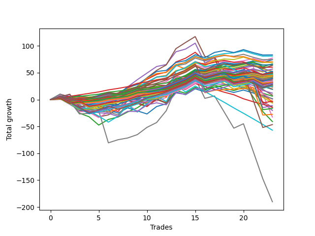

# Short Wallace Doodle 012 
- Symbol: ES_Unlimited
- Date Range: 03/18/2022 - 07/15/2022
- Trading Period: 7:20-12:30
- Number of Trades: 23



| Name | Win Percent | Profit | Avg Profit / Trade | Avg Time / Trade |      | Name | Win Percent | Profit | Avg Profit / Trade | Avg Time / Trade |
| ---- | ----------- | ------ | ------------------ | ---------------- | ---- | ---- | ----------- | ------ | ------------------ | ---------------- |
| Sorted By <br> Profit | | | | | | Sorted By <br> Win Percentage ||||
| Fifty-Two | 69.57 | 41625.00 | 1809.78 | 07:58 |     | Eighty-Three | 91.30 | -1500.00 | -65.22 | 30:05 |
| Fifty-One | 73.91 | 40500.00 | 1760.87 | 06:16 |     | Eighty-Two | 91.30 | -8250.00 | -358.70 | 25:20 |
| Forty-Eight | 73.91 | 38625.00 | 1679.35 | 04:26 |     | Eighty-One | 91.30 | -13750.00 | -597.83 | 23:24 |
| Forty-Nine | 69.57 | 37250.00 | 1619.57 | 06:16 |     | One Hundred Sixteen | 86.96 | 22500.00 | 978.26 | 02:54 |
| Zero | 73.91 | 37125.00 | 1614.13 | 08:22 |     | One Hundred Twenty-Six | 86.96 | 16000.00 | 695.65 | 04:33 |
| Fifty-Three | 65.22 | 35125.00 | 1527.17 | 09:50 |     | One Hundred Twenty-One | 86.96 | 14500.00 | 630.43 | 04:41 |
| Fifty | 65.22 | 34625.00 | 1505.43 | 07:24 |     | Eighty-Four | 86.96 | -5500.00 | -239.13 | 34:07 |
| Sixty-Four | 73.91 | 33250.00 | 1445.65 | 06:14 |     | One Hundred Seventeen | 82.61 | 24500.00 | 1065.22 | 03:47 |
| Seventy-Three | 56.52 | 32625.00 | 1418.48 | 11:31 |     | One Hundred Six | 82.61 | 22250.00 | 967.39 | 01:41 |
| Fifty-Four | 73.91 | 32375.00 | 1407.61 | 04:26 |     | One Hundred Twenty-Seven | 82.61 | 15375.00 | 668.48 | 06:19 |
| One Hundred Twenty | 65.22 | 31750.00 | 1380.43 | 05:45 |     | One Hundred Twenty-Two | 82.61 | 13125.00 | 570.65 | 06:27 |
| Fifty-Five | 69.57 | 30125.00 | 1309.78 | 07:00 |     | Eighty-Five | 82.61 | -23250.00 | -1010.87 | 47:13 |
| One Hundred Ninteen | 69.57 | 28375.00 | 1233.70 | 05:31 |     | Ninety-Six | 78.26 | 20250.00 | 880.43 | 01:31 |
| Forty | 69.57 | 28375.00 | 1233.70 | 04:10 |     | One Hundred Twelve | 78.26 | 19875.00 | 864.13 | 02:21 |
| One Hundred Five | 60.87 | 26375.00 | 1146.74 | 03:44 |     | One Hundred Eleven | 78.26 | 15750.00 | 684.78 | 02:01 |
| Forty-Six | 65.22 | 26250.00 | 1141.30 | 04:25 |     | One Hundred Twenty-Eight | 78.26 | 15500.00 | 673.91 | 08:21 |
| Seventy | 69.57 | 26000.00 | 1130.43 | 05:48 |     | One Hundred Twenty-Three | 78.26 | 12750.00 | 554.35 | 08:31 |
| Fifty-Six | 73.91 | 25500.00 | 1108.70 | 06:50 |     | Fifty-One | 73.91 | 40500.00 | 1760.87 | 06:16 |
| One Hundred Four | 65.22 | 25375.00 | 1103.26 | 03:31 |     | Forty-Eight | 73.91 | 38625.00 | 1679.35 | 04:26 |
| One Hundred Eighteen | 73.91 | 25125.00 | 1092.39 | 05:00 |     | Zero | 73.91 | 37125.00 | 1614.13 | 08:22 |
| One Hundred | 60.87 | 24875.00 | 1081.52 | 02:31 |     | Sixty-Four | 73.91 | 33250.00 | 1445.65 | 06:14 |
| One Hundred Seventeen | 82.61 | 24500.00 | 1065.22 | 03:47 |     | Fifty-Four | 73.91 | 32375.00 | 1407.61 | 04:26 |
| One Hundred Nine | 56.52 | 24125.00 | 1048.91 | 03:18 |     | Fifty-Six | 73.91 | 25500.00 | 1108.70 | 06:50 |
| One Hundred Ten | 52.17 | 24000.00 | 1043.48 | 03:31 |     | One Hundred Eighteen | 73.91 | 25125.00 | 1092.39 | 05:00 |
| One Hundred Fourteen | 69.57 | 23625.00 | 1027.17 | 05:01 |     | One Hundred Seven | 73.91 | 22875.00 | 994.57 | 01:55 |
| One Hundred Three | 69.57 | 23625.00 | 1027.17 | 02:58 |     | One Hundred Thirteen | 73.91 | 21875.00 | 951.09 | 03:47 |
| One Hundred Seven | 73.91 | 22875.00 | 994.57 | 01:55 |     | One Hundred Two | 73.91 | 21125.00 | 918.48 | 01:51 |
| One Hundred Sixteen | 86.96 | 22500.00 | 978.26 | 02:54 |     | Ninety-One | 73.91 | 18375.00 | 798.91 | 01:23 |
| One Hundred Six | 82.61 | 22250.00 | 967.39 | 01:41 |     | One Hundred One | 73.91 | 17000.00 | 739.13 | 01:31 |
| Sixty-Two | 69.57 | 22000.00 | 956.52 | 06:07 |     | One Hundred Twenty-Nine | 73.91 | 15250.00 | 663.04 | 09:38 |
| One Hundred Thirteen | 73.91 | 21875.00 | 951.09 | 03:47 |     | One Hundred Twenty-Four | 73.91 | 12500.00 | 543.48 | 09:48 |
| One Hundred Eight | 60.87 | 21875.00 | 951.09 | 03:02 |     | Fifty-Two | 69.57 | 41625.00 | 1809.78 | 07:58 |
| Ninety-Nine | 60.87 | 21750.00 | 945.65 | 02:22 |     | Forty-Nine | 69.57 | 37250.00 | 1619.57 | 06:16 |
| Ninety-Four | 56.52 | 21375.00 | 929.35 | 03:10 |     | Fifty-Five | 69.57 | 30125.00 | 1309.78 | 07:00 |
| Ninety-Five | 52.17 | 21250.00 | 923.91 | 03:23 |     | One Hundred Ninteen | 69.57 | 28375.00 | 1233.70 | 05:31 |
| One Hundred Two | 73.91 | 21125.00 | 918.48 | 01:51 |     | Forty | 69.57 | 28375.00 | 1233.70 | 04:10 |
| Ninety-Seven | 69.57 | 21000.00 | 913.04 | 01:45 |     | Seventy | 69.57 | 26000.00 | 1130.43 | 05:48 |
| Ninety-Six | 78.26 | 20250.00 | 880.43 | 01:31 |     | One Hundred Fourteen | 69.57 | 23625.00 | 1027.17 | 05:01 |
| Ninety-Three | 60.87 | 20125.00 | 875.00 | 02:43 |     | One Hundred Three | 69.57 | 23625.00 | 1027.17 | 02:58 |
| One Hundred Twelve | 78.26 | 19875.00 | 864.13 | 02:21 |     | Sixty-Two | 69.57 | 22000.00 | 956.52 | 06:07 |
| One Hundred Fifteen | 60.87 | 19750.00 | 858.70 | 05:23 |     | Ninety-Seven | 69.57 | 21000.00 | 913.04 | 01:45 |
| Sixty-Five | 47.83 | 19750.00 | 858.70 | 08:36 |     | One Hundred Twenty-Five | 69.57 | 14125.00 | 614.13 | 10:50 |
| Ninety-Eight | 60.87 | 19250.00 | 836.96 | 02:15 |     | Three | 69.57 | -2500.00 | -108.70 | 29:18 |
| Ninety-One | 73.91 | 18375.00 | 798.91 | 01:23 |     | Six | 69.57 | -16250.00 | -706.52 | 35:36 |
| Ninety-Two | 65.22 | 18125.00 | 788.04 | 01:37 |     | Fifty-Three | 65.22 | 35125.00 | 1527.17 | 09:50 |
| One Hundred One | 73.91 | 17000.00 | 739.13 | 01:31 |     | Fifty | 65.22 | 34625.00 | 1505.43 | 07:24 |
| Sixty-Seven | 52.17 | 16750.00 | 728.26 | 09:24 |     | One Hundred Twenty | 65.22 | 31750.00 | 1380.43 | 05:45 |
| One Hundred Twenty-Six | 86.96 | 16000.00 | 695.65 | 04:33 |     | Forty-Six | 65.22 | 26250.00 | 1141.30 | 04:25 |
| One Hundred Eleven | 78.26 | 15750.00 | 684.78 | 02:01 |     | One Hundred Four | 65.22 | 25375.00 | 1103.26 | 03:31 |
| One Hundred Twenty-Eight | 78.26 | 15500.00 | 673.91 | 08:21 |     | Ninety-Two | 65.22 | 18125.00 | 788.04 | 01:37 |
| One Hundred Twenty-Seven | 82.61 | 15375.00 | 668.48 | 06:19 |     | One Hundred Thirty | 65.22 | 13625.00 | 592.39 | 10:01 |
| One Hundred Twenty-Nine | 73.91 | 15250.00 | 663.04 | 09:38 |     | Fifty-Nine | 65.22 | 11625.00 | 505.43 | 12:28 |
| One Hundred Twenty-One | 86.96 | 14500.00 | 630.43 | 04:41 |     | One Hundred Five | 60.87 | 26375.00 | 1146.74 | 03:44 |
| Seventy-One | 47.83 | 14250.00 | 619.57 | 12:57 |     | One Hundred | 60.87 | 24875.00 | 1081.52 | 02:31 |
| One Hundred Twenty-Five | 69.57 | 14125.00 | 614.13 | 10:50 |     | One Hundred Eight | 60.87 | 21875.00 | 951.09 | 03:02 |
| Sixty-Eight | 39.13 | 13750.00 | 597.83 | 12:26 |     | Ninety-Nine | 60.87 | 21750.00 | 945.65 | 02:22 |
| One Hundred Thirty | 65.22 | 13625.00 | 592.39 | 10:01 |     | Ninety-Three | 60.87 | 20125.00 | 875.00 | 02:43 |
| One Hundred Twenty-Two | 82.61 | 13125.00 | 570.65 | 06:27 |     | One Hundred Fifteen | 60.87 | 19750.00 | 858.70 | 05:23 |
| One Hundred Twenty-Three | 78.26 | 12750.00 | 554.35 | 08:31 |     | Ninety-Eight | 60.87 | 19250.00 | 836.96 | 02:15 |
| One Hundred Twenty-Four | 73.91 | 12500.00 | 543.48 | 09:48 |     | One | 60.87 | 12500.00 | 543.48 | 19:10 |
| One | 60.87 | 12500.00 | 543.48 | 19:10 |     | Four | 60.87 | -10125.00 | -440.22 | 43:11 |
| Fifty-Nine | 65.22 | 11625.00 | 505.43 | 12:28 |     | Seven | 60.87 | -95125.00 | -4135.87 | 94:13 |
| Forty-Three | 47.83 | 11500.00 | 500.00 | 06:58 |     | Seventy-Three | 56.52 | 32625.00 | 1418.48 | 11:31 |
| Forty-Seven | 43.48 | 9750.00 | 423.91 | 09:47 |     | One Hundred Nine | 56.52 | 24125.00 | 1048.91 | 03:18 |
| Forty-One | 47.83 | 9375.00 | 407.61 | 07:02 |     | Ninety-Four | 56.52 | 21375.00 | 929.35 | 03:10 |
| Sixty-Six | 34.78 | 6000.00 | 260.87 | 11:30 |     | Fifty-Seven | 56.52 | 4125.00 | 179.35 | 11:13 |
| Fifty-Seven | 56.52 | 4125.00 | 179.35 | 11:13 |     | One Hundred Ten | 52.17 | 24000.00 | 1043.48 | 03:31 |
| Forty-Four | 34.78 | 3125.00 | 135.87 | 08:51 |     | Ninety-Five | 52.17 | 21250.00 | 923.91 | 03:23 |
| Forty-Two | 34.78 | 875.00 | 38.04 | 10:11 |     | Sixty-Seven | 52.17 | 16750.00 | 728.26 | 09:24 |
| Sixty-Nine | 30.43 | 750.00 | 32.61 | 15:57 |     | Sixty-Three | 52.17 | -1750.00 | -76.09 | 16:48 |
| Fifty-Eight | 47.83 | 250.00 | 10.87 | 15:48 |     | Five | 52.17 | -7000.00 | -304.35 | 62:18 |
| Eighty-Three | 91.30 | -1500.00 | -65.22 | 30:05 |     | Two | 52.17 | -20500.00 | -891.30 | 34:16 |
| Sixty-Three | 52.17 | -1750.00 | -76.09 | 16:48 |     | Sixty-Five | 47.83 | 19750.00 | 858.70 | 08:36 |
| Three | 69.57 | -2500.00 | -108.70 | 29:18 |     | Seventy-One | 47.83 | 14250.00 | 619.57 | 12:57 |
| Sixty | 47.83 | -3250.00 | -141.30 | 16:28 |     | Forty-Three | 47.83 | 11500.00 | 500.00 | 06:58 |
| Eighty-Four | 86.96 | -5500.00 | -239.13 | 34:07 |     | Forty-One | 47.83 | 9375.00 | 407.61 | 07:02 |
| Five | 52.17 | -7000.00 | -304.35 | 62:18 |     | Fifty-Eight | 47.83 | 250.00 | 10.87 | 15:48 |
| Forty-Five | 21.74 | -7250.00 | -315.22 | 13:51 |     | Sixty | 47.83 | -3250.00 | -141.30 | 16:28 |
| Eighty-Two | 91.30 | -8250.00 | -358.70 | 25:20 |     | Forty-Seven | 43.48 | 9750.00 | 423.91 | 09:47 |
| Four | 60.87 | -10125.00 | -440.22 | 43:11 |     | Sixty-Eight | 39.13 | 13750.00 | 597.83 | 12:26 |
| Eighty-One | 91.30 | -13750.00 | -597.83 | 23:24 |     | Sixty-Six | 34.78 | 6000.00 | 260.87 | 11:30 |
| Six | 69.57 | -16250.00 | -706.52 | 35:36 |     | Forty-Four | 34.78 | 3125.00 | 135.87 | 08:51 |
| Two | 52.17 | -20500.00 | -891.30 | 34:16 |     | Forty-Two | 34.78 | 875.00 | 38.04 | 10:11 |
| Eighty-Five | 82.61 | -23250.00 | -1010.87 | 47:13 |     | Sixty-Nine | 30.43 | 750.00 | 32.61 | 15:57 |
| Sixty-One | 30.43 | -28500.00 | -1239.13 | 24:00 |     | Sixty-One | 30.43 | -28500.00 | -1239.13 | 24:00 |
| Seven | 60.87 | -95125.00 | -4135.87 | 94:13 |     | Forty-Five | 21.74 | -7250.00 | -315.22 | 13:51 |

## NO STOPLOSS

### Test Zero
* Sell when price hits the middle line of the 20p bollinger
* No Stoploss
* Results:
```
Total Trades: 23
Percent Up: 26.09
Percent Down: 73.91
Total Points Moved Down: 74.25
Potential Profit: 37125.00
Total Points Ups: 23.00 Count Ups: 6
Total Points Downs: 97.25 Count Downs: 17
```

<details><summary>Trades</summary>

<code>In: 2022-03-23 11:51:00		Out: 2022-03-23 11:56:20		Total Position Time: 05:20		Total Move Down: 3.00		Total to Date: 3.00</code> <br />
<code>In: 2022-03-25 10:52:00		Out: 2022-03-25 11:18:15		Total Position Time: 26:15		Total Move Down: -8.00		Total to Date: -5.00</code> <br />
<code>In: 2022-03-28 11:12:00		Out: 2022-03-28 11:13:30		Total Position Time: 01:30		Total Move Down: 1.75		Total to Date: -3.25</code> <br />
<code>In: 2022-04-14 10:38:00		Out: 2022-04-14 11:14:10		Total Position Time: 36:10		Total Move Down: -8.25		Total to Date: -11.50</code> <br />
<code>In: 2022-04-18 10:13:00		Out: 2022-04-18 10:18:00		Total Position Time: 05:00		Total Move Down: 5.00		Total to Date: -6.50</code> <br />
<code>In: 2022-04-25 09:27:00		Out: 2022-04-25 09:31:10		Total Position Time: 04:10		Total Move Down: 8.50		Total to Date: 2.00</code> <br />
<code>In: 2022-04-26 11:23:00		Out: 2022-04-26 11:32:15		Total Position Time: 09:15		Total Move Down: 2.25		Total to Date: 4.25</code> <br />
<code>In: 2022-04-29 10:39:00		Out: 2022-04-29 10:40:30		Total Position Time: 01:30		Total Move Down: 4.50		Total to Date: 8.75</code> <br />
<code>In: 2022-05-11 11:27:00		Out: 2022-05-11 11:48:05		Total Position Time: 21:05		Total Move Down: -1.00		Total to Date: 7.75</code> <br />
<code>In: 2022-05-25 11:04:00		Out: 2022-05-25 11:06:25		Total Position Time: 02:25		Total Move Down: 4.50		Total to Date: 12.25</code> <br />
<code>In: 2022-06-09 08:45:00		Out: 2022-06-09 08:48:20		Total Position Time: 03:20		Total Move Down: 6.50		Total to Date: 18.75</code> <br />
<code>In: 2022-06-13 09:14:00		Out: 2022-06-13 09:17:05		Total Position Time: 03:05		Total Move Down: 6.00		Total to Date: 24.75</code> <br />
<code>In: 2022-06-13 09:40:00		Out: 2022-06-13 09:44:05		Total Position Time: 04:05		Total Move Down: 13.25		Total to Date: 38.00</code> <br />
<code>In: 2022-06-14 10:02:00		Out: 2022-06-14 10:03:10		Total Position Time: 01:10		Total Move Down: 7.00		Total to Date: 45.00</code> <br />
<code>In: 2022-06-15 11:02:00		Out: 2022-06-15 11:03:10		Total Position Time: 01:10		Total Move Down: 11.00		Total to Date: 56.00</code> <br />
<code>In: 2022-06-23 10:53:00		Out: 2022-06-23 11:11:10		Total Position Time: 18:10		Total Move Down: -1.25		Total to Date: 54.75</code> <br />
<code>In: 2022-06-29 10:12:00		Out: 2022-06-29 10:13:10		Total Position Time: 01:10		Total Move Down: 4.50		Total to Date: 59.25</code> <br />
<code>In: 2022-06-30 07:36:00		Out: 2022-06-30 07:42:30		Total Position Time: 06:30		Total Move Down: 7.50		Total to Date: 66.75</code> <br />
<code>In: 2022-07-06 10:05:00		Out: 2022-07-06 10:20:55		Total Position Time: 15:55		Total Move Down: -1.50		Total to Date: 65.25</code> <br />
<code>In: 2022-07-11 09:41:00		Out: 2022-07-11 09:47:10		Total Position Time: 06:10		Total Move Down: 2.50		Total to Date: 67.75</code> <br />
<code>In: 2022-07-14 07:56:00		Out: 2022-07-14 07:57:50		Total Position Time: 01:50		Total Move Down: 4.00		Total to Date: 71.75</code> <br />
<code>In: 2022-07-14 08:02:00		Out: 2022-07-14 08:15:45		Total Position Time: 13:45		Total Move Down: -3.00		Total to Date: 68.75</code> <br />
<code>In: 2022-07-14 08:12:00		Out: 2022-07-14 08:15:45		Total Position Time: 03:45		Total Move Down: 5.50		Total to Date: 74.25</code> <br />


</details>

### Test One
* Sell when the price hits the upper line of the 20p 1std bollinger
* No Stoploss
* Results:
```
Total Trades: 23
Percent Up: 39.13
Percent Down: 60.87
Total Points Moved Down: 25.00
Potential Profit: 12500.00
Total Points Ups: 75.50 Count Ups: 9
Total Points Downs: 100.50 Count Downs: 14
```

<details><summary>Trades</summary>

<code>In: 2022-03-23 11:51:00		Out: 2022-03-23 11:56:45		Total Position Time: 05:45		Total Move Down: 5.00		Total to Date: 5.00</code> <br />
<code>In: 2022-03-25 10:52:00		Out: 2022-03-25 11:19:45		Total Position Time: 27:45		Total Move Down: -7.00		Total to Date: -2.00</code> <br />
<code>In: 2022-03-28 11:12:00		Out: 2022-03-28 11:19:35		Total Position Time: 07:35		Total Move Down: 2.50		Total to Date: 0.50</code> <br />
<code>In: 2022-04-14 10:38:00		Out: 2022-04-14 11:18:05		Total Position Time: 40:05		Total Move Down: -8.00		Total to Date: -7.50</code> <br />
<code>In: 2022-04-18 10:13:00		Out: 2022-04-18 10:19:40		Total Position Time: 06:40		Total Move Down: 7.50		Total to Date: 0.00</code> <br />
<code>In: 2022-04-25 09:27:00		Out: 2022-04-25 09:42:45		Total Position Time: 15:45		Total Move Down: 6.00		Total to Date: 6.00</code> <br />
<code>In: 2022-04-26 11:23:00		Out: 2022-04-26 11:34:20		Total Position Time: 11:20		Total Move Down: 4.25		Total to Date: 10.25</code> <br />
<code>In: 2022-04-29 10:39:00		Out: 2022-04-29 10:43:15		Total Position Time: 04:15		Total Move Down: 8.75		Total to Date: 19.00</code> <br />
<code>In: 2022-05-11 11:27:00		Out: 2022-05-11 11:50:40		Total Position Time: 23:40		Total Move Down: 3.25		Total to Date: 22.25</code> <br />
<code>In: 2022-05-25 11:04:00		Out: 2022-05-25 11:06:35		Total Position Time: 02:35		Total Move Down: 9.25		Total to Date: 31.50</code> <br />
<code>In: 2022-06-09 08:45:00		Out: 2022-06-09 08:49:35		Total Position Time: 04:35		Total Move Down: 10.75		Total to Date: 42.25</code> <br />
<code>In: 2022-06-13 09:14:00		Out: 2022-06-13 09:29:05		Total Position Time: 15:05		Total Move Down: 2.75		Total to Date: 45.00</code> <br />
<code>In: 2022-06-13 09:40:00		Out: 2022-06-13 09:47:55		Total Position Time: 07:55		Total Move Down: 19.00		Total to Date: 64.00</code> <br />
<code>In: 2022-06-14 10:02:00		Out: 2022-06-14 10:29:05		Total Position Time: 27:05		Total Move Down: -7.25		Total to Date: 56.75</code> <br />
<code>In: 2022-06-15 11:02:00		Out: 2022-06-15 11:03:10		Total Position Time: 01:10		Total Move Down: 11.00		Total to Date: 67.75</code> <br />
<code>In: 2022-06-23 10:53:00		Out: 2022-06-23 11:11:45		Total Position Time: 18:45		Total Move Down: -0.75		Total to Date: 67.00</code> <br />
<code>In: 2022-06-29 10:12:00		Out: 2022-06-29 10:14:00		Total Position Time: 02:00		Total Move Down: 6.75		Total to Date: 73.75</code> <br />
<code>In: 2022-06-30 07:36:00		Out: 2022-06-30 09:05:50		Total Position Time: 89:50		Total Move Down: -29.50		Total to Date: 44.25</code> <br />
<code>In: 2022-07-06 10:05:00		Out: 2022-07-06 10:25:55		Total Position Time: 20:55		Total Move Down: -1.50		Total to Date: 42.75</code> <br />
<code>In: 2022-07-11 09:41:00		Out: 2022-07-11 09:50:50		Total Position Time: 09:50		Total Move Down: 3.75		Total to Date: 46.50</code> <br />
<code>In: 2022-07-14 07:56:00		Out: 2022-07-14 08:36:05		Total Position Time: 40:05		Total Move Down: -9.50		Total to Date: 37.00</code> <br />
<code>In: 2022-07-14 08:02:00		Out: 2022-07-14 08:36:05		Total Position Time: 34:05		Total Move Down: -10.25		Total to Date: 26.75</code> <br />
<code>In: 2022-07-14 08:12:00		Out: 2022-07-14 08:36:05		Total Position Time: 24:05		Total Move Down: -1.75		Total to Date: 25.00</code> <br />


</details>

### Test Two
* Sell when the price hits the upper line of the 20p 2std bollinger
* No Stoploss
* Results:
```
Total Trades: 23
Percent Up: 47.83
Percent Down: 52.17
Total Points Moved Down: -41.00
Potential Profit: -20500.00
Total Points Ups: 158.25 Count Ups: 11
Total Points Downs: 117.25 Count Downs: 12
```

<details><summary>Trades</summary>

<code>In: 2022-03-23 11:51:00		Out: 2022-03-23 11:57:45		Total Position Time: 06:45		Total Move Down: 7.25		Total to Date: 7.25</code> <br />
<code>In: 2022-03-25 10:52:00		Out: 2022-03-25 12:01:15		Total Position Time: 69:15		Total Move Down: -8.50		Total to Date: -1.25</code> <br />
<code>In: 2022-03-28 11:12:00		Out: 2022-03-28 12:47:00		Total Position Time: 95:00		Total Move Down: -24.00		Total to Date: -25.25</code> <br />
<code>In: 2022-04-14 10:38:00		Out: 2022-04-14 11:19:20		Total Position Time: 41:20		Total Move Down: -6.75		Total to Date: -32.00</code> <br />
<code>In: 2022-04-18 10:13:00		Out: 2022-04-18 11:10:40		Total Position Time: 57:40		Total Move Down: -15.50		Total to Date: -47.50</code> <br />
<code>In: 2022-04-25 09:27:00		Out: 2022-04-25 10:01:20		Total Position Time: 34:20		Total Move Down: 10.50		Total to Date: -37.00</code> <br />
<code>In: 2022-04-26 11:23:00		Out: 2022-04-26 11:41:30		Total Position Time: 18:30		Total Move Down: 4.50		Total to Date: -32.50</code> <br />
<code>In: 2022-04-29 10:39:00		Out: 2022-04-29 10:43:50		Total Position Time: 04:50		Total Move Down: 9.50		Total to Date: -23.00</code> <br />
<code>In: 2022-05-11 11:27:00		Out: 2022-05-11 11:52:55		Total Position Time: 25:55		Total Move Down: 7.75		Total to Date: -15.25</code> <br />
<code>In: 2022-05-25 11:04:00		Out: 2022-05-25 11:06:40		Total Position Time: 02:40		Total Move Down: 12.25		Total to Date: -3.00</code> <br />
<code>In: 2022-06-09 08:45:00		Out: 2022-06-09 09:11:10		Total Position Time: 26:10		Total Move Down: 13.75		Total to Date: 10.75</code> <br />
<code>In: 2022-06-13 09:14:00		Out: 2022-06-13 09:30:35		Total Position Time: 16:35		Total Move Down: 5.25		Total to Date: 16.00</code> <br />
<code>In: 2022-06-13 09:40:00		Out: 2022-06-13 09:54:15		Total Position Time: 14:15		Total Move Down: 22.00		Total to Date: 38.00</code> <br />
<code>In: 2022-06-14 10:02:00		Out: 2022-06-14 10:31:10		Total Position Time: 29:10		Total Move Down: -2.25		Total to Date: 35.75</code> <br />
<code>In: 2022-06-15 11:02:00		Out: 2022-06-15 11:03:10		Total Position Time: 01:10		Total Move Down: 11.00		Total to Date: 46.75</code> <br />
<code>In: 2022-06-23 10:53:00		Out: 2022-06-23 11:19:10		Total Position Time: 26:10		Total Move Down: -0.75		Total to Date: 46.00</code> <br />
<code>In: 2022-06-29 10:12:00		Out: 2022-06-29 10:15:25		Total Position Time: 03:25		Total Move Down: 9.00		Total to Date: 55.00</code> <br />
<code>In: 2022-06-30 07:36:00		Out: 2022-06-30 09:06:15		Total Position Time: 90:15		Total Move Down: -27.00		Total to Date: 28.00</code> <br />
<code>In: 2022-07-06 10:05:00		Out: 2022-07-06 10:27:05		Total Position Time: 22:05		Total Move Down: -1.00		Total to Date: 27.00</code> <br />
<code>In: 2022-07-11 09:41:00		Out: 2022-07-11 09:51:25		Total Position Time: 10:25		Total Move Down: 4.50		Total to Date: 31.50</code> <br />
<code>In: 2022-07-14 07:56:00		Out: 2022-07-14 09:07:30		Total Position Time: 71:30		Total Move Down: -26.50		Total to Date: 5.00</code> <br />
<code>In: 2022-07-14 08:02:00		Out: 2022-07-14 09:07:30		Total Position Time: 65:30		Total Move Down: -27.25		Total to Date: -22.25</code> <br />
<code>In: 2022-07-14 08:12:00		Out: 2022-07-14 09:07:30		Total Position Time: 55:30		Total Move Down: -18.75		Total to Date: -41.00</code> <br />


</details>

### Test Three
* Sell when price hits the middle line of the 50p bollinger
* No Stoploss
* Results:
```
Total Trades: 23
Percent Up: 30.43
Percent Down: 69.57
Total Points Moved Down: -5.00
Potential Profit: -2500.00
Total Points Ups: 119.75 Count Ups: 7
Total Points Downs: 114.75 Count Downs: 16
```

<details><summary>Trades</summary>

<code>In: 2022-03-23 11:51:00		Out: 2022-03-23 11:56:50		Total Position Time: 05:50		Total Move Down: 6.00		Total to Date: 6.00</code> <br />
<code>In: 2022-03-25 10:52:00		Out: 2022-03-25 12:00:45		Total Position Time: 68:45		Total Move Down: -10.00		Total to Date: -4.00</code> <br />
<code>In: 2022-03-28 11:12:00		Out: 2022-03-28 11:19:20		Total Position Time: 07:20		Total Move Down: 2.00		Total to Date: -2.00</code> <br />
<code>In: 2022-04-14 10:38:00		Out: 2022-04-14 11:20:05		Total Position Time: 42:05		Total Move Down: -4.75		Total to Date: -6.75</code> <br />
<code>In: 2022-04-18 10:13:00		Out: 2022-04-18 10:21:10		Total Position Time: 08:10		Total Move Down: 8.00		Total to Date: 1.25</code> <br />
<code>In: 2022-04-25 09:27:00		Out: 2022-04-25 09:56:20		Total Position Time: 29:20		Total Move Down: 6.50		Total to Date: 7.75</code> <br />
<code>In: 2022-04-26 11:23:00		Out: 2022-04-26 11:41:30		Total Position Time: 18:30		Total Move Down: 4.50		Total to Date: 12.25</code> <br />
<code>In: 2022-04-29 10:39:00		Out: 2022-04-29 10:43:50		Total Position Time: 04:50		Total Move Down: 9.50		Total to Date: 21.75</code> <br />
<code>In: 2022-05-11 11:27:00		Out: 2022-05-11 11:51:20		Total Position Time: 24:20		Total Move Down: 6.75		Total to Date: 28.50</code> <br />
<code>In: 2022-05-25 11:04:00		Out: 2022-05-25 11:06:35		Total Position Time: 02:35		Total Move Down: 9.25		Total to Date: 37.75</code> <br />
<code>In: 2022-06-09 08:45:00		Out: 2022-06-09 08:48:50		Total Position Time: 03:50		Total Move Down: 9.00		Total to Date: 46.75</code> <br />
<code>In: 2022-06-13 09:14:00		Out: 2022-06-13 09:30:20		Total Position Time: 16:20		Total Move Down: 4.25		Total to Date: 51.00</code> <br />
<code>In: 2022-06-13 09:40:00		Out: 2022-06-13 09:47:55		Total Position Time: 07:55		Total Move Down: 19.00		Total to Date: 70.00</code> <br />
<code>In: 2022-06-14 10:02:00		Out: 2022-06-14 10:03:10		Total Position Time: 01:10		Total Move Down: 7.00		Total to Date: 77.00</code> <br />
<code>In: 2022-06-15 11:02:00		Out: 2022-06-15 11:03:10		Total Position Time: 01:10		Total Move Down: 11.00		Total to Date: 88.00</code> <br />
<code>In: 2022-06-23 10:53:00		Out: 2022-06-23 12:18:25		Total Position Time: 85:25		Total Move Down: -15.75		Total to Date: 72.25</code> <br />
<code>In: 2022-06-29 10:12:00		Out: 2022-06-29 10:14:00		Total Position Time: 02:00		Total Move Down: 6.75		Total to Date: 79.00</code> <br />
<code>In: 2022-06-30 07:36:00		Out: 2022-06-30 09:06:20		Total Position Time: 90:20		Total Move Down: -25.75		Total to Date: 53.25</code> <br />
<code>In: 2022-07-06 10:05:00		Out: 2022-07-06 10:28:05		Total Position Time: 23:05		Total Move Down: 1.50		Total to Date: 54.75</code> <br />
<code>In: 2022-07-11 09:41:00		Out: 2022-07-11 09:50:55		Total Position Time: 09:55		Total Move Down: 3.75		Total to Date: 58.50</code> <br />
<code>In: 2022-07-14 07:56:00		Out: 2022-07-14 09:17:00		Total Position Time: 81:00		Total Move Down: -23.50		Total to Date: 35.00</code> <br />
<code>In: 2022-07-14 08:02:00		Out: 2022-07-14 09:17:00		Total Position Time: 75:00		Total Move Down: -24.25		Total to Date: 10.75</code> <br />
<code>In: 2022-07-14 08:12:00		Out: 2022-07-14 09:17:00		Total Position Time: 65:00		Total Move Down: -15.75		Total to Date: -5.00</code> <br />


</details>

### Test Four
* Sell when the price hits the upper line of the 50p 1std bollinger
* No Stoploss
* Results:
```
Total Trades: 23
Percent Up: 39.13
Percent Down: 60.87
Total Points Moved Down: -20.25
Potential Profit: -10125.00
Total Points Ups: 163.50 Count Ups: 9
Total Points Downs: 143.25 Count Downs: 14
```

<details><summary>Trades</summary>

<code>In: 2022-03-23 11:51:00		Out: 2022-03-23 12:00:15		Total Position Time: 09:15		Total Move Down: 9.25		Total to Date: 9.25</code> <br />
<code>In: 2022-03-25 10:52:00		Out: 2022-03-25 12:01:40		Total Position Time: 69:40		Total Move Down: -8.00		Total to Date: 1.25</code> <br />
<code>In: 2022-03-28 11:12:00		Out: 2022-03-28 11:20:40		Total Position Time: 08:40		Total Move Down: 2.75		Total to Date: 4.00</code> <br />
<code>In: 2022-04-14 10:38:00		Out: 2022-04-14 11:23:55		Total Position Time: 45:55		Total Move Down: -1.50		Total to Date: 2.50</code> <br />
<code>In: 2022-04-18 10:13:00		Out: 2022-04-18 11:23:10		Total Position Time: 70:10		Total Move Down: -13.50		Total to Date: -11.00</code> <br />
<code>In: 2022-04-25 09:27:00		Out: 2022-04-25 10:01:20		Total Position Time: 34:20		Total Move Down: 10.50		Total to Date: -0.50</code> <br />
<code>In: 2022-04-26 11:23:00		Out: 2022-04-26 11:45:05		Total Position Time: 22:05		Total Move Down: 9.50		Total to Date: 9.00</code> <br />
<code>In: 2022-04-29 10:39:00		Out: 2022-04-29 10:47:20		Total Position Time: 08:20		Total Move Down: 14.50		Total to Date: 23.50</code> <br />
<code>In: 2022-05-11 11:27:00		Out: 2022-05-11 12:00:15		Total Position Time: 33:15		Total Move Down: 13.50		Total to Date: 37.00</code> <br />
<code>In: 2022-05-25 11:04:00		Out: 2022-05-25 11:06:40		Total Position Time: 02:40		Total Move Down: 12.25		Total to Date: 49.25</code> <br />
<code>In: 2022-06-09 08:45:00		Out: 2022-06-09 08:50:30		Total Position Time: 05:30		Total Move Down: 12.25		Total to Date: 61.50</code> <br />
<code>In: 2022-06-13 09:14:00		Out: 2022-06-13 09:54:40		Total Position Time: 40:40		Total Move Down: 3.75		Total to Date: 65.25</code> <br />
<code>In: 2022-06-13 09:40:00		Out: 2022-06-13 09:54:40		Total Position Time: 14:40		Total Move Down: 23.75		Total to Date: 89.00</code> <br />
<code>In: 2022-06-14 10:02:00		Out: 2022-06-14 10:36:20		Total Position Time: 34:20		Total Move Down: 5.00		Total to Date: 94.00</code> <br />
<code>In: 2022-06-15 11:02:00		Out: 2022-06-15 11:03:10		Total Position Time: 01:10		Total Move Down: 11.00		Total to Date: 105.00</code> <br />
<code>In: 2022-06-23 10:53:00		Out: 2022-06-23 12:47:00		Total Position Time: 114:00		Total Move Down: -37.00		Total to Date: 68.00</code> <br />
<code>In: 2022-06-29 10:12:00		Out: 2022-06-29 10:16:05		Total Position Time: 04:05		Total Move Down: 9.75		Total to Date: 77.75</code> <br />
<code>In: 2022-06-30 07:36:00		Out: 2022-06-30 10:10:15		Total Position Time: 154:15		Total Move Down: -43.25		Total to Date: 34.50</code> <br />
<code>In: 2022-07-06 10:05:00		Out: 2022-07-06 11:01:15		Total Position Time: 56:15		Total Move Down: -0.50		Total to Date: 34.00</code> <br />
<code>In: 2022-07-11 09:41:00		Out: 2022-07-11 09:54:05		Total Position Time: 13:05		Total Move Down: 5.50		Total to Date: 39.50</code> <br />
<code>In: 2022-07-14 07:56:00		Out: 2022-07-14 09:27:05		Total Position Time: 91:05		Total Move Down: -22.25		Total to Date: 17.25</code> <br />
<code>In: 2022-07-14 08:02:00		Out: 2022-07-14 09:27:05		Total Position Time: 85:05		Total Move Down: -23.00		Total to Date: -5.75</code> <br />
<code>In: 2022-07-14 08:12:00		Out: 2022-07-14 09:27:05		Total Position Time: 75:05		Total Move Down: -14.50		Total to Date: -20.25</code> <br />


</details>

### Test Five
* Sell when the price hits the upper line of the 50p 2std bollinger
* No Stoploss
* Results:
```
Total Trades: 23
Percent Up: 47.83
Percent Down: 52.17
Total Points Moved Down: -14.00
Potential Profit: -7000.00
Total Points Ups: 175.25 Count Ups: 11
Total Points Downs: 161.25 Count Downs: 12
```

<details><summary>Trades</summary>

<code>In: 2022-03-23 11:51:00		Out: 2022-03-23 12:09:20		Total Position Time: 18:20		Total Move Down: 10.00		Total to Date: 10.00</code> <br />
<code>In: 2022-03-25 10:52:00		Out: 2022-03-25 12:01:55		Total Position Time: 69:55		Total Move Down: -6.50		Total to Date: 3.50</code> <br />
<code>In: 2022-03-28 11:12:00		Out: 2022-03-28 12:47:00		Total Position Time: 95:00		Total Move Down: -24.00		Total to Date: -20.50</code> <br />
<code>In: 2022-04-14 10:38:00		Out: 2022-04-14 11:34:10		Total Position Time: 56:10		Total Move Down: -0.25		Total to Date: -20.75</code> <br />
<code>In: 2022-04-18 10:13:00		Out: 2022-04-18 11:47:00		Total Position Time: 94:00		Total Move Down: -11.50		Total to Date: -32.25</code> <br />
<code>In: 2022-04-25 09:27:00		Out: 2022-04-25 11:01:35		Total Position Time: 94:35		Total Move Down: 3.75		Total to Date: -28.50</code> <br />
<code>In: 2022-04-26 11:23:00		Out: 2022-04-26 12:13:05		Total Position Time: 50:05		Total Move Down: 11.00		Total to Date: -17.50</code> <br />
<code>In: 2022-04-29 10:39:00		Out: 2022-04-29 11:01:05		Total Position Time: 22:05		Total Move Down: 20.50		Total to Date: 3.00</code> <br />
<code>In: 2022-05-11 11:27:00		Out: 2022-05-11 12:05:25		Total Position Time: 38:25		Total Move Down: 21.50		Total to Date: 24.50</code> <br />
<code>In: 2022-05-25 11:04:00		Out: 2022-05-25 11:06:50		Total Position Time: 02:50		Total Move Down: 16.00		Total to Date: 40.50</code> <br />
<code>In: 2022-06-09 08:45:00		Out: 2022-06-09 09:11:10		Total Position Time: 26:10		Total Move Down: 13.75		Total to Date: 54.25</code> <br />
<code>In: 2022-06-13 09:14:00		Out: 2022-06-13 09:58:15		Total Position Time: 44:15		Total Move Down: 10.25		Total to Date: 64.50</code> <br />
<code>In: 2022-06-13 09:40:00		Out: 2022-06-13 09:58:15		Total Position Time: 18:15		Total Move Down: 30.25		Total to Date: 94.75</code> <br />
<code>In: 2022-06-14 10:02:00		Out: 2022-06-14 10:43:05		Total Position Time: 41:05		Total Move Down: 11.50		Total to Date: 106.25</code> <br />
<code>In: 2022-06-15 11:02:00		Out: 2022-06-15 11:03:10		Total Position Time: 01:10		Total Move Down: 11.00		Total to Date: 117.25</code> <br />
<code>In: 2022-06-23 10:53:00		Out: 2022-06-23 12:47:00		Total Position Time: 114:00		Total Move Down: -37.00		Total to Date: 80.25</code> <br />
<code>In: 2022-06-29 10:12:00		Out: 2022-06-29 11:41:15		Total Position Time: 89:15		Total Move Down: -3.00		Total to Date: 77.25</code> <br />
<code>In: 2022-06-30 07:36:00		Out: 2022-06-30 10:12:00		Total Position Time: 156:00		Total Move Down: -39.00		Total to Date: 38.25</code> <br />
<code>In: 2022-07-06 10:05:00		Out: 2022-07-06 11:02:25		Total Position Time: 57:25		Total Move Down: 1.75		Total to Date: 40.00</code> <br />
<code>In: 2022-07-11 09:41:00		Out: 2022-07-11 11:09:15		Total Position Time: 88:15		Total Move Down: -7.75		Total to Date: 32.25</code> <br />
<code>In: 2022-07-14 07:56:00		Out: 2022-07-14 09:28:35		Total Position Time: 92:35		Total Move Down: -17.75		Total to Date: 14.50</code> <br />
<code>In: 2022-07-14 08:02:00		Out: 2022-07-14 09:28:35		Total Position Time: 86:35		Total Move Down: -18.50		Total to Date: -4.00</code> <br />
<code>In: 2022-07-14 08:12:00		Out: 2022-07-14 09:28:35		Total Position Time: 76:35		Total Move Down: -10.00		Total to Date: -14.00</code> <br />


</details>

### Test Six
* Sell when the price hits the middle line of the 1std VWAP
* No Stoploss
* Results:
```
Total Trades: 23
Percent Up: 30.43
Percent Down: 69.57
Total Points Moved Down: -32.50
Potential Profit: -16250.00
Total Points Ups: 123.25 Count Ups: 7
Total Points Downs: 90.75 Count Downs: 16
```

<details><summary>Trades</summary>

<code>In: 2022-03-23 11:51:00		Out: 2022-03-23 11:52:10		Total Position Time: 01:10		Total Move Down: 1.50		Total to Date: 1.50</code> <br />
<code>In: 2022-03-25 10:52:00		Out: 2022-03-25 12:20:30		Total Position Time: 88:30		Total Move Down: -0.25		Total to Date: 1.25</code> <br />
<code>In: 2022-03-28 11:12:00		Out: 2022-03-28 12:47:00		Total Position Time: 95:00		Total Move Down: -24.00		Total to Date: -22.75</code> <br />
<code>In: 2022-04-14 10:38:00		Out: 2022-04-14 10:39:10		Total Position Time: 01:10		Total Move Down: 1.00		Total to Date: -21.75</code> <br />
<code>In: 2022-04-18 10:13:00		Out: 2022-04-18 10:14:10		Total Position Time: 01:10		Total Move Down: 1.00		Total to Date: -20.75</code> <br />
<code>In: 2022-04-25 09:27:00		Out: 2022-04-25 09:31:10		Total Position Time: 04:10		Total Move Down: 8.50		Total to Date: -12.25</code> <br />
<code>In: 2022-04-26 11:23:00		Out: 2022-04-26 11:24:10		Total Position Time: 01:10		Total Move Down: -3.00		Total to Date: -15.25</code> <br />
<code>In: 2022-04-29 10:39:00		Out: 2022-04-29 10:40:10		Total Position Time: 01:10		Total Move Down: 2.25		Total to Date: -13.00</code> <br />
<code>In: 2022-05-11 11:27:00		Out: 2022-05-11 11:28:10		Total Position Time: 01:10		Total Move Down: 6.25		Total to Date: -6.75</code> <br />
<code>In: 2022-05-25 11:04:00		Out: 2022-05-25 11:06:20		Total Position Time: 02:20		Total Move Down: 2.75		Total to Date: -4.00</code> <br />
<code>In: 2022-06-09 08:45:00		Out: 2022-06-09 08:46:35		Total Position Time: 01:35		Total Move Down: 1.25		Total to Date: -2.75</code> <br />
<code>In: 2022-06-13 09:14:00		Out: 2022-06-13 09:17:20		Total Position Time: 03:20		Total Move Down: 6.75		Total to Date: 4.00</code> <br />
<code>In: 2022-06-13 09:40:00		Out: 2022-06-13 09:55:05		Total Position Time: 15:05		Total Move Down: 25.00		Total to Date: 29.00</code> <br />
<code>In: 2022-06-14 10:02:00		Out: 2022-06-14 10:03:10		Total Position Time: 01:10		Total Move Down: 7.00		Total to Date: 36.00</code> <br />
<code>In: 2022-06-15 11:02:00		Out: 2022-06-15 11:03:10		Total Position Time: 01:10		Total Move Down: 11.00		Total to Date: 47.00</code> <br />
<code>In: 2022-06-23 10:53:00		Out: 2022-06-23 10:54:10		Total Position Time: 01:10		Total Move Down: -1.50		Total to Date: 45.50</code> <br />
<code>In: 2022-06-29 10:12:00		Out: 2022-06-29 10:13:10		Total Position Time: 01:10		Total Move Down: 4.50		Total to Date: 50.00</code> <br />
<code>In: 2022-06-30 07:36:00		Out: 2022-06-30 07:39:55		Total Position Time: 03:55		Total Move Down: 4.75		Total to Date: 54.75</code> <br />
<code>In: 2022-07-06 10:05:00		Out: 2022-07-06 10:27:25		Total Position Time: 22:25		Total Move Down: -0.00		Total to Date: 54.75</code> <br />
<code>In: 2022-07-11 09:41:00		Out: 2022-07-11 09:50:55		Total Position Time: 09:55		Total Move Down: 3.75		Total to Date: 58.50</code> <br />
<code>In: 2022-07-14 07:56:00		Out: 2022-07-14 07:57:15		Total Position Time: 01:15		Total Move Down: 3.50		Total to Date: 62.00</code> <br />
<code>In: 2022-07-14 08:02:00		Out: 2022-07-14 12:47:00		Total Position Time: 285:00		Total Move Down: -51.50		Total to Date: 10.50</code> <br />
<code>In: 2022-07-14 08:12:00		Out: 2022-07-14 12:47:00		Total Position Time: 275:00		Total Move Down: -43.00		Total to Date: -32.50</code> <br />


</details>

### Test Seven
* Sell when the price hits the upper line of the 1std VWAP
* No Stoploss
* Results:
```
Total Trades: 23
Percent Up: 39.13
Percent Down: 60.87
Total Points Moved Down: -190.25
Potential Profit: -95125.00
Total Points Ups: 331.75 Count Ups: 9
Total Points Downs: 141.50 Count Downs: 14
```

<details><summary>Trades</summary>

<code>In: 2022-03-23 11:51:00		Out: 2022-03-23 11:56:25		Total Position Time: 05:25		Total Move Down: 3.00		Total to Date: 3.00</code> <br />
<code>In: 2022-03-25 10:52:00		Out: 2022-03-25 12:47:00		Total Position Time: 115:00		Total Move Down: -5.75		Total to Date: -2.75</code> <br />
<code>In: 2022-03-28 11:12:00		Out: 2022-03-28 12:47:00		Total Position Time: 95:00		Total Move Down: -24.00		Total to Date: -26.75</code> <br />
<code>In: 2022-04-14 10:38:00		Out: 2022-04-14 10:39:10		Total Position Time: 01:10		Total Move Down: 1.00		Total to Date: -25.75</code> <br />
<code>In: 2022-04-18 10:13:00		Out: 2022-04-18 10:18:00		Total Position Time: 05:00		Total Move Down: 5.00		Total to Date: -20.75</code> <br />
<code>In: 2022-04-25 09:27:00		Out: 2022-04-25 12:47:00		Total Position Time: 200:00		Total Move Down: -59.75		Total to Date: -80.50</code> <br />
<code>In: 2022-04-26 11:23:00		Out: 2022-04-26 11:42:05		Total Position Time: 19:05		Total Move Down: 5.75		Total to Date: -74.75</code> <br />
<code>In: 2022-04-29 10:39:00		Out: 2022-04-29 10:40:25		Total Position Time: 01:25		Total Move Down: 3.25		Total to Date: -71.50</code> <br />
<code>In: 2022-05-11 11:27:00		Out: 2022-05-11 11:28:10		Total Position Time: 01:10		Total Move Down: 6.25		Total to Date: -65.25</code> <br />
<code>In: 2022-05-25 11:04:00		Out: 2022-05-25 11:06:45		Total Position Time: 02:45		Total Move Down: 13.50		Total to Date: -51.75</code> <br />
<code>In: 2022-06-09 08:45:00		Out: 2022-06-09 08:48:50		Total Position Time: 03:50		Total Move Down: 9.00		Total to Date: -42.75</code> <br />
<code>In: 2022-06-13 09:14:00		Out: 2022-06-13 10:33:35		Total Position Time: 79:35		Total Move Down: 22.00		Total to Date: -20.75</code> <br />
<code>In: 2022-06-13 09:40:00		Out: 2022-06-13 10:33:35		Total Position Time: 53:35		Total Move Down: 42.00		Total to Date: 21.25</code> <br />
<code>In: 2022-06-14 10:02:00		Out: 2022-06-14 10:03:10		Total Position Time: 01:10		Total Move Down: 7.00		Total to Date: 28.25</code> <br />
<code>In: 2022-06-15 11:02:00		Out: 2022-06-15 11:03:10		Total Position Time: 01:10		Total Move Down: 11.00		Total to Date: 39.25</code> <br />
<code>In: 2022-06-23 10:53:00		Out: 2022-06-23 12:47:00		Total Position Time: 114:00		Total Move Down: -37.00		Total to Date: 2.25</code> <br />
<code>In: 2022-06-29 10:12:00		Out: 2022-06-29 10:13:10		Total Position Time: 01:10		Total Move Down: 4.50		Total to Date: 6.75</code> <br />
<code>In: 2022-06-30 07:36:00		Out: 2022-06-30 12:47:00		Total Position Time: 311:00		Total Move Down: -29.75		Total to Date: -23.00</code> <br />
<code>In: 2022-07-06 10:05:00		Out: 2022-07-06 12:47:00		Total Position Time: 162:00		Total Move Down: -30.25		Total to Date: -53.25</code> <br />
<code>In: 2022-07-11 09:41:00		Out: 2022-07-11 12:03:50		Total Position Time: 142:50		Total Move Down: 8.25		Total to Date: -45.00</code> <br />
<code>In: 2022-07-14 07:56:00		Out: 2022-07-14 12:47:00		Total Position Time: 291:00		Total Move Down: -50.75		Total to Date: -95.75</code> <br />
<code>In: 2022-07-14 08:02:00		Out: 2022-07-14 12:47:00		Total Position Time: 285:00		Total Move Down: -51.50		Total to Date: -147.25</code> <br />
<code>In: 2022-07-14 08:12:00		Out: 2022-07-14 12:47:00		Total Position Time: 275:00		Total Move Down: -43.00		Total to Date: -190.25</code> <br />


</details>

## STOPLOSS OF 5

### Test Forty
* Sell when price hits the middle line of the 20p bollinger
* Stoploss is -5 points
* Results:
```
Total Trades: 23
Percent Up: 30.43
Percent Down: 69.57
Total Points Moved Down: 56.75
Potential Profit: 28375.00
Total Points Ups: 36.00 Count Ups: 7
Total Points Downs: 92.75 Count Downs: 16
```

<details><summary>Trades</summary>

<code>In: 2022-03-23 11:51:00		Out: 2022-03-23 11:56:20		Total Position Time: 05:20		Total Move Down: 3.00		Total to Date: 3.00</code> <br />
<code>In: 2022-03-25 10:52:00		Out: 2022-03-25 10:57:10		Total Position Time: 05:10		Total Move Down: -5.00		Total to Date: -2.00</code> <br />
<code>In: 2022-03-28 11:12:00		Out: 2022-03-28 11:13:30		Total Position Time: 01:30		Total Move Down: 1.75		Total to Date: -0.25</code> <br />
<code>In: 2022-04-14 10:38:00		Out: 2022-04-14 10:46:25		Total Position Time: 08:25		Total Move Down: -4.75		Total to Date: -5.00</code> <br />
<code>In: 2022-04-18 10:13:00		Out: 2022-04-18 10:18:00		Total Position Time: 05:00		Total Move Down: 5.00		Total to Date: 0.00</code> <br />
<code>In: 2022-04-25 09:27:00		Out: 2022-04-25 09:31:10		Total Position Time: 04:10		Total Move Down: 8.50		Total to Date: 8.50</code> <br />
<code>In: 2022-04-26 11:23:00		Out: 2022-04-26 11:32:15		Total Position Time: 09:15		Total Move Down: 2.25		Total to Date: 10.75</code> <br />
<code>In: 2022-04-29 10:39:00		Out: 2022-04-29 10:40:30		Total Position Time: 01:30		Total Move Down: 4.50		Total to Date: 15.25</code> <br />
<code>In: 2022-05-11 11:27:00		Out: 2022-05-11 11:34:55		Total Position Time: 07:55		Total Move Down: -5.50		Total to Date: 9.75</code> <br />
<code>In: 2022-05-25 11:04:00		Out: 2022-05-25 11:05:10		Total Position Time: 01:10		Total Move Down: -5.75		Total to Date: 4.00</code> <br />
<code>In: 2022-06-09 08:45:00		Out: 2022-06-09 08:48:20		Total Position Time: 03:20		Total Move Down: 6.50		Total to Date: 10.50</code> <br />
<code>In: 2022-06-13 09:14:00		Out: 2022-06-13 09:17:05		Total Position Time: 03:05		Total Move Down: 6.00		Total to Date: 16.50</code> <br />
<code>In: 2022-06-13 09:40:00		Out: 2022-06-13 09:44:05		Total Position Time: 04:05		Total Move Down: 13.25		Total to Date: 29.75</code> <br />
<code>In: 2022-06-14 10:02:00		Out: 2022-06-14 10:03:10		Total Position Time: 01:10		Total Move Down: 7.00		Total to Date: 36.75</code> <br />
<code>In: 2022-06-15 11:02:00		Out: 2022-06-15 11:03:10		Total Position Time: 01:10		Total Move Down: 11.00		Total to Date: 47.75</code> <br />
<code>In: 2022-06-23 10:53:00		Out: 2022-06-23 11:02:40		Total Position Time: 09:40		Total Move Down: -5.50		Total to Date: 42.25</code> <br />
<code>In: 2022-06-29 10:12:00		Out: 2022-06-29 10:13:10		Total Position Time: 01:10		Total Move Down: 4.50		Total to Date: 46.75</code> <br />
<code>In: 2022-06-30 07:36:00		Out: 2022-06-30 07:42:30		Total Position Time: 06:30		Total Move Down: 7.50		Total to Date: 54.25</code> <br />
<code>In: 2022-07-06 10:05:00		Out: 2022-07-06 10:07:30		Total Position Time: 02:30		Total Move Down: -4.75		Total to Date: 49.50</code> <br />
<code>In: 2022-07-11 09:41:00		Out: 2022-07-11 09:47:10		Total Position Time: 06:10		Total Move Down: 2.50		Total to Date: 52.00</code> <br />
<code>In: 2022-07-14 07:56:00		Out: 2022-07-14 07:57:50		Total Position Time: 01:50		Total Move Down: 4.00		Total to Date: 56.00</code> <br />
<code>In: 2022-07-14 08:02:00		Out: 2022-07-14 08:04:10		Total Position Time: 02:10		Total Move Down: -4.75		Total to Date: 51.25</code> <br />
<code>In: 2022-07-14 08:12:00		Out: 2022-07-14 08:15:45		Total Position Time: 03:45		Total Move Down: 5.50		Total to Date: 56.75</code> <br />


</details>

### Test Forty-One
* Sell when the price hits the upper line of the 20p 1std bollinger
* Stoploss is -5 points
* Results:
```
Total Trades: 23
Percent Up: 52.17
Percent Down: 47.83
Total Points Moved Down: 18.75
Potential Profit: 9375.00
Total Points Ups: 63.25 Count Ups: 12
Total Points Downs: 82.00 Count Downs: 11
```

<details><summary>Trades</summary>

<code>In: 2022-03-23 11:51:00		Out: 2022-03-23 11:56:45		Total Position Time: 05:45		Total Move Down: 5.00		Total to Date: 5.00</code> <br />
<code>In: 2022-03-25 10:52:00		Out: 2022-03-25 10:57:10		Total Position Time: 05:10		Total Move Down: -5.00		Total to Date: 0.00</code> <br />
<code>In: 2022-03-28 11:12:00		Out: 2022-03-28 11:19:35		Total Position Time: 07:35		Total Move Down: 2.50		Total to Date: 2.50</code> <br />
<code>In: 2022-04-14 10:38:00		Out: 2022-04-14 10:46:25		Total Position Time: 08:25		Total Move Down: -4.75		Total to Date: -2.25</code> <br />
<code>In: 2022-04-18 10:13:00		Out: 2022-04-18 10:19:40		Total Position Time: 06:40		Total Move Down: 7.50		Total to Date: 5.25</code> <br />
<code>In: 2022-04-25 09:27:00		Out: 2022-04-25 09:38:20		Total Position Time: 11:20		Total Move Down: -5.25		Total to Date: 0.00</code> <br />
<code>In: 2022-04-26 11:23:00		Out: 2022-04-26 11:34:20		Total Position Time: 11:20		Total Move Down: 4.25		Total to Date: 4.25</code> <br />
<code>In: 2022-04-29 10:39:00		Out: 2022-04-29 10:43:15		Total Position Time: 04:15		Total Move Down: 8.75		Total to Date: 13.00</code> <br />
<code>In: 2022-05-11 11:27:00		Out: 2022-05-11 11:34:55		Total Position Time: 07:55		Total Move Down: -5.50		Total to Date: 7.50</code> <br />
<code>In: 2022-05-25 11:04:00		Out: 2022-05-25 11:05:10		Total Position Time: 01:10		Total Move Down: -5.75		Total to Date: 1.75</code> <br />
<code>In: 2022-06-09 08:45:00		Out: 2022-06-09 08:49:35		Total Position Time: 04:35		Total Move Down: 10.75		Total to Date: 12.50</code> <br />
<code>In: 2022-06-13 09:14:00		Out: 2022-06-13 09:29:05		Total Position Time: 15:05		Total Move Down: 2.75		Total to Date: 15.25</code> <br />
<code>In: 2022-06-13 09:40:00		Out: 2022-06-13 09:47:55		Total Position Time: 07:55		Total Move Down: 19.00		Total to Date: 34.25</code> <br />
<code>In: 2022-06-14 10:02:00		Out: 2022-06-14 10:09:55		Total Position Time: 07:55		Total Move Down: -5.25		Total to Date: 29.00</code> <br />
<code>In: 2022-06-15 11:02:00		Out: 2022-06-15 11:03:10		Total Position Time: 01:10		Total Move Down: 11.00		Total to Date: 40.00</code> <br />
<code>In: 2022-06-23 10:53:00		Out: 2022-06-23 11:02:40		Total Position Time: 09:40		Total Move Down: -5.50		Total to Date: 34.50</code> <br />
<code>In: 2022-06-29 10:12:00		Out: 2022-06-29 10:14:00		Total Position Time: 02:00		Total Move Down: 6.75		Total to Date: 41.25</code> <br />
<code>In: 2022-06-30 07:36:00		Out: 2022-06-30 07:53:25		Total Position Time: 17:25		Total Move Down: -5.50		Total to Date: 35.75</code> <br />
<code>In: 2022-07-06 10:05:00		Out: 2022-07-06 10:07:30		Total Position Time: 02:30		Total Move Down: -4.75		Total to Date: 31.00</code> <br />
<code>In: 2022-07-11 09:41:00		Out: 2022-07-11 09:50:50		Total Position Time: 09:50		Total Move Down: 3.75		Total to Date: 34.75</code> <br />
<code>In: 2022-07-14 07:56:00		Out: 2022-07-14 08:00:05		Total Position Time: 04:05		Total Move Down: -5.50		Total to Date: 29.25</code> <br />
<code>In: 2022-07-14 08:02:00		Out: 2022-07-14 08:04:10		Total Position Time: 02:10		Total Move Down: -4.75		Total to Date: 24.50</code> <br />
<code>In: 2022-07-14 08:12:00		Out: 2022-07-14 08:20:10		Total Position Time: 08:10		Total Move Down: -5.75		Total to Date: 18.75</code> <br />


</details>

### Test Forty-Two
* Sell when the price hits the upper line of the 20p 2std bollinger
* Stoploss is -5 points
* Results:
```
Total Trades: 23
Percent Up: 65.22
Percent Down: 34.78
Total Points Moved Down: 1.75
Potential Profit: 875.00
Total Points Ups: 80.50 Count Ups: 15
Total Points Downs: 82.25 Count Downs: 8
```

<details><summary>Trades</summary>

<code>In: 2022-03-23 11:51:00		Out: 2022-03-23 11:57:45		Total Position Time: 06:45		Total Move Down: 7.25		Total to Date: 7.25</code> <br />
<code>In: 2022-03-25 10:52:00		Out: 2022-03-25 10:57:10		Total Position Time: 05:10		Total Move Down: -5.00		Total to Date: 2.25</code> <br />
<code>In: 2022-03-28 11:12:00		Out: 2022-03-28 11:43:50		Total Position Time: 31:50		Total Move Down: -5.00		Total to Date: -2.75</code> <br />
<code>In: 2022-04-14 10:38:00		Out: 2022-04-14 10:46:25		Total Position Time: 08:25		Total Move Down: -4.75		Total to Date: -7.50</code> <br />
<code>In: 2022-04-18 10:13:00		Out: 2022-04-18 10:32:10		Total Position Time: 19:10		Total Move Down: -7.00		Total to Date: -14.50</code> <br />
<code>In: 2022-04-25 09:27:00		Out: 2022-04-25 09:38:20		Total Position Time: 11:20		Total Move Down: -5.25		Total to Date: -19.75</code> <br />
<code>In: 2022-04-26 11:23:00		Out: 2022-04-26 11:37:00		Total Position Time: 14:00		Total Move Down: -5.25		Total to Date: -25.00</code> <br />
<code>In: 2022-04-29 10:39:00		Out: 2022-04-29 10:43:50		Total Position Time: 04:50		Total Move Down: 9.50		Total to Date: -15.50</code> <br />
<code>In: 2022-05-11 11:27:00		Out: 2022-05-11 11:34:55		Total Position Time: 07:55		Total Move Down: -5.50		Total to Date: -21.00</code> <br />
<code>In: 2022-05-25 11:04:00		Out: 2022-05-25 11:05:10		Total Position Time: 01:10		Total Move Down: -5.75		Total to Date: -26.75</code> <br />
<code>In: 2022-06-09 08:45:00		Out: 2022-06-09 09:11:10		Total Position Time: 26:10		Total Move Down: 13.75		Total to Date: -13.00</code> <br />
<code>In: 2022-06-13 09:14:00		Out: 2022-06-13 09:30:35		Total Position Time: 16:35		Total Move Down: 5.25		Total to Date: -7.75</code> <br />
<code>In: 2022-06-13 09:40:00		Out: 2022-06-13 09:54:15		Total Position Time: 14:15		Total Move Down: 22.00		Total to Date: 14.25</code> <br />
<code>In: 2022-06-14 10:02:00		Out: 2022-06-14 10:09:55		Total Position Time: 07:55		Total Move Down: -5.25		Total to Date: 9.00</code> <br />
<code>In: 2022-06-15 11:02:00		Out: 2022-06-15 11:03:10		Total Position Time: 01:10		Total Move Down: 11.00		Total to Date: 20.00</code> <br />
<code>In: 2022-06-23 10:53:00		Out: 2022-06-23 11:02:40		Total Position Time: 09:40		Total Move Down: -5.50		Total to Date: 14.50</code> <br />
<code>In: 2022-06-29 10:12:00		Out: 2022-06-29 10:15:25		Total Position Time: 03:25		Total Move Down: 9.00		Total to Date: 23.50</code> <br />
<code>In: 2022-06-30 07:36:00		Out: 2022-06-30 07:53:25		Total Position Time: 17:25		Total Move Down: -5.50		Total to Date: 18.00</code> <br />
<code>In: 2022-07-06 10:05:00		Out: 2022-07-06 10:07:30		Total Position Time: 02:30		Total Move Down: -4.75		Total to Date: 13.25</code> <br />
<code>In: 2022-07-11 09:41:00		Out: 2022-07-11 09:51:25		Total Position Time: 10:25		Total Move Down: 4.50		Total to Date: 17.75</code> <br />
<code>In: 2022-07-14 07:56:00		Out: 2022-07-14 08:00:05		Total Position Time: 04:05		Total Move Down: -5.50		Total to Date: 12.25</code> <br />
<code>In: 2022-07-14 08:02:00		Out: 2022-07-14 08:04:10		Total Position Time: 02:10		Total Move Down: -4.75		Total to Date: 7.50</code> <br />
<code>In: 2022-07-14 08:12:00		Out: 2022-07-14 08:20:10		Total Position Time: 08:10		Total Move Down: -5.75		Total to Date: 1.75</code> <br />


</details>

### Test Forty-Three
* Sell when price hits the middle line of the 50p bollinger
* Stoploss is -5 points
* Results:
```
Total Trades: 23
Percent Up: 52.17
Percent Down: 47.83
Total Points Moved Down: 23.00
Potential Profit: 11500.00
Total Points Ups: 63.25 Count Ups: 12
Total Points Downs: 86.25 Count Downs: 11
```

<details><summary>Trades</summary>

<code>In: 2022-03-23 11:51:00		Out: 2022-03-23 11:56:50		Total Position Time: 05:50		Total Move Down: 6.00		Total to Date: 6.00</code> <br />
<code>In: 2022-03-25 10:52:00		Out: 2022-03-25 10:57:10		Total Position Time: 05:10		Total Move Down: -5.00		Total to Date: 1.00</code> <br />
<code>In: 2022-03-28 11:12:00		Out: 2022-03-28 11:19:20		Total Position Time: 07:20		Total Move Down: 2.00		Total to Date: 3.00</code> <br />
<code>In: 2022-04-14 10:38:00		Out: 2022-04-14 10:46:25		Total Position Time: 08:25		Total Move Down: -4.75		Total to Date: -1.75</code> <br />
<code>In: 2022-04-18 10:13:00		Out: 2022-04-18 10:21:10		Total Position Time: 08:10		Total Move Down: 8.00		Total to Date: 6.25</code> <br />
<code>In: 2022-04-25 09:27:00		Out: 2022-04-25 09:38:20		Total Position Time: 11:20		Total Move Down: -5.25		Total to Date: 1.00</code> <br />
<code>In: 2022-04-26 11:23:00		Out: 2022-04-26 11:37:00		Total Position Time: 14:00		Total Move Down: -5.25		Total to Date: -4.25</code> <br />
<code>In: 2022-04-29 10:39:00		Out: 2022-04-29 10:43:50		Total Position Time: 04:50		Total Move Down: 9.50		Total to Date: 5.25</code> <br />
<code>In: 2022-05-11 11:27:00		Out: 2022-05-11 11:34:55		Total Position Time: 07:55		Total Move Down: -5.50		Total to Date: -0.25</code> <br />
<code>In: 2022-05-25 11:04:00		Out: 2022-05-25 11:05:10		Total Position Time: 01:10		Total Move Down: -5.75		Total to Date: -6.00</code> <br />
<code>In: 2022-06-09 08:45:00		Out: 2022-06-09 08:48:50		Total Position Time: 03:50		Total Move Down: 9.00		Total to Date: 3.00</code> <br />
<code>In: 2022-06-13 09:14:00		Out: 2022-06-13 09:30:20		Total Position Time: 16:20		Total Move Down: 4.25		Total to Date: 7.25</code> <br />
<code>In: 2022-06-13 09:40:00		Out: 2022-06-13 09:47:55		Total Position Time: 07:55		Total Move Down: 19.00		Total to Date: 26.25</code> <br />
<code>In: 2022-06-14 10:02:00		Out: 2022-06-14 10:03:10		Total Position Time: 01:10		Total Move Down: 7.00		Total to Date: 33.25</code> <br />
<code>In: 2022-06-15 11:02:00		Out: 2022-06-15 11:03:10		Total Position Time: 01:10		Total Move Down: 11.00		Total to Date: 44.25</code> <br />
<code>In: 2022-06-23 10:53:00		Out: 2022-06-23 11:02:40		Total Position Time: 09:40		Total Move Down: -5.50		Total to Date: 38.75</code> <br />
<code>In: 2022-06-29 10:12:00		Out: 2022-06-29 10:14:00		Total Position Time: 02:00		Total Move Down: 6.75		Total to Date: 45.50</code> <br />
<code>In: 2022-06-30 07:36:00		Out: 2022-06-30 07:53:25		Total Position Time: 17:25		Total Move Down: -5.50		Total to Date: 40.00</code> <br />
<code>In: 2022-07-06 10:05:00		Out: 2022-07-06 10:07:30		Total Position Time: 02:30		Total Move Down: -4.75		Total to Date: 35.25</code> <br />
<code>In: 2022-07-11 09:41:00		Out: 2022-07-11 09:50:55		Total Position Time: 09:55		Total Move Down: 3.75		Total to Date: 39.00</code> <br />
<code>In: 2022-07-14 07:56:00		Out: 2022-07-14 08:00:05		Total Position Time: 04:05		Total Move Down: -5.50		Total to Date: 33.50</code> <br />
<code>In: 2022-07-14 08:02:00		Out: 2022-07-14 08:04:10		Total Position Time: 02:10		Total Move Down: -4.75		Total to Date: 28.75</code> <br />
<code>In: 2022-07-14 08:12:00		Out: 2022-07-14 08:20:10		Total Position Time: 08:10		Total Move Down: -5.75		Total to Date: 23.00</code> <br />


</details>

### Test Forty-Four
* Sell when the price hits the upper line of the 50p 1std bollinger
* Stoploss is -5 points
* Results:
```
Total Trades: 23
Percent Up: 65.22
Percent Down: 34.78
Total Points Moved Down: 6.25
Potential Profit: 3125.00
Total Points Ups: 82.50 Count Ups: 15
Total Points Downs: 88.75 Count Downs: 8
```

<details><summary>Trades</summary>

<code>In: 2022-03-23 11:51:00		Out: 2022-03-23 12:00:15		Total Position Time: 09:15		Total Move Down: 9.25		Total to Date: 9.25</code> <br />
<code>In: 2022-03-25 10:52:00		Out: 2022-03-25 10:57:10		Total Position Time: 05:10		Total Move Down: -5.00		Total to Date: 4.25</code> <br />
<code>In: 2022-03-28 11:12:00		Out: 2022-03-28 11:20:40		Total Position Time: 08:40		Total Move Down: 2.75		Total to Date: 7.00</code> <br />
<code>In: 2022-04-14 10:38:00		Out: 2022-04-14 10:46:25		Total Position Time: 08:25		Total Move Down: -4.75		Total to Date: 2.25</code> <br />
<code>In: 2022-04-18 10:13:00		Out: 2022-04-18 10:32:10		Total Position Time: 19:10		Total Move Down: -7.00		Total to Date: -4.75</code> <br />
<code>In: 2022-04-25 09:27:00		Out: 2022-04-25 09:38:20		Total Position Time: 11:20		Total Move Down: -5.25		Total to Date: -10.00</code> <br />
<code>In: 2022-04-26 11:23:00		Out: 2022-04-26 11:37:00		Total Position Time: 14:00		Total Move Down: -5.25		Total to Date: -15.25</code> <br />
<code>In: 2022-04-29 10:39:00		Out: 2022-04-29 10:47:20		Total Position Time: 08:20		Total Move Down: 14.50		Total to Date: -0.75</code> <br />
<code>In: 2022-05-11 11:27:00		Out: 2022-05-11 11:34:55		Total Position Time: 07:55		Total Move Down: -5.50		Total to Date: -6.25</code> <br />
<code>In: 2022-05-25 11:04:00		Out: 2022-05-25 11:05:10		Total Position Time: 01:10		Total Move Down: -5.75		Total to Date: -12.00</code> <br />
<code>In: 2022-06-09 08:45:00		Out: 2022-06-09 08:50:30		Total Position Time: 05:30		Total Move Down: 12.25		Total to Date: 0.25</code> <br />
<code>In: 2022-06-13 09:14:00		Out: 2022-06-13 09:33:50		Total Position Time: 19:50		Total Move Down: -7.00		Total to Date: -6.75</code> <br />
<code>In: 2022-06-13 09:40:00		Out: 2022-06-13 09:54:40		Total Position Time: 14:40		Total Move Down: 23.75		Total to Date: 17.00</code> <br />
<code>In: 2022-06-14 10:02:00		Out: 2022-06-14 10:09:55		Total Position Time: 07:55		Total Move Down: -5.25		Total to Date: 11.75</code> <br />
<code>In: 2022-06-15 11:02:00		Out: 2022-06-15 11:03:10		Total Position Time: 01:10		Total Move Down: 11.00		Total to Date: 22.75</code> <br />
<code>In: 2022-06-23 10:53:00		Out: 2022-06-23 11:02:40		Total Position Time: 09:40		Total Move Down: -5.50		Total to Date: 17.25</code> <br />
<code>In: 2022-06-29 10:12:00		Out: 2022-06-29 10:16:05		Total Position Time: 04:05		Total Move Down: 9.75		Total to Date: 27.00</code> <br />
<code>In: 2022-06-30 07:36:00		Out: 2022-06-30 07:53:25		Total Position Time: 17:25		Total Move Down: -5.50		Total to Date: 21.50</code> <br />
<code>In: 2022-07-06 10:05:00		Out: 2022-07-06 10:07:30		Total Position Time: 02:30		Total Move Down: -4.75		Total to Date: 16.75</code> <br />
<code>In: 2022-07-11 09:41:00		Out: 2022-07-11 09:54:05		Total Position Time: 13:05		Total Move Down: 5.50		Total to Date: 22.25</code> <br />
<code>In: 2022-07-14 07:56:00		Out: 2022-07-14 08:00:05		Total Position Time: 04:05		Total Move Down: -5.50		Total to Date: 16.75</code> <br />
<code>In: 2022-07-14 08:02:00		Out: 2022-07-14 08:04:10		Total Position Time: 02:10		Total Move Down: -4.75		Total to Date: 12.00</code> <br />
<code>In: 2022-07-14 08:12:00		Out: 2022-07-14 08:20:10		Total Position Time: 08:10		Total Move Down: -5.75		Total to Date: 6.25</code> <br />


</details>

### Test Forty-Five
* Sell when the price hits the upper line of the 50p 2std bollinger
* Stoploss is -5 points
* Results:
```
Total Trades: 23
Percent Up: 78.26
Percent Down: 21.74
Total Points Moved Down: -14.50
Potential Profit: -7250.00
Total Points Ups: 100.00 Count Ups: 18
Total Points Downs: 85.50 Count Downs: 5
```

<details><summary>Trades</summary>

<code>In: 2022-03-23 11:51:00		Out: 2022-03-23 12:09:20		Total Position Time: 18:20		Total Move Down: 10.00		Total to Date: 10.00</code> <br />
<code>In: 2022-03-25 10:52:00		Out: 2022-03-25 10:57:10		Total Position Time: 05:10		Total Move Down: -5.00		Total to Date: 5.00</code> <br />
<code>In: 2022-03-28 11:12:00		Out: 2022-03-28 11:43:50		Total Position Time: 31:50		Total Move Down: -5.00		Total to Date: 0.00</code> <br />
<code>In: 2022-04-14 10:38:00		Out: 2022-04-14 10:46:25		Total Position Time: 08:25		Total Move Down: -4.75		Total to Date: -4.75</code> <br />
<code>In: 2022-04-18 10:13:00		Out: 2022-04-18 10:32:10		Total Position Time: 19:10		Total Move Down: -7.00		Total to Date: -11.75</code> <br />
<code>In: 2022-04-25 09:27:00		Out: 2022-04-25 09:38:20		Total Position Time: 11:20		Total Move Down: -5.25		Total to Date: -17.00</code> <br />
<code>In: 2022-04-26 11:23:00		Out: 2022-04-26 11:37:00		Total Position Time: 14:00		Total Move Down: -5.25		Total to Date: -22.25</code> <br />
<code>In: 2022-04-29 10:39:00		Out: 2022-04-29 11:01:05		Total Position Time: 22:05		Total Move Down: 20.50		Total to Date: -1.75</code> <br />
<code>In: 2022-05-11 11:27:00		Out: 2022-05-11 11:34:55		Total Position Time: 07:55		Total Move Down: -5.50		Total to Date: -7.25</code> <br />
<code>In: 2022-05-25 11:04:00		Out: 2022-05-25 11:05:10		Total Position Time: 01:10		Total Move Down: -5.75		Total to Date: -13.00</code> <br />
<code>In: 2022-06-09 08:45:00		Out: 2022-06-09 09:11:10		Total Position Time: 26:10		Total Move Down: 13.75		Total to Date: 0.75</code> <br />
<code>In: 2022-06-13 09:14:00		Out: 2022-06-13 09:33:50		Total Position Time: 19:50		Total Move Down: -7.00		Total to Date: -6.25</code> <br />
<code>In: 2022-06-13 09:40:00		Out: 2022-06-13 09:58:15		Total Position Time: 18:15		Total Move Down: 30.25		Total to Date: 24.00</code> <br />
<code>In: 2022-06-14 10:02:00		Out: 2022-06-14 10:09:55		Total Position Time: 07:55		Total Move Down: -5.25		Total to Date: 18.75</code> <br />
<code>In: 2022-06-15 11:02:00		Out: 2022-06-15 11:03:10		Total Position Time: 01:10		Total Move Down: 11.00		Total to Date: 29.75</code> <br />
<code>In: 2022-06-23 10:53:00		Out: 2022-06-23 11:02:40		Total Position Time: 09:40		Total Move Down: -5.50		Total to Date: 24.25</code> <br />
<code>In: 2022-06-29 10:12:00		Out: 2022-06-29 10:51:10		Total Position Time: 39:10		Total Move Down: -5.00		Total to Date: 19.25</code> <br />
<code>In: 2022-06-30 07:36:00		Out: 2022-06-30 07:53:25		Total Position Time: 17:25		Total Move Down: -5.50		Total to Date: 13.75</code> <br />
<code>In: 2022-07-06 10:05:00		Out: 2022-07-06 10:07:30		Total Position Time: 02:30		Total Move Down: -4.75		Total to Date: 9.00</code> <br />
<code>In: 2022-07-11 09:41:00		Out: 2022-07-11 10:03:40		Total Position Time: 22:40		Total Move Down: -7.50		Total to Date: 1.50</code> <br />
<code>In: 2022-07-14 07:56:00		Out: 2022-07-14 08:00:05		Total Position Time: 04:05		Total Move Down: -5.50		Total to Date: -4.00</code> <br />
<code>In: 2022-07-14 08:02:00		Out: 2022-07-14 08:04:10		Total Position Time: 02:10		Total Move Down: -4.75		Total to Date: -8.75</code> <br />
<code>In: 2022-07-14 08:12:00		Out: 2022-07-14 08:20:10		Total Position Time: 08:10		Total Move Down: -5.75		Total to Date: -14.50</code> <br />


</details>

### Test Forty-Six
* Sell when the price hits the middle line of the 1std VWAP
* Stoploss is -5 points
* Results:
```
Total Trades: 23
Percent Up: 34.78
Percent Down: 65.22
Total Points Moved Down: 52.50
Potential Profit: 26250.00
Total Points Ups: 35.50 Count Ups: 8
Total Points Downs: 88.00 Count Downs: 15
```

<details><summary>Trades</summary>

<code>In: 2022-03-23 11:51:00		Out: 2022-03-23 11:52:10		Total Position Time: 01:10		Total Move Down: 1.50		Total to Date: 1.50</code> <br />
<code>In: 2022-03-25 10:52:00		Out: 2022-03-25 10:57:10		Total Position Time: 05:10		Total Move Down: -5.00		Total to Date: -3.50</code> <br />
<code>In: 2022-03-28 11:12:00		Out: 2022-03-28 11:43:50		Total Position Time: 31:50		Total Move Down: -5.00		Total to Date: -8.50</code> <br />
<code>In: 2022-04-14 10:38:00		Out: 2022-04-14 10:39:10		Total Position Time: 01:10		Total Move Down: 1.00		Total to Date: -7.50</code> <br />
<code>In: 2022-04-18 10:13:00		Out: 2022-04-18 10:14:10		Total Position Time: 01:10		Total Move Down: 1.00		Total to Date: -6.50</code> <br />
<code>In: 2022-04-25 09:27:00		Out: 2022-04-25 09:31:10		Total Position Time: 04:10		Total Move Down: 8.50		Total to Date: 2.00</code> <br />
<code>In: 2022-04-26 11:23:00		Out: 2022-04-26 11:24:10		Total Position Time: 01:10		Total Move Down: -3.00		Total to Date: -1.00</code> <br />
<code>In: 2022-04-29 10:39:00		Out: 2022-04-29 10:40:10		Total Position Time: 01:10		Total Move Down: 2.25		Total to Date: 1.25</code> <br />
<code>In: 2022-05-11 11:27:00		Out: 2022-05-11 11:28:10		Total Position Time: 01:10		Total Move Down: 6.25		Total to Date: 7.50</code> <br />
<code>In: 2022-05-25 11:04:00		Out: 2022-05-25 11:05:10		Total Position Time: 01:10		Total Move Down: -5.75		Total to Date: 1.75</code> <br />
<code>In: 2022-06-09 08:45:00		Out: 2022-06-09 08:46:35		Total Position Time: 01:35		Total Move Down: 1.25		Total to Date: 3.00</code> <br />
<code>In: 2022-06-13 09:14:00		Out: 2022-06-13 09:17:20		Total Position Time: 03:20		Total Move Down: 6.75		Total to Date: 9.75</code> <br />
<code>In: 2022-06-13 09:40:00		Out: 2022-06-13 09:55:05		Total Position Time: 15:05		Total Move Down: 25.00		Total to Date: 34.75</code> <br />
<code>In: 2022-06-14 10:02:00		Out: 2022-06-14 10:03:10		Total Position Time: 01:10		Total Move Down: 7.00		Total to Date: 41.75</code> <br />
<code>In: 2022-06-15 11:02:00		Out: 2022-06-15 11:03:10		Total Position Time: 01:10		Total Move Down: 11.00		Total to Date: 52.75</code> <br />
<code>In: 2022-06-23 10:53:00		Out: 2022-06-23 10:54:10		Total Position Time: 01:10		Total Move Down: -1.50		Total to Date: 51.25</code> <br />
<code>In: 2022-06-29 10:12:00		Out: 2022-06-29 10:13:10		Total Position Time: 01:10		Total Move Down: 4.50		Total to Date: 55.75</code> <br />
<code>In: 2022-06-30 07:36:00		Out: 2022-06-30 07:39:55		Total Position Time: 03:55		Total Move Down: 4.75		Total to Date: 60.50</code> <br />
<code>In: 2022-07-06 10:05:00		Out: 2022-07-06 10:07:30		Total Position Time: 02:30		Total Move Down: -4.75		Total to Date: 55.75</code> <br />
<code>In: 2022-07-11 09:41:00		Out: 2022-07-11 09:50:55		Total Position Time: 09:55		Total Move Down: 3.75		Total to Date: 59.50</code> <br />
<code>In: 2022-07-14 07:56:00		Out: 2022-07-14 07:57:15		Total Position Time: 01:15		Total Move Down: 3.50		Total to Date: 63.00</code> <br />
<code>In: 2022-07-14 08:02:00		Out: 2022-07-14 08:04:10		Total Position Time: 02:10		Total Move Down: -4.75		Total to Date: 58.25</code> <br />
<code>In: 2022-07-14 08:12:00		Out: 2022-07-14 08:20:10		Total Position Time: 08:10		Total Move Down: -5.75		Total to Date: 52.50</code> <br />


</details>

### Test Forty-Seven
* Sell when the price hits the upper line of the 1std VWAP
* Stoploss is -5 points
* Results:
```
Total Trades: 23
Percent Up: 56.52
Percent Down: 43.48
Total Points Moved Down: 19.50
Potential Profit: 9750.00
Total Points Ups: 72.50 Count Ups: 13
Total Points Downs: 92.00 Count Downs: 10
```

<details><summary>Trades</summary>

<code>In: 2022-03-23 11:51:00		Out: 2022-03-23 11:56:25		Total Position Time: 05:25		Total Move Down: 3.00		Total to Date: 3.00</code> <br />
<code>In: 2022-03-25 10:52:00		Out: 2022-03-25 10:57:10		Total Position Time: 05:10		Total Move Down: -5.00		Total to Date: -2.00</code> <br />
<code>In: 2022-03-28 11:12:00		Out: 2022-03-28 11:43:50		Total Position Time: 31:50		Total Move Down: -5.00		Total to Date: -7.00</code> <br />
<code>In: 2022-04-14 10:38:00		Out: 2022-04-14 10:39:10		Total Position Time: 01:10		Total Move Down: 1.00		Total to Date: -6.00</code> <br />
<code>In: 2022-04-18 10:13:00		Out: 2022-04-18 10:18:00		Total Position Time: 05:00		Total Move Down: 5.00		Total to Date: -1.00</code> <br />
<code>In: 2022-04-25 09:27:00		Out: 2022-04-25 09:38:20		Total Position Time: 11:20		Total Move Down: -5.25		Total to Date: -6.25</code> <br />
<code>In: 2022-04-26 11:23:00		Out: 2022-04-26 11:37:00		Total Position Time: 14:00		Total Move Down: -5.25		Total to Date: -11.50</code> <br />
<code>In: 2022-04-29 10:39:00		Out: 2022-04-29 10:40:25		Total Position Time: 01:25		Total Move Down: 3.25		Total to Date: -8.25</code> <br />
<code>In: 2022-05-11 11:27:00		Out: 2022-05-11 11:28:10		Total Position Time: 01:10		Total Move Down: 6.25		Total to Date: -2.00</code> <br />
<code>In: 2022-05-25 11:04:00		Out: 2022-05-25 11:05:10		Total Position Time: 01:10		Total Move Down: -5.75		Total to Date: -7.75</code> <br />
<code>In: 2022-06-09 08:45:00		Out: 2022-06-09 08:48:50		Total Position Time: 03:50		Total Move Down: 9.00		Total to Date: 1.25</code> <br />
<code>In: 2022-06-13 09:14:00		Out: 2022-06-13 09:33:50		Total Position Time: 19:50		Total Move Down: -7.00		Total to Date: -5.75</code> <br />
<code>In: 2022-06-13 09:40:00		Out: 2022-06-13 10:33:35		Total Position Time: 53:35		Total Move Down: 42.00		Total to Date: 36.25</code> <br />
<code>In: 2022-06-14 10:02:00		Out: 2022-06-14 10:03:10		Total Position Time: 01:10		Total Move Down: 7.00		Total to Date: 43.25</code> <br />
<code>In: 2022-06-15 11:02:00		Out: 2022-06-15 11:03:10		Total Position Time: 01:10		Total Move Down: 11.00		Total to Date: 54.25</code> <br />
<code>In: 2022-06-23 10:53:00		Out: 2022-06-23 11:02:40		Total Position Time: 09:40		Total Move Down: -5.50		Total to Date: 48.75</code> <br />
<code>In: 2022-06-29 10:12:00		Out: 2022-06-29 10:13:10		Total Position Time: 01:10		Total Move Down: 4.50		Total to Date: 53.25</code> <br />
<code>In: 2022-06-30 07:36:00		Out: 2022-06-30 07:53:25		Total Position Time: 17:25		Total Move Down: -5.50		Total to Date: 47.75</code> <br />
<code>In: 2022-07-06 10:05:00		Out: 2022-07-06 10:07:30		Total Position Time: 02:30		Total Move Down: -4.75		Total to Date: 43.00</code> <br />
<code>In: 2022-07-11 09:41:00		Out: 2022-07-11 10:03:40		Total Position Time: 22:40		Total Move Down: -7.50		Total to Date: 35.50</code> <br />
<code>In: 2022-07-14 07:56:00		Out: 2022-07-14 08:00:05		Total Position Time: 04:05		Total Move Down: -5.50		Total to Date: 30.00</code> <br />
<code>In: 2022-07-14 08:02:00		Out: 2022-07-14 08:04:10		Total Position Time: 02:10		Total Move Down: -4.75		Total to Date: 25.25</code> <br />
<code>In: 2022-07-14 08:12:00		Out: 2022-07-14 08:20:10		Total Position Time: 08:10		Total Move Down: -5.75		Total to Date: 19.50</code> <br />


</details>

## TRAIL STOP OF 5

### Test Forty-Eight
* Sell when price hits the middle line of the 20p bollinger
* Trailing Stop is -5 points
* Results:
```
Total Trades: 23
Percent Up: 26.09
Percent Down: 73.91
Total Points Moved Down: 77.25
Potential Profit: 38625.00
Total Points Ups: 21.75 Count Ups: 6
Total Points Downs: 99.00 Count Downs: 17
```

<details><summary>Trades</summary>

<code>In: 2022-03-23 11:51:00		Out: 2022-03-23 11:56:20		Total Position Time: 05:20		Total Move Down: 3.00		Total to Date: 3.00</code> <br />
<code>In: 2022-03-25 10:52:00		Out: 2022-03-25 10:57:10		Total Position Time: 05:10		Total Move Down: -5.00		Total to Date: -2.00</code> <br />
<code>In: 2022-03-28 11:12:00		Out: 2022-03-28 11:13:30		Total Position Time: 01:30		Total Move Down: 1.75		Total to Date: -0.25</code> <br />
<code>In: 2022-04-14 10:38:00		Out: 2022-04-14 10:43:50		Total Position Time: 05:50		Total Move Down: -2.75		Total to Date: -3.00</code> <br />
<code>In: 2022-04-18 10:13:00		Out: 2022-04-18 10:18:00		Total Position Time: 05:00		Total Move Down: 5.00		Total to Date: 2.00</code> <br />
<code>In: 2022-04-25 09:27:00		Out: 2022-04-25 09:31:10		Total Position Time: 04:10		Total Move Down: 8.50		Total to Date: 10.50</code> <br />
<code>In: 2022-04-26 11:23:00		Out: 2022-04-26 11:29:15		Total Position Time: 06:15		Total Move Down: -2.50		Total to Date: 8.00</code> <br />
<code>In: 2022-04-29 10:39:00		Out: 2022-04-29 10:40:30		Total Position Time: 01:30		Total Move Down: 4.50		Total to Date: 12.50</code> <br />
<code>In: 2022-05-11 11:27:00		Out: 2022-05-11 11:32:25		Total Position Time: 05:25		Total Move Down: 4.00		Total to Date: 16.50</code> <br />
<code>In: 2022-05-25 11:04:00		Out: 2022-05-25 11:06:25		Total Position Time: 02:25		Total Move Down: 4.50		Total to Date: 21.00</code> <br />
<code>In: 2022-06-09 08:45:00		Out: 2022-06-09 08:48:20		Total Position Time: 03:20		Total Move Down: 6.50		Total to Date: 27.50</code> <br />
<code>In: 2022-06-13 09:14:00		Out: 2022-06-13 09:17:05		Total Position Time: 03:05		Total Move Down: 6.00		Total to Date: 33.50</code> <br />
<code>In: 2022-06-13 09:40:00		Out: 2022-06-13 09:44:05		Total Position Time: 04:05		Total Move Down: 13.25		Total to Date: 46.75</code> <br />
<code>In: 2022-06-14 10:02:00		Out: 2022-06-14 10:03:10		Total Position Time: 01:10		Total Move Down: 7.00		Total to Date: 53.75</code> <br />
<code>In: 2022-06-15 11:02:00		Out: 2022-06-15 11:03:10		Total Position Time: 01:10		Total Move Down: 11.00		Total to Date: 64.75</code> <br />
<code>In: 2022-06-23 10:53:00		Out: 2022-06-23 11:02:40		Total Position Time: 09:40		Total Move Down: -5.50		Total to Date: 59.25</code> <br />
<code>In: 2022-06-29 10:12:00		Out: 2022-06-29 10:13:10		Total Position Time: 01:10		Total Move Down: 4.50		Total to Date: 63.75</code> <br />
<code>In: 2022-06-30 07:36:00		Out: 2022-06-30 07:42:30		Total Position Time: 06:30		Total Move Down: 7.50		Total to Date: 71.25</code> <br />
<code>In: 2022-07-06 10:05:00		Out: 2022-07-06 10:20:55		Total Position Time: 15:55		Total Move Down: -1.50		Total to Date: 69.75</code> <br />
<code>In: 2022-07-11 09:41:00		Out: 2022-07-11 09:47:10		Total Position Time: 06:10		Total Move Down: 2.50		Total to Date: 72.25</code> <br />
<code>In: 2022-07-14 07:56:00		Out: 2022-07-14 07:57:50		Total Position Time: 01:50		Total Move Down: 4.00		Total to Date: 76.25</code> <br />
<code>In: 2022-07-14 08:02:00		Out: 2022-07-14 08:03:50		Total Position Time: 01:50		Total Move Down: -4.50		Total to Date: 71.75</code> <br />
<code>In: 2022-07-14 08:12:00		Out: 2022-07-14 08:15:45		Total Position Time: 03:45		Total Move Down: 5.50		Total to Date: 77.25</code> <br />


</details>

### Test Forty-Nine
* Sell when the price hits the upper line of the 20p 1std bollinger
* Trailing Stop is -5 points
* Results:
```
Total Trades: 23
Percent Up: 30.43
Percent Down: 69.57
Total Points Moved Down: 74.50
Potential Profit: 37250.00
Total Points Ups: 27.25 Count Ups: 7
Total Points Downs: 101.75 Count Downs: 16
```

<details><summary>Trades</summary>

<code>In: 2022-03-23 11:51:00		Out: 2022-03-23 11:56:45		Total Position Time: 05:45		Total Move Down: 5.00		Total to Date: 5.00</code> <br />
<code>In: 2022-03-25 10:52:00		Out: 2022-03-25 10:57:10		Total Position Time: 05:10		Total Move Down: -5.00		Total to Date: 0.00</code> <br />
<code>In: 2022-03-28 11:12:00		Out: 2022-03-28 11:19:35		Total Position Time: 07:35		Total Move Down: 2.50		Total to Date: 2.50</code> <br />
<code>In: 2022-04-14 10:38:00		Out: 2022-04-14 10:43:50		Total Position Time: 05:50		Total Move Down: -2.75		Total to Date: -0.25</code> <br />
<code>In: 2022-04-18 10:13:00		Out: 2022-04-18 10:19:40		Total Position Time: 06:40		Total Move Down: 7.50		Total to Date: 7.25</code> <br />
<code>In: 2022-04-25 09:27:00		Out: 2022-04-25 09:31:45		Total Position Time: 04:45		Total Move Down: 4.25		Total to Date: 11.50</code> <br />
<code>In: 2022-04-26 11:23:00		Out: 2022-04-26 11:29:15		Total Position Time: 06:15		Total Move Down: -2.50		Total to Date: 9.00</code> <br />
<code>In: 2022-04-29 10:39:00		Out: 2022-04-29 10:43:15		Total Position Time: 04:15		Total Move Down: 8.75		Total to Date: 17.75</code> <br />
<code>In: 2022-05-11 11:27:00		Out: 2022-05-11 11:32:25		Total Position Time: 05:25		Total Move Down: 4.00		Total to Date: 21.75</code> <br />
<code>In: 2022-05-25 11:04:00		Out: 2022-05-25 11:06:35		Total Position Time: 02:35		Total Move Down: 9.25		Total to Date: 31.00</code> <br />
<code>In: 2022-06-09 08:45:00		Out: 2022-06-09 08:49:35		Total Position Time: 04:35		Total Move Down: 10.75		Total to Date: 41.75</code> <br />
<code>In: 2022-06-13 09:14:00		Out: 2022-06-13 09:19:50		Total Position Time: 05:50		Total Move Down: 2.00		Total to Date: 43.75</code> <br />
<code>In: 2022-06-13 09:40:00		Out: 2022-06-13 09:47:55		Total Position Time: 07:55		Total Move Down: 19.00		Total to Date: 62.75</code> <br />
<code>In: 2022-06-14 10:02:00		Out: 2022-06-14 10:06:55		Total Position Time: 04:55		Total Move Down: 3.50		Total to Date: 66.25</code> <br />
<code>In: 2022-06-15 11:02:00		Out: 2022-06-15 11:03:10		Total Position Time: 01:10		Total Move Down: 11.00		Total to Date: 77.25</code> <br />
<code>In: 2022-06-23 10:53:00		Out: 2022-06-23 11:02:40		Total Position Time: 09:40		Total Move Down: -5.50		Total to Date: 71.75</code> <br />
<code>In: 2022-06-29 10:12:00		Out: 2022-06-29 10:14:00		Total Position Time: 02:00		Total Move Down: 6.75		Total to Date: 78.50</code> <br />
<code>In: 2022-06-30 07:36:00		Out: 2022-06-30 07:48:15		Total Position Time: 12:15		Total Move Down: 3.50		Total to Date: 82.00</code> <br />
<code>In: 2022-07-06 10:05:00		Out: 2022-07-06 10:25:55		Total Position Time: 20:55		Total Move Down: -1.50		Total to Date: 80.50</code> <br />
<code>In: 2022-07-11 09:41:00		Out: 2022-07-11 09:50:50		Total Position Time: 09:50		Total Move Down: 3.75		Total to Date: 84.25</code> <br />
<code>In: 2022-07-14 07:56:00		Out: 2022-07-14 08:00:05		Total Position Time: 04:05		Total Move Down: -5.50		Total to Date: 78.75</code> <br />
<code>In: 2022-07-14 08:02:00		Out: 2022-07-14 08:03:50		Total Position Time: 01:50		Total Move Down: -4.50		Total to Date: 74.25</code> <br />
<code>In: 2022-07-14 08:12:00		Out: 2022-07-14 08:17:15		Total Position Time: 05:15		Total Move Down: 0.25		Total to Date: 74.50</code> <br />


</details>

### Test Fifty
* Sell when the price hits the upper line of the 20p 2std bollinger
* Trailing Stop is -5 points
* Results:
```
Total Trades: 23
Percent Up: 34.78
Percent Down: 65.22
Total Points Moved Down: 69.25
Potential Profit: 34625.00
Total Points Ups: 28.75 Count Ups: 8
Total Points Downs: 98.00 Count Downs: 15
```

<details><summary>Trades</summary>

<code>In: 2022-03-23 11:51:00		Out: 2022-03-23 11:57:45		Total Position Time: 06:45		Total Move Down: 7.25		Total to Date: 7.25</code> <br />
<code>In: 2022-03-25 10:52:00		Out: 2022-03-25 10:57:10		Total Position Time: 05:10		Total Move Down: -5.00		Total to Date: 2.25</code> <br />
<code>In: 2022-03-28 11:12:00		Out: 2022-03-28 11:28:15		Total Position Time: 16:15		Total Move Down: -2.00		Total to Date: 0.25</code> <br />
<code>In: 2022-04-14 10:38:00		Out: 2022-04-14 10:43:50		Total Position Time: 05:50		Total Move Down: -2.75		Total to Date: -2.50</code> <br />
<code>In: 2022-04-18 10:13:00		Out: 2022-04-18 10:24:05		Total Position Time: 11:05		Total Move Down: 3.25		Total to Date: 0.75</code> <br />
<code>In: 2022-04-25 09:27:00		Out: 2022-04-25 09:31:45		Total Position Time: 04:45		Total Move Down: 4.25		Total to Date: 5.00</code> <br />
<code>In: 2022-04-26 11:23:00		Out: 2022-04-26 11:29:15		Total Position Time: 06:15		Total Move Down: -2.50		Total to Date: 2.50</code> <br />
<code>In: 2022-04-29 10:39:00		Out: 2022-04-29 10:43:50		Total Position Time: 04:50		Total Move Down: 9.50		Total to Date: 12.00</code> <br />
<code>In: 2022-05-11 11:27:00		Out: 2022-05-11 11:32:25		Total Position Time: 05:25		Total Move Down: 4.00		Total to Date: 16.00</code> <br />
<code>In: 2022-05-25 11:04:00		Out: 2022-05-25 11:06:40		Total Position Time: 02:40		Total Move Down: 12.25		Total to Date: 28.25</code> <br />
<code>In: 2022-06-09 08:45:00		Out: 2022-06-09 08:52:35		Total Position Time: 07:35		Total Move Down: 9.00		Total to Date: 37.25</code> <br />
<code>In: 2022-06-13 09:14:00		Out: 2022-06-13 09:19:50		Total Position Time: 05:50		Total Move Down: 2.00		Total to Date: 39.25</code> <br />
<code>In: 2022-06-13 09:40:00		Out: 2022-06-13 09:53:00		Total Position Time: 13:00		Total Move Down: 14.75		Total to Date: 54.00</code> <br />
<code>In: 2022-06-14 10:02:00		Out: 2022-06-14 10:06:55		Total Position Time: 04:55		Total Move Down: 3.50		Total to Date: 57.50</code> <br />
<code>In: 2022-06-15 11:02:00		Out: 2022-06-15 11:03:10		Total Position Time: 01:10		Total Move Down: 11.00		Total to Date: 68.50</code> <br />
<code>In: 2022-06-23 10:53:00		Out: 2022-06-23 11:02:40		Total Position Time: 09:40		Total Move Down: -5.50		Total to Date: 63.00</code> <br />
<code>In: 2022-06-29 10:12:00		Out: 2022-06-29 10:15:25		Total Position Time: 03:25		Total Move Down: 9.00		Total to Date: 72.00</code> <br />
<code>In: 2022-06-30 07:36:00		Out: 2022-06-30 07:48:15		Total Position Time: 12:15		Total Move Down: 3.50		Total to Date: 75.50</code> <br />
<code>In: 2022-07-06 10:05:00		Out: 2022-07-06 10:27:05		Total Position Time: 22:05		Total Move Down: -1.00		Total to Date: 74.50</code> <br />
<code>In: 2022-07-11 09:41:00		Out: 2022-07-11 09:51:25		Total Position Time: 10:25		Total Move Down: 4.50		Total to Date: 79.00</code> <br />
<code>In: 2022-07-14 07:56:00		Out: 2022-07-14 08:00:05		Total Position Time: 04:05		Total Move Down: -5.50		Total to Date: 73.50</code> <br />
<code>In: 2022-07-14 08:02:00		Out: 2022-07-14 08:03:50		Total Position Time: 01:50		Total Move Down: -4.50		Total to Date: 69.00</code> <br />
<code>In: 2022-07-14 08:12:00		Out: 2022-07-14 08:17:15		Total Position Time: 05:15		Total Move Down: 0.25		Total to Date: 69.25</code> <br />


</details>

### Test Fifty-One
* Sell when price hits the middle line of the 50p bollinger
* Trailing Stop is -5 points
* Results:
```
Total Trades: 23
Percent Up: 26.09
Percent Down: 73.91
Total Points Moved Down: 81.00
Potential Profit: 40500.00
Total Points Ups: 25.75 Count Ups: 6
Total Points Downs: 106.75 Count Downs: 17
```

<details><summary>Trades</summary>

<code>In: 2022-03-23 11:51:00		Out: 2022-03-23 11:56:50		Total Position Time: 05:50		Total Move Down: 6.00		Total to Date: 6.00</code> <br />
<code>In: 2022-03-25 10:52:00		Out: 2022-03-25 10:57:10		Total Position Time: 05:10		Total Move Down: -5.00		Total to Date: 1.00</code> <br />
<code>In: 2022-03-28 11:12:00		Out: 2022-03-28 11:19:20		Total Position Time: 07:20		Total Move Down: 2.00		Total to Date: 3.00</code> <br />
<code>In: 2022-04-14 10:38:00		Out: 2022-04-14 10:43:50		Total Position Time: 05:50		Total Move Down: -2.75		Total to Date: 0.25</code> <br />
<code>In: 2022-04-18 10:13:00		Out: 2022-04-18 10:21:10		Total Position Time: 08:10		Total Move Down: 8.00		Total to Date: 8.25</code> <br />
<code>In: 2022-04-25 09:27:00		Out: 2022-04-25 09:31:45		Total Position Time: 04:45		Total Move Down: 4.25		Total to Date: 12.50</code> <br />
<code>In: 2022-04-26 11:23:00		Out: 2022-04-26 11:29:15		Total Position Time: 06:15		Total Move Down: -2.50		Total to Date: 10.00</code> <br />
<code>In: 2022-04-29 10:39:00		Out: 2022-04-29 10:43:50		Total Position Time: 04:50		Total Move Down: 9.50		Total to Date: 19.50</code> <br />
<code>In: 2022-05-11 11:27:00		Out: 2022-05-11 11:32:25		Total Position Time: 05:25		Total Move Down: 4.00		Total to Date: 23.50</code> <br />
<code>In: 2022-05-25 11:04:00		Out: 2022-05-25 11:06:35		Total Position Time: 02:35		Total Move Down: 9.25		Total to Date: 32.75</code> <br />
<code>In: 2022-06-09 08:45:00		Out: 2022-06-09 08:48:50		Total Position Time: 03:50		Total Move Down: 9.00		Total to Date: 41.75</code> <br />
<code>In: 2022-06-13 09:14:00		Out: 2022-06-13 09:19:50		Total Position Time: 05:50		Total Move Down: 2.00		Total to Date: 43.75</code> <br />
<code>In: 2022-06-13 09:40:00		Out: 2022-06-13 09:47:55		Total Position Time: 07:55		Total Move Down: 19.00		Total to Date: 62.75</code> <br />
<code>In: 2022-06-14 10:02:00		Out: 2022-06-14 10:03:10		Total Position Time: 01:10		Total Move Down: 7.00		Total to Date: 69.75</code> <br />
<code>In: 2022-06-15 11:02:00		Out: 2022-06-15 11:03:10		Total Position Time: 01:10		Total Move Down: 11.00		Total to Date: 80.75</code> <br />
<code>In: 2022-06-23 10:53:00		Out: 2022-06-23 11:02:40		Total Position Time: 09:40		Total Move Down: -5.50		Total to Date: 75.25</code> <br />
<code>In: 2022-06-29 10:12:00		Out: 2022-06-29 10:14:00		Total Position Time: 02:00		Total Move Down: 6.75		Total to Date: 82.00</code> <br />
<code>In: 2022-06-30 07:36:00		Out: 2022-06-30 07:48:15		Total Position Time: 12:15		Total Move Down: 3.50		Total to Date: 85.50</code> <br />
<code>In: 2022-07-06 10:05:00		Out: 2022-07-06 10:28:05		Total Position Time: 23:05		Total Move Down: 1.50		Total to Date: 87.00</code> <br />
<code>In: 2022-07-11 09:41:00		Out: 2022-07-11 09:50:55		Total Position Time: 09:55		Total Move Down: 3.75		Total to Date: 90.75</code> <br />
<code>In: 2022-07-14 07:56:00		Out: 2022-07-14 08:00:05		Total Position Time: 04:05		Total Move Down: -5.50		Total to Date: 85.25</code> <br />
<code>In: 2022-07-14 08:02:00		Out: 2022-07-14 08:03:50		Total Position Time: 01:50		Total Move Down: -4.50		Total to Date: 80.75</code> <br />
<code>In: 2022-07-14 08:12:00		Out: 2022-07-14 08:17:15		Total Position Time: 05:15		Total Move Down: 0.25		Total to Date: 81.00</code> <br />


</details>

### Test Fifty-Two
* Sell when the price hits the upper line of the 50p 1std bollinger
* Trailing Stop is -5 points
* Results:
```
Total Trades: 23
Percent Up: 30.43
Percent Down: 69.57
Total Points Moved Down: 83.25
Potential Profit: 41625.00
Total Points Ups: 29.50 Count Ups: 7
Total Points Downs: 112.75 Count Downs: 16
```

<details><summary>Trades</summary>

<code>In: 2022-03-23 11:51:00		Out: 2022-03-23 12:00:15		Total Position Time: 09:15		Total Move Down: 9.25		Total to Date: 9.25</code> <br />
<code>In: 2022-03-25 10:52:00		Out: 2022-03-25 10:57:10		Total Position Time: 05:10		Total Move Down: -5.00		Total to Date: 4.25</code> <br />
<code>In: 2022-03-28 11:12:00		Out: 2022-03-28 11:20:40		Total Position Time: 08:40		Total Move Down: 2.75		Total to Date: 7.00</code> <br />
<code>In: 2022-04-14 10:38:00		Out: 2022-04-14 10:43:50		Total Position Time: 05:50		Total Move Down: -2.75		Total to Date: 4.25</code> <br />
<code>In: 2022-04-18 10:13:00		Out: 2022-04-18 10:24:05		Total Position Time: 11:05		Total Move Down: 3.25		Total to Date: 7.50</code> <br />
<code>In: 2022-04-25 09:27:00		Out: 2022-04-25 09:31:45		Total Position Time: 04:45		Total Move Down: 4.25		Total to Date: 11.75</code> <br />
<code>In: 2022-04-26 11:23:00		Out: 2022-04-26 11:29:15		Total Position Time: 06:15		Total Move Down: -2.50		Total to Date: 9.25</code> <br />
<code>In: 2022-04-29 10:39:00		Out: 2022-04-29 10:47:20		Total Position Time: 08:20		Total Move Down: 14.50		Total to Date: 23.75</code> <br />
<code>In: 2022-05-11 11:27:00		Out: 2022-05-11 11:32:25		Total Position Time: 05:25		Total Move Down: 4.00		Total to Date: 27.75</code> <br />
<code>In: 2022-05-25 11:04:00		Out: 2022-05-25 11:06:40		Total Position Time: 02:40		Total Move Down: 12.25		Total to Date: 40.00</code> <br />
<code>In: 2022-06-09 08:45:00		Out: 2022-06-09 08:50:30		Total Position Time: 05:30		Total Move Down: 12.25		Total to Date: 52.25</code> <br />
<code>In: 2022-06-13 09:14:00		Out: 2022-06-13 09:19:50		Total Position Time: 05:50		Total Move Down: 2.00		Total to Date: 54.25</code> <br />
<code>In: 2022-06-13 09:40:00		Out: 2022-06-13 09:53:00		Total Position Time: 13:00		Total Move Down: 14.75		Total to Date: 69.00</code> <br />
<code>In: 2022-06-14 10:02:00		Out: 2022-06-14 10:06:55		Total Position Time: 04:55		Total Move Down: 3.50		Total to Date: 72.50</code> <br />
<code>In: 2022-06-15 11:02:00		Out: 2022-06-15 11:03:10		Total Position Time: 01:10		Total Move Down: 11.00		Total to Date: 83.50</code> <br />
<code>In: 2022-06-23 10:53:00		Out: 2022-06-23 11:02:40		Total Position Time: 09:40		Total Move Down: -5.50		Total to Date: 78.00</code> <br />
<code>In: 2022-06-29 10:12:00		Out: 2022-06-29 10:16:05		Total Position Time: 04:05		Total Move Down: 9.75		Total to Date: 87.75</code> <br />
<code>In: 2022-06-30 07:36:00		Out: 2022-06-30 07:48:15		Total Position Time: 12:15		Total Move Down: 3.50		Total to Date: 91.25</code> <br />
<code>In: 2022-07-06 10:05:00		Out: 2022-07-06 10:40:30		Total Position Time: 35:30		Total Move Down: -3.75		Total to Date: 87.50</code> <br />
<code>In: 2022-07-11 09:41:00		Out: 2022-07-11 09:54:05		Total Position Time: 13:05		Total Move Down: 5.50		Total to Date: 93.00</code> <br />
<code>In: 2022-07-14 07:56:00		Out: 2022-07-14 08:00:05		Total Position Time: 04:05		Total Move Down: -5.50		Total to Date: 87.50</code> <br />
<code>In: 2022-07-14 08:02:00		Out: 2022-07-14 08:03:50		Total Position Time: 01:50		Total Move Down: -4.50		Total to Date: 83.00</code> <br />
<code>In: 2022-07-14 08:12:00		Out: 2022-07-14 08:17:15		Total Position Time: 05:15		Total Move Down: 0.25		Total to Date: 83.25</code> <br />


</details>

### Test Fifty-Three
* Sell when the price hits the upper line of the 50p 2std bollinger
* Trailing Stop is -5 points
* Results:
```
Total Trades: 23
Percent Up: 34.78
Percent Down: 65.22
Total Points Moved Down: 70.25
Potential Profit: 35125.00
Total Points Ups: 31.50 Count Ups: 8
Total Points Downs: 101.75 Count Downs: 15
```

<details><summary>Trades</summary>

<code>In: 2022-03-23 11:51:00		Out: 2022-03-23 12:01:55		Total Position Time: 10:55		Total Move Down: 3.75		Total to Date: 3.75</code> <br />
<code>In: 2022-03-25 10:52:00		Out: 2022-03-25 10:57:10		Total Position Time: 05:10		Total Move Down: -5.00		Total to Date: -1.25</code> <br />
<code>In: 2022-03-28 11:12:00		Out: 2022-03-28 11:28:15		Total Position Time: 16:15		Total Move Down: -2.00		Total to Date: -3.25</code> <br />
<code>In: 2022-04-14 10:38:00		Out: 2022-04-14 10:43:50		Total Position Time: 05:50		Total Move Down: -2.75		Total to Date: -6.00</code> <br />
<code>In: 2022-04-18 10:13:00		Out: 2022-04-18 10:24:05		Total Position Time: 11:05		Total Move Down: 3.25		Total to Date: -2.75</code> <br />
<code>In: 2022-04-25 09:27:00		Out: 2022-04-25 09:31:45		Total Position Time: 04:45		Total Move Down: 4.25		Total to Date: 1.50</code> <br />
<code>In: 2022-04-26 11:23:00		Out: 2022-04-26 11:29:15		Total Position Time: 06:15		Total Move Down: -2.50		Total to Date: -1.00</code> <br />
<code>In: 2022-04-29 10:39:00		Out: 2022-04-29 11:01:05		Total Position Time: 22:05		Total Move Down: 20.50		Total to Date: 19.50</code> <br />
<code>In: 2022-05-11 11:27:00		Out: 2022-05-11 11:32:25		Total Position Time: 05:25		Total Move Down: 4.00		Total to Date: 23.50</code> <br />
<code>In: 2022-05-25 11:04:00		Out: 2022-05-25 11:06:50		Total Position Time: 02:50		Total Move Down: 16.00		Total to Date: 39.50</code> <br />
<code>In: 2022-06-09 08:45:00		Out: 2022-06-09 08:52:35		Total Position Time: 07:35		Total Move Down: 9.00		Total to Date: 48.50</code> <br />
<code>In: 2022-06-13 09:14:00		Out: 2022-06-13 09:19:50		Total Position Time: 05:50		Total Move Down: 2.00		Total to Date: 50.50</code> <br />
<code>In: 2022-06-13 09:40:00		Out: 2022-06-13 09:53:00		Total Position Time: 13:00		Total Move Down: 14.75		Total to Date: 65.25</code> <br />
<code>In: 2022-06-14 10:02:00		Out: 2022-06-14 10:06:55		Total Position Time: 04:55		Total Move Down: 3.50		Total to Date: 68.75</code> <br />
<code>In: 2022-06-15 11:02:00		Out: 2022-06-15 11:03:10		Total Position Time: 01:10		Total Move Down: 11.00		Total to Date: 79.75</code> <br />
<code>In: 2022-06-23 10:53:00		Out: 2022-06-23 11:02:40		Total Position Time: 09:40		Total Move Down: -5.50		Total to Date: 74.25</code> <br />
<code>In: 2022-06-29 10:12:00		Out: 2022-06-29 10:29:20		Total Position Time: 17:20		Total Move Down: 5.25		Total to Date: 79.50</code> <br />
<code>In: 2022-06-30 07:36:00		Out: 2022-06-30 07:48:15		Total Position Time: 12:15		Total Move Down: 3.50		Total to Date: 83.00</code> <br />
<code>In: 2022-07-06 10:05:00		Out: 2022-07-06 10:40:30		Total Position Time: 35:30		Total Move Down: -3.75		Total to Date: 79.25</code> <br />
<code>In: 2022-07-11 09:41:00		Out: 2022-07-11 09:58:15		Total Position Time: 17:15		Total Move Down: 0.75		Total to Date: 80.00</code> <br />
<code>In: 2022-07-14 07:56:00		Out: 2022-07-14 08:00:05		Total Position Time: 04:05		Total Move Down: -5.50		Total to Date: 74.50</code> <br />
<code>In: 2022-07-14 08:02:00		Out: 2022-07-14 08:03:50		Total Position Time: 01:50		Total Move Down: -4.50		Total to Date: 70.00</code> <br />
<code>In: 2022-07-14 08:12:00		Out: 2022-07-14 08:17:15		Total Position Time: 05:15		Total Move Down: 0.25		Total to Date: 70.25</code> <br />


</details>

### Test Fifty-Four
* Sell when the price hits the middle line of the 1std VWAP
* Trailing Stop is -5 points
* Results:
```
Total Trades: 23
Percent Up: 26.09
Percent Down: 73.91
Total Points Moved Down: 64.75
Potential Profit: 32375.00
Total Points Ups: 16.00 Count Ups: 6
Total Points Downs: 80.75 Count Downs: 17
```

<details><summary>Trades</summary>

<code>In: 2022-03-23 11:51:00		Out: 2022-03-23 11:52:10		Total Position Time: 01:10		Total Move Down: 1.50		Total to Date: 1.50</code> <br />
<code>In: 2022-03-25 10:52:00		Out: 2022-03-25 10:57:10		Total Position Time: 05:10		Total Move Down: -5.00		Total to Date: -3.50</code> <br />
<code>In: 2022-03-28 11:12:00		Out: 2022-03-28 11:28:15		Total Position Time: 16:15		Total Move Down: -2.00		Total to Date: -5.50</code> <br />
<code>In: 2022-04-14 10:38:00		Out: 2022-04-14 10:39:10		Total Position Time: 01:10		Total Move Down: 1.00		Total to Date: -4.50</code> <br />
<code>In: 2022-04-18 10:13:00		Out: 2022-04-18 10:14:10		Total Position Time: 01:10		Total Move Down: 1.00		Total to Date: -3.50</code> <br />
<code>In: 2022-04-25 09:27:00		Out: 2022-04-25 09:31:10		Total Position Time: 04:10		Total Move Down: 8.50		Total to Date: 5.00</code> <br />
<code>In: 2022-04-26 11:23:00		Out: 2022-04-26 11:24:10		Total Position Time: 01:10		Total Move Down: -3.00		Total to Date: 2.00</code> <br />
<code>In: 2022-04-29 10:39:00		Out: 2022-04-29 10:40:10		Total Position Time: 01:10		Total Move Down: 2.25		Total to Date: 4.25</code> <br />
<code>In: 2022-05-11 11:27:00		Out: 2022-05-11 11:28:10		Total Position Time: 01:10		Total Move Down: 6.25		Total to Date: 10.50</code> <br />
<code>In: 2022-05-25 11:04:00		Out: 2022-05-25 11:06:20		Total Position Time: 02:20		Total Move Down: 2.75		Total to Date: 13.25</code> <br />
<code>In: 2022-06-09 08:45:00		Out: 2022-06-09 08:46:35		Total Position Time: 01:35		Total Move Down: 1.25		Total to Date: 14.50</code> <br />
<code>In: 2022-06-13 09:14:00		Out: 2022-06-13 09:17:20		Total Position Time: 03:20		Total Move Down: 6.75		Total to Date: 21.25</code> <br />
<code>In: 2022-06-13 09:40:00		Out: 2022-06-13 09:53:00		Total Position Time: 13:00		Total Move Down: 14.75		Total to Date: 36.00</code> <br />
<code>In: 2022-06-14 10:02:00		Out: 2022-06-14 10:03:10		Total Position Time: 01:10		Total Move Down: 7.00		Total to Date: 43.00</code> <br />
<code>In: 2022-06-15 11:02:00		Out: 2022-06-15 11:03:10		Total Position Time: 01:10		Total Move Down: 11.00		Total to Date: 54.00</code> <br />
<code>In: 2022-06-23 10:53:00		Out: 2022-06-23 10:54:10		Total Position Time: 01:10		Total Move Down: -1.50		Total to Date: 52.50</code> <br />
<code>In: 2022-06-29 10:12:00		Out: 2022-06-29 10:13:10		Total Position Time: 01:10		Total Move Down: 4.50		Total to Date: 57.00</code> <br />
<code>In: 2022-06-30 07:36:00		Out: 2022-06-30 07:39:55		Total Position Time: 03:55		Total Move Down: 4.75		Total to Date: 61.75</code> <br />
<code>In: 2022-07-06 10:05:00		Out: 2022-07-06 10:27:25		Total Position Time: 22:25		Total Move Down: -0.00		Total to Date: 61.75</code> <br />
<code>In: 2022-07-11 09:41:00		Out: 2022-07-11 09:50:55		Total Position Time: 09:55		Total Move Down: 3.75		Total to Date: 65.50</code> <br />
<code>In: 2022-07-14 07:56:00		Out: 2022-07-14 07:57:15		Total Position Time: 01:15		Total Move Down: 3.50		Total to Date: 69.00</code> <br />
<code>In: 2022-07-14 08:02:00		Out: 2022-07-14 08:03:50		Total Position Time: 01:50		Total Move Down: -4.50		Total to Date: 64.50</code> <br />
<code>In: 2022-07-14 08:12:00		Out: 2022-07-14 08:17:15		Total Position Time: 05:15		Total Move Down: 0.25		Total to Date: 64.75</code> <br />


</details>

### Test Fifty-Five
* Sell when the price hits the upper line of the 1std VWAP
* Trailing Stop is -5 points
* Results:
```
Total Trades: 23
Percent Up: 30.43
Percent Down: 69.57
Total Points Moved Down: 60.25
Potential Profit: 30125.00
Total Points Ups: 28.75 Count Ups: 7
Total Points Downs: 89.00 Count Downs: 16
```

<details><summary>Trades</summary>

<code>In: 2022-03-23 11:51:00		Out: 2022-03-23 11:56:25		Total Position Time: 05:25		Total Move Down: 3.00		Total to Date: 3.00</code> <br />
<code>In: 2022-03-25 10:52:00		Out: 2022-03-25 10:57:10		Total Position Time: 05:10		Total Move Down: -5.00		Total to Date: -2.00</code> <br />
<code>In: 2022-03-28 11:12:00		Out: 2022-03-28 11:28:15		Total Position Time: 16:15		Total Move Down: -2.00		Total to Date: -4.00</code> <br />
<code>In: 2022-04-14 10:38:00		Out: 2022-04-14 10:39:10		Total Position Time: 01:10		Total Move Down: 1.00		Total to Date: -3.00</code> <br />
<code>In: 2022-04-18 10:13:00		Out: 2022-04-18 10:18:00		Total Position Time: 05:00		Total Move Down: 5.00		Total to Date: 2.00</code> <br />
<code>In: 2022-04-25 09:27:00		Out: 2022-04-25 09:31:45		Total Position Time: 04:45		Total Move Down: 4.25		Total to Date: 6.25</code> <br />
<code>In: 2022-04-26 11:23:00		Out: 2022-04-26 11:29:15		Total Position Time: 06:15		Total Move Down: -2.50		Total to Date: 3.75</code> <br />
<code>In: 2022-04-29 10:39:00		Out: 2022-04-29 10:40:25		Total Position Time: 01:25		Total Move Down: 3.25		Total to Date: 7.00</code> <br />
<code>In: 2022-05-11 11:27:00		Out: 2022-05-11 11:28:10		Total Position Time: 01:10		Total Move Down: 6.25		Total to Date: 13.25</code> <br />
<code>In: 2022-05-25 11:04:00		Out: 2022-05-25 11:06:45		Total Position Time: 02:45		Total Move Down: 13.50		Total to Date: 26.75</code> <br />
<code>In: 2022-06-09 08:45:00		Out: 2022-06-09 08:48:50		Total Position Time: 03:50		Total Move Down: 9.00		Total to Date: 35.75</code> <br />
<code>In: 2022-06-13 09:14:00		Out: 2022-06-13 09:19:50		Total Position Time: 05:50		Total Move Down: 2.00		Total to Date: 37.75</code> <br />
<code>In: 2022-06-13 09:40:00		Out: 2022-06-13 09:53:00		Total Position Time: 13:00		Total Move Down: 14.75		Total to Date: 52.50</code> <br />
<code>In: 2022-06-14 10:02:00		Out: 2022-06-14 10:03:10		Total Position Time: 01:10		Total Move Down: 7.00		Total to Date: 59.50</code> <br />
<code>In: 2022-06-15 11:02:00		Out: 2022-06-15 11:03:10		Total Position Time: 01:10		Total Move Down: 11.00		Total to Date: 70.50</code> <br />
<code>In: 2022-06-23 10:53:00		Out: 2022-06-23 11:02:40		Total Position Time: 09:40		Total Move Down: -5.50		Total to Date: 65.00</code> <br />
<code>In: 2022-06-29 10:12:00		Out: 2022-06-29 10:13:10		Total Position Time: 01:10		Total Move Down: 4.50		Total to Date: 69.50</code> <br />
<code>In: 2022-06-30 07:36:00		Out: 2022-06-30 07:48:15		Total Position Time: 12:15		Total Move Down: 3.50		Total to Date: 73.00</code> <br />
<code>In: 2022-07-06 10:05:00		Out: 2022-07-06 10:40:30		Total Position Time: 35:30		Total Move Down: -3.75		Total to Date: 69.25</code> <br />
<code>In: 2022-07-11 09:41:00		Out: 2022-07-11 09:58:15		Total Position Time: 17:15		Total Move Down: 0.75		Total to Date: 70.00</code> <br />
<code>In: 2022-07-14 07:56:00		Out: 2022-07-14 08:00:05		Total Position Time: 04:05		Total Move Down: -5.50		Total to Date: 64.50</code> <br />
<code>In: 2022-07-14 08:02:00		Out: 2022-07-14 08:03:50		Total Position Time: 01:50		Total Move Down: -4.50		Total to Date: 60.00</code> <br />
<code>In: 2022-07-14 08:12:00		Out: 2022-07-14 08:17:15		Total Position Time: 05:15		Total Move Down: 0.25		Total to Date: 60.25</code> <br />


</details>

## STOPLOSS OF 10

### Test Fifty-Six
* Sell when price hits the middle line of the 20p bollinger
* Stoploss is -10 points
* Results:
```
Total Trades: 23
Percent Up: 26.09
Percent Down: 73.91
Total Points Moved Down: 51.00
Potential Profit: 25500.00
Total Points Ups: 46.25 Count Ups: 6
Total Points Downs: 97.25 Count Downs: 17
```

<details><summary>Trades</summary>

<code>In: 2022-03-23 11:51:00		Out: 2022-03-23 11:56:20		Total Position Time: 05:20		Total Move Down: 3.00		Total to Date: 3.00</code> <br />
<code>In: 2022-03-25 10:52:00		Out: 2022-03-25 11:06:05		Total Position Time: 14:05		Total Move Down: -10.25		Total to Date: -7.25</code> <br />
<code>In: 2022-03-28 11:12:00		Out: 2022-03-28 11:13:30		Total Position Time: 01:30		Total Move Down: 1.75		Total to Date: -5.50</code> <br />
<code>In: 2022-04-14 10:38:00		Out: 2022-04-14 11:00:25		Total Position Time: 22:25		Total Move Down: -10.00		Total to Date: -15.50</code> <br />
<code>In: 2022-04-18 10:13:00		Out: 2022-04-18 10:18:00		Total Position Time: 05:00		Total Move Down: 5.00		Total to Date: -10.50</code> <br />
<code>In: 2022-04-25 09:27:00		Out: 2022-04-25 09:31:10		Total Position Time: 04:10		Total Move Down: 8.50		Total to Date: -2.00</code> <br />
<code>In: 2022-04-26 11:23:00		Out: 2022-04-26 11:32:15		Total Position Time: 09:15		Total Move Down: 2.25		Total to Date: 0.25</code> <br />
<code>In: 2022-04-29 10:39:00		Out: 2022-04-29 10:40:30		Total Position Time: 01:30		Total Move Down: 4.50		Total to Date: 4.75</code> <br />
<code>In: 2022-05-11 11:27:00		Out: 2022-05-11 11:44:25		Total Position Time: 17:25		Total Move Down: -12.75		Total to Date: -8.00</code> <br />
<code>In: 2022-05-25 11:04:00		Out: 2022-05-25 11:06:25		Total Position Time: 02:25		Total Move Down: 4.50		Total to Date: -3.50</code> <br />
<code>In: 2022-06-09 08:45:00		Out: 2022-06-09 08:48:20		Total Position Time: 03:20		Total Move Down: 6.50		Total to Date: 3.00</code> <br />
<code>In: 2022-06-13 09:14:00		Out: 2022-06-13 09:17:05		Total Position Time: 03:05		Total Move Down: 6.00		Total to Date: 9.00</code> <br />
<code>In: 2022-06-13 09:40:00		Out: 2022-06-13 09:44:05		Total Position Time: 04:05		Total Move Down: 13.25		Total to Date: 22.25</code> <br />
<code>In: 2022-06-14 10:02:00		Out: 2022-06-14 10:03:10		Total Position Time: 01:10		Total Move Down: 7.00		Total to Date: 29.25</code> <br />
<code>In: 2022-06-15 11:02:00		Out: 2022-06-15 11:03:10		Total Position Time: 01:10		Total Move Down: 11.00		Total to Date: 40.25</code> <br />
<code>In: 2022-06-23 10:53:00		Out: 2022-06-23 11:11:10		Total Position Time: 18:10		Total Move Down: -1.25		Total to Date: 39.00</code> <br />
<code>In: 2022-06-29 10:12:00		Out: 2022-06-29 10:13:10		Total Position Time: 01:10		Total Move Down: 4.50		Total to Date: 43.50</code> <br />
<code>In: 2022-06-30 07:36:00		Out: 2022-06-30 07:42:30		Total Position Time: 06:30		Total Move Down: 7.50		Total to Date: 51.00</code> <br />
<code>In: 2022-07-06 10:05:00		Out: 2022-07-06 10:20:55		Total Position Time: 15:55		Total Move Down: -1.50		Total to Date: 49.50</code> <br />
<code>In: 2022-07-11 09:41:00		Out: 2022-07-11 09:47:10		Total Position Time: 06:10		Total Move Down: 2.50		Total to Date: 52.00</code> <br />
<code>In: 2022-07-14 07:56:00		Out: 2022-07-14 07:57:50		Total Position Time: 01:50		Total Move Down: 4.00		Total to Date: 56.00</code> <br />
<code>In: 2022-07-14 08:02:00		Out: 2022-07-14 08:09:50		Total Position Time: 07:50		Total Move Down: -10.50		Total to Date: 45.50</code> <br />
<code>In: 2022-07-14 08:12:00		Out: 2022-07-14 08:15:45		Total Position Time: 03:45		Total Move Down: 5.50		Total to Date: 51.00</code> <br />


</details>

### Test Fifty-Seven
* Sell when the price hits the upper line of the 20p 1std bollinger
* Stoploss is -10 points
* Results:
```
Total Trades: 23
Percent Up: 43.48
Percent Down: 56.52
Total Points Moved Down: 8.25
Potential Profit: 4125.00
Total Points Ups: 89.00 Count Ups: 10
Total Points Downs: 97.25 Count Downs: 13
```

<details><summary>Trades</summary>

<code>In: 2022-03-23 11:51:00		Out: 2022-03-23 11:56:45		Total Position Time: 05:45		Total Move Down: 5.00		Total to Date: 5.00</code> <br />
<code>In: 2022-03-25 10:52:00		Out: 2022-03-25 11:06:05		Total Position Time: 14:05		Total Move Down: -10.25		Total to Date: -5.25</code> <br />
<code>In: 2022-03-28 11:12:00		Out: 2022-03-28 11:19:35		Total Position Time: 07:35		Total Move Down: 2.50		Total to Date: -2.75</code> <br />
<code>In: 2022-04-14 10:38:00		Out: 2022-04-14 11:00:25		Total Position Time: 22:25		Total Move Down: -10.00		Total to Date: -12.75</code> <br />
<code>In: 2022-04-18 10:13:00		Out: 2022-04-18 10:19:40		Total Position Time: 06:40		Total Move Down: 7.50		Total to Date: -5.25</code> <br />
<code>In: 2022-04-25 09:27:00		Out: 2022-04-25 09:42:45		Total Position Time: 15:45		Total Move Down: 6.00		Total to Date: 0.75</code> <br />
<code>In: 2022-04-26 11:23:00		Out: 2022-04-26 11:34:20		Total Position Time: 11:20		Total Move Down: 4.25		Total to Date: 5.00</code> <br />
<code>In: 2022-04-29 10:39:00		Out: 2022-04-29 10:43:15		Total Position Time: 04:15		Total Move Down: 8.75		Total to Date: 13.75</code> <br />
<code>In: 2022-05-11 11:27:00		Out: 2022-05-11 11:44:25		Total Position Time: 17:25		Total Move Down: -12.75		Total to Date: 1.00</code> <br />
<code>In: 2022-05-25 11:04:00		Out: 2022-05-25 11:06:35		Total Position Time: 02:35		Total Move Down: 9.25		Total to Date: 10.25</code> <br />
<code>In: 2022-06-09 08:45:00		Out: 2022-06-09 08:49:35		Total Position Time: 04:35		Total Move Down: 10.75		Total to Date: 21.00</code> <br />
<code>In: 2022-06-13 09:14:00		Out: 2022-06-13 09:29:05		Total Position Time: 15:05		Total Move Down: 2.75		Total to Date: 23.75</code> <br />
<code>In: 2022-06-13 09:40:00		Out: 2022-06-13 09:47:55		Total Position Time: 07:55		Total Move Down: 19.00		Total to Date: 42.75</code> <br />
<code>In: 2022-06-14 10:02:00		Out: 2022-06-14 10:17:15		Total Position Time: 15:15		Total Move Down: -12.25		Total to Date: 30.50</code> <br />
<code>In: 2022-06-15 11:02:00		Out: 2022-06-15 11:03:10		Total Position Time: 01:10		Total Move Down: 11.00		Total to Date: 41.50</code> <br />
<code>In: 2022-06-23 10:53:00		Out: 2022-06-23 11:11:45		Total Position Time: 18:45		Total Move Down: -0.75		Total to Date: 40.75</code> <br />
<code>In: 2022-06-29 10:12:00		Out: 2022-06-29 10:14:00		Total Position Time: 02:00		Total Move Down: 6.75		Total to Date: 47.50</code> <br />
<code>In: 2022-06-30 07:36:00		Out: 2022-06-30 07:58:25		Total Position Time: 22:25		Total Move Down: -10.00		Total to Date: 37.50</code> <br />
<code>In: 2022-07-06 10:05:00		Out: 2022-07-06 10:25:55		Total Position Time: 20:55		Total Move Down: -1.50		Total to Date: 36.00</code> <br />
<code>In: 2022-07-11 09:41:00		Out: 2022-07-11 09:50:50		Total Position Time: 09:50		Total Move Down: 3.75		Total to Date: 39.75</code> <br />
<code>In: 2022-07-14 07:56:00		Out: 2022-07-14 08:10:10		Total Position Time: 14:10		Total Move Down: -10.25		Total to Date: 29.50</code> <br />
<code>In: 2022-07-14 08:02:00		Out: 2022-07-14 08:09:50		Total Position Time: 07:50		Total Move Down: -10.50		Total to Date: 19.00</code> <br />
<code>In: 2022-07-14 08:12:00		Out: 2022-07-14 08:22:35		Total Position Time: 10:35		Total Move Down: -10.75		Total to Date: 8.25</code> <br />


</details>

### Test Fifty-Eight
* Sell when the price hits the upper line of the 20p 2std bollinger
* Stoploss is -10 points
* Results:
```
Total Trades: 23
Percent Up: 52.17
Percent Down: 47.83
Total Points Moved Down: 0.50
Potential Profit: 250.00
Total Points Ups: 109.00 Count Ups: 12
Total Points Downs: 109.50 Count Downs: 11
```

<details><summary>Trades</summary>

<code>In: 2022-03-23 11:51:00		Out: 2022-03-23 11:57:45		Total Position Time: 06:45		Total Move Down: 7.25		Total to Date: 7.25</code> <br />
<code>In: 2022-03-25 10:52:00		Out: 2022-03-25 11:06:05		Total Position Time: 14:05		Total Move Down: -10.25		Total to Date: -3.00</code> <br />
<code>In: 2022-03-28 11:12:00		Out: 2022-03-28 11:44:35		Total Position Time: 32:35		Total Move Down: -10.75		Total to Date: -13.75</code> <br />
<code>In: 2022-04-14 10:38:00		Out: 2022-04-14 11:00:25		Total Position Time: 22:25		Total Move Down: -10.00		Total to Date: -23.75</code> <br />
<code>In: 2022-04-18 10:13:00		Out: 2022-04-18 10:32:30		Total Position Time: 19:30		Total Move Down: -9.75		Total to Date: -33.50</code> <br />
<code>In: 2022-04-25 09:27:00		Out: 2022-04-25 10:01:20		Total Position Time: 34:20		Total Move Down: 10.50		Total to Date: -23.00</code> <br />
<code>In: 2022-04-26 11:23:00		Out: 2022-04-26 11:41:30		Total Position Time: 18:30		Total Move Down: 4.50		Total to Date: -18.50</code> <br />
<code>In: 2022-04-29 10:39:00		Out: 2022-04-29 10:43:50		Total Position Time: 04:50		Total Move Down: 9.50		Total to Date: -9.00</code> <br />
<code>In: 2022-05-11 11:27:00		Out: 2022-05-11 11:44:25		Total Position Time: 17:25		Total Move Down: -12.75		Total to Date: -21.75</code> <br />
<code>In: 2022-05-25 11:04:00		Out: 2022-05-25 11:06:40		Total Position Time: 02:40		Total Move Down: 12.25		Total to Date: -9.50</code> <br />
<code>In: 2022-06-09 08:45:00		Out: 2022-06-09 09:11:10		Total Position Time: 26:10		Total Move Down: 13.75		Total to Date: 4.25</code> <br />
<code>In: 2022-06-13 09:14:00		Out: 2022-06-13 09:30:35		Total Position Time: 16:35		Total Move Down: 5.25		Total to Date: 9.50</code> <br />
<code>In: 2022-06-13 09:40:00		Out: 2022-06-13 09:54:15		Total Position Time: 14:15		Total Move Down: 22.00		Total to Date: 31.50</code> <br />
<code>In: 2022-06-14 10:02:00		Out: 2022-06-14 10:17:15		Total Position Time: 15:15		Total Move Down: -12.25		Total to Date: 19.25</code> <br />
<code>In: 2022-06-15 11:02:00		Out: 2022-06-15 11:03:10		Total Position Time: 01:10		Total Move Down: 11.00		Total to Date: 30.25</code> <br />
<code>In: 2022-06-23 10:53:00		Out: 2022-06-23 11:19:10		Total Position Time: 26:10		Total Move Down: -0.75		Total to Date: 29.50</code> <br />
<code>In: 2022-06-29 10:12:00		Out: 2022-06-29 10:15:25		Total Position Time: 03:25		Total Move Down: 9.00		Total to Date: 38.50</code> <br />
<code>In: 2022-06-30 07:36:00		Out: 2022-06-30 07:58:25		Total Position Time: 22:25		Total Move Down: -10.00		Total to Date: 28.50</code> <br />
<code>In: 2022-07-06 10:05:00		Out: 2022-07-06 10:27:05		Total Position Time: 22:05		Total Move Down: -1.00		Total to Date: 27.50</code> <br />
<code>In: 2022-07-11 09:41:00		Out: 2022-07-11 09:51:25		Total Position Time: 10:25		Total Move Down: 4.50		Total to Date: 32.00</code> <br />
<code>In: 2022-07-14 07:56:00		Out: 2022-07-14 08:10:10		Total Position Time: 14:10		Total Move Down: -10.25		Total to Date: 21.75</code> <br />
<code>In: 2022-07-14 08:02:00		Out: 2022-07-14 08:09:50		Total Position Time: 07:50		Total Move Down: -10.50		Total to Date: 11.25</code> <br />
<code>In: 2022-07-14 08:12:00		Out: 2022-07-14 08:22:35		Total Position Time: 10:35		Total Move Down: -10.75		Total to Date: 0.50</code> <br />


</details>

### Test Fifty-Nine
* Sell when price hits the middle line of the 50p bollinger
* Stoploss is -10 points
* Results:
```
Total Trades: 23
Percent Up: 34.78
Percent Down: 65.22
Total Points Moved Down: 23.25
Potential Profit: 11625.00
Total Points Ups: 84.75 Count Ups: 8
Total Points Downs: 108.00 Count Downs: 15
```

<details><summary>Trades</summary>

<code>In: 2022-03-23 11:51:00		Out: 2022-03-23 11:56:50		Total Position Time: 05:50		Total Move Down: 6.00		Total to Date: 6.00</code> <br />
<code>In: 2022-03-25 10:52:00		Out: 2022-03-25 11:06:05		Total Position Time: 14:05		Total Move Down: -10.25		Total to Date: -4.25</code> <br />
<code>In: 2022-03-28 11:12:00		Out: 2022-03-28 11:19:20		Total Position Time: 07:20		Total Move Down: 2.00		Total to Date: -2.25</code> <br />
<code>In: 2022-04-14 10:38:00		Out: 2022-04-14 11:00:25		Total Position Time: 22:25		Total Move Down: -10.00		Total to Date: -12.25</code> <br />
<code>In: 2022-04-18 10:13:00		Out: 2022-04-18 10:21:10		Total Position Time: 08:10		Total Move Down: 8.00		Total to Date: -4.25</code> <br />
<code>In: 2022-04-25 09:27:00		Out: 2022-04-25 09:56:20		Total Position Time: 29:20		Total Move Down: 6.50		Total to Date: 2.25</code> <br />
<code>In: 2022-04-26 11:23:00		Out: 2022-04-26 11:41:30		Total Position Time: 18:30		Total Move Down: 4.50		Total to Date: 6.75</code> <br />
<code>In: 2022-04-29 10:39:00		Out: 2022-04-29 10:43:50		Total Position Time: 04:50		Total Move Down: 9.50		Total to Date: 16.25</code> <br />
<code>In: 2022-05-11 11:27:00		Out: 2022-05-11 11:44:25		Total Position Time: 17:25		Total Move Down: -12.75		Total to Date: 3.50</code> <br />
<code>In: 2022-05-25 11:04:00		Out: 2022-05-25 11:06:35		Total Position Time: 02:35		Total Move Down: 9.25		Total to Date: 12.75</code> <br />
<code>In: 2022-06-09 08:45:00		Out: 2022-06-09 08:48:50		Total Position Time: 03:50		Total Move Down: 9.00		Total to Date: 21.75</code> <br />
<code>In: 2022-06-13 09:14:00		Out: 2022-06-13 09:30:20		Total Position Time: 16:20		Total Move Down: 4.25		Total to Date: 26.00</code> <br />
<code>In: 2022-06-13 09:40:00		Out: 2022-06-13 09:47:55		Total Position Time: 07:55		Total Move Down: 19.00		Total to Date: 45.00</code> <br />
<code>In: 2022-06-14 10:02:00		Out: 2022-06-14 10:03:10		Total Position Time: 01:10		Total Move Down: 7.00		Total to Date: 52.00</code> <br />
<code>In: 2022-06-15 11:02:00		Out: 2022-06-15 11:03:10		Total Position Time: 01:10		Total Move Down: 11.00		Total to Date: 63.00</code> <br />
<code>In: 2022-06-23 10:53:00		Out: 2022-06-23 11:28:50		Total Position Time: 35:50		Total Move Down: -10.25		Total to Date: 52.75</code> <br />
<code>In: 2022-06-29 10:12:00		Out: 2022-06-29 10:14:00		Total Position Time: 02:00		Total Move Down: 6.75		Total to Date: 59.50</code> <br />
<code>In: 2022-06-30 07:36:00		Out: 2022-06-30 07:58:25		Total Position Time: 22:25		Total Move Down: -10.00		Total to Date: 49.50</code> <br />
<code>In: 2022-07-06 10:05:00		Out: 2022-07-06 10:28:05		Total Position Time: 23:05		Total Move Down: 1.50		Total to Date: 51.00</code> <br />
<code>In: 2022-07-11 09:41:00		Out: 2022-07-11 09:50:55		Total Position Time: 09:55		Total Move Down: 3.75		Total to Date: 54.75</code> <br />
<code>In: 2022-07-14 07:56:00		Out: 2022-07-14 08:10:10		Total Position Time: 14:10		Total Move Down: -10.25		Total to Date: 44.50</code> <br />
<code>In: 2022-07-14 08:02:00		Out: 2022-07-14 08:09:50		Total Position Time: 07:50		Total Move Down: -10.50		Total to Date: 34.00</code> <br />
<code>In: 2022-07-14 08:12:00		Out: 2022-07-14 08:22:35		Total Position Time: 10:35		Total Move Down: -10.75		Total to Date: 23.25</code> <br />


</details>

### Test Sixty
* Sell when the price hits the upper line of the 50p 1std bollinger
* Stoploss is -10 points
* Results:
```
Total Trades: 23
Percent Up: 52.17
Percent Down: 47.83
Total Points Moved Down: -6.50
Potential Profit: -3250.00
Total Points Ups: 127.50 Count Ups: 12
Total Points Downs: 121.00 Count Downs: 11
```

<details><summary>Trades</summary>

<code>In: 2022-03-23 11:51:00		Out: 2022-03-23 12:00:15		Total Position Time: 09:15		Total Move Down: 9.25		Total to Date: 9.25</code> <br />
<code>In: 2022-03-25 10:52:00		Out: 2022-03-25 11:06:05		Total Position Time: 14:05		Total Move Down: -10.25		Total to Date: -1.00</code> <br />
<code>In: 2022-03-28 11:12:00		Out: 2022-03-28 11:20:40		Total Position Time: 08:40		Total Move Down: 2.75		Total to Date: 1.75</code> <br />
<code>In: 2022-04-14 10:38:00		Out: 2022-04-14 11:00:25		Total Position Time: 22:25		Total Move Down: -10.00		Total to Date: -8.25</code> <br />
<code>In: 2022-04-18 10:13:00		Out: 2022-04-18 10:32:30		Total Position Time: 19:30		Total Move Down: -9.75		Total to Date: -18.00</code> <br />
<code>In: 2022-04-25 09:27:00		Out: 2022-04-25 10:01:20		Total Position Time: 34:20		Total Move Down: 10.50		Total to Date: -7.50</code> <br />
<code>In: 2022-04-26 11:23:00		Out: 2022-04-26 11:45:05		Total Position Time: 22:05		Total Move Down: 9.50		Total to Date: 2.00</code> <br />
<code>In: 2022-04-29 10:39:00		Out: 2022-04-29 10:47:20		Total Position Time: 08:20		Total Move Down: 14.50		Total to Date: 16.50</code> <br />
<code>In: 2022-05-11 11:27:00		Out: 2022-05-11 11:44:25		Total Position Time: 17:25		Total Move Down: -12.75		Total to Date: 3.75</code> <br />
<code>In: 2022-05-25 11:04:00		Out: 2022-05-25 11:06:40		Total Position Time: 02:40		Total Move Down: 12.25		Total to Date: 16.00</code> <br />
<code>In: 2022-06-09 08:45:00		Out: 2022-06-09 08:50:30		Total Position Time: 05:30		Total Move Down: 12.25		Total to Date: 28.25</code> <br />
<code>In: 2022-06-13 09:14:00		Out: 2022-06-13 09:33:55		Total Position Time: 19:55		Total Move Down: -10.25		Total to Date: 18.00</code> <br />
<code>In: 2022-06-13 09:40:00		Out: 2022-06-13 09:54:40		Total Position Time: 14:40		Total Move Down: 23.75		Total to Date: 41.75</code> <br />
<code>In: 2022-06-14 10:02:00		Out: 2022-06-14 10:17:15		Total Position Time: 15:15		Total Move Down: -12.25		Total to Date: 29.50</code> <br />
<code>In: 2022-06-15 11:02:00		Out: 2022-06-15 11:03:10		Total Position Time: 01:10		Total Move Down: 11.00		Total to Date: 40.50</code> <br />
<code>In: 2022-06-23 10:53:00		Out: 2022-06-23 11:28:50		Total Position Time: 35:50		Total Move Down: -10.25		Total to Date: 30.25</code> <br />
<code>In: 2022-06-29 10:12:00		Out: 2022-06-29 10:16:05		Total Position Time: 04:05		Total Move Down: 9.75		Total to Date: 40.00</code> <br />
<code>In: 2022-06-30 07:36:00		Out: 2022-06-30 07:58:25		Total Position Time: 22:25		Total Move Down: -10.00		Total to Date: 30.00</code> <br />
<code>In: 2022-07-06 10:05:00		Out: 2022-07-06 11:00:30		Total Position Time: 55:30		Total Move Down: -10.50		Total to Date: 19.50</code> <br />
<code>In: 2022-07-11 09:41:00		Out: 2022-07-11 09:54:05		Total Position Time: 13:05		Total Move Down: 5.50		Total to Date: 25.00</code> <br />
<code>In: 2022-07-14 07:56:00		Out: 2022-07-14 08:10:10		Total Position Time: 14:10		Total Move Down: -10.25		Total to Date: 14.75</code> <br />
<code>In: 2022-07-14 08:02:00		Out: 2022-07-14 08:09:50		Total Position Time: 07:50		Total Move Down: -10.50		Total to Date: 4.25</code> <br />
<code>In: 2022-07-14 08:12:00		Out: 2022-07-14 08:22:35		Total Position Time: 10:35		Total Move Down: -10.75		Total to Date: -6.50</code> <br />


</details>

### Test Sixty-One
* Sell when the price hits the upper line of the 50p 2std bollinger
* Stoploss is -10 points
* Results:
```
Total Trades: 23
Percent Up: 69.57
Percent Down: 30.43
Total Points Moved Down: -57.00
Potential Profit: -28500.00
Total Points Ups: 169.50 Count Ups: 16
Total Points Downs: 112.50 Count Downs: 7
```

<details><summary>Trades</summary>

<code>In: 2022-03-23 11:51:00		Out: 2022-03-23 12:09:20		Total Position Time: 18:20		Total Move Down: 10.00		Total to Date: 10.00</code> <br />
<code>In: 2022-03-25 10:52:00		Out: 2022-03-25 11:06:05		Total Position Time: 14:05		Total Move Down: -10.25		Total to Date: -0.25</code> <br />
<code>In: 2022-03-28 11:12:00		Out: 2022-03-28 11:44:35		Total Position Time: 32:35		Total Move Down: -10.75		Total to Date: -11.00</code> <br />
<code>In: 2022-04-14 10:38:00		Out: 2022-04-14 11:00:25		Total Position Time: 22:25		Total Move Down: -10.00		Total to Date: -21.00</code> <br />
<code>In: 2022-04-18 10:13:00		Out: 2022-04-18 10:32:30		Total Position Time: 19:30		Total Move Down: -9.75		Total to Date: -30.75</code> <br />
<code>In: 2022-04-25 09:27:00		Out: 2022-04-25 10:15:15		Total Position Time: 48:15		Total Move Down: -11.25		Total to Date: -42.00</code> <br />
<code>In: 2022-04-26 11:23:00		Out: 2022-04-26 12:13:05		Total Position Time: 50:05		Total Move Down: 11.00		Total to Date: -31.00</code> <br />
<code>In: 2022-04-29 10:39:00		Out: 2022-04-29 11:01:05		Total Position Time: 22:05		Total Move Down: 20.50		Total to Date: -10.50</code> <br />
<code>In: 2022-05-11 11:27:00		Out: 2022-05-11 11:44:25		Total Position Time: 17:25		Total Move Down: -12.75		Total to Date: -23.25</code> <br />
<code>In: 2022-05-25 11:04:00		Out: 2022-05-25 11:06:50		Total Position Time: 02:50		Total Move Down: 16.00		Total to Date: -7.25</code> <br />
<code>In: 2022-06-09 08:45:00		Out: 2022-06-09 09:11:10		Total Position Time: 26:10		Total Move Down: 13.75		Total to Date: 6.50</code> <br />
<code>In: 2022-06-13 09:14:00		Out: 2022-06-13 09:33:55		Total Position Time: 19:55		Total Move Down: -10.25		Total to Date: -3.75</code> <br />
<code>In: 2022-06-13 09:40:00		Out: 2022-06-13 09:58:15		Total Position Time: 18:15		Total Move Down: 30.25		Total to Date: 26.50</code> <br />
<code>In: 2022-06-14 10:02:00		Out: 2022-06-14 10:17:15		Total Position Time: 15:15		Total Move Down: -12.25		Total to Date: 14.25</code> <br />
<code>In: 2022-06-15 11:02:00		Out: 2022-06-15 11:03:10		Total Position Time: 01:10		Total Move Down: 11.00		Total to Date: 25.25</code> <br />
<code>In: 2022-06-23 10:53:00		Out: 2022-06-23 11:28:50		Total Position Time: 35:50		Total Move Down: -10.25		Total to Date: 15.00</code> <br />
<code>In: 2022-06-29 10:12:00		Out: 2022-06-29 11:01:00		Total Position Time: 49:00		Total Move Down: -10.00		Total to Date: 5.00</code> <br />
<code>In: 2022-06-30 07:36:00		Out: 2022-06-30 07:58:25		Total Position Time: 22:25		Total Move Down: -10.00		Total to Date: -5.00</code> <br />
<code>In: 2022-07-06 10:05:00		Out: 2022-07-06 11:00:30		Total Position Time: 55:30		Total Move Down: -10.50		Total to Date: -15.50</code> <br />
<code>In: 2022-07-11 09:41:00		Out: 2022-07-11 10:09:40		Total Position Time: 28:40		Total Move Down: -10.00		Total to Date: -25.50</code> <br />
<code>In: 2022-07-14 07:56:00		Out: 2022-07-14 08:10:10		Total Position Time: 14:10		Total Move Down: -10.25		Total to Date: -35.75</code> <br />
<code>In: 2022-07-14 08:02:00		Out: 2022-07-14 08:09:50		Total Position Time: 07:50		Total Move Down: -10.50		Total to Date: -46.25</code> <br />
<code>In: 2022-07-14 08:12:00		Out: 2022-07-14 08:22:35		Total Position Time: 10:35		Total Move Down: -10.75		Total to Date: -57.00</code> <br />


</details>

### Test Sixty-Two
* Sell when the price hits the middle line of the 1std VWAP
* Stoploss is -10 points
* Results:
```
Total Trades: 23
Percent Up: 30.43
Percent Down: 69.57
Total Points Moved Down: 44.00
Potential Profit: 22000.00
Total Points Ups: 46.75 Count Ups: 7
Total Points Downs: 90.75 Count Downs: 16
```

<details><summary>Trades</summary>

<code>In: 2022-03-23 11:51:00		Out: 2022-03-23 11:52:10		Total Position Time: 01:10		Total Move Down: 1.50		Total to Date: 1.50</code> <br />
<code>In: 2022-03-25 10:52:00		Out: 2022-03-25 11:06:05		Total Position Time: 14:05		Total Move Down: -10.25		Total to Date: -8.75</code> <br />
<code>In: 2022-03-28 11:12:00		Out: 2022-03-28 11:44:35		Total Position Time: 32:35		Total Move Down: -10.75		Total to Date: -19.50</code> <br />
<code>In: 2022-04-14 10:38:00		Out: 2022-04-14 10:39:10		Total Position Time: 01:10		Total Move Down: 1.00		Total to Date: -18.50</code> <br />
<code>In: 2022-04-18 10:13:00		Out: 2022-04-18 10:14:10		Total Position Time: 01:10		Total Move Down: 1.00		Total to Date: -17.50</code> <br />
<code>In: 2022-04-25 09:27:00		Out: 2022-04-25 09:31:10		Total Position Time: 04:10		Total Move Down: 8.50		Total to Date: -9.00</code> <br />
<code>In: 2022-04-26 11:23:00		Out: 2022-04-26 11:24:10		Total Position Time: 01:10		Total Move Down: -3.00		Total to Date: -12.00</code> <br />
<code>In: 2022-04-29 10:39:00		Out: 2022-04-29 10:40:10		Total Position Time: 01:10		Total Move Down: 2.25		Total to Date: -9.75</code> <br />
<code>In: 2022-05-11 11:27:00		Out: 2022-05-11 11:28:10		Total Position Time: 01:10		Total Move Down: 6.25		Total to Date: -3.50</code> <br />
<code>In: 2022-05-25 11:04:00		Out: 2022-05-25 11:06:20		Total Position Time: 02:20		Total Move Down: 2.75		Total to Date: -0.75</code> <br />
<code>In: 2022-06-09 08:45:00		Out: 2022-06-09 08:46:35		Total Position Time: 01:35		Total Move Down: 1.25		Total to Date: 0.50</code> <br />
<code>In: 2022-06-13 09:14:00		Out: 2022-06-13 09:17:20		Total Position Time: 03:20		Total Move Down: 6.75		Total to Date: 7.25</code> <br />
<code>In: 2022-06-13 09:40:00		Out: 2022-06-13 09:55:05		Total Position Time: 15:05		Total Move Down: 25.00		Total to Date: 32.25</code> <br />
<code>In: 2022-06-14 10:02:00		Out: 2022-06-14 10:03:10		Total Position Time: 01:10		Total Move Down: 7.00		Total to Date: 39.25</code> <br />
<code>In: 2022-06-15 11:02:00		Out: 2022-06-15 11:03:10		Total Position Time: 01:10		Total Move Down: 11.00		Total to Date: 50.25</code> <br />
<code>In: 2022-06-23 10:53:00		Out: 2022-06-23 10:54:10		Total Position Time: 01:10		Total Move Down: -1.50		Total to Date: 48.75</code> <br />
<code>In: 2022-06-29 10:12:00		Out: 2022-06-29 10:13:10		Total Position Time: 01:10		Total Move Down: 4.50		Total to Date: 53.25</code> <br />
<code>In: 2022-06-30 07:36:00		Out: 2022-06-30 07:39:55		Total Position Time: 03:55		Total Move Down: 4.75		Total to Date: 58.00</code> <br />
<code>In: 2022-07-06 10:05:00		Out: 2022-07-06 10:27:25		Total Position Time: 22:25		Total Move Down: -0.00		Total to Date: 58.00</code> <br />
<code>In: 2022-07-11 09:41:00		Out: 2022-07-11 09:50:55		Total Position Time: 09:55		Total Move Down: 3.75		Total to Date: 61.75</code> <br />
<code>In: 2022-07-14 07:56:00		Out: 2022-07-14 07:57:15		Total Position Time: 01:15		Total Move Down: 3.50		Total to Date: 65.25</code> <br />
<code>In: 2022-07-14 08:02:00		Out: 2022-07-14 08:09:50		Total Position Time: 07:50		Total Move Down: -10.50		Total to Date: 54.75</code> <br />
<code>In: 2022-07-14 08:12:00		Out: 2022-07-14 08:22:35		Total Position Time: 10:35		Total Move Down: -10.75		Total to Date: 44.00</code> <br />


</details>

### Test Sixty-Three
* Sell when the price hits the upper line of the 1std VWAP
* Stoploss is -10 points
* Results:
```
Total Trades: 23
Percent Up: 47.83
Percent Down: 52.17
Total Points Moved Down: -3.50
Potential Profit: -1750.00
Total Points Ups: 114.75 Count Ups: 11
Total Points Downs: 111.25 Count Downs: 12
```

<details><summary>Trades</summary>

<code>In: 2022-03-23 11:51:00		Out: 2022-03-23 11:56:25		Total Position Time: 05:25		Total Move Down: 3.00		Total to Date: 3.00</code> <br />
<code>In: 2022-03-25 10:52:00		Out: 2022-03-25 11:06:05		Total Position Time: 14:05		Total Move Down: -10.25		Total to Date: -7.25</code> <br />
<code>In: 2022-03-28 11:12:00		Out: 2022-03-28 11:44:35		Total Position Time: 32:35		Total Move Down: -10.75		Total to Date: -18.00</code> <br />
<code>In: 2022-04-14 10:38:00		Out: 2022-04-14 10:39:10		Total Position Time: 01:10		Total Move Down: 1.00		Total to Date: -17.00</code> <br />
<code>In: 2022-04-18 10:13:00		Out: 2022-04-18 10:18:00		Total Position Time: 05:00		Total Move Down: 5.00		Total to Date: -12.00</code> <br />
<code>In: 2022-04-25 09:27:00		Out: 2022-04-25 10:15:15		Total Position Time: 48:15		Total Move Down: -11.25		Total to Date: -23.25</code> <br />
<code>In: 2022-04-26 11:23:00		Out: 2022-04-26 11:42:05		Total Position Time: 19:05		Total Move Down: 5.75		Total to Date: -17.50</code> <br />
<code>In: 2022-04-29 10:39:00		Out: 2022-04-29 10:40:25		Total Position Time: 01:25		Total Move Down: 3.25		Total to Date: -14.25</code> <br />
<code>In: 2022-05-11 11:27:00		Out: 2022-05-11 11:28:10		Total Position Time: 01:10		Total Move Down: 6.25		Total to Date: -8.00</code> <br />
<code>In: 2022-05-25 11:04:00		Out: 2022-05-25 11:06:45		Total Position Time: 02:45		Total Move Down: 13.50		Total to Date: 5.50</code> <br />
<code>In: 2022-06-09 08:45:00		Out: 2022-06-09 08:48:50		Total Position Time: 03:50		Total Move Down: 9.00		Total to Date: 14.50</code> <br />
<code>In: 2022-06-13 09:14:00		Out: 2022-06-13 09:33:55		Total Position Time: 19:55		Total Move Down: -10.25		Total to Date: 4.25</code> <br />
<code>In: 2022-06-13 09:40:00		Out: 2022-06-13 10:33:35		Total Position Time: 53:35		Total Move Down: 42.00		Total to Date: 46.25</code> <br />
<code>In: 2022-06-14 10:02:00		Out: 2022-06-14 10:03:10		Total Position Time: 01:10		Total Move Down: 7.00		Total to Date: 53.25</code> <br />
<code>In: 2022-06-15 11:02:00		Out: 2022-06-15 11:03:10		Total Position Time: 01:10		Total Move Down: 11.00		Total to Date: 64.25</code> <br />
<code>In: 2022-06-23 10:53:00		Out: 2022-06-23 11:28:50		Total Position Time: 35:50		Total Move Down: -10.25		Total to Date: 54.00</code> <br />
<code>In: 2022-06-29 10:12:00		Out: 2022-06-29 10:13:10		Total Position Time: 01:10		Total Move Down: 4.50		Total to Date: 58.50</code> <br />
<code>In: 2022-06-30 07:36:00		Out: 2022-06-30 07:58:25		Total Position Time: 22:25		Total Move Down: -10.00		Total to Date: 48.50</code> <br />
<code>In: 2022-07-06 10:05:00		Out: 2022-07-06 11:00:30		Total Position Time: 55:30		Total Move Down: -10.50		Total to Date: 38.00</code> <br />
<code>In: 2022-07-11 09:41:00		Out: 2022-07-11 10:09:40		Total Position Time: 28:40		Total Move Down: -10.00		Total to Date: 28.00</code> <br />
<code>In: 2022-07-14 07:56:00		Out: 2022-07-14 08:10:10		Total Position Time: 14:10		Total Move Down: -10.25		Total to Date: 17.75</code> <br />
<code>In: 2022-07-14 08:02:00		Out: 2022-07-14 08:09:50		Total Position Time: 07:50		Total Move Down: -10.50		Total to Date: 7.25</code> <br />
<code>In: 2022-07-14 08:12:00		Out: 2022-07-14 08:22:35		Total Position Time: 10:35		Total Move Down: -10.75		Total to Date: -3.50</code> <br />


</details>

## TRAIL STOP OF 10

### Test Sixty-Four
* Sell when price hits the middle line of the 20p bollinger
* Trailing Stop is -10 points
* Results:
```
Total Trades: 23
Percent Up: 26.09
Percent Down: 73.91
Total Points Moved Down: 66.50
Potential Profit: 33250.00
Total Points Ups: 30.75 Count Ups: 6
Total Points Downs: 97.25 Count Downs: 17
```

<details><summary>Trades</summary>

<code>In: 2022-03-23 11:51:00		Out: 2022-03-23 11:56:20		Total Position Time: 05:20		Total Move Down: 3.00		Total to Date: 3.00</code> <br />
<code>In: 2022-03-25 10:52:00		Out: 2022-03-25 11:04:10		Total Position Time: 12:10		Total Move Down: -9.25		Total to Date: -6.25</code> <br />
<code>In: 2022-03-28 11:12:00		Out: 2022-03-28 11:13:30		Total Position Time: 01:30		Total Move Down: 1.75		Total to Date: -4.50</code> <br />
<code>In: 2022-04-14 10:38:00		Out: 2022-04-14 10:59:55		Total Position Time: 21:55		Total Move Down: -9.00		Total to Date: -13.50</code> <br />
<code>In: 2022-04-18 10:13:00		Out: 2022-04-18 10:18:00		Total Position Time: 05:00		Total Move Down: 5.00		Total to Date: -8.50</code> <br />
<code>In: 2022-04-25 09:27:00		Out: 2022-04-25 09:31:10		Total Position Time: 04:10		Total Move Down: 8.50		Total to Date: 0.00</code> <br />
<code>In: 2022-04-26 11:23:00		Out: 2022-04-26 11:32:15		Total Position Time: 09:15		Total Move Down: 2.25		Total to Date: 2.25</code> <br />
<code>In: 2022-04-29 10:39:00		Out: 2022-04-29 10:40:30		Total Position Time: 01:30		Total Move Down: 4.50		Total to Date: 6.75</code> <br />
<code>In: 2022-05-11 11:27:00		Out: 2022-05-11 11:34:05		Total Position Time: 07:05		Total Move Down: -0.50		Total to Date: 6.25</code> <br />
<code>In: 2022-05-25 11:04:00		Out: 2022-05-25 11:06:25		Total Position Time: 02:25		Total Move Down: 4.50		Total to Date: 10.75</code> <br />
<code>In: 2022-06-09 08:45:00		Out: 2022-06-09 08:48:20		Total Position Time: 03:20		Total Move Down: 6.50		Total to Date: 17.25</code> <br />
<code>In: 2022-06-13 09:14:00		Out: 2022-06-13 09:17:05		Total Position Time: 03:05		Total Move Down: 6.00		Total to Date: 23.25</code> <br />
<code>In: 2022-06-13 09:40:00		Out: 2022-06-13 09:44:05		Total Position Time: 04:05		Total Move Down: 13.25		Total to Date: 36.50</code> <br />
<code>In: 2022-06-14 10:02:00		Out: 2022-06-14 10:03:10		Total Position Time: 01:10		Total Move Down: 7.00		Total to Date: 43.50</code> <br />
<code>In: 2022-06-15 11:02:00		Out: 2022-06-15 11:03:10		Total Position Time: 01:10		Total Move Down: 11.00		Total to Date: 54.50</code> <br />
<code>In: 2022-06-23 10:53:00		Out: 2022-06-23 11:11:10		Total Position Time: 18:10		Total Move Down: -1.25		Total to Date: 53.25</code> <br />
<code>In: 2022-06-29 10:12:00		Out: 2022-06-29 10:13:10		Total Position Time: 01:10		Total Move Down: 4.50		Total to Date: 57.75</code> <br />
<code>In: 2022-06-30 07:36:00		Out: 2022-06-30 07:42:30		Total Position Time: 06:30		Total Move Down: 7.50		Total to Date: 65.25</code> <br />
<code>In: 2022-07-06 10:05:00		Out: 2022-07-06 10:20:55		Total Position Time: 15:55		Total Move Down: -1.50		Total to Date: 63.75</code> <br />
<code>In: 2022-07-11 09:41:00		Out: 2022-07-11 09:47:10		Total Position Time: 06:10		Total Move Down: 2.50		Total to Date: 66.25</code> <br />
<code>In: 2022-07-14 07:56:00		Out: 2022-07-14 07:57:50		Total Position Time: 01:50		Total Move Down: 4.00		Total to Date: 70.25</code> <br />
<code>In: 2022-07-14 08:02:00		Out: 2022-07-14 08:08:50		Total Position Time: 06:50		Total Move Down: -9.25		Total to Date: 61.00</code> <br />
<code>In: 2022-07-14 08:12:00		Out: 2022-07-14 08:15:45		Total Position Time: 03:45		Total Move Down: 5.50		Total to Date: 66.50</code> <br />


</details>

### Test Sixty-Five
* Sell when the price hits the upper line of the 20p 1std bollinger
* Trailing Stop is -10 points
* Results:
```
Total Trades: 23
Percent Up: 52.17
Percent Down: 47.83
Total Points Moved Down: 39.50
Potential Profit: 19750.00
Total Points Ups: 49.00 Count Ups: 12
Total Points Downs: 88.50 Count Downs: 11
```

<details><summary>Trades</summary>

<code>In: 2022-03-23 11:51:00		Out: 2022-03-23 11:56:45		Total Position Time: 05:45		Total Move Down: 5.00		Total to Date: 5.00</code> <br />
<code>In: 2022-03-25 10:52:00		Out: 2022-03-25 11:04:10		Total Position Time: 12:10		Total Move Down: -9.25		Total to Date: -4.25</code> <br />
<code>In: 2022-03-28 11:12:00		Out: 2022-03-28 11:19:35		Total Position Time: 07:35		Total Move Down: 2.50		Total to Date: -1.75</code> <br />
<code>In: 2022-04-14 10:38:00		Out: 2022-04-14 10:59:55		Total Position Time: 21:55		Total Move Down: -9.00		Total to Date: -10.75</code> <br />
<code>In: 2022-04-18 10:13:00		Out: 2022-04-18 10:19:40		Total Position Time: 06:40		Total Move Down: 7.50		Total to Date: -3.25</code> <br />
<code>In: 2022-04-25 09:27:00		Out: 2022-04-25 09:32:30		Total Position Time: 05:30		Total Move Down: -1.25		Total to Date: -4.50</code> <br />
<code>In: 2022-04-26 11:23:00		Out: 2022-04-26 11:34:20		Total Position Time: 11:20		Total Move Down: 4.25		Total to Date: -0.25</code> <br />
<code>In: 2022-04-29 10:39:00		Out: 2022-04-29 10:43:15		Total Position Time: 04:15		Total Move Down: 8.75		Total to Date: 8.50</code> <br />
<code>In: 2022-05-11 11:27:00		Out: 2022-05-11 11:34:05		Total Position Time: 07:05		Total Move Down: -0.50		Total to Date: 8.00</code> <br />
<code>In: 2022-05-25 11:04:00		Out: 2022-05-25 11:06:35		Total Position Time: 02:35		Total Move Down: 9.25		Total to Date: 17.25</code> <br />
<code>In: 2022-06-09 08:45:00		Out: 2022-06-09 08:49:35		Total Position Time: 04:35		Total Move Down: 10.75		Total to Date: 28.00</code> <br />
<code>In: 2022-06-13 09:14:00		Out: 2022-06-13 09:22:40		Total Position Time: 08:40		Total Move Down: -3.75		Total to Date: 24.25</code> <br />
<code>In: 2022-06-13 09:40:00		Out: 2022-06-13 09:47:55		Total Position Time: 07:55		Total Move Down: 19.00		Total to Date: 43.25</code> <br />
<code>In: 2022-06-14 10:02:00		Out: 2022-06-14 10:08:10		Total Position Time: 06:10		Total Move Down: -2.50		Total to Date: 40.75</code> <br />
<code>In: 2022-06-15 11:02:00		Out: 2022-06-15 11:03:10		Total Position Time: 01:10		Total Move Down: 11.00		Total to Date: 51.75</code> <br />
<code>In: 2022-06-23 10:53:00		Out: 2022-06-23 11:11:45		Total Position Time: 18:45		Total Move Down: -0.75		Total to Date: 51.00</code> <br />
<code>In: 2022-06-29 10:12:00		Out: 2022-06-29 10:14:00		Total Position Time: 02:00		Total Move Down: 6.75		Total to Date: 57.75</code> <br />
<code>In: 2022-06-30 07:36:00		Out: 2022-06-30 07:52:10		Total Position Time: 16:10		Total Move Down: -0.75		Total to Date: 57.00</code> <br />
<code>In: 2022-07-06 10:05:00		Out: 2022-07-06 10:25:55		Total Position Time: 20:55		Total Move Down: -1.50		Total to Date: 55.50</code> <br />
<code>In: 2022-07-11 09:41:00		Out: 2022-07-11 09:50:50		Total Position Time: 09:50		Total Move Down: 3.75		Total to Date: 59.25</code> <br />
<code>In: 2022-07-14 07:56:00		Out: 2022-07-14 08:00:05		Total Position Time: 04:05		Total Move Down: -5.50		Total to Date: 53.75</code> <br />
<code>In: 2022-07-14 08:02:00		Out: 2022-07-14 08:08:50		Total Position Time: 06:50		Total Move Down: -9.25		Total to Date: 44.50</code> <br />
<code>In: 2022-07-14 08:12:00		Out: 2022-07-14 08:18:10		Total Position Time: 06:10		Total Move Down: -5.00		Total to Date: 39.50</code> <br />


</details>

### Test Sixty-Six
* Sell when the price hits the upper line of the 20p 2std bollinger
* Trailing Stop is -10 points
* Results:
```
Total Trades: 23
Percent Up: 65.22
Percent Down: 34.78
Total Points Moved Down: 12.00
Potential Profit: 6000.00
Total Points Ups: 67.50 Count Ups: 15
Total Points Downs: 79.50 Count Downs: 8
```

<details><summary>Trades</summary>

<code>In: 2022-03-23 11:51:00		Out: 2022-03-23 11:57:45		Total Position Time: 06:45		Total Move Down: 7.25		Total to Date: 7.25</code> <br />
<code>In: 2022-03-25 10:52:00		Out: 2022-03-25 11:04:10		Total Position Time: 12:10		Total Move Down: -9.25		Total to Date: -2.00</code> <br />
<code>In: 2022-03-28 11:12:00		Out: 2022-03-28 11:44:35		Total Position Time: 32:35		Total Move Down: -10.75		Total to Date: -12.75</code> <br />
<code>In: 2022-04-14 10:38:00		Out: 2022-04-14 10:59:55		Total Position Time: 21:55		Total Move Down: -9.00		Total to Date: -21.75</code> <br />
<code>In: 2022-04-18 10:13:00		Out: 2022-04-18 10:31:35		Total Position Time: 18:35		Total Move Down: -2.75		Total to Date: -24.50</code> <br />
<code>In: 2022-04-25 09:27:00		Out: 2022-04-25 09:32:30		Total Position Time: 05:30		Total Move Down: -1.25		Total to Date: -25.75</code> <br />
<code>In: 2022-04-26 11:23:00		Out: 2022-04-26 11:37:15		Total Position Time: 14:15		Total Move Down: -5.50		Total to Date: -31.25</code> <br />
<code>In: 2022-04-29 10:39:00		Out: 2022-04-29 10:43:50		Total Position Time: 04:50		Total Move Down: 9.50		Total to Date: -21.75</code> <br />
<code>In: 2022-05-11 11:27:00		Out: 2022-05-11 11:34:05		Total Position Time: 07:05		Total Move Down: -0.50		Total to Date: -22.25</code> <br />
<code>In: 2022-05-25 11:04:00		Out: 2022-05-25 11:06:40		Total Position Time: 02:40		Total Move Down: 12.25		Total to Date: -10.00</code> <br />
<code>In: 2022-06-09 08:45:00		Out: 2022-06-09 08:57:40		Total Position Time: 12:40		Total Move Down: 4.00		Total to Date: -6.00</code> <br />
<code>In: 2022-06-13 09:14:00		Out: 2022-06-13 09:22:40		Total Position Time: 08:40		Total Move Down: -3.75		Total to Date: -9.75</code> <br />
<code>In: 2022-06-13 09:40:00		Out: 2022-06-13 09:54:15		Total Position Time: 14:15		Total Move Down: 22.00		Total to Date: 12.25</code> <br />
<code>In: 2022-06-14 10:02:00		Out: 2022-06-14 10:08:10		Total Position Time: 06:10		Total Move Down: -2.50		Total to Date: 9.75</code> <br />
<code>In: 2022-06-15 11:02:00		Out: 2022-06-15 11:03:10		Total Position Time: 01:10		Total Move Down: 11.00		Total to Date: 20.75</code> <br />
<code>In: 2022-06-23 10:53:00		Out: 2022-06-23 11:19:10		Total Position Time: 26:10		Total Move Down: -0.75		Total to Date: 20.00</code> <br />
<code>In: 2022-06-29 10:12:00		Out: 2022-06-29 10:15:25		Total Position Time: 03:25		Total Move Down: 9.00		Total to Date: 29.00</code> <br />
<code>In: 2022-06-30 07:36:00		Out: 2022-06-30 07:52:10		Total Position Time: 16:10		Total Move Down: -0.75		Total to Date: 28.25</code> <br />
<code>In: 2022-07-06 10:05:00		Out: 2022-07-06 10:27:05		Total Position Time: 22:05		Total Move Down: -1.00		Total to Date: 27.25</code> <br />
<code>In: 2022-07-11 09:41:00		Out: 2022-07-11 09:51:25		Total Position Time: 10:25		Total Move Down: 4.50		Total to Date: 31.75</code> <br />
<code>In: 2022-07-14 07:56:00		Out: 2022-07-14 08:00:05		Total Position Time: 04:05		Total Move Down: -5.50		Total to Date: 26.25</code> <br />
<code>In: 2022-07-14 08:02:00		Out: 2022-07-14 08:08:50		Total Position Time: 06:50		Total Move Down: -9.25		Total to Date: 17.00</code> <br />
<code>In: 2022-07-14 08:12:00		Out: 2022-07-14 08:18:10		Total Position Time: 06:10		Total Move Down: -5.00		Total to Date: 12.00</code> <br />


</details>

### Test Sixty-Seven
* Sell when price hits the middle line of the 50p bollinger
* Trailing Stop is -10 points
* Results:
```
Total Trades: 23
Percent Up: 47.83
Percent Down: 52.17
Total Points Moved Down: 33.50
Potential Profit: 16750.00
Total Points Ups: 59.25 Count Ups: 11
Total Points Downs: 92.75 Count Downs: 12
```

<details><summary>Trades</summary>

<code>In: 2022-03-23 11:51:00		Out: 2022-03-23 11:56:50		Total Position Time: 05:50		Total Move Down: 6.00		Total to Date: 6.00</code> <br />
<code>In: 2022-03-25 10:52:00		Out: 2022-03-25 11:04:10		Total Position Time: 12:10		Total Move Down: -9.25		Total to Date: -3.25</code> <br />
<code>In: 2022-03-28 11:12:00		Out: 2022-03-28 11:19:20		Total Position Time: 07:20		Total Move Down: 2.00		Total to Date: -1.25</code> <br />
<code>In: 2022-04-14 10:38:00		Out: 2022-04-14 10:59:55		Total Position Time: 21:55		Total Move Down: -9.00		Total to Date: -10.25</code> <br />
<code>In: 2022-04-18 10:13:00		Out: 2022-04-18 10:21:10		Total Position Time: 08:10		Total Move Down: 8.00		Total to Date: -2.25</code> <br />
<code>In: 2022-04-25 09:27:00		Out: 2022-04-25 09:32:30		Total Position Time: 05:30		Total Move Down: -1.25		Total to Date: -3.50</code> <br />
<code>In: 2022-04-26 11:23:00		Out: 2022-04-26 11:37:15		Total Position Time: 14:15		Total Move Down: -5.50		Total to Date: -9.00</code> <br />
<code>In: 2022-04-29 10:39:00		Out: 2022-04-29 10:43:50		Total Position Time: 04:50		Total Move Down: 9.50		Total to Date: 0.50</code> <br />
<code>In: 2022-05-11 11:27:00		Out: 2022-05-11 11:34:05		Total Position Time: 07:05		Total Move Down: -0.50		Total to Date: 0.00</code> <br />
<code>In: 2022-05-25 11:04:00		Out: 2022-05-25 11:06:35		Total Position Time: 02:35		Total Move Down: 9.25		Total to Date: 9.25</code> <br />
<code>In: 2022-06-09 08:45:00		Out: 2022-06-09 08:48:50		Total Position Time: 03:50		Total Move Down: 9.00		Total to Date: 18.25</code> <br />
<code>In: 2022-06-13 09:14:00		Out: 2022-06-13 09:22:40		Total Position Time: 08:40		Total Move Down: -3.75		Total to Date: 14.50</code> <br />
<code>In: 2022-06-13 09:40:00		Out: 2022-06-13 09:47:55		Total Position Time: 07:55		Total Move Down: 19.00		Total to Date: 33.50</code> <br />
<code>In: 2022-06-14 10:02:00		Out: 2022-06-14 10:03:10		Total Position Time: 01:10		Total Move Down: 7.00		Total to Date: 40.50</code> <br />
<code>In: 2022-06-15 11:02:00		Out: 2022-06-15 11:03:10		Total Position Time: 01:10		Total Move Down: 11.00		Total to Date: 51.50</code> <br />
<code>In: 2022-06-23 10:53:00		Out: 2022-06-23 11:28:45		Total Position Time: 35:45		Total Move Down: -9.50		Total to Date: 42.00</code> <br />
<code>In: 2022-06-29 10:12:00		Out: 2022-06-29 10:14:00		Total Position Time: 02:00		Total Move Down: 6.75		Total to Date: 48.75</code> <br />
<code>In: 2022-06-30 07:36:00		Out: 2022-06-30 07:52:10		Total Position Time: 16:10		Total Move Down: -0.75		Total to Date: 48.00</code> <br />
<code>In: 2022-07-06 10:05:00		Out: 2022-07-06 10:28:05		Total Position Time: 23:05		Total Move Down: 1.50		Total to Date: 49.50</code> <br />
<code>In: 2022-07-11 09:41:00		Out: 2022-07-11 09:50:55		Total Position Time: 09:55		Total Move Down: 3.75		Total to Date: 53.25</code> <br />
<code>In: 2022-07-14 07:56:00		Out: 2022-07-14 08:00:05		Total Position Time: 04:05		Total Move Down: -5.50		Total to Date: 47.75</code> <br />
<code>In: 2022-07-14 08:02:00		Out: 2022-07-14 08:08:50		Total Position Time: 06:50		Total Move Down: -9.25		Total to Date: 38.50</code> <br />
<code>In: 2022-07-14 08:12:00		Out: 2022-07-14 08:18:10		Total Position Time: 06:10		Total Move Down: -5.00		Total to Date: 33.50</code> <br />


</details>

### Test Sixty-Eight
* Sell when the price hits the upper line of the 50p 1std bollinger
* Trailing Stop is -10 points
* Results:
```
Total Trades: 23
Percent Up: 60.87
Percent Down: 39.13
Total Points Moved Down: 27.50
Potential Profit: 13750.00
Total Points Ups: 73.50 Count Ups: 14
Total Points Downs: 101.00 Count Downs: 9
```

<details><summary>Trades</summary>

<code>In: 2022-03-23 11:51:00		Out: 2022-03-23 12:00:15		Total Position Time: 09:15		Total Move Down: 9.25		Total to Date: 9.25</code> <br />
<code>In: 2022-03-25 10:52:00		Out: 2022-03-25 11:04:10		Total Position Time: 12:10		Total Move Down: -9.25		Total to Date: 0.00</code> <br />
<code>In: 2022-03-28 11:12:00		Out: 2022-03-28 11:20:40		Total Position Time: 08:40		Total Move Down: 2.75		Total to Date: 2.75</code> <br />
<code>In: 2022-04-14 10:38:00		Out: 2022-04-14 10:59:55		Total Position Time: 21:55		Total Move Down: -9.00		Total to Date: -6.25</code> <br />
<code>In: 2022-04-18 10:13:00		Out: 2022-04-18 10:31:35		Total Position Time: 18:35		Total Move Down: -2.75		Total to Date: -9.00</code> <br />
<code>In: 2022-04-25 09:27:00		Out: 2022-04-25 09:32:30		Total Position Time: 05:30		Total Move Down: -1.25		Total to Date: -10.25</code> <br />
<code>In: 2022-04-26 11:23:00		Out: 2022-04-26 11:37:15		Total Position Time: 14:15		Total Move Down: -5.50		Total to Date: -15.75</code> <br />
<code>In: 2022-04-29 10:39:00		Out: 2022-04-29 10:47:20		Total Position Time: 08:20		Total Move Down: 14.50		Total to Date: -1.25</code> <br />
<code>In: 2022-05-11 11:27:00		Out: 2022-05-11 11:34:05		Total Position Time: 07:05		Total Move Down: -0.50		Total to Date: -1.75</code> <br />
<code>In: 2022-05-25 11:04:00		Out: 2022-05-25 11:06:40		Total Position Time: 02:40		Total Move Down: 12.25		Total to Date: 10.50</code> <br />
<code>In: 2022-06-09 08:45:00		Out: 2022-06-09 08:50:30		Total Position Time: 05:30		Total Move Down: 12.25		Total to Date: 22.75</code> <br />
<code>In: 2022-06-13 09:14:00		Out: 2022-06-13 09:22:40		Total Position Time: 08:40		Total Move Down: -3.75		Total to Date: 19.00</code> <br />
<code>In: 2022-06-13 09:40:00		Out: 2022-06-13 09:54:40		Total Position Time: 14:40		Total Move Down: 23.75		Total to Date: 42.75</code> <br />
<code>In: 2022-06-14 10:02:00		Out: 2022-06-14 10:08:10		Total Position Time: 06:10		Total Move Down: -2.50		Total to Date: 40.25</code> <br />
<code>In: 2022-06-15 11:02:00		Out: 2022-06-15 11:03:10		Total Position Time: 01:10		Total Move Down: 11.00		Total to Date: 51.25</code> <br />
<code>In: 2022-06-23 10:53:00		Out: 2022-06-23 11:28:45		Total Position Time: 35:45		Total Move Down: -9.50		Total to Date: 41.75</code> <br />
<code>In: 2022-06-29 10:12:00		Out: 2022-06-29 10:16:05		Total Position Time: 04:05		Total Move Down: 9.75		Total to Date: 51.50</code> <br />
<code>In: 2022-06-30 07:36:00		Out: 2022-06-30 07:52:10		Total Position Time: 16:10		Total Move Down: -0.75		Total to Date: 50.75</code> <br />
<code>In: 2022-07-06 10:05:00		Out: 2022-07-06 11:00:25		Total Position Time: 55:25		Total Move Down: -9.00		Total to Date: 41.75</code> <br />
<code>In: 2022-07-11 09:41:00		Out: 2022-07-11 09:54:05		Total Position Time: 13:05		Total Move Down: 5.50		Total to Date: 47.25</code> <br />
<code>In: 2022-07-14 07:56:00		Out: 2022-07-14 08:00:05		Total Position Time: 04:05		Total Move Down: -5.50		Total to Date: 41.75</code> <br />
<code>In: 2022-07-14 08:02:00		Out: 2022-07-14 08:08:50		Total Position Time: 06:50		Total Move Down: -9.25		Total to Date: 32.50</code> <br />
<code>In: 2022-07-14 08:12:00		Out: 2022-07-14 08:18:10		Total Position Time: 06:10		Total Move Down: -5.00		Total to Date: 27.50</code> <br />


</details>

### Test Sixty-Nine
* Sell when the price hits the upper line of the 50p 2std bollinger
* Trailing Stop is -10 points
* Results:
```
Total Trades: 23
Percent Up: 69.57
Percent Down: 30.43
Total Points Moved Down: 1.50
Potential Profit: 750.00
Total Points Ups: 91.75 Count Ups: 16
Total Points Downs: 93.25 Count Downs: 7
```

<details><summary>Trades</summary>

<code>In: 2022-03-23 11:51:00		Out: 2022-03-23 12:09:20		Total Position Time: 18:20		Total Move Down: 10.00		Total to Date: 10.00</code> <br />
<code>In: 2022-03-25 10:52:00		Out: 2022-03-25 11:04:10		Total Position Time: 12:10		Total Move Down: -9.25		Total to Date: 0.75</code> <br />
<code>In: 2022-03-28 11:12:00		Out: 2022-03-28 11:44:35		Total Position Time: 32:35		Total Move Down: -10.75		Total to Date: -10.00</code> <br />
<code>In: 2022-04-14 10:38:00		Out: 2022-04-14 10:59:55		Total Position Time: 21:55		Total Move Down: -9.00		Total to Date: -19.00</code> <br />
<code>In: 2022-04-18 10:13:00		Out: 2022-04-18 10:31:35		Total Position Time: 18:35		Total Move Down: -2.75		Total to Date: -21.75</code> <br />
<code>In: 2022-04-25 09:27:00		Out: 2022-04-25 09:32:30		Total Position Time: 05:30		Total Move Down: -1.25		Total to Date: -23.00</code> <br />
<code>In: 2022-04-26 11:23:00		Out: 2022-04-26 11:37:15		Total Position Time: 14:15		Total Move Down: -5.50		Total to Date: -28.50</code> <br />
<code>In: 2022-04-29 10:39:00		Out: 2022-04-29 11:01:05		Total Position Time: 22:05		Total Move Down: 20.50		Total to Date: -8.00</code> <br />
<code>In: 2022-05-11 11:27:00		Out: 2022-05-11 11:34:05		Total Position Time: 07:05		Total Move Down: -0.50		Total to Date: -8.50</code> <br />
<code>In: 2022-05-25 11:04:00		Out: 2022-05-25 11:06:50		Total Position Time: 02:50		Total Move Down: 16.00		Total to Date: 7.50</code> <br />
<code>In: 2022-06-09 08:45:00		Out: 2022-06-09 08:57:40		Total Position Time: 12:40		Total Move Down: 4.00		Total to Date: 11.50</code> <br />
<code>In: 2022-06-13 09:14:00		Out: 2022-06-13 09:22:40		Total Position Time: 08:40		Total Move Down: -3.75		Total to Date: 7.75</code> <br />
<code>In: 2022-06-13 09:40:00		Out: 2022-06-13 09:58:15		Total Position Time: 18:15		Total Move Down: 30.25		Total to Date: 38.00</code> <br />
<code>In: 2022-06-14 10:02:00		Out: 2022-06-14 10:08:10		Total Position Time: 06:10		Total Move Down: -2.50		Total to Date: 35.50</code> <br />
<code>In: 2022-06-15 11:02:00		Out: 2022-06-15 11:03:10		Total Position Time: 01:10		Total Move Down: 11.00		Total to Date: 46.50</code> <br />
<code>In: 2022-06-23 10:53:00		Out: 2022-06-23 11:28:45		Total Position Time: 35:45		Total Move Down: -9.50		Total to Date: 37.00</code> <br />
<code>In: 2022-06-29 10:12:00		Out: 2022-06-29 10:29:45		Total Position Time: 17:45		Total Move Down: 1.50		Total to Date: 38.50</code> <br />
<code>In: 2022-06-30 07:36:00		Out: 2022-06-30 07:52:10		Total Position Time: 16:10		Total Move Down: -0.75		Total to Date: 37.75</code> <br />
<code>In: 2022-07-06 10:05:00		Out: 2022-07-06 11:00:25		Total Position Time: 55:25		Total Move Down: -9.00		Total to Date: 28.75</code> <br />
<code>In: 2022-07-11 09:41:00		Out: 2022-07-11 10:03:40		Total Position Time: 22:40		Total Move Down: -7.50		Total to Date: 21.25</code> <br />
<code>In: 2022-07-14 07:56:00		Out: 2022-07-14 08:00:05		Total Position Time: 04:05		Total Move Down: -5.50		Total to Date: 15.75</code> <br />
<code>In: 2022-07-14 08:02:00		Out: 2022-07-14 08:08:50		Total Position Time: 06:50		Total Move Down: -9.25		Total to Date: 6.50</code> <br />
<code>In: 2022-07-14 08:12:00		Out: 2022-07-14 08:18:10		Total Position Time: 06:10		Total Move Down: -5.00		Total to Date: 1.50</code> <br />


</details>

### Test Seventy
* Sell when the price hits the middle line of the 1std VWAP
* Trailing Stop is -10 points
* Results:
```
Total Trades: 23
Percent Up: 30.43
Percent Down: 69.57
Total Points Moved Down: 52.00
Potential Profit: 26000.00
Total Points Ups: 38.75 Count Ups: 7
Total Points Downs: 90.75 Count Downs: 16
```

<details><summary>Trades</summary>

<code>In: 2022-03-23 11:51:00		Out: 2022-03-23 11:52:10		Total Position Time: 01:10		Total Move Down: 1.50		Total to Date: 1.50</code> <br />
<code>In: 2022-03-25 10:52:00		Out: 2022-03-25 11:04:10		Total Position Time: 12:10		Total Move Down: -9.25		Total to Date: -7.75</code> <br />
<code>In: 2022-03-28 11:12:00		Out: 2022-03-28 11:44:35		Total Position Time: 32:35		Total Move Down: -10.75		Total to Date: -18.50</code> <br />
<code>In: 2022-04-14 10:38:00		Out: 2022-04-14 10:39:10		Total Position Time: 01:10		Total Move Down: 1.00		Total to Date: -17.50</code> <br />
<code>In: 2022-04-18 10:13:00		Out: 2022-04-18 10:14:10		Total Position Time: 01:10		Total Move Down: 1.00		Total to Date: -16.50</code> <br />
<code>In: 2022-04-25 09:27:00		Out: 2022-04-25 09:31:10		Total Position Time: 04:10		Total Move Down: 8.50		Total to Date: -8.00</code> <br />
<code>In: 2022-04-26 11:23:00		Out: 2022-04-26 11:24:10		Total Position Time: 01:10		Total Move Down: -3.00		Total to Date: -11.00</code> <br />
<code>In: 2022-04-29 10:39:00		Out: 2022-04-29 10:40:10		Total Position Time: 01:10		Total Move Down: 2.25		Total to Date: -8.75</code> <br />
<code>In: 2022-05-11 11:27:00		Out: 2022-05-11 11:28:10		Total Position Time: 01:10		Total Move Down: 6.25		Total to Date: -2.50</code> <br />
<code>In: 2022-05-25 11:04:00		Out: 2022-05-25 11:06:20		Total Position Time: 02:20		Total Move Down: 2.75		Total to Date: 0.25</code> <br />
<code>In: 2022-06-09 08:45:00		Out: 2022-06-09 08:46:35		Total Position Time: 01:35		Total Move Down: 1.25		Total to Date: 1.50</code> <br />
<code>In: 2022-06-13 09:14:00		Out: 2022-06-13 09:17:20		Total Position Time: 03:20		Total Move Down: 6.75		Total to Date: 8.25</code> <br />
<code>In: 2022-06-13 09:40:00		Out: 2022-06-13 09:55:05		Total Position Time: 15:05		Total Move Down: 25.00		Total to Date: 33.25</code> <br />
<code>In: 2022-06-14 10:02:00		Out: 2022-06-14 10:03:10		Total Position Time: 01:10		Total Move Down: 7.00		Total to Date: 40.25</code> <br />
<code>In: 2022-06-15 11:02:00		Out: 2022-06-15 11:03:10		Total Position Time: 01:10		Total Move Down: 11.00		Total to Date: 51.25</code> <br />
<code>In: 2022-06-23 10:53:00		Out: 2022-06-23 10:54:10		Total Position Time: 01:10		Total Move Down: -1.50		Total to Date: 49.75</code> <br />
<code>In: 2022-06-29 10:12:00		Out: 2022-06-29 10:13:10		Total Position Time: 01:10		Total Move Down: 4.50		Total to Date: 54.25</code> <br />
<code>In: 2022-06-30 07:36:00		Out: 2022-06-30 07:39:55		Total Position Time: 03:55		Total Move Down: 4.75		Total to Date: 59.00</code> <br />
<code>In: 2022-07-06 10:05:00		Out: 2022-07-06 10:27:25		Total Position Time: 22:25		Total Move Down: -0.00		Total to Date: 59.00</code> <br />
<code>In: 2022-07-11 09:41:00		Out: 2022-07-11 09:50:55		Total Position Time: 09:55		Total Move Down: 3.75		Total to Date: 62.75</code> <br />
<code>In: 2022-07-14 07:56:00		Out: 2022-07-14 07:57:15		Total Position Time: 01:15		Total Move Down: 3.50		Total to Date: 66.25</code> <br />
<code>In: 2022-07-14 08:02:00		Out: 2022-07-14 08:08:50		Total Position Time: 06:50		Total Move Down: -9.25		Total to Date: 57.00</code> <br />
<code>In: 2022-07-14 08:12:00		Out: 2022-07-14 08:18:10		Total Position Time: 06:10		Total Move Down: -5.00		Total to Date: 52.00</code> <br />


</details>

### Test Seventy-One
* Sell when the price hits the upper line of the 1std VWAP
* Trailing Stop is -10 points
* Results:
```
Total Trades: 23
Percent Up: 52.17
Percent Down: 47.83
Total Points Moved Down: 28.50
Potential Profit: 14250.00
Total Points Ups: 77.00 Count Ups: 12
Total Points Downs: 105.50 Count Downs: 11
```

<details><summary>Trades</summary>

<code>In: 2022-03-23 11:51:00		Out: 2022-03-23 11:56:25		Total Position Time: 05:25		Total Move Down: 3.00		Total to Date: 3.00</code> <br />
<code>In: 2022-03-25 10:52:00		Out: 2022-03-25 11:04:10		Total Position Time: 12:10		Total Move Down: -9.25		Total to Date: -6.25</code> <br />
<code>In: 2022-03-28 11:12:00		Out: 2022-03-28 11:44:35		Total Position Time: 32:35		Total Move Down: -10.75		Total to Date: -17.00</code> <br />
<code>In: 2022-04-14 10:38:00		Out: 2022-04-14 10:39:10		Total Position Time: 01:10		Total Move Down: 1.00		Total to Date: -16.00</code> <br />
<code>In: 2022-04-18 10:13:00		Out: 2022-04-18 10:18:00		Total Position Time: 05:00		Total Move Down: 5.00		Total to Date: -11.00</code> <br />
<code>In: 2022-04-25 09:27:00		Out: 2022-04-25 09:32:30		Total Position Time: 05:30		Total Move Down: -1.25		Total to Date: -12.25</code> <br />
<code>In: 2022-04-26 11:23:00		Out: 2022-04-26 11:37:15		Total Position Time: 14:15		Total Move Down: -5.50		Total to Date: -17.75</code> <br />
<code>In: 2022-04-29 10:39:00		Out: 2022-04-29 10:40:25		Total Position Time: 01:25		Total Move Down: 3.25		Total to Date: -14.50</code> <br />
<code>In: 2022-05-11 11:27:00		Out: 2022-05-11 11:28:10		Total Position Time: 01:10		Total Move Down: 6.25		Total to Date: -8.25</code> <br />
<code>In: 2022-05-25 11:04:00		Out: 2022-05-25 11:06:45		Total Position Time: 02:45		Total Move Down: 13.50		Total to Date: 5.25</code> <br />
<code>In: 2022-06-09 08:45:00		Out: 2022-06-09 08:48:50		Total Position Time: 03:50		Total Move Down: 9.00		Total to Date: 14.25</code> <br />
<code>In: 2022-06-13 09:14:00		Out: 2022-06-13 09:22:40		Total Position Time: 08:40		Total Move Down: -3.75		Total to Date: 10.50</code> <br />
<code>In: 2022-06-13 09:40:00		Out: 2022-06-13 10:33:35		Total Position Time: 53:35		Total Move Down: 42.00		Total to Date: 52.50</code> <br />
<code>In: 2022-06-14 10:02:00		Out: 2022-06-14 10:03:10		Total Position Time: 01:10		Total Move Down: 7.00		Total to Date: 59.50</code> <br />
<code>In: 2022-06-15 11:02:00		Out: 2022-06-15 11:03:10		Total Position Time: 01:10		Total Move Down: 11.00		Total to Date: 70.50</code> <br />
<code>In: 2022-06-23 10:53:00		Out: 2022-06-23 11:28:45		Total Position Time: 35:45		Total Move Down: -9.50		Total to Date: 61.00</code> <br />
<code>In: 2022-06-29 10:12:00		Out: 2022-06-29 10:13:10		Total Position Time: 01:10		Total Move Down: 4.50		Total to Date: 65.50</code> <br />
<code>In: 2022-06-30 07:36:00		Out: 2022-06-30 07:52:10		Total Position Time: 16:10		Total Move Down: -0.75		Total to Date: 64.75</code> <br />
<code>In: 2022-07-06 10:05:00		Out: 2022-07-06 11:00:25		Total Position Time: 55:25		Total Move Down: -9.00		Total to Date: 55.75</code> <br />
<code>In: 2022-07-11 09:41:00		Out: 2022-07-11 10:03:40		Total Position Time: 22:40		Total Move Down: -7.50		Total to Date: 48.25</code> <br />
<code>In: 2022-07-14 07:56:00		Out: 2022-07-14 08:00:05		Total Position Time: 04:05		Total Move Down: -5.50		Total to Date: 42.75</code> <br />
<code>In: 2022-07-14 08:02:00		Out: 2022-07-14 08:08:50		Total Position Time: 06:50		Total Move Down: -9.25		Total to Date: 33.50</code> <br />
<code>In: 2022-07-14 08:12:00		Out: 2022-07-14 08:18:10		Total Position Time: 06:10		Total Move Down: -5.00		Total to Date: 28.50</code> <br />


</details>

## SPECIAL EXIT CONDITIONS 

### Test Seventy-Three
* Sell when the linear regression slope changes to negative
* No Stoploss
* Results:
```
Total Trades: 23
Percent Up: 43.48
Percent Down: 56.52
Total Points Moved Down: 65.25
Potential Profit: 32625.00
Total Points Ups: 35.00 Count Ups: 10
Total Points Downs: 100.25 Count Downs: 13
```

<details><summary>Trades</summary>

<code>In: 2022-03-23 11:51:00		Out: 2022-03-23 11:56:05		Total Position Time: 05:05		Total Move Down: 1.50		Total to Date: 1.50</code> <br />
<code>In: 2022-03-25 10:52:00		Out: 2022-03-25 11:12:05		Total Position Time: 20:05		Total Move Down: -7.25		Total to Date: -5.75</code> <br />
<code>In: 2022-03-28 11:12:00		Out: 2022-03-28 11:16:05		Total Position Time: 04:05		Total Move Down: 0.50		Total to Date: -5.25</code> <br />
<code>In: 2022-04-14 10:38:00		Out: 2022-04-14 11:01:05		Total Position Time: 23:05		Total Move Down: -8.75		Total to Date: -14.00</code> <br />
<code>In: 2022-04-18 10:13:00		Out: 2022-04-18 10:26:05		Total Position Time: 13:05		Total Move Down: 3.50		Total to Date: -10.50</code> <br />
<code>In: 2022-04-25 09:27:00		Out: 2022-04-25 09:35:05		Total Position Time: 08:05		Total Move Down: 1.25		Total to Date: -9.25</code> <br />
<code>In: 2022-04-26 11:23:00		Out: 2022-04-26 11:31:05		Total Position Time: 08:05		Total Move Down: -0.75		Total to Date: -10.00</code> <br />
<code>In: 2022-04-29 10:39:00		Out: 2022-04-29 10:54:05		Total Position Time: 15:05		Total Move Down: 15.25		Total to Date: 5.25</code> <br />
<code>In: 2022-05-11 11:27:00		Out: 2022-05-11 11:36:05		Total Position Time: 09:05		Total Move Down: -5.75		Total to Date: -0.50</code> <br />
<code>In: 2022-05-25 11:04:00		Out: 2022-05-25 11:13:05		Total Position Time: 09:05		Total Move Down: 10.00		Total to Date: 9.50</code> <br />
<code>In: 2022-06-09 08:45:00		Out: 2022-06-09 08:59:05		Total Position Time: 14:05		Total Move Down: 6.50		Total to Date: 16.00</code> <br />
<code>In: 2022-06-13 09:14:00		Out: 2022-06-13 09:23:05		Total Position Time: 09:05		Total Move Down: -1.50		Total to Date: 14.50</code> <br />
<code>In: 2022-06-13 09:40:00		Out: 2022-06-13 09:55:05		Total Position Time: 15:05		Total Move Down: 25.00		Total to Date: 39.50</code> <br />
<code>In: 2022-06-14 10:02:00		Out: 2022-06-14 10:09:05		Total Position Time: 07:05		Total Move Down: -4.25		Total to Date: 35.25</code> <br />
<code>In: 2022-06-15 11:02:00		Out: 2022-06-15 11:14:05		Total Position Time: 12:05		Total Move Down: 19.75		Total to Date: 55.00</code> <br />
<code>In: 2022-06-23 10:53:00		Out: 2022-06-23 11:04:05		Total Position Time: 11:05		Total Move Down: -0.75		Total to Date: 54.25</code> <br />
<code>In: 2022-06-29 10:12:00		Out: 2022-06-29 10:26:05		Total Position Time: 14:05		Total Move Down: 10.00		Total to Date: 64.25</code> <br />
<code>In: 2022-06-30 07:36:00		Out: 2022-06-30 07:50:05		Total Position Time: 14:05		Total Move Down: 4.75		Total to Date: 69.00</code> <br />
<code>In: 2022-07-06 10:05:00		Out: 2022-07-06 10:25:05		Total Position Time: 20:05		Total Move Down: -2.50		Total to Date: 66.50</code> <br />
<code>In: 2022-07-11 09:41:00		Out: 2022-07-11 09:58:05		Total Position Time: 17:05		Total Move Down: 1.00		Total to Date: 67.50</code> <br />
<code>In: 2022-07-14 07:56:00		Out: 2022-07-14 08:03:05		Total Position Time: 07:05		Total Move Down: -1.00		Total to Date: 66.50</code> <br />
<code>In: 2022-07-14 08:02:00		Out: 2022-07-14 08:06:05		Total Position Time: 04:05		Total Move Down: -2.50		Total to Date: 64.00</code> <br />
<code>In: 2022-07-14 08:12:00		Out: 2022-07-14 08:17:05		Total Position Time: 05:05		Total Move Down: 1.25		Total to Date: 65.25</code> <br />


</details>

## TAKE PROFIT

### Test Eighty-One
* Take Profit of 1 Point
* No Stoploss
* Results:
```
Total Trades: 23
Percent Up: 8.70
Percent Down: 91.30
Total Points Moved Down: -27.50
Potential Profit: -13750.00
Total Points Ups: 88.50 Count Ups: 2
Total Points Downs: 61.00 Count Downs: 21
```

<details><summary>Trades</summary>

<code>In: 2022-03-23 11:51:00		Out: 2022-03-23 11:52:10		Total Position Time: 01:10		Total Move Down: 1.50		Total to Date: 1.50</code> <br />
<code>In: 2022-03-25 10:52:00		Out: 2022-03-25 12:21:05		Total Position Time: 89:05		Total Move Down: 1.00		Total to Date: 2.50</code> <br />
<code>In: 2022-03-28 11:12:00		Out: 2022-03-28 11:13:10		Total Position Time: 01:10		Total Move Down: 1.25		Total to Date: 3.75</code> <br />
<code>In: 2022-04-14 10:38:00		Out: 2022-04-14 10:39:10		Total Position Time: 01:10		Total Move Down: 1.00		Total to Date: 4.75</code> <br />
<code>In: 2022-04-18 10:13:00		Out: 2022-04-18 10:14:10		Total Position Time: 01:10		Total Move Down: 1.00		Total to Date: 5.75</code> <br />
<code>In: 2022-04-25 09:27:00		Out: 2022-04-25 09:28:10		Total Position Time: 01:10		Total Move Down: 3.75		Total to Date: 9.50</code> <br />
<code>In: 2022-04-26 11:23:00		Out: 2022-04-26 11:27:25		Total Position Time: 04:25		Total Move Down: 2.00		Total to Date: 11.50</code> <br />
<code>In: 2022-04-29 10:39:00		Out: 2022-04-29 10:40:10		Total Position Time: 01:10		Total Move Down: 2.25		Total to Date: 13.75</code> <br />
<code>In: 2022-05-11 11:27:00		Out: 2022-05-11 11:28:10		Total Position Time: 01:10		Total Move Down: 6.25		Total to Date: 20.00</code> <br />
<code>In: 2022-05-25 11:04:00		Out: 2022-05-25 11:05:40		Total Position Time: 01:40		Total Move Down: 1.75		Total to Date: 21.75</code> <br />
<code>In: 2022-06-09 08:45:00		Out: 2022-06-09 08:46:35		Total Position Time: 01:35		Total Move Down: 1.25		Total to Date: 23.00</code> <br />
<code>In: 2022-06-13 09:14:00		Out: 2022-06-13 09:15:10		Total Position Time: 01:10		Total Move Down: 1.50		Total to Date: 24.50</code> <br />
<code>In: 2022-06-13 09:40:00		Out: 2022-06-13 09:41:10		Total Position Time: 01:10		Total Move Down: 7.25		Total to Date: 31.75</code> <br />
<code>In: 2022-06-14 10:02:00		Out: 2022-06-14 10:03:10		Total Position Time: 01:10		Total Move Down: 7.00		Total to Date: 38.75</code> <br />
<code>In: 2022-06-15 11:02:00		Out: 2022-06-15 11:03:10		Total Position Time: 01:10		Total Move Down: 11.00		Total to Date: 49.75</code> <br />
<code>In: 2022-06-23 10:53:00		Out: 2022-06-23 12:47:00		Total Position Time: 114:00		Total Move Down: -37.00		Total to Date: 12.75</code> <br />
<code>In: 2022-06-29 10:12:00		Out: 2022-06-29 10:13:10		Total Position Time: 01:10		Total Move Down: 4.50		Total to Date: 17.25</code> <br />
<code>In: 2022-06-30 07:36:00		Out: 2022-06-30 07:37:10		Total Position Time: 01:10		Total Move Down: 1.00		Total to Date: 18.25</code> <br />
<code>In: 2022-07-06 10:05:00		Out: 2022-07-06 10:27:40		Total Position Time: 22:40		Total Move Down: 1.00		Total to Date: 19.25</code> <br />
<code>In: 2022-07-11 09:41:00		Out: 2022-07-11 09:43:25		Total Position Time: 02:25		Total Move Down: 1.00		Total to Date: 20.25</code> <br />
<code>In: 2022-07-14 07:56:00		Out: 2022-07-14 07:57:10		Total Position Time: 01:10		Total Move Down: 2.50		Total to Date: 22.75</code> <br />
<code>In: 2022-07-14 08:02:00		Out: 2022-07-14 12:47:00		Total Position Time: 285:00		Total Move Down: -51.50		Total to Date: -28.75</code> <br />
<code>In: 2022-07-14 08:12:00		Out: 2022-07-14 08:13:10		Total Position Time: 01:10		Total Move Down: 1.25		Total to Date: -27.50</code> <br />


</details>

### Test Eighty-Two
* Take Profit of 2 Point
* No Stoploss
* Results:
```
Total Trades: 23
Percent Up: 8.70
Percent Down: 91.30
Total Points Moved Down: -16.50
Potential Profit: -8250.00
Total Points Ups: 88.50 Count Ups: 2
Total Points Downs: 72.00 Count Downs: 21
```

<details><summary>Trades</summary>

<code>In: 2022-03-23 11:51:00		Out: 2022-03-23 11:52:40		Total Position Time: 01:40		Total Move Down: 2.00		Total to Date: 2.00</code> <br />
<code>In: 2022-03-25 10:52:00		Out: 2022-03-25 12:21:25		Total Position Time: 89:25		Total Move Down: 2.25		Total to Date: 4.25</code> <br />
<code>In: 2022-03-28 11:12:00		Out: 2022-03-28 11:13:30		Total Position Time: 01:30		Total Move Down: 1.75		Total to Date: 6.00</code> <br />
<code>In: 2022-04-14 10:38:00		Out: 2022-04-14 10:39:40		Total Position Time: 01:40		Total Move Down: 2.00		Total to Date: 8.00</code> <br />
<code>In: 2022-04-18 10:13:00		Out: 2022-04-18 10:15:10		Total Position Time: 02:10		Total Move Down: 2.00		Total to Date: 10.00</code> <br />
<code>In: 2022-04-25 09:27:00		Out: 2022-04-25 09:28:10		Total Position Time: 01:10		Total Move Down: 3.75		Total to Date: 13.75</code> <br />
<code>In: 2022-04-26 11:23:00		Out: 2022-04-26 11:27:30		Total Position Time: 04:30		Total Move Down: 2.00		Total to Date: 15.75</code> <br />
<code>In: 2022-04-29 10:39:00		Out: 2022-04-29 10:40:10		Total Position Time: 01:10		Total Move Down: 2.25		Total to Date: 18.00</code> <br />
<code>In: 2022-05-11 11:27:00		Out: 2022-05-11 11:28:10		Total Position Time: 01:10		Total Move Down: 6.25		Total to Date: 24.25</code> <br />
<code>In: 2022-05-25 11:04:00		Out: 2022-05-25 11:05:45		Total Position Time: 01:45		Total Move Down: 2.25		Total to Date: 26.50</code> <br />
<code>In: 2022-06-09 08:45:00		Out: 2022-06-09 08:46:45		Total Position Time: 01:45		Total Move Down: 2.50		Total to Date: 29.00</code> <br />
<code>In: 2022-06-13 09:14:00		Out: 2022-06-13 09:16:40		Total Position Time: 02:40		Total Move Down: 1.75		Total to Date: 30.75</code> <br />
<code>In: 2022-06-13 09:40:00		Out: 2022-06-13 09:41:10		Total Position Time: 01:10		Total Move Down: 7.25		Total to Date: 38.00</code> <br />
<code>In: 2022-06-14 10:02:00		Out: 2022-06-14 10:03:10		Total Position Time: 01:10		Total Move Down: 7.00		Total to Date: 45.00</code> <br />
<code>In: 2022-06-15 11:02:00		Out: 2022-06-15 11:03:10		Total Position Time: 01:10		Total Move Down: 11.00		Total to Date: 56.00</code> <br />
<code>In: 2022-06-23 10:53:00		Out: 2022-06-23 12:47:00		Total Position Time: 114:00		Total Move Down: -37.00		Total to Date: 19.00</code> <br />
<code>In: 2022-06-29 10:12:00		Out: 2022-06-29 10:13:10		Total Position Time: 01:10		Total Move Down: 4.50		Total to Date: 23.50</code> <br />
<code>In: 2022-06-30 07:36:00		Out: 2022-06-30 07:39:00		Total Position Time: 03:00		Total Move Down: 3.00		Total to Date: 26.50</code> <br />
<code>In: 2022-07-06 10:05:00		Out: 2022-07-06 11:04:25		Total Position Time: 59:25		Total Move Down: 2.00		Total to Date: 28.50</code> <br />
<code>In: 2022-07-11 09:41:00		Out: 2022-07-11 09:43:40		Total Position Time: 02:40		Total Move Down: 1.75		Total to Date: 30.25</code> <br />
<code>In: 2022-07-14 07:56:00		Out: 2022-07-14 07:57:10		Total Position Time: 01:10		Total Move Down: 2.50		Total to Date: 32.75</code> <br />
<code>In: 2022-07-14 08:02:00		Out: 2022-07-14 12:47:00		Total Position Time: 285:00		Total Move Down: -51.50		Total to Date: -18.75</code> <br />
<code>In: 2022-07-14 08:12:00		Out: 2022-07-14 08:14:30		Total Position Time: 02:30		Total Move Down: 2.25		Total to Date: -16.50</code> <br />


</details>

### Test Eighty-Three
* Take Profit of 3 Point
* No Stoploss
* Results:
```
Total Trades: 23
Percent Up: 8.70
Percent Down: 91.30
Total Points Moved Down: -3.00
Potential Profit: -1500.00
Total Points Ups: 88.50 Count Ups: 2
Total Points Downs: 85.50 Count Downs: 21
```

<details><summary>Trades</summary>

<code>In: 2022-03-23 11:51:00		Out: 2022-03-23 11:56:25		Total Position Time: 05:25		Total Move Down: 3.00		Total to Date: 3.00</code> <br />
<code>In: 2022-03-25 10:52:00		Out: 2022-03-25 12:22:55		Total Position Time: 90:55		Total Move Down: 3.00		Total to Date: 6.00</code> <br />
<code>In: 2022-03-28 11:12:00		Out: 2022-03-28 11:20:40		Total Position Time: 08:40		Total Move Down: 2.75		Total to Date: 8.75</code> <br />
<code>In: 2022-04-14 10:38:00		Out: 2022-04-14 11:52:40		Total Position Time: 74:40		Total Move Down: 2.75		Total to Date: 11.50</code> <br />
<code>In: 2022-04-18 10:13:00		Out: 2022-04-18 10:17:25		Total Position Time: 04:25		Total Move Down: 2.75		Total to Date: 14.25</code> <br />
<code>In: 2022-04-25 09:27:00		Out: 2022-04-25 09:28:10		Total Position Time: 01:10		Total Move Down: 3.75		Total to Date: 18.00</code> <br />
<code>In: 2022-04-26 11:23:00		Out: 2022-04-26 11:32:20		Total Position Time: 09:20		Total Move Down: 2.75		Total to Date: 20.75</code> <br />
<code>In: 2022-04-29 10:39:00		Out: 2022-04-29 10:40:25		Total Position Time: 01:25		Total Move Down: 3.25		Total to Date: 24.00</code> <br />
<code>In: 2022-05-11 11:27:00		Out: 2022-05-11 11:28:10		Total Position Time: 01:10		Total Move Down: 6.25		Total to Date: 30.25</code> <br />
<code>In: 2022-05-25 11:04:00		Out: 2022-05-25 11:06:20		Total Position Time: 02:20		Total Move Down: 2.75		Total to Date: 33.00</code> <br />
<code>In: 2022-06-09 08:45:00		Out: 2022-06-09 08:46:50		Total Position Time: 01:50		Total Move Down: 3.50		Total to Date: 36.50</code> <br />
<code>In: 2022-06-13 09:14:00		Out: 2022-06-13 09:16:50		Total Position Time: 02:50		Total Move Down: 3.75		Total to Date: 40.25</code> <br />
<code>In: 2022-06-13 09:40:00		Out: 2022-06-13 09:41:10		Total Position Time: 01:10		Total Move Down: 7.25		Total to Date: 47.50</code> <br />
<code>In: 2022-06-14 10:02:00		Out: 2022-06-14 10:03:10		Total Position Time: 01:10		Total Move Down: 7.00		Total to Date: 54.50</code> <br />
<code>In: 2022-06-15 11:02:00		Out: 2022-06-15 11:03:10		Total Position Time: 01:10		Total Move Down: 11.00		Total to Date: 65.50</code> <br />
<code>In: 2022-06-23 10:53:00		Out: 2022-06-23 12:47:00		Total Position Time: 114:00		Total Move Down: -37.00		Total to Date: 28.50</code> <br />
<code>In: 2022-06-29 10:12:00		Out: 2022-06-29 10:13:10		Total Position Time: 01:10		Total Move Down: 4.50		Total to Date: 33.00</code> <br />
<code>In: 2022-06-30 07:36:00		Out: 2022-06-30 07:39:00		Total Position Time: 03:00		Total Move Down: 3.00		Total to Date: 36.00</code> <br />
<code>In: 2022-07-06 10:05:00		Out: 2022-07-06 11:12:05		Total Position Time: 67:05		Total Move Down: 2.75		Total to Date: 38.75</code> <br />
<code>In: 2022-07-11 09:41:00		Out: 2022-07-11 09:50:35		Total Position Time: 09:35		Total Move Down: 3.00		Total to Date: 41.75</code> <br />
<code>In: 2022-07-14 07:56:00		Out: 2022-07-14 07:57:15		Total Position Time: 01:15		Total Move Down: 3.50		Total to Date: 45.25</code> <br />
<code>In: 2022-07-14 08:02:00		Out: 2022-07-14 12:47:00		Total Position Time: 285:00		Total Move Down: -51.50		Total to Date: -6.25</code> <br />
<code>In: 2022-07-14 08:12:00		Out: 2022-07-14 08:15:15		Total Position Time: 03:15		Total Move Down: 3.25		Total to Date: -3.00</code> <br />


</details>

### Test Eighty-Four
* Take Profit of 4 Point
* No Stoploss
* Results:
```
Total Trades: 23
Percent Up: 13.04
Percent Down: 86.96
Total Points Moved Down: -11.00
Potential Profit: -5500.00
Total Points Ups: 112.50 Count Ups: 3
Total Points Downs: 101.50 Count Downs: 20
```

<details><summary>Trades</summary>

<code>In: 2022-03-23 11:51:00		Out: 2022-03-23 11:56:35		Total Position Time: 05:35		Total Move Down: 4.50		Total to Date: 4.50</code> <br />
<code>In: 2022-03-25 10:52:00		Out: 2022-03-25 12:23:15		Total Position Time: 91:15		Total Move Down: 4.50		Total to Date: 9.00</code> <br />
<code>In: 2022-03-28 11:12:00		Out: 2022-03-28 12:47:00		Total Position Time: 95:00		Total Move Down: -24.00		Total to Date: -15.00</code> <br />
<code>In: 2022-04-14 10:38:00		Out: 2022-04-14 11:53:10		Total Position Time: 75:10		Total Move Down: 3.75		Total to Date: -11.25</code> <br />
<code>In: 2022-04-18 10:13:00		Out: 2022-04-18 10:17:45		Total Position Time: 04:45		Total Move Down: 3.75		Total to Date: -7.50</code> <br />
<code>In: 2022-04-25 09:27:00		Out: 2022-04-25 09:28:15		Total Position Time: 01:15		Total Move Down: 4.00		Total to Date: -3.50</code> <br />
<code>In: 2022-04-26 11:23:00		Out: 2022-04-26 11:33:45		Total Position Time: 10:45		Total Move Down: 4.50		Total to Date: 1.00</code> <br />
<code>In: 2022-04-29 10:39:00		Out: 2022-04-29 10:40:30		Total Position Time: 01:30		Total Move Down: 4.50		Total to Date: 5.50</code> <br />
<code>In: 2022-05-11 11:27:00		Out: 2022-05-11 11:28:10		Total Position Time: 01:10		Total Move Down: 6.25		Total to Date: 11.75</code> <br />
<code>In: 2022-05-25 11:04:00		Out: 2022-05-25 11:06:25		Total Position Time: 02:25		Total Move Down: 4.50		Total to Date: 16.25</code> <br />
<code>In: 2022-06-09 08:45:00		Out: 2022-06-09 08:48:05		Total Position Time: 03:05		Total Move Down: 4.75		Total to Date: 21.00</code> <br />
<code>In: 2022-06-13 09:14:00		Out: 2022-06-13 09:16:55		Total Position Time: 02:55		Total Move Down: 4.25		Total to Date: 25.25</code> <br />
<code>In: 2022-06-13 09:40:00		Out: 2022-06-13 09:41:10		Total Position Time: 01:10		Total Move Down: 7.25		Total to Date: 32.50</code> <br />
<code>In: 2022-06-14 10:02:00		Out: 2022-06-14 10:03:10		Total Position Time: 01:10		Total Move Down: 7.00		Total to Date: 39.50</code> <br />
<code>In: 2022-06-15 11:02:00		Out: 2022-06-15 11:03:10		Total Position Time: 01:10		Total Move Down: 11.00		Total to Date: 50.50</code> <br />
<code>In: 2022-06-23 10:53:00		Out: 2022-06-23 12:47:00		Total Position Time: 114:00		Total Move Down: -37.00		Total to Date: 13.50</code> <br />
<code>In: 2022-06-29 10:12:00		Out: 2022-06-29 10:13:10		Total Position Time: 01:10		Total Move Down: 4.50		Total to Date: 18.00</code> <br />
<code>In: 2022-06-30 07:36:00		Out: 2022-06-30 07:39:55		Total Position Time: 03:55		Total Move Down: 4.75		Total to Date: 22.75</code> <br />
<code>In: 2022-07-06 10:05:00		Out: 2022-07-06 11:12:15		Total Position Time: 67:15		Total Move Down: 6.00		Total to Date: 28.75</code> <br />
<code>In: 2022-07-11 09:41:00		Out: 2022-07-11 09:50:55		Total Position Time: 09:55		Total Move Down: 3.75		Total to Date: 32.50</code> <br />
<code>In: 2022-07-14 07:56:00		Out: 2022-07-14 07:57:50		Total Position Time: 01:50		Total Move Down: 4.00		Total to Date: 36.50</code> <br />
<code>In: 2022-07-14 08:02:00		Out: 2022-07-14 12:47:00		Total Position Time: 285:00		Total Move Down: -51.50		Total to Date: -15.00</code> <br />
<code>In: 2022-07-14 08:12:00		Out: 2022-07-14 08:15:25		Total Position Time: 03:25		Total Move Down: 4.00		Total to Date: -11.00</code> <br />


</details>

### Test Eighty-Five
* Take Profit of 5 Point
* No Stoploss
* Results:
```
Total Trades: 23
Percent Up: 17.39
Percent Down: 82.61
Total Points Moved Down: -46.50
Potential Profit: -23250.00
Total Points Ups: 163.25 Count Ups: 4
Total Points Downs: 116.75 Count Downs: 19
```

<details><summary>Trades</summary>

<code>In: 2022-03-23 11:51:00		Out: 2022-03-23 11:56:45		Total Position Time: 05:45		Total Move Down: 5.00		Total to Date: 5.00</code> <br />
<code>In: 2022-03-25 10:52:00		Out: 2022-03-25 12:23:40		Total Position Time: 91:40		Total Move Down: 5.00		Total to Date: 10.00</code> <br />
<code>In: 2022-03-28 11:12:00		Out: 2022-03-28 12:47:00		Total Position Time: 95:00		Total Move Down: -24.00		Total to Date: -14.00</code> <br />
<code>In: 2022-04-14 10:38:00		Out: 2022-04-14 11:53:25		Total Position Time: 75:25		Total Move Down: 5.00		Total to Date: -9.00</code> <br />
<code>In: 2022-04-18 10:13:00		Out: 2022-04-18 10:18:00		Total Position Time: 05:00		Total Move Down: 5.00		Total to Date: -4.00</code> <br />
<code>In: 2022-04-25 09:27:00		Out: 2022-04-25 09:28:30		Total Position Time: 01:30		Total Move Down: 6.50		Total to Date: 2.50</code> <br />
<code>In: 2022-04-26 11:23:00		Out: 2022-04-26 11:42:05		Total Position Time: 19:05		Total Move Down: 5.75		Total to Date: 8.25</code> <br />
<code>In: 2022-04-29 10:39:00		Out: 2022-04-29 10:40:40		Total Position Time: 01:40		Total Move Down: 5.75		Total to Date: 14.00</code> <br />
<code>In: 2022-05-11 11:27:00		Out: 2022-05-11 11:28:10		Total Position Time: 01:10		Total Move Down: 6.25		Total to Date: 20.25</code> <br />
<code>In: 2022-05-25 11:04:00		Out: 2022-05-25 11:06:35		Total Position Time: 02:35		Total Move Down: 9.25		Total to Date: 29.50</code> <br />
<code>In: 2022-06-09 08:45:00		Out: 2022-06-09 08:48:10		Total Position Time: 03:10		Total Move Down: 5.00		Total to Date: 34.50</code> <br />
<code>In: 2022-06-13 09:14:00		Out: 2022-06-13 09:17:05		Total Position Time: 03:05		Total Move Down: 6.00		Total to Date: 40.50</code> <br />
<code>In: 2022-06-13 09:40:00		Out: 2022-06-13 09:41:10		Total Position Time: 01:10		Total Move Down: 7.25		Total to Date: 47.75</code> <br />
<code>In: 2022-06-14 10:02:00		Out: 2022-06-14 10:03:10		Total Position Time: 01:10		Total Move Down: 7.00		Total to Date: 54.75</code> <br />
<code>In: 2022-06-15 11:02:00		Out: 2022-06-15 11:03:10		Total Position Time: 01:10		Total Move Down: 11.00		Total to Date: 65.75</code> <br />
<code>In: 2022-06-23 10:53:00		Out: 2022-06-23 12:47:00		Total Position Time: 114:00		Total Move Down: -37.00		Total to Date: 28.75</code> <br />
<code>In: 2022-06-29 10:12:00		Out: 2022-06-29 10:13:55		Total Position Time: 01:55		Total Move Down: 5.25		Total to Date: 34.00</code> <br />
<code>In: 2022-06-30 07:36:00		Out: 2022-06-30 07:40:00		Total Position Time: 04:00		Total Move Down: 5.25		Total to Date: 39.25</code> <br />
<code>In: 2022-07-06 10:05:00		Out: 2022-07-06 11:12:15		Total Position Time: 67:15		Total Move Down: 6.00		Total to Date: 45.25</code> <br />
<code>In: 2022-07-11 09:41:00		Out: 2022-07-11 09:51:35		Total Position Time: 10:35		Total Move Down: 5.00		Total to Date: 50.25</code> <br />
<code>In: 2022-07-14 07:56:00		Out: 2022-07-14 12:47:00		Total Position Time: 291:00		Total Move Down: -50.75		Total to Date: -0.50</code> <br />
<code>In: 2022-07-14 08:02:00		Out: 2022-07-14 12:47:00		Total Position Time: 285:00		Total Move Down: -51.50		Total to Date: -52.00</code> <br />
<code>In: 2022-07-14 08:12:00		Out: 2022-07-14 08:15:45		Total Position Time: 03:45		Total Move Down: 5.50		Total to Date: -46.50</code> <br />


</details>

## TAKE PROFIT Stoploss of Two

### Test Ninety-One
* Take Profit of 1 Point
* Stoploss is -2 points
* Results:
```
Total Trades: 23
Percent Up: 26.09
Percent Down: 73.91
Total Points Moved Down: 36.75
Potential Profit: 18375.00
Total Points Ups: 18.50 Count Ups: 6
Total Points Downs: 55.25 Count Downs: 17
```

<details><summary>Trades</summary>

<code>In: 2022-03-23 11:51:00		Out: 2022-03-23 11:52:10		Total Position Time: 01:10		Total Move Down: 1.50		Total to Date: 1.50</code> <br />
<code>In: 2022-03-25 10:52:00		Out: 2022-03-25 10:55:50		Total Position Time: 03:50		Total Move Down: -2.50		Total to Date: -1.00</code> <br />
<code>In: 2022-03-28 11:12:00		Out: 2022-03-28 11:13:10		Total Position Time: 01:10		Total Move Down: 1.25		Total to Date: 0.25</code> <br />
<code>In: 2022-04-14 10:38:00		Out: 2022-04-14 10:39:10		Total Position Time: 01:10		Total Move Down: 1.00		Total to Date: 1.25</code> <br />
<code>In: 2022-04-18 10:13:00		Out: 2022-04-18 10:14:10		Total Position Time: 01:10		Total Move Down: 1.00		Total to Date: 2.25</code> <br />
<code>In: 2022-04-25 09:27:00		Out: 2022-04-25 09:28:10		Total Position Time: 01:10		Total Move Down: 3.75		Total to Date: 6.00</code> <br />
<code>In: 2022-04-26 11:23:00		Out: 2022-04-26 11:24:10		Total Position Time: 01:10		Total Move Down: -3.00		Total to Date: 3.00</code> <br />
<code>In: 2022-04-29 10:39:00		Out: 2022-04-29 10:40:10		Total Position Time: 01:10		Total Move Down: 2.25		Total to Date: 5.25</code> <br />
<code>In: 2022-05-11 11:27:00		Out: 2022-05-11 11:28:10		Total Position Time: 01:10		Total Move Down: 6.25		Total to Date: 11.50</code> <br />
<code>In: 2022-05-25 11:04:00		Out: 2022-05-25 11:05:10		Total Position Time: 01:10		Total Move Down: -5.75		Total to Date: 5.75</code> <br />
<code>In: 2022-06-09 08:45:00		Out: 2022-06-09 08:46:35		Total Position Time: 01:35		Total Move Down: 1.25		Total to Date: 7.00</code> <br />
<code>In: 2022-06-13 09:14:00		Out: 2022-06-13 09:15:10		Total Position Time: 01:10		Total Move Down: 1.50		Total to Date: 8.50</code> <br />
<code>In: 2022-06-13 09:40:00		Out: 2022-06-13 09:41:10		Total Position Time: 01:10		Total Move Down: 7.25		Total to Date: 15.75</code> <br />
<code>In: 2022-06-14 10:02:00		Out: 2022-06-14 10:03:10		Total Position Time: 01:10		Total Move Down: 7.00		Total to Date: 22.75</code> <br />
<code>In: 2022-06-15 11:02:00		Out: 2022-06-15 11:03:10		Total Position Time: 01:10		Total Move Down: 11.00		Total to Date: 33.75</code> <br />
<code>In: 2022-06-23 10:53:00		Out: 2022-06-23 10:54:20		Total Position Time: 01:20		Total Move Down: -2.25		Total to Date: 31.50</code> <br />
<code>In: 2022-06-29 10:12:00		Out: 2022-06-29 10:13:10		Total Position Time: 01:10		Total Move Down: 4.50		Total to Date: 36.00</code> <br />
<code>In: 2022-06-30 07:36:00		Out: 2022-06-30 07:37:10		Total Position Time: 01:10		Total Move Down: 1.00		Total to Date: 37.00</code> <br />
<code>In: 2022-07-06 10:05:00		Out: 2022-07-06 10:06:15		Total Position Time: 01:15		Total Move Down: -2.00		Total to Date: 35.00</code> <br />
<code>In: 2022-07-11 09:41:00		Out: 2022-07-11 09:43:25		Total Position Time: 02:25		Total Move Down: 1.00		Total to Date: 36.00</code> <br />
<code>In: 2022-07-14 07:56:00		Out: 2022-07-14 07:57:10		Total Position Time: 01:10		Total Move Down: 2.50		Total to Date: 38.50</code> <br />
<code>In: 2022-07-14 08:02:00		Out: 2022-07-14 08:03:45		Total Position Time: 01:45		Total Move Down: -3.00		Total to Date: 35.50</code> <br />
<code>In: 2022-07-14 08:12:00		Out: 2022-07-14 08:13:10		Total Position Time: 01:10		Total Move Down: 1.25		Total to Date: 36.75</code> <br />


</details>

### Test Ninety-Two
* Take Profit of 2 Point
* Stoploss is -2 points
* Results:
```
Total Trades: 23
Percent Up: 34.78
Percent Down: 65.22
Total Points Moved Down: 36.25
Potential Profit: 18125.00
Total Points Ups: 22.50 Count Ups: 8
Total Points Downs: 58.75 Count Downs: 15
```

<details><summary>Trades</summary>

<code>In: 2022-03-23 11:51:00		Out: 2022-03-23 11:52:40		Total Position Time: 01:40		Total Move Down: 2.00		Total to Date: 2.00</code> <br />
<code>In: 2022-03-25 10:52:00		Out: 2022-03-25 10:55:50		Total Position Time: 03:50		Total Move Down: -2.50		Total to Date: -0.50</code> <br />
<code>In: 2022-03-28 11:12:00		Out: 2022-03-28 11:13:30		Total Position Time: 01:30		Total Move Down: 1.75		Total to Date: 1.25</code> <br />
<code>In: 2022-04-14 10:38:00		Out: 2022-04-14 10:39:40		Total Position Time: 01:40		Total Move Down: 2.00		Total to Date: 3.25</code> <br />
<code>In: 2022-04-18 10:13:00		Out: 2022-04-18 10:15:10		Total Position Time: 02:10		Total Move Down: 2.00		Total to Date: 5.25</code> <br />
<code>In: 2022-04-25 09:27:00		Out: 2022-04-25 09:28:10		Total Position Time: 01:10		Total Move Down: 3.75		Total to Date: 9.00</code> <br />
<code>In: 2022-04-26 11:23:00		Out: 2022-04-26 11:24:10		Total Position Time: 01:10		Total Move Down: -3.00		Total to Date: 6.00</code> <br />
<code>In: 2022-04-29 10:39:00		Out: 2022-04-29 10:40:10		Total Position Time: 01:10		Total Move Down: 2.25		Total to Date: 8.25</code> <br />
<code>In: 2022-05-11 11:27:00		Out: 2022-05-11 11:28:10		Total Position Time: 01:10		Total Move Down: 6.25		Total to Date: 14.50</code> <br />
<code>In: 2022-05-25 11:04:00		Out: 2022-05-25 11:05:10		Total Position Time: 01:10		Total Move Down: -5.75		Total to Date: 8.75</code> <br />
<code>In: 2022-06-09 08:45:00		Out: 2022-06-09 08:46:45		Total Position Time: 01:45		Total Move Down: 2.50		Total to Date: 11.25</code> <br />
<code>In: 2022-06-13 09:14:00		Out: 2022-06-13 09:15:40		Total Position Time: 01:40		Total Move Down: -2.25		Total to Date: 9.00</code> <br />
<code>In: 2022-06-13 09:40:00		Out: 2022-06-13 09:41:10		Total Position Time: 01:10		Total Move Down: 7.25		Total to Date: 16.25</code> <br />
<code>In: 2022-06-14 10:02:00		Out: 2022-06-14 10:03:10		Total Position Time: 01:10		Total Move Down: 7.00		Total to Date: 23.25</code> <br />
<code>In: 2022-06-15 11:02:00		Out: 2022-06-15 11:03:10		Total Position Time: 01:10		Total Move Down: 11.00		Total to Date: 34.25</code> <br />
<code>In: 2022-06-23 10:53:00		Out: 2022-06-23 10:54:20		Total Position Time: 01:20		Total Move Down: -2.25		Total to Date: 32.00</code> <br />
<code>In: 2022-06-29 10:12:00		Out: 2022-06-29 10:13:10		Total Position Time: 01:10		Total Move Down: 4.50		Total to Date: 36.50</code> <br />
<code>In: 2022-06-30 07:36:00		Out: 2022-06-30 07:37:55		Total Position Time: 01:55		Total Move Down: -1.75		Total to Date: 34.75</code> <br />
<code>In: 2022-07-06 10:05:00		Out: 2022-07-06 10:06:15		Total Position Time: 01:15		Total Move Down: -2.00		Total to Date: 32.75</code> <br />
<code>In: 2022-07-11 09:41:00		Out: 2022-07-11 09:43:40		Total Position Time: 02:40		Total Move Down: 1.75		Total to Date: 34.50</code> <br />
<code>In: 2022-07-14 07:56:00		Out: 2022-07-14 07:57:10		Total Position Time: 01:10		Total Move Down: 2.50		Total to Date: 37.00</code> <br />
<code>In: 2022-07-14 08:02:00		Out: 2022-07-14 08:03:45		Total Position Time: 01:45		Total Move Down: -3.00		Total to Date: 34.00</code> <br />
<code>In: 2022-07-14 08:12:00		Out: 2022-07-14 08:14:30		Total Position Time: 02:30		Total Move Down: 2.25		Total to Date: 36.25</code> <br />


</details>

### Test Ninety-Three
* Take Profit of 3 Point
* Stoploss is -2 points
* Results:
```
Total Trades: 23
Percent Up: 39.13
Percent Down: 60.87
Total Points Moved Down: 40.25
Potential Profit: 20125.00
Total Points Ups: 24.50 Count Ups: 9
Total Points Downs: 64.75 Count Downs: 14
```

<details><summary>Trades</summary>

<code>In: 2022-03-23 11:51:00		Out: 2022-03-23 11:56:25		Total Position Time: 05:25		Total Move Down: 3.00		Total to Date: 3.00</code> <br />
<code>In: 2022-03-25 10:52:00		Out: 2022-03-25 10:55:50		Total Position Time: 03:50		Total Move Down: -2.50		Total to Date: 0.50</code> <br />
<code>In: 2022-03-28 11:12:00		Out: 2022-03-28 11:20:40		Total Position Time: 08:40		Total Move Down: 2.75		Total to Date: 3.25</code> <br />
<code>In: 2022-04-14 10:38:00		Out: 2022-04-14 10:43:35		Total Position Time: 05:35		Total Move Down: -2.00		Total to Date: 1.25</code> <br />
<code>In: 2022-04-18 10:13:00		Out: 2022-04-18 10:17:25		Total Position Time: 04:25		Total Move Down: 2.75		Total to Date: 4.00</code> <br />
<code>In: 2022-04-25 09:27:00		Out: 2022-04-25 09:28:10		Total Position Time: 01:10		Total Move Down: 3.75		Total to Date: 7.75</code> <br />
<code>In: 2022-04-26 11:23:00		Out: 2022-04-26 11:24:10		Total Position Time: 01:10		Total Move Down: -3.00		Total to Date: 4.75</code> <br />
<code>In: 2022-04-29 10:39:00		Out: 2022-04-29 10:40:25		Total Position Time: 01:25		Total Move Down: 3.25		Total to Date: 8.00</code> <br />
<code>In: 2022-05-11 11:27:00		Out: 2022-05-11 11:28:10		Total Position Time: 01:10		Total Move Down: 6.25		Total to Date: 14.25</code> <br />
<code>In: 2022-05-25 11:04:00		Out: 2022-05-25 11:05:10		Total Position Time: 01:10		Total Move Down: -5.75		Total to Date: 8.50</code> <br />
<code>In: 2022-06-09 08:45:00		Out: 2022-06-09 08:46:50		Total Position Time: 01:50		Total Move Down: 3.50		Total to Date: 12.00</code> <br />
<code>In: 2022-06-13 09:14:00		Out: 2022-06-13 09:15:40		Total Position Time: 01:40		Total Move Down: -2.25		Total to Date: 9.75</code> <br />
<code>In: 2022-06-13 09:40:00		Out: 2022-06-13 09:41:10		Total Position Time: 01:10		Total Move Down: 7.25		Total to Date: 17.00</code> <br />
<code>In: 2022-06-14 10:02:00		Out: 2022-06-14 10:03:10		Total Position Time: 01:10		Total Move Down: 7.00		Total to Date: 24.00</code> <br />
<code>In: 2022-06-15 11:02:00		Out: 2022-06-15 11:03:10		Total Position Time: 01:10		Total Move Down: 11.00		Total to Date: 35.00</code> <br />
<code>In: 2022-06-23 10:53:00		Out: 2022-06-23 10:54:20		Total Position Time: 01:20		Total Move Down: -2.25		Total to Date: 32.75</code> <br />
<code>In: 2022-06-29 10:12:00		Out: 2022-06-29 10:13:10		Total Position Time: 01:10		Total Move Down: 4.50		Total to Date: 37.25</code> <br />
<code>In: 2022-06-30 07:36:00		Out: 2022-06-30 07:37:55		Total Position Time: 01:55		Total Move Down: -1.75		Total to Date: 35.50</code> <br />
<code>In: 2022-07-06 10:05:00		Out: 2022-07-06 10:06:15		Total Position Time: 01:15		Total Move Down: -2.00		Total to Date: 33.50</code> <br />
<code>In: 2022-07-11 09:41:00		Out: 2022-07-11 09:50:35		Total Position Time: 09:35		Total Move Down: 3.00		Total to Date: 36.50</code> <br />
<code>In: 2022-07-14 07:56:00		Out: 2022-07-14 07:57:15		Total Position Time: 01:15		Total Move Down: 3.50		Total to Date: 40.00</code> <br />
<code>In: 2022-07-14 08:02:00		Out: 2022-07-14 08:03:45		Total Position Time: 01:45		Total Move Down: -3.00		Total to Date: 37.00</code> <br />
<code>In: 2022-07-14 08:12:00		Out: 2022-07-14 08:15:15		Total Position Time: 03:15		Total Move Down: 3.25		Total to Date: 40.25</code> <br />


</details>

### Test Ninety-Four
* Take Profit of 4 Point
* Stoploss is -2 points
* Results:
```
Total Trades: 23
Percent Up: 43.48
Percent Down: 56.52
Total Points Moved Down: 42.75
Potential Profit: 21375.00
Total Points Ups: 26.50 Count Ups: 10
Total Points Downs: 69.25 Count Downs: 13
```

<details><summary>Trades</summary>

<code>In: 2022-03-23 11:51:00		Out: 2022-03-23 11:56:35		Total Position Time: 05:35		Total Move Down: 4.50		Total to Date: 4.50</code> <br />
<code>In: 2022-03-25 10:52:00		Out: 2022-03-25 10:55:50		Total Position Time: 03:50		Total Move Down: -2.50		Total to Date: 2.00</code> <br />
<code>In: 2022-03-28 11:12:00		Out: 2022-03-28 11:28:15		Total Position Time: 16:15		Total Move Down: -2.00		Total to Date: 0.00</code> <br />
<code>In: 2022-04-14 10:38:00		Out: 2022-04-14 10:43:35		Total Position Time: 05:35		Total Move Down: -2.00		Total to Date: -2.00</code> <br />
<code>In: 2022-04-18 10:13:00		Out: 2022-04-18 10:17:45		Total Position Time: 04:45		Total Move Down: 3.75		Total to Date: 1.75</code> <br />
<code>In: 2022-04-25 09:27:00		Out: 2022-04-25 09:28:15		Total Position Time: 01:15		Total Move Down: 4.00		Total to Date: 5.75</code> <br />
<code>In: 2022-04-26 11:23:00		Out: 2022-04-26 11:24:10		Total Position Time: 01:10		Total Move Down: -3.00		Total to Date: 2.75</code> <br />
<code>In: 2022-04-29 10:39:00		Out: 2022-04-29 10:40:30		Total Position Time: 01:30		Total Move Down: 4.50		Total to Date: 7.25</code> <br />
<code>In: 2022-05-11 11:27:00		Out: 2022-05-11 11:28:10		Total Position Time: 01:10		Total Move Down: 6.25		Total to Date: 13.50</code> <br />
<code>In: 2022-05-25 11:04:00		Out: 2022-05-25 11:05:10		Total Position Time: 01:10		Total Move Down: -5.75		Total to Date: 7.75</code> <br />
<code>In: 2022-06-09 08:45:00		Out: 2022-06-09 08:48:05		Total Position Time: 03:05		Total Move Down: 4.75		Total to Date: 12.50</code> <br />
<code>In: 2022-06-13 09:14:00		Out: 2022-06-13 09:15:40		Total Position Time: 01:40		Total Move Down: -2.25		Total to Date: 10.25</code> <br />
<code>In: 2022-06-13 09:40:00		Out: 2022-06-13 09:41:10		Total Position Time: 01:10		Total Move Down: 7.25		Total to Date: 17.50</code> <br />
<code>In: 2022-06-14 10:02:00		Out: 2022-06-14 10:03:10		Total Position Time: 01:10		Total Move Down: 7.00		Total to Date: 24.50</code> <br />
<code>In: 2022-06-15 11:02:00		Out: 2022-06-15 11:03:10		Total Position Time: 01:10		Total Move Down: 11.00		Total to Date: 35.50</code> <br />
<code>In: 2022-06-23 10:53:00		Out: 2022-06-23 10:54:20		Total Position Time: 01:20		Total Move Down: -2.25		Total to Date: 33.25</code> <br />
<code>In: 2022-06-29 10:12:00		Out: 2022-06-29 10:13:10		Total Position Time: 01:10		Total Move Down: 4.50		Total to Date: 37.75</code> <br />
<code>In: 2022-06-30 07:36:00		Out: 2022-06-30 07:37:55		Total Position Time: 01:55		Total Move Down: -1.75		Total to Date: 36.00</code> <br />
<code>In: 2022-07-06 10:05:00		Out: 2022-07-06 10:06:15		Total Position Time: 01:15		Total Move Down: -2.00		Total to Date: 34.00</code> <br />
<code>In: 2022-07-11 09:41:00		Out: 2022-07-11 09:50:55		Total Position Time: 09:55		Total Move Down: 3.75		Total to Date: 37.75</code> <br />
<code>In: 2022-07-14 07:56:00		Out: 2022-07-14 07:57:50		Total Position Time: 01:50		Total Move Down: 4.00		Total to Date: 41.75</code> <br />
<code>In: 2022-07-14 08:02:00		Out: 2022-07-14 08:03:45		Total Position Time: 01:45		Total Move Down: -3.00		Total to Date: 38.75</code> <br />
<code>In: 2022-07-14 08:12:00		Out: 2022-07-14 08:15:25		Total Position Time: 03:25		Total Move Down: 4.00		Total to Date: 42.75</code> <br />


</details>

### Test Ninety-Five
* Take Profit of 5 Point
* Stoploss is -2 points
* Results:
```
Total Trades: 23
Percent Up: 47.83
Percent Down: 52.17
Total Points Moved Down: 42.50
Potential Profit: 21250.00
Total Points Ups: 32.00 Count Ups: 11
Total Points Downs: 74.50 Count Downs: 12
```

<details><summary>Trades</summary>

<code>In: 2022-03-23 11:51:00		Out: 2022-03-23 11:56:45		Total Position Time: 05:45		Total Move Down: 5.00		Total to Date: 5.00</code> <br />
<code>In: 2022-03-25 10:52:00		Out: 2022-03-25 10:55:50		Total Position Time: 03:50		Total Move Down: -2.50		Total to Date: 2.50</code> <br />
<code>In: 2022-03-28 11:12:00		Out: 2022-03-28 11:28:15		Total Position Time: 16:15		Total Move Down: -2.00		Total to Date: 0.50</code> <br />
<code>In: 2022-04-14 10:38:00		Out: 2022-04-14 10:43:35		Total Position Time: 05:35		Total Move Down: -2.00		Total to Date: -1.50</code> <br />
<code>In: 2022-04-18 10:13:00		Out: 2022-04-18 10:18:00		Total Position Time: 05:00		Total Move Down: 5.00		Total to Date: 3.50</code> <br />
<code>In: 2022-04-25 09:27:00		Out: 2022-04-25 09:28:30		Total Position Time: 01:30		Total Move Down: 6.50		Total to Date: 10.00</code> <br />
<code>In: 2022-04-26 11:23:00		Out: 2022-04-26 11:24:10		Total Position Time: 01:10		Total Move Down: -3.00		Total to Date: 7.00</code> <br />
<code>In: 2022-04-29 10:39:00		Out: 2022-04-29 10:40:40		Total Position Time: 01:40		Total Move Down: 5.75		Total to Date: 12.75</code> <br />
<code>In: 2022-05-11 11:27:00		Out: 2022-05-11 11:28:10		Total Position Time: 01:10		Total Move Down: 6.25		Total to Date: 19.00</code> <br />
<code>In: 2022-05-25 11:04:00		Out: 2022-05-25 11:05:10		Total Position Time: 01:10		Total Move Down: -5.75		Total to Date: 13.25</code> <br />
<code>In: 2022-06-09 08:45:00		Out: 2022-06-09 08:48:10		Total Position Time: 03:10		Total Move Down: 5.00		Total to Date: 18.25</code> <br />
<code>In: 2022-06-13 09:14:00		Out: 2022-06-13 09:15:40		Total Position Time: 01:40		Total Move Down: -2.25		Total to Date: 16.00</code> <br />
<code>In: 2022-06-13 09:40:00		Out: 2022-06-13 09:41:10		Total Position Time: 01:10		Total Move Down: 7.25		Total to Date: 23.25</code> <br />
<code>In: 2022-06-14 10:02:00		Out: 2022-06-14 10:03:10		Total Position Time: 01:10		Total Move Down: 7.00		Total to Date: 30.25</code> <br />
<code>In: 2022-06-15 11:02:00		Out: 2022-06-15 11:03:10		Total Position Time: 01:10		Total Move Down: 11.00		Total to Date: 41.25</code> <br />
<code>In: 2022-06-23 10:53:00		Out: 2022-06-23 10:54:20		Total Position Time: 01:20		Total Move Down: -2.25		Total to Date: 39.00</code> <br />
<code>In: 2022-06-29 10:12:00		Out: 2022-06-29 10:13:55		Total Position Time: 01:55		Total Move Down: 5.25		Total to Date: 44.25</code> <br />
<code>In: 2022-06-30 07:36:00		Out: 2022-06-30 07:37:55		Total Position Time: 01:55		Total Move Down: -1.75		Total to Date: 42.50</code> <br />
<code>In: 2022-07-06 10:05:00		Out: 2022-07-06 10:06:15		Total Position Time: 01:15		Total Move Down: -2.00		Total to Date: 40.50</code> <br />
<code>In: 2022-07-11 09:41:00		Out: 2022-07-11 09:51:35		Total Position Time: 10:35		Total Move Down: 5.00		Total to Date: 45.50</code> <br />
<code>In: 2022-07-14 07:56:00		Out: 2022-07-14 08:00:05		Total Position Time: 04:05		Total Move Down: -5.50		Total to Date: 40.00</code> <br />
<code>In: 2022-07-14 08:02:00		Out: 2022-07-14 08:03:45		Total Position Time: 01:45		Total Move Down: -3.00		Total to Date: 37.00</code> <br />
<code>In: 2022-07-14 08:12:00		Out: 2022-07-14 08:15:45		Total Position Time: 03:45		Total Move Down: 5.50		Total to Date: 42.50</code> <br />


</details>

## TAKE PROFIT Trailstop of Two

### Test Ninety-Six
* Take Profit of 1 Point
* Trailing stop is -2 points
* Results:
```
Total Trades: 23
Percent Up: 21.74
Percent Down: 78.26
Total Points Moved Down: 40.50
Potential Profit: 20250.00
Total Points Ups: 16.75 Count Ups: 5
Total Points Downs: 57.25 Count Downs: 18
```

<details><summary>Trades</summary>

<code>In: 2022-03-23 11:51:00		Out: 2022-03-23 11:52:10		Total Position Time: 01:10		Total Move Down: 1.50		Total to Date: 1.50</code> <br />
<code>In: 2022-03-25 10:52:00		Out: 2022-03-25 10:54:15		Total Position Time: 02:15		Total Move Down: -1.75		Total to Date: -0.25</code> <br />
<code>In: 2022-03-28 11:12:00		Out: 2022-03-28 11:13:10		Total Position Time: 01:10		Total Move Down: 1.25		Total to Date: 1.00</code> <br />
<code>In: 2022-04-14 10:38:00		Out: 2022-04-14 10:39:10		Total Position Time: 01:10		Total Move Down: 1.00		Total to Date: 2.00</code> <br />
<code>In: 2022-04-18 10:13:00		Out: 2022-04-18 10:14:10		Total Position Time: 01:10		Total Move Down: 1.00		Total to Date: 3.00</code> <br />
<code>In: 2022-04-25 09:27:00		Out: 2022-04-25 09:28:10		Total Position Time: 01:10		Total Move Down: 3.75		Total to Date: 6.75</code> <br />
<code>In: 2022-04-26 11:23:00		Out: 2022-04-26 11:27:25		Total Position Time: 04:25		Total Move Down: 2.00		Total to Date: 8.75</code> <br />
<code>In: 2022-04-29 10:39:00		Out: 2022-04-29 10:40:10		Total Position Time: 01:10		Total Move Down: 2.25		Total to Date: 11.00</code> <br />
<code>In: 2022-05-11 11:27:00		Out: 2022-05-11 11:28:10		Total Position Time: 01:10		Total Move Down: 6.25		Total to Date: 17.25</code> <br />
<code>In: 2022-05-25 11:04:00		Out: 2022-05-25 11:05:10		Total Position Time: 01:10		Total Move Down: -5.75		Total to Date: 11.50</code> <br />
<code>In: 2022-06-09 08:45:00		Out: 2022-06-09 08:46:35		Total Position Time: 01:35		Total Move Down: 1.25		Total to Date: 12.75</code> <br />
<code>In: 2022-06-13 09:14:00		Out: 2022-06-13 09:15:10		Total Position Time: 01:10		Total Move Down: 1.50		Total to Date: 14.25</code> <br />
<code>In: 2022-06-13 09:40:00		Out: 2022-06-13 09:41:10		Total Position Time: 01:10		Total Move Down: 7.25		Total to Date: 21.50</code> <br />
<code>In: 2022-06-14 10:02:00		Out: 2022-06-14 10:03:10		Total Position Time: 01:10		Total Move Down: 7.00		Total to Date: 28.50</code> <br />
<code>In: 2022-06-15 11:02:00		Out: 2022-06-15 11:03:10		Total Position Time: 01:10		Total Move Down: 11.00		Total to Date: 39.50</code> <br />
<code>In: 2022-06-23 10:53:00		Out: 2022-06-23 10:55:05		Total Position Time: 02:05		Total Move Down: -2.50		Total to Date: 37.00</code> <br />
<code>In: 2022-06-29 10:12:00		Out: 2022-06-29 10:13:10		Total Position Time: 01:10		Total Move Down: 4.50		Total to Date: 41.50</code> <br />
<code>In: 2022-06-30 07:36:00		Out: 2022-06-30 07:37:10		Total Position Time: 01:10		Total Move Down: 1.00		Total to Date: 42.50</code> <br />
<code>In: 2022-07-06 10:05:00		Out: 2022-07-06 10:07:00		Total Position Time: 02:00		Total Move Down: -3.75		Total to Date: 38.75</code> <br />
<code>In: 2022-07-11 09:41:00		Out: 2022-07-11 09:43:25		Total Position Time: 02:25		Total Move Down: 1.00		Total to Date: 39.75</code> <br />
<code>In: 2022-07-14 07:56:00		Out: 2022-07-14 07:57:10		Total Position Time: 01:10		Total Move Down: 2.50		Total to Date: 42.25</code> <br />
<code>In: 2022-07-14 08:02:00		Out: 2022-07-14 08:03:45		Total Position Time: 01:45		Total Move Down: -3.00		Total to Date: 39.25</code> <br />
<code>In: 2022-07-14 08:12:00		Out: 2022-07-14 08:13:10		Total Position Time: 01:10		Total Move Down: 1.25		Total to Date: 40.50</code> <br />


</details>

### Test Ninety-Seven
* Take Profit of 2 Point
* Trailing stop is -2 points
* Results:
```
Total Trades: 23
Percent Up: 30.43
Percent Down: 69.57
Total Points Moved Down: 42.00
Potential Profit: 21000.00
Total Points Ups: 18.75 Count Ups: 7
Total Points Downs: 60.75 Count Downs: 16
```

<details><summary>Trades</summary>

<code>In: 2022-03-23 11:51:00		Out: 2022-03-23 11:52:40		Total Position Time: 01:40		Total Move Down: 2.00		Total to Date: 2.00</code> <br />
<code>In: 2022-03-25 10:52:00		Out: 2022-03-25 10:54:15		Total Position Time: 02:15		Total Move Down: -1.75		Total to Date: 0.25</code> <br />
<code>In: 2022-03-28 11:12:00		Out: 2022-03-28 11:13:30		Total Position Time: 01:30		Total Move Down: 1.75		Total to Date: 2.00</code> <br />
<code>In: 2022-04-14 10:38:00		Out: 2022-04-14 10:39:40		Total Position Time: 01:40		Total Move Down: 2.00		Total to Date: 4.00</code> <br />
<code>In: 2022-04-18 10:13:00		Out: 2022-04-18 10:15:10		Total Position Time: 02:10		Total Move Down: 2.00		Total to Date: 6.00</code> <br />
<code>In: 2022-04-25 09:27:00		Out: 2022-04-25 09:28:10		Total Position Time: 01:10		Total Move Down: 3.75		Total to Date: 9.75</code> <br />
<code>In: 2022-04-26 11:23:00		Out: 2022-04-26 11:27:30		Total Position Time: 04:30		Total Move Down: 2.00		Total to Date: 11.75</code> <br />
<code>In: 2022-04-29 10:39:00		Out: 2022-04-29 10:40:10		Total Position Time: 01:10		Total Move Down: 2.25		Total to Date: 14.00</code> <br />
<code>In: 2022-05-11 11:27:00		Out: 2022-05-11 11:28:10		Total Position Time: 01:10		Total Move Down: 6.25		Total to Date: 20.25</code> <br />
<code>In: 2022-05-25 11:04:00		Out: 2022-05-25 11:05:10		Total Position Time: 01:10		Total Move Down: -5.75		Total to Date: 14.50</code> <br />
<code>In: 2022-06-09 08:45:00		Out: 2022-06-09 08:46:45		Total Position Time: 01:45		Total Move Down: 2.50		Total to Date: 17.00</code> <br />
<code>In: 2022-06-13 09:14:00		Out: 2022-06-13 09:15:20		Total Position Time: 01:20		Total Move Down: -0.25		Total to Date: 16.75</code> <br />
<code>In: 2022-06-13 09:40:00		Out: 2022-06-13 09:41:10		Total Position Time: 01:10		Total Move Down: 7.25		Total to Date: 24.00</code> <br />
<code>In: 2022-06-14 10:02:00		Out: 2022-06-14 10:03:10		Total Position Time: 01:10		Total Move Down: 7.00		Total to Date: 31.00</code> <br />
<code>In: 2022-06-15 11:02:00		Out: 2022-06-15 11:03:10		Total Position Time: 01:10		Total Move Down: 11.00		Total to Date: 42.00</code> <br />
<code>In: 2022-06-23 10:53:00		Out: 2022-06-23 10:55:05		Total Position Time: 02:05		Total Move Down: -2.50		Total to Date: 39.50</code> <br />
<code>In: 2022-06-29 10:12:00		Out: 2022-06-29 10:13:10		Total Position Time: 01:10		Total Move Down: 4.50		Total to Date: 44.00</code> <br />
<code>In: 2022-06-30 07:36:00		Out: 2022-06-30 07:37:55		Total Position Time: 01:55		Total Move Down: -1.75		Total to Date: 42.25</code> <br />
<code>In: 2022-07-06 10:05:00		Out: 2022-07-06 10:07:00		Total Position Time: 02:00		Total Move Down: -3.75		Total to Date: 38.50</code> <br />
<code>In: 2022-07-11 09:41:00		Out: 2022-07-11 09:43:40		Total Position Time: 02:40		Total Move Down: 1.75		Total to Date: 40.25</code> <br />
<code>In: 2022-07-14 07:56:00		Out: 2022-07-14 07:57:10		Total Position Time: 01:10		Total Move Down: 2.50		Total to Date: 42.75</code> <br />
<code>In: 2022-07-14 08:02:00		Out: 2022-07-14 08:03:45		Total Position Time: 01:45		Total Move Down: -3.00		Total to Date: 39.75</code> <br />
<code>In: 2022-07-14 08:12:00		Out: 2022-07-14 08:14:30		Total Position Time: 02:30		Total Move Down: 2.25		Total to Date: 42.00</code> <br />


</details>

### Test Ninety-Eight
* Take Profit of 3 Point
* Trailing stop is -2 points
* Results:
```
Total Trades: 23
Percent Up: 39.13
Percent Down: 60.87
Total Points Moved Down: 38.50
Potential Profit: 19250.00
Total Points Ups: 19.00 Count Ups: 9
Total Points Downs: 57.50 Count Downs: 14
```

<details><summary>Trades</summary>

<code>In: 2022-03-23 11:51:00		Out: 2022-03-23 11:55:05		Total Position Time: 04:05		Total Move Down: 0.50		Total to Date: 0.50</code> <br />
<code>In: 2022-03-25 10:52:00		Out: 2022-03-25 10:54:15		Total Position Time: 02:15		Total Move Down: -1.75		Total to Date: -1.25</code> <br />
<code>In: 2022-03-28 11:12:00		Out: 2022-03-28 11:14:35		Total Position Time: 02:35		Total Move Down: -0.25		Total to Date: -1.50</code> <br />
<code>In: 2022-04-14 10:38:00		Out: 2022-04-14 10:42:05		Total Position Time: 04:05		Total Move Down: 0.25		Total to Date: -1.25</code> <br />
<code>In: 2022-04-18 10:13:00		Out: 2022-04-18 10:17:25		Total Position Time: 04:25		Total Move Down: 2.75		Total to Date: 1.50</code> <br />
<code>In: 2022-04-25 09:27:00		Out: 2022-04-25 09:28:10		Total Position Time: 01:10		Total Move Down: 3.75		Total to Date: 5.25</code> <br />
<code>In: 2022-04-26 11:23:00		Out: 2022-04-26 11:28:20		Total Position Time: 05:20		Total Move Down: -0.00		Total to Date: 5.25</code> <br />
<code>In: 2022-04-29 10:39:00		Out: 2022-04-29 10:40:25		Total Position Time: 01:25		Total Move Down: 3.25		Total to Date: 8.50</code> <br />
<code>In: 2022-05-11 11:27:00		Out: 2022-05-11 11:28:10		Total Position Time: 01:10		Total Move Down: 6.25		Total to Date: 14.75</code> <br />
<code>In: 2022-05-25 11:04:00		Out: 2022-05-25 11:05:10		Total Position Time: 01:10		Total Move Down: -5.75		Total to Date: 9.00</code> <br />
<code>In: 2022-06-09 08:45:00		Out: 2022-06-09 08:46:50		Total Position Time: 01:50		Total Move Down: 3.50		Total to Date: 12.50</code> <br />
<code>In: 2022-06-13 09:14:00		Out: 2022-06-13 09:15:20		Total Position Time: 01:20		Total Move Down: -0.25		Total to Date: 12.25</code> <br />
<code>In: 2022-06-13 09:40:00		Out: 2022-06-13 09:41:10		Total Position Time: 01:10		Total Move Down: 7.25		Total to Date: 19.50</code> <br />
<code>In: 2022-06-14 10:02:00		Out: 2022-06-14 10:03:10		Total Position Time: 01:10		Total Move Down: 7.00		Total to Date: 26.50</code> <br />
<code>In: 2022-06-15 11:02:00		Out: 2022-06-15 11:03:10		Total Position Time: 01:10		Total Move Down: 11.00		Total to Date: 37.50</code> <br />
<code>In: 2022-06-23 10:53:00		Out: 2022-06-23 10:55:05		Total Position Time: 02:05		Total Move Down: -2.50		Total to Date: 35.00</code> <br />
<code>In: 2022-06-29 10:12:00		Out: 2022-06-29 10:13:10		Total Position Time: 01:10		Total Move Down: 4.50		Total to Date: 39.50</code> <br />
<code>In: 2022-06-30 07:36:00		Out: 2022-06-30 07:37:55		Total Position Time: 01:55		Total Move Down: -1.75		Total to Date: 37.75</code> <br />
<code>In: 2022-07-06 10:05:00		Out: 2022-07-06 10:07:00		Total Position Time: 02:00		Total Move Down: -3.75		Total to Date: 34.00</code> <br />
<code>In: 2022-07-11 09:41:00		Out: 2022-07-11 09:45:20		Total Position Time: 04:20		Total Move Down: 0.75		Total to Date: 34.75</code> <br />
<code>In: 2022-07-14 07:56:00		Out: 2022-07-14 07:57:15		Total Position Time: 01:15		Total Move Down: 3.50		Total to Date: 38.25</code> <br />
<code>In: 2022-07-14 08:02:00		Out: 2022-07-14 08:03:45		Total Position Time: 01:45		Total Move Down: -3.00		Total to Date: 35.25</code> <br />
<code>In: 2022-07-14 08:12:00		Out: 2022-07-14 08:15:15		Total Position Time: 03:15		Total Move Down: 3.25		Total to Date: 38.50</code> <br />


</details>

### Test Ninety-Nine
* Take Profit of 4 Point
* Trailing stop is -2 points
* Results:
```
Total Trades: 23
Percent Up: 39.13
Percent Down: 60.87
Total Points Moved Down: 43.50
Potential Profit: 21750.00
Total Points Ups: 19.00 Count Ups: 9
Total Points Downs: 62.50 Count Downs: 14
```

<details><summary>Trades</summary>

<code>In: 2022-03-23 11:51:00		Out: 2022-03-23 11:55:05		Total Position Time: 04:05		Total Move Down: 0.50		Total to Date: 0.50</code> <br />
<code>In: 2022-03-25 10:52:00		Out: 2022-03-25 10:54:15		Total Position Time: 02:15		Total Move Down: -1.75		Total to Date: -1.25</code> <br />
<code>In: 2022-03-28 11:12:00		Out: 2022-03-28 11:14:35		Total Position Time: 02:35		Total Move Down: -0.25		Total to Date: -1.50</code> <br />
<code>In: 2022-04-14 10:38:00		Out: 2022-04-14 10:42:05		Total Position Time: 04:05		Total Move Down: 0.25		Total to Date: -1.25</code> <br />
<code>In: 2022-04-18 10:13:00		Out: 2022-04-18 10:17:45		Total Position Time: 04:45		Total Move Down: 3.75		Total to Date: 2.50</code> <br />
<code>In: 2022-04-25 09:27:00		Out: 2022-04-25 09:28:15		Total Position Time: 01:15		Total Move Down: 4.00		Total to Date: 6.50</code> <br />
<code>In: 2022-04-26 11:23:00		Out: 2022-04-26 11:28:20		Total Position Time: 05:20		Total Move Down: -0.00		Total to Date: 6.50</code> <br />
<code>In: 2022-04-29 10:39:00		Out: 2022-04-29 10:40:30		Total Position Time: 01:30		Total Move Down: 4.50		Total to Date: 11.00</code> <br />
<code>In: 2022-05-11 11:27:00		Out: 2022-05-11 11:28:10		Total Position Time: 01:10		Total Move Down: 6.25		Total to Date: 17.25</code> <br />
<code>In: 2022-05-25 11:04:00		Out: 2022-05-25 11:05:10		Total Position Time: 01:10		Total Move Down: -5.75		Total to Date: 11.50</code> <br />
<code>In: 2022-06-09 08:45:00		Out: 2022-06-09 08:48:05		Total Position Time: 03:05		Total Move Down: 4.75		Total to Date: 16.25</code> <br />
<code>In: 2022-06-13 09:14:00		Out: 2022-06-13 09:15:20		Total Position Time: 01:20		Total Move Down: -0.25		Total to Date: 16.00</code> <br />
<code>In: 2022-06-13 09:40:00		Out: 2022-06-13 09:41:10		Total Position Time: 01:10		Total Move Down: 7.25		Total to Date: 23.25</code> <br />
<code>In: 2022-06-14 10:02:00		Out: 2022-06-14 10:03:10		Total Position Time: 01:10		Total Move Down: 7.00		Total to Date: 30.25</code> <br />
<code>In: 2022-06-15 11:02:00		Out: 2022-06-15 11:03:10		Total Position Time: 01:10		Total Move Down: 11.00		Total to Date: 41.25</code> <br />
<code>In: 2022-06-23 10:53:00		Out: 2022-06-23 10:55:05		Total Position Time: 02:05		Total Move Down: -2.50		Total to Date: 38.75</code> <br />
<code>In: 2022-06-29 10:12:00		Out: 2022-06-29 10:13:10		Total Position Time: 01:10		Total Move Down: 4.50		Total to Date: 43.25</code> <br />
<code>In: 2022-06-30 07:36:00		Out: 2022-06-30 07:37:55		Total Position Time: 01:55		Total Move Down: -1.75		Total to Date: 41.50</code> <br />
<code>In: 2022-07-06 10:05:00		Out: 2022-07-06 10:07:00		Total Position Time: 02:00		Total Move Down: -3.75		Total to Date: 37.75</code> <br />
<code>In: 2022-07-11 09:41:00		Out: 2022-07-11 09:45:20		Total Position Time: 04:20		Total Move Down: 0.75		Total to Date: 38.50</code> <br />
<code>In: 2022-07-14 07:56:00		Out: 2022-07-14 07:57:50		Total Position Time: 01:50		Total Move Down: 4.00		Total to Date: 42.50</code> <br />
<code>In: 2022-07-14 08:02:00		Out: 2022-07-14 08:03:45		Total Position Time: 01:45		Total Move Down: -3.00		Total to Date: 39.50</code> <br />
<code>In: 2022-07-14 08:12:00		Out: 2022-07-14 08:15:25		Total Position Time: 03:25		Total Move Down: 4.00		Total to Date: 43.50</code> <br />


</details>

### Test One Hundred
* Take Profit of 5 Point
* Trailing stop is -2 points
* Results:
```
Total Trades: 23
Percent Up: 39.13
Percent Down: 60.87
Total Points Moved Down: 49.75
Potential Profit: 24875.00
Total Points Ups: 19.00 Count Ups: 9
Total Points Downs: 68.75 Count Downs: 14
```

<details><summary>Trades</summary>

<code>In: 2022-03-23 11:51:00		Out: 2022-03-23 11:55:05		Total Position Time: 04:05		Total Move Down: 0.50		Total to Date: 0.50</code> <br />
<code>In: 2022-03-25 10:52:00		Out: 2022-03-25 10:54:15		Total Position Time: 02:15		Total Move Down: -1.75		Total to Date: -1.25</code> <br />
<code>In: 2022-03-28 11:12:00		Out: 2022-03-28 11:14:35		Total Position Time: 02:35		Total Move Down: -0.25		Total to Date: -1.50</code> <br />
<code>In: 2022-04-14 10:38:00		Out: 2022-04-14 10:42:05		Total Position Time: 04:05		Total Move Down: 0.25		Total to Date: -1.25</code> <br />
<code>In: 2022-04-18 10:13:00		Out: 2022-04-18 10:18:00		Total Position Time: 05:00		Total Move Down: 5.00		Total to Date: 3.75</code> <br />
<code>In: 2022-04-25 09:27:00		Out: 2022-04-25 09:28:30		Total Position Time: 01:30		Total Move Down: 6.50		Total to Date: 10.25</code> <br />
<code>In: 2022-04-26 11:23:00		Out: 2022-04-26 11:28:20		Total Position Time: 05:20		Total Move Down: -0.00		Total to Date: 10.25</code> <br />
<code>In: 2022-04-29 10:39:00		Out: 2022-04-29 10:40:40		Total Position Time: 01:40		Total Move Down: 5.75		Total to Date: 16.00</code> <br />
<code>In: 2022-05-11 11:27:00		Out: 2022-05-11 11:28:10		Total Position Time: 01:10		Total Move Down: 6.25		Total to Date: 22.25</code> <br />
<code>In: 2022-05-25 11:04:00		Out: 2022-05-25 11:05:10		Total Position Time: 01:10		Total Move Down: -5.75		Total to Date: 16.50</code> <br />
<code>In: 2022-06-09 08:45:00		Out: 2022-06-09 08:48:10		Total Position Time: 03:10		Total Move Down: 5.00		Total to Date: 21.50</code> <br />
<code>In: 2022-06-13 09:14:00		Out: 2022-06-13 09:15:20		Total Position Time: 01:20		Total Move Down: -0.25		Total to Date: 21.25</code> <br />
<code>In: 2022-06-13 09:40:00		Out: 2022-06-13 09:41:10		Total Position Time: 01:10		Total Move Down: 7.25		Total to Date: 28.50</code> <br />
<code>In: 2022-06-14 10:02:00		Out: 2022-06-14 10:03:10		Total Position Time: 01:10		Total Move Down: 7.00		Total to Date: 35.50</code> <br />
<code>In: 2022-06-15 11:02:00		Out: 2022-06-15 11:03:10		Total Position Time: 01:10		Total Move Down: 11.00		Total to Date: 46.50</code> <br />
<code>In: 2022-06-23 10:53:00		Out: 2022-06-23 10:55:05		Total Position Time: 02:05		Total Move Down: -2.50		Total to Date: 44.00</code> <br />
<code>In: 2022-06-29 10:12:00		Out: 2022-06-29 10:13:55		Total Position Time: 01:55		Total Move Down: 5.25		Total to Date: 49.25</code> <br />
<code>In: 2022-06-30 07:36:00		Out: 2022-06-30 07:37:55		Total Position Time: 01:55		Total Move Down: -1.75		Total to Date: 47.50</code> <br />
<code>In: 2022-07-06 10:05:00		Out: 2022-07-06 10:07:00		Total Position Time: 02:00		Total Move Down: -3.75		Total to Date: 43.75</code> <br />
<code>In: 2022-07-11 09:41:00		Out: 2022-07-11 09:45:20		Total Position Time: 04:20		Total Move Down: 0.75		Total to Date: 44.50</code> <br />
<code>In: 2022-07-14 07:56:00		Out: 2022-07-14 07:59:40		Total Position Time: 03:40		Total Move Down: 2.75		Total to Date: 47.25</code> <br />
<code>In: 2022-07-14 08:02:00		Out: 2022-07-14 08:03:45		Total Position Time: 01:45		Total Move Down: -3.00		Total to Date: 44.25</code> <br />
<code>In: 2022-07-14 08:12:00		Out: 2022-07-14 08:15:45		Total Position Time: 03:45		Total Move Down: 5.50		Total to Date: 49.75</code> <br />


</details>

## TAKE PROFIT Stoploss of Three

### Test One Hundred One
* Take Profit of 1 Point
* Stoploss is -3 points
* Results:
```
Total Trades: 23
Percent Up: 26.09
Percent Down: 73.91
Total Points Moved Down: 34.00
Potential Profit: 17000.00
Total Points Ups: 21.25 Count Ups: 6
Total Points Downs: 55.25 Count Downs: 17
```

<details><summary>Trades</summary>

<code>In: 2022-03-23 11:51:00		Out: 2022-03-23 11:52:10		Total Position Time: 01:10		Total Move Down: 1.50		Total to Date: 1.50</code> <br />
<code>In: 2022-03-25 10:52:00		Out: 2022-03-25 10:56:40		Total Position Time: 04:40		Total Move Down: -3.25		Total to Date: -1.75</code> <br />
<code>In: 2022-03-28 11:12:00		Out: 2022-03-28 11:13:10		Total Position Time: 01:10		Total Move Down: 1.25		Total to Date: -0.50</code> <br />
<code>In: 2022-04-14 10:38:00		Out: 2022-04-14 10:39:10		Total Position Time: 01:10		Total Move Down: 1.00		Total to Date: 0.50</code> <br />
<code>In: 2022-04-18 10:13:00		Out: 2022-04-18 10:14:10		Total Position Time: 01:10		Total Move Down: 1.00		Total to Date: 1.50</code> <br />
<code>In: 2022-04-25 09:27:00		Out: 2022-04-25 09:28:10		Total Position Time: 01:10		Total Move Down: 3.75		Total to Date: 5.25</code> <br />
<code>In: 2022-04-26 11:23:00		Out: 2022-04-26 11:24:25		Total Position Time: 01:25		Total Move Down: -3.25		Total to Date: 2.00</code> <br />
<code>In: 2022-04-29 10:39:00		Out: 2022-04-29 10:40:10		Total Position Time: 01:10		Total Move Down: 2.25		Total to Date: 4.25</code> <br />
<code>In: 2022-05-11 11:27:00		Out: 2022-05-11 11:28:10		Total Position Time: 01:10		Total Move Down: 6.25		Total to Date: 10.50</code> <br />
<code>In: 2022-05-25 11:04:00		Out: 2022-05-25 11:05:10		Total Position Time: 01:10		Total Move Down: -5.75		Total to Date: 4.75</code> <br />
<code>In: 2022-06-09 08:45:00		Out: 2022-06-09 08:46:35		Total Position Time: 01:35		Total Move Down: 1.25		Total to Date: 6.00</code> <br />
<code>In: 2022-06-13 09:14:00		Out: 2022-06-13 09:15:10		Total Position Time: 01:10		Total Move Down: 1.50		Total to Date: 7.50</code> <br />
<code>In: 2022-06-13 09:40:00		Out: 2022-06-13 09:41:10		Total Position Time: 01:10		Total Move Down: 7.25		Total to Date: 14.75</code> <br />
<code>In: 2022-06-14 10:02:00		Out: 2022-06-14 10:03:10		Total Position Time: 01:10		Total Move Down: 7.00		Total to Date: 21.75</code> <br />
<code>In: 2022-06-15 11:02:00		Out: 2022-06-15 11:03:10		Total Position Time: 01:10		Total Move Down: 11.00		Total to Date: 32.75</code> <br />
<code>In: 2022-06-23 10:53:00		Out: 2022-06-23 10:55:55		Total Position Time: 02:55		Total Move Down: -3.00		Total to Date: 29.75</code> <br />
<code>In: 2022-06-29 10:12:00		Out: 2022-06-29 10:13:10		Total Position Time: 01:10		Total Move Down: 4.50		Total to Date: 34.25</code> <br />
<code>In: 2022-06-30 07:36:00		Out: 2022-06-30 07:37:10		Total Position Time: 01:10		Total Move Down: 1.00		Total to Date: 35.25</code> <br />
<code>In: 2022-07-06 10:05:00		Out: 2022-07-06 10:06:50		Total Position Time: 01:50		Total Move Down: -3.00		Total to Date: 32.25</code> <br />
<code>In: 2022-07-11 09:41:00		Out: 2022-07-11 09:43:25		Total Position Time: 02:25		Total Move Down: 1.00		Total to Date: 33.25</code> <br />
<code>In: 2022-07-14 07:56:00		Out: 2022-07-14 07:57:10		Total Position Time: 01:10		Total Move Down: 2.50		Total to Date: 35.75</code> <br />
<code>In: 2022-07-14 08:02:00		Out: 2022-07-14 08:03:45		Total Position Time: 01:45		Total Move Down: -3.00		Total to Date: 32.75</code> <br />
<code>In: 2022-07-14 08:12:00		Out: 2022-07-14 08:13:10		Total Position Time: 01:10		Total Move Down: 1.25		Total to Date: 34.00</code> <br />


</details>

### Test One Hundred Two
* Take Profit of 2 Point
* Stoploss is -3 points
* Results:
```
Total Trades: 23
Percent Up: 26.09
Percent Down: 73.91
Total Points Moved Down: 42.25
Potential Profit: 21125.00
Total Points Ups: 21.25 Count Ups: 6
Total Points Downs: 63.50 Count Downs: 17
```

<details><summary>Trades</summary>

<code>In: 2022-03-23 11:51:00		Out: 2022-03-23 11:52:40		Total Position Time: 01:40		Total Move Down: 2.00		Total to Date: 2.00</code> <br />
<code>In: 2022-03-25 10:52:00		Out: 2022-03-25 10:56:40		Total Position Time: 04:40		Total Move Down: -3.25		Total to Date: -1.25</code> <br />
<code>In: 2022-03-28 11:12:00		Out: 2022-03-28 11:13:30		Total Position Time: 01:30		Total Move Down: 1.75		Total to Date: 0.50</code> <br />
<code>In: 2022-04-14 10:38:00		Out: 2022-04-14 10:39:40		Total Position Time: 01:40		Total Move Down: 2.00		Total to Date: 2.50</code> <br />
<code>In: 2022-04-18 10:13:00		Out: 2022-04-18 10:15:10		Total Position Time: 02:10		Total Move Down: 2.00		Total to Date: 4.50</code> <br />
<code>In: 2022-04-25 09:27:00		Out: 2022-04-25 09:28:10		Total Position Time: 01:10		Total Move Down: 3.75		Total to Date: 8.25</code> <br />
<code>In: 2022-04-26 11:23:00		Out: 2022-04-26 11:24:25		Total Position Time: 01:25		Total Move Down: -3.25		Total to Date: 5.00</code> <br />
<code>In: 2022-04-29 10:39:00		Out: 2022-04-29 10:40:10		Total Position Time: 01:10		Total Move Down: 2.25		Total to Date: 7.25</code> <br />
<code>In: 2022-05-11 11:27:00		Out: 2022-05-11 11:28:10		Total Position Time: 01:10		Total Move Down: 6.25		Total to Date: 13.50</code> <br />
<code>In: 2022-05-25 11:04:00		Out: 2022-05-25 11:05:10		Total Position Time: 01:10		Total Move Down: -5.75		Total to Date: 7.75</code> <br />
<code>In: 2022-06-09 08:45:00		Out: 2022-06-09 08:46:45		Total Position Time: 01:45		Total Move Down: 2.50		Total to Date: 10.25</code> <br />
<code>In: 2022-06-13 09:14:00		Out: 2022-06-13 09:16:40		Total Position Time: 02:40		Total Move Down: 1.75		Total to Date: 12.00</code> <br />
<code>In: 2022-06-13 09:40:00		Out: 2022-06-13 09:41:10		Total Position Time: 01:10		Total Move Down: 7.25		Total to Date: 19.25</code> <br />
<code>In: 2022-06-14 10:02:00		Out: 2022-06-14 10:03:10		Total Position Time: 01:10		Total Move Down: 7.00		Total to Date: 26.25</code> <br />
<code>In: 2022-06-15 11:02:00		Out: 2022-06-15 11:03:10		Total Position Time: 01:10		Total Move Down: 11.00		Total to Date: 37.25</code> <br />
<code>In: 2022-06-23 10:53:00		Out: 2022-06-23 10:55:55		Total Position Time: 02:55		Total Move Down: -3.00		Total to Date: 34.25</code> <br />
<code>In: 2022-06-29 10:12:00		Out: 2022-06-29 10:13:10		Total Position Time: 01:10		Total Move Down: 4.50		Total to Date: 38.75</code> <br />
<code>In: 2022-06-30 07:36:00		Out: 2022-06-30 07:39:00		Total Position Time: 03:00		Total Move Down: 3.00		Total to Date: 41.75</code> <br />
<code>In: 2022-07-06 10:05:00		Out: 2022-07-06 10:06:50		Total Position Time: 01:50		Total Move Down: -3.00		Total to Date: 38.75</code> <br />
<code>In: 2022-07-11 09:41:00		Out: 2022-07-11 09:43:40		Total Position Time: 02:40		Total Move Down: 1.75		Total to Date: 40.50</code> <br />
<code>In: 2022-07-14 07:56:00		Out: 2022-07-14 07:57:10		Total Position Time: 01:10		Total Move Down: 2.50		Total to Date: 43.00</code> <br />
<code>In: 2022-07-14 08:02:00		Out: 2022-07-14 08:03:45		Total Position Time: 01:45		Total Move Down: -3.00		Total to Date: 40.00</code> <br />
<code>In: 2022-07-14 08:12:00		Out: 2022-07-14 08:14:30		Total Position Time: 02:30		Total Move Down: 2.25		Total to Date: 42.25</code> <br />


</details>

### Test One Hundred Three
* Take Profit of 3 Point
* Stoploss is -3 points
* Results:
```
Total Trades: 23
Percent Up: 30.43
Percent Down: 69.57
Total Points Moved Down: 47.25
Potential Profit: 23625.00
Total Points Ups: 24.25 Count Ups: 7
Total Points Downs: 71.50 Count Downs: 16
```

<details><summary>Trades</summary>

<code>In: 2022-03-23 11:51:00		Out: 2022-03-23 11:56:25		Total Position Time: 05:25		Total Move Down: 3.00		Total to Date: 3.00</code> <br />
<code>In: 2022-03-25 10:52:00		Out: 2022-03-25 10:56:40		Total Position Time: 04:40		Total Move Down: -3.25		Total to Date: -0.25</code> <br />
<code>In: 2022-03-28 11:12:00		Out: 2022-03-28 11:20:40		Total Position Time: 08:40		Total Move Down: 2.75		Total to Date: 2.50</code> <br />
<code>In: 2022-04-14 10:38:00		Out: 2022-04-14 10:44:10		Total Position Time: 06:10		Total Move Down: -3.00		Total to Date: -0.50</code> <br />
<code>In: 2022-04-18 10:13:00		Out: 2022-04-18 10:17:25		Total Position Time: 04:25		Total Move Down: 2.75		Total to Date: 2.25</code> <br />
<code>In: 2022-04-25 09:27:00		Out: 2022-04-25 09:28:10		Total Position Time: 01:10		Total Move Down: 3.75		Total to Date: 6.00</code> <br />
<code>In: 2022-04-26 11:23:00		Out: 2022-04-26 11:24:25		Total Position Time: 01:25		Total Move Down: -3.25		Total to Date: 2.75</code> <br />
<code>In: 2022-04-29 10:39:00		Out: 2022-04-29 10:40:25		Total Position Time: 01:25		Total Move Down: 3.25		Total to Date: 6.00</code> <br />
<code>In: 2022-05-11 11:27:00		Out: 2022-05-11 11:28:10		Total Position Time: 01:10		Total Move Down: 6.25		Total to Date: 12.25</code> <br />
<code>In: 2022-05-25 11:04:00		Out: 2022-05-25 11:05:10		Total Position Time: 01:10		Total Move Down: -5.75		Total to Date: 6.50</code> <br />
<code>In: 2022-06-09 08:45:00		Out: 2022-06-09 08:46:50		Total Position Time: 01:50		Total Move Down: 3.50		Total to Date: 10.00</code> <br />
<code>In: 2022-06-13 09:14:00		Out: 2022-06-13 09:16:50		Total Position Time: 02:50		Total Move Down: 3.75		Total to Date: 13.75</code> <br />
<code>In: 2022-06-13 09:40:00		Out: 2022-06-13 09:41:10		Total Position Time: 01:10		Total Move Down: 7.25		Total to Date: 21.00</code> <br />
<code>In: 2022-06-14 10:02:00		Out: 2022-06-14 10:03:10		Total Position Time: 01:10		Total Move Down: 7.00		Total to Date: 28.00</code> <br />
<code>In: 2022-06-15 11:02:00		Out: 2022-06-15 11:03:10		Total Position Time: 01:10		Total Move Down: 11.00		Total to Date: 39.00</code> <br />
<code>In: 2022-06-23 10:53:00		Out: 2022-06-23 10:55:55		Total Position Time: 02:55		Total Move Down: -3.00		Total to Date: 36.00</code> <br />
<code>In: 2022-06-29 10:12:00		Out: 2022-06-29 10:13:10		Total Position Time: 01:10		Total Move Down: 4.50		Total to Date: 40.50</code> <br />
<code>In: 2022-06-30 07:36:00		Out: 2022-06-30 07:39:00		Total Position Time: 03:00		Total Move Down: 3.00		Total to Date: 43.50</code> <br />
<code>In: 2022-07-06 10:05:00		Out: 2022-07-06 10:06:50		Total Position Time: 01:50		Total Move Down: -3.00		Total to Date: 40.50</code> <br />
<code>In: 2022-07-11 09:41:00		Out: 2022-07-11 09:50:35		Total Position Time: 09:35		Total Move Down: 3.00		Total to Date: 43.50</code> <br />
<code>In: 2022-07-14 07:56:00		Out: 2022-07-14 07:57:15		Total Position Time: 01:15		Total Move Down: 3.50		Total to Date: 47.00</code> <br />
<code>In: 2022-07-14 08:02:00		Out: 2022-07-14 08:03:45		Total Position Time: 01:45		Total Move Down: -3.00		Total to Date: 44.00</code> <br />
<code>In: 2022-07-14 08:12:00		Out: 2022-07-14 08:15:15		Total Position Time: 03:15		Total Move Down: 3.25		Total to Date: 47.25</code> <br />


</details>

### Test One Hundred Four
* Take Profit of 4 Point
* Stoploss is -3 points
* Results:
```
Total Trades: 23
Percent Up: 34.78
Percent Down: 65.22
Total Points Moved Down: 50.75
Potential Profit: 25375.00
Total Points Ups: 27.50 Count Ups: 8
Total Points Downs: 78.25 Count Downs: 15
```

<details><summary>Trades</summary>

<code>In: 2022-03-23 11:51:00		Out: 2022-03-23 11:56:35		Total Position Time: 05:35		Total Move Down: 4.50		Total to Date: 4.50</code> <br />
<code>In: 2022-03-25 10:52:00		Out: 2022-03-25 10:56:40		Total Position Time: 04:40		Total Move Down: -3.25		Total to Date: 1.25</code> <br />
<code>In: 2022-03-28 11:12:00		Out: 2022-03-28 11:29:05		Total Position Time: 17:05		Total Move Down: -3.25		Total to Date: -2.00</code> <br />
<code>In: 2022-04-14 10:38:00		Out: 2022-04-14 10:44:10		Total Position Time: 06:10		Total Move Down: -3.00		Total to Date: -5.00</code> <br />
<code>In: 2022-04-18 10:13:00		Out: 2022-04-18 10:17:45		Total Position Time: 04:45		Total Move Down: 3.75		Total to Date: -1.25</code> <br />
<code>In: 2022-04-25 09:27:00		Out: 2022-04-25 09:28:15		Total Position Time: 01:15		Total Move Down: 4.00		Total to Date: 2.75</code> <br />
<code>In: 2022-04-26 11:23:00		Out: 2022-04-26 11:24:25		Total Position Time: 01:25		Total Move Down: -3.25		Total to Date: -0.50</code> <br />
<code>In: 2022-04-29 10:39:00		Out: 2022-04-29 10:40:30		Total Position Time: 01:30		Total Move Down: 4.50		Total to Date: 4.00</code> <br />
<code>In: 2022-05-11 11:27:00		Out: 2022-05-11 11:28:10		Total Position Time: 01:10		Total Move Down: 6.25		Total to Date: 10.25</code> <br />
<code>In: 2022-05-25 11:04:00		Out: 2022-05-25 11:05:10		Total Position Time: 01:10		Total Move Down: -5.75		Total to Date: 4.50</code> <br />
<code>In: 2022-06-09 08:45:00		Out: 2022-06-09 08:48:05		Total Position Time: 03:05		Total Move Down: 4.75		Total to Date: 9.25</code> <br />
<code>In: 2022-06-13 09:14:00		Out: 2022-06-13 09:16:55		Total Position Time: 02:55		Total Move Down: 4.25		Total to Date: 13.50</code> <br />
<code>In: 2022-06-13 09:40:00		Out: 2022-06-13 09:41:10		Total Position Time: 01:10		Total Move Down: 7.25		Total to Date: 20.75</code> <br />
<code>In: 2022-06-14 10:02:00		Out: 2022-06-14 10:03:10		Total Position Time: 01:10		Total Move Down: 7.00		Total to Date: 27.75</code> <br />
<code>In: 2022-06-15 11:02:00		Out: 2022-06-15 11:03:10		Total Position Time: 01:10		Total Move Down: 11.00		Total to Date: 38.75</code> <br />
<code>In: 2022-06-23 10:53:00		Out: 2022-06-23 10:55:55		Total Position Time: 02:55		Total Move Down: -3.00		Total to Date: 35.75</code> <br />
<code>In: 2022-06-29 10:12:00		Out: 2022-06-29 10:13:10		Total Position Time: 01:10		Total Move Down: 4.50		Total to Date: 40.25</code> <br />
<code>In: 2022-06-30 07:36:00		Out: 2022-06-30 07:39:55		Total Position Time: 03:55		Total Move Down: 4.75		Total to Date: 45.00</code> <br />
<code>In: 2022-07-06 10:05:00		Out: 2022-07-06 10:06:50		Total Position Time: 01:50		Total Move Down: -3.00		Total to Date: 42.00</code> <br />
<code>In: 2022-07-11 09:41:00		Out: 2022-07-11 09:50:55		Total Position Time: 09:55		Total Move Down: 3.75		Total to Date: 45.75</code> <br />
<code>In: 2022-07-14 07:56:00		Out: 2022-07-14 07:57:50		Total Position Time: 01:50		Total Move Down: 4.00		Total to Date: 49.75</code> <br />
<code>In: 2022-07-14 08:02:00		Out: 2022-07-14 08:03:45		Total Position Time: 01:45		Total Move Down: -3.00		Total to Date: 46.75</code> <br />
<code>In: 2022-07-14 08:12:00		Out: 2022-07-14 08:15:25		Total Position Time: 03:25		Total Move Down: 4.00		Total to Date: 50.75</code> <br />


</details>

### Test One Hundred Five
* Take Profit of 5 Point
* Stoploss is -3 points
* Results:
```
Total Trades: 23
Percent Up: 39.13
Percent Down: 60.87
Total Points Moved Down: 52.75
Potential Profit: 26375.00
Total Points Ups: 33.00 Count Ups: 9
Total Points Downs: 85.75 Count Downs: 14
```

<details><summary>Trades</summary>

<code>In: 2022-03-23 11:51:00		Out: 2022-03-23 11:56:45		Total Position Time: 05:45		Total Move Down: 5.00		Total to Date: 5.00</code> <br />
<code>In: 2022-03-25 10:52:00		Out: 2022-03-25 10:56:40		Total Position Time: 04:40		Total Move Down: -3.25		Total to Date: 1.75</code> <br />
<code>In: 2022-03-28 11:12:00		Out: 2022-03-28 11:29:05		Total Position Time: 17:05		Total Move Down: -3.25		Total to Date: -1.50</code> <br />
<code>In: 2022-04-14 10:38:00		Out: 2022-04-14 10:44:10		Total Position Time: 06:10		Total Move Down: -3.00		Total to Date: -4.50</code> <br />
<code>In: 2022-04-18 10:13:00		Out: 2022-04-18 10:18:00		Total Position Time: 05:00		Total Move Down: 5.00		Total to Date: 0.50</code> <br />
<code>In: 2022-04-25 09:27:00		Out: 2022-04-25 09:28:30		Total Position Time: 01:30		Total Move Down: 6.50		Total to Date: 7.00</code> <br />
<code>In: 2022-04-26 11:23:00		Out: 2022-04-26 11:24:25		Total Position Time: 01:25		Total Move Down: -3.25		Total to Date: 3.75</code> <br />
<code>In: 2022-04-29 10:39:00		Out: 2022-04-29 10:40:40		Total Position Time: 01:40		Total Move Down: 5.75		Total to Date: 9.50</code> <br />
<code>In: 2022-05-11 11:27:00		Out: 2022-05-11 11:28:10		Total Position Time: 01:10		Total Move Down: 6.25		Total to Date: 15.75</code> <br />
<code>In: 2022-05-25 11:04:00		Out: 2022-05-25 11:05:10		Total Position Time: 01:10		Total Move Down: -5.75		Total to Date: 10.00</code> <br />
<code>In: 2022-06-09 08:45:00		Out: 2022-06-09 08:48:10		Total Position Time: 03:10		Total Move Down: 5.00		Total to Date: 15.00</code> <br />
<code>In: 2022-06-13 09:14:00		Out: 2022-06-13 09:17:05		Total Position Time: 03:05		Total Move Down: 6.00		Total to Date: 21.00</code> <br />
<code>In: 2022-06-13 09:40:00		Out: 2022-06-13 09:41:10		Total Position Time: 01:10		Total Move Down: 7.25		Total to Date: 28.25</code> <br />
<code>In: 2022-06-14 10:02:00		Out: 2022-06-14 10:03:10		Total Position Time: 01:10		Total Move Down: 7.00		Total to Date: 35.25</code> <br />
<code>In: 2022-06-15 11:02:00		Out: 2022-06-15 11:03:10		Total Position Time: 01:10		Total Move Down: 11.00		Total to Date: 46.25</code> <br />
<code>In: 2022-06-23 10:53:00		Out: 2022-06-23 10:55:55		Total Position Time: 02:55		Total Move Down: -3.00		Total to Date: 43.25</code> <br />
<code>In: 2022-06-29 10:12:00		Out: 2022-06-29 10:13:55		Total Position Time: 01:55		Total Move Down: 5.25		Total to Date: 48.50</code> <br />
<code>In: 2022-06-30 07:36:00		Out: 2022-06-30 07:40:00		Total Position Time: 04:00		Total Move Down: 5.25		Total to Date: 53.75</code> <br />
<code>In: 2022-07-06 10:05:00		Out: 2022-07-06 10:06:50		Total Position Time: 01:50		Total Move Down: -3.00		Total to Date: 50.75</code> <br />
<code>In: 2022-07-11 09:41:00		Out: 2022-07-11 09:51:35		Total Position Time: 10:35		Total Move Down: 5.00		Total to Date: 55.75</code> <br />
<code>In: 2022-07-14 07:56:00		Out: 2022-07-14 08:00:05		Total Position Time: 04:05		Total Move Down: -5.50		Total to Date: 50.25</code> <br />
<code>In: 2022-07-14 08:02:00		Out: 2022-07-14 08:03:45		Total Position Time: 01:45		Total Move Down: -3.00		Total to Date: 47.25</code> <br />
<code>In: 2022-07-14 08:12:00		Out: 2022-07-14 08:15:45		Total Position Time: 03:45		Total Move Down: 5.50		Total to Date: 52.75</code> <br />


</details>

## TAKE PROFIT Trailstop of Three

### Test One Hundred Six
* Take Profit of 1 Point
* Trailing stop is -3 points
* Results:
```
Total Trades: 23
Percent Up: 17.39
Percent Down: 82.61
Total Points Moved Down: 44.50
Potential Profit: 22250.00
Total Points Ups: 14.50 Count Ups: 4
Total Points Downs: 59.00 Count Downs: 19
```

<details><summary>Trades</summary>

<code>In: 2022-03-23 11:51:00		Out: 2022-03-23 11:52:10		Total Position Time: 01:10		Total Move Down: 1.50		Total to Date: 1.50</code> <br />
<code>In: 2022-03-25 10:52:00		Out: 2022-03-25 10:56:05		Total Position Time: 04:05		Total Move Down: -2.50		Total to Date: -1.00</code> <br />
<code>In: 2022-03-28 11:12:00		Out: 2022-03-28 11:13:10		Total Position Time: 01:10		Total Move Down: 1.25		Total to Date: 0.25</code> <br />
<code>In: 2022-04-14 10:38:00		Out: 2022-04-14 10:39:10		Total Position Time: 01:10		Total Move Down: 1.00		Total to Date: 1.25</code> <br />
<code>In: 2022-04-18 10:13:00		Out: 2022-04-18 10:14:10		Total Position Time: 01:10		Total Move Down: 1.00		Total to Date: 2.25</code> <br />
<code>In: 2022-04-25 09:27:00		Out: 2022-04-25 09:28:10		Total Position Time: 01:10		Total Move Down: 3.75		Total to Date: 6.00</code> <br />
<code>In: 2022-04-26 11:23:00		Out: 2022-04-26 11:27:25		Total Position Time: 04:25		Total Move Down: 2.00		Total to Date: 8.00</code> <br />
<code>In: 2022-04-29 10:39:00		Out: 2022-04-29 10:40:10		Total Position Time: 01:10		Total Move Down: 2.25		Total to Date: 10.25</code> <br />
<code>In: 2022-05-11 11:27:00		Out: 2022-05-11 11:28:10		Total Position Time: 01:10		Total Move Down: 6.25		Total to Date: 16.50</code> <br />
<code>In: 2022-05-25 11:04:00		Out: 2022-05-25 11:05:40		Total Position Time: 01:40		Total Move Down: 1.75		Total to Date: 18.25</code> <br />
<code>In: 2022-06-09 08:45:00		Out: 2022-06-09 08:46:35		Total Position Time: 01:35		Total Move Down: 1.25		Total to Date: 19.50</code> <br />
<code>In: 2022-06-13 09:14:00		Out: 2022-06-13 09:15:10		Total Position Time: 01:10		Total Move Down: 1.50		Total to Date: 21.00</code> <br />
<code>In: 2022-06-13 09:40:00		Out: 2022-06-13 09:41:10		Total Position Time: 01:10		Total Move Down: 7.25		Total to Date: 28.25</code> <br />
<code>In: 2022-06-14 10:02:00		Out: 2022-06-14 10:03:10		Total Position Time: 01:10		Total Move Down: 7.00		Total to Date: 35.25</code> <br />
<code>In: 2022-06-15 11:02:00		Out: 2022-06-15 11:03:10		Total Position Time: 01:10		Total Move Down: 11.00		Total to Date: 46.25</code> <br />
<code>In: 2022-06-23 10:53:00		Out: 2022-06-23 10:56:10		Total Position Time: 03:10		Total Move Down: -4.25		Total to Date: 42.00</code> <br />
<code>In: 2022-06-29 10:12:00		Out: 2022-06-29 10:13:10		Total Position Time: 01:10		Total Move Down: 4.50		Total to Date: 46.50</code> <br />
<code>In: 2022-06-30 07:36:00		Out: 2022-06-30 07:37:10		Total Position Time: 01:10		Total Move Down: 1.00		Total to Date: 47.50</code> <br />
<code>In: 2022-07-06 10:05:00		Out: 2022-07-06 10:07:30		Total Position Time: 02:30		Total Move Down: -4.75		Total to Date: 42.75</code> <br />
<code>In: 2022-07-11 09:41:00		Out: 2022-07-11 09:43:25		Total Position Time: 02:25		Total Move Down: 1.00		Total to Date: 43.75</code> <br />
<code>In: 2022-07-14 07:56:00		Out: 2022-07-14 07:57:10		Total Position Time: 01:10		Total Move Down: 2.50		Total to Date: 46.25</code> <br />
<code>In: 2022-07-14 08:02:00		Out: 2022-07-14 08:03:45		Total Position Time: 01:45		Total Move Down: -3.00		Total to Date: 43.25</code> <br />
<code>In: 2022-07-14 08:12:00		Out: 2022-07-14 08:13:10		Total Position Time: 01:10		Total Move Down: 1.25		Total to Date: 44.50</code> <br />


</details>

### Test One Hundred Seven
* Take Profit of 2 Point
* Trailing stop is -3 points
* Results:
```
Total Trades: 23
Percent Up: 26.09
Percent Down: 73.91
Total Points Moved Down: 45.75
Potential Profit: 22875.00
Total Points Ups: 17.25 Count Ups: 6
Total Points Downs: 63.00 Count Downs: 17
```

<details><summary>Trades</summary>

<code>In: 2022-03-23 11:51:00		Out: 2022-03-23 11:52:40		Total Position Time: 01:40		Total Move Down: 2.00		Total to Date: 2.00</code> <br />
<code>In: 2022-03-25 10:52:00		Out: 2022-03-25 10:56:05		Total Position Time: 04:05		Total Move Down: -2.50		Total to Date: -0.50</code> <br />
<code>In: 2022-03-28 11:12:00		Out: 2022-03-28 11:13:30		Total Position Time: 01:30		Total Move Down: 1.75		Total to Date: 1.25</code> <br />
<code>In: 2022-04-14 10:38:00		Out: 2022-04-14 10:39:40		Total Position Time: 01:40		Total Move Down: 2.00		Total to Date: 3.25</code> <br />
<code>In: 2022-04-18 10:13:00		Out: 2022-04-18 10:15:10		Total Position Time: 02:10		Total Move Down: 2.00		Total to Date: 5.25</code> <br />
<code>In: 2022-04-25 09:27:00		Out: 2022-04-25 09:28:10		Total Position Time: 01:10		Total Move Down: 3.75		Total to Date: 9.00</code> <br />
<code>In: 2022-04-26 11:23:00		Out: 2022-04-26 11:27:30		Total Position Time: 04:30		Total Move Down: 2.00		Total to Date: 11.00</code> <br />
<code>In: 2022-04-29 10:39:00		Out: 2022-04-29 10:40:10		Total Position Time: 01:10		Total Move Down: 2.25		Total to Date: 13.25</code> <br />
<code>In: 2022-05-11 11:27:00		Out: 2022-05-11 11:28:10		Total Position Time: 01:10		Total Move Down: 6.25		Total to Date: 19.50</code> <br />
<code>In: 2022-05-25 11:04:00		Out: 2022-05-25 11:05:45		Total Position Time: 01:45		Total Move Down: 2.25		Total to Date: 21.75</code> <br />
<code>In: 2022-06-09 08:45:00		Out: 2022-06-09 08:46:45		Total Position Time: 01:45		Total Move Down: 2.50		Total to Date: 24.25</code> <br />
<code>In: 2022-06-13 09:14:00		Out: 2022-06-13 09:15:30		Total Position Time: 01:30		Total Move Down: -1.00		Total to Date: 23.25</code> <br />
<code>In: 2022-06-13 09:40:00		Out: 2022-06-13 09:41:10		Total Position Time: 01:10		Total Move Down: 7.25		Total to Date: 30.50</code> <br />
<code>In: 2022-06-14 10:02:00		Out: 2022-06-14 10:03:10		Total Position Time: 01:10		Total Move Down: 7.00		Total to Date: 37.50</code> <br />
<code>In: 2022-06-15 11:02:00		Out: 2022-06-15 11:03:10		Total Position Time: 01:10		Total Move Down: 11.00		Total to Date: 48.50</code> <br />
<code>In: 2022-06-23 10:53:00		Out: 2022-06-23 10:56:10		Total Position Time: 03:10		Total Move Down: -4.25		Total to Date: 44.25</code> <br />
<code>In: 2022-06-29 10:12:00		Out: 2022-06-29 10:13:10		Total Position Time: 01:10		Total Move Down: 4.50		Total to Date: 48.75</code> <br />
<code>In: 2022-06-30 07:36:00		Out: 2022-06-30 07:37:55		Total Position Time: 01:55		Total Move Down: -1.75		Total to Date: 47.00</code> <br />
<code>In: 2022-07-06 10:05:00		Out: 2022-07-06 10:07:30		Total Position Time: 02:30		Total Move Down: -4.75		Total to Date: 42.25</code> <br />
<code>In: 2022-07-11 09:41:00		Out: 2022-07-11 09:43:40		Total Position Time: 02:40		Total Move Down: 1.75		Total to Date: 44.00</code> <br />
<code>In: 2022-07-14 07:56:00		Out: 2022-07-14 07:57:10		Total Position Time: 01:10		Total Move Down: 2.50		Total to Date: 46.50</code> <br />
<code>In: 2022-07-14 08:02:00		Out: 2022-07-14 08:03:45		Total Position Time: 01:45		Total Move Down: -3.00		Total to Date: 43.50</code> <br />
<code>In: 2022-07-14 08:12:00		Out: 2022-07-14 08:14:30		Total Position Time: 02:30		Total Move Down: 2.25		Total to Date: 45.75</code> <br />


</details>

### Test One Hundred Eight
* Take Profit of 3 Point
* Trailing stop is -3 points
* Results:
```
Total Trades: 23
Percent Up: 39.13
Percent Down: 60.87
Total Points Moved Down: 43.75
Potential Profit: 21875.00
Total Points Ups: 21.00 Count Ups: 9
Total Points Downs: 64.75 Count Downs: 14
```

<details><summary>Trades</summary>

<code>In: 2022-03-23 11:51:00		Out: 2022-03-23 11:56:25		Total Position Time: 05:25		Total Move Down: 3.00		Total to Date: 3.00</code> <br />
<code>In: 2022-03-25 10:52:00		Out: 2022-03-25 10:56:05		Total Position Time: 04:05		Total Move Down: -2.50		Total to Date: 0.50</code> <br />
<code>In: 2022-03-28 11:12:00		Out: 2022-03-28 11:20:40		Total Position Time: 08:40		Total Move Down: 2.75		Total to Date: 3.25</code> <br />
<code>In: 2022-04-14 10:38:00		Out: 2022-04-14 10:42:15		Total Position Time: 04:15		Total Move Down: -1.00		Total to Date: 2.25</code> <br />
<code>In: 2022-04-18 10:13:00		Out: 2022-04-18 10:17:25		Total Position Time: 04:25		Total Move Down: 2.75		Total to Date: 5.00</code> <br />
<code>In: 2022-04-25 09:27:00		Out: 2022-04-25 09:28:10		Total Position Time: 01:10		Total Move Down: 3.75		Total to Date: 8.75</code> <br />
<code>In: 2022-04-26 11:23:00		Out: 2022-04-26 11:28:55		Total Position Time: 05:55		Total Move Down: -1.75		Total to Date: 7.00</code> <br />
<code>In: 2022-04-29 10:39:00		Out: 2022-04-29 10:40:25		Total Position Time: 01:25		Total Move Down: 3.25		Total to Date: 10.25</code> <br />
<code>In: 2022-05-11 11:27:00		Out: 2022-05-11 11:28:10		Total Position Time: 01:10		Total Move Down: 6.25		Total to Date: 16.50</code> <br />
<code>In: 2022-05-25 11:04:00		Out: 2022-05-25 11:06:05		Total Position Time: 02:05		Total Move Down: -1.00		Total to Date: 15.50</code> <br />
<code>In: 2022-06-09 08:45:00		Out: 2022-06-09 08:46:50		Total Position Time: 01:50		Total Move Down: 3.50		Total to Date: 19.00</code> <br />
<code>In: 2022-06-13 09:14:00		Out: 2022-06-13 09:15:30		Total Position Time: 01:30		Total Move Down: -1.00		Total to Date: 18.00</code> <br />
<code>In: 2022-06-13 09:40:00		Out: 2022-06-13 09:41:10		Total Position Time: 01:10		Total Move Down: 7.25		Total to Date: 25.25</code> <br />
<code>In: 2022-06-14 10:02:00		Out: 2022-06-14 10:03:10		Total Position Time: 01:10		Total Move Down: 7.00		Total to Date: 32.25</code> <br />
<code>In: 2022-06-15 11:02:00		Out: 2022-06-15 11:03:10		Total Position Time: 01:10		Total Move Down: 11.00		Total to Date: 43.25</code> <br />
<code>In: 2022-06-23 10:53:00		Out: 2022-06-23 10:56:10		Total Position Time: 03:10		Total Move Down: -4.25		Total to Date: 39.00</code> <br />
<code>In: 2022-06-29 10:12:00		Out: 2022-06-29 10:13:10		Total Position Time: 01:10		Total Move Down: 4.50		Total to Date: 43.50</code> <br />
<code>In: 2022-06-30 07:36:00		Out: 2022-06-30 07:37:55		Total Position Time: 01:55		Total Move Down: -1.75		Total to Date: 41.75</code> <br />
<code>In: 2022-07-06 10:05:00		Out: 2022-07-06 10:07:30		Total Position Time: 02:30		Total Move Down: -4.75		Total to Date: 37.00</code> <br />
<code>In: 2022-07-11 09:41:00		Out: 2022-07-11 09:50:35		Total Position Time: 09:35		Total Move Down: 3.00		Total to Date: 40.00</code> <br />
<code>In: 2022-07-14 07:56:00		Out: 2022-07-14 07:57:15		Total Position Time: 01:15		Total Move Down: 3.50		Total to Date: 43.50</code> <br />
<code>In: 2022-07-14 08:02:00		Out: 2022-07-14 08:03:45		Total Position Time: 01:45		Total Move Down: -3.00		Total to Date: 40.50</code> <br />
<code>In: 2022-07-14 08:12:00		Out: 2022-07-14 08:15:15		Total Position Time: 03:15		Total Move Down: 3.25		Total to Date: 43.75</code> <br />


</details>

### Test One Hundred Nine
* Take Profit of 4 Point
* Trailing stop is -3 points
* Results:
```
Total Trades: 23
Percent Up: 43.48
Percent Down: 56.52
Total Points Moved Down: 48.25
Potential Profit: 24125.00
Total Points Ups: 21.00 Count Ups: 10
Total Points Downs: 69.25 Count Downs: 13
```

<details><summary>Trades</summary>

<code>In: 2022-03-23 11:51:00		Out: 2022-03-23 11:56:35		Total Position Time: 05:35		Total Move Down: 4.50		Total to Date: 4.50</code> <br />
<code>In: 2022-03-25 10:52:00		Out: 2022-03-25 10:56:05		Total Position Time: 04:05		Total Move Down: -2.50		Total to Date: 2.00</code> <br />
<code>In: 2022-03-28 11:12:00		Out: 2022-03-28 11:23:50		Total Position Time: 11:50		Total Move Down: -0.00		Total to Date: 2.00</code> <br />
<code>In: 2022-04-14 10:38:00		Out: 2022-04-14 10:42:15		Total Position Time: 04:15		Total Move Down: -1.00		Total to Date: 1.00</code> <br />
<code>In: 2022-04-18 10:13:00		Out: 2022-04-18 10:17:45		Total Position Time: 04:45		Total Move Down: 3.75		Total to Date: 4.75</code> <br />
<code>In: 2022-04-25 09:27:00		Out: 2022-04-25 09:28:15		Total Position Time: 01:15		Total Move Down: 4.00		Total to Date: 8.75</code> <br />
<code>In: 2022-04-26 11:23:00		Out: 2022-04-26 11:28:55		Total Position Time: 05:55		Total Move Down: -1.75		Total to Date: 7.00</code> <br />
<code>In: 2022-04-29 10:39:00		Out: 2022-04-29 10:40:30		Total Position Time: 01:30		Total Move Down: 4.50		Total to Date: 11.50</code> <br />
<code>In: 2022-05-11 11:27:00		Out: 2022-05-11 11:28:10		Total Position Time: 01:10		Total Move Down: 6.25		Total to Date: 17.75</code> <br />
<code>In: 2022-05-25 11:04:00		Out: 2022-05-25 11:06:05		Total Position Time: 02:05		Total Move Down: -1.00		Total to Date: 16.75</code> <br />
<code>In: 2022-06-09 08:45:00		Out: 2022-06-09 08:48:05		Total Position Time: 03:05		Total Move Down: 4.75		Total to Date: 21.50</code> <br />
<code>In: 2022-06-13 09:14:00		Out: 2022-06-13 09:15:30		Total Position Time: 01:30		Total Move Down: -1.00		Total to Date: 20.50</code> <br />
<code>In: 2022-06-13 09:40:00		Out: 2022-06-13 09:41:10		Total Position Time: 01:10		Total Move Down: 7.25		Total to Date: 27.75</code> <br />
<code>In: 2022-06-14 10:02:00		Out: 2022-06-14 10:03:10		Total Position Time: 01:10		Total Move Down: 7.00		Total to Date: 34.75</code> <br />
<code>In: 2022-06-15 11:02:00		Out: 2022-06-15 11:03:10		Total Position Time: 01:10		Total Move Down: 11.00		Total to Date: 45.75</code> <br />
<code>In: 2022-06-23 10:53:00		Out: 2022-06-23 10:56:10		Total Position Time: 03:10		Total Move Down: -4.25		Total to Date: 41.50</code> <br />
<code>In: 2022-06-29 10:12:00		Out: 2022-06-29 10:13:10		Total Position Time: 01:10		Total Move Down: 4.50		Total to Date: 46.00</code> <br />
<code>In: 2022-06-30 07:36:00		Out: 2022-06-30 07:37:55		Total Position Time: 01:55		Total Move Down: -1.75		Total to Date: 44.25</code> <br />
<code>In: 2022-07-06 10:05:00		Out: 2022-07-06 10:07:30		Total Position Time: 02:30		Total Move Down: -4.75		Total to Date: 39.50</code> <br />
<code>In: 2022-07-11 09:41:00		Out: 2022-07-11 09:50:55		Total Position Time: 09:55		Total Move Down: 3.75		Total to Date: 43.25</code> <br />
<code>In: 2022-07-14 07:56:00		Out: 2022-07-14 07:57:50		Total Position Time: 01:50		Total Move Down: 4.00		Total to Date: 47.25</code> <br />
<code>In: 2022-07-14 08:02:00		Out: 2022-07-14 08:03:45		Total Position Time: 01:45		Total Move Down: -3.00		Total to Date: 44.25</code> <br />
<code>In: 2022-07-14 08:12:00		Out: 2022-07-14 08:15:25		Total Position Time: 03:25		Total Move Down: 4.00		Total to Date: 48.25</code> <br />


</details>

### Test One Hundred Ten
* Take Profit of 5 Point
* Trailing stop is -3 points
* Results:
```
Total Trades: 23
Percent Up: 47.83
Percent Down: 52.17
Total Points Moved Down: 48.00
Potential Profit: 24000.00
Total Points Ups: 26.50 Count Ups: 11
Total Points Downs: 74.50 Count Downs: 12
```

<details><summary>Trades</summary>

<code>In: 2022-03-23 11:51:00		Out: 2022-03-23 11:56:45		Total Position Time: 05:45		Total Move Down: 5.00		Total to Date: 5.00</code> <br />
<code>In: 2022-03-25 10:52:00		Out: 2022-03-25 10:56:05		Total Position Time: 04:05		Total Move Down: -2.50		Total to Date: 2.50</code> <br />
<code>In: 2022-03-28 11:12:00		Out: 2022-03-28 11:23:50		Total Position Time: 11:50		Total Move Down: -0.00		Total to Date: 2.50</code> <br />
<code>In: 2022-04-14 10:38:00		Out: 2022-04-14 10:42:15		Total Position Time: 04:15		Total Move Down: -1.00		Total to Date: 1.50</code> <br />
<code>In: 2022-04-18 10:13:00		Out: 2022-04-18 10:18:00		Total Position Time: 05:00		Total Move Down: 5.00		Total to Date: 6.50</code> <br />
<code>In: 2022-04-25 09:27:00		Out: 2022-04-25 09:28:30		Total Position Time: 01:30		Total Move Down: 6.50		Total to Date: 13.00</code> <br />
<code>In: 2022-04-26 11:23:00		Out: 2022-04-26 11:28:55		Total Position Time: 05:55		Total Move Down: -1.75		Total to Date: 11.25</code> <br />
<code>In: 2022-04-29 10:39:00		Out: 2022-04-29 10:40:40		Total Position Time: 01:40		Total Move Down: 5.75		Total to Date: 17.00</code> <br />
<code>In: 2022-05-11 11:27:00		Out: 2022-05-11 11:28:10		Total Position Time: 01:10		Total Move Down: 6.25		Total to Date: 23.25</code> <br />
<code>In: 2022-05-25 11:04:00		Out: 2022-05-25 11:06:05		Total Position Time: 02:05		Total Move Down: -1.00		Total to Date: 22.25</code> <br />
<code>In: 2022-06-09 08:45:00		Out: 2022-06-09 08:48:10		Total Position Time: 03:10		Total Move Down: 5.00		Total to Date: 27.25</code> <br />
<code>In: 2022-06-13 09:14:00		Out: 2022-06-13 09:15:30		Total Position Time: 01:30		Total Move Down: -1.00		Total to Date: 26.25</code> <br />
<code>In: 2022-06-13 09:40:00		Out: 2022-06-13 09:41:10		Total Position Time: 01:10		Total Move Down: 7.25		Total to Date: 33.50</code> <br />
<code>In: 2022-06-14 10:02:00		Out: 2022-06-14 10:03:10		Total Position Time: 01:10		Total Move Down: 7.00		Total to Date: 40.50</code> <br />
<code>In: 2022-06-15 11:02:00		Out: 2022-06-15 11:03:10		Total Position Time: 01:10		Total Move Down: 11.00		Total to Date: 51.50</code> <br />
<code>In: 2022-06-23 10:53:00		Out: 2022-06-23 10:56:10		Total Position Time: 03:10		Total Move Down: -4.25		Total to Date: 47.25</code> <br />
<code>In: 2022-06-29 10:12:00		Out: 2022-06-29 10:13:55		Total Position Time: 01:55		Total Move Down: 5.25		Total to Date: 52.50</code> <br />
<code>In: 2022-06-30 07:36:00		Out: 2022-06-30 07:37:55		Total Position Time: 01:55		Total Move Down: -1.75		Total to Date: 50.75</code> <br />
<code>In: 2022-07-06 10:05:00		Out: 2022-07-06 10:07:30		Total Position Time: 02:30		Total Move Down: -4.75		Total to Date: 46.00</code> <br />
<code>In: 2022-07-11 09:41:00		Out: 2022-07-11 09:51:35		Total Position Time: 10:35		Total Move Down: 5.00		Total to Date: 51.00</code> <br />
<code>In: 2022-07-14 07:56:00		Out: 2022-07-14 08:00:05		Total Position Time: 04:05		Total Move Down: -5.50		Total to Date: 45.50</code> <br />
<code>In: 2022-07-14 08:02:00		Out: 2022-07-14 08:03:45		Total Position Time: 01:45		Total Move Down: -3.00		Total to Date: 42.50</code> <br />
<code>In: 2022-07-14 08:12:00		Out: 2022-07-14 08:15:45		Total Position Time: 03:45		Total Move Down: 5.50		Total to Date: 48.00</code> <br />


</details>

## TAKE PROFIT Stoploss of Five

### Test One Hundred Eleven
* Take Profit of 1 Point
* Stoploss is -5 points
* Results:
```
Total Trades: 23
Percent Up: 21.74
Percent Down: 78.26
Total Points Moved Down: 31.50
Potential Profit: 15750.00
Total Points Ups: 25.75 Count Ups: 5
Total Points Downs: 57.25 Count Downs: 18
```

<details><summary>Trades</summary>

<code>In: 2022-03-23 11:51:00		Out: 2022-03-23 11:52:10		Total Position Time: 01:10		Total Move Down: 1.50		Total to Date: 1.50</code> <br />
<code>In: 2022-03-25 10:52:00		Out: 2022-03-25 10:57:10		Total Position Time: 05:10		Total Move Down: -5.00		Total to Date: -3.50</code> <br />
<code>In: 2022-03-28 11:12:00		Out: 2022-03-28 11:13:10		Total Position Time: 01:10		Total Move Down: 1.25		Total to Date: -2.25</code> <br />
<code>In: 2022-04-14 10:38:00		Out: 2022-04-14 10:39:10		Total Position Time: 01:10		Total Move Down: 1.00		Total to Date: -1.25</code> <br />
<code>In: 2022-04-18 10:13:00		Out: 2022-04-18 10:14:10		Total Position Time: 01:10		Total Move Down: 1.00		Total to Date: -0.25</code> <br />
<code>In: 2022-04-25 09:27:00		Out: 2022-04-25 09:28:10		Total Position Time: 01:10		Total Move Down: 3.75		Total to Date: 3.50</code> <br />
<code>In: 2022-04-26 11:23:00		Out: 2022-04-26 11:27:25		Total Position Time: 04:25		Total Move Down: 2.00		Total to Date: 5.50</code> <br />
<code>In: 2022-04-29 10:39:00		Out: 2022-04-29 10:40:10		Total Position Time: 01:10		Total Move Down: 2.25		Total to Date: 7.75</code> <br />
<code>In: 2022-05-11 11:27:00		Out: 2022-05-11 11:28:10		Total Position Time: 01:10		Total Move Down: 6.25		Total to Date: 14.00</code> <br />
<code>In: 2022-05-25 11:04:00		Out: 2022-05-25 11:05:10		Total Position Time: 01:10		Total Move Down: -5.75		Total to Date: 8.25</code> <br />
<code>In: 2022-06-09 08:45:00		Out: 2022-06-09 08:46:35		Total Position Time: 01:35		Total Move Down: 1.25		Total to Date: 9.50</code> <br />
<code>In: 2022-06-13 09:14:00		Out: 2022-06-13 09:15:10		Total Position Time: 01:10		Total Move Down: 1.50		Total to Date: 11.00</code> <br />
<code>In: 2022-06-13 09:40:00		Out: 2022-06-13 09:41:10		Total Position Time: 01:10		Total Move Down: 7.25		Total to Date: 18.25</code> <br />
<code>In: 2022-06-14 10:02:00		Out: 2022-06-14 10:03:10		Total Position Time: 01:10		Total Move Down: 7.00		Total to Date: 25.25</code> <br />
<code>In: 2022-06-15 11:02:00		Out: 2022-06-15 11:03:10		Total Position Time: 01:10		Total Move Down: 11.00		Total to Date: 36.25</code> <br />
<code>In: 2022-06-23 10:53:00		Out: 2022-06-23 11:02:40		Total Position Time: 09:40		Total Move Down: -5.50		Total to Date: 30.75</code> <br />
<code>In: 2022-06-29 10:12:00		Out: 2022-06-29 10:13:10		Total Position Time: 01:10		Total Move Down: 4.50		Total to Date: 35.25</code> <br />
<code>In: 2022-06-30 07:36:00		Out: 2022-06-30 07:37:10		Total Position Time: 01:10		Total Move Down: 1.00		Total to Date: 36.25</code> <br />
<code>In: 2022-07-06 10:05:00		Out: 2022-07-06 10:07:30		Total Position Time: 02:30		Total Move Down: -4.75		Total to Date: 31.50</code> <br />
<code>In: 2022-07-11 09:41:00		Out: 2022-07-11 09:43:25		Total Position Time: 02:25		Total Move Down: 1.00		Total to Date: 32.50</code> <br />
<code>In: 2022-07-14 07:56:00		Out: 2022-07-14 07:57:10		Total Position Time: 01:10		Total Move Down: 2.50		Total to Date: 35.00</code> <br />
<code>In: 2022-07-14 08:02:00		Out: 2022-07-14 08:04:10		Total Position Time: 02:10		Total Move Down: -4.75		Total to Date: 30.25</code> <br />
<code>In: 2022-07-14 08:12:00		Out: 2022-07-14 08:13:10		Total Position Time: 01:10		Total Move Down: 1.25		Total to Date: 31.50</code> <br />


</details>

### Test One Hundred Twelve
* Take Profit of 2 Point
* Stoploss is -5 points
* Results:
```
Total Trades: 23
Percent Up: 21.74
Percent Down: 78.26
Total Points Moved Down: 39.75
Potential Profit: 19875.00
Total Points Ups: 25.75 Count Ups: 5
Total Points Downs: 65.50 Count Downs: 18
```

<details><summary>Trades</summary>

<code>In: 2022-03-23 11:51:00		Out: 2022-03-23 11:52:40		Total Position Time: 01:40		Total Move Down: 2.00		Total to Date: 2.00</code> <br />
<code>In: 2022-03-25 10:52:00		Out: 2022-03-25 10:57:10		Total Position Time: 05:10		Total Move Down: -5.00		Total to Date: -3.00</code> <br />
<code>In: 2022-03-28 11:12:00		Out: 2022-03-28 11:13:30		Total Position Time: 01:30		Total Move Down: 1.75		Total to Date: -1.25</code> <br />
<code>In: 2022-04-14 10:38:00		Out: 2022-04-14 10:39:40		Total Position Time: 01:40		Total Move Down: 2.00		Total to Date: 0.75</code> <br />
<code>In: 2022-04-18 10:13:00		Out: 2022-04-18 10:15:10		Total Position Time: 02:10		Total Move Down: 2.00		Total to Date: 2.75</code> <br />
<code>In: 2022-04-25 09:27:00		Out: 2022-04-25 09:28:10		Total Position Time: 01:10		Total Move Down: 3.75		Total to Date: 6.50</code> <br />
<code>In: 2022-04-26 11:23:00		Out: 2022-04-26 11:27:30		Total Position Time: 04:30		Total Move Down: 2.00		Total to Date: 8.50</code> <br />
<code>In: 2022-04-29 10:39:00		Out: 2022-04-29 10:40:10		Total Position Time: 01:10		Total Move Down: 2.25		Total to Date: 10.75</code> <br />
<code>In: 2022-05-11 11:27:00		Out: 2022-05-11 11:28:10		Total Position Time: 01:10		Total Move Down: 6.25		Total to Date: 17.00</code> <br />
<code>In: 2022-05-25 11:04:00		Out: 2022-05-25 11:05:10		Total Position Time: 01:10		Total Move Down: -5.75		Total to Date: 11.25</code> <br />
<code>In: 2022-06-09 08:45:00		Out: 2022-06-09 08:46:45		Total Position Time: 01:45		Total Move Down: 2.50		Total to Date: 13.75</code> <br />
<code>In: 2022-06-13 09:14:00		Out: 2022-06-13 09:16:40		Total Position Time: 02:40		Total Move Down: 1.75		Total to Date: 15.50</code> <br />
<code>In: 2022-06-13 09:40:00		Out: 2022-06-13 09:41:10		Total Position Time: 01:10		Total Move Down: 7.25		Total to Date: 22.75</code> <br />
<code>In: 2022-06-14 10:02:00		Out: 2022-06-14 10:03:10		Total Position Time: 01:10		Total Move Down: 7.00		Total to Date: 29.75</code> <br />
<code>In: 2022-06-15 11:02:00		Out: 2022-06-15 11:03:10		Total Position Time: 01:10		Total Move Down: 11.00		Total to Date: 40.75</code> <br />
<code>In: 2022-06-23 10:53:00		Out: 2022-06-23 11:02:40		Total Position Time: 09:40		Total Move Down: -5.50		Total to Date: 35.25</code> <br />
<code>In: 2022-06-29 10:12:00		Out: 2022-06-29 10:13:10		Total Position Time: 01:10		Total Move Down: 4.50		Total to Date: 39.75</code> <br />
<code>In: 2022-06-30 07:36:00		Out: 2022-06-30 07:39:00		Total Position Time: 03:00		Total Move Down: 3.00		Total to Date: 42.75</code> <br />
<code>In: 2022-07-06 10:05:00		Out: 2022-07-06 10:07:30		Total Position Time: 02:30		Total Move Down: -4.75		Total to Date: 38.00</code> <br />
<code>In: 2022-07-11 09:41:00		Out: 2022-07-11 09:43:40		Total Position Time: 02:40		Total Move Down: 1.75		Total to Date: 39.75</code> <br />
<code>In: 2022-07-14 07:56:00		Out: 2022-07-14 07:57:10		Total Position Time: 01:10		Total Move Down: 2.50		Total to Date: 42.25</code> <br />
<code>In: 2022-07-14 08:02:00		Out: 2022-07-14 08:04:10		Total Position Time: 02:10		Total Move Down: -4.75		Total to Date: 37.50</code> <br />
<code>In: 2022-07-14 08:12:00		Out: 2022-07-14 08:14:30		Total Position Time: 02:30		Total Move Down: 2.25		Total to Date: 39.75</code> <br />


</details>

### Test One Hundred Thirteen
* Take Profit of 3 Point
* Stoploss is -5 points
* Results:
```
Total Trades: 23
Percent Up: 26.09
Percent Down: 73.91
Total Points Moved Down: 43.75
Potential Profit: 21875.00
Total Points Ups: 30.50 Count Ups: 6
Total Points Downs: 74.25 Count Downs: 17
```

<details><summary>Trades</summary>

<code>In: 2022-03-23 11:51:00		Out: 2022-03-23 11:56:25		Total Position Time: 05:25		Total Move Down: 3.00		Total to Date: 3.00</code> <br />
<code>In: 2022-03-25 10:52:00		Out: 2022-03-25 10:57:10		Total Position Time: 05:10		Total Move Down: -5.00		Total to Date: -2.00</code> <br />
<code>In: 2022-03-28 11:12:00		Out: 2022-03-28 11:20:40		Total Position Time: 08:40		Total Move Down: 2.75		Total to Date: 0.75</code> <br />
<code>In: 2022-04-14 10:38:00		Out: 2022-04-14 10:46:25		Total Position Time: 08:25		Total Move Down: -4.75		Total to Date: -4.00</code> <br />
<code>In: 2022-04-18 10:13:00		Out: 2022-04-18 10:17:25		Total Position Time: 04:25		Total Move Down: 2.75		Total to Date: -1.25</code> <br />
<code>In: 2022-04-25 09:27:00		Out: 2022-04-25 09:28:10		Total Position Time: 01:10		Total Move Down: 3.75		Total to Date: 2.50</code> <br />
<code>In: 2022-04-26 11:23:00		Out: 2022-04-26 11:32:20		Total Position Time: 09:20		Total Move Down: 2.75		Total to Date: 5.25</code> <br />
<code>In: 2022-04-29 10:39:00		Out: 2022-04-29 10:40:25		Total Position Time: 01:25		Total Move Down: 3.25		Total to Date: 8.50</code> <br />
<code>In: 2022-05-11 11:27:00		Out: 2022-05-11 11:28:10		Total Position Time: 01:10		Total Move Down: 6.25		Total to Date: 14.75</code> <br />
<code>In: 2022-05-25 11:04:00		Out: 2022-05-25 11:05:10		Total Position Time: 01:10		Total Move Down: -5.75		Total to Date: 9.00</code> <br />
<code>In: 2022-06-09 08:45:00		Out: 2022-06-09 08:46:50		Total Position Time: 01:50		Total Move Down: 3.50		Total to Date: 12.50</code> <br />
<code>In: 2022-06-13 09:14:00		Out: 2022-06-13 09:16:50		Total Position Time: 02:50		Total Move Down: 3.75		Total to Date: 16.25</code> <br />
<code>In: 2022-06-13 09:40:00		Out: 2022-06-13 09:41:10		Total Position Time: 01:10		Total Move Down: 7.25		Total to Date: 23.50</code> <br />
<code>In: 2022-06-14 10:02:00		Out: 2022-06-14 10:03:10		Total Position Time: 01:10		Total Move Down: 7.00		Total to Date: 30.50</code> <br />
<code>In: 2022-06-15 11:02:00		Out: 2022-06-15 11:03:10		Total Position Time: 01:10		Total Move Down: 11.00		Total to Date: 41.50</code> <br />
<code>In: 2022-06-23 10:53:00		Out: 2022-06-23 11:02:40		Total Position Time: 09:40		Total Move Down: -5.50		Total to Date: 36.00</code> <br />
<code>In: 2022-06-29 10:12:00		Out: 2022-06-29 10:13:10		Total Position Time: 01:10		Total Move Down: 4.50		Total to Date: 40.50</code> <br />
<code>In: 2022-06-30 07:36:00		Out: 2022-06-30 07:39:00		Total Position Time: 03:00		Total Move Down: 3.00		Total to Date: 43.50</code> <br />
<code>In: 2022-07-06 10:05:00		Out: 2022-07-06 10:07:30		Total Position Time: 02:30		Total Move Down: -4.75		Total to Date: 38.75</code> <br />
<code>In: 2022-07-11 09:41:00		Out: 2022-07-11 09:50:35		Total Position Time: 09:35		Total Move Down: 3.00		Total to Date: 41.75</code> <br />
<code>In: 2022-07-14 07:56:00		Out: 2022-07-14 07:57:15		Total Position Time: 01:15		Total Move Down: 3.50		Total to Date: 45.25</code> <br />
<code>In: 2022-07-14 08:02:00		Out: 2022-07-14 08:04:10		Total Position Time: 02:10		Total Move Down: -4.75		Total to Date: 40.50</code> <br />
<code>In: 2022-07-14 08:12:00		Out: 2022-07-14 08:15:15		Total Position Time: 03:15		Total Move Down: 3.25		Total to Date: 43.75</code> <br />


</details>

### Test One Hundred Fourteen
* Take Profit of 4 Point
* Stoploss is -5 points
* Results:
```
Total Trades: 23
Percent Up: 30.43
Percent Down: 69.57
Total Points Moved Down: 47.25
Potential Profit: 23625.00
Total Points Ups: 35.50 Count Ups: 7
Total Points Downs: 82.75 Count Downs: 16
```

<details><summary>Trades</summary>

<code>In: 2022-03-23 11:51:00		Out: 2022-03-23 11:56:35		Total Position Time: 05:35		Total Move Down: 4.50		Total to Date: 4.50</code> <br />
<code>In: 2022-03-25 10:52:00		Out: 2022-03-25 10:57:10		Total Position Time: 05:10		Total Move Down: -5.00		Total to Date: -0.50</code> <br />
<code>In: 2022-03-28 11:12:00		Out: 2022-03-28 11:43:50		Total Position Time: 31:50		Total Move Down: -5.00		Total to Date: -5.50</code> <br />
<code>In: 2022-04-14 10:38:00		Out: 2022-04-14 10:46:25		Total Position Time: 08:25		Total Move Down: -4.75		Total to Date: -10.25</code> <br />
<code>In: 2022-04-18 10:13:00		Out: 2022-04-18 10:17:45		Total Position Time: 04:45		Total Move Down: 3.75		Total to Date: -6.50</code> <br />
<code>In: 2022-04-25 09:27:00		Out: 2022-04-25 09:28:15		Total Position Time: 01:15		Total Move Down: 4.00		Total to Date: -2.50</code> <br />
<code>In: 2022-04-26 11:23:00		Out: 2022-04-26 11:33:45		Total Position Time: 10:45		Total Move Down: 4.50		Total to Date: 2.00</code> <br />
<code>In: 2022-04-29 10:39:00		Out: 2022-04-29 10:40:30		Total Position Time: 01:30		Total Move Down: 4.50		Total to Date: 6.50</code> <br />
<code>In: 2022-05-11 11:27:00		Out: 2022-05-11 11:28:10		Total Position Time: 01:10		Total Move Down: 6.25		Total to Date: 12.75</code> <br />
<code>In: 2022-05-25 11:04:00		Out: 2022-05-25 11:05:10		Total Position Time: 01:10		Total Move Down: -5.75		Total to Date: 7.00</code> <br />
<code>In: 2022-06-09 08:45:00		Out: 2022-06-09 08:48:05		Total Position Time: 03:05		Total Move Down: 4.75		Total to Date: 11.75</code> <br />
<code>In: 2022-06-13 09:14:00		Out: 2022-06-13 09:16:55		Total Position Time: 02:55		Total Move Down: 4.25		Total to Date: 16.00</code> <br />
<code>In: 2022-06-13 09:40:00		Out: 2022-06-13 09:41:10		Total Position Time: 01:10		Total Move Down: 7.25		Total to Date: 23.25</code> <br />
<code>In: 2022-06-14 10:02:00		Out: 2022-06-14 10:03:10		Total Position Time: 01:10		Total Move Down: 7.00		Total to Date: 30.25</code> <br />
<code>In: 2022-06-15 11:02:00		Out: 2022-06-15 11:03:10		Total Position Time: 01:10		Total Move Down: 11.00		Total to Date: 41.25</code> <br />
<code>In: 2022-06-23 10:53:00		Out: 2022-06-23 11:02:40		Total Position Time: 09:40		Total Move Down: -5.50		Total to Date: 35.75</code> <br />
<code>In: 2022-06-29 10:12:00		Out: 2022-06-29 10:13:10		Total Position Time: 01:10		Total Move Down: 4.50		Total to Date: 40.25</code> <br />
<code>In: 2022-06-30 07:36:00		Out: 2022-06-30 07:39:55		Total Position Time: 03:55		Total Move Down: 4.75		Total to Date: 45.00</code> <br />
<code>In: 2022-07-06 10:05:00		Out: 2022-07-06 10:07:30		Total Position Time: 02:30		Total Move Down: -4.75		Total to Date: 40.25</code> <br />
<code>In: 2022-07-11 09:41:00		Out: 2022-07-11 09:50:55		Total Position Time: 09:55		Total Move Down: 3.75		Total to Date: 44.00</code> <br />
<code>In: 2022-07-14 07:56:00		Out: 2022-07-14 07:57:50		Total Position Time: 01:50		Total Move Down: 4.00		Total to Date: 48.00</code> <br />
<code>In: 2022-07-14 08:02:00		Out: 2022-07-14 08:04:10		Total Position Time: 02:10		Total Move Down: -4.75		Total to Date: 43.25</code> <br />
<code>In: 2022-07-14 08:12:00		Out: 2022-07-14 08:15:25		Total Position Time: 03:25		Total Move Down: 4.00		Total to Date: 47.25</code> <br />


</details>

### Test One Hundred Fifteen
* Take Profit of 5 Point
* Stoploss is -5 points
* Results:
```
Total Trades: 23
Percent Up: 39.13
Percent Down: 60.87
Total Points Moved Down: 39.50
Potential Profit: 19750.00
Total Points Ups: 46.25 Count Ups: 9
Total Points Downs: 85.75 Count Downs: 14
```

<details><summary>Trades</summary>

<code>In: 2022-03-23 11:51:00		Out: 2022-03-23 11:56:45		Total Position Time: 05:45		Total Move Down: 5.00		Total to Date: 5.00</code> <br />
<code>In: 2022-03-25 10:52:00		Out: 2022-03-25 10:57:10		Total Position Time: 05:10		Total Move Down: -5.00		Total to Date: 0.00</code> <br />
<code>In: 2022-03-28 11:12:00		Out: 2022-03-28 11:43:50		Total Position Time: 31:50		Total Move Down: -5.00		Total to Date: -5.00</code> <br />
<code>In: 2022-04-14 10:38:00		Out: 2022-04-14 10:46:25		Total Position Time: 08:25		Total Move Down: -4.75		Total to Date: -9.75</code> <br />
<code>In: 2022-04-18 10:13:00		Out: 2022-04-18 10:18:00		Total Position Time: 05:00		Total Move Down: 5.00		Total to Date: -4.75</code> <br />
<code>In: 2022-04-25 09:27:00		Out: 2022-04-25 09:28:30		Total Position Time: 01:30		Total Move Down: 6.50		Total to Date: 1.75</code> <br />
<code>In: 2022-04-26 11:23:00		Out: 2022-04-26 11:37:00		Total Position Time: 14:00		Total Move Down: -5.25		Total to Date: -3.50</code> <br />
<code>In: 2022-04-29 10:39:00		Out: 2022-04-29 10:40:40		Total Position Time: 01:40		Total Move Down: 5.75		Total to Date: 2.25</code> <br />
<code>In: 2022-05-11 11:27:00		Out: 2022-05-11 11:28:10		Total Position Time: 01:10		Total Move Down: 6.25		Total to Date: 8.50</code> <br />
<code>In: 2022-05-25 11:04:00		Out: 2022-05-25 11:05:10		Total Position Time: 01:10		Total Move Down: -5.75		Total to Date: 2.75</code> <br />
<code>In: 2022-06-09 08:45:00		Out: 2022-06-09 08:48:10		Total Position Time: 03:10		Total Move Down: 5.00		Total to Date: 7.75</code> <br />
<code>In: 2022-06-13 09:14:00		Out: 2022-06-13 09:17:05		Total Position Time: 03:05		Total Move Down: 6.00		Total to Date: 13.75</code> <br />
<code>In: 2022-06-13 09:40:00		Out: 2022-06-13 09:41:10		Total Position Time: 01:10		Total Move Down: 7.25		Total to Date: 21.00</code> <br />
<code>In: 2022-06-14 10:02:00		Out: 2022-06-14 10:03:10		Total Position Time: 01:10		Total Move Down: 7.00		Total to Date: 28.00</code> <br />
<code>In: 2022-06-15 11:02:00		Out: 2022-06-15 11:03:10		Total Position Time: 01:10		Total Move Down: 11.00		Total to Date: 39.00</code> <br />
<code>In: 2022-06-23 10:53:00		Out: 2022-06-23 11:02:40		Total Position Time: 09:40		Total Move Down: -5.50		Total to Date: 33.50</code> <br />
<code>In: 2022-06-29 10:12:00		Out: 2022-06-29 10:13:55		Total Position Time: 01:55		Total Move Down: 5.25		Total to Date: 38.75</code> <br />
<code>In: 2022-06-30 07:36:00		Out: 2022-06-30 07:40:00		Total Position Time: 04:00		Total Move Down: 5.25		Total to Date: 44.00</code> <br />
<code>In: 2022-07-06 10:05:00		Out: 2022-07-06 10:07:30		Total Position Time: 02:30		Total Move Down: -4.75		Total to Date: 39.25</code> <br />
<code>In: 2022-07-11 09:41:00		Out: 2022-07-11 09:51:35		Total Position Time: 10:35		Total Move Down: 5.00		Total to Date: 44.25</code> <br />
<code>In: 2022-07-14 07:56:00		Out: 2022-07-14 08:00:05		Total Position Time: 04:05		Total Move Down: -5.50		Total to Date: 38.75</code> <br />
<code>In: 2022-07-14 08:02:00		Out: 2022-07-14 08:04:10		Total Position Time: 02:10		Total Move Down: -4.75		Total to Date: 34.00</code> <br />
<code>In: 2022-07-14 08:12:00		Out: 2022-07-14 08:15:45		Total Position Time: 03:45		Total Move Down: 5.50		Total to Date: 39.50</code> <br />


</details>

## TAKE PROFIT Trailstop of Five

### Test One Hundred Sixteen
* Take Profit of 1 Point
* Trailing stop is -5 points
* Results:
```
Total Trades: 23
Percent Up: 13.04
Percent Down: 86.96
Total Points Moved Down: 45.00
Potential Profit: 22500.00
Total Points Ups: 15.00 Count Ups: 3
Total Points Downs: 60.00 Count Downs: 20
```

<details><summary>Trades</summary>

<code>In: 2022-03-23 11:51:00		Out: 2022-03-23 11:52:10		Total Position Time: 01:10		Total Move Down: 1.50		Total to Date: 1.50</code> <br />
<code>In: 2022-03-25 10:52:00		Out: 2022-03-25 10:57:10		Total Position Time: 05:10		Total Move Down: -5.00		Total to Date: -3.50</code> <br />
<code>In: 2022-03-28 11:12:00		Out: 2022-03-28 11:13:10		Total Position Time: 01:10		Total Move Down: 1.25		Total to Date: -2.25</code> <br />
<code>In: 2022-04-14 10:38:00		Out: 2022-04-14 10:39:10		Total Position Time: 01:10		Total Move Down: 1.00		Total to Date: -1.25</code> <br />
<code>In: 2022-04-18 10:13:00		Out: 2022-04-18 10:14:10		Total Position Time: 01:10		Total Move Down: 1.00		Total to Date: -0.25</code> <br />
<code>In: 2022-04-25 09:27:00		Out: 2022-04-25 09:28:10		Total Position Time: 01:10		Total Move Down: 3.75		Total to Date: 3.50</code> <br />
<code>In: 2022-04-26 11:23:00		Out: 2022-04-26 11:27:25		Total Position Time: 04:25		Total Move Down: 2.00		Total to Date: 5.50</code> <br />
<code>In: 2022-04-29 10:39:00		Out: 2022-04-29 10:40:10		Total Position Time: 01:10		Total Move Down: 2.25		Total to Date: 7.75</code> <br />
<code>In: 2022-05-11 11:27:00		Out: 2022-05-11 11:28:10		Total Position Time: 01:10		Total Move Down: 6.25		Total to Date: 14.00</code> <br />
<code>In: 2022-05-25 11:04:00		Out: 2022-05-25 11:05:40		Total Position Time: 01:40		Total Move Down: 1.75		Total to Date: 15.75</code> <br />
<code>In: 2022-06-09 08:45:00		Out: 2022-06-09 08:46:35		Total Position Time: 01:35		Total Move Down: 1.25		Total to Date: 17.00</code> <br />
<code>In: 2022-06-13 09:14:00		Out: 2022-06-13 09:15:10		Total Position Time: 01:10		Total Move Down: 1.50		Total to Date: 18.50</code> <br />
<code>In: 2022-06-13 09:40:00		Out: 2022-06-13 09:41:10		Total Position Time: 01:10		Total Move Down: 7.25		Total to Date: 25.75</code> <br />
<code>In: 2022-06-14 10:02:00		Out: 2022-06-14 10:03:10		Total Position Time: 01:10		Total Move Down: 7.00		Total to Date: 32.75</code> <br />
<code>In: 2022-06-15 11:02:00		Out: 2022-06-15 11:03:10		Total Position Time: 01:10		Total Move Down: 11.00		Total to Date: 43.75</code> <br />
<code>In: 2022-06-23 10:53:00		Out: 2022-06-23 11:02:40		Total Position Time: 09:40		Total Move Down: -5.50		Total to Date: 38.25</code> <br />
<code>In: 2022-06-29 10:12:00		Out: 2022-06-29 10:13:10		Total Position Time: 01:10		Total Move Down: 4.50		Total to Date: 42.75</code> <br />
<code>In: 2022-06-30 07:36:00		Out: 2022-06-30 07:37:10		Total Position Time: 01:10		Total Move Down: 1.00		Total to Date: 43.75</code> <br />
<code>In: 2022-07-06 10:05:00		Out: 2022-07-06 10:27:40		Total Position Time: 22:40		Total Move Down: 1.00		Total to Date: 44.75</code> <br />
<code>In: 2022-07-11 09:41:00		Out: 2022-07-11 09:43:25		Total Position Time: 02:25		Total Move Down: 1.00		Total to Date: 45.75</code> <br />
<code>In: 2022-07-14 07:56:00		Out: 2022-07-14 07:57:10		Total Position Time: 01:10		Total Move Down: 2.50		Total to Date: 48.25</code> <br />
<code>In: 2022-07-14 08:02:00		Out: 2022-07-14 08:03:50		Total Position Time: 01:50		Total Move Down: -4.50		Total to Date: 43.75</code> <br />
<code>In: 2022-07-14 08:12:00		Out: 2022-07-14 08:13:10		Total Position Time: 01:10		Total Move Down: 1.25		Total to Date: 45.00</code> <br />


</details>

### Test One Hundred Seventeen
* Take Profit of 2 Point
* Trailing stop is -5 points
* Results:
```
Total Trades: 23
Percent Up: 17.39
Percent Down: 82.61
Total Points Moved Down: 49.00
Potential Profit: 24500.00
Total Points Ups: 18.75 Count Ups: 4
Total Points Downs: 67.75 Count Downs: 19
```

<details><summary>Trades</summary>

<code>In: 2022-03-23 11:51:00		Out: 2022-03-23 11:52:40		Total Position Time: 01:40		Total Move Down: 2.00		Total to Date: 2.00</code> <br />
<code>In: 2022-03-25 10:52:00		Out: 2022-03-25 10:57:10		Total Position Time: 05:10		Total Move Down: -5.00		Total to Date: -3.00</code> <br />
<code>In: 2022-03-28 11:12:00		Out: 2022-03-28 11:13:30		Total Position Time: 01:30		Total Move Down: 1.75		Total to Date: -1.25</code> <br />
<code>In: 2022-04-14 10:38:00		Out: 2022-04-14 10:39:40		Total Position Time: 01:40		Total Move Down: 2.00		Total to Date: 0.75</code> <br />
<code>In: 2022-04-18 10:13:00		Out: 2022-04-18 10:15:10		Total Position Time: 02:10		Total Move Down: 2.00		Total to Date: 2.75</code> <br />
<code>In: 2022-04-25 09:27:00		Out: 2022-04-25 09:28:10		Total Position Time: 01:10		Total Move Down: 3.75		Total to Date: 6.50</code> <br />
<code>In: 2022-04-26 11:23:00		Out: 2022-04-26 11:27:30		Total Position Time: 04:30		Total Move Down: 2.00		Total to Date: 8.50</code> <br />
<code>In: 2022-04-29 10:39:00		Out: 2022-04-29 10:40:10		Total Position Time: 01:10		Total Move Down: 2.25		Total to Date: 10.75</code> <br />
<code>In: 2022-05-11 11:27:00		Out: 2022-05-11 11:28:10		Total Position Time: 01:10		Total Move Down: 6.25		Total to Date: 17.00</code> <br />
<code>In: 2022-05-25 11:04:00		Out: 2022-05-25 11:05:45		Total Position Time: 01:45		Total Move Down: 2.25		Total to Date: 19.25</code> <br />
<code>In: 2022-06-09 08:45:00		Out: 2022-06-09 08:46:45		Total Position Time: 01:45		Total Move Down: 2.50		Total to Date: 21.75</code> <br />
<code>In: 2022-06-13 09:14:00		Out: 2022-06-13 09:16:40		Total Position Time: 02:40		Total Move Down: 1.75		Total to Date: 23.50</code> <br />
<code>In: 2022-06-13 09:40:00		Out: 2022-06-13 09:41:10		Total Position Time: 01:10		Total Move Down: 7.25		Total to Date: 30.75</code> <br />
<code>In: 2022-06-14 10:02:00		Out: 2022-06-14 10:03:10		Total Position Time: 01:10		Total Move Down: 7.00		Total to Date: 37.75</code> <br />
<code>In: 2022-06-15 11:02:00		Out: 2022-06-15 11:03:10		Total Position Time: 01:10		Total Move Down: 11.00		Total to Date: 48.75</code> <br />
<code>In: 2022-06-23 10:53:00		Out: 2022-06-23 11:02:40		Total Position Time: 09:40		Total Move Down: -5.50		Total to Date: 43.25</code> <br />
<code>In: 2022-06-29 10:12:00		Out: 2022-06-29 10:13:10		Total Position Time: 01:10		Total Move Down: 4.50		Total to Date: 47.75</code> <br />
<code>In: 2022-06-30 07:36:00		Out: 2022-06-30 07:39:00		Total Position Time: 03:00		Total Move Down: 3.00		Total to Date: 50.75</code> <br />
<code>In: 2022-07-06 10:05:00		Out: 2022-07-06 10:40:30		Total Position Time: 35:30		Total Move Down: -3.75		Total to Date: 47.00</code> <br />
<code>In: 2022-07-11 09:41:00		Out: 2022-07-11 09:43:40		Total Position Time: 02:40		Total Move Down: 1.75		Total to Date: 48.75</code> <br />
<code>In: 2022-07-14 07:56:00		Out: 2022-07-14 07:57:10		Total Position Time: 01:10		Total Move Down: 2.50		Total to Date: 51.25</code> <br />
<code>In: 2022-07-14 08:02:00		Out: 2022-07-14 08:03:50		Total Position Time: 01:50		Total Move Down: -4.50		Total to Date: 46.75</code> <br />
<code>In: 2022-07-14 08:12:00		Out: 2022-07-14 08:14:30		Total Position Time: 02:30		Total Move Down: 2.25		Total to Date: 49.00</code> <br />


</details>

### Test One Hundred Eighteen
* Take Profit of 3 Point
* Trailing stop is -5 points
* Results:
```
Total Trades: 23
Percent Up: 26.09
Percent Down: 73.91
Total Points Moved Down: 50.25
Potential Profit: 25125.00
Total Points Ups: 24.00 Count Ups: 6
Total Points Downs: 74.25 Count Downs: 17
```

<details><summary>Trades</summary>

<code>In: 2022-03-23 11:51:00		Out: 2022-03-23 11:56:25		Total Position Time: 05:25		Total Move Down: 3.00		Total to Date: 3.00</code> <br />
<code>In: 2022-03-25 10:52:00		Out: 2022-03-25 10:57:10		Total Position Time: 05:10		Total Move Down: -5.00		Total to Date: -2.00</code> <br />
<code>In: 2022-03-28 11:12:00		Out: 2022-03-28 11:20:40		Total Position Time: 08:40		Total Move Down: 2.75		Total to Date: 0.75</code> <br />
<code>In: 2022-04-14 10:38:00		Out: 2022-04-14 10:43:50		Total Position Time: 05:50		Total Move Down: -2.75		Total to Date: -2.00</code> <br />
<code>In: 2022-04-18 10:13:00		Out: 2022-04-18 10:17:25		Total Position Time: 04:25		Total Move Down: 2.75		Total to Date: 0.75</code> <br />
<code>In: 2022-04-25 09:27:00		Out: 2022-04-25 09:28:10		Total Position Time: 01:10		Total Move Down: 3.75		Total to Date: 4.50</code> <br />
<code>In: 2022-04-26 11:23:00		Out: 2022-04-26 11:29:15		Total Position Time: 06:15		Total Move Down: -2.50		Total to Date: 2.00</code> <br />
<code>In: 2022-04-29 10:39:00		Out: 2022-04-29 10:40:25		Total Position Time: 01:25		Total Move Down: 3.25		Total to Date: 5.25</code> <br />
<code>In: 2022-05-11 11:27:00		Out: 2022-05-11 11:28:10		Total Position Time: 01:10		Total Move Down: 6.25		Total to Date: 11.50</code> <br />
<code>In: 2022-05-25 11:04:00		Out: 2022-05-25 11:06:20		Total Position Time: 02:20		Total Move Down: 2.75		Total to Date: 14.25</code> <br />
<code>In: 2022-06-09 08:45:00		Out: 2022-06-09 08:46:50		Total Position Time: 01:50		Total Move Down: 3.50		Total to Date: 17.75</code> <br />
<code>In: 2022-06-13 09:14:00		Out: 2022-06-13 09:16:50		Total Position Time: 02:50		Total Move Down: 3.75		Total to Date: 21.50</code> <br />
<code>In: 2022-06-13 09:40:00		Out: 2022-06-13 09:41:10		Total Position Time: 01:10		Total Move Down: 7.25		Total to Date: 28.75</code> <br />
<code>In: 2022-06-14 10:02:00		Out: 2022-06-14 10:03:10		Total Position Time: 01:10		Total Move Down: 7.00		Total to Date: 35.75</code> <br />
<code>In: 2022-06-15 11:02:00		Out: 2022-06-15 11:03:10		Total Position Time: 01:10		Total Move Down: 11.00		Total to Date: 46.75</code> <br />
<code>In: 2022-06-23 10:53:00		Out: 2022-06-23 11:02:40		Total Position Time: 09:40		Total Move Down: -5.50		Total to Date: 41.25</code> <br />
<code>In: 2022-06-29 10:12:00		Out: 2022-06-29 10:13:10		Total Position Time: 01:10		Total Move Down: 4.50		Total to Date: 45.75</code> <br />
<code>In: 2022-06-30 07:36:00		Out: 2022-06-30 07:39:00		Total Position Time: 03:00		Total Move Down: 3.00		Total to Date: 48.75</code> <br />
<code>In: 2022-07-06 10:05:00		Out: 2022-07-06 10:40:30		Total Position Time: 35:30		Total Move Down: -3.75		Total to Date: 45.00</code> <br />
<code>In: 2022-07-11 09:41:00		Out: 2022-07-11 09:50:35		Total Position Time: 09:35		Total Move Down: 3.00		Total to Date: 48.00</code> <br />
<code>In: 2022-07-14 07:56:00		Out: 2022-07-14 07:57:15		Total Position Time: 01:15		Total Move Down: 3.50		Total to Date: 51.50</code> <br />
<code>In: 2022-07-14 08:02:00		Out: 2022-07-14 08:03:50		Total Position Time: 01:50		Total Move Down: -4.50		Total to Date: 47.00</code> <br />
<code>In: 2022-07-14 08:12:00		Out: 2022-07-14 08:15:15		Total Position Time: 03:15		Total Move Down: 3.25		Total to Date: 50.25</code> <br />


</details>

### Test One Hundred Ninteen
* Take Profit of 4 Point
* Trailing stop is -5 points
* Results:
```
Total Trades: 23
Percent Up: 30.43
Percent Down: 69.57
Total Points Moved Down: 56.75
Potential Profit: 28375.00
Total Points Ups: 26.00 Count Ups: 7
Total Points Downs: 82.75 Count Downs: 16
```

<details><summary>Trades</summary>

<code>In: 2022-03-23 11:51:00		Out: 2022-03-23 11:56:35		Total Position Time: 05:35		Total Move Down: 4.50		Total to Date: 4.50</code> <br />
<code>In: 2022-03-25 10:52:00		Out: 2022-03-25 10:57:10		Total Position Time: 05:10		Total Move Down: -5.00		Total to Date: -0.50</code> <br />
<code>In: 2022-03-28 11:12:00		Out: 2022-03-28 11:28:15		Total Position Time: 16:15		Total Move Down: -2.00		Total to Date: -2.50</code> <br />
<code>In: 2022-04-14 10:38:00		Out: 2022-04-14 10:43:50		Total Position Time: 05:50		Total Move Down: -2.75		Total to Date: -5.25</code> <br />
<code>In: 2022-04-18 10:13:00		Out: 2022-04-18 10:17:45		Total Position Time: 04:45		Total Move Down: 3.75		Total to Date: -1.50</code> <br />
<code>In: 2022-04-25 09:27:00		Out: 2022-04-25 09:28:15		Total Position Time: 01:15		Total Move Down: 4.00		Total to Date: 2.50</code> <br />
<code>In: 2022-04-26 11:23:00		Out: 2022-04-26 11:29:15		Total Position Time: 06:15		Total Move Down: -2.50		Total to Date: 0.00</code> <br />
<code>In: 2022-04-29 10:39:00		Out: 2022-04-29 10:40:30		Total Position Time: 01:30		Total Move Down: 4.50		Total to Date: 4.50</code> <br />
<code>In: 2022-05-11 11:27:00		Out: 2022-05-11 11:28:10		Total Position Time: 01:10		Total Move Down: 6.25		Total to Date: 10.75</code> <br />
<code>In: 2022-05-25 11:04:00		Out: 2022-05-25 11:06:25		Total Position Time: 02:25		Total Move Down: 4.50		Total to Date: 15.25</code> <br />
<code>In: 2022-06-09 08:45:00		Out: 2022-06-09 08:48:05		Total Position Time: 03:05		Total Move Down: 4.75		Total to Date: 20.00</code> <br />
<code>In: 2022-06-13 09:14:00		Out: 2022-06-13 09:16:55		Total Position Time: 02:55		Total Move Down: 4.25		Total to Date: 24.25</code> <br />
<code>In: 2022-06-13 09:40:00		Out: 2022-06-13 09:41:10		Total Position Time: 01:10		Total Move Down: 7.25		Total to Date: 31.50</code> <br />
<code>In: 2022-06-14 10:02:00		Out: 2022-06-14 10:03:10		Total Position Time: 01:10		Total Move Down: 7.00		Total to Date: 38.50</code> <br />
<code>In: 2022-06-15 11:02:00		Out: 2022-06-15 11:03:10		Total Position Time: 01:10		Total Move Down: 11.00		Total to Date: 49.50</code> <br />
<code>In: 2022-06-23 10:53:00		Out: 2022-06-23 11:02:40		Total Position Time: 09:40		Total Move Down: -5.50		Total to Date: 44.00</code> <br />
<code>In: 2022-06-29 10:12:00		Out: 2022-06-29 10:13:10		Total Position Time: 01:10		Total Move Down: 4.50		Total to Date: 48.50</code> <br />
<code>In: 2022-06-30 07:36:00		Out: 2022-06-30 07:39:55		Total Position Time: 03:55		Total Move Down: 4.75		Total to Date: 53.25</code> <br />
<code>In: 2022-07-06 10:05:00		Out: 2022-07-06 10:40:30		Total Position Time: 35:30		Total Move Down: -3.75		Total to Date: 49.50</code> <br />
<code>In: 2022-07-11 09:41:00		Out: 2022-07-11 09:50:55		Total Position Time: 09:55		Total Move Down: 3.75		Total to Date: 53.25</code> <br />
<code>In: 2022-07-14 07:56:00		Out: 2022-07-14 07:57:50		Total Position Time: 01:50		Total Move Down: 4.00		Total to Date: 57.25</code> <br />
<code>In: 2022-07-14 08:02:00		Out: 2022-07-14 08:03:50		Total Position Time: 01:50		Total Move Down: -4.50		Total to Date: 52.75</code> <br />
<code>In: 2022-07-14 08:12:00		Out: 2022-07-14 08:15:25		Total Position Time: 03:25		Total Move Down: 4.00		Total to Date: 56.75</code> <br />


</details>

### Test One Hundred Twenty
* Take Profit of 5 Point
* Trailing stop is -5 points
* Results:
```
Total Trades: 23
Percent Up: 34.78
Percent Down: 65.22
Total Points Moved Down: 63.50
Potential Profit: 31750.00
Total Points Ups: 31.50 Count Ups: 8
Total Points Downs: 95.00 Count Downs: 15
```

<details><summary>Trades</summary>

<code>In: 2022-03-23 11:51:00		Out: 2022-03-23 11:56:45		Total Position Time: 05:45		Total Move Down: 5.00		Total to Date: 5.00</code> <br />
<code>In: 2022-03-25 10:52:00		Out: 2022-03-25 10:57:10		Total Position Time: 05:10		Total Move Down: -5.00		Total to Date: 0.00</code> <br />
<code>In: 2022-03-28 11:12:00		Out: 2022-03-28 11:28:15		Total Position Time: 16:15		Total Move Down: -2.00		Total to Date: -2.00</code> <br />
<code>In: 2022-04-14 10:38:00		Out: 2022-04-14 10:43:50		Total Position Time: 05:50		Total Move Down: -2.75		Total to Date: -4.75</code> <br />
<code>In: 2022-04-18 10:13:00		Out: 2022-04-18 10:18:00		Total Position Time: 05:00		Total Move Down: 5.00		Total to Date: 0.25</code> <br />
<code>In: 2022-04-25 09:27:00		Out: 2022-04-25 09:28:30		Total Position Time: 01:30		Total Move Down: 6.50		Total to Date: 6.75</code> <br />
<code>In: 2022-04-26 11:23:00		Out: 2022-04-26 11:29:15		Total Position Time: 06:15		Total Move Down: -2.50		Total to Date: 4.25</code> <br />
<code>In: 2022-04-29 10:39:00		Out: 2022-04-29 10:40:40		Total Position Time: 01:40		Total Move Down: 5.75		Total to Date: 10.00</code> <br />
<code>In: 2022-05-11 11:27:00		Out: 2022-05-11 11:28:10		Total Position Time: 01:10		Total Move Down: 6.25		Total to Date: 16.25</code> <br />
<code>In: 2022-05-25 11:04:00		Out: 2022-05-25 11:06:35		Total Position Time: 02:35		Total Move Down: 9.25		Total to Date: 25.50</code> <br />
<code>In: 2022-06-09 08:45:00		Out: 2022-06-09 08:48:10		Total Position Time: 03:10		Total Move Down: 5.00		Total to Date: 30.50</code> <br />
<code>In: 2022-06-13 09:14:00		Out: 2022-06-13 09:17:05		Total Position Time: 03:05		Total Move Down: 6.00		Total to Date: 36.50</code> <br />
<code>In: 2022-06-13 09:40:00		Out: 2022-06-13 09:41:10		Total Position Time: 01:10		Total Move Down: 7.25		Total to Date: 43.75</code> <br />
<code>In: 2022-06-14 10:02:00		Out: 2022-06-14 10:03:10		Total Position Time: 01:10		Total Move Down: 7.00		Total to Date: 50.75</code> <br />
<code>In: 2022-06-15 11:02:00		Out: 2022-06-15 11:03:10		Total Position Time: 01:10		Total Move Down: 11.00		Total to Date: 61.75</code> <br />
<code>In: 2022-06-23 10:53:00		Out: 2022-06-23 11:02:40		Total Position Time: 09:40		Total Move Down: -5.50		Total to Date: 56.25</code> <br />
<code>In: 2022-06-29 10:12:00		Out: 2022-06-29 10:13:55		Total Position Time: 01:55		Total Move Down: 5.25		Total to Date: 61.50</code> <br />
<code>In: 2022-06-30 07:36:00		Out: 2022-06-30 07:40:00		Total Position Time: 04:00		Total Move Down: 5.25		Total to Date: 66.75</code> <br />
<code>In: 2022-07-06 10:05:00		Out: 2022-07-06 10:40:30		Total Position Time: 35:30		Total Move Down: -3.75		Total to Date: 63.00</code> <br />
<code>In: 2022-07-11 09:41:00		Out: 2022-07-11 09:51:35		Total Position Time: 10:35		Total Move Down: 5.00		Total to Date: 68.00</code> <br />
<code>In: 2022-07-14 07:56:00		Out: 2022-07-14 08:00:05		Total Position Time: 04:05		Total Move Down: -5.50		Total to Date: 62.50</code> <br />
<code>In: 2022-07-14 08:02:00		Out: 2022-07-14 08:03:50		Total Position Time: 01:50		Total Move Down: -4.50		Total to Date: 58.00</code> <br />
<code>In: 2022-07-14 08:12:00		Out: 2022-07-14 08:15:45		Total Position Time: 03:45		Total Move Down: 5.50		Total to Date: 63.50</code> <br />


</details>

## TAKE PROFIT Stoploss of Ten

### Test One Hundred Twenty-One
* Take Profit of 1 Point
* Stoploss is -10 points
* Results:
```
Total Trades: 23
Percent Up: 13.04
Percent Down: 86.96
Total Points Moved Down: 29.00
Potential Profit: 14500.00
Total Points Ups: 31.00 Count Ups: 3
Total Points Downs: 60.00 Count Downs: 20
```

<details><summary>Trades</summary>

<code>In: 2022-03-23 11:51:00		Out: 2022-03-23 11:52:10		Total Position Time: 01:10		Total Move Down: 1.50		Total to Date: 1.50</code> <br />
<code>In: 2022-03-25 10:52:00		Out: 2022-03-25 11:06:05		Total Position Time: 14:05		Total Move Down: -10.25		Total to Date: -8.75</code> <br />
<code>In: 2022-03-28 11:12:00		Out: 2022-03-28 11:13:10		Total Position Time: 01:10		Total Move Down: 1.25		Total to Date: -7.50</code> <br />
<code>In: 2022-04-14 10:38:00		Out: 2022-04-14 10:39:10		Total Position Time: 01:10		Total Move Down: 1.00		Total to Date: -6.50</code> <br />
<code>In: 2022-04-18 10:13:00		Out: 2022-04-18 10:14:10		Total Position Time: 01:10		Total Move Down: 1.00		Total to Date: -5.50</code> <br />
<code>In: 2022-04-25 09:27:00		Out: 2022-04-25 09:28:10		Total Position Time: 01:10		Total Move Down: 3.75		Total to Date: -1.75</code> <br />
<code>In: 2022-04-26 11:23:00		Out: 2022-04-26 11:27:25		Total Position Time: 04:25		Total Move Down: 2.00		Total to Date: 0.25</code> <br />
<code>In: 2022-04-29 10:39:00		Out: 2022-04-29 10:40:10		Total Position Time: 01:10		Total Move Down: 2.25		Total to Date: 2.50</code> <br />
<code>In: 2022-05-11 11:27:00		Out: 2022-05-11 11:28:10		Total Position Time: 01:10		Total Move Down: 6.25		Total to Date: 8.75</code> <br />
<code>In: 2022-05-25 11:04:00		Out: 2022-05-25 11:05:40		Total Position Time: 01:40		Total Move Down: 1.75		Total to Date: 10.50</code> <br />
<code>In: 2022-06-09 08:45:00		Out: 2022-06-09 08:46:35		Total Position Time: 01:35		Total Move Down: 1.25		Total to Date: 11.75</code> <br />
<code>In: 2022-06-13 09:14:00		Out: 2022-06-13 09:15:10		Total Position Time: 01:10		Total Move Down: 1.50		Total to Date: 13.25</code> <br />
<code>In: 2022-06-13 09:40:00		Out: 2022-06-13 09:41:10		Total Position Time: 01:10		Total Move Down: 7.25		Total to Date: 20.50</code> <br />
<code>In: 2022-06-14 10:02:00		Out: 2022-06-14 10:03:10		Total Position Time: 01:10		Total Move Down: 7.00		Total to Date: 27.50</code> <br />
<code>In: 2022-06-15 11:02:00		Out: 2022-06-15 11:03:10		Total Position Time: 01:10		Total Move Down: 11.00		Total to Date: 38.50</code> <br />
<code>In: 2022-06-23 10:53:00		Out: 2022-06-23 11:28:50		Total Position Time: 35:50		Total Move Down: -10.25		Total to Date: 28.25</code> <br />
<code>In: 2022-06-29 10:12:00		Out: 2022-06-29 10:13:10		Total Position Time: 01:10		Total Move Down: 4.50		Total to Date: 32.75</code> <br />
<code>In: 2022-06-30 07:36:00		Out: 2022-06-30 07:37:10		Total Position Time: 01:10		Total Move Down: 1.00		Total to Date: 33.75</code> <br />
<code>In: 2022-07-06 10:05:00		Out: 2022-07-06 10:27:40		Total Position Time: 22:40		Total Move Down: 1.00		Total to Date: 34.75</code> <br />
<code>In: 2022-07-11 09:41:00		Out: 2022-07-11 09:43:25		Total Position Time: 02:25		Total Move Down: 1.00		Total to Date: 35.75</code> <br />
<code>In: 2022-07-14 07:56:00		Out: 2022-07-14 07:57:10		Total Position Time: 01:10		Total Move Down: 2.50		Total to Date: 38.25</code> <br />
<code>In: 2022-07-14 08:02:00		Out: 2022-07-14 08:09:50		Total Position Time: 07:50		Total Move Down: -10.50		Total to Date: 27.75</code> <br />
<code>In: 2022-07-14 08:12:00		Out: 2022-07-14 08:13:10		Total Position Time: 01:10		Total Move Down: 1.25		Total to Date: 29.00</code> <br />


</details>

### Test One Hundred Twenty-Two
* Take Profit of 2 Point
* Stoploss is -10 points
* Results:
```
Total Trades: 23
Percent Up: 17.39
Percent Down: 82.61
Total Points Moved Down: 26.25
Potential Profit: 13125.00
Total Points Ups: 41.50 Count Ups: 4
Total Points Downs: 67.75 Count Downs: 19
```

<details><summary>Trades</summary>

<code>In: 2022-03-23 11:51:00		Out: 2022-03-23 11:52:40		Total Position Time: 01:40		Total Move Down: 2.00		Total to Date: 2.00</code> <br />
<code>In: 2022-03-25 10:52:00		Out: 2022-03-25 11:06:05		Total Position Time: 14:05		Total Move Down: -10.25		Total to Date: -8.25</code> <br />
<code>In: 2022-03-28 11:12:00		Out: 2022-03-28 11:13:30		Total Position Time: 01:30		Total Move Down: 1.75		Total to Date: -6.50</code> <br />
<code>In: 2022-04-14 10:38:00		Out: 2022-04-14 10:39:40		Total Position Time: 01:40		Total Move Down: 2.00		Total to Date: -4.50</code> <br />
<code>In: 2022-04-18 10:13:00		Out: 2022-04-18 10:15:10		Total Position Time: 02:10		Total Move Down: 2.00		Total to Date: -2.50</code> <br />
<code>In: 2022-04-25 09:27:00		Out: 2022-04-25 09:28:10		Total Position Time: 01:10		Total Move Down: 3.75		Total to Date: 1.25</code> <br />
<code>In: 2022-04-26 11:23:00		Out: 2022-04-26 11:27:30		Total Position Time: 04:30		Total Move Down: 2.00		Total to Date: 3.25</code> <br />
<code>In: 2022-04-29 10:39:00		Out: 2022-04-29 10:40:10		Total Position Time: 01:10		Total Move Down: 2.25		Total to Date: 5.50</code> <br />
<code>In: 2022-05-11 11:27:00		Out: 2022-05-11 11:28:10		Total Position Time: 01:10		Total Move Down: 6.25		Total to Date: 11.75</code> <br />
<code>In: 2022-05-25 11:04:00		Out: 2022-05-25 11:05:45		Total Position Time: 01:45		Total Move Down: 2.25		Total to Date: 14.00</code> <br />
<code>In: 2022-06-09 08:45:00		Out: 2022-06-09 08:46:45		Total Position Time: 01:45		Total Move Down: 2.50		Total to Date: 16.50</code> <br />
<code>In: 2022-06-13 09:14:00		Out: 2022-06-13 09:16:40		Total Position Time: 02:40		Total Move Down: 1.75		Total to Date: 18.25</code> <br />
<code>In: 2022-06-13 09:40:00		Out: 2022-06-13 09:41:10		Total Position Time: 01:10		Total Move Down: 7.25		Total to Date: 25.50</code> <br />
<code>In: 2022-06-14 10:02:00		Out: 2022-06-14 10:03:10		Total Position Time: 01:10		Total Move Down: 7.00		Total to Date: 32.50</code> <br />
<code>In: 2022-06-15 11:02:00		Out: 2022-06-15 11:03:10		Total Position Time: 01:10		Total Move Down: 11.00		Total to Date: 43.50</code> <br />
<code>In: 2022-06-23 10:53:00		Out: 2022-06-23 11:28:50		Total Position Time: 35:50		Total Move Down: -10.25		Total to Date: 33.25</code> <br />
<code>In: 2022-06-29 10:12:00		Out: 2022-06-29 10:13:10		Total Position Time: 01:10		Total Move Down: 4.50		Total to Date: 37.75</code> <br />
<code>In: 2022-06-30 07:36:00		Out: 2022-06-30 07:39:00		Total Position Time: 03:00		Total Move Down: 3.00		Total to Date: 40.75</code> <br />
<code>In: 2022-07-06 10:05:00		Out: 2022-07-06 11:00:30		Total Position Time: 55:30		Total Move Down: -10.50		Total to Date: 30.25</code> <br />
<code>In: 2022-07-11 09:41:00		Out: 2022-07-11 09:43:40		Total Position Time: 02:40		Total Move Down: 1.75		Total to Date: 32.00</code> <br />
<code>In: 2022-07-14 07:56:00		Out: 2022-07-14 07:57:10		Total Position Time: 01:10		Total Move Down: 2.50		Total to Date: 34.50</code> <br />
<code>In: 2022-07-14 08:02:00		Out: 2022-07-14 08:09:50		Total Position Time: 07:50		Total Move Down: -10.50		Total to Date: 24.00</code> <br />
<code>In: 2022-07-14 08:12:00		Out: 2022-07-14 08:14:30		Total Position Time: 02:30		Total Move Down: 2.25		Total to Date: 26.25</code> <br />


</details>

### Test One Hundred Twenty-Three
* Take Profit of 3 Point
* Stoploss is -10 points
* Results:
```
Total Trades: 23
Percent Up: 21.74
Percent Down: 78.26
Total Points Moved Down: 25.50
Potential Profit: 12750.00
Total Points Ups: 51.50 Count Ups: 5
Total Points Downs: 77.00 Count Downs: 18
```

<details><summary>Trades</summary>

<code>In: 2022-03-23 11:51:00		Out: 2022-03-23 11:56:25		Total Position Time: 05:25		Total Move Down: 3.00		Total to Date: 3.00</code> <br />
<code>In: 2022-03-25 10:52:00		Out: 2022-03-25 11:06:05		Total Position Time: 14:05		Total Move Down: -10.25		Total to Date: -7.25</code> <br />
<code>In: 2022-03-28 11:12:00		Out: 2022-03-28 11:20:40		Total Position Time: 08:40		Total Move Down: 2.75		Total to Date: -4.50</code> <br />
<code>In: 2022-04-14 10:38:00		Out: 2022-04-14 11:00:25		Total Position Time: 22:25		Total Move Down: -10.00		Total to Date: -14.50</code> <br />
<code>In: 2022-04-18 10:13:00		Out: 2022-04-18 10:17:25		Total Position Time: 04:25		Total Move Down: 2.75		Total to Date: -11.75</code> <br />
<code>In: 2022-04-25 09:27:00		Out: 2022-04-25 09:28:10		Total Position Time: 01:10		Total Move Down: 3.75		Total to Date: -8.00</code> <br />
<code>In: 2022-04-26 11:23:00		Out: 2022-04-26 11:32:20		Total Position Time: 09:20		Total Move Down: 2.75		Total to Date: -5.25</code> <br />
<code>In: 2022-04-29 10:39:00		Out: 2022-04-29 10:40:25		Total Position Time: 01:25		Total Move Down: 3.25		Total to Date: -2.00</code> <br />
<code>In: 2022-05-11 11:27:00		Out: 2022-05-11 11:28:10		Total Position Time: 01:10		Total Move Down: 6.25		Total to Date: 4.25</code> <br />
<code>In: 2022-05-25 11:04:00		Out: 2022-05-25 11:06:20		Total Position Time: 02:20		Total Move Down: 2.75		Total to Date: 7.00</code> <br />
<code>In: 2022-06-09 08:45:00		Out: 2022-06-09 08:46:50		Total Position Time: 01:50		Total Move Down: 3.50		Total to Date: 10.50</code> <br />
<code>In: 2022-06-13 09:14:00		Out: 2022-06-13 09:16:50		Total Position Time: 02:50		Total Move Down: 3.75		Total to Date: 14.25</code> <br />
<code>In: 2022-06-13 09:40:00		Out: 2022-06-13 09:41:10		Total Position Time: 01:10		Total Move Down: 7.25		Total to Date: 21.50</code> <br />
<code>In: 2022-06-14 10:02:00		Out: 2022-06-14 10:03:10		Total Position Time: 01:10		Total Move Down: 7.00		Total to Date: 28.50</code> <br />
<code>In: 2022-06-15 11:02:00		Out: 2022-06-15 11:03:10		Total Position Time: 01:10		Total Move Down: 11.00		Total to Date: 39.50</code> <br />
<code>In: 2022-06-23 10:53:00		Out: 2022-06-23 11:28:50		Total Position Time: 35:50		Total Move Down: -10.25		Total to Date: 29.25</code> <br />
<code>In: 2022-06-29 10:12:00		Out: 2022-06-29 10:13:10		Total Position Time: 01:10		Total Move Down: 4.50		Total to Date: 33.75</code> <br />
<code>In: 2022-06-30 07:36:00		Out: 2022-06-30 07:39:00		Total Position Time: 03:00		Total Move Down: 3.00		Total to Date: 36.75</code> <br />
<code>In: 2022-07-06 10:05:00		Out: 2022-07-06 11:00:30		Total Position Time: 55:30		Total Move Down: -10.50		Total to Date: 26.25</code> <br />
<code>In: 2022-07-11 09:41:00		Out: 2022-07-11 09:50:35		Total Position Time: 09:35		Total Move Down: 3.00		Total to Date: 29.25</code> <br />
<code>In: 2022-07-14 07:56:00		Out: 2022-07-14 07:57:15		Total Position Time: 01:15		Total Move Down: 3.50		Total to Date: 32.75</code> <br />
<code>In: 2022-07-14 08:02:00		Out: 2022-07-14 08:09:50		Total Position Time: 07:50		Total Move Down: -10.50		Total to Date: 22.25</code> <br />
<code>In: 2022-07-14 08:12:00		Out: 2022-07-14 08:15:15		Total Position Time: 03:15		Total Move Down: 3.25		Total to Date: 25.50</code> <br />


</details>

### Test One Hundred Twenty-Four
* Take Profit of 4 Point
* Stoploss is -10 points
* Results:
```
Total Trades: 23
Percent Up: 26.09
Percent Down: 73.91
Total Points Moved Down: 25.00
Potential Profit: 12500.00
Total Points Ups: 62.25 Count Ups: 6
Total Points Downs: 87.25 Count Downs: 17
```

<details><summary>Trades</summary>

<code>In: 2022-03-23 11:51:00		Out: 2022-03-23 11:56:35		Total Position Time: 05:35		Total Move Down: 4.50		Total to Date: 4.50</code> <br />
<code>In: 2022-03-25 10:52:00		Out: 2022-03-25 11:06:05		Total Position Time: 14:05		Total Move Down: -10.25		Total to Date: -5.75</code> <br />
<code>In: 2022-03-28 11:12:00		Out: 2022-03-28 11:44:35		Total Position Time: 32:35		Total Move Down: -10.75		Total to Date: -16.50</code> <br />
<code>In: 2022-04-14 10:38:00		Out: 2022-04-14 11:00:25		Total Position Time: 22:25		Total Move Down: -10.00		Total to Date: -26.50</code> <br />
<code>In: 2022-04-18 10:13:00		Out: 2022-04-18 10:17:45		Total Position Time: 04:45		Total Move Down: 3.75		Total to Date: -22.75</code> <br />
<code>In: 2022-04-25 09:27:00		Out: 2022-04-25 09:28:15		Total Position Time: 01:15		Total Move Down: 4.00		Total to Date: -18.75</code> <br />
<code>In: 2022-04-26 11:23:00		Out: 2022-04-26 11:33:45		Total Position Time: 10:45		Total Move Down: 4.50		Total to Date: -14.25</code> <br />
<code>In: 2022-04-29 10:39:00		Out: 2022-04-29 10:40:30		Total Position Time: 01:30		Total Move Down: 4.50		Total to Date: -9.75</code> <br />
<code>In: 2022-05-11 11:27:00		Out: 2022-05-11 11:28:10		Total Position Time: 01:10		Total Move Down: 6.25		Total to Date: -3.50</code> <br />
<code>In: 2022-05-25 11:04:00		Out: 2022-05-25 11:06:25		Total Position Time: 02:25		Total Move Down: 4.50		Total to Date: 1.00</code> <br />
<code>In: 2022-06-09 08:45:00		Out: 2022-06-09 08:48:05		Total Position Time: 03:05		Total Move Down: 4.75		Total to Date: 5.75</code> <br />
<code>In: 2022-06-13 09:14:00		Out: 2022-06-13 09:16:55		Total Position Time: 02:55		Total Move Down: 4.25		Total to Date: 10.00</code> <br />
<code>In: 2022-06-13 09:40:00		Out: 2022-06-13 09:41:10		Total Position Time: 01:10		Total Move Down: 7.25		Total to Date: 17.25</code> <br />
<code>In: 2022-06-14 10:02:00		Out: 2022-06-14 10:03:10		Total Position Time: 01:10		Total Move Down: 7.00		Total to Date: 24.25</code> <br />
<code>In: 2022-06-15 11:02:00		Out: 2022-06-15 11:03:10		Total Position Time: 01:10		Total Move Down: 11.00		Total to Date: 35.25</code> <br />
<code>In: 2022-06-23 10:53:00		Out: 2022-06-23 11:28:50		Total Position Time: 35:50		Total Move Down: -10.25		Total to Date: 25.00</code> <br />
<code>In: 2022-06-29 10:12:00		Out: 2022-06-29 10:13:10		Total Position Time: 01:10		Total Move Down: 4.50		Total to Date: 29.50</code> <br />
<code>In: 2022-06-30 07:36:00		Out: 2022-06-30 07:39:55		Total Position Time: 03:55		Total Move Down: 4.75		Total to Date: 34.25</code> <br />
<code>In: 2022-07-06 10:05:00		Out: 2022-07-06 11:00:30		Total Position Time: 55:30		Total Move Down: -10.50		Total to Date: 23.75</code> <br />
<code>In: 2022-07-11 09:41:00		Out: 2022-07-11 09:50:55		Total Position Time: 09:55		Total Move Down: 3.75		Total to Date: 27.50</code> <br />
<code>In: 2022-07-14 07:56:00		Out: 2022-07-14 07:57:50		Total Position Time: 01:50		Total Move Down: 4.00		Total to Date: 31.50</code> <br />
<code>In: 2022-07-14 08:02:00		Out: 2022-07-14 08:09:50		Total Position Time: 07:50		Total Move Down: -10.50		Total to Date: 21.00</code> <br />
<code>In: 2022-07-14 08:12:00		Out: 2022-07-14 08:15:25		Total Position Time: 03:25		Total Move Down: 4.00		Total to Date: 25.00</code> <br />


</details>

### Test One Hundred Twenty-Five
* Take Profit of 5 Point
* Stoploss is -10 points
* Results:
```
Total Trades: 23
Percent Up: 30.43
Percent Down: 69.57
Total Points Moved Down: 28.25
Potential Profit: 14125.00
Total Points Ups: 72.50 Count Ups: 7
Total Points Downs: 100.75 Count Downs: 16
```

<details><summary>Trades</summary>

<code>In: 2022-03-23 11:51:00		Out: 2022-03-23 11:56:45		Total Position Time: 05:45		Total Move Down: 5.00		Total to Date: 5.00</code> <br />
<code>In: 2022-03-25 10:52:00		Out: 2022-03-25 11:06:05		Total Position Time: 14:05		Total Move Down: -10.25		Total to Date: -5.25</code> <br />
<code>In: 2022-03-28 11:12:00		Out: 2022-03-28 11:44:35		Total Position Time: 32:35		Total Move Down: -10.75		Total to Date: -16.00</code> <br />
<code>In: 2022-04-14 10:38:00		Out: 2022-04-14 11:00:25		Total Position Time: 22:25		Total Move Down: -10.00		Total to Date: -26.00</code> <br />
<code>In: 2022-04-18 10:13:00		Out: 2022-04-18 10:18:00		Total Position Time: 05:00		Total Move Down: 5.00		Total to Date: -21.00</code> <br />
<code>In: 2022-04-25 09:27:00		Out: 2022-04-25 09:28:30		Total Position Time: 01:30		Total Move Down: 6.50		Total to Date: -14.50</code> <br />
<code>In: 2022-04-26 11:23:00		Out: 2022-04-26 11:42:05		Total Position Time: 19:05		Total Move Down: 5.75		Total to Date: -8.75</code> <br />
<code>In: 2022-04-29 10:39:00		Out: 2022-04-29 10:40:40		Total Position Time: 01:40		Total Move Down: 5.75		Total to Date: -3.00</code> <br />
<code>In: 2022-05-11 11:27:00		Out: 2022-05-11 11:28:10		Total Position Time: 01:10		Total Move Down: 6.25		Total to Date: 3.25</code> <br />
<code>In: 2022-05-25 11:04:00		Out: 2022-05-25 11:06:35		Total Position Time: 02:35		Total Move Down: 9.25		Total to Date: 12.50</code> <br />
<code>In: 2022-06-09 08:45:00		Out: 2022-06-09 08:48:10		Total Position Time: 03:10		Total Move Down: 5.00		Total to Date: 17.50</code> <br />
<code>In: 2022-06-13 09:14:00		Out: 2022-06-13 09:17:05		Total Position Time: 03:05		Total Move Down: 6.00		Total to Date: 23.50</code> <br />
<code>In: 2022-06-13 09:40:00		Out: 2022-06-13 09:41:10		Total Position Time: 01:10		Total Move Down: 7.25		Total to Date: 30.75</code> <br />
<code>In: 2022-06-14 10:02:00		Out: 2022-06-14 10:03:10		Total Position Time: 01:10		Total Move Down: 7.00		Total to Date: 37.75</code> <br />
<code>In: 2022-06-15 11:02:00		Out: 2022-06-15 11:03:10		Total Position Time: 01:10		Total Move Down: 11.00		Total to Date: 48.75</code> <br />
<code>In: 2022-06-23 10:53:00		Out: 2022-06-23 11:28:50		Total Position Time: 35:50		Total Move Down: -10.25		Total to Date: 38.50</code> <br />
<code>In: 2022-06-29 10:12:00		Out: 2022-06-29 10:13:55		Total Position Time: 01:55		Total Move Down: 5.25		Total to Date: 43.75</code> <br />
<code>In: 2022-06-30 07:36:00		Out: 2022-06-30 07:40:00		Total Position Time: 04:00		Total Move Down: 5.25		Total to Date: 49.00</code> <br />
<code>In: 2022-07-06 10:05:00		Out: 2022-07-06 11:00:30		Total Position Time: 55:30		Total Move Down: -10.50		Total to Date: 38.50</code> <br />
<code>In: 2022-07-11 09:41:00		Out: 2022-07-11 09:51:35		Total Position Time: 10:35		Total Move Down: 5.00		Total to Date: 43.50</code> <br />
<code>In: 2022-07-14 07:56:00		Out: 2022-07-14 08:10:10		Total Position Time: 14:10		Total Move Down: -10.25		Total to Date: 33.25</code> <br />
<code>In: 2022-07-14 08:02:00		Out: 2022-07-14 08:09:50		Total Position Time: 07:50		Total Move Down: -10.50		Total to Date: 22.75</code> <br />
<code>In: 2022-07-14 08:12:00		Out: 2022-07-14 08:15:45		Total Position Time: 03:45		Total Move Down: 5.50		Total to Date: 28.25</code> <br />


</details>

## TAKE PROFIT Trailstop of Ten

### Test One Hundred Twenty-Six
* Take Profit of 1 Point
* Trailing stop is -10 points
* Results:
```
Total Trades: 23
Percent Up: 13.04
Percent Down: 86.96
Total Points Moved Down: 32.00
Potential Profit: 16000.00
Total Points Ups: 28.00 Count Ups: 3
Total Points Downs: 60.00 Count Downs: 20
```

<details><summary>Trades</summary>

<code>In: 2022-03-23 11:51:00		Out: 2022-03-23 11:52:10		Total Position Time: 01:10		Total Move Down: 1.50		Total to Date: 1.50</code> <br />
<code>In: 2022-03-25 10:52:00		Out: 2022-03-25 11:04:10		Total Position Time: 12:10		Total Move Down: -9.25		Total to Date: -7.75</code> <br />
<code>In: 2022-03-28 11:12:00		Out: 2022-03-28 11:13:10		Total Position Time: 01:10		Total Move Down: 1.25		Total to Date: -6.50</code> <br />
<code>In: 2022-04-14 10:38:00		Out: 2022-04-14 10:39:10		Total Position Time: 01:10		Total Move Down: 1.00		Total to Date: -5.50</code> <br />
<code>In: 2022-04-18 10:13:00		Out: 2022-04-18 10:14:10		Total Position Time: 01:10		Total Move Down: 1.00		Total to Date: -4.50</code> <br />
<code>In: 2022-04-25 09:27:00		Out: 2022-04-25 09:28:10		Total Position Time: 01:10		Total Move Down: 3.75		Total to Date: -0.75</code> <br />
<code>In: 2022-04-26 11:23:00		Out: 2022-04-26 11:27:25		Total Position Time: 04:25		Total Move Down: 2.00		Total to Date: 1.25</code> <br />
<code>In: 2022-04-29 10:39:00		Out: 2022-04-29 10:40:10		Total Position Time: 01:10		Total Move Down: 2.25		Total to Date: 3.50</code> <br />
<code>In: 2022-05-11 11:27:00		Out: 2022-05-11 11:28:10		Total Position Time: 01:10		Total Move Down: 6.25		Total to Date: 9.75</code> <br />
<code>In: 2022-05-25 11:04:00		Out: 2022-05-25 11:05:40		Total Position Time: 01:40		Total Move Down: 1.75		Total to Date: 11.50</code> <br />
<code>In: 2022-06-09 08:45:00		Out: 2022-06-09 08:46:35		Total Position Time: 01:35		Total Move Down: 1.25		Total to Date: 12.75</code> <br />
<code>In: 2022-06-13 09:14:00		Out: 2022-06-13 09:15:10		Total Position Time: 01:10		Total Move Down: 1.50		Total to Date: 14.25</code> <br />
<code>In: 2022-06-13 09:40:00		Out: 2022-06-13 09:41:10		Total Position Time: 01:10		Total Move Down: 7.25		Total to Date: 21.50</code> <br />
<code>In: 2022-06-14 10:02:00		Out: 2022-06-14 10:03:10		Total Position Time: 01:10		Total Move Down: 7.00		Total to Date: 28.50</code> <br />
<code>In: 2022-06-15 11:02:00		Out: 2022-06-15 11:03:10		Total Position Time: 01:10		Total Move Down: 11.00		Total to Date: 39.50</code> <br />
<code>In: 2022-06-23 10:53:00		Out: 2022-06-23 11:28:45		Total Position Time: 35:45		Total Move Down: -9.50		Total to Date: 30.00</code> <br />
<code>In: 2022-06-29 10:12:00		Out: 2022-06-29 10:13:10		Total Position Time: 01:10		Total Move Down: 4.50		Total to Date: 34.50</code> <br />
<code>In: 2022-06-30 07:36:00		Out: 2022-06-30 07:37:10		Total Position Time: 01:10		Total Move Down: 1.00		Total to Date: 35.50</code> <br />
<code>In: 2022-07-06 10:05:00		Out: 2022-07-06 10:27:40		Total Position Time: 22:40		Total Move Down: 1.00		Total to Date: 36.50</code> <br />
<code>In: 2022-07-11 09:41:00		Out: 2022-07-11 09:43:25		Total Position Time: 02:25		Total Move Down: 1.00		Total to Date: 37.50</code> <br />
<code>In: 2022-07-14 07:56:00		Out: 2022-07-14 07:57:10		Total Position Time: 01:10		Total Move Down: 2.50		Total to Date: 40.00</code> <br />
<code>In: 2022-07-14 08:02:00		Out: 2022-07-14 08:08:50		Total Position Time: 06:50		Total Move Down: -9.25		Total to Date: 30.75</code> <br />
<code>In: 2022-07-14 08:12:00		Out: 2022-07-14 08:13:10		Total Position Time: 01:10		Total Move Down: 1.25		Total to Date: 32.00</code> <br />


</details>

### Test One Hundred Twenty-Seven
* Take Profit of 2 Point
* Trailing stop is -10 points
* Results:
```
Total Trades: 23
Percent Up: 17.39
Percent Down: 82.61
Total Points Moved Down: 30.75
Potential Profit: 15375.00
Total Points Ups: 37.00 Count Ups: 4
Total Points Downs: 67.75 Count Downs: 19
```

<details><summary>Trades</summary>

<code>In: 2022-03-23 11:51:00		Out: 2022-03-23 11:52:40		Total Position Time: 01:40		Total Move Down: 2.00		Total to Date: 2.00</code> <br />
<code>In: 2022-03-25 10:52:00		Out: 2022-03-25 11:04:10		Total Position Time: 12:10		Total Move Down: -9.25		Total to Date: -7.25</code> <br />
<code>In: 2022-03-28 11:12:00		Out: 2022-03-28 11:13:30		Total Position Time: 01:30		Total Move Down: 1.75		Total to Date: -5.50</code> <br />
<code>In: 2022-04-14 10:38:00		Out: 2022-04-14 10:39:40		Total Position Time: 01:40		Total Move Down: 2.00		Total to Date: -3.50</code> <br />
<code>In: 2022-04-18 10:13:00		Out: 2022-04-18 10:15:10		Total Position Time: 02:10		Total Move Down: 2.00		Total to Date: -1.50</code> <br />
<code>In: 2022-04-25 09:27:00		Out: 2022-04-25 09:28:10		Total Position Time: 01:10		Total Move Down: 3.75		Total to Date: 2.25</code> <br />
<code>In: 2022-04-26 11:23:00		Out: 2022-04-26 11:27:30		Total Position Time: 04:30		Total Move Down: 2.00		Total to Date: 4.25</code> <br />
<code>In: 2022-04-29 10:39:00		Out: 2022-04-29 10:40:10		Total Position Time: 01:10		Total Move Down: 2.25		Total to Date: 6.50</code> <br />
<code>In: 2022-05-11 11:27:00		Out: 2022-05-11 11:28:10		Total Position Time: 01:10		Total Move Down: 6.25		Total to Date: 12.75</code> <br />
<code>In: 2022-05-25 11:04:00		Out: 2022-05-25 11:05:45		Total Position Time: 01:45		Total Move Down: 2.25		Total to Date: 15.00</code> <br />
<code>In: 2022-06-09 08:45:00		Out: 2022-06-09 08:46:45		Total Position Time: 01:45		Total Move Down: 2.50		Total to Date: 17.50</code> <br />
<code>In: 2022-06-13 09:14:00		Out: 2022-06-13 09:16:40		Total Position Time: 02:40		Total Move Down: 1.75		Total to Date: 19.25</code> <br />
<code>In: 2022-06-13 09:40:00		Out: 2022-06-13 09:41:10		Total Position Time: 01:10		Total Move Down: 7.25		Total to Date: 26.50</code> <br />
<code>In: 2022-06-14 10:02:00		Out: 2022-06-14 10:03:10		Total Position Time: 01:10		Total Move Down: 7.00		Total to Date: 33.50</code> <br />
<code>In: 2022-06-15 11:02:00		Out: 2022-06-15 11:03:10		Total Position Time: 01:10		Total Move Down: 11.00		Total to Date: 44.50</code> <br />
<code>In: 2022-06-23 10:53:00		Out: 2022-06-23 11:28:45		Total Position Time: 35:45		Total Move Down: -9.50		Total to Date: 35.00</code> <br />
<code>In: 2022-06-29 10:12:00		Out: 2022-06-29 10:13:10		Total Position Time: 01:10		Total Move Down: 4.50		Total to Date: 39.50</code> <br />
<code>In: 2022-06-30 07:36:00		Out: 2022-06-30 07:39:00		Total Position Time: 03:00		Total Move Down: 3.00		Total to Date: 42.50</code> <br />
<code>In: 2022-07-06 10:05:00		Out: 2022-07-06 11:00:25		Total Position Time: 55:25		Total Move Down: -9.00		Total to Date: 33.50</code> <br />
<code>In: 2022-07-11 09:41:00		Out: 2022-07-11 09:43:40		Total Position Time: 02:40		Total Move Down: 1.75		Total to Date: 35.25</code> <br />
<code>In: 2022-07-14 07:56:00		Out: 2022-07-14 07:57:10		Total Position Time: 01:10		Total Move Down: 2.50		Total to Date: 37.75</code> <br />
<code>In: 2022-07-14 08:02:00		Out: 2022-07-14 08:08:50		Total Position Time: 06:50		Total Move Down: -9.25		Total to Date: 28.50</code> <br />
<code>In: 2022-07-14 08:12:00		Out: 2022-07-14 08:14:30		Total Position Time: 02:30		Total Move Down: 2.25		Total to Date: 30.75</code> <br />


</details>

### Test One Hundred Twenty-Eight
* Take Profit of 3 Point
* Trailing stop is -10 points
* Results:
```
Total Trades: 23
Percent Up: 21.74
Percent Down: 78.26
Total Points Moved Down: 31.00
Potential Profit: 15500.00
Total Points Ups: 46.00 Count Ups: 5
Total Points Downs: 77.00 Count Downs: 18
```

<details><summary>Trades</summary>

<code>In: 2022-03-23 11:51:00		Out: 2022-03-23 11:56:25		Total Position Time: 05:25		Total Move Down: 3.00		Total to Date: 3.00</code> <br />
<code>In: 2022-03-25 10:52:00		Out: 2022-03-25 11:04:10		Total Position Time: 12:10		Total Move Down: -9.25		Total to Date: -6.25</code> <br />
<code>In: 2022-03-28 11:12:00		Out: 2022-03-28 11:20:40		Total Position Time: 08:40		Total Move Down: 2.75		Total to Date: -3.50</code> <br />
<code>In: 2022-04-14 10:38:00		Out: 2022-04-14 10:59:55		Total Position Time: 21:55		Total Move Down: -9.00		Total to Date: -12.50</code> <br />
<code>In: 2022-04-18 10:13:00		Out: 2022-04-18 10:17:25		Total Position Time: 04:25		Total Move Down: 2.75		Total to Date: -9.75</code> <br />
<code>In: 2022-04-25 09:27:00		Out: 2022-04-25 09:28:10		Total Position Time: 01:10		Total Move Down: 3.75		Total to Date: -6.00</code> <br />
<code>In: 2022-04-26 11:23:00		Out: 2022-04-26 11:32:20		Total Position Time: 09:20		Total Move Down: 2.75		Total to Date: -3.25</code> <br />
<code>In: 2022-04-29 10:39:00		Out: 2022-04-29 10:40:25		Total Position Time: 01:25		Total Move Down: 3.25		Total to Date: 0.00</code> <br />
<code>In: 2022-05-11 11:27:00		Out: 2022-05-11 11:28:10		Total Position Time: 01:10		Total Move Down: 6.25		Total to Date: 6.25</code> <br />
<code>In: 2022-05-25 11:04:00		Out: 2022-05-25 11:06:20		Total Position Time: 02:20		Total Move Down: 2.75		Total to Date: 9.00</code> <br />
<code>In: 2022-06-09 08:45:00		Out: 2022-06-09 08:46:50		Total Position Time: 01:50		Total Move Down: 3.50		Total to Date: 12.50</code> <br />
<code>In: 2022-06-13 09:14:00		Out: 2022-06-13 09:16:50		Total Position Time: 02:50		Total Move Down: 3.75		Total to Date: 16.25</code> <br />
<code>In: 2022-06-13 09:40:00		Out: 2022-06-13 09:41:10		Total Position Time: 01:10		Total Move Down: 7.25		Total to Date: 23.50</code> <br />
<code>In: 2022-06-14 10:02:00		Out: 2022-06-14 10:03:10		Total Position Time: 01:10		Total Move Down: 7.00		Total to Date: 30.50</code> <br />
<code>In: 2022-06-15 11:02:00		Out: 2022-06-15 11:03:10		Total Position Time: 01:10		Total Move Down: 11.00		Total to Date: 41.50</code> <br />
<code>In: 2022-06-23 10:53:00		Out: 2022-06-23 11:28:45		Total Position Time: 35:45		Total Move Down: -9.50		Total to Date: 32.00</code> <br />
<code>In: 2022-06-29 10:12:00		Out: 2022-06-29 10:13:10		Total Position Time: 01:10		Total Move Down: 4.50		Total to Date: 36.50</code> <br />
<code>In: 2022-06-30 07:36:00		Out: 2022-06-30 07:39:00		Total Position Time: 03:00		Total Move Down: 3.00		Total to Date: 39.50</code> <br />
<code>In: 2022-07-06 10:05:00		Out: 2022-07-06 11:00:25		Total Position Time: 55:25		Total Move Down: -9.00		Total to Date: 30.50</code> <br />
<code>In: 2022-07-11 09:41:00		Out: 2022-07-11 09:50:35		Total Position Time: 09:35		Total Move Down: 3.00		Total to Date: 33.50</code> <br />
<code>In: 2022-07-14 07:56:00		Out: 2022-07-14 07:57:15		Total Position Time: 01:15		Total Move Down: 3.50		Total to Date: 37.00</code> <br />
<code>In: 2022-07-14 08:02:00		Out: 2022-07-14 08:08:50		Total Position Time: 06:50		Total Move Down: -9.25		Total to Date: 27.75</code> <br />
<code>In: 2022-07-14 08:12:00		Out: 2022-07-14 08:15:15		Total Position Time: 03:15		Total Move Down: 3.25		Total to Date: 31.00</code> <br />


</details>

### Test One Hundred Twenty-Nine
* Take Profit of 4 Point
* Trailing stop is -10 points
* Results:
```
Total Trades: 23
Percent Up: 26.09
Percent Down: 73.91
Total Points Moved Down: 30.50
Potential Profit: 15250.00
Total Points Ups: 56.75 Count Ups: 6
Total Points Downs: 87.25 Count Downs: 17
```

<details><summary>Trades</summary>

<code>In: 2022-03-23 11:51:00		Out: 2022-03-23 11:56:35		Total Position Time: 05:35		Total Move Down: 4.50		Total to Date: 4.50</code> <br />
<code>In: 2022-03-25 10:52:00		Out: 2022-03-25 11:04:10		Total Position Time: 12:10		Total Move Down: -9.25		Total to Date: -4.75</code> <br />
<code>In: 2022-03-28 11:12:00		Out: 2022-03-28 11:44:35		Total Position Time: 32:35		Total Move Down: -10.75		Total to Date: -15.50</code> <br />
<code>In: 2022-04-14 10:38:00		Out: 2022-04-14 10:59:55		Total Position Time: 21:55		Total Move Down: -9.00		Total to Date: -24.50</code> <br />
<code>In: 2022-04-18 10:13:00		Out: 2022-04-18 10:17:45		Total Position Time: 04:45		Total Move Down: 3.75		Total to Date: -20.75</code> <br />
<code>In: 2022-04-25 09:27:00		Out: 2022-04-25 09:28:15		Total Position Time: 01:15		Total Move Down: 4.00		Total to Date: -16.75</code> <br />
<code>In: 2022-04-26 11:23:00		Out: 2022-04-26 11:33:45		Total Position Time: 10:45		Total Move Down: 4.50		Total to Date: -12.25</code> <br />
<code>In: 2022-04-29 10:39:00		Out: 2022-04-29 10:40:30		Total Position Time: 01:30		Total Move Down: 4.50		Total to Date: -7.75</code> <br />
<code>In: 2022-05-11 11:27:00		Out: 2022-05-11 11:28:10		Total Position Time: 01:10		Total Move Down: 6.25		Total to Date: -1.50</code> <br />
<code>In: 2022-05-25 11:04:00		Out: 2022-05-25 11:06:25		Total Position Time: 02:25		Total Move Down: 4.50		Total to Date: 3.00</code> <br />
<code>In: 2022-06-09 08:45:00		Out: 2022-06-09 08:48:05		Total Position Time: 03:05		Total Move Down: 4.75		Total to Date: 7.75</code> <br />
<code>In: 2022-06-13 09:14:00		Out: 2022-06-13 09:16:55		Total Position Time: 02:55		Total Move Down: 4.25		Total to Date: 12.00</code> <br />
<code>In: 2022-06-13 09:40:00		Out: 2022-06-13 09:41:10		Total Position Time: 01:10		Total Move Down: 7.25		Total to Date: 19.25</code> <br />
<code>In: 2022-06-14 10:02:00		Out: 2022-06-14 10:03:10		Total Position Time: 01:10		Total Move Down: 7.00		Total to Date: 26.25</code> <br />
<code>In: 2022-06-15 11:02:00		Out: 2022-06-15 11:03:10		Total Position Time: 01:10		Total Move Down: 11.00		Total to Date: 37.25</code> <br />
<code>In: 2022-06-23 10:53:00		Out: 2022-06-23 11:28:45		Total Position Time: 35:45		Total Move Down: -9.50		Total to Date: 27.75</code> <br />
<code>In: 2022-06-29 10:12:00		Out: 2022-06-29 10:13:10		Total Position Time: 01:10		Total Move Down: 4.50		Total to Date: 32.25</code> <br />
<code>In: 2022-06-30 07:36:00		Out: 2022-06-30 07:39:55		Total Position Time: 03:55		Total Move Down: 4.75		Total to Date: 37.00</code> <br />
<code>In: 2022-07-06 10:05:00		Out: 2022-07-06 11:00:25		Total Position Time: 55:25		Total Move Down: -9.00		Total to Date: 28.00</code> <br />
<code>In: 2022-07-11 09:41:00		Out: 2022-07-11 09:50:55		Total Position Time: 09:55		Total Move Down: 3.75		Total to Date: 31.75</code> <br />
<code>In: 2022-07-14 07:56:00		Out: 2022-07-14 07:57:50		Total Position Time: 01:50		Total Move Down: 4.00		Total to Date: 35.75</code> <br />
<code>In: 2022-07-14 08:02:00		Out: 2022-07-14 08:08:50		Total Position Time: 06:50		Total Move Down: -9.25		Total to Date: 26.50</code> <br />
<code>In: 2022-07-14 08:12:00		Out: 2022-07-14 08:15:25		Total Position Time: 03:25		Total Move Down: 4.00		Total to Date: 30.50</code> <br />


</details>

### Test One Hundred Thirty
* Take Profit of 5 Point
* Trailing stop is -10 points
* Results:
```
Total Trades: 23
Percent Up: 34.78
Percent Down: 65.22
Total Points Moved Down: 27.25
Potential Profit: 13625.00
Total Points Ups: 67.75 Count Ups: 8
Total Points Downs: 95.00 Count Downs: 15
```

<details><summary>Trades</summary>

<code>In: 2022-03-23 11:51:00		Out: 2022-03-23 11:56:45		Total Position Time: 05:45		Total Move Down: 5.00		Total to Date: 5.00</code> <br />
<code>In: 2022-03-25 10:52:00		Out: 2022-03-25 11:04:10		Total Position Time: 12:10		Total Move Down: -9.25		Total to Date: -4.25</code> <br />
<code>In: 2022-03-28 11:12:00		Out: 2022-03-28 11:44:35		Total Position Time: 32:35		Total Move Down: -10.75		Total to Date: -15.00</code> <br />
<code>In: 2022-04-14 10:38:00		Out: 2022-04-14 10:59:55		Total Position Time: 21:55		Total Move Down: -9.00		Total to Date: -24.00</code> <br />
<code>In: 2022-04-18 10:13:00		Out: 2022-04-18 10:18:00		Total Position Time: 05:00		Total Move Down: 5.00		Total to Date: -19.00</code> <br />
<code>In: 2022-04-25 09:27:00		Out: 2022-04-25 09:28:30		Total Position Time: 01:30		Total Move Down: 6.50		Total to Date: -12.50</code> <br />
<code>In: 2022-04-26 11:23:00		Out: 2022-04-26 11:37:15		Total Position Time: 14:15		Total Move Down: -5.50		Total to Date: -18.00</code> <br />
<code>In: 2022-04-29 10:39:00		Out: 2022-04-29 10:40:40		Total Position Time: 01:40		Total Move Down: 5.75		Total to Date: -12.25</code> <br />
<code>In: 2022-05-11 11:27:00		Out: 2022-05-11 11:28:10		Total Position Time: 01:10		Total Move Down: 6.25		Total to Date: -6.00</code> <br />
<code>In: 2022-05-25 11:04:00		Out: 2022-05-25 11:06:35		Total Position Time: 02:35		Total Move Down: 9.25		Total to Date: 3.25</code> <br />
<code>In: 2022-06-09 08:45:00		Out: 2022-06-09 08:48:10		Total Position Time: 03:10		Total Move Down: 5.00		Total to Date: 8.25</code> <br />
<code>In: 2022-06-13 09:14:00		Out: 2022-06-13 09:17:05		Total Position Time: 03:05		Total Move Down: 6.00		Total to Date: 14.25</code> <br />
<code>In: 2022-06-13 09:40:00		Out: 2022-06-13 09:41:10		Total Position Time: 01:10		Total Move Down: 7.25		Total to Date: 21.50</code> <br />
<code>In: 2022-06-14 10:02:00		Out: 2022-06-14 10:03:10		Total Position Time: 01:10		Total Move Down: 7.00		Total to Date: 28.50</code> <br />
<code>In: 2022-06-15 11:02:00		Out: 2022-06-15 11:03:10		Total Position Time: 01:10		Total Move Down: 11.00		Total to Date: 39.50</code> <br />
<code>In: 2022-06-23 10:53:00		Out: 2022-06-23 11:28:45		Total Position Time: 35:45		Total Move Down: -9.50		Total to Date: 30.00</code> <br />
<code>In: 2022-06-29 10:12:00		Out: 2022-06-29 10:13:55		Total Position Time: 01:55		Total Move Down: 5.25		Total to Date: 35.25</code> <br />
<code>In: 2022-06-30 07:36:00		Out: 2022-06-30 07:40:00		Total Position Time: 04:00		Total Move Down: 5.25		Total to Date: 40.50</code> <br />
<code>In: 2022-07-06 10:05:00		Out: 2022-07-06 11:00:25		Total Position Time: 55:25		Total Move Down: -9.00		Total to Date: 31.50</code> <br />
<code>In: 2022-07-11 09:41:00		Out: 2022-07-11 09:51:35		Total Position Time: 10:35		Total Move Down: 5.00		Total to Date: 36.50</code> <br />
<code>In: 2022-07-14 07:56:00		Out: 2022-07-14 08:00:05		Total Position Time: 04:05		Total Move Down: -5.50		Total to Date: 31.00</code> <br />
<code>In: 2022-07-14 08:02:00		Out: 2022-07-14 08:08:50		Total Position Time: 06:50		Total Move Down: -9.25		Total to Date: 21.75</code> <br />
<code>In: 2022-07-14 08:12:00		Out: 2022-07-14 08:15:45		Total Position Time: 03:45		Total Move Down: 5.50		Total to Date: 27.25</code> <br />


</details>