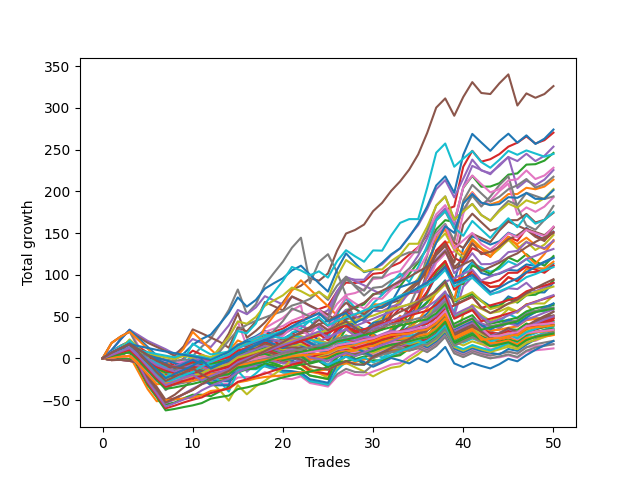

# Short Wallace Doodle 019 
- Symbol: ES_Unlimited
- Date Range: 03/18/2022 - 07/15/2022
- Trading Period: 7:20-12:30
- Number of Trades: 50



| Name | Win Percent | Profit | Avg Profit / Trade | Avg Time / Trade |      | Name | Win Percent | Profit | Avg Profit / Trade | Avg Time / Trade |
| ---- | ----------- | ------ | ------------------ | ---------------- | ---- | ---- | ----------- | ------ | ------------------ | ---------------- |
| Sorted By <br> Profit | | | | | | Sorted By <br> Win Percentage ||||
| Five | 78.00 | 163000.00 | 3260.00 | 45:27 |     | Eighty-One | 92.00 | 24750.00 | 495.00 | 07:45 |
| Sixty-Two | 70.00 | 137000.00 | 2740.00 | 25:54 |     | Eighty-Four | 90.00 | 65500.00 | 1310.00 | 14:57 |
| Three | 86.00 | 135125.00 | 2702.50 | 21:48 |     | Eighty-Three | 90.00 | 45250.00 | 905.00 | 11:34 |
| Forty-Six | 54.00 | 126750.00 | 2535.00 | 17:12 |     | Eighty-Two | 90.00 | 32000.00 | 640.00 | 10:05 |
| Two | 84.00 | 123000.00 | 2460.00 | 20:18 |     | One Hundred Twenty-Six | 90.00 | 19750.00 | 395.00 | 05:07 |
| Seventy-One | 58.00 | 122375.00 | 2447.50 | 28:42 |     | Eighty-Five | 88.00 | 75000.00 | 1500.00 | 19:14 |
| Fifty-Eight | 78.00 | 114125.00 | 2282.50 | 15:21 |     | One Hundred Twenty-Seven | 88.00 | 29750.00 | 595.00 | 06:47 |
| Four | 76.00 | 112750.00 | 2255.00 | 34:56 |     | One Hundred Twenty-One | 88.00 | 21250.00 | 425.00 | 04:24 |
| Fifty-Nine | 78.00 | 108750.00 | 2175.00 | 15:53 |     | Three | 86.00 | 135125.00 | 2702.50 | 21:48 |
| One | 78.00 | 107000.00 | 2140.00 | 16:56 |     | One Hundred Twenty-Three | 86.00 | 43000.00 | 860.00 | 07:31 |
| Seventy | 62.00 | 101375.00 | 2027.50 | 18:59 |     | One Hundred Twenty-Eight | 86.00 | 37250.00 | 745.00 | 08:04 |
| Seventy-Three | 58.00 | 100750.00 | 2015.00 | 15:19 |     | One Hundred Twenty-Two | 86.00 | 30500.00 | 610.00 | 06:03 |
| Sixty-Nine | 58.00 | 97000.00 | 1940.00 | 20:55 |     | Two | 84.00 | 123000.00 | 2460.00 | 20:18 |
| Six | 78.00 | 96375.00 | 1927.50 | 44:43 |     | One Hundred Twenty-Four | 84.00 | 54625.00 | 1092.50 | 09:01 |
| Seven | 68.00 | 91250.00 | 1825.00 | 85:45 |     | One Hundred Sixteen | 82.00 | 14000.00 | 280.00 | 02:31 |
| Sixty-One | 60.00 | 87625.00 | 1752.50 | 30:42 |     | One Hundred Twenty-Five | 80.00 | 60000.00 | 1200.00 | 11:21 |
| Fifty-Seven | 76.00 | 87125.00 | 1742.50 | 13:28 |     | One Hundred Twenty-Nine | 80.00 | 37875.00 | 757.50 | 09:25 |
| Sixty-Eight | 60.00 | 78875.00 | 1577.50 | 18:03 |     | One Hundred Eleven | 80.00 | 17125.00 | 342.50 | 02:23 |
| Forty-Seven | 38.00 | 78625.00 | 1572.50 | 33:52 |     | Five | 78.00 | 163000.00 | 3260.00 | 45:27 |
| Sixty-Seven | 70.00 | 78250.00 | 1565.00 | 14:20 |     | Fifty-Eight | 78.00 | 114125.00 | 2282.50 | 15:21 |
| Forty-Two | 56.00 | 75875.00 | 1517.50 | 10:37 |     | Fifty-Nine | 78.00 | 108750.00 | 2175.00 | 15:53 |
| Forty-Five | 44.00 | 75500.00 | 1510.00 | 19:52 |     | One | 78.00 | 107000.00 | 2140.00 | 16:56 |
| Eighty-Five | 88.00 | 75000.00 | 1500.00 | 19:14 |     | Six | 78.00 | 96375.00 | 1927.50 | 44:43 |
| Sixty | 64.00 | 73875.00 | 1477.50 | 22:00 |     | One Hundred Six | 78.00 | 16750.00 | 335.00 | 02:06 |
| Sixty-Three | 50.00 | 70875.00 | 1417.50 | 50:27 |     | Four | 76.00 | 112750.00 | 2255.00 | 34:56 |
| Sixty-Six | 68.00 | 70500.00 | 1410.00 | 13:49 |     | Fifty-Seven | 76.00 | 87125.00 | 1742.50 | 13:28 |
| Forty-Three | 54.00 | 69875.00 | 1397.50 | 10:29 |     | One Hundred Thirty | 76.00 | 47375.00 | 947.50 | 11:30 |
| Eighty-Four | 90.00 | 65500.00 | 1310.00 | 14:57 |     | One Hundred Seventeen | 74.00 | 14875.00 | 297.50 | 03:20 |
| Forty-Four | 48.00 | 61250.00 | 1225.00 | 14:25 |     | One Hundred Eighteen | 72.00 | 22875.00 | 457.50 | 04:02 |
| Zero | 66.00 | 60500.00 | 1210.00 | 11:37 |     | One Hundred Twelve | 72.00 | 15375.00 | 307.50 | 03:22 |
| One Hundred Twenty-Five | 80.00 | 60000.00 | 1200.00 | 11:21 |     | Sixty-Two | 70.00 | 137000.00 | 2740.00 | 25:54 |
| Fifty-Three | 48.00 | 57875.00 | 1157.50 | 08:26 |     | Sixty-Seven | 70.00 | 78250.00 | 1565.00 | 14:20 |
| Forty-One | 58.00 | 56750.00 | 1135.00 | 09:18 |     | Sixty-Five | 70.00 | 55375.00 | 1107.50 | 12:27 |
| Fifty-Five | 48.00 | 55750.00 | 1115.00 | 09:26 |     | One Hundred Thirteen | 70.00 | 22000.00 | 440.00 | 04:04 |
| Sixty-Five | 70.00 | 55375.00 | 1107.50 | 12:27 |     | One Hundred Seven | 70.00 | 19750.00 | 395.00 | 02:32 |
| One Hundred Twenty-Four | 84.00 | 54625.00 | 1092.50 | 09:01 |     | Ninety-Six | 70.00 | 14000.00 | 280.00 | 01:49 |
| One Hundred Thirty | 76.00 | 47375.00 | 947.50 | 11:30 |     | Seven | 68.00 | 91250.00 | 1825.00 | 85:45 |
| Fifty-Four | 50.00 | 46750.00 | 935.00 | 07:52 |     | Sixty-Six | 68.00 | 70500.00 | 1410.00 | 13:49 |
| Eighty-Three | 90.00 | 45250.00 | 905.00 | 11:34 |     | One Hundred One | 68.00 | 6000.00 | 120.00 | 01:43 |
| Fifty-Six | 66.00 | 45250.00 | 905.00 | 10:01 |     | Zero | 66.00 | 60500.00 | 1210.00 | 11:37 |
| Fifty-Two | 48.00 | 45250.00 | 905.00 | 07:51 |     | Fifty-Six | 66.00 | 45250.00 | 905.00 | 10:01 |
| One Hundred Twenty-Three | 86.00 | 43000.00 | 860.00 | 07:31 |     | Sixty | 64.00 | 73875.00 | 1477.50 | 22:00 |
| One Hundred Twenty-Nine | 80.00 | 37875.00 | 757.50 | 09:25 |     | One Hundred Ninteen | 64.00 | 25125.00 | 502.50 | 04:32 |
| Fifty | 48.00 | 37500.00 | 750.00 | 07:06 |     | Sixty-Four | 64.00 | 24125.00 | 482.50 | 09:39 |
| One Hundred Twenty-Eight | 86.00 | 37250.00 | 745.00 | 08:04 |     | One Hundred Eight | 64.00 | 24000.00 | 480.00 | 03:00 |
| One Hundred Fifteen | 62.00 | 32875.00 | 657.50 | 06:39 |     | One Hundred Fourteen | 64.00 | 21750.00 | 435.00 | 04:45 |
| Fifty-One | 48.00 | 32750.00 | 655.00 | 06:46 |     | Seventy | 62.00 | 101375.00 | 2027.50 | 18:59 |
| Forty | 60.00 | 32625.00 | 652.50 | 06:55 |     | One Hundred Fifteen | 62.00 | 32875.00 | 657.50 | 06:39 |
| Eighty-Two | 90.00 | 32000.00 | 640.00 | 10:05 |     | Ninety-Seven | 62.00 | 17875.00 | 357.50 | 02:01 |
| One Hundred Twenty-Two | 86.00 | 30500.00 | 610.00 | 06:03 |     | One Hundred Two | 62.00 | 8500.00 | 170.00 | 02:07 |
| One Hundred Twenty-Seven | 88.00 | 29750.00 | 595.00 | 06:47 |     | Ninety-One | 62.00 | 8500.00 | 170.00 | 01:34 |
| One Hundred Nine | 58.00 | 29250.00 | 585.00 | 03:19 |     | Sixty-One | 60.00 | 87625.00 | 1752.50 | 30:42 |
| Forty-Nine | 48.00 | 28125.00 | 562.50 | 06:32 |     | Sixty-Eight | 60.00 | 78875.00 | 1577.50 | 18:03 |
| One Hundred Twenty | 54.00 | 27875.00 | 557.50 | 05:20 |     | Forty | 60.00 | 32625.00 | 652.50 | 06:55 |
| One Hundred | 60.00 | 25750.00 | 515.00 | 02:41 |     | One Hundred | 60.00 | 25750.00 | 515.00 | 02:41 |
| One Hundred Ten | 58.00 | 25500.00 | 510.00 | 03:47 |     | Ninety-Nine | 60.00 | 24375.00 | 487.50 | 02:31 |
| One Hundred Ninteen | 64.00 | 25125.00 | 502.50 | 04:32 |     | Ninety-Eight | 60.00 | 20500.00 | 410.00 | 02:16 |
| Eighty-One | 92.00 | 24750.00 | 495.00 | 07:45 |     | One Hundred Three | 60.00 | 14375.00 | 287.50 | 02:45 |
| Ninety-Nine | 60.00 | 24375.00 | 487.50 | 02:31 |     | Seventy-One | 58.00 | 122375.00 | 2447.50 | 28:42 |
| Sixty-Four | 64.00 | 24125.00 | 482.50 | 09:39 |     | Seventy-Three | 58.00 | 100750.00 | 2015.00 | 15:19 |
| One Hundred Eight | 64.00 | 24000.00 | 480.00 | 03:00 |     | Sixty-Nine | 58.00 | 97000.00 | 1940.00 | 20:55 |
| One Hundred Eighteen | 72.00 | 22875.00 | 457.50 | 04:02 |     | Forty-One | 58.00 | 56750.00 | 1135.00 | 09:18 |
| One Hundred Thirteen | 70.00 | 22000.00 | 440.00 | 04:04 |     | One Hundred Nine | 58.00 | 29250.00 | 585.00 | 03:19 |
| One Hundred Fourteen | 64.00 | 21750.00 | 435.00 | 04:45 |     | One Hundred Ten | 58.00 | 25500.00 | 510.00 | 03:47 |
| One Hundred Twenty-One | 88.00 | 21250.00 | 425.00 | 04:24 |     | Forty-Two | 56.00 | 75875.00 | 1517.50 | 10:37 |
| Ninety-Eight | 60.00 | 20500.00 | 410.00 | 02:16 |     | One Hundred Four | 56.00 | 17375.00 | 347.50 | 03:17 |
| One Hundred Twenty-Six | 90.00 | 19750.00 | 395.00 | 05:07 |     | Ninety-Two | 56.00 | 10500.00 | 210.00 | 01:54 |
| One Hundred Seven | 70.00 | 19750.00 | 395.00 | 02:32 |     | Forty-Six | 54.00 | 126750.00 | 2535.00 | 17:12 |
| Ninety-Four | 50.00 | 19125.00 | 382.50 | 02:47 |     | Forty-Three | 54.00 | 69875.00 | 1397.50 | 10:29 |
| Ninety-Seven | 62.00 | 17875.00 | 357.50 | 02:01 |     | One Hundred Twenty | 54.00 | 27875.00 | 557.50 | 05:20 |
| One Hundred Four | 56.00 | 17375.00 | 347.50 | 03:17 |     | Ninety-Three | 54.00 | 15875.00 | 317.50 | 02:24 |
| One Hundred Eleven | 80.00 | 17125.00 | 342.50 | 02:23 |     | Forty-Eight | 52.00 | 15625.00 | 312.50 | 05:22 |
| One Hundred Six | 78.00 | 16750.00 | 335.00 | 02:06 |     | Sixty-Three | 50.00 | 70875.00 | 1417.50 | 50:27 |
| Ninety-Five | 42.00 | 16625.00 | 332.50 | 03:35 |     | Fifty-Four | 50.00 | 46750.00 | 935.00 | 07:52 |
| Ninety-Three | 54.00 | 15875.00 | 317.50 | 02:24 |     | Ninety-Four | 50.00 | 19125.00 | 382.50 | 02:47 |
| Forty-Eight | 52.00 | 15625.00 | 312.50 | 05:22 |     | Forty-Four | 48.00 | 61250.00 | 1225.00 | 14:25 |
| One Hundred Twelve | 72.00 | 15375.00 | 307.50 | 03:22 |     | Fifty-Three | 48.00 | 57875.00 | 1157.50 | 08:26 |
| One Hundred Seventeen | 74.00 | 14875.00 | 297.50 | 03:20 |     | Fifty-Five | 48.00 | 55750.00 | 1115.00 | 09:26 |
| One Hundred Three | 60.00 | 14375.00 | 287.50 | 02:45 |     | Fifty-Two | 48.00 | 45250.00 | 905.00 | 07:51 |
| One Hundred Sixteen | 82.00 | 14000.00 | 280.00 | 02:31 |     | Fifty | 48.00 | 37500.00 | 750.00 | 07:06 |
| Ninety-Six | 70.00 | 14000.00 | 280.00 | 01:49 |     | Fifty-One | 48.00 | 32750.00 | 655.00 | 06:46 |
| Ninety-Two | 56.00 | 10500.00 | 210.00 | 01:54 |     | Forty-Nine | 48.00 | 28125.00 | 562.50 | 06:32 |
| One Hundred Five | 46.00 | 10375.00 | 207.50 | 04:19 |     | One Hundred Five | 46.00 | 10375.00 | 207.50 | 04:19 |
| One Hundred Two | 62.00 | 8500.00 | 170.00 | 02:07 |     | Forty-Five | 44.00 | 75500.00 | 1510.00 | 19:52 |
| Ninety-One | 62.00 | 8500.00 | 170.00 | 01:34 |     | Ninety-Five | 42.00 | 16625.00 | 332.50 | 03:35 |
| One Hundred One | 68.00 | 6000.00 | 120.00 | 01:43 |     | Forty-Seven | 38.00 | 78625.00 | 1572.50 | 33:52 |

## NO STOPLOSS

### Test Zero
* Sell when price hits the middle line of the 20p bollinger
* No Stoploss
* Results:
```
Total Trades: 50
Percent Up: 34.00
Percent Down: 66.00
Total Points Moved Down: 121.00
Potential Profit: 60500.00
Total Points Ups: 73.25 Count Ups: 17
Total Points Downs: 194.25 Count Downs: 33
```

<details><summary>Trades</summary>

<code>In: 2022-03-21 08:26:00		Out: 2022-03-21 08:32:35		Total Position Time: 06:35		Total Move Down: 4.00		Total to Date: 4.00</code> <br />
<code>In: 2022-03-25 11:55:00		Out: 2022-03-25 11:57:20		Total Position Time: 02:20		Total Move Down: 2.25		Total to Date: 6.25</code> <br />
<code>In: 2022-03-25 11:57:00		Out: 2022-03-25 11:58:35		Total Position Time: 01:35		Total Move Down: 0.75		Total to Date: 7.00</code> <br />
<code>In: 2022-03-28 11:42:00		Out: 2022-03-28 12:12:55		Total Position Time: 30:55		Total Move Down: -10.00		Total to Date: -3.00</code> <br />
<code>In: 2022-03-28 11:43:00		Out: 2022-03-28 12:12:55		Total Position Time: 29:55		Total Move Down: -10.25		Total to Date: -13.25</code> <br />
<code>In: 2022-03-28 11:50:00		Out: 2022-03-28 12:12:55		Total Position Time: 22:55		Total Move Down: -4.75		Total to Date: -18.00</code> <br />
<code>In: 2022-03-29 11:38:00		Out: 2022-03-29 11:58:00		Total Position Time: 20:00		Total Move Down: -0.75		Total to Date: -18.75</code> <br />
<code>In: 2022-03-31 07:48:00		Out: 2022-03-31 08:03:10		Total Position Time: 15:10		Total Move Down: -0.50		Total to Date: -19.25</code> <br />
<code>In: 2022-03-31 07:49:00		Out: 2022-03-31 08:03:10		Total Position Time: 14:10		Total Move Down: 2.00		Total to Date: -17.25</code> <br />
<code>In: 2022-04-01 11:34:00		Out: 2022-04-01 11:47:25		Total Position Time: 13:25		Total Move Down: 1.50		Total to Date: -15.75</code> <br />
<code>In: 2022-04-06 10:35:00		Out: 2022-04-06 10:55:55		Total Position Time: 20:55		Total Move Down: -3.50		Total to Date: -19.25</code> <br />
<code>In: 2022-04-06 10:36:00		Out: 2022-04-06 10:55:55		Total Position Time: 19:55		Total Move Down: -5.25		Total to Date: -24.50</code> <br />
<code>In: 2022-04-06 10:43:00		Out: 2022-04-06 10:55:55		Total Position Time: 12:55		Total Move Down: 2.25		Total to Date: -22.25</code> <br />
<code>In: 2022-04-06 10:44:00		Out: 2022-04-06 10:55:55		Total Position Time: 11:55		Total Move Down: 2.75		Total to Date: -19.50</code> <br />
<code>In: 2022-04-06 11:05:00		Out: 2022-04-06 11:06:10		Total Position Time: 01:10		Total Move Down: 7.75		Total to Date: -11.75</code> <br />
<code>In: 2022-04-07 11:03:00		Out: 2022-04-07 11:15:20		Total Position Time: 12:20		Total Move Down: 4.00		Total to Date: -7.75</code> <br />
<code>In: 2022-04-18 07:27:00		Out: 2022-04-18 07:46:00		Total Position Time: 19:00		Total Move Down: 1.00		Total to Date: -6.75</code> <br />
<code>In: 2022-04-18 11:26:00		Out: 2022-04-18 11:28:05		Total Position Time: 02:05		Total Move Down: 6.00		Total to Date: -0.75</code> <br />
<code>In: 2022-04-20 07:39:00		Out: 2022-04-20 08:00:20		Total Position Time: 21:20		Total Move Down: -2.25		Total to Date: -3.00</code> <br />
<code>In: 2022-04-20 07:40:00		Out: 2022-04-20 08:00:20		Total Position Time: 20:20		Total Move Down: -2.75		Total to Date: -5.75</code> <br />
<code>In: 2022-04-20 07:42:00		Out: 2022-04-20 08:00:20		Total Position Time: 18:20		Total Move Down: 0.50		Total to Date: -5.25</code> <br />
<code>In: 2022-04-20 09:54:00		Out: 2022-04-20 09:59:15		Total Position Time: 05:15		Total Move Down: 3.25		Total to Date: -2.00</code> <br />
<code>In: 2022-04-25 10:14:00		Out: 2022-04-25 10:26:55		Total Position Time: 12:55		Total Move Down: 1.00		Total to Date: -1.00</code> <br />
<code>In: 2022-04-27 08:34:00		Out: 2022-04-27 08:45:10		Total Position Time: 11:10		Total Move Down: 3.00		Total to Date: 2.00</code> <br />
<code>In: 2022-05-16 08:48:00		Out: 2022-05-16 09:06:00		Total Position Time: 18:00		Total Move Down: -3.50		Total to Date: -1.50</code> <br />
<code>In: 2022-05-24 09:17:00		Out: 2022-05-24 09:22:10		Total Position Time: 05:10		Total Move Down: 12.00		Total to Date: 10.50</code> <br />
<code>In: 2022-05-24 09:18:00		Out: 2022-05-24 09:22:10		Total Position Time: 04:10		Total Move Down: 5.75		Total to Date: 16.25</code> <br />
<code>In: 2022-05-24 10:43:00		Out: 2022-05-24 11:01:15		Total Position Time: 18:15		Total Move Down: -2.25		Total to Date: 14.00</code> <br />
<code>In: 2022-05-24 10:47:00		Out: 2022-05-24 11:01:15		Total Position Time: 14:15		Total Move Down: -0.00		Total to Date: 14.00</code> <br />
<code>In: 2022-05-25 11:04:00		Out: 2022-05-25 11:06:25		Total Position Time: 02:25		Total Move Down: 4.50		Total to Date: 18.50</code> <br />
<code>In: 2022-05-31 07:23:00		Out: 2022-05-31 07:37:30		Total Position Time: 14:30		Total Move Down: 5.75		Total to Date: 24.25</code> <br />
<code>In: 2022-06-09 10:07:00		Out: 2022-06-09 10:16:50		Total Position Time: 09:50		Total Move Down: 4.50		Total to Date: 28.75</code> <br />
<code>In: 2022-06-09 10:08:00		Out: 2022-06-09 10:16:50		Total Position Time: 08:50		Total Move Down: 1.75		Total to Date: 30.50</code> <br />
<code>In: 2022-06-10 12:00:00		Out: 2022-06-10 12:03:30		Total Position Time: 03:30		Total Move Down: 7.75		Total to Date: 38.25</code> <br />
<code>In: 2022-06-10 12:29:00		Out: 2022-06-10 12:30:35		Total Position Time: 01:35		Total Move Down: 6.75		Total to Date: 45.00</code> <br />
<code>In: 2022-06-13 09:38:00		Out: 2022-06-13 09:44:05		Total Position Time: 06:05		Total Move Down: 8.75		Total to Date: 53.75</code> <br />
<code>In: 2022-06-13 09:40:00		Out: 2022-06-13 09:44:05		Total Position Time: 04:05		Total Move Down: 13.25		Total to Date: 67.00</code> <br />
<code>In: 2022-06-15 11:02:00		Out: 2022-06-15 11:03:10		Total Position Time: 01:10		Total Move Down: 11.00		Total to Date: 78.00</code> <br />
<code>In: 2022-06-15 11:40:00		Out: 2022-06-15 11:53:40		Total Position Time: 13:40		Total Move Down: -8.75		Total to Date: 69.25</code> <br />
<code>In: 2022-06-15 11:45:00		Out: 2022-06-15 11:53:40		Total Position Time: 08:40		Total Move Down: 34.50		Total to Date: 103.75</code> <br />
<code>In: 2022-06-17 10:13:00		Out: 2022-06-17 10:23:05		Total Position Time: 10:05		Total Move Down: 11.50		Total to Date: 115.25</code> <br />
<code>In: 2022-06-23 12:30:00		Out: 2022-06-23 12:47:00		Total Position Time: 17:00		Total Move Down: -13.00		Total to Date: 102.25</code> <br />
<code>In: 2022-06-27 07:49:00		Out: 2022-06-27 08:03:20		Total Position Time: 14:20		Total Move Down: -3.00		Total to Date: 99.25</code> <br />
<code>In: 2022-06-29 11:06:00		Out: 2022-06-29 11:20:05		Total Position Time: 14:05		Total Move Down: 2.00		Total to Date: 101.25</code> <br />
<code>In: 2022-06-29 12:31:00		Out: 2022-06-29 12:33:20		Total Position Time: 02:20		Total Move Down: 4.75		Total to Date: 106.00</code> <br />
<code>In: 2022-07-01 10:47:00		Out: 2022-07-01 11:04:20		Total Position Time: 17:20		Total Move Down: -1.00		Total to Date: 105.00</code> <br />
<code>In: 2022-07-06 11:10:00		Out: 2022-07-06 11:11:10		Total Position Time: 01:10		Total Move Down: 7.50		Total to Date: 112.50</code> <br />
<code>In: 2022-07-06 11:35:00		Out: 2022-07-06 11:50:05		Total Position Time: 15:05		Total Move Down: -1.75		Total to Date: 110.75</code> <br />
<code>In: 2022-07-12 08:14:00		Out: 2022-07-12 08:17:15		Total Position Time: 03:15		Total Move Down: 5.00		Total to Date: 115.75</code> <br />
<code>In: 2022-07-12 08:31:00		Out: 2022-07-12 08:37:00		Total Position Time: 06:00		Total Move Down: 5.25		Total to Date: 121.00</code> <br />


</details>

### Test One
* Sell when the price hits the upper line of the 20p 1std bollinger
* No Stoploss
* Results:
```
Total Trades: 50
Percent Up: 22.00
Percent Down: 78.00
Total Points Moved Down: 214.00
Potential Profit: 107000.00
Total Points Ups: 58.50 Count Ups: 11
Total Points Downs: 272.50 Count Downs: 39
```

<details><summary>Trades</summary>

<code>In: 2022-03-21 08:26:00		Out: 2022-03-21 08:36:05		Total Position Time: 10:05		Total Move Down: 6.75		Total to Date: 6.75</code> <br />
<code>In: 2022-03-25 11:55:00		Out: 2022-03-25 12:00:50		Total Position Time: 05:50		Total Move Down: 4.25		Total to Date: 11.00</code> <br />
<code>In: 2022-03-25 11:57:00		Out: 2022-03-25 12:00:50		Total Position Time: 03:50		Total Move Down: 2.75		Total to Date: 13.75</code> <br />
<code>In: 2022-03-28 11:42:00		Out: 2022-03-28 12:41:10		Total Position Time: 59:10		Total Move Down: -14.00		Total to Date: -0.25</code> <br />
<code>In: 2022-03-28 11:43:00		Out: 2022-03-28 12:41:10		Total Position Time: 58:10		Total Move Down: -14.25		Total to Date: -14.50</code> <br />
<code>In: 2022-03-28 11:50:00		Out: 2022-03-28 12:41:10		Total Position Time: 51:10		Total Move Down: -8.75		Total to Date: -23.25</code> <br />
<code>In: 2022-03-29 11:38:00		Out: 2022-03-29 12:00:25		Total Position Time: 22:25		Total Move Down: 0.25		Total to Date: -23.00</code> <br />
<code>In: 2022-03-31 07:48:00		Out: 2022-03-31 08:08:00		Total Position Time: 20:00		Total Move Down: 0.25		Total to Date: -22.75</code> <br />
<code>In: 2022-03-31 07:49:00		Out: 2022-03-31 08:08:00		Total Position Time: 19:00		Total Move Down: 2.75		Total to Date: -20.00</code> <br />
<code>In: 2022-04-01 11:34:00		Out: 2022-04-01 11:50:15		Total Position Time: 16:15		Total Move Down: 3.25		Total to Date: -16.75</code> <br />
<code>In: 2022-04-06 10:35:00		Out: 2022-04-06 10:57:10		Total Position Time: 22:10		Total Move Down: -1.25		Total to Date: -18.00</code> <br />
<code>In: 2022-04-06 10:36:00		Out: 2022-04-06 10:57:10		Total Position Time: 21:10		Total Move Down: -3.00		Total to Date: -21.00</code> <br />
<code>In: 2022-04-06 10:43:00		Out: 2022-04-06 10:57:10		Total Position Time: 14:10		Total Move Down: 4.50		Total to Date: -16.50</code> <br />
<code>In: 2022-04-06 10:44:00		Out: 2022-04-06 10:57:10		Total Position Time: 13:10		Total Move Down: 5.00		Total to Date: -11.50</code> <br />
<code>In: 2022-04-06 11:05:00		Out: 2022-04-06 11:07:20		Total Position Time: 02:20		Total Move Down: 12.50		Total to Date: 1.00</code> <br />
<code>In: 2022-04-07 11:03:00		Out: 2022-04-07 11:18:00		Total Position Time: 15:00		Total Move Down: 4.75		Total to Date: 5.75</code> <br />
<code>In: 2022-04-18 07:27:00		Out: 2022-04-18 07:51:30		Total Position Time: 24:30		Total Move Down: 2.75		Total to Date: 8.50</code> <br />
<code>In: 2022-04-18 11:26:00		Out: 2022-04-18 11:41:15		Total Position Time: 15:15		Total Move Down: 6.50		Total to Date: 15.00</code> <br />
<code>In: 2022-04-20 07:39:00		Out: 2022-04-20 08:00:40		Total Position Time: 21:40		Total Move Down: 0.75		Total to Date: 15.75</code> <br />
<code>In: 2022-04-20 07:40:00		Out: 2022-04-20 08:00:40		Total Position Time: 20:40		Total Move Down: 0.25		Total to Date: 16.00</code> <br />
<code>In: 2022-04-20 07:42:00		Out: 2022-04-20 08:00:40		Total Position Time: 18:40		Total Move Down: 3.50		Total to Date: 19.50</code> <br />
<code>In: 2022-04-20 09:54:00		Out: 2022-04-20 10:08:15		Total Position Time: 14:15		Total Move Down: 4.25		Total to Date: 23.75</code> <br />
<code>In: 2022-04-25 10:14:00		Out: 2022-04-25 10:28:05		Total Position Time: 14:05		Total Move Down: 2.75		Total to Date: 26.50</code> <br />
<code>In: 2022-04-27 08:34:00		Out: 2022-04-27 08:48:10		Total Position Time: 14:10		Total Move Down: 5.25		Total to Date: 31.75</code> <br />
<code>In: 2022-05-16 08:48:00		Out: 2022-05-16 09:06:25		Total Position Time: 18:25		Total Move Down: -0.00		Total to Date: 31.75</code> <br />
<code>In: 2022-05-24 09:17:00		Out: 2022-05-24 09:29:20		Total Position Time: 12:20		Total Move Down: 12.75		Total to Date: 44.50</code> <br />
<code>In: 2022-05-24 09:18:00		Out: 2022-05-24 09:29:20		Total Position Time: 11:20		Total Move Down: 6.50		Total to Date: 51.00</code> <br />
<code>In: 2022-05-24 10:43:00		Out: 2022-05-24 11:01:40		Total Position Time: 18:40		Total Move Down: 1.25		Total to Date: 52.25</code> <br />
<code>In: 2022-05-24 10:47:00		Out: 2022-05-24 11:01:40		Total Position Time: 14:40		Total Move Down: 3.50		Total to Date: 55.75</code> <br />
<code>In: 2022-05-25 11:04:00		Out: 2022-05-25 11:06:35		Total Position Time: 02:35		Total Move Down: 9.25		Total to Date: 65.00</code> <br />
<code>In: 2022-05-31 07:23:00		Out: 2022-05-31 08:07:20		Total Position Time: 44:20		Total Move Down: -0.75		Total to Date: 64.25</code> <br />
<code>In: 2022-06-09 10:07:00		Out: 2022-06-09 10:18:55		Total Position Time: 11:55		Total Move Down: 6.00		Total to Date: 70.25</code> <br />
<code>In: 2022-06-09 10:08:00		Out: 2022-06-09 10:18:55		Total Position Time: 10:55		Total Move Down: 3.25		Total to Date: 73.50</code> <br />
<code>In: 2022-06-10 12:00:00		Out: 2022-06-10 12:05:05		Total Position Time: 05:05		Total Move Down: 10.50		Total to Date: 84.00</code> <br />
<code>In: 2022-06-10 12:29:00		Out: 2022-06-10 12:35:45		Total Position Time: 06:45		Total Move Down: 9.75		Total to Date: 93.75</code> <br />
<code>In: 2022-06-13 09:38:00		Out: 2022-06-13 09:47:55		Total Position Time: 09:55		Total Move Down: 14.50		Total to Date: 108.25</code> <br />
<code>In: 2022-06-13 09:40:00		Out: 2022-06-13 09:47:55		Total Position Time: 07:55		Total Move Down: 19.00		Total to Date: 127.25</code> <br />
<code>In: 2022-06-15 11:02:00		Out: 2022-06-15 11:03:10		Total Position Time: 01:10		Total Move Down: 11.00		Total to Date: 138.25</code> <br />
<code>In: 2022-06-15 11:40:00		Out: 2022-06-15 11:57:55		Total Position Time: 17:55		Total Move Down: 2.25		Total to Date: 140.50</code> <br />
<code>In: 2022-06-15 11:45:00		Out: 2022-06-15 11:57:55		Total Position Time: 12:55		Total Move Down: 45.50		Total to Date: 186.00</code> <br />
<code>In: 2022-06-17 10:13:00		Out: 2022-06-17 10:26:30		Total Position Time: 13:30		Total Move Down: 13.00		Total to Date: 199.00</code> <br />
<code>In: 2022-06-23 12:30:00		Out: 2022-06-23 12:47:00		Total Position Time: 17:00		Total Move Down: -13.00		Total to Date: 186.00</code> <br />
<code>In: 2022-06-27 07:49:00		Out: 2022-06-27 08:07:30		Total Position Time: 18:30		Total Move Down: -1.75		Total to Date: 184.25</code> <br />
<code>In: 2022-06-29 11:06:00		Out: 2022-06-29 11:20:40		Total Position Time: 14:40		Total Move Down: 3.50		Total to Date: 187.75</code> <br />
<code>In: 2022-06-29 12:31:00		Out: 2022-06-29 12:34:15		Total Position Time: 03:15		Total Move Down: 9.00		Total to Date: 196.75</code> <br />
<code>In: 2022-07-01 10:47:00		Out: 2022-07-01 11:04:55		Total Position Time: 17:55		Total Move Down: -0.00		Total to Date: 196.75</code> <br />
<code>In: 2022-07-06 11:10:00		Out: 2022-07-06 11:11:10		Total Position Time: 01:10		Total Move Down: 7.50		Total to Date: 204.25</code> <br />
<code>In: 2022-07-06 11:35:00		Out: 2022-07-06 12:00:50		Total Position Time: 25:50		Total Move Down: -1.75		Total to Date: 202.50</code> <br />
<code>In: 2022-07-12 08:14:00		Out: 2022-07-12 08:38:10		Total Position Time: 24:10		Total Move Down: 3.25		Total to Date: 205.75</code> <br />
<code>In: 2022-07-12 08:31:00		Out: 2022-07-12 08:38:10		Total Position Time: 07:10		Total Move Down: 8.25		Total to Date: 214.00</code> <br />


</details>

### Test Two
* Sell when the price hits the upper line of the 20p 2std bollinger
* No Stoploss
* Results:
```
Total Trades: 50
Percent Up: 16.00
Percent Down: 84.00
Total Points Moved Down: 246.00
Potential Profit: 123000.00
Total Points Ups: 87.00 Count Ups: 8
Total Points Downs: 333.00 Count Downs: 42
```

<details><summary>Trades</summary>

<code>In: 2022-03-21 08:26:00		Out: 2022-03-21 08:36:15		Total Position Time: 10:15		Total Move Down: 6.75		Total to Date: 6.75</code> <br />
<code>In: 2022-03-25 11:55:00		Out: 2022-03-25 12:01:15		Total Position Time: 06:15		Total Move Down: 4.75		Total to Date: 11.50</code> <br />
<code>In: 2022-03-25 11:57:00		Out: 2022-03-25 12:01:15		Total Position Time: 04:15		Total Move Down: 3.25		Total to Date: 14.75</code> <br />
<code>In: 2022-03-28 11:42:00		Out: 2022-03-28 12:47:00		Total Position Time: 65:00		Total Move Down: -19.75		Total to Date: -5.00</code> <br />
<code>In: 2022-03-28 11:43:00		Out: 2022-03-28 12:47:00		Total Position Time: 64:00		Total Move Down: -20.00		Total to Date: -25.00</code> <br />
<code>In: 2022-03-28 11:50:00		Out: 2022-03-28 12:47:00		Total Position Time: 57:00		Total Move Down: -14.50		Total to Date: -39.50</code> <br />
<code>In: 2022-03-29 11:38:00		Out: 2022-03-29 12:47:00		Total Position Time: 69:00		Total Move Down: -15.75		Total to Date: -55.25</code> <br />
<code>In: 2022-03-31 07:48:00		Out: 2022-03-31 08:08:30		Total Position Time: 20:30		Total Move Down: 2.50		Total to Date: -52.75</code> <br />
<code>In: 2022-03-31 07:49:00		Out: 2022-03-31 08:08:30		Total Position Time: 19:30		Total Move Down: 5.00		Total to Date: -47.75</code> <br />
<code>In: 2022-04-01 11:34:00		Out: 2022-04-01 11:50:45		Total Position Time: 16:45		Total Move Down: 4.25		Total to Date: -43.50</code> <br />
<code>In: 2022-04-06 10:35:00		Out: 2022-04-06 10:58:05		Total Position Time: 23:05		Total Move Down: -0.00		Total to Date: -43.50</code> <br />
<code>In: 2022-04-06 10:36:00		Out: 2022-04-06 10:58:05		Total Position Time: 22:05		Total Move Down: -1.75		Total to Date: -45.25</code> <br />
<code>In: 2022-04-06 10:43:00		Out: 2022-04-06 10:58:05		Total Position Time: 15:05		Total Move Down: 5.75		Total to Date: -39.50</code> <br />
<code>In: 2022-04-06 10:44:00		Out: 2022-04-06 10:58:05		Total Position Time: 14:05		Total Move Down: 6.25		Total to Date: -33.25</code> <br />
<code>In: 2022-04-06 11:05:00		Out: 2022-04-06 11:08:10		Total Position Time: 03:10		Total Move Down: 18.50		Total to Date: -14.75</code> <br />
<code>In: 2022-04-07 11:03:00		Out: 2022-04-07 11:18:20		Total Position Time: 15:20		Total Move Down: 6.00		Total to Date: -8.75</code> <br />
<code>In: 2022-04-18 07:27:00		Out: 2022-04-18 07:51:45		Total Position Time: 24:45		Total Move Down: 4.75		Total to Date: -4.00</code> <br />
<code>In: 2022-04-18 11:26:00		Out: 2022-04-18 11:44:10		Total Position Time: 18:10		Total Move Down: 6.75		Total to Date: 2.75</code> <br />
<code>In: 2022-04-20 07:39:00		Out: 2022-04-20 08:01:10		Total Position Time: 22:10		Total Move Down: 3.75		Total to Date: 6.50</code> <br />
<code>In: 2022-04-20 07:40:00		Out: 2022-04-20 08:01:10		Total Position Time: 21:10		Total Move Down: 3.25		Total to Date: 9.75</code> <br />
<code>In: 2022-04-20 07:42:00		Out: 2022-04-20 08:01:10		Total Position Time: 19:10		Total Move Down: 6.50		Total to Date: 16.25</code> <br />
<code>In: 2022-04-20 09:54:00		Out: 2022-04-20 10:08:15		Total Position Time: 14:15		Total Move Down: 4.25		Total to Date: 20.50</code> <br />
<code>In: 2022-04-25 10:14:00		Out: 2022-04-25 10:33:35		Total Position Time: 19:35		Total Move Down: 4.25		Total to Date: 24.75</code> <br />
<code>In: 2022-04-27 08:34:00		Out: 2022-04-27 08:51:55		Total Position Time: 17:55		Total Move Down: 4.50		Total to Date: 29.25</code> <br />
<code>In: 2022-05-16 08:48:00		Out: 2022-05-16 09:11:45		Total Position Time: 23:45		Total Move Down: 1.00		Total to Date: 30.25</code> <br />
<code>In: 2022-05-24 09:17:00		Out: 2022-05-24 09:31:25		Total Position Time: 14:25		Total Move Down: 17.00		Total to Date: 47.25</code> <br />
<code>In: 2022-05-24 09:18:00		Out: 2022-05-24 09:31:25		Total Position Time: 13:25		Total Move Down: 10.75		Total to Date: 58.00</code> <br />
<code>In: 2022-05-24 10:43:00		Out: 2022-05-24 11:01:50		Total Position Time: 18:50		Total Move Down: 2.25		Total to Date: 60.25</code> <br />
<code>In: 2022-05-24 10:47:00		Out: 2022-05-24 11:01:50		Total Position Time: 14:50		Total Move Down: 4.50		Total to Date: 64.75</code> <br />
<code>In: 2022-05-25 11:04:00		Out: 2022-05-25 11:06:40		Total Position Time: 02:40		Total Move Down: 12.25		Total to Date: 77.00</code> <br />
<code>In: 2022-05-31 07:23:00		Out: 2022-05-31 08:07:30		Total Position Time: 44:30		Total Move Down: 1.25		Total to Date: 78.25</code> <br />
<code>In: 2022-06-09 10:07:00		Out: 2022-06-09 10:21:10		Total Position Time: 14:10		Total Move Down: 5.50		Total to Date: 83.75</code> <br />
<code>In: 2022-06-09 10:08:00		Out: 2022-06-09 10:21:10		Total Position Time: 13:10		Total Move Down: 2.75		Total to Date: 86.50</code> <br />
<code>In: 2022-06-10 12:00:00		Out: 2022-06-10 12:06:05		Total Position Time: 06:05		Total Move Down: 14.50		Total to Date: 101.00</code> <br />
<code>In: 2022-06-10 12:29:00		Out: 2022-06-10 12:43:10		Total Position Time: 14:10		Total Move Down: 14.00		Total to Date: 115.00</code> <br />
<code>In: 2022-06-13 09:38:00		Out: 2022-06-13 09:54:15		Total Position Time: 16:15		Total Move Down: 17.50		Total to Date: 132.50</code> <br />
<code>In: 2022-06-13 09:40:00		Out: 2022-06-13 09:54:15		Total Position Time: 14:15		Total Move Down: 22.00		Total to Date: 154.50</code> <br />
<code>In: 2022-06-15 11:02:00		Out: 2022-06-15 11:03:10		Total Position Time: 01:10		Total Move Down: 11.00		Total to Date: 165.50</code> <br />
<code>In: 2022-06-15 11:40:00		Out: 2022-06-15 12:13:05		Total Position Time: 33:05		Total Move Down: -2.25		Total to Date: 163.25</code> <br />
<code>In: 2022-06-15 11:45:00		Out: 2022-06-15 12:13:05		Total Position Time: 28:05		Total Move Down: 41.00		Total to Date: 204.25</code> <br />
<code>In: 2022-06-17 10:13:00		Out: 2022-06-17 10:28:15		Total Position Time: 15:15		Total Move Down: 14.25		Total to Date: 218.50</code> <br />
<code>In: 2022-06-23 12:30:00		Out: 2022-06-23 12:47:00		Total Position Time: 17:00		Total Move Down: -13.00		Total to Date: 205.50</code> <br />
<code>In: 2022-06-27 07:49:00		Out: 2022-06-27 08:09:45		Total Position Time: 20:45		Total Move Down: 0.25		Total to Date: 205.75</code> <br />
<code>In: 2022-06-29 11:06:00		Out: 2022-06-29 11:21:15		Total Position Time: 15:15		Total Move Down: 4.00		Total to Date: 209.75</code> <br />
<code>In: 2022-06-29 12:31:00		Out: 2022-06-29 12:36:35		Total Position Time: 05:35		Total Move Down: 10.25		Total to Date: 220.00</code> <br />
<code>In: 2022-07-01 10:47:00		Out: 2022-07-01 11:07:55		Total Position Time: 20:55		Total Move Down: 1.50		Total to Date: 221.50</code> <br />
<code>In: 2022-07-06 11:10:00		Out: 2022-07-06 11:11:45		Total Position Time: 01:45		Total Move Down: 10.50		Total to Date: 232.00</code> <br />
<code>In: 2022-07-06 11:35:00		Out: 2022-07-06 12:01:25		Total Position Time: 26:25		Total Move Down: 0.50		Total to Date: 232.50</code> <br />
<code>In: 2022-07-12 08:14:00		Out: 2022-07-12 08:41:10		Total Position Time: 27:10		Total Move Down: 4.25		Total to Date: 236.75</code> <br />
<code>In: 2022-07-12 08:31:00		Out: 2022-07-12 08:41:10		Total Position Time: 10:10		Total Move Down: 9.25		Total to Date: 246.00</code> <br />


</details>

### Test Three
* Sell when price hits the middle line of the 50p bollinger
* No Stoploss
* Results:
```
Total Trades: 50
Percent Up: 14.00
Percent Down: 86.00
Total Points Moved Down: 270.25
Potential Profit: 135125.00
Total Points Ups: 84.00 Count Ups: 7
Total Points Downs: 354.25 Count Downs: 43
```

<details><summary>Trades</summary>

<code>In: 2022-03-21 08:26:00		Out: 2022-03-21 08:36:15		Total Position Time: 10:15		Total Move Down: 6.75		Total to Date: 6.75</code> <br />
<code>In: 2022-03-25 11:55:00		Out: 2022-03-25 12:00:45		Total Position Time: 05:45		Total Move Down: 3.25		Total to Date: 10.00</code> <br />
<code>In: 2022-03-25 11:57:00		Out: 2022-03-25 12:00:45		Total Position Time: 03:45		Total Move Down: 1.75		Total to Date: 11.75</code> <br />
<code>In: 2022-03-28 11:42:00		Out: 2022-03-28 12:47:00		Total Position Time: 65:00		Total Move Down: -19.75		Total to Date: -8.00</code> <br />
<code>In: 2022-03-28 11:43:00		Out: 2022-03-28 12:47:00		Total Position Time: 64:00		Total Move Down: -20.00		Total to Date: -28.00</code> <br />
<code>In: 2022-03-28 11:50:00		Out: 2022-03-28 12:47:00		Total Position Time: 57:00		Total Move Down: -14.50		Total to Date: -42.50</code> <br />
<code>In: 2022-03-29 11:38:00		Out: 2022-03-29 12:43:10		Total Position Time: 65:10		Total Move Down: -7.75		Total to Date: -50.25</code> <br />
<code>In: 2022-03-31 07:48:00		Out: 2022-03-31 08:15:40		Total Position Time: 27:40		Total Move Down: 2.50		Total to Date: -47.75</code> <br />
<code>In: 2022-03-31 07:49:00		Out: 2022-03-31 08:15:40		Total Position Time: 26:40		Total Move Down: 5.00		Total to Date: -42.75</code> <br />
<code>In: 2022-04-01 11:34:00		Out: 2022-04-01 11:58:00		Total Position Time: 24:00		Total Move Down: 5.00		Total to Date: -37.75</code> <br />
<code>In: 2022-04-06 10:35:00		Out: 2022-04-06 11:00:10		Total Position Time: 25:10		Total Move Down: 7.00		Total to Date: -30.75</code> <br />
<code>In: 2022-04-06 10:36:00		Out: 2022-04-06 11:00:10		Total Position Time: 24:10		Total Move Down: 5.25		Total to Date: -25.50</code> <br />
<code>In: 2022-04-06 10:43:00		Out: 2022-04-06 11:00:10		Total Position Time: 17:10		Total Move Down: 12.75		Total to Date: -12.75</code> <br />
<code>In: 2022-04-06 10:44:00		Out: 2022-04-06 11:00:10		Total Position Time: 16:10		Total Move Down: 13.25		Total to Date: 0.50</code> <br />
<code>In: 2022-04-06 11:05:00		Out: 2022-04-06 11:07:20		Total Position Time: 02:20		Total Move Down: 12.50		Total to Date: 13.00</code> <br />
<code>In: 2022-04-07 11:03:00		Out: 2022-04-07 11:33:40		Total Position Time: 30:40		Total Move Down: 6.25		Total to Date: 19.25</code> <br />
<code>In: 2022-04-18 07:27:00		Out: 2022-04-18 07:52:15		Total Position Time: 25:15		Total Move Down: 4.75		Total to Date: 24.00</code> <br />
<code>In: 2022-04-18 11:26:00		Out: 2022-04-18 11:27:55		Total Position Time: 01:55		Total Move Down: 4.00		Total to Date: 28.00</code> <br />
<code>In: 2022-04-20 07:39:00		Out: 2022-04-20 08:03:05		Total Position Time: 24:05		Total Move Down: 4.00		Total to Date: 32.00</code> <br />
<code>In: 2022-04-20 07:40:00		Out: 2022-04-20 08:03:05		Total Position Time: 23:05		Total Move Down: 3.50		Total to Date: 35.50</code> <br />
<code>In: 2022-04-20 07:42:00		Out: 2022-04-20 08:03:05		Total Position Time: 21:05		Total Move Down: 6.75		Total to Date: 42.25</code> <br />
<code>In: 2022-04-20 09:54:00		Out: 2022-04-20 10:19:30		Total Position Time: 25:30		Total Move Down: 3.25		Total to Date: 45.50</code> <br />
<code>In: 2022-04-25 10:14:00		Out: 2022-04-25 10:28:20		Total Position Time: 14:20		Total Move Down: 4.75		Total to Date: 50.25</code> <br />
<code>In: 2022-04-27 08:34:00		Out: 2022-04-27 08:53:05		Total Position Time: 19:05		Total Move Down: 8.75		Total to Date: 59.00</code> <br />
<code>In: 2022-05-16 08:48:00		Out: 2022-05-16 09:15:55		Total Position Time: 27:55		Total Move Down: 4.00		Total to Date: 63.00</code> <br />
<code>In: 2022-05-24 09:17:00		Out: 2022-05-24 09:31:20		Total Position Time: 14:20		Total Move Down: 17.00		Total to Date: 80.00</code> <br />
<code>In: 2022-05-24 09:18:00		Out: 2022-05-24 09:31:20		Total Position Time: 13:20		Total Move Down: 10.75		Total to Date: 90.75</code> <br />
<code>In: 2022-05-24 10:43:00		Out: 2022-05-24 11:20:25		Total Position Time: 37:25		Total Move Down: -0.50		Total to Date: 90.25</code> <br />
<code>In: 2022-05-24 10:47:00		Out: 2022-05-24 11:20:25		Total Position Time: 33:25		Total Move Down: 1.75		Total to Date: 92.00</code> <br />
<code>In: 2022-05-25 11:04:00		Out: 2022-05-25 11:06:35		Total Position Time: 02:35		Total Move Down: 9.25		Total to Date: 101.25</code> <br />
<code>In: 2022-05-31 07:23:00		Out: 2022-05-31 08:07:30		Total Position Time: 44:30		Total Move Down: 1.25		Total to Date: 102.50</code> <br />
<code>In: 2022-06-09 10:07:00		Out: 2022-06-09 10:22:05		Total Position Time: 15:05		Total Move Down: 7.50		Total to Date: 110.00</code> <br />
<code>In: 2022-06-09 10:08:00		Out: 2022-06-09 10:22:05		Total Position Time: 14:05		Total Move Down: 4.75		Total to Date: 114.75</code> <br />
<code>In: 2022-06-10 12:00:00		Out: 2022-06-10 12:03:40		Total Position Time: 03:40		Total Move Down: 9.50		Total to Date: 124.25</code> <br />
<code>In: 2022-06-10 12:29:00		Out: 2022-06-10 12:33:40		Total Position Time: 04:40		Total Move Down: 9.00		Total to Date: 133.25</code> <br />
<code>In: 2022-06-13 09:38:00		Out: 2022-06-13 09:47:55		Total Position Time: 09:55		Total Move Down: 14.50		Total to Date: 147.75</code> <br />
<code>In: 2022-06-13 09:40:00		Out: 2022-06-13 09:47:55		Total Position Time: 07:55		Total Move Down: 19.00		Total to Date: 166.75</code> <br />
<code>In: 2022-06-15 11:02:00		Out: 2022-06-15 11:03:10		Total Position Time: 01:10		Total Move Down: 11.00		Total to Date: 177.75</code> <br />
<code>In: 2022-06-15 11:40:00		Out: 2022-06-15 11:58:10		Total Position Time: 18:10		Total Move Down: 4.25		Total to Date: 182.00</code> <br />
<code>In: 2022-06-15 11:45:00		Out: 2022-06-15 11:58:10		Total Position Time: 13:10		Total Move Down: 47.50		Total to Date: 229.50</code> <br />
<code>In: 2022-06-17 10:13:00		Out: 2022-06-17 10:32:25		Total Position Time: 19:25		Total Move Down: 19.00		Total to Date: 248.50</code> <br />
<code>In: 2022-06-23 12:30:00		Out: 2022-06-23 12:47:00		Total Position Time: 17:00		Total Move Down: -13.00		Total to Date: 235.50</code> <br />
<code>In: 2022-06-27 07:49:00		Out: 2022-06-27 08:10:20		Total Position Time: 21:20		Total Move Down: 3.00		Total to Date: 238.50</code> <br />
<code>In: 2022-06-29 11:06:00		Out: 2022-06-29 11:31:05		Total Position Time: 25:05		Total Move Down: 6.00		Total to Date: 244.50</code> <br />
<code>In: 2022-06-29 12:31:00		Out: 2022-06-29 12:34:15		Total Position Time: 03:15		Total Move Down: 9.00		Total to Date: 253.50</code> <br />
<code>In: 2022-07-01 10:47:00		Out: 2022-07-01 11:11:05		Total Position Time: 24:05		Total Move Down: 4.75		Total to Date: 258.25</code> <br />
<code>In: 2022-07-06 11:10:00		Out: 2022-07-06 11:11:10		Total Position Time: 01:10		Total Move Down: 7.50		Total to Date: 265.75</code> <br />
<code>In: 2022-07-06 11:35:00		Out: 2022-07-06 12:42:10		Total Position Time: 67:10		Total Move Down: -8.50		Total to Date: 257.25</code> <br />
<code>In: 2022-07-12 08:14:00		Out: 2022-07-12 08:38:20		Total Position Time: 24:20		Total Move Down: 4.00		Total to Date: 261.25</code> <br />
<code>In: 2022-07-12 08:31:00		Out: 2022-07-12 08:38:20		Total Position Time: 07:20		Total Move Down: 9.00		Total to Date: 270.25</code> <br />


</details>

### Test Four
* Sell when the price hits the upper line of the 50p 1std bollinger
* No Stoploss
* Results:
```
Total Trades: 50
Percent Up: 24.00
Percent Down: 76.00
Total Points Moved Down: 225.50
Potential Profit: 112750.00
Total Points Ups: 181.25 Count Ups: 12
Total Points Downs: 406.75 Count Downs: 38
```

<details><summary>Trades</summary>

<code>In: 2022-03-21 08:26:00		Out: 2022-03-21 08:49:40		Total Position Time: 23:40		Total Move Down: 7.50		Total to Date: 7.50</code> <br />
<code>In: 2022-03-25 11:55:00		Out: 2022-03-25 12:01:40		Total Position Time: 06:40		Total Move Down: 5.25		Total to Date: 12.75</code> <br />
<code>In: 2022-03-25 11:57:00		Out: 2022-03-25 12:01:40		Total Position Time: 04:40		Total Move Down: 3.75		Total to Date: 16.50</code> <br />
<code>In: 2022-03-28 11:42:00		Out: 2022-03-28 12:47:00		Total Position Time: 65:00		Total Move Down: -19.75		Total to Date: -3.25</code> <br />
<code>In: 2022-03-28 11:43:00		Out: 2022-03-28 12:47:00		Total Position Time: 64:00		Total Move Down: -20.00		Total to Date: -23.25</code> <br />
<code>In: 2022-03-28 11:50:00		Out: 2022-03-28 12:47:00		Total Position Time: 57:00		Total Move Down: -14.50		Total to Date: -37.75</code> <br />
<code>In: 2022-03-29 11:38:00		Out: 2022-03-29 12:47:00		Total Position Time: 69:00		Total Move Down: -15.75		Total to Date: -53.50</code> <br />
<code>In: 2022-03-31 07:48:00		Out: 2022-03-31 08:25:20		Total Position Time: 37:20		Total Move Down: 4.25		Total to Date: -49.25</code> <br />
<code>In: 2022-03-31 07:49:00		Out: 2022-03-31 08:25:20		Total Position Time: 36:20		Total Move Down: 6.75		Total to Date: -42.50</code> <br />
<code>In: 2022-04-01 11:34:00		Out: 2022-04-01 12:09:35		Total Position Time: 35:35		Total Move Down: 6.25		Total to Date: -36.25</code> <br />
<code>In: 2022-04-06 10:35:00		Out: 2022-04-06 11:08:10		Total Position Time: 33:10		Total Move Down: 5.25		Total to Date: -31.00</code> <br />
<code>In: 2022-04-06 10:36:00		Out: 2022-04-06 11:08:10		Total Position Time: 32:10		Total Move Down: 3.50		Total to Date: -27.50</code> <br />
<code>In: 2022-04-06 10:43:00		Out: 2022-04-06 11:08:10		Total Position Time: 25:10		Total Move Down: 11.00		Total to Date: -16.50</code> <br />
<code>In: 2022-04-06 10:44:00		Out: 2022-04-06 11:08:10		Total Position Time: 24:10		Total Move Down: 11.50		Total to Date: -5.00</code> <br />
<code>In: 2022-04-06 11:05:00		Out: 2022-04-06 11:08:10		Total Position Time: 03:10		Total Move Down: 18.50		Total to Date: 13.50</code> <br />
<code>In: 2022-04-07 11:03:00		Out: 2022-04-07 12:47:00		Total Position Time: 104:00		Total Move Down: -29.50		Total to Date: -16.00</code> <br />
<code>In: 2022-04-18 07:27:00		Out: 2022-04-18 07:57:05		Total Position Time: 30:05		Total Move Down: 9.50		Total to Date: -6.50</code> <br />
<code>In: 2022-04-18 11:26:00		Out: 2022-04-18 11:44:10		Total Position Time: 18:10		Total Move Down: 6.75		Total to Date: 0.25</code> <br />
<code>In: 2022-04-20 07:39:00		Out: 2022-04-20 08:10:50		Total Position Time: 31:50		Total Move Down: 7.75		Total to Date: 8.00</code> <br />
<code>In: 2022-04-20 07:40:00		Out: 2022-04-20 08:10:50		Total Position Time: 30:50		Total Move Down: 7.25		Total to Date: 15.25</code> <br />
<code>In: 2022-04-20 07:42:00		Out: 2022-04-20 08:10:50		Total Position Time: 28:50		Total Move Down: 10.50		Total to Date: 25.75</code> <br />
<code>In: 2022-04-20 09:54:00		Out: 2022-04-20 10:33:05		Total Position Time: 39:05		Total Move Down: 4.25		Total to Date: 30.00</code> <br />
<code>In: 2022-04-25 10:14:00		Out: 2022-04-25 10:57:50		Total Position Time: 43:50		Total Move Down: 6.75		Total to Date: 36.75</code> <br />
<code>In: 2022-04-27 08:34:00		Out: 2022-04-27 09:01:55		Total Position Time: 27:55		Total Move Down: 14.50		Total to Date: 51.25</code> <br />
<code>In: 2022-05-16 08:48:00		Out: 2022-05-16 09:31:05		Total Position Time: 43:05		Total Move Down: 6.50		Total to Date: 57.75</code> <br />
<code>In: 2022-05-24 09:17:00		Out: 2022-05-24 09:34:40		Total Position Time: 17:40		Total Move Down: 22.50		Total to Date: 80.25</code> <br />
<code>In: 2022-05-24 09:18:00		Out: 2022-05-24 09:34:40		Total Position Time: 16:40		Total Move Down: 16.25		Total to Date: 96.50</code> <br />
<code>In: 2022-05-24 10:43:00		Out: 2022-05-24 11:45:05		Total Position Time: 62:05		Total Move Down: -2.25		Total to Date: 94.25</code> <br />
<code>In: 2022-05-24 10:47:00		Out: 2022-05-24 11:45:05		Total Position Time: 58:05		Total Move Down: -0.00		Total to Date: 94.25</code> <br />
<code>In: 2022-05-25 11:04:00		Out: 2022-05-25 11:06:40		Total Position Time: 02:40		Total Move Down: 12.25		Total to Date: 106.50</code> <br />
<code>In: 2022-05-31 07:23:00		Out: 2022-05-31 08:08:45		Total Position Time: 45:45		Total Move Down: 6.00		Total to Date: 112.50</code> <br />
<code>In: 2022-06-09 10:07:00		Out: 2022-06-09 10:24:20		Total Position Time: 17:20		Total Move Down: 11.00		Total to Date: 123.50</code> <br />
<code>In: 2022-06-09 10:08:00		Out: 2022-06-09 10:24:20		Total Position Time: 16:20		Total Move Down: 8.25		Total to Date: 131.75</code> <br />
<code>In: 2022-06-10 12:00:00		Out: 2022-06-10 12:06:05		Total Position Time: 06:05		Total Move Down: 14.50		Total to Date: 146.25</code> <br />
<code>In: 2022-06-10 12:29:00		Out: 2022-06-10 12:42:40		Total Position Time: 13:40		Total Move Down: 13.25		Total to Date: 159.50</code> <br />
<code>In: 2022-06-13 09:38:00		Out: 2022-06-13 09:54:40		Total Position Time: 16:40		Total Move Down: 19.25		Total to Date: 178.75</code> <br />
<code>In: 2022-06-13 09:40:00		Out: 2022-06-13 09:54:40		Total Position Time: 14:40		Total Move Down: 23.75		Total to Date: 202.50</code> <br />
<code>In: 2022-06-15 11:02:00		Out: 2022-06-15 11:03:10		Total Position Time: 01:10		Total Move Down: 11.00		Total to Date: 213.50</code> <br />
<code>In: 2022-06-15 11:40:00		Out: 2022-06-15 12:47:00		Total Position Time: 67:00		Total Move Down: -20.75		Total to Date: 192.75</code> <br />
<code>In: 2022-06-15 11:45:00		Out: 2022-06-15 12:47:00		Total Position Time: 62:00		Total Move Down: 22.50		Total to Date: 215.25</code> <br />
<code>In: 2022-06-17 10:13:00		Out: 2022-06-17 10:47:05		Total Position Time: 34:05		Total Move Down: 22.75		Total to Date: 238.00</code> <br />
<code>In: 2022-06-23 12:30:00		Out: 2022-06-23 12:47:00		Total Position Time: 17:00		Total Move Down: -13.00		Total to Date: 225.00</code> <br />
<code>In: 2022-06-27 07:49:00		Out: 2022-06-27 09:02:00		Total Position Time: 73:00		Total Move Down: -3.25		Total to Date: 221.75</code> <br />
<code>In: 2022-06-29 11:06:00		Out: 2022-06-29 11:39:40		Total Position Time: 33:40		Total Move Down: 8.75		Total to Date: 230.50</code> <br />
<code>In: 2022-06-29 12:31:00		Out: 2022-06-29 12:47:00		Total Position Time: 16:00		Total Move Down: 10.75		Total to Date: 241.25</code> <br />
<code>In: 2022-07-01 10:47:00		Out: 2022-07-01 12:47:00		Total Position Time: 120:00		Total Move Down: -37.25		Total to Date: 204.00</code> <br />
<code>In: 2022-07-06 11:10:00		Out: 2022-07-06 11:11:35		Total Position Time: 01:35		Total Move Down: 8.75		Total to Date: 212.75</code> <br />
<code>In: 2022-07-06 11:35:00		Out: 2022-07-06 12:47:00		Total Position Time: 72:00		Total Move Down: -5.25		Total to Date: 207.50</code> <br />
<code>In: 2022-07-12 08:14:00		Out: 2022-07-12 08:46:15		Total Position Time: 32:15		Total Move Down: 6.50		Total to Date: 214.00</code> <br />
<code>In: 2022-07-12 08:31:00		Out: 2022-07-12 08:46:15		Total Position Time: 15:15		Total Move Down: 11.50		Total to Date: 225.50</code> <br />


</details>

### Test Five
* Sell when the price hits the upper line of the 50p 2std bollinger
* No Stoploss
* Results:
```
Total Trades: 50
Percent Up: 22.00
Percent Down: 78.00
Total Points Moved Down: 326.00
Potential Profit: 163000.00
Total Points Ups: 180.00 Count Ups: 11
Total Points Downs: 506.00 Count Downs: 39
```

<details><summary>Trades</summary>

<code>In: 2022-03-21 08:26:00		Out: 2022-03-21 09:06:05		Total Position Time: 40:05		Total Move Down: 8.25		Total to Date: 8.25</code> <br />
<code>In: 2022-03-25 11:55:00		Out: 2022-03-25 12:01:55		Total Position Time: 06:55		Total Move Down: 6.75		Total to Date: 15.00</code> <br />
<code>In: 2022-03-25 11:57:00		Out: 2022-03-25 12:01:55		Total Position Time: 04:55		Total Move Down: 5.25		Total to Date: 20.25</code> <br />
<code>In: 2022-03-28 11:42:00		Out: 2022-03-28 12:47:00		Total Position Time: 65:00		Total Move Down: -19.75		Total to Date: 0.50</code> <br />
<code>In: 2022-03-28 11:43:00		Out: 2022-03-28 12:47:00		Total Position Time: 64:00		Total Move Down: -20.00		Total to Date: -19.50</code> <br />
<code>In: 2022-03-28 11:50:00		Out: 2022-03-28 12:47:00		Total Position Time: 57:00		Total Move Down: -14.50		Total to Date: -34.00</code> <br />
<code>In: 2022-03-29 11:38:00		Out: 2022-03-29 12:47:00		Total Position Time: 69:00		Total Move Down: -15.75		Total to Date: -49.75</code> <br />
<code>In: 2022-03-31 07:48:00		Out: 2022-03-31 08:31:45		Total Position Time: 43:45		Total Move Down: 6.25		Total to Date: -43.50</code> <br />
<code>In: 2022-03-31 07:49:00		Out: 2022-03-31 08:31:45		Total Position Time: 42:45		Total Move Down: 8.75		Total to Date: -34.75</code> <br />
<code>In: 2022-04-01 11:34:00		Out: 2022-04-01 12:11:25		Total Position Time: 37:25		Total Move Down: 9.25		Total to Date: -25.50</code> <br />
<code>In: 2022-04-06 10:35:00		Out: 2022-04-06 11:09:40		Total Position Time: 34:40		Total Move Down: 11.25		Total to Date: -14.25</code> <br />
<code>In: 2022-04-06 10:36:00		Out: 2022-04-06 11:09:40		Total Position Time: 33:40		Total Move Down: 9.50		Total to Date: -4.75</code> <br />
<code>In: 2022-04-06 10:43:00		Out: 2022-04-06 11:09:40		Total Position Time: 26:40		Total Move Down: 17.00		Total to Date: 12.25</code> <br />
<code>In: 2022-04-06 10:44:00		Out: 2022-04-06 11:09:40		Total Position Time: 25:40		Total Move Down: 17.50		Total to Date: 29.75</code> <br />
<code>In: 2022-04-06 11:05:00		Out: 2022-04-06 11:09:40		Total Position Time: 04:40		Total Move Down: 24.50		Total to Date: 54.25</code> <br />
<code>In: 2022-04-07 11:03:00		Out: 2022-04-07 12:47:00		Total Position Time: 104:00		Total Move Down: -29.50		Total to Date: 24.75</code> <br />
<code>In: 2022-04-18 07:27:00		Out: 2022-04-18 08:15:50		Total Position Time: 48:50		Total Move Down: 8.25		Total to Date: 33.00</code> <br />
<code>In: 2022-04-18 11:26:00		Out: 2022-04-18 11:47:00		Total Position Time: 21:00		Total Move Down: 10.00		Total to Date: 43.00</code> <br />
<code>In: 2022-04-20 07:39:00		Out: 2022-04-20 08:16:30		Total Position Time: 37:30		Total Move Down: 12.25		Total to Date: 55.25</code> <br />
<code>In: 2022-04-20 07:40:00		Out: 2022-04-20 08:16:30		Total Position Time: 36:30		Total Move Down: 11.75		Total to Date: 67.00</code> <br />
<code>In: 2022-04-20 07:42:00		Out: 2022-04-20 08:16:30		Total Position Time: 34:30		Total Move Down: 15.00		Total to Date: 82.00</code> <br />
<code>In: 2022-04-20 09:54:00		Out: 2022-04-20 11:18:05		Total Position Time: 84:05		Total Move Down: 5.00		Total to Date: 87.00</code> <br />
<code>In: 2022-04-25 10:14:00		Out: 2022-04-25 11:01:35		Total Position Time: 47:35		Total Move Down: 9.00		Total to Date: 96.00</code> <br />
<code>In: 2022-04-27 08:34:00		Out: 2022-04-27 10:10:20		Total Position Time: 96:20		Total Move Down: -3.00		Total to Date: 93.00</code> <br />
<code>In: 2022-05-16 08:48:00		Out: 2022-05-16 09:39:45		Total Position Time: 51:45		Total Move Down: 8.75		Total to Date: 101.75</code> <br />
<code>In: 2022-05-24 09:17:00		Out: 2022-05-24 09:37:00		Total Position Time: 20:00		Total Move Down: 27.00		Total to Date: 128.75</code> <br />
<code>In: 2022-05-24 09:18:00		Out: 2022-05-24 09:37:00		Total Position Time: 19:00		Total Move Down: 20.75		Total to Date: 149.50</code> <br />
<code>In: 2022-05-24 10:43:00		Out: 2022-05-24 11:49:15		Total Position Time: 66:15		Total Move Down: 4.25		Total to Date: 153.75</code> <br />
<code>In: 2022-05-24 10:47:00		Out: 2022-05-24 11:49:15		Total Position Time: 62:15		Total Move Down: 6.50		Total to Date: 160.25</code> <br />
<code>In: 2022-05-25 11:04:00		Out: 2022-05-25 11:06:50		Total Position Time: 02:50		Total Move Down: 16.00		Total to Date: 176.25</code> <br />
<code>In: 2022-05-31 07:23:00		Out: 2022-05-31 08:14:30		Total Position Time: 51:30		Total Move Down: 10.00		Total to Date: 186.25</code> <br />
<code>In: 2022-06-09 10:07:00		Out: 2022-06-09 10:27:20		Total Position Time: 20:20		Total Move Down: 14.25		Total to Date: 200.50</code> <br />
<code>In: 2022-06-09 10:08:00		Out: 2022-06-09 10:27:20		Total Position Time: 19:20		Total Move Down: 11.50		Total to Date: 212.00</code> <br />
<code>In: 2022-06-10 12:00:00		Out: 2022-06-10 12:45:40		Total Position Time: 45:40		Total Move Down: 14.00		Total to Date: 226.00</code> <br />
<code>In: 2022-06-10 12:29:00		Out: 2022-06-10 12:45:40		Total Position Time: 16:40		Total Move Down: 18.25		Total to Date: 244.25</code> <br />
<code>In: 2022-06-13 09:38:00		Out: 2022-06-13 09:58:15		Total Position Time: 20:15		Total Move Down: 25.75		Total to Date: 270.00</code> <br />
<code>In: 2022-06-13 09:40:00		Out: 2022-06-13 09:58:15		Total Position Time: 18:15		Total Move Down: 30.25		Total to Date: 300.25</code> <br />
<code>In: 2022-06-15 11:02:00		Out: 2022-06-15 11:03:10		Total Position Time: 01:10		Total Move Down: 11.00		Total to Date: 311.25</code> <br />
<code>In: 2022-06-15 11:40:00		Out: 2022-06-15 12:47:00		Total Position Time: 67:00		Total Move Down: -20.75		Total to Date: 290.50</code> <br />
<code>In: 2022-06-15 11:45:00		Out: 2022-06-15 12:47:00		Total Position Time: 62:00		Total Move Down: 22.50		Total to Date: 313.00</code> <br />
<code>In: 2022-06-17 10:13:00		Out: 2022-06-17 12:10:30		Total Position Time: 117:30		Total Move Down: 17.75		Total to Date: 330.75</code> <br />
<code>In: 2022-06-23 12:30:00		Out: 2022-06-23 12:47:00		Total Position Time: 17:00		Total Move Down: -13.00		Total to Date: 317.75</code> <br />
<code>In: 2022-06-27 07:49:00		Out: 2022-06-27 09:04:25		Total Position Time: 75:25		Total Move Down: -1.25		Total to Date: 316.50</code> <br />
<code>In: 2022-06-29 11:06:00		Out: 2022-06-29 11:41:15		Total Position Time: 35:15		Total Move Down: 12.75		Total to Date: 329.25</code> <br />
<code>In: 2022-06-29 12:31:00		Out: 2022-06-29 12:47:00		Total Position Time: 16:00		Total Move Down: 10.75		Total to Date: 340.00</code> <br />
<code>In: 2022-07-01 10:47:00		Out: 2022-07-01 12:47:00		Total Position Time: 120:00		Total Move Down: -37.25		Total to Date: 302.75</code> <br />
<code>In: 2022-07-06 11:10:00		Out: 2022-07-06 11:12:15		Total Position Time: 02:15		Total Move Down: 14.50		Total to Date: 317.25</code> <br />
<code>In: 2022-07-06 11:35:00		Out: 2022-07-06 12:47:00		Total Position Time: 72:00		Total Move Down: -5.25		Total to Date: 312.00</code> <br />
<code>In: 2022-07-12 08:14:00		Out: 2022-07-12 10:06:00		Total Position Time: 112:00		Total Move Down: 4.50		Total to Date: 316.50</code> <br />
<code>In: 2022-07-12 08:31:00		Out: 2022-07-12 10:06:00		Total Position Time: 95:00		Total Move Down: 9.50		Total to Date: 326.00</code> <br />


</details>

### Test Six
* Sell when the price hits the middle line of the 1std VWAP
* No Stoploss
* Results:
```
Total Trades: 50
Percent Up: 22.00
Percent Down: 78.00
Total Points Moved Down: 192.75
Potential Profit: 96375.00
Total Points Ups: 272.25 Count Ups: 11
Total Points Downs: 465.00 Count Downs: 39
```

<details><summary>Trades</summary>

<code>In: 2022-03-21 08:26:00		Out: 2022-03-21 09:30:30		Total Position Time: 64:30		Total Move Down: 9.75		Total to Date: 9.75</code> <br />
<code>In: 2022-03-25 11:55:00		Out: 2022-03-25 12:20:30		Total Position Time: 25:30		Total Move Down: 13.00		Total to Date: 22.75</code> <br />
<code>In: 2022-03-25 11:57:00		Out: 2022-03-25 12:20:30		Total Position Time: 23:30		Total Move Down: 11.50		Total to Date: 34.25</code> <br />
<code>In: 2022-03-28 11:42:00		Out: 2022-03-28 12:47:00		Total Position Time: 65:00		Total Move Down: -19.75		Total to Date: 14.50</code> <br />
<code>In: 2022-03-28 11:43:00		Out: 2022-03-28 12:47:00		Total Position Time: 64:00		Total Move Down: -20.00		Total to Date: -5.50</code> <br />
<code>In: 2022-03-28 11:50:00		Out: 2022-03-28 12:47:00		Total Position Time: 57:00		Total Move Down: -14.50		Total to Date: -20.00</code> <br />
<code>In: 2022-03-29 11:38:00		Out: 2022-03-29 12:47:00		Total Position Time: 69:00		Total Move Down: -15.75		Total to Date: -35.75</code> <br />
<code>In: 2022-03-31 07:48:00		Out: 2022-03-31 08:29:05		Total Position Time: 41:05		Total Move Down: 5.00		Total to Date: -30.75</code> <br />
<code>In: 2022-03-31 07:49:00		Out: 2022-03-31 08:29:05		Total Position Time: 40:05		Total Move Down: 7.50		Total to Date: -23.25</code> <br />
<code>In: 2022-04-01 11:34:00		Out: 2022-04-01 12:12:50		Total Position Time: 38:50		Total Move Down: 10.50		Total to Date: -12.75</code> <br />
<code>In: 2022-04-06 10:35:00		Out: 2022-04-06 11:00:10		Total Position Time: 25:10		Total Move Down: 7.00		Total to Date: -5.75</code> <br />
<code>In: 2022-04-06 10:36:00		Out: 2022-04-06 11:00:10		Total Position Time: 24:10		Total Move Down: 5.25		Total to Date: -0.50</code> <br />
<code>In: 2022-04-06 10:43:00		Out: 2022-04-06 11:00:10		Total Position Time: 17:10		Total Move Down: 12.75		Total to Date: 12.25</code> <br />
<code>In: 2022-04-06 10:44:00		Out: 2022-04-06 11:00:10		Total Position Time: 16:10		Total Move Down: 13.25		Total to Date: 25.50</code> <br />
<code>In: 2022-04-06 11:05:00		Out: 2022-04-06 11:08:10		Total Position Time: 03:10		Total Move Down: 18.50		Total to Date: 44.00</code> <br />
<code>In: 2022-04-07 11:03:00		Out: 2022-04-07 12:47:00		Total Position Time: 104:00		Total Move Down: -29.50		Total to Date: 14.50</code> <br />
<code>In: 2022-04-18 07:27:00		Out: 2022-04-18 07:55:15		Total Position Time: 28:15		Total Move Down: 8.00		Total to Date: 22.50</code> <br />
<code>In: 2022-04-18 11:26:00		Out: 2022-04-18 12:04:30		Total Position Time: 38:30		Total Move Down: 13.50		Total to Date: 36.00</code> <br />
<code>In: 2022-04-20 07:39:00		Out: 2022-04-20 08:08:10		Total Position Time: 29:10		Total Move Down: 6.50		Total to Date: 42.50</code> <br />
<code>In: 2022-04-20 07:40:00		Out: 2022-04-20 08:08:10		Total Position Time: 28:10		Total Move Down: 6.00		Total to Date: 48.50</code> <br />
<code>In: 2022-04-20 07:42:00		Out: 2022-04-20 08:08:10		Total Position Time: 26:10		Total Move Down: 9.25		Total to Date: 57.75</code> <br />
<code>In: 2022-04-20 09:54:00		Out: 2022-04-20 11:18:20		Total Position Time: 84:20		Total Move Down: 5.75		Total to Date: 63.50</code> <br />
<code>In: 2022-04-25 10:14:00		Out: 2022-04-25 12:47:00		Total Position Time: 153:00		Total Move Down: -54.50		Total to Date: 9.00</code> <br />
<code>In: 2022-04-27 08:34:00		Out: 2022-04-27 11:38:40		Total Position Time: 184:40		Total Move Down: 9.25		Total to Date: 18.25</code> <br />
<code>In: 2022-05-16 08:48:00		Out: 2022-05-16 09:40:05		Total Position Time: 52:05		Total Move Down: 9.50		Total to Date: 27.75</code> <br />
<code>In: 2022-05-24 09:17:00		Out: 2022-05-24 09:36:45		Total Position Time: 19:45		Total Move Down: 26.00		Total to Date: 53.75</code> <br />
<code>In: 2022-05-24 09:18:00		Out: 2022-05-24 09:36:45		Total Position Time: 18:45		Total Move Down: 19.75		Total to Date: 73.50</code> <br />
<code>In: 2022-05-24 10:43:00		Out: 2022-05-24 12:47:00		Total Position Time: 124:00		Total Move Down: -32.50		Total to Date: 41.00</code> <br />
<code>In: 2022-05-24 10:47:00		Out: 2022-05-24 12:47:00		Total Position Time: 120:00		Total Move Down: -30.25		Total to Date: 10.75</code> <br />
<code>In: 2022-05-25 11:04:00		Out: 2022-05-25 11:06:20		Total Position Time: 02:20		Total Move Down: 2.75		Total to Date: 13.50</code> <br />
<code>In: 2022-05-31 07:23:00		Out: 2022-05-31 08:14:20		Total Position Time: 51:20		Total Move Down: 8.50		Total to Date: 22.00</code> <br />
<code>In: 2022-06-09 10:07:00		Out: 2022-06-09 10:23:45		Total Position Time: 16:45		Total Move Down: 10.00		Total to Date: 32.00</code> <br />
<code>In: 2022-06-09 10:08:00		Out: 2022-06-09 10:23:45		Total Position Time: 15:45		Total Move Down: 7.25		Total to Date: 39.25</code> <br />
<code>In: 2022-06-10 12:00:00		Out: 2022-06-10 12:05:30		Total Position Time: 05:30		Total Move Down: 13.50		Total to Date: 52.75</code> <br />
<code>In: 2022-06-10 12:29:00		Out: 2022-06-10 12:44:00		Total Position Time: 15:00		Total Move Down: 16.25		Total to Date: 69.00</code> <br />
<code>In: 2022-06-13 09:38:00		Out: 2022-06-13 09:55:05		Total Position Time: 17:05		Total Move Down: 20.50		Total to Date: 89.50</code> <br />
<code>In: 2022-06-13 09:40:00		Out: 2022-06-13 09:55:05		Total Position Time: 15:05		Total Move Down: 25.00		Total to Date: 114.50</code> <br />
<code>In: 2022-06-15 11:02:00		Out: 2022-06-15 11:03:10		Total Position Time: 01:10		Total Move Down: 11.00		Total to Date: 125.50</code> <br />
<code>In: 2022-06-15 11:40:00		Out: 2022-06-15 11:57:55		Total Position Time: 17:55		Total Move Down: 2.25		Total to Date: 127.75</code> <br />
<code>In: 2022-06-15 11:45:00		Out: 2022-06-15 11:57:55		Total Position Time: 12:55		Total Move Down: 45.50		Total to Date: 173.25</code> <br />
<code>In: 2022-06-17 10:13:00		Out: 2022-06-17 12:12:35		Total Position Time: 119:35		Total Move Down: 25.00		Total to Date: 198.25</code> <br />
<code>In: 2022-06-23 12:30:00		Out: 2022-06-23 12:47:00		Total Position Time: 17:00		Total Move Down: -13.00		Total to Date: 185.25</code> <br />
<code>In: 2022-06-27 07:49:00		Out: 2022-06-27 09:25:30		Total Position Time: 96:30		Total Move Down: 3.50		Total to Date: 188.75</code> <br />
<code>In: 2022-06-29 11:06:00		Out: 2022-06-29 11:41:10		Total Position Time: 35:10		Total Move Down: 11.50		Total to Date: 200.25</code> <br />
<code>In: 2022-06-29 12:31:00		Out: 2022-06-29 12:34:15		Total Position Time: 03:15		Total Move Down: 9.00		Total to Date: 209.25</code> <br />
<code>In: 2022-07-01 10:47:00		Out: 2022-07-01 12:47:00		Total Position Time: 120:00		Total Move Down: -37.25		Total to Date: 172.00</code> <br />
<code>In: 2022-07-06 11:10:00		Out: 2022-07-06 11:11:35		Total Position Time: 01:35		Total Move Down: 8.75		Total to Date: 180.75</code> <br />
<code>In: 2022-07-06 11:35:00		Out: 2022-07-06 12:47:00		Total Position Time: 72:00		Total Move Down: -5.25		Total to Date: 175.50</code> <br />
<code>In: 2022-07-12 08:14:00		Out: 2022-07-12 08:17:45		Total Position Time: 03:45		Total Move Down: 6.25		Total to Date: 181.75</code> <br />
<code>In: 2022-07-12 08:31:00		Out: 2022-07-12 08:42:20		Total Position Time: 11:20		Total Move Down: 11.00		Total to Date: 192.75</code> <br />


</details>

### Test Seven
* Sell when the price hits the upper line of the 1std VWAP
* No Stoploss
* Results:
```
Total Trades: 50
Percent Up: 32.00
Percent Down: 68.00
Total Points Moved Down: 182.50
Potential Profit: 91250.00
Total Points Ups: 380.25 Count Ups: 16
Total Points Downs: 562.75 Count Downs: 34
```

<details><summary>Trades</summary>

<code>In: 2022-03-21 08:26:00		Out: 2022-03-21 09:31:40		Total Position Time: 65:40		Total Move Down: 18.50		Total to Date: 18.50</code> <br />
<code>In: 2022-03-25 11:55:00		Out: 2022-03-25 12:47:00		Total Position Time: 52:00		Total Move Down: 7.50		Total to Date: 26.00</code> <br />
<code>In: 2022-03-25 11:57:00		Out: 2022-03-25 12:47:00		Total Position Time: 50:00		Total Move Down: 6.00		Total to Date: 32.00</code> <br />
<code>In: 2022-03-28 11:42:00		Out: 2022-03-28 12:47:00		Total Position Time: 65:00		Total Move Down: -19.75		Total to Date: 12.25</code> <br />
<code>In: 2022-03-28 11:43:00		Out: 2022-03-28 12:47:00		Total Position Time: 64:00		Total Move Down: -20.00		Total to Date: -7.75</code> <br />
<code>In: 2022-03-28 11:50:00		Out: 2022-03-28 12:47:00		Total Position Time: 57:00		Total Move Down: -14.50		Total to Date: -22.25</code> <br />
<code>In: 2022-03-29 11:38:00		Out: 2022-03-29 12:47:00		Total Position Time: 69:00		Total Move Down: -15.75		Total to Date: -38.00</code> <br />
<code>In: 2022-03-31 07:48:00		Out: 2022-03-31 09:15:10		Total Position Time: 87:10		Total Move Down: 9.00		Total to Date: -29.00</code> <br />
<code>In: 2022-03-31 07:49:00		Out: 2022-03-31 09:15:10		Total Position Time: 86:10		Total Move Down: 11.50		Total to Date: -17.50</code> <br />
<code>In: 2022-04-01 11:34:00		Out: 2022-04-01 12:33:35		Total Position Time: 59:35		Total Move Down: 20.25		Total to Date: 2.75</code> <br />
<code>In: 2022-04-06 10:35:00		Out: 2022-04-06 11:09:40		Total Position Time: 34:40		Total Move Down: 11.25		Total to Date: 14.00</code> <br />
<code>In: 2022-04-06 10:36:00		Out: 2022-04-06 11:09:40		Total Position Time: 33:40		Total Move Down: 9.50		Total to Date: 23.50</code> <br />
<code>In: 2022-04-06 10:43:00		Out: 2022-04-06 11:09:40		Total Position Time: 26:40		Total Move Down: 17.00		Total to Date: 40.50</code> <br />
<code>In: 2022-04-06 10:44:00		Out: 2022-04-06 11:09:40		Total Position Time: 25:40		Total Move Down: 17.50		Total to Date: 58.00</code> <br />
<code>In: 2022-04-06 11:05:00		Out: 2022-04-06 11:09:40		Total Position Time: 04:40		Total Move Down: 24.50		Total to Date: 82.50</code> <br />
<code>In: 2022-04-07 11:03:00		Out: 2022-04-07 12:47:00		Total Position Time: 104:00		Total Move Down: -29.50		Total to Date: 53.00</code> <br />
<code>In: 2022-04-18 07:27:00		Out: 2022-04-18 08:18:55		Total Position Time: 51:55		Total Move Down: 11.75		Total to Date: 64.75</code> <br />
<code>In: 2022-04-18 11:26:00		Out: 2022-04-18 12:29:05		Total Position Time: 63:05		Total Move Down: 23.50		Total to Date: 88.25</code> <br />
<code>In: 2022-04-20 07:39:00		Out: 2022-04-20 08:20:15		Total Position Time: 41:15		Total Move Down: 14.00		Total to Date: 102.25</code> <br />
<code>In: 2022-04-20 07:40:00		Out: 2022-04-20 08:20:15		Total Position Time: 40:15		Total Move Down: 13.50		Total to Date: 115.75</code> <br />
<code>In: 2022-04-20 07:42:00		Out: 2022-04-20 08:20:15		Total Position Time: 38:15		Total Move Down: 16.75		Total to Date: 132.50</code> <br />
<code>In: 2022-04-20 09:54:00		Out: 2022-04-20 11:30:15		Total Position Time: 96:15		Total Move Down: 12.00		Total to Date: 144.50</code> <br />
<code>In: 2022-04-25 10:14:00		Out: 2022-04-25 12:47:00		Total Position Time: 153:00		Total Move Down: -54.50		Total to Date: 90.00</code> <br />
<code>In: 2022-04-27 08:34:00		Out: 2022-04-27 12:04:15		Total Position Time: 210:15		Total Move Down: 25.50		Total to Date: 115.50</code> <br />
<code>In: 2022-05-16 08:48:00		Out: 2022-05-16 12:47:00		Total Position Time: 239:00		Total Move Down: 9.25		Total to Date: 124.75</code> <br />
<code>In: 2022-05-24 09:17:00		Out: 2022-05-24 12:47:00		Total Position Time: 210:00		Total Move Down: -21.50		Total to Date: 103.25</code> <br />
<code>In: 2022-05-24 09:18:00		Out: 2022-05-24 12:47:00		Total Position Time: 209:00		Total Move Down: -27.75		Total to Date: 75.50</code> <br />
<code>In: 2022-05-24 10:43:00		Out: 2022-05-24 12:47:00		Total Position Time: 124:00		Total Move Down: -32.50		Total to Date: 43.00</code> <br />
<code>In: 2022-05-24 10:47:00		Out: 2022-05-24 12:47:00		Total Position Time: 120:00		Total Move Down: -30.25		Total to Date: 12.75</code> <br />
<code>In: 2022-05-25 11:04:00		Out: 2022-05-25 11:06:45		Total Position Time: 02:45		Total Move Down: 13.50		Total to Date: 26.25</code> <br />
<code>In: 2022-05-31 07:23:00		Out: 2022-05-31 12:47:00		Total Position Time: 324:00		Total Move Down: -16.25		Total to Date: 10.00</code> <br />
<code>In: 2022-06-09 10:07:00		Out: 2022-06-09 10:30:30		Total Position Time: 23:30		Total Move Down: 18.00		Total to Date: 28.00</code> <br />
<code>In: 2022-06-09 10:08:00		Out: 2022-06-09 10:30:30		Total Position Time: 22:30		Total Move Down: 15.25		Total to Date: 43.25</code> <br />
<code>In: 2022-06-10 12:00:00		Out: 2022-06-10 12:47:00		Total Position Time: 47:00		Total Move Down: 19.00		Total to Date: 62.25</code> <br />
<code>In: 2022-06-10 12:29:00		Out: 2022-06-10 12:47:00		Total Position Time: 18:00		Total Move Down: 23.25		Total to Date: 85.50</code> <br />
<code>In: 2022-06-13 09:38:00		Out: 2022-06-13 10:33:35		Total Position Time: 55:35		Total Move Down: 37.50		Total to Date: 123.00</code> <br />
<code>In: 2022-06-13 09:40:00		Out: 2022-06-13 10:33:35		Total Position Time: 53:35		Total Move Down: 42.00		Total to Date: 165.00</code> <br />
<code>In: 2022-06-15 11:02:00		Out: 2022-06-15 11:03:10		Total Position Time: 01:10		Total Move Down: 11.00		Total to Date: 176.00</code> <br />
<code>In: 2022-06-15 11:40:00		Out: 2022-06-15 12:47:00		Total Position Time: 67:00		Total Move Down: -20.75		Total to Date: 155.25</code> <br />
<code>In: 2022-06-15 11:45:00		Out: 2022-06-15 12:47:00		Total Position Time: 62:00		Total Move Down: 22.50		Total to Date: 177.75</code> <br />
<code>In: 2022-06-17 10:13:00		Out: 2022-06-17 12:47:00		Total Position Time: 154:00		Total Move Down: 17.00		Total to Date: 194.75</code> <br />
<code>In: 2022-06-23 12:30:00		Out: 2022-06-23 12:47:00		Total Position Time: 17:00		Total Move Down: -13.00		Total to Date: 181.75</code> <br />
<code>In: 2022-06-27 07:49:00		Out: 2022-06-27 10:41:40		Total Position Time: 172:40		Total Move Down: 12.00		Total to Date: 193.75</code> <br />
<code>In: 2022-06-29 11:06:00		Out: 2022-06-29 12:47:00		Total Position Time: 101:00		Total Move Down: 13.75		Total to Date: 207.50</code> <br />
<code>In: 2022-06-29 12:31:00		Out: 2022-06-29 12:47:00		Total Position Time: 16:00		Total Move Down: 10.75		Total to Date: 218.25</code> <br />
<code>In: 2022-07-01 10:47:00		Out: 2022-07-01 12:47:00		Total Position Time: 120:00		Total Move Down: -37.25		Total to Date: 181.00</code> <br />
<code>In: 2022-07-06 11:10:00		Out: 2022-07-06 12:47:00		Total Position Time: 97:00		Total Move Down: -21.75		Total to Date: 159.25</code> <br />
<code>In: 2022-07-06 11:35:00		Out: 2022-07-06 12:47:00		Total Position Time: 72:00		Total Move Down: -5.25		Total to Date: 154.00</code> <br />
<code>In: 2022-07-12 08:14:00		Out: 2022-07-12 11:32:25		Total Position Time: 198:25		Total Move Down: 11.75		Total to Date: 165.75</code> <br />
<code>In: 2022-07-12 08:31:00		Out: 2022-07-12 11:32:25		Total Position Time: 181:25		Total Move Down: 16.75		Total to Date: 182.50</code> <br />


</details>

## STOPLOSS OF 5

### Test Forty
* Sell when price hits the middle line of the 20p bollinger
* Stoploss is -5 points
* Results:
```
Total Trades: 50
Percent Up: 40.00
Percent Down: 60.00
Total Points Moved Down: 65.25
Potential Profit: 32625.00
Total Points Ups: 120.50 Count Ups: 20
Total Points Downs: 185.75 Count Downs: 30
```

<details><summary>Trades</summary>

<code>In: 2022-03-21 08:26:00		Out: 2022-03-21 08:32:35		Total Position Time: 06:35		Total Move Down: 4.00		Total to Date: 4.00</code> <br />
<code>In: 2022-03-25 11:55:00		Out: 2022-03-25 11:57:20		Total Position Time: 02:20		Total Move Down: 2.25		Total to Date: 6.25</code> <br />
<code>In: 2022-03-25 11:57:00		Out: 2022-03-25 11:58:35		Total Position Time: 01:35		Total Move Down: 0.75		Total to Date: 7.00</code> <br />
<code>In: 2022-03-28 11:42:00		Out: 2022-03-28 11:44:35		Total Position Time: 02:35		Total Move Down: -6.50		Total to Date: 0.50</code> <br />
<code>In: 2022-03-28 11:43:00		Out: 2022-03-28 11:44:35		Total Position Time: 01:35		Total Move Down: -6.75		Total to Date: -6.25</code> <br />
<code>In: 2022-03-28 11:50:00		Out: 2022-03-28 11:56:05		Total Position Time: 06:05		Total Move Down: -5.00		Total to Date: -11.25</code> <br />
<code>In: 2022-03-29 11:38:00		Out: 2022-03-29 11:58:00		Total Position Time: 20:00		Total Move Down: -0.75		Total to Date: -12.00</code> <br />
<code>In: 2022-03-31 07:48:00		Out: 2022-03-31 07:57:20		Total Position Time: 09:20		Total Move Down: -5.75		Total to Date: -17.75</code> <br />
<code>In: 2022-03-31 07:49:00		Out: 2022-03-31 08:03:10		Total Position Time: 14:10		Total Move Down: 2.00		Total to Date: -15.75</code> <br />
<code>In: 2022-04-01 11:34:00		Out: 2022-04-01 11:47:25		Total Position Time: 13:25		Total Move Down: 1.50		Total to Date: -14.25</code> <br />
<code>In: 2022-04-06 10:35:00		Out: 2022-04-06 10:41:05		Total Position Time: 06:05		Total Move Down: -4.75		Total to Date: -19.00</code> <br />
<code>In: 2022-04-06 10:36:00		Out: 2022-04-06 10:40:35		Total Position Time: 04:35		Total Move Down: -5.00		Total to Date: -24.00</code> <br />
<code>In: 2022-04-06 10:43:00		Out: 2022-04-06 10:55:55		Total Position Time: 12:55		Total Move Down: 2.25		Total to Date: -21.75</code> <br />
<code>In: 2022-04-06 10:44:00		Out: 2022-04-06 10:55:55		Total Position Time: 11:55		Total Move Down: 2.75		Total to Date: -19.00</code> <br />
<code>In: 2022-04-06 11:05:00		Out: 2022-04-06 11:06:10		Total Position Time: 01:10		Total Move Down: 7.75		Total to Date: -11.25</code> <br />
<code>In: 2022-04-07 11:03:00		Out: 2022-04-07 11:15:20		Total Position Time: 12:20		Total Move Down: 4.00		Total to Date: -7.25</code> <br />
<code>In: 2022-04-18 07:27:00		Out: 2022-04-18 07:46:00		Total Position Time: 19:00		Total Move Down: 1.00		Total to Date: -6.25</code> <br />
<code>In: 2022-04-18 11:26:00		Out: 2022-04-18 11:28:05		Total Position Time: 02:05		Total Move Down: 6.00		Total to Date: -0.25</code> <br />
<code>In: 2022-04-20 07:39:00		Out: 2022-04-20 07:52:15		Total Position Time: 13:15		Total Move Down: -5.00		Total to Date: -5.25</code> <br />
<code>In: 2022-04-20 07:40:00		Out: 2022-04-20 07:52:10		Total Position Time: 12:10		Total Move Down: -5.00		Total to Date: -10.25</code> <br />
<code>In: 2022-04-20 07:42:00		Out: 2022-04-20 08:00:20		Total Position Time: 18:20		Total Move Down: 0.50		Total to Date: -9.75</code> <br />
<code>In: 2022-04-20 09:54:00		Out: 2022-04-20 09:59:15		Total Position Time: 05:15		Total Move Down: 3.25		Total to Date: -6.50</code> <br />
<code>In: 2022-04-25 10:14:00		Out: 2022-04-25 10:15:15		Total Position Time: 01:15		Total Move Down: -6.00		Total to Date: -12.50</code> <br />
<code>In: 2022-04-27 08:34:00		Out: 2022-04-27 08:43:05		Total Position Time: 09:05		Total Move Down: -5.25		Total to Date: -17.75</code> <br />
<code>In: 2022-05-16 08:48:00		Out: 2022-05-16 08:52:35		Total Position Time: 04:35		Total Move Down: -5.50		Total to Date: -23.25</code> <br />
<code>In: 2022-05-24 09:17:00		Out: 2022-05-24 09:22:10		Total Position Time: 05:10		Total Move Down: 12.00		Total to Date: -11.25</code> <br />
<code>In: 2022-05-24 09:18:00		Out: 2022-05-24 09:22:10		Total Position Time: 04:10		Total Move Down: 5.75		Total to Date: -5.50</code> <br />
<code>In: 2022-05-24 10:43:00		Out: 2022-05-24 10:46:15		Total Position Time: 03:15		Total Move Down: -5.25		Total to Date: -10.75</code> <br />
<code>In: 2022-05-24 10:47:00		Out: 2022-05-24 10:56:00		Total Position Time: 09:00		Total Move Down: -5.00		Total to Date: -15.75</code> <br />
<code>In: 2022-05-25 11:04:00		Out: 2022-05-25 11:05:10		Total Position Time: 01:10		Total Move Down: -5.75		Total to Date: -21.50</code> <br />
<code>In: 2022-05-31 07:23:00		Out: 2022-05-31 07:37:30		Total Position Time: 14:30		Total Move Down: 5.75		Total to Date: -15.75</code> <br />
<code>In: 2022-06-09 10:07:00		Out: 2022-06-09 10:16:50		Total Position Time: 09:50		Total Move Down: 4.50		Total to Date: -11.25</code> <br />
<code>In: 2022-06-09 10:08:00		Out: 2022-06-09 10:16:50		Total Position Time: 08:50		Total Move Down: 1.75		Total to Date: -9.50</code> <br />
<code>In: 2022-06-10 12:00:00		Out: 2022-06-10 12:03:30		Total Position Time: 03:30		Total Move Down: 7.75		Total to Date: -1.75</code> <br />
<code>In: 2022-06-10 12:29:00		Out: 2022-06-10 12:30:35		Total Position Time: 01:35		Total Move Down: 6.75		Total to Date: 5.00</code> <br />
<code>In: 2022-06-13 09:38:00		Out: 2022-06-13 09:44:05		Total Position Time: 06:05		Total Move Down: 8.75		Total to Date: 13.75</code> <br />
<code>In: 2022-06-13 09:40:00		Out: 2022-06-13 09:44:05		Total Position Time: 04:05		Total Move Down: 13.25		Total to Date: 27.00</code> <br />
<code>In: 2022-06-15 11:02:00		Out: 2022-06-15 11:03:10		Total Position Time: 01:10		Total Move Down: 11.00		Total to Date: 38.00</code> <br />
<code>In: 2022-06-15 11:40:00		Out: 2022-06-15 11:41:10		Total Position Time: 01:10		Total Move Down: -19.75		Total to Date: 18.25</code> <br />
<code>In: 2022-06-15 11:45:00		Out: 2022-06-15 11:53:40		Total Position Time: 08:40		Total Move Down: 34.50		Total to Date: 52.75</code> <br />
<code>In: 2022-06-17 10:13:00		Out: 2022-06-17 10:23:05		Total Position Time: 10:05		Total Move Down: 11.50		Total to Date: 64.25</code> <br />
<code>In: 2022-06-23 12:30:00		Out: 2022-06-23 12:31:35		Total Position Time: 01:35		Total Move Down: -5.00		Total to Date: 59.25</code> <br />
<code>In: 2022-06-27 07:49:00		Out: 2022-06-27 07:50:50		Total Position Time: 01:50		Total Move Down: -5.00		Total to Date: 54.25</code> <br />
<code>In: 2022-06-29 11:06:00		Out: 2022-06-29 11:20:05		Total Position Time: 14:05		Total Move Down: 2.00		Total to Date: 56.25</code> <br />
<code>In: 2022-06-29 12:31:00		Out: 2022-06-29 12:33:20		Total Position Time: 02:20		Total Move Down: 4.75		Total to Date: 61.00</code> <br />
<code>In: 2022-07-01 10:47:00		Out: 2022-07-01 10:53:40		Total Position Time: 06:40		Total Move Down: -4.75		Total to Date: 56.25</code> <br />
<code>In: 2022-07-06 11:10:00		Out: 2022-07-06 11:11:10		Total Position Time: 01:10		Total Move Down: 7.50		Total to Date: 63.75</code> <br />
<code>In: 2022-07-06 11:35:00		Out: 2022-07-06 11:40:10		Total Position Time: 05:10		Total Move Down: -8.75		Total to Date: 55.00</code> <br />
<code>In: 2022-07-12 08:14:00		Out: 2022-07-12 08:17:15		Total Position Time: 03:15		Total Move Down: 5.00		Total to Date: 60.00</code> <br />
<code>In: 2022-07-12 08:31:00		Out: 2022-07-12 08:37:00		Total Position Time: 06:00		Total Move Down: 5.25		Total to Date: 65.25</code> <br />


</details>

### Test Forty-One
* Sell when the price hits the upper line of the 20p 1std bollinger
* Stoploss is -5 points
* Results:
```
Total Trades: 50
Percent Up: 42.00
Percent Down: 58.00
Total Points Moved Down: 113.50
Potential Profit: 56750.00
Total Points Ups: 130.25 Count Ups: 21
Total Points Downs: 243.75 Count Downs: 29
```

<details><summary>Trades</summary>

<code>In: 2022-03-21 08:26:00		Out: 2022-03-21 08:36:05		Total Position Time: 10:05		Total Move Down: 6.75		Total to Date: 6.75</code> <br />
<code>In: 2022-03-25 11:55:00		Out: 2022-03-25 12:00:50		Total Position Time: 05:50		Total Move Down: 4.25		Total to Date: 11.00</code> <br />
<code>In: 2022-03-25 11:57:00		Out: 2022-03-25 12:00:50		Total Position Time: 03:50		Total Move Down: 2.75		Total to Date: 13.75</code> <br />
<code>In: 2022-03-28 11:42:00		Out: 2022-03-28 11:44:35		Total Position Time: 02:35		Total Move Down: -6.50		Total to Date: 7.25</code> <br />
<code>In: 2022-03-28 11:43:00		Out: 2022-03-28 11:44:35		Total Position Time: 01:35		Total Move Down: -6.75		Total to Date: 0.50</code> <br />
<code>In: 2022-03-28 11:50:00		Out: 2022-03-28 11:56:05		Total Position Time: 06:05		Total Move Down: -5.00		Total to Date: -4.50</code> <br />
<code>In: 2022-03-29 11:38:00		Out: 2022-03-29 12:00:25		Total Position Time: 22:25		Total Move Down: 0.25		Total to Date: -4.25</code> <br />
<code>In: 2022-03-31 07:48:00		Out: 2022-03-31 07:57:20		Total Position Time: 09:20		Total Move Down: -5.75		Total to Date: -10.00</code> <br />
<code>In: 2022-03-31 07:49:00		Out: 2022-03-31 08:08:00		Total Position Time: 19:00		Total Move Down: 2.75		Total to Date: -7.25</code> <br />
<code>In: 2022-04-01 11:34:00		Out: 2022-04-01 11:50:15		Total Position Time: 16:15		Total Move Down: 3.25		Total to Date: -4.00</code> <br />
<code>In: 2022-04-06 10:35:00		Out: 2022-04-06 10:41:05		Total Position Time: 06:05		Total Move Down: -4.75		Total to Date: -8.75</code> <br />
<code>In: 2022-04-06 10:36:00		Out: 2022-04-06 10:40:35		Total Position Time: 04:35		Total Move Down: -5.00		Total to Date: -13.75</code> <br />
<code>In: 2022-04-06 10:43:00		Out: 2022-04-06 10:57:10		Total Position Time: 14:10		Total Move Down: 4.50		Total to Date: -9.25</code> <br />
<code>In: 2022-04-06 10:44:00		Out: 2022-04-06 10:57:10		Total Position Time: 13:10		Total Move Down: 5.00		Total to Date: -4.25</code> <br />
<code>In: 2022-04-06 11:05:00		Out: 2022-04-06 11:07:20		Total Position Time: 02:20		Total Move Down: 12.50		Total to Date: 8.25</code> <br />
<code>In: 2022-04-07 11:03:00		Out: 2022-04-07 11:18:00		Total Position Time: 15:00		Total Move Down: 4.75		Total to Date: 13.00</code> <br />
<code>In: 2022-04-18 07:27:00		Out: 2022-04-18 07:51:30		Total Position Time: 24:30		Total Move Down: 2.75		Total to Date: 15.75</code> <br />
<code>In: 2022-04-18 11:26:00		Out: 2022-04-18 11:41:15		Total Position Time: 15:15		Total Move Down: 6.50		Total to Date: 22.25</code> <br />
<code>In: 2022-04-20 07:39:00		Out: 2022-04-20 07:52:15		Total Position Time: 13:15		Total Move Down: -5.00		Total to Date: 17.25</code> <br />
<code>In: 2022-04-20 07:40:00		Out: 2022-04-20 07:52:10		Total Position Time: 12:10		Total Move Down: -5.00		Total to Date: 12.25</code> <br />
<code>In: 2022-04-20 07:42:00		Out: 2022-04-20 08:00:40		Total Position Time: 18:40		Total Move Down: 3.50		Total to Date: 15.75</code> <br />
<code>In: 2022-04-20 09:54:00		Out: 2022-04-20 10:08:15		Total Position Time: 14:15		Total Move Down: 4.25		Total to Date: 20.00</code> <br />
<code>In: 2022-04-25 10:14:00		Out: 2022-04-25 10:15:15		Total Position Time: 01:15		Total Move Down: -6.00		Total to Date: 14.00</code> <br />
<code>In: 2022-04-27 08:34:00		Out: 2022-04-27 08:43:05		Total Position Time: 09:05		Total Move Down: -5.25		Total to Date: 8.75</code> <br />
<code>In: 2022-05-16 08:48:00		Out: 2022-05-16 08:52:35		Total Position Time: 04:35		Total Move Down: -5.50		Total to Date: 3.25</code> <br />
<code>In: 2022-05-24 09:17:00		Out: 2022-05-24 09:29:20		Total Position Time: 12:20		Total Move Down: 12.75		Total to Date: 16.00</code> <br />
<code>In: 2022-05-24 09:18:00		Out: 2022-05-24 09:29:20		Total Position Time: 11:20		Total Move Down: 6.50		Total to Date: 22.50</code> <br />
<code>In: 2022-05-24 10:43:00		Out: 2022-05-24 10:46:15		Total Position Time: 03:15		Total Move Down: -5.25		Total to Date: 17.25</code> <br />
<code>In: 2022-05-24 10:47:00		Out: 2022-05-24 10:56:00		Total Position Time: 09:00		Total Move Down: -5.00		Total to Date: 12.25</code> <br />
<code>In: 2022-05-25 11:04:00		Out: 2022-05-25 11:05:10		Total Position Time: 01:10		Total Move Down: -5.75		Total to Date: 6.50</code> <br />
<code>In: 2022-05-31 07:23:00		Out: 2022-05-31 07:46:50		Total Position Time: 23:50		Total Move Down: -5.50		Total to Date: 1.00</code> <br />
<code>In: 2022-06-09 10:07:00		Out: 2022-06-09 10:18:55		Total Position Time: 11:55		Total Move Down: 6.00		Total to Date: 7.00</code> <br />
<code>In: 2022-06-09 10:08:00		Out: 2022-06-09 10:18:55		Total Position Time: 10:55		Total Move Down: 3.25		Total to Date: 10.25</code> <br />
<code>In: 2022-06-10 12:00:00		Out: 2022-06-10 12:05:05		Total Position Time: 05:05		Total Move Down: 10.50		Total to Date: 20.75</code> <br />
<code>In: 2022-06-10 12:29:00		Out: 2022-06-10 12:35:45		Total Position Time: 06:45		Total Move Down: 9.75		Total to Date: 30.50</code> <br />
<code>In: 2022-06-13 09:38:00		Out: 2022-06-13 09:47:55		Total Position Time: 09:55		Total Move Down: 14.50		Total to Date: 45.00</code> <br />
<code>In: 2022-06-13 09:40:00		Out: 2022-06-13 09:47:55		Total Position Time: 07:55		Total Move Down: 19.00		Total to Date: 64.00</code> <br />
<code>In: 2022-06-15 11:02:00		Out: 2022-06-15 11:03:10		Total Position Time: 01:10		Total Move Down: 11.00		Total to Date: 75.00</code> <br />
<code>In: 2022-06-15 11:40:00		Out: 2022-06-15 11:41:10		Total Position Time: 01:10		Total Move Down: -19.75		Total to Date: 55.25</code> <br />
<code>In: 2022-06-15 11:45:00		Out: 2022-06-15 11:57:55		Total Position Time: 12:55		Total Move Down: 45.50		Total to Date: 100.75</code> <br />
<code>In: 2022-06-17 10:13:00		Out: 2022-06-17 10:26:30		Total Position Time: 13:30		Total Move Down: 13.00		Total to Date: 113.75</code> <br />
<code>In: 2022-06-23 12:30:00		Out: 2022-06-23 12:31:35		Total Position Time: 01:35		Total Move Down: -5.00		Total to Date: 108.75</code> <br />
<code>In: 2022-06-27 07:49:00		Out: 2022-06-27 07:50:50		Total Position Time: 01:50		Total Move Down: -5.00		Total to Date: 103.75</code> <br />
<code>In: 2022-06-29 11:06:00		Out: 2022-06-29 11:20:40		Total Position Time: 14:40		Total Move Down: 3.50		Total to Date: 107.25</code> <br />
<code>In: 2022-06-29 12:31:00		Out: 2022-06-29 12:34:15		Total Position Time: 03:15		Total Move Down: 9.00		Total to Date: 116.25</code> <br />
<code>In: 2022-07-01 10:47:00		Out: 2022-07-01 10:53:40		Total Position Time: 06:40		Total Move Down: -4.75		Total to Date: 111.50</code> <br />
<code>In: 2022-07-06 11:10:00		Out: 2022-07-06 11:11:10		Total Position Time: 01:10		Total Move Down: 7.50		Total to Date: 119.00</code> <br />
<code>In: 2022-07-06 11:35:00		Out: 2022-07-06 11:40:10		Total Position Time: 05:10		Total Move Down: -8.75		Total to Date: 110.25</code> <br />
<code>In: 2022-07-12 08:14:00		Out: 2022-07-12 08:30:05		Total Position Time: 16:05		Total Move Down: -5.00		Total to Date: 105.25</code> <br />
<code>In: 2022-07-12 08:31:00		Out: 2022-07-12 08:38:10		Total Position Time: 07:10		Total Move Down: 8.25		Total to Date: 113.50</code> <br />


</details>

### Test Forty-Two
* Sell when the price hits the upper line of the 20p 2std bollinger
* Stoploss is -5 points
* Results:
```
Total Trades: 50
Percent Up: 44.00
Percent Down: 56.00
Total Points Moved Down: 151.75
Potential Profit: 75875.00
Total Points Ups: 135.25 Count Ups: 22
Total Points Downs: 287.00 Count Downs: 28
```

<details><summary>Trades</summary>

<code>In: 2022-03-21 08:26:00		Out: 2022-03-21 08:36:15		Total Position Time: 10:15		Total Move Down: 6.75		Total to Date: 6.75</code> <br />
<code>In: 2022-03-25 11:55:00		Out: 2022-03-25 12:01:15		Total Position Time: 06:15		Total Move Down: 4.75		Total to Date: 11.50</code> <br />
<code>In: 2022-03-25 11:57:00		Out: 2022-03-25 12:01:15		Total Position Time: 04:15		Total Move Down: 3.25		Total to Date: 14.75</code> <br />
<code>In: 2022-03-28 11:42:00		Out: 2022-03-28 11:44:35		Total Position Time: 02:35		Total Move Down: -6.50		Total to Date: 8.25</code> <br />
<code>In: 2022-03-28 11:43:00		Out: 2022-03-28 11:44:35		Total Position Time: 01:35		Total Move Down: -6.75		Total to Date: 1.50</code> <br />
<code>In: 2022-03-28 11:50:00		Out: 2022-03-28 11:56:05		Total Position Time: 06:05		Total Move Down: -5.00		Total to Date: -3.50</code> <br />
<code>In: 2022-03-29 11:38:00		Out: 2022-03-29 12:04:35		Total Position Time: 26:35		Total Move Down: -5.00		Total to Date: -8.50</code> <br />
<code>In: 2022-03-31 07:48:00		Out: 2022-03-31 07:57:20		Total Position Time: 09:20		Total Move Down: -5.75		Total to Date: -14.25</code> <br />
<code>In: 2022-03-31 07:49:00		Out: 2022-03-31 08:08:30		Total Position Time: 19:30		Total Move Down: 5.00		Total to Date: -9.25</code> <br />
<code>In: 2022-04-01 11:34:00		Out: 2022-04-01 11:50:45		Total Position Time: 16:45		Total Move Down: 4.25		Total to Date: -5.00</code> <br />
<code>In: 2022-04-06 10:35:00		Out: 2022-04-06 10:41:05		Total Position Time: 06:05		Total Move Down: -4.75		Total to Date: -9.75</code> <br />
<code>In: 2022-04-06 10:36:00		Out: 2022-04-06 10:40:35		Total Position Time: 04:35		Total Move Down: -5.00		Total to Date: -14.75</code> <br />
<code>In: 2022-04-06 10:43:00		Out: 2022-04-06 10:58:05		Total Position Time: 15:05		Total Move Down: 5.75		Total to Date: -9.00</code> <br />
<code>In: 2022-04-06 10:44:00		Out: 2022-04-06 10:58:05		Total Position Time: 14:05		Total Move Down: 6.25		Total to Date: -2.75</code> <br />
<code>In: 2022-04-06 11:05:00		Out: 2022-04-06 11:08:10		Total Position Time: 03:10		Total Move Down: 18.50		Total to Date: 15.75</code> <br />
<code>In: 2022-04-07 11:03:00		Out: 2022-04-07 11:18:20		Total Position Time: 15:20		Total Move Down: 6.00		Total to Date: 21.75</code> <br />
<code>In: 2022-04-18 07:27:00		Out: 2022-04-18 07:51:45		Total Position Time: 24:45		Total Move Down: 4.75		Total to Date: 26.50</code> <br />
<code>In: 2022-04-18 11:26:00		Out: 2022-04-18 11:44:10		Total Position Time: 18:10		Total Move Down: 6.75		Total to Date: 33.25</code> <br />
<code>In: 2022-04-20 07:39:00		Out: 2022-04-20 07:52:15		Total Position Time: 13:15		Total Move Down: -5.00		Total to Date: 28.25</code> <br />
<code>In: 2022-04-20 07:40:00		Out: 2022-04-20 07:52:10		Total Position Time: 12:10		Total Move Down: -5.00		Total to Date: 23.25</code> <br />
<code>In: 2022-04-20 07:42:00		Out: 2022-04-20 08:01:10		Total Position Time: 19:10		Total Move Down: 6.50		Total to Date: 29.75</code> <br />
<code>In: 2022-04-20 09:54:00		Out: 2022-04-20 10:08:15		Total Position Time: 14:15		Total Move Down: 4.25		Total to Date: 34.00</code> <br />
<code>In: 2022-04-25 10:14:00		Out: 2022-04-25 10:15:15		Total Position Time: 01:15		Total Move Down: -6.00		Total to Date: 28.00</code> <br />
<code>In: 2022-04-27 08:34:00		Out: 2022-04-27 08:43:05		Total Position Time: 09:05		Total Move Down: -5.25		Total to Date: 22.75</code> <br />
<code>In: 2022-05-16 08:48:00		Out: 2022-05-16 08:52:35		Total Position Time: 04:35		Total Move Down: -5.50		Total to Date: 17.25</code> <br />
<code>In: 2022-05-24 09:17:00		Out: 2022-05-24 09:31:25		Total Position Time: 14:25		Total Move Down: 17.00		Total to Date: 34.25</code> <br />
<code>In: 2022-05-24 09:18:00		Out: 2022-05-24 09:31:25		Total Position Time: 13:25		Total Move Down: 10.75		Total to Date: 45.00</code> <br />
<code>In: 2022-05-24 10:43:00		Out: 2022-05-24 10:46:15		Total Position Time: 03:15		Total Move Down: -5.25		Total to Date: 39.75</code> <br />
<code>In: 2022-05-24 10:47:00		Out: 2022-05-24 10:56:00		Total Position Time: 09:00		Total Move Down: -5.00		Total to Date: 34.75</code> <br />
<code>In: 2022-05-25 11:04:00		Out: 2022-05-25 11:05:10		Total Position Time: 01:10		Total Move Down: -5.75		Total to Date: 29.00</code> <br />
<code>In: 2022-05-31 07:23:00		Out: 2022-05-31 07:46:50		Total Position Time: 23:50		Total Move Down: -5.50		Total to Date: 23.50</code> <br />
<code>In: 2022-06-09 10:07:00		Out: 2022-06-09 10:21:10		Total Position Time: 14:10		Total Move Down: 5.50		Total to Date: 29.00</code> <br />
<code>In: 2022-06-09 10:08:00		Out: 2022-06-09 10:21:10		Total Position Time: 13:10		Total Move Down: 2.75		Total to Date: 31.75</code> <br />
<code>In: 2022-06-10 12:00:00		Out: 2022-06-10 12:06:05		Total Position Time: 06:05		Total Move Down: 14.50		Total to Date: 46.25</code> <br />
<code>In: 2022-06-10 12:29:00		Out: 2022-06-10 12:43:10		Total Position Time: 14:10		Total Move Down: 14.00		Total to Date: 60.25</code> <br />
<code>In: 2022-06-13 09:38:00		Out: 2022-06-13 09:54:15		Total Position Time: 16:15		Total Move Down: 17.50		Total to Date: 77.75</code> <br />
<code>In: 2022-06-13 09:40:00		Out: 2022-06-13 09:54:15		Total Position Time: 14:15		Total Move Down: 22.00		Total to Date: 99.75</code> <br />
<code>In: 2022-06-15 11:02:00		Out: 2022-06-15 11:03:10		Total Position Time: 01:10		Total Move Down: 11.00		Total to Date: 110.75</code> <br />
<code>In: 2022-06-15 11:40:00		Out: 2022-06-15 11:41:10		Total Position Time: 01:10		Total Move Down: -19.75		Total to Date: 91.00</code> <br />
<code>In: 2022-06-15 11:45:00		Out: 2022-06-15 12:13:05		Total Position Time: 28:05		Total Move Down: 41.00		Total to Date: 132.00</code> <br />
<code>In: 2022-06-17 10:13:00		Out: 2022-06-17 10:28:15		Total Position Time: 15:15		Total Move Down: 14.25		Total to Date: 146.25</code> <br />
<code>In: 2022-06-23 12:30:00		Out: 2022-06-23 12:31:35		Total Position Time: 01:35		Total Move Down: -5.00		Total to Date: 141.25</code> <br />
<code>In: 2022-06-27 07:49:00		Out: 2022-06-27 07:50:50		Total Position Time: 01:50		Total Move Down: -5.00		Total to Date: 136.25</code> <br />
<code>In: 2022-06-29 11:06:00		Out: 2022-06-29 11:21:15		Total Position Time: 15:15		Total Move Down: 4.00		Total to Date: 140.25</code> <br />
<code>In: 2022-06-29 12:31:00		Out: 2022-06-29 12:36:35		Total Position Time: 05:35		Total Move Down: 10.25		Total to Date: 150.50</code> <br />
<code>In: 2022-07-01 10:47:00		Out: 2022-07-01 10:53:40		Total Position Time: 06:40		Total Move Down: -4.75		Total to Date: 145.75</code> <br />
<code>In: 2022-07-06 11:10:00		Out: 2022-07-06 11:11:45		Total Position Time: 01:45		Total Move Down: 10.50		Total to Date: 156.25</code> <br />
<code>In: 2022-07-06 11:35:00		Out: 2022-07-06 11:40:10		Total Position Time: 05:10		Total Move Down: -8.75		Total to Date: 147.50</code> <br />
<code>In: 2022-07-12 08:14:00		Out: 2022-07-12 08:30:05		Total Position Time: 16:05		Total Move Down: -5.00		Total to Date: 142.50</code> <br />
<code>In: 2022-07-12 08:31:00		Out: 2022-07-12 08:41:10		Total Position Time: 10:10		Total Move Down: 9.25		Total to Date: 151.75</code> <br />


</details>

### Test Forty-Three
* Sell when price hits the middle line of the 50p bollinger
* Stoploss is -5 points
* Results:
```
Total Trades: 50
Percent Up: 46.00
Percent Down: 54.00
Total Points Moved Down: 139.75
Potential Profit: 69875.00
Total Points Ups: 140.25 Count Ups: 23
Total Points Downs: 280.00 Count Downs: 27
```

<details><summary>Trades</summary>

<code>In: 2022-03-21 08:26:00		Out: 2022-03-21 08:36:15		Total Position Time: 10:15		Total Move Down: 6.75		Total to Date: 6.75</code> <br />
<code>In: 2022-03-25 11:55:00		Out: 2022-03-25 12:00:45		Total Position Time: 05:45		Total Move Down: 3.25		Total to Date: 10.00</code> <br />
<code>In: 2022-03-25 11:57:00		Out: 2022-03-25 12:00:45		Total Position Time: 03:45		Total Move Down: 1.75		Total to Date: 11.75</code> <br />
<code>In: 2022-03-28 11:42:00		Out: 2022-03-28 11:44:35		Total Position Time: 02:35		Total Move Down: -6.50		Total to Date: 5.25</code> <br />
<code>In: 2022-03-28 11:43:00		Out: 2022-03-28 11:44:35		Total Position Time: 01:35		Total Move Down: -6.75		Total to Date: -1.50</code> <br />
<code>In: 2022-03-28 11:50:00		Out: 2022-03-28 11:56:05		Total Position Time: 06:05		Total Move Down: -5.00		Total to Date: -6.50</code> <br />
<code>In: 2022-03-29 11:38:00		Out: 2022-03-29 12:04:35		Total Position Time: 26:35		Total Move Down: -5.00		Total to Date: -11.50</code> <br />
<code>In: 2022-03-31 07:48:00		Out: 2022-03-31 07:57:20		Total Position Time: 09:20		Total Move Down: -5.75		Total to Date: -17.25</code> <br />
<code>In: 2022-03-31 07:49:00		Out: 2022-03-31 08:15:40		Total Position Time: 26:40		Total Move Down: 5.00		Total to Date: -12.25</code> <br />
<code>In: 2022-04-01 11:34:00		Out: 2022-04-01 11:58:00		Total Position Time: 24:00		Total Move Down: 5.00		Total to Date: -7.25</code> <br />
<code>In: 2022-04-06 10:35:00		Out: 2022-04-06 10:41:05		Total Position Time: 06:05		Total Move Down: -4.75		Total to Date: -12.00</code> <br />
<code>In: 2022-04-06 10:36:00		Out: 2022-04-06 10:40:35		Total Position Time: 04:35		Total Move Down: -5.00		Total to Date: -17.00</code> <br />
<code>In: 2022-04-06 10:43:00		Out: 2022-04-06 11:00:10		Total Position Time: 17:10		Total Move Down: 12.75		Total to Date: -4.25</code> <br />
<code>In: 2022-04-06 10:44:00		Out: 2022-04-06 11:00:10		Total Position Time: 16:10		Total Move Down: 13.25		Total to Date: 9.00</code> <br />
<code>In: 2022-04-06 11:05:00		Out: 2022-04-06 11:07:20		Total Position Time: 02:20		Total Move Down: 12.50		Total to Date: 21.50</code> <br />
<code>In: 2022-04-07 11:03:00		Out: 2022-04-07 11:27:05		Total Position Time: 24:05		Total Move Down: -5.00		Total to Date: 16.50</code> <br />
<code>In: 2022-04-18 07:27:00		Out: 2022-04-18 07:52:15		Total Position Time: 25:15		Total Move Down: 4.75		Total to Date: 21.25</code> <br />
<code>In: 2022-04-18 11:26:00		Out: 2022-04-18 11:27:55		Total Position Time: 01:55		Total Move Down: 4.00		Total to Date: 25.25</code> <br />
<code>In: 2022-04-20 07:39:00		Out: 2022-04-20 07:52:15		Total Position Time: 13:15		Total Move Down: -5.00		Total to Date: 20.25</code> <br />
<code>In: 2022-04-20 07:40:00		Out: 2022-04-20 07:52:10		Total Position Time: 12:10		Total Move Down: -5.00		Total to Date: 15.25</code> <br />
<code>In: 2022-04-20 07:42:00		Out: 2022-04-20 08:03:05		Total Position Time: 21:05		Total Move Down: 6.75		Total to Date: 22.00</code> <br />
<code>In: 2022-04-20 09:54:00		Out: 2022-04-20 10:19:30		Total Position Time: 25:30		Total Move Down: 3.25		Total to Date: 25.25</code> <br />
<code>In: 2022-04-25 10:14:00		Out: 2022-04-25 10:15:15		Total Position Time: 01:15		Total Move Down: -6.00		Total to Date: 19.25</code> <br />
<code>In: 2022-04-27 08:34:00		Out: 2022-04-27 08:43:05		Total Position Time: 09:05		Total Move Down: -5.25		Total to Date: 14.00</code> <br />
<code>In: 2022-05-16 08:48:00		Out: 2022-05-16 08:52:35		Total Position Time: 04:35		Total Move Down: -5.50		Total to Date: 8.50</code> <br />
<code>In: 2022-05-24 09:17:00		Out: 2022-05-24 09:31:20		Total Position Time: 14:20		Total Move Down: 17.00		Total to Date: 25.50</code> <br />
<code>In: 2022-05-24 09:18:00		Out: 2022-05-24 09:31:20		Total Position Time: 13:20		Total Move Down: 10.75		Total to Date: 36.25</code> <br />
<code>In: 2022-05-24 10:43:00		Out: 2022-05-24 10:46:15		Total Position Time: 03:15		Total Move Down: -5.25		Total to Date: 31.00</code> <br />
<code>In: 2022-05-24 10:47:00		Out: 2022-05-24 10:56:00		Total Position Time: 09:00		Total Move Down: -5.00		Total to Date: 26.00</code> <br />
<code>In: 2022-05-25 11:04:00		Out: 2022-05-25 11:05:10		Total Position Time: 01:10		Total Move Down: -5.75		Total to Date: 20.25</code> <br />
<code>In: 2022-05-31 07:23:00		Out: 2022-05-31 07:46:50		Total Position Time: 23:50		Total Move Down: -5.50		Total to Date: 14.75</code> <br />
<code>In: 2022-06-09 10:07:00		Out: 2022-06-09 10:22:05		Total Position Time: 15:05		Total Move Down: 7.50		Total to Date: 22.25</code> <br />
<code>In: 2022-06-09 10:08:00		Out: 2022-06-09 10:22:05		Total Position Time: 14:05		Total Move Down: 4.75		Total to Date: 27.00</code> <br />
<code>In: 2022-06-10 12:00:00		Out: 2022-06-10 12:03:40		Total Position Time: 03:40		Total Move Down: 9.50		Total to Date: 36.50</code> <br />
<code>In: 2022-06-10 12:29:00		Out: 2022-06-10 12:33:40		Total Position Time: 04:40		Total Move Down: 9.00		Total to Date: 45.50</code> <br />
<code>In: 2022-06-13 09:38:00		Out: 2022-06-13 09:47:55		Total Position Time: 09:55		Total Move Down: 14.50		Total to Date: 60.00</code> <br />
<code>In: 2022-06-13 09:40:00		Out: 2022-06-13 09:47:55		Total Position Time: 07:55		Total Move Down: 19.00		Total to Date: 79.00</code> <br />
<code>In: 2022-06-15 11:02:00		Out: 2022-06-15 11:03:10		Total Position Time: 01:10		Total Move Down: 11.00		Total to Date: 90.00</code> <br />
<code>In: 2022-06-15 11:40:00		Out: 2022-06-15 11:41:10		Total Position Time: 01:10		Total Move Down: -19.75		Total to Date: 70.25</code> <br />
<code>In: 2022-06-15 11:45:00		Out: 2022-06-15 11:58:10		Total Position Time: 13:10		Total Move Down: 47.50		Total to Date: 117.75</code> <br />
<code>In: 2022-06-17 10:13:00		Out: 2022-06-17 10:32:25		Total Position Time: 19:25		Total Move Down: 19.00		Total to Date: 136.75</code> <br />
<code>In: 2022-06-23 12:30:00		Out: 2022-06-23 12:31:35		Total Position Time: 01:35		Total Move Down: -5.00		Total to Date: 131.75</code> <br />
<code>In: 2022-06-27 07:49:00		Out: 2022-06-27 07:50:50		Total Position Time: 01:50		Total Move Down: -5.00		Total to Date: 126.75</code> <br />
<code>In: 2022-06-29 11:06:00		Out: 2022-06-29 11:31:05		Total Position Time: 25:05		Total Move Down: 6.00		Total to Date: 132.75</code> <br />
<code>In: 2022-06-29 12:31:00		Out: 2022-06-29 12:34:15		Total Position Time: 03:15		Total Move Down: 9.00		Total to Date: 141.75</code> <br />
<code>In: 2022-07-01 10:47:00		Out: 2022-07-01 10:53:40		Total Position Time: 06:40		Total Move Down: -4.75		Total to Date: 137.00</code> <br />
<code>In: 2022-07-06 11:10:00		Out: 2022-07-06 11:11:10		Total Position Time: 01:10		Total Move Down: 7.50		Total to Date: 144.50</code> <br />
<code>In: 2022-07-06 11:35:00		Out: 2022-07-06 11:40:10		Total Position Time: 05:10		Total Move Down: -8.75		Total to Date: 135.75</code> <br />
<code>In: 2022-07-12 08:14:00		Out: 2022-07-12 08:30:05		Total Position Time: 16:05		Total Move Down: -5.00		Total to Date: 130.75</code> <br />
<code>In: 2022-07-12 08:31:00		Out: 2022-07-12 08:38:20		Total Position Time: 07:20		Total Move Down: 9.00		Total to Date: 139.75</code> <br />


</details>

### Test Forty-Four
* Sell when the price hits the upper line of the 50p 1std bollinger
* Stoploss is -5 points
* Results:
```
Total Trades: 50
Percent Up: 52.00
Percent Down: 48.00
Total Points Moved Down: 122.50
Potential Profit: 61250.00
Total Points Ups: 158.75 Count Ups: 26
Total Points Downs: 281.25 Count Downs: 24
```

<details><summary>Trades</summary>

<code>In: 2022-03-21 08:26:00		Out: 2022-03-21 08:49:40		Total Position Time: 23:40		Total Move Down: 7.50		Total to Date: 7.50</code> <br />
<code>In: 2022-03-25 11:55:00		Out: 2022-03-25 12:01:40		Total Position Time: 06:40		Total Move Down: 5.25		Total to Date: 12.75</code> <br />
<code>In: 2022-03-25 11:57:00		Out: 2022-03-25 12:01:40		Total Position Time: 04:40		Total Move Down: 3.75		Total to Date: 16.50</code> <br />
<code>In: 2022-03-28 11:42:00		Out: 2022-03-28 11:44:35		Total Position Time: 02:35		Total Move Down: -6.50		Total to Date: 10.00</code> <br />
<code>In: 2022-03-28 11:43:00		Out: 2022-03-28 11:44:35		Total Position Time: 01:35		Total Move Down: -6.75		Total to Date: 3.25</code> <br />
<code>In: 2022-03-28 11:50:00		Out: 2022-03-28 11:56:05		Total Position Time: 06:05		Total Move Down: -5.00		Total to Date: -1.75</code> <br />
<code>In: 2022-03-29 11:38:00		Out: 2022-03-29 12:04:35		Total Position Time: 26:35		Total Move Down: -5.00		Total to Date: -6.75</code> <br />
<code>In: 2022-03-31 07:48:00		Out: 2022-03-31 07:57:20		Total Position Time: 09:20		Total Move Down: -5.75		Total to Date: -12.50</code> <br />
<code>In: 2022-03-31 07:49:00		Out: 2022-03-31 08:25:20		Total Position Time: 36:20		Total Move Down: 6.75		Total to Date: -5.75</code> <br />
<code>In: 2022-04-01 11:34:00		Out: 2022-04-01 12:09:35		Total Position Time: 35:35		Total Move Down: 6.25		Total to Date: 0.50</code> <br />
<code>In: 2022-04-06 10:35:00		Out: 2022-04-06 10:41:05		Total Position Time: 06:05		Total Move Down: -4.75		Total to Date: -4.25</code> <br />
<code>In: 2022-04-06 10:36:00		Out: 2022-04-06 10:40:35		Total Position Time: 04:35		Total Move Down: -5.00		Total to Date: -9.25</code> <br />
<code>In: 2022-04-06 10:43:00		Out: 2022-04-06 11:01:45		Total Position Time: 18:45		Total Move Down: -5.25		Total to Date: -14.50</code> <br />
<code>In: 2022-04-06 10:44:00		Out: 2022-04-06 11:02:00		Total Position Time: 18:00		Total Move Down: -7.00		Total to Date: -21.50</code> <br />
<code>In: 2022-04-06 11:05:00		Out: 2022-04-06 11:08:10		Total Position Time: 03:10		Total Move Down: 18.50		Total to Date: -3.00</code> <br />
<code>In: 2022-04-07 11:03:00		Out: 2022-04-07 11:27:05		Total Position Time: 24:05		Total Move Down: -5.00		Total to Date: -8.00</code> <br />
<code>In: 2022-04-18 07:27:00		Out: 2022-04-18 07:57:05		Total Position Time: 30:05		Total Move Down: 9.50		Total to Date: 1.50</code> <br />
<code>In: 2022-04-18 11:26:00		Out: 2022-04-18 11:44:10		Total Position Time: 18:10		Total Move Down: 6.75		Total to Date: 8.25</code> <br />
<code>In: 2022-04-20 07:39:00		Out: 2022-04-20 07:52:15		Total Position Time: 13:15		Total Move Down: -5.00		Total to Date: 3.25</code> <br />
<code>In: 2022-04-20 07:40:00		Out: 2022-04-20 07:52:10		Total Position Time: 12:10		Total Move Down: -5.00		Total to Date: -1.75</code> <br />
<code>In: 2022-04-20 07:42:00		Out: 2022-04-20 08:10:50		Total Position Time: 28:50		Total Move Down: 10.50		Total to Date: 8.75</code> <br />
<code>In: 2022-04-20 09:54:00		Out: 2022-04-20 10:33:05		Total Position Time: 39:05		Total Move Down: 4.25		Total to Date: 13.00</code> <br />
<code>In: 2022-04-25 10:14:00		Out: 2022-04-25 10:15:15		Total Position Time: 01:15		Total Move Down: -6.00		Total to Date: 7.00</code> <br />
<code>In: 2022-04-27 08:34:00		Out: 2022-04-27 08:43:05		Total Position Time: 09:05		Total Move Down: -5.25		Total to Date: 1.75</code> <br />
<code>In: 2022-05-16 08:48:00		Out: 2022-05-16 08:52:35		Total Position Time: 04:35		Total Move Down: -5.50		Total to Date: -3.75</code> <br />
<code>In: 2022-05-24 09:17:00		Out: 2022-05-24 09:34:40		Total Position Time: 17:40		Total Move Down: 22.50		Total to Date: 18.75</code> <br />
<code>In: 2022-05-24 09:18:00		Out: 2022-05-24 09:34:40		Total Position Time: 16:40		Total Move Down: 16.25		Total to Date: 35.00</code> <br />
<code>In: 2022-05-24 10:43:00		Out: 2022-05-24 10:46:15		Total Position Time: 03:15		Total Move Down: -5.25		Total to Date: 29.75</code> <br />
<code>In: 2022-05-24 10:47:00		Out: 2022-05-24 10:56:00		Total Position Time: 09:00		Total Move Down: -5.00		Total to Date: 24.75</code> <br />
<code>In: 2022-05-25 11:04:00		Out: 2022-05-25 11:05:10		Total Position Time: 01:10		Total Move Down: -5.75		Total to Date: 19.00</code> <br />
<code>In: 2022-05-31 07:23:00		Out: 2022-05-31 07:46:50		Total Position Time: 23:50		Total Move Down: -5.50		Total to Date: 13.50</code> <br />
<code>In: 2022-06-09 10:07:00		Out: 2022-06-09 10:24:20		Total Position Time: 17:20		Total Move Down: 11.00		Total to Date: 24.50</code> <br />
<code>In: 2022-06-09 10:08:00		Out: 2022-06-09 10:24:20		Total Position Time: 16:20		Total Move Down: 8.25		Total to Date: 32.75</code> <br />
<code>In: 2022-06-10 12:00:00		Out: 2022-06-10 12:06:05		Total Position Time: 06:05		Total Move Down: 14.50		Total to Date: 47.25</code> <br />
<code>In: 2022-06-10 12:29:00		Out: 2022-06-10 12:42:40		Total Position Time: 13:40		Total Move Down: 13.25		Total to Date: 60.50</code> <br />
<code>In: 2022-06-13 09:38:00		Out: 2022-06-13 09:54:40		Total Position Time: 16:40		Total Move Down: 19.25		Total to Date: 79.75</code> <br />
<code>In: 2022-06-13 09:40:00		Out: 2022-06-13 09:54:40		Total Position Time: 14:40		Total Move Down: 23.75		Total to Date: 103.50</code> <br />
<code>In: 2022-06-15 11:02:00		Out: 2022-06-15 11:03:10		Total Position Time: 01:10		Total Move Down: 11.00		Total to Date: 114.50</code> <br />
<code>In: 2022-06-15 11:40:00		Out: 2022-06-15 11:41:10		Total Position Time: 01:10		Total Move Down: -19.75		Total to Date: 94.75</code> <br />
<code>In: 2022-06-15 11:45:00		Out: 2022-06-15 12:31:45		Total Position Time: 46:45		Total Move Down: -6.25		Total to Date: 88.50</code> <br />
<code>In: 2022-06-17 10:13:00		Out: 2022-06-17 10:47:05		Total Position Time: 34:05		Total Move Down: 22.75		Total to Date: 111.25</code> <br />
<code>In: 2022-06-23 12:30:00		Out: 2022-06-23 12:31:35		Total Position Time: 01:35		Total Move Down: -5.00		Total to Date: 106.25</code> <br />
<code>In: 2022-06-27 07:49:00		Out: 2022-06-27 07:50:50		Total Position Time: 01:50		Total Move Down: -5.00		Total to Date: 101.25</code> <br />
<code>In: 2022-06-29 11:06:00		Out: 2022-06-29 11:39:40		Total Position Time: 33:40		Total Move Down: 8.75		Total to Date: 110.00</code> <br />
<code>In: 2022-06-29 12:31:00		Out: 2022-06-29 12:47:00		Total Position Time: 16:00		Total Move Down: 10.75		Total to Date: 120.75</code> <br />
<code>In: 2022-07-01 10:47:00		Out: 2022-07-01 10:53:40		Total Position Time: 06:40		Total Move Down: -4.75		Total to Date: 116.00</code> <br />
<code>In: 2022-07-06 11:10:00		Out: 2022-07-06 11:11:35		Total Position Time: 01:35		Total Move Down: 8.75		Total to Date: 124.75</code> <br />
<code>In: 2022-07-06 11:35:00		Out: 2022-07-06 11:40:10		Total Position Time: 05:10		Total Move Down: -8.75		Total to Date: 116.00</code> <br />
<code>In: 2022-07-12 08:14:00		Out: 2022-07-12 08:30:05		Total Position Time: 16:05		Total Move Down: -5.00		Total to Date: 111.00</code> <br />
<code>In: 2022-07-12 08:31:00		Out: 2022-07-12 08:46:15		Total Position Time: 15:15		Total Move Down: 11.50		Total to Date: 122.50</code> <br />


</details>

### Test Forty-Five
* Sell when the price hits the upper line of the 50p 2std bollinger
* Stoploss is -5 points
* Results:
```
Total Trades: 50
Percent Up: 56.00
Percent Down: 44.00
Total Points Moved Down: 151.00
Potential Profit: 75500.00
Total Points Ups: 169.00 Count Ups: 28
Total Points Downs: 320.00 Count Downs: 22
```

<details><summary>Trades</summary>

<code>In: 2022-03-21 08:26:00		Out: 2022-03-21 09:06:05		Total Position Time: 40:05		Total Move Down: 8.25		Total to Date: 8.25</code> <br />
<code>In: 2022-03-25 11:55:00		Out: 2022-03-25 12:01:55		Total Position Time: 06:55		Total Move Down: 6.75		Total to Date: 15.00</code> <br />
<code>In: 2022-03-25 11:57:00		Out: 2022-03-25 12:01:55		Total Position Time: 04:55		Total Move Down: 5.25		Total to Date: 20.25</code> <br />
<code>In: 2022-03-28 11:42:00		Out: 2022-03-28 11:44:35		Total Position Time: 02:35		Total Move Down: -6.50		Total to Date: 13.75</code> <br />
<code>In: 2022-03-28 11:43:00		Out: 2022-03-28 11:44:35		Total Position Time: 01:35		Total Move Down: -6.75		Total to Date: 7.00</code> <br />
<code>In: 2022-03-28 11:50:00		Out: 2022-03-28 11:56:05		Total Position Time: 06:05		Total Move Down: -5.00		Total to Date: 2.00</code> <br />
<code>In: 2022-03-29 11:38:00		Out: 2022-03-29 12:04:35		Total Position Time: 26:35		Total Move Down: -5.00		Total to Date: -3.00</code> <br />
<code>In: 2022-03-31 07:48:00		Out: 2022-03-31 07:57:20		Total Position Time: 09:20		Total Move Down: -5.75		Total to Date: -8.75</code> <br />
<code>In: 2022-03-31 07:49:00		Out: 2022-03-31 08:31:45		Total Position Time: 42:45		Total Move Down: 8.75		Total to Date: 0.00</code> <br />
<code>In: 2022-04-01 11:34:00		Out: 2022-04-01 12:11:25		Total Position Time: 37:25		Total Move Down: 9.25		Total to Date: 9.25</code> <br />
<code>In: 2022-04-06 10:35:00		Out: 2022-04-06 10:41:05		Total Position Time: 06:05		Total Move Down: -4.75		Total to Date: 4.50</code> <br />
<code>In: 2022-04-06 10:36:00		Out: 2022-04-06 10:40:35		Total Position Time: 04:35		Total Move Down: -5.00		Total to Date: -0.50</code> <br />
<code>In: 2022-04-06 10:43:00		Out: 2022-04-06 11:01:45		Total Position Time: 18:45		Total Move Down: -5.25		Total to Date: -5.75</code> <br />
<code>In: 2022-04-06 10:44:00		Out: 2022-04-06 11:02:00		Total Position Time: 18:00		Total Move Down: -7.00		Total to Date: -12.75</code> <br />
<code>In: 2022-04-06 11:05:00		Out: 2022-04-06 11:09:40		Total Position Time: 04:40		Total Move Down: 24.50		Total to Date: 11.75</code> <br />
<code>In: 2022-04-07 11:03:00		Out: 2022-04-07 11:27:05		Total Position Time: 24:05		Total Move Down: -5.00		Total to Date: 6.75</code> <br />
<code>In: 2022-04-18 07:27:00		Out: 2022-04-18 08:15:50		Total Position Time: 48:50		Total Move Down: 8.25		Total to Date: 15.00</code> <br />
<code>In: 2022-04-18 11:26:00		Out: 2022-04-18 11:47:00		Total Position Time: 21:00		Total Move Down: 10.00		Total to Date: 25.00</code> <br />
<code>In: 2022-04-20 07:39:00		Out: 2022-04-20 07:52:15		Total Position Time: 13:15		Total Move Down: -5.00		Total to Date: 20.00</code> <br />
<code>In: 2022-04-20 07:40:00		Out: 2022-04-20 07:52:10		Total Position Time: 12:10		Total Move Down: -5.00		Total to Date: 15.00</code> <br />
<code>In: 2022-04-20 07:42:00		Out: 2022-04-20 08:16:30		Total Position Time: 34:30		Total Move Down: 15.00		Total to Date: 30.00</code> <br />
<code>In: 2022-04-20 09:54:00		Out: 2022-04-20 10:45:20		Total Position Time: 51:20		Total Move Down: -5.00		Total to Date: 25.00</code> <br />
<code>In: 2022-04-25 10:14:00		Out: 2022-04-25 10:15:15		Total Position Time: 01:15		Total Move Down: -6.00		Total to Date: 19.00</code> <br />
<code>In: 2022-04-27 08:34:00		Out: 2022-04-27 08:43:05		Total Position Time: 09:05		Total Move Down: -5.25		Total to Date: 13.75</code> <br />
<code>In: 2022-05-16 08:48:00		Out: 2022-05-16 08:52:35		Total Position Time: 04:35		Total Move Down: -5.50		Total to Date: 8.25</code> <br />
<code>In: 2022-05-24 09:17:00		Out: 2022-05-24 09:37:00		Total Position Time: 20:00		Total Move Down: 27.00		Total to Date: 35.25</code> <br />
<code>In: 2022-05-24 09:18:00		Out: 2022-05-24 09:37:00		Total Position Time: 19:00		Total Move Down: 20.75		Total to Date: 56.00</code> <br />
<code>In: 2022-05-24 10:43:00		Out: 2022-05-24 10:46:15		Total Position Time: 03:15		Total Move Down: -5.25		Total to Date: 50.75</code> <br />
<code>In: 2022-05-24 10:47:00		Out: 2022-05-24 10:56:00		Total Position Time: 09:00		Total Move Down: -5.00		Total to Date: 45.75</code> <br />
<code>In: 2022-05-25 11:04:00		Out: 2022-05-25 11:05:10		Total Position Time: 01:10		Total Move Down: -5.75		Total to Date: 40.00</code> <br />
<code>In: 2022-05-31 07:23:00		Out: 2022-05-31 07:46:50		Total Position Time: 23:50		Total Move Down: -5.50		Total to Date: 34.50</code> <br />
<code>In: 2022-06-09 10:07:00		Out: 2022-06-09 10:27:20		Total Position Time: 20:20		Total Move Down: 14.25		Total to Date: 48.75</code> <br />
<code>In: 2022-06-09 10:08:00		Out: 2022-06-09 10:27:20		Total Position Time: 19:20		Total Move Down: 11.50		Total to Date: 60.25</code> <br />
<code>In: 2022-06-10 12:00:00		Out: 2022-06-10 12:25:35		Total Position Time: 25:35		Total Move Down: -5.25		Total to Date: 55.00</code> <br />
<code>In: 2022-06-10 12:29:00		Out: 2022-06-10 12:45:40		Total Position Time: 16:40		Total Move Down: 18.25		Total to Date: 73.25</code> <br />
<code>In: 2022-06-13 09:38:00		Out: 2022-06-13 09:58:15		Total Position Time: 20:15		Total Move Down: 25.75		Total to Date: 99.00</code> <br />
<code>In: 2022-06-13 09:40:00		Out: 2022-06-13 09:58:15		Total Position Time: 18:15		Total Move Down: 30.25		Total to Date: 129.25</code> <br />
<code>In: 2022-06-15 11:02:00		Out: 2022-06-15 11:03:10		Total Position Time: 01:10		Total Move Down: 11.00		Total to Date: 140.25</code> <br />
<code>In: 2022-06-15 11:40:00		Out: 2022-06-15 11:41:10		Total Position Time: 01:10		Total Move Down: -19.75		Total to Date: 120.50</code> <br />
<code>In: 2022-06-15 11:45:00		Out: 2022-06-15 12:31:45		Total Position Time: 46:45		Total Move Down: -6.25		Total to Date: 114.25</code> <br />
<code>In: 2022-06-17 10:13:00		Out: 2022-06-17 12:10:30		Total Position Time: 117:30		Total Move Down: 17.75		Total to Date: 132.00</code> <br />
<code>In: 2022-06-23 12:30:00		Out: 2022-06-23 12:31:35		Total Position Time: 01:35		Total Move Down: -5.00		Total to Date: 127.00</code> <br />
<code>In: 2022-06-27 07:49:00		Out: 2022-06-27 07:50:50		Total Position Time: 01:50		Total Move Down: -5.00		Total to Date: 122.00</code> <br />
<code>In: 2022-06-29 11:06:00		Out: 2022-06-29 11:41:15		Total Position Time: 35:15		Total Move Down: 12.75		Total to Date: 134.75</code> <br />
<code>In: 2022-06-29 12:31:00		Out: 2022-06-29 12:47:00		Total Position Time: 16:00		Total Move Down: 10.75		Total to Date: 145.50</code> <br />
<code>In: 2022-07-01 10:47:00		Out: 2022-07-01 10:53:40		Total Position Time: 06:40		Total Move Down: -4.75		Total to Date: 140.75</code> <br />
<code>In: 2022-07-06 11:10:00		Out: 2022-07-06 11:12:15		Total Position Time: 02:15		Total Move Down: 14.50		Total to Date: 155.25</code> <br />
<code>In: 2022-07-06 11:35:00		Out: 2022-07-06 11:40:10		Total Position Time: 05:10		Total Move Down: -8.75		Total to Date: 146.50</code> <br />
<code>In: 2022-07-12 08:14:00		Out: 2022-07-12 08:30:05		Total Position Time: 16:05		Total Move Down: -5.00		Total to Date: 141.50</code> <br />
<code>In: 2022-07-12 08:31:00		Out: 2022-07-12 10:06:00		Total Position Time: 95:00		Total Move Down: 9.50		Total to Date: 151.00</code> <br />


</details>

### Test Forty-Six
* Sell when the price hits the middle line of the 1std VWAP
* Stoploss is -5 points
* Results:
```
Total Trades: 50
Percent Up: 46.00
Percent Down: 54.00
Total Points Moved Down: 253.50
Potential Profit: 126750.00
Total Points Ups: 140.25 Count Ups: 23
Total Points Downs: 393.75 Count Downs: 27
```

<details><summary>Trades</summary>

<code>In: 2022-03-21 08:26:00		Out: 2022-03-21 09:30:30		Total Position Time: 64:30		Total Move Down: 9.75		Total to Date: 9.75</code> <br />
<code>In: 2022-03-25 11:55:00		Out: 2022-03-25 12:20:30		Total Position Time: 25:30		Total Move Down: 13.00		Total to Date: 22.75</code> <br />
<code>In: 2022-03-25 11:57:00		Out: 2022-03-25 12:20:30		Total Position Time: 23:30		Total Move Down: 11.50		Total to Date: 34.25</code> <br />
<code>In: 2022-03-28 11:42:00		Out: 2022-03-28 11:44:35		Total Position Time: 02:35		Total Move Down: -6.50		Total to Date: 27.75</code> <br />
<code>In: 2022-03-28 11:43:00		Out: 2022-03-28 11:44:35		Total Position Time: 01:35		Total Move Down: -6.75		Total to Date: 21.00</code> <br />
<code>In: 2022-03-28 11:50:00		Out: 2022-03-28 11:56:05		Total Position Time: 06:05		Total Move Down: -5.00		Total to Date: 16.00</code> <br />
<code>In: 2022-03-29 11:38:00		Out: 2022-03-29 12:04:35		Total Position Time: 26:35		Total Move Down: -5.00		Total to Date: 11.00</code> <br />
<code>In: 2022-03-31 07:48:00		Out: 2022-03-31 07:57:20		Total Position Time: 09:20		Total Move Down: -5.75		Total to Date: 5.25</code> <br />
<code>In: 2022-03-31 07:49:00		Out: 2022-03-31 08:29:05		Total Position Time: 40:05		Total Move Down: 7.50		Total to Date: 12.75</code> <br />
<code>In: 2022-04-01 11:34:00		Out: 2022-04-01 12:12:50		Total Position Time: 38:50		Total Move Down: 10.50		Total to Date: 23.25</code> <br />
<code>In: 2022-04-06 10:35:00		Out: 2022-04-06 10:41:05		Total Position Time: 06:05		Total Move Down: -4.75		Total to Date: 18.50</code> <br />
<code>In: 2022-04-06 10:36:00		Out: 2022-04-06 10:40:35		Total Position Time: 04:35		Total Move Down: -5.00		Total to Date: 13.50</code> <br />
<code>In: 2022-04-06 10:43:00		Out: 2022-04-06 11:00:10		Total Position Time: 17:10		Total Move Down: 12.75		Total to Date: 26.25</code> <br />
<code>In: 2022-04-06 10:44:00		Out: 2022-04-06 11:00:10		Total Position Time: 16:10		Total Move Down: 13.25		Total to Date: 39.50</code> <br />
<code>In: 2022-04-06 11:05:00		Out: 2022-04-06 11:08:10		Total Position Time: 03:10		Total Move Down: 18.50		Total to Date: 58.00</code> <br />
<code>In: 2022-04-07 11:03:00		Out: 2022-04-07 11:27:05		Total Position Time: 24:05		Total Move Down: -5.00		Total to Date: 53.00</code> <br />
<code>In: 2022-04-18 07:27:00		Out: 2022-04-18 07:55:15		Total Position Time: 28:15		Total Move Down: 8.00		Total to Date: 61.00</code> <br />
<code>In: 2022-04-18 11:26:00		Out: 2022-04-18 12:04:30		Total Position Time: 38:30		Total Move Down: 13.50		Total to Date: 74.50</code> <br />
<code>In: 2022-04-20 07:39:00		Out: 2022-04-20 07:52:15		Total Position Time: 13:15		Total Move Down: -5.00		Total to Date: 69.50</code> <br />
<code>In: 2022-04-20 07:40:00		Out: 2022-04-20 07:52:10		Total Position Time: 12:10		Total Move Down: -5.00		Total to Date: 64.50</code> <br />
<code>In: 2022-04-20 07:42:00		Out: 2022-04-20 08:08:10		Total Position Time: 26:10		Total Move Down: 9.25		Total to Date: 73.75</code> <br />
<code>In: 2022-04-20 09:54:00		Out: 2022-04-20 10:45:20		Total Position Time: 51:20		Total Move Down: -5.00		Total to Date: 68.75</code> <br />
<code>In: 2022-04-25 10:14:00		Out: 2022-04-25 10:15:15		Total Position Time: 01:15		Total Move Down: -6.00		Total to Date: 62.75</code> <br />
<code>In: 2022-04-27 08:34:00		Out: 2022-04-27 08:43:05		Total Position Time: 09:05		Total Move Down: -5.25		Total to Date: 57.50</code> <br />
<code>In: 2022-05-16 08:48:00		Out: 2022-05-16 08:52:35		Total Position Time: 04:35		Total Move Down: -5.50		Total to Date: 52.00</code> <br />
<code>In: 2022-05-24 09:17:00		Out: 2022-05-24 09:36:45		Total Position Time: 19:45		Total Move Down: 26.00		Total to Date: 78.00</code> <br />
<code>In: 2022-05-24 09:18:00		Out: 2022-05-24 09:36:45		Total Position Time: 18:45		Total Move Down: 19.75		Total to Date: 97.75</code> <br />
<code>In: 2022-05-24 10:43:00		Out: 2022-05-24 10:46:15		Total Position Time: 03:15		Total Move Down: -5.25		Total to Date: 92.50</code> <br />
<code>In: 2022-05-24 10:47:00		Out: 2022-05-24 10:56:00		Total Position Time: 09:00		Total Move Down: -5.00		Total to Date: 87.50</code> <br />
<code>In: 2022-05-25 11:04:00		Out: 2022-05-25 11:05:10		Total Position Time: 01:10		Total Move Down: -5.75		Total to Date: 81.75</code> <br />
<code>In: 2022-05-31 07:23:00		Out: 2022-05-31 07:46:50		Total Position Time: 23:50		Total Move Down: -5.50		Total to Date: 76.25</code> <br />
<code>In: 2022-06-09 10:07:00		Out: 2022-06-09 10:23:45		Total Position Time: 16:45		Total Move Down: 10.00		Total to Date: 86.25</code> <br />
<code>In: 2022-06-09 10:08:00		Out: 2022-06-09 10:23:45		Total Position Time: 15:45		Total Move Down: 7.25		Total to Date: 93.50</code> <br />
<code>In: 2022-06-10 12:00:00		Out: 2022-06-10 12:05:30		Total Position Time: 05:30		Total Move Down: 13.50		Total to Date: 107.00</code> <br />
<code>In: 2022-06-10 12:29:00		Out: 2022-06-10 12:44:00		Total Position Time: 15:00		Total Move Down: 16.25		Total to Date: 123.25</code> <br />
<code>In: 2022-06-13 09:38:00		Out: 2022-06-13 09:55:05		Total Position Time: 17:05		Total Move Down: 20.50		Total to Date: 143.75</code> <br />
<code>In: 2022-06-13 09:40:00		Out: 2022-06-13 09:55:05		Total Position Time: 15:05		Total Move Down: 25.00		Total to Date: 168.75</code> <br />
<code>In: 2022-06-15 11:02:00		Out: 2022-06-15 11:03:10		Total Position Time: 01:10		Total Move Down: 11.00		Total to Date: 179.75</code> <br />
<code>In: 2022-06-15 11:40:00		Out: 2022-06-15 11:41:10		Total Position Time: 01:10		Total Move Down: -19.75		Total to Date: 160.00</code> <br />
<code>In: 2022-06-15 11:45:00		Out: 2022-06-15 11:57:55		Total Position Time: 12:55		Total Move Down: 45.50		Total to Date: 205.50</code> <br />
<code>In: 2022-06-17 10:13:00		Out: 2022-06-17 12:12:35		Total Position Time: 119:35		Total Move Down: 25.00		Total to Date: 230.50</code> <br />
<code>In: 2022-06-23 12:30:00		Out: 2022-06-23 12:31:35		Total Position Time: 01:35		Total Move Down: -5.00		Total to Date: 225.50</code> <br />
<code>In: 2022-06-27 07:49:00		Out: 2022-06-27 07:50:50		Total Position Time: 01:50		Total Move Down: -5.00		Total to Date: 220.50</code> <br />
<code>In: 2022-06-29 11:06:00		Out: 2022-06-29 11:41:10		Total Position Time: 35:10		Total Move Down: 11.50		Total to Date: 232.00</code> <br />
<code>In: 2022-06-29 12:31:00		Out: 2022-06-29 12:34:15		Total Position Time: 03:15		Total Move Down: 9.00		Total to Date: 241.00</code> <br />
<code>In: 2022-07-01 10:47:00		Out: 2022-07-01 10:53:40		Total Position Time: 06:40		Total Move Down: -4.75		Total to Date: 236.25</code> <br />
<code>In: 2022-07-06 11:10:00		Out: 2022-07-06 11:11:35		Total Position Time: 01:35		Total Move Down: 8.75		Total to Date: 245.00</code> <br />
<code>In: 2022-07-06 11:35:00		Out: 2022-07-06 11:40:10		Total Position Time: 05:10		Total Move Down: -8.75		Total to Date: 236.25</code> <br />
<code>In: 2022-07-12 08:14:00		Out: 2022-07-12 08:17:45		Total Position Time: 03:45		Total Move Down: 6.25		Total to Date: 242.50</code> <br />
<code>In: 2022-07-12 08:31:00		Out: 2022-07-12 08:42:20		Total Position Time: 11:20		Total Move Down: 11.00		Total to Date: 253.50</code> <br />


</details>

### Test Forty-Seven
* Sell when the price hits the upper line of the 1std VWAP
* Stoploss is -5 points
* Results:
```
Total Trades: 50
Percent Up: 62.00
Percent Down: 38.00
Total Points Moved Down: 157.25
Potential Profit: 78625.00
Total Points Ups: 188.25 Count Ups: 31
Total Points Downs: 345.50 Count Downs: 19
```

<details><summary>Trades</summary>

<code>In: 2022-03-21 08:26:00		Out: 2022-03-21 09:31:40		Total Position Time: 65:40		Total Move Down: 18.50		Total to Date: 18.50</code> <br />
<code>In: 2022-03-25 11:55:00		Out: 2022-03-25 12:47:00		Total Position Time: 52:00		Total Move Down: 7.50		Total to Date: 26.00</code> <br />
<code>In: 2022-03-25 11:57:00		Out: 2022-03-25 12:47:00		Total Position Time: 50:00		Total Move Down: 6.00		Total to Date: 32.00</code> <br />
<code>In: 2022-03-28 11:42:00		Out: 2022-03-28 11:44:35		Total Position Time: 02:35		Total Move Down: -6.50		Total to Date: 25.50</code> <br />
<code>In: 2022-03-28 11:43:00		Out: 2022-03-28 11:44:35		Total Position Time: 01:35		Total Move Down: -6.75		Total to Date: 18.75</code> <br />
<code>In: 2022-03-28 11:50:00		Out: 2022-03-28 11:56:05		Total Position Time: 06:05		Total Move Down: -5.00		Total to Date: 13.75</code> <br />
<code>In: 2022-03-29 11:38:00		Out: 2022-03-29 12:04:35		Total Position Time: 26:35		Total Move Down: -5.00		Total to Date: 8.75</code> <br />
<code>In: 2022-03-31 07:48:00		Out: 2022-03-31 07:57:20		Total Position Time: 09:20		Total Move Down: -5.75		Total to Date: 3.00</code> <br />
<code>In: 2022-03-31 07:49:00		Out: 2022-03-31 09:15:10		Total Position Time: 86:10		Total Move Down: 11.50		Total to Date: 14.50</code> <br />
<code>In: 2022-04-01 11:34:00		Out: 2022-04-01 12:33:35		Total Position Time: 59:35		Total Move Down: 20.25		Total to Date: 34.75</code> <br />
<code>In: 2022-04-06 10:35:00		Out: 2022-04-06 10:41:05		Total Position Time: 06:05		Total Move Down: -4.75		Total to Date: 30.00</code> <br />
<code>In: 2022-04-06 10:36:00		Out: 2022-04-06 10:40:35		Total Position Time: 04:35		Total Move Down: -5.00		Total to Date: 25.00</code> <br />
<code>In: 2022-04-06 10:43:00		Out: 2022-04-06 11:01:45		Total Position Time: 18:45		Total Move Down: -5.25		Total to Date: 19.75</code> <br />
<code>In: 2022-04-06 10:44:00		Out: 2022-04-06 11:02:00		Total Position Time: 18:00		Total Move Down: -7.00		Total to Date: 12.75</code> <br />
<code>In: 2022-04-06 11:05:00		Out: 2022-04-06 11:09:40		Total Position Time: 04:40		Total Move Down: 24.50		Total to Date: 37.25</code> <br />
<code>In: 2022-04-07 11:03:00		Out: 2022-04-07 11:27:05		Total Position Time: 24:05		Total Move Down: -5.00		Total to Date: 32.25</code> <br />
<code>In: 2022-04-18 07:27:00		Out: 2022-04-18 08:18:55		Total Position Time: 51:55		Total Move Down: 11.75		Total to Date: 44.00</code> <br />
<code>In: 2022-04-18 11:26:00		Out: 2022-04-18 12:29:05		Total Position Time: 63:05		Total Move Down: 23.50		Total to Date: 67.50</code> <br />
<code>In: 2022-04-20 07:39:00		Out: 2022-04-20 07:52:15		Total Position Time: 13:15		Total Move Down: -5.00		Total to Date: 62.50</code> <br />
<code>In: 2022-04-20 07:40:00		Out: 2022-04-20 07:52:10		Total Position Time: 12:10		Total Move Down: -5.00		Total to Date: 57.50</code> <br />
<code>In: 2022-04-20 07:42:00		Out: 2022-04-20 08:20:15		Total Position Time: 38:15		Total Move Down: 16.75		Total to Date: 74.25</code> <br />
<code>In: 2022-04-20 09:54:00		Out: 2022-04-20 10:45:20		Total Position Time: 51:20		Total Move Down: -5.00		Total to Date: 69.25</code> <br />
<code>In: 2022-04-25 10:14:00		Out: 2022-04-25 10:15:15		Total Position Time: 01:15		Total Move Down: -6.00		Total to Date: 63.25</code> <br />
<code>In: 2022-04-27 08:34:00		Out: 2022-04-27 08:43:05		Total Position Time: 09:05		Total Move Down: -5.25		Total to Date: 58.00</code> <br />
<code>In: 2022-05-16 08:48:00		Out: 2022-05-16 08:52:35		Total Position Time: 04:35		Total Move Down: -5.50		Total to Date: 52.50</code> <br />
<code>In: 2022-05-24 09:17:00		Out: 2022-05-24 11:11:05		Total Position Time: 114:05		Total Move Down: -7.50		Total to Date: 45.00</code> <br />
<code>In: 2022-05-24 09:18:00		Out: 2022-05-24 11:09:30		Total Position Time: 111:30		Total Move Down: -7.00		Total to Date: 38.00</code> <br />
<code>In: 2022-05-24 10:43:00		Out: 2022-05-24 10:46:15		Total Position Time: 03:15		Total Move Down: -5.25		Total to Date: 32.75</code> <br />
<code>In: 2022-05-24 10:47:00		Out: 2022-05-24 10:56:00		Total Position Time: 09:00		Total Move Down: -5.00		Total to Date: 27.75</code> <br />
<code>In: 2022-05-25 11:04:00		Out: 2022-05-25 11:05:10		Total Position Time: 01:10		Total Move Down: -5.75		Total to Date: 22.00</code> <br />
<code>In: 2022-05-31 07:23:00		Out: 2022-05-31 07:46:50		Total Position Time: 23:50		Total Move Down: -5.50		Total to Date: 16.50</code> <br />
<code>In: 2022-06-09 10:07:00		Out: 2022-06-09 10:30:30		Total Position Time: 23:30		Total Move Down: 18.00		Total to Date: 34.50</code> <br />
<code>In: 2022-06-09 10:08:00		Out: 2022-06-09 10:30:30		Total Position Time: 22:30		Total Move Down: 15.25		Total to Date: 49.75</code> <br />
<code>In: 2022-06-10 12:00:00		Out: 2022-06-10 12:25:35		Total Position Time: 25:35		Total Move Down: -5.25		Total to Date: 44.50</code> <br />
<code>In: 2022-06-10 12:29:00		Out: 2022-06-10 12:47:00		Total Position Time: 18:00		Total Move Down: 23.25		Total to Date: 67.75</code> <br />
<code>In: 2022-06-13 09:38:00		Out: 2022-06-13 10:33:35		Total Position Time: 55:35		Total Move Down: 37.50		Total to Date: 105.25</code> <br />
<code>In: 2022-06-13 09:40:00		Out: 2022-06-13 10:33:35		Total Position Time: 53:35		Total Move Down: 42.00		Total to Date: 147.25</code> <br />
<code>In: 2022-06-15 11:02:00		Out: 2022-06-15 11:03:10		Total Position Time: 01:10		Total Move Down: 11.00		Total to Date: 158.25</code> <br />
<code>In: 2022-06-15 11:40:00		Out: 2022-06-15 11:41:10		Total Position Time: 01:10		Total Move Down: -19.75		Total to Date: 138.50</code> <br />
<code>In: 2022-06-15 11:45:00		Out: 2022-06-15 12:31:45		Total Position Time: 46:45		Total Move Down: -6.25		Total to Date: 132.25</code> <br />
<code>In: 2022-06-17 10:13:00		Out: 2022-06-17 12:47:00		Total Position Time: 154:00		Total Move Down: 17.00		Total to Date: 149.25</code> <br />
<code>In: 2022-06-23 12:30:00		Out: 2022-06-23 12:31:35		Total Position Time: 01:35		Total Move Down: -5.00		Total to Date: 144.25</code> <br />
<code>In: 2022-06-27 07:49:00		Out: 2022-06-27 07:50:50		Total Position Time: 01:50		Total Move Down: -5.00		Total to Date: 139.25</code> <br />
<code>In: 2022-06-29 11:06:00		Out: 2022-06-29 12:47:00		Total Position Time: 101:00		Total Move Down: 13.75		Total to Date: 153.00</code> <br />
<code>In: 2022-06-29 12:31:00		Out: 2022-06-29 12:47:00		Total Position Time: 16:00		Total Move Down: 10.75		Total to Date: 163.75</code> <br />
<code>In: 2022-07-01 10:47:00		Out: 2022-07-01 10:53:40		Total Position Time: 06:40		Total Move Down: -4.75		Total to Date: 159.00</code> <br />
<code>In: 2022-07-06 11:10:00		Out: 2022-07-06 11:28:30		Total Position Time: 18:30		Total Move Down: -4.75		Total to Date: 154.25</code> <br />
<code>In: 2022-07-06 11:35:00		Out: 2022-07-06 11:40:10		Total Position Time: 05:10		Total Move Down: -8.75		Total to Date: 145.50</code> <br />
<code>In: 2022-07-12 08:14:00		Out: 2022-07-12 08:30:05		Total Position Time: 16:05		Total Move Down: -5.00		Total to Date: 140.50</code> <br />
<code>In: 2022-07-12 08:31:00		Out: 2022-07-12 11:32:25		Total Position Time: 181:25		Total Move Down: 16.75		Total to Date: 157.25</code> <br />


</details>

## TRAIL STOP OF 5

### Test Forty-Eight
* Sell when price hits the middle line of the 20p bollinger
* Trailing Stop is -5 points
* Results:
```
Total Trades: 50
Percent Up: 48.00
Percent Down: 52.00
Total Points Moved Down: 31.25
Potential Profit: 15625.00
Total Points Ups: 107.00 Count Ups: 24
Total Points Downs: 138.25 Count Downs: 26
```

<details><summary>Trades</summary>

<code>In: 2022-03-21 08:26:00		Out: 2022-03-21 08:32:35		Total Position Time: 06:35		Total Move Down: 4.00		Total to Date: 4.00</code> <br />
<code>In: 2022-03-25 11:55:00		Out: 2022-03-25 11:57:20		Total Position Time: 02:20		Total Move Down: 2.25		Total to Date: 6.25</code> <br />
<code>In: 2022-03-25 11:57:00		Out: 2022-03-25 11:58:35		Total Position Time: 01:35		Total Move Down: 0.75		Total to Date: 7.00</code> <br />
<code>In: 2022-03-28 11:42:00		Out: 2022-03-28 11:44:35		Total Position Time: 02:35		Total Move Down: -6.50		Total to Date: 0.50</code> <br />
<code>In: 2022-03-28 11:43:00		Out: 2022-03-28 11:44:35		Total Position Time: 01:35		Total Move Down: -6.75		Total to Date: -6.25</code> <br />
<code>In: 2022-03-28 11:50:00		Out: 2022-03-28 11:58:50		Total Position Time: 08:50		Total Move Down: -7.00		Total to Date: -13.25</code> <br />
<code>In: 2022-03-29 11:38:00		Out: 2022-03-29 11:56:55		Total Position Time: 18:55		Total Move Down: -4.25		Total to Date: -17.50</code> <br />
<code>In: 2022-03-31 07:48:00		Out: 2022-03-31 07:56:50		Total Position Time: 08:50		Total Move Down: -3.50		Total to Date: -21.00</code> <br />
<code>In: 2022-03-31 07:49:00		Out: 2022-03-31 07:56:50		Total Position Time: 07:50		Total Move Down: -1.00		Total to Date: -22.00</code> <br />
<code>In: 2022-04-01 11:34:00		Out: 2022-04-01 11:41:10		Total Position Time: 07:10		Total Move Down: -0.75		Total to Date: -22.75</code> <br />
<code>In: 2022-04-06 10:35:00		Out: 2022-04-06 10:39:20		Total Position Time: 04:20		Total Move Down: -2.00		Total to Date: -24.75</code> <br />
<code>In: 2022-04-06 10:36:00		Out: 2022-04-06 10:40:35		Total Position Time: 04:35		Total Move Down: -5.00		Total to Date: -29.75</code> <br />
<code>In: 2022-04-06 10:43:00		Out: 2022-04-06 10:49:50		Total Position Time: 06:50		Total Move Down: -0.75		Total to Date: -30.50</code> <br />
<code>In: 2022-04-06 10:44:00		Out: 2022-04-06 10:49:50		Total Position Time: 05:50		Total Move Down: -0.25		Total to Date: -30.75</code> <br />
<code>In: 2022-04-06 11:05:00		Out: 2022-04-06 11:06:10		Total Position Time: 01:10		Total Move Down: 7.75		Total to Date: -23.00</code> <br />
<code>In: 2022-04-07 11:03:00		Out: 2022-04-07 11:09:45		Total Position Time: 06:45		Total Move Down: 0.75		Total to Date: -22.25</code> <br />
<code>In: 2022-04-18 07:27:00		Out: 2022-04-18 07:35:00		Total Position Time: 08:00		Total Move Down: -0.25		Total to Date: -22.50</code> <br />
<code>In: 2022-04-18 11:26:00		Out: 2022-04-18 11:28:05		Total Position Time: 02:05		Total Move Down: 6.00		Total to Date: -16.50</code> <br />
<code>In: 2022-04-20 07:39:00		Out: 2022-04-20 07:51:45		Total Position Time: 12:45		Total Move Down: -3.50		Total to Date: -20.00</code> <br />
<code>In: 2022-04-20 07:40:00		Out: 2022-04-20 07:51:45		Total Position Time: 11:45		Total Move Down: -4.00		Total to Date: -24.00</code> <br />
<code>In: 2022-04-20 07:42:00		Out: 2022-04-20 07:51:45		Total Position Time: 09:45		Total Move Down: -0.75		Total to Date: -24.75</code> <br />
<code>In: 2022-04-20 09:54:00		Out: 2022-04-20 09:59:15		Total Position Time: 05:15		Total Move Down: 3.25		Total to Date: -21.50</code> <br />
<code>In: 2022-04-25 10:14:00		Out: 2022-04-25 10:16:00		Total Position Time: 02:00		Total Move Down: -8.00		Total to Date: -29.50</code> <br />
<code>In: 2022-04-27 08:34:00		Out: 2022-04-27 08:41:25		Total Position Time: 07:25		Total Move Down: -2.00		Total to Date: -31.50</code> <br />
<code>In: 2022-05-16 08:48:00		Out: 2022-05-16 08:51:25		Total Position Time: 03:25		Total Move Down: -2.25		Total to Date: -33.75</code> <br />
<code>In: 2022-05-24 09:17:00		Out: 2022-05-24 09:22:10		Total Position Time: 05:10		Total Move Down: 12.00		Total to Date: -21.75</code> <br />
<code>In: 2022-05-24 09:18:00		Out: 2022-05-24 09:22:10		Total Position Time: 04:10		Total Move Down: 5.75		Total to Date: -16.00</code> <br />
<code>In: 2022-05-24 10:43:00		Out: 2022-05-24 10:46:05		Total Position Time: 03:05		Total Move Down: -3.75		Total to Date: -19.75</code> <br />
<code>In: 2022-05-24 10:47:00		Out: 2022-05-24 10:51:20		Total Position Time: 04:20		Total Move Down: -0.50		Total to Date: -20.25</code> <br />
<code>In: 2022-05-25 11:04:00		Out: 2022-05-25 11:06:25		Total Position Time: 02:25		Total Move Down: 4.50		Total to Date: -15.75</code> <br />
<code>In: 2022-05-31 07:23:00		Out: 2022-05-31 07:28:05		Total Position Time: 05:05		Total Move Down: 3.75		Total to Date: -12.00</code> <br />
<code>In: 2022-06-09 10:07:00		Out: 2022-06-09 10:16:50		Total Position Time: 09:50		Total Move Down: 4.50		Total to Date: -7.50</code> <br />
<code>In: 2022-06-09 10:08:00		Out: 2022-06-09 10:16:50		Total Position Time: 08:50		Total Move Down: 1.75		Total to Date: -5.75</code> <br />
<code>In: 2022-06-10 12:00:00		Out: 2022-06-10 12:03:30		Total Position Time: 03:30		Total Move Down: 7.75		Total to Date: 2.00</code> <br />
<code>In: 2022-06-10 12:29:00		Out: 2022-06-10 12:30:35		Total Position Time: 01:35		Total Move Down: 6.75		Total to Date: 8.75</code> <br />
<code>In: 2022-06-13 09:38:00		Out: 2022-06-13 09:44:05		Total Position Time: 06:05		Total Move Down: 8.75		Total to Date: 17.50</code> <br />
<code>In: 2022-06-13 09:40:00		Out: 2022-06-13 09:44:05		Total Position Time: 04:05		Total Move Down: 13.25		Total to Date: 30.75</code> <br />
<code>In: 2022-06-15 11:02:00		Out: 2022-06-15 11:03:10		Total Position Time: 01:10		Total Move Down: 11.00		Total to Date: 41.75</code> <br />
<code>In: 2022-06-15 11:40:00		Out: 2022-06-15 11:41:15		Total Position Time: 01:15		Total Move Down: -24.25		Total to Date: 17.50</code> <br />
<code>In: 2022-06-15 11:45:00		Out: 2022-06-15 11:46:55		Total Position Time: 01:55		Total Move Down: 4.25		Total to Date: 21.75</code> <br />
<code>In: 2022-06-17 10:13:00		Out: 2022-06-17 10:17:55		Total Position Time: 04:55		Total Move Down: 4.25		Total to Date: 26.00</code> <br />
<code>In: 2022-06-23 12:30:00		Out: 2022-06-23 12:33:15		Total Position Time: 03:15		Total Move Down: -8.25		Total to Date: 17.75</code> <br />
<code>In: 2022-06-27 07:49:00		Out: 2022-06-27 07:52:10		Total Position Time: 03:10		Total Move Down: -7.00		Total to Date: 10.75</code> <br />
<code>In: 2022-06-29 11:06:00		Out: 2022-06-29 11:20:05		Total Position Time: 14:05		Total Move Down: 2.00		Total to Date: 12.75</code> <br />
<code>In: 2022-06-29 12:31:00		Out: 2022-06-29 12:33:20		Total Position Time: 02:20		Total Move Down: 4.75		Total to Date: 17.50</code> <br />
<code>In: 2022-07-01 10:47:00		Out: 2022-07-01 10:53:40		Total Position Time: 06:40		Total Move Down: -4.75		Total to Date: 12.75</code> <br />
<code>In: 2022-07-06 11:10:00		Out: 2022-07-06 11:11:10		Total Position Time: 01:10		Total Move Down: 7.50		Total to Date: 20.25</code> <br />
<code>In: 2022-07-06 11:35:00		Out: 2022-07-06 11:38:15		Total Position Time: 03:15		Total Move Down: 0.75		Total to Date: 21.00</code> <br />
<code>In: 2022-07-12 08:14:00		Out: 2022-07-12 08:17:15		Total Position Time: 03:15		Total Move Down: 5.00		Total to Date: 26.00</code> <br />
<code>In: 2022-07-12 08:31:00		Out: 2022-07-12 08:37:00		Total Position Time: 06:00		Total Move Down: 5.25		Total to Date: 31.25</code> <br />


</details>

### Test Forty-Nine
* Sell when the price hits the upper line of the 20p 1std bollinger
* Trailing Stop is -5 points
* Results:
```
Total Trades: 50
Percent Up: 52.00
Percent Down: 48.00
Total Points Moved Down: 56.25
Potential Profit: 28125.00
Total Points Ups: 108.75 Count Ups: 26
Total Points Downs: 165.00 Count Downs: 24
```

<details><summary>Trades</summary>

<code>In: 2022-03-21 08:26:00		Out: 2022-03-21 08:36:05		Total Position Time: 10:05		Total Move Down: 6.75		Total to Date: 6.75</code> <br />
<code>In: 2022-03-25 11:55:00		Out: 2022-03-25 12:00:50		Total Position Time: 05:50		Total Move Down: 4.25		Total to Date: 11.00</code> <br />
<code>In: 2022-03-25 11:57:00		Out: 2022-03-25 12:00:50		Total Position Time: 03:50		Total Move Down: 2.75		Total to Date: 13.75</code> <br />
<code>In: 2022-03-28 11:42:00		Out: 2022-03-28 11:44:35		Total Position Time: 02:35		Total Move Down: -6.50		Total to Date: 7.25</code> <br />
<code>In: 2022-03-28 11:43:00		Out: 2022-03-28 11:44:35		Total Position Time: 01:35		Total Move Down: -6.75		Total to Date: 0.50</code> <br />
<code>In: 2022-03-28 11:50:00		Out: 2022-03-28 11:58:50		Total Position Time: 08:50		Total Move Down: -7.00		Total to Date: -6.50</code> <br />
<code>In: 2022-03-29 11:38:00		Out: 2022-03-29 11:56:55		Total Position Time: 18:55		Total Move Down: -4.25		Total to Date: -10.75</code> <br />
<code>In: 2022-03-31 07:48:00		Out: 2022-03-31 07:56:50		Total Position Time: 08:50		Total Move Down: -3.50		Total to Date: -14.25</code> <br />
<code>In: 2022-03-31 07:49:00		Out: 2022-03-31 07:56:50		Total Position Time: 07:50		Total Move Down: -1.00		Total to Date: -15.25</code> <br />
<code>In: 2022-04-01 11:34:00		Out: 2022-04-01 11:41:10		Total Position Time: 07:10		Total Move Down: -0.75		Total to Date: -16.00</code> <br />
<code>In: 2022-04-06 10:35:00		Out: 2022-04-06 10:39:20		Total Position Time: 04:20		Total Move Down: -2.00		Total to Date: -18.00</code> <br />
<code>In: 2022-04-06 10:36:00		Out: 2022-04-06 10:40:35		Total Position Time: 04:35		Total Move Down: -5.00		Total to Date: -23.00</code> <br />
<code>In: 2022-04-06 10:43:00		Out: 2022-04-06 10:49:50		Total Position Time: 06:50		Total Move Down: -0.75		Total to Date: -23.75</code> <br />
<code>In: 2022-04-06 10:44:00		Out: 2022-04-06 10:49:50		Total Position Time: 05:50		Total Move Down: -0.25		Total to Date: -24.00</code> <br />
<code>In: 2022-04-06 11:05:00		Out: 2022-04-06 11:07:20		Total Position Time: 02:20		Total Move Down: 12.50		Total to Date: -11.50</code> <br />
<code>In: 2022-04-07 11:03:00		Out: 2022-04-07 11:09:45		Total Position Time: 06:45		Total Move Down: 0.75		Total to Date: -10.75</code> <br />
<code>In: 2022-04-18 07:27:00		Out: 2022-04-18 07:35:00		Total Position Time: 08:00		Total Move Down: -0.25		Total to Date: -11.00</code> <br />
<code>In: 2022-04-18 11:26:00		Out: 2022-04-18 11:33:25		Total Position Time: 07:25		Total Move Down: 1.50		Total to Date: -9.50</code> <br />
<code>In: 2022-04-20 07:39:00		Out: 2022-04-20 07:51:45		Total Position Time: 12:45		Total Move Down: -3.50		Total to Date: -13.00</code> <br />
<code>In: 2022-04-20 07:40:00		Out: 2022-04-20 07:51:45		Total Position Time: 11:45		Total Move Down: -4.00		Total to Date: -17.00</code> <br />
<code>In: 2022-04-20 07:42:00		Out: 2022-04-20 07:51:45		Total Position Time: 09:45		Total Move Down: -0.75		Total to Date: -17.75</code> <br />
<code>In: 2022-04-20 09:54:00		Out: 2022-04-20 10:04:10		Total Position Time: 10:10		Total Move Down: -1.75		Total to Date: -19.50</code> <br />
<code>In: 2022-04-25 10:14:00		Out: 2022-04-25 10:16:00		Total Position Time: 02:00		Total Move Down: -8.00		Total to Date: -27.50</code> <br />
<code>In: 2022-04-27 08:34:00		Out: 2022-04-27 08:41:25		Total Position Time: 07:25		Total Move Down: -2.00		Total to Date: -29.50</code> <br />
<code>In: 2022-05-16 08:48:00		Out: 2022-05-16 08:51:25		Total Position Time: 03:25		Total Move Down: -2.25		Total to Date: -31.75</code> <br />
<code>In: 2022-05-24 09:17:00		Out: 2022-05-24 09:29:20		Total Position Time: 12:20		Total Move Down: 12.75		Total to Date: -19.00</code> <br />
<code>In: 2022-05-24 09:18:00		Out: 2022-05-24 09:29:20		Total Position Time: 11:20		Total Move Down: 6.50		Total to Date: -12.50</code> <br />
<code>In: 2022-05-24 10:43:00		Out: 2022-05-24 10:46:05		Total Position Time: 03:05		Total Move Down: -3.75		Total to Date: -16.25</code> <br />
<code>In: 2022-05-24 10:47:00		Out: 2022-05-24 10:51:20		Total Position Time: 04:20		Total Move Down: -0.50		Total to Date: -16.75</code> <br />
<code>In: 2022-05-25 11:04:00		Out: 2022-05-25 11:06:35		Total Position Time: 02:35		Total Move Down: 9.25		Total to Date: -7.50</code> <br />
<code>In: 2022-05-31 07:23:00		Out: 2022-05-31 07:28:05		Total Position Time: 05:05		Total Move Down: 3.75		Total to Date: -3.75</code> <br />
<code>In: 2022-06-09 10:07:00		Out: 2022-06-09 10:18:55		Total Position Time: 11:55		Total Move Down: 6.00		Total to Date: 2.25</code> <br />
<code>In: 2022-06-09 10:08:00		Out: 2022-06-09 10:18:55		Total Position Time: 10:55		Total Move Down: 3.25		Total to Date: 5.50</code> <br />
<code>In: 2022-06-10 12:00:00		Out: 2022-06-10 12:05:05		Total Position Time: 05:05		Total Move Down: 10.50		Total to Date: 16.00</code> <br />
<code>In: 2022-06-10 12:29:00		Out: 2022-06-10 12:31:30		Total Position Time: 02:30		Total Move Down: 2.50		Total to Date: 18.50</code> <br />
<code>In: 2022-06-13 09:38:00		Out: 2022-06-13 09:47:55		Total Position Time: 09:55		Total Move Down: 14.50		Total to Date: 33.00</code> <br />
<code>In: 2022-06-13 09:40:00		Out: 2022-06-13 09:47:55		Total Position Time: 07:55		Total Move Down: 19.00		Total to Date: 52.00</code> <br />
<code>In: 2022-06-15 11:02:00		Out: 2022-06-15 11:03:10		Total Position Time: 01:10		Total Move Down: 11.00		Total to Date: 63.00</code> <br />
<code>In: 2022-06-15 11:40:00		Out: 2022-06-15 11:41:15		Total Position Time: 01:15		Total Move Down: -24.25		Total to Date: 38.75</code> <br />
<code>In: 2022-06-15 11:45:00		Out: 2022-06-15 11:46:55		Total Position Time: 01:55		Total Move Down: 4.25		Total to Date: 43.00</code> <br />
<code>In: 2022-06-17 10:13:00		Out: 2022-06-17 10:17:55		Total Position Time: 04:55		Total Move Down: 4.25		Total to Date: 47.25</code> <br />
<code>In: 2022-06-23 12:30:00		Out: 2022-06-23 12:33:15		Total Position Time: 03:15		Total Move Down: -8.25		Total to Date: 39.00</code> <br />
<code>In: 2022-06-27 07:49:00		Out: 2022-06-27 07:52:10		Total Position Time: 03:10		Total Move Down: -7.00		Total to Date: 32.00</code> <br />
<code>In: 2022-06-29 11:06:00		Out: 2022-06-29 11:20:40		Total Position Time: 14:40		Total Move Down: 3.50		Total to Date: 35.50</code> <br />
<code>In: 2022-06-29 12:31:00		Out: 2022-06-29 12:34:15		Total Position Time: 03:15		Total Move Down: 9.00		Total to Date: 44.50</code> <br />
<code>In: 2022-07-01 10:47:00		Out: 2022-07-01 10:53:40		Total Position Time: 06:40		Total Move Down: -4.75		Total to Date: 39.75</code> <br />
<code>In: 2022-07-06 11:10:00		Out: 2022-07-06 11:11:10		Total Position Time: 01:10		Total Move Down: 7.50		Total to Date: 47.25</code> <br />
<code>In: 2022-07-06 11:35:00		Out: 2022-07-06 11:38:15		Total Position Time: 03:15		Total Move Down: 0.75		Total to Date: 48.00</code> <br />
<code>In: 2022-07-12 08:14:00		Out: 2022-07-12 08:23:05		Total Position Time: 09:05		Total Move Down: -0.00		Total to Date: 48.00</code> <br />
<code>In: 2022-07-12 08:31:00		Out: 2022-07-12 08:38:10		Total Position Time: 07:10		Total Move Down: 8.25		Total to Date: 56.25</code> <br />


</details>

### Test Fifty
* Sell when the price hits the upper line of the 20p 2std bollinger
* Trailing Stop is -5 points
* Results:
```
Total Trades: 50
Percent Up: 52.00
Percent Down: 48.00
Total Points Moved Down: 75.00
Potential Profit: 37500.00
Total Points Ups: 108.75 Count Ups: 26
Total Points Downs: 183.75 Count Downs: 24
```

<details><summary>Trades</summary>

<code>In: 2022-03-21 08:26:00		Out: 2022-03-21 08:36:15		Total Position Time: 10:15		Total Move Down: 6.75		Total to Date: 6.75</code> <br />
<code>In: 2022-03-25 11:55:00		Out: 2022-03-25 12:01:15		Total Position Time: 06:15		Total Move Down: 4.75		Total to Date: 11.50</code> <br />
<code>In: 2022-03-25 11:57:00		Out: 2022-03-25 12:01:15		Total Position Time: 04:15		Total Move Down: 3.25		Total to Date: 14.75</code> <br />
<code>In: 2022-03-28 11:42:00		Out: 2022-03-28 11:44:35		Total Position Time: 02:35		Total Move Down: -6.50		Total to Date: 8.25</code> <br />
<code>In: 2022-03-28 11:43:00		Out: 2022-03-28 11:44:35		Total Position Time: 01:35		Total Move Down: -6.75		Total to Date: 1.50</code> <br />
<code>In: 2022-03-28 11:50:00		Out: 2022-03-28 11:58:50		Total Position Time: 08:50		Total Move Down: -7.00		Total to Date: -5.50</code> <br />
<code>In: 2022-03-29 11:38:00		Out: 2022-03-29 11:56:55		Total Position Time: 18:55		Total Move Down: -4.25		Total to Date: -9.75</code> <br />
<code>In: 2022-03-31 07:48:00		Out: 2022-03-31 07:56:50		Total Position Time: 08:50		Total Move Down: -3.50		Total to Date: -13.25</code> <br />
<code>In: 2022-03-31 07:49:00		Out: 2022-03-31 07:56:50		Total Position Time: 07:50		Total Move Down: -1.00		Total to Date: -14.25</code> <br />
<code>In: 2022-04-01 11:34:00		Out: 2022-04-01 11:41:10		Total Position Time: 07:10		Total Move Down: -0.75		Total to Date: -15.00</code> <br />
<code>In: 2022-04-06 10:35:00		Out: 2022-04-06 10:39:20		Total Position Time: 04:20		Total Move Down: -2.00		Total to Date: -17.00</code> <br />
<code>In: 2022-04-06 10:36:00		Out: 2022-04-06 10:40:35		Total Position Time: 04:35		Total Move Down: -5.00		Total to Date: -22.00</code> <br />
<code>In: 2022-04-06 10:43:00		Out: 2022-04-06 10:49:50		Total Position Time: 06:50		Total Move Down: -0.75		Total to Date: -22.75</code> <br />
<code>In: 2022-04-06 10:44:00		Out: 2022-04-06 10:49:50		Total Position Time: 05:50		Total Move Down: -0.25		Total to Date: -23.00</code> <br />
<code>In: 2022-04-06 11:05:00		Out: 2022-04-06 11:08:10		Total Position Time: 03:10		Total Move Down: 18.50		Total to Date: -4.50</code> <br />
<code>In: 2022-04-07 11:03:00		Out: 2022-04-07 11:09:45		Total Position Time: 06:45		Total Move Down: 0.75		Total to Date: -3.75</code> <br />
<code>In: 2022-04-18 07:27:00		Out: 2022-04-18 07:35:00		Total Position Time: 08:00		Total Move Down: -0.25		Total to Date: -4.00</code> <br />
<code>In: 2022-04-18 11:26:00		Out: 2022-04-18 11:33:25		Total Position Time: 07:25		Total Move Down: 1.50		Total to Date: -2.50</code> <br />
<code>In: 2022-04-20 07:39:00		Out: 2022-04-20 07:51:45		Total Position Time: 12:45		Total Move Down: -3.50		Total to Date: -6.00</code> <br />
<code>In: 2022-04-20 07:40:00		Out: 2022-04-20 07:51:45		Total Position Time: 11:45		Total Move Down: -4.00		Total to Date: -10.00</code> <br />
<code>In: 2022-04-20 07:42:00		Out: 2022-04-20 07:51:45		Total Position Time: 09:45		Total Move Down: -0.75		Total to Date: -10.75</code> <br />
<code>In: 2022-04-20 09:54:00		Out: 2022-04-20 10:04:10		Total Position Time: 10:10		Total Move Down: -1.75		Total to Date: -12.50</code> <br />
<code>In: 2022-04-25 10:14:00		Out: 2022-04-25 10:16:00		Total Position Time: 02:00		Total Move Down: -8.00		Total to Date: -20.50</code> <br />
<code>In: 2022-04-27 08:34:00		Out: 2022-04-27 08:41:25		Total Position Time: 07:25		Total Move Down: -2.00		Total to Date: -22.50</code> <br />
<code>In: 2022-05-16 08:48:00		Out: 2022-05-16 08:51:25		Total Position Time: 03:25		Total Move Down: -2.25		Total to Date: -24.75</code> <br />
<code>In: 2022-05-24 09:17:00		Out: 2022-05-24 09:31:25		Total Position Time: 14:25		Total Move Down: 17.00		Total to Date: -7.75</code> <br />
<code>In: 2022-05-24 09:18:00		Out: 2022-05-24 09:31:25		Total Position Time: 13:25		Total Move Down: 10.75		Total to Date: 3.00</code> <br />
<code>In: 2022-05-24 10:43:00		Out: 2022-05-24 10:46:05		Total Position Time: 03:05		Total Move Down: -3.75		Total to Date: -0.75</code> <br />
<code>In: 2022-05-24 10:47:00		Out: 2022-05-24 10:51:20		Total Position Time: 04:20		Total Move Down: -0.50		Total to Date: -1.25</code> <br />
<code>In: 2022-05-25 11:04:00		Out: 2022-05-25 11:06:40		Total Position Time: 02:40		Total Move Down: 12.25		Total to Date: 11.00</code> <br />
<code>In: 2022-05-31 07:23:00		Out: 2022-05-31 07:28:05		Total Position Time: 05:05		Total Move Down: 3.75		Total to Date: 14.75</code> <br />
<code>In: 2022-06-09 10:07:00		Out: 2022-06-09 10:21:10		Total Position Time: 14:10		Total Move Down: 5.50		Total to Date: 20.25</code> <br />
<code>In: 2022-06-09 10:08:00		Out: 2022-06-09 10:21:10		Total Position Time: 13:10		Total Move Down: 2.75		Total to Date: 23.00</code> <br />
<code>In: 2022-06-10 12:00:00		Out: 2022-06-10 12:06:05		Total Position Time: 06:05		Total Move Down: 14.50		Total to Date: 37.50</code> <br />
<code>In: 2022-06-10 12:29:00		Out: 2022-06-10 12:31:30		Total Position Time: 02:30		Total Move Down: 2.50		Total to Date: 40.00</code> <br />
<code>In: 2022-06-13 09:38:00		Out: 2022-06-13 09:53:00		Total Position Time: 15:00		Total Move Down: 10.25		Total to Date: 50.25</code> <br />
<code>In: 2022-06-13 09:40:00		Out: 2022-06-13 09:53:00		Total Position Time: 13:00		Total Move Down: 14.75		Total to Date: 65.00</code> <br />
<code>In: 2022-06-15 11:02:00		Out: 2022-06-15 11:03:10		Total Position Time: 01:10		Total Move Down: 11.00		Total to Date: 76.00</code> <br />
<code>In: 2022-06-15 11:40:00		Out: 2022-06-15 11:41:15		Total Position Time: 01:15		Total Move Down: -24.25		Total to Date: 51.75</code> <br />
<code>In: 2022-06-15 11:45:00		Out: 2022-06-15 11:46:55		Total Position Time: 01:55		Total Move Down: 4.25		Total to Date: 56.00</code> <br />
<code>In: 2022-06-17 10:13:00		Out: 2022-06-17 10:17:55		Total Position Time: 04:55		Total Move Down: 4.25		Total to Date: 60.25</code> <br />
<code>In: 2022-06-23 12:30:00		Out: 2022-06-23 12:33:15		Total Position Time: 03:15		Total Move Down: -8.25		Total to Date: 52.00</code> <br />
<code>In: 2022-06-27 07:49:00		Out: 2022-06-27 07:52:10		Total Position Time: 03:10		Total Move Down: -7.00		Total to Date: 45.00</code> <br />
<code>In: 2022-06-29 11:06:00		Out: 2022-06-29 11:21:15		Total Position Time: 15:15		Total Move Down: 4.00		Total to Date: 49.00</code> <br />
<code>In: 2022-06-29 12:31:00		Out: 2022-06-29 12:36:35		Total Position Time: 05:35		Total Move Down: 10.25		Total to Date: 59.25</code> <br />
<code>In: 2022-07-01 10:47:00		Out: 2022-07-01 10:53:40		Total Position Time: 06:40		Total Move Down: -4.75		Total to Date: 54.50</code> <br />
<code>In: 2022-07-06 11:10:00		Out: 2022-07-06 11:11:45		Total Position Time: 01:45		Total Move Down: 10.50		Total to Date: 65.00</code> <br />
<code>In: 2022-07-06 11:35:00		Out: 2022-07-06 11:38:15		Total Position Time: 03:15		Total Move Down: 0.75		Total to Date: 65.75</code> <br />
<code>In: 2022-07-12 08:14:00		Out: 2022-07-12 08:23:05		Total Position Time: 09:05		Total Move Down: -0.00		Total to Date: 65.75</code> <br />
<code>In: 2022-07-12 08:31:00		Out: 2022-07-12 08:41:10		Total Position Time: 10:10		Total Move Down: 9.25		Total to Date: 75.00</code> <br />


</details>

### Test Fifty-One
* Sell when price hits the middle line of the 50p bollinger
* Trailing Stop is -5 points
* Results:
```
Total Trades: 50
Percent Up: 52.00
Percent Down: 48.00
Total Points Moved Down: 65.50
Potential Profit: 32750.00
Total Points Ups: 108.75 Count Ups: 26
Total Points Downs: 174.25 Count Downs: 24
```

<details><summary>Trades</summary>

<code>In: 2022-03-21 08:26:00		Out: 2022-03-21 08:36:15		Total Position Time: 10:15		Total Move Down: 6.75		Total to Date: 6.75</code> <br />
<code>In: 2022-03-25 11:55:00		Out: 2022-03-25 12:00:45		Total Position Time: 05:45		Total Move Down: 3.25		Total to Date: 10.00</code> <br />
<code>In: 2022-03-25 11:57:00		Out: 2022-03-25 12:00:45		Total Position Time: 03:45		Total Move Down: 1.75		Total to Date: 11.75</code> <br />
<code>In: 2022-03-28 11:42:00		Out: 2022-03-28 11:44:35		Total Position Time: 02:35		Total Move Down: -6.50		Total to Date: 5.25</code> <br />
<code>In: 2022-03-28 11:43:00		Out: 2022-03-28 11:44:35		Total Position Time: 01:35		Total Move Down: -6.75		Total to Date: -1.50</code> <br />
<code>In: 2022-03-28 11:50:00		Out: 2022-03-28 11:58:50		Total Position Time: 08:50		Total Move Down: -7.00		Total to Date: -8.50</code> <br />
<code>In: 2022-03-29 11:38:00		Out: 2022-03-29 11:56:55		Total Position Time: 18:55		Total Move Down: -4.25		Total to Date: -12.75</code> <br />
<code>In: 2022-03-31 07:48:00		Out: 2022-03-31 07:56:50		Total Position Time: 08:50		Total Move Down: -3.50		Total to Date: -16.25</code> <br />
<code>In: 2022-03-31 07:49:00		Out: 2022-03-31 07:56:50		Total Position Time: 07:50		Total Move Down: -1.00		Total to Date: -17.25</code> <br />
<code>In: 2022-04-01 11:34:00		Out: 2022-04-01 11:41:10		Total Position Time: 07:10		Total Move Down: -0.75		Total to Date: -18.00</code> <br />
<code>In: 2022-04-06 10:35:00		Out: 2022-04-06 10:39:20		Total Position Time: 04:20		Total Move Down: -2.00		Total to Date: -20.00</code> <br />
<code>In: 2022-04-06 10:36:00		Out: 2022-04-06 10:40:35		Total Position Time: 04:35		Total Move Down: -5.00		Total to Date: -25.00</code> <br />
<code>In: 2022-04-06 10:43:00		Out: 2022-04-06 10:49:50		Total Position Time: 06:50		Total Move Down: -0.75		Total to Date: -25.75</code> <br />
<code>In: 2022-04-06 10:44:00		Out: 2022-04-06 10:49:50		Total Position Time: 05:50		Total Move Down: -0.25		Total to Date: -26.00</code> <br />
<code>In: 2022-04-06 11:05:00		Out: 2022-04-06 11:07:20		Total Position Time: 02:20		Total Move Down: 12.50		Total to Date: -13.50</code> <br />
<code>In: 2022-04-07 11:03:00		Out: 2022-04-07 11:09:45		Total Position Time: 06:45		Total Move Down: 0.75		Total to Date: -12.75</code> <br />
<code>In: 2022-04-18 07:27:00		Out: 2022-04-18 07:35:00		Total Position Time: 08:00		Total Move Down: -0.25		Total to Date: -13.00</code> <br />
<code>In: 2022-04-18 11:26:00		Out: 2022-04-18 11:27:55		Total Position Time: 01:55		Total Move Down: 4.00		Total to Date: -9.00</code> <br />
<code>In: 2022-04-20 07:39:00		Out: 2022-04-20 07:51:45		Total Position Time: 12:45		Total Move Down: -3.50		Total to Date: -12.50</code> <br />
<code>In: 2022-04-20 07:40:00		Out: 2022-04-20 07:51:45		Total Position Time: 11:45		Total Move Down: -4.00		Total to Date: -16.50</code> <br />
<code>In: 2022-04-20 07:42:00		Out: 2022-04-20 07:51:45		Total Position Time: 09:45		Total Move Down: -0.75		Total to Date: -17.25</code> <br />
<code>In: 2022-04-20 09:54:00		Out: 2022-04-20 10:04:10		Total Position Time: 10:10		Total Move Down: -1.75		Total to Date: -19.00</code> <br />
<code>In: 2022-04-25 10:14:00		Out: 2022-04-25 10:16:00		Total Position Time: 02:00		Total Move Down: -8.00		Total to Date: -27.00</code> <br />
<code>In: 2022-04-27 08:34:00		Out: 2022-04-27 08:41:25		Total Position Time: 07:25		Total Move Down: -2.00		Total to Date: -29.00</code> <br />
<code>In: 2022-05-16 08:48:00		Out: 2022-05-16 08:51:25		Total Position Time: 03:25		Total Move Down: -2.25		Total to Date: -31.25</code> <br />
<code>In: 2022-05-24 09:17:00		Out: 2022-05-24 09:31:20		Total Position Time: 14:20		Total Move Down: 17.00		Total to Date: -14.25</code> <br />
<code>In: 2022-05-24 09:18:00		Out: 2022-05-24 09:31:20		Total Position Time: 13:20		Total Move Down: 10.75		Total to Date: -3.50</code> <br />
<code>In: 2022-05-24 10:43:00		Out: 2022-05-24 10:46:05		Total Position Time: 03:05		Total Move Down: -3.75		Total to Date: -7.25</code> <br />
<code>In: 2022-05-24 10:47:00		Out: 2022-05-24 10:51:20		Total Position Time: 04:20		Total Move Down: -0.50		Total to Date: -7.75</code> <br />
<code>In: 2022-05-25 11:04:00		Out: 2022-05-25 11:06:35		Total Position Time: 02:35		Total Move Down: 9.25		Total to Date: 1.50</code> <br />
<code>In: 2022-05-31 07:23:00		Out: 2022-05-31 07:28:05		Total Position Time: 05:05		Total Move Down: 3.75		Total to Date: 5.25</code> <br />
<code>In: 2022-06-09 10:07:00		Out: 2022-06-09 10:22:05		Total Position Time: 15:05		Total Move Down: 7.50		Total to Date: 12.75</code> <br />
<code>In: 2022-06-09 10:08:00		Out: 2022-06-09 10:22:05		Total Position Time: 14:05		Total Move Down: 4.75		Total to Date: 17.50</code> <br />
<code>In: 2022-06-10 12:00:00		Out: 2022-06-10 12:03:40		Total Position Time: 03:40		Total Move Down: 9.50		Total to Date: 27.00</code> <br />
<code>In: 2022-06-10 12:29:00		Out: 2022-06-10 12:31:30		Total Position Time: 02:30		Total Move Down: 2.50		Total to Date: 29.50</code> <br />
<code>In: 2022-06-13 09:38:00		Out: 2022-06-13 09:47:55		Total Position Time: 09:55		Total Move Down: 14.50		Total to Date: 44.00</code> <br />
<code>In: 2022-06-13 09:40:00		Out: 2022-06-13 09:47:55		Total Position Time: 07:55		Total Move Down: 19.00		Total to Date: 63.00</code> <br />
<code>In: 2022-06-15 11:02:00		Out: 2022-06-15 11:03:10		Total Position Time: 01:10		Total Move Down: 11.00		Total to Date: 74.00</code> <br />
<code>In: 2022-06-15 11:40:00		Out: 2022-06-15 11:41:15		Total Position Time: 01:15		Total Move Down: -24.25		Total to Date: 49.75</code> <br />
<code>In: 2022-06-15 11:45:00		Out: 2022-06-15 11:46:55		Total Position Time: 01:55		Total Move Down: 4.25		Total to Date: 54.00</code> <br />
<code>In: 2022-06-17 10:13:00		Out: 2022-06-17 10:17:55		Total Position Time: 04:55		Total Move Down: 4.25		Total to Date: 58.25</code> <br />
<code>In: 2022-06-23 12:30:00		Out: 2022-06-23 12:33:15		Total Position Time: 03:15		Total Move Down: -8.25		Total to Date: 50.00</code> <br />
<code>In: 2022-06-27 07:49:00		Out: 2022-06-27 07:52:10		Total Position Time: 03:10		Total Move Down: -7.00		Total to Date: 43.00</code> <br />
<code>In: 2022-06-29 11:06:00		Out: 2022-06-29 11:29:15		Total Position Time: 23:15		Total Move Down: 1.00		Total to Date: 44.00</code> <br />
<code>In: 2022-06-29 12:31:00		Out: 2022-06-29 12:34:15		Total Position Time: 03:15		Total Move Down: 9.00		Total to Date: 53.00</code> <br />
<code>In: 2022-07-01 10:47:00		Out: 2022-07-01 10:53:40		Total Position Time: 06:40		Total Move Down: -4.75		Total to Date: 48.25</code> <br />
<code>In: 2022-07-06 11:10:00		Out: 2022-07-06 11:11:10		Total Position Time: 01:10		Total Move Down: 7.50		Total to Date: 55.75</code> <br />
<code>In: 2022-07-06 11:35:00		Out: 2022-07-06 11:38:15		Total Position Time: 03:15		Total Move Down: 0.75		Total to Date: 56.50</code> <br />
<code>In: 2022-07-12 08:14:00		Out: 2022-07-12 08:23:05		Total Position Time: 09:05		Total Move Down: -0.00		Total to Date: 56.50</code> <br />
<code>In: 2022-07-12 08:31:00		Out: 2022-07-12 08:38:20		Total Position Time: 07:20		Total Move Down: 9.00		Total to Date: 65.50</code> <br />


</details>

### Test Fifty-Two
* Sell when the price hits the upper line of the 50p 1std bollinger
* Trailing Stop is -5 points
* Results:
```
Total Trades: 50
Percent Up: 52.00
Percent Down: 48.00
Total Points Moved Down: 90.50
Potential Profit: 45250.00
Total Points Ups: 108.75 Count Ups: 26
Total Points Downs: 199.25 Count Downs: 24
```

<details><summary>Trades</summary>

<code>In: 2022-03-21 08:26:00		Out: 2022-03-21 08:37:20		Total Position Time: 11:20		Total Move Down: 1.25		Total to Date: 1.25</code> <br />
<code>In: 2022-03-25 11:55:00		Out: 2022-03-25 12:01:40		Total Position Time: 06:40		Total Move Down: 5.25		Total to Date: 6.50</code> <br />
<code>In: 2022-03-25 11:57:00		Out: 2022-03-25 12:01:40		Total Position Time: 04:40		Total Move Down: 3.75		Total to Date: 10.25</code> <br />
<code>In: 2022-03-28 11:42:00		Out: 2022-03-28 11:44:35		Total Position Time: 02:35		Total Move Down: -6.50		Total to Date: 3.75</code> <br />
<code>In: 2022-03-28 11:43:00		Out: 2022-03-28 11:44:35		Total Position Time: 01:35		Total Move Down: -6.75		Total to Date: -3.00</code> <br />
<code>In: 2022-03-28 11:50:00		Out: 2022-03-28 11:58:50		Total Position Time: 08:50		Total Move Down: -7.00		Total to Date: -10.00</code> <br />
<code>In: 2022-03-29 11:38:00		Out: 2022-03-29 11:56:55		Total Position Time: 18:55		Total Move Down: -4.25		Total to Date: -14.25</code> <br />
<code>In: 2022-03-31 07:48:00		Out: 2022-03-31 07:56:50		Total Position Time: 08:50		Total Move Down: -3.50		Total to Date: -17.75</code> <br />
<code>In: 2022-03-31 07:49:00		Out: 2022-03-31 07:56:50		Total Position Time: 07:50		Total Move Down: -1.00		Total to Date: -18.75</code> <br />
<code>In: 2022-04-01 11:34:00		Out: 2022-04-01 11:41:10		Total Position Time: 07:10		Total Move Down: -0.75		Total to Date: -19.50</code> <br />
<code>In: 2022-04-06 10:35:00		Out: 2022-04-06 10:39:20		Total Position Time: 04:20		Total Move Down: -2.00		Total to Date: -21.50</code> <br />
<code>In: 2022-04-06 10:36:00		Out: 2022-04-06 10:40:35		Total Position Time: 04:35		Total Move Down: -5.00		Total to Date: -26.50</code> <br />
<code>In: 2022-04-06 10:43:00		Out: 2022-04-06 10:49:50		Total Position Time: 06:50		Total Move Down: -0.75		Total to Date: -27.25</code> <br />
<code>In: 2022-04-06 10:44:00		Out: 2022-04-06 10:49:50		Total Position Time: 05:50		Total Move Down: -0.25		Total to Date: -27.50</code> <br />
<code>In: 2022-04-06 11:05:00		Out: 2022-04-06 11:08:10		Total Position Time: 03:10		Total Move Down: 18.50		Total to Date: -9.00</code> <br />
<code>In: 2022-04-07 11:03:00		Out: 2022-04-07 11:09:45		Total Position Time: 06:45		Total Move Down: 0.75		Total to Date: -8.25</code> <br />
<code>In: 2022-04-18 07:27:00		Out: 2022-04-18 07:35:00		Total Position Time: 08:00		Total Move Down: -0.25		Total to Date: -8.50</code> <br />
<code>In: 2022-04-18 11:26:00		Out: 2022-04-18 11:33:25		Total Position Time: 07:25		Total Move Down: 1.50		Total to Date: -7.00</code> <br />
<code>In: 2022-04-20 07:39:00		Out: 2022-04-20 07:51:45		Total Position Time: 12:45		Total Move Down: -3.50		Total to Date: -10.50</code> <br />
<code>In: 2022-04-20 07:40:00		Out: 2022-04-20 07:51:45		Total Position Time: 11:45		Total Move Down: -4.00		Total to Date: -14.50</code> <br />
<code>In: 2022-04-20 07:42:00		Out: 2022-04-20 07:51:45		Total Position Time: 09:45		Total Move Down: -0.75		Total to Date: -15.25</code> <br />
<code>In: 2022-04-20 09:54:00		Out: 2022-04-20 10:04:10		Total Position Time: 10:10		Total Move Down: -1.75		Total to Date: -17.00</code> <br />
<code>In: 2022-04-25 10:14:00		Out: 2022-04-25 10:16:00		Total Position Time: 02:00		Total Move Down: -8.00		Total to Date: -25.00</code> <br />
<code>In: 2022-04-27 08:34:00		Out: 2022-04-27 08:41:25		Total Position Time: 07:25		Total Move Down: -2.00		Total to Date: -27.00</code> <br />
<code>In: 2022-05-16 08:48:00		Out: 2022-05-16 08:51:25		Total Position Time: 03:25		Total Move Down: -2.25		Total to Date: -29.25</code> <br />
<code>In: 2022-05-24 09:17:00		Out: 2022-05-24 09:34:40		Total Position Time: 17:40		Total Move Down: 22.50		Total to Date: -6.75</code> <br />
<code>In: 2022-05-24 09:18:00		Out: 2022-05-24 09:34:40		Total Position Time: 16:40		Total Move Down: 16.25		Total to Date: 9.50</code> <br />
<code>In: 2022-05-24 10:43:00		Out: 2022-05-24 10:46:05		Total Position Time: 03:05		Total Move Down: -3.75		Total to Date: 5.75</code> <br />
<code>In: 2022-05-24 10:47:00		Out: 2022-05-24 10:51:20		Total Position Time: 04:20		Total Move Down: -0.50		Total to Date: 5.25</code> <br />
<code>In: 2022-05-25 11:04:00		Out: 2022-05-25 11:06:40		Total Position Time: 02:40		Total Move Down: 12.25		Total to Date: 17.50</code> <br />
<code>In: 2022-05-31 07:23:00		Out: 2022-05-31 07:28:05		Total Position Time: 05:05		Total Move Down: 3.75		Total to Date: 21.25</code> <br />
<code>In: 2022-06-09 10:07:00		Out: 2022-06-09 10:24:20		Total Position Time: 17:20		Total Move Down: 11.00		Total to Date: 32.25</code> <br />
<code>In: 2022-06-09 10:08:00		Out: 2022-06-09 10:24:20		Total Position Time: 16:20		Total Move Down: 8.25		Total to Date: 40.50</code> <br />
<code>In: 2022-06-10 12:00:00		Out: 2022-06-10 12:06:05		Total Position Time: 06:05		Total Move Down: 14.50		Total to Date: 55.00</code> <br />
<code>In: 2022-06-10 12:29:00		Out: 2022-06-10 12:31:30		Total Position Time: 02:30		Total Move Down: 2.50		Total to Date: 57.50</code> <br />
<code>In: 2022-06-13 09:38:00		Out: 2022-06-13 09:53:00		Total Position Time: 15:00		Total Move Down: 10.25		Total to Date: 67.75</code> <br />
<code>In: 2022-06-13 09:40:00		Out: 2022-06-13 09:53:00		Total Position Time: 13:00		Total Move Down: 14.75		Total to Date: 82.50</code> <br />
<code>In: 2022-06-15 11:02:00		Out: 2022-06-15 11:03:10		Total Position Time: 01:10		Total Move Down: 11.00		Total to Date: 93.50</code> <br />
<code>In: 2022-06-15 11:40:00		Out: 2022-06-15 11:41:15		Total Position Time: 01:15		Total Move Down: -24.25		Total to Date: 69.25</code> <br />
<code>In: 2022-06-15 11:45:00		Out: 2022-06-15 11:46:55		Total Position Time: 01:55		Total Move Down: 4.25		Total to Date: 73.50</code> <br />
<code>In: 2022-06-17 10:13:00		Out: 2022-06-17 10:17:55		Total Position Time: 04:55		Total Move Down: 4.25		Total to Date: 77.75</code> <br />
<code>In: 2022-06-23 12:30:00		Out: 2022-06-23 12:33:15		Total Position Time: 03:15		Total Move Down: -8.25		Total to Date: 69.50</code> <br />
<code>In: 2022-06-27 07:49:00		Out: 2022-06-27 07:52:10		Total Position Time: 03:10		Total Move Down: -7.00		Total to Date: 62.50</code> <br />
<code>In: 2022-06-29 11:06:00		Out: 2022-06-29 11:29:15		Total Position Time: 23:15		Total Move Down: 1.00		Total to Date: 63.50</code> <br />
<code>In: 2022-06-29 12:31:00		Out: 2022-06-29 12:47:00		Total Position Time: 16:00		Total Move Down: 10.75		Total to Date: 74.25</code> <br />
<code>In: 2022-07-01 10:47:00		Out: 2022-07-01 10:53:40		Total Position Time: 06:40		Total Move Down: -4.75		Total to Date: 69.50</code> <br />
<code>In: 2022-07-06 11:10:00		Out: 2022-07-06 11:11:35		Total Position Time: 01:35		Total Move Down: 8.75		Total to Date: 78.25</code> <br />
<code>In: 2022-07-06 11:35:00		Out: 2022-07-06 11:38:15		Total Position Time: 03:15		Total Move Down: 0.75		Total to Date: 79.00</code> <br />
<code>In: 2022-07-12 08:14:00		Out: 2022-07-12 08:23:05		Total Position Time: 09:05		Total Move Down: -0.00		Total to Date: 79.00</code> <br />
<code>In: 2022-07-12 08:31:00		Out: 2022-07-12 08:46:15		Total Position Time: 15:15		Total Move Down: 11.50		Total to Date: 90.50</code> <br />


</details>

### Test Fifty-Three
* Sell when the price hits the upper line of the 50p 2std bollinger
* Trailing Stop is -5 points
* Results:
```
Total Trades: 50
Percent Up: 52.00
Percent Down: 48.00
Total Points Moved Down: 115.75
Potential Profit: 57875.00
Total Points Ups: 108.75 Count Ups: 26
Total Points Downs: 224.50 Count Downs: 24
```

<details><summary>Trades</summary>

<code>In: 2022-03-21 08:26:00		Out: 2022-03-21 08:37:20		Total Position Time: 11:20		Total Move Down: 1.25		Total to Date: 1.25</code> <br />
<code>In: 2022-03-25 11:55:00		Out: 2022-03-25 12:01:55		Total Position Time: 06:55		Total Move Down: 6.75		Total to Date: 8.00</code> <br />
<code>In: 2022-03-25 11:57:00		Out: 2022-03-25 12:01:55		Total Position Time: 04:55		Total Move Down: 5.25		Total to Date: 13.25</code> <br />
<code>In: 2022-03-28 11:42:00		Out: 2022-03-28 11:44:35		Total Position Time: 02:35		Total Move Down: -6.50		Total to Date: 6.75</code> <br />
<code>In: 2022-03-28 11:43:00		Out: 2022-03-28 11:44:35		Total Position Time: 01:35		Total Move Down: -6.75		Total to Date: 0.00</code> <br />
<code>In: 2022-03-28 11:50:00		Out: 2022-03-28 11:58:50		Total Position Time: 08:50		Total Move Down: -7.00		Total to Date: -7.00</code> <br />
<code>In: 2022-03-29 11:38:00		Out: 2022-03-29 11:56:55		Total Position Time: 18:55		Total Move Down: -4.25		Total to Date: -11.25</code> <br />
<code>In: 2022-03-31 07:48:00		Out: 2022-03-31 07:56:50		Total Position Time: 08:50		Total Move Down: -3.50		Total to Date: -14.75</code> <br />
<code>In: 2022-03-31 07:49:00		Out: 2022-03-31 07:56:50		Total Position Time: 07:50		Total Move Down: -1.00		Total to Date: -15.75</code> <br />
<code>In: 2022-04-01 11:34:00		Out: 2022-04-01 11:41:10		Total Position Time: 07:10		Total Move Down: -0.75		Total to Date: -16.50</code> <br />
<code>In: 2022-04-06 10:35:00		Out: 2022-04-06 10:39:20		Total Position Time: 04:20		Total Move Down: -2.00		Total to Date: -18.50</code> <br />
<code>In: 2022-04-06 10:36:00		Out: 2022-04-06 10:40:35		Total Position Time: 04:35		Total Move Down: -5.00		Total to Date: -23.50</code> <br />
<code>In: 2022-04-06 10:43:00		Out: 2022-04-06 10:49:50		Total Position Time: 06:50		Total Move Down: -0.75		Total to Date: -24.25</code> <br />
<code>In: 2022-04-06 10:44:00		Out: 2022-04-06 10:49:50		Total Position Time: 05:50		Total Move Down: -0.25		Total to Date: -24.50</code> <br />
<code>In: 2022-04-06 11:05:00		Out: 2022-04-06 11:09:40		Total Position Time: 04:40		Total Move Down: 24.50		Total to Date: 0.00</code> <br />
<code>In: 2022-04-07 11:03:00		Out: 2022-04-07 11:09:45		Total Position Time: 06:45		Total Move Down: 0.75		Total to Date: 0.75</code> <br />
<code>In: 2022-04-18 07:27:00		Out: 2022-04-18 07:35:00		Total Position Time: 08:00		Total Move Down: -0.25		Total to Date: 0.50</code> <br />
<code>In: 2022-04-18 11:26:00		Out: 2022-04-18 11:33:25		Total Position Time: 07:25		Total Move Down: 1.50		Total to Date: 2.00</code> <br />
<code>In: 2022-04-20 07:39:00		Out: 2022-04-20 07:51:45		Total Position Time: 12:45		Total Move Down: -3.50		Total to Date: -1.50</code> <br />
<code>In: 2022-04-20 07:40:00		Out: 2022-04-20 07:51:45		Total Position Time: 11:45		Total Move Down: -4.00		Total to Date: -5.50</code> <br />
<code>In: 2022-04-20 07:42:00		Out: 2022-04-20 07:51:45		Total Position Time: 09:45		Total Move Down: -0.75		Total to Date: -6.25</code> <br />
<code>In: 2022-04-20 09:54:00		Out: 2022-04-20 10:04:10		Total Position Time: 10:10		Total Move Down: -1.75		Total to Date: -8.00</code> <br />
<code>In: 2022-04-25 10:14:00		Out: 2022-04-25 10:16:00		Total Position Time: 02:00		Total Move Down: -8.00		Total to Date: -16.00</code> <br />
<code>In: 2022-04-27 08:34:00		Out: 2022-04-27 08:41:25		Total Position Time: 07:25		Total Move Down: -2.00		Total to Date: -18.00</code> <br />
<code>In: 2022-05-16 08:48:00		Out: 2022-05-16 08:51:25		Total Position Time: 03:25		Total Move Down: -2.25		Total to Date: -20.25</code> <br />
<code>In: 2022-05-24 09:17:00		Out: 2022-05-24 09:37:00		Total Position Time: 20:00		Total Move Down: 27.00		Total to Date: 6.75</code> <br />
<code>In: 2022-05-24 09:18:00		Out: 2022-05-24 09:37:00		Total Position Time: 19:00		Total Move Down: 20.75		Total to Date: 27.50</code> <br />
<code>In: 2022-05-24 10:43:00		Out: 2022-05-24 10:46:05		Total Position Time: 03:05		Total Move Down: -3.75		Total to Date: 23.75</code> <br />
<code>In: 2022-05-24 10:47:00		Out: 2022-05-24 10:51:20		Total Position Time: 04:20		Total Move Down: -0.50		Total to Date: 23.25</code> <br />
<code>In: 2022-05-25 11:04:00		Out: 2022-05-25 11:06:50		Total Position Time: 02:50		Total Move Down: 16.00		Total to Date: 39.25</code> <br />
<code>In: 2022-05-31 07:23:00		Out: 2022-05-31 07:28:05		Total Position Time: 05:05		Total Move Down: 3.75		Total to Date: 43.00</code> <br />
<code>In: 2022-06-09 10:07:00		Out: 2022-06-09 10:27:20		Total Position Time: 20:20		Total Move Down: 14.25		Total to Date: 57.25</code> <br />
<code>In: 2022-06-09 10:08:00		Out: 2022-06-09 10:27:20		Total Position Time: 19:20		Total Move Down: 11.50		Total to Date: 68.75</code> <br />
<code>In: 2022-06-10 12:00:00		Out: 2022-06-10 12:07:45		Total Position Time: 07:45		Total Move Down: 9.25		Total to Date: 78.00</code> <br />
<code>In: 2022-06-10 12:29:00		Out: 2022-06-10 12:31:30		Total Position Time: 02:30		Total Move Down: 2.50		Total to Date: 80.50</code> <br />
<code>In: 2022-06-13 09:38:00		Out: 2022-06-13 09:53:00		Total Position Time: 15:00		Total Move Down: 10.25		Total to Date: 90.75</code> <br />
<code>In: 2022-06-13 09:40:00		Out: 2022-06-13 09:53:00		Total Position Time: 13:00		Total Move Down: 14.75		Total to Date: 105.50</code> <br />
<code>In: 2022-06-15 11:02:00		Out: 2022-06-15 11:03:10		Total Position Time: 01:10		Total Move Down: 11.00		Total to Date: 116.50</code> <br />
<code>In: 2022-06-15 11:40:00		Out: 2022-06-15 11:41:15		Total Position Time: 01:15		Total Move Down: -24.25		Total to Date: 92.25</code> <br />
<code>In: 2022-06-15 11:45:00		Out: 2022-06-15 11:46:55		Total Position Time: 01:55		Total Move Down: 4.25		Total to Date: 96.50</code> <br />
<code>In: 2022-06-17 10:13:00		Out: 2022-06-17 10:17:55		Total Position Time: 04:55		Total Move Down: 4.25		Total to Date: 100.75</code> <br />
<code>In: 2022-06-23 12:30:00		Out: 2022-06-23 12:33:15		Total Position Time: 03:15		Total Move Down: -8.25		Total to Date: 92.50</code> <br />
<code>In: 2022-06-27 07:49:00		Out: 2022-06-27 07:52:10		Total Position Time: 03:10		Total Move Down: -7.00		Total to Date: 85.50</code> <br />
<code>In: 2022-06-29 11:06:00		Out: 2022-06-29 11:29:15		Total Position Time: 23:15		Total Move Down: 1.00		Total to Date: 86.50</code> <br />
<code>In: 2022-06-29 12:31:00		Out: 2022-06-29 12:47:00		Total Position Time: 16:00		Total Move Down: 10.75		Total to Date: 97.25</code> <br />
<code>In: 2022-07-01 10:47:00		Out: 2022-07-01 10:53:40		Total Position Time: 06:40		Total Move Down: -4.75		Total to Date: 92.50</code> <br />
<code>In: 2022-07-06 11:10:00		Out: 2022-07-06 11:12:15		Total Position Time: 02:15		Total Move Down: 14.50		Total to Date: 107.00</code> <br />
<code>In: 2022-07-06 11:35:00		Out: 2022-07-06 11:38:15		Total Position Time: 03:15		Total Move Down: 0.75		Total to Date: 107.75</code> <br />
<code>In: 2022-07-12 08:14:00		Out: 2022-07-12 08:23:05		Total Position Time: 09:05		Total Move Down: -0.00		Total to Date: 107.75</code> <br />
<code>In: 2022-07-12 08:31:00		Out: 2022-07-12 09:00:05		Total Position Time: 29:05		Total Move Down: 8.00		Total to Date: 115.75</code> <br />


</details>

### Test Fifty-Four
* Sell when the price hits the middle line of the 1std VWAP
* Trailing Stop is -5 points
* Results:
```
Total Trades: 50
Percent Up: 50.00
Percent Down: 50.00
Total Points Moved Down: 93.50
Potential Profit: 46750.00
Total Points Ups: 108.75 Count Ups: 25
Total Points Downs: 202.25 Count Downs: 25
```

<details><summary>Trades</summary>

<code>In: 2022-03-21 08:26:00		Out: 2022-03-21 08:37:20		Total Position Time: 11:20		Total Move Down: 1.25		Total to Date: 1.25</code> <br />
<code>In: 2022-03-25 11:55:00		Out: 2022-03-25 12:12:00		Total Position Time: 17:00		Total Move Down: 7.50		Total to Date: 8.75</code> <br />
<code>In: 2022-03-25 11:57:00		Out: 2022-03-25 12:12:00		Total Position Time: 15:00		Total Move Down: 6.00		Total to Date: 14.75</code> <br />
<code>In: 2022-03-28 11:42:00		Out: 2022-03-28 11:44:35		Total Position Time: 02:35		Total Move Down: -6.50		Total to Date: 8.25</code> <br />
<code>In: 2022-03-28 11:43:00		Out: 2022-03-28 11:44:35		Total Position Time: 01:35		Total Move Down: -6.75		Total to Date: 1.50</code> <br />
<code>In: 2022-03-28 11:50:00		Out: 2022-03-28 11:58:50		Total Position Time: 08:50		Total Move Down: -7.00		Total to Date: -5.50</code> <br />
<code>In: 2022-03-29 11:38:00		Out: 2022-03-29 11:56:55		Total Position Time: 18:55		Total Move Down: -4.25		Total to Date: -9.75</code> <br />
<code>In: 2022-03-31 07:48:00		Out: 2022-03-31 07:56:50		Total Position Time: 08:50		Total Move Down: -3.50		Total to Date: -13.25</code> <br />
<code>In: 2022-03-31 07:49:00		Out: 2022-03-31 07:56:50		Total Position Time: 07:50		Total Move Down: -1.00		Total to Date: -14.25</code> <br />
<code>In: 2022-04-01 11:34:00		Out: 2022-04-01 11:41:10		Total Position Time: 07:10		Total Move Down: -0.75		Total to Date: -15.00</code> <br />
<code>In: 2022-04-06 10:35:00		Out: 2022-04-06 10:39:20		Total Position Time: 04:20		Total Move Down: -2.00		Total to Date: -17.00</code> <br />
<code>In: 2022-04-06 10:36:00		Out: 2022-04-06 10:40:35		Total Position Time: 04:35		Total Move Down: -5.00		Total to Date: -22.00</code> <br />
<code>In: 2022-04-06 10:43:00		Out: 2022-04-06 10:49:50		Total Position Time: 06:50		Total Move Down: -0.75		Total to Date: -22.75</code> <br />
<code>In: 2022-04-06 10:44:00		Out: 2022-04-06 10:49:50		Total Position Time: 05:50		Total Move Down: -0.25		Total to Date: -23.00</code> <br />
<code>In: 2022-04-06 11:05:00		Out: 2022-04-06 11:08:10		Total Position Time: 03:10		Total Move Down: 18.50		Total to Date: -4.50</code> <br />
<code>In: 2022-04-07 11:03:00		Out: 2022-04-07 11:09:45		Total Position Time: 06:45		Total Move Down: 0.75		Total to Date: -3.75</code> <br />
<code>In: 2022-04-18 07:27:00		Out: 2022-04-18 07:35:00		Total Position Time: 08:00		Total Move Down: -0.25		Total to Date: -4.00</code> <br />
<code>In: 2022-04-18 11:26:00		Out: 2022-04-18 11:33:25		Total Position Time: 07:25		Total Move Down: 1.50		Total to Date: -2.50</code> <br />
<code>In: 2022-04-20 07:39:00		Out: 2022-04-20 07:51:45		Total Position Time: 12:45		Total Move Down: -3.50		Total to Date: -6.00</code> <br />
<code>In: 2022-04-20 07:40:00		Out: 2022-04-20 07:51:45		Total Position Time: 11:45		Total Move Down: -4.00		Total to Date: -10.00</code> <br />
<code>In: 2022-04-20 07:42:00		Out: 2022-04-20 07:51:45		Total Position Time: 09:45		Total Move Down: -0.75		Total to Date: -10.75</code> <br />
<code>In: 2022-04-20 09:54:00		Out: 2022-04-20 10:04:10		Total Position Time: 10:10		Total Move Down: -1.75		Total to Date: -12.50</code> <br />
<code>In: 2022-04-25 10:14:00		Out: 2022-04-25 10:16:00		Total Position Time: 02:00		Total Move Down: -8.00		Total to Date: -20.50</code> <br />
<code>In: 2022-04-27 08:34:00		Out: 2022-04-27 08:41:25		Total Position Time: 07:25		Total Move Down: -2.00		Total to Date: -22.50</code> <br />
<code>In: 2022-05-16 08:48:00		Out: 2022-05-16 08:51:25		Total Position Time: 03:25		Total Move Down: -2.25		Total to Date: -24.75</code> <br />
<code>In: 2022-05-24 09:17:00		Out: 2022-05-24 09:36:45		Total Position Time: 19:45		Total Move Down: 26.00		Total to Date: 1.25</code> <br />
<code>In: 2022-05-24 09:18:00		Out: 2022-05-24 09:36:45		Total Position Time: 18:45		Total Move Down: 19.75		Total to Date: 21.00</code> <br />
<code>In: 2022-05-24 10:43:00		Out: 2022-05-24 10:46:05		Total Position Time: 03:05		Total Move Down: -3.75		Total to Date: 17.25</code> <br />
<code>In: 2022-05-24 10:47:00		Out: 2022-05-24 10:51:20		Total Position Time: 04:20		Total Move Down: -0.50		Total to Date: 16.75</code> <br />
<code>In: 2022-05-25 11:04:00		Out: 2022-05-25 11:06:20		Total Position Time: 02:20		Total Move Down: 2.75		Total to Date: 19.50</code> <br />
<code>In: 2022-05-31 07:23:00		Out: 2022-05-31 07:28:05		Total Position Time: 05:05		Total Move Down: 3.75		Total to Date: 23.25</code> <br />
<code>In: 2022-06-09 10:07:00		Out: 2022-06-09 10:23:45		Total Position Time: 16:45		Total Move Down: 10.00		Total to Date: 33.25</code> <br />
<code>In: 2022-06-09 10:08:00		Out: 2022-06-09 10:23:45		Total Position Time: 15:45		Total Move Down: 7.25		Total to Date: 40.50</code> <br />
<code>In: 2022-06-10 12:00:00		Out: 2022-06-10 12:05:30		Total Position Time: 05:30		Total Move Down: 13.50		Total to Date: 54.00</code> <br />
<code>In: 2022-06-10 12:29:00		Out: 2022-06-10 12:31:30		Total Position Time: 02:30		Total Move Down: 2.50		Total to Date: 56.50</code> <br />
<code>In: 2022-06-13 09:38:00		Out: 2022-06-13 09:53:00		Total Position Time: 15:00		Total Move Down: 10.25		Total to Date: 66.75</code> <br />
<code>In: 2022-06-13 09:40:00		Out: 2022-06-13 09:53:00		Total Position Time: 13:00		Total Move Down: 14.75		Total to Date: 81.50</code> <br />
<code>In: 2022-06-15 11:02:00		Out: 2022-06-15 11:03:10		Total Position Time: 01:10		Total Move Down: 11.00		Total to Date: 92.50</code> <br />
<code>In: 2022-06-15 11:40:00		Out: 2022-06-15 11:41:15		Total Position Time: 01:15		Total Move Down: -24.25		Total to Date: 68.25</code> <br />
<code>In: 2022-06-15 11:45:00		Out: 2022-06-15 11:46:55		Total Position Time: 01:55		Total Move Down: 4.25		Total to Date: 72.50</code> <br />
<code>In: 2022-06-17 10:13:00		Out: 2022-06-17 10:17:55		Total Position Time: 04:55		Total Move Down: 4.25		Total to Date: 76.75</code> <br />
<code>In: 2022-06-23 12:30:00		Out: 2022-06-23 12:33:15		Total Position Time: 03:15		Total Move Down: -8.25		Total to Date: 68.50</code> <br />
<code>In: 2022-06-27 07:49:00		Out: 2022-06-27 07:52:10		Total Position Time: 03:10		Total Move Down: -7.00		Total to Date: 61.50</code> <br />
<code>In: 2022-06-29 11:06:00		Out: 2022-06-29 11:29:15		Total Position Time: 23:15		Total Move Down: 1.00		Total to Date: 62.50</code> <br />
<code>In: 2022-06-29 12:31:00		Out: 2022-06-29 12:34:15		Total Position Time: 03:15		Total Move Down: 9.00		Total to Date: 71.50</code> <br />
<code>In: 2022-07-01 10:47:00		Out: 2022-07-01 10:53:40		Total Position Time: 06:40		Total Move Down: -4.75		Total to Date: 66.75</code> <br />
<code>In: 2022-07-06 11:10:00		Out: 2022-07-06 11:11:35		Total Position Time: 01:35		Total Move Down: 8.75		Total to Date: 75.50</code> <br />
<code>In: 2022-07-06 11:35:00		Out: 2022-07-06 11:38:15		Total Position Time: 03:15		Total Move Down: 0.75		Total to Date: 76.25</code> <br />
<code>In: 2022-07-12 08:14:00		Out: 2022-07-12 08:17:45		Total Position Time: 03:45		Total Move Down: 6.25		Total to Date: 82.50</code> <br />
<code>In: 2022-07-12 08:31:00		Out: 2022-07-12 08:42:20		Total Position Time: 11:20		Total Move Down: 11.00		Total to Date: 93.50</code> <br />


</details>

### Test Fifty-Five
* Sell when the price hits the upper line of the 1std VWAP
* Trailing Stop is -5 points
* Results:
```
Total Trades: 50
Percent Up: 52.00
Percent Down: 48.00
Total Points Moved Down: 111.50
Potential Profit: 55750.00
Total Points Ups: 108.75 Count Ups: 26
Total Points Downs: 220.25 Count Downs: 24
```

<details><summary>Trades</summary>

<code>In: 2022-03-21 08:26:00		Out: 2022-03-21 08:37:20		Total Position Time: 11:20		Total Move Down: 1.25		Total to Date: 1.25</code> <br />
<code>In: 2022-03-25 11:55:00		Out: 2022-03-25 12:12:00		Total Position Time: 17:00		Total Move Down: 7.50		Total to Date: 8.75</code> <br />
<code>In: 2022-03-25 11:57:00		Out: 2022-03-25 12:12:00		Total Position Time: 15:00		Total Move Down: 6.00		Total to Date: 14.75</code> <br />
<code>In: 2022-03-28 11:42:00		Out: 2022-03-28 11:44:35		Total Position Time: 02:35		Total Move Down: -6.50		Total to Date: 8.25</code> <br />
<code>In: 2022-03-28 11:43:00		Out: 2022-03-28 11:44:35		Total Position Time: 01:35		Total Move Down: -6.75		Total to Date: 1.50</code> <br />
<code>In: 2022-03-28 11:50:00		Out: 2022-03-28 11:58:50		Total Position Time: 08:50		Total Move Down: -7.00		Total to Date: -5.50</code> <br />
<code>In: 2022-03-29 11:38:00		Out: 2022-03-29 11:56:55		Total Position Time: 18:55		Total Move Down: -4.25		Total to Date: -9.75</code> <br />
<code>In: 2022-03-31 07:48:00		Out: 2022-03-31 07:56:50		Total Position Time: 08:50		Total Move Down: -3.50		Total to Date: -13.25</code> <br />
<code>In: 2022-03-31 07:49:00		Out: 2022-03-31 07:56:50		Total Position Time: 07:50		Total Move Down: -1.00		Total to Date: -14.25</code> <br />
<code>In: 2022-04-01 11:34:00		Out: 2022-04-01 11:41:10		Total Position Time: 07:10		Total Move Down: -0.75		Total to Date: -15.00</code> <br />
<code>In: 2022-04-06 10:35:00		Out: 2022-04-06 10:39:20		Total Position Time: 04:20		Total Move Down: -2.00		Total to Date: -17.00</code> <br />
<code>In: 2022-04-06 10:36:00		Out: 2022-04-06 10:40:35		Total Position Time: 04:35		Total Move Down: -5.00		Total to Date: -22.00</code> <br />
<code>In: 2022-04-06 10:43:00		Out: 2022-04-06 10:49:50		Total Position Time: 06:50		Total Move Down: -0.75		Total to Date: -22.75</code> <br />
<code>In: 2022-04-06 10:44:00		Out: 2022-04-06 10:49:50		Total Position Time: 05:50		Total Move Down: -0.25		Total to Date: -23.00</code> <br />
<code>In: 2022-04-06 11:05:00		Out: 2022-04-06 11:09:40		Total Position Time: 04:40		Total Move Down: 24.50		Total to Date: 1.50</code> <br />
<code>In: 2022-04-07 11:03:00		Out: 2022-04-07 11:09:45		Total Position Time: 06:45		Total Move Down: 0.75		Total to Date: 2.25</code> <br />
<code>In: 2022-04-18 07:27:00		Out: 2022-04-18 07:35:00		Total Position Time: 08:00		Total Move Down: -0.25		Total to Date: 2.00</code> <br />
<code>In: 2022-04-18 11:26:00		Out: 2022-04-18 11:33:25		Total Position Time: 07:25		Total Move Down: 1.50		Total to Date: 3.50</code> <br />
<code>In: 2022-04-20 07:39:00		Out: 2022-04-20 07:51:45		Total Position Time: 12:45		Total Move Down: -3.50		Total to Date: 0.00</code> <br />
<code>In: 2022-04-20 07:40:00		Out: 2022-04-20 07:51:45		Total Position Time: 11:45		Total Move Down: -4.00		Total to Date: -4.00</code> <br />
<code>In: 2022-04-20 07:42:00		Out: 2022-04-20 07:51:45		Total Position Time: 09:45		Total Move Down: -0.75		Total to Date: -4.75</code> <br />
<code>In: 2022-04-20 09:54:00		Out: 2022-04-20 10:04:10		Total Position Time: 10:10		Total Move Down: -1.75		Total to Date: -6.50</code> <br />
<code>In: 2022-04-25 10:14:00		Out: 2022-04-25 10:16:00		Total Position Time: 02:00		Total Move Down: -8.00		Total to Date: -14.50</code> <br />
<code>In: 2022-04-27 08:34:00		Out: 2022-04-27 08:41:25		Total Position Time: 07:25		Total Move Down: -2.00		Total to Date: -16.50</code> <br />
<code>In: 2022-05-16 08:48:00		Out: 2022-05-16 08:51:25		Total Position Time: 03:25		Total Move Down: -2.25		Total to Date: -18.75</code> <br />
<code>In: 2022-05-24 09:17:00		Out: 2022-05-24 09:48:20		Total Position Time: 31:20		Total Move Down: 23.75		Total to Date: 5.00</code> <br />
<code>In: 2022-05-24 09:18:00		Out: 2022-05-24 09:48:20		Total Position Time: 30:20		Total Move Down: 17.50		Total to Date: 22.50</code> <br />
<code>In: 2022-05-24 10:43:00		Out: 2022-05-24 10:46:05		Total Position Time: 03:05		Total Move Down: -3.75		Total to Date: 18.75</code> <br />
<code>In: 2022-05-24 10:47:00		Out: 2022-05-24 10:51:20		Total Position Time: 04:20		Total Move Down: -0.50		Total to Date: 18.25</code> <br />
<code>In: 2022-05-25 11:04:00		Out: 2022-05-25 11:06:45		Total Position Time: 02:45		Total Move Down: 13.50		Total to Date: 31.75</code> <br />
<code>In: 2022-05-31 07:23:00		Out: 2022-05-31 07:28:05		Total Position Time: 05:05		Total Move Down: 3.75		Total to Date: 35.50</code> <br />
<code>In: 2022-06-09 10:07:00		Out: 2022-06-09 10:30:30		Total Position Time: 23:30		Total Move Down: 18.00		Total to Date: 53.50</code> <br />
<code>In: 2022-06-09 10:08:00		Out: 2022-06-09 10:30:30		Total Position Time: 22:30		Total Move Down: 15.25		Total to Date: 68.75</code> <br />
<code>In: 2022-06-10 12:00:00		Out: 2022-06-10 12:07:45		Total Position Time: 07:45		Total Move Down: 9.25		Total to Date: 78.00</code> <br />
<code>In: 2022-06-10 12:29:00		Out: 2022-06-10 12:31:30		Total Position Time: 02:30		Total Move Down: 2.50		Total to Date: 80.50</code> <br />
<code>In: 2022-06-13 09:38:00		Out: 2022-06-13 09:53:00		Total Position Time: 15:00		Total Move Down: 10.25		Total to Date: 90.75</code> <br />
<code>In: 2022-06-13 09:40:00		Out: 2022-06-13 09:53:00		Total Position Time: 13:00		Total Move Down: 14.75		Total to Date: 105.50</code> <br />
<code>In: 2022-06-15 11:02:00		Out: 2022-06-15 11:03:10		Total Position Time: 01:10		Total Move Down: 11.00		Total to Date: 116.50</code> <br />
<code>In: 2022-06-15 11:40:00		Out: 2022-06-15 11:41:15		Total Position Time: 01:15		Total Move Down: -24.25		Total to Date: 92.25</code> <br />
<code>In: 2022-06-15 11:45:00		Out: 2022-06-15 11:46:55		Total Position Time: 01:55		Total Move Down: 4.25		Total to Date: 96.50</code> <br />
<code>In: 2022-06-17 10:13:00		Out: 2022-06-17 10:17:55		Total Position Time: 04:55		Total Move Down: 4.25		Total to Date: 100.75</code> <br />
<code>In: 2022-06-23 12:30:00		Out: 2022-06-23 12:33:15		Total Position Time: 03:15		Total Move Down: -8.25		Total to Date: 92.50</code> <br />
<code>In: 2022-06-27 07:49:00		Out: 2022-06-27 07:52:10		Total Position Time: 03:10		Total Move Down: -7.00		Total to Date: 85.50</code> <br />
<code>In: 2022-06-29 11:06:00		Out: 2022-06-29 11:29:15		Total Position Time: 23:15		Total Move Down: 1.00		Total to Date: 86.50</code> <br />
<code>In: 2022-06-29 12:31:00		Out: 2022-06-29 12:47:00		Total Position Time: 16:00		Total Move Down: 10.75		Total to Date: 97.25</code> <br />
<code>In: 2022-07-01 10:47:00		Out: 2022-07-01 10:53:40		Total Position Time: 06:40		Total Move Down: -4.75		Total to Date: 92.50</code> <br />
<code>In: 2022-07-06 11:10:00		Out: 2022-07-06 11:13:00		Total Position Time: 03:00		Total Move Down: 10.25		Total to Date: 102.75</code> <br />
<code>In: 2022-07-06 11:35:00		Out: 2022-07-06 11:38:15		Total Position Time: 03:15		Total Move Down: 0.75		Total to Date: 103.50</code> <br />
<code>In: 2022-07-12 08:14:00		Out: 2022-07-12 08:23:05		Total Position Time: 09:05		Total Move Down: -0.00		Total to Date: 103.50</code> <br />
<code>In: 2022-07-12 08:31:00		Out: 2022-07-12 09:00:05		Total Position Time: 29:05		Total Move Down: 8.00		Total to Date: 111.50</code> <br />


</details>

## STOPLOSS OF 10

### Test Fifty-Six
* Sell when price hits the middle line of the 20p bollinger
* Stoploss is -10 points
* Results:
```
Total Trades: 50
Percent Up: 34.00
Percent Down: 66.00
Total Points Moved Down: 90.50
Potential Profit: 45250.00
Total Points Ups: 103.75 Count Ups: 17
Total Points Downs: 194.25 Count Downs: 33
```

<details><summary>Trades</summary>

<code>In: 2022-03-21 08:26:00		Out: 2022-03-21 08:32:35		Total Position Time: 06:35		Total Move Down: 4.00		Total to Date: 4.00</code> <br />
<code>In: 2022-03-25 11:55:00		Out: 2022-03-25 11:57:20		Total Position Time: 02:20		Total Move Down: 2.25		Total to Date: 6.25</code> <br />
<code>In: 2022-03-25 11:57:00		Out: 2022-03-25 11:58:35		Total Position Time: 01:35		Total Move Down: 0.75		Total to Date: 7.00</code> <br />
<code>In: 2022-03-28 11:42:00		Out: 2022-03-28 11:56:05		Total Position Time: 14:05		Total Move Down: -10.25		Total to Date: -3.25</code> <br />
<code>In: 2022-03-28 11:43:00		Out: 2022-03-28 11:55:50		Total Position Time: 12:50		Total Move Down: -10.25		Total to Date: -13.50</code> <br />
<code>In: 2022-03-28 11:50:00		Out: 2022-03-28 12:12:55		Total Position Time: 22:55		Total Move Down: -4.75		Total to Date: -18.25</code> <br />
<code>In: 2022-03-29 11:38:00		Out: 2022-03-29 11:58:00		Total Position Time: 20:00		Total Move Down: -0.75		Total to Date: -19.00</code> <br />
<code>In: 2022-03-31 07:48:00		Out: 2022-03-31 08:03:10		Total Position Time: 15:10		Total Move Down: -0.50		Total to Date: -19.50</code> <br />
<code>In: 2022-03-31 07:49:00		Out: 2022-03-31 08:03:10		Total Position Time: 14:10		Total Move Down: 2.00		Total to Date: -17.50</code> <br />
<code>In: 2022-04-01 11:34:00		Out: 2022-04-01 11:47:25		Total Position Time: 13:25		Total Move Down: 1.50		Total to Date: -16.00</code> <br />
<code>In: 2022-04-06 10:35:00		Out: 2022-04-06 10:55:55		Total Position Time: 20:55		Total Move Down: -3.50		Total to Date: -19.50</code> <br />
<code>In: 2022-04-06 10:36:00		Out: 2022-04-06 10:55:55		Total Position Time: 19:55		Total Move Down: -5.25		Total to Date: -24.75</code> <br />
<code>In: 2022-04-06 10:43:00		Out: 2022-04-06 10:55:55		Total Position Time: 12:55		Total Move Down: 2.25		Total to Date: -22.50</code> <br />
<code>In: 2022-04-06 10:44:00		Out: 2022-04-06 10:55:55		Total Position Time: 11:55		Total Move Down: 2.75		Total to Date: -19.75</code> <br />
<code>In: 2022-04-06 11:05:00		Out: 2022-04-06 11:06:10		Total Position Time: 01:10		Total Move Down: 7.75		Total to Date: -12.00</code> <br />
<code>In: 2022-04-07 11:03:00		Out: 2022-04-07 11:15:20		Total Position Time: 12:20		Total Move Down: 4.00		Total to Date: -8.00</code> <br />
<code>In: 2022-04-18 07:27:00		Out: 2022-04-18 07:46:00		Total Position Time: 19:00		Total Move Down: 1.00		Total to Date: -7.00</code> <br />
<code>In: 2022-04-18 11:26:00		Out: 2022-04-18 11:28:05		Total Position Time: 02:05		Total Move Down: 6.00		Total to Date: -1.00</code> <br />
<code>In: 2022-04-20 07:39:00		Out: 2022-04-20 08:00:20		Total Position Time: 21:20		Total Move Down: -2.25		Total to Date: -3.25</code> <br />
<code>In: 2022-04-20 07:40:00		Out: 2022-04-20 08:00:20		Total Position Time: 20:20		Total Move Down: -2.75		Total to Date: -6.00</code> <br />
<code>In: 2022-04-20 07:42:00		Out: 2022-04-20 08:00:20		Total Position Time: 18:20		Total Move Down: 0.50		Total to Date: -5.50</code> <br />
<code>In: 2022-04-20 09:54:00		Out: 2022-04-20 09:59:15		Total Position Time: 05:15		Total Move Down: 3.25		Total to Date: -2.25</code> <br />
<code>In: 2022-04-25 10:14:00		Out: 2022-04-25 10:26:55		Total Position Time: 12:55		Total Move Down: 1.00		Total to Date: -1.25</code> <br />
<code>In: 2022-04-27 08:34:00		Out: 2022-04-27 08:45:10		Total Position Time: 11:10		Total Move Down: 3.00		Total to Date: 1.75</code> <br />
<code>In: 2022-05-16 08:48:00		Out: 2022-05-16 08:56:05		Total Position Time: 08:05		Total Move Down: -10.00		Total to Date: -8.25</code> <br />
<code>In: 2022-05-24 09:17:00		Out: 2022-05-24 09:22:10		Total Position Time: 05:10		Total Move Down: 12.00		Total to Date: 3.75</code> <br />
<code>In: 2022-05-24 09:18:00		Out: 2022-05-24 09:22:10		Total Position Time: 04:10		Total Move Down: 5.75		Total to Date: 9.50</code> <br />
<code>In: 2022-05-24 10:43:00		Out: 2022-05-24 11:01:15		Total Position Time: 18:15		Total Move Down: -2.25		Total to Date: 7.25</code> <br />
<code>In: 2022-05-24 10:47:00		Out: 2022-05-24 11:01:15		Total Position Time: 14:15		Total Move Down: -0.00		Total to Date: 7.25</code> <br />
<code>In: 2022-05-25 11:04:00		Out: 2022-05-25 11:06:25		Total Position Time: 02:25		Total Move Down: 4.50		Total to Date: 11.75</code> <br />
<code>In: 2022-05-31 07:23:00		Out: 2022-05-31 07:37:30		Total Position Time: 14:30		Total Move Down: 5.75		Total to Date: 17.50</code> <br />
<code>In: 2022-06-09 10:07:00		Out: 2022-06-09 10:16:50		Total Position Time: 09:50		Total Move Down: 4.50		Total to Date: 22.00</code> <br />
<code>In: 2022-06-09 10:08:00		Out: 2022-06-09 10:16:50		Total Position Time: 08:50		Total Move Down: 1.75		Total to Date: 23.75</code> <br />
<code>In: 2022-06-10 12:00:00		Out: 2022-06-10 12:03:30		Total Position Time: 03:30		Total Move Down: 7.75		Total to Date: 31.50</code> <br />
<code>In: 2022-06-10 12:29:00		Out: 2022-06-10 12:30:35		Total Position Time: 01:35		Total Move Down: 6.75		Total to Date: 38.25</code> <br />
<code>In: 2022-06-13 09:38:00		Out: 2022-06-13 09:44:05		Total Position Time: 06:05		Total Move Down: 8.75		Total to Date: 47.00</code> <br />
<code>In: 2022-06-13 09:40:00		Out: 2022-06-13 09:44:05		Total Position Time: 04:05		Total Move Down: 13.25		Total to Date: 60.25</code> <br />
<code>In: 2022-06-15 11:02:00		Out: 2022-06-15 11:03:10		Total Position Time: 01:10		Total Move Down: 11.00		Total to Date: 71.25</code> <br />
<code>In: 2022-06-15 11:40:00		Out: 2022-06-15 11:41:10		Total Position Time: 01:10		Total Move Down: -19.75		Total to Date: 51.50</code> <br />
<code>In: 2022-06-15 11:45:00		Out: 2022-06-15 11:53:40		Total Position Time: 08:40		Total Move Down: 34.50		Total to Date: 86.00</code> <br />
<code>In: 2022-06-17 10:13:00		Out: 2022-06-17 10:23:05		Total Position Time: 10:05		Total Move Down: 11.50		Total to Date: 97.50</code> <br />
<code>In: 2022-06-23 12:30:00		Out: 2022-06-23 12:33:40		Total Position Time: 03:40		Total Move Down: -10.25		Total to Date: 87.25</code> <br />
<code>In: 2022-06-27 07:49:00		Out: 2022-06-27 07:57:05		Total Position Time: 08:05		Total Move Down: -10.00		Total to Date: 77.25</code> <br />
<code>In: 2022-06-29 11:06:00		Out: 2022-06-29 11:20:05		Total Position Time: 14:05		Total Move Down: 2.00		Total to Date: 79.25</code> <br />
<code>In: 2022-06-29 12:31:00		Out: 2022-06-29 12:33:20		Total Position Time: 02:20		Total Move Down: 4.75		Total to Date: 84.00</code> <br />
<code>In: 2022-07-01 10:47:00		Out: 2022-07-01 11:04:20		Total Position Time: 17:20		Total Move Down: -1.00		Total to Date: 83.00</code> <br />
<code>In: 2022-07-06 11:10:00		Out: 2022-07-06 11:11:10		Total Position Time: 01:10		Total Move Down: 7.50		Total to Date: 90.50</code> <br />
<code>In: 2022-07-06 11:35:00		Out: 2022-07-06 11:46:05		Total Position Time: 11:05		Total Move Down: -10.25		Total to Date: 80.25</code> <br />
<code>In: 2022-07-12 08:14:00		Out: 2022-07-12 08:17:15		Total Position Time: 03:15		Total Move Down: 5.00		Total to Date: 85.25</code> <br />
<code>In: 2022-07-12 08:31:00		Out: 2022-07-12 08:37:00		Total Position Time: 06:00		Total Move Down: 5.25		Total to Date: 90.50</code> <br />


</details>

### Test Fifty-Seven
* Sell when the price hits the upper line of the 20p 1std bollinger
* Stoploss is -10 points
* Results:
```
Total Trades: 50
Percent Up: 24.00
Percent Down: 76.00
Total Points Moved Down: 174.25
Potential Profit: 87125.00
Total Points Ups: 96.00 Count Ups: 12
Total Points Downs: 270.25 Count Downs: 38
```

<details><summary>Trades</summary>

<code>In: 2022-03-21 08:26:00		Out: 2022-03-21 08:36:05		Total Position Time: 10:05		Total Move Down: 6.75		Total to Date: 6.75</code> <br />
<code>In: 2022-03-25 11:55:00		Out: 2022-03-25 12:00:50		Total Position Time: 05:50		Total Move Down: 4.25		Total to Date: 11.00</code> <br />
<code>In: 2022-03-25 11:57:00		Out: 2022-03-25 12:00:50		Total Position Time: 03:50		Total Move Down: 2.75		Total to Date: 13.75</code> <br />
<code>In: 2022-03-28 11:42:00		Out: 2022-03-28 11:56:05		Total Position Time: 14:05		Total Move Down: -10.25		Total to Date: 3.50</code> <br />
<code>In: 2022-03-28 11:43:00		Out: 2022-03-28 11:55:50		Total Position Time: 12:50		Total Move Down: -10.25		Total to Date: -6.75</code> <br />
<code>In: 2022-03-28 11:50:00		Out: 2022-03-28 12:23:50		Total Position Time: 33:50		Total Move Down: -10.25		Total to Date: -17.00</code> <br />
<code>In: 2022-03-29 11:38:00		Out: 2022-03-29 12:00:25		Total Position Time: 22:25		Total Move Down: 0.25		Total to Date: -16.75</code> <br />
<code>In: 2022-03-31 07:48:00		Out: 2022-03-31 08:08:00		Total Position Time: 20:00		Total Move Down: 0.25		Total to Date: -16.50</code> <br />
<code>In: 2022-03-31 07:49:00		Out: 2022-03-31 08:08:00		Total Position Time: 19:00		Total Move Down: 2.75		Total to Date: -13.75</code> <br />
<code>In: 2022-04-01 11:34:00		Out: 2022-04-01 11:50:15		Total Position Time: 16:15		Total Move Down: 3.25		Total to Date: -10.50</code> <br />
<code>In: 2022-04-06 10:35:00		Out: 2022-04-06 10:57:10		Total Position Time: 22:10		Total Move Down: -1.25		Total to Date: -11.75</code> <br />
<code>In: 2022-04-06 10:36:00		Out: 2022-04-06 10:57:10		Total Position Time: 21:10		Total Move Down: -3.00		Total to Date: -14.75</code> <br />
<code>In: 2022-04-06 10:43:00		Out: 2022-04-06 10:57:10		Total Position Time: 14:10		Total Move Down: 4.50		Total to Date: -10.25</code> <br />
<code>In: 2022-04-06 10:44:00		Out: 2022-04-06 10:57:10		Total Position Time: 13:10		Total Move Down: 5.00		Total to Date: -5.25</code> <br />
<code>In: 2022-04-06 11:05:00		Out: 2022-04-06 11:07:20		Total Position Time: 02:20		Total Move Down: 12.50		Total to Date: 7.25</code> <br />
<code>In: 2022-04-07 11:03:00		Out: 2022-04-07 11:18:00		Total Position Time: 15:00		Total Move Down: 4.75		Total to Date: 12.00</code> <br />
<code>In: 2022-04-18 07:27:00		Out: 2022-04-18 07:51:30		Total Position Time: 24:30		Total Move Down: 2.75		Total to Date: 14.75</code> <br />
<code>In: 2022-04-18 11:26:00		Out: 2022-04-18 11:41:15		Total Position Time: 15:15		Total Move Down: 6.50		Total to Date: 21.25</code> <br />
<code>In: 2022-04-20 07:39:00		Out: 2022-04-20 08:00:40		Total Position Time: 21:40		Total Move Down: 0.75		Total to Date: 22.00</code> <br />
<code>In: 2022-04-20 07:40:00		Out: 2022-04-20 08:00:40		Total Position Time: 20:40		Total Move Down: 0.25		Total to Date: 22.25</code> <br />
<code>In: 2022-04-20 07:42:00		Out: 2022-04-20 08:00:40		Total Position Time: 18:40		Total Move Down: 3.50		Total to Date: 25.75</code> <br />
<code>In: 2022-04-20 09:54:00		Out: 2022-04-20 10:08:15		Total Position Time: 14:15		Total Move Down: 4.25		Total to Date: 30.00</code> <br />
<code>In: 2022-04-25 10:14:00		Out: 2022-04-25 10:28:05		Total Position Time: 14:05		Total Move Down: 2.75		Total to Date: 32.75</code> <br />
<code>In: 2022-04-27 08:34:00		Out: 2022-04-27 08:48:10		Total Position Time: 14:10		Total Move Down: 5.25		Total to Date: 38.00</code> <br />
<code>In: 2022-05-16 08:48:00		Out: 2022-05-16 08:56:05		Total Position Time: 08:05		Total Move Down: -10.00		Total to Date: 28.00</code> <br />
<code>In: 2022-05-24 09:17:00		Out: 2022-05-24 09:29:20		Total Position Time: 12:20		Total Move Down: 12.75		Total to Date: 40.75</code> <br />
<code>In: 2022-05-24 09:18:00		Out: 2022-05-24 09:29:20		Total Position Time: 11:20		Total Move Down: 6.50		Total to Date: 47.25</code> <br />
<code>In: 2022-05-24 10:43:00		Out: 2022-05-24 11:01:40		Total Position Time: 18:40		Total Move Down: 1.25		Total to Date: 48.50</code> <br />
<code>In: 2022-05-24 10:47:00		Out: 2022-05-24 11:01:40		Total Position Time: 14:40		Total Move Down: 3.50		Total to Date: 52.00</code> <br />
<code>In: 2022-05-25 11:04:00		Out: 2022-05-25 11:06:35		Total Position Time: 02:35		Total Move Down: 9.25		Total to Date: 61.25</code> <br />
<code>In: 2022-05-31 07:23:00		Out: 2022-05-31 08:07:20		Total Position Time: 44:20		Total Move Down: -0.75		Total to Date: 60.50</code> <br />
<code>In: 2022-06-09 10:07:00		Out: 2022-06-09 10:18:55		Total Position Time: 11:55		Total Move Down: 6.00		Total to Date: 66.50</code> <br />
<code>In: 2022-06-09 10:08:00		Out: 2022-06-09 10:18:55		Total Position Time: 10:55		Total Move Down: 3.25		Total to Date: 69.75</code> <br />
<code>In: 2022-06-10 12:00:00		Out: 2022-06-10 12:05:05		Total Position Time: 05:05		Total Move Down: 10.50		Total to Date: 80.25</code> <br />
<code>In: 2022-06-10 12:29:00		Out: 2022-06-10 12:35:45		Total Position Time: 06:45		Total Move Down: 9.75		Total to Date: 90.00</code> <br />
<code>In: 2022-06-13 09:38:00		Out: 2022-06-13 09:47:55		Total Position Time: 09:55		Total Move Down: 14.50		Total to Date: 104.50</code> <br />
<code>In: 2022-06-13 09:40:00		Out: 2022-06-13 09:47:55		Total Position Time: 07:55		Total Move Down: 19.00		Total to Date: 123.50</code> <br />
<code>In: 2022-06-15 11:02:00		Out: 2022-06-15 11:03:10		Total Position Time: 01:10		Total Move Down: 11.00		Total to Date: 134.50</code> <br />
<code>In: 2022-06-15 11:40:00		Out: 2022-06-15 11:41:10		Total Position Time: 01:10		Total Move Down: -19.75		Total to Date: 114.75</code> <br />
<code>In: 2022-06-15 11:45:00		Out: 2022-06-15 11:57:55		Total Position Time: 12:55		Total Move Down: 45.50		Total to Date: 160.25</code> <br />
<code>In: 2022-06-17 10:13:00		Out: 2022-06-17 10:26:30		Total Position Time: 13:30		Total Move Down: 13.00		Total to Date: 173.25</code> <br />
<code>In: 2022-06-23 12:30:00		Out: 2022-06-23 12:33:40		Total Position Time: 03:40		Total Move Down: -10.25		Total to Date: 163.00</code> <br />
<code>In: 2022-06-27 07:49:00		Out: 2022-06-27 07:57:05		Total Position Time: 08:05		Total Move Down: -10.00		Total to Date: 153.00</code> <br />
<code>In: 2022-06-29 11:06:00		Out: 2022-06-29 11:20:40		Total Position Time: 14:40		Total Move Down: 3.50		Total to Date: 156.50</code> <br />
<code>In: 2022-06-29 12:31:00		Out: 2022-06-29 12:34:15		Total Position Time: 03:15		Total Move Down: 9.00		Total to Date: 165.50</code> <br />
<code>In: 2022-07-01 10:47:00		Out: 2022-07-01 11:04:55		Total Position Time: 17:55		Total Move Down: -0.00		Total to Date: 165.50</code> <br />
<code>In: 2022-07-06 11:10:00		Out: 2022-07-06 11:11:10		Total Position Time: 01:10		Total Move Down: 7.50		Total to Date: 173.00</code> <br />
<code>In: 2022-07-06 11:35:00		Out: 2022-07-06 11:46:05		Total Position Time: 11:05		Total Move Down: -10.25		Total to Date: 162.75</code> <br />
<code>In: 2022-07-12 08:14:00		Out: 2022-07-12 08:38:10		Total Position Time: 24:10		Total Move Down: 3.25		Total to Date: 166.00</code> <br />
<code>In: 2022-07-12 08:31:00		Out: 2022-07-12 08:38:10		Total Position Time: 07:10		Total Move Down: 8.25		Total to Date: 174.25</code> <br />


</details>

### Test Fifty-Eight
* Sell when the price hits the upper line of the 20p 2std bollinger
* Stoploss is -10 points
* Results:
```
Total Trades: 50
Percent Up: 22.00
Percent Down: 78.00
Total Points Moved Down: 228.25
Potential Profit: 114125.00
Total Points Ups: 103.00 Count Ups: 11
Total Points Downs: 331.25 Count Downs: 39
```

<details><summary>Trades</summary>

<code>In: 2022-03-21 08:26:00		Out: 2022-03-21 08:36:15		Total Position Time: 10:15		Total Move Down: 6.75		Total to Date: 6.75</code> <br />
<code>In: 2022-03-25 11:55:00		Out: 2022-03-25 12:01:15		Total Position Time: 06:15		Total Move Down: 4.75		Total to Date: 11.50</code> <br />
<code>In: 2022-03-25 11:57:00		Out: 2022-03-25 12:01:15		Total Position Time: 04:15		Total Move Down: 3.25		Total to Date: 14.75</code> <br />
<code>In: 2022-03-28 11:42:00		Out: 2022-03-28 11:56:05		Total Position Time: 14:05		Total Move Down: -10.25		Total to Date: 4.50</code> <br />
<code>In: 2022-03-28 11:43:00		Out: 2022-03-28 11:55:50		Total Position Time: 12:50		Total Move Down: -10.25		Total to Date: -5.75</code> <br />
<code>In: 2022-03-28 11:50:00		Out: 2022-03-28 12:23:50		Total Position Time: 33:50		Total Move Down: -10.25		Total to Date: -16.00</code> <br />
<code>In: 2022-03-29 11:38:00		Out: 2022-03-29 12:13:45		Total Position Time: 35:45		Total Move Down: -10.25		Total to Date: -26.25</code> <br />
<code>In: 2022-03-31 07:48:00		Out: 2022-03-31 08:08:30		Total Position Time: 20:30		Total Move Down: 2.50		Total to Date: -23.75</code> <br />
<code>In: 2022-03-31 07:49:00		Out: 2022-03-31 08:08:30		Total Position Time: 19:30		Total Move Down: 5.00		Total to Date: -18.75</code> <br />
<code>In: 2022-04-01 11:34:00		Out: 2022-04-01 11:50:45		Total Position Time: 16:45		Total Move Down: 4.25		Total to Date: -14.50</code> <br />
<code>In: 2022-04-06 10:35:00		Out: 2022-04-06 10:58:05		Total Position Time: 23:05		Total Move Down: -0.00		Total to Date: -14.50</code> <br />
<code>In: 2022-04-06 10:36:00		Out: 2022-04-06 10:58:05		Total Position Time: 22:05		Total Move Down: -1.75		Total to Date: -16.25</code> <br />
<code>In: 2022-04-06 10:43:00		Out: 2022-04-06 10:58:05		Total Position Time: 15:05		Total Move Down: 5.75		Total to Date: -10.50</code> <br />
<code>In: 2022-04-06 10:44:00		Out: 2022-04-06 10:58:05		Total Position Time: 14:05		Total Move Down: 6.25		Total to Date: -4.25</code> <br />
<code>In: 2022-04-06 11:05:00		Out: 2022-04-06 11:08:10		Total Position Time: 03:10		Total Move Down: 18.50		Total to Date: 14.25</code> <br />
<code>In: 2022-04-07 11:03:00		Out: 2022-04-07 11:18:20		Total Position Time: 15:20		Total Move Down: 6.00		Total to Date: 20.25</code> <br />
<code>In: 2022-04-18 07:27:00		Out: 2022-04-18 07:51:45		Total Position Time: 24:45		Total Move Down: 4.75		Total to Date: 25.00</code> <br />
<code>In: 2022-04-18 11:26:00		Out: 2022-04-18 11:44:10		Total Position Time: 18:10		Total Move Down: 6.75		Total to Date: 31.75</code> <br />
<code>In: 2022-04-20 07:39:00		Out: 2022-04-20 08:01:10		Total Position Time: 22:10		Total Move Down: 3.75		Total to Date: 35.50</code> <br />
<code>In: 2022-04-20 07:40:00		Out: 2022-04-20 08:01:10		Total Position Time: 21:10		Total Move Down: 3.25		Total to Date: 38.75</code> <br />
<code>In: 2022-04-20 07:42:00		Out: 2022-04-20 08:01:10		Total Position Time: 19:10		Total Move Down: 6.50		Total to Date: 45.25</code> <br />
<code>In: 2022-04-20 09:54:00		Out: 2022-04-20 10:08:15		Total Position Time: 14:15		Total Move Down: 4.25		Total to Date: 49.50</code> <br />
<code>In: 2022-04-25 10:14:00		Out: 2022-04-25 10:33:35		Total Position Time: 19:35		Total Move Down: 4.25		Total to Date: 53.75</code> <br />
<code>In: 2022-04-27 08:34:00		Out: 2022-04-27 08:51:55		Total Position Time: 17:55		Total Move Down: 4.50		Total to Date: 58.25</code> <br />
<code>In: 2022-05-16 08:48:00		Out: 2022-05-16 08:56:05		Total Position Time: 08:05		Total Move Down: -10.00		Total to Date: 48.25</code> <br />
<code>In: 2022-05-24 09:17:00		Out: 2022-05-24 09:31:25		Total Position Time: 14:25		Total Move Down: 17.00		Total to Date: 65.25</code> <br />
<code>In: 2022-05-24 09:18:00		Out: 2022-05-24 09:31:25		Total Position Time: 13:25		Total Move Down: 10.75		Total to Date: 76.00</code> <br />
<code>In: 2022-05-24 10:43:00		Out: 2022-05-24 11:01:50		Total Position Time: 18:50		Total Move Down: 2.25		Total to Date: 78.25</code> <br />
<code>In: 2022-05-24 10:47:00		Out: 2022-05-24 11:01:50		Total Position Time: 14:50		Total Move Down: 4.50		Total to Date: 82.75</code> <br />
<code>In: 2022-05-25 11:04:00		Out: 2022-05-25 11:06:40		Total Position Time: 02:40		Total Move Down: 12.25		Total to Date: 95.00</code> <br />
<code>In: 2022-05-31 07:23:00		Out: 2022-05-31 08:07:30		Total Position Time: 44:30		Total Move Down: 1.25		Total to Date: 96.25</code> <br />
<code>In: 2022-06-09 10:07:00		Out: 2022-06-09 10:21:10		Total Position Time: 14:10		Total Move Down: 5.50		Total to Date: 101.75</code> <br />
<code>In: 2022-06-09 10:08:00		Out: 2022-06-09 10:21:10		Total Position Time: 13:10		Total Move Down: 2.75		Total to Date: 104.50</code> <br />
<code>In: 2022-06-10 12:00:00		Out: 2022-06-10 12:06:05		Total Position Time: 06:05		Total Move Down: 14.50		Total to Date: 119.00</code> <br />
<code>In: 2022-06-10 12:29:00		Out: 2022-06-10 12:43:10		Total Position Time: 14:10		Total Move Down: 14.00		Total to Date: 133.00</code> <br />
<code>In: 2022-06-13 09:38:00		Out: 2022-06-13 09:54:15		Total Position Time: 16:15		Total Move Down: 17.50		Total to Date: 150.50</code> <br />
<code>In: 2022-06-13 09:40:00		Out: 2022-06-13 09:54:15		Total Position Time: 14:15		Total Move Down: 22.00		Total to Date: 172.50</code> <br />
<code>In: 2022-06-15 11:02:00		Out: 2022-06-15 11:03:10		Total Position Time: 01:10		Total Move Down: 11.00		Total to Date: 183.50</code> <br />
<code>In: 2022-06-15 11:40:00		Out: 2022-06-15 11:41:10		Total Position Time: 01:10		Total Move Down: -19.75		Total to Date: 163.75</code> <br />
<code>In: 2022-06-15 11:45:00		Out: 2022-06-15 12:13:05		Total Position Time: 28:05		Total Move Down: 41.00		Total to Date: 204.75</code> <br />
<code>In: 2022-06-17 10:13:00		Out: 2022-06-17 10:28:15		Total Position Time: 15:15		Total Move Down: 14.25		Total to Date: 219.00</code> <br />
<code>In: 2022-06-23 12:30:00		Out: 2022-06-23 12:33:40		Total Position Time: 03:40		Total Move Down: -10.25		Total to Date: 208.75</code> <br />
<code>In: 2022-06-27 07:49:00		Out: 2022-06-27 07:57:05		Total Position Time: 08:05		Total Move Down: -10.00		Total to Date: 198.75</code> <br />
<code>In: 2022-06-29 11:06:00		Out: 2022-06-29 11:21:15		Total Position Time: 15:15		Total Move Down: 4.00		Total to Date: 202.75</code> <br />
<code>In: 2022-06-29 12:31:00		Out: 2022-06-29 12:36:35		Total Position Time: 05:35		Total Move Down: 10.25		Total to Date: 213.00</code> <br />
<code>In: 2022-07-01 10:47:00		Out: 2022-07-01 11:07:55		Total Position Time: 20:55		Total Move Down: 1.50		Total to Date: 214.50</code> <br />
<code>In: 2022-07-06 11:10:00		Out: 2022-07-06 11:11:45		Total Position Time: 01:45		Total Move Down: 10.50		Total to Date: 225.00</code> <br />
<code>In: 2022-07-06 11:35:00		Out: 2022-07-06 11:46:05		Total Position Time: 11:05		Total Move Down: -10.25		Total to Date: 214.75</code> <br />
<code>In: 2022-07-12 08:14:00		Out: 2022-07-12 08:41:10		Total Position Time: 27:10		Total Move Down: 4.25		Total to Date: 219.00</code> <br />
<code>In: 2022-07-12 08:31:00		Out: 2022-07-12 08:41:10		Total Position Time: 10:10		Total Move Down: 9.25		Total to Date: 228.25</code> <br />


</details>

### Test Fifty-Nine
* Sell when price hits the middle line of the 50p bollinger
* Stoploss is -10 points
* Results:
```
Total Trades: 50
Percent Up: 22.00
Percent Down: 78.00
Total Points Moved Down: 217.50
Potential Profit: 108750.00
Total Points Ups: 123.75 Count Ups: 11
Total Points Downs: 341.25 Count Downs: 39
```

<details><summary>Trades</summary>

<code>In: 2022-03-21 08:26:00		Out: 2022-03-21 08:36:15		Total Position Time: 10:15		Total Move Down: 6.75		Total to Date: 6.75</code> <br />
<code>In: 2022-03-25 11:55:00		Out: 2022-03-25 12:00:45		Total Position Time: 05:45		Total Move Down: 3.25		Total to Date: 10.00</code> <br />
<code>In: 2022-03-25 11:57:00		Out: 2022-03-25 12:00:45		Total Position Time: 03:45		Total Move Down: 1.75		Total to Date: 11.75</code> <br />
<code>In: 2022-03-28 11:42:00		Out: 2022-03-28 11:56:05		Total Position Time: 14:05		Total Move Down: -10.25		Total to Date: 1.50</code> <br />
<code>In: 2022-03-28 11:43:00		Out: 2022-03-28 11:55:50		Total Position Time: 12:50		Total Move Down: -10.25		Total to Date: -8.75</code> <br />
<code>In: 2022-03-28 11:50:00		Out: 2022-03-28 12:23:50		Total Position Time: 33:50		Total Move Down: -10.25		Total to Date: -19.00</code> <br />
<code>In: 2022-03-29 11:38:00		Out: 2022-03-29 12:13:45		Total Position Time: 35:45		Total Move Down: -10.25		Total to Date: -29.25</code> <br />
<code>In: 2022-03-31 07:48:00		Out: 2022-03-31 08:15:40		Total Position Time: 27:40		Total Move Down: 2.50		Total to Date: -26.75</code> <br />
<code>In: 2022-03-31 07:49:00		Out: 2022-03-31 08:15:40		Total Position Time: 26:40		Total Move Down: 5.00		Total to Date: -21.75</code> <br />
<code>In: 2022-04-01 11:34:00		Out: 2022-04-01 11:58:00		Total Position Time: 24:00		Total Move Down: 5.00		Total to Date: -16.75</code> <br />
<code>In: 2022-04-06 10:35:00		Out: 2022-04-06 11:00:10		Total Position Time: 25:10		Total Move Down: 7.00		Total to Date: -9.75</code> <br />
<code>In: 2022-04-06 10:36:00		Out: 2022-04-06 11:00:10		Total Position Time: 24:10		Total Move Down: 5.25		Total to Date: -4.50</code> <br />
<code>In: 2022-04-06 10:43:00		Out: 2022-04-06 11:00:10		Total Position Time: 17:10		Total Move Down: 12.75		Total to Date: 8.25</code> <br />
<code>In: 2022-04-06 10:44:00		Out: 2022-04-06 11:00:10		Total Position Time: 16:10		Total Move Down: 13.25		Total to Date: 21.50</code> <br />
<code>In: 2022-04-06 11:05:00		Out: 2022-04-06 11:07:20		Total Position Time: 02:20		Total Move Down: 12.50		Total to Date: 34.00</code> <br />
<code>In: 2022-04-07 11:03:00		Out: 2022-04-07 11:33:40		Total Position Time: 30:40		Total Move Down: 6.25		Total to Date: 40.25</code> <br />
<code>In: 2022-04-18 07:27:00		Out: 2022-04-18 07:52:15		Total Position Time: 25:15		Total Move Down: 4.75		Total to Date: 45.00</code> <br />
<code>In: 2022-04-18 11:26:00		Out: 2022-04-18 11:27:55		Total Position Time: 01:55		Total Move Down: 4.00		Total to Date: 49.00</code> <br />
<code>In: 2022-04-20 07:39:00		Out: 2022-04-20 08:03:05		Total Position Time: 24:05		Total Move Down: 4.00		Total to Date: 53.00</code> <br />
<code>In: 2022-04-20 07:40:00		Out: 2022-04-20 08:03:05		Total Position Time: 23:05		Total Move Down: 3.50		Total to Date: 56.50</code> <br />
<code>In: 2022-04-20 07:42:00		Out: 2022-04-20 08:03:05		Total Position Time: 21:05		Total Move Down: 6.75		Total to Date: 63.25</code> <br />
<code>In: 2022-04-20 09:54:00		Out: 2022-04-20 10:19:30		Total Position Time: 25:30		Total Move Down: 3.25		Total to Date: 66.50</code> <br />
<code>In: 2022-04-25 10:14:00		Out: 2022-04-25 10:28:20		Total Position Time: 14:20		Total Move Down: 4.75		Total to Date: 71.25</code> <br />
<code>In: 2022-04-27 08:34:00		Out: 2022-04-27 08:53:05		Total Position Time: 19:05		Total Move Down: 8.75		Total to Date: 80.00</code> <br />
<code>In: 2022-05-16 08:48:00		Out: 2022-05-16 08:56:05		Total Position Time: 08:05		Total Move Down: -10.00		Total to Date: 70.00</code> <br />
<code>In: 2022-05-24 09:17:00		Out: 2022-05-24 09:31:20		Total Position Time: 14:20		Total Move Down: 17.00		Total to Date: 87.00</code> <br />
<code>In: 2022-05-24 09:18:00		Out: 2022-05-24 09:31:20		Total Position Time: 13:20		Total Move Down: 10.75		Total to Date: 97.75</code> <br />
<code>In: 2022-05-24 10:43:00		Out: 2022-05-24 11:09:30		Total Position Time: 26:30		Total Move Down: -11.75		Total to Date: 86.00</code> <br />
<code>In: 2022-05-24 10:47:00		Out: 2022-05-24 11:09:35		Total Position Time: 22:35		Total Move Down: -10.75		Total to Date: 75.25</code> <br />
<code>In: 2022-05-25 11:04:00		Out: 2022-05-25 11:06:35		Total Position Time: 02:35		Total Move Down: 9.25		Total to Date: 84.50</code> <br />
<code>In: 2022-05-31 07:23:00		Out: 2022-05-31 08:07:30		Total Position Time: 44:30		Total Move Down: 1.25		Total to Date: 85.75</code> <br />
<code>In: 2022-06-09 10:07:00		Out: 2022-06-09 10:22:05		Total Position Time: 15:05		Total Move Down: 7.50		Total to Date: 93.25</code> <br />
<code>In: 2022-06-09 10:08:00		Out: 2022-06-09 10:22:05		Total Position Time: 14:05		Total Move Down: 4.75		Total to Date: 98.00</code> <br />
<code>In: 2022-06-10 12:00:00		Out: 2022-06-10 12:03:40		Total Position Time: 03:40		Total Move Down: 9.50		Total to Date: 107.50</code> <br />
<code>In: 2022-06-10 12:29:00		Out: 2022-06-10 12:33:40		Total Position Time: 04:40		Total Move Down: 9.00		Total to Date: 116.50</code> <br />
<code>In: 2022-06-13 09:38:00		Out: 2022-06-13 09:47:55		Total Position Time: 09:55		Total Move Down: 14.50		Total to Date: 131.00</code> <br />
<code>In: 2022-06-13 09:40:00		Out: 2022-06-13 09:47:55		Total Position Time: 07:55		Total Move Down: 19.00		Total to Date: 150.00</code> <br />
<code>In: 2022-06-15 11:02:00		Out: 2022-06-15 11:03:10		Total Position Time: 01:10		Total Move Down: 11.00		Total to Date: 161.00</code> <br />
<code>In: 2022-06-15 11:40:00		Out: 2022-06-15 11:41:10		Total Position Time: 01:10		Total Move Down: -19.75		Total to Date: 141.25</code> <br />
<code>In: 2022-06-15 11:45:00		Out: 2022-06-15 11:58:10		Total Position Time: 13:10		Total Move Down: 47.50		Total to Date: 188.75</code> <br />
<code>In: 2022-06-17 10:13:00		Out: 2022-06-17 10:32:25		Total Position Time: 19:25		Total Move Down: 19.00		Total to Date: 207.75</code> <br />
<code>In: 2022-06-23 12:30:00		Out: 2022-06-23 12:33:40		Total Position Time: 03:40		Total Move Down: -10.25		Total to Date: 197.50</code> <br />
<code>In: 2022-06-27 07:49:00		Out: 2022-06-27 07:57:05		Total Position Time: 08:05		Total Move Down: -10.00		Total to Date: 187.50</code> <br />
<code>In: 2022-06-29 11:06:00		Out: 2022-06-29 11:31:05		Total Position Time: 25:05		Total Move Down: 6.00		Total to Date: 193.50</code> <br />
<code>In: 2022-06-29 12:31:00		Out: 2022-06-29 12:34:15		Total Position Time: 03:15		Total Move Down: 9.00		Total to Date: 202.50</code> <br />
<code>In: 2022-07-01 10:47:00		Out: 2022-07-01 11:11:05		Total Position Time: 24:05		Total Move Down: 4.75		Total to Date: 207.25</code> <br />
<code>In: 2022-07-06 11:10:00		Out: 2022-07-06 11:11:10		Total Position Time: 01:10		Total Move Down: 7.50		Total to Date: 214.75</code> <br />
<code>In: 2022-07-06 11:35:00		Out: 2022-07-06 11:46:05		Total Position Time: 11:05		Total Move Down: -10.25		Total to Date: 204.50</code> <br />
<code>In: 2022-07-12 08:14:00		Out: 2022-07-12 08:38:20		Total Position Time: 24:20		Total Move Down: 4.00		Total to Date: 208.50</code> <br />
<code>In: 2022-07-12 08:31:00		Out: 2022-07-12 08:38:20		Total Position Time: 07:20		Total Move Down: 9.00		Total to Date: 217.50</code> <br />


</details>

### Test Sixty
* Sell when the price hits the upper line of the 50p 1std bollinger
* Stoploss is -10 points
* Results:
```
Total Trades: 50
Percent Up: 36.00
Percent Down: 64.00
Total Points Moved Down: 147.75
Potential Profit: 73875.00
Total Points Ups: 198.75 Count Ups: 18
Total Points Downs: 346.50 Count Downs: 32
```

<details><summary>Trades</summary>

<code>In: 2022-03-21 08:26:00		Out: 2022-03-21 08:49:40		Total Position Time: 23:40		Total Move Down: 7.50		Total to Date: 7.50</code> <br />
<code>In: 2022-03-25 11:55:00		Out: 2022-03-25 12:01:40		Total Position Time: 06:40		Total Move Down: 5.25		Total to Date: 12.75</code> <br />
<code>In: 2022-03-25 11:57:00		Out: 2022-03-25 12:01:40		Total Position Time: 04:40		Total Move Down: 3.75		Total to Date: 16.50</code> <br />
<code>In: 2022-03-28 11:42:00		Out: 2022-03-28 11:56:05		Total Position Time: 14:05		Total Move Down: -10.25		Total to Date: 6.25</code> <br />
<code>In: 2022-03-28 11:43:00		Out: 2022-03-28 11:55:50		Total Position Time: 12:50		Total Move Down: -10.25		Total to Date: -4.00</code> <br />
<code>In: 2022-03-28 11:50:00		Out: 2022-03-28 12:23:50		Total Position Time: 33:50		Total Move Down: -10.25		Total to Date: -14.25</code> <br />
<code>In: 2022-03-29 11:38:00		Out: 2022-03-29 12:13:45		Total Position Time: 35:45		Total Move Down: -10.25		Total to Date: -24.50</code> <br />
<code>In: 2022-03-31 07:48:00		Out: 2022-03-31 08:25:20		Total Position Time: 37:20		Total Move Down: 4.25		Total to Date: -20.25</code> <br />
<code>In: 2022-03-31 07:49:00		Out: 2022-03-31 08:25:20		Total Position Time: 36:20		Total Move Down: 6.75		Total to Date: -13.50</code> <br />
<code>In: 2022-04-01 11:34:00		Out: 2022-04-01 12:09:35		Total Position Time: 35:35		Total Move Down: 6.25		Total to Date: -7.25</code> <br />
<code>In: 2022-04-06 10:35:00		Out: 2022-04-06 11:01:40		Total Position Time: 26:40		Total Move Down: -10.50		Total to Date: -17.75</code> <br />
<code>In: 2022-04-06 10:36:00		Out: 2022-04-06 11:00:55		Total Position Time: 24:55		Total Move Down: -10.50		Total to Date: -28.25</code> <br />
<code>In: 2022-04-06 10:43:00		Out: 2022-04-06 11:02:05		Total Position Time: 19:05		Total Move Down: -10.00		Total to Date: -38.25</code> <br />
<code>In: 2022-04-06 10:44:00		Out: 2022-04-06 11:02:10		Total Position Time: 18:10		Total Move Down: -12.25		Total to Date: -50.50</code> <br />
<code>In: 2022-04-06 11:05:00		Out: 2022-04-06 11:08:10		Total Position Time: 03:10		Total Move Down: 18.50		Total to Date: -32.00</code> <br />
<code>In: 2022-04-07 11:03:00		Out: 2022-04-07 11:55:10		Total Position Time: 52:10		Total Move Down: -11.00		Total to Date: -43.00</code> <br />
<code>In: 2022-04-18 07:27:00		Out: 2022-04-18 07:57:05		Total Position Time: 30:05		Total Move Down: 9.50		Total to Date: -33.50</code> <br />
<code>In: 2022-04-18 11:26:00		Out: 2022-04-18 11:44:10		Total Position Time: 18:10		Total Move Down: 6.75		Total to Date: -26.75</code> <br />
<code>In: 2022-04-20 07:39:00		Out: 2022-04-20 08:10:50		Total Position Time: 31:50		Total Move Down: 7.75		Total to Date: -19.00</code> <br />
<code>In: 2022-04-20 07:40:00		Out: 2022-04-20 08:10:50		Total Position Time: 30:50		Total Move Down: 7.25		Total to Date: -11.75</code> <br />
<code>In: 2022-04-20 07:42:00		Out: 2022-04-20 08:10:50		Total Position Time: 28:50		Total Move Down: 10.50		Total to Date: -1.25</code> <br />
<code>In: 2022-04-20 09:54:00		Out: 2022-04-20 10:33:05		Total Position Time: 39:05		Total Move Down: 4.25		Total to Date: 3.00</code> <br />
<code>In: 2022-04-25 10:14:00		Out: 2022-04-25 10:57:50		Total Position Time: 43:50		Total Move Down: 6.75		Total to Date: 9.75</code> <br />
<code>In: 2022-04-27 08:34:00		Out: 2022-04-27 09:01:55		Total Position Time: 27:55		Total Move Down: 14.50		Total to Date: 24.25</code> <br />
<code>In: 2022-05-16 08:48:00		Out: 2022-05-16 08:56:05		Total Position Time: 08:05		Total Move Down: -10.00		Total to Date: 14.25</code> <br />
<code>In: 2022-05-24 09:17:00		Out: 2022-05-24 09:34:40		Total Position Time: 17:40		Total Move Down: 22.50		Total to Date: 36.75</code> <br />
<code>In: 2022-05-24 09:18:00		Out: 2022-05-24 09:34:40		Total Position Time: 16:40		Total Move Down: 16.25		Total to Date: 53.00</code> <br />
<code>In: 2022-05-24 10:43:00		Out: 2022-05-24 11:09:30		Total Position Time: 26:30		Total Move Down: -11.75		Total to Date: 41.25</code> <br />
<code>In: 2022-05-24 10:47:00		Out: 2022-05-24 11:09:35		Total Position Time: 22:35		Total Move Down: -10.75		Total to Date: 30.50</code> <br />
<code>In: 2022-05-25 11:04:00		Out: 2022-05-25 11:06:40		Total Position Time: 02:40		Total Move Down: 12.25		Total to Date: 42.75</code> <br />
<code>In: 2022-05-31 07:23:00		Out: 2022-05-31 08:08:45		Total Position Time: 45:45		Total Move Down: 6.00		Total to Date: 48.75</code> <br />
<code>In: 2022-06-09 10:07:00		Out: 2022-06-09 10:24:20		Total Position Time: 17:20		Total Move Down: 11.00		Total to Date: 59.75</code> <br />
<code>In: 2022-06-09 10:08:00		Out: 2022-06-09 10:24:20		Total Position Time: 16:20		Total Move Down: 8.25		Total to Date: 68.00</code> <br />
<code>In: 2022-06-10 12:00:00		Out: 2022-06-10 12:06:05		Total Position Time: 06:05		Total Move Down: 14.50		Total to Date: 82.50</code> <br />
<code>In: 2022-06-10 12:29:00		Out: 2022-06-10 12:42:40		Total Position Time: 13:40		Total Move Down: 13.25		Total to Date: 95.75</code> <br />
<code>In: 2022-06-13 09:38:00		Out: 2022-06-13 09:54:40		Total Position Time: 16:40		Total Move Down: 19.25		Total to Date: 115.00</code> <br />
<code>In: 2022-06-13 09:40:00		Out: 2022-06-13 09:54:40		Total Position Time: 14:40		Total Move Down: 23.75		Total to Date: 138.75</code> <br />
<code>In: 2022-06-15 11:02:00		Out: 2022-06-15 11:03:10		Total Position Time: 01:10		Total Move Down: 11.00		Total to Date: 149.75</code> <br />
<code>In: 2022-06-15 11:40:00		Out: 2022-06-15 11:41:10		Total Position Time: 01:10		Total Move Down: -19.75		Total to Date: 130.00</code> <br />
<code>In: 2022-06-15 11:45:00		Out: 2022-06-15 12:32:25		Total Position Time: 47:25		Total Move Down: -10.00		Total to Date: 120.00</code> <br />
<code>In: 2022-06-17 10:13:00		Out: 2022-06-17 10:47:05		Total Position Time: 34:05		Total Move Down: 22.75		Total to Date: 142.75</code> <br />
<code>In: 2022-06-23 12:30:00		Out: 2022-06-23 12:33:40		Total Position Time: 03:40		Total Move Down: -10.25		Total to Date: 132.50</code> <br />
<code>In: 2022-06-27 07:49:00		Out: 2022-06-27 07:57:05		Total Position Time: 08:05		Total Move Down: -10.00		Total to Date: 122.50</code> <br />
<code>In: 2022-06-29 11:06:00		Out: 2022-06-29 11:39:40		Total Position Time: 33:40		Total Move Down: 8.75		Total to Date: 131.25</code> <br />
<code>In: 2022-06-29 12:31:00		Out: 2022-06-29 12:47:00		Total Position Time: 16:00		Total Move Down: 10.75		Total to Date: 142.00</code> <br />
<code>In: 2022-07-01 10:47:00		Out: 2022-07-01 11:22:00		Total Position Time: 35:00		Total Move Down: -10.75		Total to Date: 131.25</code> <br />
<code>In: 2022-07-06 11:10:00		Out: 2022-07-06 11:11:35		Total Position Time: 01:35		Total Move Down: 8.75		Total to Date: 140.00</code> <br />
<code>In: 2022-07-06 11:35:00		Out: 2022-07-06 11:46:05		Total Position Time: 11:05		Total Move Down: -10.25		Total to Date: 129.75</code> <br />
<code>In: 2022-07-12 08:14:00		Out: 2022-07-12 08:46:15		Total Position Time: 32:15		Total Move Down: 6.50		Total to Date: 136.25</code> <br />
<code>In: 2022-07-12 08:31:00		Out: 2022-07-12 08:46:15		Total Position Time: 15:15		Total Move Down: 11.50		Total to Date: 147.75</code> <br />


</details>

### Test Sixty-One
* Sell when the price hits the upper line of the 50p 2std bollinger
* Stoploss is -10 points
* Results:
```
Total Trades: 50
Percent Up: 40.00
Percent Down: 60.00
Total Points Moved Down: 175.25
Potential Profit: 87625.00
Total Points Ups: 219.50 Count Ups: 20
Total Points Downs: 394.75 Count Downs: 30
```

<details><summary>Trades</summary>

<code>In: 2022-03-21 08:26:00		Out: 2022-03-21 09:06:05		Total Position Time: 40:05		Total Move Down: 8.25		Total to Date: 8.25</code> <br />
<code>In: 2022-03-25 11:55:00		Out: 2022-03-25 12:01:55		Total Position Time: 06:55		Total Move Down: 6.75		Total to Date: 15.00</code> <br />
<code>In: 2022-03-25 11:57:00		Out: 2022-03-25 12:01:55		Total Position Time: 04:55		Total Move Down: 5.25		Total to Date: 20.25</code> <br />
<code>In: 2022-03-28 11:42:00		Out: 2022-03-28 11:56:05		Total Position Time: 14:05		Total Move Down: -10.25		Total to Date: 10.00</code> <br />
<code>In: 2022-03-28 11:43:00		Out: 2022-03-28 11:55:50		Total Position Time: 12:50		Total Move Down: -10.25		Total to Date: -0.25</code> <br />
<code>In: 2022-03-28 11:50:00		Out: 2022-03-28 12:23:50		Total Position Time: 33:50		Total Move Down: -10.25		Total to Date: -10.50</code> <br />
<code>In: 2022-03-29 11:38:00		Out: 2022-03-29 12:13:45		Total Position Time: 35:45		Total Move Down: -10.25		Total to Date: -20.75</code> <br />
<code>In: 2022-03-31 07:48:00		Out: 2022-03-31 08:31:45		Total Position Time: 43:45		Total Move Down: 6.25		Total to Date: -14.50</code> <br />
<code>In: 2022-03-31 07:49:00		Out: 2022-03-31 08:31:45		Total Position Time: 42:45		Total Move Down: 8.75		Total to Date: -5.75</code> <br />
<code>In: 2022-04-01 11:34:00		Out: 2022-04-01 12:11:25		Total Position Time: 37:25		Total Move Down: 9.25		Total to Date: 3.50</code> <br />
<code>In: 2022-04-06 10:35:00		Out: 2022-04-06 11:01:40		Total Position Time: 26:40		Total Move Down: -10.50		Total to Date: -7.00</code> <br />
<code>In: 2022-04-06 10:36:00		Out: 2022-04-06 11:00:55		Total Position Time: 24:55		Total Move Down: -10.50		Total to Date: -17.50</code> <br />
<code>In: 2022-04-06 10:43:00		Out: 2022-04-06 11:02:05		Total Position Time: 19:05		Total Move Down: -10.00		Total to Date: -27.50</code> <br />
<code>In: 2022-04-06 10:44:00		Out: 2022-04-06 11:02:10		Total Position Time: 18:10		Total Move Down: -12.25		Total to Date: -39.75</code> <br />
<code>In: 2022-04-06 11:05:00		Out: 2022-04-06 11:09:40		Total Position Time: 04:40		Total Move Down: 24.50		Total to Date: -15.25</code> <br />
<code>In: 2022-04-07 11:03:00		Out: 2022-04-07 11:55:10		Total Position Time: 52:10		Total Move Down: -11.00		Total to Date: -26.25</code> <br />
<code>In: 2022-04-18 07:27:00		Out: 2022-04-18 08:15:50		Total Position Time: 48:50		Total Move Down: 8.25		Total to Date: -18.00</code> <br />
<code>In: 2022-04-18 11:26:00		Out: 2022-04-18 11:47:00		Total Position Time: 21:00		Total Move Down: 10.00		Total to Date: -8.00</code> <br />
<code>In: 2022-04-20 07:39:00		Out: 2022-04-20 08:16:30		Total Position Time: 37:30		Total Move Down: 12.25		Total to Date: 4.25</code> <br />
<code>In: 2022-04-20 07:40:00		Out: 2022-04-20 08:16:30		Total Position Time: 36:30		Total Move Down: 11.75		Total to Date: 16.00</code> <br />
<code>In: 2022-04-20 07:42:00		Out: 2022-04-20 08:16:30		Total Position Time: 34:30		Total Move Down: 15.00		Total to Date: 31.00</code> <br />
<code>In: 2022-04-20 09:54:00		Out: 2022-04-20 11:18:05		Total Position Time: 84:05		Total Move Down: 5.00		Total to Date: 36.00</code> <br />
<code>In: 2022-04-25 10:14:00		Out: 2022-04-25 11:01:35		Total Position Time: 47:35		Total Move Down: 9.00		Total to Date: 45.00</code> <br />
<code>In: 2022-04-27 08:34:00		Out: 2022-04-27 09:22:15		Total Position Time: 48:15		Total Move Down: -10.25		Total to Date: 34.75</code> <br />
<code>In: 2022-05-16 08:48:00		Out: 2022-05-16 08:56:05		Total Position Time: 08:05		Total Move Down: -10.00		Total to Date: 24.75</code> <br />
<code>In: 2022-05-24 09:17:00		Out: 2022-05-24 09:37:00		Total Position Time: 20:00		Total Move Down: 27.00		Total to Date: 51.75</code> <br />
<code>In: 2022-05-24 09:18:00		Out: 2022-05-24 09:37:00		Total Position Time: 19:00		Total Move Down: 20.75		Total to Date: 72.50</code> <br />
<code>In: 2022-05-24 10:43:00		Out: 2022-05-24 11:09:30		Total Position Time: 26:30		Total Move Down: -11.75		Total to Date: 60.75</code> <br />
<code>In: 2022-05-24 10:47:00		Out: 2022-05-24 11:09:35		Total Position Time: 22:35		Total Move Down: -10.75		Total to Date: 50.00</code> <br />
<code>In: 2022-05-25 11:04:00		Out: 2022-05-25 11:06:50		Total Position Time: 02:50		Total Move Down: 16.00		Total to Date: 66.00</code> <br />
<code>In: 2022-05-31 07:23:00		Out: 2022-05-31 08:14:30		Total Position Time: 51:30		Total Move Down: 10.00		Total to Date: 76.00</code> <br />
<code>In: 2022-06-09 10:07:00		Out: 2022-06-09 10:27:20		Total Position Time: 20:20		Total Move Down: 14.25		Total to Date: 90.25</code> <br />
<code>In: 2022-06-09 10:08:00		Out: 2022-06-09 10:27:20		Total Position Time: 19:20		Total Move Down: 11.50		Total to Date: 101.75</code> <br />
<code>In: 2022-06-10 12:00:00		Out: 2022-06-10 12:28:00		Total Position Time: 28:00		Total Move Down: -10.50		Total to Date: 91.25</code> <br />
<code>In: 2022-06-10 12:29:00		Out: 2022-06-10 12:45:40		Total Position Time: 16:40		Total Move Down: 18.25		Total to Date: 109.50</code> <br />
<code>In: 2022-06-13 09:38:00		Out: 2022-06-13 09:58:15		Total Position Time: 20:15		Total Move Down: 25.75		Total to Date: 135.25</code> <br />
<code>In: 2022-06-13 09:40:00		Out: 2022-06-13 09:58:15		Total Position Time: 18:15		Total Move Down: 30.25		Total to Date: 165.50</code> <br />
<code>In: 2022-06-15 11:02:00		Out: 2022-06-15 11:03:10		Total Position Time: 01:10		Total Move Down: 11.00		Total to Date: 176.50</code> <br />
<code>In: 2022-06-15 11:40:00		Out: 2022-06-15 11:41:10		Total Position Time: 01:10		Total Move Down: -19.75		Total to Date: 156.75</code> <br />
<code>In: 2022-06-15 11:45:00		Out: 2022-06-15 12:32:25		Total Position Time: 47:25		Total Move Down: -10.00		Total to Date: 146.75</code> <br />
<code>In: 2022-06-17 10:13:00		Out: 2022-06-17 12:10:30		Total Position Time: 117:30		Total Move Down: 17.75		Total to Date: 164.50</code> <br />
<code>In: 2022-06-23 12:30:00		Out: 2022-06-23 12:33:40		Total Position Time: 03:40		Total Move Down: -10.25		Total to Date: 154.25</code> <br />
<code>In: 2022-06-27 07:49:00		Out: 2022-06-27 07:57:05		Total Position Time: 08:05		Total Move Down: -10.00		Total to Date: 144.25</code> <br />
<code>In: 2022-06-29 11:06:00		Out: 2022-06-29 11:41:15		Total Position Time: 35:15		Total Move Down: 12.75		Total to Date: 157.00</code> <br />
<code>In: 2022-06-29 12:31:00		Out: 2022-06-29 12:47:00		Total Position Time: 16:00		Total Move Down: 10.75		Total to Date: 167.75</code> <br />
<code>In: 2022-07-01 10:47:00		Out: 2022-07-01 11:22:00		Total Position Time: 35:00		Total Move Down: -10.75		Total to Date: 157.00</code> <br />
<code>In: 2022-07-06 11:10:00		Out: 2022-07-06 11:12:15		Total Position Time: 02:15		Total Move Down: 14.50		Total to Date: 171.50</code> <br />
<code>In: 2022-07-06 11:35:00		Out: 2022-07-06 11:46:05		Total Position Time: 11:05		Total Move Down: -10.25		Total to Date: 161.25</code> <br />
<code>In: 2022-07-12 08:14:00		Out: 2022-07-12 10:06:00		Total Position Time: 112:00		Total Move Down: 4.50		Total to Date: 165.75</code> <br />
<code>In: 2022-07-12 08:31:00		Out: 2022-07-12 10:06:00		Total Position Time: 95:00		Total Move Down: 9.50		Total to Date: 175.25</code> <br />


</details>

### Test Sixty-Two
* Sell when the price hits the middle line of the 1std VWAP
* Stoploss is -10 points
* Results:
```
Total Trades: 50
Percent Up: 30.00
Percent Down: 70.00
Total Points Moved Down: 274.00
Potential Profit: 137000.00
Total Points Ups: 166.50 Count Ups: 15
Total Points Downs: 440.50 Count Downs: 35
```

<details><summary>Trades</summary>

<code>In: 2022-03-21 08:26:00		Out: 2022-03-21 09:30:30		Total Position Time: 64:30		Total Move Down: 9.75		Total to Date: 9.75</code> <br />
<code>In: 2022-03-25 11:55:00		Out: 2022-03-25 12:20:30		Total Position Time: 25:30		Total Move Down: 13.00		Total to Date: 22.75</code> <br />
<code>In: 2022-03-25 11:57:00		Out: 2022-03-25 12:20:30		Total Position Time: 23:30		Total Move Down: 11.50		Total to Date: 34.25</code> <br />
<code>In: 2022-03-28 11:42:00		Out: 2022-03-28 11:56:05		Total Position Time: 14:05		Total Move Down: -10.25		Total to Date: 24.00</code> <br />
<code>In: 2022-03-28 11:43:00		Out: 2022-03-28 11:55:50		Total Position Time: 12:50		Total Move Down: -10.25		Total to Date: 13.75</code> <br />
<code>In: 2022-03-28 11:50:00		Out: 2022-03-28 12:23:50		Total Position Time: 33:50		Total Move Down: -10.25		Total to Date: 3.50</code> <br />
<code>In: 2022-03-29 11:38:00		Out: 2022-03-29 12:13:45		Total Position Time: 35:45		Total Move Down: -10.25		Total to Date: -6.75</code> <br />
<code>In: 2022-03-31 07:48:00		Out: 2022-03-31 08:29:05		Total Position Time: 41:05		Total Move Down: 5.00		Total to Date: -1.75</code> <br />
<code>In: 2022-03-31 07:49:00		Out: 2022-03-31 08:29:05		Total Position Time: 40:05		Total Move Down: 7.50		Total to Date: 5.75</code> <br />
<code>In: 2022-04-01 11:34:00		Out: 2022-04-01 12:12:50		Total Position Time: 38:50		Total Move Down: 10.50		Total to Date: 16.25</code> <br />
<code>In: 2022-04-06 10:35:00		Out: 2022-04-06 11:00:10		Total Position Time: 25:10		Total Move Down: 7.00		Total to Date: 23.25</code> <br />
<code>In: 2022-04-06 10:36:00		Out: 2022-04-06 11:00:10		Total Position Time: 24:10		Total Move Down: 5.25		Total to Date: 28.50</code> <br />
<code>In: 2022-04-06 10:43:00		Out: 2022-04-06 11:00:10		Total Position Time: 17:10		Total Move Down: 12.75		Total to Date: 41.25</code> <br />
<code>In: 2022-04-06 10:44:00		Out: 2022-04-06 11:00:10		Total Position Time: 16:10		Total Move Down: 13.25		Total to Date: 54.50</code> <br />
<code>In: 2022-04-06 11:05:00		Out: 2022-04-06 11:08:10		Total Position Time: 03:10		Total Move Down: 18.50		Total to Date: 73.00</code> <br />
<code>In: 2022-04-07 11:03:00		Out: 2022-04-07 11:55:10		Total Position Time: 52:10		Total Move Down: -11.00		Total to Date: 62.00</code> <br />
<code>In: 2022-04-18 07:27:00		Out: 2022-04-18 07:55:15		Total Position Time: 28:15		Total Move Down: 8.00		Total to Date: 70.00</code> <br />
<code>In: 2022-04-18 11:26:00		Out: 2022-04-18 12:04:30		Total Position Time: 38:30		Total Move Down: 13.50		Total to Date: 83.50</code> <br />
<code>In: 2022-04-20 07:39:00		Out: 2022-04-20 08:08:10		Total Position Time: 29:10		Total Move Down: 6.50		Total to Date: 90.00</code> <br />
<code>In: 2022-04-20 07:40:00		Out: 2022-04-20 08:08:10		Total Position Time: 28:10		Total Move Down: 6.00		Total to Date: 96.00</code> <br />
<code>In: 2022-04-20 07:42:00		Out: 2022-04-20 08:08:10		Total Position Time: 26:10		Total Move Down: 9.25		Total to Date: 105.25</code> <br />
<code>In: 2022-04-20 09:54:00		Out: 2022-04-20 11:18:20		Total Position Time: 84:20		Total Move Down: 5.75		Total to Date: 111.00</code> <br />
<code>In: 2022-04-25 10:14:00		Out: 2022-04-25 11:16:00		Total Position Time: 62:00		Total Move Down: -10.75		Total to Date: 100.25</code> <br />
<code>In: 2022-04-27 08:34:00		Out: 2022-04-27 09:22:15		Total Position Time: 48:15		Total Move Down: -10.25		Total to Date: 90.00</code> <br />
<code>In: 2022-05-16 08:48:00		Out: 2022-05-16 08:56:05		Total Position Time: 08:05		Total Move Down: -10.00		Total to Date: 80.00</code> <br />
<code>In: 2022-05-24 09:17:00		Out: 2022-05-24 09:36:45		Total Position Time: 19:45		Total Move Down: 26.00		Total to Date: 106.00</code> <br />
<code>In: 2022-05-24 09:18:00		Out: 2022-05-24 09:36:45		Total Position Time: 18:45		Total Move Down: 19.75		Total to Date: 125.75</code> <br />
<code>In: 2022-05-24 10:43:00		Out: 2022-05-24 11:09:30		Total Position Time: 26:30		Total Move Down: -11.75		Total to Date: 114.00</code> <br />
<code>In: 2022-05-24 10:47:00		Out: 2022-05-24 11:09:35		Total Position Time: 22:35		Total Move Down: -10.75		Total to Date: 103.25</code> <br />
<code>In: 2022-05-25 11:04:00		Out: 2022-05-25 11:06:20		Total Position Time: 02:20		Total Move Down: 2.75		Total to Date: 106.00</code> <br />
<code>In: 2022-05-31 07:23:00		Out: 2022-05-31 08:14:20		Total Position Time: 51:20		Total Move Down: 8.50		Total to Date: 114.50</code> <br />
<code>In: 2022-06-09 10:07:00		Out: 2022-06-09 10:23:45		Total Position Time: 16:45		Total Move Down: 10.00		Total to Date: 124.50</code> <br />
<code>In: 2022-06-09 10:08:00		Out: 2022-06-09 10:23:45		Total Position Time: 15:45		Total Move Down: 7.25		Total to Date: 131.75</code> <br />
<code>In: 2022-06-10 12:00:00		Out: 2022-06-10 12:05:30		Total Position Time: 05:30		Total Move Down: 13.50		Total to Date: 145.25</code> <br />
<code>In: 2022-06-10 12:29:00		Out: 2022-06-10 12:44:00		Total Position Time: 15:00		Total Move Down: 16.25		Total to Date: 161.50</code> <br />
<code>In: 2022-06-13 09:38:00		Out: 2022-06-13 09:55:05		Total Position Time: 17:05		Total Move Down: 20.50		Total to Date: 182.00</code> <br />
<code>In: 2022-06-13 09:40:00		Out: 2022-06-13 09:55:05		Total Position Time: 15:05		Total Move Down: 25.00		Total to Date: 207.00</code> <br />
<code>In: 2022-06-15 11:02:00		Out: 2022-06-15 11:03:10		Total Position Time: 01:10		Total Move Down: 11.00		Total to Date: 218.00</code> <br />
<code>In: 2022-06-15 11:40:00		Out: 2022-06-15 11:41:10		Total Position Time: 01:10		Total Move Down: -19.75		Total to Date: 198.25</code> <br />
<code>In: 2022-06-15 11:45:00		Out: 2022-06-15 11:57:55		Total Position Time: 12:55		Total Move Down: 45.50		Total to Date: 243.75</code> <br />
<code>In: 2022-06-17 10:13:00		Out: 2022-06-17 12:12:35		Total Position Time: 119:35		Total Move Down: 25.00		Total to Date: 268.75</code> <br />
<code>In: 2022-06-23 12:30:00		Out: 2022-06-23 12:33:40		Total Position Time: 03:40		Total Move Down: -10.25		Total to Date: 258.50</code> <br />
<code>In: 2022-06-27 07:49:00		Out: 2022-06-27 07:57:05		Total Position Time: 08:05		Total Move Down: -10.00		Total to Date: 248.50</code> <br />
<code>In: 2022-06-29 11:06:00		Out: 2022-06-29 11:41:10		Total Position Time: 35:10		Total Move Down: 11.50		Total to Date: 260.00</code> <br />
<code>In: 2022-06-29 12:31:00		Out: 2022-06-29 12:34:15		Total Position Time: 03:15		Total Move Down: 9.00		Total to Date: 269.00</code> <br />
<code>In: 2022-07-01 10:47:00		Out: 2022-07-01 11:22:00		Total Position Time: 35:00		Total Move Down: -10.75		Total to Date: 258.25</code> <br />
<code>In: 2022-07-06 11:10:00		Out: 2022-07-06 11:11:35		Total Position Time: 01:35		Total Move Down: 8.75		Total to Date: 267.00</code> <br />
<code>In: 2022-07-06 11:35:00		Out: 2022-07-06 11:46:05		Total Position Time: 11:05		Total Move Down: -10.25		Total to Date: 256.75</code> <br />
<code>In: 2022-07-12 08:14:00		Out: 2022-07-12 08:17:45		Total Position Time: 03:45		Total Move Down: 6.25		Total to Date: 263.00</code> <br />
<code>In: 2022-07-12 08:31:00		Out: 2022-07-12 08:42:20		Total Position Time: 11:20		Total Move Down: 11.00		Total to Date: 274.00</code> <br />


</details>

### Test Sixty-Three
* Sell when the price hits the upper line of the 1std VWAP
* Stoploss is -10 points
* Results:
```
Total Trades: 50
Percent Up: 50.00
Percent Down: 50.00
Total Points Moved Down: 141.75
Potential Profit: 70875.00
Total Points Ups: 277.50 Count Ups: 25
Total Points Downs: 419.25 Count Downs: 25
```

<details><summary>Trades</summary>

<code>In: 2022-03-21 08:26:00		Out: 2022-03-21 09:31:40		Total Position Time: 65:40		Total Move Down: 18.50		Total to Date: 18.50</code> <br />
<code>In: 2022-03-25 11:55:00		Out: 2022-03-25 12:47:00		Total Position Time: 52:00		Total Move Down: 7.50		Total to Date: 26.00</code> <br />
<code>In: 2022-03-25 11:57:00		Out: 2022-03-25 12:47:00		Total Position Time: 50:00		Total Move Down: 6.00		Total to Date: 32.00</code> <br />
<code>In: 2022-03-28 11:42:00		Out: 2022-03-28 11:56:05		Total Position Time: 14:05		Total Move Down: -10.25		Total to Date: 21.75</code> <br />
<code>In: 2022-03-28 11:43:00		Out: 2022-03-28 11:55:50		Total Position Time: 12:50		Total Move Down: -10.25		Total to Date: 11.50</code> <br />
<code>In: 2022-03-28 11:50:00		Out: 2022-03-28 12:23:50		Total Position Time: 33:50		Total Move Down: -10.25		Total to Date: 1.25</code> <br />
<code>In: 2022-03-29 11:38:00		Out: 2022-03-29 12:13:45		Total Position Time: 35:45		Total Move Down: -10.25		Total to Date: -9.00</code> <br />
<code>In: 2022-03-31 07:48:00		Out: 2022-03-31 09:15:10		Total Position Time: 87:10		Total Move Down: 9.00		Total to Date: 0.00</code> <br />
<code>In: 2022-03-31 07:49:00		Out: 2022-03-31 09:15:10		Total Position Time: 86:10		Total Move Down: 11.50		Total to Date: 11.50</code> <br />
<code>In: 2022-04-01 11:34:00		Out: 2022-04-01 12:33:35		Total Position Time: 59:35		Total Move Down: 20.25		Total to Date: 31.75</code> <br />
<code>In: 2022-04-06 10:35:00		Out: 2022-04-06 11:01:40		Total Position Time: 26:40		Total Move Down: -10.50		Total to Date: 21.25</code> <br />
<code>In: 2022-04-06 10:36:00		Out: 2022-04-06 11:00:55		Total Position Time: 24:55		Total Move Down: -10.50		Total to Date: 10.75</code> <br />
<code>In: 2022-04-06 10:43:00		Out: 2022-04-06 11:02:05		Total Position Time: 19:05		Total Move Down: -10.00		Total to Date: 0.75</code> <br />
<code>In: 2022-04-06 10:44:00		Out: 2022-04-06 11:02:10		Total Position Time: 18:10		Total Move Down: -12.25		Total to Date: -11.50</code> <br />
<code>In: 2022-04-06 11:05:00		Out: 2022-04-06 11:09:40		Total Position Time: 04:40		Total Move Down: 24.50		Total to Date: 13.00</code> <br />
<code>In: 2022-04-07 11:03:00		Out: 2022-04-07 11:55:10		Total Position Time: 52:10		Total Move Down: -11.00		Total to Date: 2.00</code> <br />
<code>In: 2022-04-18 07:27:00		Out: 2022-04-18 08:18:55		Total Position Time: 51:55		Total Move Down: 11.75		Total to Date: 13.75</code> <br />
<code>In: 2022-04-18 11:26:00		Out: 2022-04-18 12:29:05		Total Position Time: 63:05		Total Move Down: 23.50		Total to Date: 37.25</code> <br />
<code>In: 2022-04-20 07:39:00		Out: 2022-04-20 08:20:15		Total Position Time: 41:15		Total Move Down: 14.00		Total to Date: 51.25</code> <br />
<code>In: 2022-04-20 07:40:00		Out: 2022-04-20 08:20:15		Total Position Time: 40:15		Total Move Down: 13.50		Total to Date: 64.75</code> <br />
<code>In: 2022-04-20 07:42:00		Out: 2022-04-20 08:20:15		Total Position Time: 38:15		Total Move Down: 16.75		Total to Date: 81.50</code> <br />
<code>In: 2022-04-20 09:54:00		Out: 2022-04-20 11:30:15		Total Position Time: 96:15		Total Move Down: 12.00		Total to Date: 93.50</code> <br />
<code>In: 2022-04-25 10:14:00		Out: 2022-04-25 11:16:00		Total Position Time: 62:00		Total Move Down: -10.75		Total to Date: 82.75</code> <br />
<code>In: 2022-04-27 08:34:00		Out: 2022-04-27 09:22:15		Total Position Time: 48:15		Total Move Down: -10.25		Total to Date: 72.50</code> <br />
<code>In: 2022-05-16 08:48:00		Out: 2022-05-16 08:56:05		Total Position Time: 08:05		Total Move Down: -10.00		Total to Date: 62.50</code> <br />
<code>In: 2022-05-24 09:17:00		Out: 2022-05-24 12:35:10		Total Position Time: 198:10		Total Move Down: -11.25		Total to Date: 51.25</code> <br />
<code>In: 2022-05-24 09:18:00		Out: 2022-05-24 11:11:05		Total Position Time: 113:05		Total Move Down: -13.75		Total to Date: 37.50</code> <br />
<code>In: 2022-05-24 10:43:00		Out: 2022-05-24 11:09:30		Total Position Time: 26:30		Total Move Down: -11.75		Total to Date: 25.75</code> <br />
<code>In: 2022-05-24 10:47:00		Out: 2022-05-24 11:09:35		Total Position Time: 22:35		Total Move Down: -10.75		Total to Date: 15.00</code> <br />
<code>In: 2022-05-25 11:04:00		Out: 2022-05-25 11:06:45		Total Position Time: 02:45		Total Move Down: 13.50		Total to Date: 28.50</code> <br />
<code>In: 2022-05-31 07:23:00		Out: 2022-05-31 08:51:25		Total Position Time: 88:25		Total Move Down: -10.75		Total to Date: 17.75</code> <br />
<code>In: 2022-06-09 10:07:00		Out: 2022-06-09 10:30:30		Total Position Time: 23:30		Total Move Down: 18.00		Total to Date: 35.75</code> <br />
<code>In: 2022-06-09 10:08:00		Out: 2022-06-09 10:30:30		Total Position Time: 22:30		Total Move Down: 15.25		Total to Date: 51.00</code> <br />
<code>In: 2022-06-10 12:00:00		Out: 2022-06-10 12:28:00		Total Position Time: 28:00		Total Move Down: -10.50		Total to Date: 40.50</code> <br />
<code>In: 2022-06-10 12:29:00		Out: 2022-06-10 12:47:00		Total Position Time: 18:00		Total Move Down: 23.25		Total to Date: 63.75</code> <br />
<code>In: 2022-06-13 09:38:00		Out: 2022-06-13 10:33:35		Total Position Time: 55:35		Total Move Down: 37.50		Total to Date: 101.25</code> <br />
<code>In: 2022-06-13 09:40:00		Out: 2022-06-13 10:33:35		Total Position Time: 53:35		Total Move Down: 42.00		Total to Date: 143.25</code> <br />
<code>In: 2022-06-15 11:02:00		Out: 2022-06-15 11:03:10		Total Position Time: 01:10		Total Move Down: 11.00		Total to Date: 154.25</code> <br />
<code>In: 2022-06-15 11:40:00		Out: 2022-06-15 11:41:10		Total Position Time: 01:10		Total Move Down: -19.75		Total to Date: 134.50</code> <br />
<code>In: 2022-06-15 11:45:00		Out: 2022-06-15 12:32:25		Total Position Time: 47:25		Total Move Down: -10.00		Total to Date: 124.50</code> <br />
<code>In: 2022-06-17 10:13:00		Out: 2022-06-17 12:47:00		Total Position Time: 154:00		Total Move Down: 17.00		Total to Date: 141.50</code> <br />
<code>In: 2022-06-23 12:30:00		Out: 2022-06-23 12:33:40		Total Position Time: 03:40		Total Move Down: -10.25		Total to Date: 131.25</code> <br />
<code>In: 2022-06-27 07:49:00		Out: 2022-06-27 07:57:05		Total Position Time: 08:05		Total Move Down: -10.00		Total to Date: 121.25</code> <br />
<code>In: 2022-06-29 11:06:00		Out: 2022-06-29 12:47:00		Total Position Time: 101:00		Total Move Down: 13.75		Total to Date: 135.00</code> <br />
<code>In: 2022-06-29 12:31:00		Out: 2022-06-29 12:47:00		Total Position Time: 16:00		Total Move Down: 10.75		Total to Date: 145.75</code> <br />
<code>In: 2022-07-01 10:47:00		Out: 2022-07-01 11:22:00		Total Position Time: 35:00		Total Move Down: -10.75		Total to Date: 135.00</code> <br />
<code>In: 2022-07-06 11:10:00		Out: 2022-07-06 11:30:05		Total Position Time: 20:05		Total Move Down: -11.50		Total to Date: 123.50</code> <br />
<code>In: 2022-07-06 11:35:00		Out: 2022-07-06 11:46:05		Total Position Time: 11:05		Total Move Down: -10.25		Total to Date: 113.25</code> <br />
<code>In: 2022-07-12 08:14:00		Out: 2022-07-12 11:32:25		Total Position Time: 198:25		Total Move Down: 11.75		Total to Date: 125.00</code> <br />
<code>In: 2022-07-12 08:31:00		Out: 2022-07-12 11:32:25		Total Position Time: 181:25		Total Move Down: 16.75		Total to Date: 141.75</code> <br />


</details>

## TRAIL STOP OF 10

### Test Sixty-Four
* Sell when price hits the middle line of the 20p bollinger
* Trailing Stop is -10 points
* Results:
```
Total Trades: 50
Percent Up: 36.00
Percent Down: 64.00
Total Points Moved Down: 48.25
Potential Profit: 24125.00
Total Points Ups: 115.50 Count Ups: 18
Total Points Downs: 163.75 Count Downs: 32
```

<details><summary>Trades</summary>

<code>In: 2022-03-21 08:26:00		Out: 2022-03-21 08:32:35		Total Position Time: 06:35		Total Move Down: 4.00		Total to Date: 4.00</code> <br />
<code>In: 2022-03-25 11:55:00		Out: 2022-03-25 11:57:20		Total Position Time: 02:20		Total Move Down: 2.25		Total to Date: 6.25</code> <br />
<code>In: 2022-03-25 11:57:00		Out: 2022-03-25 11:58:35		Total Position Time: 01:35		Total Move Down: 0.75		Total to Date: 7.00</code> <br />
<code>In: 2022-03-28 11:42:00		Out: 2022-03-28 11:55:50		Total Position Time: 13:50		Total Move Down: -10.00		Total to Date: -3.00</code> <br />
<code>In: 2022-03-28 11:43:00		Out: 2022-03-28 11:58:05		Total Position Time: 15:05		Total Move Down: -12.00		Total to Date: -15.00</code> <br />
<code>In: 2022-03-28 11:50:00		Out: 2022-03-28 12:12:55		Total Position Time: 22:55		Total Move Down: -4.75		Total to Date: -19.75</code> <br />
<code>In: 2022-03-29 11:38:00		Out: 2022-03-29 11:58:00		Total Position Time: 20:00		Total Move Down: -0.75		Total to Date: -20.50</code> <br />
<code>In: 2022-03-31 07:48:00		Out: 2022-03-31 08:03:10		Total Position Time: 15:10		Total Move Down: -0.50		Total to Date: -21.00</code> <br />
<code>In: 2022-03-31 07:49:00		Out: 2022-03-31 08:03:10		Total Position Time: 14:10		Total Move Down: 2.00		Total to Date: -19.00</code> <br />
<code>In: 2022-04-01 11:34:00		Out: 2022-04-01 11:47:25		Total Position Time: 13:25		Total Move Down: 1.50		Total to Date: -17.50</code> <br />
<code>In: 2022-04-06 10:35:00		Out: 2022-04-06 10:43:30		Total Position Time: 08:30		Total Move Down: -7.00		Total to Date: -24.50</code> <br />
<code>In: 2022-04-06 10:36:00		Out: 2022-04-06 10:55:55		Total Position Time: 19:55		Total Move Down: -5.25		Total to Date: -29.75</code> <br />
<code>In: 2022-04-06 10:43:00		Out: 2022-04-06 10:55:55		Total Position Time: 12:55		Total Move Down: 2.25		Total to Date: -27.50</code> <br />
<code>In: 2022-04-06 10:44:00		Out: 2022-04-06 10:55:55		Total Position Time: 11:55		Total Move Down: 2.75		Total to Date: -24.75</code> <br />
<code>In: 2022-04-06 11:05:00		Out: 2022-04-06 11:06:10		Total Position Time: 01:10		Total Move Down: 7.75		Total to Date: -17.00</code> <br />
<code>In: 2022-04-07 11:03:00		Out: 2022-04-07 11:15:20		Total Position Time: 12:20		Total Move Down: 4.00		Total to Date: -13.00</code> <br />
<code>In: 2022-04-18 07:27:00		Out: 2022-04-18 07:46:00		Total Position Time: 19:00		Total Move Down: 1.00		Total to Date: -12.00</code> <br />
<code>In: 2022-04-18 11:26:00		Out: 2022-04-18 11:28:05		Total Position Time: 02:05		Total Move Down: 6.00		Total to Date: -6.00</code> <br />
<code>In: 2022-04-20 07:39:00		Out: 2022-04-20 08:00:20		Total Position Time: 21:20		Total Move Down: -2.25		Total to Date: -8.25</code> <br />
<code>In: 2022-04-20 07:40:00		Out: 2022-04-20 08:00:20		Total Position Time: 20:20		Total Move Down: -2.75		Total to Date: -11.00</code> <br />
<code>In: 2022-04-20 07:42:00		Out: 2022-04-20 08:00:20		Total Position Time: 18:20		Total Move Down: 0.50		Total to Date: -10.50</code> <br />
<code>In: 2022-04-20 09:54:00		Out: 2022-04-20 09:59:15		Total Position Time: 05:15		Total Move Down: 3.25		Total to Date: -7.25</code> <br />
<code>In: 2022-04-25 10:14:00		Out: 2022-04-25 10:26:55		Total Position Time: 12:55		Total Move Down: 1.00		Total to Date: -6.25</code> <br />
<code>In: 2022-04-27 08:34:00		Out: 2022-04-27 08:45:10		Total Position Time: 11:10		Total Move Down: 3.00		Total to Date: -3.25</code> <br />
<code>In: 2022-05-16 08:48:00		Out: 2022-05-16 08:55:00		Total Position Time: 07:00		Total Move Down: -7.50		Total to Date: -10.75</code> <br />
<code>In: 2022-05-24 09:17:00		Out: 2022-05-24 09:22:10		Total Position Time: 05:10		Total Move Down: 12.00		Total to Date: 1.25</code> <br />
<code>In: 2022-05-24 09:18:00		Out: 2022-05-24 09:22:10		Total Position Time: 04:10		Total Move Down: 5.75		Total to Date: 7.00</code> <br />
<code>In: 2022-05-24 10:43:00		Out: 2022-05-24 10:56:00		Total Position Time: 13:00		Total Move Down: -7.25		Total to Date: -0.25</code> <br />
<code>In: 2022-05-24 10:47:00		Out: 2022-05-24 10:56:05		Total Position Time: 09:05		Total Move Down: -6.50		Total to Date: -6.75</code> <br />
<code>In: 2022-05-25 11:04:00		Out: 2022-05-25 11:06:25		Total Position Time: 02:25		Total Move Down: 4.50		Total to Date: -2.25</code> <br />
<code>In: 2022-05-31 07:23:00		Out: 2022-05-31 07:31:20		Total Position Time: 08:20		Total Move Down: -0.25		Total to Date: -2.50</code> <br />
<code>In: 2022-06-09 10:07:00		Out: 2022-06-09 10:16:50		Total Position Time: 09:50		Total Move Down: 4.50		Total to Date: 2.00</code> <br />
<code>In: 2022-06-09 10:08:00		Out: 2022-06-09 10:16:50		Total Position Time: 08:50		Total Move Down: 1.75		Total to Date: 3.75</code> <br />
<code>In: 2022-06-10 12:00:00		Out: 2022-06-10 12:03:30		Total Position Time: 03:30		Total Move Down: 7.75		Total to Date: 11.50</code> <br />
<code>In: 2022-06-10 12:29:00		Out: 2022-06-10 12:30:35		Total Position Time: 01:35		Total Move Down: 6.75		Total to Date: 18.25</code> <br />
<code>In: 2022-06-13 09:38:00		Out: 2022-06-13 09:44:05		Total Position Time: 06:05		Total Move Down: 8.75		Total to Date: 27.00</code> <br />
<code>In: 2022-06-13 09:40:00		Out: 2022-06-13 09:44:05		Total Position Time: 04:05		Total Move Down: 13.25		Total to Date: 40.25</code> <br />
<code>In: 2022-06-15 11:02:00		Out: 2022-06-15 11:03:10		Total Position Time: 01:10		Total Move Down: 11.00		Total to Date: 51.25</code> <br />
<code>In: 2022-06-15 11:40:00		Out: 2022-06-15 11:41:35		Total Position Time: 01:35		Total Move Down: -27.75		Total to Date: 23.50</code> <br />
<code>In: 2022-06-15 11:45:00		Out: 2022-06-15 11:51:05		Total Position Time: 06:05		Total Move Down: 9.75		Total to Date: 33.25</code> <br />
<code>In: 2022-06-17 10:13:00		Out: 2022-06-17 10:23:05		Total Position Time: 10:05		Total Move Down: 11.50		Total to Date: 44.75</code> <br />
<code>In: 2022-06-23 12:30:00		Out: 2022-06-23 12:46:20		Total Position Time: 16:20		Total Move Down: -13.25		Total to Date: 31.50</code> <br />
<code>In: 2022-06-27 07:49:00		Out: 2022-06-27 08:03:20		Total Position Time: 14:20		Total Move Down: -3.00		Total to Date: 28.50</code> <br />
<code>In: 2022-06-29 11:06:00		Out: 2022-06-29 11:20:05		Total Position Time: 14:05		Total Move Down: 2.00		Total to Date: 30.50</code> <br />
<code>In: 2022-06-29 12:31:00		Out: 2022-06-29 12:33:20		Total Position Time: 02:20		Total Move Down: 4.75		Total to Date: 35.25</code> <br />
<code>In: 2022-07-01 10:47:00		Out: 2022-07-01 11:04:20		Total Position Time: 17:20		Total Move Down: -1.00		Total to Date: 34.25</code> <br />
<code>In: 2022-07-06 11:10:00		Out: 2022-07-06 11:11:10		Total Position Time: 01:10		Total Move Down: 7.50		Total to Date: 41.75</code> <br />
<code>In: 2022-07-06 11:35:00		Out: 2022-07-06 11:39:05		Total Position Time: 04:05		Total Move Down: -3.75		Total to Date: 38.00</code> <br />
<code>In: 2022-07-12 08:14:00		Out: 2022-07-12 08:17:15		Total Position Time: 03:15		Total Move Down: 5.00		Total to Date: 43.00</code> <br />
<code>In: 2022-07-12 08:31:00		Out: 2022-07-12 08:37:00		Total Position Time: 06:00		Total Move Down: 5.25		Total to Date: 48.25</code> <br />


</details>

### Test Sixty-Five
* Sell when the price hits the upper line of the 20p 1std bollinger
* Trailing Stop is -10 points
* Results:
```
Total Trades: 50
Percent Up: 30.00
Percent Down: 70.00
Total Points Moved Down: 110.75
Potential Profit: 55375.00
Total Points Ups: 115.75 Count Ups: 15
Total Points Downs: 226.50 Count Downs: 35
```

<details><summary>Trades</summary>

<code>In: 2022-03-21 08:26:00		Out: 2022-03-21 08:36:05		Total Position Time: 10:05		Total Move Down: 6.75		Total to Date: 6.75</code> <br />
<code>In: 2022-03-25 11:55:00		Out: 2022-03-25 12:00:50		Total Position Time: 05:50		Total Move Down: 4.25		Total to Date: 11.00</code> <br />
<code>In: 2022-03-25 11:57:00		Out: 2022-03-25 12:00:50		Total Position Time: 03:50		Total Move Down: 2.75		Total to Date: 13.75</code> <br />
<code>In: 2022-03-28 11:42:00		Out: 2022-03-28 11:55:50		Total Position Time: 13:50		Total Move Down: -10.00		Total to Date: 3.75</code> <br />
<code>In: 2022-03-28 11:43:00		Out: 2022-03-28 11:58:05		Total Position Time: 15:05		Total Move Down: -12.00		Total to Date: -8.25</code> <br />
<code>In: 2022-03-28 11:50:00		Out: 2022-03-28 12:32:05		Total Position Time: 42:05		Total Move Down: -12.00		Total to Date: -20.25</code> <br />
<code>In: 2022-03-29 11:38:00		Out: 2022-03-29 12:00:25		Total Position Time: 22:25		Total Move Down: 0.25		Total to Date: -20.00</code> <br />
<code>In: 2022-03-31 07:48:00		Out: 2022-03-31 08:08:00		Total Position Time: 20:00		Total Move Down: 0.25		Total to Date: -19.75</code> <br />
<code>In: 2022-03-31 07:49:00		Out: 2022-03-31 08:08:00		Total Position Time: 19:00		Total Move Down: 2.75		Total to Date: -17.00</code> <br />
<code>In: 2022-04-01 11:34:00		Out: 2022-04-01 11:50:15		Total Position Time: 16:15		Total Move Down: 3.25		Total to Date: -13.75</code> <br />
<code>In: 2022-04-06 10:35:00		Out: 2022-04-06 10:43:30		Total Position Time: 08:30		Total Move Down: -7.00		Total to Date: -20.75</code> <br />
<code>In: 2022-04-06 10:36:00		Out: 2022-04-06 10:57:10		Total Position Time: 21:10		Total Move Down: -3.00		Total to Date: -23.75</code> <br />
<code>In: 2022-04-06 10:43:00		Out: 2022-04-06 10:57:10		Total Position Time: 14:10		Total Move Down: 4.50		Total to Date: -19.25</code> <br />
<code>In: 2022-04-06 10:44:00		Out: 2022-04-06 10:57:10		Total Position Time: 13:10		Total Move Down: 5.00		Total to Date: -14.25</code> <br />
<code>In: 2022-04-06 11:05:00		Out: 2022-04-06 11:07:20		Total Position Time: 02:20		Total Move Down: 12.50		Total to Date: -1.75</code> <br />
<code>In: 2022-04-07 11:03:00		Out: 2022-04-07 11:18:00		Total Position Time: 15:00		Total Move Down: 4.75		Total to Date: 3.00</code> <br />
<code>In: 2022-04-18 07:27:00		Out: 2022-04-18 07:51:30		Total Position Time: 24:30		Total Move Down: 2.75		Total to Date: 5.75</code> <br />
<code>In: 2022-04-18 11:26:00		Out: 2022-04-18 11:41:15		Total Position Time: 15:15		Total Move Down: 6.50		Total to Date: 12.25</code> <br />
<code>In: 2022-04-20 07:39:00		Out: 2022-04-20 08:00:40		Total Position Time: 21:40		Total Move Down: 0.75		Total to Date: 13.00</code> <br />
<code>In: 2022-04-20 07:40:00		Out: 2022-04-20 08:00:40		Total Position Time: 20:40		Total Move Down: 0.25		Total to Date: 13.25</code> <br />
<code>In: 2022-04-20 07:42:00		Out: 2022-04-20 08:00:40		Total Position Time: 18:40		Total Move Down: 3.50		Total to Date: 16.75</code> <br />
<code>In: 2022-04-20 09:54:00		Out: 2022-04-20 10:08:15		Total Position Time: 14:15		Total Move Down: 4.25		Total to Date: 21.00</code> <br />
<code>In: 2022-04-25 10:14:00		Out: 2022-04-25 10:28:05		Total Position Time: 14:05		Total Move Down: 2.75		Total to Date: 23.75</code> <br />
<code>In: 2022-04-27 08:34:00		Out: 2022-04-27 08:48:10		Total Position Time: 14:10		Total Move Down: 5.25		Total to Date: 29.00</code> <br />
<code>In: 2022-05-16 08:48:00		Out: 2022-05-16 08:55:00		Total Position Time: 07:00		Total Move Down: -7.50		Total to Date: 21.50</code> <br />
<code>In: 2022-05-24 09:17:00		Out: 2022-05-24 09:29:20		Total Position Time: 12:20		Total Move Down: 12.75		Total to Date: 34.25</code> <br />
<code>In: 2022-05-24 09:18:00		Out: 2022-05-24 09:29:20		Total Position Time: 11:20		Total Move Down: 6.50		Total to Date: 40.75</code> <br />
<code>In: 2022-05-24 10:43:00		Out: 2022-05-24 10:56:00		Total Position Time: 13:00		Total Move Down: -7.25		Total to Date: 33.50</code> <br />
<code>In: 2022-05-24 10:47:00		Out: 2022-05-24 10:56:05		Total Position Time: 09:05		Total Move Down: -6.50		Total to Date: 27.00</code> <br />
<code>In: 2022-05-25 11:04:00		Out: 2022-05-25 11:06:35		Total Position Time: 02:35		Total Move Down: 9.25		Total to Date: 36.25</code> <br />
<code>In: 2022-05-31 07:23:00		Out: 2022-05-31 07:31:20		Total Position Time: 08:20		Total Move Down: -0.25		Total to Date: 36.00</code> <br />
<code>In: 2022-06-09 10:07:00		Out: 2022-06-09 10:18:55		Total Position Time: 11:55		Total Move Down: 6.00		Total to Date: 42.00</code> <br />
<code>In: 2022-06-09 10:08:00		Out: 2022-06-09 10:18:55		Total Position Time: 10:55		Total Move Down: 3.25		Total to Date: 45.25</code> <br />
<code>In: 2022-06-10 12:00:00		Out: 2022-06-10 12:05:05		Total Position Time: 05:05		Total Move Down: 10.50		Total to Date: 55.75</code> <br />
<code>In: 2022-06-10 12:29:00		Out: 2022-06-10 12:35:45		Total Position Time: 06:45		Total Move Down: 9.75		Total to Date: 65.50</code> <br />
<code>In: 2022-06-13 09:38:00		Out: 2022-06-13 09:47:55		Total Position Time: 09:55		Total Move Down: 14.50		Total to Date: 80.00</code> <br />
<code>In: 2022-06-13 09:40:00		Out: 2022-06-13 09:47:55		Total Position Time: 07:55		Total Move Down: 19.00		Total to Date: 99.00</code> <br />
<code>In: 2022-06-15 11:02:00		Out: 2022-06-15 11:03:10		Total Position Time: 01:10		Total Move Down: 11.00		Total to Date: 110.00</code> <br />
<code>In: 2022-06-15 11:40:00		Out: 2022-06-15 11:41:35		Total Position Time: 01:35		Total Move Down: -27.75		Total to Date: 82.25</code> <br />
<code>In: 2022-06-15 11:45:00		Out: 2022-06-15 11:51:05		Total Position Time: 06:05		Total Move Down: 9.75		Total to Date: 92.00</code> <br />
<code>In: 2022-06-17 10:13:00		Out: 2022-06-17 10:26:30		Total Position Time: 13:30		Total Move Down: 13.00		Total to Date: 105.00</code> <br />
<code>In: 2022-06-23 12:30:00		Out: 2022-06-23 12:46:20		Total Position Time: 16:20		Total Move Down: -13.25		Total to Date: 91.75</code> <br />
<code>In: 2022-06-27 07:49:00		Out: 2022-06-27 08:07:30		Total Position Time: 18:30		Total Move Down: -1.75		Total to Date: 90.00</code> <br />
<code>In: 2022-06-29 11:06:00		Out: 2022-06-29 11:20:40		Total Position Time: 14:40		Total Move Down: 3.50		Total to Date: 93.50</code> <br />
<code>In: 2022-06-29 12:31:00		Out: 2022-06-29 12:34:15		Total Position Time: 03:15		Total Move Down: 9.00		Total to Date: 102.50</code> <br />
<code>In: 2022-07-01 10:47:00		Out: 2022-07-01 11:04:55		Total Position Time: 17:55		Total Move Down: -0.00		Total to Date: 102.50</code> <br />
<code>In: 2022-07-06 11:10:00		Out: 2022-07-06 11:11:10		Total Position Time: 01:10		Total Move Down: 7.50		Total to Date: 110.00</code> <br />
<code>In: 2022-07-06 11:35:00		Out: 2022-07-06 11:39:05		Total Position Time: 04:05		Total Move Down: -3.75		Total to Date: 106.25</code> <br />
<code>In: 2022-07-12 08:14:00		Out: 2022-07-12 08:29:20		Total Position Time: 15:20		Total Move Down: -3.75		Total to Date: 102.50</code> <br />
<code>In: 2022-07-12 08:31:00		Out: 2022-07-12 08:38:10		Total Position Time: 07:10		Total Move Down: 8.25		Total to Date: 110.75</code> <br />


</details>

### Test Sixty-Six
* Sell when the price hits the upper line of the 20p 2std bollinger
* Trailing Stop is -10 points
* Results:
```
Total Trades: 50
Percent Up: 32.00
Percent Down: 68.00
Total Points Moved Down: 141.00
Potential Profit: 70500.00
Total Points Ups: 128.75 Count Ups: 16
Total Points Downs: 269.75 Count Downs: 34
```

<details><summary>Trades</summary>

<code>In: 2022-03-21 08:26:00		Out: 2022-03-21 08:36:15		Total Position Time: 10:15		Total Move Down: 6.75		Total to Date: 6.75</code> <br />
<code>In: 2022-03-25 11:55:00		Out: 2022-03-25 12:01:15		Total Position Time: 06:15		Total Move Down: 4.75		Total to Date: 11.50</code> <br />
<code>In: 2022-03-25 11:57:00		Out: 2022-03-25 12:01:15		Total Position Time: 04:15		Total Move Down: 3.25		Total to Date: 14.75</code> <br />
<code>In: 2022-03-28 11:42:00		Out: 2022-03-28 11:55:50		Total Position Time: 13:50		Total Move Down: -10.00		Total to Date: 4.75</code> <br />
<code>In: 2022-03-28 11:43:00		Out: 2022-03-28 11:58:05		Total Position Time: 15:05		Total Move Down: -12.00		Total to Date: -7.25</code> <br />
<code>In: 2022-03-28 11:50:00		Out: 2022-03-28 12:32:05		Total Position Time: 42:05		Total Move Down: -12.00		Total to Date: -19.25</code> <br />
<code>In: 2022-03-29 11:38:00		Out: 2022-03-29 12:13:45		Total Position Time: 35:45		Total Move Down: -10.25		Total to Date: -29.50</code> <br />
<code>In: 2022-03-31 07:48:00		Out: 2022-03-31 08:08:30		Total Position Time: 20:30		Total Move Down: 2.50		Total to Date: -27.00</code> <br />
<code>In: 2022-03-31 07:49:00		Out: 2022-03-31 08:08:30		Total Position Time: 19:30		Total Move Down: 5.00		Total to Date: -22.00</code> <br />
<code>In: 2022-04-01 11:34:00		Out: 2022-04-01 11:50:45		Total Position Time: 16:45		Total Move Down: 4.25		Total to Date: -17.75</code> <br />
<code>In: 2022-04-06 10:35:00		Out: 2022-04-06 10:43:30		Total Position Time: 08:30		Total Move Down: -7.00		Total to Date: -24.75</code> <br />
<code>In: 2022-04-06 10:36:00		Out: 2022-04-06 10:58:05		Total Position Time: 22:05		Total Move Down: -1.75		Total to Date: -26.50</code> <br />
<code>In: 2022-04-06 10:43:00		Out: 2022-04-06 10:58:05		Total Position Time: 15:05		Total Move Down: 5.75		Total to Date: -20.75</code> <br />
<code>In: 2022-04-06 10:44:00		Out: 2022-04-06 10:58:05		Total Position Time: 14:05		Total Move Down: 6.25		Total to Date: -14.50</code> <br />
<code>In: 2022-04-06 11:05:00		Out: 2022-04-06 11:08:10		Total Position Time: 03:10		Total Move Down: 18.50		Total to Date: 4.00</code> <br />
<code>In: 2022-04-07 11:03:00		Out: 2022-04-07 11:18:20		Total Position Time: 15:20		Total Move Down: 6.00		Total to Date: 10.00</code> <br />
<code>In: 2022-04-18 07:27:00		Out: 2022-04-18 07:51:45		Total Position Time: 24:45		Total Move Down: 4.75		Total to Date: 14.75</code> <br />
<code>In: 2022-04-18 11:26:00		Out: 2022-04-18 11:44:10		Total Position Time: 18:10		Total Move Down: 6.75		Total to Date: 21.50</code> <br />
<code>In: 2022-04-20 07:39:00		Out: 2022-04-20 08:01:10		Total Position Time: 22:10		Total Move Down: 3.75		Total to Date: 25.25</code> <br />
<code>In: 2022-04-20 07:40:00		Out: 2022-04-20 08:01:10		Total Position Time: 21:10		Total Move Down: 3.25		Total to Date: 28.50</code> <br />
<code>In: 2022-04-20 07:42:00		Out: 2022-04-20 08:01:10		Total Position Time: 19:10		Total Move Down: 6.50		Total to Date: 35.00</code> <br />
<code>In: 2022-04-20 09:54:00		Out: 2022-04-20 10:08:15		Total Position Time: 14:15		Total Move Down: 4.25		Total to Date: 39.25</code> <br />
<code>In: 2022-04-25 10:14:00		Out: 2022-04-25 10:30:25		Total Position Time: 16:25		Total Move Down: -5.75		Total to Date: 33.50</code> <br />
<code>In: 2022-04-27 08:34:00		Out: 2022-04-27 08:51:55		Total Position Time: 17:55		Total Move Down: 4.50		Total to Date: 38.00</code> <br />
<code>In: 2022-05-16 08:48:00		Out: 2022-05-16 08:55:00		Total Position Time: 07:00		Total Move Down: -7.50		Total to Date: 30.50</code> <br />
<code>In: 2022-05-24 09:17:00		Out: 2022-05-24 09:31:25		Total Position Time: 14:25		Total Move Down: 17.00		Total to Date: 47.50</code> <br />
<code>In: 2022-05-24 09:18:00		Out: 2022-05-24 09:31:25		Total Position Time: 13:25		Total Move Down: 10.75		Total to Date: 58.25</code> <br />
<code>In: 2022-05-24 10:43:00		Out: 2022-05-24 10:56:00		Total Position Time: 13:00		Total Move Down: -7.25		Total to Date: 51.00</code> <br />
<code>In: 2022-05-24 10:47:00		Out: 2022-05-24 10:56:05		Total Position Time: 09:05		Total Move Down: -6.50		Total to Date: 44.50</code> <br />
<code>In: 2022-05-25 11:04:00		Out: 2022-05-25 11:06:40		Total Position Time: 02:40		Total Move Down: 12.25		Total to Date: 56.75</code> <br />
<code>In: 2022-05-31 07:23:00		Out: 2022-05-31 07:31:20		Total Position Time: 08:20		Total Move Down: -0.25		Total to Date: 56.50</code> <br />
<code>In: 2022-06-09 10:07:00		Out: 2022-06-09 10:21:10		Total Position Time: 14:10		Total Move Down: 5.50		Total to Date: 62.00</code> <br />
<code>In: 2022-06-09 10:08:00		Out: 2022-06-09 10:21:10		Total Position Time: 13:10		Total Move Down: 2.75		Total to Date: 64.75</code> <br />
<code>In: 2022-06-10 12:00:00		Out: 2022-06-10 12:06:05		Total Position Time: 06:05		Total Move Down: 14.50		Total to Date: 79.25</code> <br />
<code>In: 2022-06-10 12:29:00		Out: 2022-06-10 12:37:20		Total Position Time: 08:20		Total Move Down: -0.00		Total to Date: 79.25</code> <br />
<code>In: 2022-06-13 09:38:00		Out: 2022-06-13 09:54:15		Total Position Time: 16:15		Total Move Down: 17.50		Total to Date: 96.75</code> <br />
<code>In: 2022-06-13 09:40:00		Out: 2022-06-13 09:54:15		Total Position Time: 14:15		Total Move Down: 22.00		Total to Date: 118.75</code> <br />
<code>In: 2022-06-15 11:02:00		Out: 2022-06-15 11:03:10		Total Position Time: 01:10		Total Move Down: 11.00		Total to Date: 129.75</code> <br />
<code>In: 2022-06-15 11:40:00		Out: 2022-06-15 11:41:35		Total Position Time: 01:35		Total Move Down: -27.75		Total to Date: 102.00</code> <br />
<code>In: 2022-06-15 11:45:00		Out: 2022-06-15 11:51:05		Total Position Time: 06:05		Total Move Down: 9.75		Total to Date: 111.75</code> <br />
<code>In: 2022-06-17 10:13:00		Out: 2022-06-17 10:28:15		Total Position Time: 15:15		Total Move Down: 14.25		Total to Date: 126.00</code> <br />
<code>In: 2022-06-23 12:30:00		Out: 2022-06-23 12:46:20		Total Position Time: 16:20		Total Move Down: -13.25		Total to Date: 112.75</code> <br />
<code>In: 2022-06-27 07:49:00		Out: 2022-06-27 08:09:45		Total Position Time: 20:45		Total Move Down: 0.25		Total to Date: 113.00</code> <br />
<code>In: 2022-06-29 11:06:00		Out: 2022-06-29 11:21:15		Total Position Time: 15:15		Total Move Down: 4.00		Total to Date: 117.00</code> <br />
<code>In: 2022-06-29 12:31:00		Out: 2022-06-29 12:36:35		Total Position Time: 05:35		Total Move Down: 10.25		Total to Date: 127.25</code> <br />
<code>In: 2022-07-01 10:47:00		Out: 2022-07-01 11:07:55		Total Position Time: 20:55		Total Move Down: 1.50		Total to Date: 128.75</code> <br />
<code>In: 2022-07-06 11:10:00		Out: 2022-07-06 11:11:45		Total Position Time: 01:45		Total Move Down: 10.50		Total to Date: 139.25</code> <br />
<code>In: 2022-07-06 11:35:00		Out: 2022-07-06 11:39:05		Total Position Time: 04:05		Total Move Down: -3.75		Total to Date: 135.50</code> <br />
<code>In: 2022-07-12 08:14:00		Out: 2022-07-12 08:29:20		Total Position Time: 15:20		Total Move Down: -3.75		Total to Date: 131.75</code> <br />
<code>In: 2022-07-12 08:31:00		Out: 2022-07-12 08:41:10		Total Position Time: 10:10		Total Move Down: 9.25		Total to Date: 141.00</code> <br />


</details>

### Test Sixty-Seven
* Sell when price hits the middle line of the 50p bollinger
* Trailing Stop is -10 points
* Results:
```
Total Trades: 50
Percent Up: 30.00
Percent Down: 70.00
Total Points Moved Down: 156.50
Potential Profit: 78250.00
Total Points Ups: 128.25 Count Ups: 15
Total Points Downs: 284.75 Count Downs: 35
```

<details><summary>Trades</summary>

<code>In: 2022-03-21 08:26:00		Out: 2022-03-21 08:36:15		Total Position Time: 10:15		Total Move Down: 6.75		Total to Date: 6.75</code> <br />
<code>In: 2022-03-25 11:55:00		Out: 2022-03-25 12:00:45		Total Position Time: 05:45		Total Move Down: 3.25		Total to Date: 10.00</code> <br />
<code>In: 2022-03-25 11:57:00		Out: 2022-03-25 12:00:45		Total Position Time: 03:45		Total Move Down: 1.75		Total to Date: 11.75</code> <br />
<code>In: 2022-03-28 11:42:00		Out: 2022-03-28 11:55:50		Total Position Time: 13:50		Total Move Down: -10.00		Total to Date: 1.75</code> <br />
<code>In: 2022-03-28 11:43:00		Out: 2022-03-28 11:58:05		Total Position Time: 15:05		Total Move Down: -12.00		Total to Date: -10.25</code> <br />
<code>In: 2022-03-28 11:50:00		Out: 2022-03-28 12:32:05		Total Position Time: 42:05		Total Move Down: -12.00		Total to Date: -22.25</code> <br />
<code>In: 2022-03-29 11:38:00		Out: 2022-03-29 12:13:45		Total Position Time: 35:45		Total Move Down: -10.25		Total to Date: -32.50</code> <br />
<code>In: 2022-03-31 07:48:00		Out: 2022-03-31 08:15:40		Total Position Time: 27:40		Total Move Down: 2.50		Total to Date: -30.00</code> <br />
<code>In: 2022-03-31 07:49:00		Out: 2022-03-31 08:15:40		Total Position Time: 26:40		Total Move Down: 5.00		Total to Date: -25.00</code> <br />
<code>In: 2022-04-01 11:34:00		Out: 2022-04-01 11:58:00		Total Position Time: 24:00		Total Move Down: 5.00		Total to Date: -20.00</code> <br />
<code>In: 2022-04-06 10:35:00		Out: 2022-04-06 10:43:30		Total Position Time: 08:30		Total Move Down: -7.00		Total to Date: -27.00</code> <br />
<code>In: 2022-04-06 10:36:00		Out: 2022-04-06 11:00:10		Total Position Time: 24:10		Total Move Down: 5.25		Total to Date: -21.75</code> <br />
<code>In: 2022-04-06 10:43:00		Out: 2022-04-06 11:00:10		Total Position Time: 17:10		Total Move Down: 12.75		Total to Date: -9.00</code> <br />
<code>In: 2022-04-06 10:44:00		Out: 2022-04-06 11:00:10		Total Position Time: 16:10		Total Move Down: 13.25		Total to Date: 4.25</code> <br />
<code>In: 2022-04-06 11:05:00		Out: 2022-04-06 11:07:20		Total Position Time: 02:20		Total Move Down: 12.50		Total to Date: 16.75</code> <br />
<code>In: 2022-04-07 11:03:00		Out: 2022-04-07 11:26:10		Total Position Time: 23:10		Total Move Down: -2.75		Total to Date: 14.00</code> <br />
<code>In: 2022-04-18 07:27:00		Out: 2022-04-18 07:52:15		Total Position Time: 25:15		Total Move Down: 4.75		Total to Date: 18.75</code> <br />
<code>In: 2022-04-18 11:26:00		Out: 2022-04-18 11:27:55		Total Position Time: 01:55		Total Move Down: 4.00		Total to Date: 22.75</code> <br />
<code>In: 2022-04-20 07:39:00		Out: 2022-04-20 08:03:05		Total Position Time: 24:05		Total Move Down: 4.00		Total to Date: 26.75</code> <br />
<code>In: 2022-04-20 07:40:00		Out: 2022-04-20 08:03:05		Total Position Time: 23:05		Total Move Down: 3.50		Total to Date: 30.25</code> <br />
<code>In: 2022-04-20 07:42:00		Out: 2022-04-20 08:03:05		Total Position Time: 21:05		Total Move Down: 6.75		Total to Date: 37.00</code> <br />
<code>In: 2022-04-20 09:54:00		Out: 2022-04-20 10:16:40		Total Position Time: 22:40		Total Move Down: -4.25		Total to Date: 32.75</code> <br />
<code>In: 2022-04-25 10:14:00		Out: 2022-04-25 10:28:20		Total Position Time: 14:20		Total Move Down: 4.75		Total to Date: 37.50</code> <br />
<code>In: 2022-04-27 08:34:00		Out: 2022-04-27 08:53:05		Total Position Time: 19:05		Total Move Down: 8.75		Total to Date: 46.25</code> <br />
<code>In: 2022-05-16 08:48:00		Out: 2022-05-16 08:55:00		Total Position Time: 07:00		Total Move Down: -7.50		Total to Date: 38.75</code> <br />
<code>In: 2022-05-24 09:17:00		Out: 2022-05-24 09:31:20		Total Position Time: 14:20		Total Move Down: 17.00		Total to Date: 55.75</code> <br />
<code>In: 2022-05-24 09:18:00		Out: 2022-05-24 09:31:20		Total Position Time: 13:20		Total Move Down: 10.75		Total to Date: 66.50</code> <br />
<code>In: 2022-05-24 10:43:00		Out: 2022-05-24 10:56:00		Total Position Time: 13:00		Total Move Down: -7.25		Total to Date: 59.25</code> <br />
<code>In: 2022-05-24 10:47:00		Out: 2022-05-24 10:56:05		Total Position Time: 09:05		Total Move Down: -6.50		Total to Date: 52.75</code> <br />
<code>In: 2022-05-25 11:04:00		Out: 2022-05-25 11:06:35		Total Position Time: 02:35		Total Move Down: 9.25		Total to Date: 62.00</code> <br />
<code>In: 2022-05-31 07:23:00		Out: 2022-05-31 07:31:20		Total Position Time: 08:20		Total Move Down: -0.25		Total to Date: 61.75</code> <br />
<code>In: 2022-06-09 10:07:00		Out: 2022-06-09 10:22:05		Total Position Time: 15:05		Total Move Down: 7.50		Total to Date: 69.25</code> <br />
<code>In: 2022-06-09 10:08:00		Out: 2022-06-09 10:22:05		Total Position Time: 14:05		Total Move Down: 4.75		Total to Date: 74.00</code> <br />
<code>In: 2022-06-10 12:00:00		Out: 2022-06-10 12:03:40		Total Position Time: 03:40		Total Move Down: 9.50		Total to Date: 83.50</code> <br />
<code>In: 2022-06-10 12:29:00		Out: 2022-06-10 12:33:40		Total Position Time: 04:40		Total Move Down: 9.00		Total to Date: 92.50</code> <br />
<code>In: 2022-06-13 09:38:00		Out: 2022-06-13 09:47:55		Total Position Time: 09:55		Total Move Down: 14.50		Total to Date: 107.00</code> <br />
<code>In: 2022-06-13 09:40:00		Out: 2022-06-13 09:47:55		Total Position Time: 07:55		Total Move Down: 19.00		Total to Date: 126.00</code> <br />
<code>In: 2022-06-15 11:02:00		Out: 2022-06-15 11:03:10		Total Position Time: 01:10		Total Move Down: 11.00		Total to Date: 137.00</code> <br />
<code>In: 2022-06-15 11:40:00		Out: 2022-06-15 11:41:35		Total Position Time: 01:35		Total Move Down: -27.75		Total to Date: 109.25</code> <br />
<code>In: 2022-06-15 11:45:00		Out: 2022-06-15 11:51:05		Total Position Time: 06:05		Total Move Down: 9.75		Total to Date: 119.00</code> <br />
<code>In: 2022-06-17 10:13:00		Out: 2022-06-17 10:32:25		Total Position Time: 19:25		Total Move Down: 19.00		Total to Date: 138.00</code> <br />
<code>In: 2022-06-23 12:30:00		Out: 2022-06-23 12:46:20		Total Position Time: 16:20		Total Move Down: -13.25		Total to Date: 124.75</code> <br />
<code>In: 2022-06-27 07:49:00		Out: 2022-06-27 08:10:20		Total Position Time: 21:20		Total Move Down: 3.00		Total to Date: 127.75</code> <br />
<code>In: 2022-06-29 11:06:00		Out: 2022-06-29 11:31:05		Total Position Time: 25:05		Total Move Down: 6.00		Total to Date: 133.75</code> <br />
<code>In: 2022-06-29 12:31:00		Out: 2022-06-29 12:34:15		Total Position Time: 03:15		Total Move Down: 9.00		Total to Date: 142.75</code> <br />
<code>In: 2022-07-01 10:47:00		Out: 2022-07-01 11:11:05		Total Position Time: 24:05		Total Move Down: 4.75		Total to Date: 147.50</code> <br />
<code>In: 2022-07-06 11:10:00		Out: 2022-07-06 11:11:10		Total Position Time: 01:10		Total Move Down: 7.50		Total to Date: 155.00</code> <br />
<code>In: 2022-07-06 11:35:00		Out: 2022-07-06 11:39:05		Total Position Time: 04:05		Total Move Down: -3.75		Total to Date: 151.25</code> <br />
<code>In: 2022-07-12 08:14:00		Out: 2022-07-12 08:29:20		Total Position Time: 15:20		Total Move Down: -3.75		Total to Date: 147.50</code> <br />
<code>In: 2022-07-12 08:31:00		Out: 2022-07-12 08:38:20		Total Position Time: 07:20		Total Move Down: 9.00		Total to Date: 156.50</code> <br />


</details>

### Test Sixty-Eight
* Sell when the price hits the upper line of the 50p 1std bollinger
* Trailing Stop is -10 points
* Results:
```
Total Trades: 50
Percent Up: 40.00
Percent Down: 60.00
Total Points Moved Down: 157.75
Potential Profit: 78875.00
Total Points Ups: 151.50 Count Ups: 20
Total Points Downs: 309.25 Count Downs: 30
```

<details><summary>Trades</summary>

<code>In: 2022-03-21 08:26:00		Out: 2022-03-21 08:49:40		Total Position Time: 23:40		Total Move Down: 7.50		Total to Date: 7.50</code> <br />
<code>In: 2022-03-25 11:55:00		Out: 2022-03-25 12:01:40		Total Position Time: 06:40		Total Move Down: 5.25		Total to Date: 12.75</code> <br />
<code>In: 2022-03-25 11:57:00		Out: 2022-03-25 12:01:40		Total Position Time: 04:40		Total Move Down: 3.75		Total to Date: 16.50</code> <br />
<code>In: 2022-03-28 11:42:00		Out: 2022-03-28 11:55:50		Total Position Time: 13:50		Total Move Down: -10.00		Total to Date: 6.50</code> <br />
<code>In: 2022-03-28 11:43:00		Out: 2022-03-28 11:58:05		Total Position Time: 15:05		Total Move Down: -12.00		Total to Date: -5.50</code> <br />
<code>In: 2022-03-28 11:50:00		Out: 2022-03-28 12:32:05		Total Position Time: 42:05		Total Move Down: -12.00		Total to Date: -17.50</code> <br />
<code>In: 2022-03-29 11:38:00		Out: 2022-03-29 12:13:45		Total Position Time: 35:45		Total Move Down: -10.25		Total to Date: -27.75</code> <br />
<code>In: 2022-03-31 07:48:00		Out: 2022-03-31 08:25:20		Total Position Time: 37:20		Total Move Down: 4.25		Total to Date: -23.50</code> <br />
<code>In: 2022-03-31 07:49:00		Out: 2022-03-31 08:25:20		Total Position Time: 36:20		Total Move Down: 6.75		Total to Date: -16.75</code> <br />
<code>In: 2022-04-01 11:34:00		Out: 2022-04-01 12:09:35		Total Position Time: 35:35		Total Move Down: 6.25		Total to Date: -10.50</code> <br />
<code>In: 2022-04-06 10:35:00		Out: 2022-04-06 10:43:30		Total Position Time: 08:30		Total Move Down: -7.00		Total to Date: -17.50</code> <br />
<code>In: 2022-04-06 10:36:00		Out: 2022-04-06 11:00:25		Total Position Time: 24:25		Total Move Down: -6.00		Total to Date: -23.50</code> <br />
<code>In: 2022-04-06 10:43:00		Out: 2022-04-06 11:00:25		Total Position Time: 17:25		Total Move Down: 1.50		Total to Date: -22.00</code> <br />
<code>In: 2022-04-06 10:44:00		Out: 2022-04-06 11:00:25		Total Position Time: 16:25		Total Move Down: 2.00		Total to Date: -20.00</code> <br />
<code>In: 2022-04-06 11:05:00		Out: 2022-04-06 11:08:10		Total Position Time: 03:10		Total Move Down: 18.50		Total to Date: -1.50</code> <br />
<code>In: 2022-04-07 11:03:00		Out: 2022-04-07 11:26:10		Total Position Time: 23:10		Total Move Down: -2.75		Total to Date: -4.25</code> <br />
<code>In: 2022-04-18 07:27:00		Out: 2022-04-18 07:57:05		Total Position Time: 30:05		Total Move Down: 9.50		Total to Date: 5.25</code> <br />
<code>In: 2022-04-18 11:26:00		Out: 2022-04-18 11:44:10		Total Position Time: 18:10		Total Move Down: 6.75		Total to Date: 12.00</code> <br />
<code>In: 2022-04-20 07:39:00		Out: 2022-04-20 08:10:50		Total Position Time: 31:50		Total Move Down: 7.75		Total to Date: 19.75</code> <br />
<code>In: 2022-04-20 07:40:00		Out: 2022-04-20 08:10:50		Total Position Time: 30:50		Total Move Down: 7.25		Total to Date: 27.00</code> <br />
<code>In: 2022-04-20 07:42:00		Out: 2022-04-20 08:10:50		Total Position Time: 28:50		Total Move Down: 10.50		Total to Date: 37.50</code> <br />
<code>In: 2022-04-20 09:54:00		Out: 2022-04-20 10:16:40		Total Position Time: 22:40		Total Move Down: -4.25		Total to Date: 33.25</code> <br />
<code>In: 2022-04-25 10:14:00		Out: 2022-04-25 10:30:25		Total Position Time: 16:25		Total Move Down: -5.75		Total to Date: 27.50</code> <br />
<code>In: 2022-04-27 08:34:00		Out: 2022-04-27 09:01:55		Total Position Time: 27:55		Total Move Down: 14.50		Total to Date: 42.00</code> <br />
<code>In: 2022-05-16 08:48:00		Out: 2022-05-16 08:55:00		Total Position Time: 07:00		Total Move Down: -7.50		Total to Date: 34.50</code> <br />
<code>In: 2022-05-24 09:17:00		Out: 2022-05-24 09:34:40		Total Position Time: 17:40		Total Move Down: 22.50		Total to Date: 57.00</code> <br />
<code>In: 2022-05-24 09:18:00		Out: 2022-05-24 09:34:40		Total Position Time: 16:40		Total Move Down: 16.25		Total to Date: 73.25</code> <br />
<code>In: 2022-05-24 10:43:00		Out: 2022-05-24 10:56:00		Total Position Time: 13:00		Total Move Down: -7.25		Total to Date: 66.00</code> <br />
<code>In: 2022-05-24 10:47:00		Out: 2022-05-24 10:56:05		Total Position Time: 09:05		Total Move Down: -6.50		Total to Date: 59.50</code> <br />
<code>In: 2022-05-25 11:04:00		Out: 2022-05-25 11:06:40		Total Position Time: 02:40		Total Move Down: 12.25		Total to Date: 71.75</code> <br />
<code>In: 2022-05-31 07:23:00		Out: 2022-05-31 07:31:20		Total Position Time: 08:20		Total Move Down: -0.25		Total to Date: 71.50</code> <br />
<code>In: 2022-06-09 10:07:00		Out: 2022-06-09 10:24:20		Total Position Time: 17:20		Total Move Down: 11.00		Total to Date: 82.50</code> <br />
<code>In: 2022-06-09 10:08:00		Out: 2022-06-09 10:24:20		Total Position Time: 16:20		Total Move Down: 8.25		Total to Date: 90.75</code> <br />
<code>In: 2022-06-10 12:00:00		Out: 2022-06-10 12:06:05		Total Position Time: 06:05		Total Move Down: 14.50		Total to Date: 105.25</code> <br />
<code>In: 2022-06-10 12:29:00		Out: 2022-06-10 12:37:20		Total Position Time: 08:20		Total Move Down: -0.00		Total to Date: 105.25</code> <br />
<code>In: 2022-06-13 09:38:00		Out: 2022-06-13 09:54:40		Total Position Time: 16:40		Total Move Down: 19.25		Total to Date: 124.50</code> <br />
<code>In: 2022-06-13 09:40:00		Out: 2022-06-13 09:54:40		Total Position Time: 14:40		Total Move Down: 23.75		Total to Date: 148.25</code> <br />
<code>In: 2022-06-15 11:02:00		Out: 2022-06-15 11:03:10		Total Position Time: 01:10		Total Move Down: 11.00		Total to Date: 159.25</code> <br />
<code>In: 2022-06-15 11:40:00		Out: 2022-06-15 11:41:35		Total Position Time: 01:35		Total Move Down: -27.75		Total to Date: 131.50</code> <br />
<code>In: 2022-06-15 11:45:00		Out: 2022-06-15 11:51:05		Total Position Time: 06:05		Total Move Down: 9.75		Total to Date: 141.25</code> <br />
<code>In: 2022-06-17 10:13:00		Out: 2022-06-17 10:37:00		Total Position Time: 24:00		Total Move Down: 9.00		Total to Date: 150.25</code> <br />
<code>In: 2022-06-23 12:30:00		Out: 2022-06-23 12:46:20		Total Position Time: 16:20		Total Move Down: -13.25		Total to Date: 137.00</code> <br />
<code>In: 2022-06-27 07:49:00		Out: 2022-06-27 08:21:25		Total Position Time: 32:25		Total Move Down: -6.75		Total to Date: 130.25</code> <br />
<code>In: 2022-06-29 11:06:00		Out: 2022-06-29 11:39:40		Total Position Time: 33:40		Total Move Down: 8.75		Total to Date: 139.00</code> <br />
<code>In: 2022-06-29 12:31:00		Out: 2022-06-29 12:47:00		Total Position Time: 16:00		Total Move Down: 10.75		Total to Date: 149.75</code> <br />
<code>In: 2022-07-01 10:47:00		Out: 2022-07-01 11:18:05		Total Position Time: 31:05		Total Move Down: -4.75		Total to Date: 145.00</code> <br />
<code>In: 2022-07-06 11:10:00		Out: 2022-07-06 11:11:35		Total Position Time: 01:35		Total Move Down: 8.75		Total to Date: 153.75</code> <br />
<code>In: 2022-07-06 11:35:00		Out: 2022-07-06 11:39:05		Total Position Time: 04:05		Total Move Down: -3.75		Total to Date: 150.00</code> <br />
<code>In: 2022-07-12 08:14:00		Out: 2022-07-12 08:29:20		Total Position Time: 15:20		Total Move Down: -3.75		Total to Date: 146.25</code> <br />
<code>In: 2022-07-12 08:31:00		Out: 2022-07-12 08:46:15		Total Position Time: 15:15		Total Move Down: 11.50		Total to Date: 157.75</code> <br />


</details>

### Test Sixty-Nine
* Sell when the price hits the upper line of the 50p 2std bollinger
* Trailing Stop is -10 points
* Results:
```
Total Trades: 50
Percent Up: 42.00
Percent Down: 58.00
Total Points Moved Down: 194.00
Potential Profit: 97000.00
Total Points Ups: 153.25 Count Ups: 21
Total Points Downs: 347.25 Count Downs: 29
```

<details><summary>Trades</summary>

<code>In: 2022-03-21 08:26:00		Out: 2022-03-21 08:58:05		Total Position Time: 32:05		Total Move Down: -1.75		Total to Date: -1.75</code> <br />
<code>In: 2022-03-25 11:55:00		Out: 2022-03-25 12:01:55		Total Position Time: 06:55		Total Move Down: 6.75		Total to Date: 5.00</code> <br />
<code>In: 2022-03-25 11:57:00		Out: 2022-03-25 12:01:55		Total Position Time: 04:55		Total Move Down: 5.25		Total to Date: 10.25</code> <br />
<code>In: 2022-03-28 11:42:00		Out: 2022-03-28 11:55:50		Total Position Time: 13:50		Total Move Down: -10.00		Total to Date: 0.25</code> <br />
<code>In: 2022-03-28 11:43:00		Out: 2022-03-28 11:58:05		Total Position Time: 15:05		Total Move Down: -12.00		Total to Date: -11.75</code> <br />
<code>In: 2022-03-28 11:50:00		Out: 2022-03-28 12:32:05		Total Position Time: 42:05		Total Move Down: -12.00		Total to Date: -23.75</code> <br />
<code>In: 2022-03-29 11:38:00		Out: 2022-03-29 12:13:45		Total Position Time: 35:45		Total Move Down: -10.25		Total to Date: -34.00</code> <br />
<code>In: 2022-03-31 07:48:00		Out: 2022-03-31 08:31:45		Total Position Time: 43:45		Total Move Down: 6.25		Total to Date: -27.75</code> <br />
<code>In: 2022-03-31 07:49:00		Out: 2022-03-31 08:31:45		Total Position Time: 42:45		Total Move Down: 8.75		Total to Date: -19.00</code> <br />
<code>In: 2022-04-01 11:34:00		Out: 2022-04-01 12:11:25		Total Position Time: 37:25		Total Move Down: 9.25		Total to Date: -9.75</code> <br />
<code>In: 2022-04-06 10:35:00		Out: 2022-04-06 10:43:30		Total Position Time: 08:30		Total Move Down: -7.00		Total to Date: -16.75</code> <br />
<code>In: 2022-04-06 10:36:00		Out: 2022-04-06 11:00:25		Total Position Time: 24:25		Total Move Down: -6.00		Total to Date: -22.75</code> <br />
<code>In: 2022-04-06 10:43:00		Out: 2022-04-06 11:00:25		Total Position Time: 17:25		Total Move Down: 1.50		Total to Date: -21.25</code> <br />
<code>In: 2022-04-06 10:44:00		Out: 2022-04-06 11:00:25		Total Position Time: 16:25		Total Move Down: 2.00		Total to Date: -19.25</code> <br />
<code>In: 2022-04-06 11:05:00		Out: 2022-04-06 11:09:40		Total Position Time: 04:40		Total Move Down: 24.50		Total to Date: 5.25</code> <br />
<code>In: 2022-04-07 11:03:00		Out: 2022-04-07 11:26:10		Total Position Time: 23:10		Total Move Down: -2.75		Total to Date: 2.50</code> <br />
<code>In: 2022-04-18 07:27:00		Out: 2022-04-18 08:15:50		Total Position Time: 48:50		Total Move Down: 8.25		Total to Date: 10.75</code> <br />
<code>In: 2022-04-18 11:26:00		Out: 2022-04-18 11:47:00		Total Position Time: 21:00		Total Move Down: 10.00		Total to Date: 20.75</code> <br />
<code>In: 2022-04-20 07:39:00		Out: 2022-04-20 08:16:30		Total Position Time: 37:30		Total Move Down: 12.25		Total to Date: 33.00</code> <br />
<code>In: 2022-04-20 07:40:00		Out: 2022-04-20 08:16:30		Total Position Time: 36:30		Total Move Down: 11.75		Total to Date: 44.75</code> <br />
<code>In: 2022-04-20 07:42:00		Out: 2022-04-20 08:16:30		Total Position Time: 34:30		Total Move Down: 15.00		Total to Date: 59.75</code> <br />
<code>In: 2022-04-20 09:54:00		Out: 2022-04-20 10:16:40		Total Position Time: 22:40		Total Move Down: -4.25		Total to Date: 55.50</code> <br />
<code>In: 2022-04-25 10:14:00		Out: 2022-04-25 10:30:25		Total Position Time: 16:25		Total Move Down: -5.75		Total to Date: 49.75</code> <br />
<code>In: 2022-04-27 08:34:00		Out: 2022-04-27 09:05:35		Total Position Time: 31:35		Total Move Down: 4.75		Total to Date: 54.50</code> <br />
<code>In: 2022-05-16 08:48:00		Out: 2022-05-16 08:55:00		Total Position Time: 07:00		Total Move Down: -7.50		Total to Date: 47.00</code> <br />
<code>In: 2022-05-24 09:17:00		Out: 2022-05-24 09:37:00		Total Position Time: 20:00		Total Move Down: 27.00		Total to Date: 74.00</code> <br />
<code>In: 2022-05-24 09:18:00		Out: 2022-05-24 09:37:00		Total Position Time: 19:00		Total Move Down: 20.75		Total to Date: 94.75</code> <br />
<code>In: 2022-05-24 10:43:00		Out: 2022-05-24 10:56:00		Total Position Time: 13:00		Total Move Down: -7.25		Total to Date: 87.50</code> <br />
<code>In: 2022-05-24 10:47:00		Out: 2022-05-24 10:56:05		Total Position Time: 09:05		Total Move Down: -6.50		Total to Date: 81.00</code> <br />
<code>In: 2022-05-25 11:04:00		Out: 2022-05-25 11:06:50		Total Position Time: 02:50		Total Move Down: 16.00		Total to Date: 97.00</code> <br />
<code>In: 2022-05-31 07:23:00		Out: 2022-05-31 07:31:20		Total Position Time: 08:20		Total Move Down: -0.25		Total to Date: 96.75</code> <br />
<code>In: 2022-06-09 10:07:00		Out: 2022-06-09 10:27:20		Total Position Time: 20:20		Total Move Down: 14.25		Total to Date: 111.00</code> <br />
<code>In: 2022-06-09 10:08:00		Out: 2022-06-09 10:27:20		Total Position Time: 19:20		Total Move Down: 11.50		Total to Date: 122.50</code> <br />
<code>In: 2022-06-10 12:00:00		Out: 2022-06-10 12:13:20		Total Position Time: 13:20		Total Move Down: 4.50		Total to Date: 127.00</code> <br />
<code>In: 2022-06-10 12:29:00		Out: 2022-06-10 12:37:20		Total Position Time: 08:20		Total Move Down: -0.00		Total to Date: 127.00</code> <br />
<code>In: 2022-06-13 09:38:00		Out: 2022-06-13 09:58:15		Total Position Time: 20:15		Total Move Down: 25.75		Total to Date: 152.75</code> <br />
<code>In: 2022-06-13 09:40:00		Out: 2022-06-13 09:58:15		Total Position Time: 18:15		Total Move Down: 30.25		Total to Date: 183.00</code> <br />
<code>In: 2022-06-15 11:02:00		Out: 2022-06-15 11:03:10		Total Position Time: 01:10		Total Move Down: 11.00		Total to Date: 194.00</code> <br />
<code>In: 2022-06-15 11:40:00		Out: 2022-06-15 11:41:35		Total Position Time: 01:35		Total Move Down: -27.75		Total to Date: 166.25</code> <br />
<code>In: 2022-06-15 11:45:00		Out: 2022-06-15 11:51:05		Total Position Time: 06:05		Total Move Down: 9.75		Total to Date: 176.00</code> <br />
<code>In: 2022-06-17 10:13:00		Out: 2022-06-17 10:37:00		Total Position Time: 24:00		Total Move Down: 9.00		Total to Date: 185.00</code> <br />
<code>In: 2022-06-23 12:30:00		Out: 2022-06-23 12:46:20		Total Position Time: 16:20		Total Move Down: -13.25		Total to Date: 171.75</code> <br />
<code>In: 2022-06-27 07:49:00		Out: 2022-06-27 08:21:25		Total Position Time: 32:25		Total Move Down: -6.75		Total to Date: 165.00</code> <br />
<code>In: 2022-06-29 11:06:00		Out: 2022-06-29 11:41:15		Total Position Time: 35:15		Total Move Down: 12.75		Total to Date: 177.75</code> <br />
<code>In: 2022-06-29 12:31:00		Out: 2022-06-29 12:47:00		Total Position Time: 16:00		Total Move Down: 10.75		Total to Date: 188.50</code> <br />
<code>In: 2022-07-01 10:47:00		Out: 2022-07-01 11:18:05		Total Position Time: 31:05		Total Move Down: -4.75		Total to Date: 183.75</code> <br />
<code>In: 2022-07-06 11:10:00		Out: 2022-07-06 11:12:15		Total Position Time: 02:15		Total Move Down: 14.50		Total to Date: 198.25</code> <br />
<code>In: 2022-07-06 11:35:00		Out: 2022-07-06 11:39:05		Total Position Time: 04:05		Total Move Down: -3.75		Total to Date: 194.50</code> <br />
<code>In: 2022-07-12 08:14:00		Out: 2022-07-12 08:29:20		Total Position Time: 15:20		Total Move Down: -3.75		Total to Date: 190.75</code> <br />
<code>In: 2022-07-12 08:31:00		Out: 2022-07-12 09:34:20		Total Position Time: 63:20		Total Move Down: 3.25		Total to Date: 194.00</code> <br />


</details>

### Test Seventy
* Sell when the price hits the middle line of the 1std VWAP
* Trailing Stop is -10 points
* Results:
```
Total Trades: 50
Percent Up: 38.00
Percent Down: 62.00
Total Points Moved Down: 202.75
Potential Profit: 101375.00
Total Points Ups: 143.50 Count Ups: 19
Total Points Downs: 346.25 Count Downs: 31
```

<details><summary>Trades</summary>

<code>In: 2022-03-21 08:26:00		Out: 2022-03-21 08:58:05		Total Position Time: 32:05		Total Move Down: -1.75		Total to Date: -1.75</code> <br />
<code>In: 2022-03-25 11:55:00		Out: 2022-03-25 12:20:30		Total Position Time: 25:30		Total Move Down: 13.00		Total to Date: 11.25</code> <br />
<code>In: 2022-03-25 11:57:00		Out: 2022-03-25 12:20:30		Total Position Time: 23:30		Total Move Down: 11.50		Total to Date: 22.75</code> <br />
<code>In: 2022-03-28 11:42:00		Out: 2022-03-28 11:55:50		Total Position Time: 13:50		Total Move Down: -10.00		Total to Date: 12.75</code> <br />
<code>In: 2022-03-28 11:43:00		Out: 2022-03-28 11:58:05		Total Position Time: 15:05		Total Move Down: -12.00		Total to Date: 0.75</code> <br />
<code>In: 2022-03-28 11:50:00		Out: 2022-03-28 12:32:05		Total Position Time: 42:05		Total Move Down: -12.00		Total to Date: -11.25</code> <br />
<code>In: 2022-03-29 11:38:00		Out: 2022-03-29 12:13:45		Total Position Time: 35:45		Total Move Down: -10.25		Total to Date: -21.50</code> <br />
<code>In: 2022-03-31 07:48:00		Out: 2022-03-31 08:29:05		Total Position Time: 41:05		Total Move Down: 5.00		Total to Date: -16.50</code> <br />
<code>In: 2022-03-31 07:49:00		Out: 2022-03-31 08:29:05		Total Position Time: 40:05		Total Move Down: 7.50		Total to Date: -9.00</code> <br />
<code>In: 2022-04-01 11:34:00		Out: 2022-04-01 12:12:50		Total Position Time: 38:50		Total Move Down: 10.50		Total to Date: 1.50</code> <br />
<code>In: 2022-04-06 10:35:00		Out: 2022-04-06 10:43:30		Total Position Time: 08:30		Total Move Down: -7.00		Total to Date: -5.50</code> <br />
<code>In: 2022-04-06 10:36:00		Out: 2022-04-06 11:00:10		Total Position Time: 24:10		Total Move Down: 5.25		Total to Date: -0.25</code> <br />
<code>In: 2022-04-06 10:43:00		Out: 2022-04-06 11:00:10		Total Position Time: 17:10		Total Move Down: 12.75		Total to Date: 12.50</code> <br />
<code>In: 2022-04-06 10:44:00		Out: 2022-04-06 11:00:10		Total Position Time: 16:10		Total Move Down: 13.25		Total to Date: 25.75</code> <br />
<code>In: 2022-04-06 11:05:00		Out: 2022-04-06 11:08:10		Total Position Time: 03:10		Total Move Down: 18.50		Total to Date: 44.25</code> <br />
<code>In: 2022-04-07 11:03:00		Out: 2022-04-07 11:26:10		Total Position Time: 23:10		Total Move Down: -2.75		Total to Date: 41.50</code> <br />
<code>In: 2022-04-18 07:27:00		Out: 2022-04-18 07:55:15		Total Position Time: 28:15		Total Move Down: 8.00		Total to Date: 49.50</code> <br />
<code>In: 2022-04-18 11:26:00		Out: 2022-04-18 12:04:30		Total Position Time: 38:30		Total Move Down: 13.50		Total to Date: 63.00</code> <br />
<code>In: 2022-04-20 07:39:00		Out: 2022-04-20 08:08:10		Total Position Time: 29:10		Total Move Down: 6.50		Total to Date: 69.50</code> <br />
<code>In: 2022-04-20 07:40:00		Out: 2022-04-20 08:08:10		Total Position Time: 28:10		Total Move Down: 6.00		Total to Date: 75.50</code> <br />
<code>In: 2022-04-20 07:42:00		Out: 2022-04-20 08:08:10		Total Position Time: 26:10		Total Move Down: 9.25		Total to Date: 84.75</code> <br />
<code>In: 2022-04-20 09:54:00		Out: 2022-04-20 10:16:40		Total Position Time: 22:40		Total Move Down: -4.25		Total to Date: 80.50</code> <br />
<code>In: 2022-04-25 10:14:00		Out: 2022-04-25 10:30:25		Total Position Time: 16:25		Total Move Down: -5.75		Total to Date: 74.75</code> <br />
<code>In: 2022-04-27 08:34:00		Out: 2022-04-27 09:05:35		Total Position Time: 31:35		Total Move Down: 4.75		Total to Date: 79.50</code> <br />
<code>In: 2022-05-16 08:48:00		Out: 2022-05-16 08:55:00		Total Position Time: 07:00		Total Move Down: -7.50		Total to Date: 72.00</code> <br />
<code>In: 2022-05-24 09:17:00		Out: 2022-05-24 09:36:45		Total Position Time: 19:45		Total Move Down: 26.00		Total to Date: 98.00</code> <br />
<code>In: 2022-05-24 09:18:00		Out: 2022-05-24 09:36:45		Total Position Time: 18:45		Total Move Down: 19.75		Total to Date: 117.75</code> <br />
<code>In: 2022-05-24 10:43:00		Out: 2022-05-24 10:56:00		Total Position Time: 13:00		Total Move Down: -7.25		Total to Date: 110.50</code> <br />
<code>In: 2022-05-24 10:47:00		Out: 2022-05-24 10:56:05		Total Position Time: 09:05		Total Move Down: -6.50		Total to Date: 104.00</code> <br />
<code>In: 2022-05-25 11:04:00		Out: 2022-05-25 11:06:20		Total Position Time: 02:20		Total Move Down: 2.75		Total to Date: 106.75</code> <br />
<code>In: 2022-05-31 07:23:00		Out: 2022-05-31 07:31:20		Total Position Time: 08:20		Total Move Down: -0.25		Total to Date: 106.50</code> <br />
<code>In: 2022-06-09 10:07:00		Out: 2022-06-09 10:23:45		Total Position Time: 16:45		Total Move Down: 10.00		Total to Date: 116.50</code> <br />
<code>In: 2022-06-09 10:08:00		Out: 2022-06-09 10:23:45		Total Position Time: 15:45		Total Move Down: 7.25		Total to Date: 123.75</code> <br />
<code>In: 2022-06-10 12:00:00		Out: 2022-06-10 12:05:30		Total Position Time: 05:30		Total Move Down: 13.50		Total to Date: 137.25</code> <br />
<code>In: 2022-06-10 12:29:00		Out: 2022-06-10 12:37:20		Total Position Time: 08:20		Total Move Down: -0.00		Total to Date: 137.25</code> <br />
<code>In: 2022-06-13 09:38:00		Out: 2022-06-13 09:55:05		Total Position Time: 17:05		Total Move Down: 20.50		Total to Date: 157.75</code> <br />
<code>In: 2022-06-13 09:40:00		Out: 2022-06-13 09:55:05		Total Position Time: 15:05		Total Move Down: 25.00		Total to Date: 182.75</code> <br />
<code>In: 2022-06-15 11:02:00		Out: 2022-06-15 11:03:10		Total Position Time: 01:10		Total Move Down: 11.00		Total to Date: 193.75</code> <br />
<code>In: 2022-06-15 11:40:00		Out: 2022-06-15 11:41:35		Total Position Time: 01:35		Total Move Down: -27.75		Total to Date: 166.00</code> <br />
<code>In: 2022-06-15 11:45:00		Out: 2022-06-15 11:51:05		Total Position Time: 06:05		Total Move Down: 9.75		Total to Date: 175.75</code> <br />
<code>In: 2022-06-17 10:13:00		Out: 2022-06-17 10:37:00		Total Position Time: 24:00		Total Move Down: 9.00		Total to Date: 184.75</code> <br />
<code>In: 2022-06-23 12:30:00		Out: 2022-06-23 12:46:20		Total Position Time: 16:20		Total Move Down: -13.25		Total to Date: 171.50</code> <br />
<code>In: 2022-06-27 07:49:00		Out: 2022-06-27 08:21:25		Total Position Time: 32:25		Total Move Down: -6.75		Total to Date: 164.75</code> <br />
<code>In: 2022-06-29 11:06:00		Out: 2022-06-29 11:41:10		Total Position Time: 35:10		Total Move Down: 11.50		Total to Date: 176.25</code> <br />
<code>In: 2022-06-29 12:31:00		Out: 2022-06-29 12:34:15		Total Position Time: 03:15		Total Move Down: 9.00		Total to Date: 185.25</code> <br />
<code>In: 2022-07-01 10:47:00		Out: 2022-07-01 11:18:05		Total Position Time: 31:05		Total Move Down: -4.75		Total to Date: 180.50</code> <br />
<code>In: 2022-07-06 11:10:00		Out: 2022-07-06 11:11:35		Total Position Time: 01:35		Total Move Down: 8.75		Total to Date: 189.25</code> <br />
<code>In: 2022-07-06 11:35:00		Out: 2022-07-06 11:39:05		Total Position Time: 04:05		Total Move Down: -3.75		Total to Date: 185.50</code> <br />
<code>In: 2022-07-12 08:14:00		Out: 2022-07-12 08:17:45		Total Position Time: 03:45		Total Move Down: 6.25		Total to Date: 191.75</code> <br />
<code>In: 2022-07-12 08:31:00		Out: 2022-07-12 08:42:20		Total Position Time: 11:20		Total Move Down: 11.00		Total to Date: 202.75</code> <br />


</details>

### Test Seventy-One
* Sell when the price hits the upper line of the 1std VWAP
* Trailing Stop is -10 points
* Results:
```
Total Trades: 50
Percent Up: 42.00
Percent Down: 58.00
Total Points Moved Down: 244.75
Potential Profit: 122375.00
Total Points Ups: 153.25 Count Ups: 21
Total Points Downs: 398.00 Count Downs: 29
```

<details><summary>Trades</summary>

<code>In: 2022-03-21 08:26:00		Out: 2022-03-21 08:58:05		Total Position Time: 32:05		Total Move Down: -1.75		Total to Date: -1.75</code> <br />
<code>In: 2022-03-25 11:55:00		Out: 2022-03-25 12:41:55		Total Position Time: 46:55		Total Move Down: 12.25		Total to Date: 10.50</code> <br />
<code>In: 2022-03-25 11:57:00		Out: 2022-03-25 12:41:55		Total Position Time: 44:55		Total Move Down: 10.75		Total to Date: 21.25</code> <br />
<code>In: 2022-03-28 11:42:00		Out: 2022-03-28 11:55:50		Total Position Time: 13:50		Total Move Down: -10.00		Total to Date: 11.25</code> <br />
<code>In: 2022-03-28 11:43:00		Out: 2022-03-28 11:58:05		Total Position Time: 15:05		Total Move Down: -12.00		Total to Date: -0.75</code> <br />
<code>In: 2022-03-28 11:50:00		Out: 2022-03-28 12:32:05		Total Position Time: 42:05		Total Move Down: -12.00		Total to Date: -12.75</code> <br />
<code>In: 2022-03-29 11:38:00		Out: 2022-03-29 12:13:45		Total Position Time: 35:45		Total Move Down: -10.25		Total to Date: -23.00</code> <br />
<code>In: 2022-03-31 07:48:00		Out: 2022-03-31 09:15:10		Total Position Time: 87:10		Total Move Down: 9.00		Total to Date: -14.00</code> <br />
<code>In: 2022-03-31 07:49:00		Out: 2022-03-31 09:15:10		Total Position Time: 86:10		Total Move Down: 11.50		Total to Date: -2.50</code> <br />
<code>In: 2022-04-01 11:34:00		Out: 2022-04-01 12:33:35		Total Position Time: 59:35		Total Move Down: 20.25		Total to Date: 17.75</code> <br />
<code>In: 2022-04-06 10:35:00		Out: 2022-04-06 10:43:30		Total Position Time: 08:30		Total Move Down: -7.00		Total to Date: 10.75</code> <br />
<code>In: 2022-04-06 10:36:00		Out: 2022-04-06 11:00:25		Total Position Time: 24:25		Total Move Down: -6.00		Total to Date: 4.75</code> <br />
<code>In: 2022-04-06 10:43:00		Out: 2022-04-06 11:00:25		Total Position Time: 17:25		Total Move Down: 1.50		Total to Date: 6.25</code> <br />
<code>In: 2022-04-06 10:44:00		Out: 2022-04-06 11:00:25		Total Position Time: 16:25		Total Move Down: 2.00		Total to Date: 8.25</code> <br />
<code>In: 2022-04-06 11:05:00		Out: 2022-04-06 11:09:40		Total Position Time: 04:40		Total Move Down: 24.50		Total to Date: 32.75</code> <br />
<code>In: 2022-04-07 11:03:00		Out: 2022-04-07 11:26:10		Total Position Time: 23:10		Total Move Down: -2.75		Total to Date: 30.00</code> <br />
<code>In: 2022-04-18 07:27:00		Out: 2022-04-18 08:18:55		Total Position Time: 51:55		Total Move Down: 11.75		Total to Date: 41.75</code> <br />
<code>In: 2022-04-18 11:26:00		Out: 2022-04-18 12:29:05		Total Position Time: 63:05		Total Move Down: 23.50		Total to Date: 65.25</code> <br />
<code>In: 2022-04-20 07:39:00		Out: 2022-04-20 08:20:15		Total Position Time: 41:15		Total Move Down: 14.00		Total to Date: 79.25</code> <br />
<code>In: 2022-04-20 07:40:00		Out: 2022-04-20 08:20:15		Total Position Time: 40:15		Total Move Down: 13.50		Total to Date: 92.75</code> <br />
<code>In: 2022-04-20 07:42:00		Out: 2022-04-20 08:20:15		Total Position Time: 38:15		Total Move Down: 16.75		Total to Date: 109.50</code> <br />
<code>In: 2022-04-20 09:54:00		Out: 2022-04-20 10:16:40		Total Position Time: 22:40		Total Move Down: -4.25		Total to Date: 105.25</code> <br />
<code>In: 2022-04-25 10:14:00		Out: 2022-04-25 10:30:25		Total Position Time: 16:25		Total Move Down: -5.75		Total to Date: 99.50</code> <br />
<code>In: 2022-04-27 08:34:00		Out: 2022-04-27 09:05:35		Total Position Time: 31:35		Total Move Down: 4.75		Total to Date: 104.25</code> <br />
<code>In: 2022-05-16 08:48:00		Out: 2022-05-16 08:55:00		Total Position Time: 07:00		Total Move Down: -7.50		Total to Date: 96.75</code> <br />
<code>In: 2022-05-24 09:17:00		Out: 2022-05-24 09:55:30		Total Position Time: 38:30		Total Move Down: 19.50		Total to Date: 116.25</code> <br />
<code>In: 2022-05-24 09:18:00		Out: 2022-05-24 09:55:30		Total Position Time: 37:30		Total Move Down: 13.25		Total to Date: 129.50</code> <br />
<code>In: 2022-05-24 10:43:00		Out: 2022-05-24 10:56:00		Total Position Time: 13:00		Total Move Down: -7.25		Total to Date: 122.25</code> <br />
<code>In: 2022-05-24 10:47:00		Out: 2022-05-24 10:56:05		Total Position Time: 09:05		Total Move Down: -6.50		Total to Date: 115.75</code> <br />
<code>In: 2022-05-25 11:04:00		Out: 2022-05-25 11:06:45		Total Position Time: 02:45		Total Move Down: 13.50		Total to Date: 129.25</code> <br />
<code>In: 2022-05-31 07:23:00		Out: 2022-05-31 07:31:20		Total Position Time: 08:20		Total Move Down: -0.25		Total to Date: 129.00</code> <br />
<code>In: 2022-06-09 10:07:00		Out: 2022-06-09 10:30:30		Total Position Time: 23:30		Total Move Down: 18.00		Total to Date: 147.00</code> <br />
<code>In: 2022-06-09 10:08:00		Out: 2022-06-09 10:30:30		Total Position Time: 22:30		Total Move Down: 15.25		Total to Date: 162.25</code> <br />
<code>In: 2022-06-10 12:00:00		Out: 2022-06-10 12:13:20		Total Position Time: 13:20		Total Move Down: 4.50		Total to Date: 166.75</code> <br />
<code>In: 2022-06-10 12:29:00		Out: 2022-06-10 12:37:20		Total Position Time: 08:20		Total Move Down: -0.00		Total to Date: 166.75</code> <br />
<code>In: 2022-06-13 09:38:00		Out: 2022-06-13 10:33:35		Total Position Time: 55:35		Total Move Down: 37.50		Total to Date: 204.25</code> <br />
<code>In: 2022-06-13 09:40:00		Out: 2022-06-13 10:33:35		Total Position Time: 53:35		Total Move Down: 42.00		Total to Date: 246.25</code> <br />
<code>In: 2022-06-15 11:02:00		Out: 2022-06-15 11:03:10		Total Position Time: 01:10		Total Move Down: 11.00		Total to Date: 257.25</code> <br />
<code>In: 2022-06-15 11:40:00		Out: 2022-06-15 11:41:35		Total Position Time: 01:35		Total Move Down: -27.75		Total to Date: 229.50</code> <br />
<code>In: 2022-06-15 11:45:00		Out: 2022-06-15 11:51:05		Total Position Time: 06:05		Total Move Down: 9.75		Total to Date: 239.25</code> <br />
<code>In: 2022-06-17 10:13:00		Out: 2022-06-17 10:37:00		Total Position Time: 24:00		Total Move Down: 9.00		Total to Date: 248.25</code> <br />
<code>In: 2022-06-23 12:30:00		Out: 2022-06-23 12:46:20		Total Position Time: 16:20		Total Move Down: -13.25		Total to Date: 235.00</code> <br />
<code>In: 2022-06-27 07:49:00		Out: 2022-06-27 08:21:25		Total Position Time: 32:25		Total Move Down: -6.75		Total to Date: 228.25</code> <br />
<code>In: 2022-06-29 11:06:00		Out: 2022-06-29 12:09:50		Total Position Time: 63:50		Total Move Down: 9.50		Total to Date: 237.75</code> <br />
<code>In: 2022-06-29 12:31:00		Out: 2022-06-29 12:47:00		Total Position Time: 16:00		Total Move Down: 10.75		Total to Date: 248.50</code> <br />
<code>In: 2022-07-01 10:47:00		Out: 2022-07-01 11:18:05		Total Position Time: 31:05		Total Move Down: -4.75		Total to Date: 243.75</code> <br />
<code>In: 2022-07-06 11:10:00		Out: 2022-07-06 11:13:25		Total Position Time: 03:25		Total Move Down: 5.25		Total to Date: 249.00</code> <br />
<code>In: 2022-07-06 11:35:00		Out: 2022-07-06 11:39:05		Total Position Time: 04:05		Total Move Down: -3.75		Total to Date: 245.25</code> <br />
<code>In: 2022-07-12 08:14:00		Out: 2022-07-12 08:29:20		Total Position Time: 15:20		Total Move Down: -3.75		Total to Date: 241.50</code> <br />
<code>In: 2022-07-12 08:31:00		Out: 2022-07-12 09:34:20		Total Position Time: 63:20		Total Move Down: 3.25		Total to Date: 244.75</code> <br />


</details>

## SPECIAL EXIT CONDITIONS 

### Test Seventy-Three
* Sell when the linear regression slope changes to negative
* No Stoploss
* Results:
```
Total Trades: 50
Percent Up: 42.00
Percent Down: 58.00
Total Points Moved Down: 201.50
Potential Profit: 100750.00
Total Points Ups: 101.25 Count Ups: 21
Total Points Downs: 302.75 Count Downs: 29
```

<details><summary>Trades</summary>

<code>In: 2022-03-21 08:26:00		Out: 2022-03-21 08:34:05		Total Position Time: 08:05		Total Move Down: 2.50		Total to Date: 2.50</code> <br />
<code>In: 2022-03-25 11:55:00		Out: 2022-03-25 12:14:05		Total Position Time: 19:05		Total Move Down: 8.50		Total to Date: 11.00</code> <br />
<code>In: 2022-03-25 11:57:00		Out: 2022-03-25 12:14:05		Total Position Time: 17:05		Total Move Down: 7.00		Total to Date: 18.00</code> <br />
<code>In: 2022-03-28 11:42:00		Out: 2022-03-28 12:13:05		Total Position Time: 31:05		Total Move Down: -10.50		Total to Date: 7.50</code> <br />
<code>In: 2022-03-28 11:43:00		Out: 2022-03-28 12:13:05		Total Position Time: 30:05		Total Move Down: -10.75		Total to Date: -3.25</code> <br />
<code>In: 2022-03-28 11:50:00		Out: 2022-03-28 12:13:05		Total Position Time: 23:05		Total Move Down: -5.25		Total to Date: -8.50</code> <br />
<code>In: 2022-03-29 11:38:00		Out: 2022-03-29 11:46:05		Total Position Time: 08:05		Total Move Down: -1.00		Total to Date: -9.50</code> <br />
<code>In: 2022-03-31 07:48:00		Out: 2022-03-31 07:59:05		Total Position Time: 11:05		Total Move Down: -6.25		Total to Date: -15.75</code> <br />
<code>In: 2022-03-31 07:49:00		Out: 2022-03-31 07:59:05		Total Position Time: 10:05		Total Move Down: -3.75		Total to Date: -19.50</code> <br />
<code>In: 2022-04-01 11:34:00		Out: 2022-04-01 11:47:05		Total Position Time: 13:05		Total Move Down: 1.25		Total to Date: -18.25</code> <br />
<code>In: 2022-04-06 10:35:00		Out: 2022-04-06 10:52:05		Total Position Time: 17:05		Total Move Down: -6.00		Total to Date: -24.25</code> <br />
<code>In: 2022-04-06 10:36:00		Out: 2022-04-06 10:52:05		Total Position Time: 16:05		Total Move Down: -7.75		Total to Date: -32.00</code> <br />
<code>In: 2022-04-06 10:43:00		Out: 2022-04-06 10:52:05		Total Position Time: 09:05		Total Move Down: -0.25		Total to Date: -32.25</code> <br />
<code>In: 2022-04-06 10:44:00		Out: 2022-04-06 10:52:05		Total Position Time: 08:05		Total Move Down: 0.25		Total to Date: -32.00</code> <br />
<code>In: 2022-04-06 11:05:00		Out: 2022-04-06 11:23:05		Total Position Time: 18:05		Total Move Down: 31.75		Total to Date: -0.25</code> <br />
<code>In: 2022-04-07 11:03:00		Out: 2022-04-07 11:12:05		Total Position Time: 09:05		Total Move Down: 1.75		Total to Date: 1.50</code> <br />
<code>In: 2022-04-18 07:27:00		Out: 2022-04-18 07:37:05		Total Position Time: 10:05		Total Move Down: 2.75		Total to Date: 4.25</code> <br />
<code>In: 2022-04-18 11:26:00		Out: 2022-04-18 11:36:05		Total Position Time: 10:05		Total Move Down: 2.75		Total to Date: 7.00</code> <br />
<code>In: 2022-04-20 07:39:00		Out: 2022-04-20 07:54:05		Total Position Time: 15:05		Total Move Down: -2.50		Total to Date: 4.50</code> <br />
<code>In: 2022-04-20 07:40:00		Out: 2022-04-20 07:54:05		Total Position Time: 14:05		Total Move Down: -3.00		Total to Date: 1.50</code> <br />
<code>In: 2022-04-20 07:42:00		Out: 2022-04-20 07:54:05		Total Position Time: 12:05		Total Move Down: 0.25		Total to Date: 1.75</code> <br />
<code>In: 2022-04-20 09:54:00		Out: 2022-04-20 10:03:05		Total Position Time: 09:05		Total Move Down: -0.50		Total to Date: 1.25</code> <br />
<code>In: 2022-04-25 10:14:00		Out: 2022-04-25 10:28:05		Total Position Time: 14:05		Total Move Down: 2.75		Total to Date: 4.00</code> <br />
<code>In: 2022-04-27 08:34:00		Out: 2022-04-27 09:02:05		Total Position Time: 28:05		Total Move Down: 14.00		Total to Date: 18.00</code> <br />
<code>In: 2022-05-16 08:48:00		Out: 2022-05-16 08:54:05		Total Position Time: 06:05		Total Move Down: -5.50		Total to Date: 12.50</code> <br />
<code>In: 2022-05-24 09:17:00		Out: 2022-05-24 09:32:05		Total Position Time: 15:05		Total Move Down: 17.75		Total to Date: 30.25</code> <br />
<code>In: 2022-05-24 09:18:00		Out: 2022-05-24 09:32:05		Total Position Time: 14:05		Total Move Down: 11.50		Total to Date: 41.75</code> <br />
<code>In: 2022-05-24 10:43:00		Out: 2022-05-24 10:54:05		Total Position Time: 11:05		Total Move Down: -5.75		Total to Date: 36.00</code> <br />
<code>In: 2022-05-24 10:47:00		Out: 2022-05-24 10:54:05		Total Position Time: 07:05		Total Move Down: -3.50		Total to Date: 32.50</code> <br />
<code>In: 2022-05-25 11:04:00		Out: 2022-05-25 11:13:05		Total Position Time: 09:05		Total Move Down: 10.00		Total to Date: 42.50</code> <br />
<code>In: 2022-05-31 07:23:00		Out: 2022-05-31 07:34:05		Total Position Time: 11:05		Total Move Down: 2.50		Total to Date: 45.00</code> <br />
<code>In: 2022-06-09 10:07:00		Out: 2022-06-09 10:41:05		Total Position Time: 34:05		Total Move Down: 21.50		Total to Date: 66.50</code> <br />
<code>In: 2022-06-09 10:08:00		Out: 2022-06-09 10:41:05		Total Position Time: 33:05		Total Move Down: 18.75		Total to Date: 85.25</code> <br />
<code>In: 2022-06-10 12:00:00		Out: 2022-06-10 12:14:05		Total Position Time: 14:05		Total Move Down: 3.75		Total to Date: 89.00</code> <br />
<code>In: 2022-06-10 12:29:00		Out: 2022-06-10 12:41:05		Total Position Time: 12:05		Total Move Down: 4.00		Total to Date: 93.00</code> <br />
<code>In: 2022-06-13 09:38:00		Out: 2022-06-13 09:55:05		Total Position Time: 17:05		Total Move Down: 20.50		Total to Date: 113.50</code> <br />
<code>In: 2022-06-13 09:40:00		Out: 2022-06-13 09:55:05		Total Position Time: 15:05		Total Move Down: 25.00		Total to Date: 138.50</code> <br />
<code>In: 2022-06-15 11:02:00		Out: 2022-06-15 11:14:05		Total Position Time: 12:05		Total Move Down: 19.75		Total to Date: 158.25</code> <br />
<code>In: 2022-06-15 11:40:00		Out: 2022-06-15 12:03:05		Total Position Time: 23:05		Total Move Down: -8.00		Total to Date: 150.25</code> <br />
<code>In: 2022-06-15 11:45:00		Out: 2022-06-15 12:03:05		Total Position Time: 18:05		Total Move Down: 35.25		Total to Date: 185.50</code> <br />
<code>In: 2022-06-17 10:13:00		Out: 2022-06-17 10:36:05		Total Position Time: 23:05		Total Move Down: 11.25		Total to Date: 196.75</code> <br />
<code>In: 2022-06-23 12:30:00		Out: 2022-06-23 12:43:05		Total Position Time: 13:05		Total Move Down: -10.25		Total to Date: 186.50</code> <br />
<code>In: 2022-06-27 07:49:00		Out: 2022-06-27 08:17:05		Total Position Time: 28:05		Total Move Down: -3.00		Total to Date: 183.50</code> <br />
<code>In: 2022-06-29 11:06:00		Out: 2022-06-29 11:18:05		Total Position Time: 12:05		Total Move Down: 1.25		Total to Date: 184.75</code> <br />
<code>In: 2022-06-29 12:31:00		Out: 2022-06-29 12:46:05		Total Position Time: 15:05		Total Move Down: 8.25		Total to Date: 193.00</code> <br />
<code>In: 2022-07-01 10:47:00		Out: 2022-07-01 10:55:05		Total Position Time: 08:05		Total Move Down: -0.75		Total to Date: 192.25</code> <br />
<code>In: 2022-07-06 11:10:00		Out: 2022-07-06 11:23:05		Total Position Time: 13:05		Total Move Down: 5.75		Total to Date: 198.00</code> <br />
<code>In: 2022-07-06 11:35:00		Out: 2022-07-06 11:43:05		Total Position Time: 08:05		Total Move Down: -7.00		Total to Date: 191.00</code> <br />
<code>In: 2022-07-12 08:14:00		Out: 2022-07-12 08:26:05		Total Position Time: 12:05		Total Move Down: -0.00		Total to Date: 191.00</code> <br />
<code>In: 2022-07-12 08:31:00		Out: 2022-07-12 08:51:05		Total Position Time: 20:05		Total Move Down: 10.50		Total to Date: 201.50</code> <br />


</details>

## TAKE PROFIT

### Test Eighty-One
* Take Profit of 1 Point
* No Stoploss
* Results:
```
Total Trades: 50
Percent Up: 8.00
Percent Down: 92.00
Total Points Moved Down: 49.50
Potential Profit: 24750.00
Total Points Ups: 67.25 Count Ups: 4
Total Points Downs: 116.75 Count Downs: 46
```

<details><summary>Trades</summary>

<code>In: 2022-03-21 08:26:00		Out: 2022-03-21 08:30:25		Total Position Time: 04:25		Total Move Down: 1.25		Total to Date: 1.25</code> <br />
<code>In: 2022-03-25 11:55:00		Out: 2022-03-25 11:56:25		Total Position Time: 01:25		Total Move Down: 0.75		Total to Date: 2.00</code> <br />
<code>In: 2022-03-25 11:57:00		Out: 2022-03-25 11:58:45		Total Position Time: 01:45		Total Move Down: 1.00		Total to Date: 3.00</code> <br />
<code>In: 2022-03-28 11:42:00		Out: 2022-03-28 12:47:00		Total Position Time: 65:00		Total Move Down: -19.75		Total to Date: -16.75</code> <br />
<code>In: 2022-03-28 11:43:00		Out: 2022-03-28 12:47:00		Total Position Time: 64:00		Total Move Down: -20.00		Total to Date: -36.75</code> <br />
<code>In: 2022-03-28 11:50:00		Out: 2022-03-28 12:47:00		Total Position Time: 57:00		Total Move Down: -14.50		Total to Date: -51.25</code> <br />
<code>In: 2022-03-29 11:38:00		Out: 2022-03-29 11:42:10		Total Position Time: 04:10		Total Move Down: 1.00		Total to Date: -50.25</code> <br />
<code>In: 2022-03-31 07:48:00		Out: 2022-03-31 07:53:10		Total Position Time: 05:10		Total Move Down: 1.25		Total to Date: -49.00</code> <br />
<code>In: 2022-03-31 07:49:00		Out: 2022-03-31 07:50:40		Total Position Time: 01:40		Total Move Down: 1.00		Total to Date: -48.00</code> <br />
<code>In: 2022-04-01 11:34:00		Out: 2022-04-01 11:36:40		Total Position Time: 02:40		Total Move Down: 1.00		Total to Date: -47.00</code> <br />
<code>In: 2022-04-06 10:35:00		Out: 2022-04-06 10:36:10		Total Position Time: 01:10		Total Move Down: 2.75		Total to Date: -44.25</code> <br />
<code>In: 2022-04-06 10:36:00		Out: 2022-04-06 11:00:10		Total Position Time: 24:10		Total Move Down: 5.25		Total to Date: -39.00</code> <br />
<code>In: 2022-04-06 10:43:00		Out: 2022-04-06 10:46:05		Total Position Time: 03:05		Total Move Down: 1.25		Total to Date: -37.75</code> <br />
<code>In: 2022-04-06 10:44:00		Out: 2022-04-06 10:45:45		Total Position Time: 01:45		Total Move Down: 1.25		Total to Date: -36.50</code> <br />
<code>In: 2022-04-06 11:05:00		Out: 2022-04-06 11:06:10		Total Position Time: 01:10		Total Move Down: 7.75		Total to Date: -28.75</code> <br />
<code>In: 2022-04-07 11:03:00		Out: 2022-04-07 11:04:10		Total Position Time: 01:10		Total Move Down: 2.00		Total to Date: -26.75</code> <br />
<code>In: 2022-04-18 07:27:00		Out: 2022-04-18 07:28:10		Total Position Time: 01:10		Total Move Down: 2.75		Total to Date: -24.00</code> <br />
<code>In: 2022-04-18 11:26:00		Out: 2022-04-18 11:27:15		Total Position Time: 01:15		Total Move Down: 1.75		Total to Date: -22.25</code> <br />
<code>In: 2022-04-20 07:39:00		Out: 2022-04-20 07:47:45		Total Position Time: 08:45		Total Move Down: 1.00		Total to Date: -21.25</code> <br />
<code>In: 2022-04-20 07:40:00		Out: 2022-04-20 07:48:05		Total Position Time: 08:05		Total Move Down: 1.00		Total to Date: -20.25</code> <br />
<code>In: 2022-04-20 07:42:00		Out: 2022-04-20 07:43:10		Total Position Time: 01:10		Total Move Down: 2.50		Total to Date: -17.75</code> <br />
<code>In: 2022-04-20 09:54:00		Out: 2022-04-20 09:56:30		Total Position Time: 02:30		Total Move Down: 1.00		Total to Date: -16.75</code> <br />
<code>In: 2022-04-25 10:14:00		Out: 2022-04-25 10:23:05		Total Position Time: 09:05		Total Move Down: 1.00		Total to Date: -15.75</code> <br />
<code>In: 2022-04-27 08:34:00		Out: 2022-04-27 08:40:10		Total Position Time: 06:10		Total Move Down: 1.25		Total to Date: -14.50</code> <br />
<code>In: 2022-05-16 08:48:00		Out: 2022-05-16 08:50:45		Total Position Time: 02:45		Total Move Down: 1.25		Total to Date: -13.25</code> <br />
<code>In: 2022-05-24 09:17:00		Out: 2022-05-24 09:18:10		Total Position Time: 01:10		Total Move Down: 5.25		Total to Date: -8.00</code> <br />
<code>In: 2022-05-24 09:18:00		Out: 2022-05-24 09:20:10		Total Position Time: 02:10		Total Move Down: 2.00		Total to Date: -6.00</code> <br />
<code>In: 2022-05-24 10:43:00		Out: 2022-05-24 10:44:10		Total Position Time: 01:10		Total Move Down: 1.50		Total to Date: -4.50</code> <br />
<code>In: 2022-05-24 10:47:00		Out: 2022-05-24 10:48:10		Total Position Time: 01:10		Total Move Down: 3.25		Total to Date: -1.25</code> <br />
<code>In: 2022-05-25 11:04:00		Out: 2022-05-25 11:05:40		Total Position Time: 01:40		Total Move Down: 1.75		Total to Date: 0.50</code> <br />
<code>In: 2022-05-31 07:23:00		Out: 2022-05-31 07:24:10		Total Position Time: 01:10		Total Move Down: 4.25		Total to Date: 4.75</code> <br />
<code>In: 2022-06-09 10:07:00		Out: 2022-06-09 10:08:10		Total Position Time: 01:10		Total Move Down: 3.00		Total to Date: 7.75</code> <br />
<code>In: 2022-06-09 10:08:00		Out: 2022-06-09 10:10:15		Total Position Time: 02:15		Total Move Down: 0.75		Total to Date: 8.50</code> <br />
<code>In: 2022-06-10 12:00:00		Out: 2022-06-10 12:02:05		Total Position Time: 02:05		Total Move Down: 1.00		Total to Date: 9.50</code> <br />
<code>In: 2022-06-10 12:29:00		Out: 2022-06-10 12:30:10		Total Position Time: 01:10		Total Move Down: 3.00		Total to Date: 12.50</code> <br />
<code>In: 2022-06-13 09:38:00		Out: 2022-06-13 09:40:55		Total Position Time: 02:55		Total Move Down: 2.00		Total to Date: 14.50</code> <br />
<code>In: 2022-06-13 09:40:00		Out: 2022-06-13 09:41:10		Total Position Time: 01:10		Total Move Down: 7.25		Total to Date: 21.75</code> <br />
<code>In: 2022-06-15 11:02:00		Out: 2022-06-15 11:03:10		Total Position Time: 01:10		Total Move Down: 11.00		Total to Date: 32.75</code> <br />
<code>In: 2022-06-15 11:40:00		Out: 2022-06-15 11:57:55		Total Position Time: 17:55		Total Move Down: 2.25		Total to Date: 35.00</code> <br />
<code>In: 2022-06-15 11:45:00		Out: 2022-06-15 11:46:30		Total Position Time: 01:30		Total Move Down: 5.25		Total to Date: 40.25</code> <br />
<code>In: 2022-06-17 10:13:00		Out: 2022-06-17 10:14:10		Total Position Time: 01:10		Total Move Down: 5.00		Total to Date: 45.25</code> <br />
<code>In: 2022-06-23 12:30:00		Out: 2022-06-23 12:47:00		Total Position Time: 17:00		Total Move Down: -13.00		Total to Date: 32.25</code> <br />
<code>In: 2022-06-27 07:49:00		Out: 2022-06-27 08:09:50		Total Position Time: 20:50		Total Move Down: 1.25		Total to Date: 33.50</code> <br />
<code>In: 2022-06-29 11:06:00		Out: 2022-06-29 11:07:45		Total Position Time: 01:45		Total Move Down: 0.75		Total to Date: 34.25</code> <br />
<code>In: 2022-06-29 12:31:00		Out: 2022-06-29 12:32:10		Total Position Time: 01:10		Total Move Down: 2.50		Total to Date: 36.75</code> <br />
<code>In: 2022-07-01 10:47:00		Out: 2022-07-01 11:07:55		Total Position Time: 20:55		Total Move Down: 1.50		Total to Date: 38.25</code> <br />
<code>In: 2022-07-06 11:10:00		Out: 2022-07-06 11:11:10		Total Position Time: 01:10		Total Move Down: 7.50		Total to Date: 45.75</code> <br />
<code>In: 2022-07-06 11:35:00		Out: 2022-07-06 11:36:10		Total Position Time: 01:10		Total Move Down: 1.50		Total to Date: 47.25</code> <br />
<code>In: 2022-07-12 08:14:00		Out: 2022-07-12 08:15:25		Total Position Time: 01:25		Total Move Down: 1.00		Total to Date: 48.25</code> <br />
<code>In: 2022-07-12 08:31:00		Out: 2022-07-12 08:32:10		Total Position Time: 01:10		Total Move Down: 1.25		Total to Date: 49.50</code> <br />


</details>

### Test Eighty-Two
* Take Profit of 2 Point
* No Stoploss
* Results:
```
Total Trades: 50
Percent Up: 10.00
Percent Down: 90.00
Total Points Moved Down: 64.00
Potential Profit: 32000.00
Total Points Ups: 83.00 Count Ups: 5
Total Points Downs: 147.00 Count Downs: 45
```

<details><summary>Trades</summary>

<code>In: 2022-03-21 08:26:00		Out: 2022-03-21 08:30:55		Total Position Time: 04:55		Total Move Down: 2.75		Total to Date: 2.75</code> <br />
<code>In: 2022-03-25 11:55:00		Out: 2022-03-25 11:57:20		Total Position Time: 02:20		Total Move Down: 2.25		Total to Date: 5.00</code> <br />
<code>In: 2022-03-25 11:57:00		Out: 2022-03-25 12:00:50		Total Position Time: 03:50		Total Move Down: 2.75		Total to Date: 7.75</code> <br />
<code>In: 2022-03-28 11:42:00		Out: 2022-03-28 12:47:00		Total Position Time: 65:00		Total Move Down: -19.75		Total to Date: -12.00</code> <br />
<code>In: 2022-03-28 11:43:00		Out: 2022-03-28 12:47:00		Total Position Time: 64:00		Total Move Down: -20.00		Total to Date: -32.00</code> <br />
<code>In: 2022-03-28 11:50:00		Out: 2022-03-28 12:47:00		Total Position Time: 57:00		Total Move Down: -14.50		Total to Date: -46.50</code> <br />
<code>In: 2022-03-29 11:38:00		Out: 2022-03-29 12:47:00		Total Position Time: 69:00		Total Move Down: -15.75		Total to Date: -62.25</code> <br />
<code>In: 2022-03-31 07:48:00		Out: 2022-03-31 07:54:45		Total Position Time: 06:45		Total Move Down: 1.75		Total to Date: -60.50</code> <br />
<code>In: 2022-03-31 07:49:00		Out: 2022-03-31 07:51:30		Total Position Time: 02:30		Total Move Down: 2.25		Total to Date: -58.25</code> <br />
<code>In: 2022-04-01 11:34:00		Out: 2022-04-01 11:36:55		Total Position Time: 02:55		Total Move Down: 2.00		Total to Date: -56.25</code> <br />
<code>In: 2022-04-06 10:35:00		Out: 2022-04-06 10:36:10		Total Position Time: 01:10		Total Move Down: 2.75		Total to Date: -53.50</code> <br />
<code>In: 2022-04-06 10:36:00		Out: 2022-04-06 11:00:10		Total Position Time: 24:10		Total Move Down: 5.25		Total to Date: -48.25</code> <br />
<code>In: 2022-04-06 10:43:00		Out: 2022-04-06 10:46:40		Total Position Time: 03:40		Total Move Down: 2.00		Total to Date: -46.25</code> <br />
<code>In: 2022-04-06 10:44:00		Out: 2022-04-06 10:46:05		Total Position Time: 02:05		Total Move Down: 1.75		Total to Date: -44.50</code> <br />
<code>In: 2022-04-06 11:05:00		Out: 2022-04-06 11:06:10		Total Position Time: 01:10		Total Move Down: 7.75		Total to Date: -36.75</code> <br />
<code>In: 2022-04-07 11:03:00		Out: 2022-04-07 11:04:10		Total Position Time: 01:10		Total Move Down: 2.00		Total to Date: -34.75</code> <br />
<code>In: 2022-04-18 07:27:00		Out: 2022-04-18 07:28:10		Total Position Time: 01:10		Total Move Down: 2.75		Total to Date: -32.00</code> <br />
<code>In: 2022-04-18 11:26:00		Out: 2022-04-18 11:27:20		Total Position Time: 01:20		Total Move Down: 2.25		Total to Date: -29.75</code> <br />
<code>In: 2022-04-20 07:39:00		Out: 2022-04-20 08:01:10		Total Position Time: 22:10		Total Move Down: 3.75		Total to Date: -26.00</code> <br />
<code>In: 2022-04-20 07:40:00		Out: 2022-04-20 08:01:10		Total Position Time: 21:10		Total Move Down: 3.25		Total to Date: -22.75</code> <br />
<code>In: 2022-04-20 07:42:00		Out: 2022-04-20 07:43:10		Total Position Time: 01:10		Total Move Down: 2.50		Total to Date: -20.25</code> <br />
<code>In: 2022-04-20 09:54:00		Out: 2022-04-20 09:57:25		Total Position Time: 03:25		Total Move Down: 2.25		Total to Date: -18.00</code> <br />
<code>In: 2022-04-25 10:14:00		Out: 2022-04-25 10:27:05		Total Position Time: 13:05		Total Move Down: 2.25		Total to Date: -15.75</code> <br />
<code>In: 2022-04-27 08:34:00		Out: 2022-04-27 08:40:15		Total Position Time: 06:15		Total Move Down: 2.25		Total to Date: -13.50</code> <br />
<code>In: 2022-05-16 08:48:00		Out: 2022-05-16 08:50:55		Total Position Time: 02:55		Total Move Down: 3.00		Total to Date: -10.50</code> <br />
<code>In: 2022-05-24 09:17:00		Out: 2022-05-24 09:18:10		Total Position Time: 01:10		Total Move Down: 5.25		Total to Date: -5.25</code> <br />
<code>In: 2022-05-24 09:18:00		Out: 2022-05-24 09:20:10		Total Position Time: 02:10		Total Move Down: 2.00		Total to Date: -3.25</code> <br />
<code>In: 2022-05-24 10:43:00		Out: 2022-05-24 10:47:50		Total Position Time: 04:50		Total Move Down: 2.25		Total to Date: -1.00</code> <br />
<code>In: 2022-05-24 10:47:00		Out: 2022-05-24 10:48:10		Total Position Time: 01:10		Total Move Down: 3.25		Total to Date: 2.25</code> <br />
<code>In: 2022-05-25 11:04:00		Out: 2022-05-25 11:05:45		Total Position Time: 01:45		Total Move Down: 2.25		Total to Date: 4.50</code> <br />
<code>In: 2022-05-31 07:23:00		Out: 2022-05-31 07:24:10		Total Position Time: 01:10		Total Move Down: 4.25		Total to Date: 8.75</code> <br />
<code>In: 2022-06-09 10:07:00		Out: 2022-06-09 10:08:10		Total Position Time: 01:10		Total Move Down: 3.00		Total to Date: 11.75</code> <br />
<code>In: 2022-06-09 10:08:00		Out: 2022-06-09 10:16:55		Total Position Time: 08:55		Total Move Down: 2.00		Total to Date: 13.75</code> <br />
<code>In: 2022-06-10 12:00:00		Out: 2022-06-10 12:02:15		Total Position Time: 02:15		Total Move Down: 2.25		Total to Date: 16.00</code> <br />
<code>In: 2022-06-10 12:29:00		Out: 2022-06-10 12:30:10		Total Position Time: 01:10		Total Move Down: 3.00		Total to Date: 19.00</code> <br />
<code>In: 2022-06-13 09:38:00		Out: 2022-06-13 09:40:55		Total Position Time: 02:55		Total Move Down: 2.00		Total to Date: 21.00</code> <br />
<code>In: 2022-06-13 09:40:00		Out: 2022-06-13 09:41:10		Total Position Time: 01:10		Total Move Down: 7.25		Total to Date: 28.25</code> <br />
<code>In: 2022-06-15 11:02:00		Out: 2022-06-15 11:03:10		Total Position Time: 01:10		Total Move Down: 11.00		Total to Date: 39.25</code> <br />
<code>In: 2022-06-15 11:40:00		Out: 2022-06-15 11:57:55		Total Position Time: 17:55		Total Move Down: 2.25		Total to Date: 41.50</code> <br />
<code>In: 2022-06-15 11:45:00		Out: 2022-06-15 11:46:30		Total Position Time: 01:30		Total Move Down: 5.25		Total to Date: 46.75</code> <br />
<code>In: 2022-06-17 10:13:00		Out: 2022-06-17 10:14:10		Total Position Time: 01:10		Total Move Down: 5.00		Total to Date: 51.75</code> <br />
<code>In: 2022-06-23 12:30:00		Out: 2022-06-23 12:47:00		Total Position Time: 17:00		Total Move Down: -13.00		Total to Date: 38.75</code> <br />
<code>In: 2022-06-27 07:49:00		Out: 2022-06-27 08:10:10		Total Position Time: 21:10		Total Move Down: 2.75		Total to Date: 41.50</code> <br />
<code>In: 2022-06-29 11:06:00		Out: 2022-06-29 11:08:05		Total Position Time: 02:05		Total Move Down: 2.25		Total to Date: 43.75</code> <br />
<code>In: 2022-06-29 12:31:00		Out: 2022-06-29 12:32:10		Total Position Time: 01:10		Total Move Down: 2.50		Total to Date: 46.25</code> <br />
<code>In: 2022-07-01 10:47:00		Out: 2022-07-01 11:08:30		Total Position Time: 21:30		Total Move Down: 2.50		Total to Date: 48.75</code> <br />
<code>In: 2022-07-06 11:10:00		Out: 2022-07-06 11:11:10		Total Position Time: 01:10		Total Move Down: 7.50		Total to Date: 56.25</code> <br />
<code>In: 2022-07-06 11:35:00		Out: 2022-07-06 11:36:35		Total Position Time: 01:35		Total Move Down: 3.75		Total to Date: 60.00</code> <br />
<code>In: 2022-07-12 08:14:00		Out: 2022-07-12 08:16:00		Total Position Time: 02:00		Total Move Down: 2.00		Total to Date: 62.00</code> <br />
<code>In: 2022-07-12 08:31:00		Out: 2022-07-12 08:32:15		Total Position Time: 01:15		Total Move Down: 2.00		Total to Date: 64.00</code> <br />


</details>

### Test Eighty-Three
* Take Profit of 3 Point
* No Stoploss
* Results:
```
Total Trades: 50
Percent Up: 10.00
Percent Down: 90.00
Total Points Moved Down: 90.50
Potential Profit: 45250.00
Total Points Ups: 83.00 Count Ups: 5
Total Points Downs: 173.50 Count Downs: 45
```

<details><summary>Trades</summary>

<code>In: 2022-03-21 08:26:00		Out: 2022-03-21 08:32:35		Total Position Time: 06:35		Total Move Down: 4.00		Total to Date: 4.00</code> <br />
<code>In: 2022-03-25 11:55:00		Out: 2022-03-25 12:00:45		Total Position Time: 05:45		Total Move Down: 3.25		Total to Date: 7.25</code> <br />
<code>In: 2022-03-25 11:57:00		Out: 2022-03-25 12:01:00		Total Position Time: 04:00		Total Move Down: 3.00		Total to Date: 10.25</code> <br />
<code>In: 2022-03-28 11:42:00		Out: 2022-03-28 12:47:00		Total Position Time: 65:00		Total Move Down: -19.75		Total to Date: -9.50</code> <br />
<code>In: 2022-03-28 11:43:00		Out: 2022-03-28 12:47:00		Total Position Time: 64:00		Total Move Down: -20.00		Total to Date: -29.50</code> <br />
<code>In: 2022-03-28 11:50:00		Out: 2022-03-28 12:47:00		Total Position Time: 57:00		Total Move Down: -14.50		Total to Date: -44.00</code> <br />
<code>In: 2022-03-29 11:38:00		Out: 2022-03-29 12:47:00		Total Position Time: 69:00		Total Move Down: -15.75		Total to Date: -59.75</code> <br />
<code>In: 2022-03-31 07:48:00		Out: 2022-03-31 08:17:35		Total Position Time: 29:35		Total Move Down: 3.25		Total to Date: -56.50</code> <br />
<code>In: 2022-03-31 07:49:00		Out: 2022-03-31 07:53:10		Total Position Time: 04:10		Total Move Down: 3.75		Total to Date: -52.75</code> <br />
<code>In: 2022-04-01 11:34:00		Out: 2022-04-01 11:37:40		Total Position Time: 03:40		Total Move Down: 3.25		Total to Date: -49.50</code> <br />
<code>In: 2022-04-06 10:35:00		Out: 2022-04-06 10:36:10		Total Position Time: 01:10		Total Move Down: 2.75		Total to Date: -46.75</code> <br />
<code>In: 2022-04-06 10:36:00		Out: 2022-04-06 11:00:10		Total Position Time: 24:10		Total Move Down: 5.25		Total to Date: -41.50</code> <br />
<code>In: 2022-04-06 10:43:00		Out: 2022-04-06 10:47:00		Total Position Time: 04:00		Total Move Down: 2.75		Total to Date: -38.75</code> <br />
<code>In: 2022-04-06 10:44:00		Out: 2022-04-06 10:46:45		Total Position Time: 02:45		Total Move Down: 3.00		Total to Date: -35.75</code> <br />
<code>In: 2022-04-06 11:05:00		Out: 2022-04-06 11:06:10		Total Position Time: 01:10		Total Move Down: 7.75		Total to Date: -28.00</code> <br />
<code>In: 2022-04-07 11:03:00		Out: 2022-04-07 11:04:20		Total Position Time: 01:20		Total Move Down: 3.00		Total to Date: -25.00</code> <br />
<code>In: 2022-04-18 07:27:00		Out: 2022-04-18 07:28:15		Total Position Time: 01:15		Total Move Down: 3.50		Total to Date: -21.50</code> <br />
<code>In: 2022-04-18 11:26:00		Out: 2022-04-18 11:27:35		Total Position Time: 01:35		Total Move Down: 3.25		Total to Date: -18.25</code> <br />
<code>In: 2022-04-20 07:39:00		Out: 2022-04-20 08:01:10		Total Position Time: 22:10		Total Move Down: 3.75		Total to Date: -14.50</code> <br />
<code>In: 2022-04-20 07:40:00		Out: 2022-04-20 08:01:10		Total Position Time: 21:10		Total Move Down: 3.25		Total to Date: -11.25</code> <br />
<code>In: 2022-04-20 07:42:00		Out: 2022-04-20 07:47:45		Total Position Time: 05:45		Total Move Down: 3.75		Total to Date: -7.50</code> <br />
<code>In: 2022-04-20 09:54:00		Out: 2022-04-20 09:59:05		Total Position Time: 05:05		Total Move Down: 2.75		Total to Date: -4.75</code> <br />
<code>In: 2022-04-25 10:14:00		Out: 2022-04-25 10:27:10		Total Position Time: 13:10		Total Move Down: 3.25		Total to Date: -1.50</code> <br />
<code>In: 2022-04-27 08:34:00		Out: 2022-04-27 08:40:30		Total Position Time: 06:30		Total Move Down: 3.25		Total to Date: 1.75</code> <br />
<code>In: 2022-05-16 08:48:00		Out: 2022-05-16 08:50:55		Total Position Time: 02:55		Total Move Down: 3.00		Total to Date: 4.75</code> <br />
<code>In: 2022-05-24 09:17:00		Out: 2022-05-24 09:18:10		Total Position Time: 01:10		Total Move Down: 5.25		Total to Date: 10.00</code> <br />
<code>In: 2022-05-24 09:18:00		Out: 2022-05-24 09:21:05		Total Position Time: 03:05		Total Move Down: 3.25		Total to Date: 13.25</code> <br />
<code>In: 2022-05-24 10:43:00		Out: 2022-05-24 11:04:55		Total Position Time: 21:55		Total Move Down: 3.00		Total to Date: 16.25</code> <br />
<code>In: 2022-05-24 10:47:00		Out: 2022-05-24 10:48:10		Total Position Time: 01:10		Total Move Down: 3.25		Total to Date: 19.50</code> <br />
<code>In: 2022-05-25 11:04:00		Out: 2022-05-25 11:06:20		Total Position Time: 02:20		Total Move Down: 2.75		Total to Date: 22.25</code> <br />
<code>In: 2022-05-31 07:23:00		Out: 2022-05-31 07:24:10		Total Position Time: 01:10		Total Move Down: 4.25		Total to Date: 26.50</code> <br />
<code>In: 2022-06-09 10:07:00		Out: 2022-06-09 10:08:15		Total Position Time: 01:15		Total Move Down: 3.00		Total to Date: 29.50</code> <br />
<code>In: 2022-06-09 10:08:00		Out: 2022-06-09 10:18:55		Total Position Time: 10:55		Total Move Down: 3.25		Total to Date: 32.75</code> <br />
<code>In: 2022-06-10 12:00:00		Out: 2022-06-10 12:02:30		Total Position Time: 02:30		Total Move Down: 3.00		Total to Date: 35.75</code> <br />
<code>In: 2022-06-10 12:29:00		Out: 2022-06-10 12:30:10		Total Position Time: 01:10		Total Move Down: 3.00		Total to Date: 38.75</code> <br />
<code>In: 2022-06-13 09:38:00		Out: 2022-06-13 09:41:10		Total Position Time: 03:10		Total Move Down: 2.75		Total to Date: 41.50</code> <br />
<code>In: 2022-06-13 09:40:00		Out: 2022-06-13 09:41:10		Total Position Time: 01:10		Total Move Down: 7.25		Total to Date: 48.75</code> <br />
<code>In: 2022-06-15 11:02:00		Out: 2022-06-15 11:03:10		Total Position Time: 01:10		Total Move Down: 11.00		Total to Date: 59.75</code> <br />
<code>In: 2022-06-15 11:40:00		Out: 2022-06-15 11:58:05		Total Position Time: 18:05		Total Move Down: 3.50		Total to Date: 63.25</code> <br />
<code>In: 2022-06-15 11:45:00		Out: 2022-06-15 11:46:30		Total Position Time: 01:30		Total Move Down: 5.25		Total to Date: 68.50</code> <br />
<code>In: 2022-06-17 10:13:00		Out: 2022-06-17 10:14:10		Total Position Time: 01:10		Total Move Down: 5.00		Total to Date: 73.50</code> <br />
<code>In: 2022-06-23 12:30:00		Out: 2022-06-23 12:47:00		Total Position Time: 17:00		Total Move Down: -13.00		Total to Date: 60.50</code> <br />
<code>In: 2022-06-27 07:49:00		Out: 2022-06-27 08:10:20		Total Position Time: 21:20		Total Move Down: 3.00		Total to Date: 63.50</code> <br />
<code>In: 2022-06-29 11:06:00		Out: 2022-06-29 11:20:35		Total Position Time: 14:35		Total Move Down: 3.00		Total to Date: 66.50</code> <br />
<code>In: 2022-06-29 12:31:00		Out: 2022-06-29 12:32:15		Total Position Time: 01:15		Total Move Down: 3.25		Total to Date: 69.75</code> <br />
<code>In: 2022-07-01 10:47:00		Out: 2022-07-01 11:08:50		Total Position Time: 21:50		Total Move Down: 3.00		Total to Date: 72.75</code> <br />
<code>In: 2022-07-06 11:10:00		Out: 2022-07-06 11:11:10		Total Position Time: 01:10		Total Move Down: 7.50		Total to Date: 80.25</code> <br />
<code>In: 2022-07-06 11:35:00		Out: 2022-07-06 11:36:35		Total Position Time: 01:35		Total Move Down: 3.75		Total to Date: 84.00</code> <br />
<code>In: 2022-07-12 08:14:00		Out: 2022-07-12 08:16:10		Total Position Time: 02:10		Total Move Down: 3.25		Total to Date: 87.25</code> <br />
<code>In: 2022-07-12 08:31:00		Out: 2022-07-12 08:32:40		Total Position Time: 01:40		Total Move Down: 3.25		Total to Date: 90.50</code> <br />


</details>

### Test Eighty-Four
* Take Profit of 4 Point
* No Stoploss
* Results:
```
Total Trades: 50
Percent Up: 10.00
Percent Down: 90.00
Total Points Moved Down: 131.00
Potential Profit: 65500.00
Total Points Ups: 83.00 Count Ups: 5
Total Points Downs: 214.00 Count Downs: 45
```

<details><summary>Trades</summary>

<code>In: 2022-03-21 08:26:00		Out: 2022-03-21 08:32:35		Total Position Time: 06:35		Total Move Down: 4.00		Total to Date: 4.00</code> <br />
<code>In: 2022-03-25 11:55:00		Out: 2022-03-25 12:00:50		Total Position Time: 05:50		Total Move Down: 4.25		Total to Date: 8.25</code> <br />
<code>In: 2022-03-25 11:57:00		Out: 2022-03-25 12:01:45		Total Position Time: 04:45		Total Move Down: 4.00		Total to Date: 12.25</code> <br />
<code>In: 2022-03-28 11:42:00		Out: 2022-03-28 12:47:00		Total Position Time: 65:00		Total Move Down: -19.75		Total to Date: -7.50</code> <br />
<code>In: 2022-03-28 11:43:00		Out: 2022-03-28 12:47:00		Total Position Time: 64:00		Total Move Down: -20.00		Total to Date: -27.50</code> <br />
<code>In: 2022-03-28 11:50:00		Out: 2022-03-28 12:47:00		Total Position Time: 57:00		Total Move Down: -14.50		Total to Date: -42.00</code> <br />
<code>In: 2022-03-29 11:38:00		Out: 2022-03-29 12:47:00		Total Position Time: 69:00		Total Move Down: -15.75		Total to Date: -57.75</code> <br />
<code>In: 2022-03-31 07:48:00		Out: 2022-03-31 08:25:20		Total Position Time: 37:20		Total Move Down: 4.25		Total to Date: -53.50</code> <br />
<code>In: 2022-03-31 07:49:00		Out: 2022-03-31 07:54:45		Total Position Time: 05:45		Total Move Down: 4.25		Total to Date: -49.25</code> <br />
<code>In: 2022-04-01 11:34:00		Out: 2022-04-01 11:37:50		Total Position Time: 03:50		Total Move Down: 4.00		Total to Date: -45.25</code> <br />
<code>In: 2022-04-06 10:35:00		Out: 2022-04-06 11:00:10		Total Position Time: 25:10		Total Move Down: 7.00		Total to Date: -38.25</code> <br />
<code>In: 2022-04-06 10:36:00		Out: 2022-04-06 11:00:10		Total Position Time: 24:10		Total Move Down: 5.25		Total to Date: -33.00</code> <br />
<code>In: 2022-04-06 10:43:00		Out: 2022-04-06 10:47:10		Total Position Time: 04:10		Total Move Down: 4.50		Total to Date: -28.50</code> <br />
<code>In: 2022-04-06 10:44:00		Out: 2022-04-06 10:47:05		Total Position Time: 03:05		Total Move Down: 4.25		Total to Date: -24.25</code> <br />
<code>In: 2022-04-06 11:05:00		Out: 2022-04-06 11:06:10		Total Position Time: 01:10		Total Move Down: 7.75		Total to Date: -16.50</code> <br />
<code>In: 2022-04-07 11:03:00		Out: 2022-04-07 11:06:10		Total Position Time: 03:10		Total Move Down: 4.50		Total to Date: -12.00</code> <br />
<code>In: 2022-04-18 07:27:00		Out: 2022-04-18 07:28:45		Total Position Time: 01:45		Total Move Down: 4.25		Total to Date: -7.75</code> <br />
<code>In: 2022-04-18 11:26:00		Out: 2022-04-18 11:27:55		Total Position Time: 01:55		Total Move Down: 4.00		Total to Date: -3.75</code> <br />
<code>In: 2022-04-20 07:39:00		Out: 2022-04-20 08:03:05		Total Position Time: 24:05		Total Move Down: 4.00		Total to Date: 0.25</code> <br />
<code>In: 2022-04-20 07:40:00		Out: 2022-04-20 08:03:50		Total Position Time: 23:50		Total Move Down: 4.00		Total to Date: 4.25</code> <br />
<code>In: 2022-04-20 07:42:00		Out: 2022-04-20 07:47:45		Total Position Time: 05:45		Total Move Down: 3.75		Total to Date: 8.00</code> <br />
<code>In: 2022-04-20 09:54:00		Out: 2022-04-20 10:08:15		Total Position Time: 14:15		Total Move Down: 4.25		Total to Date: 12.25</code> <br />
<code>In: 2022-04-25 10:14:00		Out: 2022-04-25 10:27:50		Total Position Time: 13:50		Total Move Down: 4.00		Total to Date: 16.25</code> <br />
<code>In: 2022-04-27 08:34:00		Out: 2022-04-27 08:45:25		Total Position Time: 11:25		Total Move Down: 4.25		Total to Date: 20.50</code> <br />
<code>In: 2022-05-16 08:48:00		Out: 2022-05-16 09:16:05		Total Position Time: 28:05		Total Move Down: 4.75		Total to Date: 25.25</code> <br />
<code>In: 2022-05-24 09:17:00		Out: 2022-05-24 09:18:10		Total Position Time: 01:10		Total Move Down: 5.25		Total to Date: 30.50</code> <br />
<code>In: 2022-05-24 09:18:00		Out: 2022-05-24 09:21:15		Total Position Time: 03:15		Total Move Down: 4.50		Total to Date: 35.00</code> <br />
<code>In: 2022-05-24 10:43:00		Out: 2022-05-24 11:05:25		Total Position Time: 22:25		Total Move Down: 3.75		Total to Date: 38.75</code> <br />
<code>In: 2022-05-24 10:47:00		Out: 2022-05-24 10:48:15		Total Position Time: 01:15		Total Move Down: 4.25		Total to Date: 43.00</code> <br />
<code>In: 2022-05-25 11:04:00		Out: 2022-05-25 11:06:25		Total Position Time: 02:25		Total Move Down: 4.50		Total to Date: 47.50</code> <br />
<code>In: 2022-05-31 07:23:00		Out: 2022-05-31 07:24:10		Total Position Time: 01:10		Total Move Down: 4.25		Total to Date: 51.75</code> <br />
<code>In: 2022-06-09 10:07:00		Out: 2022-06-09 10:10:30		Total Position Time: 03:30		Total Move Down: 4.25		Total to Date: 56.00</code> <br />
<code>In: 2022-06-09 10:08:00		Out: 2022-06-09 10:22:05		Total Position Time: 14:05		Total Move Down: 4.75		Total to Date: 60.75</code> <br />
<code>In: 2022-06-10 12:00:00		Out: 2022-06-10 12:03:00		Total Position Time: 03:00		Total Move Down: 4.00		Total to Date: 64.75</code> <br />
<code>In: 2022-06-10 12:29:00		Out: 2022-06-10 12:30:20		Total Position Time: 01:20		Total Move Down: 4.25		Total to Date: 69.00</code> <br />
<code>In: 2022-06-13 09:38:00		Out: 2022-06-13 09:41:20		Total Position Time: 03:20		Total Move Down: 4.50		Total to Date: 73.50</code> <br />
<code>In: 2022-06-13 09:40:00		Out: 2022-06-13 09:41:10		Total Position Time: 01:10		Total Move Down: 7.25		Total to Date: 80.75</code> <br />
<code>In: 2022-06-15 11:02:00		Out: 2022-06-15 11:03:10		Total Position Time: 01:10		Total Move Down: 11.00		Total to Date: 91.75</code> <br />
<code>In: 2022-06-15 11:40:00		Out: 2022-06-15 11:58:10		Total Position Time: 18:10		Total Move Down: 4.25		Total to Date: 96.00</code> <br />
<code>In: 2022-06-15 11:45:00		Out: 2022-06-15 11:46:30		Total Position Time: 01:30		Total Move Down: 5.25		Total to Date: 101.25</code> <br />
<code>In: 2022-06-17 10:13:00		Out: 2022-06-17 10:14:10		Total Position Time: 01:10		Total Move Down: 5.00		Total to Date: 106.25</code> <br />
<code>In: 2022-06-23 12:30:00		Out: 2022-06-23 12:47:00		Total Position Time: 17:00		Total Move Down: -13.00		Total to Date: 93.25</code> <br />
<code>In: 2022-06-27 07:49:00		Out: 2022-06-27 09:25:35		Total Position Time: 96:35		Total Move Down: 4.75		Total to Date: 98.00</code> <br />
<code>In: 2022-06-29 11:06:00		Out: 2022-06-29 11:21:10		Total Position Time: 15:10		Total Move Down: 4.00		Total to Date: 102.00</code> <br />
<code>In: 2022-06-29 12:31:00		Out: 2022-06-29 12:33:20		Total Position Time: 02:20		Total Move Down: 4.75		Total to Date: 106.75</code> <br />
<code>In: 2022-07-01 10:47:00		Out: 2022-07-01 11:11:05		Total Position Time: 24:05		Total Move Down: 4.75		Total to Date: 111.50</code> <br />
<code>In: 2022-07-06 11:10:00		Out: 2022-07-06 11:11:10		Total Position Time: 01:10		Total Move Down: 7.50		Total to Date: 119.00</code> <br />
<code>In: 2022-07-06 11:35:00		Out: 2022-07-06 11:36:45		Total Position Time: 01:45		Total Move Down: 3.75		Total to Date: 122.75</code> <br />
<code>In: 2022-07-12 08:14:00		Out: 2022-07-12 08:16:20		Total Position Time: 02:20		Total Move Down: 4.50		Total to Date: 127.25</code> <br />
<code>In: 2022-07-12 08:31:00		Out: 2022-07-12 08:33:50		Total Position Time: 02:50		Total Move Down: 3.75		Total to Date: 131.00</code> <br />


</details>

### Test Eighty-Five
* Take Profit of 5 Point
* No Stoploss
* Results:
```
Total Trades: 50
Percent Up: 12.00
Percent Down: 88.00
Total Points Moved Down: 150.00
Potential Profit: 75000.00
Total Points Ups: 103.75 Count Ups: 6
Total Points Downs: 253.75 Count Downs: 44
```

<details><summary>Trades</summary>

<code>In: 2022-03-21 08:26:00		Out: 2022-03-21 08:36:05		Total Position Time: 10:05		Total Move Down: 6.75		Total to Date: 6.75</code> <br />
<code>In: 2022-03-25 11:55:00		Out: 2022-03-25 12:01:40		Total Position Time: 06:40		Total Move Down: 5.25		Total to Date: 12.00</code> <br />
<code>In: 2022-03-25 11:57:00		Out: 2022-03-25 12:01:55		Total Position Time: 04:55		Total Move Down: 5.25		Total to Date: 17.25</code> <br />
<code>In: 2022-03-28 11:42:00		Out: 2022-03-28 12:47:00		Total Position Time: 65:00		Total Move Down: -19.75		Total to Date: -2.50</code> <br />
<code>In: 2022-03-28 11:43:00		Out: 2022-03-28 12:47:00		Total Position Time: 64:00		Total Move Down: -20.00		Total to Date: -22.50</code> <br />
<code>In: 2022-03-28 11:50:00		Out: 2022-03-28 12:47:00		Total Position Time: 57:00		Total Move Down: -14.50		Total to Date: -37.00</code> <br />
<code>In: 2022-03-29 11:38:00		Out: 2022-03-29 12:47:00		Total Position Time: 69:00		Total Move Down: -15.75		Total to Date: -52.75</code> <br />
<code>In: 2022-03-31 07:48:00		Out: 2022-03-31 08:29:05		Total Position Time: 41:05		Total Move Down: 5.00		Total to Date: -47.75</code> <br />
<code>In: 2022-03-31 07:49:00		Out: 2022-03-31 08:08:30		Total Position Time: 19:30		Total Move Down: 5.00		Total to Date: -42.75</code> <br />
<code>In: 2022-04-01 11:34:00		Out: 2022-04-01 11:54:00		Total Position Time: 20:00		Total Move Down: 5.00		Total to Date: -37.75</code> <br />
<code>In: 2022-04-06 10:35:00		Out: 2022-04-06 11:00:10		Total Position Time: 25:10		Total Move Down: 7.00		Total to Date: -30.75</code> <br />
<code>In: 2022-04-06 10:36:00		Out: 2022-04-06 11:08:35		Total Position Time: 32:35		Total Move Down: 5.25		Total to Date: -25.50</code> <br />
<code>In: 2022-04-06 10:43:00		Out: 2022-04-06 10:47:20		Total Position Time: 04:20		Total Move Down: 5.00		Total to Date: -20.50</code> <br />
<code>In: 2022-04-06 10:44:00		Out: 2022-04-06 10:47:10		Total Position Time: 03:10		Total Move Down: 5.00		Total to Date: -15.50</code> <br />
<code>In: 2022-04-06 11:05:00		Out: 2022-04-06 11:06:10		Total Position Time: 01:10		Total Move Down: 7.75		Total to Date: -7.75</code> <br />
<code>In: 2022-04-07 11:03:00		Out: 2022-04-07 11:06:15		Total Position Time: 03:15		Total Move Down: 4.75		Total to Date: -3.00</code> <br />
<code>In: 2022-04-18 07:27:00		Out: 2022-04-18 07:51:50		Total Position Time: 24:50		Total Move Down: 5.25		Total to Date: 2.25</code> <br />
<code>In: 2022-04-18 11:26:00		Out: 2022-04-18 11:28:05		Total Position Time: 02:05		Total Move Down: 6.00		Total to Date: 8.25</code> <br />
<code>In: 2022-04-20 07:39:00		Out: 2022-04-20 08:04:55		Total Position Time: 25:55		Total Move Down: 5.50		Total to Date: 13.75</code> <br />
<code>In: 2022-04-20 07:40:00		Out: 2022-04-20 08:04:55		Total Position Time: 24:55		Total Move Down: 5.00		Total to Date: 18.75</code> <br />
<code>In: 2022-04-20 07:42:00		Out: 2022-04-20 08:01:10		Total Position Time: 19:10		Total Move Down: 6.50		Total to Date: 25.25</code> <br />
<code>In: 2022-04-20 09:54:00		Out: 2022-04-20 10:08:35		Total Position Time: 14:35		Total Move Down: 5.75		Total to Date: 31.00</code> <br />
<code>In: 2022-04-25 10:14:00		Out: 2022-04-25 10:28:20		Total Position Time: 14:20		Total Move Down: 4.75		Total to Date: 35.75</code> <br />
<code>In: 2022-04-27 08:34:00		Out: 2022-04-27 08:45:35		Total Position Time: 11:35		Total Move Down: 5.00		Total to Date: 40.75</code> <br />
<code>In: 2022-05-16 08:48:00		Out: 2022-05-16 09:16:05		Total Position Time: 28:05		Total Move Down: 4.75		Total to Date: 45.50</code> <br />
<code>In: 2022-05-24 09:17:00		Out: 2022-05-24 09:18:10		Total Position Time: 01:10		Total Move Down: 5.25		Total to Date: 50.75</code> <br />
<code>In: 2022-05-24 09:18:00		Out: 2022-05-24 09:21:30		Total Position Time: 03:30		Total Move Down: 5.00		Total to Date: 55.75</code> <br />
<code>In: 2022-05-24 10:43:00		Out: 2022-05-24 11:49:25		Total Position Time: 66:25		Total Move Down: 5.75		Total to Date: 61.50</code> <br />
<code>In: 2022-05-24 10:47:00		Out: 2022-05-24 11:04:55		Total Position Time: 17:55		Total Move Down: 5.25		Total to Date: 66.75</code> <br />
<code>In: 2022-05-25 11:04:00		Out: 2022-05-25 11:06:35		Total Position Time: 02:35		Total Move Down: 9.25		Total to Date: 76.00</code> <br />
<code>In: 2022-05-31 07:23:00		Out: 2022-05-31 07:24:15		Total Position Time: 01:15		Total Move Down: 5.00		Total to Date: 81.00</code> <br />
<code>In: 2022-06-09 10:07:00		Out: 2022-06-09 10:18:50		Total Position Time: 11:50		Total Move Down: 5.50		Total to Date: 86.50</code> <br />
<code>In: 2022-06-09 10:08:00		Out: 2022-06-09 10:22:35		Total Position Time: 14:35		Total Move Down: 5.75		Total to Date: 92.25</code> <br />
<code>In: 2022-06-10 12:00:00		Out: 2022-06-10 12:03:15		Total Position Time: 03:15		Total Move Down: 5.25		Total to Date: 97.50</code> <br />
<code>In: 2022-06-10 12:29:00		Out: 2022-06-10 12:30:30		Total Position Time: 01:30		Total Move Down: 6.25		Total to Date: 103.75</code> <br />
<code>In: 2022-06-13 09:38:00		Out: 2022-06-13 09:41:55		Total Position Time: 03:55		Total Move Down: 6.25		Total to Date: 110.00</code> <br />
<code>In: 2022-06-13 09:40:00		Out: 2022-06-13 09:41:10		Total Position Time: 01:10		Total Move Down: 7.25		Total to Date: 117.25</code> <br />
<code>In: 2022-06-15 11:02:00		Out: 2022-06-15 11:03:10		Total Position Time: 01:10		Total Move Down: 11.00		Total to Date: 128.25</code> <br />
<code>In: 2022-06-15 11:40:00		Out: 2022-06-15 12:47:00		Total Position Time: 67:00		Total Move Down: -20.75		Total to Date: 107.50</code> <br />
<code>In: 2022-06-15 11:45:00		Out: 2022-06-15 11:46:30		Total Position Time: 01:30		Total Move Down: 5.25		Total to Date: 112.75</code> <br />
<code>In: 2022-06-17 10:13:00		Out: 2022-06-17 10:14:10		Total Position Time: 01:10		Total Move Down: 5.00		Total to Date: 117.75</code> <br />
<code>In: 2022-06-23 12:30:00		Out: 2022-06-23 12:47:00		Total Position Time: 17:00		Total Move Down: -13.00		Total to Date: 104.75</code> <br />
<code>In: 2022-06-27 07:49:00		Out: 2022-06-27 09:25:35		Total Position Time: 96:35		Total Move Down: 4.75		Total to Date: 109.50</code> <br />
<code>In: 2022-06-29 11:06:00		Out: 2022-06-29 11:21:55		Total Position Time: 15:55		Total Move Down: 5.00		Total to Date: 114.50</code> <br />
<code>In: 2022-06-29 12:31:00		Out: 2022-06-29 12:33:25		Total Position Time: 02:25		Total Move Down: 6.50		Total to Date: 121.00</code> <br />
<code>In: 2022-07-01 10:47:00		Out: 2022-07-01 11:12:00		Total Position Time: 25:00		Total Move Down: 4.75		Total to Date: 125.75</code> <br />
<code>In: 2022-07-06 11:10:00		Out: 2022-07-06 11:11:10		Total Position Time: 01:10		Total Move Down: 7.50		Total to Date: 133.25</code> <br />
<code>In: 2022-07-06 11:35:00		Out: 2022-07-06 11:37:10		Total Position Time: 02:10		Total Move Down: 6.25		Total to Date: 139.50</code> <br />
<code>In: 2022-07-12 08:14:00		Out: 2022-07-12 08:17:20		Total Position Time: 03:20		Total Move Down: 5.50		Total to Date: 145.00</code> <br />
<code>In: 2022-07-12 08:31:00		Out: 2022-07-12 08:36:55		Total Position Time: 05:55		Total Move Down: 5.00		Total to Date: 150.00</code> <br />


</details>

## TAKE PROFIT Stoploss of Two

### Test Ninety-One
* Take Profit of 1 Point
* Stoploss is -2 points
* Results:
```
Total Trades: 50
Percent Up: 38.00
Percent Down: 62.00
Total Points Moved Down: 17.00
Potential Profit: 8500.00
Total Points Ups: 71.75 Count Ups: 19
Total Points Downs: 88.75 Count Downs: 31
```

<details><summary>Trades</summary>

<code>In: 2022-03-21 08:26:00		Out: 2022-03-21 08:30:25		Total Position Time: 04:25		Total Move Down: 1.25		Total to Date: 1.25</code> <br />
<code>In: 2022-03-25 11:55:00		Out: 2022-03-25 11:56:25		Total Position Time: 01:25		Total Move Down: 0.75		Total to Date: 2.00</code> <br />
<code>In: 2022-03-25 11:57:00		Out: 2022-03-25 11:58:45		Total Position Time: 01:45		Total Move Down: 1.00		Total to Date: 3.00</code> <br />
<code>In: 2022-03-28 11:42:00		Out: 2022-03-28 11:44:30		Total Position Time: 02:30		Total Move Down: -2.50		Total to Date: 0.50</code> <br />
<code>In: 2022-03-28 11:43:00		Out: 2022-03-28 11:44:25		Total Position Time: 01:25		Total Move Down: -2.25		Total to Date: -1.75</code> <br />
<code>In: 2022-03-28 11:50:00		Out: 2022-03-28 11:51:25		Total Position Time: 01:25		Total Move Down: -2.25		Total to Date: -4.00</code> <br />
<code>In: 2022-03-29 11:38:00		Out: 2022-03-29 11:42:10		Total Position Time: 04:10		Total Move Down: 1.00		Total to Date: -3.00</code> <br />
<code>In: 2022-03-31 07:48:00		Out: 2022-03-31 07:49:10		Total Position Time: 01:10		Total Move Down: -2.00		Total to Date: -5.00</code> <br />
<code>In: 2022-03-31 07:49:00		Out: 2022-03-31 07:50:40		Total Position Time: 01:40		Total Move Down: 1.00		Total to Date: -4.00</code> <br />
<code>In: 2022-04-01 11:34:00		Out: 2022-04-01 11:35:15		Total Position Time: 01:15		Total Move Down: -1.75		Total to Date: -5.75</code> <br />
<code>In: 2022-04-06 10:35:00		Out: 2022-04-06 10:36:10		Total Position Time: 01:10		Total Move Down: 2.75		Total to Date: -3.00</code> <br />
<code>In: 2022-04-06 10:36:00		Out: 2022-04-06 10:38:00		Total Position Time: 02:00		Total Move Down: -2.50		Total to Date: -5.50</code> <br />
<code>In: 2022-04-06 10:43:00		Out: 2022-04-06 10:46:05		Total Position Time: 03:05		Total Move Down: 1.25		Total to Date: -4.25</code> <br />
<code>In: 2022-04-06 10:44:00		Out: 2022-04-06 10:45:45		Total Position Time: 01:45		Total Move Down: 1.25		Total to Date: -3.00</code> <br />
<code>In: 2022-04-06 11:05:00		Out: 2022-04-06 11:06:10		Total Position Time: 01:10		Total Move Down: 7.75		Total to Date: 4.75</code> <br />
<code>In: 2022-04-07 11:03:00		Out: 2022-04-07 11:04:10		Total Position Time: 01:10		Total Move Down: 2.00		Total to Date: 6.75</code> <br />
<code>In: 2022-04-18 07:27:00		Out: 2022-04-18 07:28:10		Total Position Time: 01:10		Total Move Down: 2.75		Total to Date: 9.50</code> <br />
<code>In: 2022-04-18 11:26:00		Out: 2022-04-18 11:27:15		Total Position Time: 01:15		Total Move Down: 1.75		Total to Date: 11.25</code> <br />
<code>In: 2022-04-20 07:39:00		Out: 2022-04-20 07:41:20		Total Position Time: 02:20		Total Move Down: -2.50		Total to Date: 8.75</code> <br />
<code>In: 2022-04-20 07:40:00		Out: 2022-04-20 07:41:15		Total Position Time: 01:15		Total Move Down: -2.00		Total to Date: 6.75</code> <br />
<code>In: 2022-04-20 07:42:00		Out: 2022-04-20 07:43:10		Total Position Time: 01:10		Total Move Down: 2.50		Total to Date: 9.25</code> <br />
<code>In: 2022-04-20 09:54:00		Out: 2022-04-20 09:56:30		Total Position Time: 02:30		Total Move Down: 1.00		Total to Date: 10.25</code> <br />
<code>In: 2022-04-25 10:14:00		Out: 2022-04-25 10:15:10		Total Position Time: 01:10		Total Move Down: -3.25		Total to Date: 7.00</code> <br />
<code>In: 2022-04-27 08:34:00		Out: 2022-04-27 08:35:10		Total Position Time: 01:10		Total Move Down: -3.00		Total to Date: 4.00</code> <br />
<code>In: 2022-05-16 08:48:00		Out: 2022-05-16 08:50:05		Total Position Time: 02:05		Total Move Down: -1.75		Total to Date: 2.25</code> <br />
<code>In: 2022-05-24 09:17:00		Out: 2022-05-24 09:18:10		Total Position Time: 01:10		Total Move Down: 5.25		Total to Date: 7.50</code> <br />
<code>In: 2022-05-24 09:18:00		Out: 2022-05-24 09:20:10		Total Position Time: 02:10		Total Move Down: 2.00		Total to Date: 9.50</code> <br />
<code>In: 2022-05-24 10:43:00		Out: 2022-05-24 10:44:10		Total Position Time: 01:10		Total Move Down: 1.50		Total to Date: 11.00</code> <br />
<code>In: 2022-05-24 10:47:00		Out: 2022-05-24 10:48:10		Total Position Time: 01:10		Total Move Down: 3.25		Total to Date: 14.25</code> <br />
<code>In: 2022-05-25 11:04:00		Out: 2022-05-25 11:05:10		Total Position Time: 01:10		Total Move Down: -5.75		Total to Date: 8.50</code> <br />
<code>In: 2022-05-31 07:23:00		Out: 2022-05-31 07:24:10		Total Position Time: 01:10		Total Move Down: 4.25		Total to Date: 12.75</code> <br />
<code>In: 2022-06-09 10:07:00		Out: 2022-06-09 10:08:10		Total Position Time: 01:10		Total Move Down: 3.00		Total to Date: 15.75</code> <br />
<code>In: 2022-06-09 10:08:00		Out: 2022-06-09 10:10:15		Total Position Time: 02:15		Total Move Down: 0.75		Total to Date: 16.50</code> <br />
<code>In: 2022-06-10 12:00:00		Out: 2022-06-10 12:01:10		Total Position Time: 01:10		Total Move Down: -3.50		Total to Date: 13.00</code> <br />
<code>In: 2022-06-10 12:29:00		Out: 2022-06-10 12:30:10		Total Position Time: 01:10		Total Move Down: 3.00		Total to Date: 16.00</code> <br />
<code>In: 2022-06-13 09:38:00		Out: 2022-06-13 09:39:10		Total Position Time: 01:10		Total Move Down: -4.75		Total to Date: 11.25</code> <br />
<code>In: 2022-06-13 09:40:00		Out: 2022-06-13 09:41:10		Total Position Time: 01:10		Total Move Down: 7.25		Total to Date: 18.50</code> <br />
<code>In: 2022-06-15 11:02:00		Out: 2022-06-15 11:03:10		Total Position Time: 01:10		Total Move Down: 11.00		Total to Date: 29.50</code> <br />
<code>In: 2022-06-15 11:40:00		Out: 2022-06-15 11:41:10		Total Position Time: 01:10		Total Move Down: -19.75		Total to Date: 9.75</code> <br />
<code>In: 2022-06-15 11:45:00		Out: 2022-06-15 11:46:10		Total Position Time: 01:10		Total Move Down: -4.50		Total to Date: 5.25</code> <br />
<code>In: 2022-06-17 10:13:00		Out: 2022-06-17 10:14:10		Total Position Time: 01:10		Total Move Down: 5.00		Total to Date: 10.25</code> <br />
<code>In: 2022-06-23 12:30:00		Out: 2022-06-23 12:31:10		Total Position Time: 01:10		Total Move Down: -3.50		Total to Date: 6.75</code> <br />
<code>In: 2022-06-27 07:49:00		Out: 2022-06-27 07:50:10		Total Position Time: 01:10		Total Move Down: -2.00		Total to Date: 4.75</code> <br />
<code>In: 2022-06-29 11:06:00		Out: 2022-06-29 11:07:45		Total Position Time: 01:45		Total Move Down: 0.75		Total to Date: 5.50</code> <br />
<code>In: 2022-06-29 12:31:00		Out: 2022-06-29 12:32:10		Total Position Time: 01:10		Total Move Down: 2.50		Total to Date: 8.00</code> <br />
<code>In: 2022-07-01 10:47:00		Out: 2022-07-01 10:49:00		Total Position Time: 02:00		Total Move Down: -2.25		Total to Date: 5.75</code> <br />
<code>In: 2022-07-06 11:10:00		Out: 2022-07-06 11:11:10		Total Position Time: 01:10		Total Move Down: 7.50		Total to Date: 13.25</code> <br />
<code>In: 2022-07-06 11:35:00		Out: 2022-07-06 11:36:10		Total Position Time: 01:10		Total Move Down: 1.50		Total to Date: 14.75</code> <br />
<code>In: 2022-07-12 08:14:00		Out: 2022-07-12 08:15:25		Total Position Time: 01:25		Total Move Down: 1.00		Total to Date: 15.75</code> <br />
<code>In: 2022-07-12 08:31:00		Out: 2022-07-12 08:32:10		Total Position Time: 01:10		Total Move Down: 1.25		Total to Date: 17.00</code> <br />


</details>

### Test Ninety-Two
* Take Profit of 2 Point
* Stoploss is -2 points
* Results:
```
Total Trades: 50
Percent Up: 44.00
Percent Down: 56.00
Total Points Moved Down: 21.00
Potential Profit: 10500.00
Total Points Ups: 79.00 Count Ups: 22
Total Points Downs: 100.00 Count Downs: 28
```

<details><summary>Trades</summary>

<code>In: 2022-03-21 08:26:00		Out: 2022-03-21 08:30:55		Total Position Time: 04:55		Total Move Down: 2.75		Total to Date: 2.75</code> <br />
<code>In: 2022-03-25 11:55:00		Out: 2022-03-25 11:57:20		Total Position Time: 02:20		Total Move Down: 2.25		Total to Date: 5.00</code> <br />
<code>In: 2022-03-25 11:57:00		Out: 2022-03-25 12:00:50		Total Position Time: 03:50		Total Move Down: 2.75		Total to Date: 7.75</code> <br />
<code>In: 2022-03-28 11:42:00		Out: 2022-03-28 11:44:30		Total Position Time: 02:30		Total Move Down: -2.50		Total to Date: 5.25</code> <br />
<code>In: 2022-03-28 11:43:00		Out: 2022-03-28 11:44:25		Total Position Time: 01:25		Total Move Down: -2.25		Total to Date: 3.00</code> <br />
<code>In: 2022-03-28 11:50:00		Out: 2022-03-28 11:51:25		Total Position Time: 01:25		Total Move Down: -2.25		Total to Date: 0.75</code> <br />
<code>In: 2022-03-29 11:38:00		Out: 2022-03-29 11:48:10		Total Position Time: 10:10		Total Move Down: -2.00		Total to Date: -1.25</code> <br />
<code>In: 2022-03-31 07:48:00		Out: 2022-03-31 07:49:10		Total Position Time: 01:10		Total Move Down: -2.00		Total to Date: -3.25</code> <br />
<code>In: 2022-03-31 07:49:00		Out: 2022-03-31 07:51:30		Total Position Time: 02:30		Total Move Down: 2.25		Total to Date: -1.00</code> <br />
<code>In: 2022-04-01 11:34:00		Out: 2022-04-01 11:35:15		Total Position Time: 01:15		Total Move Down: -1.75		Total to Date: -2.75</code> <br />
<code>In: 2022-04-06 10:35:00		Out: 2022-04-06 10:36:10		Total Position Time: 01:10		Total Move Down: 2.75		Total to Date: 0.00</code> <br />
<code>In: 2022-04-06 10:36:00		Out: 2022-04-06 10:38:00		Total Position Time: 02:00		Total Move Down: -2.50		Total to Date: -2.50</code> <br />
<code>In: 2022-04-06 10:43:00		Out: 2022-04-06 10:46:40		Total Position Time: 03:40		Total Move Down: 2.00		Total to Date: -0.50</code> <br />
<code>In: 2022-04-06 10:44:00		Out: 2022-04-06 10:46:05		Total Position Time: 02:05		Total Move Down: 1.75		Total to Date: 1.25</code> <br />
<code>In: 2022-04-06 11:05:00		Out: 2022-04-06 11:06:10		Total Position Time: 01:10		Total Move Down: 7.75		Total to Date: 9.00</code> <br />
<code>In: 2022-04-07 11:03:00		Out: 2022-04-07 11:04:10		Total Position Time: 01:10		Total Move Down: 2.00		Total to Date: 11.00</code> <br />
<code>In: 2022-04-18 07:27:00		Out: 2022-04-18 07:28:10		Total Position Time: 01:10		Total Move Down: 2.75		Total to Date: 13.75</code> <br />
<code>In: 2022-04-18 11:26:00		Out: 2022-04-18 11:27:20		Total Position Time: 01:20		Total Move Down: 2.25		Total to Date: 16.00</code> <br />
<code>In: 2022-04-20 07:39:00		Out: 2022-04-20 07:41:20		Total Position Time: 02:20		Total Move Down: -2.50		Total to Date: 13.50</code> <br />
<code>In: 2022-04-20 07:40:00		Out: 2022-04-20 07:41:15		Total Position Time: 01:15		Total Move Down: -2.00		Total to Date: 11.50</code> <br />
<code>In: 2022-04-20 07:42:00		Out: 2022-04-20 07:43:10		Total Position Time: 01:10		Total Move Down: 2.50		Total to Date: 14.00</code> <br />
<code>In: 2022-04-20 09:54:00		Out: 2022-04-20 09:57:25		Total Position Time: 03:25		Total Move Down: 2.25		Total to Date: 16.25</code> <br />
<code>In: 2022-04-25 10:14:00		Out: 2022-04-25 10:15:10		Total Position Time: 01:10		Total Move Down: -3.25		Total to Date: 13.00</code> <br />
<code>In: 2022-04-27 08:34:00		Out: 2022-04-27 08:35:10		Total Position Time: 01:10		Total Move Down: -3.00		Total to Date: 10.00</code> <br />
<code>In: 2022-05-16 08:48:00		Out: 2022-05-16 08:50:05		Total Position Time: 02:05		Total Move Down: -1.75		Total to Date: 8.25</code> <br />
<code>In: 2022-05-24 09:17:00		Out: 2022-05-24 09:18:10		Total Position Time: 01:10		Total Move Down: 5.25		Total to Date: 13.50</code> <br />
<code>In: 2022-05-24 09:18:00		Out: 2022-05-24 09:20:10		Total Position Time: 02:10		Total Move Down: 2.00		Total to Date: 15.50</code> <br />
<code>In: 2022-05-24 10:43:00		Out: 2022-05-24 10:45:40		Total Position Time: 02:40		Total Move Down: -2.50		Total to Date: 13.00</code> <br />
<code>In: 2022-05-24 10:47:00		Out: 2022-05-24 10:48:10		Total Position Time: 01:10		Total Move Down: 3.25		Total to Date: 16.25</code> <br />
<code>In: 2022-05-25 11:04:00		Out: 2022-05-25 11:05:10		Total Position Time: 01:10		Total Move Down: -5.75		Total to Date: 10.50</code> <br />
<code>In: 2022-05-31 07:23:00		Out: 2022-05-31 07:24:10		Total Position Time: 01:10		Total Move Down: 4.25		Total to Date: 14.75</code> <br />
<code>In: 2022-06-09 10:07:00		Out: 2022-06-09 10:08:10		Total Position Time: 01:10		Total Move Down: 3.00		Total to Date: 17.75</code> <br />
<code>In: 2022-06-09 10:08:00		Out: 2022-06-09 10:12:05		Total Position Time: 04:05		Total Move Down: -2.75		Total to Date: 15.00</code> <br />
<code>In: 2022-06-10 12:00:00		Out: 2022-06-10 12:01:10		Total Position Time: 01:10		Total Move Down: -3.50		Total to Date: 11.50</code> <br />
<code>In: 2022-06-10 12:29:00		Out: 2022-06-10 12:30:10		Total Position Time: 01:10		Total Move Down: 3.00		Total to Date: 14.50</code> <br />
<code>In: 2022-06-13 09:38:00		Out: 2022-06-13 09:39:10		Total Position Time: 01:10		Total Move Down: -4.75		Total to Date: 9.75</code> <br />
<code>In: 2022-06-13 09:40:00		Out: 2022-06-13 09:41:10		Total Position Time: 01:10		Total Move Down: 7.25		Total to Date: 17.00</code> <br />
<code>In: 2022-06-15 11:02:00		Out: 2022-06-15 11:03:10		Total Position Time: 01:10		Total Move Down: 11.00		Total to Date: 28.00</code> <br />
<code>In: 2022-06-15 11:40:00		Out: 2022-06-15 11:41:10		Total Position Time: 01:10		Total Move Down: -19.75		Total to Date: 8.25</code> <br />
<code>In: 2022-06-15 11:45:00		Out: 2022-06-15 11:46:10		Total Position Time: 01:10		Total Move Down: -4.50		Total to Date: 3.75</code> <br />
<code>In: 2022-06-17 10:13:00		Out: 2022-06-17 10:14:10		Total Position Time: 01:10		Total Move Down: 5.00		Total to Date: 8.75</code> <br />
<code>In: 2022-06-23 12:30:00		Out: 2022-06-23 12:31:10		Total Position Time: 01:10		Total Move Down: -3.50		Total to Date: 5.25</code> <br />
<code>In: 2022-06-27 07:49:00		Out: 2022-06-27 07:50:10		Total Position Time: 01:10		Total Move Down: -2.00		Total to Date: 3.25</code> <br />
<code>In: 2022-06-29 11:06:00		Out: 2022-06-29 11:08:05		Total Position Time: 02:05		Total Move Down: 2.25		Total to Date: 5.50</code> <br />
<code>In: 2022-06-29 12:31:00		Out: 2022-06-29 12:32:10		Total Position Time: 01:10		Total Move Down: 2.50		Total to Date: 8.00</code> <br />
<code>In: 2022-07-01 10:47:00		Out: 2022-07-01 10:49:00		Total Position Time: 02:00		Total Move Down: -2.25		Total to Date: 5.75</code> <br />
<code>In: 2022-07-06 11:10:00		Out: 2022-07-06 11:11:10		Total Position Time: 01:10		Total Move Down: 7.50		Total to Date: 13.25</code> <br />
<code>In: 2022-07-06 11:35:00		Out: 2022-07-06 11:36:35		Total Position Time: 01:35		Total Move Down: 3.75		Total to Date: 17.00</code> <br />
<code>In: 2022-07-12 08:14:00		Out: 2022-07-12 08:16:00		Total Position Time: 02:00		Total Move Down: 2.00		Total to Date: 19.00</code> <br />
<code>In: 2022-07-12 08:31:00		Out: 2022-07-12 08:32:15		Total Position Time: 01:15		Total Move Down: 2.00		Total to Date: 21.00</code> <br />


</details>

### Test Ninety-Three
* Take Profit of 3 Point
* Stoploss is -2 points
* Results:
```
Total Trades: 50
Percent Up: 46.00
Percent Down: 54.00
Total Points Moved Down: 31.75
Potential Profit: 15875.00
Total Points Ups: 81.00 Count Ups: 23
Total Points Downs: 112.75 Count Downs: 27
```

<details><summary>Trades</summary>

<code>In: 2022-03-21 08:26:00		Out: 2022-03-21 08:32:35		Total Position Time: 06:35		Total Move Down: 4.00		Total to Date: 4.00</code> <br />
<code>In: 2022-03-25 11:55:00		Out: 2022-03-25 12:00:45		Total Position Time: 05:45		Total Move Down: 3.25		Total to Date: 7.25</code> <br />
<code>In: 2022-03-25 11:57:00		Out: 2022-03-25 12:01:00		Total Position Time: 04:00		Total Move Down: 3.00		Total to Date: 10.25</code> <br />
<code>In: 2022-03-28 11:42:00		Out: 2022-03-28 11:44:30		Total Position Time: 02:30		Total Move Down: -2.50		Total to Date: 7.75</code> <br />
<code>In: 2022-03-28 11:43:00		Out: 2022-03-28 11:44:25		Total Position Time: 01:25		Total Move Down: -2.25		Total to Date: 5.50</code> <br />
<code>In: 2022-03-28 11:50:00		Out: 2022-03-28 11:51:25		Total Position Time: 01:25		Total Move Down: -2.25		Total to Date: 3.25</code> <br />
<code>In: 2022-03-29 11:38:00		Out: 2022-03-29 11:48:10		Total Position Time: 10:10		Total Move Down: -2.00		Total to Date: 1.25</code> <br />
<code>In: 2022-03-31 07:48:00		Out: 2022-03-31 07:49:10		Total Position Time: 01:10		Total Move Down: -2.00		Total to Date: -0.75</code> <br />
<code>In: 2022-03-31 07:49:00		Out: 2022-03-31 07:53:10		Total Position Time: 04:10		Total Move Down: 3.75		Total to Date: 3.00</code> <br />
<code>In: 2022-04-01 11:34:00		Out: 2022-04-01 11:35:15		Total Position Time: 01:15		Total Move Down: -1.75		Total to Date: 1.25</code> <br />
<code>In: 2022-04-06 10:35:00		Out: 2022-04-06 10:36:10		Total Position Time: 01:10		Total Move Down: 2.75		Total to Date: 4.00</code> <br />
<code>In: 2022-04-06 10:36:00		Out: 2022-04-06 10:38:00		Total Position Time: 02:00		Total Move Down: -2.50		Total to Date: 1.50</code> <br />
<code>In: 2022-04-06 10:43:00		Out: 2022-04-06 10:47:00		Total Position Time: 04:00		Total Move Down: 2.75		Total to Date: 4.25</code> <br />
<code>In: 2022-04-06 10:44:00		Out: 2022-04-06 10:46:45		Total Position Time: 02:45		Total Move Down: 3.00		Total to Date: 7.25</code> <br />
<code>In: 2022-04-06 11:05:00		Out: 2022-04-06 11:06:10		Total Position Time: 01:10		Total Move Down: 7.75		Total to Date: 15.00</code> <br />
<code>In: 2022-04-07 11:03:00		Out: 2022-04-07 11:04:20		Total Position Time: 01:20		Total Move Down: 3.00		Total to Date: 18.00</code> <br />
<code>In: 2022-04-18 07:27:00		Out: 2022-04-18 07:28:15		Total Position Time: 01:15		Total Move Down: 3.50		Total to Date: 21.50</code> <br />
<code>In: 2022-04-18 11:26:00		Out: 2022-04-18 11:27:35		Total Position Time: 01:35		Total Move Down: 3.25		Total to Date: 24.75</code> <br />
<code>In: 2022-04-20 07:39:00		Out: 2022-04-20 07:41:20		Total Position Time: 02:20		Total Move Down: -2.50		Total to Date: 22.25</code> <br />
<code>In: 2022-04-20 07:40:00		Out: 2022-04-20 07:41:15		Total Position Time: 01:15		Total Move Down: -2.00		Total to Date: 20.25</code> <br />
<code>In: 2022-04-20 07:42:00		Out: 2022-04-20 07:47:45		Total Position Time: 05:45		Total Move Down: 3.75		Total to Date: 24.00</code> <br />
<code>In: 2022-04-20 09:54:00		Out: 2022-04-20 09:59:05		Total Position Time: 05:05		Total Move Down: 2.75		Total to Date: 26.75</code> <br />
<code>In: 2022-04-25 10:14:00		Out: 2022-04-25 10:15:10		Total Position Time: 01:10		Total Move Down: -3.25		Total to Date: 23.50</code> <br />
<code>In: 2022-04-27 08:34:00		Out: 2022-04-27 08:35:10		Total Position Time: 01:10		Total Move Down: -3.00		Total to Date: 20.50</code> <br />
<code>In: 2022-05-16 08:48:00		Out: 2022-05-16 08:50:05		Total Position Time: 02:05		Total Move Down: -1.75		Total to Date: 18.75</code> <br />
<code>In: 2022-05-24 09:17:00		Out: 2022-05-24 09:18:10		Total Position Time: 01:10		Total Move Down: 5.25		Total to Date: 24.00</code> <br />
<code>In: 2022-05-24 09:18:00		Out: 2022-05-24 09:21:05		Total Position Time: 03:05		Total Move Down: 3.25		Total to Date: 27.25</code> <br />
<code>In: 2022-05-24 10:43:00		Out: 2022-05-24 10:45:40		Total Position Time: 02:40		Total Move Down: -2.50		Total to Date: 24.75</code> <br />
<code>In: 2022-05-24 10:47:00		Out: 2022-05-24 10:48:10		Total Position Time: 01:10		Total Move Down: 3.25		Total to Date: 28.00</code> <br />
<code>In: 2022-05-25 11:04:00		Out: 2022-05-25 11:05:10		Total Position Time: 01:10		Total Move Down: -5.75		Total to Date: 22.25</code> <br />
<code>In: 2022-05-31 07:23:00		Out: 2022-05-31 07:24:10		Total Position Time: 01:10		Total Move Down: 4.25		Total to Date: 26.50</code> <br />
<code>In: 2022-06-09 10:07:00		Out: 2022-06-09 10:08:15		Total Position Time: 01:15		Total Move Down: 3.00		Total to Date: 29.50</code> <br />
<code>In: 2022-06-09 10:08:00		Out: 2022-06-09 10:12:05		Total Position Time: 04:05		Total Move Down: -2.75		Total to Date: 26.75</code> <br />
<code>In: 2022-06-10 12:00:00		Out: 2022-06-10 12:01:10		Total Position Time: 01:10		Total Move Down: -3.50		Total to Date: 23.25</code> <br />
<code>In: 2022-06-10 12:29:00		Out: 2022-06-10 12:30:10		Total Position Time: 01:10		Total Move Down: 3.00		Total to Date: 26.25</code> <br />
<code>In: 2022-06-13 09:38:00		Out: 2022-06-13 09:39:10		Total Position Time: 01:10		Total Move Down: -4.75		Total to Date: 21.50</code> <br />
<code>In: 2022-06-13 09:40:00		Out: 2022-06-13 09:41:10		Total Position Time: 01:10		Total Move Down: 7.25		Total to Date: 28.75</code> <br />
<code>In: 2022-06-15 11:02:00		Out: 2022-06-15 11:03:10		Total Position Time: 01:10		Total Move Down: 11.00		Total to Date: 39.75</code> <br />
<code>In: 2022-06-15 11:40:00		Out: 2022-06-15 11:41:10		Total Position Time: 01:10		Total Move Down: -19.75		Total to Date: 20.00</code> <br />
<code>In: 2022-06-15 11:45:00		Out: 2022-06-15 11:46:10		Total Position Time: 01:10		Total Move Down: -4.50		Total to Date: 15.50</code> <br />
<code>In: 2022-06-17 10:13:00		Out: 2022-06-17 10:14:10		Total Position Time: 01:10		Total Move Down: 5.00		Total to Date: 20.50</code> <br />
<code>In: 2022-06-23 12:30:00		Out: 2022-06-23 12:31:10		Total Position Time: 01:10		Total Move Down: -3.50		Total to Date: 17.00</code> <br />
<code>In: 2022-06-27 07:49:00		Out: 2022-06-27 07:50:10		Total Position Time: 01:10		Total Move Down: -2.00		Total to Date: 15.00</code> <br />
<code>In: 2022-06-29 11:06:00		Out: 2022-06-29 11:16:50		Total Position Time: 10:50		Total Move Down: -2.00		Total to Date: 13.00</code> <br />
<code>In: 2022-06-29 12:31:00		Out: 2022-06-29 12:32:15		Total Position Time: 01:15		Total Move Down: 3.25		Total to Date: 16.25</code> <br />
<code>In: 2022-07-01 10:47:00		Out: 2022-07-01 10:49:00		Total Position Time: 02:00		Total Move Down: -2.25		Total to Date: 14.00</code> <br />
<code>In: 2022-07-06 11:10:00		Out: 2022-07-06 11:11:10		Total Position Time: 01:10		Total Move Down: 7.50		Total to Date: 21.50</code> <br />
<code>In: 2022-07-06 11:35:00		Out: 2022-07-06 11:36:35		Total Position Time: 01:35		Total Move Down: 3.75		Total to Date: 25.25</code> <br />
<code>In: 2022-07-12 08:14:00		Out: 2022-07-12 08:16:10		Total Position Time: 02:10		Total Move Down: 3.25		Total to Date: 28.50</code> <br />
<code>In: 2022-07-12 08:31:00		Out: 2022-07-12 08:32:40		Total Position Time: 01:40		Total Move Down: 3.25		Total to Date: 31.75</code> <br />


</details>

### Test Ninety-Four
* Take Profit of 4 Point
* Stoploss is -2 points
* Results:
```
Total Trades: 50
Percent Up: 50.00
Percent Down: 50.00
Total Points Moved Down: 38.25
Potential Profit: 19125.00
Total Points Ups: 85.50 Count Ups: 25
Total Points Downs: 123.75 Count Downs: 25
```

<details><summary>Trades</summary>

<code>In: 2022-03-21 08:26:00		Out: 2022-03-21 08:32:35		Total Position Time: 06:35		Total Move Down: 4.00		Total to Date: 4.00</code> <br />
<code>In: 2022-03-25 11:55:00		Out: 2022-03-25 12:00:50		Total Position Time: 05:50		Total Move Down: 4.25		Total to Date: 8.25</code> <br />
<code>In: 2022-03-25 11:57:00		Out: 2022-03-25 12:01:45		Total Position Time: 04:45		Total Move Down: 4.00		Total to Date: 12.25</code> <br />
<code>In: 2022-03-28 11:42:00		Out: 2022-03-28 11:44:30		Total Position Time: 02:30		Total Move Down: -2.50		Total to Date: 9.75</code> <br />
<code>In: 2022-03-28 11:43:00		Out: 2022-03-28 11:44:25		Total Position Time: 01:25		Total Move Down: -2.25		Total to Date: 7.50</code> <br />
<code>In: 2022-03-28 11:50:00		Out: 2022-03-28 11:51:25		Total Position Time: 01:25		Total Move Down: -2.25		Total to Date: 5.25</code> <br />
<code>In: 2022-03-29 11:38:00		Out: 2022-03-29 11:48:10		Total Position Time: 10:10		Total Move Down: -2.00		Total to Date: 3.25</code> <br />
<code>In: 2022-03-31 07:48:00		Out: 2022-03-31 07:49:10		Total Position Time: 01:10		Total Move Down: -2.00		Total to Date: 1.25</code> <br />
<code>In: 2022-03-31 07:49:00		Out: 2022-03-31 07:54:45		Total Position Time: 05:45		Total Move Down: 4.25		Total to Date: 5.50</code> <br />
<code>In: 2022-04-01 11:34:00		Out: 2022-04-01 11:35:15		Total Position Time: 01:15		Total Move Down: -1.75		Total to Date: 3.75</code> <br />
<code>In: 2022-04-06 10:35:00		Out: 2022-04-06 10:39:20		Total Position Time: 04:20		Total Move Down: -2.00		Total to Date: 1.75</code> <br />
<code>In: 2022-04-06 10:36:00		Out: 2022-04-06 10:38:00		Total Position Time: 02:00		Total Move Down: -2.50		Total to Date: -0.75</code> <br />
<code>In: 2022-04-06 10:43:00		Out: 2022-04-06 10:47:10		Total Position Time: 04:10		Total Move Down: 4.50		Total to Date: 3.75</code> <br />
<code>In: 2022-04-06 10:44:00		Out: 2022-04-06 10:47:05		Total Position Time: 03:05		Total Move Down: 4.25		Total to Date: 8.00</code> <br />
<code>In: 2022-04-06 11:05:00		Out: 2022-04-06 11:06:10		Total Position Time: 01:10		Total Move Down: 7.75		Total to Date: 15.75</code> <br />
<code>In: 2022-04-07 11:03:00		Out: 2022-04-07 11:06:10		Total Position Time: 03:10		Total Move Down: 4.50		Total to Date: 20.25</code> <br />
<code>In: 2022-04-18 07:27:00		Out: 2022-04-18 07:28:45		Total Position Time: 01:45		Total Move Down: 4.25		Total to Date: 24.50</code> <br />
<code>In: 2022-04-18 11:26:00		Out: 2022-04-18 11:27:55		Total Position Time: 01:55		Total Move Down: 4.00		Total to Date: 28.50</code> <br />
<code>In: 2022-04-20 07:39:00		Out: 2022-04-20 07:41:20		Total Position Time: 02:20		Total Move Down: -2.50		Total to Date: 26.00</code> <br />
<code>In: 2022-04-20 07:40:00		Out: 2022-04-20 07:41:15		Total Position Time: 01:15		Total Move Down: -2.00		Total to Date: 24.00</code> <br />
<code>In: 2022-04-20 07:42:00		Out: 2022-04-20 07:47:45		Total Position Time: 05:45		Total Move Down: 3.75		Total to Date: 27.75</code> <br />
<code>In: 2022-04-20 09:54:00		Out: 2022-04-20 10:04:15		Total Position Time: 10:15		Total Move Down: -2.50		Total to Date: 25.25</code> <br />
<code>In: 2022-04-25 10:14:00		Out: 2022-04-25 10:15:10		Total Position Time: 01:10		Total Move Down: -3.25		Total to Date: 22.00</code> <br />
<code>In: 2022-04-27 08:34:00		Out: 2022-04-27 08:35:10		Total Position Time: 01:10		Total Move Down: -3.00		Total to Date: 19.00</code> <br />
<code>In: 2022-05-16 08:48:00		Out: 2022-05-16 08:50:05		Total Position Time: 02:05		Total Move Down: -1.75		Total to Date: 17.25</code> <br />
<code>In: 2022-05-24 09:17:00		Out: 2022-05-24 09:18:10		Total Position Time: 01:10		Total Move Down: 5.25		Total to Date: 22.50</code> <br />
<code>In: 2022-05-24 09:18:00		Out: 2022-05-24 09:21:15		Total Position Time: 03:15		Total Move Down: 4.50		Total to Date: 27.00</code> <br />
<code>In: 2022-05-24 10:43:00		Out: 2022-05-24 10:45:40		Total Position Time: 02:40		Total Move Down: -2.50		Total to Date: 24.50</code> <br />
<code>In: 2022-05-24 10:47:00		Out: 2022-05-24 10:48:15		Total Position Time: 01:15		Total Move Down: 4.25		Total to Date: 28.75</code> <br />
<code>In: 2022-05-25 11:04:00		Out: 2022-05-25 11:05:10		Total Position Time: 01:10		Total Move Down: -5.75		Total to Date: 23.00</code> <br />
<code>In: 2022-05-31 07:23:00		Out: 2022-05-31 07:24:10		Total Position Time: 01:10		Total Move Down: 4.25		Total to Date: 27.25</code> <br />
<code>In: 2022-06-09 10:07:00		Out: 2022-06-09 10:10:30		Total Position Time: 03:30		Total Move Down: 4.25		Total to Date: 31.50</code> <br />
<code>In: 2022-06-09 10:08:00		Out: 2022-06-09 10:12:05		Total Position Time: 04:05		Total Move Down: -2.75		Total to Date: 28.75</code> <br />
<code>In: 2022-06-10 12:00:00		Out: 2022-06-10 12:01:10		Total Position Time: 01:10		Total Move Down: -3.50		Total to Date: 25.25</code> <br />
<code>In: 2022-06-10 12:29:00		Out: 2022-06-10 12:30:20		Total Position Time: 01:20		Total Move Down: 4.25		Total to Date: 29.50</code> <br />
<code>In: 2022-06-13 09:38:00		Out: 2022-06-13 09:39:10		Total Position Time: 01:10		Total Move Down: -4.75		Total to Date: 24.75</code> <br />
<code>In: 2022-06-13 09:40:00		Out: 2022-06-13 09:41:10		Total Position Time: 01:10		Total Move Down: 7.25		Total to Date: 32.00</code> <br />
<code>In: 2022-06-15 11:02:00		Out: 2022-06-15 11:03:10		Total Position Time: 01:10		Total Move Down: 11.00		Total to Date: 43.00</code> <br />
<code>In: 2022-06-15 11:40:00		Out: 2022-06-15 11:41:10		Total Position Time: 01:10		Total Move Down: -19.75		Total to Date: 23.25</code> <br />
<code>In: 2022-06-15 11:45:00		Out: 2022-06-15 11:46:10		Total Position Time: 01:10		Total Move Down: -4.50		Total to Date: 18.75</code> <br />
<code>In: 2022-06-17 10:13:00		Out: 2022-06-17 10:14:10		Total Position Time: 01:10		Total Move Down: 5.00		Total to Date: 23.75</code> <br />
<code>In: 2022-06-23 12:30:00		Out: 2022-06-23 12:31:10		Total Position Time: 01:10		Total Move Down: -3.50		Total to Date: 20.25</code> <br />
<code>In: 2022-06-27 07:49:00		Out: 2022-06-27 07:50:10		Total Position Time: 01:10		Total Move Down: -2.00		Total to Date: 18.25</code> <br />
<code>In: 2022-06-29 11:06:00		Out: 2022-06-29 11:16:50		Total Position Time: 10:50		Total Move Down: -2.00		Total to Date: 16.25</code> <br />
<code>In: 2022-06-29 12:31:00		Out: 2022-06-29 12:33:20		Total Position Time: 02:20		Total Move Down: 4.75		Total to Date: 21.00</code> <br />
<code>In: 2022-07-01 10:47:00		Out: 2022-07-01 10:49:00		Total Position Time: 02:00		Total Move Down: -2.25		Total to Date: 18.75</code> <br />
<code>In: 2022-07-06 11:10:00		Out: 2022-07-06 11:11:10		Total Position Time: 01:10		Total Move Down: 7.50		Total to Date: 26.25</code> <br />
<code>In: 2022-07-06 11:35:00		Out: 2022-07-06 11:36:45		Total Position Time: 01:45		Total Move Down: 3.75		Total to Date: 30.00</code> <br />
<code>In: 2022-07-12 08:14:00		Out: 2022-07-12 08:16:20		Total Position Time: 02:20		Total Move Down: 4.50		Total to Date: 34.50</code> <br />
<code>In: 2022-07-12 08:31:00		Out: 2022-07-12 08:33:50		Total Position Time: 02:50		Total Move Down: 3.75		Total to Date: 38.25</code> <br />


</details>

### Test Ninety-Five
* Take Profit of 5 Point
* Stoploss is -2 points
* Results:
```
Total Trades: 50
Percent Up: 58.00
Percent Down: 42.00
Total Points Moved Down: 33.25
Potential Profit: 16625.00
Total Points Ups: 93.50 Count Ups: 29
Total Points Downs: 126.75 Count Downs: 21
```

<details><summary>Trades</summary>

<code>In: 2022-03-21 08:26:00		Out: 2022-03-21 08:36:05		Total Position Time: 10:05		Total Move Down: 6.75		Total to Date: 6.75</code> <br />
<code>In: 2022-03-25 11:55:00		Out: 2022-03-25 12:01:40		Total Position Time: 06:40		Total Move Down: 5.25		Total to Date: 12.00</code> <br />
<code>In: 2022-03-25 11:57:00		Out: 2022-03-25 12:01:55		Total Position Time: 04:55		Total Move Down: 5.25		Total to Date: 17.25</code> <br />
<code>In: 2022-03-28 11:42:00		Out: 2022-03-28 11:44:30		Total Position Time: 02:30		Total Move Down: -2.50		Total to Date: 14.75</code> <br />
<code>In: 2022-03-28 11:43:00		Out: 2022-03-28 11:44:25		Total Position Time: 01:25		Total Move Down: -2.25		Total to Date: 12.50</code> <br />
<code>In: 2022-03-28 11:50:00		Out: 2022-03-28 11:51:25		Total Position Time: 01:25		Total Move Down: -2.25		Total to Date: 10.25</code> <br />
<code>In: 2022-03-29 11:38:00		Out: 2022-03-29 11:48:10		Total Position Time: 10:10		Total Move Down: -2.00		Total to Date: 8.25</code> <br />
<code>In: 2022-03-31 07:48:00		Out: 2022-03-31 07:49:10		Total Position Time: 01:10		Total Move Down: -2.00		Total to Date: 6.25</code> <br />
<code>In: 2022-03-31 07:49:00		Out: 2022-03-31 07:57:10		Total Position Time: 08:10		Total Move Down: -2.00		Total to Date: 4.25</code> <br />
<code>In: 2022-04-01 11:34:00		Out: 2022-04-01 11:35:15		Total Position Time: 01:15		Total Move Down: -1.75		Total to Date: 2.50</code> <br />
<code>In: 2022-04-06 10:35:00		Out: 2022-04-06 10:39:20		Total Position Time: 04:20		Total Move Down: -2.00		Total to Date: 0.50</code> <br />
<code>In: 2022-04-06 10:36:00		Out: 2022-04-06 10:38:00		Total Position Time: 02:00		Total Move Down: -2.50		Total to Date: -2.00</code> <br />
<code>In: 2022-04-06 10:43:00		Out: 2022-04-06 10:47:20		Total Position Time: 04:20		Total Move Down: 5.00		Total to Date: 3.00</code> <br />
<code>In: 2022-04-06 10:44:00		Out: 2022-04-06 10:47:10		Total Position Time: 03:10		Total Move Down: 5.00		Total to Date: 8.00</code> <br />
<code>In: 2022-04-06 11:05:00		Out: 2022-04-06 11:06:10		Total Position Time: 01:10		Total Move Down: 7.75		Total to Date: 15.75</code> <br />
<code>In: 2022-04-07 11:03:00		Out: 2022-04-07 11:06:15		Total Position Time: 03:15		Total Move Down: 4.75		Total to Date: 20.50</code> <br />
<code>In: 2022-04-18 07:27:00		Out: 2022-04-18 07:40:05		Total Position Time: 13:05		Total Move Down: -2.50		Total to Date: 18.00</code> <br />
<code>In: 2022-04-18 11:26:00		Out: 2022-04-18 11:28:05		Total Position Time: 02:05		Total Move Down: 6.00		Total to Date: 24.00</code> <br />
<code>In: 2022-04-20 07:39:00		Out: 2022-04-20 07:41:20		Total Position Time: 02:20		Total Move Down: -2.50		Total to Date: 21.50</code> <br />
<code>In: 2022-04-20 07:40:00		Out: 2022-04-20 07:41:15		Total Position Time: 01:15		Total Move Down: -2.00		Total to Date: 19.50</code> <br />
<code>In: 2022-04-20 07:42:00		Out: 2022-04-20 07:52:10		Total Position Time: 10:10		Total Move Down: -1.75		Total to Date: 17.75</code> <br />
<code>In: 2022-04-20 09:54:00		Out: 2022-04-20 10:04:15		Total Position Time: 10:15		Total Move Down: -2.50		Total to Date: 15.25</code> <br />
<code>In: 2022-04-25 10:14:00		Out: 2022-04-25 10:15:10		Total Position Time: 01:10		Total Move Down: -3.25		Total to Date: 12.00</code> <br />
<code>In: 2022-04-27 08:34:00		Out: 2022-04-27 08:35:10		Total Position Time: 01:10		Total Move Down: -3.00		Total to Date: 9.00</code> <br />
<code>In: 2022-05-16 08:48:00		Out: 2022-05-16 08:50:05		Total Position Time: 02:05		Total Move Down: -1.75		Total to Date: 7.25</code> <br />
<code>In: 2022-05-24 09:17:00		Out: 2022-05-24 09:18:10		Total Position Time: 01:10		Total Move Down: 5.25		Total to Date: 12.50</code> <br />
<code>In: 2022-05-24 09:18:00		Out: 2022-05-24 09:21:30		Total Position Time: 03:30		Total Move Down: 5.00		Total to Date: 17.50</code> <br />
<code>In: 2022-05-24 10:43:00		Out: 2022-05-24 10:45:40		Total Position Time: 02:40		Total Move Down: -2.50		Total to Date: 15.00</code> <br />
<code>In: 2022-05-24 10:47:00		Out: 2022-05-24 10:51:25		Total Position Time: 04:25		Total Move Down: -1.75		Total to Date: 13.25</code> <br />
<code>In: 2022-05-25 11:04:00		Out: 2022-05-25 11:05:10		Total Position Time: 01:10		Total Move Down: -5.75		Total to Date: 7.50</code> <br />
<code>In: 2022-05-31 07:23:00		Out: 2022-05-31 07:24:15		Total Position Time: 01:15		Total Move Down: 5.00		Total to Date: 12.50</code> <br />
<code>In: 2022-06-09 10:07:00		Out: 2022-06-09 10:18:50		Total Position Time: 11:50		Total Move Down: 5.50		Total to Date: 18.00</code> <br />
<code>In: 2022-06-09 10:08:00		Out: 2022-06-09 10:12:05		Total Position Time: 04:05		Total Move Down: -2.75		Total to Date: 15.25</code> <br />
<code>In: 2022-06-10 12:00:00		Out: 2022-06-10 12:01:10		Total Position Time: 01:10		Total Move Down: -3.50		Total to Date: 11.75</code> <br />
<code>In: 2022-06-10 12:29:00		Out: 2022-06-10 12:30:30		Total Position Time: 01:30		Total Move Down: 6.25		Total to Date: 18.00</code> <br />
<code>In: 2022-06-13 09:38:00		Out: 2022-06-13 09:39:10		Total Position Time: 01:10		Total Move Down: -4.75		Total to Date: 13.25</code> <br />
<code>In: 2022-06-13 09:40:00		Out: 2022-06-13 09:41:10		Total Position Time: 01:10		Total Move Down: 7.25		Total to Date: 20.50</code> <br />
<code>In: 2022-06-15 11:02:00		Out: 2022-06-15 11:03:10		Total Position Time: 01:10		Total Move Down: 11.00		Total to Date: 31.50</code> <br />
<code>In: 2022-06-15 11:40:00		Out: 2022-06-15 11:41:10		Total Position Time: 01:10		Total Move Down: -19.75		Total to Date: 11.75</code> <br />
<code>In: 2022-06-15 11:45:00		Out: 2022-06-15 11:46:10		Total Position Time: 01:10		Total Move Down: -4.50		Total to Date: 7.25</code> <br />
<code>In: 2022-06-17 10:13:00		Out: 2022-06-17 10:14:10		Total Position Time: 01:10		Total Move Down: 5.00		Total to Date: 12.25</code> <br />
<code>In: 2022-06-23 12:30:00		Out: 2022-06-23 12:31:10		Total Position Time: 01:10		Total Move Down: -3.50		Total to Date: 8.75</code> <br />
<code>In: 2022-06-27 07:49:00		Out: 2022-06-27 07:50:10		Total Position Time: 01:10		Total Move Down: -2.00		Total to Date: 6.75</code> <br />
<code>In: 2022-06-29 11:06:00		Out: 2022-06-29 11:16:50		Total Position Time: 10:50		Total Move Down: -2.00		Total to Date: 4.75</code> <br />
<code>In: 2022-06-29 12:31:00		Out: 2022-06-29 12:33:25		Total Position Time: 02:25		Total Move Down: 6.50		Total to Date: 11.25</code> <br />
<code>In: 2022-07-01 10:47:00		Out: 2022-07-01 10:49:00		Total Position Time: 02:00		Total Move Down: -2.25		Total to Date: 9.00</code> <br />
<code>In: 2022-07-06 11:10:00		Out: 2022-07-06 11:11:10		Total Position Time: 01:10		Total Move Down: 7.50		Total to Date: 16.50</code> <br />
<code>In: 2022-07-06 11:35:00		Out: 2022-07-06 11:37:10		Total Position Time: 02:10		Total Move Down: 6.25		Total to Date: 22.75</code> <br />
<code>In: 2022-07-12 08:14:00		Out: 2022-07-12 08:17:20		Total Position Time: 03:20		Total Move Down: 5.50		Total to Date: 28.25</code> <br />
<code>In: 2022-07-12 08:31:00		Out: 2022-07-12 08:36:55		Total Position Time: 05:55		Total Move Down: 5.00		Total to Date: 33.25</code> <br />


</details>

## TAKE PROFIT Trailstop of Two

### Test Ninety-Six
* Take Profit of 1 Point
* Trailing stop is -2 points
* Results:
```
Total Trades: 50
Percent Up: 30.00
Percent Down: 70.00
Total Points Moved Down: 28.00
Potential Profit: 14000.00
Total Points Ups: 69.25 Count Ups: 15
Total Points Downs: 97.25 Count Downs: 35
```

<details><summary>Trades</summary>

<code>In: 2022-03-21 08:26:00		Out: 2022-03-21 08:29:20		Total Position Time: 03:20		Total Move Down: -2.00		Total to Date: -2.00</code> <br />
<code>In: 2022-03-25 11:55:00		Out: 2022-03-25 11:56:25		Total Position Time: 01:25		Total Move Down: 0.75		Total to Date: -1.25</code> <br />
<code>In: 2022-03-25 11:57:00		Out: 2022-03-25 11:58:45		Total Position Time: 01:45		Total Move Down: 1.00		Total to Date: -0.25</code> <br />
<code>In: 2022-03-28 11:42:00		Out: 2022-03-28 11:44:25		Total Position Time: 02:25		Total Move Down: -2.00		Total to Date: -2.25</code> <br />
<code>In: 2022-03-28 11:43:00		Out: 2022-03-28 11:44:35		Total Position Time: 01:35		Total Move Down: -6.75		Total to Date: -9.00</code> <br />
<code>In: 2022-03-28 11:50:00		Out: 2022-03-28 11:52:35		Total Position Time: 02:35		Total Move Down: -3.50		Total to Date: -12.50</code> <br />
<code>In: 2022-03-29 11:38:00		Out: 2022-03-29 11:42:10		Total Position Time: 04:10		Total Move Down: 1.00		Total to Date: -11.50</code> <br />
<code>In: 2022-03-31 07:48:00		Out: 2022-03-31 07:53:10		Total Position Time: 05:10		Total Move Down: 1.25		Total to Date: -10.25</code> <br />
<code>In: 2022-03-31 07:49:00		Out: 2022-03-31 07:50:40		Total Position Time: 01:40		Total Move Down: 1.00		Total to Date: -9.25</code> <br />
<code>In: 2022-04-01 11:34:00		Out: 2022-04-01 11:36:40		Total Position Time: 02:40		Total Move Down: 1.00		Total to Date: -8.25</code> <br />
<code>In: 2022-04-06 10:35:00		Out: 2022-04-06 10:36:10		Total Position Time: 01:10		Total Move Down: 2.75		Total to Date: -5.50</code> <br />
<code>In: 2022-04-06 10:36:00		Out: 2022-04-06 10:38:00		Total Position Time: 02:00		Total Move Down: -2.50		Total to Date: -8.00</code> <br />
<code>In: 2022-04-06 10:43:00		Out: 2022-04-06 10:46:05		Total Position Time: 03:05		Total Move Down: 1.25		Total to Date: -6.75</code> <br />
<code>In: 2022-04-06 10:44:00		Out: 2022-04-06 10:45:45		Total Position Time: 01:45		Total Move Down: 1.25		Total to Date: -5.50</code> <br />
<code>In: 2022-04-06 11:05:00		Out: 2022-04-06 11:06:10		Total Position Time: 01:10		Total Move Down: 7.75		Total to Date: 2.25</code> <br />
<code>In: 2022-04-07 11:03:00		Out: 2022-04-07 11:04:10		Total Position Time: 01:10		Total Move Down: 2.00		Total to Date: 4.25</code> <br />
<code>In: 2022-04-18 07:27:00		Out: 2022-04-18 07:28:10		Total Position Time: 01:10		Total Move Down: 2.75		Total to Date: 7.00</code> <br />
<code>In: 2022-04-18 11:26:00		Out: 2022-04-18 11:27:15		Total Position Time: 01:15		Total Move Down: 1.75		Total to Date: 8.75</code> <br />
<code>In: 2022-04-20 07:39:00		Out: 2022-04-20 07:41:15		Total Position Time: 02:15		Total Move Down: -1.50		Total to Date: 7.25</code> <br />
<code>In: 2022-04-20 07:40:00		Out: 2022-04-20 07:41:25		Total Position Time: 01:25		Total Move Down: -4.25		Total to Date: 3.00</code> <br />
<code>In: 2022-04-20 07:42:00		Out: 2022-04-20 07:43:10		Total Position Time: 01:10		Total Move Down: 2.50		Total to Date: 5.50</code> <br />
<code>In: 2022-04-20 09:54:00		Out: 2022-04-20 09:56:30		Total Position Time: 02:30		Total Move Down: 1.00		Total to Date: 6.50</code> <br />
<code>In: 2022-04-25 10:14:00		Out: 2022-04-25 10:15:15		Total Position Time: 01:15		Total Move Down: -6.00		Total to Date: 0.50</code> <br />
<code>In: 2022-04-27 08:34:00		Out: 2022-04-27 08:37:40		Total Position Time: 03:40		Total Move Down: -1.50		Total to Date: -1.00</code> <br />
<code>In: 2022-05-16 08:48:00		Out: 2022-05-16 08:50:45		Total Position Time: 02:45		Total Move Down: 1.25		Total to Date: 0.25</code> <br />
<code>In: 2022-05-24 09:17:00		Out: 2022-05-24 09:18:10		Total Position Time: 01:10		Total Move Down: 5.25		Total to Date: 5.50</code> <br />
<code>In: 2022-05-24 09:18:00		Out: 2022-05-24 09:19:15		Total Position Time: 01:15		Total Move Down: -1.75		Total to Date: 3.75</code> <br />
<code>In: 2022-05-24 10:43:00		Out: 2022-05-24 10:44:10		Total Position Time: 01:10		Total Move Down: 1.50		Total to Date: 5.25</code> <br />
<code>In: 2022-05-24 10:47:00		Out: 2022-05-24 10:48:10		Total Position Time: 01:10		Total Move Down: 3.25		Total to Date: 8.50</code> <br />
<code>In: 2022-05-25 11:04:00		Out: 2022-05-25 11:05:10		Total Position Time: 01:10		Total Move Down: -5.75		Total to Date: 2.75</code> <br />
<code>In: 2022-05-31 07:23:00		Out: 2022-05-31 07:24:10		Total Position Time: 01:10		Total Move Down: 4.25		Total to Date: 7.00</code> <br />
<code>In: 2022-06-09 10:07:00		Out: 2022-06-09 10:08:10		Total Position Time: 01:10		Total Move Down: 3.00		Total to Date: 10.00</code> <br />
<code>In: 2022-06-09 10:08:00		Out: 2022-06-09 10:10:15		Total Position Time: 02:15		Total Move Down: 0.75		Total to Date: 10.75</code> <br />
<code>In: 2022-06-10 12:00:00		Out: 2022-06-10 12:02:05		Total Position Time: 02:05		Total Move Down: 1.00		Total to Date: 11.75</code> <br />
<code>In: 2022-06-10 12:29:00		Out: 2022-06-10 12:30:10		Total Position Time: 01:10		Total Move Down: 3.00		Total to Date: 14.75</code> <br />
<code>In: 2022-06-13 09:38:00		Out: 2022-06-13 09:40:55		Total Position Time: 02:55		Total Move Down: 2.00		Total to Date: 16.75</code> <br />
<code>In: 2022-06-13 09:40:00		Out: 2022-06-13 09:41:10		Total Position Time: 01:10		Total Move Down: 7.25		Total to Date: 24.00</code> <br />
<code>In: 2022-06-15 11:02:00		Out: 2022-06-15 11:03:10		Total Position Time: 01:10		Total Move Down: 11.00		Total to Date: 35.00</code> <br />
<code>In: 2022-06-15 11:40:00		Out: 2022-06-15 11:41:10		Total Position Time: 01:10		Total Move Down: -19.75		Total to Date: 15.25</code> <br />
<code>In: 2022-06-15 11:45:00		Out: 2022-06-15 11:46:30		Total Position Time: 01:30		Total Move Down: 5.25		Total to Date: 20.50</code> <br />
<code>In: 2022-06-17 10:13:00		Out: 2022-06-17 10:14:10		Total Position Time: 01:10		Total Move Down: 5.00		Total to Date: 25.50</code> <br />
<code>In: 2022-06-23 12:30:00		Out: 2022-06-23 12:32:05		Total Position Time: 02:05		Total Move Down: -5.25		Total to Date: 20.25</code> <br />
<code>In: 2022-06-27 07:49:00		Out: 2022-06-27 07:50:45		Total Position Time: 01:45		Total Move Down: -4.50		Total to Date: 15.75</code> <br />
<code>In: 2022-06-29 11:06:00		Out: 2022-06-29 11:07:45		Total Position Time: 01:45		Total Move Down: 0.75		Total to Date: 16.50</code> <br />
<code>In: 2022-06-29 12:31:00		Out: 2022-06-29 12:32:10		Total Position Time: 01:10		Total Move Down: 2.50		Total to Date: 19.00</code> <br />
<code>In: 2022-07-01 10:47:00		Out: 2022-07-01 10:49:00		Total Position Time: 02:00		Total Move Down: -2.25		Total to Date: 16.75</code> <br />
<code>In: 2022-07-06 11:10:00		Out: 2022-07-06 11:11:10		Total Position Time: 01:10		Total Move Down: 7.50		Total to Date: 24.25</code> <br />
<code>In: 2022-07-06 11:35:00		Out: 2022-07-06 11:36:10		Total Position Time: 01:10		Total Move Down: 1.50		Total to Date: 25.75</code> <br />
<code>In: 2022-07-12 08:14:00		Out: 2022-07-12 08:15:25		Total Position Time: 01:25		Total Move Down: 1.00		Total to Date: 26.75</code> <br />
<code>In: 2022-07-12 08:31:00		Out: 2022-07-12 08:32:10		Total Position Time: 01:10		Total Move Down: 1.25		Total to Date: 28.00</code> <br />


</details>

### Test Ninety-Seven
* Take Profit of 2 Point
* Trailing stop is -2 points
* Results:
```
Total Trades: 50
Percent Up: 38.00
Percent Down: 62.00
Total Points Moved Down: 35.75
Potential Profit: 17875.00
Total Points Ups: 73.00 Count Ups: 19
Total Points Downs: 108.75 Count Downs: 31
```

<details><summary>Trades</summary>

<code>In: 2022-03-21 08:26:00		Out: 2022-03-21 08:29:20		Total Position Time: 03:20		Total Move Down: -2.00		Total to Date: -2.00</code> <br />
<code>In: 2022-03-25 11:55:00		Out: 2022-03-25 11:57:20		Total Position Time: 02:20		Total Move Down: 2.25		Total to Date: 0.25</code> <br />
<code>In: 2022-03-25 11:57:00		Out: 2022-03-25 11:59:40		Total Position Time: 02:40		Total Move Down: -1.25		Total to Date: -1.00</code> <br />
<code>In: 2022-03-28 11:42:00		Out: 2022-03-28 11:44:25		Total Position Time: 02:25		Total Move Down: -2.00		Total to Date: -3.00</code> <br />
<code>In: 2022-03-28 11:43:00		Out: 2022-03-28 11:44:35		Total Position Time: 01:35		Total Move Down: -6.75		Total to Date: -9.75</code> <br />
<code>In: 2022-03-28 11:50:00		Out: 2022-03-28 11:52:35		Total Position Time: 02:35		Total Move Down: -3.50		Total to Date: -13.25</code> <br />
<code>In: 2022-03-29 11:38:00		Out: 2022-03-29 11:43:40		Total Position Time: 05:40		Total Move Down: -1.00		Total to Date: -14.25</code> <br />
<code>In: 2022-03-31 07:48:00		Out: 2022-03-31 07:54:45		Total Position Time: 06:45		Total Move Down: 1.75		Total to Date: -12.50</code> <br />
<code>In: 2022-03-31 07:49:00		Out: 2022-03-31 07:51:30		Total Position Time: 02:30		Total Move Down: 2.25		Total to Date: -10.25</code> <br />
<code>In: 2022-04-01 11:34:00		Out: 2022-04-01 11:36:55		Total Position Time: 02:55		Total Move Down: 2.00		Total to Date: -8.25</code> <br />
<code>In: 2022-04-06 10:35:00		Out: 2022-04-06 10:36:10		Total Position Time: 01:10		Total Move Down: 2.75		Total to Date: -5.50</code> <br />
<code>In: 2022-04-06 10:36:00		Out: 2022-04-06 10:38:00		Total Position Time: 02:00		Total Move Down: -2.50		Total to Date: -8.00</code> <br />
<code>In: 2022-04-06 10:43:00		Out: 2022-04-06 10:46:40		Total Position Time: 03:40		Total Move Down: 2.00		Total to Date: -6.00</code> <br />
<code>In: 2022-04-06 10:44:00		Out: 2022-04-06 10:46:05		Total Position Time: 02:05		Total Move Down: 1.75		Total to Date: -4.25</code> <br />
<code>In: 2022-04-06 11:05:00		Out: 2022-04-06 11:06:10		Total Position Time: 01:10		Total Move Down: 7.75		Total to Date: 3.50</code> <br />
<code>In: 2022-04-07 11:03:00		Out: 2022-04-07 11:04:10		Total Position Time: 01:10		Total Move Down: 2.00		Total to Date: 5.50</code> <br />
<code>In: 2022-04-18 07:27:00		Out: 2022-04-18 07:28:10		Total Position Time: 01:10		Total Move Down: 2.75		Total to Date: 8.25</code> <br />
<code>In: 2022-04-18 11:26:00		Out: 2022-04-18 11:27:20		Total Position Time: 01:20		Total Move Down: 2.25		Total to Date: 10.50</code> <br />
<code>In: 2022-04-20 07:39:00		Out: 2022-04-20 07:41:15		Total Position Time: 02:15		Total Move Down: -1.50		Total to Date: 9.00</code> <br />
<code>In: 2022-04-20 07:40:00		Out: 2022-04-20 07:41:25		Total Position Time: 01:25		Total Move Down: -4.25		Total to Date: 4.75</code> <br />
<code>In: 2022-04-20 07:42:00		Out: 2022-04-20 07:43:10		Total Position Time: 01:10		Total Move Down: 2.50		Total to Date: 7.25</code> <br />
<code>In: 2022-04-20 09:54:00		Out: 2022-04-20 09:57:25		Total Position Time: 03:25		Total Move Down: 2.25		Total to Date: 9.50</code> <br />
<code>In: 2022-04-25 10:14:00		Out: 2022-04-25 10:15:15		Total Position Time: 01:15		Total Move Down: -6.00		Total to Date: 3.50</code> <br />
<code>In: 2022-04-27 08:34:00		Out: 2022-04-27 08:37:40		Total Position Time: 03:40		Total Move Down: -1.50		Total to Date: 2.00</code> <br />
<code>In: 2022-05-16 08:48:00		Out: 2022-05-16 08:50:55		Total Position Time: 02:55		Total Move Down: 3.00		Total to Date: 5.00</code> <br />
<code>In: 2022-05-24 09:17:00		Out: 2022-05-24 09:18:10		Total Position Time: 01:10		Total Move Down: 5.25		Total to Date: 10.25</code> <br />
<code>In: 2022-05-24 09:18:00		Out: 2022-05-24 09:19:15		Total Position Time: 01:15		Total Move Down: -1.75		Total to Date: 8.50</code> <br />
<code>In: 2022-05-24 10:43:00		Out: 2022-05-24 10:44:20		Total Position Time: 01:20		Total Move Down: -1.00		Total to Date: 7.50</code> <br />
<code>In: 2022-05-24 10:47:00		Out: 2022-05-24 10:48:10		Total Position Time: 01:10		Total Move Down: 3.25		Total to Date: 10.75</code> <br />
<code>In: 2022-05-25 11:04:00		Out: 2022-05-25 11:05:10		Total Position Time: 01:10		Total Move Down: -5.75		Total to Date: 5.00</code> <br />
<code>In: 2022-05-31 07:23:00		Out: 2022-05-31 07:24:10		Total Position Time: 01:10		Total Move Down: 4.25		Total to Date: 9.25</code> <br />
<code>In: 2022-06-09 10:07:00		Out: 2022-06-09 10:08:10		Total Position Time: 01:10		Total Move Down: 3.00		Total to Date: 12.25</code> <br />
<code>In: 2022-06-09 10:08:00		Out: 2022-06-09 10:10:55		Total Position Time: 02:55		Total Move Down: -0.50		Total to Date: 11.75</code> <br />
<code>In: 2022-06-10 12:00:00		Out: 2022-06-10 12:02:15		Total Position Time: 02:15		Total Move Down: 2.25		Total to Date: 14.00</code> <br />
<code>In: 2022-06-10 12:29:00		Out: 2022-06-10 12:30:10		Total Position Time: 01:10		Total Move Down: 3.00		Total to Date: 17.00</code> <br />
<code>In: 2022-06-13 09:38:00		Out: 2022-06-13 09:40:55		Total Position Time: 02:55		Total Move Down: 2.00		Total to Date: 19.00</code> <br />
<code>In: 2022-06-13 09:40:00		Out: 2022-06-13 09:41:10		Total Position Time: 01:10		Total Move Down: 7.25		Total to Date: 26.25</code> <br />
<code>In: 2022-06-15 11:02:00		Out: 2022-06-15 11:03:10		Total Position Time: 01:10		Total Move Down: 11.00		Total to Date: 37.25</code> <br />
<code>In: 2022-06-15 11:40:00		Out: 2022-06-15 11:41:10		Total Position Time: 01:10		Total Move Down: -19.75		Total to Date: 17.50</code> <br />
<code>In: 2022-06-15 11:45:00		Out: 2022-06-15 11:46:30		Total Position Time: 01:30		Total Move Down: 5.25		Total to Date: 22.75</code> <br />
<code>In: 2022-06-17 10:13:00		Out: 2022-06-17 10:14:10		Total Position Time: 01:10		Total Move Down: 5.00		Total to Date: 27.75</code> <br />
<code>In: 2022-06-23 12:30:00		Out: 2022-06-23 12:32:05		Total Position Time: 02:05		Total Move Down: -5.25		Total to Date: 22.50</code> <br />
<code>In: 2022-06-27 07:49:00		Out: 2022-06-27 07:50:45		Total Position Time: 01:45		Total Move Down: -4.50		Total to Date: 18.00</code> <br />
<code>In: 2022-06-29 11:06:00		Out: 2022-06-29 11:08:05		Total Position Time: 02:05		Total Move Down: 2.25		Total to Date: 20.25</code> <br />
<code>In: 2022-06-29 12:31:00		Out: 2022-06-29 12:32:10		Total Position Time: 01:10		Total Move Down: 2.50		Total to Date: 22.75</code> <br />
<code>In: 2022-07-01 10:47:00		Out: 2022-07-01 10:49:00		Total Position Time: 02:00		Total Move Down: -2.25		Total to Date: 20.50</code> <br />
<code>In: 2022-07-06 11:10:00		Out: 2022-07-06 11:11:10		Total Position Time: 01:10		Total Move Down: 7.50		Total to Date: 28.00</code> <br />
<code>In: 2022-07-06 11:35:00		Out: 2022-07-06 11:36:35		Total Position Time: 01:35		Total Move Down: 3.75		Total to Date: 31.75</code> <br />
<code>In: 2022-07-12 08:14:00		Out: 2022-07-12 08:16:00		Total Position Time: 02:00		Total Move Down: 2.00		Total to Date: 33.75</code> <br />
<code>In: 2022-07-12 08:31:00		Out: 2022-07-12 08:32:15		Total Position Time: 01:15		Total Move Down: 2.00		Total to Date: 35.75</code> <br />


</details>

### Test Ninety-Eight
* Take Profit of 3 Point
* Trailing stop is -2 points
* Results:
```
Total Trades: 50
Percent Up: 40.00
Percent Down: 60.00
Total Points Moved Down: 41.00
Potential Profit: 20500.00
Total Points Ups: 73.00 Count Ups: 20
Total Points Downs: 114.00 Count Downs: 30
```

<details><summary>Trades</summary>

<code>In: 2022-03-21 08:26:00		Out: 2022-03-21 08:29:20		Total Position Time: 03:20		Total Move Down: -2.00		Total to Date: -2.00</code> <br />
<code>In: 2022-03-25 11:55:00		Out: 2022-03-25 11:59:40		Total Position Time: 04:40		Total Move Down: 0.25		Total to Date: -1.75</code> <br />
<code>In: 2022-03-25 11:57:00		Out: 2022-03-25 11:59:40		Total Position Time: 02:40		Total Move Down: -1.25		Total to Date: -3.00</code> <br />
<code>In: 2022-03-28 11:42:00		Out: 2022-03-28 11:44:25		Total Position Time: 02:25		Total Move Down: -2.00		Total to Date: -5.00</code> <br />
<code>In: 2022-03-28 11:43:00		Out: 2022-03-28 11:44:35		Total Position Time: 01:35		Total Move Down: -6.75		Total to Date: -11.75</code> <br />
<code>In: 2022-03-28 11:50:00		Out: 2022-03-28 11:52:35		Total Position Time: 02:35		Total Move Down: -3.50		Total to Date: -15.25</code> <br />
<code>In: 2022-03-29 11:38:00		Out: 2022-03-29 11:43:40		Total Position Time: 05:40		Total Move Down: -1.00		Total to Date: -16.25</code> <br />
<code>In: 2022-03-31 07:48:00		Out: 2022-03-31 07:55:05		Total Position Time: 07:05		Total Move Down: -0.00		Total to Date: -16.25</code> <br />
<code>In: 2022-03-31 07:49:00		Out: 2022-03-31 07:53:10		Total Position Time: 04:10		Total Move Down: 3.75		Total to Date: -12.50</code> <br />
<code>In: 2022-04-01 11:34:00		Out: 2022-04-01 11:37:40		Total Position Time: 03:40		Total Move Down: 3.25		Total to Date: -9.25</code> <br />
<code>In: 2022-04-06 10:35:00		Out: 2022-04-06 10:36:10		Total Position Time: 01:10		Total Move Down: 2.75		Total to Date: -6.50</code> <br />
<code>In: 2022-04-06 10:36:00		Out: 2022-04-06 10:38:00		Total Position Time: 02:00		Total Move Down: -2.50		Total to Date: -9.00</code> <br />
<code>In: 2022-04-06 10:43:00		Out: 2022-04-06 10:47:00		Total Position Time: 04:00		Total Move Down: 2.75		Total to Date: -6.25</code> <br />
<code>In: 2022-04-06 10:44:00		Out: 2022-04-06 10:46:45		Total Position Time: 02:45		Total Move Down: 3.00		Total to Date: -3.25</code> <br />
<code>In: 2022-04-06 11:05:00		Out: 2022-04-06 11:06:10		Total Position Time: 01:10		Total Move Down: 7.75		Total to Date: 4.50</code> <br />
<code>In: 2022-04-07 11:03:00		Out: 2022-04-07 11:04:20		Total Position Time: 01:20		Total Move Down: 3.00		Total to Date: 7.50</code> <br />
<code>In: 2022-04-18 07:27:00		Out: 2022-04-18 07:28:15		Total Position Time: 01:15		Total Move Down: 3.50		Total to Date: 11.00</code> <br />
<code>In: 2022-04-18 11:26:00		Out: 2022-04-18 11:27:35		Total Position Time: 01:35		Total Move Down: 3.25		Total to Date: 14.25</code> <br />
<code>In: 2022-04-20 07:39:00		Out: 2022-04-20 07:41:15		Total Position Time: 02:15		Total Move Down: -1.50		Total to Date: 12.75</code> <br />
<code>In: 2022-04-20 07:40:00		Out: 2022-04-20 07:41:25		Total Position Time: 01:25		Total Move Down: -4.25		Total to Date: 8.50</code> <br />
<code>In: 2022-04-20 07:42:00		Out: 2022-04-20 07:45:30		Total Position Time: 03:30		Total Move Down: 0.25		Total to Date: 8.75</code> <br />
<code>In: 2022-04-20 09:54:00		Out: 2022-04-20 09:59:05		Total Position Time: 05:05		Total Move Down: 2.75		Total to Date: 11.50</code> <br />
<code>In: 2022-04-25 10:14:00		Out: 2022-04-25 10:15:15		Total Position Time: 01:15		Total Move Down: -6.00		Total to Date: 5.50</code> <br />
<code>In: 2022-04-27 08:34:00		Out: 2022-04-27 08:37:40		Total Position Time: 03:40		Total Move Down: -1.50		Total to Date: 4.00</code> <br />
<code>In: 2022-05-16 08:48:00		Out: 2022-05-16 08:50:55		Total Position Time: 02:55		Total Move Down: 3.00		Total to Date: 7.00</code> <br />
<code>In: 2022-05-24 09:17:00		Out: 2022-05-24 09:18:10		Total Position Time: 01:10		Total Move Down: 5.25		Total to Date: 12.25</code> <br />
<code>In: 2022-05-24 09:18:00		Out: 2022-05-24 09:19:15		Total Position Time: 01:15		Total Move Down: -1.75		Total to Date: 10.50</code> <br />
<code>In: 2022-05-24 10:43:00		Out: 2022-05-24 10:44:20		Total Position Time: 01:20		Total Move Down: -1.00		Total to Date: 9.50</code> <br />
<code>In: 2022-05-24 10:47:00		Out: 2022-05-24 10:48:10		Total Position Time: 01:10		Total Move Down: 3.25		Total to Date: 12.75</code> <br />
<code>In: 2022-05-25 11:04:00		Out: 2022-05-25 11:05:10		Total Position Time: 01:10		Total Move Down: -5.75		Total to Date: 7.00</code> <br />
<code>In: 2022-05-31 07:23:00		Out: 2022-05-31 07:24:10		Total Position Time: 01:10		Total Move Down: 4.25		Total to Date: 11.25</code> <br />
<code>In: 2022-06-09 10:07:00		Out: 2022-06-09 10:08:15		Total Position Time: 01:15		Total Move Down: 3.00		Total to Date: 14.25</code> <br />
<code>In: 2022-06-09 10:08:00		Out: 2022-06-09 10:10:55		Total Position Time: 02:55		Total Move Down: -0.50		Total to Date: 13.75</code> <br />
<code>In: 2022-06-10 12:00:00		Out: 2022-06-10 12:02:30		Total Position Time: 02:30		Total Move Down: 3.00		Total to Date: 16.75</code> <br />
<code>In: 2022-06-10 12:29:00		Out: 2022-06-10 12:30:10		Total Position Time: 01:10		Total Move Down: 3.00		Total to Date: 19.75</code> <br />
<code>In: 2022-06-13 09:38:00		Out: 2022-06-13 09:41:10		Total Position Time: 03:10		Total Move Down: 2.75		Total to Date: 22.50</code> <br />
<code>In: 2022-06-13 09:40:00		Out: 2022-06-13 09:41:10		Total Position Time: 01:10		Total Move Down: 7.25		Total to Date: 29.75</code> <br />
<code>In: 2022-06-15 11:02:00		Out: 2022-06-15 11:03:10		Total Position Time: 01:10		Total Move Down: 11.00		Total to Date: 40.75</code> <br />
<code>In: 2022-06-15 11:40:00		Out: 2022-06-15 11:41:10		Total Position Time: 01:10		Total Move Down: -19.75		Total to Date: 21.00</code> <br />
<code>In: 2022-06-15 11:45:00		Out: 2022-06-15 11:46:30		Total Position Time: 01:30		Total Move Down: 5.25		Total to Date: 26.25</code> <br />
<code>In: 2022-06-17 10:13:00		Out: 2022-06-17 10:14:10		Total Position Time: 01:10		Total Move Down: 5.00		Total to Date: 31.25</code> <br />
<code>In: 2022-06-23 12:30:00		Out: 2022-06-23 12:32:05		Total Position Time: 02:05		Total Move Down: -5.25		Total to Date: 26.00</code> <br />
<code>In: 2022-06-27 07:49:00		Out: 2022-06-27 07:50:45		Total Position Time: 01:45		Total Move Down: -4.50		Total to Date: 21.50</code> <br />
<code>In: 2022-06-29 11:06:00		Out: 2022-06-29 11:08:40		Total Position Time: 02:40		Total Move Down: 0.75		Total to Date: 22.25</code> <br />
<code>In: 2022-06-29 12:31:00		Out: 2022-06-29 12:32:15		Total Position Time: 01:15		Total Move Down: 3.25		Total to Date: 25.50</code> <br />
<code>In: 2022-07-01 10:47:00		Out: 2022-07-01 10:49:00		Total Position Time: 02:00		Total Move Down: -2.25		Total to Date: 23.25</code> <br />
<code>In: 2022-07-06 11:10:00		Out: 2022-07-06 11:11:10		Total Position Time: 01:10		Total Move Down: 7.50		Total to Date: 30.75</code> <br />
<code>In: 2022-07-06 11:35:00		Out: 2022-07-06 11:36:35		Total Position Time: 01:35		Total Move Down: 3.75		Total to Date: 34.50</code> <br />
<code>In: 2022-07-12 08:14:00		Out: 2022-07-12 08:16:10		Total Position Time: 02:10		Total Move Down: 3.25		Total to Date: 37.75</code> <br />
<code>In: 2022-07-12 08:31:00		Out: 2022-07-12 08:32:40		Total Position Time: 01:40		Total Move Down: 3.25		Total to Date: 41.00</code> <br />


</details>

### Test Ninety-Nine
* Take Profit of 4 Point
* Trailing stop is -2 points
* Results:
```
Total Trades: 50
Percent Up: 40.00
Percent Down: 60.00
Total Points Moved Down: 48.75
Potential Profit: 24375.00
Total Points Ups: 73.00 Count Ups: 20
Total Points Downs: 121.75 Count Downs: 30
```

<details><summary>Trades</summary>

<code>In: 2022-03-21 08:26:00		Out: 2022-03-21 08:29:20		Total Position Time: 03:20		Total Move Down: -2.00		Total to Date: -2.00</code> <br />
<code>In: 2022-03-25 11:55:00		Out: 2022-03-25 11:59:40		Total Position Time: 04:40		Total Move Down: 0.25		Total to Date: -1.75</code> <br />
<code>In: 2022-03-25 11:57:00		Out: 2022-03-25 11:59:40		Total Position Time: 02:40		Total Move Down: -1.25		Total to Date: -3.00</code> <br />
<code>In: 2022-03-28 11:42:00		Out: 2022-03-28 11:44:25		Total Position Time: 02:25		Total Move Down: -2.00		Total to Date: -5.00</code> <br />
<code>In: 2022-03-28 11:43:00		Out: 2022-03-28 11:44:35		Total Position Time: 01:35		Total Move Down: -6.75		Total to Date: -11.75</code> <br />
<code>In: 2022-03-28 11:50:00		Out: 2022-03-28 11:52:35		Total Position Time: 02:35		Total Move Down: -3.50		Total to Date: -15.25</code> <br />
<code>In: 2022-03-29 11:38:00		Out: 2022-03-29 11:43:40		Total Position Time: 05:40		Total Move Down: -1.00		Total to Date: -16.25</code> <br />
<code>In: 2022-03-31 07:48:00		Out: 2022-03-31 07:55:05		Total Position Time: 07:05		Total Move Down: -0.00		Total to Date: -16.25</code> <br />
<code>In: 2022-03-31 07:49:00		Out: 2022-03-31 07:54:45		Total Position Time: 05:45		Total Move Down: 4.25		Total to Date: -12.00</code> <br />
<code>In: 2022-04-01 11:34:00		Out: 2022-04-01 11:37:50		Total Position Time: 03:50		Total Move Down: 4.00		Total to Date: -8.00</code> <br />
<code>In: 2022-04-06 10:35:00		Out: 2022-04-06 10:36:35		Total Position Time: 01:35		Total Move Down: 1.00		Total to Date: -7.00</code> <br />
<code>In: 2022-04-06 10:36:00		Out: 2022-04-06 10:38:00		Total Position Time: 02:00		Total Move Down: -2.50		Total to Date: -9.50</code> <br />
<code>In: 2022-04-06 10:43:00		Out: 2022-04-06 10:47:10		Total Position Time: 04:10		Total Move Down: 4.50		Total to Date: -5.00</code> <br />
<code>In: 2022-04-06 10:44:00		Out: 2022-04-06 10:47:05		Total Position Time: 03:05		Total Move Down: 4.25		Total to Date: -0.75</code> <br />
<code>In: 2022-04-06 11:05:00		Out: 2022-04-06 11:06:10		Total Position Time: 01:10		Total Move Down: 7.75		Total to Date: 7.00</code> <br />
<code>In: 2022-04-07 11:03:00		Out: 2022-04-07 11:05:20		Total Position Time: 02:20		Total Move Down: 1.25		Total to Date: 8.25</code> <br />
<code>In: 2022-04-18 07:27:00		Out: 2022-04-18 07:28:45		Total Position Time: 01:45		Total Move Down: 4.25		Total to Date: 12.50</code> <br />
<code>In: 2022-04-18 11:26:00		Out: 2022-04-18 11:27:55		Total Position Time: 01:55		Total Move Down: 4.00		Total to Date: 16.50</code> <br />
<code>In: 2022-04-20 07:39:00		Out: 2022-04-20 07:41:15		Total Position Time: 02:15		Total Move Down: -1.50		Total to Date: 15.00</code> <br />
<code>In: 2022-04-20 07:40:00		Out: 2022-04-20 07:41:25		Total Position Time: 01:25		Total Move Down: -4.25		Total to Date: 10.75</code> <br />
<code>In: 2022-04-20 07:42:00		Out: 2022-04-20 07:45:30		Total Position Time: 03:30		Total Move Down: 0.25		Total to Date: 11.00</code> <br />
<code>In: 2022-04-20 09:54:00		Out: 2022-04-20 10:00:35		Total Position Time: 06:35		Total Move Down: 1.50		Total to Date: 12.50</code> <br />
<code>In: 2022-04-25 10:14:00		Out: 2022-04-25 10:15:15		Total Position Time: 01:15		Total Move Down: -6.00		Total to Date: 6.50</code> <br />
<code>In: 2022-04-27 08:34:00		Out: 2022-04-27 08:37:40		Total Position Time: 03:40		Total Move Down: -1.50		Total to Date: 5.00</code> <br />
<code>In: 2022-05-16 08:48:00		Out: 2022-05-16 08:51:10		Total Position Time: 03:10		Total Move Down: 0.25		Total to Date: 5.25</code> <br />
<code>In: 2022-05-24 09:17:00		Out: 2022-05-24 09:18:10		Total Position Time: 01:10		Total Move Down: 5.25		Total to Date: 10.50</code> <br />
<code>In: 2022-05-24 09:18:00		Out: 2022-05-24 09:19:15		Total Position Time: 01:15		Total Move Down: -1.75		Total to Date: 8.75</code> <br />
<code>In: 2022-05-24 10:43:00		Out: 2022-05-24 10:44:20		Total Position Time: 01:20		Total Move Down: -1.00		Total to Date: 7.75</code> <br />
<code>In: 2022-05-24 10:47:00		Out: 2022-05-24 10:48:15		Total Position Time: 01:15		Total Move Down: 4.25		Total to Date: 12.00</code> <br />
<code>In: 2022-05-25 11:04:00		Out: 2022-05-25 11:05:10		Total Position Time: 01:10		Total Move Down: -5.75		Total to Date: 6.25</code> <br />
<code>In: 2022-05-31 07:23:00		Out: 2022-05-31 07:24:10		Total Position Time: 01:10		Total Move Down: 4.25		Total to Date: 10.50</code> <br />
<code>In: 2022-06-09 10:07:00		Out: 2022-06-09 10:10:30		Total Position Time: 03:30		Total Move Down: 4.25		Total to Date: 14.75</code> <br />
<code>In: 2022-06-09 10:08:00		Out: 2022-06-09 10:10:55		Total Position Time: 02:55		Total Move Down: -0.50		Total to Date: 14.25</code> <br />
<code>In: 2022-06-10 12:00:00		Out: 2022-06-10 12:03:00		Total Position Time: 03:00		Total Move Down: 4.00		Total to Date: 18.25</code> <br />
<code>In: 2022-06-10 12:29:00		Out: 2022-06-10 12:30:20		Total Position Time: 01:20		Total Move Down: 4.25		Total to Date: 22.50</code> <br />
<code>In: 2022-06-13 09:38:00		Out: 2022-06-13 09:41:20		Total Position Time: 03:20		Total Move Down: 4.50		Total to Date: 27.00</code> <br />
<code>In: 2022-06-13 09:40:00		Out: 2022-06-13 09:41:10		Total Position Time: 01:10		Total Move Down: 7.25		Total to Date: 34.25</code> <br />
<code>In: 2022-06-15 11:02:00		Out: 2022-06-15 11:03:10		Total Position Time: 01:10		Total Move Down: 11.00		Total to Date: 45.25</code> <br />
<code>In: 2022-06-15 11:40:00		Out: 2022-06-15 11:41:10		Total Position Time: 01:10		Total Move Down: -19.75		Total to Date: 25.50</code> <br />
<code>In: 2022-06-15 11:45:00		Out: 2022-06-15 11:46:30		Total Position Time: 01:30		Total Move Down: 5.25		Total to Date: 30.75</code> <br />
<code>In: 2022-06-17 10:13:00		Out: 2022-06-17 10:14:10		Total Position Time: 01:10		Total Move Down: 5.00		Total to Date: 35.75</code> <br />
<code>In: 2022-06-23 12:30:00		Out: 2022-06-23 12:32:05		Total Position Time: 02:05		Total Move Down: -5.25		Total to Date: 30.50</code> <br />
<code>In: 2022-06-27 07:49:00		Out: 2022-06-27 07:50:45		Total Position Time: 01:45		Total Move Down: -4.50		Total to Date: 26.00</code> <br />
<code>In: 2022-06-29 11:06:00		Out: 2022-06-29 11:08:40		Total Position Time: 02:40		Total Move Down: 0.75		Total to Date: 26.75</code> <br />
<code>In: 2022-06-29 12:31:00		Out: 2022-06-29 12:33:20		Total Position Time: 02:20		Total Move Down: 4.75		Total to Date: 31.50</code> <br />
<code>In: 2022-07-01 10:47:00		Out: 2022-07-01 10:49:00		Total Position Time: 02:00		Total Move Down: -2.25		Total to Date: 29.25</code> <br />
<code>In: 2022-07-06 11:10:00		Out: 2022-07-06 11:11:10		Total Position Time: 01:10		Total Move Down: 7.50		Total to Date: 36.75</code> <br />
<code>In: 2022-07-06 11:35:00		Out: 2022-07-06 11:36:45		Total Position Time: 01:45		Total Move Down: 3.75		Total to Date: 40.50</code> <br />
<code>In: 2022-07-12 08:14:00		Out: 2022-07-12 08:16:20		Total Position Time: 02:20		Total Move Down: 4.50		Total to Date: 45.00</code> <br />
<code>In: 2022-07-12 08:31:00		Out: 2022-07-12 08:33:50		Total Position Time: 02:50		Total Move Down: 3.75		Total to Date: 48.75</code> <br />


</details>

### Test One Hundred
* Take Profit of 5 Point
* Trailing stop is -2 points
* Results:
```
Total Trades: 50
Percent Up: 40.00
Percent Down: 60.00
Total Points Moved Down: 51.50
Potential Profit: 25750.00
Total Points Ups: 73.00 Count Ups: 20
Total Points Downs: 124.50 Count Downs: 30
```

<details><summary>Trades</summary>

<code>In: 2022-03-21 08:26:00		Out: 2022-03-21 08:29:20		Total Position Time: 03:20		Total Move Down: -2.00		Total to Date: -2.00</code> <br />
<code>In: 2022-03-25 11:55:00		Out: 2022-03-25 11:59:40		Total Position Time: 04:40		Total Move Down: 0.25		Total to Date: -1.75</code> <br />
<code>In: 2022-03-25 11:57:00		Out: 2022-03-25 11:59:40		Total Position Time: 02:40		Total Move Down: -1.25		Total to Date: -3.00</code> <br />
<code>In: 2022-03-28 11:42:00		Out: 2022-03-28 11:44:25		Total Position Time: 02:25		Total Move Down: -2.00		Total to Date: -5.00</code> <br />
<code>In: 2022-03-28 11:43:00		Out: 2022-03-28 11:44:35		Total Position Time: 01:35		Total Move Down: -6.75		Total to Date: -11.75</code> <br />
<code>In: 2022-03-28 11:50:00		Out: 2022-03-28 11:52:35		Total Position Time: 02:35		Total Move Down: -3.50		Total to Date: -15.25</code> <br />
<code>In: 2022-03-29 11:38:00		Out: 2022-03-29 11:43:40		Total Position Time: 05:40		Total Move Down: -1.00		Total to Date: -16.25</code> <br />
<code>In: 2022-03-31 07:48:00		Out: 2022-03-31 07:55:05		Total Position Time: 07:05		Total Move Down: -0.00		Total to Date: -16.25</code> <br />
<code>In: 2022-03-31 07:49:00		Out: 2022-03-31 07:55:05		Total Position Time: 06:05		Total Move Down: 2.50		Total to Date: -13.75</code> <br />
<code>In: 2022-04-01 11:34:00		Out: 2022-04-01 11:39:15		Total Position Time: 05:15		Total Move Down: 1.50		Total to Date: -12.25</code> <br />
<code>In: 2022-04-06 10:35:00		Out: 2022-04-06 10:36:35		Total Position Time: 01:35		Total Move Down: 1.00		Total to Date: -11.25</code> <br />
<code>In: 2022-04-06 10:36:00		Out: 2022-04-06 10:38:00		Total Position Time: 02:00		Total Move Down: -2.50		Total to Date: -13.75</code> <br />
<code>In: 2022-04-06 10:43:00		Out: 2022-04-06 10:47:20		Total Position Time: 04:20		Total Move Down: 5.00		Total to Date: -8.75</code> <br />
<code>In: 2022-04-06 10:44:00		Out: 2022-04-06 10:47:10		Total Position Time: 03:10		Total Move Down: 5.00		Total to Date: -3.75</code> <br />
<code>In: 2022-04-06 11:05:00		Out: 2022-04-06 11:06:10		Total Position Time: 01:10		Total Move Down: 7.75		Total to Date: 4.00</code> <br />
<code>In: 2022-04-07 11:03:00		Out: 2022-04-07 11:05:20		Total Position Time: 02:20		Total Move Down: 1.25		Total to Date: 5.25</code> <br />
<code>In: 2022-04-18 07:27:00		Out: 2022-04-18 07:30:05		Total Position Time: 03:05		Total Move Down: 2.50		Total to Date: 7.75</code> <br />
<code>In: 2022-04-18 11:26:00		Out: 2022-04-18 11:28:05		Total Position Time: 02:05		Total Move Down: 6.00		Total to Date: 13.75</code> <br />
<code>In: 2022-04-20 07:39:00		Out: 2022-04-20 07:41:15		Total Position Time: 02:15		Total Move Down: -1.50		Total to Date: 12.25</code> <br />
<code>In: 2022-04-20 07:40:00		Out: 2022-04-20 07:41:25		Total Position Time: 01:25		Total Move Down: -4.25		Total to Date: 8.00</code> <br />
<code>In: 2022-04-20 07:42:00		Out: 2022-04-20 07:45:30		Total Position Time: 03:30		Total Move Down: 0.25		Total to Date: 8.25</code> <br />
<code>In: 2022-04-20 09:54:00		Out: 2022-04-20 10:00:35		Total Position Time: 06:35		Total Move Down: 1.50		Total to Date: 9.75</code> <br />
<code>In: 2022-04-25 10:14:00		Out: 2022-04-25 10:15:15		Total Position Time: 01:15		Total Move Down: -6.00		Total to Date: 3.75</code> <br />
<code>In: 2022-04-27 08:34:00		Out: 2022-04-27 08:37:40		Total Position Time: 03:40		Total Move Down: -1.50		Total to Date: 2.25</code> <br />
<code>In: 2022-05-16 08:48:00		Out: 2022-05-16 08:51:10		Total Position Time: 03:10		Total Move Down: 0.25		Total to Date: 2.50</code> <br />
<code>In: 2022-05-24 09:17:00		Out: 2022-05-24 09:18:10		Total Position Time: 01:10		Total Move Down: 5.25		Total to Date: 7.75</code> <br />
<code>In: 2022-05-24 09:18:00		Out: 2022-05-24 09:19:15		Total Position Time: 01:15		Total Move Down: -1.75		Total to Date: 6.00</code> <br />
<code>In: 2022-05-24 10:43:00		Out: 2022-05-24 10:44:20		Total Position Time: 01:20		Total Move Down: -1.00		Total to Date: 5.00</code> <br />
<code>In: 2022-05-24 10:47:00		Out: 2022-05-24 10:49:05		Total Position Time: 02:05		Total Move Down: 2.00		Total to Date: 7.00</code> <br />
<code>In: 2022-05-25 11:04:00		Out: 2022-05-25 11:05:10		Total Position Time: 01:10		Total Move Down: -5.75		Total to Date: 1.25</code> <br />
<code>In: 2022-05-31 07:23:00		Out: 2022-05-31 07:24:15		Total Position Time: 01:15		Total Move Down: 5.00		Total to Date: 6.25</code> <br />
<code>In: 2022-06-09 10:07:00		Out: 2022-06-09 10:10:55		Total Position Time: 03:55		Total Move Down: 2.25		Total to Date: 8.50</code> <br />
<code>In: 2022-06-09 10:08:00		Out: 2022-06-09 10:10:55		Total Position Time: 02:55		Total Move Down: -0.50		Total to Date: 8.00</code> <br />
<code>In: 2022-06-10 12:00:00		Out: 2022-06-10 12:03:15		Total Position Time: 03:15		Total Move Down: 5.25		Total to Date: 13.25</code> <br />
<code>In: 2022-06-10 12:29:00		Out: 2022-06-10 12:30:30		Total Position Time: 01:30		Total Move Down: 6.25		Total to Date: 19.50</code> <br />
<code>In: 2022-06-13 09:38:00		Out: 2022-06-13 09:41:55		Total Position Time: 03:55		Total Move Down: 6.25		Total to Date: 25.75</code> <br />
<code>In: 2022-06-13 09:40:00		Out: 2022-06-13 09:41:10		Total Position Time: 01:10		Total Move Down: 7.25		Total to Date: 33.00</code> <br />
<code>In: 2022-06-15 11:02:00		Out: 2022-06-15 11:03:10		Total Position Time: 01:10		Total Move Down: 11.00		Total to Date: 44.00</code> <br />
<code>In: 2022-06-15 11:40:00		Out: 2022-06-15 11:41:10		Total Position Time: 01:10		Total Move Down: -19.75		Total to Date: 24.25</code> <br />
<code>In: 2022-06-15 11:45:00		Out: 2022-06-15 11:46:30		Total Position Time: 01:30		Total Move Down: 5.25		Total to Date: 29.50</code> <br />
<code>In: 2022-06-17 10:13:00		Out: 2022-06-17 10:14:10		Total Position Time: 01:10		Total Move Down: 5.00		Total to Date: 34.50</code> <br />
<code>In: 2022-06-23 12:30:00		Out: 2022-06-23 12:32:05		Total Position Time: 02:05		Total Move Down: -5.25		Total to Date: 29.25</code> <br />
<code>In: 2022-06-27 07:49:00		Out: 2022-06-27 07:50:45		Total Position Time: 01:45		Total Move Down: -4.50		Total to Date: 24.75</code> <br />
<code>In: 2022-06-29 11:06:00		Out: 2022-06-29 11:08:40		Total Position Time: 02:40		Total Move Down: 0.75		Total to Date: 25.50</code> <br />
<code>In: 2022-06-29 12:31:00		Out: 2022-06-29 12:33:25		Total Position Time: 02:25		Total Move Down: 6.50		Total to Date: 32.00</code> <br />
<code>In: 2022-07-01 10:47:00		Out: 2022-07-01 10:49:00		Total Position Time: 02:00		Total Move Down: -2.25		Total to Date: 29.75</code> <br />
<code>In: 2022-07-06 11:10:00		Out: 2022-07-06 11:11:10		Total Position Time: 01:10		Total Move Down: 7.50		Total to Date: 37.25</code> <br />
<code>In: 2022-07-06 11:35:00		Out: 2022-07-06 11:37:10		Total Position Time: 02:10		Total Move Down: 6.25		Total to Date: 43.50</code> <br />
<code>In: 2022-07-12 08:14:00		Out: 2022-07-12 08:17:20		Total Position Time: 03:20		Total Move Down: 5.50		Total to Date: 49.00</code> <br />
<code>In: 2022-07-12 08:31:00		Out: 2022-07-12 08:35:00		Total Position Time: 04:00		Total Move Down: 2.50		Total to Date: 51.50</code> <br />


</details>

## TAKE PROFIT Stoploss of Three

### Test One Hundred One
* Take Profit of 1 Point
* Stoploss is -3 points
* Results:
```
Total Trades: 50
Percent Up: 32.00
Percent Down: 68.00
Total Points Moved Down: 12.00
Potential Profit: 6000.00
Total Points Ups: 80.25 Count Ups: 16
Total Points Downs: 92.25 Count Downs: 34
```

<details><summary>Trades</summary>

<code>In: 2022-03-21 08:26:00		Out: 2022-03-21 08:30:25		Total Position Time: 04:25		Total Move Down: 1.25		Total to Date: 1.25</code> <br />
<code>In: 2022-03-25 11:55:00		Out: 2022-03-25 11:56:25		Total Position Time: 01:25		Total Move Down: 0.75		Total to Date: 2.00</code> <br />
<code>In: 2022-03-25 11:57:00		Out: 2022-03-25 11:58:45		Total Position Time: 01:45		Total Move Down: 1.00		Total to Date: 3.00</code> <br />
<code>In: 2022-03-28 11:42:00		Out: 2022-03-28 11:44:35		Total Position Time: 02:35		Total Move Down: -6.50		Total to Date: -3.50</code> <br />
<code>In: 2022-03-28 11:43:00		Out: 2022-03-28 11:44:35		Total Position Time: 01:35		Total Move Down: -6.75		Total to Date: -10.25</code> <br />
<code>In: 2022-03-28 11:50:00		Out: 2022-03-28 11:51:55		Total Position Time: 01:55		Total Move Down: -3.25		Total to Date: -13.50</code> <br />
<code>In: 2022-03-29 11:38:00		Out: 2022-03-29 11:42:10		Total Position Time: 04:10		Total Move Down: 1.00		Total to Date: -12.50</code> <br />
<code>In: 2022-03-31 07:48:00		Out: 2022-03-31 07:53:10		Total Position Time: 05:10		Total Move Down: 1.25		Total to Date: -11.25</code> <br />
<code>In: 2022-03-31 07:49:00		Out: 2022-03-31 07:50:40		Total Position Time: 01:40		Total Move Down: 1.00		Total to Date: -10.25</code> <br />
<code>In: 2022-04-01 11:34:00		Out: 2022-04-01 11:36:40		Total Position Time: 02:40		Total Move Down: 1.00		Total to Date: -9.25</code> <br />
<code>In: 2022-04-06 10:35:00		Out: 2022-04-06 10:36:10		Total Position Time: 01:10		Total Move Down: 2.75		Total to Date: -6.50</code> <br />
<code>In: 2022-04-06 10:36:00		Out: 2022-04-06 10:38:15		Total Position Time: 02:15		Total Move Down: -3.00		Total to Date: -9.50</code> <br />
<code>In: 2022-04-06 10:43:00		Out: 2022-04-06 10:46:05		Total Position Time: 03:05		Total Move Down: 1.25		Total to Date: -8.25</code> <br />
<code>In: 2022-04-06 10:44:00		Out: 2022-04-06 10:45:45		Total Position Time: 01:45		Total Move Down: 1.25		Total to Date: -7.00</code> <br />
<code>In: 2022-04-06 11:05:00		Out: 2022-04-06 11:06:10		Total Position Time: 01:10		Total Move Down: 7.75		Total to Date: 0.75</code> <br />
<code>In: 2022-04-07 11:03:00		Out: 2022-04-07 11:04:10		Total Position Time: 01:10		Total Move Down: 2.00		Total to Date: 2.75</code> <br />
<code>In: 2022-04-18 07:27:00		Out: 2022-04-18 07:28:10		Total Position Time: 01:10		Total Move Down: 2.75		Total to Date: 5.50</code> <br />
<code>In: 2022-04-18 11:26:00		Out: 2022-04-18 11:27:15		Total Position Time: 01:15		Total Move Down: 1.75		Total to Date: 7.25</code> <br />
<code>In: 2022-04-20 07:39:00		Out: 2022-04-20 07:41:25		Total Position Time: 02:25		Total Move Down: -3.75		Total to Date: 3.50</code> <br />
<code>In: 2022-04-20 07:40:00		Out: 2022-04-20 07:41:20		Total Position Time: 01:20		Total Move Down: -3.00		Total to Date: 0.50</code> <br />
<code>In: 2022-04-20 07:42:00		Out: 2022-04-20 07:43:10		Total Position Time: 01:10		Total Move Down: 2.50		Total to Date: 3.00</code> <br />
<code>In: 2022-04-20 09:54:00		Out: 2022-04-20 09:56:30		Total Position Time: 02:30		Total Move Down: 1.00		Total to Date: 4.00</code> <br />
<code>In: 2022-04-25 10:14:00		Out: 2022-04-25 10:15:10		Total Position Time: 01:10		Total Move Down: -3.25		Total to Date: 0.75</code> <br />
<code>In: 2022-04-27 08:34:00		Out: 2022-04-27 08:35:10		Total Position Time: 01:10		Total Move Down: -3.00		Total to Date: -2.25</code> <br />
<code>In: 2022-05-16 08:48:00		Out: 2022-05-16 08:50:45		Total Position Time: 02:45		Total Move Down: 1.25		Total to Date: -1.00</code> <br />
<code>In: 2022-05-24 09:17:00		Out: 2022-05-24 09:18:10		Total Position Time: 01:10		Total Move Down: 5.25		Total to Date: 4.25</code> <br />
<code>In: 2022-05-24 09:18:00		Out: 2022-05-24 09:20:10		Total Position Time: 02:10		Total Move Down: 2.00		Total to Date: 6.25</code> <br />
<code>In: 2022-05-24 10:43:00		Out: 2022-05-24 10:44:10		Total Position Time: 01:10		Total Move Down: 1.50		Total to Date: 7.75</code> <br />
<code>In: 2022-05-24 10:47:00		Out: 2022-05-24 10:48:10		Total Position Time: 01:10		Total Move Down: 3.25		Total to Date: 11.00</code> <br />
<code>In: 2022-05-25 11:04:00		Out: 2022-05-25 11:05:10		Total Position Time: 01:10		Total Move Down: -5.75		Total to Date: 5.25</code> <br />
<code>In: 2022-05-31 07:23:00		Out: 2022-05-31 07:24:10		Total Position Time: 01:10		Total Move Down: 4.25		Total to Date: 9.50</code> <br />
<code>In: 2022-06-09 10:07:00		Out: 2022-06-09 10:08:10		Total Position Time: 01:10		Total Move Down: 3.00		Total to Date: 12.50</code> <br />
<code>In: 2022-06-09 10:08:00		Out: 2022-06-09 10:10:15		Total Position Time: 02:15		Total Move Down: 0.75		Total to Date: 13.25</code> <br />
<code>In: 2022-06-10 12:00:00		Out: 2022-06-10 12:01:10		Total Position Time: 01:10		Total Move Down: -3.50		Total to Date: 9.75</code> <br />
<code>In: 2022-06-10 12:29:00		Out: 2022-06-10 12:30:10		Total Position Time: 01:10		Total Move Down: 3.00		Total to Date: 12.75</code> <br />
<code>In: 2022-06-13 09:38:00		Out: 2022-06-13 09:39:10		Total Position Time: 01:10		Total Move Down: -4.75		Total to Date: 8.00</code> <br />
<code>In: 2022-06-13 09:40:00		Out: 2022-06-13 09:41:10		Total Position Time: 01:10		Total Move Down: 7.25		Total to Date: 15.25</code> <br />
<code>In: 2022-06-15 11:02:00		Out: 2022-06-15 11:03:10		Total Position Time: 01:10		Total Move Down: 11.00		Total to Date: 26.25</code> <br />
<code>In: 2022-06-15 11:40:00		Out: 2022-06-15 11:41:10		Total Position Time: 01:10		Total Move Down: -19.75		Total to Date: 6.50</code> <br />
<code>In: 2022-06-15 11:45:00		Out: 2022-06-15 11:46:10		Total Position Time: 01:10		Total Move Down: -4.50		Total to Date: 2.00</code> <br />
<code>In: 2022-06-17 10:13:00		Out: 2022-06-17 10:14:10		Total Position Time: 01:10		Total Move Down: 5.00		Total to Date: 7.00</code> <br />
<code>In: 2022-06-23 12:30:00		Out: 2022-06-23 12:31:10		Total Position Time: 01:10		Total Move Down: -3.50		Total to Date: 3.50</code> <br />
<code>In: 2022-06-27 07:49:00		Out: 2022-06-27 07:50:25		Total Position Time: 01:25		Total Move Down: -3.00		Total to Date: 0.50</code> <br />
<code>In: 2022-06-29 11:06:00		Out: 2022-06-29 11:07:45		Total Position Time: 01:45		Total Move Down: 0.75		Total to Date: 1.25</code> <br />
<code>In: 2022-06-29 12:31:00		Out: 2022-06-29 12:32:10		Total Position Time: 01:10		Total Move Down: 2.50		Total to Date: 3.75</code> <br />
<code>In: 2022-07-01 10:47:00		Out: 2022-07-01 10:49:15		Total Position Time: 02:15		Total Move Down: -3.00		Total to Date: 0.75</code> <br />
<code>In: 2022-07-06 11:10:00		Out: 2022-07-06 11:11:10		Total Position Time: 01:10		Total Move Down: 7.50		Total to Date: 8.25</code> <br />
<code>In: 2022-07-06 11:35:00		Out: 2022-07-06 11:36:10		Total Position Time: 01:10		Total Move Down: 1.50		Total to Date: 9.75</code> <br />
<code>In: 2022-07-12 08:14:00		Out: 2022-07-12 08:15:25		Total Position Time: 01:25		Total Move Down: 1.00		Total to Date: 10.75</code> <br />
<code>In: 2022-07-12 08:31:00		Out: 2022-07-12 08:32:10		Total Position Time: 01:10		Total Move Down: 1.25		Total to Date: 12.00</code> <br />


</details>

### Test One Hundred Two
* Take Profit of 2 Point
* Stoploss is -3 points
* Results:
```
Total Trades: 50
Percent Up: 38.00
Percent Down: 62.00
Total Points Moved Down: 17.00
Potential Profit: 8500.00
Total Points Ups: 89.75 Count Ups: 19
Total Points Downs: 106.75 Count Downs: 31
```

<details><summary>Trades</summary>

<code>In: 2022-03-21 08:26:00		Out: 2022-03-21 08:30:55		Total Position Time: 04:55		Total Move Down: 2.75		Total to Date: 2.75</code> <br />
<code>In: 2022-03-25 11:55:00		Out: 2022-03-25 11:57:20		Total Position Time: 02:20		Total Move Down: 2.25		Total to Date: 5.00</code> <br />
<code>In: 2022-03-25 11:57:00		Out: 2022-03-25 12:00:50		Total Position Time: 03:50		Total Move Down: 2.75		Total to Date: 7.75</code> <br />
<code>In: 2022-03-28 11:42:00		Out: 2022-03-28 11:44:35		Total Position Time: 02:35		Total Move Down: -6.50		Total to Date: 1.25</code> <br />
<code>In: 2022-03-28 11:43:00		Out: 2022-03-28 11:44:35		Total Position Time: 01:35		Total Move Down: -6.75		Total to Date: -5.50</code> <br />
<code>In: 2022-03-28 11:50:00		Out: 2022-03-28 11:51:55		Total Position Time: 01:55		Total Move Down: -3.25		Total to Date: -8.75</code> <br />
<code>In: 2022-03-29 11:38:00		Out: 2022-03-29 11:48:45		Total Position Time: 10:45		Total Move Down: -3.00		Total to Date: -11.75</code> <br />
<code>In: 2022-03-31 07:48:00		Out: 2022-03-31 07:54:45		Total Position Time: 06:45		Total Move Down: 1.75		Total to Date: -10.00</code> <br />
<code>In: 2022-03-31 07:49:00		Out: 2022-03-31 07:51:30		Total Position Time: 02:30		Total Move Down: 2.25		Total to Date: -7.75</code> <br />
<code>In: 2022-04-01 11:34:00		Out: 2022-04-01 11:36:55		Total Position Time: 02:55		Total Move Down: 2.00		Total to Date: -5.75</code> <br />
<code>In: 2022-04-06 10:35:00		Out: 2022-04-06 10:36:10		Total Position Time: 01:10		Total Move Down: 2.75		Total to Date: -3.00</code> <br />
<code>In: 2022-04-06 10:36:00		Out: 2022-04-06 10:38:15		Total Position Time: 02:15		Total Move Down: -3.00		Total to Date: -6.00</code> <br />
<code>In: 2022-04-06 10:43:00		Out: 2022-04-06 10:46:40		Total Position Time: 03:40		Total Move Down: 2.00		Total to Date: -4.00</code> <br />
<code>In: 2022-04-06 10:44:00		Out: 2022-04-06 10:46:05		Total Position Time: 02:05		Total Move Down: 1.75		Total to Date: -2.25</code> <br />
<code>In: 2022-04-06 11:05:00		Out: 2022-04-06 11:06:10		Total Position Time: 01:10		Total Move Down: 7.75		Total to Date: 5.50</code> <br />
<code>In: 2022-04-07 11:03:00		Out: 2022-04-07 11:04:10		Total Position Time: 01:10		Total Move Down: 2.00		Total to Date: 7.50</code> <br />
<code>In: 2022-04-18 07:27:00		Out: 2022-04-18 07:28:10		Total Position Time: 01:10		Total Move Down: 2.75		Total to Date: 10.25</code> <br />
<code>In: 2022-04-18 11:26:00		Out: 2022-04-18 11:27:20		Total Position Time: 01:20		Total Move Down: 2.25		Total to Date: 12.50</code> <br />
<code>In: 2022-04-20 07:39:00		Out: 2022-04-20 07:41:25		Total Position Time: 02:25		Total Move Down: -3.75		Total to Date: 8.75</code> <br />
<code>In: 2022-04-20 07:40:00		Out: 2022-04-20 07:41:20		Total Position Time: 01:20		Total Move Down: -3.00		Total to Date: 5.75</code> <br />
<code>In: 2022-04-20 07:42:00		Out: 2022-04-20 07:43:10		Total Position Time: 01:10		Total Move Down: 2.50		Total to Date: 8.25</code> <br />
<code>In: 2022-04-20 09:54:00		Out: 2022-04-20 09:57:25		Total Position Time: 03:25		Total Move Down: 2.25		Total to Date: 10.50</code> <br />
<code>In: 2022-04-25 10:14:00		Out: 2022-04-25 10:15:10		Total Position Time: 01:10		Total Move Down: -3.25		Total to Date: 7.25</code> <br />
<code>In: 2022-04-27 08:34:00		Out: 2022-04-27 08:35:10		Total Position Time: 01:10		Total Move Down: -3.00		Total to Date: 4.25</code> <br />
<code>In: 2022-05-16 08:48:00		Out: 2022-05-16 08:50:55		Total Position Time: 02:55		Total Move Down: 3.00		Total to Date: 7.25</code> <br />
<code>In: 2022-05-24 09:17:00		Out: 2022-05-24 09:18:10		Total Position Time: 01:10		Total Move Down: 5.25		Total to Date: 12.50</code> <br />
<code>In: 2022-05-24 09:18:00		Out: 2022-05-24 09:20:10		Total Position Time: 02:10		Total Move Down: 2.00		Total to Date: 14.50</code> <br />
<code>In: 2022-05-24 10:43:00		Out: 2022-05-24 10:46:00		Total Position Time: 03:00		Total Move Down: -3.50		Total to Date: 11.00</code> <br />
<code>In: 2022-05-24 10:47:00		Out: 2022-05-24 10:48:10		Total Position Time: 01:10		Total Move Down: 3.25		Total to Date: 14.25</code> <br />
<code>In: 2022-05-25 11:04:00		Out: 2022-05-25 11:05:10		Total Position Time: 01:10		Total Move Down: -5.75		Total to Date: 8.50</code> <br />
<code>In: 2022-05-31 07:23:00		Out: 2022-05-31 07:24:10		Total Position Time: 01:10		Total Move Down: 4.25		Total to Date: 12.75</code> <br />
<code>In: 2022-06-09 10:07:00		Out: 2022-06-09 10:08:10		Total Position Time: 01:10		Total Move Down: 3.00		Total to Date: 15.75</code> <br />
<code>In: 2022-06-09 10:08:00		Out: 2022-06-09 10:12:10		Total Position Time: 04:10		Total Move Down: -3.00		Total to Date: 12.75</code> <br />
<code>In: 2022-06-10 12:00:00		Out: 2022-06-10 12:01:10		Total Position Time: 01:10		Total Move Down: -3.50		Total to Date: 9.25</code> <br />
<code>In: 2022-06-10 12:29:00		Out: 2022-06-10 12:30:10		Total Position Time: 01:10		Total Move Down: 3.00		Total to Date: 12.25</code> <br />
<code>In: 2022-06-13 09:38:00		Out: 2022-06-13 09:39:10		Total Position Time: 01:10		Total Move Down: -4.75		Total to Date: 7.50</code> <br />
<code>In: 2022-06-13 09:40:00		Out: 2022-06-13 09:41:10		Total Position Time: 01:10		Total Move Down: 7.25		Total to Date: 14.75</code> <br />
<code>In: 2022-06-15 11:02:00		Out: 2022-06-15 11:03:10		Total Position Time: 01:10		Total Move Down: 11.00		Total to Date: 25.75</code> <br />
<code>In: 2022-06-15 11:40:00		Out: 2022-06-15 11:41:10		Total Position Time: 01:10		Total Move Down: -19.75		Total to Date: 6.00</code> <br />
<code>In: 2022-06-15 11:45:00		Out: 2022-06-15 11:46:10		Total Position Time: 01:10		Total Move Down: -4.50		Total to Date: 1.50</code> <br />
<code>In: 2022-06-17 10:13:00		Out: 2022-06-17 10:14:10		Total Position Time: 01:10		Total Move Down: 5.00		Total to Date: 6.50</code> <br />
<code>In: 2022-06-23 12:30:00		Out: 2022-06-23 12:31:10		Total Position Time: 01:10		Total Move Down: -3.50		Total to Date: 3.00</code> <br />
<code>In: 2022-06-27 07:49:00		Out: 2022-06-27 07:50:25		Total Position Time: 01:25		Total Move Down: -3.00		Total to Date: 0.00</code> <br />
<code>In: 2022-06-29 11:06:00		Out: 2022-06-29 11:08:05		Total Position Time: 02:05		Total Move Down: 2.25		Total to Date: 2.25</code> <br />
<code>In: 2022-06-29 12:31:00		Out: 2022-06-29 12:32:10		Total Position Time: 01:10		Total Move Down: 2.50		Total to Date: 4.75</code> <br />
<code>In: 2022-07-01 10:47:00		Out: 2022-07-01 10:49:15		Total Position Time: 02:15		Total Move Down: -3.00		Total to Date: 1.75</code> <br />
<code>In: 2022-07-06 11:10:00		Out: 2022-07-06 11:11:10		Total Position Time: 01:10		Total Move Down: 7.50		Total to Date: 9.25</code> <br />
<code>In: 2022-07-06 11:35:00		Out: 2022-07-06 11:36:35		Total Position Time: 01:35		Total Move Down: 3.75		Total to Date: 13.00</code> <br />
<code>In: 2022-07-12 08:14:00		Out: 2022-07-12 08:16:00		Total Position Time: 02:00		Total Move Down: 2.00		Total to Date: 15.00</code> <br />
<code>In: 2022-07-12 08:31:00		Out: 2022-07-12 08:32:15		Total Position Time: 01:15		Total Move Down: 2.00		Total to Date: 17.00</code> <br />


</details>

### Test One Hundred Three
* Take Profit of 3 Point
* Stoploss is -3 points
* Results:
```
Total Trades: 50
Percent Up: 40.00
Percent Down: 60.00
Total Points Moved Down: 28.75
Potential Profit: 14375.00
Total Points Ups: 93.25 Count Ups: 20
Total Points Downs: 122.00 Count Downs: 30
```

<details><summary>Trades</summary>

<code>In: 2022-03-21 08:26:00		Out: 2022-03-21 08:32:35		Total Position Time: 06:35		Total Move Down: 4.00		Total to Date: 4.00</code> <br />
<code>In: 2022-03-25 11:55:00		Out: 2022-03-25 12:00:45		Total Position Time: 05:45		Total Move Down: 3.25		Total to Date: 7.25</code> <br />
<code>In: 2022-03-25 11:57:00		Out: 2022-03-25 12:01:00		Total Position Time: 04:00		Total Move Down: 3.00		Total to Date: 10.25</code> <br />
<code>In: 2022-03-28 11:42:00		Out: 2022-03-28 11:44:35		Total Position Time: 02:35		Total Move Down: -6.50		Total to Date: 3.75</code> <br />
<code>In: 2022-03-28 11:43:00		Out: 2022-03-28 11:44:35		Total Position Time: 01:35		Total Move Down: -6.75		Total to Date: -3.00</code> <br />
<code>In: 2022-03-28 11:50:00		Out: 2022-03-28 11:51:55		Total Position Time: 01:55		Total Move Down: -3.25		Total to Date: -6.25</code> <br />
<code>In: 2022-03-29 11:38:00		Out: 2022-03-29 11:48:45		Total Position Time: 10:45		Total Move Down: -3.00		Total to Date: -9.25</code> <br />
<code>In: 2022-03-31 07:48:00		Out: 2022-03-31 07:56:50		Total Position Time: 08:50		Total Move Down: -3.50		Total to Date: -12.75</code> <br />
<code>In: 2022-03-31 07:49:00		Out: 2022-03-31 07:53:10		Total Position Time: 04:10		Total Move Down: 3.75		Total to Date: -9.00</code> <br />
<code>In: 2022-04-01 11:34:00		Out: 2022-04-01 11:37:40		Total Position Time: 03:40		Total Move Down: 3.25		Total to Date: -5.75</code> <br />
<code>In: 2022-04-06 10:35:00		Out: 2022-04-06 10:36:10		Total Position Time: 01:10		Total Move Down: 2.75		Total to Date: -3.00</code> <br />
<code>In: 2022-04-06 10:36:00		Out: 2022-04-06 10:38:15		Total Position Time: 02:15		Total Move Down: -3.00		Total to Date: -6.00</code> <br />
<code>In: 2022-04-06 10:43:00		Out: 2022-04-06 10:47:00		Total Position Time: 04:00		Total Move Down: 2.75		Total to Date: -3.25</code> <br />
<code>In: 2022-04-06 10:44:00		Out: 2022-04-06 10:46:45		Total Position Time: 02:45		Total Move Down: 3.00		Total to Date: -0.25</code> <br />
<code>In: 2022-04-06 11:05:00		Out: 2022-04-06 11:06:10		Total Position Time: 01:10		Total Move Down: 7.75		Total to Date: 7.50</code> <br />
<code>In: 2022-04-07 11:03:00		Out: 2022-04-07 11:04:20		Total Position Time: 01:20		Total Move Down: 3.00		Total to Date: 10.50</code> <br />
<code>In: 2022-04-18 07:27:00		Out: 2022-04-18 07:28:15		Total Position Time: 01:15		Total Move Down: 3.50		Total to Date: 14.00</code> <br />
<code>In: 2022-04-18 11:26:00		Out: 2022-04-18 11:27:35		Total Position Time: 01:35		Total Move Down: 3.25		Total to Date: 17.25</code> <br />
<code>In: 2022-04-20 07:39:00		Out: 2022-04-20 07:41:25		Total Position Time: 02:25		Total Move Down: -3.75		Total to Date: 13.50</code> <br />
<code>In: 2022-04-20 07:40:00		Out: 2022-04-20 07:41:20		Total Position Time: 01:20		Total Move Down: -3.00		Total to Date: 10.50</code> <br />
<code>In: 2022-04-20 07:42:00		Out: 2022-04-20 07:47:45		Total Position Time: 05:45		Total Move Down: 3.75		Total to Date: 14.25</code> <br />
<code>In: 2022-04-20 09:54:00		Out: 2022-04-20 09:59:05		Total Position Time: 05:05		Total Move Down: 2.75		Total to Date: 17.00</code> <br />
<code>In: 2022-04-25 10:14:00		Out: 2022-04-25 10:15:10		Total Position Time: 01:10		Total Move Down: -3.25		Total to Date: 13.75</code> <br />
<code>In: 2022-04-27 08:34:00		Out: 2022-04-27 08:35:10		Total Position Time: 01:10		Total Move Down: -3.00		Total to Date: 10.75</code> <br />
<code>In: 2022-05-16 08:48:00		Out: 2022-05-16 08:50:55		Total Position Time: 02:55		Total Move Down: 3.00		Total to Date: 13.75</code> <br />
<code>In: 2022-05-24 09:17:00		Out: 2022-05-24 09:18:10		Total Position Time: 01:10		Total Move Down: 5.25		Total to Date: 19.00</code> <br />
<code>In: 2022-05-24 09:18:00		Out: 2022-05-24 09:21:05		Total Position Time: 03:05		Total Move Down: 3.25		Total to Date: 22.25</code> <br />
<code>In: 2022-05-24 10:43:00		Out: 2022-05-24 10:46:00		Total Position Time: 03:00		Total Move Down: -3.50		Total to Date: 18.75</code> <br />
<code>In: 2022-05-24 10:47:00		Out: 2022-05-24 10:48:10		Total Position Time: 01:10		Total Move Down: 3.25		Total to Date: 22.00</code> <br />
<code>In: 2022-05-25 11:04:00		Out: 2022-05-25 11:05:10		Total Position Time: 01:10		Total Move Down: -5.75		Total to Date: 16.25</code> <br />
<code>In: 2022-05-31 07:23:00		Out: 2022-05-31 07:24:10		Total Position Time: 01:10		Total Move Down: 4.25		Total to Date: 20.50</code> <br />
<code>In: 2022-06-09 10:07:00		Out: 2022-06-09 10:08:15		Total Position Time: 01:15		Total Move Down: 3.00		Total to Date: 23.50</code> <br />
<code>In: 2022-06-09 10:08:00		Out: 2022-06-09 10:12:10		Total Position Time: 04:10		Total Move Down: -3.00		Total to Date: 20.50</code> <br />
<code>In: 2022-06-10 12:00:00		Out: 2022-06-10 12:01:10		Total Position Time: 01:10		Total Move Down: -3.50		Total to Date: 17.00</code> <br />
<code>In: 2022-06-10 12:29:00		Out: 2022-06-10 12:30:10		Total Position Time: 01:10		Total Move Down: 3.00		Total to Date: 20.00</code> <br />
<code>In: 2022-06-13 09:38:00		Out: 2022-06-13 09:39:10		Total Position Time: 01:10		Total Move Down: -4.75		Total to Date: 15.25</code> <br />
<code>In: 2022-06-13 09:40:00		Out: 2022-06-13 09:41:10		Total Position Time: 01:10		Total Move Down: 7.25		Total to Date: 22.50</code> <br />
<code>In: 2022-06-15 11:02:00		Out: 2022-06-15 11:03:10		Total Position Time: 01:10		Total Move Down: 11.00		Total to Date: 33.50</code> <br />
<code>In: 2022-06-15 11:40:00		Out: 2022-06-15 11:41:10		Total Position Time: 01:10		Total Move Down: -19.75		Total to Date: 13.75</code> <br />
<code>In: 2022-06-15 11:45:00		Out: 2022-06-15 11:46:10		Total Position Time: 01:10		Total Move Down: -4.50		Total to Date: 9.25</code> <br />
<code>In: 2022-06-17 10:13:00		Out: 2022-06-17 10:14:10		Total Position Time: 01:10		Total Move Down: 5.00		Total to Date: 14.25</code> <br />
<code>In: 2022-06-23 12:30:00		Out: 2022-06-23 12:31:10		Total Position Time: 01:10		Total Move Down: -3.50		Total to Date: 10.75</code> <br />
<code>In: 2022-06-27 07:49:00		Out: 2022-06-27 07:50:25		Total Position Time: 01:25		Total Move Down: -3.00		Total to Date: 7.75</code> <br />
<code>In: 2022-06-29 11:06:00		Out: 2022-06-29 11:20:35		Total Position Time: 14:35		Total Move Down: 3.00		Total to Date: 10.75</code> <br />
<code>In: 2022-06-29 12:31:00		Out: 2022-06-29 12:32:15		Total Position Time: 01:15		Total Move Down: 3.25		Total to Date: 14.00</code> <br />
<code>In: 2022-07-01 10:47:00		Out: 2022-07-01 10:49:15		Total Position Time: 02:15		Total Move Down: -3.00		Total to Date: 11.00</code> <br />
<code>In: 2022-07-06 11:10:00		Out: 2022-07-06 11:11:10		Total Position Time: 01:10		Total Move Down: 7.50		Total to Date: 18.50</code> <br />
<code>In: 2022-07-06 11:35:00		Out: 2022-07-06 11:36:35		Total Position Time: 01:35		Total Move Down: 3.75		Total to Date: 22.25</code> <br />
<code>In: 2022-07-12 08:14:00		Out: 2022-07-12 08:16:10		Total Position Time: 02:10		Total Move Down: 3.25		Total to Date: 25.50</code> <br />
<code>In: 2022-07-12 08:31:00		Out: 2022-07-12 08:32:40		Total Position Time: 01:40		Total Move Down: 3.25		Total to Date: 28.75</code> <br />


</details>

### Test One Hundred Four
* Take Profit of 4 Point
* Stoploss is -3 points
* Results:
```
Total Trades: 50
Percent Up: 44.00
Percent Down: 56.00
Total Points Moved Down: 34.75
Potential Profit: 17375.00
Total Points Ups: 101.25 Count Ups: 22
Total Points Downs: 136.00 Count Downs: 28
```

<details><summary>Trades</summary>

<code>In: 2022-03-21 08:26:00		Out: 2022-03-21 08:32:35		Total Position Time: 06:35		Total Move Down: 4.00		Total to Date: 4.00</code> <br />
<code>In: 2022-03-25 11:55:00		Out: 2022-03-25 12:00:50		Total Position Time: 05:50		Total Move Down: 4.25		Total to Date: 8.25</code> <br />
<code>In: 2022-03-25 11:57:00		Out: 2022-03-25 12:01:45		Total Position Time: 04:45		Total Move Down: 4.00		Total to Date: 12.25</code> <br />
<code>In: 2022-03-28 11:42:00		Out: 2022-03-28 11:44:35		Total Position Time: 02:35		Total Move Down: -6.50		Total to Date: 5.75</code> <br />
<code>In: 2022-03-28 11:43:00		Out: 2022-03-28 11:44:35		Total Position Time: 01:35		Total Move Down: -6.75		Total to Date: -1.00</code> <br />
<code>In: 2022-03-28 11:50:00		Out: 2022-03-28 11:51:55		Total Position Time: 01:55		Total Move Down: -3.25		Total to Date: -4.25</code> <br />
<code>In: 2022-03-29 11:38:00		Out: 2022-03-29 11:48:45		Total Position Time: 10:45		Total Move Down: -3.00		Total to Date: -7.25</code> <br />
<code>In: 2022-03-31 07:48:00		Out: 2022-03-31 07:56:50		Total Position Time: 08:50		Total Move Down: -3.50		Total to Date: -10.75</code> <br />
<code>In: 2022-03-31 07:49:00		Out: 2022-03-31 07:54:45		Total Position Time: 05:45		Total Move Down: 4.25		Total to Date: -6.50</code> <br />
<code>In: 2022-04-01 11:34:00		Out: 2022-04-01 11:37:50		Total Position Time: 03:50		Total Move Down: 4.00		Total to Date: -2.50</code> <br />
<code>In: 2022-04-06 10:35:00		Out: 2022-04-06 10:40:35		Total Position Time: 05:35		Total Move Down: -3.25		Total to Date: -5.75</code> <br />
<code>In: 2022-04-06 10:36:00		Out: 2022-04-06 10:38:15		Total Position Time: 02:15		Total Move Down: -3.00		Total to Date: -8.75</code> <br />
<code>In: 2022-04-06 10:43:00		Out: 2022-04-06 10:47:10		Total Position Time: 04:10		Total Move Down: 4.50		Total to Date: -4.25</code> <br />
<code>In: 2022-04-06 10:44:00		Out: 2022-04-06 10:47:05		Total Position Time: 03:05		Total Move Down: 4.25		Total to Date: 0.00</code> <br />
<code>In: 2022-04-06 11:05:00		Out: 2022-04-06 11:06:10		Total Position Time: 01:10		Total Move Down: 7.75		Total to Date: 7.75</code> <br />
<code>In: 2022-04-07 11:03:00		Out: 2022-04-07 11:06:10		Total Position Time: 03:10		Total Move Down: 4.50		Total to Date: 12.25</code> <br />
<code>In: 2022-04-18 07:27:00		Out: 2022-04-18 07:28:45		Total Position Time: 01:45		Total Move Down: 4.25		Total to Date: 16.50</code> <br />
<code>In: 2022-04-18 11:26:00		Out: 2022-04-18 11:27:55		Total Position Time: 01:55		Total Move Down: 4.00		Total to Date: 20.50</code> <br />
<code>In: 2022-04-20 07:39:00		Out: 2022-04-20 07:41:25		Total Position Time: 02:25		Total Move Down: -3.75		Total to Date: 16.75</code> <br />
<code>In: 2022-04-20 07:40:00		Out: 2022-04-20 07:41:20		Total Position Time: 01:20		Total Move Down: -3.00		Total to Date: 13.75</code> <br />
<code>In: 2022-04-20 07:42:00		Out: 2022-04-20 07:47:45		Total Position Time: 05:45		Total Move Down: 3.75		Total to Date: 17.50</code> <br />
<code>In: 2022-04-20 09:54:00		Out: 2022-04-20 10:08:15		Total Position Time: 14:15		Total Move Down: 4.25		Total to Date: 21.75</code> <br />
<code>In: 2022-04-25 10:14:00		Out: 2022-04-25 10:15:10		Total Position Time: 01:10		Total Move Down: -3.25		Total to Date: 18.50</code> <br />
<code>In: 2022-04-27 08:34:00		Out: 2022-04-27 08:35:10		Total Position Time: 01:10		Total Move Down: -3.00		Total to Date: 15.50</code> <br />
<code>In: 2022-05-16 08:48:00		Out: 2022-05-16 08:52:20		Total Position Time: 04:20		Total Move Down: -4.75		Total to Date: 10.75</code> <br />
<code>In: 2022-05-24 09:17:00		Out: 2022-05-24 09:18:10		Total Position Time: 01:10		Total Move Down: 5.25		Total to Date: 16.00</code> <br />
<code>In: 2022-05-24 09:18:00		Out: 2022-05-24 09:21:15		Total Position Time: 03:15		Total Move Down: 4.50		Total to Date: 20.50</code> <br />
<code>In: 2022-05-24 10:43:00		Out: 2022-05-24 10:46:00		Total Position Time: 03:00		Total Move Down: -3.50		Total to Date: 17.00</code> <br />
<code>In: 2022-05-24 10:47:00		Out: 2022-05-24 10:48:15		Total Position Time: 01:15		Total Move Down: 4.25		Total to Date: 21.25</code> <br />
<code>In: 2022-05-25 11:04:00		Out: 2022-05-25 11:05:10		Total Position Time: 01:10		Total Move Down: -5.75		Total to Date: 15.50</code> <br />
<code>In: 2022-05-31 07:23:00		Out: 2022-05-31 07:24:10		Total Position Time: 01:10		Total Move Down: 4.25		Total to Date: 19.75</code> <br />
<code>In: 2022-06-09 10:07:00		Out: 2022-06-09 10:10:30		Total Position Time: 03:30		Total Move Down: 4.25		Total to Date: 24.00</code> <br />
<code>In: 2022-06-09 10:08:00		Out: 2022-06-09 10:12:10		Total Position Time: 04:10		Total Move Down: -3.00		Total to Date: 21.00</code> <br />
<code>In: 2022-06-10 12:00:00		Out: 2022-06-10 12:01:10		Total Position Time: 01:10		Total Move Down: -3.50		Total to Date: 17.50</code> <br />
<code>In: 2022-06-10 12:29:00		Out: 2022-06-10 12:30:20		Total Position Time: 01:20		Total Move Down: 4.25		Total to Date: 21.75</code> <br />
<code>In: 2022-06-13 09:38:00		Out: 2022-06-13 09:39:10		Total Position Time: 01:10		Total Move Down: -4.75		Total to Date: 17.00</code> <br />
<code>In: 2022-06-13 09:40:00		Out: 2022-06-13 09:41:10		Total Position Time: 01:10		Total Move Down: 7.25		Total to Date: 24.25</code> <br />
<code>In: 2022-06-15 11:02:00		Out: 2022-06-15 11:03:10		Total Position Time: 01:10		Total Move Down: 11.00		Total to Date: 35.25</code> <br />
<code>In: 2022-06-15 11:40:00		Out: 2022-06-15 11:41:10		Total Position Time: 01:10		Total Move Down: -19.75		Total to Date: 15.50</code> <br />
<code>In: 2022-06-15 11:45:00		Out: 2022-06-15 11:46:10		Total Position Time: 01:10		Total Move Down: -4.50		Total to Date: 11.00</code> <br />
<code>In: 2022-06-17 10:13:00		Out: 2022-06-17 10:14:10		Total Position Time: 01:10		Total Move Down: 5.00		Total to Date: 16.00</code> <br />
<code>In: 2022-06-23 12:30:00		Out: 2022-06-23 12:31:10		Total Position Time: 01:10		Total Move Down: -3.50		Total to Date: 12.50</code> <br />
<code>In: 2022-06-27 07:49:00		Out: 2022-06-27 07:50:25		Total Position Time: 01:25		Total Move Down: -3.00		Total to Date: 9.50</code> <br />
<code>In: 2022-06-29 11:06:00		Out: 2022-06-29 11:21:10		Total Position Time: 15:10		Total Move Down: 4.00		Total to Date: 13.50</code> <br />
<code>In: 2022-06-29 12:31:00		Out: 2022-06-29 12:33:20		Total Position Time: 02:20		Total Move Down: 4.75		Total to Date: 18.25</code> <br />
<code>In: 2022-07-01 10:47:00		Out: 2022-07-01 10:49:15		Total Position Time: 02:15		Total Move Down: -3.00		Total to Date: 15.25</code> <br />
<code>In: 2022-07-06 11:10:00		Out: 2022-07-06 11:11:10		Total Position Time: 01:10		Total Move Down: 7.50		Total to Date: 22.75</code> <br />
<code>In: 2022-07-06 11:35:00		Out: 2022-07-06 11:36:45		Total Position Time: 01:45		Total Move Down: 3.75		Total to Date: 26.50</code> <br />
<code>In: 2022-07-12 08:14:00		Out: 2022-07-12 08:16:20		Total Position Time: 02:20		Total Move Down: 4.50		Total to Date: 31.00</code> <br />
<code>In: 2022-07-12 08:31:00		Out: 2022-07-12 08:33:50		Total Position Time: 02:50		Total Move Down: 3.75		Total to Date: 34.75</code> <br />


</details>

### Test One Hundred Five
* Take Profit of 5 Point
* Stoploss is -3 points
* Results:
```
Total Trades: 50
Percent Up: 54.00
Percent Down: 46.00
Total Points Moved Down: 20.75
Potential Profit: 10375.00
Total Points Ups: 116.75 Count Ups: 27
Total Points Downs: 137.50 Count Downs: 23
```

<details><summary>Trades</summary>

<code>In: 2022-03-21 08:26:00		Out: 2022-03-21 08:36:05		Total Position Time: 10:05		Total Move Down: 6.75		Total to Date: 6.75</code> <br />
<code>In: 2022-03-25 11:55:00		Out: 2022-03-25 12:01:40		Total Position Time: 06:40		Total Move Down: 5.25		Total to Date: 12.00</code> <br />
<code>In: 2022-03-25 11:57:00		Out: 2022-03-25 12:01:55		Total Position Time: 04:55		Total Move Down: 5.25		Total to Date: 17.25</code> <br />
<code>In: 2022-03-28 11:42:00		Out: 2022-03-28 11:44:35		Total Position Time: 02:35		Total Move Down: -6.50		Total to Date: 10.75</code> <br />
<code>In: 2022-03-28 11:43:00		Out: 2022-03-28 11:44:35		Total Position Time: 01:35		Total Move Down: -6.75		Total to Date: 4.00</code> <br />
<code>In: 2022-03-28 11:50:00		Out: 2022-03-28 11:51:55		Total Position Time: 01:55		Total Move Down: -3.25		Total to Date: 0.75</code> <br />
<code>In: 2022-03-29 11:38:00		Out: 2022-03-29 11:48:45		Total Position Time: 10:45		Total Move Down: -3.00		Total to Date: -2.25</code> <br />
<code>In: 2022-03-31 07:48:00		Out: 2022-03-31 07:56:50		Total Position Time: 08:50		Total Move Down: -3.50		Total to Date: -5.75</code> <br />
<code>In: 2022-03-31 07:49:00		Out: 2022-03-31 07:57:20		Total Position Time: 08:20		Total Move Down: -3.25		Total to Date: -9.00</code> <br />
<code>In: 2022-04-01 11:34:00		Out: 2022-04-01 11:45:40		Total Position Time: 11:40		Total Move Down: -3.25		Total to Date: -12.25</code> <br />
<code>In: 2022-04-06 10:35:00		Out: 2022-04-06 10:40:35		Total Position Time: 05:35		Total Move Down: -3.25		Total to Date: -15.50</code> <br />
<code>In: 2022-04-06 10:36:00		Out: 2022-04-06 10:38:15		Total Position Time: 02:15		Total Move Down: -3.00		Total to Date: -18.50</code> <br />
<code>In: 2022-04-06 10:43:00		Out: 2022-04-06 10:47:20		Total Position Time: 04:20		Total Move Down: 5.00		Total to Date: -13.50</code> <br />
<code>In: 2022-04-06 10:44:00		Out: 2022-04-06 10:47:10		Total Position Time: 03:10		Total Move Down: 5.00		Total to Date: -8.50</code> <br />
<code>In: 2022-04-06 11:05:00		Out: 2022-04-06 11:06:10		Total Position Time: 01:10		Total Move Down: 7.75		Total to Date: -0.75</code> <br />
<code>In: 2022-04-07 11:03:00		Out: 2022-04-07 11:06:15		Total Position Time: 03:15		Total Move Down: 4.75		Total to Date: 4.00</code> <br />
<code>In: 2022-04-18 07:27:00		Out: 2022-04-18 07:40:15		Total Position Time: 13:15		Total Move Down: -3.25		Total to Date: 0.75</code> <br />
<code>In: 2022-04-18 11:26:00		Out: 2022-04-18 11:28:05		Total Position Time: 02:05		Total Move Down: 6.00		Total to Date: 6.75</code> <br />
<code>In: 2022-04-20 07:39:00		Out: 2022-04-20 07:41:25		Total Position Time: 02:25		Total Move Down: -3.75		Total to Date: 3.00</code> <br />
<code>In: 2022-04-20 07:40:00		Out: 2022-04-20 07:41:20		Total Position Time: 01:20		Total Move Down: -3.00		Total to Date: 0.00</code> <br />
<code>In: 2022-04-20 07:42:00		Out: 2022-04-20 07:52:50		Total Position Time: 10:50		Total Move Down: -2.75		Total to Date: -2.75</code> <br />
<code>In: 2022-04-20 09:54:00		Out: 2022-04-20 10:08:35		Total Position Time: 14:35		Total Move Down: 5.75		Total to Date: 3.00</code> <br />
<code>In: 2022-04-25 10:14:00		Out: 2022-04-25 10:15:10		Total Position Time: 01:10		Total Move Down: -3.25		Total to Date: -0.25</code> <br />
<code>In: 2022-04-27 08:34:00		Out: 2022-04-27 08:35:10		Total Position Time: 01:10		Total Move Down: -3.00		Total to Date: -3.25</code> <br />
<code>In: 2022-05-16 08:48:00		Out: 2022-05-16 08:52:20		Total Position Time: 04:20		Total Move Down: -4.75		Total to Date: -8.00</code> <br />
<code>In: 2022-05-24 09:17:00		Out: 2022-05-24 09:18:10		Total Position Time: 01:10		Total Move Down: 5.25		Total to Date: -2.75</code> <br />
<code>In: 2022-05-24 09:18:00		Out: 2022-05-24 09:21:30		Total Position Time: 03:30		Total Move Down: 5.00		Total to Date: 2.25</code> <br />
<code>In: 2022-05-24 10:43:00		Out: 2022-05-24 10:46:00		Total Position Time: 03:00		Total Move Down: -3.50		Total to Date: -1.25</code> <br />
<code>In: 2022-05-24 10:47:00		Out: 2022-05-24 10:53:35		Total Position Time: 06:35		Total Move Down: -3.00		Total to Date: -4.25</code> <br />
<code>In: 2022-05-25 11:04:00		Out: 2022-05-25 11:05:10		Total Position Time: 01:10		Total Move Down: -5.75		Total to Date: -10.00</code> <br />
<code>In: 2022-05-31 07:23:00		Out: 2022-05-31 07:24:15		Total Position Time: 01:15		Total Move Down: 5.00		Total to Date: -5.00</code> <br />
<code>In: 2022-06-09 10:07:00		Out: 2022-06-09 10:18:50		Total Position Time: 11:50		Total Move Down: 5.50		Total to Date: 0.50</code> <br />
<code>In: 2022-06-09 10:08:00		Out: 2022-06-09 10:12:10		Total Position Time: 04:10		Total Move Down: -3.00		Total to Date: -2.50</code> <br />
<code>In: 2022-06-10 12:00:00		Out: 2022-06-10 12:01:10		Total Position Time: 01:10		Total Move Down: -3.50		Total to Date: -6.00</code> <br />
<code>In: 2022-06-10 12:29:00		Out: 2022-06-10 12:30:30		Total Position Time: 01:30		Total Move Down: 6.25		Total to Date: 0.25</code> <br />
<code>In: 2022-06-13 09:38:00		Out: 2022-06-13 09:39:10		Total Position Time: 01:10		Total Move Down: -4.75		Total to Date: -4.50</code> <br />
<code>In: 2022-06-13 09:40:00		Out: 2022-06-13 09:41:10		Total Position Time: 01:10		Total Move Down: 7.25		Total to Date: 2.75</code> <br />
<code>In: 2022-06-15 11:02:00		Out: 2022-06-15 11:03:10		Total Position Time: 01:10		Total Move Down: 11.00		Total to Date: 13.75</code> <br />
<code>In: 2022-06-15 11:40:00		Out: 2022-06-15 11:41:10		Total Position Time: 01:10		Total Move Down: -19.75		Total to Date: -6.00</code> <br />
<code>In: 2022-06-15 11:45:00		Out: 2022-06-15 11:46:10		Total Position Time: 01:10		Total Move Down: -4.50		Total to Date: -10.50</code> <br />
<code>In: 2022-06-17 10:13:00		Out: 2022-06-17 10:14:10		Total Position Time: 01:10		Total Move Down: 5.00		Total to Date: -5.50</code> <br />
<code>In: 2022-06-23 12:30:00		Out: 2022-06-23 12:31:10		Total Position Time: 01:10		Total Move Down: -3.50		Total to Date: -9.00</code> <br />
<code>In: 2022-06-27 07:49:00		Out: 2022-06-27 07:50:25		Total Position Time: 01:25		Total Move Down: -3.00		Total to Date: -12.00</code> <br />
<code>In: 2022-06-29 11:06:00		Out: 2022-06-29 11:21:55		Total Position Time: 15:55		Total Move Down: 5.00		Total to Date: -7.00</code> <br />
<code>In: 2022-06-29 12:31:00		Out: 2022-06-29 12:33:25		Total Position Time: 02:25		Total Move Down: 6.50		Total to Date: -0.50</code> <br />
<code>In: 2022-07-01 10:47:00		Out: 2022-07-01 10:49:15		Total Position Time: 02:15		Total Move Down: -3.00		Total to Date: -3.50</code> <br />
<code>In: 2022-07-06 11:10:00		Out: 2022-07-06 11:11:10		Total Position Time: 01:10		Total Move Down: 7.50		Total to Date: 4.00</code> <br />
<code>In: 2022-07-06 11:35:00		Out: 2022-07-06 11:37:10		Total Position Time: 02:10		Total Move Down: 6.25		Total to Date: 10.25</code> <br />
<code>In: 2022-07-12 08:14:00		Out: 2022-07-12 08:17:20		Total Position Time: 03:20		Total Move Down: 5.50		Total to Date: 15.75</code> <br />
<code>In: 2022-07-12 08:31:00		Out: 2022-07-12 08:36:55		Total Position Time: 05:55		Total Move Down: 5.00		Total to Date: 20.75</code> <br />


</details>

## TAKE PROFIT Trailstop of Three

### Test One Hundred Six
* Take Profit of 1 Point
* Trailing stop is -3 points
* Results:
```
Total Trades: 50
Percent Up: 22.00
Percent Down: 78.00
Total Points Moved Down: 33.50
Potential Profit: 16750.00
Total Points Ups: 69.75 Count Ups: 11
Total Points Downs: 103.25 Count Downs: 39
```

<details><summary>Trades</summary>

<code>In: 2022-03-21 08:26:00		Out: 2022-03-21 08:30:25		Total Position Time: 04:25		Total Move Down: 1.25		Total to Date: 1.25</code> <br />
<code>In: 2022-03-25 11:55:00		Out: 2022-03-25 11:56:25		Total Position Time: 01:25		Total Move Down: 0.75		Total to Date: 2.00</code> <br />
<code>In: 2022-03-25 11:57:00		Out: 2022-03-25 11:58:45		Total Position Time: 01:45		Total Move Down: 1.00		Total to Date: 3.00</code> <br />
<code>In: 2022-03-28 11:42:00		Out: 2022-03-28 11:44:35		Total Position Time: 02:35		Total Move Down: -6.50		Total to Date: -3.50</code> <br />
<code>In: 2022-03-28 11:43:00		Out: 2022-03-28 11:44:35		Total Position Time: 01:35		Total Move Down: -6.75		Total to Date: -10.25</code> <br />
<code>In: 2022-03-28 11:50:00		Out: 2022-03-28 11:56:05		Total Position Time: 06:05		Total Move Down: -5.00		Total to Date: -15.25</code> <br />
<code>In: 2022-03-29 11:38:00		Out: 2022-03-29 11:42:10		Total Position Time: 04:10		Total Move Down: 1.00		Total to Date: -14.25</code> <br />
<code>In: 2022-03-31 07:48:00		Out: 2022-03-31 07:53:10		Total Position Time: 05:10		Total Move Down: 1.25		Total to Date: -13.00</code> <br />
<code>In: 2022-03-31 07:49:00		Out: 2022-03-31 07:50:40		Total Position Time: 01:40		Total Move Down: 1.00		Total to Date: -12.00</code> <br />
<code>In: 2022-04-01 11:34:00		Out: 2022-04-01 11:36:40		Total Position Time: 02:40		Total Move Down: 1.00		Total to Date: -11.00</code> <br />
<code>In: 2022-04-06 10:35:00		Out: 2022-04-06 10:36:10		Total Position Time: 01:10		Total Move Down: 2.75		Total to Date: -8.25</code> <br />
<code>In: 2022-04-06 10:36:00		Out: 2022-04-06 10:38:05		Total Position Time: 02:05		Total Move Down: -2.50		Total to Date: -10.75</code> <br />
<code>In: 2022-04-06 10:43:00		Out: 2022-04-06 10:46:05		Total Position Time: 03:05		Total Move Down: 1.25		Total to Date: -9.50</code> <br />
<code>In: 2022-04-06 10:44:00		Out: 2022-04-06 10:45:45		Total Position Time: 01:45		Total Move Down: 1.25		Total to Date: -8.25</code> <br />
<code>In: 2022-04-06 11:05:00		Out: 2022-04-06 11:06:10		Total Position Time: 01:10		Total Move Down: 7.75		Total to Date: -0.50</code> <br />
<code>In: 2022-04-07 11:03:00		Out: 2022-04-07 11:04:10		Total Position Time: 01:10		Total Move Down: 2.00		Total to Date: 1.50</code> <br />
<code>In: 2022-04-18 07:27:00		Out: 2022-04-18 07:28:10		Total Position Time: 01:10		Total Move Down: 2.75		Total to Date: 4.25</code> <br />
<code>In: 2022-04-18 11:26:00		Out: 2022-04-18 11:27:15		Total Position Time: 01:15		Total Move Down: 1.75		Total to Date: 6.00</code> <br />
<code>In: 2022-04-20 07:39:00		Out: 2022-04-20 07:41:20		Total Position Time: 02:20		Total Move Down: -2.50		Total to Date: 3.50</code> <br />
<code>In: 2022-04-20 07:40:00		Out: 2022-04-20 07:48:05		Total Position Time: 08:05		Total Move Down: 1.00		Total to Date: 4.50</code> <br />
<code>In: 2022-04-20 07:42:00		Out: 2022-04-20 07:43:10		Total Position Time: 01:10		Total Move Down: 2.50		Total to Date: 7.00</code> <br />
<code>In: 2022-04-20 09:54:00		Out: 2022-04-20 09:56:30		Total Position Time: 02:30		Total Move Down: 1.00		Total to Date: 8.00</code> <br />
<code>In: 2022-04-25 10:14:00		Out: 2022-04-25 10:15:15		Total Position Time: 01:15		Total Move Down: -6.00		Total to Date: 2.00</code> <br />
<code>In: 2022-04-27 08:34:00		Out: 2022-04-27 08:37:45		Total Position Time: 03:45		Total Move Down: -2.75		Total to Date: -0.75</code> <br />
<code>In: 2022-05-16 08:48:00		Out: 2022-05-16 08:50:45		Total Position Time: 02:45		Total Move Down: 1.25		Total to Date: 0.50</code> <br />
<code>In: 2022-05-24 09:17:00		Out: 2022-05-24 09:18:10		Total Position Time: 01:10		Total Move Down: 5.25		Total to Date: 5.75</code> <br />
<code>In: 2022-05-24 09:18:00		Out: 2022-05-24 09:20:10		Total Position Time: 02:10		Total Move Down: 2.00		Total to Date: 7.75</code> <br />
<code>In: 2022-05-24 10:43:00		Out: 2022-05-24 10:44:10		Total Position Time: 01:10		Total Move Down: 1.50		Total to Date: 9.25</code> <br />
<code>In: 2022-05-24 10:47:00		Out: 2022-05-24 10:48:10		Total Position Time: 01:10		Total Move Down: 3.25		Total to Date: 12.50</code> <br />
<code>In: 2022-05-25 11:04:00		Out: 2022-05-25 11:05:40		Total Position Time: 01:40		Total Move Down: 1.75		Total to Date: 14.25</code> <br />
<code>In: 2022-05-31 07:23:00		Out: 2022-05-31 07:24:10		Total Position Time: 01:10		Total Move Down: 4.25		Total to Date: 18.50</code> <br />
<code>In: 2022-06-09 10:07:00		Out: 2022-06-09 10:08:10		Total Position Time: 01:10		Total Move Down: 3.00		Total to Date: 21.50</code> <br />
<code>In: 2022-06-09 10:08:00		Out: 2022-06-09 10:10:15		Total Position Time: 02:15		Total Move Down: 0.75		Total to Date: 22.25</code> <br />
<code>In: 2022-06-10 12:00:00		Out: 2022-06-10 12:02:05		Total Position Time: 02:05		Total Move Down: 1.00		Total to Date: 23.25</code> <br />
<code>In: 2022-06-10 12:29:00		Out: 2022-06-10 12:30:10		Total Position Time: 01:10		Total Move Down: 3.00		Total to Date: 26.25</code> <br />
<code>In: 2022-06-13 09:38:00		Out: 2022-06-13 09:40:55		Total Position Time: 02:55		Total Move Down: 2.00		Total to Date: 28.25</code> <br />
<code>In: 2022-06-13 09:40:00		Out: 2022-06-13 09:41:10		Total Position Time: 01:10		Total Move Down: 7.25		Total to Date: 35.50</code> <br />
<code>In: 2022-06-15 11:02:00		Out: 2022-06-15 11:03:10		Total Position Time: 01:10		Total Move Down: 11.00		Total to Date: 46.50</code> <br />
<code>In: 2022-06-15 11:40:00		Out: 2022-06-15 11:41:15		Total Position Time: 01:15		Total Move Down: -24.25		Total to Date: 22.25</code> <br />
<code>In: 2022-06-15 11:45:00		Out: 2022-06-15 11:46:30		Total Position Time: 01:30		Total Move Down: 5.25		Total to Date: 27.50</code> <br />
<code>In: 2022-06-17 10:13:00		Out: 2022-06-17 10:14:10		Total Position Time: 01:10		Total Move Down: 5.00		Total to Date: 32.50</code> <br />
<code>In: 2022-06-23 12:30:00		Out: 2022-06-23 12:32:40		Total Position Time: 02:40		Total Move Down: -6.00		Total to Date: 26.50</code> <br />
<code>In: 2022-06-27 07:49:00		Out: 2022-06-27 07:50:45		Total Position Time: 01:45		Total Move Down: -4.50		Total to Date: 22.00</code> <br />
<code>In: 2022-06-29 11:06:00		Out: 2022-06-29 11:07:45		Total Position Time: 01:45		Total Move Down: 0.75		Total to Date: 22.75</code> <br />
<code>In: 2022-06-29 12:31:00		Out: 2022-06-29 12:32:10		Total Position Time: 01:10		Total Move Down: 2.50		Total to Date: 25.25</code> <br />
<code>In: 2022-07-01 10:47:00		Out: 2022-07-01 10:49:15		Total Position Time: 02:15		Total Move Down: -3.00		Total to Date: 22.25</code> <br />
<code>In: 2022-07-06 11:10:00		Out: 2022-07-06 11:11:10		Total Position Time: 01:10		Total Move Down: 7.50		Total to Date: 29.75</code> <br />
<code>In: 2022-07-06 11:35:00		Out: 2022-07-06 11:36:10		Total Position Time: 01:10		Total Move Down: 1.50		Total to Date: 31.25</code> <br />
<code>In: 2022-07-12 08:14:00		Out: 2022-07-12 08:15:25		Total Position Time: 01:25		Total Move Down: 1.00		Total to Date: 32.25</code> <br />
<code>In: 2022-07-12 08:31:00		Out: 2022-07-12 08:32:10		Total Position Time: 01:10		Total Move Down: 1.25		Total to Date: 33.50</code> <br />


</details>

### Test One Hundred Seven
* Take Profit of 2 Point
* Trailing stop is -3 points
* Results:
```
Total Trades: 50
Percent Up: 30.00
Percent Down: 70.00
Total Points Moved Down: 39.50
Potential Profit: 19750.00
Total Points Ups: 79.00 Count Ups: 15
Total Points Downs: 118.50 Count Downs: 35
```

<details><summary>Trades</summary>

<code>In: 2022-03-21 08:26:00		Out: 2022-03-21 08:30:55		Total Position Time: 04:55		Total Move Down: 2.75		Total to Date: 2.75</code> <br />
<code>In: 2022-03-25 11:55:00		Out: 2022-03-25 11:57:20		Total Position Time: 02:20		Total Move Down: 2.25		Total to Date: 5.00</code> <br />
<code>In: 2022-03-25 11:57:00		Out: 2022-03-25 12:00:50		Total Position Time: 03:50		Total Move Down: 2.75		Total to Date: 7.75</code> <br />
<code>In: 2022-03-28 11:42:00		Out: 2022-03-28 11:44:35		Total Position Time: 02:35		Total Move Down: -6.50		Total to Date: 1.25</code> <br />
<code>In: 2022-03-28 11:43:00		Out: 2022-03-28 11:44:35		Total Position Time: 01:35		Total Move Down: -6.75		Total to Date: -5.50</code> <br />
<code>In: 2022-03-28 11:50:00		Out: 2022-03-28 11:56:05		Total Position Time: 06:05		Total Move Down: -5.00		Total to Date: -10.50</code> <br />
<code>In: 2022-03-29 11:38:00		Out: 2022-03-29 11:48:10		Total Position Time: 10:10		Total Move Down: -2.00		Total to Date: -12.50</code> <br />
<code>In: 2022-03-31 07:48:00		Out: 2022-03-31 07:54:45		Total Position Time: 06:45		Total Move Down: 1.75		Total to Date: -10.75</code> <br />
<code>In: 2022-03-31 07:49:00		Out: 2022-03-31 07:51:30		Total Position Time: 02:30		Total Move Down: 2.25		Total to Date: -8.50</code> <br />
<code>In: 2022-04-01 11:34:00		Out: 2022-04-01 11:36:55		Total Position Time: 02:55		Total Move Down: 2.00		Total to Date: -6.50</code> <br />
<code>In: 2022-04-06 10:35:00		Out: 2022-04-06 10:36:10		Total Position Time: 01:10		Total Move Down: 2.75		Total to Date: -3.75</code> <br />
<code>In: 2022-04-06 10:36:00		Out: 2022-04-06 10:38:05		Total Position Time: 02:05		Total Move Down: -2.50		Total to Date: -6.25</code> <br />
<code>In: 2022-04-06 10:43:00		Out: 2022-04-06 10:46:40		Total Position Time: 03:40		Total Move Down: 2.00		Total to Date: -4.25</code> <br />
<code>In: 2022-04-06 10:44:00		Out: 2022-04-06 10:46:05		Total Position Time: 02:05		Total Move Down: 1.75		Total to Date: -2.50</code> <br />
<code>In: 2022-04-06 11:05:00		Out: 2022-04-06 11:06:10		Total Position Time: 01:10		Total Move Down: 7.75		Total to Date: 5.25</code> <br />
<code>In: 2022-04-07 11:03:00		Out: 2022-04-07 11:04:10		Total Position Time: 01:10		Total Move Down: 2.00		Total to Date: 7.25</code> <br />
<code>In: 2022-04-18 07:27:00		Out: 2022-04-18 07:28:10		Total Position Time: 01:10		Total Move Down: 2.75		Total to Date: 10.00</code> <br />
<code>In: 2022-04-18 11:26:00		Out: 2022-04-18 11:27:20		Total Position Time: 01:20		Total Move Down: 2.25		Total to Date: 12.25</code> <br />
<code>In: 2022-04-20 07:39:00		Out: 2022-04-20 07:41:20		Total Position Time: 02:20		Total Move Down: -2.50		Total to Date: 9.75</code> <br />
<code>In: 2022-04-20 07:40:00		Out: 2022-04-20 07:51:05		Total Position Time: 11:05		Total Move Down: -2.75		Total to Date: 7.00</code> <br />
<code>In: 2022-04-20 07:42:00		Out: 2022-04-20 07:43:10		Total Position Time: 01:10		Total Move Down: 2.50		Total to Date: 9.50</code> <br />
<code>In: 2022-04-20 09:54:00		Out: 2022-04-20 09:57:25		Total Position Time: 03:25		Total Move Down: 2.25		Total to Date: 11.75</code> <br />
<code>In: 2022-04-25 10:14:00		Out: 2022-04-25 10:15:15		Total Position Time: 01:15		Total Move Down: -6.00		Total to Date: 5.75</code> <br />
<code>In: 2022-04-27 08:34:00		Out: 2022-04-27 08:37:45		Total Position Time: 03:45		Total Move Down: -2.75		Total to Date: 3.00</code> <br />
<code>In: 2022-05-16 08:48:00		Out: 2022-05-16 08:50:55		Total Position Time: 02:55		Total Move Down: 3.00		Total to Date: 6.00</code> <br />
<code>In: 2022-05-24 09:17:00		Out: 2022-05-24 09:18:10		Total Position Time: 01:10		Total Move Down: 5.25		Total to Date: 11.25</code> <br />
<code>In: 2022-05-24 09:18:00		Out: 2022-05-24 09:20:10		Total Position Time: 02:10		Total Move Down: 2.00		Total to Date: 13.25</code> <br />
<code>In: 2022-05-24 10:43:00		Out: 2022-05-24 10:45:40		Total Position Time: 02:40		Total Move Down: -2.50		Total to Date: 10.75</code> <br />
<code>In: 2022-05-24 10:47:00		Out: 2022-05-24 10:48:10		Total Position Time: 01:10		Total Move Down: 3.25		Total to Date: 14.00</code> <br />
<code>In: 2022-05-25 11:04:00		Out: 2022-05-25 11:05:45		Total Position Time: 01:45		Total Move Down: 2.25		Total to Date: 16.25</code> <br />
<code>In: 2022-05-31 07:23:00		Out: 2022-05-31 07:24:10		Total Position Time: 01:10		Total Move Down: 4.25		Total to Date: 20.50</code> <br />
<code>In: 2022-06-09 10:07:00		Out: 2022-06-09 10:08:10		Total Position Time: 01:10		Total Move Down: 3.00		Total to Date: 23.50</code> <br />
<code>In: 2022-06-09 10:08:00		Out: 2022-06-09 10:12:00		Total Position Time: 04:00		Total Move Down: -2.00		Total to Date: 21.50</code> <br />
<code>In: 2022-06-10 12:00:00		Out: 2022-06-10 12:02:15		Total Position Time: 02:15		Total Move Down: 2.25		Total to Date: 23.75</code> <br />
<code>In: 2022-06-10 12:29:00		Out: 2022-06-10 12:30:10		Total Position Time: 01:10		Total Move Down: 3.00		Total to Date: 26.75</code> <br />
<code>In: 2022-06-13 09:38:00		Out: 2022-06-13 09:40:55		Total Position Time: 02:55		Total Move Down: 2.00		Total to Date: 28.75</code> <br />
<code>In: 2022-06-13 09:40:00		Out: 2022-06-13 09:41:10		Total Position Time: 01:10		Total Move Down: 7.25		Total to Date: 36.00</code> <br />
<code>In: 2022-06-15 11:02:00		Out: 2022-06-15 11:03:10		Total Position Time: 01:10		Total Move Down: 11.00		Total to Date: 47.00</code> <br />
<code>In: 2022-06-15 11:40:00		Out: 2022-06-15 11:41:15		Total Position Time: 01:15		Total Move Down: -24.25		Total to Date: 22.75</code> <br />
<code>In: 2022-06-15 11:45:00		Out: 2022-06-15 11:46:30		Total Position Time: 01:30		Total Move Down: 5.25		Total to Date: 28.00</code> <br />
<code>In: 2022-06-17 10:13:00		Out: 2022-06-17 10:14:10		Total Position Time: 01:10		Total Move Down: 5.00		Total to Date: 33.00</code> <br />
<code>In: 2022-06-23 12:30:00		Out: 2022-06-23 12:32:40		Total Position Time: 02:40		Total Move Down: -6.00		Total to Date: 27.00</code> <br />
<code>In: 2022-06-27 07:49:00		Out: 2022-06-27 07:50:45		Total Position Time: 01:45		Total Move Down: -4.50		Total to Date: 22.50</code> <br />
<code>In: 2022-06-29 11:06:00		Out: 2022-06-29 11:08:05		Total Position Time: 02:05		Total Move Down: 2.25		Total to Date: 24.75</code> <br />
<code>In: 2022-06-29 12:31:00		Out: 2022-06-29 12:32:10		Total Position Time: 01:10		Total Move Down: 2.50		Total to Date: 27.25</code> <br />
<code>In: 2022-07-01 10:47:00		Out: 2022-07-01 10:49:15		Total Position Time: 02:15		Total Move Down: -3.00		Total to Date: 24.25</code> <br />
<code>In: 2022-07-06 11:10:00		Out: 2022-07-06 11:11:10		Total Position Time: 01:10		Total Move Down: 7.50		Total to Date: 31.75</code> <br />
<code>In: 2022-07-06 11:35:00		Out: 2022-07-06 11:36:35		Total Position Time: 01:35		Total Move Down: 3.75		Total to Date: 35.50</code> <br />
<code>In: 2022-07-12 08:14:00		Out: 2022-07-12 08:16:00		Total Position Time: 02:00		Total Move Down: 2.00		Total to Date: 37.50</code> <br />
<code>In: 2022-07-12 08:31:00		Out: 2022-07-12 08:32:15		Total Position Time: 01:15		Total Move Down: 2.00		Total to Date: 39.50</code> <br />


</details>

### Test One Hundred Eight
* Take Profit of 3 Point
* Trailing stop is -3 points
* Results:
```
Total Trades: 50
Percent Up: 36.00
Percent Down: 64.00
Total Points Moved Down: 48.00
Potential Profit: 24000.00
Total Points Ups: 82.00 Count Ups: 18
Total Points Downs: 130.00 Count Downs: 32
```

<details><summary>Trades</summary>

<code>In: 2022-03-21 08:26:00		Out: 2022-03-21 08:32:35		Total Position Time: 06:35		Total Move Down: 4.00		Total to Date: 4.00</code> <br />
<code>In: 2022-03-25 11:55:00		Out: 2022-03-25 12:00:45		Total Position Time: 05:45		Total Move Down: 3.25		Total to Date: 7.25</code> <br />
<code>In: 2022-03-25 11:57:00		Out: 2022-03-25 12:01:00		Total Position Time: 04:00		Total Move Down: 3.00		Total to Date: 10.25</code> <br />
<code>In: 2022-03-28 11:42:00		Out: 2022-03-28 11:44:35		Total Position Time: 02:35		Total Move Down: -6.50		Total to Date: 3.75</code> <br />
<code>In: 2022-03-28 11:43:00		Out: 2022-03-28 11:44:35		Total Position Time: 01:35		Total Move Down: -6.75		Total to Date: -3.00</code> <br />
<code>In: 2022-03-28 11:50:00		Out: 2022-03-28 11:56:05		Total Position Time: 06:05		Total Move Down: -5.00		Total to Date: -8.00</code> <br />
<code>In: 2022-03-29 11:38:00		Out: 2022-03-29 11:48:10		Total Position Time: 10:10		Total Move Down: -2.00		Total to Date: -10.00</code> <br />
<code>In: 2022-03-31 07:48:00		Out: 2022-03-31 07:55:25		Total Position Time: 07:25		Total Move Down: -1.50		Total to Date: -11.50</code> <br />
<code>In: 2022-03-31 07:49:00		Out: 2022-03-31 07:53:10		Total Position Time: 04:10		Total Move Down: 3.75		Total to Date: -7.75</code> <br />
<code>In: 2022-04-01 11:34:00		Out: 2022-04-01 11:37:40		Total Position Time: 03:40		Total Move Down: 3.25		Total to Date: -4.50</code> <br />
<code>In: 2022-04-06 10:35:00		Out: 2022-04-06 10:36:10		Total Position Time: 01:10		Total Move Down: 2.75		Total to Date: -1.75</code> <br />
<code>In: 2022-04-06 10:36:00		Out: 2022-04-06 10:38:05		Total Position Time: 02:05		Total Move Down: -2.50		Total to Date: -4.25</code> <br />
<code>In: 2022-04-06 10:43:00		Out: 2022-04-06 10:47:00		Total Position Time: 04:00		Total Move Down: 2.75		Total to Date: -1.50</code> <br />
<code>In: 2022-04-06 10:44:00		Out: 2022-04-06 10:46:45		Total Position Time: 02:45		Total Move Down: 3.00		Total to Date: 1.50</code> <br />
<code>In: 2022-04-06 11:05:00		Out: 2022-04-06 11:06:10		Total Position Time: 01:10		Total Move Down: 7.75		Total to Date: 9.25</code> <br />
<code>In: 2022-04-07 11:03:00		Out: 2022-04-07 11:04:20		Total Position Time: 01:20		Total Move Down: 3.00		Total to Date: 12.25</code> <br />
<code>In: 2022-04-18 07:27:00		Out: 2022-04-18 07:28:15		Total Position Time: 01:15		Total Move Down: 3.50		Total to Date: 15.75</code> <br />
<code>In: 2022-04-18 11:26:00		Out: 2022-04-18 11:27:35		Total Position Time: 01:35		Total Move Down: 3.25		Total to Date: 19.00</code> <br />
<code>In: 2022-04-20 07:39:00		Out: 2022-04-20 07:41:20		Total Position Time: 02:20		Total Move Down: -2.50		Total to Date: 16.50</code> <br />
<code>In: 2022-04-20 07:40:00		Out: 2022-04-20 07:51:05		Total Position Time: 11:05		Total Move Down: -2.75		Total to Date: 13.75</code> <br />
<code>In: 2022-04-20 07:42:00		Out: 2022-04-20 07:47:45		Total Position Time: 05:45		Total Move Down: 3.75		Total to Date: 17.50</code> <br />
<code>In: 2022-04-20 09:54:00		Out: 2022-04-20 09:59:05		Total Position Time: 05:05		Total Move Down: 2.75		Total to Date: 20.25</code> <br />
<code>In: 2022-04-25 10:14:00		Out: 2022-04-25 10:15:15		Total Position Time: 01:15		Total Move Down: -6.00		Total to Date: 14.25</code> <br />
<code>In: 2022-04-27 08:34:00		Out: 2022-04-27 08:37:45		Total Position Time: 03:45		Total Move Down: -2.75		Total to Date: 11.50</code> <br />
<code>In: 2022-05-16 08:48:00		Out: 2022-05-16 08:50:55		Total Position Time: 02:55		Total Move Down: 3.00		Total to Date: 14.50</code> <br />
<code>In: 2022-05-24 09:17:00		Out: 2022-05-24 09:18:10		Total Position Time: 01:10		Total Move Down: 5.25		Total to Date: 19.75</code> <br />
<code>In: 2022-05-24 09:18:00		Out: 2022-05-24 09:21:05		Total Position Time: 03:05		Total Move Down: 3.25		Total to Date: 23.00</code> <br />
<code>In: 2022-05-24 10:43:00		Out: 2022-05-24 10:45:40		Total Position Time: 02:40		Total Move Down: -2.50		Total to Date: 20.50</code> <br />
<code>In: 2022-05-24 10:47:00		Out: 2022-05-24 10:48:10		Total Position Time: 01:10		Total Move Down: 3.25		Total to Date: 23.75</code> <br />
<code>In: 2022-05-25 11:04:00		Out: 2022-05-25 11:06:05		Total Position Time: 02:05		Total Move Down: -1.00		Total to Date: 22.75</code> <br />
<code>In: 2022-05-31 07:23:00		Out: 2022-05-31 07:24:10		Total Position Time: 01:10		Total Move Down: 4.25		Total to Date: 27.00</code> <br />
<code>In: 2022-06-09 10:07:00		Out: 2022-06-09 10:08:15		Total Position Time: 01:15		Total Move Down: 3.00		Total to Date: 30.00</code> <br />
<code>In: 2022-06-09 10:08:00		Out: 2022-06-09 10:12:00		Total Position Time: 04:00		Total Move Down: -2.00		Total to Date: 28.00</code> <br />
<code>In: 2022-06-10 12:00:00		Out: 2022-06-10 12:02:30		Total Position Time: 02:30		Total Move Down: 3.00		Total to Date: 31.00</code> <br />
<code>In: 2022-06-10 12:29:00		Out: 2022-06-10 12:30:10		Total Position Time: 01:10		Total Move Down: 3.00		Total to Date: 34.00</code> <br />
<code>In: 2022-06-13 09:38:00		Out: 2022-06-13 09:41:10		Total Position Time: 03:10		Total Move Down: 2.75		Total to Date: 36.75</code> <br />
<code>In: 2022-06-13 09:40:00		Out: 2022-06-13 09:41:10		Total Position Time: 01:10		Total Move Down: 7.25		Total to Date: 44.00</code> <br />
<code>In: 2022-06-15 11:02:00		Out: 2022-06-15 11:03:10		Total Position Time: 01:10		Total Move Down: 11.00		Total to Date: 55.00</code> <br />
<code>In: 2022-06-15 11:40:00		Out: 2022-06-15 11:41:15		Total Position Time: 01:15		Total Move Down: -24.25		Total to Date: 30.75</code> <br />
<code>In: 2022-06-15 11:45:00		Out: 2022-06-15 11:46:30		Total Position Time: 01:30		Total Move Down: 5.25		Total to Date: 36.00</code> <br />
<code>In: 2022-06-17 10:13:00		Out: 2022-06-17 10:14:10		Total Position Time: 01:10		Total Move Down: 5.00		Total to Date: 41.00</code> <br />
<code>In: 2022-06-23 12:30:00		Out: 2022-06-23 12:32:40		Total Position Time: 02:40		Total Move Down: -6.00		Total to Date: 35.00</code> <br />
<code>In: 2022-06-27 07:49:00		Out: 2022-06-27 07:50:45		Total Position Time: 01:45		Total Move Down: -4.50		Total to Date: 30.50</code> <br />
<code>In: 2022-06-29 11:06:00		Out: 2022-06-29 11:12:45		Total Position Time: 06:45		Total Move Down: -0.50		Total to Date: 30.00</code> <br />
<code>In: 2022-06-29 12:31:00		Out: 2022-06-29 12:32:15		Total Position Time: 01:15		Total Move Down: 3.25		Total to Date: 33.25</code> <br />
<code>In: 2022-07-01 10:47:00		Out: 2022-07-01 10:49:15		Total Position Time: 02:15		Total Move Down: -3.00		Total to Date: 30.25</code> <br />
<code>In: 2022-07-06 11:10:00		Out: 2022-07-06 11:11:10		Total Position Time: 01:10		Total Move Down: 7.50		Total to Date: 37.75</code> <br />
<code>In: 2022-07-06 11:35:00		Out: 2022-07-06 11:36:35		Total Position Time: 01:35		Total Move Down: 3.75		Total to Date: 41.50</code> <br />
<code>In: 2022-07-12 08:14:00		Out: 2022-07-12 08:16:10		Total Position Time: 02:10		Total Move Down: 3.25		Total to Date: 44.75</code> <br />
<code>In: 2022-07-12 08:31:00		Out: 2022-07-12 08:32:40		Total Position Time: 01:40		Total Move Down: 3.25		Total to Date: 48.00</code> <br />


</details>

### Test One Hundred Nine
* Take Profit of 4 Point
* Trailing stop is -3 points
* Results:
```
Total Trades: 50
Percent Up: 42.00
Percent Down: 58.00
Total Points Moved Down: 58.50
Potential Profit: 29250.00
Total Points Ups: 83.00 Count Ups: 21
Total Points Downs: 141.50 Count Downs: 29
```

<details><summary>Trades</summary>

<code>In: 2022-03-21 08:26:00		Out: 2022-03-21 08:32:35		Total Position Time: 06:35		Total Move Down: 4.00		Total to Date: 4.00</code> <br />
<code>In: 2022-03-25 11:55:00		Out: 2022-03-25 12:00:50		Total Position Time: 05:50		Total Move Down: 4.25		Total to Date: 8.25</code> <br />
<code>In: 2022-03-25 11:57:00		Out: 2022-03-25 12:01:45		Total Position Time: 04:45		Total Move Down: 4.00		Total to Date: 12.25</code> <br />
<code>In: 2022-03-28 11:42:00		Out: 2022-03-28 11:44:35		Total Position Time: 02:35		Total Move Down: -6.50		Total to Date: 5.75</code> <br />
<code>In: 2022-03-28 11:43:00		Out: 2022-03-28 11:44:35		Total Position Time: 01:35		Total Move Down: -6.75		Total to Date: -1.00</code> <br />
<code>In: 2022-03-28 11:50:00		Out: 2022-03-28 11:56:05		Total Position Time: 06:05		Total Move Down: -5.00		Total to Date: -6.00</code> <br />
<code>In: 2022-03-29 11:38:00		Out: 2022-03-29 11:48:10		Total Position Time: 10:10		Total Move Down: -2.00		Total to Date: -8.00</code> <br />
<code>In: 2022-03-31 07:48:00		Out: 2022-03-31 07:55:25		Total Position Time: 07:25		Total Move Down: -1.50		Total to Date: -9.50</code> <br />
<code>In: 2022-03-31 07:49:00		Out: 2022-03-31 07:54:45		Total Position Time: 05:45		Total Move Down: 4.25		Total to Date: -5.25</code> <br />
<code>In: 2022-04-01 11:34:00		Out: 2022-04-01 11:37:50		Total Position Time: 03:50		Total Move Down: 4.00		Total to Date: -1.25</code> <br />
<code>In: 2022-04-06 10:35:00		Out: 2022-04-06 10:38:00		Total Position Time: 03:00		Total Move Down: -0.75		Total to Date: -2.00</code> <br />
<code>In: 2022-04-06 10:36:00		Out: 2022-04-06 10:38:05		Total Position Time: 02:05		Total Move Down: -2.50		Total to Date: -4.50</code> <br />
<code>In: 2022-04-06 10:43:00		Out: 2022-04-06 10:47:10		Total Position Time: 04:10		Total Move Down: 4.50		Total to Date: 0.00</code> <br />
<code>In: 2022-04-06 10:44:00		Out: 2022-04-06 10:47:05		Total Position Time: 03:05		Total Move Down: 4.25		Total to Date: 4.25</code> <br />
<code>In: 2022-04-06 11:05:00		Out: 2022-04-06 11:06:10		Total Position Time: 01:10		Total Move Down: 7.75		Total to Date: 12.00</code> <br />
<code>In: 2022-04-07 11:03:00		Out: 2022-04-07 11:06:10		Total Position Time: 03:10		Total Move Down: 4.50		Total to Date: 16.50</code> <br />
<code>In: 2022-04-18 07:27:00		Out: 2022-04-18 07:28:45		Total Position Time: 01:45		Total Move Down: 4.25		Total to Date: 20.75</code> <br />
<code>In: 2022-04-18 11:26:00		Out: 2022-04-18 11:27:55		Total Position Time: 01:55		Total Move Down: 4.00		Total to Date: 24.75</code> <br />
<code>In: 2022-04-20 07:39:00		Out: 2022-04-20 07:41:20		Total Position Time: 02:20		Total Move Down: -2.50		Total to Date: 22.25</code> <br />
<code>In: 2022-04-20 07:40:00		Out: 2022-04-20 07:51:05		Total Position Time: 11:05		Total Move Down: -2.75		Total to Date: 19.50</code> <br />
<code>In: 2022-04-20 07:42:00		Out: 2022-04-20 07:47:45		Total Position Time: 05:45		Total Move Down: 3.75		Total to Date: 23.25</code> <br />
<code>In: 2022-04-20 09:54:00		Out: 2022-04-20 10:01:00		Total Position Time: 07:00		Total Move Down: -0.00		Total to Date: 23.25</code> <br />
<code>In: 2022-04-25 10:14:00		Out: 2022-04-25 10:15:15		Total Position Time: 01:15		Total Move Down: -6.00		Total to Date: 17.25</code> <br />
<code>In: 2022-04-27 08:34:00		Out: 2022-04-27 08:37:45		Total Position Time: 03:45		Total Move Down: -2.75		Total to Date: 14.50</code> <br />
<code>In: 2022-05-16 08:48:00		Out: 2022-05-16 08:51:20		Total Position Time: 03:20		Total Move Down: -0.25		Total to Date: 14.25</code> <br />
<code>In: 2022-05-24 09:17:00		Out: 2022-05-24 09:18:10		Total Position Time: 01:10		Total Move Down: 5.25		Total to Date: 19.50</code> <br />
<code>In: 2022-05-24 09:18:00		Out: 2022-05-24 09:21:15		Total Position Time: 03:15		Total Move Down: 4.50		Total to Date: 24.00</code> <br />
<code>In: 2022-05-24 10:43:00		Out: 2022-05-24 10:45:40		Total Position Time: 02:40		Total Move Down: -2.50		Total to Date: 21.50</code> <br />
<code>In: 2022-05-24 10:47:00		Out: 2022-05-24 10:48:15		Total Position Time: 01:15		Total Move Down: 4.25		Total to Date: 25.75</code> <br />
<code>In: 2022-05-25 11:04:00		Out: 2022-05-25 11:06:05		Total Position Time: 02:05		Total Move Down: -1.00		Total to Date: 24.75</code> <br />
<code>In: 2022-05-31 07:23:00		Out: 2022-05-31 07:24:10		Total Position Time: 01:10		Total Move Down: 4.25		Total to Date: 29.00</code> <br />
<code>In: 2022-06-09 10:07:00		Out: 2022-06-09 10:10:30		Total Position Time: 03:30		Total Move Down: 4.25		Total to Date: 33.25</code> <br />
<code>In: 2022-06-09 10:08:00		Out: 2022-06-09 10:12:00		Total Position Time: 04:00		Total Move Down: -2.00		Total to Date: 31.25</code> <br />
<code>In: 2022-06-10 12:00:00		Out: 2022-06-10 12:03:00		Total Position Time: 03:00		Total Move Down: 4.00		Total to Date: 35.25</code> <br />
<code>In: 2022-06-10 12:29:00		Out: 2022-06-10 12:30:20		Total Position Time: 01:20		Total Move Down: 4.25		Total to Date: 39.50</code> <br />
<code>In: 2022-06-13 09:38:00		Out: 2022-06-13 09:41:20		Total Position Time: 03:20		Total Move Down: 4.50		Total to Date: 44.00</code> <br />
<code>In: 2022-06-13 09:40:00		Out: 2022-06-13 09:41:10		Total Position Time: 01:10		Total Move Down: 7.25		Total to Date: 51.25</code> <br />
<code>In: 2022-06-15 11:02:00		Out: 2022-06-15 11:03:10		Total Position Time: 01:10		Total Move Down: 11.00		Total to Date: 62.25</code> <br />
<code>In: 2022-06-15 11:40:00		Out: 2022-06-15 11:41:15		Total Position Time: 01:15		Total Move Down: -24.25		Total to Date: 38.00</code> <br />
<code>In: 2022-06-15 11:45:00		Out: 2022-06-15 11:46:30		Total Position Time: 01:30		Total Move Down: 5.25		Total to Date: 43.25</code> <br />
<code>In: 2022-06-17 10:13:00		Out: 2022-06-17 10:14:10		Total Position Time: 01:10		Total Move Down: 5.00		Total to Date: 48.25</code> <br />
<code>In: 2022-06-23 12:30:00		Out: 2022-06-23 12:32:40		Total Position Time: 02:40		Total Move Down: -6.00		Total to Date: 42.25</code> <br />
<code>In: 2022-06-27 07:49:00		Out: 2022-06-27 07:50:45		Total Position Time: 01:45		Total Move Down: -4.50		Total to Date: 37.75</code> <br />
<code>In: 2022-06-29 11:06:00		Out: 2022-06-29 11:12:45		Total Position Time: 06:45		Total Move Down: -0.50		Total to Date: 37.25</code> <br />
<code>In: 2022-06-29 12:31:00		Out: 2022-06-29 12:33:20		Total Position Time: 02:20		Total Move Down: 4.75		Total to Date: 42.00</code> <br />
<code>In: 2022-07-01 10:47:00		Out: 2022-07-01 10:49:15		Total Position Time: 02:15		Total Move Down: -3.00		Total to Date: 39.00</code> <br />
<code>In: 2022-07-06 11:10:00		Out: 2022-07-06 11:11:10		Total Position Time: 01:10		Total Move Down: 7.50		Total to Date: 46.50</code> <br />
<code>In: 2022-07-06 11:35:00		Out: 2022-07-06 11:36:45		Total Position Time: 01:45		Total Move Down: 3.75		Total to Date: 50.25</code> <br />
<code>In: 2022-07-12 08:14:00		Out: 2022-07-12 08:16:20		Total Position Time: 02:20		Total Move Down: 4.50		Total to Date: 54.75</code> <br />
<code>In: 2022-07-12 08:31:00		Out: 2022-07-12 08:33:50		Total Position Time: 02:50		Total Move Down: 3.75		Total to Date: 58.50</code> <br />


</details>

### Test One Hundred Ten
* Take Profit of 5 Point
* Trailing stop is -3 points
* Results:
```
Total Trades: 50
Percent Up: 42.00
Percent Down: 58.00
Total Points Moved Down: 51.00
Potential Profit: 25500.00
Total Points Ups: 83.00 Count Ups: 21
Total Points Downs: 134.00 Count Downs: 29
```

<details><summary>Trades</summary>

<code>In: 2022-03-21 08:26:00		Out: 2022-03-21 08:35:05		Total Position Time: 09:05		Total Move Down: 1.00		Total to Date: 1.00</code> <br />
<code>In: 2022-03-25 11:55:00		Out: 2022-03-25 12:01:40		Total Position Time: 06:40		Total Move Down: 5.25		Total to Date: 6.25</code> <br />
<code>In: 2022-03-25 11:57:00		Out: 2022-03-25 12:01:55		Total Position Time: 04:55		Total Move Down: 5.25		Total to Date: 11.50</code> <br />
<code>In: 2022-03-28 11:42:00		Out: 2022-03-28 11:44:35		Total Position Time: 02:35		Total Move Down: -6.50		Total to Date: 5.00</code> <br />
<code>In: 2022-03-28 11:43:00		Out: 2022-03-28 11:44:35		Total Position Time: 01:35		Total Move Down: -6.75		Total to Date: -1.75</code> <br />
<code>In: 2022-03-28 11:50:00		Out: 2022-03-28 11:56:05		Total Position Time: 06:05		Total Move Down: -5.00		Total to Date: -6.75</code> <br />
<code>In: 2022-03-29 11:38:00		Out: 2022-03-29 11:48:10		Total Position Time: 10:10		Total Move Down: -2.00		Total to Date: -8.75</code> <br />
<code>In: 2022-03-31 07:48:00		Out: 2022-03-31 07:55:25		Total Position Time: 07:25		Total Move Down: -1.50		Total to Date: -10.25</code> <br />
<code>In: 2022-03-31 07:49:00		Out: 2022-03-31 07:55:25		Total Position Time: 06:25		Total Move Down: 1.00		Total to Date: -9.25</code> <br />
<code>In: 2022-04-01 11:34:00		Out: 2022-04-01 11:40:35		Total Position Time: 06:35		Total Move Down: 1.00		Total to Date: -8.25</code> <br />
<code>In: 2022-04-06 10:35:00		Out: 2022-04-06 10:38:00		Total Position Time: 03:00		Total Move Down: -0.75		Total to Date: -9.00</code> <br />
<code>In: 2022-04-06 10:36:00		Out: 2022-04-06 10:38:05		Total Position Time: 02:05		Total Move Down: -2.50		Total to Date: -11.50</code> <br />
<code>In: 2022-04-06 10:43:00		Out: 2022-04-06 10:47:20		Total Position Time: 04:20		Total Move Down: 5.00		Total to Date: -6.50</code> <br />
<code>In: 2022-04-06 10:44:00		Out: 2022-04-06 10:47:10		Total Position Time: 03:10		Total Move Down: 5.00		Total to Date: -1.50</code> <br />
<code>In: 2022-04-06 11:05:00		Out: 2022-04-06 11:06:10		Total Position Time: 01:10		Total Move Down: 7.75		Total to Date: 6.25</code> <br />
<code>In: 2022-04-07 11:03:00		Out: 2022-04-07 11:06:15		Total Position Time: 03:15		Total Move Down: 4.75		Total to Date: 11.00</code> <br />
<code>In: 2022-04-18 07:27:00		Out: 2022-04-18 07:34:30		Total Position Time: 07:30		Total Move Down: 0.75		Total to Date: 11.75</code> <br />
<code>In: 2022-04-18 11:26:00		Out: 2022-04-18 11:28:05		Total Position Time: 02:05		Total Move Down: 6.00		Total to Date: 17.75</code> <br />
<code>In: 2022-04-20 07:39:00		Out: 2022-04-20 07:41:20		Total Position Time: 02:20		Total Move Down: -2.50		Total to Date: 15.25</code> <br />
<code>In: 2022-04-20 07:40:00		Out: 2022-04-20 07:51:05		Total Position Time: 11:05		Total Move Down: -2.75		Total to Date: 12.50</code> <br />
<code>In: 2022-04-20 07:42:00		Out: 2022-04-20 07:51:05		Total Position Time: 09:05		Total Move Down: 0.50		Total to Date: 13.00</code> <br />
<code>In: 2022-04-20 09:54:00		Out: 2022-04-20 10:01:00		Total Position Time: 07:00		Total Move Down: -0.00		Total to Date: 13.00</code> <br />
<code>In: 2022-04-25 10:14:00		Out: 2022-04-25 10:15:15		Total Position Time: 01:15		Total Move Down: -6.00		Total to Date: 7.00</code> <br />
<code>In: 2022-04-27 08:34:00		Out: 2022-04-27 08:37:45		Total Position Time: 03:45		Total Move Down: -2.75		Total to Date: 4.25</code> <br />
<code>In: 2022-05-16 08:48:00		Out: 2022-05-16 08:51:20		Total Position Time: 03:20		Total Move Down: -0.25		Total to Date: 4.00</code> <br />
<code>In: 2022-05-24 09:17:00		Out: 2022-05-24 09:18:10		Total Position Time: 01:10		Total Move Down: 5.25		Total to Date: 9.25</code> <br />
<code>In: 2022-05-24 09:18:00		Out: 2022-05-24 09:21:30		Total Position Time: 03:30		Total Move Down: 5.00		Total to Date: 14.25</code> <br />
<code>In: 2022-05-24 10:43:00		Out: 2022-05-24 10:45:40		Total Position Time: 02:40		Total Move Down: -2.50		Total to Date: 11.75</code> <br />
<code>In: 2022-05-24 10:47:00		Out: 2022-05-24 10:49:10		Total Position Time: 02:10		Total Move Down: 1.25		Total to Date: 13.00</code> <br />
<code>In: 2022-05-25 11:04:00		Out: 2022-05-25 11:06:05		Total Position Time: 02:05		Total Move Down: -1.00		Total to Date: 12.00</code> <br />
<code>In: 2022-05-31 07:23:00		Out: 2022-05-31 07:24:15		Total Position Time: 01:15		Total Move Down: 5.00		Total to Date: 17.00</code> <br />
<code>In: 2022-06-09 10:07:00		Out: 2022-06-09 10:12:00		Total Position Time: 05:00		Total Move Down: 0.75		Total to Date: 17.75</code> <br />
<code>In: 2022-06-09 10:08:00		Out: 2022-06-09 10:12:00		Total Position Time: 04:00		Total Move Down: -2.00		Total to Date: 15.75</code> <br />
<code>In: 2022-06-10 12:00:00		Out: 2022-06-10 12:03:15		Total Position Time: 03:15		Total Move Down: 5.25		Total to Date: 21.00</code> <br />
<code>In: 2022-06-10 12:29:00		Out: 2022-06-10 12:30:30		Total Position Time: 01:30		Total Move Down: 6.25		Total to Date: 27.25</code> <br />
<code>In: 2022-06-13 09:38:00		Out: 2022-06-13 09:41:55		Total Position Time: 03:55		Total Move Down: 6.25		Total to Date: 33.50</code> <br />
<code>In: 2022-06-13 09:40:00		Out: 2022-06-13 09:41:10		Total Position Time: 01:10		Total Move Down: 7.25		Total to Date: 40.75</code> <br />
<code>In: 2022-06-15 11:02:00		Out: 2022-06-15 11:03:10		Total Position Time: 01:10		Total Move Down: 11.00		Total to Date: 51.75</code> <br />
<code>In: 2022-06-15 11:40:00		Out: 2022-06-15 11:41:15		Total Position Time: 01:15		Total Move Down: -24.25		Total to Date: 27.50</code> <br />
<code>In: 2022-06-15 11:45:00		Out: 2022-06-15 11:46:30		Total Position Time: 01:30		Total Move Down: 5.25		Total to Date: 32.75</code> <br />
<code>In: 2022-06-17 10:13:00		Out: 2022-06-17 10:14:10		Total Position Time: 01:10		Total Move Down: 5.00		Total to Date: 37.75</code> <br />
<code>In: 2022-06-23 12:30:00		Out: 2022-06-23 12:32:40		Total Position Time: 02:40		Total Move Down: -6.00		Total to Date: 31.75</code> <br />
<code>In: 2022-06-27 07:49:00		Out: 2022-06-27 07:50:45		Total Position Time: 01:45		Total Move Down: -4.50		Total to Date: 27.25</code> <br />
<code>In: 2022-06-29 11:06:00		Out: 2022-06-29 11:12:45		Total Position Time: 06:45		Total Move Down: -0.50		Total to Date: 26.75</code> <br />
<code>In: 2022-06-29 12:31:00		Out: 2022-06-29 12:33:25		Total Position Time: 02:25		Total Move Down: 6.50		Total to Date: 33.25</code> <br />
<code>In: 2022-07-01 10:47:00		Out: 2022-07-01 10:49:15		Total Position Time: 02:15		Total Move Down: -3.00		Total to Date: 30.25</code> <br />
<code>In: 2022-07-06 11:10:00		Out: 2022-07-06 11:11:10		Total Position Time: 01:10		Total Move Down: 7.50		Total to Date: 37.75</code> <br />
<code>In: 2022-07-06 11:35:00		Out: 2022-07-06 11:37:10		Total Position Time: 02:10		Total Move Down: 6.25		Total to Date: 44.00</code> <br />
<code>In: 2022-07-12 08:14:00		Out: 2022-07-12 08:17:20		Total Position Time: 03:20		Total Move Down: 5.50		Total to Date: 49.50</code> <br />
<code>In: 2022-07-12 08:31:00		Out: 2022-07-12 08:35:25		Total Position Time: 04:25		Total Move Down: 1.50		Total to Date: 51.00</code> <br />


</details>

## TAKE PROFIT Stoploss of Five

### Test One Hundred Eleven
* Take Profit of 1 Point
* Stoploss is -5 points
* Results:
```
Total Trades: 50
Percent Up: 20.00
Percent Down: 80.00
Total Points Moved Down: 34.25
Potential Profit: 17125.00
Total Points Ups: 69.50 Count Ups: 10
Total Points Downs: 103.75 Count Downs: 40
```

<details><summary>Trades</summary>

<code>In: 2022-03-21 08:26:00		Out: 2022-03-21 08:30:25		Total Position Time: 04:25		Total Move Down: 1.25		Total to Date: 1.25</code> <br />
<code>In: 2022-03-25 11:55:00		Out: 2022-03-25 11:56:25		Total Position Time: 01:25		Total Move Down: 0.75		Total to Date: 2.00</code> <br />
<code>In: 2022-03-25 11:57:00		Out: 2022-03-25 11:58:45		Total Position Time: 01:45		Total Move Down: 1.00		Total to Date: 3.00</code> <br />
<code>In: 2022-03-28 11:42:00		Out: 2022-03-28 11:44:35		Total Position Time: 02:35		Total Move Down: -6.50		Total to Date: -3.50</code> <br />
<code>In: 2022-03-28 11:43:00		Out: 2022-03-28 11:44:35		Total Position Time: 01:35		Total Move Down: -6.75		Total to Date: -10.25</code> <br />
<code>In: 2022-03-28 11:50:00		Out: 2022-03-28 11:56:05		Total Position Time: 06:05		Total Move Down: -5.00		Total to Date: -15.25</code> <br />
<code>In: 2022-03-29 11:38:00		Out: 2022-03-29 11:42:10		Total Position Time: 04:10		Total Move Down: 1.00		Total to Date: -14.25</code> <br />
<code>In: 2022-03-31 07:48:00		Out: 2022-03-31 07:53:10		Total Position Time: 05:10		Total Move Down: 1.25		Total to Date: -13.00</code> <br />
<code>In: 2022-03-31 07:49:00		Out: 2022-03-31 07:50:40		Total Position Time: 01:40		Total Move Down: 1.00		Total to Date: -12.00</code> <br />
<code>In: 2022-04-01 11:34:00		Out: 2022-04-01 11:36:40		Total Position Time: 02:40		Total Move Down: 1.00		Total to Date: -11.00</code> <br />
<code>In: 2022-04-06 10:35:00		Out: 2022-04-06 10:36:10		Total Position Time: 01:10		Total Move Down: 2.75		Total to Date: -8.25</code> <br />
<code>In: 2022-04-06 10:36:00		Out: 2022-04-06 10:40:35		Total Position Time: 04:35		Total Move Down: -5.00		Total to Date: -13.25</code> <br />
<code>In: 2022-04-06 10:43:00		Out: 2022-04-06 10:46:05		Total Position Time: 03:05		Total Move Down: 1.25		Total to Date: -12.00</code> <br />
<code>In: 2022-04-06 10:44:00		Out: 2022-04-06 10:45:45		Total Position Time: 01:45		Total Move Down: 1.25		Total to Date: -10.75</code> <br />
<code>In: 2022-04-06 11:05:00		Out: 2022-04-06 11:06:10		Total Position Time: 01:10		Total Move Down: 7.75		Total to Date: -3.00</code> <br />
<code>In: 2022-04-07 11:03:00		Out: 2022-04-07 11:04:10		Total Position Time: 01:10		Total Move Down: 2.00		Total to Date: -1.00</code> <br />
<code>In: 2022-04-18 07:27:00		Out: 2022-04-18 07:28:10		Total Position Time: 01:10		Total Move Down: 2.75		Total to Date: 1.75</code> <br />
<code>In: 2022-04-18 11:26:00		Out: 2022-04-18 11:27:15		Total Position Time: 01:15		Total Move Down: 1.75		Total to Date: 3.50</code> <br />
<code>In: 2022-04-20 07:39:00		Out: 2022-04-20 07:47:45		Total Position Time: 08:45		Total Move Down: 1.00		Total to Date: 4.50</code> <br />
<code>In: 2022-04-20 07:40:00		Out: 2022-04-20 07:48:05		Total Position Time: 08:05		Total Move Down: 1.00		Total to Date: 5.50</code> <br />
<code>In: 2022-04-20 07:42:00		Out: 2022-04-20 07:43:10		Total Position Time: 01:10		Total Move Down: 2.50		Total to Date: 8.00</code> <br />
<code>In: 2022-04-20 09:54:00		Out: 2022-04-20 09:56:30		Total Position Time: 02:30		Total Move Down: 1.00		Total to Date: 9.00</code> <br />
<code>In: 2022-04-25 10:14:00		Out: 2022-04-25 10:15:15		Total Position Time: 01:15		Total Move Down: -6.00		Total to Date: 3.00</code> <br />
<code>In: 2022-04-27 08:34:00		Out: 2022-04-27 08:40:10		Total Position Time: 06:10		Total Move Down: 1.25		Total to Date: 4.25</code> <br />
<code>In: 2022-05-16 08:48:00		Out: 2022-05-16 08:50:45		Total Position Time: 02:45		Total Move Down: 1.25		Total to Date: 5.50</code> <br />
<code>In: 2022-05-24 09:17:00		Out: 2022-05-24 09:18:10		Total Position Time: 01:10		Total Move Down: 5.25		Total to Date: 10.75</code> <br />
<code>In: 2022-05-24 09:18:00		Out: 2022-05-24 09:20:10		Total Position Time: 02:10		Total Move Down: 2.00		Total to Date: 12.75</code> <br />
<code>In: 2022-05-24 10:43:00		Out: 2022-05-24 10:44:10		Total Position Time: 01:10		Total Move Down: 1.50		Total to Date: 14.25</code> <br />
<code>In: 2022-05-24 10:47:00		Out: 2022-05-24 10:48:10		Total Position Time: 01:10		Total Move Down: 3.25		Total to Date: 17.50</code> <br />
<code>In: 2022-05-25 11:04:00		Out: 2022-05-25 11:05:10		Total Position Time: 01:10		Total Move Down: -5.75		Total to Date: 11.75</code> <br />
<code>In: 2022-05-31 07:23:00		Out: 2022-05-31 07:24:10		Total Position Time: 01:10		Total Move Down: 4.25		Total to Date: 16.00</code> <br />
<code>In: 2022-06-09 10:07:00		Out: 2022-06-09 10:08:10		Total Position Time: 01:10		Total Move Down: 3.00		Total to Date: 19.00</code> <br />
<code>In: 2022-06-09 10:08:00		Out: 2022-06-09 10:10:15		Total Position Time: 02:15		Total Move Down: 0.75		Total to Date: 19.75</code> <br />
<code>In: 2022-06-10 12:00:00		Out: 2022-06-10 12:02:05		Total Position Time: 02:05		Total Move Down: 1.00		Total to Date: 20.75</code> <br />
<code>In: 2022-06-10 12:29:00		Out: 2022-06-10 12:30:10		Total Position Time: 01:10		Total Move Down: 3.00		Total to Date: 23.75</code> <br />
<code>In: 2022-06-13 09:38:00		Out: 2022-06-13 09:40:55		Total Position Time: 02:55		Total Move Down: 2.00		Total to Date: 25.75</code> <br />
<code>In: 2022-06-13 09:40:00		Out: 2022-06-13 09:41:10		Total Position Time: 01:10		Total Move Down: 7.25		Total to Date: 33.00</code> <br />
<code>In: 2022-06-15 11:02:00		Out: 2022-06-15 11:03:10		Total Position Time: 01:10		Total Move Down: 11.00		Total to Date: 44.00</code> <br />
<code>In: 2022-06-15 11:40:00		Out: 2022-06-15 11:41:10		Total Position Time: 01:10		Total Move Down: -19.75		Total to Date: 24.25</code> <br />
<code>In: 2022-06-15 11:45:00		Out: 2022-06-15 11:46:30		Total Position Time: 01:30		Total Move Down: 5.25		Total to Date: 29.50</code> <br />
<code>In: 2022-06-17 10:13:00		Out: 2022-06-17 10:14:10		Total Position Time: 01:10		Total Move Down: 5.00		Total to Date: 34.50</code> <br />
<code>In: 2022-06-23 12:30:00		Out: 2022-06-23 12:31:35		Total Position Time: 01:35		Total Move Down: -5.00		Total to Date: 29.50</code> <br />
<code>In: 2022-06-27 07:49:00		Out: 2022-06-27 07:50:50		Total Position Time: 01:50		Total Move Down: -5.00		Total to Date: 24.50</code> <br />
<code>In: 2022-06-29 11:06:00		Out: 2022-06-29 11:07:45		Total Position Time: 01:45		Total Move Down: 0.75		Total to Date: 25.25</code> <br />
<code>In: 2022-06-29 12:31:00		Out: 2022-06-29 12:32:10		Total Position Time: 01:10		Total Move Down: 2.50		Total to Date: 27.75</code> <br />
<code>In: 2022-07-01 10:47:00		Out: 2022-07-01 10:53:40		Total Position Time: 06:40		Total Move Down: -4.75		Total to Date: 23.00</code> <br />
<code>In: 2022-07-06 11:10:00		Out: 2022-07-06 11:11:10		Total Position Time: 01:10		Total Move Down: 7.50		Total to Date: 30.50</code> <br />
<code>In: 2022-07-06 11:35:00		Out: 2022-07-06 11:36:10		Total Position Time: 01:10		Total Move Down: 1.50		Total to Date: 32.00</code> <br />
<code>In: 2022-07-12 08:14:00		Out: 2022-07-12 08:15:25		Total Position Time: 01:25		Total Move Down: 1.00		Total to Date: 33.00</code> <br />
<code>In: 2022-07-12 08:31:00		Out: 2022-07-12 08:32:10		Total Position Time: 01:10		Total Move Down: 1.25		Total to Date: 34.25</code> <br />


</details>

### Test One Hundred Twelve
* Take Profit of 2 Point
* Stoploss is -5 points
* Results:
```
Total Trades: 50
Percent Up: 28.00
Percent Down: 72.00
Total Points Moved Down: 30.75
Potential Profit: 15375.00
Total Points Ups: 89.75 Count Ups: 14
Total Points Downs: 120.50 Count Downs: 36
```

<details><summary>Trades</summary>

<code>In: 2022-03-21 08:26:00		Out: 2022-03-21 08:30:55		Total Position Time: 04:55		Total Move Down: 2.75		Total to Date: 2.75</code> <br />
<code>In: 2022-03-25 11:55:00		Out: 2022-03-25 11:57:20		Total Position Time: 02:20		Total Move Down: 2.25		Total to Date: 5.00</code> <br />
<code>In: 2022-03-25 11:57:00		Out: 2022-03-25 12:00:50		Total Position Time: 03:50		Total Move Down: 2.75		Total to Date: 7.75</code> <br />
<code>In: 2022-03-28 11:42:00		Out: 2022-03-28 11:44:35		Total Position Time: 02:35		Total Move Down: -6.50		Total to Date: 1.25</code> <br />
<code>In: 2022-03-28 11:43:00		Out: 2022-03-28 11:44:35		Total Position Time: 01:35		Total Move Down: -6.75		Total to Date: -5.50</code> <br />
<code>In: 2022-03-28 11:50:00		Out: 2022-03-28 11:56:05		Total Position Time: 06:05		Total Move Down: -5.00		Total to Date: -10.50</code> <br />
<code>In: 2022-03-29 11:38:00		Out: 2022-03-29 12:04:35		Total Position Time: 26:35		Total Move Down: -5.00		Total to Date: -15.50</code> <br />
<code>In: 2022-03-31 07:48:00		Out: 2022-03-31 07:54:45		Total Position Time: 06:45		Total Move Down: 1.75		Total to Date: -13.75</code> <br />
<code>In: 2022-03-31 07:49:00		Out: 2022-03-31 07:51:30		Total Position Time: 02:30		Total Move Down: 2.25		Total to Date: -11.50</code> <br />
<code>In: 2022-04-01 11:34:00		Out: 2022-04-01 11:36:55		Total Position Time: 02:55		Total Move Down: 2.00		Total to Date: -9.50</code> <br />
<code>In: 2022-04-06 10:35:00		Out: 2022-04-06 10:36:10		Total Position Time: 01:10		Total Move Down: 2.75		Total to Date: -6.75</code> <br />
<code>In: 2022-04-06 10:36:00		Out: 2022-04-06 10:40:35		Total Position Time: 04:35		Total Move Down: -5.00		Total to Date: -11.75</code> <br />
<code>In: 2022-04-06 10:43:00		Out: 2022-04-06 10:46:40		Total Position Time: 03:40		Total Move Down: 2.00		Total to Date: -9.75</code> <br />
<code>In: 2022-04-06 10:44:00		Out: 2022-04-06 10:46:05		Total Position Time: 02:05		Total Move Down: 1.75		Total to Date: -8.00</code> <br />
<code>In: 2022-04-06 11:05:00		Out: 2022-04-06 11:06:10		Total Position Time: 01:10		Total Move Down: 7.75		Total to Date: -0.25</code> <br />
<code>In: 2022-04-07 11:03:00		Out: 2022-04-07 11:04:10		Total Position Time: 01:10		Total Move Down: 2.00		Total to Date: 1.75</code> <br />
<code>In: 2022-04-18 07:27:00		Out: 2022-04-18 07:28:10		Total Position Time: 01:10		Total Move Down: 2.75		Total to Date: 4.50</code> <br />
<code>In: 2022-04-18 11:26:00		Out: 2022-04-18 11:27:20		Total Position Time: 01:20		Total Move Down: 2.25		Total to Date: 6.75</code> <br />
<code>In: 2022-04-20 07:39:00		Out: 2022-04-20 07:52:15		Total Position Time: 13:15		Total Move Down: -5.00		Total to Date: 1.75</code> <br />
<code>In: 2022-04-20 07:40:00		Out: 2022-04-20 07:52:10		Total Position Time: 12:10		Total Move Down: -5.00		Total to Date: -3.25</code> <br />
<code>In: 2022-04-20 07:42:00		Out: 2022-04-20 07:43:10		Total Position Time: 01:10		Total Move Down: 2.50		Total to Date: -0.75</code> <br />
<code>In: 2022-04-20 09:54:00		Out: 2022-04-20 09:57:25		Total Position Time: 03:25		Total Move Down: 2.25		Total to Date: 1.50</code> <br />
<code>In: 2022-04-25 10:14:00		Out: 2022-04-25 10:15:15		Total Position Time: 01:15		Total Move Down: -6.00		Total to Date: -4.50</code> <br />
<code>In: 2022-04-27 08:34:00		Out: 2022-04-27 08:40:15		Total Position Time: 06:15		Total Move Down: 2.25		Total to Date: -2.25</code> <br />
<code>In: 2022-05-16 08:48:00		Out: 2022-05-16 08:50:55		Total Position Time: 02:55		Total Move Down: 3.00		Total to Date: 0.75</code> <br />
<code>In: 2022-05-24 09:17:00		Out: 2022-05-24 09:18:10		Total Position Time: 01:10		Total Move Down: 5.25		Total to Date: 6.00</code> <br />
<code>In: 2022-05-24 09:18:00		Out: 2022-05-24 09:20:10		Total Position Time: 02:10		Total Move Down: 2.00		Total to Date: 8.00</code> <br />
<code>In: 2022-05-24 10:43:00		Out: 2022-05-24 10:46:15		Total Position Time: 03:15		Total Move Down: -5.25		Total to Date: 2.75</code> <br />
<code>In: 2022-05-24 10:47:00		Out: 2022-05-24 10:48:10		Total Position Time: 01:10		Total Move Down: 3.25		Total to Date: 6.00</code> <br />
<code>In: 2022-05-25 11:04:00		Out: 2022-05-25 11:05:10		Total Position Time: 01:10		Total Move Down: -5.75		Total to Date: 0.25</code> <br />
<code>In: 2022-05-31 07:23:00		Out: 2022-05-31 07:24:10		Total Position Time: 01:10		Total Move Down: 4.25		Total to Date: 4.50</code> <br />
<code>In: 2022-06-09 10:07:00		Out: 2022-06-09 10:08:10		Total Position Time: 01:10		Total Move Down: 3.00		Total to Date: 7.50</code> <br />
<code>In: 2022-06-09 10:08:00		Out: 2022-06-09 10:16:55		Total Position Time: 08:55		Total Move Down: 2.00		Total to Date: 9.50</code> <br />
<code>In: 2022-06-10 12:00:00		Out: 2022-06-10 12:02:15		Total Position Time: 02:15		Total Move Down: 2.25		Total to Date: 11.75</code> <br />
<code>In: 2022-06-10 12:29:00		Out: 2022-06-10 12:30:10		Total Position Time: 01:10		Total Move Down: 3.00		Total to Date: 14.75</code> <br />
<code>In: 2022-06-13 09:38:00		Out: 2022-06-13 09:40:55		Total Position Time: 02:55		Total Move Down: 2.00		Total to Date: 16.75</code> <br />
<code>In: 2022-06-13 09:40:00		Out: 2022-06-13 09:41:10		Total Position Time: 01:10		Total Move Down: 7.25		Total to Date: 24.00</code> <br />
<code>In: 2022-06-15 11:02:00		Out: 2022-06-15 11:03:10		Total Position Time: 01:10		Total Move Down: 11.00		Total to Date: 35.00</code> <br />
<code>In: 2022-06-15 11:40:00		Out: 2022-06-15 11:41:10		Total Position Time: 01:10		Total Move Down: -19.75		Total to Date: 15.25</code> <br />
<code>In: 2022-06-15 11:45:00		Out: 2022-06-15 11:46:30		Total Position Time: 01:30		Total Move Down: 5.25		Total to Date: 20.50</code> <br />
<code>In: 2022-06-17 10:13:00		Out: 2022-06-17 10:14:10		Total Position Time: 01:10		Total Move Down: 5.00		Total to Date: 25.50</code> <br />
<code>In: 2022-06-23 12:30:00		Out: 2022-06-23 12:31:35		Total Position Time: 01:35		Total Move Down: -5.00		Total to Date: 20.50</code> <br />
<code>In: 2022-06-27 07:49:00		Out: 2022-06-27 07:50:50		Total Position Time: 01:50		Total Move Down: -5.00		Total to Date: 15.50</code> <br />
<code>In: 2022-06-29 11:06:00		Out: 2022-06-29 11:08:05		Total Position Time: 02:05		Total Move Down: 2.25		Total to Date: 17.75</code> <br />
<code>In: 2022-06-29 12:31:00		Out: 2022-06-29 12:32:10		Total Position Time: 01:10		Total Move Down: 2.50		Total to Date: 20.25</code> <br />
<code>In: 2022-07-01 10:47:00		Out: 2022-07-01 10:53:40		Total Position Time: 06:40		Total Move Down: -4.75		Total to Date: 15.50</code> <br />
<code>In: 2022-07-06 11:10:00		Out: 2022-07-06 11:11:10		Total Position Time: 01:10		Total Move Down: 7.50		Total to Date: 23.00</code> <br />
<code>In: 2022-07-06 11:35:00		Out: 2022-07-06 11:36:35		Total Position Time: 01:35		Total Move Down: 3.75		Total to Date: 26.75</code> <br />
<code>In: 2022-07-12 08:14:00		Out: 2022-07-12 08:16:00		Total Position Time: 02:00		Total Move Down: 2.00		Total to Date: 28.75</code> <br />
<code>In: 2022-07-12 08:31:00		Out: 2022-07-12 08:32:15		Total Position Time: 01:15		Total Move Down: 2.00		Total to Date: 30.75</code> <br />


</details>

### Test One Hundred Thirteen
* Take Profit of 3 Point
* Stoploss is -5 points
* Results:
```
Total Trades: 50
Percent Up: 30.00
Percent Down: 70.00
Total Points Moved Down: 44.00
Potential Profit: 22000.00
Total Points Ups: 95.50 Count Ups: 15
Total Points Downs: 139.50 Count Downs: 35
```

<details><summary>Trades</summary>

<code>In: 2022-03-21 08:26:00		Out: 2022-03-21 08:32:35		Total Position Time: 06:35		Total Move Down: 4.00		Total to Date: 4.00</code> <br />
<code>In: 2022-03-25 11:55:00		Out: 2022-03-25 12:00:45		Total Position Time: 05:45		Total Move Down: 3.25		Total to Date: 7.25</code> <br />
<code>In: 2022-03-25 11:57:00		Out: 2022-03-25 12:01:00		Total Position Time: 04:00		Total Move Down: 3.00		Total to Date: 10.25</code> <br />
<code>In: 2022-03-28 11:42:00		Out: 2022-03-28 11:44:35		Total Position Time: 02:35		Total Move Down: -6.50		Total to Date: 3.75</code> <br />
<code>In: 2022-03-28 11:43:00		Out: 2022-03-28 11:44:35		Total Position Time: 01:35		Total Move Down: -6.75		Total to Date: -3.00</code> <br />
<code>In: 2022-03-28 11:50:00		Out: 2022-03-28 11:56:05		Total Position Time: 06:05		Total Move Down: -5.00		Total to Date: -8.00</code> <br />
<code>In: 2022-03-29 11:38:00		Out: 2022-03-29 12:04:35		Total Position Time: 26:35		Total Move Down: -5.00		Total to Date: -13.00</code> <br />
<code>In: 2022-03-31 07:48:00		Out: 2022-03-31 07:57:20		Total Position Time: 09:20		Total Move Down: -5.75		Total to Date: -18.75</code> <br />
<code>In: 2022-03-31 07:49:00		Out: 2022-03-31 07:53:10		Total Position Time: 04:10		Total Move Down: 3.75		Total to Date: -15.00</code> <br />
<code>In: 2022-04-01 11:34:00		Out: 2022-04-01 11:37:40		Total Position Time: 03:40		Total Move Down: 3.25		Total to Date: -11.75</code> <br />
<code>In: 2022-04-06 10:35:00		Out: 2022-04-06 10:36:10		Total Position Time: 01:10		Total Move Down: 2.75		Total to Date: -9.00</code> <br />
<code>In: 2022-04-06 10:36:00		Out: 2022-04-06 10:40:35		Total Position Time: 04:35		Total Move Down: -5.00		Total to Date: -14.00</code> <br />
<code>In: 2022-04-06 10:43:00		Out: 2022-04-06 10:47:00		Total Position Time: 04:00		Total Move Down: 2.75		Total to Date: -11.25</code> <br />
<code>In: 2022-04-06 10:44:00		Out: 2022-04-06 10:46:45		Total Position Time: 02:45		Total Move Down: 3.00		Total to Date: -8.25</code> <br />
<code>In: 2022-04-06 11:05:00		Out: 2022-04-06 11:06:10		Total Position Time: 01:10		Total Move Down: 7.75		Total to Date: -0.50</code> <br />
<code>In: 2022-04-07 11:03:00		Out: 2022-04-07 11:04:20		Total Position Time: 01:20		Total Move Down: 3.00		Total to Date: 2.50</code> <br />
<code>In: 2022-04-18 07:27:00		Out: 2022-04-18 07:28:15		Total Position Time: 01:15		Total Move Down: 3.50		Total to Date: 6.00</code> <br />
<code>In: 2022-04-18 11:26:00		Out: 2022-04-18 11:27:35		Total Position Time: 01:35		Total Move Down: 3.25		Total to Date: 9.25</code> <br />
<code>In: 2022-04-20 07:39:00		Out: 2022-04-20 07:52:15		Total Position Time: 13:15		Total Move Down: -5.00		Total to Date: 4.25</code> <br />
<code>In: 2022-04-20 07:40:00		Out: 2022-04-20 07:52:10		Total Position Time: 12:10		Total Move Down: -5.00		Total to Date: -0.75</code> <br />
<code>In: 2022-04-20 07:42:00		Out: 2022-04-20 07:47:45		Total Position Time: 05:45		Total Move Down: 3.75		Total to Date: 3.00</code> <br />
<code>In: 2022-04-20 09:54:00		Out: 2022-04-20 09:59:05		Total Position Time: 05:05		Total Move Down: 2.75		Total to Date: 5.75</code> <br />
<code>In: 2022-04-25 10:14:00		Out: 2022-04-25 10:15:15		Total Position Time: 01:15		Total Move Down: -6.00		Total to Date: -0.25</code> <br />
<code>In: 2022-04-27 08:34:00		Out: 2022-04-27 08:40:30		Total Position Time: 06:30		Total Move Down: 3.25		Total to Date: 3.00</code> <br />
<code>In: 2022-05-16 08:48:00		Out: 2022-05-16 08:50:55		Total Position Time: 02:55		Total Move Down: 3.00		Total to Date: 6.00</code> <br />
<code>In: 2022-05-24 09:17:00		Out: 2022-05-24 09:18:10		Total Position Time: 01:10		Total Move Down: 5.25		Total to Date: 11.25</code> <br />
<code>In: 2022-05-24 09:18:00		Out: 2022-05-24 09:21:05		Total Position Time: 03:05		Total Move Down: 3.25		Total to Date: 14.50</code> <br />
<code>In: 2022-05-24 10:43:00		Out: 2022-05-24 10:46:15		Total Position Time: 03:15		Total Move Down: -5.25		Total to Date: 9.25</code> <br />
<code>In: 2022-05-24 10:47:00		Out: 2022-05-24 10:48:10		Total Position Time: 01:10		Total Move Down: 3.25		Total to Date: 12.50</code> <br />
<code>In: 2022-05-25 11:04:00		Out: 2022-05-25 11:05:10		Total Position Time: 01:10		Total Move Down: -5.75		Total to Date: 6.75</code> <br />
<code>In: 2022-05-31 07:23:00		Out: 2022-05-31 07:24:10		Total Position Time: 01:10		Total Move Down: 4.25		Total to Date: 11.00</code> <br />
<code>In: 2022-06-09 10:07:00		Out: 2022-06-09 10:08:15		Total Position Time: 01:15		Total Move Down: 3.00		Total to Date: 14.00</code> <br />
<code>In: 2022-06-09 10:08:00		Out: 2022-06-09 10:18:55		Total Position Time: 10:55		Total Move Down: 3.25		Total to Date: 17.25</code> <br />
<code>In: 2022-06-10 12:00:00		Out: 2022-06-10 12:02:30		Total Position Time: 02:30		Total Move Down: 3.00		Total to Date: 20.25</code> <br />
<code>In: 2022-06-10 12:29:00		Out: 2022-06-10 12:30:10		Total Position Time: 01:10		Total Move Down: 3.00		Total to Date: 23.25</code> <br />
<code>In: 2022-06-13 09:38:00		Out: 2022-06-13 09:41:10		Total Position Time: 03:10		Total Move Down: 2.75		Total to Date: 26.00</code> <br />
<code>In: 2022-06-13 09:40:00		Out: 2022-06-13 09:41:10		Total Position Time: 01:10		Total Move Down: 7.25		Total to Date: 33.25</code> <br />
<code>In: 2022-06-15 11:02:00		Out: 2022-06-15 11:03:10		Total Position Time: 01:10		Total Move Down: 11.00		Total to Date: 44.25</code> <br />
<code>In: 2022-06-15 11:40:00		Out: 2022-06-15 11:41:10		Total Position Time: 01:10		Total Move Down: -19.75		Total to Date: 24.50</code> <br />
<code>In: 2022-06-15 11:45:00		Out: 2022-06-15 11:46:30		Total Position Time: 01:30		Total Move Down: 5.25		Total to Date: 29.75</code> <br />
<code>In: 2022-06-17 10:13:00		Out: 2022-06-17 10:14:10		Total Position Time: 01:10		Total Move Down: 5.00		Total to Date: 34.75</code> <br />
<code>In: 2022-06-23 12:30:00		Out: 2022-06-23 12:31:35		Total Position Time: 01:35		Total Move Down: -5.00		Total to Date: 29.75</code> <br />
<code>In: 2022-06-27 07:49:00		Out: 2022-06-27 07:50:50		Total Position Time: 01:50		Total Move Down: -5.00		Total to Date: 24.75</code> <br />
<code>In: 2022-06-29 11:06:00		Out: 2022-06-29 11:20:35		Total Position Time: 14:35		Total Move Down: 3.00		Total to Date: 27.75</code> <br />
<code>In: 2022-06-29 12:31:00		Out: 2022-06-29 12:32:15		Total Position Time: 01:15		Total Move Down: 3.25		Total to Date: 31.00</code> <br />
<code>In: 2022-07-01 10:47:00		Out: 2022-07-01 10:53:40		Total Position Time: 06:40		Total Move Down: -4.75		Total to Date: 26.25</code> <br />
<code>In: 2022-07-06 11:10:00		Out: 2022-07-06 11:11:10		Total Position Time: 01:10		Total Move Down: 7.50		Total to Date: 33.75</code> <br />
<code>In: 2022-07-06 11:35:00		Out: 2022-07-06 11:36:35		Total Position Time: 01:35		Total Move Down: 3.75		Total to Date: 37.50</code> <br />
<code>In: 2022-07-12 08:14:00		Out: 2022-07-12 08:16:10		Total Position Time: 02:10		Total Move Down: 3.25		Total to Date: 40.75</code> <br />
<code>In: 2022-07-12 08:31:00		Out: 2022-07-12 08:32:40		Total Position Time: 01:40		Total Move Down: 3.25		Total to Date: 44.00</code> <br />


</details>

### Test One Hundred Fourteen
* Take Profit of 4 Point
* Stoploss is -5 points
* Results:
```
Total Trades: 50
Percent Up: 36.00
Percent Down: 64.00
Total Points Moved Down: 43.50
Potential Profit: 21750.00
Total Points Ups: 111.00 Count Ups: 18
Total Points Downs: 154.50 Count Downs: 32
```

<details><summary>Trades</summary>

<code>In: 2022-03-21 08:26:00		Out: 2022-03-21 08:32:35		Total Position Time: 06:35		Total Move Down: 4.00		Total to Date: 4.00</code> <br />
<code>In: 2022-03-25 11:55:00		Out: 2022-03-25 12:00:50		Total Position Time: 05:50		Total Move Down: 4.25		Total to Date: 8.25</code> <br />
<code>In: 2022-03-25 11:57:00		Out: 2022-03-25 12:01:45		Total Position Time: 04:45		Total Move Down: 4.00		Total to Date: 12.25</code> <br />
<code>In: 2022-03-28 11:42:00		Out: 2022-03-28 11:44:35		Total Position Time: 02:35		Total Move Down: -6.50		Total to Date: 5.75</code> <br />
<code>In: 2022-03-28 11:43:00		Out: 2022-03-28 11:44:35		Total Position Time: 01:35		Total Move Down: -6.75		Total to Date: -1.00</code> <br />
<code>In: 2022-03-28 11:50:00		Out: 2022-03-28 11:56:05		Total Position Time: 06:05		Total Move Down: -5.00		Total to Date: -6.00</code> <br />
<code>In: 2022-03-29 11:38:00		Out: 2022-03-29 12:04:35		Total Position Time: 26:35		Total Move Down: -5.00		Total to Date: -11.00</code> <br />
<code>In: 2022-03-31 07:48:00		Out: 2022-03-31 07:57:20		Total Position Time: 09:20		Total Move Down: -5.75		Total to Date: -16.75</code> <br />
<code>In: 2022-03-31 07:49:00		Out: 2022-03-31 07:54:45		Total Position Time: 05:45		Total Move Down: 4.25		Total to Date: -12.50</code> <br />
<code>In: 2022-04-01 11:34:00		Out: 2022-04-01 11:37:50		Total Position Time: 03:50		Total Move Down: 4.00		Total to Date: -8.50</code> <br />
<code>In: 2022-04-06 10:35:00		Out: 2022-04-06 10:41:05		Total Position Time: 06:05		Total Move Down: -4.75		Total to Date: -13.25</code> <br />
<code>In: 2022-04-06 10:36:00		Out: 2022-04-06 10:40:35		Total Position Time: 04:35		Total Move Down: -5.00		Total to Date: -18.25</code> <br />
<code>In: 2022-04-06 10:43:00		Out: 2022-04-06 10:47:10		Total Position Time: 04:10		Total Move Down: 4.50		Total to Date: -13.75</code> <br />
<code>In: 2022-04-06 10:44:00		Out: 2022-04-06 10:47:05		Total Position Time: 03:05		Total Move Down: 4.25		Total to Date: -9.50</code> <br />
<code>In: 2022-04-06 11:05:00		Out: 2022-04-06 11:06:10		Total Position Time: 01:10		Total Move Down: 7.75		Total to Date: -1.75</code> <br />
<code>In: 2022-04-07 11:03:00		Out: 2022-04-07 11:06:10		Total Position Time: 03:10		Total Move Down: 4.50		Total to Date: 2.75</code> <br />
<code>In: 2022-04-18 07:27:00		Out: 2022-04-18 07:28:45		Total Position Time: 01:45		Total Move Down: 4.25		Total to Date: 7.00</code> <br />
<code>In: 2022-04-18 11:26:00		Out: 2022-04-18 11:27:55		Total Position Time: 01:55		Total Move Down: 4.00		Total to Date: 11.00</code> <br />
<code>In: 2022-04-20 07:39:00		Out: 2022-04-20 07:52:15		Total Position Time: 13:15		Total Move Down: -5.00		Total to Date: 6.00</code> <br />
<code>In: 2022-04-20 07:40:00		Out: 2022-04-20 07:52:10		Total Position Time: 12:10		Total Move Down: -5.00		Total to Date: 1.00</code> <br />
<code>In: 2022-04-20 07:42:00		Out: 2022-04-20 07:47:45		Total Position Time: 05:45		Total Move Down: 3.75		Total to Date: 4.75</code> <br />
<code>In: 2022-04-20 09:54:00		Out: 2022-04-20 10:08:15		Total Position Time: 14:15		Total Move Down: 4.25		Total to Date: 9.00</code> <br />
<code>In: 2022-04-25 10:14:00		Out: 2022-04-25 10:15:15		Total Position Time: 01:15		Total Move Down: -6.00		Total to Date: 3.00</code> <br />
<code>In: 2022-04-27 08:34:00		Out: 2022-04-27 08:43:05		Total Position Time: 09:05		Total Move Down: -5.25		Total to Date: -2.25</code> <br />
<code>In: 2022-05-16 08:48:00		Out: 2022-05-16 08:52:35		Total Position Time: 04:35		Total Move Down: -5.50		Total to Date: -7.75</code> <br />
<code>In: 2022-05-24 09:17:00		Out: 2022-05-24 09:18:10		Total Position Time: 01:10		Total Move Down: 5.25		Total to Date: -2.50</code> <br />
<code>In: 2022-05-24 09:18:00		Out: 2022-05-24 09:21:15		Total Position Time: 03:15		Total Move Down: 4.50		Total to Date: 2.00</code> <br />
<code>In: 2022-05-24 10:43:00		Out: 2022-05-24 10:46:15		Total Position Time: 03:15		Total Move Down: -5.25		Total to Date: -3.25</code> <br />
<code>In: 2022-05-24 10:47:00		Out: 2022-05-24 10:48:15		Total Position Time: 01:15		Total Move Down: 4.25		Total to Date: 1.00</code> <br />
<code>In: 2022-05-25 11:04:00		Out: 2022-05-25 11:05:10		Total Position Time: 01:10		Total Move Down: -5.75		Total to Date: -4.75</code> <br />
<code>In: 2022-05-31 07:23:00		Out: 2022-05-31 07:24:10		Total Position Time: 01:10		Total Move Down: 4.25		Total to Date: -0.50</code> <br />
<code>In: 2022-06-09 10:07:00		Out: 2022-06-09 10:10:30		Total Position Time: 03:30		Total Move Down: 4.25		Total to Date: 3.75</code> <br />
<code>In: 2022-06-09 10:08:00		Out: 2022-06-09 10:22:05		Total Position Time: 14:05		Total Move Down: 4.75		Total to Date: 8.50</code> <br />
<code>In: 2022-06-10 12:00:00		Out: 2022-06-10 12:03:00		Total Position Time: 03:00		Total Move Down: 4.00		Total to Date: 12.50</code> <br />
<code>In: 2022-06-10 12:29:00		Out: 2022-06-10 12:30:20		Total Position Time: 01:20		Total Move Down: 4.25		Total to Date: 16.75</code> <br />
<code>In: 2022-06-13 09:38:00		Out: 2022-06-13 09:41:20		Total Position Time: 03:20		Total Move Down: 4.50		Total to Date: 21.25</code> <br />
<code>In: 2022-06-13 09:40:00		Out: 2022-06-13 09:41:10		Total Position Time: 01:10		Total Move Down: 7.25		Total to Date: 28.50</code> <br />
<code>In: 2022-06-15 11:02:00		Out: 2022-06-15 11:03:10		Total Position Time: 01:10		Total Move Down: 11.00		Total to Date: 39.50</code> <br />
<code>In: 2022-06-15 11:40:00		Out: 2022-06-15 11:41:10		Total Position Time: 01:10		Total Move Down: -19.75		Total to Date: 19.75</code> <br />
<code>In: 2022-06-15 11:45:00		Out: 2022-06-15 11:46:30		Total Position Time: 01:30		Total Move Down: 5.25		Total to Date: 25.00</code> <br />
<code>In: 2022-06-17 10:13:00		Out: 2022-06-17 10:14:10		Total Position Time: 01:10		Total Move Down: 5.00		Total to Date: 30.00</code> <br />
<code>In: 2022-06-23 12:30:00		Out: 2022-06-23 12:31:35		Total Position Time: 01:35		Total Move Down: -5.00		Total to Date: 25.00</code> <br />
<code>In: 2022-06-27 07:49:00		Out: 2022-06-27 07:50:50		Total Position Time: 01:50		Total Move Down: -5.00		Total to Date: 20.00</code> <br />
<code>In: 2022-06-29 11:06:00		Out: 2022-06-29 11:21:10		Total Position Time: 15:10		Total Move Down: 4.00		Total to Date: 24.00</code> <br />
<code>In: 2022-06-29 12:31:00		Out: 2022-06-29 12:33:20		Total Position Time: 02:20		Total Move Down: 4.75		Total to Date: 28.75</code> <br />
<code>In: 2022-07-01 10:47:00		Out: 2022-07-01 10:53:40		Total Position Time: 06:40		Total Move Down: -4.75		Total to Date: 24.00</code> <br />
<code>In: 2022-07-06 11:10:00		Out: 2022-07-06 11:11:10		Total Position Time: 01:10		Total Move Down: 7.50		Total to Date: 31.50</code> <br />
<code>In: 2022-07-06 11:35:00		Out: 2022-07-06 11:36:45		Total Position Time: 01:45		Total Move Down: 3.75		Total to Date: 35.25</code> <br />
<code>In: 2022-07-12 08:14:00		Out: 2022-07-12 08:16:20		Total Position Time: 02:20		Total Move Down: 4.50		Total to Date: 39.75</code> <br />
<code>In: 2022-07-12 08:31:00		Out: 2022-07-12 08:33:50		Total Position Time: 02:50		Total Move Down: 3.75		Total to Date: 43.50</code> <br />


</details>

### Test One Hundred Fifteen
* Take Profit of 5 Point
* Stoploss is -5 points
* Results:
```
Total Trades: 50
Percent Up: 38.00
Percent Down: 62.00
Total Points Moved Down: 65.75
Potential Profit: 32875.00
Total Points Ups: 116.00 Count Ups: 19
Total Points Downs: 181.75 Count Downs: 31
```

<details><summary>Trades</summary>

<code>In: 2022-03-21 08:26:00		Out: 2022-03-21 08:36:05		Total Position Time: 10:05		Total Move Down: 6.75		Total to Date: 6.75</code> <br />
<code>In: 2022-03-25 11:55:00		Out: 2022-03-25 12:01:40		Total Position Time: 06:40		Total Move Down: 5.25		Total to Date: 12.00</code> <br />
<code>In: 2022-03-25 11:57:00		Out: 2022-03-25 12:01:55		Total Position Time: 04:55		Total Move Down: 5.25		Total to Date: 17.25</code> <br />
<code>In: 2022-03-28 11:42:00		Out: 2022-03-28 11:44:35		Total Position Time: 02:35		Total Move Down: -6.50		Total to Date: 10.75</code> <br />
<code>In: 2022-03-28 11:43:00		Out: 2022-03-28 11:44:35		Total Position Time: 01:35		Total Move Down: -6.75		Total to Date: 4.00</code> <br />
<code>In: 2022-03-28 11:50:00		Out: 2022-03-28 11:56:05		Total Position Time: 06:05		Total Move Down: -5.00		Total to Date: -1.00</code> <br />
<code>In: 2022-03-29 11:38:00		Out: 2022-03-29 12:04:35		Total Position Time: 26:35		Total Move Down: -5.00		Total to Date: -6.00</code> <br />
<code>In: 2022-03-31 07:48:00		Out: 2022-03-31 07:57:20		Total Position Time: 09:20		Total Move Down: -5.75		Total to Date: -11.75</code> <br />
<code>In: 2022-03-31 07:49:00		Out: 2022-03-31 08:08:30		Total Position Time: 19:30		Total Move Down: 5.00		Total to Date: -6.75</code> <br />
<code>In: 2022-04-01 11:34:00		Out: 2022-04-01 11:54:00		Total Position Time: 20:00		Total Move Down: 5.00		Total to Date: -1.75</code> <br />
<code>In: 2022-04-06 10:35:00		Out: 2022-04-06 10:41:05		Total Position Time: 06:05		Total Move Down: -4.75		Total to Date: -6.50</code> <br />
<code>In: 2022-04-06 10:36:00		Out: 2022-04-06 10:40:35		Total Position Time: 04:35		Total Move Down: -5.00		Total to Date: -11.50</code> <br />
<code>In: 2022-04-06 10:43:00		Out: 2022-04-06 10:47:20		Total Position Time: 04:20		Total Move Down: 5.00		Total to Date: -6.50</code> <br />
<code>In: 2022-04-06 10:44:00		Out: 2022-04-06 10:47:10		Total Position Time: 03:10		Total Move Down: 5.00		Total to Date: -1.50</code> <br />
<code>In: 2022-04-06 11:05:00		Out: 2022-04-06 11:06:10		Total Position Time: 01:10		Total Move Down: 7.75		Total to Date: 6.25</code> <br />
<code>In: 2022-04-07 11:03:00		Out: 2022-04-07 11:06:15		Total Position Time: 03:15		Total Move Down: 4.75		Total to Date: 11.00</code> <br />
<code>In: 2022-04-18 07:27:00		Out: 2022-04-18 07:51:50		Total Position Time: 24:50		Total Move Down: 5.25		Total to Date: 16.25</code> <br />
<code>In: 2022-04-18 11:26:00		Out: 2022-04-18 11:28:05		Total Position Time: 02:05		Total Move Down: 6.00		Total to Date: 22.25</code> <br />
<code>In: 2022-04-20 07:39:00		Out: 2022-04-20 07:52:15		Total Position Time: 13:15		Total Move Down: -5.00		Total to Date: 17.25</code> <br />
<code>In: 2022-04-20 07:40:00		Out: 2022-04-20 07:52:10		Total Position Time: 12:10		Total Move Down: -5.00		Total to Date: 12.25</code> <br />
<code>In: 2022-04-20 07:42:00		Out: 2022-04-20 08:01:10		Total Position Time: 19:10		Total Move Down: 6.50		Total to Date: 18.75</code> <br />
<code>In: 2022-04-20 09:54:00		Out: 2022-04-20 10:08:35		Total Position Time: 14:35		Total Move Down: 5.75		Total to Date: 24.50</code> <br />
<code>In: 2022-04-25 10:14:00		Out: 2022-04-25 10:15:15		Total Position Time: 01:15		Total Move Down: -6.00		Total to Date: 18.50</code> <br />
<code>In: 2022-04-27 08:34:00		Out: 2022-04-27 08:43:05		Total Position Time: 09:05		Total Move Down: -5.25		Total to Date: 13.25</code> <br />
<code>In: 2022-05-16 08:48:00		Out: 2022-05-16 08:52:35		Total Position Time: 04:35		Total Move Down: -5.50		Total to Date: 7.75</code> <br />
<code>In: 2022-05-24 09:17:00		Out: 2022-05-24 09:18:10		Total Position Time: 01:10		Total Move Down: 5.25		Total to Date: 13.00</code> <br />
<code>In: 2022-05-24 09:18:00		Out: 2022-05-24 09:21:30		Total Position Time: 03:30		Total Move Down: 5.00		Total to Date: 18.00</code> <br />
<code>In: 2022-05-24 10:43:00		Out: 2022-05-24 10:46:15		Total Position Time: 03:15		Total Move Down: -5.25		Total to Date: 12.75</code> <br />
<code>In: 2022-05-24 10:47:00		Out: 2022-05-24 10:56:00		Total Position Time: 09:00		Total Move Down: -5.00		Total to Date: 7.75</code> <br />
<code>In: 2022-05-25 11:04:00		Out: 2022-05-25 11:05:10		Total Position Time: 01:10		Total Move Down: -5.75		Total to Date: 2.00</code> <br />
<code>In: 2022-05-31 07:23:00		Out: 2022-05-31 07:24:15		Total Position Time: 01:15		Total Move Down: 5.00		Total to Date: 7.00</code> <br />
<code>In: 2022-06-09 10:07:00		Out: 2022-06-09 10:18:50		Total Position Time: 11:50		Total Move Down: 5.50		Total to Date: 12.50</code> <br />
<code>In: 2022-06-09 10:08:00		Out: 2022-06-09 10:22:35		Total Position Time: 14:35		Total Move Down: 5.75		Total to Date: 18.25</code> <br />
<code>In: 2022-06-10 12:00:00		Out: 2022-06-10 12:03:15		Total Position Time: 03:15		Total Move Down: 5.25		Total to Date: 23.50</code> <br />
<code>In: 2022-06-10 12:29:00		Out: 2022-06-10 12:30:30		Total Position Time: 01:30		Total Move Down: 6.25		Total to Date: 29.75</code> <br />
<code>In: 2022-06-13 09:38:00		Out: 2022-06-13 09:41:55		Total Position Time: 03:55		Total Move Down: 6.25		Total to Date: 36.00</code> <br />
<code>In: 2022-06-13 09:40:00		Out: 2022-06-13 09:41:10		Total Position Time: 01:10		Total Move Down: 7.25		Total to Date: 43.25</code> <br />
<code>In: 2022-06-15 11:02:00		Out: 2022-06-15 11:03:10		Total Position Time: 01:10		Total Move Down: 11.00		Total to Date: 54.25</code> <br />
<code>In: 2022-06-15 11:40:00		Out: 2022-06-15 11:41:10		Total Position Time: 01:10		Total Move Down: -19.75		Total to Date: 34.50</code> <br />
<code>In: 2022-06-15 11:45:00		Out: 2022-06-15 11:46:30		Total Position Time: 01:30		Total Move Down: 5.25		Total to Date: 39.75</code> <br />
<code>In: 2022-06-17 10:13:00		Out: 2022-06-17 10:14:10		Total Position Time: 01:10		Total Move Down: 5.00		Total to Date: 44.75</code> <br />
<code>In: 2022-06-23 12:30:00		Out: 2022-06-23 12:31:35		Total Position Time: 01:35		Total Move Down: -5.00		Total to Date: 39.75</code> <br />
<code>In: 2022-06-27 07:49:00		Out: 2022-06-27 07:50:50		Total Position Time: 01:50		Total Move Down: -5.00		Total to Date: 34.75</code> <br />
<code>In: 2022-06-29 11:06:00		Out: 2022-06-29 11:21:55		Total Position Time: 15:55		Total Move Down: 5.00		Total to Date: 39.75</code> <br />
<code>In: 2022-06-29 12:31:00		Out: 2022-06-29 12:33:25		Total Position Time: 02:25		Total Move Down: 6.50		Total to Date: 46.25</code> <br />
<code>In: 2022-07-01 10:47:00		Out: 2022-07-01 10:53:40		Total Position Time: 06:40		Total Move Down: -4.75		Total to Date: 41.50</code> <br />
<code>In: 2022-07-06 11:10:00		Out: 2022-07-06 11:11:10		Total Position Time: 01:10		Total Move Down: 7.50		Total to Date: 49.00</code> <br />
<code>In: 2022-07-06 11:35:00		Out: 2022-07-06 11:37:10		Total Position Time: 02:10		Total Move Down: 6.25		Total to Date: 55.25</code> <br />
<code>In: 2022-07-12 08:14:00		Out: 2022-07-12 08:17:20		Total Position Time: 03:20		Total Move Down: 5.50		Total to Date: 60.75</code> <br />
<code>In: 2022-07-12 08:31:00		Out: 2022-07-12 08:36:55		Total Position Time: 05:55		Total Move Down: 5.00		Total to Date: 65.75</code> <br />


</details>

## TAKE PROFIT Trailstop of Five

### Test One Hundred Sixteen
* Take Profit of 1 Point
* Trailing stop is -5 points
* Results:
```
Total Trades: 50
Percent Up: 18.00
Percent Down: 82.00
Total Points Moved Down: 28.00
Potential Profit: 14000.00
Total Points Ups: 77.50 Count Ups: 9
Total Points Downs: 105.50 Count Downs: 41
```

<details><summary>Trades</summary>

<code>In: 2022-03-21 08:26:00		Out: 2022-03-21 08:30:25		Total Position Time: 04:25		Total Move Down: 1.25		Total to Date: 1.25</code> <br />
<code>In: 2022-03-25 11:55:00		Out: 2022-03-25 11:56:25		Total Position Time: 01:25		Total Move Down: 0.75		Total to Date: 2.00</code> <br />
<code>In: 2022-03-25 11:57:00		Out: 2022-03-25 11:58:45		Total Position Time: 01:45		Total Move Down: 1.00		Total to Date: 3.00</code> <br />
<code>In: 2022-03-28 11:42:00		Out: 2022-03-28 11:44:35		Total Position Time: 02:35		Total Move Down: -6.50		Total to Date: -3.50</code> <br />
<code>In: 2022-03-28 11:43:00		Out: 2022-03-28 11:44:35		Total Position Time: 01:35		Total Move Down: -6.75		Total to Date: -10.25</code> <br />
<code>In: 2022-03-28 11:50:00		Out: 2022-03-28 11:58:50		Total Position Time: 08:50		Total Move Down: -7.00		Total to Date: -17.25</code> <br />
<code>In: 2022-03-29 11:38:00		Out: 2022-03-29 11:42:10		Total Position Time: 04:10		Total Move Down: 1.00		Total to Date: -16.25</code> <br />
<code>In: 2022-03-31 07:48:00		Out: 2022-03-31 07:53:10		Total Position Time: 05:10		Total Move Down: 1.25		Total to Date: -15.00</code> <br />
<code>In: 2022-03-31 07:49:00		Out: 2022-03-31 07:50:40		Total Position Time: 01:40		Total Move Down: 1.00		Total to Date: -14.00</code> <br />
<code>In: 2022-04-01 11:34:00		Out: 2022-04-01 11:36:40		Total Position Time: 02:40		Total Move Down: 1.00		Total to Date: -13.00</code> <br />
<code>In: 2022-04-06 10:35:00		Out: 2022-04-06 10:36:10		Total Position Time: 01:10		Total Move Down: 2.75		Total to Date: -10.25</code> <br />
<code>In: 2022-04-06 10:36:00		Out: 2022-04-06 10:40:35		Total Position Time: 04:35		Total Move Down: -5.00		Total to Date: -15.25</code> <br />
<code>In: 2022-04-06 10:43:00		Out: 2022-04-06 10:46:05		Total Position Time: 03:05		Total Move Down: 1.25		Total to Date: -14.00</code> <br />
<code>In: 2022-04-06 10:44:00		Out: 2022-04-06 10:45:45		Total Position Time: 01:45		Total Move Down: 1.25		Total to Date: -12.75</code> <br />
<code>In: 2022-04-06 11:05:00		Out: 2022-04-06 11:06:10		Total Position Time: 01:10		Total Move Down: 7.75		Total to Date: -5.00</code> <br />
<code>In: 2022-04-07 11:03:00		Out: 2022-04-07 11:04:10		Total Position Time: 01:10		Total Move Down: 2.00		Total to Date: -3.00</code> <br />
<code>In: 2022-04-18 07:27:00		Out: 2022-04-18 07:28:10		Total Position Time: 01:10		Total Move Down: 2.75		Total to Date: -0.25</code> <br />
<code>In: 2022-04-18 11:26:00		Out: 2022-04-18 11:27:15		Total Position Time: 01:15		Total Move Down: 1.75		Total to Date: 1.50</code> <br />
<code>In: 2022-04-20 07:39:00		Out: 2022-04-20 07:47:45		Total Position Time: 08:45		Total Move Down: 1.00		Total to Date: 2.50</code> <br />
<code>In: 2022-04-20 07:40:00		Out: 2022-04-20 07:48:05		Total Position Time: 08:05		Total Move Down: 1.00		Total to Date: 3.50</code> <br />
<code>In: 2022-04-20 07:42:00		Out: 2022-04-20 07:43:10		Total Position Time: 01:10		Total Move Down: 2.50		Total to Date: 6.00</code> <br />
<code>In: 2022-04-20 09:54:00		Out: 2022-04-20 09:56:30		Total Position Time: 02:30		Total Move Down: 1.00		Total to Date: 7.00</code> <br />
<code>In: 2022-04-25 10:14:00		Out: 2022-04-25 10:16:00		Total Position Time: 02:00		Total Move Down: -8.00		Total to Date: -1.00</code> <br />
<code>In: 2022-04-27 08:34:00		Out: 2022-04-27 08:40:10		Total Position Time: 06:10		Total Move Down: 1.25		Total to Date: 0.25</code> <br />
<code>In: 2022-05-16 08:48:00		Out: 2022-05-16 08:50:45		Total Position Time: 02:45		Total Move Down: 1.25		Total to Date: 1.50</code> <br />
<code>In: 2022-05-24 09:17:00		Out: 2022-05-24 09:18:10		Total Position Time: 01:10		Total Move Down: 5.25		Total to Date: 6.75</code> <br />
<code>In: 2022-05-24 09:18:00		Out: 2022-05-24 09:20:10		Total Position Time: 02:10		Total Move Down: 2.00		Total to Date: 8.75</code> <br />
<code>In: 2022-05-24 10:43:00		Out: 2022-05-24 10:44:10		Total Position Time: 01:10		Total Move Down: 1.50		Total to Date: 10.25</code> <br />
<code>In: 2022-05-24 10:47:00		Out: 2022-05-24 10:48:10		Total Position Time: 01:10		Total Move Down: 3.25		Total to Date: 13.50</code> <br />
<code>In: 2022-05-25 11:04:00		Out: 2022-05-25 11:05:40		Total Position Time: 01:40		Total Move Down: 1.75		Total to Date: 15.25</code> <br />
<code>In: 2022-05-31 07:23:00		Out: 2022-05-31 07:24:10		Total Position Time: 01:10		Total Move Down: 4.25		Total to Date: 19.50</code> <br />
<code>In: 2022-06-09 10:07:00		Out: 2022-06-09 10:08:10		Total Position Time: 01:10		Total Move Down: 3.00		Total to Date: 22.50</code> <br />
<code>In: 2022-06-09 10:08:00		Out: 2022-06-09 10:10:15		Total Position Time: 02:15		Total Move Down: 0.75		Total to Date: 23.25</code> <br />
<code>In: 2022-06-10 12:00:00		Out: 2022-06-10 12:02:05		Total Position Time: 02:05		Total Move Down: 1.00		Total to Date: 24.25</code> <br />
<code>In: 2022-06-10 12:29:00		Out: 2022-06-10 12:30:10		Total Position Time: 01:10		Total Move Down: 3.00		Total to Date: 27.25</code> <br />
<code>In: 2022-06-13 09:38:00		Out: 2022-06-13 09:40:55		Total Position Time: 02:55		Total Move Down: 2.00		Total to Date: 29.25</code> <br />
<code>In: 2022-06-13 09:40:00		Out: 2022-06-13 09:41:10		Total Position Time: 01:10		Total Move Down: 7.25		Total to Date: 36.50</code> <br />
<code>In: 2022-06-15 11:02:00		Out: 2022-06-15 11:03:10		Total Position Time: 01:10		Total Move Down: 11.00		Total to Date: 47.50</code> <br />
<code>In: 2022-06-15 11:40:00		Out: 2022-06-15 11:41:15		Total Position Time: 01:15		Total Move Down: -24.25		Total to Date: 23.25</code> <br />
<code>In: 2022-06-15 11:45:00		Out: 2022-06-15 11:46:30		Total Position Time: 01:30		Total Move Down: 5.25		Total to Date: 28.50</code> <br />
<code>In: 2022-06-17 10:13:00		Out: 2022-06-17 10:14:10		Total Position Time: 01:10		Total Move Down: 5.00		Total to Date: 33.50</code> <br />
<code>In: 2022-06-23 12:30:00		Out: 2022-06-23 12:33:15		Total Position Time: 03:15		Total Move Down: -8.25		Total to Date: 25.25</code> <br />
<code>In: 2022-06-27 07:49:00		Out: 2022-06-27 07:52:10		Total Position Time: 03:10		Total Move Down: -7.00		Total to Date: 18.25</code> <br />
<code>In: 2022-06-29 11:06:00		Out: 2022-06-29 11:07:45		Total Position Time: 01:45		Total Move Down: 0.75		Total to Date: 19.00</code> <br />
<code>In: 2022-06-29 12:31:00		Out: 2022-06-29 12:32:10		Total Position Time: 01:10		Total Move Down: 2.50		Total to Date: 21.50</code> <br />
<code>In: 2022-07-01 10:47:00		Out: 2022-07-01 10:53:40		Total Position Time: 06:40		Total Move Down: -4.75		Total to Date: 16.75</code> <br />
<code>In: 2022-07-06 11:10:00		Out: 2022-07-06 11:11:10		Total Position Time: 01:10		Total Move Down: 7.50		Total to Date: 24.25</code> <br />
<code>In: 2022-07-06 11:35:00		Out: 2022-07-06 11:36:10		Total Position Time: 01:10		Total Move Down: 1.50		Total to Date: 25.75</code> <br />
<code>In: 2022-07-12 08:14:00		Out: 2022-07-12 08:15:25		Total Position Time: 01:25		Total Move Down: 1.00		Total to Date: 26.75</code> <br />
<code>In: 2022-07-12 08:31:00		Out: 2022-07-12 08:32:10		Total Position Time: 01:10		Total Move Down: 1.25		Total to Date: 28.00</code> <br />


</details>

### Test One Hundred Seventeen
* Take Profit of 2 Point
* Trailing stop is -5 points
* Results:
```
Total Trades: 50
Percent Up: 26.00
Percent Down: 74.00
Total Points Moved Down: 29.75
Potential Profit: 14875.00
Total Points Ups: 93.00 Count Ups: 13
Total Points Downs: 122.75 Count Downs: 37
```

<details><summary>Trades</summary>

<code>In: 2022-03-21 08:26:00		Out: 2022-03-21 08:30:55		Total Position Time: 04:55		Total Move Down: 2.75		Total to Date: 2.75</code> <br />
<code>In: 2022-03-25 11:55:00		Out: 2022-03-25 11:57:20		Total Position Time: 02:20		Total Move Down: 2.25		Total to Date: 5.00</code> <br />
<code>In: 2022-03-25 11:57:00		Out: 2022-03-25 12:00:50		Total Position Time: 03:50		Total Move Down: 2.75		Total to Date: 7.75</code> <br />
<code>In: 2022-03-28 11:42:00		Out: 2022-03-28 11:44:35		Total Position Time: 02:35		Total Move Down: -6.50		Total to Date: 1.25</code> <br />
<code>In: 2022-03-28 11:43:00		Out: 2022-03-28 11:44:35		Total Position Time: 01:35		Total Move Down: -6.75		Total to Date: -5.50</code> <br />
<code>In: 2022-03-28 11:50:00		Out: 2022-03-28 11:58:50		Total Position Time: 08:50		Total Move Down: -7.00		Total to Date: -12.50</code> <br />
<code>In: 2022-03-29 11:38:00		Out: 2022-03-29 11:56:55		Total Position Time: 18:55		Total Move Down: -4.25		Total to Date: -16.75</code> <br />
<code>In: 2022-03-31 07:48:00		Out: 2022-03-31 07:54:45		Total Position Time: 06:45		Total Move Down: 1.75		Total to Date: -15.00</code> <br />
<code>In: 2022-03-31 07:49:00		Out: 2022-03-31 07:51:30		Total Position Time: 02:30		Total Move Down: 2.25		Total to Date: -12.75</code> <br />
<code>In: 2022-04-01 11:34:00		Out: 2022-04-01 11:36:55		Total Position Time: 02:55		Total Move Down: 2.00		Total to Date: -10.75</code> <br />
<code>In: 2022-04-06 10:35:00		Out: 2022-04-06 10:36:10		Total Position Time: 01:10		Total Move Down: 2.75		Total to Date: -8.00</code> <br />
<code>In: 2022-04-06 10:36:00		Out: 2022-04-06 10:40:35		Total Position Time: 04:35		Total Move Down: -5.00		Total to Date: -13.00</code> <br />
<code>In: 2022-04-06 10:43:00		Out: 2022-04-06 10:46:40		Total Position Time: 03:40		Total Move Down: 2.00		Total to Date: -11.00</code> <br />
<code>In: 2022-04-06 10:44:00		Out: 2022-04-06 10:46:05		Total Position Time: 02:05		Total Move Down: 1.75		Total to Date: -9.25</code> <br />
<code>In: 2022-04-06 11:05:00		Out: 2022-04-06 11:06:10		Total Position Time: 01:10		Total Move Down: 7.75		Total to Date: -1.50</code> <br />
<code>In: 2022-04-07 11:03:00		Out: 2022-04-07 11:04:10		Total Position Time: 01:10		Total Move Down: 2.00		Total to Date: 0.50</code> <br />
<code>In: 2022-04-18 07:27:00		Out: 2022-04-18 07:28:10		Total Position Time: 01:10		Total Move Down: 2.75		Total to Date: 3.25</code> <br />
<code>In: 2022-04-18 11:26:00		Out: 2022-04-18 11:27:20		Total Position Time: 01:20		Total Move Down: 2.25		Total to Date: 5.50</code> <br />
<code>In: 2022-04-20 07:39:00		Out: 2022-04-20 07:51:45		Total Position Time: 12:45		Total Move Down: -3.50		Total to Date: 2.00</code> <br />
<code>In: 2022-04-20 07:40:00		Out: 2022-04-20 07:51:45		Total Position Time: 11:45		Total Move Down: -4.00		Total to Date: -2.00</code> <br />
<code>In: 2022-04-20 07:42:00		Out: 2022-04-20 07:43:10		Total Position Time: 01:10		Total Move Down: 2.50		Total to Date: 0.50</code> <br />
<code>In: 2022-04-20 09:54:00		Out: 2022-04-20 09:57:25		Total Position Time: 03:25		Total Move Down: 2.25		Total to Date: 2.75</code> <br />
<code>In: 2022-04-25 10:14:00		Out: 2022-04-25 10:16:00		Total Position Time: 02:00		Total Move Down: -8.00		Total to Date: -5.25</code> <br />
<code>In: 2022-04-27 08:34:00		Out: 2022-04-27 08:40:15		Total Position Time: 06:15		Total Move Down: 2.25		Total to Date: -3.00</code> <br />
<code>In: 2022-05-16 08:48:00		Out: 2022-05-16 08:50:55		Total Position Time: 02:55		Total Move Down: 3.00		Total to Date: 0.00</code> <br />
<code>In: 2022-05-24 09:17:00		Out: 2022-05-24 09:18:10		Total Position Time: 01:10		Total Move Down: 5.25		Total to Date: 5.25</code> <br />
<code>In: 2022-05-24 09:18:00		Out: 2022-05-24 09:20:10		Total Position Time: 02:10		Total Move Down: 2.00		Total to Date: 7.25</code> <br />
<code>In: 2022-05-24 10:43:00		Out: 2022-05-24 10:46:05		Total Position Time: 03:05		Total Move Down: -3.75		Total to Date: 3.50</code> <br />
<code>In: 2022-05-24 10:47:00		Out: 2022-05-24 10:48:10		Total Position Time: 01:10		Total Move Down: 3.25		Total to Date: 6.75</code> <br />
<code>In: 2022-05-25 11:04:00		Out: 2022-05-25 11:05:45		Total Position Time: 01:45		Total Move Down: 2.25		Total to Date: 9.00</code> <br />
<code>In: 2022-05-31 07:23:00		Out: 2022-05-31 07:24:10		Total Position Time: 01:10		Total Move Down: 4.25		Total to Date: 13.25</code> <br />
<code>In: 2022-06-09 10:07:00		Out: 2022-06-09 10:08:10		Total Position Time: 01:10		Total Move Down: 3.00		Total to Date: 16.25</code> <br />
<code>In: 2022-06-09 10:08:00		Out: 2022-06-09 10:16:55		Total Position Time: 08:55		Total Move Down: 2.00		Total to Date: 18.25</code> <br />
<code>In: 2022-06-10 12:00:00		Out: 2022-06-10 12:02:15		Total Position Time: 02:15		Total Move Down: 2.25		Total to Date: 20.50</code> <br />
<code>In: 2022-06-10 12:29:00		Out: 2022-06-10 12:30:10		Total Position Time: 01:10		Total Move Down: 3.00		Total to Date: 23.50</code> <br />
<code>In: 2022-06-13 09:38:00		Out: 2022-06-13 09:40:55		Total Position Time: 02:55		Total Move Down: 2.00		Total to Date: 25.50</code> <br />
<code>In: 2022-06-13 09:40:00		Out: 2022-06-13 09:41:10		Total Position Time: 01:10		Total Move Down: 7.25		Total to Date: 32.75</code> <br />
<code>In: 2022-06-15 11:02:00		Out: 2022-06-15 11:03:10		Total Position Time: 01:10		Total Move Down: 11.00		Total to Date: 43.75</code> <br />
<code>In: 2022-06-15 11:40:00		Out: 2022-06-15 11:41:15		Total Position Time: 01:15		Total Move Down: -24.25		Total to Date: 19.50</code> <br />
<code>In: 2022-06-15 11:45:00		Out: 2022-06-15 11:46:30		Total Position Time: 01:30		Total Move Down: 5.25		Total to Date: 24.75</code> <br />
<code>In: 2022-06-17 10:13:00		Out: 2022-06-17 10:14:10		Total Position Time: 01:10		Total Move Down: 5.00		Total to Date: 29.75</code> <br />
<code>In: 2022-06-23 12:30:00		Out: 2022-06-23 12:33:15		Total Position Time: 03:15		Total Move Down: -8.25		Total to Date: 21.50</code> <br />
<code>In: 2022-06-27 07:49:00		Out: 2022-06-27 07:52:10		Total Position Time: 03:10		Total Move Down: -7.00		Total to Date: 14.50</code> <br />
<code>In: 2022-06-29 11:06:00		Out: 2022-06-29 11:08:05		Total Position Time: 02:05		Total Move Down: 2.25		Total to Date: 16.75</code> <br />
<code>In: 2022-06-29 12:31:00		Out: 2022-06-29 12:32:10		Total Position Time: 01:10		Total Move Down: 2.50		Total to Date: 19.25</code> <br />
<code>In: 2022-07-01 10:47:00		Out: 2022-07-01 10:53:40		Total Position Time: 06:40		Total Move Down: -4.75		Total to Date: 14.50</code> <br />
<code>In: 2022-07-06 11:10:00		Out: 2022-07-06 11:11:10		Total Position Time: 01:10		Total Move Down: 7.50		Total to Date: 22.00</code> <br />
<code>In: 2022-07-06 11:35:00		Out: 2022-07-06 11:36:35		Total Position Time: 01:35		Total Move Down: 3.75		Total to Date: 25.75</code> <br />
<code>In: 2022-07-12 08:14:00		Out: 2022-07-12 08:16:00		Total Position Time: 02:00		Total Move Down: 2.00		Total to Date: 27.75</code> <br />
<code>In: 2022-07-12 08:31:00		Out: 2022-07-12 08:32:15		Total Position Time: 01:15		Total Move Down: 2.00		Total to Date: 29.75</code> <br />


</details>

### Test One Hundred Eighteen
* Take Profit of 3 Point
* Trailing stop is -5 points
* Results:
```
Total Trades: 50
Percent Up: 28.00
Percent Down: 72.00
Total Points Moved Down: 45.75
Potential Profit: 22875.00
Total Points Ups: 96.50 Count Ups: 14
Total Points Downs: 142.25 Count Downs: 36
```

<details><summary>Trades</summary>

<code>In: 2022-03-21 08:26:00		Out: 2022-03-21 08:32:35		Total Position Time: 06:35		Total Move Down: 4.00		Total to Date: 4.00</code> <br />
<code>In: 2022-03-25 11:55:00		Out: 2022-03-25 12:00:45		Total Position Time: 05:45		Total Move Down: 3.25		Total to Date: 7.25</code> <br />
<code>In: 2022-03-25 11:57:00		Out: 2022-03-25 12:01:00		Total Position Time: 04:00		Total Move Down: 3.00		Total to Date: 10.25</code> <br />
<code>In: 2022-03-28 11:42:00		Out: 2022-03-28 11:44:35		Total Position Time: 02:35		Total Move Down: -6.50		Total to Date: 3.75</code> <br />
<code>In: 2022-03-28 11:43:00		Out: 2022-03-28 11:44:35		Total Position Time: 01:35		Total Move Down: -6.75		Total to Date: -3.00</code> <br />
<code>In: 2022-03-28 11:50:00		Out: 2022-03-28 11:58:50		Total Position Time: 08:50		Total Move Down: -7.00		Total to Date: -10.00</code> <br />
<code>In: 2022-03-29 11:38:00		Out: 2022-03-29 11:56:55		Total Position Time: 18:55		Total Move Down: -4.25		Total to Date: -14.25</code> <br />
<code>In: 2022-03-31 07:48:00		Out: 2022-03-31 07:56:50		Total Position Time: 08:50		Total Move Down: -3.50		Total to Date: -17.75</code> <br />
<code>In: 2022-03-31 07:49:00		Out: 2022-03-31 07:53:10		Total Position Time: 04:10		Total Move Down: 3.75		Total to Date: -14.00</code> <br />
<code>In: 2022-04-01 11:34:00		Out: 2022-04-01 11:37:40		Total Position Time: 03:40		Total Move Down: 3.25		Total to Date: -10.75</code> <br />
<code>In: 2022-04-06 10:35:00		Out: 2022-04-06 10:36:10		Total Position Time: 01:10		Total Move Down: 2.75		Total to Date: -8.00</code> <br />
<code>In: 2022-04-06 10:36:00		Out: 2022-04-06 10:40:35		Total Position Time: 04:35		Total Move Down: -5.00		Total to Date: -13.00</code> <br />
<code>In: 2022-04-06 10:43:00		Out: 2022-04-06 10:47:00		Total Position Time: 04:00		Total Move Down: 2.75		Total to Date: -10.25</code> <br />
<code>In: 2022-04-06 10:44:00		Out: 2022-04-06 10:46:45		Total Position Time: 02:45		Total Move Down: 3.00		Total to Date: -7.25</code> <br />
<code>In: 2022-04-06 11:05:00		Out: 2022-04-06 11:06:10		Total Position Time: 01:10		Total Move Down: 7.75		Total to Date: 0.50</code> <br />
<code>In: 2022-04-07 11:03:00		Out: 2022-04-07 11:04:20		Total Position Time: 01:20		Total Move Down: 3.00		Total to Date: 3.50</code> <br />
<code>In: 2022-04-18 07:27:00		Out: 2022-04-18 07:28:15		Total Position Time: 01:15		Total Move Down: 3.50		Total to Date: 7.00</code> <br />
<code>In: 2022-04-18 11:26:00		Out: 2022-04-18 11:27:35		Total Position Time: 01:35		Total Move Down: 3.25		Total to Date: 10.25</code> <br />
<code>In: 2022-04-20 07:39:00		Out: 2022-04-20 07:51:45		Total Position Time: 12:45		Total Move Down: -3.50		Total to Date: 6.75</code> <br />
<code>In: 2022-04-20 07:40:00		Out: 2022-04-20 07:51:45		Total Position Time: 11:45		Total Move Down: -4.00		Total to Date: 2.75</code> <br />
<code>In: 2022-04-20 07:42:00		Out: 2022-04-20 07:47:45		Total Position Time: 05:45		Total Move Down: 3.75		Total to Date: 6.50</code> <br />
<code>In: 2022-04-20 09:54:00		Out: 2022-04-20 09:59:05		Total Position Time: 05:05		Total Move Down: 2.75		Total to Date: 9.25</code> <br />
<code>In: 2022-04-25 10:14:00		Out: 2022-04-25 10:16:00		Total Position Time: 02:00		Total Move Down: -8.00		Total to Date: 1.25</code> <br />
<code>In: 2022-04-27 08:34:00		Out: 2022-04-27 08:40:30		Total Position Time: 06:30		Total Move Down: 3.25		Total to Date: 4.50</code> <br />
<code>In: 2022-05-16 08:48:00		Out: 2022-05-16 08:50:55		Total Position Time: 02:55		Total Move Down: 3.00		Total to Date: 7.50</code> <br />
<code>In: 2022-05-24 09:17:00		Out: 2022-05-24 09:18:10		Total Position Time: 01:10		Total Move Down: 5.25		Total to Date: 12.75</code> <br />
<code>In: 2022-05-24 09:18:00		Out: 2022-05-24 09:21:05		Total Position Time: 03:05		Total Move Down: 3.25		Total to Date: 16.00</code> <br />
<code>In: 2022-05-24 10:43:00		Out: 2022-05-24 10:46:05		Total Position Time: 03:05		Total Move Down: -3.75		Total to Date: 12.25</code> <br />
<code>In: 2022-05-24 10:47:00		Out: 2022-05-24 10:48:10		Total Position Time: 01:10		Total Move Down: 3.25		Total to Date: 15.50</code> <br />
<code>In: 2022-05-25 11:04:00		Out: 2022-05-25 11:06:20		Total Position Time: 02:20		Total Move Down: 2.75		Total to Date: 18.25</code> <br />
<code>In: 2022-05-31 07:23:00		Out: 2022-05-31 07:24:10		Total Position Time: 01:10		Total Move Down: 4.25		Total to Date: 22.50</code> <br />
<code>In: 2022-06-09 10:07:00		Out: 2022-06-09 10:08:15		Total Position Time: 01:15		Total Move Down: 3.00		Total to Date: 25.50</code> <br />
<code>In: 2022-06-09 10:08:00		Out: 2022-06-09 10:18:55		Total Position Time: 10:55		Total Move Down: 3.25		Total to Date: 28.75</code> <br />
<code>In: 2022-06-10 12:00:00		Out: 2022-06-10 12:02:30		Total Position Time: 02:30		Total Move Down: 3.00		Total to Date: 31.75</code> <br />
<code>In: 2022-06-10 12:29:00		Out: 2022-06-10 12:30:10		Total Position Time: 01:10		Total Move Down: 3.00		Total to Date: 34.75</code> <br />
<code>In: 2022-06-13 09:38:00		Out: 2022-06-13 09:41:10		Total Position Time: 03:10		Total Move Down: 2.75		Total to Date: 37.50</code> <br />
<code>In: 2022-06-13 09:40:00		Out: 2022-06-13 09:41:10		Total Position Time: 01:10		Total Move Down: 7.25		Total to Date: 44.75</code> <br />
<code>In: 2022-06-15 11:02:00		Out: 2022-06-15 11:03:10		Total Position Time: 01:10		Total Move Down: 11.00		Total to Date: 55.75</code> <br />
<code>In: 2022-06-15 11:40:00		Out: 2022-06-15 11:41:15		Total Position Time: 01:15		Total Move Down: -24.25		Total to Date: 31.50</code> <br />
<code>In: 2022-06-15 11:45:00		Out: 2022-06-15 11:46:30		Total Position Time: 01:30		Total Move Down: 5.25		Total to Date: 36.75</code> <br />
<code>In: 2022-06-17 10:13:00		Out: 2022-06-17 10:14:10		Total Position Time: 01:10		Total Move Down: 5.00		Total to Date: 41.75</code> <br />
<code>In: 2022-06-23 12:30:00		Out: 2022-06-23 12:33:15		Total Position Time: 03:15		Total Move Down: -8.25		Total to Date: 33.50</code> <br />
<code>In: 2022-06-27 07:49:00		Out: 2022-06-27 07:52:10		Total Position Time: 03:10		Total Move Down: -7.00		Total to Date: 26.50</code> <br />
<code>In: 2022-06-29 11:06:00		Out: 2022-06-29 11:20:35		Total Position Time: 14:35		Total Move Down: 3.00		Total to Date: 29.50</code> <br />
<code>In: 2022-06-29 12:31:00		Out: 2022-06-29 12:32:15		Total Position Time: 01:15		Total Move Down: 3.25		Total to Date: 32.75</code> <br />
<code>In: 2022-07-01 10:47:00		Out: 2022-07-01 10:53:40		Total Position Time: 06:40		Total Move Down: -4.75		Total to Date: 28.00</code> <br />
<code>In: 2022-07-06 11:10:00		Out: 2022-07-06 11:11:10		Total Position Time: 01:10		Total Move Down: 7.50		Total to Date: 35.50</code> <br />
<code>In: 2022-07-06 11:35:00		Out: 2022-07-06 11:36:35		Total Position Time: 01:35		Total Move Down: 3.75		Total to Date: 39.25</code> <br />
<code>In: 2022-07-12 08:14:00		Out: 2022-07-12 08:16:10		Total Position Time: 02:10		Total Move Down: 3.25		Total to Date: 42.50</code> <br />
<code>In: 2022-07-12 08:31:00		Out: 2022-07-12 08:32:40		Total Position Time: 01:40		Total Move Down: 3.25		Total to Date: 45.75</code> <br />


</details>

### Test One Hundred Ninteen
* Take Profit of 4 Point
* Trailing stop is -5 points
* Results:
```
Total Trades: 50
Percent Up: 36.00
Percent Down: 64.00
Total Points Moved Down: 50.25
Potential Profit: 25125.00
Total Points Ups: 104.50 Count Ups: 18
Total Points Downs: 154.75 Count Downs: 32
```

<details><summary>Trades</summary>

<code>In: 2022-03-21 08:26:00		Out: 2022-03-21 08:32:35		Total Position Time: 06:35		Total Move Down: 4.00		Total to Date: 4.00</code> <br />
<code>In: 2022-03-25 11:55:00		Out: 2022-03-25 12:00:50		Total Position Time: 05:50		Total Move Down: 4.25		Total to Date: 8.25</code> <br />
<code>In: 2022-03-25 11:57:00		Out: 2022-03-25 12:01:45		Total Position Time: 04:45		Total Move Down: 4.00		Total to Date: 12.25</code> <br />
<code>In: 2022-03-28 11:42:00		Out: 2022-03-28 11:44:35		Total Position Time: 02:35		Total Move Down: -6.50		Total to Date: 5.75</code> <br />
<code>In: 2022-03-28 11:43:00		Out: 2022-03-28 11:44:35		Total Position Time: 01:35		Total Move Down: -6.75		Total to Date: -1.00</code> <br />
<code>In: 2022-03-28 11:50:00		Out: 2022-03-28 11:58:50		Total Position Time: 08:50		Total Move Down: -7.00		Total to Date: -8.00</code> <br />
<code>In: 2022-03-29 11:38:00		Out: 2022-03-29 11:56:55		Total Position Time: 18:55		Total Move Down: -4.25		Total to Date: -12.25</code> <br />
<code>In: 2022-03-31 07:48:00		Out: 2022-03-31 07:56:50		Total Position Time: 08:50		Total Move Down: -3.50		Total to Date: -15.75</code> <br />
<code>In: 2022-03-31 07:49:00		Out: 2022-03-31 07:54:45		Total Position Time: 05:45		Total Move Down: 4.25		Total to Date: -11.50</code> <br />
<code>In: 2022-04-01 11:34:00		Out: 2022-04-01 11:37:50		Total Position Time: 03:50		Total Move Down: 4.00		Total to Date: -7.50</code> <br />
<code>In: 2022-04-06 10:35:00		Out: 2022-04-06 10:39:20		Total Position Time: 04:20		Total Move Down: -2.00		Total to Date: -9.50</code> <br />
<code>In: 2022-04-06 10:36:00		Out: 2022-04-06 10:40:35		Total Position Time: 04:35		Total Move Down: -5.00		Total to Date: -14.50</code> <br />
<code>In: 2022-04-06 10:43:00		Out: 2022-04-06 10:47:10		Total Position Time: 04:10		Total Move Down: 4.50		Total to Date: -10.00</code> <br />
<code>In: 2022-04-06 10:44:00		Out: 2022-04-06 10:47:05		Total Position Time: 03:05		Total Move Down: 4.25		Total to Date: -5.75</code> <br />
<code>In: 2022-04-06 11:05:00		Out: 2022-04-06 11:06:10		Total Position Time: 01:10		Total Move Down: 7.75		Total to Date: 2.00</code> <br />
<code>In: 2022-04-07 11:03:00		Out: 2022-04-07 11:06:10		Total Position Time: 03:10		Total Move Down: 4.50		Total to Date: 6.50</code> <br />
<code>In: 2022-04-18 07:27:00		Out: 2022-04-18 07:28:45		Total Position Time: 01:45		Total Move Down: 4.25		Total to Date: 10.75</code> <br />
<code>In: 2022-04-18 11:26:00		Out: 2022-04-18 11:27:55		Total Position Time: 01:55		Total Move Down: 4.00		Total to Date: 14.75</code> <br />
<code>In: 2022-04-20 07:39:00		Out: 2022-04-20 07:51:45		Total Position Time: 12:45		Total Move Down: -3.50		Total to Date: 11.25</code> <br />
<code>In: 2022-04-20 07:40:00		Out: 2022-04-20 07:51:45		Total Position Time: 11:45		Total Move Down: -4.00		Total to Date: 7.25</code> <br />
<code>In: 2022-04-20 07:42:00		Out: 2022-04-20 07:47:45		Total Position Time: 05:45		Total Move Down: 3.75		Total to Date: 11.00</code> <br />
<code>In: 2022-04-20 09:54:00		Out: 2022-04-20 10:04:10		Total Position Time: 10:10		Total Move Down: -1.75		Total to Date: 9.25</code> <br />
<code>In: 2022-04-25 10:14:00		Out: 2022-04-25 10:16:00		Total Position Time: 02:00		Total Move Down: -8.00		Total to Date: 1.25</code> <br />
<code>In: 2022-04-27 08:34:00		Out: 2022-04-27 08:41:25		Total Position Time: 07:25		Total Move Down: -2.00		Total to Date: -0.75</code> <br />
<code>In: 2022-05-16 08:48:00		Out: 2022-05-16 08:51:25		Total Position Time: 03:25		Total Move Down: -2.25		Total to Date: -3.00</code> <br />
<code>In: 2022-05-24 09:17:00		Out: 2022-05-24 09:18:10		Total Position Time: 01:10		Total Move Down: 5.25		Total to Date: 2.25</code> <br />
<code>In: 2022-05-24 09:18:00		Out: 2022-05-24 09:21:15		Total Position Time: 03:15		Total Move Down: 4.50		Total to Date: 6.75</code> <br />
<code>In: 2022-05-24 10:43:00		Out: 2022-05-24 10:46:05		Total Position Time: 03:05		Total Move Down: -3.75		Total to Date: 3.00</code> <br />
<code>In: 2022-05-24 10:47:00		Out: 2022-05-24 10:48:15		Total Position Time: 01:15		Total Move Down: 4.25		Total to Date: 7.25</code> <br />
<code>In: 2022-05-25 11:04:00		Out: 2022-05-25 11:06:25		Total Position Time: 02:25		Total Move Down: 4.50		Total to Date: 11.75</code> <br />
<code>In: 2022-05-31 07:23:00		Out: 2022-05-31 07:24:10		Total Position Time: 01:10		Total Move Down: 4.25		Total to Date: 16.00</code> <br />
<code>In: 2022-06-09 10:07:00		Out: 2022-06-09 10:10:30		Total Position Time: 03:30		Total Move Down: 4.25		Total to Date: 20.25</code> <br />
<code>In: 2022-06-09 10:08:00		Out: 2022-06-09 10:22:05		Total Position Time: 14:05		Total Move Down: 4.75		Total to Date: 25.00</code> <br />
<code>In: 2022-06-10 12:00:00		Out: 2022-06-10 12:03:00		Total Position Time: 03:00		Total Move Down: 4.00		Total to Date: 29.00</code> <br />
<code>In: 2022-06-10 12:29:00		Out: 2022-06-10 12:30:20		Total Position Time: 01:20		Total Move Down: 4.25		Total to Date: 33.25</code> <br />
<code>In: 2022-06-13 09:38:00		Out: 2022-06-13 09:41:20		Total Position Time: 03:20		Total Move Down: 4.50		Total to Date: 37.75</code> <br />
<code>In: 2022-06-13 09:40:00		Out: 2022-06-13 09:41:10		Total Position Time: 01:10		Total Move Down: 7.25		Total to Date: 45.00</code> <br />
<code>In: 2022-06-15 11:02:00		Out: 2022-06-15 11:03:10		Total Position Time: 01:10		Total Move Down: 11.00		Total to Date: 56.00</code> <br />
<code>In: 2022-06-15 11:40:00		Out: 2022-06-15 11:41:15		Total Position Time: 01:15		Total Move Down: -24.25		Total to Date: 31.75</code> <br />
<code>In: 2022-06-15 11:45:00		Out: 2022-06-15 11:46:30		Total Position Time: 01:30		Total Move Down: 5.25		Total to Date: 37.00</code> <br />
<code>In: 2022-06-17 10:13:00		Out: 2022-06-17 10:14:10		Total Position Time: 01:10		Total Move Down: 5.00		Total to Date: 42.00</code> <br />
<code>In: 2022-06-23 12:30:00		Out: 2022-06-23 12:33:15		Total Position Time: 03:15		Total Move Down: -8.25		Total to Date: 33.75</code> <br />
<code>In: 2022-06-27 07:49:00		Out: 2022-06-27 07:52:10		Total Position Time: 03:10		Total Move Down: -7.00		Total to Date: 26.75</code> <br />
<code>In: 2022-06-29 11:06:00		Out: 2022-06-29 11:21:10		Total Position Time: 15:10		Total Move Down: 4.00		Total to Date: 30.75</code> <br />
<code>In: 2022-06-29 12:31:00		Out: 2022-06-29 12:33:20		Total Position Time: 02:20		Total Move Down: 4.75		Total to Date: 35.50</code> <br />
<code>In: 2022-07-01 10:47:00		Out: 2022-07-01 10:53:40		Total Position Time: 06:40		Total Move Down: -4.75		Total to Date: 30.75</code> <br />
<code>In: 2022-07-06 11:10:00		Out: 2022-07-06 11:11:10		Total Position Time: 01:10		Total Move Down: 7.50		Total to Date: 38.25</code> <br />
<code>In: 2022-07-06 11:35:00		Out: 2022-07-06 11:36:45		Total Position Time: 01:45		Total Move Down: 3.75		Total to Date: 42.00</code> <br />
<code>In: 2022-07-12 08:14:00		Out: 2022-07-12 08:16:20		Total Position Time: 02:20		Total Move Down: 4.50		Total to Date: 46.50</code> <br />
<code>In: 2022-07-12 08:31:00		Out: 2022-07-12 08:33:50		Total Position Time: 02:50		Total Move Down: 3.75		Total to Date: 50.25</code> <br />


</details>

### Test One Hundred Twenty
* Take Profit of 5 Point
* Trailing stop is -5 points
* Results:
```
Total Trades: 50
Percent Up: 46.00
Percent Down: 54.00
Total Points Moved Down: 55.75
Potential Profit: 27875.00
Total Points Ups: 107.75 Count Ups: 23
Total Points Downs: 163.50 Count Downs: 27
```

<details><summary>Trades</summary>

<code>In: 2022-03-21 08:26:00		Out: 2022-03-21 08:36:05		Total Position Time: 10:05		Total Move Down: 6.75		Total to Date: 6.75</code> <br />
<code>In: 2022-03-25 11:55:00		Out: 2022-03-25 12:01:40		Total Position Time: 06:40		Total Move Down: 5.25		Total to Date: 12.00</code> <br />
<code>In: 2022-03-25 11:57:00		Out: 2022-03-25 12:01:55		Total Position Time: 04:55		Total Move Down: 5.25		Total to Date: 17.25</code> <br />
<code>In: 2022-03-28 11:42:00		Out: 2022-03-28 11:44:35		Total Position Time: 02:35		Total Move Down: -6.50		Total to Date: 10.75</code> <br />
<code>In: 2022-03-28 11:43:00		Out: 2022-03-28 11:44:35		Total Position Time: 01:35		Total Move Down: -6.75		Total to Date: 4.00</code> <br />
<code>In: 2022-03-28 11:50:00		Out: 2022-03-28 11:58:50		Total Position Time: 08:50		Total Move Down: -7.00		Total to Date: -3.00</code> <br />
<code>In: 2022-03-29 11:38:00		Out: 2022-03-29 11:56:55		Total Position Time: 18:55		Total Move Down: -4.25		Total to Date: -7.25</code> <br />
<code>In: 2022-03-31 07:48:00		Out: 2022-03-31 07:56:50		Total Position Time: 08:50		Total Move Down: -3.50		Total to Date: -10.75</code> <br />
<code>In: 2022-03-31 07:49:00		Out: 2022-03-31 07:56:50		Total Position Time: 07:50		Total Move Down: -1.00		Total to Date: -11.75</code> <br />
<code>In: 2022-04-01 11:34:00		Out: 2022-04-01 11:41:10		Total Position Time: 07:10		Total Move Down: -0.75		Total to Date: -12.50</code> <br />
<code>In: 2022-04-06 10:35:00		Out: 2022-04-06 10:39:20		Total Position Time: 04:20		Total Move Down: -2.00		Total to Date: -14.50</code> <br />
<code>In: 2022-04-06 10:36:00		Out: 2022-04-06 10:40:35		Total Position Time: 04:35		Total Move Down: -5.00		Total to Date: -19.50</code> <br />
<code>In: 2022-04-06 10:43:00		Out: 2022-04-06 10:47:20		Total Position Time: 04:20		Total Move Down: 5.00		Total to Date: -14.50</code> <br />
<code>In: 2022-04-06 10:44:00		Out: 2022-04-06 10:47:10		Total Position Time: 03:10		Total Move Down: 5.00		Total to Date: -9.50</code> <br />
<code>In: 2022-04-06 11:05:00		Out: 2022-04-06 11:06:10		Total Position Time: 01:10		Total Move Down: 7.75		Total to Date: -1.75</code> <br />
<code>In: 2022-04-07 11:03:00		Out: 2022-04-07 11:06:15		Total Position Time: 03:15		Total Move Down: 4.75		Total to Date: 3.00</code> <br />
<code>In: 2022-04-18 07:27:00		Out: 2022-04-18 07:35:00		Total Position Time: 08:00		Total Move Down: -0.25		Total to Date: 2.75</code> <br />
<code>In: 2022-04-18 11:26:00		Out: 2022-04-18 11:28:05		Total Position Time: 02:05		Total Move Down: 6.00		Total to Date: 8.75</code> <br />
<code>In: 2022-04-20 07:39:00		Out: 2022-04-20 07:51:45		Total Position Time: 12:45		Total Move Down: -3.50		Total to Date: 5.25</code> <br />
<code>In: 2022-04-20 07:40:00		Out: 2022-04-20 07:51:45		Total Position Time: 11:45		Total Move Down: -4.00		Total to Date: 1.25</code> <br />
<code>In: 2022-04-20 07:42:00		Out: 2022-04-20 07:51:45		Total Position Time: 09:45		Total Move Down: -0.75		Total to Date: 0.50</code> <br />
<code>In: 2022-04-20 09:54:00		Out: 2022-04-20 10:04:10		Total Position Time: 10:10		Total Move Down: -1.75		Total to Date: -1.25</code> <br />
<code>In: 2022-04-25 10:14:00		Out: 2022-04-25 10:16:00		Total Position Time: 02:00		Total Move Down: -8.00		Total to Date: -9.25</code> <br />
<code>In: 2022-04-27 08:34:00		Out: 2022-04-27 08:41:25		Total Position Time: 07:25		Total Move Down: -2.00		Total to Date: -11.25</code> <br />
<code>In: 2022-05-16 08:48:00		Out: 2022-05-16 08:51:25		Total Position Time: 03:25		Total Move Down: -2.25		Total to Date: -13.50</code> <br />
<code>In: 2022-05-24 09:17:00		Out: 2022-05-24 09:18:10		Total Position Time: 01:10		Total Move Down: 5.25		Total to Date: -8.25</code> <br />
<code>In: 2022-05-24 09:18:00		Out: 2022-05-24 09:21:30		Total Position Time: 03:30		Total Move Down: 5.00		Total to Date: -3.25</code> <br />
<code>In: 2022-05-24 10:43:00		Out: 2022-05-24 10:46:05		Total Position Time: 03:05		Total Move Down: -3.75		Total to Date: -7.00</code> <br />
<code>In: 2022-05-24 10:47:00		Out: 2022-05-24 10:51:20		Total Position Time: 04:20		Total Move Down: -0.50		Total to Date: -7.50</code> <br />
<code>In: 2022-05-25 11:04:00		Out: 2022-05-25 11:06:35		Total Position Time: 02:35		Total Move Down: 9.25		Total to Date: 1.75</code> <br />
<code>In: 2022-05-31 07:23:00		Out: 2022-05-31 07:24:15		Total Position Time: 01:15		Total Move Down: 5.00		Total to Date: 6.75</code> <br />
<code>In: 2022-06-09 10:07:00		Out: 2022-06-09 10:18:50		Total Position Time: 11:50		Total Move Down: 5.50		Total to Date: 12.25</code> <br />
<code>In: 2022-06-09 10:08:00		Out: 2022-06-09 10:22:35		Total Position Time: 14:35		Total Move Down: 5.75		Total to Date: 18.00</code> <br />
<code>In: 2022-06-10 12:00:00		Out: 2022-06-10 12:03:15		Total Position Time: 03:15		Total Move Down: 5.25		Total to Date: 23.25</code> <br />
<code>In: 2022-06-10 12:29:00		Out: 2022-06-10 12:30:30		Total Position Time: 01:30		Total Move Down: 6.25		Total to Date: 29.50</code> <br />
<code>In: 2022-06-13 09:38:00		Out: 2022-06-13 09:41:55		Total Position Time: 03:55		Total Move Down: 6.25		Total to Date: 35.75</code> <br />
<code>In: 2022-06-13 09:40:00		Out: 2022-06-13 09:41:10		Total Position Time: 01:10		Total Move Down: 7.25		Total to Date: 43.00</code> <br />
<code>In: 2022-06-15 11:02:00		Out: 2022-06-15 11:03:10		Total Position Time: 01:10		Total Move Down: 11.00		Total to Date: 54.00</code> <br />
<code>In: 2022-06-15 11:40:00		Out: 2022-06-15 11:41:15		Total Position Time: 01:15		Total Move Down: -24.25		Total to Date: 29.75</code> <br />
<code>In: 2022-06-15 11:45:00		Out: 2022-06-15 11:46:30		Total Position Time: 01:30		Total Move Down: 5.25		Total to Date: 35.00</code> <br />
<code>In: 2022-06-17 10:13:00		Out: 2022-06-17 10:14:10		Total Position Time: 01:10		Total Move Down: 5.00		Total to Date: 40.00</code> <br />
<code>In: 2022-06-23 12:30:00		Out: 2022-06-23 12:33:15		Total Position Time: 03:15		Total Move Down: -8.25		Total to Date: 31.75</code> <br />
<code>In: 2022-06-27 07:49:00		Out: 2022-06-27 07:52:10		Total Position Time: 03:10		Total Move Down: -7.00		Total to Date: 24.75</code> <br />
<code>In: 2022-06-29 11:06:00		Out: 2022-06-29 11:21:55		Total Position Time: 15:55		Total Move Down: 5.00		Total to Date: 29.75</code> <br />
<code>In: 2022-06-29 12:31:00		Out: 2022-06-29 12:33:25		Total Position Time: 02:25		Total Move Down: 6.50		Total to Date: 36.25</code> <br />
<code>In: 2022-07-01 10:47:00		Out: 2022-07-01 10:53:40		Total Position Time: 06:40		Total Move Down: -4.75		Total to Date: 31.50</code> <br />
<code>In: 2022-07-06 11:10:00		Out: 2022-07-06 11:11:10		Total Position Time: 01:10		Total Move Down: 7.50		Total to Date: 39.00</code> <br />
<code>In: 2022-07-06 11:35:00		Out: 2022-07-06 11:37:10		Total Position Time: 02:10		Total Move Down: 6.25		Total to Date: 45.25</code> <br />
<code>In: 2022-07-12 08:14:00		Out: 2022-07-12 08:17:20		Total Position Time: 03:20		Total Move Down: 5.50		Total to Date: 50.75</code> <br />
<code>In: 2022-07-12 08:31:00		Out: 2022-07-12 08:36:55		Total Position Time: 05:55		Total Move Down: 5.00		Total to Date: 55.75</code> <br />


</details>

## TAKE PROFIT Stoploss of Ten

### Test One Hundred Twenty-One
* Take Profit of 1 Point
* Stoploss is -10 points
* Results:
```
Total Trades: 50
Percent Up: 12.00
Percent Down: 88.00
Total Points Moved Down: 42.50
Potential Profit: 21250.00
Total Points Ups: 70.75 Count Ups: 6
Total Points Downs: 113.25 Count Downs: 44
```

<details><summary>Trades</summary>

<code>In: 2022-03-21 08:26:00		Out: 2022-03-21 08:30:25		Total Position Time: 04:25		Total Move Down: 1.25		Total to Date: 1.25</code> <br />
<code>In: 2022-03-25 11:55:00		Out: 2022-03-25 11:56:25		Total Position Time: 01:25		Total Move Down: 0.75		Total to Date: 2.00</code> <br />
<code>In: 2022-03-25 11:57:00		Out: 2022-03-25 11:58:45		Total Position Time: 01:45		Total Move Down: 1.00		Total to Date: 3.00</code> <br />
<code>In: 2022-03-28 11:42:00		Out: 2022-03-28 11:56:05		Total Position Time: 14:05		Total Move Down: -10.25		Total to Date: -7.25</code> <br />
<code>In: 2022-03-28 11:43:00		Out: 2022-03-28 11:55:50		Total Position Time: 12:50		Total Move Down: -10.25		Total to Date: -17.50</code> <br />
<code>In: 2022-03-28 11:50:00		Out: 2022-03-28 12:23:50		Total Position Time: 33:50		Total Move Down: -10.25		Total to Date: -27.75</code> <br />
<code>In: 2022-03-29 11:38:00		Out: 2022-03-29 11:42:10		Total Position Time: 04:10		Total Move Down: 1.00		Total to Date: -26.75</code> <br />
<code>In: 2022-03-31 07:48:00		Out: 2022-03-31 07:53:10		Total Position Time: 05:10		Total Move Down: 1.25		Total to Date: -25.50</code> <br />
<code>In: 2022-03-31 07:49:00		Out: 2022-03-31 07:50:40		Total Position Time: 01:40		Total Move Down: 1.00		Total to Date: -24.50</code> <br />
<code>In: 2022-04-01 11:34:00		Out: 2022-04-01 11:36:40		Total Position Time: 02:40		Total Move Down: 1.00		Total to Date: -23.50</code> <br />
<code>In: 2022-04-06 10:35:00		Out: 2022-04-06 10:36:10		Total Position Time: 01:10		Total Move Down: 2.75		Total to Date: -20.75</code> <br />
<code>In: 2022-04-06 10:36:00		Out: 2022-04-06 11:00:10		Total Position Time: 24:10		Total Move Down: 5.25		Total to Date: -15.50</code> <br />
<code>In: 2022-04-06 10:43:00		Out: 2022-04-06 10:46:05		Total Position Time: 03:05		Total Move Down: 1.25		Total to Date: -14.25</code> <br />
<code>In: 2022-04-06 10:44:00		Out: 2022-04-06 10:45:45		Total Position Time: 01:45		Total Move Down: 1.25		Total to Date: -13.00</code> <br />
<code>In: 2022-04-06 11:05:00		Out: 2022-04-06 11:06:10		Total Position Time: 01:10		Total Move Down: 7.75		Total to Date: -5.25</code> <br />
<code>In: 2022-04-07 11:03:00		Out: 2022-04-07 11:04:10		Total Position Time: 01:10		Total Move Down: 2.00		Total to Date: -3.25</code> <br />
<code>In: 2022-04-18 07:27:00		Out: 2022-04-18 07:28:10		Total Position Time: 01:10		Total Move Down: 2.75		Total to Date: -0.50</code> <br />
<code>In: 2022-04-18 11:26:00		Out: 2022-04-18 11:27:15		Total Position Time: 01:15		Total Move Down: 1.75		Total to Date: 1.25</code> <br />
<code>In: 2022-04-20 07:39:00		Out: 2022-04-20 07:47:45		Total Position Time: 08:45		Total Move Down: 1.00		Total to Date: 2.25</code> <br />
<code>In: 2022-04-20 07:40:00		Out: 2022-04-20 07:48:05		Total Position Time: 08:05		Total Move Down: 1.00		Total to Date: 3.25</code> <br />
<code>In: 2022-04-20 07:42:00		Out: 2022-04-20 07:43:10		Total Position Time: 01:10		Total Move Down: 2.50		Total to Date: 5.75</code> <br />
<code>In: 2022-04-20 09:54:00		Out: 2022-04-20 09:56:30		Total Position Time: 02:30		Total Move Down: 1.00		Total to Date: 6.75</code> <br />
<code>In: 2022-04-25 10:14:00		Out: 2022-04-25 10:23:05		Total Position Time: 09:05		Total Move Down: 1.00		Total to Date: 7.75</code> <br />
<code>In: 2022-04-27 08:34:00		Out: 2022-04-27 08:40:10		Total Position Time: 06:10		Total Move Down: 1.25		Total to Date: 9.00</code> <br />
<code>In: 2022-05-16 08:48:00		Out: 2022-05-16 08:50:45		Total Position Time: 02:45		Total Move Down: 1.25		Total to Date: 10.25</code> <br />
<code>In: 2022-05-24 09:17:00		Out: 2022-05-24 09:18:10		Total Position Time: 01:10		Total Move Down: 5.25		Total to Date: 15.50</code> <br />
<code>In: 2022-05-24 09:18:00		Out: 2022-05-24 09:20:10		Total Position Time: 02:10		Total Move Down: 2.00		Total to Date: 17.50</code> <br />
<code>In: 2022-05-24 10:43:00		Out: 2022-05-24 10:44:10		Total Position Time: 01:10		Total Move Down: 1.50		Total to Date: 19.00</code> <br />
<code>In: 2022-05-24 10:47:00		Out: 2022-05-24 10:48:10		Total Position Time: 01:10		Total Move Down: 3.25		Total to Date: 22.25</code> <br />
<code>In: 2022-05-25 11:04:00		Out: 2022-05-25 11:05:40		Total Position Time: 01:40		Total Move Down: 1.75		Total to Date: 24.00</code> <br />
<code>In: 2022-05-31 07:23:00		Out: 2022-05-31 07:24:10		Total Position Time: 01:10		Total Move Down: 4.25		Total to Date: 28.25</code> <br />
<code>In: 2022-06-09 10:07:00		Out: 2022-06-09 10:08:10		Total Position Time: 01:10		Total Move Down: 3.00		Total to Date: 31.25</code> <br />
<code>In: 2022-06-09 10:08:00		Out: 2022-06-09 10:10:15		Total Position Time: 02:15		Total Move Down: 0.75		Total to Date: 32.00</code> <br />
<code>In: 2022-06-10 12:00:00		Out: 2022-06-10 12:02:05		Total Position Time: 02:05		Total Move Down: 1.00		Total to Date: 33.00</code> <br />
<code>In: 2022-06-10 12:29:00		Out: 2022-06-10 12:30:10		Total Position Time: 01:10		Total Move Down: 3.00		Total to Date: 36.00</code> <br />
<code>In: 2022-06-13 09:38:00		Out: 2022-06-13 09:40:55		Total Position Time: 02:55		Total Move Down: 2.00		Total to Date: 38.00</code> <br />
<code>In: 2022-06-13 09:40:00		Out: 2022-06-13 09:41:10		Total Position Time: 01:10		Total Move Down: 7.25		Total to Date: 45.25</code> <br />
<code>In: 2022-06-15 11:02:00		Out: 2022-06-15 11:03:10		Total Position Time: 01:10		Total Move Down: 11.00		Total to Date: 56.25</code> <br />
<code>In: 2022-06-15 11:40:00		Out: 2022-06-15 11:41:10		Total Position Time: 01:10		Total Move Down: -19.75		Total to Date: 36.50</code> <br />
<code>In: 2022-06-15 11:45:00		Out: 2022-06-15 11:46:30		Total Position Time: 01:30		Total Move Down: 5.25		Total to Date: 41.75</code> <br />
<code>In: 2022-06-17 10:13:00		Out: 2022-06-17 10:14:10		Total Position Time: 01:10		Total Move Down: 5.00		Total to Date: 46.75</code> <br />
<code>In: 2022-06-23 12:30:00		Out: 2022-06-23 12:33:40		Total Position Time: 03:40		Total Move Down: -10.25		Total to Date: 36.50</code> <br />
<code>In: 2022-06-27 07:49:00		Out: 2022-06-27 07:57:05		Total Position Time: 08:05		Total Move Down: -10.00		Total to Date: 26.50</code> <br />
<code>In: 2022-06-29 11:06:00		Out: 2022-06-29 11:07:45		Total Position Time: 01:45		Total Move Down: 0.75		Total to Date: 27.25</code> <br />
<code>In: 2022-06-29 12:31:00		Out: 2022-06-29 12:32:10		Total Position Time: 01:10		Total Move Down: 2.50		Total to Date: 29.75</code> <br />
<code>In: 2022-07-01 10:47:00		Out: 2022-07-01 11:07:55		Total Position Time: 20:55		Total Move Down: 1.50		Total to Date: 31.25</code> <br />
<code>In: 2022-07-06 11:10:00		Out: 2022-07-06 11:11:10		Total Position Time: 01:10		Total Move Down: 7.50		Total to Date: 38.75</code> <br />
<code>In: 2022-07-06 11:35:00		Out: 2022-07-06 11:36:10		Total Position Time: 01:10		Total Move Down: 1.50		Total to Date: 40.25</code> <br />
<code>In: 2022-07-12 08:14:00		Out: 2022-07-12 08:15:25		Total Position Time: 01:25		Total Move Down: 1.00		Total to Date: 41.25</code> <br />
<code>In: 2022-07-12 08:31:00		Out: 2022-07-12 08:32:10		Total Position Time: 01:10		Total Move Down: 1.25		Total to Date: 42.50</code> <br />


</details>

### Test One Hundred Twenty-Two
* Take Profit of 2 Point
* Stoploss is -10 points
* Results:
```
Total Trades: 50
Percent Up: 14.00
Percent Down: 86.00
Total Points Moved Down: 61.00
Potential Profit: 30500.00
Total Points Ups: 81.00 Count Ups: 7
Total Points Downs: 142.00 Count Downs: 43
```

<details><summary>Trades</summary>

<code>In: 2022-03-21 08:26:00		Out: 2022-03-21 08:30:55		Total Position Time: 04:55		Total Move Down: 2.75		Total to Date: 2.75</code> <br />
<code>In: 2022-03-25 11:55:00		Out: 2022-03-25 11:57:20		Total Position Time: 02:20		Total Move Down: 2.25		Total to Date: 5.00</code> <br />
<code>In: 2022-03-25 11:57:00		Out: 2022-03-25 12:00:50		Total Position Time: 03:50		Total Move Down: 2.75		Total to Date: 7.75</code> <br />
<code>In: 2022-03-28 11:42:00		Out: 2022-03-28 11:56:05		Total Position Time: 14:05		Total Move Down: -10.25		Total to Date: -2.50</code> <br />
<code>In: 2022-03-28 11:43:00		Out: 2022-03-28 11:55:50		Total Position Time: 12:50		Total Move Down: -10.25		Total to Date: -12.75</code> <br />
<code>In: 2022-03-28 11:50:00		Out: 2022-03-28 12:23:50		Total Position Time: 33:50		Total Move Down: -10.25		Total to Date: -23.00</code> <br />
<code>In: 2022-03-29 11:38:00		Out: 2022-03-29 12:13:45		Total Position Time: 35:45		Total Move Down: -10.25		Total to Date: -33.25</code> <br />
<code>In: 2022-03-31 07:48:00		Out: 2022-03-31 07:54:45		Total Position Time: 06:45		Total Move Down: 1.75		Total to Date: -31.50</code> <br />
<code>In: 2022-03-31 07:49:00		Out: 2022-03-31 07:51:30		Total Position Time: 02:30		Total Move Down: 2.25		Total to Date: -29.25</code> <br />
<code>In: 2022-04-01 11:34:00		Out: 2022-04-01 11:36:55		Total Position Time: 02:55		Total Move Down: 2.00		Total to Date: -27.25</code> <br />
<code>In: 2022-04-06 10:35:00		Out: 2022-04-06 10:36:10		Total Position Time: 01:10		Total Move Down: 2.75		Total to Date: -24.50</code> <br />
<code>In: 2022-04-06 10:36:00		Out: 2022-04-06 11:00:10		Total Position Time: 24:10		Total Move Down: 5.25		Total to Date: -19.25</code> <br />
<code>In: 2022-04-06 10:43:00		Out: 2022-04-06 10:46:40		Total Position Time: 03:40		Total Move Down: 2.00		Total to Date: -17.25</code> <br />
<code>In: 2022-04-06 10:44:00		Out: 2022-04-06 10:46:05		Total Position Time: 02:05		Total Move Down: 1.75		Total to Date: -15.50</code> <br />
<code>In: 2022-04-06 11:05:00		Out: 2022-04-06 11:06:10		Total Position Time: 01:10		Total Move Down: 7.75		Total to Date: -7.75</code> <br />
<code>In: 2022-04-07 11:03:00		Out: 2022-04-07 11:04:10		Total Position Time: 01:10		Total Move Down: 2.00		Total to Date: -5.75</code> <br />
<code>In: 2022-04-18 07:27:00		Out: 2022-04-18 07:28:10		Total Position Time: 01:10		Total Move Down: 2.75		Total to Date: -3.00</code> <br />
<code>In: 2022-04-18 11:26:00		Out: 2022-04-18 11:27:20		Total Position Time: 01:20		Total Move Down: 2.25		Total to Date: -0.75</code> <br />
<code>In: 2022-04-20 07:39:00		Out: 2022-04-20 08:01:10		Total Position Time: 22:10		Total Move Down: 3.75		Total to Date: 3.00</code> <br />
<code>In: 2022-04-20 07:40:00		Out: 2022-04-20 08:01:10		Total Position Time: 21:10		Total Move Down: 3.25		Total to Date: 6.25</code> <br />
<code>In: 2022-04-20 07:42:00		Out: 2022-04-20 07:43:10		Total Position Time: 01:10		Total Move Down: 2.50		Total to Date: 8.75</code> <br />
<code>In: 2022-04-20 09:54:00		Out: 2022-04-20 09:57:25		Total Position Time: 03:25		Total Move Down: 2.25		Total to Date: 11.00</code> <br />
<code>In: 2022-04-25 10:14:00		Out: 2022-04-25 10:27:05		Total Position Time: 13:05		Total Move Down: 2.25		Total to Date: 13.25</code> <br />
<code>In: 2022-04-27 08:34:00		Out: 2022-04-27 08:40:15		Total Position Time: 06:15		Total Move Down: 2.25		Total to Date: 15.50</code> <br />
<code>In: 2022-05-16 08:48:00		Out: 2022-05-16 08:50:55		Total Position Time: 02:55		Total Move Down: 3.00		Total to Date: 18.50</code> <br />
<code>In: 2022-05-24 09:17:00		Out: 2022-05-24 09:18:10		Total Position Time: 01:10		Total Move Down: 5.25		Total to Date: 23.75</code> <br />
<code>In: 2022-05-24 09:18:00		Out: 2022-05-24 09:20:10		Total Position Time: 02:10		Total Move Down: 2.00		Total to Date: 25.75</code> <br />
<code>In: 2022-05-24 10:43:00		Out: 2022-05-24 10:47:50		Total Position Time: 04:50		Total Move Down: 2.25		Total to Date: 28.00</code> <br />
<code>In: 2022-05-24 10:47:00		Out: 2022-05-24 10:48:10		Total Position Time: 01:10		Total Move Down: 3.25		Total to Date: 31.25</code> <br />
<code>In: 2022-05-25 11:04:00		Out: 2022-05-25 11:05:45		Total Position Time: 01:45		Total Move Down: 2.25		Total to Date: 33.50</code> <br />
<code>In: 2022-05-31 07:23:00		Out: 2022-05-31 07:24:10		Total Position Time: 01:10		Total Move Down: 4.25		Total to Date: 37.75</code> <br />
<code>In: 2022-06-09 10:07:00		Out: 2022-06-09 10:08:10		Total Position Time: 01:10		Total Move Down: 3.00		Total to Date: 40.75</code> <br />
<code>In: 2022-06-09 10:08:00		Out: 2022-06-09 10:16:55		Total Position Time: 08:55		Total Move Down: 2.00		Total to Date: 42.75</code> <br />
<code>In: 2022-06-10 12:00:00		Out: 2022-06-10 12:02:15		Total Position Time: 02:15		Total Move Down: 2.25		Total to Date: 45.00</code> <br />
<code>In: 2022-06-10 12:29:00		Out: 2022-06-10 12:30:10		Total Position Time: 01:10		Total Move Down: 3.00		Total to Date: 48.00</code> <br />
<code>In: 2022-06-13 09:38:00		Out: 2022-06-13 09:40:55		Total Position Time: 02:55		Total Move Down: 2.00		Total to Date: 50.00</code> <br />
<code>In: 2022-06-13 09:40:00		Out: 2022-06-13 09:41:10		Total Position Time: 01:10		Total Move Down: 7.25		Total to Date: 57.25</code> <br />
<code>In: 2022-06-15 11:02:00		Out: 2022-06-15 11:03:10		Total Position Time: 01:10		Total Move Down: 11.00		Total to Date: 68.25</code> <br />
<code>In: 2022-06-15 11:40:00		Out: 2022-06-15 11:41:10		Total Position Time: 01:10		Total Move Down: -19.75		Total to Date: 48.50</code> <br />
<code>In: 2022-06-15 11:45:00		Out: 2022-06-15 11:46:30		Total Position Time: 01:30		Total Move Down: 5.25		Total to Date: 53.75</code> <br />
<code>In: 2022-06-17 10:13:00		Out: 2022-06-17 10:14:10		Total Position Time: 01:10		Total Move Down: 5.00		Total to Date: 58.75</code> <br />
<code>In: 2022-06-23 12:30:00		Out: 2022-06-23 12:33:40		Total Position Time: 03:40		Total Move Down: -10.25		Total to Date: 48.50</code> <br />
<code>In: 2022-06-27 07:49:00		Out: 2022-06-27 07:57:05		Total Position Time: 08:05		Total Move Down: -10.00		Total to Date: 38.50</code> <br />
<code>In: 2022-06-29 11:06:00		Out: 2022-06-29 11:08:05		Total Position Time: 02:05		Total Move Down: 2.25		Total to Date: 40.75</code> <br />
<code>In: 2022-06-29 12:31:00		Out: 2022-06-29 12:32:10		Total Position Time: 01:10		Total Move Down: 2.50		Total to Date: 43.25</code> <br />
<code>In: 2022-07-01 10:47:00		Out: 2022-07-01 11:08:30		Total Position Time: 21:30		Total Move Down: 2.50		Total to Date: 45.75</code> <br />
<code>In: 2022-07-06 11:10:00		Out: 2022-07-06 11:11:10		Total Position Time: 01:10		Total Move Down: 7.50		Total to Date: 53.25</code> <br />
<code>In: 2022-07-06 11:35:00		Out: 2022-07-06 11:36:35		Total Position Time: 01:35		Total Move Down: 3.75		Total to Date: 57.00</code> <br />
<code>In: 2022-07-12 08:14:00		Out: 2022-07-12 08:16:00		Total Position Time: 02:00		Total Move Down: 2.00		Total to Date: 59.00</code> <br />
<code>In: 2022-07-12 08:31:00		Out: 2022-07-12 08:32:15		Total Position Time: 01:15		Total Move Down: 2.00		Total to Date: 61.00</code> <br />


</details>

### Test One Hundred Twenty-Three
* Take Profit of 3 Point
* Stoploss is -10 points
* Results:
```
Total Trades: 50
Percent Up: 14.00
Percent Down: 86.00
Total Points Moved Down: 86.00
Potential Profit: 43000.00
Total Points Ups: 81.00 Count Ups: 7
Total Points Downs: 167.00 Count Downs: 43
```

<details><summary>Trades</summary>

<code>In: 2022-03-21 08:26:00		Out: 2022-03-21 08:32:35		Total Position Time: 06:35		Total Move Down: 4.00		Total to Date: 4.00</code> <br />
<code>In: 2022-03-25 11:55:00		Out: 2022-03-25 12:00:45		Total Position Time: 05:45		Total Move Down: 3.25		Total to Date: 7.25</code> <br />
<code>In: 2022-03-25 11:57:00		Out: 2022-03-25 12:01:00		Total Position Time: 04:00		Total Move Down: 3.00		Total to Date: 10.25</code> <br />
<code>In: 2022-03-28 11:42:00		Out: 2022-03-28 11:56:05		Total Position Time: 14:05		Total Move Down: -10.25		Total to Date: 0.00</code> <br />
<code>In: 2022-03-28 11:43:00		Out: 2022-03-28 11:55:50		Total Position Time: 12:50		Total Move Down: -10.25		Total to Date: -10.25</code> <br />
<code>In: 2022-03-28 11:50:00		Out: 2022-03-28 12:23:50		Total Position Time: 33:50		Total Move Down: -10.25		Total to Date: -20.50</code> <br />
<code>In: 2022-03-29 11:38:00		Out: 2022-03-29 12:13:45		Total Position Time: 35:45		Total Move Down: -10.25		Total to Date: -30.75</code> <br />
<code>In: 2022-03-31 07:48:00		Out: 2022-03-31 08:17:35		Total Position Time: 29:35		Total Move Down: 3.25		Total to Date: -27.50</code> <br />
<code>In: 2022-03-31 07:49:00		Out: 2022-03-31 07:53:10		Total Position Time: 04:10		Total Move Down: 3.75		Total to Date: -23.75</code> <br />
<code>In: 2022-04-01 11:34:00		Out: 2022-04-01 11:37:40		Total Position Time: 03:40		Total Move Down: 3.25		Total to Date: -20.50</code> <br />
<code>In: 2022-04-06 10:35:00		Out: 2022-04-06 10:36:10		Total Position Time: 01:10		Total Move Down: 2.75		Total to Date: -17.75</code> <br />
<code>In: 2022-04-06 10:36:00		Out: 2022-04-06 11:00:10		Total Position Time: 24:10		Total Move Down: 5.25		Total to Date: -12.50</code> <br />
<code>In: 2022-04-06 10:43:00		Out: 2022-04-06 10:47:00		Total Position Time: 04:00		Total Move Down: 2.75		Total to Date: -9.75</code> <br />
<code>In: 2022-04-06 10:44:00		Out: 2022-04-06 10:46:45		Total Position Time: 02:45		Total Move Down: 3.00		Total to Date: -6.75</code> <br />
<code>In: 2022-04-06 11:05:00		Out: 2022-04-06 11:06:10		Total Position Time: 01:10		Total Move Down: 7.75		Total to Date: 1.00</code> <br />
<code>In: 2022-04-07 11:03:00		Out: 2022-04-07 11:04:20		Total Position Time: 01:20		Total Move Down: 3.00		Total to Date: 4.00</code> <br />
<code>In: 2022-04-18 07:27:00		Out: 2022-04-18 07:28:15		Total Position Time: 01:15		Total Move Down: 3.50		Total to Date: 7.50</code> <br />
<code>In: 2022-04-18 11:26:00		Out: 2022-04-18 11:27:35		Total Position Time: 01:35		Total Move Down: 3.25		Total to Date: 10.75</code> <br />
<code>In: 2022-04-20 07:39:00		Out: 2022-04-20 08:01:10		Total Position Time: 22:10		Total Move Down: 3.75		Total to Date: 14.50</code> <br />
<code>In: 2022-04-20 07:40:00		Out: 2022-04-20 08:01:10		Total Position Time: 21:10		Total Move Down: 3.25		Total to Date: 17.75</code> <br />
<code>In: 2022-04-20 07:42:00		Out: 2022-04-20 07:47:45		Total Position Time: 05:45		Total Move Down: 3.75		Total to Date: 21.50</code> <br />
<code>In: 2022-04-20 09:54:00		Out: 2022-04-20 09:59:05		Total Position Time: 05:05		Total Move Down: 2.75		Total to Date: 24.25</code> <br />
<code>In: 2022-04-25 10:14:00		Out: 2022-04-25 10:27:10		Total Position Time: 13:10		Total Move Down: 3.25		Total to Date: 27.50</code> <br />
<code>In: 2022-04-27 08:34:00		Out: 2022-04-27 08:40:30		Total Position Time: 06:30		Total Move Down: 3.25		Total to Date: 30.75</code> <br />
<code>In: 2022-05-16 08:48:00		Out: 2022-05-16 08:50:55		Total Position Time: 02:55		Total Move Down: 3.00		Total to Date: 33.75</code> <br />
<code>In: 2022-05-24 09:17:00		Out: 2022-05-24 09:18:10		Total Position Time: 01:10		Total Move Down: 5.25		Total to Date: 39.00</code> <br />
<code>In: 2022-05-24 09:18:00		Out: 2022-05-24 09:21:05		Total Position Time: 03:05		Total Move Down: 3.25		Total to Date: 42.25</code> <br />
<code>In: 2022-05-24 10:43:00		Out: 2022-05-24 11:04:55		Total Position Time: 21:55		Total Move Down: 3.00		Total to Date: 45.25</code> <br />
<code>In: 2022-05-24 10:47:00		Out: 2022-05-24 10:48:10		Total Position Time: 01:10		Total Move Down: 3.25		Total to Date: 48.50</code> <br />
<code>In: 2022-05-25 11:04:00		Out: 2022-05-25 11:06:20		Total Position Time: 02:20		Total Move Down: 2.75		Total to Date: 51.25</code> <br />
<code>In: 2022-05-31 07:23:00		Out: 2022-05-31 07:24:10		Total Position Time: 01:10		Total Move Down: 4.25		Total to Date: 55.50</code> <br />
<code>In: 2022-06-09 10:07:00		Out: 2022-06-09 10:08:15		Total Position Time: 01:15		Total Move Down: 3.00		Total to Date: 58.50</code> <br />
<code>In: 2022-06-09 10:08:00		Out: 2022-06-09 10:18:55		Total Position Time: 10:55		Total Move Down: 3.25		Total to Date: 61.75</code> <br />
<code>In: 2022-06-10 12:00:00		Out: 2022-06-10 12:02:30		Total Position Time: 02:30		Total Move Down: 3.00		Total to Date: 64.75</code> <br />
<code>In: 2022-06-10 12:29:00		Out: 2022-06-10 12:30:10		Total Position Time: 01:10		Total Move Down: 3.00		Total to Date: 67.75</code> <br />
<code>In: 2022-06-13 09:38:00		Out: 2022-06-13 09:41:10		Total Position Time: 03:10		Total Move Down: 2.75		Total to Date: 70.50</code> <br />
<code>In: 2022-06-13 09:40:00		Out: 2022-06-13 09:41:10		Total Position Time: 01:10		Total Move Down: 7.25		Total to Date: 77.75</code> <br />
<code>In: 2022-06-15 11:02:00		Out: 2022-06-15 11:03:10		Total Position Time: 01:10		Total Move Down: 11.00		Total to Date: 88.75</code> <br />
<code>In: 2022-06-15 11:40:00		Out: 2022-06-15 11:41:10		Total Position Time: 01:10		Total Move Down: -19.75		Total to Date: 69.00</code> <br />
<code>In: 2022-06-15 11:45:00		Out: 2022-06-15 11:46:30		Total Position Time: 01:30		Total Move Down: 5.25		Total to Date: 74.25</code> <br />
<code>In: 2022-06-17 10:13:00		Out: 2022-06-17 10:14:10		Total Position Time: 01:10		Total Move Down: 5.00		Total to Date: 79.25</code> <br />
<code>In: 2022-06-23 12:30:00		Out: 2022-06-23 12:33:40		Total Position Time: 03:40		Total Move Down: -10.25		Total to Date: 69.00</code> <br />
<code>In: 2022-06-27 07:49:00		Out: 2022-06-27 07:57:05		Total Position Time: 08:05		Total Move Down: -10.00		Total to Date: 59.00</code> <br />
<code>In: 2022-06-29 11:06:00		Out: 2022-06-29 11:20:35		Total Position Time: 14:35		Total Move Down: 3.00		Total to Date: 62.00</code> <br />
<code>In: 2022-06-29 12:31:00		Out: 2022-06-29 12:32:15		Total Position Time: 01:15		Total Move Down: 3.25		Total to Date: 65.25</code> <br />
<code>In: 2022-07-01 10:47:00		Out: 2022-07-01 11:08:50		Total Position Time: 21:50		Total Move Down: 3.00		Total to Date: 68.25</code> <br />
<code>In: 2022-07-06 11:10:00		Out: 2022-07-06 11:11:10		Total Position Time: 01:10		Total Move Down: 7.50		Total to Date: 75.75</code> <br />
<code>In: 2022-07-06 11:35:00		Out: 2022-07-06 11:36:35		Total Position Time: 01:35		Total Move Down: 3.75		Total to Date: 79.50</code> <br />
<code>In: 2022-07-12 08:14:00		Out: 2022-07-12 08:16:10		Total Position Time: 02:10		Total Move Down: 3.25		Total to Date: 82.75</code> <br />
<code>In: 2022-07-12 08:31:00		Out: 2022-07-12 08:32:40		Total Position Time: 01:40		Total Move Down: 3.25		Total to Date: 86.00</code> <br />


</details>

### Test One Hundred Twenty-Four
* Take Profit of 4 Point
* Stoploss is -10 points
* Results:
```
Total Trades: 50
Percent Up: 16.00
Percent Down: 84.00
Total Points Moved Down: 109.25
Potential Profit: 54625.00
Total Points Ups: 91.00 Count Ups: 8
Total Points Downs: 200.25 Count Downs: 42
```

<details><summary>Trades</summary>

<code>In: 2022-03-21 08:26:00		Out: 2022-03-21 08:32:35		Total Position Time: 06:35		Total Move Down: 4.00		Total to Date: 4.00</code> <br />
<code>In: 2022-03-25 11:55:00		Out: 2022-03-25 12:00:50		Total Position Time: 05:50		Total Move Down: 4.25		Total to Date: 8.25</code> <br />
<code>In: 2022-03-25 11:57:00		Out: 2022-03-25 12:01:45		Total Position Time: 04:45		Total Move Down: 4.00		Total to Date: 12.25</code> <br />
<code>In: 2022-03-28 11:42:00		Out: 2022-03-28 11:56:05		Total Position Time: 14:05		Total Move Down: -10.25		Total to Date: 2.00</code> <br />
<code>In: 2022-03-28 11:43:00		Out: 2022-03-28 11:55:50		Total Position Time: 12:50		Total Move Down: -10.25		Total to Date: -8.25</code> <br />
<code>In: 2022-03-28 11:50:00		Out: 2022-03-28 12:23:50		Total Position Time: 33:50		Total Move Down: -10.25		Total to Date: -18.50</code> <br />
<code>In: 2022-03-29 11:38:00		Out: 2022-03-29 12:13:45		Total Position Time: 35:45		Total Move Down: -10.25		Total to Date: -28.75</code> <br />
<code>In: 2022-03-31 07:48:00		Out: 2022-03-31 08:25:20		Total Position Time: 37:20		Total Move Down: 4.25		Total to Date: -24.50</code> <br />
<code>In: 2022-03-31 07:49:00		Out: 2022-03-31 07:54:45		Total Position Time: 05:45		Total Move Down: 4.25		Total to Date: -20.25</code> <br />
<code>In: 2022-04-01 11:34:00		Out: 2022-04-01 11:37:50		Total Position Time: 03:50		Total Move Down: 4.00		Total to Date: -16.25</code> <br />
<code>In: 2022-04-06 10:35:00		Out: 2022-04-06 11:00:10		Total Position Time: 25:10		Total Move Down: 7.00		Total to Date: -9.25</code> <br />
<code>In: 2022-04-06 10:36:00		Out: 2022-04-06 11:00:10		Total Position Time: 24:10		Total Move Down: 5.25		Total to Date: -4.00</code> <br />
<code>In: 2022-04-06 10:43:00		Out: 2022-04-06 10:47:10		Total Position Time: 04:10		Total Move Down: 4.50		Total to Date: 0.50</code> <br />
<code>In: 2022-04-06 10:44:00		Out: 2022-04-06 10:47:05		Total Position Time: 03:05		Total Move Down: 4.25		Total to Date: 4.75</code> <br />
<code>In: 2022-04-06 11:05:00		Out: 2022-04-06 11:06:10		Total Position Time: 01:10		Total Move Down: 7.75		Total to Date: 12.50</code> <br />
<code>In: 2022-04-07 11:03:00		Out: 2022-04-07 11:06:10		Total Position Time: 03:10		Total Move Down: 4.50		Total to Date: 17.00</code> <br />
<code>In: 2022-04-18 07:27:00		Out: 2022-04-18 07:28:45		Total Position Time: 01:45		Total Move Down: 4.25		Total to Date: 21.25</code> <br />
<code>In: 2022-04-18 11:26:00		Out: 2022-04-18 11:27:55		Total Position Time: 01:55		Total Move Down: 4.00		Total to Date: 25.25</code> <br />
<code>In: 2022-04-20 07:39:00		Out: 2022-04-20 08:03:05		Total Position Time: 24:05		Total Move Down: 4.00		Total to Date: 29.25</code> <br />
<code>In: 2022-04-20 07:40:00		Out: 2022-04-20 08:03:50		Total Position Time: 23:50		Total Move Down: 4.00		Total to Date: 33.25</code> <br />
<code>In: 2022-04-20 07:42:00		Out: 2022-04-20 07:47:45		Total Position Time: 05:45		Total Move Down: 3.75		Total to Date: 37.00</code> <br />
<code>In: 2022-04-20 09:54:00		Out: 2022-04-20 10:08:15		Total Position Time: 14:15		Total Move Down: 4.25		Total to Date: 41.25</code> <br />
<code>In: 2022-04-25 10:14:00		Out: 2022-04-25 10:27:50		Total Position Time: 13:50		Total Move Down: 4.00		Total to Date: 45.25</code> <br />
<code>In: 2022-04-27 08:34:00		Out: 2022-04-27 08:45:25		Total Position Time: 11:25		Total Move Down: 4.25		Total to Date: 49.50</code> <br />
<code>In: 2022-05-16 08:48:00		Out: 2022-05-16 08:56:05		Total Position Time: 08:05		Total Move Down: -10.00		Total to Date: 39.50</code> <br />
<code>In: 2022-05-24 09:17:00		Out: 2022-05-24 09:18:10		Total Position Time: 01:10		Total Move Down: 5.25		Total to Date: 44.75</code> <br />
<code>In: 2022-05-24 09:18:00		Out: 2022-05-24 09:21:15		Total Position Time: 03:15		Total Move Down: 4.50		Total to Date: 49.25</code> <br />
<code>In: 2022-05-24 10:43:00		Out: 2022-05-24 11:05:25		Total Position Time: 22:25		Total Move Down: 3.75		Total to Date: 53.00</code> <br />
<code>In: 2022-05-24 10:47:00		Out: 2022-05-24 10:48:15		Total Position Time: 01:15		Total Move Down: 4.25		Total to Date: 57.25</code> <br />
<code>In: 2022-05-25 11:04:00		Out: 2022-05-25 11:06:25		Total Position Time: 02:25		Total Move Down: 4.50		Total to Date: 61.75</code> <br />
<code>In: 2022-05-31 07:23:00		Out: 2022-05-31 07:24:10		Total Position Time: 01:10		Total Move Down: 4.25		Total to Date: 66.00</code> <br />
<code>In: 2022-06-09 10:07:00		Out: 2022-06-09 10:10:30		Total Position Time: 03:30		Total Move Down: 4.25		Total to Date: 70.25</code> <br />
<code>In: 2022-06-09 10:08:00		Out: 2022-06-09 10:22:05		Total Position Time: 14:05		Total Move Down: 4.75		Total to Date: 75.00</code> <br />
<code>In: 2022-06-10 12:00:00		Out: 2022-06-10 12:03:00		Total Position Time: 03:00		Total Move Down: 4.00		Total to Date: 79.00</code> <br />
<code>In: 2022-06-10 12:29:00		Out: 2022-06-10 12:30:20		Total Position Time: 01:20		Total Move Down: 4.25		Total to Date: 83.25</code> <br />
<code>In: 2022-06-13 09:38:00		Out: 2022-06-13 09:41:20		Total Position Time: 03:20		Total Move Down: 4.50		Total to Date: 87.75</code> <br />
<code>In: 2022-06-13 09:40:00		Out: 2022-06-13 09:41:10		Total Position Time: 01:10		Total Move Down: 7.25		Total to Date: 95.00</code> <br />
<code>In: 2022-06-15 11:02:00		Out: 2022-06-15 11:03:10		Total Position Time: 01:10		Total Move Down: 11.00		Total to Date: 106.00</code> <br />
<code>In: 2022-06-15 11:40:00		Out: 2022-06-15 11:41:10		Total Position Time: 01:10		Total Move Down: -19.75		Total to Date: 86.25</code> <br />
<code>In: 2022-06-15 11:45:00		Out: 2022-06-15 11:46:30		Total Position Time: 01:30		Total Move Down: 5.25		Total to Date: 91.50</code> <br />
<code>In: 2022-06-17 10:13:00		Out: 2022-06-17 10:14:10		Total Position Time: 01:10		Total Move Down: 5.00		Total to Date: 96.50</code> <br />
<code>In: 2022-06-23 12:30:00		Out: 2022-06-23 12:33:40		Total Position Time: 03:40		Total Move Down: -10.25		Total to Date: 86.25</code> <br />
<code>In: 2022-06-27 07:49:00		Out: 2022-06-27 07:57:05		Total Position Time: 08:05		Total Move Down: -10.00		Total to Date: 76.25</code> <br />
<code>In: 2022-06-29 11:06:00		Out: 2022-06-29 11:21:10		Total Position Time: 15:10		Total Move Down: 4.00		Total to Date: 80.25</code> <br />
<code>In: 2022-06-29 12:31:00		Out: 2022-06-29 12:33:20		Total Position Time: 02:20		Total Move Down: 4.75		Total to Date: 85.00</code> <br />
<code>In: 2022-07-01 10:47:00		Out: 2022-07-01 11:11:05		Total Position Time: 24:05		Total Move Down: 4.75		Total to Date: 89.75</code> <br />
<code>In: 2022-07-06 11:10:00		Out: 2022-07-06 11:11:10		Total Position Time: 01:10		Total Move Down: 7.50		Total to Date: 97.25</code> <br />
<code>In: 2022-07-06 11:35:00		Out: 2022-07-06 11:36:45		Total Position Time: 01:45		Total Move Down: 3.75		Total to Date: 101.00</code> <br />
<code>In: 2022-07-12 08:14:00		Out: 2022-07-12 08:16:20		Total Position Time: 02:20		Total Move Down: 4.50		Total to Date: 105.50</code> <br />
<code>In: 2022-07-12 08:31:00		Out: 2022-07-12 08:33:50		Total Position Time: 02:50		Total Move Down: 3.75		Total to Date: 109.25</code> <br />


</details>

### Test One Hundred Twenty-Five
* Take Profit of 5 Point
* Stoploss is -10 points
* Results:
```
Total Trades: 50
Percent Up: 20.00
Percent Down: 80.00
Total Points Moved Down: 120.00
Potential Profit: 60000.00
Total Points Ups: 113.25 Count Ups: 10
Total Points Downs: 233.25 Count Downs: 40
```

<details><summary>Trades</summary>

<code>In: 2022-03-21 08:26:00		Out: 2022-03-21 08:36:05		Total Position Time: 10:05		Total Move Down: 6.75		Total to Date: 6.75</code> <br />
<code>In: 2022-03-25 11:55:00		Out: 2022-03-25 12:01:40		Total Position Time: 06:40		Total Move Down: 5.25		Total to Date: 12.00</code> <br />
<code>In: 2022-03-25 11:57:00		Out: 2022-03-25 12:01:55		Total Position Time: 04:55		Total Move Down: 5.25		Total to Date: 17.25</code> <br />
<code>In: 2022-03-28 11:42:00		Out: 2022-03-28 11:56:05		Total Position Time: 14:05		Total Move Down: -10.25		Total to Date: 7.00</code> <br />
<code>In: 2022-03-28 11:43:00		Out: 2022-03-28 11:55:50		Total Position Time: 12:50		Total Move Down: -10.25		Total to Date: -3.25</code> <br />
<code>In: 2022-03-28 11:50:00		Out: 2022-03-28 12:23:50		Total Position Time: 33:50		Total Move Down: -10.25		Total to Date: -13.50</code> <br />
<code>In: 2022-03-29 11:38:00		Out: 2022-03-29 12:13:45		Total Position Time: 35:45		Total Move Down: -10.25		Total to Date: -23.75</code> <br />
<code>In: 2022-03-31 07:48:00		Out: 2022-03-31 08:29:05		Total Position Time: 41:05		Total Move Down: 5.00		Total to Date: -18.75</code> <br />
<code>In: 2022-03-31 07:49:00		Out: 2022-03-31 08:08:30		Total Position Time: 19:30		Total Move Down: 5.00		Total to Date: -13.75</code> <br />
<code>In: 2022-04-01 11:34:00		Out: 2022-04-01 11:54:00		Total Position Time: 20:00		Total Move Down: 5.00		Total to Date: -8.75</code> <br />
<code>In: 2022-04-06 10:35:00		Out: 2022-04-06 11:00:10		Total Position Time: 25:10		Total Move Down: 7.00		Total to Date: -1.75</code> <br />
<code>In: 2022-04-06 10:36:00		Out: 2022-04-06 11:00:55		Total Position Time: 24:55		Total Move Down: -10.50		Total to Date: -12.25</code> <br />
<code>In: 2022-04-06 10:43:00		Out: 2022-04-06 10:47:20		Total Position Time: 04:20		Total Move Down: 5.00		Total to Date: -7.25</code> <br />
<code>In: 2022-04-06 10:44:00		Out: 2022-04-06 10:47:10		Total Position Time: 03:10		Total Move Down: 5.00		Total to Date: -2.25</code> <br />
<code>In: 2022-04-06 11:05:00		Out: 2022-04-06 11:06:10		Total Position Time: 01:10		Total Move Down: 7.75		Total to Date: 5.50</code> <br />
<code>In: 2022-04-07 11:03:00		Out: 2022-04-07 11:06:15		Total Position Time: 03:15		Total Move Down: 4.75		Total to Date: 10.25</code> <br />
<code>In: 2022-04-18 07:27:00		Out: 2022-04-18 07:51:50		Total Position Time: 24:50		Total Move Down: 5.25		Total to Date: 15.50</code> <br />
<code>In: 2022-04-18 11:26:00		Out: 2022-04-18 11:28:05		Total Position Time: 02:05		Total Move Down: 6.00		Total to Date: 21.50</code> <br />
<code>In: 2022-04-20 07:39:00		Out: 2022-04-20 08:04:55		Total Position Time: 25:55		Total Move Down: 5.50		Total to Date: 27.00</code> <br />
<code>In: 2022-04-20 07:40:00		Out: 2022-04-20 08:04:55		Total Position Time: 24:55		Total Move Down: 5.00		Total to Date: 32.00</code> <br />
<code>In: 2022-04-20 07:42:00		Out: 2022-04-20 08:01:10		Total Position Time: 19:10		Total Move Down: 6.50		Total to Date: 38.50</code> <br />
<code>In: 2022-04-20 09:54:00		Out: 2022-04-20 10:08:35		Total Position Time: 14:35		Total Move Down: 5.75		Total to Date: 44.25</code> <br />
<code>In: 2022-04-25 10:14:00		Out: 2022-04-25 10:28:20		Total Position Time: 14:20		Total Move Down: 4.75		Total to Date: 49.00</code> <br />
<code>In: 2022-04-27 08:34:00		Out: 2022-04-27 08:45:35		Total Position Time: 11:35		Total Move Down: 5.00		Total to Date: 54.00</code> <br />
<code>In: 2022-05-16 08:48:00		Out: 2022-05-16 08:56:05		Total Position Time: 08:05		Total Move Down: -10.00		Total to Date: 44.00</code> <br />
<code>In: 2022-05-24 09:17:00		Out: 2022-05-24 09:18:10		Total Position Time: 01:10		Total Move Down: 5.25		Total to Date: 49.25</code> <br />
<code>In: 2022-05-24 09:18:00		Out: 2022-05-24 09:21:30		Total Position Time: 03:30		Total Move Down: 5.00		Total to Date: 54.25</code> <br />
<code>In: 2022-05-24 10:43:00		Out: 2022-05-24 11:09:30		Total Position Time: 26:30		Total Move Down: -11.75		Total to Date: 42.50</code> <br />
<code>In: 2022-05-24 10:47:00		Out: 2022-05-24 11:04:55		Total Position Time: 17:55		Total Move Down: 5.25		Total to Date: 47.75</code> <br />
<code>In: 2022-05-25 11:04:00		Out: 2022-05-25 11:06:35		Total Position Time: 02:35		Total Move Down: 9.25		Total to Date: 57.00</code> <br />
<code>In: 2022-05-31 07:23:00		Out: 2022-05-31 07:24:15		Total Position Time: 01:15		Total Move Down: 5.00		Total to Date: 62.00</code> <br />
<code>In: 2022-06-09 10:07:00		Out: 2022-06-09 10:18:50		Total Position Time: 11:50		Total Move Down: 5.50		Total to Date: 67.50</code> <br />
<code>In: 2022-06-09 10:08:00		Out: 2022-06-09 10:22:35		Total Position Time: 14:35		Total Move Down: 5.75		Total to Date: 73.25</code> <br />
<code>In: 2022-06-10 12:00:00		Out: 2022-06-10 12:03:15		Total Position Time: 03:15		Total Move Down: 5.25		Total to Date: 78.50</code> <br />
<code>In: 2022-06-10 12:29:00		Out: 2022-06-10 12:30:30		Total Position Time: 01:30		Total Move Down: 6.25		Total to Date: 84.75</code> <br />
<code>In: 2022-06-13 09:38:00		Out: 2022-06-13 09:41:55		Total Position Time: 03:55		Total Move Down: 6.25		Total to Date: 91.00</code> <br />
<code>In: 2022-06-13 09:40:00		Out: 2022-06-13 09:41:10		Total Position Time: 01:10		Total Move Down: 7.25		Total to Date: 98.25</code> <br />
<code>In: 2022-06-15 11:02:00		Out: 2022-06-15 11:03:10		Total Position Time: 01:10		Total Move Down: 11.00		Total to Date: 109.25</code> <br />
<code>In: 2022-06-15 11:40:00		Out: 2022-06-15 11:41:10		Total Position Time: 01:10		Total Move Down: -19.75		Total to Date: 89.50</code> <br />
<code>In: 2022-06-15 11:45:00		Out: 2022-06-15 11:46:30		Total Position Time: 01:30		Total Move Down: 5.25		Total to Date: 94.75</code> <br />
<code>In: 2022-06-17 10:13:00		Out: 2022-06-17 10:14:10		Total Position Time: 01:10		Total Move Down: 5.00		Total to Date: 99.75</code> <br />
<code>In: 2022-06-23 12:30:00		Out: 2022-06-23 12:33:40		Total Position Time: 03:40		Total Move Down: -10.25		Total to Date: 89.50</code> <br />
<code>In: 2022-06-27 07:49:00		Out: 2022-06-27 07:57:05		Total Position Time: 08:05		Total Move Down: -10.00		Total to Date: 79.50</code> <br />
<code>In: 2022-06-29 11:06:00		Out: 2022-06-29 11:21:55		Total Position Time: 15:55		Total Move Down: 5.00		Total to Date: 84.50</code> <br />
<code>In: 2022-06-29 12:31:00		Out: 2022-06-29 12:33:25		Total Position Time: 02:25		Total Move Down: 6.50		Total to Date: 91.00</code> <br />
<code>In: 2022-07-01 10:47:00		Out: 2022-07-01 11:12:00		Total Position Time: 25:00		Total Move Down: 4.75		Total to Date: 95.75</code> <br />
<code>In: 2022-07-06 11:10:00		Out: 2022-07-06 11:11:10		Total Position Time: 01:10		Total Move Down: 7.50		Total to Date: 103.25</code> <br />
<code>In: 2022-07-06 11:35:00		Out: 2022-07-06 11:37:10		Total Position Time: 02:10		Total Move Down: 6.25		Total to Date: 109.50</code> <br />
<code>In: 2022-07-12 08:14:00		Out: 2022-07-12 08:17:20		Total Position Time: 03:20		Total Move Down: 5.50		Total to Date: 115.00</code> <br />
<code>In: 2022-07-12 08:31:00		Out: 2022-07-12 08:36:55		Total Position Time: 05:55		Total Move Down: 5.00		Total to Date: 120.00</code> <br />


</details>

## TAKE PROFIT Trailstop of Ten

### Test One Hundred Twenty-Six
* Take Profit of 1 Point
* Trailing stop is -10 points
* Results:
```
Total Trades: 50
Percent Up: 10.00
Percent Down: 90.00
Total Points Moved Down: 39.50
Potential Profit: 19750.00
Total Points Ups: 75.00 Count Ups: 5
Total Points Downs: 114.50 Count Downs: 45
```

<details><summary>Trades</summary>

<code>In: 2022-03-21 08:26:00		Out: 2022-03-21 08:30:25		Total Position Time: 04:25		Total Move Down: 1.25		Total to Date: 1.25</code> <br />
<code>In: 2022-03-25 11:55:00		Out: 2022-03-25 11:56:25		Total Position Time: 01:25		Total Move Down: 0.75		Total to Date: 2.00</code> <br />
<code>In: 2022-03-25 11:57:00		Out: 2022-03-25 11:58:45		Total Position Time: 01:45		Total Move Down: 1.00		Total to Date: 3.00</code> <br />
<code>In: 2022-03-28 11:42:00		Out: 2022-03-28 11:55:50		Total Position Time: 13:50		Total Move Down: -10.00		Total to Date: -7.00</code> <br />
<code>In: 2022-03-28 11:43:00		Out: 2022-03-28 11:58:05		Total Position Time: 15:05		Total Move Down: -12.00		Total to Date: -19.00</code> <br />
<code>In: 2022-03-28 11:50:00		Out: 2022-03-28 12:32:05		Total Position Time: 42:05		Total Move Down: -12.00		Total to Date: -31.00</code> <br />
<code>In: 2022-03-29 11:38:00		Out: 2022-03-29 11:42:10		Total Position Time: 04:10		Total Move Down: 1.00		Total to Date: -30.00</code> <br />
<code>In: 2022-03-31 07:48:00		Out: 2022-03-31 07:53:10		Total Position Time: 05:10		Total Move Down: 1.25		Total to Date: -28.75</code> <br />
<code>In: 2022-03-31 07:49:00		Out: 2022-03-31 07:50:40		Total Position Time: 01:40		Total Move Down: 1.00		Total to Date: -27.75</code> <br />
<code>In: 2022-04-01 11:34:00		Out: 2022-04-01 11:36:40		Total Position Time: 02:40		Total Move Down: 1.00		Total to Date: -26.75</code> <br />
<code>In: 2022-04-06 10:35:00		Out: 2022-04-06 10:36:10		Total Position Time: 01:10		Total Move Down: 2.75		Total to Date: -24.00</code> <br />
<code>In: 2022-04-06 10:36:00		Out: 2022-04-06 11:00:10		Total Position Time: 24:10		Total Move Down: 5.25		Total to Date: -18.75</code> <br />
<code>In: 2022-04-06 10:43:00		Out: 2022-04-06 10:46:05		Total Position Time: 03:05		Total Move Down: 1.25		Total to Date: -17.50</code> <br />
<code>In: 2022-04-06 10:44:00		Out: 2022-04-06 10:45:45		Total Position Time: 01:45		Total Move Down: 1.25		Total to Date: -16.25</code> <br />
<code>In: 2022-04-06 11:05:00		Out: 2022-04-06 11:06:10		Total Position Time: 01:10		Total Move Down: 7.75		Total to Date: -8.50</code> <br />
<code>In: 2022-04-07 11:03:00		Out: 2022-04-07 11:04:10		Total Position Time: 01:10		Total Move Down: 2.00		Total to Date: -6.50</code> <br />
<code>In: 2022-04-18 07:27:00		Out: 2022-04-18 07:28:10		Total Position Time: 01:10		Total Move Down: 2.75		Total to Date: -3.75</code> <br />
<code>In: 2022-04-18 11:26:00		Out: 2022-04-18 11:27:15		Total Position Time: 01:15		Total Move Down: 1.75		Total to Date: -2.00</code> <br />
<code>In: 2022-04-20 07:39:00		Out: 2022-04-20 07:47:45		Total Position Time: 08:45		Total Move Down: 1.00		Total to Date: -1.00</code> <br />
<code>In: 2022-04-20 07:40:00		Out: 2022-04-20 07:48:05		Total Position Time: 08:05		Total Move Down: 1.00		Total to Date: 0.00</code> <br />
<code>In: 2022-04-20 07:42:00		Out: 2022-04-20 07:43:10		Total Position Time: 01:10		Total Move Down: 2.50		Total to Date: 2.50</code> <br />
<code>In: 2022-04-20 09:54:00		Out: 2022-04-20 09:56:30		Total Position Time: 02:30		Total Move Down: 1.00		Total to Date: 3.50</code> <br />
<code>In: 2022-04-25 10:14:00		Out: 2022-04-25 10:23:05		Total Position Time: 09:05		Total Move Down: 1.00		Total to Date: 4.50</code> <br />
<code>In: 2022-04-27 08:34:00		Out: 2022-04-27 08:40:10		Total Position Time: 06:10		Total Move Down: 1.25		Total to Date: 5.75</code> <br />
<code>In: 2022-05-16 08:48:00		Out: 2022-05-16 08:50:45		Total Position Time: 02:45		Total Move Down: 1.25		Total to Date: 7.00</code> <br />
<code>In: 2022-05-24 09:17:00		Out: 2022-05-24 09:18:10		Total Position Time: 01:10		Total Move Down: 5.25		Total to Date: 12.25</code> <br />
<code>In: 2022-05-24 09:18:00		Out: 2022-05-24 09:20:10		Total Position Time: 02:10		Total Move Down: 2.00		Total to Date: 14.25</code> <br />
<code>In: 2022-05-24 10:43:00		Out: 2022-05-24 10:44:10		Total Position Time: 01:10		Total Move Down: 1.50		Total to Date: 15.75</code> <br />
<code>In: 2022-05-24 10:47:00		Out: 2022-05-24 10:48:10		Total Position Time: 01:10		Total Move Down: 3.25		Total to Date: 19.00</code> <br />
<code>In: 2022-05-25 11:04:00		Out: 2022-05-25 11:05:40		Total Position Time: 01:40		Total Move Down: 1.75		Total to Date: 20.75</code> <br />
<code>In: 2022-05-31 07:23:00		Out: 2022-05-31 07:24:10		Total Position Time: 01:10		Total Move Down: 4.25		Total to Date: 25.00</code> <br />
<code>In: 2022-06-09 10:07:00		Out: 2022-06-09 10:08:10		Total Position Time: 01:10		Total Move Down: 3.00		Total to Date: 28.00</code> <br />
<code>In: 2022-06-09 10:08:00		Out: 2022-06-09 10:10:15		Total Position Time: 02:15		Total Move Down: 0.75		Total to Date: 28.75</code> <br />
<code>In: 2022-06-10 12:00:00		Out: 2022-06-10 12:02:05		Total Position Time: 02:05		Total Move Down: 1.00		Total to Date: 29.75</code> <br />
<code>In: 2022-06-10 12:29:00		Out: 2022-06-10 12:30:10		Total Position Time: 01:10		Total Move Down: 3.00		Total to Date: 32.75</code> <br />
<code>In: 2022-06-13 09:38:00		Out: 2022-06-13 09:40:55		Total Position Time: 02:55		Total Move Down: 2.00		Total to Date: 34.75</code> <br />
<code>In: 2022-06-13 09:40:00		Out: 2022-06-13 09:41:10		Total Position Time: 01:10		Total Move Down: 7.25		Total to Date: 42.00</code> <br />
<code>In: 2022-06-15 11:02:00		Out: 2022-06-15 11:03:10		Total Position Time: 01:10		Total Move Down: 11.00		Total to Date: 53.00</code> <br />
<code>In: 2022-06-15 11:40:00		Out: 2022-06-15 11:41:35		Total Position Time: 01:35		Total Move Down: -27.75		Total to Date: 25.25</code> <br />
<code>In: 2022-06-15 11:45:00		Out: 2022-06-15 11:46:30		Total Position Time: 01:30		Total Move Down: 5.25		Total to Date: 30.50</code> <br />
<code>In: 2022-06-17 10:13:00		Out: 2022-06-17 10:14:10		Total Position Time: 01:10		Total Move Down: 5.00		Total to Date: 35.50</code> <br />
<code>In: 2022-06-23 12:30:00		Out: 2022-06-23 12:46:20		Total Position Time: 16:20		Total Move Down: -13.25		Total to Date: 22.25</code> <br />
<code>In: 2022-06-27 07:49:00		Out: 2022-06-27 08:09:50		Total Position Time: 20:50		Total Move Down: 1.25		Total to Date: 23.50</code> <br />
<code>In: 2022-06-29 11:06:00		Out: 2022-06-29 11:07:45		Total Position Time: 01:45		Total Move Down: 0.75		Total to Date: 24.25</code> <br />
<code>In: 2022-06-29 12:31:00		Out: 2022-06-29 12:32:10		Total Position Time: 01:10		Total Move Down: 2.50		Total to Date: 26.75</code> <br />
<code>In: 2022-07-01 10:47:00		Out: 2022-07-01 11:07:55		Total Position Time: 20:55		Total Move Down: 1.50		Total to Date: 28.25</code> <br />
<code>In: 2022-07-06 11:10:00		Out: 2022-07-06 11:11:10		Total Position Time: 01:10		Total Move Down: 7.50		Total to Date: 35.75</code> <br />
<code>In: 2022-07-06 11:35:00		Out: 2022-07-06 11:36:10		Total Position Time: 01:10		Total Move Down: 1.50		Total to Date: 37.25</code> <br />
<code>In: 2022-07-12 08:14:00		Out: 2022-07-12 08:15:25		Total Position Time: 01:25		Total Move Down: 1.00		Total to Date: 38.25</code> <br />
<code>In: 2022-07-12 08:31:00		Out: 2022-07-12 08:32:10		Total Position Time: 01:10		Total Move Down: 1.25		Total to Date: 39.50</code> <br />


</details>

### Test One Hundred Twenty-Seven
* Take Profit of 2 Point
* Trailing stop is -10 points
* Results:
```
Total Trades: 50
Percent Up: 12.00
Percent Down: 88.00
Total Points Moved Down: 59.50
Potential Profit: 29750.00
Total Points Ups: 85.25 Count Ups: 6
Total Points Downs: 144.75 Count Downs: 44
```

<details><summary>Trades</summary>

<code>In: 2022-03-21 08:26:00		Out: 2022-03-21 08:30:55		Total Position Time: 04:55		Total Move Down: 2.75		Total to Date: 2.75</code> <br />
<code>In: 2022-03-25 11:55:00		Out: 2022-03-25 11:57:20		Total Position Time: 02:20		Total Move Down: 2.25		Total to Date: 5.00</code> <br />
<code>In: 2022-03-25 11:57:00		Out: 2022-03-25 12:00:50		Total Position Time: 03:50		Total Move Down: 2.75		Total to Date: 7.75</code> <br />
<code>In: 2022-03-28 11:42:00		Out: 2022-03-28 11:55:50		Total Position Time: 13:50		Total Move Down: -10.00		Total to Date: -2.25</code> <br />
<code>In: 2022-03-28 11:43:00		Out: 2022-03-28 11:58:05		Total Position Time: 15:05		Total Move Down: -12.00		Total to Date: -14.25</code> <br />
<code>In: 2022-03-28 11:50:00		Out: 2022-03-28 12:32:05		Total Position Time: 42:05		Total Move Down: -12.00		Total to Date: -26.25</code> <br />
<code>In: 2022-03-29 11:38:00		Out: 2022-03-29 12:13:45		Total Position Time: 35:45		Total Move Down: -10.25		Total to Date: -36.50</code> <br />
<code>In: 2022-03-31 07:48:00		Out: 2022-03-31 07:54:45		Total Position Time: 06:45		Total Move Down: 1.75		Total to Date: -34.75</code> <br />
<code>In: 2022-03-31 07:49:00		Out: 2022-03-31 07:51:30		Total Position Time: 02:30		Total Move Down: 2.25		Total to Date: -32.50</code> <br />
<code>In: 2022-04-01 11:34:00		Out: 2022-04-01 11:36:55		Total Position Time: 02:55		Total Move Down: 2.00		Total to Date: -30.50</code> <br />
<code>In: 2022-04-06 10:35:00		Out: 2022-04-06 10:36:10		Total Position Time: 01:10		Total Move Down: 2.75		Total to Date: -27.75</code> <br />
<code>In: 2022-04-06 10:36:00		Out: 2022-04-06 11:00:10		Total Position Time: 24:10		Total Move Down: 5.25		Total to Date: -22.50</code> <br />
<code>In: 2022-04-06 10:43:00		Out: 2022-04-06 10:46:40		Total Position Time: 03:40		Total Move Down: 2.00		Total to Date: -20.50</code> <br />
<code>In: 2022-04-06 10:44:00		Out: 2022-04-06 10:46:05		Total Position Time: 02:05		Total Move Down: 1.75		Total to Date: -18.75</code> <br />
<code>In: 2022-04-06 11:05:00		Out: 2022-04-06 11:06:10		Total Position Time: 01:10		Total Move Down: 7.75		Total to Date: -11.00</code> <br />
<code>In: 2022-04-07 11:03:00		Out: 2022-04-07 11:04:10		Total Position Time: 01:10		Total Move Down: 2.00		Total to Date: -9.00</code> <br />
<code>In: 2022-04-18 07:27:00		Out: 2022-04-18 07:28:10		Total Position Time: 01:10		Total Move Down: 2.75		Total to Date: -6.25</code> <br />
<code>In: 2022-04-18 11:26:00		Out: 2022-04-18 11:27:20		Total Position Time: 01:20		Total Move Down: 2.25		Total to Date: -4.00</code> <br />
<code>In: 2022-04-20 07:39:00		Out: 2022-04-20 08:01:10		Total Position Time: 22:10		Total Move Down: 3.75		Total to Date: -0.25</code> <br />
<code>In: 2022-04-20 07:40:00		Out: 2022-04-20 08:01:10		Total Position Time: 21:10		Total Move Down: 3.25		Total to Date: 3.00</code> <br />
<code>In: 2022-04-20 07:42:00		Out: 2022-04-20 07:43:10		Total Position Time: 01:10		Total Move Down: 2.50		Total to Date: 5.50</code> <br />
<code>In: 2022-04-20 09:54:00		Out: 2022-04-20 09:57:25		Total Position Time: 03:25		Total Move Down: 2.25		Total to Date: 7.75</code> <br />
<code>In: 2022-04-25 10:14:00		Out: 2022-04-25 10:27:05		Total Position Time: 13:05		Total Move Down: 2.25		Total to Date: 10.00</code> <br />
<code>In: 2022-04-27 08:34:00		Out: 2022-04-27 08:40:15		Total Position Time: 06:15		Total Move Down: 2.25		Total to Date: 12.25</code> <br />
<code>In: 2022-05-16 08:48:00		Out: 2022-05-16 08:50:55		Total Position Time: 02:55		Total Move Down: 3.00		Total to Date: 15.25</code> <br />
<code>In: 2022-05-24 09:17:00		Out: 2022-05-24 09:18:10		Total Position Time: 01:10		Total Move Down: 5.25		Total to Date: 20.50</code> <br />
<code>In: 2022-05-24 09:18:00		Out: 2022-05-24 09:20:10		Total Position Time: 02:10		Total Move Down: 2.00		Total to Date: 22.50</code> <br />
<code>In: 2022-05-24 10:43:00		Out: 2022-05-24 10:47:50		Total Position Time: 04:50		Total Move Down: 2.25		Total to Date: 24.75</code> <br />
<code>In: 2022-05-24 10:47:00		Out: 2022-05-24 10:48:10		Total Position Time: 01:10		Total Move Down: 3.25		Total to Date: 28.00</code> <br />
<code>In: 2022-05-25 11:04:00		Out: 2022-05-25 11:05:45		Total Position Time: 01:45		Total Move Down: 2.25		Total to Date: 30.25</code> <br />
<code>In: 2022-05-31 07:23:00		Out: 2022-05-31 07:24:10		Total Position Time: 01:10		Total Move Down: 4.25		Total to Date: 34.50</code> <br />
<code>In: 2022-06-09 10:07:00		Out: 2022-06-09 10:08:10		Total Position Time: 01:10		Total Move Down: 3.00		Total to Date: 37.50</code> <br />
<code>In: 2022-06-09 10:08:00		Out: 2022-06-09 10:16:55		Total Position Time: 08:55		Total Move Down: 2.00		Total to Date: 39.50</code> <br />
<code>In: 2022-06-10 12:00:00		Out: 2022-06-10 12:02:15		Total Position Time: 02:15		Total Move Down: 2.25		Total to Date: 41.75</code> <br />
<code>In: 2022-06-10 12:29:00		Out: 2022-06-10 12:30:10		Total Position Time: 01:10		Total Move Down: 3.00		Total to Date: 44.75</code> <br />
<code>In: 2022-06-13 09:38:00		Out: 2022-06-13 09:40:55		Total Position Time: 02:55		Total Move Down: 2.00		Total to Date: 46.75</code> <br />
<code>In: 2022-06-13 09:40:00		Out: 2022-06-13 09:41:10		Total Position Time: 01:10		Total Move Down: 7.25		Total to Date: 54.00</code> <br />
<code>In: 2022-06-15 11:02:00		Out: 2022-06-15 11:03:10		Total Position Time: 01:10		Total Move Down: 11.00		Total to Date: 65.00</code> <br />
<code>In: 2022-06-15 11:40:00		Out: 2022-06-15 11:41:35		Total Position Time: 01:35		Total Move Down: -27.75		Total to Date: 37.25</code> <br />
<code>In: 2022-06-15 11:45:00		Out: 2022-06-15 11:46:30		Total Position Time: 01:30		Total Move Down: 5.25		Total to Date: 42.50</code> <br />
<code>In: 2022-06-17 10:13:00		Out: 2022-06-17 10:14:10		Total Position Time: 01:10		Total Move Down: 5.00		Total to Date: 47.50</code> <br />
<code>In: 2022-06-23 12:30:00		Out: 2022-06-23 12:46:20		Total Position Time: 16:20		Total Move Down: -13.25		Total to Date: 34.25</code> <br />
<code>In: 2022-06-27 07:49:00		Out: 2022-06-27 08:10:10		Total Position Time: 21:10		Total Move Down: 2.75		Total to Date: 37.00</code> <br />
<code>In: 2022-06-29 11:06:00		Out: 2022-06-29 11:08:05		Total Position Time: 02:05		Total Move Down: 2.25		Total to Date: 39.25</code> <br />
<code>In: 2022-06-29 12:31:00		Out: 2022-06-29 12:32:10		Total Position Time: 01:10		Total Move Down: 2.50		Total to Date: 41.75</code> <br />
<code>In: 2022-07-01 10:47:00		Out: 2022-07-01 11:08:30		Total Position Time: 21:30		Total Move Down: 2.50		Total to Date: 44.25</code> <br />
<code>In: 2022-07-06 11:10:00		Out: 2022-07-06 11:11:10		Total Position Time: 01:10		Total Move Down: 7.50		Total to Date: 51.75</code> <br />
<code>In: 2022-07-06 11:35:00		Out: 2022-07-06 11:36:35		Total Position Time: 01:35		Total Move Down: 3.75		Total to Date: 55.50</code> <br />
<code>In: 2022-07-12 08:14:00		Out: 2022-07-12 08:16:00		Total Position Time: 02:00		Total Move Down: 2.00		Total to Date: 57.50</code> <br />
<code>In: 2022-07-12 08:31:00		Out: 2022-07-12 08:32:15		Total Position Time: 01:15		Total Move Down: 2.00		Total to Date: 59.50</code> <br />


</details>

### Test One Hundred Twenty-Eight
* Take Profit of 3 Point
* Trailing stop is -10 points
* Results:
```
Total Trades: 50
Percent Up: 14.00
Percent Down: 86.00
Total Points Moved Down: 74.50
Potential Profit: 37250.00
Total Points Ups: 92.50 Count Ups: 7
Total Points Downs: 167.00 Count Downs: 43
```

<details><summary>Trades</summary>

<code>In: 2022-03-21 08:26:00		Out: 2022-03-21 08:32:35		Total Position Time: 06:35		Total Move Down: 4.00		Total to Date: 4.00</code> <br />
<code>In: 2022-03-25 11:55:00		Out: 2022-03-25 12:00:45		Total Position Time: 05:45		Total Move Down: 3.25		Total to Date: 7.25</code> <br />
<code>In: 2022-03-25 11:57:00		Out: 2022-03-25 12:01:00		Total Position Time: 04:00		Total Move Down: 3.00		Total to Date: 10.25</code> <br />
<code>In: 2022-03-28 11:42:00		Out: 2022-03-28 11:55:50		Total Position Time: 13:50		Total Move Down: -10.00		Total to Date: 0.25</code> <br />
<code>In: 2022-03-28 11:43:00		Out: 2022-03-28 11:58:05		Total Position Time: 15:05		Total Move Down: -12.00		Total to Date: -11.75</code> <br />
<code>In: 2022-03-28 11:50:00		Out: 2022-03-28 12:32:05		Total Position Time: 42:05		Total Move Down: -12.00		Total to Date: -23.75</code> <br />
<code>In: 2022-03-29 11:38:00		Out: 2022-03-29 12:13:45		Total Position Time: 35:45		Total Move Down: -10.25		Total to Date: -34.00</code> <br />
<code>In: 2022-03-31 07:48:00		Out: 2022-03-31 08:17:35		Total Position Time: 29:35		Total Move Down: 3.25		Total to Date: -30.75</code> <br />
<code>In: 2022-03-31 07:49:00		Out: 2022-03-31 07:53:10		Total Position Time: 04:10		Total Move Down: 3.75		Total to Date: -27.00</code> <br />
<code>In: 2022-04-01 11:34:00		Out: 2022-04-01 11:37:40		Total Position Time: 03:40		Total Move Down: 3.25		Total to Date: -23.75</code> <br />
<code>In: 2022-04-06 10:35:00		Out: 2022-04-06 10:36:10		Total Position Time: 01:10		Total Move Down: 2.75		Total to Date: -21.00</code> <br />
<code>In: 2022-04-06 10:36:00		Out: 2022-04-06 11:00:10		Total Position Time: 24:10		Total Move Down: 5.25		Total to Date: -15.75</code> <br />
<code>In: 2022-04-06 10:43:00		Out: 2022-04-06 10:47:00		Total Position Time: 04:00		Total Move Down: 2.75		Total to Date: -13.00</code> <br />
<code>In: 2022-04-06 10:44:00		Out: 2022-04-06 10:46:45		Total Position Time: 02:45		Total Move Down: 3.00		Total to Date: -10.00</code> <br />
<code>In: 2022-04-06 11:05:00		Out: 2022-04-06 11:06:10		Total Position Time: 01:10		Total Move Down: 7.75		Total to Date: -2.25</code> <br />
<code>In: 2022-04-07 11:03:00		Out: 2022-04-07 11:04:20		Total Position Time: 01:20		Total Move Down: 3.00		Total to Date: 0.75</code> <br />
<code>In: 2022-04-18 07:27:00		Out: 2022-04-18 07:28:15		Total Position Time: 01:15		Total Move Down: 3.50		Total to Date: 4.25</code> <br />
<code>In: 2022-04-18 11:26:00		Out: 2022-04-18 11:27:35		Total Position Time: 01:35		Total Move Down: 3.25		Total to Date: 7.50</code> <br />
<code>In: 2022-04-20 07:39:00		Out: 2022-04-20 08:01:10		Total Position Time: 22:10		Total Move Down: 3.75		Total to Date: 11.25</code> <br />
<code>In: 2022-04-20 07:40:00		Out: 2022-04-20 08:01:10		Total Position Time: 21:10		Total Move Down: 3.25		Total to Date: 14.50</code> <br />
<code>In: 2022-04-20 07:42:00		Out: 2022-04-20 07:47:45		Total Position Time: 05:45		Total Move Down: 3.75		Total to Date: 18.25</code> <br />
<code>In: 2022-04-20 09:54:00		Out: 2022-04-20 09:59:05		Total Position Time: 05:05		Total Move Down: 2.75		Total to Date: 21.00</code> <br />
<code>In: 2022-04-25 10:14:00		Out: 2022-04-25 10:27:10		Total Position Time: 13:10		Total Move Down: 3.25		Total to Date: 24.25</code> <br />
<code>In: 2022-04-27 08:34:00		Out: 2022-04-27 08:40:30		Total Position Time: 06:30		Total Move Down: 3.25		Total to Date: 27.50</code> <br />
<code>In: 2022-05-16 08:48:00		Out: 2022-05-16 08:50:55		Total Position Time: 02:55		Total Move Down: 3.00		Total to Date: 30.50</code> <br />
<code>In: 2022-05-24 09:17:00		Out: 2022-05-24 09:18:10		Total Position Time: 01:10		Total Move Down: 5.25		Total to Date: 35.75</code> <br />
<code>In: 2022-05-24 09:18:00		Out: 2022-05-24 09:21:05		Total Position Time: 03:05		Total Move Down: 3.25		Total to Date: 39.00</code> <br />
<code>In: 2022-05-24 10:43:00		Out: 2022-05-24 10:56:00		Total Position Time: 13:00		Total Move Down: -7.25		Total to Date: 31.75</code> <br />
<code>In: 2022-05-24 10:47:00		Out: 2022-05-24 10:48:10		Total Position Time: 01:10		Total Move Down: 3.25		Total to Date: 35.00</code> <br />
<code>In: 2022-05-25 11:04:00		Out: 2022-05-25 11:06:20		Total Position Time: 02:20		Total Move Down: 2.75		Total to Date: 37.75</code> <br />
<code>In: 2022-05-31 07:23:00		Out: 2022-05-31 07:24:10		Total Position Time: 01:10		Total Move Down: 4.25		Total to Date: 42.00</code> <br />
<code>In: 2022-06-09 10:07:00		Out: 2022-06-09 10:08:15		Total Position Time: 01:15		Total Move Down: 3.00		Total to Date: 45.00</code> <br />
<code>In: 2022-06-09 10:08:00		Out: 2022-06-09 10:18:55		Total Position Time: 10:55		Total Move Down: 3.25		Total to Date: 48.25</code> <br />
<code>In: 2022-06-10 12:00:00		Out: 2022-06-10 12:02:30		Total Position Time: 02:30		Total Move Down: 3.00		Total to Date: 51.25</code> <br />
<code>In: 2022-06-10 12:29:00		Out: 2022-06-10 12:30:10		Total Position Time: 01:10		Total Move Down: 3.00		Total to Date: 54.25</code> <br />
<code>In: 2022-06-13 09:38:00		Out: 2022-06-13 09:41:10		Total Position Time: 03:10		Total Move Down: 2.75		Total to Date: 57.00</code> <br />
<code>In: 2022-06-13 09:40:00		Out: 2022-06-13 09:41:10		Total Position Time: 01:10		Total Move Down: 7.25		Total to Date: 64.25</code> <br />
<code>In: 2022-06-15 11:02:00		Out: 2022-06-15 11:03:10		Total Position Time: 01:10		Total Move Down: 11.00		Total to Date: 75.25</code> <br />
<code>In: 2022-06-15 11:40:00		Out: 2022-06-15 11:41:35		Total Position Time: 01:35		Total Move Down: -27.75		Total to Date: 47.50</code> <br />
<code>In: 2022-06-15 11:45:00		Out: 2022-06-15 11:46:30		Total Position Time: 01:30		Total Move Down: 5.25		Total to Date: 52.75</code> <br />
<code>In: 2022-06-17 10:13:00		Out: 2022-06-17 10:14:10		Total Position Time: 01:10		Total Move Down: 5.00		Total to Date: 57.75</code> <br />
<code>In: 2022-06-23 12:30:00		Out: 2022-06-23 12:46:20		Total Position Time: 16:20		Total Move Down: -13.25		Total to Date: 44.50</code> <br />
<code>In: 2022-06-27 07:49:00		Out: 2022-06-27 08:10:20		Total Position Time: 21:20		Total Move Down: 3.00		Total to Date: 47.50</code> <br />
<code>In: 2022-06-29 11:06:00		Out: 2022-06-29 11:20:35		Total Position Time: 14:35		Total Move Down: 3.00		Total to Date: 50.50</code> <br />
<code>In: 2022-06-29 12:31:00		Out: 2022-06-29 12:32:15		Total Position Time: 01:15		Total Move Down: 3.25		Total to Date: 53.75</code> <br />
<code>In: 2022-07-01 10:47:00		Out: 2022-07-01 11:08:50		Total Position Time: 21:50		Total Move Down: 3.00		Total to Date: 56.75</code> <br />
<code>In: 2022-07-06 11:10:00		Out: 2022-07-06 11:11:10		Total Position Time: 01:10		Total Move Down: 7.50		Total to Date: 64.25</code> <br />
<code>In: 2022-07-06 11:35:00		Out: 2022-07-06 11:36:35		Total Position Time: 01:35		Total Move Down: 3.75		Total to Date: 68.00</code> <br />
<code>In: 2022-07-12 08:14:00		Out: 2022-07-12 08:16:10		Total Position Time: 02:10		Total Move Down: 3.25		Total to Date: 71.25</code> <br />
<code>In: 2022-07-12 08:31:00		Out: 2022-07-12 08:32:40		Total Position Time: 01:40		Total Move Down: 3.25		Total to Date: 74.50</code> <br />


</details>

### Test One Hundred Twenty-Nine
* Take Profit of 4 Point
* Trailing stop is -10 points
* Results:
```
Total Trades: 50
Percent Up: 20.00
Percent Down: 80.00
Total Points Moved Down: 75.75
Potential Profit: 37875.00
Total Points Ups: 113.75 Count Ups: 10
Total Points Downs: 189.50 Count Downs: 40
```

<details><summary>Trades</summary>

<code>In: 2022-03-21 08:26:00		Out: 2022-03-21 08:32:35		Total Position Time: 06:35		Total Move Down: 4.00		Total to Date: 4.00</code> <br />
<code>In: 2022-03-25 11:55:00		Out: 2022-03-25 12:00:50		Total Position Time: 05:50		Total Move Down: 4.25		Total to Date: 8.25</code> <br />
<code>In: 2022-03-25 11:57:00		Out: 2022-03-25 12:01:45		Total Position Time: 04:45		Total Move Down: 4.00		Total to Date: 12.25</code> <br />
<code>In: 2022-03-28 11:42:00		Out: 2022-03-28 11:55:50		Total Position Time: 13:50		Total Move Down: -10.00		Total to Date: 2.25</code> <br />
<code>In: 2022-03-28 11:43:00		Out: 2022-03-28 11:58:05		Total Position Time: 15:05		Total Move Down: -12.00		Total to Date: -9.75</code> <br />
<code>In: 2022-03-28 11:50:00		Out: 2022-03-28 12:32:05		Total Position Time: 42:05		Total Move Down: -12.00		Total to Date: -21.75</code> <br />
<code>In: 2022-03-29 11:38:00		Out: 2022-03-29 12:13:45		Total Position Time: 35:45		Total Move Down: -10.25		Total to Date: -32.00</code> <br />
<code>In: 2022-03-31 07:48:00		Out: 2022-03-31 08:25:20		Total Position Time: 37:20		Total Move Down: 4.25		Total to Date: -27.75</code> <br />
<code>In: 2022-03-31 07:49:00		Out: 2022-03-31 07:54:45		Total Position Time: 05:45		Total Move Down: 4.25		Total to Date: -23.50</code> <br />
<code>In: 2022-04-01 11:34:00		Out: 2022-04-01 11:37:50		Total Position Time: 03:50		Total Move Down: 4.00		Total to Date: -19.50</code> <br />
<code>In: 2022-04-06 10:35:00		Out: 2022-04-06 10:43:30		Total Position Time: 08:30		Total Move Down: -7.00		Total to Date: -26.50</code> <br />
<code>In: 2022-04-06 10:36:00		Out: 2022-04-06 11:00:10		Total Position Time: 24:10		Total Move Down: 5.25		Total to Date: -21.25</code> <br />
<code>In: 2022-04-06 10:43:00		Out: 2022-04-06 10:47:10		Total Position Time: 04:10		Total Move Down: 4.50		Total to Date: -16.75</code> <br />
<code>In: 2022-04-06 10:44:00		Out: 2022-04-06 10:47:05		Total Position Time: 03:05		Total Move Down: 4.25		Total to Date: -12.50</code> <br />
<code>In: 2022-04-06 11:05:00		Out: 2022-04-06 11:06:10		Total Position Time: 01:10		Total Move Down: 7.75		Total to Date: -4.75</code> <br />
<code>In: 2022-04-07 11:03:00		Out: 2022-04-07 11:06:10		Total Position Time: 03:10		Total Move Down: 4.50		Total to Date: -0.25</code> <br />
<code>In: 2022-04-18 07:27:00		Out: 2022-04-18 07:28:45		Total Position Time: 01:45		Total Move Down: 4.25		Total to Date: 4.00</code> <br />
<code>In: 2022-04-18 11:26:00		Out: 2022-04-18 11:27:55		Total Position Time: 01:55		Total Move Down: 4.00		Total to Date: 8.00</code> <br />
<code>In: 2022-04-20 07:39:00		Out: 2022-04-20 08:03:05		Total Position Time: 24:05		Total Move Down: 4.00		Total to Date: 12.00</code> <br />
<code>In: 2022-04-20 07:40:00		Out: 2022-04-20 08:03:50		Total Position Time: 23:50		Total Move Down: 4.00		Total to Date: 16.00</code> <br />
<code>In: 2022-04-20 07:42:00		Out: 2022-04-20 07:47:45		Total Position Time: 05:45		Total Move Down: 3.75		Total to Date: 19.75</code> <br />
<code>In: 2022-04-20 09:54:00		Out: 2022-04-20 10:08:15		Total Position Time: 14:15		Total Move Down: 4.25		Total to Date: 24.00</code> <br />
<code>In: 2022-04-25 10:14:00		Out: 2022-04-25 10:27:50		Total Position Time: 13:50		Total Move Down: 4.00		Total to Date: 28.00</code> <br />
<code>In: 2022-04-27 08:34:00		Out: 2022-04-27 08:45:25		Total Position Time: 11:25		Total Move Down: 4.25		Total to Date: 32.25</code> <br />
<code>In: 2022-05-16 08:48:00		Out: 2022-05-16 08:55:00		Total Position Time: 07:00		Total Move Down: -7.50		Total to Date: 24.75</code> <br />
<code>In: 2022-05-24 09:17:00		Out: 2022-05-24 09:18:10		Total Position Time: 01:10		Total Move Down: 5.25		Total to Date: 30.00</code> <br />
<code>In: 2022-05-24 09:18:00		Out: 2022-05-24 09:21:15		Total Position Time: 03:15		Total Move Down: 4.50		Total to Date: 34.50</code> <br />
<code>In: 2022-05-24 10:43:00		Out: 2022-05-24 10:56:00		Total Position Time: 13:00		Total Move Down: -7.25		Total to Date: 27.25</code> <br />
<code>In: 2022-05-24 10:47:00		Out: 2022-05-24 10:48:15		Total Position Time: 01:15		Total Move Down: 4.25		Total to Date: 31.50</code> <br />
<code>In: 2022-05-25 11:04:00		Out: 2022-05-25 11:06:25		Total Position Time: 02:25		Total Move Down: 4.50		Total to Date: 36.00</code> <br />
<code>In: 2022-05-31 07:23:00		Out: 2022-05-31 07:24:10		Total Position Time: 01:10		Total Move Down: 4.25		Total to Date: 40.25</code> <br />
<code>In: 2022-06-09 10:07:00		Out: 2022-06-09 10:10:30		Total Position Time: 03:30		Total Move Down: 4.25		Total to Date: 44.50</code> <br />
<code>In: 2022-06-09 10:08:00		Out: 2022-06-09 10:22:05		Total Position Time: 14:05		Total Move Down: 4.75		Total to Date: 49.25</code> <br />
<code>In: 2022-06-10 12:00:00		Out: 2022-06-10 12:03:00		Total Position Time: 03:00		Total Move Down: 4.00		Total to Date: 53.25</code> <br />
<code>In: 2022-06-10 12:29:00		Out: 2022-06-10 12:30:20		Total Position Time: 01:20		Total Move Down: 4.25		Total to Date: 57.50</code> <br />
<code>In: 2022-06-13 09:38:00		Out: 2022-06-13 09:41:20		Total Position Time: 03:20		Total Move Down: 4.50		Total to Date: 62.00</code> <br />
<code>In: 2022-06-13 09:40:00		Out: 2022-06-13 09:41:10		Total Position Time: 01:10		Total Move Down: 7.25		Total to Date: 69.25</code> <br />
<code>In: 2022-06-15 11:02:00		Out: 2022-06-15 11:03:10		Total Position Time: 01:10		Total Move Down: 11.00		Total to Date: 80.25</code> <br />
<code>In: 2022-06-15 11:40:00		Out: 2022-06-15 11:41:35		Total Position Time: 01:35		Total Move Down: -27.75		Total to Date: 52.50</code> <br />
<code>In: 2022-06-15 11:45:00		Out: 2022-06-15 11:46:30		Total Position Time: 01:30		Total Move Down: 5.25		Total to Date: 57.75</code> <br />
<code>In: 2022-06-17 10:13:00		Out: 2022-06-17 10:14:10		Total Position Time: 01:10		Total Move Down: 5.00		Total to Date: 62.75</code> <br />
<code>In: 2022-06-23 12:30:00		Out: 2022-06-23 12:46:20		Total Position Time: 16:20		Total Move Down: -13.25		Total to Date: 49.50</code> <br />
<code>In: 2022-06-27 07:49:00		Out: 2022-06-27 08:21:25		Total Position Time: 32:25		Total Move Down: -6.75		Total to Date: 42.75</code> <br />
<code>In: 2022-06-29 11:06:00		Out: 2022-06-29 11:21:10		Total Position Time: 15:10		Total Move Down: 4.00		Total to Date: 46.75</code> <br />
<code>In: 2022-06-29 12:31:00		Out: 2022-06-29 12:33:20		Total Position Time: 02:20		Total Move Down: 4.75		Total to Date: 51.50</code> <br />
<code>In: 2022-07-01 10:47:00		Out: 2022-07-01 11:11:05		Total Position Time: 24:05		Total Move Down: 4.75		Total to Date: 56.25</code> <br />
<code>In: 2022-07-06 11:10:00		Out: 2022-07-06 11:11:10		Total Position Time: 01:10		Total Move Down: 7.50		Total to Date: 63.75</code> <br />
<code>In: 2022-07-06 11:35:00		Out: 2022-07-06 11:36:45		Total Position Time: 01:45		Total Move Down: 3.75		Total to Date: 67.50</code> <br />
<code>In: 2022-07-12 08:14:00		Out: 2022-07-12 08:16:20		Total Position Time: 02:20		Total Move Down: 4.50		Total to Date: 72.00</code> <br />
<code>In: 2022-07-12 08:31:00		Out: 2022-07-12 08:33:50		Total Position Time: 02:50		Total Move Down: 3.75		Total to Date: 75.75</code> <br />


</details>

### Test One Hundred Thirty
* Take Profit of 5 Point
* Trailing stop is -10 points
* Results:
```
Total Trades: 50
Percent Up: 24.00
Percent Down: 76.00
Total Points Moved Down: 94.75
Potential Profit: 47375.00
Total Points Ups: 126.25 Count Ups: 12
Total Points Downs: 221.00 Count Downs: 38
```

<details><summary>Trades</summary>

<code>In: 2022-03-21 08:26:00		Out: 2022-03-21 08:36:05		Total Position Time: 10:05		Total Move Down: 6.75		Total to Date: 6.75</code> <br />
<code>In: 2022-03-25 11:55:00		Out: 2022-03-25 12:01:40		Total Position Time: 06:40		Total Move Down: 5.25		Total to Date: 12.00</code> <br />
<code>In: 2022-03-25 11:57:00		Out: 2022-03-25 12:01:55		Total Position Time: 04:55		Total Move Down: 5.25		Total to Date: 17.25</code> <br />
<code>In: 2022-03-28 11:42:00		Out: 2022-03-28 11:55:50		Total Position Time: 13:50		Total Move Down: -10.00		Total to Date: 7.25</code> <br />
<code>In: 2022-03-28 11:43:00		Out: 2022-03-28 11:58:05		Total Position Time: 15:05		Total Move Down: -12.00		Total to Date: -4.75</code> <br />
<code>In: 2022-03-28 11:50:00		Out: 2022-03-28 12:32:05		Total Position Time: 42:05		Total Move Down: -12.00		Total to Date: -16.75</code> <br />
<code>In: 2022-03-29 11:38:00		Out: 2022-03-29 12:13:45		Total Position Time: 35:45		Total Move Down: -10.25		Total to Date: -27.00</code> <br />
<code>In: 2022-03-31 07:48:00		Out: 2022-03-31 08:29:05		Total Position Time: 41:05		Total Move Down: 5.00		Total to Date: -22.00</code> <br />
<code>In: 2022-03-31 07:49:00		Out: 2022-03-31 08:08:30		Total Position Time: 19:30		Total Move Down: 5.00		Total to Date: -17.00</code> <br />
<code>In: 2022-04-01 11:34:00		Out: 2022-04-01 11:54:00		Total Position Time: 20:00		Total Move Down: 5.00		Total to Date: -12.00</code> <br />
<code>In: 2022-04-06 10:35:00		Out: 2022-04-06 10:43:30		Total Position Time: 08:30		Total Move Down: -7.00		Total to Date: -19.00</code> <br />
<code>In: 2022-04-06 10:36:00		Out: 2022-04-06 11:00:25		Total Position Time: 24:25		Total Move Down: -6.00		Total to Date: -25.00</code> <br />
<code>In: 2022-04-06 10:43:00		Out: 2022-04-06 10:47:20		Total Position Time: 04:20		Total Move Down: 5.00		Total to Date: -20.00</code> <br />
<code>In: 2022-04-06 10:44:00		Out: 2022-04-06 10:47:10		Total Position Time: 03:10		Total Move Down: 5.00		Total to Date: -15.00</code> <br />
<code>In: 2022-04-06 11:05:00		Out: 2022-04-06 11:06:10		Total Position Time: 01:10		Total Move Down: 7.75		Total to Date: -7.25</code> <br />
<code>In: 2022-04-07 11:03:00		Out: 2022-04-07 11:06:15		Total Position Time: 03:15		Total Move Down: 4.75		Total to Date: -2.50</code> <br />
<code>In: 2022-04-18 07:27:00		Out: 2022-04-18 07:51:50		Total Position Time: 24:50		Total Move Down: 5.25		Total to Date: 2.75</code> <br />
<code>In: 2022-04-18 11:26:00		Out: 2022-04-18 11:28:05		Total Position Time: 02:05		Total Move Down: 6.00		Total to Date: 8.75</code> <br />
<code>In: 2022-04-20 07:39:00		Out: 2022-04-20 08:04:55		Total Position Time: 25:55		Total Move Down: 5.50		Total to Date: 14.25</code> <br />
<code>In: 2022-04-20 07:40:00		Out: 2022-04-20 08:04:55		Total Position Time: 24:55		Total Move Down: 5.00		Total to Date: 19.25</code> <br />
<code>In: 2022-04-20 07:42:00		Out: 2022-04-20 08:01:10		Total Position Time: 19:10		Total Move Down: 6.50		Total to Date: 25.75</code> <br />
<code>In: 2022-04-20 09:54:00		Out: 2022-04-20 10:08:35		Total Position Time: 14:35		Total Move Down: 5.75		Total to Date: 31.50</code> <br />
<code>In: 2022-04-25 10:14:00		Out: 2022-04-25 10:28:20		Total Position Time: 14:20		Total Move Down: 4.75		Total to Date: 36.25</code> <br />
<code>In: 2022-04-27 08:34:00		Out: 2022-04-27 08:45:35		Total Position Time: 11:35		Total Move Down: 5.00		Total to Date: 41.25</code> <br />
<code>In: 2022-05-16 08:48:00		Out: 2022-05-16 08:55:00		Total Position Time: 07:00		Total Move Down: -7.50		Total to Date: 33.75</code> <br />
<code>In: 2022-05-24 09:17:00		Out: 2022-05-24 09:18:10		Total Position Time: 01:10		Total Move Down: 5.25		Total to Date: 39.00</code> <br />
<code>In: 2022-05-24 09:18:00		Out: 2022-05-24 09:21:30		Total Position Time: 03:30		Total Move Down: 5.00		Total to Date: 44.00</code> <br />
<code>In: 2022-05-24 10:43:00		Out: 2022-05-24 10:56:00		Total Position Time: 13:00		Total Move Down: -7.25		Total to Date: 36.75</code> <br />
<code>In: 2022-05-24 10:47:00		Out: 2022-05-24 10:56:05		Total Position Time: 09:05		Total Move Down: -6.50		Total to Date: 30.25</code> <br />
<code>In: 2022-05-25 11:04:00		Out: 2022-05-25 11:06:35		Total Position Time: 02:35		Total Move Down: 9.25		Total to Date: 39.50</code> <br />
<code>In: 2022-05-31 07:23:00		Out: 2022-05-31 07:24:15		Total Position Time: 01:15		Total Move Down: 5.00		Total to Date: 44.50</code> <br />
<code>In: 2022-06-09 10:07:00		Out: 2022-06-09 10:18:50		Total Position Time: 11:50		Total Move Down: 5.50		Total to Date: 50.00</code> <br />
<code>In: 2022-06-09 10:08:00		Out: 2022-06-09 10:22:35		Total Position Time: 14:35		Total Move Down: 5.75		Total to Date: 55.75</code> <br />
<code>In: 2022-06-10 12:00:00		Out: 2022-06-10 12:03:15		Total Position Time: 03:15		Total Move Down: 5.25		Total to Date: 61.00</code> <br />
<code>In: 2022-06-10 12:29:00		Out: 2022-06-10 12:30:30		Total Position Time: 01:30		Total Move Down: 6.25		Total to Date: 67.25</code> <br />
<code>In: 2022-06-13 09:38:00		Out: 2022-06-13 09:41:55		Total Position Time: 03:55		Total Move Down: 6.25		Total to Date: 73.50</code> <br />
<code>In: 2022-06-13 09:40:00		Out: 2022-06-13 09:41:10		Total Position Time: 01:10		Total Move Down: 7.25		Total to Date: 80.75</code> <br />
<code>In: 2022-06-15 11:02:00		Out: 2022-06-15 11:03:10		Total Position Time: 01:10		Total Move Down: 11.00		Total to Date: 91.75</code> <br />
<code>In: 2022-06-15 11:40:00		Out: 2022-06-15 11:41:35		Total Position Time: 01:35		Total Move Down: -27.75		Total to Date: 64.00</code> <br />
<code>In: 2022-06-15 11:45:00		Out: 2022-06-15 11:46:30		Total Position Time: 01:30		Total Move Down: 5.25		Total to Date: 69.25</code> <br />
<code>In: 2022-06-17 10:13:00		Out: 2022-06-17 10:14:10		Total Position Time: 01:10		Total Move Down: 5.00		Total to Date: 74.25</code> <br />
<code>In: 2022-06-23 12:30:00		Out: 2022-06-23 12:46:20		Total Position Time: 16:20		Total Move Down: -13.25		Total to Date: 61.00</code> <br />
<code>In: 2022-06-27 07:49:00		Out: 2022-06-27 08:21:25		Total Position Time: 32:25		Total Move Down: -6.75		Total to Date: 54.25</code> <br />
<code>In: 2022-06-29 11:06:00		Out: 2022-06-29 11:21:55		Total Position Time: 15:55		Total Move Down: 5.00		Total to Date: 59.25</code> <br />
<code>In: 2022-06-29 12:31:00		Out: 2022-06-29 12:33:25		Total Position Time: 02:25		Total Move Down: 6.50		Total to Date: 65.75</code> <br />
<code>In: 2022-07-01 10:47:00		Out: 2022-07-01 11:12:00		Total Position Time: 25:00		Total Move Down: 4.75		Total to Date: 70.50</code> <br />
<code>In: 2022-07-06 11:10:00		Out: 2022-07-06 11:11:10		Total Position Time: 01:10		Total Move Down: 7.50		Total to Date: 78.00</code> <br />
<code>In: 2022-07-06 11:35:00		Out: 2022-07-06 11:37:10		Total Position Time: 02:10		Total Move Down: 6.25		Total to Date: 84.25</code> <br />
<code>In: 2022-07-12 08:14:00		Out: 2022-07-12 08:17:20		Total Position Time: 03:20		Total Move Down: 5.50		Total to Date: 89.75</code> <br />
<code>In: 2022-07-12 08:31:00		Out: 2022-07-12 08:36:55		Total Position Time: 05:55		Total Move Down: 5.00		Total to Date: 94.75</code> <br />


</details>