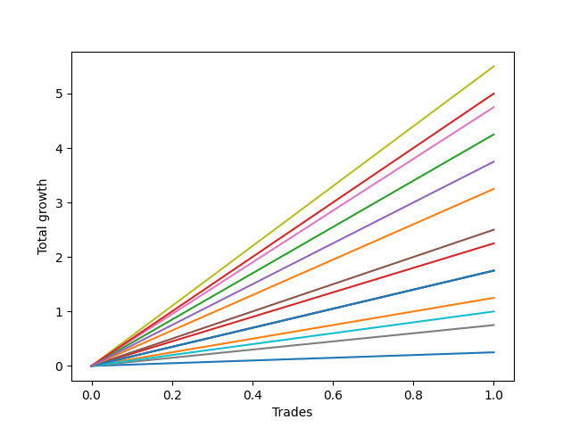

# Long Bernese 001 50 
- Symbol: ES_VM
- Date Range: 03/18/2022 - 09/30/2022
- Trading Period: 7:20-12:30
- Number of Trades: 1



| Name | Win Percent | Profit | Avg Profit / Trade | Avg Time / Trade |      | Name | Win Percent | Profit | Avg Profit / Trade | Avg Time / Trade |
| ---- | ----------- | ------ | ------------------ | ---------------- | ---- | ---- | ----------- | ------ | ------------------ | ---------------- |
| Sorted By <br> Profit | | | | | | Sorted By <br> Win Percentage ||||
| Seven | 100.00 | 2750.00 | 2750.00 | 59:55 |     | Seven | 100.00 | 2750.00 | 2750.00 | 59:55 |
| Eighty-Five | 100.00 | 2500.00 | 2500.00 | 41:10 |     | Eighty-Five | 100.00 | 2500.00 | 2500.00 | 41:10 |
| Five | 100.00 | 2375.00 | 2375.00 | 40:15 |     | Five | 100.00 | 2375.00 | 2375.00 | 40:15 |
| Eighty-Four | 100.00 | 2125.00 | 2125.00 | 39:15 |     | Eighty-Four | 100.00 | 2125.00 | 2125.00 | 39:15 |
| NEWFI 0000 | 100.00 | 1875.00 | 1875.00 | 43:05 |     | NEWFI 0000 | 100.00 | 1875.00 | 1875.00 | 43:05 |
| Eighty-Three | 100.00 | 1625.00 | 1625.00 | 39:00 |     | Eighty-Three | 100.00 | 1625.00 | 1625.00 | 39:00 |
| Four | 100.00 | 1250.00 | 1250.00 | 38:20 |     | Four | 100.00 | 1250.00 | 1250.00 | 38:20 |
| Two_C | 100.00 | 1125.00 | 1125.00 | 22:20 |     | Two_C | 100.00 | 1125.00 | 1125.00 | 22:20 |
| Eighty-Two | 100.00 | 875.00 | 875.00 | 15:05 |     | Eighty-Two | 100.00 | 875.00 | 875.00 | 15:05 |
| Three | 100.00 | 875.00 | 875.00 | 15:05 |     | Three | 100.00 | 875.00 | 875.00 | 15:05 |
| Two | 100.00 | 875.00 | 875.00 | 15:05 |     | Two | 100.00 | 875.00 | 875.00 | 15:05 |
| One | 100.00 | 625.00 | 625.00 | 13:25 |     | One | 100.00 | 625.00 | 625.00 | 13:25 |
| Eighty-One | 100.00 | 500.00 | 500.00 | 02:45 |     | Eighty-One | 100.00 | 500.00 | 500.00 | 02:45 |
| Six | 100.00 | 375.00 | 375.00 | 02:35 |     | Six | 100.00 | 375.00 | 375.00 | 02:35 |
| Zero | 100.00 | 125.00 | 125.00 | 12:30 |     | Zero | 100.00 | 125.00 | 125.00 | 12:30 |

## NO STOPLOSS

### Test Zero
* Sell when price hits the middle line of the 20p bollinger
* No Stoploss
* Results:
```
Total Trades: 1
Percent Up: 100.00
Percent Down: 0.00
Total Points Moved Up: 0.25
Potential Profit: 125.00
Total Points Ups: 0.25 Count Ups: 1
Total Points Downs: 0.00 Count Downs: 0
```

<details><summary>Trades</summary>

<code>In: 2022-08-05 11:32:00		Out: 2022-08-05 11:44:30		Total Position Time: 12:30		Total Move Up: 0.25		Total to Date: 0.25</code> <br />


</details>

### Test One
* Sell when the price hits the upper line of the 20p 1std bollinger
* No Stoploss
* Results:
```
Total Trades: 1
Percent Up: 100.00
Percent Down: 0.00
Total Points Moved Up: 1.25
Potential Profit: 625.00
Total Points Ups: 1.25 Count Ups: 1
Total Points Downs: 0.00 Count Downs: 0
```

<details><summary>Trades</summary>

<code>In: 2022-08-05 11:32:00		Out: 2022-08-05 11:45:25		Total Position Time: 13:25		Total Move Up: 1.25		Total to Date: 1.25</code> <br />


</details>

### Test Two
* Sell when the price hits the upper line of the 20p 2std bollinger
* No Stoploss
* Results:
```
Total Trades: 1
Percent Up: 100.00
Percent Down: 0.00
Total Points Moved Up: 1.75
Potential Profit: 875.00
Total Points Ups: 1.75 Count Ups: 1
Total Points Downs: 0.00 Count Downs: 0
```

<details><summary>Trades</summary>

<code>In: 2022-08-05 11:32:00		Out: 2022-08-05 11:47:05		Total Position Time: 15:05		Total Move Up: 1.75		Total to Date: 1.75</code> <br />


</details>

### Test Two_C
* Sell when the price hits the upper line of the 20p 2std bollinger
* No Stoploss
* Results:
```
Total Trades: 1
Percent Up: 100.00
Percent Down: 0.00
Total Points Moved Up: 2.25
Potential Profit: 1125.00
Total Points Ups: 2.25 Count Ups: 1
Total Points Downs: 0.00 Count Downs: 0
```

<details><summary>Trades</summary>

<code>In: 2022-08-05 11:32:00		Out: 2022-08-05 11:54:20		Total Position Time: 22:20		Total Move Up: 2.25		Total to Date: 2.25</code> <br />


</details>

### Test Three
* Sell when price hits the middle line of the 50p bollinger
* No Stoploss
* Results:
```
Total Trades: 1
Percent Up: 100.00
Percent Down: 0.00
Total Points Moved Up: 1.75
Potential Profit: 875.00
Total Points Ups: 1.75 Count Ups: 1
Total Points Downs: 0.00 Count Downs: 0
```

<details><summary>Trades</summary>

<code>In: 2022-08-05 11:32:00		Out: 2022-08-05 11:47:05		Total Position Time: 15:05		Total Move Up: 1.75		Total to Date: 1.75</code> <br />


</details>

### Test Four
* Sell when the price hits the upper line of the 50p 1std bollinger
* No Stoploss
* Results:
```
Total Trades: 1
Percent Up: 100.00
Percent Down: 0.00
Total Points Moved Up: 2.50
Potential Profit: 1250.00
Total Points Ups: 2.50 Count Ups: 1
Total Points Downs: 0.00 Count Downs: 0
```

<details><summary>Trades</summary>

<code>In: 2022-08-05 11:32:00		Out: 2022-08-05 12:10:20		Total Position Time: 38:20		Total Move Up: 2.50		Total to Date: 2.50</code> <br />


</details>

### Test Five
* Sell when the price hits the upper line of the 50p 2std bollinger
* No Stoploss
* Results:
```
Total Trades: 1
Percent Up: 100.00
Percent Down: 0.00
Total Points Moved Up: 4.75
Potential Profit: 2375.00
Total Points Ups: 4.75 Count Ups: 1
Total Points Downs: 0.00 Count Downs: 0
```

<details><summary>Trades</summary>

<code>In: 2022-08-05 11:32:00		Out: 2022-08-05 12:12:15		Total Position Time: 40:15		Total Move Up: 4.75		Total to Date: 4.75</code> <br />


</details>

### Test Six
* Sell when the price hits the middle line of the 1std VWAP
* No Stoploss
* Results:
```
Total Trades: 1
Percent Up: 100.00
Percent Down: 0.00
Total Points Moved Up: 0.75
Potential Profit: 375.00
Total Points Ups: 0.75 Count Ups: 1
Total Points Downs: 0.00 Count Downs: 0
```

<details><summary>Trades</summary>

<code>In: 2022-08-05 11:32:00		Out: 2022-08-05 11:34:35		Total Position Time: 02:35		Total Move Up: 0.75		Total to Date: 0.75</code> <br />


</details>

### Test Seven
* Sell when the price hits the upper line of the 1std VWAP
* No Stoploss
* Results:
```
Total Trades: 1
Percent Up: 100.00
Percent Down: 0.00
Total Points Moved Up: 5.50
Potential Profit: 2750.00
Total Points Ups: 5.50 Count Ups: 1
Total Points Downs: 0.00 Count Downs: 0
```

<details><summary>Trades</summary>

<code>In: 2022-08-05 11:32:00		Out: 2022-08-05 12:31:55		Total Position Time: 59:55		Total Move Up: 5.50		Total to Date: 5.50</code> <br />


</details>

## TAKE PROFIT

### Test Eighty-One
* Take Profit of 1 Point
* No Stoploss
* Results:
```
Total Trades: 1
Percent Up: 100.00
Percent Down: 0.00
Total Points Moved Up: 1.00
Potential Profit: 500.00
Total Points Ups: 1.00 Count Ups: 1
Total Points Downs: 0.00 Count Downs: 0
```

<details><summary>Trades</summary>

<code>In: 2022-08-05 11:32:00		Out: 2022-08-05 11:34:45		Total Position Time: 02:45		Total Move Up: 1.00		Total to Date: 1.00</code> <br />


</details>

### Test Eighty-Two
* Take Profit of 2 Point
* No Stoploss
* Results:
```
Total Trades: 1
Percent Up: 100.00
Percent Down: 0.00
Total Points Moved Up: 1.75
Potential Profit: 875.00
Total Points Ups: 1.75 Count Ups: 1
Total Points Downs: 0.00 Count Downs: 0
```

<details><summary>Trades</summary>

<code>In: 2022-08-05 11:32:00		Out: 2022-08-05 11:47:05		Total Position Time: 15:05		Total Move Up: 1.75		Total to Date: 1.75</code> <br />


</details>

### Test Eighty-Three
* Take Profit of 3 Point
* No Stoploss
* Results:
```
Total Trades: 1
Percent Up: 100.00
Percent Down: 0.00
Total Points Moved Up: 3.25
Potential Profit: 1625.00
Total Points Ups: 3.25 Count Ups: 1
Total Points Downs: 0.00 Count Downs: 0
```

<details><summary>Trades</summary>

<code>In: 2022-08-05 11:32:00		Out: 2022-08-05 12:11:00		Total Position Time: 39:00		Total Move Up: 3.25		Total to Date: 3.25</code> <br />


</details>

### Test Eighty-Four
* Take Profit of 4 Point
* No Stoploss
* Results:
```
Total Trades: 1
Percent Up: 100.00
Percent Down: 0.00
Total Points Moved Up: 4.25
Potential Profit: 2125.00
Total Points Ups: 4.25 Count Ups: 1
Total Points Downs: 0.00 Count Downs: 0
```

<details><summary>Trades</summary>

<code>In: 2022-08-05 11:32:00		Out: 2022-08-05 12:11:15		Total Position Time: 39:15		Total Move Up: 4.25		Total to Date: 4.25</code> <br />


</details>

### Test Eighty-Five
* Take Profit of 5 Point
* No Stoploss
* Results:
```
Total Trades: 1
Percent Up: 100.00
Percent Down: 0.00
Total Points Moved Up: 5.00
Potential Profit: 2500.00
Total Points Ups: 5.00 Count Ups: 1
Total Points Downs: 0.00 Count Downs: 0
```

<details><summary>Trades</summary>

<code>In: 2022-08-05 11:32:00		Out: 2022-08-05 12:13:10		Total Position Time: 41:10		Total Move Up: 5.00		Total to Date: 5.00</code> <br />


</details>

## Indicator Exits

### Test NEWFI 0000
* Newfi 0000
* No Stoploss
* Results:
```
Total Trades: 1
Percent Up: 100.00
Percent Down: 0.00
Total Points Moved Up: 3.75
Potential Profit: 1875.00
Total Points Ups: 3.75 Count Ups: 1
Total Points Downs: 0.00 Count Downs: 0
```

<details><summary>Trades</summary>

<code>In: 2022-08-05 11:32:00		Out: 2022-08-05 12:15:05		Total Position Time: 43:05		Total Move Up: 3.75		Total to Date: 3.75</code> <br />


</details>