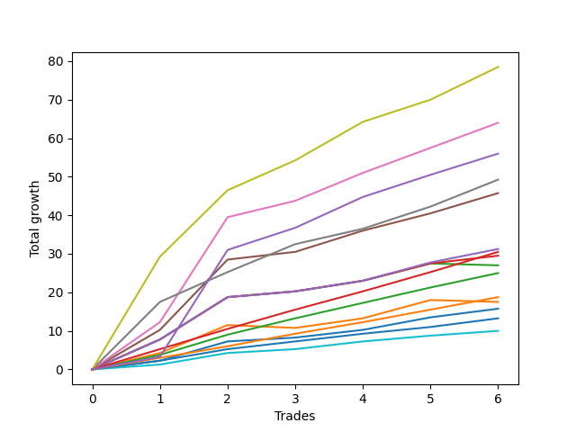

# Long Bernese 003 1v 
- Symbol: ES_VM
- Date Range: 03/18/2022 - 09/30/2022
- Trading Period: 7:20-12:30
- Number of Trades: 6



| Name | Win Percent | Profit | Avg Profit / Trade | Avg Time / Trade |      | Name | Win Percent | Profit | Avg Profit / Trade | Avg Time / Trade |
| ---- | ----------- | ------ | ------------------ | ---------------- | ---- | ---- | ----------- | ------ | ------------------ | ---------------- |
| Sorted By <br> Profit | | | | | | Sorted By <br> Win Percentage ||||
| Seven | 83.33 | 29750.00 | 4958.33 | 50:52 |     | Seven | 83.33 | 29750.00 | 4958.33 | 50:52 |
| Five | 83.33 | 22375.00 | 3729.17 | 42:24 |     | Five | 83.33 | 22375.00 | 3729.17 | 42:24 |
| NEWFI 0000 | 83.33 | 17875.00 | 2979.17 | 42:43 |     | NEWFI 0000 | 83.33 | 17875.00 | 2979.17 | 42:43 |
| Four | 83.33 | 16875.00 | 2812.50 | 35:00 |     | Four | 83.33 | 16875.00 | 2812.50 | 35:00 |
| Six | 83.33 | 15250.00 | 2541.67 | 38:33 |     | Six | 83.33 | 15250.00 | 2541.67 | 38:33 |
| Three | 83.33 | 8250.00 | 1375.00 | 25:40 |     | Three | 83.33 | 8250.00 | 1375.00 | 25:40 |
| Two_C | 83.33 | 7375.00 | 1229.17 | 31:10 |     | Two_C | 83.33 | 7375.00 | 1229.17 | 31:10 |
| Two | 83.33 | 7125.00 | 1187.50 | 26:25 |     | Two | 83.33 | 7125.00 | 1187.50 | 26:25 |
| Eighty-Five | 83.33 | 7000.00 | 1166.67 | 23:11 |     | Eighty-Five | 83.33 | 7000.00 | 1166.67 | 23:11 |
| Eighty-Four | 83.33 | 5000.00 | 833.33 | 22:40 |     | Eighty-Four | 83.33 | 5000.00 | 833.33 | 22:40 |
| One | 66.67 | 3000.00 | 500.00 | 20:50 |     | Zero | 83.33 | 2250.00 | 375.00 | 14:19 |
| Zero | 83.33 | 2250.00 | 375.00 | 14:19 |     | Eighty-Three | 83.33 | 2125.00 | 354.17 | 19:39 |
| Eighty-Three | 83.33 | 2125.00 | 354.17 | 19:39 |     | Eighty-Two | 83.33 | -125.00 | -20.83 | 12:20 |
| Eighty-Two | 83.33 | -125.00 | -20.83 | 12:20 |     | Eighty-One | 83.33 | -2000.00 | -333.33 | 11:26 |
| Eighty-One | 83.33 | -2000.00 | -333.33 | 11:26 |     | One | 66.67 | 3000.00 | 500.00 | 20:50 |

## NO STOPLOSS

### Test Zero
* Sell when price hits the middle line of the 20p bollinger
* No Stoploss
* Results:
```
Total Trades: 6
Percent Up: 83.33
Percent Down: 16.67
Total Points Moved Up: 4.50
Potential Profit: 2250.00
Total Points Ups: 15.75 Count Ups: 5
Total Points Downs: -11.25 Count Downs: 1
```

<details><summary>Trades</summary>

<code>In: 2022-05-13 11:07:00		Out: 2022-05-13 11:19:15		Total Position Time: 12:15		Total Move Up: 2.25		Total to Date: 2.25</code> <br />
<code>In: 2022-05-17 11:25:00		Out: 2022-05-17 11:27:30		Total Position Time: 02:30		Total Move Up: 8.00		Total to Date: 10.25</code> <br />
<code>In: 2022-07-08 09:45:00		Out: 2022-07-08 09:48:40		Total Position Time: 03:40		Total Move Up: 1.00		Total to Date: 11.25</code> <br />
<code>In: 2022-08-18 09:47:00		Out: 2022-08-18 09:47:30		Total Position Time: 00:30		Total Move Up: 1.25		Total to Date: 12.50</code> <br />
<code>In: 2022-08-25 09:19:00		Out: 2022-08-25 09:26:05		Total Position Time: 07:05		Total Move Up: 3.25		Total to Date: 15.75</code> <br />
<code>In: 2022-09-12 08:59:00		Out: 2022-09-12 09:58:55		Total Position Time: 59:55		Total Move Up: -11.25		Total to Date: 4.50</code> <br />


</details>

### Test One
* Sell when the price hits the upper line of the 20p 1std bollinger
* No Stoploss
* Results:
```
Total Trades: 6
Percent Up: 66.67
Percent Down: 33.33
Total Points Moved Up: 6.00
Potential Profit: 3000.00
Total Points Ups: 18.00 Count Ups: 4
Total Points Downs: -12.00 Count Downs: 2
```

<details><summary>Trades</summary>

<code>In: 2022-05-13 11:07:00		Out: 2022-05-13 11:20:00		Total Position Time: 13:00		Total Move Up: 5.75		Total to Date: 5.75</code> <br />
<code>In: 2022-05-17 11:25:00		Out: 2022-05-17 11:37:35		Total Position Time: 12:35		Total Move Up: 5.75		Total to Date: 11.50</code> <br />
<code>In: 2022-07-08 09:45:00		Out: 2022-07-08 10:06:55		Total Position Time: 21:55		Total Move Up: -0.75		Total to Date: 10.75</code> <br />
<code>In: 2022-08-18 09:47:00		Out: 2022-08-18 09:55:20		Total Position Time: 08:20		Total Move Up: 2.25		Total to Date: 13.00</code> <br />
<code>In: 2022-08-25 09:19:00		Out: 2022-08-25 09:28:20		Total Position Time: 09:20		Total Move Up: 4.25		Total to Date: 17.25</code> <br />
<code>In: 2022-09-12 08:59:00		Out: 2022-09-12 09:58:55		Total Position Time: 59:55		Total Move Up: -11.25		Total to Date: 6.00</code> <br />


</details>

### Test Two
* Sell when the price hits the upper line of the 20p 2std bollinger
* No Stoploss
* Results:
```
Total Trades: 6
Percent Up: 83.33
Percent Down: 16.67
Total Points Moved Up: 14.25
Potential Profit: 7125.00
Total Points Ups: 25.50 Count Ups: 5
Total Points Downs: -11.25 Count Downs: 1
```

<details><summary>Trades</summary>

<code>In: 2022-05-13 11:07:00		Out: 2022-05-13 11:31:20		Total Position Time: 24:20		Total Move Up: 7.75		Total to Date: 7.75</code> <br />
<code>In: 2022-05-17 11:25:00		Out: 2022-05-17 11:40:00		Total Position Time: 15:00		Total Move Up: 9.50		Total to Date: 17.25</code> <br />
<code>In: 2022-07-08 09:45:00		Out: 2022-07-08 10:10:30		Total Position Time: 25:30		Total Move Up: 1.00		Total to Date: 18.25</code> <br />
<code>In: 2022-08-18 09:47:00		Out: 2022-08-18 10:05:55		Total Position Time: 18:55		Total Move Up: 2.75		Total to Date: 21.00</code> <br />
<code>In: 2022-08-25 09:19:00		Out: 2022-08-25 09:33:55		Total Position Time: 14:55		Total Move Up: 4.50		Total to Date: 25.50</code> <br />
<code>In: 2022-09-12 08:59:00		Out: 2022-09-12 09:58:55		Total Position Time: 59:55		Total Move Up: -11.25		Total to Date: 14.25</code> <br />


</details>

### Test Two_C
* Sell when the price hits the upper line of the 20p 2std bollinger
* No Stoploss
* Results:
```
Total Trades: 6
Percent Up: 83.33
Percent Down: 16.67
Total Points Moved Up: 14.75
Potential Profit: 7375.00
Total Points Ups: 26.00 Count Ups: 5
Total Points Downs: -11.25 Count Downs: 1
```

<details><summary>Trades</summary>

<code>In: 2022-05-13 11:07:00		Out: 2022-05-13 11:31:20		Total Position Time: 24:20		Total Move Up: 7.75		Total to Date: 7.75</code> <br />
<code>In: 2022-05-17 11:25:00		Out: 2022-05-17 11:40:00		Total Position Time: 15:00		Total Move Up: 9.50		Total to Date: 17.25</code> <br />
<code>In: 2022-07-08 09:45:00		Out: 2022-07-08 10:11:05		Total Position Time: 26:05		Total Move Up: 1.50		Total to Date: 18.75</code> <br />
<code>In: 2022-08-18 09:47:00		Out: 2022-08-18 10:05:55		Total Position Time: 18:55		Total Move Up: 2.75		Total to Date: 21.50</code> <br />
<code>In: 2022-08-25 09:19:00		Out: 2022-08-25 10:01:45		Total Position Time: 42:45		Total Move Up: 4.50		Total to Date: 26.00</code> <br />
<code>In: 2022-09-12 08:59:00		Out: 2022-09-12 09:58:55		Total Position Time: 59:55		Total Move Up: -11.25		Total to Date: 14.75</code> <br />


</details>

### Test Three
* Sell when price hits the middle line of the 50p bollinger
* No Stoploss
* Results:
```
Total Trades: 6
Percent Up: 83.33
Percent Down: 16.67
Total Points Moved Up: 16.50
Potential Profit: 8250.00
Total Points Ups: 27.75 Count Ups: 5
Total Points Downs: -11.25 Count Downs: 1
```

<details><summary>Trades</summary>

<code>In: 2022-05-13 11:07:00		Out: 2022-05-13 11:31:20		Total Position Time: 24:20		Total Move Up: 7.75		Total to Date: 7.75</code> <br />
<code>In: 2022-05-17 11:25:00		Out: 2022-05-17 11:40:05		Total Position Time: 15:05		Total Move Up: 11.00		Total to Date: 18.75</code> <br />
<code>In: 2022-07-08 09:45:00		Out: 2022-07-08 10:11:05		Total Position Time: 26:05		Total Move Up: 1.50		Total to Date: 20.25</code> <br />
<code>In: 2022-08-18 09:47:00		Out: 2022-08-18 10:06:05		Total Position Time: 19:05		Total Move Up: 2.75		Total to Date: 23.00</code> <br />
<code>In: 2022-08-25 09:19:00		Out: 2022-08-25 09:28:30		Total Position Time: 09:30		Total Move Up: 4.75		Total to Date: 27.75</code> <br />
<code>In: 2022-09-12 08:59:00		Out: 2022-09-12 09:58:55		Total Position Time: 59:55		Total Move Up: -11.25		Total to Date: 16.50</code> <br />


</details>

### Test Four
* Sell when the price hits the upper line of the 50p 1std bollinger
* No Stoploss
* Results:
```
Total Trades: 6
Percent Up: 83.33
Percent Down: 16.67
Total Points Moved Up: 33.75
Potential Profit: 16875.00
Total Points Ups: 45.00 Count Ups: 5
Total Points Downs: -11.25 Count Downs: 1
```

<details><summary>Trades</summary>

<code>In: 2022-05-13 11:07:00		Out: 2022-05-13 11:32:00		Total Position Time: 25:00		Total Move Up: 15.75		Total to Date: 15.75</code> <br />
<code>In: 2022-05-17 11:25:00		Out: 2022-05-17 11:44:30		Total Position Time: 19:30		Total Move Up: 18.25		Total to Date: 34.00</code> <br />
<code>In: 2022-07-08 09:45:00		Out: 2022-07-08 10:26:30		Total Position Time: 41:30		Total Move Up: 2.00		Total to Date: 36.00</code> <br />
<code>In: 2022-08-18 09:47:00		Out: 2022-08-18 10:08:25		Total Position Time: 21:25		Total Move Up: 4.50		Total to Date: 40.50</code> <br />
<code>In: 2022-08-25 09:19:00		Out: 2022-08-25 10:01:45		Total Position Time: 42:45		Total Move Up: 4.50		Total to Date: 45.00</code> <br />
<code>In: 2022-09-12 08:59:00		Out: 2022-09-12 09:58:55		Total Position Time: 59:55		Total Move Up: -11.25		Total to Date: 33.75</code> <br />


</details>

### Test Five
* Sell when the price hits the upper line of the 50p 2std bollinger
* No Stoploss
* Results:
```
Total Trades: 6
Percent Up: 83.33
Percent Down: 16.67
Total Points Moved Up: 44.75
Potential Profit: 22375.00
Total Points Ups: 56.00 Count Ups: 5
Total Points Downs: -11.25 Count Downs: 1
```

<details><summary>Trades</summary>

<code>In: 2022-05-13 11:07:00		Out: 2022-05-13 11:51:15		Total Position Time: 44:15		Total Move Up: 12.50		Total to Date: 12.50</code> <br />
<code>In: 2022-05-17 11:25:00		Out: 2022-05-17 11:48:45		Total Position Time: 23:45		Total Move Up: 27.75		Total to Date: 40.25</code> <br />
<code>In: 2022-07-08 09:45:00		Out: 2022-07-08 10:26:55		Total Position Time: 41:55		Total Move Up: 3.25		Total to Date: 43.50</code> <br />
<code>In: 2022-08-18 09:47:00		Out: 2022-08-18 10:11:40		Total Position Time: 24:40		Total Move Up: 7.25		Total to Date: 50.75</code> <br />
<code>In: 2022-08-25 09:19:00		Out: 2022-08-25 10:18:55		Total Position Time: 59:55		Total Move Up: 5.25		Total to Date: 56.00</code> <br />
<code>In: 2022-09-12 08:59:00		Out: 2022-09-12 09:58:55		Total Position Time: 59:55		Total Move Up: -11.25		Total to Date: 44.75</code> <br />


</details>

### Test Six
* Sell when the price hits the middle line of the 1std VWAP
* No Stoploss
* Results:
```
Total Trades: 6
Percent Up: 83.33
Percent Down: 16.67
Total Points Moved Up: 30.50
Potential Profit: 15250.00
Total Points Ups: 41.75 Count Ups: 5
Total Points Downs: -11.25 Count Downs: 1
```

<details><summary>Trades</summary>

<code>In: 2022-05-13 11:07:00		Out: 2022-05-13 11:52:25		Total Position Time: 45:25		Total Move Up: 17.50		Total to Date: 17.50</code> <br />
<code>In: 2022-05-17 11:25:00		Out: 2022-05-17 11:27:25		Total Position Time: 02:25		Total Move Up: 7.75		Total to Date: 25.25</code> <br />
<code>In: 2022-07-08 09:45:00		Out: 2022-07-08 10:29:10		Total Position Time: 44:10		Total Move Up: 7.25		Total to Date: 32.50</code> <br />
<code>In: 2022-08-18 09:47:00		Out: 2022-08-18 10:06:30		Total Position Time: 19:30		Total Move Up: 4.00		Total to Date: 36.50</code> <br />
<code>In: 2022-08-25 09:19:00		Out: 2022-08-25 10:18:55		Total Position Time: 59:55		Total Move Up: 5.25		Total to Date: 41.75</code> <br />
<code>In: 2022-09-12 08:59:00		Out: 2022-09-12 09:58:55		Total Position Time: 59:55		Total Move Up: -11.25		Total to Date: 30.50</code> <br />


</details>

### Test Seven
* Sell when the price hits the upper line of the 1std VWAP
* No Stoploss
* Results:
```
Total Trades: 6
Percent Up: 83.33
Percent Down: 16.67
Total Points Moved Up: 59.50
Potential Profit: 29750.00
Total Points Ups: 70.75 Count Ups: 5
Total Points Downs: -11.25 Count Downs: 1
```

<details><summary>Trades</summary>

<code>In: 2022-05-13 11:07:00		Out: 2022-05-13 12:06:55		Total Position Time: 59:55		Total Move Up: 29.75		Total to Date: 29.75</code> <br />
<code>In: 2022-05-17 11:25:00		Out: 2022-05-17 11:40:20		Total Position Time: 15:20		Total Move Up: 17.25		Total to Date: 47.00</code> <br />
<code>In: 2022-07-08 09:45:00		Out: 2022-07-08 10:44:55		Total Position Time: 59:55		Total Move Up: 8.50		Total to Date: 55.50</code> <br />
<code>In: 2022-08-18 09:47:00		Out: 2022-08-18 10:37:15		Total Position Time: 50:15		Total Move Up: 10.00		Total to Date: 65.50</code> <br />
<code>In: 2022-08-25 09:19:00		Out: 2022-08-25 10:18:55		Total Position Time: 59:55		Total Move Up: 5.25		Total to Date: 70.75</code> <br />
<code>In: 2022-09-12 08:59:00		Out: 2022-09-12 09:58:55		Total Position Time: 59:55		Total Move Up: -11.25		Total to Date: 59.50</code> <br />


</details>

## TAKE PROFIT

### Test Eighty-One
* Take Profit of 1 Point
* No Stoploss
* Results:
```
Total Trades: 6
Percent Up: 83.33
Percent Down: 16.67
Total Points Moved Up: -4.00
Potential Profit: -2000.00
Total Points Ups: 7.25 Count Ups: 5
Total Points Downs: -11.25 Count Downs: 1
```

<details><summary>Trades</summary>

<code>In: 2022-05-13 11:07:00		Out: 2022-05-13 11:09:25		Total Position Time: 02:25		Total Move Up: 1.25		Total to Date: 1.25</code> <br />
<code>In: 2022-05-17 11:25:00		Out: 2022-05-17 11:26:40		Total Position Time: 01:40		Total Move Up: 3.00		Total to Date: 4.25</code> <br />
<code>In: 2022-07-08 09:45:00		Out: 2022-07-08 09:48:40		Total Position Time: 03:40		Total Move Up: 1.00		Total to Date: 5.25</code> <br />
<code>In: 2022-08-18 09:47:00		Out: 2022-08-18 09:47:15		Total Position Time: 00:15		Total Move Up: 1.00		Total to Date: 6.25</code> <br />
<code>In: 2022-08-25 09:19:00		Out: 2022-08-25 09:19:45		Total Position Time: 00:45		Total Move Up: 1.00		Total to Date: 7.25</code> <br />
<code>In: 2022-09-12 08:59:00		Out: 2022-09-12 09:58:55		Total Position Time: 59:55		Total Move Up: -11.25		Total to Date: -4.00</code> <br />


</details>

### Test Eighty-Two
* Take Profit of 2 Point
* No Stoploss
* Results:
```
Total Trades: 6
Percent Up: 83.33
Percent Down: 16.67
Total Points Moved Up: -0.25
Potential Profit: -125.00
Total Points Ups: 11.00 Count Ups: 5
Total Points Downs: -11.25 Count Downs: 1
```

<details><summary>Trades</summary>

<code>In: 2022-05-13 11:07:00		Out: 2022-05-13 11:09:30		Total Position Time: 02:30		Total Move Up: 2.25		Total to Date: 2.25</code> <br />
<code>In: 2022-05-17 11:25:00		Out: 2022-05-17 11:26:40		Total Position Time: 01:40		Total Move Up: 3.00		Total to Date: 5.25</code> <br />
<code>In: 2022-07-08 09:45:00		Out: 2022-07-08 09:49:45		Total Position Time: 04:45		Total Move Up: 2.00		Total to Date: 7.25</code> <br />
<code>In: 2022-08-18 09:47:00		Out: 2022-08-18 09:48:10		Total Position Time: 01:10		Total Move Up: 2.00		Total to Date: 9.25</code> <br />
<code>In: 2022-08-25 09:19:00		Out: 2022-08-25 09:23:00		Total Position Time: 04:00		Total Move Up: 1.75		Total to Date: 11.00</code> <br />
<code>In: 2022-09-12 08:59:00		Out: 2022-09-12 09:58:55		Total Position Time: 59:55		Total Move Up: -11.25		Total to Date: -0.25</code> <br />


</details>

### Test Eighty-Three
* Take Profit of 3 Point
* No Stoploss
* Results:
```
Total Trades: 6
Percent Up: 83.33
Percent Down: 16.67
Total Points Moved Up: 4.25
Potential Profit: 2125.00
Total Points Ups: 15.50 Count Ups: 5
Total Points Downs: -11.25 Count Downs: 1
```

<details><summary>Trades</summary>

<code>In: 2022-05-13 11:07:00		Out: 2022-05-13 11:09:35		Total Position Time: 02:35		Total Move Up: 3.00		Total to Date: 3.00</code> <br />
<code>In: 2022-05-17 11:25:00		Out: 2022-05-17 11:26:40		Total Position Time: 01:40		Total Move Up: 3.00		Total to Date: 6.00</code> <br />
<code>In: 2022-07-08 09:45:00		Out: 2022-07-08 10:12:25		Total Position Time: 27:25		Total Move Up: 3.25		Total to Date: 9.25</code> <br />
<code>In: 2022-08-18 09:47:00		Out: 2022-08-18 10:06:15		Total Position Time: 19:15		Total Move Up: 3.00		Total to Date: 12.25</code> <br />
<code>In: 2022-08-25 09:19:00		Out: 2022-08-25 09:26:05		Total Position Time: 07:05		Total Move Up: 3.25		Total to Date: 15.50</code> <br />
<code>In: 2022-09-12 08:59:00		Out: 2022-09-12 09:58:55		Total Position Time: 59:55		Total Move Up: -11.25		Total to Date: 4.25</code> <br />


</details>

### Test Eighty-Four
* Take Profit of 4 Point
* No Stoploss
* Results:
```
Total Trades: 6
Percent Up: 83.33
Percent Down: 16.67
Total Points Moved Up: 10.00
Potential Profit: 5000.00
Total Points Ups: 21.25 Count Ups: 5
Total Points Downs: -11.25 Count Downs: 1
```

<details><summary>Trades</summary>

<code>In: 2022-05-13 11:07:00		Out: 2022-05-13 11:10:20		Total Position Time: 03:20		Total Move Up: 3.75		Total to Date: 3.75</code> <br />
<code>In: 2022-05-17 11:25:00		Out: 2022-05-17 11:27:05		Total Position Time: 02:05		Total Move Up: 5.25		Total to Date: 9.00</code> <br />
<code>In: 2022-07-08 09:45:00		Out: 2022-07-08 10:27:00		Total Position Time: 42:00		Total Move Up: 4.25		Total to Date: 13.25</code> <br />
<code>In: 2022-08-18 09:47:00		Out: 2022-08-18 10:06:30		Total Position Time: 19:30		Total Move Up: 4.00		Total to Date: 17.25</code> <br />
<code>In: 2022-08-25 09:19:00		Out: 2022-08-25 09:28:15		Total Position Time: 09:15		Total Move Up: 4.00		Total to Date: 21.25</code> <br />
<code>In: 2022-09-12 08:59:00		Out: 2022-09-12 09:58:55		Total Position Time: 59:55		Total Move Up: -11.25		Total to Date: 10.00</code> <br />


</details>

### Test Eighty-Five
* Take Profit of 5 Point
* No Stoploss
* Results:
```
Total Trades: 6
Percent Up: 83.33
Percent Down: 16.67
Total Points Moved Up: 14.00
Potential Profit: 7000.00
Total Points Ups: 25.25 Count Ups: 5
Total Points Downs: -11.25 Count Downs: 1
```

<details><summary>Trades</summary>

<code>In: 2022-05-13 11:07:00		Out: 2022-05-13 11:10:50		Total Position Time: 03:50		Total Move Up: 5.25		Total to Date: 5.25</code> <br />
<code>In: 2022-05-17 11:25:00		Out: 2022-05-17 11:27:05		Total Position Time: 02:05		Total Move Up: 5.25		Total to Date: 10.50</code> <br />
<code>In: 2022-07-08 09:45:00		Out: 2022-07-08 10:28:10		Total Position Time: 43:10		Total Move Up: 5.00		Total to Date: 15.50</code> <br />
<code>In: 2022-08-18 09:47:00		Out: 2022-08-18 10:07:35		Total Position Time: 20:35		Total Move Up: 4.75		Total to Date: 20.25</code> <br />
<code>In: 2022-08-25 09:19:00		Out: 2022-08-25 09:28:35		Total Position Time: 09:35		Total Move Up: 5.00		Total to Date: 25.25</code> <br />
<code>In: 2022-09-12 08:59:00		Out: 2022-09-12 09:58:55		Total Position Time: 59:55		Total Move Up: -11.25		Total to Date: 14.00</code> <br />


</details>

## Indicator Exits

### Test NEWFI 0000
* Newfi 0000
* No Stoploss
* Results:
```
Total Trades: 6
Percent Up: 83.33
Percent Down: 16.67
Total Points Moved Up: 35.75
Potential Profit: 17875.00
Total Points Ups: 49.75 Count Ups: 5
Total Points Downs: -14.00 Count Downs: 1
```

<details><summary>Trades</summary>

<code>In: 2022-05-13 11:07:00		Out: 2022-05-13 11:46:05		Total Position Time: 39:05		Total Move Up: 6.25		Total to Date: 6.25</code> <br />
<code>In: 2022-05-17 11:25:00		Out: 2022-05-17 11:51:05		Total Position Time: 26:05		Total Move Up: 25.25		Total to Date: 31.50</code> <br />
<code>In: 2022-07-08 09:45:00		Out: 2022-07-08 10:31:05		Total Position Time: 46:05		Total Move Up: 5.50		Total to Date: 37.00</code> <br />
<code>In: 2022-08-18 09:47:00		Out: 2022-08-18 10:30:05		Total Position Time: 43:05		Total Move Up: 7.50		Total to Date: 44.50</code> <br />
<code>In: 2022-08-25 09:19:00		Out: 2022-08-25 10:18:55		Total Position Time: 59:55		Total Move Up: 5.25		Total to Date: 49.75</code> <br />
<code>In: 2022-09-12 08:59:00		Out: 2022-09-12 09:41:05		Total Position Time: 42:05		Total Move Up: -14.00		Total to Date: 35.75</code> <br />


</details>