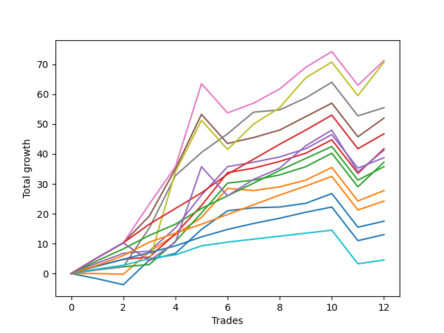

# Long Bernese 003 50 
- Symbol: ES_VM
- Date Range: 03/18/2022 - 09/30/2022
- Trading Period: 7:20-12:30
- Number of Trades: 12



| Name | Win Percent | Profit | Avg Profit / Trade | Avg Time / Trade |      | Name | Win Percent | Profit | Avg Profit / Trade | Avg Time / Trade |
| ---- | ----------- | ------ | ------------------ | ---------------- | ---- | ---- | ----------- | ------ | ------------------ | ---------------- |
| Sorted By <br> Profit | | | | | | Sorted By <br> Win Percentage ||||
| Seven | 83.33 | 48375.00 | 4031.25 | 47:27 |     | Six | 100.00 | 37125.00 | 3093.75 | 24:54 |
| Five | 91.67 | 47625.00 | 3968.75 | 36:23 |     | Eighty-Five | 100.00 | 31625.00 | 2635.42 | 16:42 |
| Six | 100.00 | 37125.00 | 3093.75 | 24:54 |     | Two_C | 100.00 | 28250.00 | 2354.17 | 23:19 |
| NEWFI 0000 | 83.33 | 36000.00 | 3000.00 | 42:06 |     | Three | 100.00 | 28000.00 | 2333.33 | 19:10 |
| Four | 91.67 | 34875.00 | 2906.25 | 32:59 |     | Eighty-Four | 100.00 | 25500.00 | 2125.00 | 16:01 |
| Eighty-Five | 100.00 | 31625.00 | 2635.42 | 16:42 |     | Eighty-Three | 100.00 | 19500.00 | 1625.00 | 13:25 |
| Two_C | 100.00 | 28250.00 | 2354.17 | 23:19 |     | Eighty-Two | 100.00 | 14250.00 | 1187.50 | 06:18 |
| Three | 100.00 | 28000.00 | 2333.33 | 19:10 |     | Eighty-One | 100.00 | 10625.00 | 885.42 | 04:53 |
| Eighty-Four | 100.00 | 25500.00 | 2125.00 | 16:01 |     | Five | 91.67 | 47625.00 | 3968.75 | 36:23 |
| Two | 91.67 | 25000.00 | 2083.33 | 20:47 |     | Four | 91.67 | 34875.00 | 2906.25 | 32:59 |
| Eighty-Three | 100.00 | 19500.00 | 1625.00 | 13:25 |     | Two | 91.67 | 25000.00 | 2083.33 | 20:47 |
| One | 83.33 | 16375.00 | 1364.58 | 15:47 |     | Seven | 83.33 | 48375.00 | 4031.25 | 47:27 |
| Zero | 83.33 | 14875.00 | 1239.58 | 06:58 |     | NEWFI 0000 | 83.33 | 36000.00 | 3000.00 | 42:06 |
| Eighty-Two | 100.00 | 14250.00 | 1187.50 | 06:18 |     | One | 83.33 | 16375.00 | 1364.58 | 15:47 |
| Eighty-One | 100.00 | 10625.00 | 885.42 | 04:53 |     | Zero | 83.33 | 14875.00 | 1239.58 | 06:58 |

## NO STOPLOSS

### Test Zero
* Sell when price hits the middle line of the 20p bollinger
* No Stoploss
* Results:
```
Total Trades: 12
Percent Up: 83.33
Percent Down: 16.67
Total Points Moved Up: 29.75
Potential Profit: 14875.00
Total Points Ups: 32.50 Count Ups: 10
Total Points Downs: -2.75 Count Downs: 2
```

<details><summary>Trades</summary>

<code>In: 2022-03-25 12:25:00		Out: 2022-03-25 12:37:10		Total Position Time: 12:10		Total Move Up: -1.25		Total to Date: -1.25</code> <br />
<code>In: 2022-03-25 12:26:00		Out: 2022-03-25 12:37:10		Total Position Time: 11:10		Total Move Up: -1.50		Total to Date: -2.75</code> <br />
<code>In: 2022-05-06 11:11:00		Out: 2022-05-06 11:12:20		Total Position Time: 01:20		Total Move Up: 8.25		Total to Date: 5.50</code> <br />
<code>In: 2022-05-13 11:07:00		Out: 2022-05-13 11:19:15		Total Position Time: 12:15		Total Move Up: 2.25		Total to Date: 7.75</code> <br />
<code>In: 2022-05-17 11:25:00		Out: 2022-05-17 11:31:35		Total Position Time: 06:35		Total Move Up: 5.00		Total to Date: 12.75</code> <br />
<code>In: 2022-05-25 08:40:00		Out: 2022-05-25 08:44:05		Total Position Time: 04:05		Total Move Up: 6.25		Total to Date: 19.00</code> <br />
<code>In: 2022-07-08 09:45:00		Out: 2022-07-08 09:49:05		Total Position Time: 04:05		Total Move Up: 1.00		Total to Date: 20.00</code> <br />
<code>In: 2022-08-05 11:32:00		Out: 2022-08-05 11:44:30		Total Position Time: 12:30		Total Move Up: 0.25		Total to Date: 20.25</code> <br />
<code>In: 2022-08-18 09:47:00		Out: 2022-08-18 09:48:10		Total Position Time: 01:10		Total Move Up: 2.00		Total to Date: 22.25</code> <br />
<code>In: 2022-08-25 09:19:00		Out: 2022-08-25 09:26:05		Total Position Time: 07:05		Total Move Up: 3.25		Total to Date: 25.50</code> <br />
<code>In: 2022-09-12 08:59:00		Out: 2022-09-12 09:08:15		Total Position Time: 09:15		Total Move Up: 2.25		Total to Date: 27.75</code> <br />
<code>In: 2022-09-19 11:26:00		Out: 2022-09-19 11:28:05		Total Position Time: 02:05		Total Move Up: 2.00		Total to Date: 29.75</code> <br />


</details>

### Test One
* Sell when the price hits the upper line of the 20p 1std bollinger
* No Stoploss
* Results:
```
Total Trades: 12
Percent Up: 83.33
Percent Down: 16.67
Total Points Moved Up: 32.75
Potential Profit: 16375.00
Total Points Ups: 34.00 Count Ups: 10
Total Points Downs: -1.25 Count Downs: 2
```

<details><summary>Trades</summary>

<code>In: 2022-03-25 12:25:00		Out: 2022-03-25 12:40:55		Total Position Time: 15:55		Total Move Up: 0.50		Total to Date: 0.50</code> <br />
<code>In: 2022-03-25 12:26:00		Out: 2022-03-25 12:40:55		Total Position Time: 14:55		Total Move Up: 0.25		Total to Date: 0.75</code> <br />
<code>In: 2022-05-06 11:11:00		Out: 2022-05-06 11:49:10		Total Position Time: 38:10		Total Move Up: 0.75		Total to Date: 1.50</code> <br />
<code>In: 2022-05-13 11:07:00		Out: 2022-05-13 11:20:05		Total Position Time: 13:05		Total Move Up: 4.25		Total to Date: 5.75</code> <br />
<code>In: 2022-05-17 11:25:00		Out: 2022-05-17 11:39:45		Total Position Time: 14:45		Total Move Up: 7.25		Total to Date: 13.00</code> <br />
<code>In: 2022-05-25 08:40:00		Out: 2022-05-25 08:50:50		Total Position Time: 10:50		Total Move Up: 9.25		Total to Date: 22.25</code> <br />
<code>In: 2022-07-08 09:45:00		Out: 2022-07-08 10:06:55		Total Position Time: 21:55		Total Move Up: -0.75		Total to Date: 21.50</code> <br />
<code>In: 2022-08-05 11:32:00		Out: 2022-08-05 11:46:50		Total Position Time: 14:50		Total Move Up: 1.00		Total to Date: 22.50</code> <br />
<code>In: 2022-08-18 09:47:00		Out: 2022-08-18 09:55:25		Total Position Time: 08:25		Total Move Up: 2.50		Total to Date: 25.00</code> <br />
<code>In: 2022-08-25 09:19:00		Out: 2022-08-25 09:28:30		Total Position Time: 09:30		Total Move Up: 4.75		Total to Date: 29.75</code> <br />
<code>In: 2022-09-12 08:59:00		Out: 2022-09-12 09:21:25		Total Position Time: 22:25		Total Move Up: -0.50		Total to Date: 29.25</code> <br />
<code>In: 2022-09-19 11:26:00		Out: 2022-09-19 11:30:40		Total Position Time: 04:40		Total Move Up: 3.50		Total to Date: 32.75</code> <br />


</details>

### Test Two
* Sell when the price hits the upper line of the 20p 2std bollinger
* No Stoploss
* Results:
```
Total Trades: 12
Percent Up: 91.67
Percent Down: 8.33
Total Points Moved Up: 50.00
Potential Profit: 25000.00
Total Points Ups: 50.50 Count Ups: 11
Total Points Downs: -0.50 Count Downs: 1
```

<details><summary>Trades</summary>

<code>In: 2022-03-25 12:25:00		Out: 2022-03-25 12:41:35		Total Position Time: 16:35		Total Move Up: 1.25		Total to Date: 1.25</code> <br />
<code>In: 2022-03-25 12:26:00		Out: 2022-03-25 12:41:35		Total Position Time: 15:35		Total Move Up: 1.00		Total to Date: 2.25</code> <br />
<code>In: 2022-05-06 11:11:00		Out: 2022-05-06 11:49:10		Total Position Time: 38:10		Total Move Up: 0.75		Total to Date: 3.00</code> <br />
<code>In: 2022-05-13 11:07:00		Out: 2022-05-13 11:31:20		Total Position Time: 24:20		Total Move Up: 7.75		Total to Date: 10.75</code> <br />
<code>In: 2022-05-17 11:25:00		Out: 2022-05-17 11:40:05		Total Position Time: 15:05		Total Move Up: 11.00		Total to Date: 21.75</code> <br />
<code>In: 2022-05-25 08:40:00		Out: 2022-05-25 09:02:20		Total Position Time: 22:20		Total Move Up: 10.00		Total to Date: 31.75</code> <br />
<code>In: 2022-07-08 09:45:00		Out: 2022-07-08 10:11:05		Total Position Time: 26:05		Total Move Up: 1.50		Total to Date: 33.25</code> <br />
<code>In: 2022-08-05 11:32:00		Out: 2022-08-05 11:54:15		Total Position Time: 22:15		Total Move Up: 1.75		Total to Date: 35.00</code> <br />
<code>In: 2022-08-18 09:47:00		Out: 2022-08-18 10:06:05		Total Position Time: 19:05		Total Move Up: 2.75		Total to Date: 37.75</code> <br />
<code>In: 2022-08-25 09:19:00		Out: 2022-08-25 09:33:55		Total Position Time: 14:55		Total Move Up: 4.50		Total to Date: 42.25</code> <br />
<code>In: 2022-09-12 08:59:00		Out: 2022-09-12 09:21:25		Total Position Time: 22:25		Total Move Up: -0.50		Total to Date: 41.75</code> <br />
<code>In: 2022-09-19 11:26:00		Out: 2022-09-19 11:38:35		Total Position Time: 12:35		Total Move Up: 8.25		Total to Date: 50.00</code> <br />


</details>

### Test Two_C
* Sell when the price hits the upper line of the 20p 2std bollinger
* No Stoploss
* Results:
```
Total Trades: 12
Percent Up: 100.00
Percent Down: 0.00
Total Points Moved Up: 56.50
Potential Profit: 28250.00
Total Points Ups: 56.50 Count Ups: 12
Total Points Downs: 0.00 Count Downs: 0
```

<details><summary>Trades</summary>

<code>In: 2022-03-25 12:25:00		Out: 2022-03-25 12:41:55		Total Position Time: 16:55		Total Move Up: 2.50		Total to Date: 2.50</code> <br />
<code>In: 2022-03-25 12:26:00		Out: 2022-03-25 12:41:55		Total Position Time: 15:55		Total Move Up: 2.25		Total to Date: 4.75</code> <br />
<code>In: 2022-05-06 11:11:00		Out: 2022-05-06 11:49:10		Total Position Time: 38:10		Total Move Up: 0.75		Total to Date: 5.50</code> <br />
<code>In: 2022-05-13 11:07:00		Out: 2022-05-13 11:31:20		Total Position Time: 24:20		Total Move Up: 7.75		Total to Date: 13.25</code> <br />
<code>In: 2022-05-17 11:25:00		Out: 2022-05-17 11:40:05		Total Position Time: 15:05		Total Move Up: 11.00		Total to Date: 24.25</code> <br />
<code>In: 2022-05-25 08:40:00		Out: 2022-05-25 09:02:30		Total Position Time: 22:30		Total Move Up: 11.00		Total to Date: 35.25</code> <br />
<code>In: 2022-07-08 09:45:00		Out: 2022-07-08 10:11:05		Total Position Time: 26:05		Total Move Up: 1.50		Total to Date: 36.75</code> <br />
<code>In: 2022-08-05 11:32:00		Out: 2022-08-05 11:54:20		Total Position Time: 22:20		Total Move Up: 2.25		Total to Date: 39.00</code> <br />
<code>In: 2022-08-18 09:47:00		Out: 2022-08-18 10:06:05		Total Position Time: 19:05		Total Move Up: 2.75		Total to Date: 41.75</code> <br />
<code>In: 2022-08-25 09:19:00		Out: 2022-08-25 10:01:45		Total Position Time: 42:45		Total Move Up: 4.50		Total to Date: 46.25</code> <br />
<code>In: 2022-09-12 08:59:00		Out: 2022-09-12 09:23:10		Total Position Time: 24:10		Total Move Up: 2.00		Total to Date: 48.25</code> <br />
<code>In: 2022-09-19 11:26:00		Out: 2022-09-19 11:38:35		Total Position Time: 12:35		Total Move Up: 8.25		Total to Date: 56.50</code> <br />


</details>

### Test Three
* Sell when price hits the middle line of the 50p bollinger
* No Stoploss
* Results:
```
Total Trades: 12
Percent Up: 100.00
Percent Down: 0.00
Total Points Moved Up: 56.00
Potential Profit: 28000.00
Total Points Ups: 56.00 Count Ups: 12
Total Points Downs: 0.00 Count Downs: 0
```

<details><summary>Trades</summary>

<code>In: 2022-03-25 12:25:00		Out: 2022-03-25 12:42:40		Total Position Time: 17:40		Total Move Up: 4.25		Total to Date: 4.25</code> <br />
<code>In: 2022-03-25 12:26:00		Out: 2022-03-25 12:42:40		Total Position Time: 16:40		Total Move Up: 4.00		Total to Date: 8.25</code> <br />
<code>In: 2022-05-06 11:11:00		Out: 2022-05-06 11:49:15		Total Position Time: 38:15		Total Move Up: 0.50		Total to Date: 8.75</code> <br />
<code>In: 2022-05-13 11:07:00		Out: 2022-05-13 11:31:20		Total Position Time: 24:20		Total Move Up: 7.75		Total to Date: 16.50</code> <br />
<code>In: 2022-05-17 11:25:00		Out: 2022-05-17 11:40:05		Total Position Time: 15:05		Total Move Up: 11.00		Total to Date: 27.50</code> <br />
<code>In: 2022-05-25 08:40:00		Out: 2022-05-25 08:58:25		Total Position Time: 18:25		Total Move Up: 10.75		Total to Date: 38.25</code> <br />
<code>In: 2022-07-08 09:45:00		Out: 2022-07-08 10:11:10		Total Position Time: 26:10		Total Move Up: 1.50		Total to Date: 39.75</code> <br />
<code>In: 2022-08-05 11:32:00		Out: 2022-08-05 11:47:05		Total Position Time: 15:05		Total Move Up: 1.75		Total to Date: 41.50</code> <br />
<code>In: 2022-08-18 09:47:00		Out: 2022-08-18 10:06:05		Total Position Time: 19:05		Total Move Up: 2.75		Total to Date: 44.25</code> <br />
<code>In: 2022-08-25 09:19:00		Out: 2022-08-25 09:28:30		Total Position Time: 09:30		Total Move Up: 4.75		Total to Date: 49.00</code> <br />
<code>In: 2022-09-12 08:59:00		Out: 2022-09-12 09:24:10		Total Position Time: 25:10		Total Move Up: 3.50		Total to Date: 52.50</code> <br />
<code>In: 2022-09-19 11:26:00		Out: 2022-09-19 11:30:40		Total Position Time: 04:40		Total Move Up: 3.50		Total to Date: 56.00</code> <br />


</details>

### Test Four
* Sell when the price hits the upper line of the 50p 1std bollinger
* No Stoploss
* Results:
```
Total Trades: 12
Percent Up: 91.67
Percent Down: 8.33
Total Points Moved Up: 69.75
Potential Profit: 34875.00
Total Points Ups: 79.00 Count Ups: 11
Total Points Downs: -9.25 Count Downs: 1
```

<details><summary>Trades</summary>

<code>In: 2022-03-25 12:25:00		Out: 2022-03-25 12:47:00		Total Position Time: 22:00		Total Move Up: 7.25		Total to Date: 7.25</code> <br />
<code>In: 2022-03-25 12:26:00		Out: 2022-03-25 12:47:00		Total Position Time: 21:00		Total Move Up: 7.00		Total to Date: 14.25</code> <br />
<code>In: 2022-05-06 11:11:00		Out: 2022-05-06 11:50:10		Total Position Time: 39:10		Total Move Up: 9.00		Total to Date: 23.25</code> <br />
<code>In: 2022-05-13 11:07:00		Out: 2022-05-13 11:43:05		Total Position Time: 36:05		Total Move Up: 10.25		Total to Date: 33.50</code> <br />
<code>In: 2022-05-17 11:25:00		Out: 2022-05-17 11:44:30		Total Position Time: 19:30		Total Move Up: 18.25		Total to Date: 51.75</code> <br />
<code>In: 2022-05-25 08:40:00		Out: 2022-05-25 09:40:55		Total Position Time: 60:55		Total Move Up: -9.25		Total to Date: 42.50</code> <br />
<code>In: 2022-07-08 09:45:00		Out: 2022-07-08 10:26:30		Total Position Time: 41:30		Total Move Up: 2.00		Total to Date: 44.50</code> <br />
<code>In: 2022-08-05 11:32:00		Out: 2022-08-05 12:11:00		Total Position Time: 39:00		Total Move Up: 3.25		Total to Date: 47.75</code> <br />
<code>In: 2022-08-18 09:47:00		Out: 2022-08-18 10:09:35		Total Position Time: 22:35		Total Move Up: 5.50		Total to Date: 53.25</code> <br />
<code>In: 2022-08-25 09:19:00		Out: 2022-08-25 10:01:45		Total Position Time: 42:45		Total Move Up: 4.50		Total to Date: 57.75</code> <br />
<code>In: 2022-09-12 08:59:00		Out: 2022-09-12 09:37:50		Total Position Time: 38:50		Total Move Up: 5.25		Total to Date: 63.00</code> <br />
<code>In: 2022-09-19 11:26:00		Out: 2022-09-19 11:38:30		Total Position Time: 12:30		Total Move Up: 6.75		Total to Date: 69.75</code> <br />


</details>

### Test Five
* Sell when the price hits the upper line of the 50p 2std bollinger
* No Stoploss
* Results:
```
Total Trades: 12
Percent Up: 91.67
Percent Down: 8.33
Total Points Moved Up: 95.25
Potential Profit: 47625.00
Total Points Ups: 104.50 Count Ups: 11
Total Points Downs: -9.25 Count Downs: 1
```

<details><summary>Trades</summary>

<code>In: 2022-03-25 12:25:00		Out: 2022-03-25 12:47:00		Total Position Time: 22:00		Total Move Up: 7.25		Total to Date: 7.25</code> <br />
<code>In: 2022-03-25 12:26:00		Out: 2022-03-25 12:47:00		Total Position Time: 21:00		Total Move Up: 7.00		Total to Date: 14.25</code> <br />
<code>In: 2022-05-06 11:11:00		Out: 2022-05-06 11:50:35		Total Position Time: 39:35		Total Move Up: 13.00		Total to Date: 27.25</code> <br />
<code>In: 2022-05-13 11:07:00		Out: 2022-05-13 11:51:10		Total Position Time: 44:10		Total Move Up: 12.25		Total to Date: 39.50</code> <br />
<code>In: 2022-05-17 11:25:00		Out: 2022-05-17 11:48:40		Total Position Time: 23:40		Total Move Up: 27.25		Total to Date: 66.75</code> <br />
<code>In: 2022-05-25 08:40:00		Out: 2022-05-25 09:40:55		Total Position Time: 60:55		Total Move Up: -9.25		Total to Date: 57.50</code> <br />
<code>In: 2022-07-08 09:45:00		Out: 2022-07-08 10:27:00		Total Position Time: 42:00		Total Move Up: 4.25		Total to Date: 61.75</code> <br />
<code>In: 2022-08-05 11:32:00		Out: 2022-08-05 12:12:15		Total Position Time: 40:15		Total Move Up: 4.75		Total to Date: 66.50</code> <br />
<code>In: 2022-08-18 09:47:00		Out: 2022-08-18 10:11:40		Total Position Time: 24:40		Total Move Up: 7.25		Total to Date: 73.75</code> <br />
<code>In: 2022-08-25 09:19:00		Out: 2022-08-25 10:19:15		Total Position Time: 60:15		Total Move Up: 6.50		Total to Date: 80.25</code> <br />
<code>In: 2022-09-12 08:59:00		Out: 2022-09-12 09:44:15		Total Position Time: 45:15		Total Move Up: 6.50		Total to Date: 86.75</code> <br />
<code>In: 2022-09-19 11:26:00		Out: 2022-09-19 11:38:55		Total Position Time: 12:55		Total Move Up: 8.50		Total to Date: 95.25</code> <br />


</details>

### Test Six
* Sell when the price hits the middle line of the 1std VWAP
* No Stoploss
* Results:
```
Total Trades: 12
Percent Up: 100.00
Percent Down: 0.00
Total Points Moved Up: 74.25
Potential Profit: 37125.00
Total Points Ups: 74.25 Count Ups: 12
Total Points Downs: 0.00 Count Downs: 0
```

<details><summary>Trades</summary>

<code>In: 2022-03-25 12:25:00		Out: 2022-03-25 12:41:35		Total Position Time: 16:35		Total Move Up: 1.25		Total to Date: 1.25</code> <br />
<code>In: 2022-03-25 12:26:00		Out: 2022-03-25 12:41:35		Total Position Time: 15:35		Total Move Up: 1.00		Total to Date: 2.25</code> <br />
<code>In: 2022-05-06 11:11:00		Out: 2022-05-06 11:50:20		Total Position Time: 39:20		Total Move Up: 13.00		Total to Date: 15.25</code> <br />
<code>In: 2022-05-13 11:07:00		Out: 2022-05-13 11:52:25		Total Position Time: 45:25		Total Move Up: 17.50		Total to Date: 32.75</code> <br />
<code>In: 2022-05-17 11:25:00		Out: 2022-05-17 11:27:25		Total Position Time: 02:25		Total Move Up: 7.75		Total to Date: 40.50</code> <br />
<code>In: 2022-05-25 08:40:00		Out: 2022-05-25 08:44:05		Total Position Time: 04:05		Total Move Up: 6.25		Total to Date: 46.75</code> <br />
<code>In: 2022-07-08 09:45:00		Out: 2022-07-08 10:29:10		Total Position Time: 44:10		Total Move Up: 7.25		Total to Date: 54.00</code> <br />
<code>In: 2022-08-05 11:32:00		Out: 2022-08-05 11:34:35		Total Position Time: 02:35		Total Move Up: 0.75		Total to Date: 54.75</code> <br />
<code>In: 2022-08-18 09:47:00		Out: 2022-08-18 10:06:30		Total Position Time: 19:30		Total Move Up: 4.00		Total to Date: 58.75</code> <br />
<code>In: 2022-08-25 09:19:00		Out: 2022-08-25 10:19:55		Total Position Time: 60:55		Total Move Up: 5.75		Total to Date: 64.50</code> <br />
<code>In: 2022-09-12 08:59:00		Out: 2022-09-12 09:44:25		Total Position Time: 45:25		Total Move Up: 7.00		Total to Date: 71.50</code> <br />
<code>In: 2022-09-19 11:26:00		Out: 2022-09-19 11:28:50		Total Position Time: 02:50		Total Move Up: 2.75		Total to Date: 74.25</code> <br />


</details>

### Test Seven
* Sell when the price hits the upper line of the 1std VWAP
* No Stoploss
* Results:
```
Total Trades: 12
Percent Up: 83.33
Percent Down: 16.67
Total Points Moved Up: 96.75
Potential Profit: 48375.00
Total Points Ups: 109.25 Count Ups: 10
Total Points Downs: -12.50 Count Downs: 2
```

<details><summary>Trades</summary>

<code>In: 2022-03-25 12:25:00		Out: 2022-03-25 12:47:00		Total Position Time: 22:00		Total Move Up: 7.25		Total to Date: 7.25</code> <br />
<code>In: 2022-03-25 12:26:00		Out: 2022-03-25 12:47:00		Total Position Time: 21:00		Total Move Up: 7.00		Total to Date: 14.25</code> <br />
<code>In: 2022-05-06 11:11:00		Out: 2022-05-06 12:11:55		Total Position Time: 60:55		Total Move Up: -3.25		Total to Date: 11.00</code> <br />
<code>In: 2022-05-13 11:07:00		Out: 2022-05-13 12:07:55		Total Position Time: 60:55		Total Move Up: 29.25		Total to Date: 40.25</code> <br />
<code>In: 2022-05-17 11:25:00		Out: 2022-05-17 11:40:20		Total Position Time: 15:20		Total Move Up: 17.25		Total to Date: 57.50</code> <br />
<code>In: 2022-05-25 08:40:00		Out: 2022-05-25 09:40:55		Total Position Time: 60:55		Total Move Up: -9.25		Total to Date: 48.25</code> <br />
<code>In: 2022-07-08 09:45:00		Out: 2022-07-08 10:45:55		Total Position Time: 60:55		Total Move Up: 7.75		Total to Date: 56.00</code> <br />
<code>In: 2022-08-05 11:32:00		Out: 2022-08-05 12:32:55		Total Position Time: 60:55		Total Move Up: 5.25		Total to Date: 61.25</code> <br />
<code>In: 2022-08-18 09:47:00		Out: 2022-08-18 10:37:15		Total Position Time: 50:15		Total Move Up: 10.00		Total to Date: 71.25</code> <br />
<code>In: 2022-08-25 09:19:00		Out: 2022-08-25 10:19:55		Total Position Time: 60:55		Total Move Up: 5.75		Total to Date: 77.00</code> <br />
<code>In: 2022-09-12 08:59:00		Out: 2022-09-12 09:59:55		Total Position Time: 60:55		Total Move Up: 8.50		Total to Date: 85.50</code> <br />
<code>In: 2022-09-19 11:26:00		Out: 2022-09-19 12:00:25		Total Position Time: 34:25		Total Move Up: 11.25		Total to Date: 96.75</code> <br />


</details>

## TAKE PROFIT

### Test Eighty-One
* Take Profit of 1 Point
* No Stoploss
* Results:
```
Total Trades: 12
Percent Up: 100.00
Percent Down: 0.00
Total Points Moved Up: 21.25
Potential Profit: 10625.00
Total Points Ups: 21.25 Count Ups: 12
Total Points Downs: 0.00 Count Downs: 0
```

<details><summary>Trades</summary>

<code>In: 2022-03-25 12:25:00		Out: 2022-03-25 12:41:30		Total Position Time: 16:30		Total Move Up: 1.50		Total to Date: 1.50</code> <br />
<code>In: 2022-03-25 12:26:00		Out: 2022-03-25 12:41:30		Total Position Time: 15:30		Total Move Up: 1.25		Total to Date: 2.75</code> <br />
<code>In: 2022-05-06 11:11:00		Out: 2022-05-06 11:12:10		Total Position Time: 01:10		Total Move Up: 4.75		Total to Date: 7.50</code> <br />
<code>In: 2022-05-13 11:07:00		Out: 2022-05-13 11:09:25		Total Position Time: 02:25		Total Move Up: 1.25		Total to Date: 8.75</code> <br />
<code>In: 2022-05-17 11:25:00		Out: 2022-05-17 11:26:40		Total Position Time: 01:40		Total Move Up: 3.00		Total to Date: 11.75</code> <br />
<code>In: 2022-05-25 08:40:00		Out: 2022-05-25 08:41:10		Total Position Time: 01:10		Total Move Up: 1.50		Total to Date: 13.25</code> <br />
<code>In: 2022-07-08 09:45:00		Out: 2022-07-08 09:48:40		Total Position Time: 03:40		Total Move Up: 1.00		Total to Date: 14.25</code> <br />
<code>In: 2022-08-05 11:32:00		Out: 2022-08-05 11:34:45		Total Position Time: 02:45		Total Move Up: 1.00		Total to Date: 15.25</code> <br />
<code>In: 2022-08-18 09:47:00		Out: 2022-08-18 09:48:10		Total Position Time: 01:10		Total Move Up: 2.00		Total to Date: 17.25</code> <br />
<code>In: 2022-08-25 09:19:00		Out: 2022-08-25 09:21:25		Total Position Time: 02:25		Total Move Up: 1.50		Total to Date: 18.75</code> <br />
<code>In: 2022-09-12 08:59:00		Out: 2022-09-12 09:07:25		Total Position Time: 08:25		Total Move Up: 1.25		Total to Date: 20.00</code> <br />
<code>In: 2022-09-19 11:26:00		Out: 2022-09-19 11:27:50		Total Position Time: 01:50		Total Move Up: 1.25		Total to Date: 21.25</code> <br />


</details>

### Test Eighty-Two
* Take Profit of 2 Point
* No Stoploss
* Results:
```
Total Trades: 12
Percent Up: 100.00
Percent Down: 0.00
Total Points Moved Up: 28.50
Potential Profit: 14250.00
Total Points Ups: 28.50 Count Ups: 12
Total Points Downs: 0.00 Count Downs: 0
```

<details><summary>Trades</summary>

<code>In: 2022-03-25 12:25:00		Out: 2022-03-25 12:41:55		Total Position Time: 16:55		Total Move Up: 2.50		Total to Date: 2.50</code> <br />
<code>In: 2022-03-25 12:26:00		Out: 2022-03-25 12:41:55		Total Position Time: 15:55		Total Move Up: 2.25		Total to Date: 4.75</code> <br />
<code>In: 2022-05-06 11:11:00		Out: 2022-05-06 11:12:10		Total Position Time: 01:10		Total Move Up: 4.75		Total to Date: 9.50</code> <br />
<code>In: 2022-05-13 11:07:00		Out: 2022-05-13 11:09:30		Total Position Time: 02:30		Total Move Up: 2.25		Total to Date: 11.75</code> <br />
<code>In: 2022-05-17 11:25:00		Out: 2022-05-17 11:26:40		Total Position Time: 01:40		Total Move Up: 3.00		Total to Date: 14.75</code> <br />
<code>In: 2022-05-25 08:40:00		Out: 2022-05-25 08:41:15		Total Position Time: 01:15		Total Move Up: 2.00		Total to Date: 16.75</code> <br />
<code>In: 2022-07-08 09:45:00		Out: 2022-07-08 09:49:45		Total Position Time: 04:45		Total Move Up: 2.00		Total to Date: 18.75</code> <br />
<code>In: 2022-08-05 11:32:00		Out: 2022-08-05 11:47:05		Total Position Time: 15:05		Total Move Up: 1.75		Total to Date: 20.50</code> <br />
<code>In: 2022-08-18 09:47:00		Out: 2022-08-18 09:48:10		Total Position Time: 01:10		Total Move Up: 2.00		Total to Date: 22.50</code> <br />
<code>In: 2022-08-25 09:19:00		Out: 2022-08-25 09:23:00		Total Position Time: 04:00		Total Move Up: 1.75		Total to Date: 24.25</code> <br />
<code>In: 2022-09-12 08:59:00		Out: 2022-09-12 09:08:15		Total Position Time: 09:15		Total Move Up: 2.25		Total to Date: 26.50</code> <br />
<code>In: 2022-09-19 11:26:00		Out: 2022-09-19 11:28:05		Total Position Time: 02:05		Total Move Up: 2.00		Total to Date: 28.50</code> <br />


</details>

### Test Eighty-Three
* Take Profit of 3 Point
* No Stoploss
* Results:
```
Total Trades: 12
Percent Up: 100.00
Percent Down: 0.00
Total Points Moved Up: 39.00
Potential Profit: 19500.00
Total Points Ups: 39.00 Count Ups: 12
Total Points Downs: 0.00 Count Downs: 0
```

<details><summary>Trades</summary>

<code>In: 2022-03-25 12:25:00		Out: 2022-03-25 12:42:00		Total Position Time: 17:00		Total Move Up: 2.75		Total to Date: 2.75</code> <br />
<code>In: 2022-03-25 12:26:00		Out: 2022-03-25 12:42:05		Total Position Time: 16:05		Total Move Up: 3.25		Total to Date: 6.00</code> <br />
<code>In: 2022-05-06 11:11:00		Out: 2022-05-06 11:12:10		Total Position Time: 01:10		Total Move Up: 4.75		Total to Date: 10.75</code> <br />
<code>In: 2022-05-13 11:07:00		Out: 2022-05-13 11:09:35		Total Position Time: 02:35		Total Move Up: 3.00		Total to Date: 13.75</code> <br />
<code>In: 2022-05-17 11:25:00		Out: 2022-05-17 11:26:40		Total Position Time: 01:40		Total Move Up: 3.00		Total to Date: 16.75</code> <br />
<code>In: 2022-05-25 08:40:00		Out: 2022-05-25 08:41:40		Total Position Time: 01:40		Total Move Up: 3.25		Total to Date: 20.00</code> <br />
<code>In: 2022-07-08 09:45:00		Out: 2022-07-08 10:12:25		Total Position Time: 27:25		Total Move Up: 3.25		Total to Date: 23.25</code> <br />
<code>In: 2022-08-05 11:32:00		Out: 2022-08-05 12:11:00		Total Position Time: 39:00		Total Move Up: 3.25		Total to Date: 26.50</code> <br />
<code>In: 2022-08-18 09:47:00		Out: 2022-08-18 10:06:15		Total Position Time: 19:15		Total Move Up: 3.00		Total to Date: 29.50</code> <br />
<code>In: 2022-08-25 09:19:00		Out: 2022-08-25 09:26:05		Total Position Time: 07:05		Total Move Up: 3.25		Total to Date: 32.75</code> <br />
<code>In: 2022-09-12 08:59:00		Out: 2022-09-12 09:24:05		Total Position Time: 25:05		Total Move Up: 3.25		Total to Date: 36.00</code> <br />
<code>In: 2022-09-19 11:26:00		Out: 2022-09-19 11:29:00		Total Position Time: 03:00		Total Move Up: 3.00		Total to Date: 39.00</code> <br />


</details>

### Test Eighty-Four
* Take Profit of 4 Point
* No Stoploss
* Results:
```
Total Trades: 12
Percent Up: 100.00
Percent Down: 0.00
Total Points Moved Up: 51.00
Potential Profit: 25500.00
Total Points Ups: 51.00 Count Ups: 12
Total Points Downs: 0.00 Count Downs: 0
```

<details><summary>Trades</summary>

<code>In: 2022-03-25 12:25:00		Out: 2022-03-25 12:42:40		Total Position Time: 17:40		Total Move Up: 4.25		Total to Date: 4.25</code> <br />
<code>In: 2022-03-25 12:26:00		Out: 2022-03-25 12:42:40		Total Position Time: 16:40		Total Move Up: 4.00		Total to Date: 8.25</code> <br />
<code>In: 2022-05-06 11:11:00		Out: 2022-05-06 11:12:10		Total Position Time: 01:10		Total Move Up: 4.75		Total to Date: 13.00</code> <br />
<code>In: 2022-05-13 11:07:00		Out: 2022-05-13 11:10:20		Total Position Time: 03:20		Total Move Up: 3.75		Total to Date: 16.75</code> <br />
<code>In: 2022-05-17 11:25:00		Out: 2022-05-17 11:27:05		Total Position Time: 02:05		Total Move Up: 5.25		Total to Date: 22.00</code> <br />
<code>In: 2022-05-25 08:40:00		Out: 2022-05-25 08:44:00		Total Position Time: 04:00		Total Move Up: 4.25		Total to Date: 26.25</code> <br />
<code>In: 2022-07-08 09:45:00		Out: 2022-07-08 10:27:00		Total Position Time: 42:00		Total Move Up: 4.25		Total to Date: 30.50</code> <br />
<code>In: 2022-08-05 11:32:00		Out: 2022-08-05 12:11:15		Total Position Time: 39:15		Total Move Up: 4.25		Total to Date: 34.75</code> <br />
<code>In: 2022-08-18 09:47:00		Out: 2022-08-18 10:06:30		Total Position Time: 19:30		Total Move Up: 4.00		Total to Date: 38.75</code> <br />
<code>In: 2022-08-25 09:19:00		Out: 2022-08-25 09:28:15		Total Position Time: 09:15		Total Move Up: 4.00		Total to Date: 42.75</code> <br />
<code>In: 2022-09-12 08:59:00		Out: 2022-09-12 09:31:40		Total Position Time: 32:40		Total Move Up: 3.75		Total to Date: 46.50</code> <br />
<code>In: 2022-09-19 11:26:00		Out: 2022-09-19 11:30:45		Total Position Time: 04:45		Total Move Up: 4.50		Total to Date: 51.00</code> <br />


</details>

### Test Eighty-Five
* Take Profit of 5 Point
* No Stoploss
* Results:
```
Total Trades: 12
Percent Up: 100.00
Percent Down: 0.00
Total Points Moved Up: 63.25
Potential Profit: 31625.00
Total Points Ups: 63.25 Count Ups: 12
Total Points Downs: 0.00 Count Downs: 0
```

<details><summary>Trades</summary>

<code>In: 2022-03-25 12:25:00		Out: 2022-03-25 12:43:05		Total Position Time: 18:05		Total Move Up: 5.25		Total to Date: 5.25</code> <br />
<code>In: 2022-03-25 12:26:00		Out: 2022-03-25 12:43:05		Total Position Time: 17:05		Total Move Up: 5.00		Total to Date: 10.25</code> <br />
<code>In: 2022-05-06 11:11:00		Out: 2022-05-06 11:12:15		Total Position Time: 01:15		Total Move Up: 6.25		Total to Date: 16.50</code> <br />
<code>In: 2022-05-13 11:07:00		Out: 2022-05-13 11:10:50		Total Position Time: 03:50		Total Move Up: 5.25		Total to Date: 21.75</code> <br />
<code>In: 2022-05-17 11:25:00		Out: 2022-05-17 11:27:05		Total Position Time: 02:05		Total Move Up: 5.25		Total to Date: 27.00</code> <br />
<code>In: 2022-05-25 08:40:00		Out: 2022-05-25 08:44:05		Total Position Time: 04:05		Total Move Up: 6.25		Total to Date: 33.25</code> <br />
<code>In: 2022-07-08 09:45:00		Out: 2022-07-08 10:28:10		Total Position Time: 43:10		Total Move Up: 5.00		Total to Date: 38.25</code> <br />
<code>In: 2022-08-05 11:32:00		Out: 2022-08-05 12:13:10		Total Position Time: 41:10		Total Move Up: 5.00		Total to Date: 43.25</code> <br />
<code>In: 2022-08-18 09:47:00		Out: 2022-08-18 10:07:35		Total Position Time: 20:35		Total Move Up: 4.75		Total to Date: 48.00</code> <br />
<code>In: 2022-08-25 09:19:00		Out: 2022-08-25 09:28:35		Total Position Time: 09:35		Total Move Up: 5.00		Total to Date: 53.00</code> <br />
<code>In: 2022-09-12 08:59:00		Out: 2022-09-12 09:33:10		Total Position Time: 34:10		Total Move Up: 5.25		Total to Date: 58.25</code> <br />
<code>In: 2022-09-19 11:26:00		Out: 2022-09-19 11:31:20		Total Position Time: 05:20		Total Move Up: 5.00		Total to Date: 63.25</code> <br />


</details>

## Indicator Exits

### Test NEWFI 0000
* Newfi 0000
* No Stoploss
* Results:
```
Total Trades: 12
Percent Up: 83.33
Percent Down: 16.67
Total Points Moved Up: 72.00
Potential Profit: 36000.00
Total Points Ups: 84.50 Count Ups: 10
Total Points Downs: -12.50 Count Downs: 2
```

<details><summary>Trades</summary>

<code>In: 2022-03-25 12:25:00		Out: 2022-03-25 12:47:00		Total Position Time: 22:00		Total Move Up: 7.25		Total to Date: 7.25</code> <br />
<code>In: 2022-03-25 12:26:00		Out: 2022-03-25 12:47:00		Total Position Time: 21:00		Total Move Up: 7.00		Total to Date: 14.25</code> <br />
<code>In: 2022-05-06 11:11:00		Out: 2022-05-06 12:11:55		Total Position Time: 60:55		Total Move Up: -3.25		Total to Date: 11.00</code> <br />
<code>In: 2022-05-13 11:07:00		Out: 2022-05-13 11:47:05		Total Position Time: 40:05		Total Move Up: 3.25		Total to Date: 14.25</code> <br />
<code>In: 2022-05-17 11:25:00		Out: 2022-05-17 11:52:05		Total Position Time: 27:05		Total Move Up: 27.75		Total to Date: 42.00</code> <br />
<code>In: 2022-05-25 08:40:00		Out: 2022-05-25 09:40:55		Total Position Time: 60:55		Total Move Up: -9.25		Total to Date: 32.75</code> <br />
<code>In: 2022-07-08 09:45:00		Out: 2022-07-08 10:32:05		Total Position Time: 47:05		Total Move Up: 5.75		Total to Date: 38.50</code> <br />
<code>In: 2022-08-05 11:32:00		Out: 2022-08-05 12:16:05		Total Position Time: 44:05		Total Move Up: 5.00		Total to Date: 43.50</code> <br />
<code>In: 2022-08-18 09:47:00		Out: 2022-08-18 10:31:05		Total Position Time: 44:05		Total Move Up: 8.00		Total to Date: 51.50</code> <br />
<code>In: 2022-08-25 09:19:00		Out: 2022-08-25 10:19:55		Total Position Time: 60:55		Total Move Up: 5.75		Total to Date: 57.25</code> <br />
<code>In: 2022-09-12 08:59:00		Out: 2022-09-12 09:42:05		Total Position Time: 43:05		Total Move Up: 5.50		Total to Date: 62.75</code> <br />
<code>In: 2022-09-19 11:26:00		Out: 2022-09-19 12:00:05		Total Position Time: 34:05		Total Move Up: 9.25		Total to Date: 72.00</code> <br />


</details>