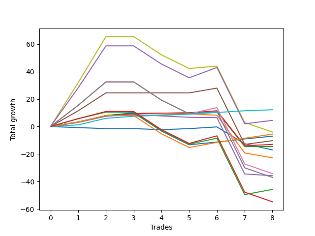

# Long Bernese 005 1v 
- Symbol: ES_VM
- Date Range: 03/18/2022 - 09/30/2022
- Trading Period: 7:20-12:30
- Number of Trades: 8



| Name | Win Percent | Profit | Avg Profit / Trade | Avg Time / Trade |      | Name | Win Percent | Profit | Avg Profit / Trade | Avg Time / Trade |
| ---- | ----------- | ------ | ------------------ | ---------------- | ---- | ---- | ----------- | ------ | ------------------ | ---------------- |
| Sorted By <br> Profit | | | | | | Sorted By <br> Win Percentage ||||
| Eighty-One | 100.00 | 6125.00 | 765.62 | 11:20 |     | Eighty-One | 100.00 | 6125.00 | 765.62 | 11:20 |
| NEWFI 0000 | 62.50 | 2250.00 | 281.25 | 51:51 |     | Four | 87.50 | -5125.00 | -640.62 | 29:19 |
| Seven | 50.00 | -2000.00 | -250.00 | 56:04 |     | Two_C | 87.50 | -6500.00 | -812.50 | 22:31 |
| Eighty-Three | 75.00 | -2750.00 | -343.75 | 28:46 |     | Two | 87.50 | -7250.00 | -906.25 | 22:26 |
| Eighty-Two | 75.00 | -3500.00 | -437.50 | 26:36 |     | Eighty-Three | 75.00 | -2750.00 | -343.75 | 28:46 |
| Four | 87.50 | -5125.00 | -640.62 | 29:19 |     | Eighty-Two | 75.00 | -3500.00 | -437.50 | 26:36 |
| Two_C | 87.50 | -6500.00 | -812.50 | 22:31 |     | NEWFI 0000 | 62.50 | 2250.00 | 281.25 | 51:51 |
| Two | 87.50 | -7250.00 | -906.25 | 22:26 |     | One | 62.50 | -11375.00 | -1421.88 | 14:42 |
| Zero | 37.50 | -8500.00 | -1062.50 | 07:15 |     | Eighty-Four | 62.50 | -22875.00 | -2859.38 | 37:17 |
| One | 62.50 | -11375.00 | -1421.88 | 14:42 |     | Seven | 50.00 | -2000.00 | -250.00 | 56:04 |
| Five | 50.00 | -17125.00 | -2140.62 | 40:54 |     | Five | 50.00 | -17125.00 | -2140.62 | 40:54 |
| Three | 37.50 | -17875.00 | -2234.38 | 26:27 |     | Six | 50.00 | -18500.00 | -2312.50 | 43:39 |
| Six | 50.00 | -18500.00 | -2312.50 | 43:39 |     | Eighty-Five | 50.00 | -27375.00 | -3421.88 | 39:53 |
| Eighty-Four | 62.50 | -22875.00 | -2859.38 | 37:17 |     | Zero | 37.50 | -8500.00 | -1062.50 | 07:15 |
| Eighty-Five | 50.00 | -27375.00 | -3421.88 | 39:53 |     | Three | 37.50 | -17875.00 | -2234.38 | 26:27 |

## NO STOPLOSS

### Test Zero
* Sell when price hits the middle line of the 20p bollinger
* No Stoploss
* Results:
```
Total Trades: 8
Percent Up: 37.50
Percent Down: 62.50
Total Points Moved Up: -17.00
Potential Profit: -8500.00
Total Points Ups: 2.00 Count Ups: 3
Total Points Downs: -19.00 Count Downs: 5
```

<details><summary>Trades</summary>

<code>In: 2022-05-06 11:41:00		Out: 2022-05-06 11:42:10		Total Position Time: 01:10		Total Move Up: -0.75		Total to Date: -0.75</code> <br />
<code>In: 2022-05-06 11:47:00		Out: 2022-05-06 11:48:15		Total Position Time: 01:15		Total Move Up: -0.75		Total to Date: -1.50</code> <br />
<code>In: 2022-07-11 12:15:00		Out: 2022-07-11 12:22:10		Total Position Time: 07:10		Total Move Up: 0.00		Total to Date: -1.50</code> <br />
<code>In: 2022-07-25 11:07:00		Out: 2022-07-25 11:10:40		Total Position Time: 03:40		Total Move Up: -0.75		Total to Date: -2.25</code> <br />
<code>In: 2022-07-25 11:11:00		Out: 2022-07-25 11:12:10		Total Position Time: 01:10		Total Move Up: 0.75		Total to Date: -1.50</code> <br />
<code>In: 2022-08-05 08:33:00		Out: 2022-08-05 08:37:00		Total Position Time: 04:00		Total Move Up: 1.25		Total to Date: -0.25</code> <br />
<code>In: 2022-09-02 09:55:00		Out: 2022-09-02 10:18:10		Total Position Time: 23:10		Total Move Up: -12.25		Total to Date: -12.50</code> <br />
<code>In: 2022-09-14 10:59:00		Out: 2022-09-14 11:15:30		Total Position Time: 16:30		Total Move Up: -4.50		Total to Date: -17.00</code> <br />


</details>

### Test One
* Sell when the price hits the upper line of the 20p 1std bollinger
* No Stoploss
* Results:
```
Total Trades: 8
Percent Up: 62.50
Percent Down: 37.50
Total Points Moved Up: -22.75
Potential Profit: -11375.00
Total Points Ups: 9.25 Count Ups: 5
Total Points Downs: -32.00 Count Downs: 3
```

<details><summary>Trades</summary>

<code>In: 2022-05-06 11:41:00		Out: 2022-05-06 11:49:10		Total Position Time: 08:10		Total Move Up: 3.25		Total to Date: 3.25</code> <br />
<code>In: 2022-05-06 11:47:00		Out: 2022-05-06 11:49:10		Total Position Time: 02:10		Total Move Up: 4.75		Total to Date: 8.00</code> <br />
<code>In: 2022-07-11 12:15:00		Out: 2022-07-11 12:29:20		Total Position Time: 14:20		Total Move Up: 0.00		Total to Date: 8.00</code> <br />
<code>In: 2022-07-25 11:07:00		Out: 2022-07-25 11:11:40		Total Position Time: 04:40		Total Move Up: 0.50		Total to Date: 8.50</code> <br />
<code>In: 2022-07-25 11:11:00		Out: 2022-07-25 11:12:10		Total Position Time: 01:10		Total Move Up: 0.75		Total to Date: 9.25</code> <br />
<code>In: 2022-08-05 08:33:00		Out: 2022-08-05 08:51:30		Total Position Time: 18:30		Total Move Up: -1.00		Total to Date: 8.25</code> <br />
<code>In: 2022-09-02 09:55:00		Out: 2022-09-02 10:43:30		Total Position Time: 48:30		Total Move Up: -27.50		Total to Date: -19.25</code> <br />
<code>In: 2022-09-14 10:59:00		Out: 2022-09-14 11:19:10		Total Position Time: 20:10		Total Move Up: -3.50		Total to Date: -22.75</code> <br />


</details>

### Test Two
* Sell when the price hits the upper line of the 20p 2std bollinger
* No Stoploss
* Results:
```
Total Trades: 8
Percent Up: 87.50
Percent Down: 12.50
Total Points Moved Up: -14.50
Potential Profit: -7250.00
Total Points Ups: 11.00 Count Ups: 7
Total Points Downs: -25.50 Count Downs: 1
```

<details><summary>Trades</summary>

<code>In: 2022-05-06 11:41:00		Out: 2022-05-06 11:49:10		Total Position Time: 08:10		Total Move Up: 3.25		Total to Date: 3.25</code> <br />
<code>In: 2022-05-06 11:47:00		Out: 2022-05-06 11:49:10		Total Position Time: 02:10		Total Move Up: 4.75		Total to Date: 8.00</code> <br />
<code>In: 2022-07-11 12:15:00		Out: 2022-07-11 12:29:40		Total Position Time: 14:40		Total Move Up: 1.50		Total to Date: 9.50</code> <br />
<code>In: 2022-07-25 11:07:00		Out: 2022-07-25 11:35:50		Total Position Time: 28:50		Total Move Up: 0.25		Total to Date: 9.75</code> <br />
<code>In: 2022-07-25 11:11:00		Out: 2022-07-25 11:35:50		Total Position Time: 24:50		Total Move Up: 0.25		Total to Date: 10.00</code> <br />
<code>In: 2022-08-05 08:33:00		Out: 2022-08-05 08:53:30		Total Position Time: 20:30		Total Move Up: 1.00		Total to Date: 11.00</code> <br />
<code>In: 2022-09-02 09:55:00		Out: 2022-09-02 10:43:50		Total Position Time: 48:50		Total Move Up: -25.50		Total to Date: -14.50</code> <br />
<code>In: 2022-09-14 10:59:00		Out: 2022-09-14 11:30:30		Total Position Time: 31:30		Total Move Up: 0.00		Total to Date: -14.50</code> <br />


</details>

### Test Two_C
* Sell when the price hits the upper line of the 20p 2std bollinger
* No Stoploss
* Results:
```
Total Trades: 8
Percent Up: 87.50
Percent Down: 12.50
Total Points Moved Up: -13.00
Potential Profit: -6500.00
Total Points Ups: 12.50 Count Ups: 7
Total Points Downs: -25.50 Count Downs: 1
```

<details><summary>Trades</summary>

<code>In: 2022-05-06 11:41:00		Out: 2022-05-06 11:49:10		Total Position Time: 08:10		Total Move Up: 3.25		Total to Date: 3.25</code> <br />
<code>In: 2022-05-06 11:47:00		Out: 2022-05-06 11:49:10		Total Position Time: 02:10		Total Move Up: 4.75		Total to Date: 8.00</code> <br />
<code>In: 2022-07-11 12:15:00		Out: 2022-07-11 12:29:40		Total Position Time: 14:40		Total Move Up: 1.50		Total to Date: 9.50</code> <br />
<code>In: 2022-07-25 11:07:00		Out: 2022-07-25 11:35:50		Total Position Time: 28:50		Total Move Up: 0.25		Total to Date: 9.75</code> <br />
<code>In: 2022-07-25 11:11:00		Out: 2022-07-25 11:35:50		Total Position Time: 24:50		Total Move Up: 0.25		Total to Date: 10.00</code> <br />
<code>In: 2022-08-05 08:33:00		Out: 2022-08-05 08:53:50		Total Position Time: 20:50		Total Move Up: 1.50		Total to Date: 11.50</code> <br />
<code>In: 2022-09-02 09:55:00		Out: 2022-09-02 10:43:50		Total Position Time: 48:50		Total Move Up: -25.50		Total to Date: -14.00</code> <br />
<code>In: 2022-09-14 10:59:00		Out: 2022-09-14 11:30:55		Total Position Time: 31:55		Total Move Up: 1.00		Total to Date: -13.00</code> <br />


</details>

### Test Three
* Sell when price hits the middle line of the 50p bollinger
* No Stoploss
* Results:
```
Total Trades: 8
Percent Up: 37.50
Percent Down: 62.50
Total Points Moved Up: -35.75
Potential Profit: -17875.00
Total Points Ups: 8.75 Count Ups: 3
Total Points Downs: -44.50 Count Downs: 5
```

<details><summary>Trades</summary>

<code>In: 2022-05-06 11:41:00		Out: 2022-05-06 11:49:15		Total Position Time: 08:15		Total Move Up: 3.00		Total to Date: 3.00</code> <br />
<code>In: 2022-05-06 11:47:00		Out: 2022-05-06 11:49:15		Total Position Time: 02:15		Total Move Up: 4.50		Total to Date: 7.50</code> <br />
<code>In: 2022-07-11 12:15:00		Out: 2022-07-11 12:40:35		Total Position Time: 25:35		Total Move Up: 1.25		Total to Date: 8.75</code> <br />
<code>In: 2022-07-25 11:07:00		Out: 2022-07-25 11:35:45		Total Position Time: 28:45		Total Move Up: -1.00		Total to Date: 7.75</code> <br />
<code>In: 2022-07-25 11:11:00		Out: 2022-07-25 11:35:45		Total Position Time: 24:45		Total Move Up: -1.00		Total to Date: 6.75</code> <br />
<code>In: 2022-08-05 08:33:00		Out: 2022-08-05 09:03:40		Total Position Time: 30:40		Total Move Up: -0.25		Total to Date: 6.50</code> <br />
<code>In: 2022-09-02 09:55:00		Out: 2022-09-02 10:55:55		Total Position Time: 60:55		Total Move Up: -41.00		Total to Date: -34.50</code> <br />
<code>In: 2022-09-14 10:59:00		Out: 2022-09-14 11:29:30		Total Position Time: 30:30		Total Move Up: -1.25		Total to Date: -35.75</code> <br />


</details>

### Test Four
* Sell when the price hits the upper line of the 50p 1std bollinger
* No Stoploss
* Results:
```
Total Trades: 8
Percent Up: 87.50
Percent Down: 12.50
Total Points Moved Up: -10.25
Potential Profit: -5125.00
Total Points Ups: 30.75 Count Ups: 7
Total Points Downs: -41.00 Count Downs: 1
```

<details><summary>Trades</summary>

<code>In: 2022-05-06 11:41:00		Out: 2022-05-06 11:50:10		Total Position Time: 09:10		Total Move Up: 11.50		Total to Date: 11.50</code> <br />
<code>In: 2022-05-06 11:47:00		Out: 2022-05-06 11:50:10		Total Position Time: 03:10		Total Move Up: 13.00		Total to Date: 24.50</code> <br />
<code>In: 2022-07-11 12:15:00		Out: 2022-07-11 12:47:00		Total Position Time: 32:00		Total Move Up: 0.00		Total to Date: 24.50</code> <br />
<code>In: 2022-07-25 11:07:00		Out: 2022-07-25 11:41:00		Total Position Time: 34:00		Total Move Up: 0.00		Total to Date: 24.50</code> <br />
<code>In: 2022-07-25 11:11:00		Out: 2022-07-25 11:41:00		Total Position Time: 30:00		Total Move Up: 0.00		Total to Date: 24.50</code> <br />
<code>In: 2022-08-05 08:33:00		Out: 2022-08-05 09:05:15		Total Position Time: 32:15		Total Move Up: 3.50		Total to Date: 28.00</code> <br />
<code>In: 2022-09-02 09:55:00		Out: 2022-09-02 10:55:55		Total Position Time: 60:55		Total Move Up: -41.00		Total to Date: -13.00</code> <br />
<code>In: 2022-09-14 10:59:00		Out: 2022-09-14 11:32:05		Total Position Time: 33:05		Total Move Up: 2.75		Total to Date: -10.25</code> <br />


</details>

### Test Five
* Sell when the price hits the upper line of the 50p 2std bollinger
* No Stoploss
* Results:
```
Total Trades: 8
Percent Up: 50.00
Percent Down: 50.00
Total Points Moved Up: -34.25
Potential Profit: -17125.00
Total Points Ups: 37.00 Count Ups: 4
Total Points Downs: -71.25 Count Downs: 4
```

<details><summary>Trades</summary>

<code>In: 2022-05-06 11:41:00		Out: 2022-05-06 11:50:35		Total Position Time: 09:35		Total Move Up: 15.50		Total to Date: 15.50</code> <br />
<code>In: 2022-05-06 11:47:00		Out: 2022-05-06 11:50:35		Total Position Time: 03:35		Total Move Up: 17.00		Total to Date: 32.50</code> <br />
<code>In: 2022-07-11 12:15:00		Out: 2022-07-11 12:47:00		Total Position Time: 32:00		Total Move Up: 0.00		Total to Date: 32.50</code> <br />
<code>In: 2022-07-25 11:07:00		Out: 2022-07-25 12:07:55		Total Position Time: 60:55		Total Move Up: -13.25		Total to Date: 19.25</code> <br />
<code>In: 2022-07-25 11:11:00		Out: 2022-07-25 12:11:55		Total Position Time: 60:55		Total Move Up: -10.00		Total to Date: 9.25</code> <br />
<code>In: 2022-08-05 08:33:00		Out: 2022-08-05 09:11:25		Total Position Time: 38:25		Total Move Up: 4.50		Total to Date: 13.75</code> <br />
<code>In: 2022-09-02 09:55:00		Out: 2022-09-02 10:55:55		Total Position Time: 60:55		Total Move Up: -41.00		Total to Date: -27.25</code> <br />
<code>In: 2022-09-14 10:59:00		Out: 2022-09-14 11:59:55		Total Position Time: 60:55		Total Move Up: -7.00		Total to Date: -34.25</code> <br />


</details>

### Test Six
* Sell when the price hits the middle line of the 1std VWAP
* No Stoploss
* Results:
```
Total Trades: 8
Percent Up: 50.00
Percent Down: 50.00
Total Points Moved Up: -37.00
Potential Profit: -18500.00
Total Points Ups: 34.25 Count Ups: 4
Total Points Downs: -71.25 Count Downs: 4
```

<details><summary>Trades</summary>

<code>In: 2022-05-06 11:41:00		Out: 2022-05-06 11:50:20		Total Position Time: 09:20		Total Move Up: 15.50		Total to Date: 15.50</code> <br />
<code>In: 2022-05-06 11:47:00		Out: 2022-05-06 11:50:20		Total Position Time: 03:20		Total Move Up: 17.00		Total to Date: 32.50</code> <br />
<code>In: 2022-07-11 12:15:00		Out: 2022-07-11 12:47:00		Total Position Time: 32:00		Total Move Up: 0.00		Total to Date: 32.50</code> <br />
<code>In: 2022-07-25 11:07:00		Out: 2022-07-25 12:07:55		Total Position Time: 60:55		Total Move Up: -13.25		Total to Date: 19.25</code> <br />
<code>In: 2022-07-25 11:11:00		Out: 2022-07-25 12:11:55		Total Position Time: 60:55		Total Move Up: -10.00		Total to Date: 9.25</code> <br />
<code>In: 2022-08-05 08:33:00		Out: 2022-08-05 09:33:55		Total Position Time: 60:55		Total Move Up: 1.75		Total to Date: 11.00</code> <br />
<code>In: 2022-09-02 09:55:00		Out: 2022-09-02 10:55:55		Total Position Time: 60:55		Total Move Up: -41.00		Total to Date: -30.00</code> <br />
<code>In: 2022-09-14 10:59:00		Out: 2022-09-14 11:59:55		Total Position Time: 60:55		Total Move Up: -7.00		Total to Date: -37.00</code> <br />


</details>

### Test Seven
* Sell when the price hits the upper line of the 1std VWAP
* No Stoploss
* Results:
```
Total Trades: 8
Percent Up: 50.00
Percent Down: 50.00
Total Points Moved Up: -4.00
Potential Profit: -2000.00
Total Points Ups: 67.25 Count Ups: 4
Total Points Downs: -71.25 Count Downs: 4
```

<details><summary>Trades</summary>

<code>In: 2022-05-06 11:41:00		Out: 2022-05-06 12:40:00		Total Position Time: 59:00		Total Move Up: 32.00		Total to Date: 32.00</code> <br />
<code>In: 2022-05-06 11:47:00		Out: 2022-05-06 12:40:00		Total Position Time: 53:00		Total Move Up: 33.50		Total to Date: 65.50</code> <br />
<code>In: 2022-07-11 12:15:00		Out: 2022-07-11 12:47:00		Total Position Time: 32:00		Total Move Up: 0.00		Total to Date: 65.50</code> <br />
<code>In: 2022-07-25 11:07:00		Out: 2022-07-25 12:07:55		Total Position Time: 60:55		Total Move Up: -13.25		Total to Date: 52.25</code> <br />
<code>In: 2022-07-25 11:11:00		Out: 2022-07-25 12:11:55		Total Position Time: 60:55		Total Move Up: -10.00		Total to Date: 42.25</code> <br />
<code>In: 2022-08-05 08:33:00		Out: 2022-08-05 09:33:55		Total Position Time: 60:55		Total Move Up: 1.75		Total to Date: 44.00</code> <br />
<code>In: 2022-09-02 09:55:00		Out: 2022-09-02 10:55:55		Total Position Time: 60:55		Total Move Up: -41.00		Total to Date: 3.00</code> <br />
<code>In: 2022-09-14 10:59:00		Out: 2022-09-14 11:59:55		Total Position Time: 60:55		Total Move Up: -7.00		Total to Date: -4.00</code> <br />


</details>

## TAKE PROFIT

### Test Eighty-One
* Take Profit of 1 Point
* No Stoploss
* Results:
```
Total Trades: 8
Percent Up: 100.00
Percent Down: 0.00
Total Points Moved Up: 12.25
Potential Profit: 6125.00
Total Points Ups: 12.25 Count Ups: 8
Total Points Downs: 0.00 Count Downs: 0
```

<details><summary>Trades</summary>

<code>In: 2022-05-06 11:41:00		Out: 2022-05-06 11:42:45		Total Position Time: 01:45		Total Move Up: 1.25		Total to Date: 1.25</code> <br />
<code>In: 2022-05-06 11:47:00		Out: 2022-05-06 11:49:10		Total Position Time: 02:10		Total Move Up: 4.75		Total to Date: 6.00</code> <br />
<code>In: 2022-07-11 12:15:00		Out: 2022-07-11 12:29:40		Total Position Time: 14:40		Total Move Up: 1.50		Total to Date: 7.50</code> <br />
<code>In: 2022-07-25 11:07:00		Out: 2022-07-25 11:11:45		Total Position Time: 04:45		Total Move Up: 0.75		Total to Date: 8.25</code> <br />
<code>In: 2022-07-25 11:11:00		Out: 2022-07-25 11:41:30		Total Position Time: 30:30		Total Move Up: 0.75		Total to Date: 9.00</code> <br />
<code>In: 2022-08-05 08:33:00		Out: 2022-08-05 08:37:00		Total Position Time: 04:00		Total Move Up: 1.25		Total to Date: 10.25</code> <br />
<code>In: 2022-09-02 09:55:00		Out: 2022-09-02 09:56:15		Total Position Time: 01:15		Total Move Up: 1.25		Total to Date: 11.50</code> <br />
<code>In: 2022-09-14 10:59:00		Out: 2022-09-14 11:30:40		Total Position Time: 31:40		Total Move Up: 0.75		Total to Date: 12.25</code> <br />


</details>

### Test Eighty-Two
* Take Profit of 2 Point
* No Stoploss
* Results:
```
Total Trades: 8
Percent Up: 75.00
Percent Down: 25.00
Total Points Moved Up: -7.00
Potential Profit: -3500.00
Total Points Ups: 16.25 Count Ups: 6
Total Points Downs: -23.25 Count Downs: 2
```

<details><summary>Trades</summary>

<code>In: 2022-05-06 11:41:00		Out: 2022-05-06 11:49:10		Total Position Time: 08:10		Total Move Up: 3.25		Total to Date: 3.25</code> <br />
<code>In: 2022-05-06 11:47:00		Out: 2022-05-06 11:49:10		Total Position Time: 02:10		Total Move Up: 4.75		Total to Date: 8.00</code> <br />
<code>In: 2022-07-11 12:15:00		Out: 2022-07-11 12:31:10		Total Position Time: 16:10		Total Move Up: 2.00		Total to Date: 10.00</code> <br />
<code>In: 2022-07-25 11:07:00		Out: 2022-07-25 12:07:55		Total Position Time: 60:55		Total Move Up: -13.25		Total to Date: -3.25</code> <br />
<code>In: 2022-07-25 11:11:00		Out: 2022-07-25 12:11:55		Total Position Time: 60:55		Total Move Up: -10.00		Total to Date: -13.25</code> <br />
<code>In: 2022-08-05 08:33:00		Out: 2022-08-05 09:04:00		Total Position Time: 31:00		Total Move Up: 2.00		Total to Date: -11.25</code> <br />
<code>In: 2022-09-02 09:55:00		Out: 2022-09-02 09:56:35		Total Position Time: 01:35		Total Move Up: 2.25		Total to Date: -9.00</code> <br />
<code>In: 2022-09-14 10:59:00		Out: 2022-09-14 11:31:00		Total Position Time: 32:00		Total Move Up: 2.00		Total to Date: -7.00</code> <br />


</details>

### Test Eighty-Three
* Take Profit of 3 Point
* No Stoploss
* Results:
```
Total Trades: 8
Percent Up: 75.00
Percent Down: 25.00
Total Points Moved Up: -5.50
Potential Profit: -2750.00
Total Points Ups: 17.75 Count Ups: 6
Total Points Downs: -23.25 Count Downs: 2
```

<details><summary>Trades</summary>

<code>In: 2022-05-06 11:41:00		Out: 2022-05-06 11:49:10		Total Position Time: 08:10		Total Move Up: 3.25		Total to Date: 3.25</code> <br />
<code>In: 2022-05-06 11:47:00		Out: 2022-05-06 11:49:10		Total Position Time: 02:10		Total Move Up: 4.75		Total to Date: 8.00</code> <br />
<code>In: 2022-07-11 12:15:00		Out: 2022-07-11 12:47:00		Total Position Time: 32:00		Total Move Up: 0.00		Total to Date: 8.00</code> <br />
<code>In: 2022-07-25 11:07:00		Out: 2022-07-25 12:07:55		Total Position Time: 60:55		Total Move Up: -13.25		Total to Date: -5.25</code> <br />
<code>In: 2022-07-25 11:11:00		Out: 2022-07-25 12:11:55		Total Position Time: 60:55		Total Move Up: -10.00		Total to Date: -15.25</code> <br />
<code>In: 2022-08-05 08:33:00		Out: 2022-08-05 09:04:25		Total Position Time: 31:25		Total Move Up: 3.75		Total to Date: -11.50</code> <br />
<code>In: 2022-09-02 09:55:00		Out: 2022-09-02 09:56:40		Total Position Time: 01:40		Total Move Up: 3.00		Total to Date: -8.50</code> <br />
<code>In: 2022-09-14 10:59:00		Out: 2022-09-14 11:32:00		Total Position Time: 33:00		Total Move Up: 3.00		Total to Date: -5.50</code> <br />


</details>

### Test Eighty-Four
* Take Profit of 4 Point
* No Stoploss
* Results:
```
Total Trades: 8
Percent Up: 62.50
Percent Down: 37.50
Total Points Moved Up: -45.75
Potential Profit: -22875.00
Total Points Ups: 18.50 Count Ups: 5
Total Points Downs: -64.25 Count Downs: 3
```

<details><summary>Trades</summary>

<code>In: 2022-05-06 11:41:00		Out: 2022-05-06 11:49:25		Total Position Time: 08:25		Total Move Up: 5.75		Total to Date: 5.75</code> <br />
<code>In: 2022-05-06 11:47:00		Out: 2022-05-06 11:49:10		Total Position Time: 02:10		Total Move Up: 4.75		Total to Date: 10.50</code> <br />
<code>In: 2022-07-11 12:15:00		Out: 2022-07-11 12:47:00		Total Position Time: 32:00		Total Move Up: 0.00		Total to Date: 10.50</code> <br />
<code>In: 2022-07-25 11:07:00		Out: 2022-07-25 12:07:55		Total Position Time: 60:55		Total Move Up: -13.25		Total to Date: -2.75</code> <br />
<code>In: 2022-07-25 11:11:00		Out: 2022-07-25 12:11:55		Total Position Time: 60:55		Total Move Up: -10.00		Total to Date: -12.75</code> <br />
<code>In: 2022-08-05 08:33:00		Out: 2022-08-05 09:05:20		Total Position Time: 32:20		Total Move Up: 4.25		Total to Date: -8.50</code> <br />
<code>In: 2022-09-02 09:55:00		Out: 2022-09-02 10:55:55		Total Position Time: 60:55		Total Move Up: -41.00		Total to Date: -49.50</code> <br />
<code>In: 2022-09-14 10:59:00		Out: 2022-09-14 11:39:40		Total Position Time: 40:40		Total Move Up: 3.75		Total to Date: -45.75</code> <br />


</details>

### Test Eighty-Five
* Take Profit of 5 Point
* No Stoploss
* Results:
```
Total Trades: 8
Percent Up: 50.00
Percent Down: 50.00
Total Points Moved Up: -54.75
Potential Profit: -27375.00
Total Points Ups: 16.50 Count Ups: 4
Total Points Downs: -71.25 Count Downs: 4
```

<details><summary>Trades</summary>

<code>In: 2022-05-06 11:41:00		Out: 2022-05-06 11:49:25		Total Position Time: 08:25		Total Move Up: 5.75		Total to Date: 5.75</code> <br />
<code>In: 2022-05-06 11:47:00		Out: 2022-05-06 11:49:20		Total Position Time: 02:20		Total Move Up: 5.25		Total to Date: 11.00</code> <br />
<code>In: 2022-07-11 12:15:00		Out: 2022-07-11 12:47:00		Total Position Time: 32:00		Total Move Up: 0.00		Total to Date: 11.00</code> <br />
<code>In: 2022-07-25 11:07:00		Out: 2022-07-25 12:07:55		Total Position Time: 60:55		Total Move Up: -13.25		Total to Date: -2.25</code> <br />
<code>In: 2022-07-25 11:11:00		Out: 2022-07-25 12:11:55		Total Position Time: 60:55		Total Move Up: -10.00		Total to Date: -12.25</code> <br />
<code>In: 2022-08-05 08:33:00		Out: 2022-08-05 09:05:45		Total Position Time: 32:45		Total Move Up: 5.50		Total to Date: -6.75</code> <br />
<code>In: 2022-09-02 09:55:00		Out: 2022-09-02 10:55:55		Total Position Time: 60:55		Total Move Up: -41.00		Total to Date: -47.75</code> <br />
<code>In: 2022-09-14 10:59:00		Out: 2022-09-14 11:59:55		Total Position Time: 60:55		Total Move Up: -7.00		Total to Date: -54.75</code> <br />


</details>

## Indicator Exits

### Test NEWFI 0000
* Newfi 0000
* No Stoploss
* Results:
```
Total Trades: 8
Percent Up: 62.50
Percent Down: 37.50
Total Points Moved Up: 4.50
Potential Profit: 2250.00
Total Points Ups: 68.75 Count Ups: 5
Total Points Downs: -64.25 Count Downs: 3
```

<details><summary>Trades</summary>

<code>In: 2022-05-06 11:41:00		Out: 2022-05-06 12:41:55		Total Position Time: 60:55		Total Move Up: 28.25		Total to Date: 28.25</code> <br />
<code>In: 2022-05-06 11:47:00		Out: 2022-05-06 12:42:05		Total Position Time: 55:05		Total Move Up: 30.50		Total to Date: 58.75</code> <br />
<code>In: 2022-07-11 12:15:00		Out: 2022-07-11 12:47:00		Total Position Time: 32:00		Total Move Up: 0.00		Total to Date: 58.75</code> <br />
<code>In: 2022-07-25 11:07:00		Out: 2022-07-25 12:07:55		Total Position Time: 60:55		Total Move Up: -13.25		Total to Date: 45.50</code> <br />
<code>In: 2022-07-25 11:11:00		Out: 2022-07-25 12:11:55		Total Position Time: 60:55		Total Move Up: -10.00		Total to Date: 35.50</code> <br />
<code>In: 2022-08-05 08:33:00		Out: 2022-08-05 09:21:05		Total Position Time: 48:05		Total Move Up: 7.50		Total to Date: 43.00</code> <br />
<code>In: 2022-09-02 09:55:00		Out: 2022-09-02 10:55:55		Total Position Time: 60:55		Total Move Up: -41.00		Total to Date: 2.00</code> <br />
<code>In: 2022-09-14 10:59:00		Out: 2022-09-14 11:35:05		Total Position Time: 36:05		Total Move Up: 2.50		Total to Date: 4.50</code> <br />


</details>