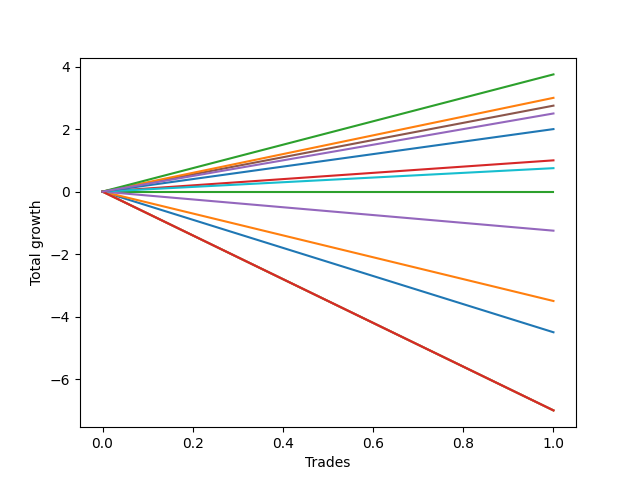

# Long Bernese 005 50 
- Symbol: ES_VM
- Date Range: 03/18/2022 - 09/30/2022
- Trading Period: 7:20-12:30
- Number of Trades: 1



| Name | Win Percent | Profit | Avg Profit / Trade | Avg Time / Trade |      | Name | Win Percent | Profit | Avg Profit / Trade | Avg Time / Trade |
| ---- | ----------- | ------ | ------------------ | ---------------- | ---- | ---- | ----------- | ------ | ------------------ | ---------------- |
| Sorted By <br> Profit | | | | | | Sorted By <br> Win Percentage ||||
| NEWFI 0000 | 0.00 | -7500.00 | -7500.00 | 35:05 |     | NEWFI 0000 | 0.00 | -7500.00 | -7500.00 | 35:05 |
| Eighty-Five | 0.00 | -12875.00 | -12875.00 | 59:55 |     | Eighty-Five | 0.00 | -12875.00 | -12875.00 | 59:55 |
| Eighty-Four | 0.00 | -12875.00 | -12875.00 | 59:55 |     | Eighty-Four | 0.00 | -12875.00 | -12875.00 | 59:55 |
| Eighty-Three | 0.00 | -12875.00 | -12875.00 | 59:55 |     | Eighty-Three | 0.00 | -12875.00 | -12875.00 | 59:55 |
| Eighty-Two | 0.00 | -12875.00 | -12875.00 | 59:55 |     | Eighty-Two | 0.00 | -12875.00 | -12875.00 | 59:55 |
| Eighty-One | 0.00 | -12875.00 | -12875.00 | 59:55 |     | Eighty-One | 0.00 | -12875.00 | -12875.00 | 59:55 |
| Seven | 0.00 | -12875.00 | -12875.00 | 59:55 |     | Seven | 0.00 | -12875.00 | -12875.00 | 59:55 |
| Six | 0.00 | -12875.00 | -12875.00 | 59:55 |     | Six | 0.00 | -12875.00 | -12875.00 | 59:55 |
| Five | 0.00 | -12875.00 | -12875.00 | 59:55 |     | Five | 0.00 | -12875.00 | -12875.00 | 59:55 |
| Four | 0.00 | -12875.00 | -12875.00 | 59:55 |     | Four | 0.00 | -12875.00 | -12875.00 | 59:55 |
| Three | 0.00 | -12875.00 | -12875.00 | 59:55 |     | Three | 0.00 | -12875.00 | -12875.00 | 59:55 |
| Two_C | 0.00 | -12875.00 | -12875.00 | 59:55 |     | Two_C | 0.00 | -12875.00 | -12875.00 | 59:55 |
| Two | 0.00 | -12875.00 | -12875.00 | 59:55 |     | Two | 0.00 | -12875.00 | -12875.00 | 59:55 |
| One | 0.00 | -12875.00 | -12875.00 | 59:55 |     | One | 0.00 | -12875.00 | -12875.00 | 59:55 |
| Zero | 0.00 | -12875.00 | -12875.00 | 59:55 |     | Zero | 0.00 | -12875.00 | -12875.00 | 59:55 |

## NO STOPLOSS

### Test Zero
* Sell when price hits the middle line of the 20p bollinger
* No Stoploss
* Results:
```
Total Trades: 1
Percent Up: 0.00
Percent Down: 100.00
Total Points Moved Up: -25.75
Potential Profit: -12875.00
Total Points Ups: 0.00 Count Ups: 0
Total Points Downs: -25.75 Count Downs: 1
```

<details><summary>Trades</summary>

<code>In: 2022-09-14 10:59:00		Out: 2022-09-14 11:58:55		Total Position Time: 59:55		Total Move Up: -25.75		Total to Date: -25.75</code> <br />


</details>

### Test One
* Sell when the price hits the upper line of the 20p 1std bollinger
* No Stoploss
* Results:
```
Total Trades: 1
Percent Up: 0.00
Percent Down: 100.00
Total Points Moved Up: -25.75
Potential Profit: -12875.00
Total Points Ups: 0.00 Count Ups: 0
Total Points Downs: -25.75 Count Downs: 1
```

<details><summary>Trades</summary>

<code>In: 2022-09-14 10:59:00		Out: 2022-09-14 11:58:55		Total Position Time: 59:55		Total Move Up: -25.75		Total to Date: -25.75</code> <br />


</details>

### Test Two
* Sell when the price hits the upper line of the 20p 2std bollinger
* No Stoploss
* Results:
```
Total Trades: 1
Percent Up: 0.00
Percent Down: 100.00
Total Points Moved Up: -25.75
Potential Profit: -12875.00
Total Points Ups: 0.00 Count Ups: 0
Total Points Downs: -25.75 Count Downs: 1
```

<details><summary>Trades</summary>

<code>In: 2022-09-14 10:59:00		Out: 2022-09-14 11:58:55		Total Position Time: 59:55		Total Move Up: -25.75		Total to Date: -25.75</code> <br />


</details>

### Test Two_C
* Sell when the price hits the upper line of the 20p 2std bollinger
* No Stoploss
* Results:
```
Total Trades: 1
Percent Up: 0.00
Percent Down: 100.00
Total Points Moved Up: -25.75
Potential Profit: -12875.00
Total Points Ups: 0.00 Count Ups: 0
Total Points Downs: -25.75 Count Downs: 1
```

<details><summary>Trades</summary>

<code>In: 2022-09-14 10:59:00		Out: 2022-09-14 11:58:55		Total Position Time: 59:55		Total Move Up: -25.75		Total to Date: -25.75</code> <br />


</details>

### Test Three
* Sell when price hits the middle line of the 50p bollinger
* No Stoploss
* Results:
```
Total Trades: 1
Percent Up: 0.00
Percent Down: 100.00
Total Points Moved Up: -25.75
Potential Profit: -12875.00
Total Points Ups: 0.00 Count Ups: 0
Total Points Downs: -25.75 Count Downs: 1
```

<details><summary>Trades</summary>

<code>In: 2022-09-14 10:59:00		Out: 2022-09-14 11:58:55		Total Position Time: 59:55		Total Move Up: -25.75		Total to Date: -25.75</code> <br />


</details>

### Test Four
* Sell when the price hits the upper line of the 50p 1std bollinger
* No Stoploss
* Results:
```
Total Trades: 1
Percent Up: 0.00
Percent Down: 100.00
Total Points Moved Up: -25.75
Potential Profit: -12875.00
Total Points Ups: 0.00 Count Ups: 0
Total Points Downs: -25.75 Count Downs: 1
```

<details><summary>Trades</summary>

<code>In: 2022-09-14 10:59:00		Out: 2022-09-14 11:58:55		Total Position Time: 59:55		Total Move Up: -25.75		Total to Date: -25.75</code> <br />


</details>

### Test Five
* Sell when the price hits the upper line of the 50p 2std bollinger
* No Stoploss
* Results:
```
Total Trades: 1
Percent Up: 0.00
Percent Down: 100.00
Total Points Moved Up: -25.75
Potential Profit: -12875.00
Total Points Ups: 0.00 Count Ups: 0
Total Points Downs: -25.75 Count Downs: 1
```

<details><summary>Trades</summary>

<code>In: 2022-09-14 10:59:00		Out: 2022-09-14 11:58:55		Total Position Time: 59:55		Total Move Up: -25.75		Total to Date: -25.75</code> <br />


</details>

### Test Six
* Sell when the price hits the middle line of the 1std VWAP
* No Stoploss
* Results:
```
Total Trades: 1
Percent Up: 0.00
Percent Down: 100.00
Total Points Moved Up: -25.75
Potential Profit: -12875.00
Total Points Ups: 0.00 Count Ups: 0
Total Points Downs: -25.75 Count Downs: 1
```

<details><summary>Trades</summary>

<code>In: 2022-09-14 10:59:00		Out: 2022-09-14 11:58:55		Total Position Time: 59:55		Total Move Up: -25.75		Total to Date: -25.75</code> <br />


</details>

### Test Seven
* Sell when the price hits the upper line of the 1std VWAP
* No Stoploss
* Results:
```
Total Trades: 1
Percent Up: 0.00
Percent Down: 100.00
Total Points Moved Up: -25.75
Potential Profit: -12875.00
Total Points Ups: 0.00 Count Ups: 0
Total Points Downs: -25.75 Count Downs: 1
```

<details><summary>Trades</summary>

<code>In: 2022-09-14 10:59:00		Out: 2022-09-14 11:58:55		Total Position Time: 59:55		Total Move Up: -25.75		Total to Date: -25.75</code> <br />


</details>

## TAKE PROFIT

### Test Eighty-One
* Take Profit of 1 Point
* No Stoploss
* Results:
```
Total Trades: 1
Percent Up: 0.00
Percent Down: 100.00
Total Points Moved Up: -25.75
Potential Profit: -12875.00
Total Points Ups: 0.00 Count Ups: 0
Total Points Downs: -25.75 Count Downs: 1
```

<details><summary>Trades</summary>

<code>In: 2022-09-14 10:59:00		Out: 2022-09-14 11:58:55		Total Position Time: 59:55		Total Move Up: -25.75		Total to Date: -25.75</code> <br />


</details>

### Test Eighty-Two
* Take Profit of 2 Point
* No Stoploss
* Results:
```
Total Trades: 1
Percent Up: 0.00
Percent Down: 100.00
Total Points Moved Up: -25.75
Potential Profit: -12875.00
Total Points Ups: 0.00 Count Ups: 0
Total Points Downs: -25.75 Count Downs: 1
```

<details><summary>Trades</summary>

<code>In: 2022-09-14 10:59:00		Out: 2022-09-14 11:58:55		Total Position Time: 59:55		Total Move Up: -25.75		Total to Date: -25.75</code> <br />


</details>

### Test Eighty-Three
* Take Profit of 3 Point
* No Stoploss
* Results:
```
Total Trades: 1
Percent Up: 0.00
Percent Down: 100.00
Total Points Moved Up: -25.75
Potential Profit: -12875.00
Total Points Ups: 0.00 Count Ups: 0
Total Points Downs: -25.75 Count Downs: 1
```

<details><summary>Trades</summary>

<code>In: 2022-09-14 10:59:00		Out: 2022-09-14 11:58:55		Total Position Time: 59:55		Total Move Up: -25.75		Total to Date: -25.75</code> <br />


</details>

### Test Eighty-Four
* Take Profit of 4 Point
* No Stoploss
* Results:
```
Total Trades: 1
Percent Up: 0.00
Percent Down: 100.00
Total Points Moved Up: -25.75
Potential Profit: -12875.00
Total Points Ups: 0.00 Count Ups: 0
Total Points Downs: -25.75 Count Downs: 1
```

<details><summary>Trades</summary>

<code>In: 2022-09-14 10:59:00		Out: 2022-09-14 11:58:55		Total Position Time: 59:55		Total Move Up: -25.75		Total to Date: -25.75</code> <br />


</details>

### Test Eighty-Five
* Take Profit of 5 Point
* No Stoploss
* Results:
```
Total Trades: 1
Percent Up: 0.00
Percent Down: 100.00
Total Points Moved Up: -25.75
Potential Profit: -12875.00
Total Points Ups: 0.00 Count Ups: 0
Total Points Downs: -25.75 Count Downs: 1
```

<details><summary>Trades</summary>

<code>In: 2022-09-14 10:59:00		Out: 2022-09-14 11:58:55		Total Position Time: 59:55		Total Move Up: -25.75		Total to Date: -25.75</code> <br />


</details>

## Indicator Exits

### Test NEWFI 0000
* Newfi 0000
* No Stoploss
* Results:
```
Total Trades: 1
Percent Up: 0.00
Percent Down: 100.00
Total Points Moved Up: -15.00
Potential Profit: -7500.00
Total Points Ups: 0.00 Count Ups: 0
Total Points Downs: -15.00 Count Downs: 1
```

<details><summary>Trades</summary>

<code>In: 2022-09-14 10:59:00		Out: 2022-09-14 11:34:05		Total Position Time: 35:05		Total Move Up: -15.00		Total to Date: -15.00</code> <br />


</details>