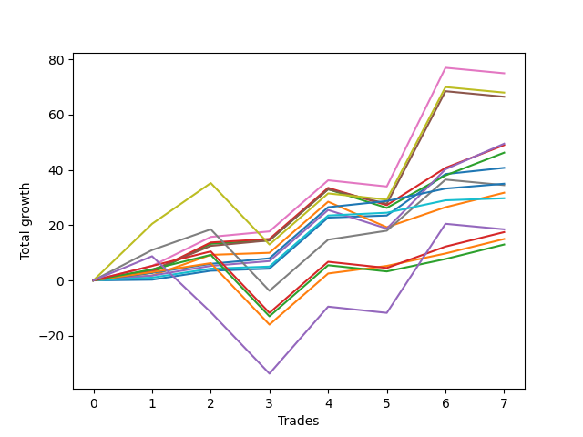

# Short Bernese 001 1v 
- Symbol: ES_VM
- Date Range: 03/18/2022 - 09/30/2022
- Trading Period: 7:20-12:30
- Number of Trades: 7



| Name | Win Percent | Profit | Avg Profit / Trade | Avg Time / Trade |      | Name | Win Percent | Profit | Avg Profit / Trade | Avg Time / Trade |
| ---- | ----------- | ------ | ------------------ | ---------------- | ---- | ---- | ----------- | ------ | ------------------ | ---------------- |
| Sorted By <br> Profit | | | | | | Sorted By <br> Win Percentage ||||
| Five | 71.43 | 37500.00 | 5357.14 | 23:19 |     | Zero | 100.00 | 20375.00 | 2910.71 | 02:37 |
| Seven | 57.14 | 34000.00 | 4857.14 | 30:13 |     | Eighty-Two | 100.00 | 17500.00 | 2500.00 | 06:26 |
| Four | 71.43 | 33250.00 | 4750.00 | 20:56 |     | Eighty-One | 100.00 | 14875.00 | 2125.00 | 00:53 |
| Three | 85.71 | 24750.00 | 3535.71 | 12:23 |     | Three | 85.71 | 24750.00 | 3535.71 | 12:23 |
| Two_C | 85.71 | 24500.00 | 3500.00 | 16:17 |     | Two_C | 85.71 | 24500.00 | 3500.00 | 16:17 |
| Two | 85.71 | 23125.00 | 3303.57 | 16:06 |     | Two | 85.71 | 23125.00 | 3303.57 | 16:06 |
| Zero | 100.00 | 20375.00 | 2910.71 | 02:37 |     | One | 85.71 | 15875.00 | 2267.86 | 11:35 |
| Eighty-Two | 100.00 | 17500.00 | 2500.00 | 06:26 |     | Eighty-Three | 85.71 | 7500.00 | 1071.43 | 11:19 |
| Six | 71.43 | 17250.00 | 2464.29 | 19:13 |     | Five | 71.43 | 37500.00 | 5357.14 | 23:19 |
| One | 85.71 | 15875.00 | 2267.86 | 11:35 |     | Four | 71.43 | 33250.00 | 4750.00 | 20:56 |
| Eighty-One | 100.00 | 14875.00 | 2125.00 | 00:53 |     | Six | 71.43 | 17250.00 | 2464.29 | 19:13 |
| NEWFI 0000 | 42.86 | 9250.00 | 1321.43 | 44:00 |     | Eighty-Five | 71.43 | 8750.00 | 1250.00 | 18:43 |
| Eighty-Five | 71.43 | 8750.00 | 1250.00 | 18:43 |     | Eighty-Four | 71.43 | 6500.00 | 928.57 | 18:38 |
| Eighty-Three | 85.71 | 7500.00 | 1071.43 | 11:19 |     | Seven | 57.14 | 34000.00 | 4857.14 | 30:13 |
| Eighty-Four | 71.43 | 6500.00 | 928.57 | 18:38 |     | NEWFI 0000 | 42.86 | 9250.00 | 1321.43 | 44:00 |

## NO STOPLOSS

### Test Zero
* Sell when price hits the middle line of the 20p bollinger
* No Stoploss
* Results:
```
Total Trades: 7
Percent Up: 0.00
Percent Down: 100.00
Total Points Moved Down: 40.75
Potential Profit: 20375.00
Total Points Ups: 0.00 Count Ups: 0
Total Points Downs: 40.75 Count Downs: 7
```

<details><summary>Trades</summary>

<code>In: 2022-03-25 11:57:00		Out: 2022-03-25 11:57:15		Total Position Time: 00:15		Total Move Down: 0.25		Total to Date: 0.25</code> <br />
<code>In: 2022-07-06 11:10:00		Out: 2022-07-06 11:10:10		Total Position Time: 00:10		Total Move Down: 3.25		Total to Date: 3.50</code> <br />
<code>In: 2022-08-17 10:33:00		Out: 2022-08-17 10:34:05		Total Position Time: 01:05		Total Move Down: 0.75		Total to Date: 4.25</code> <br />
<code>In: 2022-09-12 10:32:00		Out: 2022-09-12 10:32:10		Total Position Time: 00:10		Total Move Down: 18.50		Total to Date: 22.75</code> <br />
<code>In: 2022-09-16 11:31:00		Out: 2022-09-16 11:41:05		Total Position Time: 10:05		Total Move Down: 0.75		Total to Date: 23.50</code> <br />
<code>In: 2022-09-21 11:48:00		Out: 2022-09-21 11:52:05		Total Position Time: 04:05		Total Move Down: 15.00		Total to Date: 38.50</code> <br />
<code>In: 2022-09-22 12:16:00		Out: 2022-09-22 12:18:35		Total Position Time: 02:35		Total Move Down: 2.25		Total to Date: 40.75</code> <br />


</details>

### Test One
* Sell when the price hits the upper line of the 20p 1std bollinger
* No Stoploss
* Results:
```
Total Trades: 7
Percent Up: 14.29
Percent Down: 85.71
Total Points Moved Down: 31.75
Potential Profit: 15875.00
Total Points Ups: 9.25 Count Ups: 1
Total Points Downs: 41.00 Count Downs: 6
```

<details><summary>Trades</summary>

<code>In: 2022-03-25 11:57:00		Out: 2022-03-25 12:00:45		Total Position Time: 03:45		Total Move Down: 1.75		Total to Date: 1.75</code> <br />
<code>In: 2022-07-06 11:10:00		Out: 2022-07-06 11:11:10		Total Position Time: 01:10		Total Move Down: 7.50		Total to Date: 9.25</code> <br />
<code>In: 2022-08-17 10:33:00		Out: 2022-08-17 10:46:00		Total Position Time: 13:00		Total Move Down: 0.75		Total to Date: 10.00</code> <br />
<code>In: 2022-09-12 10:32:00		Out: 2022-09-12 10:32:10		Total Position Time: 00:10		Total Move Down: 18.50		Total to Date: 28.50</code> <br />
<code>In: 2022-09-16 11:31:00		Out: 2022-09-16 12:14:20		Total Position Time: 43:20		Total Move Down: -9.25		Total to Date: 19.25</code> <br />
<code>In: 2022-09-21 11:48:00		Out: 2022-09-21 12:03:25		Total Position Time: 15:25		Total Move Down: 7.25		Total to Date: 26.50</code> <br />
<code>In: 2022-09-22 12:16:00		Out: 2022-09-22 12:20:15		Total Position Time: 04:15		Total Move Down: 5.25		Total to Date: 31.75</code> <br />


</details>

### Test Two
* Sell when the price hits the upper line of the 20p 2std bollinger
* No Stoploss
* Results:
```
Total Trades: 7
Percent Up: 14.29
Percent Down: 85.71
Total Points Moved Down: 46.25
Potential Profit: 23125.00
Total Points Ups: 6.75 Count Ups: 1
Total Points Downs: 53.00 Count Downs: 6
```

<details><summary>Trades</summary>

<code>In: 2022-03-25 11:57:00		Out: 2022-03-25 12:00:55		Total Position Time: 03:55		Total Move Down: 2.75		Total to Date: 2.75</code> <br />
<code>In: 2022-07-06 11:10:00		Out: 2022-07-06 11:11:45		Total Position Time: 01:45		Total Move Down: 10.50		Total to Date: 13.25</code> <br />
<code>In: 2022-08-17 10:33:00		Out: 2022-08-17 10:57:00		Total Position Time: 24:00		Total Move Down: 1.25		Total to Date: 14.50</code> <br />
<code>In: 2022-09-12 10:32:00		Out: 2022-09-12 10:32:10		Total Position Time: 00:10		Total Move Down: 18.50		Total to Date: 33.00</code> <br />
<code>In: 2022-09-16 11:31:00		Out: 2022-09-16 12:28:05		Total Position Time: 57:05		Total Move Down: -6.75		Total to Date: 26.25</code> <br />
<code>In: 2022-09-21 11:48:00		Out: 2022-09-21 12:09:10		Total Position Time: 21:10		Total Move Down: 11.75		Total to Date: 38.00</code> <br />
<code>In: 2022-09-22 12:16:00		Out: 2022-09-22 12:20:40		Total Position Time: 04:40		Total Move Down: 8.25		Total to Date: 46.25</code> <br />


</details>

### Test Two_C
* Sell when the price hits the upper line of the 20p 2std bollinger
* No Stoploss
* Results:
```
Total Trades: 7
Percent Up: 14.29
Percent Down: 85.71
Total Points Moved Down: 49.00
Potential Profit: 24500.00
Total Points Ups: 6.25 Count Ups: 1
Total Points Downs: 55.25 Count Downs: 6
```

<details><summary>Trades</summary>

<code>In: 2022-03-25 11:57:00		Out: 2022-03-25 12:01:15		Total Position Time: 04:15		Total Move Down: 3.25		Total to Date: 3.25</code> <br />
<code>In: 2022-07-06 11:10:00		Out: 2022-07-06 11:11:45		Total Position Time: 01:45		Total Move Down: 10.50		Total to Date: 13.75</code> <br />
<code>In: 2022-08-17 10:33:00		Out: 2022-08-17 10:57:00		Total Position Time: 24:00		Total Move Down: 1.25		Total to Date: 15.00</code> <br />
<code>In: 2022-09-12 10:32:00		Out: 2022-09-12 10:32:10		Total Position Time: 00:10		Total Move Down: 18.50		Total to Date: 33.50</code> <br />
<code>In: 2022-09-16 11:31:00		Out: 2022-09-16 12:28:15		Total Position Time: 57:15		Total Move Down: -6.25		Total to Date: 27.25</code> <br />
<code>In: 2022-09-21 11:48:00		Out: 2022-09-21 12:09:55		Total Position Time: 21:55		Total Move Down: 13.50		Total to Date: 40.75</code> <br />
<code>In: 2022-09-22 12:16:00		Out: 2022-09-22 12:20:40		Total Position Time: 04:40		Total Move Down: 8.25		Total to Date: 49.00</code> <br />


</details>

### Test Three
* Sell when price hits the middle line of the 50p bollinger
* No Stoploss
* Results:
```
Total Trades: 7
Percent Up: 14.29
Percent Down: 85.71
Total Points Moved Down: 49.50
Potential Profit: 24750.00
Total Points Ups: 6.75 Count Ups: 1
Total Points Downs: 56.25 Count Downs: 6
```

<details><summary>Trades</summary>

<code>In: 2022-03-25 11:57:00		Out: 2022-03-25 12:00:45		Total Position Time: 03:45		Total Move Down: 1.75		Total to Date: 1.75</code> <br />
<code>In: 2022-07-06 11:10:00		Out: 2022-07-06 11:10:20		Total Position Time: 00:20		Total Move Down: 3.50		Total to Date: 5.25</code> <br />
<code>In: 2022-08-17 10:33:00		Out: 2022-08-17 10:34:10		Total Position Time: 01:10		Total Move Down: 1.75		Total to Date: 7.00</code> <br />
<code>In: 2022-09-12 10:32:00		Out: 2022-09-12 10:32:10		Total Position Time: 00:10		Total Move Down: 18.50		Total to Date: 25.50</code> <br />
<code>In: 2022-09-16 11:31:00		Out: 2022-09-16 12:19:05		Total Position Time: 48:05		Total Move Down: -6.75		Total to Date: 18.75</code> <br />
<code>In: 2022-09-21 11:48:00		Out: 2022-09-21 12:10:10		Total Position Time: 22:10		Total Move Down: 21.50		Total to Date: 40.25</code> <br />
<code>In: 2022-09-22 12:16:00		Out: 2022-09-22 12:27:05		Total Position Time: 11:05		Total Move Down: 9.25		Total to Date: 49.50</code> <br />


</details>

### Test Four
* Sell when the price hits the upper line of the 50p 1std bollinger
* No Stoploss
* Results:
```
Total Trades: 7
Percent Up: 28.57
Percent Down: 71.43
Total Points Moved Down: 66.50
Potential Profit: 33250.00
Total Points Ups: 7.25 Count Ups: 2
Total Points Downs: 73.75 Count Downs: 5
```

<details><summary>Trades</summary>

<code>In: 2022-03-25 11:57:00		Out: 2022-03-25 12:01:35		Total Position Time: 04:35		Total Move Down: 3.75		Total to Date: 3.75</code> <br />
<code>In: 2022-07-06 11:10:00		Out: 2022-07-06 11:11:35		Total Position Time: 01:35		Total Move Down: 8.75		Total to Date: 12.50</code> <br />
<code>In: 2022-08-17 10:33:00		Out: 2022-08-17 11:00:50		Total Position Time: 27:50		Total Move Down: 2.00		Total to Date: 14.50</code> <br />
<code>In: 2022-09-12 10:32:00		Out: 2022-09-12 10:32:10		Total Position Time: 00:10		Total Move Down: 18.50		Total to Date: 33.00</code> <br />
<code>In: 2022-09-16 11:31:00		Out: 2022-09-16 12:30:20		Total Position Time: 59:20		Total Move Down: -5.25		Total to Date: 27.75</code> <br />
<code>In: 2022-09-21 11:48:00		Out: 2022-09-21 12:11:05		Total Position Time: 23:05		Total Move Down: 40.75		Total to Date: 68.50</code> <br />
<code>In: 2022-09-22 12:16:00		Out: 2022-09-22 12:46:00		Total Position Time: 30:00		Total Move Down: -2.00		Total to Date: 66.50</code> <br />


</details>

### Test Five
* Sell when the price hits the upper line of the 50p 2std bollinger
* No Stoploss
* Results:
```
Total Trades: 7
Percent Up: 28.57
Percent Down: 71.43
Total Points Moved Down: 75.00
Potential Profit: 37500.00
Total Points Ups: 4.25 Count Ups: 2
Total Points Downs: 79.25 Count Downs: 5
```

<details><summary>Trades</summary>

<code>In: 2022-03-25 11:57:00		Out: 2022-03-25 12:01:55		Total Position Time: 04:55		Total Move Down: 5.25		Total to Date: 5.25</code> <br />
<code>In: 2022-07-06 11:10:00		Out: 2022-07-06 11:11:50		Total Position Time: 01:50		Total Move Down: 10.50		Total to Date: 15.75</code> <br />
<code>In: 2022-08-17 10:33:00		Out: 2022-08-17 11:01:00		Total Position Time: 28:00		Total Move Down: 2.00		Total to Date: 17.75</code> <br />
<code>In: 2022-09-12 10:32:00		Out: 2022-09-12 10:32:10		Total Position Time: 00:10		Total Move Down: 18.50		Total to Date: 36.25</code> <br />
<code>In: 2022-09-16 11:31:00		Out: 2022-09-16 12:30:55		Total Position Time: 59:55		Total Move Down: -2.25		Total to Date: 34.00</code> <br />
<code>In: 2022-09-21 11:48:00		Out: 2022-09-21 12:26:25		Total Position Time: 38:25		Total Move Down: 43.00		Total to Date: 77.00</code> <br />
<code>In: 2022-09-22 12:16:00		Out: 2022-09-22 12:46:00		Total Position Time: 30:00		Total Move Down: -2.00		Total to Date: 75.00</code> <br />


</details>

### Test Six
* Sell when the price hits the middle line of the 1std VWAP
* No Stoploss
* Results:
```
Total Trades: 7
Percent Up: 28.57
Percent Down: 71.43
Total Points Moved Down: 34.50
Potential Profit: 17250.00
Total Points Ups: 24.25 Count Ups: 2
Total Points Downs: 58.75 Count Downs: 5
```

<details><summary>Trades</summary>

<code>In: 2022-03-25 11:57:00		Out: 2022-03-25 12:07:35		Total Position Time: 10:35		Total Move Down: 11.00		Total to Date: 11.00</code> <br />
<code>In: 2022-07-06 11:10:00		Out: 2022-07-06 11:11:10		Total Position Time: 01:10		Total Move Down: 7.50		Total to Date: 18.50</code> <br />
<code>In: 2022-08-17 10:33:00		Out: 2022-08-17 11:32:55		Total Position Time: 59:55		Total Move Down: -22.25		Total to Date: -3.75</code> <br />
<code>In: 2022-09-12 10:32:00		Out: 2022-09-12 10:32:10		Total Position Time: 00:10		Total Move Down: 18.50		Total to Date: 14.75</code> <br />
<code>In: 2022-09-16 11:31:00		Out: 2022-09-16 11:41:40		Total Position Time: 10:40		Total Move Down: 3.25		Total to Date: 18.00</code> <br />
<code>In: 2022-09-21 11:48:00		Out: 2022-09-21 12:10:05		Total Position Time: 22:05		Total Move Down: 18.50		Total to Date: 36.50</code> <br />
<code>In: 2022-09-22 12:16:00		Out: 2022-09-22 12:46:00		Total Position Time: 30:00		Total Move Down: -2.00		Total to Date: 34.50</code> <br />


</details>

### Test Seven
* Sell when the price hits the upper line of the 1std VWAP
* No Stoploss
* Results:
```
Total Trades: 7
Percent Up: 42.86
Percent Down: 57.14
Total Points Moved Down: 68.00
Potential Profit: 34000.00
Total Points Ups: 26.50 Count Ups: 3
Total Points Downs: 94.50 Count Downs: 4
```

<details><summary>Trades</summary>

<code>In: 2022-03-25 11:57:00		Out: 2022-03-25 12:33:10		Total Position Time: 36:10		Total Move Down: 20.50		Total to Date: 20.50</code> <br />
<code>In: 2022-07-06 11:10:00		Out: 2022-07-06 11:12:20		Total Position Time: 02:20		Total Move Down: 14.75		Total to Date: 35.25</code> <br />
<code>In: 2022-08-17 10:33:00		Out: 2022-08-17 11:32:55		Total Position Time: 59:55		Total Move Down: -22.25		Total to Date: 13.00</code> <br />
<code>In: 2022-09-12 10:32:00		Out: 2022-09-12 10:32:10		Total Position Time: 00:10		Total Move Down: 18.50		Total to Date: 31.50</code> <br />
<code>In: 2022-09-16 11:31:00		Out: 2022-09-16 12:30:55		Total Position Time: 59:55		Total Move Down: -2.25		Total to Date: 29.25</code> <br />
<code>In: 2022-09-21 11:48:00		Out: 2022-09-21 12:11:05		Total Position Time: 23:05		Total Move Down: 40.75		Total to Date: 70.00</code> <br />
<code>In: 2022-09-22 12:16:00		Out: 2022-09-22 12:46:00		Total Position Time: 30:00		Total Move Down: -2.00		Total to Date: 68.00</code> <br />


</details>

## TAKE PROFIT

### Test Eighty-One
* Take Profit of 1 Point
* No Stoploss
* Results:
```
Total Trades: 7
Percent Up: 0.00
Percent Down: 100.00
Total Points Moved Down: 29.75
Potential Profit: 14875.00
Total Points Ups: 0.00 Count Ups: 0
Total Points Downs: 29.75 Count Downs: 7
```

<details><summary>Trades</summary>

<code>In: 2022-03-25 11:57:00		Out: 2022-03-25 11:58:45		Total Position Time: 01:45		Total Move Down: 1.00		Total to Date: 1.00</code> <br />
<code>In: 2022-07-06 11:10:00		Out: 2022-07-06 11:10:10		Total Position Time: 00:10		Total Move Down: 3.25		Total to Date: 4.25</code> <br />
<code>In: 2022-08-17 10:33:00		Out: 2022-08-17 10:34:05		Total Position Time: 01:05		Total Move Down: 0.75		Total to Date: 5.00</code> <br />
<code>In: 2022-09-12 10:32:00		Out: 2022-09-12 10:32:10		Total Position Time: 00:10		Total Move Down: 18.50		Total to Date: 23.50</code> <br />
<code>In: 2022-09-16 11:31:00		Out: 2022-09-16 11:31:30		Total Position Time: 00:30		Total Move Down: 1.00		Total to Date: 24.50</code> <br />
<code>In: 2022-09-21 11:48:00		Out: 2022-09-21 11:48:25		Total Position Time: 00:25		Total Move Down: 4.50		Total to Date: 29.00</code> <br />
<code>In: 2022-09-22 12:16:00		Out: 2022-09-22 12:18:10		Total Position Time: 02:10		Total Move Down: 0.75		Total to Date: 29.75</code> <br />


</details>

### Test Eighty-Two
* Take Profit of 2 Point
* No Stoploss
* Results:
```
Total Trades: 7
Percent Up: 0.00
Percent Down: 100.00
Total Points Moved Down: 35.00
Potential Profit: 17500.00
Total Points Ups: 0.00 Count Ups: 0
Total Points Downs: 35.00 Count Downs: 7
```

<details><summary>Trades</summary>

<code>In: 2022-03-25 11:57:00		Out: 2022-03-25 12:00:50		Total Position Time: 03:50		Total Move Down: 2.75		Total to Date: 2.75</code> <br />
<code>In: 2022-07-06 11:10:00		Out: 2022-07-06 11:10:10		Total Position Time: 00:10		Total Move Down: 3.25		Total to Date: 6.00</code> <br />
<code>In: 2022-08-17 10:33:00		Out: 2022-08-17 11:00:50		Total Position Time: 27:50		Total Move Down: 2.00		Total to Date: 8.00</code> <br />
<code>In: 2022-09-12 10:32:00		Out: 2022-09-12 10:32:10		Total Position Time: 00:10		Total Move Down: 18.50		Total to Date: 26.50</code> <br />
<code>In: 2022-09-16 11:31:00		Out: 2022-09-16 11:41:15		Total Position Time: 10:15		Total Move Down: 2.25		Total to Date: 28.75</code> <br />
<code>In: 2022-09-21 11:48:00		Out: 2022-09-21 11:48:25		Total Position Time: 00:25		Total Move Down: 4.50		Total to Date: 33.25</code> <br />
<code>In: 2022-09-22 12:16:00		Out: 2022-09-22 12:18:25		Total Position Time: 02:25		Total Move Down: 1.75		Total to Date: 35.00</code> <br />


</details>

### Test Eighty-Three
* Take Profit of 3 Point
* No Stoploss
* Results:
```
Total Trades: 7
Percent Up: 14.29
Percent Down: 85.71
Total Points Moved Down: 15.00
Potential Profit: 7500.00
Total Points Ups: 22.25 Count Ups: 1
Total Points Downs: 37.25 Count Downs: 6
```

<details><summary>Trades</summary>

<code>In: 2022-03-25 11:57:00		Out: 2022-03-25 12:01:00		Total Position Time: 04:00		Total Move Down: 3.00		Total to Date: 3.00</code> <br />
<code>In: 2022-07-06 11:10:00		Out: 2022-07-06 11:10:10		Total Position Time: 00:10		Total Move Down: 3.25		Total to Date: 6.25</code> <br />
<code>In: 2022-08-17 10:33:00		Out: 2022-08-17 11:32:55		Total Position Time: 59:55		Total Move Down: -22.25		Total to Date: -16.00</code> <br />
<code>In: 2022-09-12 10:32:00		Out: 2022-09-12 10:32:10		Total Position Time: 00:10		Total Move Down: 18.50		Total to Date: 2.50</code> <br />
<code>In: 2022-09-16 11:31:00		Out: 2022-09-16 11:41:20		Total Position Time: 10:20		Total Move Down: 2.75		Total to Date: 5.25</code> <br />
<code>In: 2022-09-21 11:48:00		Out: 2022-09-21 11:48:25		Total Position Time: 00:25		Total Move Down: 4.50		Total to Date: 9.75</code> <br />
<code>In: 2022-09-22 12:16:00		Out: 2022-09-22 12:20:15		Total Position Time: 04:15		Total Move Down: 5.25		Total to Date: 15.00</code> <br />


</details>

### Test Eighty-Four
* Take Profit of 4 Point
* No Stoploss
* Results:
```
Total Trades: 7
Percent Up: 28.57
Percent Down: 71.43
Total Points Moved Down: 13.00
Potential Profit: 6500.00
Total Points Ups: 24.50 Count Ups: 2
Total Points Downs: 37.50 Count Downs: 5
```

<details><summary>Trades</summary>

<code>In: 2022-03-25 11:57:00		Out: 2022-03-25 12:01:45		Total Position Time: 04:45		Total Move Down: 4.00		Total to Date: 4.00</code> <br />
<code>In: 2022-07-06 11:10:00		Out: 2022-07-06 11:11:05		Total Position Time: 01:05		Total Move Down: 5.25		Total to Date: 9.25</code> <br />
<code>In: 2022-08-17 10:33:00		Out: 2022-08-17 11:32:55		Total Position Time: 59:55		Total Move Down: -22.25		Total to Date: -13.00</code> <br />
<code>In: 2022-09-12 10:32:00		Out: 2022-09-12 10:32:10		Total Position Time: 00:10		Total Move Down: 18.50		Total to Date: 5.50</code> <br />
<code>In: 2022-09-16 11:31:00		Out: 2022-09-16 12:30:55		Total Position Time: 59:55		Total Move Down: -2.25		Total to Date: 3.25</code> <br />
<code>In: 2022-09-21 11:48:00		Out: 2022-09-21 11:48:25		Total Position Time: 00:25		Total Move Down: 4.50		Total to Date: 7.75</code> <br />
<code>In: 2022-09-22 12:16:00		Out: 2022-09-22 12:20:15		Total Position Time: 04:15		Total Move Down: 5.25		Total to Date: 13.00</code> <br />


</details>

### Test Eighty-Five
* Take Profit of 5 Point
* No Stoploss
* Results:
```
Total Trades: 7
Percent Up: 28.57
Percent Down: 71.43
Total Points Moved Down: 17.50
Potential Profit: 8750.00
Total Points Ups: 24.50 Count Ups: 2
Total Points Downs: 42.00 Count Downs: 5
```

<details><summary>Trades</summary>

<code>In: 2022-03-25 11:57:00		Out: 2022-03-25 12:01:55		Total Position Time: 04:55		Total Move Down: 5.25		Total to Date: 5.25</code> <br />
<code>In: 2022-07-06 11:10:00		Out: 2022-07-06 11:11:05		Total Position Time: 01:05		Total Move Down: 5.25		Total to Date: 10.50</code> <br />
<code>In: 2022-08-17 10:33:00		Out: 2022-08-17 11:32:55		Total Position Time: 59:55		Total Move Down: -22.25		Total to Date: -11.75</code> <br />
<code>In: 2022-09-12 10:32:00		Out: 2022-09-12 10:32:10		Total Position Time: 00:10		Total Move Down: 18.50		Total to Date: 6.75</code> <br />
<code>In: 2022-09-16 11:31:00		Out: 2022-09-16 12:30:55		Total Position Time: 59:55		Total Move Down: -2.25		Total to Date: 4.50</code> <br />
<code>In: 2022-09-21 11:48:00		Out: 2022-09-21 11:48:50		Total Position Time: 00:50		Total Move Down: 7.75		Total to Date: 12.25</code> <br />
<code>In: 2022-09-22 12:16:00		Out: 2022-09-22 12:20:15		Total Position Time: 04:15		Total Move Down: 5.25		Total to Date: 17.50</code> <br />


</details>

## Indicator Exits

### Test NEWFI 0000
* Newfi 0000
* No Stoploss
* Results:
```
Total Trades: 7
Percent Up: 57.14
Percent Down: 42.86
Total Points Moved Down: 18.50
Potential Profit: 9250.00
Total Points Ups: 46.75 Count Ups: 4
Total Points Downs: 65.25 Count Downs: 3
```

<details><summary>Trades</summary>

<code>In: 2022-03-25 11:57:00		Out: 2022-03-25 12:11:05		Total Position Time: 14:05		Total Move Down: 8.75		Total to Date: 8.75</code> <br />
<code>In: 2022-07-06 11:10:00		Out: 2022-07-06 12:09:55		Total Position Time: 59:55		Total Move Down: -20.25		Total to Date: -11.50</code> <br />
<code>In: 2022-08-17 10:33:00		Out: 2022-08-17 11:32:55		Total Position Time: 59:55		Total Move Down: -22.25		Total to Date: -33.75</code> <br />
<code>In: 2022-09-12 10:32:00		Out: 2022-09-12 11:21:05		Total Position Time: 49:05		Total Move Down: 24.25		Total to Date: -9.50</code> <br />
<code>In: 2022-09-16 11:31:00		Out: 2022-09-16 12:30:55		Total Position Time: 59:55		Total Move Down: -2.25		Total to Date: -11.75</code> <br />
<code>In: 2022-09-21 11:48:00		Out: 2022-09-21 12:23:05		Total Position Time: 35:05		Total Move Down: 32.25		Total to Date: 20.50</code> <br />
<code>In: 2022-09-22 12:16:00		Out: 2022-09-22 12:46:00		Total Position Time: 30:00		Total Move Down: -2.00		Total to Date: 18.50</code> <br />


</details>