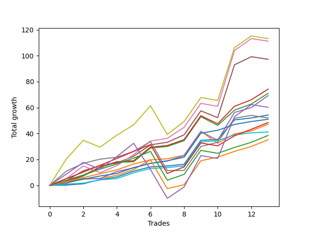

# Short Bernese 001 50 
- Symbol: ES_VM
- Date Range: 03/18/2022 - 09/30/2022
- Trading Period: 7:20-12:30
- Number of Trades: 13



| Name | Win Percent | Profit | Avg Profit / Trade | Avg Time / Trade |      | Name | Win Percent | Profit | Avg Profit / Trade | Avg Time / Trade |
| ---- | ----------- | ------ | ------------------ | ---------------- | ---- | ---- | ----------- | ------ | ------------------ | ---------------- |
| Sorted By <br> Profit | | | | | | Sorted By <br> Win Percentage ||||
| Seven | 69.23 | 47750.00 | 3673.08 | 36:50 |     | Eighty-Two | 100.00 | 21500.00 | 1653.85 | 05:57 |
| Five | 76.92 | 43750.00 | 3365.38 | 30:20 |     | Eighty-One | 100.00 | 16875.00 | 1298.08 | 02:13 |
| Four | 84.62 | 40250.00 | 3096.15 | 24:13 |     | Zero | 100.00 | 15000.00 | 1153.85 | 04:13 |
| Two_C | 92.31 | 30875.00 | 2375.00 | 16:37 |     | Two_C | 92.31 | 30875.00 | 2375.00 | 16:37 |
| Three | 84.62 | 29125.00 | 2240.38 | 13:38 |     | Two | 92.31 | 27750.00 | 2134.62 | 16:31 |
| Two | 92.31 | 27750.00 | 2134.62 | 16:31 |     | One | 92.31 | 15500.00 | 1192.31 | 11:06 |
| Eighty-Two | 100.00 | 21500.00 | 1653.85 | 05:57 |     | Eighty-Three | 92.31 | 13750.00 | 1057.69 | 09:34 |
| Eighty-Five | 84.62 | 17125.00 | 1317.31 | 15:41 |     | Four | 84.62 | 40250.00 | 3096.15 | 24:13 |
| Six | 76.92 | 17000.00 | 1307.69 | 15:53 |     | Three | 84.62 | 29125.00 | 2240.38 | 13:38 |
| Eighty-One | 100.00 | 16875.00 | 1298.08 | 02:13 |     | Eighty-Five | 84.62 | 17125.00 | 1317.31 | 15:41 |
| One | 92.31 | 15500.00 | 1192.31 | 11:06 |     | Eighty-Four | 84.62 | 13250.00 | 1019.23 | 15:08 |
| Zero | 100.00 | 15000.00 | 1153.85 | 04:13 |     | Five | 76.92 | 43750.00 | 3365.38 | 30:20 |
| Eighty-Three | 92.31 | 13750.00 | 1057.69 | 09:34 |     | Six | 76.92 | 17000.00 | 1307.69 | 15:53 |
| Eighty-Four | 84.62 | 13250.00 | 1019.23 | 15:08 |     | Seven | 69.23 | 47750.00 | 3673.08 | 36:50 |
| NEWFI 0000 | 61.54 | 11875.00 | 913.46 | 40:20 |     | NEWFI 0000 | 61.54 | 11875.00 | 913.46 | 40:20 |

## NO STOPLOSS

### Test Zero
* Sell when price hits the middle line of the 20p bollinger
* No Stoploss
* Results:
```
Total Trades: 13
Percent Up: 0.00
Percent Down: 100.00
Total Points Moved Down: 30.00
Potential Profit: 15000.00
Total Points Ups: 0.00 Count Ups: 0
Total Points Downs: 30.00 Count Downs: 13
```

<details><summary>Trades</summary>

<code>In: 2022-03-25 11:57:00		Out: 2022-03-25 11:58:10		Total Position Time: 01:10		Total Move Down: 0.25		Total to Date: 0.25</code> <br />
<code>In: 2022-03-29 08:52:00		Out: 2022-03-29 08:56:20		Total Position Time: 04:20		Total Move Down: 1.50		Total to Date: 1.75</code> <br />
<code>In: 2022-04-25 09:28:00		Out: 2022-04-25 09:31:05		Total Position Time: 03:05		Total Move Down: 3.25		Total to Date: 5.00</code> <br />
<code>In: 2022-06-09 09:46:00		Out: 2022-06-09 09:49:20		Total Position Time: 03:20		Total Move Down: 2.00		Total to Date: 7.00</code> <br />
<code>In: 2022-06-15 09:19:00		Out: 2022-06-15 09:20:10		Total Position Time: 01:10		Total Move Down: 3.25		Total to Date: 10.25</code> <br />
<code>In: 2022-07-06 11:10:00		Out: 2022-07-06 11:11:10		Total Position Time: 01:10		Total Move Down: 7.50		Total to Date: 17.75</code> <br />
<code>In: 2022-08-17 10:33:00		Out: 2022-08-17 10:34:10		Total Position Time: 01:10		Total Move Down: 1.75		Total to Date: 19.50</code> <br />
<code>In: 2022-08-31 09:01:00		Out: 2022-08-31 09:04:15		Total Position Time: 03:15		Total Move Down: 1.25		Total to Date: 20.75</code> <br />
<code>In: 2022-09-12 10:32:00		Out: 2022-09-12 10:36:35		Total Position Time: 04:35		Total Move Down: 1.25		Total to Date: 22.00</code> <br />
<code>In: 2022-09-16 11:31:00		Out: 2022-09-16 11:41:10		Total Position Time: 10:10		Total Move Down: 1.50		Total to Date: 23.50</code> <br />
<code>In: 2022-09-21 11:48:00		Out: 2022-09-21 12:01:05		Total Position Time: 13:05		Total Move Down: 2.50		Total to Date: 26.00</code> <br />
<code>In: 2022-09-22 10:57:00		Out: 2022-09-22 11:01:30		Total Position Time: 04:30		Total Move Down: 1.50		Total to Date: 27.50</code> <br />
<code>In: 2022-09-22 12:16:00		Out: 2022-09-22 12:19:50		Total Position Time: 03:50		Total Move Down: 2.50		Total to Date: 30.00</code> <br />


</details>

### Test One
* Sell when the price hits the upper line of the 20p 1std bollinger
* No Stoploss
* Results:
```
Total Trades: 13
Percent Up: 7.69
Percent Down: 92.31
Total Points Moved Down: 31.00
Potential Profit: 15500.00
Total Points Ups: 8.50 Count Ups: 1
Total Points Downs: 39.50 Count Downs: 12
```

<details><summary>Trades</summary>

<code>In: 2022-03-25 11:57:00		Out: 2022-03-25 12:00:45		Total Position Time: 03:45		Total Move Down: 1.75		Total to Date: 1.75</code> <br />
<code>In: 2022-03-29 08:52:00		Out: 2022-03-29 08:58:40		Total Position Time: 06:40		Total Move Down: 3.00		Total to Date: 4.75</code> <br />
<code>In: 2022-04-25 09:28:00		Out: 2022-04-25 09:42:45		Total Position Time: 14:45		Total Move Down: 2.00		Total to Date: 6.75</code> <br />
<code>In: 2022-06-09 09:46:00		Out: 2022-06-09 09:54:45		Total Position Time: 08:45		Total Move Down: 2.25		Total to Date: 9.00</code> <br />
<code>In: 2022-06-15 09:19:00		Out: 2022-06-15 09:30:35		Total Position Time: 11:35		Total Move Down: 1.75		Total to Date: 10.75</code> <br />
<code>In: 2022-07-06 11:10:00		Out: 2022-07-06 11:11:10		Total Position Time: 01:10		Total Move Down: 7.50		Total to Date: 18.25</code> <br />
<code>In: 2022-08-17 10:33:00		Out: 2022-08-17 10:46:05		Total Position Time: 13:05		Total Move Down: 0.75		Total to Date: 19.00</code> <br />
<code>In: 2022-08-31 09:01:00		Out: 2022-08-31 09:06:20		Total Position Time: 05:20		Total Move Down: 2.50		Total to Date: 21.50</code> <br />
<code>In: 2022-09-12 10:32:00		Out: 2022-09-12 10:41:30		Total Position Time: 09:30		Total Move Down: 2.75		Total to Date: 24.25</code> <br />
<code>In: 2022-09-16 11:31:00		Out: 2022-09-16 12:14:25		Total Position Time: 43:25		Total Move Down: -8.50		Total to Date: 15.75</code> <br />
<code>In: 2022-09-21 11:48:00		Out: 2022-09-21 12:03:25		Total Position Time: 15:25		Total Move Down: 7.25		Total to Date: 23.00</code> <br />
<code>In: 2022-09-22 10:57:00		Out: 2022-09-22 11:03:35		Total Position Time: 06:35		Total Move Down: 2.50		Total to Date: 25.50</code> <br />
<code>In: 2022-09-22 12:16:00		Out: 2022-09-22 12:20:20		Total Position Time: 04:20		Total Move Down: 5.50		Total to Date: 31.00</code> <br />


</details>

### Test Two
* Sell when the price hits the upper line of the 20p 2std bollinger
* No Stoploss
* Results:
```
Total Trades: 13
Percent Up: 7.69
Percent Down: 92.31
Total Points Moved Down: 55.50
Potential Profit: 27750.00
Total Points Ups: 6.75 Count Ups: 1
Total Points Downs: 62.25 Count Downs: 12
```

<details><summary>Trades</summary>

<code>In: 2022-03-25 11:57:00		Out: 2022-03-25 12:00:55		Total Position Time: 03:55		Total Move Down: 2.75		Total to Date: 2.75</code> <br />
<code>In: 2022-03-29 08:52:00		Out: 2022-03-29 09:01:40		Total Position Time: 09:40		Total Move Down: 4.50		Total to Date: 7.25</code> <br />
<code>In: 2022-04-25 09:28:00		Out: 2022-04-25 10:01:15		Total Position Time: 33:15		Total Move Down: 4.00		Total to Date: 11.25</code> <br />
<code>In: 2022-06-09 09:46:00		Out: 2022-06-09 09:55:00		Total Position Time: 09:00		Total Move Down: 4.00		Total to Date: 15.25</code> <br />
<code>In: 2022-06-15 09:19:00		Out: 2022-06-15 09:34:40		Total Position Time: 15:40		Total Move Down: 1.50		Total to Date: 16.75</code> <br />
<code>In: 2022-07-06 11:10:00		Out: 2022-07-06 11:11:45		Total Position Time: 01:45		Total Move Down: 10.50		Total to Date: 27.25</code> <br />
<code>In: 2022-08-17 10:33:00		Out: 2022-08-17 11:00:50		Total Position Time: 27:50		Total Move Down: 2.00		Total to Date: 29.25</code> <br />
<code>In: 2022-08-31 09:01:00		Out: 2022-08-31 09:07:00		Total Position Time: 06:00		Total Move Down: 4.50		Total to Date: 33.75</code> <br />
<code>In: 2022-09-12 10:32:00		Out: 2022-09-12 10:43:35		Total Position Time: 11:35		Total Move Down: 4.00		Total to Date: 37.75</code> <br />
<code>In: 2022-09-16 11:31:00		Out: 2022-09-16 12:28:05		Total Position Time: 57:05		Total Move Down: -6.75		Total to Date: 31.00</code> <br />
<code>In: 2022-09-21 11:48:00		Out: 2022-09-21 12:09:45		Total Position Time: 21:45		Total Move Down: 11.50		Total to Date: 42.50</code> <br />
<code>In: 2022-09-22 10:57:00		Out: 2022-09-22 11:07:55		Total Position Time: 10:55		Total Move Down: 5.00		Total to Date: 47.50</code> <br />
<code>In: 2022-09-22 12:16:00		Out: 2022-09-22 12:22:20		Total Position Time: 06:20		Total Move Down: 8.00		Total to Date: 55.50</code> <br />


</details>

### Test Two_C
* Sell when the price hits the upper line of the 20p 2std bollinger
* No Stoploss
* Results:
```
Total Trades: 13
Percent Up: 7.69
Percent Down: 92.31
Total Points Moved Down: 61.75
Potential Profit: 30875.00
Total Points Ups: 6.25 Count Ups: 1
Total Points Downs: 68.00 Count Downs: 12
```

<details><summary>Trades</summary>

<code>In: 2022-03-25 11:57:00		Out: 2022-03-25 12:01:15		Total Position Time: 04:15		Total Move Down: 3.25		Total to Date: 3.25</code> <br />
<code>In: 2022-03-29 08:52:00		Out: 2022-03-29 09:01:40		Total Position Time: 09:40		Total Move Down: 4.50		Total to Date: 7.75</code> <br />
<code>In: 2022-04-25 09:28:00		Out: 2022-04-25 10:01:20		Total Position Time: 33:20		Total Move Down: 6.50		Total to Date: 14.25</code> <br />
<code>In: 2022-06-09 09:46:00		Out: 2022-06-09 09:55:00		Total Position Time: 09:00		Total Move Down: 4.00		Total to Date: 18.25</code> <br />
<code>In: 2022-06-15 09:19:00		Out: 2022-06-15 09:34:45		Total Position Time: 15:45		Total Move Down: 1.75		Total to Date: 20.00</code> <br />
<code>In: 2022-07-06 11:10:00		Out: 2022-07-06 11:11:45		Total Position Time: 01:45		Total Move Down: 10.50		Total to Date: 30.50</code> <br />
<code>In: 2022-08-17 10:33:00		Out: 2022-08-17 11:00:50		Total Position Time: 27:50		Total Move Down: 2.00		Total to Date: 32.50</code> <br />
<code>In: 2022-08-31 09:01:00		Out: 2022-08-31 09:07:05		Total Position Time: 06:05		Total Move Down: 4.75		Total to Date: 37.25</code> <br />
<code>In: 2022-09-12 10:32:00		Out: 2022-09-12 10:44:05		Total Position Time: 12:05		Total Move Down: 4.25		Total to Date: 41.50</code> <br />
<code>In: 2022-09-16 11:31:00		Out: 2022-09-16 12:28:15		Total Position Time: 57:15		Total Move Down: -6.25		Total to Date: 35.25</code> <br />
<code>In: 2022-09-21 11:48:00		Out: 2022-09-21 12:09:55		Total Position Time: 21:55		Total Move Down: 13.50		Total to Date: 48.75</code> <br />
<code>In: 2022-09-22 10:57:00		Out: 2022-09-22 11:07:55		Total Position Time: 10:55		Total Move Down: 5.00		Total to Date: 53.75</code> <br />
<code>In: 2022-09-22 12:16:00		Out: 2022-09-22 12:22:20		Total Position Time: 06:20		Total Move Down: 8.00		Total to Date: 61.75</code> <br />


</details>

### Test Three
* Sell when price hits the middle line of the 50p bollinger
* No Stoploss
* Results:
```
Total Trades: 13
Percent Up: 15.38
Percent Down: 84.62
Total Points Moved Down: 58.25
Potential Profit: 29125.00
Total Points Ups: 6.75 Count Ups: 2
Total Points Downs: 65.00 Count Downs: 11
```

<details><summary>Trades</summary>

<code>In: 2022-03-25 11:57:00		Out: 2022-03-25 12:00:45		Total Position Time: 03:45		Total Move Down: 1.75		Total to Date: 1.75</code> <br />
<code>In: 2022-03-29 08:52:00		Out: 2022-03-29 09:01:25		Total Position Time: 09:25		Total Move Down: 3.50		Total to Date: 5.25</code> <br />
<code>In: 2022-04-25 09:28:00		Out: 2022-04-25 09:55:05		Total Position Time: 27:05		Total Move Down: -0.00		Total to Date: 5.25</code> <br />
<code>In: 2022-06-09 09:46:00		Out: 2022-06-09 09:55:50		Total Position Time: 09:50		Total Move Down: 5.50		Total to Date: 10.75</code> <br />
<code>In: 2022-06-15 09:19:00		Out: 2022-06-15 09:35:15		Total Position Time: 16:15		Total Move Down: 2.25		Total to Date: 13.00</code> <br />
<code>In: 2022-07-06 11:10:00		Out: 2022-07-06 11:11:10		Total Position Time: 01:10		Total Move Down: 7.50		Total to Date: 20.50</code> <br />
<code>In: 2022-08-17 10:33:00		Out: 2022-08-17 10:34:10		Total Position Time: 01:10		Total Move Down: 1.75		Total to Date: 22.25</code> <br />
<code>In: 2022-08-31 09:01:00		Out: 2022-08-31 09:10:55		Total Position Time: 09:55		Total Move Down: 4.75		Total to Date: 27.00</code> <br />
<code>In: 2022-09-12 10:32:00		Out: 2022-09-12 10:42:15		Total Position Time: 10:15		Total Move Down: 3.50		Total to Date: 30.50</code> <br />
<code>In: 2022-09-16 11:31:00		Out: 2022-09-16 12:19:05		Total Position Time: 48:05		Total Move Down: -6.75		Total to Date: 23.75</code> <br />
<code>In: 2022-09-21 11:48:00		Out: 2022-09-21 12:10:10		Total Position Time: 22:10		Total Move Down: 21.50		Total to Date: 45.25</code> <br />
<code>In: 2022-09-22 10:57:00		Out: 2022-09-22 11:04:15		Total Position Time: 07:15		Total Move Down: 3.75		Total to Date: 49.00</code> <br />
<code>In: 2022-09-22 12:16:00		Out: 2022-09-22 12:27:05		Total Position Time: 11:05		Total Move Down: 9.25		Total to Date: 58.25</code> <br />


</details>

### Test Four
* Sell when the price hits the upper line of the 50p 1std bollinger
* No Stoploss
* Results:
```
Total Trades: 13
Percent Up: 15.38
Percent Down: 84.62
Total Points Moved Down: 80.50
Potential Profit: 40250.00
Total Points Ups: 9.75 Count Ups: 2
Total Points Downs: 90.25 Count Downs: 11
```

<details><summary>Trades</summary>

<code>In: 2022-03-25 11:57:00		Out: 2022-03-25 12:01:35		Total Position Time: 04:35		Total Move Down: 3.75		Total to Date: 3.75</code> <br />
<code>In: 2022-03-29 08:52:00		Out: 2022-03-29 09:02:15		Total Position Time: 10:15		Total Move Down: 7.50		Total to Date: 11.25</code> <br />
<code>In: 2022-04-25 09:28:00		Out: 2022-04-25 10:01:15		Total Position Time: 33:15		Total Move Down: 4.00		Total to Date: 15.25</code> <br />
<code>In: 2022-06-09 09:46:00		Out: 2022-06-09 10:24:05		Total Position Time: 38:05		Total Move Down: 1.75		Total to Date: 17.00</code> <br />
<code>In: 2022-06-15 09:19:00		Out: 2022-06-15 09:39:50		Total Position Time: 20:50		Total Move Down: 5.50		Total to Date: 22.50</code> <br />
<code>In: 2022-07-06 11:10:00		Out: 2022-07-06 11:11:35		Total Position Time: 01:35		Total Move Down: 8.75		Total to Date: 31.25</code> <br />
<code>In: 2022-08-17 10:33:00		Out: 2022-08-17 11:00:50		Total Position Time: 27:50		Total Move Down: 2.00		Total to Date: 33.25</code> <br />
<code>In: 2022-08-31 09:01:00		Out: 2022-08-31 09:22:45		Total Position Time: 21:45		Total Move Down: 6.50		Total to Date: 39.75</code> <br />
<code>In: 2022-09-12 10:32:00		Out: 2022-09-12 11:03:10		Total Position Time: 31:10		Total Move Down: 3.50		Total to Date: 43.25</code> <br />
<code>In: 2022-09-16 11:31:00		Out: 2022-09-16 12:30:25		Total Position Time: 59:25		Total Move Down: -4.25		Total to Date: 39.00</code> <br />
<code>In: 2022-09-21 11:48:00		Out: 2022-09-21 12:11:05		Total Position Time: 23:05		Total Move Down: 40.75		Total to Date: 79.75</code> <br />
<code>In: 2022-09-22 10:57:00		Out: 2022-09-22 11:09:10		Total Position Time: 12:10		Total Move Down: 6.25		Total to Date: 86.00</code> <br />
<code>In: 2022-09-22 12:16:00		Out: 2022-09-22 12:47:00		Total Position Time: 31:00		Total Move Down: -5.50		Total to Date: 80.50</code> <br />


</details>

### Test Five
* Sell when the price hits the upper line of the 50p 2std bollinger
* No Stoploss
* Results:
```
Total Trades: 13
Percent Up: 23.08
Percent Down: 76.92
Total Points Moved Down: 87.50
Potential Profit: 43750.00
Total Points Ups: 19.50 Count Ups: 3
Total Points Downs: 107.00 Count Downs: 10
```

<details><summary>Trades</summary>

<code>In: 2022-03-25 11:57:00		Out: 2022-03-25 12:01:55		Total Position Time: 04:55		Total Move Down: 5.25		Total to Date: 5.25</code> <br />
<code>In: 2022-03-29 08:52:00		Out: 2022-03-29 09:10:45		Total Position Time: 18:45		Total Move Down: 9.25		Total to Date: 14.50</code> <br />
<code>In: 2022-04-25 09:28:00		Out: 2022-04-25 10:28:55		Total Position Time: 60:55		Total Move Down: -7.25		Total to Date: 7.25</code> <br />
<code>In: 2022-06-09 09:46:00		Out: 2022-06-09 10:27:20		Total Position Time: 41:20		Total Move Down: 5.50		Total to Date: 12.75</code> <br />
<code>In: 2022-06-15 09:19:00		Out: 2022-06-15 09:42:05		Total Position Time: 23:05		Total Move Down: 9.00		Total to Date: 21.75</code> <br />
<code>In: 2022-07-06 11:10:00		Out: 2022-07-06 11:11:50		Total Position Time: 01:50		Total Move Down: 10.50		Total to Date: 32.25</code> <br />
<code>In: 2022-08-17 10:33:00		Out: 2022-08-17 11:01:00		Total Position Time: 28:00		Total Move Down: 2.00		Total to Date: 34.25</code> <br />
<code>In: 2022-08-31 09:01:00		Out: 2022-08-31 09:24:25		Total Position Time: 23:25		Total Move Down: 9.25		Total to Date: 43.50</code> <br />
<code>In: 2022-09-12 10:32:00		Out: 2022-09-12 11:17:45		Total Position Time: 45:45		Total Move Down: 5.50		Total to Date: 49.00</code> <br />
<code>In: 2022-09-16 11:31:00		Out: 2022-09-16 12:31:55		Total Position Time: 60:55		Total Move Down: -6.75		Total to Date: 42.25</code> <br />
<code>In: 2022-09-21 11:48:00		Out: 2022-09-21 12:26:20		Total Position Time: 38:20		Total Move Down: 41.75		Total to Date: 84.00</code> <br />
<code>In: 2022-09-22 10:57:00		Out: 2022-09-22 11:13:10		Total Position Time: 16:10		Total Move Down: 9.00		Total to Date: 93.00</code> <br />
<code>In: 2022-09-22 12:16:00		Out: 2022-09-22 12:47:00		Total Position Time: 31:00		Total Move Down: -5.50		Total to Date: 87.50</code> <br />


</details>

### Test Six
* Sell when the price hits the middle line of the 1std VWAP
* No Stoploss
* Results:
```
Total Trades: 13
Percent Up: 23.08
Percent Down: 76.92
Total Points Moved Down: 34.00
Potential Profit: 17000.00
Total Points Ups: 28.00 Count Ups: 3
Total Points Downs: 62.00 Count Downs: 10
```

<details><summary>Trades</summary>

<code>In: 2022-03-25 11:57:00		Out: 2022-03-25 12:07:35		Total Position Time: 10:35		Total Move Down: 11.00		Total to Date: 11.00</code> <br />
<code>In: 2022-03-29 08:52:00		Out: 2022-03-29 09:02:10		Total Position Time: 10:10		Total Move Down: 6.00		Total to Date: 17.00</code> <br />
<code>In: 2022-04-25 09:28:00		Out: 2022-04-25 09:31:05		Total Position Time: 03:05		Total Move Down: 3.25		Total to Date: 20.25</code> <br />
<code>In: 2022-06-09 09:46:00		Out: 2022-06-09 09:48:20		Total Position Time: 02:20		Total Move Down: 1.50		Total to Date: 21.75</code> <br />
<code>In: 2022-06-15 09:19:00		Out: 2022-06-15 09:20:10		Total Position Time: 01:10		Total Move Down: 3.25		Total to Date: 25.00</code> <br />
<code>In: 2022-07-06 11:10:00		Out: 2022-07-06 11:11:10		Total Position Time: 01:10		Total Move Down: 7.50		Total to Date: 32.50</code> <br />
<code>In: 2022-08-17 10:33:00		Out: 2022-08-17 11:33:55		Total Position Time: 60:55		Total Move Down: -22.50		Total to Date: 10.00</code> <br />
<code>In: 2022-08-31 09:01:00		Out: 2022-08-31 09:02:10		Total Position Time: 01:10		Total Move Down: -0.00		Total to Date: 10.00</code> <br />
<code>In: 2022-09-12 10:32:00		Out: 2022-09-12 11:17:45		Total Position Time: 45:45		Total Move Down: 5.50		Total to Date: 15.50</code> <br />
<code>In: 2022-09-16 11:31:00		Out: 2022-09-16 11:41:40		Total Position Time: 10:40		Total Move Down: 3.25		Total to Date: 18.75</code> <br />
<code>In: 2022-09-21 11:48:00		Out: 2022-09-21 12:10:05		Total Position Time: 22:05		Total Move Down: 18.50		Total to Date: 37.25</code> <br />
<code>In: 2022-09-22 10:57:00		Out: 2022-09-22 11:03:25		Total Position Time: 06:25		Total Move Down: 2.25		Total to Date: 39.50</code> <br />
<code>In: 2022-09-22 12:16:00		Out: 2022-09-22 12:47:00		Total Position Time: 31:00		Total Move Down: -5.50		Total to Date: 34.00</code> <br />


</details>

### Test Seven
* Sell when the price hits the upper line of the 1std VWAP
* No Stoploss
* Results:
```
Total Trades: 13
Percent Up: 30.77
Percent Down: 69.23
Total Points Moved Down: 95.50
Potential Profit: 47750.00
Total Points Ups: 42.00 Count Ups: 4
Total Points Downs: 137.50 Count Downs: 9
```

<details><summary>Trades</summary>

<code>In: 2022-03-25 11:57:00		Out: 2022-03-25 12:33:10		Total Position Time: 36:10		Total Move Down: 20.50		Total to Date: 20.50</code> <br />
<code>In: 2022-03-29 08:52:00		Out: 2022-03-29 09:27:55		Total Position Time: 35:55		Total Move Down: 14.25		Total to Date: 34.75</code> <br />
<code>In: 2022-04-25 09:28:00		Out: 2022-04-25 10:28:55		Total Position Time: 60:55		Total Move Down: -7.25		Total to Date: 27.50</code> <br />
<code>In: 2022-06-09 09:46:00		Out: 2022-06-09 10:30:30		Total Position Time: 44:30		Total Move Down: 9.25		Total to Date: 36.75</code> <br />
<code>In: 2022-06-15 09:19:00		Out: 2022-06-15 09:41:40		Total Position Time: 22:40		Total Move Down: 8.00		Total to Date: 44.75</code> <br />
<code>In: 2022-07-06 11:10:00		Out: 2022-07-06 11:12:20		Total Position Time: 02:20		Total Move Down: 14.75		Total to Date: 59.50</code> <br />
<code>In: 2022-08-17 10:33:00		Out: 2022-08-17 11:33:55		Total Position Time: 60:55		Total Move Down: -22.50		Total to Date: 37.00</code> <br />
<code>In: 2022-08-31 09:01:00		Out: 2022-08-31 09:24:30		Total Position Time: 23:30		Total Move Down: 10.00		Total to Date: 47.00</code> <br />
<code>In: 2022-09-12 10:32:00		Out: 2022-09-12 11:32:55		Total Position Time: 60:55		Total Move Down: 11.00		Total to Date: 58.00</code> <br />
<code>In: 2022-09-16 11:31:00		Out: 2022-09-16 12:31:55		Total Position Time: 60:55		Total Move Down: -6.75		Total to Date: 51.25</code> <br />
<code>In: 2022-09-21 11:48:00		Out: 2022-09-21 12:11:05		Total Position Time: 23:05		Total Move Down: 40.75		Total to Date: 92.00</code> <br />
<code>In: 2022-09-22 10:57:00		Out: 2022-09-22 11:13:10		Total Position Time: 16:10		Total Move Down: 9.00		Total to Date: 101.00</code> <br />
<code>In: 2022-09-22 12:16:00		Out: 2022-09-22 12:47:00		Total Position Time: 31:00		Total Move Down: -5.50		Total to Date: 95.50</code> <br />


</details>

## TAKE PROFIT

### Test Eighty-One
* Take Profit of 1 Point
* No Stoploss
* Results:
```
Total Trades: 13
Percent Up: 0.00
Percent Down: 100.00
Total Points Moved Down: 33.75
Potential Profit: 16875.00
Total Points Ups: 0.00 Count Ups: 0
Total Points Downs: 33.75 Count Downs: 13
```

<details><summary>Trades</summary>

<code>In: 2022-03-25 11:57:00		Out: 2022-03-25 11:58:45		Total Position Time: 01:45		Total Move Down: 1.00		Total to Date: 1.00</code> <br />
<code>In: 2022-03-29 08:52:00		Out: 2022-03-29 08:56:10		Total Position Time: 04:10		Total Move Down: 1.00		Total to Date: 2.00</code> <br />
<code>In: 2022-04-25 09:28:00		Out: 2022-04-25 09:29:10		Total Position Time: 01:10		Total Move Down: 2.75		Total to Date: 4.75</code> <br />
<code>In: 2022-06-09 09:46:00		Out: 2022-06-09 09:47:25		Total Position Time: 01:25		Total Move Down: 1.00		Total to Date: 5.75</code> <br />
<code>In: 2022-06-15 09:19:00		Out: 2022-06-15 09:20:10		Total Position Time: 01:10		Total Move Down: 3.25		Total to Date: 9.00</code> <br />
<code>In: 2022-07-06 11:10:00		Out: 2022-07-06 11:11:10		Total Position Time: 01:10		Total Move Down: 7.50		Total to Date: 16.50</code> <br />
<code>In: 2022-08-17 10:33:00		Out: 2022-08-17 10:34:10		Total Position Time: 01:10		Total Move Down: 1.75		Total to Date: 18.25</code> <br />
<code>In: 2022-08-31 09:01:00		Out: 2022-08-31 09:04:15		Total Position Time: 03:15		Total Move Down: 1.25		Total to Date: 19.50</code> <br />
<code>In: 2022-09-12 10:32:00		Out: 2022-09-12 10:36:35		Total Position Time: 04:35		Total Move Down: 1.25		Total to Date: 20.75</code> <br />
<code>In: 2022-09-16 11:31:00		Out: 2022-09-16 11:32:10		Total Position Time: 01:10		Total Move Down: 1.25		Total to Date: 22.00</code> <br />
<code>In: 2022-09-21 11:48:00		Out: 2022-09-21 11:49:10		Total Position Time: 01:10		Total Move Down: 9.50		Total to Date: 31.50</code> <br />
<code>In: 2022-09-22 10:57:00		Out: 2022-09-22 11:01:30		Total Position Time: 04:30		Total Move Down: 1.50		Total to Date: 33.00</code> <br />
<code>In: 2022-09-22 12:16:00		Out: 2022-09-22 12:18:10		Total Position Time: 02:10		Total Move Down: 0.75		Total to Date: 33.75</code> <br />


</details>

### Test Eighty-Two
* Take Profit of 2 Point
* No Stoploss
* Results:
```
Total Trades: 13
Percent Up: 0.00
Percent Down: 100.00
Total Points Moved Down: 43.00
Potential Profit: 21500.00
Total Points Ups: 0.00 Count Ups: 0
Total Points Downs: 43.00 Count Downs: 13
```

<details><summary>Trades</summary>

<code>In: 2022-03-25 11:57:00		Out: 2022-03-25 12:00:50		Total Position Time: 03:50		Total Move Down: 2.75		Total to Date: 2.75</code> <br />
<code>In: 2022-03-29 08:52:00		Out: 2022-03-29 08:57:40		Total Position Time: 05:40		Total Move Down: 2.00		Total to Date: 4.75</code> <br />
<code>In: 2022-04-25 09:28:00		Out: 2022-04-25 09:29:10		Total Position Time: 01:10		Total Move Down: 2.75		Total to Date: 7.50</code> <br />
<code>In: 2022-06-09 09:46:00		Out: 2022-06-09 09:49:20		Total Position Time: 03:20		Total Move Down: 2.00		Total to Date: 9.50</code> <br />
<code>In: 2022-06-15 09:19:00		Out: 2022-06-15 09:20:10		Total Position Time: 01:10		Total Move Down: 3.25		Total to Date: 12.75</code> <br />
<code>In: 2022-07-06 11:10:00		Out: 2022-07-06 11:11:10		Total Position Time: 01:10		Total Move Down: 7.50		Total to Date: 20.25</code> <br />
<code>In: 2022-08-17 10:33:00		Out: 2022-08-17 11:00:50		Total Position Time: 27:50		Total Move Down: 2.00		Total to Date: 22.25</code> <br />
<code>In: 2022-08-31 09:01:00		Out: 2022-08-31 09:06:15		Total Position Time: 05:15		Total Move Down: 2.75		Total to Date: 25.00</code> <br />
<code>In: 2022-09-12 10:32:00		Out: 2022-09-12 10:39:50		Total Position Time: 07:50		Total Move Down: 2.25		Total to Date: 27.25</code> <br />
<code>In: 2022-09-16 11:31:00		Out: 2022-09-16 11:41:15		Total Position Time: 10:15		Total Move Down: 2.25		Total to Date: 29.50</code> <br />
<code>In: 2022-09-21 11:48:00		Out: 2022-09-21 11:49:10		Total Position Time: 01:10		Total Move Down: 9.50		Total to Date: 39.00</code> <br />
<code>In: 2022-09-22 10:57:00		Out: 2022-09-22 11:03:25		Total Position Time: 06:25		Total Move Down: 2.25		Total to Date: 41.25</code> <br />
<code>In: 2022-09-22 12:16:00		Out: 2022-09-22 12:18:25		Total Position Time: 02:25		Total Move Down: 1.75		Total to Date: 43.00</code> <br />


</details>

### Test Eighty-Three
* Take Profit of 3 Point
* No Stoploss
* Results:
```
Total Trades: 13
Percent Up: 7.69
Percent Down: 92.31
Total Points Moved Down: 27.50
Potential Profit: 13750.00
Total Points Ups: 22.50 Count Ups: 1
Total Points Downs: 50.00 Count Downs: 12
```

<details><summary>Trades</summary>

<code>In: 2022-03-25 11:57:00		Out: 2022-03-25 12:01:00		Total Position Time: 04:00		Total Move Down: 3.00		Total to Date: 3.00</code> <br />
<code>In: 2022-03-29 08:52:00		Out: 2022-03-29 08:58:40		Total Position Time: 06:40		Total Move Down: 3.00		Total to Date: 6.00</code> <br />
<code>In: 2022-04-25 09:28:00		Out: 2022-04-25 09:31:00		Total Position Time: 03:00		Total Move Down: 3.00		Total to Date: 9.00</code> <br />
<code>In: 2022-06-09 09:46:00		Out: 2022-06-09 09:54:55		Total Position Time: 08:55		Total Move Down: 3.00		Total to Date: 12.00</code> <br />
<code>In: 2022-06-15 09:19:00		Out: 2022-06-15 09:20:10		Total Position Time: 01:10		Total Move Down: 3.25		Total to Date: 15.25</code> <br />
<code>In: 2022-07-06 11:10:00		Out: 2022-07-06 11:11:10		Total Position Time: 01:10		Total Move Down: 7.50		Total to Date: 22.75</code> <br />
<code>In: 2022-08-17 10:33:00		Out: 2022-08-17 11:33:55		Total Position Time: 60:55		Total Move Down: -22.50		Total to Date: 0.25</code> <br />
<code>In: 2022-08-31 09:01:00		Out: 2022-08-31 09:06:25		Total Position Time: 05:25		Total Move Down: 3.00		Total to Date: 3.25</code> <br />
<code>In: 2022-09-12 10:32:00		Out: 2022-09-12 10:42:10		Total Position Time: 10:10		Total Move Down: 3.00		Total to Date: 6.25</code> <br />
<code>In: 2022-09-16 11:31:00		Out: 2022-09-16 11:41:20		Total Position Time: 10:20		Total Move Down: 2.75		Total to Date: 9.00</code> <br />
<code>In: 2022-09-21 11:48:00		Out: 2022-09-21 11:49:10		Total Position Time: 01:10		Total Move Down: 9.50		Total to Date: 18.50</code> <br />
<code>In: 2022-09-22 10:57:00		Out: 2022-09-22 11:04:15		Total Position Time: 07:15		Total Move Down: 3.75		Total to Date: 22.25</code> <br />
<code>In: 2022-09-22 12:16:00		Out: 2022-09-22 12:20:15		Total Position Time: 04:15		Total Move Down: 5.25		Total to Date: 27.50</code> <br />


</details>

### Test Eighty-Four
* Take Profit of 4 Point
* No Stoploss
* Results:
```
Total Trades: 13
Percent Up: 15.38
Percent Down: 84.62
Total Points Moved Down: 26.50
Potential Profit: 13250.00
Total Points Ups: 29.25 Count Ups: 2
Total Points Downs: 55.75 Count Downs: 11
```

<details><summary>Trades</summary>

<code>In: 2022-03-25 11:57:00		Out: 2022-03-25 12:01:45		Total Position Time: 04:45		Total Move Down: 4.00		Total to Date: 4.00</code> <br />
<code>In: 2022-03-29 08:52:00		Out: 2022-03-29 09:01:35		Total Position Time: 09:35		Total Move Down: 4.00		Total to Date: 8.00</code> <br />
<code>In: 2022-04-25 09:28:00		Out: 2022-04-25 09:31:10		Total Position Time: 03:10		Total Move Down: 4.50		Total to Date: 12.50</code> <br />
<code>In: 2022-06-09 09:46:00		Out: 2022-06-09 09:55:00		Total Position Time: 09:00		Total Move Down: 4.00		Total to Date: 16.50</code> <br />
<code>In: 2022-06-15 09:19:00		Out: 2022-06-15 09:36:10		Total Position Time: 17:10		Total Move Down: 4.50		Total to Date: 21.00</code> <br />
<code>In: 2022-07-06 11:10:00		Out: 2022-07-06 11:11:10		Total Position Time: 01:10		Total Move Down: 7.50		Total to Date: 28.50</code> <br />
<code>In: 2022-08-17 10:33:00		Out: 2022-08-17 11:33:55		Total Position Time: 60:55		Total Move Down: -22.50		Total to Date: 6.00</code> <br />
<code>In: 2022-08-31 09:01:00		Out: 2022-08-31 09:07:00		Total Position Time: 06:00		Total Move Down: 4.50		Total to Date: 10.50</code> <br />
<code>In: 2022-09-12 10:32:00		Out: 2022-09-12 10:43:30		Total Position Time: 11:30		Total Move Down: 4.00		Total to Date: 14.50</code> <br />
<code>In: 2022-09-16 11:31:00		Out: 2022-09-16 12:31:55		Total Position Time: 60:55		Total Move Down: -6.75		Total to Date: 7.75</code> <br />
<code>In: 2022-09-21 11:48:00		Out: 2022-09-21 11:49:10		Total Position Time: 01:10		Total Move Down: 9.50		Total to Date: 17.25</code> <br />
<code>In: 2022-09-22 10:57:00		Out: 2022-09-22 11:04:20		Total Position Time: 07:20		Total Move Down: 4.00		Total to Date: 21.25</code> <br />
<code>In: 2022-09-22 12:16:00		Out: 2022-09-22 12:20:15		Total Position Time: 04:15		Total Move Down: 5.25		Total to Date: 26.50</code> <br />


</details>

### Test Eighty-Five
* Take Profit of 5 Point
* No Stoploss
* Results:
```
Total Trades: 13
Percent Up: 15.38
Percent Down: 84.62
Total Points Moved Down: 34.25
Potential Profit: 17125.00
Total Points Ups: 29.25 Count Ups: 2
Total Points Downs: 63.50 Count Downs: 11
```

<details><summary>Trades</summary>

<code>In: 2022-03-25 11:57:00		Out: 2022-03-25 12:01:55		Total Position Time: 04:55		Total Move Down: 5.25		Total to Date: 5.25</code> <br />
<code>In: 2022-03-29 08:52:00		Out: 2022-03-29 09:01:45		Total Position Time: 09:45		Total Move Down: 5.00		Total to Date: 10.25</code> <br />
<code>In: 2022-04-25 09:28:00		Out: 2022-04-25 09:31:15		Total Position Time: 03:15		Total Move Down: 5.25		Total to Date: 15.50</code> <br />
<code>In: 2022-06-09 09:46:00		Out: 2022-06-09 09:55:45		Total Position Time: 09:45		Total Move Down: 5.25		Total to Date: 20.75</code> <br />
<code>In: 2022-06-15 09:19:00		Out: 2022-06-15 09:38:40		Total Position Time: 19:40		Total Move Down: 5.50		Total to Date: 26.25</code> <br />
<code>In: 2022-07-06 11:10:00		Out: 2022-07-06 11:11:10		Total Position Time: 01:10		Total Move Down: 7.50		Total to Date: 33.75</code> <br />
<code>In: 2022-08-17 10:33:00		Out: 2022-08-17 11:33:55		Total Position Time: 60:55		Total Move Down: -22.50		Total to Date: 11.25</code> <br />
<code>In: 2022-08-31 09:01:00		Out: 2022-08-31 09:07:10		Total Position Time: 06:10		Total Move Down: 5.00		Total to Date: 16.25</code> <br />
<code>In: 2022-09-12 10:32:00		Out: 2022-09-12 10:44:20		Total Position Time: 12:20		Total Move Down: 5.00		Total to Date: 21.25</code> <br />
<code>In: 2022-09-16 11:31:00		Out: 2022-09-16 12:31:55		Total Position Time: 60:55		Total Move Down: -6.75		Total to Date: 14.50</code> <br />
<code>In: 2022-09-21 11:48:00		Out: 2022-09-21 11:49:10		Total Position Time: 01:10		Total Move Down: 9.50		Total to Date: 24.00</code> <br />
<code>In: 2022-09-22 10:57:00		Out: 2022-09-22 11:06:50		Total Position Time: 09:50		Total Move Down: 5.00		Total to Date: 29.00</code> <br />
<code>In: 2022-09-22 12:16:00		Out: 2022-09-22 12:20:15		Total Position Time: 04:15		Total Move Down: 5.25		Total to Date: 34.25</code> <br />


</details>

## Indicator Exits

### Test NEWFI 0000
* Newfi 0000
* No Stoploss
* Results:
```
Total Trades: 13
Percent Up: 38.46
Percent Down: 61.54
Total Points Moved Down: 23.75
Potential Profit: 11875.00
Total Points Ups: 64.75 Count Ups: 5
Total Points Downs: 88.50 Count Downs: 8
```

<details><summary>Trades</summary>

<code>In: 2022-03-25 11:57:00		Out: 2022-03-25 12:12:05		Total Position Time: 15:05		Total Move Down: 5.50		Total to Date: 5.50</code> <br />
<code>In: 2022-03-29 08:52:00		Out: 2022-03-29 09:13:05		Total Position Time: 21:05		Total Move Down: 9.00		Total to Date: 14.50</code> <br />
<code>In: 2022-04-25 09:28:00		Out: 2022-04-25 10:28:55		Total Position Time: 60:55		Total Move Down: -7.25		Total to Date: 7.25</code> <br />
<code>In: 2022-06-09 09:46:00		Out: 2022-06-09 10:35:05		Total Position Time: 49:05		Total Move Down: 10.75		Total to Date: 18.00</code> <br />
<code>In: 2022-06-15 09:19:00		Out: 2022-06-15 09:49:05		Total Position Time: 30:05		Total Move Down: 9.75		Total to Date: 27.75</code> <br />
<code>In: 2022-07-06 11:10:00		Out: 2022-07-06 12:10:55		Total Position Time: 60:55		Total Move Down: -22.75		Total to Date: 5.00</code> <br />
<code>In: 2022-08-17 10:33:00		Out: 2022-08-17 11:33:55		Total Position Time: 60:55		Total Move Down: -22.50		Total to Date: -17.50</code> <br />
<code>In: 2022-08-31 09:01:00		Out: 2022-08-31 09:28:05		Total Position Time: 27:05		Total Move Down: 9.25		Total to Date: -8.25</code> <br />
<code>In: 2022-09-12 10:32:00		Out: 2022-09-12 11:22:05		Total Position Time: 50:05		Total Move Down: 8.00		Total to Date: -0.25</code> <br />
<code>In: 2022-09-16 11:31:00		Out: 2022-09-16 12:31:55		Total Position Time: 60:55		Total Move Down: -6.75		Total to Date: -7.00</code> <br />
<code>In: 2022-09-21 11:48:00		Out: 2022-09-21 12:24:05		Total Position Time: 36:05		Total Move Down: 29.50		Total to Date: 22.50</code> <br />
<code>In: 2022-09-22 10:57:00		Out: 2022-09-22 11:18:05		Total Position Time: 21:05		Total Move Down: 6.75		Total to Date: 29.25</code> <br />
<code>In: 2022-09-22 12:16:00		Out: 2022-09-22 12:47:00		Total Position Time: 31:00		Total Move Down: -5.50		Total to Date: 23.75</code> <br />


</details>