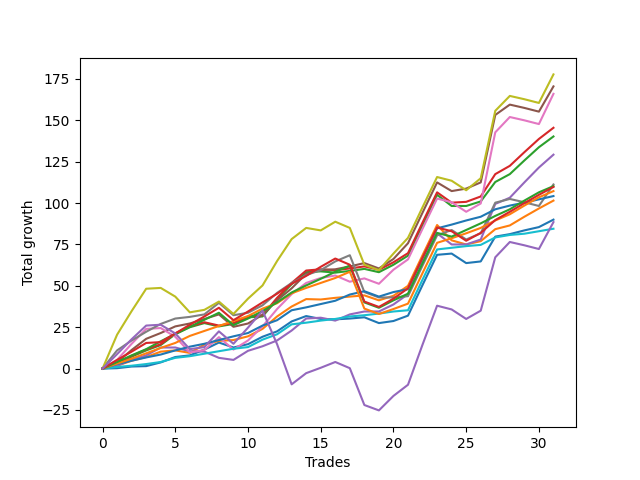

# Short Bernese 003 50 
- Symbol: ES_VM
- Date Range: 03/18/2022 - 09/30/2022
- Trading Period: 7:20-12:30
- Number of Trades: 31



| Name | Win Percent | Profit | Avg Profit / Trade | Avg Time / Trade |      | Name | Win Percent | Profit | Avg Profit / Trade | Avg Time / Trade |
| ---- | ----------- | ------ | ------------------ | ---------------- | ---- | ---- | ----------- | ------ | ------------------ | ---------------- |
| Sorted By <br> Profit | | | | | | Sorted By <br> Win Percentage ||||
| Seven | 64.52 | 88875.00 | 2866.94 | 38:39 |     | Eighty-One | 100.00 | 42250.00 | 1362.90 | 05:00 |
| Four | 83.87 | 85250.00 | 2750.00 | 26:32 |     | Eighty-Two | 96.77 | 52125.00 | 1681.45 | 09:55 |
| Five | 70.97 | 83000.00 | 2677.42 | 34:32 |     | Eighty-Three | 93.55 | 53625.00 | 1729.84 | 13:02 |
| Two_C | 87.10 | 72750.00 | 2346.77 | 18:18 |     | Two_C | 87.10 | 72750.00 | 2346.77 | 18:18 |
| Two | 83.87 | 70125.00 | 2262.10 | 18:12 |     | Eighty-Four | 87.10 | 55125.00 | 1778.23 | 17:06 |
| Three | 70.97 | 64625.00 | 2084.68 | 16:17 |     | Four | 83.87 | 85250.00 | 2750.00 | 26:32 |
| Six | 77.42 | 55625.00 | 1794.35 | 21:03 |     | Two | 83.87 | 70125.00 | 2262.10 | 18:12 |
| Eighty-Four | 87.10 | 55125.00 | 1778.23 | 17:06 |     | One | 83.87 | 50750.00 | 1637.10 | 10:04 |
| Eighty-Five | 80.65 | 54875.00 | 1770.16 | 21:19 |     | Zero | 83.87 | 45000.00 | 1451.61 | 05:11 |
| Eighty-Three | 93.55 | 53625.00 | 1729.84 | 13:02 |     | Eighty-Five | 80.65 | 54875.00 | 1770.16 | 21:19 |
| Eighty-Two | 96.77 | 52125.00 | 1681.45 | 09:55 |     | Six | 77.42 | 55625.00 | 1794.35 | 21:03 |
| One | 83.87 | 50750.00 | 1637.10 | 10:04 |     | Five | 70.97 | 83000.00 | 2677.42 | 34:32 |
| Zero | 83.87 | 45000.00 | 1451.61 | 05:11 |     | Three | 70.97 | 64625.00 | 2084.68 | 16:17 |
| NEWFI 0000 | 61.29 | 44250.00 | 1427.42 | 41:59 |     | Seven | 64.52 | 88875.00 | 2866.94 | 38:39 |
| Eighty-One | 100.00 | 42250.00 | 1362.90 | 05:00 |     | NEWFI 0000 | 61.29 | 44250.00 | 1427.42 | 41:59 |

## NO STOPLOSS

### Test Zero
* Sell when price hits the middle line of the 20p bollinger
* No Stoploss
* Results:
```
Total Trades: 31
Percent Up: 16.13
Percent Down: 83.87
Total Points Moved Down: 90.00
Potential Profit: 45000.00
Total Points Ups: 14.25 Count Ups: 5
Total Points Downs: 104.25 Count Downs: 26
```

<details><summary>Trades</summary>

<code>In: 2022-03-25 11:57:00		Out: 2022-03-25 11:57:15		Total Position Time: 00:15		Total Move Down: 0.25		Total to Date: 0.25</code> <br />
<code>In: 2022-03-29 08:52:00		Out: 2022-03-29 08:56:15		Total Position Time: 04:15		Total Move Down: 1.00		Total to Date: 1.25</code> <br />
<code>In: 2022-03-29 08:53:00		Out: 2022-03-29 08:56:15		Total Position Time: 03:15		Total Move Down: 0.25		Total to Date: 1.50</code> <br />
<code>In: 2022-04-20 09:55:00		Out: 2022-04-20 09:59:15		Total Position Time: 04:15		Total Move Down: 2.25		Total to Date: 3.75</code> <br />
<code>In: 2022-04-25 09:28:00		Out: 2022-04-25 09:31:05		Total Position Time: 03:05		Total Move Down: 3.25		Total to Date: 7.00</code> <br />
<code>In: 2022-04-25 09:29:00		Out: 2022-04-25 09:31:05		Total Position Time: 02:05		Total Move Down: 1.00		Total to Date: 8.00</code> <br />
<code>In: 2022-05-04 09:42:00		Out: 2022-05-04 09:45:30		Total Position Time: 03:30		Total Move Down: 3.50		Total to Date: 11.50</code> <br />
<code>In: 2022-05-24 08:51:00		Out: 2022-05-24 09:01:05		Total Position Time: 10:05		Total Move Down: 4.25		Total to Date: 15.75</code> <br />
<code>In: 2022-05-24 10:44:00		Out: 2022-05-24 11:01:15		Total Position Time: 17:15		Total Move Down: -3.00		Total to Date: 12.75</code> <br />
<code>In: 2022-06-09 09:46:00		Out: 2022-06-09 09:49:20		Total Position Time: 03:20		Total Move Down: 2.00		Total to Date: 14.75</code> <br />
<code>In: 2022-06-15 09:19:00		Out: 2022-06-15 09:19:10		Total Position Time: 00:10		Total Move Down: 4.50		Total to Date: 19.25</code> <br />
<code>In: 2022-07-06 11:10:00		Out: 2022-07-06 11:10:10		Total Position Time: 00:10		Total Move Down: 3.25		Total to Date: 22.50</code> <br />
<code>In: 2022-07-06 11:11:00		Out: 2022-07-06 11:11:10		Total Position Time: 00:10		Total Move Down: 6.00		Total to Date: 28.50</code> <br />
<code>In: 2022-08-01 12:18:00		Out: 2022-08-01 12:20:15		Total Position Time: 02:15		Total Move Down: 3.25		Total to Date: 31.75</code> <br />
<code>In: 2022-08-04 10:31:00		Out: 2022-08-04 10:43:00		Total Position Time: 12:00		Total Move Down: -1.75		Total to Date: 30.00</code> <br />
<code>In: 2022-08-05 10:10:00		Out: 2022-08-05 10:20:05		Total Position Time: 10:05		Total Move Down: -0.25		Total to Date: 29.75</code> <br />
<code>In: 2022-08-17 09:41:00		Out: 2022-08-17 09:50:20		Total Position Time: 09:20		Total Move Down: 0.50		Total to Date: 30.25</code> <br />
<code>In: 2022-08-17 10:33:00		Out: 2022-08-17 10:34:05		Total Position Time: 01:05		Total Move Down: 0.75		Total to Date: 31.00</code> <br />
<code>In: 2022-08-25 10:37:00		Out: 2022-08-25 10:56:00		Total Position Time: 19:00		Total Move Down: -3.50		Total to Date: 27.50</code> <br />
<code>In: 2022-08-31 09:01:00		Out: 2022-08-31 09:04:15		Total Position Time: 03:15		Total Move Down: 1.25		Total to Date: 28.75</code> <br />
<code>In: 2022-09-01 08:39:00		Out: 2022-09-01 08:42:00		Total Position Time: 03:00		Total Move Down: 3.25		Total to Date: 32.00</code> <br />
<code>In: 2022-09-12 10:32:00		Out: 2022-09-12 10:32:10		Total Position Time: 00:10		Total Move Down: 18.50		Total to Date: 50.50</code> <br />
<code>In: 2022-09-12 10:33:00		Out: 2022-09-12 10:33:10		Total Position Time: 00:10		Total Move Down: 18.25		Total to Date: 68.75</code> <br />
<code>In: 2022-09-16 11:31:00		Out: 2022-09-16 11:41:05		Total Position Time: 10:05		Total Move Down: 0.75		Total to Date: 69.50</code> <br />
<code>In: 2022-09-16 11:51:00		Out: 2022-09-16 12:11:05		Total Position Time: 20:05		Total Move Down: -5.75		Total to Date: 63.75</code> <br />
<code>In: 2022-09-21 09:38:00		Out: 2022-09-21 09:39:05		Total Position Time: 01:05		Total Move Down: 1.00		Total to Date: 64.75</code> <br />
<code>In: 2022-09-21 11:48:00		Out: 2022-09-21 11:52:05		Total Position Time: 04:05		Total Move Down: 15.00		Total to Date: 79.75</code> <br />
<code>In: 2022-09-22 10:57:00		Out: 2022-09-22 11:01:30		Total Position Time: 04:30		Total Move Down: 1.50		Total to Date: 81.25</code> <br />
<code>In: 2022-09-22 12:16:00		Out: 2022-09-22 12:18:35		Total Position Time: 02:35		Total Move Down: 2.25		Total to Date: 83.50</code> <br />
<code>In: 2022-09-22 12:17:00		Out: 2022-09-22 12:18:35		Total Position Time: 01:35		Total Move Down: 2.00		Total to Date: 85.50</code> <br />
<code>In: 2022-09-29 08:57:00		Out: 2022-09-29 09:01:50		Total Position Time: 04:50		Total Move Down: 4.50		Total to Date: 90.00</code> <br />


</details>

### Test One
* Sell when the price hits the upper line of the 20p 1std bollinger
* No Stoploss
* Results:
```
Total Trades: 31
Percent Up: 16.13
Percent Down: 83.87
Total Points Moved Down: 101.50
Potential Profit: 50750.00
Total Points Ups: 16.50 Count Ups: 5
Total Points Downs: 118.00 Count Downs: 26
```

<details><summary>Trades</summary>

<code>In: 2022-03-25 11:57:00		Out: 2022-03-25 12:00:45		Total Position Time: 03:45		Total Move Down: 1.75		Total to Date: 1.75</code> <br />
<code>In: 2022-03-29 08:52:00		Out: 2022-03-29 08:58:40		Total Position Time: 06:40		Total Move Down: 3.00		Total to Date: 4.75</code> <br />
<code>In: 2022-03-29 08:53:00		Out: 2022-03-29 08:58:40		Total Position Time: 05:40		Total Move Down: 2.25		Total to Date: 7.00</code> <br />
<code>In: 2022-04-20 09:55:00		Out: 2022-04-20 10:08:15		Total Position Time: 13:15		Total Move Down: 3.25		Total to Date: 10.25</code> <br />
<code>In: 2022-04-25 09:28:00		Out: 2022-04-25 09:42:35		Total Position Time: 14:35		Total Move Down: 0.75		Total to Date: 11.00</code> <br />
<code>In: 2022-04-25 09:29:00		Out: 2022-04-25 09:42:35		Total Position Time: 13:35		Total Move Down: -1.50		Total to Date: 9.50</code> <br />
<code>In: 2022-05-04 09:42:00		Out: 2022-05-04 09:46:30		Total Position Time: 04:30		Total Move Down: 5.00		Total to Date: 14.50</code> <br />
<code>In: 2022-05-24 08:51:00		Out: 2022-05-24 09:06:10		Total Position Time: 15:10		Total Move Down: 2.25		Total to Date: 16.75</code> <br />
<code>In: 2022-05-24 10:44:00		Out: 2022-05-24 11:01:40		Total Position Time: 17:40		Total Move Down: 0.50		Total to Date: 17.25</code> <br />
<code>In: 2022-06-09 09:46:00		Out: 2022-06-09 09:54:45		Total Position Time: 08:45		Total Move Down: 2.25		Total to Date: 19.50</code> <br />
<code>In: 2022-06-15 09:19:00		Out: 2022-06-15 09:19:10		Total Position Time: 00:10		Total Move Down: 4.50		Total to Date: 24.00</code> <br />
<code>In: 2022-07-06 11:10:00		Out: 2022-07-06 11:11:10		Total Position Time: 01:10		Total Move Down: 7.50		Total to Date: 31.50</code> <br />
<code>In: 2022-07-06 11:11:00		Out: 2022-07-06 11:11:10		Total Position Time: 00:10		Total Move Down: 6.00		Total to Date: 37.50</code> <br />
<code>In: 2022-08-01 12:18:00		Out: 2022-08-01 12:21:35		Total Position Time: 03:35		Total Move Down: 4.50		Total to Date: 42.00</code> <br />
<code>In: 2022-08-04 10:31:00		Out: 2022-08-04 10:43:10		Total Position Time: 12:10		Total Move Down: -0.25		Total to Date: 41.75</code> <br />
<code>In: 2022-08-05 10:10:00		Out: 2022-08-05 10:23:15		Total Position Time: 13:15		Total Move Down: 1.00		Total to Date: 42.75</code> <br />
<code>In: 2022-08-17 09:41:00		Out: 2022-08-17 09:55:10		Total Position Time: 14:10		Total Move Down: 0.75		Total to Date: 43.50</code> <br />
<code>In: 2022-08-17 10:33:00		Out: 2022-08-17 10:46:00		Total Position Time: 13:00		Total Move Down: 0.75		Total to Date: 44.25</code> <br />
<code>In: 2022-08-25 10:37:00		Out: 2022-08-25 11:00:40		Total Position Time: 23:40		Total Move Down: -3.00		Total to Date: 41.25</code> <br />
<code>In: 2022-08-31 09:01:00		Out: 2022-08-31 09:06:15		Total Position Time: 05:15		Total Move Down: 2.75		Total to Date: 44.00</code> <br />
<code>In: 2022-09-01 08:39:00		Out: 2022-09-01 08:43:55		Total Position Time: 04:55		Total Move Down: 6.00		Total to Date: 50.00</code> <br />
<code>In: 2022-09-12 10:32:00		Out: 2022-09-12 10:32:10		Total Position Time: 00:10		Total Move Down: 18.50		Total to Date: 68.50</code> <br />
<code>In: 2022-09-12 10:33:00		Out: 2022-09-12 10:33:10		Total Position Time: 00:10		Total Move Down: 18.25		Total to Date: 86.75</code> <br />
<code>In: 2022-09-16 11:31:00		Out: 2022-09-16 12:14:20		Total Position Time: 43:20		Total Move Down: -9.25		Total to Date: 77.50</code> <br />
<code>In: 2022-09-16 11:51:00		Out: 2022-09-16 12:14:20		Total Position Time: 23:20		Total Move Down: -2.50		Total to Date: 75.00</code> <br />
<code>In: 2022-09-21 09:38:00		Out: 2022-09-21 09:45:05		Total Position Time: 07:05		Total Move Down: 2.00		Total to Date: 77.00</code> <br />
<code>In: 2022-09-21 11:48:00		Out: 2022-09-21 12:03:25		Total Position Time: 15:25		Total Move Down: 7.25		Total to Date: 84.25</code> <br />
<code>In: 2022-09-22 10:57:00		Out: 2022-09-22 11:03:25		Total Position Time: 06:25		Total Move Down: 2.25		Total to Date: 86.50</code> <br />
<code>In: 2022-09-22 12:16:00		Out: 2022-09-22 12:20:15		Total Position Time: 04:15		Total Move Down: 5.25		Total to Date: 91.75</code> <br />
<code>In: 2022-09-22 12:17:00		Out: 2022-09-22 12:20:15		Total Position Time: 03:15		Total Move Down: 5.00		Total to Date: 96.75</code> <br />
<code>In: 2022-09-29 08:57:00		Out: 2022-09-29 09:10:55		Total Position Time: 13:55		Total Move Down: 4.75		Total to Date: 101.50</code> <br />


</details>

### Test Two
* Sell when the price hits the upper line of the 20p 2std bollinger
* No Stoploss
* Results:
```
Total Trades: 31
Percent Up: 16.13
Percent Down: 83.87
Total Points Moved Down: 140.25
Potential Profit: 70125.00
Total Points Ups: 11.50 Count Ups: 5
Total Points Downs: 151.75 Count Downs: 26
```

<details><summary>Trades</summary>

<code>In: 2022-03-25 11:57:00		Out: 2022-03-25 12:00:55		Total Position Time: 03:55		Total Move Down: 2.75		Total to Date: 2.75</code> <br />
<code>In: 2022-03-29 08:52:00		Out: 2022-03-29 09:01:40		Total Position Time: 09:40		Total Move Down: 4.50		Total to Date: 7.25</code> <br />
<code>In: 2022-03-29 08:53:00		Out: 2022-03-29 09:01:40		Total Position Time: 08:40		Total Move Down: 3.75		Total to Date: 11.00</code> <br />
<code>In: 2022-04-20 09:55:00		Out: 2022-04-20 10:08:15		Total Position Time: 13:15		Total Move Down: 3.25		Total to Date: 14.25</code> <br />
<code>In: 2022-04-25 09:28:00		Out: 2022-04-25 10:01:20		Total Position Time: 33:20		Total Move Down: 6.50		Total to Date: 20.75</code> <br />
<code>In: 2022-04-25 09:29:00		Out: 2022-04-25 10:01:20		Total Position Time: 32:20		Total Move Down: 4.25		Total to Date: 25.00</code> <br />
<code>In: 2022-05-04 09:42:00		Out: 2022-05-04 10:11:15		Total Position Time: 29:15		Total Move Down: 2.50		Total to Date: 27.50</code> <br />
<code>In: 2022-05-24 08:51:00		Out: 2022-05-24 09:31:20		Total Position Time: 40:20		Total Move Down: -2.00		Total to Date: 25.50</code> <br />
<code>In: 2022-05-24 10:44:00		Out: 2022-05-24 11:01:50		Total Position Time: 17:50		Total Move Down: 1.50		Total to Date: 27.00</code> <br />
<code>In: 2022-06-09 09:46:00		Out: 2022-06-09 09:55:00		Total Position Time: 09:00		Total Move Down: 4.00		Total to Date: 31.00</code> <br />
<code>In: 2022-06-15 09:19:00		Out: 2022-06-15 09:34:05		Total Position Time: 15:05		Total Move Down: 0.50		Total to Date: 31.50</code> <br />
<code>In: 2022-07-06 11:10:00		Out: 2022-07-06 11:11:45		Total Position Time: 01:45		Total Move Down: 10.50		Total to Date: 42.00</code> <br />
<code>In: 2022-07-06 11:11:00		Out: 2022-07-06 11:11:45		Total Position Time: 00:45		Total Move Down: 9.00		Total to Date: 51.00</code> <br />
<code>In: 2022-08-01 12:18:00		Out: 2022-08-01 12:22:40		Total Position Time: 04:40		Total Move Down: 7.25		Total to Date: 58.25</code> <br />
<code>In: 2022-08-04 10:31:00		Out: 2022-08-04 10:45:25		Total Position Time: 14:25		Total Move Down: 0.50		Total to Date: 58.75</code> <br />
<code>In: 2022-08-05 10:10:00		Out: 2022-08-05 10:49:30		Total Position Time: 39:30		Total Move Down: -0.75		Total to Date: 58.00</code> <br />
<code>In: 2022-08-17 09:41:00		Out: 2022-08-17 09:58:30		Total Position Time: 17:30		Total Move Down: 1.00		Total to Date: 59.00</code> <br />
<code>In: 2022-08-17 10:33:00		Out: 2022-08-17 10:57:00		Total Position Time: 24:00		Total Move Down: 1.25		Total to Date: 60.25</code> <br />
<code>In: 2022-08-25 10:37:00		Out: 2022-08-25 11:04:35		Total Position Time: 27:35		Total Move Down: -2.00		Total to Date: 58.25</code> <br />
<code>In: 2022-08-31 09:01:00		Out: 2022-08-31 09:07:00		Total Position Time: 06:00		Total Move Down: 4.50		Total to Date: 62.75</code> <br />
<code>In: 2022-09-01 08:39:00		Out: 2022-09-01 09:37:10		Total Position Time: 58:10		Total Move Down: 5.50		Total to Date: 68.25</code> <br />
<code>In: 2022-09-12 10:32:00		Out: 2022-09-12 10:32:10		Total Position Time: 00:10		Total Move Down: 18.50		Total to Date: 86.75</code> <br />
<code>In: 2022-09-12 10:33:00		Out: 2022-09-12 10:33:10		Total Position Time: 00:10		Total Move Down: 18.25		Total to Date: 105.00</code> <br />
<code>In: 2022-09-16 11:31:00		Out: 2022-09-16 12:28:05		Total Position Time: 57:05		Total Move Down: -6.75		Total to Date: 98.25</code> <br />
<code>In: 2022-09-16 11:51:00		Out: 2022-09-16 12:28:05		Total Position Time: 37:05		Total Move Down: -0.00		Total to Date: 98.25</code> <br />
<code>In: 2022-09-21 09:38:00		Out: 2022-09-21 09:47:15		Total Position Time: 09:15		Total Move Down: 2.75		Total to Date: 101.00</code> <br />
<code>In: 2022-09-21 11:48:00		Out: 2022-09-21 12:09:10		Total Position Time: 21:10		Total Move Down: 11.75		Total to Date: 112.75</code> <br />
<code>In: 2022-09-22 10:57:00		Out: 2022-09-22 11:06:45		Total Position Time: 09:45		Total Move Down: 4.75		Total to Date: 117.50</code> <br />
<code>In: 2022-09-22 12:16:00		Out: 2022-09-22 12:20:40		Total Position Time: 04:40		Total Move Down: 8.25		Total to Date: 125.75</code> <br />
<code>In: 2022-09-22 12:17:00		Out: 2022-09-22 12:20:40		Total Position Time: 03:40		Total Move Down: 8.00		Total to Date: 133.75</code> <br />
<code>In: 2022-09-29 08:57:00		Out: 2022-09-29 09:11:20		Total Position Time: 14:20		Total Move Down: 6.50		Total to Date: 140.25</code> <br />


</details>

### Test Two_C
* Sell when the price hits the upper line of the 20p 2std bollinger
* No Stoploss
* Results:
```
Total Trades: 31
Percent Up: 12.90
Percent Down: 87.10
Total Points Moved Down: 145.50
Potential Profit: 72750.00
Total Points Ups: 10.75 Count Ups: 4
Total Points Downs: 156.25 Count Downs: 27
```

<details><summary>Trades</summary>

<code>In: 2022-03-25 11:57:00		Out: 2022-03-25 12:01:15		Total Position Time: 04:15		Total Move Down: 3.25		Total to Date: 3.25</code> <br />
<code>In: 2022-03-29 08:52:00		Out: 2022-03-29 09:01:40		Total Position Time: 09:40		Total Move Down: 4.50		Total to Date: 7.75</code> <br />
<code>In: 2022-03-29 08:53:00		Out: 2022-03-29 09:01:40		Total Position Time: 08:40		Total Move Down: 3.75		Total to Date: 11.50</code> <br />
<code>In: 2022-04-20 09:55:00		Out: 2022-04-20 10:08:15		Total Position Time: 13:15		Total Move Down: 3.25		Total to Date: 14.75</code> <br />
<code>In: 2022-04-25 09:28:00		Out: 2022-04-25 10:01:20		Total Position Time: 33:20		Total Move Down: 6.50		Total to Date: 21.25</code> <br />
<code>In: 2022-04-25 09:29:00		Out: 2022-04-25 10:01:20		Total Position Time: 32:20		Total Move Down: 4.25		Total to Date: 25.50</code> <br />
<code>In: 2022-05-04 09:42:00		Out: 2022-05-04 10:11:15		Total Position Time: 29:15		Total Move Down: 2.50		Total to Date: 28.00</code> <br />
<code>In: 2022-05-24 08:51:00		Out: 2022-05-24 09:31:35		Total Position Time: 40:35		Total Move Down: -2.00		Total to Date: 26.00</code> <br />
<code>In: 2022-05-24 10:44:00		Out: 2022-05-24 11:01:50		Total Position Time: 17:50		Total Move Down: 1.50		Total to Date: 27.50</code> <br />
<code>In: 2022-06-09 09:46:00		Out: 2022-06-09 09:55:00		Total Position Time: 09:00		Total Move Down: 4.00		Total to Date: 31.50</code> <br />
<code>In: 2022-06-15 09:19:00		Out: 2022-06-15 09:34:10		Total Position Time: 15:10		Total Move Down: 0.75		Total to Date: 32.25</code> <br />
<code>In: 2022-07-06 11:10:00		Out: 2022-07-06 11:11:45		Total Position Time: 01:45		Total Move Down: 10.50		Total to Date: 42.75</code> <br />
<code>In: 2022-07-06 11:11:00		Out: 2022-07-06 11:11:45		Total Position Time: 00:45		Total Move Down: 9.00		Total to Date: 51.75</code> <br />
<code>In: 2022-08-01 12:18:00		Out: 2022-08-01 12:22:50		Total Position Time: 04:50		Total Move Down: 7.50		Total to Date: 59.25</code> <br />
<code>In: 2022-08-04 10:31:00		Out: 2022-08-04 10:45:30		Total Position Time: 14:30		Total Move Down: 0.75		Total to Date: 60.00</code> <br />
<code>In: 2022-08-05 10:10:00		Out: 2022-08-05 10:50:20		Total Position Time: 40:20		Total Move Down: -0.50		Total to Date: 59.50</code> <br />
<code>In: 2022-08-17 09:41:00		Out: 2022-08-17 09:58:30		Total Position Time: 17:30		Total Move Down: 1.00		Total to Date: 60.50</code> <br />
<code>In: 2022-08-17 10:33:00		Out: 2022-08-17 10:57:00		Total Position Time: 24:00		Total Move Down: 1.25		Total to Date: 61.75</code> <br />
<code>In: 2022-08-25 10:37:00		Out: 2022-08-25 11:04:35		Total Position Time: 27:35		Total Move Down: -2.00		Total to Date: 59.75</code> <br />
<code>In: 2022-08-31 09:01:00		Out: 2022-08-31 09:07:00		Total Position Time: 06:00		Total Move Down: 4.50		Total to Date: 64.25</code> <br />
<code>In: 2022-09-01 08:39:00		Out: 2022-09-01 09:37:10		Total Position Time: 58:10		Total Move Down: 5.50		Total to Date: 69.75</code> <br />
<code>In: 2022-09-12 10:32:00		Out: 2022-09-12 10:32:10		Total Position Time: 00:10		Total Move Down: 18.50		Total to Date: 88.25</code> <br />
<code>In: 2022-09-12 10:33:00		Out: 2022-09-12 10:33:10		Total Position Time: 00:10		Total Move Down: 18.25		Total to Date: 106.50</code> <br />
<code>In: 2022-09-16 11:31:00		Out: 2022-09-16 12:28:15		Total Position Time: 57:15		Total Move Down: -6.25		Total to Date: 100.25</code> <br />
<code>In: 2022-09-16 11:51:00		Out: 2022-09-16 12:28:15		Total Position Time: 37:15		Total Move Down: 0.50		Total to Date: 100.75</code> <br />
<code>In: 2022-09-21 09:38:00		Out: 2022-09-21 09:47:25		Total Position Time: 09:25		Total Move Down: 3.25		Total to Date: 104.00</code> <br />
<code>In: 2022-09-21 11:48:00		Out: 2022-09-21 12:09:55		Total Position Time: 21:55		Total Move Down: 13.50		Total to Date: 117.50</code> <br />
<code>In: 2022-09-22 10:57:00		Out: 2022-09-22 11:06:50		Total Position Time: 09:50		Total Move Down: 5.00		Total to Date: 122.50</code> <br />
<code>In: 2022-09-22 12:16:00		Out: 2022-09-22 12:20:40		Total Position Time: 04:40		Total Move Down: 8.25		Total to Date: 130.75</code> <br />
<code>In: 2022-09-22 12:17:00		Out: 2022-09-22 12:20:40		Total Position Time: 03:40		Total Move Down: 8.00		Total to Date: 138.75</code> <br />
<code>In: 2022-09-29 08:57:00		Out: 2022-09-29 09:11:25		Total Position Time: 14:25		Total Move Down: 6.75		Total to Date: 145.50</code> <br />


</details>

### Test Three
* Sell when price hits the middle line of the 50p bollinger
* No Stoploss
* Results:
```
Total Trades: 31
Percent Up: 29.03
Percent Down: 70.97
Total Points Moved Down: 129.25
Potential Profit: 64625.00
Total Points Ups: 16.00 Count Ups: 9
Total Points Downs: 145.25 Count Downs: 22
```

<details><summary>Trades</summary>

<code>In: 2022-03-25 11:57:00		Out: 2022-03-25 12:00:45		Total Position Time: 03:45		Total Move Down: 1.75		Total to Date: 1.75</code> <br />
<code>In: 2022-03-29 08:52:00		Out: 2022-03-29 09:01:25		Total Position Time: 09:25		Total Move Down: 3.50		Total to Date: 5.25</code> <br />
<code>In: 2022-03-29 08:53:00		Out: 2022-03-29 09:01:25		Total Position Time: 08:25		Total Move Down: 2.75		Total to Date: 8.00</code> <br />
<code>In: 2022-04-20 09:55:00		Out: 2022-04-20 10:08:35		Total Position Time: 13:35		Total Move Down: 4.75		Total to Date: 12.75</code> <br />
<code>In: 2022-04-25 09:28:00		Out: 2022-04-25 09:55:05		Total Position Time: 27:05		Total Move Down: -0.00		Total to Date: 12.75</code> <br />
<code>In: 2022-04-25 09:29:00		Out: 2022-04-25 09:55:05		Total Position Time: 26:05		Total Move Down: -2.25		Total to Date: 10.50</code> <br />
<code>In: 2022-05-04 09:42:00		Out: 2022-05-04 10:10:20		Total Position Time: 28:20		Total Move Down: -0.25		Total to Date: 10.25</code> <br />
<code>In: 2022-05-24 08:51:00		Out: 2022-05-24 09:31:15		Total Position Time: 40:15		Total Move Down: -3.75		Total to Date: 6.50</code> <br />
<code>In: 2022-05-24 10:44:00		Out: 2022-05-24 11:20:25		Total Position Time: 36:25		Total Move Down: -1.25		Total to Date: 5.25</code> <br />
<code>In: 2022-06-09 09:46:00		Out: 2022-06-09 09:55:50		Total Position Time: 09:50		Total Move Down: 5.50		Total to Date: 10.75</code> <br />
<code>In: 2022-06-15 09:19:00		Out: 2022-06-15 09:35:10		Total Position Time: 16:10		Total Move Down: 2.75		Total to Date: 13.50</code> <br />
<code>In: 2022-07-06 11:10:00		Out: 2022-07-06 11:10:20		Total Position Time: 00:20		Total Move Down: 3.50		Total to Date: 17.00</code> <br />
<code>In: 2022-07-06 11:11:00		Out: 2022-07-06 11:11:10		Total Position Time: 00:10		Total Move Down: 6.00		Total to Date: 23.00</code> <br />
<code>In: 2022-08-01 12:18:00		Out: 2022-08-01 12:22:35		Total Position Time: 04:35		Total Move Down: 7.25		Total to Date: 30.25</code> <br />
<code>In: 2022-08-04 10:31:00		Out: 2022-08-04 10:55:50		Total Position Time: 24:50		Total Move Down: 0.50		Total to Date: 30.75</code> <br />
<code>In: 2022-08-05 10:10:00		Out: 2022-08-05 10:47:35		Total Position Time: 37:35		Total Move Down: -1.75		Total to Date: 29.00</code> <br />
<code>In: 2022-08-17 09:41:00		Out: 2022-08-17 10:02:15		Total Position Time: 21:15		Total Move Down: 3.75		Total to Date: 32.75</code> <br />
<code>In: 2022-08-17 10:33:00		Out: 2022-08-17 10:34:10		Total Position Time: 01:10		Total Move Down: 1.75		Total to Date: 34.50</code> <br />
<code>In: 2022-08-25 10:37:00		Out: 2022-08-25 11:04:55		Total Position Time: 27:55		Total Move Down: -0.00		Total to Date: 34.50</code> <br />
<code>In: 2022-08-31 09:01:00		Out: 2022-08-31 09:10:20		Total Position Time: 09:20		Total Move Down: 4.25		Total to Date: 38.75</code> <br />
<code>In: 2022-09-01 08:39:00		Out: 2022-09-01 08:43:50		Total Position Time: 04:50		Total Move Down: 6.25		Total to Date: 45.00</code> <br />
<code>In: 2022-09-12 10:32:00		Out: 2022-09-12 10:32:10		Total Position Time: 00:10		Total Move Down: 18.50		Total to Date: 63.50</code> <br />
<code>In: 2022-09-12 10:33:00		Out: 2022-09-12 10:33:10		Total Position Time: 00:10		Total Move Down: 18.25		Total to Date: 81.75</code> <br />
<code>In: 2022-09-16 11:31:00		Out: 2022-09-16 12:19:05		Total Position Time: 48:05		Total Move Down: -6.75		Total to Date: 75.00</code> <br />
<code>In: 2022-09-16 11:51:00		Out: 2022-09-16 12:19:05		Total Position Time: 28:05		Total Move Down: -0.00		Total to Date: 75.00</code> <br />
<code>In: 2022-09-21 09:38:00		Out: 2022-09-21 09:45:30		Total Position Time: 07:30		Total Move Down: 3.00		Total to Date: 78.00</code> <br />
<code>In: 2022-09-21 11:48:00		Out: 2022-09-21 12:10:10		Total Position Time: 22:10		Total Move Down: 21.50		Total to Date: 99.50</code> <br />
<code>In: 2022-09-22 10:57:00		Out: 2022-09-22 11:04:15		Total Position Time: 07:15		Total Move Down: 3.75		Total to Date: 103.25</code> <br />
<code>In: 2022-09-22 12:16:00		Out: 2022-09-22 12:27:05		Total Position Time: 11:05		Total Move Down: 9.25		Total to Date: 112.50</code> <br />
<code>In: 2022-09-22 12:17:00		Out: 2022-09-22 12:27:05		Total Position Time: 10:05		Total Move Down: 9.00		Total to Date: 121.50</code> <br />
<code>In: 2022-09-29 08:57:00		Out: 2022-09-29 09:16:15		Total Position Time: 19:15		Total Move Down: 7.75		Total to Date: 129.25</code> <br />


</details>

### Test Four
* Sell when the price hits the upper line of the 50p 1std bollinger
* No Stoploss
* Results:
```
Total Trades: 31
Percent Up: 16.13
Percent Down: 83.87
Total Points Moved Down: 170.50
Potential Profit: 85250.00
Total Points Ups: 20.25 Count Ups: 5
Total Points Downs: 190.75 Count Downs: 26
```

<details><summary>Trades</summary>

<code>In: 2022-03-25 11:57:00		Out: 2022-03-25 12:01:35		Total Position Time: 04:35		Total Move Down: 3.75		Total to Date: 3.75</code> <br />
<code>In: 2022-03-29 08:52:00		Out: 2022-03-29 09:02:15		Total Position Time: 10:15		Total Move Down: 7.50		Total to Date: 11.25</code> <br />
<code>In: 2022-03-29 08:53:00		Out: 2022-03-29 09:02:15		Total Position Time: 09:15		Total Move Down: 6.75		Total to Date: 18.00</code> <br />
<code>In: 2022-04-20 09:55:00		Out: 2022-04-20 10:26:35		Total Position Time: 31:35		Total Move Down: 3.50		Total to Date: 21.50</code> <br />
<code>In: 2022-04-25 09:28:00		Out: 2022-04-25 10:01:15		Total Position Time: 33:15		Total Move Down: 4.00		Total to Date: 25.50</code> <br />
<code>In: 2022-04-25 09:29:00		Out: 2022-04-25 10:01:15		Total Position Time: 32:15		Total Move Down: 1.75		Total to Date: 27.25</code> <br />
<code>In: 2022-05-04 09:42:00		Out: 2022-05-04 10:30:25		Total Position Time: 48:25		Total Move Down: 2.75		Total to Date: 30.00</code> <br />
<code>In: 2022-05-24 08:51:00		Out: 2022-05-24 09:33:20		Total Position Time: 42:20		Total Move Down: 2.75		Total to Date: 32.75</code> <br />
<code>In: 2022-05-24 10:44:00		Out: 2022-05-24 11:43:55		Total Position Time: 59:55		Total Move Down: -7.50		Total to Date: 25.25</code> <br />
<code>In: 2022-06-09 09:46:00		Out: 2022-06-09 10:23:50		Total Position Time: 37:50		Total Move Down: 2.00		Total to Date: 27.25</code> <br />
<code>In: 2022-06-15 09:19:00		Out: 2022-06-15 09:39:25		Total Position Time: 20:25		Total Move Down: 5.25		Total to Date: 32.50</code> <br />
<code>In: 2022-07-06 11:10:00		Out: 2022-07-06 11:11:35		Total Position Time: 01:35		Total Move Down: 8.75		Total to Date: 41.25</code> <br />
<code>In: 2022-07-06 11:11:00		Out: 2022-07-06 11:11:35		Total Position Time: 00:35		Total Move Down: 7.25		Total to Date: 48.50</code> <br />
<code>In: 2022-08-01 12:18:00		Out: 2022-08-01 12:43:55		Total Position Time: 25:55		Total Move Down: 8.75		Total to Date: 57.25</code> <br />
<code>In: 2022-08-04 10:31:00		Out: 2022-08-04 11:02:05		Total Position Time: 31:05		Total Move Down: 2.25		Total to Date: 59.50</code> <br />
<code>In: 2022-08-05 10:10:00		Out: 2022-08-05 10:50:45		Total Position Time: 40:45		Total Move Down: 0.50		Total to Date: 60.00</code> <br />
<code>In: 2022-08-17 09:41:00		Out: 2022-08-17 10:19:40		Total Position Time: 38:40		Total Move Down: 1.75		Total to Date: 61.75</code> <br />
<code>In: 2022-08-17 10:33:00		Out: 2022-08-17 11:00:50		Total Position Time: 27:50		Total Move Down: 2.00		Total to Date: 63.75</code> <br />
<code>In: 2022-08-25 10:37:00		Out: 2022-08-25 11:36:55		Total Position Time: 59:55		Total Move Down: -3.25		Total to Date: 60.50</code> <br />
<code>In: 2022-08-31 09:01:00		Out: 2022-08-31 09:22:40		Total Position Time: 21:40		Total Move Down: 5.75		Total to Date: 66.25</code> <br />
<code>In: 2022-09-01 08:39:00		Out: 2022-09-01 08:53:20		Total Position Time: 14:20		Total Move Down: 9.50		Total to Date: 75.75</code> <br />
<code>In: 2022-09-12 10:32:00		Out: 2022-09-12 10:32:10		Total Position Time: 00:10		Total Move Down: 18.50		Total to Date: 94.25</code> <br />
<code>In: 2022-09-12 10:33:00		Out: 2022-09-12 10:33:10		Total Position Time: 00:10		Total Move Down: 18.25		Total to Date: 112.50</code> <br />
<code>In: 2022-09-16 11:31:00		Out: 2022-09-16 12:30:20		Total Position Time: 59:20		Total Move Down: -5.25		Total to Date: 107.25</code> <br />
<code>In: 2022-09-16 11:51:00		Out: 2022-09-16 12:30:20		Total Position Time: 39:20		Total Move Down: 1.50		Total to Date: 108.75</code> <br />
<code>In: 2022-09-21 09:38:00		Out: 2022-09-21 09:53:00		Total Position Time: 15:00		Total Move Down: 3.75		Total to Date: 112.50</code> <br />
<code>In: 2022-09-21 11:48:00		Out: 2022-09-21 12:11:05		Total Position Time: 23:05		Total Move Down: 40.75		Total to Date: 153.25</code> <br />
<code>In: 2022-09-22 10:57:00		Out: 2022-09-22 11:09:10		Total Position Time: 12:10		Total Move Down: 6.25		Total to Date: 159.50</code> <br />
<code>In: 2022-09-22 12:16:00		Out: 2022-09-22 12:46:00		Total Position Time: 30:00		Total Move Down: -2.00		Total to Date: 157.50</code> <br />
<code>In: 2022-09-22 12:17:00		Out: 2022-09-22 12:46:00		Total Position Time: 29:00		Total Move Down: -2.25		Total to Date: 155.25</code> <br />
<code>In: 2022-09-29 08:57:00		Out: 2022-09-29 09:19:05		Total Position Time: 22:05		Total Move Down: 15.25		Total to Date: 170.50</code> <br />


</details>

### Test Five
* Sell when the price hits the upper line of the 50p 2std bollinger
* No Stoploss
* Results:
```
Total Trades: 31
Percent Up: 29.03
Percent Down: 70.97
Total Points Moved Down: 166.00
Potential Profit: 83000.00
Total Points Ups: 41.50 Count Ups: 9
Total Points Downs: 207.50 Count Downs: 22
```

<details><summary>Trades</summary>

<code>In: 2022-03-25 11:57:00		Out: 2022-03-25 12:01:55		Total Position Time: 04:55		Total Move Down: 5.25		Total to Date: 5.25</code> <br />
<code>In: 2022-03-29 08:52:00		Out: 2022-03-29 09:10:50		Total Position Time: 18:50		Total Move Down: 9.75		Total to Date: 15.00</code> <br />
<code>In: 2022-03-29 08:53:00		Out: 2022-03-29 09:10:50		Total Position Time: 17:50		Total Move Down: 9.00		Total to Date: 24.00</code> <br />
<code>In: 2022-04-20 09:55:00		Out: 2022-04-20 10:54:55		Total Position Time: 59:55		Total Move Down: 0.50		Total to Date: 24.50</code> <br />
<code>In: 2022-04-25 09:28:00		Out: 2022-04-25 10:27:55		Total Position Time: 59:55		Total Move Down: -5.25		Total to Date: 19.25</code> <br />
<code>In: 2022-04-25 09:29:00		Out: 2022-04-25 10:28:55		Total Position Time: 59:55		Total Move Down: -9.50		Total to Date: 9.75</code> <br />
<code>In: 2022-05-04 09:42:00		Out: 2022-05-04 10:41:55		Total Position Time: 59:55		Total Move Down: 1.50		Total to Date: 11.25</code> <br />
<code>In: 2022-05-24 08:51:00		Out: 2022-05-24 09:36:50		Total Position Time: 45:50		Total Move Down: 7.75		Total to Date: 19.00</code> <br />
<code>In: 2022-05-24 10:44:00		Out: 2022-05-24 11:43:55		Total Position Time: 59:55		Total Move Down: -7.50		Total to Date: 11.50</code> <br />
<code>In: 2022-06-09 09:46:00		Out: 2022-06-09 10:27:20		Total Position Time: 41:20		Total Move Down: 5.50		Total to Date: 17.00</code> <br />
<code>In: 2022-06-15 09:19:00		Out: 2022-06-15 09:41:45		Total Position Time: 22:45		Total Move Down: 8.50		Total to Date: 25.50</code> <br />
<code>In: 2022-07-06 11:10:00		Out: 2022-07-06 11:11:50		Total Position Time: 01:50		Total Move Down: 10.50		Total to Date: 36.00</code> <br />
<code>In: 2022-07-06 11:11:00		Out: 2022-07-06 11:11:50		Total Position Time: 00:50		Total Move Down: 9.00		Total to Date: 45.00</code> <br />
<code>In: 2022-08-01 12:18:00		Out: 2022-08-01 12:46:00		Total Position Time: 28:00		Total Move Down: 6.75		Total to Date: 51.75</code> <br />
<code>In: 2022-08-04 10:31:00		Out: 2022-08-04 11:10:15		Total Position Time: 39:15		Total Move Down: 3.00		Total to Date: 54.75</code> <br />
<code>In: 2022-08-05 10:10:00		Out: 2022-08-05 10:55:40		Total Position Time: 45:40		Total Move Down: 1.50		Total to Date: 56.25</code> <br />
<code>In: 2022-08-17 09:41:00		Out: 2022-08-17 10:40:55		Total Position Time: 59:55		Total Move Down: -3.75		Total to Date: 52.50</code> <br />
<code>In: 2022-08-17 10:33:00		Out: 2022-08-17 11:01:00		Total Position Time: 28:00		Total Move Down: 2.00		Total to Date: 54.50</code> <br />
<code>In: 2022-08-25 10:37:00		Out: 2022-08-25 11:36:55		Total Position Time: 59:55		Total Move Down: -3.25		Total to Date: 51.25</code> <br />
<code>In: 2022-08-31 09:01:00		Out: 2022-08-31 09:23:45		Total Position Time: 22:45		Total Move Down: 8.50		Total to Date: 59.75</code> <br />
<code>In: 2022-09-01 08:39:00		Out: 2022-09-01 09:38:55		Total Position Time: 59:55		Total Move Down: 6.25		Total to Date: 66.00</code> <br />
<code>In: 2022-09-12 10:32:00		Out: 2022-09-12 10:32:10		Total Position Time: 00:10		Total Move Down: 18.50		Total to Date: 84.50</code> <br />
<code>In: 2022-09-12 10:33:00		Out: 2022-09-12 10:33:10		Total Position Time: 00:10		Total Move Down: 18.25		Total to Date: 102.75</code> <br />
<code>In: 2022-09-16 11:31:00		Out: 2022-09-16 12:30:55		Total Position Time: 59:55		Total Move Down: -2.25		Total to Date: 100.50</code> <br />
<code>In: 2022-09-16 11:51:00		Out: 2022-09-16 12:46:00		Total Position Time: 55:00		Total Move Down: -5.75		Total to Date: 94.75</code> <br />
<code>In: 2022-09-21 09:38:00		Out: 2022-09-21 09:55:05		Total Position Time: 17:05		Total Move Down: 5.00		Total to Date: 99.75</code> <br />
<code>In: 2022-09-21 11:48:00		Out: 2022-09-21 12:26:25		Total Position Time: 38:25		Total Move Down: 43.00		Total to Date: 142.75</code> <br />
<code>In: 2022-09-22 10:57:00		Out: 2022-09-22 11:15:05		Total Position Time: 18:05		Total Move Down: 9.25		Total to Date: 152.00</code> <br />
<code>In: 2022-09-22 12:16:00		Out: 2022-09-22 12:46:00		Total Position Time: 30:00		Total Move Down: -2.00		Total to Date: 150.00</code> <br />
<code>In: 2022-09-22 12:17:00		Out: 2022-09-22 12:46:00		Total Position Time: 29:00		Total Move Down: -2.25		Total to Date: 147.75</code> <br />
<code>In: 2022-09-29 08:57:00		Out: 2022-09-29 09:22:45		Total Position Time: 25:45		Total Move Down: 18.25		Total to Date: 166.00</code> <br />


</details>

### Test Six
* Sell when the price hits the middle line of the 1std VWAP
* No Stoploss
* Results:
```
Total Trades: 31
Percent Up: 22.58
Percent Down: 77.42
Total Points Moved Down: 111.25
Potential Profit: 55625.00
Total Points Ups: 43.00 Count Ups: 7
Total Points Downs: 154.25 Count Downs: 24
```

<details><summary>Trades</summary>

<code>In: 2022-03-25 11:57:00		Out: 2022-03-25 12:07:35		Total Position Time: 10:35		Total Move Down: 11.00		Total to Date: 11.00</code> <br />
<code>In: 2022-03-29 08:52:00		Out: 2022-03-29 09:02:10		Total Position Time: 10:10		Total Move Down: 6.00		Total to Date: 17.00</code> <br />
<code>In: 2022-03-29 08:53:00		Out: 2022-03-29 09:02:10		Total Position Time: 09:10		Total Move Down: 5.25		Total to Date: 22.25</code> <br />
<code>In: 2022-04-20 09:55:00		Out: 2022-04-20 10:08:35		Total Position Time: 13:35		Total Move Down: 4.75		Total to Date: 27.00</code> <br />
<code>In: 2022-04-25 09:28:00		Out: 2022-04-25 09:31:05		Total Position Time: 03:05		Total Move Down: 3.25		Total to Date: 30.25</code> <br />
<code>In: 2022-04-25 09:29:00		Out: 2022-04-25 09:31:05		Total Position Time: 02:05		Total Move Down: 1.00		Total to Date: 31.25</code> <br />
<code>In: 2022-05-04 09:42:00		Out: 2022-05-04 10:41:55		Total Position Time: 59:55		Total Move Down: 1.50		Total to Date: 32.75</code> <br />
<code>In: 2022-05-24 08:51:00		Out: 2022-05-24 09:36:45		Total Position Time: 45:45		Total Move Down: 7.00		Total to Date: 39.75</code> <br />
<code>In: 2022-05-24 10:44:00		Out: 2022-05-24 11:43:55		Total Position Time: 59:55		Total Move Down: -7.50		Total to Date: 32.25</code> <br />
<code>In: 2022-06-09 09:46:00		Out: 2022-06-09 09:48:20		Total Position Time: 02:20		Total Move Down: 1.50		Total to Date: 33.75</code> <br />
<code>In: 2022-06-15 09:19:00		Out: 2022-06-15 09:19:10		Total Position Time: 00:10		Total Move Down: 4.50		Total to Date: 38.25</code> <br />
<code>In: 2022-07-06 11:10:00		Out: 2022-07-06 11:11:10		Total Position Time: 01:10		Total Move Down: 7.50		Total to Date: 45.75</code> <br />
<code>In: 2022-07-06 11:11:00		Out: 2022-07-06 11:11:10		Total Position Time: 00:10		Total Move Down: 6.00		Total to Date: 51.75</code> <br />
<code>In: 2022-08-01 12:18:00		Out: 2022-08-01 12:20:45		Total Position Time: 02:45		Total Move Down: 4.75		Total to Date: 56.50</code> <br />
<code>In: 2022-08-04 10:31:00		Out: 2022-08-04 11:10:15		Total Position Time: 39:15		Total Move Down: 3.00		Total to Date: 59.50</code> <br />
<code>In: 2022-08-05 10:10:00		Out: 2022-08-05 11:09:55		Total Position Time: 59:55		Total Move Down: 5.25		Total to Date: 64.75</code> <br />
<code>In: 2022-08-17 09:41:00		Out: 2022-08-17 10:02:15		Total Position Time: 21:15		Total Move Down: 3.75		Total to Date: 68.50</code> <br />
<code>In: 2022-08-17 10:33:00		Out: 2022-08-17 11:32:55		Total Position Time: 59:55		Total Move Down: -22.25		Total to Date: 46.25</code> <br />
<code>In: 2022-08-25 10:37:00		Out: 2022-08-25 11:36:55		Total Position Time: 59:55		Total Move Down: -3.25		Total to Date: 43.00</code> <br />
<code>In: 2022-08-31 09:01:00		Out: 2022-08-31 09:01:10		Total Position Time: 00:10		Total Move Down: -0.00		Total to Date: 43.00</code> <br />
<code>In: 2022-09-01 08:39:00		Out: 2022-09-01 08:40:35		Total Position Time: 01:35		Total Move Down: 0.75		Total to Date: 43.75</code> <br />
<code>In: 2022-09-12 10:32:00		Out: 2022-09-12 10:32:10		Total Position Time: 00:10		Total Move Down: 18.50		Total to Date: 62.25</code> <br />
<code>In: 2022-09-12 10:33:00		Out: 2022-09-12 10:33:10		Total Position Time: 00:10		Total Move Down: 18.25		Total to Date: 80.50</code> <br />
<code>In: 2022-09-16 11:31:00		Out: 2022-09-16 11:41:40		Total Position Time: 10:40		Total Move Down: 3.25		Total to Date: 83.75</code> <br />
<code>In: 2022-09-16 11:51:00		Out: 2022-09-16 12:46:00		Total Position Time: 55:00		Total Move Down: -5.75		Total to Date: 78.00</code> <br />
<code>In: 2022-09-21 09:38:00		Out: 2022-09-21 09:53:00		Total Position Time: 15:00		Total Move Down: 3.75		Total to Date: 81.75</code> <br />
<code>In: 2022-09-21 11:48:00		Out: 2022-09-21 12:10:05		Total Position Time: 22:05		Total Move Down: 18.50		Total to Date: 100.25</code> <br />
<code>In: 2022-09-22 10:57:00		Out: 2022-09-22 11:03:25		Total Position Time: 06:25		Total Move Down: 2.25		Total to Date: 102.50</code> <br />
<code>In: 2022-09-22 12:16:00		Out: 2022-09-22 12:46:00		Total Position Time: 30:00		Total Move Down: -2.00		Total to Date: 100.50</code> <br />
<code>In: 2022-09-22 12:17:00		Out: 2022-09-22 12:46:00		Total Position Time: 29:00		Total Move Down: -2.25		Total to Date: 98.25</code> <br />
<code>In: 2022-09-29 08:57:00		Out: 2022-09-29 09:18:20		Total Position Time: 21:20		Total Move Down: 13.00		Total to Date: 111.25</code> <br />


</details>

### Test Seven
* Sell when the price hits the upper line of the 1std VWAP
* No Stoploss
* Results:
```
Total Trades: 31
Percent Up: 35.48
Percent Down: 64.52
Total Points Moved Down: 177.75
Potential Profit: 88875.00
Total Points Ups: 65.25 Count Ups: 11
Total Points Downs: 243.00 Count Downs: 20
```

<details><summary>Trades</summary>

<code>In: 2022-03-25 11:57:00		Out: 2022-03-25 12:33:10		Total Position Time: 36:10		Total Move Down: 20.50		Total to Date: 20.50</code> <br />
<code>In: 2022-03-29 08:52:00		Out: 2022-03-29 09:27:55		Total Position Time: 35:55		Total Move Down: 14.25		Total to Date: 34.75</code> <br />
<code>In: 2022-03-29 08:53:00		Out: 2022-03-29 09:27:55		Total Position Time: 34:55		Total Move Down: 13.50		Total to Date: 48.25</code> <br />
<code>In: 2022-04-20 09:55:00		Out: 2022-04-20 10:54:55		Total Position Time: 59:55		Total Move Down: 0.50		Total to Date: 48.75</code> <br />
<code>In: 2022-04-25 09:28:00		Out: 2022-04-25 10:27:55		Total Position Time: 59:55		Total Move Down: -5.25		Total to Date: 43.50</code> <br />
<code>In: 2022-04-25 09:29:00		Out: 2022-04-25 10:28:55		Total Position Time: 59:55		Total Move Down: -9.50		Total to Date: 34.00</code> <br />
<code>In: 2022-05-04 09:42:00		Out: 2022-05-04 10:41:55		Total Position Time: 59:55		Total Move Down: 1.50		Total to Date: 35.50</code> <br />
<code>In: 2022-05-24 08:51:00		Out: 2022-05-24 09:50:55		Total Position Time: 59:55		Total Move Down: 5.00		Total to Date: 40.50</code> <br />
<code>In: 2022-05-24 10:44:00		Out: 2022-05-24 11:43:55		Total Position Time: 59:55		Total Move Down: -7.50		Total to Date: 33.00</code> <br />
<code>In: 2022-06-09 09:46:00		Out: 2022-06-09 10:30:30		Total Position Time: 44:30		Total Move Down: 9.25		Total to Date: 42.25</code> <br />
<code>In: 2022-06-15 09:19:00		Out: 2022-06-15 09:41:40		Total Position Time: 22:40		Total Move Down: 8.00		Total to Date: 50.25</code> <br />
<code>In: 2022-07-06 11:10:00		Out: 2022-07-06 11:12:20		Total Position Time: 02:20		Total Move Down: 14.75		Total to Date: 65.00</code> <br />
<code>In: 2022-07-06 11:11:00		Out: 2022-07-06 11:12:20		Total Position Time: 01:20		Total Move Down: 13.25		Total to Date: 78.25</code> <br />
<code>In: 2022-08-01 12:18:00		Out: 2022-08-01 12:46:00		Total Position Time: 28:00		Total Move Down: 6.75		Total to Date: 85.00</code> <br />
<code>In: 2022-08-04 10:31:00		Out: 2022-08-04 11:30:55		Total Position Time: 59:55		Total Move Down: -1.50		Total to Date: 83.50</code> <br />
<code>In: 2022-08-05 10:10:00		Out: 2022-08-05 11:09:55		Total Position Time: 59:55		Total Move Down: 5.25		Total to Date: 88.75</code> <br />
<code>In: 2022-08-17 09:41:00		Out: 2022-08-17 10:40:55		Total Position Time: 59:55		Total Move Down: -3.75		Total to Date: 85.00</code> <br />
<code>In: 2022-08-17 10:33:00		Out: 2022-08-17 11:32:55		Total Position Time: 59:55		Total Move Down: -22.25		Total to Date: 62.75</code> <br />
<code>In: 2022-08-25 10:37:00		Out: 2022-08-25 11:36:55		Total Position Time: 59:55		Total Move Down: -3.25		Total to Date: 59.50</code> <br />
<code>In: 2022-08-31 09:01:00		Out: 2022-08-31 09:24:30		Total Position Time: 23:30		Total Move Down: 10.00		Total to Date: 69.50</code> <br />
<code>In: 2022-09-01 08:39:00		Out: 2022-09-01 08:53:20		Total Position Time: 14:20		Total Move Down: 9.50		Total to Date: 79.00</code> <br />
<code>In: 2022-09-12 10:32:00		Out: 2022-09-12 10:32:10		Total Position Time: 00:10		Total Move Down: 18.50		Total to Date: 97.50</code> <br />
<code>In: 2022-09-12 10:33:00		Out: 2022-09-12 10:33:10		Total Position Time: 00:10		Total Move Down: 18.25		Total to Date: 115.75</code> <br />
<code>In: 2022-09-16 11:31:00		Out: 2022-09-16 12:30:55		Total Position Time: 59:55		Total Move Down: -2.25		Total to Date: 113.50</code> <br />
<code>In: 2022-09-16 11:51:00		Out: 2022-09-16 12:46:00		Total Position Time: 55:00		Total Move Down: -5.75		Total to Date: 107.75</code> <br />
<code>In: 2022-09-21 09:38:00		Out: 2022-09-21 10:00:05		Total Position Time: 22:05		Total Move Down: 7.25		Total to Date: 115.00</code> <br />
<code>In: 2022-09-21 11:48:00		Out: 2022-09-21 12:11:05		Total Position Time: 23:05		Total Move Down: 40.75		Total to Date: 155.75</code> <br />
<code>In: 2022-09-22 10:57:00		Out: 2022-09-22 11:13:10		Total Position Time: 16:10		Total Move Down: 9.00		Total to Date: 164.75</code> <br />
<code>In: 2022-09-22 12:16:00		Out: 2022-09-22 12:46:00		Total Position Time: 30:00		Total Move Down: -2.00		Total to Date: 162.75</code> <br />
<code>In: 2022-09-22 12:17:00		Out: 2022-09-22 12:46:00		Total Position Time: 29:00		Total Move Down: -2.25		Total to Date: 160.50</code> <br />
<code>In: 2022-09-29 08:57:00		Out: 2022-09-29 09:56:55		Total Position Time: 59:55		Total Move Down: 17.25		Total to Date: 177.75</code> <br />


</details>

## TAKE PROFIT

### Test Eighty-One
* Take Profit of 1 Point
* No Stoploss
* Results:
```
Total Trades: 31
Percent Up: 0.00
Percent Down: 100.00
Total Points Moved Down: 84.50
Potential Profit: 42250.00
Total Points Ups: 0.00 Count Ups: 0
Total Points Downs: 84.50 Count Downs: 31
```

<details><summary>Trades</summary>

<code>In: 2022-03-25 11:57:00		Out: 2022-03-25 11:58:45		Total Position Time: 01:45		Total Move Down: 1.00		Total to Date: 1.00</code> <br />
<code>In: 2022-03-29 08:52:00		Out: 2022-03-29 08:52:55		Total Position Time: 00:55		Total Move Down: 0.75		Total to Date: 1.75</code> <br />
<code>In: 2022-03-29 08:53:00		Out: 2022-03-29 08:57:35		Total Position Time: 04:35		Total Move Down: 1.00		Total to Date: 2.75</code> <br />
<code>In: 2022-04-20 09:55:00		Out: 2022-04-20 09:57:25		Total Position Time: 02:25		Total Move Down: 1.25		Total to Date: 4.00</code> <br />
<code>In: 2022-04-25 09:28:00		Out: 2022-04-25 09:28:30		Total Position Time: 00:30		Total Move Down: 2.50		Total to Date: 6.50</code> <br />
<code>In: 2022-04-25 09:29:00		Out: 2022-04-25 09:31:05		Total Position Time: 02:05		Total Move Down: 1.00		Total to Date: 7.50</code> <br />
<code>In: 2022-05-04 09:42:00		Out: 2022-05-04 09:42:10		Total Position Time: 00:10		Total Move Down: 1.50		Total to Date: 9.00</code> <br />
<code>In: 2022-05-24 08:51:00		Out: 2022-05-24 08:52:30		Total Position Time: 01:30		Total Move Down: 1.50		Total to Date: 10.50</code> <br />
<code>In: 2022-05-24 10:44:00		Out: 2022-05-24 10:47:50		Total Position Time: 03:50		Total Move Down: 1.50		Total to Date: 12.00</code> <br />
<code>In: 2022-06-09 09:46:00		Out: 2022-06-09 09:47:25		Total Position Time: 01:25		Total Move Down: 1.00		Total to Date: 13.00</code> <br />
<code>In: 2022-06-15 09:19:00		Out: 2022-06-15 09:19:10		Total Position Time: 00:10		Total Move Down: 4.50		Total to Date: 17.50</code> <br />
<code>In: 2022-07-06 11:10:00		Out: 2022-07-06 11:10:10		Total Position Time: 00:10		Total Move Down: 3.25		Total to Date: 20.75</code> <br />
<code>In: 2022-07-06 11:11:00		Out: 2022-07-06 11:11:10		Total Position Time: 00:10		Total Move Down: 6.00		Total to Date: 26.75</code> <br />
<code>In: 2022-08-01 12:18:00		Out: 2022-08-01 12:18:10		Total Position Time: 00:10		Total Move Down: 1.00		Total to Date: 27.75</code> <br />
<code>In: 2022-08-04 10:31:00		Out: 2022-08-04 10:56:25		Total Position Time: 25:25		Total Move Down: 1.25		Total to Date: 29.00</code> <br />
<code>In: 2022-08-05 10:10:00		Out: 2022-08-05 10:21:25		Total Position Time: 11:25		Total Move Down: 1.00		Total to Date: 30.00</code> <br />
<code>In: 2022-08-17 09:41:00		Out: 2022-08-17 09:50:55		Total Position Time: 09:55		Total Move Down: 1.50		Total to Date: 31.50</code> <br />
<code>In: 2022-08-17 10:33:00		Out: 2022-08-17 10:34:05		Total Position Time: 01:05		Total Move Down: 0.75		Total to Date: 32.25</code> <br />
<code>In: 2022-08-25 10:37:00		Out: 2022-08-25 11:08:40		Total Position Time: 31:40		Total Move Down: 1.00		Total to Date: 33.25</code> <br />
<code>In: 2022-08-31 09:01:00		Out: 2022-08-31 09:04:15		Total Position Time: 03:15		Total Move Down: 1.25		Total to Date: 34.50</code> <br />
<code>In: 2022-09-01 08:39:00		Out: 2022-09-01 08:40:35		Total Position Time: 01:35		Total Move Down: 0.75		Total to Date: 35.25</code> <br />
<code>In: 2022-09-12 10:32:00		Out: 2022-09-12 10:32:10		Total Position Time: 00:10		Total Move Down: 18.50		Total to Date: 53.75</code> <br />
<code>In: 2022-09-12 10:33:00		Out: 2022-09-12 10:33:10		Total Position Time: 00:10		Total Move Down: 18.25		Total to Date: 72.00</code> <br />
<code>In: 2022-09-16 11:31:00		Out: 2022-09-16 11:31:30		Total Position Time: 00:30		Total Move Down: 1.00		Total to Date: 73.00</code> <br />
<code>In: 2022-09-16 11:51:00		Out: 2022-09-16 12:30:10		Total Position Time: 39:10		Total Move Down: 1.00		Total to Date: 74.00</code> <br />
<code>In: 2022-09-21 09:38:00		Out: 2022-09-21 09:38:40		Total Position Time: 00:40		Total Move Down: 0.75		Total to Date: 74.75</code> <br />
<code>In: 2022-09-21 11:48:00		Out: 2022-09-21 11:48:25		Total Position Time: 00:25		Total Move Down: 4.50		Total to Date: 79.25</code> <br />
<code>In: 2022-09-22 10:57:00		Out: 2022-09-22 11:01:30		Total Position Time: 04:30		Total Move Down: 1.50		Total to Date: 80.75</code> <br />
<code>In: 2022-09-22 12:16:00		Out: 2022-09-22 12:18:10		Total Position Time: 02:10		Total Move Down: 0.75		Total to Date: 81.50</code> <br />
<code>In: 2022-09-22 12:17:00		Out: 2022-09-22 12:18:25		Total Position Time: 01:25		Total Move Down: 1.50		Total to Date: 83.00</code> <br />
<code>In: 2022-09-29 08:57:00		Out: 2022-09-29 08:58:40		Total Position Time: 01:40		Total Move Down: 1.50		Total to Date: 84.50</code> <br />


</details>

### Test Eighty-Two
* Take Profit of 2 Point
* No Stoploss
* Results:
```
Total Trades: 31
Percent Up: 3.23
Percent Down: 96.77
Total Points Moved Down: 104.25
Potential Profit: 52125.00
Total Points Ups: 3.25 Count Ups: 1
Total Points Downs: 107.50 Count Downs: 30
```

<details><summary>Trades</summary>

<code>In: 2022-03-25 11:57:00		Out: 2022-03-25 12:00:50		Total Position Time: 03:50		Total Move Down: 2.75		Total to Date: 2.75</code> <br />
<code>In: 2022-03-29 08:52:00		Out: 2022-03-29 08:57:40		Total Position Time: 05:40		Total Move Down: 2.00		Total to Date: 4.75</code> <br />
<code>In: 2022-03-29 08:53:00		Out: 2022-03-29 08:58:35		Total Position Time: 05:35		Total Move Down: 2.00		Total to Date: 6.75</code> <br />
<code>In: 2022-04-20 09:55:00		Out: 2022-04-20 09:59:05		Total Position Time: 04:05		Total Move Down: 1.75		Total to Date: 8.50</code> <br />
<code>In: 2022-04-25 09:28:00		Out: 2022-04-25 09:28:30		Total Position Time: 00:30		Total Move Down: 2.50		Total to Date: 11.00</code> <br />
<code>In: 2022-04-25 09:29:00		Out: 2022-04-25 09:31:10		Total Position Time: 02:10		Total Move Down: 2.25		Total to Date: 13.25</code> <br />
<code>In: 2022-05-04 09:42:00		Out: 2022-05-04 09:42:20		Total Position Time: 00:20		Total Move Down: 1.75		Total to Date: 15.00</code> <br />
<code>In: 2022-05-24 08:51:00		Out: 2022-05-24 08:54:45		Total Position Time: 03:45		Total Move Down: 2.25		Total to Date: 17.25</code> <br />
<code>In: 2022-05-24 10:44:00		Out: 2022-05-24 11:04:55		Total Position Time: 20:55		Total Move Down: 2.25		Total to Date: 19.50</code> <br />
<code>In: 2022-06-09 09:46:00		Out: 2022-06-09 09:49:20		Total Position Time: 03:20		Total Move Down: 2.00		Total to Date: 21.50</code> <br />
<code>In: 2022-06-15 09:19:00		Out: 2022-06-15 09:19:10		Total Position Time: 00:10		Total Move Down: 4.50		Total to Date: 26.00</code> <br />
<code>In: 2022-07-06 11:10:00		Out: 2022-07-06 11:10:10		Total Position Time: 00:10		Total Move Down: 3.25		Total to Date: 29.25</code> <br />
<code>In: 2022-07-06 11:11:00		Out: 2022-07-06 11:11:10		Total Position Time: 00:10		Total Move Down: 6.00		Total to Date: 35.25</code> <br />
<code>In: 2022-08-01 12:18:00		Out: 2022-08-01 12:18:20		Total Position Time: 00:20		Total Move Down: 1.75		Total to Date: 37.00</code> <br />
<code>In: 2022-08-04 10:31:00		Out: 2022-08-04 10:56:30		Total Position Time: 25:30		Total Move Down: 2.00		Total to Date: 39.00</code> <br />
<code>In: 2022-08-05 10:10:00		Out: 2022-08-05 10:55:55		Total Position Time: 45:55		Total Move Down: 2.00		Total to Date: 41.00</code> <br />
<code>In: 2022-08-17 09:41:00		Out: 2022-08-17 10:02:15		Total Position Time: 21:15		Total Move Down: 3.75		Total to Date: 44.75</code> <br />
<code>In: 2022-08-17 10:33:00		Out: 2022-08-17 11:00:50		Total Position Time: 27:50		Total Move Down: 2.00		Total to Date: 46.75</code> <br />
<code>In: 2022-08-25 10:37:00		Out: 2022-08-25 11:36:55		Total Position Time: 59:55		Total Move Down: -3.25		Total to Date: 43.50</code> <br />
<code>In: 2022-08-31 09:01:00		Out: 2022-08-31 09:06:15		Total Position Time: 05:15		Total Move Down: 2.75		Total to Date: 46.25</code> <br />
<code>In: 2022-09-01 08:39:00		Out: 2022-09-01 08:40:55		Total Position Time: 01:55		Total Move Down: 1.75		Total to Date: 48.00</code> <br />
<code>In: 2022-09-12 10:32:00		Out: 2022-09-12 10:32:10		Total Position Time: 00:10		Total Move Down: 18.50		Total to Date: 66.50</code> <br />
<code>In: 2022-09-12 10:33:00		Out: 2022-09-12 10:33:10		Total Position Time: 00:10		Total Move Down: 18.25		Total to Date: 84.75</code> <br />
<code>In: 2022-09-16 11:31:00		Out: 2022-09-16 11:41:15		Total Position Time: 10:15		Total Move Down: 2.25		Total to Date: 87.00</code> <br />
<code>In: 2022-09-16 11:51:00		Out: 2022-09-16 12:30:25		Total Position Time: 39:25		Total Move Down: 2.50		Total to Date: 89.50</code> <br />
<code>In: 2022-09-21 09:38:00		Out: 2022-09-21 09:43:40		Total Position Time: 05:40		Total Move Down: 2.25		Total to Date: 91.75</code> <br />
<code>In: 2022-09-21 11:48:00		Out: 2022-09-21 11:48:25		Total Position Time: 00:25		Total Move Down: 4.50		Total to Date: 96.25</code> <br />
<code>In: 2022-09-22 10:57:00		Out: 2022-09-22 11:03:25		Total Position Time: 06:25		Total Move Down: 2.25		Total to Date: 98.50</code> <br />
<code>In: 2022-09-22 12:16:00		Out: 2022-09-22 12:18:25		Total Position Time: 02:25		Total Move Down: 1.75		Total to Date: 100.25</code> <br />
<code>In: 2022-09-22 12:17:00		Out: 2022-09-22 12:18:40		Total Position Time: 01:40		Total Move Down: 2.00		Total to Date: 102.25</code> <br />
<code>In: 2022-09-29 08:57:00		Out: 2022-09-29 08:59:15		Total Position Time: 02:15		Total Move Down: 2.00		Total to Date: 104.25</code> <br />


</details>

### Test Eighty-Three
* Take Profit of 3 Point
* No Stoploss
* Results:
```
Total Trades: 31
Percent Up: 6.45
Percent Down: 93.55
Total Points Moved Down: 107.25
Potential Profit: 53625.00
Total Points Ups: 25.50 Count Ups: 2
Total Points Downs: 132.75 Count Downs: 29
```

<details><summary>Trades</summary>

<code>In: 2022-03-25 11:57:00		Out: 2022-03-25 12:01:00		Total Position Time: 04:00		Total Move Down: 3.00		Total to Date: 3.00</code> <br />
<code>In: 2022-03-29 08:52:00		Out: 2022-03-29 08:58:40		Total Position Time: 06:40		Total Move Down: 3.00		Total to Date: 6.00</code> <br />
<code>In: 2022-03-29 08:53:00		Out: 2022-03-29 09:01:35		Total Position Time: 08:35		Total Move Down: 3.25		Total to Date: 9.25</code> <br />
<code>In: 2022-04-20 09:55:00		Out: 2022-04-20 10:08:15		Total Position Time: 13:15		Total Move Down: 3.25		Total to Date: 12.50</code> <br />
<code>In: 2022-04-25 09:28:00		Out: 2022-04-25 09:31:00		Total Position Time: 03:00		Total Move Down: 3.00		Total to Date: 15.50</code> <br />
<code>In: 2022-04-25 09:29:00		Out: 2022-04-25 10:01:20		Total Position Time: 32:20		Total Move Down: 4.25		Total to Date: 19.75</code> <br />
<code>In: 2022-05-04 09:42:00		Out: 2022-05-04 09:42:35		Total Position Time: 00:35		Total Move Down: 3.00		Total to Date: 22.75</code> <br />
<code>In: 2022-05-24 08:51:00		Out: 2022-05-24 08:54:50		Total Position Time: 03:50		Total Move Down: 3.00		Total to Date: 25.75</code> <br />
<code>In: 2022-05-24 10:44:00		Out: 2022-05-24 11:05:00		Total Position Time: 21:00		Total Move Down: 3.00		Total to Date: 28.75</code> <br />
<code>In: 2022-06-09 09:46:00		Out: 2022-06-09 09:54:55		Total Position Time: 08:55		Total Move Down: 3.00		Total to Date: 31.75</code> <br />
<code>In: 2022-06-15 09:19:00		Out: 2022-06-15 09:19:10		Total Position Time: 00:10		Total Move Down: 4.50		Total to Date: 36.25</code> <br />
<code>In: 2022-07-06 11:10:00		Out: 2022-07-06 11:10:10		Total Position Time: 00:10		Total Move Down: 3.25		Total to Date: 39.50</code> <br />
<code>In: 2022-07-06 11:11:00		Out: 2022-07-06 11:11:10		Total Position Time: 00:10		Total Move Down: 6.00		Total to Date: 45.50</code> <br />
<code>In: 2022-08-01 12:18:00		Out: 2022-08-01 12:20:15		Total Position Time: 02:15		Total Move Down: 3.25		Total to Date: 48.75</code> <br />
<code>In: 2022-08-04 10:31:00		Out: 2022-08-04 10:57:00		Total Position Time: 26:00		Total Move Down: 3.00		Total to Date: 51.75</code> <br />
<code>In: 2022-08-05 10:10:00		Out: 2022-08-05 10:56:10		Total Position Time: 46:10		Total Move Down: 3.00		Total to Date: 54.75</code> <br />
<code>In: 2022-08-17 09:41:00		Out: 2022-08-17 10:02:15		Total Position Time: 21:15		Total Move Down: 3.75		Total to Date: 58.50</code> <br />
<code>In: 2022-08-17 10:33:00		Out: 2022-08-17 11:32:55		Total Position Time: 59:55		Total Move Down: -22.25		Total to Date: 36.25</code> <br />
<code>In: 2022-08-25 10:37:00		Out: 2022-08-25 11:36:55		Total Position Time: 59:55		Total Move Down: -3.25		Total to Date: 33.00</code> <br />
<code>In: 2022-08-31 09:01:00		Out: 2022-08-31 09:06:25		Total Position Time: 05:25		Total Move Down: 3.00		Total to Date: 36.00</code> <br />
<code>In: 2022-09-01 08:39:00		Out: 2022-09-01 08:42:00		Total Position Time: 03:00		Total Move Down: 3.25		Total to Date: 39.25</code> <br />
<code>In: 2022-09-12 10:32:00		Out: 2022-09-12 10:32:10		Total Position Time: 00:10		Total Move Down: 18.50		Total to Date: 57.75</code> <br />
<code>In: 2022-09-12 10:33:00		Out: 2022-09-12 10:33:10		Total Position Time: 00:10		Total Move Down: 18.25		Total to Date: 76.00</code> <br />
<code>In: 2022-09-16 11:31:00		Out: 2022-09-16 11:41:20		Total Position Time: 10:20		Total Move Down: 2.75		Total to Date: 78.75</code> <br />
<code>In: 2022-09-16 11:51:00		Out: 2022-09-16 12:30:45		Total Position Time: 39:45		Total Move Down: 3.00		Total to Date: 81.75</code> <br />
<code>In: 2022-09-21 09:38:00		Out: 2022-09-21 09:47:20		Total Position Time: 09:20		Total Move Down: 3.25		Total to Date: 85.00</code> <br />
<code>In: 2022-09-21 11:48:00		Out: 2022-09-21 11:48:25		Total Position Time: 00:25		Total Move Down: 4.50		Total to Date: 89.50</code> <br />
<code>In: 2022-09-22 10:57:00		Out: 2022-09-22 11:04:15		Total Position Time: 07:15		Total Move Down: 3.75		Total to Date: 93.25</code> <br />
<code>In: 2022-09-22 12:16:00		Out: 2022-09-22 12:20:15		Total Position Time: 04:15		Total Move Down: 5.25		Total to Date: 98.50</code> <br />
<code>In: 2022-09-22 12:17:00		Out: 2022-09-22 12:20:15		Total Position Time: 03:15		Total Move Down: 5.00		Total to Date: 103.50</code> <br />
<code>In: 2022-09-29 08:57:00		Out: 2022-09-29 08:59:35		Total Position Time: 02:35		Total Move Down: 3.75		Total to Date: 107.25</code> <br />


</details>

### Test Eighty-Four
* Take Profit of 4 Point
* No Stoploss
* Results:
```
Total Trades: 31
Percent Up: 12.90
Percent Down: 87.10
Total Points Moved Down: 110.25
Potential Profit: 55125.00
Total Points Ups: 35.25 Count Ups: 4
Total Points Downs: 145.50 Count Downs: 27
```

<details><summary>Trades</summary>

<code>In: 2022-03-25 11:57:00		Out: 2022-03-25 12:01:45		Total Position Time: 04:45		Total Move Down: 4.00		Total to Date: 4.00</code> <br />
<code>In: 2022-03-29 08:52:00		Out: 2022-03-29 09:01:35		Total Position Time: 09:35		Total Move Down: 4.00		Total to Date: 8.00</code> <br />
<code>In: 2022-03-29 08:53:00		Out: 2022-03-29 09:01:40		Total Position Time: 08:40		Total Move Down: 3.75		Total to Date: 11.75</code> <br />
<code>In: 2022-04-20 09:55:00		Out: 2022-04-20 10:08:35		Total Position Time: 13:35		Total Move Down: 4.75		Total to Date: 16.50</code> <br />
<code>In: 2022-04-25 09:28:00		Out: 2022-04-25 09:31:10		Total Position Time: 03:10		Total Move Down: 4.50		Total to Date: 21.00</code> <br />
<code>In: 2022-04-25 09:29:00		Out: 2022-04-25 10:01:20		Total Position Time: 32:20		Total Move Down: 4.25		Total to Date: 25.25</code> <br />
<code>In: 2022-05-04 09:42:00		Out: 2022-05-04 09:46:15		Total Position Time: 04:15		Total Move Down: 4.25		Total to Date: 29.50</code> <br />
<code>In: 2022-05-24 08:51:00		Out: 2022-05-24 09:01:05		Total Position Time: 10:05		Total Move Down: 4.25		Total to Date: 33.75</code> <br />
<code>In: 2022-05-24 10:44:00		Out: 2022-05-24 11:43:55		Total Position Time: 59:55		Total Move Down: -7.50		Total to Date: 26.25</code> <br />
<code>In: 2022-06-09 09:46:00		Out: 2022-06-09 09:55:00		Total Position Time: 09:00		Total Move Down: 4.00		Total to Date: 30.25</code> <br />
<code>In: 2022-06-15 09:19:00		Out: 2022-06-15 09:19:10		Total Position Time: 00:10		Total Move Down: 4.50		Total to Date: 34.75</code> <br />
<code>In: 2022-07-06 11:10:00		Out: 2022-07-06 11:11:05		Total Position Time: 01:05		Total Move Down: 5.25		Total to Date: 40.00</code> <br />
<code>In: 2022-07-06 11:11:00		Out: 2022-07-06 11:11:10		Total Position Time: 00:10		Total Move Down: 6.00		Total to Date: 46.00</code> <br />
<code>In: 2022-08-01 12:18:00		Out: 2022-08-01 12:20:40		Total Position Time: 02:40		Total Move Down: 4.25		Total to Date: 50.25</code> <br />
<code>In: 2022-08-04 10:31:00		Out: 2022-08-04 11:11:05		Total Position Time: 40:05		Total Move Down: 4.00		Total to Date: 54.25</code> <br />
<code>In: 2022-08-05 10:10:00		Out: 2022-08-05 10:56:30		Total Position Time: 46:30		Total Move Down: 4.25		Total to Date: 58.50</code> <br />
<code>In: 2022-08-17 09:41:00		Out: 2022-08-17 10:02:40		Total Position Time: 21:40		Total Move Down: 3.75		Total to Date: 62.25</code> <br />
<code>In: 2022-08-17 10:33:00		Out: 2022-08-17 11:32:55		Total Position Time: 59:55		Total Move Down: -22.25		Total to Date: 40.00</code> <br />
<code>In: 2022-08-25 10:37:00		Out: 2022-08-25 11:36:55		Total Position Time: 59:55		Total Move Down: -3.25		Total to Date: 36.75</code> <br />
<code>In: 2022-08-31 09:01:00		Out: 2022-08-31 09:07:00		Total Position Time: 06:00		Total Move Down: 4.50		Total to Date: 41.25</code> <br />
<code>In: 2022-09-01 08:39:00		Out: 2022-09-01 08:42:10		Total Position Time: 03:10		Total Move Down: 4.00		Total to Date: 45.25</code> <br />
<code>In: 2022-09-12 10:32:00		Out: 2022-09-12 10:32:10		Total Position Time: 00:10		Total Move Down: 18.50		Total to Date: 63.75</code> <br />
<code>In: 2022-09-12 10:33:00		Out: 2022-09-12 10:33:10		Total Position Time: 00:10		Total Move Down: 18.25		Total to Date: 82.00</code> <br />
<code>In: 2022-09-16 11:31:00		Out: 2022-09-16 12:30:55		Total Position Time: 59:55		Total Move Down: -2.25		Total to Date: 79.75</code> <br />
<code>In: 2022-09-16 11:51:00		Out: 2022-09-16 12:30:50		Total Position Time: 39:50		Total Move Down: 4.00		Total to Date: 83.75</code> <br />
<code>In: 2022-09-21 09:38:00		Out: 2022-09-21 09:53:05		Total Position Time: 15:05		Total Move Down: 4.00		Total to Date: 87.75</code> <br />
<code>In: 2022-09-21 11:48:00		Out: 2022-09-21 11:48:25		Total Position Time: 00:25		Total Move Down: 4.50		Total to Date: 92.25</code> <br />
<code>In: 2022-09-22 10:57:00		Out: 2022-09-22 11:04:20		Total Position Time: 07:20		Total Move Down: 4.00		Total to Date: 96.25</code> <br />
<code>In: 2022-09-22 12:16:00		Out: 2022-09-22 12:20:15		Total Position Time: 04:15		Total Move Down: 5.25		Total to Date: 101.50</code> <br />
<code>In: 2022-09-22 12:17:00		Out: 2022-09-22 12:20:15		Total Position Time: 03:15		Total Move Down: 5.00		Total to Date: 106.50</code> <br />
<code>In: 2022-09-29 08:57:00		Out: 2022-09-29 09:00:15		Total Position Time: 03:15		Total Move Down: 3.75		Total to Date: 110.25</code> <br />


</details>

### Test Eighty-Five
* Take Profit of 5 Point
* No Stoploss
* Results:
```
Total Trades: 31
Percent Up: 19.35
Percent Down: 80.65
Total Points Moved Down: 109.75
Potential Profit: 54875.00
Total Points Ups: 44.75 Count Ups: 6
Total Points Downs: 154.50 Count Downs: 25
```

<details><summary>Trades</summary>

<code>In: 2022-03-25 11:57:00		Out: 2022-03-25 12:01:55		Total Position Time: 04:55		Total Move Down: 5.25		Total to Date: 5.25</code> <br />
<code>In: 2022-03-29 08:52:00		Out: 2022-03-29 09:01:45		Total Position Time: 09:45		Total Move Down: 5.00		Total to Date: 10.25</code> <br />
<code>In: 2022-03-29 08:53:00		Out: 2022-03-29 09:02:10		Total Position Time: 09:10		Total Move Down: 5.25		Total to Date: 15.50</code> <br />
<code>In: 2022-04-20 09:55:00		Out: 2022-04-20 10:54:55		Total Position Time: 59:55		Total Move Down: 0.50		Total to Date: 16.00</code> <br />
<code>In: 2022-04-25 09:28:00		Out: 2022-04-25 09:31:15		Total Position Time: 03:15		Total Move Down: 5.25		Total to Date: 21.25</code> <br />
<code>In: 2022-04-25 09:29:00		Out: 2022-04-25 10:01:40		Total Position Time: 32:40		Total Move Down: 5.25		Total to Date: 26.50</code> <br />
<code>In: 2022-05-04 09:42:00		Out: 2022-05-04 09:46:30		Total Position Time: 04:30		Total Move Down: 5.00		Total to Date: 31.50</code> <br />
<code>In: 2022-05-24 08:51:00		Out: 2022-05-24 09:01:15		Total Position Time: 10:15		Total Move Down: 5.25		Total to Date: 36.75</code> <br />
<code>In: 2022-05-24 10:44:00		Out: 2022-05-24 11:43:55		Total Position Time: 59:55		Total Move Down: -7.50		Total to Date: 29.25</code> <br />
<code>In: 2022-06-09 09:46:00		Out: 2022-06-09 09:55:45		Total Position Time: 09:45		Total Move Down: 5.25		Total to Date: 34.50</code> <br />
<code>In: 2022-06-15 09:19:00		Out: 2022-06-15 09:38:40		Total Position Time: 19:40		Total Move Down: 5.50		Total to Date: 40.00</code> <br />
<code>In: 2022-07-06 11:10:00		Out: 2022-07-06 11:11:05		Total Position Time: 01:05		Total Move Down: 5.25		Total to Date: 45.25</code> <br />
<code>In: 2022-07-06 11:11:00		Out: 2022-07-06 11:11:10		Total Position Time: 00:10		Total Move Down: 6.00		Total to Date: 51.25</code> <br />
<code>In: 2022-08-01 12:18:00		Out: 2022-08-01 12:21:40		Total Position Time: 03:40		Total Move Down: 4.75		Total to Date: 56.00</code> <br />
<code>In: 2022-08-04 10:31:00		Out: 2022-08-04 11:11:15		Total Position Time: 40:15		Total Move Down: 5.50		Total to Date: 61.50</code> <br />
<code>In: 2022-08-05 10:10:00		Out: 2022-08-05 10:56:50		Total Position Time: 46:50		Total Move Down: 5.00		Total to Date: 66.50</code> <br />
<code>In: 2022-08-17 09:41:00		Out: 2022-08-17 10:40:55		Total Position Time: 59:55		Total Move Down: -3.75		Total to Date: 62.75</code> <br />
<code>In: 2022-08-17 10:33:00		Out: 2022-08-17 11:32:55		Total Position Time: 59:55		Total Move Down: -22.25		Total to Date: 40.50</code> <br />
<code>In: 2022-08-25 10:37:00		Out: 2022-08-25 11:36:55		Total Position Time: 59:55		Total Move Down: -3.25		Total to Date: 37.25</code> <br />
<code>In: 2022-08-31 09:01:00		Out: 2022-08-31 09:07:10		Total Position Time: 06:10		Total Move Down: 5.00		Total to Date: 42.25</code> <br />
<code>In: 2022-09-01 08:39:00		Out: 2022-09-01 08:43:50		Total Position Time: 04:50		Total Move Down: 6.25		Total to Date: 48.50</code> <br />
<code>In: 2022-09-12 10:32:00		Out: 2022-09-12 10:32:10		Total Position Time: 00:10		Total Move Down: 18.50		Total to Date: 67.00</code> <br />
<code>In: 2022-09-12 10:33:00		Out: 2022-09-12 10:33:10		Total Position Time: 00:10		Total Move Down: 18.25		Total to Date: 85.25</code> <br />
<code>In: 2022-09-16 11:31:00		Out: 2022-09-16 12:30:55		Total Position Time: 59:55		Total Move Down: -2.25		Total to Date: 83.00</code> <br />
<code>In: 2022-09-16 11:51:00		Out: 2022-09-16 12:46:00		Total Position Time: 55:00		Total Move Down: -5.75		Total to Date: 77.25</code> <br />
<code>In: 2022-09-21 09:38:00		Out: 2022-09-21 09:54:00		Total Position Time: 16:00		Total Move Down: 4.75		Total to Date: 82.00</code> <br />
<code>In: 2022-09-21 11:48:00		Out: 2022-09-21 11:48:50		Total Position Time: 00:50		Total Move Down: 7.75		Total to Date: 89.75</code> <br />
<code>In: 2022-09-22 10:57:00		Out: 2022-09-22 11:06:50		Total Position Time: 09:50		Total Move Down: 5.00		Total to Date: 94.75</code> <br />
<code>In: 2022-09-22 12:16:00		Out: 2022-09-22 12:20:15		Total Position Time: 04:15		Total Move Down: 5.25		Total to Date: 100.00</code> <br />
<code>In: 2022-09-22 12:17:00		Out: 2022-09-22 12:20:15		Total Position Time: 03:15		Total Move Down: 5.00		Total to Date: 105.00</code> <br />
<code>In: 2022-09-29 08:57:00		Out: 2022-09-29 09:02:15		Total Position Time: 05:15		Total Move Down: 4.75		Total to Date: 109.75</code> <br />


</details>

## Indicator Exits

### Test NEWFI 0000
* Newfi 0000
* No Stoploss
* Results:
```
Total Trades: 31
Percent Up: 38.71
Percent Down: 61.29
Total Points Moved Down: 88.50
Potential Profit: 44250.00
Total Points Ups: 108.25 Count Ups: 12
Total Points Downs: 196.75 Count Downs: 19
```

<details><summary>Trades</summary>

<code>In: 2022-03-25 11:57:00		Out: 2022-03-25 12:11:05		Total Position Time: 14:05		Total Move Down: 8.75		Total to Date: 8.75</code> <br />
<code>In: 2022-03-29 08:52:00		Out: 2022-03-29 09:12:05		Total Position Time: 20:05		Total Move Down: 9.00		Total to Date: 17.75</code> <br />
<code>In: 2022-03-29 08:53:00		Out: 2022-03-29 09:12:05		Total Position Time: 19:05		Total Move Down: 8.25		Total to Date: 26.00</code> <br />
<code>In: 2022-04-20 09:55:00		Out: 2022-04-20 10:54:55		Total Position Time: 59:55		Total Move Down: 0.50		Total to Date: 26.50</code> <br />
<code>In: 2022-04-25 09:28:00		Out: 2022-04-25 10:27:55		Total Position Time: 59:55		Total Move Down: -5.25		Total to Date: 21.25</code> <br />
<code>In: 2022-04-25 09:29:00		Out: 2022-04-25 10:28:55		Total Position Time: 59:55		Total Move Down: -9.50		Total to Date: 11.75</code> <br />
<code>In: 2022-05-04 09:42:00		Out: 2022-05-04 10:33:05		Total Position Time: 51:05		Total Move Down: 1.25		Total to Date: 13.00</code> <br />
<code>In: 2022-05-24 08:51:00		Out: 2022-05-24 09:39:05		Total Position Time: 48:05		Total Move Down: 9.50		Total to Date: 22.50</code> <br />
<code>In: 2022-05-24 10:44:00		Out: 2022-05-24 11:43:55		Total Position Time: 59:55		Total Move Down: -7.50		Total to Date: 15.00</code> <br />
<code>In: 2022-06-09 09:46:00		Out: 2022-06-09 10:34:05		Total Position Time: 48:05		Total Move Down: 9.75		Total to Date: 24.75</code> <br />
<code>In: 2022-06-15 09:19:00		Out: 2022-06-15 09:48:05		Total Position Time: 29:05		Total Move Down: 10.25		Total to Date: 35.00</code> <br />
<code>In: 2022-07-06 11:10:00		Out: 2022-07-06 12:09:55		Total Position Time: 59:55		Total Move Down: -20.25		Total to Date: 14.75</code> <br />
<code>In: 2022-07-06 11:11:00		Out: 2022-07-06 12:10:55		Total Position Time: 59:55		Total Move Down: -24.25		Total to Date: -9.50</code> <br />
<code>In: 2022-08-01 12:18:00		Out: 2022-08-01 12:46:00		Total Position Time: 28:00		Total Move Down: 6.75		Total to Date: -2.75</code> <br />
<code>In: 2022-08-04 10:31:00		Out: 2022-08-04 11:13:05		Total Position Time: 42:05		Total Move Down: 3.25		Total to Date: 0.50</code> <br />
<code>In: 2022-08-05 10:10:00		Out: 2022-08-05 10:58:05		Total Position Time: 48:05		Total Move Down: 3.50		Total to Date: 4.00</code> <br />
<code>In: 2022-08-17 09:41:00		Out: 2022-08-17 10:40:55		Total Position Time: 59:55		Total Move Down: -3.75		Total to Date: 0.25</code> <br />
<code>In: 2022-08-17 10:33:00		Out: 2022-08-17 11:32:55		Total Position Time: 59:55		Total Move Down: -22.25		Total to Date: -22.00</code> <br />
<code>In: 2022-08-25 10:37:00		Out: 2022-08-25 11:36:55		Total Position Time: 59:55		Total Move Down: -3.25		Total to Date: -25.25</code> <br />
<code>In: 2022-08-31 09:01:00		Out: 2022-08-31 09:27:05		Total Position Time: 26:05		Total Move Down: 8.75		Total to Date: -16.50</code> <br />
<code>In: 2022-09-01 08:39:00		Out: 2022-09-01 08:55:05		Total Position Time: 16:05		Total Move Down: 6.75		Total to Date: -9.75</code> <br />
<code>In: 2022-09-12 10:32:00		Out: 2022-09-12 11:21:05		Total Position Time: 49:05		Total Move Down: 24.25		Total to Date: 14.50</code> <br />
<code>In: 2022-09-12 10:33:00		Out: 2022-09-12 11:21:05		Total Position Time: 48:05		Total Move Down: 23.50		Total to Date: 38.00</code> <br />
<code>In: 2022-09-16 11:31:00		Out: 2022-09-16 12:30:55		Total Position Time: 59:55		Total Move Down: -2.25		Total to Date: 35.75</code> <br />
<code>In: 2022-09-16 11:51:00		Out: 2022-09-16 12:46:00		Total Position Time: 55:00		Total Move Down: -5.75		Total to Date: 30.00</code> <br />
<code>In: 2022-09-21 09:38:00		Out: 2022-09-21 09:57:05		Total Position Time: 19:05		Total Move Down: 5.00		Total to Date: 35.00</code> <br />
<code>In: 2022-09-21 11:48:00		Out: 2022-09-21 12:23:05		Total Position Time: 35:05		Total Move Down: 32.25		Total to Date: 67.25</code> <br />
<code>In: 2022-09-22 10:57:00		Out: 2022-09-22 11:17:05		Total Position Time: 20:05		Total Move Down: 9.25		Total to Date: 76.50</code> <br />
<code>In: 2022-09-22 12:16:00		Out: 2022-09-22 12:46:00		Total Position Time: 30:00		Total Move Down: -2.00		Total to Date: 74.50</code> <br />
<code>In: 2022-09-22 12:17:00		Out: 2022-09-22 12:46:00		Total Position Time: 29:00		Total Move Down: -2.25		Total to Date: 72.25</code> <br />
<code>In: 2022-09-29 08:57:00		Out: 2022-09-29 09:24:05		Total Position Time: 27:05		Total Move Down: 16.25		Total to Date: 88.50</code> <br />


</details>