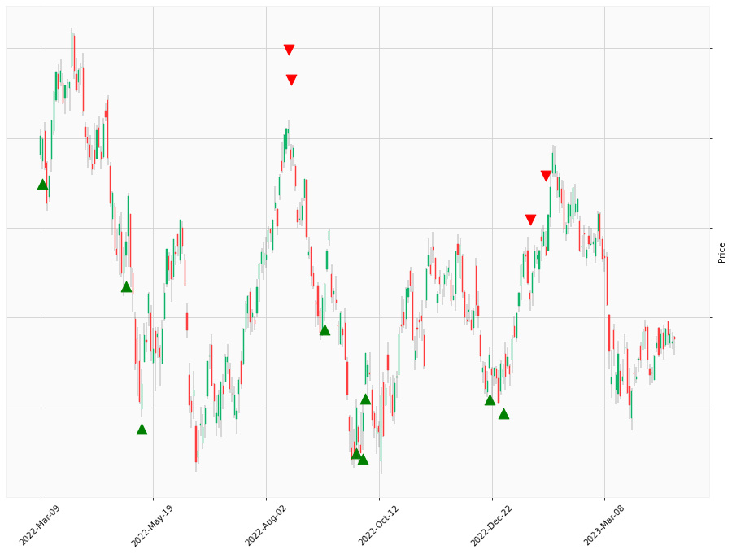

    

# Happy Labz Technologies

<nav class="px-3 markdown-body">
  <ul>
    <li><a href="">Home</a></li>
    <li><a href="">How to Use</a></li>
    <li><a href="">Use Case</a></li>
    <li><a href="">Contact</a></li>
  </ul>
</nav>

<table class="hits">
    <tr>
        <th>Direction</th>
        <th>Date</th>
      </tr>
    <tr>
        <td>Short</td>
        <td>Nov 10 2021 15:00 PST</td>
    </tr>
    <tr>
        <td>Long</td>
        <td>Jan 24 2022 15:00 PST</td>
    </tr>
    <tr>
        <td>Long</td>
        <td>Jan 28 2022 15:00 PST</td>
    </tr>
    <tr>
        <td>Long</td>
        <td>Mar 10 2022 15:00 PST</td>
    </tr>
    <tr>
        <td>Long</td>
        <td>May 03 2022 15:00 PST</td>
    </tr>
    <tr>
        <td>Long</td>
        <td>May 12 2022 15:00 PST</td>
    </tr>
    <tr>
        <td>Short</td>
        <td>Aug 16 2022 15:00 PST</td>
    </tr>
    <tr>
        <td>Short</td>
        <td>Aug 17 2022 15:00 PST</td>
    </tr>
    <tr>
        <td>Long</td>
        <td>Sep 08 2022 15:00 PST</td>
    </tr>
    <tr>
        <td>Long</td>
        <td>Sep 28 2022 15:00 PST</td>
    </tr>
    <tr>
        <td>Long</td>
        <td>Oct 03 2022 15:00 PST</td>
    </tr>
    <tr>
        <td>Long</td>
        <td>Oct 04 2022 15:00 PST</td>
    </tr>
    <tr>
        <td>Long</td>
        <td>Dec 21 2022 15:00 PST</td>
    </tr>
    <tr>
        <td>Long</td>
        <td>Dec 30 2022 15:00 PST</td>
    </tr>
    <tr>
        <td>Short</td>
        <td>Jan 19 2023 15:00 PST</td>
    </tr>
    <tr>
        <td>Short</td>
        <td>Jan 30 2023 15:00 PST</td>
    </tr>
    
</table>

