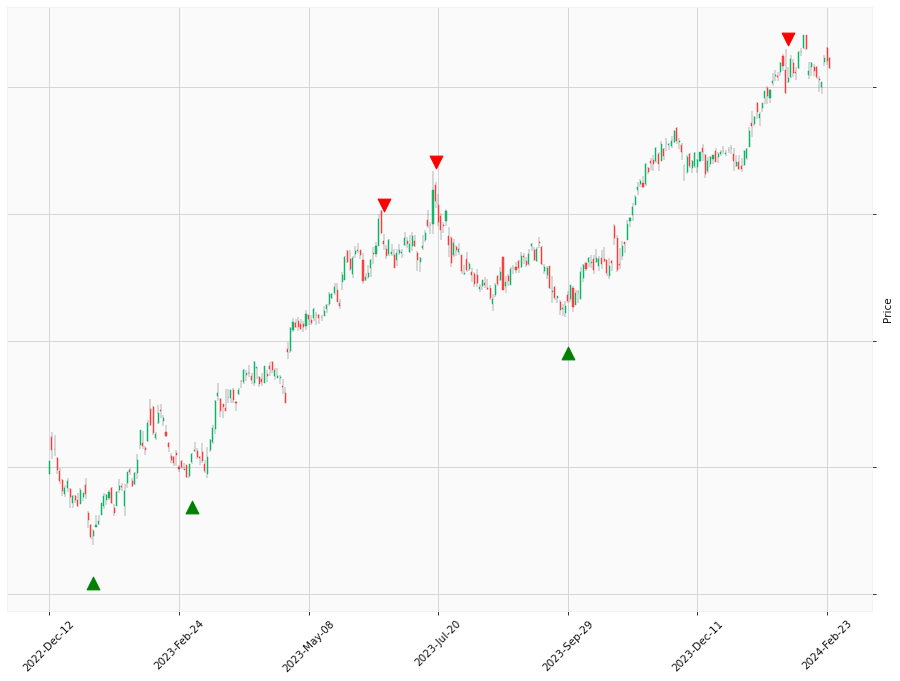

    

# Happy Labz Technologies

<nav class="px-3 markdown-body">
  <ul>
    <li><a href="">Home</a></li>
    <li><a href="">How to Use</a></li>
    <li><a href="">Use Case</a></li>
    <li><a href="">Contact</a></li>
  </ul>
</nav>

 

<table class="hits">
    <tr>
        <th>No.</th>
        <th>Direction</th>
        <th>Date</th>
        <th>Move (Percent)</th>
        <th>Move (Cumulative Percentage)</th>
      </tr>
    <tr>
        <td>1</td>
        <td>Long</td>
        <td>Sep 07 2022 15:00 PST</td>
        <td>21.18</td>
        <td>21.18</td>
    </tr>
    <tr>
        <td>2</td>
        <td>Long</td>
        <td>Sep 08 2022 15:00 PST</td>
        <td>20.98</td>
        <td>42.16</td>
    </tr>
    <tr>
        <td>3</td>
        <td>Long</td>
        <td>Mar 03 2023 15:00 PST</td>
        <td>22.51</td>
        <td>64.66</td>
    </tr>
    
</table>

<footer>
    <ul>
        <li>Copyright &copy; 2023 HappyLabz Technologies. All rights reserved.</li>
        <li style="float: right"><a href="mailto:mark@happylabz.tech?subject=Let's Talk">Contact Us</a></li>
    </ul>
</footer>
