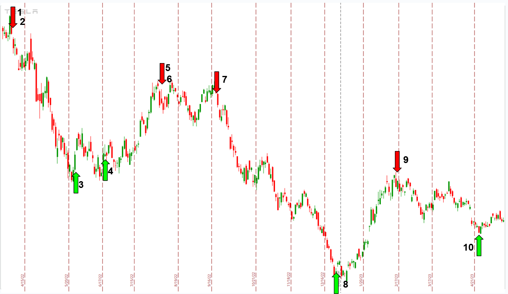

    
 

<table class="hits">
    <tr>
        <th>No.</th>
        <th>Direction</th>
        <th>Date</th>
        <th>Move (Percent)</th>
        <th>Move (Cumulative Percentage Gain)</th>
        <th>Move (Reinvestment Percentage Gain)</th>
      </tr>
    <tr>
        <td>1</td>
        <td>Long</td>
        <td>Sep 07 2022 15:00 PST</td>
        <td>0.17 %</td>
        <td>0.17 %</td>
        <td>0.17 %</td>
    </tr>
    <tr>
        <td>2</td>
        <td>Long</td>
        <td>Sep 08 2022 15:00 PST</td>
        <td>-1.25 %</td>
        <td>-1.08 %</td>
        <td>-1.08 %</td>
    </tr>
    <tr>
        <td>3</td>
        <td>Long</td>
        <td>Mar 03 2023 15:00 PST</td>
        <td>22.51 %</td>
        <td>21.42 %</td>
        <td>21.18 %</td>
    </tr>
    
</table>
<table class="hits">
    <thead>
        <th></th>
        <th>Date Range</th>
        <th>Move Percentage Gain</th>
    </thead>
    <tbody>
        <tr>
            <td>MSFT</td>
            <td>2022-09-07 13:00:00 - 2023-03-03 13:00:00</td>
            <td>21.42 %</td>
        </tr>
        <tr>
            <td>MSFT (reinvested)</td>
            <td>2022-09-07 13:00:00 - 2023-03-03 13:00:00</td>
            <td>21.18 %</td>
        </tr>
        <tr>
            <td>S&P 500</td>
            <td>2022-09-07 13:00:00 - 2023-03-03 13:00:00</td>
            <td>1.61 %</td>
        </tr>
    </tbody>
</table>

