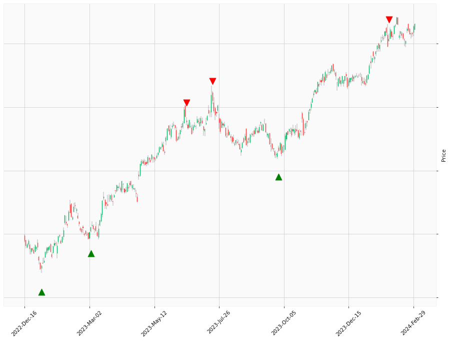

    
# Happy Labz Technologies
    
<table class="hits">
    <tr>
        <th>Direction</th>
        <th>Date</th>
      </tr>
    <tr>
        <td>Short</td>
        <td>Jun 25 2021 15:00 PST</td>
    </tr>
    <tr>
        <td>Short</td>
        <td>Jun 30 2021 15:00 PST</td>
    </tr>
    <tr>
        <td>Short</td>
        <td>Jul 01 2021 15:00 PST</td>
    </tr>
    <tr>
        <td>Short</td>
        <td>Jul 08 2021 15:00 PST</td>
    </tr>
    <tr>
        <td>Short</td>
        <td>Jul 09 2021 15:00 PST</td>
    </tr>
    <tr>
        <td>Short</td>
        <td>Jul 16 2021 15:00 PST</td>
    </tr>
    <tr>
        <td>Short</td>
        <td>Jul 19 2021 15:00 PST</td>
    </tr>
    <tr>
        <td>Short</td>
        <td>Nov 10 2021 15:00 PST</td>
    </tr>
    <tr>
        <td>Short</td>
        <td>Mar 30 2022 15:00 PST</td>
    </tr>
    <tr>
        <td>Short</td>
        <td>Mar 31 2022 15:00 PST</td>
    </tr>
    <tr>
        <td>Long</td>
        <td>Apr 28 2022 15:00 PST</td>
    </tr>
    <tr>
        <td>Long</td>
        <td>Sep 07 2022 15:00 PST</td>
    </tr>
    <tr>
        <td>Long</td>
        <td>Sep 08 2022 15:00 PST</td>
    </tr>
    <tr>
        <td>Long</td>
        <td>Sep 29 2022 15:00 PST</td>
    </tr>
    <tr>
        <td>Long</td>
        <td>Nov 07 2022 15:00 PST</td>
    </tr>
    <tr>
        <td>Short</td>
        <td>Apr 11 2023 15:00 PST</td>
    </tr>
    <tr>
        <td>Short</td>
        <td>Apr 12 2023 15:00 PST</td>
    </tr>
    
</table>

