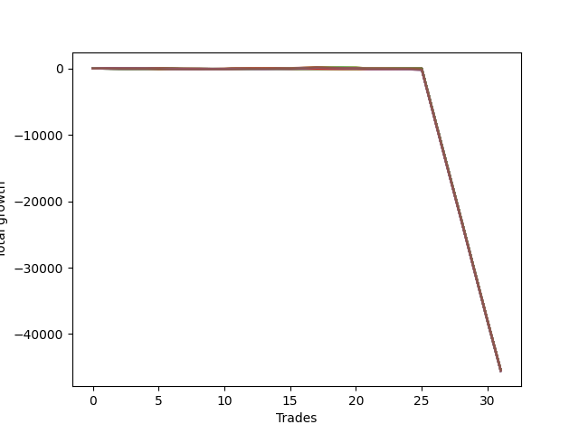

# Long Bulldog 003 
- Symbol: NQ
- Date Range: 03/18/2022 - 06/17/2022
- Trading Period: 7:20-12:30
- Number of Trades: 31



| Name | Win Percent | Profit | Avg Profit / Trade |     | Name | Win Percent | Profit | Avg Profit / Trade |
| ---- | ----------- | ------ | ------------------ | --- | ---- | ----------- | ------ | ------------------ |
| Sorted By <br> Profit | | | | | Sorted By <br> Win Percentage ||||
| Ten | 9.68 | -22671125.00 | -731326.61 |     | Zero | 51.61 | -22701000.00 | -732290.32 |
| Twenty-Five | 16.13 | -22679250.00 | -731588.71 |     | One | 48.39 | -22679750.00 | -731604.84 |
| One | 48.39 | -22679750.00 | -731604.84 |     | Thirty-Nine | 41.94 | -22715250.00 | -732750.00 |
| Nine | 12.90 | -22681000.00 | -731645.16 |     | Thirty-Eight | 41.94 | -22715250.00 | -732750.00 |
| Twenty-Six | 9.68 | -22683875.00 | -731737.90 |     | Thirty-Seven | 41.94 | -22715250.00 | -732750.00 |
| Eleven | 9.68 | -22685625.00 | -731794.35 |     | Thirty-Six | 41.94 | -22715250.00 | -732750.00 |
| Twenty-Four | 22.58 | -22687000.00 | -731838.71 |     | Thirty-Five | 41.94 | -22715250.00 | -732750.00 |
| Two | 35.48 | -22691125.00 | -731971.77 |     | Thirty-Four | 41.94 | -22715250.00 | -732750.00 |
| Twelve | 6.45 | -22692500.00 | -732016.13 |     | Thirty-Three | 41.94 | -22715250.00 | -732750.00 |
| Eight | 16.13 | -22694125.00 | -732068.55 |     | Thirty-Two | 41.94 | -22715250.00 | -732750.00 |
| Thirteen | 6.45 | -22694500.00 | -732080.65 |     | Twenty-Three | 38.71 | -22715000.00 | -732741.94 |
| Forty-One | 16.13 | -22697625.00 | -732181.45 |     | Twenty-Two | 38.71 | -22715000.00 | -732741.94 |
| twenty-Seven | 9.68 | -22697875.00 | -732189.52 |     | Twenty-One | 38.71 | -22715000.00 | -732741.94 |
| Fifteen | 6.45 | -22698375.00 | -732205.65 |     | Twenty | 38.71 | -22715000.00 | -732741.94 |
| Fourteen | 6.45 | -22698375.00 | -732205.65 |     | Nineteen | 38.71 | -22715000.00 | -732741.94 |
| Zero | 51.61 | -22701000.00 | -732290.32 |     | Eighteen | 38.71 | -22715000.00 | -732741.94 |
| Forty | 22.58 | -22701375.00 | -732302.42 |     | Seventeen | 38.71 | -22715000.00 | -732741.94 |
| Forty-Two | 9.68 | -22703500.00 | -732370.97 |     | Sixten | 38.71 | -22715000.00 | -732741.94 |
| Twenty-Eight | 6.45 | -22705250.00 | -732427.42 |     | Two | 35.48 | -22691125.00 | -731971.77 |
| Twenty-Nine | 6.45 | -22707250.00 | -732491.94 |     | Seventy-Three | 35.48 | -22720875.00 | -732931.45 |
| Thirty-One | 6.45 | -22711125.00 | -732616.94 |     | Three | 35.48 | -22745000.00 | -733709.68 |
| Thirty | 6.45 | -22711125.00 | -732616.94 |     | Seventy-Two | 32.26 | -22738250.00 | -733491.94 |
| Fifty-Seven | 22.58 | -22714625.00 | -732729.84 |     | Forty-Eight | 29.03 | -22725500.00 | -733080.65 |
| Twenty-Three | 38.71 | -22715000.00 | -732741.94 |     | Fifty-Five | 29.03 | -22728000.00 | -733161.29 |
| Twenty-Two | 38.71 | -22715000.00 | -732741.94 |     | Fifty-Four | 29.03 | -22728000.00 | -733161.29 |
| Twenty-One | 38.71 | -22715000.00 | -732741.94 |     | Fifty-Three | 29.03 | -22728000.00 | -733161.29 |
| Twenty | 38.71 | -22715000.00 | -732741.94 |     | Fifty-Two | 29.03 | -22728000.00 | -733161.29 |
| Nineteen | 38.71 | -22715000.00 | -732741.94 |     | Fifty-One | 29.03 | -22728000.00 | -733161.29 |
| Eighteen | 38.71 | -22715000.00 | -732741.94 |     | Fifty | 29.03 | -22728000.00 | -733161.29 |
| Seventeen | 38.71 | -22715000.00 | -732741.94 |     | Forty-Nine | 29.03 | -22728000.00 | -733161.29 |
| Sixten | 38.71 | -22715000.00 | -732741.94 |     | Seventy-Five | 29.03 | -22759375.00 | -734173.39 |
| Thirty-Nine | 41.94 | -22715250.00 | -732750.00 |     | Four | 29.03 | -22773750.00 | -734637.10 |
| Thirty-Eight | 41.94 | -22715250.00 | -732750.00 |     | Fifty-Six | 25.81 | -22733750.00 | -733346.77 |
| Thirty-Seven | 41.94 | -22715250.00 | -732750.00 |     | Five | 25.81 | -22784000.00 | -734967.74 |
| Thirty-Six | 41.94 | -22715250.00 | -732750.00 |     | Seven | 25.81 | -22787875.00 | -735092.74 |
| Thirty-Five | 41.94 | -22715250.00 | -732750.00 |     | Six | 25.81 | -22787875.00 | -735092.74 |
| Thirty-Four | 41.94 | -22715250.00 | -732750.00 |     | Twenty-Four | 22.58 | -22687000.00 | -731838.71 |
| Thirty-Three | 41.94 | -22715250.00 | -732750.00 |     | Forty | 22.58 | -22701375.00 | -732302.42 |
| Thirty-Two | 41.94 | -22715250.00 | -732750.00 |     | Fifty-Seven | 22.58 | -22714625.00 | -732729.84 |
| Forty-Three | 9.68 | -22716375.00 | -732786.29 |     | Sixty-Seven | 22.58 | -22750250.00 | -733879.03 |
| Seventy-Three | 35.48 | -22720875.00 | -732931.45 |     | Sixty-Six | 22.58 | -22751000.00 | -733903.23 |
| Forty-Four | 6.45 | -22725000.00 | -733064.52 |     | Seventy-One | 22.58 | -22754375.00 | -734012.10 |
| Forty-Eight | 29.03 | -22725500.00 | -733080.65 |     | Seventy | 22.58 | -22754375.00 | -734012.10 |
| Forty-Five | 6.45 | -22727000.00 | -733129.03 |     | Sixty-Nine | 22.58 | -22754375.00 | -734012.10 |
| Fifty-Five | 29.03 | -22728000.00 | -733161.29 |     | Sixty-Eight | 22.58 | -22754375.00 | -734012.10 |
| Fifty-Four | 29.03 | -22728000.00 | -733161.29 |     | Sixty-Five | 22.58 | -22754625.00 | -734020.16 |
| Fifty-Three | 29.03 | -22728000.00 | -733161.29 |     | Sixty-Four | 22.58 | -22755625.00 | -734052.42 |
| Fifty-Two | 29.03 | -22728000.00 | -733161.29 |     | Seventy-Four | 22.58 | -22783750.00 | -734959.68 |
| Fifty-One | 29.03 | -22728000.00 | -733161.29 |     | Twenty-Five | 16.13 | -22679250.00 | -731588.71 |
| Fifty | 29.03 | -22728000.00 | -733161.29 |     | Eight | 16.13 | -22694125.00 | -732068.55 |
| Forty-Nine | 29.03 | -22728000.00 | -733161.29 |     | Forty-One | 16.13 | -22697625.00 | -732181.45 |
| Forty-Seven | 6.45 | -22730875.00 | -733254.03 |     | Nine | 12.90 | -22681000.00 | -731645.16 |
| Forty-Six | 6.45 | -22730875.00 | -733254.03 |     | Fifty-Eight | 12.90 | -22737250.00 | -733459.68 |
| Fifty-Six | 25.81 | -22733750.00 | -733346.77 |     | Fifty-Nine | 12.90 | -22749000.00 | -733838.71 |
| Fifty-Eight | 12.90 | -22737250.00 | -733459.68 |     | Ten | 9.68 | -22671125.00 | -731326.61 |
| Seventy-Two | 32.26 | -22738250.00 | -733491.94 |     | Twenty-Six | 9.68 | -22683875.00 | -731737.90 |
| Three | 35.48 | -22745000.00 | -733709.68 |     | Eleven | 9.68 | -22685625.00 | -731794.35 |
| Fifty-Nine | 12.90 | -22749000.00 | -733838.71 |     | twenty-Seven | 9.68 | -22697875.00 | -732189.52 |
| Sixty-Seven | 22.58 | -22750250.00 | -733879.03 |     | Forty-Two | 9.68 | -22703500.00 | -732370.97 |
| Sixty-Six | 22.58 | -22751000.00 | -733903.23 |     | Forty-Three | 9.68 | -22716375.00 | -732786.29 |
| Seventy-One | 22.58 | -22754375.00 | -734012.10 |     | Sixty | 9.68 | -22763000.00 | -734290.32 |
| Seventy | 22.58 | -22754375.00 | -734012.10 |     | Sixty-One | 9.68 | -22765000.00 | -734354.84 |
| Sixty-Nine | 22.58 | -22754375.00 | -734012.10 |     | Sixty-Three | 9.68 | -22768875.00 | -734479.84 |
| Sixty-Eight | 22.58 | -22754375.00 | -734012.10 |     | Sixty-Two | 9.68 | -22768875.00 | -734479.84 |
| Sixty-Five | 22.58 | -22754625.00 | -734020.16 |     | Twelve | 6.45 | -22692500.00 | -732016.13 |
| Sixty-Four | 22.58 | -22755625.00 | -734052.42 |     | Thirteen | 6.45 | -22694500.00 | -732080.65 |
| Seventy-Five | 29.03 | -22759375.00 | -734173.39 |     | Fifteen | 6.45 | -22698375.00 | -732205.65 |
| Sixty | 9.68 | -22763000.00 | -734290.32 |     | Fourteen | 6.45 | -22698375.00 | -732205.65 |
| Sixty-One | 9.68 | -22765000.00 | -734354.84 |     | Twenty-Eight | 6.45 | -22705250.00 | -732427.42 |
| Sixty-Three | 9.68 | -22768875.00 | -734479.84 |     | Twenty-Nine | 6.45 | -22707250.00 | -732491.94 |
| Sixty-Two | 9.68 | -22768875.00 | -734479.84 |     | Thirty-One | 6.45 | -22711125.00 | -732616.94 |
| Four | 29.03 | -22773750.00 | -734637.10 |     | Thirty | 6.45 | -22711125.00 | -732616.94 |
| Seventy-Four | 22.58 | -22783750.00 | -734959.68 |     | Forty-Four | 6.45 | -22725000.00 | -733064.52 |
| Five | 25.81 | -22784000.00 | -734967.74 |     | Forty-Five | 6.45 | -22727000.00 | -733129.03 |
| Seven | 25.81 | -22787875.00 | -735092.74 |     | Forty-Seven | 6.45 | -22730875.00 | -733254.03 |
| Six | 25.81 | -22787875.00 | -735092.74 |     | Forty-Six | 6.45 | -22730875.00 | -733254.03 |

## NO STOPLOSS

### Test Zero
* Sell when price hits the middle line of the 20p bollinger
* No Stoploss
* Results:
```
Total Trades: 31
Percent Up: 51.61
Percent Down: 48.39
Total Points Moved Up: -45402.00
Potential Profit: -22701000.00
Total Points Ups: 227.25 Count Ups: 16
Total Points Downs: -45629.25 Count Downs: 15
```

<details><summary>Trades</summary>

<code>In: 2022-03-21 10:21:00		Out: 2022-03-21 10:26:55		Total Position Time: 05:55		Total Move Up: 20.00		Total to Date: 20.00</code> <br />
<code>In: 2022-03-25 08:12:00		Out: 2022-03-25 08:36:55		Total Position Time: 24:55		Total Move Up: -35.50		Total to Date: -15.50</code> <br />
<code>In: 2022-03-28 08:38:00		Out: 2022-03-28 09:01:40		Total Position Time: 23:40		Total Move Up: -11.50		Total to Date: -27.00</code> <br />
<code>In: 2022-03-28 08:51:00		Out: 2022-03-28 09:01:40		Total Position Time: 10:40		Total Move Up: 11.25		Total to Date: -15.75</code> <br />
<code>In: 2022-03-30 11:29:00		Out: 2022-03-30 11:31:20		Total Position Time: 02:20		Total Move Up: 16.75		Total to Date: 1.00</code> <br />
<code>In: 2022-03-30 12:00:00		Out: 2022-03-30 12:15:20		Total Position Time: 15:20		Total Move Up: -11.00		Total to Date: -10.00</code> <br />
<code>In: 2022-03-30 12:03:00		Out: 2022-03-30 12:15:20		Total Position Time: 12:20		Total Move Up: -7.50		Total to Date: -17.50</code> <br />
<code>In: 2022-03-30 12:06:00		Out: 2022-03-30 12:15:20		Total Position Time: 09:20		Total Move Up: 3.00		Total to Date: -14.50</code> <br />
<code>In: 2022-03-30 12:20:00		Out: 2022-03-30 12:31:35		Total Position Time: 11:35		Total Move Up: 4.25		Total to Date: -10.25</code> <br />
<code>In: 2022-03-30 12:22:00		Out: 2022-03-30 12:31:35		Total Position Time: 09:35		Total Move Up: 9.50		Total to Date: -0.75</code> <br />
<code>In: 2022-03-30 12:26:00		Out: 2022-03-30 12:31:35		Total Position Time: 05:35		Total Move Up: 26.50		Total to Date: 25.75</code> <br />
<code>In: 2022-04-07 07:43:00		Out: 2022-04-07 07:53:05		Total Position Time: 10:05		Total Move Up: 17.25		Total to Date: 43.00</code> <br />
<code>In: 2022-04-07 08:35:00		Out: 2022-04-07 08:46:30		Total Position Time: 11:30		Total Move Up: 14.00		Total to Date: 57.00</code> <br />
<code>In: 2022-04-12 09:28:00		Out: 2022-04-12 09:38:05		Total Position Time: 10:05		Total Move Up: 14.75		Total to Date: 71.75</code> <br />
<code>In: 2022-04-12 11:17:00		Out: 2022-04-12 11:35:55		Total Position Time: 18:55		Total Move Up: -18.00		Total to Date: 53.75</code> <br />
<code>In: 2022-04-20 11:57:00		Out: 2022-04-20 12:00:15		Total Position Time: 03:15		Total Move Up: 26.50		Total to Date: 80.25</code> <br />
<code>In: 2022-05-10 08:11:00		Out: 2022-05-10 08:18:15		Total Position Time: 07:15		Total Move Up: 16.00		Total to Date: 96.25</code> <br />
<code>In: 2022-05-11 09:59:00		Out: 2022-05-11 10:13:30		Total Position Time: 14:30		Total Move Up: -16.25		Total to Date: 80.00</code> <br />
<code>In: 2022-05-11 10:03:00		Out: 2022-05-11 10:13:30		Total Position Time: 10:30		Total Move Up: -4.75		Total to Date: 75.25</code> <br />
<code>In: 2022-05-18 08:32:00		Out: 2022-05-18 08:39:00		Total Position Time: 07:00		Total Move Up: 17.00		Total to Date: 92.25</code> <br />
<code>In: 2022-05-20 07:53:00		Out: 2022-05-20 08:22:55		Total Position Time: 29:55		Total Move Up: -121.00		Total to Date: -28.75</code> <br />
<code>In: 2022-06-08 09:41:00		Out: 2022-06-08 09:54:10		Total Position Time: 13:10		Total Move Up: 1.50		Total to Date: -27.25</code> <br />
<code>In: 2022-06-09 10:46:00		Out: 2022-06-09 10:50:10		Total Position Time: 04:10		Total Move Up: 11.75		Total to Date: -15.50</code> <br />
<code>In: 2022-06-09 11:26:00		Out: 2022-06-09 11:29:15		Total Position Time: 03:15		Total Move Up: 17.25		Total to Date: 1.75</code> <br />
<code>In: 2022-06-09 12:03:00		Out: 2022-06-09 12:19:05		Total Position Time: 16:05		Total Move Up: -24.50		Total to Date: -22.75</code> <br />
<code>In: 2022-06-13 12:17:00		Out: 2022-06-13 12:46:55		Total Position Time: 29:55		Total Move Up: -7618.50		Total to Date: -7641.25</code> <br />
<code>In: 2022-06-13 12:28:00		Out: 2022-06-13 12:57:55		Total Position Time: 29:55		Total Move Up: -7562.75		Total to Date: -15204.00</code> <br />
<code>In: 2022-06-14 12:11:00		Out: 2022-06-14 12:40:55		Total Position Time: 29:55		Total Move Up: -7507.50		Total to Date: -22711.50</code> <br />
<code>In: 2022-06-15 11:08:00		Out: 2022-06-15 11:37:55		Total Position Time: 29:55		Total Move Up: -7665.25		Total to Date: -30376.75</code> <br />
<code>In: 2022-06-15 11:34:00		Out: 2022-06-15 12:03:55		Total Position Time: 29:55		Total Move Up: -7596.50		Total to Date: -37973.25</code> <br />
<code>In: 2022-06-16 11:01:00		Out: 2022-06-16 11:30:55		Total Position Time: 29:55		Total Move Up: -7428.75		Total to Date: -45402.00</code> <br />


</details>

### Test One
* Sell when the price hits the upper line of the 20p 1std bollinger
* No Stoploss
* Results:
```
Total Trades: 31
Percent Up: 48.39
Percent Down: 51.61
Total Points Moved Up: -45359.50
Potential Profit: -22679750.00
Total Points Ups: 350.25 Count Ups: 15
Total Points Downs: -45709.75 Count Downs: 16
```

<details><summary>Trades</summary>

<code>In: 2022-03-21 10:21:00		Out: 2022-03-21 10:31:45		Total Position Time: 10:45		Total Move Up: 30.75		Total to Date: 30.75</code> <br />
<code>In: 2022-03-25 08:12:00		Out: 2022-03-25 08:41:20		Total Position Time: 29:20		Total Move Up: -30.00		Total to Date: 0.75</code> <br />
<code>In: 2022-03-28 08:38:00		Out: 2022-03-28 09:03:00		Total Position Time: 25:00		Total Move Up: 1.00		Total to Date: 1.75</code> <br />
<code>In: 2022-03-28 08:51:00		Out: 2022-03-28 09:03:00		Total Position Time: 12:00		Total Move Up: 23.75		Total to Date: 25.50</code> <br />
<code>In: 2022-03-30 11:29:00		Out: 2022-03-30 11:35:15		Total Position Time: 06:15		Total Move Up: 22.25		Total to Date: 47.75</code> <br />
<code>In: 2022-03-30 12:00:00		Out: 2022-03-30 12:29:55		Total Position Time: 29:55		Total Move Up: -47.75		Total to Date: 0.00</code> <br />
<code>In: 2022-03-30 12:03:00		Out: 2022-03-30 12:32:55		Total Position Time: 29:55		Total Move Up: -26.00		Total to Date: -26.00</code> <br />
<code>In: 2022-03-30 12:06:00		Out: 2022-03-30 12:33:20		Total Position Time: 27:20		Total Move Up: -14.00		Total to Date: -40.00</code> <br />
<code>In: 2022-03-30 12:20:00		Out: 2022-03-30 12:33:20		Total Position Time: 13:20		Total Move Up: 14.50		Total to Date: -25.50</code> <br />
<code>In: 2022-03-30 12:22:00		Out: 2022-03-30 12:33:20		Total Position Time: 11:20		Total Move Up: 19.75		Total to Date: -5.75</code> <br />
<code>In: 2022-03-30 12:26:00		Out: 2022-03-30 12:33:20		Total Position Time: 07:20		Total Move Up: 36.75		Total to Date: 31.00</code> <br />
<code>In: 2022-04-07 07:43:00		Out: 2022-04-07 08:00:00		Total Position Time: 17:00		Total Move Up: 13.00		Total to Date: 44.00</code> <br />
<code>In: 2022-04-07 08:35:00		Out: 2022-04-07 08:47:25		Total Position Time: 12:25		Total Move Up: 22.50		Total to Date: 66.50</code> <br />
<code>In: 2022-04-12 09:28:00		Out: 2022-04-12 09:48:50		Total Position Time: 20:50		Total Move Up: 16.25		Total to Date: 82.75</code> <br />
<code>In: 2022-04-12 11:17:00		Out: 2022-04-12 11:37:30		Total Position Time: 20:30		Total Move Up: -10.50		Total to Date: 72.25</code> <br />
<code>In: 2022-04-20 11:57:00		Out: 2022-04-20 12:01:20		Total Position Time: 04:20		Total Move Up: 50.00		Total to Date: 122.25</code> <br />
<code>In: 2022-05-10 08:11:00		Out: 2022-05-10 08:19:45		Total Position Time: 08:45		Total Move Up: 45.75		Total to Date: 168.00</code> <br />
<code>In: 2022-05-11 09:59:00		Out: 2022-05-11 10:24:35		Total Position Time: 25:35		Total Move Up: -15.50		Total to Date: 152.50</code> <br />
<code>In: 2022-05-11 10:03:00		Out: 2022-05-11 10:24:35		Total Position Time: 21:35		Total Move Up: -4.00		Total to Date: 148.50</code> <br />
<code>In: 2022-05-18 08:32:00		Out: 2022-05-18 08:42:35		Total Position Time: 10:35		Total Move Up: 28.00		Total to Date: 176.50</code> <br />
<code>In: 2022-05-20 07:53:00		Out: 2022-05-20 08:22:55		Total Position Time: 29:55		Total Move Up: -121.00		Total to Date: 55.50</code> <br />
<code>In: 2022-06-08 09:41:00		Out: 2022-06-08 09:57:05		Total Position Time: 16:05		Total Move Up: 8.00		Total to Date: 63.50</code> <br />
<code>In: 2022-06-09 10:46:00		Out: 2022-06-09 10:53:30		Total Position Time: 07:30		Total Move Up: 18.00		Total to Date: 81.50</code> <br />
<code>In: 2022-06-09 11:26:00		Out: 2022-06-09 11:55:55		Total Position Time: 29:55		Total Move Up: -37.00		Total to Date: 44.50</code> <br />
<code>In: 2022-06-09 12:03:00		Out: 2022-06-09 12:24:20		Total Position Time: 21:20		Total Move Up: -24.75		Total to Date: 19.75</code> <br />
<code>In: 2022-06-13 12:17:00		Out: 2022-06-13 12:46:55		Total Position Time: 29:55		Total Move Up: -7618.50		Total to Date: -7598.75</code> <br />
<code>In: 2022-06-13 12:28:00		Out: 2022-06-13 12:57:55		Total Position Time: 29:55		Total Move Up: -7562.75		Total to Date: -15161.50</code> <br />
<code>In: 2022-06-14 12:11:00		Out: 2022-06-14 12:40:55		Total Position Time: 29:55		Total Move Up: -7507.50		Total to Date: -22669.00</code> <br />
<code>In: 2022-06-15 11:08:00		Out: 2022-06-15 11:37:55		Total Position Time: 29:55		Total Move Up: -7665.25		Total to Date: -30334.25</code> <br />
<code>In: 2022-06-15 11:34:00		Out: 2022-06-15 12:03:55		Total Position Time: 29:55		Total Move Up: -7596.50		Total to Date: -37930.75</code> <br />
<code>In: 2022-06-16 11:01:00		Out: 2022-06-16 11:30:55		Total Position Time: 29:55		Total Move Up: -7428.75		Total to Date: -45359.50</code> <br />


</details>

### Test Two
* Sell when the price hits the upper line of the 20p 2std bollinger
* No Stoploss
* Results:
```
Total Trades: 31
Percent Up: 35.48
Percent Down: 64.52
Total Points Moved Up: -45382.25
Potential Profit: -22691125.00
Total Points Ups: 422.75 Count Ups: 11
Total Points Downs: -45805.00 Count Downs: 20
```

<details><summary>Trades</summary>

<code>In: 2022-03-21 10:21:00		Out: 2022-03-21 10:32:30		Total Position Time: 11:30		Total Move Up: 49.25		Total to Date: 49.25</code> <br />
<code>In: 2022-03-25 08:12:00		Out: 2022-03-25 08:41:55		Total Position Time: 29:55		Total Move Up: -21.25		Total to Date: 28.00</code> <br />
<code>In: 2022-03-28 08:38:00		Out: 2022-03-28 09:07:55		Total Position Time: 29:55		Total Move Up: -1.75		Total to Date: 26.25</code> <br />
<code>In: 2022-03-28 08:51:00		Out: 2022-03-28 09:20:55		Total Position Time: 29:55		Total Move Up: -14.75		Total to Date: 11.50</code> <br />
<code>In: 2022-03-30 11:29:00		Out: 2022-03-30 11:58:55		Total Position Time: 29:55		Total Move Up: -23.00		Total to Date: -11.50</code> <br />
<code>In: 2022-03-30 12:00:00		Out: 2022-03-30 12:29:55		Total Position Time: 29:55		Total Move Up: -47.75		Total to Date: -59.25</code> <br />
<code>In: 2022-03-30 12:03:00		Out: 2022-03-30 12:32:55		Total Position Time: 29:55		Total Move Up: -26.00		Total to Date: -85.25</code> <br />
<code>In: 2022-03-30 12:06:00		Out: 2022-03-30 12:35:55		Total Position Time: 29:55		Total Move Up: -15.25		Total to Date: -100.50</code> <br />
<code>In: 2022-03-30 12:20:00		Out: 2022-03-30 12:48:00		Total Position Time: 28:00		Total Move Up: 31.75		Total to Date: -68.75</code> <br />
<code>In: 2022-03-30 12:22:00		Out: 2022-03-30 12:48:00		Total Position Time: 26:00		Total Move Up: 37.00		Total to Date: -31.75</code> <br />
<code>In: 2022-03-30 12:26:00		Out: 2022-03-30 12:48:00		Total Position Time: 22:00		Total Move Up: 54.00		Total to Date: 22.25</code> <br />
<code>In: 2022-04-07 07:43:00		Out: 2022-04-07 08:00:05		Total Position Time: 17:05		Total Move Up: 36.75		Total to Date: 59.00</code> <br />
<code>In: 2022-04-07 08:35:00		Out: 2022-04-07 09:04:55		Total Position Time: 29:55		Total Move Up: -17.75		Total to Date: 41.25</code> <br />
<code>In: 2022-04-12 09:28:00		Out: 2022-04-12 09:50:15		Total Position Time: 22:15		Total Move Up: 35.50		Total to Date: 76.75</code> <br />
<code>In: 2022-04-12 11:17:00		Out: 2022-04-12 11:45:35		Total Position Time: 28:35		Total Move Up: -5.25		Total to Date: 71.50</code> <br />
<code>In: 2022-04-20 11:57:00		Out: 2022-04-20 12:13:50		Total Position Time: 16:50		Total Move Up: 68.00		Total to Date: 139.50</code> <br />
<code>In: 2022-05-10 08:11:00		Out: 2022-05-10 08:37:45		Total Position Time: 26:45		Total Move Up: 63.00		Total to Date: 202.50</code> <br />
<code>In: 2022-05-11 09:59:00		Out: 2022-05-11 10:24:50		Total Position Time: 25:50		Total Move Up: -5.25		Total to Date: 197.25</code> <br />
<code>In: 2022-05-11 10:03:00		Out: 2022-05-11 10:24:50		Total Position Time: 21:50		Total Move Up: 6.25		Total to Date: 203.50</code> <br />
<code>In: 2022-05-18 08:32:00		Out: 2022-05-18 09:01:55		Total Position Time: 29:55		Total Move Up: -27.00		Total to Date: 176.50</code> <br />
<code>In: 2022-05-20 07:53:00		Out: 2022-05-20 08:22:55		Total Position Time: 29:55		Total Move Up: -121.00		Total to Date: 55.50</code> <br />
<code>In: 2022-06-08 09:41:00		Out: 2022-06-08 09:59:15		Total Position Time: 18:15		Total Move Up: 14.00		Total to Date: 69.50</code> <br />
<code>In: 2022-06-09 10:46:00		Out: 2022-06-09 10:59:35		Total Position Time: 13:35		Total Move Up: 27.25		Total to Date: 96.75</code> <br />
<code>In: 2022-06-09 11:26:00		Out: 2022-06-09 11:55:55		Total Position Time: 29:55		Total Move Up: -37.00		Total to Date: 59.75</code> <br />
<code>In: 2022-06-09 12:03:00		Out: 2022-06-09 12:32:55		Total Position Time: 29:55		Total Move Up: -62.75		Total to Date: -3.00</code> <br />
<code>In: 2022-06-13 12:17:00		Out: 2022-06-13 12:46:55		Total Position Time: 29:55		Total Move Up: -7618.50		Total to Date: -7621.50</code> <br />
<code>In: 2022-06-13 12:28:00		Out: 2022-06-13 12:57:55		Total Position Time: 29:55		Total Move Up: -7562.75		Total to Date: -15184.25</code> <br />
<code>In: 2022-06-14 12:11:00		Out: 2022-06-14 12:40:55		Total Position Time: 29:55		Total Move Up: -7507.50		Total to Date: -22691.75</code> <br />
<code>In: 2022-06-15 11:08:00		Out: 2022-06-15 11:37:55		Total Position Time: 29:55		Total Move Up: -7665.25		Total to Date: -30357.00</code> <br />
<code>In: 2022-06-15 11:34:00		Out: 2022-06-15 12:03:55		Total Position Time: 29:55		Total Move Up: -7596.50		Total to Date: -37953.50</code> <br />
<code>In: 2022-06-16 11:01:00		Out: 2022-06-16 11:30:55		Total Position Time: 29:55		Total Move Up: -7428.75		Total to Date: -45382.25</code> <br />


</details>

### Test Three
* Sell when price hits the middle line of the 50p bollinger
* No Stoploss
* Results:
```
Total Trades: 31
Percent Up: 35.48
Percent Down: 64.52
Total Points Moved Up: -45490.00
Potential Profit: -22745000.00
Total Points Ups: 353.75 Count Ups: 11
Total Points Downs: -45843.75 Count Downs: 20
```

<details><summary>Trades</summary>

<code>In: 2022-03-21 10:21:00		Out: 2022-03-21 10:32:45		Total Position Time: 11:45		Total Move Up: 51.25		Total to Date: 51.25</code> <br />
<code>In: 2022-03-25 08:12:00		Out: 2022-03-25 08:41:55		Total Position Time: 29:55		Total Move Up: -21.25		Total to Date: 30.00</code> <br />
<code>In: 2022-03-28 08:38:00		Out: 2022-03-28 09:07:55		Total Position Time: 29:55		Total Move Up: -1.75		Total to Date: 28.25</code> <br />
<code>In: 2022-03-28 08:51:00		Out: 2022-03-28 09:20:55		Total Position Time: 29:55		Total Move Up: -14.75		Total to Date: 13.50</code> <br />
<code>In: 2022-03-30 11:29:00		Out: 2022-03-30 11:38:05		Total Position Time: 09:05		Total Move Up: 28.50		Total to Date: 42.00</code> <br />
<code>In: 2022-03-30 12:00:00		Out: 2022-03-30 12:29:55		Total Position Time: 29:55		Total Move Up: -47.75		Total to Date: -5.75</code> <br />
<code>In: 2022-03-30 12:03:00		Out: 2022-03-30 12:32:55		Total Position Time: 29:55		Total Move Up: -26.00		Total to Date: -31.75</code> <br />
<code>In: 2022-03-30 12:06:00		Out: 2022-03-30 12:35:55		Total Position Time: 29:55		Total Move Up: -15.25		Total to Date: -47.00</code> <br />
<code>In: 2022-03-30 12:20:00		Out: 2022-03-30 12:37:05		Total Position Time: 17:05		Total Move Up: 21.75		Total to Date: -25.25</code> <br />
<code>In: 2022-03-30 12:22:00		Out: 2022-03-30 12:37:05		Total Position Time: 15:05		Total Move Up: 27.00		Total to Date: 1.75</code> <br />
<code>In: 2022-03-30 12:26:00		Out: 2022-03-30 12:37:05		Total Position Time: 11:05		Total Move Up: 44.00		Total to Date: 45.75</code> <br />
<code>In: 2022-04-07 07:43:00		Out: 2022-04-07 08:00:10		Total Position Time: 17:10		Total Move Up: 40.50		Total to Date: 86.25</code> <br />
<code>In: 2022-04-07 08:35:00		Out: 2022-04-07 09:04:55		Total Position Time: 29:55		Total Move Up: -17.75		Total to Date: 68.50</code> <br />
<code>In: 2022-04-12 09:28:00		Out: 2022-04-12 09:50:15		Total Position Time: 22:15		Total Move Up: 35.50		Total to Date: 104.00</code> <br />
<code>In: 2022-04-12 11:17:00		Out: 2022-04-12 11:46:55		Total Position Time: 29:55		Total Move Up: -0.75		Total to Date: 103.25</code> <br />
<code>In: 2022-04-20 11:57:00		Out: 2022-04-20 12:01:20		Total Position Time: 04:20		Total Move Up: 50.00		Total to Date: 153.25</code> <br />
<code>In: 2022-05-10 08:11:00		Out: 2022-05-10 08:36:45		Total Position Time: 25:45		Total Move Up: 35.00		Total to Date: 188.25</code> <br />
<code>In: 2022-05-11 09:59:00		Out: 2022-05-11 10:28:55		Total Position Time: 29:55		Total Move Up: -44.00		Total to Date: 144.25</code> <br />
<code>In: 2022-05-11 10:03:00		Out: 2022-05-11 10:32:55		Total Position Time: 29:55		Total Move Up: -27.50		Total to Date: 116.75</code> <br />
<code>In: 2022-05-18 08:32:00		Out: 2022-05-18 09:01:55		Total Position Time: 29:55		Total Move Up: -27.00		Total to Date: 89.75</code> <br />
<code>In: 2022-05-20 07:53:00		Out: 2022-05-20 08:22:55		Total Position Time: 29:55		Total Move Up: -121.00		Total to Date: -31.25</code> <br />
<code>In: 2022-06-08 09:41:00		Out: 2022-06-08 10:10:55		Total Position Time: 29:55		Total Move Up: 4.75		Total to Date: -26.50</code> <br />
<code>In: 2022-06-09 10:46:00		Out: 2022-06-09 11:15:50		Total Position Time: 29:50		Total Move Up: 15.50		Total to Date: -11.00</code> <br />
<code>In: 2022-06-09 11:26:00		Out: 2022-06-09 11:55:55		Total Position Time: 29:55		Total Move Up: -37.00		Total to Date: -48.00</code> <br />
<code>In: 2022-06-09 12:03:00		Out: 2022-06-09 12:32:55		Total Position Time: 29:55		Total Move Up: -62.75		Total to Date: -110.75</code> <br />
<code>In: 2022-06-13 12:17:00		Out: 2022-06-13 12:46:55		Total Position Time: 29:55		Total Move Up: -7618.50		Total to Date: -7729.25</code> <br />
<code>In: 2022-06-13 12:28:00		Out: 2022-06-13 12:57:55		Total Position Time: 29:55		Total Move Up: -7562.75		Total to Date: -15292.00</code> <br />
<code>In: 2022-06-14 12:11:00		Out: 2022-06-14 12:40:55		Total Position Time: 29:55		Total Move Up: -7507.50		Total to Date: -22799.50</code> <br />
<code>In: 2022-06-15 11:08:00		Out: 2022-06-15 11:37:55		Total Position Time: 29:55		Total Move Up: -7665.25		Total to Date: -30464.75</code> <br />
<code>In: 2022-06-15 11:34:00		Out: 2022-06-15 12:03:55		Total Position Time: 29:55		Total Move Up: -7596.50		Total to Date: -38061.25</code> <br />
<code>In: 2022-06-16 11:01:00		Out: 2022-06-16 11:30:55		Total Position Time: 29:55		Total Move Up: -7428.75		Total to Date: -45490.00</code> <br />


</details>

### Test Four
* Sell when the price hits the upper line of the 50p 1std bollinger
* No Stoploss
* Results:
```
Total Trades: 31
Percent Up: 29.03
Percent Down: 70.97
Total Points Moved Up: -45547.50
Potential Profit: -22773750.00
Total Points Ups: 340.50 Count Ups: 9
Total Points Downs: -45888.00 Count Downs: 22
```

<details><summary>Trades</summary>

<code>In: 2022-03-21 10:21:00		Out: 2022-03-21 10:50:05		Total Position Time: 29:05		Total Move Up: 51.25		Total to Date: 51.25</code> <br />
<code>In: 2022-03-25 08:12:00		Out: 2022-03-25 08:41:55		Total Position Time: 29:55		Total Move Up: -21.25		Total to Date: 30.00</code> <br />
<code>In: 2022-03-28 08:38:00		Out: 2022-03-28 09:07:55		Total Position Time: 29:55		Total Move Up: -1.75		Total to Date: 28.25</code> <br />
<code>In: 2022-03-28 08:51:00		Out: 2022-03-28 09:20:55		Total Position Time: 29:55		Total Move Up: -14.75		Total to Date: 13.50</code> <br />
<code>In: 2022-03-30 11:29:00		Out: 2022-03-30 11:58:55		Total Position Time: 29:55		Total Move Up: -23.00		Total to Date: -9.50</code> <br />
<code>In: 2022-03-30 12:00:00		Out: 2022-03-30 12:29:55		Total Position Time: 29:55		Total Move Up: -47.75		Total to Date: -57.25</code> <br />
<code>In: 2022-03-30 12:03:00		Out: 2022-03-30 12:32:55		Total Position Time: 29:55		Total Move Up: -26.00		Total to Date: -83.25</code> <br />
<code>In: 2022-03-30 12:06:00		Out: 2022-03-30 12:35:55		Total Position Time: 29:55		Total Move Up: -15.25		Total to Date: -98.50</code> <br />
<code>In: 2022-03-30 12:20:00		Out: 2022-03-30 12:47:55		Total Position Time: 27:55		Total Move Up: 28.50		Total to Date: -70.00</code> <br />
<code>In: 2022-03-30 12:22:00		Out: 2022-03-30 12:47:55		Total Position Time: 25:55		Total Move Up: 33.75		Total to Date: -36.25</code> <br />
<code>In: 2022-03-30 12:26:00		Out: 2022-03-30 12:47:55		Total Position Time: 21:55		Total Move Up: 50.75		Total to Date: 14.50</code> <br />
<code>In: 2022-04-07 07:43:00		Out: 2022-04-07 08:12:55		Total Position Time: 29:55		Total Move Up: -21.25		Total to Date: -6.75</code> <br />
<code>In: 2022-04-07 08:35:00		Out: 2022-04-07 09:04:55		Total Position Time: 29:55		Total Move Up: -17.75		Total to Date: -24.50</code> <br />
<code>In: 2022-04-12 09:28:00		Out: 2022-04-12 09:57:55		Total Position Time: 29:55		Total Move Up: 32.00		Total to Date: 7.50</code> <br />
<code>In: 2022-04-12 11:17:00		Out: 2022-04-12 11:46:55		Total Position Time: 29:55		Total Move Up: -0.75		Total to Date: 6.75</code> <br />
<code>In: 2022-04-20 11:57:00		Out: 2022-04-20 12:12:55		Total Position Time: 15:55		Total Move Up: 60.50		Total to Date: 67.25</code> <br />
<code>In: 2022-05-10 08:11:00		Out: 2022-05-10 08:38:55		Total Position Time: 27:55		Total Move Up: 67.75		Total to Date: 135.00</code> <br />
<code>In: 2022-05-11 09:59:00		Out: 2022-05-11 10:28:55		Total Position Time: 29:55		Total Move Up: -44.00		Total to Date: 91.00</code> <br />
<code>In: 2022-05-11 10:03:00		Out: 2022-05-11 10:32:55		Total Position Time: 29:55		Total Move Up: -27.50		Total to Date: 63.50</code> <br />
<code>In: 2022-05-18 08:32:00		Out: 2022-05-18 09:01:55		Total Position Time: 29:55		Total Move Up: -27.00		Total to Date: 36.50</code> <br />
<code>In: 2022-05-20 07:53:00		Out: 2022-05-20 08:22:55		Total Position Time: 29:55		Total Move Up: -121.00		Total to Date: -84.50</code> <br />
<code>In: 2022-06-08 09:41:00		Out: 2022-06-08 10:10:55		Total Position Time: 29:55		Total Move Up: 4.75		Total to Date: -79.75</code> <br />
<code>In: 2022-06-09 10:46:00		Out: 2022-06-09 11:15:55		Total Position Time: 29:55		Total Move Up: 11.25		Total to Date: -68.50</code> <br />
<code>In: 2022-06-09 11:26:00		Out: 2022-06-09 11:55:55		Total Position Time: 29:55		Total Move Up: -37.00		Total to Date: -105.50</code> <br />
<code>In: 2022-06-09 12:03:00		Out: 2022-06-09 12:32:55		Total Position Time: 29:55		Total Move Up: -62.75		Total to Date: -168.25</code> <br />
<code>In: 2022-06-13 12:17:00		Out: 2022-06-13 12:46:55		Total Position Time: 29:55		Total Move Up: -7618.50		Total to Date: -7786.75</code> <br />
<code>In: 2022-06-13 12:28:00		Out: 2022-06-13 12:57:55		Total Position Time: 29:55		Total Move Up: -7562.75		Total to Date: -15349.50</code> <br />
<code>In: 2022-06-14 12:11:00		Out: 2022-06-14 12:40:55		Total Position Time: 29:55		Total Move Up: -7507.50		Total to Date: -22857.00</code> <br />
<code>In: 2022-06-15 11:08:00		Out: 2022-06-15 11:37:55		Total Position Time: 29:55		Total Move Up: -7665.25		Total to Date: -30522.25</code> <br />
<code>In: 2022-06-15 11:34:00		Out: 2022-06-15 12:03:55		Total Position Time: 29:55		Total Move Up: -7596.50		Total to Date: -38118.75</code> <br />
<code>In: 2022-06-16 11:01:00		Out: 2022-06-16 11:30:55		Total Position Time: 29:55		Total Move Up: -7428.75		Total to Date: -45547.50</code> <br />


</details>

### Test Five
* Sell when the price hits the upper line of the 50p 2std bollinger
* No Stoploss
* Results:
```
Total Trades: 31
Percent Up: 25.81
Percent Down: 74.19
Total Points Moved Up: -45568.00
Potential Profit: -22784000.00
Total Points Ups: 322.75 Count Ups: 8
Total Points Downs: -45890.75 Count Downs: 23
```

<details><summary>Trades</summary>

<code>In: 2022-03-21 10:21:00		Out: 2022-03-21 10:50:55		Total Position Time: 29:55		Total Move Up: 44.25		Total to Date: 44.25</code> <br />
<code>In: 2022-03-25 08:12:00		Out: 2022-03-25 08:41:55		Total Position Time: 29:55		Total Move Up: -21.25		Total to Date: 23.00</code> <br />
<code>In: 2022-03-28 08:38:00		Out: 2022-03-28 09:07:55		Total Position Time: 29:55		Total Move Up: -1.75		Total to Date: 21.25</code> <br />
<code>In: 2022-03-28 08:51:00		Out: 2022-03-28 09:20:55		Total Position Time: 29:55		Total Move Up: -14.75		Total to Date: 6.50</code> <br />
<code>In: 2022-03-30 11:29:00		Out: 2022-03-30 11:58:55		Total Position Time: 29:55		Total Move Up: -23.00		Total to Date: -16.50</code> <br />
<code>In: 2022-03-30 12:00:00		Out: 2022-03-30 12:29:55		Total Position Time: 29:55		Total Move Up: -47.75		Total to Date: -64.25</code> <br />
<code>In: 2022-03-30 12:03:00		Out: 2022-03-30 12:32:55		Total Position Time: 29:55		Total Move Up: -26.00		Total to Date: -90.25</code> <br />
<code>In: 2022-03-30 12:06:00		Out: 2022-03-30 12:35:55		Total Position Time: 29:55		Total Move Up: -15.25		Total to Date: -105.50</code> <br />
<code>In: 2022-03-30 12:20:00		Out: 2022-03-30 12:49:55		Total Position Time: 29:55		Total Move Up: 24.50		Total to Date: -81.00</code> <br />
<code>In: 2022-03-30 12:22:00		Out: 2022-03-30 12:51:55		Total Position Time: 29:55		Total Move Up: -2.75		Total to Date: -83.75</code> <br />
<code>In: 2022-03-30 12:26:00		Out: 2022-03-30 12:55:55		Total Position Time: 29:55		Total Move Up: 31.00		Total to Date: -52.75</code> <br />
<code>In: 2022-04-07 07:43:00		Out: 2022-04-07 08:12:55		Total Position Time: 29:55		Total Move Up: -21.25		Total to Date: -74.00</code> <br />
<code>In: 2022-04-07 08:35:00		Out: 2022-04-07 09:04:55		Total Position Time: 29:55		Total Move Up: -17.75		Total to Date: -91.75</code> <br />
<code>In: 2022-04-12 09:28:00		Out: 2022-04-12 09:57:55		Total Position Time: 29:55		Total Move Up: 32.00		Total to Date: -59.75</code> <br />
<code>In: 2022-04-12 11:17:00		Out: 2022-04-12 11:46:55		Total Position Time: 29:55		Total Move Up: -0.75		Total to Date: -60.50</code> <br />
<code>In: 2022-04-20 11:57:00		Out: 2022-04-20 12:26:15		Total Position Time: 29:15		Total Move Up: 76.25		Total to Date: 15.75</code> <br />
<code>In: 2022-05-10 08:11:00		Out: 2022-05-10 08:40:55		Total Position Time: 29:55		Total Move Up: 98.75		Total to Date: 114.50</code> <br />
<code>In: 2022-05-11 09:59:00		Out: 2022-05-11 10:28:55		Total Position Time: 29:55		Total Move Up: -44.00		Total to Date: 70.50</code> <br />
<code>In: 2022-05-11 10:03:00		Out: 2022-05-11 10:32:55		Total Position Time: 29:55		Total Move Up: -27.50		Total to Date: 43.00</code> <br />
<code>In: 2022-05-18 08:32:00		Out: 2022-05-18 09:01:55		Total Position Time: 29:55		Total Move Up: -27.00		Total to Date: 16.00</code> <br />
<code>In: 2022-05-20 07:53:00		Out: 2022-05-20 08:22:55		Total Position Time: 29:55		Total Move Up: -121.00		Total to Date: -105.00</code> <br />
<code>In: 2022-06-08 09:41:00		Out: 2022-06-08 10:10:55		Total Position Time: 29:55		Total Move Up: 4.75		Total to Date: -100.25</code> <br />
<code>In: 2022-06-09 10:46:00		Out: 2022-06-09 11:15:55		Total Position Time: 29:55		Total Move Up: 11.25		Total to Date: -89.00</code> <br />
<code>In: 2022-06-09 11:26:00		Out: 2022-06-09 11:55:55		Total Position Time: 29:55		Total Move Up: -37.00		Total to Date: -126.00</code> <br />
<code>In: 2022-06-09 12:03:00		Out: 2022-06-09 12:32:55		Total Position Time: 29:55		Total Move Up: -62.75		Total to Date: -188.75</code> <br />
<code>In: 2022-06-13 12:17:00		Out: 2022-06-13 12:46:55		Total Position Time: 29:55		Total Move Up: -7618.50		Total to Date: -7807.25</code> <br />
<code>In: 2022-06-13 12:28:00		Out: 2022-06-13 12:57:55		Total Position Time: 29:55		Total Move Up: -7562.75		Total to Date: -15370.00</code> <br />
<code>In: 2022-06-14 12:11:00		Out: 2022-06-14 12:40:55		Total Position Time: 29:55		Total Move Up: -7507.50		Total to Date: -22877.50</code> <br />
<code>In: 2022-06-15 11:08:00		Out: 2022-06-15 11:37:55		Total Position Time: 29:55		Total Move Up: -7665.25		Total to Date: -30542.75</code> <br />
<code>In: 2022-06-15 11:34:00		Out: 2022-06-15 12:03:55		Total Position Time: 29:55		Total Move Up: -7596.50		Total to Date: -38139.25</code> <br />
<code>In: 2022-06-16 11:01:00		Out: 2022-06-16 11:30:55		Total Position Time: 29:55		Total Move Up: -7428.75		Total to Date: -45568.00</code> <br />


</details>

### Test Six
* Sell when the price hits the middle line of the 1std VWAP
* No Stoploss
* Results:
```
Total Trades: 31
Percent Up: 25.81
Percent Down: 74.19
Total Points Moved Up: -45575.75
Potential Profit: -22787875.00
Total Points Ups: 315.00 Count Ups: 8
Total Points Downs: -45890.75 Count Downs: 23
```

<details><summary>Trades</summary>

<code>In: 2022-03-21 10:21:00		Out: 2022-03-21 10:50:55		Total Position Time: 29:55		Total Move Up: 44.25		Total to Date: 44.25</code> <br />
<code>In: 2022-03-25 08:12:00		Out: 2022-03-25 08:41:55		Total Position Time: 29:55		Total Move Up: -21.25		Total to Date: 23.00</code> <br />
<code>In: 2022-03-28 08:38:00		Out: 2022-03-28 09:07:55		Total Position Time: 29:55		Total Move Up: -1.75		Total to Date: 21.25</code> <br />
<code>In: 2022-03-28 08:51:00		Out: 2022-03-28 09:20:55		Total Position Time: 29:55		Total Move Up: -14.75		Total to Date: 6.50</code> <br />
<code>In: 2022-03-30 11:29:00		Out: 2022-03-30 11:58:55		Total Position Time: 29:55		Total Move Up: -23.00		Total to Date: -16.50</code> <br />
<code>In: 2022-03-30 12:00:00		Out: 2022-03-30 12:29:55		Total Position Time: 29:55		Total Move Up: -47.75		Total to Date: -64.25</code> <br />
<code>In: 2022-03-30 12:03:00		Out: 2022-03-30 12:32:55		Total Position Time: 29:55		Total Move Up: -26.00		Total to Date: -90.25</code> <br />
<code>In: 2022-03-30 12:06:00		Out: 2022-03-30 12:35:55		Total Position Time: 29:55		Total Move Up: -15.25		Total to Date: -105.50</code> <br />
<code>In: 2022-03-30 12:20:00		Out: 2022-03-30 12:49:55		Total Position Time: 29:55		Total Move Up: 24.50		Total to Date: -81.00</code> <br />
<code>In: 2022-03-30 12:22:00		Out: 2022-03-30 12:51:55		Total Position Time: 29:55		Total Move Up: -2.75		Total to Date: -83.75</code> <br />
<code>In: 2022-03-30 12:26:00		Out: 2022-03-30 12:55:55		Total Position Time: 29:55		Total Move Up: 31.00		Total to Date: -52.75</code> <br />
<code>In: 2022-04-07 07:43:00		Out: 2022-04-07 08:12:55		Total Position Time: 29:55		Total Move Up: -21.25		Total to Date: -74.00</code> <br />
<code>In: 2022-04-07 08:35:00		Out: 2022-04-07 09:04:55		Total Position Time: 29:55		Total Move Up: -17.75		Total to Date: -91.75</code> <br />
<code>In: 2022-04-12 09:28:00		Out: 2022-04-12 09:57:55		Total Position Time: 29:55		Total Move Up: 32.00		Total to Date: -59.75</code> <br />
<code>In: 2022-04-12 11:17:00		Out: 2022-04-12 11:46:55		Total Position Time: 29:55		Total Move Up: -0.75		Total to Date: -60.50</code> <br />
<code>In: 2022-04-20 11:57:00		Out: 2022-04-20 12:26:55		Total Position Time: 29:55		Total Move Up: 68.50		Total to Date: 8.00</code> <br />
<code>In: 2022-05-10 08:11:00		Out: 2022-05-10 08:40:55		Total Position Time: 29:55		Total Move Up: 98.75		Total to Date: 106.75</code> <br />
<code>In: 2022-05-11 09:59:00		Out: 2022-05-11 10:28:55		Total Position Time: 29:55		Total Move Up: -44.00		Total to Date: 62.75</code> <br />
<code>In: 2022-05-11 10:03:00		Out: 2022-05-11 10:32:55		Total Position Time: 29:55		Total Move Up: -27.50		Total to Date: 35.25</code> <br />
<code>In: 2022-05-18 08:32:00		Out: 2022-05-18 09:01:55		Total Position Time: 29:55		Total Move Up: -27.00		Total to Date: 8.25</code> <br />
<code>In: 2022-05-20 07:53:00		Out: 2022-05-20 08:22:55		Total Position Time: 29:55		Total Move Up: -121.00		Total to Date: -112.75</code> <br />
<code>In: 2022-06-08 09:41:00		Out: 2022-06-08 10:10:55		Total Position Time: 29:55		Total Move Up: 4.75		Total to Date: -108.00</code> <br />
<code>In: 2022-06-09 10:46:00		Out: 2022-06-09 11:15:55		Total Position Time: 29:55		Total Move Up: 11.25		Total to Date: -96.75</code> <br />
<code>In: 2022-06-09 11:26:00		Out: 2022-06-09 11:55:55		Total Position Time: 29:55		Total Move Up: -37.00		Total to Date: -133.75</code> <br />
<code>In: 2022-06-09 12:03:00		Out: 2022-06-09 12:32:55		Total Position Time: 29:55		Total Move Up: -62.75		Total to Date: -196.50</code> <br />
<code>In: 2022-06-13 12:17:00		Out: 2022-06-13 12:46:55		Total Position Time: 29:55		Total Move Up: -7618.50		Total to Date: -7815.00</code> <br />
<code>In: 2022-06-13 12:28:00		Out: 2022-06-13 12:57:55		Total Position Time: 29:55		Total Move Up: -7562.75		Total to Date: -15377.75</code> <br />
<code>In: 2022-06-14 12:11:00		Out: 2022-06-14 12:40:55		Total Position Time: 29:55		Total Move Up: -7507.50		Total to Date: -22885.25</code> <br />
<code>In: 2022-06-15 11:08:00		Out: 2022-06-15 11:37:55		Total Position Time: 29:55		Total Move Up: -7665.25		Total to Date: -30550.50</code> <br />
<code>In: 2022-06-15 11:34:00		Out: 2022-06-15 12:03:55		Total Position Time: 29:55		Total Move Up: -7596.50		Total to Date: -38147.00</code> <br />
<code>In: 2022-06-16 11:01:00		Out: 2022-06-16 11:30:55		Total Position Time: 29:55		Total Move Up: -7428.75		Total to Date: -45575.75</code> <br />


</details>

### Test Seven
* Sell when the price hits the upper line of the 1std VWAP
* No Stoploss
* Results:
```
Total Trades: 31
Percent Up: 25.81
Percent Down: 74.19
Total Points Moved Up: -45575.75
Potential Profit: -22787875.00
Total Points Ups: 315.00 Count Ups: 8
Total Points Downs: -45890.75 Count Downs: 23
```

<details><summary>Trades</summary>

<code>In: 2022-03-21 10:21:00		Out: 2022-03-21 10:50:55		Total Position Time: 29:55		Total Move Up: 44.25		Total to Date: 44.25</code> <br />
<code>In: 2022-03-25 08:12:00		Out: 2022-03-25 08:41:55		Total Position Time: 29:55		Total Move Up: -21.25		Total to Date: 23.00</code> <br />
<code>In: 2022-03-28 08:38:00		Out: 2022-03-28 09:07:55		Total Position Time: 29:55		Total Move Up: -1.75		Total to Date: 21.25</code> <br />
<code>In: 2022-03-28 08:51:00		Out: 2022-03-28 09:20:55		Total Position Time: 29:55		Total Move Up: -14.75		Total to Date: 6.50</code> <br />
<code>In: 2022-03-30 11:29:00		Out: 2022-03-30 11:58:55		Total Position Time: 29:55		Total Move Up: -23.00		Total to Date: -16.50</code> <br />
<code>In: 2022-03-30 12:00:00		Out: 2022-03-30 12:29:55		Total Position Time: 29:55		Total Move Up: -47.75		Total to Date: -64.25</code> <br />
<code>In: 2022-03-30 12:03:00		Out: 2022-03-30 12:32:55		Total Position Time: 29:55		Total Move Up: -26.00		Total to Date: -90.25</code> <br />
<code>In: 2022-03-30 12:06:00		Out: 2022-03-30 12:35:55		Total Position Time: 29:55		Total Move Up: -15.25		Total to Date: -105.50</code> <br />
<code>In: 2022-03-30 12:20:00		Out: 2022-03-30 12:49:55		Total Position Time: 29:55		Total Move Up: 24.50		Total to Date: -81.00</code> <br />
<code>In: 2022-03-30 12:22:00		Out: 2022-03-30 12:51:55		Total Position Time: 29:55		Total Move Up: -2.75		Total to Date: -83.75</code> <br />
<code>In: 2022-03-30 12:26:00		Out: 2022-03-30 12:55:55		Total Position Time: 29:55		Total Move Up: 31.00		Total to Date: -52.75</code> <br />
<code>In: 2022-04-07 07:43:00		Out: 2022-04-07 08:12:55		Total Position Time: 29:55		Total Move Up: -21.25		Total to Date: -74.00</code> <br />
<code>In: 2022-04-07 08:35:00		Out: 2022-04-07 09:04:55		Total Position Time: 29:55		Total Move Up: -17.75		Total to Date: -91.75</code> <br />
<code>In: 2022-04-12 09:28:00		Out: 2022-04-12 09:57:55		Total Position Time: 29:55		Total Move Up: 32.00		Total to Date: -59.75</code> <br />
<code>In: 2022-04-12 11:17:00		Out: 2022-04-12 11:46:55		Total Position Time: 29:55		Total Move Up: -0.75		Total to Date: -60.50</code> <br />
<code>In: 2022-04-20 11:57:00		Out: 2022-04-20 12:26:55		Total Position Time: 29:55		Total Move Up: 68.50		Total to Date: 8.00</code> <br />
<code>In: 2022-05-10 08:11:00		Out: 2022-05-10 08:40:55		Total Position Time: 29:55		Total Move Up: 98.75		Total to Date: 106.75</code> <br />
<code>In: 2022-05-11 09:59:00		Out: 2022-05-11 10:28:55		Total Position Time: 29:55		Total Move Up: -44.00		Total to Date: 62.75</code> <br />
<code>In: 2022-05-11 10:03:00		Out: 2022-05-11 10:32:55		Total Position Time: 29:55		Total Move Up: -27.50		Total to Date: 35.25</code> <br />
<code>In: 2022-05-18 08:32:00		Out: 2022-05-18 09:01:55		Total Position Time: 29:55		Total Move Up: -27.00		Total to Date: 8.25</code> <br />
<code>In: 2022-05-20 07:53:00		Out: 2022-05-20 08:22:55		Total Position Time: 29:55		Total Move Up: -121.00		Total to Date: -112.75</code> <br />
<code>In: 2022-06-08 09:41:00		Out: 2022-06-08 10:10:55		Total Position Time: 29:55		Total Move Up: 4.75		Total to Date: -108.00</code> <br />
<code>In: 2022-06-09 10:46:00		Out: 2022-06-09 11:15:55		Total Position Time: 29:55		Total Move Up: 11.25		Total to Date: -96.75</code> <br />
<code>In: 2022-06-09 11:26:00		Out: 2022-06-09 11:55:55		Total Position Time: 29:55		Total Move Up: -37.00		Total to Date: -133.75</code> <br />
<code>In: 2022-06-09 12:03:00		Out: 2022-06-09 12:32:55		Total Position Time: 29:55		Total Move Up: -62.75		Total to Date: -196.50</code> <br />
<code>In: 2022-06-13 12:17:00		Out: 2022-06-13 12:46:55		Total Position Time: 29:55		Total Move Up: -7618.50		Total to Date: -7815.00</code> <br />
<code>In: 2022-06-13 12:28:00		Out: 2022-06-13 12:57:55		Total Position Time: 29:55		Total Move Up: -7562.75		Total to Date: -15377.75</code> <br />
<code>In: 2022-06-14 12:11:00		Out: 2022-06-14 12:40:55		Total Position Time: 29:55		Total Move Up: -7507.50		Total to Date: -22885.25</code> <br />
<code>In: 2022-06-15 11:08:00		Out: 2022-06-15 11:37:55		Total Position Time: 29:55		Total Move Up: -7665.25		Total to Date: -30550.50</code> <br />
<code>In: 2022-06-15 11:34:00		Out: 2022-06-15 12:03:55		Total Position Time: 29:55		Total Move Up: -7596.50		Total to Date: -38147.00</code> <br />
<code>In: 2022-06-16 11:01:00		Out: 2022-06-16 11:30:55		Total Position Time: 29:55		Total Move Up: -7428.75		Total to Date: -45575.75</code> <br />


</details>

## STOPLOSS OF 2

### Test Eight
* Sell when price hits the middle line of the 20p bollinger
* Stoploss is 2 points
* Results:
```
Total Trades: 31
Percent Up: 16.13
Percent Down: 83.87
Total Points Moved Up: -45388.25
Potential Profit: -22694125.00
Total Points Ups: 98.75 Count Ups: 5
Total Points Downs: -45487.00 Count Downs: 26
```

<details><summary>Trades</summary>

<code>In: 2022-03-21 10:21:00		Out: 2022-03-21 10:21:10		Total Position Time: 00:10		Total Move Up: -3.00		Total to Date: -3.00</code> <br />
<code>In: 2022-03-25 08:12:00		Out: 2022-03-25 08:12:30		Total Position Time: 00:30		Total Move Up: -2.25		Total to Date: -5.25</code> <br />
<code>In: 2022-03-28 08:38:00		Out: 2022-03-28 08:39:30		Total Position Time: 01:30		Total Move Up: -5.00		Total to Date: -10.25</code> <br />
<code>In: 2022-03-28 08:51:00		Out: 2022-03-28 08:51:20		Total Position Time: 00:20		Total Move Up: -3.25		Total to Date: -13.50</code> <br />
<code>In: 2022-03-30 11:29:00		Out: 2022-03-30 11:31:20		Total Position Time: 02:20		Total Move Up: 16.75		Total to Date: 3.25</code> <br />
<code>In: 2022-03-30 12:00:00		Out: 2022-03-30 12:00:10		Total Position Time: 00:10		Total Move Up: -5.50		Total to Date: -2.25</code> <br />
<code>In: 2022-03-30 12:03:00		Out: 2022-03-30 12:03:15		Total Position Time: 00:15		Total Move Up: -3.00		Total to Date: -5.25</code> <br />
<code>In: 2022-03-30 12:06:00		Out: 2022-03-30 12:07:05		Total Position Time: 01:05		Total Move Up: -4.00		Total to Date: -9.25</code> <br />
<code>In: 2022-03-30 12:20:00		Out: 2022-03-30 12:20:10		Total Position Time: 00:10		Total Move Up: -6.25		Total to Date: -15.50</code> <br />
<code>In: 2022-03-30 12:22:00		Out: 2022-03-30 12:22:10		Total Position Time: 00:10		Total Move Up: -1.75		Total to Date: -17.25</code> <br />
<code>In: 2022-03-30 12:26:00		Out: 2022-03-30 12:31:35		Total Position Time: 05:35		Total Move Up: 26.50		Total to Date: 9.25</code> <br />
<code>In: 2022-04-07 07:43:00		Out: 2022-04-07 07:43:20		Total Position Time: 00:20		Total Move Up: -4.50		Total to Date: 4.75</code> <br />
<code>In: 2022-04-07 08:35:00		Out: 2022-04-07 08:44:05		Total Position Time: 09:05		Total Move Up: -2.50		Total to Date: 2.25</code> <br />
<code>In: 2022-04-12 09:28:00		Out: 2022-04-12 09:32:10		Total Position Time: 04:10		Total Move Up: -2.00		Total to Date: 0.25</code> <br />
<code>In: 2022-04-12 11:17:00		Out: 2022-04-12 11:17:35		Total Position Time: 00:35		Total Move Up: -4.50		Total to Date: -4.25</code> <br />
<code>In: 2022-04-20 11:57:00		Out: 2022-04-20 12:00:15		Total Position Time: 03:15		Total Move Up: 26.50		Total to Date: 22.25</code> <br />
<code>In: 2022-05-10 08:11:00		Out: 2022-05-10 08:11:30		Total Position Time: 00:30		Total Move Up: -2.00		Total to Date: 20.25</code> <br />
<code>In: 2022-05-11 09:59:00		Out: 2022-05-11 10:00:00		Total Position Time: 01:00		Total Move Up: -3.25		Total to Date: 17.00</code> <br />
<code>In: 2022-05-11 10:03:00		Out: 2022-05-11 10:03:50		Total Position Time: 00:50		Total Move Up: -4.00		Total to Date: 13.00</code> <br />
<code>In: 2022-05-18 08:32:00		Out: 2022-05-18 08:32:20		Total Position Time: 00:20		Total Move Up: -5.00		Total to Date: 8.00</code> <br />
<code>In: 2022-05-20 07:53:00		Out: 2022-05-20 07:53:10		Total Position Time: 00:10		Total Move Up: -2.75		Total to Date: 5.25</code> <br />
<code>In: 2022-06-08 09:41:00		Out: 2022-06-08 09:42:10		Total Position Time: 01:10		Total Move Up: -2.00		Total to Date: 3.25</code> <br />
<code>In: 2022-06-09 10:46:00		Out: 2022-06-09 10:50:10		Total Position Time: 04:10		Total Move Up: 11.75		Total to Date: 15.00</code> <br />
<code>In: 2022-06-09 11:26:00		Out: 2022-06-09 11:29:15		Total Position Time: 03:15		Total Move Up: 17.25		Total to Date: 32.25</code> <br />
<code>In: 2022-06-09 12:03:00		Out: 2022-06-09 12:03:10		Total Position Time: 00:10		Total Move Up: -3.50		Total to Date: 28.75</code> <br />
<code>In: 2022-06-13 12:17:00		Out: 2022-06-13 12:17:10		Total Position Time: 00:10		Total Move Up: -7588.50		Total to Date: -7559.75</code> <br />
<code>In: 2022-06-13 12:28:00		Out: 2022-06-13 12:28:10		Total Position Time: 00:10		Total Move Up: -7558.75		Total to Date: -15118.50</code> <br />
<code>In: 2022-06-14 12:11:00		Out: 2022-06-14 12:11:10		Total Position Time: 00:10		Total Move Up: -7531.25		Total to Date: -22649.75</code> <br />
<code>In: 2022-06-15 11:08:00		Out: 2022-06-15 11:08:10		Total Position Time: 00:10		Total Move Up: -7664.75		Total to Date: -30314.50</code> <br />
<code>In: 2022-06-15 11:34:00		Out: 2022-06-15 11:34:10		Total Position Time: 00:10		Total Move Up: -7649.00		Total to Date: -37963.50</code> <br />
<code>In: 2022-06-16 11:01:00		Out: 2022-06-16 11:01:10		Total Position Time: 00:10		Total Move Up: -7424.75		Total to Date: -45388.25</code> <br />


</details>

### Test Nine
* Sell when the price hits the upper line of the 20p 1std bollinger
* Stoploss is 2 points
* Results:
```
Total Trades: 31
Percent Up: 12.90
Percent Down: 87.10
Total Points Moved Up: -45362.00
Potential Profit: -22681000.00
Total Points Ups: 127.00 Count Ups: 4
Total Points Downs: -45489.00 Count Downs: 27
```

<details><summary>Trades</summary>

<code>In: 2022-03-21 10:21:00		Out: 2022-03-21 10:21:10		Total Position Time: 00:10		Total Move Up: -3.00		Total to Date: -3.00</code> <br />
<code>In: 2022-03-25 08:12:00		Out: 2022-03-25 08:12:30		Total Position Time: 00:30		Total Move Up: -2.25		Total to Date: -5.25</code> <br />
<code>In: 2022-03-28 08:38:00		Out: 2022-03-28 08:39:30		Total Position Time: 01:30		Total Move Up: -5.00		Total to Date: -10.25</code> <br />
<code>In: 2022-03-28 08:51:00		Out: 2022-03-28 08:51:20		Total Position Time: 00:20		Total Move Up: -3.25		Total to Date: -13.50</code> <br />
<code>In: 2022-03-30 11:29:00		Out: 2022-03-30 11:35:15		Total Position Time: 06:15		Total Move Up: 22.25		Total to Date: 8.75</code> <br />
<code>In: 2022-03-30 12:00:00		Out: 2022-03-30 12:00:10		Total Position Time: 00:10		Total Move Up: -5.50		Total to Date: 3.25</code> <br />
<code>In: 2022-03-30 12:03:00		Out: 2022-03-30 12:03:15		Total Position Time: 00:15		Total Move Up: -3.00		Total to Date: 0.25</code> <br />
<code>In: 2022-03-30 12:06:00		Out: 2022-03-30 12:07:05		Total Position Time: 01:05		Total Move Up: -4.00		Total to Date: -3.75</code> <br />
<code>In: 2022-03-30 12:20:00		Out: 2022-03-30 12:20:10		Total Position Time: 00:10		Total Move Up: -6.25		Total to Date: -10.00</code> <br />
<code>In: 2022-03-30 12:22:00		Out: 2022-03-30 12:22:10		Total Position Time: 00:10		Total Move Up: -1.75		Total to Date: -11.75</code> <br />
<code>In: 2022-03-30 12:26:00		Out: 2022-03-30 12:33:20		Total Position Time: 07:20		Total Move Up: 36.75		Total to Date: 25.00</code> <br />
<code>In: 2022-04-07 07:43:00		Out: 2022-04-07 07:43:20		Total Position Time: 00:20		Total Move Up: -4.50		Total to Date: 20.50</code> <br />
<code>In: 2022-04-07 08:35:00		Out: 2022-04-07 08:44:05		Total Position Time: 09:05		Total Move Up: -2.50		Total to Date: 18.00</code> <br />
<code>In: 2022-04-12 09:28:00		Out: 2022-04-12 09:32:10		Total Position Time: 04:10		Total Move Up: -2.00		Total to Date: 16.00</code> <br />
<code>In: 2022-04-12 11:17:00		Out: 2022-04-12 11:17:35		Total Position Time: 00:35		Total Move Up: -4.50		Total to Date: 11.50</code> <br />
<code>In: 2022-04-20 11:57:00		Out: 2022-04-20 12:01:20		Total Position Time: 04:20		Total Move Up: 50.00		Total to Date: 61.50</code> <br />
<code>In: 2022-05-10 08:11:00		Out: 2022-05-10 08:11:30		Total Position Time: 00:30		Total Move Up: -2.00		Total to Date: 59.50</code> <br />
<code>In: 2022-05-11 09:59:00		Out: 2022-05-11 10:00:00		Total Position Time: 01:00		Total Move Up: -3.25		Total to Date: 56.25</code> <br />
<code>In: 2022-05-11 10:03:00		Out: 2022-05-11 10:03:50		Total Position Time: 00:50		Total Move Up: -4.00		Total to Date: 52.25</code> <br />
<code>In: 2022-05-18 08:32:00		Out: 2022-05-18 08:32:20		Total Position Time: 00:20		Total Move Up: -5.00		Total to Date: 47.25</code> <br />
<code>In: 2022-05-20 07:53:00		Out: 2022-05-20 07:53:10		Total Position Time: 00:10		Total Move Up: -2.75		Total to Date: 44.50</code> <br />
<code>In: 2022-06-08 09:41:00		Out: 2022-06-08 09:42:10		Total Position Time: 01:10		Total Move Up: -2.00		Total to Date: 42.50</code> <br />
<code>In: 2022-06-09 10:46:00		Out: 2022-06-09 10:53:30		Total Position Time: 07:30		Total Move Up: 18.00		Total to Date: 60.50</code> <br />
<code>In: 2022-06-09 11:26:00		Out: 2022-06-09 11:32:05		Total Position Time: 06:05		Total Move Up: -2.00		Total to Date: 58.50</code> <br />
<code>In: 2022-06-09 12:03:00		Out: 2022-06-09 12:03:10		Total Position Time: 00:10		Total Move Up: -3.50		Total to Date: 55.00</code> <br />
<code>In: 2022-06-13 12:17:00		Out: 2022-06-13 12:17:10		Total Position Time: 00:10		Total Move Up: -7588.50		Total to Date: -7533.50</code> <br />
<code>In: 2022-06-13 12:28:00		Out: 2022-06-13 12:28:10		Total Position Time: 00:10		Total Move Up: -7558.75		Total to Date: -15092.25</code> <br />
<code>In: 2022-06-14 12:11:00		Out: 2022-06-14 12:11:10		Total Position Time: 00:10		Total Move Up: -7531.25		Total to Date: -22623.50</code> <br />
<code>In: 2022-06-15 11:08:00		Out: 2022-06-15 11:08:10		Total Position Time: 00:10		Total Move Up: -7664.75		Total to Date: -30288.25</code> <br />
<code>In: 2022-06-15 11:34:00		Out: 2022-06-15 11:34:10		Total Position Time: 00:10		Total Move Up: -7649.00		Total to Date: -37937.25</code> <br />
<code>In: 2022-06-16 11:01:00		Out: 2022-06-16 11:01:10		Total Position Time: 00:10		Total Move Up: -7424.75		Total to Date: -45362.00</code> <br />


</details>

### Test Ten
* Sell when the price hits the upper line of the 20p 2std bollinger
* Stoploss is 2 points
* Results:
```
Total Trades: 31
Percent Up: 9.68
Percent Down: 90.32
Total Points Moved Up: -45342.25
Potential Profit: -22671125.00
Total Points Ups: 149.25 Count Ups: 3
Total Points Downs: -45491.50 Count Downs: 28
```

<details><summary>Trades</summary>

<code>In: 2022-03-21 10:21:00		Out: 2022-03-21 10:21:10		Total Position Time: 00:10		Total Move Up: -3.00		Total to Date: -3.00</code> <br />
<code>In: 2022-03-25 08:12:00		Out: 2022-03-25 08:12:30		Total Position Time: 00:30		Total Move Up: -2.25		Total to Date: -5.25</code> <br />
<code>In: 2022-03-28 08:38:00		Out: 2022-03-28 08:39:30		Total Position Time: 01:30		Total Move Up: -5.00		Total to Date: -10.25</code> <br />
<code>In: 2022-03-28 08:51:00		Out: 2022-03-28 08:51:20		Total Position Time: 00:20		Total Move Up: -3.25		Total to Date: -13.50</code> <br />
<code>In: 2022-03-30 11:29:00		Out: 2022-03-30 11:44:15		Total Position Time: 15:15		Total Move Up: -2.50		Total to Date: -16.00</code> <br />
<code>In: 2022-03-30 12:00:00		Out: 2022-03-30 12:00:10		Total Position Time: 00:10		Total Move Up: -5.50		Total to Date: -21.50</code> <br />
<code>In: 2022-03-30 12:03:00		Out: 2022-03-30 12:03:15		Total Position Time: 00:15		Total Move Up: -3.00		Total to Date: -24.50</code> <br />
<code>In: 2022-03-30 12:06:00		Out: 2022-03-30 12:07:05		Total Position Time: 01:05		Total Move Up: -4.00		Total to Date: -28.50</code> <br />
<code>In: 2022-03-30 12:20:00		Out: 2022-03-30 12:20:10		Total Position Time: 00:10		Total Move Up: -6.25		Total to Date: -34.75</code> <br />
<code>In: 2022-03-30 12:22:00		Out: 2022-03-30 12:22:10		Total Position Time: 00:10		Total Move Up: -1.75		Total to Date: -36.50</code> <br />
<code>In: 2022-03-30 12:26:00		Out: 2022-03-30 12:48:00		Total Position Time: 22:00		Total Move Up: 54.00		Total to Date: 17.50</code> <br />
<code>In: 2022-04-07 07:43:00		Out: 2022-04-07 07:43:20		Total Position Time: 00:20		Total Move Up: -4.50		Total to Date: 13.00</code> <br />
<code>In: 2022-04-07 08:35:00		Out: 2022-04-07 08:44:05		Total Position Time: 09:05		Total Move Up: -2.50		Total to Date: 10.50</code> <br />
<code>In: 2022-04-12 09:28:00		Out: 2022-04-12 09:32:10		Total Position Time: 04:10		Total Move Up: -2.00		Total to Date: 8.50</code> <br />
<code>In: 2022-04-12 11:17:00		Out: 2022-04-12 11:17:35		Total Position Time: 00:35		Total Move Up: -4.50		Total to Date: 4.00</code> <br />
<code>In: 2022-04-20 11:57:00		Out: 2022-04-20 12:13:50		Total Position Time: 16:50		Total Move Up: 68.00		Total to Date: 72.00</code> <br />
<code>In: 2022-05-10 08:11:00		Out: 2022-05-10 08:11:30		Total Position Time: 00:30		Total Move Up: -2.00		Total to Date: 70.00</code> <br />
<code>In: 2022-05-11 09:59:00		Out: 2022-05-11 10:00:00		Total Position Time: 01:00		Total Move Up: -3.25		Total to Date: 66.75</code> <br />
<code>In: 2022-05-11 10:03:00		Out: 2022-05-11 10:03:50		Total Position Time: 00:50		Total Move Up: -4.00		Total to Date: 62.75</code> <br />
<code>In: 2022-05-18 08:32:00		Out: 2022-05-18 08:32:20		Total Position Time: 00:20		Total Move Up: -5.00		Total to Date: 57.75</code> <br />
<code>In: 2022-05-20 07:53:00		Out: 2022-05-20 07:53:10		Total Position Time: 00:10		Total Move Up: -2.75		Total to Date: 55.00</code> <br />
<code>In: 2022-06-08 09:41:00		Out: 2022-06-08 09:42:10		Total Position Time: 01:10		Total Move Up: -2.00		Total to Date: 53.00</code> <br />
<code>In: 2022-06-09 10:46:00		Out: 2022-06-09 10:59:35		Total Position Time: 13:35		Total Move Up: 27.25		Total to Date: 80.25</code> <br />
<code>In: 2022-06-09 11:26:00		Out: 2022-06-09 11:32:05		Total Position Time: 06:05		Total Move Up: -2.00		Total to Date: 78.25</code> <br />
<code>In: 2022-06-09 12:03:00		Out: 2022-06-09 12:03:10		Total Position Time: 00:10		Total Move Up: -3.50		Total to Date: 74.75</code> <br />
<code>In: 2022-06-13 12:17:00		Out: 2022-06-13 12:17:10		Total Position Time: 00:10		Total Move Up: -7588.50		Total to Date: -7513.75</code> <br />
<code>In: 2022-06-13 12:28:00		Out: 2022-06-13 12:28:10		Total Position Time: 00:10		Total Move Up: -7558.75		Total to Date: -15072.50</code> <br />
<code>In: 2022-06-14 12:11:00		Out: 2022-06-14 12:11:10		Total Position Time: 00:10		Total Move Up: -7531.25		Total to Date: -22603.75</code> <br />
<code>In: 2022-06-15 11:08:00		Out: 2022-06-15 11:08:10		Total Position Time: 00:10		Total Move Up: -7664.75		Total to Date: -30268.50</code> <br />
<code>In: 2022-06-15 11:34:00		Out: 2022-06-15 11:34:10		Total Position Time: 00:10		Total Move Up: -7649.00		Total to Date: -37917.50</code> <br />
<code>In: 2022-06-16 11:01:00		Out: 2022-06-16 11:01:10		Total Position Time: 00:10		Total Move Up: -7424.75		Total to Date: -45342.25</code> <br />


</details>

### Test Eleven
* Sell when price hits the middle line of the 50p bollinger
* Stoploss is 2 points
* Results:
```
Total Trades: 31
Percent Up: 9.68
Percent Down: 90.32
Total Points Moved Up: -45371.25
Potential Profit: -22685625.00
Total Points Ups: 122.50 Count Ups: 3
Total Points Downs: -45493.75 Count Downs: 28
```

<details><summary>Trades</summary>

<code>In: 2022-03-21 10:21:00		Out: 2022-03-21 10:21:10		Total Position Time: 00:10		Total Move Up: -3.00		Total to Date: -3.00</code> <br />
<code>In: 2022-03-25 08:12:00		Out: 2022-03-25 08:12:30		Total Position Time: 00:30		Total Move Up: -2.25		Total to Date: -5.25</code> <br />
<code>In: 2022-03-28 08:38:00		Out: 2022-03-28 08:39:30		Total Position Time: 01:30		Total Move Up: -5.00		Total to Date: -10.25</code> <br />
<code>In: 2022-03-28 08:51:00		Out: 2022-03-28 08:51:20		Total Position Time: 00:20		Total Move Up: -3.25		Total to Date: -13.50</code> <br />
<code>In: 2022-03-30 11:29:00		Out: 2022-03-30 11:38:05		Total Position Time: 09:05		Total Move Up: 28.50		Total to Date: 15.00</code> <br />
<code>In: 2022-03-30 12:00:00		Out: 2022-03-30 12:00:10		Total Position Time: 00:10		Total Move Up: -5.50		Total to Date: 9.50</code> <br />
<code>In: 2022-03-30 12:03:00		Out: 2022-03-30 12:03:15		Total Position Time: 00:15		Total Move Up: -3.00		Total to Date: 6.50</code> <br />
<code>In: 2022-03-30 12:06:00		Out: 2022-03-30 12:07:05		Total Position Time: 01:05		Total Move Up: -4.00		Total to Date: 2.50</code> <br />
<code>In: 2022-03-30 12:20:00		Out: 2022-03-30 12:20:10		Total Position Time: 00:10		Total Move Up: -6.25		Total to Date: -3.75</code> <br />
<code>In: 2022-03-30 12:22:00		Out: 2022-03-30 12:22:10		Total Position Time: 00:10		Total Move Up: -1.75		Total to Date: -5.50</code> <br />
<code>In: 2022-03-30 12:26:00		Out: 2022-03-30 12:37:05		Total Position Time: 11:05		Total Move Up: 44.00		Total to Date: 38.50</code> <br />
<code>In: 2022-04-07 07:43:00		Out: 2022-04-07 07:43:20		Total Position Time: 00:20		Total Move Up: -4.50		Total to Date: 34.00</code> <br />
<code>In: 2022-04-07 08:35:00		Out: 2022-04-07 08:44:05		Total Position Time: 09:05		Total Move Up: -2.50		Total to Date: 31.50</code> <br />
<code>In: 2022-04-12 09:28:00		Out: 2022-04-12 09:32:10		Total Position Time: 04:10		Total Move Up: -2.00		Total to Date: 29.50</code> <br />
<code>In: 2022-04-12 11:17:00		Out: 2022-04-12 11:17:35		Total Position Time: 00:35		Total Move Up: -4.50		Total to Date: 25.00</code> <br />
<code>In: 2022-04-20 11:57:00		Out: 2022-04-20 12:01:20		Total Position Time: 04:20		Total Move Up: 50.00		Total to Date: 75.00</code> <br />
<code>In: 2022-05-10 08:11:00		Out: 2022-05-10 08:11:30		Total Position Time: 00:30		Total Move Up: -2.00		Total to Date: 73.00</code> <br />
<code>In: 2022-05-11 09:59:00		Out: 2022-05-11 10:00:00		Total Position Time: 01:00		Total Move Up: -3.25		Total to Date: 69.75</code> <br />
<code>In: 2022-05-11 10:03:00		Out: 2022-05-11 10:03:50		Total Position Time: 00:50		Total Move Up: -4.00		Total to Date: 65.75</code> <br />
<code>In: 2022-05-18 08:32:00		Out: 2022-05-18 08:32:20		Total Position Time: 00:20		Total Move Up: -5.00		Total to Date: 60.75</code> <br />
<code>In: 2022-05-20 07:53:00		Out: 2022-05-20 07:53:10		Total Position Time: 00:10		Total Move Up: -2.75		Total to Date: 58.00</code> <br />
<code>In: 2022-06-08 09:41:00		Out: 2022-06-08 09:42:10		Total Position Time: 01:10		Total Move Up: -2.00		Total to Date: 56.00</code> <br />
<code>In: 2022-06-09 10:46:00		Out: 2022-06-09 11:12:15		Total Position Time: 26:15		Total Move Up: -4.75		Total to Date: 51.25</code> <br />
<code>In: 2022-06-09 11:26:00		Out: 2022-06-09 11:32:05		Total Position Time: 06:05		Total Move Up: -2.00		Total to Date: 49.25</code> <br />
<code>In: 2022-06-09 12:03:00		Out: 2022-06-09 12:03:10		Total Position Time: 00:10		Total Move Up: -3.50		Total to Date: 45.75</code> <br />
<code>In: 2022-06-13 12:17:00		Out: 2022-06-13 12:17:10		Total Position Time: 00:10		Total Move Up: -7588.50		Total to Date: -7542.75</code> <br />
<code>In: 2022-06-13 12:28:00		Out: 2022-06-13 12:28:10		Total Position Time: 00:10		Total Move Up: -7558.75		Total to Date: -15101.50</code> <br />
<code>In: 2022-06-14 12:11:00		Out: 2022-06-14 12:11:10		Total Position Time: 00:10		Total Move Up: -7531.25		Total to Date: -22632.75</code> <br />
<code>In: 2022-06-15 11:08:00		Out: 2022-06-15 11:08:10		Total Position Time: 00:10		Total Move Up: -7664.75		Total to Date: -30297.50</code> <br />
<code>In: 2022-06-15 11:34:00		Out: 2022-06-15 11:34:10		Total Position Time: 00:10		Total Move Up: -7649.00		Total to Date: -37946.50</code> <br />
<code>In: 2022-06-16 11:01:00		Out: 2022-06-16 11:01:10		Total Position Time: 00:10		Total Move Up: -7424.75		Total to Date: -45371.25</code> <br />


</details>

### Test Twelve
* Sell when the price hits the upper line of the 50p 1std bollinger
* Stoploss is 2 points
* Results:
```
Total Trades: 31
Percent Up: 6.45
Percent Down: 93.55
Total Points Moved Up: -45385.00
Potential Profit: -22692500.00
Total Points Ups: 111.25 Count Ups: 2
Total Points Downs: -45496.25 Count Downs: 29
```

<details><summary>Trades</summary>

<code>In: 2022-03-21 10:21:00		Out: 2022-03-21 10:21:10		Total Position Time: 00:10		Total Move Up: -3.00		Total to Date: -3.00</code> <br />
<code>In: 2022-03-25 08:12:00		Out: 2022-03-25 08:12:30		Total Position Time: 00:30		Total Move Up: -2.25		Total to Date: -5.25</code> <br />
<code>In: 2022-03-28 08:38:00		Out: 2022-03-28 08:39:30		Total Position Time: 01:30		Total Move Up: -5.00		Total to Date: -10.25</code> <br />
<code>In: 2022-03-28 08:51:00		Out: 2022-03-28 08:51:20		Total Position Time: 00:20		Total Move Up: -3.25		Total to Date: -13.50</code> <br />
<code>In: 2022-03-30 11:29:00		Out: 2022-03-30 11:44:15		Total Position Time: 15:15		Total Move Up: -2.50		Total to Date: -16.00</code> <br />
<code>In: 2022-03-30 12:00:00		Out: 2022-03-30 12:00:10		Total Position Time: 00:10		Total Move Up: -5.50		Total to Date: -21.50</code> <br />
<code>In: 2022-03-30 12:03:00		Out: 2022-03-30 12:03:15		Total Position Time: 00:15		Total Move Up: -3.00		Total to Date: -24.50</code> <br />
<code>In: 2022-03-30 12:06:00		Out: 2022-03-30 12:07:05		Total Position Time: 01:05		Total Move Up: -4.00		Total to Date: -28.50</code> <br />
<code>In: 2022-03-30 12:20:00		Out: 2022-03-30 12:20:10		Total Position Time: 00:10		Total Move Up: -6.25		Total to Date: -34.75</code> <br />
<code>In: 2022-03-30 12:22:00		Out: 2022-03-30 12:22:10		Total Position Time: 00:10		Total Move Up: -1.75		Total to Date: -36.50</code> <br />
<code>In: 2022-03-30 12:26:00		Out: 2022-03-30 12:47:55		Total Position Time: 21:55		Total Move Up: 50.75		Total to Date: 14.25</code> <br />
<code>In: 2022-04-07 07:43:00		Out: 2022-04-07 07:43:20		Total Position Time: 00:20		Total Move Up: -4.50		Total to Date: 9.75</code> <br />
<code>In: 2022-04-07 08:35:00		Out: 2022-04-07 08:44:05		Total Position Time: 09:05		Total Move Up: -2.50		Total to Date: 7.25</code> <br />
<code>In: 2022-04-12 09:28:00		Out: 2022-04-12 09:32:10		Total Position Time: 04:10		Total Move Up: -2.00		Total to Date: 5.25</code> <br />
<code>In: 2022-04-12 11:17:00		Out: 2022-04-12 11:17:35		Total Position Time: 00:35		Total Move Up: -4.50		Total to Date: 0.75</code> <br />
<code>In: 2022-04-20 11:57:00		Out: 2022-04-20 12:12:55		Total Position Time: 15:55		Total Move Up: 60.50		Total to Date: 61.25</code> <br />
<code>In: 2022-05-10 08:11:00		Out: 2022-05-10 08:11:30		Total Position Time: 00:30		Total Move Up: -2.00		Total to Date: 59.25</code> <br />
<code>In: 2022-05-11 09:59:00		Out: 2022-05-11 10:00:00		Total Position Time: 01:00		Total Move Up: -3.25		Total to Date: 56.00</code> <br />
<code>In: 2022-05-11 10:03:00		Out: 2022-05-11 10:03:50		Total Position Time: 00:50		Total Move Up: -4.00		Total to Date: 52.00</code> <br />
<code>In: 2022-05-18 08:32:00		Out: 2022-05-18 08:32:20		Total Position Time: 00:20		Total Move Up: -5.00		Total to Date: 47.00</code> <br />
<code>In: 2022-05-20 07:53:00		Out: 2022-05-20 07:53:10		Total Position Time: 00:10		Total Move Up: -2.75		Total to Date: 44.25</code> <br />
<code>In: 2022-06-08 09:41:00		Out: 2022-06-08 09:42:10		Total Position Time: 01:10		Total Move Up: -2.00		Total to Date: 42.25</code> <br />
<code>In: 2022-06-09 10:46:00		Out: 2022-06-09 11:12:15		Total Position Time: 26:15		Total Move Up: -4.75		Total to Date: 37.50</code> <br />
<code>In: 2022-06-09 11:26:00		Out: 2022-06-09 11:32:05		Total Position Time: 06:05		Total Move Up: -2.00		Total to Date: 35.50</code> <br />
<code>In: 2022-06-09 12:03:00		Out: 2022-06-09 12:03:10		Total Position Time: 00:10		Total Move Up: -3.50		Total to Date: 32.00</code> <br />
<code>In: 2022-06-13 12:17:00		Out: 2022-06-13 12:17:10		Total Position Time: 00:10		Total Move Up: -7588.50		Total to Date: -7556.50</code> <br />
<code>In: 2022-06-13 12:28:00		Out: 2022-06-13 12:28:10		Total Position Time: 00:10		Total Move Up: -7558.75		Total to Date: -15115.25</code> <br />
<code>In: 2022-06-14 12:11:00		Out: 2022-06-14 12:11:10		Total Position Time: 00:10		Total Move Up: -7531.25		Total to Date: -22646.50</code> <br />
<code>In: 2022-06-15 11:08:00		Out: 2022-06-15 11:08:10		Total Position Time: 00:10		Total Move Up: -7664.75		Total to Date: -30311.25</code> <br />
<code>In: 2022-06-15 11:34:00		Out: 2022-06-15 11:34:10		Total Position Time: 00:10		Total Move Up: -7649.00		Total to Date: -37960.25</code> <br />
<code>In: 2022-06-16 11:01:00		Out: 2022-06-16 11:01:10		Total Position Time: 00:10		Total Move Up: -7424.75		Total to Date: -45385.00</code> <br />


</details>

### Test Thirteen
* Sell when the price hits the upper line of the 50p 2std bollinger
* Stoploss is 2 points
* Results:
```
Total Trades: 31
Percent Up: 6.45
Percent Down: 93.55
Total Points Moved Up: -45389.00
Potential Profit: -22694500.00
Total Points Ups: 107.25 Count Ups: 2
Total Points Downs: -45496.25 Count Downs: 29
```

<details><summary>Trades</summary>

<code>In: 2022-03-21 10:21:00		Out: 2022-03-21 10:21:10		Total Position Time: 00:10		Total Move Up: -3.00		Total to Date: -3.00</code> <br />
<code>In: 2022-03-25 08:12:00		Out: 2022-03-25 08:12:30		Total Position Time: 00:30		Total Move Up: -2.25		Total to Date: -5.25</code> <br />
<code>In: 2022-03-28 08:38:00		Out: 2022-03-28 08:39:30		Total Position Time: 01:30		Total Move Up: -5.00		Total to Date: -10.25</code> <br />
<code>In: 2022-03-28 08:51:00		Out: 2022-03-28 08:51:20		Total Position Time: 00:20		Total Move Up: -3.25		Total to Date: -13.50</code> <br />
<code>In: 2022-03-30 11:29:00		Out: 2022-03-30 11:44:15		Total Position Time: 15:15		Total Move Up: -2.50		Total to Date: -16.00</code> <br />
<code>In: 2022-03-30 12:00:00		Out: 2022-03-30 12:00:10		Total Position Time: 00:10		Total Move Up: -5.50		Total to Date: -21.50</code> <br />
<code>In: 2022-03-30 12:03:00		Out: 2022-03-30 12:03:15		Total Position Time: 00:15		Total Move Up: -3.00		Total to Date: -24.50</code> <br />
<code>In: 2022-03-30 12:06:00		Out: 2022-03-30 12:07:05		Total Position Time: 01:05		Total Move Up: -4.00		Total to Date: -28.50</code> <br />
<code>In: 2022-03-30 12:20:00		Out: 2022-03-30 12:20:10		Total Position Time: 00:10		Total Move Up: -6.25		Total to Date: -34.75</code> <br />
<code>In: 2022-03-30 12:22:00		Out: 2022-03-30 12:22:10		Total Position Time: 00:10		Total Move Up: -1.75		Total to Date: -36.50</code> <br />
<code>In: 2022-03-30 12:26:00		Out: 2022-03-30 12:55:55		Total Position Time: 29:55		Total Move Up: 31.00		Total to Date: -5.50</code> <br />
<code>In: 2022-04-07 07:43:00		Out: 2022-04-07 07:43:20		Total Position Time: 00:20		Total Move Up: -4.50		Total to Date: -10.00</code> <br />
<code>In: 2022-04-07 08:35:00		Out: 2022-04-07 08:44:05		Total Position Time: 09:05		Total Move Up: -2.50		Total to Date: -12.50</code> <br />
<code>In: 2022-04-12 09:28:00		Out: 2022-04-12 09:32:10		Total Position Time: 04:10		Total Move Up: -2.00		Total to Date: -14.50</code> <br />
<code>In: 2022-04-12 11:17:00		Out: 2022-04-12 11:17:35		Total Position Time: 00:35		Total Move Up: -4.50		Total to Date: -19.00</code> <br />
<code>In: 2022-04-20 11:57:00		Out: 2022-04-20 12:26:15		Total Position Time: 29:15		Total Move Up: 76.25		Total to Date: 57.25</code> <br />
<code>In: 2022-05-10 08:11:00		Out: 2022-05-10 08:11:30		Total Position Time: 00:30		Total Move Up: -2.00		Total to Date: 55.25</code> <br />
<code>In: 2022-05-11 09:59:00		Out: 2022-05-11 10:00:00		Total Position Time: 01:00		Total Move Up: -3.25		Total to Date: 52.00</code> <br />
<code>In: 2022-05-11 10:03:00		Out: 2022-05-11 10:03:50		Total Position Time: 00:50		Total Move Up: -4.00		Total to Date: 48.00</code> <br />
<code>In: 2022-05-18 08:32:00		Out: 2022-05-18 08:32:20		Total Position Time: 00:20		Total Move Up: -5.00		Total to Date: 43.00</code> <br />
<code>In: 2022-05-20 07:53:00		Out: 2022-05-20 07:53:10		Total Position Time: 00:10		Total Move Up: -2.75		Total to Date: 40.25</code> <br />
<code>In: 2022-06-08 09:41:00		Out: 2022-06-08 09:42:10		Total Position Time: 01:10		Total Move Up: -2.00		Total to Date: 38.25</code> <br />
<code>In: 2022-06-09 10:46:00		Out: 2022-06-09 11:12:15		Total Position Time: 26:15		Total Move Up: -4.75		Total to Date: 33.50</code> <br />
<code>In: 2022-06-09 11:26:00		Out: 2022-06-09 11:32:05		Total Position Time: 06:05		Total Move Up: -2.00		Total to Date: 31.50</code> <br />
<code>In: 2022-06-09 12:03:00		Out: 2022-06-09 12:03:10		Total Position Time: 00:10		Total Move Up: -3.50		Total to Date: 28.00</code> <br />
<code>In: 2022-06-13 12:17:00		Out: 2022-06-13 12:17:10		Total Position Time: 00:10		Total Move Up: -7588.50		Total to Date: -7560.50</code> <br />
<code>In: 2022-06-13 12:28:00		Out: 2022-06-13 12:28:10		Total Position Time: 00:10		Total Move Up: -7558.75		Total to Date: -15119.25</code> <br />
<code>In: 2022-06-14 12:11:00		Out: 2022-06-14 12:11:10		Total Position Time: 00:10		Total Move Up: -7531.25		Total to Date: -22650.50</code> <br />
<code>In: 2022-06-15 11:08:00		Out: 2022-06-15 11:08:10		Total Position Time: 00:10		Total Move Up: -7664.75		Total to Date: -30315.25</code> <br />
<code>In: 2022-06-15 11:34:00		Out: 2022-06-15 11:34:10		Total Position Time: 00:10		Total Move Up: -7649.00		Total to Date: -37964.25</code> <br />
<code>In: 2022-06-16 11:01:00		Out: 2022-06-16 11:01:10		Total Position Time: 00:10		Total Move Up: -7424.75		Total to Date: -45389.00</code> <br />


</details>

### Test Fourteen
* Sell when the price hits the middle line of the 1std VWAP
* Stoploss is 2 points
* Results:
```
Total Trades: 31
Percent Up: 6.45
Percent Down: 93.55
Total Points Moved Up: -45396.75
Potential Profit: -22698375.00
Total Points Ups: 99.50 Count Ups: 2
Total Points Downs: -45496.25 Count Downs: 29
```

<details><summary>Trades</summary>

<code>In: 2022-03-21 10:21:00		Out: 2022-03-21 10:21:10		Total Position Time: 00:10		Total Move Up: -3.00		Total to Date: -3.00</code> <br />
<code>In: 2022-03-25 08:12:00		Out: 2022-03-25 08:12:30		Total Position Time: 00:30		Total Move Up: -2.25		Total to Date: -5.25</code> <br />
<code>In: 2022-03-28 08:38:00		Out: 2022-03-28 08:39:30		Total Position Time: 01:30		Total Move Up: -5.00		Total to Date: -10.25</code> <br />
<code>In: 2022-03-28 08:51:00		Out: 2022-03-28 08:51:20		Total Position Time: 00:20		Total Move Up: -3.25		Total to Date: -13.50</code> <br />
<code>In: 2022-03-30 11:29:00		Out: 2022-03-30 11:44:15		Total Position Time: 15:15		Total Move Up: -2.50		Total to Date: -16.00</code> <br />
<code>In: 2022-03-30 12:00:00		Out: 2022-03-30 12:00:10		Total Position Time: 00:10		Total Move Up: -5.50		Total to Date: -21.50</code> <br />
<code>In: 2022-03-30 12:03:00		Out: 2022-03-30 12:03:15		Total Position Time: 00:15		Total Move Up: -3.00		Total to Date: -24.50</code> <br />
<code>In: 2022-03-30 12:06:00		Out: 2022-03-30 12:07:05		Total Position Time: 01:05		Total Move Up: -4.00		Total to Date: -28.50</code> <br />
<code>In: 2022-03-30 12:20:00		Out: 2022-03-30 12:20:10		Total Position Time: 00:10		Total Move Up: -6.25		Total to Date: -34.75</code> <br />
<code>In: 2022-03-30 12:22:00		Out: 2022-03-30 12:22:10		Total Position Time: 00:10		Total Move Up: -1.75		Total to Date: -36.50</code> <br />
<code>In: 2022-03-30 12:26:00		Out: 2022-03-30 12:55:55		Total Position Time: 29:55		Total Move Up: 31.00		Total to Date: -5.50</code> <br />
<code>In: 2022-04-07 07:43:00		Out: 2022-04-07 07:43:20		Total Position Time: 00:20		Total Move Up: -4.50		Total to Date: -10.00</code> <br />
<code>In: 2022-04-07 08:35:00		Out: 2022-04-07 08:44:05		Total Position Time: 09:05		Total Move Up: -2.50		Total to Date: -12.50</code> <br />
<code>In: 2022-04-12 09:28:00		Out: 2022-04-12 09:32:10		Total Position Time: 04:10		Total Move Up: -2.00		Total to Date: -14.50</code> <br />
<code>In: 2022-04-12 11:17:00		Out: 2022-04-12 11:17:35		Total Position Time: 00:35		Total Move Up: -4.50		Total to Date: -19.00</code> <br />
<code>In: 2022-04-20 11:57:00		Out: 2022-04-20 12:26:55		Total Position Time: 29:55		Total Move Up: 68.50		Total to Date: 49.50</code> <br />
<code>In: 2022-05-10 08:11:00		Out: 2022-05-10 08:11:30		Total Position Time: 00:30		Total Move Up: -2.00		Total to Date: 47.50</code> <br />
<code>In: 2022-05-11 09:59:00		Out: 2022-05-11 10:00:00		Total Position Time: 01:00		Total Move Up: -3.25		Total to Date: 44.25</code> <br />
<code>In: 2022-05-11 10:03:00		Out: 2022-05-11 10:03:50		Total Position Time: 00:50		Total Move Up: -4.00		Total to Date: 40.25</code> <br />
<code>In: 2022-05-18 08:32:00		Out: 2022-05-18 08:32:20		Total Position Time: 00:20		Total Move Up: -5.00		Total to Date: 35.25</code> <br />
<code>In: 2022-05-20 07:53:00		Out: 2022-05-20 07:53:10		Total Position Time: 00:10		Total Move Up: -2.75		Total to Date: 32.50</code> <br />
<code>In: 2022-06-08 09:41:00		Out: 2022-06-08 09:42:10		Total Position Time: 01:10		Total Move Up: -2.00		Total to Date: 30.50</code> <br />
<code>In: 2022-06-09 10:46:00		Out: 2022-06-09 11:12:15		Total Position Time: 26:15		Total Move Up: -4.75		Total to Date: 25.75</code> <br />
<code>In: 2022-06-09 11:26:00		Out: 2022-06-09 11:32:05		Total Position Time: 06:05		Total Move Up: -2.00		Total to Date: 23.75</code> <br />
<code>In: 2022-06-09 12:03:00		Out: 2022-06-09 12:03:10		Total Position Time: 00:10		Total Move Up: -3.50		Total to Date: 20.25</code> <br />
<code>In: 2022-06-13 12:17:00		Out: 2022-06-13 12:17:10		Total Position Time: 00:10		Total Move Up: -7588.50		Total to Date: -7568.25</code> <br />
<code>In: 2022-06-13 12:28:00		Out: 2022-06-13 12:28:10		Total Position Time: 00:10		Total Move Up: -7558.75		Total to Date: -15127.00</code> <br />
<code>In: 2022-06-14 12:11:00		Out: 2022-06-14 12:11:10		Total Position Time: 00:10		Total Move Up: -7531.25		Total to Date: -22658.25</code> <br />
<code>In: 2022-06-15 11:08:00		Out: 2022-06-15 11:08:10		Total Position Time: 00:10		Total Move Up: -7664.75		Total to Date: -30323.00</code> <br />
<code>In: 2022-06-15 11:34:00		Out: 2022-06-15 11:34:10		Total Position Time: 00:10		Total Move Up: -7649.00		Total to Date: -37972.00</code> <br />
<code>In: 2022-06-16 11:01:00		Out: 2022-06-16 11:01:10		Total Position Time: 00:10		Total Move Up: -7424.75		Total to Date: -45396.75</code> <br />


</details>

### Test Fifteen
* Sell when the price hits the upper line of the 1std VWAP
* Stoploss is 2 points
* Results:
```
Total Trades: 31
Percent Up: 6.45
Percent Down: 93.55
Total Points Moved Up: -45396.75
Potential Profit: -22698375.00
Total Points Ups: 99.50 Count Ups: 2
Total Points Downs: -45496.25 Count Downs: 29
```

<details><summary>Trades</summary>

<code>In: 2022-03-21 10:21:00		Out: 2022-03-21 10:21:10		Total Position Time: 00:10		Total Move Up: -3.00		Total to Date: -3.00</code> <br />
<code>In: 2022-03-25 08:12:00		Out: 2022-03-25 08:12:30		Total Position Time: 00:30		Total Move Up: -2.25		Total to Date: -5.25</code> <br />
<code>In: 2022-03-28 08:38:00		Out: 2022-03-28 08:39:30		Total Position Time: 01:30		Total Move Up: -5.00		Total to Date: -10.25</code> <br />
<code>In: 2022-03-28 08:51:00		Out: 2022-03-28 08:51:20		Total Position Time: 00:20		Total Move Up: -3.25		Total to Date: -13.50</code> <br />
<code>In: 2022-03-30 11:29:00		Out: 2022-03-30 11:44:15		Total Position Time: 15:15		Total Move Up: -2.50		Total to Date: -16.00</code> <br />
<code>In: 2022-03-30 12:00:00		Out: 2022-03-30 12:00:10		Total Position Time: 00:10		Total Move Up: -5.50		Total to Date: -21.50</code> <br />
<code>In: 2022-03-30 12:03:00		Out: 2022-03-30 12:03:15		Total Position Time: 00:15		Total Move Up: -3.00		Total to Date: -24.50</code> <br />
<code>In: 2022-03-30 12:06:00		Out: 2022-03-30 12:07:05		Total Position Time: 01:05		Total Move Up: -4.00		Total to Date: -28.50</code> <br />
<code>In: 2022-03-30 12:20:00		Out: 2022-03-30 12:20:10		Total Position Time: 00:10		Total Move Up: -6.25		Total to Date: -34.75</code> <br />
<code>In: 2022-03-30 12:22:00		Out: 2022-03-30 12:22:10		Total Position Time: 00:10		Total Move Up: -1.75		Total to Date: -36.50</code> <br />
<code>In: 2022-03-30 12:26:00		Out: 2022-03-30 12:55:55		Total Position Time: 29:55		Total Move Up: 31.00		Total to Date: -5.50</code> <br />
<code>In: 2022-04-07 07:43:00		Out: 2022-04-07 07:43:20		Total Position Time: 00:20		Total Move Up: -4.50		Total to Date: -10.00</code> <br />
<code>In: 2022-04-07 08:35:00		Out: 2022-04-07 08:44:05		Total Position Time: 09:05		Total Move Up: -2.50		Total to Date: -12.50</code> <br />
<code>In: 2022-04-12 09:28:00		Out: 2022-04-12 09:32:10		Total Position Time: 04:10		Total Move Up: -2.00		Total to Date: -14.50</code> <br />
<code>In: 2022-04-12 11:17:00		Out: 2022-04-12 11:17:35		Total Position Time: 00:35		Total Move Up: -4.50		Total to Date: -19.00</code> <br />
<code>In: 2022-04-20 11:57:00		Out: 2022-04-20 12:26:55		Total Position Time: 29:55		Total Move Up: 68.50		Total to Date: 49.50</code> <br />
<code>In: 2022-05-10 08:11:00		Out: 2022-05-10 08:11:30		Total Position Time: 00:30		Total Move Up: -2.00		Total to Date: 47.50</code> <br />
<code>In: 2022-05-11 09:59:00		Out: 2022-05-11 10:00:00		Total Position Time: 01:00		Total Move Up: -3.25		Total to Date: 44.25</code> <br />
<code>In: 2022-05-11 10:03:00		Out: 2022-05-11 10:03:50		Total Position Time: 00:50		Total Move Up: -4.00		Total to Date: 40.25</code> <br />
<code>In: 2022-05-18 08:32:00		Out: 2022-05-18 08:32:20		Total Position Time: 00:20		Total Move Up: -5.00		Total to Date: 35.25</code> <br />
<code>In: 2022-05-20 07:53:00		Out: 2022-05-20 07:53:10		Total Position Time: 00:10		Total Move Up: -2.75		Total to Date: 32.50</code> <br />
<code>In: 2022-06-08 09:41:00		Out: 2022-06-08 09:42:10		Total Position Time: 01:10		Total Move Up: -2.00		Total to Date: 30.50</code> <br />
<code>In: 2022-06-09 10:46:00		Out: 2022-06-09 11:12:15		Total Position Time: 26:15		Total Move Up: -4.75		Total to Date: 25.75</code> <br />
<code>In: 2022-06-09 11:26:00		Out: 2022-06-09 11:32:05		Total Position Time: 06:05		Total Move Up: -2.00		Total to Date: 23.75</code> <br />
<code>In: 2022-06-09 12:03:00		Out: 2022-06-09 12:03:10		Total Position Time: 00:10		Total Move Up: -3.50		Total to Date: 20.25</code> <br />
<code>In: 2022-06-13 12:17:00		Out: 2022-06-13 12:17:10		Total Position Time: 00:10		Total Move Up: -7588.50		Total to Date: -7568.25</code> <br />
<code>In: 2022-06-13 12:28:00		Out: 2022-06-13 12:28:10		Total Position Time: 00:10		Total Move Up: -7558.75		Total to Date: -15127.00</code> <br />
<code>In: 2022-06-14 12:11:00		Out: 2022-06-14 12:11:10		Total Position Time: 00:10		Total Move Up: -7531.25		Total to Date: -22658.25</code> <br />
<code>In: 2022-06-15 11:08:00		Out: 2022-06-15 11:08:10		Total Position Time: 00:10		Total Move Up: -7664.75		Total to Date: -30323.00</code> <br />
<code>In: 2022-06-15 11:34:00		Out: 2022-06-15 11:34:10		Total Position Time: 00:10		Total Move Up: -7649.00		Total to Date: -37972.00</code> <br />
<code>In: 2022-06-16 11:01:00		Out: 2022-06-16 11:01:10		Total Position Time: 00:10		Total Move Up: -7424.75		Total to Date: -45396.75</code> <br />


</details>

## TRAIL STOP OF 2

### Test Sixten
* Sell when price hits the middle line of the 20p bollinger
* Trailing Stop is 2 points
* Results:
```
Total Trades: 31
Percent Up: 38.71
Percent Down: 61.29
Total Points Moved Up: -45430.00
Potential Profit: -22715000.00
Total Points Ups: 28.25 Count Ups: 12
Total Points Downs: -45458.25 Count Downs: 19
```

<details><summary>Trades</summary>

<code>In: 2022-03-21 10:21:00		Out: 2022-03-21 10:21:15		Total Position Time: 00:15		Total Move Up: -7.50		Total to Date: -7.50</code> <br />
<code>In: 2022-03-25 08:12:00		Out: 2022-03-25 08:12:25		Total Position Time: 00:25		Total Move Up: -1.75		Total to Date: -9.25</code> <br />
<code>In: 2022-03-28 08:38:00		Out: 2022-03-28 08:38:10		Total Position Time: 00:10		Total Move Up: -1.75		Total to Date: -11.00</code> <br />
<code>In: 2022-03-28 08:51:00		Out: 2022-03-28 08:51:10		Total Position Time: 00:10		Total Move Up: -0.75		Total to Date: -11.75</code> <br />
<code>In: 2022-03-30 11:29:00		Out: 2022-03-30 11:29:10		Total Position Time: 00:10		Total Move Up: 0.50		Total to Date: -11.25</code> <br />
<code>In: 2022-03-30 12:00:00		Out: 2022-03-30 12:00:50		Total Position Time: 00:50		Total Move Up: -2.00		Total to Date: -13.25</code> <br />
<code>In: 2022-03-30 12:03:00		Out: 2022-03-30 12:03:15		Total Position Time: 00:15		Total Move Up: -3.00		Total to Date: -16.25</code> <br />
<code>In: 2022-03-30 12:06:00		Out: 2022-03-30 12:06:20		Total Position Time: 00:20		Total Move Up: -0.25		Total to Date: -16.50</code> <br />
<code>In: 2022-03-30 12:20:00		Out: 2022-03-30 12:20:25		Total Position Time: 00:25		Total Move Up: -4.00		Total to Date: -20.50</code> <br />
<code>In: 2022-03-30 12:22:00		Out: 2022-03-30 12:22:45		Total Position Time: 00:45		Total Move Up: -3.25		Total to Date: -23.75</code> <br />
<code>In: 2022-03-30 12:26:00		Out: 2022-03-30 12:26:10		Total Position Time: 00:10		Total Move Up: 2.75		Total to Date: -21.00</code> <br />
<code>In: 2022-04-07 07:43:00		Out: 2022-04-07 07:43:15		Total Position Time: 00:15		Total Move Up: -1.75		Total to Date: -22.75</code> <br />
<code>In: 2022-04-07 08:35:00		Out: 2022-04-07 08:35:10		Total Position Time: 00:10		Total Move Up: 10.25		Total to Date: -12.50</code> <br />
<code>In: 2022-04-12 09:28:00		Out: 2022-04-12 09:28:35		Total Position Time: 00:35		Total Move Up: 0.00		Total to Date: -12.50</code> <br />
<code>In: 2022-04-12 11:17:00		Out: 2022-04-12 11:17:30		Total Position Time: 00:30		Total Move Up: 0.25		Total to Date: -12.25</code> <br />
<code>In: 2022-04-20 11:57:00		Out: 2022-04-20 11:57:10		Total Position Time: 00:10		Total Move Up: 3.00		Total to Date: -9.25</code> <br />
<code>In: 2022-05-10 08:11:00		Out: 2022-05-10 08:11:15		Total Position Time: 00:15		Total Move Up: 4.75		Total to Date: -4.50</code> <br />
<code>In: 2022-05-11 09:59:00		Out: 2022-05-11 09:59:15		Total Position Time: 00:15		Total Move Up: 0.00		Total to Date: -4.50</code> <br />
<code>In: 2022-05-11 10:03:00		Out: 2022-05-11 10:03:15		Total Position Time: 00:15		Total Move Up: 2.50		Total to Date: -2.00</code> <br />
<code>In: 2022-05-18 08:32:00		Out: 2022-05-18 08:32:15		Total Position Time: 00:15		Total Move Up: -1.00		Total to Date: -3.00</code> <br />
<code>In: 2022-05-20 07:53:00		Out: 2022-05-20 07:53:20		Total Position Time: 00:20		Total Move Up: -7.75		Total to Date: -10.75</code> <br />
<code>In: 2022-06-08 09:41:00		Out: 2022-06-08 09:41:15		Total Position Time: 00:15		Total Move Up: 0.50		Total to Date: -10.25</code> <br />
<code>In: 2022-06-09 10:46:00		Out: 2022-06-09 10:46:10		Total Position Time: 00:10		Total Move Up: 1.00		Total to Date: -9.25</code> <br />
<code>In: 2022-06-09 11:26:00		Out: 2022-06-09 11:26:15		Total Position Time: 00:15		Total Move Up: 2.75		Total to Date: -6.50</code> <br />
<code>In: 2022-06-09 12:03:00		Out: 2022-06-09 12:03:30		Total Position Time: 00:30		Total Move Up: -6.50		Total to Date: -13.00</code> <br />
<code>In: 2022-06-13 12:17:00		Out: 2022-06-13 12:17:10		Total Position Time: 00:10		Total Move Up: -7588.50		Total to Date: -7601.50</code> <br />
<code>In: 2022-06-13 12:28:00		Out: 2022-06-13 12:28:10		Total Position Time: 00:10		Total Move Up: -7558.75		Total to Date: -15160.25</code> <br />
<code>In: 2022-06-14 12:11:00		Out: 2022-06-14 12:11:10		Total Position Time: 00:10		Total Move Up: -7531.25		Total to Date: -22691.50</code> <br />
<code>In: 2022-06-15 11:08:00		Out: 2022-06-15 11:08:10		Total Position Time: 00:10		Total Move Up: -7664.75		Total to Date: -30356.25</code> <br />
<code>In: 2022-06-15 11:34:00		Out: 2022-06-15 11:34:10		Total Position Time: 00:10		Total Move Up: -7649.00		Total to Date: -38005.25</code> <br />
<code>In: 2022-06-16 11:01:00		Out: 2022-06-16 11:01:10		Total Position Time: 00:10		Total Move Up: -7424.75		Total to Date: -45430.00</code> <br />


</details>

### Test Seventeen
* Sell when the price hits the upper line of the 20p 1std bollinger
* Trailing Stop is 2 points
* Results:
```
Total Trades: 31
Percent Up: 38.71
Percent Down: 61.29
Total Points Moved Up: -45430.00
Potential Profit: -22715000.00
Total Points Ups: 28.25 Count Ups: 12
Total Points Downs: -45458.25 Count Downs: 19
```

<details><summary>Trades</summary>

<code>In: 2022-03-21 10:21:00		Out: 2022-03-21 10:21:15		Total Position Time: 00:15		Total Move Up: -7.50		Total to Date: -7.50</code> <br />
<code>In: 2022-03-25 08:12:00		Out: 2022-03-25 08:12:25		Total Position Time: 00:25		Total Move Up: -1.75		Total to Date: -9.25</code> <br />
<code>In: 2022-03-28 08:38:00		Out: 2022-03-28 08:38:10		Total Position Time: 00:10		Total Move Up: -1.75		Total to Date: -11.00</code> <br />
<code>In: 2022-03-28 08:51:00		Out: 2022-03-28 08:51:10		Total Position Time: 00:10		Total Move Up: -0.75		Total to Date: -11.75</code> <br />
<code>In: 2022-03-30 11:29:00		Out: 2022-03-30 11:29:10		Total Position Time: 00:10		Total Move Up: 0.50		Total to Date: -11.25</code> <br />
<code>In: 2022-03-30 12:00:00		Out: 2022-03-30 12:00:50		Total Position Time: 00:50		Total Move Up: -2.00		Total to Date: -13.25</code> <br />
<code>In: 2022-03-30 12:03:00		Out: 2022-03-30 12:03:15		Total Position Time: 00:15		Total Move Up: -3.00		Total to Date: -16.25</code> <br />
<code>In: 2022-03-30 12:06:00		Out: 2022-03-30 12:06:20		Total Position Time: 00:20		Total Move Up: -0.25		Total to Date: -16.50</code> <br />
<code>In: 2022-03-30 12:20:00		Out: 2022-03-30 12:20:25		Total Position Time: 00:25		Total Move Up: -4.00		Total to Date: -20.50</code> <br />
<code>In: 2022-03-30 12:22:00		Out: 2022-03-30 12:22:45		Total Position Time: 00:45		Total Move Up: -3.25		Total to Date: -23.75</code> <br />
<code>In: 2022-03-30 12:26:00		Out: 2022-03-30 12:26:10		Total Position Time: 00:10		Total Move Up: 2.75		Total to Date: -21.00</code> <br />
<code>In: 2022-04-07 07:43:00		Out: 2022-04-07 07:43:15		Total Position Time: 00:15		Total Move Up: -1.75		Total to Date: -22.75</code> <br />
<code>In: 2022-04-07 08:35:00		Out: 2022-04-07 08:35:10		Total Position Time: 00:10		Total Move Up: 10.25		Total to Date: -12.50</code> <br />
<code>In: 2022-04-12 09:28:00		Out: 2022-04-12 09:28:35		Total Position Time: 00:35		Total Move Up: 0.00		Total to Date: -12.50</code> <br />
<code>In: 2022-04-12 11:17:00		Out: 2022-04-12 11:17:30		Total Position Time: 00:30		Total Move Up: 0.25		Total to Date: -12.25</code> <br />
<code>In: 2022-04-20 11:57:00		Out: 2022-04-20 11:57:10		Total Position Time: 00:10		Total Move Up: 3.00		Total to Date: -9.25</code> <br />
<code>In: 2022-05-10 08:11:00		Out: 2022-05-10 08:11:15		Total Position Time: 00:15		Total Move Up: 4.75		Total to Date: -4.50</code> <br />
<code>In: 2022-05-11 09:59:00		Out: 2022-05-11 09:59:15		Total Position Time: 00:15		Total Move Up: 0.00		Total to Date: -4.50</code> <br />
<code>In: 2022-05-11 10:03:00		Out: 2022-05-11 10:03:15		Total Position Time: 00:15		Total Move Up: 2.50		Total to Date: -2.00</code> <br />
<code>In: 2022-05-18 08:32:00		Out: 2022-05-18 08:32:15		Total Position Time: 00:15		Total Move Up: -1.00		Total to Date: -3.00</code> <br />
<code>In: 2022-05-20 07:53:00		Out: 2022-05-20 07:53:20		Total Position Time: 00:20		Total Move Up: -7.75		Total to Date: -10.75</code> <br />
<code>In: 2022-06-08 09:41:00		Out: 2022-06-08 09:41:15		Total Position Time: 00:15		Total Move Up: 0.50		Total to Date: -10.25</code> <br />
<code>In: 2022-06-09 10:46:00		Out: 2022-06-09 10:46:10		Total Position Time: 00:10		Total Move Up: 1.00		Total to Date: -9.25</code> <br />
<code>In: 2022-06-09 11:26:00		Out: 2022-06-09 11:26:15		Total Position Time: 00:15		Total Move Up: 2.75		Total to Date: -6.50</code> <br />
<code>In: 2022-06-09 12:03:00		Out: 2022-06-09 12:03:30		Total Position Time: 00:30		Total Move Up: -6.50		Total to Date: -13.00</code> <br />
<code>In: 2022-06-13 12:17:00		Out: 2022-06-13 12:17:10		Total Position Time: 00:10		Total Move Up: -7588.50		Total to Date: -7601.50</code> <br />
<code>In: 2022-06-13 12:28:00		Out: 2022-06-13 12:28:10		Total Position Time: 00:10		Total Move Up: -7558.75		Total to Date: -15160.25</code> <br />
<code>In: 2022-06-14 12:11:00		Out: 2022-06-14 12:11:10		Total Position Time: 00:10		Total Move Up: -7531.25		Total to Date: -22691.50</code> <br />
<code>In: 2022-06-15 11:08:00		Out: 2022-06-15 11:08:10		Total Position Time: 00:10		Total Move Up: -7664.75		Total to Date: -30356.25</code> <br />
<code>In: 2022-06-15 11:34:00		Out: 2022-06-15 11:34:10		Total Position Time: 00:10		Total Move Up: -7649.00		Total to Date: -38005.25</code> <br />
<code>In: 2022-06-16 11:01:00		Out: 2022-06-16 11:01:10		Total Position Time: 00:10		Total Move Up: -7424.75		Total to Date: -45430.00</code> <br />


</details>

### Test Eighteen
* Sell when the price hits the upper line of the 20p 2std bollinger
* Trailing Stop is 2 points
* Results:
```
Total Trades: 31
Percent Up: 38.71
Percent Down: 61.29
Total Points Moved Up: -45430.00
Potential Profit: -22715000.00
Total Points Ups: 28.25 Count Ups: 12
Total Points Downs: -45458.25 Count Downs: 19
```

<details><summary>Trades</summary>

<code>In: 2022-03-21 10:21:00		Out: 2022-03-21 10:21:15		Total Position Time: 00:15		Total Move Up: -7.50		Total to Date: -7.50</code> <br />
<code>In: 2022-03-25 08:12:00		Out: 2022-03-25 08:12:25		Total Position Time: 00:25		Total Move Up: -1.75		Total to Date: -9.25</code> <br />
<code>In: 2022-03-28 08:38:00		Out: 2022-03-28 08:38:10		Total Position Time: 00:10		Total Move Up: -1.75		Total to Date: -11.00</code> <br />
<code>In: 2022-03-28 08:51:00		Out: 2022-03-28 08:51:10		Total Position Time: 00:10		Total Move Up: -0.75		Total to Date: -11.75</code> <br />
<code>In: 2022-03-30 11:29:00		Out: 2022-03-30 11:29:10		Total Position Time: 00:10		Total Move Up: 0.50		Total to Date: -11.25</code> <br />
<code>In: 2022-03-30 12:00:00		Out: 2022-03-30 12:00:50		Total Position Time: 00:50		Total Move Up: -2.00		Total to Date: -13.25</code> <br />
<code>In: 2022-03-30 12:03:00		Out: 2022-03-30 12:03:15		Total Position Time: 00:15		Total Move Up: -3.00		Total to Date: -16.25</code> <br />
<code>In: 2022-03-30 12:06:00		Out: 2022-03-30 12:06:20		Total Position Time: 00:20		Total Move Up: -0.25		Total to Date: -16.50</code> <br />
<code>In: 2022-03-30 12:20:00		Out: 2022-03-30 12:20:25		Total Position Time: 00:25		Total Move Up: -4.00		Total to Date: -20.50</code> <br />
<code>In: 2022-03-30 12:22:00		Out: 2022-03-30 12:22:45		Total Position Time: 00:45		Total Move Up: -3.25		Total to Date: -23.75</code> <br />
<code>In: 2022-03-30 12:26:00		Out: 2022-03-30 12:26:10		Total Position Time: 00:10		Total Move Up: 2.75		Total to Date: -21.00</code> <br />
<code>In: 2022-04-07 07:43:00		Out: 2022-04-07 07:43:15		Total Position Time: 00:15		Total Move Up: -1.75		Total to Date: -22.75</code> <br />
<code>In: 2022-04-07 08:35:00		Out: 2022-04-07 08:35:10		Total Position Time: 00:10		Total Move Up: 10.25		Total to Date: -12.50</code> <br />
<code>In: 2022-04-12 09:28:00		Out: 2022-04-12 09:28:35		Total Position Time: 00:35		Total Move Up: 0.00		Total to Date: -12.50</code> <br />
<code>In: 2022-04-12 11:17:00		Out: 2022-04-12 11:17:30		Total Position Time: 00:30		Total Move Up: 0.25		Total to Date: -12.25</code> <br />
<code>In: 2022-04-20 11:57:00		Out: 2022-04-20 11:57:10		Total Position Time: 00:10		Total Move Up: 3.00		Total to Date: -9.25</code> <br />
<code>In: 2022-05-10 08:11:00		Out: 2022-05-10 08:11:15		Total Position Time: 00:15		Total Move Up: 4.75		Total to Date: -4.50</code> <br />
<code>In: 2022-05-11 09:59:00		Out: 2022-05-11 09:59:15		Total Position Time: 00:15		Total Move Up: 0.00		Total to Date: -4.50</code> <br />
<code>In: 2022-05-11 10:03:00		Out: 2022-05-11 10:03:15		Total Position Time: 00:15		Total Move Up: 2.50		Total to Date: -2.00</code> <br />
<code>In: 2022-05-18 08:32:00		Out: 2022-05-18 08:32:15		Total Position Time: 00:15		Total Move Up: -1.00		Total to Date: -3.00</code> <br />
<code>In: 2022-05-20 07:53:00		Out: 2022-05-20 07:53:20		Total Position Time: 00:20		Total Move Up: -7.75		Total to Date: -10.75</code> <br />
<code>In: 2022-06-08 09:41:00		Out: 2022-06-08 09:41:15		Total Position Time: 00:15		Total Move Up: 0.50		Total to Date: -10.25</code> <br />
<code>In: 2022-06-09 10:46:00		Out: 2022-06-09 10:46:10		Total Position Time: 00:10		Total Move Up: 1.00		Total to Date: -9.25</code> <br />
<code>In: 2022-06-09 11:26:00		Out: 2022-06-09 11:26:15		Total Position Time: 00:15		Total Move Up: 2.75		Total to Date: -6.50</code> <br />
<code>In: 2022-06-09 12:03:00		Out: 2022-06-09 12:03:30		Total Position Time: 00:30		Total Move Up: -6.50		Total to Date: -13.00</code> <br />
<code>In: 2022-06-13 12:17:00		Out: 2022-06-13 12:17:10		Total Position Time: 00:10		Total Move Up: -7588.50		Total to Date: -7601.50</code> <br />
<code>In: 2022-06-13 12:28:00		Out: 2022-06-13 12:28:10		Total Position Time: 00:10		Total Move Up: -7558.75		Total to Date: -15160.25</code> <br />
<code>In: 2022-06-14 12:11:00		Out: 2022-06-14 12:11:10		Total Position Time: 00:10		Total Move Up: -7531.25		Total to Date: -22691.50</code> <br />
<code>In: 2022-06-15 11:08:00		Out: 2022-06-15 11:08:10		Total Position Time: 00:10		Total Move Up: -7664.75		Total to Date: -30356.25</code> <br />
<code>In: 2022-06-15 11:34:00		Out: 2022-06-15 11:34:10		Total Position Time: 00:10		Total Move Up: -7649.00		Total to Date: -38005.25</code> <br />
<code>In: 2022-06-16 11:01:00		Out: 2022-06-16 11:01:10		Total Position Time: 00:10		Total Move Up: -7424.75		Total to Date: -45430.00</code> <br />


</details>

### Test Nineteen
* Sell when price hits the middle line of the 50p bollinger
* Trailing Stop is 2 points
* Results:
```
Total Trades: 31
Percent Up: 38.71
Percent Down: 61.29
Total Points Moved Up: -45430.00
Potential Profit: -22715000.00
Total Points Ups: 28.25 Count Ups: 12
Total Points Downs: -45458.25 Count Downs: 19
```

<details><summary>Trades</summary>

<code>In: 2022-03-21 10:21:00		Out: 2022-03-21 10:21:15		Total Position Time: 00:15		Total Move Up: -7.50		Total to Date: -7.50</code> <br />
<code>In: 2022-03-25 08:12:00		Out: 2022-03-25 08:12:25		Total Position Time: 00:25		Total Move Up: -1.75		Total to Date: -9.25</code> <br />
<code>In: 2022-03-28 08:38:00		Out: 2022-03-28 08:38:10		Total Position Time: 00:10		Total Move Up: -1.75		Total to Date: -11.00</code> <br />
<code>In: 2022-03-28 08:51:00		Out: 2022-03-28 08:51:10		Total Position Time: 00:10		Total Move Up: -0.75		Total to Date: -11.75</code> <br />
<code>In: 2022-03-30 11:29:00		Out: 2022-03-30 11:29:10		Total Position Time: 00:10		Total Move Up: 0.50		Total to Date: -11.25</code> <br />
<code>In: 2022-03-30 12:00:00		Out: 2022-03-30 12:00:50		Total Position Time: 00:50		Total Move Up: -2.00		Total to Date: -13.25</code> <br />
<code>In: 2022-03-30 12:03:00		Out: 2022-03-30 12:03:15		Total Position Time: 00:15		Total Move Up: -3.00		Total to Date: -16.25</code> <br />
<code>In: 2022-03-30 12:06:00		Out: 2022-03-30 12:06:20		Total Position Time: 00:20		Total Move Up: -0.25		Total to Date: -16.50</code> <br />
<code>In: 2022-03-30 12:20:00		Out: 2022-03-30 12:20:25		Total Position Time: 00:25		Total Move Up: -4.00		Total to Date: -20.50</code> <br />
<code>In: 2022-03-30 12:22:00		Out: 2022-03-30 12:22:45		Total Position Time: 00:45		Total Move Up: -3.25		Total to Date: -23.75</code> <br />
<code>In: 2022-03-30 12:26:00		Out: 2022-03-30 12:26:10		Total Position Time: 00:10		Total Move Up: 2.75		Total to Date: -21.00</code> <br />
<code>In: 2022-04-07 07:43:00		Out: 2022-04-07 07:43:15		Total Position Time: 00:15		Total Move Up: -1.75		Total to Date: -22.75</code> <br />
<code>In: 2022-04-07 08:35:00		Out: 2022-04-07 08:35:10		Total Position Time: 00:10		Total Move Up: 10.25		Total to Date: -12.50</code> <br />
<code>In: 2022-04-12 09:28:00		Out: 2022-04-12 09:28:35		Total Position Time: 00:35		Total Move Up: 0.00		Total to Date: -12.50</code> <br />
<code>In: 2022-04-12 11:17:00		Out: 2022-04-12 11:17:30		Total Position Time: 00:30		Total Move Up: 0.25		Total to Date: -12.25</code> <br />
<code>In: 2022-04-20 11:57:00		Out: 2022-04-20 11:57:10		Total Position Time: 00:10		Total Move Up: 3.00		Total to Date: -9.25</code> <br />
<code>In: 2022-05-10 08:11:00		Out: 2022-05-10 08:11:15		Total Position Time: 00:15		Total Move Up: 4.75		Total to Date: -4.50</code> <br />
<code>In: 2022-05-11 09:59:00		Out: 2022-05-11 09:59:15		Total Position Time: 00:15		Total Move Up: 0.00		Total to Date: -4.50</code> <br />
<code>In: 2022-05-11 10:03:00		Out: 2022-05-11 10:03:15		Total Position Time: 00:15		Total Move Up: 2.50		Total to Date: -2.00</code> <br />
<code>In: 2022-05-18 08:32:00		Out: 2022-05-18 08:32:15		Total Position Time: 00:15		Total Move Up: -1.00		Total to Date: -3.00</code> <br />
<code>In: 2022-05-20 07:53:00		Out: 2022-05-20 07:53:20		Total Position Time: 00:20		Total Move Up: -7.75		Total to Date: -10.75</code> <br />
<code>In: 2022-06-08 09:41:00		Out: 2022-06-08 09:41:15		Total Position Time: 00:15		Total Move Up: 0.50		Total to Date: -10.25</code> <br />
<code>In: 2022-06-09 10:46:00		Out: 2022-06-09 10:46:10		Total Position Time: 00:10		Total Move Up: 1.00		Total to Date: -9.25</code> <br />
<code>In: 2022-06-09 11:26:00		Out: 2022-06-09 11:26:15		Total Position Time: 00:15		Total Move Up: 2.75		Total to Date: -6.50</code> <br />
<code>In: 2022-06-09 12:03:00		Out: 2022-06-09 12:03:30		Total Position Time: 00:30		Total Move Up: -6.50		Total to Date: -13.00</code> <br />
<code>In: 2022-06-13 12:17:00		Out: 2022-06-13 12:17:10		Total Position Time: 00:10		Total Move Up: -7588.50		Total to Date: -7601.50</code> <br />
<code>In: 2022-06-13 12:28:00		Out: 2022-06-13 12:28:10		Total Position Time: 00:10		Total Move Up: -7558.75		Total to Date: -15160.25</code> <br />
<code>In: 2022-06-14 12:11:00		Out: 2022-06-14 12:11:10		Total Position Time: 00:10		Total Move Up: -7531.25		Total to Date: -22691.50</code> <br />
<code>In: 2022-06-15 11:08:00		Out: 2022-06-15 11:08:10		Total Position Time: 00:10		Total Move Up: -7664.75		Total to Date: -30356.25</code> <br />
<code>In: 2022-06-15 11:34:00		Out: 2022-06-15 11:34:10		Total Position Time: 00:10		Total Move Up: -7649.00		Total to Date: -38005.25</code> <br />
<code>In: 2022-06-16 11:01:00		Out: 2022-06-16 11:01:10		Total Position Time: 00:10		Total Move Up: -7424.75		Total to Date: -45430.00</code> <br />


</details>

### Test Twenty
* Sell when the price hits the upper line of the 50p 1std bollinger
* Trailing Stop is 2 points
* Results:
```
Total Trades: 31
Percent Up: 38.71
Percent Down: 61.29
Total Points Moved Up: -45430.00
Potential Profit: -22715000.00
Total Points Ups: 28.25 Count Ups: 12
Total Points Downs: -45458.25 Count Downs: 19
```

<details><summary>Trades</summary>

<code>In: 2022-03-21 10:21:00		Out: 2022-03-21 10:21:15		Total Position Time: 00:15		Total Move Up: -7.50		Total to Date: -7.50</code> <br />
<code>In: 2022-03-25 08:12:00		Out: 2022-03-25 08:12:25		Total Position Time: 00:25		Total Move Up: -1.75		Total to Date: -9.25</code> <br />
<code>In: 2022-03-28 08:38:00		Out: 2022-03-28 08:38:10		Total Position Time: 00:10		Total Move Up: -1.75		Total to Date: -11.00</code> <br />
<code>In: 2022-03-28 08:51:00		Out: 2022-03-28 08:51:10		Total Position Time: 00:10		Total Move Up: -0.75		Total to Date: -11.75</code> <br />
<code>In: 2022-03-30 11:29:00		Out: 2022-03-30 11:29:10		Total Position Time: 00:10		Total Move Up: 0.50		Total to Date: -11.25</code> <br />
<code>In: 2022-03-30 12:00:00		Out: 2022-03-30 12:00:50		Total Position Time: 00:50		Total Move Up: -2.00		Total to Date: -13.25</code> <br />
<code>In: 2022-03-30 12:03:00		Out: 2022-03-30 12:03:15		Total Position Time: 00:15		Total Move Up: -3.00		Total to Date: -16.25</code> <br />
<code>In: 2022-03-30 12:06:00		Out: 2022-03-30 12:06:20		Total Position Time: 00:20		Total Move Up: -0.25		Total to Date: -16.50</code> <br />
<code>In: 2022-03-30 12:20:00		Out: 2022-03-30 12:20:25		Total Position Time: 00:25		Total Move Up: -4.00		Total to Date: -20.50</code> <br />
<code>In: 2022-03-30 12:22:00		Out: 2022-03-30 12:22:45		Total Position Time: 00:45		Total Move Up: -3.25		Total to Date: -23.75</code> <br />
<code>In: 2022-03-30 12:26:00		Out: 2022-03-30 12:26:10		Total Position Time: 00:10		Total Move Up: 2.75		Total to Date: -21.00</code> <br />
<code>In: 2022-04-07 07:43:00		Out: 2022-04-07 07:43:15		Total Position Time: 00:15		Total Move Up: -1.75		Total to Date: -22.75</code> <br />
<code>In: 2022-04-07 08:35:00		Out: 2022-04-07 08:35:10		Total Position Time: 00:10		Total Move Up: 10.25		Total to Date: -12.50</code> <br />
<code>In: 2022-04-12 09:28:00		Out: 2022-04-12 09:28:35		Total Position Time: 00:35		Total Move Up: 0.00		Total to Date: -12.50</code> <br />
<code>In: 2022-04-12 11:17:00		Out: 2022-04-12 11:17:30		Total Position Time: 00:30		Total Move Up: 0.25		Total to Date: -12.25</code> <br />
<code>In: 2022-04-20 11:57:00		Out: 2022-04-20 11:57:10		Total Position Time: 00:10		Total Move Up: 3.00		Total to Date: -9.25</code> <br />
<code>In: 2022-05-10 08:11:00		Out: 2022-05-10 08:11:15		Total Position Time: 00:15		Total Move Up: 4.75		Total to Date: -4.50</code> <br />
<code>In: 2022-05-11 09:59:00		Out: 2022-05-11 09:59:15		Total Position Time: 00:15		Total Move Up: 0.00		Total to Date: -4.50</code> <br />
<code>In: 2022-05-11 10:03:00		Out: 2022-05-11 10:03:15		Total Position Time: 00:15		Total Move Up: 2.50		Total to Date: -2.00</code> <br />
<code>In: 2022-05-18 08:32:00		Out: 2022-05-18 08:32:15		Total Position Time: 00:15		Total Move Up: -1.00		Total to Date: -3.00</code> <br />
<code>In: 2022-05-20 07:53:00		Out: 2022-05-20 07:53:20		Total Position Time: 00:20		Total Move Up: -7.75		Total to Date: -10.75</code> <br />
<code>In: 2022-06-08 09:41:00		Out: 2022-06-08 09:41:15		Total Position Time: 00:15		Total Move Up: 0.50		Total to Date: -10.25</code> <br />
<code>In: 2022-06-09 10:46:00		Out: 2022-06-09 10:46:10		Total Position Time: 00:10		Total Move Up: 1.00		Total to Date: -9.25</code> <br />
<code>In: 2022-06-09 11:26:00		Out: 2022-06-09 11:26:15		Total Position Time: 00:15		Total Move Up: 2.75		Total to Date: -6.50</code> <br />
<code>In: 2022-06-09 12:03:00		Out: 2022-06-09 12:03:30		Total Position Time: 00:30		Total Move Up: -6.50		Total to Date: -13.00</code> <br />
<code>In: 2022-06-13 12:17:00		Out: 2022-06-13 12:17:10		Total Position Time: 00:10		Total Move Up: -7588.50		Total to Date: -7601.50</code> <br />
<code>In: 2022-06-13 12:28:00		Out: 2022-06-13 12:28:10		Total Position Time: 00:10		Total Move Up: -7558.75		Total to Date: -15160.25</code> <br />
<code>In: 2022-06-14 12:11:00		Out: 2022-06-14 12:11:10		Total Position Time: 00:10		Total Move Up: -7531.25		Total to Date: -22691.50</code> <br />
<code>In: 2022-06-15 11:08:00		Out: 2022-06-15 11:08:10		Total Position Time: 00:10		Total Move Up: -7664.75		Total to Date: -30356.25</code> <br />
<code>In: 2022-06-15 11:34:00		Out: 2022-06-15 11:34:10		Total Position Time: 00:10		Total Move Up: -7649.00		Total to Date: -38005.25</code> <br />
<code>In: 2022-06-16 11:01:00		Out: 2022-06-16 11:01:10		Total Position Time: 00:10		Total Move Up: -7424.75		Total to Date: -45430.00</code> <br />


</details>

### Test Twenty-One
* Sell when the price hits the upper line of the 50p 2std bollinger
* Trailing Stop is 2 points
* Results:
```
Total Trades: 31
Percent Up: 38.71
Percent Down: 61.29
Total Points Moved Up: -45430.00
Potential Profit: -22715000.00
Total Points Ups: 28.25 Count Ups: 12
Total Points Downs: -45458.25 Count Downs: 19
```

<details><summary>Trades</summary>

<code>In: 2022-03-21 10:21:00		Out: 2022-03-21 10:21:15		Total Position Time: 00:15		Total Move Up: -7.50		Total to Date: -7.50</code> <br />
<code>In: 2022-03-25 08:12:00		Out: 2022-03-25 08:12:25		Total Position Time: 00:25		Total Move Up: -1.75		Total to Date: -9.25</code> <br />
<code>In: 2022-03-28 08:38:00		Out: 2022-03-28 08:38:10		Total Position Time: 00:10		Total Move Up: -1.75		Total to Date: -11.00</code> <br />
<code>In: 2022-03-28 08:51:00		Out: 2022-03-28 08:51:10		Total Position Time: 00:10		Total Move Up: -0.75		Total to Date: -11.75</code> <br />
<code>In: 2022-03-30 11:29:00		Out: 2022-03-30 11:29:10		Total Position Time: 00:10		Total Move Up: 0.50		Total to Date: -11.25</code> <br />
<code>In: 2022-03-30 12:00:00		Out: 2022-03-30 12:00:50		Total Position Time: 00:50		Total Move Up: -2.00		Total to Date: -13.25</code> <br />
<code>In: 2022-03-30 12:03:00		Out: 2022-03-30 12:03:15		Total Position Time: 00:15		Total Move Up: -3.00		Total to Date: -16.25</code> <br />
<code>In: 2022-03-30 12:06:00		Out: 2022-03-30 12:06:20		Total Position Time: 00:20		Total Move Up: -0.25		Total to Date: -16.50</code> <br />
<code>In: 2022-03-30 12:20:00		Out: 2022-03-30 12:20:25		Total Position Time: 00:25		Total Move Up: -4.00		Total to Date: -20.50</code> <br />
<code>In: 2022-03-30 12:22:00		Out: 2022-03-30 12:22:45		Total Position Time: 00:45		Total Move Up: -3.25		Total to Date: -23.75</code> <br />
<code>In: 2022-03-30 12:26:00		Out: 2022-03-30 12:26:10		Total Position Time: 00:10		Total Move Up: 2.75		Total to Date: -21.00</code> <br />
<code>In: 2022-04-07 07:43:00		Out: 2022-04-07 07:43:15		Total Position Time: 00:15		Total Move Up: -1.75		Total to Date: -22.75</code> <br />
<code>In: 2022-04-07 08:35:00		Out: 2022-04-07 08:35:10		Total Position Time: 00:10		Total Move Up: 10.25		Total to Date: -12.50</code> <br />
<code>In: 2022-04-12 09:28:00		Out: 2022-04-12 09:28:35		Total Position Time: 00:35		Total Move Up: 0.00		Total to Date: -12.50</code> <br />
<code>In: 2022-04-12 11:17:00		Out: 2022-04-12 11:17:30		Total Position Time: 00:30		Total Move Up: 0.25		Total to Date: -12.25</code> <br />
<code>In: 2022-04-20 11:57:00		Out: 2022-04-20 11:57:10		Total Position Time: 00:10		Total Move Up: 3.00		Total to Date: -9.25</code> <br />
<code>In: 2022-05-10 08:11:00		Out: 2022-05-10 08:11:15		Total Position Time: 00:15		Total Move Up: 4.75		Total to Date: -4.50</code> <br />
<code>In: 2022-05-11 09:59:00		Out: 2022-05-11 09:59:15		Total Position Time: 00:15		Total Move Up: 0.00		Total to Date: -4.50</code> <br />
<code>In: 2022-05-11 10:03:00		Out: 2022-05-11 10:03:15		Total Position Time: 00:15		Total Move Up: 2.50		Total to Date: -2.00</code> <br />
<code>In: 2022-05-18 08:32:00		Out: 2022-05-18 08:32:15		Total Position Time: 00:15		Total Move Up: -1.00		Total to Date: -3.00</code> <br />
<code>In: 2022-05-20 07:53:00		Out: 2022-05-20 07:53:20		Total Position Time: 00:20		Total Move Up: -7.75		Total to Date: -10.75</code> <br />
<code>In: 2022-06-08 09:41:00		Out: 2022-06-08 09:41:15		Total Position Time: 00:15		Total Move Up: 0.50		Total to Date: -10.25</code> <br />
<code>In: 2022-06-09 10:46:00		Out: 2022-06-09 10:46:10		Total Position Time: 00:10		Total Move Up: 1.00		Total to Date: -9.25</code> <br />
<code>In: 2022-06-09 11:26:00		Out: 2022-06-09 11:26:15		Total Position Time: 00:15		Total Move Up: 2.75		Total to Date: -6.50</code> <br />
<code>In: 2022-06-09 12:03:00		Out: 2022-06-09 12:03:30		Total Position Time: 00:30		Total Move Up: -6.50		Total to Date: -13.00</code> <br />
<code>In: 2022-06-13 12:17:00		Out: 2022-06-13 12:17:10		Total Position Time: 00:10		Total Move Up: -7588.50		Total to Date: -7601.50</code> <br />
<code>In: 2022-06-13 12:28:00		Out: 2022-06-13 12:28:10		Total Position Time: 00:10		Total Move Up: -7558.75		Total to Date: -15160.25</code> <br />
<code>In: 2022-06-14 12:11:00		Out: 2022-06-14 12:11:10		Total Position Time: 00:10		Total Move Up: -7531.25		Total to Date: -22691.50</code> <br />
<code>In: 2022-06-15 11:08:00		Out: 2022-06-15 11:08:10		Total Position Time: 00:10		Total Move Up: -7664.75		Total to Date: -30356.25</code> <br />
<code>In: 2022-06-15 11:34:00		Out: 2022-06-15 11:34:10		Total Position Time: 00:10		Total Move Up: -7649.00		Total to Date: -38005.25</code> <br />
<code>In: 2022-06-16 11:01:00		Out: 2022-06-16 11:01:10		Total Position Time: 00:10		Total Move Up: -7424.75		Total to Date: -45430.00</code> <br />


</details>

### Test Twenty-Two
* Sell when the price hits the middle line of the 1std VWAP
* Trailing Stop is 2 points
* Results:
```
Total Trades: 31
Percent Up: 38.71
Percent Down: 61.29
Total Points Moved Up: -45430.00
Potential Profit: -22715000.00
Total Points Ups: 28.25 Count Ups: 12
Total Points Downs: -45458.25 Count Downs: 19
```

<details><summary>Trades</summary>

<code>In: 2022-03-21 10:21:00		Out: 2022-03-21 10:21:15		Total Position Time: 00:15		Total Move Up: -7.50		Total to Date: -7.50</code> <br />
<code>In: 2022-03-25 08:12:00		Out: 2022-03-25 08:12:25		Total Position Time: 00:25		Total Move Up: -1.75		Total to Date: -9.25</code> <br />
<code>In: 2022-03-28 08:38:00		Out: 2022-03-28 08:38:10		Total Position Time: 00:10		Total Move Up: -1.75		Total to Date: -11.00</code> <br />
<code>In: 2022-03-28 08:51:00		Out: 2022-03-28 08:51:10		Total Position Time: 00:10		Total Move Up: -0.75		Total to Date: -11.75</code> <br />
<code>In: 2022-03-30 11:29:00		Out: 2022-03-30 11:29:10		Total Position Time: 00:10		Total Move Up: 0.50		Total to Date: -11.25</code> <br />
<code>In: 2022-03-30 12:00:00		Out: 2022-03-30 12:00:50		Total Position Time: 00:50		Total Move Up: -2.00		Total to Date: -13.25</code> <br />
<code>In: 2022-03-30 12:03:00		Out: 2022-03-30 12:03:15		Total Position Time: 00:15		Total Move Up: -3.00		Total to Date: -16.25</code> <br />
<code>In: 2022-03-30 12:06:00		Out: 2022-03-30 12:06:20		Total Position Time: 00:20		Total Move Up: -0.25		Total to Date: -16.50</code> <br />
<code>In: 2022-03-30 12:20:00		Out: 2022-03-30 12:20:25		Total Position Time: 00:25		Total Move Up: -4.00		Total to Date: -20.50</code> <br />
<code>In: 2022-03-30 12:22:00		Out: 2022-03-30 12:22:45		Total Position Time: 00:45		Total Move Up: -3.25		Total to Date: -23.75</code> <br />
<code>In: 2022-03-30 12:26:00		Out: 2022-03-30 12:26:10		Total Position Time: 00:10		Total Move Up: 2.75		Total to Date: -21.00</code> <br />
<code>In: 2022-04-07 07:43:00		Out: 2022-04-07 07:43:15		Total Position Time: 00:15		Total Move Up: -1.75		Total to Date: -22.75</code> <br />
<code>In: 2022-04-07 08:35:00		Out: 2022-04-07 08:35:10		Total Position Time: 00:10		Total Move Up: 10.25		Total to Date: -12.50</code> <br />
<code>In: 2022-04-12 09:28:00		Out: 2022-04-12 09:28:35		Total Position Time: 00:35		Total Move Up: 0.00		Total to Date: -12.50</code> <br />
<code>In: 2022-04-12 11:17:00		Out: 2022-04-12 11:17:30		Total Position Time: 00:30		Total Move Up: 0.25		Total to Date: -12.25</code> <br />
<code>In: 2022-04-20 11:57:00		Out: 2022-04-20 11:57:10		Total Position Time: 00:10		Total Move Up: 3.00		Total to Date: -9.25</code> <br />
<code>In: 2022-05-10 08:11:00		Out: 2022-05-10 08:11:15		Total Position Time: 00:15		Total Move Up: 4.75		Total to Date: -4.50</code> <br />
<code>In: 2022-05-11 09:59:00		Out: 2022-05-11 09:59:15		Total Position Time: 00:15		Total Move Up: 0.00		Total to Date: -4.50</code> <br />
<code>In: 2022-05-11 10:03:00		Out: 2022-05-11 10:03:15		Total Position Time: 00:15		Total Move Up: 2.50		Total to Date: -2.00</code> <br />
<code>In: 2022-05-18 08:32:00		Out: 2022-05-18 08:32:15		Total Position Time: 00:15		Total Move Up: -1.00		Total to Date: -3.00</code> <br />
<code>In: 2022-05-20 07:53:00		Out: 2022-05-20 07:53:20		Total Position Time: 00:20		Total Move Up: -7.75		Total to Date: -10.75</code> <br />
<code>In: 2022-06-08 09:41:00		Out: 2022-06-08 09:41:15		Total Position Time: 00:15		Total Move Up: 0.50		Total to Date: -10.25</code> <br />
<code>In: 2022-06-09 10:46:00		Out: 2022-06-09 10:46:10		Total Position Time: 00:10		Total Move Up: 1.00		Total to Date: -9.25</code> <br />
<code>In: 2022-06-09 11:26:00		Out: 2022-06-09 11:26:15		Total Position Time: 00:15		Total Move Up: 2.75		Total to Date: -6.50</code> <br />
<code>In: 2022-06-09 12:03:00		Out: 2022-06-09 12:03:30		Total Position Time: 00:30		Total Move Up: -6.50		Total to Date: -13.00</code> <br />
<code>In: 2022-06-13 12:17:00		Out: 2022-06-13 12:17:10		Total Position Time: 00:10		Total Move Up: -7588.50		Total to Date: -7601.50</code> <br />
<code>In: 2022-06-13 12:28:00		Out: 2022-06-13 12:28:10		Total Position Time: 00:10		Total Move Up: -7558.75		Total to Date: -15160.25</code> <br />
<code>In: 2022-06-14 12:11:00		Out: 2022-06-14 12:11:10		Total Position Time: 00:10		Total Move Up: -7531.25		Total to Date: -22691.50</code> <br />
<code>In: 2022-06-15 11:08:00		Out: 2022-06-15 11:08:10		Total Position Time: 00:10		Total Move Up: -7664.75		Total to Date: -30356.25</code> <br />
<code>In: 2022-06-15 11:34:00		Out: 2022-06-15 11:34:10		Total Position Time: 00:10		Total Move Up: -7649.00		Total to Date: -38005.25</code> <br />
<code>In: 2022-06-16 11:01:00		Out: 2022-06-16 11:01:10		Total Position Time: 00:10		Total Move Up: -7424.75		Total to Date: -45430.00</code> <br />


</details>

### Test Twenty-Three
* Sell when the price hits the upper line of the 1std VWAP
* Trailing Stop is 2 points
* Results:
```
Total Trades: 31
Percent Up: 38.71
Percent Down: 61.29
Total Points Moved Up: -45430.00
Potential Profit: -22715000.00
Total Points Ups: 28.25 Count Ups: 12
Total Points Downs: -45458.25 Count Downs: 19
```

<details><summary>Trades</summary>

<code>In: 2022-03-21 10:21:00		Out: 2022-03-21 10:21:15		Total Position Time: 00:15		Total Move Up: -7.50		Total to Date: -7.50</code> <br />
<code>In: 2022-03-25 08:12:00		Out: 2022-03-25 08:12:25		Total Position Time: 00:25		Total Move Up: -1.75		Total to Date: -9.25</code> <br />
<code>In: 2022-03-28 08:38:00		Out: 2022-03-28 08:38:10		Total Position Time: 00:10		Total Move Up: -1.75		Total to Date: -11.00</code> <br />
<code>In: 2022-03-28 08:51:00		Out: 2022-03-28 08:51:10		Total Position Time: 00:10		Total Move Up: -0.75		Total to Date: -11.75</code> <br />
<code>In: 2022-03-30 11:29:00		Out: 2022-03-30 11:29:10		Total Position Time: 00:10		Total Move Up: 0.50		Total to Date: -11.25</code> <br />
<code>In: 2022-03-30 12:00:00		Out: 2022-03-30 12:00:50		Total Position Time: 00:50		Total Move Up: -2.00		Total to Date: -13.25</code> <br />
<code>In: 2022-03-30 12:03:00		Out: 2022-03-30 12:03:15		Total Position Time: 00:15		Total Move Up: -3.00		Total to Date: -16.25</code> <br />
<code>In: 2022-03-30 12:06:00		Out: 2022-03-30 12:06:20		Total Position Time: 00:20		Total Move Up: -0.25		Total to Date: -16.50</code> <br />
<code>In: 2022-03-30 12:20:00		Out: 2022-03-30 12:20:25		Total Position Time: 00:25		Total Move Up: -4.00		Total to Date: -20.50</code> <br />
<code>In: 2022-03-30 12:22:00		Out: 2022-03-30 12:22:45		Total Position Time: 00:45		Total Move Up: -3.25		Total to Date: -23.75</code> <br />
<code>In: 2022-03-30 12:26:00		Out: 2022-03-30 12:26:10		Total Position Time: 00:10		Total Move Up: 2.75		Total to Date: -21.00</code> <br />
<code>In: 2022-04-07 07:43:00		Out: 2022-04-07 07:43:15		Total Position Time: 00:15		Total Move Up: -1.75		Total to Date: -22.75</code> <br />
<code>In: 2022-04-07 08:35:00		Out: 2022-04-07 08:35:10		Total Position Time: 00:10		Total Move Up: 10.25		Total to Date: -12.50</code> <br />
<code>In: 2022-04-12 09:28:00		Out: 2022-04-12 09:28:35		Total Position Time: 00:35		Total Move Up: 0.00		Total to Date: -12.50</code> <br />
<code>In: 2022-04-12 11:17:00		Out: 2022-04-12 11:17:30		Total Position Time: 00:30		Total Move Up: 0.25		Total to Date: -12.25</code> <br />
<code>In: 2022-04-20 11:57:00		Out: 2022-04-20 11:57:10		Total Position Time: 00:10		Total Move Up: 3.00		Total to Date: -9.25</code> <br />
<code>In: 2022-05-10 08:11:00		Out: 2022-05-10 08:11:15		Total Position Time: 00:15		Total Move Up: 4.75		Total to Date: -4.50</code> <br />
<code>In: 2022-05-11 09:59:00		Out: 2022-05-11 09:59:15		Total Position Time: 00:15		Total Move Up: 0.00		Total to Date: -4.50</code> <br />
<code>In: 2022-05-11 10:03:00		Out: 2022-05-11 10:03:15		Total Position Time: 00:15		Total Move Up: 2.50		Total to Date: -2.00</code> <br />
<code>In: 2022-05-18 08:32:00		Out: 2022-05-18 08:32:15		Total Position Time: 00:15		Total Move Up: -1.00		Total to Date: -3.00</code> <br />
<code>In: 2022-05-20 07:53:00		Out: 2022-05-20 07:53:20		Total Position Time: 00:20		Total Move Up: -7.75		Total to Date: -10.75</code> <br />
<code>In: 2022-06-08 09:41:00		Out: 2022-06-08 09:41:15		Total Position Time: 00:15		Total Move Up: 0.50		Total to Date: -10.25</code> <br />
<code>In: 2022-06-09 10:46:00		Out: 2022-06-09 10:46:10		Total Position Time: 00:10		Total Move Up: 1.00		Total to Date: -9.25</code> <br />
<code>In: 2022-06-09 11:26:00		Out: 2022-06-09 11:26:15		Total Position Time: 00:15		Total Move Up: 2.75		Total to Date: -6.50</code> <br />
<code>In: 2022-06-09 12:03:00		Out: 2022-06-09 12:03:30		Total Position Time: 00:30		Total Move Up: -6.50		Total to Date: -13.00</code> <br />
<code>In: 2022-06-13 12:17:00		Out: 2022-06-13 12:17:10		Total Position Time: 00:10		Total Move Up: -7588.50		Total to Date: -7601.50</code> <br />
<code>In: 2022-06-13 12:28:00		Out: 2022-06-13 12:28:10		Total Position Time: 00:10		Total Move Up: -7558.75		Total to Date: -15160.25</code> <br />
<code>In: 2022-06-14 12:11:00		Out: 2022-06-14 12:11:10		Total Position Time: 00:10		Total Move Up: -7531.25		Total to Date: -22691.50</code> <br />
<code>In: 2022-06-15 11:08:00		Out: 2022-06-15 11:08:10		Total Position Time: 00:10		Total Move Up: -7664.75		Total to Date: -30356.25</code> <br />
<code>In: 2022-06-15 11:34:00		Out: 2022-06-15 11:34:10		Total Position Time: 00:10		Total Move Up: -7649.00		Total to Date: -38005.25</code> <br />
<code>In: 2022-06-16 11:01:00		Out: 2022-06-16 11:01:10		Total Position Time: 00:10		Total Move Up: -7424.75		Total to Date: -45430.00</code> <br />


</details>

## STOPLOSS OF 3

### Test Twenty-Four
* Sell when price hits the middle line of the 20p bollinger
* Stoploss is 3 points
* Results:
```
Total Trades: 31
Percent Up: 22.58
Percent Down: 77.42
Total Points Moved Up: -45374.00
Potential Profit: -22687000.00
Total Points Ups: 127.50 Count Ups: 7
Total Points Downs: -45501.50 Count Downs: 24
```

<details><summary>Trades</summary>

<code>In: 2022-03-21 10:21:00		Out: 2022-03-21 10:21:15		Total Position Time: 00:15		Total Move Up: -7.50		Total to Date: -7.50</code> <br />
<code>In: 2022-03-25 08:12:00		Out: 2022-03-25 08:12:35		Total Position Time: 00:35		Total Move Up: -5.50		Total to Date: -13.00</code> <br />
<code>In: 2022-03-28 08:38:00		Out: 2022-03-28 08:39:30		Total Position Time: 01:30		Total Move Up: -5.00		Total to Date: -18.00</code> <br />
<code>In: 2022-03-28 08:51:00		Out: 2022-03-28 08:51:20		Total Position Time: 00:20		Total Move Up: -3.25		Total to Date: -21.25</code> <br />
<code>In: 2022-03-30 11:29:00		Out: 2022-03-30 11:31:20		Total Position Time: 02:20		Total Move Up: 16.75		Total to Date: -4.50</code> <br />
<code>In: 2022-03-30 12:00:00		Out: 2022-03-30 12:00:10		Total Position Time: 00:10		Total Move Up: -5.50		Total to Date: -10.00</code> <br />
<code>In: 2022-03-30 12:03:00		Out: 2022-03-30 12:03:15		Total Position Time: 00:15		Total Move Up: -3.00		Total to Date: -13.00</code> <br />
<code>In: 2022-03-30 12:06:00		Out: 2022-03-30 12:07:05		Total Position Time: 01:05		Total Move Up: -4.00		Total to Date: -17.00</code> <br />
<code>In: 2022-03-30 12:20:00		Out: 2022-03-30 12:20:10		Total Position Time: 00:10		Total Move Up: -6.25		Total to Date: -23.25</code> <br />
<code>In: 2022-03-30 12:22:00		Out: 2022-03-30 12:22:45		Total Position Time: 00:45		Total Move Up: -3.25		Total to Date: -26.50</code> <br />
<code>In: 2022-03-30 12:26:00		Out: 2022-03-30 12:31:35		Total Position Time: 05:35		Total Move Up: 26.50		Total to Date: 0.00</code> <br />
<code>In: 2022-04-07 07:43:00		Out: 2022-04-07 07:43:20		Total Position Time: 00:20		Total Move Up: -4.50		Total to Date: -4.50</code> <br />
<code>In: 2022-04-07 08:35:00		Out: 2022-04-07 08:46:30		Total Position Time: 11:30		Total Move Up: 14.00		Total to Date: 9.50</code> <br />
<code>In: 2022-04-12 09:28:00		Out: 2022-04-12 09:38:05		Total Position Time: 10:05		Total Move Up: 14.75		Total to Date: 24.25</code> <br />
<code>In: 2022-04-12 11:17:00		Out: 2022-04-12 11:17:35		Total Position Time: 00:35		Total Move Up: -4.50		Total to Date: 19.75</code> <br />
<code>In: 2022-04-20 11:57:00		Out: 2022-04-20 12:00:15		Total Position Time: 03:15		Total Move Up: 26.50		Total to Date: 46.25</code> <br />
<code>In: 2022-05-10 08:11:00		Out: 2022-05-10 08:11:40		Total Position Time: 00:40		Total Move Up: -9.75		Total to Date: 36.50</code> <br />
<code>In: 2022-05-11 09:59:00		Out: 2022-05-11 10:00:00		Total Position Time: 01:00		Total Move Up: -3.25		Total to Date: 33.25</code> <br />
<code>In: 2022-05-11 10:03:00		Out: 2022-05-11 10:03:50		Total Position Time: 00:50		Total Move Up: -4.00		Total to Date: 29.25</code> <br />
<code>In: 2022-05-18 08:32:00		Out: 2022-05-18 08:32:20		Total Position Time: 00:20		Total Move Up: -5.00		Total to Date: 24.25</code> <br />
<code>In: 2022-05-20 07:53:00		Out: 2022-05-20 07:53:15		Total Position Time: 00:15		Total Move Up: -3.50		Total to Date: 20.75</code> <br />
<code>In: 2022-06-08 09:41:00		Out: 2022-06-08 09:42:25		Total Position Time: 01:25		Total Move Up: -3.25		Total to Date: 17.50</code> <br />
<code>In: 2022-06-09 10:46:00		Out: 2022-06-09 10:50:10		Total Position Time: 04:10		Total Move Up: 11.75		Total to Date: 29.25</code> <br />
<code>In: 2022-06-09 11:26:00		Out: 2022-06-09 11:29:15		Total Position Time: 03:15		Total Move Up: 17.25		Total to Date: 46.50</code> <br />
<code>In: 2022-06-09 12:03:00		Out: 2022-06-09 12:03:10		Total Position Time: 00:10		Total Move Up: -3.50		Total to Date: 43.00</code> <br />
<code>In: 2022-06-13 12:17:00		Out: 2022-06-13 12:17:10		Total Position Time: 00:10		Total Move Up: -7588.50		Total to Date: -7545.50</code> <br />
<code>In: 2022-06-13 12:28:00		Out: 2022-06-13 12:28:10		Total Position Time: 00:10		Total Move Up: -7558.75		Total to Date: -15104.25</code> <br />
<code>In: 2022-06-14 12:11:00		Out: 2022-06-14 12:11:10		Total Position Time: 00:10		Total Move Up: -7531.25		Total to Date: -22635.50</code> <br />
<code>In: 2022-06-15 11:08:00		Out: 2022-06-15 11:08:10		Total Position Time: 00:10		Total Move Up: -7664.75		Total to Date: -30300.25</code> <br />
<code>In: 2022-06-15 11:34:00		Out: 2022-06-15 11:34:10		Total Position Time: 00:10		Total Move Up: -7649.00		Total to Date: -37949.25</code> <br />
<code>In: 2022-06-16 11:01:00		Out: 2022-06-16 11:01:10		Total Position Time: 00:10		Total Move Up: -7424.75		Total to Date: -45374.00</code> <br />


</details>

### Test Twenty-Five
* Sell when the price hits the upper line of the 20p 1std bollinger
* Stoploss is 3 points
* Results:
```
Total Trades: 31
Percent Up: 16.13
Percent Down: 83.87
Total Points Moved Up: -45358.50
Potential Profit: -22679250.00
Total Points Ups: 149.50 Count Ups: 5
Total Points Downs: -45508.00 Count Downs: 26
```

<details><summary>Trades</summary>

<code>In: 2022-03-21 10:21:00		Out: 2022-03-21 10:21:15		Total Position Time: 00:15		Total Move Up: -7.50		Total to Date: -7.50</code> <br />
<code>In: 2022-03-25 08:12:00		Out: 2022-03-25 08:12:35		Total Position Time: 00:35		Total Move Up: -5.50		Total to Date: -13.00</code> <br />
<code>In: 2022-03-28 08:38:00		Out: 2022-03-28 08:39:30		Total Position Time: 01:30		Total Move Up: -5.00		Total to Date: -18.00</code> <br />
<code>In: 2022-03-28 08:51:00		Out: 2022-03-28 08:51:20		Total Position Time: 00:20		Total Move Up: -3.25		Total to Date: -21.25</code> <br />
<code>In: 2022-03-30 11:29:00		Out: 2022-03-30 11:35:15		Total Position Time: 06:15		Total Move Up: 22.25		Total to Date: 1.00</code> <br />
<code>In: 2022-03-30 12:00:00		Out: 2022-03-30 12:00:10		Total Position Time: 00:10		Total Move Up: -5.50		Total to Date: -4.50</code> <br />
<code>In: 2022-03-30 12:03:00		Out: 2022-03-30 12:03:15		Total Position Time: 00:15		Total Move Up: -3.00		Total to Date: -7.50</code> <br />
<code>In: 2022-03-30 12:06:00		Out: 2022-03-30 12:07:05		Total Position Time: 01:05		Total Move Up: -4.00		Total to Date: -11.50</code> <br />
<code>In: 2022-03-30 12:20:00		Out: 2022-03-30 12:20:10		Total Position Time: 00:10		Total Move Up: -6.25		Total to Date: -17.75</code> <br />
<code>In: 2022-03-30 12:22:00		Out: 2022-03-30 12:22:45		Total Position Time: 00:45		Total Move Up: -3.25		Total to Date: -21.00</code> <br />
<code>In: 2022-03-30 12:26:00		Out: 2022-03-30 12:33:20		Total Position Time: 07:20		Total Move Up: 36.75		Total to Date: 15.75</code> <br />
<code>In: 2022-04-07 07:43:00		Out: 2022-04-07 07:43:20		Total Position Time: 00:20		Total Move Up: -4.50		Total to Date: 11.25</code> <br />
<code>In: 2022-04-07 08:35:00		Out: 2022-04-07 08:47:25		Total Position Time: 12:25		Total Move Up: 22.50		Total to Date: 33.75</code> <br />
<code>In: 2022-04-12 09:28:00		Out: 2022-04-12 09:47:00		Total Position Time: 19:00		Total Move Up: -3.50		Total to Date: 30.25</code> <br />
<code>In: 2022-04-12 11:17:00		Out: 2022-04-12 11:17:35		Total Position Time: 00:35		Total Move Up: -4.50		Total to Date: 25.75</code> <br />
<code>In: 2022-04-20 11:57:00		Out: 2022-04-20 12:01:20		Total Position Time: 04:20		Total Move Up: 50.00		Total to Date: 75.75</code> <br />
<code>In: 2022-05-10 08:11:00		Out: 2022-05-10 08:11:40		Total Position Time: 00:40		Total Move Up: -9.75		Total to Date: 66.00</code> <br />
<code>In: 2022-05-11 09:59:00		Out: 2022-05-11 10:00:00		Total Position Time: 01:00		Total Move Up: -3.25		Total to Date: 62.75</code> <br />
<code>In: 2022-05-11 10:03:00		Out: 2022-05-11 10:03:50		Total Position Time: 00:50		Total Move Up: -4.00		Total to Date: 58.75</code> <br />
<code>In: 2022-05-18 08:32:00		Out: 2022-05-18 08:32:20		Total Position Time: 00:20		Total Move Up: -5.00		Total to Date: 53.75</code> <br />
<code>In: 2022-05-20 07:53:00		Out: 2022-05-20 07:53:15		Total Position Time: 00:15		Total Move Up: -3.50		Total to Date: 50.25</code> <br />
<code>In: 2022-06-08 09:41:00		Out: 2022-06-08 09:42:25		Total Position Time: 01:25		Total Move Up: -3.25		Total to Date: 47.00</code> <br />
<code>In: 2022-06-09 10:46:00		Out: 2022-06-09 10:53:30		Total Position Time: 07:30		Total Move Up: 18.00		Total to Date: 65.00</code> <br />
<code>In: 2022-06-09 11:26:00		Out: 2022-06-09 11:32:10		Total Position Time: 06:10		Total Move Up: -3.00		Total to Date: 62.00</code> <br />
<code>In: 2022-06-09 12:03:00		Out: 2022-06-09 12:03:10		Total Position Time: 00:10		Total Move Up: -3.50		Total to Date: 58.50</code> <br />
<code>In: 2022-06-13 12:17:00		Out: 2022-06-13 12:17:10		Total Position Time: 00:10		Total Move Up: -7588.50		Total to Date: -7530.00</code> <br />
<code>In: 2022-06-13 12:28:00		Out: 2022-06-13 12:28:10		Total Position Time: 00:10		Total Move Up: -7558.75		Total to Date: -15088.75</code> <br />
<code>In: 2022-06-14 12:11:00		Out: 2022-06-14 12:11:10		Total Position Time: 00:10		Total Move Up: -7531.25		Total to Date: -22620.00</code> <br />
<code>In: 2022-06-15 11:08:00		Out: 2022-06-15 11:08:10		Total Position Time: 00:10		Total Move Up: -7664.75		Total to Date: -30284.75</code> <br />
<code>In: 2022-06-15 11:34:00		Out: 2022-06-15 11:34:10		Total Position Time: 00:10		Total Move Up: -7649.00		Total to Date: -37933.75</code> <br />
<code>In: 2022-06-16 11:01:00		Out: 2022-06-16 11:01:10		Total Position Time: 00:10		Total Move Up: -7424.75		Total to Date: -45358.50</code> <br />


</details>

### Test Twenty-Six
* Sell when the price hits the upper line of the 20p 2std bollinger
* Stoploss is 3 points
* Results:
```
Total Trades: 31
Percent Up: 9.68
Percent Down: 90.32
Total Points Moved Up: -45367.75
Potential Profit: -22683875.00
Total Points Ups: 149.25 Count Ups: 3
Total Points Downs: -45517.00 Count Downs: 28
```

<details><summary>Trades</summary>

<code>In: 2022-03-21 10:21:00		Out: 2022-03-21 10:21:15		Total Position Time: 00:15		Total Move Up: -7.50		Total to Date: -7.50</code> <br />
<code>In: 2022-03-25 08:12:00		Out: 2022-03-25 08:12:35		Total Position Time: 00:35		Total Move Up: -5.50		Total to Date: -13.00</code> <br />
<code>In: 2022-03-28 08:38:00		Out: 2022-03-28 08:39:30		Total Position Time: 01:30		Total Move Up: -5.00		Total to Date: -18.00</code> <br />
<code>In: 2022-03-28 08:51:00		Out: 2022-03-28 08:51:20		Total Position Time: 00:20		Total Move Up: -3.25		Total to Date: -21.25</code> <br />
<code>In: 2022-03-30 11:29:00		Out: 2022-03-30 11:44:20		Total Position Time: 15:20		Total Move Up: -3.50		Total to Date: -24.75</code> <br />
<code>In: 2022-03-30 12:00:00		Out: 2022-03-30 12:00:10		Total Position Time: 00:10		Total Move Up: -5.50		Total to Date: -30.25</code> <br />
<code>In: 2022-03-30 12:03:00		Out: 2022-03-30 12:03:15		Total Position Time: 00:15		Total Move Up: -3.00		Total to Date: -33.25</code> <br />
<code>In: 2022-03-30 12:06:00		Out: 2022-03-30 12:07:05		Total Position Time: 01:05		Total Move Up: -4.00		Total to Date: -37.25</code> <br />
<code>In: 2022-03-30 12:20:00		Out: 2022-03-30 12:20:10		Total Position Time: 00:10		Total Move Up: -6.25		Total to Date: -43.50</code> <br />
<code>In: 2022-03-30 12:22:00		Out: 2022-03-30 12:22:45		Total Position Time: 00:45		Total Move Up: -3.25		Total to Date: -46.75</code> <br />
<code>In: 2022-03-30 12:26:00		Out: 2022-03-30 12:48:00		Total Position Time: 22:00		Total Move Up: 54.00		Total to Date: 7.25</code> <br />
<code>In: 2022-04-07 07:43:00		Out: 2022-04-07 07:43:20		Total Position Time: 00:20		Total Move Up: -4.50		Total to Date: 2.75</code> <br />
<code>In: 2022-04-07 08:35:00		Out: 2022-04-07 08:50:25		Total Position Time: 15:25		Total Move Up: -5.50		Total to Date: -2.75</code> <br />
<code>In: 2022-04-12 09:28:00		Out: 2022-04-12 09:47:00		Total Position Time: 19:00		Total Move Up: -3.50		Total to Date: -6.25</code> <br />
<code>In: 2022-04-12 11:17:00		Out: 2022-04-12 11:17:35		Total Position Time: 00:35		Total Move Up: -4.50		Total to Date: -10.75</code> <br />
<code>In: 2022-04-20 11:57:00		Out: 2022-04-20 12:13:50		Total Position Time: 16:50		Total Move Up: 68.00		Total to Date: 57.25</code> <br />
<code>In: 2022-05-10 08:11:00		Out: 2022-05-10 08:11:40		Total Position Time: 00:40		Total Move Up: -9.75		Total to Date: 47.50</code> <br />
<code>In: 2022-05-11 09:59:00		Out: 2022-05-11 10:00:00		Total Position Time: 01:00		Total Move Up: -3.25		Total to Date: 44.25</code> <br />
<code>In: 2022-05-11 10:03:00		Out: 2022-05-11 10:03:50		Total Position Time: 00:50		Total Move Up: -4.00		Total to Date: 40.25</code> <br />
<code>In: 2022-05-18 08:32:00		Out: 2022-05-18 08:32:20		Total Position Time: 00:20		Total Move Up: -5.00		Total to Date: 35.25</code> <br />
<code>In: 2022-05-20 07:53:00		Out: 2022-05-20 07:53:15		Total Position Time: 00:15		Total Move Up: -3.50		Total to Date: 31.75</code> <br />
<code>In: 2022-06-08 09:41:00		Out: 2022-06-08 09:42:25		Total Position Time: 01:25		Total Move Up: -3.25		Total to Date: 28.50</code> <br />
<code>In: 2022-06-09 10:46:00		Out: 2022-06-09 10:59:35		Total Position Time: 13:35		Total Move Up: 27.25		Total to Date: 55.75</code> <br />
<code>In: 2022-06-09 11:26:00		Out: 2022-06-09 11:32:10		Total Position Time: 06:10		Total Move Up: -3.00		Total to Date: 52.75</code> <br />
<code>In: 2022-06-09 12:03:00		Out: 2022-06-09 12:03:10		Total Position Time: 00:10		Total Move Up: -3.50		Total to Date: 49.25</code> <br />
<code>In: 2022-06-13 12:17:00		Out: 2022-06-13 12:17:10		Total Position Time: 00:10		Total Move Up: -7588.50		Total to Date: -7539.25</code> <br />
<code>In: 2022-06-13 12:28:00		Out: 2022-06-13 12:28:10		Total Position Time: 00:10		Total Move Up: -7558.75		Total to Date: -15098.00</code> <br />
<code>In: 2022-06-14 12:11:00		Out: 2022-06-14 12:11:10		Total Position Time: 00:10		Total Move Up: -7531.25		Total to Date: -22629.25</code> <br />
<code>In: 2022-06-15 11:08:00		Out: 2022-06-15 11:08:10		Total Position Time: 00:10		Total Move Up: -7664.75		Total to Date: -30294.00</code> <br />
<code>In: 2022-06-15 11:34:00		Out: 2022-06-15 11:34:10		Total Position Time: 00:10		Total Move Up: -7649.00		Total to Date: -37943.00</code> <br />
<code>In: 2022-06-16 11:01:00		Out: 2022-06-16 11:01:10		Total Position Time: 00:10		Total Move Up: -7424.75		Total to Date: -45367.75</code> <br />


</details>

### Test twenty-Seven
* Sell when price hits the middle line of the 50p bollinger
* Stoploss is 3 points
* Results:
```
Total Trades: 31
Percent Up: 9.68
Percent Down: 90.32
Total Points Moved Up: -45395.75
Potential Profit: -22697875.00
Total Points Ups: 122.50 Count Ups: 3
Total Points Downs: -45518.25 Count Downs: 28
```

<details><summary>Trades</summary>

<code>In: 2022-03-21 10:21:00		Out: 2022-03-21 10:21:15		Total Position Time: 00:15		Total Move Up: -7.50		Total to Date: -7.50</code> <br />
<code>In: 2022-03-25 08:12:00		Out: 2022-03-25 08:12:35		Total Position Time: 00:35		Total Move Up: -5.50		Total to Date: -13.00</code> <br />
<code>In: 2022-03-28 08:38:00		Out: 2022-03-28 08:39:30		Total Position Time: 01:30		Total Move Up: -5.00		Total to Date: -18.00</code> <br />
<code>In: 2022-03-28 08:51:00		Out: 2022-03-28 08:51:20		Total Position Time: 00:20		Total Move Up: -3.25		Total to Date: -21.25</code> <br />
<code>In: 2022-03-30 11:29:00		Out: 2022-03-30 11:38:05		Total Position Time: 09:05		Total Move Up: 28.50		Total to Date: 7.25</code> <br />
<code>In: 2022-03-30 12:00:00		Out: 2022-03-30 12:00:10		Total Position Time: 00:10		Total Move Up: -5.50		Total to Date: 1.75</code> <br />
<code>In: 2022-03-30 12:03:00		Out: 2022-03-30 12:03:15		Total Position Time: 00:15		Total Move Up: -3.00		Total to Date: -1.25</code> <br />
<code>In: 2022-03-30 12:06:00		Out: 2022-03-30 12:07:05		Total Position Time: 01:05		Total Move Up: -4.00		Total to Date: -5.25</code> <br />
<code>In: 2022-03-30 12:20:00		Out: 2022-03-30 12:20:10		Total Position Time: 00:10		Total Move Up: -6.25		Total to Date: -11.50</code> <br />
<code>In: 2022-03-30 12:22:00		Out: 2022-03-30 12:22:45		Total Position Time: 00:45		Total Move Up: -3.25		Total to Date: -14.75</code> <br />
<code>In: 2022-03-30 12:26:00		Out: 2022-03-30 12:37:05		Total Position Time: 11:05		Total Move Up: 44.00		Total to Date: 29.25</code> <br />
<code>In: 2022-04-07 07:43:00		Out: 2022-04-07 07:43:20		Total Position Time: 00:20		Total Move Up: -4.50		Total to Date: 24.75</code> <br />
<code>In: 2022-04-07 08:35:00		Out: 2022-04-07 08:50:25		Total Position Time: 15:25		Total Move Up: -5.50		Total to Date: 19.25</code> <br />
<code>In: 2022-04-12 09:28:00		Out: 2022-04-12 09:47:00		Total Position Time: 19:00		Total Move Up: -3.50		Total to Date: 15.75</code> <br />
<code>In: 2022-04-12 11:17:00		Out: 2022-04-12 11:17:35		Total Position Time: 00:35		Total Move Up: -4.50		Total to Date: 11.25</code> <br />
<code>In: 2022-04-20 11:57:00		Out: 2022-04-20 12:01:20		Total Position Time: 04:20		Total Move Up: 50.00		Total to Date: 61.25</code> <br />
<code>In: 2022-05-10 08:11:00		Out: 2022-05-10 08:11:40		Total Position Time: 00:40		Total Move Up: -9.75		Total to Date: 51.50</code> <br />
<code>In: 2022-05-11 09:59:00		Out: 2022-05-11 10:00:00		Total Position Time: 01:00		Total Move Up: -3.25		Total to Date: 48.25</code> <br />
<code>In: 2022-05-11 10:03:00		Out: 2022-05-11 10:03:50		Total Position Time: 00:50		Total Move Up: -4.00		Total to Date: 44.25</code> <br />
<code>In: 2022-05-18 08:32:00		Out: 2022-05-18 08:32:20		Total Position Time: 00:20		Total Move Up: -5.00		Total to Date: 39.25</code> <br />
<code>In: 2022-05-20 07:53:00		Out: 2022-05-20 07:53:15		Total Position Time: 00:15		Total Move Up: -3.50		Total to Date: 35.75</code> <br />
<code>In: 2022-06-08 09:41:00		Out: 2022-06-08 09:42:25		Total Position Time: 01:25		Total Move Up: -3.25		Total to Date: 32.50</code> <br />
<code>In: 2022-06-09 10:46:00		Out: 2022-06-09 11:12:15		Total Position Time: 26:15		Total Move Up: -4.75		Total to Date: 27.75</code> <br />
<code>In: 2022-06-09 11:26:00		Out: 2022-06-09 11:32:10		Total Position Time: 06:10		Total Move Up: -3.00		Total to Date: 24.75</code> <br />
<code>In: 2022-06-09 12:03:00		Out: 2022-06-09 12:03:10		Total Position Time: 00:10		Total Move Up: -3.50		Total to Date: 21.25</code> <br />
<code>In: 2022-06-13 12:17:00		Out: 2022-06-13 12:17:10		Total Position Time: 00:10		Total Move Up: -7588.50		Total to Date: -7567.25</code> <br />
<code>In: 2022-06-13 12:28:00		Out: 2022-06-13 12:28:10		Total Position Time: 00:10		Total Move Up: -7558.75		Total to Date: -15126.00</code> <br />
<code>In: 2022-06-14 12:11:00		Out: 2022-06-14 12:11:10		Total Position Time: 00:10		Total Move Up: -7531.25		Total to Date: -22657.25</code> <br />
<code>In: 2022-06-15 11:08:00		Out: 2022-06-15 11:08:10		Total Position Time: 00:10		Total Move Up: -7664.75		Total to Date: -30322.00</code> <br />
<code>In: 2022-06-15 11:34:00		Out: 2022-06-15 11:34:10		Total Position Time: 00:10		Total Move Up: -7649.00		Total to Date: -37971.00</code> <br />
<code>In: 2022-06-16 11:01:00		Out: 2022-06-16 11:01:10		Total Position Time: 00:10		Total Move Up: -7424.75		Total to Date: -45395.75</code> <br />


</details>

### Test Twenty-Eight
* Sell when the price hits the upper line of the 50p 1std bollinger
* Stoploss is 3 points
* Results:
```
Total Trades: 31
Percent Up: 6.45
Percent Down: 93.55
Total Points Moved Up: -45410.50
Potential Profit: -22705250.00
Total Points Ups: 111.25 Count Ups: 2
Total Points Downs: -45521.75 Count Downs: 29
```

<details><summary>Trades</summary>

<code>In: 2022-03-21 10:21:00		Out: 2022-03-21 10:21:15		Total Position Time: 00:15		Total Move Up: -7.50		Total to Date: -7.50</code> <br />
<code>In: 2022-03-25 08:12:00		Out: 2022-03-25 08:12:35		Total Position Time: 00:35		Total Move Up: -5.50		Total to Date: -13.00</code> <br />
<code>In: 2022-03-28 08:38:00		Out: 2022-03-28 08:39:30		Total Position Time: 01:30		Total Move Up: -5.00		Total to Date: -18.00</code> <br />
<code>In: 2022-03-28 08:51:00		Out: 2022-03-28 08:51:20		Total Position Time: 00:20		Total Move Up: -3.25		Total to Date: -21.25</code> <br />
<code>In: 2022-03-30 11:29:00		Out: 2022-03-30 11:44:20		Total Position Time: 15:20		Total Move Up: -3.50		Total to Date: -24.75</code> <br />
<code>In: 2022-03-30 12:00:00		Out: 2022-03-30 12:00:10		Total Position Time: 00:10		Total Move Up: -5.50		Total to Date: -30.25</code> <br />
<code>In: 2022-03-30 12:03:00		Out: 2022-03-30 12:03:15		Total Position Time: 00:15		Total Move Up: -3.00		Total to Date: -33.25</code> <br />
<code>In: 2022-03-30 12:06:00		Out: 2022-03-30 12:07:05		Total Position Time: 01:05		Total Move Up: -4.00		Total to Date: -37.25</code> <br />
<code>In: 2022-03-30 12:20:00		Out: 2022-03-30 12:20:10		Total Position Time: 00:10		Total Move Up: -6.25		Total to Date: -43.50</code> <br />
<code>In: 2022-03-30 12:22:00		Out: 2022-03-30 12:22:45		Total Position Time: 00:45		Total Move Up: -3.25		Total to Date: -46.75</code> <br />
<code>In: 2022-03-30 12:26:00		Out: 2022-03-30 12:47:55		Total Position Time: 21:55		Total Move Up: 50.75		Total to Date: 4.00</code> <br />
<code>In: 2022-04-07 07:43:00		Out: 2022-04-07 07:43:20		Total Position Time: 00:20		Total Move Up: -4.50		Total to Date: -0.50</code> <br />
<code>In: 2022-04-07 08:35:00		Out: 2022-04-07 08:50:25		Total Position Time: 15:25		Total Move Up: -5.50		Total to Date: -6.00</code> <br />
<code>In: 2022-04-12 09:28:00		Out: 2022-04-12 09:47:00		Total Position Time: 19:00		Total Move Up: -3.50		Total to Date: -9.50</code> <br />
<code>In: 2022-04-12 11:17:00		Out: 2022-04-12 11:17:35		Total Position Time: 00:35		Total Move Up: -4.50		Total to Date: -14.00</code> <br />
<code>In: 2022-04-20 11:57:00		Out: 2022-04-20 12:12:55		Total Position Time: 15:55		Total Move Up: 60.50		Total to Date: 46.50</code> <br />
<code>In: 2022-05-10 08:11:00		Out: 2022-05-10 08:11:40		Total Position Time: 00:40		Total Move Up: -9.75		Total to Date: 36.75</code> <br />
<code>In: 2022-05-11 09:59:00		Out: 2022-05-11 10:00:00		Total Position Time: 01:00		Total Move Up: -3.25		Total to Date: 33.50</code> <br />
<code>In: 2022-05-11 10:03:00		Out: 2022-05-11 10:03:50		Total Position Time: 00:50		Total Move Up: -4.00		Total to Date: 29.50</code> <br />
<code>In: 2022-05-18 08:32:00		Out: 2022-05-18 08:32:20		Total Position Time: 00:20		Total Move Up: -5.00		Total to Date: 24.50</code> <br />
<code>In: 2022-05-20 07:53:00		Out: 2022-05-20 07:53:15		Total Position Time: 00:15		Total Move Up: -3.50		Total to Date: 21.00</code> <br />
<code>In: 2022-06-08 09:41:00		Out: 2022-06-08 09:42:25		Total Position Time: 01:25		Total Move Up: -3.25		Total to Date: 17.75</code> <br />
<code>In: 2022-06-09 10:46:00		Out: 2022-06-09 11:12:15		Total Position Time: 26:15		Total Move Up: -4.75		Total to Date: 13.00</code> <br />
<code>In: 2022-06-09 11:26:00		Out: 2022-06-09 11:32:10		Total Position Time: 06:10		Total Move Up: -3.00		Total to Date: 10.00</code> <br />
<code>In: 2022-06-09 12:03:00		Out: 2022-06-09 12:03:10		Total Position Time: 00:10		Total Move Up: -3.50		Total to Date: 6.50</code> <br />
<code>In: 2022-06-13 12:17:00		Out: 2022-06-13 12:17:10		Total Position Time: 00:10		Total Move Up: -7588.50		Total to Date: -7582.00</code> <br />
<code>In: 2022-06-13 12:28:00		Out: 2022-06-13 12:28:10		Total Position Time: 00:10		Total Move Up: -7558.75		Total to Date: -15140.75</code> <br />
<code>In: 2022-06-14 12:11:00		Out: 2022-06-14 12:11:10		Total Position Time: 00:10		Total Move Up: -7531.25		Total to Date: -22672.00</code> <br />
<code>In: 2022-06-15 11:08:00		Out: 2022-06-15 11:08:10		Total Position Time: 00:10		Total Move Up: -7664.75		Total to Date: -30336.75</code> <br />
<code>In: 2022-06-15 11:34:00		Out: 2022-06-15 11:34:10		Total Position Time: 00:10		Total Move Up: -7649.00		Total to Date: -37985.75</code> <br />
<code>In: 2022-06-16 11:01:00		Out: 2022-06-16 11:01:10		Total Position Time: 00:10		Total Move Up: -7424.75		Total to Date: -45410.50</code> <br />


</details>

### Test Twenty-Nine
* Sell when the price hits the upper line of the 50p 2std bollinger
* Stoploss is 3 points
* Results:
```
Total Trades: 31
Percent Up: 6.45
Percent Down: 93.55
Total Points Moved Up: -45414.50
Potential Profit: -22707250.00
Total Points Ups: 107.25 Count Ups: 2
Total Points Downs: -45521.75 Count Downs: 29
```

<details><summary>Trades</summary>

<code>In: 2022-03-21 10:21:00		Out: 2022-03-21 10:21:15		Total Position Time: 00:15		Total Move Up: -7.50		Total to Date: -7.50</code> <br />
<code>In: 2022-03-25 08:12:00		Out: 2022-03-25 08:12:35		Total Position Time: 00:35		Total Move Up: -5.50		Total to Date: -13.00</code> <br />
<code>In: 2022-03-28 08:38:00		Out: 2022-03-28 08:39:30		Total Position Time: 01:30		Total Move Up: -5.00		Total to Date: -18.00</code> <br />
<code>In: 2022-03-28 08:51:00		Out: 2022-03-28 08:51:20		Total Position Time: 00:20		Total Move Up: -3.25		Total to Date: -21.25</code> <br />
<code>In: 2022-03-30 11:29:00		Out: 2022-03-30 11:44:20		Total Position Time: 15:20		Total Move Up: -3.50		Total to Date: -24.75</code> <br />
<code>In: 2022-03-30 12:00:00		Out: 2022-03-30 12:00:10		Total Position Time: 00:10		Total Move Up: -5.50		Total to Date: -30.25</code> <br />
<code>In: 2022-03-30 12:03:00		Out: 2022-03-30 12:03:15		Total Position Time: 00:15		Total Move Up: -3.00		Total to Date: -33.25</code> <br />
<code>In: 2022-03-30 12:06:00		Out: 2022-03-30 12:07:05		Total Position Time: 01:05		Total Move Up: -4.00		Total to Date: -37.25</code> <br />
<code>In: 2022-03-30 12:20:00		Out: 2022-03-30 12:20:10		Total Position Time: 00:10		Total Move Up: -6.25		Total to Date: -43.50</code> <br />
<code>In: 2022-03-30 12:22:00		Out: 2022-03-30 12:22:45		Total Position Time: 00:45		Total Move Up: -3.25		Total to Date: -46.75</code> <br />
<code>In: 2022-03-30 12:26:00		Out: 2022-03-30 12:55:55		Total Position Time: 29:55		Total Move Up: 31.00		Total to Date: -15.75</code> <br />
<code>In: 2022-04-07 07:43:00		Out: 2022-04-07 07:43:20		Total Position Time: 00:20		Total Move Up: -4.50		Total to Date: -20.25</code> <br />
<code>In: 2022-04-07 08:35:00		Out: 2022-04-07 08:50:25		Total Position Time: 15:25		Total Move Up: -5.50		Total to Date: -25.75</code> <br />
<code>In: 2022-04-12 09:28:00		Out: 2022-04-12 09:47:00		Total Position Time: 19:00		Total Move Up: -3.50		Total to Date: -29.25</code> <br />
<code>In: 2022-04-12 11:17:00		Out: 2022-04-12 11:17:35		Total Position Time: 00:35		Total Move Up: -4.50		Total to Date: -33.75</code> <br />
<code>In: 2022-04-20 11:57:00		Out: 2022-04-20 12:26:15		Total Position Time: 29:15		Total Move Up: 76.25		Total to Date: 42.50</code> <br />
<code>In: 2022-05-10 08:11:00		Out: 2022-05-10 08:11:40		Total Position Time: 00:40		Total Move Up: -9.75		Total to Date: 32.75</code> <br />
<code>In: 2022-05-11 09:59:00		Out: 2022-05-11 10:00:00		Total Position Time: 01:00		Total Move Up: -3.25		Total to Date: 29.50</code> <br />
<code>In: 2022-05-11 10:03:00		Out: 2022-05-11 10:03:50		Total Position Time: 00:50		Total Move Up: -4.00		Total to Date: 25.50</code> <br />
<code>In: 2022-05-18 08:32:00		Out: 2022-05-18 08:32:20		Total Position Time: 00:20		Total Move Up: -5.00		Total to Date: 20.50</code> <br />
<code>In: 2022-05-20 07:53:00		Out: 2022-05-20 07:53:15		Total Position Time: 00:15		Total Move Up: -3.50		Total to Date: 17.00</code> <br />
<code>In: 2022-06-08 09:41:00		Out: 2022-06-08 09:42:25		Total Position Time: 01:25		Total Move Up: -3.25		Total to Date: 13.75</code> <br />
<code>In: 2022-06-09 10:46:00		Out: 2022-06-09 11:12:15		Total Position Time: 26:15		Total Move Up: -4.75		Total to Date: 9.00</code> <br />
<code>In: 2022-06-09 11:26:00		Out: 2022-06-09 11:32:10		Total Position Time: 06:10		Total Move Up: -3.00		Total to Date: 6.00</code> <br />
<code>In: 2022-06-09 12:03:00		Out: 2022-06-09 12:03:10		Total Position Time: 00:10		Total Move Up: -3.50		Total to Date: 2.50</code> <br />
<code>In: 2022-06-13 12:17:00		Out: 2022-06-13 12:17:10		Total Position Time: 00:10		Total Move Up: -7588.50		Total to Date: -7586.00</code> <br />
<code>In: 2022-06-13 12:28:00		Out: 2022-06-13 12:28:10		Total Position Time: 00:10		Total Move Up: -7558.75		Total to Date: -15144.75</code> <br />
<code>In: 2022-06-14 12:11:00		Out: 2022-06-14 12:11:10		Total Position Time: 00:10		Total Move Up: -7531.25		Total to Date: -22676.00</code> <br />
<code>In: 2022-06-15 11:08:00		Out: 2022-06-15 11:08:10		Total Position Time: 00:10		Total Move Up: -7664.75		Total to Date: -30340.75</code> <br />
<code>In: 2022-06-15 11:34:00		Out: 2022-06-15 11:34:10		Total Position Time: 00:10		Total Move Up: -7649.00		Total to Date: -37989.75</code> <br />
<code>In: 2022-06-16 11:01:00		Out: 2022-06-16 11:01:10		Total Position Time: 00:10		Total Move Up: -7424.75		Total to Date: -45414.50</code> <br />


</details>

### Test Thirty
* Sell when the price hits the middle line of the 1std VWAP
* Stoploss is 3 points
* Results:
```
Total Trades: 31
Percent Up: 6.45
Percent Down: 93.55
Total Points Moved Up: -45422.25
Potential Profit: -22711125.00
Total Points Ups: 99.50 Count Ups: 2
Total Points Downs: -45521.75 Count Downs: 29
```

<details><summary>Trades</summary>

<code>In: 2022-03-21 10:21:00		Out: 2022-03-21 10:21:15		Total Position Time: 00:15		Total Move Up: -7.50		Total to Date: -7.50</code> <br />
<code>In: 2022-03-25 08:12:00		Out: 2022-03-25 08:12:35		Total Position Time: 00:35		Total Move Up: -5.50		Total to Date: -13.00</code> <br />
<code>In: 2022-03-28 08:38:00		Out: 2022-03-28 08:39:30		Total Position Time: 01:30		Total Move Up: -5.00		Total to Date: -18.00</code> <br />
<code>In: 2022-03-28 08:51:00		Out: 2022-03-28 08:51:20		Total Position Time: 00:20		Total Move Up: -3.25		Total to Date: -21.25</code> <br />
<code>In: 2022-03-30 11:29:00		Out: 2022-03-30 11:44:20		Total Position Time: 15:20		Total Move Up: -3.50		Total to Date: -24.75</code> <br />
<code>In: 2022-03-30 12:00:00		Out: 2022-03-30 12:00:10		Total Position Time: 00:10		Total Move Up: -5.50		Total to Date: -30.25</code> <br />
<code>In: 2022-03-30 12:03:00		Out: 2022-03-30 12:03:15		Total Position Time: 00:15		Total Move Up: -3.00		Total to Date: -33.25</code> <br />
<code>In: 2022-03-30 12:06:00		Out: 2022-03-30 12:07:05		Total Position Time: 01:05		Total Move Up: -4.00		Total to Date: -37.25</code> <br />
<code>In: 2022-03-30 12:20:00		Out: 2022-03-30 12:20:10		Total Position Time: 00:10		Total Move Up: -6.25		Total to Date: -43.50</code> <br />
<code>In: 2022-03-30 12:22:00		Out: 2022-03-30 12:22:45		Total Position Time: 00:45		Total Move Up: -3.25		Total to Date: -46.75</code> <br />
<code>In: 2022-03-30 12:26:00		Out: 2022-03-30 12:55:55		Total Position Time: 29:55		Total Move Up: 31.00		Total to Date: -15.75</code> <br />
<code>In: 2022-04-07 07:43:00		Out: 2022-04-07 07:43:20		Total Position Time: 00:20		Total Move Up: -4.50		Total to Date: -20.25</code> <br />
<code>In: 2022-04-07 08:35:00		Out: 2022-04-07 08:50:25		Total Position Time: 15:25		Total Move Up: -5.50		Total to Date: -25.75</code> <br />
<code>In: 2022-04-12 09:28:00		Out: 2022-04-12 09:47:00		Total Position Time: 19:00		Total Move Up: -3.50		Total to Date: -29.25</code> <br />
<code>In: 2022-04-12 11:17:00		Out: 2022-04-12 11:17:35		Total Position Time: 00:35		Total Move Up: -4.50		Total to Date: -33.75</code> <br />
<code>In: 2022-04-20 11:57:00		Out: 2022-04-20 12:26:55		Total Position Time: 29:55		Total Move Up: 68.50		Total to Date: 34.75</code> <br />
<code>In: 2022-05-10 08:11:00		Out: 2022-05-10 08:11:40		Total Position Time: 00:40		Total Move Up: -9.75		Total to Date: 25.00</code> <br />
<code>In: 2022-05-11 09:59:00		Out: 2022-05-11 10:00:00		Total Position Time: 01:00		Total Move Up: -3.25		Total to Date: 21.75</code> <br />
<code>In: 2022-05-11 10:03:00		Out: 2022-05-11 10:03:50		Total Position Time: 00:50		Total Move Up: -4.00		Total to Date: 17.75</code> <br />
<code>In: 2022-05-18 08:32:00		Out: 2022-05-18 08:32:20		Total Position Time: 00:20		Total Move Up: -5.00		Total to Date: 12.75</code> <br />
<code>In: 2022-05-20 07:53:00		Out: 2022-05-20 07:53:15		Total Position Time: 00:15		Total Move Up: -3.50		Total to Date: 9.25</code> <br />
<code>In: 2022-06-08 09:41:00		Out: 2022-06-08 09:42:25		Total Position Time: 01:25		Total Move Up: -3.25		Total to Date: 6.00</code> <br />
<code>In: 2022-06-09 10:46:00		Out: 2022-06-09 11:12:15		Total Position Time: 26:15		Total Move Up: -4.75		Total to Date: 1.25</code> <br />
<code>In: 2022-06-09 11:26:00		Out: 2022-06-09 11:32:10		Total Position Time: 06:10		Total Move Up: -3.00		Total to Date: -1.75</code> <br />
<code>In: 2022-06-09 12:03:00		Out: 2022-06-09 12:03:10		Total Position Time: 00:10		Total Move Up: -3.50		Total to Date: -5.25</code> <br />
<code>In: 2022-06-13 12:17:00		Out: 2022-06-13 12:17:10		Total Position Time: 00:10		Total Move Up: -7588.50		Total to Date: -7593.75</code> <br />
<code>In: 2022-06-13 12:28:00		Out: 2022-06-13 12:28:10		Total Position Time: 00:10		Total Move Up: -7558.75		Total to Date: -15152.50</code> <br />
<code>In: 2022-06-14 12:11:00		Out: 2022-06-14 12:11:10		Total Position Time: 00:10		Total Move Up: -7531.25		Total to Date: -22683.75</code> <br />
<code>In: 2022-06-15 11:08:00		Out: 2022-06-15 11:08:10		Total Position Time: 00:10		Total Move Up: -7664.75		Total to Date: -30348.50</code> <br />
<code>In: 2022-06-15 11:34:00		Out: 2022-06-15 11:34:10		Total Position Time: 00:10		Total Move Up: -7649.00		Total to Date: -37997.50</code> <br />
<code>In: 2022-06-16 11:01:00		Out: 2022-06-16 11:01:10		Total Position Time: 00:10		Total Move Up: -7424.75		Total to Date: -45422.25</code> <br />


</details>

### Test Thirty-One
* Sell when the price hits the upper line of the 1std VWAP
* Stoploss is 3 points
* Results:
```
Total Trades: 31
Percent Up: 6.45
Percent Down: 93.55
Total Points Moved Up: -45422.25
Potential Profit: -22711125.00
Total Points Ups: 99.50 Count Ups: 2
Total Points Downs: -45521.75 Count Downs: 29
```

<details><summary>Trades</summary>

<code>In: 2022-03-21 10:21:00		Out: 2022-03-21 10:21:15		Total Position Time: 00:15		Total Move Up: -7.50		Total to Date: -7.50</code> <br />
<code>In: 2022-03-25 08:12:00		Out: 2022-03-25 08:12:35		Total Position Time: 00:35		Total Move Up: -5.50		Total to Date: -13.00</code> <br />
<code>In: 2022-03-28 08:38:00		Out: 2022-03-28 08:39:30		Total Position Time: 01:30		Total Move Up: -5.00		Total to Date: -18.00</code> <br />
<code>In: 2022-03-28 08:51:00		Out: 2022-03-28 08:51:20		Total Position Time: 00:20		Total Move Up: -3.25		Total to Date: -21.25</code> <br />
<code>In: 2022-03-30 11:29:00		Out: 2022-03-30 11:44:20		Total Position Time: 15:20		Total Move Up: -3.50		Total to Date: -24.75</code> <br />
<code>In: 2022-03-30 12:00:00		Out: 2022-03-30 12:00:10		Total Position Time: 00:10		Total Move Up: -5.50		Total to Date: -30.25</code> <br />
<code>In: 2022-03-30 12:03:00		Out: 2022-03-30 12:03:15		Total Position Time: 00:15		Total Move Up: -3.00		Total to Date: -33.25</code> <br />
<code>In: 2022-03-30 12:06:00		Out: 2022-03-30 12:07:05		Total Position Time: 01:05		Total Move Up: -4.00		Total to Date: -37.25</code> <br />
<code>In: 2022-03-30 12:20:00		Out: 2022-03-30 12:20:10		Total Position Time: 00:10		Total Move Up: -6.25		Total to Date: -43.50</code> <br />
<code>In: 2022-03-30 12:22:00		Out: 2022-03-30 12:22:45		Total Position Time: 00:45		Total Move Up: -3.25		Total to Date: -46.75</code> <br />
<code>In: 2022-03-30 12:26:00		Out: 2022-03-30 12:55:55		Total Position Time: 29:55		Total Move Up: 31.00		Total to Date: -15.75</code> <br />
<code>In: 2022-04-07 07:43:00		Out: 2022-04-07 07:43:20		Total Position Time: 00:20		Total Move Up: -4.50		Total to Date: -20.25</code> <br />
<code>In: 2022-04-07 08:35:00		Out: 2022-04-07 08:50:25		Total Position Time: 15:25		Total Move Up: -5.50		Total to Date: -25.75</code> <br />
<code>In: 2022-04-12 09:28:00		Out: 2022-04-12 09:47:00		Total Position Time: 19:00		Total Move Up: -3.50		Total to Date: -29.25</code> <br />
<code>In: 2022-04-12 11:17:00		Out: 2022-04-12 11:17:35		Total Position Time: 00:35		Total Move Up: -4.50		Total to Date: -33.75</code> <br />
<code>In: 2022-04-20 11:57:00		Out: 2022-04-20 12:26:55		Total Position Time: 29:55		Total Move Up: 68.50		Total to Date: 34.75</code> <br />
<code>In: 2022-05-10 08:11:00		Out: 2022-05-10 08:11:40		Total Position Time: 00:40		Total Move Up: -9.75		Total to Date: 25.00</code> <br />
<code>In: 2022-05-11 09:59:00		Out: 2022-05-11 10:00:00		Total Position Time: 01:00		Total Move Up: -3.25		Total to Date: 21.75</code> <br />
<code>In: 2022-05-11 10:03:00		Out: 2022-05-11 10:03:50		Total Position Time: 00:50		Total Move Up: -4.00		Total to Date: 17.75</code> <br />
<code>In: 2022-05-18 08:32:00		Out: 2022-05-18 08:32:20		Total Position Time: 00:20		Total Move Up: -5.00		Total to Date: 12.75</code> <br />
<code>In: 2022-05-20 07:53:00		Out: 2022-05-20 07:53:15		Total Position Time: 00:15		Total Move Up: -3.50		Total to Date: 9.25</code> <br />
<code>In: 2022-06-08 09:41:00		Out: 2022-06-08 09:42:25		Total Position Time: 01:25		Total Move Up: -3.25		Total to Date: 6.00</code> <br />
<code>In: 2022-06-09 10:46:00		Out: 2022-06-09 11:12:15		Total Position Time: 26:15		Total Move Up: -4.75		Total to Date: 1.25</code> <br />
<code>In: 2022-06-09 11:26:00		Out: 2022-06-09 11:32:10		Total Position Time: 06:10		Total Move Up: -3.00		Total to Date: -1.75</code> <br />
<code>In: 2022-06-09 12:03:00		Out: 2022-06-09 12:03:10		Total Position Time: 00:10		Total Move Up: -3.50		Total to Date: -5.25</code> <br />
<code>In: 2022-06-13 12:17:00		Out: 2022-06-13 12:17:10		Total Position Time: 00:10		Total Move Up: -7588.50		Total to Date: -7593.75</code> <br />
<code>In: 2022-06-13 12:28:00		Out: 2022-06-13 12:28:10		Total Position Time: 00:10		Total Move Up: -7558.75		Total to Date: -15152.50</code> <br />
<code>In: 2022-06-14 12:11:00		Out: 2022-06-14 12:11:10		Total Position Time: 00:10		Total Move Up: -7531.25		Total to Date: -22683.75</code> <br />
<code>In: 2022-06-15 11:08:00		Out: 2022-06-15 11:08:10		Total Position Time: 00:10		Total Move Up: -7664.75		Total to Date: -30348.50</code> <br />
<code>In: 2022-06-15 11:34:00		Out: 2022-06-15 11:34:10		Total Position Time: 00:10		Total Move Up: -7649.00		Total to Date: -37997.50</code> <br />
<code>In: 2022-06-16 11:01:00		Out: 2022-06-16 11:01:10		Total Position Time: 00:10		Total Move Up: -7424.75		Total to Date: -45422.25</code> <br />


</details>

## TRAIL STOP OF 3

### Test Thirty-Two
* Sell when price hits the middle line of the 20p bollinger
* Trailing Stop is 3 points
* Results:
```
Total Trades: 31
Percent Up: 41.94
Percent Down: 58.06
Total Points Moved Up: -45430.50
Potential Profit: -22715250.00
Total Points Ups: 31.00 Count Ups: 13
Total Points Downs: -45461.50 Count Downs: 18
```

<details><summary>Trades</summary>

<code>In: 2022-03-21 10:21:00		Out: 2022-03-21 10:21:15		Total Position Time: 00:15		Total Move Up: -7.50		Total to Date: -7.50</code> <br />
<code>In: 2022-03-25 08:12:00		Out: 2022-03-25 08:12:25		Total Position Time: 00:25		Total Move Up: -1.75		Total to Date: -9.25</code> <br />
<code>In: 2022-03-28 08:38:00		Out: 2022-03-28 08:38:10		Total Position Time: 00:10		Total Move Up: -1.75		Total to Date: -11.00</code> <br />
<code>In: 2022-03-28 08:51:00		Out: 2022-03-28 08:51:10		Total Position Time: 00:10		Total Move Up: -0.75		Total to Date: -11.75</code> <br />
<code>In: 2022-03-30 11:29:00		Out: 2022-03-30 11:29:10		Total Position Time: 00:10		Total Move Up: 0.50		Total to Date: -11.25</code> <br />
<code>In: 2022-03-30 12:00:00		Out: 2022-03-30 12:00:55		Total Position Time: 00:55		Total Move Up: -3.25		Total to Date: -14.50</code> <br />
<code>In: 2022-03-30 12:03:00		Out: 2022-03-30 12:03:30		Total Position Time: 00:30		Total Move Up: -5.25		Total to Date: -19.75</code> <br />
<code>In: 2022-03-30 12:06:00		Out: 2022-03-30 12:07:00		Total Position Time: 01:00		Total Move Up: 2.25		Total to Date: -17.50</code> <br />
<code>In: 2022-03-30 12:20:00		Out: 2022-03-30 12:20:25		Total Position Time: 00:25		Total Move Up: -4.00		Total to Date: -21.50</code> <br />
<code>In: 2022-03-30 12:22:00		Out: 2022-03-30 12:22:45		Total Position Time: 00:45		Total Move Up: -3.25		Total to Date: -24.75</code> <br />
<code>In: 2022-03-30 12:26:00		Out: 2022-03-30 12:26:10		Total Position Time: 00:10		Total Move Up: 2.75		Total to Date: -22.00</code> <br />
<code>In: 2022-04-07 07:43:00		Out: 2022-04-07 07:43:15		Total Position Time: 00:15		Total Move Up: -1.75		Total to Date: -23.75</code> <br />
<code>In: 2022-04-07 08:35:00		Out: 2022-04-07 08:35:10		Total Position Time: 00:10		Total Move Up: 10.25		Total to Date: -13.50</code> <br />
<code>In: 2022-04-12 09:28:00		Out: 2022-04-12 09:28:35		Total Position Time: 00:35		Total Move Up: 0.00		Total to Date: -13.50</code> <br />
<code>In: 2022-04-12 11:17:00		Out: 2022-04-12 11:17:30		Total Position Time: 00:30		Total Move Up: 0.25		Total to Date: -13.25</code> <br />
<code>In: 2022-04-20 11:57:00		Out: 2022-04-20 11:57:10		Total Position Time: 00:10		Total Move Up: 3.00		Total to Date: -10.25</code> <br />
<code>In: 2022-05-10 08:11:00		Out: 2022-05-10 08:11:20		Total Position Time: 00:20		Total Move Up: 1.00		Total to Date: -9.25</code> <br />
<code>In: 2022-05-11 09:59:00		Out: 2022-05-11 09:59:30		Total Position Time: 00:30		Total Move Up: 0.50		Total to Date: -8.75</code> <br />
<code>In: 2022-05-11 10:03:00		Out: 2022-05-11 10:03:15		Total Position Time: 00:15		Total Move Up: 2.50		Total to Date: -6.25</code> <br />
<code>In: 2022-05-18 08:32:00		Out: 2022-05-18 08:32:15		Total Position Time: 00:15		Total Move Up: -1.00		Total to Date: -7.25</code> <br />
<code>In: 2022-05-20 07:53:00		Out: 2022-05-20 07:53:20		Total Position Time: 00:20		Total Move Up: -7.75		Total to Date: -15.00</code> <br />
<code>In: 2022-06-08 09:41:00		Out: 2022-06-08 09:41:45		Total Position Time: 00:45		Total Move Up: 3.00		Total to Date: -12.00</code> <br />
<code>In: 2022-06-09 10:46:00		Out: 2022-06-09 10:46:10		Total Position Time: 00:10		Total Move Up: 1.00		Total to Date: -11.00</code> <br />
<code>In: 2022-06-09 11:26:00		Out: 2022-06-09 11:27:00		Total Position Time: 01:00		Total Move Up: 4.00		Total to Date: -7.00</code> <br />
<code>In: 2022-06-09 12:03:00		Out: 2022-06-09 12:03:30		Total Position Time: 00:30		Total Move Up: -6.50		Total to Date: -13.50</code> <br />
<code>In: 2022-06-13 12:17:00		Out: 2022-06-13 12:17:10		Total Position Time: 00:10		Total Move Up: -7588.50		Total to Date: -7602.00</code> <br />
<code>In: 2022-06-13 12:28:00		Out: 2022-06-13 12:28:10		Total Position Time: 00:10		Total Move Up: -7558.75		Total to Date: -15160.75</code> <br />
<code>In: 2022-06-14 12:11:00		Out: 2022-06-14 12:11:10		Total Position Time: 00:10		Total Move Up: -7531.25		Total to Date: -22692.00</code> <br />
<code>In: 2022-06-15 11:08:00		Out: 2022-06-15 11:08:10		Total Position Time: 00:10		Total Move Up: -7664.75		Total to Date: -30356.75</code> <br />
<code>In: 2022-06-15 11:34:00		Out: 2022-06-15 11:34:10		Total Position Time: 00:10		Total Move Up: -7649.00		Total to Date: -38005.75</code> <br />
<code>In: 2022-06-16 11:01:00		Out: 2022-06-16 11:01:10		Total Position Time: 00:10		Total Move Up: -7424.75		Total to Date: -45430.50</code> <br />


</details>

### Test Thirty-Three
* Sell when the price hits the upper line of the 20p 1std bollinger
* Trailing Stop is 3 points
* Results:
```
Total Trades: 31
Percent Up: 41.94
Percent Down: 58.06
Total Points Moved Up: -45430.50
Potential Profit: -22715250.00
Total Points Ups: 31.00 Count Ups: 13
Total Points Downs: -45461.50 Count Downs: 18
```

<details><summary>Trades</summary>

<code>In: 2022-03-21 10:21:00		Out: 2022-03-21 10:21:15		Total Position Time: 00:15		Total Move Up: -7.50		Total to Date: -7.50</code> <br />
<code>In: 2022-03-25 08:12:00		Out: 2022-03-25 08:12:25		Total Position Time: 00:25		Total Move Up: -1.75		Total to Date: -9.25</code> <br />
<code>In: 2022-03-28 08:38:00		Out: 2022-03-28 08:38:10		Total Position Time: 00:10		Total Move Up: -1.75		Total to Date: -11.00</code> <br />
<code>In: 2022-03-28 08:51:00		Out: 2022-03-28 08:51:10		Total Position Time: 00:10		Total Move Up: -0.75		Total to Date: -11.75</code> <br />
<code>In: 2022-03-30 11:29:00		Out: 2022-03-30 11:29:10		Total Position Time: 00:10		Total Move Up: 0.50		Total to Date: -11.25</code> <br />
<code>In: 2022-03-30 12:00:00		Out: 2022-03-30 12:00:55		Total Position Time: 00:55		Total Move Up: -3.25		Total to Date: -14.50</code> <br />
<code>In: 2022-03-30 12:03:00		Out: 2022-03-30 12:03:30		Total Position Time: 00:30		Total Move Up: -5.25		Total to Date: -19.75</code> <br />
<code>In: 2022-03-30 12:06:00		Out: 2022-03-30 12:07:00		Total Position Time: 01:00		Total Move Up: 2.25		Total to Date: -17.50</code> <br />
<code>In: 2022-03-30 12:20:00		Out: 2022-03-30 12:20:25		Total Position Time: 00:25		Total Move Up: -4.00		Total to Date: -21.50</code> <br />
<code>In: 2022-03-30 12:22:00		Out: 2022-03-30 12:22:45		Total Position Time: 00:45		Total Move Up: -3.25		Total to Date: -24.75</code> <br />
<code>In: 2022-03-30 12:26:00		Out: 2022-03-30 12:26:10		Total Position Time: 00:10		Total Move Up: 2.75		Total to Date: -22.00</code> <br />
<code>In: 2022-04-07 07:43:00		Out: 2022-04-07 07:43:15		Total Position Time: 00:15		Total Move Up: -1.75		Total to Date: -23.75</code> <br />
<code>In: 2022-04-07 08:35:00		Out: 2022-04-07 08:35:10		Total Position Time: 00:10		Total Move Up: 10.25		Total to Date: -13.50</code> <br />
<code>In: 2022-04-12 09:28:00		Out: 2022-04-12 09:28:35		Total Position Time: 00:35		Total Move Up: 0.00		Total to Date: -13.50</code> <br />
<code>In: 2022-04-12 11:17:00		Out: 2022-04-12 11:17:30		Total Position Time: 00:30		Total Move Up: 0.25		Total to Date: -13.25</code> <br />
<code>In: 2022-04-20 11:57:00		Out: 2022-04-20 11:57:10		Total Position Time: 00:10		Total Move Up: 3.00		Total to Date: -10.25</code> <br />
<code>In: 2022-05-10 08:11:00		Out: 2022-05-10 08:11:20		Total Position Time: 00:20		Total Move Up: 1.00		Total to Date: -9.25</code> <br />
<code>In: 2022-05-11 09:59:00		Out: 2022-05-11 09:59:30		Total Position Time: 00:30		Total Move Up: 0.50		Total to Date: -8.75</code> <br />
<code>In: 2022-05-11 10:03:00		Out: 2022-05-11 10:03:15		Total Position Time: 00:15		Total Move Up: 2.50		Total to Date: -6.25</code> <br />
<code>In: 2022-05-18 08:32:00		Out: 2022-05-18 08:32:15		Total Position Time: 00:15		Total Move Up: -1.00		Total to Date: -7.25</code> <br />
<code>In: 2022-05-20 07:53:00		Out: 2022-05-20 07:53:20		Total Position Time: 00:20		Total Move Up: -7.75		Total to Date: -15.00</code> <br />
<code>In: 2022-06-08 09:41:00		Out: 2022-06-08 09:41:45		Total Position Time: 00:45		Total Move Up: 3.00		Total to Date: -12.00</code> <br />
<code>In: 2022-06-09 10:46:00		Out: 2022-06-09 10:46:10		Total Position Time: 00:10		Total Move Up: 1.00		Total to Date: -11.00</code> <br />
<code>In: 2022-06-09 11:26:00		Out: 2022-06-09 11:27:00		Total Position Time: 01:00		Total Move Up: 4.00		Total to Date: -7.00</code> <br />
<code>In: 2022-06-09 12:03:00		Out: 2022-06-09 12:03:30		Total Position Time: 00:30		Total Move Up: -6.50		Total to Date: -13.50</code> <br />
<code>In: 2022-06-13 12:17:00		Out: 2022-06-13 12:17:10		Total Position Time: 00:10		Total Move Up: -7588.50		Total to Date: -7602.00</code> <br />
<code>In: 2022-06-13 12:28:00		Out: 2022-06-13 12:28:10		Total Position Time: 00:10		Total Move Up: -7558.75		Total to Date: -15160.75</code> <br />
<code>In: 2022-06-14 12:11:00		Out: 2022-06-14 12:11:10		Total Position Time: 00:10		Total Move Up: -7531.25		Total to Date: -22692.00</code> <br />
<code>In: 2022-06-15 11:08:00		Out: 2022-06-15 11:08:10		Total Position Time: 00:10		Total Move Up: -7664.75		Total to Date: -30356.75</code> <br />
<code>In: 2022-06-15 11:34:00		Out: 2022-06-15 11:34:10		Total Position Time: 00:10		Total Move Up: -7649.00		Total to Date: -38005.75</code> <br />
<code>In: 2022-06-16 11:01:00		Out: 2022-06-16 11:01:10		Total Position Time: 00:10		Total Move Up: -7424.75		Total to Date: -45430.50</code> <br />


</details>

### Test Thirty-Four
* Sell when the price hits the upper line of the 20p 2std bollinger
* Trailing Stop is 3 points
* Results:
```
Total Trades: 31
Percent Up: 41.94
Percent Down: 58.06
Total Points Moved Up: -45430.50
Potential Profit: -22715250.00
Total Points Ups: 31.00 Count Ups: 13
Total Points Downs: -45461.50 Count Downs: 18
```

<details><summary>Trades</summary>

<code>In: 2022-03-21 10:21:00		Out: 2022-03-21 10:21:15		Total Position Time: 00:15		Total Move Up: -7.50		Total to Date: -7.50</code> <br />
<code>In: 2022-03-25 08:12:00		Out: 2022-03-25 08:12:25		Total Position Time: 00:25		Total Move Up: -1.75		Total to Date: -9.25</code> <br />
<code>In: 2022-03-28 08:38:00		Out: 2022-03-28 08:38:10		Total Position Time: 00:10		Total Move Up: -1.75		Total to Date: -11.00</code> <br />
<code>In: 2022-03-28 08:51:00		Out: 2022-03-28 08:51:10		Total Position Time: 00:10		Total Move Up: -0.75		Total to Date: -11.75</code> <br />
<code>In: 2022-03-30 11:29:00		Out: 2022-03-30 11:29:10		Total Position Time: 00:10		Total Move Up: 0.50		Total to Date: -11.25</code> <br />
<code>In: 2022-03-30 12:00:00		Out: 2022-03-30 12:00:55		Total Position Time: 00:55		Total Move Up: -3.25		Total to Date: -14.50</code> <br />
<code>In: 2022-03-30 12:03:00		Out: 2022-03-30 12:03:30		Total Position Time: 00:30		Total Move Up: -5.25		Total to Date: -19.75</code> <br />
<code>In: 2022-03-30 12:06:00		Out: 2022-03-30 12:07:00		Total Position Time: 01:00		Total Move Up: 2.25		Total to Date: -17.50</code> <br />
<code>In: 2022-03-30 12:20:00		Out: 2022-03-30 12:20:25		Total Position Time: 00:25		Total Move Up: -4.00		Total to Date: -21.50</code> <br />
<code>In: 2022-03-30 12:22:00		Out: 2022-03-30 12:22:45		Total Position Time: 00:45		Total Move Up: -3.25		Total to Date: -24.75</code> <br />
<code>In: 2022-03-30 12:26:00		Out: 2022-03-30 12:26:10		Total Position Time: 00:10		Total Move Up: 2.75		Total to Date: -22.00</code> <br />
<code>In: 2022-04-07 07:43:00		Out: 2022-04-07 07:43:15		Total Position Time: 00:15		Total Move Up: -1.75		Total to Date: -23.75</code> <br />
<code>In: 2022-04-07 08:35:00		Out: 2022-04-07 08:35:10		Total Position Time: 00:10		Total Move Up: 10.25		Total to Date: -13.50</code> <br />
<code>In: 2022-04-12 09:28:00		Out: 2022-04-12 09:28:35		Total Position Time: 00:35		Total Move Up: 0.00		Total to Date: -13.50</code> <br />
<code>In: 2022-04-12 11:17:00		Out: 2022-04-12 11:17:30		Total Position Time: 00:30		Total Move Up: 0.25		Total to Date: -13.25</code> <br />
<code>In: 2022-04-20 11:57:00		Out: 2022-04-20 11:57:10		Total Position Time: 00:10		Total Move Up: 3.00		Total to Date: -10.25</code> <br />
<code>In: 2022-05-10 08:11:00		Out: 2022-05-10 08:11:20		Total Position Time: 00:20		Total Move Up: 1.00		Total to Date: -9.25</code> <br />
<code>In: 2022-05-11 09:59:00		Out: 2022-05-11 09:59:30		Total Position Time: 00:30		Total Move Up: 0.50		Total to Date: -8.75</code> <br />
<code>In: 2022-05-11 10:03:00		Out: 2022-05-11 10:03:15		Total Position Time: 00:15		Total Move Up: 2.50		Total to Date: -6.25</code> <br />
<code>In: 2022-05-18 08:32:00		Out: 2022-05-18 08:32:15		Total Position Time: 00:15		Total Move Up: -1.00		Total to Date: -7.25</code> <br />
<code>In: 2022-05-20 07:53:00		Out: 2022-05-20 07:53:20		Total Position Time: 00:20		Total Move Up: -7.75		Total to Date: -15.00</code> <br />
<code>In: 2022-06-08 09:41:00		Out: 2022-06-08 09:41:45		Total Position Time: 00:45		Total Move Up: 3.00		Total to Date: -12.00</code> <br />
<code>In: 2022-06-09 10:46:00		Out: 2022-06-09 10:46:10		Total Position Time: 00:10		Total Move Up: 1.00		Total to Date: -11.00</code> <br />
<code>In: 2022-06-09 11:26:00		Out: 2022-06-09 11:27:00		Total Position Time: 01:00		Total Move Up: 4.00		Total to Date: -7.00</code> <br />
<code>In: 2022-06-09 12:03:00		Out: 2022-06-09 12:03:30		Total Position Time: 00:30		Total Move Up: -6.50		Total to Date: -13.50</code> <br />
<code>In: 2022-06-13 12:17:00		Out: 2022-06-13 12:17:10		Total Position Time: 00:10		Total Move Up: -7588.50		Total to Date: -7602.00</code> <br />
<code>In: 2022-06-13 12:28:00		Out: 2022-06-13 12:28:10		Total Position Time: 00:10		Total Move Up: -7558.75		Total to Date: -15160.75</code> <br />
<code>In: 2022-06-14 12:11:00		Out: 2022-06-14 12:11:10		Total Position Time: 00:10		Total Move Up: -7531.25		Total to Date: -22692.00</code> <br />
<code>In: 2022-06-15 11:08:00		Out: 2022-06-15 11:08:10		Total Position Time: 00:10		Total Move Up: -7664.75		Total to Date: -30356.75</code> <br />
<code>In: 2022-06-15 11:34:00		Out: 2022-06-15 11:34:10		Total Position Time: 00:10		Total Move Up: -7649.00		Total to Date: -38005.75</code> <br />
<code>In: 2022-06-16 11:01:00		Out: 2022-06-16 11:01:10		Total Position Time: 00:10		Total Move Up: -7424.75		Total to Date: -45430.50</code> <br />


</details>

### Test Thirty-Five
* Sell when price hits the middle line of the 50p bollinger
* Trailing Stop is 3 points
* Results:
```
Total Trades: 31
Percent Up: 41.94
Percent Down: 58.06
Total Points Moved Up: -45430.50
Potential Profit: -22715250.00
Total Points Ups: 31.00 Count Ups: 13
Total Points Downs: -45461.50 Count Downs: 18
```

<details><summary>Trades</summary>

<code>In: 2022-03-21 10:21:00		Out: 2022-03-21 10:21:15		Total Position Time: 00:15		Total Move Up: -7.50		Total to Date: -7.50</code> <br />
<code>In: 2022-03-25 08:12:00		Out: 2022-03-25 08:12:25		Total Position Time: 00:25		Total Move Up: -1.75		Total to Date: -9.25</code> <br />
<code>In: 2022-03-28 08:38:00		Out: 2022-03-28 08:38:10		Total Position Time: 00:10		Total Move Up: -1.75		Total to Date: -11.00</code> <br />
<code>In: 2022-03-28 08:51:00		Out: 2022-03-28 08:51:10		Total Position Time: 00:10		Total Move Up: -0.75		Total to Date: -11.75</code> <br />
<code>In: 2022-03-30 11:29:00		Out: 2022-03-30 11:29:10		Total Position Time: 00:10		Total Move Up: 0.50		Total to Date: -11.25</code> <br />
<code>In: 2022-03-30 12:00:00		Out: 2022-03-30 12:00:55		Total Position Time: 00:55		Total Move Up: -3.25		Total to Date: -14.50</code> <br />
<code>In: 2022-03-30 12:03:00		Out: 2022-03-30 12:03:30		Total Position Time: 00:30		Total Move Up: -5.25		Total to Date: -19.75</code> <br />
<code>In: 2022-03-30 12:06:00		Out: 2022-03-30 12:07:00		Total Position Time: 01:00		Total Move Up: 2.25		Total to Date: -17.50</code> <br />
<code>In: 2022-03-30 12:20:00		Out: 2022-03-30 12:20:25		Total Position Time: 00:25		Total Move Up: -4.00		Total to Date: -21.50</code> <br />
<code>In: 2022-03-30 12:22:00		Out: 2022-03-30 12:22:45		Total Position Time: 00:45		Total Move Up: -3.25		Total to Date: -24.75</code> <br />
<code>In: 2022-03-30 12:26:00		Out: 2022-03-30 12:26:10		Total Position Time: 00:10		Total Move Up: 2.75		Total to Date: -22.00</code> <br />
<code>In: 2022-04-07 07:43:00		Out: 2022-04-07 07:43:15		Total Position Time: 00:15		Total Move Up: -1.75		Total to Date: -23.75</code> <br />
<code>In: 2022-04-07 08:35:00		Out: 2022-04-07 08:35:10		Total Position Time: 00:10		Total Move Up: 10.25		Total to Date: -13.50</code> <br />
<code>In: 2022-04-12 09:28:00		Out: 2022-04-12 09:28:35		Total Position Time: 00:35		Total Move Up: 0.00		Total to Date: -13.50</code> <br />
<code>In: 2022-04-12 11:17:00		Out: 2022-04-12 11:17:30		Total Position Time: 00:30		Total Move Up: 0.25		Total to Date: -13.25</code> <br />
<code>In: 2022-04-20 11:57:00		Out: 2022-04-20 11:57:10		Total Position Time: 00:10		Total Move Up: 3.00		Total to Date: -10.25</code> <br />
<code>In: 2022-05-10 08:11:00		Out: 2022-05-10 08:11:20		Total Position Time: 00:20		Total Move Up: 1.00		Total to Date: -9.25</code> <br />
<code>In: 2022-05-11 09:59:00		Out: 2022-05-11 09:59:30		Total Position Time: 00:30		Total Move Up: 0.50		Total to Date: -8.75</code> <br />
<code>In: 2022-05-11 10:03:00		Out: 2022-05-11 10:03:15		Total Position Time: 00:15		Total Move Up: 2.50		Total to Date: -6.25</code> <br />
<code>In: 2022-05-18 08:32:00		Out: 2022-05-18 08:32:15		Total Position Time: 00:15		Total Move Up: -1.00		Total to Date: -7.25</code> <br />
<code>In: 2022-05-20 07:53:00		Out: 2022-05-20 07:53:20		Total Position Time: 00:20		Total Move Up: -7.75		Total to Date: -15.00</code> <br />
<code>In: 2022-06-08 09:41:00		Out: 2022-06-08 09:41:45		Total Position Time: 00:45		Total Move Up: 3.00		Total to Date: -12.00</code> <br />
<code>In: 2022-06-09 10:46:00		Out: 2022-06-09 10:46:10		Total Position Time: 00:10		Total Move Up: 1.00		Total to Date: -11.00</code> <br />
<code>In: 2022-06-09 11:26:00		Out: 2022-06-09 11:27:00		Total Position Time: 01:00		Total Move Up: 4.00		Total to Date: -7.00</code> <br />
<code>In: 2022-06-09 12:03:00		Out: 2022-06-09 12:03:30		Total Position Time: 00:30		Total Move Up: -6.50		Total to Date: -13.50</code> <br />
<code>In: 2022-06-13 12:17:00		Out: 2022-06-13 12:17:10		Total Position Time: 00:10		Total Move Up: -7588.50		Total to Date: -7602.00</code> <br />
<code>In: 2022-06-13 12:28:00		Out: 2022-06-13 12:28:10		Total Position Time: 00:10		Total Move Up: -7558.75		Total to Date: -15160.75</code> <br />
<code>In: 2022-06-14 12:11:00		Out: 2022-06-14 12:11:10		Total Position Time: 00:10		Total Move Up: -7531.25		Total to Date: -22692.00</code> <br />
<code>In: 2022-06-15 11:08:00		Out: 2022-06-15 11:08:10		Total Position Time: 00:10		Total Move Up: -7664.75		Total to Date: -30356.75</code> <br />
<code>In: 2022-06-15 11:34:00		Out: 2022-06-15 11:34:10		Total Position Time: 00:10		Total Move Up: -7649.00		Total to Date: -38005.75</code> <br />
<code>In: 2022-06-16 11:01:00		Out: 2022-06-16 11:01:10		Total Position Time: 00:10		Total Move Up: -7424.75		Total to Date: -45430.50</code> <br />


</details>

### Test Thirty-Six
* Sell when the price hits the upper line of the 50p 1std bollinger
* Trailing Stop is 3 points
* Results:
```
Total Trades: 31
Percent Up: 41.94
Percent Down: 58.06
Total Points Moved Up: -45430.50
Potential Profit: -22715250.00
Total Points Ups: 31.00 Count Ups: 13
Total Points Downs: -45461.50 Count Downs: 18
```

<details><summary>Trades</summary>

<code>In: 2022-03-21 10:21:00		Out: 2022-03-21 10:21:15		Total Position Time: 00:15		Total Move Up: -7.50		Total to Date: -7.50</code> <br />
<code>In: 2022-03-25 08:12:00		Out: 2022-03-25 08:12:25		Total Position Time: 00:25		Total Move Up: -1.75		Total to Date: -9.25</code> <br />
<code>In: 2022-03-28 08:38:00		Out: 2022-03-28 08:38:10		Total Position Time: 00:10		Total Move Up: -1.75		Total to Date: -11.00</code> <br />
<code>In: 2022-03-28 08:51:00		Out: 2022-03-28 08:51:10		Total Position Time: 00:10		Total Move Up: -0.75		Total to Date: -11.75</code> <br />
<code>In: 2022-03-30 11:29:00		Out: 2022-03-30 11:29:10		Total Position Time: 00:10		Total Move Up: 0.50		Total to Date: -11.25</code> <br />
<code>In: 2022-03-30 12:00:00		Out: 2022-03-30 12:00:55		Total Position Time: 00:55		Total Move Up: -3.25		Total to Date: -14.50</code> <br />
<code>In: 2022-03-30 12:03:00		Out: 2022-03-30 12:03:30		Total Position Time: 00:30		Total Move Up: -5.25		Total to Date: -19.75</code> <br />
<code>In: 2022-03-30 12:06:00		Out: 2022-03-30 12:07:00		Total Position Time: 01:00		Total Move Up: 2.25		Total to Date: -17.50</code> <br />
<code>In: 2022-03-30 12:20:00		Out: 2022-03-30 12:20:25		Total Position Time: 00:25		Total Move Up: -4.00		Total to Date: -21.50</code> <br />
<code>In: 2022-03-30 12:22:00		Out: 2022-03-30 12:22:45		Total Position Time: 00:45		Total Move Up: -3.25		Total to Date: -24.75</code> <br />
<code>In: 2022-03-30 12:26:00		Out: 2022-03-30 12:26:10		Total Position Time: 00:10		Total Move Up: 2.75		Total to Date: -22.00</code> <br />
<code>In: 2022-04-07 07:43:00		Out: 2022-04-07 07:43:15		Total Position Time: 00:15		Total Move Up: -1.75		Total to Date: -23.75</code> <br />
<code>In: 2022-04-07 08:35:00		Out: 2022-04-07 08:35:10		Total Position Time: 00:10		Total Move Up: 10.25		Total to Date: -13.50</code> <br />
<code>In: 2022-04-12 09:28:00		Out: 2022-04-12 09:28:35		Total Position Time: 00:35		Total Move Up: 0.00		Total to Date: -13.50</code> <br />
<code>In: 2022-04-12 11:17:00		Out: 2022-04-12 11:17:30		Total Position Time: 00:30		Total Move Up: 0.25		Total to Date: -13.25</code> <br />
<code>In: 2022-04-20 11:57:00		Out: 2022-04-20 11:57:10		Total Position Time: 00:10		Total Move Up: 3.00		Total to Date: -10.25</code> <br />
<code>In: 2022-05-10 08:11:00		Out: 2022-05-10 08:11:20		Total Position Time: 00:20		Total Move Up: 1.00		Total to Date: -9.25</code> <br />
<code>In: 2022-05-11 09:59:00		Out: 2022-05-11 09:59:30		Total Position Time: 00:30		Total Move Up: 0.50		Total to Date: -8.75</code> <br />
<code>In: 2022-05-11 10:03:00		Out: 2022-05-11 10:03:15		Total Position Time: 00:15		Total Move Up: 2.50		Total to Date: -6.25</code> <br />
<code>In: 2022-05-18 08:32:00		Out: 2022-05-18 08:32:15		Total Position Time: 00:15		Total Move Up: -1.00		Total to Date: -7.25</code> <br />
<code>In: 2022-05-20 07:53:00		Out: 2022-05-20 07:53:20		Total Position Time: 00:20		Total Move Up: -7.75		Total to Date: -15.00</code> <br />
<code>In: 2022-06-08 09:41:00		Out: 2022-06-08 09:41:45		Total Position Time: 00:45		Total Move Up: 3.00		Total to Date: -12.00</code> <br />
<code>In: 2022-06-09 10:46:00		Out: 2022-06-09 10:46:10		Total Position Time: 00:10		Total Move Up: 1.00		Total to Date: -11.00</code> <br />
<code>In: 2022-06-09 11:26:00		Out: 2022-06-09 11:27:00		Total Position Time: 01:00		Total Move Up: 4.00		Total to Date: -7.00</code> <br />
<code>In: 2022-06-09 12:03:00		Out: 2022-06-09 12:03:30		Total Position Time: 00:30		Total Move Up: -6.50		Total to Date: -13.50</code> <br />
<code>In: 2022-06-13 12:17:00		Out: 2022-06-13 12:17:10		Total Position Time: 00:10		Total Move Up: -7588.50		Total to Date: -7602.00</code> <br />
<code>In: 2022-06-13 12:28:00		Out: 2022-06-13 12:28:10		Total Position Time: 00:10		Total Move Up: -7558.75		Total to Date: -15160.75</code> <br />
<code>In: 2022-06-14 12:11:00		Out: 2022-06-14 12:11:10		Total Position Time: 00:10		Total Move Up: -7531.25		Total to Date: -22692.00</code> <br />
<code>In: 2022-06-15 11:08:00		Out: 2022-06-15 11:08:10		Total Position Time: 00:10		Total Move Up: -7664.75		Total to Date: -30356.75</code> <br />
<code>In: 2022-06-15 11:34:00		Out: 2022-06-15 11:34:10		Total Position Time: 00:10		Total Move Up: -7649.00		Total to Date: -38005.75</code> <br />
<code>In: 2022-06-16 11:01:00		Out: 2022-06-16 11:01:10		Total Position Time: 00:10		Total Move Up: -7424.75		Total to Date: -45430.50</code> <br />


</details>

### Test Thirty-Seven
* Sell when the price hits the upper line of the 50p 2std bollinger
* Trailing Stop is 3 points
* Results:
```
Total Trades: 31
Percent Up: 41.94
Percent Down: 58.06
Total Points Moved Up: -45430.50
Potential Profit: -22715250.00
Total Points Ups: 31.00 Count Ups: 13
Total Points Downs: -45461.50 Count Downs: 18
```

<details><summary>Trades</summary>

<code>In: 2022-03-21 10:21:00		Out: 2022-03-21 10:21:15		Total Position Time: 00:15		Total Move Up: -7.50		Total to Date: -7.50</code> <br />
<code>In: 2022-03-25 08:12:00		Out: 2022-03-25 08:12:25		Total Position Time: 00:25		Total Move Up: -1.75		Total to Date: -9.25</code> <br />
<code>In: 2022-03-28 08:38:00		Out: 2022-03-28 08:38:10		Total Position Time: 00:10		Total Move Up: -1.75		Total to Date: -11.00</code> <br />
<code>In: 2022-03-28 08:51:00		Out: 2022-03-28 08:51:10		Total Position Time: 00:10		Total Move Up: -0.75		Total to Date: -11.75</code> <br />
<code>In: 2022-03-30 11:29:00		Out: 2022-03-30 11:29:10		Total Position Time: 00:10		Total Move Up: 0.50		Total to Date: -11.25</code> <br />
<code>In: 2022-03-30 12:00:00		Out: 2022-03-30 12:00:55		Total Position Time: 00:55		Total Move Up: -3.25		Total to Date: -14.50</code> <br />
<code>In: 2022-03-30 12:03:00		Out: 2022-03-30 12:03:30		Total Position Time: 00:30		Total Move Up: -5.25		Total to Date: -19.75</code> <br />
<code>In: 2022-03-30 12:06:00		Out: 2022-03-30 12:07:00		Total Position Time: 01:00		Total Move Up: 2.25		Total to Date: -17.50</code> <br />
<code>In: 2022-03-30 12:20:00		Out: 2022-03-30 12:20:25		Total Position Time: 00:25		Total Move Up: -4.00		Total to Date: -21.50</code> <br />
<code>In: 2022-03-30 12:22:00		Out: 2022-03-30 12:22:45		Total Position Time: 00:45		Total Move Up: -3.25		Total to Date: -24.75</code> <br />
<code>In: 2022-03-30 12:26:00		Out: 2022-03-30 12:26:10		Total Position Time: 00:10		Total Move Up: 2.75		Total to Date: -22.00</code> <br />
<code>In: 2022-04-07 07:43:00		Out: 2022-04-07 07:43:15		Total Position Time: 00:15		Total Move Up: -1.75		Total to Date: -23.75</code> <br />
<code>In: 2022-04-07 08:35:00		Out: 2022-04-07 08:35:10		Total Position Time: 00:10		Total Move Up: 10.25		Total to Date: -13.50</code> <br />
<code>In: 2022-04-12 09:28:00		Out: 2022-04-12 09:28:35		Total Position Time: 00:35		Total Move Up: 0.00		Total to Date: -13.50</code> <br />
<code>In: 2022-04-12 11:17:00		Out: 2022-04-12 11:17:30		Total Position Time: 00:30		Total Move Up: 0.25		Total to Date: -13.25</code> <br />
<code>In: 2022-04-20 11:57:00		Out: 2022-04-20 11:57:10		Total Position Time: 00:10		Total Move Up: 3.00		Total to Date: -10.25</code> <br />
<code>In: 2022-05-10 08:11:00		Out: 2022-05-10 08:11:20		Total Position Time: 00:20		Total Move Up: 1.00		Total to Date: -9.25</code> <br />
<code>In: 2022-05-11 09:59:00		Out: 2022-05-11 09:59:30		Total Position Time: 00:30		Total Move Up: 0.50		Total to Date: -8.75</code> <br />
<code>In: 2022-05-11 10:03:00		Out: 2022-05-11 10:03:15		Total Position Time: 00:15		Total Move Up: 2.50		Total to Date: -6.25</code> <br />
<code>In: 2022-05-18 08:32:00		Out: 2022-05-18 08:32:15		Total Position Time: 00:15		Total Move Up: -1.00		Total to Date: -7.25</code> <br />
<code>In: 2022-05-20 07:53:00		Out: 2022-05-20 07:53:20		Total Position Time: 00:20		Total Move Up: -7.75		Total to Date: -15.00</code> <br />
<code>In: 2022-06-08 09:41:00		Out: 2022-06-08 09:41:45		Total Position Time: 00:45		Total Move Up: 3.00		Total to Date: -12.00</code> <br />
<code>In: 2022-06-09 10:46:00		Out: 2022-06-09 10:46:10		Total Position Time: 00:10		Total Move Up: 1.00		Total to Date: -11.00</code> <br />
<code>In: 2022-06-09 11:26:00		Out: 2022-06-09 11:27:00		Total Position Time: 01:00		Total Move Up: 4.00		Total to Date: -7.00</code> <br />
<code>In: 2022-06-09 12:03:00		Out: 2022-06-09 12:03:30		Total Position Time: 00:30		Total Move Up: -6.50		Total to Date: -13.50</code> <br />
<code>In: 2022-06-13 12:17:00		Out: 2022-06-13 12:17:10		Total Position Time: 00:10		Total Move Up: -7588.50		Total to Date: -7602.00</code> <br />
<code>In: 2022-06-13 12:28:00		Out: 2022-06-13 12:28:10		Total Position Time: 00:10		Total Move Up: -7558.75		Total to Date: -15160.75</code> <br />
<code>In: 2022-06-14 12:11:00		Out: 2022-06-14 12:11:10		Total Position Time: 00:10		Total Move Up: -7531.25		Total to Date: -22692.00</code> <br />
<code>In: 2022-06-15 11:08:00		Out: 2022-06-15 11:08:10		Total Position Time: 00:10		Total Move Up: -7664.75		Total to Date: -30356.75</code> <br />
<code>In: 2022-06-15 11:34:00		Out: 2022-06-15 11:34:10		Total Position Time: 00:10		Total Move Up: -7649.00		Total to Date: -38005.75</code> <br />
<code>In: 2022-06-16 11:01:00		Out: 2022-06-16 11:01:10		Total Position Time: 00:10		Total Move Up: -7424.75		Total to Date: -45430.50</code> <br />


</details>

### Test Thirty-Eight
* Sell when the price hits the middle line of the 1std VWAP
* Trailing Stop is 3 points
* Results:
```
Total Trades: 31
Percent Up: 41.94
Percent Down: 58.06
Total Points Moved Up: -45430.50
Potential Profit: -22715250.00
Total Points Ups: 31.00 Count Ups: 13
Total Points Downs: -45461.50 Count Downs: 18
```

<details><summary>Trades</summary>

<code>In: 2022-03-21 10:21:00		Out: 2022-03-21 10:21:15		Total Position Time: 00:15		Total Move Up: -7.50		Total to Date: -7.50</code> <br />
<code>In: 2022-03-25 08:12:00		Out: 2022-03-25 08:12:25		Total Position Time: 00:25		Total Move Up: -1.75		Total to Date: -9.25</code> <br />
<code>In: 2022-03-28 08:38:00		Out: 2022-03-28 08:38:10		Total Position Time: 00:10		Total Move Up: -1.75		Total to Date: -11.00</code> <br />
<code>In: 2022-03-28 08:51:00		Out: 2022-03-28 08:51:10		Total Position Time: 00:10		Total Move Up: -0.75		Total to Date: -11.75</code> <br />
<code>In: 2022-03-30 11:29:00		Out: 2022-03-30 11:29:10		Total Position Time: 00:10		Total Move Up: 0.50		Total to Date: -11.25</code> <br />
<code>In: 2022-03-30 12:00:00		Out: 2022-03-30 12:00:55		Total Position Time: 00:55		Total Move Up: -3.25		Total to Date: -14.50</code> <br />
<code>In: 2022-03-30 12:03:00		Out: 2022-03-30 12:03:30		Total Position Time: 00:30		Total Move Up: -5.25		Total to Date: -19.75</code> <br />
<code>In: 2022-03-30 12:06:00		Out: 2022-03-30 12:07:00		Total Position Time: 01:00		Total Move Up: 2.25		Total to Date: -17.50</code> <br />
<code>In: 2022-03-30 12:20:00		Out: 2022-03-30 12:20:25		Total Position Time: 00:25		Total Move Up: -4.00		Total to Date: -21.50</code> <br />
<code>In: 2022-03-30 12:22:00		Out: 2022-03-30 12:22:45		Total Position Time: 00:45		Total Move Up: -3.25		Total to Date: -24.75</code> <br />
<code>In: 2022-03-30 12:26:00		Out: 2022-03-30 12:26:10		Total Position Time: 00:10		Total Move Up: 2.75		Total to Date: -22.00</code> <br />
<code>In: 2022-04-07 07:43:00		Out: 2022-04-07 07:43:15		Total Position Time: 00:15		Total Move Up: -1.75		Total to Date: -23.75</code> <br />
<code>In: 2022-04-07 08:35:00		Out: 2022-04-07 08:35:10		Total Position Time: 00:10		Total Move Up: 10.25		Total to Date: -13.50</code> <br />
<code>In: 2022-04-12 09:28:00		Out: 2022-04-12 09:28:35		Total Position Time: 00:35		Total Move Up: 0.00		Total to Date: -13.50</code> <br />
<code>In: 2022-04-12 11:17:00		Out: 2022-04-12 11:17:30		Total Position Time: 00:30		Total Move Up: 0.25		Total to Date: -13.25</code> <br />
<code>In: 2022-04-20 11:57:00		Out: 2022-04-20 11:57:10		Total Position Time: 00:10		Total Move Up: 3.00		Total to Date: -10.25</code> <br />
<code>In: 2022-05-10 08:11:00		Out: 2022-05-10 08:11:20		Total Position Time: 00:20		Total Move Up: 1.00		Total to Date: -9.25</code> <br />
<code>In: 2022-05-11 09:59:00		Out: 2022-05-11 09:59:30		Total Position Time: 00:30		Total Move Up: 0.50		Total to Date: -8.75</code> <br />
<code>In: 2022-05-11 10:03:00		Out: 2022-05-11 10:03:15		Total Position Time: 00:15		Total Move Up: 2.50		Total to Date: -6.25</code> <br />
<code>In: 2022-05-18 08:32:00		Out: 2022-05-18 08:32:15		Total Position Time: 00:15		Total Move Up: -1.00		Total to Date: -7.25</code> <br />
<code>In: 2022-05-20 07:53:00		Out: 2022-05-20 07:53:20		Total Position Time: 00:20		Total Move Up: -7.75		Total to Date: -15.00</code> <br />
<code>In: 2022-06-08 09:41:00		Out: 2022-06-08 09:41:45		Total Position Time: 00:45		Total Move Up: 3.00		Total to Date: -12.00</code> <br />
<code>In: 2022-06-09 10:46:00		Out: 2022-06-09 10:46:10		Total Position Time: 00:10		Total Move Up: 1.00		Total to Date: -11.00</code> <br />
<code>In: 2022-06-09 11:26:00		Out: 2022-06-09 11:27:00		Total Position Time: 01:00		Total Move Up: 4.00		Total to Date: -7.00</code> <br />
<code>In: 2022-06-09 12:03:00		Out: 2022-06-09 12:03:30		Total Position Time: 00:30		Total Move Up: -6.50		Total to Date: -13.50</code> <br />
<code>In: 2022-06-13 12:17:00		Out: 2022-06-13 12:17:10		Total Position Time: 00:10		Total Move Up: -7588.50		Total to Date: -7602.00</code> <br />
<code>In: 2022-06-13 12:28:00		Out: 2022-06-13 12:28:10		Total Position Time: 00:10		Total Move Up: -7558.75		Total to Date: -15160.75</code> <br />
<code>In: 2022-06-14 12:11:00		Out: 2022-06-14 12:11:10		Total Position Time: 00:10		Total Move Up: -7531.25		Total to Date: -22692.00</code> <br />
<code>In: 2022-06-15 11:08:00		Out: 2022-06-15 11:08:10		Total Position Time: 00:10		Total Move Up: -7664.75		Total to Date: -30356.75</code> <br />
<code>In: 2022-06-15 11:34:00		Out: 2022-06-15 11:34:10		Total Position Time: 00:10		Total Move Up: -7649.00		Total to Date: -38005.75</code> <br />
<code>In: 2022-06-16 11:01:00		Out: 2022-06-16 11:01:10		Total Position Time: 00:10		Total Move Up: -7424.75		Total to Date: -45430.50</code> <br />


</details>

### Test Thirty-Nine
* Sell when the price hits the upper line of the 1std VWAP
* Trailing Stop is 3 points
* Results:
```
Total Trades: 31
Percent Up: 41.94
Percent Down: 58.06
Total Points Moved Up: -45430.50
Potential Profit: -22715250.00
Total Points Ups: 31.00 Count Ups: 13
Total Points Downs: -45461.50 Count Downs: 18
```

<details><summary>Trades</summary>

<code>In: 2022-03-21 10:21:00		Out: 2022-03-21 10:21:15		Total Position Time: 00:15		Total Move Up: -7.50		Total to Date: -7.50</code> <br />
<code>In: 2022-03-25 08:12:00		Out: 2022-03-25 08:12:25		Total Position Time: 00:25		Total Move Up: -1.75		Total to Date: -9.25</code> <br />
<code>In: 2022-03-28 08:38:00		Out: 2022-03-28 08:38:10		Total Position Time: 00:10		Total Move Up: -1.75		Total to Date: -11.00</code> <br />
<code>In: 2022-03-28 08:51:00		Out: 2022-03-28 08:51:10		Total Position Time: 00:10		Total Move Up: -0.75		Total to Date: -11.75</code> <br />
<code>In: 2022-03-30 11:29:00		Out: 2022-03-30 11:29:10		Total Position Time: 00:10		Total Move Up: 0.50		Total to Date: -11.25</code> <br />
<code>In: 2022-03-30 12:00:00		Out: 2022-03-30 12:00:55		Total Position Time: 00:55		Total Move Up: -3.25		Total to Date: -14.50</code> <br />
<code>In: 2022-03-30 12:03:00		Out: 2022-03-30 12:03:30		Total Position Time: 00:30		Total Move Up: -5.25		Total to Date: -19.75</code> <br />
<code>In: 2022-03-30 12:06:00		Out: 2022-03-30 12:07:00		Total Position Time: 01:00		Total Move Up: 2.25		Total to Date: -17.50</code> <br />
<code>In: 2022-03-30 12:20:00		Out: 2022-03-30 12:20:25		Total Position Time: 00:25		Total Move Up: -4.00		Total to Date: -21.50</code> <br />
<code>In: 2022-03-30 12:22:00		Out: 2022-03-30 12:22:45		Total Position Time: 00:45		Total Move Up: -3.25		Total to Date: -24.75</code> <br />
<code>In: 2022-03-30 12:26:00		Out: 2022-03-30 12:26:10		Total Position Time: 00:10		Total Move Up: 2.75		Total to Date: -22.00</code> <br />
<code>In: 2022-04-07 07:43:00		Out: 2022-04-07 07:43:15		Total Position Time: 00:15		Total Move Up: -1.75		Total to Date: -23.75</code> <br />
<code>In: 2022-04-07 08:35:00		Out: 2022-04-07 08:35:10		Total Position Time: 00:10		Total Move Up: 10.25		Total to Date: -13.50</code> <br />
<code>In: 2022-04-12 09:28:00		Out: 2022-04-12 09:28:35		Total Position Time: 00:35		Total Move Up: 0.00		Total to Date: -13.50</code> <br />
<code>In: 2022-04-12 11:17:00		Out: 2022-04-12 11:17:30		Total Position Time: 00:30		Total Move Up: 0.25		Total to Date: -13.25</code> <br />
<code>In: 2022-04-20 11:57:00		Out: 2022-04-20 11:57:10		Total Position Time: 00:10		Total Move Up: 3.00		Total to Date: -10.25</code> <br />
<code>In: 2022-05-10 08:11:00		Out: 2022-05-10 08:11:20		Total Position Time: 00:20		Total Move Up: 1.00		Total to Date: -9.25</code> <br />
<code>In: 2022-05-11 09:59:00		Out: 2022-05-11 09:59:30		Total Position Time: 00:30		Total Move Up: 0.50		Total to Date: -8.75</code> <br />
<code>In: 2022-05-11 10:03:00		Out: 2022-05-11 10:03:15		Total Position Time: 00:15		Total Move Up: 2.50		Total to Date: -6.25</code> <br />
<code>In: 2022-05-18 08:32:00		Out: 2022-05-18 08:32:15		Total Position Time: 00:15		Total Move Up: -1.00		Total to Date: -7.25</code> <br />
<code>In: 2022-05-20 07:53:00		Out: 2022-05-20 07:53:20		Total Position Time: 00:20		Total Move Up: -7.75		Total to Date: -15.00</code> <br />
<code>In: 2022-06-08 09:41:00		Out: 2022-06-08 09:41:45		Total Position Time: 00:45		Total Move Up: 3.00		Total to Date: -12.00</code> <br />
<code>In: 2022-06-09 10:46:00		Out: 2022-06-09 10:46:10		Total Position Time: 00:10		Total Move Up: 1.00		Total to Date: -11.00</code> <br />
<code>In: 2022-06-09 11:26:00		Out: 2022-06-09 11:27:00		Total Position Time: 01:00		Total Move Up: 4.00		Total to Date: -7.00</code> <br />
<code>In: 2022-06-09 12:03:00		Out: 2022-06-09 12:03:30		Total Position Time: 00:30		Total Move Up: -6.50		Total to Date: -13.50</code> <br />
<code>In: 2022-06-13 12:17:00		Out: 2022-06-13 12:17:10		Total Position Time: 00:10		Total Move Up: -7588.50		Total to Date: -7602.00</code> <br />
<code>In: 2022-06-13 12:28:00		Out: 2022-06-13 12:28:10		Total Position Time: 00:10		Total Move Up: -7558.75		Total to Date: -15160.75</code> <br />
<code>In: 2022-06-14 12:11:00		Out: 2022-06-14 12:11:10		Total Position Time: 00:10		Total Move Up: -7531.25		Total to Date: -22692.00</code> <br />
<code>In: 2022-06-15 11:08:00		Out: 2022-06-15 11:08:10		Total Position Time: 00:10		Total Move Up: -7664.75		Total to Date: -30356.75</code> <br />
<code>In: 2022-06-15 11:34:00		Out: 2022-06-15 11:34:10		Total Position Time: 00:10		Total Move Up: -7649.00		Total to Date: -38005.75</code> <br />
<code>In: 2022-06-16 11:01:00		Out: 2022-06-16 11:01:10		Total Position Time: 00:10		Total Move Up: -7424.75		Total to Date: -45430.50</code> <br />


</details>

## STOPLOSS OF 5

### Test Forty
* Sell when price hits the middle line of the 20p bollinger
* Stoploss is 5 points
* Results:
```
Total Trades: 31
Percent Up: 22.58
Percent Down: 77.42
Total Points Moved Up: -45402.75
Potential Profit: -22701375.00
Total Points Ups: 127.50 Count Ups: 7
Total Points Downs: -45530.25 Count Downs: 24
```

<details><summary>Trades</summary>

<code>In: 2022-03-21 10:21:00		Out: 2022-03-21 10:21:15		Total Position Time: 00:15		Total Move Up: -7.50		Total to Date: -7.50</code> <br />
<code>In: 2022-03-25 08:12:00		Out: 2022-03-25 08:12:35		Total Position Time: 00:35		Total Move Up: -5.50		Total to Date: -13.00</code> <br />
<code>In: 2022-03-28 08:38:00		Out: 2022-03-28 08:39:30		Total Position Time: 01:30		Total Move Up: -5.00		Total to Date: -18.00</code> <br />
<code>In: 2022-03-28 08:51:00		Out: 2022-03-28 08:54:05		Total Position Time: 03:05		Total Move Up: -5.25		Total to Date: -23.25</code> <br />
<code>In: 2022-03-30 11:29:00		Out: 2022-03-30 11:31:20		Total Position Time: 02:20		Total Move Up: 16.75		Total to Date: -6.50</code> <br />
<code>In: 2022-03-30 12:00:00		Out: 2022-03-30 12:00:10		Total Position Time: 00:10		Total Move Up: -5.50		Total to Date: -12.00</code> <br />
<code>In: 2022-03-30 12:03:00		Out: 2022-03-30 12:03:30		Total Position Time: 00:30		Total Move Up: -5.25		Total to Date: -17.25</code> <br />
<code>In: 2022-03-30 12:06:00		Out: 2022-03-30 12:08:20		Total Position Time: 02:20		Total Move Up: -5.50		Total to Date: -22.75</code> <br />
<code>In: 2022-03-30 12:20:00		Out: 2022-03-30 12:20:10		Total Position Time: 00:10		Total Move Up: -6.25		Total to Date: -29.00</code> <br />
<code>In: 2022-03-30 12:22:00		Out: 2022-03-30 12:22:50		Total Position Time: 00:50		Total Move Up: -8.00		Total to Date: -37.00</code> <br />
<code>In: 2022-03-30 12:26:00		Out: 2022-03-30 12:31:35		Total Position Time: 05:35		Total Move Up: 26.50		Total to Date: -10.50</code> <br />
<code>In: 2022-04-07 07:43:00		Out: 2022-04-07 07:43:30		Total Position Time: 00:30		Total Move Up: -5.25		Total to Date: -15.75</code> <br />
<code>In: 2022-04-07 08:35:00		Out: 2022-04-07 08:46:30		Total Position Time: 11:30		Total Move Up: 14.00		Total to Date: -1.75</code> <br />
<code>In: 2022-04-12 09:28:00		Out: 2022-04-12 09:38:05		Total Position Time: 10:05		Total Move Up: 14.75		Total to Date: 13.00</code> <br />
<code>In: 2022-04-12 11:17:00		Out: 2022-04-12 11:17:40		Total Position Time: 00:40		Total Move Up: -5.50		Total to Date: 7.50</code> <br />
<code>In: 2022-04-20 11:57:00		Out: 2022-04-20 12:00:15		Total Position Time: 03:15		Total Move Up: 26.50		Total to Date: 34.00</code> <br />
<code>In: 2022-05-10 08:11:00		Out: 2022-05-10 08:11:40		Total Position Time: 00:40		Total Move Up: -9.75		Total to Date: 24.25</code> <br />
<code>In: 2022-05-11 09:59:00		Out: 2022-05-11 10:00:05		Total Position Time: 01:05		Total Move Up: -5.00		Total to Date: 19.25</code> <br />
<code>In: 2022-05-11 10:03:00		Out: 2022-05-11 10:03:55		Total Position Time: 00:55		Total Move Up: -7.75		Total to Date: 11.50</code> <br />
<code>In: 2022-05-18 08:32:00		Out: 2022-05-18 08:32:25		Total Position Time: 00:25		Total Move Up: -6.50		Total to Date: 5.00</code> <br />
<code>In: 2022-05-20 07:53:00		Out: 2022-05-20 07:53:20		Total Position Time: 00:20		Total Move Up: -7.75		Total to Date: -2.75</code> <br />
<code>In: 2022-06-08 09:41:00		Out: 2022-06-08 09:42:35		Total Position Time: 01:35		Total Move Up: -5.50		Total to Date: -8.25</code> <br />
<code>In: 2022-06-09 10:46:00		Out: 2022-06-09 10:50:10		Total Position Time: 04:10		Total Move Up: 11.75		Total to Date: 3.50</code> <br />
<code>In: 2022-06-09 11:26:00		Out: 2022-06-09 11:29:15		Total Position Time: 03:15		Total Move Up: 17.25		Total to Date: 20.75</code> <br />
<code>In: 2022-06-09 12:03:00		Out: 2022-06-09 12:03:30		Total Position Time: 00:30		Total Move Up: -6.50		Total to Date: 14.25</code> <br />
<code>In: 2022-06-13 12:17:00		Out: 2022-06-13 12:17:10		Total Position Time: 00:10		Total Move Up: -7588.50		Total to Date: -7574.25</code> <br />
<code>In: 2022-06-13 12:28:00		Out: 2022-06-13 12:28:10		Total Position Time: 00:10		Total Move Up: -7558.75		Total to Date: -15133.00</code> <br />
<code>In: 2022-06-14 12:11:00		Out: 2022-06-14 12:11:10		Total Position Time: 00:10		Total Move Up: -7531.25		Total to Date: -22664.25</code> <br />
<code>In: 2022-06-15 11:08:00		Out: 2022-06-15 11:08:10		Total Position Time: 00:10		Total Move Up: -7664.75		Total to Date: -30329.00</code> <br />
<code>In: 2022-06-15 11:34:00		Out: 2022-06-15 11:34:10		Total Position Time: 00:10		Total Move Up: -7649.00		Total to Date: -37978.00</code> <br />
<code>In: 2022-06-16 11:01:00		Out: 2022-06-16 11:01:10		Total Position Time: 00:10		Total Move Up: -7424.75		Total to Date: -45402.75</code> <br />


</details>

### Test Forty-One
* Sell when the price hits the upper line of the 20p 1std bollinger
* Stoploss is 5 points
* Results:
```
Total Trades: 31
Percent Up: 16.13
Percent Down: 83.87
Total Points Moved Up: -45395.25
Potential Profit: -22697625.00
Total Points Ups: 149.50 Count Ups: 5
Total Points Downs: -45544.75 Count Downs: 26
```

<details><summary>Trades</summary>

<code>In: 2022-03-21 10:21:00		Out: 2022-03-21 10:21:15		Total Position Time: 00:15		Total Move Up: -7.50		Total to Date: -7.50</code> <br />
<code>In: 2022-03-25 08:12:00		Out: 2022-03-25 08:12:35		Total Position Time: 00:35		Total Move Up: -5.50		Total to Date: -13.00</code> <br />
<code>In: 2022-03-28 08:38:00		Out: 2022-03-28 08:39:30		Total Position Time: 01:30		Total Move Up: -5.00		Total to Date: -18.00</code> <br />
<code>In: 2022-03-28 08:51:00		Out: 2022-03-28 08:54:05		Total Position Time: 03:05		Total Move Up: -5.25		Total to Date: -23.25</code> <br />
<code>In: 2022-03-30 11:29:00		Out: 2022-03-30 11:35:15		Total Position Time: 06:15		Total Move Up: 22.25		Total to Date: -1.00</code> <br />
<code>In: 2022-03-30 12:00:00		Out: 2022-03-30 12:00:10		Total Position Time: 00:10		Total Move Up: -5.50		Total to Date: -6.50</code> <br />
<code>In: 2022-03-30 12:03:00		Out: 2022-03-30 12:03:30		Total Position Time: 00:30		Total Move Up: -5.25		Total to Date: -11.75</code> <br />
<code>In: 2022-03-30 12:06:00		Out: 2022-03-30 12:08:20		Total Position Time: 02:20		Total Move Up: -5.50		Total to Date: -17.25</code> <br />
<code>In: 2022-03-30 12:20:00		Out: 2022-03-30 12:20:10		Total Position Time: 00:10		Total Move Up: -6.25		Total to Date: -23.50</code> <br />
<code>In: 2022-03-30 12:22:00		Out: 2022-03-30 12:22:50		Total Position Time: 00:50		Total Move Up: -8.00		Total to Date: -31.50</code> <br />
<code>In: 2022-03-30 12:26:00		Out: 2022-03-30 12:33:20		Total Position Time: 07:20		Total Move Up: 36.75		Total to Date: 5.25</code> <br />
<code>In: 2022-04-07 07:43:00		Out: 2022-04-07 07:43:30		Total Position Time: 00:30		Total Move Up: -5.25		Total to Date: 0.00</code> <br />
<code>In: 2022-04-07 08:35:00		Out: 2022-04-07 08:47:25		Total Position Time: 12:25		Total Move Up: 22.50		Total to Date: 22.50</code> <br />
<code>In: 2022-04-12 09:28:00		Out: 2022-04-12 09:47:05		Total Position Time: 19:05		Total Move Up: -8.50		Total to Date: 14.00</code> <br />
<code>In: 2022-04-12 11:17:00		Out: 2022-04-12 11:17:40		Total Position Time: 00:40		Total Move Up: -5.50		Total to Date: 8.50</code> <br />
<code>In: 2022-04-20 11:57:00		Out: 2022-04-20 12:01:20		Total Position Time: 04:20		Total Move Up: 50.00		Total to Date: 58.50</code> <br />
<code>In: 2022-05-10 08:11:00		Out: 2022-05-10 08:11:40		Total Position Time: 00:40		Total Move Up: -9.75		Total to Date: 48.75</code> <br />
<code>In: 2022-05-11 09:59:00		Out: 2022-05-11 10:00:05		Total Position Time: 01:05		Total Move Up: -5.00		Total to Date: 43.75</code> <br />
<code>In: 2022-05-11 10:03:00		Out: 2022-05-11 10:03:55		Total Position Time: 00:55		Total Move Up: -7.75		Total to Date: 36.00</code> <br />
<code>In: 2022-05-18 08:32:00		Out: 2022-05-18 08:32:25		Total Position Time: 00:25		Total Move Up: -6.50		Total to Date: 29.50</code> <br />
<code>In: 2022-05-20 07:53:00		Out: 2022-05-20 07:53:20		Total Position Time: 00:20		Total Move Up: -7.75		Total to Date: 21.75</code> <br />
<code>In: 2022-06-08 09:41:00		Out: 2022-06-08 09:42:35		Total Position Time: 01:35		Total Move Up: -5.50		Total to Date: 16.25</code> <br />
<code>In: 2022-06-09 10:46:00		Out: 2022-06-09 10:53:30		Total Position Time: 07:30		Total Move Up: 18.00		Total to Date: 34.25</code> <br />
<code>In: 2022-06-09 11:26:00		Out: 2022-06-09 11:32:25		Total Position Time: 06:25		Total Move Up: -6.00		Total to Date: 28.25</code> <br />
<code>In: 2022-06-09 12:03:00		Out: 2022-06-09 12:03:30		Total Position Time: 00:30		Total Move Up: -6.50		Total to Date: 21.75</code> <br />
<code>In: 2022-06-13 12:17:00		Out: 2022-06-13 12:17:10		Total Position Time: 00:10		Total Move Up: -7588.50		Total to Date: -7566.75</code> <br />
<code>In: 2022-06-13 12:28:00		Out: 2022-06-13 12:28:10		Total Position Time: 00:10		Total Move Up: -7558.75		Total to Date: -15125.50</code> <br />
<code>In: 2022-06-14 12:11:00		Out: 2022-06-14 12:11:10		Total Position Time: 00:10		Total Move Up: -7531.25		Total to Date: -22656.75</code> <br />
<code>In: 2022-06-15 11:08:00		Out: 2022-06-15 11:08:10		Total Position Time: 00:10		Total Move Up: -7664.75		Total to Date: -30321.50</code> <br />
<code>In: 2022-06-15 11:34:00		Out: 2022-06-15 11:34:10		Total Position Time: 00:10		Total Move Up: -7649.00		Total to Date: -37970.50</code> <br />
<code>In: 2022-06-16 11:01:00		Out: 2022-06-16 11:01:10		Total Position Time: 00:10		Total Move Up: -7424.75		Total to Date: -45395.25</code> <br />


</details>

### Test Forty-Two
* Sell when the price hits the upper line of the 20p 2std bollinger
* Stoploss is 5 points
* Results:
```
Total Trades: 31
Percent Up: 9.68
Percent Down: 90.32
Total Points Moved Up: -45407.00
Potential Profit: -22703500.00
Total Points Ups: 149.25 Count Ups: 3
Total Points Downs: -45556.25 Count Downs: 28
```

<details><summary>Trades</summary>

<code>In: 2022-03-21 10:21:00		Out: 2022-03-21 10:21:15		Total Position Time: 00:15		Total Move Up: -7.50		Total to Date: -7.50</code> <br />
<code>In: 2022-03-25 08:12:00		Out: 2022-03-25 08:12:35		Total Position Time: 00:35		Total Move Up: -5.50		Total to Date: -13.00</code> <br />
<code>In: 2022-03-28 08:38:00		Out: 2022-03-28 08:39:30		Total Position Time: 01:30		Total Move Up: -5.00		Total to Date: -18.00</code> <br />
<code>In: 2022-03-28 08:51:00		Out: 2022-03-28 08:54:05		Total Position Time: 03:05		Total Move Up: -5.25		Total to Date: -23.25</code> <br />
<code>In: 2022-03-30 11:29:00		Out: 2022-03-30 11:45:50		Total Position Time: 16:50		Total Move Up: -6.00		Total to Date: -29.25</code> <br />
<code>In: 2022-03-30 12:00:00		Out: 2022-03-30 12:00:10		Total Position Time: 00:10		Total Move Up: -5.50		Total to Date: -34.75</code> <br />
<code>In: 2022-03-30 12:03:00		Out: 2022-03-30 12:03:30		Total Position Time: 00:30		Total Move Up: -5.25		Total to Date: -40.00</code> <br />
<code>In: 2022-03-30 12:06:00		Out: 2022-03-30 12:08:20		Total Position Time: 02:20		Total Move Up: -5.50		Total to Date: -45.50</code> <br />
<code>In: 2022-03-30 12:20:00		Out: 2022-03-30 12:20:10		Total Position Time: 00:10		Total Move Up: -6.25		Total to Date: -51.75</code> <br />
<code>In: 2022-03-30 12:22:00		Out: 2022-03-30 12:22:50		Total Position Time: 00:50		Total Move Up: -8.00		Total to Date: -59.75</code> <br />
<code>In: 2022-03-30 12:26:00		Out: 2022-03-30 12:48:00		Total Position Time: 22:00		Total Move Up: 54.00		Total to Date: -5.75</code> <br />
<code>In: 2022-04-07 07:43:00		Out: 2022-04-07 07:43:30		Total Position Time: 00:30		Total Move Up: -5.25		Total to Date: -11.00</code> <br />
<code>In: 2022-04-07 08:35:00		Out: 2022-04-07 08:50:25		Total Position Time: 15:25		Total Move Up: -5.50		Total to Date: -16.50</code> <br />
<code>In: 2022-04-12 09:28:00		Out: 2022-04-12 09:47:05		Total Position Time: 19:05		Total Move Up: -8.50		Total to Date: -25.00</code> <br />
<code>In: 2022-04-12 11:17:00		Out: 2022-04-12 11:17:40		Total Position Time: 00:40		Total Move Up: -5.50		Total to Date: -30.50</code> <br />
<code>In: 2022-04-20 11:57:00		Out: 2022-04-20 12:13:50		Total Position Time: 16:50		Total Move Up: 68.00		Total to Date: 37.50</code> <br />
<code>In: 2022-05-10 08:11:00		Out: 2022-05-10 08:11:40		Total Position Time: 00:40		Total Move Up: -9.75		Total to Date: 27.75</code> <br />
<code>In: 2022-05-11 09:59:00		Out: 2022-05-11 10:00:05		Total Position Time: 01:05		Total Move Up: -5.00		Total to Date: 22.75</code> <br />
<code>In: 2022-05-11 10:03:00		Out: 2022-05-11 10:03:55		Total Position Time: 00:55		Total Move Up: -7.75		Total to Date: 15.00</code> <br />
<code>In: 2022-05-18 08:32:00		Out: 2022-05-18 08:32:25		Total Position Time: 00:25		Total Move Up: -6.50		Total to Date: 8.50</code> <br />
<code>In: 2022-05-20 07:53:00		Out: 2022-05-20 07:53:20		Total Position Time: 00:20		Total Move Up: -7.75		Total to Date: 0.75</code> <br />
<code>In: 2022-06-08 09:41:00		Out: 2022-06-08 09:42:35		Total Position Time: 01:35		Total Move Up: -5.50		Total to Date: -4.75</code> <br />
<code>In: 2022-06-09 10:46:00		Out: 2022-06-09 10:59:35		Total Position Time: 13:35		Total Move Up: 27.25		Total to Date: 22.50</code> <br />
<code>In: 2022-06-09 11:26:00		Out: 2022-06-09 11:32:25		Total Position Time: 06:25		Total Move Up: -6.00		Total to Date: 16.50</code> <br />
<code>In: 2022-06-09 12:03:00		Out: 2022-06-09 12:03:30		Total Position Time: 00:30		Total Move Up: -6.50		Total to Date: 10.00</code> <br />
<code>In: 2022-06-13 12:17:00		Out: 2022-06-13 12:17:10		Total Position Time: 00:10		Total Move Up: -7588.50		Total to Date: -7578.50</code> <br />
<code>In: 2022-06-13 12:28:00		Out: 2022-06-13 12:28:10		Total Position Time: 00:10		Total Move Up: -7558.75		Total to Date: -15137.25</code> <br />
<code>In: 2022-06-14 12:11:00		Out: 2022-06-14 12:11:10		Total Position Time: 00:10		Total Move Up: -7531.25		Total to Date: -22668.50</code> <br />
<code>In: 2022-06-15 11:08:00		Out: 2022-06-15 11:08:10		Total Position Time: 00:10		Total Move Up: -7664.75		Total to Date: -30333.25</code> <br />
<code>In: 2022-06-15 11:34:00		Out: 2022-06-15 11:34:10		Total Position Time: 00:10		Total Move Up: -7649.00		Total to Date: -37982.25</code> <br />
<code>In: 2022-06-16 11:01:00		Out: 2022-06-16 11:01:10		Total Position Time: 00:10		Total Move Up: -7424.75		Total to Date: -45407.00</code> <br />


</details>

### Test Forty-Three
* Sell when price hits the middle line of the 50p bollinger
* Stoploss is 5 points
* Results:
```
Total Trades: 31
Percent Up: 9.68
Percent Down: 90.32
Total Points Moved Up: -45432.75
Potential Profit: -22716375.00
Total Points Ups: 122.50 Count Ups: 3
Total Points Downs: -45555.25 Count Downs: 28
```

<details><summary>Trades</summary>

<code>In: 2022-03-21 10:21:00		Out: 2022-03-21 10:21:15		Total Position Time: 00:15		Total Move Up: -7.50		Total to Date: -7.50</code> <br />
<code>In: 2022-03-25 08:12:00		Out: 2022-03-25 08:12:35		Total Position Time: 00:35		Total Move Up: -5.50		Total to Date: -13.00</code> <br />
<code>In: 2022-03-28 08:38:00		Out: 2022-03-28 08:39:30		Total Position Time: 01:30		Total Move Up: -5.00		Total to Date: -18.00</code> <br />
<code>In: 2022-03-28 08:51:00		Out: 2022-03-28 08:54:05		Total Position Time: 03:05		Total Move Up: -5.25		Total to Date: -23.25</code> <br />
<code>In: 2022-03-30 11:29:00		Out: 2022-03-30 11:38:05		Total Position Time: 09:05		Total Move Up: 28.50		Total to Date: 5.25</code> <br />
<code>In: 2022-03-30 12:00:00		Out: 2022-03-30 12:00:10		Total Position Time: 00:10		Total Move Up: -5.50		Total to Date: -0.25</code> <br />
<code>In: 2022-03-30 12:03:00		Out: 2022-03-30 12:03:30		Total Position Time: 00:30		Total Move Up: -5.25		Total to Date: -5.50</code> <br />
<code>In: 2022-03-30 12:06:00		Out: 2022-03-30 12:08:20		Total Position Time: 02:20		Total Move Up: -5.50		Total to Date: -11.00</code> <br />
<code>In: 2022-03-30 12:20:00		Out: 2022-03-30 12:20:10		Total Position Time: 00:10		Total Move Up: -6.25		Total to Date: -17.25</code> <br />
<code>In: 2022-03-30 12:22:00		Out: 2022-03-30 12:22:50		Total Position Time: 00:50		Total Move Up: -8.00		Total to Date: -25.25</code> <br />
<code>In: 2022-03-30 12:26:00		Out: 2022-03-30 12:37:05		Total Position Time: 11:05		Total Move Up: 44.00		Total to Date: 18.75</code> <br />
<code>In: 2022-04-07 07:43:00		Out: 2022-04-07 07:43:30		Total Position Time: 00:30		Total Move Up: -5.25		Total to Date: 13.50</code> <br />
<code>In: 2022-04-07 08:35:00		Out: 2022-04-07 08:50:25		Total Position Time: 15:25		Total Move Up: -5.50		Total to Date: 8.00</code> <br />
<code>In: 2022-04-12 09:28:00		Out: 2022-04-12 09:47:05		Total Position Time: 19:05		Total Move Up: -8.50		Total to Date: -0.50</code> <br />
<code>In: 2022-04-12 11:17:00		Out: 2022-04-12 11:17:40		Total Position Time: 00:40		Total Move Up: -5.50		Total to Date: -6.00</code> <br />
<code>In: 2022-04-20 11:57:00		Out: 2022-04-20 12:01:20		Total Position Time: 04:20		Total Move Up: 50.00		Total to Date: 44.00</code> <br />
<code>In: 2022-05-10 08:11:00		Out: 2022-05-10 08:11:40		Total Position Time: 00:40		Total Move Up: -9.75		Total to Date: 34.25</code> <br />
<code>In: 2022-05-11 09:59:00		Out: 2022-05-11 10:00:05		Total Position Time: 01:05		Total Move Up: -5.00		Total to Date: 29.25</code> <br />
<code>In: 2022-05-11 10:03:00		Out: 2022-05-11 10:03:55		Total Position Time: 00:55		Total Move Up: -7.75		Total to Date: 21.50</code> <br />
<code>In: 2022-05-18 08:32:00		Out: 2022-05-18 08:32:25		Total Position Time: 00:25		Total Move Up: -6.50		Total to Date: 15.00</code> <br />
<code>In: 2022-05-20 07:53:00		Out: 2022-05-20 07:53:20		Total Position Time: 00:20		Total Move Up: -7.75		Total to Date: 7.25</code> <br />
<code>In: 2022-06-08 09:41:00		Out: 2022-06-08 09:42:35		Total Position Time: 01:35		Total Move Up: -5.50		Total to Date: 1.75</code> <br />
<code>In: 2022-06-09 10:46:00		Out: 2022-06-09 11:12:20		Total Position Time: 26:20		Total Move Up: -5.00		Total to Date: -3.25</code> <br />
<code>In: 2022-06-09 11:26:00		Out: 2022-06-09 11:32:25		Total Position Time: 06:25		Total Move Up: -6.00		Total to Date: -9.25</code> <br />
<code>In: 2022-06-09 12:03:00		Out: 2022-06-09 12:03:30		Total Position Time: 00:30		Total Move Up: -6.50		Total to Date: -15.75</code> <br />
<code>In: 2022-06-13 12:17:00		Out: 2022-06-13 12:17:10		Total Position Time: 00:10		Total Move Up: -7588.50		Total to Date: -7604.25</code> <br />
<code>In: 2022-06-13 12:28:00		Out: 2022-06-13 12:28:10		Total Position Time: 00:10		Total Move Up: -7558.75		Total to Date: -15163.00</code> <br />
<code>In: 2022-06-14 12:11:00		Out: 2022-06-14 12:11:10		Total Position Time: 00:10		Total Move Up: -7531.25		Total to Date: -22694.25</code> <br />
<code>In: 2022-06-15 11:08:00		Out: 2022-06-15 11:08:10		Total Position Time: 00:10		Total Move Up: -7664.75		Total to Date: -30359.00</code> <br />
<code>In: 2022-06-15 11:34:00		Out: 2022-06-15 11:34:10		Total Position Time: 00:10		Total Move Up: -7649.00		Total to Date: -38008.00</code> <br />
<code>In: 2022-06-16 11:01:00		Out: 2022-06-16 11:01:10		Total Position Time: 00:10		Total Move Up: -7424.75		Total to Date: -45432.75</code> <br />


</details>

### Test Forty-Four
* Sell when the price hits the upper line of the 50p 1std bollinger
* Stoploss is 5 points
* Results:
```
Total Trades: 31
Percent Up: 6.45
Percent Down: 93.55
Total Points Moved Up: -45450.00
Potential Profit: -22725000.00
Total Points Ups: 111.25 Count Ups: 2
Total Points Downs: -45561.25 Count Downs: 29
```

<details><summary>Trades</summary>

<code>In: 2022-03-21 10:21:00		Out: 2022-03-21 10:21:15		Total Position Time: 00:15		Total Move Up: -7.50		Total to Date: -7.50</code> <br />
<code>In: 2022-03-25 08:12:00		Out: 2022-03-25 08:12:35		Total Position Time: 00:35		Total Move Up: -5.50		Total to Date: -13.00</code> <br />
<code>In: 2022-03-28 08:38:00		Out: 2022-03-28 08:39:30		Total Position Time: 01:30		Total Move Up: -5.00		Total to Date: -18.00</code> <br />
<code>In: 2022-03-28 08:51:00		Out: 2022-03-28 08:54:05		Total Position Time: 03:05		Total Move Up: -5.25		Total to Date: -23.25</code> <br />
<code>In: 2022-03-30 11:29:00		Out: 2022-03-30 11:45:50		Total Position Time: 16:50		Total Move Up: -6.00		Total to Date: -29.25</code> <br />
<code>In: 2022-03-30 12:00:00		Out: 2022-03-30 12:00:10		Total Position Time: 00:10		Total Move Up: -5.50		Total to Date: -34.75</code> <br />
<code>In: 2022-03-30 12:03:00		Out: 2022-03-30 12:03:30		Total Position Time: 00:30		Total Move Up: -5.25		Total to Date: -40.00</code> <br />
<code>In: 2022-03-30 12:06:00		Out: 2022-03-30 12:08:20		Total Position Time: 02:20		Total Move Up: -5.50		Total to Date: -45.50</code> <br />
<code>In: 2022-03-30 12:20:00		Out: 2022-03-30 12:20:10		Total Position Time: 00:10		Total Move Up: -6.25		Total to Date: -51.75</code> <br />
<code>In: 2022-03-30 12:22:00		Out: 2022-03-30 12:22:50		Total Position Time: 00:50		Total Move Up: -8.00		Total to Date: -59.75</code> <br />
<code>In: 2022-03-30 12:26:00		Out: 2022-03-30 12:47:55		Total Position Time: 21:55		Total Move Up: 50.75		Total to Date: -9.00</code> <br />
<code>In: 2022-04-07 07:43:00		Out: 2022-04-07 07:43:30		Total Position Time: 00:30		Total Move Up: -5.25		Total to Date: -14.25</code> <br />
<code>In: 2022-04-07 08:35:00		Out: 2022-04-07 08:50:25		Total Position Time: 15:25		Total Move Up: -5.50		Total to Date: -19.75</code> <br />
<code>In: 2022-04-12 09:28:00		Out: 2022-04-12 09:47:05		Total Position Time: 19:05		Total Move Up: -8.50		Total to Date: -28.25</code> <br />
<code>In: 2022-04-12 11:17:00		Out: 2022-04-12 11:17:40		Total Position Time: 00:40		Total Move Up: -5.50		Total to Date: -33.75</code> <br />
<code>In: 2022-04-20 11:57:00		Out: 2022-04-20 12:12:55		Total Position Time: 15:55		Total Move Up: 60.50		Total to Date: 26.75</code> <br />
<code>In: 2022-05-10 08:11:00		Out: 2022-05-10 08:11:40		Total Position Time: 00:40		Total Move Up: -9.75		Total to Date: 17.00</code> <br />
<code>In: 2022-05-11 09:59:00		Out: 2022-05-11 10:00:05		Total Position Time: 01:05		Total Move Up: -5.00		Total to Date: 12.00</code> <br />
<code>In: 2022-05-11 10:03:00		Out: 2022-05-11 10:03:55		Total Position Time: 00:55		Total Move Up: -7.75		Total to Date: 4.25</code> <br />
<code>In: 2022-05-18 08:32:00		Out: 2022-05-18 08:32:25		Total Position Time: 00:25		Total Move Up: -6.50		Total to Date: -2.25</code> <br />
<code>In: 2022-05-20 07:53:00		Out: 2022-05-20 07:53:20		Total Position Time: 00:20		Total Move Up: -7.75		Total to Date: -10.00</code> <br />
<code>In: 2022-06-08 09:41:00		Out: 2022-06-08 09:42:35		Total Position Time: 01:35		Total Move Up: -5.50		Total to Date: -15.50</code> <br />
<code>In: 2022-06-09 10:46:00		Out: 2022-06-09 11:12:20		Total Position Time: 26:20		Total Move Up: -5.00		Total to Date: -20.50</code> <br />
<code>In: 2022-06-09 11:26:00		Out: 2022-06-09 11:32:25		Total Position Time: 06:25		Total Move Up: -6.00		Total to Date: -26.50</code> <br />
<code>In: 2022-06-09 12:03:00		Out: 2022-06-09 12:03:30		Total Position Time: 00:30		Total Move Up: -6.50		Total to Date: -33.00</code> <br />
<code>In: 2022-06-13 12:17:00		Out: 2022-06-13 12:17:10		Total Position Time: 00:10		Total Move Up: -7588.50		Total to Date: -7621.50</code> <br />
<code>In: 2022-06-13 12:28:00		Out: 2022-06-13 12:28:10		Total Position Time: 00:10		Total Move Up: -7558.75		Total to Date: -15180.25</code> <br />
<code>In: 2022-06-14 12:11:00		Out: 2022-06-14 12:11:10		Total Position Time: 00:10		Total Move Up: -7531.25		Total to Date: -22711.50</code> <br />
<code>In: 2022-06-15 11:08:00		Out: 2022-06-15 11:08:10		Total Position Time: 00:10		Total Move Up: -7664.75		Total to Date: -30376.25</code> <br />
<code>In: 2022-06-15 11:34:00		Out: 2022-06-15 11:34:10		Total Position Time: 00:10		Total Move Up: -7649.00		Total to Date: -38025.25</code> <br />
<code>In: 2022-06-16 11:01:00		Out: 2022-06-16 11:01:10		Total Position Time: 00:10		Total Move Up: -7424.75		Total to Date: -45450.00</code> <br />


</details>

### Test Forty-Five
* Sell when the price hits the upper line of the 50p 2std bollinger
* Stoploss is 5 points
* Results:
```
Total Trades: 31
Percent Up: 6.45
Percent Down: 93.55
Total Points Moved Up: -45454.00
Potential Profit: -22727000.00
Total Points Ups: 107.25 Count Ups: 2
Total Points Downs: -45561.25 Count Downs: 29
```

<details><summary>Trades</summary>

<code>In: 2022-03-21 10:21:00		Out: 2022-03-21 10:21:15		Total Position Time: 00:15		Total Move Up: -7.50		Total to Date: -7.50</code> <br />
<code>In: 2022-03-25 08:12:00		Out: 2022-03-25 08:12:35		Total Position Time: 00:35		Total Move Up: -5.50		Total to Date: -13.00</code> <br />
<code>In: 2022-03-28 08:38:00		Out: 2022-03-28 08:39:30		Total Position Time: 01:30		Total Move Up: -5.00		Total to Date: -18.00</code> <br />
<code>In: 2022-03-28 08:51:00		Out: 2022-03-28 08:54:05		Total Position Time: 03:05		Total Move Up: -5.25		Total to Date: -23.25</code> <br />
<code>In: 2022-03-30 11:29:00		Out: 2022-03-30 11:45:50		Total Position Time: 16:50		Total Move Up: -6.00		Total to Date: -29.25</code> <br />
<code>In: 2022-03-30 12:00:00		Out: 2022-03-30 12:00:10		Total Position Time: 00:10		Total Move Up: -5.50		Total to Date: -34.75</code> <br />
<code>In: 2022-03-30 12:03:00		Out: 2022-03-30 12:03:30		Total Position Time: 00:30		Total Move Up: -5.25		Total to Date: -40.00</code> <br />
<code>In: 2022-03-30 12:06:00		Out: 2022-03-30 12:08:20		Total Position Time: 02:20		Total Move Up: -5.50		Total to Date: -45.50</code> <br />
<code>In: 2022-03-30 12:20:00		Out: 2022-03-30 12:20:10		Total Position Time: 00:10		Total Move Up: -6.25		Total to Date: -51.75</code> <br />
<code>In: 2022-03-30 12:22:00		Out: 2022-03-30 12:22:50		Total Position Time: 00:50		Total Move Up: -8.00		Total to Date: -59.75</code> <br />
<code>In: 2022-03-30 12:26:00		Out: 2022-03-30 12:55:55		Total Position Time: 29:55		Total Move Up: 31.00		Total to Date: -28.75</code> <br />
<code>In: 2022-04-07 07:43:00		Out: 2022-04-07 07:43:30		Total Position Time: 00:30		Total Move Up: -5.25		Total to Date: -34.00</code> <br />
<code>In: 2022-04-07 08:35:00		Out: 2022-04-07 08:50:25		Total Position Time: 15:25		Total Move Up: -5.50		Total to Date: -39.50</code> <br />
<code>In: 2022-04-12 09:28:00		Out: 2022-04-12 09:47:05		Total Position Time: 19:05		Total Move Up: -8.50		Total to Date: -48.00</code> <br />
<code>In: 2022-04-12 11:17:00		Out: 2022-04-12 11:17:40		Total Position Time: 00:40		Total Move Up: -5.50		Total to Date: -53.50</code> <br />
<code>In: 2022-04-20 11:57:00		Out: 2022-04-20 12:26:15		Total Position Time: 29:15		Total Move Up: 76.25		Total to Date: 22.75</code> <br />
<code>In: 2022-05-10 08:11:00		Out: 2022-05-10 08:11:40		Total Position Time: 00:40		Total Move Up: -9.75		Total to Date: 13.00</code> <br />
<code>In: 2022-05-11 09:59:00		Out: 2022-05-11 10:00:05		Total Position Time: 01:05		Total Move Up: -5.00		Total to Date: 8.00</code> <br />
<code>In: 2022-05-11 10:03:00		Out: 2022-05-11 10:03:55		Total Position Time: 00:55		Total Move Up: -7.75		Total to Date: 0.25</code> <br />
<code>In: 2022-05-18 08:32:00		Out: 2022-05-18 08:32:25		Total Position Time: 00:25		Total Move Up: -6.50		Total to Date: -6.25</code> <br />
<code>In: 2022-05-20 07:53:00		Out: 2022-05-20 07:53:20		Total Position Time: 00:20		Total Move Up: -7.75		Total to Date: -14.00</code> <br />
<code>In: 2022-06-08 09:41:00		Out: 2022-06-08 09:42:35		Total Position Time: 01:35		Total Move Up: -5.50		Total to Date: -19.50</code> <br />
<code>In: 2022-06-09 10:46:00		Out: 2022-06-09 11:12:20		Total Position Time: 26:20		Total Move Up: -5.00		Total to Date: -24.50</code> <br />
<code>In: 2022-06-09 11:26:00		Out: 2022-06-09 11:32:25		Total Position Time: 06:25		Total Move Up: -6.00		Total to Date: -30.50</code> <br />
<code>In: 2022-06-09 12:03:00		Out: 2022-06-09 12:03:30		Total Position Time: 00:30		Total Move Up: -6.50		Total to Date: -37.00</code> <br />
<code>In: 2022-06-13 12:17:00		Out: 2022-06-13 12:17:10		Total Position Time: 00:10		Total Move Up: -7588.50		Total to Date: -7625.50</code> <br />
<code>In: 2022-06-13 12:28:00		Out: 2022-06-13 12:28:10		Total Position Time: 00:10		Total Move Up: -7558.75		Total to Date: -15184.25</code> <br />
<code>In: 2022-06-14 12:11:00		Out: 2022-06-14 12:11:10		Total Position Time: 00:10		Total Move Up: -7531.25		Total to Date: -22715.50</code> <br />
<code>In: 2022-06-15 11:08:00		Out: 2022-06-15 11:08:10		Total Position Time: 00:10		Total Move Up: -7664.75		Total to Date: -30380.25</code> <br />
<code>In: 2022-06-15 11:34:00		Out: 2022-06-15 11:34:10		Total Position Time: 00:10		Total Move Up: -7649.00		Total to Date: -38029.25</code> <br />
<code>In: 2022-06-16 11:01:00		Out: 2022-06-16 11:01:10		Total Position Time: 00:10		Total Move Up: -7424.75		Total to Date: -45454.00</code> <br />


</details>

### Test Forty-Six
* Sell when the price hits the middle line of the 1std VWAP
* Stoploss is 5 points
* Results:
```
Total Trades: 31
Percent Up: 6.45
Percent Down: 93.55
Total Points Moved Up: -45461.75
Potential Profit: -22730875.00
Total Points Ups: 99.50 Count Ups: 2
Total Points Downs: -45561.25 Count Downs: 29
```

<details><summary>Trades</summary>

<code>In: 2022-03-21 10:21:00		Out: 2022-03-21 10:21:15		Total Position Time: 00:15		Total Move Up: -7.50		Total to Date: -7.50</code> <br />
<code>In: 2022-03-25 08:12:00		Out: 2022-03-25 08:12:35		Total Position Time: 00:35		Total Move Up: -5.50		Total to Date: -13.00</code> <br />
<code>In: 2022-03-28 08:38:00		Out: 2022-03-28 08:39:30		Total Position Time: 01:30		Total Move Up: -5.00		Total to Date: -18.00</code> <br />
<code>In: 2022-03-28 08:51:00		Out: 2022-03-28 08:54:05		Total Position Time: 03:05		Total Move Up: -5.25		Total to Date: -23.25</code> <br />
<code>In: 2022-03-30 11:29:00		Out: 2022-03-30 11:45:50		Total Position Time: 16:50		Total Move Up: -6.00		Total to Date: -29.25</code> <br />
<code>In: 2022-03-30 12:00:00		Out: 2022-03-30 12:00:10		Total Position Time: 00:10		Total Move Up: -5.50		Total to Date: -34.75</code> <br />
<code>In: 2022-03-30 12:03:00		Out: 2022-03-30 12:03:30		Total Position Time: 00:30		Total Move Up: -5.25		Total to Date: -40.00</code> <br />
<code>In: 2022-03-30 12:06:00		Out: 2022-03-30 12:08:20		Total Position Time: 02:20		Total Move Up: -5.50		Total to Date: -45.50</code> <br />
<code>In: 2022-03-30 12:20:00		Out: 2022-03-30 12:20:10		Total Position Time: 00:10		Total Move Up: -6.25		Total to Date: -51.75</code> <br />
<code>In: 2022-03-30 12:22:00		Out: 2022-03-30 12:22:50		Total Position Time: 00:50		Total Move Up: -8.00		Total to Date: -59.75</code> <br />
<code>In: 2022-03-30 12:26:00		Out: 2022-03-30 12:55:55		Total Position Time: 29:55		Total Move Up: 31.00		Total to Date: -28.75</code> <br />
<code>In: 2022-04-07 07:43:00		Out: 2022-04-07 07:43:30		Total Position Time: 00:30		Total Move Up: -5.25		Total to Date: -34.00</code> <br />
<code>In: 2022-04-07 08:35:00		Out: 2022-04-07 08:50:25		Total Position Time: 15:25		Total Move Up: -5.50		Total to Date: -39.50</code> <br />
<code>In: 2022-04-12 09:28:00		Out: 2022-04-12 09:47:05		Total Position Time: 19:05		Total Move Up: -8.50		Total to Date: -48.00</code> <br />
<code>In: 2022-04-12 11:17:00		Out: 2022-04-12 11:17:40		Total Position Time: 00:40		Total Move Up: -5.50		Total to Date: -53.50</code> <br />
<code>In: 2022-04-20 11:57:00		Out: 2022-04-20 12:26:55		Total Position Time: 29:55		Total Move Up: 68.50		Total to Date: 15.00</code> <br />
<code>In: 2022-05-10 08:11:00		Out: 2022-05-10 08:11:40		Total Position Time: 00:40		Total Move Up: -9.75		Total to Date: 5.25</code> <br />
<code>In: 2022-05-11 09:59:00		Out: 2022-05-11 10:00:05		Total Position Time: 01:05		Total Move Up: -5.00		Total to Date: 0.25</code> <br />
<code>In: 2022-05-11 10:03:00		Out: 2022-05-11 10:03:55		Total Position Time: 00:55		Total Move Up: -7.75		Total to Date: -7.50</code> <br />
<code>In: 2022-05-18 08:32:00		Out: 2022-05-18 08:32:25		Total Position Time: 00:25		Total Move Up: -6.50		Total to Date: -14.00</code> <br />
<code>In: 2022-05-20 07:53:00		Out: 2022-05-20 07:53:20		Total Position Time: 00:20		Total Move Up: -7.75		Total to Date: -21.75</code> <br />
<code>In: 2022-06-08 09:41:00		Out: 2022-06-08 09:42:35		Total Position Time: 01:35		Total Move Up: -5.50		Total to Date: -27.25</code> <br />
<code>In: 2022-06-09 10:46:00		Out: 2022-06-09 11:12:20		Total Position Time: 26:20		Total Move Up: -5.00		Total to Date: -32.25</code> <br />
<code>In: 2022-06-09 11:26:00		Out: 2022-06-09 11:32:25		Total Position Time: 06:25		Total Move Up: -6.00		Total to Date: -38.25</code> <br />
<code>In: 2022-06-09 12:03:00		Out: 2022-06-09 12:03:30		Total Position Time: 00:30		Total Move Up: -6.50		Total to Date: -44.75</code> <br />
<code>In: 2022-06-13 12:17:00		Out: 2022-06-13 12:17:10		Total Position Time: 00:10		Total Move Up: -7588.50		Total to Date: -7633.25</code> <br />
<code>In: 2022-06-13 12:28:00		Out: 2022-06-13 12:28:10		Total Position Time: 00:10		Total Move Up: -7558.75		Total to Date: -15192.00</code> <br />
<code>In: 2022-06-14 12:11:00		Out: 2022-06-14 12:11:10		Total Position Time: 00:10		Total Move Up: -7531.25		Total to Date: -22723.25</code> <br />
<code>In: 2022-06-15 11:08:00		Out: 2022-06-15 11:08:10		Total Position Time: 00:10		Total Move Up: -7664.75		Total to Date: -30388.00</code> <br />
<code>In: 2022-06-15 11:34:00		Out: 2022-06-15 11:34:10		Total Position Time: 00:10		Total Move Up: -7649.00		Total to Date: -38037.00</code> <br />
<code>In: 2022-06-16 11:01:00		Out: 2022-06-16 11:01:10		Total Position Time: 00:10		Total Move Up: -7424.75		Total to Date: -45461.75</code> <br />


</details>

### Test Forty-Seven
* Sell when the price hits the upper line of the 1std VWAP
* Stoploss is 5 points
* Results:
```
Total Trades: 31
Percent Up: 6.45
Percent Down: 93.55
Total Points Moved Up: -45461.75
Potential Profit: -22730875.00
Total Points Ups: 99.50 Count Ups: 2
Total Points Downs: -45561.25 Count Downs: 29
```

<details><summary>Trades</summary>

<code>In: 2022-03-21 10:21:00		Out: 2022-03-21 10:21:15		Total Position Time: 00:15		Total Move Up: -7.50		Total to Date: -7.50</code> <br />
<code>In: 2022-03-25 08:12:00		Out: 2022-03-25 08:12:35		Total Position Time: 00:35		Total Move Up: -5.50		Total to Date: -13.00</code> <br />
<code>In: 2022-03-28 08:38:00		Out: 2022-03-28 08:39:30		Total Position Time: 01:30		Total Move Up: -5.00		Total to Date: -18.00</code> <br />
<code>In: 2022-03-28 08:51:00		Out: 2022-03-28 08:54:05		Total Position Time: 03:05		Total Move Up: -5.25		Total to Date: -23.25</code> <br />
<code>In: 2022-03-30 11:29:00		Out: 2022-03-30 11:45:50		Total Position Time: 16:50		Total Move Up: -6.00		Total to Date: -29.25</code> <br />
<code>In: 2022-03-30 12:00:00		Out: 2022-03-30 12:00:10		Total Position Time: 00:10		Total Move Up: -5.50		Total to Date: -34.75</code> <br />
<code>In: 2022-03-30 12:03:00		Out: 2022-03-30 12:03:30		Total Position Time: 00:30		Total Move Up: -5.25		Total to Date: -40.00</code> <br />
<code>In: 2022-03-30 12:06:00		Out: 2022-03-30 12:08:20		Total Position Time: 02:20		Total Move Up: -5.50		Total to Date: -45.50</code> <br />
<code>In: 2022-03-30 12:20:00		Out: 2022-03-30 12:20:10		Total Position Time: 00:10		Total Move Up: -6.25		Total to Date: -51.75</code> <br />
<code>In: 2022-03-30 12:22:00		Out: 2022-03-30 12:22:50		Total Position Time: 00:50		Total Move Up: -8.00		Total to Date: -59.75</code> <br />
<code>In: 2022-03-30 12:26:00		Out: 2022-03-30 12:55:55		Total Position Time: 29:55		Total Move Up: 31.00		Total to Date: -28.75</code> <br />
<code>In: 2022-04-07 07:43:00		Out: 2022-04-07 07:43:30		Total Position Time: 00:30		Total Move Up: -5.25		Total to Date: -34.00</code> <br />
<code>In: 2022-04-07 08:35:00		Out: 2022-04-07 08:50:25		Total Position Time: 15:25		Total Move Up: -5.50		Total to Date: -39.50</code> <br />
<code>In: 2022-04-12 09:28:00		Out: 2022-04-12 09:47:05		Total Position Time: 19:05		Total Move Up: -8.50		Total to Date: -48.00</code> <br />
<code>In: 2022-04-12 11:17:00		Out: 2022-04-12 11:17:40		Total Position Time: 00:40		Total Move Up: -5.50		Total to Date: -53.50</code> <br />
<code>In: 2022-04-20 11:57:00		Out: 2022-04-20 12:26:55		Total Position Time: 29:55		Total Move Up: 68.50		Total to Date: 15.00</code> <br />
<code>In: 2022-05-10 08:11:00		Out: 2022-05-10 08:11:40		Total Position Time: 00:40		Total Move Up: -9.75		Total to Date: 5.25</code> <br />
<code>In: 2022-05-11 09:59:00		Out: 2022-05-11 10:00:05		Total Position Time: 01:05		Total Move Up: -5.00		Total to Date: 0.25</code> <br />
<code>In: 2022-05-11 10:03:00		Out: 2022-05-11 10:03:55		Total Position Time: 00:55		Total Move Up: -7.75		Total to Date: -7.50</code> <br />
<code>In: 2022-05-18 08:32:00		Out: 2022-05-18 08:32:25		Total Position Time: 00:25		Total Move Up: -6.50		Total to Date: -14.00</code> <br />
<code>In: 2022-05-20 07:53:00		Out: 2022-05-20 07:53:20		Total Position Time: 00:20		Total Move Up: -7.75		Total to Date: -21.75</code> <br />
<code>In: 2022-06-08 09:41:00		Out: 2022-06-08 09:42:35		Total Position Time: 01:35		Total Move Up: -5.50		Total to Date: -27.25</code> <br />
<code>In: 2022-06-09 10:46:00		Out: 2022-06-09 11:12:20		Total Position Time: 26:20		Total Move Up: -5.00		Total to Date: -32.25</code> <br />
<code>In: 2022-06-09 11:26:00		Out: 2022-06-09 11:32:25		Total Position Time: 06:25		Total Move Up: -6.00		Total to Date: -38.25</code> <br />
<code>In: 2022-06-09 12:03:00		Out: 2022-06-09 12:03:30		Total Position Time: 00:30		Total Move Up: -6.50		Total to Date: -44.75</code> <br />
<code>In: 2022-06-13 12:17:00		Out: 2022-06-13 12:17:10		Total Position Time: 00:10		Total Move Up: -7588.50		Total to Date: -7633.25</code> <br />
<code>In: 2022-06-13 12:28:00		Out: 2022-06-13 12:28:10		Total Position Time: 00:10		Total Move Up: -7558.75		Total to Date: -15192.00</code> <br />
<code>In: 2022-06-14 12:11:00		Out: 2022-06-14 12:11:10		Total Position Time: 00:10		Total Move Up: -7531.25		Total to Date: -22723.25</code> <br />
<code>In: 2022-06-15 11:08:00		Out: 2022-06-15 11:08:10		Total Position Time: 00:10		Total Move Up: -7664.75		Total to Date: -30388.00</code> <br />
<code>In: 2022-06-15 11:34:00		Out: 2022-06-15 11:34:10		Total Position Time: 00:10		Total Move Up: -7649.00		Total to Date: -38037.00</code> <br />
<code>In: 2022-06-16 11:01:00		Out: 2022-06-16 11:01:10		Total Position Time: 00:10		Total Move Up: -7424.75		Total to Date: -45461.75</code> <br />


</details>

## TRAIL STOP OF 5

### Test Forty-Eight
* Sell when price hits the middle line of the 20p bollinger
* Trailing Stop is 5 points
* Results:
```
Total Trades: 31
Percent Up: 29.03
Percent Down: 70.97
Total Points Moved Up: -45451.00
Potential Profit: -22725500.00
Total Points Ups: 46.25 Count Ups: 9
Total Points Downs: -45497.25 Count Downs: 22
```

<details><summary>Trades</summary>

<code>In: 2022-03-21 10:21:00		Out: 2022-03-21 10:21:15		Total Position Time: 00:15		Total Move Up: -7.50		Total to Date: -7.50</code> <br />
<code>In: 2022-03-25 08:12:00		Out: 2022-03-25 08:12:35		Total Position Time: 00:35		Total Move Up: -5.50		Total to Date: -13.00</code> <br />
<code>In: 2022-03-28 08:38:00		Out: 2022-03-28 08:38:10		Total Position Time: 00:10		Total Move Up: -1.75		Total to Date: -14.75</code> <br />
<code>In: 2022-03-28 08:51:00		Out: 2022-03-28 08:51:10		Total Position Time: 00:10		Total Move Up: -0.75		Total to Date: -15.50</code> <br />
<code>In: 2022-03-30 11:29:00		Out: 2022-03-30 11:30:05		Total Position Time: 01:05		Total Move Up: 1.75		Total to Date: -13.75</code> <br />
<code>In: 2022-03-30 12:00:00		Out: 2022-03-30 12:00:55		Total Position Time: 00:55		Total Move Up: -3.25		Total to Date: -17.00</code> <br />
<code>In: 2022-03-30 12:03:00		Out: 2022-03-30 12:03:40		Total Position Time: 00:40		Total Move Up: -7.00		Total to Date: -24.00</code> <br />
<code>In: 2022-03-30 12:06:00		Out: 2022-03-30 12:07:05		Total Position Time: 01:05		Total Move Up: -4.00		Total to Date: -28.00</code> <br />
<code>In: 2022-03-30 12:20:00		Out: 2022-03-30 12:20:35		Total Position Time: 00:35		Total Move Up: -6.75		Total to Date: -34.75</code> <br />
<code>In: 2022-03-30 12:22:00		Out: 2022-03-30 12:22:50		Total Position Time: 00:50		Total Move Up: -8.00		Total to Date: -42.75</code> <br />
<code>In: 2022-03-30 12:26:00		Out: 2022-03-30 12:26:10		Total Position Time: 00:10		Total Move Up: 2.75		Total to Date: -40.00</code> <br />
<code>In: 2022-04-07 07:43:00		Out: 2022-04-07 07:43:20		Total Position Time: 00:20		Total Move Up: -4.50		Total to Date: -44.50</code> <br />
<code>In: 2022-04-07 08:35:00		Out: 2022-04-07 08:35:10		Total Position Time: 00:10		Total Move Up: 10.25		Total to Date: -34.25</code> <br />
<code>In: 2022-04-12 09:28:00		Out: 2022-04-12 09:29:05		Total Position Time: 01:05		Total Move Up: 1.25		Total to Date: -33.00</code> <br />
<code>In: 2022-04-12 11:17:00		Out: 2022-04-12 11:17:35		Total Position Time: 00:35		Total Move Up: -4.50		Total to Date: -37.50</code> <br />
<code>In: 2022-04-20 11:57:00		Out: 2022-04-20 11:57:10		Total Position Time: 00:10		Total Move Up: 3.00		Total to Date: -34.50</code> <br />
<code>In: 2022-05-10 08:11:00		Out: 2022-05-10 08:11:20		Total Position Time: 00:20		Total Move Up: 1.00		Total to Date: -33.50</code> <br />
<code>In: 2022-05-11 09:59:00		Out: 2022-05-11 10:00:00		Total Position Time: 01:00		Total Move Up: -3.25		Total to Date: -36.75</code> <br />
<code>In: 2022-05-11 10:03:00		Out: 2022-05-11 10:03:15		Total Position Time: 00:15		Total Move Up: 2.50		Total to Date: -34.25</code> <br />
<code>In: 2022-05-18 08:32:00		Out: 2022-05-18 08:32:20		Total Position Time: 00:20		Total Move Up: -5.00		Total to Date: -39.25</code> <br />
<code>In: 2022-05-20 07:53:00		Out: 2022-05-20 07:54:45		Total Position Time: 01:45		Total Move Up: -9.75		Total to Date: -49.00</code> <br />
<code>In: 2022-06-08 09:41:00		Out: 2022-06-08 09:42:05		Total Position Time: 01:05		Total Move Up: -0.50		Total to Date: -49.50</code> <br />
<code>In: 2022-06-09 10:46:00		Out: 2022-06-09 10:49:10		Total Position Time: 03:10		Total Move Up: 6.50		Total to Date: -43.00</code> <br />
<code>In: 2022-06-09 11:26:00		Out: 2022-06-09 11:29:15		Total Position Time: 03:15		Total Move Up: 17.25		Total to Date: -25.75</code> <br />
<code>In: 2022-06-09 12:03:00		Out: 2022-06-09 12:04:00		Total Position Time: 01:00		Total Move Up: -8.25		Total to Date: -34.00</code> <br />
<code>In: 2022-06-13 12:17:00		Out: 2022-06-13 12:17:10		Total Position Time: 00:10		Total Move Up: -7588.50		Total to Date: -7622.50</code> <br />
<code>In: 2022-06-13 12:28:00		Out: 2022-06-13 12:28:10		Total Position Time: 00:10		Total Move Up: -7558.75		Total to Date: -15181.25</code> <br />
<code>In: 2022-06-14 12:11:00		Out: 2022-06-14 12:11:10		Total Position Time: 00:10		Total Move Up: -7531.25		Total to Date: -22712.50</code> <br />
<code>In: 2022-06-15 11:08:00		Out: 2022-06-15 11:08:10		Total Position Time: 00:10		Total Move Up: -7664.75		Total to Date: -30377.25</code> <br />
<code>In: 2022-06-15 11:34:00		Out: 2022-06-15 11:34:10		Total Position Time: 00:10		Total Move Up: -7649.00		Total to Date: -38026.25</code> <br />
<code>In: 2022-06-16 11:01:00		Out: 2022-06-16 11:01:10		Total Position Time: 00:10		Total Move Up: -7424.75		Total to Date: -45451.00</code> <br />


</details>

### Test Forty-Nine
* Sell when the price hits the upper line of the 20p 1std bollinger
* Trailing Stop is 5 points
* Results:
```
Total Trades: 31
Percent Up: 29.03
Percent Down: 70.97
Total Points Moved Up: -45456.00
Potential Profit: -22728000.00
Total Points Ups: 41.25 Count Ups: 9
Total Points Downs: -45497.25 Count Downs: 22
```

<details><summary>Trades</summary>

<code>In: 2022-03-21 10:21:00		Out: 2022-03-21 10:21:15		Total Position Time: 00:15		Total Move Up: -7.50		Total to Date: -7.50</code> <br />
<code>In: 2022-03-25 08:12:00		Out: 2022-03-25 08:12:35		Total Position Time: 00:35		Total Move Up: -5.50		Total to Date: -13.00</code> <br />
<code>In: 2022-03-28 08:38:00		Out: 2022-03-28 08:38:10		Total Position Time: 00:10		Total Move Up: -1.75		Total to Date: -14.75</code> <br />
<code>In: 2022-03-28 08:51:00		Out: 2022-03-28 08:51:10		Total Position Time: 00:10		Total Move Up: -0.75		Total to Date: -15.50</code> <br />
<code>In: 2022-03-30 11:29:00		Out: 2022-03-30 11:30:05		Total Position Time: 01:05		Total Move Up: 1.75		Total to Date: -13.75</code> <br />
<code>In: 2022-03-30 12:00:00		Out: 2022-03-30 12:00:55		Total Position Time: 00:55		Total Move Up: -3.25		Total to Date: -17.00</code> <br />
<code>In: 2022-03-30 12:03:00		Out: 2022-03-30 12:03:40		Total Position Time: 00:40		Total Move Up: -7.00		Total to Date: -24.00</code> <br />
<code>In: 2022-03-30 12:06:00		Out: 2022-03-30 12:07:05		Total Position Time: 01:05		Total Move Up: -4.00		Total to Date: -28.00</code> <br />
<code>In: 2022-03-30 12:20:00		Out: 2022-03-30 12:20:35		Total Position Time: 00:35		Total Move Up: -6.75		Total to Date: -34.75</code> <br />
<code>In: 2022-03-30 12:22:00		Out: 2022-03-30 12:22:50		Total Position Time: 00:50		Total Move Up: -8.00		Total to Date: -42.75</code> <br />
<code>In: 2022-03-30 12:26:00		Out: 2022-03-30 12:26:10		Total Position Time: 00:10		Total Move Up: 2.75		Total to Date: -40.00</code> <br />
<code>In: 2022-04-07 07:43:00		Out: 2022-04-07 07:43:20		Total Position Time: 00:20		Total Move Up: -4.50		Total to Date: -44.50</code> <br />
<code>In: 2022-04-07 08:35:00		Out: 2022-04-07 08:35:10		Total Position Time: 00:10		Total Move Up: 10.25		Total to Date: -34.25</code> <br />
<code>In: 2022-04-12 09:28:00		Out: 2022-04-12 09:29:05		Total Position Time: 01:05		Total Move Up: 1.25		Total to Date: -33.00</code> <br />
<code>In: 2022-04-12 11:17:00		Out: 2022-04-12 11:17:35		Total Position Time: 00:35		Total Move Up: -4.50		Total to Date: -37.50</code> <br />
<code>In: 2022-04-20 11:57:00		Out: 2022-04-20 11:57:10		Total Position Time: 00:10		Total Move Up: 3.00		Total to Date: -34.50</code> <br />
<code>In: 2022-05-10 08:11:00		Out: 2022-05-10 08:11:20		Total Position Time: 00:20		Total Move Up: 1.00		Total to Date: -33.50</code> <br />
<code>In: 2022-05-11 09:59:00		Out: 2022-05-11 10:00:00		Total Position Time: 01:00		Total Move Up: -3.25		Total to Date: -36.75</code> <br />
<code>In: 2022-05-11 10:03:00		Out: 2022-05-11 10:03:15		Total Position Time: 00:15		Total Move Up: 2.50		Total to Date: -34.25</code> <br />
<code>In: 2022-05-18 08:32:00		Out: 2022-05-18 08:32:20		Total Position Time: 00:20		Total Move Up: -5.00		Total to Date: -39.25</code> <br />
<code>In: 2022-05-20 07:53:00		Out: 2022-05-20 07:54:45		Total Position Time: 01:45		Total Move Up: -9.75		Total to Date: -49.00</code> <br />
<code>In: 2022-06-08 09:41:00		Out: 2022-06-08 09:42:05		Total Position Time: 01:05		Total Move Up: -0.50		Total to Date: -49.50</code> <br />
<code>In: 2022-06-09 10:46:00		Out: 2022-06-09 10:49:10		Total Position Time: 03:10		Total Move Up: 6.50		Total to Date: -43.00</code> <br />
<code>In: 2022-06-09 11:26:00		Out: 2022-06-09 11:29:35		Total Position Time: 03:35		Total Move Up: 12.25		Total to Date: -30.75</code> <br />
<code>In: 2022-06-09 12:03:00		Out: 2022-06-09 12:04:00		Total Position Time: 01:00		Total Move Up: -8.25		Total to Date: -39.00</code> <br />
<code>In: 2022-06-13 12:17:00		Out: 2022-06-13 12:17:10		Total Position Time: 00:10		Total Move Up: -7588.50		Total to Date: -7627.50</code> <br />
<code>In: 2022-06-13 12:28:00		Out: 2022-06-13 12:28:10		Total Position Time: 00:10		Total Move Up: -7558.75		Total to Date: -15186.25</code> <br />
<code>In: 2022-06-14 12:11:00		Out: 2022-06-14 12:11:10		Total Position Time: 00:10		Total Move Up: -7531.25		Total to Date: -22717.50</code> <br />
<code>In: 2022-06-15 11:08:00		Out: 2022-06-15 11:08:10		Total Position Time: 00:10		Total Move Up: -7664.75		Total to Date: -30382.25</code> <br />
<code>In: 2022-06-15 11:34:00		Out: 2022-06-15 11:34:10		Total Position Time: 00:10		Total Move Up: -7649.00		Total to Date: -38031.25</code> <br />
<code>In: 2022-06-16 11:01:00		Out: 2022-06-16 11:01:10		Total Position Time: 00:10		Total Move Up: -7424.75		Total to Date: -45456.00</code> <br />


</details>

### Test Fifty
* Sell when the price hits the upper line of the 20p 2std bollinger
* Trailing Stop is 5 points
* Results:
```
Total Trades: 31
Percent Up: 29.03
Percent Down: 70.97
Total Points Moved Up: -45456.00
Potential Profit: -22728000.00
Total Points Ups: 41.25 Count Ups: 9
Total Points Downs: -45497.25 Count Downs: 22
```

<details><summary>Trades</summary>

<code>In: 2022-03-21 10:21:00		Out: 2022-03-21 10:21:15		Total Position Time: 00:15		Total Move Up: -7.50		Total to Date: -7.50</code> <br />
<code>In: 2022-03-25 08:12:00		Out: 2022-03-25 08:12:35		Total Position Time: 00:35		Total Move Up: -5.50		Total to Date: -13.00</code> <br />
<code>In: 2022-03-28 08:38:00		Out: 2022-03-28 08:38:10		Total Position Time: 00:10		Total Move Up: -1.75		Total to Date: -14.75</code> <br />
<code>In: 2022-03-28 08:51:00		Out: 2022-03-28 08:51:10		Total Position Time: 00:10		Total Move Up: -0.75		Total to Date: -15.50</code> <br />
<code>In: 2022-03-30 11:29:00		Out: 2022-03-30 11:30:05		Total Position Time: 01:05		Total Move Up: 1.75		Total to Date: -13.75</code> <br />
<code>In: 2022-03-30 12:00:00		Out: 2022-03-30 12:00:55		Total Position Time: 00:55		Total Move Up: -3.25		Total to Date: -17.00</code> <br />
<code>In: 2022-03-30 12:03:00		Out: 2022-03-30 12:03:40		Total Position Time: 00:40		Total Move Up: -7.00		Total to Date: -24.00</code> <br />
<code>In: 2022-03-30 12:06:00		Out: 2022-03-30 12:07:05		Total Position Time: 01:05		Total Move Up: -4.00		Total to Date: -28.00</code> <br />
<code>In: 2022-03-30 12:20:00		Out: 2022-03-30 12:20:35		Total Position Time: 00:35		Total Move Up: -6.75		Total to Date: -34.75</code> <br />
<code>In: 2022-03-30 12:22:00		Out: 2022-03-30 12:22:50		Total Position Time: 00:50		Total Move Up: -8.00		Total to Date: -42.75</code> <br />
<code>In: 2022-03-30 12:26:00		Out: 2022-03-30 12:26:10		Total Position Time: 00:10		Total Move Up: 2.75		Total to Date: -40.00</code> <br />
<code>In: 2022-04-07 07:43:00		Out: 2022-04-07 07:43:20		Total Position Time: 00:20		Total Move Up: -4.50		Total to Date: -44.50</code> <br />
<code>In: 2022-04-07 08:35:00		Out: 2022-04-07 08:35:10		Total Position Time: 00:10		Total Move Up: 10.25		Total to Date: -34.25</code> <br />
<code>In: 2022-04-12 09:28:00		Out: 2022-04-12 09:29:05		Total Position Time: 01:05		Total Move Up: 1.25		Total to Date: -33.00</code> <br />
<code>In: 2022-04-12 11:17:00		Out: 2022-04-12 11:17:35		Total Position Time: 00:35		Total Move Up: -4.50		Total to Date: -37.50</code> <br />
<code>In: 2022-04-20 11:57:00		Out: 2022-04-20 11:57:10		Total Position Time: 00:10		Total Move Up: 3.00		Total to Date: -34.50</code> <br />
<code>In: 2022-05-10 08:11:00		Out: 2022-05-10 08:11:20		Total Position Time: 00:20		Total Move Up: 1.00		Total to Date: -33.50</code> <br />
<code>In: 2022-05-11 09:59:00		Out: 2022-05-11 10:00:00		Total Position Time: 01:00		Total Move Up: -3.25		Total to Date: -36.75</code> <br />
<code>In: 2022-05-11 10:03:00		Out: 2022-05-11 10:03:15		Total Position Time: 00:15		Total Move Up: 2.50		Total to Date: -34.25</code> <br />
<code>In: 2022-05-18 08:32:00		Out: 2022-05-18 08:32:20		Total Position Time: 00:20		Total Move Up: -5.00		Total to Date: -39.25</code> <br />
<code>In: 2022-05-20 07:53:00		Out: 2022-05-20 07:54:45		Total Position Time: 01:45		Total Move Up: -9.75		Total to Date: -49.00</code> <br />
<code>In: 2022-06-08 09:41:00		Out: 2022-06-08 09:42:05		Total Position Time: 01:05		Total Move Up: -0.50		Total to Date: -49.50</code> <br />
<code>In: 2022-06-09 10:46:00		Out: 2022-06-09 10:49:10		Total Position Time: 03:10		Total Move Up: 6.50		Total to Date: -43.00</code> <br />
<code>In: 2022-06-09 11:26:00		Out: 2022-06-09 11:29:35		Total Position Time: 03:35		Total Move Up: 12.25		Total to Date: -30.75</code> <br />
<code>In: 2022-06-09 12:03:00		Out: 2022-06-09 12:04:00		Total Position Time: 01:00		Total Move Up: -8.25		Total to Date: -39.00</code> <br />
<code>In: 2022-06-13 12:17:00		Out: 2022-06-13 12:17:10		Total Position Time: 00:10		Total Move Up: -7588.50		Total to Date: -7627.50</code> <br />
<code>In: 2022-06-13 12:28:00		Out: 2022-06-13 12:28:10		Total Position Time: 00:10		Total Move Up: -7558.75		Total to Date: -15186.25</code> <br />
<code>In: 2022-06-14 12:11:00		Out: 2022-06-14 12:11:10		Total Position Time: 00:10		Total Move Up: -7531.25		Total to Date: -22717.50</code> <br />
<code>In: 2022-06-15 11:08:00		Out: 2022-06-15 11:08:10		Total Position Time: 00:10		Total Move Up: -7664.75		Total to Date: -30382.25</code> <br />
<code>In: 2022-06-15 11:34:00		Out: 2022-06-15 11:34:10		Total Position Time: 00:10		Total Move Up: -7649.00		Total to Date: -38031.25</code> <br />
<code>In: 2022-06-16 11:01:00		Out: 2022-06-16 11:01:10		Total Position Time: 00:10		Total Move Up: -7424.75		Total to Date: -45456.00</code> <br />


</details>

### Test Fifty-One
* Sell when price hits the middle line of the 50p bollinger
* Trailing Stop is 5 points
* Results:
```
Total Trades: 31
Percent Up: 29.03
Percent Down: 70.97
Total Points Moved Up: -45456.00
Potential Profit: -22728000.00
Total Points Ups: 41.25 Count Ups: 9
Total Points Downs: -45497.25 Count Downs: 22
```

<details><summary>Trades</summary>

<code>In: 2022-03-21 10:21:00		Out: 2022-03-21 10:21:15		Total Position Time: 00:15		Total Move Up: -7.50		Total to Date: -7.50</code> <br />
<code>In: 2022-03-25 08:12:00		Out: 2022-03-25 08:12:35		Total Position Time: 00:35		Total Move Up: -5.50		Total to Date: -13.00</code> <br />
<code>In: 2022-03-28 08:38:00		Out: 2022-03-28 08:38:10		Total Position Time: 00:10		Total Move Up: -1.75		Total to Date: -14.75</code> <br />
<code>In: 2022-03-28 08:51:00		Out: 2022-03-28 08:51:10		Total Position Time: 00:10		Total Move Up: -0.75		Total to Date: -15.50</code> <br />
<code>In: 2022-03-30 11:29:00		Out: 2022-03-30 11:30:05		Total Position Time: 01:05		Total Move Up: 1.75		Total to Date: -13.75</code> <br />
<code>In: 2022-03-30 12:00:00		Out: 2022-03-30 12:00:55		Total Position Time: 00:55		Total Move Up: -3.25		Total to Date: -17.00</code> <br />
<code>In: 2022-03-30 12:03:00		Out: 2022-03-30 12:03:40		Total Position Time: 00:40		Total Move Up: -7.00		Total to Date: -24.00</code> <br />
<code>In: 2022-03-30 12:06:00		Out: 2022-03-30 12:07:05		Total Position Time: 01:05		Total Move Up: -4.00		Total to Date: -28.00</code> <br />
<code>In: 2022-03-30 12:20:00		Out: 2022-03-30 12:20:35		Total Position Time: 00:35		Total Move Up: -6.75		Total to Date: -34.75</code> <br />
<code>In: 2022-03-30 12:22:00		Out: 2022-03-30 12:22:50		Total Position Time: 00:50		Total Move Up: -8.00		Total to Date: -42.75</code> <br />
<code>In: 2022-03-30 12:26:00		Out: 2022-03-30 12:26:10		Total Position Time: 00:10		Total Move Up: 2.75		Total to Date: -40.00</code> <br />
<code>In: 2022-04-07 07:43:00		Out: 2022-04-07 07:43:20		Total Position Time: 00:20		Total Move Up: -4.50		Total to Date: -44.50</code> <br />
<code>In: 2022-04-07 08:35:00		Out: 2022-04-07 08:35:10		Total Position Time: 00:10		Total Move Up: 10.25		Total to Date: -34.25</code> <br />
<code>In: 2022-04-12 09:28:00		Out: 2022-04-12 09:29:05		Total Position Time: 01:05		Total Move Up: 1.25		Total to Date: -33.00</code> <br />
<code>In: 2022-04-12 11:17:00		Out: 2022-04-12 11:17:35		Total Position Time: 00:35		Total Move Up: -4.50		Total to Date: -37.50</code> <br />
<code>In: 2022-04-20 11:57:00		Out: 2022-04-20 11:57:10		Total Position Time: 00:10		Total Move Up: 3.00		Total to Date: -34.50</code> <br />
<code>In: 2022-05-10 08:11:00		Out: 2022-05-10 08:11:20		Total Position Time: 00:20		Total Move Up: 1.00		Total to Date: -33.50</code> <br />
<code>In: 2022-05-11 09:59:00		Out: 2022-05-11 10:00:00		Total Position Time: 01:00		Total Move Up: -3.25		Total to Date: -36.75</code> <br />
<code>In: 2022-05-11 10:03:00		Out: 2022-05-11 10:03:15		Total Position Time: 00:15		Total Move Up: 2.50		Total to Date: -34.25</code> <br />
<code>In: 2022-05-18 08:32:00		Out: 2022-05-18 08:32:20		Total Position Time: 00:20		Total Move Up: -5.00		Total to Date: -39.25</code> <br />
<code>In: 2022-05-20 07:53:00		Out: 2022-05-20 07:54:45		Total Position Time: 01:45		Total Move Up: -9.75		Total to Date: -49.00</code> <br />
<code>In: 2022-06-08 09:41:00		Out: 2022-06-08 09:42:05		Total Position Time: 01:05		Total Move Up: -0.50		Total to Date: -49.50</code> <br />
<code>In: 2022-06-09 10:46:00		Out: 2022-06-09 10:49:10		Total Position Time: 03:10		Total Move Up: 6.50		Total to Date: -43.00</code> <br />
<code>In: 2022-06-09 11:26:00		Out: 2022-06-09 11:29:35		Total Position Time: 03:35		Total Move Up: 12.25		Total to Date: -30.75</code> <br />
<code>In: 2022-06-09 12:03:00		Out: 2022-06-09 12:04:00		Total Position Time: 01:00		Total Move Up: -8.25		Total to Date: -39.00</code> <br />
<code>In: 2022-06-13 12:17:00		Out: 2022-06-13 12:17:10		Total Position Time: 00:10		Total Move Up: -7588.50		Total to Date: -7627.50</code> <br />
<code>In: 2022-06-13 12:28:00		Out: 2022-06-13 12:28:10		Total Position Time: 00:10		Total Move Up: -7558.75		Total to Date: -15186.25</code> <br />
<code>In: 2022-06-14 12:11:00		Out: 2022-06-14 12:11:10		Total Position Time: 00:10		Total Move Up: -7531.25		Total to Date: -22717.50</code> <br />
<code>In: 2022-06-15 11:08:00		Out: 2022-06-15 11:08:10		Total Position Time: 00:10		Total Move Up: -7664.75		Total to Date: -30382.25</code> <br />
<code>In: 2022-06-15 11:34:00		Out: 2022-06-15 11:34:10		Total Position Time: 00:10		Total Move Up: -7649.00		Total to Date: -38031.25</code> <br />
<code>In: 2022-06-16 11:01:00		Out: 2022-06-16 11:01:10		Total Position Time: 00:10		Total Move Up: -7424.75		Total to Date: -45456.00</code> <br />


</details>

### Test Fifty-Two
* Sell when the price hits the upper line of the 50p 1std bollinger
* Trailing Stop is 5 points
* Results:
```
Total Trades: 31
Percent Up: 29.03
Percent Down: 70.97
Total Points Moved Up: -45456.00
Potential Profit: -22728000.00
Total Points Ups: 41.25 Count Ups: 9
Total Points Downs: -45497.25 Count Downs: 22
```

<details><summary>Trades</summary>

<code>In: 2022-03-21 10:21:00		Out: 2022-03-21 10:21:15		Total Position Time: 00:15		Total Move Up: -7.50		Total to Date: -7.50</code> <br />
<code>In: 2022-03-25 08:12:00		Out: 2022-03-25 08:12:35		Total Position Time: 00:35		Total Move Up: -5.50		Total to Date: -13.00</code> <br />
<code>In: 2022-03-28 08:38:00		Out: 2022-03-28 08:38:10		Total Position Time: 00:10		Total Move Up: -1.75		Total to Date: -14.75</code> <br />
<code>In: 2022-03-28 08:51:00		Out: 2022-03-28 08:51:10		Total Position Time: 00:10		Total Move Up: -0.75		Total to Date: -15.50</code> <br />
<code>In: 2022-03-30 11:29:00		Out: 2022-03-30 11:30:05		Total Position Time: 01:05		Total Move Up: 1.75		Total to Date: -13.75</code> <br />
<code>In: 2022-03-30 12:00:00		Out: 2022-03-30 12:00:55		Total Position Time: 00:55		Total Move Up: -3.25		Total to Date: -17.00</code> <br />
<code>In: 2022-03-30 12:03:00		Out: 2022-03-30 12:03:40		Total Position Time: 00:40		Total Move Up: -7.00		Total to Date: -24.00</code> <br />
<code>In: 2022-03-30 12:06:00		Out: 2022-03-30 12:07:05		Total Position Time: 01:05		Total Move Up: -4.00		Total to Date: -28.00</code> <br />
<code>In: 2022-03-30 12:20:00		Out: 2022-03-30 12:20:35		Total Position Time: 00:35		Total Move Up: -6.75		Total to Date: -34.75</code> <br />
<code>In: 2022-03-30 12:22:00		Out: 2022-03-30 12:22:50		Total Position Time: 00:50		Total Move Up: -8.00		Total to Date: -42.75</code> <br />
<code>In: 2022-03-30 12:26:00		Out: 2022-03-30 12:26:10		Total Position Time: 00:10		Total Move Up: 2.75		Total to Date: -40.00</code> <br />
<code>In: 2022-04-07 07:43:00		Out: 2022-04-07 07:43:20		Total Position Time: 00:20		Total Move Up: -4.50		Total to Date: -44.50</code> <br />
<code>In: 2022-04-07 08:35:00		Out: 2022-04-07 08:35:10		Total Position Time: 00:10		Total Move Up: 10.25		Total to Date: -34.25</code> <br />
<code>In: 2022-04-12 09:28:00		Out: 2022-04-12 09:29:05		Total Position Time: 01:05		Total Move Up: 1.25		Total to Date: -33.00</code> <br />
<code>In: 2022-04-12 11:17:00		Out: 2022-04-12 11:17:35		Total Position Time: 00:35		Total Move Up: -4.50		Total to Date: -37.50</code> <br />
<code>In: 2022-04-20 11:57:00		Out: 2022-04-20 11:57:10		Total Position Time: 00:10		Total Move Up: 3.00		Total to Date: -34.50</code> <br />
<code>In: 2022-05-10 08:11:00		Out: 2022-05-10 08:11:20		Total Position Time: 00:20		Total Move Up: 1.00		Total to Date: -33.50</code> <br />
<code>In: 2022-05-11 09:59:00		Out: 2022-05-11 10:00:00		Total Position Time: 01:00		Total Move Up: -3.25		Total to Date: -36.75</code> <br />
<code>In: 2022-05-11 10:03:00		Out: 2022-05-11 10:03:15		Total Position Time: 00:15		Total Move Up: 2.50		Total to Date: -34.25</code> <br />
<code>In: 2022-05-18 08:32:00		Out: 2022-05-18 08:32:20		Total Position Time: 00:20		Total Move Up: -5.00		Total to Date: -39.25</code> <br />
<code>In: 2022-05-20 07:53:00		Out: 2022-05-20 07:54:45		Total Position Time: 01:45		Total Move Up: -9.75		Total to Date: -49.00</code> <br />
<code>In: 2022-06-08 09:41:00		Out: 2022-06-08 09:42:05		Total Position Time: 01:05		Total Move Up: -0.50		Total to Date: -49.50</code> <br />
<code>In: 2022-06-09 10:46:00		Out: 2022-06-09 10:49:10		Total Position Time: 03:10		Total Move Up: 6.50		Total to Date: -43.00</code> <br />
<code>In: 2022-06-09 11:26:00		Out: 2022-06-09 11:29:35		Total Position Time: 03:35		Total Move Up: 12.25		Total to Date: -30.75</code> <br />
<code>In: 2022-06-09 12:03:00		Out: 2022-06-09 12:04:00		Total Position Time: 01:00		Total Move Up: -8.25		Total to Date: -39.00</code> <br />
<code>In: 2022-06-13 12:17:00		Out: 2022-06-13 12:17:10		Total Position Time: 00:10		Total Move Up: -7588.50		Total to Date: -7627.50</code> <br />
<code>In: 2022-06-13 12:28:00		Out: 2022-06-13 12:28:10		Total Position Time: 00:10		Total Move Up: -7558.75		Total to Date: -15186.25</code> <br />
<code>In: 2022-06-14 12:11:00		Out: 2022-06-14 12:11:10		Total Position Time: 00:10		Total Move Up: -7531.25		Total to Date: -22717.50</code> <br />
<code>In: 2022-06-15 11:08:00		Out: 2022-06-15 11:08:10		Total Position Time: 00:10		Total Move Up: -7664.75		Total to Date: -30382.25</code> <br />
<code>In: 2022-06-15 11:34:00		Out: 2022-06-15 11:34:10		Total Position Time: 00:10		Total Move Up: -7649.00		Total to Date: -38031.25</code> <br />
<code>In: 2022-06-16 11:01:00		Out: 2022-06-16 11:01:10		Total Position Time: 00:10		Total Move Up: -7424.75		Total to Date: -45456.00</code> <br />


</details>

### Test Fifty-Three
* Sell when the price hits the upper line of the 50p 2std bollinger
* Trailing Stop is 5 points
* Results:
```
Total Trades: 31
Percent Up: 29.03
Percent Down: 70.97
Total Points Moved Up: -45456.00
Potential Profit: -22728000.00
Total Points Ups: 41.25 Count Ups: 9
Total Points Downs: -45497.25 Count Downs: 22
```

<details><summary>Trades</summary>

<code>In: 2022-03-21 10:21:00		Out: 2022-03-21 10:21:15		Total Position Time: 00:15		Total Move Up: -7.50		Total to Date: -7.50</code> <br />
<code>In: 2022-03-25 08:12:00		Out: 2022-03-25 08:12:35		Total Position Time: 00:35		Total Move Up: -5.50		Total to Date: -13.00</code> <br />
<code>In: 2022-03-28 08:38:00		Out: 2022-03-28 08:38:10		Total Position Time: 00:10		Total Move Up: -1.75		Total to Date: -14.75</code> <br />
<code>In: 2022-03-28 08:51:00		Out: 2022-03-28 08:51:10		Total Position Time: 00:10		Total Move Up: -0.75		Total to Date: -15.50</code> <br />
<code>In: 2022-03-30 11:29:00		Out: 2022-03-30 11:30:05		Total Position Time: 01:05		Total Move Up: 1.75		Total to Date: -13.75</code> <br />
<code>In: 2022-03-30 12:00:00		Out: 2022-03-30 12:00:55		Total Position Time: 00:55		Total Move Up: -3.25		Total to Date: -17.00</code> <br />
<code>In: 2022-03-30 12:03:00		Out: 2022-03-30 12:03:40		Total Position Time: 00:40		Total Move Up: -7.00		Total to Date: -24.00</code> <br />
<code>In: 2022-03-30 12:06:00		Out: 2022-03-30 12:07:05		Total Position Time: 01:05		Total Move Up: -4.00		Total to Date: -28.00</code> <br />
<code>In: 2022-03-30 12:20:00		Out: 2022-03-30 12:20:35		Total Position Time: 00:35		Total Move Up: -6.75		Total to Date: -34.75</code> <br />
<code>In: 2022-03-30 12:22:00		Out: 2022-03-30 12:22:50		Total Position Time: 00:50		Total Move Up: -8.00		Total to Date: -42.75</code> <br />
<code>In: 2022-03-30 12:26:00		Out: 2022-03-30 12:26:10		Total Position Time: 00:10		Total Move Up: 2.75		Total to Date: -40.00</code> <br />
<code>In: 2022-04-07 07:43:00		Out: 2022-04-07 07:43:20		Total Position Time: 00:20		Total Move Up: -4.50		Total to Date: -44.50</code> <br />
<code>In: 2022-04-07 08:35:00		Out: 2022-04-07 08:35:10		Total Position Time: 00:10		Total Move Up: 10.25		Total to Date: -34.25</code> <br />
<code>In: 2022-04-12 09:28:00		Out: 2022-04-12 09:29:05		Total Position Time: 01:05		Total Move Up: 1.25		Total to Date: -33.00</code> <br />
<code>In: 2022-04-12 11:17:00		Out: 2022-04-12 11:17:35		Total Position Time: 00:35		Total Move Up: -4.50		Total to Date: -37.50</code> <br />
<code>In: 2022-04-20 11:57:00		Out: 2022-04-20 11:57:10		Total Position Time: 00:10		Total Move Up: 3.00		Total to Date: -34.50</code> <br />
<code>In: 2022-05-10 08:11:00		Out: 2022-05-10 08:11:20		Total Position Time: 00:20		Total Move Up: 1.00		Total to Date: -33.50</code> <br />
<code>In: 2022-05-11 09:59:00		Out: 2022-05-11 10:00:00		Total Position Time: 01:00		Total Move Up: -3.25		Total to Date: -36.75</code> <br />
<code>In: 2022-05-11 10:03:00		Out: 2022-05-11 10:03:15		Total Position Time: 00:15		Total Move Up: 2.50		Total to Date: -34.25</code> <br />
<code>In: 2022-05-18 08:32:00		Out: 2022-05-18 08:32:20		Total Position Time: 00:20		Total Move Up: -5.00		Total to Date: -39.25</code> <br />
<code>In: 2022-05-20 07:53:00		Out: 2022-05-20 07:54:45		Total Position Time: 01:45		Total Move Up: -9.75		Total to Date: -49.00</code> <br />
<code>In: 2022-06-08 09:41:00		Out: 2022-06-08 09:42:05		Total Position Time: 01:05		Total Move Up: -0.50		Total to Date: -49.50</code> <br />
<code>In: 2022-06-09 10:46:00		Out: 2022-06-09 10:49:10		Total Position Time: 03:10		Total Move Up: 6.50		Total to Date: -43.00</code> <br />
<code>In: 2022-06-09 11:26:00		Out: 2022-06-09 11:29:35		Total Position Time: 03:35		Total Move Up: 12.25		Total to Date: -30.75</code> <br />
<code>In: 2022-06-09 12:03:00		Out: 2022-06-09 12:04:00		Total Position Time: 01:00		Total Move Up: -8.25		Total to Date: -39.00</code> <br />
<code>In: 2022-06-13 12:17:00		Out: 2022-06-13 12:17:10		Total Position Time: 00:10		Total Move Up: -7588.50		Total to Date: -7627.50</code> <br />
<code>In: 2022-06-13 12:28:00		Out: 2022-06-13 12:28:10		Total Position Time: 00:10		Total Move Up: -7558.75		Total to Date: -15186.25</code> <br />
<code>In: 2022-06-14 12:11:00		Out: 2022-06-14 12:11:10		Total Position Time: 00:10		Total Move Up: -7531.25		Total to Date: -22717.50</code> <br />
<code>In: 2022-06-15 11:08:00		Out: 2022-06-15 11:08:10		Total Position Time: 00:10		Total Move Up: -7664.75		Total to Date: -30382.25</code> <br />
<code>In: 2022-06-15 11:34:00		Out: 2022-06-15 11:34:10		Total Position Time: 00:10		Total Move Up: -7649.00		Total to Date: -38031.25</code> <br />
<code>In: 2022-06-16 11:01:00		Out: 2022-06-16 11:01:10		Total Position Time: 00:10		Total Move Up: -7424.75		Total to Date: -45456.00</code> <br />


</details>

### Test Fifty-Four
* Sell when the price hits the middle line of the 1std VWAP
* Trailing Stop is 5 points
* Results:
```
Total Trades: 31
Percent Up: 29.03
Percent Down: 70.97
Total Points Moved Up: -45456.00
Potential Profit: -22728000.00
Total Points Ups: 41.25 Count Ups: 9
Total Points Downs: -45497.25 Count Downs: 22
```

<details><summary>Trades</summary>

<code>In: 2022-03-21 10:21:00		Out: 2022-03-21 10:21:15		Total Position Time: 00:15		Total Move Up: -7.50		Total to Date: -7.50</code> <br />
<code>In: 2022-03-25 08:12:00		Out: 2022-03-25 08:12:35		Total Position Time: 00:35		Total Move Up: -5.50		Total to Date: -13.00</code> <br />
<code>In: 2022-03-28 08:38:00		Out: 2022-03-28 08:38:10		Total Position Time: 00:10		Total Move Up: -1.75		Total to Date: -14.75</code> <br />
<code>In: 2022-03-28 08:51:00		Out: 2022-03-28 08:51:10		Total Position Time: 00:10		Total Move Up: -0.75		Total to Date: -15.50</code> <br />
<code>In: 2022-03-30 11:29:00		Out: 2022-03-30 11:30:05		Total Position Time: 01:05		Total Move Up: 1.75		Total to Date: -13.75</code> <br />
<code>In: 2022-03-30 12:00:00		Out: 2022-03-30 12:00:55		Total Position Time: 00:55		Total Move Up: -3.25		Total to Date: -17.00</code> <br />
<code>In: 2022-03-30 12:03:00		Out: 2022-03-30 12:03:40		Total Position Time: 00:40		Total Move Up: -7.00		Total to Date: -24.00</code> <br />
<code>In: 2022-03-30 12:06:00		Out: 2022-03-30 12:07:05		Total Position Time: 01:05		Total Move Up: -4.00		Total to Date: -28.00</code> <br />
<code>In: 2022-03-30 12:20:00		Out: 2022-03-30 12:20:35		Total Position Time: 00:35		Total Move Up: -6.75		Total to Date: -34.75</code> <br />
<code>In: 2022-03-30 12:22:00		Out: 2022-03-30 12:22:50		Total Position Time: 00:50		Total Move Up: -8.00		Total to Date: -42.75</code> <br />
<code>In: 2022-03-30 12:26:00		Out: 2022-03-30 12:26:10		Total Position Time: 00:10		Total Move Up: 2.75		Total to Date: -40.00</code> <br />
<code>In: 2022-04-07 07:43:00		Out: 2022-04-07 07:43:20		Total Position Time: 00:20		Total Move Up: -4.50		Total to Date: -44.50</code> <br />
<code>In: 2022-04-07 08:35:00		Out: 2022-04-07 08:35:10		Total Position Time: 00:10		Total Move Up: 10.25		Total to Date: -34.25</code> <br />
<code>In: 2022-04-12 09:28:00		Out: 2022-04-12 09:29:05		Total Position Time: 01:05		Total Move Up: 1.25		Total to Date: -33.00</code> <br />
<code>In: 2022-04-12 11:17:00		Out: 2022-04-12 11:17:35		Total Position Time: 00:35		Total Move Up: -4.50		Total to Date: -37.50</code> <br />
<code>In: 2022-04-20 11:57:00		Out: 2022-04-20 11:57:10		Total Position Time: 00:10		Total Move Up: 3.00		Total to Date: -34.50</code> <br />
<code>In: 2022-05-10 08:11:00		Out: 2022-05-10 08:11:20		Total Position Time: 00:20		Total Move Up: 1.00		Total to Date: -33.50</code> <br />
<code>In: 2022-05-11 09:59:00		Out: 2022-05-11 10:00:00		Total Position Time: 01:00		Total Move Up: -3.25		Total to Date: -36.75</code> <br />
<code>In: 2022-05-11 10:03:00		Out: 2022-05-11 10:03:15		Total Position Time: 00:15		Total Move Up: 2.50		Total to Date: -34.25</code> <br />
<code>In: 2022-05-18 08:32:00		Out: 2022-05-18 08:32:20		Total Position Time: 00:20		Total Move Up: -5.00		Total to Date: -39.25</code> <br />
<code>In: 2022-05-20 07:53:00		Out: 2022-05-20 07:54:45		Total Position Time: 01:45		Total Move Up: -9.75		Total to Date: -49.00</code> <br />
<code>In: 2022-06-08 09:41:00		Out: 2022-06-08 09:42:05		Total Position Time: 01:05		Total Move Up: -0.50		Total to Date: -49.50</code> <br />
<code>In: 2022-06-09 10:46:00		Out: 2022-06-09 10:49:10		Total Position Time: 03:10		Total Move Up: 6.50		Total to Date: -43.00</code> <br />
<code>In: 2022-06-09 11:26:00		Out: 2022-06-09 11:29:35		Total Position Time: 03:35		Total Move Up: 12.25		Total to Date: -30.75</code> <br />
<code>In: 2022-06-09 12:03:00		Out: 2022-06-09 12:04:00		Total Position Time: 01:00		Total Move Up: -8.25		Total to Date: -39.00</code> <br />
<code>In: 2022-06-13 12:17:00		Out: 2022-06-13 12:17:10		Total Position Time: 00:10		Total Move Up: -7588.50		Total to Date: -7627.50</code> <br />
<code>In: 2022-06-13 12:28:00		Out: 2022-06-13 12:28:10		Total Position Time: 00:10		Total Move Up: -7558.75		Total to Date: -15186.25</code> <br />
<code>In: 2022-06-14 12:11:00		Out: 2022-06-14 12:11:10		Total Position Time: 00:10		Total Move Up: -7531.25		Total to Date: -22717.50</code> <br />
<code>In: 2022-06-15 11:08:00		Out: 2022-06-15 11:08:10		Total Position Time: 00:10		Total Move Up: -7664.75		Total to Date: -30382.25</code> <br />
<code>In: 2022-06-15 11:34:00		Out: 2022-06-15 11:34:10		Total Position Time: 00:10		Total Move Up: -7649.00		Total to Date: -38031.25</code> <br />
<code>In: 2022-06-16 11:01:00		Out: 2022-06-16 11:01:10		Total Position Time: 00:10		Total Move Up: -7424.75		Total to Date: -45456.00</code> <br />


</details>

### Test Fifty-Five
* Sell when the price hits the upper line of the 1std VWAP
* Trailing Stop is 5 points
* Results:
```
Total Trades: 31
Percent Up: 29.03
Percent Down: 70.97
Total Points Moved Up: -45456.00
Potential Profit: -22728000.00
Total Points Ups: 41.25 Count Ups: 9
Total Points Downs: -45497.25 Count Downs: 22
```

<details><summary>Trades</summary>

<code>In: 2022-03-21 10:21:00		Out: 2022-03-21 10:21:15		Total Position Time: 00:15		Total Move Up: -7.50		Total to Date: -7.50</code> <br />
<code>In: 2022-03-25 08:12:00		Out: 2022-03-25 08:12:35		Total Position Time: 00:35		Total Move Up: -5.50		Total to Date: -13.00</code> <br />
<code>In: 2022-03-28 08:38:00		Out: 2022-03-28 08:38:10		Total Position Time: 00:10		Total Move Up: -1.75		Total to Date: -14.75</code> <br />
<code>In: 2022-03-28 08:51:00		Out: 2022-03-28 08:51:10		Total Position Time: 00:10		Total Move Up: -0.75		Total to Date: -15.50</code> <br />
<code>In: 2022-03-30 11:29:00		Out: 2022-03-30 11:30:05		Total Position Time: 01:05		Total Move Up: 1.75		Total to Date: -13.75</code> <br />
<code>In: 2022-03-30 12:00:00		Out: 2022-03-30 12:00:55		Total Position Time: 00:55		Total Move Up: -3.25		Total to Date: -17.00</code> <br />
<code>In: 2022-03-30 12:03:00		Out: 2022-03-30 12:03:40		Total Position Time: 00:40		Total Move Up: -7.00		Total to Date: -24.00</code> <br />
<code>In: 2022-03-30 12:06:00		Out: 2022-03-30 12:07:05		Total Position Time: 01:05		Total Move Up: -4.00		Total to Date: -28.00</code> <br />
<code>In: 2022-03-30 12:20:00		Out: 2022-03-30 12:20:35		Total Position Time: 00:35		Total Move Up: -6.75		Total to Date: -34.75</code> <br />
<code>In: 2022-03-30 12:22:00		Out: 2022-03-30 12:22:50		Total Position Time: 00:50		Total Move Up: -8.00		Total to Date: -42.75</code> <br />
<code>In: 2022-03-30 12:26:00		Out: 2022-03-30 12:26:10		Total Position Time: 00:10		Total Move Up: 2.75		Total to Date: -40.00</code> <br />
<code>In: 2022-04-07 07:43:00		Out: 2022-04-07 07:43:20		Total Position Time: 00:20		Total Move Up: -4.50		Total to Date: -44.50</code> <br />
<code>In: 2022-04-07 08:35:00		Out: 2022-04-07 08:35:10		Total Position Time: 00:10		Total Move Up: 10.25		Total to Date: -34.25</code> <br />
<code>In: 2022-04-12 09:28:00		Out: 2022-04-12 09:29:05		Total Position Time: 01:05		Total Move Up: 1.25		Total to Date: -33.00</code> <br />
<code>In: 2022-04-12 11:17:00		Out: 2022-04-12 11:17:35		Total Position Time: 00:35		Total Move Up: -4.50		Total to Date: -37.50</code> <br />
<code>In: 2022-04-20 11:57:00		Out: 2022-04-20 11:57:10		Total Position Time: 00:10		Total Move Up: 3.00		Total to Date: -34.50</code> <br />
<code>In: 2022-05-10 08:11:00		Out: 2022-05-10 08:11:20		Total Position Time: 00:20		Total Move Up: 1.00		Total to Date: -33.50</code> <br />
<code>In: 2022-05-11 09:59:00		Out: 2022-05-11 10:00:00		Total Position Time: 01:00		Total Move Up: -3.25		Total to Date: -36.75</code> <br />
<code>In: 2022-05-11 10:03:00		Out: 2022-05-11 10:03:15		Total Position Time: 00:15		Total Move Up: 2.50		Total to Date: -34.25</code> <br />
<code>In: 2022-05-18 08:32:00		Out: 2022-05-18 08:32:20		Total Position Time: 00:20		Total Move Up: -5.00		Total to Date: -39.25</code> <br />
<code>In: 2022-05-20 07:53:00		Out: 2022-05-20 07:54:45		Total Position Time: 01:45		Total Move Up: -9.75		Total to Date: -49.00</code> <br />
<code>In: 2022-06-08 09:41:00		Out: 2022-06-08 09:42:05		Total Position Time: 01:05		Total Move Up: -0.50		Total to Date: -49.50</code> <br />
<code>In: 2022-06-09 10:46:00		Out: 2022-06-09 10:49:10		Total Position Time: 03:10		Total Move Up: 6.50		Total to Date: -43.00</code> <br />
<code>In: 2022-06-09 11:26:00		Out: 2022-06-09 11:29:35		Total Position Time: 03:35		Total Move Up: 12.25		Total to Date: -30.75</code> <br />
<code>In: 2022-06-09 12:03:00		Out: 2022-06-09 12:04:00		Total Position Time: 01:00		Total Move Up: -8.25		Total to Date: -39.00</code> <br />
<code>In: 2022-06-13 12:17:00		Out: 2022-06-13 12:17:10		Total Position Time: 00:10		Total Move Up: -7588.50		Total to Date: -7627.50</code> <br />
<code>In: 2022-06-13 12:28:00		Out: 2022-06-13 12:28:10		Total Position Time: 00:10		Total Move Up: -7558.75		Total to Date: -15186.25</code> <br />
<code>In: 2022-06-14 12:11:00		Out: 2022-06-14 12:11:10		Total Position Time: 00:10		Total Move Up: -7531.25		Total to Date: -22717.50</code> <br />
<code>In: 2022-06-15 11:08:00		Out: 2022-06-15 11:08:10		Total Position Time: 00:10		Total Move Up: -7664.75		Total to Date: -30382.25</code> <br />
<code>In: 2022-06-15 11:34:00		Out: 2022-06-15 11:34:10		Total Position Time: 00:10		Total Move Up: -7649.00		Total to Date: -38031.25</code> <br />
<code>In: 2022-06-16 11:01:00		Out: 2022-06-16 11:01:10		Total Position Time: 00:10		Total Move Up: -7424.75		Total to Date: -45456.00</code> <br />


</details>

## STOPLOSS OF 10

### Test Fifty-Six
* Sell when price hits the middle line of the 20p bollinger
* Stoploss is 10 points
* Results:
```
Total Trades: 31
Percent Up: 25.81
Percent Down: 74.19
Total Points Moved Up: -45467.50
Potential Profit: -22733750.00
Total Points Ups: 144.50 Count Ups: 8
Total Points Downs: -45612.00 Count Downs: 23
```

<details><summary>Trades</summary>

<code>In: 2022-03-21 10:21:00		Out: 2022-03-21 10:21:40		Total Position Time: 00:40		Total Move Up: -11.00		Total to Date: -11.00</code> <br />
<code>In: 2022-03-25 08:12:00		Out: 2022-03-25 08:19:55		Total Position Time: 07:55		Total Move Up: -12.25		Total to Date: -23.25</code> <br />
<code>In: 2022-03-28 08:38:00		Out: 2022-03-28 08:49:00		Total Position Time: 11:00		Total Move Up: -11.00		Total to Date: -34.25</code> <br />
<code>In: 2022-03-28 08:51:00		Out: 2022-03-28 08:54:20		Total Position Time: 03:20		Total Move Up: -10.00		Total to Date: -44.25</code> <br />
<code>In: 2022-03-30 11:29:00		Out: 2022-03-30 11:31:20		Total Position Time: 02:20		Total Move Up: 16.75		Total to Date: -27.50</code> <br />
<code>In: 2022-03-30 12:00:00		Out: 2022-03-30 12:03:40		Total Position Time: 03:40		Total Move Up: -10.50		Total to Date: -38.00</code> <br />
<code>In: 2022-03-30 12:03:00		Out: 2022-03-30 12:04:10		Total Position Time: 01:10		Total Move Up: -10.00		Total to Date: -48.00</code> <br />
<code>In: 2022-03-30 12:06:00		Out: 2022-03-30 12:09:15		Total Position Time: 03:15		Total Move Up: -10.25		Total to Date: -58.25</code> <br />
<code>In: 2022-03-30 12:20:00		Out: 2022-03-30 12:21:05		Total Position Time: 01:05		Total Move Up: -10.25		Total to Date: -68.50</code> <br />
<code>In: 2022-03-30 12:22:00		Out: 2022-03-30 12:23:10		Total Position Time: 01:10		Total Move Up: -14.00		Total to Date: -82.50</code> <br />
<code>In: 2022-03-30 12:26:00		Out: 2022-03-30 12:31:35		Total Position Time: 05:35		Total Move Up: 26.50		Total to Date: -56.00</code> <br />
<code>In: 2022-04-07 07:43:00		Out: 2022-04-07 07:43:40		Total Position Time: 00:40		Total Move Up: -11.50		Total to Date: -67.50</code> <br />
<code>In: 2022-04-07 08:35:00		Out: 2022-04-07 08:46:30		Total Position Time: 11:30		Total Move Up: 14.00		Total to Date: -53.50</code> <br />
<code>In: 2022-04-12 09:28:00		Out: 2022-04-12 09:38:05		Total Position Time: 10:05		Total Move Up: 14.75		Total to Date: -38.75</code> <br />
<code>In: 2022-04-12 11:17:00		Out: 2022-04-12 11:18:05		Total Position Time: 01:05		Total Move Up: -15.25		Total to Date: -54.00</code> <br />
<code>In: 2022-04-20 11:57:00		Out: 2022-04-20 12:00:15		Total Position Time: 03:15		Total Move Up: 26.50		Total to Date: -27.50</code> <br />
<code>In: 2022-05-10 08:11:00		Out: 2022-05-10 08:11:40		Total Position Time: 00:40		Total Move Up: -9.75		Total to Date: -37.25</code> <br />
<code>In: 2022-05-11 09:59:00		Out: 2022-05-11 10:00:30		Total Position Time: 01:30		Total Move Up: -14.50		Total to Date: -51.75</code> <br />
<code>In: 2022-05-11 10:03:00		Out: 2022-05-11 10:04:00		Total Position Time: 01:00		Total Move Up: -13.00		Total to Date: -64.75</code> <br />
<code>In: 2022-05-18 08:32:00		Out: 2022-05-18 08:39:00		Total Position Time: 07:00		Total Move Up: 17.00		Total to Date: -47.75</code> <br />
<code>In: 2022-05-20 07:53:00		Out: 2022-05-20 07:54:45		Total Position Time: 01:45		Total Move Up: -9.75		Total to Date: -57.50</code> <br />
<code>In: 2022-06-08 09:41:00		Out: 2022-06-08 09:43:25		Total Position Time: 02:25		Total Move Up: -12.25		Total to Date: -69.75</code> <br />
<code>In: 2022-06-09 10:46:00		Out: 2022-06-09 10:50:10		Total Position Time: 04:10		Total Move Up: 11.75		Total to Date: -58.00</code> <br />
<code>In: 2022-06-09 11:26:00		Out: 2022-06-09 11:29:15		Total Position Time: 03:15		Total Move Up: 17.25		Total to Date: -40.75</code> <br />
<code>In: 2022-06-09 12:03:00		Out: 2022-06-09 12:04:20		Total Position Time: 01:20		Total Move Up: -9.75		Total to Date: -50.50</code> <br />
<code>In: 2022-06-13 12:17:00		Out: 2022-06-13 12:17:10		Total Position Time: 00:10		Total Move Up: -7588.50		Total to Date: -7639.00</code> <br />
<code>In: 2022-06-13 12:28:00		Out: 2022-06-13 12:28:10		Total Position Time: 00:10		Total Move Up: -7558.75		Total to Date: -15197.75</code> <br />
<code>In: 2022-06-14 12:11:00		Out: 2022-06-14 12:11:10		Total Position Time: 00:10		Total Move Up: -7531.25		Total to Date: -22729.00</code> <br />
<code>In: 2022-06-15 11:08:00		Out: 2022-06-15 11:08:10		Total Position Time: 00:10		Total Move Up: -7664.75		Total to Date: -30393.75</code> <br />
<code>In: 2022-06-15 11:34:00		Out: 2022-06-15 11:34:10		Total Position Time: 00:10		Total Move Up: -7649.00		Total to Date: -38042.75</code> <br />
<code>In: 2022-06-16 11:01:00		Out: 2022-06-16 11:01:10		Total Position Time: 00:10		Total Move Up: -7424.75		Total to Date: -45467.50</code> <br />


</details>

### Test Fifty-Seven
* Sell when the price hits the upper line of the 20p 1std bollinger
* Stoploss is 10 points
* Results:
```
Total Trades: 31
Percent Up: 22.58
Percent Down: 77.42
Total Points Moved Up: -45429.25
Potential Profit: -22714625.00
Total Points Ups: 193.75 Count Ups: 7
Total Points Downs: -45623.00 Count Downs: 24
```

<details><summary>Trades</summary>

<code>In: 2022-03-21 10:21:00		Out: 2022-03-21 10:21:40		Total Position Time: 00:40		Total Move Up: -11.00		Total to Date: -11.00</code> <br />
<code>In: 2022-03-25 08:12:00		Out: 2022-03-25 08:19:55		Total Position Time: 07:55		Total Move Up: -12.25		Total to Date: -23.25</code> <br />
<code>In: 2022-03-28 08:38:00		Out: 2022-03-28 08:49:00		Total Position Time: 11:00		Total Move Up: -11.00		Total to Date: -34.25</code> <br />
<code>In: 2022-03-28 08:51:00		Out: 2022-03-28 08:54:20		Total Position Time: 03:20		Total Move Up: -10.00		Total to Date: -44.25</code> <br />
<code>In: 2022-03-30 11:29:00		Out: 2022-03-30 11:35:15		Total Position Time: 06:15		Total Move Up: 22.25		Total to Date: -22.00</code> <br />
<code>In: 2022-03-30 12:00:00		Out: 2022-03-30 12:03:40		Total Position Time: 03:40		Total Move Up: -10.50		Total to Date: -32.50</code> <br />
<code>In: 2022-03-30 12:03:00		Out: 2022-03-30 12:04:10		Total Position Time: 01:10		Total Move Up: -10.00		Total to Date: -42.50</code> <br />
<code>In: 2022-03-30 12:06:00		Out: 2022-03-30 12:09:15		Total Position Time: 03:15		Total Move Up: -10.25		Total to Date: -52.75</code> <br />
<code>In: 2022-03-30 12:20:00		Out: 2022-03-30 12:21:05		Total Position Time: 01:05		Total Move Up: -10.25		Total to Date: -63.00</code> <br />
<code>In: 2022-03-30 12:22:00		Out: 2022-03-30 12:23:10		Total Position Time: 01:10		Total Move Up: -14.00		Total to Date: -77.00</code> <br />
<code>In: 2022-03-30 12:26:00		Out: 2022-03-30 12:33:20		Total Position Time: 07:20		Total Move Up: 36.75		Total to Date: -40.25</code> <br />
<code>In: 2022-04-07 07:43:00		Out: 2022-04-07 07:43:40		Total Position Time: 00:40		Total Move Up: -11.50		Total to Date: -51.75</code> <br />
<code>In: 2022-04-07 08:35:00		Out: 2022-04-07 08:47:25		Total Position Time: 12:25		Total Move Up: 22.50		Total to Date: -29.25</code> <br />
<code>In: 2022-04-12 09:28:00		Out: 2022-04-12 09:48:50		Total Position Time: 20:50		Total Move Up: 16.25		Total to Date: -13.00</code> <br />
<code>In: 2022-04-12 11:17:00		Out: 2022-04-12 11:18:05		Total Position Time: 01:05		Total Move Up: -15.25		Total to Date: -28.25</code> <br />
<code>In: 2022-04-20 11:57:00		Out: 2022-04-20 12:01:20		Total Position Time: 04:20		Total Move Up: 50.00		Total to Date: 21.75</code> <br />
<code>In: 2022-05-10 08:11:00		Out: 2022-05-10 08:11:40		Total Position Time: 00:40		Total Move Up: -9.75		Total to Date: 12.00</code> <br />
<code>In: 2022-05-11 09:59:00		Out: 2022-05-11 10:00:30		Total Position Time: 01:30		Total Move Up: -14.50		Total to Date: -2.50</code> <br />
<code>In: 2022-05-11 10:03:00		Out: 2022-05-11 10:04:00		Total Position Time: 01:00		Total Move Up: -13.00		Total to Date: -15.50</code> <br />
<code>In: 2022-05-18 08:32:00		Out: 2022-05-18 08:42:35		Total Position Time: 10:35		Total Move Up: 28.00		Total to Date: 12.50</code> <br />
<code>In: 2022-05-20 07:53:00		Out: 2022-05-20 07:54:45		Total Position Time: 01:45		Total Move Up: -9.75		Total to Date: 2.75</code> <br />
<code>In: 2022-06-08 09:41:00		Out: 2022-06-08 09:43:25		Total Position Time: 02:25		Total Move Up: -12.25		Total to Date: -9.50</code> <br />
<code>In: 2022-06-09 10:46:00		Out: 2022-06-09 10:53:30		Total Position Time: 07:30		Total Move Up: 18.00		Total to Date: 8.50</code> <br />
<code>In: 2022-06-09 11:26:00		Out: 2022-06-09 11:34:05		Total Position Time: 08:05		Total Move Up: -11.00		Total to Date: -2.50</code> <br />
<code>In: 2022-06-09 12:03:00		Out: 2022-06-09 12:04:20		Total Position Time: 01:20		Total Move Up: -9.75		Total to Date: -12.25</code> <br />
<code>In: 2022-06-13 12:17:00		Out: 2022-06-13 12:17:10		Total Position Time: 00:10		Total Move Up: -7588.50		Total to Date: -7600.75</code> <br />
<code>In: 2022-06-13 12:28:00		Out: 2022-06-13 12:28:10		Total Position Time: 00:10		Total Move Up: -7558.75		Total to Date: -15159.50</code> <br />
<code>In: 2022-06-14 12:11:00		Out: 2022-06-14 12:11:10		Total Position Time: 00:10		Total Move Up: -7531.25		Total to Date: -22690.75</code> <br />
<code>In: 2022-06-15 11:08:00		Out: 2022-06-15 11:08:10		Total Position Time: 00:10		Total Move Up: -7664.75		Total to Date: -30355.50</code> <br />
<code>In: 2022-06-15 11:34:00		Out: 2022-06-15 11:34:10		Total Position Time: 00:10		Total Move Up: -7649.00		Total to Date: -38004.50</code> <br />
<code>In: 2022-06-16 11:01:00		Out: 2022-06-16 11:01:10		Total Position Time: 00:10		Total Move Up: -7424.75		Total to Date: -45429.25</code> <br />


</details>

### Test Fifty-Eight
* Sell when the price hits the upper line of the 20p 2std bollinger
* Stoploss is 10 points
* Results:
```
Total Trades: 31
Percent Up: 12.90
Percent Down: 87.10
Total Points Moved Up: -45474.50
Potential Profit: -22737250.00
Total Points Ups: 184.75 Count Ups: 4
Total Points Downs: -45659.25 Count Downs: 27
```

<details><summary>Trades</summary>

<code>In: 2022-03-21 10:21:00		Out: 2022-03-21 10:21:40		Total Position Time: 00:40		Total Move Up: -11.00		Total to Date: -11.00</code> <br />
<code>In: 2022-03-25 08:12:00		Out: 2022-03-25 08:19:55		Total Position Time: 07:55		Total Move Up: -12.25		Total to Date: -23.25</code> <br />
<code>In: 2022-03-28 08:38:00		Out: 2022-03-28 08:49:00		Total Position Time: 11:00		Total Move Up: -11.00		Total to Date: -34.25</code> <br />
<code>In: 2022-03-28 08:51:00		Out: 2022-03-28 08:54:20		Total Position Time: 03:20		Total Move Up: -10.00		Total to Date: -44.25</code> <br />
<code>In: 2022-03-30 11:29:00		Out: 2022-03-30 11:47:40		Total Position Time: 18:40		Total Move Up: -13.25		Total to Date: -57.50</code> <br />
<code>In: 2022-03-30 12:00:00		Out: 2022-03-30 12:03:40		Total Position Time: 03:40		Total Move Up: -10.50		Total to Date: -68.00</code> <br />
<code>In: 2022-03-30 12:03:00		Out: 2022-03-30 12:04:10		Total Position Time: 01:10		Total Move Up: -10.00		Total to Date: -78.00</code> <br />
<code>In: 2022-03-30 12:06:00		Out: 2022-03-30 12:09:15		Total Position Time: 03:15		Total Move Up: -10.25		Total to Date: -88.25</code> <br />
<code>In: 2022-03-30 12:20:00		Out: 2022-03-30 12:21:05		Total Position Time: 01:05		Total Move Up: -10.25		Total to Date: -98.50</code> <br />
<code>In: 2022-03-30 12:22:00		Out: 2022-03-30 12:23:10		Total Position Time: 01:10		Total Move Up: -14.00		Total to Date: -112.50</code> <br />
<code>In: 2022-03-30 12:26:00		Out: 2022-03-30 12:48:00		Total Position Time: 22:00		Total Move Up: 54.00		Total to Date: -58.50</code> <br />
<code>In: 2022-04-07 07:43:00		Out: 2022-04-07 07:43:40		Total Position Time: 00:40		Total Move Up: -11.50		Total to Date: -70.00</code> <br />
<code>In: 2022-04-07 08:35:00		Out: 2022-04-07 08:52:20		Total Position Time: 17:20		Total Move Up: -12.50		Total to Date: -82.50</code> <br />
<code>In: 2022-04-12 09:28:00		Out: 2022-04-12 09:50:15		Total Position Time: 22:15		Total Move Up: 35.50		Total to Date: -47.00</code> <br />
<code>In: 2022-04-12 11:17:00		Out: 2022-04-12 11:18:05		Total Position Time: 01:05		Total Move Up: -15.25		Total to Date: -62.25</code> <br />
<code>In: 2022-04-20 11:57:00		Out: 2022-04-20 12:13:50		Total Position Time: 16:50		Total Move Up: 68.00		Total to Date: 5.75</code> <br />
<code>In: 2022-05-10 08:11:00		Out: 2022-05-10 08:11:40		Total Position Time: 00:40		Total Move Up: -9.75		Total to Date: -4.00</code> <br />
<code>In: 2022-05-11 09:59:00		Out: 2022-05-11 10:00:30		Total Position Time: 01:30		Total Move Up: -14.50		Total to Date: -18.50</code> <br />
<code>In: 2022-05-11 10:03:00		Out: 2022-05-11 10:04:00		Total Position Time: 01:00		Total Move Up: -13.00		Total to Date: -31.50</code> <br />
<code>In: 2022-05-18 08:32:00		Out: 2022-05-18 08:53:30		Total Position Time: 21:30		Total Move Up: -10.50		Total to Date: -42.00</code> <br />
<code>In: 2022-05-20 07:53:00		Out: 2022-05-20 07:54:45		Total Position Time: 01:45		Total Move Up: -9.75		Total to Date: -51.75</code> <br />
<code>In: 2022-06-08 09:41:00		Out: 2022-06-08 09:43:25		Total Position Time: 02:25		Total Move Up: -12.25		Total to Date: -64.00</code> <br />
<code>In: 2022-06-09 10:46:00		Out: 2022-06-09 10:59:35		Total Position Time: 13:35		Total Move Up: 27.25		Total to Date: -36.75</code> <br />
<code>In: 2022-06-09 11:26:00		Out: 2022-06-09 11:34:05		Total Position Time: 08:05		Total Move Up: -11.00		Total to Date: -47.75</code> <br />
<code>In: 2022-06-09 12:03:00		Out: 2022-06-09 12:04:20		Total Position Time: 01:20		Total Move Up: -9.75		Total to Date: -57.50</code> <br />
<code>In: 2022-06-13 12:17:00		Out: 2022-06-13 12:17:10		Total Position Time: 00:10		Total Move Up: -7588.50		Total to Date: -7646.00</code> <br />
<code>In: 2022-06-13 12:28:00		Out: 2022-06-13 12:28:10		Total Position Time: 00:10		Total Move Up: -7558.75		Total to Date: -15204.75</code> <br />
<code>In: 2022-06-14 12:11:00		Out: 2022-06-14 12:11:10		Total Position Time: 00:10		Total Move Up: -7531.25		Total to Date: -22736.00</code> <br />
<code>In: 2022-06-15 11:08:00		Out: 2022-06-15 11:08:10		Total Position Time: 00:10		Total Move Up: -7664.75		Total to Date: -30400.75</code> <br />
<code>In: 2022-06-15 11:34:00		Out: 2022-06-15 11:34:10		Total Position Time: 00:10		Total Move Up: -7649.00		Total to Date: -38049.75</code> <br />
<code>In: 2022-06-16 11:01:00		Out: 2022-06-16 11:01:10		Total Position Time: 00:10		Total Move Up: -7424.75		Total to Date: -45474.50</code> <br />


</details>

### Test Fifty-Nine
* Sell when price hits the middle line of the 50p bollinger
* Stoploss is 10 points
* Results:
```
Total Trades: 31
Percent Up: 12.90
Percent Down: 87.10
Total Points Moved Up: -45498.00
Potential Profit: -22749000.00
Total Points Ups: 158.00 Count Ups: 4
Total Points Downs: -45656.00 Count Downs: 27
```

<details><summary>Trades</summary>

<code>In: 2022-03-21 10:21:00		Out: 2022-03-21 10:21:40		Total Position Time: 00:40		Total Move Up: -11.00		Total to Date: -11.00</code> <br />
<code>In: 2022-03-25 08:12:00		Out: 2022-03-25 08:19:55		Total Position Time: 07:55		Total Move Up: -12.25		Total to Date: -23.25</code> <br />
<code>In: 2022-03-28 08:38:00		Out: 2022-03-28 08:49:00		Total Position Time: 11:00		Total Move Up: -11.00		Total to Date: -34.25</code> <br />
<code>In: 2022-03-28 08:51:00		Out: 2022-03-28 08:54:20		Total Position Time: 03:20		Total Move Up: -10.00		Total to Date: -44.25</code> <br />
<code>In: 2022-03-30 11:29:00		Out: 2022-03-30 11:38:05		Total Position Time: 09:05		Total Move Up: 28.50		Total to Date: -15.75</code> <br />
<code>In: 2022-03-30 12:00:00		Out: 2022-03-30 12:03:40		Total Position Time: 03:40		Total Move Up: -10.50		Total to Date: -26.25</code> <br />
<code>In: 2022-03-30 12:03:00		Out: 2022-03-30 12:04:10		Total Position Time: 01:10		Total Move Up: -10.00		Total to Date: -36.25</code> <br />
<code>In: 2022-03-30 12:06:00		Out: 2022-03-30 12:09:15		Total Position Time: 03:15		Total Move Up: -10.25		Total to Date: -46.50</code> <br />
<code>In: 2022-03-30 12:20:00		Out: 2022-03-30 12:21:05		Total Position Time: 01:05		Total Move Up: -10.25		Total to Date: -56.75</code> <br />
<code>In: 2022-03-30 12:22:00		Out: 2022-03-30 12:23:10		Total Position Time: 01:10		Total Move Up: -14.00		Total to Date: -70.75</code> <br />
<code>In: 2022-03-30 12:26:00		Out: 2022-03-30 12:37:05		Total Position Time: 11:05		Total Move Up: 44.00		Total to Date: -26.75</code> <br />
<code>In: 2022-04-07 07:43:00		Out: 2022-04-07 07:43:40		Total Position Time: 00:40		Total Move Up: -11.50		Total to Date: -38.25</code> <br />
<code>In: 2022-04-07 08:35:00		Out: 2022-04-07 08:52:20		Total Position Time: 17:20		Total Move Up: -12.50		Total to Date: -50.75</code> <br />
<code>In: 2022-04-12 09:28:00		Out: 2022-04-12 09:50:15		Total Position Time: 22:15		Total Move Up: 35.50		Total to Date: -15.25</code> <br />
<code>In: 2022-04-12 11:17:00		Out: 2022-04-12 11:18:05		Total Position Time: 01:05		Total Move Up: -15.25		Total to Date: -30.50</code> <br />
<code>In: 2022-04-20 11:57:00		Out: 2022-04-20 12:01:20		Total Position Time: 04:20		Total Move Up: 50.00		Total to Date: 19.50</code> <br />
<code>In: 2022-05-10 08:11:00		Out: 2022-05-10 08:11:40		Total Position Time: 00:40		Total Move Up: -9.75		Total to Date: 9.75</code> <br />
<code>In: 2022-05-11 09:59:00		Out: 2022-05-11 10:00:30		Total Position Time: 01:30		Total Move Up: -14.50		Total to Date: -4.75</code> <br />
<code>In: 2022-05-11 10:03:00		Out: 2022-05-11 10:04:00		Total Position Time: 01:00		Total Move Up: -13.00		Total to Date: -17.75</code> <br />
<code>In: 2022-05-18 08:32:00		Out: 2022-05-18 08:53:30		Total Position Time: 21:30		Total Move Up: -10.50		Total to Date: -28.25</code> <br />
<code>In: 2022-05-20 07:53:00		Out: 2022-05-20 07:54:45		Total Position Time: 01:45		Total Move Up: -9.75		Total to Date: -38.00</code> <br />
<code>In: 2022-06-08 09:41:00		Out: 2022-06-08 09:43:25		Total Position Time: 02:25		Total Move Up: -12.25		Total to Date: -50.25</code> <br />
<code>In: 2022-06-09 10:46:00		Out: 2022-06-09 11:12:55		Total Position Time: 26:55		Total Move Up: -10.00		Total to Date: -60.25</code> <br />
<code>In: 2022-06-09 11:26:00		Out: 2022-06-09 11:34:05		Total Position Time: 08:05		Total Move Up: -11.00		Total to Date: -71.25</code> <br />
<code>In: 2022-06-09 12:03:00		Out: 2022-06-09 12:04:20		Total Position Time: 01:20		Total Move Up: -9.75		Total to Date: -81.00</code> <br />
<code>In: 2022-06-13 12:17:00		Out: 2022-06-13 12:17:10		Total Position Time: 00:10		Total Move Up: -7588.50		Total to Date: -7669.50</code> <br />
<code>In: 2022-06-13 12:28:00		Out: 2022-06-13 12:28:10		Total Position Time: 00:10		Total Move Up: -7558.75		Total to Date: -15228.25</code> <br />
<code>In: 2022-06-14 12:11:00		Out: 2022-06-14 12:11:10		Total Position Time: 00:10		Total Move Up: -7531.25		Total to Date: -22759.50</code> <br />
<code>In: 2022-06-15 11:08:00		Out: 2022-06-15 11:08:10		Total Position Time: 00:10		Total Move Up: -7664.75		Total to Date: -30424.25</code> <br />
<code>In: 2022-06-15 11:34:00		Out: 2022-06-15 11:34:10		Total Position Time: 00:10		Total Move Up: -7649.00		Total to Date: -38073.25</code> <br />
<code>In: 2022-06-16 11:01:00		Out: 2022-06-16 11:01:10		Total Position Time: 00:10		Total Move Up: -7424.75		Total to Date: -45498.00</code> <br />


</details>

### Test Sixty
* Sell when the price hits the upper line of the 50p 1std bollinger
* Stoploss is 10 points
* Results:
```
Total Trades: 31
Percent Up: 9.68
Percent Down: 90.32
Total Points Moved Up: -45526.00
Potential Profit: -22763000.00
Total Points Ups: 143.25 Count Ups: 3
Total Points Downs: -45669.25 Count Downs: 28
```

<details><summary>Trades</summary>

<code>In: 2022-03-21 10:21:00		Out: 2022-03-21 10:21:40		Total Position Time: 00:40		Total Move Up: -11.00		Total to Date: -11.00</code> <br />
<code>In: 2022-03-25 08:12:00		Out: 2022-03-25 08:19:55		Total Position Time: 07:55		Total Move Up: -12.25		Total to Date: -23.25</code> <br />
<code>In: 2022-03-28 08:38:00		Out: 2022-03-28 08:49:00		Total Position Time: 11:00		Total Move Up: -11.00		Total to Date: -34.25</code> <br />
<code>In: 2022-03-28 08:51:00		Out: 2022-03-28 08:54:20		Total Position Time: 03:20		Total Move Up: -10.00		Total to Date: -44.25</code> <br />
<code>In: 2022-03-30 11:29:00		Out: 2022-03-30 11:47:40		Total Position Time: 18:40		Total Move Up: -13.25		Total to Date: -57.50</code> <br />
<code>In: 2022-03-30 12:00:00		Out: 2022-03-30 12:03:40		Total Position Time: 03:40		Total Move Up: -10.50		Total to Date: -68.00</code> <br />
<code>In: 2022-03-30 12:03:00		Out: 2022-03-30 12:04:10		Total Position Time: 01:10		Total Move Up: -10.00		Total to Date: -78.00</code> <br />
<code>In: 2022-03-30 12:06:00		Out: 2022-03-30 12:09:15		Total Position Time: 03:15		Total Move Up: -10.25		Total to Date: -88.25</code> <br />
<code>In: 2022-03-30 12:20:00		Out: 2022-03-30 12:21:05		Total Position Time: 01:05		Total Move Up: -10.25		Total to Date: -98.50</code> <br />
<code>In: 2022-03-30 12:22:00		Out: 2022-03-30 12:23:10		Total Position Time: 01:10		Total Move Up: -14.00		Total to Date: -112.50</code> <br />
<code>In: 2022-03-30 12:26:00		Out: 2022-03-30 12:47:55		Total Position Time: 21:55		Total Move Up: 50.75		Total to Date: -61.75</code> <br />
<code>In: 2022-04-07 07:43:00		Out: 2022-04-07 07:43:40		Total Position Time: 00:40		Total Move Up: -11.50		Total to Date: -73.25</code> <br />
<code>In: 2022-04-07 08:35:00		Out: 2022-04-07 08:52:20		Total Position Time: 17:20		Total Move Up: -12.50		Total to Date: -85.75</code> <br />
<code>In: 2022-04-12 09:28:00		Out: 2022-04-12 09:57:55		Total Position Time: 29:55		Total Move Up: 32.00		Total to Date: -53.75</code> <br />
<code>In: 2022-04-12 11:17:00		Out: 2022-04-12 11:18:05		Total Position Time: 01:05		Total Move Up: -15.25		Total to Date: -69.00</code> <br />
<code>In: 2022-04-20 11:57:00		Out: 2022-04-20 12:12:55		Total Position Time: 15:55		Total Move Up: 60.50		Total to Date: -8.50</code> <br />
<code>In: 2022-05-10 08:11:00		Out: 2022-05-10 08:11:40		Total Position Time: 00:40		Total Move Up: -9.75		Total to Date: -18.25</code> <br />
<code>In: 2022-05-11 09:59:00		Out: 2022-05-11 10:00:30		Total Position Time: 01:30		Total Move Up: -14.50		Total to Date: -32.75</code> <br />
<code>In: 2022-05-11 10:03:00		Out: 2022-05-11 10:04:00		Total Position Time: 01:00		Total Move Up: -13.00		Total to Date: -45.75</code> <br />
<code>In: 2022-05-18 08:32:00		Out: 2022-05-18 08:53:30		Total Position Time: 21:30		Total Move Up: -10.50		Total to Date: -56.25</code> <br />
<code>In: 2022-05-20 07:53:00		Out: 2022-05-20 07:54:45		Total Position Time: 01:45		Total Move Up: -9.75		Total to Date: -66.00</code> <br />
<code>In: 2022-06-08 09:41:00		Out: 2022-06-08 09:43:25		Total Position Time: 02:25		Total Move Up: -12.25		Total to Date: -78.25</code> <br />
<code>In: 2022-06-09 10:46:00		Out: 2022-06-09 11:12:55		Total Position Time: 26:55		Total Move Up: -10.00		Total to Date: -88.25</code> <br />
<code>In: 2022-06-09 11:26:00		Out: 2022-06-09 11:34:05		Total Position Time: 08:05		Total Move Up: -11.00		Total to Date: -99.25</code> <br />
<code>In: 2022-06-09 12:03:00		Out: 2022-06-09 12:04:20		Total Position Time: 01:20		Total Move Up: -9.75		Total to Date: -109.00</code> <br />
<code>In: 2022-06-13 12:17:00		Out: 2022-06-13 12:17:10		Total Position Time: 00:10		Total Move Up: -7588.50		Total to Date: -7697.50</code> <br />
<code>In: 2022-06-13 12:28:00		Out: 2022-06-13 12:28:10		Total Position Time: 00:10		Total Move Up: -7558.75		Total to Date: -15256.25</code> <br />
<code>In: 2022-06-14 12:11:00		Out: 2022-06-14 12:11:10		Total Position Time: 00:10		Total Move Up: -7531.25		Total to Date: -22787.50</code> <br />
<code>In: 2022-06-15 11:08:00		Out: 2022-06-15 11:08:10		Total Position Time: 00:10		Total Move Up: -7664.75		Total to Date: -30452.25</code> <br />
<code>In: 2022-06-15 11:34:00		Out: 2022-06-15 11:34:10		Total Position Time: 00:10		Total Move Up: -7649.00		Total to Date: -38101.25</code> <br />
<code>In: 2022-06-16 11:01:00		Out: 2022-06-16 11:01:10		Total Position Time: 00:10		Total Move Up: -7424.75		Total to Date: -45526.00</code> <br />


</details>

### Test Sixty-One
* Sell when the price hits the upper line of the 50p 2std bollinger
* Stoploss is 10 points
* Results:
```
Total Trades: 31
Percent Up: 9.68
Percent Down: 90.32
Total Points Moved Up: -45530.00
Potential Profit: -22765000.00
Total Points Ups: 139.25 Count Ups: 3
Total Points Downs: -45669.25 Count Downs: 28
```

<details><summary>Trades</summary>

<code>In: 2022-03-21 10:21:00		Out: 2022-03-21 10:21:40		Total Position Time: 00:40		Total Move Up: -11.00		Total to Date: -11.00</code> <br />
<code>In: 2022-03-25 08:12:00		Out: 2022-03-25 08:19:55		Total Position Time: 07:55		Total Move Up: -12.25		Total to Date: -23.25</code> <br />
<code>In: 2022-03-28 08:38:00		Out: 2022-03-28 08:49:00		Total Position Time: 11:00		Total Move Up: -11.00		Total to Date: -34.25</code> <br />
<code>In: 2022-03-28 08:51:00		Out: 2022-03-28 08:54:20		Total Position Time: 03:20		Total Move Up: -10.00		Total to Date: -44.25</code> <br />
<code>In: 2022-03-30 11:29:00		Out: 2022-03-30 11:47:40		Total Position Time: 18:40		Total Move Up: -13.25		Total to Date: -57.50</code> <br />
<code>In: 2022-03-30 12:00:00		Out: 2022-03-30 12:03:40		Total Position Time: 03:40		Total Move Up: -10.50		Total to Date: -68.00</code> <br />
<code>In: 2022-03-30 12:03:00		Out: 2022-03-30 12:04:10		Total Position Time: 01:10		Total Move Up: -10.00		Total to Date: -78.00</code> <br />
<code>In: 2022-03-30 12:06:00		Out: 2022-03-30 12:09:15		Total Position Time: 03:15		Total Move Up: -10.25		Total to Date: -88.25</code> <br />
<code>In: 2022-03-30 12:20:00		Out: 2022-03-30 12:21:05		Total Position Time: 01:05		Total Move Up: -10.25		Total to Date: -98.50</code> <br />
<code>In: 2022-03-30 12:22:00		Out: 2022-03-30 12:23:10		Total Position Time: 01:10		Total Move Up: -14.00		Total to Date: -112.50</code> <br />
<code>In: 2022-03-30 12:26:00		Out: 2022-03-30 12:55:55		Total Position Time: 29:55		Total Move Up: 31.00		Total to Date: -81.50</code> <br />
<code>In: 2022-04-07 07:43:00		Out: 2022-04-07 07:43:40		Total Position Time: 00:40		Total Move Up: -11.50		Total to Date: -93.00</code> <br />
<code>In: 2022-04-07 08:35:00		Out: 2022-04-07 08:52:20		Total Position Time: 17:20		Total Move Up: -12.50		Total to Date: -105.50</code> <br />
<code>In: 2022-04-12 09:28:00		Out: 2022-04-12 09:57:55		Total Position Time: 29:55		Total Move Up: 32.00		Total to Date: -73.50</code> <br />
<code>In: 2022-04-12 11:17:00		Out: 2022-04-12 11:18:05		Total Position Time: 01:05		Total Move Up: -15.25		Total to Date: -88.75</code> <br />
<code>In: 2022-04-20 11:57:00		Out: 2022-04-20 12:26:15		Total Position Time: 29:15		Total Move Up: 76.25		Total to Date: -12.50</code> <br />
<code>In: 2022-05-10 08:11:00		Out: 2022-05-10 08:11:40		Total Position Time: 00:40		Total Move Up: -9.75		Total to Date: -22.25</code> <br />
<code>In: 2022-05-11 09:59:00		Out: 2022-05-11 10:00:30		Total Position Time: 01:30		Total Move Up: -14.50		Total to Date: -36.75</code> <br />
<code>In: 2022-05-11 10:03:00		Out: 2022-05-11 10:04:00		Total Position Time: 01:00		Total Move Up: -13.00		Total to Date: -49.75</code> <br />
<code>In: 2022-05-18 08:32:00		Out: 2022-05-18 08:53:30		Total Position Time: 21:30		Total Move Up: -10.50		Total to Date: -60.25</code> <br />
<code>In: 2022-05-20 07:53:00		Out: 2022-05-20 07:54:45		Total Position Time: 01:45		Total Move Up: -9.75		Total to Date: -70.00</code> <br />
<code>In: 2022-06-08 09:41:00		Out: 2022-06-08 09:43:25		Total Position Time: 02:25		Total Move Up: -12.25		Total to Date: -82.25</code> <br />
<code>In: 2022-06-09 10:46:00		Out: 2022-06-09 11:12:55		Total Position Time: 26:55		Total Move Up: -10.00		Total to Date: -92.25</code> <br />
<code>In: 2022-06-09 11:26:00		Out: 2022-06-09 11:34:05		Total Position Time: 08:05		Total Move Up: -11.00		Total to Date: -103.25</code> <br />
<code>In: 2022-06-09 12:03:00		Out: 2022-06-09 12:04:20		Total Position Time: 01:20		Total Move Up: -9.75		Total to Date: -113.00</code> <br />
<code>In: 2022-06-13 12:17:00		Out: 2022-06-13 12:17:10		Total Position Time: 00:10		Total Move Up: -7588.50		Total to Date: -7701.50</code> <br />
<code>In: 2022-06-13 12:28:00		Out: 2022-06-13 12:28:10		Total Position Time: 00:10		Total Move Up: -7558.75		Total to Date: -15260.25</code> <br />
<code>In: 2022-06-14 12:11:00		Out: 2022-06-14 12:11:10		Total Position Time: 00:10		Total Move Up: -7531.25		Total to Date: -22791.50</code> <br />
<code>In: 2022-06-15 11:08:00		Out: 2022-06-15 11:08:10		Total Position Time: 00:10		Total Move Up: -7664.75		Total to Date: -30456.25</code> <br />
<code>In: 2022-06-15 11:34:00		Out: 2022-06-15 11:34:10		Total Position Time: 00:10		Total Move Up: -7649.00		Total to Date: -38105.25</code> <br />
<code>In: 2022-06-16 11:01:00		Out: 2022-06-16 11:01:10		Total Position Time: 00:10		Total Move Up: -7424.75		Total to Date: -45530.00</code> <br />


</details>

### Test Sixty-Two
* Sell when the price hits the middle line of the 1std VWAP
* Stoploss is 10 points
* Results:
```
Total Trades: 31
Percent Up: 9.68
Percent Down: 90.32
Total Points Moved Up: -45537.75
Potential Profit: -22768875.00
Total Points Ups: 131.50 Count Ups: 3
Total Points Downs: -45669.25 Count Downs: 28
```

<details><summary>Trades</summary>

<code>In: 2022-03-21 10:21:00		Out: 2022-03-21 10:21:40		Total Position Time: 00:40		Total Move Up: -11.00		Total to Date: -11.00</code> <br />
<code>In: 2022-03-25 08:12:00		Out: 2022-03-25 08:19:55		Total Position Time: 07:55		Total Move Up: -12.25		Total to Date: -23.25</code> <br />
<code>In: 2022-03-28 08:38:00		Out: 2022-03-28 08:49:00		Total Position Time: 11:00		Total Move Up: -11.00		Total to Date: -34.25</code> <br />
<code>In: 2022-03-28 08:51:00		Out: 2022-03-28 08:54:20		Total Position Time: 03:20		Total Move Up: -10.00		Total to Date: -44.25</code> <br />
<code>In: 2022-03-30 11:29:00		Out: 2022-03-30 11:47:40		Total Position Time: 18:40		Total Move Up: -13.25		Total to Date: -57.50</code> <br />
<code>In: 2022-03-30 12:00:00		Out: 2022-03-30 12:03:40		Total Position Time: 03:40		Total Move Up: -10.50		Total to Date: -68.00</code> <br />
<code>In: 2022-03-30 12:03:00		Out: 2022-03-30 12:04:10		Total Position Time: 01:10		Total Move Up: -10.00		Total to Date: -78.00</code> <br />
<code>In: 2022-03-30 12:06:00		Out: 2022-03-30 12:09:15		Total Position Time: 03:15		Total Move Up: -10.25		Total to Date: -88.25</code> <br />
<code>In: 2022-03-30 12:20:00		Out: 2022-03-30 12:21:05		Total Position Time: 01:05		Total Move Up: -10.25		Total to Date: -98.50</code> <br />
<code>In: 2022-03-30 12:22:00		Out: 2022-03-30 12:23:10		Total Position Time: 01:10		Total Move Up: -14.00		Total to Date: -112.50</code> <br />
<code>In: 2022-03-30 12:26:00		Out: 2022-03-30 12:55:55		Total Position Time: 29:55		Total Move Up: 31.00		Total to Date: -81.50</code> <br />
<code>In: 2022-04-07 07:43:00		Out: 2022-04-07 07:43:40		Total Position Time: 00:40		Total Move Up: -11.50		Total to Date: -93.00</code> <br />
<code>In: 2022-04-07 08:35:00		Out: 2022-04-07 08:52:20		Total Position Time: 17:20		Total Move Up: -12.50		Total to Date: -105.50</code> <br />
<code>In: 2022-04-12 09:28:00		Out: 2022-04-12 09:57:55		Total Position Time: 29:55		Total Move Up: 32.00		Total to Date: -73.50</code> <br />
<code>In: 2022-04-12 11:17:00		Out: 2022-04-12 11:18:05		Total Position Time: 01:05		Total Move Up: -15.25		Total to Date: -88.75</code> <br />
<code>In: 2022-04-20 11:57:00		Out: 2022-04-20 12:26:55		Total Position Time: 29:55		Total Move Up: 68.50		Total to Date: -20.25</code> <br />
<code>In: 2022-05-10 08:11:00		Out: 2022-05-10 08:11:40		Total Position Time: 00:40		Total Move Up: -9.75		Total to Date: -30.00</code> <br />
<code>In: 2022-05-11 09:59:00		Out: 2022-05-11 10:00:30		Total Position Time: 01:30		Total Move Up: -14.50		Total to Date: -44.50</code> <br />
<code>In: 2022-05-11 10:03:00		Out: 2022-05-11 10:04:00		Total Position Time: 01:00		Total Move Up: -13.00		Total to Date: -57.50</code> <br />
<code>In: 2022-05-18 08:32:00		Out: 2022-05-18 08:53:30		Total Position Time: 21:30		Total Move Up: -10.50		Total to Date: -68.00</code> <br />
<code>In: 2022-05-20 07:53:00		Out: 2022-05-20 07:54:45		Total Position Time: 01:45		Total Move Up: -9.75		Total to Date: -77.75</code> <br />
<code>In: 2022-06-08 09:41:00		Out: 2022-06-08 09:43:25		Total Position Time: 02:25		Total Move Up: -12.25		Total to Date: -90.00</code> <br />
<code>In: 2022-06-09 10:46:00		Out: 2022-06-09 11:12:55		Total Position Time: 26:55		Total Move Up: -10.00		Total to Date: -100.00</code> <br />
<code>In: 2022-06-09 11:26:00		Out: 2022-06-09 11:34:05		Total Position Time: 08:05		Total Move Up: -11.00		Total to Date: -111.00</code> <br />
<code>In: 2022-06-09 12:03:00		Out: 2022-06-09 12:04:20		Total Position Time: 01:20		Total Move Up: -9.75		Total to Date: -120.75</code> <br />
<code>In: 2022-06-13 12:17:00		Out: 2022-06-13 12:17:10		Total Position Time: 00:10		Total Move Up: -7588.50		Total to Date: -7709.25</code> <br />
<code>In: 2022-06-13 12:28:00		Out: 2022-06-13 12:28:10		Total Position Time: 00:10		Total Move Up: -7558.75		Total to Date: -15268.00</code> <br />
<code>In: 2022-06-14 12:11:00		Out: 2022-06-14 12:11:10		Total Position Time: 00:10		Total Move Up: -7531.25		Total to Date: -22799.25</code> <br />
<code>In: 2022-06-15 11:08:00		Out: 2022-06-15 11:08:10		Total Position Time: 00:10		Total Move Up: -7664.75		Total to Date: -30464.00</code> <br />
<code>In: 2022-06-15 11:34:00		Out: 2022-06-15 11:34:10		Total Position Time: 00:10		Total Move Up: -7649.00		Total to Date: -38113.00</code> <br />
<code>In: 2022-06-16 11:01:00		Out: 2022-06-16 11:01:10		Total Position Time: 00:10		Total Move Up: -7424.75		Total to Date: -45537.75</code> <br />


</details>

### Test Sixty-Three
* Sell when the price hits the upper line of the 1std VWAP
* Stoploss is 10 points
* Results:
```
Total Trades: 31
Percent Up: 9.68
Percent Down: 90.32
Total Points Moved Up: -45537.75
Potential Profit: -22768875.00
Total Points Ups: 131.50 Count Ups: 3
Total Points Downs: -45669.25 Count Downs: 28
```

<details><summary>Trades</summary>

<code>In: 2022-03-21 10:21:00		Out: 2022-03-21 10:21:40		Total Position Time: 00:40		Total Move Up: -11.00		Total to Date: -11.00</code> <br />
<code>In: 2022-03-25 08:12:00		Out: 2022-03-25 08:19:55		Total Position Time: 07:55		Total Move Up: -12.25		Total to Date: -23.25</code> <br />
<code>In: 2022-03-28 08:38:00		Out: 2022-03-28 08:49:00		Total Position Time: 11:00		Total Move Up: -11.00		Total to Date: -34.25</code> <br />
<code>In: 2022-03-28 08:51:00		Out: 2022-03-28 08:54:20		Total Position Time: 03:20		Total Move Up: -10.00		Total to Date: -44.25</code> <br />
<code>In: 2022-03-30 11:29:00		Out: 2022-03-30 11:47:40		Total Position Time: 18:40		Total Move Up: -13.25		Total to Date: -57.50</code> <br />
<code>In: 2022-03-30 12:00:00		Out: 2022-03-30 12:03:40		Total Position Time: 03:40		Total Move Up: -10.50		Total to Date: -68.00</code> <br />
<code>In: 2022-03-30 12:03:00		Out: 2022-03-30 12:04:10		Total Position Time: 01:10		Total Move Up: -10.00		Total to Date: -78.00</code> <br />
<code>In: 2022-03-30 12:06:00		Out: 2022-03-30 12:09:15		Total Position Time: 03:15		Total Move Up: -10.25		Total to Date: -88.25</code> <br />
<code>In: 2022-03-30 12:20:00		Out: 2022-03-30 12:21:05		Total Position Time: 01:05		Total Move Up: -10.25		Total to Date: -98.50</code> <br />
<code>In: 2022-03-30 12:22:00		Out: 2022-03-30 12:23:10		Total Position Time: 01:10		Total Move Up: -14.00		Total to Date: -112.50</code> <br />
<code>In: 2022-03-30 12:26:00		Out: 2022-03-30 12:55:55		Total Position Time: 29:55		Total Move Up: 31.00		Total to Date: -81.50</code> <br />
<code>In: 2022-04-07 07:43:00		Out: 2022-04-07 07:43:40		Total Position Time: 00:40		Total Move Up: -11.50		Total to Date: -93.00</code> <br />
<code>In: 2022-04-07 08:35:00		Out: 2022-04-07 08:52:20		Total Position Time: 17:20		Total Move Up: -12.50		Total to Date: -105.50</code> <br />
<code>In: 2022-04-12 09:28:00		Out: 2022-04-12 09:57:55		Total Position Time: 29:55		Total Move Up: 32.00		Total to Date: -73.50</code> <br />
<code>In: 2022-04-12 11:17:00		Out: 2022-04-12 11:18:05		Total Position Time: 01:05		Total Move Up: -15.25		Total to Date: -88.75</code> <br />
<code>In: 2022-04-20 11:57:00		Out: 2022-04-20 12:26:55		Total Position Time: 29:55		Total Move Up: 68.50		Total to Date: -20.25</code> <br />
<code>In: 2022-05-10 08:11:00		Out: 2022-05-10 08:11:40		Total Position Time: 00:40		Total Move Up: -9.75		Total to Date: -30.00</code> <br />
<code>In: 2022-05-11 09:59:00		Out: 2022-05-11 10:00:30		Total Position Time: 01:30		Total Move Up: -14.50		Total to Date: -44.50</code> <br />
<code>In: 2022-05-11 10:03:00		Out: 2022-05-11 10:04:00		Total Position Time: 01:00		Total Move Up: -13.00		Total to Date: -57.50</code> <br />
<code>In: 2022-05-18 08:32:00		Out: 2022-05-18 08:53:30		Total Position Time: 21:30		Total Move Up: -10.50		Total to Date: -68.00</code> <br />
<code>In: 2022-05-20 07:53:00		Out: 2022-05-20 07:54:45		Total Position Time: 01:45		Total Move Up: -9.75		Total to Date: -77.75</code> <br />
<code>In: 2022-06-08 09:41:00		Out: 2022-06-08 09:43:25		Total Position Time: 02:25		Total Move Up: -12.25		Total to Date: -90.00</code> <br />
<code>In: 2022-06-09 10:46:00		Out: 2022-06-09 11:12:55		Total Position Time: 26:55		Total Move Up: -10.00		Total to Date: -100.00</code> <br />
<code>In: 2022-06-09 11:26:00		Out: 2022-06-09 11:34:05		Total Position Time: 08:05		Total Move Up: -11.00		Total to Date: -111.00</code> <br />
<code>In: 2022-06-09 12:03:00		Out: 2022-06-09 12:04:20		Total Position Time: 01:20		Total Move Up: -9.75		Total to Date: -120.75</code> <br />
<code>In: 2022-06-13 12:17:00		Out: 2022-06-13 12:17:10		Total Position Time: 00:10		Total Move Up: -7588.50		Total to Date: -7709.25</code> <br />
<code>In: 2022-06-13 12:28:00		Out: 2022-06-13 12:28:10		Total Position Time: 00:10		Total Move Up: -7558.75		Total to Date: -15268.00</code> <br />
<code>In: 2022-06-14 12:11:00		Out: 2022-06-14 12:11:10		Total Position Time: 00:10		Total Move Up: -7531.25		Total to Date: -22799.25</code> <br />
<code>In: 2022-06-15 11:08:00		Out: 2022-06-15 11:08:10		Total Position Time: 00:10		Total Move Up: -7664.75		Total to Date: -30464.00</code> <br />
<code>In: 2022-06-15 11:34:00		Out: 2022-06-15 11:34:10		Total Position Time: 00:10		Total Move Up: -7649.00		Total to Date: -38113.00</code> <br />
<code>In: 2022-06-16 11:01:00		Out: 2022-06-16 11:01:10		Total Position Time: 00:10		Total Move Up: -7424.75		Total to Date: -45537.75</code> <br />


</details>

## TRAIL STOP OF 10

### Test Sixty-Four
* Sell when price hits the middle line of the 20p bollinger
* Trailing Stop is 10 points
* Results:
```
Total Trades: 31
Percent Up: 22.58
Percent Down: 77.42
Total Points Moved Up: -45511.25
Potential Profit: -22755625.00
Total Points Ups: 56.75 Count Ups: 7
Total Points Downs: -45568.00 Count Downs: 24
```

<details><summary>Trades</summary>

<code>In: 2022-03-21 10:21:00		Out: 2022-03-21 10:21:50		Total Position Time: 00:50		Total Move Up: -13.50		Total to Date: -13.50</code> <br />
<code>In: 2022-03-25 08:12:00		Out: 2022-03-25 08:14:50		Total Position Time: 02:50		Total Move Up: -6.75		Total to Date: -20.25</code> <br />
<code>In: 2022-03-28 08:38:00		Out: 2022-03-28 08:39:30		Total Position Time: 01:30		Total Move Up: -5.00		Total to Date: -25.25</code> <br />
<code>In: 2022-03-28 08:51:00		Out: 2022-03-28 08:54:05		Total Position Time: 03:05		Total Move Up: -5.25		Total to Date: -30.50</code> <br />
<code>In: 2022-03-30 11:29:00		Out: 2022-03-30 11:31:20		Total Position Time: 02:20		Total Move Up: 16.75		Total to Date: -13.75</code> <br />
<code>In: 2022-03-30 12:00:00		Out: 2022-03-30 12:01:30		Total Position Time: 01:30		Total Move Up: -8.75		Total to Date: -22.50</code> <br />
<code>In: 2022-03-30 12:03:00		Out: 2022-03-30 12:04:20		Total Position Time: 01:20		Total Move Up: -11.50		Total to Date: -34.00</code> <br />
<code>In: 2022-03-30 12:06:00		Out: 2022-03-30 12:07:05		Total Position Time: 01:05		Total Move Up: -4.00		Total to Date: -38.00</code> <br />
<code>In: 2022-03-30 12:20:00		Out: 2022-03-30 12:21:40		Total Position Time: 01:40		Total Move Up: -10.00		Total to Date: -48.00</code> <br />
<code>In: 2022-03-30 12:22:00		Out: 2022-03-30 12:23:10		Total Position Time: 01:10		Total Move Up: -14.00		Total to Date: -62.00</code> <br />
<code>In: 2022-03-30 12:26:00		Out: 2022-03-30 12:26:15		Total Position Time: 00:15		Total Move Up: 3.25		Total to Date: -58.75</code> <br />
<code>In: 2022-04-07 07:43:00		Out: 2022-04-07 07:43:35		Total Position Time: 00:35		Total Move Up: -8.50		Total to Date: -67.25</code> <br />
<code>In: 2022-04-07 08:35:00		Out: 2022-04-07 08:35:25		Total Position Time: 00:25		Total Move Up: 4.25		Total to Date: -63.00</code> <br />
<code>In: 2022-04-12 09:28:00		Out: 2022-04-12 09:32:05		Total Position Time: 04:05		Total Move Up: 0.50		Total to Date: -62.50</code> <br />
<code>In: 2022-04-12 11:17:00		Out: 2022-04-12 11:17:45		Total Position Time: 00:45		Total Move Up: -6.25		Total to Date: -68.75</code> <br />
<code>In: 2022-04-20 11:57:00		Out: 2022-04-20 11:57:10		Total Position Time: 00:10		Total Move Up: 3.00		Total to Date: -65.75</code> <br />
<code>In: 2022-05-10 08:11:00		Out: 2022-05-10 08:11:40		Total Position Time: 00:40		Total Move Up: -9.75		Total to Date: -75.50</code> <br />
<code>In: 2022-05-11 09:59:00		Out: 2022-05-11 10:00:10		Total Position Time: 01:10		Total Move Up: -9.25		Total to Date: -84.75</code> <br />
<code>In: 2022-05-11 10:03:00		Out: 2022-05-11 10:03:50		Total Position Time: 00:50		Total Move Up: -4.00		Total to Date: -88.75</code> <br />
<code>In: 2022-05-18 08:32:00		Out: 2022-05-18 08:36:05		Total Position Time: 04:05		Total Move Up: -1.25		Total to Date: -90.00</code> <br />
<code>In: 2022-05-20 07:53:00		Out: 2022-05-20 07:54:45		Total Position Time: 01:45		Total Move Up: -9.75		Total to Date: -99.75</code> <br />
<code>In: 2022-06-08 09:41:00		Out: 2022-06-08 09:42:35		Total Position Time: 01:35		Total Move Up: -5.50		Total to Date: -105.25</code> <br />
<code>In: 2022-06-09 10:46:00		Out: 2022-06-09 10:50:10		Total Position Time: 04:10		Total Move Up: 11.75		Total to Date: -93.50</code> <br />
<code>In: 2022-06-09 11:26:00		Out: 2022-06-09 11:29:15		Total Position Time: 03:15		Total Move Up: 17.25		Total to Date: -76.25</code> <br />
<code>In: 2022-06-09 12:03:00		Out: 2022-06-09 12:04:35		Total Position Time: 01:35		Total Move Up: -18.00		Total to Date: -94.25</code> <br />
<code>In: 2022-06-13 12:17:00		Out: 2022-06-13 12:17:10		Total Position Time: 00:10		Total Move Up: -7588.50		Total to Date: -7682.75</code> <br />
<code>In: 2022-06-13 12:28:00		Out: 2022-06-13 12:28:10		Total Position Time: 00:10		Total Move Up: -7558.75		Total to Date: -15241.50</code> <br />
<code>In: 2022-06-14 12:11:00		Out: 2022-06-14 12:11:10		Total Position Time: 00:10		Total Move Up: -7531.25		Total to Date: -22772.75</code> <br />
<code>In: 2022-06-15 11:08:00		Out: 2022-06-15 11:08:10		Total Position Time: 00:10		Total Move Up: -7664.75		Total to Date: -30437.50</code> <br />
<code>In: 2022-06-15 11:34:00		Out: 2022-06-15 11:34:10		Total Position Time: 00:10		Total Move Up: -7649.00		Total to Date: -38086.50</code> <br />
<code>In: 2022-06-16 11:01:00		Out: 2022-06-16 11:01:10		Total Position Time: 00:10		Total Move Up: -7424.75		Total to Date: -45511.25</code> <br />


</details>

### Test Sixty-Five
* Sell when the price hits the upper line of the 20p 1std bollinger
* Trailing Stop is 10 points
* Results:
```
Total Trades: 31
Percent Up: 22.58
Percent Down: 77.42
Total Points Moved Up: -45509.25
Potential Profit: -22754625.00
Total Points Ups: 58.75 Count Ups: 7
Total Points Downs: -45568.00 Count Downs: 24
```

<details><summary>Trades</summary>

<code>In: 2022-03-21 10:21:00		Out: 2022-03-21 10:21:50		Total Position Time: 00:50		Total Move Up: -13.50		Total to Date: -13.50</code> <br />
<code>In: 2022-03-25 08:12:00		Out: 2022-03-25 08:14:50		Total Position Time: 02:50		Total Move Up: -6.75		Total to Date: -20.25</code> <br />
<code>In: 2022-03-28 08:38:00		Out: 2022-03-28 08:39:30		Total Position Time: 01:30		Total Move Up: -5.00		Total to Date: -25.25</code> <br />
<code>In: 2022-03-28 08:51:00		Out: 2022-03-28 08:54:05		Total Position Time: 03:05		Total Move Up: -5.25		Total to Date: -30.50</code> <br />
<code>In: 2022-03-30 11:29:00		Out: 2022-03-30 11:35:15		Total Position Time: 06:15		Total Move Up: 22.25		Total to Date: -8.25</code> <br />
<code>In: 2022-03-30 12:00:00		Out: 2022-03-30 12:01:30		Total Position Time: 01:30		Total Move Up: -8.75		Total to Date: -17.00</code> <br />
<code>In: 2022-03-30 12:03:00		Out: 2022-03-30 12:04:20		Total Position Time: 01:20		Total Move Up: -11.50		Total to Date: -28.50</code> <br />
<code>In: 2022-03-30 12:06:00		Out: 2022-03-30 12:07:05		Total Position Time: 01:05		Total Move Up: -4.00		Total to Date: -32.50</code> <br />
<code>In: 2022-03-30 12:20:00		Out: 2022-03-30 12:21:40		Total Position Time: 01:40		Total Move Up: -10.00		Total to Date: -42.50</code> <br />
<code>In: 2022-03-30 12:22:00		Out: 2022-03-30 12:23:10		Total Position Time: 01:10		Total Move Up: -14.00		Total to Date: -56.50</code> <br />
<code>In: 2022-03-30 12:26:00		Out: 2022-03-30 12:26:15		Total Position Time: 00:15		Total Move Up: 3.25		Total to Date: -53.25</code> <br />
<code>In: 2022-04-07 07:43:00		Out: 2022-04-07 07:43:35		Total Position Time: 00:35		Total Move Up: -8.50		Total to Date: -61.75</code> <br />
<code>In: 2022-04-07 08:35:00		Out: 2022-04-07 08:35:25		Total Position Time: 00:25		Total Move Up: 4.25		Total to Date: -57.50</code> <br />
<code>In: 2022-04-12 09:28:00		Out: 2022-04-12 09:32:05		Total Position Time: 04:05		Total Move Up: 0.50		Total to Date: -57.00</code> <br />
<code>In: 2022-04-12 11:17:00		Out: 2022-04-12 11:17:45		Total Position Time: 00:45		Total Move Up: -6.25		Total to Date: -63.25</code> <br />
<code>In: 2022-04-20 11:57:00		Out: 2022-04-20 11:57:10		Total Position Time: 00:10		Total Move Up: 3.00		Total to Date: -60.25</code> <br />
<code>In: 2022-05-10 08:11:00		Out: 2022-05-10 08:11:40		Total Position Time: 00:40		Total Move Up: -9.75		Total to Date: -70.00</code> <br />
<code>In: 2022-05-11 09:59:00		Out: 2022-05-11 10:00:10		Total Position Time: 01:10		Total Move Up: -9.25		Total to Date: -79.25</code> <br />
<code>In: 2022-05-11 10:03:00		Out: 2022-05-11 10:03:50		Total Position Time: 00:50		Total Move Up: -4.00		Total to Date: -83.25</code> <br />
<code>In: 2022-05-18 08:32:00		Out: 2022-05-18 08:36:05		Total Position Time: 04:05		Total Move Up: -1.25		Total to Date: -84.50</code> <br />
<code>In: 2022-05-20 07:53:00		Out: 2022-05-20 07:54:45		Total Position Time: 01:45		Total Move Up: -9.75		Total to Date: -94.25</code> <br />
<code>In: 2022-06-08 09:41:00		Out: 2022-06-08 09:42:35		Total Position Time: 01:35		Total Move Up: -5.50		Total to Date: -99.75</code> <br />
<code>In: 2022-06-09 10:46:00		Out: 2022-06-09 10:53:30		Total Position Time: 07:30		Total Move Up: 18.00		Total to Date: -81.75</code> <br />
<code>In: 2022-06-09 11:26:00		Out: 2022-06-09 11:30:10		Total Position Time: 04:10		Total Move Up: 7.50		Total to Date: -74.25</code> <br />
<code>In: 2022-06-09 12:03:00		Out: 2022-06-09 12:04:35		Total Position Time: 01:35		Total Move Up: -18.00		Total to Date: -92.25</code> <br />
<code>In: 2022-06-13 12:17:00		Out: 2022-06-13 12:17:10		Total Position Time: 00:10		Total Move Up: -7588.50		Total to Date: -7680.75</code> <br />
<code>In: 2022-06-13 12:28:00		Out: 2022-06-13 12:28:10		Total Position Time: 00:10		Total Move Up: -7558.75		Total to Date: -15239.50</code> <br />
<code>In: 2022-06-14 12:11:00		Out: 2022-06-14 12:11:10		Total Position Time: 00:10		Total Move Up: -7531.25		Total to Date: -22770.75</code> <br />
<code>In: 2022-06-15 11:08:00		Out: 2022-06-15 11:08:10		Total Position Time: 00:10		Total Move Up: -7664.75		Total to Date: -30435.50</code> <br />
<code>In: 2022-06-15 11:34:00		Out: 2022-06-15 11:34:10		Total Position Time: 00:10		Total Move Up: -7649.00		Total to Date: -38084.50</code> <br />
<code>In: 2022-06-16 11:01:00		Out: 2022-06-16 11:01:10		Total Position Time: 00:10		Total Move Up: -7424.75		Total to Date: -45509.25</code> <br />


</details>

### Test Sixty-Six
* Sell when the price hits the upper line of the 20p 2std bollinger
* Trailing Stop is 10 points
* Results:
```
Total Trades: 31
Percent Up: 22.58
Percent Down: 77.42
Total Points Moved Up: -45502.00
Potential Profit: -22751000.00
Total Points Ups: 66.00 Count Ups: 7
Total Points Downs: -45568.00 Count Downs: 24
```

<details><summary>Trades</summary>

<code>In: 2022-03-21 10:21:00		Out: 2022-03-21 10:21:50		Total Position Time: 00:50		Total Move Up: -13.50		Total to Date: -13.50</code> <br />
<code>In: 2022-03-25 08:12:00		Out: 2022-03-25 08:14:50		Total Position Time: 02:50		Total Move Up: -6.75		Total to Date: -20.25</code> <br />
<code>In: 2022-03-28 08:38:00		Out: 2022-03-28 08:39:30		Total Position Time: 01:30		Total Move Up: -5.00		Total to Date: -25.25</code> <br />
<code>In: 2022-03-28 08:51:00		Out: 2022-03-28 08:54:05		Total Position Time: 03:05		Total Move Up: -5.25		Total to Date: -30.50</code> <br />
<code>In: 2022-03-30 11:29:00		Out: 2022-03-30 11:40:25		Total Position Time: 11:25		Total Move Up: 20.25		Total to Date: -10.25</code> <br />
<code>In: 2022-03-30 12:00:00		Out: 2022-03-30 12:01:30		Total Position Time: 01:30		Total Move Up: -8.75		Total to Date: -19.00</code> <br />
<code>In: 2022-03-30 12:03:00		Out: 2022-03-30 12:04:20		Total Position Time: 01:20		Total Move Up: -11.50		Total to Date: -30.50</code> <br />
<code>In: 2022-03-30 12:06:00		Out: 2022-03-30 12:07:05		Total Position Time: 01:05		Total Move Up: -4.00		Total to Date: -34.50</code> <br />
<code>In: 2022-03-30 12:20:00		Out: 2022-03-30 12:21:40		Total Position Time: 01:40		Total Move Up: -10.00		Total to Date: -44.50</code> <br />
<code>In: 2022-03-30 12:22:00		Out: 2022-03-30 12:23:10		Total Position Time: 01:10		Total Move Up: -14.00		Total to Date: -58.50</code> <br />
<code>In: 2022-03-30 12:26:00		Out: 2022-03-30 12:26:15		Total Position Time: 00:15		Total Move Up: 3.25		Total to Date: -55.25</code> <br />
<code>In: 2022-04-07 07:43:00		Out: 2022-04-07 07:43:35		Total Position Time: 00:35		Total Move Up: -8.50		Total to Date: -63.75</code> <br />
<code>In: 2022-04-07 08:35:00		Out: 2022-04-07 08:35:25		Total Position Time: 00:25		Total Move Up: 4.25		Total to Date: -59.50</code> <br />
<code>In: 2022-04-12 09:28:00		Out: 2022-04-12 09:32:05		Total Position Time: 04:05		Total Move Up: 0.50		Total to Date: -59.00</code> <br />
<code>In: 2022-04-12 11:17:00		Out: 2022-04-12 11:17:45		Total Position Time: 00:45		Total Move Up: -6.25		Total to Date: -65.25</code> <br />
<code>In: 2022-04-20 11:57:00		Out: 2022-04-20 11:57:10		Total Position Time: 00:10		Total Move Up: 3.00		Total to Date: -62.25</code> <br />
<code>In: 2022-05-10 08:11:00		Out: 2022-05-10 08:11:40		Total Position Time: 00:40		Total Move Up: -9.75		Total to Date: -72.00</code> <br />
<code>In: 2022-05-11 09:59:00		Out: 2022-05-11 10:00:10		Total Position Time: 01:10		Total Move Up: -9.25		Total to Date: -81.25</code> <br />
<code>In: 2022-05-11 10:03:00		Out: 2022-05-11 10:03:50		Total Position Time: 00:50		Total Move Up: -4.00		Total to Date: -85.25</code> <br />
<code>In: 2022-05-18 08:32:00		Out: 2022-05-18 08:36:05		Total Position Time: 04:05		Total Move Up: -1.25		Total to Date: -86.50</code> <br />
<code>In: 2022-05-20 07:53:00		Out: 2022-05-20 07:54:45		Total Position Time: 01:45		Total Move Up: -9.75		Total to Date: -96.25</code> <br />
<code>In: 2022-06-08 09:41:00		Out: 2022-06-08 09:42:35		Total Position Time: 01:35		Total Move Up: -5.50		Total to Date: -101.75</code> <br />
<code>In: 2022-06-09 10:46:00		Out: 2022-06-09 10:59:35		Total Position Time: 13:35		Total Move Up: 27.25		Total to Date: -74.50</code> <br />
<code>In: 2022-06-09 11:26:00		Out: 2022-06-09 11:30:10		Total Position Time: 04:10		Total Move Up: 7.50		Total to Date: -67.00</code> <br />
<code>In: 2022-06-09 12:03:00		Out: 2022-06-09 12:04:35		Total Position Time: 01:35		Total Move Up: -18.00		Total to Date: -85.00</code> <br />
<code>In: 2022-06-13 12:17:00		Out: 2022-06-13 12:17:10		Total Position Time: 00:10		Total Move Up: -7588.50		Total to Date: -7673.50</code> <br />
<code>In: 2022-06-13 12:28:00		Out: 2022-06-13 12:28:10		Total Position Time: 00:10		Total Move Up: -7558.75		Total to Date: -15232.25</code> <br />
<code>In: 2022-06-14 12:11:00		Out: 2022-06-14 12:11:10		Total Position Time: 00:10		Total Move Up: -7531.25		Total to Date: -22763.50</code> <br />
<code>In: 2022-06-15 11:08:00		Out: 2022-06-15 11:08:10		Total Position Time: 00:10		Total Move Up: -7664.75		Total to Date: -30428.25</code> <br />
<code>In: 2022-06-15 11:34:00		Out: 2022-06-15 11:34:10		Total Position Time: 00:10		Total Move Up: -7649.00		Total to Date: -38077.25</code> <br />
<code>In: 2022-06-16 11:01:00		Out: 2022-06-16 11:01:10		Total Position Time: 00:10		Total Move Up: -7424.75		Total to Date: -45502.00</code> <br />


</details>

### Test Sixty-Seven
* Sell when price hits the middle line of the 50p bollinger
* Trailing Stop is 10 points
* Results:
```
Total Trades: 31
Percent Up: 22.58
Percent Down: 77.42
Total Points Moved Up: -45500.50
Potential Profit: -22750250.00
Total Points Ups: 67.50 Count Ups: 7
Total Points Downs: -45568.00 Count Downs: 24
```

<details><summary>Trades</summary>

<code>In: 2022-03-21 10:21:00		Out: 2022-03-21 10:21:50		Total Position Time: 00:50		Total Move Up: -13.50		Total to Date: -13.50</code> <br />
<code>In: 2022-03-25 08:12:00		Out: 2022-03-25 08:14:50		Total Position Time: 02:50		Total Move Up: -6.75		Total to Date: -20.25</code> <br />
<code>In: 2022-03-28 08:38:00		Out: 2022-03-28 08:39:30		Total Position Time: 01:30		Total Move Up: -5.00		Total to Date: -25.25</code> <br />
<code>In: 2022-03-28 08:51:00		Out: 2022-03-28 08:54:05		Total Position Time: 03:05		Total Move Up: -5.25		Total to Date: -30.50</code> <br />
<code>In: 2022-03-30 11:29:00		Out: 2022-03-30 11:38:05		Total Position Time: 09:05		Total Move Up: 28.50		Total to Date: -2.00</code> <br />
<code>In: 2022-03-30 12:00:00		Out: 2022-03-30 12:01:30		Total Position Time: 01:30		Total Move Up: -8.75		Total to Date: -10.75</code> <br />
<code>In: 2022-03-30 12:03:00		Out: 2022-03-30 12:04:20		Total Position Time: 01:20		Total Move Up: -11.50		Total to Date: -22.25</code> <br />
<code>In: 2022-03-30 12:06:00		Out: 2022-03-30 12:07:05		Total Position Time: 01:05		Total Move Up: -4.00		Total to Date: -26.25</code> <br />
<code>In: 2022-03-30 12:20:00		Out: 2022-03-30 12:21:40		Total Position Time: 01:40		Total Move Up: -10.00		Total to Date: -36.25</code> <br />
<code>In: 2022-03-30 12:22:00		Out: 2022-03-30 12:23:10		Total Position Time: 01:10		Total Move Up: -14.00		Total to Date: -50.25</code> <br />
<code>In: 2022-03-30 12:26:00		Out: 2022-03-30 12:26:15		Total Position Time: 00:15		Total Move Up: 3.25		Total to Date: -47.00</code> <br />
<code>In: 2022-04-07 07:43:00		Out: 2022-04-07 07:43:35		Total Position Time: 00:35		Total Move Up: -8.50		Total to Date: -55.50</code> <br />
<code>In: 2022-04-07 08:35:00		Out: 2022-04-07 08:35:25		Total Position Time: 00:25		Total Move Up: 4.25		Total to Date: -51.25</code> <br />
<code>In: 2022-04-12 09:28:00		Out: 2022-04-12 09:32:05		Total Position Time: 04:05		Total Move Up: 0.50		Total to Date: -50.75</code> <br />
<code>In: 2022-04-12 11:17:00		Out: 2022-04-12 11:17:45		Total Position Time: 00:45		Total Move Up: -6.25		Total to Date: -57.00</code> <br />
<code>In: 2022-04-20 11:57:00		Out: 2022-04-20 11:57:10		Total Position Time: 00:10		Total Move Up: 3.00		Total to Date: -54.00</code> <br />
<code>In: 2022-05-10 08:11:00		Out: 2022-05-10 08:11:40		Total Position Time: 00:40		Total Move Up: -9.75		Total to Date: -63.75</code> <br />
<code>In: 2022-05-11 09:59:00		Out: 2022-05-11 10:00:10		Total Position Time: 01:10		Total Move Up: -9.25		Total to Date: -73.00</code> <br />
<code>In: 2022-05-11 10:03:00		Out: 2022-05-11 10:03:50		Total Position Time: 00:50		Total Move Up: -4.00		Total to Date: -77.00</code> <br />
<code>In: 2022-05-18 08:32:00		Out: 2022-05-18 08:36:05		Total Position Time: 04:05		Total Move Up: -1.25		Total to Date: -78.25</code> <br />
<code>In: 2022-05-20 07:53:00		Out: 2022-05-20 07:54:45		Total Position Time: 01:45		Total Move Up: -9.75		Total to Date: -88.00</code> <br />
<code>In: 2022-06-08 09:41:00		Out: 2022-06-08 09:42:35		Total Position Time: 01:35		Total Move Up: -5.50		Total to Date: -93.50</code> <br />
<code>In: 2022-06-09 10:46:00		Out: 2022-06-09 11:00:40		Total Position Time: 14:40		Total Move Up: 20.50		Total to Date: -73.00</code> <br />
<code>In: 2022-06-09 11:26:00		Out: 2022-06-09 11:30:10		Total Position Time: 04:10		Total Move Up: 7.50		Total to Date: -65.50</code> <br />
<code>In: 2022-06-09 12:03:00		Out: 2022-06-09 12:04:35		Total Position Time: 01:35		Total Move Up: -18.00		Total to Date: -83.50</code> <br />
<code>In: 2022-06-13 12:17:00		Out: 2022-06-13 12:17:10		Total Position Time: 00:10		Total Move Up: -7588.50		Total to Date: -7672.00</code> <br />
<code>In: 2022-06-13 12:28:00		Out: 2022-06-13 12:28:10		Total Position Time: 00:10		Total Move Up: -7558.75		Total to Date: -15230.75</code> <br />
<code>In: 2022-06-14 12:11:00		Out: 2022-06-14 12:11:10		Total Position Time: 00:10		Total Move Up: -7531.25		Total to Date: -22762.00</code> <br />
<code>In: 2022-06-15 11:08:00		Out: 2022-06-15 11:08:10		Total Position Time: 00:10		Total Move Up: -7664.75		Total to Date: -30426.75</code> <br />
<code>In: 2022-06-15 11:34:00		Out: 2022-06-15 11:34:10		Total Position Time: 00:10		Total Move Up: -7649.00		Total to Date: -38075.75</code> <br />
<code>In: 2022-06-16 11:01:00		Out: 2022-06-16 11:01:10		Total Position Time: 00:10		Total Move Up: -7424.75		Total to Date: -45500.50</code> <br />


</details>

### Test Sixty-Eight
* Sell when the price hits the upper line of the 50p 1std bollinger
* Trailing Stop is 10 points
* Results:
```
Total Trades: 31
Percent Up: 22.58
Percent Down: 77.42
Total Points Moved Up: -45508.75
Potential Profit: -22754375.00
Total Points Ups: 59.25 Count Ups: 7
Total Points Downs: -45568.00 Count Downs: 24
```

<details><summary>Trades</summary>

<code>In: 2022-03-21 10:21:00		Out: 2022-03-21 10:21:50		Total Position Time: 00:50		Total Move Up: -13.50		Total to Date: -13.50</code> <br />
<code>In: 2022-03-25 08:12:00		Out: 2022-03-25 08:14:50		Total Position Time: 02:50		Total Move Up: -6.75		Total to Date: -20.25</code> <br />
<code>In: 2022-03-28 08:38:00		Out: 2022-03-28 08:39:30		Total Position Time: 01:30		Total Move Up: -5.00		Total to Date: -25.25</code> <br />
<code>In: 2022-03-28 08:51:00		Out: 2022-03-28 08:54:05		Total Position Time: 03:05		Total Move Up: -5.25		Total to Date: -30.50</code> <br />
<code>In: 2022-03-30 11:29:00		Out: 2022-03-30 11:40:25		Total Position Time: 11:25		Total Move Up: 20.25		Total to Date: -10.25</code> <br />
<code>In: 2022-03-30 12:00:00		Out: 2022-03-30 12:01:30		Total Position Time: 01:30		Total Move Up: -8.75		Total to Date: -19.00</code> <br />
<code>In: 2022-03-30 12:03:00		Out: 2022-03-30 12:04:20		Total Position Time: 01:20		Total Move Up: -11.50		Total to Date: -30.50</code> <br />
<code>In: 2022-03-30 12:06:00		Out: 2022-03-30 12:07:05		Total Position Time: 01:05		Total Move Up: -4.00		Total to Date: -34.50</code> <br />
<code>In: 2022-03-30 12:20:00		Out: 2022-03-30 12:21:40		Total Position Time: 01:40		Total Move Up: -10.00		Total to Date: -44.50</code> <br />
<code>In: 2022-03-30 12:22:00		Out: 2022-03-30 12:23:10		Total Position Time: 01:10		Total Move Up: -14.00		Total to Date: -58.50</code> <br />
<code>In: 2022-03-30 12:26:00		Out: 2022-03-30 12:26:15		Total Position Time: 00:15		Total Move Up: 3.25		Total to Date: -55.25</code> <br />
<code>In: 2022-04-07 07:43:00		Out: 2022-04-07 07:43:35		Total Position Time: 00:35		Total Move Up: -8.50		Total to Date: -63.75</code> <br />
<code>In: 2022-04-07 08:35:00		Out: 2022-04-07 08:35:25		Total Position Time: 00:25		Total Move Up: 4.25		Total to Date: -59.50</code> <br />
<code>In: 2022-04-12 09:28:00		Out: 2022-04-12 09:32:05		Total Position Time: 04:05		Total Move Up: 0.50		Total to Date: -59.00</code> <br />
<code>In: 2022-04-12 11:17:00		Out: 2022-04-12 11:17:45		Total Position Time: 00:45		Total Move Up: -6.25		Total to Date: -65.25</code> <br />
<code>In: 2022-04-20 11:57:00		Out: 2022-04-20 11:57:10		Total Position Time: 00:10		Total Move Up: 3.00		Total to Date: -62.25</code> <br />
<code>In: 2022-05-10 08:11:00		Out: 2022-05-10 08:11:40		Total Position Time: 00:40		Total Move Up: -9.75		Total to Date: -72.00</code> <br />
<code>In: 2022-05-11 09:59:00		Out: 2022-05-11 10:00:10		Total Position Time: 01:10		Total Move Up: -9.25		Total to Date: -81.25</code> <br />
<code>In: 2022-05-11 10:03:00		Out: 2022-05-11 10:03:50		Total Position Time: 00:50		Total Move Up: -4.00		Total to Date: -85.25</code> <br />
<code>In: 2022-05-18 08:32:00		Out: 2022-05-18 08:36:05		Total Position Time: 04:05		Total Move Up: -1.25		Total to Date: -86.50</code> <br />
<code>In: 2022-05-20 07:53:00		Out: 2022-05-20 07:54:45		Total Position Time: 01:45		Total Move Up: -9.75		Total to Date: -96.25</code> <br />
<code>In: 2022-06-08 09:41:00		Out: 2022-06-08 09:42:35		Total Position Time: 01:35		Total Move Up: -5.50		Total to Date: -101.75</code> <br />
<code>In: 2022-06-09 10:46:00		Out: 2022-06-09 11:00:40		Total Position Time: 14:40		Total Move Up: 20.50		Total to Date: -81.25</code> <br />
<code>In: 2022-06-09 11:26:00		Out: 2022-06-09 11:30:10		Total Position Time: 04:10		Total Move Up: 7.50		Total to Date: -73.75</code> <br />
<code>In: 2022-06-09 12:03:00		Out: 2022-06-09 12:04:35		Total Position Time: 01:35		Total Move Up: -18.00		Total to Date: -91.75</code> <br />
<code>In: 2022-06-13 12:17:00		Out: 2022-06-13 12:17:10		Total Position Time: 00:10		Total Move Up: -7588.50		Total to Date: -7680.25</code> <br />
<code>In: 2022-06-13 12:28:00		Out: 2022-06-13 12:28:10		Total Position Time: 00:10		Total Move Up: -7558.75		Total to Date: -15239.00</code> <br />
<code>In: 2022-06-14 12:11:00		Out: 2022-06-14 12:11:10		Total Position Time: 00:10		Total Move Up: -7531.25		Total to Date: -22770.25</code> <br />
<code>In: 2022-06-15 11:08:00		Out: 2022-06-15 11:08:10		Total Position Time: 00:10		Total Move Up: -7664.75		Total to Date: -30435.00</code> <br />
<code>In: 2022-06-15 11:34:00		Out: 2022-06-15 11:34:10		Total Position Time: 00:10		Total Move Up: -7649.00		Total to Date: -38084.00</code> <br />
<code>In: 2022-06-16 11:01:00		Out: 2022-06-16 11:01:10		Total Position Time: 00:10		Total Move Up: -7424.75		Total to Date: -45508.75</code> <br />


</details>

### Test Sixty-Nine
* Sell when the price hits the upper line of the 50p 2std bollinger
* Trailing Stop is 10 points
* Results:
```
Total Trades: 31
Percent Up: 22.58
Percent Down: 77.42
Total Points Moved Up: -45508.75
Potential Profit: -22754375.00
Total Points Ups: 59.25 Count Ups: 7
Total Points Downs: -45568.00 Count Downs: 24
```

<details><summary>Trades</summary>

<code>In: 2022-03-21 10:21:00		Out: 2022-03-21 10:21:50		Total Position Time: 00:50		Total Move Up: -13.50		Total to Date: -13.50</code> <br />
<code>In: 2022-03-25 08:12:00		Out: 2022-03-25 08:14:50		Total Position Time: 02:50		Total Move Up: -6.75		Total to Date: -20.25</code> <br />
<code>In: 2022-03-28 08:38:00		Out: 2022-03-28 08:39:30		Total Position Time: 01:30		Total Move Up: -5.00		Total to Date: -25.25</code> <br />
<code>In: 2022-03-28 08:51:00		Out: 2022-03-28 08:54:05		Total Position Time: 03:05		Total Move Up: -5.25		Total to Date: -30.50</code> <br />
<code>In: 2022-03-30 11:29:00		Out: 2022-03-30 11:40:25		Total Position Time: 11:25		Total Move Up: 20.25		Total to Date: -10.25</code> <br />
<code>In: 2022-03-30 12:00:00		Out: 2022-03-30 12:01:30		Total Position Time: 01:30		Total Move Up: -8.75		Total to Date: -19.00</code> <br />
<code>In: 2022-03-30 12:03:00		Out: 2022-03-30 12:04:20		Total Position Time: 01:20		Total Move Up: -11.50		Total to Date: -30.50</code> <br />
<code>In: 2022-03-30 12:06:00		Out: 2022-03-30 12:07:05		Total Position Time: 01:05		Total Move Up: -4.00		Total to Date: -34.50</code> <br />
<code>In: 2022-03-30 12:20:00		Out: 2022-03-30 12:21:40		Total Position Time: 01:40		Total Move Up: -10.00		Total to Date: -44.50</code> <br />
<code>In: 2022-03-30 12:22:00		Out: 2022-03-30 12:23:10		Total Position Time: 01:10		Total Move Up: -14.00		Total to Date: -58.50</code> <br />
<code>In: 2022-03-30 12:26:00		Out: 2022-03-30 12:26:15		Total Position Time: 00:15		Total Move Up: 3.25		Total to Date: -55.25</code> <br />
<code>In: 2022-04-07 07:43:00		Out: 2022-04-07 07:43:35		Total Position Time: 00:35		Total Move Up: -8.50		Total to Date: -63.75</code> <br />
<code>In: 2022-04-07 08:35:00		Out: 2022-04-07 08:35:25		Total Position Time: 00:25		Total Move Up: 4.25		Total to Date: -59.50</code> <br />
<code>In: 2022-04-12 09:28:00		Out: 2022-04-12 09:32:05		Total Position Time: 04:05		Total Move Up: 0.50		Total to Date: -59.00</code> <br />
<code>In: 2022-04-12 11:17:00		Out: 2022-04-12 11:17:45		Total Position Time: 00:45		Total Move Up: -6.25		Total to Date: -65.25</code> <br />
<code>In: 2022-04-20 11:57:00		Out: 2022-04-20 11:57:10		Total Position Time: 00:10		Total Move Up: 3.00		Total to Date: -62.25</code> <br />
<code>In: 2022-05-10 08:11:00		Out: 2022-05-10 08:11:40		Total Position Time: 00:40		Total Move Up: -9.75		Total to Date: -72.00</code> <br />
<code>In: 2022-05-11 09:59:00		Out: 2022-05-11 10:00:10		Total Position Time: 01:10		Total Move Up: -9.25		Total to Date: -81.25</code> <br />
<code>In: 2022-05-11 10:03:00		Out: 2022-05-11 10:03:50		Total Position Time: 00:50		Total Move Up: -4.00		Total to Date: -85.25</code> <br />
<code>In: 2022-05-18 08:32:00		Out: 2022-05-18 08:36:05		Total Position Time: 04:05		Total Move Up: -1.25		Total to Date: -86.50</code> <br />
<code>In: 2022-05-20 07:53:00		Out: 2022-05-20 07:54:45		Total Position Time: 01:45		Total Move Up: -9.75		Total to Date: -96.25</code> <br />
<code>In: 2022-06-08 09:41:00		Out: 2022-06-08 09:42:35		Total Position Time: 01:35		Total Move Up: -5.50		Total to Date: -101.75</code> <br />
<code>In: 2022-06-09 10:46:00		Out: 2022-06-09 11:00:40		Total Position Time: 14:40		Total Move Up: 20.50		Total to Date: -81.25</code> <br />
<code>In: 2022-06-09 11:26:00		Out: 2022-06-09 11:30:10		Total Position Time: 04:10		Total Move Up: 7.50		Total to Date: -73.75</code> <br />
<code>In: 2022-06-09 12:03:00		Out: 2022-06-09 12:04:35		Total Position Time: 01:35		Total Move Up: -18.00		Total to Date: -91.75</code> <br />
<code>In: 2022-06-13 12:17:00		Out: 2022-06-13 12:17:10		Total Position Time: 00:10		Total Move Up: -7588.50		Total to Date: -7680.25</code> <br />
<code>In: 2022-06-13 12:28:00		Out: 2022-06-13 12:28:10		Total Position Time: 00:10		Total Move Up: -7558.75		Total to Date: -15239.00</code> <br />
<code>In: 2022-06-14 12:11:00		Out: 2022-06-14 12:11:10		Total Position Time: 00:10		Total Move Up: -7531.25		Total to Date: -22770.25</code> <br />
<code>In: 2022-06-15 11:08:00		Out: 2022-06-15 11:08:10		Total Position Time: 00:10		Total Move Up: -7664.75		Total to Date: -30435.00</code> <br />
<code>In: 2022-06-15 11:34:00		Out: 2022-06-15 11:34:10		Total Position Time: 00:10		Total Move Up: -7649.00		Total to Date: -38084.00</code> <br />
<code>In: 2022-06-16 11:01:00		Out: 2022-06-16 11:01:10		Total Position Time: 00:10		Total Move Up: -7424.75		Total to Date: -45508.75</code> <br />


</details>

### Test Seventy
* Sell when the price hits the middle line of the 1std VWAP
* Trailing Stop is 10 points
* Results:
```
Total Trades: 31
Percent Up: 22.58
Percent Down: 77.42
Total Points Moved Up: -45508.75
Potential Profit: -22754375.00
Total Points Ups: 59.25 Count Ups: 7
Total Points Downs: -45568.00 Count Downs: 24
```

<details><summary>Trades</summary>

<code>In: 2022-03-21 10:21:00		Out: 2022-03-21 10:21:50		Total Position Time: 00:50		Total Move Up: -13.50		Total to Date: -13.50</code> <br />
<code>In: 2022-03-25 08:12:00		Out: 2022-03-25 08:14:50		Total Position Time: 02:50		Total Move Up: -6.75		Total to Date: -20.25</code> <br />
<code>In: 2022-03-28 08:38:00		Out: 2022-03-28 08:39:30		Total Position Time: 01:30		Total Move Up: -5.00		Total to Date: -25.25</code> <br />
<code>In: 2022-03-28 08:51:00		Out: 2022-03-28 08:54:05		Total Position Time: 03:05		Total Move Up: -5.25		Total to Date: -30.50</code> <br />
<code>In: 2022-03-30 11:29:00		Out: 2022-03-30 11:40:25		Total Position Time: 11:25		Total Move Up: 20.25		Total to Date: -10.25</code> <br />
<code>In: 2022-03-30 12:00:00		Out: 2022-03-30 12:01:30		Total Position Time: 01:30		Total Move Up: -8.75		Total to Date: -19.00</code> <br />
<code>In: 2022-03-30 12:03:00		Out: 2022-03-30 12:04:20		Total Position Time: 01:20		Total Move Up: -11.50		Total to Date: -30.50</code> <br />
<code>In: 2022-03-30 12:06:00		Out: 2022-03-30 12:07:05		Total Position Time: 01:05		Total Move Up: -4.00		Total to Date: -34.50</code> <br />
<code>In: 2022-03-30 12:20:00		Out: 2022-03-30 12:21:40		Total Position Time: 01:40		Total Move Up: -10.00		Total to Date: -44.50</code> <br />
<code>In: 2022-03-30 12:22:00		Out: 2022-03-30 12:23:10		Total Position Time: 01:10		Total Move Up: -14.00		Total to Date: -58.50</code> <br />
<code>In: 2022-03-30 12:26:00		Out: 2022-03-30 12:26:15		Total Position Time: 00:15		Total Move Up: 3.25		Total to Date: -55.25</code> <br />
<code>In: 2022-04-07 07:43:00		Out: 2022-04-07 07:43:35		Total Position Time: 00:35		Total Move Up: -8.50		Total to Date: -63.75</code> <br />
<code>In: 2022-04-07 08:35:00		Out: 2022-04-07 08:35:25		Total Position Time: 00:25		Total Move Up: 4.25		Total to Date: -59.50</code> <br />
<code>In: 2022-04-12 09:28:00		Out: 2022-04-12 09:32:05		Total Position Time: 04:05		Total Move Up: 0.50		Total to Date: -59.00</code> <br />
<code>In: 2022-04-12 11:17:00		Out: 2022-04-12 11:17:45		Total Position Time: 00:45		Total Move Up: -6.25		Total to Date: -65.25</code> <br />
<code>In: 2022-04-20 11:57:00		Out: 2022-04-20 11:57:10		Total Position Time: 00:10		Total Move Up: 3.00		Total to Date: -62.25</code> <br />
<code>In: 2022-05-10 08:11:00		Out: 2022-05-10 08:11:40		Total Position Time: 00:40		Total Move Up: -9.75		Total to Date: -72.00</code> <br />
<code>In: 2022-05-11 09:59:00		Out: 2022-05-11 10:00:10		Total Position Time: 01:10		Total Move Up: -9.25		Total to Date: -81.25</code> <br />
<code>In: 2022-05-11 10:03:00		Out: 2022-05-11 10:03:50		Total Position Time: 00:50		Total Move Up: -4.00		Total to Date: -85.25</code> <br />
<code>In: 2022-05-18 08:32:00		Out: 2022-05-18 08:36:05		Total Position Time: 04:05		Total Move Up: -1.25		Total to Date: -86.50</code> <br />
<code>In: 2022-05-20 07:53:00		Out: 2022-05-20 07:54:45		Total Position Time: 01:45		Total Move Up: -9.75		Total to Date: -96.25</code> <br />
<code>In: 2022-06-08 09:41:00		Out: 2022-06-08 09:42:35		Total Position Time: 01:35		Total Move Up: -5.50		Total to Date: -101.75</code> <br />
<code>In: 2022-06-09 10:46:00		Out: 2022-06-09 11:00:40		Total Position Time: 14:40		Total Move Up: 20.50		Total to Date: -81.25</code> <br />
<code>In: 2022-06-09 11:26:00		Out: 2022-06-09 11:30:10		Total Position Time: 04:10		Total Move Up: 7.50		Total to Date: -73.75</code> <br />
<code>In: 2022-06-09 12:03:00		Out: 2022-06-09 12:04:35		Total Position Time: 01:35		Total Move Up: -18.00		Total to Date: -91.75</code> <br />
<code>In: 2022-06-13 12:17:00		Out: 2022-06-13 12:17:10		Total Position Time: 00:10		Total Move Up: -7588.50		Total to Date: -7680.25</code> <br />
<code>In: 2022-06-13 12:28:00		Out: 2022-06-13 12:28:10		Total Position Time: 00:10		Total Move Up: -7558.75		Total to Date: -15239.00</code> <br />
<code>In: 2022-06-14 12:11:00		Out: 2022-06-14 12:11:10		Total Position Time: 00:10		Total Move Up: -7531.25		Total to Date: -22770.25</code> <br />
<code>In: 2022-06-15 11:08:00		Out: 2022-06-15 11:08:10		Total Position Time: 00:10		Total Move Up: -7664.75		Total to Date: -30435.00</code> <br />
<code>In: 2022-06-15 11:34:00		Out: 2022-06-15 11:34:10		Total Position Time: 00:10		Total Move Up: -7649.00		Total to Date: -38084.00</code> <br />
<code>In: 2022-06-16 11:01:00		Out: 2022-06-16 11:01:10		Total Position Time: 00:10		Total Move Up: -7424.75		Total to Date: -45508.75</code> <br />


</details>

### Test Seventy-One
* Sell when the price hits the upper line of the 1std VWAP
* Trailing Stop is 10 points
* Results:
```
Total Trades: 31
Percent Up: 22.58
Percent Down: 77.42
Total Points Moved Up: -45508.75
Potential Profit: -22754375.00
Total Points Ups: 59.25 Count Ups: 7
Total Points Downs: -45568.00 Count Downs: 24
```

<details><summary>Trades</summary>

<code>In: 2022-03-21 10:21:00		Out: 2022-03-21 10:21:50		Total Position Time: 00:50		Total Move Up: -13.50		Total to Date: -13.50</code> <br />
<code>In: 2022-03-25 08:12:00		Out: 2022-03-25 08:14:50		Total Position Time: 02:50		Total Move Up: -6.75		Total to Date: -20.25</code> <br />
<code>In: 2022-03-28 08:38:00		Out: 2022-03-28 08:39:30		Total Position Time: 01:30		Total Move Up: -5.00		Total to Date: -25.25</code> <br />
<code>In: 2022-03-28 08:51:00		Out: 2022-03-28 08:54:05		Total Position Time: 03:05		Total Move Up: -5.25		Total to Date: -30.50</code> <br />
<code>In: 2022-03-30 11:29:00		Out: 2022-03-30 11:40:25		Total Position Time: 11:25		Total Move Up: 20.25		Total to Date: -10.25</code> <br />
<code>In: 2022-03-30 12:00:00		Out: 2022-03-30 12:01:30		Total Position Time: 01:30		Total Move Up: -8.75		Total to Date: -19.00</code> <br />
<code>In: 2022-03-30 12:03:00		Out: 2022-03-30 12:04:20		Total Position Time: 01:20		Total Move Up: -11.50		Total to Date: -30.50</code> <br />
<code>In: 2022-03-30 12:06:00		Out: 2022-03-30 12:07:05		Total Position Time: 01:05		Total Move Up: -4.00		Total to Date: -34.50</code> <br />
<code>In: 2022-03-30 12:20:00		Out: 2022-03-30 12:21:40		Total Position Time: 01:40		Total Move Up: -10.00		Total to Date: -44.50</code> <br />
<code>In: 2022-03-30 12:22:00		Out: 2022-03-30 12:23:10		Total Position Time: 01:10		Total Move Up: -14.00		Total to Date: -58.50</code> <br />
<code>In: 2022-03-30 12:26:00		Out: 2022-03-30 12:26:15		Total Position Time: 00:15		Total Move Up: 3.25		Total to Date: -55.25</code> <br />
<code>In: 2022-04-07 07:43:00		Out: 2022-04-07 07:43:35		Total Position Time: 00:35		Total Move Up: -8.50		Total to Date: -63.75</code> <br />
<code>In: 2022-04-07 08:35:00		Out: 2022-04-07 08:35:25		Total Position Time: 00:25		Total Move Up: 4.25		Total to Date: -59.50</code> <br />
<code>In: 2022-04-12 09:28:00		Out: 2022-04-12 09:32:05		Total Position Time: 04:05		Total Move Up: 0.50		Total to Date: -59.00</code> <br />
<code>In: 2022-04-12 11:17:00		Out: 2022-04-12 11:17:45		Total Position Time: 00:45		Total Move Up: -6.25		Total to Date: -65.25</code> <br />
<code>In: 2022-04-20 11:57:00		Out: 2022-04-20 11:57:10		Total Position Time: 00:10		Total Move Up: 3.00		Total to Date: -62.25</code> <br />
<code>In: 2022-05-10 08:11:00		Out: 2022-05-10 08:11:40		Total Position Time: 00:40		Total Move Up: -9.75		Total to Date: -72.00</code> <br />
<code>In: 2022-05-11 09:59:00		Out: 2022-05-11 10:00:10		Total Position Time: 01:10		Total Move Up: -9.25		Total to Date: -81.25</code> <br />
<code>In: 2022-05-11 10:03:00		Out: 2022-05-11 10:03:50		Total Position Time: 00:50		Total Move Up: -4.00		Total to Date: -85.25</code> <br />
<code>In: 2022-05-18 08:32:00		Out: 2022-05-18 08:36:05		Total Position Time: 04:05		Total Move Up: -1.25		Total to Date: -86.50</code> <br />
<code>In: 2022-05-20 07:53:00		Out: 2022-05-20 07:54:45		Total Position Time: 01:45		Total Move Up: -9.75		Total to Date: -96.25</code> <br />
<code>In: 2022-06-08 09:41:00		Out: 2022-06-08 09:42:35		Total Position Time: 01:35		Total Move Up: -5.50		Total to Date: -101.75</code> <br />
<code>In: 2022-06-09 10:46:00		Out: 2022-06-09 11:00:40		Total Position Time: 14:40		Total Move Up: 20.50		Total to Date: -81.25</code> <br />
<code>In: 2022-06-09 11:26:00		Out: 2022-06-09 11:30:10		Total Position Time: 04:10		Total Move Up: 7.50		Total to Date: -73.75</code> <br />
<code>In: 2022-06-09 12:03:00		Out: 2022-06-09 12:04:35		Total Position Time: 01:35		Total Move Up: -18.00		Total to Date: -91.75</code> <br />
<code>In: 2022-06-13 12:17:00		Out: 2022-06-13 12:17:10		Total Position Time: 00:10		Total Move Up: -7588.50		Total to Date: -7680.25</code> <br />
<code>In: 2022-06-13 12:28:00		Out: 2022-06-13 12:28:10		Total Position Time: 00:10		Total Move Up: -7558.75		Total to Date: -15239.00</code> <br />
<code>In: 2022-06-14 12:11:00		Out: 2022-06-14 12:11:10		Total Position Time: 00:10		Total Move Up: -7531.25		Total to Date: -22770.25</code> <br />
<code>In: 2022-06-15 11:08:00		Out: 2022-06-15 11:08:10		Total Position Time: 00:10		Total Move Up: -7664.75		Total to Date: -30435.00</code> <br />
<code>In: 2022-06-15 11:34:00		Out: 2022-06-15 11:34:10		Total Position Time: 00:10		Total Move Up: -7649.00		Total to Date: -38084.00</code> <br />
<code>In: 2022-06-16 11:01:00		Out: 2022-06-16 11:01:10		Total Position Time: 00:10		Total Move Up: -7424.75		Total to Date: -45508.75</code> <br />


</details>

## SPECIAL EXIT CONDITIONS 

### Test Seventy-Two
* Sell when the linear regression slope is negative
* No Stoploss
* Results:
```
Total Trades: 31
Percent Up: 32.26
Percent Down: 67.74
Total Points Moved Up: -45476.50
Potential Profit: -22738250.00
Total Points Ups: 85.25 Count Ups: 10
Total Points Downs: -45561.75 Count Downs: 21
```

<details><summary>Trades</summary>

<code>In: 2022-03-21 10:21:00		Out: 2022-03-21 10:22:05		Total Position Time: 01:05		Total Move Up: -13.75		Total to Date: -13.75</code> <br />
<code>In: 2022-03-25 08:12:00		Out: 2022-03-25 08:13:05		Total Position Time: 01:05		Total Move Up: -7.75		Total to Date: -21.50</code> <br />
<code>In: 2022-03-28 08:38:00		Out: 2022-03-28 08:39:05		Total Position Time: 01:05		Total Move Up: 2.50		Total to Date: -19.00</code> <br />
<code>In: 2022-03-28 08:51:00		Out: 2022-03-28 08:52:05		Total Position Time: 01:05		Total Move Up: 5.00		Total to Date: -14.00</code> <br />
<code>In: 2022-03-30 11:29:00		Out: 2022-03-30 11:41:05		Total Position Time: 12:05		Total Move Up: 15.50		Total to Date: 1.50</code> <br />
<code>In: 2022-03-30 12:00:00		Out: 2022-03-30 12:01:05		Total Position Time: 01:05		Total Move Up: -7.00		Total to Date: -5.50</code> <br />
<code>In: 2022-03-30 12:03:00		Out: 2022-03-30 12:04:05		Total Position Time: 01:05		Total Move Up: -9.00		Total to Date: -14.50</code> <br />
<code>In: 2022-03-30 12:06:00		Out: 2022-03-30 12:07:05		Total Position Time: 01:05		Total Move Up: -4.00		Total to Date: -18.50</code> <br />
<code>In: 2022-03-30 12:20:00		Out: 2022-03-30 12:21:05		Total Position Time: 01:05		Total Move Up: -10.25		Total to Date: -28.75</code> <br />
<code>In: 2022-03-30 12:22:00		Out: 2022-03-30 12:23:05		Total Position Time: 01:05		Total Move Up: -10.00		Total to Date: -38.75</code> <br />
<code>In: 2022-03-30 12:26:00		Out: 2022-03-30 12:27:05		Total Position Time: 01:05		Total Move Up: 15.75		Total to Date: -23.00</code> <br />
<code>In: 2022-04-07 07:43:00		Out: 2022-04-07 07:44:05		Total Position Time: 01:05		Total Move Up: -15.75		Total to Date: -38.75</code> <br />
<code>In: 2022-04-07 08:35:00		Out: 2022-04-07 08:36:05		Total Position Time: 01:05		Total Move Up: 20.00		Total to Date: -18.75</code> <br />
<code>In: 2022-04-12 09:28:00		Out: 2022-04-12 09:29:05		Total Position Time: 01:05		Total Move Up: 1.25		Total to Date: -17.50</code> <br />
<code>In: 2022-04-12 11:17:00		Out: 2022-04-12 11:18:05		Total Position Time: 01:05		Total Move Up: -15.25		Total to Date: -32.75</code> <br />
<code>In: 2022-04-20 11:57:00		Out: 2022-04-20 11:58:05		Total Position Time: 01:05		Total Move Up: 16.00		Total to Date: -16.75</code> <br />
<code>In: 2022-05-10 08:11:00		Out: 2022-05-10 08:12:05		Total Position Time: 01:05		Total Move Up: 0.50		Total to Date: -16.25</code> <br />
<code>In: 2022-05-11 09:59:00		Out: 2022-05-11 10:00:05		Total Position Time: 01:05		Total Move Up: -5.00		Total to Date: -21.25</code> <br />
<code>In: 2022-05-11 10:03:00		Out: 2022-05-11 10:04:05		Total Position Time: 01:05		Total Move Up: -17.50		Total to Date: -38.75</code> <br />
<code>In: 2022-05-18 08:32:00		Out: 2022-05-18 08:33:05		Total Position Time: 01:05		Total Move Up: -4.75		Total to Date: -43.50</code> <br />
<code>In: 2022-05-20 07:53:00		Out: 2022-05-20 07:54:05		Total Position Time: 01:05		Total Move Up: -1.25		Total to Date: -44.75</code> <br />
<code>In: 2022-06-08 09:41:00		Out: 2022-06-08 09:42:05		Total Position Time: 01:05		Total Move Up: -0.50		Total to Date: -45.25</code> <br />
<code>In: 2022-06-09 10:46:00		Out: 2022-06-09 10:47:05		Total Position Time: 01:05		Total Move Up: 4.75		Total to Date: -40.50</code> <br />
<code>In: 2022-06-09 11:26:00		Out: 2022-06-09 11:27:05		Total Position Time: 01:05		Total Move Up: 4.00		Total to Date: -36.50</code> <br />
<code>In: 2022-06-09 12:03:00		Out: 2022-06-09 12:04:05		Total Position Time: 01:05		Total Move Up: -8.50		Total to Date: -45.00</code> <br />
<code>In: 2022-06-13 12:17:00		Out: 2022-06-13 12:23:05		Total Position Time: 06:05		Total Move Up: -7603.75		Total to Date: -7648.75</code> <br />
<code>In: 2022-06-13 12:28:00		Out: 2022-06-13 12:29:05		Total Position Time: 01:05		Total Move Up: -7560.25		Total to Date: -15209.00</code> <br />
<code>In: 2022-06-14 12:11:00		Out: 2022-06-14 12:12:05		Total Position Time: 01:05		Total Move Up: -7532.75		Total to Date: -22741.75</code> <br />
<code>In: 2022-06-15 11:08:00		Out: 2022-06-15 11:09:05		Total Position Time: 01:05		Total Move Up: -7668.00		Total to Date: -30409.75</code> <br />
<code>In: 2022-06-15 11:34:00		Out: 2022-06-15 11:35:05		Total Position Time: 01:05		Total Move Up: -7645.25		Total to Date: -38055.00</code> <br />
<code>In: 2022-06-16 11:01:00		Out: 2022-06-16 11:02:05		Total Position Time: 01:05		Total Move Up: -7421.50		Total to Date: -45476.50</code> <br />


</details>

### Test Seventy-Three
* Sell when the linear regression slope changes to negative
* No Stoploss
* Results:
```
Total Trades: 31
Percent Up: 35.48
Percent Down: 64.52
Total Points Moved Up: -45441.75
Potential Profit: -22720875.00
Total Points Ups: 175.75 Count Ups: 11
Total Points Downs: -45617.50 Count Downs: 20
```

<details><summary>Trades</summary>

<code>In: 2022-03-21 10:21:00		Out: 2022-03-21 10:36:05		Total Position Time: 15:05		Total Move Up: 35.00		Total to Date: 35.00</code> <br />
<code>In: 2022-03-25 08:12:00		Out: 2022-03-25 08:23:05		Total Position Time: 11:05		Total Move Up: -14.50		Total to Date: 20.50</code> <br />
<code>In: 2022-03-28 08:38:00		Out: 2022-03-28 08:49:05		Total Position Time: 11:05		Total Move Up: -5.75		Total to Date: 14.75</code> <br />
<code>In: 2022-03-28 08:51:00		Out: 2022-03-28 09:00:05		Total Position Time: 09:05		Total Move Up: -2.50		Total to Date: 12.25</code> <br />
<code>In: 2022-03-30 11:29:00		Out: 2022-03-30 11:41:05		Total Position Time: 12:05		Total Move Up: 15.50		Total to Date: 27.75</code> <br />
<code>In: 2022-03-30 12:00:00		Out: 2022-03-30 12:17:05		Total Position Time: 17:05		Total Move Up: -30.75		Total to Date: -3.00</code> <br />
<code>In: 2022-03-30 12:03:00		Out: 2022-03-30 12:17:05		Total Position Time: 14:05		Total Move Up: -27.25		Total to Date: -30.25</code> <br />
<code>In: 2022-03-30 12:06:00		Out: 2022-03-30 12:17:05		Total Position Time: 11:05		Total Move Up: -16.75		Total to Date: -47.00</code> <br />
<code>In: 2022-03-30 12:20:00		Out: 2022-03-30 12:39:05		Total Position Time: 19:05		Total Move Up: -1.50		Total to Date: -48.50</code> <br />
<code>In: 2022-03-30 12:22:00		Out: 2022-03-30 12:39:05		Total Position Time: 17:05		Total Move Up: 3.75		Total to Date: -44.75</code> <br />
<code>In: 2022-03-30 12:26:00		Out: 2022-03-30 12:39:05		Total Position Time: 13:05		Total Move Up: 20.75		Total to Date: -24.00</code> <br />
<code>In: 2022-04-07 07:43:00		Out: 2022-04-07 08:04:05		Total Position Time: 21:05		Total Move Up: 20.25		Total to Date: -3.75</code> <br />
<code>In: 2022-04-07 08:35:00		Out: 2022-04-07 08:44:05		Total Position Time: 09:05		Total Move Up: -2.50		Total to Date: -6.25</code> <br />
<code>In: 2022-04-12 09:28:00		Out: 2022-04-12 09:41:05		Total Position Time: 13:05		Total Move Up: 7.50		Total to Date: 1.25</code> <br />
<code>In: 2022-04-12 11:17:00		Out: 2022-04-12 11:30:05		Total Position Time: 13:05		Total Move Up: -33.50		Total to Date: -32.25</code> <br />
<code>In: 2022-04-20 11:57:00		Out: 2022-04-20 12:09:05		Total Position Time: 12:05		Total Move Up: 32.00		Total to Date: -0.25</code> <br />
<code>In: 2022-05-10 08:11:00		Out: 2022-05-10 08:14:05		Total Position Time: 03:05		Total Move Up: -4.50		Total to Date: -4.75</code> <br />
<code>In: 2022-05-11 09:59:00		Out: 2022-05-11 10:20:05		Total Position Time: 21:05		Total Move Up: -30.25		Total to Date: -35.00</code> <br />
<code>In: 2022-05-11 10:03:00		Out: 2022-05-11 10:20:05		Total Position Time: 17:05		Total Move Up: -18.75		Total to Date: -53.75</code> <br />
<code>In: 2022-05-18 08:32:00		Out: 2022-05-18 08:46:05		Total Position Time: 14:05		Total Move Up: 12.50		Total to Date: -41.25</code> <br />
<code>In: 2022-05-20 07:53:00		Out: 2022-05-20 08:06:05		Total Position Time: 13:05		Total Move Up: -55.50		Total to Date: -96.75</code> <br />
<code>In: 2022-06-08 09:41:00		Out: 2022-06-08 10:01:05		Total Position Time: 20:05		Total Move Up: 5.50		Total to Date: -91.25</code> <br />
<code>In: 2022-06-09 10:46:00		Out: 2022-06-09 11:01:05		Total Position Time: 15:05		Total Move Up: 17.50		Total to Date: -73.75</code> <br />
<code>In: 2022-06-09 11:26:00		Out: 2022-06-09 11:31:05		Total Position Time: 05:05		Total Move Up: 5.50		Total to Date: -68.25</code> <br />
<code>In: 2022-06-09 12:03:00		Out: 2022-06-09 12:14:05		Total Position Time: 11:05		Total Move Up: -40.75		Total to Date: -109.00</code> <br />
<code>In: 2022-06-13 12:17:00		Out: 2022-06-13 12:23:05		Total Position Time: 06:05		Total Move Up: -7603.75		Total to Date: -7712.75</code> <br />
<code>In: 2022-06-13 12:28:00		Out: 2022-06-13 12:39:05		Total Position Time: 11:05		Total Move Up: -7566.75		Total to Date: -15279.50</code> <br />
<code>In: 2022-06-14 12:11:00		Out: 2022-06-14 12:40:55		Total Position Time: 29:55		Total Move Up: -7507.50		Total to Date: -22787.00</code> <br />
<code>In: 2022-06-15 11:08:00		Out: 2022-06-15 11:23:05		Total Position Time: 15:05		Total Move Up: -7654.00		Total to Date: -30441.00</code> <br />
<code>In: 2022-06-15 11:34:00		Out: 2022-06-15 11:48:05		Total Position Time: 14:05		Total Move Up: -7578.75		Total to Date: -38019.75</code> <br />
<code>In: 2022-06-16 11:01:00		Out: 2022-06-16 11:05:05		Total Position Time: 04:05		Total Move Up: -7422.00		Total to Date: -45441.75</code> <br />


</details>

### Test Seventy-Four
* Sell when the bias changes to negative
* No Stoploss
* Results:
```
Total Trades: 31
Percent Up: 22.58
Percent Down: 77.42
Total Points Moved Up: -45567.50
Potential Profit: -22783750.00
Total Points Ups: 310.25 Count Ups: 7
Total Points Downs: -45877.75 Count Downs: 24
```

<details><summary>Trades</summary>

<code>In: 2022-03-21 10:21:00		Out: 2022-03-21 10:50:55		Total Position Time: 29:55		Total Move Up: 44.25		Total to Date: 44.25</code> <br />
<code>In: 2022-03-25 08:12:00		Out: 2022-03-25 08:13:05		Total Position Time: 01:05		Total Move Up: -7.75		Total to Date: 36.50</code> <br />
<code>In: 2022-03-28 08:38:00		Out: 2022-03-28 09:07:55		Total Position Time: 29:55		Total Move Up: -1.75		Total to Date: 34.75</code> <br />
<code>In: 2022-03-28 08:51:00		Out: 2022-03-28 09:20:55		Total Position Time: 29:55		Total Move Up: -14.75		Total to Date: 20.00</code> <br />
<code>In: 2022-03-30 11:29:00		Out: 2022-03-30 11:58:55		Total Position Time: 29:55		Total Move Up: -23.00		Total to Date: -3.00</code> <br />
<code>In: 2022-03-30 12:00:00		Out: 2022-03-30 12:29:55		Total Position Time: 29:55		Total Move Up: -47.75		Total to Date: -50.75</code> <br />
<code>In: 2022-03-30 12:03:00		Out: 2022-03-30 12:32:55		Total Position Time: 29:55		Total Move Up: -26.00		Total to Date: -76.75</code> <br />
<code>In: 2022-03-30 12:06:00		Out: 2022-03-30 12:35:55		Total Position Time: 29:55		Total Move Up: -15.25		Total to Date: -92.00</code> <br />
<code>In: 2022-03-30 12:20:00		Out: 2022-03-30 12:49:55		Total Position Time: 29:55		Total Move Up: 24.50		Total to Date: -67.50</code> <br />
<code>In: 2022-03-30 12:22:00		Out: 2022-03-30 12:51:55		Total Position Time: 29:55		Total Move Up: -2.75		Total to Date: -70.25</code> <br />
<code>In: 2022-03-30 12:26:00		Out: 2022-03-30 12:55:55		Total Position Time: 29:55		Total Move Up: 31.00		Total to Date: -39.25</code> <br />
<code>In: 2022-04-07 07:43:00		Out: 2022-04-07 08:12:55		Total Position Time: 29:55		Total Move Up: -21.25		Total to Date: -60.50</code> <br />
<code>In: 2022-04-07 08:35:00		Out: 2022-04-07 09:04:55		Total Position Time: 29:55		Total Move Up: -17.75		Total to Date: -78.25</code> <br />
<code>In: 2022-04-12 09:28:00		Out: 2022-04-12 09:57:55		Total Position Time: 29:55		Total Move Up: 32.00		Total to Date: -46.25</code> <br />
<code>In: 2022-04-12 11:17:00		Out: 2022-04-12 11:46:55		Total Position Time: 29:55		Total Move Up: -0.75		Total to Date: -47.00</code> <br />
<code>In: 2022-04-20 11:57:00		Out: 2022-04-20 12:26:55		Total Position Time: 29:55		Total Move Up: 68.50		Total to Date: 21.50</code> <br />
<code>In: 2022-05-10 08:11:00		Out: 2022-05-10 08:40:55		Total Position Time: 29:55		Total Move Up: 98.75		Total to Date: 120.25</code> <br />
<code>In: 2022-05-11 09:59:00		Out: 2022-05-11 10:28:55		Total Position Time: 29:55		Total Move Up: -44.00		Total to Date: 76.25</code> <br />
<code>In: 2022-05-11 10:03:00		Out: 2022-05-11 10:32:55		Total Position Time: 29:55		Total Move Up: -27.50		Total to Date: 48.75</code> <br />
<code>In: 2022-05-18 08:32:00		Out: 2022-05-18 09:01:55		Total Position Time: 29:55		Total Move Up: -27.00		Total to Date: 21.75</code> <br />
<code>In: 2022-05-20 07:53:00		Out: 2022-05-20 08:22:55		Total Position Time: 29:55		Total Move Up: -121.00		Total to Date: -99.25</code> <br />
<code>In: 2022-06-08 09:41:00		Out: 2022-06-08 09:42:05		Total Position Time: 01:05		Total Move Up: -0.50		Total to Date: -99.75</code> <br />
<code>In: 2022-06-09 10:46:00		Out: 2022-06-09 11:15:55		Total Position Time: 29:55		Total Move Up: 11.25		Total to Date: -88.50</code> <br />
<code>In: 2022-06-09 11:26:00		Out: 2022-06-09 11:55:55		Total Position Time: 29:55		Total Move Up: -37.00		Total to Date: -125.50</code> <br />
<code>In: 2022-06-09 12:03:00		Out: 2022-06-09 12:32:55		Total Position Time: 29:55		Total Move Up: -62.75		Total to Date: -188.25</code> <br />
<code>In: 2022-06-13 12:17:00		Out: 2022-06-13 12:46:55		Total Position Time: 29:55		Total Move Up: -7618.50		Total to Date: -7806.75</code> <br />
<code>In: 2022-06-13 12:28:00		Out: 2022-06-13 12:57:55		Total Position Time: 29:55		Total Move Up: -7562.75		Total to Date: -15369.50</code> <br />
<code>In: 2022-06-14 12:11:00		Out: 2022-06-14 12:40:55		Total Position Time: 29:55		Total Move Up: -7507.50		Total to Date: -22877.00</code> <br />
<code>In: 2022-06-15 11:08:00		Out: 2022-06-15 11:37:55		Total Position Time: 29:55		Total Move Up: -7665.25		Total to Date: -30542.25</code> <br />
<code>In: 2022-06-15 11:34:00		Out: 2022-06-15 12:03:55		Total Position Time: 29:55		Total Move Up: -7596.50		Total to Date: -38138.75</code> <br />
<code>In: 2022-06-16 11:01:00		Out: 2022-06-16 11:30:55		Total Position Time: 29:55		Total Move Up: -7428.75		Total to Date: -45567.50</code> <br />


</details>

### Test Seventy-Five
* Sell when the STDEV slope changes to negative
* No Stoploss
* Results:
```
Total Trades: 31
Percent Up: 29.03
Percent Down: 70.97
Total Points Moved Up: -45518.75
Potential Profit: -22759375.00
Total Points Ups: 349.25 Count Ups: 9
Total Points Downs: -45868.00 Count Downs: 22
```

<details><summary>Trades</summary>

<code>In: 2022-03-21 10:21:00		Out: 2022-03-21 10:50:55		Total Position Time: 29:55		Total Move Up: 44.25		Total to Date: 44.25</code> <br />
<code>In: 2022-03-25 08:12:00		Out: 2022-03-25 08:41:55		Total Position Time: 29:55		Total Move Up: -21.25		Total to Date: 23.00</code> <br />
<code>In: 2022-03-28 08:38:00		Out: 2022-03-28 09:07:55		Total Position Time: 29:55		Total Move Up: -1.75		Total to Date: 21.25</code> <br />
<code>In: 2022-03-28 08:51:00		Out: 2022-03-28 09:20:55		Total Position Time: 29:55		Total Move Up: -14.75		Total to Date: 6.50</code> <br />
<code>In: 2022-03-30 11:29:00		Out: 2022-03-30 11:58:55		Total Position Time: 29:55		Total Move Up: -23.00		Total to Date: -16.50</code> <br />
<code>In: 2022-03-30 12:00:00		Out: 2022-03-30 12:29:55		Total Position Time: 29:55		Total Move Up: -47.75		Total to Date: -64.25</code> <br />
<code>In: 2022-03-30 12:03:00		Out: 2022-03-30 12:32:55		Total Position Time: 29:55		Total Move Up: -26.00		Total to Date: -90.25</code> <br />
<code>In: 2022-03-30 12:06:00		Out: 2022-03-30 12:35:55		Total Position Time: 29:55		Total Move Up: -15.25		Total to Date: -105.50</code> <br />
<code>In: 2022-03-30 12:20:00		Out: 2022-03-30 12:49:55		Total Position Time: 29:55		Total Move Up: 24.50		Total to Date: -81.00</code> <br />
<code>In: 2022-03-30 12:22:00		Out: 2022-03-30 12:51:55		Total Position Time: 29:55		Total Move Up: -2.75		Total to Date: -83.75</code> <br />
<code>In: 2022-03-30 12:26:00		Out: 2022-03-30 12:55:55		Total Position Time: 29:55		Total Move Up: 31.00		Total to Date: -52.75</code> <br />
<code>In: 2022-04-07 07:43:00		Out: 2022-04-07 08:03:05		Total Position Time: 20:05		Total Move Up: 34.25		Total to Date: -18.50</code> <br />
<code>In: 2022-04-07 08:35:00		Out: 2022-04-07 09:04:55		Total Position Time: 29:55		Total Move Up: -17.75		Total to Date: -36.25</code> <br />
<code>In: 2022-04-12 09:28:00		Out: 2022-04-12 09:57:55		Total Position Time: 29:55		Total Move Up: 32.00		Total to Date: -4.25</code> <br />
<code>In: 2022-04-12 11:17:00		Out: 2022-04-12 11:46:55		Total Position Time: 29:55		Total Move Up: -0.75		Total to Date: -5.00</code> <br />
<code>In: 2022-04-20 11:57:00		Out: 2022-04-20 12:26:55		Total Position Time: 29:55		Total Move Up: 68.50		Total to Date: 63.50</code> <br />
<code>In: 2022-05-10 08:11:00		Out: 2022-05-10 08:40:55		Total Position Time: 29:55		Total Move Up: 98.75		Total to Date: 162.25</code> <br />
<code>In: 2022-05-11 09:59:00		Out: 2022-05-11 10:28:55		Total Position Time: 29:55		Total Move Up: -44.00		Total to Date: 118.25</code> <br />
<code>In: 2022-05-11 10:03:00		Out: 2022-05-11 10:32:55		Total Position Time: 29:55		Total Move Up: -27.50		Total to Date: 90.75</code> <br />
<code>In: 2022-05-18 08:32:00		Out: 2022-05-18 09:01:55		Total Position Time: 29:55		Total Move Up: -27.00		Total to Date: 63.75</code> <br />
<code>In: 2022-05-20 07:53:00		Out: 2022-05-20 08:22:55		Total Position Time: 29:55		Total Move Up: -121.00		Total to Date: -57.25</code> <br />
<code>In: 2022-06-08 09:41:00		Out: 2022-06-08 10:10:55		Total Position Time: 29:55		Total Move Up: 4.75		Total to Date: -52.50</code> <br />
<code>In: 2022-06-09 10:46:00		Out: 2022-06-09 11:15:55		Total Position Time: 29:55		Total Move Up: 11.25		Total to Date: -41.25</code> <br />
<code>In: 2022-06-09 11:26:00		Out: 2022-06-09 11:55:55		Total Position Time: 29:55		Total Move Up: -37.00		Total to Date: -78.25</code> <br />
<code>In: 2022-06-09 12:03:00		Out: 2022-06-09 12:32:55		Total Position Time: 29:55		Total Move Up: -62.75		Total to Date: -141.00</code> <br />
<code>In: 2022-06-13 12:17:00		Out: 2022-06-13 12:46:55		Total Position Time: 29:55		Total Move Up: -7618.50		Total to Date: -7759.50</code> <br />
<code>In: 2022-06-13 12:28:00		Out: 2022-06-13 12:57:55		Total Position Time: 29:55		Total Move Up: -7562.75		Total to Date: -15322.25</code> <br />
<code>In: 2022-06-14 12:11:00		Out: 2022-06-14 12:34:05		Total Position Time: 23:05		Total Move Up: -7517.25		Total to Date: -22839.50</code> <br />
<code>In: 2022-06-15 11:08:00		Out: 2022-06-15 11:23:05		Total Position Time: 15:05		Total Move Up: -7654.00		Total to Date: -30493.50</code> <br />
<code>In: 2022-06-15 11:34:00		Out: 2022-06-15 12:03:55		Total Position Time: 29:55		Total Move Up: -7596.50		Total to Date: -38090.00</code> <br />
<code>In: 2022-06-16 11:01:00		Out: 2022-06-16 11:30:55		Total Position Time: 29:55		Total Move Up: -7428.75		Total to Date: -45518.75</code> <br />


</details>