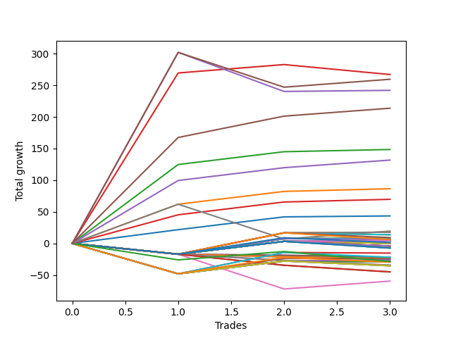

# Long Bulldog 004 
- Symbol: NQ
- Date Range: 03/18/2022 - 06/17/2022
- Trading Period: 7:20-12:30
- Number of Trades: 3



| Name | Win Percent | Profit | Avg Profit / Trade |     | Name | Win Percent | Profit | Avg Profit / Trade |
| ---- | ----------- | ------ | ------------------ | --- | ---- | ----------- | ------ | ------------------ |
| Sorted By <br> Profit | | | | | Sorted By <br> Win Percentage ||||
| Seventy-Three | 66.67 | 133500.00 | 44500.00 |     | Five | 100.00 | 106875.00 | 35625.00 |
| Seventy-Five | 66.67 | 129750.00 | 43250.00 |     | Two | 100.00 | 74250.00 | 24750.00 |
| Seventy-Four | 66.67 | 121000.00 | 40333.33 |     | Four | 100.00 | 65875.00 | 21958.33 |
| Five | 100.00 | 106875.00 | 35625.00 |     | One | 100.00 | 43250.00 | 14416.67 |
| Two | 100.00 | 74250.00 | 24750.00 |     | Three | 100.00 | 34875.00 | 11625.00 |
| Four | 100.00 | 65875.00 | 21958.33 |     | Zero | 100.00 | 21750.00 | 7250.00 |
| One | 100.00 | 43250.00 | 14416.67 |     | Seventy-Three | 66.67 | 133500.00 | 44500.00 |
| Three | 100.00 | 34875.00 | 11625.00 |     | Seventy-Five | 66.67 | 129750.00 | 43250.00 |
| Zero | 100.00 | 21750.00 | 7250.00 |     | Seventy-Four | 66.67 | 121000.00 | 40333.33 |
| Seven | 66.67 | 9750.00 | 3250.00 |     | Seven | 66.67 | 9750.00 | 3250.00 |
| Thirty-Seven | 66.67 | 8875.00 | 2958.33 |     | Thirty-Seven | 66.67 | 8875.00 | 2958.33 |
| Twenty-One | 66.67 | 8875.00 | 2958.33 |     | Twenty-One | 66.67 | 8875.00 | 2958.33 |
| Twenty-Nine | 33.33 | 6875.00 | 2291.67 |     | Thirty-Nine | 66.67 | 4250.00 | 1416.67 |
| Thirteen | 33.33 | 6875.00 | 2291.67 |     | Thirty-Eight | 66.67 | 4250.00 | 1416.67 |
| Forty-Five | 33.33 | 4625.00 | 1541.67 |     | Twenty-Three | 66.67 | 4250.00 | 1416.67 |
| Thirty-Nine | 66.67 | 4250.00 | 1416.67 |     | Twenty-Two | 66.67 | 4250.00 | 1416.67 |
| Thirty-Eight | 66.67 | 4250.00 | 1416.67 |     | Fifty-Six | 66.67 | 2375.00 | 791.67 |
| Twenty-Three | 66.67 | 4250.00 | 1416.67 |     | Forty | 66.67 | 2375.00 | 791.67 |
| Twenty-Two | 66.67 | 4250.00 | 1416.67 |     | Thirty-Two | 66.67 | 2375.00 | 791.67 |
| Fifty-Four | 33.33 | 3250.00 | 1083.33 |     | Twenty-Four | 66.67 | 2375.00 | 791.67 |
| Sixty-One | 33.33 | 3125.00 | 1041.67 |     | Sixten | 66.67 | 2375.00 | 791.67 |
| Fifty-Six | 66.67 | 2375.00 | 791.67 |     | Eight | 66.67 | 2375.00 | 791.67 |
| Forty | 66.67 | 2375.00 | 791.67 |     | Thirty-Six | 66.67 | 2125.00 | 708.33 |
| Thirty-Two | 66.67 | 2375.00 | 791.67 |     | Thirty-Five | 66.67 | 2125.00 | 708.33 |
| Twenty-Four | 66.67 | 2375.00 | 791.67 |     | Thirty-Four | 66.67 | 2125.00 | 708.33 |
| Sixten | 66.67 | 2375.00 | 791.67 |     | Thirty-Three | 66.67 | 2125.00 | 708.33 |
| Eight | 66.67 | 2375.00 | 791.67 |     | Twenty | 66.67 | 2125.00 | 708.33 |
| Thirty-Six | 66.67 | 2125.00 | 708.33 |     | Nineteen | 66.67 | 2125.00 | 708.33 |
| Thirty-Five | 66.67 | 2125.00 | 708.33 |     | Eighteen | 66.67 | 2125.00 | 708.33 |
| Thirty-Four | 66.67 | 2125.00 | 708.33 |     | Seventeen | 66.67 | 2125.00 | 708.33 |
| Thirty-Three | 66.67 | 2125.00 | 708.33 |     | Sixty-Four | 66.67 | -13125.00 | -4375.00 |
| Twenty | 66.67 | 2125.00 | 708.33 |     | Forty-Eight | 66.67 | -13125.00 | -4375.00 |
| Nineteen | 66.67 | 2125.00 | 708.33 |     | Twenty-Nine | 33.33 | 6875.00 | 2291.67 |
| Eighteen | 66.67 | 2125.00 | 708.33 |     | Thirteen | 33.33 | 6875.00 | 2291.67 |
| Seventeen | 66.67 | 2125.00 | 708.33 |     | Forty-Five | 33.33 | 4625.00 | 1541.67 |
| Seventy | 33.33 | 750.00 | 250.00 |     | Fifty-Four | 33.33 | 3250.00 | 1083.33 |
| Twenty-Eight | 33.33 | 125.00 | 41.67 |     | Sixty-One | 33.33 | 3125.00 | 1041.67 |
| twenty-Seven | 33.33 | 125.00 | 41.67 |     | Seventy | 33.33 | 750.00 | 250.00 |
| Twenty-Six | 33.33 | 125.00 | 41.67 |     | Twenty-Eight | 33.33 | 125.00 | 41.67 |
| Twenty-Five | 33.33 | 125.00 | 41.67 |     | twenty-Seven | 33.33 | 125.00 | 41.67 |
| Twelve | 33.33 | 125.00 | 41.67 |     | Twenty-Six | 33.33 | 125.00 | 41.67 |
| Eleven | 33.33 | 125.00 | 41.67 |     | Twenty-Five | 33.33 | 125.00 | 41.67 |
| Ten | 33.33 | 125.00 | 41.67 |     | Twelve | 33.33 | 125.00 | 41.67 |
| Nine | 33.33 | 125.00 | 41.67 |     | Eleven | 33.33 | 125.00 | 41.67 |
| Forty-Four | 33.33 | -2125.00 | -708.33 |     | Ten | 33.33 | 125.00 | 41.67 |
| Forty-Three | 33.33 | -2125.00 | -708.33 |     | Nine | 33.33 | 125.00 | 41.67 |
| Forty-Two | 33.33 | -2125.00 | -708.33 |     | Forty-Four | 33.33 | -2125.00 | -708.33 |
| Forty-One | 33.33 | -2125.00 | -708.33 |     | Forty-Three | 33.33 | -2125.00 | -708.33 |
| Sixty | 33.33 | -3625.00 | -1208.33 |     | Forty-Two | 33.33 | -2125.00 | -708.33 |
| Fifty-Nine | 33.33 | -3625.00 | -1208.33 |     | Forty-One | 33.33 | -2125.00 | -708.33 |
| Fifty-Eight | 33.33 | -3625.00 | -1208.33 |     | Sixty | 33.33 | -3625.00 | -1208.33 |
| Fifty-Seven | 33.33 | -3625.00 | -1208.33 |     | Fifty-Nine | 33.33 | -3625.00 | -1208.33 |
| Fifty-Three | 33.33 | -7625.00 | -2541.67 |     | Fifty-Eight | 33.33 | -3625.00 | -1208.33 |
| Sixty-Nine | 33.33 | -10875.00 | -3625.00 |     | Fifty-Seven | 33.33 | -3625.00 | -1208.33 |
| Fifteen | 0.00 | -10875.00 | -3625.00 |     | Fifty-Three | 33.33 | -7625.00 | -2541.67 |
| Fourteen | 0.00 | -10875.00 | -3625.00 |     | Sixty-Nine | 33.33 | -10875.00 | -3625.00 |
| Thirty-One | 0.00 | -12125.00 | -4041.67 |     | Fifty-Five | 33.33 | -12250.00 | -4083.33 |
| Thirty | 0.00 | -12125.00 | -4041.67 |     | Seventy-Two | 33.33 | -14250.00 | -4750.00 |
| Fifty-Five | 33.33 | -12250.00 | -4083.33 |     | Fifty-Two | 33.33 | -14375.00 | -4791.67 |
| Sixty-Four | 66.67 | -13125.00 | -4375.00 |     | Fifty-One | 33.33 | -14375.00 | -4791.67 |
| Forty-Eight | 66.67 | -13125.00 | -4375.00 |     | Fifty | 33.33 | -14375.00 | -4791.67 |
| Seventy-Two | 33.33 | -14250.00 | -4750.00 |     | Forty-Nine | 33.33 | -14375.00 | -4791.67 |
| Fifty-Two | 33.33 | -14375.00 | -4791.67 |     | Seventy-One | 33.33 | -14750.00 | -4916.67 |
| Fifty-One | 33.33 | -14375.00 | -4791.67 |     | Sixty-Eight | 33.33 | -17625.00 | -5875.00 |
| Fifty | 33.33 | -14375.00 | -4791.67 |     | Sixty-Seven | 33.33 | -17625.00 | -5875.00 |
| Forty-Nine | 33.33 | -14375.00 | -4791.67 |     | Sixty-Six | 33.33 | -17625.00 | -5875.00 |
| Seventy-One | 33.33 | -14750.00 | -4916.67 |     | Sixty-Five | 33.33 | -17625.00 | -5875.00 |
| Forty-Seven | 0.00 | -17125.00 | -5708.33 |     | Six | 33.33 | -29750.00 | -9916.67 |
| Forty-Six | 0.00 | -17125.00 | -5708.33 |     | Fifteen | 0.00 | -10875.00 | -3625.00 |
| Sixty-Eight | 33.33 | -17625.00 | -5875.00 |     | Fourteen | 0.00 | -10875.00 | -3625.00 |
| Sixty-Seven | 33.33 | -17625.00 | -5875.00 |     | Thirty-One | 0.00 | -12125.00 | -4041.67 |
| Sixty-Six | 33.33 | -17625.00 | -5875.00 |     | Thirty | 0.00 | -12125.00 | -4041.67 |
| Sixty-Five | 33.33 | -17625.00 | -5875.00 |     | Forty-Seven | 0.00 | -17125.00 | -5708.33 |
| Sixty-Three | 0.00 | -22500.00 | -7500.00 |     | Forty-Six | 0.00 | -17125.00 | -5708.33 |
| Sixty-Two | 0.00 | -22500.00 | -7500.00 |     | Sixty-Three | 0.00 | -22500.00 | -7500.00 |
| Six | 33.33 | -29750.00 | -9916.67 |     | Sixty-Two | 0.00 | -22500.00 | -7500.00 |

## NO STOPLOSS

### Test Zero
* Sell when price hits the middle line of the 20p bollinger
* No Stoploss
* Results:
```
Total Trades: 3
Percent Up: 100.00
Percent Down: 0.00
Total Points Moved Up: 43.50
Potential Profit: 21750.00
Total Points Ups: 43.50 Count Ups: 3
Total Points Downs: 0.00 Count Downs: 0
```

<details><summary>Trades</summary>

<code>In: 2022-05-04 11:37:00		Out: 2022-05-04 11:41:15		Total Position Time: 04:15		Total Move Up: 21.75		Total to Date: 21.75</code> <br />
<code>In: 2022-05-06 11:50:00		Out: 2022-05-06 11:50:10		Total Position Time: 00:10		Total Move Up: 20.25		Total to Date: 42.00</code> <br />
<code>In: 2022-06-09 08:11:00		Out: 2022-06-09 08:11:10		Total Position Time: 00:10		Total Move Up: 1.50		Total to Date: 43.50</code> <br />


</details>

### Test One
* Sell when the price hits the upper line of the 20p 1std bollinger
* No Stoploss
* Results:
```
Total Trades: 3
Percent Up: 100.00
Percent Down: 0.00
Total Points Moved Up: 86.50
Potential Profit: 43250.00
Total Points Ups: 86.50 Count Ups: 3
Total Points Downs: 0.00 Count Downs: 0
```

<details><summary>Trades</summary>

<code>In: 2022-05-04 11:37:00		Out: 2022-05-04 11:42:00		Total Position Time: 05:00		Total Move Up: 62.00		Total to Date: 62.00</code> <br />
<code>In: 2022-05-06 11:50:00		Out: 2022-05-06 11:50:10		Total Position Time: 00:10		Total Move Up: 20.25		Total to Date: 82.25</code> <br />
<code>In: 2022-06-09 08:11:00		Out: 2022-06-09 08:22:35		Total Position Time: 11:35		Total Move Up: 4.25		Total to Date: 86.50</code> <br />


</details>

### Test Two
* Sell when the price hits the upper line of the 20p 2std bollinger
* No Stoploss
* Results:
```
Total Trades: 3
Percent Up: 100.00
Percent Down: 0.00
Total Points Moved Up: 148.50
Potential Profit: 74250.00
Total Points Ups: 148.50 Count Ups: 3
Total Points Downs: 0.00 Count Downs: 0
```

<details><summary>Trades</summary>

<code>In: 2022-05-04 11:37:00		Out: 2022-05-04 11:44:15		Total Position Time: 07:15		Total Move Up: 124.75		Total to Date: 124.75</code> <br />
<code>In: 2022-05-06 11:50:00		Out: 2022-05-06 11:50:10		Total Position Time: 00:10		Total Move Up: 20.25		Total to Date: 145.00</code> <br />
<code>In: 2022-06-09 08:11:00		Out: 2022-06-09 08:33:20		Total Position Time: 22:20		Total Move Up: 3.50		Total to Date: 148.50</code> <br />


</details>

### Test Three
* Sell when price hits the middle line of the 50p bollinger
* No Stoploss
* Results:
```
Total Trades: 3
Percent Up: 100.00
Percent Down: 0.00
Total Points Moved Up: 69.75
Potential Profit: 34875.00
Total Points Ups: 69.75 Count Ups: 3
Total Points Downs: 0.00 Count Downs: 0
```

<details><summary>Trades</summary>

<code>In: 2022-05-04 11:37:00		Out: 2022-05-04 11:41:40		Total Position Time: 04:40		Total Move Up: 45.25		Total to Date: 45.25</code> <br />
<code>In: 2022-05-06 11:50:00		Out: 2022-05-06 11:50:10		Total Position Time: 00:10		Total Move Up: 20.25		Total to Date: 65.50</code> <br />
<code>In: 2022-06-09 08:11:00		Out: 2022-06-09 08:33:10		Total Position Time: 22:10		Total Move Up: 4.25		Total to Date: 69.75</code> <br />


</details>

### Test Four
* Sell when the price hits the upper line of the 50p 1std bollinger
* No Stoploss
* Results:
```
Total Trades: 3
Percent Up: 100.00
Percent Down: 0.00
Total Points Moved Up: 131.75
Potential Profit: 65875.00
Total Points Ups: 131.75 Count Ups: 3
Total Points Downs: 0.00 Count Downs: 0
```

<details><summary>Trades</summary>

<code>In: 2022-05-04 11:37:00		Out: 2022-05-04 11:43:55		Total Position Time: 06:55		Total Move Up: 99.50		Total to Date: 99.50</code> <br />
<code>In: 2022-05-06 11:50:00		Out: 2022-05-06 11:50:10		Total Position Time: 00:10		Total Move Up: 20.25		Total to Date: 119.75</code> <br />
<code>In: 2022-06-09 08:11:00		Out: 2022-06-09 08:39:45		Total Position Time: 28:45		Total Move Up: 12.00		Total to Date: 131.75</code> <br />


</details>

### Test Five
* Sell when the price hits the upper line of the 50p 2std bollinger
* No Stoploss
* Results:
```
Total Trades: 3
Percent Up: 100.00
Percent Down: 0.00
Total Points Moved Up: 213.75
Potential Profit: 106875.00
Total Points Ups: 213.75 Count Ups: 3
Total Points Downs: 0.00 Count Downs: 0
```

<details><summary>Trades</summary>

<code>In: 2022-05-04 11:37:00		Out: 2022-05-04 11:46:50		Total Position Time: 09:50		Total Move Up: 167.50		Total to Date: 167.50</code> <br />
<code>In: 2022-05-06 11:50:00		Out: 2022-05-06 11:50:20		Total Position Time: 00:20		Total Move Up: 33.75		Total to Date: 201.25</code> <br />
<code>In: 2022-06-09 08:11:00		Out: 2022-06-09 08:40:55		Total Position Time: 29:55		Total Move Up: 12.50		Total to Date: 213.75</code> <br />


</details>

### Test Six
* Sell when the price hits the middle line of the 1std VWAP
* No Stoploss
* Results:
```
Total Trades: 3
Percent Up: 33.33
Percent Down: 66.67
Total Points Moved Up: -59.50
Potential Profit: -29750.00
Total Points Ups: 12.50 Count Ups: 1
Total Points Downs: -72.00 Count Downs: 2
```

<details><summary>Trades</summary>

<code>In: 2022-05-04 11:37:00		Out: 2022-05-04 11:37:10		Total Position Time: 00:10		Total Move Up: -17.00		Total to Date: -17.00</code> <br />
<code>In: 2022-05-06 11:50:00		Out: 2022-05-06 12:19:55		Total Position Time: 29:55		Total Move Up: -55.00		Total to Date: -72.00</code> <br />
<code>In: 2022-06-09 08:11:00		Out: 2022-06-09 08:40:55		Total Position Time: 29:55		Total Move Up: 12.50		Total to Date: -59.50</code> <br />


</details>

### Test Seven
* Sell when the price hits the upper line of the 1std VWAP
* No Stoploss
* Results:
```
Total Trades: 3
Percent Up: 66.67
Percent Down: 33.33
Total Points Moved Up: 19.50
Potential Profit: 9750.00
Total Points Ups: 74.50 Count Ups: 2
Total Points Downs: -55.00 Count Downs: 1
```

<details><summary>Trades</summary>

<code>In: 2022-05-04 11:37:00		Out: 2022-05-04 11:42:00		Total Position Time: 05:00		Total Move Up: 62.00		Total to Date: 62.00</code> <br />
<code>In: 2022-05-06 11:50:00		Out: 2022-05-06 12:19:55		Total Position Time: 29:55		Total Move Up: -55.00		Total to Date: 7.00</code> <br />
<code>In: 2022-06-09 08:11:00		Out: 2022-06-09 08:40:55		Total Position Time: 29:55		Total Move Up: 12.50		Total to Date: 19.50</code> <br />


</details>

## STOPLOSS OF 2

### Test Eight
* Sell when price hits the middle line of the 20p bollinger
* Stoploss is 2 points
* Results:
```
Total Trades: 3
Percent Up: 66.67
Percent Down: 33.33
Total Points Moved Up: 4.75
Potential Profit: 2375.00
Total Points Ups: 21.75 Count Ups: 2
Total Points Downs: -17.00 Count Downs: 1
```

<details><summary>Trades</summary>

<code>In: 2022-05-04 11:37:00		Out: 2022-05-04 11:37:10		Total Position Time: 00:10		Total Move Up: -17.00		Total to Date: -17.00</code> <br />
<code>In: 2022-05-06 11:50:00		Out: 2022-05-06 11:50:10		Total Position Time: 00:10		Total Move Up: 20.25		Total to Date: 3.25</code> <br />
<code>In: 2022-06-09 08:11:00		Out: 2022-06-09 08:11:10		Total Position Time: 00:10		Total Move Up: 1.50		Total to Date: 4.75</code> <br />


</details>

### Test Nine
* Sell when the price hits the upper line of the 20p 1std bollinger
* Stoploss is 2 points
* Results:
```
Total Trades: 3
Percent Up: 33.33
Percent Down: 66.67
Total Points Moved Up: 0.25
Potential Profit: 125.00
Total Points Ups: 20.25 Count Ups: 1
Total Points Downs: -20.00 Count Downs: 2
```

<details><summary>Trades</summary>

<code>In: 2022-05-04 11:37:00		Out: 2022-05-04 11:37:10		Total Position Time: 00:10		Total Move Up: -17.00		Total to Date: -17.00</code> <br />
<code>In: 2022-05-06 11:50:00		Out: 2022-05-06 11:50:10		Total Position Time: 00:10		Total Move Up: 20.25		Total to Date: 3.25</code> <br />
<code>In: 2022-06-09 08:11:00		Out: 2022-06-09 08:12:50		Total Position Time: 01:50		Total Move Up: -3.00		Total to Date: 0.25</code> <br />


</details>

### Test Ten
* Sell when the price hits the upper line of the 20p 2std bollinger
* Stoploss is 2 points
* Results:
```
Total Trades: 3
Percent Up: 33.33
Percent Down: 66.67
Total Points Moved Up: 0.25
Potential Profit: 125.00
Total Points Ups: 20.25 Count Ups: 1
Total Points Downs: -20.00 Count Downs: 2
```

<details><summary>Trades</summary>

<code>In: 2022-05-04 11:37:00		Out: 2022-05-04 11:37:10		Total Position Time: 00:10		Total Move Up: -17.00		Total to Date: -17.00</code> <br />
<code>In: 2022-05-06 11:50:00		Out: 2022-05-06 11:50:10		Total Position Time: 00:10		Total Move Up: 20.25		Total to Date: 3.25</code> <br />
<code>In: 2022-06-09 08:11:00		Out: 2022-06-09 08:12:50		Total Position Time: 01:50		Total Move Up: -3.00		Total to Date: 0.25</code> <br />


</details>

### Test Eleven
* Sell when price hits the middle line of the 50p bollinger
* Stoploss is 2 points
* Results:
```
Total Trades: 3
Percent Up: 33.33
Percent Down: 66.67
Total Points Moved Up: 0.25
Potential Profit: 125.00
Total Points Ups: 20.25 Count Ups: 1
Total Points Downs: -20.00 Count Downs: 2
```

<details><summary>Trades</summary>

<code>In: 2022-05-04 11:37:00		Out: 2022-05-04 11:37:10		Total Position Time: 00:10		Total Move Up: -17.00		Total to Date: -17.00</code> <br />
<code>In: 2022-05-06 11:50:00		Out: 2022-05-06 11:50:10		Total Position Time: 00:10		Total Move Up: 20.25		Total to Date: 3.25</code> <br />
<code>In: 2022-06-09 08:11:00		Out: 2022-06-09 08:12:50		Total Position Time: 01:50		Total Move Up: -3.00		Total to Date: 0.25</code> <br />


</details>

### Test Twelve
* Sell when the price hits the upper line of the 50p 1std bollinger
* Stoploss is 2 points
* Results:
```
Total Trades: 3
Percent Up: 33.33
Percent Down: 66.67
Total Points Moved Up: 0.25
Potential Profit: 125.00
Total Points Ups: 20.25 Count Ups: 1
Total Points Downs: -20.00 Count Downs: 2
```

<details><summary>Trades</summary>

<code>In: 2022-05-04 11:37:00		Out: 2022-05-04 11:37:10		Total Position Time: 00:10		Total Move Up: -17.00		Total to Date: -17.00</code> <br />
<code>In: 2022-05-06 11:50:00		Out: 2022-05-06 11:50:10		Total Position Time: 00:10		Total Move Up: 20.25		Total to Date: 3.25</code> <br />
<code>In: 2022-06-09 08:11:00		Out: 2022-06-09 08:12:50		Total Position Time: 01:50		Total Move Up: -3.00		Total to Date: 0.25</code> <br />


</details>

### Test Thirteen
* Sell when the price hits the upper line of the 50p 2std bollinger
* Stoploss is 2 points
* Results:
```
Total Trades: 3
Percent Up: 33.33
Percent Down: 66.67
Total Points Moved Up: 13.75
Potential Profit: 6875.00
Total Points Ups: 33.75 Count Ups: 1
Total Points Downs: -20.00 Count Downs: 2
```

<details><summary>Trades</summary>

<code>In: 2022-05-04 11:37:00		Out: 2022-05-04 11:37:10		Total Position Time: 00:10		Total Move Up: -17.00		Total to Date: -17.00</code> <br />
<code>In: 2022-05-06 11:50:00		Out: 2022-05-06 11:50:20		Total Position Time: 00:20		Total Move Up: 33.75		Total to Date: 16.75</code> <br />
<code>In: 2022-06-09 08:11:00		Out: 2022-06-09 08:12:50		Total Position Time: 01:50		Total Move Up: -3.00		Total to Date: 13.75</code> <br />


</details>

### Test Fourteen
* Sell when the price hits the middle line of the 1std VWAP
* Stoploss is 2 points
* Results:
```
Total Trades: 3
Percent Up: 0.00
Percent Down: 100.00
Total Points Moved Up: -21.75
Potential Profit: -10875.00
Total Points Ups: 0.00 Count Ups: 0
Total Points Downs: -21.75 Count Downs: 3
```

<details><summary>Trades</summary>

<code>In: 2022-05-04 11:37:00		Out: 2022-05-04 11:37:10		Total Position Time: 00:10		Total Move Up: -17.00		Total to Date: -17.00</code> <br />
<code>In: 2022-05-06 11:50:00		Out: 2022-05-06 11:52:50		Total Position Time: 02:50		Total Move Up: -1.75		Total to Date: -18.75</code> <br />
<code>In: 2022-06-09 08:11:00		Out: 2022-06-09 08:12:50		Total Position Time: 01:50		Total Move Up: -3.00		Total to Date: -21.75</code> <br />


</details>

### Test Fifteen
* Sell when the price hits the upper line of the 1std VWAP
* Stoploss is 2 points
* Results:
```
Total Trades: 3
Percent Up: 0.00
Percent Down: 100.00
Total Points Moved Up: -21.75
Potential Profit: -10875.00
Total Points Ups: 0.00 Count Ups: 0
Total Points Downs: -21.75 Count Downs: 3
```

<details><summary>Trades</summary>

<code>In: 2022-05-04 11:37:00		Out: 2022-05-04 11:37:10		Total Position Time: 00:10		Total Move Up: -17.00		Total to Date: -17.00</code> <br />
<code>In: 2022-05-06 11:50:00		Out: 2022-05-06 11:52:50		Total Position Time: 02:50		Total Move Up: -1.75		Total to Date: -18.75</code> <br />
<code>In: 2022-06-09 08:11:00		Out: 2022-06-09 08:12:50		Total Position Time: 01:50		Total Move Up: -3.00		Total to Date: -21.75</code> <br />


</details>

## TRAIL STOP OF 2

### Test Sixten
* Sell when price hits the middle line of the 20p bollinger
* Trailing Stop is 2 points
* Results:
```
Total Trades: 3
Percent Up: 66.67
Percent Down: 33.33
Total Points Moved Up: 4.75
Potential Profit: 2375.00
Total Points Ups: 21.75 Count Ups: 2
Total Points Downs: -17.00 Count Downs: 1
```

<details><summary>Trades</summary>

<code>In: 2022-05-04 11:37:00		Out: 2022-05-04 11:37:10		Total Position Time: 00:10		Total Move Up: -17.00		Total to Date: -17.00</code> <br />
<code>In: 2022-05-06 11:50:00		Out: 2022-05-06 11:50:10		Total Position Time: 00:10		Total Move Up: 20.25		Total to Date: 3.25</code> <br />
<code>In: 2022-06-09 08:11:00		Out: 2022-06-09 08:11:10		Total Position Time: 00:10		Total Move Up: 1.50		Total to Date: 4.75</code> <br />


</details>

### Test Seventeen
* Sell when the price hits the upper line of the 20p 1std bollinger
* Trailing Stop is 2 points
* Results:
```
Total Trades: 3
Percent Up: 66.67
Percent Down: 33.33
Total Points Moved Up: 4.25
Potential Profit: 2125.00
Total Points Ups: 21.25 Count Ups: 2
Total Points Downs: -17.00 Count Downs: 1
```

<details><summary>Trades</summary>

<code>In: 2022-05-04 11:37:00		Out: 2022-05-04 11:37:10		Total Position Time: 00:10		Total Move Up: -17.00		Total to Date: -17.00</code> <br />
<code>In: 2022-05-06 11:50:00		Out: 2022-05-06 11:50:10		Total Position Time: 00:10		Total Move Up: 20.25		Total to Date: 3.25</code> <br />
<code>In: 2022-06-09 08:11:00		Out: 2022-06-09 08:11:35		Total Position Time: 00:35		Total Move Up: 1.00		Total to Date: 4.25</code> <br />


</details>

### Test Eighteen
* Sell when the price hits the upper line of the 20p 2std bollinger
* Trailing Stop is 2 points
* Results:
```
Total Trades: 3
Percent Up: 66.67
Percent Down: 33.33
Total Points Moved Up: 4.25
Potential Profit: 2125.00
Total Points Ups: 21.25 Count Ups: 2
Total Points Downs: -17.00 Count Downs: 1
```

<details><summary>Trades</summary>

<code>In: 2022-05-04 11:37:00		Out: 2022-05-04 11:37:10		Total Position Time: 00:10		Total Move Up: -17.00		Total to Date: -17.00</code> <br />
<code>In: 2022-05-06 11:50:00		Out: 2022-05-06 11:50:10		Total Position Time: 00:10		Total Move Up: 20.25		Total to Date: 3.25</code> <br />
<code>In: 2022-06-09 08:11:00		Out: 2022-06-09 08:11:35		Total Position Time: 00:35		Total Move Up: 1.00		Total to Date: 4.25</code> <br />


</details>

### Test Nineteen
* Sell when price hits the middle line of the 50p bollinger
* Trailing Stop is 2 points
* Results:
```
Total Trades: 3
Percent Up: 66.67
Percent Down: 33.33
Total Points Moved Up: 4.25
Potential Profit: 2125.00
Total Points Ups: 21.25 Count Ups: 2
Total Points Downs: -17.00 Count Downs: 1
```

<details><summary>Trades</summary>

<code>In: 2022-05-04 11:37:00		Out: 2022-05-04 11:37:10		Total Position Time: 00:10		Total Move Up: -17.00		Total to Date: -17.00</code> <br />
<code>In: 2022-05-06 11:50:00		Out: 2022-05-06 11:50:10		Total Position Time: 00:10		Total Move Up: 20.25		Total to Date: 3.25</code> <br />
<code>In: 2022-06-09 08:11:00		Out: 2022-06-09 08:11:35		Total Position Time: 00:35		Total Move Up: 1.00		Total to Date: 4.25</code> <br />


</details>

### Test Twenty
* Sell when the price hits the upper line of the 50p 1std bollinger
* Trailing Stop is 2 points
* Results:
```
Total Trades: 3
Percent Up: 66.67
Percent Down: 33.33
Total Points Moved Up: 4.25
Potential Profit: 2125.00
Total Points Ups: 21.25 Count Ups: 2
Total Points Downs: -17.00 Count Downs: 1
```

<details><summary>Trades</summary>

<code>In: 2022-05-04 11:37:00		Out: 2022-05-04 11:37:10		Total Position Time: 00:10		Total Move Up: -17.00		Total to Date: -17.00</code> <br />
<code>In: 2022-05-06 11:50:00		Out: 2022-05-06 11:50:10		Total Position Time: 00:10		Total Move Up: 20.25		Total to Date: 3.25</code> <br />
<code>In: 2022-06-09 08:11:00		Out: 2022-06-09 08:11:35		Total Position Time: 00:35		Total Move Up: 1.00		Total to Date: 4.25</code> <br />


</details>

### Test Twenty-One
* Sell when the price hits the upper line of the 50p 2std bollinger
* Trailing Stop is 2 points
* Results:
```
Total Trades: 3
Percent Up: 66.67
Percent Down: 33.33
Total Points Moved Up: 17.75
Potential Profit: 8875.00
Total Points Ups: 34.75 Count Ups: 2
Total Points Downs: -17.00 Count Downs: 1
```

<details><summary>Trades</summary>

<code>In: 2022-05-04 11:37:00		Out: 2022-05-04 11:37:10		Total Position Time: 00:10		Total Move Up: -17.00		Total to Date: -17.00</code> <br />
<code>In: 2022-05-06 11:50:00		Out: 2022-05-06 11:50:20		Total Position Time: 00:20		Total Move Up: 33.75		Total to Date: 16.75</code> <br />
<code>In: 2022-06-09 08:11:00		Out: 2022-06-09 08:11:35		Total Position Time: 00:35		Total Move Up: 1.00		Total to Date: 17.75</code> <br />


</details>

### Test Twenty-Two
* Sell when the price hits the middle line of the 1std VWAP
* Trailing Stop is 2 points
* Results:
```
Total Trades: 3
Percent Up: 66.67
Percent Down: 33.33
Total Points Moved Up: 8.50
Potential Profit: 4250.00
Total Points Ups: 25.50 Count Ups: 2
Total Points Downs: -17.00 Count Downs: 1
```

<details><summary>Trades</summary>

<code>In: 2022-05-04 11:37:00		Out: 2022-05-04 11:37:10		Total Position Time: 00:10		Total Move Up: -17.00		Total to Date: -17.00</code> <br />
<code>In: 2022-05-06 11:50:00		Out: 2022-05-06 11:50:25		Total Position Time: 00:25		Total Move Up: 24.50		Total to Date: 7.50</code> <br />
<code>In: 2022-06-09 08:11:00		Out: 2022-06-09 08:11:35		Total Position Time: 00:35		Total Move Up: 1.00		Total to Date: 8.50</code> <br />


</details>

### Test Twenty-Three
* Sell when the price hits the upper line of the 1std VWAP
* Trailing Stop is 2 points
* Results:
```
Total Trades: 3
Percent Up: 66.67
Percent Down: 33.33
Total Points Moved Up: 8.50
Potential Profit: 4250.00
Total Points Ups: 25.50 Count Ups: 2
Total Points Downs: -17.00 Count Downs: 1
```

<details><summary>Trades</summary>

<code>In: 2022-05-04 11:37:00		Out: 2022-05-04 11:37:10		Total Position Time: 00:10		Total Move Up: -17.00		Total to Date: -17.00</code> <br />
<code>In: 2022-05-06 11:50:00		Out: 2022-05-06 11:50:25		Total Position Time: 00:25		Total Move Up: 24.50		Total to Date: 7.50</code> <br />
<code>In: 2022-06-09 08:11:00		Out: 2022-06-09 08:11:35		Total Position Time: 00:35		Total Move Up: 1.00		Total to Date: 8.50</code> <br />


</details>

## STOPLOSS OF 3

### Test Twenty-Four
* Sell when price hits the middle line of the 20p bollinger
* Stoploss is 3 points
* Results:
```
Total Trades: 3
Percent Up: 66.67
Percent Down: 33.33
Total Points Moved Up: 4.75
Potential Profit: 2375.00
Total Points Ups: 21.75 Count Ups: 2
Total Points Downs: -17.00 Count Downs: 1
```

<details><summary>Trades</summary>

<code>In: 2022-05-04 11:37:00		Out: 2022-05-04 11:37:10		Total Position Time: 00:10		Total Move Up: -17.00		Total to Date: -17.00</code> <br />
<code>In: 2022-05-06 11:50:00		Out: 2022-05-06 11:50:10		Total Position Time: 00:10		Total Move Up: 20.25		Total to Date: 3.25</code> <br />
<code>In: 2022-06-09 08:11:00		Out: 2022-06-09 08:11:10		Total Position Time: 00:10		Total Move Up: 1.50		Total to Date: 4.75</code> <br />


</details>

### Test Twenty-Five
* Sell when the price hits the upper line of the 20p 1std bollinger
* Stoploss is 3 points
* Results:
```
Total Trades: 3
Percent Up: 33.33
Percent Down: 66.67
Total Points Moved Up: 0.25
Potential Profit: 125.00
Total Points Ups: 20.25 Count Ups: 1
Total Points Downs: -20.00 Count Downs: 2
```

<details><summary>Trades</summary>

<code>In: 2022-05-04 11:37:00		Out: 2022-05-04 11:37:10		Total Position Time: 00:10		Total Move Up: -17.00		Total to Date: -17.00</code> <br />
<code>In: 2022-05-06 11:50:00		Out: 2022-05-06 11:50:10		Total Position Time: 00:10		Total Move Up: 20.25		Total to Date: 3.25</code> <br />
<code>In: 2022-06-09 08:11:00		Out: 2022-06-09 08:12:50		Total Position Time: 01:50		Total Move Up: -3.00		Total to Date: 0.25</code> <br />


</details>

### Test Twenty-Six
* Sell when the price hits the upper line of the 20p 2std bollinger
* Stoploss is 3 points
* Results:
```
Total Trades: 3
Percent Up: 33.33
Percent Down: 66.67
Total Points Moved Up: 0.25
Potential Profit: 125.00
Total Points Ups: 20.25 Count Ups: 1
Total Points Downs: -20.00 Count Downs: 2
```

<details><summary>Trades</summary>

<code>In: 2022-05-04 11:37:00		Out: 2022-05-04 11:37:10		Total Position Time: 00:10		Total Move Up: -17.00		Total to Date: -17.00</code> <br />
<code>In: 2022-05-06 11:50:00		Out: 2022-05-06 11:50:10		Total Position Time: 00:10		Total Move Up: 20.25		Total to Date: 3.25</code> <br />
<code>In: 2022-06-09 08:11:00		Out: 2022-06-09 08:12:50		Total Position Time: 01:50		Total Move Up: -3.00		Total to Date: 0.25</code> <br />


</details>

### Test twenty-Seven
* Sell when price hits the middle line of the 50p bollinger
* Stoploss is 3 points
* Results:
```
Total Trades: 3
Percent Up: 33.33
Percent Down: 66.67
Total Points Moved Up: 0.25
Potential Profit: 125.00
Total Points Ups: 20.25 Count Ups: 1
Total Points Downs: -20.00 Count Downs: 2
```

<details><summary>Trades</summary>

<code>In: 2022-05-04 11:37:00		Out: 2022-05-04 11:37:10		Total Position Time: 00:10		Total Move Up: -17.00		Total to Date: -17.00</code> <br />
<code>In: 2022-05-06 11:50:00		Out: 2022-05-06 11:50:10		Total Position Time: 00:10		Total Move Up: 20.25		Total to Date: 3.25</code> <br />
<code>In: 2022-06-09 08:11:00		Out: 2022-06-09 08:12:50		Total Position Time: 01:50		Total Move Up: -3.00		Total to Date: 0.25</code> <br />


</details>

### Test Twenty-Eight
* Sell when the price hits the upper line of the 50p 1std bollinger
* Stoploss is 3 points
* Results:
```
Total Trades: 3
Percent Up: 33.33
Percent Down: 66.67
Total Points Moved Up: 0.25
Potential Profit: 125.00
Total Points Ups: 20.25 Count Ups: 1
Total Points Downs: -20.00 Count Downs: 2
```

<details><summary>Trades</summary>

<code>In: 2022-05-04 11:37:00		Out: 2022-05-04 11:37:10		Total Position Time: 00:10		Total Move Up: -17.00		Total to Date: -17.00</code> <br />
<code>In: 2022-05-06 11:50:00		Out: 2022-05-06 11:50:10		Total Position Time: 00:10		Total Move Up: 20.25		Total to Date: 3.25</code> <br />
<code>In: 2022-06-09 08:11:00		Out: 2022-06-09 08:12:50		Total Position Time: 01:50		Total Move Up: -3.00		Total to Date: 0.25</code> <br />


</details>

### Test Twenty-Nine
* Sell when the price hits the upper line of the 50p 2std bollinger
* Stoploss is 3 points
* Results:
```
Total Trades: 3
Percent Up: 33.33
Percent Down: 66.67
Total Points Moved Up: 13.75
Potential Profit: 6875.00
Total Points Ups: 33.75 Count Ups: 1
Total Points Downs: -20.00 Count Downs: 2
```

<details><summary>Trades</summary>

<code>In: 2022-05-04 11:37:00		Out: 2022-05-04 11:37:10		Total Position Time: 00:10		Total Move Up: -17.00		Total to Date: -17.00</code> <br />
<code>In: 2022-05-06 11:50:00		Out: 2022-05-06 11:50:20		Total Position Time: 00:20		Total Move Up: 33.75		Total to Date: 16.75</code> <br />
<code>In: 2022-06-09 08:11:00		Out: 2022-06-09 08:12:50		Total Position Time: 01:50		Total Move Up: -3.00		Total to Date: 13.75</code> <br />


</details>

### Test Thirty
* Sell when the price hits the middle line of the 1std VWAP
* Stoploss is 3 points
* Results:
```
Total Trades: 3
Percent Up: 0.00
Percent Down: 100.00
Total Points Moved Up: -24.25
Potential Profit: -12125.00
Total Points Ups: 0.00 Count Ups: 0
Total Points Downs: -24.25 Count Downs: 3
```

<details><summary>Trades</summary>

<code>In: 2022-05-04 11:37:00		Out: 2022-05-04 11:37:10		Total Position Time: 00:10		Total Move Up: -17.00		Total to Date: -17.00</code> <br />
<code>In: 2022-05-06 11:50:00		Out: 2022-05-06 11:52:55		Total Position Time: 02:55		Total Move Up: -4.25		Total to Date: -21.25</code> <br />
<code>In: 2022-06-09 08:11:00		Out: 2022-06-09 08:12:50		Total Position Time: 01:50		Total Move Up: -3.00		Total to Date: -24.25</code> <br />


</details>

### Test Thirty-One
* Sell when the price hits the upper line of the 1std VWAP
* Stoploss is 3 points
* Results:
```
Total Trades: 3
Percent Up: 0.00
Percent Down: 100.00
Total Points Moved Up: -24.25
Potential Profit: -12125.00
Total Points Ups: 0.00 Count Ups: 0
Total Points Downs: -24.25 Count Downs: 3
```

<details><summary>Trades</summary>

<code>In: 2022-05-04 11:37:00		Out: 2022-05-04 11:37:10		Total Position Time: 00:10		Total Move Up: -17.00		Total to Date: -17.00</code> <br />
<code>In: 2022-05-06 11:50:00		Out: 2022-05-06 11:52:55		Total Position Time: 02:55		Total Move Up: -4.25		Total to Date: -21.25</code> <br />
<code>In: 2022-06-09 08:11:00		Out: 2022-06-09 08:12:50		Total Position Time: 01:50		Total Move Up: -3.00		Total to Date: -24.25</code> <br />


</details>

## TRAIL STOP OF 3

### Test Thirty-Two
* Sell when price hits the middle line of the 20p bollinger
* Trailing Stop is 3 points
* Results:
```
Total Trades: 3
Percent Up: 66.67
Percent Down: 33.33
Total Points Moved Up: 4.75
Potential Profit: 2375.00
Total Points Ups: 21.75 Count Ups: 2
Total Points Downs: -17.00 Count Downs: 1
```

<details><summary>Trades</summary>

<code>In: 2022-05-04 11:37:00		Out: 2022-05-04 11:37:10		Total Position Time: 00:10		Total Move Up: -17.00		Total to Date: -17.00</code> <br />
<code>In: 2022-05-06 11:50:00		Out: 2022-05-06 11:50:10		Total Position Time: 00:10		Total Move Up: 20.25		Total to Date: 3.25</code> <br />
<code>In: 2022-06-09 08:11:00		Out: 2022-06-09 08:11:10		Total Position Time: 00:10		Total Move Up: 1.50		Total to Date: 4.75</code> <br />


</details>

### Test Thirty-Three
* Sell when the price hits the upper line of the 20p 1std bollinger
* Trailing Stop is 3 points
* Results:
```
Total Trades: 3
Percent Up: 66.67
Percent Down: 33.33
Total Points Moved Up: 4.25
Potential Profit: 2125.00
Total Points Ups: 21.25 Count Ups: 2
Total Points Downs: -17.00 Count Downs: 1
```

<details><summary>Trades</summary>

<code>In: 2022-05-04 11:37:00		Out: 2022-05-04 11:37:10		Total Position Time: 00:10		Total Move Up: -17.00		Total to Date: -17.00</code> <br />
<code>In: 2022-05-06 11:50:00		Out: 2022-05-06 11:50:10		Total Position Time: 00:10		Total Move Up: 20.25		Total to Date: 3.25</code> <br />
<code>In: 2022-06-09 08:11:00		Out: 2022-06-09 08:11:35		Total Position Time: 00:35		Total Move Up: 1.00		Total to Date: 4.25</code> <br />


</details>

### Test Thirty-Four
* Sell when the price hits the upper line of the 20p 2std bollinger
* Trailing Stop is 3 points
* Results:
```
Total Trades: 3
Percent Up: 66.67
Percent Down: 33.33
Total Points Moved Up: 4.25
Potential Profit: 2125.00
Total Points Ups: 21.25 Count Ups: 2
Total Points Downs: -17.00 Count Downs: 1
```

<details><summary>Trades</summary>

<code>In: 2022-05-04 11:37:00		Out: 2022-05-04 11:37:10		Total Position Time: 00:10		Total Move Up: -17.00		Total to Date: -17.00</code> <br />
<code>In: 2022-05-06 11:50:00		Out: 2022-05-06 11:50:10		Total Position Time: 00:10		Total Move Up: 20.25		Total to Date: 3.25</code> <br />
<code>In: 2022-06-09 08:11:00		Out: 2022-06-09 08:11:35		Total Position Time: 00:35		Total Move Up: 1.00		Total to Date: 4.25</code> <br />


</details>

### Test Thirty-Five
* Sell when price hits the middle line of the 50p bollinger
* Trailing Stop is 3 points
* Results:
```
Total Trades: 3
Percent Up: 66.67
Percent Down: 33.33
Total Points Moved Up: 4.25
Potential Profit: 2125.00
Total Points Ups: 21.25 Count Ups: 2
Total Points Downs: -17.00 Count Downs: 1
```

<details><summary>Trades</summary>

<code>In: 2022-05-04 11:37:00		Out: 2022-05-04 11:37:10		Total Position Time: 00:10		Total Move Up: -17.00		Total to Date: -17.00</code> <br />
<code>In: 2022-05-06 11:50:00		Out: 2022-05-06 11:50:10		Total Position Time: 00:10		Total Move Up: 20.25		Total to Date: 3.25</code> <br />
<code>In: 2022-06-09 08:11:00		Out: 2022-06-09 08:11:35		Total Position Time: 00:35		Total Move Up: 1.00		Total to Date: 4.25</code> <br />


</details>

### Test Thirty-Six
* Sell when the price hits the upper line of the 50p 1std bollinger
* Trailing Stop is 3 points
* Results:
```
Total Trades: 3
Percent Up: 66.67
Percent Down: 33.33
Total Points Moved Up: 4.25
Potential Profit: 2125.00
Total Points Ups: 21.25 Count Ups: 2
Total Points Downs: -17.00 Count Downs: 1
```

<details><summary>Trades</summary>

<code>In: 2022-05-04 11:37:00		Out: 2022-05-04 11:37:10		Total Position Time: 00:10		Total Move Up: -17.00		Total to Date: -17.00</code> <br />
<code>In: 2022-05-06 11:50:00		Out: 2022-05-06 11:50:10		Total Position Time: 00:10		Total Move Up: 20.25		Total to Date: 3.25</code> <br />
<code>In: 2022-06-09 08:11:00		Out: 2022-06-09 08:11:35		Total Position Time: 00:35		Total Move Up: 1.00		Total to Date: 4.25</code> <br />


</details>

### Test Thirty-Seven
* Sell when the price hits the upper line of the 50p 2std bollinger
* Trailing Stop is 3 points
* Results:
```
Total Trades: 3
Percent Up: 66.67
Percent Down: 33.33
Total Points Moved Up: 17.75
Potential Profit: 8875.00
Total Points Ups: 34.75 Count Ups: 2
Total Points Downs: -17.00 Count Downs: 1
```

<details><summary>Trades</summary>

<code>In: 2022-05-04 11:37:00		Out: 2022-05-04 11:37:10		Total Position Time: 00:10		Total Move Up: -17.00		Total to Date: -17.00</code> <br />
<code>In: 2022-05-06 11:50:00		Out: 2022-05-06 11:50:20		Total Position Time: 00:20		Total Move Up: 33.75		Total to Date: 16.75</code> <br />
<code>In: 2022-06-09 08:11:00		Out: 2022-06-09 08:11:35		Total Position Time: 00:35		Total Move Up: 1.00		Total to Date: 17.75</code> <br />


</details>

### Test Thirty-Eight
* Sell when the price hits the middle line of the 1std VWAP
* Trailing Stop is 3 points
* Results:
```
Total Trades: 3
Percent Up: 66.67
Percent Down: 33.33
Total Points Moved Up: 8.50
Potential Profit: 4250.00
Total Points Ups: 25.50 Count Ups: 2
Total Points Downs: -17.00 Count Downs: 1
```

<details><summary>Trades</summary>

<code>In: 2022-05-04 11:37:00		Out: 2022-05-04 11:37:10		Total Position Time: 00:10		Total Move Up: -17.00		Total to Date: -17.00</code> <br />
<code>In: 2022-05-06 11:50:00		Out: 2022-05-06 11:50:25		Total Position Time: 00:25		Total Move Up: 24.50		Total to Date: 7.50</code> <br />
<code>In: 2022-06-09 08:11:00		Out: 2022-06-09 08:11:35		Total Position Time: 00:35		Total Move Up: 1.00		Total to Date: 8.50</code> <br />


</details>

### Test Thirty-Nine
* Sell when the price hits the upper line of the 1std VWAP
* Trailing Stop is 3 points
* Results:
```
Total Trades: 3
Percent Up: 66.67
Percent Down: 33.33
Total Points Moved Up: 8.50
Potential Profit: 4250.00
Total Points Ups: 25.50 Count Ups: 2
Total Points Downs: -17.00 Count Downs: 1
```

<details><summary>Trades</summary>

<code>In: 2022-05-04 11:37:00		Out: 2022-05-04 11:37:10		Total Position Time: 00:10		Total Move Up: -17.00		Total to Date: -17.00</code> <br />
<code>In: 2022-05-06 11:50:00		Out: 2022-05-06 11:50:25		Total Position Time: 00:25		Total Move Up: 24.50		Total to Date: 7.50</code> <br />
<code>In: 2022-06-09 08:11:00		Out: 2022-06-09 08:11:35		Total Position Time: 00:35		Total Move Up: 1.00		Total to Date: 8.50</code> <br />


</details>

## STOPLOSS OF 5

### Test Forty
* Sell when price hits the middle line of the 20p bollinger
* Stoploss is 5 points
* Results:
```
Total Trades: 3
Percent Up: 66.67
Percent Down: 33.33
Total Points Moved Up: 4.75
Potential Profit: 2375.00
Total Points Ups: 21.75 Count Ups: 2
Total Points Downs: -17.00 Count Downs: 1
```

<details><summary>Trades</summary>

<code>In: 2022-05-04 11:37:00		Out: 2022-05-04 11:37:10		Total Position Time: 00:10		Total Move Up: -17.00		Total to Date: -17.00</code> <br />
<code>In: 2022-05-06 11:50:00		Out: 2022-05-06 11:50:10		Total Position Time: 00:10		Total Move Up: 20.25		Total to Date: 3.25</code> <br />
<code>In: 2022-06-09 08:11:00		Out: 2022-06-09 08:11:10		Total Position Time: 00:10		Total Move Up: 1.50		Total to Date: 4.75</code> <br />


</details>

### Test Forty-One
* Sell when the price hits the upper line of the 20p 1std bollinger
* Stoploss is 5 points
* Results:
```
Total Trades: 3
Percent Up: 33.33
Percent Down: 66.67
Total Points Moved Up: -4.25
Potential Profit: -2125.00
Total Points Ups: 20.25 Count Ups: 1
Total Points Downs: -24.50 Count Downs: 2
```

<details><summary>Trades</summary>

<code>In: 2022-05-04 11:37:00		Out: 2022-05-04 11:37:10		Total Position Time: 00:10		Total Move Up: -17.00		Total to Date: -17.00</code> <br />
<code>In: 2022-05-06 11:50:00		Out: 2022-05-06 11:50:10		Total Position Time: 00:10		Total Move Up: 20.25		Total to Date: 3.25</code> <br />
<code>In: 2022-06-09 08:11:00		Out: 2022-06-09 08:13:00		Total Position Time: 02:00		Total Move Up: -7.50		Total to Date: -4.25</code> <br />


</details>

### Test Forty-Two
* Sell when the price hits the upper line of the 20p 2std bollinger
* Stoploss is 5 points
* Results:
```
Total Trades: 3
Percent Up: 33.33
Percent Down: 66.67
Total Points Moved Up: -4.25
Potential Profit: -2125.00
Total Points Ups: 20.25 Count Ups: 1
Total Points Downs: -24.50 Count Downs: 2
```

<details><summary>Trades</summary>

<code>In: 2022-05-04 11:37:00		Out: 2022-05-04 11:37:10		Total Position Time: 00:10		Total Move Up: -17.00		Total to Date: -17.00</code> <br />
<code>In: 2022-05-06 11:50:00		Out: 2022-05-06 11:50:10		Total Position Time: 00:10		Total Move Up: 20.25		Total to Date: 3.25</code> <br />
<code>In: 2022-06-09 08:11:00		Out: 2022-06-09 08:13:00		Total Position Time: 02:00		Total Move Up: -7.50		Total to Date: -4.25</code> <br />


</details>

### Test Forty-Three
* Sell when price hits the middle line of the 50p bollinger
* Stoploss is 5 points
* Results:
```
Total Trades: 3
Percent Up: 33.33
Percent Down: 66.67
Total Points Moved Up: -4.25
Potential Profit: -2125.00
Total Points Ups: 20.25 Count Ups: 1
Total Points Downs: -24.50 Count Downs: 2
```

<details><summary>Trades</summary>

<code>In: 2022-05-04 11:37:00		Out: 2022-05-04 11:37:10		Total Position Time: 00:10		Total Move Up: -17.00		Total to Date: -17.00</code> <br />
<code>In: 2022-05-06 11:50:00		Out: 2022-05-06 11:50:10		Total Position Time: 00:10		Total Move Up: 20.25		Total to Date: 3.25</code> <br />
<code>In: 2022-06-09 08:11:00		Out: 2022-06-09 08:13:00		Total Position Time: 02:00		Total Move Up: -7.50		Total to Date: -4.25</code> <br />


</details>

### Test Forty-Four
* Sell when the price hits the upper line of the 50p 1std bollinger
* Stoploss is 5 points
* Results:
```
Total Trades: 3
Percent Up: 33.33
Percent Down: 66.67
Total Points Moved Up: -4.25
Potential Profit: -2125.00
Total Points Ups: 20.25 Count Ups: 1
Total Points Downs: -24.50 Count Downs: 2
```

<details><summary>Trades</summary>

<code>In: 2022-05-04 11:37:00		Out: 2022-05-04 11:37:10		Total Position Time: 00:10		Total Move Up: -17.00		Total to Date: -17.00</code> <br />
<code>In: 2022-05-06 11:50:00		Out: 2022-05-06 11:50:10		Total Position Time: 00:10		Total Move Up: 20.25		Total to Date: 3.25</code> <br />
<code>In: 2022-06-09 08:11:00		Out: 2022-06-09 08:13:00		Total Position Time: 02:00		Total Move Up: -7.50		Total to Date: -4.25</code> <br />


</details>

### Test Forty-Five
* Sell when the price hits the upper line of the 50p 2std bollinger
* Stoploss is 5 points
* Results:
```
Total Trades: 3
Percent Up: 33.33
Percent Down: 66.67
Total Points Moved Up: 9.25
Potential Profit: 4625.00
Total Points Ups: 33.75 Count Ups: 1
Total Points Downs: -24.50 Count Downs: 2
```

<details><summary>Trades</summary>

<code>In: 2022-05-04 11:37:00		Out: 2022-05-04 11:37:10		Total Position Time: 00:10		Total Move Up: -17.00		Total to Date: -17.00</code> <br />
<code>In: 2022-05-06 11:50:00		Out: 2022-05-06 11:50:20		Total Position Time: 00:20		Total Move Up: 33.75		Total to Date: 16.75</code> <br />
<code>In: 2022-06-09 08:11:00		Out: 2022-06-09 08:13:00		Total Position Time: 02:00		Total Move Up: -7.50		Total to Date: 9.25</code> <br />


</details>

### Test Forty-Six
* Sell when the price hits the middle line of the 1std VWAP
* Stoploss is 5 points
* Results:
```
Total Trades: 3
Percent Up: 0.00
Percent Down: 100.00
Total Points Moved Up: -34.25
Potential Profit: -17125.00
Total Points Ups: 0.00 Count Ups: 0
Total Points Downs: -34.25 Count Downs: 3
```

<details><summary>Trades</summary>

<code>In: 2022-05-04 11:37:00		Out: 2022-05-04 11:37:10		Total Position Time: 00:10		Total Move Up: -17.00		Total to Date: -17.00</code> <br />
<code>In: 2022-05-06 11:50:00		Out: 2022-05-06 11:59:35		Total Position Time: 09:35		Total Move Up: -9.75		Total to Date: -26.75</code> <br />
<code>In: 2022-06-09 08:11:00		Out: 2022-06-09 08:13:00		Total Position Time: 02:00		Total Move Up: -7.50		Total to Date: -34.25</code> <br />


</details>

### Test Forty-Seven
* Sell when the price hits the upper line of the 1std VWAP
* Stoploss is 5 points
* Results:
```
Total Trades: 3
Percent Up: 0.00
Percent Down: 100.00
Total Points Moved Up: -34.25
Potential Profit: -17125.00
Total Points Ups: 0.00 Count Ups: 0
Total Points Downs: -34.25 Count Downs: 3
```

<details><summary>Trades</summary>

<code>In: 2022-05-04 11:37:00		Out: 2022-05-04 11:37:10		Total Position Time: 00:10		Total Move Up: -17.00		Total to Date: -17.00</code> <br />
<code>In: 2022-05-06 11:50:00		Out: 2022-05-06 11:59:35		Total Position Time: 09:35		Total Move Up: -9.75		Total to Date: -26.75</code> <br />
<code>In: 2022-06-09 08:11:00		Out: 2022-06-09 08:13:00		Total Position Time: 02:00		Total Move Up: -7.50		Total to Date: -34.25</code> <br />


</details>

## TRAIL STOP OF 5

### Test Forty-Eight
* Sell when price hits the middle line of the 20p bollinger
* Trailing Stop is 5 points
* Results:
```
Total Trades: 3
Percent Up: 66.67
Percent Down: 33.33
Total Points Moved Up: -26.25
Potential Profit: -13125.00
Total Points Ups: 21.75 Count Ups: 2
Total Points Downs: -48.00 Count Downs: 1
```

<details><summary>Trades</summary>

<code>In: 2022-05-04 11:37:00		Out: 2022-05-04 11:37:15		Total Position Time: 00:15		Total Move Up: -48.00		Total to Date: -48.00</code> <br />
<code>In: 2022-05-06 11:50:00		Out: 2022-05-06 11:50:10		Total Position Time: 00:10		Total Move Up: 20.25		Total to Date: -27.75</code> <br />
<code>In: 2022-06-09 08:11:00		Out: 2022-06-09 08:11:10		Total Position Time: 00:10		Total Move Up: 1.50		Total to Date: -26.25</code> <br />


</details>

### Test Forty-Nine
* Sell when the price hits the upper line of the 20p 1std bollinger
* Trailing Stop is 5 points
* Results:
```
Total Trades: 3
Percent Up: 33.33
Percent Down: 66.67
Total Points Moved Up: -28.75
Potential Profit: -14375.00
Total Points Ups: 20.25 Count Ups: 1
Total Points Downs: -49.00 Count Downs: 2
```

<details><summary>Trades</summary>

<code>In: 2022-05-04 11:37:00		Out: 2022-05-04 11:37:15		Total Position Time: 00:15		Total Move Up: -48.00		Total to Date: -48.00</code> <br />
<code>In: 2022-05-06 11:50:00		Out: 2022-05-06 11:50:10		Total Position Time: 00:10		Total Move Up: 20.25		Total to Date: -27.75</code> <br />
<code>In: 2022-06-09 08:11:00		Out: 2022-06-09 08:12:05		Total Position Time: 01:05		Total Move Up: -1.00		Total to Date: -28.75</code> <br />


</details>

### Test Fifty
* Sell when the price hits the upper line of the 20p 2std bollinger
* Trailing Stop is 5 points
* Results:
```
Total Trades: 3
Percent Up: 33.33
Percent Down: 66.67
Total Points Moved Up: -28.75
Potential Profit: -14375.00
Total Points Ups: 20.25 Count Ups: 1
Total Points Downs: -49.00 Count Downs: 2
```

<details><summary>Trades</summary>

<code>In: 2022-05-04 11:37:00		Out: 2022-05-04 11:37:15		Total Position Time: 00:15		Total Move Up: -48.00		Total to Date: -48.00</code> <br />
<code>In: 2022-05-06 11:50:00		Out: 2022-05-06 11:50:10		Total Position Time: 00:10		Total Move Up: 20.25		Total to Date: -27.75</code> <br />
<code>In: 2022-06-09 08:11:00		Out: 2022-06-09 08:12:05		Total Position Time: 01:05		Total Move Up: -1.00		Total to Date: -28.75</code> <br />


</details>

### Test Fifty-One
* Sell when price hits the middle line of the 50p bollinger
* Trailing Stop is 5 points
* Results:
```
Total Trades: 3
Percent Up: 33.33
Percent Down: 66.67
Total Points Moved Up: -28.75
Potential Profit: -14375.00
Total Points Ups: 20.25 Count Ups: 1
Total Points Downs: -49.00 Count Downs: 2
```

<details><summary>Trades</summary>

<code>In: 2022-05-04 11:37:00		Out: 2022-05-04 11:37:15		Total Position Time: 00:15		Total Move Up: -48.00		Total to Date: -48.00</code> <br />
<code>In: 2022-05-06 11:50:00		Out: 2022-05-06 11:50:10		Total Position Time: 00:10		Total Move Up: 20.25		Total to Date: -27.75</code> <br />
<code>In: 2022-06-09 08:11:00		Out: 2022-06-09 08:12:05		Total Position Time: 01:05		Total Move Up: -1.00		Total to Date: -28.75</code> <br />


</details>

### Test Fifty-Two
* Sell when the price hits the upper line of the 50p 1std bollinger
* Trailing Stop is 5 points
* Results:
```
Total Trades: 3
Percent Up: 33.33
Percent Down: 66.67
Total Points Moved Up: -28.75
Potential Profit: -14375.00
Total Points Ups: 20.25 Count Ups: 1
Total Points Downs: -49.00 Count Downs: 2
```

<details><summary>Trades</summary>

<code>In: 2022-05-04 11:37:00		Out: 2022-05-04 11:37:15		Total Position Time: 00:15		Total Move Up: -48.00		Total to Date: -48.00</code> <br />
<code>In: 2022-05-06 11:50:00		Out: 2022-05-06 11:50:10		Total Position Time: 00:10		Total Move Up: 20.25		Total to Date: -27.75</code> <br />
<code>In: 2022-06-09 08:11:00		Out: 2022-06-09 08:12:05		Total Position Time: 01:05		Total Move Up: -1.00		Total to Date: -28.75</code> <br />


</details>

### Test Fifty-Three
* Sell when the price hits the upper line of the 50p 2std bollinger
* Trailing Stop is 5 points
* Results:
```
Total Trades: 3
Percent Up: 33.33
Percent Down: 66.67
Total Points Moved Up: -15.25
Potential Profit: -7625.00
Total Points Ups: 33.75 Count Ups: 1
Total Points Downs: -49.00 Count Downs: 2
```

<details><summary>Trades</summary>

<code>In: 2022-05-04 11:37:00		Out: 2022-05-04 11:37:15		Total Position Time: 00:15		Total Move Up: -48.00		Total to Date: -48.00</code> <br />
<code>In: 2022-05-06 11:50:00		Out: 2022-05-06 11:50:20		Total Position Time: 00:20		Total Move Up: 33.75		Total to Date: -14.25</code> <br />
<code>In: 2022-06-09 08:11:00		Out: 2022-06-09 08:12:05		Total Position Time: 01:05		Total Move Up: -1.00		Total to Date: -15.25</code> <br />


</details>

### Test Fifty-Four
* Sell when the price hits the middle line of the 1std VWAP
* Trailing Stop is 5 points
* Results:
```
Total Trades: 3
Percent Up: 33.33
Percent Down: 66.67
Total Points Moved Up: 6.50
Potential Profit: 3250.00
Total Points Ups: 24.50 Count Ups: 1
Total Points Downs: -18.00 Count Downs: 2
```

<details><summary>Trades</summary>

<code>In: 2022-05-04 11:37:00		Out: 2022-05-04 11:37:10		Total Position Time: 00:10		Total Move Up: -17.00		Total to Date: -17.00</code> <br />
<code>In: 2022-05-06 11:50:00		Out: 2022-05-06 11:50:25		Total Position Time: 00:25		Total Move Up: 24.50		Total to Date: 7.50</code> <br />
<code>In: 2022-06-09 08:11:00		Out: 2022-06-09 08:12:05		Total Position Time: 01:05		Total Move Up: -1.00		Total to Date: 6.50</code> <br />


</details>

### Test Fifty-Five
* Sell when the price hits the upper line of the 1std VWAP
* Trailing Stop is 5 points
* Results:
```
Total Trades: 3
Percent Up: 33.33
Percent Down: 66.67
Total Points Moved Up: -24.50
Potential Profit: -12250.00
Total Points Ups: 24.50 Count Ups: 1
Total Points Downs: -49.00 Count Downs: 2
```

<details><summary>Trades</summary>

<code>In: 2022-05-04 11:37:00		Out: 2022-05-04 11:37:15		Total Position Time: 00:15		Total Move Up: -48.00		Total to Date: -48.00</code> <br />
<code>In: 2022-05-06 11:50:00		Out: 2022-05-06 11:50:25		Total Position Time: 00:25		Total Move Up: 24.50		Total to Date: -23.50</code> <br />
<code>In: 2022-06-09 08:11:00		Out: 2022-06-09 08:12:05		Total Position Time: 01:05		Total Move Up: -1.00		Total to Date: -24.50</code> <br />


</details>

## STOPLOSS OF 10

### Test Fifty-Six
* Sell when price hits the middle line of the 20p bollinger
* Stoploss is 10 points
* Results:
```
Total Trades: 3
Percent Up: 66.67
Percent Down: 33.33
Total Points Moved Up: 4.75
Potential Profit: 2375.00
Total Points Ups: 21.75 Count Ups: 2
Total Points Downs: -17.00 Count Downs: 1
```

<details><summary>Trades</summary>

<code>In: 2022-05-04 11:37:00		Out: 2022-05-04 11:37:10		Total Position Time: 00:10		Total Move Up: -17.00		Total to Date: -17.00</code> <br />
<code>In: 2022-05-06 11:50:00		Out: 2022-05-06 11:50:10		Total Position Time: 00:10		Total Move Up: 20.25		Total to Date: 3.25</code> <br />
<code>In: 2022-06-09 08:11:00		Out: 2022-06-09 08:11:10		Total Position Time: 00:10		Total Move Up: 1.50		Total to Date: 4.75</code> <br />


</details>

### Test Fifty-Seven
* Sell when the price hits the upper line of the 20p 1std bollinger
* Stoploss is 10 points
* Results:
```
Total Trades: 3
Percent Up: 33.33
Percent Down: 66.67
Total Points Moved Up: -7.25
Potential Profit: -3625.00
Total Points Ups: 20.25 Count Ups: 1
Total Points Downs: -27.50 Count Downs: 2
```

<details><summary>Trades</summary>

<code>In: 2022-05-04 11:37:00		Out: 2022-05-04 11:37:10		Total Position Time: 00:10		Total Move Up: -17.00		Total to Date: -17.00</code> <br />
<code>In: 2022-05-06 11:50:00		Out: 2022-05-06 11:50:10		Total Position Time: 00:10		Total Move Up: 20.25		Total to Date: 3.25</code> <br />
<code>In: 2022-06-09 08:11:00		Out: 2022-06-09 08:13:20		Total Position Time: 02:20		Total Move Up: -10.50		Total to Date: -7.25</code> <br />


</details>

### Test Fifty-Eight
* Sell when the price hits the upper line of the 20p 2std bollinger
* Stoploss is 10 points
* Results:
```
Total Trades: 3
Percent Up: 33.33
Percent Down: 66.67
Total Points Moved Up: -7.25
Potential Profit: -3625.00
Total Points Ups: 20.25 Count Ups: 1
Total Points Downs: -27.50 Count Downs: 2
```

<details><summary>Trades</summary>

<code>In: 2022-05-04 11:37:00		Out: 2022-05-04 11:37:10		Total Position Time: 00:10		Total Move Up: -17.00		Total to Date: -17.00</code> <br />
<code>In: 2022-05-06 11:50:00		Out: 2022-05-06 11:50:10		Total Position Time: 00:10		Total Move Up: 20.25		Total to Date: 3.25</code> <br />
<code>In: 2022-06-09 08:11:00		Out: 2022-06-09 08:13:20		Total Position Time: 02:20		Total Move Up: -10.50		Total to Date: -7.25</code> <br />


</details>

### Test Fifty-Nine
* Sell when price hits the middle line of the 50p bollinger
* Stoploss is 10 points
* Results:
```
Total Trades: 3
Percent Up: 33.33
Percent Down: 66.67
Total Points Moved Up: -7.25
Potential Profit: -3625.00
Total Points Ups: 20.25 Count Ups: 1
Total Points Downs: -27.50 Count Downs: 2
```

<details><summary>Trades</summary>

<code>In: 2022-05-04 11:37:00		Out: 2022-05-04 11:37:10		Total Position Time: 00:10		Total Move Up: -17.00		Total to Date: -17.00</code> <br />
<code>In: 2022-05-06 11:50:00		Out: 2022-05-06 11:50:10		Total Position Time: 00:10		Total Move Up: 20.25		Total to Date: 3.25</code> <br />
<code>In: 2022-06-09 08:11:00		Out: 2022-06-09 08:13:20		Total Position Time: 02:20		Total Move Up: -10.50		Total to Date: -7.25</code> <br />


</details>

### Test Sixty
* Sell when the price hits the upper line of the 50p 1std bollinger
* Stoploss is 10 points
* Results:
```
Total Trades: 3
Percent Up: 33.33
Percent Down: 66.67
Total Points Moved Up: -7.25
Potential Profit: -3625.00
Total Points Ups: 20.25 Count Ups: 1
Total Points Downs: -27.50 Count Downs: 2
```

<details><summary>Trades</summary>

<code>In: 2022-05-04 11:37:00		Out: 2022-05-04 11:37:10		Total Position Time: 00:10		Total Move Up: -17.00		Total to Date: -17.00</code> <br />
<code>In: 2022-05-06 11:50:00		Out: 2022-05-06 11:50:10		Total Position Time: 00:10		Total Move Up: 20.25		Total to Date: 3.25</code> <br />
<code>In: 2022-06-09 08:11:00		Out: 2022-06-09 08:13:20		Total Position Time: 02:20		Total Move Up: -10.50		Total to Date: -7.25</code> <br />


</details>

### Test Sixty-One
* Sell when the price hits the upper line of the 50p 2std bollinger
* Stoploss is 10 points
* Results:
```
Total Trades: 3
Percent Up: 33.33
Percent Down: 66.67
Total Points Moved Up: 6.25
Potential Profit: 3125.00
Total Points Ups: 33.75 Count Ups: 1
Total Points Downs: -27.50 Count Downs: 2
```

<details><summary>Trades</summary>

<code>In: 2022-05-04 11:37:00		Out: 2022-05-04 11:37:10		Total Position Time: 00:10		Total Move Up: -17.00		Total to Date: -17.00</code> <br />
<code>In: 2022-05-06 11:50:00		Out: 2022-05-06 11:50:20		Total Position Time: 00:20		Total Move Up: 33.75		Total to Date: 16.75</code> <br />
<code>In: 2022-06-09 08:11:00		Out: 2022-06-09 08:13:20		Total Position Time: 02:20		Total Move Up: -10.50		Total to Date: 6.25</code> <br />


</details>

### Test Sixty-Two
* Sell when the price hits the middle line of the 1std VWAP
* Stoploss is 10 points
* Results:
```
Total Trades: 3
Percent Up: 0.00
Percent Down: 100.00
Total Points Moved Up: -45.00
Potential Profit: -22500.00
Total Points Ups: 0.00 Count Ups: 0
Total Points Downs: -45.00 Count Downs: 3
```

<details><summary>Trades</summary>

<code>In: 2022-05-04 11:37:00		Out: 2022-05-04 11:37:10		Total Position Time: 00:10		Total Move Up: -17.00		Total to Date: -17.00</code> <br />
<code>In: 2022-05-06 11:50:00		Out: 2022-05-06 11:59:40		Total Position Time: 09:40		Total Move Up: -17.50		Total to Date: -34.50</code> <br />
<code>In: 2022-06-09 08:11:00		Out: 2022-06-09 08:13:20		Total Position Time: 02:20		Total Move Up: -10.50		Total to Date: -45.00</code> <br />


</details>

### Test Sixty-Three
* Sell when the price hits the upper line of the 1std VWAP
* Stoploss is 10 points
* Results:
```
Total Trades: 3
Percent Up: 0.00
Percent Down: 100.00
Total Points Moved Up: -45.00
Potential Profit: -22500.00
Total Points Ups: 0.00 Count Ups: 0
Total Points Downs: -45.00 Count Downs: 3
```

<details><summary>Trades</summary>

<code>In: 2022-05-04 11:37:00		Out: 2022-05-04 11:37:10		Total Position Time: 00:10		Total Move Up: -17.00		Total to Date: -17.00</code> <br />
<code>In: 2022-05-06 11:50:00		Out: 2022-05-06 11:59:40		Total Position Time: 09:40		Total Move Up: -17.50		Total to Date: -34.50</code> <br />
<code>In: 2022-06-09 08:11:00		Out: 2022-06-09 08:13:20		Total Position Time: 02:20		Total Move Up: -10.50		Total to Date: -45.00</code> <br />


</details>

## TRAIL STOP OF 10

### Test Sixty-Four
* Sell when price hits the middle line of the 20p bollinger
* Trailing Stop is 10 points
* Results:
```
Total Trades: 3
Percent Up: 66.67
Percent Down: 33.33
Total Points Moved Up: -26.25
Potential Profit: -13125.00
Total Points Ups: 21.75 Count Ups: 2
Total Points Downs: -48.00 Count Downs: 1
```

<details><summary>Trades</summary>

<code>In: 2022-05-04 11:37:00		Out: 2022-05-04 11:37:15		Total Position Time: 00:15		Total Move Up: -48.00		Total to Date: -48.00</code> <br />
<code>In: 2022-05-06 11:50:00		Out: 2022-05-06 11:50:10		Total Position Time: 00:10		Total Move Up: 20.25		Total to Date: -27.75</code> <br />
<code>In: 2022-06-09 08:11:00		Out: 2022-06-09 08:11:10		Total Position Time: 00:10		Total Move Up: 1.50		Total to Date: -26.25</code> <br />


</details>

### Test Sixty-Five
* Sell when the price hits the upper line of the 20p 1std bollinger
* Trailing Stop is 10 points
* Results:
```
Total Trades: 3
Percent Up: 33.33
Percent Down: 66.67
Total Points Moved Up: -35.25
Potential Profit: -17625.00
Total Points Ups: 20.25 Count Ups: 1
Total Points Downs: -55.50 Count Downs: 2
```

<details><summary>Trades</summary>

<code>In: 2022-05-04 11:37:00		Out: 2022-05-04 11:37:15		Total Position Time: 00:15		Total Move Up: -48.00		Total to Date: -48.00</code> <br />
<code>In: 2022-05-06 11:50:00		Out: 2022-05-06 11:50:10		Total Position Time: 00:10		Total Move Up: 20.25		Total to Date: -27.75</code> <br />
<code>In: 2022-06-09 08:11:00		Out: 2022-06-09 08:13:00		Total Position Time: 02:00		Total Move Up: -7.50		Total to Date: -35.25</code> <br />


</details>

### Test Sixty-Six
* Sell when the price hits the upper line of the 20p 2std bollinger
* Trailing Stop is 10 points
* Results:
```
Total Trades: 3
Percent Up: 33.33
Percent Down: 66.67
Total Points Moved Up: -35.25
Potential Profit: -17625.00
Total Points Ups: 20.25 Count Ups: 1
Total Points Downs: -55.50 Count Downs: 2
```

<details><summary>Trades</summary>

<code>In: 2022-05-04 11:37:00		Out: 2022-05-04 11:37:15		Total Position Time: 00:15		Total Move Up: -48.00		Total to Date: -48.00</code> <br />
<code>In: 2022-05-06 11:50:00		Out: 2022-05-06 11:50:10		Total Position Time: 00:10		Total Move Up: 20.25		Total to Date: -27.75</code> <br />
<code>In: 2022-06-09 08:11:00		Out: 2022-06-09 08:13:00		Total Position Time: 02:00		Total Move Up: -7.50		Total to Date: -35.25</code> <br />


</details>

### Test Sixty-Seven
* Sell when price hits the middle line of the 50p bollinger
* Trailing Stop is 10 points
* Results:
```
Total Trades: 3
Percent Up: 33.33
Percent Down: 66.67
Total Points Moved Up: -35.25
Potential Profit: -17625.00
Total Points Ups: 20.25 Count Ups: 1
Total Points Downs: -55.50 Count Downs: 2
```

<details><summary>Trades</summary>

<code>In: 2022-05-04 11:37:00		Out: 2022-05-04 11:37:15		Total Position Time: 00:15		Total Move Up: -48.00		Total to Date: -48.00</code> <br />
<code>In: 2022-05-06 11:50:00		Out: 2022-05-06 11:50:10		Total Position Time: 00:10		Total Move Up: 20.25		Total to Date: -27.75</code> <br />
<code>In: 2022-06-09 08:11:00		Out: 2022-06-09 08:13:00		Total Position Time: 02:00		Total Move Up: -7.50		Total to Date: -35.25</code> <br />


</details>

### Test Sixty-Eight
* Sell when the price hits the upper line of the 50p 1std bollinger
* Trailing Stop is 10 points
* Results:
```
Total Trades: 3
Percent Up: 33.33
Percent Down: 66.67
Total Points Moved Up: -35.25
Potential Profit: -17625.00
Total Points Ups: 20.25 Count Ups: 1
Total Points Downs: -55.50 Count Downs: 2
```

<details><summary>Trades</summary>

<code>In: 2022-05-04 11:37:00		Out: 2022-05-04 11:37:15		Total Position Time: 00:15		Total Move Up: -48.00		Total to Date: -48.00</code> <br />
<code>In: 2022-05-06 11:50:00		Out: 2022-05-06 11:50:10		Total Position Time: 00:10		Total Move Up: 20.25		Total to Date: -27.75</code> <br />
<code>In: 2022-06-09 08:11:00		Out: 2022-06-09 08:13:00		Total Position Time: 02:00		Total Move Up: -7.50		Total to Date: -35.25</code> <br />


</details>

### Test Sixty-Nine
* Sell when the price hits the upper line of the 50p 2std bollinger
* Trailing Stop is 10 points
* Results:
```
Total Trades: 3
Percent Up: 33.33
Percent Down: 66.67
Total Points Moved Up: -21.75
Potential Profit: -10875.00
Total Points Ups: 33.75 Count Ups: 1
Total Points Downs: -55.50 Count Downs: 2
```

<details><summary>Trades</summary>

<code>In: 2022-05-04 11:37:00		Out: 2022-05-04 11:37:15		Total Position Time: 00:15		Total Move Up: -48.00		Total to Date: -48.00</code> <br />
<code>In: 2022-05-06 11:50:00		Out: 2022-05-06 11:50:20		Total Position Time: 00:20		Total Move Up: 33.75		Total to Date: -14.25</code> <br />
<code>In: 2022-06-09 08:11:00		Out: 2022-06-09 08:13:00		Total Position Time: 02:00		Total Move Up: -7.50		Total to Date: -21.75</code> <br />


</details>

### Test Seventy
* Sell when the price hits the middle line of the 1std VWAP
* Trailing Stop is 10 points
* Results:
```
Total Trades: 3
Percent Up: 33.33
Percent Down: 66.67
Total Points Moved Up: 1.50
Potential Profit: 750.00
Total Points Ups: 26.00 Count Ups: 1
Total Points Downs: -24.50 Count Downs: 2
```

<details><summary>Trades</summary>

<code>In: 2022-05-04 11:37:00		Out: 2022-05-04 11:37:10		Total Position Time: 00:10		Total Move Up: -17.00		Total to Date: -17.00</code> <br />
<code>In: 2022-05-06 11:50:00		Out: 2022-05-06 11:50:45		Total Position Time: 00:45		Total Move Up: 26.00		Total to Date: 9.00</code> <br />
<code>In: 2022-06-09 08:11:00		Out: 2022-06-09 08:13:00		Total Position Time: 02:00		Total Move Up: -7.50		Total to Date: 1.50</code> <br />


</details>

### Test Seventy-One
* Sell when the price hits the upper line of the 1std VWAP
* Trailing Stop is 10 points
* Results:
```
Total Trades: 3
Percent Up: 33.33
Percent Down: 66.67
Total Points Moved Up: -29.50
Potential Profit: -14750.00
Total Points Ups: 26.00 Count Ups: 1
Total Points Downs: -55.50 Count Downs: 2
```

<details><summary>Trades</summary>

<code>In: 2022-05-04 11:37:00		Out: 2022-05-04 11:37:15		Total Position Time: 00:15		Total Move Up: -48.00		Total to Date: -48.00</code> <br />
<code>In: 2022-05-06 11:50:00		Out: 2022-05-06 11:50:45		Total Position Time: 00:45		Total Move Up: 26.00		Total to Date: -22.00</code> <br />
<code>In: 2022-06-09 08:11:00		Out: 2022-06-09 08:13:00		Total Position Time: 02:00		Total Move Up: -7.50		Total to Date: -29.50</code> <br />


</details>

## SPECIAL EXIT CONDITIONS 

### Test Seventy-Two
* Sell when the linear regression slope is negative
* No Stoploss
* Results:
```
Total Trades: 3
Percent Up: 33.33
Percent Down: 66.67
Total Points Moved Up: -28.50
Potential Profit: -14250.00
Total Points Ups: 13.25 Count Ups: 1
Total Points Downs: -41.75 Count Downs: 2
```

<details><summary>Trades</summary>

<code>In: 2022-05-04 11:37:00		Out: 2022-05-04 11:38:05		Total Position Time: 01:05		Total Move Up: -26.00		Total to Date: -26.00</code> <br />
<code>In: 2022-05-06 11:50:00		Out: 2022-05-06 11:59:05		Total Position Time: 09:05		Total Move Up: 13.25		Total to Date: -12.75</code> <br />
<code>In: 2022-06-09 08:11:00		Out: 2022-06-09 08:19:05		Total Position Time: 08:05		Total Move Up: -15.75		Total to Date: -28.50</code> <br />


</details>

### Test Seventy-Three
* Sell when the linear regression slope changes to negative
* No Stoploss
* Results:
```
Total Trades: 3
Percent Up: 66.67
Percent Down: 33.33
Total Points Moved Up: 267.00
Potential Profit: 133500.00
Total Points Ups: 282.75 Count Ups: 2
Total Points Downs: -15.75 Count Downs: 1
```

<details><summary>Trades</summary>

<code>In: 2022-05-04 11:37:00		Out: 2022-05-04 11:58:05		Total Position Time: 21:05		Total Move Up: 269.50		Total to Date: 269.50</code> <br />
<code>In: 2022-05-06 11:50:00		Out: 2022-05-06 11:59:05		Total Position Time: 09:05		Total Move Up: 13.25		Total to Date: 282.75</code> <br />
<code>In: 2022-06-09 08:11:00		Out: 2022-06-09 08:19:05		Total Position Time: 08:05		Total Move Up: -15.75		Total to Date: 267.00</code> <br />


</details>

### Test Seventy-Four
* Sell when the bias changes to negative
* No Stoploss
* Results:
```
Total Trades: 3
Percent Up: 66.67
Percent Down: 33.33
Total Points Moved Up: 242.00
Potential Profit: 121000.00
Total Points Ups: 303.75 Count Ups: 2
Total Points Downs: -61.75 Count Downs: 1
```

<details><summary>Trades</summary>

<code>In: 2022-05-04 11:37:00		Out: 2022-05-04 12:06:55		Total Position Time: 29:55		Total Move Up: 302.00		Total to Date: 302.00</code> <br />
<code>In: 2022-05-06 11:50:00		Out: 2022-05-06 12:09:05		Total Position Time: 19:05		Total Move Up: -61.75		Total to Date: 240.25</code> <br />
<code>In: 2022-06-09 08:11:00		Out: 2022-06-09 08:26:05		Total Position Time: 15:05		Total Move Up: 1.75		Total to Date: 242.00</code> <br />


</details>

### Test Seventy-Five
* Sell when the STDEV slope changes to negative
* No Stoploss
* Results:
```
Total Trades: 3
Percent Up: 66.67
Percent Down: 33.33
Total Points Moved Up: 259.50
Potential Profit: 129750.00
Total Points Ups: 314.50 Count Ups: 2
Total Points Downs: -55.00 Count Downs: 1
```

<details><summary>Trades</summary>

<code>In: 2022-05-04 11:37:00		Out: 2022-05-04 12:06:55		Total Position Time: 29:55		Total Move Up: 302.00		Total to Date: 302.00</code> <br />
<code>In: 2022-05-06 11:50:00		Out: 2022-05-06 12:19:55		Total Position Time: 29:55		Total Move Up: -55.00		Total to Date: 247.00</code> <br />
<code>In: 2022-06-09 08:11:00		Out: 2022-06-09 08:40:55		Total Position Time: 29:55		Total Move Up: 12.50		Total to Date: 259.50</code> <br />


</details>