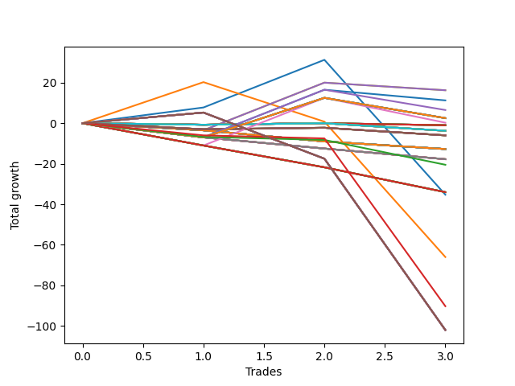

# Long Entry Wallace MJ 007 
- Symbol: NQ
- Date Range: 3/19/22 - 5/22/22
- Trading Period: 7:20-12:30
- Number of Trades: 4


| Name | Win Percent | Profit | Avg Profit / Trade |     | Name | Win Percent | Profit | Avg Profit / Trade |
| ---- | ----------- | ------ | ------------------ | --- | ---- | ----------- | ------ | ------------------ |
| Sorted By <br> Profit | | | | | Sorted By <br> Win Percentage ||||
| Twenty-Six | 50.00 | 3000.00 | 750.00 |     | Two | 75.00 | -8625.00 | -2156.25 |
| Twenty-Eight | 25.00 | -875.00 | -218.75 |     | Three | 75.00 | -17000.00 | -4250.00 |
| Twenty-Four | 50.00 | -2500.00 | -625.00 |     | One | 75.00 | -20250.00 | -5062.50 |
| Eleven | 0.00 | -5375.00 | -1343.75 |     | Twenty-Six | 50.00 | 3000.00 | 750.00 |
| Nine | 0.00 | -5375.00 | -1343.75 |     | Twenty-Four | 50.00 | -2500.00 | -625.00 |
| Seven | 0.00 | -5375.00 | -1343.75 |     | Thirty-Six | 50.00 | -31375.00 | -7843.75 |
| Twenty | 25.00 | -6250.00 | -1562.50 |     | Five | 50.00 | -31375.00 | -7843.75 |
| Thirty-Four | 25.00 | -6625.00 | -1656.25 |     | Four | 50.00 | -31375.00 | -7843.75 |
| Seventeen | 0.00 | -6750.00 | -1687.50 |     | Twenty-Eight | 25.00 | -875.00 | -218.75 |
| Fifteen | 0.00 | -6750.00 | -1687.50 |     | Twenty | 25.00 | -6250.00 | -1562.50 |
| Thirteen | 0.00 | -6750.00 | -1687.50 |     | Thirty-Four | 25.00 | -6625.00 | -1656.25 |
| Eighteen | 25.00 | -8375.00 | -2093.75 |     | Eighteen | 25.00 | -8375.00 | -2093.75 |
| Two | 75.00 | -8625.00 | -2156.25 |     | Twenty-Seven | 25.00 | -8625.00 | -2156.25 |
| Twenty-Seven | 25.00 | -8625.00 | -2156.25 |     | Twenty-Five | 25.00 | -10750.00 | -2687.50 |
| Twenty-Three | 0.00 | -9000.00 | -2250.00 |     | Thirty-Five | 25.00 | -41500.00 | -10375.00 |
| Twenty-One | 0.00 | -9000.00 | -2250.00 |     | Eleven | 0.00 | -5375.00 | -1343.75 |
| Nineteen | 0.00 | -9000.00 | -2250.00 |     | Nine | 0.00 | -5375.00 | -1343.75 |
| Sixteen | 0.00 | -9250.00 | -2312.50 |     | Seven | 0.00 | -5375.00 | -1343.75 |
| Fourteen | 0.00 | -9250.00 | -2312.50 |     | Seventeen | 0.00 | -6750.00 | -1687.50 |
| Twelve | 0.00 | -9250.00 | -2312.50 |     | Fifteen | 0.00 | -6750.00 | -1687.50 |
| Ten | 0.00 | -9250.00 | -2312.50 |     | Thirteen | 0.00 | -6750.00 | -1687.50 |
| Eight | 0.00 | -9250.00 | -2312.50 |     | Twenty-Three | 0.00 | -9000.00 | -2250.00 |
| Six | 0.00 | -9250.00 | -2312.50 |     | Twenty-One | 0.00 | -9000.00 | -2250.00 |
| Twenty-Five | 25.00 | -10750.00 | -2687.50 |     | Nineteen | 0.00 | -9000.00 | -2250.00 |
| Twenty-Two | 0.00 | -13750.00 | -3437.50 |     | Sixteen | 0.00 | -9250.00 | -2312.50 |
| Thirty-Three | 0.00 | -14125.00 | -3531.25 |     | Fourteen | 0.00 | -9250.00 | -2312.50 |
| Thirty-One | 0.00 | -14125.00 | -3531.25 |     | Twelve | 0.00 | -9250.00 | -2312.50 |
| Twenty-Nine | 0.00 | -14125.00 | -3531.25 |     | Ten | 0.00 | -9250.00 | -2312.50 |
| Three | 75.00 | -17000.00 | -4250.00 |     | Eight | 0.00 | -9250.00 | -2312.50 |
| One | 75.00 | -20250.00 | -5062.50 |     | Six | 0.00 | -9250.00 | -2312.50 |
| Thirty-Two | 0.00 | -22000.00 | -5500.00 |     | Twenty-Two | 0.00 | -13750.00 | -3437.50 |
| Thirty | 0.00 | -22000.00 | -5500.00 |     | Thirty-Three | 0.00 | -14125.00 | -3531.25 |
| Thirty-Six | 50.00 | -31375.00 | -7843.75 |     | Thirty-One | 0.00 | -14125.00 | -3531.25 |
| Five | 50.00 | -31375.00 | -7843.75 |     | Twenty-Nine | 0.00 | -14125.00 | -3531.25 |
| Four | 50.00 | -31375.00 | -7843.75 |     | Thirty-Two | 0.00 | -22000.00 | -5500.00 |
| Thirty-Five | 25.00 | -41500.00 | -10375.00 |     | Thirty | 0.00 | -22000.00 | -5500.00 |

### Test One
* Sell when price hits the middle line of the 20p bollinger
* No Stoploss
* Results:
```
Total Trades: 4
Percent Up: 75.00
Percent Down: 25.00
Total Points Moved Up: -40.50
Potential Profit: -20250.00
Total Points Ups: 26.00 Count Ups: 3
Total Points Downs: -66.50 Count Downs: 1
```

<details><summary>Trades</summary>

<code>In: 2022-03-23 10:50:00		Out: 2022-03-23 10:51:40		Total Position Time: 01:40		Total Move Up: 14.75		Total to Date: 14.75</code> <br />
<code>In: 2022-03-28 08:56:00		Out: 2022-03-28 09:01:40		Total Position Time: 05:40		Total Move Up: 7.75		Total to Date: 22.50</code> <br />
<code>In: 2022-03-31 10:02:00		Out: 2022-03-31 10:02:50		Total Position Time: 00:50		Total Move Up: 3.50		Total to Date: 26.00</code> <br />
<code>In: 2022-06-09 11:58:00		Out: 2022-06-09 12:19:05		Total Position Time: 21:05		Total Move Up: -66.50		Total to Date: -40.50</code> <br />


</details>

### Test Two
* Sell when the price hits the upper line of the 20p 1std bollinger
* No Stoploss
* Results:
```
Total Trades: 4
Percent Up: 75.00
Percent Down: 25.00
Total Points Moved Up: -17.25
Potential Profit: -8625.00
Total Points Ups: 49.50 Count Ups: 3
Total Points Downs: -66.75 Count Downs: 1
```

<details><summary>Trades</summary>

<code>In: 2022-03-23 10:50:00		Out: 2022-03-23 10:52:10		Total Position Time: 02:10		Total Move Up: 21.50		Total to Date: 21.50</code> <br />
<code>In: 2022-03-28 08:56:00		Out: 2022-03-28 09:03:00		Total Position Time: 07:00		Total Move Up: 20.25		Total to Date: 41.75</code> <br />
<code>In: 2022-03-31 10:02:00		Out: 2022-03-31 10:05:20		Total Position Time: 03:20		Total Move Up: 7.75		Total to Date: 49.50</code> <br />
<code>In: 2022-06-09 11:58:00		Out: 2022-06-09 12:24:20		Total Position Time: 26:20		Total Move Up: -66.75		Total to Date: -17.25</code> <br />


</details>

### Test Three
* Sell when the price hits the upper line of the 20p 2std bollinger
* No Stoploss
* Results:
```
Total Trades: 4
Percent Up: 75.00
Percent Down: 25.00
Total Points Moved Up: -34.00
Potential Profit: -17000.00
Total Points Ups: 50.50 Count Ups: 3
Total Points Downs: -84.50 Count Downs: 1
```

<details><summary>Trades</summary>

<code>In: 2022-03-23 10:50:00		Out: 2022-03-23 10:55:05		Total Position Time: 05:05		Total Move Up: 32.50		Total to Date: 32.50</code> <br />
<code>In: 2022-03-28 08:56:00		Out: 2022-03-28 09:25:55		Total Position Time: 29:55		Total Move Up: 5.25		Total to Date: 37.75</code> <br />
<code>In: 2022-03-31 10:02:00		Out: 2022-03-31 10:29:25		Total Position Time: 27:25		Total Move Up: 12.75		Total to Date: 50.50</code> <br />
<code>In: 2022-06-09 11:58:00		Out: 2022-06-09 12:27:55		Total Position Time: 29:55		Total Move Up: -84.50		Total to Date: -34.00</code> <br />


</details>

### Test Four
* Sell when the price hits the middle line of the 1std VWAP
* No Stoploss
* Results:
```
Total Trades: 4
Percent Up: 50.00
Percent Down: 50.00
Total Points Moved Up: -62.75
Potential Profit: -31375.00
Total Points Ups: 24.75 Count Ups: 2
Total Points Downs: -87.50 Count Downs: 2
```

<details><summary>Trades</summary>

<code>In: 2022-03-23 10:50:00		Out: 2022-03-23 11:19:55		Total Position Time: 29:55		Total Move Up: -3.00		Total to Date: -3.00</code> <br />
<code>In: 2022-03-28 08:56:00		Out: 2022-03-28 09:25:55		Total Position Time: 29:55		Total Move Up: 5.25		Total to Date: 2.25</code> <br />
<code>In: 2022-03-31 10:02:00		Out: 2022-03-31 10:31:55		Total Position Time: 29:55		Total Move Up: 19.50		Total to Date: 21.75</code> <br />
<code>In: 2022-06-09 11:58:00		Out: 2022-06-09 12:27:55		Total Position Time: 29:55		Total Move Up: -84.50		Total to Date: -62.75</code> <br />


</details>

### Test Five
* Sell when the price hits the upper line of the 1std VWAP
* No Stoploss
* Results:
```
Total Trades: 4
Percent Up: 50.00
Percent Down: 50.00
Total Points Moved Up: -62.75
Potential Profit: -31375.00
Total Points Ups: 24.75 Count Ups: 2
Total Points Downs: -87.50 Count Downs: 2
```

<details><summary>Trades</summary>

<code>In: 2022-03-23 10:50:00		Out: 2022-03-23 11:19:55		Total Position Time: 29:55		Total Move Up: -3.00		Total to Date: -3.00</code> <br />
<code>In: 2022-03-28 08:56:00		Out: 2022-03-28 09:25:55		Total Position Time: 29:55		Total Move Up: 5.25		Total to Date: 2.25</code> <br />
<code>In: 2022-03-31 10:02:00		Out: 2022-03-31 10:31:55		Total Position Time: 29:55		Total Move Up: 19.50		Total to Date: 21.75</code> <br />
<code>In: 2022-06-09 11:58:00		Out: 2022-06-09 12:27:55		Total Position Time: 29:55		Total Move Up: -84.50		Total to Date: -62.75</code> <br />


</details>

### Test Six
* Sell when the price hits the middle line of the 20p bollinger
* Stoploss is 2 points
* Results:
```
Total Trades: 4
Percent Up: 0.00
Percent Down: 100.00
Total Points Moved Up: -18.50
Potential Profit: -9250.00
Total Points Ups: 0.00 Count Ups: 0
Total Points Downs: -18.50 Count Downs: 4
```

<details><summary>Trades</summary>

<code>In: 2022-03-23 10:50:00		Out: 2022-03-23 10:50:10		Total Position Time: 00:10		Total Move Up: -8.00		Total to Date: -8.00</code> <br />
<code>In: 2022-03-28 08:56:00		Out: 2022-03-28 08:56:10		Total Position Time: 00:10		Total Move Up: -3.50		Total to Date: -11.50</code> <br />
<code>In: 2022-03-31 10:02:00		Out: 2022-03-31 10:02:30		Total Position Time: 00:30		Total Move Up: -3.25		Total to Date: -14.75</code> <br />
<code>In: 2022-06-09 11:58:00		Out: 2022-06-09 11:58:30		Total Position Time: 00:30		Total Move Up: -3.75		Total to Date: -18.50</code> <br />


</details>

### Test Seven
* Sell when the price hits the middle line of the 20p bollinger
* Trailing Stop is 2 points
* Results:
```
Total Trades: 4
Percent Up: 0.00
Percent Down: 100.00
Total Points Moved Up: -10.75
Potential Profit: -5375.00
Total Points Ups: 0.00 Count Ups: 0
Total Points Downs: -10.75 Count Downs: 4
```

<details><summary>Trades</summary>

<code>In: 2022-03-23 10:50:00		Out: 2022-03-23 10:50:10		Total Position Time: 00:10		Total Move Up: -8.00		Total to Date: -8.00</code> <br />
<code>In: 2022-03-28 08:56:00		Out: 2022-03-28 08:56:50		Total Position Time: 00:50		Total Move Up: -0.75		Total to Date: -8.75</code> <br />
<code>In: 2022-03-31 10:02:00		Out: 2022-03-31 10:02:20		Total Position Time: 00:20		Total Move Up: -1.00		Total to Date: -9.75</code> <br />
<code>In: 2022-06-09 11:58:00		Out: 2022-06-09 11:58:20		Total Position Time: 00:20		Total Move Up: -1.00		Total to Date: -10.75</code> <br />


</details>

### Test Eight
* Sell when the price hits the upper line of the 20p 1std bollinger
* Stoploss is 2 points
* Results:
```
Total Trades: 4
Percent Up: 0.00
Percent Down: 100.00
Total Points Moved Up: -18.50
Potential Profit: -9250.00
Total Points Ups: 0.00 Count Ups: 0
Total Points Downs: -18.50 Count Downs: 4
```

<details><summary>Trades</summary>

<code>In: 2022-03-23 10:50:00		Out: 2022-03-23 10:50:10		Total Position Time: 00:10		Total Move Up: -8.00		Total to Date: -8.00</code> <br />
<code>In: 2022-03-28 08:56:00		Out: 2022-03-28 08:56:10		Total Position Time: 00:10		Total Move Up: -3.50		Total to Date: -11.50</code> <br />
<code>In: 2022-03-31 10:02:00		Out: 2022-03-31 10:02:30		Total Position Time: 00:30		Total Move Up: -3.25		Total to Date: -14.75</code> <br />
<code>In: 2022-06-09 11:58:00		Out: 2022-06-09 11:58:30		Total Position Time: 00:30		Total Move Up: -3.75		Total to Date: -18.50</code> <br />


</details>

### Test Nine
* Sell when the price hits the upper line of the 20p 1std bollinger
* Trailing Stop is 2 points
* Results:
```
Total Trades: 4
Percent Up: 0.00
Percent Down: 100.00
Total Points Moved Up: -10.75
Potential Profit: -5375.00
Total Points Ups: 0.00 Count Ups: 0
Total Points Downs: -10.75 Count Downs: 4
```

<details><summary>Trades</summary>

<code>In: 2022-03-23 10:50:00		Out: 2022-03-23 10:50:10		Total Position Time: 00:10		Total Move Up: -8.00		Total to Date: -8.00</code> <br />
<code>In: 2022-03-28 08:56:00		Out: 2022-03-28 08:56:50		Total Position Time: 00:50		Total Move Up: -0.75		Total to Date: -8.75</code> <br />
<code>In: 2022-03-31 10:02:00		Out: 2022-03-31 10:02:20		Total Position Time: 00:20		Total Move Up: -1.00		Total to Date: -9.75</code> <br />
<code>In: 2022-06-09 11:58:00		Out: 2022-06-09 11:58:20		Total Position Time: 00:20		Total Move Up: -1.00		Total to Date: -10.75</code> <br />


</details>

### Test Ten
* Sell when the price hits the upper line of the 20p 2std bollinger
* Stoploss is 2 points
* Results:
```
Total Trades: 4
Percent Up: 0.00
Percent Down: 100.00
Total Points Moved Up: -18.50
Potential Profit: -9250.00
Total Points Ups: 0.00 Count Ups: 0
Total Points Downs: -18.50 Count Downs: 4
```

<details><summary>Trades</summary>

<code>In: 2022-03-23 10:50:00		Out: 2022-03-23 10:50:10		Total Position Time: 00:10		Total Move Up: -8.00		Total to Date: -8.00</code> <br />
<code>In: 2022-03-28 08:56:00		Out: 2022-03-28 08:56:10		Total Position Time: 00:10		Total Move Up: -3.50		Total to Date: -11.50</code> <br />
<code>In: 2022-03-31 10:02:00		Out: 2022-03-31 10:02:30		Total Position Time: 00:30		Total Move Up: -3.25		Total to Date: -14.75</code> <br />
<code>In: 2022-06-09 11:58:00		Out: 2022-06-09 11:58:30		Total Position Time: 00:30		Total Move Up: -3.75		Total to Date: -18.50</code> <br />


</details>

### Test Eleven
* Sell when the price hits the upper line of the 20p 2std bollinger
* Trailing Stop is 2 points
* Results:
```
Total Trades: 4
Percent Up: 0.00
Percent Down: 100.00
Total Points Moved Up: -10.75
Potential Profit: -5375.00
Total Points Ups: 0.00 Count Ups: 0
Total Points Downs: -10.75 Count Downs: 4
```

<details><summary>Trades</summary>

<code>In: 2022-03-23 10:50:00		Out: 2022-03-23 10:50:10		Total Position Time: 00:10		Total Move Up: -8.00		Total to Date: -8.00</code> <br />
<code>In: 2022-03-28 08:56:00		Out: 2022-03-28 08:56:50		Total Position Time: 00:50		Total Move Up: -0.75		Total to Date: -8.75</code> <br />
<code>In: 2022-03-31 10:02:00		Out: 2022-03-31 10:02:20		Total Position Time: 00:20		Total Move Up: -1.00		Total to Date: -9.75</code> <br />
<code>In: 2022-06-09 11:58:00		Out: 2022-06-09 11:58:20		Total Position Time: 00:20		Total Move Up: -1.00		Total to Date: -10.75</code> <br />


</details>

### Test Twelve
* Sell when the price hits the middle line of the 20p bollinger
* Stoploss is 3 points
* Results:
```
Total Trades: 4
Percent Up: 0.00
Percent Down: 100.00
Total Points Moved Up: -18.50
Potential Profit: -9250.00
Total Points Ups: 0.00 Count Ups: 0
Total Points Downs: -18.50 Count Downs: 4
```

<details><summary>Trades</summary>

<code>In: 2022-03-23 10:50:00		Out: 2022-03-23 10:50:10		Total Position Time: 00:10		Total Move Up: -8.00		Total to Date: -8.00</code> <br />
<code>In: 2022-03-28 08:56:00		Out: 2022-03-28 08:56:10		Total Position Time: 00:10		Total Move Up: -3.50		Total to Date: -11.50</code> <br />
<code>In: 2022-03-31 10:02:00		Out: 2022-03-31 10:02:30		Total Position Time: 00:30		Total Move Up: -3.25		Total to Date: -14.75</code> <br />
<code>In: 2022-06-09 11:58:00		Out: 2022-06-09 11:58:30		Total Position Time: 00:30		Total Move Up: -3.75		Total to Date: -18.50</code> <br />


</details>

### Test Thirteen
* Sell when the price hits the middle line of the 20p bollinger
* Trailing Stop is 3 points
* Results:
```
Total Trades: 4
Percent Up: 0.00
Percent Down: 100.00
Total Points Moved Up: -13.50
Potential Profit: -6750.00
Total Points Ups: 0.00 Count Ups: 0
Total Points Downs: -13.50 Count Downs: 4
```

<details><summary>Trades</summary>

<code>In: 2022-03-23 10:50:00		Out: 2022-03-23 10:50:10		Total Position Time: 00:10		Total Move Up: -8.00		Total to Date: -8.00</code> <br />
<code>In: 2022-03-28 08:56:00		Out: 2022-03-28 08:56:50		Total Position Time: 00:50		Total Move Up: -0.75		Total to Date: -8.75</code> <br />
<code>In: 2022-03-31 10:02:00		Out: 2022-03-31 10:02:20		Total Position Time: 00:20		Total Move Up: -1.00		Total to Date: -9.75</code> <br />
<code>In: 2022-06-09 11:58:00		Out: 2022-06-09 11:58:30		Total Position Time: 00:30		Total Move Up: -3.75		Total to Date: -13.50</code> <br />


</details>

### Test Fourteen
* Sell when the price hits the upper line of the 20p 1std bollinger
* Stoploss is 3 points
* Results:
```
Total Trades: 4
Percent Up: 0.00
Percent Down: 100.00
Total Points Moved Up: -18.50
Potential Profit: -9250.00
Total Points Ups: 0.00 Count Ups: 0
Total Points Downs: -18.50 Count Downs: 4
```

<details><summary>Trades</summary>

<code>In: 2022-03-23 10:50:00		Out: 2022-03-23 10:50:10		Total Position Time: 00:10		Total Move Up: -8.00		Total to Date: -8.00</code> <br />
<code>In: 2022-03-28 08:56:00		Out: 2022-03-28 08:56:10		Total Position Time: 00:10		Total Move Up: -3.50		Total to Date: -11.50</code> <br />
<code>In: 2022-03-31 10:02:00		Out: 2022-03-31 10:02:30		Total Position Time: 00:30		Total Move Up: -3.25		Total to Date: -14.75</code> <br />
<code>In: 2022-06-09 11:58:00		Out: 2022-06-09 11:58:30		Total Position Time: 00:30		Total Move Up: -3.75		Total to Date: -18.50</code> <br />


</details>

### Test Fifteen
* Sell when the price hits the upper line of the 20p 1std bollinger
* Trailing Stop is 3 points
* Results:
```
Total Trades: 4
Percent Up: 0.00
Percent Down: 100.00
Total Points Moved Up: -13.50
Potential Profit: -6750.00
Total Points Ups: 0.00 Count Ups: 0
Total Points Downs: -13.50 Count Downs: 4
```

<details><summary>Trades</summary>

<code>In: 2022-03-23 10:50:00		Out: 2022-03-23 10:50:10		Total Position Time: 00:10		Total Move Up: -8.00		Total to Date: -8.00</code> <br />
<code>In: 2022-03-28 08:56:00		Out: 2022-03-28 08:56:50		Total Position Time: 00:50		Total Move Up: -0.75		Total to Date: -8.75</code> <br />
<code>In: 2022-03-31 10:02:00		Out: 2022-03-31 10:02:20		Total Position Time: 00:20		Total Move Up: -1.00		Total to Date: -9.75</code> <br />
<code>In: 2022-06-09 11:58:00		Out: 2022-06-09 11:58:30		Total Position Time: 00:30		Total Move Up: -3.75		Total to Date: -13.50</code> <br />


</details>

### Test Sixteen
* Sell when the price hits the upper line of the 20p 2std bollinger
* Stoploss is 3 points
* Results:
```
Total Trades: 4
Percent Up: 0.00
Percent Down: 100.00
Total Points Moved Up: -18.50
Potential Profit: -9250.00
Total Points Ups: 0.00 Count Ups: 0
Total Points Downs: -18.50 Count Downs: 4
```

<details><summary>Trades</summary>

<code>In: 2022-03-23 10:50:00		Out: 2022-03-23 10:50:10		Total Position Time: 00:10		Total Move Up: -8.00		Total to Date: -8.00</code> <br />
<code>In: 2022-03-28 08:56:00		Out: 2022-03-28 08:56:10		Total Position Time: 00:10		Total Move Up: -3.50		Total to Date: -11.50</code> <br />
<code>In: 2022-03-31 10:02:00		Out: 2022-03-31 10:02:30		Total Position Time: 00:30		Total Move Up: -3.25		Total to Date: -14.75</code> <br />
<code>In: 2022-06-09 11:58:00		Out: 2022-06-09 11:58:30		Total Position Time: 00:30		Total Move Up: -3.75		Total to Date: -18.50</code> <br />


</details>

### Test Seventeen
* Sell when the price hits the upper line of the 20p 2std bollinger
* Trailing Stop is 3 points
* Results:
```
Total Trades: 4
Percent Up: 0.00
Percent Down: 100.00
Total Points Moved Up: -13.50
Potential Profit: -6750.00
Total Points Ups: 0.00 Count Ups: 0
Total Points Downs: -13.50 Count Downs: 4
```

<details><summary>Trades</summary>

<code>In: 2022-03-23 10:50:00		Out: 2022-03-23 10:50:10		Total Position Time: 00:10		Total Move Up: -8.00		Total to Date: -8.00</code> <br />
<code>In: 2022-03-28 08:56:00		Out: 2022-03-28 08:56:50		Total Position Time: 00:50		Total Move Up: -0.75		Total to Date: -8.75</code> <br />
<code>In: 2022-03-31 10:02:00		Out: 2022-03-31 10:02:20		Total Position Time: 00:20		Total Move Up: -1.00		Total to Date: -9.75</code> <br />
<code>In: 2022-06-09 11:58:00		Out: 2022-06-09 11:58:30		Total Position Time: 00:30		Total Move Up: -3.75		Total to Date: -13.50</code> <br />


</details>

### Test Eighteen
* Sell when the price hits the middle line of the 20p bollinger
* Stoploss is 5 points
* Results:
```
Total Trades: 4
Percent Up: 25.00
Percent Down: 75.00
Total Points Moved Up: -16.75
Potential Profit: -8375.00
Total Points Ups: 3.50 Count Ups: 1
Total Points Downs: -20.25 Count Downs: 3
```

<details><summary>Trades</summary>

<code>In: 2022-03-23 10:50:00		Out: 2022-03-23 10:50:10		Total Position Time: 00:10		Total Move Up: -8.00		Total to Date: -8.00</code> <br />
<code>In: 2022-03-28 08:56:00		Out: 2022-03-28 08:57:00		Total Position Time: 01:00		Total Move Up: -7.00		Total to Date: -15.00</code> <br />
<code>In: 2022-03-31 10:02:00		Out: 2022-03-31 10:02:50		Total Position Time: 00:50		Total Move Up: 3.50		Total to Date: -11.50</code> <br />
<code>In: 2022-06-09 11:58:00		Out: 2022-06-09 11:58:50		Total Position Time: 00:50		Total Move Up: -5.25		Total to Date: -16.75</code> <br />


</details>

### Test Nineteen
* Sell when the price hits the middle line of the 20p bollinger
* Trailing Stop is 5 points
* Results:
```
Total Trades: 4
Percent Up: 0.00
Percent Down: 100.00
Total Points Moved Up: -18.00
Potential Profit: -9000.00
Total Points Ups: 0.00 Count Ups: 0
Total Points Downs: -18.00 Count Downs: 4
```

<details><summary>Trades</summary>

<code>In: 2022-03-23 10:50:00		Out: 2022-03-23 10:50:10		Total Position Time: 00:10		Total Move Up: -8.00		Total to Date: -8.00</code> <br />
<code>In: 2022-03-28 08:56:00		Out: 2022-03-28 08:56:55		Total Position Time: 00:55		Total Move Up: -3.00		Total to Date: -11.00</code> <br />
<code>In: 2022-03-31 10:02:00		Out: 2022-03-31 10:02:30		Total Position Time: 00:30		Total Move Up: -3.25		Total to Date: -14.25</code> <br />
<code>In: 2022-06-09 11:58:00		Out: 2022-06-09 11:58:45		Total Position Time: 00:45		Total Move Up: -3.75		Total to Date: -18.00</code> <br />


</details>

### Test Twenty
* Sell when the price hits the upper line of the 20p 1std bollinger
* Stoploss is 5 points
* Results:
```
Total Trades: 4
Percent Up: 25.00
Percent Down: 75.00
Total Points Moved Up: -12.50
Potential Profit: -6250.00
Total Points Ups: 7.75 Count Ups: 1
Total Points Downs: -20.25 Count Downs: 3
```

<details><summary>Trades</summary>

<code>In: 2022-03-23 10:50:00		Out: 2022-03-23 10:50:10		Total Position Time: 00:10		Total Move Up: -8.00		Total to Date: -8.00</code> <br />
<code>In: 2022-03-28 08:56:00		Out: 2022-03-28 08:57:00		Total Position Time: 01:00		Total Move Up: -7.00		Total to Date: -15.00</code> <br />
<code>In: 2022-03-31 10:02:00		Out: 2022-03-31 10:05:20		Total Position Time: 03:20		Total Move Up: 7.75		Total to Date: -7.25</code> <br />
<code>In: 2022-06-09 11:58:00		Out: 2022-06-09 11:58:50		Total Position Time: 00:50		Total Move Up: -5.25		Total to Date: -12.50</code> <br />


</details>

### Test Twenty-One
* Sell when the price hits the upper line of the 20p 1std bollinger
* Trailing Stop is 5 points
* Results:
```
Total Trades: 4
Percent Up: 0.00
Percent Down: 100.00
Total Points Moved Up: -18.00
Potential Profit: -9000.00
Total Points Ups: 0.00 Count Ups: 0
Total Points Downs: -18.00 Count Downs: 4
```

<details><summary>Trades</summary>

<code>In: 2022-03-23 10:50:00		Out: 2022-03-23 10:50:10		Total Position Time: 00:10		Total Move Up: -8.00		Total to Date: -8.00</code> <br />
<code>In: 2022-03-28 08:56:00		Out: 2022-03-28 08:56:55		Total Position Time: 00:55		Total Move Up: -3.00		Total to Date: -11.00</code> <br />
<code>In: 2022-03-31 10:02:00		Out: 2022-03-31 10:02:30		Total Position Time: 00:30		Total Move Up: -3.25		Total to Date: -14.25</code> <br />
<code>In: 2022-06-09 11:58:00		Out: 2022-06-09 11:58:45		Total Position Time: 00:45		Total Move Up: -3.75		Total to Date: -18.00</code> <br />


</details>

### Test Twenty-Two
* Sell when the price hits the upper line of the 20p 2std bollinger
* Stoploss is 5 points
* Results:
```
Total Trades: 4
Percent Up: 0.00
Percent Down: 100.00
Total Points Moved Up: -27.50
Potential Profit: -13750.00
Total Points Ups: 0.00 Count Ups: 0
Total Points Downs: -27.50 Count Downs: 4
```

<details><summary>Trades</summary>

<code>In: 2022-03-23 10:50:00		Out: 2022-03-23 10:50:10		Total Position Time: 00:10		Total Move Up: -8.00		Total to Date: -8.00</code> <br />
<code>In: 2022-03-28 08:56:00		Out: 2022-03-28 08:57:00		Total Position Time: 01:00		Total Move Up: -7.00		Total to Date: -15.00</code> <br />
<code>In: 2022-03-31 10:02:00		Out: 2022-03-31 10:06:35		Total Position Time: 04:35		Total Move Up: -7.25		Total to Date: -22.25</code> <br />
<code>In: 2022-06-09 11:58:00		Out: 2022-06-09 11:58:50		Total Position Time: 00:50		Total Move Up: -5.25		Total to Date: -27.50</code> <br />


</details>

### Test Twenty-Three
* Sell when the price hits the upper line of the 20p 2std bollinger
* Trailing Stop is 5 points
* Results:
```
Total Trades: 4
Percent Up: 0.00
Percent Down: 100.00
Total Points Moved Up: -18.00
Potential Profit: -9000.00
Total Points Ups: 0.00 Count Ups: 0
Total Points Downs: -18.00 Count Downs: 4
```

<details><summary>Trades</summary>

<code>In: 2022-03-23 10:50:00		Out: 2022-03-23 10:50:10		Total Position Time: 00:10		Total Move Up: -8.00		Total to Date: -8.00</code> <br />
<code>In: 2022-03-28 08:56:00		Out: 2022-03-28 08:56:55		Total Position Time: 00:55		Total Move Up: -3.00		Total to Date: -11.00</code> <br />
<code>In: 2022-03-31 10:02:00		Out: 2022-03-31 10:02:30		Total Position Time: 00:30		Total Move Up: -3.25		Total to Date: -14.25</code> <br />
<code>In: 2022-06-09 11:58:00		Out: 2022-06-09 11:58:45		Total Position Time: 00:45		Total Move Up: -3.75		Total to Date: -18.00</code> <br />


</details>

### Test Twenty-Four
* Sell when the price hits the middle line of the 20p bollinger
* Stoploss is 10 points
* Results:
```
Total Trades: 4
Percent Up: 50.00
Percent Down: 50.00
Total Points Moved Up: -5.00
Potential Profit: -2500.00
Total Points Ups: 18.25 Count Ups: 2
Total Points Downs: -23.25 Count Downs: 2
```

<details><summary>Trades</summary>

<code>In: 2022-03-23 10:50:00		Out: 2022-03-23 10:51:40		Total Position Time: 01:40		Total Move Up: 14.75		Total to Date: 14.75</code> <br />
<code>In: 2022-03-28 08:56:00		Out: 2022-03-28 08:59:45		Total Position Time: 03:45		Total Move Up: -11.00		Total to Date: 3.75</code> <br />
<code>In: 2022-03-31 10:02:00		Out: 2022-03-31 10:02:50		Total Position Time: 00:50		Total Move Up: 3.50		Total to Date: 7.25</code> <br />
<code>In: 2022-06-09 11:58:00		Out: 2022-06-09 11:59:05		Total Position Time: 01:05		Total Move Up: -12.25		Total to Date: -5.00</code> <br />


</details>

### Test Twenty-Five
* Sell when the price hits the middle line of the 20p bollinger
* Trailing Stop is 10 points
* Results:
```
Total Trades: 4
Percent Up: 25.00
Percent Down: 75.00
Total Points Moved Up: -21.50
Potential Profit: -10750.00
Total Points Ups: 3.50 Count Ups: 1
Total Points Downs: -25.00 Count Downs: 3
```

<details><summary>Trades</summary>

<code>In: 2022-03-23 10:50:00		Out: 2022-03-23 10:50:10		Total Position Time: 00:10		Total Move Up: -8.00		Total to Date: -8.00</code> <br />
<code>In: 2022-03-28 08:56:00		Out: 2022-03-28 08:57:00		Total Position Time: 01:00		Total Move Up: -7.00		Total to Date: -15.00</code> <br />
<code>In: 2022-03-31 10:02:00		Out: 2022-03-31 10:02:50		Total Position Time: 00:50		Total Move Up: 3.50		Total to Date: -11.50</code> <br />
<code>In: 2022-06-09 11:58:00		Out: 2022-06-09 11:59:00		Total Position Time: 01:00		Total Move Up: -10.00		Total to Date: -21.50</code> <br />


</details>

### Test Twenty-Six
* Sell when the price hits the upper line of the 20p 1std bollinger
* Stoploss is 10 points
* Results:
```
Total Trades: 4
Percent Up: 50.00
Percent Down: 50.00
Total Points Moved Up: 6.00
Potential Profit: 3000.00
Total Points Ups: 29.25 Count Ups: 2
Total Points Downs: -23.25 Count Downs: 2
```

<details><summary>Trades</summary>

<code>In: 2022-03-23 10:50:00		Out: 2022-03-23 10:52:10		Total Position Time: 02:10		Total Move Up: 21.50		Total to Date: 21.50</code> <br />
<code>In: 2022-03-28 08:56:00		Out: 2022-03-28 08:59:45		Total Position Time: 03:45		Total Move Up: -11.00		Total to Date: 10.50</code> <br />
<code>In: 2022-03-31 10:02:00		Out: 2022-03-31 10:05:20		Total Position Time: 03:20		Total Move Up: 7.75		Total to Date: 18.25</code> <br />
<code>In: 2022-06-09 11:58:00		Out: 2022-06-09 11:59:05		Total Position Time: 01:05		Total Move Up: -12.25		Total to Date: 6.00</code> <br />


</details>

### Test Twenty-Seven
* Sell when the price hits the upper line of the 20p 1std bollinger
* Trailing Stop is 10 points
* Results:
```
Total Trades: 4
Percent Up: 25.00
Percent Down: 75.00
Total Points Moved Up: -17.25
Potential Profit: -8625.00
Total Points Ups: 7.75 Count Ups: 1
Total Points Downs: -25.00 Count Downs: 3
```

<details><summary>Trades</summary>

<code>In: 2022-03-23 10:50:00		Out: 2022-03-23 10:50:10		Total Position Time: 00:10		Total Move Up: -8.00		Total to Date: -8.00</code> <br />
<code>In: 2022-03-28 08:56:00		Out: 2022-03-28 08:57:00		Total Position Time: 01:00		Total Move Up: -7.00		Total to Date: -15.00</code> <br />
<code>In: 2022-03-31 10:02:00		Out: 2022-03-31 10:05:20		Total Position Time: 03:20		Total Move Up: 7.75		Total to Date: -7.25</code> <br />
<code>In: 2022-06-09 11:58:00		Out: 2022-06-09 11:59:00		Total Position Time: 01:00		Total Move Up: -10.00		Total to Date: -17.25</code> <br />


</details>

### Test Twenty-Eight
* Sell when the price hits the upper line of the 20p 2std bollinger
* Stoploss is 10 points
* Results:
```
Total Trades: 4
Percent Up: 25.00
Percent Down: 75.00
Total Points Moved Up: -1.75
Potential Profit: -875.00
Total Points Ups: 32.50 Count Ups: 1
Total Points Downs: -34.25 Count Downs: 3
```

<details><summary>Trades</summary>

<code>In: 2022-03-23 10:50:00		Out: 2022-03-23 10:55:05		Total Position Time: 05:05		Total Move Up: 32.50		Total to Date: 32.50</code> <br />
<code>In: 2022-03-28 08:56:00		Out: 2022-03-28 08:59:45		Total Position Time: 03:45		Total Move Up: -11.00		Total to Date: 21.50</code> <br />
<code>In: 2022-03-31 10:02:00		Out: 2022-03-31 10:06:45		Total Position Time: 04:45		Total Move Up: -11.00		Total to Date: 10.50</code> <br />
<code>In: 2022-06-09 11:58:00		Out: 2022-06-09 11:59:05		Total Position Time: 01:05		Total Move Up: -12.25		Total to Date: -1.75</code> <br />


</details>

### Test Twenty-Nine
* Sell when the price hits the upper line of the 20p 2std bollinger
* Trailing Stop is 10 points
* Results:
```
Total Trades: 4
Percent Up: 0.00
Percent Down: 100.00
Total Points Moved Up: -28.25
Potential Profit: -14125.00
Total Points Ups: 0.00 Count Ups: 0
Total Points Downs: -28.25 Count Downs: 4
```

<details><summary>Trades</summary>

<code>In: 2022-03-23 10:50:00		Out: 2022-03-23 10:50:10		Total Position Time: 00:10		Total Move Up: -8.00		Total to Date: -8.00</code> <br />
<code>In: 2022-03-28 08:56:00		Out: 2022-03-28 08:57:00		Total Position Time: 01:00		Total Move Up: -7.00		Total to Date: -15.00</code> <br />
<code>In: 2022-03-31 10:02:00		Out: 2022-03-31 10:06:10		Total Position Time: 04:10		Total Move Up: -3.25		Total to Date: -18.25</code> <br />
<code>In: 2022-06-09 11:58:00		Out: 2022-06-09 11:59:00		Total Position Time: 01:00		Total Move Up: -10.00		Total to Date: -28.25</code> <br />


</details>

### Test Thirty
* Sell when the price hits the middle line of the 1std VWAP
* Stoploss is 10 points
* Results:
```
Total Trades: 4
Percent Up: 0.00
Percent Down: 100.00
Total Points Moved Up: -44.00
Potential Profit: -22000.00
Total Points Ups: 0.00 Count Ups: 0
Total Points Downs: -44.00 Count Downs: 4
```

<details><summary>Trades</summary>

<code>In: 2022-03-23 10:50:00		Out: 2022-03-23 11:08:55		Total Position Time: 18:55		Total Move Up: -9.75		Total to Date: -9.75</code> <br />
<code>In: 2022-03-28 08:56:00		Out: 2022-03-28 08:59:45		Total Position Time: 03:45		Total Move Up: -11.00		Total to Date: -20.75</code> <br />
<code>In: 2022-03-31 10:02:00		Out: 2022-03-31 10:06:45		Total Position Time: 04:45		Total Move Up: -11.00		Total to Date: -31.75</code> <br />
<code>In: 2022-06-09 11:58:00		Out: 2022-06-09 11:59:05		Total Position Time: 01:05		Total Move Up: -12.25		Total to Date: -44.00</code> <br />


</details>

### Test Thirty-One
* Sell when the price hits the middle line of the 1std VWAP
* Trailing Stop is 10 points
* Results:
```
Total Trades: 4
Percent Up: 0.00
Percent Down: 100.00
Total Points Moved Up: -28.25
Potential Profit: -14125.00
Total Points Ups: 0.00 Count Ups: 0
Total Points Downs: -28.25 Count Downs: 4
```

<details><summary>Trades</summary>

<code>In: 2022-03-23 10:50:00		Out: 2022-03-23 10:50:10		Total Position Time: 00:10		Total Move Up: -8.00		Total to Date: -8.00</code> <br />
<code>In: 2022-03-28 08:56:00		Out: 2022-03-28 08:57:00		Total Position Time: 01:00		Total Move Up: -7.00		Total to Date: -15.00</code> <br />
<code>In: 2022-03-31 10:02:00		Out: 2022-03-31 10:06:10		Total Position Time: 04:10		Total Move Up: -3.25		Total to Date: -18.25</code> <br />
<code>In: 2022-06-09 11:58:00		Out: 2022-06-09 11:59:00		Total Position Time: 01:00		Total Move Up: -10.00		Total to Date: -28.25</code> <br />


</details>

### Test Thirty-Two
* Sell when the price hits the upper line of the 1std VWAP
* Stoploss is 10 points
* Results:
```
Total Trades: 4
Percent Up: 0.00
Percent Down: 100.00
Total Points Moved Up: -44.00
Potential Profit: -22000.00
Total Points Ups: 0.00 Count Ups: 0
Total Points Downs: -44.00 Count Downs: 4
```

<details><summary>Trades</summary>

<code>In: 2022-03-23 10:50:00		Out: 2022-03-23 11:08:55		Total Position Time: 18:55		Total Move Up: -9.75		Total to Date: -9.75</code> <br />
<code>In: 2022-03-28 08:56:00		Out: 2022-03-28 08:59:45		Total Position Time: 03:45		Total Move Up: -11.00		Total to Date: -20.75</code> <br />
<code>In: 2022-03-31 10:02:00		Out: 2022-03-31 10:06:45		Total Position Time: 04:45		Total Move Up: -11.00		Total to Date: -31.75</code> <br />
<code>In: 2022-06-09 11:58:00		Out: 2022-06-09 11:59:05		Total Position Time: 01:05		Total Move Up: -12.25		Total to Date: -44.00</code> <br />


</details>

### Test Thirty-Three
* Sell when the price hits the upper line of the 1std VWAP
* Trailing Stop is 10 points
* Results:
```
Total Trades: 4
Percent Up: 0.00
Percent Down: 100.00
Total Points Moved Up: -28.25
Potential Profit: -14125.00
Total Points Ups: 0.00 Count Ups: 0
Total Points Downs: -28.25 Count Downs: 4
```

<details><summary>Trades</summary>

<code>In: 2022-03-23 10:50:00		Out: 2022-03-23 10:50:10		Total Position Time: 00:10		Total Move Up: -8.00		Total to Date: -8.00</code> <br />
<code>In: 2022-03-28 08:56:00		Out: 2022-03-28 08:57:00		Total Position Time: 01:00		Total Move Up: -7.00		Total to Date: -15.00</code> <br />
<code>In: 2022-03-31 10:02:00		Out: 2022-03-31 10:06:10		Total Position Time: 04:10		Total Move Up: -3.25		Total to Date: -18.25</code> <br />
<code>In: 2022-06-09 11:58:00		Out: 2022-06-09 11:59:00		Total Position Time: 01:00		Total Move Up: -10.00		Total to Date: -28.25</code> <br />


</details>

### Test Thirty-Four
* Sell when the linear regression slope is negative
* No Stoploss
* Results:
```
Total Trades: 4
Percent Up: 25.00
Percent Down: 75.00
Total Points Moved Up: -13.25
Potential Profit: -6625.00
Total Points Ups: 13.25 Count Ups: 1
Total Points Downs: -26.50 Count Downs: 3
```

<details><summary>Trades</summary>

<code>In: 2022-03-23 10:50:00		Out: 2022-03-23 11:01:05		Total Position Time: 11:05		Total Move Up: 13.25		Total to Date: 13.25</code> <br />
<code>In: 2022-03-28 08:56:00		Out: 2022-03-28 08:57:05		Total Position Time: 01:05		Total Move Up: -6.75		Total to Date: 6.50</code> <br />
<code>In: 2022-03-31 10:02:00		Out: 2022-03-31 10:07:05		Total Position Time: 05:05		Total Move Up: -7.50		Total to Date: -1.00</code> <br />
<code>In: 2022-06-09 11:58:00		Out: 2022-06-09 11:59:05		Total Position Time: 01:05		Total Move Up: -12.25		Total to Date: -13.25</code> <br />


</details>

### Test Thirty-Five
* Sell when the linear regression slope changes to negative
* No Stoploss
* Results:
```
Total Trades: 4
Percent Up: 25.00
Percent Down: 75.00
Total Points Moved Up: -83.00
Potential Profit: -41500.00
Total Points Ups: 13.25 Count Ups: 1
Total Points Downs: -96.25 Count Downs: 3
```

<details><summary>Trades</summary>

<code>In: 2022-03-23 10:50:00		Out: 2022-03-23 11:01:05		Total Position Time: 11:05		Total Move Up: 13.25		Total to Date: 13.25</code> <br />
<code>In: 2022-03-28 08:56:00		Out: 2022-03-28 09:00:05		Total Position Time: 04:05		Total Move Up: -6.00		Total to Date: 7.25</code> <br />
<code>In: 2022-03-31 10:02:00		Out: 2022-03-31 10:07:05		Total Position Time: 05:05		Total Move Up: -7.50		Total to Date: -0.25</code> <br />
<code>In: 2022-06-09 11:58:00		Out: 2022-06-09 12:14:05		Total Position Time: 16:05		Total Move Up: -82.75		Total to Date: -83.00</code> <br />


</details>

### Test Thirty-Six
* Sell when the linear regression slope changes to negative
* No Stoploss
* Results:
```
Total Trades: 4
Percent Up: 50.00
Percent Down: 50.00
Total Points Moved Up: -62.75
Potential Profit: -31375.00
Total Points Ups: 24.75 Count Ups: 2
Total Points Downs: -87.50 Count Downs: 2
```

<details><summary>Trades</summary>

<code>In: 2022-03-23 10:50:00		Out: 2022-03-23 11:19:55		Total Position Time: 29:55		Total Move Up: -3.00		Total to Date: -3.00</code> <br />
<code>In: 2022-03-28 08:56:00		Out: 2022-03-28 09:25:55		Total Position Time: 29:55		Total Move Up: 5.25		Total to Date: 2.25</code> <br />
<code>In: 2022-03-31 10:02:00		Out: 2022-03-31 10:31:55		Total Position Time: 29:55		Total Move Up: 19.50		Total to Date: 21.75</code> <br />
<code>In: 2022-06-09 11:58:00		Out: 2022-06-09 12:27:55		Total Position Time: 29:55		Total Move Up: -84.50		Total to Date: -62.75</code> <br />


</details>