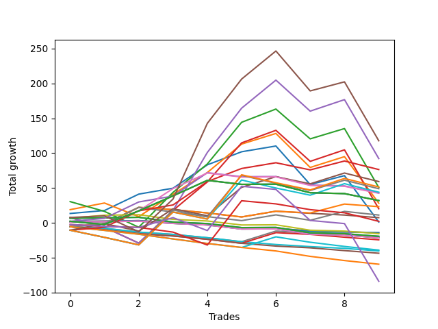

# Long Wallace 1226_003 
- Symbol: NQ
- Date Range: 3/18/22 - 6/24/22
- Trading Period: 7:20-12:30
- Number of Trades: 10


| Name | Win Percent | Profit | Avg Profit / Trade |     | Name | Win Percent | Profit | Avg Profit / Trade |
| ---- | ----------- | ------ | ------------------ | --- | ---- | ----------- | ------ | ------------------ |
| Sorted By <br> Profit | | | | | Sorted By <br> Win Percentage ||||
| Thirty-Six | 70.00 | 58875.00 | 5887.50 |     | One | 80.00 | 625.00 | 62.50 |
| Five | 60.00 | 46125.00 | 4612.50 |     | Thirty-Six | 70.00 | 58875.00 | 5887.50 |
| Twenty-Four | 70.00 | 38250.00 | 3825.00 |     | Twenty-Four | 70.00 | 38250.00 | 3825.00 |
| Twenty-Six | 50.00 | 29625.00 | 2962.50 |     | Two | 70.00 | 14125.00 | 1412.50 |
| Thirty-Two | 30.00 | 25750.00 | 2575.00 |     | Five | 60.00 | 46125.00 | 4612.50 |
| Three | 60.00 | 25375.00 | 2537.50 |     | Three | 60.00 | 25375.00 | 2537.50 |
| Twenty-Eight | 30.00 | 24500.00 | 2450.00 |     | Twenty-Five | 60.00 | 21500.00 | 2150.00 |
| Thirty | 30.00 | 22000.00 | 2200.00 |     | Four | 60.00 | 10125.00 | 1012.50 |
| Twenty-Five | 60.00 | 21500.00 | 2150.00 |     | Twenty-Six | 50.00 | 29625.00 | 2962.50 |
| Twenty-Seven | 50.00 | 21250.00 | 2125.00 |     | Twenty-Seven | 50.00 | 21250.00 | 2125.00 |
| Thirty-Three | 50.00 | 16000.00 | 1600.00 |     | Thirty-Three | 50.00 | 16000.00 | 1600.00 |
| Thirty-One | 50.00 | 16000.00 | 1600.00 |     | Thirty-One | 50.00 | 16000.00 | 1600.00 |
| Twenty-Nine | 50.00 | 16000.00 | 1600.00 |     | Twenty-Nine | 50.00 | 16000.00 | 1600.00 |
| Two | 70.00 | 14125.00 | 1412.50 |     | Twelve | 40.00 | 11625.00 | 1162.50 |
| Twelve | 40.00 | 11625.00 | 1162.50 |     | Eighteen | 40.00 | 5625.00 | 562.50 |
| Four | 60.00 | 10125.00 | 1012.50 |     | Eleven | 40.00 | -7000.00 | -700.00 |
| Eighteen | 40.00 | 5625.00 | 562.50 |     | Nine | 40.00 | -7000.00 | -700.00 |
| Six | 30.00 | 3750.00 | 375.00 |     | Seven | 40.00 | -7000.00 | -700.00 |
| Thirty-Four | 10.00 | 1125.00 | 112.50 |     | Nineteen | 40.00 | -7750.00 | -775.00 |
| One | 80.00 | 625.00 | 62.50 |     | Twenty-Three | 40.00 | -9625.00 | -962.50 |
| Eleven | 40.00 | -7000.00 | -700.00 |     | Twenty-One | 40.00 | -9625.00 | -962.50 |
| Nine | 40.00 | -7000.00 | -700.00 |     | Seventeen | 40.00 | -10625.00 | -1062.50 |
| Seven | 40.00 | -7000.00 | -700.00 |     | Fifteen | 40.00 | -10625.00 | -1062.50 |
| Nineteen | 40.00 | -7750.00 | -775.00 |     | Thirteen | 40.00 | -10625.00 | -1062.50 |
| Twenty-Three | 40.00 | -9625.00 | -962.50 |     | Thirty-Two | 30.00 | 25750.00 | 2575.00 |
| Twenty-One | 40.00 | -9625.00 | -962.50 |     | Twenty-Eight | 30.00 | 24500.00 | 2450.00 |
| Eight | 10.00 | -10500.00 | -1050.00 |     | Thirty | 30.00 | 22000.00 | 2200.00 |
| Seventeen | 40.00 | -10625.00 | -1062.50 |     | Six | 30.00 | 3750.00 | 375.00 |
| Fifteen | 40.00 | -10625.00 | -1062.50 |     | Thirty-Five | 20.00 | -41875.00 | -4187.50 |
| Thirteen | 40.00 | -10625.00 | -1062.50 |     | Thirty-Four | 10.00 | 1125.00 | 112.50 |
| Fourteen | 10.00 | -12125.00 | -1212.50 |     | Eight | 10.00 | -10500.00 | -1050.00 |
| Twenty | 10.00 | -19500.00 | -1950.00 |     | Fourteen | 10.00 | -12125.00 | -1212.50 |
| Ten | 0.00 | -20125.00 | -2012.50 |     | Twenty | 10.00 | -19500.00 | -1950.00 |
| Sixteen | 0.00 | -21750.00 | -2175.00 |     | Ten | 0.00 | -20125.00 | -2012.50 |
| Twenty-Two | 0.00 | -29625.00 | -2962.50 |     | Sixteen | 0.00 | -21750.00 | -2175.00 |
| Thirty-Five | 20.00 | -41875.00 | -4187.50 |     | Twenty-Two | 0.00 | -29625.00 | -2962.50 |

### Test One
* Sell when price hits the middle line of the 20p bollinger
* No Stoploss
* Results:
```
Total Trades: 10
Percent Up: 80.00
Percent Down: 20.00
Total Points Moved Up: 1.25
Potential Profit: 625.00
Total Points Ups: 123.00 Count Ups: 8
Total Points Downs: -121.75 Count Downs: 2
```

<details><summary>Trades</summary>

<code>In: 2022-03-25 08:30:00		Out: 2022-03-25 08:36:55		Total Position Time: 06:55		Total Move Up: 13.50		Total to Date: 13.50</code> <br />
<code>In: 2022-03-31 09:37:00		Out: 2022-03-31 09:37:45		Total Position Time: 00:45		Total Move Up: 4.25		Total to Date: 17.75</code> <br />
<code>In: 2022-04-11 07:31:00		Out: 2022-04-11 07:34:10		Total Position Time: 03:10		Total Move Up: 23.50		Total to Date: 41.25</code> <br />
<code>In: 2022-04-20 11:58:00		Out: 2022-04-20 12:00:15		Total Position Time: 02:15		Total Move Up: 8.50		Total to Date: 49.75</code> <br />
<code>In: 2022-05-17 11:25:00		Out: 2022-05-17 11:27:30		Total Position Time: 02:30		Total Move Up: 33.50		Total to Date: 83.25</code> <br />
<code>In: 2022-05-19 10:52:00		Out: 2022-05-19 10:52:55		Total Position Time: 00:55		Total Move Up: 18.75		Total to Date: 102.00</code> <br />
<code>In: 2022-05-25 10:15:00		Out: 2022-05-25 10:15:25		Total Position Time: 00:25		Total Move Up: 8.25		Total to Date: 110.25</code> <br />
<code>In: 2022-06-08 09:30:00		Out: 2022-06-08 09:54:10		Total Position Time: 24:10		Total Move Up: -55.25		Total to Date: 55.00</code> <br />
<code>In: 2022-06-09 08:10:00		Out: 2022-06-09 08:11:10		Total Position Time: 01:10		Total Move Up: 12.75		Total to Date: 67.75</code> <br />
<code>In: 2022-06-09 11:58:00		Out: 2022-06-09 12:19:05		Total Position Time: 21:05		Total Move Up: -66.50		Total to Date: 1.25</code> <br />


</details>

### Test Two
* Sell when the price hits the upper line of the 20p 1std bollinger
* No Stoploss
* Results:
```
Total Trades: 10
Percent Up: 70.00
Percent Down: 30.00
Total Points Moved Up: 28.25
Potential Profit: 14125.00
Total Points Ups: 163.25 Count Ups: 7
Total Points Downs: -135.00 Count Downs: 3
```

<details><summary>Trades</summary>

<code>In: 2022-03-25 08:30:00		Out: 2022-03-25 08:41:20		Total Position Time: 11:20		Total Move Up: 19.00		Total to Date: 19.00</code> <br />
<code>In: 2022-03-31 09:37:00		Out: 2022-03-31 09:40:45		Total Position Time: 03:45		Total Move Up: 9.50		Total to Date: 28.50</code> <br />
<code>In: 2022-04-11 07:31:00		Out: 2022-04-11 07:57:05		Total Position Time: 26:05		Total Move Up: -19.50		Total to Date: 9.00</code> <br />
<code>In: 2022-04-20 11:58:00		Out: 2022-04-20 12:01:20		Total Position Time: 03:20		Total Move Up: 32.00		Total to Date: 41.00</code> <br />
<code>In: 2022-05-17 11:25:00		Out: 2022-05-17 11:39:45		Total Position Time: 14:45		Total Move Up: 31.25		Total to Date: 72.25</code> <br />
<code>In: 2022-05-19 10:52:00		Out: 2022-05-19 10:55:05		Total Position Time: 03:05		Total Move Up: 40.75		Total to Date: 113.00</code> <br />
<code>In: 2022-05-25 10:15:00		Out: 2022-05-25 10:16:25		Total Position Time: 01:25		Total Move Up: 15.25		Total to Date: 128.25</code> <br />
<code>In: 2022-06-08 09:30:00		Out: 2022-06-08 09:57:05		Total Position Time: 27:05		Total Move Up: -48.75		Total to Date: 79.50</code> <br />
<code>In: 2022-06-09 08:10:00		Out: 2022-06-09 08:22:35		Total Position Time: 12:35		Total Move Up: 15.50		Total to Date: 95.00</code> <br />
<code>In: 2022-06-09 11:58:00		Out: 2022-06-09 12:24:20		Total Position Time: 26:20		Total Move Up: -66.75		Total to Date: 28.25</code> <br />


</details>

### Test Three
* Sell when the price hits the upper line of the 20p 2std bollinger
* No Stoploss
* Results:
```
Total Trades: 10
Percent Up: 60.00
Percent Down: 40.00
Total Points Moved Up: 50.75
Potential Profit: 25375.00
Total Points Ups: 214.75 Count Ups: 6
Total Points Downs: -164.00 Count Downs: 4
```

<details><summary>Trades</summary>

<code>In: 2022-03-25 08:30:00		Out: 2022-03-25 08:42:45		Total Position Time: 12:45		Total Move Up: 30.50		Total to Date: 30.50</code> <br />
<code>In: 2022-03-31 09:37:00		Out: 2022-03-31 10:06:55		Total Position Time: 29:55		Total Move Up: -14.00		Total to Date: 16.50</code> <br />
<code>In: 2022-04-11 07:31:00		Out: 2022-04-11 08:00:55		Total Position Time: 29:55		Total Move Up: -22.75		Total to Date: -6.25</code> <br />
<code>In: 2022-04-20 11:58:00		Out: 2022-04-20 12:13:50		Total Position Time: 15:50		Total Move Up: 50.00		Total to Date: 43.75</code> <br />
<code>In: 2022-05-17 11:25:00		Out: 2022-05-17 11:40:00		Total Position Time: 15:00		Total Move Up: 40.75		Total to Date: 84.50</code> <br />
<code>In: 2022-05-19 10:52:00		Out: 2022-05-19 10:55:25		Total Position Time: 03:25		Total Move Up: 59.75		Total to Date: 144.25</code> <br />
<code>In: 2022-05-25 10:15:00		Out: 2022-05-25 10:29:40		Total Position Time: 14:40		Total Move Up: 19.00		Total to Date: 163.25</code> <br />
<code>In: 2022-06-08 09:30:00		Out: 2022-06-08 09:59:15		Total Position Time: 29:15		Total Move Up: -42.75		Total to Date: 120.50</code> <br />
<code>In: 2022-06-09 08:10:00		Out: 2022-06-09 08:33:20		Total Position Time: 23:20		Total Move Up: 14.75		Total to Date: 135.25</code> <br />
<code>In: 2022-06-09 11:58:00		Out: 2022-06-09 12:27:55		Total Position Time: 29:55		Total Move Up: -84.50		Total to Date: 50.75</code> <br />


</details>

### Test Four
* Sell when the price hits the middle line of the 1std VWAP
* No Stoploss
* Results:
```
Total Trades: 10
Percent Up: 60.00
Percent Down: 40.00
Total Points Moved Up: 20.25
Potential Profit: 10125.00
Total Points Ups: 186.00 Count Ups: 6
Total Points Downs: -165.75 Count Downs: 4
```

<details><summary>Trades</summary>

<code>In: 2022-03-25 08:30:00		Out: 2022-03-25 08:59:55		Total Position Time: 29:55		Total Move Up: 7.75		Total to Date: 7.75</code> <br />
<code>In: 2022-03-31 09:37:00		Out: 2022-03-31 10:06:55		Total Position Time: 29:55		Total Move Up: -14.00		Total to Date: -6.25</code> <br />
<code>In: 2022-04-11 07:31:00		Out: 2022-04-11 08:00:55		Total Position Time: 29:55		Total Move Up: -22.75		Total to Date: -29.00</code> <br />
<code>In: 2022-04-20 11:58:00		Out: 2022-04-20 12:27:55		Total Position Time: 29:55		Total Move Up: 47.00		Total to Date: 18.00</code> <br />
<code>In: 2022-05-17 11:25:00		Out: 2022-05-17 11:40:00		Total Position Time: 15:00		Total Move Up: 40.75		Total to Date: 58.75</code> <br />
<code>In: 2022-05-19 10:52:00		Out: 2022-05-19 10:55:20		Total Position Time: 03:20		Total Move Up: 56.00		Total to Date: 114.75</code> <br />
<code>In: 2022-05-25 10:15:00		Out: 2022-05-25 10:29:35		Total Position Time: 14:35		Total Move Up: 18.00		Total to Date: 132.75</code> <br />
<code>In: 2022-06-08 09:30:00		Out: 2022-06-08 09:59:55		Total Position Time: 29:55		Total Move Up: -44.50		Total to Date: 88.25</code> <br />
<code>In: 2022-06-09 08:10:00		Out: 2022-06-09 08:39:55		Total Position Time: 29:55		Total Move Up: 16.50		Total to Date: 104.75</code> <br />
<code>In: 2022-06-09 11:58:00		Out: 2022-06-09 12:27:55		Total Position Time: 29:55		Total Move Up: -84.50		Total to Date: 20.25</code> <br />


</details>

### Test Five
* Sell when the price hits the upper line of the 1std VWAP
* No Stoploss
* Results:
```
Total Trades: 10
Percent Up: 60.00
Percent Down: 40.00
Total Points Moved Up: 92.25
Potential Profit: 46125.00
Total Points Ups: 258.00 Count Ups: 6
Total Points Downs: -165.75 Count Downs: 4
```

<details><summary>Trades</summary>

<code>In: 2022-03-25 08:30:00		Out: 2022-03-25 08:59:55		Total Position Time: 29:55		Total Move Up: 7.75		Total to Date: 7.75</code> <br />
<code>In: 2022-03-31 09:37:00		Out: 2022-03-31 10:06:55		Total Position Time: 29:55		Total Move Up: -14.00		Total to Date: -6.25</code> <br />
<code>In: 2022-04-11 07:31:00		Out: 2022-04-11 08:00:55		Total Position Time: 29:55		Total Move Up: -22.75		Total to Date: -29.00</code> <br />
<code>In: 2022-04-20 11:58:00		Out: 2022-04-20 12:27:55		Total Position Time: 29:55		Total Move Up: 47.00		Total to Date: 18.00</code> <br />
<code>In: 2022-05-17 11:25:00		Out: 2022-05-17 11:47:10		Total Position Time: 22:10		Total Move Up: 83.00		Total to Date: 101.00</code> <br />
<code>In: 2022-05-19 10:52:00		Out: 2022-05-19 11:21:55		Total Position Time: 29:55		Total Move Up: 63.50		Total to Date: 164.50</code> <br />
<code>In: 2022-05-25 10:15:00		Out: 2022-05-25 10:44:55		Total Position Time: 29:55		Total Move Up: 40.25		Total to Date: 204.75</code> <br />
<code>In: 2022-06-08 09:30:00		Out: 2022-06-08 09:59:55		Total Position Time: 29:55		Total Move Up: -44.50		Total to Date: 160.25</code> <br />
<code>In: 2022-06-09 08:10:00		Out: 2022-06-09 08:39:55		Total Position Time: 29:55		Total Move Up: 16.50		Total to Date: 176.75</code> <br />
<code>In: 2022-06-09 11:58:00		Out: 2022-06-09 12:27:55		Total Position Time: 29:55		Total Move Up: -84.50		Total to Date: 92.25</code> <br />


</details>

### Test Six
* Sell when the price hits the middle line of the 20p bollinger
* Stoploss is 2 points
* Results:
```
Total Trades: 10
Percent Up: 30.00
Percent Down: 70.00
Total Points Moved Up: 7.50
Potential Profit: 3750.00
Total Points Ups: 36.00 Count Ups: 3
Total Points Downs: -28.50 Count Downs: 7
```

<details><summary>Trades</summary>

<code>In: 2022-03-25 08:30:00		Out: 2022-03-25 08:31:35		Total Position Time: 01:35		Total Move Up: -5.50		Total to Date: -5.50</code> <br />
<code>In: 2022-03-31 09:37:00		Out: 2022-03-31 09:37:45		Total Position Time: 00:45		Total Move Up: 4.25		Total to Date: -1.25</code> <br />
<code>In: 2022-04-11 07:31:00		Out: 2022-04-11 07:34:10		Total Position Time: 03:10		Total Move Up: 23.50		Total to Date: 22.25</code> <br />
<code>In: 2022-04-20 11:58:00		Out: 2022-04-20 11:58:25		Total Position Time: 00:25		Total Move Up: -3.25		Total to Date: 19.00</code> <br />
<code>In: 2022-05-17 11:25:00		Out: 2022-05-17 11:25:30		Total Position Time: 00:30		Total Move Up: -4.75		Total to Date: 14.25</code> <br />
<code>In: 2022-05-19 10:52:00		Out: 2022-05-19 10:52:10		Total Position Time: 00:10		Total Move Up: -5.75		Total to Date: 8.50</code> <br />
<code>In: 2022-05-25 10:15:00		Out: 2022-05-25 10:15:25		Total Position Time: 00:25		Total Move Up: 8.25		Total to Date: 16.75</code> <br />
<code>In: 2022-06-08 09:30:00		Out: 2022-06-08 09:30:10		Total Position Time: 00:10		Total Move Up: -3.00		Total to Date: 13.75</code> <br />
<code>In: 2022-06-09 08:10:00		Out: 2022-06-09 08:10:15		Total Position Time: 00:15		Total Move Up: -2.50		Total to Date: 11.25</code> <br />
<code>In: 2022-06-09 11:58:00		Out: 2022-06-09 11:58:30		Total Position Time: 00:30		Total Move Up: -3.75		Total to Date: 7.50</code> <br />


</details>

### Test Seven
* Sell when the price hits the middle line of the 20p bollinger
* Trailing Stop is 2 points
* Results:
```
Total Trades: 10
Percent Up: 40.00
Percent Down: 60.00
Total Points Moved Up: -14.00
Potential Profit: -7000.00
Total Points Ups: 3.50 Count Ups: 4
Total Points Downs: -17.50 Count Downs: 6
```

<details><summary>Trades</summary>

<code>In: 2022-03-25 08:30:00		Out: 2022-03-25 08:30:10		Total Position Time: 00:10		Total Move Up: 2.00		Total to Date: 2.00</code> <br />
<code>In: 2022-03-31 09:37:00		Out: 2022-03-31 09:37:15		Total Position Time: 00:15		Total Move Up: 0.50		Total to Date: 2.50</code> <br />
<code>In: 2022-04-11 07:31:00		Out: 2022-04-11 07:31:10		Total Position Time: 00:10		Total Move Up: 0.75		Total to Date: 3.25</code> <br />
<code>In: 2022-04-20 11:58:00		Out: 2022-04-20 11:58:25		Total Position Time: 00:25		Total Move Up: -3.25		Total to Date: 0.00</code> <br />
<code>In: 2022-05-17 11:25:00		Out: 2022-05-17 11:25:25		Total Position Time: 00:25		Total Move Up: -2.25		Total to Date: -2.25</code> <br />
<code>In: 2022-05-19 10:52:00		Out: 2022-05-19 10:52:10		Total Position Time: 00:10		Total Move Up: -5.75		Total to Date: -8.00</code> <br />
<code>In: 2022-05-25 10:15:00		Out: 2022-05-25 10:15:10		Total Position Time: 00:10		Total Move Up: 0.25		Total to Date: -7.75</code> <br />
<code>In: 2022-06-08 09:30:00		Out: 2022-06-08 09:30:25		Total Position Time: 00:25		Total Move Up: -4.00		Total to Date: -11.75</code> <br />
<code>In: 2022-06-09 08:10:00		Out: 2022-06-09 08:10:10		Total Position Time: 00:10		Total Move Up: -1.25		Total to Date: -13.00</code> <br />
<code>In: 2022-06-09 11:58:00		Out: 2022-06-09 11:58:20		Total Position Time: 00:20		Total Move Up: -1.00		Total to Date: -14.00</code> <br />


</details>

### Test Eight
* Sell when the price hits the upper line of the 20p 1std bollinger
* Stoploss is 2 points
* Results:
```
Total Trades: 10
Percent Up: 10.00
Percent Down: 90.00
Total Points Moved Up: -21.00
Potential Profit: -10500.00
Total Points Ups: 15.25 Count Ups: 1
Total Points Downs: -36.25 Count Downs: 9
```

<details><summary>Trades</summary>

<code>In: 2022-03-25 08:30:00		Out: 2022-03-25 08:31:35		Total Position Time: 01:35		Total Move Up: -5.50		Total to Date: -5.50</code> <br />
<code>In: 2022-03-31 09:37:00		Out: 2022-03-31 09:38:55		Total Position Time: 01:55		Total Move Up: -2.25		Total to Date: -7.75</code> <br />
<code>In: 2022-04-11 07:31:00		Out: 2022-04-11 07:38:00		Total Position Time: 07:00		Total Move Up: -5.50		Total to Date: -13.25</code> <br />
<code>In: 2022-04-20 11:58:00		Out: 2022-04-20 11:58:25		Total Position Time: 00:25		Total Move Up: -3.25		Total to Date: -16.50</code> <br />
<code>In: 2022-05-17 11:25:00		Out: 2022-05-17 11:25:30		Total Position Time: 00:30		Total Move Up: -4.75		Total to Date: -21.25</code> <br />
<code>In: 2022-05-19 10:52:00		Out: 2022-05-19 10:52:10		Total Position Time: 00:10		Total Move Up: -5.75		Total to Date: -27.00</code> <br />
<code>In: 2022-05-25 10:15:00		Out: 2022-05-25 10:16:25		Total Position Time: 01:25		Total Move Up: 15.25		Total to Date: -11.75</code> <br />
<code>In: 2022-06-08 09:30:00		Out: 2022-06-08 09:30:10		Total Position Time: 00:10		Total Move Up: -3.00		Total to Date: -14.75</code> <br />
<code>In: 2022-06-09 08:10:00		Out: 2022-06-09 08:10:15		Total Position Time: 00:15		Total Move Up: -2.50		Total to Date: -17.25</code> <br />
<code>In: 2022-06-09 11:58:00		Out: 2022-06-09 11:58:30		Total Position Time: 00:30		Total Move Up: -3.75		Total to Date: -21.00</code> <br />


</details>

### Test Nine
* Sell when the price hits the upper line of the 20p 1std bollinger
* Trailing Stop is 2 points
* Results:
```
Total Trades: 10
Percent Up: 40.00
Percent Down: 60.00
Total Points Moved Up: -14.00
Potential Profit: -7000.00
Total Points Ups: 3.50 Count Ups: 4
Total Points Downs: -17.50 Count Downs: 6
```

<details><summary>Trades</summary>

<code>In: 2022-03-25 08:30:00		Out: 2022-03-25 08:30:10		Total Position Time: 00:10		Total Move Up: 2.00		Total to Date: 2.00</code> <br />
<code>In: 2022-03-31 09:37:00		Out: 2022-03-31 09:37:15		Total Position Time: 00:15		Total Move Up: 0.50		Total to Date: 2.50</code> <br />
<code>In: 2022-04-11 07:31:00		Out: 2022-04-11 07:31:10		Total Position Time: 00:10		Total Move Up: 0.75		Total to Date: 3.25</code> <br />
<code>In: 2022-04-20 11:58:00		Out: 2022-04-20 11:58:25		Total Position Time: 00:25		Total Move Up: -3.25		Total to Date: 0.00</code> <br />
<code>In: 2022-05-17 11:25:00		Out: 2022-05-17 11:25:25		Total Position Time: 00:25		Total Move Up: -2.25		Total to Date: -2.25</code> <br />
<code>In: 2022-05-19 10:52:00		Out: 2022-05-19 10:52:10		Total Position Time: 00:10		Total Move Up: -5.75		Total to Date: -8.00</code> <br />
<code>In: 2022-05-25 10:15:00		Out: 2022-05-25 10:15:10		Total Position Time: 00:10		Total Move Up: 0.25		Total to Date: -7.75</code> <br />
<code>In: 2022-06-08 09:30:00		Out: 2022-06-08 09:30:25		Total Position Time: 00:25		Total Move Up: -4.00		Total to Date: -11.75</code> <br />
<code>In: 2022-06-09 08:10:00		Out: 2022-06-09 08:10:10		Total Position Time: 00:10		Total Move Up: -1.25		Total to Date: -13.00</code> <br />
<code>In: 2022-06-09 11:58:00		Out: 2022-06-09 11:58:20		Total Position Time: 00:20		Total Move Up: -1.00		Total to Date: -14.00</code> <br />


</details>

### Test Ten
* Sell when the price hits the upper line of the 20p 2std bollinger
* Stoploss is 2 points
* Results:
```
Total Trades: 10
Percent Up: 0.00
Percent Down: 100.00
Total Points Moved Up: -40.25
Potential Profit: -20125.00
Total Points Ups: 0.00 Count Ups: 0
Total Points Downs: -40.25 Count Downs: 10
```

<details><summary>Trades</summary>

<code>In: 2022-03-25 08:30:00		Out: 2022-03-25 08:31:35		Total Position Time: 01:35		Total Move Up: -5.50		Total to Date: -5.50</code> <br />
<code>In: 2022-03-31 09:37:00		Out: 2022-03-31 09:38:55		Total Position Time: 01:55		Total Move Up: -2.25		Total to Date: -7.75</code> <br />
<code>In: 2022-04-11 07:31:00		Out: 2022-04-11 07:38:00		Total Position Time: 07:00		Total Move Up: -5.50		Total to Date: -13.25</code> <br />
<code>In: 2022-04-20 11:58:00		Out: 2022-04-20 11:58:25		Total Position Time: 00:25		Total Move Up: -3.25		Total to Date: -16.50</code> <br />
<code>In: 2022-05-17 11:25:00		Out: 2022-05-17 11:25:30		Total Position Time: 00:30		Total Move Up: -4.75		Total to Date: -21.25</code> <br />
<code>In: 2022-05-19 10:52:00		Out: 2022-05-19 10:52:10		Total Position Time: 00:10		Total Move Up: -5.75		Total to Date: -27.00</code> <br />
<code>In: 2022-05-25 10:15:00		Out: 2022-05-25 10:19:40		Total Position Time: 04:40		Total Move Up: -4.00		Total to Date: -31.00</code> <br />
<code>In: 2022-06-08 09:30:00		Out: 2022-06-08 09:30:10		Total Position Time: 00:10		Total Move Up: -3.00		Total to Date: -34.00</code> <br />
<code>In: 2022-06-09 08:10:00		Out: 2022-06-09 08:10:15		Total Position Time: 00:15		Total Move Up: -2.50		Total to Date: -36.50</code> <br />
<code>In: 2022-06-09 11:58:00		Out: 2022-06-09 11:58:30		Total Position Time: 00:30		Total Move Up: -3.75		Total to Date: -40.25</code> <br />


</details>

### Test Eleven
* Sell when the price hits the upper line of the 20p 2std bollinger
* Trailing Stop is 2 points
* Results:
```
Total Trades: 10
Percent Up: 40.00
Percent Down: 60.00
Total Points Moved Up: -14.00
Potential Profit: -7000.00
Total Points Ups: 3.50 Count Ups: 4
Total Points Downs: -17.50 Count Downs: 6
```

<details><summary>Trades</summary>

<code>In: 2022-03-25 08:30:00		Out: 2022-03-25 08:30:10		Total Position Time: 00:10		Total Move Up: 2.00		Total to Date: 2.00</code> <br />
<code>In: 2022-03-31 09:37:00		Out: 2022-03-31 09:37:15		Total Position Time: 00:15		Total Move Up: 0.50		Total to Date: 2.50</code> <br />
<code>In: 2022-04-11 07:31:00		Out: 2022-04-11 07:31:10		Total Position Time: 00:10		Total Move Up: 0.75		Total to Date: 3.25</code> <br />
<code>In: 2022-04-20 11:58:00		Out: 2022-04-20 11:58:25		Total Position Time: 00:25		Total Move Up: -3.25		Total to Date: 0.00</code> <br />
<code>In: 2022-05-17 11:25:00		Out: 2022-05-17 11:25:25		Total Position Time: 00:25		Total Move Up: -2.25		Total to Date: -2.25</code> <br />
<code>In: 2022-05-19 10:52:00		Out: 2022-05-19 10:52:10		Total Position Time: 00:10		Total Move Up: -5.75		Total to Date: -8.00</code> <br />
<code>In: 2022-05-25 10:15:00		Out: 2022-05-25 10:15:10		Total Position Time: 00:10		Total Move Up: 0.25		Total to Date: -7.75</code> <br />
<code>In: 2022-06-08 09:30:00		Out: 2022-06-08 09:30:25		Total Position Time: 00:25		Total Move Up: -4.00		Total to Date: -11.75</code> <br />
<code>In: 2022-06-09 08:10:00		Out: 2022-06-09 08:10:10		Total Position Time: 00:10		Total Move Up: -1.25		Total to Date: -13.00</code> <br />
<code>In: 2022-06-09 11:58:00		Out: 2022-06-09 11:58:20		Total Position Time: 00:20		Total Move Up: -1.00		Total to Date: -14.00</code> <br />


</details>

### Test Twelve
* Sell when the price hits the middle line of the 20p bollinger
* Stoploss is 3 points
* Results:
```
Total Trades: 10
Percent Up: 40.00
Percent Down: 60.00
Total Points Moved Up: 23.25
Potential Profit: 11625.00
Total Points Ups: 48.75 Count Ups: 4
Total Points Downs: -25.50 Count Downs: 6
```

<details><summary>Trades</summary>

<code>In: 2022-03-25 08:30:00		Out: 2022-03-25 08:31:35		Total Position Time: 01:35		Total Move Up: -5.50		Total to Date: -5.50</code> <br />
<code>In: 2022-03-31 09:37:00		Out: 2022-03-31 09:37:45		Total Position Time: 00:45		Total Move Up: 4.25		Total to Date: -1.25</code> <br />
<code>In: 2022-04-11 07:31:00		Out: 2022-04-11 07:34:10		Total Position Time: 03:10		Total Move Up: 23.50		Total to Date: 22.25</code> <br />
<code>In: 2022-04-20 11:58:00		Out: 2022-04-20 11:58:25		Total Position Time: 00:25		Total Move Up: -3.25		Total to Date: 19.00</code> <br />
<code>In: 2022-05-17 11:25:00		Out: 2022-05-17 11:25:30		Total Position Time: 00:30		Total Move Up: -4.75		Total to Date: 14.25</code> <br />
<code>In: 2022-05-19 10:52:00		Out: 2022-05-19 10:52:10		Total Position Time: 00:10		Total Move Up: -5.75		Total to Date: 8.50</code> <br />
<code>In: 2022-05-25 10:15:00		Out: 2022-05-25 10:15:25		Total Position Time: 00:25		Total Move Up: 8.25		Total to Date: 16.75</code> <br />
<code>In: 2022-06-08 09:30:00		Out: 2022-06-08 09:30:20		Total Position Time: 00:20		Total Move Up: -2.50		Total to Date: 14.25</code> <br />
<code>In: 2022-06-09 08:10:00		Out: 2022-06-09 08:11:10		Total Position Time: 01:10		Total Move Up: 12.75		Total to Date: 27.00</code> <br />
<code>In: 2022-06-09 11:58:00		Out: 2022-06-09 11:58:30		Total Position Time: 00:30		Total Move Up: -3.75		Total to Date: 23.25</code> <br />


</details>

### Test Thirteen
* Sell when the price hits the middle line of the 20p bollinger
* Trailing Stop is 3 points
* Results:
```
Total Trades: 10
Percent Up: 40.00
Percent Down: 60.00
Total Points Moved Up: -21.25
Potential Profit: -10625.00
Total Points Ups: 2.75 Count Ups: 4
Total Points Downs: -24.00 Count Downs: 6
```

<details><summary>Trades</summary>

<code>In: 2022-03-25 08:30:00		Out: 2022-03-25 08:30:15		Total Position Time: 00:15		Total Move Up: 1.25		Total to Date: 1.25</code> <br />
<code>In: 2022-03-31 09:37:00		Out: 2022-03-31 09:37:15		Total Position Time: 00:15		Total Move Up: 0.50		Total to Date: 1.75</code> <br />
<code>In: 2022-04-11 07:31:00		Out: 2022-04-11 07:31:10		Total Position Time: 00:10		Total Move Up: 0.75		Total to Date: 2.50</code> <br />
<code>In: 2022-04-20 11:58:00		Out: 2022-04-20 11:58:25		Total Position Time: 00:25		Total Move Up: -3.25		Total to Date: -0.75</code> <br />
<code>In: 2022-05-17 11:25:00		Out: 2022-05-17 11:25:25		Total Position Time: 00:25		Total Move Up: -2.25		Total to Date: -3.00</code> <br />
<code>In: 2022-05-19 10:52:00		Out: 2022-05-19 10:52:10		Total Position Time: 00:10		Total Move Up: -5.75		Total to Date: -8.75</code> <br />
<code>In: 2022-05-25 10:15:00		Out: 2022-05-25 10:15:10		Total Position Time: 00:10		Total Move Up: 0.25		Total to Date: -8.50</code> <br />
<code>In: 2022-06-08 09:30:00		Out: 2022-06-08 09:30:30		Total Position Time: 00:30		Total Move Up: -7.75		Total to Date: -16.25</code> <br />
<code>In: 2022-06-09 08:10:00		Out: 2022-06-09 08:10:10		Total Position Time: 00:10		Total Move Up: -1.25		Total to Date: -17.50</code> <br />
<code>In: 2022-06-09 11:58:00		Out: 2022-06-09 11:58:30		Total Position Time: 00:30		Total Move Up: -3.75		Total to Date: -21.25</code> <br />


</details>

### Test Fourteen
* Sell when the price hits the upper line of the 20p 1std bollinger
* Stoploss is 3 points
* Results:
```
Total Trades: 10
Percent Up: 10.00
Percent Down: 90.00
Total Points Moved Up: -24.25
Potential Profit: -12125.00
Total Points Ups: 15.25 Count Ups: 1
Total Points Downs: -39.50 Count Downs: 9
```

<details><summary>Trades</summary>

<code>In: 2022-03-25 08:30:00		Out: 2022-03-25 08:31:35		Total Position Time: 01:35		Total Move Up: -5.50		Total to Date: -5.50</code> <br />
<code>In: 2022-03-31 09:37:00		Out: 2022-03-31 09:39:00		Total Position Time: 02:00		Total Move Up: -4.50		Total to Date: -10.00</code> <br />
<code>In: 2022-04-11 07:31:00		Out: 2022-04-11 07:38:00		Total Position Time: 07:00		Total Move Up: -5.50		Total to Date: -15.50</code> <br />
<code>In: 2022-04-20 11:58:00		Out: 2022-04-20 11:58:25		Total Position Time: 00:25		Total Move Up: -3.25		Total to Date: -18.75</code> <br />
<code>In: 2022-05-17 11:25:00		Out: 2022-05-17 11:25:30		Total Position Time: 00:30		Total Move Up: -4.75		Total to Date: -23.50</code> <br />
<code>In: 2022-05-19 10:52:00		Out: 2022-05-19 10:52:10		Total Position Time: 00:10		Total Move Up: -5.75		Total to Date: -29.25</code> <br />
<code>In: 2022-05-25 10:15:00		Out: 2022-05-25 10:16:25		Total Position Time: 01:25		Total Move Up: 15.25		Total to Date: -14.00</code> <br />
<code>In: 2022-06-08 09:30:00		Out: 2022-06-08 09:30:20		Total Position Time: 00:20		Total Move Up: -2.50		Total to Date: -16.50</code> <br />
<code>In: 2022-06-09 08:10:00		Out: 2022-06-09 08:18:40		Total Position Time: 08:40		Total Move Up: -4.00		Total to Date: -20.50</code> <br />
<code>In: 2022-06-09 11:58:00		Out: 2022-06-09 11:58:30		Total Position Time: 00:30		Total Move Up: -3.75		Total to Date: -24.25</code> <br />


</details>

### Test Fifteen
* Sell when the price hits the upper line of the 20p 1std bollinger
* Trailing Stop is 3 points
* Results:
```
Total Trades: 10
Percent Up: 40.00
Percent Down: 60.00
Total Points Moved Up: -21.25
Potential Profit: -10625.00
Total Points Ups: 2.75 Count Ups: 4
Total Points Downs: -24.00 Count Downs: 6
```

<details><summary>Trades</summary>

<code>In: 2022-03-25 08:30:00		Out: 2022-03-25 08:30:15		Total Position Time: 00:15		Total Move Up: 1.25		Total to Date: 1.25</code> <br />
<code>In: 2022-03-31 09:37:00		Out: 2022-03-31 09:37:15		Total Position Time: 00:15		Total Move Up: 0.50		Total to Date: 1.75</code> <br />
<code>In: 2022-04-11 07:31:00		Out: 2022-04-11 07:31:10		Total Position Time: 00:10		Total Move Up: 0.75		Total to Date: 2.50</code> <br />
<code>In: 2022-04-20 11:58:00		Out: 2022-04-20 11:58:25		Total Position Time: 00:25		Total Move Up: -3.25		Total to Date: -0.75</code> <br />
<code>In: 2022-05-17 11:25:00		Out: 2022-05-17 11:25:25		Total Position Time: 00:25		Total Move Up: -2.25		Total to Date: -3.00</code> <br />
<code>In: 2022-05-19 10:52:00		Out: 2022-05-19 10:52:10		Total Position Time: 00:10		Total Move Up: -5.75		Total to Date: -8.75</code> <br />
<code>In: 2022-05-25 10:15:00		Out: 2022-05-25 10:15:10		Total Position Time: 00:10		Total Move Up: 0.25		Total to Date: -8.50</code> <br />
<code>In: 2022-06-08 09:30:00		Out: 2022-06-08 09:30:30		Total Position Time: 00:30		Total Move Up: -7.75		Total to Date: -16.25</code> <br />
<code>In: 2022-06-09 08:10:00		Out: 2022-06-09 08:10:10		Total Position Time: 00:10		Total Move Up: -1.25		Total to Date: -17.50</code> <br />
<code>In: 2022-06-09 11:58:00		Out: 2022-06-09 11:58:30		Total Position Time: 00:30		Total Move Up: -3.75		Total to Date: -21.25</code> <br />


</details>

### Test Sixteen
* Sell when the price hits the upper line of the 20p 2std bollinger
* Stoploss is 3 points
* Results:
```
Total Trades: 10
Percent Up: 0.00
Percent Down: 100.00
Total Points Moved Up: -43.50
Potential Profit: -21750.00
Total Points Ups: 0.00 Count Ups: 0
Total Points Downs: -43.50 Count Downs: 10
```

<details><summary>Trades</summary>

<code>In: 2022-03-25 08:30:00		Out: 2022-03-25 08:31:35		Total Position Time: 01:35		Total Move Up: -5.50		Total to Date: -5.50</code> <br />
<code>In: 2022-03-31 09:37:00		Out: 2022-03-31 09:39:00		Total Position Time: 02:00		Total Move Up: -4.50		Total to Date: -10.00</code> <br />
<code>In: 2022-04-11 07:31:00		Out: 2022-04-11 07:38:00		Total Position Time: 07:00		Total Move Up: -5.50		Total to Date: -15.50</code> <br />
<code>In: 2022-04-20 11:58:00		Out: 2022-04-20 11:58:25		Total Position Time: 00:25		Total Move Up: -3.25		Total to Date: -18.75</code> <br />
<code>In: 2022-05-17 11:25:00		Out: 2022-05-17 11:25:30		Total Position Time: 00:30		Total Move Up: -4.75		Total to Date: -23.50</code> <br />
<code>In: 2022-05-19 10:52:00		Out: 2022-05-19 10:52:10		Total Position Time: 00:10		Total Move Up: -5.75		Total to Date: -29.25</code> <br />
<code>In: 2022-05-25 10:15:00		Out: 2022-05-25 10:19:40		Total Position Time: 04:40		Total Move Up: -4.00		Total to Date: -33.25</code> <br />
<code>In: 2022-06-08 09:30:00		Out: 2022-06-08 09:30:20		Total Position Time: 00:20		Total Move Up: -2.50		Total to Date: -35.75</code> <br />
<code>In: 2022-06-09 08:10:00		Out: 2022-06-09 08:18:40		Total Position Time: 08:40		Total Move Up: -4.00		Total to Date: -39.75</code> <br />
<code>In: 2022-06-09 11:58:00		Out: 2022-06-09 11:58:30		Total Position Time: 00:30		Total Move Up: -3.75		Total to Date: -43.50</code> <br />


</details>

### Test Seventeen
* Sell when the price hits the upper line of the 20p 2std bollinger
* Trailing Stop is 3 points
* Results:
```
Total Trades: 10
Percent Up: 40.00
Percent Down: 60.00
Total Points Moved Up: -21.25
Potential Profit: -10625.00
Total Points Ups: 2.75 Count Ups: 4
Total Points Downs: -24.00 Count Downs: 6
```

<details><summary>Trades</summary>

<code>In: 2022-03-25 08:30:00		Out: 2022-03-25 08:30:15		Total Position Time: 00:15		Total Move Up: 1.25		Total to Date: 1.25</code> <br />
<code>In: 2022-03-31 09:37:00		Out: 2022-03-31 09:37:15		Total Position Time: 00:15		Total Move Up: 0.50		Total to Date: 1.75</code> <br />
<code>In: 2022-04-11 07:31:00		Out: 2022-04-11 07:31:10		Total Position Time: 00:10		Total Move Up: 0.75		Total to Date: 2.50</code> <br />
<code>In: 2022-04-20 11:58:00		Out: 2022-04-20 11:58:25		Total Position Time: 00:25		Total Move Up: -3.25		Total to Date: -0.75</code> <br />
<code>In: 2022-05-17 11:25:00		Out: 2022-05-17 11:25:25		Total Position Time: 00:25		Total Move Up: -2.25		Total to Date: -3.00</code> <br />
<code>In: 2022-05-19 10:52:00		Out: 2022-05-19 10:52:10		Total Position Time: 00:10		Total Move Up: -5.75		Total to Date: -8.75</code> <br />
<code>In: 2022-05-25 10:15:00		Out: 2022-05-25 10:15:10		Total Position Time: 00:10		Total Move Up: 0.25		Total to Date: -8.50</code> <br />
<code>In: 2022-06-08 09:30:00		Out: 2022-06-08 09:30:30		Total Position Time: 00:30		Total Move Up: -7.75		Total to Date: -16.25</code> <br />
<code>In: 2022-06-09 08:10:00		Out: 2022-06-09 08:10:10		Total Position Time: 00:10		Total Move Up: -1.25		Total to Date: -17.50</code> <br />
<code>In: 2022-06-09 11:58:00		Out: 2022-06-09 11:58:30		Total Position Time: 00:30		Total Move Up: -3.75		Total to Date: -21.25</code> <br />


</details>

### Test Eighteen
* Sell when the price hits the middle line of the 20p bollinger
* Stoploss is 5 points
* Results:
```
Total Trades: 10
Percent Up: 40.00
Percent Down: 60.00
Total Points Moved Up: 11.25
Potential Profit: 5625.00
Total Points Ups: 48.75 Count Ups: 4
Total Points Downs: -37.50 Count Downs: 6
```

<details><summary>Trades</summary>

<code>In: 2022-03-25 08:30:00		Out: 2022-03-25 08:31:35		Total Position Time: 01:35		Total Move Up: -5.50		Total to Date: -5.50</code> <br />
<code>In: 2022-03-31 09:37:00		Out: 2022-03-31 09:37:45		Total Position Time: 00:45		Total Move Up: 4.25		Total to Date: -1.25</code> <br />
<code>In: 2022-04-11 07:31:00		Out: 2022-04-11 07:34:10		Total Position Time: 03:10		Total Move Up: 23.50		Total to Date: 22.25</code> <br />
<code>In: 2022-04-20 11:58:00		Out: 2022-04-20 11:59:05		Total Position Time: 01:05		Total Move Up: -6.75		Total to Date: 15.50</code> <br />
<code>In: 2022-05-17 11:25:00		Out: 2022-05-17 11:25:35		Total Position Time: 00:35		Total Move Up: -6.50		Total to Date: 9.00</code> <br />
<code>In: 2022-05-19 10:52:00		Out: 2022-05-19 10:52:10		Total Position Time: 00:10		Total Move Up: -5.75		Total to Date: 3.25</code> <br />
<code>In: 2022-05-25 10:15:00		Out: 2022-05-25 10:15:25		Total Position Time: 00:25		Total Move Up: 8.25		Total to Date: 11.50</code> <br />
<code>In: 2022-06-08 09:30:00		Out: 2022-06-08 09:30:30		Total Position Time: 00:30		Total Move Up: -7.75		Total to Date: 3.75</code> <br />
<code>In: 2022-06-09 08:10:00		Out: 2022-06-09 08:11:10		Total Position Time: 01:10		Total Move Up: 12.75		Total to Date: 16.50</code> <br />
<code>In: 2022-06-09 11:58:00		Out: 2022-06-09 11:58:50		Total Position Time: 00:50		Total Move Up: -5.25		Total to Date: 11.25</code> <br />


</details>

### Test Nineteen
* Sell when the price hits the middle line of the 20p bollinger
* Trailing Stop is 5 points
* Results:
```
Total Trades: 10
Percent Up: 40.00
Percent Down: 60.00
Total Points Moved Up: -15.50
Potential Profit: -7750.00
Total Points Ups: 12.00 Count Ups: 4
Total Points Downs: -27.50 Count Downs: 6
```

<details><summary>Trades</summary>

<code>In: 2022-03-25 08:30:00		Out: 2022-03-25 08:30:50		Total Position Time: 00:50		Total Move Up: 6.75		Total to Date: 6.75</code> <br />
<code>In: 2022-03-31 09:37:00		Out: 2022-03-31 09:37:45		Total Position Time: 00:45		Total Move Up: 4.25		Total to Date: 11.00</code> <br />
<code>In: 2022-04-11 07:31:00		Out: 2022-04-11 07:31:10		Total Position Time: 00:10		Total Move Up: 0.75		Total to Date: 11.75</code> <br />
<code>In: 2022-04-20 11:58:00		Out: 2022-04-20 11:59:05		Total Position Time: 01:05		Total Move Up: -6.75		Total to Date: 5.00</code> <br />
<code>In: 2022-05-17 11:25:00		Out: 2022-05-17 11:25:25		Total Position Time: 00:25		Total Move Up: -2.25		Total to Date: 2.75</code> <br />
<code>In: 2022-05-19 10:52:00		Out: 2022-05-19 10:52:10		Total Position Time: 00:10		Total Move Up: -5.75		Total to Date: -3.00</code> <br />
<code>In: 2022-05-25 10:15:00		Out: 2022-05-25 10:15:10		Total Position Time: 00:10		Total Move Up: 0.25		Total to Date: -2.75</code> <br />
<code>In: 2022-06-08 09:30:00		Out: 2022-06-08 09:30:30		Total Position Time: 00:30		Total Move Up: -7.75		Total to Date: -10.50</code> <br />
<code>In: 2022-06-09 08:10:00		Out: 2022-06-09 08:10:10		Total Position Time: 00:10		Total Move Up: -1.25		Total to Date: -11.75</code> <br />
<code>In: 2022-06-09 11:58:00		Out: 2022-06-09 11:58:45		Total Position Time: 00:45		Total Move Up: -3.75		Total to Date: -15.50</code> <br />


</details>

### Test Twenty
* Sell when the price hits the upper line of the 20p 1std bollinger
* Stoploss is 5 points
* Results:
```
Total Trades: 10
Percent Up: 10.00
Percent Down: 90.00
Total Points Moved Up: -39.00
Potential Profit: -19500.00
Total Points Ups: 15.25 Count Ups: 1
Total Points Downs: -54.25 Count Downs: 9
```

<details><summary>Trades</summary>

<code>In: 2022-03-25 08:30:00		Out: 2022-03-25 08:31:35		Total Position Time: 01:35		Total Move Up: -5.50		Total to Date: -5.50</code> <br />
<code>In: 2022-03-31 09:37:00		Out: 2022-03-31 09:39:15		Total Position Time: 02:15		Total Move Up: -5.25		Total to Date: -10.75</code> <br />
<code>In: 2022-04-11 07:31:00		Out: 2022-04-11 07:38:00		Total Position Time: 07:00		Total Move Up: -5.50		Total to Date: -16.25</code> <br />
<code>In: 2022-04-20 11:58:00		Out: 2022-04-20 11:59:05		Total Position Time: 01:05		Total Move Up: -6.75		Total to Date: -23.00</code> <br />
<code>In: 2022-05-17 11:25:00		Out: 2022-05-17 11:25:35		Total Position Time: 00:35		Total Move Up: -6.50		Total to Date: -29.50</code> <br />
<code>In: 2022-05-19 10:52:00		Out: 2022-05-19 10:52:10		Total Position Time: 00:10		Total Move Up: -5.75		Total to Date: -35.25</code> <br />
<code>In: 2022-05-25 10:15:00		Out: 2022-05-25 10:16:25		Total Position Time: 01:25		Total Move Up: 15.25		Total to Date: -20.00</code> <br />
<code>In: 2022-06-08 09:30:00		Out: 2022-06-08 09:30:30		Total Position Time: 00:30		Total Move Up: -7.75		Total to Date: -27.75</code> <br />
<code>In: 2022-06-09 08:10:00		Out: 2022-06-09 08:18:45		Total Position Time: 08:45		Total Move Up: -6.00		Total to Date: -33.75</code> <br />
<code>In: 2022-06-09 11:58:00		Out: 2022-06-09 11:58:50		Total Position Time: 00:50		Total Move Up: -5.25		Total to Date: -39.00</code> <br />


</details>

### Test Twenty-One
* Sell when the price hits the upper line of the 20p 1std bollinger
* Trailing Stop is 5 points
* Results:
```
Total Trades: 10
Percent Up: 40.00
Percent Down: 60.00
Total Points Moved Up: -19.25
Potential Profit: -9625.00
Total Points Ups: 8.25 Count Ups: 4
Total Points Downs: -27.50 Count Downs: 6
```

<details><summary>Trades</summary>

<code>In: 2022-03-25 08:30:00		Out: 2022-03-25 08:30:50		Total Position Time: 00:50		Total Move Up: 6.75		Total to Date: 6.75</code> <br />
<code>In: 2022-03-31 09:37:00		Out: 2022-03-31 09:38:35		Total Position Time: 01:35		Total Move Up: 0.50		Total to Date: 7.25</code> <br />
<code>In: 2022-04-11 07:31:00		Out: 2022-04-11 07:31:10		Total Position Time: 00:10		Total Move Up: 0.75		Total to Date: 8.00</code> <br />
<code>In: 2022-04-20 11:58:00		Out: 2022-04-20 11:59:05		Total Position Time: 01:05		Total Move Up: -6.75		Total to Date: 1.25</code> <br />
<code>In: 2022-05-17 11:25:00		Out: 2022-05-17 11:25:25		Total Position Time: 00:25		Total Move Up: -2.25		Total to Date: -1.00</code> <br />
<code>In: 2022-05-19 10:52:00		Out: 2022-05-19 10:52:10		Total Position Time: 00:10		Total Move Up: -5.75		Total to Date: -6.75</code> <br />
<code>In: 2022-05-25 10:15:00		Out: 2022-05-25 10:15:10		Total Position Time: 00:10		Total Move Up: 0.25		Total to Date: -6.50</code> <br />
<code>In: 2022-06-08 09:30:00		Out: 2022-06-08 09:30:30		Total Position Time: 00:30		Total Move Up: -7.75		Total to Date: -14.25</code> <br />
<code>In: 2022-06-09 08:10:00		Out: 2022-06-09 08:10:10		Total Position Time: 00:10		Total Move Up: -1.25		Total to Date: -15.50</code> <br />
<code>In: 2022-06-09 11:58:00		Out: 2022-06-09 11:58:45		Total Position Time: 00:45		Total Move Up: -3.75		Total to Date: -19.25</code> <br />


</details>

### Test Twenty-Two
* Sell when the price hits the upper line of the 20p 2std bollinger
* Stoploss is 5 points
* Results:
```
Total Trades: 10
Percent Up: 0.00
Percent Down: 100.00
Total Points Moved Up: -59.25
Potential Profit: -29625.00
Total Points Ups: 0.00 Count Ups: 0
Total Points Downs: -59.25 Count Downs: 10
```

<details><summary>Trades</summary>

<code>In: 2022-03-25 08:30:00		Out: 2022-03-25 08:31:35		Total Position Time: 01:35		Total Move Up: -5.50		Total to Date: -5.50</code> <br />
<code>In: 2022-03-31 09:37:00		Out: 2022-03-31 09:39:15		Total Position Time: 02:15		Total Move Up: -5.25		Total to Date: -10.75</code> <br />
<code>In: 2022-04-11 07:31:00		Out: 2022-04-11 07:38:00		Total Position Time: 07:00		Total Move Up: -5.50		Total to Date: -16.25</code> <br />
<code>In: 2022-04-20 11:58:00		Out: 2022-04-20 11:59:05		Total Position Time: 01:05		Total Move Up: -6.75		Total to Date: -23.00</code> <br />
<code>In: 2022-05-17 11:25:00		Out: 2022-05-17 11:25:35		Total Position Time: 00:35		Total Move Up: -6.50		Total to Date: -29.50</code> <br />
<code>In: 2022-05-19 10:52:00		Out: 2022-05-19 10:52:10		Total Position Time: 00:10		Total Move Up: -5.75		Total to Date: -35.25</code> <br />
<code>In: 2022-05-25 10:15:00		Out: 2022-05-25 10:20:20		Total Position Time: 05:20		Total Move Up: -5.00		Total to Date: -40.25</code> <br />
<code>In: 2022-06-08 09:30:00		Out: 2022-06-08 09:30:30		Total Position Time: 00:30		Total Move Up: -7.75		Total to Date: -48.00</code> <br />
<code>In: 2022-06-09 08:10:00		Out: 2022-06-09 08:18:45		Total Position Time: 08:45		Total Move Up: -6.00		Total to Date: -54.00</code> <br />
<code>In: 2022-06-09 11:58:00		Out: 2022-06-09 11:58:50		Total Position Time: 00:50		Total Move Up: -5.25		Total to Date: -59.25</code> <br />


</details>

### Test Twenty-Three
* Sell when the price hits the upper line of the 20p 2std bollinger
* Trailing Stop is 5 points
* Results:
```
Total Trades: 10
Percent Up: 40.00
Percent Down: 60.00
Total Points Moved Up: -19.25
Potential Profit: -9625.00
Total Points Ups: 8.25 Count Ups: 4
Total Points Downs: -27.50 Count Downs: 6
```

<details><summary>Trades</summary>

<code>In: 2022-03-25 08:30:00		Out: 2022-03-25 08:30:50		Total Position Time: 00:50		Total Move Up: 6.75		Total to Date: 6.75</code> <br />
<code>In: 2022-03-31 09:37:00		Out: 2022-03-31 09:38:35		Total Position Time: 01:35		Total Move Up: 0.50		Total to Date: 7.25</code> <br />
<code>In: 2022-04-11 07:31:00		Out: 2022-04-11 07:31:10		Total Position Time: 00:10		Total Move Up: 0.75		Total to Date: 8.00</code> <br />
<code>In: 2022-04-20 11:58:00		Out: 2022-04-20 11:59:05		Total Position Time: 01:05		Total Move Up: -6.75		Total to Date: 1.25</code> <br />
<code>In: 2022-05-17 11:25:00		Out: 2022-05-17 11:25:25		Total Position Time: 00:25		Total Move Up: -2.25		Total to Date: -1.00</code> <br />
<code>In: 2022-05-19 10:52:00		Out: 2022-05-19 10:52:10		Total Position Time: 00:10		Total Move Up: -5.75		Total to Date: -6.75</code> <br />
<code>In: 2022-05-25 10:15:00		Out: 2022-05-25 10:15:10		Total Position Time: 00:10		Total Move Up: 0.25		Total to Date: -6.50</code> <br />
<code>In: 2022-06-08 09:30:00		Out: 2022-06-08 09:30:30		Total Position Time: 00:30		Total Move Up: -7.75		Total to Date: -14.25</code> <br />
<code>In: 2022-06-09 08:10:00		Out: 2022-06-09 08:10:10		Total Position Time: 00:10		Total Move Up: -1.25		Total to Date: -15.50</code> <br />
<code>In: 2022-06-09 11:58:00		Out: 2022-06-09 11:58:45		Total Position Time: 00:45		Total Move Up: -3.75		Total to Date: -19.25</code> <br />


</details>

### Test Twenty-Four
* Sell when the price hits the middle line of the 20p bollinger
* Stoploss is 10 points
* Results:
```
Total Trades: 10
Percent Up: 70.00
Percent Down: 30.00
Total Points Moved Up: 76.50
Potential Profit: 38250.00
Total Points Ups: 109.50 Count Ups: 7
Total Points Downs: -33.00 Count Downs: 3
```

<details><summary>Trades</summary>

<code>In: 2022-03-25 08:30:00		Out: 2022-03-25 08:32:30		Total Position Time: 02:30		Total Move Up: -10.50		Total to Date: -10.50</code> <br />
<code>In: 2022-03-31 09:37:00		Out: 2022-03-31 09:37:45		Total Position Time: 00:45		Total Move Up: 4.25		Total to Date: -6.25</code> <br />
<code>In: 2022-04-11 07:31:00		Out: 2022-04-11 07:34:10		Total Position Time: 03:10		Total Move Up: 23.50		Total to Date: 17.25</code> <br />
<code>In: 2022-04-20 11:58:00		Out: 2022-04-20 12:00:15		Total Position Time: 02:15		Total Move Up: 8.50		Total to Date: 25.75</code> <br />
<code>In: 2022-05-17 11:25:00		Out: 2022-05-17 11:27:30		Total Position Time: 02:30		Total Move Up: 33.50		Total to Date: 59.25</code> <br />
<code>In: 2022-05-19 10:52:00		Out: 2022-05-19 10:52:55		Total Position Time: 00:55		Total Move Up: 18.75		Total to Date: 78.00</code> <br />
<code>In: 2022-05-25 10:15:00		Out: 2022-05-25 10:15:25		Total Position Time: 00:25		Total Move Up: 8.25		Total to Date: 86.25</code> <br />
<code>In: 2022-06-08 09:30:00		Out: 2022-06-08 09:31:15		Total Position Time: 01:15		Total Move Up: -10.25		Total to Date: 76.00</code> <br />
<code>In: 2022-06-09 08:10:00		Out: 2022-06-09 08:11:10		Total Position Time: 01:10		Total Move Up: 12.75		Total to Date: 88.75</code> <br />
<code>In: 2022-06-09 11:58:00		Out: 2022-06-09 11:59:05		Total Position Time: 01:05		Total Move Up: -12.25		Total to Date: 76.50</code> <br />


</details>

### Test Twenty-Five
* Sell when the price hits the middle line of the 20p bollinger
* Trailing Stop is 10 points
* Results:
```
Total Trades: 10
Percent Up: 60.00
Percent Down: 40.00
Total Points Moved Up: 43.00
Potential Profit: 21500.00
Total Points Ups: 72.25 Count Ups: 6
Total Points Downs: -29.25 Count Downs: 4
```

<details><summary>Trades</summary>

<code>In: 2022-03-25 08:30:00		Out: 2022-03-25 08:31:15		Total Position Time: 01:15		Total Move Up: 2.25		Total to Date: 2.25</code> <br />
<code>In: 2022-03-31 09:37:00		Out: 2022-03-31 09:37:45		Total Position Time: 00:45		Total Move Up: 4.25		Total to Date: 6.50</code> <br />
<code>In: 2022-04-11 07:31:00		Out: 2022-04-11 07:34:10		Total Position Time: 03:10		Total Move Up: 23.50		Total to Date: 30.00</code> <br />
<code>In: 2022-04-20 11:58:00		Out: 2022-04-20 12:00:15		Total Position Time: 02:15		Total Move Up: 8.50		Total to Date: 38.50</code> <br />
<code>In: 2022-05-17 11:25:00		Out: 2022-05-17 11:27:30		Total Position Time: 02:30		Total Move Up: 33.50		Total to Date: 72.00</code> <br />
<code>In: 2022-05-19 10:52:00		Out: 2022-05-19 10:52:10		Total Position Time: 00:10		Total Move Up: -5.75		Total to Date: 66.25</code> <br />
<code>In: 2022-05-25 10:15:00		Out: 2022-05-25 10:15:10		Total Position Time: 00:10		Total Move Up: 0.25		Total to Date: 66.50</code> <br />
<code>In: 2022-06-08 09:30:00		Out: 2022-06-08 09:31:55		Total Position Time: 01:55		Total Move Up: -12.25		Total to Date: 54.25</code> <br />
<code>In: 2022-06-09 08:10:00		Out: 2022-06-09 08:10:10		Total Position Time: 00:10		Total Move Up: -1.25		Total to Date: 53.00</code> <br />
<code>In: 2022-06-09 11:58:00		Out: 2022-06-09 11:59:00		Total Position Time: 01:00		Total Move Up: -10.00		Total to Date: 43.00</code> <br />


</details>

### Test Twenty-Six
* Sell when the price hits the upper line of the 20p 1std bollinger
* Stoploss is 10 points
* Results:
```
Total Trades: 10
Percent Up: 50.00
Percent Down: 50.00
Total Points Moved Up: 59.25
Potential Profit: 29625.00
Total Points Ups: 113.00 Count Ups: 5
Total Points Downs: -53.75 Count Downs: 5
```

<details><summary>Trades</summary>

<code>In: 2022-03-25 08:30:00		Out: 2022-03-25 08:32:30		Total Position Time: 02:30		Total Move Up: -10.50		Total to Date: -10.50</code> <br />
<code>In: 2022-03-31 09:37:00		Out: 2022-03-31 09:40:45		Total Position Time: 03:45		Total Move Up: 9.50		Total to Date: -1.00</code> <br />
<code>In: 2022-04-11 07:31:00		Out: 2022-04-11 07:38:45		Total Position Time: 07:45		Total Move Up: -10.75		Total to Date: -11.75</code> <br />
<code>In: 2022-04-20 11:58:00		Out: 2022-04-20 12:01:20		Total Position Time: 03:20		Total Move Up: 32.00		Total to Date: 20.25</code> <br />
<code>In: 2022-05-17 11:25:00		Out: 2022-05-17 11:34:35		Total Position Time: 09:35		Total Move Up: -10.00		Total to Date: 10.25</code> <br />
<code>In: 2022-05-19 10:52:00		Out: 2022-05-19 10:55:05		Total Position Time: 03:05		Total Move Up: 40.75		Total to Date: 51.00</code> <br />
<code>In: 2022-05-25 10:15:00		Out: 2022-05-25 10:16:25		Total Position Time: 01:25		Total Move Up: 15.25		Total to Date: 66.25</code> <br />
<code>In: 2022-06-08 09:30:00		Out: 2022-06-08 09:31:15		Total Position Time: 01:15		Total Move Up: -10.25		Total to Date: 56.00</code> <br />
<code>In: 2022-06-09 08:10:00		Out: 2022-06-09 08:22:35		Total Position Time: 12:35		Total Move Up: 15.50		Total to Date: 71.50</code> <br />
<code>In: 2022-06-09 11:58:00		Out: 2022-06-09 11:59:05		Total Position Time: 01:05		Total Move Up: -12.25		Total to Date: 59.25</code> <br />


</details>

### Test Twenty-Seven
* Sell when the price hits the upper line of the 20p 1std bollinger
* Trailing Stop is 10 points
* Results:
```
Total Trades: 10
Percent Up: 50.00
Percent Down: 50.00
Total Points Moved Up: 42.50
Potential Profit: 21250.00
Total Points Ups: 76.25 Count Ups: 5
Total Points Downs: -33.75 Count Downs: 5
```

<details><summary>Trades</summary>

<code>In: 2022-03-25 08:30:00		Out: 2022-03-25 08:31:15		Total Position Time: 01:15		Total Move Up: 2.25		Total to Date: 2.25</code> <br />
<code>In: 2022-03-31 09:37:00		Out: 2022-03-31 09:39:00		Total Position Time: 02:00		Total Move Up: -4.50		Total to Date: -2.25</code> <br />
<code>In: 2022-04-11 07:31:00		Out: 2022-04-11 07:34:25		Total Position Time: 03:25		Total Move Up: 19.50		Total to Date: 17.25</code> <br />
<code>In: 2022-04-20 11:58:00		Out: 2022-04-20 12:01:20		Total Position Time: 03:20		Total Move Up: 32.00		Total to Date: 49.25</code> <br />
<code>In: 2022-05-17 11:25:00		Out: 2022-05-17 11:27:55		Total Position Time: 02:55		Total Move Up: 22.25		Total to Date: 71.50</code> <br />
<code>In: 2022-05-19 10:52:00		Out: 2022-05-19 10:52:10		Total Position Time: 00:10		Total Move Up: -5.75		Total to Date: 65.75</code> <br />
<code>In: 2022-05-25 10:15:00		Out: 2022-05-25 10:15:10		Total Position Time: 00:10		Total Move Up: 0.25		Total to Date: 66.00</code> <br />
<code>In: 2022-06-08 09:30:00		Out: 2022-06-08 09:31:55		Total Position Time: 01:55		Total Move Up: -12.25		Total to Date: 53.75</code> <br />
<code>In: 2022-06-09 08:10:00		Out: 2022-06-09 08:10:10		Total Position Time: 00:10		Total Move Up: -1.25		Total to Date: 52.50</code> <br />
<code>In: 2022-06-09 11:58:00		Out: 2022-06-09 11:59:00		Total Position Time: 01:00		Total Move Up: -10.00		Total to Date: 42.50</code> <br />


</details>

### Test Twenty-Eight
* Sell when the price hits the upper line of the 20p 2std bollinger
* Stoploss is 10 points
* Results:
```
Total Trades: 10
Percent Up: 30.00
Percent Down: 70.00
Total Points Moved Up: 49.00
Potential Profit: 24500.00
Total Points Ups: 124.50 Count Ups: 3
Total Points Downs: -75.50 Count Downs: 7
```

<details><summary>Trades</summary>

<code>In: 2022-03-25 08:30:00		Out: 2022-03-25 08:32:30		Total Position Time: 02:30		Total Move Up: -10.50		Total to Date: -10.50</code> <br />
<code>In: 2022-03-31 09:37:00		Out: 2022-03-31 09:58:00		Total Position Time: 21:00		Total Move Up: -10.25		Total to Date: -20.75</code> <br />
<code>In: 2022-04-11 07:31:00		Out: 2022-04-11 07:38:45		Total Position Time: 07:45		Total Move Up: -10.75		Total to Date: -31.50</code> <br />
<code>In: 2022-04-20 11:58:00		Out: 2022-04-20 12:13:50		Total Position Time: 15:50		Total Move Up: 50.00		Total to Date: 18.50</code> <br />
<code>In: 2022-05-17 11:25:00		Out: 2022-05-17 11:34:35		Total Position Time: 09:35		Total Move Up: -10.00		Total to Date: 8.50</code> <br />
<code>In: 2022-05-19 10:52:00		Out: 2022-05-19 10:55:25		Total Position Time: 03:25		Total Move Up: 59.75		Total to Date: 68.25</code> <br />
<code>In: 2022-05-25 10:15:00		Out: 2022-05-25 10:24:05		Total Position Time: 09:05		Total Move Up: -11.50		Total to Date: 56.75</code> <br />
<code>In: 2022-06-08 09:30:00		Out: 2022-06-08 09:31:15		Total Position Time: 01:15		Total Move Up: -10.25		Total to Date: 46.50</code> <br />
<code>In: 2022-06-09 08:10:00		Out: 2022-06-09 08:33:20		Total Position Time: 23:20		Total Move Up: 14.75		Total to Date: 61.25</code> <br />
<code>In: 2022-06-09 11:58:00		Out: 2022-06-09 11:59:05		Total Position Time: 01:05		Total Move Up: -12.25		Total to Date: 49.00</code> <br />


</details>

### Test Twenty-Nine
* Sell when the price hits the upper line of the 20p 2std bollinger
* Trailing Stop is 10 points
* Results:
```
Total Trades: 10
Percent Up: 50.00
Percent Down: 50.00
Total Points Moved Up: 32.00
Potential Profit: 16000.00
Total Points Ups: 65.75 Count Ups: 5
Total Points Downs: -33.75 Count Downs: 5
```

<details><summary>Trades</summary>

<code>In: 2022-03-25 08:30:00		Out: 2022-03-25 08:31:15		Total Position Time: 01:15		Total Move Up: 2.25		Total to Date: 2.25</code> <br />
<code>In: 2022-03-31 09:37:00		Out: 2022-03-31 09:39:00		Total Position Time: 02:00		Total Move Up: -4.50		Total to Date: -2.25</code> <br />
<code>In: 2022-04-11 07:31:00		Out: 2022-04-11 07:34:25		Total Position Time: 03:25		Total Move Up: 19.50		Total to Date: 17.25</code> <br />
<code>In: 2022-04-20 11:58:00		Out: 2022-04-20 12:02:00		Total Position Time: 04:00		Total Move Up: 21.50		Total to Date: 38.75</code> <br />
<code>In: 2022-05-17 11:25:00		Out: 2022-05-17 11:27:55		Total Position Time: 02:55		Total Move Up: 22.25		Total to Date: 61.00</code> <br />
<code>In: 2022-05-19 10:52:00		Out: 2022-05-19 10:52:10		Total Position Time: 00:10		Total Move Up: -5.75		Total to Date: 55.25</code> <br />
<code>In: 2022-05-25 10:15:00		Out: 2022-05-25 10:15:10		Total Position Time: 00:10		Total Move Up: 0.25		Total to Date: 55.50</code> <br />
<code>In: 2022-06-08 09:30:00		Out: 2022-06-08 09:31:55		Total Position Time: 01:55		Total Move Up: -12.25		Total to Date: 43.25</code> <br />
<code>In: 2022-06-09 08:10:00		Out: 2022-06-09 08:10:10		Total Position Time: 00:10		Total Move Up: -1.25		Total to Date: 42.00</code> <br />
<code>In: 2022-06-09 11:58:00		Out: 2022-06-09 11:59:00		Total Position Time: 01:00		Total Move Up: -10.00		Total to Date: 32.00</code> <br />


</details>

### Test Thirty
* Sell when the price hits the middle line of the 1std VWAP
* Stoploss is 10 points
* Results:
```
Total Trades: 10
Percent Up: 30.00
Percent Down: 70.00
Total Points Moved Up: 44.00
Potential Profit: 22000.00
Total Points Ups: 119.50 Count Ups: 3
Total Points Downs: -75.50 Count Downs: 7
```

<details><summary>Trades</summary>

<code>In: 2022-03-25 08:30:00		Out: 2022-03-25 08:32:30		Total Position Time: 02:30		Total Move Up: -10.50		Total to Date: -10.50</code> <br />
<code>In: 2022-03-31 09:37:00		Out: 2022-03-31 09:58:00		Total Position Time: 21:00		Total Move Up: -10.25		Total to Date: -20.75</code> <br />
<code>In: 2022-04-11 07:31:00		Out: 2022-04-11 07:38:45		Total Position Time: 07:45		Total Move Up: -10.75		Total to Date: -31.50</code> <br />
<code>In: 2022-04-20 11:58:00		Out: 2022-04-20 12:27:55		Total Position Time: 29:55		Total Move Up: 47.00		Total to Date: 15.50</code> <br />
<code>In: 2022-05-17 11:25:00		Out: 2022-05-17 11:34:35		Total Position Time: 09:35		Total Move Up: -10.00		Total to Date: 5.50</code> <br />
<code>In: 2022-05-19 10:52:00		Out: 2022-05-19 10:55:20		Total Position Time: 03:20		Total Move Up: 56.00		Total to Date: 61.50</code> <br />
<code>In: 2022-05-25 10:15:00		Out: 2022-05-25 10:24:05		Total Position Time: 09:05		Total Move Up: -11.50		Total to Date: 50.00</code> <br />
<code>In: 2022-06-08 09:30:00		Out: 2022-06-08 09:31:15		Total Position Time: 01:15		Total Move Up: -10.25		Total to Date: 39.75</code> <br />
<code>In: 2022-06-09 08:10:00		Out: 2022-06-09 08:39:55		Total Position Time: 29:55		Total Move Up: 16.50		Total to Date: 56.25</code> <br />
<code>In: 2022-06-09 11:58:00		Out: 2022-06-09 11:59:05		Total Position Time: 01:05		Total Move Up: -12.25		Total to Date: 44.00</code> <br />


</details>

### Test Thirty-One
* Sell when the price hits the middle line of the 1std VWAP
* Trailing Stop is 10 points
* Results:
```
Total Trades: 10
Percent Up: 50.00
Percent Down: 50.00
Total Points Moved Up: 32.00
Potential Profit: 16000.00
Total Points Ups: 65.75 Count Ups: 5
Total Points Downs: -33.75 Count Downs: 5
```

<details><summary>Trades</summary>

<code>In: 2022-03-25 08:30:00		Out: 2022-03-25 08:31:15		Total Position Time: 01:15		Total Move Up: 2.25		Total to Date: 2.25</code> <br />
<code>In: 2022-03-31 09:37:00		Out: 2022-03-31 09:39:00		Total Position Time: 02:00		Total Move Up: -4.50		Total to Date: -2.25</code> <br />
<code>In: 2022-04-11 07:31:00		Out: 2022-04-11 07:34:25		Total Position Time: 03:25		Total Move Up: 19.50		Total to Date: 17.25</code> <br />
<code>In: 2022-04-20 11:58:00		Out: 2022-04-20 12:02:00		Total Position Time: 04:00		Total Move Up: 21.50		Total to Date: 38.75</code> <br />
<code>In: 2022-05-17 11:25:00		Out: 2022-05-17 11:27:55		Total Position Time: 02:55		Total Move Up: 22.25		Total to Date: 61.00</code> <br />
<code>In: 2022-05-19 10:52:00		Out: 2022-05-19 10:52:10		Total Position Time: 00:10		Total Move Up: -5.75		Total to Date: 55.25</code> <br />
<code>In: 2022-05-25 10:15:00		Out: 2022-05-25 10:15:10		Total Position Time: 00:10		Total Move Up: 0.25		Total to Date: 55.50</code> <br />
<code>In: 2022-06-08 09:30:00		Out: 2022-06-08 09:31:55		Total Position Time: 01:55		Total Move Up: -12.25		Total to Date: 43.25</code> <br />
<code>In: 2022-06-09 08:10:00		Out: 2022-06-09 08:10:10		Total Position Time: 00:10		Total Move Up: -1.25		Total to Date: 42.00</code> <br />
<code>In: 2022-06-09 11:58:00		Out: 2022-06-09 11:59:00		Total Position Time: 01:00		Total Move Up: -10.00		Total to Date: 32.00</code> <br />


</details>

### Test Thirty-Two
* Sell when the price hits the upper line of the 1std VWAP
* Stoploss is 10 points
* Results:
```
Total Trades: 10
Percent Up: 30.00
Percent Down: 70.00
Total Points Moved Up: 51.50
Potential Profit: 25750.00
Total Points Ups: 127.00 Count Ups: 3
Total Points Downs: -75.50 Count Downs: 7
```

<details><summary>Trades</summary>

<code>In: 2022-03-25 08:30:00		Out: 2022-03-25 08:32:30		Total Position Time: 02:30		Total Move Up: -10.50		Total to Date: -10.50</code> <br />
<code>In: 2022-03-31 09:37:00		Out: 2022-03-31 09:58:00		Total Position Time: 21:00		Total Move Up: -10.25		Total to Date: -20.75</code> <br />
<code>In: 2022-04-11 07:31:00		Out: 2022-04-11 07:38:45		Total Position Time: 07:45		Total Move Up: -10.75		Total to Date: -31.50</code> <br />
<code>In: 2022-04-20 11:58:00		Out: 2022-04-20 12:27:55		Total Position Time: 29:55		Total Move Up: 47.00		Total to Date: 15.50</code> <br />
<code>In: 2022-05-17 11:25:00		Out: 2022-05-17 11:34:35		Total Position Time: 09:35		Total Move Up: -10.00		Total to Date: 5.50</code> <br />
<code>In: 2022-05-19 10:52:00		Out: 2022-05-19 11:21:55		Total Position Time: 29:55		Total Move Up: 63.50		Total to Date: 69.00</code> <br />
<code>In: 2022-05-25 10:15:00		Out: 2022-05-25 10:24:05		Total Position Time: 09:05		Total Move Up: -11.50		Total to Date: 57.50</code> <br />
<code>In: 2022-06-08 09:30:00		Out: 2022-06-08 09:31:15		Total Position Time: 01:15		Total Move Up: -10.25		Total to Date: 47.25</code> <br />
<code>In: 2022-06-09 08:10:00		Out: 2022-06-09 08:39:55		Total Position Time: 29:55		Total Move Up: 16.50		Total to Date: 63.75</code> <br />
<code>In: 2022-06-09 11:58:00		Out: 2022-06-09 11:59:05		Total Position Time: 01:05		Total Move Up: -12.25		Total to Date: 51.50</code> <br />


</details>

### Test Thirty-Three
* Sell when the price hits the upper line of the 1std VWAP
* Trailing Stop is 10 points
* Results:
```
Total Trades: 10
Percent Up: 50.00
Percent Down: 50.00
Total Points Moved Up: 32.00
Potential Profit: 16000.00
Total Points Ups: 65.75 Count Ups: 5
Total Points Downs: -33.75 Count Downs: 5
```

<details><summary>Trades</summary>

<code>In: 2022-03-25 08:30:00		Out: 2022-03-25 08:31:15		Total Position Time: 01:15		Total Move Up: 2.25		Total to Date: 2.25</code> <br />
<code>In: 2022-03-31 09:37:00		Out: 2022-03-31 09:39:00		Total Position Time: 02:00		Total Move Up: -4.50		Total to Date: -2.25</code> <br />
<code>In: 2022-04-11 07:31:00		Out: 2022-04-11 07:34:25		Total Position Time: 03:25		Total Move Up: 19.50		Total to Date: 17.25</code> <br />
<code>In: 2022-04-20 11:58:00		Out: 2022-04-20 12:02:00		Total Position Time: 04:00		Total Move Up: 21.50		Total to Date: 38.75</code> <br />
<code>In: 2022-05-17 11:25:00		Out: 2022-05-17 11:27:55		Total Position Time: 02:55		Total Move Up: 22.25		Total to Date: 61.00</code> <br />
<code>In: 2022-05-19 10:52:00		Out: 2022-05-19 10:52:10		Total Position Time: 00:10		Total Move Up: -5.75		Total to Date: 55.25</code> <br />
<code>In: 2022-05-25 10:15:00		Out: 2022-05-25 10:15:10		Total Position Time: 00:10		Total Move Up: 0.25		Total to Date: 55.50</code> <br />
<code>In: 2022-06-08 09:30:00		Out: 2022-06-08 09:31:55		Total Position Time: 01:55		Total Move Up: -12.25		Total to Date: 43.25</code> <br />
<code>In: 2022-06-09 08:10:00		Out: 2022-06-09 08:10:10		Total Position Time: 00:10		Total Move Up: -1.25		Total to Date: 42.00</code> <br />
<code>In: 2022-06-09 11:58:00		Out: 2022-06-09 11:59:00		Total Position Time: 01:00		Total Move Up: -10.00		Total to Date: 32.00</code> <br />


</details>

### Test Thirty-Four
* Sell when the linear regression slope is negative
* No Stoploss
* Results:
```
Total Trades: 10
Percent Up: 10.00
Percent Down: 90.00
Total Points Moved Up: 2.25
Potential Profit: 1125.00
Total Points Ups: 63.50 Count Ups: 1
Total Points Downs: -61.25 Count Downs: 9
```

<details><summary>Trades</summary>

<code>In: 2022-03-25 08:30:00		Out: 2022-03-25 08:32:05		Total Position Time: 02:05		Total Move Up: -2.25		Total to Date: -2.25</code> <br />
<code>In: 2022-03-31 09:37:00		Out: 2022-03-31 09:39:05		Total Position Time: 02:05		Total Move Up: -2.75		Total to Date: -5.00</code> <br />
<code>In: 2022-04-11 07:31:00		Out: 2022-04-11 07:38:05		Total Position Time: 07:05		Total Move Up: -1.50		Total to Date: -6.50</code> <br />
<code>In: 2022-04-20 11:58:00		Out: 2022-04-20 11:59:05		Total Position Time: 01:05		Total Move Up: -6.75		Total to Date: -13.25</code> <br />
<code>In: 2022-05-17 11:25:00		Out: 2022-05-17 11:35:05		Total Position Time: 10:05		Total Move Up: -18.50		Total to Date: -31.75</code> <br />
<code>In: 2022-05-19 10:52:00		Out: 2022-05-19 11:02:05		Total Position Time: 10:05		Total Move Up: 63.50		Total to Date: 31.75</code> <br />
<code>In: 2022-05-25 10:15:00		Out: 2022-05-25 10:21:05		Total Position Time: 06:05		Total Move Up: -4.50		Total to Date: 27.25</code> <br />
<code>In: 2022-06-08 09:30:00		Out: 2022-06-08 09:31:05		Total Position Time: 01:05		Total Move Up: -8.25		Total to Date: 19.00</code> <br />
<code>In: 2022-06-09 08:10:00		Out: 2022-06-09 08:19:05		Total Position Time: 09:05		Total Move Up: -4.50		Total to Date: 14.50</code> <br />
<code>In: 2022-06-09 11:58:00		Out: 2022-06-09 11:59:05		Total Position Time: 01:05		Total Move Up: -12.25		Total to Date: 2.25</code> <br />


</details>

### Test Thirty-Five
* Sell when the linear regression slope changes to negative
* No Stoploss
* Results:
```
Total Trades: 10
Percent Up: 20.00
Percent Down: 80.00
Total Points Moved Up: -83.75
Potential Profit: -41875.00
Total Points Ups: 77.50 Count Ups: 2
Total Points Downs: -161.25 Count Downs: 8
```

<details><summary>Trades</summary>

<code>In: 2022-03-25 08:30:00		Out: 2022-03-25 08:32:05		Total Position Time: 02:05		Total Move Up: -2.25		Total to Date: -2.25</code> <br />
<code>In: 2022-03-31 09:37:00		Out: 2022-03-31 09:39:05		Total Position Time: 02:05		Total Move Up: -2.75		Total to Date: -5.00</code> <br />
<code>In: 2022-04-11 07:31:00		Out: 2022-04-11 07:38:05		Total Position Time: 07:05		Total Move Up: -1.50		Total to Date: -6.50</code> <br />
<code>In: 2022-04-20 11:58:00		Out: 2022-04-20 12:09:05		Total Position Time: 11:05		Total Move Up: 14.00		Total to Date: 7.50</code> <br />
<code>In: 2022-05-17 11:25:00		Out: 2022-05-17 11:35:05		Total Position Time: 10:05		Total Move Up: -18.50		Total to Date: -11.00</code> <br />
<code>In: 2022-05-19 10:52:00		Out: 2022-05-19 11:02:05		Total Position Time: 10:05		Total Move Up: 63.50		Total to Date: 52.50</code> <br />
<code>In: 2022-05-25 10:15:00		Out: 2022-05-25 10:21:05		Total Position Time: 06:05		Total Move Up: -4.50		Total to Date: 48.00</code> <br />
<code>In: 2022-06-08 09:30:00		Out: 2022-06-08 09:59:55		Total Position Time: 29:55		Total Move Up: -44.50		Total to Date: 3.50</code> <br />
<code>In: 2022-06-09 08:10:00		Out: 2022-06-09 08:19:05		Total Position Time: 09:05		Total Move Up: -4.50		Total to Date: -1.00</code> <br />
<code>In: 2022-06-09 11:58:00		Out: 2022-06-09 12:14:05		Total Position Time: 16:05		Total Move Up: -82.75		Total to Date: -83.75</code> <br />


</details>

### Test Thirty-Six
* Sell when the linear regression slope changes to negative
* No Stoploss
* Results:
```
Total Trades: 10
Percent Up: 70.00
Percent Down: 30.00
Total Points Moved Up: 117.75
Potential Profit: 58875.00
Total Points Ups: 282.25 Count Ups: 7
Total Points Downs: -164.50 Count Downs: 3
```

<details><summary>Trades</summary>

<code>In: 2022-03-25 08:30:00		Out: 2022-03-25 08:59:55		Total Position Time: 29:55		Total Move Up: 7.75		Total to Date: 7.75</code> <br />
<code>In: 2022-03-31 09:37:00		Out: 2022-03-31 09:40:05		Total Position Time: 03:05		Total Move Up: 2.25		Total to Date: 10.00</code> <br />
<code>In: 2022-04-11 07:31:00		Out: 2022-04-11 08:00:55		Total Position Time: 29:55		Total Move Up: -22.75		Total to Date: -12.75</code> <br />
<code>In: 2022-04-20 11:58:00		Out: 2022-04-20 12:27:55		Total Position Time: 29:55		Total Move Up: 47.00		Total to Date: 34.25</code> <br />
<code>In: 2022-05-17 11:25:00		Out: 2022-05-17 11:54:55		Total Position Time: 29:55		Total Move Up: 108.50		Total to Date: 142.75</code> <br />
<code>In: 2022-05-19 10:52:00		Out: 2022-05-19 11:21:55		Total Position Time: 29:55		Total Move Up: 63.50		Total to Date: 206.25</code> <br />
<code>In: 2022-05-25 10:15:00		Out: 2022-05-25 10:44:55		Total Position Time: 29:55		Total Move Up: 40.25		Total to Date: 246.50</code> <br />
<code>In: 2022-06-08 09:30:00		Out: 2022-06-08 09:42:05		Total Position Time: 12:05		Total Move Up: -57.25		Total to Date: 189.25</code> <br />
<code>In: 2022-06-09 08:10:00		Out: 2022-06-09 08:26:05		Total Position Time: 16:05		Total Move Up: 13.00		Total to Date: 202.25</code> <br />
<code>In: 2022-06-09 11:58:00		Out: 2022-06-09 12:27:55		Total Position Time: 29:55		Total Move Up: -84.50		Total to Date: 117.75</code> <br />


</details>