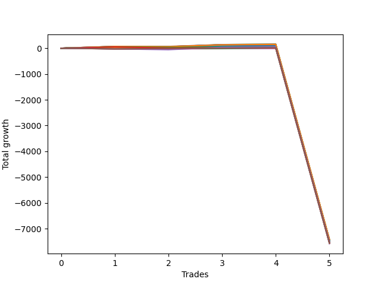

# Long Wallace Betterrerer 020 
- Symbol: NQ
- Date Range: 3/19/22 - 5/22/22
- Trading Period: 7:20-12:30
- Number of Trades: 5


| Name | Win Percent | Profit | Avg Profit / Trade |     | Name | Win Percent | Profit | Avg Profit / Trade |
| ---- | ----------- | ------ | ------------------ | --- | ---- | ----------- | ------ | ------------------ |
| Sorted By <br> Profit | | | | | Sorted By <br> Win Percentage ||||
| Three | 80.00 | -3709375.00 | -741875.00 |     | Three | 80.00 | -3709375.00 | -741875.00 |
| Twenty-Eight | 60.00 | -3715250.00 | -743050.00 |     | Two | 80.00 | -3740500.00 | -748100.00 |
| Ten | 40.00 | -3722250.00 | -744450.00 |     | Twenty-Eight | 60.00 | -3715250.00 | -743050.00 |
| Sixteen | 40.00 | -3723000.00 | -744600.00 |     | Twenty-Six | 60.00 | -3740750.00 | -748150.00 |
| Twenty-Two | 40.00 | -3724000.00 | -744800.00 |     | Eighteen | 60.00 | -3755250.00 | -751050.00 |
| Two | 80.00 | -3740500.00 | -748100.00 |     | Twelve | 60.00 | -3755250.00 | -751050.00 |
| Twenty-Six | 60.00 | -3740750.00 | -748150.00 |     | Twenty-Four | 60.00 | -3756875.00 | -751375.00 |
| Eight | 40.00 | -3748125.00 | -749625.00 |     | One | 60.00 | -3763625.00 | -752725.00 |
| Fourteen | 40.00 | -3748875.00 | -749775.00 |     | Five | 60.00 | -3768625.00 | -753725.00 |
| Twenty | 40.00 | -3749875.00 | -749975.00 |     | Four | 60.00 | -3789500.00 | -757900.00 |
| Eighteen | 60.00 | -3755250.00 | -751050.00 |     | Ten | 40.00 | -3722250.00 | -744450.00 |
| Twelve | 60.00 | -3755250.00 | -751050.00 |     | Sixteen | 40.00 | -3723000.00 | -744600.00 |
| Thirty-Two | 40.00 | -3756625.00 | -751325.00 |     | Twenty-Two | 40.00 | -3724000.00 | -744800.00 |
| Twenty-Four | 60.00 | -3756875.00 | -751375.00 |     | Eight | 40.00 | -3748125.00 | -749625.00 |
| Thirty-Six | 40.00 | -3758375.00 | -751675.00 |     | Fourteen | 40.00 | -3748875.00 | -749775.00 |
| Thirty-Four | 40.00 | -3761875.00 | -752375.00 |     | Twenty | 40.00 | -3749875.00 | -749975.00 |
| Six | 40.00 | -3762875.00 | -752575.00 |     | Thirty-Two | 40.00 | -3756625.00 | -751325.00 |
| One | 60.00 | -3763625.00 | -752725.00 |     | Thirty-Six | 40.00 | -3758375.00 | -751675.00 |
| Five | 60.00 | -3768625.00 | -753725.00 |     | Thirty-Four | 40.00 | -3761875.00 | -752375.00 |
| Seventeen | 40.00 | -3770000.00 | -754000.00 |     | Six | 40.00 | -3762875.00 | -752575.00 |
| Fifteen | 40.00 | -3770000.00 | -754000.00 |     | Seventeen | 40.00 | -3770000.00 | -754000.00 |
| Thirteen | 40.00 | -3770000.00 | -754000.00 |     | Fifteen | 40.00 | -3770000.00 | -754000.00 |
| Eleven | 40.00 | -3770000.00 | -754000.00 |     | Thirteen | 40.00 | -3770000.00 | -754000.00 |
| Nine | 40.00 | -3770000.00 | -754000.00 |     | Eleven | 40.00 | -3770000.00 | -754000.00 |
| Seven | 40.00 | -3770000.00 | -754000.00 |     | Nine | 40.00 | -3770000.00 | -754000.00 |
| Twenty-Three | 40.00 | -3771500.00 | -754300.00 |     | Seven | 40.00 | -3770000.00 | -754000.00 |
| Twenty-One | 40.00 | -3771500.00 | -754300.00 |     | Twenty-Three | 40.00 | -3771500.00 | -754300.00 |
| Nineteen | 40.00 | -3771500.00 | -754300.00 |     | Twenty-One | 40.00 | -3771500.00 | -754300.00 |
| Thirty-Five | 40.00 | -3773875.00 | -754775.00 |     | Nineteen | 40.00 | -3771500.00 | -754300.00 |
| Thirty-Three | 40.00 | -3774500.00 | -754900.00 |     | Thirty-Five | 40.00 | -3773875.00 | -754775.00 |
| Thirty-One | 40.00 | -3774500.00 | -754900.00 |     | Thirty-Three | 40.00 | -3774500.00 | -754900.00 |
| Twenty-Nine | 40.00 | -3774500.00 | -754900.00 |     | Thirty-One | 40.00 | -3774500.00 | -754900.00 |
| Twenty-Seven | 40.00 | -3774500.00 | -754900.00 |     | Twenty-Nine | 40.00 | -3774500.00 | -754900.00 |
| Twenty-Five | 40.00 | -3774500.00 | -754900.00 |     | Twenty-Seven | 40.00 | -3774500.00 | -754900.00 |
| Thirty | 40.00 | -3777500.00 | -755500.00 |     | Twenty-Five | 40.00 | -3774500.00 | -754900.00 |
| Four | 60.00 | -3789500.00 | -757900.00 |     | Thirty | 40.00 | -3777500.00 | -755500.00 |

### Test One
* Sell when price hits the middle line of the 20p bollinger
* No Stoploss
* Results:
```
Total Trades: 5
Percent Up: 60.00
Percent Down: 40.00
Total Points Moved Up: -7527.25
Potential Profit: -3763625.00
Total Points Ups: 57.00 Count Ups: 3
Total Points Downs: -7584.25 Count Downs: 2
```

<details><summary>Trades</summary>

<code>In: 2022-05-06 11:49:00		Out: 2022-05-06 11:49:10		Total Position Time: 00:10		Total Move Up: 22.50		Total to Date: 22.50</code> <br />
<code>In: 2022-05-16 07:58:00		Out: 2022-05-16 08:09:35		Total Position Time: 11:35		Total Move Up: -11.25		Total to Date: 11.25</code> <br />
<code>In: 2022-05-25 11:10:00		Out: 2022-05-25 11:10:15		Total Position Time: 00:15		Total Move Up: 21.75		Total to Date: 33.00</code> <br />
<code>In: 2022-06-09 08:10:00		Out: 2022-06-09 08:11:10		Total Position Time: 01:10		Total Move Up: 12.75		Total to Date: 45.75</code> <br />
<code>In: 2022-06-14 11:52:00		Out: 2022-06-14 12:21:55		Total Position Time: 29:55		Total Move Up: -7573.00		Total to Date: -7527.25</code> <br />


</details>

### Test Two
* Sell when the price hits the upper line of the 20p 1std bollinger
* No Stoploss
* Results:
```
Total Trades: 5
Percent Up: 80.00
Percent Down: 20.00
Total Points Moved Up: -7481.00
Potential Profit: -3740500.00
Total Points Ups: 92.00 Count Ups: 4
Total Points Downs: -7573.00 Count Downs: 1
```

<details><summary>Trades</summary>

<code>In: 2022-05-06 11:49:00		Out: 2022-05-06 11:49:10		Total Position Time: 00:10		Total Move Up: 22.50		Total to Date: 22.50</code> <br />
<code>In: 2022-05-16 07:58:00		Out: 2022-05-16 08:10:30		Total Position Time: 12:30		Total Move Up: 2.75		Total to Date: 25.25</code> <br />
<code>In: 2022-05-25 11:10:00		Out: 2022-05-25 11:10:25		Total Position Time: 00:25		Total Move Up: 51.25		Total to Date: 76.50</code> <br />
<code>In: 2022-06-09 08:10:00		Out: 2022-06-09 08:22:35		Total Position Time: 12:35		Total Move Up: 15.50		Total to Date: 92.00</code> <br />
<code>In: 2022-06-14 11:52:00		Out: 2022-06-14 12:21:55		Total Position Time: 29:55		Total Move Up: -7573.00		Total to Date: -7481.00</code> <br />


</details>

### Test Three
* Sell when the price hits the upper line of the 20p 2std bollinger
* No Stoploss
* Results:
```
Total Trades: 5
Percent Up: 80.00
Percent Down: 20.00
Total Points Moved Up: -7418.75
Potential Profit: -3709375.00
Total Points Ups: 154.25 Count Ups: 4
Total Points Downs: -7573.00 Count Downs: 1
```

<details><summary>Trades</summary>

<code>In: 2022-05-06 11:49:00		Out: 2022-05-06 11:49:25		Total Position Time: 00:25		Total Move Up: 33.25		Total to Date: 33.25</code> <br />
<code>In: 2022-05-16 07:58:00		Out: 2022-05-16 08:13:05		Total Position Time: 15:05		Total Move Up: 14.00		Total to Date: 47.25</code> <br />
<code>In: 2022-05-25 11:10:00		Out: 2022-05-25 11:39:55		Total Position Time: 29:55		Total Move Up: 92.25		Total to Date: 139.50</code> <br />
<code>In: 2022-06-09 08:10:00		Out: 2022-06-09 08:33:20		Total Position Time: 23:20		Total Move Up: 14.75		Total to Date: 154.25</code> <br />
<code>In: 2022-06-14 11:52:00		Out: 2022-06-14 12:21:55		Total Position Time: 29:55		Total Move Up: -7573.00		Total to Date: -7418.75</code> <br />


</details>

### Test Four
* Sell when the price hits the middle line of the 1std VWAP
* No Stoploss
* Results:
```
Total Trades: 5
Percent Up: 60.00
Percent Down: 40.00
Total Points Moved Up: -7579.00
Potential Profit: -3789500.00
Total Points Ups: 27.00 Count Ups: 3
Total Points Downs: -7606.00 Count Downs: 2
```

<details><summary>Trades</summary>

<code>In: 2022-05-06 11:49:00		Out: 2022-05-06 12:18:55		Total Position Time: 29:55		Total Move Up: -33.00		Total to Date: -33.00</code> <br />
<code>In: 2022-05-16 07:58:00		Out: 2022-05-16 08:27:55		Total Position Time: 29:55		Total Move Up: 1.00		Total to Date: -32.00</code> <br />
<code>In: 2022-05-25 11:10:00		Out: 2022-05-25 11:10:10		Total Position Time: 00:10		Total Move Up: 9.50		Total to Date: -22.50</code> <br />
<code>In: 2022-06-09 08:10:00		Out: 2022-06-09 08:39:55		Total Position Time: 29:55		Total Move Up: 16.50		Total to Date: -6.00</code> <br />
<code>In: 2022-06-14 11:52:00		Out: 2022-06-14 12:21:55		Total Position Time: 29:55		Total Move Up: -7573.00		Total to Date: -7579.00</code> <br />


</details>

### Test Five
* Sell when the price hits the upper line of the 1std VWAP
* No Stoploss
* Results:
```
Total Trades: 5
Percent Up: 60.00
Percent Down: 40.00
Total Points Moved Up: -7537.25
Potential Profit: -3768625.00
Total Points Ups: 68.75 Count Ups: 3
Total Points Downs: -7606.00 Count Downs: 2
```

<details><summary>Trades</summary>

<code>In: 2022-05-06 11:49:00		Out: 2022-05-06 12:18:55		Total Position Time: 29:55		Total Move Up: -33.00		Total to Date: -33.00</code> <br />
<code>In: 2022-05-16 07:58:00		Out: 2022-05-16 08:27:55		Total Position Time: 29:55		Total Move Up: 1.00		Total to Date: -32.00</code> <br />
<code>In: 2022-05-25 11:10:00		Out: 2022-05-25 11:10:25		Total Position Time: 00:25		Total Move Up: 51.25		Total to Date: 19.25</code> <br />
<code>In: 2022-06-09 08:10:00		Out: 2022-06-09 08:39:55		Total Position Time: 29:55		Total Move Up: 16.50		Total to Date: 35.75</code> <br />
<code>In: 2022-06-14 11:52:00		Out: 2022-06-14 12:21:55		Total Position Time: 29:55		Total Move Up: -7573.00		Total to Date: -7537.25</code> <br />


</details>

### Test Six
* Sell when the price hits the middle line of the 20p bollinger
* Stoploss is 2 points
* Results:
```
Total Trades: 5
Percent Up: 40.00
Percent Down: 60.00
Total Points Moved Up: -7525.75
Potential Profit: -3762875.00
Total Points Ups: 44.25 Count Ups: 2
Total Points Downs: -7570.00 Count Downs: 3
```

<details><summary>Trades</summary>

<code>In: 2022-05-06 11:49:00		Out: 2022-05-06 11:49:10		Total Position Time: 00:10		Total Move Up: 22.50		Total to Date: 22.50</code> <br />
<code>In: 2022-05-16 07:58:00		Out: 2022-05-16 07:58:10		Total Position Time: 00:10		Total Move Up: -7.00		Total to Date: 15.50</code> <br />
<code>In: 2022-05-25 11:10:00		Out: 2022-05-25 11:10:15		Total Position Time: 00:15		Total Move Up: 21.75		Total to Date: 37.25</code> <br />
<code>In: 2022-06-09 08:10:00		Out: 2022-06-09 08:10:15		Total Position Time: 00:15		Total Move Up: -2.50		Total to Date: 34.75</code> <br />
<code>In: 2022-06-14 11:52:00		Out: 2022-06-14 11:52:10		Total Position Time: 00:10		Total Move Up: -7560.50		Total to Date: -7525.75</code> <br />


</details>

### Test Seven
* Sell when the price hits the middle line of the 20p bollinger
* Trailing Stop is 2 points
* Results:
```
Total Trades: 5
Percent Up: 40.00
Percent Down: 60.00
Total Points Moved Up: -7540.00
Potential Profit: -3770000.00
Total Points Ups: 32.00 Count Ups: 2
Total Points Downs: -7572.00 Count Downs: 3
```

<details><summary>Trades</summary>

<code>In: 2022-05-06 11:49:00		Out: 2022-05-06 11:49:10		Total Position Time: 00:10		Total Move Up: 22.50		Total to Date: 22.50</code> <br />
<code>In: 2022-05-16 07:58:00		Out: 2022-05-16 07:58:15		Total Position Time: 00:15		Total Move Up: -10.25		Total to Date: 12.25</code> <br />
<code>In: 2022-05-25 11:10:00		Out: 2022-05-25 11:10:10		Total Position Time: 00:10		Total Move Up: 9.50		Total to Date: 21.75</code> <br />
<code>In: 2022-06-09 08:10:00		Out: 2022-06-09 08:10:10		Total Position Time: 00:10		Total Move Up: -1.25		Total to Date: 20.50</code> <br />
<code>In: 2022-06-14 11:52:00		Out: 2022-06-14 11:52:10		Total Position Time: 00:10		Total Move Up: -7560.50		Total to Date: -7540.00</code> <br />


</details>

### Test Eight
* Sell when the price hits the upper line of the 20p 1std bollinger
* Stoploss is 2 points
* Results:
```
Total Trades: 5
Percent Up: 40.00
Percent Down: 60.00
Total Points Moved Up: -7496.25
Potential Profit: -3748125.00
Total Points Ups: 73.75 Count Ups: 2
Total Points Downs: -7570.00 Count Downs: 3
```

<details><summary>Trades</summary>

<code>In: 2022-05-06 11:49:00		Out: 2022-05-06 11:49:10		Total Position Time: 00:10		Total Move Up: 22.50		Total to Date: 22.50</code> <br />
<code>In: 2022-05-16 07:58:00		Out: 2022-05-16 07:58:10		Total Position Time: 00:10		Total Move Up: -7.00		Total to Date: 15.50</code> <br />
<code>In: 2022-05-25 11:10:00		Out: 2022-05-25 11:10:25		Total Position Time: 00:25		Total Move Up: 51.25		Total to Date: 66.75</code> <br />
<code>In: 2022-06-09 08:10:00		Out: 2022-06-09 08:10:15		Total Position Time: 00:15		Total Move Up: -2.50		Total to Date: 64.25</code> <br />
<code>In: 2022-06-14 11:52:00		Out: 2022-06-14 11:52:10		Total Position Time: 00:10		Total Move Up: -7560.50		Total to Date: -7496.25</code> <br />


</details>

### Test Nine
* Sell when the price hits the upper line of the 20p 1std bollinger
* Trailing Stop is 2 points
* Results:
```
Total Trades: 5
Percent Up: 40.00
Percent Down: 60.00
Total Points Moved Up: -7540.00
Potential Profit: -3770000.00
Total Points Ups: 32.00 Count Ups: 2
Total Points Downs: -7572.00 Count Downs: 3
```

<details><summary>Trades</summary>

<code>In: 2022-05-06 11:49:00		Out: 2022-05-06 11:49:10		Total Position Time: 00:10		Total Move Up: 22.50		Total to Date: 22.50</code> <br />
<code>In: 2022-05-16 07:58:00		Out: 2022-05-16 07:58:15		Total Position Time: 00:15		Total Move Up: -10.25		Total to Date: 12.25</code> <br />
<code>In: 2022-05-25 11:10:00		Out: 2022-05-25 11:10:10		Total Position Time: 00:10		Total Move Up: 9.50		Total to Date: 21.75</code> <br />
<code>In: 2022-06-09 08:10:00		Out: 2022-06-09 08:10:10		Total Position Time: 00:10		Total Move Up: -1.25		Total to Date: 20.50</code> <br />
<code>In: 2022-06-14 11:52:00		Out: 2022-06-14 11:52:10		Total Position Time: 00:10		Total Move Up: -7560.50		Total to Date: -7540.00</code> <br />


</details>

### Test Ten
* Sell when the price hits the upper line of the 20p 2std bollinger
* Stoploss is 2 points
* Results:
```
Total Trades: 5
Percent Up: 40.00
Percent Down: 60.00
Total Points Moved Up: -7444.50
Potential Profit: -3722250.00
Total Points Ups: 125.50 Count Ups: 2
Total Points Downs: -7570.00 Count Downs: 3
```

<details><summary>Trades</summary>

<code>In: 2022-05-06 11:49:00		Out: 2022-05-06 11:49:25		Total Position Time: 00:25		Total Move Up: 33.25		Total to Date: 33.25</code> <br />
<code>In: 2022-05-16 07:58:00		Out: 2022-05-16 07:58:10		Total Position Time: 00:10		Total Move Up: -7.00		Total to Date: 26.25</code> <br />
<code>In: 2022-05-25 11:10:00		Out: 2022-05-25 11:39:55		Total Position Time: 29:55		Total Move Up: 92.25		Total to Date: 118.50</code> <br />
<code>In: 2022-06-09 08:10:00		Out: 2022-06-09 08:10:15		Total Position Time: 00:15		Total Move Up: -2.50		Total to Date: 116.00</code> <br />
<code>In: 2022-06-14 11:52:00		Out: 2022-06-14 11:52:10		Total Position Time: 00:10		Total Move Up: -7560.50		Total to Date: -7444.50</code> <br />


</details>

### Test Eleven
* Sell when the price hits the upper line of the 20p 2std bollinger
* Trailing Stop is 2 points
* Results:
```
Total Trades: 5
Percent Up: 40.00
Percent Down: 60.00
Total Points Moved Up: -7540.00
Potential Profit: -3770000.00
Total Points Ups: 32.00 Count Ups: 2
Total Points Downs: -7572.00 Count Downs: 3
```

<details><summary>Trades</summary>

<code>In: 2022-05-06 11:49:00		Out: 2022-05-06 11:49:10		Total Position Time: 00:10		Total Move Up: 22.50		Total to Date: 22.50</code> <br />
<code>In: 2022-05-16 07:58:00		Out: 2022-05-16 07:58:15		Total Position Time: 00:15		Total Move Up: -10.25		Total to Date: 12.25</code> <br />
<code>In: 2022-05-25 11:10:00		Out: 2022-05-25 11:10:10		Total Position Time: 00:10		Total Move Up: 9.50		Total to Date: 21.75</code> <br />
<code>In: 2022-06-09 08:10:00		Out: 2022-06-09 08:10:10		Total Position Time: 00:10		Total Move Up: -1.25		Total to Date: 20.50</code> <br />
<code>In: 2022-06-14 11:52:00		Out: 2022-06-14 11:52:10		Total Position Time: 00:10		Total Move Up: -7560.50		Total to Date: -7540.00</code> <br />


</details>

### Test Twelve
* Sell when the price hits the middle line of the 20p bollinger
* Stoploss is 3 points
* Results:
```
Total Trades: 5
Percent Up: 60.00
Percent Down: 40.00
Total Points Moved Up: -7510.50
Potential Profit: -3755250.00
Total Points Ups: 57.00 Count Ups: 3
Total Points Downs: -7567.50 Count Downs: 2
```

<details><summary>Trades</summary>

<code>In: 2022-05-06 11:49:00		Out: 2022-05-06 11:49:10		Total Position Time: 00:10		Total Move Up: 22.50		Total to Date: 22.50</code> <br />
<code>In: 2022-05-16 07:58:00		Out: 2022-05-16 07:58:10		Total Position Time: 00:10		Total Move Up: -7.00		Total to Date: 15.50</code> <br />
<code>In: 2022-05-25 11:10:00		Out: 2022-05-25 11:10:15		Total Position Time: 00:15		Total Move Up: 21.75		Total to Date: 37.25</code> <br />
<code>In: 2022-06-09 08:10:00		Out: 2022-06-09 08:11:10		Total Position Time: 01:10		Total Move Up: 12.75		Total to Date: 50.00</code> <br />
<code>In: 2022-06-14 11:52:00		Out: 2022-06-14 11:52:10		Total Position Time: 00:10		Total Move Up: -7560.50		Total to Date: -7510.50</code> <br />


</details>

### Test Thirteen
* Sell when the price hits the middle line of the 20p bollinger
* Trailing Stop is 3 points
* Results:
```
Total Trades: 5
Percent Up: 40.00
Percent Down: 60.00
Total Points Moved Up: -7540.00
Potential Profit: -3770000.00
Total Points Ups: 32.00 Count Ups: 2
Total Points Downs: -7572.00 Count Downs: 3
```

<details><summary>Trades</summary>

<code>In: 2022-05-06 11:49:00		Out: 2022-05-06 11:49:10		Total Position Time: 00:10		Total Move Up: 22.50		Total to Date: 22.50</code> <br />
<code>In: 2022-05-16 07:58:00		Out: 2022-05-16 07:58:15		Total Position Time: 00:15		Total Move Up: -10.25		Total to Date: 12.25</code> <br />
<code>In: 2022-05-25 11:10:00		Out: 2022-05-25 11:10:10		Total Position Time: 00:10		Total Move Up: 9.50		Total to Date: 21.75</code> <br />
<code>In: 2022-06-09 08:10:00		Out: 2022-06-09 08:10:10		Total Position Time: 00:10		Total Move Up: -1.25		Total to Date: 20.50</code> <br />
<code>In: 2022-06-14 11:52:00		Out: 2022-06-14 11:52:10		Total Position Time: 00:10		Total Move Up: -7560.50		Total to Date: -7540.00</code> <br />


</details>

### Test Fourteen
* Sell when the price hits the upper line of the 20p 1std bollinger
* Stoploss is 3 points
* Results:
```
Total Trades: 5
Percent Up: 40.00
Percent Down: 60.00
Total Points Moved Up: -7497.75
Potential Profit: -3748875.00
Total Points Ups: 73.75 Count Ups: 2
Total Points Downs: -7571.50 Count Downs: 3
```

<details><summary>Trades</summary>

<code>In: 2022-05-06 11:49:00		Out: 2022-05-06 11:49:10		Total Position Time: 00:10		Total Move Up: 22.50		Total to Date: 22.50</code> <br />
<code>In: 2022-05-16 07:58:00		Out: 2022-05-16 07:58:10		Total Position Time: 00:10		Total Move Up: -7.00		Total to Date: 15.50</code> <br />
<code>In: 2022-05-25 11:10:00		Out: 2022-05-25 11:10:25		Total Position Time: 00:25		Total Move Up: 51.25		Total to Date: 66.75</code> <br />
<code>In: 2022-06-09 08:10:00		Out: 2022-06-09 08:18:40		Total Position Time: 08:40		Total Move Up: -4.00		Total to Date: 62.75</code> <br />
<code>In: 2022-06-14 11:52:00		Out: 2022-06-14 11:52:10		Total Position Time: 00:10		Total Move Up: -7560.50		Total to Date: -7497.75</code> <br />


</details>

### Test Fifteen
* Sell when the price hits the upper line of the 20p 1std bollinger
* Trailing Stop is 3 points
* Results:
```
Total Trades: 5
Percent Up: 40.00
Percent Down: 60.00
Total Points Moved Up: -7540.00
Potential Profit: -3770000.00
Total Points Ups: 32.00 Count Ups: 2
Total Points Downs: -7572.00 Count Downs: 3
```

<details><summary>Trades</summary>

<code>In: 2022-05-06 11:49:00		Out: 2022-05-06 11:49:10		Total Position Time: 00:10		Total Move Up: 22.50		Total to Date: 22.50</code> <br />
<code>In: 2022-05-16 07:58:00		Out: 2022-05-16 07:58:15		Total Position Time: 00:15		Total Move Up: -10.25		Total to Date: 12.25</code> <br />
<code>In: 2022-05-25 11:10:00		Out: 2022-05-25 11:10:10		Total Position Time: 00:10		Total Move Up: 9.50		Total to Date: 21.75</code> <br />
<code>In: 2022-06-09 08:10:00		Out: 2022-06-09 08:10:10		Total Position Time: 00:10		Total Move Up: -1.25		Total to Date: 20.50</code> <br />
<code>In: 2022-06-14 11:52:00		Out: 2022-06-14 11:52:10		Total Position Time: 00:10		Total Move Up: -7560.50		Total to Date: -7540.00</code> <br />


</details>

### Test Sixteen
* Sell when the price hits the upper line of the 20p 2std bollinger
* Stoploss is 3 points
* Results:
```
Total Trades: 5
Percent Up: 40.00
Percent Down: 60.00
Total Points Moved Up: -7446.00
Potential Profit: -3723000.00
Total Points Ups: 125.50 Count Ups: 2
Total Points Downs: -7571.50 Count Downs: 3
```

<details><summary>Trades</summary>

<code>In: 2022-05-06 11:49:00		Out: 2022-05-06 11:49:25		Total Position Time: 00:25		Total Move Up: 33.25		Total to Date: 33.25</code> <br />
<code>In: 2022-05-16 07:58:00		Out: 2022-05-16 07:58:10		Total Position Time: 00:10		Total Move Up: -7.00		Total to Date: 26.25</code> <br />
<code>In: 2022-05-25 11:10:00		Out: 2022-05-25 11:39:55		Total Position Time: 29:55		Total Move Up: 92.25		Total to Date: 118.50</code> <br />
<code>In: 2022-06-09 08:10:00		Out: 2022-06-09 08:18:40		Total Position Time: 08:40		Total Move Up: -4.00		Total to Date: 114.50</code> <br />
<code>In: 2022-06-14 11:52:00		Out: 2022-06-14 11:52:10		Total Position Time: 00:10		Total Move Up: -7560.50		Total to Date: -7446.00</code> <br />


</details>

### Test Seventeen
* Sell when the price hits the upper line of the 20p 2std bollinger
* Trailing Stop is 3 points
* Results:
```
Total Trades: 5
Percent Up: 40.00
Percent Down: 60.00
Total Points Moved Up: -7540.00
Potential Profit: -3770000.00
Total Points Ups: 32.00 Count Ups: 2
Total Points Downs: -7572.00 Count Downs: 3
```

<details><summary>Trades</summary>

<code>In: 2022-05-06 11:49:00		Out: 2022-05-06 11:49:10		Total Position Time: 00:10		Total Move Up: 22.50		Total to Date: 22.50</code> <br />
<code>In: 2022-05-16 07:58:00		Out: 2022-05-16 07:58:15		Total Position Time: 00:15		Total Move Up: -10.25		Total to Date: 12.25</code> <br />
<code>In: 2022-05-25 11:10:00		Out: 2022-05-25 11:10:10		Total Position Time: 00:10		Total Move Up: 9.50		Total to Date: 21.75</code> <br />
<code>In: 2022-06-09 08:10:00		Out: 2022-06-09 08:10:10		Total Position Time: 00:10		Total Move Up: -1.25		Total to Date: 20.50</code> <br />
<code>In: 2022-06-14 11:52:00		Out: 2022-06-14 11:52:10		Total Position Time: 00:10		Total Move Up: -7560.50		Total to Date: -7540.00</code> <br />


</details>

### Test Eighteen
* Sell when the price hits the middle line of the 20p bollinger
* Stoploss is 5 points
* Results:
```
Total Trades: 5
Percent Up: 60.00
Percent Down: 40.00
Total Points Moved Up: -7510.50
Potential Profit: -3755250.00
Total Points Ups: 57.00 Count Ups: 3
Total Points Downs: -7567.50 Count Downs: 2
```

<details><summary>Trades</summary>

<code>In: 2022-05-06 11:49:00		Out: 2022-05-06 11:49:10		Total Position Time: 00:10		Total Move Up: 22.50		Total to Date: 22.50</code> <br />
<code>In: 2022-05-16 07:58:00		Out: 2022-05-16 07:58:10		Total Position Time: 00:10		Total Move Up: -7.00		Total to Date: 15.50</code> <br />
<code>In: 2022-05-25 11:10:00		Out: 2022-05-25 11:10:15		Total Position Time: 00:15		Total Move Up: 21.75		Total to Date: 37.25</code> <br />
<code>In: 2022-06-09 08:10:00		Out: 2022-06-09 08:11:10		Total Position Time: 01:10		Total Move Up: 12.75		Total to Date: 50.00</code> <br />
<code>In: 2022-06-14 11:52:00		Out: 2022-06-14 11:52:10		Total Position Time: 00:10		Total Move Up: -7560.50		Total to Date: -7510.50</code> <br />


</details>

### Test Nineteen
* Sell when the price hits the middle line of the 20p bollinger
* Trailing Stop is 5 points
* Results:
```
Total Trades: 5
Percent Up: 40.00
Percent Down: 60.00
Total Points Moved Up: -7543.00
Potential Profit: -3771500.00
Total Points Ups: 32.00 Count Ups: 2
Total Points Downs: -7575.00 Count Downs: 3
```

<details><summary>Trades</summary>

<code>In: 2022-05-06 11:49:00		Out: 2022-05-06 11:49:10		Total Position Time: 00:10		Total Move Up: 22.50		Total to Date: 22.50</code> <br />
<code>In: 2022-05-16 07:58:00		Out: 2022-05-16 07:58:20		Total Position Time: 00:20		Total Move Up: -13.25		Total to Date: 9.25</code> <br />
<code>In: 2022-05-25 11:10:00		Out: 2022-05-25 11:10:10		Total Position Time: 00:10		Total Move Up: 9.50		Total to Date: 18.75</code> <br />
<code>In: 2022-06-09 08:10:00		Out: 2022-06-09 08:10:10		Total Position Time: 00:10		Total Move Up: -1.25		Total to Date: 17.50</code> <br />
<code>In: 2022-06-14 11:52:00		Out: 2022-06-14 11:52:10		Total Position Time: 00:10		Total Move Up: -7560.50		Total to Date: -7543.00</code> <br />


</details>

### Test Twenty
* Sell when the price hits the upper line of the 20p 1std bollinger
* Stoploss is 5 points
* Results:
```
Total Trades: 5
Percent Up: 40.00
Percent Down: 60.00
Total Points Moved Up: -7499.75
Potential Profit: -3749875.00
Total Points Ups: 73.75 Count Ups: 2
Total Points Downs: -7573.50 Count Downs: 3
```

<details><summary>Trades</summary>

<code>In: 2022-05-06 11:49:00		Out: 2022-05-06 11:49:10		Total Position Time: 00:10		Total Move Up: 22.50		Total to Date: 22.50</code> <br />
<code>In: 2022-05-16 07:58:00		Out: 2022-05-16 07:58:10		Total Position Time: 00:10		Total Move Up: -7.00		Total to Date: 15.50</code> <br />
<code>In: 2022-05-25 11:10:00		Out: 2022-05-25 11:10:25		Total Position Time: 00:25		Total Move Up: 51.25		Total to Date: 66.75</code> <br />
<code>In: 2022-06-09 08:10:00		Out: 2022-06-09 08:18:45		Total Position Time: 08:45		Total Move Up: -6.00		Total to Date: 60.75</code> <br />
<code>In: 2022-06-14 11:52:00		Out: 2022-06-14 11:52:10		Total Position Time: 00:10		Total Move Up: -7560.50		Total to Date: -7499.75</code> <br />


</details>

### Test Twenty-One
* Sell when the price hits the upper line of the 20p 1std bollinger
* Trailing Stop is 5 points
* Results:
```
Total Trades: 5
Percent Up: 40.00
Percent Down: 60.00
Total Points Moved Up: -7543.00
Potential Profit: -3771500.00
Total Points Ups: 32.00 Count Ups: 2
Total Points Downs: -7575.00 Count Downs: 3
```

<details><summary>Trades</summary>

<code>In: 2022-05-06 11:49:00		Out: 2022-05-06 11:49:10		Total Position Time: 00:10		Total Move Up: 22.50		Total to Date: 22.50</code> <br />
<code>In: 2022-05-16 07:58:00		Out: 2022-05-16 07:58:20		Total Position Time: 00:20		Total Move Up: -13.25		Total to Date: 9.25</code> <br />
<code>In: 2022-05-25 11:10:00		Out: 2022-05-25 11:10:10		Total Position Time: 00:10		Total Move Up: 9.50		Total to Date: 18.75</code> <br />
<code>In: 2022-06-09 08:10:00		Out: 2022-06-09 08:10:10		Total Position Time: 00:10		Total Move Up: -1.25		Total to Date: 17.50</code> <br />
<code>In: 2022-06-14 11:52:00		Out: 2022-06-14 11:52:10		Total Position Time: 00:10		Total Move Up: -7560.50		Total to Date: -7543.00</code> <br />


</details>

### Test Twenty-Two
* Sell when the price hits the upper line of the 20p 2std bollinger
* Stoploss is 5 points
* Results:
```
Total Trades: 5
Percent Up: 40.00
Percent Down: 60.00
Total Points Moved Up: -7448.00
Potential Profit: -3724000.00
Total Points Ups: 125.50 Count Ups: 2
Total Points Downs: -7573.50 Count Downs: 3
```

<details><summary>Trades</summary>

<code>In: 2022-05-06 11:49:00		Out: 2022-05-06 11:49:25		Total Position Time: 00:25		Total Move Up: 33.25		Total to Date: 33.25</code> <br />
<code>In: 2022-05-16 07:58:00		Out: 2022-05-16 07:58:10		Total Position Time: 00:10		Total Move Up: -7.00		Total to Date: 26.25</code> <br />
<code>In: 2022-05-25 11:10:00		Out: 2022-05-25 11:39:55		Total Position Time: 29:55		Total Move Up: 92.25		Total to Date: 118.50</code> <br />
<code>In: 2022-06-09 08:10:00		Out: 2022-06-09 08:18:45		Total Position Time: 08:45		Total Move Up: -6.00		Total to Date: 112.50</code> <br />
<code>In: 2022-06-14 11:52:00		Out: 2022-06-14 11:52:10		Total Position Time: 00:10		Total Move Up: -7560.50		Total to Date: -7448.00</code> <br />


</details>

### Test Twenty-Three
* Sell when the price hits the upper line of the 20p 2std bollinger
* Trailing Stop is 5 points
* Results:
```
Total Trades: 5
Percent Up: 40.00
Percent Down: 60.00
Total Points Moved Up: -7543.00
Potential Profit: -3771500.00
Total Points Ups: 32.00 Count Ups: 2
Total Points Downs: -7575.00 Count Downs: 3
```

<details><summary>Trades</summary>

<code>In: 2022-05-06 11:49:00		Out: 2022-05-06 11:49:10		Total Position Time: 00:10		Total Move Up: 22.50		Total to Date: 22.50</code> <br />
<code>In: 2022-05-16 07:58:00		Out: 2022-05-16 07:58:20		Total Position Time: 00:20		Total Move Up: -13.25		Total to Date: 9.25</code> <br />
<code>In: 2022-05-25 11:10:00		Out: 2022-05-25 11:10:10		Total Position Time: 00:10		Total Move Up: 9.50		Total to Date: 18.75</code> <br />
<code>In: 2022-06-09 08:10:00		Out: 2022-06-09 08:10:10		Total Position Time: 00:10		Total Move Up: -1.25		Total to Date: 17.50</code> <br />
<code>In: 2022-06-14 11:52:00		Out: 2022-06-14 11:52:10		Total Position Time: 00:10		Total Move Up: -7560.50		Total to Date: -7543.00</code> <br />


</details>

### Test Twenty-Four
* Sell when the price hits the middle line of the 20p bollinger
* Stoploss is 10 points
* Results:
```
Total Trades: 5
Percent Up: 60.00
Percent Down: 40.00
Total Points Moved Up: -7513.75
Potential Profit: -3756875.00
Total Points Ups: 57.00 Count Ups: 3
Total Points Downs: -7570.75 Count Downs: 2
```

<details><summary>Trades</summary>

<code>In: 2022-05-06 11:49:00		Out: 2022-05-06 11:49:10		Total Position Time: 00:10		Total Move Up: 22.50		Total to Date: 22.50</code> <br />
<code>In: 2022-05-16 07:58:00		Out: 2022-05-16 07:58:15		Total Position Time: 00:15		Total Move Up: -10.25		Total to Date: 12.25</code> <br />
<code>In: 2022-05-25 11:10:00		Out: 2022-05-25 11:10:15		Total Position Time: 00:15		Total Move Up: 21.75		Total to Date: 34.00</code> <br />
<code>In: 2022-06-09 08:10:00		Out: 2022-06-09 08:11:10		Total Position Time: 01:10		Total Move Up: 12.75		Total to Date: 46.75</code> <br />
<code>In: 2022-06-14 11:52:00		Out: 2022-06-14 11:52:10		Total Position Time: 00:10		Total Move Up: -7560.50		Total to Date: -7513.75</code> <br />


</details>

### Test Twenty-Five
* Sell when the price hits the middle line of the 20p bollinger
* Trailing Stop is 10 points
* Results:
```
Total Trades: 5
Percent Up: 40.00
Percent Down: 60.00
Total Points Moved Up: -7549.00
Potential Profit: -3774500.00
Total Points Ups: 32.00 Count Ups: 2
Total Points Downs: -7581.00 Count Downs: 3
```

<details><summary>Trades</summary>

<code>In: 2022-05-06 11:49:00		Out: 2022-05-06 11:49:10		Total Position Time: 00:10		Total Move Up: 22.50		Total to Date: 22.50</code> <br />
<code>In: 2022-05-16 07:58:00		Out: 2022-05-16 07:58:25		Total Position Time: 00:25		Total Move Up: -19.25		Total to Date: 3.25</code> <br />
<code>In: 2022-05-25 11:10:00		Out: 2022-05-25 11:10:10		Total Position Time: 00:10		Total Move Up: 9.50		Total to Date: 12.75</code> <br />
<code>In: 2022-06-09 08:10:00		Out: 2022-06-09 08:10:10		Total Position Time: 00:10		Total Move Up: -1.25		Total to Date: 11.50</code> <br />
<code>In: 2022-06-14 11:52:00		Out: 2022-06-14 11:52:10		Total Position Time: 00:10		Total Move Up: -7560.50		Total to Date: -7549.00</code> <br />


</details>

### Test Twenty-Six
* Sell when the price hits the upper line of the 20p 1std bollinger
* Stoploss is 10 points
* Results:
```
Total Trades: 5
Percent Up: 60.00
Percent Down: 40.00
Total Points Moved Up: -7481.50
Potential Profit: -3740750.00
Total Points Ups: 89.25 Count Ups: 3
Total Points Downs: -7570.75 Count Downs: 2
```

<details><summary>Trades</summary>

<code>In: 2022-05-06 11:49:00		Out: 2022-05-06 11:49:10		Total Position Time: 00:10		Total Move Up: 22.50		Total to Date: 22.50</code> <br />
<code>In: 2022-05-16 07:58:00		Out: 2022-05-16 07:58:15		Total Position Time: 00:15		Total Move Up: -10.25		Total to Date: 12.25</code> <br />
<code>In: 2022-05-25 11:10:00		Out: 2022-05-25 11:10:25		Total Position Time: 00:25		Total Move Up: 51.25		Total to Date: 63.50</code> <br />
<code>In: 2022-06-09 08:10:00		Out: 2022-06-09 08:22:35		Total Position Time: 12:35		Total Move Up: 15.50		Total to Date: 79.00</code> <br />
<code>In: 2022-06-14 11:52:00		Out: 2022-06-14 11:52:10		Total Position Time: 00:10		Total Move Up: -7560.50		Total to Date: -7481.50</code> <br />


</details>

### Test Twenty-Seven
* Sell when the price hits the upper line of the 20p 1std bollinger
* Trailing Stop is 10 points
* Results:
```
Total Trades: 5
Percent Up: 40.00
Percent Down: 60.00
Total Points Moved Up: -7549.00
Potential Profit: -3774500.00
Total Points Ups: 32.00 Count Ups: 2
Total Points Downs: -7581.00 Count Downs: 3
```

<details><summary>Trades</summary>

<code>In: 2022-05-06 11:49:00		Out: 2022-05-06 11:49:10		Total Position Time: 00:10		Total Move Up: 22.50		Total to Date: 22.50</code> <br />
<code>In: 2022-05-16 07:58:00		Out: 2022-05-16 07:58:25		Total Position Time: 00:25		Total Move Up: -19.25		Total to Date: 3.25</code> <br />
<code>In: 2022-05-25 11:10:00		Out: 2022-05-25 11:10:10		Total Position Time: 00:10		Total Move Up: 9.50		Total to Date: 12.75</code> <br />
<code>In: 2022-06-09 08:10:00		Out: 2022-06-09 08:10:10		Total Position Time: 00:10		Total Move Up: -1.25		Total to Date: 11.50</code> <br />
<code>In: 2022-06-14 11:52:00		Out: 2022-06-14 11:52:10		Total Position Time: 00:10		Total Move Up: -7560.50		Total to Date: -7549.00</code> <br />


</details>

### Test Twenty-Eight
* Sell when the price hits the upper line of the 20p 2std bollinger
* Stoploss is 10 points
* Results:
```
Total Trades: 5
Percent Up: 60.00
Percent Down: 40.00
Total Points Moved Up: -7430.50
Potential Profit: -3715250.00
Total Points Ups: 140.25 Count Ups: 3
Total Points Downs: -7570.75 Count Downs: 2
```

<details><summary>Trades</summary>

<code>In: 2022-05-06 11:49:00		Out: 2022-05-06 11:49:25		Total Position Time: 00:25		Total Move Up: 33.25		Total to Date: 33.25</code> <br />
<code>In: 2022-05-16 07:58:00		Out: 2022-05-16 07:58:15		Total Position Time: 00:15		Total Move Up: -10.25		Total to Date: 23.00</code> <br />
<code>In: 2022-05-25 11:10:00		Out: 2022-05-25 11:39:55		Total Position Time: 29:55		Total Move Up: 92.25		Total to Date: 115.25</code> <br />
<code>In: 2022-06-09 08:10:00		Out: 2022-06-09 08:33:20		Total Position Time: 23:20		Total Move Up: 14.75		Total to Date: 130.00</code> <br />
<code>In: 2022-06-14 11:52:00		Out: 2022-06-14 11:52:10		Total Position Time: 00:10		Total Move Up: -7560.50		Total to Date: -7430.50</code> <br />


</details>

### Test Twenty-Nine
* Sell when the price hits the upper line of the 20p 2std bollinger
* Trailing Stop is 10 points
* Results:
```
Total Trades: 5
Percent Up: 40.00
Percent Down: 60.00
Total Points Moved Up: -7549.00
Potential Profit: -3774500.00
Total Points Ups: 32.00 Count Ups: 2
Total Points Downs: -7581.00 Count Downs: 3
```

<details><summary>Trades</summary>

<code>In: 2022-05-06 11:49:00		Out: 2022-05-06 11:49:10		Total Position Time: 00:10		Total Move Up: 22.50		Total to Date: 22.50</code> <br />
<code>In: 2022-05-16 07:58:00		Out: 2022-05-16 07:58:25		Total Position Time: 00:25		Total Move Up: -19.25		Total to Date: 3.25</code> <br />
<code>In: 2022-05-25 11:10:00		Out: 2022-05-25 11:10:10		Total Position Time: 00:10		Total Move Up: 9.50		Total to Date: 12.75</code> <br />
<code>In: 2022-06-09 08:10:00		Out: 2022-06-09 08:10:10		Total Position Time: 00:10		Total Move Up: -1.25		Total to Date: 11.50</code> <br />
<code>In: 2022-06-14 11:52:00		Out: 2022-06-14 11:52:10		Total Position Time: 00:10		Total Move Up: -7560.50		Total to Date: -7549.00</code> <br />


</details>

### Test Thirty
* Sell when the price hits the middle line of the 1std VWAP
* Stoploss is 10 points
* Results:
```
Total Trades: 5
Percent Up: 40.00
Percent Down: 60.00
Total Points Moved Up: -7555.00
Potential Profit: -3777500.00
Total Points Ups: 26.00 Count Ups: 2
Total Points Downs: -7581.00 Count Downs: 3
```

<details><summary>Trades</summary>

<code>In: 2022-05-06 11:49:00		Out: 2022-05-06 12:00:15		Total Position Time: 11:15		Total Move Up: -10.25		Total to Date: -10.25</code> <br />
<code>In: 2022-05-16 07:58:00		Out: 2022-05-16 07:58:15		Total Position Time: 00:15		Total Move Up: -10.25		Total to Date: -20.50</code> <br />
<code>In: 2022-05-25 11:10:00		Out: 2022-05-25 11:10:10		Total Position Time: 00:10		Total Move Up: 9.50		Total to Date: -11.00</code> <br />
<code>In: 2022-06-09 08:10:00		Out: 2022-06-09 08:39:55		Total Position Time: 29:55		Total Move Up: 16.50		Total to Date: 5.50</code> <br />
<code>In: 2022-06-14 11:52:00		Out: 2022-06-14 11:52:10		Total Position Time: 00:10		Total Move Up: -7560.50		Total to Date: -7555.00</code> <br />


</details>

### Test Thirty-One
* Sell when the price hits the middle line of the 1std VWAP
* Trailing Stop is 10 points
* Results:
```
Total Trades: 5
Percent Up: 40.00
Percent Down: 60.00
Total Points Moved Up: -7549.00
Potential Profit: -3774500.00
Total Points Ups: 32.00 Count Ups: 2
Total Points Downs: -7581.00 Count Downs: 3
```

<details><summary>Trades</summary>

<code>In: 2022-05-06 11:49:00		Out: 2022-05-06 11:49:10		Total Position Time: 00:10		Total Move Up: 22.50		Total to Date: 22.50</code> <br />
<code>In: 2022-05-16 07:58:00		Out: 2022-05-16 07:58:25		Total Position Time: 00:25		Total Move Up: -19.25		Total to Date: 3.25</code> <br />
<code>In: 2022-05-25 11:10:00		Out: 2022-05-25 11:10:10		Total Position Time: 00:10		Total Move Up: 9.50		Total to Date: 12.75</code> <br />
<code>In: 2022-06-09 08:10:00		Out: 2022-06-09 08:10:10		Total Position Time: 00:10		Total Move Up: -1.25		Total to Date: 11.50</code> <br />
<code>In: 2022-06-14 11:52:00		Out: 2022-06-14 11:52:10		Total Position Time: 00:10		Total Move Up: -7560.50		Total to Date: -7549.00</code> <br />


</details>

### Test Thirty-Two
* Sell when the price hits the upper line of the 1std VWAP
* Stoploss is 10 points
* Results:
```
Total Trades: 5
Percent Up: 40.00
Percent Down: 60.00
Total Points Moved Up: -7513.25
Potential Profit: -3756625.00
Total Points Ups: 67.75 Count Ups: 2
Total Points Downs: -7581.00 Count Downs: 3
```

<details><summary>Trades</summary>

<code>In: 2022-05-06 11:49:00		Out: 2022-05-06 12:00:15		Total Position Time: 11:15		Total Move Up: -10.25		Total to Date: -10.25</code> <br />
<code>In: 2022-05-16 07:58:00		Out: 2022-05-16 07:58:15		Total Position Time: 00:15		Total Move Up: -10.25		Total to Date: -20.50</code> <br />
<code>In: 2022-05-25 11:10:00		Out: 2022-05-25 11:10:25		Total Position Time: 00:25		Total Move Up: 51.25		Total to Date: 30.75</code> <br />
<code>In: 2022-06-09 08:10:00		Out: 2022-06-09 08:39:55		Total Position Time: 29:55		Total Move Up: 16.50		Total to Date: 47.25</code> <br />
<code>In: 2022-06-14 11:52:00		Out: 2022-06-14 11:52:10		Total Position Time: 00:10		Total Move Up: -7560.50		Total to Date: -7513.25</code> <br />


</details>

### Test Thirty-Three
* Sell when the price hits the upper line of the 1std VWAP
* Trailing Stop is 10 points
* Results:
```
Total Trades: 5
Percent Up: 40.00
Percent Down: 60.00
Total Points Moved Up: -7549.00
Potential Profit: -3774500.00
Total Points Ups: 32.00 Count Ups: 2
Total Points Downs: -7581.00 Count Downs: 3
```

<details><summary>Trades</summary>

<code>In: 2022-05-06 11:49:00		Out: 2022-05-06 11:49:10		Total Position Time: 00:10		Total Move Up: 22.50		Total to Date: 22.50</code> <br />
<code>In: 2022-05-16 07:58:00		Out: 2022-05-16 07:58:25		Total Position Time: 00:25		Total Move Up: -19.25		Total to Date: 3.25</code> <br />
<code>In: 2022-05-25 11:10:00		Out: 2022-05-25 11:10:10		Total Position Time: 00:10		Total Move Up: 9.50		Total to Date: 12.75</code> <br />
<code>In: 2022-06-09 08:10:00		Out: 2022-06-09 08:10:10		Total Position Time: 00:10		Total Move Up: -1.25		Total to Date: 11.50</code> <br />
<code>In: 2022-06-14 11:52:00		Out: 2022-06-14 11:52:10		Total Position Time: 00:10		Total Move Up: -7560.50		Total to Date: -7549.00</code> <br />


</details>

### Test Thirty-Four
* Sell when the linear regression slope is negative
* No Stoploss
* Results:
```
Total Trades: 5
Percent Up: 40.00
Percent Down: 60.00
Total Points Moved Up: -7523.75
Potential Profit: -3761875.00
Total Points Ups: 61.50 Count Ups: 2
Total Points Downs: -7585.25 Count Downs: 3
```

<details><summary>Trades</summary>

<code>In: 2022-05-06 11:49:00		Out: 2022-05-06 11:59:05		Total Position Time: 10:05		Total Move Up: 46.75		Total to Date: 46.75</code> <br />
<code>In: 2022-05-16 07:58:00		Out: 2022-05-16 07:59:05		Total Position Time: 01:05		Total Move Up: -17.50		Total to Date: 29.25</code> <br />
<code>In: 2022-05-25 11:10:00		Out: 2022-05-25 11:13:05		Total Position Time: 03:05		Total Move Up: 14.75		Total to Date: 44.00</code> <br />
<code>In: 2022-06-09 08:10:00		Out: 2022-06-09 08:19:05		Total Position Time: 09:05		Total Move Up: -4.50		Total to Date: 39.50</code> <br />
<code>In: 2022-06-14 11:52:00		Out: 2022-06-14 11:55:05		Total Position Time: 03:05		Total Move Up: -7563.25		Total to Date: -7523.75</code> <br />


</details>

### Test Thirty-Five
* Sell when the linear regression slope changes to negative
* No Stoploss
* Results:
```
Total Trades: 5
Percent Up: 40.00
Percent Down: 60.00
Total Points Moved Up: -7547.75
Potential Profit: -3773875.00
Total Points Ups: 61.50 Count Ups: 2
Total Points Downs: -7609.25 Count Downs: 3
```

<details><summary>Trades</summary>

<code>In: 2022-05-06 11:49:00		Out: 2022-05-06 11:59:05		Total Position Time: 10:05		Total Move Up: 46.75		Total to Date: 46.75</code> <br />
<code>In: 2022-05-16 07:58:00		Out: 2022-05-16 08:07:05		Total Position Time: 09:05		Total Move Up: -41.50		Total to Date: 5.25</code> <br />
<code>In: 2022-05-25 11:10:00		Out: 2022-05-25 11:13:05		Total Position Time: 03:05		Total Move Up: 14.75		Total to Date: 20.00</code> <br />
<code>In: 2022-06-09 08:10:00		Out: 2022-06-09 08:19:05		Total Position Time: 09:05		Total Move Up: -4.50		Total to Date: 15.50</code> <br />
<code>In: 2022-06-14 11:52:00		Out: 2022-06-14 11:55:05		Total Position Time: 03:05		Total Move Up: -7563.25		Total to Date: -7547.75</code> <br />


</details>

### Test Thirty-Six
* Sell when the linear regression slope changes to negative
* No Stoploss
* Results:
```
Total Trades: 5
Percent Up: 40.00
Percent Down: 60.00
Total Points Moved Up: -7516.75
Potential Profit: -3758375.00
Total Points Ups: 105.25 Count Ups: 2
Total Points Downs: -7622.00 Count Downs: 3
```

<details><summary>Trades</summary>

<code>In: 2022-05-06 11:49:00		Out: 2022-05-06 12:09:05		Total Position Time: 20:05		Total Move Up: -28.25		Total to Date: -28.25</code> <br />
<code>In: 2022-05-16 07:58:00		Out: 2022-05-16 08:00:05		Total Position Time: 02:05		Total Move Up: -31.50		Total to Date: -59.75</code> <br />
<code>In: 2022-05-25 11:10:00		Out: 2022-05-25 11:39:55		Total Position Time: 29:55		Total Move Up: 92.25		Total to Date: 32.50</code> <br />
<code>In: 2022-06-09 08:10:00		Out: 2022-06-09 08:26:05		Total Position Time: 16:05		Total Move Up: 13.00		Total to Date: 45.50</code> <br />
<code>In: 2022-06-14 11:52:00		Out: 2022-06-14 11:57:05		Total Position Time: 05:05		Total Move Up: -7562.25		Total to Date: -7516.75</code> <br />


</details>