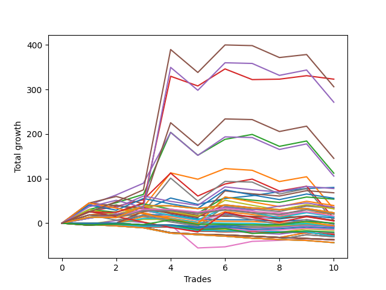

# Long Wallace Doodle 010 
- Symbol: NQ
- Date Range: 3/19/22 - 5/22/22
- Trading Period: 7:20-12:30
- Number of Trades: 10


| Name | Win Percent | Profit | Avg Profit / Trade |     | Name | Win Percent | Profit | Avg Profit / Trade |
| ---- | ----------- | ------ | ------------------ | --- | ---- | ----------- | ------ | ------------------ |
| Sorted By <br> Profit | | | | | Sorted By <br> Win Percentage ||||
| Thirty-Five | 60.00 | 161625.00 | 16162.50 |     | One | 90.00 | 40125.00 | 4012.50 |
| Thirty-Six | 50.00 | 135750.00 | 13575.00 |     | Three | 70.00 | 56125.00 | 5612.50 |
| Three | 70.00 | 56125.00 | 5612.50 |     | Twenty-Five | 70.00 | 18000.00 | 1800.00 |
| One | 90.00 | 40125.00 | 4012.50 |     | Thirty-Five | 60.00 | 161625.00 | 16162.50 |
| Twenty-Two | 40.00 | 27000.00 | 2700.00 |     | Two | 60.00 | 16000.00 | 1600.00 |
| Twenty-Five | 70.00 | 18000.00 | 1800.00 |     | Twenty-Four | 60.00 | 7625.00 | 762.50 |
| Twenty-Eight | 40.00 | 16125.00 | 1612.50 |     | Four | 60.00 | -18875.00 | -1887.50 |
| Two | 60.00 | 16000.00 | 1600.00 |     | Thirty-Six | 50.00 | 135750.00 | 13575.00 |
| Thirty-Three | 50.00 | 11750.00 | 1175.00 |     | Thirty-Three | 50.00 | 11750.00 | 1175.00 |
| Twenty-Seven | 50.00 | 10625.00 | 1062.50 |     | Twenty-Seven | 50.00 | 10625.00 | 1062.50 |
| Twenty | 40.00 | 10250.00 | 1025.00 |     | Twenty-Nine | 50.00 | 8000.00 | 800.00 |
| Twenty-Nine | 50.00 | 8000.00 | 800.00 |     | Eighteen | 50.00 | 6000.00 | 600.00 |
| Twenty-Four | 60.00 | 7625.00 | 762.50 |     | Five | 50.00 | 2625.00 | 262.50 |
| Eighteen | 50.00 | 6000.00 | 600.00 |     | Thirty-Four | 50.00 | 125.00 | 12.50 |
| Five | 50.00 | 2625.00 | 262.50 |     | Thirty-One | 50.00 | -5625.00 | -562.50 |
| Thirty-Two | 30.00 | 2500.00 | 250.00 |     | Thirty | 50.00 | -10000.00 | -1000.00 |
| Thirty-Four | 50.00 | 125.00 | 12.50 |     | Twenty-Two | 40.00 | 27000.00 | 2700.00 |
| Twenty-Six | 40.00 | -625.00 | -62.50 |     | Twenty-Eight | 40.00 | 16125.00 | 1612.50 |
| Twenty-Three | 40.00 | -875.00 | -87.50 |     | Twenty | 40.00 | 10250.00 | 1025.00 |
| Nineteen | 40.00 | -3875.00 | -387.50 |     | Twenty-Six | 40.00 | -625.00 | -62.50 |
| Twenty-One | 40.00 | -4875.00 | -487.50 |     | Twenty-Three | 40.00 | -875.00 | -87.50 |
| Thirty-One | 50.00 | -5625.00 | -562.50 |     | Nineteen | 40.00 | -3875.00 | -387.50 |
| Six | 20.00 | -7875.00 | -787.50 |     | Twenty-One | 40.00 | -4875.00 | -487.50 |
| Thirty | 50.00 | -10000.00 | -1000.00 |     | Seventeen | 40.00 | -14375.00 | -1437.50 |
| Twelve | 20.00 | -11000.00 | -1100.00 |     | Fifteen | 40.00 | -14375.00 | -1437.50 |
| Eight | 10.00 | -12000.00 | -1200.00 |     | Thirteen | 40.00 | -14375.00 | -1437.50 |
| Eleven | 30.00 | -12875.00 | -1287.50 |     | Thirty-Two | 30.00 | 2500.00 | 250.00 |
| Nine | 30.00 | -12875.00 | -1287.50 |     | Eleven | 30.00 | -12875.00 | -1287.50 |
| Seven | 30.00 | -12875.00 | -1287.50 |     | Nine | 30.00 | -12875.00 | -1287.50 |
| Seventeen | 40.00 | -14375.00 | -1437.50 |     | Seven | 30.00 | -12875.00 | -1287.50 |
| Fifteen | 40.00 | -14375.00 | -1437.50 |     | Six | 20.00 | -7875.00 | -787.50 |
| Thirteen | 40.00 | -14375.00 | -1437.50 |     | Twelve | 20.00 | -11000.00 | -1100.00 |
| Fourteen | 10.00 | -15250.00 | -1525.00 |     | Eight | 10.00 | -12000.00 | -1200.00 |
| Ten | 0.00 | -18500.00 | -1850.00 |     | Fourteen | 10.00 | -15250.00 | -1525.00 |
| Four | 60.00 | -18875.00 | -1887.50 |     | Ten | 0.00 | -18500.00 | -1850.00 |
| Sixteen | 0.00 | -21750.00 | -2175.00 |     | Sixteen | 0.00 | -21750.00 | -2175.00 |

### Test One
* Sell when price hits the middle line of the 20p bollinger
* No Stoploss
* Results:
```
Total Trades: 10
Percent Up: 90.00
Percent Down: 10.00
Total Points Moved Up: 80.25
Potential Profit: 40125.00
Total Points Ups: 94.50 Count Ups: 9
Total Points Downs: -14.25 Count Downs: 1
```

<details><summary>Trades</summary>

<code>In: 2022-04-13 10:55:00		Out: 2022-04-13 10:58:20		Total Position Time: 03:20		Total Move Up: 11.25		Total to Date: 11.25</code> <br />
<code>In: 2022-04-19 10:31:00		Out: 2022-04-19 10:37:10		Total Position Time: 06:10		Total Move Up: 9.00		Total to Date: 20.25</code> <br />
<code>In: 2022-04-19 10:47:00		Out: 2022-04-19 10:48:20		Total Position Time: 01:20		Total Move Up: 8.50		Total to Date: 28.75</code> <br />
<code>In: 2022-05-04 11:36:00		Out: 2022-05-04 11:36:40		Total Position Time: 00:40		Total Move Up: 27.75		Total to Date: 56.50</code> <br />
<code>In: 2022-05-06 10:56:00		Out: 2022-05-06 11:12:20		Total Position Time: 16:20		Total Move Up: -14.25		Total to Date: 42.25</code> <br />
<code>In: 2022-05-23 10:23:00		Out: 2022-05-23 10:26:55		Total Position Time: 03:55		Total Move Up: 13.25		Total to Date: 55.50</code> <br />
<code>In: 2022-05-25 09:24:00		Out: 2022-05-25 09:32:15		Total Position Time: 08:15		Total Move Up: 6.25		Total to Date: 61.75</code> <br />
<code>In: 2022-05-26 12:06:00		Out: 2022-05-26 12:07:55		Total Position Time: 01:55		Total Move Up: 9.00		Total to Date: 70.75</code> <br />
<code>In: 2022-05-27 10:46:00		Out: 2022-05-27 10:48:05		Total Position Time: 02:05		Total Move Up: 7.25		Total to Date: 78.00</code> <br />
<code>In: 2022-06-08 09:07:00		Out: 2022-06-08 09:14:10		Total Position Time: 07:10		Total Move Up: 2.25		Total to Date: 80.25</code> <br />


</details>

### Test Two
* Sell when the price hits the upper line of the 20p 1std bollinger
* No Stoploss
* Results:
```
Total Trades: 10
Percent Up: 60.00
Percent Down: 40.00
Total Points Moved Up: 32.00
Potential Profit: 16000.00
Total Points Ups: 147.50 Count Ups: 6
Total Points Downs: -115.50 Count Downs: 4
```

<details><summary>Trades</summary>

<code>In: 2022-04-13 10:55:00		Out: 2022-04-13 10:59:50		Total Position Time: 04:50		Total Move Up: 18.50		Total to Date: 18.50</code> <br />
<code>In: 2022-04-19 10:31:00		Out: 2022-04-19 10:48:55		Total Position Time: 17:55		Total Move Up: 7.25		Total to Date: 25.75</code> <br />
<code>In: 2022-04-19 10:47:00		Out: 2022-04-19 10:48:55		Total Position Time: 01:55		Total Move Up: 10.75		Total to Date: 36.50</code> <br />
<code>In: 2022-05-04 11:36:00		Out: 2022-05-04 11:42:00		Total Position Time: 06:00		Total Move Up: 76.50		Total to Date: 113.00</code> <br />
<code>In: 2022-05-06 10:56:00		Out: 2022-05-06 11:24:20		Total Position Time: 28:20		Total Move Up: -14.25		Total to Date: 98.75</code> <br />
<code>In: 2022-05-23 10:23:00		Out: 2022-05-23 10:33:00		Total Position Time: 10:00		Total Move Up: 23.75		Total to Date: 122.50</code> <br />
<code>In: 2022-05-25 09:24:00		Out: 2022-05-25 09:45:20		Total Position Time: 21:20		Total Move Up: -3.75		Total to Date: 118.75</code> <br />
<code>In: 2022-05-26 12:06:00		Out: 2022-05-26 12:33:40		Total Position Time: 27:40		Total Move Up: -25.25		Total to Date: 93.50</code> <br />
<code>In: 2022-05-27 10:46:00		Out: 2022-05-27 10:51:10		Total Position Time: 05:10		Total Move Up: 10.75		Total to Date: 104.25</code> <br />
<code>In: 2022-06-08 09:07:00		Out: 2022-06-08 09:36:55		Total Position Time: 29:55		Total Move Up: -72.25		Total to Date: 32.00</code> <br />


</details>

### Test Three
* Sell when the price hits the upper line of the 20p 2std bollinger
* No Stoploss
* Results:
```
Total Trades: 10
Percent Up: 70.00
Percent Down: 30.00
Total Points Moved Up: 112.25
Potential Profit: 56125.00
Total Points Ups: 262.75 Count Ups: 7
Total Points Downs: -150.50 Count Downs: 3
```

<details><summary>Trades</summary>

<code>In: 2022-04-13 10:55:00		Out: 2022-04-13 11:06:35		Total Position Time: 11:35		Total Move Up: 30.75		Total to Date: 30.75</code> <br />
<code>In: 2022-04-19 10:31:00		Out: 2022-04-19 10:49:55		Total Position Time: 18:55		Total Move Up: 15.25		Total to Date: 46.00</code> <br />
<code>In: 2022-04-19 10:47:00		Out: 2022-04-19 10:49:55		Total Position Time: 02:55		Total Move Up: 18.75		Total to Date: 64.75</code> <br />
<code>In: 2022-05-04 11:36:00		Out: 2022-05-04 11:44:15		Total Position Time: 08:15		Total Move Up: 139.25		Total to Date: 204.00</code> <br />
<code>In: 2022-05-06 10:56:00		Out: 2022-05-06 11:25:55		Total Position Time: 29:55		Total Move Up: -51.50		Total to Date: 152.50</code> <br />
<code>In: 2022-05-23 10:23:00		Out: 2022-05-23 10:33:15		Total Position Time: 10:15		Total Move Up: 35.75		Total to Date: 188.25</code> <br />
<code>In: 2022-05-25 09:24:00		Out: 2022-05-25 09:49:10		Total Position Time: 25:10		Total Move Up: 11.00		Total to Date: 199.25</code> <br />
<code>In: 2022-05-26 12:06:00		Out: 2022-05-26 12:35:55		Total Position Time: 29:55		Total Move Up: -26.75		Total to Date: 172.50</code> <br />
<code>In: 2022-05-27 10:46:00		Out: 2022-05-27 11:15:55		Total Position Time: 29:55		Total Move Up: 12.00		Total to Date: 184.50</code> <br />
<code>In: 2022-06-08 09:07:00		Out: 2022-06-08 09:36:55		Total Position Time: 29:55		Total Move Up: -72.25		Total to Date: 112.25</code> <br />


</details>

### Test Four
* Sell when the price hits the middle line of the 1std VWAP
* No Stoploss
* Results:
```
Total Trades: 10
Percent Up: 60.00
Percent Down: 40.00
Total Points Moved Up: -37.75
Potential Profit: -18875.00
Total Points Ups: 21.00 Count Ups: 6
Total Points Downs: -58.75 Count Downs: 4
```

<details><summary>Trades</summary>

<code>In: 2022-04-13 10:55:00		Out: 2022-04-13 10:55:10		Total Position Time: 00:10		Total Move Up: -0.25		Total to Date: -0.25</code> <br />
<code>In: 2022-04-19 10:31:00		Out: 2022-04-19 10:31:10		Total Position Time: 00:10		Total Move Up: 0.50		Total to Date: 0.25</code> <br />
<code>In: 2022-04-19 10:47:00		Out: 2022-04-19 10:47:10		Total Position Time: 00:10		Total Move Up: -4.25		Total to Date: -4.00</code> <br />
<code>In: 2022-05-04 11:36:00		Out: 2022-05-04 11:36:10		Total Position Time: 00:10		Total Move Up: 0.00		Total to Date: -4.00</code> <br />
<code>In: 2022-05-06 10:56:00		Out: 2022-05-06 11:25:55		Total Position Time: 29:55		Total Move Up: -51.50		Total to Date: -55.50</code> <br />
<code>In: 2022-05-23 10:23:00		Out: 2022-05-23 10:23:10		Total Position Time: 00:10		Total Move Up: 2.50		Total to Date: -53.00</code> <br />
<code>In: 2022-05-25 09:24:00		Out: 2022-05-25 09:49:20		Total Position Time: 25:20		Total Move Up: 12.25		Total to Date: -40.75</code> <br />
<code>In: 2022-05-26 12:06:00		Out: 2022-05-26 12:06:10		Total Position Time: 00:10		Total Move Up: 2.25		Total to Date: -38.50</code> <br />
<code>In: 2022-05-27 10:46:00		Out: 2022-05-27 10:46:10		Total Position Time: 00:10		Total Move Up: 3.50		Total to Date: -35.00</code> <br />
<code>In: 2022-06-08 09:07:00		Out: 2022-06-08 09:07:10		Total Position Time: 00:10		Total Move Up: -2.75		Total to Date: -37.75</code> <br />


</details>

### Test Five
* Sell when the price hits the upper line of the 1std VWAP
* No Stoploss
* Results:
```
Total Trades: 10
Percent Up: 50.00
Percent Down: 50.00
Total Points Moved Up: 5.25
Potential Profit: 2625.00
Total Points Ups: 173.75 Count Ups: 5
Total Points Downs: -168.50 Count Downs: 5
```

<details><summary>Trades</summary>

<code>In: 2022-04-13 10:55:00		Out: 2022-04-13 11:06:10		Total Position Time: 11:10		Total Move Up: 26.50		Total to Date: 26.50</code> <br />
<code>In: 2022-04-19 10:31:00		Out: 2022-04-19 11:00:55		Total Position Time: 29:55		Total Move Up: 14.75		Total to Date: 41.25</code> <br />
<code>In: 2022-04-19 10:47:00		Out: 2022-04-19 11:16:55		Total Position Time: 29:55		Total Move Up: -16.50		Total to Date: 24.75</code> <br />
<code>In: 2022-05-04 11:36:00		Out: 2022-05-04 11:42:00		Total Position Time: 06:00		Total Move Up: 76.50		Total to Date: 101.25</code> <br />
<code>In: 2022-05-06 10:56:00		Out: 2022-05-06 11:25:55		Total Position Time: 29:55		Total Move Up: -51.50		Total to Date: 49.75</code> <br />
<code>In: 2022-05-23 10:23:00		Out: 2022-05-23 10:33:30		Total Position Time: 10:30		Total Move Up: 44.00		Total to Date: 93.75</code> <br />
<code>In: 2022-05-25 09:24:00		Out: 2022-05-25 09:53:55		Total Position Time: 29:55		Total Move Up: -1.50		Total to Date: 92.25</code> <br />
<code>In: 2022-05-26 12:06:00		Out: 2022-05-26 12:35:55		Total Position Time: 29:55		Total Move Up: -26.75		Total to Date: 65.50</code> <br />
<code>In: 2022-05-27 10:46:00		Out: 2022-05-27 11:15:55		Total Position Time: 29:55		Total Move Up: 12.00		Total to Date: 77.50</code> <br />
<code>In: 2022-06-08 09:07:00		Out: 2022-06-08 09:36:55		Total Position Time: 29:55		Total Move Up: -72.25		Total to Date: 5.25</code> <br />


</details>

### Test Six
* Sell when the price hits the middle line of the 20p bollinger
* Stoploss is 2 points
* Results:
```
Total Trades: 10
Percent Up: 20.00
Percent Down: 80.00
Total Points Moved Up: -15.75
Potential Profit: -7875.00
Total Points Ups: 16.25 Count Ups: 2
Total Points Downs: -32.00 Count Downs: 8
```

<details><summary>Trades</summary>

<code>In: 2022-04-13 10:55:00		Out: 2022-04-13 10:55:45		Total Position Time: 00:45		Total Move Up: -2.25		Total to Date: -2.25</code> <br />
<code>In: 2022-04-19 10:31:00		Out: 2022-04-19 10:37:10		Total Position Time: 06:10		Total Move Up: 9.00		Total to Date: 6.75</code> <br />
<code>In: 2022-04-19 10:47:00		Out: 2022-04-19 10:47:10		Total Position Time: 00:10		Total Move Up: -4.25		Total to Date: 2.50</code> <br />
<code>In: 2022-05-04 11:36:00		Out: 2022-05-04 11:36:15		Total Position Time: 00:15		Total Move Up: -12.00		Total to Date: -9.50</code> <br />
<code>In: 2022-05-06 10:56:00		Out: 2022-05-06 10:56:10		Total Position Time: 00:10		Total Move Up: -3.50		Total to Date: -13.00</code> <br />
<code>In: 2022-05-23 10:23:00		Out: 2022-05-23 10:23:25		Total Position Time: 00:25		Total Move Up: -1.75		Total to Date: -14.75</code> <br />
<code>In: 2022-05-25 09:24:00		Out: 2022-05-25 09:24:55		Total Position Time: 00:55		Total Move Up: -2.50		Total to Date: -17.25</code> <br />
<code>In: 2022-05-26 12:06:00		Out: 2022-05-26 12:06:15		Total Position Time: 00:15		Total Move Up: -3.00		Total to Date: -20.25</code> <br />
<code>In: 2022-05-27 10:46:00		Out: 2022-05-27 10:48:05		Total Position Time: 02:05		Total Move Up: 7.25		Total to Date: -13.00</code> <br />
<code>In: 2022-06-08 09:07:00		Out: 2022-06-08 09:07:10		Total Position Time: 00:10		Total Move Up: -2.75		Total to Date: -15.75</code> <br />


</details>

### Test Seven
* Sell when the price hits the middle line of the 20p bollinger
* Trailing Stop is 2 points
* Results:
```
Total Trades: 10
Percent Up: 30.00
Percent Down: 70.00
Total Points Moved Up: -25.75
Potential Profit: -12875.00
Total Points Ups: 1.00 Count Ups: 3
Total Points Downs: -26.75 Count Downs: 7
```

<details><summary>Trades</summary>

<code>In: 2022-04-13 10:55:00		Out: 2022-04-13 10:55:40		Total Position Time: 00:40		Total Move Up: -2.50		Total to Date: -2.50</code> <br />
<code>In: 2022-04-19 10:31:00		Out: 2022-04-19 10:31:25		Total Position Time: 00:25		Total Move Up: -1.50		Total to Date: -4.00</code> <br />
<code>In: 2022-04-19 10:47:00		Out: 2022-04-19 10:47:10		Total Position Time: 00:10		Total Move Up: -4.25		Total to Date: -8.25</code> <br />
<code>In: 2022-05-04 11:36:00		Out: 2022-05-04 11:36:10		Total Position Time: 00:10		Total Move Up: 0.00		Total to Date: -8.25</code> <br />
<code>In: 2022-05-06 10:56:00		Out: 2022-05-06 10:56:25		Total Position Time: 00:25		Total Move Up: -9.00		Total to Date: -17.25</code> <br />
<code>In: 2022-05-23 10:23:00		Out: 2022-05-23 10:23:20		Total Position Time: 00:20		Total Move Up: -1.75		Total to Date: -19.00</code> <br />
<code>In: 2022-05-25 09:24:00		Out: 2022-05-25 09:24:15		Total Position Time: 00:15		Total Move Up: 1.00		Total to Date: -18.00</code> <br />
<code>In: 2022-05-26 12:06:00		Out: 2022-05-26 12:06:15		Total Position Time: 00:15		Total Move Up: -3.00		Total to Date: -21.00</code> <br />
<code>In: 2022-05-27 10:46:00		Out: 2022-05-27 10:46:25		Total Position Time: 00:25		Total Move Up: 0.00		Total to Date: -21.00</code> <br />
<code>In: 2022-06-08 09:07:00		Out: 2022-06-08 09:07:15		Total Position Time: 00:15		Total Move Up: -4.75		Total to Date: -25.75</code> <br />


</details>

### Test Eight
* Sell when the price hits the upper line of the 20p 1std bollinger
* Stoploss is 2 points
* Results:
```
Total Trades: 10
Percent Up: 10.00
Percent Down: 90.00
Total Points Moved Up: -24.00
Potential Profit: -12000.00
Total Points Ups: 10.75 Count Ups: 1
Total Points Downs: -34.75 Count Downs: 9
```

<details><summary>Trades</summary>

<code>In: 2022-04-13 10:55:00		Out: 2022-04-13 10:55:45		Total Position Time: 00:45		Total Move Up: -2.25		Total to Date: -2.25</code> <br />
<code>In: 2022-04-19 10:31:00		Out: 2022-04-19 10:41:10		Total Position Time: 10:10		Total Move Up: -2.75		Total to Date: -5.00</code> <br />
<code>In: 2022-04-19 10:47:00		Out: 2022-04-19 10:47:10		Total Position Time: 00:10		Total Move Up: -4.25		Total to Date: -9.25</code> <br />
<code>In: 2022-05-04 11:36:00		Out: 2022-05-04 11:36:15		Total Position Time: 00:15		Total Move Up: -12.00		Total to Date: -21.25</code> <br />
<code>In: 2022-05-06 10:56:00		Out: 2022-05-06 10:56:10		Total Position Time: 00:10		Total Move Up: -3.50		Total to Date: -24.75</code> <br />
<code>In: 2022-05-23 10:23:00		Out: 2022-05-23 10:23:25		Total Position Time: 00:25		Total Move Up: -1.75		Total to Date: -26.50</code> <br />
<code>In: 2022-05-25 09:24:00		Out: 2022-05-25 09:24:55		Total Position Time: 00:55		Total Move Up: -2.50		Total to Date: -29.00</code> <br />
<code>In: 2022-05-26 12:06:00		Out: 2022-05-26 12:06:15		Total Position Time: 00:15		Total Move Up: -3.00		Total to Date: -32.00</code> <br />
<code>In: 2022-05-27 10:46:00		Out: 2022-05-27 10:51:10		Total Position Time: 05:10		Total Move Up: 10.75		Total to Date: -21.25</code> <br />
<code>In: 2022-06-08 09:07:00		Out: 2022-06-08 09:07:10		Total Position Time: 00:10		Total Move Up: -2.75		Total to Date: -24.00</code> <br />


</details>

### Test Nine
* Sell when the price hits the upper line of the 20p 1std bollinger
* Trailing Stop is 2 points
* Results:
```
Total Trades: 10
Percent Up: 30.00
Percent Down: 70.00
Total Points Moved Up: -25.75
Potential Profit: -12875.00
Total Points Ups: 1.00 Count Ups: 3
Total Points Downs: -26.75 Count Downs: 7
```

<details><summary>Trades</summary>

<code>In: 2022-04-13 10:55:00		Out: 2022-04-13 10:55:40		Total Position Time: 00:40		Total Move Up: -2.50		Total to Date: -2.50</code> <br />
<code>In: 2022-04-19 10:31:00		Out: 2022-04-19 10:31:25		Total Position Time: 00:25		Total Move Up: -1.50		Total to Date: -4.00</code> <br />
<code>In: 2022-04-19 10:47:00		Out: 2022-04-19 10:47:10		Total Position Time: 00:10		Total Move Up: -4.25		Total to Date: -8.25</code> <br />
<code>In: 2022-05-04 11:36:00		Out: 2022-05-04 11:36:10		Total Position Time: 00:10		Total Move Up: 0.00		Total to Date: -8.25</code> <br />
<code>In: 2022-05-06 10:56:00		Out: 2022-05-06 10:56:25		Total Position Time: 00:25		Total Move Up: -9.00		Total to Date: -17.25</code> <br />
<code>In: 2022-05-23 10:23:00		Out: 2022-05-23 10:23:20		Total Position Time: 00:20		Total Move Up: -1.75		Total to Date: -19.00</code> <br />
<code>In: 2022-05-25 09:24:00		Out: 2022-05-25 09:24:15		Total Position Time: 00:15		Total Move Up: 1.00		Total to Date: -18.00</code> <br />
<code>In: 2022-05-26 12:06:00		Out: 2022-05-26 12:06:15		Total Position Time: 00:15		Total Move Up: -3.00		Total to Date: -21.00</code> <br />
<code>In: 2022-05-27 10:46:00		Out: 2022-05-27 10:46:25		Total Position Time: 00:25		Total Move Up: 0.00		Total to Date: -21.00</code> <br />
<code>In: 2022-06-08 09:07:00		Out: 2022-06-08 09:07:15		Total Position Time: 00:15		Total Move Up: -4.75		Total to Date: -25.75</code> <br />


</details>

### Test Ten
* Sell when the price hits the upper line of the 20p 2std bollinger
* Stoploss is 2 points
* Results:
```
Total Trades: 10
Percent Up: 0.00
Percent Down: 100.00
Total Points Moved Up: -37.00
Potential Profit: -18500.00
Total Points Ups: 0.00 Count Ups: 0
Total Points Downs: -37.00 Count Downs: 10
```

<details><summary>Trades</summary>

<code>In: 2022-04-13 10:55:00		Out: 2022-04-13 10:55:45		Total Position Time: 00:45		Total Move Up: -2.25		Total to Date: -2.25</code> <br />
<code>In: 2022-04-19 10:31:00		Out: 2022-04-19 10:41:10		Total Position Time: 10:10		Total Move Up: -2.75		Total to Date: -5.00</code> <br />
<code>In: 2022-04-19 10:47:00		Out: 2022-04-19 10:47:10		Total Position Time: 00:10		Total Move Up: -4.25		Total to Date: -9.25</code> <br />
<code>In: 2022-05-04 11:36:00		Out: 2022-05-04 11:36:15		Total Position Time: 00:15		Total Move Up: -12.00		Total to Date: -21.25</code> <br />
<code>In: 2022-05-06 10:56:00		Out: 2022-05-06 10:56:10		Total Position Time: 00:10		Total Move Up: -3.50		Total to Date: -24.75</code> <br />
<code>In: 2022-05-23 10:23:00		Out: 2022-05-23 10:23:25		Total Position Time: 00:25		Total Move Up: -1.75		Total to Date: -26.50</code> <br />
<code>In: 2022-05-25 09:24:00		Out: 2022-05-25 09:24:55		Total Position Time: 00:55		Total Move Up: -2.50		Total to Date: -29.00</code> <br />
<code>In: 2022-05-26 12:06:00		Out: 2022-05-26 12:06:15		Total Position Time: 00:15		Total Move Up: -3.00		Total to Date: -32.00</code> <br />
<code>In: 2022-05-27 10:46:00		Out: 2022-05-27 11:06:20		Total Position Time: 20:20		Total Move Up: -2.25		Total to Date: -34.25</code> <br />
<code>In: 2022-06-08 09:07:00		Out: 2022-06-08 09:07:10		Total Position Time: 00:10		Total Move Up: -2.75		Total to Date: -37.00</code> <br />


</details>

### Test Eleven
* Sell when the price hits the upper line of the 20p 2std bollinger
* Trailing Stop is 2 points
* Results:
```
Total Trades: 10
Percent Up: 30.00
Percent Down: 70.00
Total Points Moved Up: -25.75
Potential Profit: -12875.00
Total Points Ups: 1.00 Count Ups: 3
Total Points Downs: -26.75 Count Downs: 7
```

<details><summary>Trades</summary>

<code>In: 2022-04-13 10:55:00		Out: 2022-04-13 10:55:40		Total Position Time: 00:40		Total Move Up: -2.50		Total to Date: -2.50</code> <br />
<code>In: 2022-04-19 10:31:00		Out: 2022-04-19 10:31:25		Total Position Time: 00:25		Total Move Up: -1.50		Total to Date: -4.00</code> <br />
<code>In: 2022-04-19 10:47:00		Out: 2022-04-19 10:47:10		Total Position Time: 00:10		Total Move Up: -4.25		Total to Date: -8.25</code> <br />
<code>In: 2022-05-04 11:36:00		Out: 2022-05-04 11:36:10		Total Position Time: 00:10		Total Move Up: 0.00		Total to Date: -8.25</code> <br />
<code>In: 2022-05-06 10:56:00		Out: 2022-05-06 10:56:25		Total Position Time: 00:25		Total Move Up: -9.00		Total to Date: -17.25</code> <br />
<code>In: 2022-05-23 10:23:00		Out: 2022-05-23 10:23:20		Total Position Time: 00:20		Total Move Up: -1.75		Total to Date: -19.00</code> <br />
<code>In: 2022-05-25 09:24:00		Out: 2022-05-25 09:24:15		Total Position Time: 00:15		Total Move Up: 1.00		Total to Date: -18.00</code> <br />
<code>In: 2022-05-26 12:06:00		Out: 2022-05-26 12:06:15		Total Position Time: 00:15		Total Move Up: -3.00		Total to Date: -21.00</code> <br />
<code>In: 2022-05-27 10:46:00		Out: 2022-05-27 10:46:25		Total Position Time: 00:25		Total Move Up: 0.00		Total to Date: -21.00</code> <br />
<code>In: 2022-06-08 09:07:00		Out: 2022-06-08 09:07:15		Total Position Time: 00:15		Total Move Up: -4.75		Total to Date: -25.75</code> <br />


</details>

### Test Twelve
* Sell when the price hits the middle line of the 20p bollinger
* Stoploss is 3 points
* Results:
```
Total Trades: 10
Percent Up: 20.00
Percent Down: 80.00
Total Points Moved Up: -22.00
Potential Profit: -11000.00
Total Points Ups: 16.25 Count Ups: 2
Total Points Downs: -38.25 Count Downs: 8
```

<details><summary>Trades</summary>

<code>In: 2022-04-13 10:55:00		Out: 2022-04-13 10:55:55		Total Position Time: 00:55		Total Move Up: -3.00		Total to Date: -3.00</code> <br />
<code>In: 2022-04-19 10:31:00		Out: 2022-04-19 10:37:10		Total Position Time: 06:10		Total Move Up: 9.00		Total to Date: 6.00</code> <br />
<code>In: 2022-04-19 10:47:00		Out: 2022-04-19 10:47:10		Total Position Time: 00:10		Total Move Up: -4.25		Total to Date: 1.75</code> <br />
<code>In: 2022-05-04 11:36:00		Out: 2022-05-04 11:36:15		Total Position Time: 00:15		Total Move Up: -12.00		Total to Date: -10.25</code> <br />
<code>In: 2022-05-06 10:56:00		Out: 2022-05-06 10:56:10		Total Position Time: 00:10		Total Move Up: -3.50		Total to Date: -13.75</code> <br />
<code>In: 2022-05-23 10:23:00		Out: 2022-05-23 10:23:40		Total Position Time: 00:40		Total Move Up: -3.25		Total to Date: -17.00</code> <br />
<code>In: 2022-05-25 09:24:00		Out: 2022-05-25 09:25:25		Total Position Time: 01:25		Total Move Up: -4.50		Total to Date: -21.50</code> <br />
<code>In: 2022-05-26 12:06:00		Out: 2022-05-26 12:06:15		Total Position Time: 00:15		Total Move Up: -3.00		Total to Date: -24.50</code> <br />
<code>In: 2022-05-27 10:46:00		Out: 2022-05-27 10:48:05		Total Position Time: 02:05		Total Move Up: 7.25		Total to Date: -17.25</code> <br />
<code>In: 2022-06-08 09:07:00		Out: 2022-06-08 09:07:15		Total Position Time: 00:15		Total Move Up: -4.75		Total to Date: -22.00</code> <br />


</details>

### Test Thirteen
* Sell when the price hits the middle line of the 20p bollinger
* Trailing Stop is 3 points
* Results:
```
Total Trades: 10
Percent Up: 40.00
Percent Down: 60.00
Total Points Moved Up: -28.75
Potential Profit: -14375.00
Total Points Ups: 1.00 Count Ups: 4
Total Points Downs: -29.75 Count Downs: 6
```

<details><summary>Trades</summary>

<code>In: 2022-04-13 10:55:00		Out: 2022-04-13 10:55:40		Total Position Time: 00:40		Total Move Up: -2.50		Total to Date: -2.50</code> <br />
<code>In: 2022-04-19 10:31:00		Out: 2022-04-19 10:32:45		Total Position Time: 01:45		Total Move Up: 0.00		Total to Date: -2.50</code> <br />
<code>In: 2022-04-19 10:47:00		Out: 2022-04-19 10:47:10		Total Position Time: 00:10		Total Move Up: -4.25		Total to Date: -6.75</code> <br />
<code>In: 2022-05-04 11:36:00		Out: 2022-05-04 11:36:10		Total Position Time: 00:10		Total Move Up: 0.00		Total to Date: -6.75</code> <br />
<code>In: 2022-05-06 10:56:00		Out: 2022-05-06 10:56:25		Total Position Time: 00:25		Total Move Up: -9.00		Total to Date: -15.75</code> <br />
<code>In: 2022-05-23 10:23:00		Out: 2022-05-23 10:23:20		Total Position Time: 00:20		Total Move Up: -1.75		Total to Date: -17.50</code> <br />
<code>In: 2022-05-25 09:24:00		Out: 2022-05-25 09:24:15		Total Position Time: 00:15		Total Move Up: 1.00		Total to Date: -16.50</code> <br />
<code>In: 2022-05-26 12:06:00		Out: 2022-05-26 12:06:15		Total Position Time: 00:15		Total Move Up: -3.00		Total to Date: -19.50</code> <br />
<code>In: 2022-05-27 10:46:00		Out: 2022-05-27 10:46:25		Total Position Time: 00:25		Total Move Up: 0.00		Total to Date: -19.50</code> <br />
<code>In: 2022-06-08 09:07:00		Out: 2022-06-08 09:07:20		Total Position Time: 00:20		Total Move Up: -9.25		Total to Date: -28.75</code> <br />


</details>

### Test Fourteen
* Sell when the price hits the upper line of the 20p 1std bollinger
* Stoploss is 3 points
* Results:
```
Total Trades: 10
Percent Up: 10.00
Percent Down: 90.00
Total Points Moved Up: -30.50
Potential Profit: -15250.00
Total Points Ups: 10.75 Count Ups: 1
Total Points Downs: -41.25 Count Downs: 9
```

<details><summary>Trades</summary>

<code>In: 2022-04-13 10:55:00		Out: 2022-04-13 10:55:55		Total Position Time: 00:55		Total Move Up: -3.00		Total to Date: -3.00</code> <br />
<code>In: 2022-04-19 10:31:00		Out: 2022-04-19 10:43:20		Total Position Time: 12:20		Total Move Up: -3.00		Total to Date: -6.00</code> <br />
<code>In: 2022-04-19 10:47:00		Out: 2022-04-19 10:47:10		Total Position Time: 00:10		Total Move Up: -4.25		Total to Date: -10.25</code> <br />
<code>In: 2022-05-04 11:36:00		Out: 2022-05-04 11:36:15		Total Position Time: 00:15		Total Move Up: -12.00		Total to Date: -22.25</code> <br />
<code>In: 2022-05-06 10:56:00		Out: 2022-05-06 10:56:10		Total Position Time: 00:10		Total Move Up: -3.50		Total to Date: -25.75</code> <br />
<code>In: 2022-05-23 10:23:00		Out: 2022-05-23 10:23:40		Total Position Time: 00:40		Total Move Up: -3.25		Total to Date: -29.00</code> <br />
<code>In: 2022-05-25 09:24:00		Out: 2022-05-25 09:25:25		Total Position Time: 01:25		Total Move Up: -4.50		Total to Date: -33.50</code> <br />
<code>In: 2022-05-26 12:06:00		Out: 2022-05-26 12:06:15		Total Position Time: 00:15		Total Move Up: -3.00		Total to Date: -36.50</code> <br />
<code>In: 2022-05-27 10:46:00		Out: 2022-05-27 10:51:10		Total Position Time: 05:10		Total Move Up: 10.75		Total to Date: -25.75</code> <br />
<code>In: 2022-06-08 09:07:00		Out: 2022-06-08 09:07:15		Total Position Time: 00:15		Total Move Up: -4.75		Total to Date: -30.50</code> <br />


</details>

### Test Fifteen
* Sell when the price hits the upper line of the 20p 1std bollinger
* Trailing Stop is 3 points
* Results:
```
Total Trades: 10
Percent Up: 40.00
Percent Down: 60.00
Total Points Moved Up: -28.75
Potential Profit: -14375.00
Total Points Ups: 1.00 Count Ups: 4
Total Points Downs: -29.75 Count Downs: 6
```

<details><summary>Trades</summary>

<code>In: 2022-04-13 10:55:00		Out: 2022-04-13 10:55:40		Total Position Time: 00:40		Total Move Up: -2.50		Total to Date: -2.50</code> <br />
<code>In: 2022-04-19 10:31:00		Out: 2022-04-19 10:32:45		Total Position Time: 01:45		Total Move Up: 0.00		Total to Date: -2.50</code> <br />
<code>In: 2022-04-19 10:47:00		Out: 2022-04-19 10:47:10		Total Position Time: 00:10		Total Move Up: -4.25		Total to Date: -6.75</code> <br />
<code>In: 2022-05-04 11:36:00		Out: 2022-05-04 11:36:10		Total Position Time: 00:10		Total Move Up: 0.00		Total to Date: -6.75</code> <br />
<code>In: 2022-05-06 10:56:00		Out: 2022-05-06 10:56:25		Total Position Time: 00:25		Total Move Up: -9.00		Total to Date: -15.75</code> <br />
<code>In: 2022-05-23 10:23:00		Out: 2022-05-23 10:23:20		Total Position Time: 00:20		Total Move Up: -1.75		Total to Date: -17.50</code> <br />
<code>In: 2022-05-25 09:24:00		Out: 2022-05-25 09:24:15		Total Position Time: 00:15		Total Move Up: 1.00		Total to Date: -16.50</code> <br />
<code>In: 2022-05-26 12:06:00		Out: 2022-05-26 12:06:15		Total Position Time: 00:15		Total Move Up: -3.00		Total to Date: -19.50</code> <br />
<code>In: 2022-05-27 10:46:00		Out: 2022-05-27 10:46:25		Total Position Time: 00:25		Total Move Up: 0.00		Total to Date: -19.50</code> <br />
<code>In: 2022-06-08 09:07:00		Out: 2022-06-08 09:07:20		Total Position Time: 00:20		Total Move Up: -9.25		Total to Date: -28.75</code> <br />


</details>

### Test Sixteen
* Sell when the price hits the upper line of the 20p 2std bollinger
* Stoploss is 3 points
* Results:
```
Total Trades: 10
Percent Up: 0.00
Percent Down: 100.00
Total Points Moved Up: -43.50
Potential Profit: -21750.00
Total Points Ups: 0.00 Count Ups: 0
Total Points Downs: -43.50 Count Downs: 10
```

<details><summary>Trades</summary>

<code>In: 2022-04-13 10:55:00		Out: 2022-04-13 10:55:55		Total Position Time: 00:55		Total Move Up: -3.00		Total to Date: -3.00</code> <br />
<code>In: 2022-04-19 10:31:00		Out: 2022-04-19 10:43:20		Total Position Time: 12:20		Total Move Up: -3.00		Total to Date: -6.00</code> <br />
<code>In: 2022-04-19 10:47:00		Out: 2022-04-19 10:47:10		Total Position Time: 00:10		Total Move Up: -4.25		Total to Date: -10.25</code> <br />
<code>In: 2022-05-04 11:36:00		Out: 2022-05-04 11:36:15		Total Position Time: 00:15		Total Move Up: -12.00		Total to Date: -22.25</code> <br />
<code>In: 2022-05-06 10:56:00		Out: 2022-05-06 10:56:10		Total Position Time: 00:10		Total Move Up: -3.50		Total to Date: -25.75</code> <br />
<code>In: 2022-05-23 10:23:00		Out: 2022-05-23 10:23:40		Total Position Time: 00:40		Total Move Up: -3.25		Total to Date: -29.00</code> <br />
<code>In: 2022-05-25 09:24:00		Out: 2022-05-25 09:25:25		Total Position Time: 01:25		Total Move Up: -4.50		Total to Date: -33.50</code> <br />
<code>In: 2022-05-26 12:06:00		Out: 2022-05-26 12:06:15		Total Position Time: 00:15		Total Move Up: -3.00		Total to Date: -36.50</code> <br />
<code>In: 2022-05-27 10:46:00		Out: 2022-05-27 11:06:25		Total Position Time: 20:25		Total Move Up: -2.25		Total to Date: -38.75</code> <br />
<code>In: 2022-06-08 09:07:00		Out: 2022-06-08 09:07:15		Total Position Time: 00:15		Total Move Up: -4.75		Total to Date: -43.50</code> <br />


</details>

### Test Seventeen
* Sell when the price hits the upper line of the 20p 2std bollinger
* Trailing Stop is 3 points
* Results:
```
Total Trades: 10
Percent Up: 40.00
Percent Down: 60.00
Total Points Moved Up: -28.75
Potential Profit: -14375.00
Total Points Ups: 1.00 Count Ups: 4
Total Points Downs: -29.75 Count Downs: 6
```

<details><summary>Trades</summary>

<code>In: 2022-04-13 10:55:00		Out: 2022-04-13 10:55:40		Total Position Time: 00:40		Total Move Up: -2.50		Total to Date: -2.50</code> <br />
<code>In: 2022-04-19 10:31:00		Out: 2022-04-19 10:32:45		Total Position Time: 01:45		Total Move Up: 0.00		Total to Date: -2.50</code> <br />
<code>In: 2022-04-19 10:47:00		Out: 2022-04-19 10:47:10		Total Position Time: 00:10		Total Move Up: -4.25		Total to Date: -6.75</code> <br />
<code>In: 2022-05-04 11:36:00		Out: 2022-05-04 11:36:10		Total Position Time: 00:10		Total Move Up: 0.00		Total to Date: -6.75</code> <br />
<code>In: 2022-05-06 10:56:00		Out: 2022-05-06 10:56:25		Total Position Time: 00:25		Total Move Up: -9.00		Total to Date: -15.75</code> <br />
<code>In: 2022-05-23 10:23:00		Out: 2022-05-23 10:23:20		Total Position Time: 00:20		Total Move Up: -1.75		Total to Date: -17.50</code> <br />
<code>In: 2022-05-25 09:24:00		Out: 2022-05-25 09:24:15		Total Position Time: 00:15		Total Move Up: 1.00		Total to Date: -16.50</code> <br />
<code>In: 2022-05-26 12:06:00		Out: 2022-05-26 12:06:15		Total Position Time: 00:15		Total Move Up: -3.00		Total to Date: -19.50</code> <br />
<code>In: 2022-05-27 10:46:00		Out: 2022-05-27 10:46:25		Total Position Time: 00:25		Total Move Up: 0.00		Total to Date: -19.50</code> <br />
<code>In: 2022-06-08 09:07:00		Out: 2022-06-08 09:07:20		Total Position Time: 00:20		Total Move Up: -9.25		Total to Date: -28.75</code> <br />


</details>

### Test Eighteen
* Sell when the price hits the middle line of the 20p bollinger
* Stoploss is 5 points
* Results:
```
Total Trades: 10
Percent Up: 50.00
Percent Down: 50.00
Total Points Moved Up: 12.00
Potential Profit: 6000.00
Total Points Ups: 49.25 Count Ups: 5
Total Points Downs: -37.25 Count Downs: 5
```

<details><summary>Trades</summary>

<code>In: 2022-04-13 10:55:00		Out: 2022-04-13 10:58:20		Total Position Time: 03:20		Total Move Up: 11.25		Total to Date: 11.25</code> <br />
<code>In: 2022-04-19 10:31:00		Out: 2022-04-19 10:37:10		Total Position Time: 06:10		Total Move Up: 9.00		Total to Date: 20.25</code> <br />
<code>In: 2022-04-19 10:47:00		Out: 2022-04-19 10:48:20		Total Position Time: 01:20		Total Move Up: 8.50		Total to Date: 28.75</code> <br />
<code>In: 2022-05-04 11:36:00		Out: 2022-05-04 11:36:15		Total Position Time: 00:15		Total Move Up: -12.00		Total to Date: 16.75</code> <br />
<code>In: 2022-05-06 10:56:00		Out: 2022-05-06 10:56:25		Total Position Time: 00:25		Total Move Up: -9.00		Total to Date: 7.75</code> <br />
<code>In: 2022-05-23 10:23:00		Out: 2022-05-23 10:26:55		Total Position Time: 03:55		Total Move Up: 13.25		Total to Date: 21.00</code> <br />
<code>In: 2022-05-25 09:24:00		Out: 2022-05-25 09:25:30		Total Position Time: 01:30		Total Move Up: -6.50		Total to Date: 14.50</code> <br />
<code>In: 2022-05-26 12:06:00		Out: 2022-05-26 12:06:20		Total Position Time: 00:20		Total Move Up: -5.00		Total to Date: 9.50</code> <br />
<code>In: 2022-05-27 10:46:00		Out: 2022-05-27 10:48:05		Total Position Time: 02:05		Total Move Up: 7.25		Total to Date: 16.75</code> <br />
<code>In: 2022-06-08 09:07:00		Out: 2022-06-08 09:07:15		Total Position Time: 00:15		Total Move Up: -4.75		Total to Date: 12.00</code> <br />


</details>

### Test Nineteen
* Sell when the price hits the middle line of the 20p bollinger
* Trailing Stop is 5 points
* Results:
```
Total Trades: 10
Percent Up: 40.00
Percent Down: 60.00
Total Points Moved Up: -7.75
Potential Profit: -3875.00
Total Points Ups: 20.25 Count Ups: 4
Total Points Downs: -28.00 Count Downs: 6
```

<details><summary>Trades</summary>

<code>In: 2022-04-13 10:55:00		Out: 2022-04-13 10:56:00		Total Position Time: 01:00		Total Move Up: -4.50		Total to Date: -4.50</code> <br />
<code>In: 2022-04-19 10:31:00		Out: 2022-04-19 10:34:50		Total Position Time: 03:50		Total Move Up: 4.50		Total to Date: 0.00</code> <br />
<code>In: 2022-04-19 10:47:00		Out: 2022-04-19 10:48:20		Total Position Time: 01:20		Total Move Up: 8.50		Total to Date: 8.50</code> <br />
<code>In: 2022-05-04 11:36:00		Out: 2022-05-04 11:36:10		Total Position Time: 00:10		Total Move Up: 0.00		Total to Date: 8.50</code> <br />
<code>In: 2022-05-06 10:56:00		Out: 2022-05-06 10:56:25		Total Position Time: 00:25		Total Move Up: -9.00		Total to Date: -0.50</code> <br />
<code>In: 2022-05-23 10:23:00		Out: 2022-05-23 10:23:25		Total Position Time: 00:25		Total Move Up: -1.75		Total to Date: -2.25</code> <br />
<code>In: 2022-05-25 09:24:00		Out: 2022-05-25 09:24:20		Total Position Time: 00:20		Total Move Up: -0.50		Total to Date: -2.75</code> <br />
<code>In: 2022-05-26 12:06:00		Out: 2022-05-26 12:06:15		Total Position Time: 00:15		Total Move Up: -3.00		Total to Date: -5.75</code> <br />
<code>In: 2022-05-27 10:46:00		Out: 2022-05-27 10:48:05		Total Position Time: 02:05		Total Move Up: 7.25		Total to Date: 1.50</code> <br />
<code>In: 2022-06-08 09:07:00		Out: 2022-06-08 09:07:20		Total Position Time: 00:20		Total Move Up: -9.25		Total to Date: -7.75</code> <br />


</details>

### Test Twenty
* Sell when the price hits the upper line of the 20p 1std bollinger
* Stoploss is 5 points
* Results:
```
Total Trades: 10
Percent Up: 40.00
Percent Down: 60.00
Total Points Moved Up: 20.50
Potential Profit: 10250.00
Total Points Ups: 63.75 Count Ups: 4
Total Points Downs: -43.25 Count Downs: 6
```

<details><summary>Trades</summary>

<code>In: 2022-04-13 10:55:00		Out: 2022-04-13 10:59:50		Total Position Time: 04:50		Total Move Up: 18.50		Total to Date: 18.50</code> <br />
<code>In: 2022-04-19 10:31:00		Out: 2022-04-19 10:45:25		Total Position Time: 14:25		Total Move Up: -6.00		Total to Date: 12.50</code> <br />
<code>In: 2022-04-19 10:47:00		Out: 2022-04-19 10:48:55		Total Position Time: 01:55		Total Move Up: 10.75		Total to Date: 23.25</code> <br />
<code>In: 2022-05-04 11:36:00		Out: 2022-05-04 11:36:15		Total Position Time: 00:15		Total Move Up: -12.00		Total to Date: 11.25</code> <br />
<code>In: 2022-05-06 10:56:00		Out: 2022-05-06 10:56:25		Total Position Time: 00:25		Total Move Up: -9.00		Total to Date: 2.25</code> <br />
<code>In: 2022-05-23 10:23:00		Out: 2022-05-23 10:33:00		Total Position Time: 10:00		Total Move Up: 23.75		Total to Date: 26.00</code> <br />
<code>In: 2022-05-25 09:24:00		Out: 2022-05-25 09:25:30		Total Position Time: 01:30		Total Move Up: -6.50		Total to Date: 19.50</code> <br />
<code>In: 2022-05-26 12:06:00		Out: 2022-05-26 12:06:20		Total Position Time: 00:20		Total Move Up: -5.00		Total to Date: 14.50</code> <br />
<code>In: 2022-05-27 10:46:00		Out: 2022-05-27 10:51:10		Total Position Time: 05:10		Total Move Up: 10.75		Total to Date: 25.25</code> <br />
<code>In: 2022-06-08 09:07:00		Out: 2022-06-08 09:07:15		Total Position Time: 00:15		Total Move Up: -4.75		Total to Date: 20.50</code> <br />


</details>

### Test Twenty-One
* Sell when the price hits the upper line of the 20p 1std bollinger
* Trailing Stop is 5 points
* Results:
```
Total Trades: 10
Percent Up: 40.00
Percent Down: 60.00
Total Points Moved Up: -9.75
Potential Profit: -4875.00
Total Points Ups: 18.25 Count Ups: 4
Total Points Downs: -28.00 Count Downs: 6
```

<details><summary>Trades</summary>

<code>In: 2022-04-13 10:55:00		Out: 2022-04-13 10:56:00		Total Position Time: 01:00		Total Move Up: -4.50		Total to Date: -4.50</code> <br />
<code>In: 2022-04-19 10:31:00		Out: 2022-04-19 10:34:50		Total Position Time: 03:50		Total Move Up: 4.50		Total to Date: 0.00</code> <br />
<code>In: 2022-04-19 10:47:00		Out: 2022-04-19 10:48:55		Total Position Time: 01:55		Total Move Up: 10.75		Total to Date: 10.75</code> <br />
<code>In: 2022-05-04 11:36:00		Out: 2022-05-04 11:36:10		Total Position Time: 00:10		Total Move Up: 0.00		Total to Date: 10.75</code> <br />
<code>In: 2022-05-06 10:56:00		Out: 2022-05-06 10:56:25		Total Position Time: 00:25		Total Move Up: -9.00		Total to Date: 1.75</code> <br />
<code>In: 2022-05-23 10:23:00		Out: 2022-05-23 10:23:25		Total Position Time: 00:25		Total Move Up: -1.75		Total to Date: 0.00</code> <br />
<code>In: 2022-05-25 09:24:00		Out: 2022-05-25 09:24:20		Total Position Time: 00:20		Total Move Up: -0.50		Total to Date: -0.50</code> <br />
<code>In: 2022-05-26 12:06:00		Out: 2022-05-26 12:06:15		Total Position Time: 00:15		Total Move Up: -3.00		Total to Date: -3.50</code> <br />
<code>In: 2022-05-27 10:46:00		Out: 2022-05-27 10:50:05		Total Position Time: 04:05		Total Move Up: 3.00		Total to Date: -0.50</code> <br />
<code>In: 2022-06-08 09:07:00		Out: 2022-06-08 09:07:20		Total Position Time: 00:20		Total Move Up: -9.25		Total to Date: -9.75</code> <br />


</details>

### Test Twenty-Two
* Sell when the price hits the upper line of the 20p 2std bollinger
* Stoploss is 5 points
* Results:
```
Total Trades: 10
Percent Up: 40.00
Percent Down: 60.00
Total Points Moved Up: 54.00
Potential Profit: 27000.00
Total Points Ups: 97.25 Count Ups: 4
Total Points Downs: -43.25 Count Downs: 6
```

<details><summary>Trades</summary>

<code>In: 2022-04-13 10:55:00		Out: 2022-04-13 11:06:35		Total Position Time: 11:35		Total Move Up: 30.75		Total to Date: 30.75</code> <br />
<code>In: 2022-04-19 10:31:00		Out: 2022-04-19 10:45:25		Total Position Time: 14:25		Total Move Up: -6.00		Total to Date: 24.75</code> <br />
<code>In: 2022-04-19 10:47:00		Out: 2022-04-19 10:49:55		Total Position Time: 02:55		Total Move Up: 18.75		Total to Date: 43.50</code> <br />
<code>In: 2022-05-04 11:36:00		Out: 2022-05-04 11:36:15		Total Position Time: 00:15		Total Move Up: -12.00		Total to Date: 31.50</code> <br />
<code>In: 2022-05-06 10:56:00		Out: 2022-05-06 10:56:25		Total Position Time: 00:25		Total Move Up: -9.00		Total to Date: 22.50</code> <br />
<code>In: 2022-05-23 10:23:00		Out: 2022-05-23 10:33:15		Total Position Time: 10:15		Total Move Up: 35.75		Total to Date: 58.25</code> <br />
<code>In: 2022-05-25 09:24:00		Out: 2022-05-25 09:25:30		Total Position Time: 01:30		Total Move Up: -6.50		Total to Date: 51.75</code> <br />
<code>In: 2022-05-26 12:06:00		Out: 2022-05-26 12:06:20		Total Position Time: 00:20		Total Move Up: -5.00		Total to Date: 46.75</code> <br />
<code>In: 2022-05-27 10:46:00		Out: 2022-05-27 11:15:55		Total Position Time: 29:55		Total Move Up: 12.00		Total to Date: 58.75</code> <br />
<code>In: 2022-06-08 09:07:00		Out: 2022-06-08 09:07:15		Total Position Time: 00:15		Total Move Up: -4.75		Total to Date: 54.00</code> <br />


</details>

### Test Twenty-Three
* Sell when the price hits the upper line of the 20p 2std bollinger
* Trailing Stop is 5 points
* Results:
```
Total Trades: 10
Percent Up: 40.00
Percent Down: 60.00
Total Points Moved Up: -1.75
Potential Profit: -875.00
Total Points Ups: 26.25 Count Ups: 4
Total Points Downs: -28.00 Count Downs: 6
```

<details><summary>Trades</summary>

<code>In: 2022-04-13 10:55:00		Out: 2022-04-13 10:56:00		Total Position Time: 01:00		Total Move Up: -4.50		Total to Date: -4.50</code> <br />
<code>In: 2022-04-19 10:31:00		Out: 2022-04-19 10:34:50		Total Position Time: 03:50		Total Move Up: 4.50		Total to Date: 0.00</code> <br />
<code>In: 2022-04-19 10:47:00		Out: 2022-04-19 10:49:55		Total Position Time: 02:55		Total Move Up: 18.75		Total to Date: 18.75</code> <br />
<code>In: 2022-05-04 11:36:00		Out: 2022-05-04 11:36:10		Total Position Time: 00:10		Total Move Up: 0.00		Total to Date: 18.75</code> <br />
<code>In: 2022-05-06 10:56:00		Out: 2022-05-06 10:56:25		Total Position Time: 00:25		Total Move Up: -9.00		Total to Date: 9.75</code> <br />
<code>In: 2022-05-23 10:23:00		Out: 2022-05-23 10:23:25		Total Position Time: 00:25		Total Move Up: -1.75		Total to Date: 8.00</code> <br />
<code>In: 2022-05-25 09:24:00		Out: 2022-05-25 09:24:20		Total Position Time: 00:20		Total Move Up: -0.50		Total to Date: 7.50</code> <br />
<code>In: 2022-05-26 12:06:00		Out: 2022-05-26 12:06:15		Total Position Time: 00:15		Total Move Up: -3.00		Total to Date: 4.50</code> <br />
<code>In: 2022-05-27 10:46:00		Out: 2022-05-27 10:50:05		Total Position Time: 04:05		Total Move Up: 3.00		Total to Date: 7.50</code> <br />
<code>In: 2022-06-08 09:07:00		Out: 2022-06-08 09:07:20		Total Position Time: 00:20		Total Move Up: -9.25		Total to Date: -1.75</code> <br />


</details>

### Test Twenty-Four
* Sell when the price hits the middle line of the 20p bollinger
* Stoploss is 10 points
* Results:
```
Total Trades: 10
Percent Up: 60.00
Percent Down: 40.00
Total Points Moved Up: 15.25
Potential Profit: 7625.00
Total Points Ups: 58.25 Count Ups: 6
Total Points Downs: -43.00 Count Downs: 4
```

<details><summary>Trades</summary>

<code>In: 2022-04-13 10:55:00		Out: 2022-04-13 10:58:20		Total Position Time: 03:20		Total Move Up: 11.25		Total to Date: 11.25</code> <br />
<code>In: 2022-04-19 10:31:00		Out: 2022-04-19 10:37:10		Total Position Time: 06:10		Total Move Up: 9.00		Total to Date: 20.25</code> <br />
<code>In: 2022-04-19 10:47:00		Out: 2022-04-19 10:48:20		Total Position Time: 01:20		Total Move Up: 8.50		Total to Date: 28.75</code> <br />
<code>In: 2022-05-04 11:36:00		Out: 2022-05-04 11:36:15		Total Position Time: 00:15		Total Move Up: -12.00		Total to Date: 16.75</code> <br />
<code>In: 2022-05-06 10:56:00		Out: 2022-05-06 10:57:05		Total Position Time: 01:05		Total Move Up: -10.25		Total to Date: 6.50</code> <br />
<code>In: 2022-05-23 10:23:00		Out: 2022-05-23 10:26:55		Total Position Time: 03:55		Total Move Up: 13.25		Total to Date: 19.75</code> <br />
<code>In: 2022-05-25 09:24:00		Out: 2022-05-25 09:26:00		Total Position Time: 02:00		Total Move Up: -11.25		Total to Date: 8.50</code> <br />
<code>In: 2022-05-26 12:06:00		Out: 2022-05-26 12:07:55		Total Position Time: 01:55		Total Move Up: 9.00		Total to Date: 17.50</code> <br />
<code>In: 2022-05-27 10:46:00		Out: 2022-05-27 10:48:05		Total Position Time: 02:05		Total Move Up: 7.25		Total to Date: 24.75</code> <br />
<code>In: 2022-06-08 09:07:00		Out: 2022-06-08 09:10:45		Total Position Time: 03:45		Total Move Up: -9.50		Total to Date: 15.25</code> <br />


</details>

### Test Twenty-Five
* Sell when the price hits the middle line of the 20p bollinger
* Trailing Stop is 10 points
* Results:
```
Total Trades: 10
Percent Up: 70.00
Percent Down: 30.00
Total Points Moved Up: 36.00
Potential Profit: 18000.00
Total Points Ups: 58.25 Count Ups: 7
Total Points Downs: -22.25 Count Downs: 3
```

<details><summary>Trades</summary>

<code>In: 2022-04-13 10:55:00		Out: 2022-04-13 10:58:20		Total Position Time: 03:20		Total Move Up: 11.25		Total to Date: 11.25</code> <br />
<code>In: 2022-04-19 10:31:00		Out: 2022-04-19 10:37:10		Total Position Time: 06:10		Total Move Up: 9.00		Total to Date: 20.25</code> <br />
<code>In: 2022-04-19 10:47:00		Out: 2022-04-19 10:48:20		Total Position Time: 01:20		Total Move Up: 8.50		Total to Date: 28.75</code> <br />
<code>In: 2022-05-04 11:36:00		Out: 2022-05-04 11:36:10		Total Position Time: 00:10		Total Move Up: 0.00		Total to Date: 28.75</code> <br />
<code>In: 2022-05-06 10:56:00		Out: 2022-05-06 10:58:40		Total Position Time: 02:40		Total Move Up: -6.25		Total to Date: 22.50</code> <br />
<code>In: 2022-05-23 10:23:00		Out: 2022-05-23 10:26:55		Total Position Time: 03:55		Total Move Up: 13.25		Total to Date: 35.75</code> <br />
<code>In: 2022-05-25 09:24:00		Out: 2022-05-25 09:25:30		Total Position Time: 01:30		Total Move Up: -6.50		Total to Date: 29.25</code> <br />
<code>In: 2022-05-26 12:06:00		Out: 2022-05-26 12:07:55		Total Position Time: 01:55		Total Move Up: 9.00		Total to Date: 38.25</code> <br />
<code>In: 2022-05-27 10:46:00		Out: 2022-05-27 10:48:05		Total Position Time: 02:05		Total Move Up: 7.25		Total to Date: 45.50</code> <br />
<code>In: 2022-06-08 09:07:00		Out: 2022-06-08 09:10:45		Total Position Time: 03:45		Total Move Up: -9.50		Total to Date: 36.00</code> <br />


</details>

### Test Twenty-Six
* Sell when the price hits the upper line of the 20p 1std bollinger
* Stoploss is 10 points
* Results:
```
Total Trades: 10
Percent Up: 40.00
Percent Down: 60.00
Total Points Moved Up: -1.25
Potential Profit: -625.00
Total Points Ups: 63.75 Count Ups: 4
Total Points Downs: -65.00 Count Downs: 6
```

<details><summary>Trades</summary>

<code>In: 2022-04-13 10:55:00		Out: 2022-04-13 10:59:50		Total Position Time: 04:50		Total Move Up: 18.50		Total to Date: 18.50</code> <br />
<code>In: 2022-04-19 10:31:00		Out: 2022-04-19 10:46:00		Total Position Time: 15:00		Total Move Up: -11.50		Total to Date: 7.00</code> <br />
<code>In: 2022-04-19 10:47:00		Out: 2022-04-19 10:48:55		Total Position Time: 01:55		Total Move Up: 10.75		Total to Date: 17.75</code> <br />
<code>In: 2022-05-04 11:36:00		Out: 2022-05-04 11:36:15		Total Position Time: 00:15		Total Move Up: -12.00		Total to Date: 5.75</code> <br />
<code>In: 2022-05-06 10:56:00		Out: 2022-05-06 10:57:05		Total Position Time: 01:05		Total Move Up: -10.25		Total to Date: -4.50</code> <br />
<code>In: 2022-05-23 10:23:00		Out: 2022-05-23 10:33:00		Total Position Time: 10:00		Total Move Up: 23.75		Total to Date: 19.25</code> <br />
<code>In: 2022-05-25 09:24:00		Out: 2022-05-25 09:26:00		Total Position Time: 02:00		Total Move Up: -11.25		Total to Date: 8.00</code> <br />
<code>In: 2022-05-26 12:06:00		Out: 2022-05-26 12:13:45		Total Position Time: 07:45		Total Move Up: -10.50		Total to Date: -2.50</code> <br />
<code>In: 2022-05-27 10:46:00		Out: 2022-05-27 10:51:10		Total Position Time: 05:10		Total Move Up: 10.75		Total to Date: 8.25</code> <br />
<code>In: 2022-06-08 09:07:00		Out: 2022-06-08 09:10:45		Total Position Time: 03:45		Total Move Up: -9.50		Total to Date: -1.25</code> <br />


</details>

### Test Twenty-Seven
* Sell when the price hits the upper line of the 20p 1std bollinger
* Trailing Stop is 10 points
* Results:
```
Total Trades: 10
Percent Up: 50.00
Percent Down: 50.00
Total Points Moved Up: 21.25
Potential Profit: 10625.00
Total Points Ups: 48.00 Count Ups: 5
Total Points Downs: -26.75 Count Downs: 5
```

<details><summary>Trades</summary>

<code>In: 2022-04-13 10:55:00		Out: 2022-04-13 10:59:50		Total Position Time: 04:50		Total Move Up: 18.50		Total to Date: 18.50</code> <br />
<code>In: 2022-04-19 10:31:00		Out: 2022-04-19 10:41:05		Total Position Time: 10:05		Total Move Up: -0.75		Total to Date: 17.75</code> <br />
<code>In: 2022-04-19 10:47:00		Out: 2022-04-19 10:48:55		Total Position Time: 01:55		Total Move Up: 10.75		Total to Date: 28.50</code> <br />
<code>In: 2022-05-04 11:36:00		Out: 2022-05-04 11:36:10		Total Position Time: 00:10		Total Move Up: 0.00		Total to Date: 28.50</code> <br />
<code>In: 2022-05-06 10:56:00		Out: 2022-05-06 10:58:40		Total Position Time: 02:40		Total Move Up: -6.25		Total to Date: 22.25</code> <br />
<code>In: 2022-05-23 10:23:00		Out: 2022-05-23 10:30:10		Total Position Time: 07:10		Total Move Up: 8.00		Total to Date: 30.25</code> <br />
<code>In: 2022-05-25 09:24:00		Out: 2022-05-25 09:25:30		Total Position Time: 01:30		Total Move Up: -6.50		Total to Date: 23.75</code> <br />
<code>In: 2022-05-26 12:06:00		Out: 2022-05-26 12:10:40		Total Position Time: 04:40		Total Move Up: -3.75		Total to Date: 20.00</code> <br />
<code>In: 2022-05-27 10:46:00		Out: 2022-05-27 10:51:10		Total Position Time: 05:10		Total Move Up: 10.75		Total to Date: 30.75</code> <br />
<code>In: 2022-06-08 09:07:00		Out: 2022-06-08 09:10:45		Total Position Time: 03:45		Total Move Up: -9.50		Total to Date: 21.25</code> <br />


</details>

### Test Twenty-Eight
* Sell when the price hits the upper line of the 20p 2std bollinger
* Stoploss is 10 points
* Results:
```
Total Trades: 10
Percent Up: 40.00
Percent Down: 60.00
Total Points Moved Up: 32.25
Potential Profit: 16125.00
Total Points Ups: 97.25 Count Ups: 4
Total Points Downs: -65.00 Count Downs: 6
```

<details><summary>Trades</summary>

<code>In: 2022-04-13 10:55:00		Out: 2022-04-13 11:06:35		Total Position Time: 11:35		Total Move Up: 30.75		Total to Date: 30.75</code> <br />
<code>In: 2022-04-19 10:31:00		Out: 2022-04-19 10:46:00		Total Position Time: 15:00		Total Move Up: -11.50		Total to Date: 19.25</code> <br />
<code>In: 2022-04-19 10:47:00		Out: 2022-04-19 10:49:55		Total Position Time: 02:55		Total Move Up: 18.75		Total to Date: 38.00</code> <br />
<code>In: 2022-05-04 11:36:00		Out: 2022-05-04 11:36:15		Total Position Time: 00:15		Total Move Up: -12.00		Total to Date: 26.00</code> <br />
<code>In: 2022-05-06 10:56:00		Out: 2022-05-06 10:57:05		Total Position Time: 01:05		Total Move Up: -10.25		Total to Date: 15.75</code> <br />
<code>In: 2022-05-23 10:23:00		Out: 2022-05-23 10:33:15		Total Position Time: 10:15		Total Move Up: 35.75		Total to Date: 51.50</code> <br />
<code>In: 2022-05-25 09:24:00		Out: 2022-05-25 09:26:00		Total Position Time: 02:00		Total Move Up: -11.25		Total to Date: 40.25</code> <br />
<code>In: 2022-05-26 12:06:00		Out: 2022-05-26 12:13:45		Total Position Time: 07:45		Total Move Up: -10.50		Total to Date: 29.75</code> <br />
<code>In: 2022-05-27 10:46:00		Out: 2022-05-27 11:15:55		Total Position Time: 29:55		Total Move Up: 12.00		Total to Date: 41.75</code> <br />
<code>In: 2022-06-08 09:07:00		Out: 2022-06-08 09:10:45		Total Position Time: 03:45		Total Move Up: -9.50		Total to Date: 32.25</code> <br />


</details>

### Test Twenty-Nine
* Sell when the price hits the upper line of the 20p 2std bollinger
* Trailing Stop is 10 points
* Results:
```
Total Trades: 10
Percent Up: 50.00
Percent Down: 50.00
Total Points Moved Up: 16.00
Potential Profit: 8000.00
Total Points Ups: 42.75 Count Ups: 5
Total Points Downs: -26.75 Count Downs: 5
```

<details><summary>Trades</summary>

<code>In: 2022-04-13 10:55:00		Out: 2022-04-13 11:04:05		Total Position Time: 09:05		Total Move Up: 13.50		Total to Date: 13.50</code> <br />
<code>In: 2022-04-19 10:31:00		Out: 2022-04-19 10:41:05		Total Position Time: 10:05		Total Move Up: -0.75		Total to Date: 12.75</code> <br />
<code>In: 2022-04-19 10:47:00		Out: 2022-04-19 10:49:55		Total Position Time: 02:55		Total Move Up: 18.75		Total to Date: 31.50</code> <br />
<code>In: 2022-05-04 11:36:00		Out: 2022-05-04 11:36:10		Total Position Time: 00:10		Total Move Up: 0.00		Total to Date: 31.50</code> <br />
<code>In: 2022-05-06 10:56:00		Out: 2022-05-06 10:58:40		Total Position Time: 02:40		Total Move Up: -6.25		Total to Date: 25.25</code> <br />
<code>In: 2022-05-23 10:23:00		Out: 2022-05-23 10:30:10		Total Position Time: 07:10		Total Move Up: 8.00		Total to Date: 33.25</code> <br />
<code>In: 2022-05-25 09:24:00		Out: 2022-05-25 09:25:30		Total Position Time: 01:30		Total Move Up: -6.50		Total to Date: 26.75</code> <br />
<code>In: 2022-05-26 12:06:00		Out: 2022-05-26 12:10:40		Total Position Time: 04:40		Total Move Up: -3.75		Total to Date: 23.00</code> <br />
<code>In: 2022-05-27 10:46:00		Out: 2022-05-27 11:00:30		Total Position Time: 14:30		Total Move Up: 2.50		Total to Date: 25.50</code> <br />
<code>In: 2022-06-08 09:07:00		Out: 2022-06-08 09:10:45		Total Position Time: 03:45		Total Move Up: -9.50		Total to Date: 16.00</code> <br />


</details>

### Test Thirty
* Sell when the price hits the middle line of the 1std VWAP
* Stoploss is 10 points
* Results:
```
Total Trades: 10
Percent Up: 50.00
Percent Down: 50.00
Total Points Moved Up: -20.00
Potential Profit: -10000.00
Total Points Ups: 8.75 Count Ups: 5
Total Points Downs: -28.75 Count Downs: 5
```

<details><summary>Trades</summary>

<code>In: 2022-04-13 10:55:00		Out: 2022-04-13 10:55:10		Total Position Time: 00:10		Total Move Up: -0.25		Total to Date: -0.25</code> <br />
<code>In: 2022-04-19 10:31:00		Out: 2022-04-19 10:31:10		Total Position Time: 00:10		Total Move Up: 0.50		Total to Date: 0.25</code> <br />
<code>In: 2022-04-19 10:47:00		Out: 2022-04-19 10:47:10		Total Position Time: 00:10		Total Move Up: -4.25		Total to Date: -4.00</code> <br />
<code>In: 2022-05-04 11:36:00		Out: 2022-05-04 11:36:10		Total Position Time: 00:10		Total Move Up: 0.00		Total to Date: -4.00</code> <br />
<code>In: 2022-05-06 10:56:00		Out: 2022-05-06 10:57:05		Total Position Time: 01:05		Total Move Up: -10.25		Total to Date: -14.25</code> <br />
<code>In: 2022-05-23 10:23:00		Out: 2022-05-23 10:23:10		Total Position Time: 00:10		Total Move Up: 2.50		Total to Date: -11.75</code> <br />
<code>In: 2022-05-25 09:24:00		Out: 2022-05-25 09:26:00		Total Position Time: 02:00		Total Move Up: -11.25		Total to Date: -23.00</code> <br />
<code>In: 2022-05-26 12:06:00		Out: 2022-05-26 12:06:10		Total Position Time: 00:10		Total Move Up: 2.25		Total to Date: -20.75</code> <br />
<code>In: 2022-05-27 10:46:00		Out: 2022-05-27 10:46:10		Total Position Time: 00:10		Total Move Up: 3.50		Total to Date: -17.25</code> <br />
<code>In: 2022-06-08 09:07:00		Out: 2022-06-08 09:07:10		Total Position Time: 00:10		Total Move Up: -2.75		Total to Date: -20.00</code> <br />


</details>

### Test Thirty-One
* Sell when the price hits the middle line of the 1std VWAP
* Trailing Stop is 10 points
* Results:
```
Total Trades: 10
Percent Up: 50.00
Percent Down: 50.00
Total Points Moved Up: -11.25
Potential Profit: -5625.00
Total Points Ups: 8.75 Count Ups: 5
Total Points Downs: -20.00 Count Downs: 5
```

<details><summary>Trades</summary>

<code>In: 2022-04-13 10:55:00		Out: 2022-04-13 10:55:10		Total Position Time: 00:10		Total Move Up: -0.25		Total to Date: -0.25</code> <br />
<code>In: 2022-04-19 10:31:00		Out: 2022-04-19 10:31:10		Total Position Time: 00:10		Total Move Up: 0.50		Total to Date: 0.25</code> <br />
<code>In: 2022-04-19 10:47:00		Out: 2022-04-19 10:47:10		Total Position Time: 00:10		Total Move Up: -4.25		Total to Date: -4.00</code> <br />
<code>In: 2022-05-04 11:36:00		Out: 2022-05-04 11:36:10		Total Position Time: 00:10		Total Move Up: 0.00		Total to Date: -4.00</code> <br />
<code>In: 2022-05-06 10:56:00		Out: 2022-05-06 10:58:40		Total Position Time: 02:40		Total Move Up: -6.25		Total to Date: -10.25</code> <br />
<code>In: 2022-05-23 10:23:00		Out: 2022-05-23 10:23:10		Total Position Time: 00:10		Total Move Up: 2.50		Total to Date: -7.75</code> <br />
<code>In: 2022-05-25 09:24:00		Out: 2022-05-25 09:25:30		Total Position Time: 01:30		Total Move Up: -6.50		Total to Date: -14.25</code> <br />
<code>In: 2022-05-26 12:06:00		Out: 2022-05-26 12:06:10		Total Position Time: 00:10		Total Move Up: 2.25		Total to Date: -12.00</code> <br />
<code>In: 2022-05-27 10:46:00		Out: 2022-05-27 10:46:10		Total Position Time: 00:10		Total Move Up: 3.50		Total to Date: -8.50</code> <br />
<code>In: 2022-06-08 09:07:00		Out: 2022-06-08 09:07:10		Total Position Time: 00:10		Total Move Up: -2.75		Total to Date: -11.25</code> <br />


</details>

### Test Thirty-Two
* Sell when the price hits the upper line of the 1std VWAP
* Stoploss is 10 points
* Results:
```
Total Trades: 10
Percent Up: 30.00
Percent Down: 70.00
Total Points Moved Up: 5.00
Potential Profit: 2500.00
Total Points Ups: 82.50 Count Ups: 3
Total Points Downs: -77.50 Count Downs: 7
```

<details><summary>Trades</summary>

<code>In: 2022-04-13 10:55:00		Out: 2022-04-13 11:06:10		Total Position Time: 11:10		Total Move Up: 26.50		Total to Date: 26.50</code> <br />
<code>In: 2022-04-19 10:31:00		Out: 2022-04-19 10:46:00		Total Position Time: 15:00		Total Move Up: -11.50		Total to Date: 15.00</code> <br />
<code>In: 2022-04-19 10:47:00		Out: 2022-04-19 11:11:40		Total Position Time: 24:40		Total Move Up: -12.50		Total to Date: 2.50</code> <br />
<code>In: 2022-05-04 11:36:00		Out: 2022-05-04 11:36:15		Total Position Time: 00:15		Total Move Up: -12.00		Total to Date: -9.50</code> <br />
<code>In: 2022-05-06 10:56:00		Out: 2022-05-06 10:57:05		Total Position Time: 01:05		Total Move Up: -10.25		Total to Date: -19.75</code> <br />
<code>In: 2022-05-23 10:23:00		Out: 2022-05-23 10:33:30		Total Position Time: 10:30		Total Move Up: 44.00		Total to Date: 24.25</code> <br />
<code>In: 2022-05-25 09:24:00		Out: 2022-05-25 09:26:00		Total Position Time: 02:00		Total Move Up: -11.25		Total to Date: 13.00</code> <br />
<code>In: 2022-05-26 12:06:00		Out: 2022-05-26 12:13:45		Total Position Time: 07:45		Total Move Up: -10.50		Total to Date: 2.50</code> <br />
<code>In: 2022-05-27 10:46:00		Out: 2022-05-27 11:15:55		Total Position Time: 29:55		Total Move Up: 12.00		Total to Date: 14.50</code> <br />
<code>In: 2022-06-08 09:07:00		Out: 2022-06-08 09:10:45		Total Position Time: 03:45		Total Move Up: -9.50		Total to Date: 5.00</code> <br />


</details>

### Test Thirty-Three
* Sell when the price hits the upper line of the 1std VWAP
* Trailing Stop is 10 points
* Results:
```
Total Trades: 10
Percent Up: 50.00
Percent Down: 50.00
Total Points Moved Up: 23.50
Potential Profit: 11750.00
Total Points Ups: 50.25 Count Ups: 5
Total Points Downs: -26.75 Count Downs: 5
```

<details><summary>Trades</summary>

<code>In: 2022-04-13 10:55:00		Out: 2022-04-13 11:04:05		Total Position Time: 09:05		Total Move Up: 13.50		Total to Date: 13.50</code> <br />
<code>In: 2022-04-19 10:31:00		Out: 2022-04-19 10:41:05		Total Position Time: 10:05		Total Move Up: -0.75		Total to Date: 12.75</code> <br />
<code>In: 2022-04-19 10:47:00		Out: 2022-04-19 10:59:30		Total Position Time: 12:30		Total Move Up: 26.25		Total to Date: 39.00</code> <br />
<code>In: 2022-05-04 11:36:00		Out: 2022-05-04 11:36:10		Total Position Time: 00:10		Total Move Up: 0.00		Total to Date: 39.00</code> <br />
<code>In: 2022-05-06 10:56:00		Out: 2022-05-06 10:58:40		Total Position Time: 02:40		Total Move Up: -6.25		Total to Date: 32.75</code> <br />
<code>In: 2022-05-23 10:23:00		Out: 2022-05-23 10:30:10		Total Position Time: 07:10		Total Move Up: 8.00		Total to Date: 40.75</code> <br />
<code>In: 2022-05-25 09:24:00		Out: 2022-05-25 09:25:30		Total Position Time: 01:30		Total Move Up: -6.50		Total to Date: 34.25</code> <br />
<code>In: 2022-05-26 12:06:00		Out: 2022-05-26 12:10:40		Total Position Time: 04:40		Total Move Up: -3.75		Total to Date: 30.50</code> <br />
<code>In: 2022-05-27 10:46:00		Out: 2022-05-27 11:00:30		Total Position Time: 14:30		Total Move Up: 2.50		Total to Date: 33.00</code> <br />
<code>In: 2022-06-08 09:07:00		Out: 2022-06-08 09:10:45		Total Position Time: 03:45		Total Move Up: -9.50		Total to Date: 23.50</code> <br />


</details>

### Test Thirty-Four
* Sell when the linear regression slope is negative
* No Stoploss
* Results:
```
Total Trades: 10
Percent Up: 50.00
Percent Down: 50.00
Total Points Moved Up: 0.25
Potential Profit: 125.00
Total Points Ups: 21.00 Count Ups: 5
Total Points Downs: -20.75 Count Downs: 5
```

<details><summary>Trades</summary>

<code>In: 2022-04-13 10:55:00		Out: 2022-04-13 10:56:05		Total Position Time: 01:05		Total Move Up: -4.00		Total to Date: -4.00</code> <br />
<code>In: 2022-04-19 10:31:00		Out: 2022-04-19 10:32:05		Total Position Time: 01:05		Total Move Up: 2.00		Total to Date: -2.00</code> <br />
<code>In: 2022-04-19 10:47:00		Out: 2022-04-19 10:48:05		Total Position Time: 01:05		Total Move Up: -1.00		Total to Date: -3.00</code> <br />
<code>In: 2022-05-04 11:36:00		Out: 2022-05-04 11:37:05		Total Position Time: 01:05		Total Move Up: 10.50		Total to Date: 7.50</code> <br />
<code>In: 2022-05-06 10:56:00		Out: 2022-05-06 10:57:05		Total Position Time: 01:05		Total Move Up: -10.25		Total to Date: -2.75</code> <br />
<code>In: 2022-05-23 10:23:00		Out: 2022-05-23 10:24:05		Total Position Time: 01:05		Total Move Up: 0.00		Total to Date: -2.75</code> <br />
<code>In: 2022-05-25 09:24:00		Out: 2022-05-25 09:25:05		Total Position Time: 01:05		Total Move Up: -1.50		Total to Date: -4.25</code> <br />
<code>In: 2022-05-26 12:06:00		Out: 2022-05-26 12:07:05		Total Position Time: 01:05		Total Move Up: 0.75		Total to Date: -3.50</code> <br />
<code>In: 2022-05-27 10:46:00		Out: 2022-05-27 10:58:05		Total Position Time: 12:05		Total Move Up: 7.75		Total to Date: 4.25</code> <br />
<code>In: 2022-06-08 09:07:00		Out: 2022-06-08 09:08:05		Total Position Time: 01:05		Total Move Up: -4.00		Total to Date: 0.25</code> <br />


</details>

### Test Thirty-Five
* Sell when the linear regression slope changes to negative
* No Stoploss
* Results:
```
Total Trades: 10
Percent Up: 60.00
Percent Down: 40.00
Total Points Moved Up: 323.25
Potential Profit: 161625.00
Total Points Ups: 377.50 Count Ups: 6
Total Points Downs: -54.25 Count Downs: 4
```

<details><summary>Trades</summary>

<code>In: 2022-04-13 10:55:00		Out: 2022-04-13 11:12:05		Total Position Time: 17:05		Total Move Up: 25.00		Total to Date: 25.00</code> <br />
<code>In: 2022-04-19 10:31:00		Out: 2022-04-19 10:41:05		Total Position Time: 10:05		Total Move Up: -0.75		Total to Date: 24.25</code> <br />
<code>In: 2022-04-19 10:47:00		Out: 2022-04-19 11:00:05		Total Position Time: 13:05		Total Move Up: 21.50		Total to Date: 45.75</code> <br />
<code>In: 2022-05-04 11:36:00		Out: 2022-05-04 11:58:05		Total Position Time: 22:05		Total Move Up: 284.00		Total to Date: 329.75</code> <br />
<code>In: 2022-05-06 10:56:00		Out: 2022-05-06 11:05:05		Total Position Time: 09:05		Total Move Up: -21.75		Total to Date: 308.00</code> <br />
<code>In: 2022-05-23 10:23:00		Out: 2022-05-23 10:45:05		Total Position Time: 22:05		Total Move Up: 38.25		Total to Date: 346.25</code> <br />
<code>In: 2022-05-25 09:24:00		Out: 2022-05-25 09:36:05		Total Position Time: 12:05		Total Move Up: -24.00		Total to Date: 322.25</code> <br />
<code>In: 2022-05-26 12:06:00		Out: 2022-05-26 12:10:05		Total Position Time: 04:05		Total Move Up: 1.00		Total to Date: 323.25</code> <br />
<code>In: 2022-05-27 10:46:00		Out: 2022-05-27 10:58:05		Total Position Time: 12:05		Total Move Up: 7.75		Total to Date: 331.00</code> <br />
<code>In: 2022-06-08 09:07:00		Out: 2022-06-08 09:16:05		Total Position Time: 09:05		Total Move Up: -7.75		Total to Date: 323.25</code> <br />


</details>

### Test Thirty-Six
* Sell when the linear regression slope changes to negative
* No Stoploss
* Results:
```
Total Trades: 10
Percent Up: 50.00
Percent Down: 50.00
Total Points Moved Up: 271.50
Potential Profit: 135750.00
Total Points Ups: 440.00 Count Ups: 5
Total Points Downs: -168.50 Count Downs: 5
```

<details><summary>Trades</summary>

<code>In: 2022-04-13 10:55:00		Out: 2022-04-13 11:24:55		Total Position Time: 29:55		Total Move Up: 36.75		Total to Date: 36.75</code> <br />
<code>In: 2022-04-19 10:31:00		Out: 2022-04-19 11:00:55		Total Position Time: 29:55		Total Move Up: 14.75		Total to Date: 51.50</code> <br />
<code>In: 2022-04-19 10:47:00		Out: 2022-04-19 11:16:55		Total Position Time: 29:55		Total Move Up: -16.50		Total to Date: 35.00</code> <br />
<code>In: 2022-05-04 11:36:00		Out: 2022-05-04 12:05:55		Total Position Time: 29:55		Total Move Up: 314.75		Total to Date: 349.75</code> <br />
<code>In: 2022-05-06 10:56:00		Out: 2022-05-06 11:25:55		Total Position Time: 29:55		Total Move Up: -51.50		Total to Date: 298.25</code> <br />
<code>In: 2022-05-23 10:23:00		Out: 2022-05-23 10:52:55		Total Position Time: 29:55		Total Move Up: 61.75		Total to Date: 360.00</code> <br />
<code>In: 2022-05-25 09:24:00		Out: 2022-05-25 09:53:55		Total Position Time: 29:55		Total Move Up: -1.50		Total to Date: 358.50</code> <br />
<code>In: 2022-05-26 12:06:00		Out: 2022-05-26 12:35:55		Total Position Time: 29:55		Total Move Up: -26.75		Total to Date: 331.75</code> <br />
<code>In: 2022-05-27 10:46:00		Out: 2022-05-27 11:15:55		Total Position Time: 29:55		Total Move Up: 12.00		Total to Date: 343.75</code> <br />
<code>In: 2022-06-08 09:07:00		Out: 2022-06-08 09:36:55		Total Position Time: 29:55		Total Move Up: -72.25		Total to Date: 271.50</code> <br />


</details>