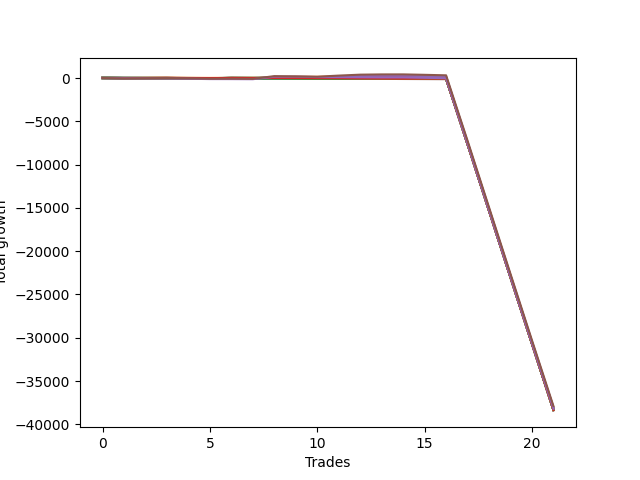

# Long Wallace Doodle 011 
- Symbol: NQ
- Date Range: 03/18/2022 - 06/17/2022
- Trading Period: 7:20-12:30
- Number of Trades: 21



| Name | Win Percent | Profit | Avg Profit / Trade |     | Name | Win Percent | Profit | Avg Profit / Trade |
| ---- | ----------- | ------ | ------------------ | --- | ---- | ----------- | ------ | ------------------ |
| Sorted By <br> Profit | | | | | Sorted By <br> Win Percentage ||||
| Seventy-Five | 42.86 | -18894000.00 | -899714.29 |     | One | 52.38 | -19053875.00 | -907327.38 |
| Five | 42.86 | -18941375.00 | -901970.24 |     | Zero | 47.62 | -19098125.00 | -909434.52 |
| Seventy-Four | 38.10 | -18952750.00 | -902511.90 |     | Seventy-Five | 42.86 | -18894000.00 | -899714.29 |
| Four | 42.86 | -19003750.00 | -904940.48 |     | Five | 42.86 | -18941375.00 | -901970.24 |
| Seven | 42.86 | -19032000.00 | -906285.71 |     | Four | 42.86 | -19003750.00 | -904940.48 |
| One | 52.38 | -19053875.00 | -907327.38 |     | Seven | 42.86 | -19032000.00 | -906285.71 |
| Two | 42.86 | -19073375.00 | -908255.95 |     | Two | 42.86 | -19073375.00 | -908255.95 |
| Three | 42.86 | -19083500.00 | -908738.10 |     | Three | 42.86 | -19083500.00 | -908738.10 |
| Zero | 47.62 | -19098125.00 | -909434.52 |     | Six | 42.86 | -19111625.00 | -910077.38 |
| Seventy-Three | 9.52 | -19102375.00 | -909636.90 |     | Seventy-Four | 38.10 | -18952750.00 | -902511.90 |
| Six | 42.86 | -19111625.00 | -910077.38 |     | Fifty-Six | 19.05 | -19140500.00 | -911452.38 |
| Forty | 14.29 | -19132500.00 | -911071.43 |     | Sixty-Four | 19.05 | -19151250.00 | -911964.29 |
| Fifty-Six | 19.05 | -19140500.00 | -911452.38 |     | Twenty-Three | 19.05 | -19154000.00 | -912095.24 |
| Twenty-Four | 4.76 | -19145000.00 | -911666.67 |     | Twenty-Two | 19.05 | -19154000.00 | -912095.24 |
| Sixty-Four | 19.05 | -19151250.00 | -911964.29 |     | Twenty-One | 19.05 | -19154000.00 | -912095.24 |
| Twenty-Three | 19.05 | -19154000.00 | -912095.24 |     | Twenty | 19.05 | -19154000.00 | -912095.24 |
| Twenty-Two | 19.05 | -19154000.00 | -912095.24 |     | Nineteen | 19.05 | -19154000.00 | -912095.24 |
| Twenty-One | 19.05 | -19154000.00 | -912095.24 |     | Eighteen | 19.05 | -19154000.00 | -912095.24 |
| Twenty | 19.05 | -19154000.00 | -912095.24 |     | Seventeen | 19.05 | -19154000.00 | -912095.24 |
| Nineteen | 19.05 | -19154000.00 | -912095.24 |     | Sixten | 19.05 | -19154000.00 | -912095.24 |
| Eighteen | 19.05 | -19154000.00 | -912095.24 |     | Seventy-One | 19.05 | -19160875.00 | -912422.62 |
| Seventeen | 19.05 | -19154000.00 | -912095.24 |     | Seventy | 19.05 | -19160875.00 | -912422.62 |
| Sixten | 19.05 | -19154000.00 | -912095.24 |     | Sixty-Nine | 19.05 | -19160875.00 | -912422.62 |
| Thirty-Nine | 9.52 | -19159000.00 | -912333.33 |     | Sixty-Eight | 19.05 | -19160875.00 | -912422.62 |
| Thirty-Eight | 9.52 | -19159000.00 | -912333.33 |     | Sixty-Seven | 19.05 | -19160875.00 | -912422.62 |
| Thirty-Seven | 9.52 | -19159000.00 | -912333.33 |     | Sixty-Six | 19.05 | -19160875.00 | -912422.62 |
| Thirty-Six | 9.52 | -19159000.00 | -912333.33 |     | Sixty-Five | 19.05 | -19160875.00 | -912422.62 |
| Thirty-Five | 9.52 | -19159000.00 | -912333.33 |     | Seventy-Two | 19.05 | -19169000.00 | -912809.52 |
| Thirty-Four | 9.52 | -19159000.00 | -912333.33 |     | Forty | 14.29 | -19132500.00 | -911071.43 |
| Thirty-Three | 9.52 | -19159000.00 | -912333.33 |     | Seventy-Three | 9.52 | -19102375.00 | -909636.90 |
| Thirty-Two | 9.52 | -19159000.00 | -912333.33 |     | Thirty-Nine | 9.52 | -19159000.00 | -912333.33 |
| Seventy-One | 19.05 | -19160875.00 | -912422.62 |     | Thirty-Eight | 9.52 | -19159000.00 | -912333.33 |
| Seventy | 19.05 | -19160875.00 | -912422.62 |     | Thirty-Seven | 9.52 | -19159000.00 | -912333.33 |
| Sixty-Nine | 19.05 | -19160875.00 | -912422.62 |     | Thirty-Six | 9.52 | -19159000.00 | -912333.33 |
| Sixty-Eight | 19.05 | -19160875.00 | -912422.62 |     | Thirty-Five | 9.52 | -19159000.00 | -912333.33 |
| Sixty-Seven | 19.05 | -19160875.00 | -912422.62 |     | Thirty-Four | 9.52 | -19159000.00 | -912333.33 |
| Sixty-Six | 19.05 | -19160875.00 | -912422.62 |     | Thirty-Three | 9.52 | -19159000.00 | -912333.33 |
| Sixty-Five | 19.05 | -19160875.00 | -912422.62 |     | Thirty-Two | 9.52 | -19159000.00 | -912333.33 |
| Fifty-Five | 9.52 | -19161125.00 | -912434.52 |     | Fifty-Five | 9.52 | -19161125.00 | -912434.52 |
| Fifty-Four | 9.52 | -19161125.00 | -912434.52 |     | Fifty-Four | 9.52 | -19161125.00 | -912434.52 |
| Fifty-Three | 9.52 | -19161125.00 | -912434.52 |     | Fifty-Three | 9.52 | -19161125.00 | -912434.52 |
| Fifty-Two | 9.52 | -19161125.00 | -912434.52 |     | Fifty-Two | 9.52 | -19161125.00 | -912434.52 |
| Fifty-One | 9.52 | -19161125.00 | -912434.52 |     | Fifty-One | 9.52 | -19161125.00 | -912434.52 |
| Fifty | 9.52 | -19161125.00 | -912434.52 |     | Fifty | 9.52 | -19161125.00 | -912434.52 |
| Forty-Nine | 9.52 | -19161125.00 | -912434.52 |     | Forty-Nine | 9.52 | -19161125.00 | -912434.52 |
| Forty-Eight | 9.52 | -19161125.00 | -912434.52 |     | Forty-Eight | 9.52 | -19161125.00 | -912434.52 |
| Fourteen | 4.76 | -19162125.00 | -912482.14 |     | Sixty-Two | 9.52 | -19176500.00 | -913166.67 |
| Thirty | 4.76 | -19165000.00 | -912619.05 |     | Twenty-Four | 4.76 | -19145000.00 | -911666.67 |
| Fifteen | 0.00 | -19168125.00 | -912767.86 |     | Fourteen | 4.76 | -19162125.00 | -912482.14 |
| Thirteen | 0.00 | -19168125.00 | -912767.86 |     | Thirty | 4.76 | -19165000.00 | -912619.05 |
| Twelve | 0.00 | -19168125.00 | -912767.86 |     | Sixty-One | 4.76 | -19171125.00 | -912910.71 |
| Eleven | 0.00 | -19168125.00 | -912767.86 |     | Sixty-Three | 4.76 | -19178750.00 | -913273.81 |
| Ten | 0.00 | -19168125.00 | -912767.86 |     | Sixty | 4.76 | -19182500.00 | -913452.38 |
| Nine | 0.00 | -19168125.00 | -912767.86 |     | Forty-Six | 4.76 | -19185750.00 | -913607.14 |
| Eight | 0.00 | -19168125.00 | -912767.86 |     | Fifty-Nine | 4.76 | -19193875.00 | -913994.05 |
| Seventy-Two | 19.05 | -19169000.00 | -912809.52 |     | Fifty-Eight | 4.76 | -19205875.00 | -914565.48 |
| Thirty-One | 0.00 | -19171000.00 | -912904.76 |     | Fifty-Seven | 4.76 | -19209500.00 | -914738.10 |
| Twenty-Nine | 0.00 | -19171000.00 | -912904.76 |     | Fifteen | 0.00 | -19168125.00 | -912767.86 |
| Twenty-Eight | 0.00 | -19171000.00 | -912904.76 |     | Thirteen | 0.00 | -19168125.00 | -912767.86 |
| twenty-Seven | 0.00 | -19171000.00 | -912904.76 |     | Twelve | 0.00 | -19168125.00 | -912767.86 |
| Twenty-Six | 0.00 | -19171000.00 | -912904.76 |     | Eleven | 0.00 | -19168125.00 | -912767.86 |
| Twenty-Five | 0.00 | -19171000.00 | -912904.76 |     | Ten | 0.00 | -19168125.00 | -912767.86 |
| Sixty-One | 4.76 | -19171125.00 | -912910.71 |     | Nine | 0.00 | -19168125.00 | -912767.86 |
| Sixty-Two | 9.52 | -19176500.00 | -913166.67 |     | Eight | 0.00 | -19168125.00 | -912767.86 |
| Sixty-Three | 4.76 | -19178750.00 | -913273.81 |     | Thirty-One | 0.00 | -19171000.00 | -912904.76 |
| Sixty | 4.76 | -19182500.00 | -913452.38 |     | Twenty-Nine | 0.00 | -19171000.00 | -912904.76 |
| Forty-Six | 4.76 | -19185750.00 | -913607.14 |     | Twenty-Eight | 0.00 | -19171000.00 | -912904.76 |
| Forty-Seven | 0.00 | -19191750.00 | -913892.86 |     | twenty-Seven | 0.00 | -19171000.00 | -912904.76 |
| Forty-Five | 0.00 | -19191750.00 | -913892.86 |     | Twenty-Six | 0.00 | -19171000.00 | -912904.76 |
| Forty-Four | 0.00 | -19191750.00 | -913892.86 |     | Twenty-Five | 0.00 | -19171000.00 | -912904.76 |
| Forty-Three | 0.00 | -19191750.00 | -913892.86 |     | Forty-Seven | 0.00 | -19191750.00 | -913892.86 |
| Forty-Two | 0.00 | -19191750.00 | -913892.86 |     | Forty-Five | 0.00 | -19191750.00 | -913892.86 |
| Forty-One | 0.00 | -19191750.00 | -913892.86 |     | Forty-Four | 0.00 | -19191750.00 | -913892.86 |
| Fifty-Nine | 4.76 | -19193875.00 | -913994.05 |     | Forty-Three | 0.00 | -19191750.00 | -913892.86 |
| Fifty-Eight | 4.76 | -19205875.00 | -914565.48 |     | Forty-Two | 0.00 | -19191750.00 | -913892.86 |
| Fifty-Seven | 4.76 | -19209500.00 | -914738.10 |     | Forty-One | 0.00 | -19191750.00 | -913892.86 |

## NO STOPLOSS

### Test Zero
* Sell when price hits the middle line of the 20p bollinger
* No Stoploss
* Results:
```
Total Trades: 21
Percent Up: 47.62
Percent Down: 52.38
Total Points Moved Up: -38196.25
Potential Profit: -19098125.00
Total Points Ups: 211.50 Count Ups: 10
Total Points Downs: -38407.75 Count Downs: 11
```

<details><summary>Trades</summary>

<code>In: 2022-03-30 08:02:00		Out: 2022-03-30 08:19:10		Total Position Time: 17:10		Total Move Up: -30.00		Total to Date: -30.00</code> <br />
<code>In: 2022-04-08 11:30:00		Out: 2022-04-08 11:39:40		Total Position Time: 09:40		Total Move Up: 7.75		Total to Date: -22.25</code> <br />
<code>In: 2022-04-08 11:30:00		Out: 2022-04-08 11:39:40		Total Position Time: 09:40		Total Move Up: 7.75		Total to Date: -14.50</code> <br />
<code>In: 2022-04-12 07:41:00		Out: 2022-04-12 07:59:30		Total Position Time: 18:30		Total Move Up: -17.25		Total to Date: -31.75</code> <br />
<code>In: 2022-04-12 07:42:00		Out: 2022-04-12 07:59:30		Total Position Time: 17:30		Total Move Up: -21.75		Total to Date: -53.50</code> <br />
<code>In: 2022-04-25 08:51:00		Out: 2022-04-25 08:56:05		Total Position Time: 05:05		Total Move Up: 24.25		Total to Date: -29.25</code> <br />
<code>In: 2022-04-27 12:00:00		Out: 2022-04-27 12:13:55		Total Position Time: 13:55		Total Move Up: 0.00		Total to Date: -29.25</code> <br />
<code>In: 2022-05-04 11:36:00		Out: 2022-05-04 11:36:40		Total Position Time: 00:40		Total Move Up: 27.75		Total to Date: -1.50</code> <br />
<code>In: 2022-05-06 11:09:00		Out: 2022-05-06 11:12:20		Total Position Time: 03:20		Total Move Up: 31.50		Total to Date: 30.00</code> <br />
<code>In: 2022-05-16 07:55:00		Out: 2022-05-16 08:09:35		Total Position Time: 14:35		Total Move Up: -17.75		Total to Date: 12.25</code> <br />
<code>In: 2022-05-17 11:24:00		Out: 2022-05-17 11:27:30		Total Position Time: 03:30		Total Move Up: 46.50		Total to Date: 58.75</code> <br />
<code>In: 2022-05-17 11:25:00		Out: 2022-05-17 11:27:30		Total Position Time: 02:30		Total Move Up: 33.50		Total to Date: 92.25</code> <br />
<code>In: 2022-05-25 09:29:00		Out: 2022-05-25 09:32:15		Total Position Time: 03:15		Total Move Up: 22.00		Total to Date: 114.25</code> <br />
<code>In: 2022-06-06 08:19:00		Out: 2022-06-06 08:30:10		Total Position Time: 11:10		Total Move Up: 10.50		Total to Date: 124.75</code> <br />
<code>In: 2022-06-08 09:29:00		Out: 2022-06-08 09:54:10		Total Position Time: 25:10		Total Move Up: -46.75		Total to Date: 78.00</code> <br />
<code>In: 2022-06-08 09:30:00		Out: 2022-06-08 09:54:10		Total Position Time: 24:10		Total Move Up: -55.25		Total to Date: 22.75</code> <br />
<code>In: 2022-06-14 11:52:00		Out: 2022-06-14 12:21:55		Total Position Time: 29:55		Total Move Up: -7573.00		Total to Date: -7550.25</code> <br />
<code>In: 2022-06-15 07:35:00		Out: 2022-06-15 08:04:55		Total Position Time: 29:55		Total Move Up: -7692.75		Total to Date: -15243.00</code> <br />
<code>In: 2022-06-15 10:01:00		Out: 2022-06-15 10:30:55		Total Position Time: 29:55		Total Move Up: -7691.50		Total to Date: -22934.50</code> <br />
<code>In: 2022-06-15 11:08:00		Out: 2022-06-15 11:37:55		Total Position Time: 29:55		Total Move Up: -7665.25		Total to Date: -30599.75</code> <br />
<code>In: 2022-06-15 11:34:00		Out: 2022-06-15 12:03:55		Total Position Time: 29:55		Total Move Up: -7596.50		Total to Date: -38196.25</code> <br />


</details>

### Test One
* Sell when the price hits the upper line of the 20p 1std bollinger
* No Stoploss
* Results:
```
Total Trades: 21
Percent Up: 52.38
Percent Down: 47.62
Total Points Moved Up: -38107.75
Potential Profit: -19053875.00
Total Points Ups: 234.00 Count Ups: 11
Total Points Downs: -38341.75 Count Downs: 10
```

<details><summary>Trades</summary>

<code>In: 2022-03-30 08:02:00		Out: 2022-03-30 08:23:45		Total Position Time: 21:45		Total Move Up: -25.50		Total to Date: -25.50</code> <br />
<code>In: 2022-04-08 11:30:00		Out: 2022-04-08 11:46:10		Total Position Time: 16:10		Total Move Up: 1.00		Total to Date: -24.50</code> <br />
<code>In: 2022-04-08 11:30:00		Out: 2022-04-08 11:46:10		Total Position Time: 16:10		Total Move Up: 1.00		Total to Date: -23.50</code> <br />
<code>In: 2022-04-12 07:41:00		Out: 2022-04-12 08:02:35		Total Position Time: 21:35		Total Move Up: 0.00		Total to Date: -23.50</code> <br />
<code>In: 2022-04-12 07:42:00		Out: 2022-04-12 08:02:35		Total Position Time: 20:35		Total Move Up: -4.50		Total to Date: -28.00</code> <br />
<code>In: 2022-04-25 08:51:00		Out: 2022-04-25 09:05:10		Total Position Time: 14:10		Total Move Up: 23.25		Total to Date: -4.75</code> <br />
<code>In: 2022-04-27 12:00:00		Out: 2022-04-27 12:15:20		Total Position Time: 15:20		Total Move Up: 6.50		Total to Date: 1.75</code> <br />
<code>In: 2022-05-04 11:36:00		Out: 2022-05-04 11:42:00		Total Position Time: 06:00		Total Move Up: 76.50		Total to Date: 78.25</code> <br />
<code>In: 2022-05-06 11:09:00		Out: 2022-05-06 11:24:20		Total Position Time: 15:20		Total Move Up: 31.50		Total to Date: 109.75</code> <br />
<code>In: 2022-05-16 07:55:00		Out: 2022-05-16 08:10:30		Total Position Time: 15:30		Total Move Up: -3.75		Total to Date: 106.00</code> <br />
<code>In: 2022-05-17 11:24:00		Out: 2022-05-17 11:39:45		Total Position Time: 15:45		Total Move Up: 44.25		Total to Date: 150.25</code> <br />
<code>In: 2022-05-17 11:25:00		Out: 2022-05-17 11:39:45		Total Position Time: 14:45		Total Move Up: 31.25		Total to Date: 181.50</code> <br />
<code>In: 2022-05-25 09:29:00		Out: 2022-05-25 09:45:20		Total Position Time: 16:20		Total Move Up: 12.00		Total to Date: 193.50</code> <br />
<code>In: 2022-06-06 08:19:00		Out: 2022-06-06 08:39:15		Total Position Time: 20:15		Total Move Up: 6.75		Total to Date: 200.25</code> <br />
<code>In: 2022-06-08 09:29:00		Out: 2022-06-08 09:57:05		Total Position Time: 28:05		Total Move Up: -40.25		Total to Date: 160.00</code> <br />
<code>In: 2022-06-08 09:30:00		Out: 2022-06-08 09:57:05		Total Position Time: 27:05		Total Move Up: -48.75		Total to Date: 111.25</code> <br />
<code>In: 2022-06-14 11:52:00		Out: 2022-06-14 12:21:55		Total Position Time: 29:55		Total Move Up: -7573.00		Total to Date: -7461.75</code> <br />
<code>In: 2022-06-15 07:35:00		Out: 2022-06-15 08:04:55		Total Position Time: 29:55		Total Move Up: -7692.75		Total to Date: -15154.50</code> <br />
<code>In: 2022-06-15 10:01:00		Out: 2022-06-15 10:30:55		Total Position Time: 29:55		Total Move Up: -7691.50		Total to Date: -22846.00</code> <br />
<code>In: 2022-06-15 11:08:00		Out: 2022-06-15 11:37:55		Total Position Time: 29:55		Total Move Up: -7665.25		Total to Date: -30511.25</code> <br />
<code>In: 2022-06-15 11:34:00		Out: 2022-06-15 12:03:55		Total Position Time: 29:55		Total Move Up: -7596.50		Total to Date: -38107.75</code> <br />


</details>

### Test Two
* Sell when the price hits the upper line of the 20p 2std bollinger
* No Stoploss
* Results:
```
Total Trades: 21
Percent Up: 42.86
Percent Down: 57.14
Total Points Moved Up: -38146.75
Potential Profit: -19073375.00
Total Points Ups: 332.25 Count Ups: 9
Total Points Downs: -38479.00 Count Downs: 12
```

<details><summary>Trades</summary>

<code>In: 2022-03-30 08:02:00		Out: 2022-03-30 08:31:55		Total Position Time: 29:55		Total Move Up: -42.25		Total to Date: -42.25</code> <br />
<code>In: 2022-04-08 11:30:00		Out: 2022-04-08 11:47:25		Total Position Time: 17:25		Total Move Up: 7.25		Total to Date: -35.00</code> <br />
<code>In: 2022-04-08 11:30:00		Out: 2022-04-08 11:47:25		Total Position Time: 17:25		Total Move Up: 7.25		Total to Date: -27.75</code> <br />
<code>In: 2022-04-12 07:41:00		Out: 2022-04-12 08:10:55		Total Position Time: 29:55		Total Move Up: -40.00		Total to Date: -67.75</code> <br />
<code>In: 2022-04-12 07:42:00		Out: 2022-04-12 08:11:55		Total Position Time: 29:55		Total Move Up: -44.50		Total to Date: -112.25</code> <br />
<code>In: 2022-04-25 08:51:00		Out: 2022-04-25 09:05:25		Total Position Time: 14:25		Total Move Up: 30.50		Total to Date: -81.75</code> <br />
<code>In: 2022-04-27 12:00:00		Out: 2022-04-27 12:29:55		Total Position Time: 29:55		Total Move Up: -20.75		Total to Date: -102.50</code> <br />
<code>In: 2022-05-04 11:36:00		Out: 2022-05-04 11:44:15		Total Position Time: 08:15		Total Move Up: 139.25		Total to Date: 36.75</code> <br />
<code>In: 2022-05-06 11:09:00		Out: 2022-05-06 11:38:55		Total Position Time: 29:55		Total Move Up: -27.00		Total to Date: 9.75</code> <br />
<code>In: 2022-05-16 07:55:00		Out: 2022-05-16 08:13:05		Total Position Time: 18:05		Total Move Up: 7.50		Total to Date: 17.25</code> <br />
<code>In: 2022-05-17 11:24:00		Out: 2022-05-17 11:40:00		Total Position Time: 16:00		Total Move Up: 53.75		Total to Date: 71.00</code> <br />
<code>In: 2022-05-17 11:25:00		Out: 2022-05-17 11:40:00		Total Position Time: 15:00		Total Move Up: 40.75		Total to Date: 111.75</code> <br />
<code>In: 2022-05-25 09:29:00		Out: 2022-05-25 09:49:10		Total Position Time: 20:10		Total Move Up: 26.75		Total to Date: 138.50</code> <br />
<code>In: 2022-06-06 08:19:00		Out: 2022-06-06 08:44:30		Total Position Time: 25:30		Total Move Up: 19.25		Total to Date: 157.75</code> <br />
<code>In: 2022-06-08 09:29:00		Out: 2022-06-08 09:58:55		Total Position Time: 29:55		Total Move Up: -42.75		Total to Date: 115.00</code> <br />
<code>In: 2022-06-08 09:30:00		Out: 2022-06-08 09:59:15		Total Position Time: 29:15		Total Move Up: -42.75		Total to Date: 72.25</code> <br />
<code>In: 2022-06-14 11:52:00		Out: 2022-06-14 12:21:55		Total Position Time: 29:55		Total Move Up: -7573.00		Total to Date: -7500.75</code> <br />
<code>In: 2022-06-15 07:35:00		Out: 2022-06-15 08:04:55		Total Position Time: 29:55		Total Move Up: -7692.75		Total to Date: -15193.50</code> <br />
<code>In: 2022-06-15 10:01:00		Out: 2022-06-15 10:30:55		Total Position Time: 29:55		Total Move Up: -7691.50		Total to Date: -22885.00</code> <br />
<code>In: 2022-06-15 11:08:00		Out: 2022-06-15 11:37:55		Total Position Time: 29:55		Total Move Up: -7665.25		Total to Date: -30550.25</code> <br />
<code>In: 2022-06-15 11:34:00		Out: 2022-06-15 12:03:55		Total Position Time: 29:55		Total Move Up: -7596.50		Total to Date: -38146.75</code> <br />


</details>

### Test Three
* Sell when price hits the middle line of the 50p bollinger
* No Stoploss
* Results:
```
Total Trades: 21
Percent Up: 42.86
Percent Down: 57.14
Total Points Moved Up: -38167.00
Potential Profit: -19083500.00
Total Points Ups: 313.75 Count Ups: 9
Total Points Downs: -38480.75 Count Downs: 12
```

<details><summary>Trades</summary>

<code>In: 2022-03-30 08:02:00		Out: 2022-03-30 08:31:55		Total Position Time: 29:55		Total Move Up: -42.25		Total to Date: -42.25</code> <br />
<code>In: 2022-04-08 11:30:00		Out: 2022-04-08 11:49:45		Total Position Time: 19:45		Total Move Up: 21.25		Total to Date: -21.00</code> <br />
<code>In: 2022-04-08 11:30:00		Out: 2022-04-08 11:49:45		Total Position Time: 19:45		Total Move Up: 21.25		Total to Date: 0.25</code> <br />
<code>In: 2022-04-12 07:41:00		Out: 2022-04-12 08:10:55		Total Position Time: 29:55		Total Move Up: -40.00		Total to Date: -39.75</code> <br />
<code>In: 2022-04-12 07:42:00		Out: 2022-04-12 08:11:55		Total Position Time: 29:55		Total Move Up: -44.50		Total to Date: -84.25</code> <br />
<code>In: 2022-04-25 08:51:00		Out: 2022-04-25 09:06:05		Total Position Time: 15:05		Total Move Up: 54.50		Total to Date: -29.75</code> <br />
<code>In: 2022-04-27 12:00:00		Out: 2022-04-27 12:29:55		Total Position Time: 29:55		Total Move Up: -20.75		Total to Date: -50.50</code> <br />
<code>In: 2022-05-04 11:36:00		Out: 2022-05-04 11:41:40		Total Position Time: 05:40		Total Move Up: 59.75		Total to Date: 9.25</code> <br />
<code>In: 2022-05-06 11:09:00		Out: 2022-05-06 11:38:55		Total Position Time: 29:55		Total Move Up: -27.00		Total to Date: -17.75</code> <br />
<code>In: 2022-05-16 07:55:00		Out: 2022-05-16 08:17:25		Total Position Time: 22:25		Total Move Up: 16.00		Total to Date: -1.75</code> <br />
<code>In: 2022-05-17 11:24:00		Out: 2022-05-17 11:40:05		Total Position Time: 16:05		Total Move Up: 58.00		Total to Date: 56.25</code> <br />
<code>In: 2022-05-17 11:25:00		Out: 2022-05-17 11:40:05		Total Position Time: 15:05		Total Move Up: 45.00		Total to Date: 101.25</code> <br />
<code>In: 2022-05-25 09:29:00		Out: 2022-05-25 09:49:10		Total Position Time: 20:10		Total Move Up: 26.75		Total to Date: 128.00</code> <br />
<code>In: 2022-06-06 08:19:00		Out: 2022-06-06 08:48:55		Total Position Time: 29:55		Total Move Up: 11.25		Total to Date: 139.25</code> <br />
<code>In: 2022-06-08 09:29:00		Out: 2022-06-08 09:58:55		Total Position Time: 29:55		Total Move Up: -42.75		Total to Date: 96.50</code> <br />
<code>In: 2022-06-08 09:30:00		Out: 2022-06-08 09:59:55		Total Position Time: 29:55		Total Move Up: -44.50		Total to Date: 52.00</code> <br />
<code>In: 2022-06-14 11:52:00		Out: 2022-06-14 12:21:55		Total Position Time: 29:55		Total Move Up: -7573.00		Total to Date: -7521.00</code> <br />
<code>In: 2022-06-15 07:35:00		Out: 2022-06-15 08:04:55		Total Position Time: 29:55		Total Move Up: -7692.75		Total to Date: -15213.75</code> <br />
<code>In: 2022-06-15 10:01:00		Out: 2022-06-15 10:30:55		Total Position Time: 29:55		Total Move Up: -7691.50		Total to Date: -22905.25</code> <br />
<code>In: 2022-06-15 11:08:00		Out: 2022-06-15 11:37:55		Total Position Time: 29:55		Total Move Up: -7665.25		Total to Date: -30570.50</code> <br />
<code>In: 2022-06-15 11:34:00		Out: 2022-06-15 12:03:55		Total Position Time: 29:55		Total Move Up: -7596.50		Total to Date: -38167.00</code> <br />


</details>

### Test Four
* Sell when the price hits the upper line of the 50p 1std bollinger
* No Stoploss
* Results:
```
Total Trades: 21
Percent Up: 42.86
Percent Down: 57.14
Total Points Moved Up: -38007.50
Potential Profit: -19003750.00
Total Points Ups: 473.25 Count Ups: 9
Total Points Downs: -38480.75 Count Downs: 12
```

<details><summary>Trades</summary>

<code>In: 2022-03-30 08:02:00		Out: 2022-03-30 08:31:55		Total Position Time: 29:55		Total Move Up: -42.25		Total to Date: -42.25</code> <br />
<code>In: 2022-04-08 11:30:00		Out: 2022-04-08 11:53:15		Total Position Time: 23:15		Total Move Up: 42.25		Total to Date: 0.00</code> <br />
<code>In: 2022-04-08 11:30:00		Out: 2022-04-08 11:53:15		Total Position Time: 23:15		Total Move Up: 42.25		Total to Date: 42.25</code> <br />
<code>In: 2022-04-12 07:41:00		Out: 2022-04-12 08:10:55		Total Position Time: 29:55		Total Move Up: -40.00		Total to Date: 2.25</code> <br />
<code>In: 2022-04-12 07:42:00		Out: 2022-04-12 08:11:55		Total Position Time: 29:55		Total Move Up: -44.50		Total to Date: -42.25</code> <br />
<code>In: 2022-04-25 08:51:00		Out: 2022-04-25 09:08:05		Total Position Time: 17:05		Total Move Up: 77.25		Total to Date: 35.00</code> <br />
<code>In: 2022-04-27 12:00:00		Out: 2022-04-27 12:29:55		Total Position Time: 29:55		Total Move Up: -20.75		Total to Date: 14.25</code> <br />
<code>In: 2022-05-04 11:36:00		Out: 2022-05-04 11:43:55		Total Position Time: 07:55		Total Move Up: 114.00		Total to Date: 128.25</code> <br />
<code>In: 2022-05-06 11:09:00		Out: 2022-05-06 11:38:55		Total Position Time: 29:55		Total Move Up: -27.00		Total to Date: 101.25</code> <br />
<code>In: 2022-05-16 07:55:00		Out: 2022-05-16 08:24:55		Total Position Time: 29:55		Total Move Up: 2.50		Total to Date: 103.75</code> <br />
<code>In: 2022-05-17 11:24:00		Out: 2022-05-17 11:45:45		Total Position Time: 21:45		Total Move Up: 89.00		Total to Date: 192.75</code> <br />
<code>In: 2022-05-17 11:25:00		Out: 2022-05-17 11:45:45		Total Position Time: 20:45		Total Move Up: 76.00		Total to Date: 268.75</code> <br />
<code>In: 2022-05-25 09:29:00		Out: 2022-05-25 09:58:55		Total Position Time: 29:55		Total Move Up: 18.75		Total to Date: 287.50</code> <br />
<code>In: 2022-06-06 08:19:00		Out: 2022-06-06 08:48:55		Total Position Time: 29:55		Total Move Up: 11.25		Total to Date: 298.75</code> <br />
<code>In: 2022-06-08 09:29:00		Out: 2022-06-08 09:58:55		Total Position Time: 29:55		Total Move Up: -42.75		Total to Date: 256.00</code> <br />
<code>In: 2022-06-08 09:30:00		Out: 2022-06-08 09:59:55		Total Position Time: 29:55		Total Move Up: -44.50		Total to Date: 211.50</code> <br />
<code>In: 2022-06-14 11:52:00		Out: 2022-06-14 12:21:55		Total Position Time: 29:55		Total Move Up: -7573.00		Total to Date: -7361.50</code> <br />
<code>In: 2022-06-15 07:35:00		Out: 2022-06-15 08:04:55		Total Position Time: 29:55		Total Move Up: -7692.75		Total to Date: -15054.25</code> <br />
<code>In: 2022-06-15 10:01:00		Out: 2022-06-15 10:30:55		Total Position Time: 29:55		Total Move Up: -7691.50		Total to Date: -22745.75</code> <br />
<code>In: 2022-06-15 11:08:00		Out: 2022-06-15 11:37:55		Total Position Time: 29:55		Total Move Up: -7665.25		Total to Date: -30411.00</code> <br />
<code>In: 2022-06-15 11:34:00		Out: 2022-06-15 12:03:55		Total Position Time: 29:55		Total Move Up: -7596.50		Total to Date: -38007.50</code> <br />


</details>

### Test Five
* Sell when the price hits the upper line of the 50p 2std bollinger
* No Stoploss
* Results:
```
Total Trades: 21
Percent Up: 42.86
Percent Down: 57.14
Total Points Moved Up: -37882.75
Potential Profit: -18941375.00
Total Points Ups: 598.00 Count Ups: 9
Total Points Downs: -38480.75 Count Downs: 12
```

<details><summary>Trades</summary>

<code>In: 2022-03-30 08:02:00		Out: 2022-03-30 08:31:55		Total Position Time: 29:55		Total Move Up: -42.25		Total to Date: -42.25</code> <br />
<code>In: 2022-04-08 11:30:00		Out: 2022-04-08 11:59:55		Total Position Time: 29:55		Total Move Up: 22.00		Total to Date: -20.25</code> <br />
<code>In: 2022-04-08 11:30:00		Out: 2022-04-08 11:59:55		Total Position Time: 29:55		Total Move Up: 22.00		Total to Date: 1.75</code> <br />
<code>In: 2022-04-12 07:41:00		Out: 2022-04-12 08:10:55		Total Position Time: 29:55		Total Move Up: -40.00		Total to Date: -38.25</code> <br />
<code>In: 2022-04-12 07:42:00		Out: 2022-04-12 08:11:55		Total Position Time: 29:55		Total Move Up: -44.50		Total to Date: -82.75</code> <br />
<code>In: 2022-04-25 08:51:00		Out: 2022-04-25 09:16:05		Total Position Time: 25:05		Total Move Up: 100.00		Total to Date: 17.25</code> <br />
<code>In: 2022-04-27 12:00:00		Out: 2022-04-27 12:29:55		Total Position Time: 29:55		Total Move Up: -20.75		Total to Date: -3.50</code> <br />
<code>In: 2022-05-04 11:36:00		Out: 2022-05-04 11:46:50		Total Position Time: 10:50		Total Move Up: 182.00		Total to Date: 178.50</code> <br />
<code>In: 2022-05-06 11:09:00		Out: 2022-05-06 11:38:55		Total Position Time: 29:55		Total Move Up: -27.00		Total to Date: 151.50</code> <br />
<code>In: 2022-05-16 07:55:00		Out: 2022-05-16 08:24:55		Total Position Time: 29:55		Total Move Up: 2.50		Total to Date: 154.00</code> <br />
<code>In: 2022-05-17 11:24:00		Out: 2022-05-17 11:48:45		Total Position Time: 24:45		Total Move Up: 126.25		Total to Date: 280.25</code> <br />
<code>In: 2022-05-17 11:25:00		Out: 2022-05-17 11:48:45		Total Position Time: 23:45		Total Move Up: 113.25		Total to Date: 393.50</code> <br />
<code>In: 2022-05-25 09:29:00		Out: 2022-05-25 09:58:55		Total Position Time: 29:55		Total Move Up: 18.75		Total to Date: 412.25</code> <br />
<code>In: 2022-06-06 08:19:00		Out: 2022-06-06 08:48:55		Total Position Time: 29:55		Total Move Up: 11.25		Total to Date: 423.50</code> <br />
<code>In: 2022-06-08 09:29:00		Out: 2022-06-08 09:58:55		Total Position Time: 29:55		Total Move Up: -42.75		Total to Date: 380.75</code> <br />
<code>In: 2022-06-08 09:30:00		Out: 2022-06-08 09:59:55		Total Position Time: 29:55		Total Move Up: -44.50		Total to Date: 336.25</code> <br />
<code>In: 2022-06-14 11:52:00		Out: 2022-06-14 12:21:55		Total Position Time: 29:55		Total Move Up: -7573.00		Total to Date: -7236.75</code> <br />
<code>In: 2022-06-15 07:35:00		Out: 2022-06-15 08:04:55		Total Position Time: 29:55		Total Move Up: -7692.75		Total to Date: -14929.50</code> <br />
<code>In: 2022-06-15 10:01:00		Out: 2022-06-15 10:30:55		Total Position Time: 29:55		Total Move Up: -7691.50		Total to Date: -22621.00</code> <br />
<code>In: 2022-06-15 11:08:00		Out: 2022-06-15 11:37:55		Total Position Time: 29:55		Total Move Up: -7665.25		Total to Date: -30286.25</code> <br />
<code>In: 2022-06-15 11:34:00		Out: 2022-06-15 12:03:55		Total Position Time: 29:55		Total Move Up: -7596.50		Total to Date: -37882.75</code> <br />


</details>

### Test Six
* Sell when the price hits the middle line of the 1std VWAP
* No Stoploss
* Results:
```
Total Trades: 21
Percent Up: 42.86
Percent Down: 57.14
Total Points Moved Up: -38223.25
Potential Profit: -19111625.00
Total Points Ups: 257.50 Count Ups: 9
Total Points Downs: -38480.75 Count Downs: 12
```

<details><summary>Trades</summary>

<code>In: 2022-03-30 08:02:00		Out: 2022-03-30 08:31:55		Total Position Time: 29:55		Total Move Up: -42.25		Total to Date: -42.25</code> <br />
<code>In: 2022-04-08 11:30:00		Out: 2022-04-08 11:59:55		Total Position Time: 29:55		Total Move Up: 22.00		Total to Date: -20.25</code> <br />
<code>In: 2022-04-08 11:30:00		Out: 2022-04-08 11:59:55		Total Position Time: 29:55		Total Move Up: 22.00		Total to Date: 1.75</code> <br />
<code>In: 2022-04-12 07:41:00		Out: 2022-04-12 08:10:55		Total Position Time: 29:55		Total Move Up: -40.00		Total to Date: -38.25</code> <br />
<code>In: 2022-04-12 07:42:00		Out: 2022-04-12 08:11:55		Total Position Time: 29:55		Total Move Up: -44.50		Total to Date: -82.75</code> <br />
<code>In: 2022-04-25 08:51:00		Out: 2022-04-25 09:08:05		Total Position Time: 17:05		Total Move Up: 77.25		Total to Date: -5.50</code> <br />
<code>In: 2022-04-27 12:00:00		Out: 2022-04-27 12:29:55		Total Position Time: 29:55		Total Move Up: -20.75		Total to Date: -26.25</code> <br />
<code>In: 2022-05-04 11:36:00		Out: 2022-05-04 11:36:10		Total Position Time: 00:10		Total Move Up: 0.00		Total to Date: -26.25</code> <br />
<code>In: 2022-05-06 11:09:00		Out: 2022-05-06 11:38:55		Total Position Time: 29:55		Total Move Up: -27.00		Total to Date: -53.25</code> <br />
<code>In: 2022-05-16 07:55:00		Out: 2022-05-16 08:24:55		Total Position Time: 29:55		Total Move Up: 2.50		Total to Date: -50.75</code> <br />
<code>In: 2022-05-17 11:24:00		Out: 2022-05-17 11:40:00		Total Position Time: 16:00		Total Move Up: 53.75		Total to Date: 3.00</code> <br />
<code>In: 2022-05-17 11:25:00		Out: 2022-05-17 11:40:00		Total Position Time: 15:00		Total Move Up: 40.75		Total to Date: 43.75</code> <br />
<code>In: 2022-05-25 09:29:00		Out: 2022-05-25 09:49:20		Total Position Time: 20:20		Total Move Up: 28.00		Total to Date: 71.75</code> <br />
<code>In: 2022-06-06 08:19:00		Out: 2022-06-06 08:48:55		Total Position Time: 29:55		Total Move Up: 11.25		Total to Date: 83.00</code> <br />
<code>In: 2022-06-08 09:29:00		Out: 2022-06-08 09:58:55		Total Position Time: 29:55		Total Move Up: -42.75		Total to Date: 40.25</code> <br />
<code>In: 2022-06-08 09:30:00		Out: 2022-06-08 09:59:55		Total Position Time: 29:55		Total Move Up: -44.50		Total to Date: -4.25</code> <br />
<code>In: 2022-06-14 11:52:00		Out: 2022-06-14 12:21:55		Total Position Time: 29:55		Total Move Up: -7573.00		Total to Date: -7577.25</code> <br />
<code>In: 2022-06-15 07:35:00		Out: 2022-06-15 08:04:55		Total Position Time: 29:55		Total Move Up: -7692.75		Total to Date: -15270.00</code> <br />
<code>In: 2022-06-15 10:01:00		Out: 2022-06-15 10:30:55		Total Position Time: 29:55		Total Move Up: -7691.50		Total to Date: -22961.50</code> <br />
<code>In: 2022-06-15 11:08:00		Out: 2022-06-15 11:37:55		Total Position Time: 29:55		Total Move Up: -7665.25		Total to Date: -30626.75</code> <br />
<code>In: 2022-06-15 11:34:00		Out: 2022-06-15 12:03:55		Total Position Time: 29:55		Total Move Up: -7596.50		Total to Date: -38223.25</code> <br />


</details>

### Test Seven
* Sell when the price hits the upper line of the 1std VWAP
* No Stoploss
* Results:
```
Total Trades: 21
Percent Up: 42.86
Percent Down: 57.14
Total Points Moved Up: -38064.00
Potential Profit: -19032000.00
Total Points Ups: 416.75 Count Ups: 9
Total Points Downs: -38480.75 Count Downs: 12
```

<details><summary>Trades</summary>

<code>In: 2022-03-30 08:02:00		Out: 2022-03-30 08:31:55		Total Position Time: 29:55		Total Move Up: -42.25		Total to Date: -42.25</code> <br />
<code>In: 2022-04-08 11:30:00		Out: 2022-04-08 11:59:55		Total Position Time: 29:55		Total Move Up: 22.00		Total to Date: -20.25</code> <br />
<code>In: 2022-04-08 11:30:00		Out: 2022-04-08 11:59:55		Total Position Time: 29:55		Total Move Up: 22.00		Total to Date: 1.75</code> <br />
<code>In: 2022-04-12 07:41:00		Out: 2022-04-12 08:10:55		Total Position Time: 29:55		Total Move Up: -40.00		Total to Date: -38.25</code> <br />
<code>In: 2022-04-12 07:42:00		Out: 2022-04-12 08:11:55		Total Position Time: 29:55		Total Move Up: -44.50		Total to Date: -82.75</code> <br />
<code>In: 2022-04-25 08:51:00		Out: 2022-04-25 09:20:55		Total Position Time: 29:55		Total Move Up: 84.75		Total to Date: 2.00</code> <br />
<code>In: 2022-04-27 12:00:00		Out: 2022-04-27 12:29:55		Total Position Time: 29:55		Total Move Up: -20.75		Total to Date: -18.75</code> <br />
<code>In: 2022-05-04 11:36:00		Out: 2022-05-04 11:42:00		Total Position Time: 06:00		Total Move Up: 76.50		Total to Date: 57.75</code> <br />
<code>In: 2022-05-06 11:09:00		Out: 2022-05-06 11:38:55		Total Position Time: 29:55		Total Move Up: -27.00		Total to Date: 30.75</code> <br />
<code>In: 2022-05-16 07:55:00		Out: 2022-05-16 08:24:55		Total Position Time: 29:55		Total Move Up: 2.50		Total to Date: 33.25</code> <br />
<code>In: 2022-05-17 11:24:00		Out: 2022-05-17 11:47:10		Total Position Time: 23:10		Total Move Up: 96.00		Total to Date: 129.25</code> <br />
<code>In: 2022-05-17 11:25:00		Out: 2022-05-17 11:47:10		Total Position Time: 22:10		Total Move Up: 83.00		Total to Date: 212.25</code> <br />
<code>In: 2022-05-25 09:29:00		Out: 2022-05-25 09:58:55		Total Position Time: 29:55		Total Move Up: 18.75		Total to Date: 231.00</code> <br />
<code>In: 2022-06-06 08:19:00		Out: 2022-06-06 08:48:55		Total Position Time: 29:55		Total Move Up: 11.25		Total to Date: 242.25</code> <br />
<code>In: 2022-06-08 09:29:00		Out: 2022-06-08 09:58:55		Total Position Time: 29:55		Total Move Up: -42.75		Total to Date: 199.50</code> <br />
<code>In: 2022-06-08 09:30:00		Out: 2022-06-08 09:59:55		Total Position Time: 29:55		Total Move Up: -44.50		Total to Date: 155.00</code> <br />
<code>In: 2022-06-14 11:52:00		Out: 2022-06-14 12:21:55		Total Position Time: 29:55		Total Move Up: -7573.00		Total to Date: -7418.00</code> <br />
<code>In: 2022-06-15 07:35:00		Out: 2022-06-15 08:04:55		Total Position Time: 29:55		Total Move Up: -7692.75		Total to Date: -15110.75</code> <br />
<code>In: 2022-06-15 10:01:00		Out: 2022-06-15 10:30:55		Total Position Time: 29:55		Total Move Up: -7691.50		Total to Date: -22802.25</code> <br />
<code>In: 2022-06-15 11:08:00		Out: 2022-06-15 11:37:55		Total Position Time: 29:55		Total Move Up: -7665.25		Total to Date: -30467.50</code> <br />
<code>In: 2022-06-15 11:34:00		Out: 2022-06-15 12:03:55		Total Position Time: 29:55		Total Move Up: -7596.50		Total to Date: -38064.00</code> <br />


</details>

## STOPLOSS OF 2

### Test Eight
* Sell when price hits the middle line of the 20p bollinger
* Stoploss is 2 points
* Results:
```
Total Trades: 21
Percent Up: 0.00
Percent Down: 100.00
Total Points Moved Up: -38336.25
Potential Profit: -19168125.00
Total Points Ups: 0.00 Count Ups: 0
Total Points Downs: -38336.25 Count Downs: 21
```

<details><summary>Trades</summary>

<code>In: 2022-03-30 08:02:00		Out: 2022-03-30 08:02:10		Total Position Time: 00:10		Total Move Up: -4.00		Total to Date: -4.00</code> <br />
<code>In: 2022-04-08 11:30:00		Out: 2022-04-08 11:30:35		Total Position Time: 00:35		Total Move Up: -3.50		Total to Date: -7.50</code> <br />
<code>In: 2022-04-08 11:30:00		Out: 2022-04-08 11:30:35		Total Position Time: 00:35		Total Move Up: -3.50		Total to Date: -11.00</code> <br />
<code>In: 2022-04-12 07:41:00		Out: 2022-04-12 07:41:10		Total Position Time: 00:10		Total Move Up: -4.00		Total to Date: -15.00</code> <br />
<code>In: 2022-04-12 07:42:00		Out: 2022-04-12 07:42:30		Total Position Time: 00:30		Total Move Up: -3.00		Total to Date: -18.00</code> <br />
<code>In: 2022-04-25 08:51:00		Out: 2022-04-25 08:53:35		Total Position Time: 02:35		Total Move Up: -2.50		Total to Date: -20.50</code> <br />
<code>In: 2022-04-27 12:00:00		Out: 2022-04-27 12:00:15		Total Position Time: 00:15		Total Move Up: -5.25		Total to Date: -25.75</code> <br />
<code>In: 2022-05-04 11:36:00		Out: 2022-05-04 11:36:15		Total Position Time: 00:15		Total Move Up: -12.00		Total to Date: -37.75</code> <br />
<code>In: 2022-05-06 11:09:00		Out: 2022-05-06 11:09:15		Total Position Time: 00:15		Total Move Up: -4.50		Total to Date: -42.25</code> <br />
<code>In: 2022-05-16 07:55:00		Out: 2022-05-16 07:55:10		Total Position Time: 00:10		Total Move Up: -11.25		Total to Date: -53.50</code> <br />
<code>In: 2022-05-17 11:24:00		Out: 2022-05-17 11:24:15		Total Position Time: 00:15		Total Move Up: -1.75		Total to Date: -55.25</code> <br />
<code>In: 2022-05-17 11:25:00		Out: 2022-05-17 11:25:30		Total Position Time: 00:30		Total Move Up: -4.75		Total to Date: -60.00</code> <br />
<code>In: 2022-05-25 09:29:00		Out: 2022-05-25 09:29:10		Total Position Time: 00:10		Total Move Up: -4.00		Total to Date: -64.00</code> <br />
<code>In: 2022-06-06 08:19:00		Out: 2022-06-06 08:19:30		Total Position Time: 00:30		Total Move Up: -4.50		Total to Date: -68.50</code> <br />
<code>In: 2022-06-08 09:29:00		Out: 2022-06-08 09:31:50		Total Position Time: 02:50		Total Move Up: -2.25		Total to Date: -70.75</code> <br />
<code>In: 2022-06-08 09:30:00		Out: 2022-06-08 09:30:10		Total Position Time: 00:10		Total Move Up: -3.00		Total to Date: -73.75</code> <br />
<code>In: 2022-06-14 11:52:00		Out: 2022-06-14 11:52:10		Total Position Time: 00:10		Total Move Up: -7560.50		Total to Date: -7634.25</code> <br />
<code>In: 2022-06-15 07:35:00		Out: 2022-06-15 07:35:10		Total Position Time: 00:10		Total Move Up: -7684.00		Total to Date: -15318.25</code> <br />
<code>In: 2022-06-15 10:01:00		Out: 2022-06-15 10:01:10		Total Position Time: 00:10		Total Move Up: -7704.25		Total to Date: -23022.50</code> <br />
<code>In: 2022-06-15 11:08:00		Out: 2022-06-15 11:08:10		Total Position Time: 00:10		Total Move Up: -7664.75		Total to Date: -30687.25</code> <br />
<code>In: 2022-06-15 11:34:00		Out: 2022-06-15 11:34:10		Total Position Time: 00:10		Total Move Up: -7649.00		Total to Date: -38336.25</code> <br />


</details>

### Test Nine
* Sell when the price hits the upper line of the 20p 1std bollinger
* Stoploss is 2 points
* Results:
```
Total Trades: 21
Percent Up: 0.00
Percent Down: 100.00
Total Points Moved Up: -38336.25
Potential Profit: -19168125.00
Total Points Ups: 0.00 Count Ups: 0
Total Points Downs: -38336.25 Count Downs: 21
```

<details><summary>Trades</summary>

<code>In: 2022-03-30 08:02:00		Out: 2022-03-30 08:02:10		Total Position Time: 00:10		Total Move Up: -4.00		Total to Date: -4.00</code> <br />
<code>In: 2022-04-08 11:30:00		Out: 2022-04-08 11:30:35		Total Position Time: 00:35		Total Move Up: -3.50		Total to Date: -7.50</code> <br />
<code>In: 2022-04-08 11:30:00		Out: 2022-04-08 11:30:35		Total Position Time: 00:35		Total Move Up: -3.50		Total to Date: -11.00</code> <br />
<code>In: 2022-04-12 07:41:00		Out: 2022-04-12 07:41:10		Total Position Time: 00:10		Total Move Up: -4.00		Total to Date: -15.00</code> <br />
<code>In: 2022-04-12 07:42:00		Out: 2022-04-12 07:42:30		Total Position Time: 00:30		Total Move Up: -3.00		Total to Date: -18.00</code> <br />
<code>In: 2022-04-25 08:51:00		Out: 2022-04-25 08:53:35		Total Position Time: 02:35		Total Move Up: -2.50		Total to Date: -20.50</code> <br />
<code>In: 2022-04-27 12:00:00		Out: 2022-04-27 12:00:15		Total Position Time: 00:15		Total Move Up: -5.25		Total to Date: -25.75</code> <br />
<code>In: 2022-05-04 11:36:00		Out: 2022-05-04 11:36:15		Total Position Time: 00:15		Total Move Up: -12.00		Total to Date: -37.75</code> <br />
<code>In: 2022-05-06 11:09:00		Out: 2022-05-06 11:09:15		Total Position Time: 00:15		Total Move Up: -4.50		Total to Date: -42.25</code> <br />
<code>In: 2022-05-16 07:55:00		Out: 2022-05-16 07:55:10		Total Position Time: 00:10		Total Move Up: -11.25		Total to Date: -53.50</code> <br />
<code>In: 2022-05-17 11:24:00		Out: 2022-05-17 11:24:15		Total Position Time: 00:15		Total Move Up: -1.75		Total to Date: -55.25</code> <br />
<code>In: 2022-05-17 11:25:00		Out: 2022-05-17 11:25:30		Total Position Time: 00:30		Total Move Up: -4.75		Total to Date: -60.00</code> <br />
<code>In: 2022-05-25 09:29:00		Out: 2022-05-25 09:29:10		Total Position Time: 00:10		Total Move Up: -4.00		Total to Date: -64.00</code> <br />
<code>In: 2022-06-06 08:19:00		Out: 2022-06-06 08:19:30		Total Position Time: 00:30		Total Move Up: -4.50		Total to Date: -68.50</code> <br />
<code>In: 2022-06-08 09:29:00		Out: 2022-06-08 09:31:50		Total Position Time: 02:50		Total Move Up: -2.25		Total to Date: -70.75</code> <br />
<code>In: 2022-06-08 09:30:00		Out: 2022-06-08 09:30:10		Total Position Time: 00:10		Total Move Up: -3.00		Total to Date: -73.75</code> <br />
<code>In: 2022-06-14 11:52:00		Out: 2022-06-14 11:52:10		Total Position Time: 00:10		Total Move Up: -7560.50		Total to Date: -7634.25</code> <br />
<code>In: 2022-06-15 07:35:00		Out: 2022-06-15 07:35:10		Total Position Time: 00:10		Total Move Up: -7684.00		Total to Date: -15318.25</code> <br />
<code>In: 2022-06-15 10:01:00		Out: 2022-06-15 10:01:10		Total Position Time: 00:10		Total Move Up: -7704.25		Total to Date: -23022.50</code> <br />
<code>In: 2022-06-15 11:08:00		Out: 2022-06-15 11:08:10		Total Position Time: 00:10		Total Move Up: -7664.75		Total to Date: -30687.25</code> <br />
<code>In: 2022-06-15 11:34:00		Out: 2022-06-15 11:34:10		Total Position Time: 00:10		Total Move Up: -7649.00		Total to Date: -38336.25</code> <br />


</details>

### Test Ten
* Sell when the price hits the upper line of the 20p 2std bollinger
* Stoploss is 2 points
* Results:
```
Total Trades: 21
Percent Up: 0.00
Percent Down: 100.00
Total Points Moved Up: -38336.25
Potential Profit: -19168125.00
Total Points Ups: 0.00 Count Ups: 0
Total Points Downs: -38336.25 Count Downs: 21
```

<details><summary>Trades</summary>

<code>In: 2022-03-30 08:02:00		Out: 2022-03-30 08:02:10		Total Position Time: 00:10		Total Move Up: -4.00		Total to Date: -4.00</code> <br />
<code>In: 2022-04-08 11:30:00		Out: 2022-04-08 11:30:35		Total Position Time: 00:35		Total Move Up: -3.50		Total to Date: -7.50</code> <br />
<code>In: 2022-04-08 11:30:00		Out: 2022-04-08 11:30:35		Total Position Time: 00:35		Total Move Up: -3.50		Total to Date: -11.00</code> <br />
<code>In: 2022-04-12 07:41:00		Out: 2022-04-12 07:41:10		Total Position Time: 00:10		Total Move Up: -4.00		Total to Date: -15.00</code> <br />
<code>In: 2022-04-12 07:42:00		Out: 2022-04-12 07:42:30		Total Position Time: 00:30		Total Move Up: -3.00		Total to Date: -18.00</code> <br />
<code>In: 2022-04-25 08:51:00		Out: 2022-04-25 08:53:35		Total Position Time: 02:35		Total Move Up: -2.50		Total to Date: -20.50</code> <br />
<code>In: 2022-04-27 12:00:00		Out: 2022-04-27 12:00:15		Total Position Time: 00:15		Total Move Up: -5.25		Total to Date: -25.75</code> <br />
<code>In: 2022-05-04 11:36:00		Out: 2022-05-04 11:36:15		Total Position Time: 00:15		Total Move Up: -12.00		Total to Date: -37.75</code> <br />
<code>In: 2022-05-06 11:09:00		Out: 2022-05-06 11:09:15		Total Position Time: 00:15		Total Move Up: -4.50		Total to Date: -42.25</code> <br />
<code>In: 2022-05-16 07:55:00		Out: 2022-05-16 07:55:10		Total Position Time: 00:10		Total Move Up: -11.25		Total to Date: -53.50</code> <br />
<code>In: 2022-05-17 11:24:00		Out: 2022-05-17 11:24:15		Total Position Time: 00:15		Total Move Up: -1.75		Total to Date: -55.25</code> <br />
<code>In: 2022-05-17 11:25:00		Out: 2022-05-17 11:25:30		Total Position Time: 00:30		Total Move Up: -4.75		Total to Date: -60.00</code> <br />
<code>In: 2022-05-25 09:29:00		Out: 2022-05-25 09:29:10		Total Position Time: 00:10		Total Move Up: -4.00		Total to Date: -64.00</code> <br />
<code>In: 2022-06-06 08:19:00		Out: 2022-06-06 08:19:30		Total Position Time: 00:30		Total Move Up: -4.50		Total to Date: -68.50</code> <br />
<code>In: 2022-06-08 09:29:00		Out: 2022-06-08 09:31:50		Total Position Time: 02:50		Total Move Up: -2.25		Total to Date: -70.75</code> <br />
<code>In: 2022-06-08 09:30:00		Out: 2022-06-08 09:30:10		Total Position Time: 00:10		Total Move Up: -3.00		Total to Date: -73.75</code> <br />
<code>In: 2022-06-14 11:52:00		Out: 2022-06-14 11:52:10		Total Position Time: 00:10		Total Move Up: -7560.50		Total to Date: -7634.25</code> <br />
<code>In: 2022-06-15 07:35:00		Out: 2022-06-15 07:35:10		Total Position Time: 00:10		Total Move Up: -7684.00		Total to Date: -15318.25</code> <br />
<code>In: 2022-06-15 10:01:00		Out: 2022-06-15 10:01:10		Total Position Time: 00:10		Total Move Up: -7704.25		Total to Date: -23022.50</code> <br />
<code>In: 2022-06-15 11:08:00		Out: 2022-06-15 11:08:10		Total Position Time: 00:10		Total Move Up: -7664.75		Total to Date: -30687.25</code> <br />
<code>In: 2022-06-15 11:34:00		Out: 2022-06-15 11:34:10		Total Position Time: 00:10		Total Move Up: -7649.00		Total to Date: -38336.25</code> <br />


</details>

### Test Eleven
* Sell when price hits the middle line of the 50p bollinger
* Stoploss is 2 points
* Results:
```
Total Trades: 21
Percent Up: 0.00
Percent Down: 100.00
Total Points Moved Up: -38336.25
Potential Profit: -19168125.00
Total Points Ups: 0.00 Count Ups: 0
Total Points Downs: -38336.25 Count Downs: 21
```

<details><summary>Trades</summary>

<code>In: 2022-03-30 08:02:00		Out: 2022-03-30 08:02:10		Total Position Time: 00:10		Total Move Up: -4.00		Total to Date: -4.00</code> <br />
<code>In: 2022-04-08 11:30:00		Out: 2022-04-08 11:30:35		Total Position Time: 00:35		Total Move Up: -3.50		Total to Date: -7.50</code> <br />
<code>In: 2022-04-08 11:30:00		Out: 2022-04-08 11:30:35		Total Position Time: 00:35		Total Move Up: -3.50		Total to Date: -11.00</code> <br />
<code>In: 2022-04-12 07:41:00		Out: 2022-04-12 07:41:10		Total Position Time: 00:10		Total Move Up: -4.00		Total to Date: -15.00</code> <br />
<code>In: 2022-04-12 07:42:00		Out: 2022-04-12 07:42:30		Total Position Time: 00:30		Total Move Up: -3.00		Total to Date: -18.00</code> <br />
<code>In: 2022-04-25 08:51:00		Out: 2022-04-25 08:53:35		Total Position Time: 02:35		Total Move Up: -2.50		Total to Date: -20.50</code> <br />
<code>In: 2022-04-27 12:00:00		Out: 2022-04-27 12:00:15		Total Position Time: 00:15		Total Move Up: -5.25		Total to Date: -25.75</code> <br />
<code>In: 2022-05-04 11:36:00		Out: 2022-05-04 11:36:15		Total Position Time: 00:15		Total Move Up: -12.00		Total to Date: -37.75</code> <br />
<code>In: 2022-05-06 11:09:00		Out: 2022-05-06 11:09:15		Total Position Time: 00:15		Total Move Up: -4.50		Total to Date: -42.25</code> <br />
<code>In: 2022-05-16 07:55:00		Out: 2022-05-16 07:55:10		Total Position Time: 00:10		Total Move Up: -11.25		Total to Date: -53.50</code> <br />
<code>In: 2022-05-17 11:24:00		Out: 2022-05-17 11:24:15		Total Position Time: 00:15		Total Move Up: -1.75		Total to Date: -55.25</code> <br />
<code>In: 2022-05-17 11:25:00		Out: 2022-05-17 11:25:30		Total Position Time: 00:30		Total Move Up: -4.75		Total to Date: -60.00</code> <br />
<code>In: 2022-05-25 09:29:00		Out: 2022-05-25 09:29:10		Total Position Time: 00:10		Total Move Up: -4.00		Total to Date: -64.00</code> <br />
<code>In: 2022-06-06 08:19:00		Out: 2022-06-06 08:19:30		Total Position Time: 00:30		Total Move Up: -4.50		Total to Date: -68.50</code> <br />
<code>In: 2022-06-08 09:29:00		Out: 2022-06-08 09:31:50		Total Position Time: 02:50		Total Move Up: -2.25		Total to Date: -70.75</code> <br />
<code>In: 2022-06-08 09:30:00		Out: 2022-06-08 09:30:10		Total Position Time: 00:10		Total Move Up: -3.00		Total to Date: -73.75</code> <br />
<code>In: 2022-06-14 11:52:00		Out: 2022-06-14 11:52:10		Total Position Time: 00:10		Total Move Up: -7560.50		Total to Date: -7634.25</code> <br />
<code>In: 2022-06-15 07:35:00		Out: 2022-06-15 07:35:10		Total Position Time: 00:10		Total Move Up: -7684.00		Total to Date: -15318.25</code> <br />
<code>In: 2022-06-15 10:01:00		Out: 2022-06-15 10:01:10		Total Position Time: 00:10		Total Move Up: -7704.25		Total to Date: -23022.50</code> <br />
<code>In: 2022-06-15 11:08:00		Out: 2022-06-15 11:08:10		Total Position Time: 00:10		Total Move Up: -7664.75		Total to Date: -30687.25</code> <br />
<code>In: 2022-06-15 11:34:00		Out: 2022-06-15 11:34:10		Total Position Time: 00:10		Total Move Up: -7649.00		Total to Date: -38336.25</code> <br />


</details>

### Test Twelve
* Sell when the price hits the upper line of the 50p 1std bollinger
* Stoploss is 2 points
* Results:
```
Total Trades: 21
Percent Up: 0.00
Percent Down: 100.00
Total Points Moved Up: -38336.25
Potential Profit: -19168125.00
Total Points Ups: 0.00 Count Ups: 0
Total Points Downs: -38336.25 Count Downs: 21
```

<details><summary>Trades</summary>

<code>In: 2022-03-30 08:02:00		Out: 2022-03-30 08:02:10		Total Position Time: 00:10		Total Move Up: -4.00		Total to Date: -4.00</code> <br />
<code>In: 2022-04-08 11:30:00		Out: 2022-04-08 11:30:35		Total Position Time: 00:35		Total Move Up: -3.50		Total to Date: -7.50</code> <br />
<code>In: 2022-04-08 11:30:00		Out: 2022-04-08 11:30:35		Total Position Time: 00:35		Total Move Up: -3.50		Total to Date: -11.00</code> <br />
<code>In: 2022-04-12 07:41:00		Out: 2022-04-12 07:41:10		Total Position Time: 00:10		Total Move Up: -4.00		Total to Date: -15.00</code> <br />
<code>In: 2022-04-12 07:42:00		Out: 2022-04-12 07:42:30		Total Position Time: 00:30		Total Move Up: -3.00		Total to Date: -18.00</code> <br />
<code>In: 2022-04-25 08:51:00		Out: 2022-04-25 08:53:35		Total Position Time: 02:35		Total Move Up: -2.50		Total to Date: -20.50</code> <br />
<code>In: 2022-04-27 12:00:00		Out: 2022-04-27 12:00:15		Total Position Time: 00:15		Total Move Up: -5.25		Total to Date: -25.75</code> <br />
<code>In: 2022-05-04 11:36:00		Out: 2022-05-04 11:36:15		Total Position Time: 00:15		Total Move Up: -12.00		Total to Date: -37.75</code> <br />
<code>In: 2022-05-06 11:09:00		Out: 2022-05-06 11:09:15		Total Position Time: 00:15		Total Move Up: -4.50		Total to Date: -42.25</code> <br />
<code>In: 2022-05-16 07:55:00		Out: 2022-05-16 07:55:10		Total Position Time: 00:10		Total Move Up: -11.25		Total to Date: -53.50</code> <br />
<code>In: 2022-05-17 11:24:00		Out: 2022-05-17 11:24:15		Total Position Time: 00:15		Total Move Up: -1.75		Total to Date: -55.25</code> <br />
<code>In: 2022-05-17 11:25:00		Out: 2022-05-17 11:25:30		Total Position Time: 00:30		Total Move Up: -4.75		Total to Date: -60.00</code> <br />
<code>In: 2022-05-25 09:29:00		Out: 2022-05-25 09:29:10		Total Position Time: 00:10		Total Move Up: -4.00		Total to Date: -64.00</code> <br />
<code>In: 2022-06-06 08:19:00		Out: 2022-06-06 08:19:30		Total Position Time: 00:30		Total Move Up: -4.50		Total to Date: -68.50</code> <br />
<code>In: 2022-06-08 09:29:00		Out: 2022-06-08 09:31:50		Total Position Time: 02:50		Total Move Up: -2.25		Total to Date: -70.75</code> <br />
<code>In: 2022-06-08 09:30:00		Out: 2022-06-08 09:30:10		Total Position Time: 00:10		Total Move Up: -3.00		Total to Date: -73.75</code> <br />
<code>In: 2022-06-14 11:52:00		Out: 2022-06-14 11:52:10		Total Position Time: 00:10		Total Move Up: -7560.50		Total to Date: -7634.25</code> <br />
<code>In: 2022-06-15 07:35:00		Out: 2022-06-15 07:35:10		Total Position Time: 00:10		Total Move Up: -7684.00		Total to Date: -15318.25</code> <br />
<code>In: 2022-06-15 10:01:00		Out: 2022-06-15 10:01:10		Total Position Time: 00:10		Total Move Up: -7704.25		Total to Date: -23022.50</code> <br />
<code>In: 2022-06-15 11:08:00		Out: 2022-06-15 11:08:10		Total Position Time: 00:10		Total Move Up: -7664.75		Total to Date: -30687.25</code> <br />
<code>In: 2022-06-15 11:34:00		Out: 2022-06-15 11:34:10		Total Position Time: 00:10		Total Move Up: -7649.00		Total to Date: -38336.25</code> <br />


</details>

### Test Thirteen
* Sell when the price hits the upper line of the 50p 2std bollinger
* Stoploss is 2 points
* Results:
```
Total Trades: 21
Percent Up: 0.00
Percent Down: 100.00
Total Points Moved Up: -38336.25
Potential Profit: -19168125.00
Total Points Ups: 0.00 Count Ups: 0
Total Points Downs: -38336.25 Count Downs: 21
```

<details><summary>Trades</summary>

<code>In: 2022-03-30 08:02:00		Out: 2022-03-30 08:02:10		Total Position Time: 00:10		Total Move Up: -4.00		Total to Date: -4.00</code> <br />
<code>In: 2022-04-08 11:30:00		Out: 2022-04-08 11:30:35		Total Position Time: 00:35		Total Move Up: -3.50		Total to Date: -7.50</code> <br />
<code>In: 2022-04-08 11:30:00		Out: 2022-04-08 11:30:35		Total Position Time: 00:35		Total Move Up: -3.50		Total to Date: -11.00</code> <br />
<code>In: 2022-04-12 07:41:00		Out: 2022-04-12 07:41:10		Total Position Time: 00:10		Total Move Up: -4.00		Total to Date: -15.00</code> <br />
<code>In: 2022-04-12 07:42:00		Out: 2022-04-12 07:42:30		Total Position Time: 00:30		Total Move Up: -3.00		Total to Date: -18.00</code> <br />
<code>In: 2022-04-25 08:51:00		Out: 2022-04-25 08:53:35		Total Position Time: 02:35		Total Move Up: -2.50		Total to Date: -20.50</code> <br />
<code>In: 2022-04-27 12:00:00		Out: 2022-04-27 12:00:15		Total Position Time: 00:15		Total Move Up: -5.25		Total to Date: -25.75</code> <br />
<code>In: 2022-05-04 11:36:00		Out: 2022-05-04 11:36:15		Total Position Time: 00:15		Total Move Up: -12.00		Total to Date: -37.75</code> <br />
<code>In: 2022-05-06 11:09:00		Out: 2022-05-06 11:09:15		Total Position Time: 00:15		Total Move Up: -4.50		Total to Date: -42.25</code> <br />
<code>In: 2022-05-16 07:55:00		Out: 2022-05-16 07:55:10		Total Position Time: 00:10		Total Move Up: -11.25		Total to Date: -53.50</code> <br />
<code>In: 2022-05-17 11:24:00		Out: 2022-05-17 11:24:15		Total Position Time: 00:15		Total Move Up: -1.75		Total to Date: -55.25</code> <br />
<code>In: 2022-05-17 11:25:00		Out: 2022-05-17 11:25:30		Total Position Time: 00:30		Total Move Up: -4.75		Total to Date: -60.00</code> <br />
<code>In: 2022-05-25 09:29:00		Out: 2022-05-25 09:29:10		Total Position Time: 00:10		Total Move Up: -4.00		Total to Date: -64.00</code> <br />
<code>In: 2022-06-06 08:19:00		Out: 2022-06-06 08:19:30		Total Position Time: 00:30		Total Move Up: -4.50		Total to Date: -68.50</code> <br />
<code>In: 2022-06-08 09:29:00		Out: 2022-06-08 09:31:50		Total Position Time: 02:50		Total Move Up: -2.25		Total to Date: -70.75</code> <br />
<code>In: 2022-06-08 09:30:00		Out: 2022-06-08 09:30:10		Total Position Time: 00:10		Total Move Up: -3.00		Total to Date: -73.75</code> <br />
<code>In: 2022-06-14 11:52:00		Out: 2022-06-14 11:52:10		Total Position Time: 00:10		Total Move Up: -7560.50		Total to Date: -7634.25</code> <br />
<code>In: 2022-06-15 07:35:00		Out: 2022-06-15 07:35:10		Total Position Time: 00:10		Total Move Up: -7684.00		Total to Date: -15318.25</code> <br />
<code>In: 2022-06-15 10:01:00		Out: 2022-06-15 10:01:10		Total Position Time: 00:10		Total Move Up: -7704.25		Total to Date: -23022.50</code> <br />
<code>In: 2022-06-15 11:08:00		Out: 2022-06-15 11:08:10		Total Position Time: 00:10		Total Move Up: -7664.75		Total to Date: -30687.25</code> <br />
<code>In: 2022-06-15 11:34:00		Out: 2022-06-15 11:34:10		Total Position Time: 00:10		Total Move Up: -7649.00		Total to Date: -38336.25</code> <br />


</details>

### Test Fourteen
* Sell when the price hits the middle line of the 1std VWAP
* Stoploss is 2 points
* Results:
```
Total Trades: 21
Percent Up: 4.76
Percent Down: 95.24
Total Points Moved Up: -38324.25
Potential Profit: -19162125.00
Total Points Ups: 0.00 Count Ups: 1
Total Points Downs: -38324.25 Count Downs: 20
```

<details><summary>Trades</summary>

<code>In: 2022-03-30 08:02:00		Out: 2022-03-30 08:02:10		Total Position Time: 00:10		Total Move Up: -4.00		Total to Date: -4.00</code> <br />
<code>In: 2022-04-08 11:30:00		Out: 2022-04-08 11:30:35		Total Position Time: 00:35		Total Move Up: -3.50		Total to Date: -7.50</code> <br />
<code>In: 2022-04-08 11:30:00		Out: 2022-04-08 11:30:35		Total Position Time: 00:35		Total Move Up: -3.50		Total to Date: -11.00</code> <br />
<code>In: 2022-04-12 07:41:00		Out: 2022-04-12 07:41:10		Total Position Time: 00:10		Total Move Up: -4.00		Total to Date: -15.00</code> <br />
<code>In: 2022-04-12 07:42:00		Out: 2022-04-12 07:42:30		Total Position Time: 00:30		Total Move Up: -3.00		Total to Date: -18.00</code> <br />
<code>In: 2022-04-25 08:51:00		Out: 2022-04-25 08:53:35		Total Position Time: 02:35		Total Move Up: -2.50		Total to Date: -20.50</code> <br />
<code>In: 2022-04-27 12:00:00		Out: 2022-04-27 12:00:15		Total Position Time: 00:15		Total Move Up: -5.25		Total to Date: -25.75</code> <br />
<code>In: 2022-05-04 11:36:00		Out: 2022-05-04 11:36:10		Total Position Time: 00:10		Total Move Up: 0.00		Total to Date: -25.75</code> <br />
<code>In: 2022-05-06 11:09:00		Out: 2022-05-06 11:09:15		Total Position Time: 00:15		Total Move Up: -4.50		Total to Date: -30.25</code> <br />
<code>In: 2022-05-16 07:55:00		Out: 2022-05-16 07:55:10		Total Position Time: 00:10		Total Move Up: -11.25		Total to Date: -41.50</code> <br />
<code>In: 2022-05-17 11:24:00		Out: 2022-05-17 11:24:15		Total Position Time: 00:15		Total Move Up: -1.75		Total to Date: -43.25</code> <br />
<code>In: 2022-05-17 11:25:00		Out: 2022-05-17 11:25:30		Total Position Time: 00:30		Total Move Up: -4.75		Total to Date: -48.00</code> <br />
<code>In: 2022-05-25 09:29:00		Out: 2022-05-25 09:29:10		Total Position Time: 00:10		Total Move Up: -4.00		Total to Date: -52.00</code> <br />
<code>In: 2022-06-06 08:19:00		Out: 2022-06-06 08:19:30		Total Position Time: 00:30		Total Move Up: -4.50		Total to Date: -56.50</code> <br />
<code>In: 2022-06-08 09:29:00		Out: 2022-06-08 09:31:50		Total Position Time: 02:50		Total Move Up: -2.25		Total to Date: -58.75</code> <br />
<code>In: 2022-06-08 09:30:00		Out: 2022-06-08 09:30:10		Total Position Time: 00:10		Total Move Up: -3.00		Total to Date: -61.75</code> <br />
<code>In: 2022-06-14 11:52:00		Out: 2022-06-14 11:52:10		Total Position Time: 00:10		Total Move Up: -7560.50		Total to Date: -7622.25</code> <br />
<code>In: 2022-06-15 07:35:00		Out: 2022-06-15 07:35:10		Total Position Time: 00:10		Total Move Up: -7684.00		Total to Date: -15306.25</code> <br />
<code>In: 2022-06-15 10:01:00		Out: 2022-06-15 10:01:10		Total Position Time: 00:10		Total Move Up: -7704.25		Total to Date: -23010.50</code> <br />
<code>In: 2022-06-15 11:08:00		Out: 2022-06-15 11:08:10		Total Position Time: 00:10		Total Move Up: -7664.75		Total to Date: -30675.25</code> <br />
<code>In: 2022-06-15 11:34:00		Out: 2022-06-15 11:34:10		Total Position Time: 00:10		Total Move Up: -7649.00		Total to Date: -38324.25</code> <br />


</details>

### Test Fifteen
* Sell when the price hits the upper line of the 1std VWAP
* Stoploss is 2 points
* Results:
```
Total Trades: 21
Percent Up: 0.00
Percent Down: 100.00
Total Points Moved Up: -38336.25
Potential Profit: -19168125.00
Total Points Ups: 0.00 Count Ups: 0
Total Points Downs: -38336.25 Count Downs: 21
```

<details><summary>Trades</summary>

<code>In: 2022-03-30 08:02:00		Out: 2022-03-30 08:02:10		Total Position Time: 00:10		Total Move Up: -4.00		Total to Date: -4.00</code> <br />
<code>In: 2022-04-08 11:30:00		Out: 2022-04-08 11:30:35		Total Position Time: 00:35		Total Move Up: -3.50		Total to Date: -7.50</code> <br />
<code>In: 2022-04-08 11:30:00		Out: 2022-04-08 11:30:35		Total Position Time: 00:35		Total Move Up: -3.50		Total to Date: -11.00</code> <br />
<code>In: 2022-04-12 07:41:00		Out: 2022-04-12 07:41:10		Total Position Time: 00:10		Total Move Up: -4.00		Total to Date: -15.00</code> <br />
<code>In: 2022-04-12 07:42:00		Out: 2022-04-12 07:42:30		Total Position Time: 00:30		Total Move Up: -3.00		Total to Date: -18.00</code> <br />
<code>In: 2022-04-25 08:51:00		Out: 2022-04-25 08:53:35		Total Position Time: 02:35		Total Move Up: -2.50		Total to Date: -20.50</code> <br />
<code>In: 2022-04-27 12:00:00		Out: 2022-04-27 12:00:15		Total Position Time: 00:15		Total Move Up: -5.25		Total to Date: -25.75</code> <br />
<code>In: 2022-05-04 11:36:00		Out: 2022-05-04 11:36:15		Total Position Time: 00:15		Total Move Up: -12.00		Total to Date: -37.75</code> <br />
<code>In: 2022-05-06 11:09:00		Out: 2022-05-06 11:09:15		Total Position Time: 00:15		Total Move Up: -4.50		Total to Date: -42.25</code> <br />
<code>In: 2022-05-16 07:55:00		Out: 2022-05-16 07:55:10		Total Position Time: 00:10		Total Move Up: -11.25		Total to Date: -53.50</code> <br />
<code>In: 2022-05-17 11:24:00		Out: 2022-05-17 11:24:15		Total Position Time: 00:15		Total Move Up: -1.75		Total to Date: -55.25</code> <br />
<code>In: 2022-05-17 11:25:00		Out: 2022-05-17 11:25:30		Total Position Time: 00:30		Total Move Up: -4.75		Total to Date: -60.00</code> <br />
<code>In: 2022-05-25 09:29:00		Out: 2022-05-25 09:29:10		Total Position Time: 00:10		Total Move Up: -4.00		Total to Date: -64.00</code> <br />
<code>In: 2022-06-06 08:19:00		Out: 2022-06-06 08:19:30		Total Position Time: 00:30		Total Move Up: -4.50		Total to Date: -68.50</code> <br />
<code>In: 2022-06-08 09:29:00		Out: 2022-06-08 09:31:50		Total Position Time: 02:50		Total Move Up: -2.25		Total to Date: -70.75</code> <br />
<code>In: 2022-06-08 09:30:00		Out: 2022-06-08 09:30:10		Total Position Time: 00:10		Total Move Up: -3.00		Total to Date: -73.75</code> <br />
<code>In: 2022-06-14 11:52:00		Out: 2022-06-14 11:52:10		Total Position Time: 00:10		Total Move Up: -7560.50		Total to Date: -7634.25</code> <br />
<code>In: 2022-06-15 07:35:00		Out: 2022-06-15 07:35:10		Total Position Time: 00:10		Total Move Up: -7684.00		Total to Date: -15318.25</code> <br />
<code>In: 2022-06-15 10:01:00		Out: 2022-06-15 10:01:10		Total Position Time: 00:10		Total Move Up: -7704.25		Total to Date: -23022.50</code> <br />
<code>In: 2022-06-15 11:08:00		Out: 2022-06-15 11:08:10		Total Position Time: 00:10		Total Move Up: -7664.75		Total to Date: -30687.25</code> <br />
<code>In: 2022-06-15 11:34:00		Out: 2022-06-15 11:34:10		Total Position Time: 00:10		Total Move Up: -7649.00		Total to Date: -38336.25</code> <br />


</details>

## TRAIL STOP OF 2

### Test Sixten
* Sell when price hits the middle line of the 20p bollinger
* Trailing Stop is 2 points
* Results:
```
Total Trades: 21
Percent Up: 19.05
Percent Down: 80.95
Total Points Moved Up: -38308.00
Potential Profit: -19154000.00
Total Points Ups: 4.00 Count Ups: 4
Total Points Downs: -38312.00 Count Downs: 17
```

<details><summary>Trades</summary>

<code>In: 2022-03-30 08:02:00		Out: 2022-03-30 08:02:10		Total Position Time: 00:10		Total Move Up: -4.00		Total to Date: -4.00</code> <br />
<code>In: 2022-04-08 11:30:00		Out: 2022-04-08 11:30:25		Total Position Time: 00:25		Total Move Up: 0.25		Total to Date: -3.75</code> <br />
<code>In: 2022-04-08 11:30:00		Out: 2022-04-08 11:30:25		Total Position Time: 00:25		Total Move Up: 0.25		Total to Date: -3.50</code> <br />
<code>In: 2022-04-12 07:41:00		Out: 2022-04-12 07:41:10		Total Position Time: 00:10		Total Move Up: -4.00		Total to Date: -7.50</code> <br />
<code>In: 2022-04-12 07:42:00		Out: 2022-04-12 07:42:30		Total Position Time: 00:30		Total Move Up: -3.00		Total to Date: -10.50</code> <br />
<code>In: 2022-04-25 08:51:00		Out: 2022-04-25 08:51:10		Total Position Time: 00:10		Total Move Up: -1.50		Total to Date: -12.00</code> <br />
<code>In: 2022-04-27 12:00:00		Out: 2022-04-27 12:00:15		Total Position Time: 00:15		Total Move Up: -5.25		Total to Date: -17.25</code> <br />
<code>In: 2022-05-04 11:36:00		Out: 2022-05-04 11:36:10		Total Position Time: 00:10		Total Move Up: 0.00		Total to Date: -17.25</code> <br />
<code>In: 2022-05-06 11:09:00		Out: 2022-05-06 11:09:15		Total Position Time: 00:15		Total Move Up: -4.50		Total to Date: -21.75</code> <br />
<code>In: 2022-05-16 07:55:00		Out: 2022-05-16 07:55:20		Total Position Time: 00:20		Total Move Up: -12.75		Total to Date: -34.50</code> <br />
<code>In: 2022-05-17 11:24:00		Out: 2022-05-17 11:24:10		Total Position Time: 00:10		Total Move Up: -2.75		Total to Date: -37.25</code> <br />
<code>In: 2022-05-17 11:25:00		Out: 2022-05-17 11:25:25		Total Position Time: 00:25		Total Move Up: -2.25		Total to Date: -39.50</code> <br />
<code>In: 2022-05-25 09:29:00		Out: 2022-05-25 09:29:10		Total Position Time: 00:10		Total Move Up: -4.00		Total to Date: -43.50</code> <br />
<code>In: 2022-06-06 08:19:00		Out: 2022-06-06 08:19:25		Total Position Time: 00:25		Total Move Up: -1.50		Total to Date: -45.00</code> <br />
<code>In: 2022-06-08 09:29:00		Out: 2022-06-08 09:29:10		Total Position Time: 00:10		Total Move Up: 3.50		Total to Date: -41.50</code> <br />
<code>In: 2022-06-08 09:30:00		Out: 2022-06-08 09:30:25		Total Position Time: 00:25		Total Move Up: -4.00		Total to Date: -45.50</code> <br />
<code>In: 2022-06-14 11:52:00		Out: 2022-06-14 11:52:10		Total Position Time: 00:10		Total Move Up: -7560.50		Total to Date: -7606.00</code> <br />
<code>In: 2022-06-15 07:35:00		Out: 2022-06-15 07:35:10		Total Position Time: 00:10		Total Move Up: -7684.00		Total to Date: -15290.00</code> <br />
<code>In: 2022-06-15 10:01:00		Out: 2022-06-15 10:01:10		Total Position Time: 00:10		Total Move Up: -7704.25		Total to Date: -22994.25</code> <br />
<code>In: 2022-06-15 11:08:00		Out: 2022-06-15 11:08:10		Total Position Time: 00:10		Total Move Up: -7664.75		Total to Date: -30659.00</code> <br />
<code>In: 2022-06-15 11:34:00		Out: 2022-06-15 11:34:10		Total Position Time: 00:10		Total Move Up: -7649.00		Total to Date: -38308.00</code> <br />


</details>

### Test Seventeen
* Sell when the price hits the upper line of the 20p 1std bollinger
* Trailing Stop is 2 points
* Results:
```
Total Trades: 21
Percent Up: 19.05
Percent Down: 80.95
Total Points Moved Up: -38308.00
Potential Profit: -19154000.00
Total Points Ups: 4.00 Count Ups: 4
Total Points Downs: -38312.00 Count Downs: 17
```

<details><summary>Trades</summary>

<code>In: 2022-03-30 08:02:00		Out: 2022-03-30 08:02:10		Total Position Time: 00:10		Total Move Up: -4.00		Total to Date: -4.00</code> <br />
<code>In: 2022-04-08 11:30:00		Out: 2022-04-08 11:30:25		Total Position Time: 00:25		Total Move Up: 0.25		Total to Date: -3.75</code> <br />
<code>In: 2022-04-08 11:30:00		Out: 2022-04-08 11:30:25		Total Position Time: 00:25		Total Move Up: 0.25		Total to Date: -3.50</code> <br />
<code>In: 2022-04-12 07:41:00		Out: 2022-04-12 07:41:10		Total Position Time: 00:10		Total Move Up: -4.00		Total to Date: -7.50</code> <br />
<code>In: 2022-04-12 07:42:00		Out: 2022-04-12 07:42:30		Total Position Time: 00:30		Total Move Up: -3.00		Total to Date: -10.50</code> <br />
<code>In: 2022-04-25 08:51:00		Out: 2022-04-25 08:51:10		Total Position Time: 00:10		Total Move Up: -1.50		Total to Date: -12.00</code> <br />
<code>In: 2022-04-27 12:00:00		Out: 2022-04-27 12:00:15		Total Position Time: 00:15		Total Move Up: -5.25		Total to Date: -17.25</code> <br />
<code>In: 2022-05-04 11:36:00		Out: 2022-05-04 11:36:10		Total Position Time: 00:10		Total Move Up: 0.00		Total to Date: -17.25</code> <br />
<code>In: 2022-05-06 11:09:00		Out: 2022-05-06 11:09:15		Total Position Time: 00:15		Total Move Up: -4.50		Total to Date: -21.75</code> <br />
<code>In: 2022-05-16 07:55:00		Out: 2022-05-16 07:55:20		Total Position Time: 00:20		Total Move Up: -12.75		Total to Date: -34.50</code> <br />
<code>In: 2022-05-17 11:24:00		Out: 2022-05-17 11:24:10		Total Position Time: 00:10		Total Move Up: -2.75		Total to Date: -37.25</code> <br />
<code>In: 2022-05-17 11:25:00		Out: 2022-05-17 11:25:25		Total Position Time: 00:25		Total Move Up: -2.25		Total to Date: -39.50</code> <br />
<code>In: 2022-05-25 09:29:00		Out: 2022-05-25 09:29:10		Total Position Time: 00:10		Total Move Up: -4.00		Total to Date: -43.50</code> <br />
<code>In: 2022-06-06 08:19:00		Out: 2022-06-06 08:19:25		Total Position Time: 00:25		Total Move Up: -1.50		Total to Date: -45.00</code> <br />
<code>In: 2022-06-08 09:29:00		Out: 2022-06-08 09:29:10		Total Position Time: 00:10		Total Move Up: 3.50		Total to Date: -41.50</code> <br />
<code>In: 2022-06-08 09:30:00		Out: 2022-06-08 09:30:25		Total Position Time: 00:25		Total Move Up: -4.00		Total to Date: -45.50</code> <br />
<code>In: 2022-06-14 11:52:00		Out: 2022-06-14 11:52:10		Total Position Time: 00:10		Total Move Up: -7560.50		Total to Date: -7606.00</code> <br />
<code>In: 2022-06-15 07:35:00		Out: 2022-06-15 07:35:10		Total Position Time: 00:10		Total Move Up: -7684.00		Total to Date: -15290.00</code> <br />
<code>In: 2022-06-15 10:01:00		Out: 2022-06-15 10:01:10		Total Position Time: 00:10		Total Move Up: -7704.25		Total to Date: -22994.25</code> <br />
<code>In: 2022-06-15 11:08:00		Out: 2022-06-15 11:08:10		Total Position Time: 00:10		Total Move Up: -7664.75		Total to Date: -30659.00</code> <br />
<code>In: 2022-06-15 11:34:00		Out: 2022-06-15 11:34:10		Total Position Time: 00:10		Total Move Up: -7649.00		Total to Date: -38308.00</code> <br />


</details>

### Test Eighteen
* Sell when the price hits the upper line of the 20p 2std bollinger
* Trailing Stop is 2 points
* Results:
```
Total Trades: 21
Percent Up: 19.05
Percent Down: 80.95
Total Points Moved Up: -38308.00
Potential Profit: -19154000.00
Total Points Ups: 4.00 Count Ups: 4
Total Points Downs: -38312.00 Count Downs: 17
```

<details><summary>Trades</summary>

<code>In: 2022-03-30 08:02:00		Out: 2022-03-30 08:02:10		Total Position Time: 00:10		Total Move Up: -4.00		Total to Date: -4.00</code> <br />
<code>In: 2022-04-08 11:30:00		Out: 2022-04-08 11:30:25		Total Position Time: 00:25		Total Move Up: 0.25		Total to Date: -3.75</code> <br />
<code>In: 2022-04-08 11:30:00		Out: 2022-04-08 11:30:25		Total Position Time: 00:25		Total Move Up: 0.25		Total to Date: -3.50</code> <br />
<code>In: 2022-04-12 07:41:00		Out: 2022-04-12 07:41:10		Total Position Time: 00:10		Total Move Up: -4.00		Total to Date: -7.50</code> <br />
<code>In: 2022-04-12 07:42:00		Out: 2022-04-12 07:42:30		Total Position Time: 00:30		Total Move Up: -3.00		Total to Date: -10.50</code> <br />
<code>In: 2022-04-25 08:51:00		Out: 2022-04-25 08:51:10		Total Position Time: 00:10		Total Move Up: -1.50		Total to Date: -12.00</code> <br />
<code>In: 2022-04-27 12:00:00		Out: 2022-04-27 12:00:15		Total Position Time: 00:15		Total Move Up: -5.25		Total to Date: -17.25</code> <br />
<code>In: 2022-05-04 11:36:00		Out: 2022-05-04 11:36:10		Total Position Time: 00:10		Total Move Up: 0.00		Total to Date: -17.25</code> <br />
<code>In: 2022-05-06 11:09:00		Out: 2022-05-06 11:09:15		Total Position Time: 00:15		Total Move Up: -4.50		Total to Date: -21.75</code> <br />
<code>In: 2022-05-16 07:55:00		Out: 2022-05-16 07:55:20		Total Position Time: 00:20		Total Move Up: -12.75		Total to Date: -34.50</code> <br />
<code>In: 2022-05-17 11:24:00		Out: 2022-05-17 11:24:10		Total Position Time: 00:10		Total Move Up: -2.75		Total to Date: -37.25</code> <br />
<code>In: 2022-05-17 11:25:00		Out: 2022-05-17 11:25:25		Total Position Time: 00:25		Total Move Up: -2.25		Total to Date: -39.50</code> <br />
<code>In: 2022-05-25 09:29:00		Out: 2022-05-25 09:29:10		Total Position Time: 00:10		Total Move Up: -4.00		Total to Date: -43.50</code> <br />
<code>In: 2022-06-06 08:19:00		Out: 2022-06-06 08:19:25		Total Position Time: 00:25		Total Move Up: -1.50		Total to Date: -45.00</code> <br />
<code>In: 2022-06-08 09:29:00		Out: 2022-06-08 09:29:10		Total Position Time: 00:10		Total Move Up: 3.50		Total to Date: -41.50</code> <br />
<code>In: 2022-06-08 09:30:00		Out: 2022-06-08 09:30:25		Total Position Time: 00:25		Total Move Up: -4.00		Total to Date: -45.50</code> <br />
<code>In: 2022-06-14 11:52:00		Out: 2022-06-14 11:52:10		Total Position Time: 00:10		Total Move Up: -7560.50		Total to Date: -7606.00</code> <br />
<code>In: 2022-06-15 07:35:00		Out: 2022-06-15 07:35:10		Total Position Time: 00:10		Total Move Up: -7684.00		Total to Date: -15290.00</code> <br />
<code>In: 2022-06-15 10:01:00		Out: 2022-06-15 10:01:10		Total Position Time: 00:10		Total Move Up: -7704.25		Total to Date: -22994.25</code> <br />
<code>In: 2022-06-15 11:08:00		Out: 2022-06-15 11:08:10		Total Position Time: 00:10		Total Move Up: -7664.75		Total to Date: -30659.00</code> <br />
<code>In: 2022-06-15 11:34:00		Out: 2022-06-15 11:34:10		Total Position Time: 00:10		Total Move Up: -7649.00		Total to Date: -38308.00</code> <br />


</details>

### Test Nineteen
* Sell when price hits the middle line of the 50p bollinger
* Trailing Stop is 2 points
* Results:
```
Total Trades: 21
Percent Up: 19.05
Percent Down: 80.95
Total Points Moved Up: -38308.00
Potential Profit: -19154000.00
Total Points Ups: 4.00 Count Ups: 4
Total Points Downs: -38312.00 Count Downs: 17
```

<details><summary>Trades</summary>

<code>In: 2022-03-30 08:02:00		Out: 2022-03-30 08:02:10		Total Position Time: 00:10		Total Move Up: -4.00		Total to Date: -4.00</code> <br />
<code>In: 2022-04-08 11:30:00		Out: 2022-04-08 11:30:25		Total Position Time: 00:25		Total Move Up: 0.25		Total to Date: -3.75</code> <br />
<code>In: 2022-04-08 11:30:00		Out: 2022-04-08 11:30:25		Total Position Time: 00:25		Total Move Up: 0.25		Total to Date: -3.50</code> <br />
<code>In: 2022-04-12 07:41:00		Out: 2022-04-12 07:41:10		Total Position Time: 00:10		Total Move Up: -4.00		Total to Date: -7.50</code> <br />
<code>In: 2022-04-12 07:42:00		Out: 2022-04-12 07:42:30		Total Position Time: 00:30		Total Move Up: -3.00		Total to Date: -10.50</code> <br />
<code>In: 2022-04-25 08:51:00		Out: 2022-04-25 08:51:10		Total Position Time: 00:10		Total Move Up: -1.50		Total to Date: -12.00</code> <br />
<code>In: 2022-04-27 12:00:00		Out: 2022-04-27 12:00:15		Total Position Time: 00:15		Total Move Up: -5.25		Total to Date: -17.25</code> <br />
<code>In: 2022-05-04 11:36:00		Out: 2022-05-04 11:36:10		Total Position Time: 00:10		Total Move Up: 0.00		Total to Date: -17.25</code> <br />
<code>In: 2022-05-06 11:09:00		Out: 2022-05-06 11:09:15		Total Position Time: 00:15		Total Move Up: -4.50		Total to Date: -21.75</code> <br />
<code>In: 2022-05-16 07:55:00		Out: 2022-05-16 07:55:20		Total Position Time: 00:20		Total Move Up: -12.75		Total to Date: -34.50</code> <br />
<code>In: 2022-05-17 11:24:00		Out: 2022-05-17 11:24:10		Total Position Time: 00:10		Total Move Up: -2.75		Total to Date: -37.25</code> <br />
<code>In: 2022-05-17 11:25:00		Out: 2022-05-17 11:25:25		Total Position Time: 00:25		Total Move Up: -2.25		Total to Date: -39.50</code> <br />
<code>In: 2022-05-25 09:29:00		Out: 2022-05-25 09:29:10		Total Position Time: 00:10		Total Move Up: -4.00		Total to Date: -43.50</code> <br />
<code>In: 2022-06-06 08:19:00		Out: 2022-06-06 08:19:25		Total Position Time: 00:25		Total Move Up: -1.50		Total to Date: -45.00</code> <br />
<code>In: 2022-06-08 09:29:00		Out: 2022-06-08 09:29:10		Total Position Time: 00:10		Total Move Up: 3.50		Total to Date: -41.50</code> <br />
<code>In: 2022-06-08 09:30:00		Out: 2022-06-08 09:30:25		Total Position Time: 00:25		Total Move Up: -4.00		Total to Date: -45.50</code> <br />
<code>In: 2022-06-14 11:52:00		Out: 2022-06-14 11:52:10		Total Position Time: 00:10		Total Move Up: -7560.50		Total to Date: -7606.00</code> <br />
<code>In: 2022-06-15 07:35:00		Out: 2022-06-15 07:35:10		Total Position Time: 00:10		Total Move Up: -7684.00		Total to Date: -15290.00</code> <br />
<code>In: 2022-06-15 10:01:00		Out: 2022-06-15 10:01:10		Total Position Time: 00:10		Total Move Up: -7704.25		Total to Date: -22994.25</code> <br />
<code>In: 2022-06-15 11:08:00		Out: 2022-06-15 11:08:10		Total Position Time: 00:10		Total Move Up: -7664.75		Total to Date: -30659.00</code> <br />
<code>In: 2022-06-15 11:34:00		Out: 2022-06-15 11:34:10		Total Position Time: 00:10		Total Move Up: -7649.00		Total to Date: -38308.00</code> <br />


</details>

### Test Twenty
* Sell when the price hits the upper line of the 50p 1std bollinger
* Trailing Stop is 2 points
* Results:
```
Total Trades: 21
Percent Up: 19.05
Percent Down: 80.95
Total Points Moved Up: -38308.00
Potential Profit: -19154000.00
Total Points Ups: 4.00 Count Ups: 4
Total Points Downs: -38312.00 Count Downs: 17
```

<details><summary>Trades</summary>

<code>In: 2022-03-30 08:02:00		Out: 2022-03-30 08:02:10		Total Position Time: 00:10		Total Move Up: -4.00		Total to Date: -4.00</code> <br />
<code>In: 2022-04-08 11:30:00		Out: 2022-04-08 11:30:25		Total Position Time: 00:25		Total Move Up: 0.25		Total to Date: -3.75</code> <br />
<code>In: 2022-04-08 11:30:00		Out: 2022-04-08 11:30:25		Total Position Time: 00:25		Total Move Up: 0.25		Total to Date: -3.50</code> <br />
<code>In: 2022-04-12 07:41:00		Out: 2022-04-12 07:41:10		Total Position Time: 00:10		Total Move Up: -4.00		Total to Date: -7.50</code> <br />
<code>In: 2022-04-12 07:42:00		Out: 2022-04-12 07:42:30		Total Position Time: 00:30		Total Move Up: -3.00		Total to Date: -10.50</code> <br />
<code>In: 2022-04-25 08:51:00		Out: 2022-04-25 08:51:10		Total Position Time: 00:10		Total Move Up: -1.50		Total to Date: -12.00</code> <br />
<code>In: 2022-04-27 12:00:00		Out: 2022-04-27 12:00:15		Total Position Time: 00:15		Total Move Up: -5.25		Total to Date: -17.25</code> <br />
<code>In: 2022-05-04 11:36:00		Out: 2022-05-04 11:36:10		Total Position Time: 00:10		Total Move Up: 0.00		Total to Date: -17.25</code> <br />
<code>In: 2022-05-06 11:09:00		Out: 2022-05-06 11:09:15		Total Position Time: 00:15		Total Move Up: -4.50		Total to Date: -21.75</code> <br />
<code>In: 2022-05-16 07:55:00		Out: 2022-05-16 07:55:20		Total Position Time: 00:20		Total Move Up: -12.75		Total to Date: -34.50</code> <br />
<code>In: 2022-05-17 11:24:00		Out: 2022-05-17 11:24:10		Total Position Time: 00:10		Total Move Up: -2.75		Total to Date: -37.25</code> <br />
<code>In: 2022-05-17 11:25:00		Out: 2022-05-17 11:25:25		Total Position Time: 00:25		Total Move Up: -2.25		Total to Date: -39.50</code> <br />
<code>In: 2022-05-25 09:29:00		Out: 2022-05-25 09:29:10		Total Position Time: 00:10		Total Move Up: -4.00		Total to Date: -43.50</code> <br />
<code>In: 2022-06-06 08:19:00		Out: 2022-06-06 08:19:25		Total Position Time: 00:25		Total Move Up: -1.50		Total to Date: -45.00</code> <br />
<code>In: 2022-06-08 09:29:00		Out: 2022-06-08 09:29:10		Total Position Time: 00:10		Total Move Up: 3.50		Total to Date: -41.50</code> <br />
<code>In: 2022-06-08 09:30:00		Out: 2022-06-08 09:30:25		Total Position Time: 00:25		Total Move Up: -4.00		Total to Date: -45.50</code> <br />
<code>In: 2022-06-14 11:52:00		Out: 2022-06-14 11:52:10		Total Position Time: 00:10		Total Move Up: -7560.50		Total to Date: -7606.00</code> <br />
<code>In: 2022-06-15 07:35:00		Out: 2022-06-15 07:35:10		Total Position Time: 00:10		Total Move Up: -7684.00		Total to Date: -15290.00</code> <br />
<code>In: 2022-06-15 10:01:00		Out: 2022-06-15 10:01:10		Total Position Time: 00:10		Total Move Up: -7704.25		Total to Date: -22994.25</code> <br />
<code>In: 2022-06-15 11:08:00		Out: 2022-06-15 11:08:10		Total Position Time: 00:10		Total Move Up: -7664.75		Total to Date: -30659.00</code> <br />
<code>In: 2022-06-15 11:34:00		Out: 2022-06-15 11:34:10		Total Position Time: 00:10		Total Move Up: -7649.00		Total to Date: -38308.00</code> <br />


</details>

### Test Twenty-One
* Sell when the price hits the upper line of the 50p 2std bollinger
* Trailing Stop is 2 points
* Results:
```
Total Trades: 21
Percent Up: 19.05
Percent Down: 80.95
Total Points Moved Up: -38308.00
Potential Profit: -19154000.00
Total Points Ups: 4.00 Count Ups: 4
Total Points Downs: -38312.00 Count Downs: 17
```

<details><summary>Trades</summary>

<code>In: 2022-03-30 08:02:00		Out: 2022-03-30 08:02:10		Total Position Time: 00:10		Total Move Up: -4.00		Total to Date: -4.00</code> <br />
<code>In: 2022-04-08 11:30:00		Out: 2022-04-08 11:30:25		Total Position Time: 00:25		Total Move Up: 0.25		Total to Date: -3.75</code> <br />
<code>In: 2022-04-08 11:30:00		Out: 2022-04-08 11:30:25		Total Position Time: 00:25		Total Move Up: 0.25		Total to Date: -3.50</code> <br />
<code>In: 2022-04-12 07:41:00		Out: 2022-04-12 07:41:10		Total Position Time: 00:10		Total Move Up: -4.00		Total to Date: -7.50</code> <br />
<code>In: 2022-04-12 07:42:00		Out: 2022-04-12 07:42:30		Total Position Time: 00:30		Total Move Up: -3.00		Total to Date: -10.50</code> <br />
<code>In: 2022-04-25 08:51:00		Out: 2022-04-25 08:51:10		Total Position Time: 00:10		Total Move Up: -1.50		Total to Date: -12.00</code> <br />
<code>In: 2022-04-27 12:00:00		Out: 2022-04-27 12:00:15		Total Position Time: 00:15		Total Move Up: -5.25		Total to Date: -17.25</code> <br />
<code>In: 2022-05-04 11:36:00		Out: 2022-05-04 11:36:10		Total Position Time: 00:10		Total Move Up: 0.00		Total to Date: -17.25</code> <br />
<code>In: 2022-05-06 11:09:00		Out: 2022-05-06 11:09:15		Total Position Time: 00:15		Total Move Up: -4.50		Total to Date: -21.75</code> <br />
<code>In: 2022-05-16 07:55:00		Out: 2022-05-16 07:55:20		Total Position Time: 00:20		Total Move Up: -12.75		Total to Date: -34.50</code> <br />
<code>In: 2022-05-17 11:24:00		Out: 2022-05-17 11:24:10		Total Position Time: 00:10		Total Move Up: -2.75		Total to Date: -37.25</code> <br />
<code>In: 2022-05-17 11:25:00		Out: 2022-05-17 11:25:25		Total Position Time: 00:25		Total Move Up: -2.25		Total to Date: -39.50</code> <br />
<code>In: 2022-05-25 09:29:00		Out: 2022-05-25 09:29:10		Total Position Time: 00:10		Total Move Up: -4.00		Total to Date: -43.50</code> <br />
<code>In: 2022-06-06 08:19:00		Out: 2022-06-06 08:19:25		Total Position Time: 00:25		Total Move Up: -1.50		Total to Date: -45.00</code> <br />
<code>In: 2022-06-08 09:29:00		Out: 2022-06-08 09:29:10		Total Position Time: 00:10		Total Move Up: 3.50		Total to Date: -41.50</code> <br />
<code>In: 2022-06-08 09:30:00		Out: 2022-06-08 09:30:25		Total Position Time: 00:25		Total Move Up: -4.00		Total to Date: -45.50</code> <br />
<code>In: 2022-06-14 11:52:00		Out: 2022-06-14 11:52:10		Total Position Time: 00:10		Total Move Up: -7560.50		Total to Date: -7606.00</code> <br />
<code>In: 2022-06-15 07:35:00		Out: 2022-06-15 07:35:10		Total Position Time: 00:10		Total Move Up: -7684.00		Total to Date: -15290.00</code> <br />
<code>In: 2022-06-15 10:01:00		Out: 2022-06-15 10:01:10		Total Position Time: 00:10		Total Move Up: -7704.25		Total to Date: -22994.25</code> <br />
<code>In: 2022-06-15 11:08:00		Out: 2022-06-15 11:08:10		Total Position Time: 00:10		Total Move Up: -7664.75		Total to Date: -30659.00</code> <br />
<code>In: 2022-06-15 11:34:00		Out: 2022-06-15 11:34:10		Total Position Time: 00:10		Total Move Up: -7649.00		Total to Date: -38308.00</code> <br />


</details>

### Test Twenty-Two
* Sell when the price hits the middle line of the 1std VWAP
* Trailing Stop is 2 points
* Results:
```
Total Trades: 21
Percent Up: 19.05
Percent Down: 80.95
Total Points Moved Up: -38308.00
Potential Profit: -19154000.00
Total Points Ups: 4.00 Count Ups: 4
Total Points Downs: -38312.00 Count Downs: 17
```

<details><summary>Trades</summary>

<code>In: 2022-03-30 08:02:00		Out: 2022-03-30 08:02:10		Total Position Time: 00:10		Total Move Up: -4.00		Total to Date: -4.00</code> <br />
<code>In: 2022-04-08 11:30:00		Out: 2022-04-08 11:30:25		Total Position Time: 00:25		Total Move Up: 0.25		Total to Date: -3.75</code> <br />
<code>In: 2022-04-08 11:30:00		Out: 2022-04-08 11:30:25		Total Position Time: 00:25		Total Move Up: 0.25		Total to Date: -3.50</code> <br />
<code>In: 2022-04-12 07:41:00		Out: 2022-04-12 07:41:10		Total Position Time: 00:10		Total Move Up: -4.00		Total to Date: -7.50</code> <br />
<code>In: 2022-04-12 07:42:00		Out: 2022-04-12 07:42:30		Total Position Time: 00:30		Total Move Up: -3.00		Total to Date: -10.50</code> <br />
<code>In: 2022-04-25 08:51:00		Out: 2022-04-25 08:51:10		Total Position Time: 00:10		Total Move Up: -1.50		Total to Date: -12.00</code> <br />
<code>In: 2022-04-27 12:00:00		Out: 2022-04-27 12:00:15		Total Position Time: 00:15		Total Move Up: -5.25		Total to Date: -17.25</code> <br />
<code>In: 2022-05-04 11:36:00		Out: 2022-05-04 11:36:10		Total Position Time: 00:10		Total Move Up: 0.00		Total to Date: -17.25</code> <br />
<code>In: 2022-05-06 11:09:00		Out: 2022-05-06 11:09:15		Total Position Time: 00:15		Total Move Up: -4.50		Total to Date: -21.75</code> <br />
<code>In: 2022-05-16 07:55:00		Out: 2022-05-16 07:55:20		Total Position Time: 00:20		Total Move Up: -12.75		Total to Date: -34.50</code> <br />
<code>In: 2022-05-17 11:24:00		Out: 2022-05-17 11:24:10		Total Position Time: 00:10		Total Move Up: -2.75		Total to Date: -37.25</code> <br />
<code>In: 2022-05-17 11:25:00		Out: 2022-05-17 11:25:25		Total Position Time: 00:25		Total Move Up: -2.25		Total to Date: -39.50</code> <br />
<code>In: 2022-05-25 09:29:00		Out: 2022-05-25 09:29:10		Total Position Time: 00:10		Total Move Up: -4.00		Total to Date: -43.50</code> <br />
<code>In: 2022-06-06 08:19:00		Out: 2022-06-06 08:19:25		Total Position Time: 00:25		Total Move Up: -1.50		Total to Date: -45.00</code> <br />
<code>In: 2022-06-08 09:29:00		Out: 2022-06-08 09:29:10		Total Position Time: 00:10		Total Move Up: 3.50		Total to Date: -41.50</code> <br />
<code>In: 2022-06-08 09:30:00		Out: 2022-06-08 09:30:25		Total Position Time: 00:25		Total Move Up: -4.00		Total to Date: -45.50</code> <br />
<code>In: 2022-06-14 11:52:00		Out: 2022-06-14 11:52:10		Total Position Time: 00:10		Total Move Up: -7560.50		Total to Date: -7606.00</code> <br />
<code>In: 2022-06-15 07:35:00		Out: 2022-06-15 07:35:10		Total Position Time: 00:10		Total Move Up: -7684.00		Total to Date: -15290.00</code> <br />
<code>In: 2022-06-15 10:01:00		Out: 2022-06-15 10:01:10		Total Position Time: 00:10		Total Move Up: -7704.25		Total to Date: -22994.25</code> <br />
<code>In: 2022-06-15 11:08:00		Out: 2022-06-15 11:08:10		Total Position Time: 00:10		Total Move Up: -7664.75		Total to Date: -30659.00</code> <br />
<code>In: 2022-06-15 11:34:00		Out: 2022-06-15 11:34:10		Total Position Time: 00:10		Total Move Up: -7649.00		Total to Date: -38308.00</code> <br />


</details>

### Test Twenty-Three
* Sell when the price hits the upper line of the 1std VWAP
* Trailing Stop is 2 points
* Results:
```
Total Trades: 21
Percent Up: 19.05
Percent Down: 80.95
Total Points Moved Up: -38308.00
Potential Profit: -19154000.00
Total Points Ups: 4.00 Count Ups: 4
Total Points Downs: -38312.00 Count Downs: 17
```

<details><summary>Trades</summary>

<code>In: 2022-03-30 08:02:00		Out: 2022-03-30 08:02:10		Total Position Time: 00:10		Total Move Up: -4.00		Total to Date: -4.00</code> <br />
<code>In: 2022-04-08 11:30:00		Out: 2022-04-08 11:30:25		Total Position Time: 00:25		Total Move Up: 0.25		Total to Date: -3.75</code> <br />
<code>In: 2022-04-08 11:30:00		Out: 2022-04-08 11:30:25		Total Position Time: 00:25		Total Move Up: 0.25		Total to Date: -3.50</code> <br />
<code>In: 2022-04-12 07:41:00		Out: 2022-04-12 07:41:10		Total Position Time: 00:10		Total Move Up: -4.00		Total to Date: -7.50</code> <br />
<code>In: 2022-04-12 07:42:00		Out: 2022-04-12 07:42:30		Total Position Time: 00:30		Total Move Up: -3.00		Total to Date: -10.50</code> <br />
<code>In: 2022-04-25 08:51:00		Out: 2022-04-25 08:51:10		Total Position Time: 00:10		Total Move Up: -1.50		Total to Date: -12.00</code> <br />
<code>In: 2022-04-27 12:00:00		Out: 2022-04-27 12:00:15		Total Position Time: 00:15		Total Move Up: -5.25		Total to Date: -17.25</code> <br />
<code>In: 2022-05-04 11:36:00		Out: 2022-05-04 11:36:10		Total Position Time: 00:10		Total Move Up: 0.00		Total to Date: -17.25</code> <br />
<code>In: 2022-05-06 11:09:00		Out: 2022-05-06 11:09:15		Total Position Time: 00:15		Total Move Up: -4.50		Total to Date: -21.75</code> <br />
<code>In: 2022-05-16 07:55:00		Out: 2022-05-16 07:55:20		Total Position Time: 00:20		Total Move Up: -12.75		Total to Date: -34.50</code> <br />
<code>In: 2022-05-17 11:24:00		Out: 2022-05-17 11:24:10		Total Position Time: 00:10		Total Move Up: -2.75		Total to Date: -37.25</code> <br />
<code>In: 2022-05-17 11:25:00		Out: 2022-05-17 11:25:25		Total Position Time: 00:25		Total Move Up: -2.25		Total to Date: -39.50</code> <br />
<code>In: 2022-05-25 09:29:00		Out: 2022-05-25 09:29:10		Total Position Time: 00:10		Total Move Up: -4.00		Total to Date: -43.50</code> <br />
<code>In: 2022-06-06 08:19:00		Out: 2022-06-06 08:19:25		Total Position Time: 00:25		Total Move Up: -1.50		Total to Date: -45.00</code> <br />
<code>In: 2022-06-08 09:29:00		Out: 2022-06-08 09:29:10		Total Position Time: 00:10		Total Move Up: 3.50		Total to Date: -41.50</code> <br />
<code>In: 2022-06-08 09:30:00		Out: 2022-06-08 09:30:25		Total Position Time: 00:25		Total Move Up: -4.00		Total to Date: -45.50</code> <br />
<code>In: 2022-06-14 11:52:00		Out: 2022-06-14 11:52:10		Total Position Time: 00:10		Total Move Up: -7560.50		Total to Date: -7606.00</code> <br />
<code>In: 2022-06-15 07:35:00		Out: 2022-06-15 07:35:10		Total Position Time: 00:10		Total Move Up: -7684.00		Total to Date: -15290.00</code> <br />
<code>In: 2022-06-15 10:01:00		Out: 2022-06-15 10:01:10		Total Position Time: 00:10		Total Move Up: -7704.25		Total to Date: -22994.25</code> <br />
<code>In: 2022-06-15 11:08:00		Out: 2022-06-15 11:08:10		Total Position Time: 00:10		Total Move Up: -7664.75		Total to Date: -30659.00</code> <br />
<code>In: 2022-06-15 11:34:00		Out: 2022-06-15 11:34:10		Total Position Time: 00:10		Total Move Up: -7649.00		Total to Date: -38308.00</code> <br />


</details>

## STOPLOSS OF 3

### Test Twenty-Four
* Sell when price hits the middle line of the 20p bollinger
* Stoploss is 3 points
* Results:
```
Total Trades: 21
Percent Up: 4.76
Percent Down: 95.24
Total Points Moved Up: -38290.00
Potential Profit: -19145000.00
Total Points Ups: 46.50 Count Ups: 1
Total Points Downs: -38336.50 Count Downs: 20
```

<details><summary>Trades</summary>

<code>In: 2022-03-30 08:02:00		Out: 2022-03-30 08:02:10		Total Position Time: 00:10		Total Move Up: -4.00		Total to Date: -4.00</code> <br />
<code>In: 2022-04-08 11:30:00		Out: 2022-04-08 11:30:35		Total Position Time: 00:35		Total Move Up: -3.50		Total to Date: -7.50</code> <br />
<code>In: 2022-04-08 11:30:00		Out: 2022-04-08 11:30:35		Total Position Time: 00:35		Total Move Up: -3.50		Total to Date: -11.00</code> <br />
<code>In: 2022-04-12 07:41:00		Out: 2022-04-12 07:41:10		Total Position Time: 00:10		Total Move Up: -4.00		Total to Date: -15.00</code> <br />
<code>In: 2022-04-12 07:42:00		Out: 2022-04-12 07:42:30		Total Position Time: 00:30		Total Move Up: -3.00		Total to Date: -18.00</code> <br />
<code>In: 2022-04-25 08:51:00		Out: 2022-04-25 08:53:40		Total Position Time: 02:40		Total Move Up: -3.50		Total to Date: -21.50</code> <br />
<code>In: 2022-04-27 12:00:00		Out: 2022-04-27 12:00:15		Total Position Time: 00:15		Total Move Up: -5.25		Total to Date: -26.75</code> <br />
<code>In: 2022-05-04 11:36:00		Out: 2022-05-04 11:36:15		Total Position Time: 00:15		Total Move Up: -12.00		Total to Date: -38.75</code> <br />
<code>In: 2022-05-06 11:09:00		Out: 2022-05-06 11:09:15		Total Position Time: 00:15		Total Move Up: -4.50		Total to Date: -43.25</code> <br />
<code>In: 2022-05-16 07:55:00		Out: 2022-05-16 07:55:10		Total Position Time: 00:10		Total Move Up: -11.25		Total to Date: -54.50</code> <br />
<code>In: 2022-05-17 11:24:00		Out: 2022-05-17 11:27:30		Total Position Time: 03:30		Total Move Up: 46.50		Total to Date: -8.00</code> <br />
<code>In: 2022-05-17 11:25:00		Out: 2022-05-17 11:25:30		Total Position Time: 00:30		Total Move Up: -4.75		Total to Date: -12.75</code> <br />
<code>In: 2022-05-25 09:29:00		Out: 2022-05-25 09:29:10		Total Position Time: 00:10		Total Move Up: -4.00		Total to Date: -16.75</code> <br />
<code>In: 2022-06-06 08:19:00		Out: 2022-06-06 08:19:30		Total Position Time: 00:30		Total Move Up: -4.50		Total to Date: -21.25</code> <br />
<code>In: 2022-06-08 09:29:00		Out: 2022-06-08 09:31:55		Total Position Time: 02:55		Total Move Up: -3.75		Total to Date: -25.00</code> <br />
<code>In: 2022-06-08 09:30:00		Out: 2022-06-08 09:30:20		Total Position Time: 00:20		Total Move Up: -2.50		Total to Date: -27.50</code> <br />
<code>In: 2022-06-14 11:52:00		Out: 2022-06-14 11:52:10		Total Position Time: 00:10		Total Move Up: -7560.50		Total to Date: -7588.00</code> <br />
<code>In: 2022-06-15 07:35:00		Out: 2022-06-15 07:35:10		Total Position Time: 00:10		Total Move Up: -7684.00		Total to Date: -15272.00</code> <br />
<code>In: 2022-06-15 10:01:00		Out: 2022-06-15 10:01:10		Total Position Time: 00:10		Total Move Up: -7704.25		Total to Date: -22976.25</code> <br />
<code>In: 2022-06-15 11:08:00		Out: 2022-06-15 11:08:10		Total Position Time: 00:10		Total Move Up: -7664.75		Total to Date: -30641.00</code> <br />
<code>In: 2022-06-15 11:34:00		Out: 2022-06-15 11:34:10		Total Position Time: 00:10		Total Move Up: -7649.00		Total to Date: -38290.00</code> <br />


</details>

### Test Twenty-Five
* Sell when the price hits the upper line of the 20p 1std bollinger
* Stoploss is 3 points
* Results:
```
Total Trades: 21
Percent Up: 0.00
Percent Down: 100.00
Total Points Moved Up: -38342.00
Potential Profit: -19171000.00
Total Points Ups: 0.00 Count Ups: 0
Total Points Downs: -38342.00 Count Downs: 21
```

<details><summary>Trades</summary>

<code>In: 2022-03-30 08:02:00		Out: 2022-03-30 08:02:10		Total Position Time: 00:10		Total Move Up: -4.00		Total to Date: -4.00</code> <br />
<code>In: 2022-04-08 11:30:00		Out: 2022-04-08 11:30:35		Total Position Time: 00:35		Total Move Up: -3.50		Total to Date: -7.50</code> <br />
<code>In: 2022-04-08 11:30:00		Out: 2022-04-08 11:30:35		Total Position Time: 00:35		Total Move Up: -3.50		Total to Date: -11.00</code> <br />
<code>In: 2022-04-12 07:41:00		Out: 2022-04-12 07:41:10		Total Position Time: 00:10		Total Move Up: -4.00		Total to Date: -15.00</code> <br />
<code>In: 2022-04-12 07:42:00		Out: 2022-04-12 07:42:30		Total Position Time: 00:30		Total Move Up: -3.00		Total to Date: -18.00</code> <br />
<code>In: 2022-04-25 08:51:00		Out: 2022-04-25 08:53:40		Total Position Time: 02:40		Total Move Up: -3.50		Total to Date: -21.50</code> <br />
<code>In: 2022-04-27 12:00:00		Out: 2022-04-27 12:00:15		Total Position Time: 00:15		Total Move Up: -5.25		Total to Date: -26.75</code> <br />
<code>In: 2022-05-04 11:36:00		Out: 2022-05-04 11:36:15		Total Position Time: 00:15		Total Move Up: -12.00		Total to Date: -38.75</code> <br />
<code>In: 2022-05-06 11:09:00		Out: 2022-05-06 11:09:15		Total Position Time: 00:15		Total Move Up: -4.50		Total to Date: -43.25</code> <br />
<code>In: 2022-05-16 07:55:00		Out: 2022-05-16 07:55:10		Total Position Time: 00:10		Total Move Up: -11.25		Total to Date: -54.50</code> <br />
<code>In: 2022-05-17 11:24:00		Out: 2022-05-17 11:35:05		Total Position Time: 11:05		Total Move Up: -5.50		Total to Date: -60.00</code> <br />
<code>In: 2022-05-17 11:25:00		Out: 2022-05-17 11:25:30		Total Position Time: 00:30		Total Move Up: -4.75		Total to Date: -64.75</code> <br />
<code>In: 2022-05-25 09:29:00		Out: 2022-05-25 09:29:10		Total Position Time: 00:10		Total Move Up: -4.00		Total to Date: -68.75</code> <br />
<code>In: 2022-06-06 08:19:00		Out: 2022-06-06 08:19:30		Total Position Time: 00:30		Total Move Up: -4.50		Total to Date: -73.25</code> <br />
<code>In: 2022-06-08 09:29:00		Out: 2022-06-08 09:31:55		Total Position Time: 02:55		Total Move Up: -3.75		Total to Date: -77.00</code> <br />
<code>In: 2022-06-08 09:30:00		Out: 2022-06-08 09:30:20		Total Position Time: 00:20		Total Move Up: -2.50		Total to Date: -79.50</code> <br />
<code>In: 2022-06-14 11:52:00		Out: 2022-06-14 11:52:10		Total Position Time: 00:10		Total Move Up: -7560.50		Total to Date: -7640.00</code> <br />
<code>In: 2022-06-15 07:35:00		Out: 2022-06-15 07:35:10		Total Position Time: 00:10		Total Move Up: -7684.00		Total to Date: -15324.00</code> <br />
<code>In: 2022-06-15 10:01:00		Out: 2022-06-15 10:01:10		Total Position Time: 00:10		Total Move Up: -7704.25		Total to Date: -23028.25</code> <br />
<code>In: 2022-06-15 11:08:00		Out: 2022-06-15 11:08:10		Total Position Time: 00:10		Total Move Up: -7664.75		Total to Date: -30693.00</code> <br />
<code>In: 2022-06-15 11:34:00		Out: 2022-06-15 11:34:10		Total Position Time: 00:10		Total Move Up: -7649.00		Total to Date: -38342.00</code> <br />


</details>

### Test Twenty-Six
* Sell when the price hits the upper line of the 20p 2std bollinger
* Stoploss is 3 points
* Results:
```
Total Trades: 21
Percent Up: 0.00
Percent Down: 100.00
Total Points Moved Up: -38342.00
Potential Profit: -19171000.00
Total Points Ups: 0.00 Count Ups: 0
Total Points Downs: -38342.00 Count Downs: 21
```

<details><summary>Trades</summary>

<code>In: 2022-03-30 08:02:00		Out: 2022-03-30 08:02:10		Total Position Time: 00:10		Total Move Up: -4.00		Total to Date: -4.00</code> <br />
<code>In: 2022-04-08 11:30:00		Out: 2022-04-08 11:30:35		Total Position Time: 00:35		Total Move Up: -3.50		Total to Date: -7.50</code> <br />
<code>In: 2022-04-08 11:30:00		Out: 2022-04-08 11:30:35		Total Position Time: 00:35		Total Move Up: -3.50		Total to Date: -11.00</code> <br />
<code>In: 2022-04-12 07:41:00		Out: 2022-04-12 07:41:10		Total Position Time: 00:10		Total Move Up: -4.00		Total to Date: -15.00</code> <br />
<code>In: 2022-04-12 07:42:00		Out: 2022-04-12 07:42:30		Total Position Time: 00:30		Total Move Up: -3.00		Total to Date: -18.00</code> <br />
<code>In: 2022-04-25 08:51:00		Out: 2022-04-25 08:53:40		Total Position Time: 02:40		Total Move Up: -3.50		Total to Date: -21.50</code> <br />
<code>In: 2022-04-27 12:00:00		Out: 2022-04-27 12:00:15		Total Position Time: 00:15		Total Move Up: -5.25		Total to Date: -26.75</code> <br />
<code>In: 2022-05-04 11:36:00		Out: 2022-05-04 11:36:15		Total Position Time: 00:15		Total Move Up: -12.00		Total to Date: -38.75</code> <br />
<code>In: 2022-05-06 11:09:00		Out: 2022-05-06 11:09:15		Total Position Time: 00:15		Total Move Up: -4.50		Total to Date: -43.25</code> <br />
<code>In: 2022-05-16 07:55:00		Out: 2022-05-16 07:55:10		Total Position Time: 00:10		Total Move Up: -11.25		Total to Date: -54.50</code> <br />
<code>In: 2022-05-17 11:24:00		Out: 2022-05-17 11:35:05		Total Position Time: 11:05		Total Move Up: -5.50		Total to Date: -60.00</code> <br />
<code>In: 2022-05-17 11:25:00		Out: 2022-05-17 11:25:30		Total Position Time: 00:30		Total Move Up: -4.75		Total to Date: -64.75</code> <br />
<code>In: 2022-05-25 09:29:00		Out: 2022-05-25 09:29:10		Total Position Time: 00:10		Total Move Up: -4.00		Total to Date: -68.75</code> <br />
<code>In: 2022-06-06 08:19:00		Out: 2022-06-06 08:19:30		Total Position Time: 00:30		Total Move Up: -4.50		Total to Date: -73.25</code> <br />
<code>In: 2022-06-08 09:29:00		Out: 2022-06-08 09:31:55		Total Position Time: 02:55		Total Move Up: -3.75		Total to Date: -77.00</code> <br />
<code>In: 2022-06-08 09:30:00		Out: 2022-06-08 09:30:20		Total Position Time: 00:20		Total Move Up: -2.50		Total to Date: -79.50</code> <br />
<code>In: 2022-06-14 11:52:00		Out: 2022-06-14 11:52:10		Total Position Time: 00:10		Total Move Up: -7560.50		Total to Date: -7640.00</code> <br />
<code>In: 2022-06-15 07:35:00		Out: 2022-06-15 07:35:10		Total Position Time: 00:10		Total Move Up: -7684.00		Total to Date: -15324.00</code> <br />
<code>In: 2022-06-15 10:01:00		Out: 2022-06-15 10:01:10		Total Position Time: 00:10		Total Move Up: -7704.25		Total to Date: -23028.25</code> <br />
<code>In: 2022-06-15 11:08:00		Out: 2022-06-15 11:08:10		Total Position Time: 00:10		Total Move Up: -7664.75		Total to Date: -30693.00</code> <br />
<code>In: 2022-06-15 11:34:00		Out: 2022-06-15 11:34:10		Total Position Time: 00:10		Total Move Up: -7649.00		Total to Date: -38342.00</code> <br />


</details>

### Test twenty-Seven
* Sell when price hits the middle line of the 50p bollinger
* Stoploss is 3 points
* Results:
```
Total Trades: 21
Percent Up: 0.00
Percent Down: 100.00
Total Points Moved Up: -38342.00
Potential Profit: -19171000.00
Total Points Ups: 0.00 Count Ups: 0
Total Points Downs: -38342.00 Count Downs: 21
```

<details><summary>Trades</summary>

<code>In: 2022-03-30 08:02:00		Out: 2022-03-30 08:02:10		Total Position Time: 00:10		Total Move Up: -4.00		Total to Date: -4.00</code> <br />
<code>In: 2022-04-08 11:30:00		Out: 2022-04-08 11:30:35		Total Position Time: 00:35		Total Move Up: -3.50		Total to Date: -7.50</code> <br />
<code>In: 2022-04-08 11:30:00		Out: 2022-04-08 11:30:35		Total Position Time: 00:35		Total Move Up: -3.50		Total to Date: -11.00</code> <br />
<code>In: 2022-04-12 07:41:00		Out: 2022-04-12 07:41:10		Total Position Time: 00:10		Total Move Up: -4.00		Total to Date: -15.00</code> <br />
<code>In: 2022-04-12 07:42:00		Out: 2022-04-12 07:42:30		Total Position Time: 00:30		Total Move Up: -3.00		Total to Date: -18.00</code> <br />
<code>In: 2022-04-25 08:51:00		Out: 2022-04-25 08:53:40		Total Position Time: 02:40		Total Move Up: -3.50		Total to Date: -21.50</code> <br />
<code>In: 2022-04-27 12:00:00		Out: 2022-04-27 12:00:15		Total Position Time: 00:15		Total Move Up: -5.25		Total to Date: -26.75</code> <br />
<code>In: 2022-05-04 11:36:00		Out: 2022-05-04 11:36:15		Total Position Time: 00:15		Total Move Up: -12.00		Total to Date: -38.75</code> <br />
<code>In: 2022-05-06 11:09:00		Out: 2022-05-06 11:09:15		Total Position Time: 00:15		Total Move Up: -4.50		Total to Date: -43.25</code> <br />
<code>In: 2022-05-16 07:55:00		Out: 2022-05-16 07:55:10		Total Position Time: 00:10		Total Move Up: -11.25		Total to Date: -54.50</code> <br />
<code>In: 2022-05-17 11:24:00		Out: 2022-05-17 11:35:05		Total Position Time: 11:05		Total Move Up: -5.50		Total to Date: -60.00</code> <br />
<code>In: 2022-05-17 11:25:00		Out: 2022-05-17 11:25:30		Total Position Time: 00:30		Total Move Up: -4.75		Total to Date: -64.75</code> <br />
<code>In: 2022-05-25 09:29:00		Out: 2022-05-25 09:29:10		Total Position Time: 00:10		Total Move Up: -4.00		Total to Date: -68.75</code> <br />
<code>In: 2022-06-06 08:19:00		Out: 2022-06-06 08:19:30		Total Position Time: 00:30		Total Move Up: -4.50		Total to Date: -73.25</code> <br />
<code>In: 2022-06-08 09:29:00		Out: 2022-06-08 09:31:55		Total Position Time: 02:55		Total Move Up: -3.75		Total to Date: -77.00</code> <br />
<code>In: 2022-06-08 09:30:00		Out: 2022-06-08 09:30:20		Total Position Time: 00:20		Total Move Up: -2.50		Total to Date: -79.50</code> <br />
<code>In: 2022-06-14 11:52:00		Out: 2022-06-14 11:52:10		Total Position Time: 00:10		Total Move Up: -7560.50		Total to Date: -7640.00</code> <br />
<code>In: 2022-06-15 07:35:00		Out: 2022-06-15 07:35:10		Total Position Time: 00:10		Total Move Up: -7684.00		Total to Date: -15324.00</code> <br />
<code>In: 2022-06-15 10:01:00		Out: 2022-06-15 10:01:10		Total Position Time: 00:10		Total Move Up: -7704.25		Total to Date: -23028.25</code> <br />
<code>In: 2022-06-15 11:08:00		Out: 2022-06-15 11:08:10		Total Position Time: 00:10		Total Move Up: -7664.75		Total to Date: -30693.00</code> <br />
<code>In: 2022-06-15 11:34:00		Out: 2022-06-15 11:34:10		Total Position Time: 00:10		Total Move Up: -7649.00		Total to Date: -38342.00</code> <br />


</details>

### Test Twenty-Eight
* Sell when the price hits the upper line of the 50p 1std bollinger
* Stoploss is 3 points
* Results:
```
Total Trades: 21
Percent Up: 0.00
Percent Down: 100.00
Total Points Moved Up: -38342.00
Potential Profit: -19171000.00
Total Points Ups: 0.00 Count Ups: 0
Total Points Downs: -38342.00 Count Downs: 21
```

<details><summary>Trades</summary>

<code>In: 2022-03-30 08:02:00		Out: 2022-03-30 08:02:10		Total Position Time: 00:10		Total Move Up: -4.00		Total to Date: -4.00</code> <br />
<code>In: 2022-04-08 11:30:00		Out: 2022-04-08 11:30:35		Total Position Time: 00:35		Total Move Up: -3.50		Total to Date: -7.50</code> <br />
<code>In: 2022-04-08 11:30:00		Out: 2022-04-08 11:30:35		Total Position Time: 00:35		Total Move Up: -3.50		Total to Date: -11.00</code> <br />
<code>In: 2022-04-12 07:41:00		Out: 2022-04-12 07:41:10		Total Position Time: 00:10		Total Move Up: -4.00		Total to Date: -15.00</code> <br />
<code>In: 2022-04-12 07:42:00		Out: 2022-04-12 07:42:30		Total Position Time: 00:30		Total Move Up: -3.00		Total to Date: -18.00</code> <br />
<code>In: 2022-04-25 08:51:00		Out: 2022-04-25 08:53:40		Total Position Time: 02:40		Total Move Up: -3.50		Total to Date: -21.50</code> <br />
<code>In: 2022-04-27 12:00:00		Out: 2022-04-27 12:00:15		Total Position Time: 00:15		Total Move Up: -5.25		Total to Date: -26.75</code> <br />
<code>In: 2022-05-04 11:36:00		Out: 2022-05-04 11:36:15		Total Position Time: 00:15		Total Move Up: -12.00		Total to Date: -38.75</code> <br />
<code>In: 2022-05-06 11:09:00		Out: 2022-05-06 11:09:15		Total Position Time: 00:15		Total Move Up: -4.50		Total to Date: -43.25</code> <br />
<code>In: 2022-05-16 07:55:00		Out: 2022-05-16 07:55:10		Total Position Time: 00:10		Total Move Up: -11.25		Total to Date: -54.50</code> <br />
<code>In: 2022-05-17 11:24:00		Out: 2022-05-17 11:35:05		Total Position Time: 11:05		Total Move Up: -5.50		Total to Date: -60.00</code> <br />
<code>In: 2022-05-17 11:25:00		Out: 2022-05-17 11:25:30		Total Position Time: 00:30		Total Move Up: -4.75		Total to Date: -64.75</code> <br />
<code>In: 2022-05-25 09:29:00		Out: 2022-05-25 09:29:10		Total Position Time: 00:10		Total Move Up: -4.00		Total to Date: -68.75</code> <br />
<code>In: 2022-06-06 08:19:00		Out: 2022-06-06 08:19:30		Total Position Time: 00:30		Total Move Up: -4.50		Total to Date: -73.25</code> <br />
<code>In: 2022-06-08 09:29:00		Out: 2022-06-08 09:31:55		Total Position Time: 02:55		Total Move Up: -3.75		Total to Date: -77.00</code> <br />
<code>In: 2022-06-08 09:30:00		Out: 2022-06-08 09:30:20		Total Position Time: 00:20		Total Move Up: -2.50		Total to Date: -79.50</code> <br />
<code>In: 2022-06-14 11:52:00		Out: 2022-06-14 11:52:10		Total Position Time: 00:10		Total Move Up: -7560.50		Total to Date: -7640.00</code> <br />
<code>In: 2022-06-15 07:35:00		Out: 2022-06-15 07:35:10		Total Position Time: 00:10		Total Move Up: -7684.00		Total to Date: -15324.00</code> <br />
<code>In: 2022-06-15 10:01:00		Out: 2022-06-15 10:01:10		Total Position Time: 00:10		Total Move Up: -7704.25		Total to Date: -23028.25</code> <br />
<code>In: 2022-06-15 11:08:00		Out: 2022-06-15 11:08:10		Total Position Time: 00:10		Total Move Up: -7664.75		Total to Date: -30693.00</code> <br />
<code>In: 2022-06-15 11:34:00		Out: 2022-06-15 11:34:10		Total Position Time: 00:10		Total Move Up: -7649.00		Total to Date: -38342.00</code> <br />


</details>

### Test Twenty-Nine
* Sell when the price hits the upper line of the 50p 2std bollinger
* Stoploss is 3 points
* Results:
```
Total Trades: 21
Percent Up: 0.00
Percent Down: 100.00
Total Points Moved Up: -38342.00
Potential Profit: -19171000.00
Total Points Ups: 0.00 Count Ups: 0
Total Points Downs: -38342.00 Count Downs: 21
```

<details><summary>Trades</summary>

<code>In: 2022-03-30 08:02:00		Out: 2022-03-30 08:02:10		Total Position Time: 00:10		Total Move Up: -4.00		Total to Date: -4.00</code> <br />
<code>In: 2022-04-08 11:30:00		Out: 2022-04-08 11:30:35		Total Position Time: 00:35		Total Move Up: -3.50		Total to Date: -7.50</code> <br />
<code>In: 2022-04-08 11:30:00		Out: 2022-04-08 11:30:35		Total Position Time: 00:35		Total Move Up: -3.50		Total to Date: -11.00</code> <br />
<code>In: 2022-04-12 07:41:00		Out: 2022-04-12 07:41:10		Total Position Time: 00:10		Total Move Up: -4.00		Total to Date: -15.00</code> <br />
<code>In: 2022-04-12 07:42:00		Out: 2022-04-12 07:42:30		Total Position Time: 00:30		Total Move Up: -3.00		Total to Date: -18.00</code> <br />
<code>In: 2022-04-25 08:51:00		Out: 2022-04-25 08:53:40		Total Position Time: 02:40		Total Move Up: -3.50		Total to Date: -21.50</code> <br />
<code>In: 2022-04-27 12:00:00		Out: 2022-04-27 12:00:15		Total Position Time: 00:15		Total Move Up: -5.25		Total to Date: -26.75</code> <br />
<code>In: 2022-05-04 11:36:00		Out: 2022-05-04 11:36:15		Total Position Time: 00:15		Total Move Up: -12.00		Total to Date: -38.75</code> <br />
<code>In: 2022-05-06 11:09:00		Out: 2022-05-06 11:09:15		Total Position Time: 00:15		Total Move Up: -4.50		Total to Date: -43.25</code> <br />
<code>In: 2022-05-16 07:55:00		Out: 2022-05-16 07:55:10		Total Position Time: 00:10		Total Move Up: -11.25		Total to Date: -54.50</code> <br />
<code>In: 2022-05-17 11:24:00		Out: 2022-05-17 11:35:05		Total Position Time: 11:05		Total Move Up: -5.50		Total to Date: -60.00</code> <br />
<code>In: 2022-05-17 11:25:00		Out: 2022-05-17 11:25:30		Total Position Time: 00:30		Total Move Up: -4.75		Total to Date: -64.75</code> <br />
<code>In: 2022-05-25 09:29:00		Out: 2022-05-25 09:29:10		Total Position Time: 00:10		Total Move Up: -4.00		Total to Date: -68.75</code> <br />
<code>In: 2022-06-06 08:19:00		Out: 2022-06-06 08:19:30		Total Position Time: 00:30		Total Move Up: -4.50		Total to Date: -73.25</code> <br />
<code>In: 2022-06-08 09:29:00		Out: 2022-06-08 09:31:55		Total Position Time: 02:55		Total Move Up: -3.75		Total to Date: -77.00</code> <br />
<code>In: 2022-06-08 09:30:00		Out: 2022-06-08 09:30:20		Total Position Time: 00:20		Total Move Up: -2.50		Total to Date: -79.50</code> <br />
<code>In: 2022-06-14 11:52:00		Out: 2022-06-14 11:52:10		Total Position Time: 00:10		Total Move Up: -7560.50		Total to Date: -7640.00</code> <br />
<code>In: 2022-06-15 07:35:00		Out: 2022-06-15 07:35:10		Total Position Time: 00:10		Total Move Up: -7684.00		Total to Date: -15324.00</code> <br />
<code>In: 2022-06-15 10:01:00		Out: 2022-06-15 10:01:10		Total Position Time: 00:10		Total Move Up: -7704.25		Total to Date: -23028.25</code> <br />
<code>In: 2022-06-15 11:08:00		Out: 2022-06-15 11:08:10		Total Position Time: 00:10		Total Move Up: -7664.75		Total to Date: -30693.00</code> <br />
<code>In: 2022-06-15 11:34:00		Out: 2022-06-15 11:34:10		Total Position Time: 00:10		Total Move Up: -7649.00		Total to Date: -38342.00</code> <br />


</details>

### Test Thirty
* Sell when the price hits the middle line of the 1std VWAP
* Stoploss is 3 points
* Results:
```
Total Trades: 21
Percent Up: 4.76
Percent Down: 95.24
Total Points Moved Up: -38330.00
Potential Profit: -19165000.00
Total Points Ups: 0.00 Count Ups: 1
Total Points Downs: -38330.00 Count Downs: 20
```

<details><summary>Trades</summary>

<code>In: 2022-03-30 08:02:00		Out: 2022-03-30 08:02:10		Total Position Time: 00:10		Total Move Up: -4.00		Total to Date: -4.00</code> <br />
<code>In: 2022-04-08 11:30:00		Out: 2022-04-08 11:30:35		Total Position Time: 00:35		Total Move Up: -3.50		Total to Date: -7.50</code> <br />
<code>In: 2022-04-08 11:30:00		Out: 2022-04-08 11:30:35		Total Position Time: 00:35		Total Move Up: -3.50		Total to Date: -11.00</code> <br />
<code>In: 2022-04-12 07:41:00		Out: 2022-04-12 07:41:10		Total Position Time: 00:10		Total Move Up: -4.00		Total to Date: -15.00</code> <br />
<code>In: 2022-04-12 07:42:00		Out: 2022-04-12 07:42:30		Total Position Time: 00:30		Total Move Up: -3.00		Total to Date: -18.00</code> <br />
<code>In: 2022-04-25 08:51:00		Out: 2022-04-25 08:53:40		Total Position Time: 02:40		Total Move Up: -3.50		Total to Date: -21.50</code> <br />
<code>In: 2022-04-27 12:00:00		Out: 2022-04-27 12:00:15		Total Position Time: 00:15		Total Move Up: -5.25		Total to Date: -26.75</code> <br />
<code>In: 2022-05-04 11:36:00		Out: 2022-05-04 11:36:10		Total Position Time: 00:10		Total Move Up: 0.00		Total to Date: -26.75</code> <br />
<code>In: 2022-05-06 11:09:00		Out: 2022-05-06 11:09:15		Total Position Time: 00:15		Total Move Up: -4.50		Total to Date: -31.25</code> <br />
<code>In: 2022-05-16 07:55:00		Out: 2022-05-16 07:55:10		Total Position Time: 00:10		Total Move Up: -11.25		Total to Date: -42.50</code> <br />
<code>In: 2022-05-17 11:24:00		Out: 2022-05-17 11:35:05		Total Position Time: 11:05		Total Move Up: -5.50		Total to Date: -48.00</code> <br />
<code>In: 2022-05-17 11:25:00		Out: 2022-05-17 11:25:30		Total Position Time: 00:30		Total Move Up: -4.75		Total to Date: -52.75</code> <br />
<code>In: 2022-05-25 09:29:00		Out: 2022-05-25 09:29:10		Total Position Time: 00:10		Total Move Up: -4.00		Total to Date: -56.75</code> <br />
<code>In: 2022-06-06 08:19:00		Out: 2022-06-06 08:19:30		Total Position Time: 00:30		Total Move Up: -4.50		Total to Date: -61.25</code> <br />
<code>In: 2022-06-08 09:29:00		Out: 2022-06-08 09:31:55		Total Position Time: 02:55		Total Move Up: -3.75		Total to Date: -65.00</code> <br />
<code>In: 2022-06-08 09:30:00		Out: 2022-06-08 09:30:20		Total Position Time: 00:20		Total Move Up: -2.50		Total to Date: -67.50</code> <br />
<code>In: 2022-06-14 11:52:00		Out: 2022-06-14 11:52:10		Total Position Time: 00:10		Total Move Up: -7560.50		Total to Date: -7628.00</code> <br />
<code>In: 2022-06-15 07:35:00		Out: 2022-06-15 07:35:10		Total Position Time: 00:10		Total Move Up: -7684.00		Total to Date: -15312.00</code> <br />
<code>In: 2022-06-15 10:01:00		Out: 2022-06-15 10:01:10		Total Position Time: 00:10		Total Move Up: -7704.25		Total to Date: -23016.25</code> <br />
<code>In: 2022-06-15 11:08:00		Out: 2022-06-15 11:08:10		Total Position Time: 00:10		Total Move Up: -7664.75		Total to Date: -30681.00</code> <br />
<code>In: 2022-06-15 11:34:00		Out: 2022-06-15 11:34:10		Total Position Time: 00:10		Total Move Up: -7649.00		Total to Date: -38330.00</code> <br />


</details>

### Test Thirty-One
* Sell when the price hits the upper line of the 1std VWAP
* Stoploss is 3 points
* Results:
```
Total Trades: 21
Percent Up: 0.00
Percent Down: 100.00
Total Points Moved Up: -38342.00
Potential Profit: -19171000.00
Total Points Ups: 0.00 Count Ups: 0
Total Points Downs: -38342.00 Count Downs: 21
```

<details><summary>Trades</summary>

<code>In: 2022-03-30 08:02:00		Out: 2022-03-30 08:02:10		Total Position Time: 00:10		Total Move Up: -4.00		Total to Date: -4.00</code> <br />
<code>In: 2022-04-08 11:30:00		Out: 2022-04-08 11:30:35		Total Position Time: 00:35		Total Move Up: -3.50		Total to Date: -7.50</code> <br />
<code>In: 2022-04-08 11:30:00		Out: 2022-04-08 11:30:35		Total Position Time: 00:35		Total Move Up: -3.50		Total to Date: -11.00</code> <br />
<code>In: 2022-04-12 07:41:00		Out: 2022-04-12 07:41:10		Total Position Time: 00:10		Total Move Up: -4.00		Total to Date: -15.00</code> <br />
<code>In: 2022-04-12 07:42:00		Out: 2022-04-12 07:42:30		Total Position Time: 00:30		Total Move Up: -3.00		Total to Date: -18.00</code> <br />
<code>In: 2022-04-25 08:51:00		Out: 2022-04-25 08:53:40		Total Position Time: 02:40		Total Move Up: -3.50		Total to Date: -21.50</code> <br />
<code>In: 2022-04-27 12:00:00		Out: 2022-04-27 12:00:15		Total Position Time: 00:15		Total Move Up: -5.25		Total to Date: -26.75</code> <br />
<code>In: 2022-05-04 11:36:00		Out: 2022-05-04 11:36:15		Total Position Time: 00:15		Total Move Up: -12.00		Total to Date: -38.75</code> <br />
<code>In: 2022-05-06 11:09:00		Out: 2022-05-06 11:09:15		Total Position Time: 00:15		Total Move Up: -4.50		Total to Date: -43.25</code> <br />
<code>In: 2022-05-16 07:55:00		Out: 2022-05-16 07:55:10		Total Position Time: 00:10		Total Move Up: -11.25		Total to Date: -54.50</code> <br />
<code>In: 2022-05-17 11:24:00		Out: 2022-05-17 11:35:05		Total Position Time: 11:05		Total Move Up: -5.50		Total to Date: -60.00</code> <br />
<code>In: 2022-05-17 11:25:00		Out: 2022-05-17 11:25:30		Total Position Time: 00:30		Total Move Up: -4.75		Total to Date: -64.75</code> <br />
<code>In: 2022-05-25 09:29:00		Out: 2022-05-25 09:29:10		Total Position Time: 00:10		Total Move Up: -4.00		Total to Date: -68.75</code> <br />
<code>In: 2022-06-06 08:19:00		Out: 2022-06-06 08:19:30		Total Position Time: 00:30		Total Move Up: -4.50		Total to Date: -73.25</code> <br />
<code>In: 2022-06-08 09:29:00		Out: 2022-06-08 09:31:55		Total Position Time: 02:55		Total Move Up: -3.75		Total to Date: -77.00</code> <br />
<code>In: 2022-06-08 09:30:00		Out: 2022-06-08 09:30:20		Total Position Time: 00:20		Total Move Up: -2.50		Total to Date: -79.50</code> <br />
<code>In: 2022-06-14 11:52:00		Out: 2022-06-14 11:52:10		Total Position Time: 00:10		Total Move Up: -7560.50		Total to Date: -7640.00</code> <br />
<code>In: 2022-06-15 07:35:00		Out: 2022-06-15 07:35:10		Total Position Time: 00:10		Total Move Up: -7684.00		Total to Date: -15324.00</code> <br />
<code>In: 2022-06-15 10:01:00		Out: 2022-06-15 10:01:10		Total Position Time: 00:10		Total Move Up: -7704.25		Total to Date: -23028.25</code> <br />
<code>In: 2022-06-15 11:08:00		Out: 2022-06-15 11:08:10		Total Position Time: 00:10		Total Move Up: -7664.75		Total to Date: -30693.00</code> <br />
<code>In: 2022-06-15 11:34:00		Out: 2022-06-15 11:34:10		Total Position Time: 00:10		Total Move Up: -7649.00		Total to Date: -38342.00</code> <br />


</details>

## TRAIL STOP OF 3

### Test Thirty-Two
* Sell when price hits the middle line of the 20p bollinger
* Trailing Stop is 3 points
* Results:
```
Total Trades: 21
Percent Up: 9.52
Percent Down: 90.48
Total Points Moved Up: -38318.00
Potential Profit: -19159000.00
Total Points Ups: 3.50 Count Ups: 2
Total Points Downs: -38321.50 Count Downs: 19
```

<details><summary>Trades</summary>

<code>In: 2022-03-30 08:02:00		Out: 2022-03-30 08:02:10		Total Position Time: 00:10		Total Move Up: -4.00		Total to Date: -4.00</code> <br />
<code>In: 2022-04-08 11:30:00		Out: 2022-04-08 11:30:35		Total Position Time: 00:35		Total Move Up: -3.50		Total to Date: -7.50</code> <br />
<code>In: 2022-04-08 11:30:00		Out: 2022-04-08 11:30:35		Total Position Time: 00:35		Total Move Up: -3.50		Total to Date: -11.00</code> <br />
<code>In: 2022-04-12 07:41:00		Out: 2022-04-12 07:41:10		Total Position Time: 00:10		Total Move Up: -4.00		Total to Date: -15.00</code> <br />
<code>In: 2022-04-12 07:42:00		Out: 2022-04-12 07:42:30		Total Position Time: 00:30		Total Move Up: -3.00		Total to Date: -18.00</code> <br />
<code>In: 2022-04-25 08:51:00		Out: 2022-04-25 08:51:10		Total Position Time: 00:10		Total Move Up: -1.50		Total to Date: -19.50</code> <br />
<code>In: 2022-04-27 12:00:00		Out: 2022-04-27 12:00:15		Total Position Time: 00:15		Total Move Up: -5.25		Total to Date: -24.75</code> <br />
<code>In: 2022-05-04 11:36:00		Out: 2022-05-04 11:36:10		Total Position Time: 00:10		Total Move Up: 0.00		Total to Date: -24.75</code> <br />
<code>In: 2022-05-06 11:09:00		Out: 2022-05-06 11:09:15		Total Position Time: 00:15		Total Move Up: -4.50		Total to Date: -29.25</code> <br />
<code>In: 2022-05-16 07:55:00		Out: 2022-05-16 07:55:40		Total Position Time: 00:40		Total Move Up: -11.50		Total to Date: -40.75</code> <br />
<code>In: 2022-05-17 11:24:00		Out: 2022-05-17 11:24:10		Total Position Time: 00:10		Total Move Up: -2.75		Total to Date: -43.50</code> <br />
<code>In: 2022-05-17 11:25:00		Out: 2022-05-17 11:25:25		Total Position Time: 00:25		Total Move Up: -2.25		Total to Date: -45.75</code> <br />
<code>In: 2022-05-25 09:29:00		Out: 2022-05-25 09:29:10		Total Position Time: 00:10		Total Move Up: -4.00		Total to Date: -49.75</code> <br />
<code>In: 2022-06-06 08:19:00		Out: 2022-06-06 08:19:25		Total Position Time: 00:25		Total Move Up: -1.50		Total to Date: -51.25</code> <br />
<code>In: 2022-06-08 09:29:00		Out: 2022-06-08 09:29:10		Total Position Time: 00:10		Total Move Up: 3.50		Total to Date: -47.75</code> <br />
<code>In: 2022-06-08 09:30:00		Out: 2022-06-08 09:30:30		Total Position Time: 00:30		Total Move Up: -7.75		Total to Date: -55.50</code> <br />
<code>In: 2022-06-14 11:52:00		Out: 2022-06-14 11:52:10		Total Position Time: 00:10		Total Move Up: -7560.50		Total to Date: -7616.00</code> <br />
<code>In: 2022-06-15 07:35:00		Out: 2022-06-15 07:35:10		Total Position Time: 00:10		Total Move Up: -7684.00		Total to Date: -15300.00</code> <br />
<code>In: 2022-06-15 10:01:00		Out: 2022-06-15 10:01:10		Total Position Time: 00:10		Total Move Up: -7704.25		Total to Date: -23004.25</code> <br />
<code>In: 2022-06-15 11:08:00		Out: 2022-06-15 11:08:10		Total Position Time: 00:10		Total Move Up: -7664.75		Total to Date: -30669.00</code> <br />
<code>In: 2022-06-15 11:34:00		Out: 2022-06-15 11:34:10		Total Position Time: 00:10		Total Move Up: -7649.00		Total to Date: -38318.00</code> <br />


</details>

### Test Thirty-Three
* Sell when the price hits the upper line of the 20p 1std bollinger
* Trailing Stop is 3 points
* Results:
```
Total Trades: 21
Percent Up: 9.52
Percent Down: 90.48
Total Points Moved Up: -38318.00
Potential Profit: -19159000.00
Total Points Ups: 3.50 Count Ups: 2
Total Points Downs: -38321.50 Count Downs: 19
```

<details><summary>Trades</summary>

<code>In: 2022-03-30 08:02:00		Out: 2022-03-30 08:02:10		Total Position Time: 00:10		Total Move Up: -4.00		Total to Date: -4.00</code> <br />
<code>In: 2022-04-08 11:30:00		Out: 2022-04-08 11:30:35		Total Position Time: 00:35		Total Move Up: -3.50		Total to Date: -7.50</code> <br />
<code>In: 2022-04-08 11:30:00		Out: 2022-04-08 11:30:35		Total Position Time: 00:35		Total Move Up: -3.50		Total to Date: -11.00</code> <br />
<code>In: 2022-04-12 07:41:00		Out: 2022-04-12 07:41:10		Total Position Time: 00:10		Total Move Up: -4.00		Total to Date: -15.00</code> <br />
<code>In: 2022-04-12 07:42:00		Out: 2022-04-12 07:42:30		Total Position Time: 00:30		Total Move Up: -3.00		Total to Date: -18.00</code> <br />
<code>In: 2022-04-25 08:51:00		Out: 2022-04-25 08:51:10		Total Position Time: 00:10		Total Move Up: -1.50		Total to Date: -19.50</code> <br />
<code>In: 2022-04-27 12:00:00		Out: 2022-04-27 12:00:15		Total Position Time: 00:15		Total Move Up: -5.25		Total to Date: -24.75</code> <br />
<code>In: 2022-05-04 11:36:00		Out: 2022-05-04 11:36:10		Total Position Time: 00:10		Total Move Up: 0.00		Total to Date: -24.75</code> <br />
<code>In: 2022-05-06 11:09:00		Out: 2022-05-06 11:09:15		Total Position Time: 00:15		Total Move Up: -4.50		Total to Date: -29.25</code> <br />
<code>In: 2022-05-16 07:55:00		Out: 2022-05-16 07:55:40		Total Position Time: 00:40		Total Move Up: -11.50		Total to Date: -40.75</code> <br />
<code>In: 2022-05-17 11:24:00		Out: 2022-05-17 11:24:10		Total Position Time: 00:10		Total Move Up: -2.75		Total to Date: -43.50</code> <br />
<code>In: 2022-05-17 11:25:00		Out: 2022-05-17 11:25:25		Total Position Time: 00:25		Total Move Up: -2.25		Total to Date: -45.75</code> <br />
<code>In: 2022-05-25 09:29:00		Out: 2022-05-25 09:29:10		Total Position Time: 00:10		Total Move Up: -4.00		Total to Date: -49.75</code> <br />
<code>In: 2022-06-06 08:19:00		Out: 2022-06-06 08:19:25		Total Position Time: 00:25		Total Move Up: -1.50		Total to Date: -51.25</code> <br />
<code>In: 2022-06-08 09:29:00		Out: 2022-06-08 09:29:10		Total Position Time: 00:10		Total Move Up: 3.50		Total to Date: -47.75</code> <br />
<code>In: 2022-06-08 09:30:00		Out: 2022-06-08 09:30:30		Total Position Time: 00:30		Total Move Up: -7.75		Total to Date: -55.50</code> <br />
<code>In: 2022-06-14 11:52:00		Out: 2022-06-14 11:52:10		Total Position Time: 00:10		Total Move Up: -7560.50		Total to Date: -7616.00</code> <br />
<code>In: 2022-06-15 07:35:00		Out: 2022-06-15 07:35:10		Total Position Time: 00:10		Total Move Up: -7684.00		Total to Date: -15300.00</code> <br />
<code>In: 2022-06-15 10:01:00		Out: 2022-06-15 10:01:10		Total Position Time: 00:10		Total Move Up: -7704.25		Total to Date: -23004.25</code> <br />
<code>In: 2022-06-15 11:08:00		Out: 2022-06-15 11:08:10		Total Position Time: 00:10		Total Move Up: -7664.75		Total to Date: -30669.00</code> <br />
<code>In: 2022-06-15 11:34:00		Out: 2022-06-15 11:34:10		Total Position Time: 00:10		Total Move Up: -7649.00		Total to Date: -38318.00</code> <br />


</details>

### Test Thirty-Four
* Sell when the price hits the upper line of the 20p 2std bollinger
* Trailing Stop is 3 points
* Results:
```
Total Trades: 21
Percent Up: 9.52
Percent Down: 90.48
Total Points Moved Up: -38318.00
Potential Profit: -19159000.00
Total Points Ups: 3.50 Count Ups: 2
Total Points Downs: -38321.50 Count Downs: 19
```

<details><summary>Trades</summary>

<code>In: 2022-03-30 08:02:00		Out: 2022-03-30 08:02:10		Total Position Time: 00:10		Total Move Up: -4.00		Total to Date: -4.00</code> <br />
<code>In: 2022-04-08 11:30:00		Out: 2022-04-08 11:30:35		Total Position Time: 00:35		Total Move Up: -3.50		Total to Date: -7.50</code> <br />
<code>In: 2022-04-08 11:30:00		Out: 2022-04-08 11:30:35		Total Position Time: 00:35		Total Move Up: -3.50		Total to Date: -11.00</code> <br />
<code>In: 2022-04-12 07:41:00		Out: 2022-04-12 07:41:10		Total Position Time: 00:10		Total Move Up: -4.00		Total to Date: -15.00</code> <br />
<code>In: 2022-04-12 07:42:00		Out: 2022-04-12 07:42:30		Total Position Time: 00:30		Total Move Up: -3.00		Total to Date: -18.00</code> <br />
<code>In: 2022-04-25 08:51:00		Out: 2022-04-25 08:51:10		Total Position Time: 00:10		Total Move Up: -1.50		Total to Date: -19.50</code> <br />
<code>In: 2022-04-27 12:00:00		Out: 2022-04-27 12:00:15		Total Position Time: 00:15		Total Move Up: -5.25		Total to Date: -24.75</code> <br />
<code>In: 2022-05-04 11:36:00		Out: 2022-05-04 11:36:10		Total Position Time: 00:10		Total Move Up: 0.00		Total to Date: -24.75</code> <br />
<code>In: 2022-05-06 11:09:00		Out: 2022-05-06 11:09:15		Total Position Time: 00:15		Total Move Up: -4.50		Total to Date: -29.25</code> <br />
<code>In: 2022-05-16 07:55:00		Out: 2022-05-16 07:55:40		Total Position Time: 00:40		Total Move Up: -11.50		Total to Date: -40.75</code> <br />
<code>In: 2022-05-17 11:24:00		Out: 2022-05-17 11:24:10		Total Position Time: 00:10		Total Move Up: -2.75		Total to Date: -43.50</code> <br />
<code>In: 2022-05-17 11:25:00		Out: 2022-05-17 11:25:25		Total Position Time: 00:25		Total Move Up: -2.25		Total to Date: -45.75</code> <br />
<code>In: 2022-05-25 09:29:00		Out: 2022-05-25 09:29:10		Total Position Time: 00:10		Total Move Up: -4.00		Total to Date: -49.75</code> <br />
<code>In: 2022-06-06 08:19:00		Out: 2022-06-06 08:19:25		Total Position Time: 00:25		Total Move Up: -1.50		Total to Date: -51.25</code> <br />
<code>In: 2022-06-08 09:29:00		Out: 2022-06-08 09:29:10		Total Position Time: 00:10		Total Move Up: 3.50		Total to Date: -47.75</code> <br />
<code>In: 2022-06-08 09:30:00		Out: 2022-06-08 09:30:30		Total Position Time: 00:30		Total Move Up: -7.75		Total to Date: -55.50</code> <br />
<code>In: 2022-06-14 11:52:00		Out: 2022-06-14 11:52:10		Total Position Time: 00:10		Total Move Up: -7560.50		Total to Date: -7616.00</code> <br />
<code>In: 2022-06-15 07:35:00		Out: 2022-06-15 07:35:10		Total Position Time: 00:10		Total Move Up: -7684.00		Total to Date: -15300.00</code> <br />
<code>In: 2022-06-15 10:01:00		Out: 2022-06-15 10:01:10		Total Position Time: 00:10		Total Move Up: -7704.25		Total to Date: -23004.25</code> <br />
<code>In: 2022-06-15 11:08:00		Out: 2022-06-15 11:08:10		Total Position Time: 00:10		Total Move Up: -7664.75		Total to Date: -30669.00</code> <br />
<code>In: 2022-06-15 11:34:00		Out: 2022-06-15 11:34:10		Total Position Time: 00:10		Total Move Up: -7649.00		Total to Date: -38318.00</code> <br />


</details>

### Test Thirty-Five
* Sell when price hits the middle line of the 50p bollinger
* Trailing Stop is 3 points
* Results:
```
Total Trades: 21
Percent Up: 9.52
Percent Down: 90.48
Total Points Moved Up: -38318.00
Potential Profit: -19159000.00
Total Points Ups: 3.50 Count Ups: 2
Total Points Downs: -38321.50 Count Downs: 19
```

<details><summary>Trades</summary>

<code>In: 2022-03-30 08:02:00		Out: 2022-03-30 08:02:10		Total Position Time: 00:10		Total Move Up: -4.00		Total to Date: -4.00</code> <br />
<code>In: 2022-04-08 11:30:00		Out: 2022-04-08 11:30:35		Total Position Time: 00:35		Total Move Up: -3.50		Total to Date: -7.50</code> <br />
<code>In: 2022-04-08 11:30:00		Out: 2022-04-08 11:30:35		Total Position Time: 00:35		Total Move Up: -3.50		Total to Date: -11.00</code> <br />
<code>In: 2022-04-12 07:41:00		Out: 2022-04-12 07:41:10		Total Position Time: 00:10		Total Move Up: -4.00		Total to Date: -15.00</code> <br />
<code>In: 2022-04-12 07:42:00		Out: 2022-04-12 07:42:30		Total Position Time: 00:30		Total Move Up: -3.00		Total to Date: -18.00</code> <br />
<code>In: 2022-04-25 08:51:00		Out: 2022-04-25 08:51:10		Total Position Time: 00:10		Total Move Up: -1.50		Total to Date: -19.50</code> <br />
<code>In: 2022-04-27 12:00:00		Out: 2022-04-27 12:00:15		Total Position Time: 00:15		Total Move Up: -5.25		Total to Date: -24.75</code> <br />
<code>In: 2022-05-04 11:36:00		Out: 2022-05-04 11:36:10		Total Position Time: 00:10		Total Move Up: 0.00		Total to Date: -24.75</code> <br />
<code>In: 2022-05-06 11:09:00		Out: 2022-05-06 11:09:15		Total Position Time: 00:15		Total Move Up: -4.50		Total to Date: -29.25</code> <br />
<code>In: 2022-05-16 07:55:00		Out: 2022-05-16 07:55:40		Total Position Time: 00:40		Total Move Up: -11.50		Total to Date: -40.75</code> <br />
<code>In: 2022-05-17 11:24:00		Out: 2022-05-17 11:24:10		Total Position Time: 00:10		Total Move Up: -2.75		Total to Date: -43.50</code> <br />
<code>In: 2022-05-17 11:25:00		Out: 2022-05-17 11:25:25		Total Position Time: 00:25		Total Move Up: -2.25		Total to Date: -45.75</code> <br />
<code>In: 2022-05-25 09:29:00		Out: 2022-05-25 09:29:10		Total Position Time: 00:10		Total Move Up: -4.00		Total to Date: -49.75</code> <br />
<code>In: 2022-06-06 08:19:00		Out: 2022-06-06 08:19:25		Total Position Time: 00:25		Total Move Up: -1.50		Total to Date: -51.25</code> <br />
<code>In: 2022-06-08 09:29:00		Out: 2022-06-08 09:29:10		Total Position Time: 00:10		Total Move Up: 3.50		Total to Date: -47.75</code> <br />
<code>In: 2022-06-08 09:30:00		Out: 2022-06-08 09:30:30		Total Position Time: 00:30		Total Move Up: -7.75		Total to Date: -55.50</code> <br />
<code>In: 2022-06-14 11:52:00		Out: 2022-06-14 11:52:10		Total Position Time: 00:10		Total Move Up: -7560.50		Total to Date: -7616.00</code> <br />
<code>In: 2022-06-15 07:35:00		Out: 2022-06-15 07:35:10		Total Position Time: 00:10		Total Move Up: -7684.00		Total to Date: -15300.00</code> <br />
<code>In: 2022-06-15 10:01:00		Out: 2022-06-15 10:01:10		Total Position Time: 00:10		Total Move Up: -7704.25		Total to Date: -23004.25</code> <br />
<code>In: 2022-06-15 11:08:00		Out: 2022-06-15 11:08:10		Total Position Time: 00:10		Total Move Up: -7664.75		Total to Date: -30669.00</code> <br />
<code>In: 2022-06-15 11:34:00		Out: 2022-06-15 11:34:10		Total Position Time: 00:10		Total Move Up: -7649.00		Total to Date: -38318.00</code> <br />


</details>

### Test Thirty-Six
* Sell when the price hits the upper line of the 50p 1std bollinger
* Trailing Stop is 3 points
* Results:
```
Total Trades: 21
Percent Up: 9.52
Percent Down: 90.48
Total Points Moved Up: -38318.00
Potential Profit: -19159000.00
Total Points Ups: 3.50 Count Ups: 2
Total Points Downs: -38321.50 Count Downs: 19
```

<details><summary>Trades</summary>

<code>In: 2022-03-30 08:02:00		Out: 2022-03-30 08:02:10		Total Position Time: 00:10		Total Move Up: -4.00		Total to Date: -4.00</code> <br />
<code>In: 2022-04-08 11:30:00		Out: 2022-04-08 11:30:35		Total Position Time: 00:35		Total Move Up: -3.50		Total to Date: -7.50</code> <br />
<code>In: 2022-04-08 11:30:00		Out: 2022-04-08 11:30:35		Total Position Time: 00:35		Total Move Up: -3.50		Total to Date: -11.00</code> <br />
<code>In: 2022-04-12 07:41:00		Out: 2022-04-12 07:41:10		Total Position Time: 00:10		Total Move Up: -4.00		Total to Date: -15.00</code> <br />
<code>In: 2022-04-12 07:42:00		Out: 2022-04-12 07:42:30		Total Position Time: 00:30		Total Move Up: -3.00		Total to Date: -18.00</code> <br />
<code>In: 2022-04-25 08:51:00		Out: 2022-04-25 08:51:10		Total Position Time: 00:10		Total Move Up: -1.50		Total to Date: -19.50</code> <br />
<code>In: 2022-04-27 12:00:00		Out: 2022-04-27 12:00:15		Total Position Time: 00:15		Total Move Up: -5.25		Total to Date: -24.75</code> <br />
<code>In: 2022-05-04 11:36:00		Out: 2022-05-04 11:36:10		Total Position Time: 00:10		Total Move Up: 0.00		Total to Date: -24.75</code> <br />
<code>In: 2022-05-06 11:09:00		Out: 2022-05-06 11:09:15		Total Position Time: 00:15		Total Move Up: -4.50		Total to Date: -29.25</code> <br />
<code>In: 2022-05-16 07:55:00		Out: 2022-05-16 07:55:40		Total Position Time: 00:40		Total Move Up: -11.50		Total to Date: -40.75</code> <br />
<code>In: 2022-05-17 11:24:00		Out: 2022-05-17 11:24:10		Total Position Time: 00:10		Total Move Up: -2.75		Total to Date: -43.50</code> <br />
<code>In: 2022-05-17 11:25:00		Out: 2022-05-17 11:25:25		Total Position Time: 00:25		Total Move Up: -2.25		Total to Date: -45.75</code> <br />
<code>In: 2022-05-25 09:29:00		Out: 2022-05-25 09:29:10		Total Position Time: 00:10		Total Move Up: -4.00		Total to Date: -49.75</code> <br />
<code>In: 2022-06-06 08:19:00		Out: 2022-06-06 08:19:25		Total Position Time: 00:25		Total Move Up: -1.50		Total to Date: -51.25</code> <br />
<code>In: 2022-06-08 09:29:00		Out: 2022-06-08 09:29:10		Total Position Time: 00:10		Total Move Up: 3.50		Total to Date: -47.75</code> <br />
<code>In: 2022-06-08 09:30:00		Out: 2022-06-08 09:30:30		Total Position Time: 00:30		Total Move Up: -7.75		Total to Date: -55.50</code> <br />
<code>In: 2022-06-14 11:52:00		Out: 2022-06-14 11:52:10		Total Position Time: 00:10		Total Move Up: -7560.50		Total to Date: -7616.00</code> <br />
<code>In: 2022-06-15 07:35:00		Out: 2022-06-15 07:35:10		Total Position Time: 00:10		Total Move Up: -7684.00		Total to Date: -15300.00</code> <br />
<code>In: 2022-06-15 10:01:00		Out: 2022-06-15 10:01:10		Total Position Time: 00:10		Total Move Up: -7704.25		Total to Date: -23004.25</code> <br />
<code>In: 2022-06-15 11:08:00		Out: 2022-06-15 11:08:10		Total Position Time: 00:10		Total Move Up: -7664.75		Total to Date: -30669.00</code> <br />
<code>In: 2022-06-15 11:34:00		Out: 2022-06-15 11:34:10		Total Position Time: 00:10		Total Move Up: -7649.00		Total to Date: -38318.00</code> <br />


</details>

### Test Thirty-Seven
* Sell when the price hits the upper line of the 50p 2std bollinger
* Trailing Stop is 3 points
* Results:
```
Total Trades: 21
Percent Up: 9.52
Percent Down: 90.48
Total Points Moved Up: -38318.00
Potential Profit: -19159000.00
Total Points Ups: 3.50 Count Ups: 2
Total Points Downs: -38321.50 Count Downs: 19
```

<details><summary>Trades</summary>

<code>In: 2022-03-30 08:02:00		Out: 2022-03-30 08:02:10		Total Position Time: 00:10		Total Move Up: -4.00		Total to Date: -4.00</code> <br />
<code>In: 2022-04-08 11:30:00		Out: 2022-04-08 11:30:35		Total Position Time: 00:35		Total Move Up: -3.50		Total to Date: -7.50</code> <br />
<code>In: 2022-04-08 11:30:00		Out: 2022-04-08 11:30:35		Total Position Time: 00:35		Total Move Up: -3.50		Total to Date: -11.00</code> <br />
<code>In: 2022-04-12 07:41:00		Out: 2022-04-12 07:41:10		Total Position Time: 00:10		Total Move Up: -4.00		Total to Date: -15.00</code> <br />
<code>In: 2022-04-12 07:42:00		Out: 2022-04-12 07:42:30		Total Position Time: 00:30		Total Move Up: -3.00		Total to Date: -18.00</code> <br />
<code>In: 2022-04-25 08:51:00		Out: 2022-04-25 08:51:10		Total Position Time: 00:10		Total Move Up: -1.50		Total to Date: -19.50</code> <br />
<code>In: 2022-04-27 12:00:00		Out: 2022-04-27 12:00:15		Total Position Time: 00:15		Total Move Up: -5.25		Total to Date: -24.75</code> <br />
<code>In: 2022-05-04 11:36:00		Out: 2022-05-04 11:36:10		Total Position Time: 00:10		Total Move Up: 0.00		Total to Date: -24.75</code> <br />
<code>In: 2022-05-06 11:09:00		Out: 2022-05-06 11:09:15		Total Position Time: 00:15		Total Move Up: -4.50		Total to Date: -29.25</code> <br />
<code>In: 2022-05-16 07:55:00		Out: 2022-05-16 07:55:40		Total Position Time: 00:40		Total Move Up: -11.50		Total to Date: -40.75</code> <br />
<code>In: 2022-05-17 11:24:00		Out: 2022-05-17 11:24:10		Total Position Time: 00:10		Total Move Up: -2.75		Total to Date: -43.50</code> <br />
<code>In: 2022-05-17 11:25:00		Out: 2022-05-17 11:25:25		Total Position Time: 00:25		Total Move Up: -2.25		Total to Date: -45.75</code> <br />
<code>In: 2022-05-25 09:29:00		Out: 2022-05-25 09:29:10		Total Position Time: 00:10		Total Move Up: -4.00		Total to Date: -49.75</code> <br />
<code>In: 2022-06-06 08:19:00		Out: 2022-06-06 08:19:25		Total Position Time: 00:25		Total Move Up: -1.50		Total to Date: -51.25</code> <br />
<code>In: 2022-06-08 09:29:00		Out: 2022-06-08 09:29:10		Total Position Time: 00:10		Total Move Up: 3.50		Total to Date: -47.75</code> <br />
<code>In: 2022-06-08 09:30:00		Out: 2022-06-08 09:30:30		Total Position Time: 00:30		Total Move Up: -7.75		Total to Date: -55.50</code> <br />
<code>In: 2022-06-14 11:52:00		Out: 2022-06-14 11:52:10		Total Position Time: 00:10		Total Move Up: -7560.50		Total to Date: -7616.00</code> <br />
<code>In: 2022-06-15 07:35:00		Out: 2022-06-15 07:35:10		Total Position Time: 00:10		Total Move Up: -7684.00		Total to Date: -15300.00</code> <br />
<code>In: 2022-06-15 10:01:00		Out: 2022-06-15 10:01:10		Total Position Time: 00:10		Total Move Up: -7704.25		Total to Date: -23004.25</code> <br />
<code>In: 2022-06-15 11:08:00		Out: 2022-06-15 11:08:10		Total Position Time: 00:10		Total Move Up: -7664.75		Total to Date: -30669.00</code> <br />
<code>In: 2022-06-15 11:34:00		Out: 2022-06-15 11:34:10		Total Position Time: 00:10		Total Move Up: -7649.00		Total to Date: -38318.00</code> <br />


</details>

### Test Thirty-Eight
* Sell when the price hits the middle line of the 1std VWAP
* Trailing Stop is 3 points
* Results:
```
Total Trades: 21
Percent Up: 9.52
Percent Down: 90.48
Total Points Moved Up: -38318.00
Potential Profit: -19159000.00
Total Points Ups: 3.50 Count Ups: 2
Total Points Downs: -38321.50 Count Downs: 19
```

<details><summary>Trades</summary>

<code>In: 2022-03-30 08:02:00		Out: 2022-03-30 08:02:10		Total Position Time: 00:10		Total Move Up: -4.00		Total to Date: -4.00</code> <br />
<code>In: 2022-04-08 11:30:00		Out: 2022-04-08 11:30:35		Total Position Time: 00:35		Total Move Up: -3.50		Total to Date: -7.50</code> <br />
<code>In: 2022-04-08 11:30:00		Out: 2022-04-08 11:30:35		Total Position Time: 00:35		Total Move Up: -3.50		Total to Date: -11.00</code> <br />
<code>In: 2022-04-12 07:41:00		Out: 2022-04-12 07:41:10		Total Position Time: 00:10		Total Move Up: -4.00		Total to Date: -15.00</code> <br />
<code>In: 2022-04-12 07:42:00		Out: 2022-04-12 07:42:30		Total Position Time: 00:30		Total Move Up: -3.00		Total to Date: -18.00</code> <br />
<code>In: 2022-04-25 08:51:00		Out: 2022-04-25 08:51:10		Total Position Time: 00:10		Total Move Up: -1.50		Total to Date: -19.50</code> <br />
<code>In: 2022-04-27 12:00:00		Out: 2022-04-27 12:00:15		Total Position Time: 00:15		Total Move Up: -5.25		Total to Date: -24.75</code> <br />
<code>In: 2022-05-04 11:36:00		Out: 2022-05-04 11:36:10		Total Position Time: 00:10		Total Move Up: 0.00		Total to Date: -24.75</code> <br />
<code>In: 2022-05-06 11:09:00		Out: 2022-05-06 11:09:15		Total Position Time: 00:15		Total Move Up: -4.50		Total to Date: -29.25</code> <br />
<code>In: 2022-05-16 07:55:00		Out: 2022-05-16 07:55:40		Total Position Time: 00:40		Total Move Up: -11.50		Total to Date: -40.75</code> <br />
<code>In: 2022-05-17 11:24:00		Out: 2022-05-17 11:24:10		Total Position Time: 00:10		Total Move Up: -2.75		Total to Date: -43.50</code> <br />
<code>In: 2022-05-17 11:25:00		Out: 2022-05-17 11:25:25		Total Position Time: 00:25		Total Move Up: -2.25		Total to Date: -45.75</code> <br />
<code>In: 2022-05-25 09:29:00		Out: 2022-05-25 09:29:10		Total Position Time: 00:10		Total Move Up: -4.00		Total to Date: -49.75</code> <br />
<code>In: 2022-06-06 08:19:00		Out: 2022-06-06 08:19:25		Total Position Time: 00:25		Total Move Up: -1.50		Total to Date: -51.25</code> <br />
<code>In: 2022-06-08 09:29:00		Out: 2022-06-08 09:29:10		Total Position Time: 00:10		Total Move Up: 3.50		Total to Date: -47.75</code> <br />
<code>In: 2022-06-08 09:30:00		Out: 2022-06-08 09:30:30		Total Position Time: 00:30		Total Move Up: -7.75		Total to Date: -55.50</code> <br />
<code>In: 2022-06-14 11:52:00		Out: 2022-06-14 11:52:10		Total Position Time: 00:10		Total Move Up: -7560.50		Total to Date: -7616.00</code> <br />
<code>In: 2022-06-15 07:35:00		Out: 2022-06-15 07:35:10		Total Position Time: 00:10		Total Move Up: -7684.00		Total to Date: -15300.00</code> <br />
<code>In: 2022-06-15 10:01:00		Out: 2022-06-15 10:01:10		Total Position Time: 00:10		Total Move Up: -7704.25		Total to Date: -23004.25</code> <br />
<code>In: 2022-06-15 11:08:00		Out: 2022-06-15 11:08:10		Total Position Time: 00:10		Total Move Up: -7664.75		Total to Date: -30669.00</code> <br />
<code>In: 2022-06-15 11:34:00		Out: 2022-06-15 11:34:10		Total Position Time: 00:10		Total Move Up: -7649.00		Total to Date: -38318.00</code> <br />


</details>

### Test Thirty-Nine
* Sell when the price hits the upper line of the 1std VWAP
* Trailing Stop is 3 points
* Results:
```
Total Trades: 21
Percent Up: 9.52
Percent Down: 90.48
Total Points Moved Up: -38318.00
Potential Profit: -19159000.00
Total Points Ups: 3.50 Count Ups: 2
Total Points Downs: -38321.50 Count Downs: 19
```

<details><summary>Trades</summary>

<code>In: 2022-03-30 08:02:00		Out: 2022-03-30 08:02:10		Total Position Time: 00:10		Total Move Up: -4.00		Total to Date: -4.00</code> <br />
<code>In: 2022-04-08 11:30:00		Out: 2022-04-08 11:30:35		Total Position Time: 00:35		Total Move Up: -3.50		Total to Date: -7.50</code> <br />
<code>In: 2022-04-08 11:30:00		Out: 2022-04-08 11:30:35		Total Position Time: 00:35		Total Move Up: -3.50		Total to Date: -11.00</code> <br />
<code>In: 2022-04-12 07:41:00		Out: 2022-04-12 07:41:10		Total Position Time: 00:10		Total Move Up: -4.00		Total to Date: -15.00</code> <br />
<code>In: 2022-04-12 07:42:00		Out: 2022-04-12 07:42:30		Total Position Time: 00:30		Total Move Up: -3.00		Total to Date: -18.00</code> <br />
<code>In: 2022-04-25 08:51:00		Out: 2022-04-25 08:51:10		Total Position Time: 00:10		Total Move Up: -1.50		Total to Date: -19.50</code> <br />
<code>In: 2022-04-27 12:00:00		Out: 2022-04-27 12:00:15		Total Position Time: 00:15		Total Move Up: -5.25		Total to Date: -24.75</code> <br />
<code>In: 2022-05-04 11:36:00		Out: 2022-05-04 11:36:10		Total Position Time: 00:10		Total Move Up: 0.00		Total to Date: -24.75</code> <br />
<code>In: 2022-05-06 11:09:00		Out: 2022-05-06 11:09:15		Total Position Time: 00:15		Total Move Up: -4.50		Total to Date: -29.25</code> <br />
<code>In: 2022-05-16 07:55:00		Out: 2022-05-16 07:55:40		Total Position Time: 00:40		Total Move Up: -11.50		Total to Date: -40.75</code> <br />
<code>In: 2022-05-17 11:24:00		Out: 2022-05-17 11:24:10		Total Position Time: 00:10		Total Move Up: -2.75		Total to Date: -43.50</code> <br />
<code>In: 2022-05-17 11:25:00		Out: 2022-05-17 11:25:25		Total Position Time: 00:25		Total Move Up: -2.25		Total to Date: -45.75</code> <br />
<code>In: 2022-05-25 09:29:00		Out: 2022-05-25 09:29:10		Total Position Time: 00:10		Total Move Up: -4.00		Total to Date: -49.75</code> <br />
<code>In: 2022-06-06 08:19:00		Out: 2022-06-06 08:19:25		Total Position Time: 00:25		Total Move Up: -1.50		Total to Date: -51.25</code> <br />
<code>In: 2022-06-08 09:29:00		Out: 2022-06-08 09:29:10		Total Position Time: 00:10		Total Move Up: 3.50		Total to Date: -47.75</code> <br />
<code>In: 2022-06-08 09:30:00		Out: 2022-06-08 09:30:30		Total Position Time: 00:30		Total Move Up: -7.75		Total to Date: -55.50</code> <br />
<code>In: 2022-06-14 11:52:00		Out: 2022-06-14 11:52:10		Total Position Time: 00:10		Total Move Up: -7560.50		Total to Date: -7616.00</code> <br />
<code>In: 2022-06-15 07:35:00		Out: 2022-06-15 07:35:10		Total Position Time: 00:10		Total Move Up: -7684.00		Total to Date: -15300.00</code> <br />
<code>In: 2022-06-15 10:01:00		Out: 2022-06-15 10:01:10		Total Position Time: 00:10		Total Move Up: -7704.25		Total to Date: -23004.25</code> <br />
<code>In: 2022-06-15 11:08:00		Out: 2022-06-15 11:08:10		Total Position Time: 00:10		Total Move Up: -7664.75		Total to Date: -30669.00</code> <br />
<code>In: 2022-06-15 11:34:00		Out: 2022-06-15 11:34:10		Total Position Time: 00:10		Total Move Up: -7649.00		Total to Date: -38318.00</code> <br />


</details>

## STOPLOSS OF 5

### Test Forty
* Sell when price hits the middle line of the 20p bollinger
* Stoploss is 5 points
* Results:
```
Total Trades: 21
Percent Up: 14.29
Percent Down: 85.71
Total Points Moved Up: -38265.00
Potential Profit: -19132500.00
Total Points Ups: 92.75 Count Ups: 3
Total Points Downs: -38357.75 Count Downs: 18
```

<details><summary>Trades</summary>

<code>In: 2022-03-30 08:02:00		Out: 2022-03-30 08:02:35		Total Position Time: 00:35		Total Move Up: -5.50		Total to Date: -5.50</code> <br />
<code>In: 2022-04-08 11:30:00		Out: 2022-04-08 11:30:40		Total Position Time: 00:40		Total Move Up: -5.25		Total to Date: -10.75</code> <br />
<code>In: 2022-04-08 11:30:00		Out: 2022-04-08 11:30:40		Total Position Time: 00:40		Total Move Up: -5.25		Total to Date: -16.00</code> <br />
<code>In: 2022-04-12 07:41:00		Out: 2022-04-12 07:41:15		Total Position Time: 00:15		Total Move Up: -7.25		Total to Date: -23.25</code> <br />
<code>In: 2022-04-12 07:42:00		Out: 2022-04-12 07:43:05		Total Position Time: 01:05		Total Move Up: -9.75		Total to Date: -33.00</code> <br />
<code>In: 2022-04-25 08:51:00		Out: 2022-04-25 08:56:05		Total Position Time: 05:05		Total Move Up: 24.25		Total to Date: -8.75</code> <br />
<code>In: 2022-04-27 12:00:00		Out: 2022-04-27 12:00:20		Total Position Time: 00:20		Total Move Up: -7.50		Total to Date: -16.25</code> <br />
<code>In: 2022-05-04 11:36:00		Out: 2022-05-04 11:36:15		Total Position Time: 00:15		Total Move Up: -12.00		Total to Date: -28.25</code> <br />
<code>In: 2022-05-06 11:09:00		Out: 2022-05-06 11:09:20		Total Position Time: 00:20		Total Move Up: -6.00		Total to Date: -34.25</code> <br />
<code>In: 2022-05-16 07:55:00		Out: 2022-05-16 07:55:10		Total Position Time: 00:10		Total Move Up: -11.25		Total to Date: -45.50</code> <br />
<code>In: 2022-05-17 11:24:00		Out: 2022-05-17 11:27:30		Total Position Time: 03:30		Total Move Up: 46.50		Total to Date: 1.00</code> <br />
<code>In: 2022-05-17 11:25:00		Out: 2022-05-17 11:25:35		Total Position Time: 00:35		Total Move Up: -6.50		Total to Date: -5.50</code> <br />
<code>In: 2022-05-25 09:29:00		Out: 2022-05-25 09:32:15		Total Position Time: 03:15		Total Move Up: 22.00		Total to Date: 16.50</code> <br />
<code>In: 2022-06-06 08:19:00		Out: 2022-06-06 08:19:50		Total Position Time: 00:50		Total Move Up: -6.00		Total to Date: 10.50</code> <br />
<code>In: 2022-06-08 09:29:00		Out: 2022-06-08 09:32:00		Total Position Time: 03:00		Total Move Up: -5.25		Total to Date: 5.25</code> <br />
<code>In: 2022-06-08 09:30:00		Out: 2022-06-08 09:30:30		Total Position Time: 00:30		Total Move Up: -7.75		Total to Date: -2.50</code> <br />
<code>In: 2022-06-14 11:52:00		Out: 2022-06-14 11:52:10		Total Position Time: 00:10		Total Move Up: -7560.50		Total to Date: -7563.00</code> <br />
<code>In: 2022-06-15 07:35:00		Out: 2022-06-15 07:35:10		Total Position Time: 00:10		Total Move Up: -7684.00		Total to Date: -15247.00</code> <br />
<code>In: 2022-06-15 10:01:00		Out: 2022-06-15 10:01:10		Total Position Time: 00:10		Total Move Up: -7704.25		Total to Date: -22951.25</code> <br />
<code>In: 2022-06-15 11:08:00		Out: 2022-06-15 11:08:10		Total Position Time: 00:10		Total Move Up: -7664.75		Total to Date: -30616.00</code> <br />
<code>In: 2022-06-15 11:34:00		Out: 2022-06-15 11:34:10		Total Position Time: 00:10		Total Move Up: -7649.00		Total to Date: -38265.00</code> <br />


</details>

### Test Forty-One
* Sell when the price hits the upper line of the 20p 1std bollinger
* Stoploss is 5 points
* Results:
```
Total Trades: 21
Percent Up: 0.00
Percent Down: 100.00
Total Points Moved Up: -38383.50
Potential Profit: -19191750.00
Total Points Ups: 0.00 Count Ups: 0
Total Points Downs: -38383.50 Count Downs: 21
```

<details><summary>Trades</summary>

<code>In: 2022-03-30 08:02:00		Out: 2022-03-30 08:02:35		Total Position Time: 00:35		Total Move Up: -5.50		Total to Date: -5.50</code> <br />
<code>In: 2022-04-08 11:30:00		Out: 2022-04-08 11:30:40		Total Position Time: 00:40		Total Move Up: -5.25		Total to Date: -10.75</code> <br />
<code>In: 2022-04-08 11:30:00		Out: 2022-04-08 11:30:40		Total Position Time: 00:40		Total Move Up: -5.25		Total to Date: -16.00</code> <br />
<code>In: 2022-04-12 07:41:00		Out: 2022-04-12 07:41:15		Total Position Time: 00:15		Total Move Up: -7.25		Total to Date: -23.25</code> <br />
<code>In: 2022-04-12 07:42:00		Out: 2022-04-12 07:43:05		Total Position Time: 01:05		Total Move Up: -9.75		Total to Date: -33.00</code> <br />
<code>In: 2022-04-25 08:51:00		Out: 2022-04-25 09:01:15		Total Position Time: 10:15		Total Move Up: -8.50		Total to Date: -41.50</code> <br />
<code>In: 2022-04-27 12:00:00		Out: 2022-04-27 12:00:20		Total Position Time: 00:20		Total Move Up: -7.50		Total to Date: -49.00</code> <br />
<code>In: 2022-05-04 11:36:00		Out: 2022-05-04 11:36:15		Total Position Time: 00:15		Total Move Up: -12.00		Total to Date: -61.00</code> <br />
<code>In: 2022-05-06 11:09:00		Out: 2022-05-06 11:09:20		Total Position Time: 00:20		Total Move Up: -6.00		Total to Date: -67.00</code> <br />
<code>In: 2022-05-16 07:55:00		Out: 2022-05-16 07:55:10		Total Position Time: 00:10		Total Move Up: -11.25		Total to Date: -78.25</code> <br />
<code>In: 2022-05-17 11:24:00		Out: 2022-05-17 11:35:10		Total Position Time: 11:10		Total Move Up: -9.00		Total to Date: -87.25</code> <br />
<code>In: 2022-05-17 11:25:00		Out: 2022-05-17 11:25:35		Total Position Time: 00:35		Total Move Up: -6.50		Total to Date: -93.75</code> <br />
<code>In: 2022-05-25 09:29:00		Out: 2022-05-25 09:36:05		Total Position Time: 07:05		Total Move Up: -8.25		Total to Date: -102.00</code> <br />
<code>In: 2022-06-06 08:19:00		Out: 2022-06-06 08:19:50		Total Position Time: 00:50		Total Move Up: -6.00		Total to Date: -108.00</code> <br />
<code>In: 2022-06-08 09:29:00		Out: 2022-06-08 09:32:00		Total Position Time: 03:00		Total Move Up: -5.25		Total to Date: -113.25</code> <br />
<code>In: 2022-06-08 09:30:00		Out: 2022-06-08 09:30:30		Total Position Time: 00:30		Total Move Up: -7.75		Total to Date: -121.00</code> <br />
<code>In: 2022-06-14 11:52:00		Out: 2022-06-14 11:52:10		Total Position Time: 00:10		Total Move Up: -7560.50		Total to Date: -7681.50</code> <br />
<code>In: 2022-06-15 07:35:00		Out: 2022-06-15 07:35:10		Total Position Time: 00:10		Total Move Up: -7684.00		Total to Date: -15365.50</code> <br />
<code>In: 2022-06-15 10:01:00		Out: 2022-06-15 10:01:10		Total Position Time: 00:10		Total Move Up: -7704.25		Total to Date: -23069.75</code> <br />
<code>In: 2022-06-15 11:08:00		Out: 2022-06-15 11:08:10		Total Position Time: 00:10		Total Move Up: -7664.75		Total to Date: -30734.50</code> <br />
<code>In: 2022-06-15 11:34:00		Out: 2022-06-15 11:34:10		Total Position Time: 00:10		Total Move Up: -7649.00		Total to Date: -38383.50</code> <br />


</details>

### Test Forty-Two
* Sell when the price hits the upper line of the 20p 2std bollinger
* Stoploss is 5 points
* Results:
```
Total Trades: 21
Percent Up: 0.00
Percent Down: 100.00
Total Points Moved Up: -38383.50
Potential Profit: -19191750.00
Total Points Ups: 0.00 Count Ups: 0
Total Points Downs: -38383.50 Count Downs: 21
```

<details><summary>Trades</summary>

<code>In: 2022-03-30 08:02:00		Out: 2022-03-30 08:02:35		Total Position Time: 00:35		Total Move Up: -5.50		Total to Date: -5.50</code> <br />
<code>In: 2022-04-08 11:30:00		Out: 2022-04-08 11:30:40		Total Position Time: 00:40		Total Move Up: -5.25		Total to Date: -10.75</code> <br />
<code>In: 2022-04-08 11:30:00		Out: 2022-04-08 11:30:40		Total Position Time: 00:40		Total Move Up: -5.25		Total to Date: -16.00</code> <br />
<code>In: 2022-04-12 07:41:00		Out: 2022-04-12 07:41:15		Total Position Time: 00:15		Total Move Up: -7.25		Total to Date: -23.25</code> <br />
<code>In: 2022-04-12 07:42:00		Out: 2022-04-12 07:43:05		Total Position Time: 01:05		Total Move Up: -9.75		Total to Date: -33.00</code> <br />
<code>In: 2022-04-25 08:51:00		Out: 2022-04-25 09:01:15		Total Position Time: 10:15		Total Move Up: -8.50		Total to Date: -41.50</code> <br />
<code>In: 2022-04-27 12:00:00		Out: 2022-04-27 12:00:20		Total Position Time: 00:20		Total Move Up: -7.50		Total to Date: -49.00</code> <br />
<code>In: 2022-05-04 11:36:00		Out: 2022-05-04 11:36:15		Total Position Time: 00:15		Total Move Up: -12.00		Total to Date: -61.00</code> <br />
<code>In: 2022-05-06 11:09:00		Out: 2022-05-06 11:09:20		Total Position Time: 00:20		Total Move Up: -6.00		Total to Date: -67.00</code> <br />
<code>In: 2022-05-16 07:55:00		Out: 2022-05-16 07:55:10		Total Position Time: 00:10		Total Move Up: -11.25		Total to Date: -78.25</code> <br />
<code>In: 2022-05-17 11:24:00		Out: 2022-05-17 11:35:10		Total Position Time: 11:10		Total Move Up: -9.00		Total to Date: -87.25</code> <br />
<code>In: 2022-05-17 11:25:00		Out: 2022-05-17 11:25:35		Total Position Time: 00:35		Total Move Up: -6.50		Total to Date: -93.75</code> <br />
<code>In: 2022-05-25 09:29:00		Out: 2022-05-25 09:36:05		Total Position Time: 07:05		Total Move Up: -8.25		Total to Date: -102.00</code> <br />
<code>In: 2022-06-06 08:19:00		Out: 2022-06-06 08:19:50		Total Position Time: 00:50		Total Move Up: -6.00		Total to Date: -108.00</code> <br />
<code>In: 2022-06-08 09:29:00		Out: 2022-06-08 09:32:00		Total Position Time: 03:00		Total Move Up: -5.25		Total to Date: -113.25</code> <br />
<code>In: 2022-06-08 09:30:00		Out: 2022-06-08 09:30:30		Total Position Time: 00:30		Total Move Up: -7.75		Total to Date: -121.00</code> <br />
<code>In: 2022-06-14 11:52:00		Out: 2022-06-14 11:52:10		Total Position Time: 00:10		Total Move Up: -7560.50		Total to Date: -7681.50</code> <br />
<code>In: 2022-06-15 07:35:00		Out: 2022-06-15 07:35:10		Total Position Time: 00:10		Total Move Up: -7684.00		Total to Date: -15365.50</code> <br />
<code>In: 2022-06-15 10:01:00		Out: 2022-06-15 10:01:10		Total Position Time: 00:10		Total Move Up: -7704.25		Total to Date: -23069.75</code> <br />
<code>In: 2022-06-15 11:08:00		Out: 2022-06-15 11:08:10		Total Position Time: 00:10		Total Move Up: -7664.75		Total to Date: -30734.50</code> <br />
<code>In: 2022-06-15 11:34:00		Out: 2022-06-15 11:34:10		Total Position Time: 00:10		Total Move Up: -7649.00		Total to Date: -38383.50</code> <br />


</details>

### Test Forty-Three
* Sell when price hits the middle line of the 50p bollinger
* Stoploss is 5 points
* Results:
```
Total Trades: 21
Percent Up: 0.00
Percent Down: 100.00
Total Points Moved Up: -38383.50
Potential Profit: -19191750.00
Total Points Ups: 0.00 Count Ups: 0
Total Points Downs: -38383.50 Count Downs: 21
```

<details><summary>Trades</summary>

<code>In: 2022-03-30 08:02:00		Out: 2022-03-30 08:02:35		Total Position Time: 00:35		Total Move Up: -5.50		Total to Date: -5.50</code> <br />
<code>In: 2022-04-08 11:30:00		Out: 2022-04-08 11:30:40		Total Position Time: 00:40		Total Move Up: -5.25		Total to Date: -10.75</code> <br />
<code>In: 2022-04-08 11:30:00		Out: 2022-04-08 11:30:40		Total Position Time: 00:40		Total Move Up: -5.25		Total to Date: -16.00</code> <br />
<code>In: 2022-04-12 07:41:00		Out: 2022-04-12 07:41:15		Total Position Time: 00:15		Total Move Up: -7.25		Total to Date: -23.25</code> <br />
<code>In: 2022-04-12 07:42:00		Out: 2022-04-12 07:43:05		Total Position Time: 01:05		Total Move Up: -9.75		Total to Date: -33.00</code> <br />
<code>In: 2022-04-25 08:51:00		Out: 2022-04-25 09:01:15		Total Position Time: 10:15		Total Move Up: -8.50		Total to Date: -41.50</code> <br />
<code>In: 2022-04-27 12:00:00		Out: 2022-04-27 12:00:20		Total Position Time: 00:20		Total Move Up: -7.50		Total to Date: -49.00</code> <br />
<code>In: 2022-05-04 11:36:00		Out: 2022-05-04 11:36:15		Total Position Time: 00:15		Total Move Up: -12.00		Total to Date: -61.00</code> <br />
<code>In: 2022-05-06 11:09:00		Out: 2022-05-06 11:09:20		Total Position Time: 00:20		Total Move Up: -6.00		Total to Date: -67.00</code> <br />
<code>In: 2022-05-16 07:55:00		Out: 2022-05-16 07:55:10		Total Position Time: 00:10		Total Move Up: -11.25		Total to Date: -78.25</code> <br />
<code>In: 2022-05-17 11:24:00		Out: 2022-05-17 11:35:10		Total Position Time: 11:10		Total Move Up: -9.00		Total to Date: -87.25</code> <br />
<code>In: 2022-05-17 11:25:00		Out: 2022-05-17 11:25:35		Total Position Time: 00:35		Total Move Up: -6.50		Total to Date: -93.75</code> <br />
<code>In: 2022-05-25 09:29:00		Out: 2022-05-25 09:36:05		Total Position Time: 07:05		Total Move Up: -8.25		Total to Date: -102.00</code> <br />
<code>In: 2022-06-06 08:19:00		Out: 2022-06-06 08:19:50		Total Position Time: 00:50		Total Move Up: -6.00		Total to Date: -108.00</code> <br />
<code>In: 2022-06-08 09:29:00		Out: 2022-06-08 09:32:00		Total Position Time: 03:00		Total Move Up: -5.25		Total to Date: -113.25</code> <br />
<code>In: 2022-06-08 09:30:00		Out: 2022-06-08 09:30:30		Total Position Time: 00:30		Total Move Up: -7.75		Total to Date: -121.00</code> <br />
<code>In: 2022-06-14 11:52:00		Out: 2022-06-14 11:52:10		Total Position Time: 00:10		Total Move Up: -7560.50		Total to Date: -7681.50</code> <br />
<code>In: 2022-06-15 07:35:00		Out: 2022-06-15 07:35:10		Total Position Time: 00:10		Total Move Up: -7684.00		Total to Date: -15365.50</code> <br />
<code>In: 2022-06-15 10:01:00		Out: 2022-06-15 10:01:10		Total Position Time: 00:10		Total Move Up: -7704.25		Total to Date: -23069.75</code> <br />
<code>In: 2022-06-15 11:08:00		Out: 2022-06-15 11:08:10		Total Position Time: 00:10		Total Move Up: -7664.75		Total to Date: -30734.50</code> <br />
<code>In: 2022-06-15 11:34:00		Out: 2022-06-15 11:34:10		Total Position Time: 00:10		Total Move Up: -7649.00		Total to Date: -38383.50</code> <br />


</details>

### Test Forty-Four
* Sell when the price hits the upper line of the 50p 1std bollinger
* Stoploss is 5 points
* Results:
```
Total Trades: 21
Percent Up: 0.00
Percent Down: 100.00
Total Points Moved Up: -38383.50
Potential Profit: -19191750.00
Total Points Ups: 0.00 Count Ups: 0
Total Points Downs: -38383.50 Count Downs: 21
```

<details><summary>Trades</summary>

<code>In: 2022-03-30 08:02:00		Out: 2022-03-30 08:02:35		Total Position Time: 00:35		Total Move Up: -5.50		Total to Date: -5.50</code> <br />
<code>In: 2022-04-08 11:30:00		Out: 2022-04-08 11:30:40		Total Position Time: 00:40		Total Move Up: -5.25		Total to Date: -10.75</code> <br />
<code>In: 2022-04-08 11:30:00		Out: 2022-04-08 11:30:40		Total Position Time: 00:40		Total Move Up: -5.25		Total to Date: -16.00</code> <br />
<code>In: 2022-04-12 07:41:00		Out: 2022-04-12 07:41:15		Total Position Time: 00:15		Total Move Up: -7.25		Total to Date: -23.25</code> <br />
<code>In: 2022-04-12 07:42:00		Out: 2022-04-12 07:43:05		Total Position Time: 01:05		Total Move Up: -9.75		Total to Date: -33.00</code> <br />
<code>In: 2022-04-25 08:51:00		Out: 2022-04-25 09:01:15		Total Position Time: 10:15		Total Move Up: -8.50		Total to Date: -41.50</code> <br />
<code>In: 2022-04-27 12:00:00		Out: 2022-04-27 12:00:20		Total Position Time: 00:20		Total Move Up: -7.50		Total to Date: -49.00</code> <br />
<code>In: 2022-05-04 11:36:00		Out: 2022-05-04 11:36:15		Total Position Time: 00:15		Total Move Up: -12.00		Total to Date: -61.00</code> <br />
<code>In: 2022-05-06 11:09:00		Out: 2022-05-06 11:09:20		Total Position Time: 00:20		Total Move Up: -6.00		Total to Date: -67.00</code> <br />
<code>In: 2022-05-16 07:55:00		Out: 2022-05-16 07:55:10		Total Position Time: 00:10		Total Move Up: -11.25		Total to Date: -78.25</code> <br />
<code>In: 2022-05-17 11:24:00		Out: 2022-05-17 11:35:10		Total Position Time: 11:10		Total Move Up: -9.00		Total to Date: -87.25</code> <br />
<code>In: 2022-05-17 11:25:00		Out: 2022-05-17 11:25:35		Total Position Time: 00:35		Total Move Up: -6.50		Total to Date: -93.75</code> <br />
<code>In: 2022-05-25 09:29:00		Out: 2022-05-25 09:36:05		Total Position Time: 07:05		Total Move Up: -8.25		Total to Date: -102.00</code> <br />
<code>In: 2022-06-06 08:19:00		Out: 2022-06-06 08:19:50		Total Position Time: 00:50		Total Move Up: -6.00		Total to Date: -108.00</code> <br />
<code>In: 2022-06-08 09:29:00		Out: 2022-06-08 09:32:00		Total Position Time: 03:00		Total Move Up: -5.25		Total to Date: -113.25</code> <br />
<code>In: 2022-06-08 09:30:00		Out: 2022-06-08 09:30:30		Total Position Time: 00:30		Total Move Up: -7.75		Total to Date: -121.00</code> <br />
<code>In: 2022-06-14 11:52:00		Out: 2022-06-14 11:52:10		Total Position Time: 00:10		Total Move Up: -7560.50		Total to Date: -7681.50</code> <br />
<code>In: 2022-06-15 07:35:00		Out: 2022-06-15 07:35:10		Total Position Time: 00:10		Total Move Up: -7684.00		Total to Date: -15365.50</code> <br />
<code>In: 2022-06-15 10:01:00		Out: 2022-06-15 10:01:10		Total Position Time: 00:10		Total Move Up: -7704.25		Total to Date: -23069.75</code> <br />
<code>In: 2022-06-15 11:08:00		Out: 2022-06-15 11:08:10		Total Position Time: 00:10		Total Move Up: -7664.75		Total to Date: -30734.50</code> <br />
<code>In: 2022-06-15 11:34:00		Out: 2022-06-15 11:34:10		Total Position Time: 00:10		Total Move Up: -7649.00		Total to Date: -38383.50</code> <br />


</details>

### Test Forty-Five
* Sell when the price hits the upper line of the 50p 2std bollinger
* Stoploss is 5 points
* Results:
```
Total Trades: 21
Percent Up: 0.00
Percent Down: 100.00
Total Points Moved Up: -38383.50
Potential Profit: -19191750.00
Total Points Ups: 0.00 Count Ups: 0
Total Points Downs: -38383.50 Count Downs: 21
```

<details><summary>Trades</summary>

<code>In: 2022-03-30 08:02:00		Out: 2022-03-30 08:02:35		Total Position Time: 00:35		Total Move Up: -5.50		Total to Date: -5.50</code> <br />
<code>In: 2022-04-08 11:30:00		Out: 2022-04-08 11:30:40		Total Position Time: 00:40		Total Move Up: -5.25		Total to Date: -10.75</code> <br />
<code>In: 2022-04-08 11:30:00		Out: 2022-04-08 11:30:40		Total Position Time: 00:40		Total Move Up: -5.25		Total to Date: -16.00</code> <br />
<code>In: 2022-04-12 07:41:00		Out: 2022-04-12 07:41:15		Total Position Time: 00:15		Total Move Up: -7.25		Total to Date: -23.25</code> <br />
<code>In: 2022-04-12 07:42:00		Out: 2022-04-12 07:43:05		Total Position Time: 01:05		Total Move Up: -9.75		Total to Date: -33.00</code> <br />
<code>In: 2022-04-25 08:51:00		Out: 2022-04-25 09:01:15		Total Position Time: 10:15		Total Move Up: -8.50		Total to Date: -41.50</code> <br />
<code>In: 2022-04-27 12:00:00		Out: 2022-04-27 12:00:20		Total Position Time: 00:20		Total Move Up: -7.50		Total to Date: -49.00</code> <br />
<code>In: 2022-05-04 11:36:00		Out: 2022-05-04 11:36:15		Total Position Time: 00:15		Total Move Up: -12.00		Total to Date: -61.00</code> <br />
<code>In: 2022-05-06 11:09:00		Out: 2022-05-06 11:09:20		Total Position Time: 00:20		Total Move Up: -6.00		Total to Date: -67.00</code> <br />
<code>In: 2022-05-16 07:55:00		Out: 2022-05-16 07:55:10		Total Position Time: 00:10		Total Move Up: -11.25		Total to Date: -78.25</code> <br />
<code>In: 2022-05-17 11:24:00		Out: 2022-05-17 11:35:10		Total Position Time: 11:10		Total Move Up: -9.00		Total to Date: -87.25</code> <br />
<code>In: 2022-05-17 11:25:00		Out: 2022-05-17 11:25:35		Total Position Time: 00:35		Total Move Up: -6.50		Total to Date: -93.75</code> <br />
<code>In: 2022-05-25 09:29:00		Out: 2022-05-25 09:36:05		Total Position Time: 07:05		Total Move Up: -8.25		Total to Date: -102.00</code> <br />
<code>In: 2022-06-06 08:19:00		Out: 2022-06-06 08:19:50		Total Position Time: 00:50		Total Move Up: -6.00		Total to Date: -108.00</code> <br />
<code>In: 2022-06-08 09:29:00		Out: 2022-06-08 09:32:00		Total Position Time: 03:00		Total Move Up: -5.25		Total to Date: -113.25</code> <br />
<code>In: 2022-06-08 09:30:00		Out: 2022-06-08 09:30:30		Total Position Time: 00:30		Total Move Up: -7.75		Total to Date: -121.00</code> <br />
<code>In: 2022-06-14 11:52:00		Out: 2022-06-14 11:52:10		Total Position Time: 00:10		Total Move Up: -7560.50		Total to Date: -7681.50</code> <br />
<code>In: 2022-06-15 07:35:00		Out: 2022-06-15 07:35:10		Total Position Time: 00:10		Total Move Up: -7684.00		Total to Date: -15365.50</code> <br />
<code>In: 2022-06-15 10:01:00		Out: 2022-06-15 10:01:10		Total Position Time: 00:10		Total Move Up: -7704.25		Total to Date: -23069.75</code> <br />
<code>In: 2022-06-15 11:08:00		Out: 2022-06-15 11:08:10		Total Position Time: 00:10		Total Move Up: -7664.75		Total to Date: -30734.50</code> <br />
<code>In: 2022-06-15 11:34:00		Out: 2022-06-15 11:34:10		Total Position Time: 00:10		Total Move Up: -7649.00		Total to Date: -38383.50</code> <br />


</details>

### Test Forty-Six
* Sell when the price hits the middle line of the 1std VWAP
* Stoploss is 5 points
* Results:
```
Total Trades: 21
Percent Up: 4.76
Percent Down: 95.24
Total Points Moved Up: -38371.50
Potential Profit: -19185750.00
Total Points Ups: 0.00 Count Ups: 1
Total Points Downs: -38371.50 Count Downs: 20
```

<details><summary>Trades</summary>

<code>In: 2022-03-30 08:02:00		Out: 2022-03-30 08:02:35		Total Position Time: 00:35		Total Move Up: -5.50		Total to Date: -5.50</code> <br />
<code>In: 2022-04-08 11:30:00		Out: 2022-04-08 11:30:40		Total Position Time: 00:40		Total Move Up: -5.25		Total to Date: -10.75</code> <br />
<code>In: 2022-04-08 11:30:00		Out: 2022-04-08 11:30:40		Total Position Time: 00:40		Total Move Up: -5.25		Total to Date: -16.00</code> <br />
<code>In: 2022-04-12 07:41:00		Out: 2022-04-12 07:41:15		Total Position Time: 00:15		Total Move Up: -7.25		Total to Date: -23.25</code> <br />
<code>In: 2022-04-12 07:42:00		Out: 2022-04-12 07:43:05		Total Position Time: 01:05		Total Move Up: -9.75		Total to Date: -33.00</code> <br />
<code>In: 2022-04-25 08:51:00		Out: 2022-04-25 09:01:15		Total Position Time: 10:15		Total Move Up: -8.50		Total to Date: -41.50</code> <br />
<code>In: 2022-04-27 12:00:00		Out: 2022-04-27 12:00:20		Total Position Time: 00:20		Total Move Up: -7.50		Total to Date: -49.00</code> <br />
<code>In: 2022-05-04 11:36:00		Out: 2022-05-04 11:36:10		Total Position Time: 00:10		Total Move Up: 0.00		Total to Date: -49.00</code> <br />
<code>In: 2022-05-06 11:09:00		Out: 2022-05-06 11:09:20		Total Position Time: 00:20		Total Move Up: -6.00		Total to Date: -55.00</code> <br />
<code>In: 2022-05-16 07:55:00		Out: 2022-05-16 07:55:10		Total Position Time: 00:10		Total Move Up: -11.25		Total to Date: -66.25</code> <br />
<code>In: 2022-05-17 11:24:00		Out: 2022-05-17 11:35:10		Total Position Time: 11:10		Total Move Up: -9.00		Total to Date: -75.25</code> <br />
<code>In: 2022-05-17 11:25:00		Out: 2022-05-17 11:25:35		Total Position Time: 00:35		Total Move Up: -6.50		Total to Date: -81.75</code> <br />
<code>In: 2022-05-25 09:29:00		Out: 2022-05-25 09:36:05		Total Position Time: 07:05		Total Move Up: -8.25		Total to Date: -90.00</code> <br />
<code>In: 2022-06-06 08:19:00		Out: 2022-06-06 08:19:50		Total Position Time: 00:50		Total Move Up: -6.00		Total to Date: -96.00</code> <br />
<code>In: 2022-06-08 09:29:00		Out: 2022-06-08 09:32:00		Total Position Time: 03:00		Total Move Up: -5.25		Total to Date: -101.25</code> <br />
<code>In: 2022-06-08 09:30:00		Out: 2022-06-08 09:30:30		Total Position Time: 00:30		Total Move Up: -7.75		Total to Date: -109.00</code> <br />
<code>In: 2022-06-14 11:52:00		Out: 2022-06-14 11:52:10		Total Position Time: 00:10		Total Move Up: -7560.50		Total to Date: -7669.50</code> <br />
<code>In: 2022-06-15 07:35:00		Out: 2022-06-15 07:35:10		Total Position Time: 00:10		Total Move Up: -7684.00		Total to Date: -15353.50</code> <br />
<code>In: 2022-06-15 10:01:00		Out: 2022-06-15 10:01:10		Total Position Time: 00:10		Total Move Up: -7704.25		Total to Date: -23057.75</code> <br />
<code>In: 2022-06-15 11:08:00		Out: 2022-06-15 11:08:10		Total Position Time: 00:10		Total Move Up: -7664.75		Total to Date: -30722.50</code> <br />
<code>In: 2022-06-15 11:34:00		Out: 2022-06-15 11:34:10		Total Position Time: 00:10		Total Move Up: -7649.00		Total to Date: -38371.50</code> <br />


</details>

### Test Forty-Seven
* Sell when the price hits the upper line of the 1std VWAP
* Stoploss is 5 points
* Results:
```
Total Trades: 21
Percent Up: 0.00
Percent Down: 100.00
Total Points Moved Up: -38383.50
Potential Profit: -19191750.00
Total Points Ups: 0.00 Count Ups: 0
Total Points Downs: -38383.50 Count Downs: 21
```

<details><summary>Trades</summary>

<code>In: 2022-03-30 08:02:00		Out: 2022-03-30 08:02:35		Total Position Time: 00:35		Total Move Up: -5.50		Total to Date: -5.50</code> <br />
<code>In: 2022-04-08 11:30:00		Out: 2022-04-08 11:30:40		Total Position Time: 00:40		Total Move Up: -5.25		Total to Date: -10.75</code> <br />
<code>In: 2022-04-08 11:30:00		Out: 2022-04-08 11:30:40		Total Position Time: 00:40		Total Move Up: -5.25		Total to Date: -16.00</code> <br />
<code>In: 2022-04-12 07:41:00		Out: 2022-04-12 07:41:15		Total Position Time: 00:15		Total Move Up: -7.25		Total to Date: -23.25</code> <br />
<code>In: 2022-04-12 07:42:00		Out: 2022-04-12 07:43:05		Total Position Time: 01:05		Total Move Up: -9.75		Total to Date: -33.00</code> <br />
<code>In: 2022-04-25 08:51:00		Out: 2022-04-25 09:01:15		Total Position Time: 10:15		Total Move Up: -8.50		Total to Date: -41.50</code> <br />
<code>In: 2022-04-27 12:00:00		Out: 2022-04-27 12:00:20		Total Position Time: 00:20		Total Move Up: -7.50		Total to Date: -49.00</code> <br />
<code>In: 2022-05-04 11:36:00		Out: 2022-05-04 11:36:15		Total Position Time: 00:15		Total Move Up: -12.00		Total to Date: -61.00</code> <br />
<code>In: 2022-05-06 11:09:00		Out: 2022-05-06 11:09:20		Total Position Time: 00:20		Total Move Up: -6.00		Total to Date: -67.00</code> <br />
<code>In: 2022-05-16 07:55:00		Out: 2022-05-16 07:55:10		Total Position Time: 00:10		Total Move Up: -11.25		Total to Date: -78.25</code> <br />
<code>In: 2022-05-17 11:24:00		Out: 2022-05-17 11:35:10		Total Position Time: 11:10		Total Move Up: -9.00		Total to Date: -87.25</code> <br />
<code>In: 2022-05-17 11:25:00		Out: 2022-05-17 11:25:35		Total Position Time: 00:35		Total Move Up: -6.50		Total to Date: -93.75</code> <br />
<code>In: 2022-05-25 09:29:00		Out: 2022-05-25 09:36:05		Total Position Time: 07:05		Total Move Up: -8.25		Total to Date: -102.00</code> <br />
<code>In: 2022-06-06 08:19:00		Out: 2022-06-06 08:19:50		Total Position Time: 00:50		Total Move Up: -6.00		Total to Date: -108.00</code> <br />
<code>In: 2022-06-08 09:29:00		Out: 2022-06-08 09:32:00		Total Position Time: 03:00		Total Move Up: -5.25		Total to Date: -113.25</code> <br />
<code>In: 2022-06-08 09:30:00		Out: 2022-06-08 09:30:30		Total Position Time: 00:30		Total Move Up: -7.75		Total to Date: -121.00</code> <br />
<code>In: 2022-06-14 11:52:00		Out: 2022-06-14 11:52:10		Total Position Time: 00:10		Total Move Up: -7560.50		Total to Date: -7681.50</code> <br />
<code>In: 2022-06-15 07:35:00		Out: 2022-06-15 07:35:10		Total Position Time: 00:10		Total Move Up: -7684.00		Total to Date: -15365.50</code> <br />
<code>In: 2022-06-15 10:01:00		Out: 2022-06-15 10:01:10		Total Position Time: 00:10		Total Move Up: -7704.25		Total to Date: -23069.75</code> <br />
<code>In: 2022-06-15 11:08:00		Out: 2022-06-15 11:08:10		Total Position Time: 00:10		Total Move Up: -7664.75		Total to Date: -30734.50</code> <br />
<code>In: 2022-06-15 11:34:00		Out: 2022-06-15 11:34:10		Total Position Time: 00:10		Total Move Up: -7649.00		Total to Date: -38383.50</code> <br />


</details>

## TRAIL STOP OF 5

### Test Forty-Eight
* Sell when price hits the middle line of the 20p bollinger
* Trailing Stop is 5 points
* Results:
```
Total Trades: 21
Percent Up: 9.52
Percent Down: 90.48
Total Points Moved Up: -38322.25
Potential Profit: -19161125.00
Total Points Ups: 2.25 Count Ups: 2
Total Points Downs: -38324.50 Count Downs: 19
```

<details><summary>Trades</summary>

<code>In: 2022-03-30 08:02:00		Out: 2022-03-30 08:02:35		Total Position Time: 00:35		Total Move Up: -5.50		Total to Date: -5.50</code> <br />
<code>In: 2022-04-08 11:30:00		Out: 2022-04-08 11:30:35		Total Position Time: 00:35		Total Move Up: -3.50		Total to Date: -9.00</code> <br />
<code>In: 2022-04-08 11:30:00		Out: 2022-04-08 11:30:35		Total Position Time: 00:35		Total Move Up: -3.50		Total to Date: -12.50</code> <br />
<code>In: 2022-04-12 07:41:00		Out: 2022-04-12 07:41:10		Total Position Time: 00:10		Total Move Up: -4.00		Total to Date: -16.50</code> <br />
<code>In: 2022-04-12 07:42:00		Out: 2022-04-12 07:42:30		Total Position Time: 00:30		Total Move Up: -3.00		Total to Date: -19.50</code> <br />
<code>In: 2022-04-25 08:51:00		Out: 2022-04-25 08:51:10		Total Position Time: 00:10		Total Move Up: -1.50		Total to Date: -21.00</code> <br />
<code>In: 2022-04-27 12:00:00		Out: 2022-04-27 12:00:15		Total Position Time: 00:15		Total Move Up: -5.25		Total to Date: -26.25</code> <br />
<code>In: 2022-05-04 11:36:00		Out: 2022-05-04 11:36:10		Total Position Time: 00:10		Total Move Up: 0.00		Total to Date: -26.25</code> <br />
<code>In: 2022-05-06 11:09:00		Out: 2022-05-06 11:09:20		Total Position Time: 00:20		Total Move Up: -6.00		Total to Date: -32.25</code> <br />
<code>In: 2022-05-16 07:55:00		Out: 2022-05-16 07:55:40		Total Position Time: 00:40		Total Move Up: -11.50		Total to Date: -43.75</code> <br />
<code>In: 2022-05-17 11:24:00		Out: 2022-05-17 11:24:10		Total Position Time: 00:10		Total Move Up: -2.75		Total to Date: -46.50</code> <br />
<code>In: 2022-05-17 11:25:00		Out: 2022-05-17 11:25:25		Total Position Time: 00:25		Total Move Up: -2.25		Total to Date: -48.75</code> <br />
<code>In: 2022-05-25 09:29:00		Out: 2022-05-25 09:29:10		Total Position Time: 00:10		Total Move Up: -4.00		Total to Date: -52.75</code> <br />
<code>In: 2022-06-06 08:19:00		Out: 2022-06-06 08:19:25		Total Position Time: 00:25		Total Move Up: -1.50		Total to Date: -54.25</code> <br />
<code>In: 2022-06-08 09:29:00		Out: 2022-06-08 09:29:25		Total Position Time: 00:25		Total Move Up: 2.25		Total to Date: -52.00</code> <br />
<code>In: 2022-06-08 09:30:00		Out: 2022-06-08 09:30:30		Total Position Time: 00:30		Total Move Up: -7.75		Total to Date: -59.75</code> <br />
<code>In: 2022-06-14 11:52:00		Out: 2022-06-14 11:52:10		Total Position Time: 00:10		Total Move Up: -7560.50		Total to Date: -7620.25</code> <br />
<code>In: 2022-06-15 07:35:00		Out: 2022-06-15 07:35:10		Total Position Time: 00:10		Total Move Up: -7684.00		Total to Date: -15304.25</code> <br />
<code>In: 2022-06-15 10:01:00		Out: 2022-06-15 10:01:10		Total Position Time: 00:10		Total Move Up: -7704.25		Total to Date: -23008.50</code> <br />
<code>In: 2022-06-15 11:08:00		Out: 2022-06-15 11:08:10		Total Position Time: 00:10		Total Move Up: -7664.75		Total to Date: -30673.25</code> <br />
<code>In: 2022-06-15 11:34:00		Out: 2022-06-15 11:34:10		Total Position Time: 00:10		Total Move Up: -7649.00		Total to Date: -38322.25</code> <br />


</details>

### Test Forty-Nine
* Sell when the price hits the upper line of the 20p 1std bollinger
* Trailing Stop is 5 points
* Results:
```
Total Trades: 21
Percent Up: 9.52
Percent Down: 90.48
Total Points Moved Up: -38322.25
Potential Profit: -19161125.00
Total Points Ups: 2.25 Count Ups: 2
Total Points Downs: -38324.50 Count Downs: 19
```

<details><summary>Trades</summary>

<code>In: 2022-03-30 08:02:00		Out: 2022-03-30 08:02:35		Total Position Time: 00:35		Total Move Up: -5.50		Total to Date: -5.50</code> <br />
<code>In: 2022-04-08 11:30:00		Out: 2022-04-08 11:30:35		Total Position Time: 00:35		Total Move Up: -3.50		Total to Date: -9.00</code> <br />
<code>In: 2022-04-08 11:30:00		Out: 2022-04-08 11:30:35		Total Position Time: 00:35		Total Move Up: -3.50		Total to Date: -12.50</code> <br />
<code>In: 2022-04-12 07:41:00		Out: 2022-04-12 07:41:10		Total Position Time: 00:10		Total Move Up: -4.00		Total to Date: -16.50</code> <br />
<code>In: 2022-04-12 07:42:00		Out: 2022-04-12 07:42:30		Total Position Time: 00:30		Total Move Up: -3.00		Total to Date: -19.50</code> <br />
<code>In: 2022-04-25 08:51:00		Out: 2022-04-25 08:51:10		Total Position Time: 00:10		Total Move Up: -1.50		Total to Date: -21.00</code> <br />
<code>In: 2022-04-27 12:00:00		Out: 2022-04-27 12:00:15		Total Position Time: 00:15		Total Move Up: -5.25		Total to Date: -26.25</code> <br />
<code>In: 2022-05-04 11:36:00		Out: 2022-05-04 11:36:10		Total Position Time: 00:10		Total Move Up: 0.00		Total to Date: -26.25</code> <br />
<code>In: 2022-05-06 11:09:00		Out: 2022-05-06 11:09:20		Total Position Time: 00:20		Total Move Up: -6.00		Total to Date: -32.25</code> <br />
<code>In: 2022-05-16 07:55:00		Out: 2022-05-16 07:55:40		Total Position Time: 00:40		Total Move Up: -11.50		Total to Date: -43.75</code> <br />
<code>In: 2022-05-17 11:24:00		Out: 2022-05-17 11:24:10		Total Position Time: 00:10		Total Move Up: -2.75		Total to Date: -46.50</code> <br />
<code>In: 2022-05-17 11:25:00		Out: 2022-05-17 11:25:25		Total Position Time: 00:25		Total Move Up: -2.25		Total to Date: -48.75</code> <br />
<code>In: 2022-05-25 09:29:00		Out: 2022-05-25 09:29:10		Total Position Time: 00:10		Total Move Up: -4.00		Total to Date: -52.75</code> <br />
<code>In: 2022-06-06 08:19:00		Out: 2022-06-06 08:19:25		Total Position Time: 00:25		Total Move Up: -1.50		Total to Date: -54.25</code> <br />
<code>In: 2022-06-08 09:29:00		Out: 2022-06-08 09:29:25		Total Position Time: 00:25		Total Move Up: 2.25		Total to Date: -52.00</code> <br />
<code>In: 2022-06-08 09:30:00		Out: 2022-06-08 09:30:30		Total Position Time: 00:30		Total Move Up: -7.75		Total to Date: -59.75</code> <br />
<code>In: 2022-06-14 11:52:00		Out: 2022-06-14 11:52:10		Total Position Time: 00:10		Total Move Up: -7560.50		Total to Date: -7620.25</code> <br />
<code>In: 2022-06-15 07:35:00		Out: 2022-06-15 07:35:10		Total Position Time: 00:10		Total Move Up: -7684.00		Total to Date: -15304.25</code> <br />
<code>In: 2022-06-15 10:01:00		Out: 2022-06-15 10:01:10		Total Position Time: 00:10		Total Move Up: -7704.25		Total to Date: -23008.50</code> <br />
<code>In: 2022-06-15 11:08:00		Out: 2022-06-15 11:08:10		Total Position Time: 00:10		Total Move Up: -7664.75		Total to Date: -30673.25</code> <br />
<code>In: 2022-06-15 11:34:00		Out: 2022-06-15 11:34:10		Total Position Time: 00:10		Total Move Up: -7649.00		Total to Date: -38322.25</code> <br />


</details>

### Test Fifty
* Sell when the price hits the upper line of the 20p 2std bollinger
* Trailing Stop is 5 points
* Results:
```
Total Trades: 21
Percent Up: 9.52
Percent Down: 90.48
Total Points Moved Up: -38322.25
Potential Profit: -19161125.00
Total Points Ups: 2.25 Count Ups: 2
Total Points Downs: -38324.50 Count Downs: 19
```

<details><summary>Trades</summary>

<code>In: 2022-03-30 08:02:00		Out: 2022-03-30 08:02:35		Total Position Time: 00:35		Total Move Up: -5.50		Total to Date: -5.50</code> <br />
<code>In: 2022-04-08 11:30:00		Out: 2022-04-08 11:30:35		Total Position Time: 00:35		Total Move Up: -3.50		Total to Date: -9.00</code> <br />
<code>In: 2022-04-08 11:30:00		Out: 2022-04-08 11:30:35		Total Position Time: 00:35		Total Move Up: -3.50		Total to Date: -12.50</code> <br />
<code>In: 2022-04-12 07:41:00		Out: 2022-04-12 07:41:10		Total Position Time: 00:10		Total Move Up: -4.00		Total to Date: -16.50</code> <br />
<code>In: 2022-04-12 07:42:00		Out: 2022-04-12 07:42:30		Total Position Time: 00:30		Total Move Up: -3.00		Total to Date: -19.50</code> <br />
<code>In: 2022-04-25 08:51:00		Out: 2022-04-25 08:51:10		Total Position Time: 00:10		Total Move Up: -1.50		Total to Date: -21.00</code> <br />
<code>In: 2022-04-27 12:00:00		Out: 2022-04-27 12:00:15		Total Position Time: 00:15		Total Move Up: -5.25		Total to Date: -26.25</code> <br />
<code>In: 2022-05-04 11:36:00		Out: 2022-05-04 11:36:10		Total Position Time: 00:10		Total Move Up: 0.00		Total to Date: -26.25</code> <br />
<code>In: 2022-05-06 11:09:00		Out: 2022-05-06 11:09:20		Total Position Time: 00:20		Total Move Up: -6.00		Total to Date: -32.25</code> <br />
<code>In: 2022-05-16 07:55:00		Out: 2022-05-16 07:55:40		Total Position Time: 00:40		Total Move Up: -11.50		Total to Date: -43.75</code> <br />
<code>In: 2022-05-17 11:24:00		Out: 2022-05-17 11:24:10		Total Position Time: 00:10		Total Move Up: -2.75		Total to Date: -46.50</code> <br />
<code>In: 2022-05-17 11:25:00		Out: 2022-05-17 11:25:25		Total Position Time: 00:25		Total Move Up: -2.25		Total to Date: -48.75</code> <br />
<code>In: 2022-05-25 09:29:00		Out: 2022-05-25 09:29:10		Total Position Time: 00:10		Total Move Up: -4.00		Total to Date: -52.75</code> <br />
<code>In: 2022-06-06 08:19:00		Out: 2022-06-06 08:19:25		Total Position Time: 00:25		Total Move Up: -1.50		Total to Date: -54.25</code> <br />
<code>In: 2022-06-08 09:29:00		Out: 2022-06-08 09:29:25		Total Position Time: 00:25		Total Move Up: 2.25		Total to Date: -52.00</code> <br />
<code>In: 2022-06-08 09:30:00		Out: 2022-06-08 09:30:30		Total Position Time: 00:30		Total Move Up: -7.75		Total to Date: -59.75</code> <br />
<code>In: 2022-06-14 11:52:00		Out: 2022-06-14 11:52:10		Total Position Time: 00:10		Total Move Up: -7560.50		Total to Date: -7620.25</code> <br />
<code>In: 2022-06-15 07:35:00		Out: 2022-06-15 07:35:10		Total Position Time: 00:10		Total Move Up: -7684.00		Total to Date: -15304.25</code> <br />
<code>In: 2022-06-15 10:01:00		Out: 2022-06-15 10:01:10		Total Position Time: 00:10		Total Move Up: -7704.25		Total to Date: -23008.50</code> <br />
<code>In: 2022-06-15 11:08:00		Out: 2022-06-15 11:08:10		Total Position Time: 00:10		Total Move Up: -7664.75		Total to Date: -30673.25</code> <br />
<code>In: 2022-06-15 11:34:00		Out: 2022-06-15 11:34:10		Total Position Time: 00:10		Total Move Up: -7649.00		Total to Date: -38322.25</code> <br />


</details>

### Test Fifty-One
* Sell when price hits the middle line of the 50p bollinger
* Trailing Stop is 5 points
* Results:
```
Total Trades: 21
Percent Up: 9.52
Percent Down: 90.48
Total Points Moved Up: -38322.25
Potential Profit: -19161125.00
Total Points Ups: 2.25 Count Ups: 2
Total Points Downs: -38324.50 Count Downs: 19
```

<details><summary>Trades</summary>

<code>In: 2022-03-30 08:02:00		Out: 2022-03-30 08:02:35		Total Position Time: 00:35		Total Move Up: -5.50		Total to Date: -5.50</code> <br />
<code>In: 2022-04-08 11:30:00		Out: 2022-04-08 11:30:35		Total Position Time: 00:35		Total Move Up: -3.50		Total to Date: -9.00</code> <br />
<code>In: 2022-04-08 11:30:00		Out: 2022-04-08 11:30:35		Total Position Time: 00:35		Total Move Up: -3.50		Total to Date: -12.50</code> <br />
<code>In: 2022-04-12 07:41:00		Out: 2022-04-12 07:41:10		Total Position Time: 00:10		Total Move Up: -4.00		Total to Date: -16.50</code> <br />
<code>In: 2022-04-12 07:42:00		Out: 2022-04-12 07:42:30		Total Position Time: 00:30		Total Move Up: -3.00		Total to Date: -19.50</code> <br />
<code>In: 2022-04-25 08:51:00		Out: 2022-04-25 08:51:10		Total Position Time: 00:10		Total Move Up: -1.50		Total to Date: -21.00</code> <br />
<code>In: 2022-04-27 12:00:00		Out: 2022-04-27 12:00:15		Total Position Time: 00:15		Total Move Up: -5.25		Total to Date: -26.25</code> <br />
<code>In: 2022-05-04 11:36:00		Out: 2022-05-04 11:36:10		Total Position Time: 00:10		Total Move Up: 0.00		Total to Date: -26.25</code> <br />
<code>In: 2022-05-06 11:09:00		Out: 2022-05-06 11:09:20		Total Position Time: 00:20		Total Move Up: -6.00		Total to Date: -32.25</code> <br />
<code>In: 2022-05-16 07:55:00		Out: 2022-05-16 07:55:40		Total Position Time: 00:40		Total Move Up: -11.50		Total to Date: -43.75</code> <br />
<code>In: 2022-05-17 11:24:00		Out: 2022-05-17 11:24:10		Total Position Time: 00:10		Total Move Up: -2.75		Total to Date: -46.50</code> <br />
<code>In: 2022-05-17 11:25:00		Out: 2022-05-17 11:25:25		Total Position Time: 00:25		Total Move Up: -2.25		Total to Date: -48.75</code> <br />
<code>In: 2022-05-25 09:29:00		Out: 2022-05-25 09:29:10		Total Position Time: 00:10		Total Move Up: -4.00		Total to Date: -52.75</code> <br />
<code>In: 2022-06-06 08:19:00		Out: 2022-06-06 08:19:25		Total Position Time: 00:25		Total Move Up: -1.50		Total to Date: -54.25</code> <br />
<code>In: 2022-06-08 09:29:00		Out: 2022-06-08 09:29:25		Total Position Time: 00:25		Total Move Up: 2.25		Total to Date: -52.00</code> <br />
<code>In: 2022-06-08 09:30:00		Out: 2022-06-08 09:30:30		Total Position Time: 00:30		Total Move Up: -7.75		Total to Date: -59.75</code> <br />
<code>In: 2022-06-14 11:52:00		Out: 2022-06-14 11:52:10		Total Position Time: 00:10		Total Move Up: -7560.50		Total to Date: -7620.25</code> <br />
<code>In: 2022-06-15 07:35:00		Out: 2022-06-15 07:35:10		Total Position Time: 00:10		Total Move Up: -7684.00		Total to Date: -15304.25</code> <br />
<code>In: 2022-06-15 10:01:00		Out: 2022-06-15 10:01:10		Total Position Time: 00:10		Total Move Up: -7704.25		Total to Date: -23008.50</code> <br />
<code>In: 2022-06-15 11:08:00		Out: 2022-06-15 11:08:10		Total Position Time: 00:10		Total Move Up: -7664.75		Total to Date: -30673.25</code> <br />
<code>In: 2022-06-15 11:34:00		Out: 2022-06-15 11:34:10		Total Position Time: 00:10		Total Move Up: -7649.00		Total to Date: -38322.25</code> <br />


</details>

### Test Fifty-Two
* Sell when the price hits the upper line of the 50p 1std bollinger
* Trailing Stop is 5 points
* Results:
```
Total Trades: 21
Percent Up: 9.52
Percent Down: 90.48
Total Points Moved Up: -38322.25
Potential Profit: -19161125.00
Total Points Ups: 2.25 Count Ups: 2
Total Points Downs: -38324.50 Count Downs: 19
```

<details><summary>Trades</summary>

<code>In: 2022-03-30 08:02:00		Out: 2022-03-30 08:02:35		Total Position Time: 00:35		Total Move Up: -5.50		Total to Date: -5.50</code> <br />
<code>In: 2022-04-08 11:30:00		Out: 2022-04-08 11:30:35		Total Position Time: 00:35		Total Move Up: -3.50		Total to Date: -9.00</code> <br />
<code>In: 2022-04-08 11:30:00		Out: 2022-04-08 11:30:35		Total Position Time: 00:35		Total Move Up: -3.50		Total to Date: -12.50</code> <br />
<code>In: 2022-04-12 07:41:00		Out: 2022-04-12 07:41:10		Total Position Time: 00:10		Total Move Up: -4.00		Total to Date: -16.50</code> <br />
<code>In: 2022-04-12 07:42:00		Out: 2022-04-12 07:42:30		Total Position Time: 00:30		Total Move Up: -3.00		Total to Date: -19.50</code> <br />
<code>In: 2022-04-25 08:51:00		Out: 2022-04-25 08:51:10		Total Position Time: 00:10		Total Move Up: -1.50		Total to Date: -21.00</code> <br />
<code>In: 2022-04-27 12:00:00		Out: 2022-04-27 12:00:15		Total Position Time: 00:15		Total Move Up: -5.25		Total to Date: -26.25</code> <br />
<code>In: 2022-05-04 11:36:00		Out: 2022-05-04 11:36:10		Total Position Time: 00:10		Total Move Up: 0.00		Total to Date: -26.25</code> <br />
<code>In: 2022-05-06 11:09:00		Out: 2022-05-06 11:09:20		Total Position Time: 00:20		Total Move Up: -6.00		Total to Date: -32.25</code> <br />
<code>In: 2022-05-16 07:55:00		Out: 2022-05-16 07:55:40		Total Position Time: 00:40		Total Move Up: -11.50		Total to Date: -43.75</code> <br />
<code>In: 2022-05-17 11:24:00		Out: 2022-05-17 11:24:10		Total Position Time: 00:10		Total Move Up: -2.75		Total to Date: -46.50</code> <br />
<code>In: 2022-05-17 11:25:00		Out: 2022-05-17 11:25:25		Total Position Time: 00:25		Total Move Up: -2.25		Total to Date: -48.75</code> <br />
<code>In: 2022-05-25 09:29:00		Out: 2022-05-25 09:29:10		Total Position Time: 00:10		Total Move Up: -4.00		Total to Date: -52.75</code> <br />
<code>In: 2022-06-06 08:19:00		Out: 2022-06-06 08:19:25		Total Position Time: 00:25		Total Move Up: -1.50		Total to Date: -54.25</code> <br />
<code>In: 2022-06-08 09:29:00		Out: 2022-06-08 09:29:25		Total Position Time: 00:25		Total Move Up: 2.25		Total to Date: -52.00</code> <br />
<code>In: 2022-06-08 09:30:00		Out: 2022-06-08 09:30:30		Total Position Time: 00:30		Total Move Up: -7.75		Total to Date: -59.75</code> <br />
<code>In: 2022-06-14 11:52:00		Out: 2022-06-14 11:52:10		Total Position Time: 00:10		Total Move Up: -7560.50		Total to Date: -7620.25</code> <br />
<code>In: 2022-06-15 07:35:00		Out: 2022-06-15 07:35:10		Total Position Time: 00:10		Total Move Up: -7684.00		Total to Date: -15304.25</code> <br />
<code>In: 2022-06-15 10:01:00		Out: 2022-06-15 10:01:10		Total Position Time: 00:10		Total Move Up: -7704.25		Total to Date: -23008.50</code> <br />
<code>In: 2022-06-15 11:08:00		Out: 2022-06-15 11:08:10		Total Position Time: 00:10		Total Move Up: -7664.75		Total to Date: -30673.25</code> <br />
<code>In: 2022-06-15 11:34:00		Out: 2022-06-15 11:34:10		Total Position Time: 00:10		Total Move Up: -7649.00		Total to Date: -38322.25</code> <br />


</details>

### Test Fifty-Three
* Sell when the price hits the upper line of the 50p 2std bollinger
* Trailing Stop is 5 points
* Results:
```
Total Trades: 21
Percent Up: 9.52
Percent Down: 90.48
Total Points Moved Up: -38322.25
Potential Profit: -19161125.00
Total Points Ups: 2.25 Count Ups: 2
Total Points Downs: -38324.50 Count Downs: 19
```

<details><summary>Trades</summary>

<code>In: 2022-03-30 08:02:00		Out: 2022-03-30 08:02:35		Total Position Time: 00:35		Total Move Up: -5.50		Total to Date: -5.50</code> <br />
<code>In: 2022-04-08 11:30:00		Out: 2022-04-08 11:30:35		Total Position Time: 00:35		Total Move Up: -3.50		Total to Date: -9.00</code> <br />
<code>In: 2022-04-08 11:30:00		Out: 2022-04-08 11:30:35		Total Position Time: 00:35		Total Move Up: -3.50		Total to Date: -12.50</code> <br />
<code>In: 2022-04-12 07:41:00		Out: 2022-04-12 07:41:10		Total Position Time: 00:10		Total Move Up: -4.00		Total to Date: -16.50</code> <br />
<code>In: 2022-04-12 07:42:00		Out: 2022-04-12 07:42:30		Total Position Time: 00:30		Total Move Up: -3.00		Total to Date: -19.50</code> <br />
<code>In: 2022-04-25 08:51:00		Out: 2022-04-25 08:51:10		Total Position Time: 00:10		Total Move Up: -1.50		Total to Date: -21.00</code> <br />
<code>In: 2022-04-27 12:00:00		Out: 2022-04-27 12:00:15		Total Position Time: 00:15		Total Move Up: -5.25		Total to Date: -26.25</code> <br />
<code>In: 2022-05-04 11:36:00		Out: 2022-05-04 11:36:10		Total Position Time: 00:10		Total Move Up: 0.00		Total to Date: -26.25</code> <br />
<code>In: 2022-05-06 11:09:00		Out: 2022-05-06 11:09:20		Total Position Time: 00:20		Total Move Up: -6.00		Total to Date: -32.25</code> <br />
<code>In: 2022-05-16 07:55:00		Out: 2022-05-16 07:55:40		Total Position Time: 00:40		Total Move Up: -11.50		Total to Date: -43.75</code> <br />
<code>In: 2022-05-17 11:24:00		Out: 2022-05-17 11:24:10		Total Position Time: 00:10		Total Move Up: -2.75		Total to Date: -46.50</code> <br />
<code>In: 2022-05-17 11:25:00		Out: 2022-05-17 11:25:25		Total Position Time: 00:25		Total Move Up: -2.25		Total to Date: -48.75</code> <br />
<code>In: 2022-05-25 09:29:00		Out: 2022-05-25 09:29:10		Total Position Time: 00:10		Total Move Up: -4.00		Total to Date: -52.75</code> <br />
<code>In: 2022-06-06 08:19:00		Out: 2022-06-06 08:19:25		Total Position Time: 00:25		Total Move Up: -1.50		Total to Date: -54.25</code> <br />
<code>In: 2022-06-08 09:29:00		Out: 2022-06-08 09:29:25		Total Position Time: 00:25		Total Move Up: 2.25		Total to Date: -52.00</code> <br />
<code>In: 2022-06-08 09:30:00		Out: 2022-06-08 09:30:30		Total Position Time: 00:30		Total Move Up: -7.75		Total to Date: -59.75</code> <br />
<code>In: 2022-06-14 11:52:00		Out: 2022-06-14 11:52:10		Total Position Time: 00:10		Total Move Up: -7560.50		Total to Date: -7620.25</code> <br />
<code>In: 2022-06-15 07:35:00		Out: 2022-06-15 07:35:10		Total Position Time: 00:10		Total Move Up: -7684.00		Total to Date: -15304.25</code> <br />
<code>In: 2022-06-15 10:01:00		Out: 2022-06-15 10:01:10		Total Position Time: 00:10		Total Move Up: -7704.25		Total to Date: -23008.50</code> <br />
<code>In: 2022-06-15 11:08:00		Out: 2022-06-15 11:08:10		Total Position Time: 00:10		Total Move Up: -7664.75		Total to Date: -30673.25</code> <br />
<code>In: 2022-06-15 11:34:00		Out: 2022-06-15 11:34:10		Total Position Time: 00:10		Total Move Up: -7649.00		Total to Date: -38322.25</code> <br />


</details>

### Test Fifty-Four
* Sell when the price hits the middle line of the 1std VWAP
* Trailing Stop is 5 points
* Results:
```
Total Trades: 21
Percent Up: 9.52
Percent Down: 90.48
Total Points Moved Up: -38322.25
Potential Profit: -19161125.00
Total Points Ups: 2.25 Count Ups: 2
Total Points Downs: -38324.50 Count Downs: 19
```

<details><summary>Trades</summary>

<code>In: 2022-03-30 08:02:00		Out: 2022-03-30 08:02:35		Total Position Time: 00:35		Total Move Up: -5.50		Total to Date: -5.50</code> <br />
<code>In: 2022-04-08 11:30:00		Out: 2022-04-08 11:30:35		Total Position Time: 00:35		Total Move Up: -3.50		Total to Date: -9.00</code> <br />
<code>In: 2022-04-08 11:30:00		Out: 2022-04-08 11:30:35		Total Position Time: 00:35		Total Move Up: -3.50		Total to Date: -12.50</code> <br />
<code>In: 2022-04-12 07:41:00		Out: 2022-04-12 07:41:10		Total Position Time: 00:10		Total Move Up: -4.00		Total to Date: -16.50</code> <br />
<code>In: 2022-04-12 07:42:00		Out: 2022-04-12 07:42:30		Total Position Time: 00:30		Total Move Up: -3.00		Total to Date: -19.50</code> <br />
<code>In: 2022-04-25 08:51:00		Out: 2022-04-25 08:51:10		Total Position Time: 00:10		Total Move Up: -1.50		Total to Date: -21.00</code> <br />
<code>In: 2022-04-27 12:00:00		Out: 2022-04-27 12:00:15		Total Position Time: 00:15		Total Move Up: -5.25		Total to Date: -26.25</code> <br />
<code>In: 2022-05-04 11:36:00		Out: 2022-05-04 11:36:10		Total Position Time: 00:10		Total Move Up: 0.00		Total to Date: -26.25</code> <br />
<code>In: 2022-05-06 11:09:00		Out: 2022-05-06 11:09:20		Total Position Time: 00:20		Total Move Up: -6.00		Total to Date: -32.25</code> <br />
<code>In: 2022-05-16 07:55:00		Out: 2022-05-16 07:55:40		Total Position Time: 00:40		Total Move Up: -11.50		Total to Date: -43.75</code> <br />
<code>In: 2022-05-17 11:24:00		Out: 2022-05-17 11:24:10		Total Position Time: 00:10		Total Move Up: -2.75		Total to Date: -46.50</code> <br />
<code>In: 2022-05-17 11:25:00		Out: 2022-05-17 11:25:25		Total Position Time: 00:25		Total Move Up: -2.25		Total to Date: -48.75</code> <br />
<code>In: 2022-05-25 09:29:00		Out: 2022-05-25 09:29:10		Total Position Time: 00:10		Total Move Up: -4.00		Total to Date: -52.75</code> <br />
<code>In: 2022-06-06 08:19:00		Out: 2022-06-06 08:19:25		Total Position Time: 00:25		Total Move Up: -1.50		Total to Date: -54.25</code> <br />
<code>In: 2022-06-08 09:29:00		Out: 2022-06-08 09:29:25		Total Position Time: 00:25		Total Move Up: 2.25		Total to Date: -52.00</code> <br />
<code>In: 2022-06-08 09:30:00		Out: 2022-06-08 09:30:30		Total Position Time: 00:30		Total Move Up: -7.75		Total to Date: -59.75</code> <br />
<code>In: 2022-06-14 11:52:00		Out: 2022-06-14 11:52:10		Total Position Time: 00:10		Total Move Up: -7560.50		Total to Date: -7620.25</code> <br />
<code>In: 2022-06-15 07:35:00		Out: 2022-06-15 07:35:10		Total Position Time: 00:10		Total Move Up: -7684.00		Total to Date: -15304.25</code> <br />
<code>In: 2022-06-15 10:01:00		Out: 2022-06-15 10:01:10		Total Position Time: 00:10		Total Move Up: -7704.25		Total to Date: -23008.50</code> <br />
<code>In: 2022-06-15 11:08:00		Out: 2022-06-15 11:08:10		Total Position Time: 00:10		Total Move Up: -7664.75		Total to Date: -30673.25</code> <br />
<code>In: 2022-06-15 11:34:00		Out: 2022-06-15 11:34:10		Total Position Time: 00:10		Total Move Up: -7649.00		Total to Date: -38322.25</code> <br />


</details>

### Test Fifty-Five
* Sell when the price hits the upper line of the 1std VWAP
* Trailing Stop is 5 points
* Results:
```
Total Trades: 21
Percent Up: 9.52
Percent Down: 90.48
Total Points Moved Up: -38322.25
Potential Profit: -19161125.00
Total Points Ups: 2.25 Count Ups: 2
Total Points Downs: -38324.50 Count Downs: 19
```

<details><summary>Trades</summary>

<code>In: 2022-03-30 08:02:00		Out: 2022-03-30 08:02:35		Total Position Time: 00:35		Total Move Up: -5.50		Total to Date: -5.50</code> <br />
<code>In: 2022-04-08 11:30:00		Out: 2022-04-08 11:30:35		Total Position Time: 00:35		Total Move Up: -3.50		Total to Date: -9.00</code> <br />
<code>In: 2022-04-08 11:30:00		Out: 2022-04-08 11:30:35		Total Position Time: 00:35		Total Move Up: -3.50		Total to Date: -12.50</code> <br />
<code>In: 2022-04-12 07:41:00		Out: 2022-04-12 07:41:10		Total Position Time: 00:10		Total Move Up: -4.00		Total to Date: -16.50</code> <br />
<code>In: 2022-04-12 07:42:00		Out: 2022-04-12 07:42:30		Total Position Time: 00:30		Total Move Up: -3.00		Total to Date: -19.50</code> <br />
<code>In: 2022-04-25 08:51:00		Out: 2022-04-25 08:51:10		Total Position Time: 00:10		Total Move Up: -1.50		Total to Date: -21.00</code> <br />
<code>In: 2022-04-27 12:00:00		Out: 2022-04-27 12:00:15		Total Position Time: 00:15		Total Move Up: -5.25		Total to Date: -26.25</code> <br />
<code>In: 2022-05-04 11:36:00		Out: 2022-05-04 11:36:10		Total Position Time: 00:10		Total Move Up: 0.00		Total to Date: -26.25</code> <br />
<code>In: 2022-05-06 11:09:00		Out: 2022-05-06 11:09:20		Total Position Time: 00:20		Total Move Up: -6.00		Total to Date: -32.25</code> <br />
<code>In: 2022-05-16 07:55:00		Out: 2022-05-16 07:55:40		Total Position Time: 00:40		Total Move Up: -11.50		Total to Date: -43.75</code> <br />
<code>In: 2022-05-17 11:24:00		Out: 2022-05-17 11:24:10		Total Position Time: 00:10		Total Move Up: -2.75		Total to Date: -46.50</code> <br />
<code>In: 2022-05-17 11:25:00		Out: 2022-05-17 11:25:25		Total Position Time: 00:25		Total Move Up: -2.25		Total to Date: -48.75</code> <br />
<code>In: 2022-05-25 09:29:00		Out: 2022-05-25 09:29:10		Total Position Time: 00:10		Total Move Up: -4.00		Total to Date: -52.75</code> <br />
<code>In: 2022-06-06 08:19:00		Out: 2022-06-06 08:19:25		Total Position Time: 00:25		Total Move Up: -1.50		Total to Date: -54.25</code> <br />
<code>In: 2022-06-08 09:29:00		Out: 2022-06-08 09:29:25		Total Position Time: 00:25		Total Move Up: 2.25		Total to Date: -52.00</code> <br />
<code>In: 2022-06-08 09:30:00		Out: 2022-06-08 09:30:30		Total Position Time: 00:30		Total Move Up: -7.75		Total to Date: -59.75</code> <br />
<code>In: 2022-06-14 11:52:00		Out: 2022-06-14 11:52:10		Total Position Time: 00:10		Total Move Up: -7560.50		Total to Date: -7620.25</code> <br />
<code>In: 2022-06-15 07:35:00		Out: 2022-06-15 07:35:10		Total Position Time: 00:10		Total Move Up: -7684.00		Total to Date: -15304.25</code> <br />
<code>In: 2022-06-15 10:01:00		Out: 2022-06-15 10:01:10		Total Position Time: 00:10		Total Move Up: -7704.25		Total to Date: -23008.50</code> <br />
<code>In: 2022-06-15 11:08:00		Out: 2022-06-15 11:08:10		Total Position Time: 00:10		Total Move Up: -7664.75		Total to Date: -30673.25</code> <br />
<code>In: 2022-06-15 11:34:00		Out: 2022-06-15 11:34:10		Total Position Time: 00:10		Total Move Up: -7649.00		Total to Date: -38322.25</code> <br />


</details>

## STOPLOSS OF 10

### Test Fifty-Six
* Sell when price hits the middle line of the 20p bollinger
* Stoploss is 10 points
* Results:
```
Total Trades: 21
Percent Up: 19.05
Percent Down: 80.95
Total Points Moved Up: -38281.00
Potential Profit: -19140500.00
Total Points Ups: 126.25 Count Ups: 4
Total Points Downs: -38407.25 Count Downs: 17
```

<details><summary>Trades</summary>

<code>In: 2022-03-30 08:02:00		Out: 2022-03-30 08:04:05		Total Position Time: 02:05		Total Move Up: -18.00		Total to Date: -18.00</code> <br />
<code>In: 2022-04-08 11:30:00		Out: 2022-04-08 11:32:40		Total Position Time: 02:40		Total Move Up: -11.50		Total to Date: -29.50</code> <br />
<code>In: 2022-04-08 11:30:00		Out: 2022-04-08 11:32:40		Total Position Time: 02:40		Total Move Up: -11.50		Total to Date: -41.00</code> <br />
<code>In: 2022-04-12 07:41:00		Out: 2022-04-12 07:48:10		Total Position Time: 07:10		Total Move Up: -15.50		Total to Date: -56.50</code> <br />
<code>In: 2022-04-12 07:42:00		Out: 2022-04-12 07:43:10		Total Position Time: 01:10		Total Move Up: -11.50		Total to Date: -68.00</code> <br />
<code>In: 2022-04-25 08:51:00		Out: 2022-04-25 08:56:05		Total Position Time: 05:05		Total Move Up: 24.25		Total to Date: -43.75</code> <br />
<code>In: 2022-04-27 12:00:00		Out: 2022-04-27 12:00:35		Total Position Time: 00:35		Total Move Up: -10.75		Total to Date: -54.50</code> <br />
<code>In: 2022-05-04 11:36:00		Out: 2022-05-04 11:36:15		Total Position Time: 00:15		Total Move Up: -12.00		Total to Date: -66.50</code> <br />
<code>In: 2022-05-06 11:09:00		Out: 2022-05-06 11:09:50		Total Position Time: 00:50		Total Move Up: -11.50		Total to Date: -78.00</code> <br />
<code>In: 2022-05-16 07:55:00		Out: 2022-05-16 07:55:10		Total Position Time: 00:10		Total Move Up: -11.25		Total to Date: -89.25</code> <br />
<code>In: 2022-05-17 11:24:00		Out: 2022-05-17 11:27:30		Total Position Time: 03:30		Total Move Up: 46.50		Total to Date: -42.75</code> <br />
<code>In: 2022-05-17 11:25:00		Out: 2022-05-17 11:27:30		Total Position Time: 02:30		Total Move Up: 33.50		Total to Date: -9.25</code> <br />
<code>In: 2022-05-25 09:29:00		Out: 2022-05-25 09:32:15		Total Position Time: 03:15		Total Move Up: 22.00		Total to Date: 12.75</code> <br />
<code>In: 2022-06-06 08:19:00		Out: 2022-06-06 08:19:55		Total Position Time: 00:55		Total Move Up: -11.25		Total to Date: 1.50</code> <br />
<code>In: 2022-06-08 09:29:00		Out: 2022-06-08 09:32:20		Total Position Time: 03:20		Total Move Up: -9.75		Total to Date: -8.25</code> <br />
<code>In: 2022-06-08 09:30:00		Out: 2022-06-08 09:31:15		Total Position Time: 01:15		Total Move Up: -10.25		Total to Date: -18.50</code> <br />
<code>In: 2022-06-14 11:52:00		Out: 2022-06-14 11:52:10		Total Position Time: 00:10		Total Move Up: -7560.50		Total to Date: -7579.00</code> <br />
<code>In: 2022-06-15 07:35:00		Out: 2022-06-15 07:35:10		Total Position Time: 00:10		Total Move Up: -7684.00		Total to Date: -15263.00</code> <br />
<code>In: 2022-06-15 10:01:00		Out: 2022-06-15 10:01:10		Total Position Time: 00:10		Total Move Up: -7704.25		Total to Date: -22967.25</code> <br />
<code>In: 2022-06-15 11:08:00		Out: 2022-06-15 11:08:10		Total Position Time: 00:10		Total Move Up: -7664.75		Total to Date: -30632.00</code> <br />
<code>In: 2022-06-15 11:34:00		Out: 2022-06-15 11:34:10		Total Position Time: 00:10		Total Move Up: -7649.00		Total to Date: -38281.00</code> <br />


</details>

### Test Fifty-Seven
* Sell when the price hits the upper line of the 20p 1std bollinger
* Stoploss is 10 points
* Results:
```
Total Trades: 21
Percent Up: 4.76
Percent Down: 95.24
Total Points Moved Up: -38419.00
Potential Profit: -19209500.00
Total Points Ups: 23.25 Count Ups: 1
Total Points Downs: -38442.25 Count Downs: 20
```

<details><summary>Trades</summary>

<code>In: 2022-03-30 08:02:00		Out: 2022-03-30 08:04:05		Total Position Time: 02:05		Total Move Up: -18.00		Total to Date: -18.00</code> <br />
<code>In: 2022-04-08 11:30:00		Out: 2022-04-08 11:32:40		Total Position Time: 02:40		Total Move Up: -11.50		Total to Date: -29.50</code> <br />
<code>In: 2022-04-08 11:30:00		Out: 2022-04-08 11:32:40		Total Position Time: 02:40		Total Move Up: -11.50		Total to Date: -41.00</code> <br />
<code>In: 2022-04-12 07:41:00		Out: 2022-04-12 07:48:10		Total Position Time: 07:10		Total Move Up: -15.50		Total to Date: -56.50</code> <br />
<code>In: 2022-04-12 07:42:00		Out: 2022-04-12 07:43:10		Total Position Time: 01:10		Total Move Up: -11.50		Total to Date: -68.00</code> <br />
<code>In: 2022-04-25 08:51:00		Out: 2022-04-25 09:05:10		Total Position Time: 14:10		Total Move Up: 23.25		Total to Date: -44.75</code> <br />
<code>In: 2022-04-27 12:00:00		Out: 2022-04-27 12:00:35		Total Position Time: 00:35		Total Move Up: -10.75		Total to Date: -55.50</code> <br />
<code>In: 2022-05-04 11:36:00		Out: 2022-05-04 11:36:15		Total Position Time: 00:15		Total Move Up: -12.00		Total to Date: -67.50</code> <br />
<code>In: 2022-05-06 11:09:00		Out: 2022-05-06 11:09:50		Total Position Time: 00:50		Total Move Up: -11.50		Total to Date: -79.00</code> <br />
<code>In: 2022-05-16 07:55:00		Out: 2022-05-16 07:55:10		Total Position Time: 00:10		Total Move Up: -11.25		Total to Date: -90.25</code> <br />
<code>In: 2022-05-17 11:24:00		Out: 2022-05-17 11:35:15		Total Position Time: 11:15		Total Move Up: -13.75		Total to Date: -104.00</code> <br />
<code>In: 2022-05-17 11:25:00		Out: 2022-05-17 11:34:35		Total Position Time: 09:35		Total Move Up: -10.00		Total to Date: -114.00</code> <br />
<code>In: 2022-05-25 09:29:00		Out: 2022-05-25 09:36:10		Total Position Time: 07:10		Total Move Up: -11.25		Total to Date: -125.25</code> <br />
<code>In: 2022-06-06 08:19:00		Out: 2022-06-06 08:19:55		Total Position Time: 00:55		Total Move Up: -11.25		Total to Date: -136.50</code> <br />
<code>In: 2022-06-08 09:29:00		Out: 2022-06-08 09:32:20		Total Position Time: 03:20		Total Move Up: -9.75		Total to Date: -146.25</code> <br />
<code>In: 2022-06-08 09:30:00		Out: 2022-06-08 09:31:15		Total Position Time: 01:15		Total Move Up: -10.25		Total to Date: -156.50</code> <br />
<code>In: 2022-06-14 11:52:00		Out: 2022-06-14 11:52:10		Total Position Time: 00:10		Total Move Up: -7560.50		Total to Date: -7717.00</code> <br />
<code>In: 2022-06-15 07:35:00		Out: 2022-06-15 07:35:10		Total Position Time: 00:10		Total Move Up: -7684.00		Total to Date: -15401.00</code> <br />
<code>In: 2022-06-15 10:01:00		Out: 2022-06-15 10:01:10		Total Position Time: 00:10		Total Move Up: -7704.25		Total to Date: -23105.25</code> <br />
<code>In: 2022-06-15 11:08:00		Out: 2022-06-15 11:08:10		Total Position Time: 00:10		Total Move Up: -7664.75		Total to Date: -30770.00</code> <br />
<code>In: 2022-06-15 11:34:00		Out: 2022-06-15 11:34:10		Total Position Time: 00:10		Total Move Up: -7649.00		Total to Date: -38419.00</code> <br />


</details>

### Test Fifty-Eight
* Sell when the price hits the upper line of the 20p 2std bollinger
* Stoploss is 10 points
* Results:
```
Total Trades: 21
Percent Up: 4.76
Percent Down: 95.24
Total Points Moved Up: -38411.75
Potential Profit: -19205875.00
Total Points Ups: 30.50 Count Ups: 1
Total Points Downs: -38442.25 Count Downs: 20
```

<details><summary>Trades</summary>

<code>In: 2022-03-30 08:02:00		Out: 2022-03-30 08:04:05		Total Position Time: 02:05		Total Move Up: -18.00		Total to Date: -18.00</code> <br />
<code>In: 2022-04-08 11:30:00		Out: 2022-04-08 11:32:40		Total Position Time: 02:40		Total Move Up: -11.50		Total to Date: -29.50</code> <br />
<code>In: 2022-04-08 11:30:00		Out: 2022-04-08 11:32:40		Total Position Time: 02:40		Total Move Up: -11.50		Total to Date: -41.00</code> <br />
<code>In: 2022-04-12 07:41:00		Out: 2022-04-12 07:48:10		Total Position Time: 07:10		Total Move Up: -15.50		Total to Date: -56.50</code> <br />
<code>In: 2022-04-12 07:42:00		Out: 2022-04-12 07:43:10		Total Position Time: 01:10		Total Move Up: -11.50		Total to Date: -68.00</code> <br />
<code>In: 2022-04-25 08:51:00		Out: 2022-04-25 09:05:25		Total Position Time: 14:25		Total Move Up: 30.50		Total to Date: -37.50</code> <br />
<code>In: 2022-04-27 12:00:00		Out: 2022-04-27 12:00:35		Total Position Time: 00:35		Total Move Up: -10.75		Total to Date: -48.25</code> <br />
<code>In: 2022-05-04 11:36:00		Out: 2022-05-04 11:36:15		Total Position Time: 00:15		Total Move Up: -12.00		Total to Date: -60.25</code> <br />
<code>In: 2022-05-06 11:09:00		Out: 2022-05-06 11:09:50		Total Position Time: 00:50		Total Move Up: -11.50		Total to Date: -71.75</code> <br />
<code>In: 2022-05-16 07:55:00		Out: 2022-05-16 07:55:10		Total Position Time: 00:10		Total Move Up: -11.25		Total to Date: -83.00</code> <br />
<code>In: 2022-05-17 11:24:00		Out: 2022-05-17 11:35:15		Total Position Time: 11:15		Total Move Up: -13.75		Total to Date: -96.75</code> <br />
<code>In: 2022-05-17 11:25:00		Out: 2022-05-17 11:34:35		Total Position Time: 09:35		Total Move Up: -10.00		Total to Date: -106.75</code> <br />
<code>In: 2022-05-25 09:29:00		Out: 2022-05-25 09:36:10		Total Position Time: 07:10		Total Move Up: -11.25		Total to Date: -118.00</code> <br />
<code>In: 2022-06-06 08:19:00		Out: 2022-06-06 08:19:55		Total Position Time: 00:55		Total Move Up: -11.25		Total to Date: -129.25</code> <br />
<code>In: 2022-06-08 09:29:00		Out: 2022-06-08 09:32:20		Total Position Time: 03:20		Total Move Up: -9.75		Total to Date: -139.00</code> <br />
<code>In: 2022-06-08 09:30:00		Out: 2022-06-08 09:31:15		Total Position Time: 01:15		Total Move Up: -10.25		Total to Date: -149.25</code> <br />
<code>In: 2022-06-14 11:52:00		Out: 2022-06-14 11:52:10		Total Position Time: 00:10		Total Move Up: -7560.50		Total to Date: -7709.75</code> <br />
<code>In: 2022-06-15 07:35:00		Out: 2022-06-15 07:35:10		Total Position Time: 00:10		Total Move Up: -7684.00		Total to Date: -15393.75</code> <br />
<code>In: 2022-06-15 10:01:00		Out: 2022-06-15 10:01:10		Total Position Time: 00:10		Total Move Up: -7704.25		Total to Date: -23098.00</code> <br />
<code>In: 2022-06-15 11:08:00		Out: 2022-06-15 11:08:10		Total Position Time: 00:10		Total Move Up: -7664.75		Total to Date: -30762.75</code> <br />
<code>In: 2022-06-15 11:34:00		Out: 2022-06-15 11:34:10		Total Position Time: 00:10		Total Move Up: -7649.00		Total to Date: -38411.75</code> <br />


</details>

### Test Fifty-Nine
* Sell when price hits the middle line of the 50p bollinger
* Stoploss is 10 points
* Results:
```
Total Trades: 21
Percent Up: 4.76
Percent Down: 95.24
Total Points Moved Up: -38387.75
Potential Profit: -19193875.00
Total Points Ups: 54.50 Count Ups: 1
Total Points Downs: -38442.25 Count Downs: 20
```

<details><summary>Trades</summary>

<code>In: 2022-03-30 08:02:00		Out: 2022-03-30 08:04:05		Total Position Time: 02:05		Total Move Up: -18.00		Total to Date: -18.00</code> <br />
<code>In: 2022-04-08 11:30:00		Out: 2022-04-08 11:32:40		Total Position Time: 02:40		Total Move Up: -11.50		Total to Date: -29.50</code> <br />
<code>In: 2022-04-08 11:30:00		Out: 2022-04-08 11:32:40		Total Position Time: 02:40		Total Move Up: -11.50		Total to Date: -41.00</code> <br />
<code>In: 2022-04-12 07:41:00		Out: 2022-04-12 07:48:10		Total Position Time: 07:10		Total Move Up: -15.50		Total to Date: -56.50</code> <br />
<code>In: 2022-04-12 07:42:00		Out: 2022-04-12 07:43:10		Total Position Time: 01:10		Total Move Up: -11.50		Total to Date: -68.00</code> <br />
<code>In: 2022-04-25 08:51:00		Out: 2022-04-25 09:06:05		Total Position Time: 15:05		Total Move Up: 54.50		Total to Date: -13.50</code> <br />
<code>In: 2022-04-27 12:00:00		Out: 2022-04-27 12:00:35		Total Position Time: 00:35		Total Move Up: -10.75		Total to Date: -24.25</code> <br />
<code>In: 2022-05-04 11:36:00		Out: 2022-05-04 11:36:15		Total Position Time: 00:15		Total Move Up: -12.00		Total to Date: -36.25</code> <br />
<code>In: 2022-05-06 11:09:00		Out: 2022-05-06 11:09:50		Total Position Time: 00:50		Total Move Up: -11.50		Total to Date: -47.75</code> <br />
<code>In: 2022-05-16 07:55:00		Out: 2022-05-16 07:55:10		Total Position Time: 00:10		Total Move Up: -11.25		Total to Date: -59.00</code> <br />
<code>In: 2022-05-17 11:24:00		Out: 2022-05-17 11:35:15		Total Position Time: 11:15		Total Move Up: -13.75		Total to Date: -72.75</code> <br />
<code>In: 2022-05-17 11:25:00		Out: 2022-05-17 11:34:35		Total Position Time: 09:35		Total Move Up: -10.00		Total to Date: -82.75</code> <br />
<code>In: 2022-05-25 09:29:00		Out: 2022-05-25 09:36:10		Total Position Time: 07:10		Total Move Up: -11.25		Total to Date: -94.00</code> <br />
<code>In: 2022-06-06 08:19:00		Out: 2022-06-06 08:19:55		Total Position Time: 00:55		Total Move Up: -11.25		Total to Date: -105.25</code> <br />
<code>In: 2022-06-08 09:29:00		Out: 2022-06-08 09:32:20		Total Position Time: 03:20		Total Move Up: -9.75		Total to Date: -115.00</code> <br />
<code>In: 2022-06-08 09:30:00		Out: 2022-06-08 09:31:15		Total Position Time: 01:15		Total Move Up: -10.25		Total to Date: -125.25</code> <br />
<code>In: 2022-06-14 11:52:00		Out: 2022-06-14 11:52:10		Total Position Time: 00:10		Total Move Up: -7560.50		Total to Date: -7685.75</code> <br />
<code>In: 2022-06-15 07:35:00		Out: 2022-06-15 07:35:10		Total Position Time: 00:10		Total Move Up: -7684.00		Total to Date: -15369.75</code> <br />
<code>In: 2022-06-15 10:01:00		Out: 2022-06-15 10:01:10		Total Position Time: 00:10		Total Move Up: -7704.25		Total to Date: -23074.00</code> <br />
<code>In: 2022-06-15 11:08:00		Out: 2022-06-15 11:08:10		Total Position Time: 00:10		Total Move Up: -7664.75		Total to Date: -30738.75</code> <br />
<code>In: 2022-06-15 11:34:00		Out: 2022-06-15 11:34:10		Total Position Time: 00:10		Total Move Up: -7649.00		Total to Date: -38387.75</code> <br />


</details>

### Test Sixty
* Sell when the price hits the upper line of the 50p 1std bollinger
* Stoploss is 10 points
* Results:
```
Total Trades: 21
Percent Up: 4.76
Percent Down: 95.24
Total Points Moved Up: -38365.00
Potential Profit: -19182500.00
Total Points Ups: 77.25 Count Ups: 1
Total Points Downs: -38442.25 Count Downs: 20
```

<details><summary>Trades</summary>

<code>In: 2022-03-30 08:02:00		Out: 2022-03-30 08:04:05		Total Position Time: 02:05		Total Move Up: -18.00		Total to Date: -18.00</code> <br />
<code>In: 2022-04-08 11:30:00		Out: 2022-04-08 11:32:40		Total Position Time: 02:40		Total Move Up: -11.50		Total to Date: -29.50</code> <br />
<code>In: 2022-04-08 11:30:00		Out: 2022-04-08 11:32:40		Total Position Time: 02:40		Total Move Up: -11.50		Total to Date: -41.00</code> <br />
<code>In: 2022-04-12 07:41:00		Out: 2022-04-12 07:48:10		Total Position Time: 07:10		Total Move Up: -15.50		Total to Date: -56.50</code> <br />
<code>In: 2022-04-12 07:42:00		Out: 2022-04-12 07:43:10		Total Position Time: 01:10		Total Move Up: -11.50		Total to Date: -68.00</code> <br />
<code>In: 2022-04-25 08:51:00		Out: 2022-04-25 09:08:05		Total Position Time: 17:05		Total Move Up: 77.25		Total to Date: 9.25</code> <br />
<code>In: 2022-04-27 12:00:00		Out: 2022-04-27 12:00:35		Total Position Time: 00:35		Total Move Up: -10.75		Total to Date: -1.50</code> <br />
<code>In: 2022-05-04 11:36:00		Out: 2022-05-04 11:36:15		Total Position Time: 00:15		Total Move Up: -12.00		Total to Date: -13.50</code> <br />
<code>In: 2022-05-06 11:09:00		Out: 2022-05-06 11:09:50		Total Position Time: 00:50		Total Move Up: -11.50		Total to Date: -25.00</code> <br />
<code>In: 2022-05-16 07:55:00		Out: 2022-05-16 07:55:10		Total Position Time: 00:10		Total Move Up: -11.25		Total to Date: -36.25</code> <br />
<code>In: 2022-05-17 11:24:00		Out: 2022-05-17 11:35:15		Total Position Time: 11:15		Total Move Up: -13.75		Total to Date: -50.00</code> <br />
<code>In: 2022-05-17 11:25:00		Out: 2022-05-17 11:34:35		Total Position Time: 09:35		Total Move Up: -10.00		Total to Date: -60.00</code> <br />
<code>In: 2022-05-25 09:29:00		Out: 2022-05-25 09:36:10		Total Position Time: 07:10		Total Move Up: -11.25		Total to Date: -71.25</code> <br />
<code>In: 2022-06-06 08:19:00		Out: 2022-06-06 08:19:55		Total Position Time: 00:55		Total Move Up: -11.25		Total to Date: -82.50</code> <br />
<code>In: 2022-06-08 09:29:00		Out: 2022-06-08 09:32:20		Total Position Time: 03:20		Total Move Up: -9.75		Total to Date: -92.25</code> <br />
<code>In: 2022-06-08 09:30:00		Out: 2022-06-08 09:31:15		Total Position Time: 01:15		Total Move Up: -10.25		Total to Date: -102.50</code> <br />
<code>In: 2022-06-14 11:52:00		Out: 2022-06-14 11:52:10		Total Position Time: 00:10		Total Move Up: -7560.50		Total to Date: -7663.00</code> <br />
<code>In: 2022-06-15 07:35:00		Out: 2022-06-15 07:35:10		Total Position Time: 00:10		Total Move Up: -7684.00		Total to Date: -15347.00</code> <br />
<code>In: 2022-06-15 10:01:00		Out: 2022-06-15 10:01:10		Total Position Time: 00:10		Total Move Up: -7704.25		Total to Date: -23051.25</code> <br />
<code>In: 2022-06-15 11:08:00		Out: 2022-06-15 11:08:10		Total Position Time: 00:10		Total Move Up: -7664.75		Total to Date: -30716.00</code> <br />
<code>In: 2022-06-15 11:34:00		Out: 2022-06-15 11:34:10		Total Position Time: 00:10		Total Move Up: -7649.00		Total to Date: -38365.00</code> <br />


</details>

### Test Sixty-One
* Sell when the price hits the upper line of the 50p 2std bollinger
* Stoploss is 10 points
* Results:
```
Total Trades: 21
Percent Up: 4.76
Percent Down: 95.24
Total Points Moved Up: -38342.25
Potential Profit: -19171125.00
Total Points Ups: 100.00 Count Ups: 1
Total Points Downs: -38442.25 Count Downs: 20
```

<details><summary>Trades</summary>

<code>In: 2022-03-30 08:02:00		Out: 2022-03-30 08:04:05		Total Position Time: 02:05		Total Move Up: -18.00		Total to Date: -18.00</code> <br />
<code>In: 2022-04-08 11:30:00		Out: 2022-04-08 11:32:40		Total Position Time: 02:40		Total Move Up: -11.50		Total to Date: -29.50</code> <br />
<code>In: 2022-04-08 11:30:00		Out: 2022-04-08 11:32:40		Total Position Time: 02:40		Total Move Up: -11.50		Total to Date: -41.00</code> <br />
<code>In: 2022-04-12 07:41:00		Out: 2022-04-12 07:48:10		Total Position Time: 07:10		Total Move Up: -15.50		Total to Date: -56.50</code> <br />
<code>In: 2022-04-12 07:42:00		Out: 2022-04-12 07:43:10		Total Position Time: 01:10		Total Move Up: -11.50		Total to Date: -68.00</code> <br />
<code>In: 2022-04-25 08:51:00		Out: 2022-04-25 09:16:05		Total Position Time: 25:05		Total Move Up: 100.00		Total to Date: 32.00</code> <br />
<code>In: 2022-04-27 12:00:00		Out: 2022-04-27 12:00:35		Total Position Time: 00:35		Total Move Up: -10.75		Total to Date: 21.25</code> <br />
<code>In: 2022-05-04 11:36:00		Out: 2022-05-04 11:36:15		Total Position Time: 00:15		Total Move Up: -12.00		Total to Date: 9.25</code> <br />
<code>In: 2022-05-06 11:09:00		Out: 2022-05-06 11:09:50		Total Position Time: 00:50		Total Move Up: -11.50		Total to Date: -2.25</code> <br />
<code>In: 2022-05-16 07:55:00		Out: 2022-05-16 07:55:10		Total Position Time: 00:10		Total Move Up: -11.25		Total to Date: -13.50</code> <br />
<code>In: 2022-05-17 11:24:00		Out: 2022-05-17 11:35:15		Total Position Time: 11:15		Total Move Up: -13.75		Total to Date: -27.25</code> <br />
<code>In: 2022-05-17 11:25:00		Out: 2022-05-17 11:34:35		Total Position Time: 09:35		Total Move Up: -10.00		Total to Date: -37.25</code> <br />
<code>In: 2022-05-25 09:29:00		Out: 2022-05-25 09:36:10		Total Position Time: 07:10		Total Move Up: -11.25		Total to Date: -48.50</code> <br />
<code>In: 2022-06-06 08:19:00		Out: 2022-06-06 08:19:55		Total Position Time: 00:55		Total Move Up: -11.25		Total to Date: -59.75</code> <br />
<code>In: 2022-06-08 09:29:00		Out: 2022-06-08 09:32:20		Total Position Time: 03:20		Total Move Up: -9.75		Total to Date: -69.50</code> <br />
<code>In: 2022-06-08 09:30:00		Out: 2022-06-08 09:31:15		Total Position Time: 01:15		Total Move Up: -10.25		Total to Date: -79.75</code> <br />
<code>In: 2022-06-14 11:52:00		Out: 2022-06-14 11:52:10		Total Position Time: 00:10		Total Move Up: -7560.50		Total to Date: -7640.25</code> <br />
<code>In: 2022-06-15 07:35:00		Out: 2022-06-15 07:35:10		Total Position Time: 00:10		Total Move Up: -7684.00		Total to Date: -15324.25</code> <br />
<code>In: 2022-06-15 10:01:00		Out: 2022-06-15 10:01:10		Total Position Time: 00:10		Total Move Up: -7704.25		Total to Date: -23028.50</code> <br />
<code>In: 2022-06-15 11:08:00		Out: 2022-06-15 11:08:10		Total Position Time: 00:10		Total Move Up: -7664.75		Total to Date: -30693.25</code> <br />
<code>In: 2022-06-15 11:34:00		Out: 2022-06-15 11:34:10		Total Position Time: 00:10		Total Move Up: -7649.00		Total to Date: -38342.25</code> <br />


</details>

### Test Sixty-Two
* Sell when the price hits the middle line of the 1std VWAP
* Stoploss is 10 points
* Results:
```
Total Trades: 21
Percent Up: 9.52
Percent Down: 90.48
Total Points Moved Up: -38353.00
Potential Profit: -19176500.00
Total Points Ups: 77.25 Count Ups: 2
Total Points Downs: -38430.25 Count Downs: 19
```

<details><summary>Trades</summary>

<code>In: 2022-03-30 08:02:00		Out: 2022-03-30 08:04:05		Total Position Time: 02:05		Total Move Up: -18.00		Total to Date: -18.00</code> <br />
<code>In: 2022-04-08 11:30:00		Out: 2022-04-08 11:32:40		Total Position Time: 02:40		Total Move Up: -11.50		Total to Date: -29.50</code> <br />
<code>In: 2022-04-08 11:30:00		Out: 2022-04-08 11:32:40		Total Position Time: 02:40		Total Move Up: -11.50		Total to Date: -41.00</code> <br />
<code>In: 2022-04-12 07:41:00		Out: 2022-04-12 07:48:10		Total Position Time: 07:10		Total Move Up: -15.50		Total to Date: -56.50</code> <br />
<code>In: 2022-04-12 07:42:00		Out: 2022-04-12 07:43:10		Total Position Time: 01:10		Total Move Up: -11.50		Total to Date: -68.00</code> <br />
<code>In: 2022-04-25 08:51:00		Out: 2022-04-25 09:08:05		Total Position Time: 17:05		Total Move Up: 77.25		Total to Date: 9.25</code> <br />
<code>In: 2022-04-27 12:00:00		Out: 2022-04-27 12:00:35		Total Position Time: 00:35		Total Move Up: -10.75		Total to Date: -1.50</code> <br />
<code>In: 2022-05-04 11:36:00		Out: 2022-05-04 11:36:10		Total Position Time: 00:10		Total Move Up: 0.00		Total to Date: -1.50</code> <br />
<code>In: 2022-05-06 11:09:00		Out: 2022-05-06 11:09:50		Total Position Time: 00:50		Total Move Up: -11.50		Total to Date: -13.00</code> <br />
<code>In: 2022-05-16 07:55:00		Out: 2022-05-16 07:55:10		Total Position Time: 00:10		Total Move Up: -11.25		Total to Date: -24.25</code> <br />
<code>In: 2022-05-17 11:24:00		Out: 2022-05-17 11:35:15		Total Position Time: 11:15		Total Move Up: -13.75		Total to Date: -38.00</code> <br />
<code>In: 2022-05-17 11:25:00		Out: 2022-05-17 11:34:35		Total Position Time: 09:35		Total Move Up: -10.00		Total to Date: -48.00</code> <br />
<code>In: 2022-05-25 09:29:00		Out: 2022-05-25 09:36:10		Total Position Time: 07:10		Total Move Up: -11.25		Total to Date: -59.25</code> <br />
<code>In: 2022-06-06 08:19:00		Out: 2022-06-06 08:19:55		Total Position Time: 00:55		Total Move Up: -11.25		Total to Date: -70.50</code> <br />
<code>In: 2022-06-08 09:29:00		Out: 2022-06-08 09:32:20		Total Position Time: 03:20		Total Move Up: -9.75		Total to Date: -80.25</code> <br />
<code>In: 2022-06-08 09:30:00		Out: 2022-06-08 09:31:15		Total Position Time: 01:15		Total Move Up: -10.25		Total to Date: -90.50</code> <br />
<code>In: 2022-06-14 11:52:00		Out: 2022-06-14 11:52:10		Total Position Time: 00:10		Total Move Up: -7560.50		Total to Date: -7651.00</code> <br />
<code>In: 2022-06-15 07:35:00		Out: 2022-06-15 07:35:10		Total Position Time: 00:10		Total Move Up: -7684.00		Total to Date: -15335.00</code> <br />
<code>In: 2022-06-15 10:01:00		Out: 2022-06-15 10:01:10		Total Position Time: 00:10		Total Move Up: -7704.25		Total to Date: -23039.25</code> <br />
<code>In: 2022-06-15 11:08:00		Out: 2022-06-15 11:08:10		Total Position Time: 00:10		Total Move Up: -7664.75		Total to Date: -30704.00</code> <br />
<code>In: 2022-06-15 11:34:00		Out: 2022-06-15 11:34:10		Total Position Time: 00:10		Total Move Up: -7649.00		Total to Date: -38353.00</code> <br />


</details>

### Test Sixty-Three
* Sell when the price hits the upper line of the 1std VWAP
* Stoploss is 10 points
* Results:
```
Total Trades: 21
Percent Up: 4.76
Percent Down: 95.24
Total Points Moved Up: -38357.50
Potential Profit: -19178750.00
Total Points Ups: 84.75 Count Ups: 1
Total Points Downs: -38442.25 Count Downs: 20
```

<details><summary>Trades</summary>

<code>In: 2022-03-30 08:02:00		Out: 2022-03-30 08:04:05		Total Position Time: 02:05		Total Move Up: -18.00		Total to Date: -18.00</code> <br />
<code>In: 2022-04-08 11:30:00		Out: 2022-04-08 11:32:40		Total Position Time: 02:40		Total Move Up: -11.50		Total to Date: -29.50</code> <br />
<code>In: 2022-04-08 11:30:00		Out: 2022-04-08 11:32:40		Total Position Time: 02:40		Total Move Up: -11.50		Total to Date: -41.00</code> <br />
<code>In: 2022-04-12 07:41:00		Out: 2022-04-12 07:48:10		Total Position Time: 07:10		Total Move Up: -15.50		Total to Date: -56.50</code> <br />
<code>In: 2022-04-12 07:42:00		Out: 2022-04-12 07:43:10		Total Position Time: 01:10		Total Move Up: -11.50		Total to Date: -68.00</code> <br />
<code>In: 2022-04-25 08:51:00		Out: 2022-04-25 09:20:55		Total Position Time: 29:55		Total Move Up: 84.75		Total to Date: 16.75</code> <br />
<code>In: 2022-04-27 12:00:00		Out: 2022-04-27 12:00:35		Total Position Time: 00:35		Total Move Up: -10.75		Total to Date: 6.00</code> <br />
<code>In: 2022-05-04 11:36:00		Out: 2022-05-04 11:36:15		Total Position Time: 00:15		Total Move Up: -12.00		Total to Date: -6.00</code> <br />
<code>In: 2022-05-06 11:09:00		Out: 2022-05-06 11:09:50		Total Position Time: 00:50		Total Move Up: -11.50		Total to Date: -17.50</code> <br />
<code>In: 2022-05-16 07:55:00		Out: 2022-05-16 07:55:10		Total Position Time: 00:10		Total Move Up: -11.25		Total to Date: -28.75</code> <br />
<code>In: 2022-05-17 11:24:00		Out: 2022-05-17 11:35:15		Total Position Time: 11:15		Total Move Up: -13.75		Total to Date: -42.50</code> <br />
<code>In: 2022-05-17 11:25:00		Out: 2022-05-17 11:34:35		Total Position Time: 09:35		Total Move Up: -10.00		Total to Date: -52.50</code> <br />
<code>In: 2022-05-25 09:29:00		Out: 2022-05-25 09:36:10		Total Position Time: 07:10		Total Move Up: -11.25		Total to Date: -63.75</code> <br />
<code>In: 2022-06-06 08:19:00		Out: 2022-06-06 08:19:55		Total Position Time: 00:55		Total Move Up: -11.25		Total to Date: -75.00</code> <br />
<code>In: 2022-06-08 09:29:00		Out: 2022-06-08 09:32:20		Total Position Time: 03:20		Total Move Up: -9.75		Total to Date: -84.75</code> <br />
<code>In: 2022-06-08 09:30:00		Out: 2022-06-08 09:31:15		Total Position Time: 01:15		Total Move Up: -10.25		Total to Date: -95.00</code> <br />
<code>In: 2022-06-14 11:52:00		Out: 2022-06-14 11:52:10		Total Position Time: 00:10		Total Move Up: -7560.50		Total to Date: -7655.50</code> <br />
<code>In: 2022-06-15 07:35:00		Out: 2022-06-15 07:35:10		Total Position Time: 00:10		Total Move Up: -7684.00		Total to Date: -15339.50</code> <br />
<code>In: 2022-06-15 10:01:00		Out: 2022-06-15 10:01:10		Total Position Time: 00:10		Total Move Up: -7704.25		Total to Date: -23043.75</code> <br />
<code>In: 2022-06-15 11:08:00		Out: 2022-06-15 11:08:10		Total Position Time: 00:10		Total Move Up: -7664.75		Total to Date: -30708.50</code> <br />
<code>In: 2022-06-15 11:34:00		Out: 2022-06-15 11:34:10		Total Position Time: 00:10		Total Move Up: -7649.00		Total to Date: -38357.50</code> <br />


</details>

## TRAIL STOP OF 10

### Test Sixty-Four
* Sell when price hits the middle line of the 20p bollinger
* Trailing Stop is 10 points
* Results:
```
Total Trades: 21
Percent Up: 19.05
Percent Down: 80.95
Total Points Moved Up: -38302.50
Potential Profit: -19151250.00
Total Points Ups: 60.50 Count Ups: 4
Total Points Downs: -38363.00 Count Downs: 17
```

<details><summary>Trades</summary>

<code>In: 2022-03-30 08:02:00		Out: 2022-03-30 08:03:50		Total Position Time: 01:50		Total Move Up: -10.00		Total to Date: -10.00</code> <br />
<code>In: 2022-04-08 11:30:00		Out: 2022-04-08 11:31:30		Total Position Time: 01:30		Total Move Up: -7.00		Total to Date: -17.00</code> <br />
<code>In: 2022-04-08 11:30:00		Out: 2022-04-08 11:31:30		Total Position Time: 01:30		Total Move Up: -7.00		Total to Date: -24.00</code> <br />
<code>In: 2022-04-12 07:41:00		Out: 2022-04-12 07:41:15		Total Position Time: 00:15		Total Move Up: -7.25		Total to Date: -31.25</code> <br />
<code>In: 2022-04-12 07:42:00		Out: 2022-04-12 07:43:05		Total Position Time: 01:05		Total Move Up: -9.75		Total to Date: -41.00</code> <br />
<code>In: 2022-04-25 08:51:00		Out: 2022-04-25 08:52:00		Total Position Time: 01:00		Total Move Up: 5.00		Total to Date: -36.00</code> <br />
<code>In: 2022-04-27 12:00:00		Out: 2022-04-27 12:00:35		Total Position Time: 00:35		Total Move Up: -10.75		Total to Date: -46.75</code> <br />
<code>In: 2022-05-04 11:36:00		Out: 2022-05-04 11:36:10		Total Position Time: 00:10		Total Move Up: 0.00		Total to Date: -46.75</code> <br />
<code>In: 2022-05-06 11:09:00		Out: 2022-05-06 11:09:50		Total Position Time: 00:50		Total Move Up: -11.50		Total to Date: -58.25</code> <br />
<code>In: 2022-05-16 07:55:00		Out: 2022-05-16 07:55:50		Total Position Time: 00:50		Total Move Up: -14.50		Total to Date: -72.75</code> <br />
<code>In: 2022-05-17 11:24:00		Out: 2022-05-17 11:24:10		Total Position Time: 00:10		Total Move Up: -2.75		Total to Date: -75.50</code> <br />
<code>In: 2022-05-17 11:25:00		Out: 2022-05-17 11:27:30		Total Position Time: 02:30		Total Move Up: 33.50		Total to Date: -42.00</code> <br />
<code>In: 2022-05-25 09:29:00		Out: 2022-05-25 09:32:15		Total Position Time: 03:15		Total Move Up: 22.00		Total to Date: -20.00</code> <br />
<code>In: 2022-06-06 08:19:00		Out: 2022-06-06 08:19:50		Total Position Time: 00:50		Total Move Up: -6.00		Total to Date: -26.00</code> <br />
<code>In: 2022-06-08 09:29:00		Out: 2022-06-08 09:31:15		Total Position Time: 02:15		Total Move Up: -1.75		Total to Date: -27.75</code> <br />
<code>In: 2022-06-08 09:30:00		Out: 2022-06-08 09:31:55		Total Position Time: 01:55		Total Move Up: -12.25		Total to Date: -40.00</code> <br />
<code>In: 2022-06-14 11:52:00		Out: 2022-06-14 11:52:10		Total Position Time: 00:10		Total Move Up: -7560.50		Total to Date: -7600.50</code> <br />
<code>In: 2022-06-15 07:35:00		Out: 2022-06-15 07:35:10		Total Position Time: 00:10		Total Move Up: -7684.00		Total to Date: -15284.50</code> <br />
<code>In: 2022-06-15 10:01:00		Out: 2022-06-15 10:01:10		Total Position Time: 00:10		Total Move Up: -7704.25		Total to Date: -22988.75</code> <br />
<code>In: 2022-06-15 11:08:00		Out: 2022-06-15 11:08:10		Total Position Time: 00:10		Total Move Up: -7664.75		Total to Date: -30653.50</code> <br />
<code>In: 2022-06-15 11:34:00		Out: 2022-06-15 11:34:10		Total Position Time: 00:10		Total Move Up: -7649.00		Total to Date: -38302.50</code> <br />


</details>

### Test Sixty-Five
* Sell when the price hits the upper line of the 20p 1std bollinger
* Trailing Stop is 10 points
* Results:
```
Total Trades: 21
Percent Up: 19.05
Percent Down: 80.95
Total Points Moved Up: -38321.75
Potential Profit: -19160875.00
Total Points Ups: 41.25 Count Ups: 4
Total Points Downs: -38363.00 Count Downs: 17
```

<details><summary>Trades</summary>

<code>In: 2022-03-30 08:02:00		Out: 2022-03-30 08:03:50		Total Position Time: 01:50		Total Move Up: -10.00		Total to Date: -10.00</code> <br />
<code>In: 2022-04-08 11:30:00		Out: 2022-04-08 11:31:30		Total Position Time: 01:30		Total Move Up: -7.00		Total to Date: -17.00</code> <br />
<code>In: 2022-04-08 11:30:00		Out: 2022-04-08 11:31:30		Total Position Time: 01:30		Total Move Up: -7.00		Total to Date: -24.00</code> <br />
<code>In: 2022-04-12 07:41:00		Out: 2022-04-12 07:41:15		Total Position Time: 00:15		Total Move Up: -7.25		Total to Date: -31.25</code> <br />
<code>In: 2022-04-12 07:42:00		Out: 2022-04-12 07:43:05		Total Position Time: 01:05		Total Move Up: -9.75		Total to Date: -41.00</code> <br />
<code>In: 2022-04-25 08:51:00		Out: 2022-04-25 08:52:00		Total Position Time: 01:00		Total Move Up: 5.00		Total to Date: -36.00</code> <br />
<code>In: 2022-04-27 12:00:00		Out: 2022-04-27 12:00:35		Total Position Time: 00:35		Total Move Up: -10.75		Total to Date: -46.75</code> <br />
<code>In: 2022-05-04 11:36:00		Out: 2022-05-04 11:36:10		Total Position Time: 00:10		Total Move Up: 0.00		Total to Date: -46.75</code> <br />
<code>In: 2022-05-06 11:09:00		Out: 2022-05-06 11:09:50		Total Position Time: 00:50		Total Move Up: -11.50		Total to Date: -58.25</code> <br />
<code>In: 2022-05-16 07:55:00		Out: 2022-05-16 07:55:50		Total Position Time: 00:50		Total Move Up: -14.50		Total to Date: -72.75</code> <br />
<code>In: 2022-05-17 11:24:00		Out: 2022-05-17 11:24:10		Total Position Time: 00:10		Total Move Up: -2.75		Total to Date: -75.50</code> <br />
<code>In: 2022-05-17 11:25:00		Out: 2022-05-17 11:27:55		Total Position Time: 02:55		Total Move Up: 22.25		Total to Date: -53.25</code> <br />
<code>In: 2022-05-25 09:29:00		Out: 2022-05-25 09:33:00		Total Position Time: 04:00		Total Move Up: 14.00		Total to Date: -39.25</code> <br />
<code>In: 2022-06-06 08:19:00		Out: 2022-06-06 08:19:50		Total Position Time: 00:50		Total Move Up: -6.00		Total to Date: -45.25</code> <br />
<code>In: 2022-06-08 09:29:00		Out: 2022-06-08 09:31:15		Total Position Time: 02:15		Total Move Up: -1.75		Total to Date: -47.00</code> <br />
<code>In: 2022-06-08 09:30:00		Out: 2022-06-08 09:31:55		Total Position Time: 01:55		Total Move Up: -12.25		Total to Date: -59.25</code> <br />
<code>In: 2022-06-14 11:52:00		Out: 2022-06-14 11:52:10		Total Position Time: 00:10		Total Move Up: -7560.50		Total to Date: -7619.75</code> <br />
<code>In: 2022-06-15 07:35:00		Out: 2022-06-15 07:35:10		Total Position Time: 00:10		Total Move Up: -7684.00		Total to Date: -15303.75</code> <br />
<code>In: 2022-06-15 10:01:00		Out: 2022-06-15 10:01:10		Total Position Time: 00:10		Total Move Up: -7704.25		Total to Date: -23008.00</code> <br />
<code>In: 2022-06-15 11:08:00		Out: 2022-06-15 11:08:10		Total Position Time: 00:10		Total Move Up: -7664.75		Total to Date: -30672.75</code> <br />
<code>In: 2022-06-15 11:34:00		Out: 2022-06-15 11:34:10		Total Position Time: 00:10		Total Move Up: -7649.00		Total to Date: -38321.75</code> <br />


</details>

### Test Sixty-Six
* Sell when the price hits the upper line of the 20p 2std bollinger
* Trailing Stop is 10 points
* Results:
```
Total Trades: 21
Percent Up: 19.05
Percent Down: 80.95
Total Points Moved Up: -38321.75
Potential Profit: -19160875.00
Total Points Ups: 41.25 Count Ups: 4
Total Points Downs: -38363.00 Count Downs: 17
```

<details><summary>Trades</summary>

<code>In: 2022-03-30 08:02:00		Out: 2022-03-30 08:03:50		Total Position Time: 01:50		Total Move Up: -10.00		Total to Date: -10.00</code> <br />
<code>In: 2022-04-08 11:30:00		Out: 2022-04-08 11:31:30		Total Position Time: 01:30		Total Move Up: -7.00		Total to Date: -17.00</code> <br />
<code>In: 2022-04-08 11:30:00		Out: 2022-04-08 11:31:30		Total Position Time: 01:30		Total Move Up: -7.00		Total to Date: -24.00</code> <br />
<code>In: 2022-04-12 07:41:00		Out: 2022-04-12 07:41:15		Total Position Time: 00:15		Total Move Up: -7.25		Total to Date: -31.25</code> <br />
<code>In: 2022-04-12 07:42:00		Out: 2022-04-12 07:43:05		Total Position Time: 01:05		Total Move Up: -9.75		Total to Date: -41.00</code> <br />
<code>In: 2022-04-25 08:51:00		Out: 2022-04-25 08:52:00		Total Position Time: 01:00		Total Move Up: 5.00		Total to Date: -36.00</code> <br />
<code>In: 2022-04-27 12:00:00		Out: 2022-04-27 12:00:35		Total Position Time: 00:35		Total Move Up: -10.75		Total to Date: -46.75</code> <br />
<code>In: 2022-05-04 11:36:00		Out: 2022-05-04 11:36:10		Total Position Time: 00:10		Total Move Up: 0.00		Total to Date: -46.75</code> <br />
<code>In: 2022-05-06 11:09:00		Out: 2022-05-06 11:09:50		Total Position Time: 00:50		Total Move Up: -11.50		Total to Date: -58.25</code> <br />
<code>In: 2022-05-16 07:55:00		Out: 2022-05-16 07:55:50		Total Position Time: 00:50		Total Move Up: -14.50		Total to Date: -72.75</code> <br />
<code>In: 2022-05-17 11:24:00		Out: 2022-05-17 11:24:10		Total Position Time: 00:10		Total Move Up: -2.75		Total to Date: -75.50</code> <br />
<code>In: 2022-05-17 11:25:00		Out: 2022-05-17 11:27:55		Total Position Time: 02:55		Total Move Up: 22.25		Total to Date: -53.25</code> <br />
<code>In: 2022-05-25 09:29:00		Out: 2022-05-25 09:33:00		Total Position Time: 04:00		Total Move Up: 14.00		Total to Date: -39.25</code> <br />
<code>In: 2022-06-06 08:19:00		Out: 2022-06-06 08:19:50		Total Position Time: 00:50		Total Move Up: -6.00		Total to Date: -45.25</code> <br />
<code>In: 2022-06-08 09:29:00		Out: 2022-06-08 09:31:15		Total Position Time: 02:15		Total Move Up: -1.75		Total to Date: -47.00</code> <br />
<code>In: 2022-06-08 09:30:00		Out: 2022-06-08 09:31:55		Total Position Time: 01:55		Total Move Up: -12.25		Total to Date: -59.25</code> <br />
<code>In: 2022-06-14 11:52:00		Out: 2022-06-14 11:52:10		Total Position Time: 00:10		Total Move Up: -7560.50		Total to Date: -7619.75</code> <br />
<code>In: 2022-06-15 07:35:00		Out: 2022-06-15 07:35:10		Total Position Time: 00:10		Total Move Up: -7684.00		Total to Date: -15303.75</code> <br />
<code>In: 2022-06-15 10:01:00		Out: 2022-06-15 10:01:10		Total Position Time: 00:10		Total Move Up: -7704.25		Total to Date: -23008.00</code> <br />
<code>In: 2022-06-15 11:08:00		Out: 2022-06-15 11:08:10		Total Position Time: 00:10		Total Move Up: -7664.75		Total to Date: -30672.75</code> <br />
<code>In: 2022-06-15 11:34:00		Out: 2022-06-15 11:34:10		Total Position Time: 00:10		Total Move Up: -7649.00		Total to Date: -38321.75</code> <br />


</details>

### Test Sixty-Seven
* Sell when price hits the middle line of the 50p bollinger
* Trailing Stop is 10 points
* Results:
```
Total Trades: 21
Percent Up: 19.05
Percent Down: 80.95
Total Points Moved Up: -38321.75
Potential Profit: -19160875.00
Total Points Ups: 41.25 Count Ups: 4
Total Points Downs: -38363.00 Count Downs: 17
```

<details><summary>Trades</summary>

<code>In: 2022-03-30 08:02:00		Out: 2022-03-30 08:03:50		Total Position Time: 01:50		Total Move Up: -10.00		Total to Date: -10.00</code> <br />
<code>In: 2022-04-08 11:30:00		Out: 2022-04-08 11:31:30		Total Position Time: 01:30		Total Move Up: -7.00		Total to Date: -17.00</code> <br />
<code>In: 2022-04-08 11:30:00		Out: 2022-04-08 11:31:30		Total Position Time: 01:30		Total Move Up: -7.00		Total to Date: -24.00</code> <br />
<code>In: 2022-04-12 07:41:00		Out: 2022-04-12 07:41:15		Total Position Time: 00:15		Total Move Up: -7.25		Total to Date: -31.25</code> <br />
<code>In: 2022-04-12 07:42:00		Out: 2022-04-12 07:43:05		Total Position Time: 01:05		Total Move Up: -9.75		Total to Date: -41.00</code> <br />
<code>In: 2022-04-25 08:51:00		Out: 2022-04-25 08:52:00		Total Position Time: 01:00		Total Move Up: 5.00		Total to Date: -36.00</code> <br />
<code>In: 2022-04-27 12:00:00		Out: 2022-04-27 12:00:35		Total Position Time: 00:35		Total Move Up: -10.75		Total to Date: -46.75</code> <br />
<code>In: 2022-05-04 11:36:00		Out: 2022-05-04 11:36:10		Total Position Time: 00:10		Total Move Up: 0.00		Total to Date: -46.75</code> <br />
<code>In: 2022-05-06 11:09:00		Out: 2022-05-06 11:09:50		Total Position Time: 00:50		Total Move Up: -11.50		Total to Date: -58.25</code> <br />
<code>In: 2022-05-16 07:55:00		Out: 2022-05-16 07:55:50		Total Position Time: 00:50		Total Move Up: -14.50		Total to Date: -72.75</code> <br />
<code>In: 2022-05-17 11:24:00		Out: 2022-05-17 11:24:10		Total Position Time: 00:10		Total Move Up: -2.75		Total to Date: -75.50</code> <br />
<code>In: 2022-05-17 11:25:00		Out: 2022-05-17 11:27:55		Total Position Time: 02:55		Total Move Up: 22.25		Total to Date: -53.25</code> <br />
<code>In: 2022-05-25 09:29:00		Out: 2022-05-25 09:33:00		Total Position Time: 04:00		Total Move Up: 14.00		Total to Date: -39.25</code> <br />
<code>In: 2022-06-06 08:19:00		Out: 2022-06-06 08:19:50		Total Position Time: 00:50		Total Move Up: -6.00		Total to Date: -45.25</code> <br />
<code>In: 2022-06-08 09:29:00		Out: 2022-06-08 09:31:15		Total Position Time: 02:15		Total Move Up: -1.75		Total to Date: -47.00</code> <br />
<code>In: 2022-06-08 09:30:00		Out: 2022-06-08 09:31:55		Total Position Time: 01:55		Total Move Up: -12.25		Total to Date: -59.25</code> <br />
<code>In: 2022-06-14 11:52:00		Out: 2022-06-14 11:52:10		Total Position Time: 00:10		Total Move Up: -7560.50		Total to Date: -7619.75</code> <br />
<code>In: 2022-06-15 07:35:00		Out: 2022-06-15 07:35:10		Total Position Time: 00:10		Total Move Up: -7684.00		Total to Date: -15303.75</code> <br />
<code>In: 2022-06-15 10:01:00		Out: 2022-06-15 10:01:10		Total Position Time: 00:10		Total Move Up: -7704.25		Total to Date: -23008.00</code> <br />
<code>In: 2022-06-15 11:08:00		Out: 2022-06-15 11:08:10		Total Position Time: 00:10		Total Move Up: -7664.75		Total to Date: -30672.75</code> <br />
<code>In: 2022-06-15 11:34:00		Out: 2022-06-15 11:34:10		Total Position Time: 00:10		Total Move Up: -7649.00		Total to Date: -38321.75</code> <br />


</details>

### Test Sixty-Eight
* Sell when the price hits the upper line of the 50p 1std bollinger
* Trailing Stop is 10 points
* Results:
```
Total Trades: 21
Percent Up: 19.05
Percent Down: 80.95
Total Points Moved Up: -38321.75
Potential Profit: -19160875.00
Total Points Ups: 41.25 Count Ups: 4
Total Points Downs: -38363.00 Count Downs: 17
```

<details><summary>Trades</summary>

<code>In: 2022-03-30 08:02:00		Out: 2022-03-30 08:03:50		Total Position Time: 01:50		Total Move Up: -10.00		Total to Date: -10.00</code> <br />
<code>In: 2022-04-08 11:30:00		Out: 2022-04-08 11:31:30		Total Position Time: 01:30		Total Move Up: -7.00		Total to Date: -17.00</code> <br />
<code>In: 2022-04-08 11:30:00		Out: 2022-04-08 11:31:30		Total Position Time: 01:30		Total Move Up: -7.00		Total to Date: -24.00</code> <br />
<code>In: 2022-04-12 07:41:00		Out: 2022-04-12 07:41:15		Total Position Time: 00:15		Total Move Up: -7.25		Total to Date: -31.25</code> <br />
<code>In: 2022-04-12 07:42:00		Out: 2022-04-12 07:43:05		Total Position Time: 01:05		Total Move Up: -9.75		Total to Date: -41.00</code> <br />
<code>In: 2022-04-25 08:51:00		Out: 2022-04-25 08:52:00		Total Position Time: 01:00		Total Move Up: 5.00		Total to Date: -36.00</code> <br />
<code>In: 2022-04-27 12:00:00		Out: 2022-04-27 12:00:35		Total Position Time: 00:35		Total Move Up: -10.75		Total to Date: -46.75</code> <br />
<code>In: 2022-05-04 11:36:00		Out: 2022-05-04 11:36:10		Total Position Time: 00:10		Total Move Up: 0.00		Total to Date: -46.75</code> <br />
<code>In: 2022-05-06 11:09:00		Out: 2022-05-06 11:09:50		Total Position Time: 00:50		Total Move Up: -11.50		Total to Date: -58.25</code> <br />
<code>In: 2022-05-16 07:55:00		Out: 2022-05-16 07:55:50		Total Position Time: 00:50		Total Move Up: -14.50		Total to Date: -72.75</code> <br />
<code>In: 2022-05-17 11:24:00		Out: 2022-05-17 11:24:10		Total Position Time: 00:10		Total Move Up: -2.75		Total to Date: -75.50</code> <br />
<code>In: 2022-05-17 11:25:00		Out: 2022-05-17 11:27:55		Total Position Time: 02:55		Total Move Up: 22.25		Total to Date: -53.25</code> <br />
<code>In: 2022-05-25 09:29:00		Out: 2022-05-25 09:33:00		Total Position Time: 04:00		Total Move Up: 14.00		Total to Date: -39.25</code> <br />
<code>In: 2022-06-06 08:19:00		Out: 2022-06-06 08:19:50		Total Position Time: 00:50		Total Move Up: -6.00		Total to Date: -45.25</code> <br />
<code>In: 2022-06-08 09:29:00		Out: 2022-06-08 09:31:15		Total Position Time: 02:15		Total Move Up: -1.75		Total to Date: -47.00</code> <br />
<code>In: 2022-06-08 09:30:00		Out: 2022-06-08 09:31:55		Total Position Time: 01:55		Total Move Up: -12.25		Total to Date: -59.25</code> <br />
<code>In: 2022-06-14 11:52:00		Out: 2022-06-14 11:52:10		Total Position Time: 00:10		Total Move Up: -7560.50		Total to Date: -7619.75</code> <br />
<code>In: 2022-06-15 07:35:00		Out: 2022-06-15 07:35:10		Total Position Time: 00:10		Total Move Up: -7684.00		Total to Date: -15303.75</code> <br />
<code>In: 2022-06-15 10:01:00		Out: 2022-06-15 10:01:10		Total Position Time: 00:10		Total Move Up: -7704.25		Total to Date: -23008.00</code> <br />
<code>In: 2022-06-15 11:08:00		Out: 2022-06-15 11:08:10		Total Position Time: 00:10		Total Move Up: -7664.75		Total to Date: -30672.75</code> <br />
<code>In: 2022-06-15 11:34:00		Out: 2022-06-15 11:34:10		Total Position Time: 00:10		Total Move Up: -7649.00		Total to Date: -38321.75</code> <br />


</details>

### Test Sixty-Nine
* Sell when the price hits the upper line of the 50p 2std bollinger
* Trailing Stop is 10 points
* Results:
```
Total Trades: 21
Percent Up: 19.05
Percent Down: 80.95
Total Points Moved Up: -38321.75
Potential Profit: -19160875.00
Total Points Ups: 41.25 Count Ups: 4
Total Points Downs: -38363.00 Count Downs: 17
```

<details><summary>Trades</summary>

<code>In: 2022-03-30 08:02:00		Out: 2022-03-30 08:03:50		Total Position Time: 01:50		Total Move Up: -10.00		Total to Date: -10.00</code> <br />
<code>In: 2022-04-08 11:30:00		Out: 2022-04-08 11:31:30		Total Position Time: 01:30		Total Move Up: -7.00		Total to Date: -17.00</code> <br />
<code>In: 2022-04-08 11:30:00		Out: 2022-04-08 11:31:30		Total Position Time: 01:30		Total Move Up: -7.00		Total to Date: -24.00</code> <br />
<code>In: 2022-04-12 07:41:00		Out: 2022-04-12 07:41:15		Total Position Time: 00:15		Total Move Up: -7.25		Total to Date: -31.25</code> <br />
<code>In: 2022-04-12 07:42:00		Out: 2022-04-12 07:43:05		Total Position Time: 01:05		Total Move Up: -9.75		Total to Date: -41.00</code> <br />
<code>In: 2022-04-25 08:51:00		Out: 2022-04-25 08:52:00		Total Position Time: 01:00		Total Move Up: 5.00		Total to Date: -36.00</code> <br />
<code>In: 2022-04-27 12:00:00		Out: 2022-04-27 12:00:35		Total Position Time: 00:35		Total Move Up: -10.75		Total to Date: -46.75</code> <br />
<code>In: 2022-05-04 11:36:00		Out: 2022-05-04 11:36:10		Total Position Time: 00:10		Total Move Up: 0.00		Total to Date: -46.75</code> <br />
<code>In: 2022-05-06 11:09:00		Out: 2022-05-06 11:09:50		Total Position Time: 00:50		Total Move Up: -11.50		Total to Date: -58.25</code> <br />
<code>In: 2022-05-16 07:55:00		Out: 2022-05-16 07:55:50		Total Position Time: 00:50		Total Move Up: -14.50		Total to Date: -72.75</code> <br />
<code>In: 2022-05-17 11:24:00		Out: 2022-05-17 11:24:10		Total Position Time: 00:10		Total Move Up: -2.75		Total to Date: -75.50</code> <br />
<code>In: 2022-05-17 11:25:00		Out: 2022-05-17 11:27:55		Total Position Time: 02:55		Total Move Up: 22.25		Total to Date: -53.25</code> <br />
<code>In: 2022-05-25 09:29:00		Out: 2022-05-25 09:33:00		Total Position Time: 04:00		Total Move Up: 14.00		Total to Date: -39.25</code> <br />
<code>In: 2022-06-06 08:19:00		Out: 2022-06-06 08:19:50		Total Position Time: 00:50		Total Move Up: -6.00		Total to Date: -45.25</code> <br />
<code>In: 2022-06-08 09:29:00		Out: 2022-06-08 09:31:15		Total Position Time: 02:15		Total Move Up: -1.75		Total to Date: -47.00</code> <br />
<code>In: 2022-06-08 09:30:00		Out: 2022-06-08 09:31:55		Total Position Time: 01:55		Total Move Up: -12.25		Total to Date: -59.25</code> <br />
<code>In: 2022-06-14 11:52:00		Out: 2022-06-14 11:52:10		Total Position Time: 00:10		Total Move Up: -7560.50		Total to Date: -7619.75</code> <br />
<code>In: 2022-06-15 07:35:00		Out: 2022-06-15 07:35:10		Total Position Time: 00:10		Total Move Up: -7684.00		Total to Date: -15303.75</code> <br />
<code>In: 2022-06-15 10:01:00		Out: 2022-06-15 10:01:10		Total Position Time: 00:10		Total Move Up: -7704.25		Total to Date: -23008.00</code> <br />
<code>In: 2022-06-15 11:08:00		Out: 2022-06-15 11:08:10		Total Position Time: 00:10		Total Move Up: -7664.75		Total to Date: -30672.75</code> <br />
<code>In: 2022-06-15 11:34:00		Out: 2022-06-15 11:34:10		Total Position Time: 00:10		Total Move Up: -7649.00		Total to Date: -38321.75</code> <br />


</details>

### Test Seventy
* Sell when the price hits the middle line of the 1std VWAP
* Trailing Stop is 10 points
* Results:
```
Total Trades: 21
Percent Up: 19.05
Percent Down: 80.95
Total Points Moved Up: -38321.75
Potential Profit: -19160875.00
Total Points Ups: 41.25 Count Ups: 4
Total Points Downs: -38363.00 Count Downs: 17
```

<details><summary>Trades</summary>

<code>In: 2022-03-30 08:02:00		Out: 2022-03-30 08:03:50		Total Position Time: 01:50		Total Move Up: -10.00		Total to Date: -10.00</code> <br />
<code>In: 2022-04-08 11:30:00		Out: 2022-04-08 11:31:30		Total Position Time: 01:30		Total Move Up: -7.00		Total to Date: -17.00</code> <br />
<code>In: 2022-04-08 11:30:00		Out: 2022-04-08 11:31:30		Total Position Time: 01:30		Total Move Up: -7.00		Total to Date: -24.00</code> <br />
<code>In: 2022-04-12 07:41:00		Out: 2022-04-12 07:41:15		Total Position Time: 00:15		Total Move Up: -7.25		Total to Date: -31.25</code> <br />
<code>In: 2022-04-12 07:42:00		Out: 2022-04-12 07:43:05		Total Position Time: 01:05		Total Move Up: -9.75		Total to Date: -41.00</code> <br />
<code>In: 2022-04-25 08:51:00		Out: 2022-04-25 08:52:00		Total Position Time: 01:00		Total Move Up: 5.00		Total to Date: -36.00</code> <br />
<code>In: 2022-04-27 12:00:00		Out: 2022-04-27 12:00:35		Total Position Time: 00:35		Total Move Up: -10.75		Total to Date: -46.75</code> <br />
<code>In: 2022-05-04 11:36:00		Out: 2022-05-04 11:36:10		Total Position Time: 00:10		Total Move Up: 0.00		Total to Date: -46.75</code> <br />
<code>In: 2022-05-06 11:09:00		Out: 2022-05-06 11:09:50		Total Position Time: 00:50		Total Move Up: -11.50		Total to Date: -58.25</code> <br />
<code>In: 2022-05-16 07:55:00		Out: 2022-05-16 07:55:50		Total Position Time: 00:50		Total Move Up: -14.50		Total to Date: -72.75</code> <br />
<code>In: 2022-05-17 11:24:00		Out: 2022-05-17 11:24:10		Total Position Time: 00:10		Total Move Up: -2.75		Total to Date: -75.50</code> <br />
<code>In: 2022-05-17 11:25:00		Out: 2022-05-17 11:27:55		Total Position Time: 02:55		Total Move Up: 22.25		Total to Date: -53.25</code> <br />
<code>In: 2022-05-25 09:29:00		Out: 2022-05-25 09:33:00		Total Position Time: 04:00		Total Move Up: 14.00		Total to Date: -39.25</code> <br />
<code>In: 2022-06-06 08:19:00		Out: 2022-06-06 08:19:50		Total Position Time: 00:50		Total Move Up: -6.00		Total to Date: -45.25</code> <br />
<code>In: 2022-06-08 09:29:00		Out: 2022-06-08 09:31:15		Total Position Time: 02:15		Total Move Up: -1.75		Total to Date: -47.00</code> <br />
<code>In: 2022-06-08 09:30:00		Out: 2022-06-08 09:31:55		Total Position Time: 01:55		Total Move Up: -12.25		Total to Date: -59.25</code> <br />
<code>In: 2022-06-14 11:52:00		Out: 2022-06-14 11:52:10		Total Position Time: 00:10		Total Move Up: -7560.50		Total to Date: -7619.75</code> <br />
<code>In: 2022-06-15 07:35:00		Out: 2022-06-15 07:35:10		Total Position Time: 00:10		Total Move Up: -7684.00		Total to Date: -15303.75</code> <br />
<code>In: 2022-06-15 10:01:00		Out: 2022-06-15 10:01:10		Total Position Time: 00:10		Total Move Up: -7704.25		Total to Date: -23008.00</code> <br />
<code>In: 2022-06-15 11:08:00		Out: 2022-06-15 11:08:10		Total Position Time: 00:10		Total Move Up: -7664.75		Total to Date: -30672.75</code> <br />
<code>In: 2022-06-15 11:34:00		Out: 2022-06-15 11:34:10		Total Position Time: 00:10		Total Move Up: -7649.00		Total to Date: -38321.75</code> <br />


</details>

### Test Seventy-One
* Sell when the price hits the upper line of the 1std VWAP
* Trailing Stop is 10 points
* Results:
```
Total Trades: 21
Percent Up: 19.05
Percent Down: 80.95
Total Points Moved Up: -38321.75
Potential Profit: -19160875.00
Total Points Ups: 41.25 Count Ups: 4
Total Points Downs: -38363.00 Count Downs: 17
```

<details><summary>Trades</summary>

<code>In: 2022-03-30 08:02:00		Out: 2022-03-30 08:03:50		Total Position Time: 01:50		Total Move Up: -10.00		Total to Date: -10.00</code> <br />
<code>In: 2022-04-08 11:30:00		Out: 2022-04-08 11:31:30		Total Position Time: 01:30		Total Move Up: -7.00		Total to Date: -17.00</code> <br />
<code>In: 2022-04-08 11:30:00		Out: 2022-04-08 11:31:30		Total Position Time: 01:30		Total Move Up: -7.00		Total to Date: -24.00</code> <br />
<code>In: 2022-04-12 07:41:00		Out: 2022-04-12 07:41:15		Total Position Time: 00:15		Total Move Up: -7.25		Total to Date: -31.25</code> <br />
<code>In: 2022-04-12 07:42:00		Out: 2022-04-12 07:43:05		Total Position Time: 01:05		Total Move Up: -9.75		Total to Date: -41.00</code> <br />
<code>In: 2022-04-25 08:51:00		Out: 2022-04-25 08:52:00		Total Position Time: 01:00		Total Move Up: 5.00		Total to Date: -36.00</code> <br />
<code>In: 2022-04-27 12:00:00		Out: 2022-04-27 12:00:35		Total Position Time: 00:35		Total Move Up: -10.75		Total to Date: -46.75</code> <br />
<code>In: 2022-05-04 11:36:00		Out: 2022-05-04 11:36:10		Total Position Time: 00:10		Total Move Up: 0.00		Total to Date: -46.75</code> <br />
<code>In: 2022-05-06 11:09:00		Out: 2022-05-06 11:09:50		Total Position Time: 00:50		Total Move Up: -11.50		Total to Date: -58.25</code> <br />
<code>In: 2022-05-16 07:55:00		Out: 2022-05-16 07:55:50		Total Position Time: 00:50		Total Move Up: -14.50		Total to Date: -72.75</code> <br />
<code>In: 2022-05-17 11:24:00		Out: 2022-05-17 11:24:10		Total Position Time: 00:10		Total Move Up: -2.75		Total to Date: -75.50</code> <br />
<code>In: 2022-05-17 11:25:00		Out: 2022-05-17 11:27:55		Total Position Time: 02:55		Total Move Up: 22.25		Total to Date: -53.25</code> <br />
<code>In: 2022-05-25 09:29:00		Out: 2022-05-25 09:33:00		Total Position Time: 04:00		Total Move Up: 14.00		Total to Date: -39.25</code> <br />
<code>In: 2022-06-06 08:19:00		Out: 2022-06-06 08:19:50		Total Position Time: 00:50		Total Move Up: -6.00		Total to Date: -45.25</code> <br />
<code>In: 2022-06-08 09:29:00		Out: 2022-06-08 09:31:15		Total Position Time: 02:15		Total Move Up: -1.75		Total to Date: -47.00</code> <br />
<code>In: 2022-06-08 09:30:00		Out: 2022-06-08 09:31:55		Total Position Time: 01:55		Total Move Up: -12.25		Total to Date: -59.25</code> <br />
<code>In: 2022-06-14 11:52:00		Out: 2022-06-14 11:52:10		Total Position Time: 00:10		Total Move Up: -7560.50		Total to Date: -7619.75</code> <br />
<code>In: 2022-06-15 07:35:00		Out: 2022-06-15 07:35:10		Total Position Time: 00:10		Total Move Up: -7684.00		Total to Date: -15303.75</code> <br />
<code>In: 2022-06-15 10:01:00		Out: 2022-06-15 10:01:10		Total Position Time: 00:10		Total Move Up: -7704.25		Total to Date: -23008.00</code> <br />
<code>In: 2022-06-15 11:08:00		Out: 2022-06-15 11:08:10		Total Position Time: 00:10		Total Move Up: -7664.75		Total to Date: -30672.75</code> <br />
<code>In: 2022-06-15 11:34:00		Out: 2022-06-15 11:34:10		Total Position Time: 00:10		Total Move Up: -7649.00		Total to Date: -38321.75</code> <br />


</details>

## SPECIAL EXIT CONDITIONS 

### Test Seventy-Two
* Sell when the linear regression slope is negative
* No Stoploss
* Results:
```
Total Trades: 21
Percent Up: 19.05
Percent Down: 80.95
Total Points Moved Up: -38338.00
Potential Profit: -19169000.00
Total Points Ups: 24.25 Count Ups: 4
Total Points Downs: -38362.25 Count Downs: 17
```

<details><summary>Trades</summary>

<code>In: 2022-03-30 08:02:00		Out: 2022-03-30 08:03:05		Total Position Time: 01:05		Total Move Up: -1.25		Total to Date: -1.25</code> <br />
<code>In: 2022-04-08 11:30:00		Out: 2022-04-08 11:31:05		Total Position Time: 01:05		Total Move Up: -0.25		Total to Date: -1.50</code> <br />
<code>In: 2022-04-08 11:30:00		Out: 2022-04-08 11:31:05		Total Position Time: 01:05		Total Move Up: -0.25		Total to Date: -1.75</code> <br />
<code>In: 2022-04-12 07:41:00		Out: 2022-04-12 07:42:05		Total Position Time: 01:05		Total Move Up: 0.75		Total to Date: -1.00</code> <br />
<code>In: 2022-04-12 07:42:00		Out: 2022-04-12 07:43:05		Total Position Time: 01:05		Total Move Up: -9.75		Total to Date: -10.75</code> <br />
<code>In: 2022-04-25 08:51:00		Out: 2022-04-25 08:52:05		Total Position Time: 01:05		Total Move Up: 7.75		Total to Date: -3.00</code> <br />
<code>In: 2022-04-27 12:00:00		Out: 2022-04-27 12:01:05		Total Position Time: 01:05		Total Move Up: -4.50		Total to Date: -7.50</code> <br />
<code>In: 2022-05-04 11:36:00		Out: 2022-05-04 11:37:05		Total Position Time: 01:05		Total Move Up: 10.50		Total to Date: 3.00</code> <br />
<code>In: 2022-05-06 11:09:00		Out: 2022-05-06 11:10:05		Total Position Time: 01:05		Total Move Up: -10.50		Total to Date: -7.50</code> <br />
<code>In: 2022-05-16 07:55:00		Out: 2022-05-16 07:56:05		Total Position Time: 01:05		Total Move Up: -13.75		Total to Date: -21.25</code> <br />
<code>In: 2022-05-17 11:24:00		Out: 2022-05-17 11:35:05		Total Position Time: 11:05		Total Move Up: -5.50		Total to Date: -26.75</code> <br />
<code>In: 2022-05-17 11:25:00		Out: 2022-05-17 11:35:05		Total Position Time: 10:05		Total Move Up: -18.50		Total to Date: -45.25</code> <br />
<code>In: 2022-05-25 09:29:00		Out: 2022-05-25 09:36:05		Total Position Time: 07:05		Total Move Up: -8.25		Total to Date: -53.50</code> <br />
<code>In: 2022-06-06 08:19:00		Out: 2022-06-06 08:20:05		Total Position Time: 01:05		Total Move Up: -17.75		Total to Date: -71.25</code> <br />
<code>In: 2022-06-08 09:29:00		Out: 2022-06-08 09:30:05		Total Position Time: 01:05		Total Move Up: 5.25		Total to Date: -66.00</code> <br />
<code>In: 2022-06-08 09:30:00		Out: 2022-06-08 09:31:05		Total Position Time: 01:05		Total Move Up: -8.25		Total to Date: -74.25</code> <br />
<code>In: 2022-06-14 11:52:00		Out: 2022-06-14 11:55:05		Total Position Time: 03:05		Total Move Up: -7563.25		Total to Date: -7637.50</code> <br />
<code>In: 2022-06-15 07:35:00		Out: 2022-06-15 07:36:05		Total Position Time: 01:05		Total Move Up: -7685.75		Total to Date: -15323.25</code> <br />
<code>In: 2022-06-15 10:01:00		Out: 2022-06-15 10:02:05		Total Position Time: 01:05		Total Move Up: -7701.50		Total to Date: -23024.75</code> <br />
<code>In: 2022-06-15 11:08:00		Out: 2022-06-15 11:09:05		Total Position Time: 01:05		Total Move Up: -7668.00		Total to Date: -30692.75</code> <br />
<code>In: 2022-06-15 11:34:00		Out: 2022-06-15 11:35:05		Total Position Time: 01:05		Total Move Up: -7645.25		Total to Date: -38338.00</code> <br />


</details>

### Test Seventy-Three
* Sell when the linear regression slope changes to negative
* No Stoploss
* Results:
```
Total Trades: 21
Percent Up: 9.52
Percent Down: 90.48
Total Points Moved Up: -38204.75
Potential Profit: -19102375.00
Total Points Ups: 292.00 Count Ups: 2
Total Points Downs: -38496.75 Count Downs: 19
```

<details><summary>Trades</summary>

<code>In: 2022-03-30 08:02:00		Out: 2022-03-30 08:25:05		Total Position Time: 23:05		Total Move Up: -38.00		Total to Date: -38.00</code> <br />
<code>In: 2022-04-08 11:30:00		Out: 2022-04-08 11:43:05		Total Position Time: 13:05		Total Move Up: -8.75		Total to Date: -46.75</code> <br />
<code>In: 2022-04-08 11:30:00		Out: 2022-04-08 11:43:05		Total Position Time: 13:05		Total Move Up: -8.75		Total to Date: -55.50</code> <br />
<code>In: 2022-04-12 07:41:00		Out: 2022-04-12 07:49:05		Total Position Time: 08:05		Total Move Up: -31.75		Total to Date: -87.25</code> <br />
<code>In: 2022-04-12 07:42:00		Out: 2022-04-12 07:49:05		Total Position Time: 07:05		Total Move Up: -36.25		Total to Date: -123.50</code> <br />
<code>In: 2022-04-25 08:51:00		Out: 2022-04-25 09:01:05		Total Position Time: 10:05		Total Move Up: -3.25		Total to Date: -126.75</code> <br />
<code>In: 2022-04-27 12:00:00		Out: 2022-04-27 12:03:05		Total Position Time: 03:05		Total Move Up: -11.25		Total to Date: -138.00</code> <br />
<code>In: 2022-05-04 11:36:00		Out: 2022-05-04 11:58:05		Total Position Time: 22:05		Total Move Up: 284.00		Total to Date: 146.00</code> <br />
<code>In: 2022-05-06 11:09:00		Out: 2022-05-06 11:20:05		Total Position Time: 11:05		Total Move Up: 8.00		Total to Date: 154.00</code> <br />
<code>In: 2022-05-16 07:55:00		Out: 2022-05-16 08:07:05		Total Position Time: 12:05		Total Move Up: -48.00		Total to Date: 106.00</code> <br />
<code>In: 2022-05-17 11:24:00		Out: 2022-05-17 11:35:05		Total Position Time: 11:05		Total Move Up: -5.50		Total to Date: 100.50</code> <br />
<code>In: 2022-05-17 11:25:00		Out: 2022-05-17 11:35:05		Total Position Time: 10:05		Total Move Up: -18.50		Total to Date: 82.00</code> <br />
<code>In: 2022-05-25 09:29:00		Out: 2022-05-25 09:36:05		Total Position Time: 07:05		Total Move Up: -8.25		Total to Date: 73.75</code> <br />
<code>In: 2022-06-06 08:19:00		Out: 2022-06-06 08:34:05		Total Position Time: 15:05		Total Move Up: -2.75		Total to Date: 71.00</code> <br />
<code>In: 2022-06-08 09:29:00		Out: 2022-06-08 09:58:55		Total Position Time: 29:55		Total Move Up: -42.75		Total to Date: 28.25</code> <br />
<code>In: 2022-06-08 09:30:00		Out: 2022-06-08 09:59:55		Total Position Time: 29:55		Total Move Up: -44.50		Total to Date: -16.25</code> <br />
<code>In: 2022-06-14 11:52:00		Out: 2022-06-14 11:55:05		Total Position Time: 03:05		Total Move Up: -7563.25		Total to Date: -7579.50</code> <br />
<code>In: 2022-06-15 07:35:00		Out: 2022-06-15 07:46:05		Total Position Time: 11:05		Total Move Up: -7692.00		Total to Date: -15271.50</code> <br />
<code>In: 2022-06-15 10:01:00		Out: 2022-06-15 10:18:05		Total Position Time: 17:05		Total Move Up: -7700.50		Total to Date: -22972.00</code> <br />
<code>In: 2022-06-15 11:08:00		Out: 2022-06-15 11:23:05		Total Position Time: 15:05		Total Move Up: -7654.00		Total to Date: -30626.00</code> <br />
<code>In: 2022-06-15 11:34:00		Out: 2022-06-15 11:48:05		Total Position Time: 14:05		Total Move Up: -7578.75		Total to Date: -38204.75</code> <br />


</details>

### Test Seventy-Four
* Sell when the bias changes to negative
* No Stoploss
* Results:
```
Total Trades: 21
Percent Up: 38.10
Percent Down: 61.90
Total Points Moved Up: -37905.50
Potential Profit: -18952750.00
Total Points Ups: 622.50 Count Ups: 8
Total Points Downs: -38528.00 Count Downs: 13
```

<details><summary>Trades</summary>

<code>In: 2022-03-30 08:02:00		Out: 2022-03-30 08:12:05		Total Position Time: 10:05		Total Move Up: -54.75		Total to Date: -54.75</code> <br />
<code>In: 2022-04-08 11:30:00		Out: 2022-04-08 11:59:55		Total Position Time: 29:55		Total Move Up: 22.00		Total to Date: -32.75</code> <br />
<code>In: 2022-04-08 11:30:00		Out: 2022-04-08 11:59:55		Total Position Time: 29:55		Total Move Up: 22.00		Total to Date: -10.75</code> <br />
<code>In: 2022-04-12 07:41:00		Out: 2022-04-12 07:50:05		Total Position Time: 09:05		Total Move Up: -34.00		Total to Date: -44.75</code> <br />
<code>In: 2022-04-12 07:42:00		Out: 2022-04-12 07:50:05		Total Position Time: 08:05		Total Move Up: -38.50		Total to Date: -83.25</code> <br />
<code>In: 2022-04-25 08:51:00		Out: 2022-04-25 08:54:05		Total Position Time: 03:05		Total Move Up: 8.00		Total to Date: -75.25</code> <br />
<code>In: 2022-04-27 12:00:00		Out: 2022-04-27 12:29:55		Total Position Time: 29:55		Total Move Up: -20.75		Total to Date: -96.00</code> <br />
<code>In: 2022-05-04 11:36:00		Out: 2022-05-04 12:05:55		Total Position Time: 29:55		Total Move Up: 314.75		Total to Date: 218.75</code> <br />
<code>In: 2022-05-06 11:09:00		Out: 2022-05-06 11:38:55		Total Position Time: 29:55		Total Move Up: -27.00		Total to Date: 191.75</code> <br />
<code>In: 2022-05-16 07:55:00		Out: 2022-05-16 08:00:05		Total Position Time: 05:05		Total Move Up: -38.00		Total to Date: 153.75</code> <br />
<code>In: 2022-05-17 11:24:00		Out: 2022-05-17 11:53:55		Total Position Time: 29:55		Total Move Up: 126.00		Total to Date: 279.75</code> <br />
<code>In: 2022-05-17 11:25:00		Out: 2022-05-17 11:54:55		Total Position Time: 29:55		Total Move Up: 108.50		Total to Date: 388.25</code> <br />
<code>In: 2022-05-25 09:29:00		Out: 2022-05-25 09:58:55		Total Position Time: 29:55		Total Move Up: 18.75		Total to Date: 407.00</code> <br />
<code>In: 2022-06-06 08:19:00		Out: 2022-06-06 08:27:05		Total Position Time: 08:05		Total Move Up: 2.50		Total to Date: 409.50</code> <br />
<code>In: 2022-06-08 09:29:00		Out: 2022-06-08 09:42:05		Total Position Time: 13:05		Total Move Up: -48.75		Total to Date: 360.75</code> <br />
<code>In: 2022-06-08 09:30:00		Out: 2022-06-08 09:42:05		Total Position Time: 12:05		Total Move Up: -57.25		Total to Date: 303.50</code> <br />
<code>In: 2022-06-14 11:52:00		Out: 2022-06-14 11:57:05		Total Position Time: 05:05		Total Move Up: -7562.25		Total to Date: -7258.75</code> <br />
<code>In: 2022-06-15 07:35:00		Out: 2022-06-15 07:47:05		Total Position Time: 12:05		Total Move Up: -7693.50		Total to Date: -14952.25</code> <br />
<code>In: 2022-06-15 10:01:00		Out: 2022-06-15 10:30:55		Total Position Time: 29:55		Total Move Up: -7691.50		Total to Date: -22643.75</code> <br />
<code>In: 2022-06-15 11:08:00		Out: 2022-06-15 11:37:55		Total Position Time: 29:55		Total Move Up: -7665.25		Total to Date: -30309.00</code> <br />
<code>In: 2022-06-15 11:34:00		Out: 2022-06-15 12:03:55		Total Position Time: 29:55		Total Move Up: -7596.50		Total to Date: -37905.50</code> <br />


</details>

### Test Seventy-Five
* Sell when the STDEV slope changes to negative
* No Stoploss
* Results:
```
Total Trades: 21
Percent Up: 42.86
Percent Down: 57.14
Total Points Moved Up: -37788.00
Potential Profit: -18894000.00
Total Points Ups: 687.00 Count Ups: 9
Total Points Downs: -38475.00 Count Downs: 12
```

<details><summary>Trades</summary>

<code>In: 2022-03-30 08:02:00		Out: 2022-03-30 08:31:55		Total Position Time: 29:55		Total Move Up: -42.25		Total to Date: -42.25</code> <br />
<code>In: 2022-04-08 11:30:00		Out: 2022-04-08 11:59:55		Total Position Time: 29:55		Total Move Up: 22.00		Total to Date: -20.25</code> <br />
<code>In: 2022-04-08 11:30:00		Out: 2022-04-08 11:59:55		Total Position Time: 29:55		Total Move Up: 22.00		Total to Date: 1.75</code> <br />
<code>In: 2022-04-12 07:41:00		Out: 2022-04-12 08:10:55		Total Position Time: 29:55		Total Move Up: -40.00		Total to Date: -38.25</code> <br />
<code>In: 2022-04-12 07:42:00		Out: 2022-04-12 08:11:55		Total Position Time: 29:55		Total Move Up: -44.50		Total to Date: -82.75</code> <br />
<code>In: 2022-04-25 08:51:00		Out: 2022-04-25 09:10:05		Total Position Time: 19:05		Total Move Up: 52.00		Total to Date: -30.75</code> <br />
<code>In: 2022-04-27 12:00:00		Out: 2022-04-27 12:29:55		Total Position Time: 29:55		Total Move Up: -20.75		Total to Date: -51.50</code> <br />
<code>In: 2022-05-04 11:36:00		Out: 2022-05-04 12:05:55		Total Position Time: 29:55		Total Move Up: 314.75		Total to Date: 263.25</code> <br />
<code>In: 2022-05-06 11:09:00		Out: 2022-05-06 11:38:55		Total Position Time: 29:55		Total Move Up: -27.00		Total to Date: 236.25</code> <br />
<code>In: 2022-05-16 07:55:00		Out: 2022-05-16 08:20:05		Total Position Time: 25:05		Total Move Up: 11.75		Total to Date: 248.00</code> <br />
<code>In: 2022-05-17 11:24:00		Out: 2022-05-17 11:53:55		Total Position Time: 29:55		Total Move Up: 126.00		Total to Date: 374.00</code> <br />
<code>In: 2022-05-17 11:25:00		Out: 2022-05-17 11:54:55		Total Position Time: 29:55		Total Move Up: 108.50		Total to Date: 482.50</code> <br />
<code>In: 2022-05-25 09:29:00		Out: 2022-05-25 09:58:55		Total Position Time: 29:55		Total Move Up: 18.75		Total to Date: 501.25</code> <br />
<code>In: 2022-06-06 08:19:00		Out: 2022-06-06 08:48:55		Total Position Time: 29:55		Total Move Up: 11.25		Total to Date: 512.50</code> <br />
<code>In: 2022-06-08 09:29:00		Out: 2022-06-08 09:58:55		Total Position Time: 29:55		Total Move Up: -42.75		Total to Date: 469.75</code> <br />
<code>In: 2022-06-08 09:30:00		Out: 2022-06-08 09:59:55		Total Position Time: 29:55		Total Move Up: -44.50		Total to Date: 425.25</code> <br />
<code>In: 2022-06-14 11:52:00		Out: 2022-06-14 12:21:55		Total Position Time: 29:55		Total Move Up: -7573.00		Total to Date: -7147.75</code> <br />
<code>In: 2022-06-15 07:35:00		Out: 2022-06-15 08:04:55		Total Position Time: 29:55		Total Move Up: -7692.75		Total to Date: -14840.50</code> <br />
<code>In: 2022-06-15 10:01:00		Out: 2022-06-15 10:23:05		Total Position Time: 22:05		Total Move Up: -7697.00		Total to Date: -22537.50</code> <br />
<code>In: 2022-06-15 11:08:00		Out: 2022-06-15 11:23:05		Total Position Time: 15:05		Total Move Up: -7654.00		Total to Date: -30191.50</code> <br />
<code>In: 2022-06-15 11:34:00		Out: 2022-06-15 12:03:55		Total Position Time: 29:55		Total Move Up: -7596.50		Total to Date: -37788.00</code> <br />


</details>